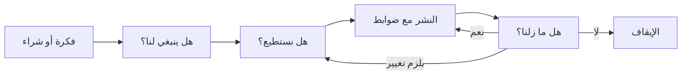
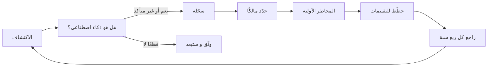

# الوحدة 0 — التوجيه

*قبل أي قانون أو إطار عمل أو نموذج، تحتاج إلى خريطة. تشرح هذه الوحدة ما هي حوكمة الذكاء الاصطناعي (AI governance) فعلًا (وما ليست هي)، وما الذي تختبره شهادة AIGP الصادرة عن IAPP وكيف تُبنى أسئلتها، وكيف تخطط لدراستك. ثم تقدّم بنك نجم (Najm Bank)، وهو البنك الخليجي الخيالي الذي ستتابعه في كل وحدة، وتنجز أول مهمة يقوم بها أي مسؤول عن حوكمة الذكاء الاصطناعي في يومه الأول: بناء سجل أنظمة الذكاء الاصطناعي (AI inventory) التي تستخدمها المؤسسة بالفعل. هذه الدورة مستقلة، وليست تابعة لـ IAPP ولا معتمدة منها. ولا شيء فيها يُعدّ استشارة قانونية: فالقوانين تتغير، والقرارات الحقيقية تحتاج إلى مستشار مؤهل في الولاية القضائية (jurisdiction) المعنية.*

> **التغطية ضمن مجال المعرفة (BoK coverage):** توجيه إلى المجالات الأربعة كلها في مجال المعرفة (Body of Knowledge) الخاص بـ AIGP الإصدار 2.1، مع نظرة أولى على I.A (لماذا يحتاج الذكاء الاصطناعي إلى الحوكمة) وعلى ممارسات السجل التي تُطوَّر في I.B وI.C وIV.

---

# 0.1 — ما هي حوكمة الذكاء الاصطناعي، وما الذي تثبته شهادة AIGP
*المستوى: 🟢 مبتدئ* · *المتطلبات: لا يوجد* · *مجال المعرفة (BoK): التوجيه (جميع المجالات)*

## ⚡ الدرس في دقيقة
- **حوكمة الذكاء الاصطناعي (AI governance)** هي منظومة الأشخاص والقواعد والعمليات والأدلة التي تستخدمها المؤسسة لتقرر أي ذكاء اصطناعي تبنيه أو تستخدمه، وبأي شروط، وكيف تُبقيه ضمن القانون وضمن قيمها وشهية المخاطر (risk appetite) لديها طوال مدة تشغيله.
- وهي ليست الشيء نفسه مثل أخلاقيات الذكاء الاصطناعي (AI ethics) (القيم)، ولا الامتثال (compliance) (الوفاء بواجبات قانونية محددة)، ولا إدارة المخاطر (risk management) (تحديد المخاطر ومعالجتها). الحوكمة هي الإطار الذي يجمع الثلاثة ويحدد المساءلة (accountability).
- القاعدة الأهم: **تبقى المساءلة على عاتق المؤسسة وأشخاص محددين بالاسم.** عبارة "الخوارزمية هي التي فعلت ذلك" ليست جوابًا أبدًا، لا أمام جهة رقابية ولا أمام محكمة ولا أمام عميل.
- شهادة **AIGP** (Artificial Intelligence Governance Professional) هي شهادة تصدرها IAPP. وهي تُظهر أنك تفهم كيف يعمل الذكاء الاصطناعي على مستوى الحوكمة، وأي القوانين وأطر العمل تنطبق عليه، وكيف تحكم الذكاء الاصطناعي عبر تطويره ونشره. ولا تجعلك محاميًا أو عالم بيانات.
- إشارة الامتحان: عندما يسأل سؤال عمّا يجب أن تفعله المؤسسة *أولًا*، فإن جواب الحوكمة يكون عادةً فهم النظام وسياقه ومخاطره (السجل، والتقييم، والملكية) قبل اختيار حل تقني.
- الفخ الأكبر: التعامل مع الحوكمة على أنها بوابة موافقة لمرة واحدة. إنها حلقة تعمل طوال عمر النظام.

## 🧭 لماذا يهم
في أول يوم اثنين لليلى بصفتها الرئيسة الجديدة لحوكمة الذكاء الاصطناعي في بنك نجم، يستوقفها الرئيس التنفيذي في الممر. يقول: "يريد مجلس الإدارة أن يعرف هل نحن ممتثلون للذكاء الاصطناعي. هل يمكنك إخبارهم بذلك قبل الاجتماع القادم؟" فتردّ ليلى بثلاثة أسئلة. كم عدد أنظمة الذكاء الاصطناعي التي يستخدمها البنك؟ من يملك كل واحد منها؟ وأيّها يتخذ قرارات بشأن العملاء أو الموظفين أو يؤثر فيها؟ لا أحد في الغرفة يستطيع الإجابة. فريق علم البيانات يعرف النماذج التي بناها. وإدارة المشتريات تعرف بعض العقود. وقسم الموارد البشرية اشترى أداة لفرز السير الذاتية. ومديرو العلاقات يلصقون البيانات المالية للعملاء في روبوت محادثة عام لصياغة مذكرات الائتمان. وفرع فرانكفورت يخدم عملاء في الاتحاد الأوروبي، لذلك قد تمتد القواعد الأوروبية إلى بعض هذه الأنظمة، كما أن الجهات الرقابية في بلد البنك الأم في الخليج تطرح أسئلتها الخاصة.

يتبيّن أن سؤال "هل نحن ممتثلون للذكاء الاصطناعي؟" هو السؤال الخطأ. فلا يوجد "قانون ذكاء اصطناعي" واحد للامتثال له. بل هناك شبكة من قوانين حماية البيانات، وقواعد مكافحة التمييز، وحماية المستهلك، والرقابة القطاعية، وقانون الذكاء الاصطناعي الأوروبي (EU AI Act) الجديد، وأطر عمل طوعية تتوقع الجهات الرقابية أن تعرفها البنوك. السؤال الصحيح هو: *هل نعرف ما لدينا من ذكاء اصطناعي، ومن المسؤول عنه، وما الذي قد يسوء، وهل ضوابطنا تعمل؟* هذه هي حوكمة الذكاء الاصطناعي.

وتكلفة عدم طرح هذا السؤال موثّقة جيدًا. ففي قضية *Moffatt v. Air Canada* (2024)، حمّلت محكمة كندية شركة الطيران المسؤولية عن معلومات خاطئة بشأن استرداد المبالغ قدّمها روبوت المحادثة على موقعها لأحد العملاء، ورفضت الحجة القائلة إن روبوت المحادثة مسؤول بطريقة ما عن تصريحاته. كان نشر روبوت المحادثة رخيصًا. لكن أحدًا لم يحكم ما يُسمح له بأن يَعِد به.

## 📐 كيف يعمل

### 🟢 الأساسيات

**تعريف عملي.** حوكمة الذكاء الاصطناعي هي الطريقة التي تتخذ بها المؤسسة قرارات جيدة بشأن الذكاء الاصطناعي وتحافظ عليها. ولها أربعة أجزاء:

| الجزء | السؤال الذي يجيب عنه | أمثلة في بنك |
|---|---|---|
| **التوجيه (Direction)** | ماذا نريد من الذكاء الاصطناعي أن يفعل، وما الذي لن نفعله به أبدًا؟ | مبادئ الذكاء الاصطناعي، والاستراتيجية، وبيان شهية المخاطر |
| **الهيكل (Structure)** | من يقرر، ومن يقوم بالعمل، ومن يتحقق؟ | لجنة حوكمة الذكاء الاصطناعي، ومالكو الأنظمة، ومسؤول حماية البيانات (DPO)، ومدققو النماذج |
| **العملية (Process)** | كيف تتحول الفكرة إلى نظام قيد التشغيل، وكيف يُحافَظ على سلامته؟ | استقبال حالات الاستخدام، وتصنيف المخاطر إلى مستويات، وتقييم الأثر، والموافقة، والرصد، والإيقاف والتقاعد |
| **الأدلة (Evidence)** | كيف نثبت ذلك لأنفسنا وللآخرين؟ | السجل، والتوثيق، ونتائج الاختبارات، والسجلات التشغيلية (logs)، وتقارير التدقيق |

**ما ليست هي.** يخلط الناس بين الحوكمة وأفكار قريبة منها. وهذه الفروق مهمة في الامتحان وفي الممارسة.

| المصطلح | معناه | علاقته بالحوكمة |
|---|---|---|
| **أخلاقيات الذكاء الاصطناعي (AI ethics)** | القيم والمبادئ الأخلاقية التي يجب أن يحترمها الذكاء الاصطناعي: العدالة، والكرامة، والاستقلالية، وتجنّب الضرر | الحوكمة تحوّل القيم إلى قرارات وضوابط قابلة للتنفيذ |
| **الذكاء الاصطناعي المسؤول (Responsible AI)** | تسمية شائعة في القطاع لبناء الذكاء الاصطناعي واستخدامه بما يتوافق مع تلك القيم | هو تقريبًا *الهدف*، والحوكمة هي *الآلية* |
| **الامتثال (Compliance)** | الوفاء بواجبات قانونية وتنظيمية محددة | أحد مخرجات الحوكمة، إذ يمكنك أن تكون ممتثلًا ومع ذلك تؤذي الناس أو تهدر المال |
| **إدارة المخاطر (Risk management)** | تحديد المخاطر وتحليلها ومعالجتها ورصدها | عملية أساسية *داخل* الحوكمة |
| **إدارة مخاطر النماذج (Model risk management)** | التخصص الذي تستخدمه البنوك بالفعل للتحقق من النماذج الكمية ورصدها | نقطة انطلاق قوية لحوكمة الذكاء الاصطناعي، لكنها أضيق: فنادرًا ما تغطي روبوتات المحادثة القائمة على الذكاء الاصطناعي التوليدي (GenAI)، أو الأدوات المشتراة، أو استخدام الموظفين |

**ثلاثة أسئلة تُطرح مرة بعد مرة.** طريقة بسيطة لتذكّر ما تفعله الحوكمة عبر عمر النظام:

1. **هل ينبغي لنا؟** هل هذا استخدام جيد للذكاء الاصطناعي أصلًا، بالنظر إلى الغرض، والأشخاص المتأثرين، والبدائل؟
2. **هل نستطيع؟** هل هو مشروع قانونًا، وهل نستطيع بناءه أو شراءه وفق معيار يمكننا الدفاع عنه؟
3. **هل ما زلنا؟** بعد التشغيل، هل ما زال يؤدي جيدًا، وما زال عادلًا، وما زال مشروعًا، وما زال مرغوبًا فيه؟

**المساءلة.** يحتاج كل نظام ذكاء اصطناعي إلى مالك بشري محدد بالاسم يُسأل عنه. ولا يلزم أن يفهم المالك الرياضيات، لكن يجب أن يفهم الغرض من النظام، وما الخطأ الذي قد يقع فيه، وما الضوابط الموجودة. فالجهات الرقابية والمحاكم تبحث عن شخص وعملية، لا عن نموذج.

### 🟡 التعمق أكثر

**أين تقع الحوكمة في المؤسسة.** حوكمة الذكاء الاصطناعي ليست جزيرة جديدة. بل تتصل بهياكل موجودة لدى معظم المؤسسات:

- **حوكمة الشركات (Corporate governance).** يحدد مجلس الإدارة التوجه وشهية المخاطر ويشرف على الإدارة التنفيذية. ويقدّم ISO/IEC 38507 لمجالس الإدارة إرشادات حول آثار استخدام الذكاء الاصطناعي على الحوكمة.
- **نموذج الخطوط الثلاثة (three lines model).** الخط الأول (فرق الأعمال والتقنية) يملك أنظمة الذكاء الاصطناعي ويشغّلها ويملك مخاطرها. والخط الثاني (المخاطر، والامتثال، والخصوصية، وحوكمة الذكاء الاصطناعي) يضع السياسات ويراجع الخط الأول ويتحدّاه. والخط الثالث (التدقيق الداخلي) يقدّم ضمانًا مستقلًا. تقع ليلى في الخط الثاني، أما خالد، الذي يملك الإقراض للأفراد، فهو في الخط الأول.
- **التخصصات القائمة.** الخصوصية، وأمن المعلومات، ومخاطر النماذج، والمشتريات، والشؤون القانونية، والموارد البشرية، والتدقيق الداخلي، كلها تملك جزءًا من الإجابة. وحوكمة الذكاء الاصطناعي الجيدة تعيد استخدام عملياتها وتضيف ما هو خاص بالذكاء الاصطناعي، بدلًا من بناء بيروقراطية موازية.

**الملزم والطوعي.** جزء كبير من حوكمة الذكاء الاصطناعي يتعلق بمعرفة وضع كل أداة. وهناك أربع طبقات:

| الطبقة | الوضع | أمثلة ستقابلها في هذه الدورة |
|---|---|---|
| **القانون الملزم (Hard law)** | ملزم، وتنفّذه الجهات الرقابية والمحاكم | EU AI Act، وGDPR، وقانون حماية البيانات الشخصية القطري PDPPL، وقانون حماية البيانات الشخصية الإماراتي PDPL، وقوانين مكافحة التمييز وحماية المستهلك |
| **الإرشادات التنظيمية (Regulatory guidance)** | ليست قانونًا، لكن الجهات الرقابية تتوقع منك اتباعها | إرشادات مصرف قطر المركزي بشأن الذكاء الاصطناعي للمؤسسات المالية، وآراء EDPB، وإرشادات المفوضية الأوروبية |
| **المعايير وأطر العمل (Standards and frameworks)** | طوعية ما لم يجعلها قانون أو عقد إلزامية، وبعضها قابل للاعتماد بشهادة | NIST AI RMF، وISO/IEC 42001، وISO/IEC 23894 |
| **المبادئ (Principles)** | التزامات سياسية عالية المستوى | OECD AI Principles، وتوصية UNESCO بشأن أخلاقيات الذكاء الاصطناعي |
| **السياسة الداخلية (Internal policy)** | ملزمة لموظفي المؤسسة نفسها | سياسة الذكاء الاصطناعي في بنك نجم، وقواعد الاستخدام المقبول للذكاء الاصطناعي التوليدي |

ويمكن لإطار طوعي أن يكون له أثر فعلي. فقد تعامله جهة رقابية على أنه المرجع للممارسة المعقولة، وقد يشترطه عقد، والحصول على شهادة (مثل ISO/IEC 42001) هو إعلان علني يجب عليك بعد ذلك أن تكون على مستواه.

**الحوكمة عبر دورة الحياة (life cycle).** يقسم مجال المعرفة الخاص بـ AIGP العمل إلى حوكمة **التطوير (development)** (التصميم، والبيانات، والبناء، والاختبار، والإطلاق، والرصد) وحوكمة **النشر والاستخدام (deployment and use)** (قرار النشر، والتقييم، والتشغيل). وسيقوم بنك نجم بالأمرين: فهو يبني نموذجه الخاص لتقييم الجدارة الائتمانية ويشتري أداة لفرز السير الذاتية. وكثير من المؤسسات *تشتري* في الغالب، ولهذا يحمل جانب المُشغِّل (deployer) في الامتحان وزنًا مساويًا لجانب المطوّر (developer).

### 🔴 نظرة الخبير

**الحوكمة بوصفها نظام إدارة (management system).** تتعامل البرامج الناضجة مع حوكمة الذكاء الاصطناعي مثل أي نظام إدارة آخر: خطّط (ضع السياسة والأهداف ومعايير المخاطر)، ونفّذ (شغّل العمليات)، وتحقّق (ارصد ودقّق وقِس)، وحسّن (طوّر). وقد بُني ISO/IEC 42001 على دورة خطّط-نفّذ-تحقّق-صحّح (Plan-Do-Check-Act) هذه تحديدًا، ويمكن اعتماده بشهادة من جهة معتمدة. وقيمة النظر إليها كنظام إدارة أنها تفرض التكرار: فالمؤسسة لا توافق على الذكاء الاصطناعي فحسب، بل تواصل التحقق مما إذا كانت موافقاتها صحيحة.

**التناسب هو جوهر اللعبة.** قد يملك بنك خمسين نظام ذكاء اصطناعي. وحوكمة مرشّح الرسائل غير المرغوب فيها مثل نموذج تقييم الجدارة الائتمانية تهدر الجهد وتعلّم الموظفين أن الحوكمة مجرد مسرحية. أما حوكمة نموذج تقييم الجدارة الائتمانية مثل مرشّح الرسائل غير المرغوب فيها فتسبب الضرر وتخالف القانون. المهارة الأساسية هي *التصنيف القائم على المخاطر (risk-based tiering)*: ضوابط خفيفة للاستخدامات منخفضة المخاطر، وضوابط مشددة للاستخدامات عالية المخاطر (high-risk)، وقائمة واضحة بالاستخدامات التي لن تسعى إليها المؤسسة. ويقوم كل من EU AI Act وNIST AI RMF وISO/IEC 42001 على هذه الفكرة.

**الحوكمة تُمكّن، ولا تمنع فقط.** تلتفّ الفرق حول الحوكمة البطيئة والغامضة، وتُشركها مبكرًا عندما تكون سريعة ويمكن التنبؤ بها. وأفضل البرامج تنشر مسارات استقبال واضحة، وأنماطًا معتمدة مسبقًا (مثل "التلخيص الداخلي بأدوات ذكاء اصطناعي توليدي معتمدة، دون بيانات عملاء")، ومستويات خدمة للمراجعات. هدف ليلى ليس أن تقول "لا" أكثر. بل أن تجعل "نعم، بهذه الشروط" هي المسار السهل.

**ما الذي تثبته شهادة AIGP.** أنشأت IAPP شهادة AIGP، وهي هيئة عضوية عالمية لمهنيي الخصوصية وحوكمة الذكاء الاصطناعي، وتدير أيضًا شهادات الخصوصية CIPP وCIPM وCIPT. واجتياز AIGP يُظهر أنك تستطيع:

- شرح ماهية أنظمة الذكاء الاصطناعي، وكيف تفشل، ولماذا يخلق ذلك احتياجات للحوكمة (المجال I)؛
- إدراك كيف تنطبق القوانين القائمة والجديدة، والمعايير وأطر العمل الرئيسية، على الذكاء الاصطناعي (المجال II)؛
- حوكمة الذكاء الاصطناعي عبر التصميم والبيانات والاختبار والإطلاق والرصد (المجال III)؛
- حوكمة قرار نشر الذكاء الاصطناعي، والتقييمات التي يحتاجها، واستخدامه المستمر (المجال IV).

إنها شهادة اتساع. فهي تثبت أنك تستطيع الجلوس في غرفة مع المحامين والمهندسين ومديري المخاطر والتنفيذيين وربط مخاوفهم في قرار يمكن الدفاع عنه. ولا تثبت أنك تستطيع تدريب نموذج أو تقديم استشارة قانونية، ومهنيو حوكمة الذكاء الاصطناعي الجيدون يعرفون متى يستعينون بمن يستطيع ذلك. وللشهادة أيضًا متطلبات صيانة: إذ تشترط IAPP التعليم المهني المستمر للحفاظ على سريان الشهادة، لذا راجع قواعد الصيانة الحالية على iapp.org.

**كيف بُنيت هذه الدورة.** ثلاث عشرة وحدة تنقلك من التوجيه (الوحدة 0) عبر المجالات الأربعة لمجال المعرفة (الوحدات 1–11) إلى مشروع ختامي وامتحان تجريبي كامل من 100 سؤال (الوحدة 12). ويتبع كل درس الشكل نفسه: نسخة الستين ثانية، ولماذا يهم، وكيف يعمل على ثلاثة مستويات من العمق (🟢 🟡 🔴)، والأدوات التنظيمية، ووثيقة من بنك نجم، والتمارين، والفخاخ، والخلاصة، وخمسة أسئلة بأسلوب الامتحان، والمراجع الرسمية. ويمكنك قراءة طبقات 🟢 فقط في المرور الأول ثم العودة من أجل العمق.

## ⚖️ الأدوات التنظيمية
| الأداة | ما تشترطه أو توصي به | إشارة الامتحان |
|---|---|---|
| **EU AI Act** — المادة 4 (Art. 4) | يجب على مقدّمي الأنظمة (providers) والمُشغِّلين اتخاذ تدابير لضمان مستوى كافٍ من الإلمام بالذكاء الاصطناعي (AI literacy) لدى الموظفين الذين يتعاملون مع أنظمة الذكاء الاصطناعي، ويسري ذلك اعتبارًا من 2 فبراير 2025 | الإلمام بالذكاء الاصطناعي واجب قانوني في الاتحاد الأوروبي وليس مجرد ممارسة جيدة، وهو ينطبق على المُشغِّلين أيضًا |
| **NIST AI RMF** — وظيفة الحوكمة (Govern function) | إطار أمريكي طوعي، والحوكمة (Govern) هي الوظيفة الشاملة التي تحدد الثقافة والسياسات والأدوار والمساءلة للوظائف الثلاث الأخرى (Map، وMeasure، وManage) | الحوكمة تمتد عبر دورة الحياة كلها، وليست خطوة تنتهي منها |
| **ISO/IEC 42001** | معيار لنظام إدارة الذكاء الاصطناعي (AIMS) قابل للاعتماد بشهادة، ومبني على خطّط-نفّذ-تحقّق-صحّح، مع ضوابط الملحق A | عبارات "نظام إدارة" و"شهادة" و"التحسين المستمر" تشير إلى هنا |
| **ISO/IEC 38507** | إرشادات لهيئات الحوكمة (مجالس الإدارة) حول آثار استخدام الذكاء الاصطناعي على الحوكمة | أسئلة الإشراف على مستوى مجلس الإدارة |
| **OECD AI Principles** | مبادئ حكومية دولية (2019، وحُدّثت في 2024)، ومنها مساءلة الجهات الفاعلة في مجال الذكاء الاصطناعي | المبادئ عالية المستوى وغير ملزمة، والمساءلة واحدة منها |

## 🏛️ عمليًا في بنك نجم
أول وثيقة تعدّها ليلى هي **ميثاق حوكمة الذكاء الاصطناعي (AI Governance Charter)** من صفحة واحدة، تعتمده لجنة المخاطر التابعة لمجلس الإدارة. لا يحل الميثاق أي مشكلة بعد، لكنه يمنح الصلاحية لحلها.

| البند | النص (مسودة v0.1) |
|---|---|
| **الغرض** | ضمان أن يطوّر بنك نجم الذكاء الاصطناعي ويشتريه ويستخدمه بطريقة مشروعة وعادلة وآمنة ومتوافقة مع شهية المخاطر لديه، وأن يكون قادرًا على إثبات ذلك للجهات الرقابية والعملاء والموظفين. |
| **النطاق** | جميع أنظمة الذكاء الاصطناعي التي تُطوَّر أو تُشترى أو تكون مدمجة في منتجات أطراف ثالثة أو يستخدمها الموظفون لأعمال بنك نجم، في كل ولاية قضائية يعمل فيها البنك (قطر، والإمارات، والاتحاد الأوروبي). ويتبع مصطلح "نظام الذكاء الاصطناعي" التعريف الوارد في سياسة الذكاء الاصطناعي (المتوافق مع تعريفي OECD وEU AI Act). |
| **المساءلة** | لكل نظام ذكاء اصطناعي مالك أعمال (Business Owner) محدد بالاسم (الخط الأول) يُساءَل عن استخدامه ونتائجه. ويضع رئيس حوكمة الذكاء الاصطناعي السياسة ويقدّم المراجعة والتحدي (الخط الثاني). ويقدّم التدقيق الداخلي ضمانًا مستقلًا (الخط الثالث). |
| **اللجنة** | لجنة حوكمة الذكاء الاصطناعي، برئاسة كبير مسؤولي المخاطر (CRO)، وتضم كبير مسؤولي البيانات (CDO) (عمر)، ومسؤولة حماية البيانات (DPO) (سارة)، ورئيسة حوكمة الذكاء الاصطناعي (ليلى)، وكبير مسؤولي أمن المعلومات (CISO)، والشؤون القانونية، والموارد البشرية، وممثلين عن الأعمال. وهي تعتمد حالات الاستخدام عالية المخاطر والاستثناءات من السياسة. |
| **قرارات محجوزة لمجلس الإدارة** | شهية المخاطر المتعلقة بالذكاء الاصطناعي، وأي استخدام للذكاء الاصطناعي تصنّفه السياسة محظورًا، والمراجعة السنوية لبرنامج الذكاء الاصطناعي. |
| **أول 90 يومًا** | (1) سجل أنظمة الذكاء الاصطناعي. (2) قاعدة مؤقتة للاستخدام المقبول لأدوات الذكاء الاصطناعي التوليدي العامة. (3) سياسة الذكاء الاصطناعي ومنهجية تصنيف المخاطر إلى مستويات. (4) خطة الإلمام بالذكاء الاصطناعي لجميع الموظفين. |
| **المراجعة** | سنويًا، أو بعد حادث مهم، أو تغيير قانوني، أو فئة جديدة من استخدامات الذكاء الاصطناعي. |

## 🛠️ التمارين
- 🟢 **عرّفها بكلماتك.** اكتب تعريفًا من جملتين لحوكمة الذكاء الاصطناعي لمؤسستك (أو لبنك نجم)، ثم اذكر مثالًا واحدًا لكل من التوجيه والهيكل والعملية والأدلة. *يكتمل عندما:* يكون لكل جزء من الأجزاء الأربعة مثال ملموس، لا تسمية عامة.
- 🟡 **ارسم الخطوط الثلاثة.** بالنسبة إلى نموذج تقييم الجدارة الائتمانية في بنك نجم، سمِّ من يقع في الخط الأول والثاني والثالث، واكتب جملة واحدة عمّا يفعله كل منهم لهذا النموذج. *يكتمل عندما:* لا يقوم أي خط بعمل خط آخر (مثلًا، لا يشغّل الخط الثاني النموذج).
- 🔴 **صنّف الأدوات.** خذ الأدوات الخمس في الجدول أعلاه بالإضافة إلى GDPR وسياسة الذكاء الاصطناعي الداخلية في بنك نجم. صنّف كلًا منها على أنها قانون ملزم، أو إرشادات، أو معيار أو إطار عمل، أو مبدأ، أو سياسة داخلية، واكتب جملة واحدة عن الطريقة التي يمكن بها لأداة "طوعية" أن تصبح إلزامية فعليًا لبنك نجم. *يكتمل عندما:* يكون لديك طريقان مختلفان على الأقل تصبح بهما الأداة الطوعية ملزمة عمليًا.

## ⚠️ أخطاء وفخاخ الامتحان
- **فخ: "حوكمة الذكاء الاصطناعي = أخلاقيات الذكاء الاصطناعي".** الأخلاقيات توفّر القيم، والحوكمة هي الآلية الخاضعة للمساءلة. في الأسئلة، فضّل الإجابات التي تحدد الملكية وتضع العملية وتنشئ الأدلة على الإجابات التي تكتفي بذكر القيم.
- **فخ: "اشتريناه، إذن المورّد هو المسؤول".** شراء الذكاء الاصطناعي ينقل بعض الواجبات إلى مقدّم النظام، لكنه لا يُسقط أبدًا مساءلة المُشغِّل نفسه عن طريقة استخدامه. ابحث عن الإجابة التي تُبقي المساءلة على المؤسسة.
- **فخ: القفز إلى حل تقني.** عندما يسأل السؤال عمّا يجب فعله *أولًا*، تكون الإجابة الصحيحة عادةً فهم النظام ومخاطره (السجل، والمالك، والتقييم)، لا إعادة التدريب أو إضافة مرشّح أو شراء أداة.
- **فخ: التعامل مع إطار عمل على أنه قانون.** إن NIST AI RMF وISO/IEC 42001 طوعيان. أما EU AI Act وGDPR فملزمان. والخلط بينهما مُشتِّت كلاسيكي.
- **فخ: الموافقة لمرة واحدة.** تستمر الحوكمة بعد الإطلاق. والإجابات التي تتضمن الرصد والمراجعة تتفوق على الإجابات التي تتوقف عند التوقيع بالموافقة.

## 🧾 الخلاصة
- حوكمة الذكاء الاصطناعي هي التوجيه والهيكل والعملية والأدلة للذكاء الاصطناعي، مطبّقة بتناسب عبر دورة الحياة كلها.
- وهي تحتوي الأخلاقيات والامتثال وإدارة المخاطر، لكنها ليست مطابقة لأي منها.
- تقع المساءلة على المؤسسة والمالكين المحددين بالاسم، ولا يمكن تفويضها إلى نموذج أو مورّد.
- تتدرج الأدوات من القانون الملزم إلى الإرشادات والمعايير والمبادئ والسياسة الداخلية، فاعرف أيّها ما هو.
- شهادة AIGP شهادة اتساع عبر أربعة مجالات: الأسس، والقانون وأطر العمل، وحوكمة التطوير، وحوكمة النشر والاستخدام.

## ✍️ اختبر نفسك

**1. أي عبارة تصف حوكمة الذكاء الاصطناعي على أفضل وجه؟**

- A. مجموعة القيم الأخلاقية التي تنشرها المؤسسة بشأن الذكاء الاصطناعي
- B. مراجعة الفريق القانوني لعقود الذكاء الاصطناعي
- C. الأشخاص والقواعد والعمليات والأدلة التي تستخدمها المؤسسة لتوجيه الذكاء الاصطناعي والتحكم فيه عبر دورة حياته
- D. عملية التحقق من النماذج لدى فريق علم البيانات

الإجابة

**C.** الحوكمة هي المنظومة الخاضعة للمساءلة بأكملها. يصف A الأخلاقيات (قيم بلا آلية)، أما B وD فهما عمليتان منفردتان تقعان داخل الحوكمة. (انظر 🟢 الأساسيات.)

**2. يسأل الرئيس التنفيذي لبنك نجم ليلى عمّا إذا كان البنك "ممتثلًا للذكاء الاصطناعي". ماذا يجب أن تفعل ليلى أولًا؟**

- A. شراء أداة برمجية للامتثال في مجال الذكاء الاصطناعي
- B. تحديد أنظمة الذكاء الاصطناعي التي يستخدمها البنك، ومن يملكها، وفيمَ تُستخدم
- C. الطلب من فريق علم البيانات إعادة تدريب جميع النماذج من أجل العدالة
- D. إخبار مجلس الإدارة بأن البنك ممتثل لأنه لا يوجد قانون قطري يحظر الذكاء الاصطناعي

الإجابة

**B.** لا يمكنك حوكمة ما لا تراه، والسجل الذي يتضمن المالكين والأغراض هو أساس كل تقييم لاحق. يقفز A وC إلى الحلول قبل فهم المشكلة، ويفترض D خطأً وجود "قانون ذكاء اصطناعي" واحد ويتجاهل القوانين الأخرى المنطبقة وفرع الاتحاد الأوروبي. (انظر 🧭 لماذا يهم.)

**3. في نموذج الخطوط الثلاثة، أين تقع عادةً رئيسة حوكمة الذكاء الاصطناعي في بنك نجم؟**

- A. الخط الثاني، حيث تضع السياسة وتراجع الأعمال وتتحداها
- B. الخط الأول، لأنها تملك أنظمة الذكاء الاصطناعي
- C. الخط الثالث، حيث تقدّم ضمانًا مستقلًا لمجلس الإدارة
- D. خارج النموذج، لأن الذكاء الاصطناعي موضوع تقني

الإجابة

**A.** حوكمة الذكاء الاصطناعي عادةً وظيفة من الخط الثاني تضع السياسة وتقدّم المراجعة والتحدي. ومالكو الأنظمة مثل خالد في الخط الأول، والتدقيق الداخلي في الخط الثالث. (انظر 🟡 التعمق أكثر.)

**4. أيّ مما يلي أداة قانونية ملزمة وليس إطار عمل طوعيًا؟**

- A. إطار NIST لإدارة مخاطر الذكاء الاصطناعي (NIST AI Risk Management Framework)
- B. ISO/IEC 42001
- C. OECD AI Principles
- D. EU AI Act

الإجابة

**D.** قانون EU AI Act لائحة ذات قوة قانونية. أما NIST AI RMF وISO/IEC 42001 فطوعيان (42001 قابل للاعتماد بشهادة، لكن الحصول على الشهادة يظل اختيارًا)، ومبادئ OECD التزامات سياسية غير ملزمة. (انظر جدول الملزم والطوعي في 🟡.)

**5. ينشر متجر تجزئة روبوت محادثة على موقعه اشتراه من مورّد. يخبر الروبوت أحد العملاء بأنه يستحق استردادًا لا يستحقه. استنادًا إلى المنطق الوارد في *Moffatt v. Air Canada*، من الأرجح أن يُحمَّل المسؤولية أمام العميل؟**

- A. روبوت المحادثة نفسه، بوصفه مصدر التصريح
- B. المورّد وحده، لأنه بنى روبوت المحادثة
- C. متجر التجزئة الذي نشر روبوت المحادثة على موقعه
- D. لا أحد، لأن المخرجات وُلّدت آليًا

الإجابة

**C.** في قضية *Moffatt*، حمّلت المحكمة شركة الطيران المسؤولية عن المعلومات الموجودة على موقعها، بما في ذلك إجابات روبوت المحادثة. وقد يكون المورّد مدينًا للمُشغِّل بشيء بموجب العقد، لكن ذلك لا يُسقط مسؤولية المُشغِّل تجاه عميله. (انظر 🧭 لماذا يهم.)

## 📚 المراجع
- IAPP، شهادة محترف حوكمة الذكاء الاصطناعي (AIGP) ومجال المعرفة: https://iapp.org/certify/aigp/
- اللائحة (الاتحاد الأوروبي) 2024/1689 (EU AI Act): https://eur-lex.europa.eu/eli/reg/2024/1689/oj
- إطار NIST لإدارة مخاطر الذكاء الاصطناعي (NIST AI Risk Management Framework): https://www.nist.gov/itl/ai-risk-management-framework
- ISO/IEC 42001 وISO/IEC 38507، عبر فهرس ISO: https://www.iso.org/
- OECD AI Principles: https://oecd.ai/en/ai-principles

---

# 0.2 — كيف يفكّر الامتحان: مجال المعرفة الإصدار 2.1، وأنماط الأسئلة، وخطة للدراسة
*المستوى: 🟢 مبتدئ* · *المتطلبات: 0.1* · *مجال المعرفة (BoK): التوجيه (جميع المجالات)*

## ⚡ الدرس في دقيقة
- في وقت كتابة هذه الدورة (2026)، يتكون امتحان AIGP من **100 سؤال اختيار من متعدد (multiple-choice)** (85 سؤالًا محتسبًا، و15 سؤالًا تجريبيًا غير محتسب (unscored pilot questions) لا يمكنك تمييزها)، ومدته **ساعتان و45 دقيقة**، ويُقيَّم على **مقياس من 100 إلى 500، والنجاح عند 300**.
- وهو يتبع **مجال المعرفة (Body of Knowledge) الخاص بـ AIGP الإصدار 2.1** (الساري من 2 فبراير 2026): أربعة مجالات (domains)، وثلاث عشرة كفاءة (competencies)، ونطاق منشور لعدد الأسئلة في كل مجال.
- يحمل المجالان III وIV (حوكمة التطوير؛ حوكمة النشر والاستخدام) معًا نحو نصف الأسئلة المحتسبة. والقانون وأطر العمل (المجال II) كتلة كبيرة، لكن الامتحان ليس امتحانًا في القانون.
- كثير من الأسئلة **سيناريوهات (scenarios)**: قصة قصيرة عن مؤسسة يتبعها سؤال أو أكثر يسأل عمّا هو الأفضل (BEST)، أو أولًا (FIRST)، أو الأرجح (MOST likely)، أو الأهم (MOST important).
- يكافئ الامتحان عقلية الحوكمة: افهم السياق، وحدّد الأدوار والمخاطر، واتّبع عملية متناسبة، وأبقِ البشر خاضعين للمساءلة.
- الفخ الأكبر: اختيار عبارة *صحيحة* بدلًا من *أفضل* إجابة عن السؤال المطروح فعلًا.

## 🧭 لماذا يهم
يتفق عمر، كبير مسؤولي البيانات في بنك نجم (Najm Bank)، وسارة، مسؤولة حماية البيانات (DPO)، على التقدم لامتحان AIGP في الربع نفسه. يعرف عمر تعلّم الآلة (machine learning) معرفة عميقة، وتعرف سارة GDPR وقانون حماية البيانات القطري مادةً مادة. وتتوقع ليلى، التي تحمل الشهادة بالفعل، أن يجده كلاهما أصعب مما يتوقعان، ولأسباب متعاكسة. سيختار عمر الإجابة الذكية تقنيًا عندما يريد السؤال خطوة من خطوات الحوكمة. وستختار سارة الإجابة الدقيقة قانونيًا عندما يكون السؤال في الحقيقة عن من يجب أن يقرر وبأي ترتيب.

معرفة طريقة بناء الامتحان تغيّر طريقة دراستك. فهي تخبرك أين توجد الدرجات، وما نوع التفكير الذي يريده كل سؤال، وكيف توزّع أسابيعك. يقدّم لك هذا الدرس تلك الخريطة وخطتين للدراسة تربطان كل أسبوع بوحدات هذه الدورة.

## 📐 كيف يعمل

### 🟢 الأساسيات

**الشكل في لمحة** (في وقت كتابة هذه الدورة، 2026، وراجع دائمًا دليل المرشح (candidate handbook) الحالي على iapp.org قبل الحجز):

| البند | التفاصيل |
|---|---|
| الأسئلة | 100 سؤال اختيار من متعدد: 85 محتسبًا، و15 سؤالًا تجريبيًا غير محتسب ممزوجة بينها |
| الوقت | ساعتان و45 دقيقة (165 دقيقة)، أي نحو 1.6 دقيقة لكل سؤال |
| التقييم | درجة موزونة (scaled score) من 100 إلى 500، و300 درجة النجاح |
| نمط السؤال | أربعة خيارات وإجابة واحدة هي الأفضل، وكثير منها ضمن سيناريوهات قصيرة |
| الأساس | مجال المعرفة الخاص بـ AIGP الإصدار 2.1، الساري من 2 فبراير 2026 |

**المجالات الأربعة وأوزانها.** تنشر IAPP حدًا أدنى وحدًا أقصى لعدد الأسئلة في كل مجال. ومجموع نقاط المنتصف يساوي 85 سؤالًا محتسبًا.

| المجال | ما يغطيه | الأسئلة (النطاق) | وحدات الدورة |
|---|---|---|---|
| **I** أسس حوكمة الذكاء الاصطناعي | ما هو الذكاء الاصطناعي، ولماذا يحتاج إلى الحوكمة، والأدوار والتدريب في المؤسسة، والسياسات عبر دورة الحياة | 16–20 | 1، 2، 3 |
| **II** كيف تنطبق القوانين والمعايير وأطر العمل على الذكاء الاصطناعي | قانون الخصوصية، والقوانين القائمة الأخرى، وEU AI Act، والمعايير وأطر العمل | 19–23 | 4، 5، 6، 7 |
| **III** كيف تُحكَم عملية تطوير الذكاء الاصطناعي | التصميم والبناء، وبيانات التدريب والاختبار، والإطلاق، والرصد والصيانة | 21–25 | 8، 9، 10 |
| **IV** كيف يُحكَم نشر الذكاء الاصطناعي واستخدامه | قرار النشر، وتقييم النظام، وحوكمة الاستخدام المستمر | 21–25 | 11 |

توجّهك الوحدة 0، وتجمع الوحدة 12 كل شيء معًا بمشروع ختامي واستراتيجية للامتحان وامتحان تجريبي كامل.

**الكفاءات الثلاث عشرة.** ينقسم كل مجال إلى كفاءات. سترى هذه المعرّفات في أعلى كل درس ("BoK: …"). والعناوين أدناه صياغة هذه الدورة لها.

| المعرّف | الكفاءة (صياغة الدورة) | موضعها في هذه الدورة |
|---|---|---|
| I.A | ما هو الذكاء الاصطناعي ولماذا يحتاج إلى الحوكمة | الوحدة 1 |
| I.B | تحديد توقعات المؤسسة وإيصالها: الأدوار، والمسؤوليات، والتدريب | الوحدة 2 |
| I.C | السياسات والإجراءات عبر دورة حياة الذكاء الاصطناعي، بما فيها حوكمة البيانات والملكية الفكرية (IP) ومخاطر الأطراف الثالثة | الوحدة 3 |
| II.A | كيف تنطبق قوانين خصوصية البيانات القائمة على الذكاء الاصطناعي | الوحدة 4 |
| II.B | كيف تنطبق القوانين القائمة الأخرى: عدم التمييز، والملكية الفكرية، وحماية المستهلك، والمسؤولية عن المنتجات | الوحدة 5 |
| II.C | العناصر الرئيسية في EU AI Act | الوحدة 6 |
| II.D | المعايير وأطر العمل الرئيسية في القطاع | الوحدة 7 |
| III.A | حوكمة تصميم نظام الذكاء الاصطناعي وبنائه | الوحدة 8 |
| III.B | حوكمة جمع البيانات واستخدامها للتدريب والاختبار | الوحدة 9 |
| III.C | حوكمة الإطلاق والرصد والصيانة | الوحدة 10 |
| IV.A | تقييم العوامل والمخاطر الرئيسية قبل اتخاذ قرار النشر | الوحدة 11 (11.1، 11.2) |
| IV.B | إجراء التقييمات الرئيسية لنظام الذكاء الاصطناعي | الوحدة 11 (11.3) |
| IV.C | حوكمة النشر والاستخدام | الوحدة 11 (11.4) |

**ما الذي تغيّر في الإصدار 2.1.** أوضح تغيير هو في الصياغة: صار المجالان III وIV يتحدثان عن حوكمة **نظام الذكاء الاصطناعي (AI system)** بدلًا من **نموذج الذكاء الاصطناعي (AI model)**. فالنموذج هو المكوّن الرياضي المدرَّب، أما النظام فهو النموذج مضافًا إليه خطوط معالجة البيانات (data pipelines)، وواجهة المستخدم، والمراجعون البشريون، والتكاملات، وسياق الاستخدام. ويتوقع الامتحان منك أن تحكم النظام كله، لأن الضرر يقع هناك فعلًا. (يشرح الدرس 1.1 الفرق بالتفصيل.)

### 🟡 التعمق أكثر

**تشريح السؤال.** لكل بند *جذع* (stem) (السؤال)، وأحيانًا *سيناريو* (القصة التي يقع فيها)، و*مفتاح* (key) واحد (الإجابة الأفضل)، وثلاثة *مشتِّتات* (distractors). والمشتِّتات الجيدة ليست سخيفة. وعادةً:

- يكون أحدها **صحيحًا لكنه غير ذي صلة**: حقيقة صحيحة لا تجيب عن هذا السؤال؛
- ويكون أحدها **إجراءً صحيحًا في وقت خاطئ**: شيئًا ستفعله، لكن في وقت لاحق (أو سابق) لما يسأل عنه السؤال؛
- ويكون أحدها **متطرفًا أكثر من اللازم**: حظر النظام، أو عدم فعل شيء، في حين توجد خطوة متناسبة؛
- أما المفتاح فهو الإجابة **الأكثر اكتمالًا، والأكثر تناسبًا، والتي تبدأ بالحوكمة**.

**الكلمات الدالة.** اقرأ السطر الأخير من الجذع مرتين وضع خطًا تحت المُحدِّد:

| المُحدِّد | ما يسأل عنه فعلًا |
|---|---|
| FIRST / INITIAL (أولًا / في البداية) | أول خطوة صحيحة في عملية معقولة. وعادةً: الفهم، وتحديد النطاق، وتحديد الأدوار، والتقييم. |
| BEST / MOST appropriate (الأفضل / الأنسب) | قد تكون عدة خيارات مقبولة، فاختر الخيار الذي يعالج أصل المشكلة بتناسب. |
| MOST likely (الأرجح) | حكم على الاحتمال: ما الذي ستخلص إليه على الأرجح جهة رقابية أو محكمة أو ممارس معقول؟ |
| PRIMARY / MAIN purpose (الغرض الأساسي / الرئيسي) | السبب الجوهري لوجود الشيء، لا فائدة جانبية. |
| NOT / EXCEPT (ليس / باستثناء) (إن استُخدما) | اعكس المنطق: ثلاثة خيارات صحيحة، فابحث عن الخيار المختلف. اقرأ ببطء. |

**كيف تُبنى السيناريوهات.** السيناريو سرد قصير عن مؤسسة خيالية: قطاعها، وأين تعمل، وما الذكاء الاصطناعي الذي تبنيه أو تشتريه، ومن المعنيون، وما الذي حدث. ثم تختبر الأسئلة ما إذا كنت تستطيع استخلاص الحقائق الصحيحة منه. وعندما تقرأ سيناريو، استخرج خمسة أشياء قبل النظر إلى الخيارات:

1. **الولاية القضائية (Jurisdiction).** أين توجد المؤسسة والمستخدمون والأشخاص المتأثرون؟ (الوجود في الاتحاد الأوروبي قد يُدخل GDPR وEU AI Act.)
2. **الدور (Role).** هل تبني المؤسسة الذكاء الاصطناعي (مقدّم النظام (provider) أو المطوّر (developer)) أم تستخدم نظامًا لجهة أخرى (المُشغِّل (deployer))؟ الأدوار تحدد الواجبات.
3. **الاستخدام والأثر (Use and impact).** ما القرار أو المخرج الذي ينتجه النظام، وبشأن من؟ الائتمان، والوظائف، والصحة، والتعليم، والخدمات العامة استخدامات عالية الأثر.
4. **مرحلة دورة الحياة (Life-cycle stage).** هل هذا تصميم، أم جمع بيانات، أم اختبار، أم إطلاق، أم تشغيل فعلي، أم إيقاف وتقاعد؟
5. **المشكلة الفعلية.** هل اكتُشف تحيّز (bias)؟ هل وردت شكوى؟ هل يرفض المورّد تقديم الوثائق؟ هل يعاني النموذج من الانجراف (drift)؟

**مثال محلول (كُتب لهذه الدورة، وليس مأخوذًا من الامتحان).**

> *شركة لوجستيات مقرها ألمانيا تشتري أداة ذكاء اصطناعي ترتّب المتقدمين لوظائف المستودعات. يريد قسم الموارد البشرية التشغيل الفعلي الشهر القادم. يقول المورّد إن الأداة "خالية من التحيّز" لكنه لن يشارك أي نتائج اختبار. ماذا يجب أن تفعل الشركة أولًا؟*
> A. التشغيل الفعلي ورصد الشكاوى · B. طلب أدلة على اختبارات المورّد ووثائقه وتقييم الأداة قبل النشر · C. بناء أداة ترتيب خاصة بها بدلًا من ذلك · D. الطلب من المتقدمين الموافقة على الفرز بالذكاء الاصطناعي

الاستخلاص: الاتحاد الأوروبي (ألمانيا)، ومُشغِّل، وقرارات توظيف (استخدام عالي الأثر يدرجه EU AI Act ضمن الاستخدامات عالية المخاطر (high-risk))، ومرحلة ما قبل النشر، والمشكلة هي غياب الأدلة. **B** هو المفتاح: يبدأ بالحوكمة، ومتناسب، وفي الوقت الصحيح. A إجراء صحيح في وقت خاطئ (الرصد يأتي بعد تقييم كافٍ). C متطرف أكثر من اللازم. D يبدو حمائيًا لكن الموافقة (consent) أساس ضعيف في سياق التوظيف، ولا تعالج غياب الأدلة.

**عدسة الحوكمة.** عبر مئات الأسئلة، هناك بضع عادات تختار المفتاح في أغلب الأحيان:

- **السياق قبل الضوابط.** افهم الغرض والأشخاص المتأثرين والمخاطر قبل اختيار الحل.
- **الأدوار قبل القواعد.** حدّد من هو مقدّم النظام ومن هو المُشغِّل، ومن هو المتحكّم (controller) ومن هو المعالِج (processor).
- **التناسب.** اجعل الجهد متناسبًا مع المخاطر، فلا تحظر كل شيء ولا تمرّر كل شيء.
- **يبقى البشر خاضعين للمساءلة.** الإشراف والتصعيد والملكية تتفوق على عبارة "النموذج يقرر".
- **الأدلة.** التوثيق والاختبار والسجلات التشغيلية تتفوق على التطمينات والادعاءات التسويقية.
- **دورة الحياة.** الرصد والمراجعة والإيقاف والتقاعد جزء من الإجابة، لا أمر ثانوي يأتي لاحقًا.

### 🔴 نظرة الخبير

**لماذا تكون الدرجة موزونة.** يتقدم المرشحون المختلفون لنسخ (نماذج (forms)) مختلفة من الامتحان، وبعض النماذج أصعب قليلًا من غيرها. ويحوّل الوزن (scaling) الأداء الخام إلى مقياس مشترك من 100 إلى 500 بحيث تعني الدرجة 300 المستوى نفسه في كل نموذج. والدروس العملية: لا توجد "نسبة مئوية للنجاح" ثابتة يمكنك الاعتماد عليها، ولا يمكنك معرفة الأسئلة الخمسة عشر التجريبية غير المحتسبة، لذا تعامل مع كل سؤال كأنه محتسب. وراجع دليل المرشح لمعرفة القواعد الحالية بشأن التخمين، والنهج المعتاد في امتحانات IAPP أن السؤال غير المُجاب لا يكسب شيئًا، فلا تترك أي سؤال فارغًا أبدًا.

**استراتيجية الوقت.** بمعدل نحو 1.6 دقيقة لكل سؤال لديك وقت كافٍ، لكن السيناريوهات تستهلكه. وإيقاع عملي: جولة أولى تجيب فيها عن كل ما تستطيع في أقل من دقيقة وتضع علامة على الباقي، وجولة ثانية للبنود المعلَّمة، وفحص أخير للتأكد من عدم ترك أي سؤال فارغ. ويغطي الدرس 12.2 هذا بالتفصيل.

**أين يخسر أصحاب الخبرة الدرجات.**

- **المحامون** يُفرطون في قراءة القانون. فالامتحان يختبر ما تشترطه الأداة ومتى تنطبق، لا استراتيجية التقاضي في كل قضية على حدة. وإذا كان السؤال عن العملية ("من يجب أن يوافق؟")، فالدقة القانونية مشتِّت.
- **المهندسون** يُفرطون في الثقة بالتقنية. فعبارة "أعد تدريب النموذج" أو "أضف مزيدًا من البيانات" نادرًا ما تكون أول خطوة في الحوكمة.
- **مهنيو الخصوصية** يرون كل شيء سؤالًا عن GDPR. لكن كثيرًا من أضرار الذكاء الاصطناعي (السلامة، والموثوقية، والملكية الفكرية، والتمييز) تقع خارج حماية البيانات، وEU AI Act يعمل إلى جانب GDPR، لا داخله.
- **الجميع** يُقلّون من دراسة المجالين III وIV لأنهما يبدوان "عمليين". وهما يحملان أكبر عدد من الأسئلة.

**أسلوب دراسة ينجح.** اقرأ بفاعلية: بعد كل درس، أغلقه واكتب ملخص الستين ثانية من الذاكرة. واستخدم الأسئلة الخمسة في نهاية كل درس تمرينًا على الاسترجاع (retrieval practice)، لا مادة للقراءة. واحتفظ بـ "ورقة أدوات" من صفحة واحدة (الأداة، ووضعها، ومن تنطبق عليه، والتواريخ الرئيسية، وإشارة الامتحان) مبنية من جداول ⚖️، فهي تصبح العمود الفقري لمراجعتك. وباعد بين جلسات المراجعة: عُد إلى كل وحدة بعد بضعة أيام ثم بعد أسبوعين تقريبًا من قراءتها أول مرة.

## ⚖️ الأدوات التنظيمية
| الأداة | ما تشترطه أو توصي به | إشارة الامتحان |
|---|---|---|
| **EU AI Act** | لائحة أوروبية ملزمة (Regulation (EU) 2024/1689) فيها مستويات للمخاطر وواجبات قائمة على الأدوار، وهي جوهر الكفاءة II.C وتُستخدم بكثرة في سيناريوهات المجالين III–IV | حدّد الدور (مقدّم النظام أو المُشغِّل) ومستوى المخاطر قبل اختيار الواجبات |
| **GDPR** | قانون أوروبي ملزم لحماية البيانات، وهو جوهر II.A (الأساس القانوني (lawful basis)، والشفافية (transparency)، والقرارات الآلية، وتقييمات الأثر على حماية البيانات (DPIA)) | وجود بيانات شخصية في التدريب أو في القرارات يُدخله، إلى جانب قانون الذكاء الاصطناعي |
| **NIST AI RMF** | إطار أمريكي طوعي: Govern وMap وMeasure وManage، وخصائص الذكاء الاصطناعي الجدير بالثقة (trustworthy AI) | هيكل برنامج المخاطر، وهو طوعي وليس قانونًا |
| **ISO/IEC 42001** | معيار لنظام إدارة الذكاء الاصطناعي قابل للاعتماد بشهادة | نظام الإدارة، والشهادة، والتحسين المستمر |
| **OECD AI Principles** | مبادئ حكومية دولية، وتعريف OECD لنظام الذكاء الاصطناعي هو الأساس الذي يقوم عليه تعريف EU AI Act | التعريفات والقيم عالية المستوى |
| **NYC Local Law 144** | يشترط عمليات تدقيق للتحيّز (bias audits) وإشعارات لأدوات قرارات التوظيف الآلية (automated employment decision tools) المستخدمة لوظائف مدينة نيويورك | مثال كلاسيكي على قانون ذكاء اصطناعي موجّه ومخصص لاستخدام بعينه (II.B) |

## 🏛️ عمليًا في بنك نجم
تعطي ليلى عمر وسارة خطتين للدراسة وتدعهما يختاران. وكلتاهما مرتبطة مباشرة بهذه الدورة.

**الخطة A — 6 أسابيع (لمن يعملون بالفعل في الخصوصية أو المخاطر أو البيانات؛ نحو 8–10 ساعات أسبوعيًا)**

| الأسبوع | الوحدات | التركيز | فحص نهاية الأسبوع |
|---|---|---|---|
| 1 | 0، 1، 2 | التوجيه، وما هو الذكاء الاصطناعي، والأضرار، والأدوار في المؤسسة | جميع أسئلة الدروس، واكتب عناوين ورقة الأدوات |
| 2 | 3، 4 | السياسات عبر دورة الحياة، وقانون الخصوصية والذكاء الاصطناعي | اشرح المادة 22 (Art. 22) من GDPR وتقييم الأثر على حماية البيانات لزميل دون ملاحظات |
| 3 | 5، 6 | القوانين الأخرى، وEU AI Act | ارسم هرم المخاطر في قانون الذكاء الاصطناعي وخريطة الأدوار من الذاكرة |
| 4 | 7، 8 | المعايير وأطر العمل، والتصميم والبناء | اربط وظائف NIST AI RMF ببنود ISO/IEC 42001 على مستوى عام |
| 5 | 9، 10، 11 | البيانات، والاختبار، والإطلاق، والرصد، والنشر | أنجز كل تمارين 🟡 في الوحدة 11 |
| 6 | 12 | المشروع الختامي، واستراتيجية الامتحان، والامتحان التجريبي الكامل مرتين | مراجعة درجة الامتحان التجريبي: أعد قراءة كل درس وراء إجابة خاطئة |

**الخطة B — 12 أسبوعًا (للمبتدئين؛ نحو 4–6 ساعات أسبوعيًا)**

| الأسبوع | الوحدات | التركيز |
|---|---|---|
| 1 | 0 | التوجيه، وخريطة الامتحان، وسجل بنك نجم |
| 2 | 1 | الذكاء الاصطناعي، وتعلّم الآلة، والذكاء الاصطناعي التوليدي، والوكلاء (agents)، والأضرار، ولماذا يختلف الذكاء الاصطناعي |
| 3 | 2 | الاستراتيجية، والأدوار، واللجنة، والإلمام بالذكاء الاصطناعي |
| 4 | 3 | دورة الحياة، والسياسات، والبيانات، والملكية الفكرية، والأطراف الثالثة |
| 5 | 4 | مبادئ الخصوصية، والقرارات الآلية، وتقييمات الأثر على حماية البيانات، وقوانين الخصوصية في دول الخليج |
| 6 | 5 | عدم التمييز، والملكية الفكرية، وحماية المستهلك، والمسؤولية |
| 7 | 6 | EU AI Act كاملًا |
| 8 | 7 | OECD، وNIST، وISO/IEC، والخريطة العالمية، ومراجعة منتصف الطريق للوحدات 1–7 |
| 9 | 8، 9 | التصميم، والبناء، والبيانات، والاختبار |
| 10 | 10 | الإطلاق، والرصد، والتغيير، والإيقاف والتقاعد |
| 11 | 11 | نشر الذكاء الاصطناعي واستخدامه |
| 12 | 12 | المشروع الختامي، والاستراتيجية، وجلستان للامتحان التجريبي، ومراجعة موجّهة |

**قواعد لأي من الخطتين:** احجز موعد الامتحان في البداية (فالموعد النهائي يغيّر السلوك)؛ وأجب عن الأسئلة الخمسة بعد كل درس في اليوم *التالي*، لا مباشرة؛ واحتفظ بسجل للأخطاء يتضمن معرّف الكفاءة لكل خطأ؛ وفي الأسبوع الأخير، ادرس فقط من سجل الأخطاء وورقة الأدوات.

## 🛠️ التمارين
- 🟢 **ابنِ خريطتك.** انسخ جدول المجالات وأضف لكل مجال وحدات الدورة وعدد الأسابيع التي ستقضيها فيه. *يكتمل عندما:* تتبع أسابيعك تقريبًا وزن كل مجال، دون أن يُضغط المجالان III وIV.
- 🟡 **شرِّح سؤالًا.** خذ المثال المحلول أعلاه واكتب لكل مشتِّت نوعه (صحيح لكنه غير ذي صلة، أو في وقت خاطئ، أو متطرف أكثر من اللازم). ثم أعد كتابة الجذع بحيث يصبح خيار آخر هو المفتاح. *يكتمل عندما:* يكون لجذعك المعاد كتابته إجابة واحدة هي الأفضل بوضوح وتستطيع أن تشرح السبب.
- 🔴 **اكتب بند سيناريو.** اكتب سيناريو خاصًا بك (80–120 كلمة) عن أداة فرز السير الذاتية في بنك نجم، مع سؤال واحد من نوع FIRST وسؤال واحد من نوع BEST، لكل منهما مفتاح وثلاثة مشتِّتات معقولة. *يكتمل عندما:* يستطيع زميل الإجابة عن السؤالين ويوافق على أن كل مشتِّت مُغرٍ لكنه خاطئ.

## ⚠️ أخطاء وفخاخ الامتحان
- **فخ: اختيار عبارة صحيحة.** قد تكون عدة خيارات صحيحة، لكن واحدًا فقط يجيب عن السؤال المطروح. أعد قراءة السطر الأخير من الجذع قبل الاختيار.
- **فخ: تجاهل FIRST.** الخطوة الجيدة في الوقت الخاطئ إجابة خاطئة. اسأل: "ما الذي يجب أن يحدث قبل هذا؟"
- **فخ: دراسة القانون وحده.** يحمل المجالان III وIV أكبر عدد من الأسئلة. وزّع وقت الدراسة حسب وزن المجالات.
- **فخ: تخطّي الأسئلة التي تبدو تجريبية.** لا يمكنك تمييز البنود غير المحتسبة، فأجب عن كل شيء.
- **فخ: الحفظ دون تطبيق.** أسئلة السيناريو تختبر الحكم. تدرّب على استخلاص الولاية القضائية والدور والاستخدام والمرحلة والمشكلة.

## 🧾 الخلاصة
- 100 سؤال (85 محتسبًا)، وساعتان و45 دقيقة، ومقياس موزون من 100 إلى 500، والنجاح عند 300 (في وقت كتابة هذه الدورة، 2026).
- أربعة مجالات، وثلاث عشرة كفاءة، ويحمل المجالان III وIV معًا نحو نصف الأسئلة المحتسبة.
- الإصدار 2.1 يحكم **نظام** الذكاء الاصطناعي، لا النموذج وحده.
- اقرأ السيناريوهات بحثًا عن الولاية القضائية والدور والاستخدام والمرحلة والمشكلة، وانتبه إلى المُحدِّد (FIRST، BEST، MOST).
- اختر الإجابة التي تبدأ بالحوكمة، والمتناسبة، والقائمة على الأدلة، وخطّط لدراستك حسب وزن المجالات.

## ✍️ اختبر نفسك

**1. في وقت كتابة هذه الدورة (2026)، كم عدد أسئلة امتحان AIGP المحتسبة؟**

- A. 85
- B. 90
- C. 100
- D. 75

الإجابة

**A.** يتكون الامتحان من 100 سؤال، منها 85 محتسبًا و15 سؤالًا تجريبيًا غير محتسب. أما C فهو العدد الإجمالي، لا عدد الأسئلة المحتسبة. (انظر 🟢 الأساسيات.)

**2. أي زوج من المجالات يحمل أكبر عدد من الأسئلة في مخطط مجال المعرفة الإصدار 2.1؟**

- A. المجالان I وII
- B. المجالان III وIV
- C. المجالان II وIII
- D. المجالان I وIV

الإجابة

**B.** لكل من المجال III (حوكمة التطوير) والمجال IV (حوكمة النشر والاستخدام) نطاق من 21–25 سؤالًا، وهو الأعلى بين المجالات الأربعة. أما المجال II فمن 19–23 والمجال I من 16–20. (انظر جدول المجالات.)

**3. ما الدلالة الرئيسية لتحوّل الإصدار 2.1 من "نموذج الذكاء الاصطناعي" إلى "نظام الذكاء الاصطناعي" في المجالين III وIV؟**

- A. لم تعد النماذج بحاجة إلى اختبار
- B. صار الامتحان يركّز على العتاد (hardware)
- C. صار الذكاء الاصطناعي التوليدي وحده ضمن النطاق
- D. يجب أن تغطي الحوكمة النظام كله، بما فيه خطوط معالجة البيانات والواجهات والإشراف البشري وسياق الاستخدام

الإجابة

**D.** النظام هو النموذج مضافًا إليه كل ما يحيط به، وهناك تنشأ الأضرار. وما زالت النماذج بحاجة إلى اختبار (A خاطئ)، والتغيير لا يقتصر على الذكاء الاصطناعي التوليدي أو العتاد. (انظر "ما الذي تغيّر في الإصدار 2.1".)

**4. تخطط شركة تأمين في فرنسا لنشر أداة ذكاء اصطناعي من مورّد لتحديد أقساط التأمين الفردية. لا يقدّم المورّد أي وثائق. قبل النظر في خيارات الإجابة، ما مجموعة الحقائق التي يجب أن يستخلصها المرشح أولًا من هذا السيناريو؟**

- A. الحصة السوقية للمورّد وسعر الأداة
- B. الولاية القضائية، ودور شركة التأمين، وأثر الاستخدام، ومرحلة دورة الحياة، والمشكلة
- C. لغة البرمجة وبنية النموذج
- D. عدد موظفي شركة التأمين

الإجابة

**B.** الولاية القضائية، والدور، والاستخدام والأثر، والمرحلة، والمشكلة هي ما يحدد القواعد المنطبقة والخطوة التالية. أما الخيارات الأخرى فنادرًا ما تكون حاسمة في إجابة تتعلق بالحوكمة. (انظر "كيف تُبنى السيناريوهات".)

**5. يريد فريق الموارد البشرية في بنك نجم التشغيل الفعلي الأسبوع القادم لأداة مشتراة لفرز السير الذاتية. يدّعي المورّد أنها "خالية من التحيّز" لكنه لن يشارك نتائج الاختبار. أي خيار هو أفضل استجابة من منظور الحوكمة؟**

- A. التشغيل الفعلي ورصد الشكاوى من المتقدمين المرفوضين
- B. إلغاء المشروع وحظر الذكاء الاصطناعي في الموارد البشرية نهائيًا
- C. طلب أدلة اختبارات المورّد ووثائقه وإكمال تقييم قبل النشر
- D. الاعتماد على ضمان المورّد في العقد بأن الأداة خالية من التحيّز

الإجابة

**C.** هذا الخيار متناسب، ويبدأ بالحوكمة، ويقوم على الأدلة، وفي المرحلة الصحيحة. A هو الإجراء الصحيح في الوقت الخاطئ، وB متطرف أكثر من اللازم، وD يعتمد على تطمين بدلًا من الأدلة ويترك مساءلة بنك نجم نفسه دون معالجة. (انظر "تشريح السؤال" و"عدسة الحوكمة".)

## 📚 المراجع
- IAPP، شهادة AIGP ومجال المعرفة ودليل المرشح: https://iapp.org/certify/aigp/
- اللائحة (الاتحاد الأوروبي) 2024/1689 (EU AI Act): https://eur-lex.europa.eu/eli/reg/2024/1689/oj
- اللائحة (الاتحاد الأوروبي) 2016/679 (GDPR): https://eur-lex.europa.eu/eli/reg/2016/679/oj
- إطار NIST لإدارة مخاطر الذكاء الاصطناعي (NIST AI Risk Management Framework): https://www.nist.gov/itl/ai-risk-management-framework
- OECD AI Principles: https://oecd.ai/en/ai-principles

---

# 0.3 — تعرّف على بنك نجم: سجل أنظمة الذكاء الاصطناعي منذ اليوم الأول
*المستوى: 🟢 مبتدئ* · *المتطلبات: 0.1* · *مجال المعرفة (BoK): التوجيه · I.A, I.C*

## ⚡ الدرس في دقيقة
- **بنك نجم (Najm Bank) بنك خيالي**: بنك خليجي متوسط الحجم، وهو الحالة المستمرة التي ترافقك طوال الدورة.
- أول وثيقة في أي برنامج لحوكمة الذكاء الاصطناعي (AI governance) هي **سجل أنظمة الذكاء الاصطناعي (AI inventory)**: سجل لكل نظام ذكاء اصطناعي تبنيه المؤسسة أو تشتريه أو تدمجه أو تسمح لموظفيها باستخدامه، مع مالك، وغرض، وبيانات، وتصنيف أولي للمخاطر (preliminary risk rating).
- يكشف أول سجل لبنك نجم عن ستة أنظمة: تقييم الجدارة الائتمانية (credit scoring)، وروبوت محادثة لخدمة العملاء، وأداة لفرز السير الذاتية من مورّد، ومساعد (copilot) بالذكاء الاصطناعي التوليدي (GenAI) لمذكرات الائتمان، وكشف الاحتيال (fraud detection)، واستخدام الموظفين لأدوات الذكاء الاصطناعي التوليدي العامة.
- المخاطر الأولية تسمية للفرز (triage)، وليست استنتاجًا قانونيًا. فهي تخبرك أين تنظر أولًا.
- إشارة الامتحان: "لا يمكنك حوكمة ما لا تعرف أنه لديك." السجل والملكية يأتيان قبل التقييم والضوابط.
- الفخ الأكبر: إحصاء ما بناه فريق علم البيانات فقط، وإغفال الذكاء الاصطناعي المشترى والمدمج و"الظل" (shadow).

## 🧭 لماذا يهم
يجتمع مجلس إدارة بنك نجم بعد ستة أسابيع. ويريد كبير مسؤولي المخاطر صفحة واحدة: *ما الذكاء الاصطناعي الذي نستخدمه، وأين تكمن المخاطر؟* ليس لدى ليلى سجل ولا سياسة. كما أن في ذهنها موعدًا خارجيًا صارمًا: بموجب قانون الذكاء الاصطناعي الأوروبي (EU AI Act)، تسري القواعد الخاصة بالأنظمة عالية المخاطر (high-risk) المدرجة في الملحق III، والتي تشمل الذكاء الاصطناعي المستخدم لتقييم الجدارة الائتمانية للأفراد والذكاء الاصطناعي المستخدم في التوظيف، اعتبارًا من 2 أغسطس 2026. وفرع فرانكفورت يُقرض مقيمين في الاتحاد الأوروبي. (في نوفمبر 2025 اقترحت المفوضية الأوروبية حزمة "Digital Omnibus" من شأنها تأجيل بعض المواعيد النهائية الخاصة بالأنظمة عالية المخاطر، وعلى القرّاء التحقق من الوضع الحالي. والامتحان يختبر القانون بصيغته المعتمدة.)

في الوقت نفسه، أصدر مصرف قطر المركزي (QCB) إرشادات بشأن الذكاء الاصطناعي للمؤسسات المالية، وقانون حماية البيانات القطري (القانون رقم 13 لسنة 2016، PDPPL) يغطي بالفعل بيانات العملاء في نماذج بنك نجم، كما أن العمليات في الإمارات تُدخل القانون الاتحادي الإماراتي لحماية البيانات. ولا يمكن أن يبدأ أي من هذا التحليل قبل أن تعرف ليلى ما الأنظمة الموجودة.

## 📐 كيف يعمل

### 🟢 الأساسيات

**بنك نجم في لمحة.** بنك نجم خيالي، وأي تشابه مع مؤسسة حقيقية غير مقصود.

| الحقيقة | التفاصيل |
|---|---|
| النوع | بنك تجاري متوسط الحجم: إقراض الأفراد والشركات الصغيرة والمتوسطة (SME) والشركات، والبطاقات، والودائع |
| المقر الرئيسي | الدوحة، قطر، ويخضع لرقابة مصرف قطر المركزي |
| العمليات الأخرى | شركة تابعة في الإمارات، وفرع في فرانكفورت يخدم عملاء الاتحاد الأوروبي |
| العملاء | أفراد وشركات في قطر والإمارات، وعملاء مقيمون في الاتحاد الأوروبي عبر فرانكفورت |
| النضج في الذكاء الاصطناعي | مبكر: فريق علم بيانات من ثمانية أشخاص، وعدة أدوات من موردين، ولا توجد سياسة للذكاء الاصطناعي بعد |
| الحوكمة حتى الآن | إدارة مخاطر النماذج (model risk management) لنماذج الائتمان، وبرنامج للخصوصية تحت إشراف مسؤول حماية البيانات (DPO)، ولا توجد عملية خاصة بالذكاء الاصطناعي |

**الشخصيات.** ستقابل هؤلاء الأشخاص في كل وحدة. تعلّم ما يهتم به كل منهم، فسيناريوهات الامتحان مليئة بأشخاص مثلهم.

| الشخص | الدور | ما يهتم به | سؤال نموذجي يطرحه |
|---|---|---|---|
| **ليلى** | رئيسة حوكمة الذكاء الاصطناعي (مرشدتك) | برنامج متناسب يمكن الدفاع عنه ويُمكّن الأعمال | "من يملك هذا، وما الذي قد يسوء؟" |
| **عمر** | كبير مسؤولي البيانات (CDO) | جودة البيانات، والمنصات، وسرعة التسليم | "هل تستطيع الحوكمة مواكبة دورة الإطلاق لدينا؟" |
| **سارة** | مسؤولة حماية البيانات (DPO) | المعالجة المشروعة، وحقوق الأفراد، وتقييمات الأثر على حماية البيانات (DPIA) | "ما البيانات الشخصية التي تدخل، وعلى أي أساس قانوني؟" |
| **خالد** | رئيس الإقراض للأفراد (مالك الأعمال) | قرارات أسرع، وتعثّر أقل، ونمو | "هل سيسمح لنا هذا بالموافقة على العملاء الجيدين بشكل أسرع؟" |
| **دانة** | كبيرة علماء البيانات | أداء النموذج، وسلامة المنهجية، وقابلية إعادة الإنتاج | "ما معنى 'عادل' بالأرقام بالضبط؟" |
| **يوسف** | رئيس المشتريات | شروط الموردين، والتكلفة، ومخاطر المورّدين | "ما الذي يجب أن أضعه في العقد؟" |
| **لجنة حوكمة الذكاء الاصطناعي** | هيئة قرار متعددة الوظائف يرأسها كبير مسؤولي المخاطر (CRO) | اعتماد الاستخدامات عالية المخاطر والاستثناءات | "هل هذا ضمن شهية المخاطر لدينا؟" |

**ما هو سجل أنظمة الذكاء الاصطناعي.** سجل أنظمة الذكاء الاصطناعي (ويُسمى أيضًا AI register) قائمة يُحافَظ على تحديثها لأنظمة الذكاء الاصطناعي الواقعة ضمن نطاق الحوكمة. وهو العمود الفقري لكل ما يلي: فمنه تصنّف المخاطر إلى مستويات، ومنه تجدول التقييمات، ومنه ترفع التقارير إلى مجلس الإدارة، ومنه تجيب الجهات الرقابية. والحقول الدنيا للنسخة الأولى:

| الحقل | لماذا يهم |
|---|---|
| اسم النظام ووصف موجز | حتى يقصد الجميع الشيء نفسه |
| مالك الأعمال (شخص محدد بالاسم) | المساءلة |
| الغرض والقرار الذي يدعمه | المخاطر تعتمد على الاستخدام، لا على التقنية |
| الأشخاص المتأثرون | العملاء، والمتقدمون للوظائف، والموظفون، والجمهور |
| البيانات المستخدمة (أنواعها، والبيانات الشخصية، والبيانات الحساسة) | التعرّض لمخاطر الخصوصية والعدالة |
| بناء أو شراء أو مدمج، والمورّد إن وُجد | الدور ومخاطر الطرف الثالث (third-party) |
| دور بنك نجم (مطوّر أو مقدّم النظام (provider)، أو مُشغِّل (deployer)) | أي الواجبات تنطبق |
| الولايات القضائية | أي القوانين تنطبق |
| مرحلة دورة الحياة (life cycle) | فكرة، أو تطوير، أو قيد التشغيل، أو قيد الإيقاف |
| التصنيف الأولي للمخاطر | أين تنظر أولًا |

### 🟡 التعمق أكثر

**كيف تعثر ليلى على الذكاء الاصطناعي.** نادرًا ما يعرف الناس أنهم يستخدمون الذكاء الاصطناعي، وسؤال "هل تستخدمون الذكاء الاصطناعي؟" يعطي إجابات غير موثوقة. لذلك تستخدم ليلى عدة مسارات للاكتشاف في الوقت نفسه:

- **اسأل عن القرارات، لا عن التقنية.** سؤال "أي القرارات المتعلقة بالعملاء أو الموظفين تستخدم درجة أو ترتيبًا أو تنبؤًا أو نصًا مولَّدًا؟" يكشف أنظمة لا يعتبرها مالكوها ذكاءً اصطناعيًا.
- **تتبّع المال.** يستخرج يوسف العقود والفواتير الخاصة بمنتجات "ذكية" أو "مؤتمتة" أو "مساعدة"، والتجديدات التي أضافت ميزات ذكاء اصطناعي.
- **راجع السجلات القائمة.** سجل مخاطر النماذج (نماذج الائتمان والاحتيال)، وسجلات أنشطة المعالجة الخاصة بالخصوصية، وسجل الأصول التقنية، وسجل الموردين.
- **انظر إلى الشبكة.** تكشف سجلات الوكيل الشبكي (web-proxy logs) حركة المرور إلى خدمات الذكاء الاصطناعي التوليدي العامة (الذكاء الاصطناعي الخفي (shadow AI)).
- **استبيان ومقابلات.** استبيان قصير لكل رئيس قسم، مع مقابلات متابعة حيث تكون الإجابات غير واضحة.

**هل هو ذكاء اصطناعي؟** استخدم الفكرة الواردة في OECD وEU AI Act (المشروحة في 1.1): نظام قائم على الآلة *يستنتج* من المدخلات كيف ينتج تنبؤات أو محتوى أو توصيات أو قرارات. وتُدرج ليلى الحالات الحدّية مع علامة "للتأكيد"، فإزالة بند لاحقًا أرخص من إغفاله.

**السجل الأولي لأنظمة الذكاء الاصطناعي في بنك نجم (v0.1).**

| # | النظام | مالك الأعمال | الغرض | بناء أو شراء، ودور بنك نجم | البيانات | الولايات القضائية | المخاطر الأولية |
|---|---|---|---|---|---|---|---|
| 1 | **نموذج تقييم الجدارة الائتمانية للأفراد** | خالد، رئيس الإقراض للأفراد (بناه فريق دانة) | يعطي درجات للمتقدمين بطلبات القروض الشخصية والبطاقات، والدرجة تحدد الموافقة أو الإحالة أو الرفض والتسعير | بُني داخليًا، وبنك نجم مطوّر ومستخدم (مقدّم النظام والمُشغِّل بمصطلحات قانون الذكاء الاصطناعي) | بيانات الطلب، والدخل، والوظيفة، وبيانات مكتب الائتمان، وسجل معاملات الحساب | قطر، والإمارات، والاتحاد الأوروبي (متقدمو فرانكفورت) | **مرتفعة**: قرارات ذات آثار كبيرة على الأفراد، وتقييم الجدارة الائتمانية للأشخاص الطبيعيين استخدام عالي المخاطر مدرج في الملحق III بموجب EU AI Act، وقد تنطبق قواعد القرارات الآلية في قانون حماية البيانات |
| 2 | **روبوت محادثة خدمة العملاء "Najm Assist"** | رئيس تجربة العملاء | يجيب عن الأسئلة المتعلقة بالمنتجات والرسوم وخدمة الحسابات بالعربية والإنجليزية على الموقع والتطبيق | منصة مشتراة، يهيئها بنك نجم على نموذج لغوي كبير (large language model) لطرف ثالث، وبنك نجم مُشغِّل | رسائل العملاء (قد تتضمن بيانات شخصية وبيانات حسابات)، وقاعدة معرفة بالمنتجات والرسوم | قطر، والإمارات، والاتحاد الأوروبي | **متوسطة**: يتعامل مباشرة مع العملاء، والإجابات الخاطئة قد تضلّل العملاء (قارن *Moffatt v. Air Canada*)، ويجب أن يعرف المستخدمون أنهم يتحدثون إلى ذكاء اصطناعي |
| 3 | **أداة فرز السير الذاتية** | رئيس الموارد البشرية (اشتراها يوسف) | ترتّب المتقدمين للوظائف وتصفّي السير الذاتية للمقابلات | خدمة SaaS مشتراة من مورّد، وبنك نجم مُشغِّل | السير الذاتية، ونماذج الطلبات، وقد تستنتج العمر أو الجنس أو الجنسية من النص | قطر، والإمارات، والاتحاد الأوروبي (التوظيف في فرانكفورت) | **مرتفعة**: قرارات توظيف، والذكاء الاصطناعي في التوظيف استخدام عالي المخاطر مدرج في الملحق III بموجب EU AI Act، وخطر التمييز فيه معروف جيدًا (قارن نموذج التوظيف الذي تخلّت عنه Amazon) |
| 4 | **المساعد الذكي لمذكرات الائتمان** (ذكاء اصطناعي توليدي) | رئيس الخدمات المصرفية للشركات والشركات الصغيرة والمتوسطة | يصوغ مذكرات الائتمان لمديري العلاقات من البيانات المالية للعملاء والملاحظات الداخلية، ويُنهيها البشر | بناه بنك نجم على نموذج ذكاء اصطناعي توليدي لطرف ثالث عبر API، وبنك نجم مُشغِّل للنموذج ومطوّر للتطبيق | القوائم المالية للعملاء، وبيانات الحسابات، وملاحظات مديري العلاقات، وقد تتضمن بيانات شخصية لأصحاب الشركات والكفلاء | قطر، والإمارات، والاتحاد الأوروبي | **متوسطة–مرتفعة**: يؤثر في قرارات الإقراض، وخطر أرقام مختلَقة، وإرسال بيانات سرية إلى نموذج لطرف ثالث، والاعتماد المفرط من الموظفين |
| 5 | **كشف الاحتيال** | رئيس مكافحة الجرائم المالية | يرصد معاملات البطاقات والمدفوعات المشبوهة في الوقت الفعلي لحظرها أو مراجعتها | نموذج من مورّد مضبوط على بيانات بنك نجم، وبنك نجم مُشغِّل (ومطوّر جزئيًا) | بيانات المعاملات، وبيانات الجهاز والموقع، وملف العميل | قطر، والإمارات، والاتحاد الأوروبي | **متوسطة**: الإيجابيات الكاذبة (false positives) تحظر عملاء مشروعين، وليس استخدامًا لتقييم الجدارة الائتمانية ضمن الملحق III (فالقانون يستثني من تلك الفئة الذكاء الاصطناعي المستخدم لكشف الاحتيال المالي)، لكن واجبات حماية البيانات والعدالة ومعاملة العملاء تظل منطبقة |
| 6 | **استخدام الموظفين لأدوات الذكاء الاصطناعي التوليدي العامة** | عمر (CDO) مالكًا مؤقتًا، مع كبير مسؤولي أمن المعلومات (CISO) | الصياغة، والتلخيص، والترجمة، والمساعدة في البرمجة، ويُستخدم بشكل غير رسمي في مختلف الأقسام | خدمات استهلاكية عامة، دون عقد، وموظفو بنك نجم مستخدمون | أي شيء يلصقه الموظفون، بما في ذلك بيانات العملاء (تأكد ذلك في سجلات الوكيل الشبكي) | الكل | **مرتفعة (مؤقتًا)**: تسرّب المعلومات السرية والبيانات الشخصية، وغياب شروط المورّد، ومخرجات لم يُتحقق منها، وقارن تقارير 2023 عن لصق موظفي Samsung شيفرة مصدرية في ChatGPT |

### 🔴 نظرة الخبير

**المخاطر الأولية فرز.** التصنيفات أعلاه تجيب عن سؤال "أين ننظر أولًا؟"، لا عن سؤال "ماذا يقول القانون؟". ويأتي التصنيف الصحيح لاحقًا، بعد تقييم الأثر (impact assessment) (الوحدة 11) والتحليل القانوني لكل نظام قانوني (الوحدات 4–6). وتضع ليلى عبارة "أولي" على كل صفحة حتى لا يستشهد أحد بالجدول أمام جهة رقابية على أنه استنتاج. وتحدده ثلاثة عوامل: **أهمية القرار** بالنسبة إلى الناس، و**درجة الأتمتة**، و**حساسية البيانات وحجمها**.

**نظام واحد، وأنظمة قانونية كثيرة.** نموذج تقييم الجدارة الائتمانية مثال جيد على سبب حاجة السجلات إلى عمود للولاية القضائية. فبالنسبة إلى متقدمي فرانكفورت، تنطبق قواعد الأنظمة عالية المخاطر في EU AI Act وGDPR كلاهما. وبالنسبة إلى متقدمي الدوحة، ينطبق PDPPL القطري وإرشادات QCB بشأن الذكاء الاصطناعي. وبالنسبة إلى متقدمي دبي، قد ينطبق PDPL الإماراتي (أو نظام منطقة حرة إذا كان الكيان الإماراتي يقع في إحداها). النظام نفسه، والواجبات مختلفة.

**الأدوار ليست واضحة دائمًا.** بنك نجم *يبني* نموذج الائتمان و*يستخدمه*، لذا يحمل واجبات من نوع مقدّم النظام وواجبات من نوع المُشغِّل معًا. وفي المساعد الذكي لمذكرات الائتمان، يُشغّل بنك نجم نموذج ذكاء اصطناعي توليدي لطرف ثالث لكنه يبني تطبيقه الخاص حوله. وبموجب EU AI Act، قد يؤدي تعديل نظام أو وضع اسمك عليه إلى تغيير دورك. ويسجّل السجل دور بنك نجم لكل نظام لأن الأدوار تحدد الواجبات (الوحدة 6).

**الذكاء الاصطناعي المدمج والذكاء الاصطناعي الظل.** هناك فئتان يسهل إغفالهما. **الذكاء الاصطناعي المدمج (Embedded AI)** هو الذكاء الاصطناعي داخل منتجات اشتُريت لأسباب أخرى: مساعد الكتابة في منصة بريد إلكتروني، وتقييم العملاء المحتملين في نظام إدارة علاقات العملاء (CRM)، ومطابقة المرشحين في حزمة موارد بشرية. و**الذكاء الاصطناعي الخفي (Shadow AI)** هو الذكاء الاصطناعي الذي يستخدمه الموظفون دون موافقة، مثل الصف 6. وكلاهما يحتاج إلى قيود في السجل. وبالنسبة إلى الذكاء الاصطناعي الظل، قدّم بديلًا معتمدًا بشروط تعاقدية سليمة، فالحظر دون بديل يدفع الاستخدام إلى الخفاء.

**اربطه وأبقِه حيًا.** يُحيل كل قيد إلى سجلات أنشطة المعالجة الخاصة بحماية البيانات (التي يشترطها GDPR في المادة 30 (Art. 30)) وإلى سجل مخاطر النموذج عند الاقتضاء، بدلًا من تكرارها. وقواعد الصيانة في بنك نجم: يُنشأ القيد عند استقبال حالة الاستخدام (use case)، ويُقدّم المالكون إقرارًا كل ربع سنة، وتحتاج المشتريات إلى معرّف من السجل قبل شراء أي برمجيات فيها ميزات ذكاء اصطناعي، وتبقى الأنظمة المتقاعدة في السجل مع علامة "متقاعد".

## ⚖️ الأدوات التنظيمية
| الأداة | ما تشترطه أو توصي به | إشارة الامتحان |
|---|---|---|
| **EU AI Act** — الملحق III (Annex III) | يسرد مجالات الاستخدام عالية المخاطر، ومنها تقييم الجدارة الائتمانية والتصنيف الائتماني (credit scoring) للأشخاص الطبيعيين (مع استثناء كشف الاحتيال) والذكاء الاصطناعي المستخدم في قرارات التوظيف والعمل | تقييم الجدارة الائتمانية وفرز السير الذاتية عاليا المخاطر، وكشف الاحتيال مستثنى من فئة الائتمان |
| **EU AI Act** — المادة 26 (Art. 26) | واجبات المُشغِّلين لأنظمة الذكاء الاصطناعي عالية المخاطر، مثل استخدامها وفق التعليمات، وتعيين إشراف بشري (human oversight) كفء، ورصد التشغيل | مشتري الذكاء الاصطناعي عالي المخاطر عليه واجبات خاصة به، والشراء لا ينقلها كلها إلى المورّد |
| **GDPR** — المادة 30 | يجب على المتحكّمين (controllers) (والمعالِجين (processors)) الاحتفاظ بسجلات لأنشطة المعالجة | اربط سجل أنظمة الذكاء الاصطناعي بسجلات المعالجة القائمة |
| **NIST AI RMF** — وظيفة الحوكمة (Govern function) | تتضمن الاحتفاظ بسجل لأنظمة الذكاء الاصطناعي، تُخصَّص له الموارد بحسب المخاطر | السجل أساس من أسس الحوكمة |
| **ISO/IEC 42001** | يشترط على المؤسسة تحديد نطاق نظام إدارة الذكاء الاصطناعي (AIMS) لديها وفهم أنظمة الذكاء الاصطناعي لديها وسياقها | النطاق والسياق يأتيان قبل الضوابط |
| **Qatar PDPPL** | القانون القطري رقم 13 لسنة 2016 بشأن حماية البيانات الشخصية، وينطبق على البيانات الشخصية المعالَجة في قطر | قانون الخصوصية في البلد الأم لعملاء بنك نجم القطريين |
| **QCB AI guideline** | إرشادات مصرف قطر المركزي بشأن الذكاء الاصطناعي للمؤسسات المالية الخاضعة للتنظيم، وتحدد التوقعات الرقابية لحوكمة الذكاء الاصطناعي | توقعات الجهة الرقابية القطاعية تقف إلى جانب القانون العام، واقرأ النص الحالي على موقع QCB |

## 🏛️ عمليًا في بنك نجم
تعرض ليلى السجل على لجنة حوكمة الذكاء الاصطناعي مع ورقة قرار قصيرة. ويسجّل المحضر:

> **لجنة حوكمة الذكاء الاصطناعي — المحضر 1/2026 (مقتطف)**
> 1. **أحاطت** اللجنة علمًا بسجل أنظمة الذكاء الاصطناعي v0.1 (ستة أنظمة) وبأن جميع تصنيفات المخاطر أولية.
> 2. **تأكيد المالكين:** لكل نظام مالك أعمال محدد بالاسم، ومسجّل في السجل. وعمر مالك مؤقت لاستخدام الموظفين للذكاء الاصطناعي التوليدي إلى حين تعيين مالك دائم.
> 3. **الأولويات المتفق عليها:** (أ) نموذج تقييم الجدارة الائتمانية وأداة فرز السير الذاتية، لأن كليهما يقع في مجالات الملحق III من EU AI Act ويؤثر في الأفراد تأثيرًا كبيرًا؛ (ب) قاعدة مؤقتة لأدوات الذكاء الاصطناعي التوليدي العامة، بسبب تسرّب مؤكد لبيانات العملاء.
> 4. **الإجراءات:**
>    - تؤكد سارة ما إذا كانت تقييمات الأثر على حماية البيانات موجودة للأنظمة 1 و3 و4، وتبدأ بها حيث تكون مفقودة. *الموعد: 4 أسابيع.*
>    - يطلب يوسف الوثائق الفنية وأدلة اختبار التحيّز من مورّد أداة فرز السير الذاتية. *الموعد: 3 أسابيع.*
>    - يُصدر عمر وكبير مسؤولي أمن المعلومات قاعدة مؤقتة للاستخدام المقبول للذكاء الاصطناعي التوليدي ويقترحان أداة مؤسسية معتمدة. *الموعد: أسبوعان.*
>    - تصوغ ليلى سياسة الذكاء الاصطناعي ومنهجية تصنيف المخاطر إلى مستويات، وتضيف اشتراط معرّف السجل إلى المشتريات. *الموعد: 6 أسابيع.*
>    - يُكمل رؤساء الأقسام استبيان الاكتشاف حتى يمكن توسيع السجل، بما في ذلك الذكاء الاصطناعي المدمج في البرمجيات القائمة. *الموعد: 3 أسابيع.*
> 5. **المراجعة القادمة:** السجل v0.2 في الاجتماع القادم.

## 🛠️ التمارين
- 🟢 **املأ صفًا.** أضف صفًا سابعًا إلى سجل بنك نجم لميزة ذكاء اصطناعي قد تجدها في بنك (مثل تحليلات الكلام في مركز الاتصال، أو نماذج قابلية الاستجابة التسويقية). أكمل كل الأعمدة. *يكتمل عندما:* يكون المالك دورًا أو شخصًا محددًا بالاسم، ويسمّي الغرض قرارًا، ويكون للمخاطر الأولية سبب من سطر واحد.
- 🟡 **نفّذ الاكتشاف.** اكتب الأسئلة الخمسة لاستبيان ليلى الموجّه للأقسام. يجب أن يسأل اثنان منها على الأقل عن القرارات أو المخرجات بدلًا من "الذكاء الاصطناعي". *يكتمل عندما:* يستطيع رئيس قسم لا يعرف شيئًا عن الذكاء الاصطناعي الإجابة عن كل سؤال.
- 🔴 **اعترض على تصنيف.** اختر تصنيفًا أوليًا واحدًا في الجدول تعتقد أنه خاطئ، أعلى أو أقل مما ينبغي، واكتب مذكرة من 150 كلمة إلى ليلى تدافع فيها عن تغييره، مستخدمًا أهمية القرار ودرجة الأتمتة وحساسية البيانات. *يكتمل عندما:* تصل مذكرتك إلى توصية واضحة وتسمّي الأدلة التي من شأنها تأكيدها.

## ⚠️ أخطاء وفخاخ الامتحان
- **فخ: تسجيل النماذج الداخلية فقط.** الذكاء الاصطناعي المشترى والمدمج والظل يخلق القدر نفسه من المخاطر. والإجابات التي توسّع الاكتشاف تتفوق على الإجابات التي تكتفي بسؤال فريق علم البيانات.
- **فخ: التعامل مع المخاطر الأولية على أنها تصنيف قانوني.** إنها فرز. والخطوة التالية الصحيحة هي التقييم، لا إعلان الامتثال.
- **فخ: التصنيف حسب التقنية.** قد يكون نموذج بسيط يُستخدم لاتخاذ قرارات الائتمان أعلى مخاطر من نموذج متطور يُستخدم لتوجيه رسائل البريد الإلكتروني. فالمخاطر تتبع **الاستخدام والأثر**.
- **فخ: "كشف الاحتيال عالي المخاطر مثل تقييم الجدارة الائتمانية".** فئة الائتمان في الملحق III من EU AI Act تستثني الذكاء الاصطناعي المستخدم لكشف الاحتيال المالي. لكن القوانين الأخرى ما زالت تنطبق عليه.

## 🧾 الخلاصة
- بنك نجم خيالي: بنك مقره الرئيسي في الدوحة وله عمليات في الإمارات وفرانكفورت.
- الشخصيات: ليلى (حوكمة الذكاء الاصطناعي)، وعمر (البيانات)، وسارة (الخصوصية)، وخالد (مالك الأعمال)، ودانة (علم البيانات)، ويوسف (المشتريات)، ولجنة حوكمة الذكاء الاصطناعي.
- سجل أنظمة الذكاء الاصطناعي هو الوثيقة الأولى: النظام، والمالك، والغرض، والأشخاص المتأثرون، والبيانات، والدور، والولايات القضائية، والمرحلة، والمخاطر الأولية.
- اكتشف الذكاء الاصطناعي عبر القرارات والعقود والسجلات وسجلات الشبكة، لا عبر سؤال "هل تستخدمون الذكاء الاصطناعي؟".
- أعلى المخاطر الأولية في بنك نجم: تقييم الجدارة الائتمانية، وفرز السير الذاتية، واستخدام الموظفين غير المضبوط للذكاء الاصطناعي التوليدي.

## ✍️ اختبر نفسك

**1. ما الغرض الأساسي من سجل أنظمة الذكاء الاصطناعي؟**

- A. منح المؤسسة رؤية كاملة ومحددة الملكية لأنظمة الذكاء الاصطناعي لديها حتى تتمكن من ترتيب أولويات التقييم والضوابط
- B. إظهار مدى ابتكار المؤسسة لمجلس الإدارة
- C. إلغاء الحاجة إلى تقييمات الأثر
- D. الوفاء بمتطلب يقضي بتسجيل كل نظام ذكاء اصطناعي لدى جهة رقابية

الإجابة

**A.** السجل هو الأساس للتصنيف إلى مستويات والتقييم ورفع التقارير والإشراف. وهو لا يحل محل التقييمات (C)، وهو أداة حوكمة داخلية، لا واجب تسجيل عام لدى جهة رقابية (D). (انظر 🟢 ما هو سجل أنظمة الذكاء الاصطناعي.)

**2. تسأل ليلى رؤساء الأقسام "هل تستخدمون الذكاء الاصطناعي؟" فيجيب معظمهم بالنفي. أي خطوة اكتشاف من شأنها أن تحسّن الاكتمال أكثر من غيرها؟**

- A. قبول الإجابات وتسجيل نماذج فريق علم البيانات فقط
- B. التعاقد مع شركة خارجية لتشهد بعدم وجود أي ذكاء اصطناعي آخر
- C. حظر جميع البرمجيات التي فيها ميزات ذكاء اصطناعي إلى أن يُصرّح بها مالكوها
- D. السؤال عن القرارات التي تستخدم درجة أو ترتيبًا أو تنبؤًا أو نصًا مولَّدًا، ومطابقة ذلك مع العقود والسجلات القائمة وسجلات الشبكة

الإجابة

**D.** السؤال عن القرارات والمخرجات، واستخدام عدة مصادر مستقلة، يكشف الذكاء الاصطناعي المشترى والمدمج والظل الذي لا يصنّفه مالكوه على أنه ذكاء اصطناعي. أما C فغير متناسب، وB يُسند الحكم إلى جهة خارجية دون تحسين المنهجية. (انظر 🟡 كيف تعثر ليلى على الذكاء الاصطناعي.)

**3. بموجب EU AI Act، أي أنظمة بنك نجم يقع في مجال عالي المخاطر مدرج في الملحق III؟**

- A. نموذج كشف الاحتيال
- B. استخدام الموظفين لأدوات الذكاء الاصطناعي التوليدي العامة لصياغة رسائل البريد الإلكتروني
- C. أداة فرز السير الذاتية المستخدمة في التوظيف
- D. لا شيء، لأن المقر الرئيسي لبنك نجم خارج الاتحاد الأوروبي

الإجابة

**C.** الذكاء الاصطناعي المستخدم في التوظيف مجال عالي المخاطر مدرج في الملحق III (وكذلك تقييم الجدارة الائتمانية للأفراد). وكشف الاحتيال مستثنى من فئة الائتمان (A). ووجود المقر الرئيسي خارج الاتحاد الأوروبي لا يُلغي امتداد القانون حيث تُستخدم الأنظمة في الاتحاد الأوروبي أو تؤثر في أشخاص فيه (D). (انظر جدول السجل و⚖️.)

**4. يصنّف سجل أحد البنوك أداة لتوجيه البريد الإلكتروني تستخدم شبكة عصبية عميقة (deep neural network) على أنها "عالية المخاطر"، ويصنّف بطاقة تقييم الجدارة الائتمانية القائمة على الانحدار اللوجستي (logistic regression) على أنها "منخفضة المخاطر" لأنها "مجرد إحصاء". ما العيب الرئيسي؟**

- A. الشبكات العصبية العميقة منخفضة المخاطر دائمًا
- B. يجب تصنيف المخاطر حسب الاستخدام والأثر على الناس، لا حسب التطور التقني
- C. لا يمكن أن يكون الانحدار اللوجستي ذكاءً اصطناعيًا وفق أي تعريف
- D. يجب ألا تتضمن السجلات تصنيفات للمخاطر

الإجابة

**B.** النموذج البسيط الذي يقرر الائتمان له أثر على الأفراد أكبر بكثير من نموذج معقد يوجّه رسائل البريد الإلكتروني. أما ما إذا كان نموذج إحصائي معيّن يستوفي تعريف الذكاء الاصطناعي فهي مسألة منفصلة، ولا تغيّر حقيقة أن قرار الائتمان يحتاج إلى حوكمة. (انظر ⚠️ "التصنيف حسب التقنية" و🔴 المخاطر الأولية فرز.)

**5. تُظهر سجلات الوكيل الشبكي أن مديري العلاقات يلصقون القوائم المالية للعملاء في روبوت محادثة عام مجاني. ما أفضل استجابة أولى من منظور الحوكمة؟**

- A. تجاهل الأمر، لأن البشر يراجعون المخرجات
- B. فصل الموظفين المعنيين
- C. حظر كل وصول إلى الإنترنت لمديري العلاقات
- D. تسجيله في السجل مع مالك، وإصدار قاعدة مؤقتة للاستخدام المقبول، وتقديم أداة معتمدة بشروط تعاقدية سليمة

الإجابة

**D.** يحتاج الذكاء الاصطناعي الخفي إلى الرؤية والملكية وقواعد واضحة وبديل آمن. يتجاهل A التعرّض لمخاطر السرية وحماية البيانات، أما B وC فغير متناسبين ويميلان إلى دفع الاستخدام إلى الخفاء بدلًا من حوكمته. (انظر 🔴 الذكاء الاصطناعي المدمج والذكاء الاصطناعي الظل، ومحضر اللجنة.)

## 📚 المراجع
- اللائحة (الاتحاد الأوروبي) 2024/1689 (EU AI Act)، بما فيها المادة 26 والملحق III: https://eur-lex.europa.eu/eli/reg/2024/1689/oj
- المفوضية الأوروبية، صفحة سياسة قانون الذكاء الاصطناعي (لمعرفة وضع التنفيذ الحالي): https://digital-strategy.ec.europa.eu/en/policies/regulatory-framework-ai
- اللائحة (الاتحاد الأوروبي) 2016/679 (GDPR)، بما فيها المادة 30: https://eur-lex.europa.eu/eli/reg/2016/679/oj
- إطار NIST لإدارة مخاطر الذكاء الاصطناعي (NIST AI Risk Management Framework): https://www.nist.gov/itl/ai-risk-management-framework
- ISO/IEC 42001، عبر فهرس ISO: https://www.iso.org/
- مصرف قطر المركزي (لإرشاداته بشأن الذكاء الاصطناعي للمؤسسات المالية): https://www.qcb.gov.qa/
