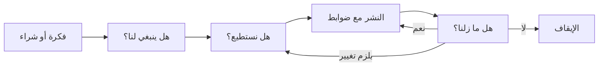
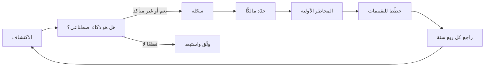

# الوحدة 0 — التوجيه (Orientation)

*قبل أي قانون أو إطار عمل (framework) أو نموذج، تحتاج إلى خريطة. تشرح هذه الوحدة ما هي حوكمة الذكاء الاصطناعي (AI governance) فعلًا (وما ليست هي (What it is not))، وما الذي تختبره شهادة AIGP (AIGP certification) الصادرة عن IAPP وكيف تُبنى أسئلتها، وكيف تخطط لدراستك. ثم تقدّم بنك نجم (Najm Bank)، وهو البنك الخليجي الخيالي الذي ستتابعه في كل وحدة، وتنجز أول مهمة يقوم بها أي مسؤول عن حوكمة الذكاء الاصطناعي (AI governance lead) في يومه الأول: بناء سجل أنظمة الذكاء الاصطناعي (AI inventory) التي تستخدمها المؤسسة بالفعل. هذه الدورة مستقلة، وليست تابعة لـ IAPP ولا معتمدة منها. ولا شيء فيها يُعدّ استشارة قانونية (legal advice): فالقوانين تتغير، والقرارات (decisions) الحقيقية تحتاج إلى مستشار مؤهل في الولاية القضائية (jurisdiction) المعنية.*

> **التغطية ضمن مجال المعرفة (BoK coverage):** توجيه إلى المجالات الأربعة (four domains) كلها في مجال المعرفة (Body of Knowledge) الخاص بـ AIGP الإصدار 2.1 (v2.1)، مع نظرة أولى على I.A (لماذا يحتاج الذكاء الاصطناعي (AI) إلى الحوكمة (governance)) وعلى ممارسات السجل (inventory) التي تُطوَّر في I.B وI.C وIV.

---

# 0.1 — ما هي حوكمة الذكاء الاصطناعي (AI governance)، وما الذي تثبته شهادة AIGP (AIGP certification)
*المستوى (Level): 🟢 مبتدئ (Beginner)* · *المتطلبات (Prerequisites): لا يوجد* · *مجال المعرفة (BoK): التوجيه (جميع المجالات (domains))*

## ⚡ الدرس في دقيقة (In 60 seconds)
- **حوكمة الذكاء الاصطناعي (AI governance)** هي منظومة الأشخاص والقواعد والعمليات (processes) والأدلة (evidence) التي تستخدمها المؤسسة لتقرر أي ذكاء اصطناعي (AI) تبنيه أو تستخدمه، وبأي شروط، وكيف تُبقيه ضمن القانون وضمن قيمها وشهية المخاطر (risk appetite) لديها طوال مدة تشغيله.
- وهي ليست الشيء نفسه مثل أخلاقيات الذكاء الاصطناعي (AI ethics) (القيم)، ولا الامتثال (compliance) (الوفاء بواجبات قانونية محددة (specific legal duties))، ولا إدارة المخاطر (risk management) (تحديد المخاطر (risk) ومعالجتها). الحوكمة (governance) هي الإطار (frame) الذي يجمع الثلاثة ويحدد المساءلة (accountability).
- القاعدة الأهم: **تبقى المساءلة (accountability) على عاتق المؤسسة وأشخاص محددين بالاسم (named).** عبارة "الخوارزمية هي التي فعلت ذلك" ليست جوابًا أبدًا، لا أمام جهة رقابية (regulator) ولا أمام محكمة (court) ولا أمام عميل.
- شهادة (certification) **AIGP** (Artificial Intelligence Governance Professional) هي شهادة تصدرها IAPP. وهي تُظهر أنك تفهم كيف يعمل الذكاء الاصطناعي (AI) على مستوى الحوكمة (governance)، وأي القوانين وأطر العمل (frameworks) تنطبق عليه، وكيف تحكم الذكاء الاصطناعي عبر تطويره ونشره. ولا تجعلك محاميًا أو عالم بيانات (data scientist).
- إشارة الامتحان (Exam cue): عندما يسأل سؤال عمّا يجب أن تفعله المؤسسة *أولًا*، فإن جواب الحوكمة (governance) يكون عادةً فهم النظام (system) وسياقه ومخاطره (السجل (inventory)، والتقييم (assessment)، والملكية (ownership)) قبل اختيار حل تقني.
- الفخ الأكبر (Biggest trap): التعامل مع الحوكمة (governance) على أنها بوابة موافقة لمرة واحدة (one-off approval gate). إنها حلقة تعمل طوال عمر النظام (life of the system).

## 🧭 لماذا يهم (Why it matters)
في أول يوم اثنين لليلى بصفتها الرئيسة الجديدة لحوكمة الذكاء الاصطناعي (new Head of AI Governance) في بنك نجم، يستوقفها الرئيس التنفيذي (CEO) في الممر. يقول: "يريد مجلس الإدارة (board) أن يعرف هل نحن ممتثلون للذكاء الاصطناعي (compliant with AI). هل يمكنك إخبارهم بذلك قبل الاجتماع القادم؟" فتردّ ليلى بثلاثة أسئلة. كم عدد أنظمة الذكاء الاصطناعي (AI systems) التي يستخدمها البنك؟ من يملك كل واحد منها؟ وأيّها يتخذ قرارات بشأن العملاء أو الموظفين (staff) أو يؤثر فيها؟ لا أحد في الغرفة يستطيع الإجابة (answer). فريق علم البيانات (data science team) يعرف النماذج (models) التي بناها. وإدارة المشتريات (procurement) تعرف بعض العقود (contracts). وقسم الموارد البشرية (HR) اشترى أداة لفرز السير الذاتية (CV-screening tool). ومديرو العلاقات (relationship managers) يلصقون البيانات المالية للعملاء (client financials) في روبوت محادثة عام (public chatbot) لصياغة مذكرات الائتمان (credit memos). وفرع فرانكفورت (Frankfurt branch) يخدم عملاء في الاتحاد الأوروبي (EU)، لذلك قد تمتد القواعد الأوروبية إلى بعض هذه الأنظمة (systems)، كما أن الجهات الرقابية (regulators) في بلد البنك الأم في الخليج تطرح أسئلتها الخاصة.

يتبيّن أن سؤال "هل نحن ممتثلون للذكاء الاصطناعي (compliant with AI)؟" هو السؤال الخطأ. فلا يوجد "قانون ذكاء اصطناعي (AI law)" واحد للامتثال (compliance) له. بل هناك شبكة من قوانين حماية البيانات (data protection laws)، وقواعد مكافحة التمييز (anti-discrimination rules)، وحماية المستهلك (consumer protection)، والرقابة القطاعية (sector supervision)، وقانون الذكاء الاصطناعي الأوروبي (EU AI Act) الجديد، وأطر عمل طوعية (voluntary frameworks) تتوقع الجهات الرقابية (regulators) أن تعرفها البنوك. السؤال الصحيح هو: *هل نعرف ما لدينا من ذكاء اصطناعي (AI)، ومن المسؤول عنه، وما الذي قد يسوء، وهل ضوابطنا (our controls) تعمل؟* هذه هي حوكمة الذكاء الاصطناعي (AI governance).

وتكلفة عدم طرح هذا السؤال موثّقة جيدًا. ففي قضية *Moffatt v. Air Canada* (2024)، حمّلت محكمة كندية (Canadian tribunal) شركة الطيران المسؤولية (liability) عن معلومات خاطئة بشأن استرداد المبالغ قدّمها روبوت المحادثة (chatbot) على موقعها لأحد العملاء، ورفضت الحجة القائلة إن روبوت المحادثة مسؤول بطريقة ما عن تصريحاته. كان نشر روبوت المحادثة رخيصًا. لكن أحدًا لم يحكم ما يُسمح له بأن يَعِد به.

## 📐 كيف يعمل (How it works)

### 🟢 الأساسيات (The essentials)

**تعريف عملي (A working definition).** حوكمة الذكاء الاصطناعي (AI governance) هي الطريقة التي تتخذ بها المؤسسة قرارات جيدة بشأن الذكاء الاصطناعي (AI) وتحافظ عليها. ولها أربعة أجزاء:

| الجزء | السؤال الذي يجيب عنه | أمثلة في بنك |
|---|---|---|
| **التوجيه (Direction)** | ماذا نريد من الذكاء الاصطناعي (AI) أن يفعل، وما الذي لن نفعله به أبدًا؟ | مبادئ الذكاء الاصطناعي (AI principles)، والاستراتيجية (strategy)، وبيان شهية المخاطر (risk appetite statement) |
| **الهيكل (Structure)** | من يقرر، ومن يقوم بالعمل، ومن يتحقق؟ | لجنة حوكمة الذكاء الاصطناعي (AI Governance Committee)، ومالكو الأنظمة (system owners)، ومسؤول حماية البيانات (DPO)، ومدققو النماذج (model validators) |
| **العملية (Process)** | كيف تتحول الفكرة إلى نظام قيد التشغيل (live)، وكيف يُحافَظ على سلامته؟ | استقبال حالات الاستخدام (use-case intake)، وتصنيف المخاطر إلى مستويات (risk tiering)، وتقييم الأثر (impact assessment)، والموافقة (approval)، والرصد (monitoring)، والإيقاف والتقاعد (retirement) |
| **الأدلة (Evidence)** | كيف نثبت ذلك لأنفسنا وللآخرين؟ | السجل (inventory)، والتوثيق (documentation)، ونتائج الاختبارات (test results)، والسجلات التشغيلية (logs)، وتقارير التدقيق (audit reports) |

**ما ليست هي (What it is not).** يخلط الناس بين الحوكمة (governance) وأفكار قريبة منها. وهذه الفروق مهمة في الامتحان (exam) وفي الممارسة.

| المصطلح | معناه | علاقته بالحوكمة (governance) |
|---|---|---|
| **أخلاقيات الذكاء الاصطناعي (AI ethics)** | القيم والمبادئ الأخلاقية (moral principles) التي يجب أن يحترمها الذكاء الاصطناعي (AI): العدالة (fairness)، والكرامة (dignity)، والاستقلالية (autonomy)، وتجنّب الضرر (avoiding harm) | الحوكمة (governance) تحوّل القيم إلى قرارات وضوابط (controls) قابلة للتنفيذ |
| **الذكاء الاصطناعي المسؤول (Responsible AI)** | تسمية شائعة في القطاع لبناء الذكاء الاصطناعي (AI) واستخدامه بما يتوافق مع تلك القيم | هو تقريبًا *الهدف*، والحوكمة (governance) هي *الآلية* |
| **الامتثال (Compliance)** | الوفاء بواجبات قانونية وتنظيمية محددة (specific legal and regulatory duties) | أحد مخرجات (outputs) الحوكمة (governance)، إذ يمكنك أن تكون ممتثلًا (compliant) ومع ذلك تؤذي الناس أو تهدر المال |
| **إدارة المخاطر (Risk management)** | تحديد المخاطر (risk) وتحليلها ومعالجتها ورصدها | عملية أساسية *داخل* الحوكمة (governance) |
| **إدارة مخاطر النماذج (Model risk management)** | التخصص الذي تستخدمه البنوك بالفعل للتحقق من النماذج الكمية (quantitative models) ورصدها | نقطة انطلاق قوية لحوكمة الذكاء الاصطناعي (AI governance)، لكنها أضيق: فنادرًا ما تغطي روبوتات المحادثة (chatbots) القائمة على الذكاء الاصطناعي التوليدي (GenAI)، أو الأدوات المشتراة، أو استخدام الموظفين (staff use) |

**ثلاثة أسئلة تُطرح مرة بعد مرة (Three questions, asked again and again).** طريقة بسيطة لتذكّر ما تفعله الحوكمة (governance) عبر عمر النظام (life of the system):

1. **هل ينبغي لنا؟ (Should we?)** هل هذا استخدام جيد للذكاء الاصطناعي (AI) أصلًا، بالنظر إلى الغرض (purpose)، والأشخاص المتأثرين (people affected)، والبدائل؟
2. **هل نستطيع؟ (Can we?)** هل هو مشروع قانونًا (lawful)، وهل نستطيع بناءه أو شراءه وفق معيار (standard) يمكننا الدفاع عنه؟
3. **هل ما زلنا؟ (Are we still?)** بعد التشغيل (once live)، هل ما زال يؤدي جيدًا (performing)، وما زال عادلًا (fair)، وما زال مشروعًا (lawful)، وما زال مرغوبًا فيه (wanted)؟

```mermaid
flowchart LR
    A[فكرة أو شراء] --> B[هل ينبغي لنا؟]
    B --> C[هل نستطيع؟]
    C --> D[النشر مع ضوابط]
    D --> E[هل ما زلنا؟]
    E -->|نعم| D
    E -->|يلزم تغيير| C
    E -->|لا| F[الإيقاف]
```

**المساءلة (accountability).** يحتاج كل نظام ذكاء اصطناعي (AI system) إلى مالك بشري (human owner) محدد بالاسم (named) يُسأل عنه. ولا يلزم أن يفهم المالك (owner) الرياضيات، لكن يجب أن يفهم الغرض (purpose) من النظام (system)، وما الخطأ الذي قد يقع فيه، وما الضوابط (controls) الموجودة. فالجهات الرقابية (regulators) والمحاكم (courts) تبحث عن شخص وعملية، لا عن نموذج.

### 🟡 التعمق أكثر (Going deeper)

**أين تقع الحوكمة في المؤسسة (Where governance sits in the organisation).** حوكمة الذكاء الاصطناعي (AI governance) ليست جزيرة جديدة. بل تتصل بهياكل موجودة لدى معظم المؤسسات:

- **حوكمة الشركات (Corporate governance).** يحدد مجلس الإدارة (board) التوجه (direction) وشهية المخاطر (risk appetite) ويشرف على الإدارة التنفيذية. ويقدّم ISO/IEC 38507 لمجالس الإدارة (boards) إرشادات (guidance) حول آثار استخدام الذكاء الاصطناعي (AI) على الحوكمة (governance).
- **نموذج الخطوط الثلاثة (three lines model).** الخط الأول (فرق الأعمال والتقنية) يملك أنظمة الذكاء الاصطناعي (AI systems) ويشغّلها ويملك مخاطرها. والخط الثاني (المخاطر (risk)، والامتثال (compliance)، والخصوصية (privacy)، وحوكمة الذكاء الاصطناعي (AI governance)) يضع السياسات (policies) ويراجع الخط الأول ويتحدّاه. والخط الثالث (التدقيق الداخلي (internal audit)) يقدّم ضمانًا مستقلًا (independent assurance). تقع ليلى في الخط الثاني، أما خالد، الذي يملك الإقراض للأفراد (retail lending)، فهو في الخط الأول.
- **التخصصات القائمة (Existing disciplines).** الخصوصية (privacy)، وأمن المعلومات (information security)، ومخاطر النماذج (model risk)، والمشتريات (procurement)، والشؤون القانونية (legal)، والموارد البشرية (HR)، والتدقيق الداخلي (internal audit)، كلها تملك جزءًا من الإجابة (answer). وحوكمة الذكاء الاصطناعي (AI governance) الجيدة تعيد استخدام عملياتها وتضيف ما هو خاص بالذكاء الاصطناعي (AI)، بدلًا من بناء بيروقراطية موازية.

**الملزم والطوعي (Binding and voluntary).** جزء كبير من حوكمة الذكاء الاصطناعي (AI governance) يتعلق بمعرفة وضع كل أداة. وهناك أربع طبقات:

| الطبقة | الوضع | أمثلة ستقابلها في هذه الدورة |
|---|---|---|
| **القانون الملزم (Hard law)** | ملزم (binding)، وتنفّذه الجهات الرقابية (regulators) والمحاكم (courts) | EU AI Act، وGDPR، وقانون حماية البيانات الشخصية (personal data protection law) القطري PDPPL، وقانون حماية البيانات الشخصية (personal data protection) الإماراتي PDPL، وقوانين مكافحة التمييز (anti-discrimination) وحماية المستهلك (consumer protection) |
| **الإرشادات التنظيمية (Regulatory guidance)** | ليست قانونًا، لكن الجهات الرقابية (regulators) تتوقع منك اتباعها | إرشادات مصرف قطر المركزي بشأن الذكاء الاصطناعي للمؤسسات المالية (Qatar Central Bank's AI guideline for financial institutions)، وآراء EDPB، وإرشادات المفوضية الأوروبية (Commission guidelines) |
| **المعايير وأطر العمل (Standards and frameworks)** | طوعية (voluntary) ما لم يجعلها قانون أو عقد (contract) إلزامية (mandatory)، وبعضها قابل للاعتماد بشهادة (certifiable) | NIST AI RMF، وISO/IEC 42001، وISO/IEC 23894 |
| **المبادئ (Principles)** | التزامات سياسية (political commitments) عالية المستوى | OECD AI Principles، وتوصية UNESCO بشأن أخلاقيات الذكاء الاصطناعي (UNESCO Recommendation on the Ethics of AI) |
| **السياسة الداخلية (Internal policy)** | ملزمة (binding) لموظفي المؤسسة نفسها | سياسة الذكاء الاصطناعي (AI Policy) في بنك نجم، وقواعد الاستخدام المقبول (acceptable-use rules) للذكاء الاصطناعي التوليدي (GenAI) |

ويمكن لإطار طوعي (voluntary framework) أن يكون له أثر فعلي. فقد تعامله جهة رقابية (regulator) على أنه المرجع للممارسة المعقولة، وقد يشترطه عقد (contract)، والحصول على شهادة (مثل ISO/IEC 42001) هو إعلان علني يجب عليك بعد ذلك أن تكون على مستواه.

**الحوكمة عبر دورة الحياة (life cycle).** يقسم مجال المعرفة (BoK) الخاص بـ AIGP العمل إلى حوكمة **التطوير (development)** (التصميم (design)، والبيانات (data)، والبناء، والاختبار (testing)، والإطلاق (release)، والرصد (monitoring)) وحوكمة **النشر والاستخدام (deployment and use)** (قرار النشر (deciding to deploy)، والتقييم (assessment)، والتشغيل). وسيقوم بنك نجم بالأمرين: فهو يبني نموذجه الخاص لتقييم الجدارة الائتمانية (credit scoring) ويشتري أداة لفرز السير الذاتية (CV-screening tool). وكثير من المؤسسات *تشتري* في الغالب، ولهذا يحمل جانب المُشغِّل (deployer) في الامتحان (exam) وزنًا مساويًا لجانب المطوّر (developer).

### 🔴 نظرة الخبير (Expert view)

**الحوكمة (governance) بوصفها نظام إدارة (management system).** تتعامل البرامج الناضجة (Mature programmes) مع حوكمة الذكاء الاصطناعي (AI governance) مثل أي نظام إدارة آخر: خطّط (ضع السياسة (policy) والأهداف ومعايير المخاطر (risk criteria))، ونفّذ (شغّل العمليات (processes))، وتحقّق (ارصد ودقّق وقِس)، وحسّن (طوّر). وقد بُني ISO/IEC 42001 على دورة خطّط-نفّذ-تحقّق-صحّح (Plan-Do-Check-Act) هذه تحديدًا، ويمكن اعتماده بشهادة (certification) من جهة معتمدة (accredited body). وقيمة النظر إليها كنظام إدارة أنها تفرض التكرار: فالمؤسسة لا توافق على الذكاء الاصطناعي (AI) فحسب، بل تواصل التحقق مما إذا كانت موافقاتها (its approvals) صحيحة.

**التناسب هو جوهر اللعبة (Proportionality is the whole game).** قد يملك بنك خمسين نظام ذكاء اصطناعي (AI system). وحوكمة مرشّح الرسائل غير المرغوب فيها (spam filter) مثل نموذج تقييم الجدارة الائتمانية (credit-scoring model) تهدر الجهد وتعلّم الموظفين (staff) أن الحوكمة (governance) مجرد مسرحية. أما حوكمة نموذج تقييم الجدارة الائتمانية (credit scoring) مثل مرشّح (filter) الرسائل غير المرغوب فيها فتسبب الضرر (harm) وتخالف القانون. المهارة الأساسية هي *التصنيف القائم على المخاطر (risk-based tiering)*: ضوابط خفيفة (light-touch controls) للاستخدامات منخفضة المخاطر (low-risk)، وضوابط مشددة (heavy controls) للاستخدامات عالية المخاطر (high-risk)، وقائمة واضحة بالاستخدامات التي لن تسعى إليها المؤسسة. ويقوم كل من EU AI Act وNIST AI RMF وISO/IEC 42001 على هذه الفكرة.

**الحوكمة تُمكّن، ولا تمنع فقط (Governance enables, not only prevents).** تلتفّ الفرق حول الحوكمة (governance) البطيئة والغامضة، وتُشركها مبكرًا عندما تكون سريعة ويمكن التنبؤ بها. وأفضل البرامج (programmes) تنشر مسارات استقبال (intake paths) واضحة، وأنماطًا معتمدة مسبقًا (مثل "التلخيص الداخلي بأدوات ذكاء اصطناعي توليدي معتمدة (approved GenAI tools)، دون بيانات عملاء")، ومستويات خدمة (service levels) للمراجعات. هدف ليلى ليس أن تقول "لا" أكثر. بل أن تجعل "نعم، بهذه الشروط" هي المسار السهل.

**ما الذي تثبته شهادة AIGP (AIGP certification).** أنشأت IAPP شهادة (certification) AIGP، وهي هيئة عضوية عالمية (global membership body) لمهنيي الخصوصية وحوكمة الذكاء الاصطناعي (privacy and AI governance professionals)، وتدير أيضًا شهادات الخصوصية (privacy certifications) CIPP وCIPM وCIPT. واجتياز AIGP يُظهر أنك تستطيع:

- شرح ماهية أنظمة الذكاء الاصطناعي (AI systems)، وكيف تفشل، ولماذا يخلق ذلك احتياجات للحوكمة (المجال (Domain) I)؛
- إدراك كيف تنطبق القوانين القائمة (existing laws) والجديدة، والمعايير وأطر العمل الرئيسية (main standards and frameworks)، على الذكاء الاصطناعي (المجال (Domain) II)؛
- حوكمة الذكاء الاصطناعي (AI governance) عبر التصميم (design) والبيانات (data) والاختبار (testing) والإطلاق (release) والرصد (المجال (Domain) III)؛
- حوكمة قرار نشر الذكاء الاصطناعي (govern the decision to deploy AI)، والتقييمات (assessments) التي يحتاجها، واستخدامه المستمر (المجال (Domain) IV).

إنها شهادة اتساع (breadth credential). فهي تثبت أنك تستطيع الجلوس في غرفة مع المحامين والمهندسين ومديري المخاطر (risk managers) والتنفيذيين وربط مخاوفهم في قرار يمكن الدفاع عنه. ولا تثبت أنك تستطيع تدريب نموذج أو تقديم استشارة قانونية (legal advice)، ومهنيو حوكمة الذكاء الاصطناعي (AI governance professionals) الجيدون يعرفون متى يستعينون بمن يستطيع ذلك. وللشهادة (certification) أيضًا متطلبات صيانة (upkeep): إذ تشترط IAPP التعليم المهني المستمر (continuing professional education) للحفاظ على سريان الشهادة، لذا راجع قواعد الصيانة (maintenance rules) الحالية على iapp.org.

**كيف بُنيت هذه الدورة (How this course is built).** ثلاث عشرة وحدة تنقلك من التوجيه (الوحدة 0) عبر المجالات الأربعة (four domains) لمجال المعرفة (الوحدات 1–11) إلى مشروع ختامي (capstone) وامتحان تجريبي (mock exam) كامل من 100 سؤال (الوحدة 12). ويتبع كل درس الشكل نفسه: نسخة الستين ثانية، ولماذا يهم (Why it matters)، وكيف يعمل على ثلاثة مستويات من العمق (🟢 🟡 🔴)، والأدوات التنظيمية (The instruments)، ووثيقة من بنك نجم، والتمارين (Exercises)، والفخاخ (traps)، والخلاصة (Recap)، وخمسة أسئلة بأسلوب الامتحان (exam)، والمراجع (References) الرسمية. ويمكنك قراءة طبقات 🟢 فقط في المرور الأول ثم العودة من أجل العمق.

## ⚖️ الأدوات التنظيمية (The instruments)
| الأداة | ما تشترطه أو توصي به | إشارة الامتحان (Exam cue) |
|---|---|---|
| **EU AI Act** — المادة 4 (Art. 4) | يجب على مقدّمي الأنظمة (providers) والمُشغِّلين (deployers) اتخاذ تدابير لضمان مستوى كافٍ من الإلمام بالذكاء الاصطناعي (AI literacy) لدى الموظفين (staff) الذين يتعاملون مع أنظمة الذكاء الاصطناعي (AI systems)، ويسري ذلك اعتبارًا من 2 فبراير 2025 | الإلمام بالذكاء الاصطناعي (AI literacy) واجب قانوني (legal duty) في الاتحاد الأوروبي (EU) وليس مجرد ممارسة جيدة، وهو ينطبق على المُشغِّلين (deployers) أيضًا |
| **NIST AI RMF** — وظيفة الحوكمة (Govern function) | إطار أمريكي طوعي (Voluntary US framework)، والحوكمة (Govern) هي الوظيفة الشاملة التي تحدد الثقافة والسياسات (policies) والأدوار (roles) والمساءلة (accountability) للوظائف الثلاث الأخرى (Map، وMeasure، وManage) | الحوكمة (governance) تمتد عبر دورة الحياة (life cycle) كلها، وليست خطوة تنتهي منها |
| **ISO/IEC 42001** | معيار لنظام إدارة الذكاء الاصطناعي (AIMS) قابل للاعتماد بشهادة (certifiable)، ومبني على خطّط-نفّذ-تحقّق-صحّح (Plan-Do-Check-Act)، مع ضوابط الملحق A (Annex A controls) | عبارات "نظام إدارة (management system)" و"شهادة (certification)" و"التحسين المستمر (continual improvement)" تشير إلى هنا |
| **ISO/IEC 38507** | إرشادات لهيئات الحوكمة (مجالس الإدارة (boards)) حول آثار استخدام الذكاء الاصطناعي (AI) على الحوكمة (governance) | أسئلة الإشراف (oversight) على مستوى مجلس الإدارة (board) |
| **OECD AI Principles** | مبادئ حكومية دولية (2019، وحُدّثت في 2024)، ومنها مساءلة الجهات الفاعلة في مجال الذكاء الاصطناعي (accountability for AI actors) | المبادئ (Principles) عالية المستوى وغير ملزمة (non-binding)، والمساءلة (accountability) واحدة منها |

## 🏛️ عمليًا في بنك نجم (In practice at Najm Bank)
أول وثيقة تعدّها ليلى هي **ميثاق حوكمة الذكاء الاصطناعي (AI Governance Charter)** من صفحة واحدة، تعتمده لجنة المخاطر التابعة لمجلس الإدارة (Board Risk Committee). لا يحل الميثاق (charter) أي مشكلة بعد، لكنه يمنح الصلاحية لحلها.

| البند | النص (مسودة (draft) v0.1) |
|---|---|
| **الغرض (purpose)** | ضمان أن يطوّر بنك نجم الذكاء الاصطناعي (AI) ويشتريه ويستخدمه بطريقة مشروعة وعادلة وآمنة (lawfully, fairly, securely) ومتوافقة مع شهية المخاطر (risk appetite) لديه، وأن يكون قادرًا على إثبات ذلك للجهات الرقابية (regulators) والعملاء والموظفين (staff). |
| **النطاق (Scope)** | جميع أنظمة الذكاء الاصطناعي (AI systems) التي تُطوَّر أو تُشترى أو تكون مدمجة في منتجات أطراف ثالثة (third-party products) أو يستخدمها الموظفون (staff) لأعمال بنك نجم، في كل ولاية قضائية (jurisdiction) يعمل فيها البنك (قطر، والإمارات، والاتحاد الأوروبي (EU)). ويتبع مصطلح "نظام الذكاء الاصطناعي (AI system)" التعريف الوارد في سياسة الذكاء الاصطناعي (المتوافق مع تعريفي OECD وEU AI Act). |
| **المساءلة (accountability)** | لكل نظام ذكاء اصطناعي (AI system) مالك أعمال (Business Owner) محدد بالاسم (الخط الأول (first line)) يُساءَل عن استخدامه ونتائجه. ويضع رئيس حوكمة الذكاء الاصطناعي (Head of AI Governance) السياسة (policy) ويقدّم المراجعة والتحدي (الخط الثاني (second line)). ويقدّم التدقيق الداخلي (internal audit) ضمانًا مستقلًا (الخط الثالث (third line)). |
| **اللجنة (Committee)** | لجنة حوكمة الذكاء الاصطناعي (AI Governance Committee)، برئاسة كبير مسؤولي المخاطر (CRO)، وتضم كبير مسؤولي البيانات (CDO) (عمر)، ومسؤولة حماية البيانات (DPO) (سارة)، ورئيسة حوكمة الذكاء الاصطناعي (ليلى)، وكبير مسؤولي أمن المعلومات (CISO)، والشؤون القانونية (legal)، والموارد البشرية (HR)، وممثلين عن الأعمال. وهي تعتمد حالات الاستخدام عالية المخاطر (high-risk use cases) والاستثناءات من السياسة (policy exceptions). |
| **قرارات محجوزة لمجلس الإدارة (Decisions reserved to the Board)** | شهية المخاطر (risk appetite) المتعلقة بالذكاء الاصطناعي (AI)، وأي استخدام للذكاء الاصطناعي تصنّفه السياسة (policy) محظورًا، والمراجعة (review) السنوية لبرنامج الذكاء الاصطناعي (AI programme). |
| **أول 90 يومًا (First 90 days)** | (1) سجل أنظمة الذكاء الاصطناعي (AI inventory). (2) قاعدة مؤقتة للاستخدام المقبول (interim acceptable-use rule) لأدوات الذكاء الاصطناعي التوليدي العامة (public GenAI tools). (3) سياسة الذكاء الاصطناعي (AI Policy) ومنهجية تصنيف المخاطر إلى مستويات (risk-tiering method). (4) خطة الإلمام بالذكاء الاصطناعي (AI literacy plan) لجميع الموظفين (staff). |
| **المراجعة (review)** | سنويًا، أو بعد حادث مهم، أو تغيير قانوني، أو فئة جديدة من استخدامات الذكاء الاصطناعي (AI). |

## 🛠️ التمارين (Exercises)
- 🟢 **عرّفها بكلماتك (Define it in your own words).** اكتب تعريفًا من جملتين لحوكمة الذكاء الاصطناعي (AI governance) لمؤسستك (أو لبنك نجم)، ثم اذكر مثالًا واحدًا لكل من التوجيه (direction) والهيكل (Structure) والعملية (Process) والأدلة (evidence). *يكتمل عندما (Done when):* يكون لكل جزء من الأجزاء الأربعة مثال ملموس، لا تسمية عامة.
- 🟡 **ارسم الخطوط الثلاثة (Map the three lines).** بالنسبة إلى نموذج تقييم الجدارة الائتمانية (credit-scoring model) في بنك نجم، سمِّ من يقع في الخط الأول (first line) والثاني والثالث، واكتب جملة واحدة عمّا يفعله كل منهم لهذا النموذج (model). *يكتمل عندما (Done when):* لا يقوم أي خط بعمل خط آخر (مثلًا، لا يشغّل الخط الثاني (second line) النموذج).
- 🔴 **صنّف الأدوات (Classify the instruments).** خذ الأدوات الخمس في الجدول أعلاه بالإضافة إلى GDPR وسياسة الذكاء الاصطناعي الداخلية (internal AI Policy) في بنك نجم. صنّف كلًا منها على أنها قانون ملزم (hard law)، أو إرشادات (guidance)، أو معيار (standard) أو إطار عمل (framework)، أو مبدأ، أو سياسة داخلية (internal policy)، واكتب جملة واحدة عن الطريقة التي يمكن بها لأداة "طوعية (voluntary)" أن تصبح إلزامية (mandatory) فعليًا لبنك نجم. *يكتمل عندما (Done when):* يكون لديك طريقان مختلفان على الأقل تصبح بهما الأداة الطوعية (voluntary instrument) ملزمة (binding) عمليًا.

## ⚠️ أخطاء وفخاخ الامتحان (Mistakes and exam traps)
- **فخ (Trap): "حوكمة الذكاء الاصطناعي (AI governance) = أخلاقيات الذكاء الاصطناعي (AI ethics)".** الأخلاقيات (ethics) توفّر القيم، والحوكمة (governance) هي الآلية الخاضعة للمساءلة (accountable). في الأسئلة، فضّل الإجابات التي تحدد الملكية (ownership) وتضع العملية (Process) وتنشئ الأدلة (evidence) على الإجابات التي تكتفي بذكر القيم.
- **فخ (Trap): "اشتريناه، إذن المورّد (vendor) هو المسؤول".** شراء الذكاء الاصطناعي (AI) ينقل بعض الواجبات (duties) إلى مقدّم النظام (provider)، لكنه لا يُسقط أبدًا مساءلة المُشغِّل (deployer's accountability) نفسه عن طريقة استخدامه. ابحث عن الإجابة (answer) التي تُبقي المساءلة (accountability) على المؤسسة.
- **فخ (Trap): القفز إلى حل تقني.** عندما يسأل السؤال عمّا يجب فعله *أولًا*، تكون الإجابة (answer) الصحيحة عادةً فهم النظام (system) ومخاطره (السجل (inventory)، والمالك (owner)، والتقييم (assessment))، لا إعادة التدريب (retrain) أو إضافة مرشّح (filter) أو شراء أداة.
- **فخ (Trap): التعامل مع إطار عمل (framework) على أنه قانون.** إن NIST AI RMF وISO/IEC 42001 طوعيان (voluntary). أما EU AI Act وGDPR فملزمان (binding). والخلط بينهما مُشتِّت كلاسيكي (classic distractor).
- **فخ (Trap): الموافقة لمرة واحدة (one-time approval).** تستمر الحوكمة (governance) بعد الإطلاق (after launch). والإجابات التي تتضمن الرصد والمراجعة (monitoring and review) تتفوق على الإجابات التي تتوقف عند التوقيع بالموافقة (sign-off).

## 🧾 الخلاصة (Recap)
- حوكمة الذكاء الاصطناعي (AI governance) هي التوجيه (direction) والهيكل (Structure) والعملية (Process) والأدلة (evidence) للذكاء الاصطناعي (AI)، مطبّقة بتناسب (proportionately) عبر دورة الحياة (life cycle) كلها.
- وهي تحتوي الأخلاقيات (ethics) والامتثال (compliance) وإدارة المخاطر (risk management)، لكنها ليست مطابقة لأي منها.
- تقع المساءلة (accountability) على المؤسسة والمالكين (owners) المحددين بالاسم (named)، ولا يمكن تفويضها إلى نموذج أو مورّد (vendor).
- تتدرج الأدوات من القانون الملزم (Hard law) إلى الإرشادات (guidance) والمعايير (standards) والمبادئ (Principles) والسياسة الداخلية (internal policy)، فاعرف أيّها ما هو.
- شهادة AIGP (AIGP certification) شهادة اتساع (breadth credential) عبر أربعة مجالات (four domains): الأسس، والقانون وأطر العمل (frameworks)، وحوكمة التطوير (governing development)، وحوكمة النشر والاستخدام (governing deployment and use).

## ✍️ اختبر نفسك (Check yourself)

**1. أي عبارة تصف حوكمة الذكاء الاصطناعي (AI governance) على أفضل وجه؟**

- A. مجموعة القيم الأخلاقية التي تنشرها المؤسسة بشأن الذكاء الاصطناعي (AI)
- B. مراجعة الفريق القانوني (legal team) لعقود (contracts) الذكاء الاصطناعي (AI)
- C. الأشخاص والقواعد والعمليات (processes) والأدلة (evidence) التي تستخدمها المؤسسة لتوجيه (direct) الذكاء الاصطناعي (AI) والتحكم فيه عبر دورة حياته (its life cycle)
- D. عملية التحقق من النماذج (model validation process) لدى فريق علم البيانات (data science team)

الإجابة (answer)

**C.** الحوكمة (governance) هي المنظومة الخاضعة للمساءلة (accountable) بأكملها. يصف A الأخلاقيات (قيم بلا آلية)، أما B وD فهما عمليتان منفردتان تقعان داخل الحوكمة. (انظر 🟢 الأساسيات (The essentials).)

**2. يسأل الرئيس التنفيذي (CEO) لبنك نجم ليلى عمّا إذا كان البنك "ممتثلًا للذكاء الاصطناعي (compliant with AI)". ماذا يجب أن تفعل ليلى أولًا؟**

- A. شراء أداة برمجية للامتثال (compliance software tool) في مجال الذكاء الاصطناعي (AI)
- B. تحديد أنظمة الذكاء الاصطناعي (AI systems) التي يستخدمها البنك، ومن يملكها، وفيمَ تُستخدم
- C. الطلب من فريق علم البيانات (data science team) إعادة تدريب (retrain) جميع النماذج (models) من أجل العدالة (fairness)
- D. إخبار مجلس الإدارة (board) بأن البنك ممتثل (compliant) لأنه لا يوجد قانون قطري يحظر الذكاء الاصطناعي (AI)

الإجابة (answer)

**B.** لا يمكنك حوكمة ما لا تراه، والسجل (inventory) الذي يتضمن المالكين (owners) والأغراض هو أساس كل تقييم لاحق. يقفز A وC إلى الحلول قبل فهم المشكلة، ويفترض D خطأً وجود "قانون ذكاء اصطناعي (AI law)" واحد ويتجاهل القوانين الأخرى المنطبقة وفرع الاتحاد الأوروبي (EU). (انظر 🧭 لماذا يهم (Why it matters).)

**3. في نموذج الخطوط الثلاثة (three lines model)، أين تقع عادةً رئيسة حوكمة الذكاء الاصطناعي (Head of AI Governance) في بنك نجم؟**

- A. الخط الثاني (second line)، حيث تضع السياسة (policy) وتراجع الأعمال وتتحداها
- B. الخط الأول (first line)، لأنها تملك أنظمة الذكاء الاصطناعي (AI systems)
- C. الخط الثالث (third line)، حيث تقدّم ضمانًا مستقلًا (independent assurance) لمجلس الإدارة (board)
- D. خارج النموذج (model)، لأن الذكاء الاصطناعي (AI) موضوع تقني

الإجابة (answer)

**A.** حوكمة الذكاء الاصطناعي (AI governance) عادةً وظيفة من الخط الثاني (second line) تضع السياسة (policy) وتقدّم المراجعة والتحدي (challenge). ومالكو الأنظمة (system owners) مثل خالد في الخط الأول (first line)، والتدقيق الداخلي (internal audit) في الخط الثالث (third line). (انظر 🟡 التعمق أكثر (Going deeper).)

**4. أيّ مما يلي أداة قانونية ملزمة (binding legal instrument) وليس إطار عمل طوعيًا (voluntary framework)؟**

- A. إطار NIST لإدارة مخاطر الذكاء الاصطناعي (NIST AI Risk Management Framework)
- B. ISO/IEC 42001
- C. OECD AI Principles
- D. EU AI Act

الإجابة (answer)

**D.** قانون EU AI Act لائحة ذات قوة قانونية (regulation with legal force). أما NIST AI RMF وISO/IEC 42001 فطوعيان (42001 قابل للاعتماد بشهادة (certifiable)، لكن الحصول على الشهادة (certification) يظل اختيارًا)، ومبادئ OECD التزامات سياسية (political commitments) غير ملزمة (non-binding). (انظر جدول الملزم والطوعي (Binding and voluntary) في 🟡.)

**5. ينشر متجر تجزئة (retailer) روبوت محادثة (chatbot) على موقعه اشتراه من مورّد (vendor). يخبر الروبوت أحد العملاء بأنه يستحق استردادًا لا يستحقه. استنادًا إلى المنطق الوارد في *Moffatt v. Air Canada*، من الأرجح أن يُحمَّل المسؤولية (liability) أمام العميل؟**

- A. روبوت المحادثة (chatbot) نفسه، بوصفه مصدر التصريح
- B. المورّد (vendor) وحده، لأنه بنى روبوت المحادثة (chatbot)
- C. متجر التجزئة (retailer) الذي نشر روبوت المحادثة (chatbot) على موقعه
- D. لا أحد، لأن المخرجات (outputs) وُلّدت آليًا

الإجابة (answer)

**C.** في قضية *Moffatt*، حمّلت المحكمة (tribunal) شركة الطيران المسؤولية (liability) عن المعلومات الموجودة على موقعها، بما في ذلك إجابات روبوت المحادثة (chatbot). وقد يكون المورّد (vendor) مدينًا للمُشغِّل (deployer) بشيء بموجب العقد (contract)، لكن ذلك لا يُسقط مسؤولية المُشغِّل (deployer's responsibility) تجاه عميله. (انظر 🧭 لماذا يهم (Why it matters).)

## 📚 المراجع (References)
- IAPP، شهادة محترف حوكمة الذكاء الاصطناعي (AIGP) ومجال المعرفة (BoK): https://iapp.org/certify/aigp/
- اللائحة (الاتحاد الأوروبي (EU)) 2024/1689 (EU AI Act): https://eur-lex.europa.eu/eli/reg/2024/1689/oj
- إطار NIST لإدارة مخاطر الذكاء الاصطناعي (NIST AI Risk Management Framework): https://www.nist.gov/itl/ai-risk-management-framework
- ISO/IEC 42001 وISO/IEC 38507، عبر فهرس ISO: https://www.iso.org/
- OECD AI Principles: https://oecd.ai/en/ai-principles

---

# 0.2 — كيف يفكّر الامتحان (exam): مجال المعرفة (BoK) الإصدار 2.1 (v2.1)، وأنماط الأسئلة، وخطة للدراسة
*المستوى (Level): 🟢 مبتدئ (Beginner)* · *المتطلبات (Prerequisites): 0.1* · *مجال المعرفة (BoK): التوجيه (جميع المجالات (domains))*

## ⚡ الدرس في دقيقة (In 60 seconds)
- في وقت كتابة هذه الدورة (2026)، يتكون امتحان AIGP (AIGP exam) من **100 سؤال اختيار من متعدد (multiple-choice)** (85 سؤالًا محتسبًا (scored questions)، و15 سؤالًا تجريبيًا غير محتسب (unscored pilot questions) لا يمكنك تمييزها)، ومدته **ساعتان و45 دقيقة**، ويُقيَّم على **مقياس (scale) من 100 إلى 500، والنجاح (pass) عند 300**.
- وهو يتبع **مجال المعرفة (Body of Knowledge) الخاص بـ AIGP الإصدار 2.1 (v2.1)** (الساري من 2 فبراير 2026): أربعة مجالات (domains)، وثلاث عشرة كفاءة (competencies)، ونطاق منشور لعدد الأسئلة في كل مجال.
- يحمل المجالان (Domains) III وIV (حوكمة التطوير (governing development)؛ حوكمة النشر والاستخدام (governing deployment and use)) معًا نحو نصف الأسئلة المحتسبة (scored questions). والقانون وأطر العمل (المجال (Domain) II) كتلة كبيرة، لكن الامتحان (exam) ليس امتحانًا في القانون (law exam).
- كثير من الأسئلة **سيناريوهات (scenarios)**: قصة قصيرة عن مؤسسة يتبعها سؤال أو أكثر يسأل عمّا هو الأفضل (BEST)، أو أولًا (FIRST)، أو الأرجح (MOST likely)، أو الأهم (MOST important).
- يكافئ الامتحان (exam) عقلية الحوكمة (governance mindset): افهم السياق (context)، وحدّد الأدوار (roles) والمخاطر (risk)، واتّبع عملية متناسبة (proportionate)، وأبقِ البشر خاضعين للمساءلة (accountable).
- الفخ الأكبر (Biggest trap): اختيار عبارة *صحيحة* بدلًا من *أفضل* إجابة عن السؤال المطروح فعلًا.

## 🧭 لماذا يهم (Why it matters)
يتفق عمر، كبير مسؤولي البيانات (Chief Data Officer) في بنك نجم (Najm Bank)، وسارة، مسؤولة حماية البيانات (DPO)، على التقدم لامتحان AIGP (AIGP exam) في الربع نفسه. يعرف عمر تعلّم الآلة (machine learning) معرفة عميقة، وتعرف سارة GDPR وقانون حماية البيانات القطري (Qatar's data protection law) مادةً مادة. وتتوقع ليلى، التي تحمل الشهادة (certification) بالفعل، أن يجده كلاهما أصعب مما يتوقعان، ولأسباب متعاكسة. سيختار عمر الإجابة (answer) الذكية تقنيًا عندما يريد السؤال خطوة من خطوات الحوكمة (governance). وستختار سارة الإجابة الدقيقة قانونيًا عندما يكون السؤال في الحقيقة عن من يجب أن يقرر وبأي ترتيب.

معرفة طريقة بناء الامتحان (exam) تغيّر طريقة دراستك. فهي تخبرك أين توجد الدرجات، وما نوع التفكير الذي يريده كل سؤال، وكيف توزّع أسابيعك. يقدّم لك هذا الدرس تلك الخريطة وخطتين للدراسة (two study plans) تربطان كل أسبوع بوحدات هذه الدورة.

## 📐 كيف يعمل (How it works)

### 🟢 الأساسيات (The essentials)

**الشكل في لمحة (The format at a glance)** (في وقت كتابة هذه الدورة، 2026، وراجع دائمًا دليل المرشح (candidate handbook) الحالي على iapp.org قبل الحجز):

| البند | التفاصيل |
|---|---|
| الأسئلة | 100 سؤال اختيار من متعدد (multiple-choice questions): 85 محتسبًا (scored)، و15 سؤالًا تجريبيًا غير محتسب (unscored pilot questions) ممزوجة بينها |
| الوقت | ساعتان و45 دقيقة (165 دقيقة)، أي نحو 1.6 دقيقة لكل سؤال |
| التقييم (Scoring) | درجة موزونة (scaled score) من 100 إلى 500، و300 درجة النجاح (a pass) |
| نمط السؤال (Question style) | أربعة خيارات وإجابة واحدة هي الأفضل، وكثير منها ضمن سيناريوهات قصيرة |
| الأساس | مجال المعرفة (BoK) الخاص بـ AIGP الإصدار 2.1 (v2.1)، الساري من 2 فبراير 2026 |

**المجالات الأربعة وأوزانها (The four domains and their weight).** تنشر IAPP حدًا أدنى وحدًا أقصى لعدد الأسئلة في كل مجال. ومجموع نقاط المنتصف يساوي 85 سؤالًا محتسبًا (scored questions).

| المجال (Domain) | ما يغطيه | الأسئلة (النطاق (range)) | وحدات الدورة |
|---|---|---|---|
| **I** أسس حوكمة الذكاء الاصطناعي (AI governance) | ما هو الذكاء الاصطناعي (AI)، ولماذا يحتاج إلى الحوكمة (governance)، والأدوار (roles) والتدريب (training) في المؤسسة، والسياسات (policies) عبر دورة الحياة (life cycle) | 16–20 | 1، 2، 3 |
| **II** كيف تنطبق القوانين والمعايير وأطر العمل (standards and frameworks) على الذكاء الاصطناعي (AI) | قانون الخصوصية (privacy law)، والقوانين القائمة الأخرى (other existing laws)، وEU AI Act، والمعايير وأطر العمل (standards and frameworks) | 19–23 | 4، 5، 6، 7 |
| **III** كيف تُحكَم عملية تطوير الذكاء الاصطناعي (AI) | التصميم والبناء (design and build)، وبيانات التدريب (training data) والاختبار (testing)، والإطلاق (release)، والرصد والصيانة (monitoring and maintenance) | 21–25 | 8، 9، 10 |
| **IV** كيف يُحكَم نشر الذكاء الاصطناعي (AI) واستخدامه | قرار النشر (deciding to deploy)، وتقييم النظام (system)، وحوكمة الاستخدام المستمر (governing ongoing use) | 21–25 | 11 |

توجّهك الوحدة 0، وتجمع الوحدة 12 كل شيء معًا بمشروع ختامي (capstone) واستراتيجية للامتحان (exam strategy) وامتحان تجريبي (mock exam) كامل.

**الكفاءات الثلاث عشرة (The thirteen competencies).** ينقسم كل مجال إلى كفاءات (competencies). سترى هذه المعرّفات (IDs) في أعلى كل درس ("BoK: …"). والعناوين أدناه صياغة هذه الدورة لها.

| المعرّف (ID) | الكفاءة (صياغة الدورة) | موضعها في هذه الدورة |
|---|---|---|
| I.A | ما هو الذكاء الاصطناعي (AI) ولماذا يحتاج إلى الحوكمة (governance) | الوحدة 1 |
| I.B | تحديد توقعات المؤسسة وإيصالها: الأدوار (roles)، والمسؤوليات (responsibilities)، والتدريب (training) | الوحدة 2 |
| I.C | السياسات والإجراءات (Policies and procedures) عبر دورة حياة الذكاء الاصطناعي (AI life cycle)، بما فيها حوكمة البيانات (data governance) والملكية الفكرية (IP) ومخاطر الأطراف الثالثة (third-party risk) | الوحدة 3 |
| II.A | كيف تنطبق قوانين خصوصية البيانات القائمة (existing data privacy laws) على الذكاء الاصطناعي (AI) | الوحدة 4 |
| II.B | كيف تنطبق القوانين القائمة الأخرى (other existing laws): عدم التمييز (non-discrimination)، والملكية الفكرية (IP)، وحماية المستهلك (consumer protection)، والمسؤولية عن المنتجات (product liability) | الوحدة 5 |
| II.C | العناصر الرئيسية في EU AI Act | الوحدة 6 |
| II.D | المعايير وأطر العمل الرئيسية (main standards and frameworks) في القطاع | الوحدة 7 |
| III.A | حوكمة تصميم نظام الذكاء الاصطناعي (AI system) وبنائه | الوحدة 8 |
| III.B | حوكمة جمع البيانات (data collection) واستخدامها للتدريب (training) والاختبار (testing) | الوحدة 9 |
| III.C | حوكمة الإطلاق (release) والرصد والصيانة (monitoring and maintenance) | الوحدة 10 |
| IV.A | تقييم العوامل والمخاطر (risk) الرئيسية قبل اتخاذ قرار النشر (deciding to deploy) | الوحدة 11 (11.1، 11.2) |
| IV.B | إجراء التقييمات (assessments) الرئيسية لنظام الذكاء الاصطناعي (AI system) | الوحدة 11 (11.3) |
| IV.C | حوكمة النشر والاستخدام (governing deployment and use) | الوحدة 11 (11.4) |

**ما الذي تغيّر في الإصدار 2.1 (What changed in v2.1).** أوضح تغيير هو في الصياغة: صار المجالان (Domains) III وIV يتحدثان عن حوكمة **نظام الذكاء الاصطناعي (AI system)** بدلًا من **نموذج الذكاء الاصطناعي (AI model)**. فالنموذج (model) هو المكوّن الرياضي المدرَّب، أما النظام (system) فهو النموذج مضافًا إليه خطوط معالجة البيانات (data pipelines)، وواجهة المستخدم (user interface)، والمراجعون البشريون (human reviewers)، والتكاملات (integrations)، وسياق الاستخدام (context of use). ويتوقع الامتحان (exam) منك أن تحكم النظام كله، لأن الضرر (harm) يقع هناك فعلًا. (يشرح الدرس 1.1 الفرق بالتفصيل.)

### 🟡 التعمق أكثر (Going deeper)

**تشريح السؤال (Anatomy of a question).** لكل بند *جذع* (stem) (السؤال)، وأحيانًا *سيناريو (scenario)* (القصة التي يقع فيها)، و*مفتاح* (key) واحد (الإجابة (answer) الأفضل)، وثلاثة *مشتِّتات* (distractors). والمشتِّتات الجيدة ليست سخيفة. وعادةً:

- يكون أحدها **صحيحًا لكنه غير ذي صلة (true but irrelevant)**: حقيقة صحيحة لا تجيب عن هذا السؤال؛
- ويكون أحدها **إجراءً صحيحًا في وقت خاطئ (right action, wrong time)**: شيئًا ستفعله، لكن في وقت لاحق (أو سابق) لما يسأل عنه السؤال؛
- ويكون أحدها **متطرفًا أكثر من اللازم (too extreme)**: حظر النظام (system)، أو عدم فعل شيء، في حين توجد خطوة متناسبة (proportionate)؛
- أما المفتاح (key) فهو الإجابة (answer) **الأكثر اكتمالًا، والأكثر تناسبًا، والتي تبدأ بالحوكمة (governance-first)**.

**الكلمات الدالة (Signal words).** اقرأ السطر الأخير من الجذع (stem) مرتين وضع خطًا تحت المُحدِّد (qualifier):

| المُحدِّد (qualifier) | ما يسأل عنه فعلًا |
|---|---|
| FIRST / INITIAL (أولًا / في البداية) | أول خطوة صحيحة في عملية معقولة. وعادةً: الفهم، وتحديد النطاق (Scope)، وتحديد الأدوار (roles)، والتقييم (assessment). |
| BEST / MOST appropriate (الأفضل / الأنسب) | قد تكون عدة خيارات مقبولة، فاختر الخيار الذي يعالج أصل المشكلة بتناسب (proportionately). |
| MOST likely (الأرجح) | حكم على الاحتمال: ما الذي ستخلص إليه على الأرجح جهة رقابية (regulator) أو محكمة (court) أو ممارس معقول؟ |
| PRIMARY / MAIN purpose (الغرض (purpose) الأساسي / الرئيسي) | السبب الجوهري لوجود الشيء، لا فائدة جانبية. |
| NOT / EXCEPT (ليس / باستثناء) (إن استُخدما) | اعكس المنطق: ثلاثة خيارات صحيحة، فابحث عن الخيار المختلف. اقرأ ببطء. |

**كيف تُبنى السيناريوهات (How scenarios are built).** السيناريو (scenario) سرد قصير عن مؤسسة خيالية: قطاعها، وأين تعمل، وما الذكاء الاصطناعي (AI) الذي تبنيه أو تشتريه، ومن المعنيون، وما الذي حدث. ثم تختبر الأسئلة ما إذا كنت تستطيع استخلاص الحقائق الصحيحة منه. وعندما تقرأ سيناريو، استخرج خمسة أشياء قبل النظر إلى الخيارات:

1. **الولاية القضائية (Jurisdiction).** أين توجد المؤسسة والمستخدمون (users) والأشخاص المتأثرون (people affected)؟ (الوجود في الاتحاد الأوروبي (EU) قد يُدخل GDPR وEU AI Act.)
2. **الدور (Role).** هل تبني المؤسسة الذكاء الاصطناعي (مقدّم النظام (provider) أو المطوّر (developer)) أم تستخدم نظامًا لجهة أخرى (المُشغِّل (deployer))؟ الأدوار (roles) تحدد الواجبات (duties).
3. **الاستخدام والأثر (Use and impact).** ما القرار أو المخرج الذي ينتجه النظام (system)، وبشأن من؟ الائتمان، والوظائف، والصحة، والتعليم، والخدمات العامة استخدامات عالية الأثر.
4. **مرحلة دورة الحياة (Life-cycle stage).** هل هذا تصميم، أم جمع بيانات، أم اختبار، أم إطلاق، أم تشغيل فعلي (live operation)، أم إيقاف وتقاعد؟
5. **المشكلة الفعلية (The actual problem).** هل اكتُشف تحيّز (bias)؟ هل وردت شكوى؟ هل يرفض المورّد (vendor) تقديم الوثائق (documentation)؟ هل يعاني النموذج (model) من الانجراف (drift)؟

**مثال محلول (كُتب لهذه الدورة، وليس مأخوذًا من الامتحان (exam)).**

> *شركة لوجستيات (logistics company) مقرها ألمانيا تشتري أداة ذكاء اصطناعي (AI tool) ترتّب المتقدمين (applicants) لوظائف المستودعات. يريد قسم الموارد البشرية (HR) التشغيل الفعلي (go live) الشهر القادم. يقول المورّد (vendor) إن الأداة "خالية من التحيّز (bias-free)" لكنه لن يشارك أي نتائج اختبار (testing results). ماذا يجب أن تفعل الشركة أولًا؟*
> A. التشغيل الفعلي (go live) ورصد الشكاوى · B. طلب أدلة على اختبارات المورّد (vendor) ووثائقه وتقييم الأداة قبل النشر (before deployment) · C. بناء أداة ترتيب خاصة بها بدلًا من ذلك · D. الطلب من المتقدمين الموافقة (consent) على الفرز بالذكاء الاصطناعي (AI screening)

الاستخلاص (Extract): الاتحاد الأوروبي (ألمانيا)، ومُشغِّل (deployer)، وقرارات توظيف (استخدام عالي الأثر يدرجه EU AI Act ضمن الاستخدامات عالية المخاطر (high-risk))، ومرحلة ما قبل النشر (pre-deployment)، والمشكلة هي غياب الأدلة (evidence). **B** هو المفتاح (key): يبدأ بالحوكمة (governance-first)، ومتناسب (proportionate)، وفي الوقت الصحيح. A إجراء صحيح في وقت خاطئ (الرصد (monitoring) يأتي بعد تقييم كافٍ). C متطرف أكثر من اللازم (too extreme). D يبدو حمائيًا لكن الموافقة (consent) أساس ضعيف في سياق التوظيف (recruitment)، ولا تعالج غياب الأدلة.

**عدسة الحوكمة (The governance lens).** عبر مئات الأسئلة، هناك بضع عادات تختار المفتاح (key) في أغلب الأحيان:

- **السياق قبل الضوابط (Context before controls).** افهم الغرض (purpose) والأشخاص المتأثرين (people affected) والمخاطر (risk) قبل اختيار الحل.
- **الأدوار قبل القواعد (Roles before rules).** حدّد من هو مقدّم النظام (provider) ومن هو المُشغِّل (deployer)، ومن هو المتحكّم (controller) ومن هو المعالِج (processor).
- **التناسب (Proportionality).** اجعل الجهد متناسبًا (proportionate) مع المخاطر (risk)، فلا تحظر كل شيء ولا تمرّر كل شيء.
- **يبقى البشر خاضعين للمساءلة (Humans stay accountable).** الإشراف (oversight) والتصعيد (escalation) والملكية (ownership) تتفوق على عبارة "النموذج (model) يقرر".
- **الأدلة (evidence).** التوثيق (documentation) والاختبار (testing) والسجلات التشغيلية (logs) تتفوق على التطمينات (assurances) والادعاءات التسويقية (marketing claims).
- **دورة الحياة (life cycle).** الرصد والمراجعة (monitoring and review) والإيقاف والتقاعد (retirement) جزء من الإجابة (answer)، لا أمر ثانوي يأتي لاحقًا.

### 🔴 نظرة الخبير (Expert view)

**لماذا تكون الدرجة موزونة (Why the score is scaled).** يتقدم المرشحون (candidates) المختلفون لنسخ (نماذج (forms)) مختلفة من الامتحان (exam)، وبعض النماذج (exam forms) أصعب قليلًا من غيرها. ويحوّل الوزن (scaling) الأداء الخام إلى مقياس مشترك (common scale) من 100 إلى 500 بحيث تعني الدرجة 300 المستوى نفسه في كل نموذج. والدروس العملية (practical lessons): لا توجد "نسبة مئوية للنجاح (percentage to pass)" ثابتة يمكنك الاعتماد عليها، ولا يمكنك معرفة الأسئلة الخمسة عشر التجريبية غير المحتسبة (unscored pilots)، لذا تعامل مع كل سؤال كأنه محتسب (counts). وراجع دليل المرشح (candidate handbook) لمعرفة القواعد الحالية بشأن التخمين، والنهج المعتاد في امتحانات IAPP (IAPP exams) أن السؤال غير المُجاب لا يكسب شيئًا، فلا تترك أي سؤال فارغًا أبدًا.

**استراتيجية الوقت (Time strategy).** بمعدل نحو 1.6 دقيقة لكل سؤال لديك وقت كافٍ، لكن السيناريوهات (scenarios) تستهلكه. وإيقاع عملي: جولة أولى تجيب فيها عن كل ما تستطيع في أقل من دقيقة وتضع علامة على الباقي، وجولة ثانية للبنود المعلَّمة، وفحص أخير للتأكد من عدم ترك أي سؤال فارغ. ويغطي الدرس 12.2 هذا بالتفصيل.

**أين يخسر أصحاب الخبرة الدرجات (Where experienced people lose marks).**

- **المحامون (Lawyers)** يُفرطون في قراءة القانون. فالامتحان (exam) يختبر ما تشترطه الأداة ومتى تنطبق، لا استراتيجية التقاضي (litigation strategy) في كل قضية على حدة. وإذا كان السؤال عن العملية ("من يجب أن يوافق؟")، فالدقة القانونية (legal nuance) مشتِّت (distractor).
- **المهندسون (Engineers)** يُفرطون في الثقة بالتقنية. فعبارة "أعد تدريب النموذج (model)" أو "أضف مزيدًا من البيانات (data)" نادرًا ما تكون أول خطوة في الحوكمة (governance).
- **مهنيو الخصوصية (Privacy professionals)** يرون كل شيء سؤالًا عن GDPR. لكن كثيرًا من أضرار الذكاء الاصطناعي (السلامة (safety)، والموثوقية (reliability)، والملكية الفكرية (IP)، والتمييز (discrimination)) تقع خارج حماية البيانات (data protection)، وEU AI Act يعمل إلى جانب GDPR، لا داخله.
- **الجميع** يُقلّون من دراسة المجالين (Domains) III وIV لأنهما يبدوان "عمليين". وهما يحملان أكبر عدد من الأسئلة.

**أسلوب دراسة ينجح (Study technique that works).** اقرأ بفاعلية: بعد كل درس، أغلقه واكتب ملخص الستين ثانية من الذاكرة. واستخدم الأسئلة الخمسة في نهاية كل درس تمرينًا على الاسترجاع (retrieval practice)، لا مادة للقراءة. واحتفظ بـ "ورقة أدوات (instruments sheet)" من صفحة واحدة (الأداة، ووضعها، ومن تنطبق عليه، والتواريخ الرئيسية، وإشارة الامتحان (Exam cue)) مبنية من جداول ⚖️، فهي تصبح العمود الفقري لمراجعتك. وباعد بين جلسات المراجعة (review): عُد إلى كل وحدة بعد بضعة أيام ثم بعد أسبوعين تقريبًا من قراءتها أول مرة.

## ⚖️ الأدوات التنظيمية (The instruments)
| الأداة | ما تشترطه أو توصي به | إشارة الامتحان (Exam cue) |
|---|---|---|
| **EU AI Act** | لائحة أوروبية ملزمة (Regulation (EU) 2024/1689) فيها مستويات للمخاطر (risk tiers) وواجبات (duties) قائمة على الأدوار (role-based)، وهي جوهر الكفاءة (competency) II.C وتُستخدم بكثرة في سيناريوهات المجالين (Domains) III–IV | حدّد الدور (مقدّم النظام (provider) أو المُشغِّل (deployer)) ومستوى المخاطر (risk tier) قبل اختيار الواجبات (duties) |
| **GDPR** | قانون أوروبي ملزم لحماية البيانات (Binding EU data protection law)، وهو جوهر II.A (الأساس القانوني (lawful basis)، والشفافية (transparency)، والقرارات الآلية (automated decisions)، وتقييمات الأثر على حماية البيانات (DPIA)) | وجود بيانات شخصية (personal data) في التدريب (training) أو في القرارات (decisions) يُدخله، إلى جانب قانون الذكاء الاصطناعي (AI Act) |
| **NIST AI RMF** | إطار أمريكي طوعي (Voluntary US framework): Govern وMap وMeasure وManage، وخصائص الذكاء الاصطناعي الجدير بالثقة (trustworthy AI) | هيكل برنامج المخاطر (risk programme)، وهو طوعي (voluntary) وليس قانونًا |
| **ISO/IEC 42001** | معيار لنظام إدارة الذكاء الاصطناعي (AI management system standard) قابل للاعتماد بشهادة (certifiable) | نظام الإدارة (management system)، والشهادة (certification)، والتحسين المستمر (continual improvement) |
| **OECD AI Principles** | مبادئ حكومية دولية (Intergovernmental principles)، وتعريف OECD لنظام الذكاء الاصطناعي (AI system) هو الأساس الذي يقوم عليه تعريف EU AI Act | التعريفات والقيم عالية المستوى |
| **NYC Local Law 144** | يشترط عمليات تدقيق للتحيّز (bias audits) وإشعارات لأدوات قرارات التوظيف الآلية (automated employment decision tools) المستخدمة لوظائف مدينة نيويورك | مثال كلاسيكي على قانون ذكاء اصطناعي موجّه ومخصص لاستخدام بعينه (II.B) |

## 🏛️ عمليًا في بنك نجم (In practice at Najm Bank)
تعطي ليلى عمر وسارة خطتين للدراسة (two study plans) وتدعهما يختاران. وكلتاهما مرتبطة مباشرة بهذه الدورة.

**الخطة A (Plan A) — 6 أسابيع (لمن يعملون بالفعل في الخصوصية (privacy) أو المخاطر (risk) أو البيانات (data)؛ نحو 8–10 ساعات أسبوعيًا)**

| الأسبوع | الوحدات | التركيز | فحص نهاية الأسبوع (End-of-week check) |
|---|---|---|---|
| 1 | 0، 1، 2 | التوجيه (Orientation)، وما هو الذكاء الاصطناعي (AI)، والأضرار (harms)، والأدوار (roles) في المؤسسة | جميع أسئلة الدروس، واكتب عناوين ورقة الأدوات (instruments sheet) |
| 2 | 3، 4 | السياسات (policies) عبر دورة الحياة (life cycle)، وقانون الخصوصية (privacy law) والذكاء الاصطناعي (AI) | اشرح المادة 22 (Art. 22) من GDPR وتقييم الأثر على حماية البيانات (DPIA) لزميل دون ملاحظات |
| 3 | 5، 6 | القوانين الأخرى، وEU AI Act | ارسم هرم المخاطر (risk pyramid) في قانون الذكاء الاصطناعي (AI Act) وخريطة الأدوار (roles) من الذاكرة |
| 4 | 7، 8 | المعايير وأطر العمل (standards and frameworks)، والتصميم والبناء (design and build) | اربط وظائف NIST AI RMF ببنود ISO/IEC 42001 على مستوى عام |
| 5 | 9، 10، 11 | البيانات (data)، والاختبار (testing)، والإطلاق (release)، والرصد (monitoring)، والنشر (deployment) | أنجز كل تمارين 🟡 في الوحدة 11 |
| 6 | 12 | المشروع الختامي (capstone)، واستراتيجية الامتحان (exam strategy)، والامتحان التجريبي الكامل (full mock exam) مرتين | مراجعة درجة الامتحان التجريبي (Mock score review): أعد قراءة كل درس وراء إجابة خاطئة |

**الخطة B (Plan B) — 12 أسبوعًا (للمبتدئين؛ نحو 4–6 ساعات أسبوعيًا)**

| الأسبوع | الوحدات | التركيز |
|---|---|---|
| 1 | 0 | التوجيه (Orientation)، وخريطة الامتحان (exam map)، وسجل بنك نجم |
| 2 | 1 | الذكاء الاصطناعي (AI)، وتعلّم الآلة (machine learning)، والذكاء الاصطناعي التوليدي (GenAI)، والوكلاء (agents)، والأضرار (harms)، ولماذا يختلف الذكاء الاصطناعي |
| 3 | 2 | الاستراتيجية (strategy)، والأدوار (roles)، واللجنة (Committee)، والإلمام بالذكاء الاصطناعي (AI literacy) |
| 4 | 3 | دورة الحياة (life cycle)، والسياسات (policies)، والبيانات (data)، والملكية الفكرية (IP)، والأطراف الثالثة (third parties) |
| 5 | 4 | مبادئ الخصوصية (Privacy principles)، والقرارات الآلية (automated decisions)، وتقييمات الأثر على حماية البيانات (DPIAs)، وقوانين الخصوصية في دول الخليج (GCC privacy laws) |
| 6 | 5 | عدم التمييز (non-discrimination)، والملكية الفكرية (IP)، وحماية المستهلك (consumer protection)، والمسؤولية (liability) |
| 7 | 6 | EU AI Act كاملًا |
| 8 | 7 | OECD، وNIST، وISO/IEC، والخريطة العالمية، ومراجعة منتصف الطريق (mid-point review) للوحدات 1–7 |
| 9 | 8، 9 | التصميم (design)، والبناء، والبيانات (data)، والاختبار (testing) |
| 10 | 10 | الإطلاق (release)، والرصد (monitoring)، والتغيير، والإيقاف والتقاعد (retirement) |
| 11 | 11 | نشر الذكاء الاصطناعي (AI) واستخدامه |
| 12 | 12 | المشروع الختامي (capstone)، والاستراتيجية (strategy)، وجلستان للامتحان التجريبي (mock exam)، ومراجعة موجّهة (targeted review) |

**قواعد لأي من الخطتين (Rules for either plan):** احجز موعد الامتحان (exam) في البداية (فالموعد النهائي يغيّر السلوك)؛ وأجب عن الأسئلة الخمسة بعد كل درس في اليوم *التالي*، لا مباشرة؛ واحتفظ بسجل للأخطاء يتضمن معرّف الكفاءة (competency ID) لكل خطأ؛ وفي الأسبوع الأخير، ادرس فقط من سجل الأخطاء (error log) وورقة الأدوات (instruments sheet).

## 🛠️ التمارين (Exercises)
- 🟢 **ابنِ خريطتك (Build your map).** انسخ جدول المجالات (domain table) وأضف لكل مجال وحدات الدورة وعدد الأسابيع التي ستقضيها فيه. *يكتمل عندما (Done when):* تتبع أسابيعك تقريبًا وزن كل مجال، دون أن يُضغط المجالان (Domains) III وIV.
- 🟡 **شرِّح سؤالًا (Dissect a question).** خذ المثال المحلول (the worked example) أعلاه واكتب لكل مشتِّت (distractor) نوعه (صحيح لكنه غير ذي صلة (true but irrelevant)، أو في وقت خاطئ (wrong time)، أو متطرف أكثر من اللازم (too extreme)). ثم أعد كتابة الجذع (stem) بحيث يصبح خيار آخر هو المفتاح (key). *يكتمل عندما (Done when):* يكون لجذعك المعاد كتابته (your rewritten stem) إجابة واحدة هي الأفضل بوضوح وتستطيع أن تشرح السبب.
- 🔴 **اكتب بند سيناريو (Write a scenario item).** اكتب سيناريو (scenario) خاصًا بك (80–120 كلمة) عن أداة فرز السير الذاتية (CV-screening tool) في بنك نجم، مع سؤال واحد من نوع FIRST وسؤال واحد من نوع BEST، لكل منهما مفتاح (key) وثلاثة مشتِّتات (distractors) معقولة. *يكتمل عندما (Done when):* يستطيع زميل الإجابة (answer) عن السؤالين ويوافق على أن كل مشتِّت (distractor) مُغرٍ لكنه خاطئ.

## ⚠️ أخطاء وفخاخ الامتحان (Mistakes and exam traps)
- **فخ (Trap): اختيار عبارة صحيحة.** قد تكون عدة خيارات صحيحة، لكن واحدًا فقط يجيب عن السؤال المطروح. أعد قراءة السطر الأخير من الجذع (stem) قبل الاختيار.
- **فخ (Trap): تجاهل FIRST.** الخطوة الجيدة في الوقت الخاطئ إجابة خاطئة. اسأل: "ما الذي يجب أن يحدث قبل هذا؟"
- **فخ (Trap): دراسة القانون وحده.** يحمل المجالان (Domains) III وIV أكبر عدد من الأسئلة. وزّع وقت الدراسة (study time) حسب وزن المجالات (domain weight).
- **فخ (Trap): تخطّي الأسئلة التي تبدو تجريبية (pilot-looking).** لا يمكنك تمييز البنود غير المحتسبة (unscored items)، فأجب عن كل شيء.
- **فخ (Trap): الحفظ دون تطبيق.** أسئلة السيناريو (Scenario questions) تختبر الحكم. تدرّب على استخلاص الولاية القضائية (jurisdiction) والدور (Role) والاستخدام والمرحلة والمشكلة.

## 🧾 الخلاصة (Recap)
- 100 سؤال (85 محتسبًا (scored))، وساعتان و45 دقيقة، ومقياس موزون (scaled) من 100 إلى 500، والنجاح (pass) عند 300 (في وقت كتابة هذه الدورة، 2026).
- أربعة مجالات (four domains)، وثلاث عشرة كفاءة (thirteen competencies)، ويحمل المجالان (Domains) III وIV معًا نحو نصف الأسئلة المحتسبة (scored questions).
- الإصدار 2.1 (v2.1) يحكم **نظام** الذكاء الاصطناعي (AI)، لا النموذج (model) وحده.
- اقرأ السيناريوهات (scenarios) بحثًا عن الولاية القضائية (jurisdiction) والدور (Role) والاستخدام والمرحلة والمشكلة، وانتبه إلى المُحدِّد (FIRST، BEST، MOST).
- اختر الإجابة (answer) التي تبدأ بالحوكمة (governance-first)، والمتناسبة (proportionate)، والقائمة على الأدلة (evidence-based)، وخطّط لدراستك حسب وزن المجالات (domain weight).

## ✍️ اختبر نفسك (Check yourself)

**1. في وقت كتابة هذه الدورة (2026)، كم عدد أسئلة امتحان AIGP (AIGP exam) المحتسبة؟**

- A. 85
- B. 90
- C. 100
- D. 75

الإجابة (answer)

**A.** يتكون الامتحان (exam) من 100 سؤال، منها 85 محتسبًا (scored) و15 سؤالًا تجريبيًا غير محتسب (unscored pilot questions). أما C فهو العدد الإجمالي، لا عدد الأسئلة المحتسبة (scored questions). (انظر 🟢 الأساسيات (The essentials).)

**2. أي زوج من المجالات (domains) يحمل أكبر عدد من الأسئلة في مخطط مجال المعرفة (BoK blueprint) الإصدار 2.1 (v2.1)؟**

- A. المجالان (Domains) I وII
- B. المجالان (Domains) III وIV
- C. المجالان (Domains) II وIII
- D. المجالان (Domains) I وIV

الإجابة (answer)

**B.** لكل من المجال (Domain) III (حوكمة التطوير (governing development)) والمجال IV (حوكمة النشر والاستخدام (governing deployment and use)) نطاق من 21–25 سؤالًا، وهو الأعلى بين المجالات الأربعة (four domains). أما المجال II فمن 19–23 والمجال I من 16–20. (انظر جدول المجالات (domain table).)

**3. ما الدلالة الرئيسية لتحوّل الإصدار 2.1 (v2.1) من "نموذج الذكاء الاصطناعي (AI model)" إلى "نظام الذكاء الاصطناعي (AI system)" في المجالين (Domains) III وIV؟**

- A. لم تعد النماذج (models) بحاجة إلى اختبار
- B. صار الامتحان (exam) يركّز على العتاد (hardware)
- C. صار الذكاء الاصطناعي التوليدي (GenAI) وحده ضمن النطاق (Scope)
- D. يجب أن تغطي الحوكمة (governance) النظام (system) كله، بما فيه خطوط معالجة البيانات (data pipelines) والواجهات (interfaces) والإشراف البشري (human oversight) وسياق الاستخدام (context of use)

الإجابة (answer)

**D.** النظام (system) هو النموذج (model) مضافًا إليه كل ما يحيط به، وهناك تنشأ الأضرار (harms). وما زالت النماذج (models) بحاجة إلى اختبار (A خاطئ)، والتغيير لا يقتصر على الذكاء الاصطناعي التوليدي (GenAI) أو العتاد (hardware). (انظر "ما الذي تغيّر في الإصدار 2.1 (What changed in v2.1)".)

**4. تخطط شركة تأمين (insurer) في فرنسا لنشر (deployment) أداة ذكاء اصطناعي (AI tool) من مورّد لتحديد أقساط التأمين الفردية (individual premiums). لا يقدّم المورّد (vendor) أي وثائق. قبل النظر في خيارات الإجابة (answer)، ما مجموعة الحقائق التي يجب أن يستخلصها المرشح (candidate) أولًا من هذا السيناريو (scenario)؟**

- A. الحصة السوقية (market share) للمورّد (vendor) وسعر الأداة
- B. الولاية القضائية (jurisdiction)، ودور شركة التأمين، وأثر الاستخدام، ومرحلة دورة الحياة (life-cycle stage)، والمشكلة
- C. لغة البرمجة (programming language) وبنية النموذج (model architecture)
- D. عدد موظفي شركة التأمين

الإجابة (answer)

**B.** الولاية القضائية (jurisdiction)، والدور (Role)، والاستخدام والأثر (use and impact)، والمرحلة، والمشكلة هي ما يحدد القواعد المنطبقة والخطوة التالية. أما الخيارات الأخرى فنادرًا ما تكون حاسمة في إجابة تتعلق بالحوكمة (governance). (انظر "كيف تُبنى السيناريوهات (How scenarios are built)".)

**5. يريد فريق الموارد البشرية (HR) في بنك نجم التشغيل الفعلي (go live) الأسبوع القادم لأداة مشتراة لفرز السير الذاتية (CV screening). يدّعي المورّد (vendor) أنها "خالية من التحيّز (bias-free)" لكنه لن يشارك نتائج الاختبار (test results). أي خيار هو أفضل استجابة من منظور الحوكمة (governance)؟**

- A. التشغيل الفعلي (go live) ورصد الشكاوى من المتقدمين (applicants) المرفوضين
- B. إلغاء المشروع وحظر الذكاء الاصطناعي (AI) في الموارد البشرية (HR) نهائيًا
- C. طلب أدلة اختبارات المورّد (vendor) ووثائقه وإكمال تقييم قبل النشر (before deployment)
- D. الاعتماد على ضمان المورّد في العقد (vendor's contract warranty) بأن الأداة خالية من التحيّز (bias-free)

الإجابة (answer)

**C.** هذا الخيار متناسب (proportionate)، ويبدأ بالحوكمة (governance-first)، ويقوم على الأدلة (evidence-based)، وفي المرحلة الصحيحة. A هو الإجراء الصحيح في الوقت الخاطئ (the right action at the wrong time)، وB متطرف أكثر من اللازم (too extreme)، وD يعتمد على تطمين (assurance) بدلًا من الأدلة (evidence) ويترك مساءلة بنك نجم (Najm's accountability) نفسه دون معالجة. (انظر "تشريح السؤال (Anatomy of a question)" و"عدسة الحوكمة (The governance lens)".)

## 📚 المراجع (References)
- IAPP، شهادة AIGP (AIGP certification) ومجال المعرفة (BoK) ودليل المرشح (candidate handbook): https://iapp.org/certify/aigp/
- اللائحة (الاتحاد الأوروبي (EU)) 2024/1689 (EU AI Act): https://eur-lex.europa.eu/eli/reg/2024/1689/oj
- اللائحة (الاتحاد الأوروبي (EU)) 2016/679 (GDPR): https://eur-lex.europa.eu/eli/reg/2016/679/oj
- إطار NIST لإدارة مخاطر الذكاء الاصطناعي (NIST AI Risk Management Framework): https://www.nist.gov/itl/ai-risk-management-framework
- OECD AI Principles: https://oecd.ai/en/ai-principles

---

# 0.3 — تعرّف على بنك نجم: سجل أنظمة الذكاء الاصطناعي (AI inventory) منذ اليوم الأول
*المستوى (Level): 🟢 مبتدئ (Beginner)* · *المتطلبات (Prerequisites): 0.1* · *مجال المعرفة (BoK): التوجيه (Orientation) · I.A, I.C*

## ⚡ الدرس في دقيقة (In 60 seconds)
- **بنك نجم (Najm Bank) بنك خيالي**: بنك خليجي متوسط الحجم (mid-sized Gulf bank)، وهو الحالة المستمرة التي ترافقك طوال الدورة.
- أول وثيقة في أي برنامج لحوكمة الذكاء الاصطناعي (AI governance) هي **سجل أنظمة الذكاء الاصطناعي (AI inventory)**: سجل لكل نظام ذكاء اصطناعي (register of every AI system) تبنيه المؤسسة أو تشتريه أو تدمجه أو تسمح لموظفيها باستخدامه، مع مالك (owner)، وغرض، وبيانات، وتصنيف أولي للمخاطر (preliminary risk rating).
- يكشف أول سجل لبنك نجم عن ستة أنظمة: تقييم الجدارة الائتمانية (credit scoring)، وروبوت محادثة لخدمة العملاء (customer-service chatbot)، وأداة لفرز السير الذاتية (CV-screening tool) من مورّد (vendor)، ومساعد (copilot) بالذكاء الاصطناعي التوليدي (GenAI) لمذكرات الائتمان (credit memos)، وكشف الاحتيال (fraud detection)، واستخدام الموظفين (staff use) لأدوات الذكاء الاصطناعي التوليدي العامة (public GenAI tools).
- المخاطر الأولية (preliminary risk) تسمية للفرز (triage)، وليست استنتاجًا قانونيًا (legal conclusion). فهي تخبرك أين تنظر أولًا.
- إشارة الامتحان (Exam cue): "لا يمكنك حوكمة ما لا تعرف أنه لديك." السجل (inventory) والملكية (ownership) يأتيان قبل التقييم (assessment) والضوابط (controls).
- الفخ الأكبر (Biggest trap): إحصاء ما بناه فريق علم البيانات (data science team) فقط، وإغفال الذكاء الاصطناعي (AI) المشترى (bought) والمدمج (embedded) و"الظل" (shadow).

## 🧭 لماذا يهم (Why it matters)
يجتمع مجلس إدارة بنك نجم بعد ستة أسابيع. ويريد كبير مسؤولي المخاطر (Chief Risk Officer) صفحة واحدة: *ما الذكاء الاصطناعي (AI) الذي نستخدمه، وأين تكمن المخاطر (risk)؟* ليس لدى ليلى سجل ولا سياسة. كما أن في ذهنها موعدًا خارجيًا صارمًا: بموجب قانون الذكاء الاصطناعي الأوروبي (EU AI Act)، تسري القواعد الخاصة بالأنظمة عالية المخاطر (high-risk) المدرجة في الملحق III (Annex III)، والتي تشمل الذكاء الاصطناعي المستخدم لتقييم الجدارة الائتمانية للأفراد (evaluate the creditworthiness of individuals) والذكاء الاصطناعي المستخدم في التوظيف (recruitment)، اعتبارًا من 2 أغسطس 2026. وفرع فرانكفورت (Frankfurt branch) يُقرض مقيمين في الاتحاد الأوروبي (EU). (في نوفمبر 2025 اقترحت المفوضية الأوروبية (European Commission) حزمة "Digital Omnibus" من شأنها تأجيل بعض المواعيد النهائية الخاصة بالأنظمة (systems) عالية المخاطر، وعلى القرّاء التحقق من الوضع الحالي. والامتحان (exam) يختبر القانون بصيغته المعتمدة.)

في الوقت نفسه، أصدر مصرف قطر المركزي (QCB) إرشادات بشأن الذكاء الاصطناعي للمؤسسات المالية (AI guideline for financial institutions)، وقانون حماية البيانات القطري (القانون رقم 13 لسنة 2016 (Law No. 13 of 2016)، PDPPL) يغطي بالفعل بيانات العملاء (customer data) في نماذج بنك نجم (Najm's models)، كما أن العمليات (operations) في الإمارات تُدخل القانون الاتحادي الإماراتي لحماية البيانات (UAE's federal data protection law). ولا يمكن أن يبدأ أي من هذا التحليل قبل أن تعرف ليلى ما الأنظمة (systems) الموجودة.

## 📐 كيف يعمل (How it works)

### 🟢 الأساسيات (The essentials)

**بنك نجم في لمحة (Najm Bank at a glance).** بنك نجم خيالي، وأي تشابه مع مؤسسة حقيقية غير مقصود.

| الحقيقة | التفاصيل |
|---|---|
| النوع | بنك تجاري متوسط الحجم (Mid-sized commercial bank): إقراض الأفراد والشركات الصغيرة والمتوسطة (SME) والشركات، والبطاقات (cards)، والودائع (deposits) |
| المقر الرئيسي (headquarters) | الدوحة، قطر، ويخضع لرقابة مصرف قطر المركزي (Qatar Central Bank) |
| العمليات الأخرى (Other operations) | شركة تابعة (subsidiary) في الإمارات، وفرع في فرانكفورت يخدم عملاء الاتحاد الأوروبي (EU) |
| العملاء | أفراد وشركات في قطر والإمارات، وعملاء مقيمون في الاتحاد الأوروبي (EU) عبر فرانكفورت |
| النضج في الذكاء الاصطناعي (AI maturity) | مبكر: فريق علم بيانات (data science team) من ثمانية أشخاص، وعدة أدوات من موردين (vendors)، ولا توجد سياسة للذكاء الاصطناعي (AI policy) بعد |
| الحوكمة حتى الآن (Governance so far) | إدارة مخاطر النماذج (model risk management) لنماذج الائتمان (credit models)، وبرنامج للخصوصية (privacy programme) تحت إشراف مسؤول حماية البيانات (DPO)، ولا توجد عملية خاصة بالذكاء الاصطناعي (AI) |

**الشخصيات (The cast).** ستقابل هؤلاء الأشخاص في كل وحدة. تعلّم ما يهتم به كل منهم، فسيناريوهات الامتحان (exam) مليئة بأشخاص مثلهم.

| الشخص | الدور (Role) | ما يهتم به | سؤال نموذجي يطرحه |
|---|---|---|---|
| **ليلى** | رئيسة حوكمة الذكاء الاصطناعي (مرشدتك) | برنامج متناسب (proportionate) يمكن الدفاع عنه ويُمكّن الأعمال | "من يملك هذا، وما الذي قد يسوء؟" |
| **عمر** | كبير مسؤولي البيانات (CDO) | جودة البيانات (data quality)، والمنصات (platforms)، وسرعة التسليم (speed of delivery) | "هل تستطيع الحوكمة (governance) مواكبة دورة الإطلاق (release cycle) لدينا؟" |
| **سارة** | مسؤولة حماية البيانات (DPO) | المعالجة المشروعة (Lawful processing)، وحقوق الأفراد (individuals' rights)، وتقييمات الأثر على حماية البيانات (DPIA) | "ما البيانات الشخصية (personal data) التي تدخل، وعلى أي أساس قانوني (legal basis)؟" |
| **خالد** | رئيس الإقراض للأفراد (مالك الأعمال (business owner)) | قرارات أسرع، وتعثّر أقل (lower defaults)، ونمو | "هل سيسمح لنا هذا بالموافقة (approval) على العملاء الجيدين بشكل أسرع؟" |
| **دانة** | كبيرة علماء البيانات (Lead Data Scientist) | أداء النموذج (Model performance)، وسلامة المنهجية (sound methods)، وقابلية إعادة الإنتاج (reproducibility) | "ما معنى 'عادل' بالأرقام بالضبط؟" |
| **يوسف** | رئيس المشتريات (Head of Procurement) | شروط الموردين (Vendor terms)، والتكلفة، ومخاطر المورّدين (supplier risk) | "ما الذي يجب أن أضعه في العقد (contract)؟" |
| **لجنة حوكمة الذكاء الاصطناعي (AI Governance Committee)** | هيئة قرار متعددة الوظائف (cross-functional decision body) يرأسها كبير مسؤولي المخاطر (CRO) | اعتماد الاستخدامات عالية المخاطر (high-risk uses) والاستثناءات (exceptions) | "هل هذا ضمن شهية المخاطر (risk appetite) لدينا؟" |

**ما هو سجل أنظمة الذكاء الاصطناعي (What an AI inventory is).** سجل أنظمة الذكاء الاصطناعي (ويُسمى أيضًا AI register) قائمة يُحافَظ على تحديثها لأنظمة الذكاء الاصطناعي (AI systems) الواقعة ضمن نطاق الحوكمة (governance). وهو العمود الفقري لكل ما يلي: فمنه تصنّف المخاطر (risk) إلى مستويات، ومنه تجدول التقييمات (assessments)، ومنه ترفع التقارير إلى مجلس الإدارة (board)، ومنه تجيب الجهات الرقابية (regulators). والحقول الدنيا للنسخة الأولى:

| الحقل | لماذا يهم (Why it matters) |
|---|---|
| اسم النظام (system) ووصف موجز | حتى يقصد الجميع الشيء نفسه |
| مالك الأعمال (شخص محدد بالاسم (named)) | المساءلة (accountability) |
| الغرض (purpose) والقرار الذي يدعمه | المخاطر (risk) تعتمد على الاستخدام، لا على التقنية |
| الأشخاص المتأثرون (people affected) | العملاء، والمتقدمون للوظائف (applicants)، والموظفون (staff)، والجمهور |
| البيانات (data) المستخدمة (أنواعها، والبيانات الشخصية (personal data)، والبيانات الحساسة (sensitive data)) | التعرّض لمخاطر الخصوصية والعدالة (privacy and fairness exposure) |
| بناء أو شراء أو مدمج، والمورّد (vendor) إن وُجد | الدور (Role) ومخاطر الطرف الثالث (third-party) |
| دور بنك نجم (مطوّر (developer) أو مقدّم النظام (provider)، أو مُشغِّل (deployer)) | أي الواجبات (duties) تنطبق |
| الولايات القضائية (jurisdictions) | أي القوانين تنطبق |
| مرحلة دورة الحياة (life cycle) | فكرة، أو تطوير، أو قيد التشغيل (live)، أو قيد الإيقاف (retiring) |
| التصنيف الأولي للمخاطر (preliminary risk rating) | أين تنظر أولًا |

### 🟡 التعمق أكثر (Going deeper)

**كيف تعثر ليلى على الذكاء الاصطناعي (How Layla finds the AI).** نادرًا ما يعرف الناس أنهم يستخدمون الذكاء الاصطناعي (AI)، وسؤال "هل تستخدمون الذكاء الاصطناعي؟" يعطي إجابات غير موثوقة. لذلك تستخدم ليلى عدة مسارات للاكتشاف (discovery routes) في الوقت نفسه:

- **اسأل عن القرارات، لا عن التقنية (Ask about decisions, not technology).** سؤال "أي القرارات (decisions) المتعلقة بالعملاء أو الموظفين (staff) تستخدم درجة أو ترتيبًا (ranking) أو تنبؤًا (prediction) أو نصًا مولَّدًا (generated text)؟" يكشف أنظمة لا يعتبرها مالكوها (owners) ذكاءً اصطناعيًا (AI).
- **تتبّع المال (Follow the money).** يستخرج يوسف العقود (contracts) والفواتير (invoices) الخاصة بمنتجات "ذكية" أو "مؤتمتة" أو "مساعدة"، والتجديدات (renewals) التي أضافت ميزات ذكاء اصطناعي (AI features).
- **راجع السجلات القائمة (Check existing registers).** سجل مخاطر النماذج (نماذج الائتمان (credit models) والاحتيال)، وسجلات أنشطة المعالجة (records of processing) الخاصة بالخصوصية (privacy)، وسجل الأصول التقنية (IT asset register)، وسجل الموردين (vendor register).
- **انظر إلى الشبكة (Look at the network).** تكشف سجلات الوكيل الشبكي (web-proxy logs) حركة المرور إلى خدمات الذكاء الاصطناعي التوليدي العامة (الذكاء الاصطناعي الخفي (shadow AI)).
- **استبيان ومقابلات (Survey plus interviews).** استبيان (survey) قصير لكل رئيس قسم (department head)، مع مقابلات متابعة (follow-up interviews) حيث تكون الإجابات غير واضحة.

**هل هو ذكاء اصطناعي؟ (Is it AI?)** استخدم الفكرة الواردة في OECD وEU AI Act (المشروحة في 1.1): نظام قائم على الآلة (machine-based system) *يستنتج (infers)* من المدخلات كيف ينتج تنبؤات (predictions) أو محتوى أو توصيات (recommendations) أو قرارات. وتُدرج ليلى الحالات الحدّية (borderline cases) مع علامة "للتأكيد"، فإزالة بند لاحقًا أرخص من إغفاله.

```mermaid
flowchart LR
    A[الاكتشاف] --> B[هل هو ذكاء اصطناعي؟]
    B -->|نعم أو غير متأكد| C[سجّله]
    B -->|قطعًا لا| X[وثّق واستبعد]
    C --> D[حدّد مالكًا]
    D --> E[المخاطر الأولية]
    E --> F[خطّط للتقييمات]
    F --> G[راجع كل ربع سنة]
    G --> A
```

**السجل الأولي لأنظمة الذكاء الاصطناعي (initial AI inventory) في بنك نجم (v0.1).**

| # | النظام (system) | مالك الأعمال (business owner) | الغرض (purpose) | بناء أو شراء، ودور بنك نجم | البيانات (data) | الولايات القضائية (jurisdictions) | المخاطر الأولية (preliminary risk) |
|---|---|---|---|---|---|---|---|
| 1 | **نموذج تقييم الجدارة الائتمانية للأفراد (Retail credit-scoring model)** | خالد، رئيس الإقراض للأفراد (بناه فريق دانة) | يعطي درجات للمتقدمين (applicants) بطلبات القروض الشخصية والبطاقات (cards)، والدرجة تحدد الموافقة (approval) أو الإحالة أو الرفض والتسعير | بُني داخليًا، وبنك نجم مطوّر (developer) ومستخدم (مقدّم النظام (provider) والمُشغِّل (deployer) بمصطلحات قانون الذكاء الاصطناعي (AI Act)) | بيانات الطلب (application data)، والدخل، والوظيفة، وبيانات مكتب الائتمان (credit bureau data)، وسجل معاملات الحساب (account transaction history) | قطر، والإمارات، والاتحاد الأوروبي (متقدمو فرانكفورت) | **مرتفعة**: قرارات ذات آثار كبيرة على الأفراد، وتقييم الجدارة الائتمانية للأشخاص الطبيعيين (creditworthiness evaluation of natural persons) استخدام عالي المخاطر (high-risk) مدرج في الملحق III (Annex III) بموجب EU AI Act، وقد تنطبق قواعد القرارات الآلية (automated-decision rules) في قانون حماية البيانات (data protection law) |
| 2 | **روبوت محادثة خدمة العملاء (Customer-service chatbot) "Najm Assist"** | رئيس تجربة العملاء (Head of Customer Experience) | يجيب عن الأسئلة المتعلقة بالمنتجات والرسوم وخدمة الحسابات بالعربية والإنجليزية على الموقع والتطبيق | منصة مشتراة، يهيئها بنك نجم على نموذج لغوي كبير (large language model) لطرف ثالث (third party)، وبنك نجم مُشغِّل (deployer) | رسائل العملاء (قد تتضمن بيانات شخصية (personal data) وبيانات حسابات)، وقاعدة معرفة (knowledge base) بالمنتجات والرسوم | قطر، والإمارات، والاتحاد الأوروبي (EU) | **متوسطة**: يتعامل مباشرة مع العملاء، والإجابات الخاطئة قد تضلّل العملاء (قارن *Moffatt v. Air Canada*)، ويجب أن يعرف المستخدمون (users) أنهم يتحدثون إلى ذكاء اصطناعي (AI) |
| 3 | **أداة فرز السير الذاتية (CV-screening tool)** | رئيس الموارد البشرية (اشتراها يوسف) | ترتّب المتقدمين للوظائف (job applicants) وتصفّي السير الذاتية (CVs) للمقابلات | خدمة SaaS مشتراة من مورّد (vendor)، وبنك نجم مُشغِّل (deployer) | السير الذاتية (CVs)، ونماذج الطلبات، وقد تستنتج العمر أو الجنس أو الجنسية من النص | قطر، والإمارات، والاتحاد الأوروبي (التوظيف (recruitment) في فرانكفورت) | **مرتفعة**: قرارات توظيف (employment decisions)، والذكاء الاصطناعي (AI) في التوظيف (recruitment) استخدام عالي المخاطر (high-risk) مدرج في الملحق III (Annex III) بموجب EU AI Act، وخطر التمييز (discrimination risk) فيه معروف جيدًا (قارن نموذج التوظيف الذي تخلّت عنه Amazon) |
| 4 | **المساعد الذكي لمذكرات الائتمان (credit memo copilot)** (ذكاء اصطناعي توليدي (GenAI)) | رئيس الخدمات المصرفية للشركات والشركات الصغيرة والمتوسطة (Head of Corporate and SME Banking) | يصوغ مذكرات الائتمان (credit memos) لمديري العلاقات (relationship managers) من البيانات المالية للعملاء (client financials) والملاحظات الداخلية، ويُنهيها البشر | بناه بنك نجم على نموذج ذكاء اصطناعي توليدي (GenAI model) لطرف ثالث (third party) عبر API، وبنك نجم مُشغِّل للنموذج (deployer of the model) ومطوّر للتطبيق (developer of the application) | القوائم المالية للعملاء (client financial statements)، وبيانات الحسابات (account data)، وملاحظات مديري العلاقات (relationship managers)، وقد تتضمن بيانات شخصية (personal data) لأصحاب الشركات والكفلاء | قطر، والإمارات، والاتحاد الأوروبي (EU) | **متوسطة–مرتفعة**: يؤثر في قرارات الإقراض (lending decisions)، وخطر أرقام مختلَقة (fabricated figures)، وإرسال بيانات سرية (confidential data) إلى نموذج لطرف ثالث (third party)، والاعتماد المفرط (over-reliance) من الموظفين (staff) |
| 5 | **كشف الاحتيال (fraud detection)** | رئيس مكافحة الجرائم المالية (Head of Financial Crime) | يرصد معاملات البطاقات (cards) والمدفوعات المشبوهة في الوقت الفعلي لحظرها أو مراجعتها | نموذج من مورّد (vendor) مضبوط على بيانات بنك نجم، وبنك نجم مُشغِّل (ومطوّر جزئيًا (partly developer)) | بيانات المعاملات (transaction data)، وبيانات الجهاز والموقع (device and location data)، وملف العميل (customer profile) | قطر، والإمارات، والاتحاد الأوروبي (EU) | **متوسطة**: الإيجابيات الكاذبة (false positives) تحظر عملاء مشروعين، وليس استخدامًا لتقييم الجدارة الائتمانية (credit scoring) ضمن الملحق III (فالقانون يستثني من تلك الفئة الذكاء الاصطناعي (AI) المستخدم لكشف الاحتيال المالي (financial fraud))، لكن واجبات (duties) حماية البيانات (data protection) والعدالة (fairness) ومعاملة العملاء (customer-treatment) تظل منطبقة |
| 6 | **استخدام الموظفين (staff use) لأدوات الذكاء الاصطناعي التوليدي العامة (public GenAI tools)** | عمر (CDO) مالكًا مؤقتًا (interim owner)، مع كبير مسؤولي أمن المعلومات (CISO) | الصياغة، والتلخيص، والترجمة، والمساعدة في البرمجة، ويُستخدم بشكل غير رسمي في مختلف الأقسام | خدمات استهلاكية عامة (Public consumer services)، دون عقد (contract)، وموظفو بنك نجم مستخدمون (users) | أي شيء يلصقه الموظفون (staff)، بما في ذلك بيانات العملاء (تأكد ذلك في سجلات الوكيل الشبكي (proxy logs)) | الكل | **مرتفعة (مؤقتًا)**: تسرّب (leakage) المعلومات السرية (confidentiality) والبيانات الشخصية (personal data)، وغياب شروط المورّد (vendor terms)، ومخرجات لم يُتحقق منها (unverified outputs)، وقارن تقارير 2023 عن لصق موظفي Samsung شيفرة مصدرية (source code) في ChatGPT |

### 🔴 نظرة الخبير (Expert view)

**المخاطر الأولية فرز (Preliminary risk is triage).** التصنيفات (ratings) أعلاه تجيب عن سؤال "أين ننظر أولًا؟"، لا عن سؤال "ماذا يقول القانون؟". ويأتي التصنيف الصحيح (proper classification) لاحقًا، بعد تقييم الأثر (impact assessment) (الوحدة 11) والتحليل القانوني (legal analysis) لكل نظام قانوني (الوحدات 4–6). وتضع ليلى عبارة "أولي" على كل صفحة حتى لا يستشهد أحد بالجدول أمام جهة رقابية (regulator) على أنه استنتاج. وتحدده ثلاثة عوامل: **أهمية القرار (significance of the decision)** بالنسبة إلى الناس، و**درجة الأتمتة (degree of automation)**، و**حساسية البيانات وحجمها (sensitivity and scale of data)**.

**نظام واحد، وأنظمة قانونية كثيرة (One system, many regimes).** نموذج تقييم الجدارة الائتمانية (credit-scoring model) مثال جيد على سبب حاجة السجلات (inventories) إلى عمود للولاية القضائية (jurisdiction). فبالنسبة إلى متقدمي فرانكفورت، تنطبق قواعد الأنظمة عالية المخاطر (high-risk systems) في EU AI Act وGDPR كلاهما. وبالنسبة إلى متقدمي الدوحة، ينطبق PDPPL القطري وإرشادات QCB بشأن الذكاء الاصطناعي (QCB's AI guideline). وبالنسبة إلى متقدمي دبي، قد ينطبق PDPL الإماراتي (أو نظام منطقة حرة (free-zone regime) إذا كان الكيان الإماراتي يقع في إحداها). النظام (system) نفسه، والواجبات (duties) مختلفة.

**الأدوار ليست واضحة دائمًا (Roles are not always obvious).** بنك نجم *يبني* نموذج الائتمان (credit model) و*يستخدمه*، لذا يحمل واجبات من نوع مقدّم النظام (provider-type duties) وواجبات من نوع المُشغِّل (deployer-type duties) معًا. وفي المساعد الذكي لمذكرات الائتمان (credit memo copilot)، يُشغّل بنك نجم نموذج ذكاء اصطناعي توليدي (GenAI model) لطرف ثالث (third party) لكنه يبني تطبيقه الخاص حوله. وبموجب EU AI Act، قد يؤدي تعديل نظام أو وضع اسمك عليه إلى تغيير دورك. ويسجّل السجل (inventory) دور بنك نجم لكل نظام لأن الأدوار (roles) تحدد الواجبات (الوحدة 6).

**الذكاء الاصطناعي المدمج والذكاء الاصطناعي الظل (Embedded and shadow AI).** هناك فئتان يسهل إغفالهما. **الذكاء الاصطناعي المدمج (Embedded AI)** هو الذكاء الاصطناعي (AI) داخل منتجات اشتُريت لأسباب أخرى: مساعد الكتابة (writing assistant) في منصة بريد إلكتروني (email platform)، وتقييم العملاء المحتملين (lead scoring) في نظام إدارة علاقات العملاء (CRM)، ومطابقة المرشحين (candidate matching) في حزمة موارد بشرية (HR suite). و**الذكاء الاصطناعي الخفي (Shadow AI)** هو الذكاء الاصطناعي الذي يستخدمه الموظفون (staff) دون موافقة (without approval)، مثل الصف 6. وكلاهما يحتاج إلى قيود في السجل (inventory entries). وبالنسبة إلى الذكاء الاصطناعي الظل (shadow)، قدّم بديلًا معتمدًا (approved alternative) بشروط تعاقدية سليمة (proper contract terms)، فالحظر (ban) دون بديل يدفع الاستخدام إلى الخفاء.

**اربطه وأبقِه حيًا (Link it and keep it alive).** يُحيل كل قيد إلى سجلات أنشطة المعالجة (records of processing) الخاصة بحماية البيانات (التي يشترطها GDPR في المادة 30 (Art. 30)) وإلى سجل مخاطر النموذج (model risk record) عند الاقتضاء، بدلًا من تكرارها. وقواعد الصيانة (maintenance rules) في بنك نجم: يُنشأ القيد (entry) عند استقبال حالة الاستخدام (use case)، ويُقدّم المالكون (owners) إقرارًا (attest) كل ربع سنة، وتحتاج المشتريات (procurement) إلى معرّف من السجل (inventory ID) قبل شراء أي برمجيات فيها ميزات ذكاء اصطناعي (AI features)، وتبقى الأنظمة المتقاعدة (retired systems) في السجل (inventory) مع علامة "متقاعد (retired)".

## ⚖️ الأدوات التنظيمية (The instruments)
| الأداة | ما تشترطه أو توصي به | إشارة الامتحان (Exam cue) |
|---|---|---|
| **EU AI Act** — الملحق III (Annex III) | يسرد مجالات الاستخدام عالية المخاطر (high-risk use areas)، ومنها تقييم الجدارة الائتمانية (creditworthiness evaluation) والتصنيف الائتماني (credit scoring) للأشخاص الطبيعيين (مع استثناء كشف الاحتيال (fraud detection)) والذكاء الاصطناعي (AI) المستخدم في قرارات التوظيف والعمل (recruitment and employment decisions) | تقييم الجدارة الائتمانية (credit scoring) وفرز السير الذاتية (CV screening) عاليا المخاطر (high-risk)، وكشف الاحتيال (fraud detection) مستثنى من فئة الائتمان (credit category) |
| **EU AI Act** — المادة 26 (Art. 26) | واجبات (duties) المُشغِّلين (deployers) لأنظمة الذكاء الاصطناعي عالية المخاطر (high-risk AI systems)، مثل استخدامها وفق التعليمات، وتعيين إشراف بشري (human oversight) كفء، ورصد التشغيل | مشتري الذكاء الاصطناعي عالي المخاطر (high-risk AI) عليه واجبات (duties) خاصة به، والشراء لا ينقلها كلها إلى المورّد (vendor) |
| **GDPR** — المادة 30 (Art. 30) | يجب على المتحكّمين (controllers) (والمعالِجين (processors)) الاحتفاظ بسجلات لأنشطة المعالجة (records of processing activities) | اربط سجل أنظمة الذكاء الاصطناعي (AI inventory) بسجلات المعالجة (processing records) القائمة |
| **NIST AI RMF** — وظيفة الحوكمة (Govern function) | تتضمن الاحتفاظ بسجل لأنظمة الذكاء الاصطناعي (inventory of AI systems)، تُخصَّص له الموارد بحسب المخاطر (risk) | السجل (inventory) أساس من أسس الحوكمة (governance) |
| **ISO/IEC 42001** | يشترط على المؤسسة تحديد نطاق نظام إدارة الذكاء الاصطناعي (AIMS) لديها وفهم أنظمة الذكاء الاصطناعي (AI systems) لديها وسياقها | النطاق (Scope) والسياق (context) يأتيان قبل الضوابط (controls) |
| **Qatar PDPPL** | القانون القطري رقم 13 لسنة 2016 بشأن حماية البيانات الشخصية (Qatar's Law No. 13 of 2016 on personal data protection)، وينطبق على البيانات الشخصية (personal data) المعالَجة (processing) في قطر | قانون الخصوصية (privacy law) في البلد الأم لعملاء بنك نجم القطريين |
| **QCB AI guideline** | إرشادات مصرف قطر المركزي بشأن الذكاء الاصطناعي للمؤسسات المالية (Qatar Central Bank's AI guideline for financial institutions) الخاضعة للتنظيم، وتحدد التوقعات الرقابية (supervisory expectations) لحوكمة الذكاء الاصطناعي (AI governance) | توقعات الجهة الرقابية القطاعية (sector supervisor) تقف إلى جانب القانون العام (general law)، واقرأ النص الحالي على موقع QCB |

## 🏛️ عمليًا في بنك نجم (In practice at Najm Bank)
تعرض ليلى السجل (inventory) على لجنة حوكمة الذكاء الاصطناعي (AI Governance Committee) مع ورقة قرار (decision paper) قصيرة. ويسجّل المحضر (Minute):

> **لجنة حوكمة الذكاء الاصطناعي (AI Governance Committee) — المحضر (Minute) 1/2026 (مقتطف)**
> 1. **أحاطت** اللجنة (Committee) علمًا بسجل أنظمة الذكاء الاصطناعي (AI inventory) v0.1 (ستة أنظمة) وبأن جميع تصنيفات المخاطر (risk ratings) أولية.
> 2. **تأكيد المالكين (Owners confirmed):** لكل نظام مالك أعمال (Business Owner) محدد بالاسم (named)، ومسجّل في السجل (inventory). وعمر مالك مؤقت (interim owner) لاستخدام الموظفين (staff use) للذكاء الاصطناعي التوليدي (GenAI) إلى حين تعيين مالك (owner) دائم.
> 3. **الأولويات المتفق عليها (Priorities agreed):** (أ) نموذج تقييم الجدارة الائتمانية (credit-scoring model) وأداة فرز السير الذاتية (CV-screening tool)، لأن كليهما يقع في مجالات الملحق III (Annex III) من EU AI Act ويؤثر في الأفراد تأثيرًا كبيرًا؛ (ب) قاعدة مؤقتة (interim rule) لأدوات الذكاء الاصطناعي التوليدي العامة (public GenAI tools)، بسبب تسرّب مؤكد لبيانات العملاء (confirmed client-data leakage).
> 4. **الإجراءات (Actions):**
>    - تؤكد سارة ما إذا كانت تقييمات الأثر على حماية البيانات (DPIAs) موجودة للأنظمة (systems) 1 و3 و4، وتبدأ بها حيث تكون مفقودة. *الموعد (Due): 4 أسابيع.*
>    - يطلب يوسف الوثائق الفنية (technical documentation) وأدلة اختبار التحيّز (bias-testing evidence) من مورّد (vendor) أداة فرز السير الذاتية (CV-screening tool). *الموعد (Due): 3 أسابيع.*
>    - يُصدر عمر وكبير مسؤولي أمن المعلومات (CISO) قاعدة مؤقتة للاستخدام المقبول (interim acceptable-use rule) للذكاء الاصطناعي التوليدي (GenAI) ويقترحان أداة مؤسسية معتمدة (approved enterprise tool). *الموعد (Due): أسبوعان.*
>    - تصوغ ليلى سياسة الذكاء الاصطناعي (AI Policy) ومنهجية تصنيف المخاطر إلى مستويات (risk-tiering method)، وتضيف اشتراط معرّف السجل (inventory ID) إلى المشتريات (procurement). *الموعد (Due): 6 أسابيع.*
>    - يُكمل رؤساء الأقسام (department heads) استبيان الاكتشاف (discovery survey) حتى يمكن توسيع السجل (inventory)، بما في ذلك الذكاء الاصطناعي المدمج (embedded AI) في البرمجيات القائمة. *الموعد (Due): 3 أسابيع.*
> 5. **المراجعة القادمة (Next review):** السجل (inventory) v0.2 في الاجتماع القادم.

## 🛠️ التمارين (Exercises)
- 🟢 **املأ صفًا (Fill a row).** أضف صفًا سابعًا إلى سجل بنك نجم لميزة ذكاء اصطناعي (AI feature) قد تجدها في بنك (مثل تحليلات الكلام (speech analytics) في مركز الاتصال (call centre)، أو نماذج قابلية الاستجابة التسويقية (marketing propensity models)). أكمل كل الأعمدة. *يكتمل عندما (Done when):* يكون المالك (owner) دورًا أو شخصًا محددًا بالاسم، ويسمّي الغرض (purpose) قرارًا، ويكون للمخاطر الأولية (preliminary risk) سبب من سطر واحد.
- 🟡 **نفّذ الاكتشاف (Run discovery).** اكتب الأسئلة الخمسة لاستبيان (survey) ليلى الموجّه للأقسام. يجب أن يسأل اثنان منها على الأقل عن القرارات (decisions) أو المخرجات (outputs) بدلًا من "الذكاء الاصطناعي (AI)". *يكتمل عندما (Done when):* يستطيع رئيس قسم (department head) لا يعرف شيئًا عن الذكاء الاصطناعي الإجابة (answer) عن كل سؤال.
- 🔴 **اعترض على تصنيف (Challenge a rating).** اختر تصنيفًا أوليًا (preliminary rating) واحدًا في الجدول تعتقد أنه خاطئ، أعلى أو أقل مما ينبغي، واكتب مذكرة من 150 كلمة إلى ليلى تدافع فيها عن تغييره، مستخدمًا أهمية القرار (significance of the decision) ودرجة الأتمتة (degree of automation) وحساسية البيانات (data sensitivity). *يكتمل عندما (Done when):* تصل مذكرتك إلى توصية واضحة وتسمّي الأدلة (evidence) التي من شأنها تأكيدها.

## ⚠️ أخطاء وفخاخ الامتحان (Mistakes and exam traps)
- **فخ (Trap): تسجيل النماذج (models) الداخلية فقط.** الذكاء الاصطناعي (AI) المشترى (bought) والمدمج (embedded) والظل (shadow) يخلق القدر نفسه من المخاطر (risk). والإجابات التي توسّع الاكتشاف (discovery) تتفوق على الإجابات التي تكتفي بسؤال فريق علم البيانات (data science team).
- **فخ (Trap): التعامل مع المخاطر الأولية (preliminary risk) على أنها تصنيف قانوني (legal classification).** إنها فرز (triage). والخطوة التالية الصحيحة هي التقييم (assessment)، لا إعلان الامتثال (compliance).
- **فخ (Trap): التصنيف حسب التقنية (rating by technique).** قد يكون نموذج بسيط يُستخدم لاتخاذ قرارات الائتمان (credit decisions) أعلى مخاطر (higher risk) من نموذج متطور يُستخدم لتوجيه (route) رسائل البريد الإلكتروني. فالمخاطر (risk) تتبع **الاستخدام والأثر (use and impact)**.
- **فخ (Trap): "كشف الاحتيال (fraud detection) عالي المخاطر (high-risk) مثل تقييم الجدارة الائتمانية (credit scoring)".** فئة الائتمان (credit category) في الملحق III (Annex III) من EU AI Act تستثني الذكاء الاصطناعي (AI) المستخدم لكشف الاحتيال المالي (financial fraud). لكن القوانين الأخرى ما زالت تنطبق عليه.

## 🧾 الخلاصة (Recap)
- بنك نجم خيالي: بنك مقره الرئيسي في الدوحة وله عمليات في الإمارات وفرانكفورت.
- الشخصيات (The cast): ليلى (حوكمة الذكاء الاصطناعي (AI governance))، وعمر (البيانات (data))، وسارة (الخصوصية (privacy))، وخالد (مالك الأعمال (business owner))، ودانة (علم البيانات (data science))، ويوسف (المشتريات (procurement))، ولجنة حوكمة الذكاء الاصطناعي (AI Governance Committee).
- سجل أنظمة الذكاء الاصطناعي (AI inventory) هو الوثيقة الأولى: النظام (system)، والمالك (owner)، والغرض (purpose)، والأشخاص المتأثرون (people affected)، والبيانات (data)، والدور (Role)، والولايات القضائية (jurisdictions)، والمرحلة، والمخاطر الأولية (preliminary risk).
- اكتشف الذكاء الاصطناعي (AI) عبر القرارات (decisions) والعقود والسجلات (registers) وسجلات الشبكة (network logs)، لا عبر سؤال "هل تستخدمون الذكاء الاصطناعي؟".
- أعلى المخاطر الأولية (preliminary risk) في بنك نجم: تقييم الجدارة الائتمانية (credit scoring)، وفرز السير الذاتية (CV screening)، واستخدام الموظفين (staff use) غير المضبوط للذكاء الاصطناعي التوليدي (GenAI).

## ✍️ اختبر نفسك (Check yourself)

**1. ما الغرض (purpose) الأساسي من سجل أنظمة الذكاء الاصطناعي (AI inventory)؟**

- A. منح المؤسسة رؤية كاملة ومحددة الملكية (ownership) لأنظمة الذكاء الاصطناعي (AI systems) لديها حتى تتمكن من ترتيب أولويات التقييم (assessment) والضوابط (controls)
- B. إظهار مدى ابتكار المؤسسة لمجلس الإدارة (board)
- C. إلغاء الحاجة إلى تقييمات الأثر (impact assessments)
- D. الوفاء بمتطلب يقضي بتسجيل كل نظام ذكاء اصطناعي (AI system) لدى جهة رقابية (regulator)

الإجابة (answer)

**A.** السجل (inventory) هو الأساس للتصنيف (classification) إلى مستويات والتقييم (assessment) ورفع التقارير والإشراف (oversight). وهو لا يحل محل التقييمات (C)، وهو أداة حوكمة داخلية، لا واجب تسجيل عام (general registration duty) لدى جهة رقابية (D). (انظر 🟢 ما هو سجل أنظمة الذكاء الاصطناعي (What an AI inventory is).)

**2. تسأل ليلى رؤساء الأقسام (department heads) "هل تستخدمون الذكاء الاصطناعي (AI)؟" فيجيب معظمهم بالنفي. أي خطوة اكتشاف (discovery step) من شأنها أن تحسّن الاكتمال أكثر من غيرها؟**

- A. قبول الإجابات وتسجيل نماذج فريق علم البيانات (data science team) فقط
- B. التعاقد مع شركة خارجية لتشهد بعدم وجود أي ذكاء اصطناعي (AI) آخر
- C. حظر جميع البرمجيات التي فيها ميزات ذكاء اصطناعي (AI features) إلى أن يُصرّح بها مالكوها (owners)
- D. السؤال عن القرارات (decisions) التي تستخدم درجة أو ترتيبًا (ranking) أو تنبؤًا (prediction) أو نصًا مولَّدًا (generated text)، ومطابقة ذلك مع العقود (contracts) والسجلات القائمة (existing registers) وسجلات الشبكة (network logs)

الإجابة (answer)

**D.** السؤال عن القرارات (decisions) والمخرجات (outputs)، واستخدام عدة مصادر مستقلة، يكشف الذكاء الاصطناعي (AI) المشترى (bought) والمدمج (embedded) والظل (shadow) الذي لا يصنّفه مالكوه على أنه ذكاء اصطناعي. أما C فغير متناسب (disproportionate)، وB يُسند الحكم إلى جهة خارجية دون تحسين المنهجية. (انظر 🟡 كيف تعثر ليلى على الذكاء الاصطناعي (How Layla finds the AI).)

**3. بموجب EU AI Act، أي أنظمة بنك نجم يقع في مجال عالي المخاطر (high-risk area) مدرج في الملحق III (Annex III)؟**

- A. نموذج كشف الاحتيال (fraud detection)
- B. استخدام الموظفين (staff use) لأدوات الذكاء الاصطناعي التوليدي العامة (public GenAI tools) لصياغة رسائل البريد الإلكتروني
- C. أداة فرز السير الذاتية (CV-screening tool) المستخدمة في التوظيف (recruitment)
- D. لا شيء، لأن المقر الرئيسي (headquarters) لبنك نجم خارج الاتحاد الأوروبي (EU)

الإجابة (answer)

**C.** الذكاء الاصطناعي (AI) المستخدم في التوظيف (recruitment) مجال عالي المخاطر (high-risk area) مدرج في الملحق III (وكذلك تقييم الجدارة الائتمانية للأفراد (credit scoring of individuals)). وكشف الاحتيال (fraud detection) مستثنى من فئة الائتمان (A). ووجود المقر الرئيسي (headquarters) خارج الاتحاد الأوروبي (EU) لا يُلغي امتداد القانون حيث تُستخدم الأنظمة (systems) في الاتحاد الأوروبي أو تؤثر في أشخاص فيه (D). (انظر جدول السجل (inventory table) و⚖️.)

**4. يصنّف سجل أحد البنوك أداة لتوجيه البريد الإلكتروني (email-routing tool) تستخدم شبكة عصبية عميقة (deep neural network) على أنها "عالية المخاطر (high-risk)"، ويصنّف بطاقة تقييم الجدارة الائتمانية (credit scorecard) القائمة على الانحدار اللوجستي (logistic regression) على أنها "منخفضة المخاطر (low-risk)" لأنها "مجرد إحصاء". ما العيب الرئيسي؟**

- A. الشبكات العصبية العميقة (Deep neural networks) منخفضة المخاطر (low-risk) دائمًا
- B. يجب تصنيف (rating) المخاطر (risk) حسب الاستخدام والأثر (use and impact) على الناس، لا حسب التطور التقني
- C. لا يمكن أن يكون الانحدار اللوجستي (logistic regression) ذكاءً اصطناعيًا (AI) وفق أي تعريف
- D. يجب ألا تتضمن السجلات (inventories) تصنيفات للمخاطر (risk ratings)

الإجابة (answer)

**B.** النموذج (model) البسيط الذي يقرر الائتمان له أثر على الأفراد أكبر بكثير من نموذج معقد يوجّه رسائل البريد الإلكتروني. أما ما إذا كان نموذج إحصائي (statistical model) معيّن يستوفي تعريف الذكاء الاصطناعي (AI) فهي مسألة منفصلة، ولا تغيّر حقيقة أن قرار الائتمان (credit decision) يحتاج إلى حوكمة. (انظر ⚠️ "التصنيف حسب التقنية (rating by technique)" و🔴 المخاطر الأولية فرز (Preliminary risk is triage).)

**5. تُظهر سجلات الوكيل الشبكي (proxy logs) أن مديري العلاقات (relationship managers) يلصقون القوائم المالية للعملاء (client financial statements) في روبوت محادثة عام (public chatbot) مجاني. ما أفضل استجابة أولى من منظور الحوكمة (governance)؟**

- A. تجاهل الأمر، لأن البشر يراجعون المخرجات (outputs)
- B. فصل الموظفين (staff) المعنيين
- C. حظر كل وصول إلى الإنترنت لمديري العلاقات (relationship managers)
- D. تسجيله في السجل (inventory) مع مالك (owner)، وإصدار قاعدة مؤقتة للاستخدام المقبول (interim acceptable-use rule)، وتقديم أداة معتمدة (approved tool) بشروط تعاقدية سليمة (proper contract terms)

الإجابة (answer)

**D.** يحتاج الذكاء الاصطناعي الخفي (shadow AI) إلى الرؤية والملكية (ownership) وقواعد واضحة وبديل آمن. يتجاهل A التعرّض لمخاطر السرية وحماية البيانات (confidentiality and data-protection exposure)، أما B وC فغير متناسبين (disproportionate) ويميلان إلى دفع الاستخدام إلى الخفاء بدلًا من حوكمته. (انظر 🔴 الذكاء الاصطناعي المدمج والذكاء الاصطناعي الظل (Embedded and shadow AI)، ومحضر اللجنة (committee minute).)

## 📚 المراجع (References)
- اللائحة (الاتحاد الأوروبي (EU)) 2024/1689 (EU AI Act)، بما فيها المادة 26 (Art. 26) والملحق III (Annex III): https://eur-lex.europa.eu/eli/reg/2024/1689/oj
- المفوضية الأوروبية (European Commission)، صفحة سياسة قانون الذكاء الاصطناعي (لمعرفة وضع التنفيذ الحالي): https://digital-strategy.ec.europa.eu/en/policies/regulatory-framework-ai
- اللائحة (الاتحاد الأوروبي (EU)) 2016/679 (GDPR)، بما فيها المادة 30 (Art. 30): https://eur-lex.europa.eu/eli/reg/2016/679/oj
- إطار NIST لإدارة مخاطر الذكاء الاصطناعي (NIST AI Risk Management Framework): https://www.nist.gov/itl/ai-risk-management-framework
- ISO/IEC 42001، عبر فهرس ISO: https://www.iso.org/
- مصرف قطر المركزي (لإرشاداته بشأن الذكاء الاصطناعي (AI) للمؤسسات المالية (financial institutions)): https://www.qcb.gov.qa/
