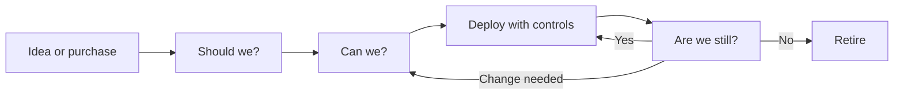
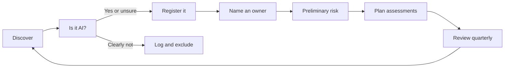

# Module 0 — Orientation

*Before any law, framework or model, you need a map. This module explains what AI governance actually is (and what it is not), what the IAPP's AIGP certification tests and how its questions are built, and how to plan your study. It then introduces Najm Bank, the fictional Gulf bank you will follow through every module, and does the first job any AI governance lead does on day one: build an inventory of the AI the organisation already uses. This course is independent and is not affiliated with or endorsed by the IAPP. Nothing in it is legal advice: laws change, and real decisions need qualified counsel in the relevant jurisdiction.*

> **BoK coverage:** Orientation to all four domains of the AIGP Body of Knowledge v2.1, with a first look at I.A (why AI needs governance) and the inventory practices developed in I.B, I.C and IV.

---

# 0.1 — What AI governance is, and what the AIGP proves
*Level: 🟢 Beginner* · *Prerequisites: none* · *BoK: Orientation (all domains)*

## ⚡ In 60 seconds
- **AI governance** is the system of people, rules, processes and evidence an organisation uses to decide which AI to build or use, under what conditions, and how to keep it within the law, its values and its risk appetite for as long as it runs.
- It is not the same as AI ethics (the values), compliance (meeting specific legal duties) or risk management (identifying and treating risks). Governance is the frame that holds all three and assigns accountability.
- The rule that matters most: **accountability stays with the organisation and named people.** "The algorithm did it" is never an answer, not to a regulator, not to a court and not to a customer.
- The **AIGP** (Artificial Intelligence Governance Professional) is a certification from the IAPP. It shows you understand how AI works at a governance level, which laws and frameworks apply, and how to govern AI across its development and deployment. It does not make you a lawyer or a data scientist.
- Exam cue: when a question asks what an organisation should do *first*, the governance answer is usually to understand the system, its context and its risks (inventory, assessment, ownership) before choosing a technical fix.
- Biggest trap: treating governance as a one-off approval gate. It is a loop that runs for the whole life of the system.

## 🧭 Why it matters
On Layla's first Monday as Najm Bank's new Head of AI Governance, the CEO stops her in the corridor. "The board wants to know if we are compliant with AI," he says. "Can you tell them by the next meeting?" Layla asks three questions back. How many AI systems does the bank use? Who owns each of them? Which of them make or shape decisions about customers or staff? Nobody in the room can answer. The data science team knows about the models it built. Procurement knows about some contracts. HR has bought a CV-screening tool. Relationship managers have been pasting client financials into a public chatbot to draft credit memos. The Frankfurt branch serves EU customers, so European rules may reach some of these systems, and the bank's home regulators in the Gulf are asking their own questions.

"Are we compliant with AI?" turns out to be the wrong question. There is no single "AI law" to comply with. There is a web of data protection laws, anti-discrimination rules, consumer protection, sector supervision, a new EU AI Act, and voluntary frameworks the regulators expect banks to know. The right question is: *do we know what AI we have, who is accountable for it, what could go wrong, and whether our controls are working?* That is AI governance.

The cost of not asking it is well documented. In *Moffatt v. Air Canada* (2024), a Canadian tribunal held the airline responsible for wrong refund information its website chatbot gave a customer, rejecting the argument that the chatbot was somehow responsible for its own statements. The chatbot was cheap to deploy. Nobody had governed what it was allowed to promise.

## 📐 How it works

### 🟢 The essentials

**A working definition.** AI governance is how an organisation makes and keeps good decisions about AI. It has four parts:

| Part | The question it answers | Examples at a bank |
|---|---|---|
| **Direction** | What do we want AI to do, and what will we never do with it? | AI principles, strategy, risk appetite statement |
| **Structure** | Who decides, who does the work, who checks? | AI Governance Committee, system owners, the DPO, model validators |
| **Process** | How does an idea become a live system, and how is it kept safe? | Use-case intake, risk tiering, impact assessment, approval, monitoring, retirement |
| **Evidence** | How do we prove it to ourselves and others? | Inventory, documentation, test results, logs, audit reports |

**What it is not.** People confuse governance with neighbouring ideas. The distinctions matter on the exam and in practice.

| Term | What it means | How it relates to governance |
|---|---|---|
| **AI ethics** | The values and moral principles AI should respect: fairness, dignity, autonomy, avoiding harm | Governance turns values into enforceable decisions and controls |
| **Responsible AI** | A common industry label for building and using AI in line with those values | Roughly the *goal*; governance is the *machinery* |
| **Compliance** | Meeting specific legal and regulatory duties | One output of governance; you can be compliant and still harm people or waste money |
| **Risk management** | Identifying, analysing, treating and monitoring risk | A core process *inside* governance |
| **Model risk management** | The discipline banks already use to validate and monitor quantitative models | A strong starting point for AI governance, but narrower: it rarely covers GenAI chatbots, bought tools or employee use |

**Three questions, asked again and again.** A simple way to remember what governance does across the life of a system:

1. **Should we?** Is this a good use of AI at all, given the purpose, the people affected and the alternatives?
2. **Can we?** Is it lawful, and can we build or buy it to a standard we can defend?
3. **Are we still?** Once live, is it still performing, still fair, still lawful, still wanted?

**Accountability.** Every AI system needs a named human owner who answers for it. The owner does not have to understand the maths, but they must understand what the system is for, what it could do wrong, and what controls exist. Regulators and courts look for a person and a process, not a model.

### 🟡 Going deeper

**Where governance sits in the organisation.** AI governance is not a new island. It plugs into structures most organisations already have:

- **Corporate governance.** The board sets direction and risk appetite and oversees management. ISO/IEC 38507 gives boards guidance on the governance implications of using AI.
- **The three lines model.** The first line (business and technology teams) owns and runs AI systems and their risks. The second line (risk, compliance, privacy, AI governance) sets policy and challenges the first line. The third line (internal audit) gives independent assurance. Layla sits in the second line; Khalid, who owns retail lending, is first line.
- **Existing disciplines.** Privacy, information security, model risk, procurement, legal, HR and internal audit all hold part of the answer. Good AI governance reuses their processes and adds what is specific to AI rather than building a parallel bureaucracy.

**Binding and voluntary.** Much of AI governance is about knowing the status of each instrument. Four layers:

| Layer | Status | Examples you will meet in this course |
|---|---|---|
| **Hard law** | Binding; enforced by regulators and courts | EU AI Act, GDPR, Qatar's PDPPL, UAE PDPL, anti-discrimination and consumer protection laws |
| **Regulatory guidance** | Not law, but supervisors expect you to follow it | Qatar Central Bank's AI guideline for financial institutions, EDPB opinions, Commission guidelines |
| **Standards and frameworks** | Voluntary unless a law or contract makes them mandatory; some are certifiable | NIST AI RMF, ISO/IEC 42001, ISO/IEC 23894 |
| **Principles** | High-level political commitments | OECD AI Principles, UNESCO Recommendation on the Ethics of AI |
| **Internal policy** | Binding on the organisation's own staff | Najm's AI policy, acceptable-use rules for GenAI |

A voluntary framework can still bite. A regulator may treat it as the benchmark of reasonable practice, a contract may require it, and a certification (such as ISO/IEC 42001) is a public claim that you must then live up to.

**Governance across the life cycle.** The AIGP Body of Knowledge divides the work into governing **development** (design, data, build, testing, release, monitoring) and governing **deployment and use** (deciding to deploy, assessing, operating). Najm will do both: it builds its own credit-scoring model and buys a CV-screening tool. Many organisations mostly *buy*, which is why the deployer side of the exam carries as much weight as the developer side.

### 🔴 Expert view

**Governance as a management system.** Mature programmes treat AI governance like any other management system: plan (set policy, objectives and risk criteria), do (run the processes), check (monitor, audit, measure) and act (improve). ISO/IEC 42001 is built on exactly this Plan-Do-Check-Act cycle and can be certified by an accredited body. The value of the management-system view is that it forces repetition: the organisation does not just approve AI, it keeps checking whether its approvals were right.

**Proportionality is the whole game.** A bank might have fifty AI systems. Governing a spam filter like a credit-scoring model wastes effort and teaches staff that governance is theatre. Governing a credit-scoring model like a spam filter causes harm and breaks the law. The core skill is *risk-based tiering*: light-touch controls for low-risk uses, heavy controls for high-risk ones, and a clear list of uses the organisation will not pursue. The EU AI Act, the NIST AI RMF and ISO/IEC 42001 all rest on this idea.

**Governance enables, not only prevents.** Teams route around governance that is slow and opaque; they bring it in early when it is fast and predictable. The best programmes publish clear intake paths, pre-approved patterns (for example, "internal summarisation with approved GenAI tools, no customer data"), and service levels for reviews. Layla's goal is not to say "no" more often. It is to make "yes, with these conditions" the easy path.

**What the AIGP proves.** The AIGP was created by the IAPP, a global membership body for privacy and AI governance professionals that also runs the CIPP, CIPM and CIPT privacy certifications. Passing the AIGP shows that you can:

- explain what AI systems are, how they fail and why that creates governance needs (Domain I);
- recognise how existing and new laws, and the main standards and frameworks, apply to AI (Domain II);
- govern AI through design, data, testing, release and monitoring (Domain III);
- govern the decision to deploy AI, the assessments it needs, and its ongoing use (Domain IV).

It is a breadth credential. It proves you can sit in a room with lawyers, engineers, risk managers and executives and connect their concerns into a defensible decision. It does not prove you can train a model or give legal advice, and good AI governance professionals know when to call someone who can. Certification also has upkeep: the IAPP requires continuing professional education to keep the credential current, so check its current maintenance rules on iapp.org.

**How this course is built.** Thirteen modules take you from orientation (Module 0) through the four BoK domains (Modules 1–11) to a capstone and a full 100-question mock exam (Module 12). Each lesson follows the same shape: the 60-second version, why it matters, how it works at three depths (🟢 🟡 🔴), the instruments, a Najm Bank artefact, exercises, traps, recap, five exam-style questions and official references. You can read only the 🟢 layers for a first pass and come back for depth.

## ⚖️ The instruments
| Instrument | What it requires or recommends | Exam cue |
|---|---|---|
| **EU AI Act** — Art. 4 | Providers and deployers must take measures to ensure a sufficient level of AI literacy among staff dealing with AI systems; applies from 2 February 2025 | AI literacy is a legal duty in the EU, not just good practice, and it applies to deployers too |
| **NIST AI RMF** — Govern function | Voluntary US framework; Govern is the cross-cutting function that sets culture, policies, roles and accountability for the other three (Map, Measure, Manage) | Govern runs across the whole life cycle; it is not a step you finish |
| **ISO/IEC 42001** | Certifiable AI management system standard built on Plan-Do-Check-Act, with Annex A controls | "Management system", "certification", "continual improvement" point here |
| **ISO/IEC 38507** | Guidance for governing bodies (boards) on the governance implications of using AI | Board-level oversight questions |
| **OECD AI Principles** | Intergovernmental principles (2019, updated 2024), including accountability for AI actors | Principles are high-level and non-binding; accountability is one of them |

## 🏛️ In practice at Najm Bank
Layla's first artefact is a one-page **AI Governance Charter**, approved by the Board Risk Committee. It does not solve anything yet; it creates the authority to do so.

| Clause | Text (draft v0.1) |
|---|---|
| **Purpose** | To ensure Najm Bank develops, buys and uses AI lawfully, fairly, securely and in line with its risk appetite, and can demonstrate this to supervisors, customers and staff. |
| **Scope** | All AI systems developed, procured, embedded in third-party products or used by staff for Najm's business, in every jurisdiction where Najm operates (Qatar, UAE, EU). "AI system" follows the definition in the AI Policy (aligned to the OECD and EU AI Act definitions). |
| **Accountability** | Each AI system has a named Business Owner (first line) who is accountable for its use and outcomes. The Head of AI Governance sets policy and provides challenge (second line). Internal Audit provides independent assurance (third line). |
| **Committee** | The AI Governance Committee, chaired by the Chief Risk Officer, with the CDO (Omar), DPO (Sara), Head of AI Governance (Layla), CISO, Legal, HR and business representatives. It approves high-risk use cases and policy exceptions. |
| **Decisions reserved to the Board** | Risk appetite for AI; any use of AI the policy classes as prohibited; annual review of the AI programme. |
| **First 90 days** | (1) AI inventory. (2) Interim acceptable-use rule for public GenAI tools. (3) AI Policy and risk-tiering method. (4) AI literacy plan for all staff. |
| **Review** | Annually, or after a significant incident, legal change or new category of AI use. |

## 🛠️ Exercises
- 🟢 **Define it in your own words.** Write a two-sentence definition of AI governance for your own organisation (or Najm), then list one example each of direction, structure, process and evidence. *Done when:* each of the four parts has a concrete example, not a generic label.
- 🟡 **Map the three lines.** For Najm's credit-scoring model, name who sits in the first, second and third line, and write one sentence on what each does for that model. *Done when:* no line is doing another line's job (for example, the second line is not running the model).
- 🔴 **Classify the instruments.** Take the five instruments in the table above plus the GDPR and Najm's internal AI Policy. Classify each as hard law, guidance, standard or framework, principle, or internal policy, and write one sentence on how a "voluntary" one could still become effectively mandatory for Najm. *Done when:* you have at least two different routes by which a voluntary instrument becomes binding in practice.

## ⚠️ Mistakes and exam traps
- **Trap: "AI governance = AI ethics."** Ethics provides the values; governance is the accountable machinery. In questions, prefer answers that assign ownership, set process and create evidence over answers that only state values.
- **Trap: "We bought it, so the vendor is responsible."** Buying AI shifts some duties to the provider but never removes the deployer's own accountability for how it is used. Look for the answer that keeps accountability with the organisation.
- **Trap: jumping to a technical fix.** When the question asks what to do *first*, the right answer is usually to understand the system and its risks (inventory, owner, assessment), not to retrain, add a filter or buy a tool.
- **Trap: treating a framework as law.** The NIST AI RMF and ISO/IEC 42001 are voluntary. The EU AI Act and the GDPR are binding. Mixing them up is a classic distractor.
- **Trap: one-time approval.** Governance continues after launch. Answers that include monitoring and review beat answers that stop at sign-off.

## 🧾 Recap
- AI governance is direction, structure, process and evidence for AI, applied proportionately across the whole life cycle.
- It contains ethics, compliance and risk management but is not the same as any of them.
- Accountability sits with the organisation and named owners; it cannot be delegated to a model or a vendor.
- Instruments range from hard law to guidance, standards, principles and internal policy; know which is which.
- The AIGP is a breadth credential across four domains: foundations, law and frameworks, governing development, governing deployment and use.

## ✍️ Check yourself

**1. Which statement best describes AI governance?**

- A. The set of ethical values an organisation publishes about AI
- B. The legal team's review of AI contracts
- C. The people, rules, processes and evidence an organisation uses to direct and control AI across its life cycle
- D. The data science team's model validation process

Answer

**C.** Governance is the whole accountable system. A describes ethics (values without machinery), B and D are single processes that sit inside governance. (See 🟢 The essentials.)

**2. Najm Bank's CEO asks Layla whether the bank is "compliant with AI". What should Layla do FIRST?**

- A. Buy an AI compliance software tool
- B. Establish what AI systems the bank uses, who owns them and what they are used for
- C. Ask the data science team to retrain all models for fairness
- D. Tell the board the bank is compliant because no Qatari law bans AI

Answer

**B.** You cannot govern what you cannot see; an inventory with owners and purposes is the foundation of every later assessment. A and C jump to solutions before the problem is understood; D wrongly assumes a single "AI law" and ignores other applicable laws and the EU branch. (See 🧭 Why it matters.)

**3. In the three lines model, where does Najm's Head of AI Governance usually sit?**

- A. Second line, setting policy and challenging the business
- B. First line, because she owns the AI systems
- C. Third line, giving independent assurance to the board
- D. Outside the model, because AI is a technology topic

Answer

**A.** AI governance is typically a second-line function that sets policy and provides challenge. System owners such as Khalid are first line; internal audit is third line. (See 🟡 Going deeper.)

**4. Which of the following is a binding legal instrument rather than a voluntary framework?**

- A. NIST AI Risk Management Framework
- B. ISO/IEC 42001
- C. OECD AI Principles
- D. EU AI Act

Answer

**D.** The EU AI Act is a regulation with legal force. NIST AI RMF and ISO/IEC 42001 are voluntary (42001 is certifiable, but certification is still a choice), and the OECD principles are non-binding political commitments. (See 🟡 binding and voluntary table.)

**5. A retailer deploys a website chatbot bought from a vendor. It tells a customer they are entitled to a refund they are not entitled to. Based on the reasoning in *Moffatt v. Air Canada*, who is most likely to be held responsible to the customer?**

- A. The chatbot itself, as the source of the statement
- B. The vendor only, because it built the chatbot
- C. The retailer that deployed the chatbot on its website
- D. No one, because the output was generated automatically

Answer

**C.** In *Moffatt*, the tribunal held the airline responsible for information on its own website, including its chatbot's answers. The vendor may owe the deployer something under contract, but that does not remove the deployer's responsibility to its customer. (See 🧭 Why it matters.)

## 📚 References
- IAPP, Artificial Intelligence Governance Professional (AIGP) certification and Body of Knowledge: https://iapp.org/certify/aigp/
- Regulation (EU) 2024/1689 (EU AI Act): https://eur-lex.europa.eu/eli/reg/2024/1689/oj
- NIST AI Risk Management Framework: https://www.nist.gov/itl/ai-risk-management-framework
- ISO/IEC 42001 and ISO/IEC 38507, via the ISO catalogue: https://www.iso.org/
- OECD AI Principles: https://oecd.ai/en/ai-principles

---

# 0.2 — How the exam thinks: BoK v2.1, question styles, a study plan
*Level: 🟢 Beginner* · *Prerequisites: 0.1* · *BoK: Orientation (all domains)*

## ⚡ In 60 seconds
- At the time of writing (2026), the AIGP exam has **100 multiple-choice questions** (85 scored, 15 unscored pilot questions you cannot identify), lasts **2 hours 45 minutes**, and is scored on a **scale of 100–500 with 300 to pass**.
- It follows the **AIGP Body of Knowledge v2.1** (effective 2 February 2026): four domains, thirteen competencies, and a published range of questions per domain.
- Domains III and IV (governing development; governing deployment and use) together carry roughly half the scored questions. Law and frameworks (Domain II) are a large block, but the exam is not a law exam.
- Many questions are **scenarios**: a short story about an organisation followed by one or more questions asking what is BEST, FIRST, MOST likely or MOST important.
- The exam rewards a governance mindset: understand the context, identify roles and risks, follow a proportionate process, keep humans accountable.
- Biggest trap: answering a *true* statement instead of the *best* answer to the question actually asked.

## 🧭 Why it matters
Omar, Najm's Chief Data Officer, and Sara, the DPO, both agree to sit the AIGP in the same quarter. Omar knows machine learning deeply; Sara knows the GDPR and Qatar's data protection law article by article. Layla, who already holds the certification, predicts they will both find it harder than they expect, for opposite reasons. Omar will pick the technically clever answer when the question wants a governance step. Sara will pick the legally precise answer when the question is really about who should decide and in what order.

Knowing how the exam is built changes how you study. It tells you where the marks are, what kind of reasoning each question wants, and how to spend your weeks. This lesson gives you that map and two study plans that tie each week to this course's modules.

## 📐 How it works

### 🟢 The essentials

**The format at a glance** (at the time of writing, 2026; always check the current candidate handbook on iapp.org before booking):

| Item | Detail |
|---|---|
| Questions | 100 multiple choice: 85 scored, 15 unscored pilot questions mixed in |
| Time | 2 hours 45 minutes (165 minutes), about 1.6 minutes per question |
| Scoring | Scaled score from 100 to 500; 300 is a pass |
| Question style | Four options, one best answer; many set in short scenarios |
| Basis | AIGP Body of Knowledge v2.1, effective 2 February 2026 |

**The four domains and their weight.** The IAPP publishes a minimum and maximum number of questions for each domain. The midpoints add up to the 85 scored questions.

| Domain | What it covers | Questions (range) | Course modules |
|---|---|---|---|
| **I** Foundations of AI governance | What AI is, why it needs governance, organisational roles and training, policies across the life cycle | 16–20 | 1, 2, 3 |
| **II** How laws, standards and frameworks apply to AI | Privacy law, other existing laws, the EU AI Act, standards and frameworks | 19–23 | 4, 5, 6, 7 |
| **III** How to govern AI development | Design and build, data for training and testing, release, monitoring and maintenance | 21–25 | 8, 9, 10 |
| **IV** How to govern AI deployment and use | Deciding to deploy, assessing the system, governing ongoing use | 21–25 | 11 |

Module 0 orients you; Module 12 pulls everything together with a capstone, exam strategy and a full mock exam.

**The thirteen competencies.** Each domain breaks into competencies. You will see these IDs at the top of every lesson ("BoK: …"). The titles below are this course's paraphrases.

| ID | Competency (course paraphrase) | Where in this course |
|---|---|---|
| I.A | What AI is and why it needs governance | Module 1 |
| I.B | Setting and communicating organisational expectations: roles, responsibilities, training | Module 2 |
| I.C | Policies and procedures across the AI life cycle, including data governance, IP and third-party risk | Module 3 |
| II.A | How existing data privacy laws apply to AI | Module 4 |
| II.B | How other existing laws apply: non-discrimination, IP, consumer protection, product liability | Module 5 |
| II.C | The main elements of the EU AI Act | Module 6 |
| II.D | The main industry standards and frameworks | Module 7 |
| III.A | Governing the design and building of the AI system | Module 8 |
| III.B | Governing the collection and use of data for training and testing | Module 9 |
| III.C | Governing release, monitoring and maintenance | Module 10 |
| IV.A | Evaluating key factors and risks before deciding to deploy | Module 11 (11.1, 11.2) |
| IV.B | Performing key assessments of the AI system | Module 11 (11.3) |
| IV.C | Governing deployment and use | Module 11 (11.4) |

**What changed in v2.1.** The most visible change is wording: Domains III and IV now talk about governing the **AI system** rather than the **AI model**. A model is the trained mathematical component; a system is the model plus data pipelines, user interface, human reviewers, integrations and the context of use. The exam expects you to govern the whole system, because that is where harm actually happens. (Lesson 1.1 explains the difference in detail.)

### 🟡 Going deeper

**Anatomy of a question.** Every item has a *stem* (the question), sometimes a *scenario* (the story it sits in), one *key* (the best answer) and three *distractors*. Good distractors are not silly. Typically:

- one is **true but irrelevant**: a correct fact that does not answer this question;
- one is **right action, wrong time**: something you would do, but later (or earlier) than the question asks;
- one is **too extreme**: ban the system, or do nothing, where a proportionate step exists;
- the key is the **most complete, most proportionate, governance-first** answer.

**Signal words.** Read the last line of the stem twice and underline the qualifier:

| Qualifier | What it is really asking |
|---|---|
| FIRST / INITIAL | The earliest correct step in a sensible process. Usually: understand, scope, identify roles, assess. |
| BEST / MOST appropriate | Several options may be acceptable; pick the one that addresses the root issue proportionately. |
| MOST likely | A judgement about probability: what would a regulator, court or reasonable practitioner most likely conclude? |
| PRIMARY / MAIN purpose | The core reason something exists, not a side benefit. |
| NOT / EXCEPT (if used) | Reverse the logic: three options are correct, find the odd one out. Read slowly. |

**How scenarios are built.** A scenario is a short narrative about a fictional organisation: its sector, where it operates, what AI it is building or buying, who is involved and what has happened. The questions then test whether you can pull the right facts out of it. When you read one, extract five things before looking at the options:

1. **Jurisdiction.** Where are the organisation, the users and the affected people? (EU presence can bring in the GDPR and the EU AI Act.)
2. **Role.** Is the organisation building the AI (provider or developer) or using someone else's (deployer)? Roles decide duties.
3. **Use and impact.** What decision or output does the system produce, and about whom? Credit, jobs, health, education and public services are high-impact.
4. **Life-cycle stage.** Is this design, data collection, testing, release, live operation or retirement?
5. **The actual problem.** Bias found? Complaint received? Vendor refusing documentation? Model drifting?

**A worked example (written for this course, not taken from the exam).**

> *A logistics company based in Germany buys an AI tool that ranks job applicants for warehouse roles. HR wants to go live next month. The vendor says the tool is "bias-free" but will not share any testing results. What should the company do FIRST?*
> A. Go live and monitor complaints · B. Require evidence of the vendor's testing and documentation and assess the tool before deployment · C. Build its own ranking tool instead · D. Ask applicants to consent to AI screening

Extract: EU (Germany), deployer, employment decisions (a high-impact use that the EU AI Act lists as high-risk), pre-deployment stage, problem is missing evidence. **B** is the key: governance-first, proportionate, right time. A is right action, wrong time (monitoring comes after an adequate assessment). C is too extreme. D sounds protective but consent is a weak basis in employment and does not fix the missing evidence.

**The governance lens.** Across hundreds of questions, a few habits pick the key more often than not:

- **Context before controls.** Understand purpose, people affected and risk before choosing a fix.
- **Roles before rules.** Work out who is the provider and who is the deployer, the controller and the processor.
- **Proportionality.** Match effort to risk; neither ban everything nor wave it through.
- **Humans stay accountable.** Oversight, escalation and ownership beat "the model decides".
- **Evidence.** Documentation, testing and logs beat assurances and marketing claims.
- **Life cycle.** Monitoring, review and retirement are part of the answer, not an afterthought.

### 🔴 Expert view

**Why the score is scaled.** Different candidates sit different versions (forms) of the exam, and some forms are slightly harder than others. Scaling converts raw performance onto a common 100–500 scale so that 300 means the same standard on every form. The practical lessons: there is no fixed "percentage to pass" you can rely on, and you cannot tell which 15 questions are unscored pilots, so treat every question as if it counts. Check the candidate handbook for current rules on guessing; the usual approach in IAPP exams is that an unanswered question earns nothing, so never leave a blank.

**Time strategy.** At about 1.6 minutes per question you have time, but scenarios eat it. A workable rhythm: one pass answering everything you can in under a minute and flagging the rest; a second pass for flagged items; a final check that nothing is blank. Module 12.2 covers this in depth.

**Where experienced people lose marks.**

- **Lawyers** over-read the law. The exam tests what an instrument requires and when it applies, not case-by-case litigation strategy. If a question is about process ("who should approve?"), the legal nuance is a distractor.
- **Engineers** over-trust technique. "Retrain the model" or "add more data" is rarely the first governance step.
- **Privacy professionals** see everything as a GDPR question. Many AI harms (safety, reliability, IP, discrimination) sit outside data protection, and the EU AI Act runs alongside the GDPR, not inside it.
- **Everyone** under-studies Domains III and IV because they feel "practical". They carry the most questions.

**Study technique that works.** Read actively: after each lesson, close it and write the 60-second summary from memory. Use the five questions at the end of each lesson as retrieval practice, not as reading. Keep a one-page "instruments sheet" (instrument, status, who it applies to, key dates, exam cue) built from the ⚖️ tables; it becomes your revision backbone. Space your revision: revisit each module a few days and then a couple of weeks after you first read it.

## ⚖️ The instruments
| Instrument | What it requires or recommends | Exam cue |
|---|---|---|
| **EU AI Act** | Binding EU regulation (Regulation (EU) 2024/1689) with risk tiers and role-based duties; the core of competency II.C and heavily used in Domains III–IV scenarios | Identify role (provider or deployer) and risk tier before choosing duties |
| **GDPR** | Binding EU data protection law; the core of II.A (lawful basis, transparency, automated decisions, DPIAs) | Personal data in training or in decisions brings it in, alongside the AI Act |
| **NIST AI RMF** | Voluntary US framework: Govern, Map, Measure, Manage, and trustworthy-AI characteristics | Structure of a risk programme; voluntary, not law |
| **ISO/IEC 42001** | Certifiable AI management system standard | Management system, certification, continual improvement |
| **OECD AI Principles** | Intergovernmental principles; the OECD's AI-system definition underpins the EU AI Act definition | Definitions and high-level values |
| **NYC Local Law 144** | Requires bias audits and notices for automated employment decision tools used for New York City jobs | Classic example of a targeted, use-specific AI law (II.B) |

## 🏛️ In practice at Najm Bank
Layla gives Omar and Sara two study plans and lets them choose. Both map directly to this course.

**Plan A — 6 weeks (for people already working in privacy, risk or data; about 8–10 hours a week)**

| Week | Modules | Focus | End-of-week check |
|---|---|---|---|
| 1 | 0, 1, 2 | Orientation, what AI is, harms, organisational roles | All lesson questions; write your instruments sheet header |
| 2 | 3, 4 | Policies across the life cycle; privacy law and AI | Explain Art. 22 GDPR and a DPIA to a colleague without notes |
| 3 | 5, 6 | Other laws; the EU AI Act | Draw the AI Act risk pyramid and role map from memory |
| 4 | 7, 8 | Standards and frameworks; design and build | Map NIST AI RMF functions to ISO/IEC 42001 clauses at a high level |
| 5 | 9, 10, 11 | Data, testing, release, monitoring, deployment | Do every 🟡 exercise in Module 11 |
| 6 | 12 | Capstone, exam strategy, full mock exam twice | Mock score review: re-read every lesson behind a wrong answer |

**Plan B — 12 weeks (for newcomers; about 4–6 hours a week)**

| Week | Modules | Focus |
|---|---|---|
| 1 | 0 | Orientation, exam map, Najm's inventory |
| 2 | 1 | AI, ML, GenAI and agents; harms; why AI is different |
| 3 | 2 | Strategy, roles, committee, literacy |
| 4 | 3 | Life cycle, policies, data, IP, third parties |
| 5 | 4 | Privacy principles, automated decisions, DPIAs, GCC privacy laws |
| 6 | 5 | Non-discrimination, IP, consumer protection, liability |
| 7 | 6 | EU AI Act in full |
| 8 | 7 | OECD, NIST, ISO/IEC, global map; mid-point review of Modules 1–7 |
| 9 | 8, 9 | Design, build, data, testing |
| 10 | 10 | Release, monitoring, change, retirement |
| 11 | 11 | Deploying and using AI |
| 12 | 12 | Capstone, strategy, two sittings of the mock exam, targeted review |

**Rules for either plan:** book the exam date at the start (a deadline changes behaviour); do the five questions after each lesson the *next* day, not straight away; keep an error log with the competency ID of every miss; and in the last week, study only from your error log and instruments sheet.

## 🛠️ Exercises
- 🟢 **Build your map.** Copy the domain table and add, for each domain, the course modules and the number of weeks you will spend on it. *Done when:* your weeks roughly follow the weight of each domain, with Domains III and IV not squeezed.
- 🟡 **Dissect a question.** Take the worked example above and write down, for each distractor, which type it is (true but irrelevant, wrong time, too extreme). Then rewrite the stem so that a different option becomes the key. *Done when:* your rewritten stem has one clearly best answer and you can explain why.
- 🔴 **Write a scenario item.** Write your own scenario (80–120 words) about Najm Bank's CV-screening tool with one FIRST question and one BEST question, each with a key and three plausible distractors. *Done when:* a colleague can answer both and agrees each distractor is tempting but wrong.

## ⚠️ Mistakes and exam traps
- **Trap: picking a true statement.** Several options may be true; only one answers the question asked. Re-read the stem's last line before choosing.
- **Trap: ignoring FIRST.** A good step done at the wrong time is a wrong answer. Ask "what must happen before this?"
- **Trap: studying only the law.** Domains III and IV carry the most questions. Budget study time by domain weight.
- **Trap: skipping pilot-looking questions.** You cannot identify unscored items; answer everything.
- **Trap: memorising without applying.** Scenario questions test judgement. Practise extracting jurisdiction, role, use, stage and problem.

## 🧾 Recap
- 100 questions (85 scored), 2 h 45 min, scaled 100–500, pass at 300 (at the time of writing, 2026).
- Four domains, thirteen competencies; Domains III and IV together carry about half the scored questions.
- v2.1 governs the AI **system**, not just the model.
- Read scenarios for jurisdiction, role, use, stage and problem; watch the qualifier (FIRST, BEST, MOST).
- Pick the governance-first, proportionate, evidence-based answer; plan study by domain weight.

## ✍️ Check yourself

**1. At the time of writing (2026), how many AIGP exam questions are scored?**

- A. 85
- B. 90
- C. 100
- D. 75

Answer

**A.** The exam has 100 questions, of which 85 are scored and 15 are unscored pilot questions. C is the total, not the scored number. (See 🟢 The essentials.)

**2. Which pair of domains carries the most questions in the BoK v2.1 blueprint?**

- A. Domains I and II
- B. Domains III and IV
- C. Domains II and III
- D. Domains I and IV

Answer

**B.** Domains III (governing development) and IV (governing deployment and use) each have a range of 21–25 questions, the highest of the four. Domain II is 19–23 and Domain I is 16–20. (See the domain table.)

**3. What is the main significance of the v2.1 shift from "AI model" to "AI system" in Domains III and IV?**

- A. Models no longer need to be tested
- B. The exam now focuses on hardware
- C. Only generative AI is now in scope
- D. Governance must cover the whole system, including data pipelines, interfaces, human oversight and context of use

Answer

**D.** A system is the model plus everything around it, which is where harms arise. Models still need testing (A is wrong), and the change is not limited to GenAI or hardware. (See "What changed in v2.1".)

**4. An insurer in France plans to deploy a vendor's AI tool to set individual premiums. The vendor offers no documentation. Before looking at the answer options, which set of facts should a candidate extract FIRST from this scenario?**

- A. The vendor's market share and the tool's price
- B. The jurisdiction, the insurer's role, the impact of the use, the life-cycle stage and the problem
- C. The programming language and the model architecture
- D. The number of employees at the insurer

Answer

**B.** Jurisdiction, role, use and impact, stage and problem determine which rules apply and what step comes next. The other options are rarely decisive for a governance answer. (See "How scenarios are built".)

**5. Najm Bank's HR team wants to go live next week with a bought CV-screening tool. The vendor claims it is "bias-free" but will not share test results. Which option is the BEST governance response?**

- A. Go live and monitor complaints from rejected applicants
- B. Cancel the project and ban AI in HR permanently
- C. Require the vendor's testing evidence and documentation and complete an assessment before deployment
- D. Rely on the vendor's contract warranty that the tool is bias-free

Answer

**C.** It is proportionate, governance-first and evidence-based, at the right stage. A is the right action at the wrong time; B is too extreme; D relies on an assurance rather than evidence and leaves Najm's own accountability untouched. (See "Anatomy of a question" and "The governance lens".)

## 📚 References
- IAPP, AIGP certification, Body of Knowledge and candidate handbook: https://iapp.org/certify/aigp/
- Regulation (EU) 2024/1689 (EU AI Act): https://eur-lex.europa.eu/eli/reg/2024/1689/oj
- Regulation (EU) 2016/679 (GDPR): https://eur-lex.europa.eu/eli/reg/2016/679/oj
- NIST AI Risk Management Framework: https://www.nist.gov/itl/ai-risk-management-framework
- OECD AI Principles: https://oecd.ai/en/ai-principles

---

# 0.3 — Meet Najm Bank: an AI inventory from day one
*Level: 🟢 Beginner* · *Prerequisites: 0.1* · *BoK: Orientation · I.A, I.C*

## ⚡ In 60 seconds
- **Najm Bank is fictional**: a mid-sized Gulf bank and the running case throughout.
- The first artefact of any AI governance programme is an **AI inventory**: a register of every AI system the organisation builds, buys, embeds or lets staff use, with an owner, purpose, data and a preliminary risk rating.
- Najm's first inventory finds six systems: credit scoring, a customer-service chatbot, a vendor CV-screening tool, a GenAI credit memo copilot, fraud detection, and staff use of public GenAI tools.
- Preliminary risk is a triage label, not a legal conclusion. It tells you where to look first.
- Exam cue: "you cannot govern what you do not know you have." Inventory and ownership come before assessment and controls.
- Biggest trap: counting only what the data science team built, and missing bought, embedded and "shadow" AI.

## 🧭 Why it matters
Najm Bank's board meets in six weeks. The Chief Risk Officer wants one page: *what AI do we use, and where is the risk?* Layla has no inventory and no policy. She also has a hard external date on her mind: under the EU AI Act, the rules for high-risk systems listed in Annex III, which include AI used to evaluate the creditworthiness of individuals and AI used in recruitment, apply from 2 August 2026. The Frankfurt branch lends to EU residents. (In November 2025 the European Commission proposed a "Digital Omnibus" package that would postpone some high-risk deadlines; readers should check the current status. The exam tests the Act as adopted.)

Meanwhile the Qatar Central Bank has issued an AI guideline for financial institutions, Qatar's data protection law (Law No. 13 of 2016, the PDPPL) already covers the customer data in Najm's models, and the UAE operation brings in the UAE's federal data protection law. None of that analysis can start until Layla knows what systems exist.

## 📐 How it works

### 🟢 The essentials

**Najm Bank at a glance.** Najm is fictional; any resemblance to a real institution is unintended.

| Fact | Detail |
|---|---|
| Type | Mid-sized commercial bank: retail, SME and corporate lending, cards, deposits |
| Headquarters | Doha, Qatar; supervised by the Qatar Central Bank |
| Other operations | A subsidiary in the UAE; a branch in Frankfurt serving EU customers |
| Customers | Individuals and businesses in Qatar and the UAE; EU-resident customers through Frankfurt |
| AI maturity | Early: a data science team of eight, several vendor tools, no AI policy yet |
| Governance so far | Model risk management for credit models; a privacy programme under the DPO; no AI-specific process |

**The cast.** You will meet these people in every module. Learn what each one cares about; the exam's scenarios are full of people like them.

| Person | Role | What they care about | Typical question they ask |
|---|---|---|---|
| **Layla** | Head of AI Governance (your mentor) | A proportionate, defensible programme that enables the business | "Who owns this, and what could go wrong?" |
| **Omar** | Chief Data Officer | Data quality, platforms, speed of delivery | "Can governance keep up with our release cycle?" |
| **Sara** | Data Protection Officer | Lawful processing, individuals' rights, DPIAs | "What personal data goes in, and on what legal basis?" |
| **Khalid** | Head of Retail Lending (business owner) | Faster decisions, lower defaults, growth | "Will this let us approve good customers faster?" |
| **Dana** | Lead Data Scientist | Model performance, sound methods, reproducibility | "What does 'fair' mean in numbers, exactly?" |
| **Yusuf** | Head of Procurement | Vendor terms, cost, supplier risk | "What do I need to put in the contract?" |
| **AI Governance Committee** | Cross-functional decision body chaired by the CRO | Approving high-risk uses and exceptions | "Is this within our risk appetite?" |

**What an AI inventory is.** An AI inventory (also called an AI register) is a maintained list of AI systems in scope of governance. It is the backbone of everything that follows: you tier risk from it, schedule assessments from it, report to the board from it, and answer regulators from it. Minimum fields for a first version:

| Field | Why it matters |
|---|---|
| System name and short description | So everyone means the same thing |
| Business owner (a named person) | Accountability |
| Purpose and decision supported | Risk depends on use, not on technique |
| People affected | Customers, applicants, staff, the public |
| Data used (types, personal data, sensitive data) | Privacy and fairness exposure |
| Build, buy or embedded; vendor if any | Role and third-party risk |
| Najm's role (developer or provider, deployer) | Which duties apply |
| Jurisdictions | Which laws apply |
| Life-cycle stage | Idea, development, live, retiring |
| Preliminary risk rating | Where to look first |

### 🟡 Going deeper

**How Layla finds the AI.** People rarely know they are using AI, and asking "do you use AI?" gets unreliable answers. Layla uses several discovery routes at once:

- **Ask about decisions, not technology.** "Which decisions about customers or staff use a score, ranking, prediction or generated text?" finds systems that owners do not think of as AI.
- **Follow the money.** Yusuf pulls contracts and invoices for "intelligent", "automated" or "assistant" products and renewals that added AI features.
- **Check existing registers.** The model risk inventory (credit and fraud models), the privacy records of processing, the IT asset register and the vendor register.
- **Look at the network.** Web-proxy logs reveal traffic to public GenAI services (shadow AI).
- **Survey plus interviews.** A short survey to every department head, with follow-up interviews where answers are unclear.

**Is it AI?** Use the OECD and EU AI Act idea (explained in 1.1): a machine-based system that *infers* from inputs how to produce predictions, content, recommendations or decisions. Layla includes borderline cases marked "to confirm"; removing an item later is cheaper than missing one.

**Najm Bank's initial AI inventory (v0.1).**

| # | System | Business owner | Purpose | Build or buy; Najm's role | Data | Jurisdictions | Preliminary risk |
|---|---|---|---|---|---|---|---|
| 1 | **Retail credit-scoring model** | Khalid, Head of Retail Lending (built by Dana's team) | Scores personal-loan and card applicants; score drives approve, refer or decline and pricing | Built in-house; Najm is developer and user (provider and deployer in AI Act terms) | Application data, income, employment, credit bureau data, account transaction history | Qatar, UAE, EU (Frankfurt applicants) | **High**: decisions with significant effects on individuals; creditworthiness evaluation of natural persons is an Annex III high-risk use under the EU AI Act; automated-decision rules in data protection law may apply |
| 2 | **Customer-service chatbot "Najm Assist"** | Head of Customer Experience | Answers questions on products, fees and account servicing in Arabic and English on web and app | Bought platform, configured by Najm on a third-party large language model; Najm is deployer | Customer messages (may include personal and account data); product and fee knowledge base | Qatar, UAE, EU | **Medium**: customer-facing; wrong answers can mislead customers (compare *Moffatt v. Air Canada*); users must know they are talking to AI |
| 3 | **CV-screening tool** | Head of HR (procured by Yusuf) | Ranks job applicants and filters CVs for interview | Bought SaaS from a vendor; Najm is deployer | CVs, application forms; may infer age, gender or nationality from text | Qatar, UAE, EU (Frankfurt hiring) | **High**: employment decisions; recruitment AI is an Annex III high-risk use under the EU AI Act; well-known discrimination risk (compare Amazon's scrapped recruiting model) |
| 4 | **Credit memo copilot** (GenAI) | Head of Corporate and SME Banking | Drafts credit memos for relationship managers from client financials and internal notes; humans finalise | Built by Najm on a third-party GenAI model via API; Najm is deployer of the model and developer of the application | Client financial statements, account data, RM notes; may include personal data of business owners and guarantors | Qatar, UAE, EU | **Medium–High**: shapes lending decisions; risk of fabricated figures; confidential data sent to a third-party model; over-reliance by staff |
| 5 | **Fraud detection** | Head of Financial Crime | Flags suspicious card and payment transactions in real time for blocking or review | Vendor model tuned on Najm data; Najm is deployer (and partly developer) | Transaction data, device and location data, customer profile | Qatar, UAE, EU | **Medium**: false positives block legitimate customers; not an Annex III credit-scoring use (the Act excludes AI used to detect financial fraud from that category), but data protection, fairness and customer-treatment duties still apply |
| 6 | **Staff use of public GenAI tools** | Omar (CDO) as interim owner, with the CISO | Drafting, summarising, translation, coding help, used informally across departments | Public consumer services, no contract; Najm staff are users | Whatever staff paste in, including client data (confirmed in proxy logs) | All | **High (interim)**: confidentiality and personal-data leakage, no vendor terms, unverified outputs; compare the 2023 reports of Samsung staff pasting source code into ChatGPT |

### 🔴 Expert view

**Preliminary risk is triage.** The ratings above answer "where do we look first?", not "what does the law say?". A proper classification comes later, after an impact assessment (Module 11) and legal analysis of each regime (Modules 4–6). Layla labels them "preliminary" on every page so nobody quotes the table to a regulator as a conclusion. Three factors drive it: **significance of the decision** for people, **degree of automation**, and **sensitivity and scale of data**.

**One system, many regimes.** The credit-scoring model is a good example of why inventories need a jurisdiction column. For Frankfurt applicants, the EU AI Act's high-risk rules and the GDPR both apply. For Doha applicants, Qatar's PDPPL and the QCB's AI guideline apply. For Dubai applicants, the UAE PDPL may apply (or a free-zone regime if the UAE entity sits in one). Same system; different duties.

**Roles are not always obvious.** Najm *builds* the credit model and *uses* it, so it holds both provider-type and deployer-type duties. For the credit memo copilot, Najm deploys a third-party GenAI model but builds its own application around it. Under the EU AI Act, modifying a system or putting your name on it can change your role. The inventory records Najm's role per system because roles decide duties (Module 6).

**Embedded and shadow AI.** Two categories are easy to miss. **Embedded AI** is AI inside products bought for other reasons: an email platform's writing assistant, a CRM's lead scoring, an HR suite's candidate matching. **Shadow AI** is AI staff use without approval, like row 6. Both need inventory entries. For shadow AI, offer an approved alternative with proper contract terms; a ban without an alternative drives use underground.

**Link it and keep it alive.** Each entry cross-references the data protection records of processing (the GDPR requires them in Art. 30) and, where relevant, the model risk record, rather than duplicating them. Najm's upkeep rules: an entry is created at use-case intake, owners attest quarterly, procurement needs an inventory ID before buying software with AI features, and retired systems stay in the register marked "retired".

## ⚖️ The instruments
| Instrument | What it requires or recommends | Exam cue |
|---|---|---|
| **EU AI Act** — Annex III | Lists high-risk use areas, including creditworthiness evaluation and credit scoring of natural persons (with fraud detection excluded) and AI used in recruitment and employment decisions | Credit scoring and CV screening are high-risk; fraud detection is carved out of the credit category |
| **EU AI Act** — Art. 26 | Duties for deployers of high-risk AI systems, such as using them according to instructions, assigning competent human oversight and monitoring operation | A buyer of high-risk AI has its own duties; buying does not transfer them all to the vendor |
| **GDPR** — Art. 30 | Controllers (and processors) must keep records of processing activities | Link the AI inventory to existing processing records |
| **NIST AI RMF** — Govern function | Includes maintaining an inventory of AI systems, resourced according to risk | Inventory is a governance foundation |
| **ISO/IEC 42001** | Requires the organisation to define the scope of its AI management system and understand its AI systems and context | Scope and context come before controls |
| **Qatar PDPPL** | Qatar's Law No. 13 of 2016 on personal data protection, applying to personal data processed in Qatar | Home-country privacy law for Najm's Qatari customers |
| **QCB AI guideline** | The Qatar Central Bank's AI guideline for regulated financial institutions, setting supervisory expectations for governance of AI | Sector supervisor expectations sit alongside general law; read the current text on the QCB site |

## 🏛️ In practice at Najm Bank
Layla presents the inventory to the AI Governance Committee with a short decision paper. The minute records:

> **AI Governance Committee — Minute 1/2026 (extract)**
> 1. The Committee **noted** the AI Inventory v0.1 (six systems) and that all risk ratings are preliminary.
> 2. **Owners confirmed:** each system has a named business owner, recorded in the register. Omar is interim owner for staff GenAI use pending a permanent assignment.
> 3. **Priorities agreed:** (a) credit-scoring model and CV-screening tool, because both fall in EU AI Act Annex III areas and affect individuals significantly; (b) interim rule for public GenAI tools, because of confirmed client-data leakage.
> 4. **Actions:**
>    - Sara to confirm whether DPIAs exist for systems 1, 3 and 4, and start them where missing. *Due: 4 weeks.*
>    - Yusuf to request technical documentation and bias-testing evidence from the CV-screening vendor. *Due: 3 weeks.*
>    - Omar and the CISO to issue an interim GenAI acceptable-use rule and propose an approved enterprise tool. *Due: 2 weeks.*
>    - Layla to draft the AI Policy and risk-tiering method, and add an inventory ID requirement to procurement. *Due: 6 weeks.*
>    - Department heads to complete the discovery survey so the inventory can be extended, including embedded AI in existing software. *Due: 3 weeks.*
> 5. **Next review:** inventory v0.2 at the next meeting.

## 🛠️ Exercises
- 🟢 **Fill a row.** Add a seventh row to Najm's inventory for an AI feature you might find in a bank (for example, speech analytics in the call centre, or marketing propensity models). Complete every column. *Done when:* the owner is a role or named person, the purpose names a decision, and the preliminary risk has a one-line reason.
- 🟡 **Run discovery.** Write the five questions for Layla's department survey. At least two must ask about decisions or outputs rather than "AI". *Done when:* a department head with no AI knowledge could answer every question.
- 🔴 **Challenge a rating.** Pick one preliminary rating in the table that you think is wrong, too high or too low, and write a 150-word memo to Layla arguing for a change, using significance of decision, degree of automation and data sensitivity. *Done when:* your memo reaches a clear recommendation and names what evidence would confirm it.

## ⚠️ Mistakes and exam traps
- **Trap: inventorying only in-house models.** Bought, embedded and shadow AI create as much risk. Answers that widen discovery beat answers that only ask the data science team.
- **Trap: treating preliminary risk as legal classification.** It is triage. The correct next step is an assessment, not a declaration of compliance.
- **Trap: rating by technique.** A simple model used to decide credit can be higher risk than a sophisticated one used to route emails. Risk follows **use and impact**.
- **Trap: "fraud detection is high-risk like credit scoring".** The EU AI Act's Annex III credit category excludes AI used to detect financial fraud. Other laws still apply to it.

## 🧾 Recap
- Najm Bank is fictional: a Doha-headquartered bank with UAE and Frankfurt operations.
- The cast: Layla (AI governance), Omar (data), Sara (privacy), Khalid (business owner), Dana (data science), Yusuf (procurement), and the AI Governance Committee.
- The AI inventory is the first artefact: system, owner, purpose, people affected, data, role, jurisdictions, stage, preliminary risk.
- Discover AI through decisions, contracts, registers and network logs, not "do you use AI?".
- Najm's highest preliminary risks: credit scoring, CV screening and uncontrolled staff GenAI use.

## ✍️ Check yourself

**1. What is the PRIMARY purpose of an AI inventory?**

- A. To give the organisation a complete, owned view of its AI systems so it can prioritise assessment and controls
- B. To show the board how innovative the organisation is
- C. To replace the need for impact assessments
- D. To satisfy a requirement that every AI system be registered with a regulator

Answer

**A.** The inventory is the foundation for tiering, assessment, reporting and oversight. It does not replace assessments (C), and it is an internal governance tool, not a general registration duty to a regulator (D). (See 🟢 What an AI inventory is.)

**2. Layla asks department heads "Do you use AI?" and most say no. Which discovery step would MOST improve completeness?**

- A. Accept the answers and record the data science team's models only
- B. Hire an external firm to certify that no other AI exists
- C. Ban all software with AI features until owners declare them
- D. Ask which decisions use a score, ranking, prediction or generated text, and cross-check contracts, existing registers and network logs

Answer

**D.** Asking about decisions and outputs, and using several independent sources, finds bought, embedded and shadow AI that owners do not label as AI. C is disproportionate; B outsources judgement without improving the method. (See 🟡 How Layla finds the AI.)

**3. Under the EU AI Act, which of Najm's systems falls in an Annex III high-risk area?**

- A. The fraud-detection model
- B. Staff use of public GenAI tools for drafting emails
- C. The CV-screening tool used in recruitment
- D. None, because Najm is headquartered outside the EU

Answer

**C.** AI used in recruitment is an Annex III high-risk area (and so is credit scoring of individuals). Fraud detection is excluded from the credit category (A). Headquarters outside the EU does not remove the Act's reach where systems are used in the EU or affect people there (D). (See the inventory table and ⚖️.)

**4. A bank's inventory rates an email-routing tool that uses a deep neural network as "high risk" and its logistic-regression credit scorecard as "low risk" because "it is only statistics". What is the main flaw?**

- A. Deep neural networks are always low risk
- B. Risk should be rated by use and impact on people, not by technical sophistication
- C. Logistic regression cannot be AI under any definition
- D. Inventories should not include risk ratings

Answer

**B.** A simple model deciding credit has far greater impact on individuals than a complex one routing emails. Whether a given statistical model meets an AI definition is a separate question, and it does not change the fact that the credit decision needs governance. (See ⚠️ "rating by technique" and 🔴 Preliminary risk is triage.)

**5. Proxy logs show relationship managers pasting client financial statements into a free public chatbot. What is the BEST first governance response?**

- A. Ignore it, since the outputs are reviewed by humans
- B. Dismiss the staff involved
- C. Block all internet access for relationship managers
- D. Record it in the inventory with an owner, issue an interim acceptable-use rule, and offer an approved tool with proper contract terms

Answer

**D.** Shadow AI needs visibility, ownership, clear rules and a safe alternative. A ignores confidentiality and data-protection exposure; B and C are disproportionate and tend to drive use underground rather than govern it. (See 🔴 Embedded and shadow AI, and the committee minute.)

## 📚 References
- Regulation (EU) 2024/1689 (EU AI Act), including Art. 26 and Annex III: https://eur-lex.europa.eu/eli/reg/2024/1689/oj
- European Commission, AI Act policy page (for current implementation status): https://digital-strategy.ec.europa.eu/en/policies/regulatory-framework-ai
- Regulation (EU) 2016/679 (GDPR), including Art. 30: https://eur-lex.europa.eu/eli/reg/2016/679/oj
- NIST AI Risk Management Framework: https://www.nist.gov/itl/ai-risk-management-framework
- ISO/IEC 42001, via the ISO catalogue: https://www.iso.org/
- Qatar Central Bank (for its AI guideline for financial institutions): https://www.qcb.gov.qa/
