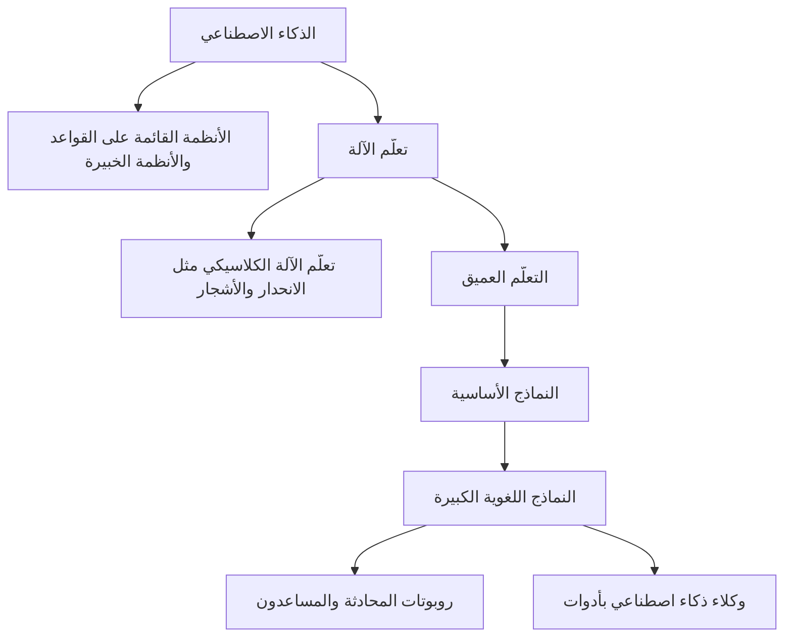
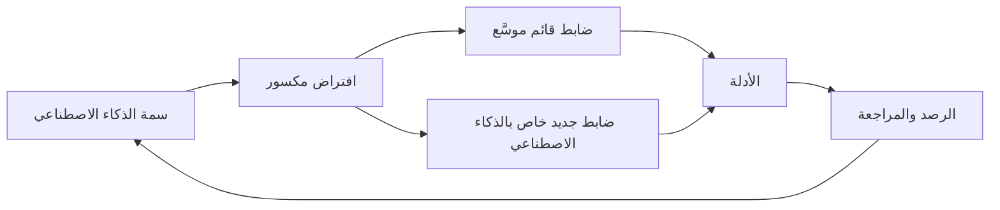

# الوحدة 1 — ما هو الذكاء الاصطناعي ولماذا يحتاج إلى حوكمة

*لا يمكنك أن تحكم ما لا تستطيع وصفه. تمنحك هذه الوحدة فهمًا عمليًا غير رياضي للذكاء الاصطناعي (AI): كيف يختلف تعلّم الآلة (machine learning) عن البرمجيات العادية، وما الذي يضيفه الذكاء الاصطناعي التوليدي (generative AI) والوكلاء (agents)، وكيف ترسم التعريفات القانونية الحدود. ثم ترسم خريطة الأضرار التي يمكن أن يسببها الذكاء الاصطناعي للأفراد والمجموعات والمؤسسات والمجتمع، وتختم بالسمات التي تجعل الذكاء الاصطناعي مختلفًا بما يكفي ليحتاج إلى حوكمة (governance) خاصة به. وكل فكرة مرتبطة بنظام من سجل أنظمة الذكاء الاصطناعي (AI inventory) في بنك نجم (Najm Bank). هذه الدورة مستقلة عن IAPP، ولا شيء فيها يُعدّ استشارة قانونية.*

> **التغطية من مجال المعرفة (BoK coverage):** I.A — فهم ماهية أنظمة الذكاء الاصطناعي، والمخاطر والأضرار التي يمكن أن تسببها، ولماذا تستدعي خصائصها حوكمة مخصّصة.

---

# 1.1 — الذكاء الاصطناعي وتعلّم الآلة والذكاء الاصطناعي التوليدي والوكلاء
*المستوى: 🟢 مبتدئ* · *المتطلبات: 0.1* · *مجال المعرفة (BoK): I.A*

## ⚡ الدرس في دقيقة
- **الذكاء الاصطناعي (Artificial intelligence (AI))** مصطلح جامع. والتعريفات المهمة للحوكمة (OECD وEU AI Act) تصفه بأنه **نظام قائم على الآلة يستدل من مدخلاته على كيفية توليد مخرجات** مثل التنبؤات أو المحتوى أو التوصيات أو القرارات التي يمكن أن تؤثر في بيئات مادية أو افتراضية.
- **تعلّم الآلة (Machine learning (ML))** هو الطريقة السائدة لبناء الذكاء الاصطناعي اليوم: فبدلًا من كتابة القواعد، تعطي البرنامج أمثلة *فيتعلّم* نموذجًا من البيانات.
- **الذكاء الاصطناعي التوليدي (Generative AI)** ينتج محتوى جديدًا (نصوصًا وصورًا وكودًا وصوتًا). والنماذج اللغوية الكبيرة (Large language models (LLMs)) أشهر أنواعه؛ فهي تولّد النص بالتنبؤ بالرموز (tokens) التالية المرجّحة، ولهذا يمكن أن تكون فصيحة ومخطئة في الوقت نفسه.
- **وكلاء الذكاء الاصطناعي (AI agents)** يجمعون بين نموذج وأدوات وذاكرة والقدرة على اتخاذ إجراءات متعددة الخطوات نحو هدف بقدر محدود من التدخل البشري.
- القاعدة الأهم: **احكم النظام، لا النموذج وحده.** فالضرر ينشأ من طريقة ربط النموذج بالبيانات والواجهات والناس والقرارات.
- الفخ الأكبر: افتراض أن "البسيط" أو "القائم على القواعد" يعني "ليس ذكاءً اصطناعيًا" أو "منخفض المخاطر". فالمخاطر تتبع الاستخدام والأثر، والتعريف يتبع *الاستدلال (inference)*.

## 🧭 لماذا يهم
في أول اجتماع للجنة حوكمة الذكاء الاصطناعي (AI Governance Committee) في بنك نجم، يعترض خالد على إدراج نموذج تقييم الجدارة الائتمانية (credit-scoring model) في السجل أصلًا. يقول: "إنها بطاقة تقييم (scorecard). نستخدم بطاقات التقييم منذ عشرين عامًا. هذا إحصاء وليس ذكاءً اصطناعيًا". تخالفه دانة: فالنموذج الحالي مجموعة من أشجار التعزيز التدرّجي (gradient-boosted tree ensemble) مدرّبة على ثلاث سنوات من نتائج القروض، ويُعاد تدريبه مرتين في السنة. وفي الوقت نفسه يريد عمر أن يعرف هل المساعد الذكي لمذكرات الائتمان (credit memo copilot) "نظام واحد أم نظامان"، لأنه يجمع بين نموذج لغوي من طرف ثالث وبين استرجاع بنك نجم لمستندات العملاء. ويسأل رئيس تجربة العملاء هل يغيّر شيئًا التحديثُ المخطّط الذي يتيح لـ Najm Assist أن *ينفّذ* فعليًا إيقاف البطاقات وتغيير العناوين بدلًا من الاكتفاء بالإجابة عن الأسئلة.

لكل سؤال عواقب حقيقية. فاستيفاء شيء ما للتعريف القانوني لنظام الذكاء الاصطناعي يحدد هل تنطبق عليه القوانين الخاصة بالذكاء الاصطناعي. وكون بنك نجم مقدّم النظام (provider) لنموذج ما أو مجرد مُشغِّل (deployer) له يحدد واجباته. وقدرة روبوت المحادثة (chatbot) على الفعل، لا الكلام فقط، تغيّر المخاطر تمامًا. تحتاج اللجنة إلى مفردات مشتركة قبل أن تتخذ أيًّا من هذه القرارات. وهذا الدرس يبنيها.

## 📐 كيف يعمل

### 🟢 الأساسيات

**البرمجيات التقليدية مقابل تعلّم الآلة.** في البرمجيات التقليدية يكتب المبرمج قواعد صريحة: *إذا كان الدخل أقل من X والدين القائم أعلى من Y، فارفض.* أما في تعلّم الآلة فيقدّم المبرمج **بيانات التدريب (training data)** (الطلبات السابقة وهل سُدّد كل قرض) و**خوارزمية تعلّم (learning algorithm)**، فتنتج الخوارزمية **نموذجًا (model)**: دالة رياضية تربط المدخلات بالمخرجات. لم يكتب أحد قواعد النموذج سطرًا سطرًا؛ بل تعلّمها من البيانات.

| | البرمجيات التقليدية | تعلّم الآلة |
|---|---|---|
| مصدر المنطق | أشخاص يكتبون القواعد | أنماط متعلَّمة من البيانات |
| السلوك مع الحالات الجديدة | يمكن التنبؤ به من الكود | إحصائي؛ جيد عمومًا ومفاجئ أحيانًا |
| عندما يتغير العالم | يواصل تطبيق القواعد القديمة | قد يتدهور بصمت مع ابتعاد البيانات عن بيانات التدريب |
| كيف تتحقق منه | تقرأ الكود وتختبر القواعد | تختبره على بيانات محجوزة وتراقب النتائج |

**المفردات التي تحتاجها.**

| المصطلح | المعنى المبسّط | مثال من بنك نجم |
|---|---|---|
| **السمة (Feature)** | متغير مُدخل | الدخل، ومبلغ القرض، وعدد الأشهر لدى صاحب العمل الحالي |
| **التسمية (Label)** أو الهدف | الإجابة التي يتعلم النموذج التنبؤ بها | هل تعثّر المقترض خلال 12 شهرًا؟ |
| **التدريب (Training)** | ملاءمة النموذج للبيانات | فريق دانة يدرّب النموذج على نتائج قروض 2022–2024 |
| **الاستدلال (Inference)** | استخدام النموذج المدرَّب على مدخلات جديدة | تقييم مقدّم طلب اليوم في ثوانٍ |
| **المعاملات (Parameters)** أو الأوزان | الأرقام داخل النموذج التي يعدّلها التدريب | الآلاف في نموذج الائتمان، والمليارات في النموذج اللغوي الكبير |
| **التحقق والاختبار (Validation and testing)** | فحص الأداء على بيانات لم يرها النموذج | مجموعة محجوزة من طلبات 2024 |
| **النموذج (Model)** | المكوّن الرياضي المدرَّب | ملف نموذج تقييم الجدارة الائتمانية |
| **نظام الذكاء الاصطناعي (AI system)** | النموذج مع مسارات البيانات والواجهات والتكاملات والمراجعة البشرية وسياق الاستخدام | سير عمل إنشاء القروض، وحدود الدرجات، ومراجعة المكتتب، وخطابات الإجراء السلبي |

**ثلاث طرق تتعلم بها الآلات.**

- **التعلّم الموجَّه (Supervised learning)** يتعلم من أمثلة مسمّاة: تعثّر أو لا تعثّر، احتيال أو لا احتيال. ونموذجا الائتمان والاحتيال في بنك نجم موجَّهان.
- **التعلّم غير الموجَّه (Unsupervised learning)** يكتشف البنية في بيانات غير مسمّاة، مثل مجموعات العملاء المتشابهين أو المعاملات غير المعتادة. وتستخدمه فرق الاحتيال لاكتشاف أنماط جديدة لم يسمّها أحد بعد.
- **التعلّم المعزَّز (Reinforcement learning)** يتعلم بالتجربة والخطأ من المكافآت. ويُستخدم أيضًا في الضبط الدقيق (fine-tune) للنماذج اللغوية بناءً على التغذية الراجعة البشرية لتكون إجاباتها أكثر فائدة وأمانًا.

**التعلّم العميق (Deep learning)** يستخدم شبكات عصبية متعددة الطبقات. وهو يشغّل التعرف على الصور ونماذج الكلام واللغة، وفهمه أصعب بكثير من بطاقة التقييم.

### 🟡 التعمق أكثر

**الذكاء الاصطناعي التوليدي والنماذج الأساسية.** معظم تعلّم الآلة الكلاسيكي *تمييزي (discriminative)* أو تنبؤي: يعطي درجة أو فئة. أما **الذكاء الاصطناعي التوليدي** فيبتكر محتوى جديدًا يشبه بيانات تدريبه. و**النموذج الأساسي (foundation model)** نموذج كبير مدرَّب على بيانات واسعة، عادةً بالإشراف الذاتي (self-supervision) (إذ توفّر البيانات تسمياتها بنفسها، مثلًا بإخفاء الكلمة التالية ومطالبة النموذج بالتنبؤ بها)، ويمكن تكييفه لمهام كثيرة. ويسمّي قانون الذكاء الاصطناعي الأوروبي (EU AI Act) هذه النماذج **نماذج ذكاء اصطناعي للأغراض العامة (general-purpose AI (GPAI) models)**، وينظّم مقدّميها بمعزل عن الأنظمة المبنية عليها.

**كيف يعمل النموذج اللغوي الكبير، بلغة الحوكمة.** يقسّم النموذج اللغوي الكبير النص إلى **رموز (tokens)** (أجزاء من الكلمات)، وبناءً على كل ما سبق يتنبأ باحتمال لكل رمز تالٍ ممكن. ثم يختار واحدًا بالعيّنة، ويضيفه، ويكرر. وتترتب على ذلك أربع نتائج:

1. **إنه مُحسَّن للمعقولية لا للحقيقة.** فقد ينتج عبارات واثقة فصيحة لكنها خاطئة، تُسمّى غالبًا الهلوسة (hallucinations)؛ ويستخدم ملف NIST للذكاء الاصطناعي التوليدي (Generative AI Profile) مصطلح **التلفيق (confabulation)**. فقد يخترع المساعد الذكي لمذكرات الائتمان نسبة خدمة دين (debt-service ratio) تبدو صحيحة.
2. **المخرجات تتفاوت.** قد يعطي الطلب (prompt) نفسه إجابات مختلفة، مما يعقّد الاختبار والتدقيق.
3. **لا يعرف إلا بيانات تدريبه وسياقه.** **نافذة السياق (context window)** هي مقدار النص الذي يستطيع النموذج أخذه في الاعتبار دفعة واحدة. وما ليس في التدريب أو السياق لا يمكنه معرفته، وإن كان قد يخمّنه.
4. **التعليمات والبيانات تتشارك قناة واحدة.** قد يحتوي مستند يُمرَّر إلى النموذج على نص يعامله النموذج كتعليمات، ويُعرف ذلك بـ **حقن الأوامر (prompt injection)**. وهذه مشكلة أمنية جديدة لا توجد في البرمجيات العادية بالشكل نفسه.

**تكييف النموذج.** نادرًا ما تدرّب المؤسسات النماذج الأساسية بنفسها. بل تكيّفها:

| الأسلوب | ما يفعله | ملاحظة حوكمية |
|---|---|---|
| **الطلبات (Prompting)** وطلبات النظام | تعليمات تُعطى وقت التشغيل | رخيص وسريع؛ قد يتغير السلوك مع تغييرات صغيرة في الصياغة؛ ضع الطلبات تحت إدارة الإصدارات |
| **التوليد المعزّز بالاسترجاع (Retrieval-augmented generation (RAG))** | يبحث النظام في مستندات معتمدة ويمرّر المقاطع ذات الصلة إلى النموذج كسياق | يرسّخ الإجابات في مصادر بنك نجم نفسه؛ ويصبح فهرس الاسترجاع أصل بيانات محكومًا بضوابط وصول |
| **الضبط الدقيق (Fine-tuning)** | تدريب إضافي على بيانات المؤسسة | يغيّر النموذج؛ وقد يغيّر دور بنك نجم وواجباته؛ وتنطبق حقوق بيانات التدريب والخصوصية |

يستخدم المساعد الذكي لمذكرات الائتمان التوليد المعزّز بالاسترجاع: فهو يسترجع القوائم المالية للعميل والمذكرات السابقة، ثم يطلب من نموذج لغوي كبير لدى طرف ثالث أن يكتب المسودة. ولهذا يهم سؤال عمر "نظام واحد أم نظامان": فالنموذج ملك المورّد، أما *النظام* (الاسترجاع والطلبات والواجهة وخطوة المراجعة) فملك بنك نجم.

**الوكلاء.** **وكيل الذكاء الاصطناعي (AI agent)** نظام يستطيع فيه النموذج تخطيط الخطوات، واستدعاء **أدوات (tools)** (البحث وقواعد البيانات والبريد الإلكتروني والمدفوعات وتنفيذ الكود) والتصرف بناءً على النتائج، مكررًا ذلك حتى يبلغ هدفًا. والتحديث المخطط لـ Najm Assist يحوّل روبوت محادثة *يقول* "يمكنك إيقاف بطاقتك من التطبيق" إلى وكيل *يوقف البطاقة*. والاستقلالية طيف:

| المستوى | الوصف | مثال |
|---|---|---|
| المساعدة | يقترح النظام؛ ويقرر الإنسان وينفّذ | المساعد الذكي يكتب مسودة مذكرة؛ ومدير العلاقة يعدّلها ويوقّعها |
| التصرف بموافقة | يجهّز النظام الإجراء؛ ويؤكده الإنسان | الوكيل يقترح تغيير العنوان؛ والعميل يؤكده برمز لمرة واحدة |
| التصرف ضمن حدود | يتصرف النظام وحده داخل حدود ضيقة، مع التسجيل وإمكانية التراجع | الوكيل يوقف بطاقة عند الطلب بعد المصادقة |
| التصرف الواسع | يختار النظام الإجراءات وينفّذها عبر الأدوات | غير مناسب لاستخدامات بنك نجم الموجّهة للعملاء اليوم |

ترتفع الحوكمة مع الاستقلالية: صلاحيات الأدوات، وحدود الإنفاق أو الإجراءات، والمصادقة، وتسجيل كل إجراء، وطريقة واضحة تمكّن البشر من إيقاف الوكيل.

### 🔴 نظرة الخبير

**التعريف القانوني.** عدّلت OECD تعريفها لنظام الذكاء الاصطناعي في نوفمبر 2023، ويتبعه تعريف EU AI Act في المادة 3(1) (Art. 3(1)) عن كثب. وبإعادة الصياغة، نظام الذكاء الاصطناعي نظام *قائم على الآلة*، *مصمَّم للعمل بمستويات متفاوتة من الاستقلالية*، و*قد يُظهر قابلية للتكيّف بعد النشر*، و*يستدل، لأهداف صريحة أو ضمنية، من المدخلات التي يتلقاها على كيفية توليد مخرجات* مثل التنبؤات أو المحتوى أو التوصيات أو القرارات التي *يمكن أن تؤثر في بيئات مادية أو افتراضية*. اقرأه عنصرًا عنصرًا:

| العنصر | ما يعنيه | لماذا يهم |
|---|---|---|
| قائم على الآلة | يعمل على عتاد وبرمجيات | يستبعد العمليات البشرية البحتة |
| استقلالية متفاوتة | قدر من الاستقلال عن التدخل البشري | حتى الاستقلالية المنخفضة قد تكفي |
| قد يُظهر قابلية للتكيّف | يمكن أن يتعلم أو يتغير بعد النشر | "قد": النظام الذي لا يتكيف يمكن أن يظل ذكاءً اصطناعيًا |
| أهداف صريحة أو ضمنية | أهداف يضعها المصممون أو تنشأ من التدريب | يشمل النماذج التي تُتعلَّم أهدافها |
| **يستدل** | يستخلص المخرجات من المدخلات عبر التعلم أو الاستنتاج أو النمذجة | الاختبار الأساسي الذي يفصل الذكاء الاصطناعي عن البرمجيات العادية |
| مخرجات تؤثر في البيئات | تنبؤات، ومحتوى، وتوصيات، وقرارات | يشمل النصائح المقدَّمة للبشر، لا الإجراءات التلقائية فقط |

توضح حيثيات القانون (recitals) أن الأنظمة القائمة على قواعد يضعها البشر وحدهم لتنفيذ عمليات تلقائيًا ليست مقصودة بالتغطية. وقد نشرت المفوضية الأوروبية في 2025 إرشادات حول تعريف نظام الذكاء الاصطناعي تناقش الحالات الحدّية، مثل بعض أنظمة معالجة البيانات الأساسية والتنبؤ البسيط؛ فارجع إليها في الحالات الصعبة. أما عن اعتراض خالد فالجواب عملي: النموذج الذي تعلّمته خوارزمية تعزيز (boosting) من البيانات يستدل على مخرجاته، والأرجح جدًا أنه داخل النطاق. والأهم أنه حتى لو كانت بطاقة تقييم مبنية يدويًا خارج تعريف قانون الذكاء الاصطناعي، فستبقى خاضعة لقواعد حماية البيانات والإقراض العادل ومخاطر النماذج، وبنك نجم يحكمها في كل الأحوال.

**النموذج مقابل النظام، ولماذا تحوّل الإصدار v2.1.** نادرًا ما تنشأ الأضرار من النموذج وحده. فنموذج الائتمان نفسه قد يكون عادلًا أو غير عادل بحسب الحدود المطبّقة، وهل يستطيع المكتتبون تجاوزه، وأي بيانات يغذيه بها المسار، وكيف يُبلَّغ المرفوضون. وصياغة مجال المعرفة v2.1 حول "نظام الذكاء الاصطناعي" تعكس ذلك: فالحوكمة ترتبط بالترتيب الاجتماعي التقني (socio-technical) كله.

**نموذج GPAI مقابل نظام GPAI.** بموجب EU AI Act، يحمّل *نموذج GPAI* (النموذج الأساسي) مقدّمه التزامات، مثل التوثيق الفني وسياسة حقوق النشر، مع واجبات إضافية للنماذج ذات المخاطر النظامية (systemic risk). أما *النظام* المبني عليه (المساعد الذكي لدى بنك نجم) فيُقيَّم بحسب استخدامه: مساعد صياغة للمذكرات الداخلية ليس في حد ذاته ضمن فئة من الملحق III، لكن لو استُخدمت مخرجاته لتقييم الجدارة الائتمانية للأفراد فقد يتغير التحليل. وتتناول الوحدة 6 ذلك بالتفصيل.

**الذكاء الاصطناعي الضيق والعام.** كل ما يستخدمه بنك نجم ذكاء اصطناعي *ضيق (narrow)*، مبني لمهام محدودة. أما الذكاء الاصطناعي العام (Artificial general intelligence (AGI))، أي نظام يضاهي البشر في معظم المهام، فهو هدف بحثي ونقاش سياساتي، لا بند في السجل. وأسئلة الامتحان تكافئ الأوصاف الدقيقة بصيغة الحاضر لما تفعله الأنظمة فعلًا.

## ⚖️ الأدوات التنظيمية
| الأداة | ما تشترطه أو توصي به | إشارة الامتحان |
|---|---|---|
| **EU AI Act** — المادة 3(1) | التعريف القانوني لنظام الذكاء الاصطناعي: قائم على الآلة، باستقلالية متفاوتة، قد يتكيّف، يستدل من المدخلات على كيفية توليد مخرجات يمكن أن تؤثر في البيئات | "يستدل" هو العنصر الأساسي؛ والتكيّف اختياري ("قد") |
| **OECD AI Principles** — تعريف نظام الذكاء الاصطناعي | تعريف OECD المحدَّث (نوفمبر 2023) لنظام الذكاء الاصطناعي، الذي يتبعه تعريف EU AI Act عن كثب | مصدر التعريف المشترك دوليًا |
| **EU AI Act** — الفصل الخامس (Chapter V) | التزامات مقدّمي نماذج الذكاء الاصطناعي للأغراض العامة، مع واجبات إضافية للنماذج ذات المخاطر النظامية | لمقدّمي النماذج الأساسية واجبات خاصة بهم، منفصلة عن مُشغِّلي الأنظمة |
| **EU AI Act** — المادة 50 | واجبات الشفافية، ومنها إبلاغ الناس بأنهم يتفاعلون مع نظام ذكاء اصطناعي ما لم يكن ذلك واضحًا، ووسم المحتوى الاصطناعي | يجب أن تفصح روبوتات المحادثة عن أنها ذكاء اصطناعي |
| **ISO/IEC 22989** | مفاهيم ومصطلحات دولية للذكاء الاصطناعي، منها تعلّم الآلة والوكلاء ومصطلحات دورة الحياة | مفردات معيارية؛ وليس معيار متطلبات |
| **NIST AI 600-1** | ملف NIST للذكاء الاصطناعي التوليدي ضمن AI RMF (يوليو 2024)، يسمّي مخاطر خاصة بالذكاء الاصطناعي التوليدي مثل التلفيق | مفردات مخاطر الذكاء الاصطناعي التوليدي؛ طوعي |

## 🏛️ عمليًا في بنك نجم
لمنع نقاشات التعريف من تعطيل اللجنة، تضيف ليلى **بطاقة فرز بعنوان "هل هو ذكاء اصطناعي، ومن أي نوع؟"** إلى نموذج استقبال حالات الاستخدام (use-case intake form). يكملها المالكون، ويؤكدها فريق حوكمة الذكاء الاصطناعي.

| # | السؤال | إذا كانت الإجابة نعم |
|---|---|---|
| 1 | هل ينتج النظام تنبؤات أو درجات أو ترتيبات أو تصنيفات أو توصيات أو محتوى مولَّدًا أو قرارات؟ | تابع |
| 2 | هل اشتُقّت هذه المخرجات من أنماط متعلَّمة من البيانات، أو من نموذج درّبه طرف آخر، لا من قواعد كتبها موظفو بنك نجم بالكامل؟ | الأرجح أنه ذكاء اصطناعي: سجّله. وإن لم تكن متأكدًا فسجّله بوصف "قيد التأكيد" |
| 3 | هل يستخدم نموذجًا للأغراض العامة أو نموذجًا أساسيًا (مثل نموذج لغوي كبير عبر API)؟ | سجّل مقدّم النموذج وإصداره؛ ونبّه إلى مخاطر الذكاء الاصطناعي التوليدي (التلفيق، وحقن الأوامر، وتسرّب البيانات) |
| 4 | هل يكيّف بنك نجم النموذج (بالضبط الدقيق، أو بدمجه مع التوليد المعزّز بالاسترجاع على بيانات بنك نجم)؟ | سجّل دور بنك نجم في التطوير؛ ومراجعة حقوق البيانات والخصوصية |
| 5 | هل يستطيع النظام اتخاذ إجراءات عبر أدوات أو أنظمة أخرى، لا مجرد إنتاج مخرجات؟ | صنّف مستوى الاستقلالية؛ واشترط حدودًا للإجراءات وتسجيلًا وأداة إيقاف |
| 6 | حياة مَن أو حقوق مَن تتأثر بمخرجاته، وبأي قدر؟ | يغذّي التقييم الأولي للمخاطر (1.2 والوحدة 8) |

بالتطبيق على السجل: تقييم الجدارة الائتمانية (تعلّم آلة موجَّه، ذكاء اصطناعي، أثر مرتفع)؛ وNajm Assist (روبوت محادثة توليدي يتحول إلى وكيل: أعِد التقييم عند التحديث)؛ وفرز السير الذاتية (تعلّم آلة من مورّد، ذكاء اصطناعي)؛ والمساعد الذكي لمذكرات الائتمان (نظام ذكاء اصطناعي توليدي مع توليد معزّز بالاسترجاع بناه بنك نجم على نموذج طرف ثالث)؛ وكشف الاحتيال (تعلّم آلة موجَّه وغير موجَّه)؛ واستخدام الموظفين للذكاء الاصطناعي التوليدي (أنظمة ذكاء اصطناعي توليدي من أطراف ثالثة).

## 🛠️ التمارين
- 🟢 **سمِّ الأجزاء.** لنموذج كشف الاحتيال في بنك نجم، اذكر سمة واحدة، والتسمية، ومتى يحدث التدريب ومتى يحدث الاستدلال. *يكتمل عندما:* يطابق كل مصطلح تعريفه في جدول المفردات.
- 🟡 **نموذج أم نظام؟** اذكر ستة مكوّنات على الأقل من *نظام* المساعد الذكي لمذكرات الائتمان غير النموذج اللغوي نفسه، ولكل منها شيئًا واحدًا قد يسوء. *يكتمل عندما:* تتضمن قائمتك مكوّنات للبيانات والواجهة والبشر والتكامل.
- 🔴 **طبّق التعريف.** خذ ثلاث أدوات حدّية (جدول بيانات بأوزان تقييم مضبوطة يدويًا، وشجرة قرار ثابتة كتبها فريق سياسة الائتمان، وانحدار لوجستي يُعاد ضبطه سنويًا على نتائج القروض). مرّر كلًّا منها على عناصر المادة 3(1)، وبيّن هل الأرجح أنه نظام ذكاء اصطناعي، وما الحوكمة التي تنطبق في الحالتين. *يكتمل عندما:* تشرح دور "يستدل" وتسمّي قاعدة واحدة على الأقل من خارج قانون الذكاء الاصطناعي تنطبق بغض النظر.

## ⚠️ أخطاء وفخاخ الامتحان
- **فخ: "التكيّف شرط لازم".** يقول التعريف إن النظام *قد* يُظهر قابلية للتكيّف بعد النشر. والنموذج المجمَّد عند الإطلاق يمكن أن يظل نظام ذكاء اصطناعي.
- **فخ: حوكمة النموذج وحده.** الحدود والمراجعة البشرية ومسارات البيانات وواجهات المستخدم تصنع الضرر أو تمنعه. اختر الإجابات التي تنظر إلى النظام كله.
- **فخ: وصف الهلوسة بأنها خلل سيُصلَح.** إنها ناتجة عن طريقة توليد النماذج اللغوية للنص. وإجابات الحوكمة تشمل الترسيخ في المصادر والتحقق والمراجعة البشرية وقيود الاستخدام.
- **فخ: معاملة الوكلاء كروبوتات محادثة.** عندما يستطيع النظام التصرف عبر الأدوات، تصبح الضوابط على الصلاحيات والحدود والتسجيل والتدخل البشري محورية.
- **فخ: "لا قانون ذكاء اصطناعي، إذن لا حوكمة".** حتى الأنظمة الواقعة خارج التعريف القانوني للذكاء الاصطناعي قد تخضع لقواعد حماية البيانات ومنع التمييز والقواعد القطاعية.

## 🧾 الخلاصة
- يتعلّم تعلّم الآلة نموذجًا من البيانات بدلًا من اتباع قواعد مكتوبة يدويًا؛ وهذا ما يجعل سلوكه إحصائيًا ومعتمدًا على البيانات.
- الذكاء الاصطناعي التوليدي يبتكر المحتوى؛ والنماذج اللغوية الكبيرة تتنبأ بالرموز، لذا قد تكون فصيحة ومخطئة؛ والنماذج الأساسية (GPAI) تُكيَّف بالطلبات أو التوليد المعزّز بالاسترجاع أو الضبط الدقيق.
- الوكلاء يضيفون الأدوات والإجراءات؛ والحوكمة ترتفع مع الاستقلالية.
- يدور تعريفا OECD وEU AI Act حول *الاستدلال*؛ والتكيّف اختياري.
- احكم **نظام** الذكاء الاصطناعي: النموذج مع البيانات والواجهات والناس والسياق.

## ✍️ اختبر نفسك

**1. أي عنصر من تعريف EU AI Act يميّز نظام الذكاء الاصطناعي عن البرمجيات التقليدية بأوضح صورة؟**

- A. أنه يعمل على آلة
- B. أنه يتكيّف بعد النشر
- C. أنه يستدل من مدخلاته على كيفية توليد المخرجات
- D. أنه تبيعه شركة تقنية

الإجابة

**C.** الاستدلال هو العنصر المحدِّد. التكيّف (B) مغرٍ لكن التعريف يقول إن الأنظمة *قد* تتكيّف، فهو ليس شرطًا؛ وA ينطبق على كل البرمجيات. (انظر 🔴 التعريف القانوني.)

**2. يسترجع المساعد الذكي لمذكرات الائتمان في بنك نجم مستندات العميل ويمرّرها إلى نموذج لغوي كبير لدى طرف ثالث لكتابة مسودة مذكرة. ما اسم هذا الأسلوب؟**

- A. التوليد المعزّز بالاسترجاع
- B. التعلّم المعزَّز
- C. الضبط الدقيق
- D. التجميع غير الموجَّه

الإجابة

**A.** يسترجع التوليد المعزّز بالاسترجاع المستندات ذات الصلة وقت التشغيل ويقدّمها للنموذج كسياق. أما الضبط الدقيق (C) فيغيّر أوزان النموذج بتدريب إضافي. (انظر 🟡 تكييف النموذج.)

**3. يلاحظ مدير علاقة أن مسودة المساعد الذكي تتضمن نسبة خدمة دين معقولة لكنها مختلَقة. ما أفضل وصف لهذا الإخفاق؟**

- A. اختراق بيانات
- B. التلفيق، وهو خاصية معروفة للنماذج التوليدية تتطلب ضوابط تحقق
- C. انجراف النموذج بسبب تغيّر أسعار الفائدة
- D. حقن طلبات من جانب العميل

الإجابة

**B.** تولّد النماذج اللغوية الكبيرة نصًا معقولًا لا حقائق متحقَّقًا منها؛ ويسمّي ملف NIST للذكاء الاصطناعي التوليدي ذلك تلفيقًا. والاستجابة الحوكمية هي الترسيخ في المصادر والتحقق والمراجعة البشرية. أما الانجراف (C) فتدهور تدريجي مع الوقت، ولا أثر لتعليمات محقونة (D). (انظر 🟡 كيف يعمل النموذج اللغوي الكبير.)

**4. يخطط بنك نجم للسماح لروبوت المحادثة بإيقاف البطاقات وتغيير العناوين بنفسه. من منظور الحوكمة، ما الذي يتغير أكثر من غيره؟**

- A. لا شيء، لأنه يستخدم النموذج اللغوي نفسه
- B. لم يعد مضطرًا للإفصاح عن أنه ذكاء اصطناعي
- C. يجب الآن تصنيفه ممارسةً محظورة
- D. يصبح النظام وكيلًا يتصرف، فتصبح الصلاحيات وحدود الإجراءات والمصادقة والتسجيل وضوابط الإيقاف البشرية أساسية

الإجابة

**D.** الانتقال من الإجابة إلى الفعل يرفع الاستقلالية واحتمال الضرر، فتصبح الضوابط على الإجراءات هي الأهم. أما كون النموذج هو نفسه (A) فيغفل أن النظام تغيّر؛ ولا شيء يجعله محظورًا (C)؛ وواجبات الشفافية لا تزال تنطبق (B). (انظر 🟡 الوكلاء.)

**5. يقول خالد إن نموذج الائتمان "مجرد إحصاء"، لذا فالحوكمة غير ضرورية. أي رد هو الأدق؟**

- A. هو محق؛ فالنماذج الإحصائية ليست ذكاءً اصطناعيًا أبدًا
- B. النموذج الذي تعلّمته خوارزمية تعلّم آلة من البيانات يستوفي على الأرجح تعريف نظام الذكاء الاصطناعي، وفي كل الأحوال تخضع قرارات الائتمان لقواعد حماية البيانات والإقراض العادل ومخاطر النماذج
- C. نماذج التعلّم العميق وحدها تحتاج إلى حوكمة
- D. الحوكمة تنطبق فقط إذا تكيّف النموذج بعد النشر

الإجابة

**B.** يستدل النموذج على مخرجاته من أنماط متعلَّمة، وقرارات الائتمان منظَّمة بغض النظر عن التقنية. أما C وD فيسيئان قراءة التعريف؛ فالتكيّف اختياري والمخاطر تتبع الاستخدام. (انظر 🔴 التعريف القانوني.)

## 📚 المراجع
- Regulation (EU) 2024/1689 (EU AI Act)، المادة 3(1) والفصل الخامس والمادة 50: https://eur-lex.europa.eu/eli/reg/2024/1689/oj
- المفوضية الأوروبية، صفحة سياسة قانون الذكاء الاصطناعي وإرشاداته: https://digital-strategy.ec.europa.eu/en/policies/regulatory-framework-ai
- OECD AI Principles وتعريف نظام الذكاء الاصطناعي: https://oecd.ai/en/ai-principles
- NIST AI 600-1، ملف الذكاء الاصطناعي التوليدي (Generative AI Profile): https://doi.org/10.6028/NIST.AI.600-1
- ISO/IEC 22989، عبر كتالوج ISO: https://www.iso.org/

---

# 1.2 — المخاطر والأضرار على الأفراد والمجموعات والمؤسسات والمجتمع
*المستوى: 🟢 مبتدئ* · *المتطلبات: 1.1* · *مجال المعرفة (BoK): I.A*

## ⚡ الدرس في دقيقة
- **الضرر (harm)** أثر سلبي فعلي؛ أما **المخاطر (risk)** فتجمع بين احتمال وقوع الضرر وشدته لو وقع. والحوكمة تدير المخاطر حتى لا تقع الأضرار، أو تُكتشف وتُعالَج بسرعة.
- يصنّف NIST AI RMF أضرار الذكاء الاصطناعي في ثلاث عائلات: **الضرر بالناس (harm to people)** (الأفراد، والمجموعات والمجتمعات المحلية، والمجتمع)، و**الضرر بالمؤسسة (harm to an organisation)**، و**الضرر بالمنظومة (harm to an ecosystem)**.
- بالنسبة للأفراد، الفئات الكبرى هي التمييز، وفقدان الخصوصية، والنتائج غير الآمنة أو الخاطئة، وفقدان الاستقلالية والكرامة، والضرر الاقتصادي. أما بالنسبة للمجموعات فكثيرًا ما تكون الأضرار **غير مرئية على مستوى الفرد** ولا تظهر إلا في المجموع.
- يضيف الذكاء الاصطناعي التوليدي (generative AI) مخاطره الخاصة: التلفيق (confabulation)، والمحتوى الضار، وسلامة المعلومات، والملكية الفكرية، وتسرّب البيانات، وتعقيد سلسلة القيمة.
- القاعدة الأهم: **قيّم الضرر من منظور المتأثرين، لا من منظور المؤسسة وحدها.** فقوانين مثل EU AI Act وGDPR تحمي حقوق الأفراد؛ وسجل المخاطر الذي لا يذكر إلا مخاطر السمعة والمال سجل ناقص.
- الفخ الأكبر: افتراض أن حذف سمة محمية (مثل الجنس أو الجنسية) يزيل التمييز. فالبدائل (proxies) تعيده.

## 🧭 لماذا يهم
تُظهر الحالات الحقيقية مدى التنوع. ففي 2018 أفادت Reuters بأن Amazon ألغت نموذج توظيف تجريبيًا بعد أن وجدت أنه يخفض تقييم السير الذاتية التي تتضمن كلمة "women's" (النسائي)، لأنه تعلّم من عقد من التوظيف الذكوري في أغلبه. وفي هولندا، شهدت فضيحة إعانات رعاية الأطفال (*toeslagenaffaire*) معاملة آلاف الأسر خطأً كمحتالين، مع استخدام الجنسية عامل خطر في نموذج لتصنيف المخاطر؛ وكان الضرر بالأسر بالغًا، وغرّمت هيئة حماية البيانات الهولندية إدارة الضرائب، واستقالت الحكومة في يناير 2021. وفي 2023 أفيد بأن موظفين في Samsung لصقوا كودًا مصدريًا سريًا في ChatGPT، مما دفع إلى فرض قيود داخلية. وفي 2024 حمّلت محكمة كندية شركة Air Canada المسؤولية عن تصريح خاطئ لروبوت المحادثة الخاص بها بشأن المبالغ المستردة.

كل حالة من هذه نوع مختلف من الضرر: على المتقدمين للوظائف كمجموعة، وعلى الأسر وعلى الثقة بالدولة، وعلى المعلومات السرية لشركة، وعلى جيب عميل واحد، وعلى الموقف القانوني لشركة. ولدى بنك نجم (Najm Bank) أنظمة قد تخفق بكل واحدة من هذه الطرق. فقد يُلحق نموذج الائتمان ضررًا منهجيًا بالنساء أو الوافدين. وقد تعيد أداة فرز السير الذاتية إنتاج أنماط التوظيف السابقة. وقد يسرّب الموظفون بيانات العملاء إلى روبوتات محادثة عامة. وقد يعِد روبوت المحادثة بإعفاء من رسوم لا وجود له. تبدأ حوكمة الذكاء الاصطناعي (AI governance) بتسمية هذه الأضرار بوضوح يكفي لفعل شيء حيالها.

## 📐 كيف يعمل

### 🟢 الأساسيات

**مصدر الخطر، والمخاطر، والضرر، والأثر.**

| المصطلح | المعنى | مثال من بنك نجم |
|---|---|---|
| **مصدر الخطر (Hazard)** أو المصدر | شيء قد يسبب ضررًا | بيانات تدريب من سنوات حصلت فيها قلة من النساء على قروض |
| **المخاطر (Risk)** | احتمال الضرر × شدته، في سياق معين | رفض طلبات النساء بمعدلات أعلى مما يبرره سلوكهن في السداد |
| **الضرر (Harm)** | الأثر السلبي عند وقوعه | رفض قرض امرأة جديرة ائتمانيًا |
| **الأثر (Impact)** | التأثير الأوسع، الجيد أو السيئ، على الأفراد أو المجموعات أو المجتمع | تراجع وصول مجموعة كاملة إلى الائتمان |

**عائلات الضرر في NIST AI RMF.** يقدّم إطار NIST لإدارة مخاطر الذكاء الاصطناعي (NIST AI Risk Management Framework) خريطة بسيطة يستخدمها الامتحان والممارسون:

| العائلة | الفئات الفرعية | أمثلة في بنك نجم |
|---|---|---|
| **الضرر بالناس** | *الفردي*: الحريات المدنية، والحقوق، والسلامة الجسدية أو النفسية، والفرص الاقتصادية. *المجموعة أو المجتمع المحلي*: التمييز ضد مجموعات فرعية. *المجتمع*: المشاركة الديمقراطية، والوصول إلى الخدمات، والثقة | رفض قرض خطأً؛ أداة سير ذاتية تستبعد المتقدمين الأكبر سنًا؛ فقدان الجمهور ثقته في الخدمات المصرفية الرقمية |
| **الضرر بالمؤسسة** | العمليات التجارية، والاختراقات الأمنية والخسائر المالية، والسمعة | إجراء رقابي، وغرامات، ودعاوى قضائية، وتسرّب بيانات العملاء عبر ذكاء اصطناعي توليدي عام |
| **الضرر بالمنظومة** | الأنظمة المترابطة وسلاسل التوريد، والنظام المالي، والموارد الطبيعية والبيئة | اعتماد بنوك كثيرة على نموذج المورّد نفسه وإخفاقها معًا؛ واستهلاك النماذج الكبيرة للطاقة |

**الأضرار بالأفراد، بمزيد من التفصيل.**

- **التمييز والمعاملة غير العادلة**: نتائج أسوأ لأشخاص بسبب خاصية محمية أو بديل عنها.
- **أضرار الخصوصية**: الجمع المفرط، واستنتاج السمات الحساسة، والمراقبة، وإعادة التعرّف على الهوية، والتسريبات.
- **نتائج خاطئة أو غير آمنة**: قرار غير صحيح، أو توصية سيئة، أو حظر احتيال خاطئ يترك شخصًا بلا وصول إلى ماله.
- **فقدان الاستقلالية والكرامة**: التلاعب، والحكم عليه بعملية غامضة، وانعدام وسيلة للاعتراض.
- **الضرر الاقتصادي**: فقدان الائتمان أو الوظائف أو الإعانات أو المال.
- **الضرر النفسي**: الضيق من الاتهامات الخاطئة، والمحتوى المولَّد المسيء.

### 🟡 التعمق أكثر

**الأضرار التوزيعية والتمثيلية.** يساعد مصطلحان شائعان على تصنيف أضرار العدالة (fairness):

- **الضرر التوزيعي (Allocative harm)** يقع عندما يحجب نظام فرصة أو موردًا (قرضًا، أو مقابلة عمل، أو إعانة) عن بعض الناس بشكل غير عادل. وأداتا الائتمان وفرز السير الذاتية في بنك نجم تحملان هذا الخطر.
- **الضرر التمثيلي (Representational harm)** يقع عندما يعزّز نظام الصور النمطية أو يحطّ من قدر مجموعة، حتى دون توزيع فوري. فأداة ذكاء اصطناعي توليدي تصف "رائد الأعمال النموذجي" بأنه شاب فقط، أو تنتج محتوى مسيئًا عن جنسية ما، تسبب ضررًا تمثيليًا. وقد يفعل Najm Assist ذلك بالعربية أو الإنجليزية.

**من أين تأتي أضرار الذكاء الاصطناعي.** تنشأ الأضرار في كل مرحلة، ولهذا يجب أن تغطي الحوكمة دورة الحياة (life cycle) كلها:

| المصدر | ما الذي يسوء | مثال |
|---|---|---|
| **صياغة المشكلة (Problem framing)** | الهدف بديل ضعيف لما تريده حقًا | التنبؤ بـ "من وظّفناهم سابقًا" بدلًا من "من سيؤدي جيدًا" |
| **البيانات (Data)** | التحيّز التاريخي، ونقص التمثيل، والأخطاء، والجمع غير المشروع | قلة القروض السابقة للمتقدمين الشباب العاملين لحسابهم، فيتعلم النموذج عنهم القليل |
| **النموذج (Model)** | بدائل للسمات المحمية، والإفراط في الملاءمة، والغموض | سمات مرتبطة بالرمز البريدي أو الجنسية تحل محل الأصل العرقي |
| **سياق النشر (Deployment context)** | الاستخدام لغرض أو فئة سكانية لم يُبنَ لها | استخدام نموذج الأفراد لأصحاب المنشآت الصغيرة والمتوسطة |
| **التفاعل بين الإنسان والذكاء الاصطناعي (Human-AI interaction)** | الاعتماد المفرط (تحيّز الأتمتة (automation bias)) أو عدم الثقة الشامل | مكتتبون يبصمون على الدرجات دون تمحيص |
| **سوء الاستخدام والهجوم (Misuse and attack)** | الإساءة المتعمدة، وحقن الأوامر، وتسميم البيانات | محتالون يتحسسون حدود نموذج الاحتيال |
| **الانجراف (Drift)** | العالم يتغير والنموذج لا يتغير | منتجات إقراض جديدة أو صدمة اقتصادية |

**لماذا لا يكفي حذف السمات المحمية.** حتى لو حذف بنك نجم الجنس والجنسية من مدخلات نموذج الائتمان، فقد ترتبط بهما سمات أخرى: المهنة، وصاحب العمل، وأنماط تحويل الراتب، بل وحتى لغة الطلب. ويستطيع النموذج إعادة بناء المعلومات المحمية من هذه **البدائل (proxies)**. واختبار النتائج حسب المجموعة هو الطريقة الوحيدة للمعرفة. وقد يتطلب ذلك جمع بيانات حساسة أو استنتاجها، مما يخلق توترًا مع قانون الخصوصية تتناوله وحدات لاحقة (4.1، 9.2).

**مخاطر الذكاء الاصطناعي التوليدي.** يسرد ملف NIST للذكاء الاصطناعي التوليدي (NIST AI 600-1) اثني عشر خطرًا فريدًا للذكاء الاصطناعي التوليدي أو يفاقمها:

| خطر NIST AI 600-1 | معناه عمليًا في بنك نجم |
|---|---|
| المعلومات أو القدرات الكيميائية والبيولوجية والإشعاعية والنووية (CBRN) | غير مرجّح في استخدامات بنك نجم، لكنه جزء من مخاطر مقدّم النموذج |
| التلفيق | المساعد الذكي يخترع أرقامًا في مذكرة ائتمان |
| المحتوى الخطير أو العنيف أو الذي يحض على الكراهية | Najm Assist يولّد ردودًا مسيئة |
| خصوصية البيانات | تسرّب بيانات العملاء عبر الطلبات أو إعادة إنتاجها في المخرجات |
| الآثار البيئية | استهلاك النماذج الكبيرة للطاقة والموارد |
| التحيّز الضار والتجانس | مخرجات نمطية؛ وتقارب مذكرات الجميع على الصياغة نفسها |
| تهيئة العلاقة بين الإنسان والذكاء الاصطناعي | الاعتماد المفرط، وأنسنة روبوت المحادثة |
| سلامة المعلومات | محتوى زائف مقنع، وتزييف عميق يُستخدم في الاحتيال على البنك |
| أمن المعلومات | حقن الأوامر، والتلاعب بالنموذج، وتسهيل التصيّد |
| الملكية الفكرية | مخرجات تعيد إنتاج نصوص أو كود محمي |
| المحتوى الفاحش أو المهين أو المسيء | محتوى مولَّد يضر المستخدمين |
| سلسلة القيمة وتكامل المكوّنات | نماذج ومجموعات بيانات وإضافات غامضة من أطراف ثالثة |

### 🔴 نظرة الخبير

**للعدالة أكثر من تعريف، وقد تتعارض.** نقاش COMPAS هو المثال الكلاسيكي. ففي 2016 أفادت ProPublica بأن أداة لتقييم خطر العودة إلى الجريمة تُستخدم في المحاكم الأمريكية صنّفت المتهمين السود خطأً بأنهم عالو الخطورة بمعدل أعلى من المتهمين البيض. وردّ المطوّر بأن الدرجات *معايَرة (calibrated)* بالتساوي: فالدرجة المعينة تعني تقريبًا معدل العودة نفسه لكل مجموعة. وكان يمكن أن يصح الادعاءان معًا. وقد أظهر الباحثون لاحقًا أنه عندما تختلف المعدلات الأساسية بين المجموعات، لا تستطيع الدرجة عمومًا أن تحقق المعايرة وتساوي معدلات الخطأ في آن واحد. والدرس الحوكمي: اختيار مقياس للعدالة **حكم قيمي (value judgement)** مرتبط بالسياق والقانون، لا قرار تقني بحت. ويجب أن يتخذه أشخاص خاضعون للمساءلة ويوثّقوه ويعتمدوه، لا أن يُترك لعالم البيانات وحده.

**الأضرار تتراكم وتتضخم.** المكتتب البشري المتحيّز الواحد يؤثر في الملفات التي يتعامل معها. أما النموذج المتحيّز المطبَّق على كل متقدم فيؤثر فيهم جميعًا، باتساق، حتى يلاحظ أحدٌ ذلك. وحلقات التغذية الراجعة تزيد الأمر سوءًا: فإذا رفض النموذج مجموعة، فلن يرى البنك أبدًا سلوكها في السداد، فتحتوي مجموعة التدريب التالية على أدلة أقل عنها. ويخلق التجميع أيضًا أضرارًا لا يراها أي فرد: فكل متقدم مرفوض لا يرى إلا قراره هو، لذا قد لا يظهر التمييز على مستوى المجموعة إلا عبر اختبار متعمد أو الجهات الرقابية أو الصحفيين. وتُظهر حادثة Apple Card الضغط الذي يخلقه ذلك: فقد أدت شكاوى علنية في 2019 عن اختلاف حدود الائتمان بين الأزواج إلى مراجعة من إدارة الخدمات المالية في ولاية نيويورك، التي لم يجد تقريرها في 2021 تمييزًا غير مشروع، لكنه أبرز الحاجة إلى الشفافية وإلى القدرة على شرح القرارات للعملاء.

**عدستان على سجل مخاطر واحد.** تقيس المؤسسات بطبيعتها المخاطر على نفسها: الغرامات والخسائر والسمعة. أما القوانين القائمة على الحقوق فتشترط قياس المخاطر على **الناس**: حقوقهم وسلامتهم وفرصهم. وقد تتباعد العدستان. فنموذج ائتمان مربح إجمالًا قد يضر مجموعة صغيرة ضررًا بالغًا؛ ونموذج احتيال بمعدل منخفض للإيجابيات الكاذبة قد يجمّد حسابات آلاف العملاء المشروعين كل شهر. والبرامج الناضجة تحتفظ بالعدستين وتمنح عدسة الناس مقياس شدة خاصًا بها، لأن الجهات الرقابية والمحاكم والأفراد المتأثرين سيفعلون ذلك.

**المفاضلات بين الأضرار.** قد يؤدي تقليل ضرر إلى زيادة آخر. فقياس التحيّز قد يتطلب بيانات حساسة (الخصوصية مقابل العدالة). والنموذج الأسهل فهمًا قد يكون أقل دقة (الشفافية مقابل الأداء). والحدود الأشد في كشف الاحتيال تحجب مزيدًا من الاحتيال ومزيدًا من العملاء المشروعين (الأمن مقابل الوصول). والمهمة ليست إلغاء المفاضلات، فهذا مستحيل، بل إجراؤها **صراحةً، ومع الأشخاص المناسبين، وبشكل موثّق**.

**مرتكزات دولية.** تؤطّر توصية UNESCO بشأن أخلاقيات الذكاء الاصطناعي (UNESCO Recommendation on the Ethics of AI) (2021) والاتفاقية الإطارية لمجلس أوروبا بشأن الذكاء الاصطناعي (Council of Europe Framework Convention on AI) (فُتح باب التوقيع عليها في سبتمبر 2024) أضرار الذكاء الاصطناعي من زاوية حقوق الإنسان والديمقراطية وسيادة القانون. ويذهب EU AI Act أبعد فيحظر ممارسات معيّنة حظرًا تامًا لأن أضرارها تُعدّ غير مقبولة، ومنها التقييم الاجتماعي (social scoring) الذي يؤدي إلى معاملة ضارة غير مبررة، والذكاء الاصطناعي الذي يتلاعب بالناس أو يستغل مواطن ضعفهم بطرق تسبب ضررًا كبيرًا.

## ⚖️ الأدوات التنظيمية
| الأداة | ما تشترطه أو توصي به | إشارة الامتحان |
|---|---|---|
| **NIST AI RMF** — فئات الضرر | إطار طوعي يصنّف الأضرار المحتملة إلى ضرر بالناس (فردي، ومجموعة، ومجتمع)، وبالمؤسسة، وبالمنظومة | تعرّف على العائلات الثلاث وأنواعها الفرعية |
| **NIST AI 600-1** | ملف الذكاء الاصطناعي التوليدي الذي يسرد اثني عشر خطرًا، مثل التلفيق وسلامة المعلومات ومخاطر سلسلة القيمة، مع إجراءات مقترحة | أسماء المخاطر الخاصة بالذكاء الاصطناعي التوليدي |
| **EU AI Act** — المادة 5 (Art. 5) | يحظر ممارسات الذكاء الاصطناعي التي تُعدّ ذات ضرر غير مقبول، مثل بعض الأساليب التلاعبية، واستغلال مواطن الضعف، وبعض أشكال التقييم الاجتماعي؛ ويسري من 2 فبراير 2025 | بعض الأضرار محظورة، لا تُدار كمخاطر |
| **GDPR** — المادة 22 (Art. 22) | الحق في عدم الخضوع لقرار قائم فقط على المعالجة الآلية ينتج آثارًا قانونية أو آثارًا مماثلة في أهميتها، مع استثناءات وضمانات | رفض الائتمان بوسائل آلية يستدعي هذه المادة |
| **UNESCO Recommendation on the Ethics of AI** | إطار أخلاقي عالمي (2021) يتمحور حول حقوق الإنسان والكرامة والعدالة والاستدامة البيئية | تأطير قائم على الحقوق؛ غير ملزم |
| **Council of Europe Framework Convention on AI** | معاهدة دولية بشأن الذكاء الاصطناعي وحقوق الإنسان والديمقراطية وسيادة القانون، فُتح باب التوقيع عليها في سبتمبر 2024 | أول معاهدة دولية بشأن الذكاء الاصطناعي؛ ملزمة للأطراف التي تصادق عليها |

## 🏛️ عمليًا في بنك نجم
تستحدث ليلى **سجل أضرار (harm register)** يجب أن يكمله كل نظام عالي المخاطر (high-risk) قبل اعتماده. ويستخدم مقياسين للشدة، واحدًا للناس وآخر لبنك نجم. وهذا المقتطف الخاص بنموذج تقييم الجدارة الائتمانية للأفراد.

| # | الضرر | المتأثرون | العائلة | المصدر | الاحتمال | الشدة (الناس / بنك نجم) | الضابط القائم | الإجراء |
|---|---|---|---|---|---|---|---|---|
| H1 | رفض متقدمين جديرين ائتمانيًا من مجموعة محمية أو بديلة بمعدل أعلى | النساء؛ المتقدمون الوافدون؛ الشباب العاملون لحسابهم | الناس: فردي ومجموعة | بيانات تاريخية؛ بدائل | متوسط | مرتفع / مرتفع | لا شيء محدد | اختبار النتائج حسب المجموعة قبل الإطلاق وكل ربع سنة؛ ومراجعة السمات بحثًا عن البدائل |
| H2 | المتقدم لا يستطيع فهم الرفض أو الاعتراض عليه | المتقدمون المرفوضون | الناس: فردي | نموذج غامض؛ خطابات نمطية | مرتفع | متوسط / متوسط | خطاب رفض عام | رموز أسباب مرتبطة بأهم العوامل؛ ومسار للمراجعة البشرية |
| H3 | تدهور الدرجات بعد صدمة في الأسعار أو الاقتصاد | كل المتقدمين؛ بنك نجم | الناس والمؤسسة | الانجراف | متوسط | متوسط / مرتفع | إعادة تحقق سنوية | مراقبة شهرية للاستقرار؛ وحدود تفعيل |
| H4 | المكتتبون يوافقون على كل ما يقوله النموذج | المتقدمون المُحالون | الناس: فردي | تحيّز الأتمتة | متوسط | متوسط / متوسط | مبدأ العينين الأربع للقروض الكبيرة | تتبّع التجاوزات؛ والتدريب؛ ومراجعات العيّنات |
| H5 | ملاحظة رقابية أو غرامة بسبب معالجة غير عادلة أو غير مشروعة | بنك نجم | المؤسسة | أيٌّ مما سبق | منخفض–متوسط | — / مرتفع | سياسة مخاطر النماذج | تقييم الأثر على حماية البيانات (DPIA)؛ والجاهزية لقانون الذكاء الاصطناعي للمتقدمين من الاتحاد الأوروبي؛ والإبلاغ إلى QCB |
| H6 | بيانات المكتب الائتماني وأدوات المورّدين نفسها عبر البنوك تضخّم خطأً على مستوى القطاع | المقترضون؛ النظام المالي | المنظومة | اعتماديات مشتركة | منخفض | مرتفع / مرتفع | لا شيء | تسجيل الاعتماديات؛ وإدراجها في سيناريوهات الضغط |

القواعد: لكل ضرر مالك وإجراء؛ ولا يمكن قبول شدة "مرتفعة" على الناس دون موافقة اللجنة، حتى لو كانت الشدة على بنك نجم منخفضة.

## 🛠️ التمارين
- 🟢 **صنّف الأضرار.** ضع كل حالة حقيقية من 🧭 (Amazon، و*toeslagenaffaire*، وSamsung، وAir Canada) في عائلة ضرر من NIST ونوع فرعي. *يكتمل عندما:* يكون لكل حالة تصنيف واحد على الأقل للضرر بالناس أو بالمؤسسة مع تبرير في سطر واحد.
- 🟡 **سجل أضرار للذكاء الاصطناعي التوليدي.** اكتب أربعة صفوف من سجل الأضرار للمساعد الذكي لمذكرات الائتمان، مستخدمًا ثلاثة مخاطر على الأقل من NIST AI 600-1. *يكتمل عندما:* يكون لكل صف مصدر واحتمال وشدّتان وإجراء ملموس.
- 🔴 **اجعل المفاضلة صريحة.** يستطيع فريق الاحتيال في بنك نجم خفض خسائر الاحتيال بتشديد الحدود، على حساب حجب مزيد من المعاملات المشروعة، وبشكل غير متناسب للعملاء كثيري السفر. اكتب مذكرة قرار من نصف صفحة للجنة تعرض الضررين، ومن يتحملهما، والأدلة التي ستحتاجها. *يكتمل عندما:* تسمّي المذكرة من يقرر، وأي مقياس سيُراقَب، وما الذي يستدعي المراجعة.

## ⚠️ أخطاء وفخاخ الامتحان
- **فخ: "حذفنا الجنس، إذن النموذج عادل".** قد تعيد البدائل إدخال المعلومات المحمية. والإجابة الصحيحة تتضمن اختبار النتائج عبر المجموعات.
- **فخ: المخاطر المؤسسية وحدها.** السجلات التي تذكر الغرامات والسمعة دون الضرر بالناس تغفل ما تحميه القوانين القائمة على الحقوق. فضّل الإجابات التي تقيّم الأثر على الأفراد والمجموعات المتأثرة.
- **فخ: مقياس عدالة صحيح واحد.** قد تتعارض المقاييس؛ والاختيار حكم قيمي موثّق يتخذه أشخاص خاضعون للمساءلة، في سياقه.
- **فخ: معاملة مخاطر الذكاء الاصطناعي التوليدي كمخاطر النماذج التنبؤية.** التلفيق والمحتوى الضار والملكية الفكرية وحقن الأوامر تحتاج إلى ضوابط خاصة بالذكاء الاصطناعي التوليدي.
- **فخ: الخلط بين المخاطر والضرر.** المخاطر احتمالية (الاحتمال والشدة)؛ والضرر هو الأثر المتحقق. الأسئلة عن "التقييم" تتعلق بالمخاطر؛ والأسئلة عن "المعالجة والإنصاف" تتعلق بالضرر.

## 🧾 الخلاصة
- المخاطر = احتمال الضرر × شدته في سياقه؛ والضرر هو الأثر الفعلي.
- عائلات NIST الثلاث: الضرر بالناس (فردي، ومجموعة، ومجتمع)، وبالمؤسسات، وبالمنظومات.
- الأضرار التوزيعية تحجب الفرص؛ والأضرار التمثيلية تعزّز الصور النمطية.
- تنشأ الأضرار من الصياغة والبيانات والنموذج والسياق والتفاعل البشري وسوء الاستخدام والانجراف، لذا تمتد الحوكمة عبر دورة الحياة.
- قد تتعارض مقاييس العدالة؛ واختيار أحدها حكم قيمي موثّق وخاضع للمساءلة.

## ✍️ اختبر نفسك

**1. بموجب NIST AI RMF، النموذج الذي يُلحق ضررًا منهجيًا بالمتقدمين من جنسية واحدة مثال على الضرر بأي فئة؟**

- A. المنظومة
- B. عمليات المؤسسة
- C. الناس، على مستوى المجموعة أو المجتمع المحلي
- D. البيئة

الإجابة

**C.** التمييز ضد مجموعة فرعية ضرر بالناس على مستوى المجموعة. قد يتكبد البنك أيضًا ضررًا مؤسسيًا، لكن الضرر الأساسي الموصوف يقع على الناس. (انظر 🟢 عائلات الضرر في NIST AI RMF.)

**2. تحذف دانة الجنس من مدخلات نموذج الائتمان. ويقول خالد إن النموذج صار عادلًا الآن. ما أفضل رد؟**

- A. اختبار النتائج عبر المجموعات، لأن سمات أخرى قد تعمل بدائلَ عن الجنس
- B. الموافقة، لأن النموذج لم يعد يرى الجنس
- C. إعادة إضافة الجنس لزيادة الدقة
- D. التوقف عن استخدام النموذج كليًا

الإجابة

**A.** قد تعيد بدائل مثل المهنة أو أنماط المعاملات إدخال معلومات الجنس، لذا فاختبار النتائج وحده يبيّن هل يعامل النموذج المجموعات بعدالة. أما D فغير متناسب؛ وC لا يعالج العدالة. (انظر 🟡 لماذا لا يكفي حذف السمات المحمية.)

**3. أداة ذكاء اصطناعي توليدي تنتج صورًا تُظهر "صاحب عمل ناجح" شبه حصريًا في صورة شبان. ما نوع الضرر في المقام الأول؟**

- A. ضرر توزيعي
- B. ضرر أمني
- C. ضرر بالمنظومة
- D. ضرر تمثيلي

الإجابة

**D.** تعزيز الصور النمطية عن مجموعة ضرر تمثيلي، حتى حين لا يُحجب أي مورد. أما الضرر التوزيعي (A) فيتطلب حرمانًا من فرصة أو مورد. (انظر 🟡 الأضرار التوزيعية والتمثيلية.)

**4. أظهر نقاش COMPAS أن درجة خطر كانت معايَرة بشكل متشابه عبر المجموعات لكنها ذات معدلات إيجابيات كاذبة مختلفة. ما الدرس الحوكمي الرئيسي؟**

- A. المعايرة هي دائمًا مقياس العدالة الصحيح
- B. قد تتعارض مقاييس العدالة، لذا يجب أن يكون الاختيار قرارًا صريحًا موثّقًا يتخذه أشخاص خاضعون للمساءلة في سياقه
- C. لا ينبغي استخدام أدوات تقييم الخطر في أي مكان
- D. معدلات الإيجابيات الكاذبة لا تهم إذا كان النموذج معايَرًا

الإجابة

**B.** عندما تختلف المعدلات الأساسية، لا يمكن أن تتحقق بعض تعريفات العدالة كلها معًا، لذا فالاختيار بينها حكم قيمي ينبغي حوكمته، لا تفصيل تقني بحت. أما A وD فينحازان إلى جانب دون تبرير؛ وC متطرف أكثر من اللازم. (انظر 🔴 للعدالة أكثر من تعريف.)

**5. يصنّف سجل الأضرار في بنك نجم ضررًا لنموذج الاحتيال بأنه "مرتفع" للعملاء لكن "منخفض" للبنك. بموجب قواعد ليلى، ماذا يجب أن يحدث؟**

- A. يمكن لمالك النظام قبول الضرر لأن شدته على البنك منخفضة
- B. يجب حذف الضرر من السجل
- C. لا يمكن قبول الضرر دون موافقة اللجنة، لأن شدته على الناس مرتفعة
- D. يجب إيقاف النموذج فورًا

الإجابة

**C.** يحتفظ السجل بعدسة منفصلة للناس تحديدًا لكي يُصعَّد الضرر الجسيم بالعملاء حتى حين يبدو تعرّض المؤسسة صغيرًا. أما A فيتجاهل هذه العدسة؛ وB وD ليسا القاعدة. (انظر 🏛️ عمليًا و🔴 عدستان على سجل مخاطر واحد.)

## 📚 المراجع
- إطار NIST لإدارة مخاطر الذكاء الاصطناعي (AI RMF 1.0): https://doi.org/10.6028/NIST.AI.100-1
- NIST AI 600-1، ملف الذكاء الاصطناعي التوليدي (Generative AI Profile): https://doi.org/10.6028/NIST.AI.600-1
- Regulation (EU) 2024/1689 (EU AI Act)، المادة 5: https://eur-lex.europa.eu/eli/reg/2024/1689/oj
- Regulation (EU) 2016/679 (GDPR)، المادة 22: https://eur-lex.europa.eu/eli/reg/2016/679/oj
- UNESCO، توصية بشأن أخلاقيات الذكاء الاصطناعي: https://www.unesco.org/en/artificial-intelligence
- Council of Europe، الاتفاقية الإطارية بشأن الذكاء الاصطناعي: https://www.coe.int/en/web/artificial-intelligence

---

# 1.3 — لماذا يختلف الذكاء الاصطناعي: السمات التي تستدعي الحوكمة
*المستوى: 🟢 مبتدئ* · *المتطلبات: 1.1، 1.2* · *مجال المعرفة (BoK): I.A*

## ⚡ الدرس في دقيقة
- يشترك الذكاء الاصطناعي مع البرمجيات العادية في مخاطر كثيرة (الأخطاء البرمجية، والأعطال، والثغرات الأمنية)، لكن مجموعة من **السمات (traits)** تجعله مختلفًا بما يكفي ليحتاج إلى حوكمة (governance) خاصة به.
- السمات الأساسية: سلوك **متعلَّم من البيانات (learned from data)**؛ و**الغموض (opacity)**؛ ومخرجات **احتمالية (probabilistic)** وغير حتمية أحيانًا؛ و**الانجراف (drift)** مع الوقت؛ و**النطاق والسرعة (scale and speed)**؛ و**الاستقلالية (autonomy)** المتزايدة؛ و**سلاسل التوريد المعقّدة (complex supply chains)**؛ والقدرات **العامة الغرض والناشئة (general-purpose and emergent)**؛ والتأثير القوي في **السلوك البشري (human behaviour)**، مثل تحيّز الأتمتة (automation bias).
- كل سمة تكسر افتراضًا تعتمد عليه الضوابط التقليدية، مثل "اقرأ الكود لتعرف ما يفعله" أو "اختبره مرة واحدة فيبقى صحيحًا".
- الاستجابة ليست بيروقراطية جديدة بالكامل: وسّع الضوابط القائمة (الخصوصية، والأمن، ومخاطر النماذج، والمشتريات) وأضف ضوابط خاصة بالذكاء الاصطناعي: حوكمة البيانات، واختبار العدالة، وقابلية التفسير، وتصميم الإشراف البشري، والرصد المستمر.
- يحدد NIST AI RMF معنى "الجدير بالثقة": **صالح وموثوق؛ آمن؛ مؤمَّن ومرن؛ خاضع للمساءلة وشفاف؛ قابل للتفسير وقابل للفهم؛ معزِّز للخصوصية؛ عادل مع إدارة التحيّز الضار.**
- الفخ الأكبر: اعتبار "الإنسان في الحلقة (human in the loop)" علاجًا لكل شيء. فالبشر يفرطون في الثقة بالآلات؛ والإشراف يجب أن يُصمَّم ويُزوَّد بالموارد ويُختبَر.

## 🧭 لماذا يهم
يدير فريق مخاطر تقنية المعلومات في بنك نجم (Najm Bank) أصلًا إدارة التغيير واختبارات الاختراق ومراجعات الوصول. ويتحقق فريق مخاطر النماذج أصلًا من نماذج الائتمان. لذا حين تقترح ليلى سياسة للذكاء الاصطناعي، يطرح الرئيس التنفيذي للمعلومات (Chief Information Officer) سؤالًا وجيهًا: "لماذا نحتاج إلى أي شيء جديد؟ البرمجيات برمجيات".

تجيب ليلى بثلاث قصص من سجل بنك نجم نفسه. أولًا، ارتفع معدل الإيجابيات الكاذبة في نموذج الاحتيال تدريجيًا طوال ستة أشهر بعد إطلاق منتج دفع فوري جديد. لم يتغير أي كود، فلم تُفتح أي تذكرة تغيير؛ العالم تغيّر والنموذج لم يتغير. ثانيًا، أعطى المساعد الذكي لمذكرات الائتمان إجابتين مختلفتين عن السؤال نفسه في اليوم نفسه، فلم يثبت اجتياز اختبار واحد إلا القليل. ثالثًا، في تجربة أولية، قبِل المكتتبون توصية نموذج الائتمان في كل حالة محالة تقريبًا، ومنها حالات كان الملف فيها يناقضها بوضوح. كان ضابط العينين الأربع موجودًا على الورق؛ أما عمليًا فكان هناك زوج واحد من الأعين، وكان للنموذج.

لم يكن أيٌّ من هذه أخطاءً برمجية بالمعنى المعتاد. فكل منها نشأ من سمة في الذكاء الاصطناعي لا تراها الضوابط التقليدية. هذه هي حجة حوكمة الذكاء الاصطناعي في صفحة واحدة.

## 📐 كيف يعمل

### 🟢 الأساسيات

**تسع سمات ولماذا تهم.**

| السمة | ما تعنيه | أي افتراض تقليدي تكسره | مثال من بنك نجم |
|---|---|---|---|
| **متعلَّم من البيانات** | السلوك يأتي من بيانات التدريب لا من قواعد مكتوبة | "المنطق موجود في الكود" | نموذج الائتمان يرث أنماط الإقراض السابقة |
| **الغموض** | يصعب تفسير سبب إنتاج مخرج معين، خاصة في التعلّم العميق والنماذج اللغوية الكبيرة | "نستطيع تتبّع كل قرار" | متقدم مرفوض يسأل عن السبب؛ والإجابة ليست واضحة |
| **مخرجات احتمالية** | المخرجات احتمالات أو عيّنات؛ والنماذج اللغوية الكبيرة قد تتفاوت من تشغيل لآخر | "المدخل نفسه يعطي المخرج نفسه" | مسودات المساعد الذكي تختلف في كل مرة |
| **الانجراف** | يتغير الأداء مع ابتعاد العالم عن بيانات التدريب | "اختُبر مرة، فيبقى صحيحًا" | نموذج الاحتيال يتدهور بعد منتج دفع جديد |
| **النطاق والسرعة** | نموذج واحد ينطبق على آلاف القرارات فورًا | "الأخطاء تبقى محلية" | حدّ معيب يؤثر في كل متقدم في ذلك اليوم |
| **الاستقلالية** | الأنظمة تتصرف بتدخل بشري أقل، وصولًا إلى وكلاء بأدوات | "إنسان ينفّذ كل إجراء" | إيقاف البطاقات المخطط في Najm Assist |
| **سلسلة توريد معقّدة** | نماذج وبيانات وواجهات API وإضافات من أطراف كثيرة | "نعرف ما بداخل أنظمتنا" | المساعد الذكي يعتمد على نموذج لغوي كبير لطرف ثالث لا يستطيع بنك نجم فحصه |
| **عامة الغرض وناشئة** | النماذج الأساسية تستطيع فعل أشياء لم يصممها أو يختبرها أحد | "المواصفات تحدد السلوك" | موظفون يستخدمون روبوت محادثة عامًا لمهام لم يقيّمها أحد |
| **التأثيرات البشرية** | الناس يفرطون في الثقة بالذكاء الاصطناعي أو يسيئون استخدامه؛ والذكاء الاصطناعي قد يُقنع أو يتلاعب | "المراجعة البشرية تلتقط الأخطاء" | مكتتبون يبصمون على الدرجات دون تمحيص |

**ماذا يعني "الذكاء الاصطناعي الجدير بالثقة".** يحدد NIST AI RMF سبع خصائص للذكاء الاصطناعي الجدير بالثقة (trustworthy AI). وهي قائمة تحقق مفيدة للسمات أعلاه:

| خاصية NIST | المعنى المبسّط | السمات التي تعالجها |
|---|---|---|
| **صالح وموثوق (Valid and reliable)** | يفعل ما يُفترض أن يفعله، بدقة واتساق، في ظروفه الحقيقية | متعلَّم من البيانات، والانجراف، والاحتمالية |
| **آمن (Safe)** | لا يعرّض الناس أو الممتلكات أو البيئة للخطر | الاستقلالية، والنطاق |
| **مؤمَّن ومرن (Secure and resilient)** | يصمد أمام الهجمات والأعطال، ويتعافى بسلاسة | سلسلة التوريد، وأنواع الهجمات الجديدة |
| **خاضع للمساءلة وشفاف (Accountable and transparent)** | هناك أشخاص مسؤولون؛ والمعلومات عن النظام متاحة | الغموض، وسلسلة التوريد |
| **قابل للتفسير وقابل للفهم (Explainable and interpretable)** | يمكن للجمهور المناسب فهم طريقة عمله وما يعنيه المخرج | الغموض |
| **معزِّز للخصوصية (Privacy-enhanced)** | يحمي الاستقلالية والهوية والكرامة عبر ممارسات الخصوصية | الشراهة للبيانات، واستنتاج السمات الحساسة |
| **عادل، مع إدارة التحيّز الضار (Fair, with harmful bias managed)** | يعالج المساواة والإنصاف؛ ويُحدَّد التحيّز ويُدار | متعلَّم من البيانات، والنطاق |

يصف NIST الصلاحية والموثوقية بأنهما أساس للبقية، والمساءلة والشفافية بأنهما مرتبطتان بها جميعًا. وهي تنطوي على مفاضلات؛ فتحسين إحداها قد يكلّف أخرى، كما أظهر الدرس 1.2.

### 🟡 التعمق أكثر

**لماذا تحتاج كل سمة إلى استجابة حوكمية.**

- **متعلَّم من البيانات ← احكم البيانات.** إذا كان السلوك يأتي من البيانات، فإن مصادر البيانات وجودتها وتمثيليتها وتسلسلها وحقوقها تصبح موضوعات حوكمة، لا موضوعات تقنية معلومات فقط. وتغطي الوحدة 9 ذلك.
- **الغموض ← صمّم من أجل التفسير.** اختر أبسط نموذج يلبي الحاجة في القرارات عالية الأثر؛ وولّد رموز الأسباب (reason codes)؛ ووثّق طريقة عمل النظام لجماهير مختلفة (الجهة الرقابية، والعميل، والمكتتب). ويشترط GDPR أصلًا تقديم معلومات ذات مغزى عن المنطق المستخدم في بعض القرارات الآلية.
- **المخرجات الاحتمالية ← اختبر إحصائيًا وحدّد هوامش التحمّل.** اختبار نجاح/إخفاق واحد لا يكفي. حدّد معدلات الخطأ المقبولة حسب الاستخدام، واختبر على عيّنات تمثيلية، وفي الذكاء الاصطناعي التوليدي قيّم عبر طلبات كثيرة وتشغيلات متكررة.
- **الانجراف ← راقب باستمرار.** ضع الرصد ومحفّزات إعادة التحقق قبل الإطلاق، مع مالكين وحدود. ويجب أن تغطي إدارة التغيير التغيرات في *البيانات والبيئة*، لا الكود وحده.
- **النطاق والسرعة ← أطلق على مراحل واحتفظ بمفتاح إيقاف.** جرّب على شريحة، وقارن بالعملية القديمة، ووسّع النشر تدريجيًا، واحتفظ بالقدرة على التراجع.
- **الاستقلالية ← قيّد الإجراءات.** حدّ من الأدوات والصلاحيات، واشترط التأكيد للإجراءات ذات العواقب، وسجّل كل شيء، واجعل إيقاف الإنسان للنظام سهلًا.
- **سلسلة التوريد ← وسّع إدارة مخاطر الأطراف الثالثة.** اطلب من المورّدين التوثيق وأدلة الاختبار وإشعارات التغيير وحقوق التدقيق؛ واعرف إصدار النموذج الذي تستخدمه (الوحدة 11).
- **عامة الغرض وناشئة ← احكم حسب حالة الاستخدام.** لأن النموذج نفسه يمكن استخدامه لأي شيء، يجب أن ترتبط الموافقة باستخدام محدد، مع قواعد استخدام مقبول واضحة لكل ما عداه.
- **التأثيرات البشرية ← صمّم الإشراف، ولا تكتفِ بإعلانه.** درّب الناس، واعرض عليهم عدم اليقين والأسباب، وقِس معدلات التجاوز، وامنحهم الوقت والصلاحية للاختلاف.

**تحيّز الأتمتة و"الإنسان في الحلقة".** **تحيّز الأتمتة (Automation bias)** هو الميل إلى الاعتماد المفرط على المخرجات الآلية، بما في ذلك تجاهل المعلومات المناقضة. ويشترط EU AI Act صراحةً تمكين الأشخاص المكلفين بالإشراف على الذكاء الاصطناعي عالي المخاطر من البقاء واعين بهذا الميل. ونقيضه، **النفور من الخوارزميات (algorithm aversion)**، هو تجاهل نظام جيد بعد رؤيته يخطئ مرة واحدة. وكلاهما يعني أن مجرد وضع شخص بعد النموذج لا يضمن الإشراف. فالإشراف الفعّال يحتاج إلى:

1. **الكفاءة**: أن يفهم المراجع غرض النظام وحدوده وإخفاقاته المعتادة.
2. **المعلومات**: أن يرى الأسباب ودرجة الثقة والبيانات ذات الصلة، لا الدرجة وحدها.
3. **الوقت والصلاحية**: أن يستطيع الاختلاف فعلًا دون عقاب.
4. **القياس**: أن تُراقَب معدلات التجاوز وجودة المراجعة. ومعدل تجاوز قريب من الصفر علامة تحذير، لا مقياس نجاح.

**أعِد الاستخدام قبل أن تبني.** كثير من حوكمة الذكاء الاصطناعي امتداد لما تفعله المؤسسات أصلًا:

| التخصص القائم | ما يقدّمه لك أصلًا | ما يضيفه الذكاء الاصطناعي |
|---|---|---|
| إدارة مخاطر النماذج | التحقق، وسجل النماذج، والمراجعة المستقلة | الذكاء الاصطناعي التوليدي والأدوات المشتراة، واختبار العدالة، والتفسير للعملاء، وتصميم الإشراف البشري |
| الخصوصية | الأساس القانوني، وتقييمات الأثر على حماية البيانات (DPIAs)، ومعالجة الحقوق | حقوق بيانات التدريب، واستنتاج السمات الحساسة، وضمانات القرارات الآلية |
| أمن المعلومات | التحكم في الوصول، ونمذجة التهديدات، والاختبار | حقن الأوامر، وتسميم البيانات، واستخراج النموذج، وتصفية المخرجات |
| المشتريات ومخاطر الأطراف الثالثة | العناية الواجبة، والعقود، والتدقيق | توثيق النماذج، وأدلة الاختبار، وإشعارات التغيير، ومصدر بيانات التدريب |
| إدارة تغيير تقنية المعلومات | إصدارات كود مضبوطة | التغييرات في البيانات والطلبات وإصدارات النماذج والبيئة |

### 🔴 نظرة الخبير

**اجتماعي تقني، لا تقني فقط.** يعتمد سلوك نظام الذكاء الاصطناعي على الناس والعمليات من حوله بقدر اعتماده على كوده. فنموذج الاحتيال نفسه يعطي نتائج مختلفة جدًا للعملاء بحسب هل تُحجب الدفعة المشبوهة مباشرة أم تُرسل إلى فريق مراجعة مكتمل العدد. ولهذا يؤطّر الإصدار v2.1 موضوع الحوكمة بأنه *النظام*، ولهذا تحتاج فرق الحوكمة إلى أشخاص يفهمون العمليات والقانون والعوامل البشرية، لا المهندسين وحدهم.

**فجوة المساءلة.** عندما تتوزع القرارات بين مورّد درّب النموذج، وفريق بيانات دمجه، ومكتتب نقر "موافقة"، وسياسة حددت الحد، يصبح من السهل أن يعتقد الجميع أن المسؤول شخص آخر. وقضية *Moffatt v. Air Canada* تذكير علني بأن المُشغِّلين (deployers) مسؤولون عما يقوله ذكاؤهم الاصطناعي. والاستجابة الحوكمية هي التوزيع الصريح: مالك مسمّى لكل نظام، وأدوار موثّقة في مصفوفة RACI، وتوزيع تعاقدي مع المورّدين، وسجلات قرارات تُظهر من اعتمد ماذا. وتبني الوحدة 2 ذلك.

**الواجبات القانونية تعكس هذه السمات أصلًا.** كتب المشرّعون السمات في صورة التزامات. فمتطلبات الأنظمة عالية المخاطر في EU AI Act تتطابق معها تقريبًا واحدًا لواحد: البيانات وحوكمة البيانات (متعلَّم من البيانات)، والتوثيق الفني وحفظ السجلات (الغموض، والمساءلة)، والشفافية تجاه المُشغِّلين، والإشراف البشري (الاستقلالية وتحيّز الأتمتة)، والدقة والمتانة والأمن السيبراني (المخرجات الاحتمالية، والهجمات)، والرصد بعد الطرح في السوق (post-market monitoring) من جانب مقدّمي الأنظمة (الانجراف). وتعالج حماية البيانات بالتصميم في GDPR (المادة 25 (Art. 25)) وواجبات الإلمام بالذكاء الاصطناعي (AI literacy) بموجب المادة 4 (Art. 4) من قانون الذكاء الاصطناعي الجانبَ البشري. ورؤية السمات وراء القواعد تجعل القواعد أسهل تذكرًا وتطبيقًا.

**التناسب لا يزال هو الحاكم.** ليس كل نظام ذكاء اصطناعي يُظهر كل سمة بقوة. فنموذج ضيق قابل للفهم يُستخدم للتنبؤ الداخلي، بلا أثر على الأفراد، يحتاج إلى حوكمة خفيفة. أما نموذج للأغراض العامة مدمج في قرارات العملاء فيحتاج إلى حوكمة مشددة. والسمات أداة تشخيص: كلما أظهر النظام عددًا أكبر منها، وكلما زادت أهمية مخرجاته للناس، احتاج إلى ضوابط أكثر. ويقدّم ISO/IEC 23894 إرشادات حول إدماج اعتبارات المخاطر الخاصة بالذكاء الاصطناعي في عملية إدارة المخاطر القائمة في المؤسسة بدلًا من تشغيل عملية منفصلة.

**حدود الحلول التقنية.** بعض المشكلات لا يمكن حلّها داخل النموذج. فلا أسلوب للعدالة يصلح استخدامًا ما كان ينبغي أن يحدث؛ ولا أسلوب للتفسير يجعل القرار عادلًا؛ ولا حاجز حماية (guardrail) يجعل النموذج اللغوي الكبير صادقًا تمامًا. وأحيانًا تكون الإجابة الحوكمية الصحيحة تغيير الاستخدام، أو إضافة قرار بشري، أو تضييق النطاق، أو عدم النشر. والإجابات الجيدة في الامتحان تدرك متى تكون المشكلة في *الاستخدام* لا في *النموذج*.

## ⚖️ الأدوات التنظيمية
| الأداة | ما تشترطه أو توصي به | إشارة الامتحان |
|---|---|---|
| **NIST AI RMF** — خصائص الجدارة بالثقة | إطار طوعي يسمّي سبع خصائص للذكاء الاصطناعي الجدير بالثقة ويشرح كيف تختلف مخاطر الذكاء الاصطناعي عن مخاطر البرمجيات التقليدية | اعرف الخصائص السبع كلها وأنها تنطوي على مفاضلات |
| **EU AI Act** — المادة 14 (Art. 14) | يجب تصميم الذكاء الاصطناعي عالي المخاطر لإشراف بشري فعّال؛ ويجب أن يتمكن المشرفون من فهم القيود، والبقاء واعين بتحيّز الأتمتة، وتفسير المخرجات، وتجاوز النظام أو إيقافه | يجب أن يكون الإشراف حقيقيًا ومصمَّمًا من البداية، لا شكليًا |
| **EU AI Act** — المادة 4 | يجب على مقدّمي الأنظمة والمُشغِّلين اتخاذ تدابير لضمان قدر كافٍ من الإلمام بالذكاء الاصطناعي لدى الموظفين الذين يتعاملون مع أنظمة الذكاء الاصطناعي | تُدار التأثيرات البشرية جزئيًا عبر الإلمام |
| **GDPR** — المادة 25 | حماية البيانات بالتصميم وبشكل افتراضي | ابنِ الخصوصية في أنظمة الذكاء الاصطناعي منذ التصميم |
| **ISO/IEC 23894** | إرشادات لإدارة المخاطر الخاصة بالذكاء الاصطناعي ضمن عملية إدارة المخاطر في المؤسسة | ادمج مخاطر الذكاء الاصطناعي في إدارة المخاطر القائمة |
| **OECD AI Principles** | مبادئ قائمة على القيم تشمل المتانة والأمن والسلامة، والشفافية وقابلية التفسير، والمساءلة | توافق دولي على الذكاء الاصطناعي الجدير بالثقة؛ غير ملزم |

## 🏛️ عمليًا في بنك نجم
تحوّل ليلى السمات إلى **مصفوفة تربط السمات بالضوابط (trait-to-control matrix)** تعتمدها اللجنة عمودًا فقريًا لسياسة الذكاء الاصطناعي. ولكل سمة، تسمّي المصفوفة سؤال التفعيل، والحد الأدنى من الضوابط، والمالك.

| السمة | سؤال التفعيل عند الاستقبال | الحد الأدنى من الضوابط إذا كانت الإجابة "نعم" | مالك الضابط |
|---|---|---|---|
| متعلَّم من البيانات | هل النموذج مدرَّب أو مضبوط ضبطًا دقيقًا على بيانات بنك نجم؟ | ورقة بيانات: المصادر، والحقوق، وفحوص الجودة، ومراجعة التمثيلية | عمر (CDO) |
| الغموض | هل يؤثر المخرج في فرد قد يسأل عن السبب؟ | رموز أسباب أو أسلوب تفسير؛ وقالب تفسير موجّه للعملاء | دانة، مع سارة |
| مخرجات احتمالية | هل يمكن أن تتفاوت المخرجات أو تخطئ بطرق مهمة؟ | هوامش تحمّل محددة؛ وخطة اختبار إحصائي؛ وفي الذكاء الاصطناعي التوليدي، مجموعة تقييم وتشغيلات متكررة | دانة |
| الانجراف | هل ستتغير بيانات الإدخال أو الظروف مع الوقت؟ | مقاييس رصد وحدود ومحفّزات إعادة تحقق متفق عليها قبل الإطلاق | مالك النظام |
| النطاق والسرعة | هل يتخذ قرارات كثيرة أو يشكّلها بسرعة؟ | نشر على مراحل؛ وقدرة على التراجع؛ وتنبيهات الحجم | مالك النظام، مع تقنية المعلومات |
| الاستقلالية | هل يستطيع اتخاذ إجراءات، لا مجرد إنتاج مخرجات؟ | حدود للإجراءات، وتأكيدات، وتسجيل كامل للإجراءات، وأداة إيقاف | مالك النظام، مع CISO |
| سلسلة التوريد | هل يعتمد على نماذج أو بيانات أو واجهات API من أطراف ثالثة؟ | العناية الواجبة بالمورّد، والتوثيق، وبنود إشعار التغيير والتدقيق | يوسف |
| عامة الغرض | هل هو نموذج أساسي أو أداة ذكاء اصطناعي توليدي؟ | موافقة خاصة بحالة الاستخدام؛ وقواعد استخدام مقبول؛ والتحقق من المخرجات | ليلى |
| التأثيرات البشرية | هل سيراجعه الناس أو يعتمدون عليه أو يقتنعون به؟ | تصميم الإشراف (الكفاءة، والمعلومات، والوقت، والصلاحية)؛ ورصد معدل التجاوز؛ والتدريب | مالك النظام، مع الموارد البشرية |

بالتطبيق على التجربة الأولية لنموذج الائتمان، أنتجت المصفوفة ثلاثة إجراءات: رموز أسباب تُعرض على المكتتبين مع كل درجة، وتقرير شهري عن معدل التجاوز يُرفع إلى خالد، وقاعدة تتيح لأي مكتتب إحالة حالة إلى مسؤول ائتمان أول دون تبرير.

## 🛠️ التمارين
- 🟢 **اكتشف السمات.** بالنسبة إلى Najm Assist، اذكر أيّ السمات التسع تنطبق وقيّم كلًّا منها بأنها ضعيفة أو متوسطة أو قوية. *يكتمل عندما:* يكون لكل تقييم سبب في سطر واحد مرتبط بطريقة عمل روبوت المحادثة.
- 🟡 **صمّم إشرافًا حقيقيًا.** اكتب تصميمًا للإشراف في صفحة واحدة للمكتتبين الذين يراجعون طلبات الائتمان المحالة، يغطي الكفاءة، والمعلومات، والوقت والصلاحية، والقياس. *يكتمل عندما:* يسمّي مقياسين على الأقل والقيمة التي تستدعي اتخاذ إجراء.
- 🔴 **أجب الرئيس التنفيذي للمعلومات.** اكتب مذكرة من 250 كلمة إلى الرئيس التنفيذي للمعلومات في بنك نجم تشرح لماذا ضوابط تقنية المعلومات ومخاطر النماذج القائمة ضرورية لكنها غير كافية للذكاء الاصطناعي، مستخدمًا أربع سمات على الأقل وربط كل منها بتخصص قائم ستوسّعه. *يكتمل عندما:* تقترح المذكرة إعادة الاستخدام قبل إنشاء عملية جديدة وتنتهي بقرار محدد واحد تحتاجه من الرئيس التنفيذي للمعلومات.

## ⚠️ أخطاء وفخاخ الامتحان
- **فخ: "الإنسان في الحلقة" يحل كل شيء.** قد يجعل تحيّز الأتمتة المراجعة شكلية. ابحث عن الإجابات التي تجعل الإشراف فعّالًا: التدريب، والمعلومات، والصلاحية، ورصد سلوك التجاوز.
- **فخ: الاختبار مرة واحدة عند الإطلاق.** الانجراف يعني أن الأداء يتغير دون تغيّر الكود. اختر الإجابات التي فيها رصد مستمر ومحفّزات لإعادة التحقق.
- **فخ: بناء بيروقراطية موازية.** الإجابة الأفضل عادةً توسّع عمليات الخصوصية والأمن ومخاطر النماذج والمشتريات القائمة وتضيف ضوابط خاصة بالذكاء الاصطناعي.
- **فخ: حل تقني لمشكلة استخدام.** إذا كان الاستخدام غير ملائم أو غير مشروع، فلا تعديل في النموذج يعالجه. وقد تكون الإجابة الحوكمية التضييق أو إعادة التصميم أو عدم النشر.
- **فخ: الخلط بين خصائص NIST.** "قابل للتفسير وقابل للفهم" مختلف عن "خاضع للمساءلة وشفاف"؛ و"مؤمَّن ومرن" مختلف عن "آمن". اعرف السبع بدقة.

## 🧾 الخلاصة
- سمات الذكاء الاصطناعي (متعلَّم من البيانات، وغامض، واحتمالي، ومنجرف، وسريع وقابل للتوسع، ومستقل، وكثيف الاعتماد على سلسلة التوريد، وعام الغرض، ومشكِّل للسلوك البشري) تكسر افتراضات تعتمد عليها الضوابط التقليدية.
- خصائص الجدارة بالثقة السبع لدى NIST تحدد الهدف؛ وهي تنطوي على مفاضلات.
- يجب تصميم الإشراف البشري وقياسه بسبب تحيّز الأتمتة.
- وسّع التخصصات القائمة أولًا؛ وأضف ضوابط خاصة بالذكاء الاصطناعي حيث تتطلبها السمات.
- احكم بتناسب: سمات أكثر وأثر أعلى يعنيان ضوابط أكثر.

## ✍️ اختبر نفسك

**1. أصبح نموذج الاحتيال في بنك نجم أقل دقة بعد إطلاق منتج دفع جديد، مع أن أي كود لم يتغير. أي سمة من سمات الذكاء الاصطناعي يوضحها ذلك؟**

- A. الانجراف
- B. الغموض
- C. الاستقلالية
- D. القدرة الناشئة

الإجابة

**A.** الانجراف هو تغيّر الأداء مع ابتعاد بيانات العالم الحقيقي عن بيانات التدريب. وإدارة التغيير التي لا تراقب إلا الكود تغفله. (انظر 🟢 تسع سمات.)

**2. أيٌّ مما يلي ليس من خصائص الذكاء الاصطناعي الجدير بالثقة في NIST AI RMF؟**

- A. صالح وموثوق
- B. قابل للتفسير وقابل للفهم
- C. عادل، مع إدارة التحيّز الضار
- D. مربح وكفء

الإجابة

**D.** الخصائص السبع هي: صالح وموثوق؛ آمن؛ مؤمَّن ومرن؛ خاضع للمساءلة وشفاف؛ قابل للتفسير وقابل للفهم؛ معزِّز للخصوصية؛ وعادل مع إدارة التحيّز الضار. أما الربحية فهدف تجاري، لا خاصية جدارة بالثقة. (انظر 🟢 ماذا يعني "الذكاء الاصطناعي الجدير بالثقة".)

**3. في تجربة أولية، وافق مكتتبو بنك نجم على نموذج الائتمان في كل حالة محالة تقريبًا، ومنها حالات كان الملف يناقضه فيها. ما أفضل استجابة حوكمية؟**

- A. إلغاء المراجعة البشرية، لأنها لا تضيف شيئًا
- B. اعتبار معدل الموافقة المرتفع دليلًا على دقة النموذج
- C. إعادة تصميم الإشراف: التدريب على حدود النموذج، وعرض الأسباب مع كل درجة، ورصد معدلات التجاوز، وحماية صلاحية المراجعين في الاختلاف
- D. استبدال النموذج بآخر أكثر تعقيدًا

الإجابة

**C.** هذا تحيّز الأتمتة؛ ويجب تصميم الإشراف ليكون فعّالًا. أما A فيزيل ضمانة؛ وB يخلط بين البصم الشكلي والتحقق؛ وD لا يعالج العامل البشري. (انظر 🟡 تحيّز الأتمتة.)

**4. يرى الرئيس التنفيذي للمعلومات في بنك نجم أن ضوابط تقنية المعلومات القائمة كافية للذكاء الاصطناعي. أي رد يعكس الممارسة الجيدة على أفضل وجه؟**

- A. استبدال كل الضوابط القائمة بإطار جديد خاص بالذكاء الاصطناعي وحده
- B. توسيع ضوابط الخصوصية والأمن ومخاطر النماذج والمشتريات القائمة، وإضافة ضوابط خاصة بالذكاء الاصطناعي حيث تتطلبها سماته
- C. الموافقة، لأن الذكاء الاصطناعي مجرد برمجيات
- D. تأجيل أي حوكمة للذكاء الاصطناعي حتى يسري قانون شامل للذكاء الاصطناعي في قطر

الإجابة

**B.** إعادة الاستخدام مع إضافات مستهدفة نهج متناسب وكفء. أما A فيهدر نقاط القوة القائمة؛ وC يتجاهل سمات مثل الانجراف وتحيّز الأتمتة؛ وD يتجاهل القوانين والتوقعات الرقابية المطبّقة أصلًا. (انظر 🟡 أعِد الاستخدام قبل أن تبني.)

**5. بموجب EU AI Act، ما الذي يجب أن يمكّن الإشرافُ البشري على نظام ذكاء اصطناعي عالي المخاطر الأشخاصَ المكلفين به من فعله؟**

- A. فهم قدرات النظام وحدوده، والبقاء واعين بتحيّز الأتمتة، وتفسير المخرجات تفسيرًا صحيحًا، وتقرير عدم استخدام النظام أو تجاوزه أو إيقافه
- B. اعتماد كل مخرج دون تأخير
- C. إعادة تدريب النموذج بأنفسهم عندما يخطئ
- D. ضمان ألا يخطئ النظام أبدًا

الإجابة

**A.** يتعلق اشتراط الإشراف البشري في القانون بتمكين تدخّل واعٍ وفعّال، بما في ذلك الوعي بتحيّز الأتمتة. ولا يُتوقع من المشرفين إعادة تدريب النماذج (C) أو ضمان الكمال (D). (انظر ⚖️ المادة 14 و🟡 تحيّز الأتمتة.)

## 📚 المراجع
- إطار NIST لإدارة مخاطر الذكاء الاصطناعي (AI RMF 1.0): https://doi.org/10.6028/NIST.AI.100-1
- صفحة موارد NIST AI RMF ودليله التطبيقي (Playbook): https://www.nist.gov/itl/ai-risk-management-framework
- Regulation (EU) 2024/1689 (EU AI Act)، المادتان 4 و14: https://eur-lex.europa.eu/eli/reg/2024/1689/oj
- Regulation (EU) 2016/679 (GDPR)، المادة 25: https://eur-lex.europa.eu/eli/reg/2016/679/oj
- ISO/IEC 23894، عبر كتالوج ISO: https://www.iso.org/
- OECD AI Principles: https://oecd.ai/en/ai-principles
