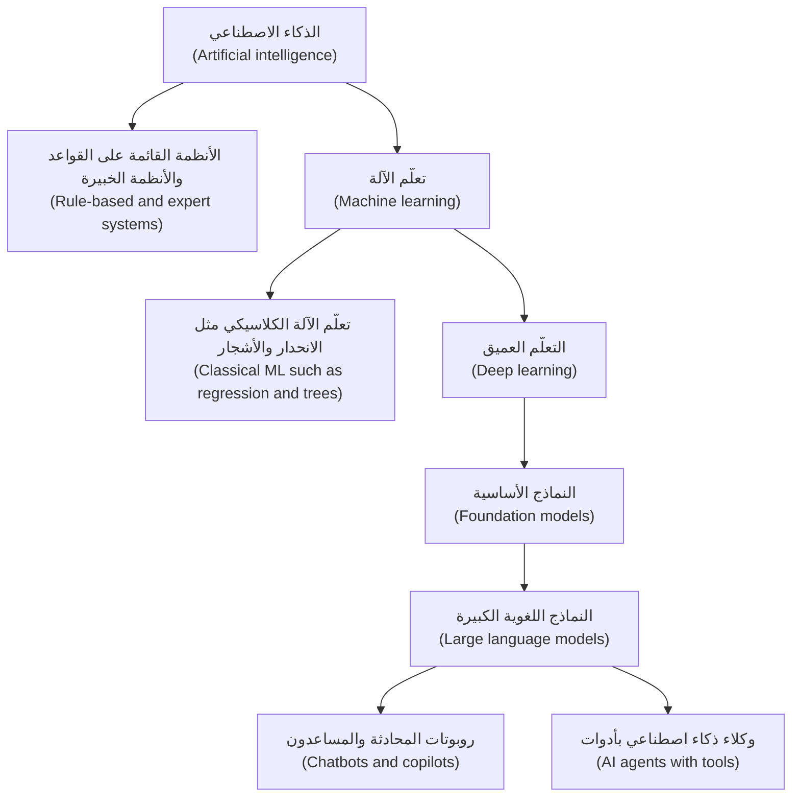
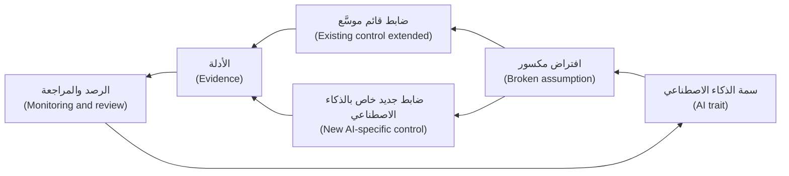

# الوحدة 1 — ما هو الذكاء الاصطناعي ولماذا يحتاج إلى حوكمة (What AI is and why it needs governance)

*لا يمكنك أن تحكم ما لا تستطيع وصفه. تمنحك هذه الوحدة فهمًا عمليًا غير رياضي للذكاء الاصطناعي (AI): كيف يختلف تعلّم الآلة (machine learning) عن البرمجيات العادية (ordinary software)، وما الذي يضيفه الذكاء الاصطناعي التوليدي (generative AI) والوكلاء (agents)، وكيف ترسم التعريفات القانونية الحدود. ثم ترسم خريطة الأضرار (harms) التي يمكن أن يسببها الذكاء الاصطناعي للأفراد والمجموعات والمؤسسات والمجتمع، وتختم بالسمات (traits) التي تجعل الذكاء الاصطناعي مختلفًا بما يكفي ليحتاج إلى حوكمة (governance) خاصة به. وكل فكرة مرتبطة بنظام من سجل أنظمة الذكاء الاصطناعي (AI inventory) في بنك نجم (Najm Bank). هذه الدورة مستقلة عن IAPP، ولا شيء فيها يُعدّ استشارة قانونية (legal advice).*

> **التغطية من مجال المعرفة (BoK coverage):** I.A — فهم ماهية أنظمة الذكاء الاصطناعي (AI systems)، والمخاطر (risk) والأضرار (harms) التي يمكن أن تسببها، ولماذا تستدعي خصائصها حوكمة مخصّصة.

---

# 1.1 — الذكاء الاصطناعي وتعلّم الآلة والذكاء الاصطناعي التوليدي والوكلاء (AI, machine learning, generative AI and agents)
*المستوى (Level): 🟢 مبتدئ (Beginner)* · *المتطلبات (Prerequisites): 0.1* · *مجال المعرفة (BoK): I.A*

## ⚡ الدرس في دقيقة (In 60 seconds)
- **الذكاء الاصطناعي (Artificial intelligence (AI))** مصطلح جامع. والتعريفات المهمة للحوكمة (OECD وEU AI Act) تصفه بأنه **نظام قائم على الآلة يستدل من مدخلاته على كيفية توليد مخرجات (machine-based system that infers from its inputs how to generate outputs)** مثل التنبؤات (predictions) أو المحتوى أو التوصيات (recommendations) أو القرارات (decisions) التي يمكن أن تؤثر في بيئات مادية أو افتراضية (physical or virtual environments).
- **تعلّم الآلة (Machine learning (ML))** هو الطريقة السائدة لبناء الذكاء الاصطناعي (AI) اليوم: فبدلًا من كتابة القواعد، تعطي البرنامج أمثلة *فيتعلّم* نموذجًا من البيانات (data).
- **الذكاء الاصطناعي التوليدي (Generative AI)** ينتج محتوى جديدًا (نصوصًا وصورًا وكودًا وصوتًا). والنماذج اللغوية الكبيرة (Large language models (LLMs)) أشهر أنواعه؛ فهي تولّد النص بالتنبؤ بالرموز (tokens) التالية المرجّحة، ولهذا يمكن أن تكون فصيحة ومخطئة في الوقت نفسه.
- **وكلاء الذكاء الاصطناعي (AI agents)** يجمعون بين نموذج وأدوات (tools) وذاكرة والقدرة على اتخاذ إجراءات متعددة الخطوات نحو هدف بقدر محدود من التدخل البشري.
- القاعدة الأهم: **احكم النظام (system)، لا النموذج (model) وحده.** فالضرر (harm) ينشأ من طريقة ربط النموذج بالبيانات (data) والواجهات (interfaces) والناس والقرارات (decisions).
- الفخ الأكبر (Biggest trap): افتراض أن "البسيط" أو "القائم على القواعد (rule-based)" يعني "ليس ذكاءً اصطناعيًا (AI)" أو "منخفض المخاطر (risk)". فالمخاطر تتبع الاستخدام والأثر (use and impact)، والتعريف يتبع *الاستدلال (inference)*.

## 🧭 لماذا يهم (Why it matters)
في أول اجتماع للجنة حوكمة الذكاء الاصطناعي (AI Governance Committee) في بنك نجم، يعترض خالد على إدراج نموذج تقييم الجدارة الائتمانية (credit-scoring model) في السجل (inventory) أصلًا. يقول: "إنها بطاقة تقييم (scorecard). نستخدم بطاقات التقييم (scorecards) منذ عشرين عامًا. هذا إحصاء وليس ذكاءً اصطناعيًا (AI)". تخالفه دانة: فالنموذج (model) الحالي مجموعة من أشجار التعزيز التدرّجي (gradient-boosted tree ensemble) مدرّبة على ثلاث سنوات من نتائج القروض، ويُعاد تدريبه مرتين في السنة. وفي الوقت نفسه يريد عمر أن يعرف هل المساعد الذكي لمذكرات الائتمان (credit memo copilot) "نظام واحد أم نظامان"، لأنه يجمع بين نموذج لغوي (language model) من طرف ثالث (third party) وبين استرجاع بنك نجم لمستندات العملاء. ويسأل رئيس تجربة العملاء (Head of Customer Experience) هل يغيّر شيئًا التحديثُ المخطّط الذي يتيح لـ Najm Assist أن *ينفّذ* فعليًا إيقاف البطاقات (card blocks) وتغيير العناوين بدلًا من الاكتفاء بالإجابة (answer) عن الأسئلة.

لكل سؤال عواقب حقيقية. فاستيفاء شيء ما للتعريف القانوني لنظام الذكاء الاصطناعي (Legal definition of an AI system) يحدد هل تنطبق عليه القوانين الخاصة بالذكاء الاصطناعي (AI). وكون بنك نجم مقدّم النظام (provider) لنموذج (model) ما أو مجرد مُشغِّل (deployer) له يحدد واجباته. وقدرة روبوت المحادثة (chatbot) على الفعل، لا الكلام فقط، تغيّر المخاطر (risk) تمامًا. تحتاج اللجنة (Committee) إلى مفردات مشتركة قبل أن تتخذ أيًّا من هذه القرارات (decisions). وهذا الدرس يبنيها.

## 📐 كيف يعمل (How it works)

### 🟢 الأساسيات (The essentials)

**البرمجيات التقليدية مقابل تعلّم الآلة (Traditional software vs machine learning).** في البرمجيات التقليدية (traditional software) يكتب المبرمج (programmer) قواعد صريحة (explicit rules): *إذا كان الدخل أقل من X والدين القائم أعلى من Y، فارفض.* أما في تعلّم الآلة (machine learning) فيقدّم المبرمج **بيانات التدريب (training data)** (الطلبات السابقة (past applications) وهل سُدّد كل قرض) و**خوارزمية تعلّم (learning algorithm)**، فتنتج الخوارزمية (algorithm) **نموذجًا (model)**: دالة رياضية (mathematical function) تربط المدخلات (inputs) بالمخرجات (outputs). لم يكتب أحد قواعد النموذج سطرًا سطرًا؛ بل تعلّمها من البيانات (data).

| | البرمجيات التقليدية (traditional software) | تعلّم الآلة (machine learning) |
|---|---|---|
| مصدر المنطق | أشخاص يكتبون القواعد | أنماط متعلَّمة من البيانات (data) |
| السلوك مع الحالات الجديدة | يمكن التنبؤ به من الكود | إحصائي؛ جيد عمومًا ومفاجئ أحيانًا |
| عندما يتغير العالم | يواصل تطبيق القواعد القديمة | قد يتدهور بصمت مع ابتعاد البيانات (data) عن بيانات التدريب (training data) |
| كيف تتحقق منه | تقرأ الكود وتختبر القواعد | تختبره على بيانات محجوزة (held-out data) وتراقب النتائج |

**المفردات التي تحتاجها (The vocabulary you need).**

| المصطلح | المعنى المبسّط | مثال من بنك نجم |
|---|---|---|
| **السمة (Feature)** | متغير مُدخل | الدخل، ومبلغ القرض، وعدد الأشهر لدى صاحب العمل الحالي |
| **التسمية (Label)** أو الهدف (target) | الإجابة (answer) التي يتعلم النموذج (model) التنبؤ بها | هل تعثّر المقترض (borrower) خلال 12 شهرًا؟ |
| **التدريب (Training)** | ملاءمة النموذج (model) للبيانات (data) | فريق دانة يدرّب النموذج (model) على نتائج قروض 2022–2024 |
| **الاستدلال (Inference)** | استخدام النموذج (model) المدرَّب على مدخلات جديدة | تقييم مقدّم طلب اليوم في ثوانٍ |
| **المعاملات (Parameters)** أو الأوزان (weights) | الأرقام داخل النموذج (model) التي يعدّلها التدريب (training) | الآلاف في نموذج الائتمان (credit model)، والمليارات في النموذج اللغوي الكبير (LLM) |
| **التحقق والاختبار (Validation and testing)** | فحص الأداء على بيانات لم يرها النموذج (model) | مجموعة محجوزة (hold-out set) من طلبات 2024 |
| **النموذج (Model)** | المكوّن الرياضي المدرَّب (trained mathematical component) | ملف نموذج تقييم الجدارة الائتمانية (credit-scoring model) |
| **نظام الذكاء الاصطناعي (AI system)** | النموذج (model) مع مسارات البيانات (data pipelines) والواجهات (interfaces) والتكاملات (integrations) والمراجعة البشرية (human review) وسياق الاستخدام (context of use) | سير عمل إنشاء القروض (Loan-origination workflow)، وحدود الدرجات (score thresholds)، ومراجعة المكتتب (underwriter review)، وخطابات الإجراء السلبي (adverse-action letters) |

**ثلاث طرق تتعلم بها الآلات (Three ways machines learn).**

- **التعلّم الموجَّه (Supervised learning)** يتعلم من أمثلة مسمّاة (labelled examples): تعثّر أو لا تعثّر، احتيال أو لا احتيال. ونموذجا الائتمان والاحتيال في بنك نجم موجَّهان (supervised).
- **التعلّم غير الموجَّه (Unsupervised learning)** يكتشف البنية في بيانات غير مسمّاة (unlabelled data)، مثل مجموعات العملاء المتشابهين أو المعاملات غير المعتادة. وتستخدمه فرق الاحتيال لاكتشاف أنماط جديدة لم يسمّها أحد بعد.
- **التعلّم المعزَّز (Reinforcement learning)** يتعلم بالتجربة والخطأ من المكافآت. ويُستخدم أيضًا في الضبط الدقيق (fine-tune) للنماذج اللغوية (language models) بناءً على التغذية الراجعة البشرية (human feedback) لتكون إجاباتها أكثر فائدة وأمانًا.

**التعلّم العميق (Deep learning)** يستخدم شبكات عصبية متعددة الطبقات (neural networks with many layers). وهو يشغّل التعرف على الصور (image recognition) ونماذج الكلام واللغة (speech and language models)، وفهمه أصعب بكثير من بطاقة التقييم (scorecard).

```mermaid
flowchart TD
    A["الذكاء الاصطناعي<br/>(Artificial intelligence)"] --> B["الأنظمة القائمة على القواعد والأنظمة الخبيرة<br/>(Rule-based and expert systems)"]
    A --> C["تعلّم الآلة<br/>(Machine learning)"]
    C --> D["تعلّم الآلة الكلاسيكي مثل الانحدار والأشجار<br/>(Classical ML such as regression and trees)"]
    C --> E["التعلّم العميق<br/>(Deep learning)"]
    E --> F["النماذج الأساسية<br/>(Foundation models)"]
    F --> G["النماذج اللغوية الكبيرة<br/>(Large language models)"]
    G --> H["روبوتات المحادثة والمساعدون<br/>(Chatbots and copilots)"]
    G --> I["وكلاء ذكاء اصطناعي بأدوات<br/>(AI agents with tools)"]
```

### 🟡 التعمق أكثر (Going deeper)

**الذكاء الاصطناعي التوليدي والنماذج الأساسية (Generative AI and foundation models).** معظم تعلّم الآلة الكلاسيكي (classic ML) *تمييزي (discriminative)* أو تنبؤي (predictive): يعطي درجة أو فئة. أما **الذكاء الاصطناعي التوليدي (GenAI)** فيبتكر محتوى جديدًا يشبه بيانات تدريبه (its training data). و**النموذج الأساسي (foundation model)** نموذج كبير مدرَّب على بيانات واسعة، عادةً بالإشراف الذاتي (self-supervision) (إذ توفّر البيانات (data) تسمياتها (its labels) بنفسها، مثلًا بإخفاء الكلمة التالية ومطالبة النموذج (model) بالتنبؤ بها)، ويمكن تكييفه لمهام كثيرة. ويسمّي قانون الذكاء الاصطناعي الأوروبي (EU AI Act) هذه النماذج (models) **نماذج ذكاء اصطناعي للأغراض العامة (general-purpose AI (GPAI) models)**، وينظّم مقدّميها بمعزل عن الأنظمة (systems) المبنية عليها.

**كيف يعمل النموذج اللغوي الكبير، بلغة الحوكمة (How an LLM works, in governance terms).** يقسّم النموذج اللغوي الكبير (LLM) النص إلى **رموز (tokens)** (أجزاء من الكلمات)، وبناءً على كل ما سبق يتنبأ باحتمال لكل رمز تالٍ ممكن. ثم يختار واحدًا بالعيّنة، ويضيفه، ويكرر. وتترتب على ذلك أربع نتائج:

1. **إنه مُحسَّن للمعقولية لا للحقيقة.** فقد ينتج عبارات واثقة فصيحة لكنها خاطئة، تُسمّى غالبًا الهلوسة (hallucinations)؛ ويستخدم ملف NIST للذكاء الاصطناعي التوليدي (Generative AI Profile) مصطلح **التلفيق (confabulation)**. فقد يخترع المساعد الذكي لمذكرات الائتمان (credit memo copilot) نسبة خدمة دين (debt-service ratio) تبدو صحيحة.
2. **المخرجات (outputs) تتفاوت.** قد يعطي الطلب (prompt) نفسه إجابات مختلفة، مما يعقّد الاختبار (testing) والتدقيق (audit).
3. **لا يعرف إلا بيانات تدريبه (its training data) وسياقه.** **نافذة السياق (context window)** هي مقدار النص الذي يستطيع النموذج (model) أخذه في الاعتبار دفعة واحدة. وما ليس في التدريب (training) أو السياق (context) لا يمكنه معرفته، وإن كان قد يخمّنه.
4. **التعليمات والبيانات (data) تتشارك قناة واحدة.** قد يحتوي مستند يُمرَّر إلى النموذج (model) على نص يعامله النموذج كتعليمات، ويُعرف ذلك بـ **حقن الأوامر (prompt injection)**. وهذه مشكلة أمنية (security problem) جديدة لا توجد في البرمجيات العادية (ordinary software) بالشكل نفسه.

**تكييف النموذج (Adapting a model).** نادرًا ما تدرّب المؤسسات النماذج الأساسية (foundation models) بنفسها. بل تكيّفها:

| الأسلوب | ما يفعله | ملاحظة حوكمية |
|---|---|---|
| **الطلبات (Prompting)** وطلبات النظام (system prompts) | تعليمات تُعطى وقت التشغيل (run time) | رخيص وسريع؛ قد يتغير السلوك مع تغييرات صغيرة في الصياغة؛ ضع الطلبات (prompts) تحت إدارة الإصدارات (version control) |
| **التوليد المعزّز بالاسترجاع (Retrieval-augmented generation (RAG))** | يبحث النظام (system) في مستندات معتمدة ويمرّر المقاطع ذات الصلة إلى النموذج (model) كسياق | يرسّخ الإجابات في مصادر بنك نجم نفسه؛ ويصبح فهرس الاسترجاع (retrieval index) أصل بيانات محكومًا بضوابط وصول (governed data asset with access controls) |
| **الضبط الدقيق (Fine-tuning)** | تدريب إضافي على بيانات المؤسسة | يغيّر النموذج (model)؛ وقد يغيّر دور بنك نجم وواجباته؛ وتنطبق حقوق بيانات التدريب (training data rights) والخصوصية (privacy) |

يستخدم المساعد الذكي لمذكرات الائتمان (credit memo copilot) التوليد المعزّز بالاسترجاع (RAG): فهو يسترجع القوائم المالية للعميل والمذكرات السابقة، ثم يطلب من نموذج لغوي كبير (large language model) لدى طرف ثالث (third party) أن يكتب المسودة. ولهذا يهم سؤال عمر "نظام واحد أم نظامان": فالنموذج (model) ملك المورّد (vendor)، أما *النظام (system)* (الاسترجاع (retrieval) والطلبات (prompts) والواجهة وخطوة المراجعة (review)) فملك بنك نجم.

**الوكلاء (agents).** **وكيل الذكاء الاصطناعي (AI agent)** نظام يستطيع فيه النموذج (model) تخطيط الخطوات، واستدعاء **أدوات (tools)** (البحث وقواعد البيانات (data) والبريد الإلكتروني والمدفوعات وتنفيذ الكود (code execution)) والتصرف بناءً على النتائج، مكررًا ذلك حتى يبلغ هدفًا. والتحديث المخطط لـ Najm Assist يحوّل روبوت محادثة (chatbot) *يقول* "يمكنك إيقاف بطاقتك من التطبيق" إلى وكيل (agent) *يوقف البطاقة*. والاستقلالية (autonomy) طيف:

| المستوى | الوصف | مثال |
|---|---|---|
| المساعدة (Assist) | يقترح النظام (system)؛ ويقرر الإنسان وينفّذ | المساعد الذكي (copilot) يكتب مسودة (draft) مذكرة؛ ومدير العلاقة يعدّلها ويوقّعها |
| التصرف بموافقة (Act with approval) | يجهّز النظام (system) الإجراء (action)؛ ويؤكده الإنسان | الوكيل (agent) يقترح تغيير العنوان؛ والعميل يؤكده برمز لمرة واحدة |
| التصرف ضمن حدود (Act within limits) | يتصرف النظام (system) وحده داخل حدود ضيقة، مع التسجيل (logging) وإمكانية التراجع (rollback) | الوكيل (agent) يوقف بطاقة عند الطلب بعد المصادقة (authentication) |
| التصرف الواسع (Act broadly) | يختار النظام (system) الإجراءات (actions) وينفّذها عبر الأدوات (tools) | غير مناسب لاستخدامات بنك نجم الموجّهة للعملاء اليوم |

ترتفع الحوكمة (governance) مع الاستقلالية (autonomy): صلاحيات الأدوات (tool permissions)، وحدود الإنفاق أو الإجراءات (actions)، والمصادقة (authentication)، وتسجيل كل إجراء (logging of every action)، وطريقة واضحة تمكّن البشر من إيقاف الوكيل (agent).

### 🔴 نظرة الخبير (Expert view)

**التعريف القانوني (The legal definition).** عدّلت OECD تعريفها لنظام الذكاء الاصطناعي (AI system) في نوفمبر 2023، ويتبعه تعريف EU AI Act في المادة 3(1) (Art. 3(1)) عن كثب. وبإعادة الصياغة، نظام الذكاء الاصطناعي (AI) نظام *قائم على الآلة (Machine-based)*، *مصمَّم للعمل بمستويات متفاوتة من الاستقلالية (autonomy)*، و*قد يُظهر قابلية للتكيّف (May exhibit adaptiveness) بعد النشر (deployment)*، و*يستدل (infers)، لأهداف صريحة أو ضمنية (Objectives, explicit or implicit)، من المدخلات (inputs) التي يتلقاها على كيفية توليد مخرجات (outputs)* مثل التنبؤات (predictions) أو المحتوى أو التوصيات (recommendations) أو القرارات (decisions) التي *يمكن أن تؤثر في بيئات مادية أو افتراضية (physical or virtual environments)*. اقرأه عنصرًا عنصرًا:

| العنصر | ما يعنيه | لماذا يهم (Why it matters) |
|---|---|---|
| قائم على الآلة (Machine-based) | يعمل على عتاد وبرمجيات | يستبعد العمليات (processes) البشرية البحتة |
| استقلالية متفاوتة (Varying autonomy) | قدر من الاستقلال عن التدخل البشري | حتى الاستقلالية (autonomy) المنخفضة قد تكفي |
| قد يُظهر قابلية للتكيّف (May exhibit adaptiveness) | يمكن أن يتعلم أو يتغير بعد النشر (deployment) | "قد": النظام (system) الذي لا يتكيف يمكن أن يظل ذكاءً اصطناعيًا (AI) |
| أهداف صريحة أو ضمنية (Objectives, explicit or implicit) | أهداف يضعها المصممون أو تنشأ من التدريب (training) | يشمل النماذج (models) التي تُتعلَّم أهدافها |
| **يستدل (infers)** | يستخلص المخرجات (outputs) من المدخلات (inputs) عبر التعلم أو الاستنتاج أو النمذجة | الاختبار الأساسي (key test) الذي يفصل الذكاء الاصطناعي (AI) عن البرمجيات العادية (ordinary software) |
| مخرجات تؤثر في البيئات (Outputs that influence environments) | تنبؤات (predictions)، ومحتوى، وتوصيات (recommendations)، وقرارات | يشمل النصائح المقدَّمة للبشر، لا الإجراءات (actions) التلقائية فقط |

توضح حيثيات القانون (recitals) أن الأنظمة القائمة على قواعد يضعها البشر وحدهم (systems based on rules defined solely by people) لتنفيذ عمليات تلقائيًا ليست مقصودة بالتغطية. وقد نشرت المفوضية الأوروبية (European Commission) في 2025 إرشادات (guidance) حول تعريف نظام الذكاء الاصطناعي (AI system definition) تناقش الحالات الحدّية (borderline cases)، مثل بعض أنظمة معالجة البيانات (data) الأساسية والتنبؤ البسيط؛ فارجع إليها في الحالات الصعبة. أما عن اعتراض خالد فالجواب عملي: النموذج (model) الذي تعلّمته خوارزمية تعزيز (boosting) من البيانات يستدل (infers) على مخرجاته، والأرجح جدًا أنه داخل النطاق (scope). والأهم أنه حتى لو كانت بطاقة تقييم (scorecard) مبنية يدويًا خارج تعريف قانون الذكاء الاصطناعي (AI Act)، فستبقى خاضعة لقواعد حماية البيانات (data protection) والإقراض العادل (fair-lending) ومخاطر النماذج (model risk)، وبنك نجم يحكمها في كل الأحوال.

**النموذج مقابل النظام، ولماذا تحوّل الإصدار v2.1 (Model versus system, and why v2.1 moved).** نادرًا ما تنشأ الأضرار (harms) من النموذج (model) وحده. فنموذج الائتمان (credit model) نفسه قد يكون عادلًا (fair) أو غير عادل بحسب الحدود المطبّقة، وهل يستطيع المكتتبون (underwriters) تجاوزه، وأي بيانات يغذيه بها المسار (pipeline)، وكيف يُبلَّغ المرفوضون. وصياغة مجال المعرفة (BoK) v2.1 حول "نظام الذكاء الاصطناعي (AI system)" تعكس ذلك: فالحوكمة (governance) ترتبط بالترتيب الاجتماعي التقني (socio-technical) كله.

**نموذج GPAI مقابل نظام GPAI (GPAI model versus GPAI system).** بموجب EU AI Act، يحمّل *نموذج GPAI (GPAI model)* (النموذج الأساسي (foundation model)) مقدّمه التزامات، مثل التوثيق الفني (technical documentation) وسياسة حقوق النشر (copyright policy)، مع واجبات (duties) إضافية للنماذج (models) ذات المخاطر النظامية (systemic risk). أما *النظام (system)* المبني عليه (المساعد الذكي (copilot) لدى بنك نجم) فيُقيَّم بحسب استخدامه: مساعد صياغة (drafting assistant) للمذكرات الداخلية ليس في حد ذاته ضمن فئة من الملحق III (Annex III)، لكن لو استُخدمت مخرجاته لتقييم الجدارة الائتمانية للأفراد (evaluate the creditworthiness of individuals) فقد يتغير التحليل. وتتناول الوحدة 6 ذلك بالتفصيل.

**الذكاء الاصطناعي الضيق والعام (Narrow AI and general AI).** كل ما يستخدمه بنك نجم ذكاء اصطناعي (AI) *ضيق (narrow)*، مبني لمهام محدودة. أما الذكاء الاصطناعي العام (Artificial general intelligence (AGI))، أي نظام يضاهي البشر في معظم المهام، فهو هدف بحثي ونقاش سياساتي، لا بند في السجل (inventory). وأسئلة الامتحان (exam) تكافئ الأوصاف الدقيقة بصيغة الحاضر لما تفعله الأنظمة (systems) فعلًا.

## ⚖️ الأدوات التنظيمية (The instruments)
| الأداة | ما تشترطه أو توصي به | إشارة الامتحان (Exam cue) |
|---|---|---|
| **EU AI Act** — المادة 3(1) | التعريف القانوني لنظام الذكاء الاصطناعي (Legal definition of an AI system): قائم على الآلة (Machine-based)، باستقلالية متفاوتة (Varying autonomy)، قد يتكيّف، يستدل (infers) من المدخلات (inputs) على كيفية توليد مخرجات (outputs) يمكن أن تؤثر في البيئات | "يستدل (infers)" هو العنصر الأساسي؛ والتكيّف (adaptiveness) اختياري ("قد") |
| **OECD AI Principles** — تعريف نظام الذكاء الاصطناعي (AI system definition) | تعريف OECD المحدَّث (نوفمبر 2023) لنظام الذكاء الاصطناعي (AI system)، الذي يتبعه تعريف EU AI Act عن كثب | مصدر التعريف المشترك دوليًا |
| **EU AI Act** — الفصل الخامس (Chapter V) | التزامات مقدّمي نماذج الذكاء الاصطناعي للأغراض العامة (general-purpose AI models)، مع واجبات (duties) إضافية للنماذج (models) ذات المخاطر النظامية (systemic risk) | لمقدّمي النماذج الأساسية (Foundation model providers) واجبات (duties) خاصة بهم، منفصلة عن مُشغِّلي الأنظمة (systems) |
| **EU AI Act** — المادة 50 (Art. 50) | واجبات الشفافية (Transparency duties)، ومنها إبلاغ الناس بأنهم يتفاعلون مع نظام ذكاء اصطناعي (AI system) ما لم يكن ذلك واضحًا، ووسم المحتوى الاصطناعي (marking synthetic content) | يجب أن تفصح روبوتات المحادثة (chatbots) عن أنها ذكاء اصطناعي (AI) |
| **ISO/IEC 22989** | مفاهيم ومصطلحات دولية للذكاء الاصطناعي (International concepts and terminology for AI)، منها تعلّم الآلة (machine learning) والوكلاء (agents) ومصطلحات دورة الحياة (life-cycle terms) | مفردات معيارية (Standard vocabulary)؛ وليس معيار متطلبات (requirements standard) |
| **NIST AI 600-1** | ملف NIST للذكاء الاصطناعي التوليدي (NIST's Generative AI Profile) ضمن AI RMF (يوليو 2024)، يسمّي مخاطر خاصة بالذكاء الاصطناعي التوليدي (GenAI) مثل التلفيق (confabulation) | مفردات مخاطر الذكاء الاصطناعي التوليدي (Generative AI risks)؛ طوعي (voluntary) |

## 🏛️ عمليًا في بنك نجم (In practice at Najm Bank)
لمنع نقاشات التعريف من تعطيل اللجنة (Committee)، تضيف ليلى **بطاقة فرز (triage card) بعنوان "هل هو ذكاء اصطناعي (AI)، ومن أي نوع؟"** إلى نموذج استقبال حالات الاستخدام (use-case intake form). يكملها المالكون (owners)، ويؤكدها فريق حوكمة الذكاء الاصطناعي (AI governance team).

| # | السؤال | إذا كانت الإجابة (answer) نعم |
|---|---|---|
| 1 | هل ينتج النظام (system) تنبؤات (predictions) أو درجات أو ترتيبات أو تصنيفات أو توصيات (recommendations) أو محتوى مولَّدًا أو قرارات؟ | تابع |
| 2 | هل اشتُقّت هذه المخرجات (outputs) من أنماط متعلَّمة من البيانات (data)، أو من نموذج درّبه طرف آخر، لا من قواعد كتبها موظفو بنك نجم بالكامل؟ | الأرجح أنه ذكاء اصطناعي (AI): سجّله. وإن لم تكن متأكدًا فسجّله بوصف "قيد التأكيد (to confirm)" |
| 3 | هل يستخدم نموذجًا للأغراض العامة (general-purpose model) أو نموذجًا أساسيًا (مثل نموذج لغوي كبير (large language model) عبر API)؟ | سجّل مقدّم النموذج (model) وإصداره؛ ونبّه إلى مخاطر الذكاء الاصطناعي التوليدي (التلفيق (confabulation)، وحقن الأوامر (prompt injection)، وتسرّب البيانات (data leakage)) |
| 4 | هل يكيّف بنك نجم النموذج (بالضبط الدقيق (fine-tuned)، أو بدمجه مع التوليد المعزّز بالاسترجاع (RAG) على بيانات بنك نجم)؟ | سجّل دور بنك نجم في التطوير (development)؛ ومراجعة حقوق البيانات (data) والخصوصية (privacy) |
| 5 | هل يستطيع النظام (system) اتخاذ إجراءات عبر أدوات (tools) أو أنظمة أخرى، لا مجرد إنتاج مخرجات (outputs)؟ | صنّف مستوى الاستقلالية (autonomy level)؛ واشترط حدودًا للإجراءات (action limits) وتسجيلًا (logging) وأداة إيقاف (stop control) |
| 6 | حياة مَن أو حقوق مَن تتأثر بمخرجاته، وبأي قدر؟ | يغذّي التقييم الأولي للمخاطر (1.2 والوحدة 8) |

بالتطبيق على السجل (inventory): تقييم الجدارة الائتمانية (تعلّم آلة موجَّه (supervised ML)، ذكاء اصطناعي (AI)، أثر مرتفع)؛ وNajm Assist (روبوت محادثة توليدي (GenAI chatbot) يتحول إلى وكيل (agent): أعِد التقييم (re-assess) عند التحديث)؛ وفرز السير الذاتية (تعلّم آلة من مورّد (vendor ML)، ذكاء اصطناعي)؛ والمساعد الذكي لمذكرات الائتمان (نظام ذكاء اصطناعي توليدي (GenAI system) مع توليد معزّز بالاسترجاع (RAG) بناه بنك نجم على نموذج طرف ثالث (third party))؛ وكشف الاحتيال (تعلّم آلة موجَّه وغير موجَّه (supervised and unsupervised ML))؛ واستخدام الموظفين (staff use) للذكاء الاصطناعي التوليدي (أنظمة ذكاء اصطناعي توليدي (GenAI systems) من أطراف ثالثة).

## 🛠️ التمارين (Exercises)
- 🟢 **سمِّ الأجزاء (Label the parts).** لنموذج (model) كشف الاحتيال (fraud detection) في بنك نجم، اذكر سمة واحدة (one feature)، والتسمية (label)، ومتى يحدث التدريب (training) ومتى يحدث الاستدلال (inference). *يكتمل عندما (Done when):* يطابق كل مصطلح تعريفه في جدول المفردات.
- 🟡 **نموذج أم نظام؟ ⁦(Model or system?)⁩** اذكر ستة مكوّنات على الأقل من *نظام* المساعد الذكي لمذكرات الائتمان (credit memo copilot) غير النموذج اللغوي (language model) نفسه، ولكل منها شيئًا واحدًا قد يسوء. *يكتمل عندما (Done when):* تتضمن قائمتك مكوّنات للبيانات (data) والواجهة والبشر والتكامل.
- 🔴 **طبّق التعريف (Apply the definition).** خذ ثلاث أدوات (tools) حدّية (جدول بيانات بأوزان تقييم مضبوطة يدويًا، وشجرة قرار (decision tree) ثابتة كتبها فريق سياسة الائتمان (credit policy team)، وانحدار لوجستي (logistic regression) يُعاد ضبطه سنويًا على نتائج القروض). مرّر كلًّا منها على عناصر المادة 3(1)، وبيّن هل الأرجح أنه نظام ذكاء اصطناعي (AI system)، وما الحوكمة (governance) التي تنطبق في الحالتين. *يكتمل عندما (Done when):* تشرح دور "يستدل (infers)" وتسمّي قاعدة واحدة على الأقل من خارج قانون الذكاء الاصطناعي (AI Act) تنطبق بغض النظر.

## ⚠️ أخطاء وفخاخ الامتحان (Mistakes and exam traps)
- **فخ (Trap): "التكيّف شرط لازم".** يقول التعريف إن النظام (system) *قد* يُظهر قابلية للتكيّف (adaptiveness) بعد النشر (deployment). والنموذج المجمَّد (model frozen) عند الإطلاق (release) يمكن أن يظل نظام ذكاء اصطناعي (AI system).
- **فخ (Trap): حوكمة النموذج (model) وحده.** الحدود والمراجعة البشرية (human review) ومسارات البيانات (data pipelines) وواجهات المستخدم تصنع الضرر (harm) أو تمنعه. اختر الإجابات التي تنظر إلى النظام (system) كله.
- **فخ (Trap): وصف الهلوسة (hallucination) بأنها خلل سيُصلَح.** إنها ناتجة عن طريقة توليد النماذج اللغوية (language models) للنص. وإجابات الحوكمة (governance) تشمل الترسيخ في المصادر (grounding) والتحقق (verification) والمراجعة البشرية (human review) وقيود الاستخدام.
- **فخ (Trap): معاملة الوكلاء (agents) كروبوتات محادثة.** عندما يستطيع النظام (system) التصرف عبر الأدوات (tools)، تصبح الضوابط (controls) على الصلاحيات (permissions) والحدود والتسجيل (logging) والتدخل البشري محورية.
- **فخ (Trap): "لا قانون ذكاء اصطناعي (AI law)، إذن لا حوكمة".** حتى الأنظمة (systems) الواقعة خارج التعريف القانوني (legal definition) للذكاء الاصطناعي (AI) قد تخضع لقواعد حماية البيانات (data protection) ومنع التمييز (discrimination) والقواعد القطاعية.

## 🧾 الخلاصة (Recap)
- يتعلّم تعلّم الآلة (machine learning) نموذجًا من البيانات (data) بدلًا من اتباع قواعد مكتوبة يدويًا (hand-written rules)؛ وهذا ما يجعل سلوكه إحصائيًا ومعتمدًا على البيانات.
- الذكاء الاصطناعي التوليدي (GenAI) يبتكر المحتوى؛ والنماذج اللغوية الكبيرة (large language models) تتنبأ بالرموز (tokens)، لذا قد تكون فصيحة ومخطئة؛ والنماذج الأساسية (GPAI) تُكيَّف بالطلبات (prompts) أو التوليد المعزّز بالاسترجاع (RAG) أو الضبط الدقيق (fine-tuning).
- الوكلاء (agents) يضيفون الأدوات (tools) والإجراءات (actions)؛ والحوكمة (governance) ترتفع مع الاستقلالية (autonomy).
- يدور تعريفا OECD وEU AI Act حول *الاستدلال (inference)*؛ والتكيّف (adaptiveness) اختياري.
- احكم **نظام** الذكاء الاصطناعي (AI): النموذج (model) مع البيانات (data) والواجهات (interfaces) والناس والسياق (context).

## ✍️ اختبر نفسك (Check yourself)

**1. أي عنصر من تعريف EU AI Act يميّز نظام الذكاء الاصطناعي (AI system) عن البرمجيات التقليدية (traditional software) بأوضح صورة؟**

- A. أنه يعمل على آلة
- B. أنه يتكيّف بعد النشر (deployment)
- C. أنه يستدل (infers) من مدخلاته (its inputs) على كيفية توليد المخرجات (outputs)
- D. أنه تبيعه شركة تقنية (technology company)

الإجابة (answer)

**C.** الاستدلال (inference) هو العنصر المحدِّد (defining element). التكيّف (B) مغرٍ لكن التعريف يقول إن الأنظمة (systems) *قد* تتكيّف، فهو ليس شرطًا؛ وA ينطبق على كل البرمجيات (software). (انظر 🔴 التعريف القانوني (The legal definition).)

**2. يسترجع المساعد الذكي لمذكرات الائتمان (credit memo copilot) في بنك نجم مستندات العميل ويمرّرها إلى نموذج لغوي كبير (large language model) لدى طرف ثالث (third party) لكتابة مسودة (draft) مذكرة. ما اسم هذا الأسلوب؟**

- A. التوليد المعزّز بالاسترجاع (RAG)
- B. التعلّم المعزَّز (Reinforcement learning)
- C. الضبط الدقيق (fine-tuning)
- D. التجميع غير الموجَّه (Unsupervised clustering)

الإجابة (answer)

**A.** يسترجع التوليد المعزّز بالاسترجاع (RAG) المستندات ذات الصلة وقت التشغيل (run time) ويقدّمها للنموذج (model) كسياق. أما الضبط الدقيق (C) فيغيّر أوزان النموذج (the model's weights) بتدريب إضافي. (انظر 🟡 تكييف النموذج (Adapting a model).)

**3. يلاحظ مدير علاقة أن مسودة (draft) المساعد الذكي (copilot) تتضمن نسبة خدمة دين (debt-service ratio) معقولة لكنها مختلَقة. ما أفضل وصف لهذا الإخفاق؟**

- A. اختراق بيانات (data breach)
- B. التلفيق (confabulation)، وهو خاصية معروفة للنماذج (models) التوليدية تتطلب ضوابط (controls) تحقق
- C. انجراف النموذج (Model drift) بسبب تغيّر أسعار الفائدة (interest rates)
- D. حقن طلبات (prompt injection) من جانب العميل

الإجابة (answer)

**B.** تولّد النماذج اللغوية الكبيرة (large language models) نصًا معقولًا لا حقائق متحقَّقًا منها؛ ويسمّي ملف NIST للذكاء الاصطناعي التوليدي (NIST's Generative AI Profile) ذلك تلفيقًا (confabulation). والاستجابة الحوكمية هي الترسيخ في المصادر (grounding) والتحقق (verification) والمراجعة البشرية (human review). أما الانجراف (C) فتدهور تدريجي مع الوقت، ولا أثر لتعليمات محقونة (D). (انظر 🟡 كيف يعمل النموذج اللغوي الكبير (How an LLM works).)

**4. يخطط بنك نجم للسماح لروبوت المحادثة (chatbot) بإيقاف البطاقات (card blocks) وتغيير العناوين بنفسه. من منظور الحوكمة (governance)، ما الذي يتغير أكثر من غيره؟**

- A. لا شيء، لأنه يستخدم النموذج اللغوي (language model) نفسه
- B. لم يعد مضطرًا للإفصاح عن أنه ذكاء اصطناعي (AI)
- C. يجب الآن تصنيفه ممارسةً محظورة (prohibited practice)
- D. يصبح النظام (system) وكيلًا (agent) يتصرف، فتصبح الصلاحيات (permissions) وحدود الإجراءات (action limits) والمصادقة (authentication) والتسجيل (logging) وضوابط الإيقاف البشرية (human stop controls) أساسية

الإجابة (answer)

**D.** الانتقال من الإجابة إلى الفعل (Moving from answering to acting) يرفع الاستقلالية (autonomy) واحتمال الضرر (Likelihood of harm)، فتصبح الضوابط (controls) على الإجراءات (actions) هي الأهم. أما كون النموذج (model) هو نفسه (A) فيغفل أن النظام (system) تغيّر؛ ولا شيء يجعله محظورًا (C)؛ وواجبات الشفافية (Transparency duties) لا تزال تنطبق (B). (انظر 🟡 الوكلاء (agents).)

**5. يقول خالد إن نموذج الائتمان (credit model) "مجرد إحصاء"، لذا فالحوكمة (governance) غير ضرورية. أي رد هو الأدق؟**

- A. هو محق؛ فالنماذج (models) الإحصائية ليست ذكاءً اصطناعيًا (AI) أبدًا
- B. النموذج (model) الذي تعلّمته خوارزمية تعلّم آلة (machine-learning algorithm) من البيانات (data) يستوفي على الأرجح تعريف نظام الذكاء الاصطناعي (AI system definition)، وفي كل الأحوال تخضع قرارات الائتمان (credit decisions) لقواعد حماية البيانات (data protection) والإقراض العادل (fair-lending) ومخاطر النماذج (model risk)
- C. نماذج التعلّم العميق (deep-learning models) وحدها تحتاج إلى حوكمة
- D. الحوكمة (governance) تنطبق فقط إذا تكيّف النموذج (model) بعد النشر (deployment)

الإجابة (answer)

**B.** يستدل (infers) النموذج (model) على مخرجاته من أنماط متعلَّمة، وقرارات الائتمان (credit decisions) منظَّمة بغض النظر عن التقنية. أما C وD فيسيئان قراءة التعريف؛ فالتكيّف (adaptiveness) اختياري والمخاطر (risk) تتبع الاستخدام. (انظر 🔴 التعريف القانوني (The legal definition).)

## 📚 المراجع (References)
- Regulation (EU) 2024/1689 (EU AI Act)، المادة 3(1) والفصل الخامس (Chapter V) والمادة 50 (Art. 50): https://eur-lex.europa.eu/eli/reg/2024/1689/oj
- المفوضية الأوروبية (European Commission)، صفحة سياسة قانون الذكاء الاصطناعي (AI Act) وإرشاداته: https://digital-strategy.ec.europa.eu/en/policies/regulatory-framework-ai
- OECD AI Principles وتعريف نظام الذكاء الاصطناعي (AI system definition): https://oecd.ai/en/ai-principles
- NIST AI 600-1، ملف الذكاء الاصطناعي التوليدي (Generative AI Profile): https://doi.org/10.6028/NIST.AI.600-1
- ISO/IEC 22989، عبر كتالوج ISO: https://www.iso.org/

---

# 1.2 — المخاطر والأضرار على الأفراد والمجموعات والمؤسسات والمجتمع (Risks and harms to people, groups, organisations and society)
*المستوى (Level): 🟢 مبتدئ (Beginner)* · *المتطلبات (Prerequisites): 1.1* · *مجال المعرفة (BoK): I.A*

## ⚡ الدرس في دقيقة (In 60 seconds)
- **الضرر (harm)** أثر سلبي فعلي؛ أما **المخاطر (risk)** فتجمع بين احتمال وقوع الضرر وشدته (its severity) لو وقع. والحوكمة (governance) تدير المخاطر حتى لا تقع الأضرار (harms)، أو تُكتشف وتُعالَج بسرعة.
- يصنّف NIST AI RMF أضرار الذكاء الاصطناعي (AI harms) في ثلاث عائلات: **الضرر بالناس (harm to people)** (الأفراد، والمجموعات والمجتمعات المحلية، والمجتمع)، و**الضرر بالمؤسسة (harm to an organisation)**، و**الضرر بالمنظومة (harm to an ecosystem)**.
- بالنسبة للأفراد، الفئات الكبرى هي التمييز (discrimination)، وفقدان الخصوصية (loss of privacy)، والنتائج غير الآمنة أو الخاطئة (unsafe or wrong outcomes)، وفقدان الاستقلالية والكرامة (Loss of autonomy and dignity)، والضرر الاقتصادي (Economic harm). أما بالنسبة للمجموعات فكثيرًا ما تكون الأضرار (harms) **غير مرئية على مستوى الفرد (invisible at the individual level)** ولا تظهر إلا في المجموع.
- يضيف الذكاء الاصطناعي التوليدي (generative AI) مخاطره الخاصة: التلفيق (confabulation)، والمحتوى الضار (harmful content)، وسلامة المعلومات (information integrity)، والملكية الفكرية (IP)، وتسرّب البيانات (data leakage)، وتعقيد سلسلة القيمة (value-chain complexity).
- القاعدة الأهم: **قيّم الضرر (harm) من منظور المتأثرين (people affected)، لا من منظور المؤسسة وحدها.** فقوانين مثل EU AI Act وGDPR تحمي حقوق الأفراد (individuals' rights)؛ وسجل المخاطر (risk register) الذي لا يذكر إلا مخاطر السمعة والمال (reputational and financial risk) سجل ناقص.
- الفخ الأكبر (Biggest trap): افتراض أن حذف سمة محمية (مثل الجنس أو الجنسية) يزيل التمييز (discrimination). فالبدائل (proxies) تعيده.

## 🧭 لماذا يهم (Why it matters)
تُظهر الحالات الحقيقية مدى التنوع. ففي 2018 أفادت Reuters بأن Amazon ألغت نموذج توظيف تجريبيًا (experimental recruiting model) بعد أن وجدت أنه يخفض تقييم السير الذاتية (CVs) التي تتضمن كلمة "women's" (النسائي)، لأنه تعلّم من عقد من التوظيف (recruitment) الذكوري في أغلبه. وفي هولندا، شهدت فضيحة إعانات رعاية الأطفال (*toeslagenaffaire*) معاملة آلاف الأسر خطأً كمحتالين، مع استخدام الجنسية عامل خطر (risk factor) في نموذج لتصنيف المخاطر (risk-classification model)؛ وكان الضرر (harm) بالأسر بالغًا، وغرّمت هيئة حماية البيانات الهولندية (Dutch data protection authority) إدارة الضرائب (tax administration)، واستقالت الحكومة في يناير 2021. وفي 2023 أفيد بأن موظفين في Samsung لصقوا كودًا مصدريًا سريًا في ChatGPT، مما دفع إلى فرض قيود داخلية. وفي 2024 حمّلت محكمة كندية (Canadian tribunal) شركة Air Canada المسؤولية (liability) عن تصريح خاطئ لروبوت المحادثة (chatbot) الخاص بها بشأن المبالغ المستردة.

كل حالة من هذه نوع مختلف من الضرر (harm): على المتقدمين للوظائف (job applicants) كمجموعة، وعلى الأسر وعلى الثقة بالدولة، وعلى المعلومات السرية (confidentiality) لشركة، وعلى جيب عميل واحد، وعلى الموقف القانوني لشركة. ولدى بنك نجم (Najm Bank) أنظمة قد تخفق بكل واحدة من هذه الطرق. فقد يُلحق نموذج الائتمان (credit model) ضررًا منهجيًا بالنساء أو الوافدين. وقد تعيد أداة فرز السير الذاتية (CV-screening tool) إنتاج أنماط التوظيف (recruitment) السابقة. وقد يسرّب الموظفون (staff) بيانات العملاء (customer data) إلى روبوتات محادثة عامة. وقد يعِد روبوت المحادثة (chatbot) بإعفاء من رسوم لا وجود له. تبدأ حوكمة الذكاء الاصطناعي (AI governance) بتسمية هذه الأضرار (harms) بوضوح يكفي لفعل شيء حيالها.

## 📐 كيف يعمل (How it works)

### 🟢 الأساسيات (The essentials)

**مصدر الخطر، والمخاطر، والضرر، والأثر (Hazard, risk, harm, impact).**

| المصطلح | المعنى | مثال من بنك نجم |
|---|---|---|
| **مصدر الخطر (Hazard)** أو المصدر | شيء قد يسبب ضررًا | بيانات تدريب (training data) من سنوات حصلت فيها قلة من النساء على قروض |
| **المخاطر (Risk)** | احتمال الضرر (Likelihood of harm) × شدته (its severity)، في سياق معين | رفض طلبات النساء بمعدلات أعلى مما يبرره سلوكهن في السداد |
| **الضرر (Harm)** | الأثر (impact) السلبي عند وقوعه | رفض قرض امرأة جديرة ائتمانيًا |
| **الأثر (Impact)** | التأثير الأوسع، الجيد أو السيئ، على الأفراد أو المجموعات أو المجتمع | تراجع وصول مجموعة كاملة إلى الائتمان |

**عائلات الضرر في NIST AI RMF (The NIST AI RMF harm families).** يقدّم إطار NIST لإدارة مخاطر الذكاء الاصطناعي (NIST AI Risk Management Framework) خريطة بسيطة يستخدمها الامتحان (exam) والممارسون:

| العائلة (Family) | الفئات الفرعية (Sub-categories) | أمثلة في بنك نجم |
|---|---|---|
| **الضرر بالناس (harm to people)** | *الفردي*: الحريات المدنية (civil liberties)، والحقوق، والسلامة الجسدية أو النفسية (physical or psychological safety)، والفرص الاقتصادية (economic opportunity). *المجموعة أو المجتمع المحلي*: التمييز (discrimination) ضد مجموعات فرعية. *المجتمع*: المشاركة الديمقراطية (democratic participation)، والوصول إلى الخدمات، والثقة | رفض قرض خطأً؛ أداة سير ذاتية تستبعد المتقدمين (applicants) الأكبر سنًا؛ فقدان الجمهور ثقته في الخدمات المصرفية الرقمية |
| **الضرر بالمؤسسة (harm to an organisation)** | العمليات التجارية (business operations)، والاختراقات الأمنية (security breaches) والخسائر المالية (monetary loss)، والسمعة (reputation) | إجراء رقابي (Supervisory action)، وغرامات (fines)، ودعاوى قضائية (lawsuits)، وتسرّب (leakage) بيانات العملاء (customer data) عبر ذكاء اصطناعي توليدي (GenAI) عام |
| **الضرر بالمنظومة (harm to an ecosystem)** | الأنظمة (systems) المترابطة وسلاسل التوريد (supply chains)، والنظام المالي (financial system)، والموارد الطبيعية والبيئة | اعتماد بنوك كثيرة على نموذج المورّد (vendor) نفسه وإخفاقها معًا؛ واستهلاك النماذج (models) الكبيرة للطاقة |

**الأضرار بالأفراد، بمزيد من التفصيل (Harms to individuals, in more detail).**

- **التمييز والمعاملة غير العادلة (Discrimination and unfair treatment)**: نتائج أسوأ لأشخاص بسبب خاصية محمية (protected characteristic) أو بديل عنها.
- **أضرار الخصوصية (Privacy harms)**: الجمع المفرط (excessive collection)، واستنتاج السمات الحساسة (inference of sensitive traits)، والمراقبة (surveillance)، وإعادة التعرّف على الهوية (re-identification)، والتسريبات (leaks).
- **نتائج خاطئة أو غير آمنة (Wrong or unsafe outcomes)**: قرار غير صحيح، أو توصية سيئة، أو حظر احتيال خاطئ (false fraud block) يترك شخصًا بلا وصول إلى ماله.
- **فقدان الاستقلالية والكرامة (Loss of autonomy and dignity)**: التلاعب (manipulation)، والحكم عليه بعملية غامضة، وانعدام وسيلة للاعتراض.
- **الضرر الاقتصادي (Economic harm)**: فقدان الائتمان أو الوظائف أو الإعانات أو المال.
- **الضرر النفسي (Psychological harm)**: الضيق من الاتهامات الخاطئة، والمحتوى المولَّد المسيء.

### 🟡 التعمق أكثر (Going deeper)

**الأضرار التوزيعية والتمثيلية (Allocative and representational harms).** يساعد مصطلحان شائعان على تصنيف أضرار العدالة (fairness):

- **الضرر التوزيعي (Allocative harm)** يقع عندما يحجب نظام فرصة أو موردًا (قرضًا، أو مقابلة عمل، أو إعانة) عن بعض الناس بشكل غير عادل. وأداتا الائتمان وفرز السير الذاتية (CV screening) في بنك نجم تحملان هذا الخطر.
- **الضرر التمثيلي (Representational harm)** يقع عندما يعزّز نظام الصور النمطية (stereotypes) أو يحطّ من قدر مجموعة، حتى دون توزيع فوري. فأداة ذكاء اصطناعي توليدي (GenAI tool) تصف "رائد الأعمال النموذجي" بأنه شاب فقط، أو تنتج محتوى مسيئًا عن جنسية ما، تسبب ضررًا تمثيليًا. وقد يفعل Najm Assist ذلك بالعربية أو الإنجليزية.

**من أين تأتي أضرار الذكاء الاصطناعي (Where AI harms come from).** تنشأ الأضرار (harms) في كل مرحلة، ولهذا يجب أن تغطي الحوكمة (governance) دورة الحياة (life cycle) كلها:

| المصدر | ما الذي يسوء | مثال |
|---|---|---|
| **صياغة المشكلة (Problem framing)** | الهدف (target) بديل ضعيف لما تريده حقًا | التنبؤ بـ "من وظّفناهم سابقًا" بدلًا من "من سيؤدي جيدًا" |
| **البيانات (Data)** | التحيّز التاريخي (Historical bias)، ونقص التمثيل (under-representation)، والأخطاء، والجمع غير المشروع (unlawful collection) | قلة القروض السابقة للمتقدمين (applicants) الشباب العاملين لحسابهم، فيتعلم النموذج (model) عنهم القليل |
| **النموذج (Model)** | بدائل (proxies) للسمات المحمية (protected attributes)، والإفراط في الملاءمة (overfitting)، والغموض (opacity) | سمات مرتبطة (features) بالرمز البريدي أو الجنسية تحل محل الأصل العرقي |
| **سياق النشر (Deployment context)** | الاستخدام لغرض (purpose) أو فئة سكانية لم يُبنَ لها | استخدام نموذج الأفراد لأصحاب المنشآت الصغيرة والمتوسطة |
| **التفاعل بين الإنسان والذكاء الاصطناعي (Human-AI interaction)** | الاعتماد المفرط (تحيّز الأتمتة (automation bias)) أو عدم الثقة الشامل | مكتتبون (underwriters) يبصمون على الدرجات دون تمحيص (rubber-stamping scores) |
| **سوء الاستخدام والهجوم (Misuse and attack)** | الإساءة المتعمدة، وحقن الأوامر (prompt injection)، وتسميم البيانات (data poisoning) | محتالون يتحسسون حدود نموذج الاحتيال |
| **الانجراف (Drift)** | العالم يتغير والنموذج (model) لا يتغير | منتجات إقراض جديدة أو صدمة اقتصادية |

**لماذا لا يكفي حذف السمات المحمية (Why removing protected attributes is not enough).** حتى لو حذف بنك نجم الجنس والجنسية من مدخلات نموذج الائتمان (credit model)، فقد ترتبط بهما سمات أخرى (other features): المهنة، وصاحب العمل، وأنماط تحويل الراتب، بل وحتى لغة الطلب. ويستطيع النموذج (model) إعادة بناء المعلومات المحمية (protected information) من هذه **البدائل (proxies)**. واختبار النتائج حسب المجموعة (Testing outcomes by group) هو الطريقة الوحيدة للمعرفة. وقد يتطلب ذلك جمع بيانات حساسة أو استنتاجها، مما يخلق توترًا مع قانون الخصوصية (privacy law) تتناوله وحدات لاحقة (4.1، 9.2).

**مخاطر الذكاء الاصطناعي التوليدي (Generative AI risks).** يسرد ملف NIST للذكاء الاصطناعي التوليدي (NIST AI 600-1) اثني عشر خطرًا فريدًا للذكاء الاصطناعي التوليدي (GenAI) أو يفاقمها:

| خطر NIST AI 600-1 | معناه عمليًا في بنك نجم (In practice at Najm Bank) |
|---|---|
| المعلومات أو القدرات الكيميائية والبيولوجية والإشعاعية والنووية (CBRN) | غير مرجّح في استخدامات بنك نجم، لكنه جزء من مخاطر مقدّم النموذج (model) |
| التلفيق (confabulation) | المساعد الذكي (copilot) يخترع أرقامًا في مذكرة ائتمان |
| المحتوى الخطير أو العنيف أو الذي يحض على الكراهية (Dangerous, violent or hateful content) | Najm Assist يولّد ردودًا مسيئة |
| خصوصية البيانات (Data privacy) | تسرّب (leakage) بيانات العملاء (customer data) عبر الطلبات (prompts) أو إعادة إنتاجها في المخرجات (outputs) |
| الآثار البيئية (Environmental impacts) | استهلاك النماذج (models) الكبيرة للطاقة والموارد |
| التحيّز الضار والتجانس (Harmful bias and homogenisation) | مخرجات (outputs) نمطية؛ وتقارب مذكرات الجميع على الصياغة نفسها |
| تهيئة العلاقة بين الإنسان والذكاء الاصطناعي (Human-AI configuration) | الاعتماد المفرط (over-reliance)، وأنسنة روبوت المحادثة (anthropomorphising the chatbot) |
| سلامة المعلومات (information integrity) | محتوى زائف مقنع، وتزييف عميق (deepfakes) يُستخدم في الاحتيال على البنك |
| أمن المعلومات (information security) | حقن الأوامر (prompt injection)، والتلاعب بالنموذج (model manipulation)، وتسهيل التصيّد (phishing) |
| الملكية الفكرية (IP) | مخرجات (outputs) تعيد إنتاج نصوص أو كود محمي |
| المحتوى الفاحش أو المهين أو المسيء (Obscene, degrading or abusive content) | محتوى مولَّد يضر المستخدمين |
| سلسلة القيمة وتكامل المكوّنات (Value chain and component integration) | نماذج ومجموعات بيانات وإضافات غامضة من أطراف ثالثة |

### 🔴 نظرة الخبير (Expert view)

**للعدالة أكثر من تعريف، وقد تتعارض (Fairness has more than one definition, and they can conflict).** نقاش COMPAS هو المثال الكلاسيكي. ففي 2016 أفادت ProPublica بأن أداة لتقييم خطر العودة إلى الجريمة (recidivism risk tool) تُستخدم في المحاكم (courts) الأمريكية صنّفت المتهمين السود خطأً بأنهم عالو الخطورة بمعدل أعلى من المتهمين البيض. وردّ المطوّر (developer) بأن الدرجات *معايَرة (calibrated)* بالتساوي: فالدرجة المعينة تعني تقريبًا معدل العودة نفسه لكل مجموعة. وكان يمكن أن يصح الادعاءان معًا. وقد أظهر الباحثون لاحقًا أنه عندما تختلف المعدلات الأساسية (base rates) بين المجموعات، لا تستطيع الدرجة عمومًا أن تحقق المعايرة (calibration) وتساوي معدلات الخطأ (error rates) في آن واحد. والدرس الحوكمي: اختيار مقياس للعدالة (fairness metric) **حكم قيمي (value judgement)** مرتبط بالسياق (context) والقانون، لا قرار تقني بحت. ويجب أن يتخذه أشخاص خاضعون للمساءلة (accountable) ويوثّقوه ويعتمدوه، لا أن يُترك لعالم البيانات (data scientist) وحده.

**الأضرار تتراكم وتتضخم (Harms compound and scale).** المكتتب (underwriter) البشري المتحيّز الواحد يؤثر في الملفات التي يتعامل معها. أما النموذج (model) المتحيّز المطبَّق على كل متقدم فيؤثر فيهم جميعًا، باتساق، حتى يلاحظ أحدٌ ذلك. وحلقات التغذية الراجعة (Feedback loops) تزيد الأمر سوءًا: فإذا رفض النموذج مجموعة، فلن يرى البنك أبدًا سلوكها في السداد، فتحتوي مجموعة التدريب (training set) التالية على أدلة أقل عنها. ويخلق التجميع (Aggregation) أيضًا أضرارًا لا يراها أي فرد: فكل متقدم مرفوض لا يرى إلا قراره هو، لذا قد لا يظهر التمييز على مستوى المجموعة (group-level discrimination) إلا عبر اختبار متعمد أو الجهات الرقابية (regulators) أو الصحفيين. وتُظهر حادثة Apple Card الضغط الذي يخلقه ذلك: فقد أدت شكاوى علنية في 2019 عن اختلاف حدود الائتمان (credit limits) بين الأزواج إلى مراجعة من إدارة الخدمات المالية في ولاية نيويورك (New York State Department of Financial Services)، التي لم يجد تقريرها في 2021 تمييزًا غير مشروع، لكنه أبرز الحاجة إلى الشفافية (transparency) وإلى القدرة على شرح القرارات (decisions) للعملاء.

**عدستان على سجل مخاطر واحد (Two lenses on one risk register).** تقيس المؤسسات بطبيعتها المخاطر (risk) على نفسها: الغرامات (fines) والخسائر والسمعة (reputation). أما القوانين القائمة على الحقوق (rights-based laws) فتشترط قياس المخاطر على **الناس**: حقوقهم وسلامتهم وفرصهم. وقد تتباعد العدستان. فنموذج ائتمان مربح إجمالًا قد يضر مجموعة صغيرة ضررًا بالغًا؛ ونموذج احتيال بمعدل منخفض للإيجابيات الكاذبة (false positives) قد يجمّد حسابات آلاف العملاء المشروعين كل شهر. والبرامج الناضجة (Mature programmes) تحتفظ بالعدستين وتمنح عدسة الناس مقياس شدة (severity scale) خاصًا بها، لأن الجهات الرقابية (regulators) والمحاكم (courts) والأفراد المتأثرين (people affected) سيفعلون ذلك.

**المفاضلات بين الأضرار (Trade-offs between harms).** قد يؤدي تقليل ضرر إلى زيادة آخر. فقياس التحيّز (bias) قد يتطلب بيانات حساسة (الخصوصية مقابل العدالة (privacy versus fairness)). والنموذج (model) الأسهل فهمًا قد يكون أقل دقة (الشفافية مقابل الأداء (transparency versus performance)). والحدود الأشد في كشف الاحتيال (fraud detection) تحجب مزيدًا من الاحتيال ومزيدًا من العملاء المشروعين (الأمن مقابل الوصول (security versus access)). والمهمة ليست إلغاء المفاضلات (trade-offs)، فهذا مستحيل، بل إجراؤها **صراحةً، ومع الأشخاص المناسبين، وبشكل موثّق**.

**مرتكزات دولية (International anchors).** تؤطّر توصية UNESCO بشأن أخلاقيات الذكاء الاصطناعي (UNESCO Recommendation on the Ethics of AI) (2021) والاتفاقية الإطارية لمجلس أوروبا بشأن الذكاء الاصطناعي (Council of Europe Framework Convention on AI) (فُتح باب التوقيع عليها في سبتمبر 2024) أضرار الذكاء الاصطناعي (AI harms) من زاوية حقوق الإنسان والديمقراطية وسيادة القانون (human rights, democracy and the rule of law). ويذهب EU AI Act أبعد فيحظر ممارسات معيّنة حظرًا تامًا لأن أضرارها تُعدّ غير مقبولة، ومنها التقييم الاجتماعي (social scoring) الذي يؤدي إلى معاملة ضارة غير مبررة، والذكاء الاصطناعي (AI) الذي يتلاعب بالناس أو يستغل مواطن ضعفهم (their vulnerabilities) بطرق تسبب ضررًا كبيرًا.

## ⚖️ الأدوات التنظيمية (The instruments)
| الأداة | ما تشترطه أو توصي به | إشارة الامتحان (Exam cue) |
|---|---|---|
| **NIST AI RMF** — فئات الضرر (harm categories) | إطار طوعي (voluntary framework) يصنّف الأضرار (harms) المحتملة إلى ضرر بالناس (فردي، ومجموعة، ومجتمع)، وبالمؤسسة، وبالمنظومة (ecosystem) | تعرّف على العائلات الثلاث (three families) وأنواعها الفرعية |
| **NIST AI 600-1** | ملف الذكاء الاصطناعي التوليدي (Generative AI Profile) الذي يسرد اثني عشر خطرًا، مثل التلفيق (confabulation) وسلامة المعلومات (information integrity) ومخاطر سلسلة القيمة (value-chain risk)، مع إجراءات مقترحة | أسماء المخاطر (risk) الخاصة بالذكاء الاصطناعي التوليدي (GenAI) |
| **EU AI Act** — المادة 5 (Art. 5) | يحظر ممارسات الذكاء الاصطناعي (AI practices) التي تُعدّ ذات ضرر غير مقبول (unacceptable harm)، مثل بعض الأساليب التلاعبية (manipulative techniques)، واستغلال مواطن الضعف (exploiting vulnerabilities)، وبعض أشكال التقييم الاجتماعي (social scoring)؛ ويسري من 2 فبراير 2025 | بعض الأضرار (harms) محظورة، لا تُدار كمخاطر |
| **GDPR** — المادة 22 (Art. 22) | الحق في عدم الخضوع لقرار قائم فقط على المعالجة الآلية (decision based solely on automated processing) ينتج آثارًا قانونية (legal effects) أو آثارًا مماثلة في أهميتها، مع استثناءات وضمانات (exceptions and safeguards) | رفض الائتمان بوسائل آلية يستدعي هذه المادة |
| **UNESCO Recommendation on the Ethics of AI** | إطار أخلاقي عالمي (2021) يتمحور حول حقوق الإنسان (human rights) والكرامة (dignity) والعدالة (fairness) والاستدامة البيئية (environmental sustainability) | تأطير قائم على الحقوق (Rights-based framing)؛ غير ملزم (non-binding) |
| **Council of Europe Framework Convention on AI** | معاهدة دولية (international treaty) بشأن الذكاء الاصطناعي (AI) وحقوق الإنسان والديمقراطية وسيادة القانون (human rights, democracy and the rule of law)، فُتح باب التوقيع عليها في سبتمبر 2024 | أول معاهدة دولية (international treaty) بشأن الذكاء الاصطناعي (AI)؛ ملزمة (binding) للأطراف التي تصادق عليها |

## 🏛️ عمليًا في بنك نجم (In practice at Najm Bank)
تستحدث ليلى **سجل أضرار (harm register)** يجب أن يكمله كل نظام عالي المخاطر (high-risk) قبل اعتماده. ويستخدم مقياسين للشدة (two severity scales)، واحدًا للناس وآخر لبنك نجم. وهذا المقتطف الخاص بنموذج تقييم الجدارة الائتمانية للأفراد (Retail credit-scoring model).

| # | الضرر (harm) | المتأثرون (Who is affected) | العائلة (Family) | المصدر | الاحتمال (Likelihood) | الشدة (الناس / بنك نجم) | الضابط القائم (Existing control) | الإجراء (Action) |
|---|---|---|---|---|---|---|---|---|
| H1 | رفض متقدمين جديرين ائتمانيًا من مجموعة محمية أو بديلة (proxy) بمعدل أعلى | النساء؛ المتقدمون الوافدون (expatriate applicants)؛ الشباب العاملون لحسابهم (young self-employed) | الناس: فردي ومجموعة | بيانات تاريخية (Historical data)؛ بدائل (proxies) | متوسط | مرتفع / مرتفع | لا شيء محدد | اختبار النتائج حسب المجموعة (Testing outcomes by group) قبل الإطلاق (release) وكل ربع سنة؛ ومراجعة السمات (review of features) بحثًا عن البدائل (proxies) |
| H2 | المتقدم لا يستطيع فهم الرفض أو الاعتراض عليه | المتقدمون المرفوضون (Declined applicants) | الناس: فردي | نموذج غامض (Opaque model)؛ خطابات نمطية (template letters) | مرتفع | متوسط / متوسط | خطاب رفض عام (Generic decline letter) | رموز أسباب (reason codes) مرتبطة بأهم العوامل؛ ومسار للمراجعة البشرية (human review route) |
| H3 | تدهور الدرجات بعد صدمة في الأسعار أو الاقتصاد | كل المتقدمين (applicants)؛ بنك نجم | الناس والمؤسسة | الانجراف (drift) | متوسط | متوسط / مرتفع | إعادة تحقق سنوية (Annual revalidation) | مراقبة شهرية للاستقرار (Monthly stability monitoring)؛ وحدود تفعيل (trigger thresholds) |
| H4 | المكتتبون (underwriters) يوافقون على كل ما يقوله النموذج (model) | المتقدمون المُحالون (Referred applicants) | الناس: فردي | تحيّز الأتمتة (automation bias) | متوسط | متوسط / متوسط | مبدأ العينين الأربع (Four-eyes) للقروض الكبيرة | تتبّع التجاوزات (Override tracking)؛ والتدريب (training)؛ ومراجعات العيّنات (sample reviews) |
| H5 | ملاحظة رقابية (Supervisory finding) أو غرامة (fine) بسبب معالجة غير عادلة أو غير مشروعة | بنك نجم | المؤسسة | أيٌّ مما سبق | منخفض–متوسط | — / مرتفع | سياسة مخاطر النماذج (Model risk policy) | تقييم الأثر على حماية البيانات (DPIA)؛ والجاهزية لقانون الذكاء الاصطناعي (AI Act readiness) للمتقدمين (applicants) من الاتحاد الأوروبي (EU)؛ والإبلاغ إلى QCB |
| H6 | بيانات المكتب الائتماني (bureau) وأدوات (tools) المورّدين (vendors) نفسها عبر البنوك تضخّم خطأً على مستوى القطاع | المقترضون (Borrowers)؛ النظام المالي (financial system) | المنظومة (ecosystem) | اعتماديات مشتركة (Shared dependencies) | منخفض | مرتفع / مرتفع | لا شيء | تسجيل الاعتماديات (dependencies)؛ وإدراجها في سيناريوهات الضغط (stress scenarios) |

القواعد: لكل ضرر مالك (owner) وإجراء؛ ولا يمكن قبول شدة "مرتفعة" على الناس دون موافقة اللجنة (without Committee approval)، حتى لو كانت الشدة (severity) على بنك نجم منخفضة.

## 🛠️ التمارين (Exercises)
- 🟢 **صنّف الأضرار (Sort the harms).** ضع كل حالة حقيقية من 🧭 (Amazon، و*toeslagenaffaire*، وSamsung، وAir Canada) في عائلة ضرر (harm family) من NIST ونوع فرعي. *يكتمل عندما (Done when):* يكون لكل حالة تصنيف واحد على الأقل للضرر بالناس (harm to people) أو بالمؤسسة مع تبرير في سطر واحد.
- 🟡 **سجل أضرار للذكاء الاصطناعي التوليدي (Harm register for GenAI).** اكتب أربعة صفوف من سجل الأضرار (harm register) للمساعد الذكي لمذكرات الائتمان (credit memo copilot)، مستخدمًا ثلاثة مخاطر على الأقل من NIST AI 600-1. *يكتمل عندما (Done when):* يكون لكل صف مصدر واحتمال وشدّتان وإجراء ملموس.
- 🔴 **اجعل المفاضلة صريحة (Make the trade-off explicit).** يستطيع فريق الاحتيال في بنك نجم خفض خسائر الاحتيال بتشديد الحدود، على حساب حجب مزيد من المعاملات المشروعة، وبشكل غير متناسب (disproportionate) للعملاء كثيري السفر. اكتب مذكرة قرار من نصف صفحة للجنة (Committee) تعرض الضررين، ومن يتحملهما، والأدلة (evidence) التي ستحتاجها. *يكتمل عندما (Done when):* تسمّي المذكرة من يقرر، وأي مقياس (what metric) سيُراقَب، وما الذي يستدعي المراجعة (review).

## ⚠️ أخطاء وفخاخ الامتحان (Mistakes and exam traps)
- **فخ (Trap): "حذفنا الجنس، إذن النموذج (model) عادل".** قد تعيد البدائل (proxies) إدخال المعلومات المحمية (protected information). والإجابة (answer) الصحيحة تتضمن اختبار النتائج (outcome testing) عبر المجموعات.
- **فخ (Trap): المخاطر المؤسسية (organisational risk) وحدها.** السجلات (registers) التي تذكر الغرامات (fines) والسمعة (reputation) دون الضرر بالناس (harm to people) تغفل ما تحميه القوانين القائمة على الحقوق (rights-based laws). فضّل الإجابات التي تقيّم الأثر (impact) على الأفراد والمجموعات المتأثرة.
- **فخ (Trap): مقياس عدالة (fairness metric) صحيح واحد.** قد تتعارض المقاييس (Metrics)؛ والاختيار حكم قيمي (value judgement) موثّق يتخذه أشخاص خاضعون للمساءلة (accountable)، في سياقه.
- **فخ (Trap): معاملة مخاطر الذكاء الاصطناعي التوليدي (Generative AI risks) كمخاطر النماذج التنبؤية (predictive-model).** التلفيق (confabulation) والمحتوى الضار (harmful content) والملكية الفكرية (IP) وحقن الأوامر (prompt injection) تحتاج إلى ضوابط (controls) خاصة بالذكاء الاصطناعي التوليدي (GenAI).
- **فخ (Trap): الخلط بين المخاطر (risk) والضرر (harm).** المخاطر احتمالية (الاحتمال (Likelihood) والشدة (severity))؛ والضرر هو الأثر (impact) المتحقق. الأسئلة عن "التقييم (assessment)" تتعلق بالمخاطر؛ والأسئلة عن "المعالجة والإنصاف (remedy)" تتعلق بالضرر.

## 🧾 الخلاصة (Recap)
- المخاطر (risk) = احتمال الضرر (Likelihood of harm) × شدته (its severity) في سياقه؛ والضرر (harm) هو الأثر (impact) الفعلي.
- عائلات NIST الثلاث: الضرر بالناس (فردي، ومجموعة، ومجتمع)، وبالمؤسسات، وبالمنظومات (ecosystems).
- الأضرار التوزيعية (Allocative harms) تحجب الفرص؛ والأضرار التمثيلية (representational harms) تعزّز الصور النمطية (stereotypes).
- تنشأ الأضرار (harms) من الصياغة والبيانات (data) والنموذج (model) والسياق (context) والتفاعل البشري وسوء الاستخدام والانجراف (drift)، لذا تمتد الحوكمة (governance) عبر دورة الحياة (life cycle).
- قد تتعارض مقاييس العدالة (fairness metrics)؛ واختيار أحدها حكم قيمي (value judgement) موثّق وخاضع للمساءلة (accountable).

## ✍️ اختبر نفسك (Check yourself)

**1. بموجب NIST AI RMF، النموذج (model) الذي يُلحق ضررًا منهجيًا بالمتقدمين (applicants) من جنسية واحدة مثال على الضرر (harm) بأي فئة؟**

- A. المنظومة (ecosystem)
- B. عمليات المؤسسة
- C. الناس، على مستوى المجموعة أو المجتمع المحلي
- D. البيئة

الإجابة (answer)

**C.** التمييز (discrimination) ضد مجموعة فرعية ضرر بالناس (harm to people) على مستوى المجموعة. قد يتكبد البنك أيضًا ضررًا مؤسسيًا (organisational harm)، لكن الضرر (harm) الأساسي الموصوف يقع على الناس. (انظر 🟢 عائلات الضرر في NIST AI RMF (The NIST AI RMF harm families).)

**2. تحذف دانة الجنس من مدخلات نموذج الائتمان (credit model). ويقول خالد إن النموذج (model) صار عادلًا (fair) الآن. ما أفضل رد؟**

- A. اختبار النتائج (outcome testing) عبر المجموعات، لأن سمات أخرى (other features) قد تعمل بدائلَ (proxies) عن الجنس
- B. الموافقة (Agree)، لأن النموذج (model) لم يعد يرى الجنس
- C. إعادة إضافة الجنس لزيادة الدقة
- D. التوقف عن استخدام النموذج (model) كليًا

الإجابة (answer)

**A.** قد تعيد بدائل (proxies) مثل المهنة أو أنماط المعاملات إدخال معلومات الجنس، لذا فاختبار النتائج (outcome testing) وحده يبيّن هل يعامل النموذج (model) المجموعات بعدالة. أما D فغير متناسب (disproportionate)؛ وC لا يعالج العدالة (fairness). (انظر 🟡 لماذا لا يكفي حذف السمات المحمية (Why removing protected attributes is not enough).)

**3. أداة ذكاء اصطناعي توليدي (GenAI tool) تنتج صورًا تُظهر "صاحب عمل ناجح" شبه حصريًا في صورة شبان. ما نوع الضرر (harm) في المقام الأول؟**

- A. ضرر توزيعي (Allocative harm)
- B. ضرر أمني (Security harm)
- C. ضرر بالمنظومة (Harm to an ecosystem)
- D. ضرر تمثيلي (Representational harm)

الإجابة (answer)

**D.** تعزيز الصور النمطية (stereotypes) عن مجموعة ضرر تمثيلي (Representational harm)، حتى حين لا يُحجب أي مورد. أما الضرر التوزيعي (A) فيتطلب حرمانًا من فرصة أو مورد (resource). (انظر 🟡 الأضرار التوزيعية والتمثيلية (Allocative and representational harms).)

**4. أظهر نقاش COMPAS أن درجة خطر كانت معايَرة (calibrated) بشكل متشابه عبر المجموعات لكنها ذات معدلات إيجابيات كاذبة مختلفة. ما الدرس الحوكمي الرئيسي؟**

- A. المعايرة (calibration) هي دائمًا مقياس العدالة (fairness metric) الصحيح
- B. قد تتعارض مقاييس العدالة (fairness metrics)، لذا يجب أن يكون الاختيار قرارًا صريحًا موثّقًا يتخذه أشخاص خاضعون للمساءلة (accountable) في سياقه
- C. لا ينبغي استخدام أدوات (tools) تقييم الخطر في أي مكان
- D. معدلات الإيجابيات الكاذبة (false-positive rates) لا تهم إذا كان النموذج (model) معايَرًا (calibrated)

الإجابة (answer)

**B.** عندما تختلف المعدلات الأساسية (base rates)، لا يمكن أن تتحقق بعض تعريفات العدالة (fairness) كلها معًا، لذا فالاختيار بينها حكم قيمي (value judgement) ينبغي حوكمته، لا تفصيل تقني بحت. أما A وD فينحازان إلى جانب دون تبرير؛ وC متطرف أكثر من اللازم (too extreme). (انظر 🔴 للعدالة أكثر من تعريف (Fairness has more than one definition).)

**5. يصنّف سجل الأضرار (harm register) في بنك نجم ضررًا لنموذج (model) الاحتيال بأنه "مرتفع" للعملاء لكن "منخفض" للبنك. بموجب قواعد ليلى، ماذا يجب أن يحدث؟**

- A. يمكن لمالك النظام (System owner) قبول الضرر (harm) لأن شدته (its severity) على البنك منخفضة
- B. يجب حذف الضرر (harm) من السجل (inventory)
- C. لا يمكن قبول الضرر (harm) دون موافقة اللجنة (without Committee approval)، لأن شدته (its severity) على الناس مرتفعة
- D. يجب إيقاف النموذج (model) فورًا

الإجابة (answer)

**C.** يحتفظ السجل (inventory) بعدسة منفصلة للناس تحديدًا لكي يُصعَّد الضرر (harm) الجسيم بالعملاء حتى حين يبدو تعرّض المؤسسة صغيرًا. أما A فيتجاهل هذه العدسة؛ وB وD ليسا القاعدة. (انظر 🏛️ عمليًا (In practice) و🔴 عدستان على سجل مخاطر واحد (Two lenses on one risk register).)

## 📚 المراجع (References)
- إطار NIST لإدارة مخاطر الذكاء الاصطناعي (AI RMF 1.0): https://doi.org/10.6028/NIST.AI.100-1
- NIST AI 600-1، ملف الذكاء الاصطناعي التوليدي (Generative AI Profile): https://doi.org/10.6028/NIST.AI.600-1
- Regulation (EU) 2024/1689 (EU AI Act)، المادة 5 (Art. 5): https://eur-lex.europa.eu/eli/reg/2024/1689/oj
- Regulation (EU) 2016/679 (GDPR)، المادة 22 (Art. 22): https://eur-lex.europa.eu/eli/reg/2016/679/oj
- UNESCO، توصية بشأن أخلاقيات الذكاء الاصطناعي (Recommendation on the Ethics of Artificial Intelligence): https://www.unesco.org/en/artificial-intelligence
- Council of Europe، الاتفاقية الإطارية بشأن الذكاء الاصطناعي (Framework Convention on Artificial Intelligence): https://www.coe.int/en/web/artificial-intelligence

---

# 1.3 — لماذا يختلف الذكاء الاصطناعي (Why AI is different): السمات التي تستدعي الحوكمة (the traits that demand governance)
*المستوى (Level): 🟢 مبتدئ (Beginner)* · *المتطلبات (Prerequisites): 1.1، 1.2* · *مجال المعرفة (BoK): I.A*

## ⚡ الدرس في دقيقة (In 60 seconds)
- يشترك الذكاء الاصطناعي (AI) مع البرمجيات العادية (ordinary software) في مخاطر كثيرة (الأخطاء البرمجية (bugs)، والأعطال (outages)، والثغرات الأمنية (security flaws))، لكن مجموعة من **السمات (traits)** تجعله مختلفًا بما يكفي ليحتاج إلى حوكمة (governance) خاصة به.
- السمات (traits) الأساسية: سلوك **متعلَّم من البيانات (learned from data)**؛ و**الغموض (opacity)**؛ ومخرجات (outputs) **احتمالية (probabilistic)** وغير حتمية أحيانًا؛ و**الانجراف (drift)** مع الوقت؛ و**النطاق والسرعة (scale and speed)**؛ و**الاستقلالية (autonomy)** المتزايدة؛ و**سلاسل التوريد المعقّدة (complex supply chains)**؛ والقدرات **العامة الغرض والناشئة (general-purpose and emergent)**؛ والتأثير القوي في **السلوك البشري (human behaviour)**، مثل تحيّز الأتمتة (automation bias).
- كل سمة (trait) تكسر افتراضًا تعتمد عليه الضوابط (controls) التقليدية، مثل "اقرأ الكود لتعرف ما يفعله" أو "اختبره مرة واحدة فيبقى صحيحًا".
- الاستجابة ليست بيروقراطية جديدة (new bureaucracy) بالكامل: وسّع الضوابط (controls) القائمة (الخصوصية (privacy)، والأمن، ومخاطر النماذج (model risk)، والمشتريات (procurement)) وأضف ضوابط خاصة بالذكاء الاصطناعي (AI): حوكمة البيانات (data governance)، واختبار العدالة (fairness testing)، وقابلية التفسير (explainability)، وتصميم الإشراف البشري (human oversight design)، والرصد المستمر (continuous monitoring).
- يحدد NIST AI RMF معنى "الجدير بالثقة (trustworthy)": **صالح وموثوق (valid and reliable)؛ آمن (safe)؛ مؤمَّن ومرن (secure and resilient)؛ خاضع للمساءلة وشفاف (accountable and transparent)؛ قابل للتفسير وقابل للفهم (explainable and interpretable)؛ معزِّز للخصوصية (privacy-enhanced)؛ عادل مع إدارة التحيّز الضار (fair with harmful bias managed).**
- الفخ الأكبر (Biggest trap): اعتبار "الإنسان في الحلقة (human in the loop)" علاجًا لكل شيء. فالبشر يفرطون في الثقة بالآلات؛ والإشراف (oversight) يجب أن يُصمَّم ويُزوَّد بالموارد ويُختبَر.

## 🧭 لماذا يهم (Why it matters)
يدير فريق مخاطر تقنية المعلومات (IT risk team) في بنك نجم (Najm Bank) أصلًا إدارة التغيير (change management) واختبارات الاختراق (penetration tests) ومراجعات الوصول (access reviews). ويتحقق فريق مخاطر النماذج (model risk team) أصلًا من نماذج الائتمان (credit models). لذا حين تقترح ليلى سياسة للذكاء الاصطناعي (AI policy)، يطرح الرئيس التنفيذي للمعلومات (Chief Information Officer) سؤالًا وجيهًا: "لماذا نحتاج إلى أي شيء جديد؟ البرمجيات (software) برمجيات".

تجيب ليلى بثلاث قصص من سجل بنك نجم نفسه. أولًا، ارتفع معدل الإيجابيات الكاذبة (false-positive rate) في نموذج الاحتيال تدريجيًا طوال ستة أشهر بعد إطلاق منتج دفع فوري جديد (new instant-payment product). لم يتغير أي كود، فلم تُفتح أي تذكرة تغيير (change ticket)؛ العالم تغيّر والنموذج (model) لم يتغير. ثانيًا، أعطى المساعد الذكي لمذكرات الائتمان (credit memo copilot) إجابتين مختلفتين عن السؤال نفسه في اليوم نفسه، فلم يثبت اجتياز اختبار واحد إلا القليل. ثالثًا، في تجربة أولية (pilot)، قبِل المكتتبون (underwriters) توصية نموذج الائتمان (credit model) في كل حالة محالة تقريبًا، ومنها حالات كان الملف فيها يناقضها بوضوح. كان ضابط العينين الأربع (four-eyes control) موجودًا على الورق؛ أما عمليًا فكان هناك زوج واحد من الأعين، وكان للنموذج.

لم يكن أيٌّ من هذه أخطاءً برمجية (bugs) بالمعنى المعتاد. فكل منها نشأ من سمة (trait) في الذكاء الاصطناعي (AI) لا تراها الضوابط (controls) التقليدية. هذه هي حجة حوكمة الذكاء الاصطناعي (AI governance) في صفحة واحدة.

## 📐 كيف يعمل (How it works)

### 🟢 الأساسيات (The essentials)

**تسع سمات ولماذا تهم (Nine traits and why they matter).**

| السمة (trait) | ما تعنيه | أي افتراض تقليدي تكسره | مثال من بنك نجم |
|---|---|---|---|
| **متعلَّم من البيانات (Learned from data)** | السلوك يأتي من بيانات التدريب (training data) لا من قواعد مكتوبة (written rules) | "المنطق موجود في الكود" | نموذج الائتمان (credit model) يرث أنماط الإقراض (lending) السابقة |
| **الغموض (opacity)** | يصعب تفسير سبب إنتاج مخرج (output) معين، خاصة في التعلّم العميق (Deep learning) والنماذج اللغوية الكبيرة (large language models) | "نستطيع تتبّع كل قرار" | متقدم مرفوض يسأل عن السبب؛ والإجابة (answer) ليست واضحة |
| **مخرجات احتمالية (Probabilistic outputs)** | المخرجات (outputs) احتمالات أو عيّنات؛ والنماذج اللغوية الكبيرة (large language models) قد تتفاوت من تشغيل لآخر | "المدخل نفسه يعطي المخرج (output) نفسه" | مسودات المساعد الذكي (copilot) تختلف في كل مرة |
| **الانجراف (drift)** | يتغير الأداء مع ابتعاد العالم عن بيانات التدريب (training data) | "اختُبر مرة، فيبقى صحيحًا" | نموذج الاحتيال يتدهور بعد منتج دفع جديد (new payment product) |
| **النطاق والسرعة (scale and speed)** | نموذج واحد ينطبق على آلاف القرارات (decisions) فورًا | "الأخطاء تبقى محلية" | حدّ معيب يؤثر في كل متقدم في ذلك اليوم |
| **الاستقلالية (autonomy)** | الأنظمة (systems) تتصرف بتدخل بشري أقل، وصولًا إلى وكلاء (agents) بأدوات (tools) | "إنسان ينفّذ كل إجراء" | إيقاف البطاقات (card blocks) المخطط في Najm Assist |
| **سلسلة توريد معقّدة (Complex supply chain)** | نماذج وبيانات وواجهات API وإضافات من أطراف كثيرة | "نعرف ما بداخل أنظمتنا" | المساعد الذكي (copilot) يعتمد على نموذج لغوي كبير (large language model) لطرف ثالث (third party) لا يستطيع بنك نجم فحصه |
| **عامة الغرض وناشئة (General-purpose and emergent)** | النماذج الأساسية (foundation models) تستطيع فعل أشياء لم يصممها أو يختبرها أحد | "المواصفات تحدد السلوك" | موظفون يستخدمون روبوت محادثة (chatbot) عامًا لمهام لم يقيّمها أحد |
| **التأثيرات البشرية (Human effects)** | الناس يفرطون في الثقة بالذكاء الاصطناعي (AI) أو يسيئون استخدامه؛ والذكاء الاصطناعي قد يُقنع أو يتلاعب | "المراجعة البشرية (human review) تلتقط الأخطاء" | مكتتبون (underwriters) يبصمون على الدرجات دون تمحيص (rubber-stamping scores) |

**ماذا يعني "الذكاء الاصطناعي الجدير بالثقة" (What "trustworthy AI" means).** يحدد NIST AI RMF سبع خصائص للذكاء الاصطناعي الجدير بالثقة (trustworthy AI). وهي قائمة تحقق مفيدة للسمات (traits) أعلاه:

| خاصية NIST (NIST characteristic) | المعنى المبسّط | السمات (traits) التي تعالجها |
|---|---|---|
| **صالح وموثوق (Valid and reliable)** | يفعل ما يُفترض أن يفعله، بدقة واتساق، في ظروفه الحقيقية | متعلَّم من البيانات (Learned from data)، والانجراف (drift)، والاحتمالية |
| **آمن (Safe)** | لا يعرّض الناس أو الممتلكات أو البيئة للخطر | الاستقلالية (autonomy)، والنطاق (scope) |
| **مؤمَّن ومرن (Secure and resilient)** | يصمد أمام الهجمات والأعطال (outages)، ويتعافى بسلاسة | سلسلة التوريد (supply chain)، وأنواع الهجمات الجديدة |
| **خاضع للمساءلة وشفاف (Accountable and transparent)** | هناك أشخاص مسؤولون؛ والمعلومات (Information) عن النظام (system) متاحة | الغموض (opacity)، وسلسلة التوريد (supply chain) |
| **قابل للتفسير وقابل للفهم (Explainable and interpretable)** | يمكن للجمهور المناسب فهم طريقة عمله وما يعنيه المخرج (output) | الغموض (opacity) |
| **معزِّز للخصوصية (Privacy-enhanced)** | يحمي الاستقلالية (autonomy) والهوية والكرامة (dignity) عبر ممارسات الخصوصية (privacy) | الشراهة للبيانات (data)، واستنتاج السمات الحساسة (inference of sensitive traits) |
| **عادل، مع إدارة التحيّز الضار (Fair, with harmful bias managed)** | يعالج المساواة والإنصاف؛ ويُحدَّد التحيّز (bias) ويُدار | متعلَّم من البيانات (Learned from data)، والنطاق (scope) |

يصف NIST الصلاحية والموثوقية (validity and reliability) بأنهما أساس للبقية، والمساءلة والشفافية (accountability and transparency) بأنهما مرتبطتان بها جميعًا. وهي تنطوي على مفاضلات (trade-offs)؛ فتحسين إحداها قد يكلّف أخرى، كما أظهر الدرس 1.2.

### 🟡 التعمق أكثر (Going deeper)

**لماذا تحتاج كل سمة إلى استجابة حوكمية (Why each trait needs a governance response).**

- **متعلَّم من البيانات (Learned from data) ← احكم البيانات (data).** إذا كان السلوك يأتي من البيانات، فإن مصادر البيانات وجودتها وتمثيليتها (representativeness) وتسلسلها (lineage) وحقوقها تصبح موضوعات حوكمة، لا موضوعات تقنية معلومات فقط. وتغطي الوحدة 9 ذلك.
- **الغموض (opacity) ← صمّم من أجل التفسير (explanation).** اختر أبسط نموذج يلبي الحاجة في القرارات (decisions) عالية الأثر (impact)؛ وولّد رموز الأسباب (reason codes)؛ ووثّق طريقة عمل النظام (system) لجماهير مختلفة (الجهة الرقابية، والعميل، والمكتتب (underwriter)). ويشترط GDPR أصلًا تقديم معلومات ذات مغزى عن المنطق المستخدم في بعض القرارات الآلية (automated decisions).
- **المخرجات الاحتمالية (Probabilistic outputs) ← اختبر إحصائيًا وحدّد هوامش التحمّل (tolerances).** اختبار نجاح/إخفاق (pass/fail test) واحد لا يكفي. حدّد معدلات الخطأ (error rates) المقبولة حسب الاستخدام، واختبر على عيّنات تمثيلية (representative samples)، وفي الذكاء الاصطناعي التوليدي (GenAI) قيّم عبر طلبات كثيرة وتشغيلات متكررة (repeat runs).
- **الانجراف (drift) ← راقب باستمرار.** ضع الرصد (monitoring) ومحفّزات إعادة التحقق (revalidation triggers) قبل الإطلاق (release)، مع مالكين وحدود. ويجب أن تغطي إدارة التغيير (change management) التغيرات في *البيانات (data) والبيئة*، لا الكود وحده.
- **النطاق والسرعة (scale and speed) ← أطلق على مراحل (stage releases) واحتفظ بمفتاح إيقاف (kill switch).** جرّب على شريحة، وقارن بالعملية (process) القديمة، ووسّع النشر (deployment) تدريجيًا، واحتفظ بالقدرة على التراجع (ability to revert).
- **الاستقلالية (autonomy) ← قيّد الإجراءات (actions).** حدّ من الأدوات (tools) والصلاحيات (permissions)، واشترط التأكيد للإجراءات ذات العواقب، وسجّل كل شيء، واجعل إيقاف الإنسان للنظام (system) سهلًا.
- **سلسلة التوريد (supply chain) ← وسّع إدارة مخاطر الأطراف الثالثة (third-party risk management).** اطلب من المورّدين (vendors) التوثيق (documentation) وأدلة الاختبار (testing evidence) وإشعارات التغيير (change notifications) وحقوق التدقيق (audit rights)؛ واعرف إصدار النموذج (model version) الذي تستخدمه (الوحدة 11).
- **عامة الغرض وناشئة (General-purpose and emergent) ← احكم حسب حالة الاستخدام (govern by use case).** لأن النموذج (model) نفسه يمكن استخدامه لأي شيء، يجب أن ترتبط الموافقة (approval) باستخدام محدد، مع قواعد استخدام مقبول واضحة لكل ما عداه.
- **التأثيرات البشرية (Human effects) ← صمّم الإشراف (design oversight)، ولا تكتفِ بإعلانه.** درّب الناس، واعرض عليهم عدم اليقين والأسباب، وقِس معدلات التجاوز (override rates)، وامنحهم الوقت والصلاحية (Time and authority) للاختلاف.

**تحيّز الأتمتة و"الإنسان في الحلقة" (Automation bias and the "human in the loop").** **تحيّز الأتمتة (Automation bias)** هو الميل إلى الاعتماد المفرط (over-reliance) على المخرجات (outputs) الآلية، بما في ذلك تجاهل المعلومات (Information) المناقضة. ويشترط EU AI Act صراحةً تمكين الأشخاص المكلفين بالإشراف (oversight) على الذكاء الاصطناعي عالي المخاطر (high-risk AI) من البقاء واعين بهذا الميل. ونقيضه، **النفور من الخوارزميات (algorithm aversion)**، هو تجاهل نظام جيد بعد رؤيته يخطئ مرة واحدة. وكلاهما يعني أن مجرد وضع شخص بعد النموذج (model) لا يضمن الإشراف. فالإشراف الفعّال (Effective oversight) يحتاج إلى:

1. **الكفاءة (Competence)**: أن يفهم المراجع غرض النظام (system) وحدوده وإخفاقاته المعتادة.
2. **المعلومات (Information)**: أن يرى الأسباب ودرجة الثقة والبيانات (data) ذات الصلة، لا الدرجة وحدها.
3. **الوقت والصلاحية (Time and authority)**: أن يستطيع الاختلاف فعلًا دون عقاب.
4. **القياس (Measurement)**: أن تُراقَب معدلات التجاوز (override rates) وجودة المراجعة (review quality). ومعدل تجاوز (override rate) قريب من الصفر علامة تحذير، لا مقياس نجاح (success metric).

```mermaid
flowchart RL
    A["سمة الذكاء الاصطناعي<br/>(AI trait)"] --> B["افتراض مكسور<br/>(Broken assumption)"]
    B --> C["ضابط قائم موسَّع<br/>(Existing control extended)"]
    B --> D["ضابط جديد خاص بالذكاء الاصطناعي<br/>(New AI-specific control)"]
    C --> E["الأدلة<br/>(Evidence)"]
    D --> E
    E --> F["الرصد والمراجعة<br/>(Monitoring and review)"]
    F --> A
```

**أعِد الاستخدام قبل أن تبني (Reuse before you build).** كثير من حوكمة الذكاء الاصطناعي (AI governance) امتداد لما تفعله المؤسسات أصلًا:

| التخصص القائم (Existing discipline) | ما يقدّمه لك أصلًا | ما يضيفه الذكاء الاصطناعي (AI) |
|---|---|---|
| إدارة مخاطر النماذج (model risk management) | التحقق (Validation)، وسجل النماذج (model inventory)، والمراجعة المستقلة (independent review) | الذكاء الاصطناعي التوليدي (GenAI) والأدوات (tools) المشتراة، واختبار العدالة (fairness testing)، والتفسير (explanation) للعملاء، وتصميم الإشراف البشري (human oversight design) |
| الخصوصية (privacy) | الأساس القانوني (lawful basis)، وتقييمات الأثر على حماية البيانات (DPIAs)، ومعالجة الحقوق (rights handling) | حقوق بيانات التدريب (training data rights)، واستنتاج السمات الحساسة (inference of sensitive traits)، وضمانات القرارات الآلية (automated-decision safeguards) |
| أمن المعلومات (information security) | التحكم في الوصول (Access control)، ونمذجة التهديدات (threat modelling)، والاختبار (testing) | حقن الأوامر (prompt injection)، وتسميم البيانات (data poisoning)، واستخراج النموذج (model extraction)، وتصفية المخرجات (output filtering) |
| المشتريات ومخاطر الأطراف الثالثة (Procurement and third-party risk) | العناية الواجبة (due diligence)، والعقود (contracts)، والتدقيق (audit) | توثيق النماذج (Model documentation)، وأدلة الاختبار (testing evidence)، وإشعارات التغيير (change notifications)، ومصدر بيانات التدريب (training-data provenance) |
| إدارة تغيير تقنية المعلومات (IT change management) | إصدارات كود مضبوطة (Controlled code releases) | التغييرات في البيانات (data) والطلبات (prompts) وإصدارات النماذج (model versions) والبيئة |

### 🔴 نظرة الخبير (Expert view)

**اجتماعي تقني، لا تقني فقط (Socio-technical, not just technical).** يعتمد سلوك نظام الذكاء الاصطناعي (AI system) على الناس والعمليات (processes) من حوله بقدر اعتماده على كوده. فنموذج الاحتيال نفسه يعطي نتائج مختلفة جدًا للعملاء بحسب هل تُحجب الدفعة المشبوهة مباشرة أم تُرسل إلى فريق مراجعة مكتمل العدد. ولهذا يؤطّر الإصدار v2.1 موضوع الحوكمة (governance) بأنه *النظام (system)*، ولهذا تحتاج فرق الحوكمة إلى أشخاص يفهمون العمليات والقانون والعوامل البشرية (human factors)، لا المهندسين وحدهم.

**فجوة المساءلة (The accountability gap).** عندما تتوزع القرارات (decisions) بين مورّد (vendor) درّب النموذج (model)، وفريق بيانات دمجه، ومكتتب (underwriter) نقر "موافقة"، وسياسة حددت الحد، يصبح من السهل أن يعتقد الجميع أن المسؤول شخص آخر. وقضية *Moffatt v. Air Canada* تذكير علني بأن المُشغِّلين (deployers) مسؤولون عما يقوله ذكاؤهم الاصطناعي. والاستجابة الحوكمية هي التوزيع الصريح (explicit allocation): مالك (owner) مسمّى لكل نظام، وأدوار موثّقة في مصفوفة RACI، وتوزيع تعاقدي (contractual allocation) مع المورّدين (vendors)، وسجلات قرارات (decision logs) تُظهر من اعتمد ماذا. وتبني الوحدة 2 ذلك.

**الواجبات القانونية تعكس هذه السمات أصلًا (Legal duties already reflect these traits).** كتب المشرّعون السمات (traits) في صورة التزامات. فمتطلبات الأنظمة عالية المخاطر (high-risk requirements) في EU AI Act تتطابق معها تقريبًا واحدًا لواحد: البيانات (data) وحوكمة البيانات (متعلَّم من البيانات (Learned from data))، والتوثيق الفني (technical documentation) وحفظ السجلات (الغموض (opacity)، والمساءلة (accountability))، والشفافية (transparency) تجاه المُشغِّلين (deployers)، والإشراف البشري (الاستقلالية (autonomy) وتحيّز الأتمتة (automation bias))، والدقة والمتانة والأمن السيبراني (المخرجات الاحتمالية (Probabilistic outputs)، والهجمات)، والرصد بعد الطرح في السوق (post-market monitoring) من جانب مقدّمي الأنظمة (الانجراف (drift)). وتعالج حماية البيانات بالتصميم (data protection by design) في GDPR (المادة 25 (Art. 25)) وواجبات (duties) الإلمام بالذكاء الاصطناعي (AI literacy) بموجب المادة 4 (Art. 4) من قانون الذكاء الاصطناعي (AI Act) الجانبَ البشري (human side). ورؤية السمات وراء القواعد تجعل القواعد أسهل تذكرًا وتطبيقًا.

**التناسب لا يزال هو الحاكم (Proportionality still rules).** ليس كل نظام ذكاء اصطناعي (AI system) يُظهر كل سمة (trait) بقوة. فنموذج ضيق (narrow) قابل للفهم يُستخدم للتنبؤ الداخلي، بلا أثر على الأفراد، يحتاج إلى حوكمة خفيفة (light-touch governance). أما نموذج للأغراض العامة (general-purpose model) مدمج في قرارات العملاء فيحتاج إلى حوكمة مشددة (heavy governance). والسمات (traits) أداة تشخيص (diagnostic): كلما أظهر النظام (system) عددًا أكبر منها، وكلما زادت أهمية مخرجاته للناس، احتاج إلى ضوابط (controls) أكثر. ويقدّم ISO/IEC 23894 إرشادات (guidance) حول إدماج اعتبارات المخاطر (risk) الخاصة بالذكاء الاصطناعي (AI) في عملية إدارة المخاطر القائمة (existing risk management) في المؤسسة بدلًا من تشغيل عملية منفصلة.

**حدود الحلول التقنية (Limits of technical fixes).** بعض المشكلات لا يمكن حلّها داخل النموذج (model). فلا أسلوب للعدالة (fairness) يصلح استخدامًا ما كان ينبغي أن يحدث؛ ولا أسلوب للتفسير (explanation) يجعل القرار عادلًا (fair)؛ ولا حاجز حماية (guardrail) يجعل النموذج اللغوي الكبير (LLM) صادقًا تمامًا. وأحيانًا تكون الإجابة (answer) الحوكمية الصحيحة تغيير الاستخدام، أو إضافة قرار بشري، أو تضييق النطاق (scope)، أو عدم النشر (deployment). والإجابات الجيدة في الامتحان (exam) تدرك متى تكون المشكلة في *الاستخدام* لا في *النموذج*.

## ⚖️ الأدوات التنظيمية (The instruments)
| الأداة | ما تشترطه أو توصي به | إشارة الامتحان (Exam cue) |
|---|---|---|
| **NIST AI RMF** — خصائص الجدارة بالثقة (trustworthy characteristics) | إطار طوعي (voluntary framework) يسمّي سبع خصائص للذكاء الاصطناعي الجدير بالثقة (trustworthy AI) ويشرح كيف تختلف مخاطر الذكاء الاصطناعي (AI) عن مخاطر البرمجيات التقليدية (traditional software risks) | اعرف الخصائص السبع (seven characteristics) كلها وأنها تنطوي على مفاضلات (trade-offs) |
| **EU AI Act** — المادة 14 (Art. 14) | يجب تصميم الذكاء الاصطناعي عالي المخاطر (high-risk AI) لإشراف بشري (human oversight) فعّال؛ ويجب أن يتمكن المشرفون من فهم القيود، والبقاء واعين بتحيّز الأتمتة (automation bias)، وتفسير المخرجات (outputs)، وتجاوز النظام (system) أو إيقافه | يجب أن يكون الإشراف (oversight) حقيقيًا ومصمَّمًا من البداية، لا شكليًا |
| **EU AI Act** — المادة 4 (Art. 4) | يجب على مقدّمي الأنظمة (providers) والمُشغِّلين (deployers) اتخاذ تدابير لضمان قدر كافٍ من الإلمام بالذكاء الاصطناعي (AI literacy) لدى الموظفين (staff) الذين يتعاملون مع أنظمة الذكاء الاصطناعي (AI systems) | تُدار التأثيرات البشرية (Human effects) جزئيًا عبر الإلمام (literacy) |
| **GDPR** — المادة 25 (Art. 25) | حماية البيانات بالتصميم وبشكل افتراضي (Data protection by design and by default) | ابنِ الخصوصية (privacy) في أنظمة الذكاء الاصطناعي (AI systems) منذ التصميم (design) |
| **ISO/IEC 23894** | إرشادات (guidance) لإدارة المخاطر (risk management) الخاصة بالذكاء الاصطناعي (AI) ضمن عملية إدارة المخاطر (risk-management process) في المؤسسة | ادمج مخاطر الذكاء الاصطناعي (AI) في إدارة المخاطر القائمة (existing risk management) |
| **OECD AI Principles** | مبادئ قائمة على القيم تشمل المتانة والأمن والسلامة (robustness, security and safety)، والشفافية وقابلية التفسير (transparency and explainability)، والمساءلة (accountability) | توافق دولي (International consensus) على الذكاء الاصطناعي الجدير بالثقة (trustworthy AI)؛ غير ملزم (non-binding) |

## 🏛️ عمليًا في بنك نجم (In practice at Najm Bank)
تحوّل ليلى السمات (traits) إلى **مصفوفة تربط السمات بالضوابط (trait-to-control matrix)** تعتمدها اللجنة (Committee) عمودًا فقريًا لسياسة الذكاء الاصطناعي (AI Policy). ولكل سمة (trait)، تسمّي المصفوفة (matrix) سؤال التفعيل (trigger question)، والحد الأدنى من الضوابط (minimum control)، والمالك (owner).

| السمة (trait) | سؤال التفعيل (trigger question) عند الاستقبال | الحد الأدنى من الضوابط (minimum control) إذا كانت الإجابة (answer) "نعم" | مالك الضابط (Control owner) |
|---|---|---|---|
| متعلَّم من البيانات (Learned from data) | هل النموذج (model) مدرَّب أو مضبوط ضبطًا دقيقًا (fine-tuned) على بيانات بنك نجم؟ | ورقة بيانات (Data sheet): المصادر، والحقوق، وفحوص الجودة (quality checks)، ومراجعة التمثيلية (representativeness review) | عمر (CDO) |
| الغموض (opacity) | هل يؤثر المخرج (output) في فرد قد يسأل عن السبب؟ | رموز أسباب (reason codes) أو أسلوب تفسير (explanation method)؛ وقالب تفسير موجّه للعملاء (customer-facing explanation template) | دانة، مع سارة |
| مخرجات احتمالية (Probabilistic outputs) | هل يمكن أن تتفاوت المخرجات (outputs) أو تخطئ بطرق مهمة؟ | هوامش تحمّل محددة (Defined tolerances)؛ وخطة اختبار إحصائي (statistical test plan)؛ وفي الذكاء الاصطناعي التوليدي (GenAI)، مجموعة تقييم (evaluation set) وتشغيلات متكررة (repeat runs) | دانة |
| الانجراف (drift) | هل ستتغير بيانات الإدخال أو الظروف مع الوقت؟ | مقاييس رصد (Monitoring metrics) وحدود ومحفّزات إعادة تحقق متفق عليها قبل الإطلاق (release) | مالك النظام (System owner) |
| النطاق والسرعة (scale and speed) | هل يتخذ قرارات كثيرة أو يشكّلها بسرعة؟ | نشر على مراحل (Staged rollout)؛ وقدرة على التراجع (ability to revert)؛ وتنبيهات الحجم (volume alerts) | مالك النظام (System owner)، مع تقنية المعلومات (IT) |
| الاستقلالية (autonomy) | هل يستطيع اتخاذ إجراءات، لا مجرد إنتاج مخرجات (outputs)؟ | حدود للإجراءات (Action limits)، وتأكيدات، وتسجيل كامل للإجراءات (actions)، وأداة إيقاف (stop control) | مالك النظام (System owner)، مع CISO |
| سلسلة التوريد (supply chain) | هل يعتمد على نماذج أو بيانات أو واجهات API من أطراف ثالثة؟ | العناية الواجبة (due diligence) بالمورّد (vendor)، والتوثيق (documentation)، وبنود إشعار التغيير (change-notice) والتدقيق (audit) | يوسف |
| عامة الغرض (General-purpose) | هل هو نموذج أساسي (foundation model) أو أداة ذكاء اصطناعي توليدي (GenAI tool)؟ | موافقة خاصة بحالة الاستخدام (Use-case-specific approval)؛ وقواعد استخدام مقبول؛ والتحقق من المخرجات (output verification) | ليلى |
| التأثيرات البشرية (Human effects) | هل سيراجعه الناس أو يعتمدون عليه أو يقتنعون به؟ | تصميم الإشراف (الكفاءة (Competence)، والمعلومات (Information)، والوقت، والصلاحية (authority))؛ ورصد معدل التجاوز (override rate)؛ والتدريب (training) | مالك النظام (System owner)، مع الموارد البشرية (HR) |

بالتطبيق على التجربة الأولية (pilot) لنموذج الائتمان (credit model)، أنتجت المصفوفة (matrix) ثلاثة إجراءات: رموز أسباب (reason codes) تُعرض على المكتتبين (underwriters) مع كل درجة، وتقرير شهري عن معدل التجاوز (override rate) يُرفع إلى خالد، وقاعدة تتيح لأي مكتتب (underwriter) إحالة حالة إلى مسؤول ائتمان أول (senior credit officer) دون تبرير.

## 🛠️ التمارين (Exercises)
- 🟢 **اكتشف السمات (Spot the traits).** بالنسبة إلى Najm Assist، اذكر أيّ السمات (traits) التسع تنطبق وقيّم كلًّا منها بأنها ضعيفة أو متوسطة أو قوية. *يكتمل عندما (Done when):* يكون لكل تقييم سبب في سطر واحد مرتبط بطريقة عمل روبوت المحادثة (chatbot).
- 🟡 **صمّم إشرافًا حقيقيًا (Design real oversight).** اكتب تصميمًا للإشراف (oversight) في صفحة واحدة للمكتتبين (underwriters) الذين يراجعون طلبات الائتمان المحالة، يغطي الكفاءة (Competence)، والمعلومات (Information)، والوقت والصلاحية (Time and authority)، والقياس (Measurement). *يكتمل عندما (Done when):* يسمّي مقياسين (metrics) على الأقل والقيمة التي تستدعي اتخاذ إجراء.
- 🔴 **أجب الرئيس التنفيذي للمعلومات (Answer the CIO).** اكتب مذكرة من 250 كلمة إلى الرئيس التنفيذي للمعلومات (Chief Information Officer) في بنك نجم تشرح لماذا ضوابط تقنية المعلومات (IT controls) ومخاطر النماذج (model risk) القائمة ضرورية لكنها غير كافية للذكاء الاصطناعي (AI)، مستخدمًا أربع سمات (traits) على الأقل وربط كل منها بتخصص قائم (existing discipline) ستوسّعه. *يكتمل عندما (Done when):* تقترح المذكرة إعادة الاستخدام قبل إنشاء عملية جديدة وتنتهي بقرار محدد واحد تحتاجه من الرئيس التنفيذي للمعلومات (CIO).

## ⚠️ أخطاء وفخاخ الامتحان (Mistakes and exam traps)
- **فخ (Trap): "الإنسان في الحلقة (human in the loop)" يحل كل شيء.** قد يجعل تحيّز الأتمتة (automation bias) المراجعة (review) شكلية. ابحث عن الإجابات التي تجعل الإشراف (oversight) فعّالًا: التدريب (training)، والمعلومات (Information)، والصلاحية (authority)، ورصد سلوك التجاوز (override behaviour).
- **فخ (Trap): الاختبار (testing) مرة واحدة عند الإطلاق (release).** الانجراف (drift) يعني أن الأداء يتغير دون تغيّر الكود. اختر الإجابات التي فيها رصد مستمر (continuous monitoring) ومحفّزات لإعادة التحقق (revalidation triggers).
- **فخ (Trap): بناء بيروقراطية موازية (parallel bureaucracy).** الإجابة (answer) الأفضل عادةً توسّع عمليات الخصوصية (privacy) والأمن ومخاطر النماذج (model risk) والمشتريات (procurement) القائمة وتضيف ضوابط (controls) خاصة بالذكاء الاصطناعي (AI).
- **فخ (Trap): حل تقني لمشكلة استخدام.** إذا كان الاستخدام غير ملائم أو غير مشروع، فلا تعديل في النموذج (model) يعالجه. وقد تكون الإجابة (answer) الحوكمية التضييق أو إعادة التصميم (design) أو عدم النشر (deployment).
- **فخ (Trap): الخلط بين خصائص NIST (NIST characteristics).** "قابل للتفسير وقابل للفهم (explainable and interpretable)" مختلف عن "خاضع للمساءلة وشفاف (accountable and transparent)"؛ و"مؤمَّن ومرن (secure and resilient)" مختلف عن "آمن (safe)". اعرف السبع بدقة.

## 🧾 الخلاصة (Recap)
- سمات (traits) الذكاء الاصطناعي (متعلَّم من البيانات (Learned from data)، وغامض، واحتمالي، ومنجرف، وسريع وقابل للتوسع، ومستقل، وكثيف الاعتماد على سلسلة التوريد (supply chain)، وعام الغرض (general-purpose)، ومشكِّل للسلوك البشري (human behaviour)) تكسر افتراضات تعتمد عليها الضوابط (controls) التقليدية.
- خصائص الجدارة بالثقة (trustworthy characteristics) السبع لدى NIST تحدد الهدف (target)؛ وهي تنطوي على مفاضلات (trade-offs).
- يجب تصميم الإشراف البشري (human oversight design) وقياسه بسبب تحيّز الأتمتة (automation bias).
- وسّع التخصصات القائمة (Existing disciplines) أولًا؛ وأضف ضوابط (controls) خاصة بالذكاء الاصطناعي (AI) حيث تتطلبها السمات (traits).
- احكم بتناسب (proportionately): سمات (traits) أكثر وأثر أعلى يعنيان ضوابط (controls) أكثر.

## ✍️ اختبر نفسك (Check yourself)

**1. أصبح نموذج الاحتيال في بنك نجم أقل دقة بعد إطلاق منتج دفع جديد (new payment product)، مع أن أي كود لم يتغير. أي سمة (trait) من سمات (traits) الذكاء الاصطناعي (AI) يوضحها ذلك؟**

- A. الانجراف (drift)
- B. الغموض (opacity)
- C. الاستقلالية (autonomy)
- D. القدرة الناشئة (Emergent capability)

الإجابة (answer)

**A.** الانجراف (drift) هو تغيّر الأداء مع ابتعاد بيانات العالم الحقيقي عن بيانات التدريب (training data). وإدارة التغيير (change management) التي لا تراقب إلا الكود تغفله. (انظر 🟢 تسع سمات (Nine traits).)

**2. أيٌّ مما يلي ليس من خصائص الذكاء الاصطناعي الجدير بالثقة (trustworthy AI) في NIST AI RMF؟**

- A. صالح وموثوق (valid and reliable)
- B. قابل للتفسير وقابل للفهم (explainable and interpretable)
- C. عادل، مع إدارة التحيّز الضار (fair, with harmful bias managed)
- D. مربح وكفء

الإجابة (answer)

**D.** الخصائص السبع (seven characteristics) هي: صالح وموثوق (valid and reliable)؛ آمن (safe)؛ مؤمَّن ومرن (secure and resilient)؛ خاضع للمساءلة وشفاف (accountable and transparent)؛ قابل للتفسير وقابل للفهم (explainable and interpretable)؛ معزِّز للخصوصية (privacy-enhanced)؛ وعادل مع إدارة التحيّز الضار (fair with harmful bias managed). أما الربحية فهدف تجاري، لا خاصية جدارة بالثقة (trustworthiness characteristic). (انظر 🟢 ماذا يعني "الذكاء الاصطناعي الجدير بالثقة" (What "trustworthy AI" means).)

**3. في تجربة أولية (pilot)، وافق مكتتبو (underwriters) بنك نجم على نموذج الائتمان (credit model) في كل حالة محالة تقريبًا، ومنها حالات كان الملف يناقضه فيها. ما أفضل استجابة حوكمية؟**

- A. إلغاء المراجعة البشرية (human review)، لأنها لا تضيف شيئًا
- B. اعتبار معدل الموافقة (approval) المرتفع دليلًا على دقة النموذج (model)
- C. إعادة تصميم الإشراف (oversight): التدريب (training) على حدود النموذج (model)، وعرض الأسباب مع كل درجة، ورصد معدلات التجاوز (override rates)، وحماية صلاحية المراجعين في الاختلاف
- D. استبدال النموذج (model) بآخر أكثر تعقيدًا

الإجابة (answer)

**C.** هذا تحيّز الأتمتة (automation bias)؛ ويجب تصميم الإشراف (oversight) ليكون فعّالًا. أما A فيزيل ضمانة (safeguard)؛ وB يخلط بين البصم الشكلي (rubber-stamping) والتحقق (verification)؛ وD لا يعالج العامل البشري (human factor). (انظر 🟡 تحيّز الأتمتة.)

**4. يرى الرئيس التنفيذي للمعلومات (Chief Information Officer) في بنك نجم أن ضوابط تقنية المعلومات (IT controls) القائمة كافية للذكاء الاصطناعي (AI). أي رد يعكس الممارسة الجيدة على أفضل وجه؟**

- A. استبدال كل الضوابط (controls) القائمة بإطار جديد (new framework) خاص بالذكاء الاصطناعي (AI) وحده
- B. توسيع ضوابط (controls) الخصوصية (privacy) والأمن ومخاطر النماذج (model risk) والمشتريات (procurement) القائمة، وإضافة ضوابط خاصة بالذكاء الاصطناعي (AI) حيث تتطلبها سماته
- C. الموافقة (Agree)، لأن الذكاء الاصطناعي (AI) مجرد برمجيات
- D. تأجيل أي حوكمة للذكاء الاصطناعي (AI) حتى يسري قانون شامل للذكاء الاصطناعي في قطر

الإجابة (answer)

**B.** إعادة الاستخدام مع إضافات مستهدفة نهج متناسب (proportionate) وكفء. أما A فيهدر نقاط القوة القائمة؛ وC يتجاهل سمات (traits) مثل الانجراف (drift) وتحيّز الأتمتة (automation bias)؛ وD يتجاهل القوانين والتوقعات الرقابية (supervisory expectations) المطبّقة أصلًا. (انظر 🟡 أعِد الاستخدام قبل أن تبني (Reuse before you build).)

**5. بموجب EU AI Act، ما الذي يجب أن يمكّن الإشرافُ البشري (human oversight) على نظام ذكاء اصطناعي عالي المخاطر (high-risk AI system) الأشخاصَ المكلفين به من فعله؟**

- A. فهم قدرات النظام (system) وحدوده، والبقاء واعين بتحيّز الأتمتة (automation bias)، وتفسير المخرجات (outputs) تفسيرًا صحيحًا، وتقرير عدم استخدام النظام أو تجاوزه أو إيقافه
- B. اعتماد كل مخرج (output) دون تأخير
- C. إعادة تدريب (retrain) النموذج (model) بأنفسهم عندما يخطئ
- D. ضمان ألا يخطئ النظام (system) أبدًا

الإجابة (answer)

**A.** يتعلق اشتراط الإشراف البشري (human oversight) في القانون بتمكين تدخّل واعٍ وفعّال، بما في ذلك الوعي بتحيّز الأتمتة (automation bias). ولا يُتوقع من المشرفين إعادة تدريب (retrain) النماذج (C) أو ضمان الكمال (D). (انظر ⚖️ المادة 14 (Art. 14) و🟡 تحيّز الأتمتة.)

## 📚 المراجع (References)
- إطار NIST لإدارة مخاطر الذكاء الاصطناعي (AI RMF 1.0): https://doi.org/10.6028/NIST.AI.100-1
- صفحة موارد NIST AI RMF ودليله التطبيقي (Playbook): https://www.nist.gov/itl/ai-risk-management-framework
- Regulation (EU) 2024/1689 (EU AI Act)، المادتان 4 و14 (Arts 4 and 14): https://eur-lex.europa.eu/eli/reg/2024/1689/oj
- Regulation (EU) 2016/679 (GDPR)، المادة 25 (Art. 25): https://eur-lex.europa.eu/eli/reg/2016/679/oj
- ISO/IEC 23894، عبر كتالوج ISO: https://www.iso.org/
- OECD AI Principles: https://oecd.ai/en/ai-principles
