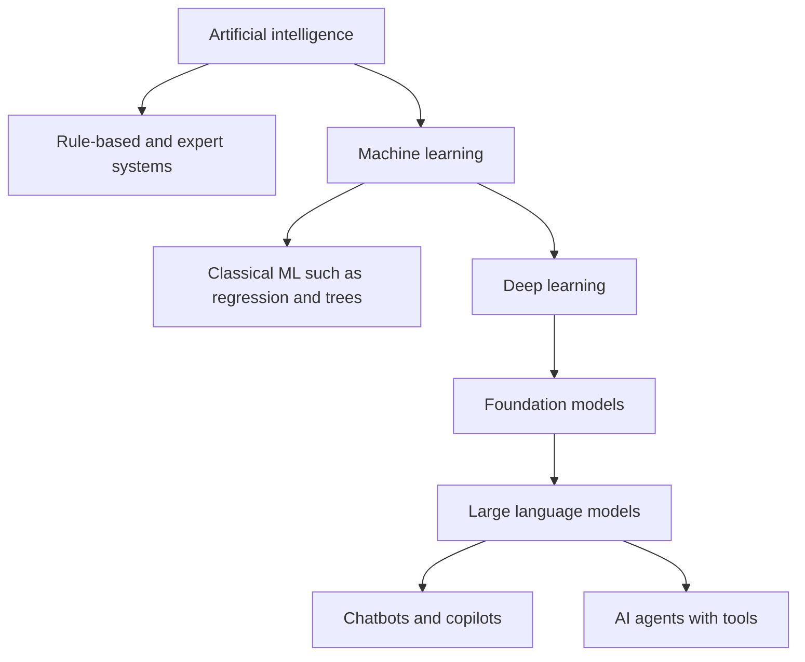
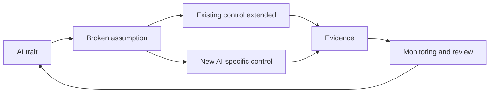

# Module 1 — What AI is and why it needs governance

*You cannot govern what you cannot describe. This module gives you a working, non-mathematical understanding of AI: how machine learning differs from ordinary software, what generative AI and agents add, and how legal definitions draw the line. It then maps the harms AI can cause to people, groups, organisations and society, and closes with the traits that make AI different enough to need its own governance. Every idea is anchored in a system from Najm Bank's inventory. This course is independent of the IAPP, and nothing in it is legal advice.*

> **BoK coverage:** I.A — understanding what AI systems are, the risks and harms they can cause, and why their characteristics call for dedicated governance.

---

# 1.1 — AI, machine learning, generative AI and agents
*Level: 🟢 Beginner* · *Prerequisites: 0.1* · *BoK: I.A*

## ⚡ In 60 seconds
- **Artificial intelligence (AI)** is an umbrella term. The definitions that matter for governance (OECD, EU AI Act) describe a **machine-based system that infers from its inputs how to generate outputs** such as predictions, content, recommendations or decisions that can influence physical or virtual environments.
- **Machine learning (ML)** is the dominant way to build AI today: instead of writing rules, you give a program examples and it *learns* a model from the data.
- **Generative AI** produces new content (text, images, code, audio). Large language models (LLMs) are the best-known kind; they generate text by predicting likely next tokens, which is why they can be fluent and wrong at the same time.
- **AI agents** combine a model with tools, memory and the ability to take multi-step actions toward a goal with limited human input.
- The rule that matters most: **govern the system, not just the model.** Harm comes from how a model is wired into data, interfaces, people and decisions.
- Biggest trap: assuming that "simple" or "rule-based" means "not AI" or "low risk". Risk follows use and impact; the definition follows *inference*.

## 🧭 Why it matters
In Najm Bank's first AI Governance Committee meeting, Khalid objects to the credit-scoring model being on the inventory at all. "It's a scorecard," he says. "We've used scorecards for twenty years. It's statistics, not AI." Dana disagrees: the current model is a gradient-boosted tree ensemble trained on three years of loan outcomes, and it is retrained twice a year. Meanwhile, Omar wants to know whether the credit memo copilot is "one system or two", since it combines a third-party language model with Najm's own retrieval of client documents. And the Head of Customer Experience asks whether a planned upgrade, letting Najm Assist actually *perform* card blocks and address changes instead of just answering questions, changes anything.

Each question has real consequences. Whether something meets a legal definition of an AI system decides whether AI-specific law applies. Whether Najm is the provider of a model or only a deployer decides its duties. Whether a chatbot can act, not just talk, changes the risk entirely. The committee needs a shared vocabulary before it can make any of these calls. This lesson builds it.

## 📐 How it works

### 🟢 The essentials

**Traditional software vs machine learning.** In traditional software, a programmer writes explicit rules: *if income is below X and existing debt above Y, decline.* In machine learning, the programmer supplies **training data** (past applications and whether each loan was repaid) and a **learning algorithm**, and the algorithm produces a **model**: a mathematical function that maps inputs to outputs. Nobody wrote the model's rules line by line; they were learned from data.

| | Traditional software | Machine learning |
|---|---|---|
| Logic comes from | People writing rules | Patterns learned from data |
| Behaviour on new cases | Predictable from the code | Statistical; generally good, sometimes surprising |
| When the world changes | Keeps applying the old rules | Can degrade silently as data drifts away from training data |
| How you check it | Read the code, test the rules | Test on held-out data, monitor outcomes |

**The vocabulary you need.**

| Term | Plain meaning | Najm example |
|---|---|---|
| **Feature** | An input variable | Income, loan amount, months at current employer |
| **Label** or target | The answer the model learns to predict | Did the borrower default within 12 months? |
| **Training** | Fitting the model to data | Dana's team trains on 2022–2024 loan outcomes |
| **Inference** | Using the trained model on new inputs | Scoring today's applicant in seconds |
| **Parameters** or weights | The numbers inside the model that training adjusts | Thousands in the credit model; billions in an LLM |
| **Validation and testing** | Checking performance on data the model has not seen | A hold-out set of 2024 applications |
| **Model** | The trained mathematical component | The credit-scoring model file |
| **AI system** | The model plus data pipelines, interfaces, integrations, human review and context of use | Loan-origination workflow, score thresholds, underwriter review and adverse-action letters |

**Three ways machines learn.**

- **Supervised learning** learns from labelled examples: default or no default, fraud or not fraud. Najm's credit and fraud models are supervised.
- **Unsupervised learning** finds structure in unlabelled data, such as clusters of similar customers or unusual transactions. Fraud teams use it to find new patterns nobody has labelled yet.
- **Reinforcement learning** learns by trial and error from rewards. It is also used to fine-tune language models on human feedback so their answers are more helpful and safer.

**Deep learning** uses neural networks with many layers. It powers image recognition, speech and language models, and is much harder to interpret than a scorecard.

### 🟡 Going deeper

**Generative AI and foundation models.** Most classic ML is *discriminative* or predictive: it assigns a score or a class. **Generative AI** creates new content that resembles its training data. A **foundation model** is a large model trained on broad data, usually with self-supervision (the data provides its own labels, for example by hiding the next word and asking the model to predict it), that can be adapted to many tasks. The EU AI Act calls such models **general-purpose AI (GPAI) models** and regulates their providers separately from the systems built on them.

**How an LLM works, in governance terms.** A large language model breaks text into **tokens** (pieces of words) and, given everything so far, predicts a probability for each possible next token. It samples one, adds it, and repeats. Four consequences follow:

1. **It is optimised for plausibility, not truth.** It can produce confident, fluent statements that are false, often called hallucinations; NIST's Generative AI Profile uses the term **confabulation**. The credit memo copilot could invent a debt-service ratio that looks right.
2. **Outputs vary.** The same prompt can give different answers, which complicates testing and audit.
3. **It knows only its training data and its context.** The **context window** is the amount of text the model can consider at once. What is not in training or context, it cannot know, though it may guess.
4. **Instructions and data share one channel.** A document fed to the model can contain text that the model treats as instructions, known as **prompt injection**. This is a new security problem that ordinary software does not have in the same form.

**Adapting a model.** Organisations rarely train foundation models themselves. They adapt them:

| Technique | What it does | Governance note |
|---|---|---|
| **Prompting** and system prompts | Instructions given at run time | Cheap and fast; behaviour can change with small wording changes; version-control prompts |
| **Retrieval-augmented generation (RAG)** | The system searches approved documents and passes relevant passages to the model as context | Grounds answers in Najm's own sources; the retrieval index becomes a governed data asset with access controls |
| **Fine-tuning** | Further training on the organisation's data | Changes the model; may change Najm's role and duties; training data rights and privacy apply |

The credit memo copilot uses RAG: it retrieves a client's financial statements and prior memos, then asks a third-party LLM to draft. That is why Omar's "one system or two" question matters: the model is the vendor's; the *system* (retrieval, prompts, interface, review step) is Najm's.

**Agents.** An **AI agent** is a system in which a model can plan steps, call **tools** (search, databases, email, payments, code execution) and act on results, repeating until it reaches a goal. The planned Najm Assist upgrade turns a chatbot that *says* "you can block your card in the app" into an agent that *blocks the card*. Autonomy is a spectrum:

| Level | Description | Example |
|---|---|---|
| Assist | The system suggests; a human decides and acts | Copilot drafts a memo; RM edits and signs |
| Act with approval | The system prepares an action; a human confirms | Agent proposes an address change; customer confirms by one-time code |
| Act within limits | The system acts alone inside tight boundaries, with logging and rollback | Agent blocks a card on request after authentication |
| Act broadly | The system chooses and executes actions across tools | Not appropriate for Najm's customer-facing use today |

Governance rises with autonomy: tool permissions, spending or action limits, authentication, logging of every action, and a clear way for humans to stop the agent.

### 🔴 Expert view

**The legal definition.** The OECD revised its definition of an AI system in November 2023, and the EU AI Act's definition (Art. 3(1)) closely follows it. Paraphrased, an AI system is a *machine-based* system, *designed to operate with varying levels of autonomy*, that *may exhibit adaptiveness after deployment*, and that, *for explicit or implicit objectives, infers from the input it receives how to generate outputs* such as predictions, content, recommendations or decisions that *can influence physical or virtual environments*. Read it element by element:

| Element | What it means | Why it matters |
|---|---|---|
| Machine-based | Runs on hardware and software | Excludes purely human processes |
| Varying autonomy | Some independence from human involvement | Even low autonomy can qualify |
| May exhibit adaptiveness | Can learn or change after deployment | "May": a system that does not adapt can still be AI |
| Objectives, explicit or implicit | Goals set by designers or emerging from training | Covers models whose goals are learned |
| **Infers** | Derives outputs from inputs through learning, reasoning or modelling | The key test that separates AI from ordinary software |
| Outputs that influence environments | Predictions, content, recommendations, decisions | Includes advice to humans, not only automatic actions |

The Act's recitals explain that systems based on rules defined solely by people to execute operations automatically are not meant to be covered. The European Commission published guidelines on the AI-system definition in 2025 that discuss borderline cases, such as some basic data-processing and simple prediction systems; check them for hard cases. For Khalid's objection, the answer is practical: a model learned from data by a boosting algorithm infers its outputs and is very likely in scope. More importantly, even if a hand-built scorecard fell outside the AI Act's definition, it would still be subject to data protection, fair-lending and model-risk rules, and Najm governs it anyway.

**Model versus system, and why v2.1 moved.** Harms rarely come from a model alone. The same credit model can be fair or unfair depending on the thresholds applied, whether underwriters can override it, what data the pipeline feeds it and how rejected applicants are told. The BoK v2.1 language on the "AI system" reflects this: governance attaches to the whole socio-technical arrangement.

**GPAI model versus GPAI system.** Under the EU AI Act, a *GPAI model* (the foundation model) carries obligations for its provider, such as technical documentation and a copyright policy, with extra duties for models with systemic risk. A *system* built on it (Najm's copilot) is assessed by its use: a drafting assistant for internal memos is not itself in an Annex III category, but if its output were used to evaluate individuals' creditworthiness, the analysis could change. Module 6 treats this in full.

**Narrow AI and general AI.** Everything Najm uses is *narrow* AI, built for bounded tasks. Artificial general intelligence (AGI), a system matching humans across most tasks, is a research goal and a policy debate, not an inventory entry. Exam questions reward precise, present-tense descriptions of what systems actually do.

## ⚖️ The instruments
| Instrument | What it requires or recommends | Exam cue |
|---|---|---|
| **EU AI Act** — Art. 3(1) | Legal definition of an AI system: machine-based, varying autonomy, may adapt, infers from input how to generate outputs that can influence environments | "Infers" is the key element; adaptiveness is optional ("may") |
| **OECD AI Principles** — AI system definition | The OECD's updated (Nov 2023) definition of an AI system, which the EU AI Act definition follows closely | Source of the internationally shared definition |
| **EU AI Act** — Chapter V | Obligations for providers of general-purpose AI models, with additional duties for models with systemic risk | Foundation model providers have their own duties, separate from system deployers |
| **EU AI Act** — Art. 50 | Transparency duties, including telling people they are interacting with an AI system unless obvious, and marking synthetic content | Chatbots must disclose they are AI |
| **ISO/IEC 22989** | International concepts and terminology for AI, including ML, agents and life-cycle terms | Standard vocabulary; not a requirements standard |
| **NIST AI 600-1** | NIST's Generative AI Profile of the AI RMF (July 2024), naming GenAI-specific risks such as confabulation | GenAI risk vocabulary; voluntary |

## 🏛️ In practice at Najm Bank
To stop definition debates from stalling the committee, Layla adds an **"Is it AI, and what kind?" triage card** to the use-case intake form. Owners complete it; the AI governance team confirms.

| # | Question | If yes |
|---|---|---|
| 1 | Does the system produce predictions, scores, rankings, classifications, recommendations, generated content or decisions? | Continue |
| 2 | Were those outputs derived from patterns learned from data, or from a model trained by someone else, rather than rules written entirely by Najm staff? | Likely AI: register it. If unsure, register as "to confirm" |
| 3 | Does it use a general-purpose or foundation model (for example an LLM via API)? | Record the model provider and version; flag GenAI risks (confabulation, prompt injection, data leakage) |
| 4 | Is the model adapted by Najm (fine-tuned, or combined with RAG over Najm data)? | Record Najm's development role; data rights and privacy review |
| 5 | Can the system take actions through tools or other systems, not just produce output? | Classify autonomy level; require action limits, logging and a stop control |
| 6 | Whose lives or rights do its outputs affect, and how significantly? | Feeds preliminary risk (1.2 and Module 8) |

Applied to the inventory: credit scoring (supervised ML, AI, high impact); Najm Assist (GenAI chatbot, moving to agent: re-assess at upgrade); CV screening (vendor ML, AI); credit memo copilot (GenAI system with RAG built by Najm on a third-party model); fraud detection (supervised and unsupervised ML); staff GenAI use (third-party GenAI systems).

## 🛠️ Exercises
- 🟢 **Label the parts.** For Najm's fraud-detection model, name one feature, the label, when training happens and when inference happens. *Done when:* each term matches its definition in the vocabulary table.
- 🟡 **Model or system?** List at least six components of the credit memo copilot *system* beyond the LLM itself, and for each, one thing that could go wrong. *Done when:* your list includes data, interface, human and integration components.
- 🔴 **Apply the definition.** Take three borderline tools (a spreadsheet with hand-set scoring weights, a fixed decision tree written by the credit policy team, and a logistic regression refitted yearly on loan outcomes). Walk each through the Art. 3(1) elements and state whether it is likely an AI system, and what governance applies either way. *Done when:* you explain the role of "infers" and name at least one non-AI-Act rule that applies regardless.

## ⚠️ Mistakes and exam traps
- **Trap: "adaptiveness is required".** The definition says a system *may* exhibit adaptiveness after deployment. A model frozen at release can still be an AI system.
- **Trap: governing only the model.** Thresholds, human review, data pipelines and user interfaces create or prevent harm. Choose answers that look at the whole system.
- **Trap: calling hallucination a bug that will be patched.** It follows from how LLMs generate text. Governance answers involve grounding, verification, human review and use restrictions.
- **Trap: treating agents as chatbots.** When a system can act through tools, controls on permissions, limits, logging and human intervention become central.
- **Trap: "no AI Act, no governance".** Even systems outside a legal AI definition can fall under data protection, discrimination and sector rules.

## 🧾 Recap
- ML learns a model from data instead of following hand-written rules; that is what makes its behaviour statistical and data-dependent.
- Generative AI creates content; LLMs predict tokens, so they can be fluent and wrong; foundation (GPAI) models are adapted by prompting, RAG or fine-tuning.
- Agents add tools and actions; governance rises with autonomy.
- The OECD and EU AI Act definitions turn on *inference*; adaptiveness is optional.
- Govern the AI **system**: model plus data, interfaces, people and context.

## ✍️ Check yourself

**1. Which element of the EU AI Act definition MOST clearly distinguishes an AI system from conventional software?**

- A. It runs on a machine
- B. It adapts after deployment
- C. It infers from its input how to generate outputs
- D. It is sold by a technology company

Answer

**C.** Inference is the defining element. Adaptiveness (B) is tempting but the definition says systems *may* adapt, so it is not required; A is true of all software. (See 🔴 The legal definition.)

**2. Najm's credit memo copilot retrieves client documents and passes them to a third-party LLM to draft a memo. What is this technique called?**

- A. Fine-tuning
- B. Reinforcement learning
- C. Retrieval-augmented generation
- D. Unsupervised clustering

Answer

**C.** RAG retrieves relevant documents at run time and supplies them to the model as context. Fine-tuning (A) would change the model's weights through further training. (See 🟡 Adapting a model.)

**3. A relationship manager notices that the copilot's draft includes a plausible but invented debt-service ratio. What is the BEST description of this failure?**

- A. A data breach
- B. Confabulation, a known property of generative models that requires verification controls
- C. Model drift caused by changing interest rates
- D. Prompt injection by the client

Answer

**B.** LLMs generate plausible text, not verified facts; NIST's GenAI Profile calls this confabulation. The governance response is grounding, verification and human review. Drift (C) is gradual degradation over time, and there is no sign of injected instructions (D). (See 🟡 How an LLM works.)

**4. Najm plans to let its chatbot block cards and change addresses on its own. From a governance perspective, what changes MOST?**

- A. Nothing, because it uses the same language model
- B. The system becomes an agent that acts, so permissions, action limits, authentication, logging and human stop controls become essential
- C. It must now be classified as a prohibited practice
- D. It no longer needs to disclose that it is AI

Answer

**B.** Moving from answering to acting raises autonomy and the potential for harm, so controls on actions matter most. The model being the same (A) misses that the system changed; nothing makes it prohibited (C); and transparency duties still apply (D). (See 🟡 Agents.)

**5. Khalid says the credit model is "just statistics", so governance is unnecessary. Which response is MOST accurate?**

- A. He is right; statistical models are never AI
- B. A model learned from data by a machine-learning algorithm very likely meets the AI-system definition, and in any case credit decisions are subject to data protection, fair-lending and model-risk rules
- C. Only deep-learning models need governance
- D. Governance applies only if the model adapts after deployment

Answer

**B.** The model infers outputs from learned patterns, and credit decisions are regulated regardless of technique. C and D misread the definition; adaptiveness is optional and risk follows use. (See 🔴 The legal definition.)

## 📚 References
- Regulation (EU) 2024/1689 (EU AI Act), Art. 3(1), Chapter V and Art. 50: https://eur-lex.europa.eu/eli/reg/2024/1689/oj
- European Commission, AI Act policy page and guidelines: https://digital-strategy.ec.europa.eu/en/policies/regulatory-framework-ai
- OECD AI Principles and AI-system definition: https://oecd.ai/en/ai-principles
- NIST AI 600-1, Generative AI Profile: https://doi.org/10.6028/NIST.AI.600-1
- ISO/IEC 22989, via the ISO catalogue: https://www.iso.org/

---

# 1.2 — Risks and harms to people, groups, organisations and society
*Level: 🟢 Beginner* · *Prerequisites: 1.1* · *BoK: I.A*

## ⚡ In 60 seconds
- A **harm** is an actual negative impact; a **risk** combines how likely a harm is and how severe it would be. Governance manages risks so that harms do not happen, or are caught and remedied fast.
- The NIST AI RMF groups AI harms into three families: **harm to people** (individuals, groups and communities, society), **harm to an organisation**, and **harm to an ecosystem**.
- For individuals, the big categories are discrimination, loss of privacy, unsafe or wrong outcomes, loss of autonomy and dignity, and economic harm. For groups, harms are often **invisible at the individual level** and only show in aggregate.
- Generative AI adds its own risks: confabulation, harmful content, information integrity, intellectual property, data leakage and value-chain complexity.
- The rule that matters most: **assess harm from the point of view of the people affected, not only the organisation.** Laws such as the EU AI Act and the GDPR protect individuals' rights; a risk register that only lists reputational and financial risk is incomplete.
- Biggest trap: assuming that removing a protected attribute (such as gender or nationality) removes discrimination. Proxies carry it back in.

## 🧭 Why it matters
Real cases show the range. In 2018 Reuters reported that Amazon had scrapped an experimental recruiting model after finding it downgraded CVs that included the word "women's", because it had learned from a decade of mostly male hiring. In the Netherlands, the childcare-benefits scandal (the *toeslagenaffaire*) saw thousands of families wrongly treated as fraudsters, with nationality used as a risk factor in a risk-classification model; the damage to families was severe, the Dutch data protection authority fined the tax administration, and the government resigned in January 2021. In 2023 staff at Samsung were reported to have pasted confidential source code into ChatGPT, prompting internal restrictions. In 2024 a Canadian tribunal held Air Canada liable for its chatbot's wrong statement about refunds.

Each of these is a different kind of harm: to job applicants as a group, to families and trust in the state, to a company's confidential information, to one customer's wallet and to a company's legal position. Najm Bank has systems that could fail in every one of these ways. Its credit model could systematically disadvantage women or expatriates. Its CV-screening tool could reproduce past hiring patterns. Its staff could leak client data into public chatbots. Its chatbot could promise a fee waiver that does not exist. Governing AI starts with naming these harms clearly enough to do something about them.

## 📐 How it works

### 🟢 The essentials

**Hazard, risk, harm, impact.**

| Term | Meaning | Najm example |
|---|---|---|
| **Hazard** or source | Something that could cause harm | Training data from years when few women received loans |
| **Risk** | Likelihood of harm × its severity, in a context | Women applicants being declined at higher rates than their repayment behaviour justifies |
| **Harm** | The negative impact once it happens | A creditworthy woman is refused a loan |
| **Impact** | The broader effect, good or bad, on people, groups or society | Reduced access to credit for a whole group |

**The NIST AI RMF harm families.** The NIST AI Risk Management Framework offers a simple map that the exam and practitioners use:

| Family | Sub-categories | Examples at Najm |
|---|---|---|
| **Harm to people** | *Individual*: civil liberties, rights, physical or psychological safety, economic opportunity. *Group or community*: discrimination against sub-groups. *Society*: democratic participation, access to services, trust | Wrongful loan refusal; CV tool screening out older applicants; public loss of trust in digital banking |
| **Harm to an organisation** | Business operations, security breaches and monetary loss, reputation | Supervisory action, fines, lawsuits, a client-data leak via public GenAI |
| **Harm to an ecosystem** | Interconnected systems and supply chains, the financial system, natural resources and the environment | Many banks relying on the same vendor model and failing together; energy use of large models |

**Harms to individuals, in more detail.**

- **Discrimination and unfair treatment**: worse outcomes for people because of a protected characteristic or a proxy for one.
- **Privacy harms**: excessive collection, inference of sensitive traits, surveillance, re-identification, leaks.
- **Wrong or unsafe outcomes**: an incorrect decision, a bad recommendation, a false fraud block that leaves someone without access to money.
- **Loss of autonomy and dignity**: manipulation, being judged by an opaque process, having no way to contest.
- **Economic harm**: lost credit, jobs, benefits or money.
- **Psychological harm**: distress from wrongful accusations, abusive generated content.

### 🟡 Going deeper

**Allocative and representational harms.** Two widely used terms help sort fairness harms:

- **Allocative harm** occurs when a system withholds an opportunity or resource (a loan, a job interview, a benefit) from some people unfairly. Najm's credit and CV-screening tools carry this risk.
- **Representational harm** occurs when a system reinforces stereotypes or demeans a group, even without an immediate allocation. A GenAI tool that describes "a typical entrepreneur" only as a young man, or produces offensive content about a nationality, causes representational harm. Najm Assist could do this in Arabic or English.

**Where AI harms come from.** Harms arise at every stage, which is why governance must cover the whole life cycle:

| Source | What goes wrong | Example |
|---|---|---|
| **Problem framing** | The target is a poor proxy for what you really want | Predicting "who we hired before" instead of "who will perform well" |
| **Data** | Historical bias, under-representation, errors, unlawful collection | Few past loans to young self-employed applicants, so the model learns little about them |
| **Model** | Proxies for protected traits, overfitting, opacity | Postcode or nationality-linked features standing in for ethnicity |
| **Deployment context** | Used for a purpose or population it was not built for | Using the retail model for SME owners |
| **Human-AI interaction** | Over-reliance (automation bias) or blanket distrust | Underwriters rubber-stamping scores |
| **Misuse and attack** | Deliberate abuse, prompt injection, data poisoning | Fraudsters probing the fraud model's thresholds |
| **Drift** | The world changes; the model does not | New lending products or an economic shock |

**Why removing protected attributes is not enough.** Even if Najm removes gender and nationality from the credit model's inputs, other features can correlate with them: occupation, employer, salary transfer patterns, even the language of the application. The model can rebuild the protected information from these **proxies**. Testing outcomes by group is the only way to know. Doing so may require collecting or inferring sensitive data, which creates a tension with privacy law that later modules address (4.1, 9.2).

**Generative AI risks.** NIST's Generative AI Profile (NIST AI 600-1) lists twelve risks that are unique to or made worse by GenAI:

| NIST AI 600-1 risk | What it means in practice at Najm |
|---|---|
| CBRN information or capabilities | Unlikely for Najm's uses, but part of the model provider's risk |
| Confabulation | Copilot invents figures in a credit memo |
| Dangerous, violent or hateful content | Najm Assist generating abusive replies |
| Data privacy | Client data leaked through prompts or reproduced in outputs |
| Environmental impacts | Energy and resource use of large models |
| Harmful bias and homogenisation | Stereotyped outputs; everyone's memos converging on the same framing |
| Human-AI configuration | Over-reliance, anthropomorphising the chatbot |
| Information integrity | Convincing false content, deepfakes used in fraud against the bank |
| Information security | Prompt injection, model manipulation, easier phishing |
| Intellectual property | Outputs reproducing protected text or code |
| Obscene, degrading or abusive content | Generated content that harms users |
| Value chain and component integration | Opaque third-party models, datasets and plug-ins |

### 🔴 Expert view

**Fairness has more than one definition, and they can conflict.** The COMPAS debate is the classic example. In 2016 ProPublica reported that a recidivism risk tool used in US courts wrongly flagged Black defendants as high risk at a higher rate than white defendants. The developer responded that the scores were equally *calibrated*: a given score meant roughly the same reoffending rate for each group. Both claims could be true at once. Researchers later showed that when base rates differ between groups, a score generally cannot satisfy calibration and equal error rates simultaneously. The governance lesson: choosing a fairness metric is a **value judgement** tied to the context and to law, not a purely technical decision. It must be made, documented and approved by accountable people, not left to the data scientist alone.

**Harms compound and scale.** A single biased human underwriter affects the files they touch. A biased model applied to every applicant affects all of them, consistently, until someone notices. Feedback loops make this worse: if the model declines a group, the bank never observes their repayment behaviour, so the next training set contains even less evidence about them. Aggregation also creates harms that no individual can see: each declined applicant sees only their own decision, so group-level discrimination may surface only through deliberate testing, regulators or journalists. The Apple Card episode shows the pressure this creates: public complaints in 2019 about differing credit limits for spouses led to a review by the New York State Department of Financial Services, whose 2021 report did not find unlawful discrimination but highlighted the need for transparency and the ability to explain decisions to customers.

**Two lenses on one risk register.** Organisations naturally measure risk to themselves: fines, losses, reputation. Rights-based laws require measuring risk to **people**: their rights, safety and opportunities. The two can diverge. A credit model that is profitable overall may still harm a small group severely; a fraud model with a low false-positive rate may still freeze the accounts of thousands of legitimate customers each month. Mature programmes keep both lenses and give the people lens its own severity scale, because regulators, courts and affected individuals will.

**Trade-offs between harms.** Reducing one harm can increase another. Measuring bias may require sensitive data (privacy versus fairness). A more interpretable model may be less accurate (transparency versus performance). Tighter fraud thresholds block more fraud and more legitimate customers (security versus access). The job is not to eliminate trade-offs, which is impossible, but to make them **explicitly, with the right people, and on the record**.

**International anchors.** The UNESCO Recommendation on the Ethics of AI (2021) and the Council of Europe Framework Convention on AI (opened for signature in September 2024) frame AI harms in terms of human rights, democracy and the rule of law. The EU AI Act goes further and prohibits certain practices outright because their harms are considered unacceptable, including social scoring that leads to unjustified detrimental treatment and AI that manipulates people or exploits their vulnerabilities in ways that cause significant harm.

## ⚖️ The instruments
| Instrument | What it requires or recommends | Exam cue |
|---|---|---|
| **NIST AI RMF** — harm categories | Voluntary framework that groups potential harms into harm to people (individual, group, society), to an organisation and to an ecosystem | Recognise the three families and their sub-types |
| **NIST AI 600-1** | Generative AI Profile listing twelve GenAI risks, such as confabulation, information integrity and value-chain risk, with suggested actions | GenAI-specific risk names |
| **EU AI Act** — Art. 5 | Prohibits AI practices considered to pose unacceptable harm, such as certain manipulative techniques, exploiting vulnerabilities and some social scoring; applies from 2 February 2025 | Some harms are banned, not risk-managed |
| **GDPR** — Art. 22 | Right not to be subject to a decision based solely on automated processing that produces legal or similarly significant effects, with exceptions and safeguards | Credit refusals by automated means engage this |
| **UNESCO Recommendation on the Ethics of AI** | Global ethical framework (2021) centred on human rights, dignity, fairness and environmental sustainability | Rights-based framing; non-binding |
| **Council of Europe Framework Convention on AI** | International treaty on AI and human rights, democracy and the rule of law, opened for signature September 2024 | First international treaty on AI; binding on parties that ratify |

## 🏛️ In practice at Najm Bank
Layla introduces a **harm register** that every high-risk system must complete before approval. It uses two severity scales, one for people and one for Najm. Here is the excerpt for the retail credit-scoring model.

| # | Harm | Who is affected | Family | Source | Likelihood | Severity (people / Najm) | Existing control | Action |
|---|---|---|---|---|---|---|---|---|
| H1 | Creditworthy applicants in a protected or proxy group declined more often | Women; expatriate applicants; young self-employed | People: individual and group | Historical data; proxies | Medium | High / High | None specific | Group outcome testing before release and quarterly; proxy review of features |
| H2 | Applicant cannot understand or contest a decline | Declined applicants | People: individual | Opaque model; template letters | High | Medium / Medium | Generic decline letter | Reason codes linked to top factors; human review route |
| H3 | Scores degrade after a rate or economic shock | All applicants; Najm | People and organisation | Drift | Medium | Medium / High | Annual revalidation | Monthly stability monitoring; trigger thresholds |
| H4 | Underwriters approve whatever the model says | Referred applicants | People: individual | Automation bias | Medium | Medium / Medium | Four-eyes on large loans | Override tracking; training; sample reviews |
| H5 | Supervisory finding or fine for unfair or unlawful processing | Najm | Organisation | Any of the above | Low–Medium | — / High | Model risk policy | DPIA; AI Act readiness for EU applicants; QCB reporting |
| H6 | Same bureau data and vendor tools across banks amplify a sector-wide error | Borrowers; financial system | Ecosystem | Shared dependencies | Low | High / High | None | Record dependencies; include in stress scenarios |

Rules: every harm has an owner and an action; a "people" severity of High cannot be accepted without Committee approval, even if the Najm severity is Low.

## 🛠️ Exercises
- 🟢 **Sort the harms.** Place each real case from 🧭 (Amazon, *toeslagenaffaire*, Samsung, Air Canada) into a NIST harm family and sub-type. *Done when:* each case has at least one people-harm or organisation-harm label with a one-line justification.
- 🟡 **Harm register for GenAI.** Write four rows of the harm register for the credit memo copilot, using at least three NIST AI 600-1 risks. *Done when:* each row has a source, a likelihood, two severities and a concrete action.
- 🔴 **Make the trade-off explicit.** Najm's fraud team can cut fraud losses by tightening thresholds, at the cost of blocking more legitimate transactions, disproportionately for customers who travel often. Write a half-page decision note for the Committee setting out both harms, who bears them, and what evidence you would need. *Done when:* the note names who decides, what metric will be monitored and what triggers a review.

## ⚠️ Mistakes and exam traps
- **Trap: "we removed gender, so the model is fair".** Proxies can reintroduce protected information. The correct answer involves testing outcomes across groups.
- **Trap: only organisational risk.** Registers that list fines and reputation but not harm to people miss what rights-based laws protect. Prefer answers that assess impact on affected individuals and groups.
- **Trap: one right fairness metric.** Metrics can conflict; the choice is a documented value judgement made by accountable people, in context.
- **Trap: treating GenAI risks as the same as predictive-model risks.** Confabulation, harmful content, IP and prompt injection need GenAI-specific controls.
- **Trap: confusing risk and harm.** Risk is potential (likelihood and severity); harm is the realised impact. Questions about "assessing" are about risk; questions about "remedy" are about harm.

## 🧾 Recap
- Risk = likelihood × severity of harm in context; harm is the actual impact.
- NIST's three families: harm to people (individual, group, society), to organisations, to ecosystems.
- Allocative harms withhold opportunities; representational harms reinforce stereotypes.
- Harms arise from framing, data, model, context, human interaction, misuse and drift, so governance spans the life cycle.
- Fairness metrics can conflict; choosing one is a documented, accountable value judgement.

## ✍️ Check yourself

**1. Under the NIST AI RMF, a model that systematically disadvantages applicants from one nationality is an example of harm to which category?**

- A. An ecosystem
- B. An organisation's operations
- C. People, at the group or community level
- D. The environment

Answer

**C.** Discrimination against a sub-group is a group-level harm to people. The bank may also suffer organisational harm, but the primary harm described falls on people. (See 🟢 The NIST AI RMF harm families.)

**2. Dana removes gender from the credit model's inputs. Khalid says the model is now fair. What is the BEST response?**

- A. Agree, because the model can no longer see gender
- B. Test outcomes across groups, because other features can act as proxies for gender
- C. Add gender back to increase accuracy
- D. Stop using the model entirely

Answer

**B.** Proxies such as occupation or transaction patterns can reintroduce gender information, so only outcome testing shows whether the model treats groups fairly. D is disproportionate; C does not address fairness. (See 🟡 Why removing protected attributes is not enough.)

**3. A GenAI tool produces images that show "a successful business owner" almost only as young men. What type of harm is this primarily?**

- A. Allocative harm
- B. Representational harm
- C. Ecosystem harm
- D. Security harm

Answer

**B.** Reinforcing stereotypes about a group is representational harm, even when no resource is withheld. Allocative harm (A) requires an opportunity or resource to be denied. (See 🟡 Allocative and representational harms.)

**4. The COMPAS debate showed that a risk score was similarly calibrated across groups yet had different false-positive rates. What is the main governance lesson?**

- A. Calibration is always the correct fairness metric
- B. Fairness metrics can conflict, so the choice must be an explicit, documented decision by accountable people in context
- C. Risk tools should never be used anywhere
- D. False-positive rates do not matter if a model is calibrated

Answer

**B.** When base rates differ, some fairness definitions cannot all hold at once, so choosing between them is a value judgement to be governed, not a purely technical detail. A and D pick a side without justification; C is too extreme. (See 🔴 Fairness has more than one definition.)

**5. Najm's harm register rates a fraud-model harm as "High" for customers but "Low" for the bank. Under Layla's rules, what should happen?**

- A. The harm can be accepted by the system owner because the bank's severity is low
- B. The harm cannot be accepted without Committee approval, because people severity is High
- C. The harm should be removed from the register
- D. The model must be switched off immediately

Answer

**B.** The register keeps a separate people lens precisely so that serious harm to customers is escalated even when the organisation's exposure looks small. A ignores that lens; C and D are not the rule. (See 🏛️ In practice and 🔴 Two lenses on one risk register.)

## 📚 References
- NIST AI Risk Management Framework (AI RMF 1.0): https://doi.org/10.6028/NIST.AI.100-1
- NIST AI 600-1, Generative AI Profile: https://doi.org/10.6028/NIST.AI.600-1
- Regulation (EU) 2024/1689 (EU AI Act), Art. 5: https://eur-lex.europa.eu/eli/reg/2024/1689/oj
- Regulation (EU) 2016/679 (GDPR), Art. 22: https://eur-lex.europa.eu/eli/reg/2016/679/oj
- UNESCO, Recommendation on the Ethics of Artificial Intelligence: https://www.unesco.org/en/artificial-intelligence
- Council of Europe, Framework Convention on Artificial Intelligence: https://www.coe.int/en/web/artificial-intelligence

---

# 1.3 — Why AI is different: the traits that demand governance
*Level: 🟢 Beginner* · *Prerequisites: 1.1, 1.2* · *BoK: I.A*

## ⚡ In 60 seconds
- AI shares many risks with ordinary software (bugs, outages, security flaws), but a set of **traits** makes it different enough to need its own governance.
- The core traits: behaviour **learned from data**; **opacity**; **probabilistic** and sometimes non-deterministic outputs; **drift** over time; **scale and speed**; growing **autonomy**; **complex supply chains**; **general-purpose and emergent** capabilities; and strong effects on **human behaviour**, such as automation bias.
- Each trait breaks an assumption that traditional controls rely on, such as "read the code to know what it does" or "test once, then it stays correct".
- The response is not a wholly new bureaucracy: extend existing controls (privacy, security, model risk, procurement) and add AI-specific ones: data governance, fairness testing, explainability, human oversight design, continuous monitoring.
- The NIST AI RMF names what "trustworthy" means: **valid and reliable; safe; secure and resilient; accountable and transparent; explainable and interpretable; privacy-enhanced; fair with harmful bias managed.**
- Biggest trap: "a human in the loop" as a cure-all. Humans over-trust machines; oversight must be designed, resourced and tested.

## 🧭 Why it matters
Najm's IT risk team already runs change management, penetration tests and access reviews. Its model risk team already validates credit models. So when Layla proposes an AI policy, the Chief Information Officer asks a fair question: "Why do we need anything new? Software is software."

Layla answers with three stories from Najm's own inventory. First, the fraud model's false-positive rate crept up for six months after a new instant-payment product launched. No code changed, so no change ticket was ever raised; the world changed and the model did not. Second, the credit memo copilot gave two different answers to the same question on the same day, so a single test pass proved little. Third, in a pilot, underwriters accepted the credit model's recommendation in almost every referred case, including some where the file clearly contradicted it. The four-eyes control existed on paper; in practice there was one pair of eyes, and it was the model's.

None of these were bugs in the ordinary sense. Each came from a trait of AI that traditional controls do not see. That is the case for AI governance in one page.

## 📐 How it works

### 🟢 The essentials

**Nine traits and why they matter.**

| Trait | What it means | Which traditional assumption it breaks | Najm example |
|---|---|---|---|
| **Learned from data** | Behaviour comes from training data, not written rules | "The logic is in the code" | Credit model inherits past lending patterns |
| **Opacity** | Hard to explain why a specific output was produced, especially for deep learning and LLMs | "We can trace every decision" | Declined applicant asks why; the answer is not obvious |
| **Probabilistic outputs** | Outputs are likelihoods or samples; LLMs can vary run to run | "Same input, same output" | Copilot drafts differ each time |
| **Drift** | Performance changes as the world moves away from training data | "Tested once, stays correct" | Fraud model degrades after new payment product |
| **Scale and speed** | One model applies to thousands of decisions instantly | "Errors stay local" | A flawed threshold affects every applicant that day |
| **Autonomy** | Systems act with less human involvement, up to agents with tools | "A person performs every action" | Planned Najm Assist card blocks |
| **Complex supply chain** | Models, data, APIs and plug-ins from many parties | "We know what is inside our systems" | Copilot depends on a third-party LLM Najm cannot inspect |
| **General-purpose and emergent** | Foundation models can do things no one designed or tested for | "Specification defines behaviour" | Staff use a public chatbot for tasks nobody assessed |
| **Human effects** | People over-trust or misuse AI; AI can persuade or manipulate | "Human review catches errors" | Underwriters rubber-stamp scores |

**What "trustworthy AI" means.** The NIST AI RMF sets out seven characteristics of trustworthy AI. They are a helpful checklist for the traits above:

| NIST characteristic | Plain meaning | Traits it answers |
|---|---|---|
| **Valid and reliable** | Does what it is meant to, accurately and consistently, in its real conditions | Learned from data, drift, probabilistic |
| **Safe** | Does not endanger people, property or the environment | Autonomy, scale |
| **Secure and resilient** | Withstands attacks and failures, recovers gracefully | Supply chain, new attack types |
| **Accountable and transparent** | People are answerable; information about the system is available | Opacity, supply chain |
| **Explainable and interpretable** | How it works, and what an output means, can be understood by the right audience | Opacity |
| **Privacy-enhanced** | Protects autonomy, identity and dignity through privacy practices | Data hunger, inference of sensitive traits |
| **Fair, with harmful bias managed** | Addresses equality and equity; bias is identified and managed | Learned from data, scale |

NIST describes validity and reliability as a base for the others, and accountability and transparency as relating to all of them. They involve trade-offs; improving one can cost another, as 1.2 showed.

### 🟡 Going deeper

**Why each trait needs a governance response.**

- **Learned from data → govern the data.** If behaviour comes from data, then data sourcing, quality, representativeness, lineage and rights become governance topics, not just IT topics. Module 9 covers this.
- **Opacity → design for explanation.** Choose the simplest model that meets the need for high-impact decisions; generate reason codes; document how the system works for different audiences (regulator, customer, underwriter). The GDPR already requires meaningful information about the logic involved in certain automated decisions.
- **Probabilistic outputs → test statistically and set tolerances.** A single pass/fail test is not enough. Define acceptable error rates by use, test on representative samples, and for GenAI, evaluate across many prompts and repeat runs.
- **Drift → monitor continuously.** Put monitoring and revalidation triggers in place before go-live, with owners and thresholds. Change management must cover changes in *data and environment*, not only code.
- **Scale and speed → stage releases and keep a kill switch.** Pilot on a slice, compare with the old process, roll out gradually, and keep the ability to revert.
- **Autonomy → bound actions.** Limit tools and permissions, require confirmation for consequential actions, log everything, and make it easy for a human to stop the system.
- **Supply chain → extend third-party risk management.** Demand documentation, testing evidence, change notifications and audit rights from vendors; know which model version you use (Module 11).
- **General-purpose and emergent → govern by use case.** Because the same model can be used for anything, approval must attach to a specific use, with clear acceptable-use rules for everything else.
- **Human effects → design oversight, don't just declare it.** Train people, show them uncertainty and reasons, measure override rates, and give them time and authority to disagree.

**Automation bias and the "human in the loop".** **Automation bias** is the tendency to over-rely on automated outputs, including ignoring contradicting information. The EU AI Act explicitly requires that people assigned to oversee high-risk AI be enabled to remain aware of this tendency. Its opposite, **algorithm aversion**, is ignoring a good system after seeing it err once. Both mean that simply placing a person after a model does not guarantee oversight. Effective oversight needs:

1. **Competence**: the reviewer understands the system's purpose, limits and typical failures.
2. **Information**: they see the reasons, confidence and relevant data, not only a score.
3. **Time and authority**: they can actually disagree without penalty.
4. **Measurement**: override rates and review quality are monitored. An override rate close to zero is a warning sign, not a success metric.

**Reuse before you build.** Much of AI governance extends what organisations already do:

| Existing discipline | What it already gives you | What AI adds |
|---|---|---|
| Model risk management | Validation, model inventory, independent review | GenAI and bought tools, fairness testing, explainability to customers, human oversight design |
| Privacy | Lawful basis, DPIAs, rights handling | Training-data rights, inference of sensitive traits, automated-decision safeguards |
| Information security | Access control, threat modelling, testing | Prompt injection, data poisoning, model extraction, output filtering |
| Procurement and third-party risk | Due diligence, contracts, audits | Model documentation, testing evidence, change notices, training-data provenance |
| IT change management | Controlled code releases | Changes in data, prompts, model versions and the environment |

### 🔴 Expert view

**Socio-technical, not just technical.** An AI system's behaviour depends on the people and processes around it as much as on its code. The same fraud model gives very different customer outcomes depending on whether a flagged payment is blocked outright or sent to a well-staffed review team. This is why v2.1 frames the governance object as the *system*, and why governance teams need people who understand operations, law and human factors, not only engineers.

**The accountability gap.** When decisions are distributed across a vendor who trained the model, a data team who integrated it, an underwriter who clicked "approve" and a policy that set the threshold, it becomes easy for everyone to believe someone else is responsible. *Moffatt v. Air Canada* is the public reminder that deployers answer for what their AI says. The governance response is explicit allocation: a named owner per system, documented roles in a RACI, contractual allocation with vendors, and decision logs that show who approved what. Module 2 builds this.

**Legal duties already reflect these traits.** Lawmakers have written the traits into obligations. The EU AI Act's high-risk requirements map almost one to one: data and data governance (learned from data), technical documentation and record-keeping (opacity, accountability), transparency to deployers, human oversight (autonomy and automation bias), accuracy, robustness and cybersecurity (probabilistic outputs, attacks), and post-market monitoring by providers (drift). The GDPR's data protection by design (Art. 25) and AI-literacy duties under Art. 4 of the AI Act address the human side. Seeing the traits behind the rules makes the rules easier to remember and apply.

**Proportionality still rules.** Not every AI system shows every trait strongly. A narrow, interpretable model used for internal forecasting, with no effect on individuals, needs light-touch governance. A general-purpose model embedded in customer decisions needs heavy governance. The traits are a diagnostic: the more of them a system shows, and the more significant its outputs for people, the more controls it needs. ISO/IEC 23894 gives guidance on fitting these AI-specific risk considerations into an organisation's existing risk-management process rather than running a separate one.

**Limits of technical fixes.** Some problems cannot be solved inside the model. No fairness technique can fix a use that should not happen; no explainability method can make a decision fair; no guardrail makes an LLM fully truthful. Sometimes the right governance answer is to change the use, add a human decision, narrow the scope, or not deploy. Good exam answers recognise when a problem is about the *use*, not the *model*.

## ⚖️ The instruments
| Instrument | What it requires or recommends | Exam cue |
|---|---|---|
| **NIST AI RMF** — trustworthy characteristics | Voluntary framework naming seven characteristics of trustworthy AI and explaining how AI risks differ from traditional software risks | Know all seven characteristics and that they involve trade-offs |
| **EU AI Act** — Art. 14 | High-risk AI must be designed for effective human oversight; overseers must be able to understand limitations, remain aware of automation bias, interpret outputs, and override or stop the system | Oversight must be real and designed in, not nominal |
| **EU AI Act** — Art. 4 | Providers and deployers must take measures to ensure sufficient AI literacy among staff dealing with AI systems | Human effects are managed partly through literacy |
| **GDPR** — Art. 25 | Data protection by design and by default | Build privacy into AI systems from design |
| **ISO/IEC 23894** | Guidance on managing AI-specific risks within an organisation's risk-management process | Integrate AI risk into existing risk management |
| **OECD AI Principles** | Values-based principles including robustness, security and safety, transparency and explainability, and accountability | International consensus on trustworthy AI; non-binding |

## 🏛️ In practice at Najm Bank
Layla turns the traits into a **trait-to-control matrix** that the Committee adopts as the backbone of the AI Policy. For each trait, it names the trigger question, the minimum control, and the owner.

| Trait | Trigger question at intake | Minimum control if "yes" | Control owner |
|---|---|---|---|
| Learned from data | Is the model trained or fine-tuned on Najm data? | Data sheet: sources, rights, quality checks, representativeness review | Omar (CDO) |
| Opacity | Does the output affect an individual who may ask why? | Reason codes or explanation method; customer-facing explanation template | Dana, with Sara |
| Probabilistic outputs | Can outputs vary or be wrong in ways that matter? | Defined tolerances; statistical test plan; for GenAI, evaluation set and repeat runs | Dana |
| Drift | Will input data or conditions change over time? | Monitoring metrics, thresholds and revalidation triggers agreed before go-live | System owner |
| Scale and speed | Does it make or shape many decisions quickly? | Staged rollout; ability to revert; volume alerts | System owner, with IT |
| Autonomy | Can it take actions, not just produce outputs? | Action limits, confirmations, full action logging, stop control | System owner, with CISO |
| Supply chain | Does it rely on third-party models, data or APIs? | Vendor due diligence, documentation, change-notice and audit clauses | Yusuf |
| General-purpose | Is it a foundation model or GenAI tool? | Use-case-specific approval; acceptable-use rules; output verification | Layla |
| Human effects | Will people review, rely on or be persuaded by it? | Oversight design (competence, information, time, authority); override-rate monitoring; training | System owner, with HR |

Applied to the credit model pilot, the matrix produced three actions: reason codes shown to underwriters with each score, a monthly override-rate report to Khalid, and a rule that any underwriter can refer a case to a senior credit officer without justification.

## 🛠️ Exercises
- 🟢 **Spot the traits.** For Najm Assist, list which of the nine traits apply and rate each as weak, moderate or strong. *Done when:* each rating has a one-line reason tied to how the chatbot works.
- 🟡 **Design real oversight.** Write a one-page oversight design for underwriters reviewing referred credit applications, covering competence, information, time and authority, and measurement. *Done when:* it names at least two metrics and what value would trigger action.
- 🔴 **Answer the CIO.** Write a 250-word memo to Najm's CIO explaining why existing IT and model risk controls are necessary but not sufficient for AI, using at least four traits and mapping each to an existing discipline you would extend. *Done when:* the memo proposes reuse before new process and ends with one specific decision you need from the CIO.

## ⚠️ Mistakes and exam traps
- **Trap: "human in the loop" solves everything.** Automation bias can make review nominal. Look for answers that make oversight effective: training, information, authority, and monitoring of override behaviour.
- **Trap: test once at launch.** Drift means performance changes without code changes. Choose answers with continuous monitoring and revalidation triggers.
- **Trap: build a parallel bureaucracy.** The better answer usually extends existing privacy, security, model-risk and procurement processes and adds AI-specific controls.
- **Trap: technical fix for a use problem.** If a use is inappropriate or unlawful, no model tweak cures it. The governance answer may be to narrow, redesign or not deploy.
- **Trap: mixing up NIST characteristics.** "Explainable and interpretable" is distinct from "accountable and transparent"; "secure and resilient" is distinct from "safe". Know the seven exactly.

## 🧾 Recap
- AI's traits (learned from data, opaque, probabilistic, drifting, fast and scalable, autonomous, supply-chain heavy, general-purpose, shaping human behaviour) break assumptions that traditional controls rely on.
- NIST's seven trustworthy characteristics give the target; they involve trade-offs.
- Human oversight must be designed and measured because of automation bias.
- Extend existing disciplines first; add AI-specific controls where traits demand them.
- Govern proportionately: more traits and higher impact mean more controls.

## ✍️ Check yourself

**1. Najm's fraud model became less accurate after a new payment product launched, although no code changed. Which AI trait does this illustrate?**

- A. Opacity
- B. Drift
- C. Autonomy
- D. Emergent capability

Answer

**B.** Drift is performance change as real-world data moves away from the training data. Change management that watches only code misses it. (See 🟢 Nine traits.)

**2. Which of the following is NOT one of the NIST AI RMF characteristics of trustworthy AI?**

- A. Valid and reliable
- B. Explainable and interpretable
- C. Profitable and efficient
- D. Fair, with harmful bias managed

Answer

**C.** The seven characteristics are valid and reliable; safe; secure and resilient; accountable and transparent; explainable and interpretable; privacy-enhanced; and fair with harmful bias managed. Profitability is a business objective, not a trustworthiness characteristic. (See 🟢 What "trustworthy AI" means.)

**3. In a pilot, Najm's underwriters agreed with the credit model in almost every referred case, including some where the file contradicted it. What is the BEST governance response?**

- A. Remove human review, since it adds nothing
- B. Treat the high agreement rate as proof the model is accurate
- C. Redesign oversight: training on the model's limits, showing reasons with each score, monitoring override rates and protecting reviewers' authority to disagree
- D. Replace the model with a more complex one

Answer

**C.** This is automation bias; oversight must be designed to be effective. A removes a safeguard; B mistakes rubber-stamping for validation; D does not address the human factor. (See 🟡 Automation bias.)

**4. Najm's CIO argues that existing IT controls are enough for AI. Which response BEST reflects good practice?**

- A. Replace all existing controls with a new AI-only framework
- B. Agree, since AI is just software
- C. Extend existing privacy, security, model-risk and procurement controls, and add AI-specific controls where AI's traits require them
- D. Postpone any AI governance until a comprehensive AI law applies in Qatar

Answer

**C.** Reuse plus targeted additions is proportionate and efficient. A wastes existing strengths; B ignores traits like drift and automation bias; D ignores laws and supervisory expectations that already apply. (See 🟡 Reuse before you build.)

**5. Under the EU AI Act, what must human oversight of a high-risk AI system enable the people assigned to it to do?**

- A. Approve every output without delay
- B. Understand the system's capacities and limits, remain aware of automation bias, interpret outputs correctly, and decide not to use, override or stop the system
- C. Retrain the model themselves when it errs
- D. Guarantee that the system never makes mistakes

Answer

**B.** The Act's human-oversight requirement is about enabling informed, effective intervention, including awareness of automation bias. Overseers are not expected to retrain models (C) or guarantee perfection (D). (See ⚖️ Art. 14 and 🟡 Automation bias.)

## 📚 References
- NIST AI Risk Management Framework (AI RMF 1.0): https://doi.org/10.6028/NIST.AI.100-1
- NIST AI RMF resource page and Playbook: https://www.nist.gov/itl/ai-risk-management-framework
- Regulation (EU) 2024/1689 (EU AI Act), Arts 4 and 14: https://eur-lex.europa.eu/eli/reg/2024/1689/oj
- Regulation (EU) 2016/679 (GDPR), Art. 25: https://eur-lex.europa.eu/eli/reg/2016/679/oj
- ISO/IEC 23894, via the ISO catalogue: https://www.iso.org/
- OECD AI Principles: https://oecd.ai/en/ai-principles
