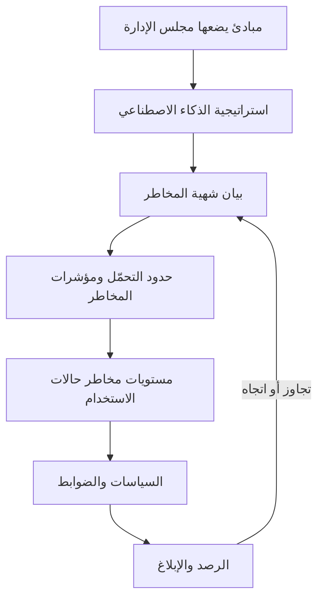

# الوحدة 2 — التوقعات المؤسسية

*سياسة الذكاء الاصطناعي التي لا يملكها أحد مجرد أمنية. فقبل أن يستطيع بنك نجم (Najm Bank) حوكمة نموذج واحد، عليه أن يقرر ما يؤمن به، وكم من مخاطر الذكاء الاصطناعي هو مستعد لتحمّله، ومن يقرر، ومن يتحقق، وهل يعرف موظفوه ما يكفي لاكتشاف المشكلات. تبني هذه الوحدة ذلك العمود الفقري المؤسسي. يحوّل الدرس 2.1 المبادئ (principles) إلى استراتيجية (strategy) وشهية مخاطر (risk appetite) ونموذج تشغيلي (operating model). ويعطي الدرس 2.2 كل دور مهمته، من مجلس الإدارة (board) إلى التدقيق الداخلي (internal audit)، ويربطها في لجنة ومصفوفة RACI ومسار تصعيد (escalation path). ويغطي الدرس 2.3 واجب الإلمام بالذكاء الاصطناعي (AI literacy) في EU AI Act، والتدريب القائم على الأدوار (role-based training)، والثقافة التي تجعل الناس يتحدثون عن المشكلات. وطوال الوحدة، تبني ليلى، رئيسة حوكمة الذكاء الاصطناعي الجديدة في بنك نجم، الهيكل الذي كنت ستبنيه أنت. هذه الدورة تعليمية وليست استشارة قانونية.*

> **التغطية من مجال المعرفة (BoK coverage):** I.B — تحديد ما تتوقعه المؤسسة من الذكاء الاصطناعي وإبلاغه: المبادئ، والاستراتيجية، وشهية المخاطر، والأدوار والمساءلة، والتدريب والتوعية.

---

# 2.1 — من المبادئ إلى الاستراتيجية وشهية المخاطر
*المستوى: 🟡 متوسط* · *المتطلبات: 1.2، 1.3* · *مجال المعرفة (BoK): I.B*

## ⚡ الدرس في دقيقة
- تبدأ حوكمة الذكاء الاصطناعي (AI governance) من القمة: **المبادئ (principles)** (ما نقدّره) تقود **استراتيجية الذكاء الاصطناعي (AI strategy)** (ما سنستخدم الذكاء الاصطناعي من أجله)، التي تحدّها **شهية المخاطر (risk appetite)** (مقدار مخاطر الذكاء الاصطناعي الذي نقبله) و**تحمّل المخاطر (risk tolerances)** (الحدود القابلة للقياس من حولها).
- لا قيمة للمبادئ إلا بعد ترجمتها إلى التزامات يمكن لشخص ما اختبارها: "عادل" تصبح "نقيس فجوات معدلات الموافقة بين المجموعات قبل الإطلاق وشهريًا بعده".
- يحدد مجلس الإدارة شهية المخاطر؛ وتحدد الإدارة التنفيذية حدود التحمّل ومؤشرات المخاطر الرئيسية، ويراقبها خط الدفاع الثاني.
- **النموذج التشغيلي (operating model)** (مركزي، أو اتحادي، أو محوري وفرعي) هو الطريقة التي تنفّذ بها المؤسسة الاستراتيجية. الهيكل يتبع الاستراتيجية، لا العكس.
- إشارة الامتحان: الأسئلة التي تسأل "ما الذي يجب أن تفعله المؤسسة *أولًا*" تريد عادةً التزام القيادة، أو مبادئ محددة، أو شهية واضحة، لا شراء أداة أو نموذجًا جديدًا.
- الفخ الأكبر: معاملة قائمة منشورة من المبادئ الأخلاقية على أنها حوكمة. فالمبادئ بلا مالكين ومقاييس وعواقب مجرد تسويق.

## 🧭 لماذا يهم
في أسبوعها الأول، تجد ليلى أربعة مشاريع ذكاء اصطناعي جارية في بنك نجم دون رؤية مشتركة لسببها. فريق دانة يعيد بناء نموذج تقييم الجدارة الائتمانية للموافقة على مزيد من قروض المنشآت الصغيرة والمتوسطة. وخالد يريد روبوت محادثة لخدمة العملاء يعمل قبل رمضان. والموارد البشرية اشتركت في أداة مورّد لفرز السير الذاتية. ومديرو العلاقات يلصقون البيانات المالية للعملاء في أداة ذكاء اصطناعي توليدي عامة لكتابة مسودات مذكرات الائتمان. يعتقد كل فريق أنه يتصرف بمسؤولية. ولا يستطيع أيٌّ منهم أن يقول كم من المخاطر يرغب البنك في تحمّله في أيٍّ من ذلك، أو من وافق عليه.

ثم يحيل الرئيس التنفيذي إلى ليلى سؤالًا من لجنة المخاطر في مجلس الإدارة: "ما شهيتنا لمخاطر الذكاء الاصطناعي؟". لا أحد يملك إجابة. للبنك شهية مفصّلة لمخاطر الائتمان (حدود التركّز، وسقوف نسبة القرض إلى القيمة)، ولمخاطر السوق، وللمخاطر التشغيلية. والذكاء الاصطناعي يمسّ الثلاث كلها، لكنه غير مكتوب في أي مكان.

ومن دون خط يمتد من المبادئ إلى الاستراتيجية إلى الشهية، يُناقَش كل قرار يخص الذكاء الاصطناعي من الصفر، ويفوز صاحب الحجة التجارية الأعلى صوتًا.

## 📐 كيف يعمل

### 🟢 الأساسيات

**تسلسل الحوكمة.** فكّر في حوكمة الذكاء الاصطناعي كسلسلة من الطبقات، كل منها أكثر تحديدًا من التي فوقها:

| الطبقة | السؤال الذي تجيب عنه | من يملكها | مثال من بنك نجم |
|---|---|---|---|
| المبادئ | ما الذي نقدّره؟ | مجلس الإدارة | "نعامل العملاء بعدالة ونستطيع تفسير القرارات التي تؤثر فيهم." |
| استراتيجية الذكاء الاصطناعي | أين سيخلق الذكاء الاصطناعي قيمة، وأين لن نستخدمه؟ | اللجنة التنفيذية | "استخدم الذكاء الاصطناعي لتسريع قرارات ائتمان المنشآت الصغيرة والمتوسطة وكشف الاحتيال؛ ولا رفض آليًا بالكامل لائتمان الأفراد." |
| شهية المخاطر | كم من مخاطر الذكاء الاصطناعي سنقبل سعيًا إلى تلك الاستراتيجية؟ | مجلس الإدارة، بمشورة إدارة المخاطر | "شهية منخفضة للذكاء الاصطناعي الذي قد يسبب معاملة غير عادلة للعملاء." |
| حدود تحمّل المخاطر والسقوف | ما الحدود القابلة للقياس التي تُظهر أننا داخل الشهية؟ | الإدارة التنفيذية، ويراقبها خط الدفاع الثاني | "يجب أن تبقى نسبة معدل الموافقة بين أي مجموعة محمية والمجموعة المرجعية فوق حدّ متفق عليه." |
| السياسات والإجراءات | ما الذي يجب أن يفعله الناس؟ | مالكو السياسات | سياسة الذكاء الاصطناعي، وسياسة الاستخدام المقبول، وإجراء الاستقبال (الوحدة 3) |
| الضوابط والمقاييس | كيف نتحقق من أن ذلك حدث؟ | خط الدفاع الأول، ويختبرها الخطان الثاني والثالث | اختبار العدالة قبل الإطلاق، وتقرير الرصد الشهري |

يجب أن تعود كل طبقة إلى التي فوقها. فالضابط الذي لا يفسّره أي مبدأ بيروقراطية؛ والمبدأ الذي لا يختبره أي ضابط زينة.

**المبادئ.** معظم المؤسسات لا تخترع مبادئ الذكاء الاصطناعي من العدم. بل تكيّف مجموعة معترفًا بها، ثم تضيف ما يخصها. والمصادر الشائعة هي:

- **OECD AI Principles** (اعتُمدت في 2019 وحُدّثت في مايو 2024): النمو الشامل والرفاه؛ واحترام سيادة القانون وحقوق الإنسان والقيم الديمقراطية بما فيها العدالة والخصوصية؛ والشفافية وقابلية التفسير؛ والمتانة والأمن والسلامة؛ والمساءلة.
- **UNESCO Recommendation on the Ethics of AI** (2021)، مع تركيز قوي على حقوق الإنسان والكرامة والأثر البيئي.
- خصائص الجدارة بالثقة في **NIST AI RMF** (صالح وموثوق؛ آمن؛ مؤمَّن ومرن؛ خاضع للمساءلة وشفاف؛ قابل للتفسير وقابل للفهم؛ معزِّز للخصوصية؛ عادل مع إدارة التحيّز الضار).
- البيانات الإقليمية مثل **SDAIA AI Ethics Principles** في المملكة العربية السعودية، والتوقعات القطاعية مثل إرشادات مصرف قطر المركزي للذكاء الاصطناعي الموجّهة للمؤسسات المالية.

اجعل المجموعة قصيرة، وبكلماتك أنت، مع سطر يوضح ما يعنيه كل بند عمليًا.

**الاستراتيجية.** تحدد استراتيجية الذكاء الاصطناعي أين سيخدم الذكاء الاصطناعي أهداف العمل، وما القدرات المطلوبة (البيانات، والكفاءات، والمنصات، والشركاء)، وأين *لن* يُستخدم الذكاء الاصطناعي. وبالنسبة لبنك قطري، تُعدّ الاستراتيجية الوطنية للذكاء الاصطناعي في قطر وتوقعات المصرف المركزي جزءًا من السياق.

**شهية المخاطر مقابل تحمّل المخاطر.** يظهر هذان المصطلحان باستمرار ويسهل الخلط بينهما:

- **شهية المخاطر (Risk appetite)** هي مقدار المخاطر ونوعها الذي تستعد المؤسسة لتحمّله أو الاحتفاظ به لتحقيق أهدافها. وهي عادةً نوعية ويحددها مجلس الإدارة: "منخفضة"، "متوسطة"، "مرتفعة"، لكل فئة مخاطر.
- **تحمّل المخاطر (Risk tolerance)** هو التفاوت المقبول حول تلك الشهية، معبَّرًا عنه بمصطلحات قابلة للقياس: حدود، وسقوف، ونقاط تفعيل. ويستخدم NIST AI RMF مصطلح "تحمّل المخاطر" بمعنى استعداد المؤسسة لتحمّل المخاطر من أجل تحقيق أهدافها، ويتوقع تحديده وتوثيقه لأنه يشكّل كل قرار لاحق في وظائف Map وMeasure وManage.
- **القدرة على تحمّل المخاطر (Risk capacity)** هي أقصى قدر من المخاطر تستطيع المؤسسة استيعابه قبل أن تنهار (تنظيميًا أو ماليًا أو من حيث السمعة). ويجب أن تقع الشهية داخل القدرة بهامش واسع.

### 🟡 التعمق أكثر

**كتابة بيان شهية مخاطر الذكاء الاصطناعي.** البيان القابل للاستخدام يفعل ثلاثة أشياء لكل فئة مخاطر: يذكر مستوى الشهية، ويشرح المبررات، ويسمّي حدود التحمّل أو المؤشرات التي تُظهر هل البنك داخلها. ومخاطر الذكاء الاصطناعي ليست فئة واحدة. بل تتقاطع مع الفئات القائمة، لذا فأوضح نهج هو توسيع تصنيف المخاطر المؤسسية بدلًا من إنشاء عالم موازٍ:

| فئة المخاطر | الزاوية الخاصة بالذكاء الاصطناعي | الشهية | مثال على حد تحمّل أو مؤشر مخاطر رئيسي (KRI) |
|---|---|---|---|
| السلوك والعدالة تجاه العملاء | قرارات تمييزية أو غير قابلة للتفسير | منخفضة | لا قرار ذكاء اصطناعي عالي المخاطر بشأن العملاء دون مسار للمراجعة البشرية؛ ومقياس العدالة ضمن نطاق متفق عليه |
| الامتثال التنظيمي | EU AI Act، وGDPR، وPDPPL، وتوقعات QCB | منخفضة جدًا | صفر أنظمة عالية المخاطر في الإنتاج دون استكمال المطابقة أو فحوص المُشغِّل |
| المرونة التشغيلية | إخفاق النموذج، والانجراف، وتعطل المورّد | متوسطة | انخفاض أداء نموذج حرج عن الحد لأكثر من X يومًا يستدعي التصعيد |
| أمن المعلومات | حقن الطلبات، وتسرّب البيانات إلى الذكاء الاصطناعي التوليدي | منخفضة | لا بيانات سرية في أدوات ذكاء اصطناعي توليدي غير معتمدة؛ ومراجعة تنبيهات منع فقدان البيانات (DLP) أسبوعيًا |
| الاستراتيجية والابتكار | التخلف عن المنافسين | متوسطة إلى مرتفعة | يمكن لحالات استخدام الإنتاجية الداخلية منخفضة المخاطر المضي في مسار خفيف |

لاحظ أن الشهية ليست منخفضة بشكل موحّد (فانعدام الشهية لكل مخاطر الذكاء الاصطناعي يعني عدم استخدامه)، وأن "X" في حد التحمّل تحددها الإدارة بالبيانات. وتحرص ليلى على أن يكون الرقم موجودًا، وله مالك، ويُبلَّغ عنه.

**من الشهية إلى مستويات حالات الاستخدام.** تصبح الشهية عملية عبر تصنيف المخاطر في مستويات (risk tiering): تُصنَّف كل حالة استخدام (use case) مقترحة (مثلًا منخفضة، ومتوسطة، ومرتفعة، ومحظورة)، ويحصل كل مستوى على ضوابط متناسبة. فأداة ذكاء اصطناعي توليدي تكتب مسودات محاضر الاجتماعات الداخلية تقع في مستوى منخفض مع مراجعة خفيفة. أما نموذج تقييم الجدارة الائتمانية فيقع في مستوى مرتفع مع تحقق مستقل، وتقييم الأثر على حماية البيانات (data protection impact assessment)، وتقييم الأثر على الحقوق الأساسية (fundamental rights impact assessment) لعملاء الاتحاد الأوروبي، وموافقة اللجنة. وبيان الشهية هو ما يبرر هذا الفرق. وتبني الوحدة 8 عملية الاستقبال والتصنيف الكاملة.

**اختيار النموذج التشغيلي.** يحدد النموذج التشغيلي أين تقع خبرة حوكمة الذكاء الاصطناعي وصلاحيات القرار. وهناك ثلاثة أنماط شائعة:

| النموذج | كيف يعمل | نقاط القوة | نقاط الضعف | يناسب عندما |
|---|---|---|---|---|
| مركزي | فريق مركزي واحد (غالبًا في المخاطر أو الامتثال أو مكتب رئيس البيانات) يراجع كل الذكاء الاصطناعي ويعتمده | الاتساق، ووضوح المساءلة، وتجميع الخبراء النادرين | عنق زجاجة؛ والبعد عن العمل؛ وثقافة "الحوكمة تقول لا" | النضج المبكر، وقلة حالات الاستخدام، والتنظيم المشدد |
| اتحادي (لامركزي) | كل وحدة عمل تحكم ذكاءها الاصطناعي وفق معايير دنيا مشتركة | السرعة، والسياق، والملكية | عدم الاتساق؛ وانحراف المعايير؛ وصعوبة الحصول على رؤية مؤسسية | المجموعات الكبيرة المتنوعة ذات وظائف مخاطر محلية قوية |
| محوري وفرعي (هجين) | يحدد مركز محوري السياسة والمنهجيات والأدوات والسجل؛ وتطبّقها "فروع" مدمجة (أبطال مخاطر الذكاء الاصطناعي) في كل وحدة | توازن بين الاتساق والسرعة؛ وقابل للتوسع | يحتاج إلى صلاحيات قرار واضحة بين المركز والفروع؛ وقد يعاني الأبطال من نقص الموارد | معظم المؤسسات المتوسطة والكبيرة حين يتنامى استخدام الذكاء الاصطناعي |

سيبدأ بنك نجم بنموذج مركزي ريثما يُبنى السجل، ثم ينتقل إلى النموذج المحوري والفرعي مع أبطال في كل خط أعمال.

الحلقة في الأسفل مهمة: فنتائج الرصد تعود إلى مجلس الإدارة، الذي قد يشدد الشهية أو يخففها.

### 🔴 نظرة الخبير

**المبادئ تتعارض، والحوكمة هي طريقة حل التعارضات.** قد تتعارض قابلية التفسير مع الدقة. وقد تتعارض الخصوصية (تقليل البيانات) مع اختبار العدالة (الذي قد يحتاج إلى سمات حساسة). والسرعة إلى السوق تتعارض مع عمق التحقق. والبرامج الناضجة لا تتظاهر بزوال هذه التوترات. بل تسمّيها، وتضع قاعدة افتراضية ("حين تتعارض الدقة وقابلية التفسير في قرارات ائتمان العملاء، تفوز قابلية التفسير ما لم تعتمد اللجنة خلاف ذلك")، وتسجّل القرارات لتبقى متسقة مع الوقت. ويحب الامتحان السيناريوهات التي يتصادم فيها مبدآن جيدان؛ وأفضل إجابة عادةً توثّق المفاضلة وتحيلها إلى صاحب القرار المسؤول بدلًا من اختيار أحدهما بصمت.

**الحوكمة على مستوى مجلس الإدارة.** يقدّم **ISO/IEC 38507** إرشادات لهيئات الحوكمة (مجالس الإدارة) بشأن تبعات استخدام الذكاء الاصطناعي: فهي تبقى مسؤولة عن استخدام المؤسسة للذكاء الاصطناعي، حتى حين تُفوَّض القرارات أو تُؤتمت، وينبغي أن تشرف على السياسات وشهية المخاطر والثقافة التي تشكّل ذلك الاستخدام. ويضع **ISO/IEC 42001** الفكرة نفسها في نظام إدارة قابل للاعتماد: يجب أن تُظهر الإدارة العليا القيادة والالتزام، وأن تضع سياسة للذكاء الاصطناعي تلائم غرض المؤسسة وتوفّر إطارًا لأهداف الذكاء الاصطناعي، وأن تسند الأدوار والمسؤوليات والصلاحيات. وبالمثل تتوقع وظيفة Govern في NIST AI RMF أن تتحمل القيادة العليا المسؤولية عن القرارات المتعلقة بالمخاطر المرتبطة بتطوير الذكاء الاصطناعي ونشره.

**الدمج خير من الاختراع.** تدير البنوك أصلًا برامج للمخاطر المؤسسية، ومخاطر النماذج، ومخاطر الأطراف الثالثة، والخصوصية، وأمن المعلومات. والحوكمة الفعّالة للذكاء الاصطناعي توسّعها بدلًا من بناء جزيرة معزولة: تنضم مخاطر الذكاء الاصطناعي إلى تصنيف المخاطر، وتنضم نماذج الذكاء الاصطناعي إلى سجل النماذج، ويمر مورّدو الذكاء الاصطناعي بإجراءات الإسناد الخارجي مع أسئلة إضافية خاصة بالذكاء الاصطناعي. ويبني **ISO/IEC 23894** (إرشادات إدارة مخاطر الذكاء الاصطناعي) على ISO 31000، وهذا يساعد. أما الإطار المنفصل الذي لا يربطه أحد بتقارير المخاطر المؤسسية فيميل إلى الموت حين يغادر راعيه.

**التنظيم يشكّل الشهية لكنه لا يحل محلها.** القانون يضع حدًا أدنى. ويمكن أن تكون الشهية أشد من القانون، ولا يمكن أبدًا أن تكون أخف. والمجموعة العاملة في الاتحاد الأوروبي ودول الخليج كثيرًا ما تضع شهية موحدة على مستوى المجموعة للاستخدامات عالية المخاطر عند أشد مستوى ذي صلة، ولا تسمح إلا بتفاوت محلي معتمد.

## ⚖️ الأدوات التنظيمية
| الأداة | ما تشترطه أو توصي به | إشارة الامتحان |
|---|---|---|
| **OECD AI Principles** | خمسة مبادئ قائمة على القيم للذكاء الاصطناعي الجدير بالثقة (حُدّثت في مايو 2024) إضافة إلى توصيات للحكومات | الأساس الدولي الأوسع اعتمادًا؛ والمصدر الذي تكيّفه مجموعات مبادئ مؤسسية كثيرة |
| **UNESCO Recommendation on the Ethics of AI** | إطار أخلاقي عالمي (2021) يتمحور حول حقوق الإنسان والكرامة والتنوع والبيئة | قانون مرن اعتمدته الدول الأعضاء في UNESCO؛ غير ملزم للشركات |
| **NIST AI RMF** — وظيفة Govern | مساءلة القيادة، وتحمّل مخاطر موثّق، والسياسات والثقافة أساسًا لوظائف Map وMeasure وManage | Govern وظيفة شاملة؛ وتحمّل المخاطر قرار مؤسسي لا يحدده الإطار نيابة عنك |
| **ISO/IEC 42001** — البند 5 القيادة | التزام الإدارة العليا، وسياسة للذكاء الاصطناعي، وأدوار ومسؤوليات وصلاحيات مسندة | معيار نظام إدارة قابل للاعتماد؛ ويجب أن تُظهر "الإدارة العليا" التزامها |
| **ISO/IEC 38507** | إرشادات لهيئات الحوكمة بشأن التبعات الحوكمية لاستخدام الذكاء الاصطناعي | يبقى مجلس الإدارة مسؤولًا حتى حين يقرر الذكاء الاصطناعي |
| **ISO/IEC 23894** | إرشادات إدارة مخاطر الذكاء الاصطناعي المبنية على ISO 31000 | ادمج مخاطر الذكاء الاصطناعي في إدارة المخاطر المؤسسية القائمة |
| **SDAIA AI Ethics Principles** | مبادئ أخلاقيات الذكاء الاصطناعي الوطنية السعودية للجهات التي تطوّر الذكاء الاصطناعي أو تستخدمه | مثال على إطار مبادئ خليجي؛ تحقق من النص الرسمي الحالي |

## 🏛️ عمليًا في بنك نجم
تصوغ ليلى، وتعتمد لجنة المخاطر في مجلس الإدارة، أول **بيان لمبادئ الذكاء الاصطناعي وشهية المخاطر**. وهذا مقتطف منه:

> **مبادئ الذكاء الاصطناعي في بنك نجم (الإصدار 1.0)**
> 1. **المعاملة العادلة.** يجب ألا ينتج الذكاء الاصطناعي فروقًا غير مبررة في النتائج للعملاء أو الموظفين. *عمليًا:* يُختبر الذكاء الاصطناعي الموجّه للعملاء بحثًا عن نتائج متفاوتة قبل الإطلاق ويُراقَب بعده.
> 2. **قابلية التفسير.** القرارات التي تؤثر تأثيرًا كبيرًا في شخص يمكن تفسيرها له بلغة بسيطة. *عمليًا:* تحمل قرارات الائتمان رموز أسباب يستطيع مدير العلاقة قراءتها بصوت عالٍ.
> 3. **المساءلة البشرية.** لكل نظام ذكاء اصطناعي شخص مسمّى يملكه، ولا يملك أي نظام ذكاء اصطناعي الكلمة الأخيرة في رفض ائتمان عميل من الأفراد. *عمليًا:* لكل نظام في السجل مالك عمل مسؤول.
> 4. **الخصوصية والأمن.** يستخدم الذكاء الاصطناعي الحد الأدنى الضروري من البيانات الشخصية ويُحمى كأي نظام حرج. *عمليًا:* فحص أولي لتقييم الأثر على حماية البيانات (DPIA) جزء من الاستقبال.
> 5. **الموثوقية.** يُتحقق من الذكاء الاصطناعي قبل الاستخدام ويُراقَب أثناءه. *عمليًا:* تخضع النماذج من المستوى المرتفع لتحقق مستقل.

> **شهية مخاطر الذكاء الاصطناعي (مقتطف)**
>
> | الفئة | الشهية | حد التحمّل / مؤشر المخاطر الرئيسي | المالك | يُرفع إلى |
> |---|---|---|---|---|
> | العدالة تجاه العملاء | منخفضة | مقاييس العدالة ضمن النطاقات المتفق عليها لكل نماذج المستوى المرتفع؛ وأي تجاوز يُصعَّد خلال 5 أيام عمل | رئيس إقراض الأفراد (خالد) لنماذج الائتمان | لجنة حوكمة الذكاء الاصطناعي شهريًا؛ ولجنة المخاطر في مجلس الإدارة ربع سنويًا |
> | التنظيمية | منخفضة جدًا | 100% من أنظمة المستوى المرتفع استكملت تقييمات الأثر قبل الإطلاق | رئيسة حوكمة الذكاء الاصطناعي (ليلى) | لجنة المخاطر في مجلس الإدارة ربع سنويًا |
> | تسرّب البيانات عبر الذكاء الاصطناعي التوليدي | منخفضة | صفر حوادث مؤكدة لوجود بيانات العملاء في أدوات غير معتمدة؛ وفرز تنبيهات DLP خلال يومي عمل | CISO | لجنة حوكمة الذكاء الاصطناعي شهريًا |
> | الابتكار | متوسطة | البت في حالات الاستخدام منخفضة المستوى خلال 10 أيام عمل من اكتمال الاستقبال | رئيسة حوكمة الذكاء الاصطناعي | اللجنة التنفيذية ربع سنويًا |

*قرار النموذج التشغيلي:* مراجعة مركزية في السنة الأولى؛ ثم نموذج محوري وفرعي مع أبطال مخاطر ذكاء اصطناعي مسمّين ابتداءً من الشهر الثاني عشر، رهنًا بمراجعة اللجنة لأحجام الاستقبال.

## 🛠️ التمارين

### 🟢 مبتدئ
خذ مبادئ OECD الخمسة القائمة على القيم وأعِد كتابة كل منها في صورة التزام من سطر واحد لمؤسسة تعرفها، مع جملة "عمليًا" واحدة لكل منها.
*يكتمل عندما:* يكون لكل مبدأ التزام يستطيع شخص ما اختباره أو تدقيقه.

### 🟡 متوسط
صُغ جدول شهية مخاطر الذكاء الاصطناعي لروبوت محادثة خدمة العملاء في بنك نجم يغطي أربع فئات مخاطر على الأقل، مع مستوى شهية، وحد تحمّل واحد أو مؤشر مخاطر رئيسي، ومالك لكل منها.
*يكتمل عندما:* يكون لكل صف حد تحمّل قابل للقياس ودور مسمّى، وتكون لفئة واحدة على الأقل شهية متوسطة (لا منخفضة) مع تبرير.

### 🔴 متقدم
يريد قسم الخدمات المصرفية للشركات في بنك نجم أن يدير حوكمة الذكاء الاصطناعي الخاصة به لأن "المركز بطيء جدًا". اكتب توصية من صفحة واحدة للراعي التنفيذي تقارن بين النماذج المركزي والاتحادي والمحوري والفرعي لبنك نجم، واقترح صلاحيات القرار بين المركز والفروع.
*يكتمل عندما:* تسمّي التوصية ما يحتفظ به المركز (السياسة، والسجل، واعتمادات المستوى المرتفع)، وما تستطيع الفروع البت فيه، وكيف يظل مجلس الإدارة يحصل على رؤية مؤسسية واحدة.

## ⚠️ أخطاء وفخاخ الامتحان
- **المبادئ كخط نهاية.** نشر المبادئ هو البداية. وخيارات الإجابة التي تتوقف عند "نشر المبادئ الأخلاقية" نادرًا ما تكون الأفضل حين يضيف خيار آخر الملكية أو المقاييس أو الضوابط.
- **الخلط بين الشهية والتحمّل.** الشهية هي "كم من المخاطر نريد" بصيغة نوعية؛ والتحمّل هو الحد القابل للقياس. يحدد مجلس الإدارة الشهية؛ وتحدد الإدارة التنفيذية حدود التحمّل وتراقبها.
- **انعدام الشهية في كل مكان.** إعلان عدم التسامح مطلقًا مع أي مخاطر للذكاء الاصطناعي يبدو آمنًا لكنه يمنع كل استخدام أو، وهو الأسوأ، يدفعه إلى الخفاء (الذكاء الاصطناعي الخفي (shadow AI)). توقّع إجابات تفضّل النهج المتناسب القائم على المخاطر.
- **الأداة قبل الاستراتيجية.** شراء منصة لحوكمة الذكاء الاصطناعي قبل تحديد المبادئ والشهية والملكية "خطوة أولى" خاطئة كلاسيكية.
- **بناء جزيرة معزولة.** معاملة مخاطر الذكاء الاصطناعي بمعزل عن أطر المخاطر المؤسسية ومخاطر النماذج والخصوصية والأطراف الثالثة تخلق فجوات وازدواجية؛ والدمج هو الإجابة الأفضل عادةً.
- **القانون كسقف.** المتطلبات القانونية هي الحد الأدنى. ويجوز للمؤسسة وضع قواعد داخلية أشد؛ ولا يجوز لها أبدًا وضع قواعد أخف.

## 🧾 الخلاصة
- يسير التسلسل من المبادئ ← الاستراتيجية ← شهية المخاطر ← حدود التحمّل ← المستويات ← السياسات ← الضوابط ← الرصد، مع إعادة النتائج إلى مجلس الإدارة.
- كيّف المبادئ المعترف بها (OECD، وUNESCO، وخصائص NIST، والمبادئ الإقليمية) وترجم كلًّا منها إلى التزامات قابلة للاختبار.
- الشهية نوعية ويملكها مجلس الإدارة؛ والتحمّل قابل للقياس وتملكه الإدارة التنفيذية؛ وكلاهما يقع داخل القدرة على تحمّل المخاطر.
- النماذج التشغيلية المركزية والاتحادية والمحورية الفرعية تفاضل بين الاتساق والسرعة؛ والنموذج المحوري الفرعي هو الوجهة الشائعة مع توسّع استخدام الذكاء الاصطناعي.
- تبقى مجالس الإدارة مسؤولة عن الذكاء الاصطناعي (ISO/IEC 38507)؛ ويضع كلٌّ من ISO/IEC 42001 وNIST AI RMF التزام القيادة أولًا.

## ✍️ اختبر نفسك

**1. اعتمد مجلس إدارة بنك نجم مبادئ الذكاء الاصطناعي. أي خطوة تحوّل مبدأ "العدالة" إلى حوكمة على أفضل وجه؟**

- A. نشر المبادئ على الموقع الإلكتروني للبنك
- B. تحديد مقياس للعدالة، ونطاق تحمّل، ومالك يبلّغ لجنة حوكمة الذكاء الاصطناعي بالتجاوزات
- C. مطالبة علماء البيانات "بمراعاة العدالة"
- D. إضافة كلمة "عادل" إلى اسم كل نموذج في السجل

الإجابة

**B.** تحتاج الحوكمة إلى التزامات قابلة للقياس مع مالكين وتصعيد. أما A فتواصل لا ضابط؛ وC بلا مقياس ولا مساءلة. (انظر 🟢 الأساسيات و🏛️ عمليًا.)

**2. أي عبارة تصف الفرق بين شهية المخاطر وتحمّل المخاطر على أفضل وجه؟**

- A. يحدد علماء البيانات الشهية؛ ويحدد مجلس الإدارة التحمّل
- B. هما مترادفان يُستخدمان بالتبادل في NIST AI RMF
- C. الشهية هي المقدار والنوع العامّان للمخاطر التي ستقبلها المؤسسة؛ والتحمّل هو الحدود القابلة للقياس التي تُظهر هل هي داخل تلك الشهية
- D. التحمّل هو أقصى قدر من المخاطر تستطيع المؤسسة استيعابه قبل أن تنهار

الإجابة

**C.** الشهية هي الموقف النوعي على مستوى مجلس الإدارة؛ وحدود التحمّل هي الحدود القابلة للقياس. أما D فيصف القدرة على تحمّل المخاطر، وهو مشتِّت شائع. (انظر 🟢 الأساسيات.)

**3. لدى شركة تأمين سريعة النمو 60 حالة استخدام للذكاء الاصطناعي عبر خمس وحدات عمل. ولدى فريق المراجعة المركزي للذكاء الاصطناعي تراكم أعمال لثلاثة أشهر، وبدأت الوحدات تتجاوزه. أي تغيير في النموذج التشغيلي هو الأنسب؟**

- A. الانتقال إلى النموذج المحوري والفرعي: إبقاء السياسة والسجل واعتمادات الحالات عالية المخاطر مركزية، ودمج أبطال مدرَّبين في كل وحدة للتعامل مع المراجعات الأقل مخاطر
- B. إيقاف كل مشاريع الذكاء الاصطناعي حتى يُصفّى التراكم
- C. السماح لكل وحدة بوضع معاييرها الخاصة للذكاء الاصطناعي باستقلال
- D. إسناد كل اعتمادات الذكاء الاصطناعي إلى شركة استشارات خارجية

الإجابة

**A.** يحافظ النموذج المحوري والفرعي على الاتساق والرؤية المؤسسية مع إضافة طاقة قريبة من العمل. أما C فنموذج اتحادي بالكامل دون معايير مشتركة، فيفقد الاتساق؛ وB يدفع نحو الذكاء الاصطناعي الخفي. (انظر 🟡 التعمق أكثر، النماذج التشغيلية.)

**4. بموجب ISO/IEC 38507، من يبقى مسؤولًا عن استخدام المؤسسة للذكاء الاصطناعي حين تُفوَّض القرارات إلى أنظمة الذكاء الاصطناعي؟**

- A. مورّد الذكاء الاصطناعي
- B. فريق علوم البيانات الذي بنى النموذج
- C. لا أحد، لأن القرار آلي
- D. هيئة الحوكمة (مجلس الإدارة)

الإجابة

**D.** يخاطب ISO/IEC 38507 هيئات الحوكمة، والفكرة أن المساءلة لا تُفوَّض إلى الآلة أو المورّد. (انظر 🔴 نظرة الخبير.)

**5. يقول فريق النماذج في بنك نجم إن تفسير قرارات نموذج الائتمان الجديد سيكلّف نقطتين من الدقة. والمبادئ تقدّر الدقة وقابلية التفسير كلتيهما. ما أفضل استجابة حوكمية؟**

- A. اختيار النموذج الأدق دائمًا؛ فقابلية التفسير اختيارية
- B. ترك فريق علوم البيانات يقرر بشكل غير رسمي
- C. التخلي عن النموذج
- D. توثيق المفاضلة وتطبيق القاعدة الافتراضية المعلنة للبنك أو إحالتها إلى صاحب القرار المسؤول، مع تسجيل القرار

الإجابة

**D.** المبادئ تتعارض؛ والحوكمة تحل التعارضات بشفافية واتساق عبر القواعد الافتراضية والقرارات الخاضعة للمساءلة. أما A وB فيتخطيان المساءلة؛ وC رد فعل مبالغ فيه. (انظر 🔴 نظرة الخبير.)

## 📚 المراجع
- OECD AI Principles: https://oecd.ai/en/ai-principles
- UNESCO، توصية بشأن أخلاقيات الذكاء الاصطناعي: https://www.unesco.org/en/artificial-intelligence/recommendation-ethics
- إطار NIST لإدارة مخاطر الذكاء الاصطناعي: https://www.nist.gov/itl/ai-risk-management-framework
- ISO/IEC 42001:2023 نظام إدارة الذكاء الاصطناعي: https://www.iso.org/standard/81230.html
- ISO/IEC JTC 1/SC 42 (اللجنة المسؤولة عن ISO/IEC 38507 و23894 ومجموعة معايير الذكاء الاصطناعي): https://www.iso.org/committee/6794475.html
- SDAIA (الهيئة السعودية للبيانات والذكاء الاصطناعي): https://sdaia.gov.sa/
- مصرف قطر المركزي (Qatar Central Bank): https://www.qcb.gov.qa/
- شهادة AIGP من IAPP ومجال المعرفة (Body of Knowledge): https://iapp.org/certify/aigp/

---

