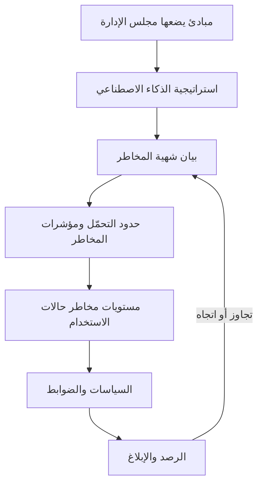
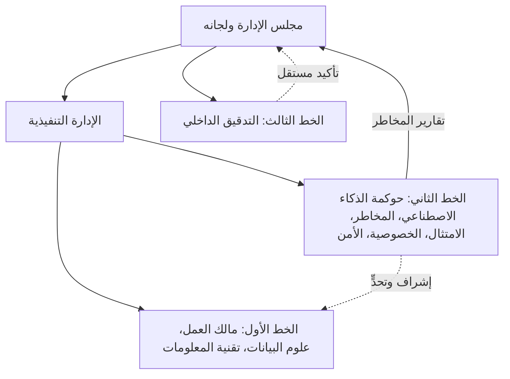

# الوحدة 2 — التوقعات المؤسسية

*سياسة الذكاء الاصطناعي التي لا يملكها أحد مجرد أمنية. فقبل أن يستطيع بنك نجم (Najm Bank) حوكمة نموذج واحد، عليه أن يقرر ما يؤمن به، وكم من مخاطر الذكاء الاصطناعي هو مستعد لتحمّله، ومن يقرر، ومن يتحقق، وهل يعرف موظفوه ما يكفي لاكتشاف المشكلات. تبني هذه الوحدة ذلك العمود الفقري المؤسسي. يحوّل الدرس 2.1 المبادئ (principles) إلى استراتيجية (strategy) وشهية مخاطر (risk appetite) ونموذج تشغيلي (operating model). ويعطي الدرس 2.2 كل دور مهمته، من مجلس الإدارة (board) إلى التدقيق الداخلي (internal audit)، ويربطها في لجنة ومصفوفة RACI ومسار تصعيد (escalation path). ويغطي الدرس 2.3 واجب الإلمام بالذكاء الاصطناعي (AI literacy) في EU AI Act، والتدريب القائم على الأدوار (role-based training)، والثقافة التي تجعل الناس يتحدثون عن المشكلات. وطوال الوحدة، تبني ليلى، رئيسة حوكمة الذكاء الاصطناعي الجديدة في بنك نجم، الهيكل الذي كنت ستبنيه أنت. هذه الدورة تعليمية وليست استشارة قانونية.*

> **التغطية من مجال المعرفة (BoK coverage):** I.B — تحديد ما تتوقعه المؤسسة من الذكاء الاصطناعي وإبلاغه: المبادئ، والاستراتيجية، وشهية المخاطر، والأدوار والمساءلة، والتدريب والتوعية.

---

# 2.1 — من المبادئ إلى الاستراتيجية وشهية المخاطر
*المستوى: 🟡 متوسط* · *المتطلبات: 1.2، 1.3* · *مجال المعرفة (BoK): I.B*

## ⚡ الدرس في دقيقة
- تبدأ حوكمة الذكاء الاصطناعي (AI governance) من القمة: **المبادئ (principles)** (ما نقدّره) تقود **استراتيجية الذكاء الاصطناعي (AI strategy)** (ما سنستخدم الذكاء الاصطناعي من أجله)، التي تحدّها **شهية المخاطر (risk appetite)** (مقدار مخاطر الذكاء الاصطناعي الذي نقبله) و**تحمّل المخاطر (risk tolerances)** (الحدود القابلة للقياس من حولها).
- لا قيمة للمبادئ إلا بعد ترجمتها إلى التزامات يمكن لشخص ما اختبارها: "عادل" تصبح "نقيس فجوات معدلات الموافقة بين المجموعات قبل الإطلاق وشهريًا بعده".
- يحدد مجلس الإدارة شهية المخاطر؛ وتحدد الإدارة التنفيذية حدود التحمّل ومؤشرات المخاطر الرئيسية، ويراقبها خط الدفاع الثاني.
- **النموذج التشغيلي (operating model)** (مركزي، أو اتحادي، أو محوري وفرعي) هو الطريقة التي تنفّذ بها المؤسسة الاستراتيجية. الهيكل يتبع الاستراتيجية، لا العكس.
- إشارة الامتحان: الأسئلة التي تسأل "ما الذي يجب أن تفعله المؤسسة *أولًا*" تريد عادةً التزام القيادة، أو مبادئ محددة، أو شهية واضحة، لا شراء أداة أو نموذجًا جديدًا.
- الفخ الأكبر: معاملة قائمة منشورة من المبادئ الأخلاقية على أنها حوكمة. فالمبادئ بلا مالكين ومقاييس وعواقب مجرد تسويق.

## 🧭 لماذا يهم
في أسبوعها الأول، تجد ليلى أربعة مشاريع ذكاء اصطناعي جارية في بنك نجم دون رؤية مشتركة لسببها. فريق دانة يعيد بناء نموذج تقييم الجدارة الائتمانية للموافقة على مزيد من قروض المنشآت الصغيرة والمتوسطة. وخالد يريد روبوت محادثة لخدمة العملاء يعمل قبل رمضان. والموارد البشرية اشتركت في أداة مورّد لفرز السير الذاتية. ومديرو العلاقات يلصقون البيانات المالية للعملاء في أداة ذكاء اصطناعي توليدي عامة لكتابة مسودات مذكرات الائتمان. يعتقد كل فريق أنه يتصرف بمسؤولية. ولا يستطيع أيٌّ منهم أن يقول كم من المخاطر يرغب البنك في تحمّله في أيٍّ من ذلك، أو من وافق عليه.

ثم يحيل الرئيس التنفيذي إلى ليلى سؤالًا من لجنة المخاطر في مجلس الإدارة: "ما شهيتنا لمخاطر الذكاء الاصطناعي؟". لا أحد يملك إجابة. للبنك شهية مفصّلة لمخاطر الائتمان (حدود التركّز، وسقوف نسبة القرض إلى القيمة)، ولمخاطر السوق، وللمخاطر التشغيلية. والذكاء الاصطناعي يمسّ الثلاث كلها، لكنه غير مكتوب في أي مكان.

ومن دون خط يمتد من المبادئ إلى الاستراتيجية إلى الشهية، يُناقَش كل قرار يخص الذكاء الاصطناعي من الصفر، ويفوز صاحب الحجة التجارية الأعلى صوتًا.

## 📐 كيف يعمل

### 🟢 الأساسيات

**تسلسل الحوكمة.** فكّر في حوكمة الذكاء الاصطناعي كسلسلة من الطبقات، كل منها أكثر تحديدًا من التي فوقها:

| الطبقة | السؤال الذي تجيب عنه | من يملكها | مثال من بنك نجم |
|---|---|---|---|
| المبادئ | ما الذي نقدّره؟ | مجلس الإدارة | "نعامل العملاء بعدالة ونستطيع تفسير القرارات التي تؤثر فيهم." |
| استراتيجية الذكاء الاصطناعي | أين سيخلق الذكاء الاصطناعي قيمة، وأين لن نستخدمه؟ | اللجنة التنفيذية | "استخدم الذكاء الاصطناعي لتسريع قرارات ائتمان المنشآت الصغيرة والمتوسطة وكشف الاحتيال؛ ولا رفض آليًا بالكامل لائتمان الأفراد." |
| شهية المخاطر | كم من مخاطر الذكاء الاصطناعي سنقبل سعيًا إلى تلك الاستراتيجية؟ | مجلس الإدارة، بمشورة إدارة المخاطر | "شهية منخفضة للذكاء الاصطناعي الذي قد يسبب معاملة غير عادلة للعملاء." |
| حدود تحمّل المخاطر والسقوف | ما الحدود القابلة للقياس التي تُظهر أننا داخل الشهية؟ | الإدارة التنفيذية، ويراقبها خط الدفاع الثاني | "يجب أن تبقى نسبة معدل الموافقة بين أي مجموعة محمية والمجموعة المرجعية فوق حدّ متفق عليه." |
| السياسات والإجراءات | ما الذي يجب أن يفعله الناس؟ | مالكو السياسات | سياسة الذكاء الاصطناعي، وسياسة الاستخدام المقبول، وإجراء الاستقبال (الوحدة 3) |
| الضوابط والمقاييس | كيف نتحقق من أن ذلك حدث؟ | خط الدفاع الأول، ويختبرها الخطان الثاني والثالث | اختبار العدالة قبل الإطلاق، وتقرير الرصد الشهري |

يجب أن تعود كل طبقة إلى التي فوقها. فالضابط الذي لا يفسّره أي مبدأ بيروقراطية؛ والمبدأ الذي لا يختبره أي ضابط زينة.

**المبادئ.** معظم المؤسسات لا تخترع مبادئ الذكاء الاصطناعي من العدم. بل تكيّف مجموعة معترفًا بها، ثم تضيف ما يخصها. والمصادر الشائعة هي:

- **OECD AI Principles** (اعتُمدت في 2019 وحُدّثت في مايو 2024): النمو الشامل والرفاه؛ واحترام سيادة القانون وحقوق الإنسان والقيم الديمقراطية بما فيها العدالة والخصوصية؛ والشفافية وقابلية التفسير؛ والمتانة والأمن والسلامة؛ والمساءلة.
- **UNESCO Recommendation on the Ethics of AI** (2021)، مع تركيز قوي على حقوق الإنسان والكرامة والأثر البيئي.
- خصائص الجدارة بالثقة في **NIST AI RMF** (صالح وموثوق؛ آمن؛ مؤمَّن ومرن؛ خاضع للمساءلة وشفاف؛ قابل للتفسير وقابل للفهم؛ معزِّز للخصوصية؛ عادل مع إدارة التحيّز الضار).
- البيانات الإقليمية مثل **SDAIA AI Ethics Principles** في المملكة العربية السعودية، والتوقعات القطاعية مثل إرشادات مصرف قطر المركزي للذكاء الاصطناعي الموجّهة للمؤسسات المالية.

اجعل المجموعة قصيرة، وبكلماتك أنت، مع سطر يوضح ما يعنيه كل بند عمليًا.

**الاستراتيجية.** تحدد استراتيجية الذكاء الاصطناعي أين سيخدم الذكاء الاصطناعي أهداف العمل، وما القدرات المطلوبة (البيانات، والكفاءات، والمنصات، والشركاء)، وأين *لن* يُستخدم الذكاء الاصطناعي. وبالنسبة لبنك قطري، تُعدّ الاستراتيجية الوطنية للذكاء الاصطناعي في قطر وتوقعات المصرف المركزي جزءًا من السياق.

**شهية المخاطر مقابل تحمّل المخاطر.** يظهر هذان المصطلحان باستمرار ويسهل الخلط بينهما:

- **شهية المخاطر (Risk appetite)** هي مقدار المخاطر ونوعها الذي تستعد المؤسسة لتحمّله أو الاحتفاظ به لتحقيق أهدافها. وهي عادةً نوعية ويحددها مجلس الإدارة: "منخفضة"، "متوسطة"، "مرتفعة"، لكل فئة مخاطر.
- **تحمّل المخاطر (Risk tolerance)** هو التفاوت المقبول حول تلك الشهية، معبَّرًا عنه بمصطلحات قابلة للقياس: حدود، وسقوف، ونقاط تفعيل. ويستخدم NIST AI RMF مصطلح "تحمّل المخاطر" بمعنى استعداد المؤسسة لتحمّل المخاطر من أجل تحقيق أهدافها، ويتوقع تحديده وتوثيقه لأنه يشكّل كل قرار لاحق في وظائف Map وMeasure وManage.
- **القدرة على تحمّل المخاطر (Risk capacity)** هي أقصى قدر من المخاطر تستطيع المؤسسة استيعابه قبل أن تنهار (تنظيميًا أو ماليًا أو من حيث السمعة). ويجب أن تقع الشهية داخل القدرة بهامش واسع.

### 🟡 التعمق أكثر

**كتابة بيان شهية مخاطر الذكاء الاصطناعي.** البيان القابل للاستخدام يفعل ثلاثة أشياء لكل فئة مخاطر: يذكر مستوى الشهية، ويشرح المبررات، ويسمّي حدود التحمّل أو المؤشرات التي تُظهر هل البنك داخلها. ومخاطر الذكاء الاصطناعي ليست فئة واحدة. بل تتقاطع مع الفئات القائمة، لذا فأوضح نهج هو توسيع تصنيف المخاطر المؤسسية بدلًا من إنشاء عالم موازٍ:

| فئة المخاطر | الزاوية الخاصة بالذكاء الاصطناعي | الشهية | مثال على حد تحمّل أو مؤشر مخاطر رئيسي (KRI) |
|---|---|---|---|
| السلوك والعدالة تجاه العملاء | قرارات تمييزية أو غير قابلة للتفسير | منخفضة | لا قرار ذكاء اصطناعي عالي المخاطر بشأن العملاء دون مسار للمراجعة البشرية؛ ومقياس العدالة ضمن نطاق متفق عليه |
| الامتثال التنظيمي | EU AI Act، وGDPR، وPDPPL، وتوقعات QCB | منخفضة جدًا | صفر أنظمة عالية المخاطر في الإنتاج دون استكمال المطابقة أو فحوص المُشغِّل |
| المرونة التشغيلية | إخفاق النموذج، والانجراف، وتعطل المورّد | متوسطة | انخفاض أداء نموذج حرج عن الحد لأكثر من X يومًا يستدعي التصعيد |
| أمن المعلومات | حقن الطلبات، وتسرّب البيانات إلى الذكاء الاصطناعي التوليدي | منخفضة | لا بيانات سرية في أدوات ذكاء اصطناعي توليدي غير معتمدة؛ ومراجعة تنبيهات منع فقدان البيانات (DLP) أسبوعيًا |
| الاستراتيجية والابتكار | التخلف عن المنافسين | متوسطة إلى مرتفعة | يمكن لحالات استخدام الإنتاجية الداخلية منخفضة المخاطر المضي في مسار خفيف |

لاحظ أن الشهية ليست منخفضة بشكل موحّد (فانعدام الشهية لكل مخاطر الذكاء الاصطناعي يعني عدم استخدامه)، وأن "X" في حد التحمّل تحددها الإدارة بالبيانات. وتحرص ليلى على أن يكون الرقم موجودًا، وله مالك، ويُبلَّغ عنه.

**من الشهية إلى مستويات حالات الاستخدام.** تصبح الشهية عملية عبر تصنيف المخاطر في مستويات (risk tiering): تُصنَّف كل حالة استخدام (use case) مقترحة (مثلًا منخفضة، ومتوسطة، ومرتفعة، ومحظورة)، ويحصل كل مستوى على ضوابط متناسبة. فأداة ذكاء اصطناعي توليدي تكتب مسودات محاضر الاجتماعات الداخلية تقع في مستوى منخفض مع مراجعة خفيفة. أما نموذج تقييم الجدارة الائتمانية فيقع في مستوى مرتفع مع تحقق مستقل، وتقييم الأثر على حماية البيانات (data protection impact assessment)، وتقييم الأثر على الحقوق الأساسية (fundamental rights impact assessment) لعملاء الاتحاد الأوروبي، وموافقة اللجنة. وبيان الشهية هو ما يبرر هذا الفرق. وتبني الوحدة 8 عملية الاستقبال والتصنيف الكاملة.

**اختيار النموذج التشغيلي.** يحدد النموذج التشغيلي أين تقع خبرة حوكمة الذكاء الاصطناعي وصلاحيات القرار. وهناك ثلاثة أنماط شائعة:

| النموذج | كيف يعمل | نقاط القوة | نقاط الضعف | يناسب عندما |
|---|---|---|---|---|
| مركزي | فريق مركزي واحد (غالبًا في المخاطر أو الامتثال أو مكتب رئيس البيانات) يراجع كل الذكاء الاصطناعي ويعتمده | الاتساق، ووضوح المساءلة، وتجميع الخبراء النادرين | عنق زجاجة؛ والبعد عن العمل؛ وثقافة "الحوكمة تقول لا" | النضج المبكر، وقلة حالات الاستخدام، والتنظيم المشدد |
| اتحادي (لامركزي) | كل وحدة عمل تحكم ذكاءها الاصطناعي وفق معايير دنيا مشتركة | السرعة، والسياق، والملكية | عدم الاتساق؛ وانحراف المعايير؛ وصعوبة الحصول على رؤية مؤسسية | المجموعات الكبيرة المتنوعة ذات وظائف مخاطر محلية قوية |
| محوري وفرعي (هجين) | يحدد مركز محوري السياسة والمنهجيات والأدوات والسجل؛ وتطبّقها "فروع" مدمجة (أبطال مخاطر الذكاء الاصطناعي) في كل وحدة | توازن بين الاتساق والسرعة؛ وقابل للتوسع | يحتاج إلى صلاحيات قرار واضحة بين المركز والفروع؛ وقد يعاني الأبطال من نقص الموارد | معظم المؤسسات المتوسطة والكبيرة حين يتنامى استخدام الذكاء الاصطناعي |

سيبدأ بنك نجم بنموذج مركزي ريثما يُبنى السجل، ثم ينتقل إلى النموذج المحوري والفرعي مع أبطال في كل خط أعمال.

الحلقة في الأسفل مهمة: فنتائج الرصد تعود إلى مجلس الإدارة، الذي قد يشدد الشهية أو يخففها.

### 🔴 نظرة الخبير

**المبادئ تتعارض، والحوكمة هي طريقة حل التعارضات.** قد تتعارض قابلية التفسير مع الدقة. وقد تتعارض الخصوصية (تقليل البيانات) مع اختبار العدالة (الذي قد يحتاج إلى سمات حساسة). والسرعة إلى السوق تتعارض مع عمق التحقق. والبرامج الناضجة لا تتظاهر بزوال هذه التوترات. بل تسمّيها، وتضع قاعدة افتراضية ("حين تتعارض الدقة وقابلية التفسير في قرارات ائتمان العملاء، تفوز قابلية التفسير ما لم تعتمد اللجنة خلاف ذلك")، وتسجّل القرارات لتبقى متسقة مع الوقت. ويحب الامتحان السيناريوهات التي يتصادم فيها مبدآن جيدان؛ وأفضل إجابة عادةً توثّق المفاضلة وتحيلها إلى صاحب القرار المسؤول بدلًا من اختيار أحدهما بصمت.

**الحوكمة على مستوى مجلس الإدارة.** يقدّم **ISO/IEC 38507** إرشادات لهيئات الحوكمة (مجالس الإدارة) بشأن تبعات استخدام الذكاء الاصطناعي: فهي تبقى مسؤولة عن استخدام المؤسسة للذكاء الاصطناعي، حتى حين تُفوَّض القرارات أو تُؤتمت، وينبغي أن تشرف على السياسات وشهية المخاطر والثقافة التي تشكّل ذلك الاستخدام. ويضع **ISO/IEC 42001** الفكرة نفسها في نظام إدارة قابل للاعتماد: يجب أن تُظهر الإدارة العليا القيادة والالتزام، وأن تضع سياسة للذكاء الاصطناعي تلائم غرض المؤسسة وتوفّر إطارًا لأهداف الذكاء الاصطناعي، وأن تسند الأدوار والمسؤوليات والصلاحيات. وبالمثل تتوقع وظيفة Govern في NIST AI RMF أن تتحمل القيادة العليا المسؤولية عن القرارات المتعلقة بالمخاطر المرتبطة بتطوير الذكاء الاصطناعي ونشره.

**الدمج خير من الاختراع.** تدير البنوك أصلًا برامج للمخاطر المؤسسية، ومخاطر النماذج، ومخاطر الأطراف الثالثة، والخصوصية، وأمن المعلومات. والحوكمة الفعّالة للذكاء الاصطناعي توسّعها بدلًا من بناء جزيرة معزولة: تنضم مخاطر الذكاء الاصطناعي إلى تصنيف المخاطر، وتنضم نماذج الذكاء الاصطناعي إلى سجل النماذج، ويمر مورّدو الذكاء الاصطناعي بإجراءات الإسناد الخارجي مع أسئلة إضافية خاصة بالذكاء الاصطناعي. ويبني **ISO/IEC 23894** (إرشادات إدارة مخاطر الذكاء الاصطناعي) على ISO 31000، وهذا يساعد. أما الإطار المنفصل الذي لا يربطه أحد بتقارير المخاطر المؤسسية فيميل إلى الموت حين يغادر راعيه.

**التنظيم يشكّل الشهية لكنه لا يحل محلها.** القانون يضع حدًا أدنى. ويمكن أن تكون الشهية أشد من القانون، ولا يمكن أبدًا أن تكون أخف. والمجموعة العاملة في الاتحاد الأوروبي ودول الخليج كثيرًا ما تضع شهية موحدة على مستوى المجموعة للاستخدامات عالية المخاطر عند أشد مستوى ذي صلة، ولا تسمح إلا بتفاوت محلي معتمد.

## ⚖️ الأدوات التنظيمية
| الأداة | ما تشترطه أو توصي به | إشارة الامتحان |
|---|---|---|
| **OECD AI Principles** | خمسة مبادئ قائمة على القيم للذكاء الاصطناعي الجدير بالثقة (حُدّثت في مايو 2024) إضافة إلى توصيات للحكومات | الأساس الدولي الأوسع اعتمادًا؛ والمصدر الذي تكيّفه مجموعات مبادئ مؤسسية كثيرة |
| **UNESCO Recommendation on the Ethics of AI** | إطار أخلاقي عالمي (2021) يتمحور حول حقوق الإنسان والكرامة والتنوع والبيئة | قانون مرن اعتمدته الدول الأعضاء في UNESCO؛ غير ملزم للشركات |
| **NIST AI RMF** — وظيفة Govern | مساءلة القيادة، وتحمّل مخاطر موثّق، والسياسات والثقافة أساسًا لوظائف Map وMeasure وManage | Govern وظيفة شاملة؛ وتحمّل المخاطر قرار مؤسسي لا يحدده الإطار نيابة عنك |
| **ISO/IEC 42001** — البند 5 القيادة | التزام الإدارة العليا، وسياسة للذكاء الاصطناعي، وأدوار ومسؤوليات وصلاحيات مسندة | معيار نظام إدارة قابل للاعتماد؛ ويجب أن تُظهر "الإدارة العليا" التزامها |
| **ISO/IEC 38507** | إرشادات لهيئات الحوكمة بشأن التبعات الحوكمية لاستخدام الذكاء الاصطناعي | يبقى مجلس الإدارة مسؤولًا حتى حين يقرر الذكاء الاصطناعي |
| **ISO/IEC 23894** | إرشادات إدارة مخاطر الذكاء الاصطناعي المبنية على ISO 31000 | ادمج مخاطر الذكاء الاصطناعي في إدارة المخاطر المؤسسية القائمة |
| **SDAIA AI Ethics Principles** | مبادئ أخلاقيات الذكاء الاصطناعي الوطنية السعودية للجهات التي تطوّر الذكاء الاصطناعي أو تستخدمه | مثال على إطار مبادئ خليجي؛ تحقق من النص الرسمي الحالي |

## 🏛️ عمليًا في بنك نجم
تصوغ ليلى، وتعتمد لجنة المخاطر في مجلس الإدارة، أول **بيان لمبادئ الذكاء الاصطناعي وشهية المخاطر**. وهذا مقتطف منه:

> **مبادئ الذكاء الاصطناعي في بنك نجم (الإصدار 1.0)**
> 1. **المعاملة العادلة.** يجب ألا ينتج الذكاء الاصطناعي فروقًا غير مبررة في النتائج للعملاء أو الموظفين. *عمليًا:* يُختبر الذكاء الاصطناعي الموجّه للعملاء بحثًا عن نتائج متفاوتة قبل الإطلاق ويُراقَب بعده.
> 2. **قابلية التفسير.** القرارات التي تؤثر تأثيرًا كبيرًا في شخص يمكن تفسيرها له بلغة بسيطة. *عمليًا:* تحمل قرارات الائتمان رموز أسباب يستطيع مدير العلاقة قراءتها بصوت عالٍ.
> 3. **المساءلة البشرية.** لكل نظام ذكاء اصطناعي شخص مسمّى يملكه، ولا يملك أي نظام ذكاء اصطناعي الكلمة الأخيرة في رفض ائتمان عميل من الأفراد. *عمليًا:* لكل نظام في السجل مالك عمل مسؤول.
> 4. **الخصوصية والأمن.** يستخدم الذكاء الاصطناعي الحد الأدنى الضروري من البيانات الشخصية ويُحمى كأي نظام حرج. *عمليًا:* فحص أولي لتقييم الأثر على حماية البيانات (DPIA) جزء من الاستقبال.
> 5. **الموثوقية.** يُتحقق من الذكاء الاصطناعي قبل الاستخدام ويُراقَب أثناءه. *عمليًا:* تخضع النماذج من المستوى المرتفع لتحقق مستقل.

> **شهية مخاطر الذكاء الاصطناعي (مقتطف)**
>
> | الفئة | الشهية | حد التحمّل / مؤشر المخاطر الرئيسي | المالك | يُرفع إلى |
> |---|---|---|---|---|
> | العدالة تجاه العملاء | منخفضة | مقاييس العدالة ضمن النطاقات المتفق عليها لكل نماذج المستوى المرتفع؛ وأي تجاوز يُصعَّد خلال 5 أيام عمل | رئيس إقراض الأفراد (خالد) لنماذج الائتمان | لجنة حوكمة الذكاء الاصطناعي شهريًا؛ ولجنة المخاطر في مجلس الإدارة ربع سنويًا |
> | التنظيمية | منخفضة جدًا | 100% من أنظمة المستوى المرتفع استكملت تقييمات الأثر قبل الإطلاق | رئيسة حوكمة الذكاء الاصطناعي (ليلى) | لجنة المخاطر في مجلس الإدارة ربع سنويًا |
> | تسرّب البيانات عبر الذكاء الاصطناعي التوليدي | منخفضة | صفر حوادث مؤكدة لوجود بيانات العملاء في أدوات غير معتمدة؛ وفرز تنبيهات DLP خلال يومي عمل | CISO | لجنة حوكمة الذكاء الاصطناعي شهريًا |
> | الابتكار | متوسطة | البت في حالات الاستخدام منخفضة المستوى خلال 10 أيام عمل من اكتمال الاستقبال | رئيسة حوكمة الذكاء الاصطناعي | اللجنة التنفيذية ربع سنويًا |

*قرار النموذج التشغيلي:* مراجعة مركزية في السنة الأولى؛ ثم نموذج محوري وفرعي مع أبطال مخاطر ذكاء اصطناعي مسمّين ابتداءً من الشهر الثاني عشر، رهنًا بمراجعة اللجنة لأحجام الاستقبال.

## 🛠️ التمارين

### 🟢 مبتدئ
خذ مبادئ OECD الخمسة القائمة على القيم وأعِد كتابة كل منها في صورة التزام من سطر واحد لمؤسسة تعرفها، مع جملة "عمليًا" واحدة لكل منها.
*يكتمل عندما:* يكون لكل مبدأ التزام يستطيع شخص ما اختباره أو تدقيقه.

### 🟡 متوسط
صُغ جدول شهية مخاطر الذكاء الاصطناعي لروبوت محادثة خدمة العملاء في بنك نجم يغطي أربع فئات مخاطر على الأقل، مع مستوى شهية، وحد تحمّل واحد أو مؤشر مخاطر رئيسي، ومالك لكل منها.
*يكتمل عندما:* يكون لكل صف حد تحمّل قابل للقياس ودور مسمّى، وتكون لفئة واحدة على الأقل شهية متوسطة (لا منخفضة) مع تبرير.

### 🔴 متقدم
يريد قسم الخدمات المصرفية للشركات في بنك نجم أن يدير حوكمة الذكاء الاصطناعي الخاصة به لأن "المركز بطيء جدًا". اكتب توصية من صفحة واحدة للراعي التنفيذي تقارن بين النماذج المركزي والاتحادي والمحوري والفرعي لبنك نجم، واقترح صلاحيات القرار بين المركز والفروع.
*يكتمل عندما:* تسمّي التوصية ما يحتفظ به المركز (السياسة، والسجل، واعتمادات المستوى المرتفع)، وما تستطيع الفروع البت فيه، وكيف يظل مجلس الإدارة يحصل على رؤية مؤسسية واحدة.

## ⚠️ أخطاء وفخاخ الامتحان
- **المبادئ كخط نهاية.** نشر المبادئ هو البداية. وخيارات الإجابة التي تتوقف عند "نشر المبادئ الأخلاقية" نادرًا ما تكون الأفضل حين يضيف خيار آخر الملكية أو المقاييس أو الضوابط.
- **الخلط بين الشهية والتحمّل.** الشهية هي "كم من المخاطر نريد" بصيغة نوعية؛ والتحمّل هو الحد القابل للقياس. يحدد مجلس الإدارة الشهية؛ وتحدد الإدارة التنفيذية حدود التحمّل وتراقبها.
- **انعدام الشهية في كل مكان.** إعلان عدم التسامح مطلقًا مع أي مخاطر للذكاء الاصطناعي يبدو آمنًا لكنه يمنع كل استخدام أو، وهو الأسوأ، يدفعه إلى الخفاء (الذكاء الاصطناعي الخفي (shadow AI)). توقّع إجابات تفضّل النهج المتناسب القائم على المخاطر.
- **الأداة قبل الاستراتيجية.** شراء منصة لحوكمة الذكاء الاصطناعي قبل تحديد المبادئ والشهية والملكية "خطوة أولى" خاطئة كلاسيكية.
- **بناء جزيرة معزولة.** معاملة مخاطر الذكاء الاصطناعي بمعزل عن أطر المخاطر المؤسسية ومخاطر النماذج والخصوصية والأطراف الثالثة تخلق فجوات وازدواجية؛ والدمج هو الإجابة الأفضل عادةً.
- **القانون كسقف.** المتطلبات القانونية هي الحد الأدنى. ويجوز للمؤسسة وضع قواعد داخلية أشد؛ ولا يجوز لها أبدًا وضع قواعد أخف.

## 🧾 الخلاصة
- يسير التسلسل من المبادئ ← الاستراتيجية ← شهية المخاطر ← حدود التحمّل ← المستويات ← السياسات ← الضوابط ← الرصد، مع إعادة النتائج إلى مجلس الإدارة.
- كيّف المبادئ المعترف بها (OECD، وUNESCO، وخصائص NIST، والمبادئ الإقليمية) وترجم كلًّا منها إلى التزامات قابلة للاختبار.
- الشهية نوعية ويملكها مجلس الإدارة؛ والتحمّل قابل للقياس وتملكه الإدارة التنفيذية؛ وكلاهما يقع داخل القدرة على تحمّل المخاطر.
- النماذج التشغيلية المركزية والاتحادية والمحورية الفرعية تفاضل بين الاتساق والسرعة؛ والنموذج المحوري الفرعي هو الوجهة الشائعة مع توسّع استخدام الذكاء الاصطناعي.
- تبقى مجالس الإدارة مسؤولة عن الذكاء الاصطناعي (ISO/IEC 38507)؛ ويضع كلٌّ من ISO/IEC 42001 وNIST AI RMF التزام القيادة أولًا.

## ✍️ اختبر نفسك

**1. اعتمد مجلس إدارة بنك نجم مبادئ الذكاء الاصطناعي. أي خطوة تحوّل مبدأ "العدالة" إلى حوكمة على أفضل وجه؟**

- A. نشر المبادئ على الموقع الإلكتروني للبنك
- B. تحديد مقياس للعدالة، ونطاق تحمّل، ومالك يبلّغ لجنة حوكمة الذكاء الاصطناعي بالتجاوزات
- C. مطالبة علماء البيانات "بمراعاة العدالة"
- D. إضافة كلمة "عادل" إلى اسم كل نموذج في السجل

الإجابة

**B.** تحتاج الحوكمة إلى التزامات قابلة للقياس مع مالكين وتصعيد. أما A فتواصل لا ضابط؛ وC بلا مقياس ولا مساءلة. (انظر 🟢 الأساسيات و🏛️ عمليًا.)

**2. أي عبارة تصف الفرق بين شهية المخاطر وتحمّل المخاطر على أفضل وجه؟**

- A. يحدد علماء البيانات الشهية؛ ويحدد مجلس الإدارة التحمّل
- B. هما مترادفان يُستخدمان بالتبادل في NIST AI RMF
- C. الشهية هي المقدار والنوع العامّان للمخاطر التي ستقبلها المؤسسة؛ والتحمّل هو الحدود القابلة للقياس التي تُظهر هل هي داخل تلك الشهية
- D. التحمّل هو أقصى قدر من المخاطر تستطيع المؤسسة استيعابه قبل أن تنهار

الإجابة

**C.** الشهية هي الموقف النوعي على مستوى مجلس الإدارة؛ وحدود التحمّل هي الحدود القابلة للقياس. أما D فيصف القدرة على تحمّل المخاطر، وهو مشتِّت شائع. (انظر 🟢 الأساسيات.)

**3. لدى شركة تأمين سريعة النمو 60 حالة استخدام للذكاء الاصطناعي عبر خمس وحدات عمل. ولدى فريق المراجعة المركزي للذكاء الاصطناعي تراكم أعمال لثلاثة أشهر، وبدأت الوحدات تتجاوزه. أي تغيير في النموذج التشغيلي هو الأنسب؟**

- A. الانتقال إلى النموذج المحوري والفرعي: إبقاء السياسة والسجل واعتمادات الحالات عالية المخاطر مركزية، ودمج أبطال مدرَّبين في كل وحدة للتعامل مع المراجعات الأقل مخاطر
- B. إيقاف كل مشاريع الذكاء الاصطناعي حتى يُصفّى التراكم
- C. السماح لكل وحدة بوضع معاييرها الخاصة للذكاء الاصطناعي باستقلال
- D. إسناد كل اعتمادات الذكاء الاصطناعي إلى شركة استشارات خارجية

الإجابة

**A.** يحافظ النموذج المحوري والفرعي على الاتساق والرؤية المؤسسية مع إضافة طاقة قريبة من العمل. أما C فنموذج اتحادي بالكامل دون معايير مشتركة، فيفقد الاتساق؛ وB يدفع نحو الذكاء الاصطناعي الخفي. (انظر 🟡 التعمق أكثر، النماذج التشغيلية.)

**4. بموجب ISO/IEC 38507، من يبقى مسؤولًا عن استخدام المؤسسة للذكاء الاصطناعي حين تُفوَّض القرارات إلى أنظمة الذكاء الاصطناعي؟**

- A. مورّد الذكاء الاصطناعي
- B. فريق علوم البيانات الذي بنى النموذج
- C. لا أحد، لأن القرار آلي
- D. هيئة الحوكمة (مجلس الإدارة)

الإجابة

**D.** يخاطب ISO/IEC 38507 هيئات الحوكمة، والفكرة أن المساءلة لا تُفوَّض إلى الآلة أو المورّد. (انظر 🔴 نظرة الخبير.)

**5. يقول فريق النماذج في بنك نجم إن تفسير قرارات نموذج الائتمان الجديد سيكلّف نقطتين من الدقة. والمبادئ تقدّر الدقة وقابلية التفسير كلتيهما. ما أفضل استجابة حوكمية؟**

- A. اختيار النموذج الأدق دائمًا؛ فقابلية التفسير اختيارية
- B. ترك فريق علوم البيانات يقرر بشكل غير رسمي
- C. التخلي عن النموذج
- D. توثيق المفاضلة وتطبيق القاعدة الافتراضية المعلنة للبنك أو إحالتها إلى صاحب القرار المسؤول، مع تسجيل القرار

الإجابة

**D.** المبادئ تتعارض؛ والحوكمة تحل التعارضات بشفافية واتساق عبر القواعد الافتراضية والقرارات الخاضعة للمساءلة. أما A وB فيتخطيان المساءلة؛ وC رد فعل مبالغ فيه. (انظر 🔴 نظرة الخبير.)

## 📚 المراجع
- OECD AI Principles: https://oecd.ai/en/ai-principles
- UNESCO، توصية بشأن أخلاقيات الذكاء الاصطناعي: https://www.unesco.org/en/artificial-intelligence/recommendation-ethics
- إطار NIST لإدارة مخاطر الذكاء الاصطناعي: https://www.nist.gov/itl/ai-risk-management-framework
- ISO/IEC 42001:2023 نظام إدارة الذكاء الاصطناعي: https://www.iso.org/standard/81230.html
- ISO/IEC JTC 1/SC 42 (اللجنة المسؤولة عن ISO/IEC 38507 و23894 ومجموعة معايير الذكاء الاصطناعي): https://www.iso.org/committee/6794475.html
- SDAIA (الهيئة السعودية للبيانات والذكاء الاصطناعي): https://sdaia.gov.sa/
- مصرف قطر المركزي (Qatar Central Bank): https://www.qcb.gov.qa/
- شهادة AIGP من IAPP ومجال المعرفة (Body of Knowledge): https://iapp.org/certify/aigp/

---

# 2.2 — الأدوار والمساءلة ولجنة حوكمة الذكاء الاصطناعي
*المستوى: 🟡 متوسط* · *المتطلبات: 2.1* · *مجال المعرفة (BoK): I.B*

## ⚡ الدرس في دقيقة
- يحتاج كل نظام ذكاء اصطناعي (AI system) إلى **مالك مسؤول (accountable owner)** واحد في جهة العمل، لا في تقنية المعلومات أو علوم البيانات. وأدوار الحوكمة تدعم هذا المالك؛ ولا تحل محله.
- يفصل **نموذج الخطوط الثلاثة (three lines model)** بين التنفيذ (الخط الأول: جهة العمل، وعلوم البيانات، وتقنية المعلومات)، والإشراف (الخط الثاني: المخاطر، والامتثال، والخصوصية، وحوكمة الذكاء الاصطناعي)، والتأكيد المستقل (الخط الثالث: التدقيق الداخلي)، وكلها ترفع تقاريرها إلى هيئة الحوكمة.
- **لجنة حوكمة الذكاء الاصطناعي (AI governance committee)** متعددة التخصصات، ولها ميثاق مكتوب، وصلاحيات قرار، ومسار تصعيد إلى مجلس الإدارة. إنها تقرر؛ ولا تكتفي بالنقاش.
- مصفوفة **RACI** (المنفِّذ Responsible، والمسؤول Accountable، والمُستشار Consulted، والمُبلَّغ Informed) تجعل الأدوار ملموسة لكل خطوة في دورة الحياة (life cycle). "A" واحدة بالضبط لكل نشاط.
- إشارة الامتحان: حين يسأل سيناريو عمن ينبغي أن يملك خطرًا من مخاطر الذكاء الاصطناعي، اختر مالك العمل لحالة الاستخدام؛ وحين يسأل عمن يقدّم التأكيد المستقل، اختر التدقيق الداخلي.
- الفخ الأكبر: جعل فريق الحوكمة (أو اللجنة) مسؤولًا عن كل نتيجة للذكاء الاصطناعي. فذلك يشتّت الملكية ويحوّل الحوكمة إلى عنق زجاجة.

## 🧭 لماذا يهم
أُطلق روبوت محادثة خدمة العملاء في بنك نجم (Najm Bank) يوم خميس. وبحلول الأحد كان قد أخبر ثلاثة عملاء بأن رسوم التأخر في السداد ستُعفى، وهي لن تُعفى. ونشر أحد العملاء لقطة الشاشة. وكان السؤال في اجتماع الأزمة يوم الاثنين بسيطًا: "من يملك هذا؟". قالت دانة إن فريقها أجرى الضبط الدقيق للنموذج فقط. وقالت تقنية المعلومات إنها استضافته فقط. وأشار المورّد إلى شروط الخدمة الخاصة به. وقال خالد إنه لم يعتمد الطلب (prompt) النهائي قط. وكان التسويق قد كتب رسالة الترحيب. الجميع لمسه؛ ولم يملكه أحد.

واجهت محكمة في كندا السؤال نفسه في قضية *Moffatt v. Air Canada* (2024). فقد أعطى روبوت المحادثة الخاص بشركة الطيران عميلًا معلومات خاطئة عن أسعار السفر في حالات الوفاة. وجادلت الشركة، في جوهر الأمر، بأن روبوت المحادثة مسؤول عن تصريحاته. رفضت المحكمة ذلك وحمّلت الشركة المسؤولية: فالمؤسسة مسؤولة عن كل المعلومات على موقعها، سواء جاءت من صفحة ثابتة أو من روبوت محادثة. وقعت المسؤولية القانونية على المؤسسة. أما داخليًا، فيحتاج بنك نجم إلى معرفة أي *شخص* يحملها، قبل الحادثة التالية لا بعدها.

## 📐 كيف يعمل

### 🟢 الأساسيات

**من يفعل ماذا.** هذه هي الأدوار التي تحتاجها معظم برامج حوكمة الذكاء الاصطناعي، مع مهمتها الأساسية. والمسميات تختلف من مؤسسة لأخرى؛ أما الوظائف فلا.

| الدور | المهمة الأساسية في حوكمة الذكاء الاصطناعي | في بنك نجم |
|---|---|---|
| مجلس الإدارة (ولجنة المخاطر أو التدقيق التابعة له) | يحدد المبادئ وشهية المخاطر؛ ويشرف؛ ويُخضع الإدارة التنفيذية للمساءلة | لجنة المخاطر في مجلس الإدارة |
| الراعي التنفيذي | مسؤول تنفيذي أول يتبنى البرنامج، ويؤمّن الميزانية، ويكسر الجمود | رئيس المخاطر (Chief Risk Officer) |
| قائد حوكمة الذكاء الاصطناعي | يصمم الإطار ويديره: السياسات، والسجل، والاستقبال، واللجنة، والتقارير | ليلى، رئيسة حوكمة الذكاء الاصطناعي |
| لجنة حوكمة الذكاء الاصطناعي | هيئة متعددة التخصصات تعتمد حالات الاستخدام عالية المخاطر والاستثناءات والسياسات | يرأسها رئيس المخاطر (CRO) |
| مالك العمل / المنتج | مسؤول عن غرض نظام ذكاء اصطناعي محدد ونتائجه ومخاطره | خالد لتقييم الجدارة الائتمانية وروبوت المحادثة |
| علوم البيانات / الهندسة | بناء النماذج والأنظمة واختبارها وتوثيقها ورصدها | فريق دانة |
| رئيس البيانات (Chief Data Officer) | استراتيجية البيانات، وجودة البيانات، وتسلسل البيانات، وملكية البيانات | عمر |
| الشؤون القانونية | تفسير القوانين، والعقود، والمسؤولية القانونية، والملكية الفكرية | فريق المستشار القانوني العام |
| الخصوصية / مسؤول حماية البيانات (DPO) | الامتثال لحماية البيانات، وتقييمات الأثر على حماية البيانات (DPIAs)، وحقوق أصحاب البيانات؛ ويجب أن يتمكن مسؤول حماية البيانات من العمل باستقلال بموجب GDPR | سارة |
| أمن المعلومات | أمن النماذج والبيانات وسلسلة توريد الذكاء الاصطناعي؛ وإساءة استخدام الذكاء الاصطناعي التوليدي | CISO |
| الامتثال | ربط المتطلبات التنظيمية (EU AI Act، وتوقعات QCB، وقواعد حماية المستهلك)، ومخاطر السلوك | رئيس الامتثال |
| المشتريات / مخاطر الأطراف الثالثة | العناية الواجبة (due diligence) بالمورّدين والعقود لمنتجات الذكاء الاصطناعي | يوسف |
| الموارد البشرية | الآثار على القوى العاملة، والذكاء الاصطناعي في التوظيف، وسجلات التدريب | شريك أعمال الموارد البشرية |
| التدقيق الداخلي | تأكيد مستقل بأن الحوكمة مصممة جيدًا وتعمل | رئيس التدقيق (Chief Audit Executive) |

**المسؤول مقابل المنفِّذ.** كلمتان يتعامل معهما الامتحان بدقة. *المنفِّذ (Responsible)* يعني أداء العمل. و*المسؤول (Accountable)* يعني المحاسبة على النتيجة، مع صلاحية القرار. ففريق دانة منفِّذ لبناء نموذج الائتمان؛ وخالد مسؤول عن استخدامه في قرارات الإقراض، لأنها عملية العمل الخاصة به، وعملاؤه، وأرباحه وخسائره. أما قائد الحوكمة فمسؤول عن نجاح *الإطار*، لا عن نتائج كل نموذج.

**نموذج الخطوط الثلاثة.** نموذج الخطوط الثلاثة لمعهد المدققين الداخليين (Institute of Internal Auditors' Three Lines Model) (المحدَّث في 2020 عن نموذج "خطوط الدفاع الثلاثة" الأقدم) هو الطريقة المعيارية لترتيب هذه الأدوار:

- **الخط الأول:** الأشخاص الذين يملكون المخاطر ويديرونها كجزء من تقديم المنتجات والخدمات. وفي الذكاء الاصطناعي: مالك العمل، وعلوم البيانات، والهندسة، وعمليات تقنية المعلومات. وهم يبنون الضوابط في النظام ويشغّلونها.
- **الخط الثاني:** الوظائف المتخصصة التي تقدّم الخبرة، وتضع الأطر، وتتحدى، وترصد. وفي الذكاء الاصطناعي: فريق حوكمة الذكاء الاصطناعي، وإدارة المخاطر، والامتثال، والخصوصية، وأمن المعلومات، وفي البنوك إدارة مخاطر النماذج.
- **الخط الثالث:** التدقيق الداخلي، الذي يقدّم لهيئة الحوكمة تأكيدًا مستقلًا وموضوعيًا بشأن ما إذا كان الخطان الأولان يعملان. واستقلاله عن الإدارة التنفيذية هو ما يمنحه قيمته.
- **هيئة الحوكمة (governing body)** (مجلس الإدارة) تقع فوق الخطوط الثلاثة كلها وتتلقى تقارير من كل منها. أما مقدّمو التأكيد الخارجيون (المدققون الخارجيون، وجهات منح الشهادات، والجهات الرقابية) فيقعون خارجها.

### 🟡 التعمق أكثر

**لجنة حوكمة الذكاء الاصطناعي.** تنشئ معظم المؤسسات لجنة لأن قرارات الذكاء الاصطناعي تحتاج إلى عدة منظورات في آن واحد: فنموذج الائتمان يثير معًا أسئلة العدالة (الامتثال)، والبيانات الشخصية (الخصوصية)، والأمن، والقانون، والعمل. واللجنة التي تعمل بنجاح لديها:

- **ميثاق** يحدد الغرض، والنطاق (أي أنظمة الذكاء الاصطناعي والقرارات يغطيها)، والعضوية، والنصاب، وصلاحيات القرار، ووتيرة الاجتماعات، وطريقة رفع التقارير إلى الأعلى.
- **صلاحيات قرار واضحة.** مثلًا: تعتمد حالات الاستخدام من المستوى المرتفع قبل البناء وقبل الإطلاق؛ وتعتمد استثناءات السياسات فوق حدّ معين؛ وتقبل المخاطر المتبقية ضمن الشهية؛ وتصعّد كل ما يقع خارج الشهية إلى لجنة المخاطر في مجلس الإدارة.
- **العضوية المناسبة.** رئيس رفيع المستوى (غالبًا رئيس المخاطر أو رئيس العمليات)، وقائد الحوكمة أمينًا للسر، وأعضاء مصوّتون من خطوط الأعمال والبيانات والشؤون القانونية والخصوصية والأمن والامتثال. ويحضر التدقيق الداخلي عادةً مراقبًا لا مصوّتًا، حمايةً لاستقلاله.
- **السجلات.** المحاضر، والقرارات مع مبرراتها، والشروط المرفقة بالاعتمادات، والإجراءات مع مالكيها وتواريخها. وهذه السجلات أدلة للجهات الرقابية والمدققين.
- **التناسب.** لا ينبغي أن تراجع اللجنة كل تغيير في طلب روبوت محادثة. فقرارات المستوى المنخفض تُفوَّض إلى فريق الحوكمة أو إلى أبطال الفروع؛ وتركّز اللجنة على أنظمة المستوى المرتفع والقرارات الصعبة.

ولدى بعض المؤسسات أيضًا **مجلس استشاري لأخلاقيات الذكاء الاصطناعي (AI ethics board)**، وأحيانًا بأعضاء خارجيين؛ ويجب أن تكون علاقته باللجنة صاحبة القرار واضحة.

**مصفوفة RACI.** تُسند مصفوفة RACI لكل نشاط:

- **R — المنفِّذ (Responsible):** يؤدي العمل (قد يكون عدة أشخاص).
- **A — المسؤول (Accountable):** يملك النتيجة ويعتمدها (واحد بالضبط لكل نشاط).
- **C — المُستشار (Consulted):** يقدّم رأيه قبل القرار (في الاتجاهين).
- **I — المُبلَّغ (Informed):** يُبلَّغ بعد القرار (في اتجاه واحد).

قواعد تحافظ على فائدة المصفوفة: "A" واحدة لكل صف؛ وكل صف فيه "R" واحدة على الأقل؛ وتجنّب وضع "C" للجميع (فتتحول إلى لجنة من حقوق النقض)؛ وتحقق من أن الشخص نفسه لا يؤدي العمل ويتحقق منه باستقلال في آن واحد.

**التصعيد.** تخبر مسارات التصعيد الناس بما يفعلونه حين يقع أمر خارج صلاحيتهم أو خارج الشهية. والتصميم الجيد للتصعيد يحدد المحفّزات (تجاوز حد تحمّل، أو حادث جسيم، أو خلاف بين الخطين الأول والثاني، أو طلب استثناء من سياسة)، والمسار (البطل ← قائد الحوكمة ← اللجنة ← لجنة المخاطر في مجلس الإدارة)، والمهل الزمنية في كل خطوة، وما يحدث في الأثناء (مثلًا، هل يُوقَف النموذج مؤقتًا). ويجب أن يتمكن الخط الثاني من التصعيد *متجاوزًا* الخط الأول حين يختلف معه، بما في ذلك مباشرة إلى مجلس الإدارة عند الحاجة. ومن دون ذلك، يصبح "التحدي" مجرد نصيحة.

**الأدوار التنظيمية تُربط بالأدوار الداخلية.** يسند EU AI Act الالتزامات إلى أدوار مؤسسية (مقدّم النظام (provider)، والمُشغِّل (deployer)، والمستورد (importer)، والموزّع (distributor)، والممثل المفوَّض (authorised representative)، ومصنّع المنتج)، لا إلى أفراد. وداخليًا، يجب أن يملك شخص ما كل التزام. وبصفته مُشغِّلًا لنظام عالي المخاطر (high-risk)، يجب على بنك نجم إسناد الإشراف البشري (human oversight) إلى أشخاص طبيعيين يملكون الكفاءة والتدريب والصلاحية اللازمة، ودعمهم (المادة 26 (Art. 26)). ويحتاج مقدّم النظام عالي المخاطر إلى نظام لإدارة الجودة يتضمن إطار مساءلة يحدد مسؤوليات الإدارة والموظفين الآخرين (المادة 17 (Art. 17)). بعبارة أخرى، يفترض القانون أنك أنجزت هذا الدرس.

### 🔴 نظرة الخبير

**الملكية هي الجزء الأصعب.** عمليًا، الإخفاق الأشيع ليس غياب اللجنة بل غموض المالك. فكثيرًا ما تصبح فرق علوم البيانات المالكة الفعلية للنماذج لأنها تفهمها. يبدو ذلك طبيعيًا لكنه خاطئ: فهي لا تستطيع قبول مخاطر العمل نيابة عن وظيفة الإقراض، وليست هي من يُحاسَب أمام العملاء. أصرّ على أن يسمّي كل بند في السجل مالك عمل بمستوى رفيع يكفي لإيقاف النظام، وأن يوقّع المالك على قبول المخاطر.

**الأنظمة المشتركة وأنظمة المورّدين.** حين يخدم نظام عدة خطوط أعمال (منصة روبوت محادثة على مستوى المجموعة) أو يأتي من مورّد (أداة فرز السير الذاتية)، تظل الملكية فردية لكل *استخدام*. فقد يكون للمنصة مالك تقني، لكن لكل نشر لها (الأسئلة الشائعة للأفراد، واستفسارات الموارد البشرية) مالك عمل خاص به. وشراء نظام ينقل بعض العمل إلى المورّد، ولا ينقل أبدًا المساءلة عن طريقة استخدامك له.

**الاستقلالية وتضارب المصالح.** يفقد الخطان الثاني والثالث قيمتهما إذا بنيا ما يراجعانه. فإذا كان فريق ليلى يطوّر أيضًا طلبات روبوت المحادثة، فيجب أن يراجعها شخص آخر. وإذا كان المتحققون من مخاطر النماذج يتبعون رئيس البيانات الذي بنى فريقه النماذج، فاستقلالية التحقق محل تساؤل. والبنوك تعرف هذا أصلًا من ممارسة إدارة مخاطر النماذج، مثل الإرشادات الرقابية الأمريكية SR 11-7، التي تتوقع أن يكون التحقق من النماذج مستقلًا عن تطويرها. انقل المنطق نفسه إلى الذكاء الاصطناعي.

**توقعات المعايير.** يشترط **ISO/IEC 42001** أن تسند الإدارة العليا مسؤوليات وصلاحيات نظام إدارة الذكاء الاصطناعي (AI management system) وتبلّغ بها، ويتضمن الملحق A فيه ضوابط للتنظيم الداخلي، منها الأدوار والمسؤوليات وعملية للإبلاغ عن المخاوف. وتتوقع وظيفة Govern في **NIST AI RMF** وجود هياكل مساءلة تجعل الفرق المناسبة ممكَّنة ومسؤولة ومدرَّبة، وتدرج التواصل مع الجهات الفاعلة المعنية في الذكاء الاصطناعي ومخاطر الأطراف الثالثة ضمن الحوكمة. وبالمثل يبدأ **Model AI Governance Framework** السنغافوري بهياكل الحوكمة الداخلية وتدابيرها: أدوار ومسؤوليات وضوابط مخاطر واضحة.

**اللجان تفشل بطرق يمكن التنبؤ بها:** الاعتماد الشكلي، والجمود، والاستعراض دون قرارات، والإغراق في التفاهات. والعلاج عادةً ميثاق أوضح، وتصنيف أفضل للمستويات، وصلاحيات مفوَّضة.

## ⚖️ الأدوات التنظيمية
| الأداة | ما تشترطه أو توصي به | إشارة الامتحان |
|---|---|---|
| **EU AI Act** — المادة 26 | يجب على مُشغِّلي الذكاء الاصطناعي عالي المخاطر إسناد الإشراف البشري إلى أشخاص يملكون الكفاءة والتدريب والصلاحية اللازمة، واستخدام الأنظمة وفق التعليمات | الإشراف وظيفة لشخص مسمّى، لا خاصية في النظام |
| **EU AI Act** — المادة 17 | يحتاج مقدّمو الذكاء الاصطناعي عالي المخاطر إلى نظام لإدارة الجودة، يتضمن إطار مساءلة للإدارة والموظفين | الأدوار والمسؤوليات اشتراط قانوني على مقدّمي الأنظمة |
| **GDPR** — المواد 37–39 (Arts 37–39) | تعيين مسؤول حماية البيانات ومكانته ومهامه، ويجب أن يتمكن من العمل باستقلال وأن يرفع تقاريره إلى أعلى مستوى إداري | مسؤول حماية البيانات يقدّم المشورة ويرصد؛ ويبقى المتحكّم مسؤولًا |
| **ISO/IEC 42001** — البند 5.3 والملحق A | إسناد الأدوار والمسؤوليات والصلاحيات والإبلاغ بها؛ وضوابط للتنظيم الداخلي والإبلاغ عن المخاوف | يبحث مدققو الاعتماد عن أدوار موثّقة |
| **NIST AI RMF** — وظيفة Govern | هياكل المساءلة، وفرق مدرَّبة وممكَّنة، وسياسات مخاطر الأطراف الثالثة | Govern أساس Map وMeasure وManage |
| **IIA Three Lines Model** | الخط الأول يملك المخاطر، والخط الثاني يشرف ويتحدى، والخط الثالث يقدّم تأكيدًا مستقلًا لهيئة الحوكمة | التدقيق الداخلي هو الخط الثالث المستقل |
| **Singapore Model AI Governance Framework** | هياكل الحوكمة الداخلية بأدوار ومسؤوليات واضحة كأول مجال للممارسة | إطار طوعي يُستشهد به كثيرًا في الحوكمة العملية |

## 🏛️ عمليًا في بنك نجم
**مصفوفة RACI لنظام ذكاء اصطناعي من المستوى المرتفع** (تقييم الجدارة الائتمانية) التي وضعتها ليلى واعتمدتها اللجنة:

| النشاط | مالك العمل (خالد) | علوم البيانات (دانة) | حوكمة الذكاء الاصطناعي (ليلى) | مسؤول حماية البيانات (سارة) | رئيس البيانات (عمر) | الامتثال | أمن المعلومات | الشؤون القانونية | لجنة حوكمة الذكاء الاصطناعي | التدقيق الداخلي |
|---|---|---|---|---|---|---|---|---|---|---|
| استقبال حالة الاستخدام ودراسة الجدوى | **A** | C | R | C | C | C | I | C | I | I |
| تصنيف مستوى المخاطر | C | C | **A**/R | C | I | C | C | C | I | I |
| DPIA وFRIA | R | C | C | **A** (DPIA) | C | R (FRIA) | C | C | I | I |
| مصادر البيانات وجودتها | C | R | I | C | **A** | I | C | C | I | I |
| البناء والاختبار والتوثيق | C | **A**/R | C | I | C | I | C | I | I | I |
| التحقق المستقل | I | C | **A** (عبر مخاطر النماذج) | I | I | C | C | I | I | I |
| اعتماد الإطلاق | R | C | R | C | C | C | C | C | **A** | I |
| الرصد ومعالجة الحوادث | **A** | R | C | C | C | C | R | I | I | I |
| مراجعة التأكيد | I | I | I | I | I | I | I | I | I | **A**/R |

*ملاحظات:* فُصل تقييم الأثر على حماية البيانات عن تقييم الأثر على الحقوق الأساسية: سارة مسؤولة عن تقييم الأثر على حماية البيانات؛ أما تقييم الأثر على الحقوق الأساسية فتملكه جهة العمل، ويديره الامتثال، وتعتمد اللجنة نتيجته. ويُبلَّغ التدقيق الداخلي طوال الوقت لكنه لا يكون أبدًا "A" لأنشطة الخط الأول أو الثاني.

**سلّم التصعيد (مقتطف من ميثاق اللجنة):**

| المحفّز | التصعيد أولًا إلى | المهلة الزمنية | إن لم يُحل | الإجراء المؤقت |
|---|---|---|---|---|
| تجاوز حد تحمّل (مثل نطاق العدالة) | مالك العمل وقائد حوكمة الذكاء الاصطناعي | 5 أيام عمل | لجنة حوكمة الذكاء الاصطناعي | يقرر المالك إضافة مراجعة بشرية أو الإيقاف المؤقت |
| حادث جسيم فيه ضرر بالعملاء | رئيسة حوكمة الذكاء الاصطناعي ورئيس المخاطر | في اليوم نفسه | رئيس لجنة المخاطر في مجلس الإدارة | الإيقاف المؤقت أو التراجع افتراضيًا |
| خلاف بين الخط الأول والثاني على قبول المخاطر | لجنة حوكمة الذكاء الاصطناعي | الاجتماع التالي، أو 10 أيام عمل | لجنة المخاطر في مجلس الإدارة | لا إطلاق حتى يُحل |
| طلب استثناء من سياسة | قائد حوكمة الذكاء الاصطناعي | 10 أيام عمل | اللجنة (للمستوى المرتفع) | قيد في سجل الاستثناءات |

## 🛠️ التمارين

### 🟢 مبتدئ
اذكر الأدوار التي ينبغي أن تشارك في اعتماد أداة فرز السير الذاتية في بنك نجم، واكتب لكل منها جملة واحدة عما يسهم به.
*يكتمل عندما:* تكون قد سمّيت مالك العمل (الموارد البشرية)، والخصوصية، والامتثال، والمشتريات، والشؤون القانونية، واللجنة، وحددت أيها المسؤول.

### 🟡 متوسط
اكتب ميثاقًا من صفحة واحدة للجنة حوكمة الذكاء الاصطناعي في بنك نجم: الغرض، والنطاق، والعضوية، والنصاب، وصلاحيات القرار، والصلاحيات المفوَّضة لأنظمة المستوى المنخفض، وخط رفع التقارير، وحفظ السجلات.
*يكتمل عندما:* يستطيع شخص لم يقابل ليلى قط أن يعرف من الميثاق ما تستطيع اللجنة البت فيه وما لا تستطيع.

### 🔴 متقدم
راجع مصفوفة RACI أعلاه وحدد خطرين يتعلقان بالاستقلالية أو تضارب المصالح. اقترح تغييرات واشرح كيف ستثبت الاستقلالية لمدقق داخلي.
*يكتمل عندما:* يسمّي كل خطر من يقع في التضارب، ولماذا يهم ذلك، وعلاجًا ملموسًا (مثل تغيير خط رفع التقارير أو مراجع منفصل).

## ⚠️ أخطاء وفخاخ الامتحان
- **علوم البيانات كمالك.** الفريق الذي يبني النموذج منفِّذ للبناء، لا مسؤول عن نتيجة العمل. اختر مالك العمل.
- **حرفا A.** مصفوفة RACI بمساءلة مشتركة تعني انعدام المساءلة. "A" واحدة لكل نشاط.
- **التدقيق الداخلي يصمم الضوابط.** يجب أن يبقى الخط الثالث مستقلًا؛ فإذا جعلت إجابةٌ ما التدقيقَ الداخلي يبني إطار الذكاء الاصطناعي أو يعتمده، فكن متشككًا. يمكنه تقديم المشورة، لكن دوره الأساسي هو التأكيد.
- **المورّد هو المسؤول.** شراء نظام لا ينقل المساءلة عن طريقة استخدامك له (تُظهر *Moffatt v. Air Canada* أن المؤسسة تُحاسَب على روبوت المحادثة الخاص بها).
- **اللجنة كمنتدى للكلام.** اللجنة بلا ميثاق وصلاحيات قرار ومحاضر ليست حوكمة. اختر الإجابات التي تضفي الطابع الرسمي على القرارات والتصعيد.
- **مسؤول حماية البيانات كصاحب قرار.** بموجب GDPR يقدّم مسؤول حماية البيانات المشورة ويرصد؛ أما المتحكّم (controller) (المؤسسة) فهو المسؤول عن الامتثال.

## 🧾 الخلاصة
- يحتاج كل نظام ذكاء اصطناعي إلى مالك عمل رفيع المستوى واحد يكون مسؤولًا؛ وأدوار الحوكمة تدعم وتتحدى.
- نموذج الخطوط الثلاثة: الخط الأول يملك المخاطر، والخط الثاني يشرف ويتحدى، والخط الثالث (التدقيق الداخلي) يقدّم تأكيدًا مستقلًا لمجلس الإدارة.
- لجنة حوكمة الذكاء الاصطناعي الفعّالة لديها ميثاق، وصلاحيات قرار، والأعضاء المناسبون، وسجلات، ونطاق متناسب.
- مصفوفة RACI تجعل الأدوار ملموسة: "A" واحدة بالضبط لكل نشاط؛ وافصل التنفيذ عن التحقق.
- يحتاج التصعيد إلى محفّزات ومسارات ومهل زمنية وإجراءات مؤقتة، ويجب أن يتمكن الخط الثاني من التصعيد متجاوزًا الخط الأول.

## ✍️ اختبر نفسك

**1. أعطى روبوت المحادثة في بنك نجم العملاء معلومات خاطئة عن الرسوم. أي دور ينبغي أن يكون مسؤولًا عن نتائج روبوت المحادثة؟**

- A. مالك العمل لعملية خدمة العملاء
- B. عالم البيانات الذي أجرى الضبط الدقيق للنموذج
- C. مورّد النموذج اللغوي الأساسي
- D. التدقيق الداخلي

الإجابة

**A.** مالك العمل مسؤول عن استخدام النظام في عمليته. أما علوم البيانات فمنفِّذة للبناء، والمورّد يزوّد مكوّنًا، والتدقيق الداخلي يقدّم تأكيدًا مستقلًا. (انظر 🟢 الأساسيات.)

**2. في نموذج الخطوط الثلاثة، ما الدور الأساسي للتدقيق الداخلي في حوكمة الذكاء الاصطناعي؟**

- A. بناء نماذج الذكاء الاصطناعي واعتمادها
- B. تقديم تأكيد مستقل وموضوعي لهيئة الحوكمة
- C. كتابة سياسة الذكاء الاصطناعي للمؤسسة
- D. إدارة الرصد اليومي لأداء النماذج

الإجابة

**B.** التدقيق الداخلي هو الخط الثالث؛ وقيمته تأتي من استقلاله. وكتابة السياسة مهمة للخط الثاني عادةً، والرصد مهمة للخط الأول. (انظر 🟢 الأساسيات.)

**3. مصفوفة RACI لإطلاق نظام ذكاء اصطناعي عالي المخاطر تُدرج كلًّا من رئيس إقراض الأفراد ورئيسة حوكمة الذكاء الاصطناعي بصفة "A". ما المشكلة؟**

- A. لا مشكلة؛ فالمساءلة المشتركة أكثر أمانًا
- B. ينبغي أن تكون رئيسة حوكمة الذكاء الاصطناعي "I"
- C. ينبغي أن يكون هناك طرف مسؤول واحد بالضبط لكل نشاط، وإلا أصبحت الملكية غامضة
- D. لا أحد بصفة "C"

الإجابة

**C.** "A" واحدة لكل نشاط هي القاعدة الأساسية في RACI. والمساءلة المشتركة تشتّت الملكية. (انظر 🟡 التعمق أكثر، مصفوفة RACI.)

**4. بموجب EU AI Act، ما الذي يجب أن يفعله مُشغِّل نظام ذكاء اصطناعي عالي المخاطر بشأن الإشراف البشري؟**

- A. لا شيء؛ فالإشراف واجب على مقدّم النظام وحده
- B. إسناد الإشراف إلى أشخاص طبيعيين يملكون الكفاءة والتدريب والصلاحية اللازمة
- C. تعيين مدقق خارجي للإشراف على النظام
- D. تسجيل كل مشرف لدى مكتب الذكاء الاصطناعي (AI Office)

الإجابة

**B.** تضع المادة 26 هذا الواجب على المُشغِّلين. فمقدّمو الأنظمة يصممون من أجل الإشراف (المادة 14)، لكن المُشغِّلين يجب أن يوفّروا له الأشخاص. (انظر 🟡 التعمق أكثر و⚖️ الأدوات التنظيمية.)

**5. لدى شركة تجزئة، يعتقد فريق مخاطر الذكاء الاصطناعي في الخط الثاني أن نموذج توصيات يتجاوز حد تحمّل العدالة المعتمد. ويخالفه مالك المنتج في الخط الأول ويريد إبقاءه قيد التشغيل. ماذا يجب أن يحدث؟**

- A. يقرر مالك المنتج لأنه المسؤول
- B. يحسم فريق علوم البيانات الخلاف
- C. يُصعَّد الخلاف عبر المسار المحدد إلى لجنة حوكمة الذكاء الاصطناعي، مع إجراء مؤقت وفق ما تحدده سياسة التصعيد
- D. يسجّل الخط الثاني قلقه بهدوء ولا يتخذ أي إجراء آخر

الإجابة

**C.** الخلافات بين الخطوط محفّز للتصعيد. ويجب أن يتمكن الخط الثاني من التصعيد، لا مجرد تقديم النصيحة؛ أما D فيجعل التحدي بلا أنياب، وA يترك الخط الأول يصحح واجبه بنفسه. (انظر 🟡 التعمق أكثر، التصعيد.)

## 📚 المراجع
- EU AI Act، Regulation (EU) 2024/1689: https://eur-lex.europa.eu/eli/reg/2024/1689/oj
- GDPR، Regulation (EU) 2016/679: https://eur-lex.europa.eu/eli/reg/2016/679/oj
- إطار NIST لإدارة مخاطر الذكاء الاصطناعي: https://www.nist.gov/itl/ai-risk-management-framework
- ISO/IEC 42001:2023: https://www.iso.org/standard/81230.html
- معهد المدققين الداخليين (The Institute of Internal Auditors) (نموذج الخطوط الثلاثة): https://www.theiia.org/
- لجنة حماية البيانات الشخصية في سنغافورة، Model AI Governance Framework: https://www.pdpc.gov.sg/
- الاحتياطي الفيدرالي الأمريكي SR 11-7، إرشادات إدارة مخاطر النماذج: https://www.federalreserve.gov/supervisionreg/srletters/sr1107.htm

---

# 2.3 — الإلمام بالذكاء الاصطناعي والتدريب والثقافة
*المستوى: 🟡 متوسط* · *المتطلبات: 2.2* · *مجال المعرفة (BoK): I.B*

## ⚡ الدرس في دقيقة
- **الإلمام بالذكاء الاصطناعي (AI literacy)** هو المهارات والمعرفة والفهم التي تمكّن الناس من استخدام الذكاء الاصطناعي والإشراف عليه بشكل واعٍ، وفهم فرصه ومخاطره وأضراره المحتملة.
- بموجب **المادة 4 من EU AI Act (EU AI Act Art. 4)**، يجب على مقدّمي الأنظمة (providers) والمُشغِّلين (deployers) اتخاذ تدابير لضمان، بأقصى ما يستطيعون، مستوى كافٍ من الإلمام بالذكاء الاصطناعي لدى موظفيهم وغيرهم ممن يشغّلون أنظمة الذكاء الاصطناعي أو يستخدمونها نيابة عنهم. وهي سارية منذ **2 فبراير 2025**.
- الواجب متناسب: فهو يعتمد على المعرفة التقنية للأشخاص وخبرتهم وتعليمهم وتدريبهم، وسياق الاستخدام، ومن يُستخدم الذكاء الاصطناعي عليهم. والتعلّم الإلكتروني الموحّد للجميع لا يفي به جيدًا.
- البرامج الفعّالة **قائمة على الأدوار (role-based)**: فمجلس الإدارة، والتنفيذيون، ومالكو العمل، والبنّاؤون، والمشرفون، ووظائف الرقابة، وجميع الموظفين يحتاج كلٌّ منهم إلى عمق مختلف.
- الثقافة هي التي تحدد هل ينجح أي من ذلك: حوافز تكافئ السلوك الآمن، والأمان النفسي، وقنوات محمية للتحدث عن المخاوف.
- الفخ الأكبر: معاملة الإلمام كدورة لمرة واحدة لها معدل إتمام. فالجهات الرقابية والامتحان يهتمان بما إذا كان الناس قادرين فعلًا على أداء أدوارهم بأمان.

## 🧭 لماذا يهم
أسفر أول استطلاع أجرته ليلى لموظفي بنك نجم (Najm Bank) عن ثلاث نتائج مقلقة. فنحو ثلث مديري العلاقات استخدموا أداة ذكاء اصطناعي توليدي عامة في العمل خلال الشهر الماضي، ومعظمهم لا يعرف هل يخزّن المورّد طلباتهم. ومسؤولو الائتمان الذين يراجعون القرارات المدعومة بالنموذج وافقوا على توصية النموذج في كل مرة تقريبًا، حتى حين بدت رموز الأسباب غريبة، لأن "النموذج على حق في العادة". واثنان من علماء البيانات المبتدئين لاحظا أن أداة المورّد لفرز السير الذاتية تصنّف المرشحين من جامعات معيّنة في مرتبة أدنى باستمرار، لكنهما لم يثيرا الأمر لأنه "ليس مشروعهما".

لا شيء من هذه إخفاقات تقنية. فالأولى فجوة في الإلمام تخلق نوع التسريب الذي عانته Samsung في 2023، حين أفيد بأن موظفين لصقوا كودًا مصدريًا داخليًا ومحاضر اجتماعات في ChatGPT، فقيّدت الشركة بعدها استخدام الذكاء الاصطناعي التوليدي. والثانية هي **تحيّز الأتمتة (automation bias)**، أي الميل إلى الإفراط في الثقة بالمخرجات الآلية، مما يجعل الإشراف البشري (human oversight) مجرد إجراء شكلي. والثالثة مشكلة ثقافية: رأى الناس خطرًا وسكتوا. ويضيف فرع بنك نجم في فرانكفورت بُعدًا قانونيًا: فواجب الإلمام بالذكاء الاصطناعي في EU AI Act سارٍ منذ فبراير 2025، وبنك نجم مُشغِّل لأنظمة ذكاء اصطناعي في الاتحاد الأوروبي، ويمكن القول إنه أيضًا مقدّم نظام بالنسبة إلى نموذج الائتمان الداخلي الخاص به.

## 📐 كيف يعمل

### 🟢 الأساسيات

**ماذا يقول القانون.** تشترط المادة 4 من EU AI Act على مقدّمي أنظمة الذكاء الاصطناعي ومُشغِّليها اتخاذ تدابير لضمان، بأقصى ما يستطيعون، مستوى كافٍ من الإلمام بالذكاء الاصطناعي لدى موظفيهم والأشخاص الآخرين الذين يتعاملون مع تشغيل أنظمة الذكاء الاصطناعي واستخدامها نيابة عنهم. وعليهم في ذلك مراعاة المعرفة التقنية لهؤلاء الأشخاص وخبرتهم وتعليمهم وتدريبهم، والسياق الذي ستُستخدم فيه أنظمة الذكاء الاصطناعي، والأشخاص أو المجموعات التي ستُستخدم الأنظمة عليهم. ويعرّف القانون الإلمام بالذكاء الاصطناعي بأنه المهارات والمعرفة والفهم التي تتيح لمقدّمي الأنظمة والمُشغِّلين والأشخاص المتأثرين نشر أنظمة الذكاء الاصطناعي عن وعي، واكتساب الوعي بفرص الذكاء الاصطناعي ومخاطره والضرر المحتمل الذي قد يسببه.

نقاط أساسية يجب تذكرها:

- **على من:** مقدّمو الأنظمة والمُشغِّلون، وهذا يشمل تقريبًا أي مؤسسة تستخدم الذكاء الاصطناعي بصفة مهنية ضمن نطاق القانون، لا أصحاب الأنظمة عالية المخاطر وحدهم.
- **لمن:** الموظفون، إضافة إلى "الأشخاص الآخرين" الذين يعملون نيابة عن المؤسسة، مثل المتعاقدين ومقدّمي الخدمات الذين يشغّلون ذكاءها الاصطناعي.
- **متى:** من 2 فبراير 2025، إلى جانب الممارسات المحظورة (prohibited practices).
- **بأي قدر:** "كافٍ" و"بأقصى ما يستطيعون"، ويُحكم عليه في سياقه. لا يفرض القانون منهجًا دراسيًا أو شهادة. وقد نشرت المفوضية الأوروبية أسئلة وأجوبة بشأن الإلمام بالذكاء الاصطناعي؛ ووقت كتابة هذا الدرس تشير تلك الإرشادات إلى أنه لا تُشترط شهادة محددة وأن المؤسسات يمكنها الاحتفاظ بسجلات داخلية لتدابيرها. تحقق من الإرشادات الحالية.
- **الوضع الحالي:** تضمّن مقترح "Digital Omnibus" الذي قدّمته المفوضية في نوفمبر 2025 تغييرات في طريقة صياغة واجب الإلمام بالذكاء الاصطناعي. ووقت الكتابة (2026) تحقق هل اعتُمد أي تعديل؛ فالامتحان يختبر القانون بصيغته المعتمدة.

**خارج الاتحاد الأوروبي.** تشير أدوات أخرى في الاتجاه نفسه. إذ يشترط **ISO/IEC 42001** أن تحدد المؤسسة الكفاءة اللازمة للأشخاص الذين يؤدون عملًا يؤثر في أداء الذكاء الاصطناعي، وأن تضمن كفاءتهم عبر التعليم أو التدريب أو الخبرة، وأن تجعل الناس واعين بسياسة الذكاء الاصطناعي وبإسهامهم (بنود الكفاءة والوعي فيه). وتتوقع وظيفة Govern في **NIST AI RMF** أن يتلقى الموظفون والشركاء تدريبًا على إدارة مخاطر الذكاء الاصطناعي ليتمكنوا من أداء واجباتهم. وبالنسبة لمُشغِّلي الأنظمة عالية المخاطر، تضيف **المادة 26 من EU AI Act** اشتراطًا محددًا بأن يملك الأشخاص المكلفون بالإشراف البشري الكفاءة والتدريب والصلاحية اللازمة.

**الإلمام ليس هو المهارة التقنية.** لا يحتاج عضو مجلس الإدارة إلى معرفة كيفية عمل التعزيز التدرّجي (gradient boosting). بل يحتاج إلى معرفة الأسئلة التي ينبغي طرحها، وما تعنيه شهية المخاطر بالنسبة للذكاء الاصطناعي، وكيف تبدو علامة التحذير في تقرير. ويحتاج مسؤول الائتمان إلى معرفة الغرض المقصود من النموذج، وقيوده المعروفة، ومتى وكيف يتجاوزه. ولهذا تبدأ البرامج الجيدة بربط الأدوار.

### 🟡 التعمق أكثر

**تصميم التدريب القائم على الأدوار.** ابنِ مصفوفة للجماهير، وما يحتاجه كل منها، وكيف ستتحقق من أنه حصل عليه:

| الجمهور | ما يحتاجون إلى فهمه | الشكل | كيف تتحقق |
|---|---|---|---|
| مجلس الإدارة ولجنة المخاطر فيه | فرص الذكاء الاصطناعي ومخاطره للبنك؛ والمشهد التنظيمي؛ وكيفية قراءة تقارير مخاطر الذكاء الاصطناعي؛ ومساءلتهم | إحاطات، وورش عمل بالسيناريوهات | محاضر مجلس الإدارة تُظهر تحديًا واعيًا؛ وتقييم ذاتي سنوي |
| التنفيذيون ومالكو العمل | شهية المخاطر والتصنيف في مستويات؛ وواجباتهم كمالكين؛ وتقييمات الأثر؛ وتصعيد الحوادث | ورش عمل بحالات الاستخدام الخاصة بهم | المالكون يستكملون الاستقبال وقبول المخاطر بشكل صحيح |
| علماء البيانات والمهندسون | اختبار العدالة، والتوثيق، والخصوصية بالتصميم، والأمن، وتقييم الذكاء الاصطناعي التوليدي، والمتطلبات التنظيمية لمقدّمي الأنظمة | تدريب تقني، وأدلة تطبيقية، ومراجعة الأقران | جودة توثيق النماذج؛ واتجاه ملاحظات التحقق |
| المشرفون البشريون (مسؤولو الائتمان، ومراجعو الموارد البشرية) | غرض النظام، وحدوده، وأنماط إخفاقه المعروفة، وتحيّز الأتمتة، وكيفية التجاوز ومتى يُصعَّد | تدريب عملي بحالات حقيقية؛ وتجديد بعد تغييرات النموذج | معدلات التجاوز وجودتها بالعيّنات؛ واعتماد الكفاءة قبل منح الوصول |
| وظائف الرقابة (المخاطر، والامتثال، والخصوصية، والتدقيق) | كيف تعمل أنظمة الذكاء الاصطناعي وكيف تخفق؛ وكيفية الاختبار والتحدي؛ والقوانين والمعايير ذات الصلة | دورات متخصصة، وشهادات مثل AIGP | جودة أعمال التحدي والتأكيد |
| المشتريات | العناية الواجبة وبنود العقود الخاصة بالذكاء الاصطناعي | قوائم تحقق وتدريب | استبيانات مستكملة لكل مورّدي الذكاء الاصطناعي |
| جميع الموظفين | ما هو الذكاء الاصطناعي؛ وسياسة الاستخدام المقبول؛ وما لا يجوز إدخاله أبدًا في أدوات الذكاء الاصطناعي التوليدي؛ وكيفية الإبلاغ عن المخاوف | تعلّم إلكتروني قصير، وإرشادات على الشبكة الداخلية، وتنبيهات في الأدوات | الإتمام إضافة إلى اختبارات قصيرة مفاجئة؛ واتجاهات تنبيهات DLP |

ثلاث قواعد تصميم تجعل هذا يعمل:

1. **اربط التدريب بالوصول.** لا يحصل مسؤول الائتمان على وصول إلى شاشة قرارات النموذج حتى يكمل تدريب المشرفين. ولا يستطيع المطوّر النشر في بيئة الإنتاج دون وحدة التوثيق.
2. **جدّد عند التغيير.** حين يتغير النموذج أو السياسة أو القانون تغيّرًا جوهريًا، يُعاد تدريب المتأثرين، لا في دورة سنوية فقط.
3. **قِس السلوك، لا الإتمام وحده.** معدلات الإتمام تُظهر الحضور. أما المؤشرات السلوكية فتُظهر الإلمام: تنبيهات أقل عن بيانات سرية من أدوات الذكاء الاصطناعي التوليدي، ومشرفون يتجاوزون حين ينبغي لهم ذلك، وتوثيق أفضل.

**تحيّز الأتمتة والإشراف ذو المعنى.** يفشل الإشراف البشري حين يكون المشرفون غير مدرَّبين أو مثقلين أو محبَطين عن الاختلاف. وتتوقع مادة الإشراف البشري في EU AI Act للأنظمة عالية المخاطر (المادة 14) تصميم الأنظمة بحيث يستطيع المشرفون فهم قدرات النظام وقيوده، والبقاء واعين بالميل المحتمل إلى الإفراط في الاعتماد على المخرجات، وتفسير المخرجات تفسيرًا صحيحًا، وتقرير عدم استخدامها أو تجاوزها. ويجب على المُشغِّلين توفير أشخاص أكفاء لهذا الإشراف. لذا يجب أن يغطي التدريب *متى* يُختلف مع النموذج، ويجب ألا يعاقب المديرون على التجاوزات المبررة.

**إبلاغ التوقعات.** يشمل الإلمام أيضًا التأكد من أن الناس يعرفون أن القواعد موجودة. ينشر بنك نجم مبادئ الذكاء الاصطناعي وسياسة الاستخدام المقبول على الشبكة الداخلية، ويضيف شريطًا إلى أدوات الذكاء الاصطناعي التوليدي المعتمدة ("لا تُدخل معرّفات العملاء")، ويرسل ملاحظات قصيرة بعنوان "نصيحة الشهر في الذكاء الاصطناعي"، ويعقد جلسات مفتوحة ربع سنوية تجيب فيها ليلى عن الأسئلة. أما التواصل الخارجي (مع العملاء والجهات الرقابية) فتغطيه وحدات لاحقة، لكنه ينطلق من الوضوح الداخلي نفسه.

### 🔴 نظرة الخبير

**الثقافة هي الضابط الكامن تحت كل ضابط آخر.** السياسات والتدريب تحدد التوقعات؛ والثقافة تحدد ما يفعله الناس حين لا يراقبهم أحد. وأهم ثلاث روافع هي:

- **الحوافز.** إذا كان فريق دانة يُكافأ فقط على دقة النموذج وسرعة الإطلاق، فسيُضغط على اختبار العدالة والتوثيق. وإذا كانت مكافأة خالد تعتمد فقط على حجم القروض، فسيكون في تضارب حين يوافق نموذج على مزيد من القروض على حساب العدالة. والمؤسسات الناضجة تضيف مقاييس حوكمة إلى الأهداف: جودة التوثيق، والإبلاغ عن الحوادث في الوقت المناسب، وإغلاق ملاحظات التحقق. وتتضمن وظيفة Govern في NIST AI RMF صراحةً تعزيز عقلية التفكير النقدي وتقديم السلامة أولًا في تصميم الذكاء الاصطناعي وتطويره ونشره واستخدامه.
- **الأمان النفسي والتحدث عن المخاوف.** يجب أن يتمكن الناس من إثارة المخاوف دون خوف. وقد سكت عالما البيانات المبتدئان في بنك نجم جزئيًا لأنه لم تكن هناك قناة للمخاوف بشأن مشروع شخص آخر. وفّر مسارات متعددة: المدير المباشر، وفريق حوكمة الذكاء الاصطناعي، وصندوق بريد مخصص لمخاوف الذكاء الاصطناعي، وقناة الإبلاغ عن المخالفات القائمة في البنك. وأغلق الحلقة بإخبار المبلِّغ بما حدث.
- **النبرة من القمة ومن المستوى الأوسط.** حين يقبل التنفيذيون علنًا تأخيرًا لأن نموذجًا أخفق في اختبار العدالة، يتعلم الجميع ما تعنيه المبادئ. وحين يتجاوزون اللجنة لبلوغ موعد إطلاق، يتعلم الجميع ذلك أيضًا.

**قانون الإبلاغ عن المخالفات.** في الاتحاد الأوروبي، يحمي توجيه حماية المبلِّغين (Whistleblower Protection Directive) (EU) 2019/1937 الأشخاص الذين يبلّغون عن انتهاكات قانون الاتحاد الأوروبي عبر قنوات داخلية أو خارجية، وينص EU AI Act على أن هذا التوجيه ينطبق على البلاغات عن مخالفات قانون الذكاء الاصطناعي. وينبغي للمؤسسات الواقعة ضمن النطاق التأكد من أن قنوات الإبلاغ عن المخالفات لديها تغطي مخاوف الذكاء الاصطناعي صراحةً. وفي دول الخليج، تختلف أطر الإبلاغ عن المخالفات بحسب الدولة والقطاع؛ ولدى البنوك عادةً قنوات داخلية تفرضها الجهات الرقابية، لذا فالخطوة العملية هي التأكد من أن مسائل الذكاء الاصطناعي ضمن نطاقها.

**الأدلة للجهات الرقابية والمدققين.** لأن واجب الإلمام قائم على المبادئ، فسيكون السؤال في التفتيش أو التدقيق: "ماذا فعلتم، ولماذا كان كافيًا لهؤلاء الأشخاص وهذه الأنظمة، وكيف تعرفون أنه نجح؟". احتفظ بسجل للإلمام: الأدوار مربوطة بالتدريب، وأدلة الإتمام والكفاءة، ومحفّزات التجديد، ومقاييس الفعالية. وسيبحث مدققو اعتماد **ISO/IEC 42001** أيضًا عن أدلة موثّقة على الكفاءة.

**حدود الإلمام.** لا يستطيع التدريب إصلاح نظام سيئ التصميم. فإذا كانت تفسيرات النموذج غير مقروءة، فلن يجعل أي قدر من تدريب المشرفين الإشرافَ ذا معنى. وإذا لم تكن لأداة ذكاء اصطناعي توليدي ضوابط مؤسسية، فإن مطالبة الموظفين بالحذر ضابط ضعيف. عامل الإلمام كطبقة دفاع واحدة إلى جانب الضوابط التقنية (منع فقدان البيانات، والتحكم في الوصول، وتصميم الواجهة) والضوابط الإجرائية (المراجعة، والعيّنات، والتصعيد).

## ⚖️ الأدوات التنظيمية
| الأداة | ما تشترطه أو توصي به | إشارة الامتحان |
|---|---|---|
| **EU AI Act** — المادة 4 | يجب على مقدّمي الأنظمة والمُشغِّلين ضمان، بأقصى ما يستطيعون، مستوى كافٍ من الإلمام بالذكاء الاصطناعي لدى الموظفين وغيرهم ممن يشغّلون الذكاء الاصطناعي نيابة عنهم، مع مراعاة السياق؛ ويسري من 2 فبراير 2025 | ينطبق على كل مقدّمي الأنظمة والمُشغِّلين، لا على الأنظمة عالية المخاطر وحدها؛ متناسب، بلا منهج ثابت |
| **EU AI Act** — المادة 14 والمادة 26 | تُصمَّم الأنظمة عالية المخاطر لإشراف بشري فعّال؛ ويسند المُشغِّلون الإشراف إلى أشخاص يملكون الكفاءة والتدريب والصلاحية | يجب أن يعالج تدريب الإشراف تحيّز الأتمتة والتجاوز |
| **ISO/IEC 42001** — البندان 7.2 و7.3 | تحديد الكفاءة وضمانها؛ وتوعية الناس بسياسة الذكاء الاصطناعي وبدورهم | احتفظ بأدلة موثّقة على الكفاءة |
| **NIST AI RMF** — وظيفة Govern | تدريب الموظفين والشركاء على إدارة مخاطر الذكاء الاصطناعي؛ وثقافة التفكير النقدي وتقديم السلامة أولًا | الثقافة جزء من الحوكمة، لا إضافة من الموارد البشرية |
| **EU Whistleblower Protection Directive** — (EU) 2019/1937 | قنوات إبلاغ داخلية وخارجية محمية عن انتهاكات قانون الاتحاد الأوروبي؛ ويمدّها قانون الذكاء الاصطناعي لتشمل مخالفاته | ينبغي أن تغطي قنوات التحدث عن المخاوف الذكاء الاصطناعي صراحةً |

## 🏛️ عمليًا في بنك نجم
**خطة برنامج الإلمام بالذكاء الاصطناعي (السنة الأولى)** التي وضعتها ليلى واعتمدتها لجنة حوكمة الذكاء الاصطناعي:

| الجمهور | العدد (تقريبًا) | الوحدة التدريبية | إلزامية قبل | محفّز التجديد | مقياس الفعالية | المالك |
|---|---|---|---|---|---|---|
| لجنة المخاطر في مجلس الإدارة | 6 | مخاطر الذكاء الاصطناعي للمديرين (ورشة عمل ساعتان) | تقرير الذكاء الاصطناعي الربع سنوي التالي | سنويًا؛ وعند تغيير تنظيمي كبير | محاضر مجلس الإدارة تُظهر تحديًا خاصًا بالذكاء الاصطناعي | ليلى + أمين سر الشركة |
| مالكو العمل | 25 | امتلاك نظام ذكاء اصطناعي | توقيع أي قبول للمخاطر | سنويًا | اكتمال نماذج الاستقبال من المرة الأولى | ليلى |
| مسؤولو الائتمان (المشرفون) | 120 | استخدام نموذج الائتمان وتجاوزه | منح الوصول إلى النموذج | كل تغيير جوهري في النموذج | مراجعة ربع سنوية لعيّنة التجاوزات من قبل مخاطر النماذج | خالد |
| مسؤولو التوظيف في الموارد البشرية | 15 | استخدام أداة فرز السير الذاتية بعدالة | منح الوصول إلى الأداة | تحديث نموذج المورّد | مراجعة رصد الأثر السلبي | شريك أعمال الموارد البشرية |
| علماء البيانات | 18 | هندسة الذكاء الاصطناعي المسؤول في بنك نجم | صلاحيات النشر في الإنتاج | سنويًا؛ وعند سياسة جديدة | ملاحظات التحقق لكل نموذج | دانة |
| جميع الموظفين (بمن فيهم المتعاقدون) | ~2,000 | الذكاء الاصطناعي التوليدي وأنت: سياسة الاستخدام المقبول | الوصول إلى أدوات الذكاء الاصطناعي التوليدي المعتمدة | سنويًا | تنبيهات DLP المتعلقة بالذكاء الاصطناعي التوليدي لكل 1,000 مستخدم | ليلى + CISO |

**الالتزام بالتحدث عن المخاوف (أُضيف إلى سياسة الذكاء الاصطناعي):** "يستطيع أي شخص في بنك نجم، بمن فيهم المتعاقدون، إثارة مخاوف بشأن نظام ذكاء اصطناعي عبر مديره، أو فريق حوكمة الذكاء الاصطناعي، أو صندوق بريد مخاوف الذكاء الاصطناعي، أو قناة الإبلاغ عن المخالفات في البنك. ولن تؤدي المخاوف المُثارة بحسن نية إلى أي ضرر لصاحبها. ويُقرّ فريق حوكمة الذكاء الاصطناعي باستلام كل مخاوف خلال خمسة أيام عمل ويخبر من أثارها بما تم."

**تغيير الحوافز:** ابتداءً من العام المقبل، تتضمن أهداف مالكي العمل لأنظمة الذكاء الاصطناعي وقادة علوم البيانات مقياس حوكمة واحدًا لكل منهم (مثلًا، اكتمال التوثيق عند الإطلاق؛ والإبلاغ عن الحوادث خلال المهلة المطلوبة).

## 🛠️ التمارين

### 🟢 مبتدئ
اكتب خمس قواعد من نوع "لا تفعل أبدًا" لجميع الموظفين الذين يستخدمون أدوات الذكاء الاصطناعي التوليدي في بنك نجم، كل منها في جملة واحدة بسيطة.
*يكتمل عندما:* يفهم موظف جديد بلا معرفة بالذكاء الاصطناعي كل قاعدة، وتغطي قاعدة واحدة على الأقل بيانات العملاء وأخرى التحقق من المخرجات.

### 🟡 متوسط
صمّم جلسة تدريبية مدتها 60 دقيقة لمسؤولي الائتمان الذين يشرفون على نموذج تقييم الجدارة الائتمانية. ضمّنها أهداف التعلم، وحالة واحدة تبدو حقيقية يخطئ فيها النموذج، وكيف ستتحقق من الكفاءة.
*يكتمل عندما:* تغطي الجلسة صراحةً الغرض المقصود من النموذج، وقيوده المعروفة، وتحيّز الأتمتة، وكيفية التجاوز، ومتى يكون التصعيد.

### 🔴 متقدم
تسأل جهة رقابية فرع بنك نجم في فرانكفورت كيف يمتثل لواجب الإلمام بالذكاء الاصطناعي في EU AI Act. صُغ ردًا من صفحة واحدة يصف التدابير، ولماذا هي كافية للأشخاص والأنظمة المعنية، والأدلة المحفوظة.
*يكتمل عندما:* يكون ردك متناسبًا حسب الدور، ويستشهد بالعوامل التي تقول المادة 4 بمراعاتها، ويشير إلى سجلات لا إلى معدلات الإتمام وحدها.

## ⚠️ أخطاء وفخاخ الامتحان
- **"الأنظمة عالية المخاطر وحدها تستدعي الإلمام بالذكاء الاصطناعي."** تنطبق المادة 4 على مقدّمي أنظمة الذكاء الاصطناعي ومُشغِّليها عمومًا. لا تحصرها في الأنظمة عالية المخاطر.
- **"الشهادة مطلوبة."** لا يفرض القانون شهادة أو منهجًا؛ بل يشترط إلمامًا كافيًا في السياق. اختر الإجابات التي تكيّف التدريب حسب الأدوار والسياق.
- **معدل الإتمام كدليل.** إتمام 100% لوحدة تعلّم إلكتروني عامة دليل ضعيف. فضّل الإجابات التي تقيس السلوك والكفاءة.
- **نسيان المتعاقدين.** يمتد الواجب إلى الأشخاص الآخرين الذين يشغّلون الذكاء الاصطناعي أو يستخدمونه نيابة عن المؤسسة.
- **التدريب بدلًا من التصميم.** حين يُظهر سيناريو إخفاق الإشراف لأن الواجهة تخفي معلومات أساسية، فالإجابة الأفضل تصلح النظام، لا التدريب وحده.
- **الصمت كامتثال.** غياب المخاوف المُبلَّغ عنها ليس دليلًا على ثقافة سليمة؛ فقد يعني عدم وجود قناة آمنة.

## 🧾 الخلاصة
- الإلمام بالذكاء الاصطناعي هو المعرفة والفهم اللازمان لاستخدام الذكاء الاصطناعي والإشراف عليه بشكل واعٍ ولفهم مخاطره وأضراره.
- المادة 4 من EU AI Act سارية منذ 2 فبراير 2025 على مقدّمي الأنظمة والمُشغِّلين؛ وهي متناسبة مع خلفية الأشخاص والسياق، بلا منهج ثابت. تحقق من وضع مقترح Digital Omnibus.
- ابنِ تدريبًا قائمًا على الأدوار، واربطه بالوصول إلى الأنظمة، وجدّده عند التغيير، وقِس السلوك.
- يحتاج المشرفون البشريون إلى تدريب محدد على القيود وتحيّز الأتمتة والتجاوز.
- الثقافة (الحوافز، والأمان النفسي، والنبرة من القمة) وقنوات التحدث المحمية هي ما يجعل البقية تعمل.

## ✍️ اختبر نفسك

**1. أي المؤسسات تخضع لواجب الإلمام بالذكاء الاصطناعي في المادة 4 من EU AI Act؟**

- A. مقدّمو أنظمة الذكاء الاصطناعي ومُشغِّلوها
- B. السلطات العامة وحدها
- C. مقدّمو أنظمة الذكاء الاصطناعي عالية المخاطر وحدهم
- D. مقدّمو نماذج الذكاء الاصطناعي للأغراض العامة ذات المخاطر النظامية وحدهم

الإجابة

**A.** تنطبق المادة 4 على مقدّمي أنظمة الذكاء الاصطناعي ومُشغِّليها، لا على الجهات الفاعلة في الأنظمة عالية المخاطر أو نماذج GPAI وحدها. (انظر 🟢 الأساسيات.)

**2. منذ أي تاريخ يسري واجب الإلمام بالذكاء الاصطناعي في EU AI Act؟**

- A. 1 أغسطس 2024
- B. 2 أغسطس 2027
- C. 2 أغسطس 2026
- D. 2 فبراير 2025

الإجابة

**D.** يسري واجب الإلمام بالذكاء الاصطناعي والممارسات المحظورة من 2 فبراير 2025. أما 1 أغسطس 2024 فتاريخ دخول القانون حيز النفاذ؛ و2 أغسطس 2026 هو موعد سريان معظم القواعد المتبقية. (انظر ⚡ الدرس في دقيقة.)

**3. يوافق مسؤولو الائتمان في بنك نجم على توصية النموذج في كل حالة تقريبًا، حتى حين تبدو رموز الأسباب غير متسقة. أي استجابة تعالج المشكلة على أفضل وجه؟**

- A. إلغاء خطوة المراجعة البشرية لأنها لا تضيف شيئًا
- B. إرسال وحدة تعلّم إلكتروني عامة للتوعية بالذكاء الاصطناعي إلى جميع الموظفين
- C. استبدال مسؤولي الائتمان بموظفين أعلى رتبة
- D. منح المشرفين تدريبًا موجّهًا على حدود النموذج وتحيّز الأتمتة وإجراءات التجاوز، والتأكد من أن الواجهة تعرض ما يحتاجونه، ورصد جودة التجاوزات

الإجابة

**D.** هذا تحيّز الأتمتة؛ والعلاج يجمع بين تدريب خاص بالدور، وتصميم نظام يدعم الإشراف، ورصد سلوكي. أما B فليس قائمًا على الأدوار؛ وA يزيل ضمانة مطلوبة. (انظر 🟡 التعمق أكثر.)

**4. تُبلغ مؤسسة عن إتمام 100% لتعلّمها الإلكتروني السنوي في الذكاء الاصطناعي. ما نقطة الضعف الرئيسية في الاعتماد على ذلك دليلًا على الإلمام بالذكاء الاصطناعي؟**

- A. الإتمام يُظهر الحضور، لا ما إذا كان الناس قادرين على أداء أدوارهم المتعلقة بالذكاء الاصطناعي بأمان
- B. يشترط EU AI Act شهادة من جهة معتمدة
- C. التعلّم الإلكتروني محظور بموجب EU AI Act
- D. يجب إبلاغ مكتب الذكاء الاصطناعي بمعدلات الإتمام

الإجابة

**A.** يتعلق الواجب بإلمام كافٍ في السياق؛ وأدلة السلوك والكفاءة أقوى. أما B وC وD فخاطئة. (انظر 🟡 التعمق أكثر و⚠️ الأخطاء.)

**5. لاحظ مهندسان مبتدئان أن أداة مورّد بدت تُلحق ضررًا ببعض المرشحين لكنهما لم يبلّغا عن ذلك لأنه ليس مشروعهما. ما أفضل علاج حوكمي طويل الأمد؟**

- A. معاقبة المهندسَين
- B. إنشاء قنوات واضحة ومحمية لإثارة مخاوف الذكاء الاصطناعي، والإعلان عنها، وإغلاق الحلقة مع المبلِّغين، وتعزيز التحدث عن المخاوف عبر سلوك القيادة والحوافز
- C. منع المهندسين من الاطلاع على أنظمة الفرق الأخرى
- D. مطالبة المورّد بتدقيق نفسه

الإجابة

**B.** هذا إخفاق في الثقافة وفي التحدث عن المخاوف. والقنوات المحمية والتغذية الراجعة وتعزيز القيادة تعالج السبب الجذري؛ أما A فسيجعل الناس أقل ميلًا إلى التحدث. (انظر 🔴 نظرة الخبير.)

## 📚 المراجع
- EU AI Act، Regulation (EU) 2024/1689: https://eur-lex.europa.eu/eli/reg/2024/1689/oj
- المفوضية الأوروبية، صفحة سياسة قانون الذكاء الاصطناعي وإرشاداته (بما في ذلك أسئلة وأجوبة الإلمام بالذكاء الاصطناعي): https://digital-strategy.ec.europa.eu/en/policies/regulatory-framework-ai
- EU Whistleblower Protection Directive (EU) 2019/1937: https://eur-lex.europa.eu/eli/dir/2019/1937/oj
- ISO/IEC 42001:2023: https://www.iso.org/standard/81230.html
- إطار NIST لإدارة مخاطر الذكاء الاصطناعي: https://www.nist.gov/itl/ai-risk-management-framework
- شهادة AIGP من IAPP ومجال المعرفة (Body of Knowledge): https://iapp.org/certify/aigp/
