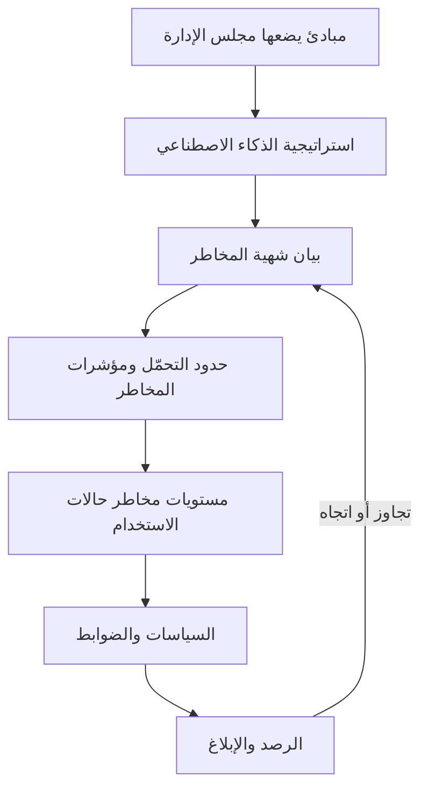
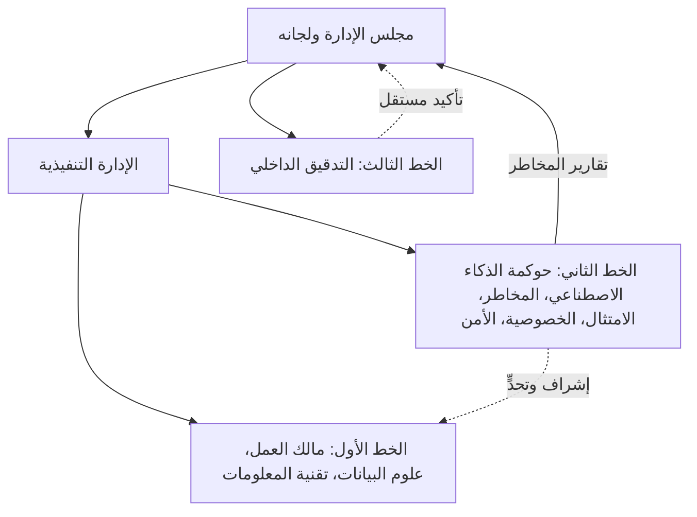

# الوحدة (Module) 2 — التوقعات المؤسسية (Organisational expectations)

*سياسة الذكاء الاصطناعي (AI policy) التي لا يملكها أحد مجرد أمنية. فقبل أن يستطيع بنك نجم (Najm Bank) حوكمة (governance) نموذج (model) واحد، عليه أن يقرر ما يؤمن به، وكم من مخاطر الذكاء الاصطناعي (AI risk) هو مستعد لتحمّله، ومن يقرر، ومن يتحقق، وهل يعرف موظفوه ما يكفي لاكتشاف المشكلات. تبني هذه الوحدة (Module) ذلك العمود الفقري المؤسسي (organisational spine). يحوّل الدرس (Lesson) 2.1 المبادئ (principles) إلى استراتيجية (strategy) وشهية مخاطر (risk appetite) ونموذج تشغيلي (operating model). ويعطي الدرس 2.2 كل دور (role) مهمته، من مجلس الإدارة (board) إلى التدقيق الداخلي (internal audit)، ويربطها في لجنة (committee) ومصفوفة RACI (RACI matrix) ومسار تصعيد (escalation path). ويغطي الدرس 2.3 واجب الإلمام بالذكاء الاصطناعي (AI literacy) في EU AI Act، والتدريب القائم على الأدوار (role-based training)، والثقافة (culture) التي تجعل الناس يتحدثون عن المشكلات. وطوال الوحدة، تبني ليلى، رئيسة حوكمة الذكاء الاصطناعي (Head of AI Governance) الجديدة في بنك نجم، الهيكل (structure) الذي كنت ستبنيه أنت. هذه الدورة تعليمية وليست استشارة قانونية (legal advice).*

> **التغطية من مجال المعرفة (BoK coverage):** I.B — تحديد ما تتوقعه المؤسسة من الذكاء الاصطناعي (AI) وإبلاغه: المبادئ (principles)، والاستراتيجية (strategy)، وشهية المخاطر (risk appetite)، والأدوار (roles) والمساءلة (accountability)، والتدريب والتوعية (training and awareness).

---

# 2.1 — من المبادئ (principles) إلى الاستراتيجية (strategy) وشهية المخاطر (risk appetite)
*المستوى: 🟡 متوسط (Intermediate)* · *المتطلبات (Prerequisites): 1.2، 1.3* · *مجال المعرفة (BoK): I.B*

## ⚡ الدرس في دقيقة (In 60 seconds)
- تبدأ حوكمة الذكاء الاصطناعي (AI governance) من القمة: **المبادئ (principles)** (ما نقدّره) تقود **استراتيجية الذكاء الاصطناعي (AI strategy)** (ما سنستخدم الذكاء الاصطناعي (AI) من أجله)، التي تحدّها **شهية المخاطر (risk appetite)** (مقدار مخاطر الذكاء الاصطناعي (AI risk) الذي نقبله) و**تحمّل المخاطر (risk tolerances)** (الحدود القابلة للقياس (measurable) من حولها).
- لا قيمة للمبادئ (principles) إلا بعد ترجمتها إلى التزامات يمكن لشخص ما اختبارها (commitments someone can test): "عادل" تصبح "نقيس فجوات معدلات الموافقة (approval-rate gaps) بين المجموعات قبل الإطلاق (launch) وشهريًا (monthly) بعده".
- يحدد مجلس الإدارة (board) شهية المخاطر (risk appetite)؛ وتحدد الإدارة التنفيذية (management) حدود التحمّل (tolerances) ومؤشرات المخاطر الرئيسية (key risk indicators)، ويراقبها خط الدفاع الثاني (second line).
- **النموذج التشغيلي (operating model)** (مركزي (centralised)، أو اتحادي (federated)، أو محوري وفرعي (hub-and-spoke)) هو الطريقة التي تنفّذ بها المؤسسة الاستراتيجية (strategy). الهيكل (structure) يتبع الاستراتيجية، لا العكس.
- إشارة الامتحان (Exam cue): الأسئلة التي تسأل "ما الذي يجب أن تفعله المؤسسة *أولًا*" تريد عادةً التزام القيادة (leadership commitment)، أو مبادئ محددة (defined principles)، أو شهية (appetite) واضحة، لا شراء أداة (tool purchase) أو نموذجًا (model) جديدًا.
- الفخ الأكبر (Biggest trap): معاملة قائمة منشورة من المبادئ الأخلاقية (published list of ethical principles) على أنها حوكمة (governance). فالمبادئ (principles) بلا مالكين (owners) ومقاييس (metrics) وعواقب مجرد تسويق.

## 🧭 لماذا يهم (Why it matters)
في أسبوعها الأول، تجد ليلى أربعة مشاريع ذكاء اصطناعي (AI projects) جارية في بنك نجم دون رؤية مشتركة (shared view) لسببها. فريق دانة يعيد بناء نموذج تقييم الجدارة الائتمانية (credit-scoring model) للموافقة على مزيد من قروض المنشآت الصغيرة والمتوسطة (SME loans). وخالد يريد روبوت محادثة (chatbot) لخدمة العملاء (customer service) يعمل قبل رمضان. والموارد البشرية (HR) اشتركت في أداة مورّد (vendor) لفرز السير الذاتية (CV screening). ومديرو العلاقات (relationship managers) يلصقون البيانات المالية (financials) للعملاء في أداة ذكاء اصطناعي توليدي عامة (public GenAI tool) لكتابة مسودات مذكرات الائتمان (draft credit memos). يعتقد كل فريق أنه يتصرف بمسؤولية. ولا يستطيع أيٌّ منهم أن يقول كم من المخاطر يرغب البنك في تحمّله في أيٍّ من ذلك، أو من وافق عليه.

ثم يحيل الرئيس التنفيذي (CEO) إلى ليلى سؤالًا من لجنة المخاطر في مجلس الإدارة (board risk committee): "ما شهيتنا لمخاطر الذكاء الاصطناعي (our AI risk appetite)؟". لا أحد يملك إجابة. للبنك شهية (appetite) مفصّلة لمخاطر الائتمان (حدود التركّز (concentration limits)، وسقوف نسبة القرض إلى القيمة (loan-to-value ceilings))، ولمخاطر السوق (market risk)، وللمخاطر التشغيلية (operational risk). والذكاء الاصطناعي (AI) يمسّ الثلاث كلها، لكنه غير مكتوب في أي مكان.

ومن دون خط يمتد من المبادئ (principles) إلى الاستراتيجية (strategy) إلى الشهية (appetite)، يُناقَش كل قرار يخص الذكاء الاصطناعي (AI) من الصفر، ويفوز صاحب الحجة التجارية الأعلى صوتًا (loudest business case).

## 📐 كيف يعمل (How it works)

### 🟢 الأساسيات (The essentials)

**تسلسل الحوكمة (governance cascade).** فكّر في حوكمة الذكاء الاصطناعي (AI governance) كسلسلة من الطبقات (layers)، كل منها أكثر تحديدًا من التي فوقها:

| الطبقة (Layer) | السؤال الذي تجيب عنه | من يملكها | مثال من بنك نجم |
|---|---|---|---|
| المبادئ (principles) | ما الذي نقدّره؟ | مجلس الإدارة (board) | "نعامل العملاء بعدالة ونستطيع تفسير القرارات التي تؤثر فيهم." |
| استراتيجية الذكاء الاصطناعي (AI strategy) | أين سيخلق الذكاء الاصطناعي (AI) قيمة، وأين لن نستخدمه؟ | اللجنة التنفيذية (executive committee) | "استخدم الذكاء الاصطناعي (AI) لتسريع قرارات ائتمان المنشآت الصغيرة والمتوسطة (SME credit) وكشف الاحتيال (fraud detection)؛ ولا رفض آليًا بالكامل (fully automated rejection) لائتمان الأفراد (retail credit)." |
| شهية المخاطر (risk appetite) | كم من مخاطر الذكاء الاصطناعي (AI risk) سنقبل سعيًا إلى تلك الاستراتيجية (strategy)؟ | مجلس الإدارة (board)، بمشورة إدارة المخاطر (risk management) | "شهية منخفضة (Low appetite) للذكاء الاصطناعي (AI) الذي قد يسبب معاملة غير عادلة (unfair treatment) للعملاء." |
| حدود تحمّل المخاطر والسقوف (Risk tolerances and limits) | ما الحدود القابلة للقياس (measurable) التي تُظهر أننا داخل الشهية (appetite)؟ | الإدارة التنفيذية (management)، ويراقبها خط الدفاع الثاني (second line) | "يجب أن تبقى نسبة معدل الموافقة (Approval-rate ratio) بين أي مجموعة محمية (protected group) والمجموعة المرجعية (reference group) فوق حدّ متفق عليه." |
| السياسات والإجراءات (policies and procedures) | ما الذي يجب أن يفعله الناس؟ | مالكو السياسات (Policy owners) | سياسة الذكاء الاصطناعي (AI policy)، وسياسة الاستخدام المقبول (acceptable-use policy)، وإجراء الاستقبال (الوحدة (Module) 3) |
| الضوابط والمقاييس (Controls and metrics) | كيف نتحقق من أن ذلك حدث؟ | خط الدفاع الأول (first line)، ويختبرها الخطان الثاني والثالث (second and third lines) | اختبار العدالة (fairness testing) قبل الإطلاق (launch)، وتقرير الرصد الشهري (monthly monitoring report) |

يجب أن تعود كل طبقة (layer) إلى التي فوقها. فالضابط (control) الذي لا يفسّره أي مبدأ بيروقراطية (bureaucracy)؛ والمبدأ (principle) الذي لا يختبره أي ضابط زينة (decoration).

**المبادئ (principles).** معظم المؤسسات لا تخترع مبادئ الذكاء الاصطناعي (AI principles) من العدم. بل تكيّف مجموعة معترفًا بها، ثم تضيف ما يخصها. والمصادر الشائعة هي:

- **OECD AI Principles** (اعتُمدت في 2019 وحُدّثت في مايو 2024): النمو الشامل والرفاه (inclusive growth and well-being)؛ واحترام سيادة القانون (rule of law) وحقوق الإنسان (human rights) والقيم الديمقراطية (democratic values) بما فيها العدالة (fairness) والخصوصية (privacy)؛ والشفافية (transparency) وقابلية التفسير (explainability)؛ والمتانة (robustness) والأمن (security) والسلامة (safety)؛ والمساءلة (accountability).
- **UNESCO Recommendation on the Ethics of AI** (2021)، مع تركيز قوي على حقوق الإنسان (human rights) والكرامة (dignity) والأثر البيئي (environmental impact).
- خصائص الجدارة بالثقة (trustworthiness characteristics) في **NIST AI RMF** (صالح وموثوق (valid and reliable)؛ آمن؛ مؤمَّن ومرن (secure and resilient)؛ خاضع للمساءلة وشفاف (accountable and transparent)؛ قابل للتفسير وقابل للفهم (explainable and interpretable)؛ معزِّز للخصوصية (privacy-enhanced)؛ عادل مع إدارة التحيّز الضار (fair with harmful bias managed)).
- البيانات الإقليمية (regional statements) مثل **SDAIA AI Ethics Principles** في المملكة العربية السعودية، والتوقعات القطاعية (sector expectations) مثل إرشادات مصرف قطر المركزي للذكاء الاصطناعي (Qatar Central Bank's AI guideline) الموجّهة للمؤسسات المالية (financial institutions).

اجعل المجموعة قصيرة، وبكلماتك أنت، مع سطر يوضح ما يعنيه كل بند عمليًا.

**الاستراتيجية (strategy).** تحدد استراتيجية الذكاء الاصطناعي (AI strategy) أين سيخدم الذكاء الاصطناعي (AI) أهداف العمل (business goals)، وما القدرات (capabilities) المطلوبة (البيانات (data)، والكفاءات (talent)، والمنصات (platforms)، والشركاء (partners))، وأين *لن* يُستخدم الذكاء الاصطناعي. وبالنسبة لبنك قطري، تُعدّ الاستراتيجية الوطنية للذكاء الاصطناعي (national AI strategy) في قطر وتوقعات المصرف المركزي (central bank) جزءًا من السياق (context).

**شهية المخاطر (risk appetite) مقابل تحمّل المخاطر (risk tolerance).** يظهر هذان المصطلحان باستمرار ويسهل الخلط بينهما:

- **شهية المخاطر (Risk appetite)** هي مقدار المخاطر ونوعها الذي تستعد المؤسسة لتحمّله أو الاحتفاظ به لتحقيق أهدافها. وهي عادةً نوعية (qualitative) ويحددها مجلس الإدارة (board): "منخفضة (Low)"، "متوسطة (Moderate)"، "مرتفعة (high)"، لكل فئة مخاطر (risk category).
- **تحمّل المخاطر (Risk tolerance)** هو التفاوت المقبول حول تلك الشهية (appetite)، معبَّرًا عنه بمصطلحات قابلة للقياس (measurable): حدود، وسقوف، ونقاط تفعيل (trigger points). ويستخدم NIST AI RMF مصطلح "تحمّل المخاطر" بمعنى استعداد المؤسسة لتحمّل المخاطر (the organisation's readiness to bear risk) من أجل تحقيق أهدافها، ويتوقع تحديده وتوثيقه لأنه يشكّل كل قرار لاحق في وظائف Map وMeasure وManage.
- **القدرة على تحمّل المخاطر (Risk capacity)** هي أقصى قدر من المخاطر تستطيع المؤسسة استيعابه قبل أن تنهار (تنظيميًا أو ماليًا أو من حيث السمعة). ويجب أن تقع الشهية (appetite) داخل القدرة (capacity) بهامش واسع.

### 🟡 التعمق أكثر (Going deeper)

**كتابة بيان شهية مخاطر الذكاء الاصطناعي (AI risk appetite statement).** البيان القابل للاستخدام يفعل ثلاثة أشياء لكل فئة مخاطر (risk category): يذكر مستوى الشهية (appetite level)، ويشرح المبررات، ويسمّي حدود التحمّل (tolerances) أو المؤشرات التي تُظهر هل البنك داخلها. ومخاطر الذكاء الاصطناعي (AI risk) ليست فئة واحدة. بل تتقاطع مع الفئات القائمة، لذا فأوضح نهج هو توسيع تصنيف المخاطر المؤسسية (enterprise risk taxonomy) بدلًا من إنشاء عالم موازٍ:

| فئة المخاطر (risk category) | الزاوية الخاصة بالذكاء الاصطناعي (AI) | الشهية (appetite) | مثال على حد تحمّل (tolerance) أو مؤشر مخاطر رئيسي (KRI) |
|---|---|---|---|
| السلوك والعدالة تجاه العملاء (Conduct and customer fairness) | قرارات تمييزية (Discriminatory decisions) أو غير قابلة للتفسير | منخفضة (Low) | لا قرار ذكاء اصطناعي (AI) عالي المخاطر (high-risk) بشأن العملاء دون مسار للمراجعة البشرية (human review)؛ ومقياس العدالة (fairness metric) ضمن نطاق متفق عليه |
| الامتثال التنظيمي (regulatory compliance) | EU AI Act، وGDPR، وPDPPL، وتوقعات QCB | منخفضة جدًا (Very low) | صفر أنظمة عالية المخاطر (high-risk) في الإنتاج دون استكمال المطابقة (conformity) أو فحوص المُشغِّل (deployer checks) |
| المرونة التشغيلية (Operational resilience) | إخفاق النموذج (Model failure)، والانجراف (drift)، وتعطل المورّد (vendor outage) | متوسطة (Moderate) | انخفاض أداء نموذج (model) حرج عن الحد لأكثر من X يومًا يستدعي التصعيد (escalation) |
| أمن المعلومات (information security) | حقن الأوامر (prompt injection)، وتسرّب البيانات (data leakage) إلى الذكاء الاصطناعي التوليدي (GenAI) | منخفضة (Low) | لا بيانات سرية (confidential data) في أدوات ذكاء اصطناعي توليدي (GenAI tools) غير معتمدة؛ ومراجعة تنبيهات منع فقدان البيانات (DLP) أسبوعيًا |
| الاستراتيجية والابتكار (Strategic and innovation) | التخلف عن المنافسين (Falling behind competitors) | متوسطة إلى مرتفعة (Moderate to high) | يمكن لحالات استخدام الإنتاجية الداخلية (internal productivity use cases) منخفضة المخاطر (low-risk) المضي في مسار خفيف (light-touch track) |

لاحظ أن الشهية (appetite) ليست منخفضة (Low) بشكل موحّد (فانعدام الشهية (zero appetite) لكل مخاطر الذكاء الاصطناعي (AI risk) يعني عدم استخدامه)، وأن "X" في حد التحمّل (tolerance) تحددها الإدارة بالبيانات (data). وتحرص ليلى على أن يكون الرقم موجودًا، وله مالك (owner)، ويُبلَّغ عنه.

**من الشهية (appetite) إلى مستويات حالات الاستخدام (use-case tiers).** تصبح الشهية عملية عبر تصنيف المخاطر في مستويات (risk tiering): تُصنَّف كل حالة استخدام (use case) مقترحة (مثلًا منخفضة (Low)، ومتوسطة (Moderate)، ومرتفعة (high)، ومحظورة)، ويحصل كل مستوى على ضوابط متناسبة (proportionate controls). فأداة ذكاء اصطناعي توليدي (GenAI tool) تكتب مسودات محاضر الاجتماعات الداخلية (internal meeting notes) تقع في مستوى منخفض (low tier) مع مراجعة خفيفة. أما نموذج تقييم الجدارة الائتمانية (credit-scoring model) فيقع في مستوى مرتفع (high tier) مع تحقق مستقل (independent validation)، وتقييم الأثر على حماية البيانات (data protection impact assessment)، وتقييم الأثر على الحقوق الأساسية (fundamental rights impact assessment) لعملاء الاتحاد الأوروبي (EU)، وموافقة اللجنة (committee approval). وبيان الشهية (appetite statement) هو ما يبرر هذا الفرق. وتبني الوحدة (Module) 8 عملية الاستقبال والتصنيف (intake and tiering process) الكاملة.

**اختيار النموذج التشغيلي (operating model).** يحدد النموذج التشغيلي (the operating model) أين تقع خبرة حوكمة الذكاء الاصطناعي (AI governance expertise) وصلاحيات القرار (decision rights). وهناك ثلاثة أنماط شائعة:

| النموذج (model) | كيف يعمل (How it works) | نقاط القوة (Strengths) | نقاط الضعف (Weaknesses) | يناسب عندما (Fits when) |
|---|---|---|---|---|
| مركزي (centralised) | فريق مركزي (centralised) واحد (غالبًا في المخاطر أو الامتثال (compliance) أو مكتب رئيس البيانات (CDO office)) يراجع كل الذكاء الاصطناعي (AI) ويعتمده | الاتساق (consistency)، ووضوح المساءلة (clear accountability)، وتجميع الخبراء النادرين | عنق زجاجة (bottleneck)؛ والبعد عن العمل (distance from the business)؛ وثقافة "الحوكمة (governance) تقول لا" | النضج المبكر (Early maturity)، وقلة حالات الاستخدام (use cases)، والتنظيم المشدد (heavily regulated) |
| اتحادي (لامركزي) (Federated, decentralised) | كل وحدة عمل (business unit) تحكم ذكاءها الاصطناعي (its AI) وفق معايير دنيا مشتركة (common minimum standards) | السرعة، والسياق (context)، والملكية (ownership) | عدم الاتساق (Inconsistency)؛ وانحراف المعايير (standards drift)؛ وصعوبة الحصول على رؤية مؤسسية (enterprise view) | المجموعات الكبيرة المتنوعة ذات وظائف مخاطر محلية (local risk functions) قوية |
| محوري وفرعي (هجين) (Hub-and-spoke, hybrid) | يحدد مركز محوري (central hub) السياسة (policy) والمنهجيات والأدوات والسجل (inventory)؛ وتطبّقها "فروع (spokes)" مدمجة (أبطال مخاطر الذكاء الاصطناعي (AI risk champions)) في كل وحدة | توازن بين الاتساق (consistency) والسرعة؛ وقابل للتوسع (scales) | يحتاج إلى صلاحيات قرار واضحة (Clear decision rights) بين المركز والفروع (hub and spokes)؛ وقد يعاني الأبطال (champions) من نقص الموارد (under-resourced) | معظم المؤسسات المتوسطة والكبيرة حين يتنامى استخدام الذكاء الاصطناعي (AI) |

سيبدأ بنك نجم بنموذج (model) مركزي (centralised) ريثما يُبنى السجل (inventory)، ثم ينتقل إلى النموذج المحوري والفرعي (hub-and-spoke model) مع أبطال (champions) في كل خط أعمال (business line).

```mermaid
flowchart TD
    A[مبادئ يضعها مجلس الإدارة] --> B[استراتيجية الذكاء الاصطناعي]
    B --> C[بيان شهية المخاطر]
    C --> D[حدود التحمّل ومؤشرات المخاطر]
    D --> E[مستويات مخاطر حالات الاستخدام]
    E --> F[السياسات والضوابط]
    F --> G[الرصد والإبلاغ]
    G -->|تجاوز أو اتجاه| C
```

الحلقة (loop) في الأسفل مهمة: فنتائج الرصد (monitoring) تعود إلى مجلس الإدارة (board)، الذي قد يشدد الشهية (appetite) أو يخففها.

### 🔴 نظرة الخبير (Expert view)

**المبادئ تتعارض (Principles conflict)، والحوكمة (governance) هي طريقة حل التعارضات (resolve conflicts).** قد تتعارض قابلية التفسير (explainability) مع الدقة (accuracy). وقد تتعارض الخصوصية (تقليل البيانات (minimising data)) مع اختبار العدالة (الذي قد يحتاج إلى سمات حساسة (sensitive attributes)). والسرعة إلى السوق (Speed to market) تتعارض مع عمق التحقق (validation depth). والبرامج الناضجة (Mature programmes) لا تتظاهر بزوال هذه التوترات (tensions). بل تسمّيها، وتضع قاعدة افتراضية ("حين تتعارض الدقة وقابلية التفسير في قرارات ائتمان العملاء، تفوز قابلية التفسير ما لم تعتمد اللجنة (committee) خلاف ذلك")، وتسجّل القرارات لتبقى متسقة مع الوقت. ويحب الامتحان السيناريوهات التي يتصادم فيها مبدآن (two principles) جيدان؛ وأفضل إجابة (best answer) عادةً توثّق المفاضلة (trade-off) وتحيلها إلى صاحب القرار المسؤول (accountable decision-maker) بدلًا من اختيار أحدهما بصمت.

**الحوكمة على مستوى مجلس الإدارة (Board-level governance).** يقدّم **ISO/IEC 38507** إرشادات (guidance) لهيئات الحوكمة (مجالس الإدارة (boards)) بشأن تبعات استخدام الذكاء الاصطناعي (AI): فهي تبقى مسؤولة (accountable) عن استخدام المؤسسة للذكاء الاصطناعي، حتى حين تُفوَّض القرارات أو تُؤتمت، وينبغي أن تشرف على السياسات (policies) وشهية المخاطر (risk appetite) والثقافة (culture) التي تشكّل ذلك الاستخدام. ويضع **ISO/IEC 42001** الفكرة نفسها في نظام إدارة (management system) قابل للاعتماد (certifiable): يجب أن تُظهر الإدارة العليا (top management) القيادة والالتزام (leadership and commitment)، وأن تضع سياسة للذكاء الاصطناعي (AI policy) تلائم غرض المؤسسة وتوفّر إطارًا (framework) لأهداف الذكاء الاصطناعي، وأن تسند الأدوار والمسؤوليات (roles and responsibilities) والصلاحيات (authorities). وبالمثل تتوقع وظيفة Govern في NIST AI RMF أن تتحمل القيادة العليا المسؤولية (responsibility) عن القرارات المتعلقة بالمخاطر المرتبطة بتطوير الذكاء الاصطناعي ونشره.

**الدمج خير من الاختراع (Integration beats invention).** تدير البنوك أصلًا برامج للمخاطر المؤسسية (enterprise risk programmes)، ومخاطر النماذج (model risk)، ومخاطر الأطراف الثالثة (third-party risk)، والخصوصية (privacy)، وأمن المعلومات (information security). والحوكمة الفعّالة (effective governance) للذكاء الاصطناعي (AI) توسّعها بدلًا من بناء جزيرة معزولة (Building a silo): تنضم مخاطر الذكاء الاصطناعي (AI risk) إلى تصنيف المخاطر (risk taxonomy)، وتنضم نماذج الذكاء الاصطناعي (AI models) إلى سجل النماذج (model inventory)، ويمر مورّدو الذكاء الاصطناعي (AI vendors) بإجراءات الإسناد الخارجي (outsourcing) مع أسئلة إضافية خاصة بالذكاء الاصطناعي. ويبني **ISO/IEC 23894** (إرشادات إدارة مخاطر الذكاء الاصطناعي (AI risk management guidance)) على ISO 31000، وهذا يساعد. أما الإطار المنفصل (separate framework) الذي لا يربطه أحد بتقارير المخاطر المؤسسية (enterprise risk reporting) فيميل إلى الموت حين يغادر راعيه (its sponsor).

**التنظيم يشكّل الشهية (Regulation shapes appetite) لكنه لا يحل محلها.** القانون يضع حدًا أدنى (floor). ويمكن أن تكون الشهية (appetite) أشد من القانون، ولا يمكن أبدًا أن تكون أخف. والمجموعة العاملة في الاتحاد الأوروبي (EU) ودول الخليج كثيرًا ما تضع شهية موحدة (group-wide appetite) على مستوى المجموعة للاستخدامات عالية المخاطر (high-risk) عند أشد مستوى ذي صلة، ولا تسمح إلا بتفاوت محلي معتمد (approved local variation).

## ⚖️ الأدوات التنظيمية (The instruments)
| الأداة | ما تشترطه أو توصي به (What it requires or recommends) | إشارة الامتحان (Exam cue) |
|---|---|---|
| **OECD AI Principles** | خمسة مبادئ قائمة على القيم (values-based principles) للذكاء الاصطناعي الجدير بالثقة (حُدّثت في مايو 2024) إضافة إلى توصيات للحكومات (recommendations to governments) | الأساس الدولي (international baseline) الأوسع اعتمادًا؛ والمصدر الذي تكيّفه مجموعات مبادئ مؤسسية (corporate principle sets) كثيرة |
| **UNESCO Recommendation on the Ethics of AI** | إطار أخلاقي عالمي (2021) يتمحور حول حقوق الإنسان (human rights) والكرامة (dignity) والتنوع (diversity) والبيئة | قانون مرن (Soft law) اعتمدته الدول الأعضاء (member states) في UNESCO؛ غير ملزم (not binding) للشركات |
| **NIST AI RMF** — وظيفة Govern | مساءلة القيادة (Leadership accountability)، وتحمّل مخاطر موثّق (documented risk tolerance)، والسياسات (policies) والثقافة (culture) أساسًا لوظائف (functions) Map وMeasure وManage | Govern وظيفة شاملة (cross-cutting)؛ وتحمّل المخاطر (risk tolerance) قرار مؤسسي (organisational decision) لا يحدده الإطار (framework) نيابة عنك |
| **ISO/IEC 42001** — البند 5 القيادة (Clause 5 Leadership) | التزام الإدارة العليا (Top management commitment)، وسياسة للذكاء الاصطناعي (AI policy)، وأدوار (roles) ومسؤوليات (responsibilities) وصلاحيات مسندة | معيار نظام إدارة (management-system standard) قابل للاعتماد (certifiable)؛ ويجب أن تُظهر "الإدارة العليا (top management)" التزامها |
| **ISO/IEC 38507** | إرشادات (guidance) لهيئات الحوكمة (governing bodies) بشأن التبعات الحوكمية (governance implications) لاستخدام الذكاء الاصطناعي (AI) | يبقى مجلس الإدارة (board) مسؤولًا (accountable) حتى حين يقرر الذكاء الاصطناعي (AI) |
| **ISO/IEC 23894** | إرشادات إدارة مخاطر الذكاء الاصطناعي (AI risk management guidance) المبنية على ISO 31000 | ادمج مخاطر الذكاء الاصطناعي (AI risk) في إدارة المخاطر المؤسسية (enterprise risk management) القائمة |
| **SDAIA AI Ethics Principles** | مبادئ أخلاقيات الذكاء الاصطناعي الوطنية السعودية (Saudi national AI ethics principles) للجهات التي تطوّر الذكاء الاصطناعي (AI) أو تستخدمه | مثال على إطار مبادئ خليجي (GCC principles framework)؛ تحقق من النص الرسمي (official text) الحالي |

## 🏛️ عمليًا في بنك نجم (In practice at Najm Bank)
تصوغ ليلى، وتعتمد لجنة المخاطر في مجلس الإدارة (board risk committee)، أول **بيان لمبادئ الذكاء الاصطناعي وشهية المخاطر (AI Principles and Risk Appetite Statement)**. وهذا مقتطف منه:

> **مبادئ الذكاء الاصطناعي في بنك نجم (الإصدار (version) 1.0)**
> 1. **المعاملة العادلة (Fair treatment).** يجب ألا ينتج الذكاء الاصطناعي (AI) فروقًا غير مبررة في النتائج للعملاء أو الموظفين. *عمليًا:* يُختبر الذكاء الاصطناعي الموجّه للعملاء بحثًا عن نتائج متفاوتة (disparate outcomes) قبل الإطلاق (launch) ويُراقَب بعده.
> 2. **قابلية التفسير (explainability).** القرارات التي تؤثر تأثيرًا كبيرًا في شخص يمكن تفسيرها له بلغة بسيطة. *عمليًا:* تحمل قرارات الائتمان (credit decisions) رموز أسباب (reason codes) يستطيع مدير العلاقة (relationship manager) قراءتها بصوت عالٍ.
> 3. **المساءلة البشرية (Human accountability).** لكل نظام ذكاء اصطناعي (AI system) شخص مسمّى يملكه، ولا يملك أي نظام ذكاء اصطناعي (AI) الكلمة الأخيرة في رفض ائتمان عميل من الأفراد. *عمليًا:* لكل نظام في السجل (inventory) مالك عمل مسؤول (accountable business owner).
> 4. **الخصوصية والأمن (Privacy and security).** يستخدم الذكاء الاصطناعي (AI) الحد الأدنى الضروري من البيانات الشخصية (personal data) ويُحمى كأي نظام حرج (critical system). *عمليًا:* فحص أولي (screen) لتقييم الأثر على حماية البيانات (DPIA) جزء من الاستقبال (intake).
> 5. **الموثوقية (Reliability).** يُتحقق من الذكاء الاصطناعي (AI) قبل الاستخدام ويُراقَب أثناءه. *عمليًا:* تخضع النماذج من المستوى المرتفع (high-tier models) لتحقق مستقل (independent validation).

> **شهية مخاطر الذكاء الاصطناعي (مقتطف)**
>
> | الفئة | الشهية (appetite) | حد التحمّل / مؤشر المخاطر الرئيسي (Tolerance / KRI) | المالك (owner) | يُرفع إلى (Reported to) |
> |---|---|---|---|---|
> | العدالة تجاه العملاء (Customer fairness) | منخفضة (Low) | مقاييس العدالة (fairness metrics) ضمن النطاقات المتفق عليها لكل نماذج المستوى المرتفع (high-tier models)؛ وأي تجاوز (any breach) يُصعَّد خلال 5 أيام عمل (working days) | رئيس إقراض الأفراد (خالد) لنماذج الائتمان (credit models) | لجنة حوكمة الذكاء الاصطناعي (AI Governance Committee) شهريًا (monthly)؛ ولجنة المخاطر في مجلس الإدارة (board risk committee) ربع سنويًا (quarterly) |
> | التنظيمية | منخفضة جدًا (Very low) | 100% من أنظمة المستوى المرتفع (high-tier systems) استكملت تقييمات الأثر (impact assessments) قبل الإطلاق (launch) | رئيسة حوكمة الذكاء الاصطناعي (ليلى) | لجنة المخاطر في مجلس الإدارة (board risk committee) ربع سنويًا (quarterly) |
> | تسرّب البيانات عبر الذكاء الاصطناعي التوليدي (Data leakage via GenAI) | منخفضة (Low) | صفر حوادث (incidents) مؤكدة لوجود بيانات العملاء (customer data) في أدوات غير معتمدة؛ وفرز تنبيهات DLP خلال يومي عمل (2 working days) | CISO | لجنة حوكمة الذكاء الاصطناعي (AI Governance Committee) شهريًا (monthly) |
> | الابتكار (innovation) | متوسطة (Moderate) | البت في حالات الاستخدام منخفضة المستوى (Low-tier use cases) خلال 10 أيام عمل (working days) من اكتمال الاستقبال (intake) | رئيسة حوكمة الذكاء الاصطناعي (Head of AI Governance) | اللجنة التنفيذية (executive committee) ربع سنويًا (quarterly) |

*قرار النموذج التشغيلي (Operating model decision):* مراجعة مركزية (centralised review) في السنة الأولى؛ ثم نموذج محوري وفرعي (hub-and-spoke model) مع أبطال مخاطر ذكاء اصطناعي (AI risk champions) مسمّين ابتداءً من الشهر الثاني عشر، رهنًا بمراجعة اللجنة (committee) لأحجام الاستقبال (intake volumes).

## 🛠️ التمارين (Exercises)

### 🟢 مبتدئ (Beginner)
خذ مبادئ OECD الخمسة القائمة على القيم (five OECD values-based principles) وأعِد كتابة كل منها في صورة التزام من سطر واحد (one-line commitment) لمؤسسة تعرفها، مع جملة "عمليًا" واحدة لكل منها.
*يكتمل عندما (Done when):* يكون لكل مبدأ (principle) التزام يستطيع شخص ما اختباره أو تدقيقه.

### 🟡 متوسط (Intermediate)
صُغ جدول شهية مخاطر الذكاء الاصطناعي (AI risk appetite table) لروبوت محادثة خدمة العملاء (customer-service chatbot) في بنك نجم يغطي أربع فئات مخاطر (risk categories) على الأقل، مع مستوى شهية (appetite level)، وحد تحمّل (tolerance) واحد أو مؤشر مخاطر رئيسي (key risk indicator)، ومالك (owner) لكل منها.
*يكتمل عندما (Done when):* يكون لكل صف حد تحمّل (tolerance) قابل للقياس (measurable) ودور (role) مسمّى، وتكون لفئة واحدة على الأقل شهية متوسطة (لا منخفضة (Low)) مع تبرير.

### 🔴 متقدم (Advanced)
يريد قسم الخدمات المصرفية للشركات (corporate banking) في بنك نجم أن يدير حوكمة الذكاء الاصطناعي (AI governance) الخاصة به لأن "المركز بطيء جدًا". اكتب توصية من صفحة واحدة (one-page recommendation) للراعي التنفيذي (executive sponsor) تقارن بين النماذج المركزي والاتحادي والمحوري والفرعي (centralised, federated and hub-and-spoke) لبنك نجم، واقترح صلاحيات القرار (decision rights) بين المركز والفروع (hub and spokes).
*يكتمل عندما (Done when):* تسمّي التوصية (recommendation) ما يحتفظ به المركز (السياسة (policy)، والسجل (inventory)، واعتمادات المستوى المرتفع (high-tier approvals))، وما تستطيع الفروع (spokes) البت فيه، وكيف يظل مجلس الإدارة (board) يحصل على رؤية مؤسسية (enterprise view) واحدة.

## ⚠️ أخطاء وفخاخ الامتحان (Mistakes and exam traps)
- **المبادئ كخط نهاية (Principles as the finish line).** نشر المبادئ (Publishing principles) هو البداية. وخيارات الإجابة (Answer options) التي تتوقف عند "نشر المبادئ الأخلاقية (ethical principles)" نادرًا ما تكون الأفضل حين يضيف خيار آخر الملكية (ownership) أو المقاييس (metrics) أو الضوابط (controls).
- **الخلط بين الشهية والتحمّل (Confusing appetite and tolerance).** الشهية (appetite) هي "كم من المخاطر نريد" بصيغة نوعية (qualitative)؛ والتحمّل (tolerance) هو الحد القابل للقياس. يحدد مجلس الإدارة (board) الشهية؛ وتحدد الإدارة التنفيذية (management) حدود التحمّل (tolerances) وتراقبها.
- **انعدام الشهية في كل مكان (Zero appetite everywhere).** إعلان عدم التسامح مطلقًا (zero tolerance) مع أي مخاطر للذكاء الاصطناعي (AI) يبدو آمنًا لكنه يمنع كل استخدام أو، وهو الأسوأ، يدفعه إلى الخفاء (الذكاء الاصطناعي الخفي (shadow AI)). توقّع إجابات تفضّل النهج المتناسب القائم على المخاطر (proportionate, risk-based approaches).
- **الأداة قبل الاستراتيجية (Tool before strategy).** شراء منصة لحوكمة الذكاء الاصطناعي (AI governance platform) قبل تحديد المبادئ (principles) والشهية (appetite) والملكية (ownership) "خطوة أولى (first step)" خاطئة كلاسيكية.
- **بناء جزيرة معزولة (Building a silo).** معاملة مخاطر الذكاء الاصطناعي (AI risk) بمعزل عن أطر المخاطر المؤسسية (enterprise risk frameworks) ومخاطر النماذج (model risk) والخصوصية (privacy) والأطراف الثالثة تخلق فجوات (gaps) وازدواجية (duplication)؛ والدمج (integration) هو الإجابة الأفضل (the better answer) عادةً.
- **القانون كسقف (Law as the ceiling).** المتطلبات القانونية (Legal requirements) هي الحد الأدنى. ويجوز للمؤسسة وضع قواعد داخلية (internal rules) أشد؛ ولا يجوز لها أبدًا وضع قواعد أخف.

## 🧾 الخلاصة (Recap)
- يسير التسلسل (cascade) من المبادئ (principles) ← الاستراتيجية (strategy) ← شهية المخاطر (risk appetite) ← حدود التحمّل (tolerances) ← المستويات (tiers) ← السياسات (policies) ← الضوابط (controls) ← الرصد (monitoring)، مع إعادة النتائج إلى مجلس الإدارة (board).
- كيّف المبادئ المعترف بها (OECD، وUNESCO، وخصائص NIST (NIST characteristics)، والمبادئ الإقليمية (regional ones)) وترجم كلًّا منها إلى التزامات قابلة للاختبار (testable commitments).
- الشهية (appetite) نوعية (qualitative) ويملكها مجلس الإدارة (board)؛ والتحمّل (tolerance) قابل للقياس (measurable) وتملكه الإدارة التنفيذية (management)؛ وكلاهما يقع داخل القدرة على تحمّل المخاطر (risk capacity).
- النماذج التشغيلية المركزية والاتحادية والمحورية الفرعية (Centralised, federated and hub-and-spoke operating models) تفاضل بين الاتساق (consistency) والسرعة؛ والنموذج المحوري الفرعي (hub-and-spoke model) هو الوجهة الشائعة (common destination) مع توسّع استخدام الذكاء الاصطناعي (AI).
- تبقى مجالس الإدارة (boards) مسؤولة (accountable) عن الذكاء الاصطناعي (ISO/IEC 38507)؛ ويضع كلٌّ من ISO/IEC 42001 وNIST AI RMF التزام القيادة (leadership commitment) أولًا.

## ✍️ اختبر نفسك (Check yourself)

**1. اعتمد مجلس إدارة بنك نجم مبادئ الذكاء الاصطناعي (AI principles). أي خطوة تحوّل مبدأ (principle) "العدالة (fairness)" إلى حوكمة (governance) على أفضل وجه؟**

- A. نشر المبادئ (Publishing principles) على الموقع الإلكتروني (website) للبنك
- B. تحديد مقياس (metric) للعدالة (fairness)، ونطاق تحمّل (tolerance band)، ومالك (owner) يبلّغ لجنة حوكمة الذكاء الاصطناعي (AI Governance Committee) بالتجاوزات (breaches)
- C. مطالبة علماء البيانات (data scientists) "بمراعاة العدالة (fairness)"
- D. إضافة كلمة "عادل" إلى اسم كل نموذج (model) في السجل (inventory)

الإجابة (Answer)

**B.** تحتاج الحوكمة (governance) إلى التزامات قابلة للقياس (measurable commitments) مع مالكين (owners) وتصعيد (escalation). أما A فتواصل لا ضابط (control)؛ وC بلا مقياس (metric) ولا مساءلة (accountability). (انظر 🟢 الأساسيات (The essentials) و🏛️ عمليًا.)

**2. أي عبارة تصف الفرق بين شهية المخاطر (risk appetite) وتحمّل المخاطر (risk tolerance) على أفضل وجه؟**

- A. يحدد علماء البيانات (data scientists) الشهية (appetite)؛ ويحدد مجلس الإدارة (board) التحمّل
- B. هما مترادفان يُستخدمان بالتبادل في NIST AI RMF
- C. الشهية (appetite) هي المقدار والنوع العامّان للمخاطر التي ستقبلها المؤسسة؛ والتحمّل (tolerance) هو الحدود القابلة للقياس (measurable) التي تُظهر هل هي داخل تلك الشهية
- D. التحمّل هو أقصى قدر من المخاطر تستطيع المؤسسة استيعابه قبل أن تنهار

الإجابة (Answer)

**C.** الشهية (appetite) هي الموقف النوعي (qualitative position) على مستوى مجلس الإدارة (board)؛ وحدود التحمّل (tolerances) هي الحدود القابلة للقياس (measurable). أما D فيصف القدرة على تحمّل المخاطر (risk capacity)، وهو مشتِّت (distractor) شائع. (انظر 🟢 الأساسيات (The essentials).)

**3. لدى شركة تأمين (insurer) سريعة النمو 60 حالة استخدام (use case) للذكاء الاصطناعي (AI) عبر خمس وحدات عمل (business units). ولدى فريق المراجعة المركزي (central AI review team) للذكاء الاصطناعي تراكم أعمال (backlog) لثلاثة أشهر، وبدأت الوحدات تتجاوزه. أي تغيير في النموذج التشغيلي (operating model) هو الأنسب؟**

- A. الانتقال إلى النموذج المحوري والفرعي (hub-and-spoke model): إبقاء السياسة (policy) والسجل (inventory) واعتمادات الحالات عالية المخاطر (high-risk) مركزية (centralised)، ودمج أبطال (champions) مدرَّبين في كل وحدة للتعامل مع المراجعات الأقل مخاطر (lower-risk)
- B. إيقاف كل مشاريع الذكاء الاصطناعي (AI) حتى يُصفّى التراكم (backlog)
- C. السماح لكل وحدة بوضع معاييرها الخاصة للذكاء الاصطناعي (AI) باستقلال
- D. إسناد كل اعتمادات الذكاء الاصطناعي (AI) إلى شركة استشارات خارجية (external consultancy)

الإجابة (Answer)

**A.** يحافظ النموذج المحوري والفرعي (hub-and-spoke model) على الاتساق (consistency) والرؤية المؤسسية (enterprise visibility) مع إضافة طاقة قريبة من العمل. أما C فنموذج (model) اتحادي (federated) بالكامل دون معايير (standards) مشتركة، فيفقد الاتساق؛ وB يدفع نحو الذكاء الاصطناعي الخفي (shadow AI). (انظر 🟡 التعمق أكثر (Going deeper)، النماذج التشغيلية (operating models).)

**4. بموجب ISO/IEC 38507، من يبقى مسؤولًا (accountable) عن استخدام المؤسسة للذكاء الاصطناعي (AI) حين تُفوَّض القرارات إلى أنظمة الذكاء الاصطناعي (AI systems)؟**

- A. مورّد الذكاء الاصطناعي (AI vendor)
- B. فريق علوم البيانات (data science team) الذي بنى النموذج (model)
- C. لا أحد، لأن القرار آلي
- D. هيئة الحوكمة (مجلس الإدارة (board))

الإجابة (Answer)

**D.** يخاطب ISO/IEC 38507 هيئات الحوكمة (governing bodies)، والفكرة أن المساءلة (accountability) لا تُفوَّض إلى الآلة (machine) أو المورّد (vendor). (انظر 🔴 نظرة الخبير (Expert view).)

**5. يقول فريق النماذج (model team) في بنك نجم إن تفسير قرارات نموذج الائتمان (credit model) الجديد سيكلّف نقطتين من الدقة (accuracy). والمبادئ (principles) تقدّر الدقة وقابلية التفسير (explainability) كلتيهما. ما أفضل استجابة حوكمية (governance response)؟**

- A. اختيار النموذج الأدق (most accurate model) دائمًا؛ فقابلية التفسير (explainability) اختيارية
- B. ترك فريق علوم البيانات (data science team) يقرر بشكل غير رسمي
- C. التخلي عن النموذج (model)
- D. توثيق المفاضلة (trade-off) وتطبيق القاعدة الافتراضية (default) المعلنة للبنك أو إحالتها إلى صاحب القرار المسؤول (accountable decision-maker)، مع تسجيل القرار

الإجابة (Answer)

**D.** المبادئ تتعارض (Principles conflict)؛ والحوكمة (governance) تحل التعارضات (conflicts) بشفافية واتساق عبر القواعد الافتراضية (defaults) والقرارات الخاضعة للمساءلة (accountability). أما A وB فيتخطيان المساءلة؛ وC رد فعل مبالغ فيه. (انظر 🔴 نظرة الخبير (Expert view).)

## 📚 المراجع (References)
- OECD AI Principles: https://oecd.ai/en/ai-principles
- UNESCO، توصية (recommendation) بشأن أخلاقيات الذكاء الاصطناعي (AI): https://www.unesco.org/en/artificial-intelligence/recommendation-ethics
- إطار NIST لإدارة مخاطر الذكاء الاصطناعي (NIST AI Risk Management Framework): https://www.nist.gov/itl/ai-risk-management-framework
- ISO/IEC 42001:2023 نظام إدارة الذكاء الاصطناعي (AI management system): https://www.iso.org/standard/81230.html
- ISO/IEC JTC 1/SC 42 (اللجنة (committee) المسؤولة عن ISO/IEC 38507 و23894 ومجموعة معايير الذكاء الاصطناعي (AI standards family)): https://www.iso.org/committee/6794475.html
- SDAIA (الهيئة السعودية للبيانات والذكاء الاصطناعي (Saudi Data and AI Authority)): https://sdaia.gov.sa/
- مصرف قطر المركزي (Qatar Central Bank): https://www.qcb.gov.qa/
- شهادة AIGP (AIGP certification) من IAPP ومجال المعرفة (Body of Knowledge): https://iapp.org/certify/aigp/

---

# 2.2 — الأدوار (roles) والمساءلة (accountability) ولجنة حوكمة الذكاء الاصطناعي (AI Governance Committee)
*المستوى: 🟡 متوسط (Intermediate)* · *المتطلبات (Prerequisites): 2.1* · *مجال المعرفة (BoK): I.B*

## ⚡ الدرس في دقيقة (In 60 seconds)
- يحتاج كل نظام ذكاء اصطناعي (AI system) إلى **مالك مسؤول (accountable owner)** واحد في جهة العمل (the business)، لا في تقنية المعلومات (IT) أو علوم البيانات (data science). وأدوار الحوكمة (governance roles) تدعم هذا المالك (owner)؛ ولا تحل محله.
- يفصل **نموذج الخطوط الثلاثة (three lines model)** بين التنفيذ (الخط الأول (first line): جهة العمل (the business)، وعلوم البيانات (data science)، وتقنية المعلومات (IT))، والإشراف (الخط الثاني (second line): المخاطر، والامتثال (compliance)، والخصوصية (privacy)، وحوكمة الذكاء الاصطناعي (AI governance))، والتأكيد المستقل (الخط الثالث (third line): التدقيق الداخلي (internal audit))، وكلها ترفع تقاريرها إلى هيئة الحوكمة (governing body).
- **لجنة حوكمة الذكاء الاصطناعي (AI governance committee)** متعددة التخصصات (cross-functional)، ولها ميثاق مكتوب (written charter)، وصلاحيات قرار (decision rights)، ومسار تصعيد (escalation path) إلى مجلس الإدارة (board). إنها تقرر؛ ولا تكتفي بالنقاش.
- مصفوفة **RACI** (المنفِّذ Responsible، والمسؤول Accountable، والمُستشار Consulted، والمُبلَّغ Informed) تجعل الأدوار (roles) ملموسة لكل خطوة في دورة الحياة (life cycle). "A" واحدة بالضبط لكل نشاط.
- إشارة الامتحان (Exam cue): حين يسأل سيناريو عمن ينبغي أن يملك خطرًا من مخاطر الذكاء الاصطناعي (AI risk)، اختر مالك العمل (business owner) لحالة الاستخدام (use case)؛ وحين يسأل عمن يقدّم التأكيد المستقل (independent assurance)، اختر التدقيق الداخلي (internal audit).
- الفخ الأكبر (Biggest trap): جعل فريق الحوكمة (أو اللجنة (committee)) مسؤولًا (accountable) عن كل نتيجة للذكاء الاصطناعي (AI). فذلك يشتّت الملكية (ownership) ويحوّل الحوكمة (governance) إلى عنق زجاجة (bottleneck).

## 🧭 لماذا يهم (Why it matters)
أُطلق روبوت محادثة خدمة العملاء (customer-service chatbot) في بنك نجم (Najm Bank) يوم خميس. وبحلول الأحد كان قد أخبر ثلاثة عملاء بأن رسوم التأخر في السداد (late-payment fee) ستُعفى، وهي لن تُعفى. ونشر أحد العملاء لقطة الشاشة (screenshot). وكان السؤال في اجتماع الأزمة (crisis meeting) يوم الاثنين بسيطًا: "من يملك هذا؟". قالت دانة إن فريقها أجرى الضبط الدقيق (fine-tuning) للنموذج (model) فقط. وقالت تقنية المعلومات (IT) إنها استضافته فقط. وأشار المورّد (vendor) إلى شروط الخدمة (terms of service) الخاصة به. وقال خالد إنه لم يعتمد الطلب (prompt) النهائي قط. وكان التسويق (marketing) قد كتب رسالة الترحيب (welcome message). الجميع لمسه؛ ولم يملكه أحد.

واجهت محكمة في كندا السؤال نفسه في قضية *Moffatt v. Air Canada* (2024). فقد أعطى روبوت المحادثة (chatbot) الخاص بشركة الطيران عميلًا معلومات خاطئة عن أسعار السفر في حالات الوفاة (bereavement fares). وجادلت الشركة، في جوهر الأمر، بأن روبوت المحادثة مسؤول عن تصريحاته. رفضت المحكمة (tribunal) ذلك وحمّلت الشركة المسؤولية (responsibility): فالمؤسسة مسؤولة (accountable) عن كل المعلومات على موقعها، سواء جاءت من صفحة ثابتة (static page) أو من روبوت محادثة. وقعت المسؤولية القانونية (liability) على المؤسسة. أما داخليًا، فيحتاج بنك نجم إلى معرفة أي *شخص* يحملها، قبل الحادثة (incident) التالية لا بعدها.

## 📐 كيف يعمل (How it works)

### 🟢 الأساسيات (The essentials)

**من يفعل ماذا (Who does what).** هذه هي الأدوار (roles) التي تحتاجها معظم برامج حوكمة الذكاء الاصطناعي (AI governance)، مع مهمتها الأساسية. والمسميات (Titles) تختلف من مؤسسة لأخرى؛ أما الوظائف (functions) فلا.

| الدور (role) | المهمة الأساسية (Core job) في حوكمة الذكاء الاصطناعي (AI governance) | في بنك نجم |
|---|---|---|
| مجلس الإدارة (ولجنة المخاطر أو التدقيق (risk or audit committee) التابعة له) | يحدد المبادئ (principles) وشهية المخاطر (risk appetite)؛ ويشرف؛ ويُخضع الإدارة التنفيذية (management) للمساءلة (accountability) | لجنة المخاطر في مجلس الإدارة (board risk committee) |
| الراعي التنفيذي (executive sponsor) | مسؤول تنفيذي أول (Senior executive) يتبنى البرنامج، ويؤمّن الميزانية (secures budget)، ويكسر الجمود (breaks deadlocks) | رئيس المخاطر (Chief Risk Officer) |
| قائد حوكمة الذكاء الاصطناعي (AI governance lead) | يصمم الإطار ويديره (Designs and runs the framework): السياسات (policies)، والسجل (inventory)، والاستقبال (intake)، واللجنة (committee)، والتقارير (reporting) | ليلى، رئيسة حوكمة الذكاء الاصطناعي (Head of AI Governance) |
| لجنة حوكمة الذكاء الاصطناعي (AI Governance Committee) | هيئة متعددة التخصصات (Cross-functional body) تعتمد حالات الاستخدام (use cases) عالية المخاطر (high-risk) والاستثناءات والسياسات (exceptions and policies) | يرأسها رئيس المخاطر (CRO) |
| مالك العمل / المنتج (Business / product owner) | مسؤول (accountable) عن غرض نظام ذكاء اصطناعي (AI system) محدد ونتائجه ومخاطره | خالد لتقييم الجدارة الائتمانية (credit scoring) وروبوت المحادثة (chatbot) |
| علوم البيانات / الهندسة (Data science / engineering) | بناء النماذج (models) والأنظمة واختبارها وتوثيقها ورصدها | فريق دانة |
| رئيس البيانات (Chief Data Officer) | استراتيجية البيانات (Data strategy)، وجودة البيانات (data quality)، وتسلسل البيانات (lineage)، وملكية البيانات (data ownership) | عمر |
| الشؤون القانونية (Legal) | تفسير القوانين (Interprets laws)، والعقود (contracts)، والمسؤولية القانونية (liability)، والملكية الفكرية (IP) | فريق المستشار القانوني العام (General Counsel) |
| الخصوصية / مسؤول حماية البيانات (DPO) | الامتثال لحماية البيانات (Data protection compliance)، وتقييمات الأثر على حماية البيانات (DPIAs)، وحقوق أصحاب البيانات (data-subject rights)؛ ويجب أن يتمكن مسؤول حماية البيانات (DPO) من العمل باستقلال بموجب GDPR | سارة |
| أمن المعلومات (information security) | أمن النماذج (models) والبيانات (data) وسلسلة توريد الذكاء الاصطناعي (AI supply chain)؛ وإساءة استخدام الذكاء الاصطناعي التوليدي (GenAI misuse) | CISO |
| الامتثال (compliance) | ربط المتطلبات التنظيمية (EU AI Act، وتوقعات QCB، وقواعد حماية المستهلك (consumer rules))، ومخاطر السلوك (conduct risk) | رئيس الامتثال (Head of Compliance) |
| المشتريات / مخاطر الأطراف الثالثة (Procurement / third-party risk) | العناية الواجبة (due diligence) بالمورّدين (vendors) والعقود (contracts) لمنتجات الذكاء الاصطناعي (AI) | يوسف |
| الموارد البشرية (HR) | الآثار على القوى العاملة (Workforce impacts)، والذكاء الاصطناعي (AI) في التوظيف (hiring)، وسجلات التدريب (training records) | شريك أعمال الموارد البشرية (HR business partner) |
| التدقيق الداخلي (internal audit) | تأكيد مستقل (independent assurance) بأن الحوكمة (governance) مصممة جيدًا وتعمل | رئيس التدقيق (Chief Audit Executive) |

**المسؤول مقابل المنفِّذ (Accountable vs responsible).** كلمتان يتعامل معهما الامتحان بدقة. *المنفِّذ (Responsible)* يعني أداء العمل. و*المسؤول (Accountable)* يعني المحاسبة على النتيجة، مع صلاحية القرار (authority to decide). ففريق دانة منفِّذ لبناء نموذج الائتمان (credit model)؛ وخالد مسؤول عن استخدامه في قرارات الإقراض (lending decisions)، لأنها عملية العمل (business process) الخاصة به، وعملاؤه، وأرباحه وخسائره (his profit and loss). أما قائد الحوكمة (governance lead) فمسؤول عن نجاح *الإطار (framework)*، لا عن نتائج كل نموذج (model).

**نموذج الخطوط الثلاثة (three lines model).** نموذج الخطوط الثلاثة (the three lines model) لمعهد المدققين الداخليين (Institute of Internal Auditors' Three Lines Model) (المحدَّث في 2020 (updated in 2020) عن نموذج (model) "خطوط الدفاع الثلاثة (three lines of defence)" الأقدم) هو الطريقة المعيارية لترتيب هذه الأدوار (roles):

- **الخط الأول (first line):** الأشخاص الذين يملكون المخاطر ويديرونها كجزء من تقديم المنتجات والخدمات (products and services). وفي الذكاء الاصطناعي (AI): مالك العمل (business owner)، وعلوم البيانات (data science)، والهندسة (engineering)، وعمليات تقنية المعلومات (IT operations). وهم يبنون الضوابط (controls) في النظام ويشغّلونها.
- **الخط الثاني (second line):** الوظائف المتخصصة (specialist functions) التي تقدّم الخبرة، وتضع الأطر (frameworks)، وتتحدى (challenge)، وترصد. وفي الذكاء الاصطناعي (AI): فريق حوكمة الذكاء الاصطناعي (AI Governance team)، وإدارة المخاطر (risk management)، والامتثال (compliance)، والخصوصية (privacy)، وأمن المعلومات (information security)، وفي البنوك إدارة مخاطر النماذج (model risk management).
- **الخط الثالث (third line):** التدقيق الداخلي (internal audit)، الذي يقدّم لهيئة الحوكمة (governing body) تأكيدًا مستقلًا وموضوعيًا (independent and objective assurance) بشأن ما إذا كان الخطان الأولان (first two lines) يعملان. واستقلاله (its independence) عن الإدارة التنفيذية (management) هو ما يمنحه قيمته.
- **هيئة الحوكمة (governing body)** (مجلس الإدارة (board)) تقع فوق الخطوط الثلاثة (three lines) كلها وتتلقى تقارير من كل منها. أما مقدّمو التأكيد الخارجيون (المدققون الخارجيون (external auditors)، وجهات منح الشهادات (certification bodies)، والجهات الرقابية (regulators)) فيقعون خارجها.

```mermaid
flowchart TD
    B[مجلس الإدارة ولجانه] --> M[الإدارة التنفيذية]
    M --> L1[الخط الأول: مالك العمل، علوم البيانات، تقنية المعلومات]
    M --> L2[الخط الثاني: حوكمة الذكاء الاصطناعي، المخاطر، الامتثال، الخصوصية، الأمن]
    B --> L3[الخط الثالث: التدقيق الداخلي]
    L3 -.->|تأكيد مستقل| B
    L2 -.->|إشراف وتحدٍّ| L1
    L2 -->|تقارير المخاطر| B
```

### 🟡 التعمق أكثر (Going deeper)

**لجنة حوكمة الذكاء الاصطناعي (AI Governance Committee).** تنشئ معظم المؤسسات لجنة لأن قرارات الذكاء الاصطناعي (AI) تحتاج إلى عدة منظورات (several perspectives) في آن واحد: فنموذج الائتمان (credit model) يثير معًا أسئلة العدالة (الامتثال (compliance))، والبيانات الشخصية (الخصوصية (privacy))، والأمن (security)، والقانون، والعمل. واللجنة (committee) التي تعمل بنجاح لديها:

- **ميثاق (charter)** يحدد الغرض (purpose)، والنطاق (أي أنظمة الذكاء الاصطناعي (AI systems) والقرارات يغطيها)، والعضوية (membership)، والنصاب (quorum)، وصلاحيات القرار (decision rights)، ووتيرة الاجتماعات (meeting frequency)، وطريقة رفع التقارير (reporting) إلى الأعلى.
- **صلاحيات قرار واضحة (Clear decision rights).** مثلًا: تعتمد حالات الاستخدام (use cases) من المستوى المرتفع (high tier) قبل البناء وقبل الإطلاق (launch)؛ وتعتمد استثناءات السياسات (policy exceptions) فوق حدّ معين؛ وتقبل المخاطر المتبقية (residual risk) ضمن الشهية (appetite)؛ وتصعّد كل ما يقع خارج الشهية إلى لجنة المخاطر في مجلس الإدارة (board risk committee).
- **العضوية المناسبة (The right membership).** رئيس رفيع المستوى (غالبًا رئيس المخاطر (CRO) أو رئيس العمليات (COO))، وقائد الحوكمة (governance lead) أمينًا للسر (secretary)، وأعضاء مصوّتون (voting members) من خطوط الأعمال (business lines) والبيانات (data) والشؤون القانونية (Legal) والخصوصية والأمن (Privacy and security) والامتثال (compliance). ويحضر التدقيق الداخلي (internal audit) عادةً مراقبًا لا مصوّتًا (observer, not a voter)، حمايةً لاستقلاله (its independence).
- **السجلات (Records).** المحاضر (Minutes)، والقرارات مع مبرراتها، والشروط المرفقة بالاعتمادات (conditions attached to approvals)، والإجراءات مع مالكيها وتواريخها (actions with owners and dates). وهذه السجلات أدلة (evidence) للجهات الرقابية (regulators) والمدققين (auditors).
- **التناسب (proportionality).** لا ينبغي أن تراجع اللجنة (committee) كل تغيير في طلب روبوت محادثة (chatbot). فقرارات المستوى المنخفض (Low-tier decisions) تُفوَّض إلى فريق الحوكمة (governance team) أو إلى أبطال الفروع (spoke champions)؛ وتركّز اللجنة على أنظمة المستوى المرتفع (high-tier systems) والقرارات الصعبة (hard calls).

ولدى بعض المؤسسات أيضًا **مجلس استشاري لأخلاقيات الذكاء الاصطناعي (AI ethics board)**، وأحيانًا بأعضاء خارجيين؛ ويجب أن تكون علاقته باللجنة صاحبة القرار (deciding committee) واضحة.

**مصفوفة RACI (RACI matrix).** تُسند مصفوفة RACI لكل نشاط:

- **R — المنفِّذ (Responsible):** يؤدي العمل (قد يكون عدة أشخاص).
- **A — المسؤول (Accountable):** يملك النتيجة ويعتمدها (واحد بالضبط لكل نشاط).
- **C — المُستشار (Consulted):** يقدّم رأيه قبل القرار (في الاتجاهين).
- **I — المُبلَّغ (Informed):** يُبلَّغ بعد القرار (في اتجاه واحد).

قواعد تحافظ على فائدة المصفوفة (matrix): "A" واحدة لكل صف؛ وكل صف فيه "R" واحدة على الأقل؛ وتجنّب وضع "C" للجميع (فتتحول إلى لجنة (committee) من حقوق النقض (vetoes))؛ وتحقق من أن الشخص نفسه لا يؤدي العمل ويتحقق منه باستقلال في آن واحد.

**التصعيد (escalation).** تخبر مسارات التصعيد (escalation paths) الناس بما يفعلونه حين يقع أمر خارج صلاحيتهم أو خارج الشهية (appetite). والتصميم الجيد للتصعيد (good escalation design) يحدد المحفّزات (تجاوز حد تحمّل (Tolerance breach)، أو حادث جسيم (serious incident)، أو خلاف بين الخطين الأول والثاني (first and second line)، أو طلب استثناء من سياسة (Policy exception request))، والمسار (البطل (champion) ← قائد الحوكمة (governance lead) ← اللجنة (committee) ← لجنة المخاطر في مجلس الإدارة (board risk committee))، والمهل الزمنية (time limits) في كل خطوة، وما يحدث في الأثناء (مثلًا، هل يُوقَف النموذج (model) مؤقتًا). ويجب أن يتمكن الخط الثاني (second line) من التصعيد *متجاوزًا* الخط الأول (first line) حين يختلف معه، بما في ذلك مباشرة إلى مجلس الإدارة (board) عند الحاجة. ومن دون ذلك، يصبح "التحدي (challenge)" مجرد نصيحة.

**الأدوار التنظيمية (Regulatory roles) تُربط بالأدوار الداخلية (internal roles).** يسند EU AI Act الالتزامات إلى أدوار مؤسسية (مقدّم النظام (provider)، والمُشغِّل (deployer)، والمستورد (importer)، والموزّع (distributor)، والممثل المفوَّض (authorised representative)، ومصنّع المنتج (product manufacturer))، لا إلى أفراد. وداخليًا، يجب أن يملك شخص ما كل التزام. وبصفته مُشغِّلًا لنظام عالي المخاطر (high-risk)، يجب على بنك نجم إسناد الإشراف البشري (human oversight) إلى أشخاص طبيعيين (natural persons) يملكون الكفاءة والتدريب والصلاحية اللازمة (necessary competence, training and authority)، ودعمهم (المادة 26 (Art. 26)). ويحتاج مقدّم النظام عالي المخاطر إلى نظام لإدارة الجودة (quality management system) يتضمن إطار مساءلة (accountability framework) يحدد مسؤوليات الإدارة والموظفين الآخرين (المادة 17 (Art. 17)). بعبارة أخرى، يفترض القانون أنك أنجزت هذا الدرس (Lesson).

### 🔴 نظرة الخبير (Expert view)

**الملكية هي الجزء الأصعب (Ownership is the hardest part).** عمليًا، الإخفاق الأشيع ليس غياب اللجنة (committee) بل غموض المالك (unclear owner). فكثيرًا ما تصبح فرق علوم البيانات (data science) المالكة الفعلية (de facto owners) للنماذج (models) لأنها تفهمها. يبدو ذلك طبيعيًا لكنه خاطئ: فهي لا تستطيع قبول مخاطر العمل (business risk) نيابة عن وظيفة الإقراض (lending function)، وليست هي من يُحاسَب أمام العملاء. أصرّ على أن يسمّي كل بند في السجل (inventory) مالك عمل (business owner) بمستوى رفيع يكفي لإيقاف النظام، وأن يوقّع المالك (owner) على قبول المخاطر (risk acceptance).

**الأنظمة المشتركة وأنظمة المورّدين (Shared and vendor systems).** حين يخدم نظام عدة خطوط أعمال (منصة روبوت محادثة على مستوى المجموعة (group-wide chatbot platform)) أو يأتي من مورّد (أداة فرز السير الذاتية (CV-screening tool))، تظل الملكية (ownership) فردية لكل *استخدام*. فقد يكون للمنصة مالك تقني (technical owner)، لكن لكل نشر لها (الأسئلة الشائعة للأفراد (retail FAQs)، واستفسارات الموارد البشرية (HR queries)) مالك عمل (business owner) خاص به. وشراء نظام ينقل بعض العمل إلى المورّد (vendor)، ولا ينقل أبدًا المساءلة (accountability) عن طريقة استخدامك له.

**الاستقلالية وتضارب المصالح (Independence and conflicts).** يفقد الخطان الثاني والثالث (second and third lines) قيمتهما إذا بنيا ما يراجعانه. فإذا كان فريق ليلى يطوّر أيضًا طلبات روبوت المحادثة (prompts for the chatbot)، فيجب أن يراجعها شخص آخر. وإذا كان المتحققون من مخاطر النماذج (model risk validators) يتبعون رئيس البيانات (Chief Data Officer) الذي بنى فريقه النماذج (models)، فاستقلالية التحقق (validation independence) محل تساؤل. والبنوك تعرف هذا أصلًا من ممارسة إدارة مخاطر النماذج (model risk management)، مثل الإرشادات الرقابية الأمريكية (US supervisory guidance) SR 11-7، التي تتوقع أن يكون التحقق من النماذج (model validation) مستقلًا عن تطويرها. انقل المنطق نفسه إلى الذكاء الاصطناعي (AI).

**توقعات المعايير (Standards expectations).** يشترط **ISO/IEC 42001** أن تسند الإدارة العليا (top management) مسؤوليات (responsibilities) وصلاحيات نظام إدارة الذكاء الاصطناعي (AI management system) وتبلّغ بها، ويتضمن الملحق A (Annex A) فيه ضوابط (controls) للتنظيم الداخلي (internal organisation)، منها الأدوار والمسؤوليات (roles and responsibilities) وعملية للإبلاغ عن المخاوف (reporting concerns). وتتوقع وظيفة Govern في **NIST AI RMF** وجود هياكل مساءلة (accountability structures) تجعل الفرق المناسبة ممكَّنة ومسؤولة ومدرَّبة (empowered, responsible and trained)، وتدرج التواصل مع الجهات الفاعلة (actors) المعنية في الذكاء الاصطناعي (AI) ومخاطر الأطراف الثالثة (third-party risk) ضمن الحوكمة (governance). وبالمثل يبدأ **Model AI Governance Framework** السنغافوري بهياكل الحوكمة الداخلية (internal governance structures) وتدابيرها: أدوار (roles) ومسؤوليات وضوابط مخاطر (risk controls) واضحة.

**اللجان (committees) تفشل بطرق يمكن التنبؤ بها:** الاعتماد الشكلي (rubber-stamping)، والجمود (gridlock)، والاستعراض دون قرارات (theatre without decisions)، والإغراق في التفاهات (overload on trivia). والعلاج عادةً ميثاق أوضح (sharper charter)، وتصنيف أفضل للمستويات (better tiering)، وصلاحيات مفوَّضة (delegated authority).

## ⚖️ الأدوات التنظيمية (The instruments)
| الأداة | ما تشترطه أو توصي به (What it requires or recommends) | إشارة الامتحان (Exam cue) |
|---|---|---|
| **EU AI Act** — المادة 26 (Art. 26) | يجب على مُشغِّلي الذكاء الاصطناعي عالي المخاطر (Deployers of high-risk AI) إسناد الإشراف البشري (human oversight) إلى أشخاص يملكون الكفاءة والتدريب والصلاحية اللازمة (necessary competence, training and authority)، واستخدام الأنظمة وفق التعليمات | الإشراف (oversight) وظيفة لشخص مسمّى، لا خاصية في النظام (system feature) |
| **EU AI Act** — المادة 17 (Art. 17) | يحتاج مقدّمو الذكاء الاصطناعي عالي المخاطر (Providers of high-risk AI) إلى نظام لإدارة الجودة (quality management system)، يتضمن إطار مساءلة (accountability framework) للإدارة والموظفين | الأدوار والمسؤوليات (roles and responsibilities) اشتراط قانوني (legal requirement) على مقدّمي الأنظمة (providers) |
| **GDPR** — المواد 37–39 (Arts 37–39) | تعيين مسؤول حماية البيانات (DPO) ومكانته ومهامه، ويجب أن يتمكن من العمل باستقلال وأن يرفع تقاريره إلى أعلى مستوى إداري | مسؤول حماية البيانات (DPO) يقدّم المشورة ويرصد؛ ويبقى المتحكّم (controller) مسؤولًا (accountable) |
| **ISO/IEC 42001** — البند 5.3 (Clause 5.3) والملحق A (Annex A) | إسناد الأدوار والمسؤوليات (roles and responsibilities) والصلاحيات (authorities) والإبلاغ بها؛ وضوابط (controls) للتنظيم الداخلي (internal organisation) والإبلاغ عن المخاوف (reporting concerns) | يبحث مدققو الاعتماد (certification auditors) عن أدوار (roles) موثّقة |
| **NIST AI RMF** — وظيفة Govern | هياكل المساءلة (Accountability structures)، وفرق مدرَّبة وممكَّنة (trained and empowered teams)، وسياسات مخاطر الأطراف الثالثة (third-party risk policies) | Govern أساس Map وMeasure وManage |
| **IIA Three Lines Model** | الخط الأول (first line) يملك المخاطر، والخط الثاني (second line) يشرف ويتحدى، والخط الثالث (third line) يقدّم تأكيدًا مستقلًا (independent assurance) لهيئة الحوكمة (governing body) | التدقيق الداخلي (internal audit) هو الخط الثالث (third line) المستقل |
| **Singapore Model AI Governance Framework** | هياكل الحوكمة الداخلية (internal governance structures) بأدوار (roles) ومسؤوليات (responsibilities) واضحة كأول مجال للممارسة (area of practice) | إطار طوعي (Voluntary framework) يُستشهد به كثيرًا في الحوكمة العملية (practical governance) |

## 🏛️ عمليًا في بنك نجم (In practice at Najm Bank)
**مصفوفة RACI (RACI matrix) لنظام ذكاء اصطناعي (AI system) من المستوى المرتفع (high tier)** (تقييم الجدارة الائتمانية (credit scoring)) التي وضعتها ليلى واعتمدتها اللجنة (committee):

| النشاط (Activity) | مالك العمل (خالد) | علوم البيانات (دانة) | حوكمة الذكاء الاصطناعي (ليلى) | مسؤول حماية البيانات (سارة) | رئيس البيانات (عمر) | الامتثال (compliance) | أمن المعلومات (information security) | الشؤون القانونية (Legal) | لجنة حوكمة الذكاء الاصطناعي (AI Governance Committee) | التدقيق الداخلي (internal audit) |
|---|---|---|---|---|---|---|---|---|---|---|
| استقبال حالة الاستخدام ودراسة الجدوى (Use-case intake and business case) | **A** | C | R | C | C | C | I | C | I | I |
| تصنيف مستوى المخاطر (Risk tiering) | C | C | **A**/R | C | I | C | C | C | I | I |
| DPIA وFRIA | R | C | C | **A** (DPIA) | C | R (FRIA) | C | C | I | I |
| مصادر البيانات وجودتها (Data sourcing and quality) | C | R | I | C | **A** | I | C | C | I | I |
| البناء والاختبار والتوثيق (Build, test and document) | C | **A**/R | C | I | C | I | C | I | I | I |
| التحقق المستقل (Independent validation) | I | C | **A** (عبر مخاطر النماذج (via model risk)) | I | I | C | C | I | I | I |
| اعتماد الإطلاق (Launch approval) | R | C | R | C | C | C | C | C | **A** | I |
| الرصد ومعالجة الحوادث (Monitoring and incident handling) | **A** | R | C | C | C | C | R | I | I | I |
| مراجعة التأكيد (Assurance review) | I | I | I | I | I | I | I | I | I | **A**/R |

*ملاحظات:* فُصل تقييم الأثر على حماية البيانات (data protection impact assessment) عن تقييم الأثر على الحقوق الأساسية (fundamental rights impact assessment): سارة مسؤولة (accountable) عن تقييم الأثر على حماية البيانات (the data protection impact assessment)؛ أما تقييم الأثر على الحقوق الأساسية (the fundamental rights impact assessment) فتملكه جهة العمل (the business)، ويديره الامتثال (compliance)، وتعتمد اللجنة (committee) نتيجته. ويُبلَّغ التدقيق الداخلي (internal audit) طوال الوقت لكنه لا يكون أبدًا "A" لأنشطة الخط الأول (first line) أو الثاني.

**سلّم التصعيد (مقتطف من ميثاق اللجنة (committee charter)):**

| المحفّز (Trigger) | التصعيد أولًا إلى (First escalate to) | المهلة الزمنية (Time limit) | إن لم يُحل (If unresolved) | الإجراء المؤقت (Interim action) |
|---|---|---|---|---|
| تجاوز حد تحمّل (مثل نطاق العدالة (fairness)) | مالك العمل (business owner) وقائد حوكمة الذكاء الاصطناعي (AI governance lead) | 5 أيام عمل (working days) | لجنة حوكمة الذكاء الاصطناعي (AI Governance Committee) | يقرر المالك (owner) إضافة مراجعة بشرية (human review) أو الإيقاف المؤقت (pause) |
| حادث جسيم (serious incident) فيه ضرر بالعملاء (customer harm) | رئيسة حوكمة الذكاء الاصطناعي (Head of AI Governance) ورئيس المخاطر (CRO) | في اليوم نفسه | رئيس لجنة المخاطر في مجلس الإدارة (Board risk committee chair) | الإيقاف المؤقت أو التراجع افتراضيًا (Pause or roll back by default) |
| خلاف بين الخط الأول والثاني (first and second line) على قبول المخاطر (risk acceptance) | لجنة حوكمة الذكاء الاصطناعي (AI Governance Committee) | الاجتماع التالي، أو 10 أيام عمل (working days) | لجنة المخاطر في مجلس الإدارة (board risk committee) | لا إطلاق حتى يُحل |
| طلب استثناء من سياسة (Policy exception request) | قائد حوكمة الذكاء الاصطناعي (AI governance lead) | 10 أيام عمل (working days) | اللجنة (للمستوى المرتفع (high tier)) | قيد في سجل الاستثناءات (Exception register entry) |

## 🛠️ التمارين (Exercises)

### 🟢 مبتدئ (Beginner)
اذكر الأدوار (roles) التي ينبغي أن تشارك في اعتماد أداة فرز السير الذاتية (CV-screening tool) في بنك نجم، واكتب لكل منها جملة واحدة عما يسهم به.
*يكتمل عندما (Done when):* تكون قد سمّيت مالك العمل (الموارد البشرية (HR))، والخصوصية (privacy)، والامتثال (compliance)، والمشتريات (procurement)، والشؤون القانونية (Legal)، واللجنة (committee)، وحددت أيها المسؤول (which of them is accountable).

### 🟡 متوسط (Intermediate)
اكتب ميثاقًا (charter) من صفحة واحدة للجنة حوكمة الذكاء الاصطناعي (AI Governance Committee) في بنك نجم: الغرض (purpose)، والنطاق (scope)، والعضوية (membership)، والنصاب (quorum)، وصلاحيات القرار (decision rights)، والصلاحيات المفوَّضة (delegated authority) لأنظمة المستوى المنخفض (low-tier systems)، وخط رفع التقارير (reporting line)، وحفظ السجلات (record-keeping).
*يكتمل عندما (Done when):* يستطيع شخص لم يقابل ليلى قط أن يعرف من الميثاق (charter) ما تستطيع اللجنة (committee) البت فيه وما لا تستطيع.

### 🔴 متقدم (Advanced)
راجع مصفوفة RACI (RACI matrix) أعلاه وحدد خطرين يتعلقان بالاستقلالية (independence) أو تضارب المصالح (conflicts of interest). اقترح تغييرات واشرح كيف ستثبت الاستقلالية لمدقق (auditor) داخلي.
*يكتمل عندما (Done when):* يسمّي كل خطر من يقع في التضارب، ولماذا يهم ذلك، وعلاجًا ملموسًا (مثل تغيير خط رفع التقارير (reporting line) أو مراجع منفصل (separate reviewer)).

## ⚠️ أخطاء وفخاخ الامتحان (Mistakes and exam traps)
- **علوم البيانات كمالك (Data science as owner).** الفريق الذي يبني النموذج (model) منفِّذ (responsible) للبناء، لا مسؤول (accountable) عن نتيجة العمل. اختر مالك العمل (business owner).
- **حرفا A (Two As).** مصفوفة RACI (RACI matrix) بمساءلة مشتركة (shared accountability) تعني انعدام المساءلة (accountability). "A" واحدة لكل نشاط.
- **التدقيق الداخلي يصمم الضوابط (Internal audit designing controls).** يجب أن يبقى الخط الثالث (third line) مستقلًا؛ فإذا جعلت إجابةٌ ما التدقيقَ الداخلي (internal audit) يبني إطار الذكاء الاصطناعي (AI framework) أو يعتمده، فكن متشككًا. يمكنه تقديم المشورة، لكن دوره الأساسي (its core role) هو التأكيد.
- **المورّد هو المسؤول (The vendor is accountable).** شراء نظام لا ينقل المساءلة (accountability) عن طريقة استخدامك له (تُظهر *Moffatt v. Air Canada* أن المؤسسة تُحاسَب على روبوت المحادثة (chatbot) الخاص بها).
- **اللجنة كمنتدى للكلام (Committee as a talking shop).** اللجنة (committee) بلا ميثاق (charter) وصلاحيات قرار (decision rights) ومحاضر (minutes) ليست حوكمة (governance). اختر الإجابات التي تضفي الطابع الرسمي على القرارات والتصعيد (escalation).
- **مسؤول حماية البيانات كصاحب قرار (DPO as decision-maker).** بموجب GDPR يقدّم مسؤول حماية البيانات (DPO) المشورة ويرصد؛ أما المتحكّم (controller) (المؤسسة) فهو المسؤول (accountable) عن الامتثال (compliance).

## 🧾 الخلاصة (Recap)
- يحتاج كل نظام ذكاء اصطناعي (AI system) إلى مالك عمل رفيع المستوى (senior business owner) واحد يكون مسؤولًا (accountable)؛ وأدوار الحوكمة (governance roles) تدعم وتتحدى (challenge).
- نموذج الخطوط الثلاثة (three lines model): الخط الأول (first line) يملك المخاطر، والخط الثاني (second line) يشرف ويتحدى، والخط الثالث (التدقيق الداخلي (internal audit)) يقدّم تأكيدًا مستقلًا (independent assurance) لمجلس الإدارة (board).
- لجنة حوكمة الذكاء الاصطناعي (AI Governance Committee) الفعّالة لديها ميثاق (charter)، وصلاحيات قرار (decision rights)، والأعضاء المناسبون، وسجلات (records)، ونطاق متناسب (proportionate).
- مصفوفة RACI (RACI matrix) تجعل الأدوار (roles) ملموسة: "A" واحدة بالضبط لكل نشاط؛ وافصل التنفيذ (doing) عن التحقق.
- يحتاج التصعيد (escalation) إلى محفّزات (triggers) ومسارات ومهل زمنية (time limits) وإجراءات مؤقتة (interim actions)، ويجب أن يتمكن الخط الثاني (second line) من التصعيد متجاوزًا الخط الأول (first line).

## ✍️ اختبر نفسك (Check yourself)

**1. أعطى روبوت المحادثة (chatbot) في بنك نجم العملاء معلومات خاطئة عن الرسوم. أي دور (role) ينبغي أن يكون مسؤولًا (accountable) عن نتائج روبوت المحادثة؟**

- A. مالك العمل (business owner) لعملية خدمة العملاء (customer service)
- B. عالم البيانات (data scientist) الذي أجرى الضبط الدقيق (fine-tuning) للنموذج (model)
- C. مورّد النموذج اللغوي الأساسي (vendor of the underlying language model)
- D. التدقيق الداخلي (internal audit)

الإجابة (Answer)

**A.** مالك العمل (business owner) مسؤول (accountable) عن استخدام النظام في عمليته. أما علوم البيانات (data science) فمنفِّذة (responsible) للبناء، والمورّد (vendor) يزوّد مكوّنًا، والتدقيق الداخلي (internal audit) يقدّم تأكيدًا مستقلًا (independent assurance). (انظر 🟢 الأساسيات (The essentials).)

**2. في نموذج الخطوط الثلاثة (three lines model)، ما الدور (role) الأساسي للتدقيق الداخلي (internal audit) في حوكمة الذكاء الاصطناعي (AI governance)؟**

- A. بناء نماذج الذكاء الاصطناعي (AI models) واعتمادها
- B. تقديم تأكيد مستقل وموضوعي (independent and objective assurance) لهيئة الحوكمة (governing body)
- C. كتابة سياسة الذكاء الاصطناعي (AI policy) للمؤسسة
- D. إدارة الرصد اليومي (day-to-day monitoring) لأداء النماذج (model performance)

الإجابة (Answer)

**B.** التدقيق الداخلي (internal audit) هو الخط الثالث (third line)؛ وقيمته تأتي من استقلاله (its independence). وكتابة السياسة (policy) مهمة للخط الثاني (second line) عادةً، والرصد (monitoring) مهمة للخط الأول (first line). (انظر 🟢 الأساسيات (The essentials).)

**3. مصفوفة RACI (RACI matrix) لإطلاق (launch) نظام ذكاء اصطناعي (AI system) عالي المخاطر (high-risk) تُدرج كلًّا من رئيس إقراض الأفراد (Head of Retail Lending) ورئيسة حوكمة الذكاء الاصطناعي (Head of AI Governance) بصفة "A". ما المشكلة؟**

- A. لا مشكلة؛ فالمساءلة المشتركة (Shared accountability) أكثر أمانًا
- B. ينبغي أن تكون رئيسة حوكمة الذكاء الاصطناعي (Head of AI Governance) "I"
- C. ينبغي أن يكون هناك طرف مسؤول (accountable) واحد بالضبط لكل نشاط، وإلا أصبحت الملكية (ownership) غامضة
- D. لا أحد بصفة "C"

الإجابة (Answer)

**C.** "A" واحدة لكل نشاط هي القاعدة الأساسية في RACI. والمساءلة المشتركة (Shared accountability) تشتّت الملكية (ownership). (انظر 🟡 التعمق أكثر (Going deeper)، مصفوفة RACI (RACI matrix).)

**4. بموجب EU AI Act، ما الذي يجب أن يفعله مُشغِّل (deployer) نظام ذكاء اصطناعي (AI system) عالي المخاطر (high-risk) بشأن الإشراف البشري (human oversight)؟**

- A. لا شيء؛ فالإشراف (oversight) واجب على مقدّم النظام (provider) وحده
- B. إسناد الإشراف (oversight) إلى أشخاص طبيعيين (natural persons) يملكون الكفاءة والتدريب والصلاحية اللازمة (necessary competence, training and authority)
- C. تعيين مدقق خارجي (external auditor) للإشراف (oversight) على النظام
- D. تسجيل كل مشرف لدى مكتب الذكاء الاصطناعي (AI Office)

الإجابة (Answer)

**B.** تضع المادة 26 (Art. 26) هذا الواجب على المُشغِّلين (deployers). فمقدّمو الأنظمة (providers) يصممون من أجل الإشراف (المادة 14 (Art. 14))، لكن المُشغِّلين يجب أن يوفّروا له الأشخاص. (انظر 🟡 التعمق أكثر (Going deeper) و⚖️ الأدوات التنظيمية (The instruments).)

**5. لدى شركة تجزئة (retailer)، يعتقد فريق مخاطر الذكاء الاصطناعي (AI risk) في الخط الثاني (second line) أن نموذج توصيات (recommendation model) يتجاوز حد تحمّل العدالة المعتمد (approved fairness tolerance). ويخالفه مالك المنتج (product owner) في الخط الأول (first line) ويريد إبقاءه قيد التشغيل (operation). ماذا يجب أن يحدث؟**

- A. يقرر مالك المنتج (product owner) لأنه المسؤول (because they are accountable)
- B. يحسم فريق علوم البيانات (data science team) الخلاف
- C. يُصعَّد الخلاف عبر المسار المحدد إلى لجنة حوكمة الذكاء الاصطناعي (AI Governance Committee)، مع إجراء مؤقت (interim action) وفق ما تحدده سياسة التصعيد (escalation policy)
- D. يسجّل الخط الثاني (second line) قلقه بهدوء ولا يتخذ أي إجراء آخر

الإجابة (Answer)

**C.** الخلافات بين الخطوط محفّز للتصعيد (escalation trigger). ويجب أن يتمكن الخط الثاني (second line) من التصعيد (escalation)، لا مجرد تقديم النصيحة؛ أما D فيجعل التحدي (challenge) بلا أنياب، وA يترك الخط الأول (first line) يصحح واجبه بنفسه. (انظر 🟡 التعمق أكثر (Going deeper)، التصعيد.)

## 📚 المراجع (References)
- EU AI Act، Regulation (EU) 2024/1689: https://eur-lex.europa.eu/eli/reg/2024/1689/oj
- GDPR، Regulation (EU) 2016/679: https://eur-lex.europa.eu/eli/reg/2016/679/oj
- إطار NIST لإدارة مخاطر الذكاء الاصطناعي (NIST AI Risk Management Framework): https://www.nist.gov/itl/ai-risk-management-framework
- ISO/IEC 42001:2023: https://www.iso.org/standard/81230.html
- معهد المدققين الداخليين (The Institute of Internal Auditors) (نموذج الخطوط الثلاثة (three lines model)): https://www.theiia.org/
- لجنة حماية البيانات الشخصية في سنغافورة (Singapore Personal Data Protection Commission)، Model AI Governance Framework: https://www.pdpc.gov.sg/
- الاحتياطي الفيدرالي الأمريكي (US Federal Reserve) SR 11-7، إرشادات إدارة مخاطر النماذج (Guidance on Model Risk Management): https://www.federalreserve.gov/boarddocs/srletters/2011/sr1107.htm
- الاحتياطي الفيدرالي (Federal Reserve) وOCC وFDIC، SR 26-2 الإرشادات المنقّحة بشأن إدارة مخاطر النماذج (Revised Guidance on Model Risk Management)، أبريل 2026: https://www.federalreserve.gov/supervisionreg/srletters/SR2602.htm

---

# 2.3 — الإلمام بالذكاء الاصطناعي (AI literacy) والتدريب (training) والثقافة (culture)
*المستوى: 🟡 متوسط (Intermediate)* · *المتطلبات (Prerequisites): 2.2* · *مجال المعرفة (BoK): I.B*

## ⚡ الدرس في دقيقة (In 60 seconds)
- **الإلمام بالذكاء الاصطناعي (AI literacy)** هو المهارات والمعرفة والفهم (skills, knowledge and understanding) التي تمكّن الناس من استخدام الذكاء الاصطناعي (AI) والإشراف (oversight) عليه بشكل واعٍ، وفهم فرصه ومخاطره وأضراره المحتملة.
- بموجب **المادة 4 من EU AI Act (EU AI Act Art. 4)**، يجب على مقدّمي الأنظمة (providers) والمُشغِّلين (deployers) اتخاذ تدابير لضمان، بأقصى ما يستطيعون (to their best extent)، مستوى كافٍ (sufficient level) من الإلمام بالذكاء الاصطناعي (AI literacy) لدى موظفيهم وغيرهم ممن يشغّلون أنظمة الذكاء الاصطناعي (AI systems) أو يستخدمونها نيابة عنهم. وهي سارية منذ **2 فبراير 2025**.
- الواجب متناسب (proportionate): فهو يعتمد على المعرفة التقنية (technical knowledge) للأشخاص وخبرتهم وتعليمهم وتدريبهم، وسياق الاستخدام (context of use)، ومن يُستخدم الذكاء الاصطناعي (AI) عليهم. والتعلّم الإلكتروني (e-learning) الموحّد للجميع لا يفي به جيدًا.
- البرامج الفعّالة **قائمة على الأدوار (role-based)**: فمجلس الإدارة (board)، والتنفيذيون (executives)، ومالكو العمل (business owners)، والبنّاؤون (builders)، والمشرفون (overseers)، ووظائف الرقابة (control functions)، وجميع الموظفين يحتاج كلٌّ منهم إلى عمق مختلف.
- الثقافة (culture) هي التي تحدد هل ينجح أي من ذلك: حوافز (incentives) تكافئ السلوك الآمن، والأمان النفسي (psychological safety)، وقنوات محمية (protected channels) للتحدث عن المخاوف (speaking up).
- الفخ الأكبر (Biggest trap): معاملة الإلمام (literacy) كدورة لمرة واحدة لها معدل إتمام (completion rate). فالجهات الرقابية (regulators) والامتحان يهتمان بما إذا كان الناس قادرين فعلًا على أداء أدوارهم (their roles) بأمان.

## 🧭 لماذا يهم (Why it matters)
أسفر أول استطلاع (survey) أجرته ليلى لموظفي بنك نجم (Najm Bank) عن ثلاث نتائج مقلقة. فنحو ثلث مديري العلاقات (relationship managers) استخدموا أداة ذكاء اصطناعي توليدي عامة (public GenAI tool) في العمل خلال الشهر الماضي، ومعظمهم لا يعرف هل يخزّن المورّد (vendor) طلباتهم. ومسؤولو الائتمان (credit officers) الذين يراجعون القرارات المدعومة بالنموذج (model) وافقوا على توصية النموذج (model's recommendation) في كل مرة تقريبًا، حتى حين بدت رموز الأسباب (reason codes) غريبة، لأن "النموذج على حق في العادة". واثنان من علماء البيانات (data scientists) المبتدئين لاحظا أن أداة المورّد لفرز السير الذاتية (CV-screening vendor's tool) تصنّف المرشحين (candidates) من جامعات معيّنة في مرتبة أدنى باستمرار، لكنهما لم يثيرا الأمر لأنه "ليس مشروعهما".

لا شيء من هذه إخفاقات تقنية. فالأولى فجوة في الإلمام (literacy gap) تخلق نوع التسريب الذي عانته Samsung في 2023، حين أفيد بأن موظفين لصقوا كودًا مصدريًا (source code) داخليًا ومحاضر اجتماعات (meeting notes) في ChatGPT، فقيّدت الشركة بعدها استخدام الذكاء الاصطناعي التوليدي (GenAI). والثانية هي **تحيّز الأتمتة (automation bias)**، أي الميل إلى الإفراط في الثقة بالمخرجات الآلية (over-trust automated output)، مما يجعل الإشراف البشري (human oversight) مجرد إجراء شكلي (formality). والثالثة مشكلة ثقافية (culture problem): رأى الناس خطرًا وسكتوا. ويضيف فرع بنك نجم في فرانكفورت بُعدًا قانونيًا: فواجب الإلمام بالذكاء الاصطناعي (AI literacy) في EU AI Act سارٍ منذ فبراير 2025، وبنك نجم مُشغِّل (deployer) لأنظمة ذكاء اصطناعي (AI systems) في الاتحاد الأوروبي (EU)، ويمكن القول إنه أيضًا مقدّم نظام بالنسبة إلى نموذج الائتمان (credit model) الداخلي الخاص به.

## 📐 كيف يعمل (How it works)

### 🟢 الأساسيات (The essentials)

**ماذا يقول القانون (What the law says).** تشترط المادة 4 من EU AI Act (EU AI Act Art. 4) على مقدّمي أنظمة الذكاء الاصطناعي (providers of AI systems) ومُشغِّليها اتخاذ تدابير لضمان، بأقصى ما يستطيعون (to their best extent)، مستوى كافٍ (sufficient level) من الإلمام بالذكاء الاصطناعي (AI literacy) لدى موظفيهم والأشخاص الآخرين الذين يتعاملون مع تشغيل أنظمة الذكاء الاصطناعي (AI systems) واستخدامها نيابة عنهم. وعليهم في ذلك مراعاة المعرفة التقنية (technical knowledge) لهؤلاء الأشخاص وخبرتهم وتعليمهم وتدريبهم، والسياق (context) الذي ستُستخدم فيه أنظمة الذكاء الاصطناعي (AI)، والأشخاص أو المجموعات التي ستُستخدم الأنظمة عليهم. ويعرّف القانون الإلمام بالذكاء الاصطناعي (the AI literacy) بأنه المهارات والمعرفة والفهم (skills, knowledge and understanding) التي تتيح لمقدّمي الأنظمة (providers) والمُشغِّلين (deployers) والأشخاص المتأثرين (affected persons) نشر أنظمة الذكاء الاصطناعي عن وعي، واكتساب الوعي بفرص الذكاء الاصطناعي ومخاطره والضرر المحتمل الذي قد يسببه.

نقاط أساسية يجب تذكرها:

- **على من:** مقدّمو الأنظمة (providers) والمُشغِّلون (deployers)، وهذا يشمل تقريبًا أي مؤسسة تستخدم الذكاء الاصطناعي (AI) بصفة مهنية (professional capacity) ضمن نطاق القانون (the Act's scope)، لا أصحاب الأنظمة عالية المخاطر (high-risk) وحدهم.
- **لمن:** الموظفون، إضافة إلى "الأشخاص الآخرين" الذين يعملون نيابة عن المؤسسة، مثل المتعاقدين (contractors) ومقدّمي الخدمات (service providers) الذين يشغّلون ذكاءها الاصطناعي (its AI).
- **متى:** من 2 فبراير 2025، إلى جانب الممارسات المحظورة (prohibited practices).
- **بأي قدر:** "كافٍ (sufficient)" و"بأقصى ما يستطيعون (to their best extent)"، ويُحكم عليه في سياقه (context). لا يفرض القانون منهجًا دراسيًا (curriculum) أو شهادة (certificate). وقد نشرت المفوضية الأوروبية (European Commission) أسئلة وأجوبة (questions and answers) بشأن الإلمام بالذكاء الاصطناعي (AI literacy)؛ ووقت كتابة هذا الدرس (Lesson) تشير تلك الإرشادات (guidance) إلى أنه لا تُشترط شهادة محددة وأن المؤسسات يمكنها الاحتفاظ بسجلات داخلية (internal records) لتدابيرها. تحقق من الإرشادات الحالية (current guidance).
- **الوضع الحالي (Status):** تضمّن مقترح (proposal) "Digital Omnibus" الذي قدّمته المفوضية (Commission) في نوفمبر 2025 تغييرات في طريقة صياغة واجب الإلمام بالذكاء الاصطناعي (AI literacy). ووقت الكتابة (2026) تحقق هل اعتُمد أي تعديل (amendment)؛ فالامتحان يختبر القانون بصيغته المعتمدة (as adopted).

**خارج الاتحاد الأوروبي (Beyond the EU).** تشير أدوات أخرى في الاتجاه نفسه. إذ يشترط **ISO/IEC 42001** أن تحدد المؤسسة الكفاءة (competence) اللازمة للأشخاص الذين يؤدون عملًا يؤثر في أداء الذكاء الاصطناعي (AI)، وأن تضمن كفاءتهم عبر التعليم أو التدريب (training) أو الخبرة، وأن تجعل الناس واعين بسياسة الذكاء الاصطناعي (AI policy) وبإسهامهم (بنود الكفاءة والوعي (competence and awareness clauses) فيه). وتتوقع وظيفة Govern في **NIST AI RMF** أن يتلقى الموظفون والشركاء (partners) تدريبًا على إدارة مخاطر الذكاء الاصطناعي (AI risk management) ليتمكنوا من أداء واجباتهم. وبالنسبة لمُشغِّلي الأنظمة عالية المخاطر (deployers of high-risk systems)، تضيف **المادة 26 من EU AI Act (EU AI Act Art. 26)** اشتراطًا محددًا بأن يملك الأشخاص المكلفون بالإشراف البشري (human oversight) الكفاءة والتدريب والصلاحية اللازمة (necessary competence, training and authority).

**الإلمام ليس هو المهارة التقنية (Literacy is not the same as technical skill).** لا يحتاج عضو مجلس الإدارة (board) إلى معرفة كيفية عمل التعزيز التدرّجي (gradient boosting). بل يحتاج إلى معرفة الأسئلة التي ينبغي طرحها، وما تعنيه شهية المخاطر (risk appetite) بالنسبة للذكاء الاصطناعي (AI)، وكيف تبدو علامة التحذير (warning sign) في تقرير. ويحتاج مسؤول الائتمان (credit officer) إلى معرفة الغرض المقصود (intended purpose) من النموذج (model)، وقيوده المعروفة (known limitations)، ومتى وكيف يتجاوزه. ولهذا تبدأ البرامج الجيدة بربط الأدوار (mapping roles).

### 🟡 التعمق أكثر (Going deeper)

**تصميم التدريب القائم على الأدوار (Role-based training design).** ابنِ مصفوفة للجماهير (audiences)، وما يحتاجه كل منها، وكيف ستتحقق من أنه حصل عليه:

| الجمهور (Audience) | ما يحتاجون إلى فهمه | الشكل (Format) | كيف تتحقق (How you check) |
|---|---|---|---|
| مجلس الإدارة (board) ولجنة المخاطر (risk committee) فيه | فرص الذكاء الاصطناعي (AI) ومخاطره للبنك؛ والمشهد التنظيمي (regulatory landscape)؛ وكيفية قراءة تقارير مخاطر الذكاء الاصطناعي (AI risk reports)؛ ومساءلتهم | إحاطات (Briefings)، وورش عمل بالسيناريوهات (scenario workshops) | محاضر مجلس الإدارة (Board minutes) تُظهر تحديًا واعيًا (informed challenge)؛ وتقييم ذاتي سنوي (annual self-assessment) |
| التنفيذيون (executives) ومالكو العمل (business owners) | شهية المخاطر (risk appetite) والتصنيف في مستويات (tiering)؛ وواجباتهم كمالكين (owners)؛ وتقييمات الأثر (impact assessments)؛ وتصعيد الحوادث (incident escalation) | ورش عمل بحالات الاستخدام الخاصة بهم (Workshops using own use cases) | المالكون (owners) يستكملون الاستقبال (intake) وقبول المخاطر (risk acceptance) بشكل صحيح |
| علماء البيانات (data scientists) والمهندسون (engineers) | اختبار العدالة (fairness testing)، والتوثيق (documentation)، والخصوصية بالتصميم (privacy by design)، والأمن (security)، وتقييم الذكاء الاصطناعي التوليدي (GenAI)، والمتطلبات التنظيمية لمقدّمي الأنظمة (regulatory requirements for providers) | تدريب تقني (Technical training)، وأدلة تطبيقية (playbooks)، ومراجعة الأقران (peer review) | جودة توثيق النماذج (model documentation)؛ واتجاه ملاحظات التحقق (validation findings) |
| المشرفون البشريون (مسؤولو الائتمان (credit officers)، ومراجعو الموارد البشرية (HR)) | غرض النظام، وحدوده، وأنماط إخفاقه المعروفة (known failure modes)، وتحيّز الأتمتة (automation bias)، وكيفية التجاوز (override) ومتى يُصعَّد | تدريب (training) عملي بحالات حقيقية؛ وتجديد بعد تغييرات النموذج (model) | معدلات التجاوز (Override rates) وجودتها بالعيّنات (sampling)؛ واعتماد الكفاءة (competency sign-off) قبل منح الوصول (access) |
| وظائف الرقابة (المخاطر، والامتثال (compliance)، والخصوصية (privacy)، والتدقيق (audit)) | كيف تعمل أنظمة الذكاء الاصطناعي (AI systems) وكيف تخفق؛ وكيفية الاختبار والتحدي (challenge)؛ والقوانين والمعايير (standards) ذات الصلة | دورات متخصصة (Specialist courses)، وشهادات مثل AIGP | جودة أعمال التحدي والتأكيد (challenge and assurance work) |
| المشتريات (procurement) | العناية الواجبة (due diligence) وبنود العقود (contract clauses) الخاصة بالذكاء الاصطناعي (AI) | قوائم تحقق (Checklists) وتدريب (training) | استبيانات (Questionnaires) مستكملة لكل مورّدي الذكاء الاصطناعي (AI vendors) |
| جميع الموظفين | ما هو الذكاء الاصطناعي (AI)؛ وسياسة الاستخدام المقبول (acceptable-use policy)؛ وما لا يجوز إدخاله أبدًا في أدوات الذكاء الاصطناعي التوليدي (GenAI tools)؛ وكيفية الإبلاغ عن المخاوف (reporting concerns) | تعلّم إلكتروني (e-learning) قصير، وإرشادات (guidance) على الشبكة الداخلية (intranet)، وتنبيهات في الأدوات | الإتمام (completion) إضافة إلى اختبارات قصيرة مفاجئة (spot quizzes)؛ واتجاهات تنبيهات DLP |

ثلاث قواعد تصميم (design rules) تجعل هذا يعمل:

1. **اربط التدريب بالوصول (Tie training to access).** لا يحصل مسؤول الائتمان (credit officer) على وصول إلى شاشة قرارات النموذج (model's decision screen) حتى يكمل تدريب المشرفين (overseer training). ولا يستطيع المطوّر النشر (deployment) في بيئة الإنتاج (production) دون وحدة التوثيق (documentation module).
2. **جدّد عند التغيير (Refresh on change).** حين يتغير النموذج (model) أو السياسة (policy) أو القانون تغيّرًا جوهريًا، يُعاد تدريب المتأثرين (retraining affected people)، لا في دورة سنوية فقط.
3. **قِس السلوك (Measure behaviour)، لا الإتمام (completion) وحده.** معدلات الإتمام (Completion rates) تُظهر الحضور (attendance). أما المؤشرات السلوكية (Behavioural indicators) فتُظهر الإلمام (literacy): تنبيهات أقل عن بيانات سرية (confidential data) من أدوات الذكاء الاصطناعي التوليدي (GenAI tools)، ومشرفون يتجاوزون حين ينبغي لهم ذلك، وتوثيق أفضل.

**تحيّز الأتمتة (automation bias) والإشراف ذو المعنى (meaningful oversight).** يفشل الإشراف البشري (human oversight) حين يكون المشرفون (overseers) غير مدرَّبين أو مثقلين أو محبَطين عن الاختلاف. وتتوقع مادة الإشراف البشري (the human oversight) في EU AI Act للأنظمة عالية المخاطر (المادة 14 (Art. 14)) تصميم الأنظمة بحيث يستطيع المشرفون فهم قدرات النظام وقيوده (system's capacities and limitations)، والبقاء واعين بالميل المحتمل إلى الإفراط في الاعتماد على المخرجات (over-rely on outputs)، وتفسير المخرجات (outputs) تفسيرًا صحيحًا، وتقرير عدم استخدامها أو تجاوزها. ويجب على المُشغِّلين (deployers) توفير أشخاص أكفاء لهذا الإشراف (oversight). لذا يجب أن يغطي التدريب (training) *متى* يُختلف مع النموذج (model)، ويجب ألا يعاقب المديرون على التجاوزات المبررة (justified overrides).

**إبلاغ التوقعات (Communicating expectations).** يشمل الإلمام (literacy) أيضًا التأكد من أن الناس يعرفون أن القواعد موجودة. ينشر بنك نجم مبادئ الذكاء الاصطناعي (AI principles) وسياسة الاستخدام المقبول (acceptable-use policy) على الشبكة الداخلية (intranet)، ويضيف شريطًا إلى أدوات الذكاء الاصطناعي التوليدي (GenAI tools) المعتمدة ("لا تُدخل معرّفات العملاء (customer identifiers)")، ويرسل ملاحظات قصيرة بعنوان "نصيحة الشهر في الذكاء الاصطناعي (AI tip of the month)"، ويعقد جلسات مفتوحة (open sessions) ربع سنوية تجيب فيها ليلى عن الأسئلة. أما التواصل الخارجي (مع العملاء والجهات الرقابية (regulators)) فتغطيه وحدات لاحقة، لكنه ينطلق من الوضوح الداخلي (internal clarity) نفسه.

### 🔴 نظرة الخبير (Expert view)

**الثقافة هي الضابط الكامن تحت كل ضابط آخر (Culture is the control that sits under every other control).** السياسات (policies) والتدريب (training) تحدد التوقعات؛ والثقافة (culture) تحدد ما يفعله الناس حين لا يراقبهم أحد. وأهم ثلاث روافع (levers) هي:

- **الحوافز (Incentives).** إذا كان فريق دانة يُكافأ فقط على دقة النموذج (model) وسرعة الإطلاق (speed to launch)، فسيُضغط على اختبار العدالة (fairness testing) والتوثيق (documentation). وإذا كانت مكافأة خالد تعتمد فقط على حجم القروض (loan volume)، فسيكون في تضارب حين يوافق نموذج على مزيد من القروض على حساب العدالة (fairness). والمؤسسات الناضجة تضيف مقاييس حوكمة (governance measures) إلى الأهداف: جودة التوثيق، والإبلاغ عن الحوادث (incident reporting) في الوقت المناسب، وإغلاق ملاحظات التحقق (validation findings). وتتضمن وظيفة Govern في NIST AI RMF صراحةً تعزيز عقلية التفكير النقدي (critical-thinking) وتقديم السلامة أولًا (safety-first) في تصميم الذكاء الاصطناعي (AI) وتطويره ونشره واستخدامه.
- **الأمان النفسي (psychological safety) والتحدث عن المخاوف (speaking up).** يجب أن يتمكن الناس من إثارة المخاوف دون خوف. وقد سكت عالما البيانات (data scientists) المبتدئان في بنك نجم جزئيًا لأنه لم تكن هناك قناة (channel) للمخاوف بشأن مشروع شخص آخر. وفّر مسارات متعددة: المدير المباشر (line manager)، وفريق حوكمة الذكاء الاصطناعي (AI Governance team)، وصندوق بريد مخصص لمخاوف الذكاء الاصطناعي (dedicated AI concerns mailbox)، وقناة الإبلاغ عن المخالفات (whistleblowing channel) القائمة في البنك. وأغلق الحلقة (Close the loop) بإخبار المبلِّغ (telling the reporter) بما حدث.
- **النبرة من القمة ومن المستوى الأوسط (Tone from the top and the middle).** حين يقبل التنفيذيون (executives) علنًا تأخيرًا لأن نموذجًا (model) أخفق في اختبار العدالة (fairness testing)، يتعلم الجميع ما تعنيه المبادئ (principles). وحين يتجاوزون اللجنة (committee) لبلوغ موعد إطلاق (launch date)، يتعلم الجميع ذلك أيضًا.

**قانون الإبلاغ عن المخالفات (Whistleblowing law).** في الاتحاد الأوروبي، يحمي توجيه حماية المبلِّغين (Whistleblower Protection Directive) (EU) 2019/1937 الأشخاص الذين يبلّغون عن انتهاكات قانون الاتحاد الأوروبي (EU law) عبر قنوات داخلية أو خارجية (internal or external channels)، وينص EU AI Act على أن هذا التوجيه ينطبق على البلاغات (reports) عن مخالفات قانون الذكاء الاصطناعي (infringements of the AI Act). وينبغي للمؤسسات الواقعة ضمن النطاق (scope) التأكد من أن قنوات الإبلاغ عن المخالفات (whistleblowing channels) لديها تغطي مخاوف الذكاء الاصطناعي (AI) صراحةً. وفي دول الخليج، تختلف أطر الإبلاغ عن المخالفات (whistleblowing frameworks) بحسب الدولة والقطاع؛ ولدى البنوك عادةً قنوات داخلية تفرضها الجهات الرقابية (regulator-driven internal channels)، لذا فالخطوة العملية هي التأكد من أن مسائل الذكاء الاصطناعي ضمن نطاقها.

**الأدلة للجهات الرقابية والمدققين (Evidence for regulators and auditors).** لأن واجب الإلمام (literacy) قائم على المبادئ (principles-based)، فسيكون السؤال في التفتيش (inspection) أو التدقيق (audit): "ماذا فعلتم، ولماذا كان كافيًا لهؤلاء الأشخاص وهذه الأنظمة، وكيف تعرفون أنه نجح؟". احتفظ بسجل للإلمام (literacy register): الأدوار (roles) مربوطة بالتدريب (training)، وأدلة الإتمام والكفاءة (completion and competency evidence)، ومحفّزات التجديد (refresh triggers)، ومقاييس الفعالية (effectiveness metrics). وسيبحث مدققو اعتماد (certification auditors) **ISO/IEC 42001** أيضًا عن أدلة موثّقة على الكفاءة (documented evidence of competence).

**حدود الإلمام (The limits of literacy).** لا يستطيع التدريب (training) إصلاح نظام سيئ التصميم. فإذا كانت تفسيرات النموذج (model) غير مقروءة، فلن يجعل أي قدر من تدريب المشرفين (overseer training) الإشرافَ (oversight) ذا معنى. وإذا لم تكن لأداة ذكاء اصطناعي توليدي (GenAI tool) ضوابط (controls) مؤسسية، فإن مطالبة الموظفين بالحذر ضابط (control) ضعيف. عامل الإلمام (literacy) كطبقة دفاع (layer of defence) واحدة إلى جانب الضوابط التقنية (منع فقدان البيانات (data loss prevention)، والتحكم في الوصول (access control)، وتصميم الواجهة (interface design)) والضوابط الإجرائية (المراجعة، والعيّنات (sampling)، والتصعيد (escalation)).

## ⚖️ الأدوات التنظيمية (The instruments)
| الأداة | ما تشترطه أو توصي به (What it requires or recommends) | إشارة الامتحان (Exam cue) |
|---|---|---|
| **EU AI Act** — المادة 4 (Art. 4) | يجب على مقدّمي الأنظمة (providers) والمُشغِّلين (deployers) ضمان، بأقصى ما يستطيعون (to their best extent)، مستوى كافٍ (sufficient level) من الإلمام بالذكاء الاصطناعي (AI literacy) لدى الموظفين وغيرهم ممن يشغّلون الذكاء الاصطناعي (AI) نيابة عنهم، مع مراعاة السياق (context)؛ ويسري من 2 فبراير 2025 | ينطبق على كل مقدّمي الأنظمة (providers) والمُشغِّلين (deployers)، لا على الأنظمة عالية المخاطر (high-risk) وحدها؛ متناسب (proportionate)، بلا منهج ثابت (fixed curriculum) |
| **EU AI Act** — المادة 14 (Art. 14) والمادة 26 (Art. 26) | تُصمَّم الأنظمة عالية المخاطر (high-risk) لإشراف بشري (human oversight) فعّال؛ ويسند المُشغِّلون (deployers) الإشراف (oversight) إلى أشخاص يملكون الكفاءة والتدريب والصلاحية (competence, training and authority) | يجب أن يعالج تدريب الإشراف (Oversight training) تحيّز الأتمتة (automation bias) والتجاوز (override) |
| **ISO/IEC 42001** — البندان 7.2 و7.3 (Clauses 7.2 and 7.3) | تحديد الكفاءة (competence) وضمانها؛ وتوعية الناس بسياسة الذكاء الاصطناعي (AI policy) وبدورهم | احتفظ بأدلة موثّقة على الكفاءة (documented evidence of competence) |
| **NIST AI RMF** — وظيفة Govern | تدريب الموظفين والشركاء (training for personnel and partners) على إدارة مخاطر الذكاء الاصطناعي (AI risk management)؛ وثقافة التفكير النقدي (critical-thinking) وتقديم السلامة أولًا (safety-first) | الثقافة (culture) جزء من الحوكمة (governance)، لا إضافة من الموارد البشرية (HR) |
| **EU Whistleblower Protection Directive** — (EU) 2019/1937 | قنوات (channels) إبلاغ داخلية وخارجية محمية عن انتهاكات قانون الاتحاد الأوروبي (EU law)؛ ويمدّها قانون الذكاء الاصطناعي (AI Act) لتشمل مخالفاته | ينبغي أن تغطي قنوات التحدث عن المخاوف (speaking-up channels) الذكاء الاصطناعي (AI) صراحةً |

## 🏛️ عمليًا في بنك نجم (In practice at Najm Bank)
**خطة برنامج الإلمام بالذكاء الاصطناعي (السنة الأولى)** التي وضعتها ليلى واعتمدتها لجنة حوكمة الذكاء الاصطناعي (AI Governance Committee):

| الجمهور (Audience) | العدد (تقريبًا) | الوحدة التدريبية (Module) | إلزامية قبل (Mandatory before) | محفّز التجديد (Refresh trigger) | مقياس الفعالية (Effectiveness measure) | المالك (owner) |
|---|---|---|---|---|---|---|
| لجنة المخاطر في مجلس الإدارة (board risk committee) | 6 | مخاطر الذكاء الاصطناعي للمديرين (ورشة عمل (workshop) ساعتان) | تقرير الذكاء الاصطناعي الربع سنوي (quarterly AI report) التالي | سنويًا؛ وعند تغيير تنظيمي كبير (major regulatory change) | محاضر مجلس الإدارة (Board minutes) تُظهر تحديًا (challenge) خاصًا بالذكاء الاصطناعي (AI) | ليلى + أمين سر الشركة (Company Secretary) |
| مالكو العمل (business owners) | 25 | امتلاك نظام ذكاء اصطناعي (Owning an AI system) | توقيع أي قبول للمخاطر | سنويًا | اكتمال نماذج الاستقبال (Intake forms) من المرة الأولى | ليلى |
| مسؤولو الائتمان (المشرفون (overseers)) | 120 | استخدام نموذج الائتمان (credit model) وتجاوزه | منح الوصول (access) إلى النموذج (model) | كل تغيير جوهري في النموذج (material model change) | مراجعة ربع سنوية لعيّنة التجاوزات (Override sample) من قبل مخاطر النماذج (model risk) | خالد |
| مسؤولو التوظيف في الموارد البشرية (HR recruiters) | 15 | استخدام أداة فرز السير الذاتية (CV-screening tool) بعدالة | منح الوصول (access) إلى الأداة | تحديث نموذج المورّد (Vendor model update) | مراجعة رصد الأثر السلبي (Adverse-impact monitoring) | شريك أعمال الموارد البشرية (HR business partner) |
| علماء البيانات (data scientists) | 18 | هندسة الذكاء الاصطناعي المسؤول (Responsible AI engineering) في بنك نجم | صلاحيات النشر في الإنتاج (Production deployment rights) | سنويًا؛ وعند سياسة (policy) جديدة | ملاحظات التحقق (validation findings) لكل نموذج (model) | دانة |
| جميع الموظفين (بمن فيهم المتعاقدون (contractors)) | ~2,000 | الذكاء الاصطناعي التوليدي وأنت (GenAI and you): سياسة الاستخدام المقبول (acceptable-use policy) | الوصول إلى أدوات الذكاء الاصطناعي التوليدي (GenAI tools) المعتمدة | سنويًا | تنبيهات DLP المتعلقة بالذكاء الاصطناعي التوليدي (GenAI) لكل 1,000 مستخدم | ليلى + CISO |

**الالتزام بالتحدث عن المخاوف (أُضيف إلى سياسة الذكاء الاصطناعي (AI policy)):** "يستطيع أي شخص في بنك نجم، بمن فيهم المتعاقدون (contractors)، إثارة مخاوف بشأن نظام ذكاء اصطناعي (AI system) عبر مديره، أو فريق حوكمة الذكاء الاصطناعي (AI Governance team)، أو صندوق بريد مخاوف الذكاء الاصطناعي (AI concerns mailbox)، أو قناة الإبلاغ عن المخالفات (whistleblowing channel) في البنك. ولن تؤدي المخاوف المُثارة بحسن نية (in good faith) إلى أي ضرر لصاحبها. ويُقرّ فريق حوكمة الذكاء الاصطناعي (the AI Governance team) باستلام كل مخاوف خلال خمسة أيام عمل (working days) ويخبر من أثارها بما تم."

**تغيير الحوافز (Incentive change):** ابتداءً من العام المقبل، تتضمن أهداف مالكي العمل (business owners) لأنظمة الذكاء الاصطناعي (AI systems) وقادة علوم البيانات (data science) مقياس حوكمة (governance measure) واحدًا لكل منهم (مثلًا، اكتمال التوثيق (documentation) عند الإطلاق (launch)؛ والإبلاغ عن الحوادث (incident reporting) خلال المهلة المطلوبة (required time)).

## 🛠️ التمارين (Exercises)

### 🟢 مبتدئ (Beginner)
اكتب خمس قواعد من نوع "لا تفعل أبدًا" (never-do rules) لجميع الموظفين الذين يستخدمون أدوات الذكاء الاصطناعي التوليدي (GenAI tools) في بنك نجم، كل منها في جملة واحدة بسيطة.
*يكتمل عندما (Done when):* يفهم موظف جديد (new joiner) بلا معرفة بالذكاء الاصطناعي (AI) كل قاعدة، وتغطي قاعدة واحدة على الأقل بيانات العملاء (customer data) وأخرى التحقق من المخرجات (outputs).

### 🟡 متوسط (Intermediate)
صمّم جلسة تدريبية (training session) مدتها 60 دقيقة لمسؤولي الائتمان (credit officers) الذين يشرفون على نموذج تقييم الجدارة الائتمانية (credit-scoring model). ضمّنها أهداف التعلم (learning objectives)، وحالة واحدة تبدو حقيقية يخطئ فيها النموذج (model)، وكيف ستتحقق من الكفاءة (competence).
*يكتمل عندما (Done when):* تغطي الجلسة صراحةً الغرض المقصود (intended purpose) من النموذج (model)، وقيوده المعروفة (known limitations)، وتحيّز الأتمتة (automation bias)، وكيفية التجاوز (override)، ومتى يكون التصعيد (escalation).

### 🔴 متقدم (Advanced)
تسأل جهة رقابية (regulator) فرع بنك نجم في فرانكفورت كيف يمتثل لواجب الإلمام بالذكاء الاصطناعي (AI literacy) في EU AI Act. صُغ ردًا من صفحة واحدة يصف التدابير، ولماذا هي كافية للأشخاص والأنظمة المعنية، والأدلة (evidence) المحفوظة.
*يكتمل عندما (Done when):* يكون ردك متناسبًا (proportionate) حسب الدور (role)، ويستشهد بالعوامل التي تقول المادة 4 (Art. 4) بمراعاتها، ويشير إلى سجلات (records) لا إلى معدلات الإتمام وحدها (completion rates).

## ⚠️ أخطاء وفخاخ الامتحان (Mistakes and exam traps)
- **"الأنظمة عالية المخاطر (high-risk) وحدها تستدعي الإلمام بالذكاء الاصطناعي (AI literacy)."** تنطبق المادة 4 (Art. 4) على مقدّمي أنظمة الذكاء الاصطناعي (providers of AI systems) ومُشغِّليها (deployers) عمومًا. لا تحصرها في الأنظمة عالية المخاطر.
- **"الشهادة مطلوبة (A certificate is required)."** لا يفرض القانون شهادة (certificate) أو منهجًا (curriculum)؛ بل يشترط إلمامًا كافيًا (sufficient literacy) في السياق (context). اختر الإجابات التي تكيّف التدريب (training) حسب الأدوار (roles) والسياق.
- **معدل الإتمام كدليل (Completion rate as proof).** إتمام 100% لوحدة تعلّم إلكتروني (e-learning module) عامة دليل ضعيف. فضّل الإجابات التي تقيس السلوك والكفاءة (competence).
- **نسيان المتعاقدين (Forgetting contractors).** يمتد الواجب إلى الأشخاص الآخرين الذين يشغّلون الذكاء الاصطناعي (AI) أو يستخدمونه نيابة عن المؤسسة.
- **التدريب بدلًا من التصميم (Training instead of design).** حين يُظهر سيناريو إخفاق الإشراف (oversight) لأن الواجهة (interface) تخفي معلومات أساسية، فالإجابة الأفضل (the better answer) تصلح النظام، لا التدريب (training) وحده.
- **الصمت كامتثال (Silence as compliance).** غياب المخاوف المُبلَّغ عنها ليس دليلًا (evidence) على ثقافة سليمة (healthy culture)؛ فقد يعني عدم وجود قناة آمنة (safe channel).

## 🧾 الخلاصة (Recap)
- الإلمام بالذكاء الاصطناعي (AI literacy) هو المعرفة والفهم اللازمان لاستخدام الذكاء الاصطناعي (AI) والإشراف (oversight) عليه بشكل واعٍ ولفهم مخاطره وأضراره.
- المادة 4 من EU AI Act (EU AI Act Art. 4) سارية منذ 2 فبراير 2025 على مقدّمي الأنظمة (providers) والمُشغِّلين (deployers)؛ وهي متناسبة (proportionate) مع خلفية الأشخاص والسياق (context)، بلا منهج ثابت (fixed curriculum). تحقق من وضع مقترح (proposal) Digital Omnibus.
- ابنِ تدريبًا (training) قائمًا على الأدوار (role-based)، واربطه بالوصول إلى الأنظمة، وجدّده عند التغيير، وقِس السلوك (Measure behaviour).
- يحتاج المشرفون البشريون (Human overseers) إلى تدريب (training) محدد على القيود وتحيّز الأتمتة (automation bias) والتجاوز (override).
- الثقافة (الحوافز (Incentives)، والأمان النفسي (psychological safety)، والنبرة من القمة (tone from the top)) وقنوات التحدث المحمية (protected speak-up channels) هي ما يجعل البقية تعمل.

## ✍️ اختبر نفسك (Check yourself)

**1. أي المؤسسات تخضع لواجب الإلمام بالذكاء الاصطناعي (AI literacy) في المادة 4 من EU AI Act (EU AI Act Art. 4)؟**

- A. مقدّمو أنظمة الذكاء الاصطناعي (providers of AI systems) ومُشغِّلوها (deployers)
- B. السلطات العامة (public authorities) وحدها
- C. مقدّمو أنظمة الذكاء الاصطناعي (providers of AI systems) عالية المخاطر (high-risk) وحدهم
- D. مقدّمو نماذج الذكاء الاصطناعي للأغراض العامة (providers of general-purpose AI models) ذات المخاطر النظامية (systemic risk) وحدهم

الإجابة (Answer)

**A.** تنطبق المادة 4 (Art. 4) على مقدّمي أنظمة الذكاء الاصطناعي (providers of AI systems) ومُشغِّليها (deployers)، لا على الجهات الفاعلة (actors) في الأنظمة عالية المخاطر (high-risk) أو نماذج (models) GPAI وحدها. (انظر 🟢 الأساسيات (The essentials).)

**2. منذ أي تاريخ يسري واجب الإلمام بالذكاء الاصطناعي (AI literacy) في EU AI Act؟**

- A. 1 أغسطس 2024
- B. 2 أغسطس 2027
- C. 2 أغسطس 2026
- D. 2 فبراير 2025

الإجابة (Answer)

**D.** يسري واجب الإلمام بالذكاء الاصطناعي (AI literacy) والممارسات المحظورة (prohibited practices) من 2 فبراير 2025. أما 1 أغسطس 2024 فتاريخ دخول القانون حيز النفاذ (entry into force)؛ و2 أغسطس 2026 هو موعد سريان معظم القواعد المتبقية. (انظر ⚡ الدرس في دقيقة (In 60 seconds).)

**3. يوافق مسؤولو الائتمان (credit officers) في بنك نجم على توصية النموذج (model's recommendation) في كل حالة تقريبًا، حتى حين تبدو رموز الأسباب (reason codes) غير متسقة. أي استجابة تعالج المشكلة على أفضل وجه؟**

- A. إلغاء خطوة المراجعة البشرية (human review) لأنها لا تضيف شيئًا
- B. إرسال وحدة تعلّم إلكتروني (e-learning module) عامة للتوعية بالذكاء الاصطناعي (AI awareness) إلى جميع الموظفين
- C. استبدال مسؤولي الائتمان (credit officers) بموظفين أعلى رتبة
- D. منح المشرفين (overseers) تدريبًا (training) موجّهًا على حدود النموذج (model) وتحيّز الأتمتة (automation bias) وإجراءات التجاوز (override)، والتأكد من أن الواجهة (interface) تعرض ما يحتاجونه، ورصد (monitoring) جودة التجاوزات (overrides)

الإجابة (Answer)

**D.** هذا تحيّز الأتمتة (automation bias)؛ والعلاج يجمع بين تدريب خاص بالدور (role-specific training)، وتصميم نظام يدعم الإشراف (oversight)، ورصد سلوكي (behavioural monitoring). أما B فليس قائمًا على الأدوار (role-based)؛ وA يزيل ضمانة مطلوبة (required safeguard). (انظر 🟡 التعمق أكثر (Going deeper).)

**4. تُبلغ مؤسسة عن إتمام 100% لتعلّمها الإلكتروني السنوي في الذكاء الاصطناعي (AI). ما نقطة الضعف الرئيسية في الاعتماد على ذلك دليلًا (evidence) على الإلمام بالذكاء الاصطناعي (AI literacy)؟**

- A. الإتمام (completion) يُظهر الحضور (attendance)، لا ما إذا كان الناس قادرين على أداء أدوارهم (their roles) المتعلقة بالذكاء الاصطناعي (AI) بأمان
- B. يشترط EU AI Act شهادة (certificate) من جهة معتمدة
- C. التعلّم الإلكتروني (e-learning) محظور بموجب EU AI Act
- D. يجب إبلاغ مكتب الذكاء الاصطناعي (AI Office) بمعدلات الإتمام (Completion rates)

الإجابة (Answer)

**A.** يتعلق الواجب بإلمام كافٍ (sufficient literacy) في السياق (context)؛ وأدلة السلوك والكفاءة (behavioural and competence evidence) أقوى. أما B وC وD فخاطئة. (انظر 🟡 التعمق أكثر (Going deeper) و⚠️ الأخطاء (Mistakes).)

**5. لاحظ مهندسان مبتدئان أن أداة مورّد (vendor) بدت تُلحق ضررًا ببعض المرشحين (candidates) لكنهما لم يبلّغا عن ذلك لأنه ليس مشروعهما. ما أفضل علاج حوكمي طويل الأمد؟**

- A. معاقبة المهندسَين (engineers)
- B. إنشاء قنوات واضحة ومحمية (clear, protected channels) لإثارة مخاوف الذكاء الاصطناعي (AI)، والإعلان عنها، وإغلاق الحلقة (close the loop) مع المبلِّغين (reporters)، وتعزيز التحدث عن المخاوف (speaking up) عبر سلوك القيادة (leadership behaviour) والحوافز (Incentives)
- C. منع المهندسين (engineers) من الاطلاع على أنظمة الفرق الأخرى
- D. مطالبة المورّد (vendor) بتدقيق نفسه

الإجابة (Answer)

**B.** هذا إخفاق في الثقافة (culture) وفي التحدث عن المخاوف (speaking up). والقنوات المحمية والتغذية الراجعة (feedback) وتعزيز القيادة (leadership reinforcement) تعالج السبب الجذري (root cause)؛ أما A فسيجعل الناس أقل ميلًا إلى التحدث. (انظر 🔴 نظرة الخبير (Expert view).)

## 📚 المراجع (References)
- EU AI Act، Regulation (EU) 2024/1689: https://eur-lex.europa.eu/eli/reg/2024/1689/oj
- المفوضية الأوروبية (European Commission)، صفحة سياسة قانون الذكاء الاصطناعي (AI Act policy page) وإرشاداته (بما في ذلك أسئلة وأجوبة الإلمام بالذكاء الاصطناعي (AI literacy Q&A)): https://digital-strategy.ec.europa.eu/en/policies/regulatory-framework-ai
- EU Whistleblower Protection Directive (EU) 2019/1937: https://eur-lex.europa.eu/eli/dir/2019/1937/oj
- ISO/IEC 42001:2023: https://www.iso.org/standard/81230.html
- إطار NIST لإدارة مخاطر الذكاء الاصطناعي (NIST AI Risk Management Framework): https://www.nist.gov/itl/ai-risk-management-framework
- شهادة AIGP (AIGP certification) من IAPP ومجال المعرفة (Body of Knowledge): https://iapp.org/certify/aigp/
