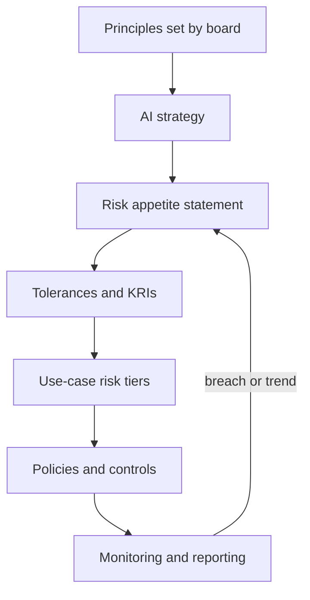
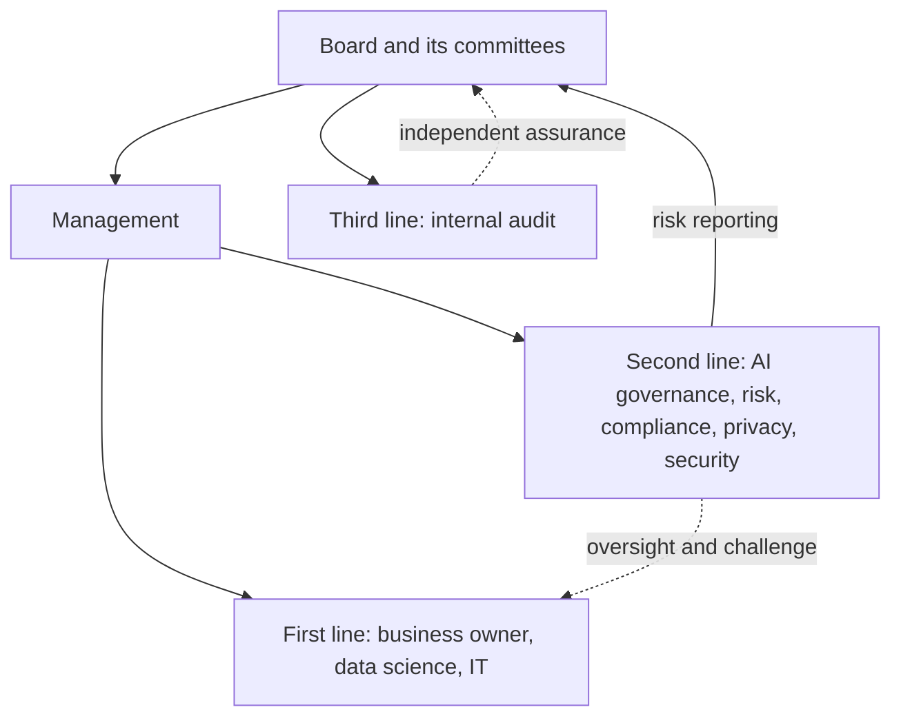

# Module 2 — Organisational expectations

*An AI policy that nobody owns is a wish. Before Najm Bank can govern a single model, it has to decide what it believes, how much AI risk it is willing to carry, who decides, who checks, and whether its people know enough to spot trouble. This module builds that organisational spine. Lesson 2.1 turns principles into a strategy, a risk appetite and an operating model. Lesson 2.2 gives every role a job, from the board to internal audit, and wires them into a committee, a RACI and an escalation path. Lesson 2.3 covers the EU AI Act's AI-literacy duty, role-based training and the culture that makes people speak up. Throughout, Layla, Najm's new Head of AI Governance, is building the structure you would build. This course is educational and is not legal advice.*

> **BoK coverage:** I.B — setting and communicating what the organisation expects of AI: principles, strategy, risk appetite, roles and accountability, and training and awareness.

---

# 2.1 — From principles to strategy and risk appetite
*Level: 🟡 Intermediate* · *Prerequisites: 1.2, 1.3* · *BoK: I.B*

## ⚡ In 60 seconds
- AI governance starts from the top: **principles** (what we value) drive an **AI strategy** (what we will use AI for), which is bounded by a **risk appetite** (how much AI risk we accept) and **risk tolerances** (the measurable limits around it).
- Principles only matter once they are translated into commitments someone can test: "fair" becomes "we measure approval-rate gaps across groups before launch and monthly after".
- Risk appetite is set by the board; tolerances and key risk indicators are set by management and monitored by the second line.
- The **operating model** (centralised, federated or hub-and-spoke) is how the organisation delivers the strategy. Structure follows strategy, not the other way round.
- Exam cue: questions asking "what should the organisation do *first*" usually want leadership commitment, defined principles or a clear appetite, not a tool purchase or a new model.
- Biggest trap: treating a published list of ethical principles as governance. Principles without owners, metrics and consequences are marketing.

## 🧭 Why it matters
In her first week, Layla finds four AI projects running at Najm Bank and no shared view of why. Dana's team is rebuilding the credit-scoring model to approve more SME loans. Khalid wants a customer-service chatbot live before Ramadan. HR has signed up for a vendor CV-screening tool. And relationship managers are pasting client financials into a public GenAI tool to draft credit memos. Each team believes it is acting responsibly. None of them can say how much risk the bank is willing to take on any of this, or who agreed to it.

Then the CEO forwards Layla a question from the board risk committee: "What is our AI risk appetite?" Nobody has an answer. The bank has a detailed appetite for credit risk (concentration limits, loan-to-value ceilings), for market risk and for operational risk. AI touches all three, but it is written down nowhere.

Without a line from principles to strategy to appetite, every AI decision is argued from scratch, and the loudest business case wins.

## 📐 How it works

### 🟢 The essentials

**The governance cascade.** Think of AI governance as a series of layers, each more specific than the one above:

| Layer | Question it answers | Who owns it | Najm example |
|---|---|---|---|
| Principles | What do we value? | Board | "We treat customers fairly and can explain decisions that affect them." |
| AI strategy | Where will AI create value, and where will we not use it? | Executive committee | "Use AI to speed SME credit decisions and fraud detection; no fully automated rejection of retail credit." |
| Risk appetite | How much AI risk will we accept in pursuit of that strategy? | Board, advised by risk | "Low appetite for AI that could cause unfair treatment of customers." |
| Risk tolerances and limits | What measurable boundaries show we are inside appetite? | Management, monitored by second line | "Approval-rate ratio between any protected group and the reference group must stay above an agreed threshold." |
| Policies and procedures | What must people do? | Policy owners | AI policy, acceptable-use policy, intake procedure (Module 3) |
| Controls and metrics | How do we check it happened? | First line, tested by second and third lines | Pre-launch fairness test, monthly monitoring report |

Each layer should trace back to the one above. A control no principle explains is bureaucracy; a principle no control tests is decoration.

**Principles.** Most organisations do not invent AI principles from nothing. They adapt a recognised set, then add what is specific to them. The common sources are:

- The **OECD AI Principles** (adopted 2019, updated May 2024): inclusive growth and well-being; respect for the rule of law, human rights and democratic values including fairness and privacy; transparency and explainability; robustness, security and safety; and accountability.
- The **UNESCO Recommendation on the Ethics of AI** (2021), with a strong emphasis on human rights, dignity and environmental impact.
- The trustworthiness characteristics in the **NIST AI RMF** (valid and reliable; safe; secure and resilient; accountable and transparent; explainable and interpretable; privacy-enhanced; fair with harmful bias managed).
- Regional statements such as the **SDAIA AI Ethics Principles** in Saudi Arabia, and sector expectations such as the Qatar Central Bank's AI guideline for financial institutions.

Keep the set short, in your own words, with a line on what each item means in practice.

**Strategy.** An AI strategy says where AI will serve business goals, what capabilities are needed (data, talent, platforms, partners) and where AI will *not* be used. For a Qatari bank, Qatar's national AI strategy and central-bank expectations are part of the context.

**Risk appetite vs risk tolerance.** These two terms appear constantly and are easy to blur:

- **Risk appetite** is the amount and type of risk an organisation is willing to pursue or retain to achieve its objectives. It is usually qualitative and set by the board: "low", "moderate", "high", per risk category.
- **Risk tolerance** is the acceptable variation around that appetite, expressed in measurable terms: thresholds, limits, trigger points. The NIST AI RMF uses "risk tolerance" to mean the organisation's readiness to bear risk in order to achieve its objectives, and expects it to be defined and documented because it shapes every later Map, Measure and Manage decision.
- **Risk capacity** is the maximum risk the organisation could absorb before failing (regulatory, financial or reputational). Appetite must sit well inside capacity.

### 🟡 Going deeper

**Writing an AI risk appetite statement.** A usable statement does three things for each risk category: states the appetite level, explains the reasoning, and names the tolerances or indicators that show whether the bank is inside it. AI risk is not a single category. It cuts across existing ones, so the cleanest approach is to extend the enterprise risk taxonomy rather than create a parallel universe:

| Risk category | AI-specific angle | Appetite | Example tolerance or key risk indicator (KRI) |
|---|---|---|---|
| Conduct and customer fairness | Discriminatory or unexplainable decisions | Low | No high-risk AI decision on customers without human review path; fairness metric within agreed band |
| Regulatory compliance | EU AI Act, GDPR, PDPPL, QCB expectations | Very low | Zero high-risk systems in production without completed conformity or deployer checks |
| Operational resilience | Model failure, drift, vendor outage | Moderate | Critical-model performance below threshold for more than X days triggers escalation |
| Information security | Prompt injection, data leakage into GenAI | Low | No confidential data in unapproved GenAI tools; DLP alerts reviewed weekly |
| Strategic and innovation | Falling behind competitors | Moderate to high | Low-risk internal productivity use cases may proceed on a light-touch track |

Notice that appetite is not uniformly low (zero appetite for all AI risk means not using AI), and that the "X" in a tolerance is set by management with data. Layla makes sure a number exists, is owned and is reported.

**From appetite to use-case tiers.** Appetite becomes operational through risk tiering: each proposed use case is classified (for example low, medium, high, prohibited) and each tier gets proportionate controls. A GenAI tool that drafts internal meeting notes sits in a low tier with light review. The credit-scoring model sits in a high tier with independent validation, a data protection impact assessment, a fundamental rights impact assessment for EU customers, and committee approval. The appetite statement is what justifies that difference. Module 8 builds the full intake and tiering process.

**Choosing an operating model.** The operating model decides where AI governance expertise and decision rights sit. There are three common patterns:

| Model | How it works | Strengths | Weaknesses | Fits when |
|---|---|---|---|---|
| Centralised | One central team (often in risk, compliance or a CDO office) reviews and approves all AI | Consistency, clear accountability, scarce experts pooled | Bottleneck; distance from the business; "governance says no" culture | Early maturity, few use cases, heavily regulated |
| Federated (decentralised) | Each business unit governs its own AI against common minimum standards | Speed, context, ownership | Inconsistency; standards drift; hard to get an enterprise view | Large diversified groups with strong local risk functions |
| Hub-and-spoke (hybrid) | A central hub sets policy, methods, tooling and the inventory; embedded "spokes" (AI risk champions) in each unit apply them | Balance of consistency and speed; scales | Needs clear decision rights between hub and spokes; champions can be under-resourced | Most mid-sized and large organisations once AI use grows |

Najm will start centralised while the inventory is built, then move to hub-and-spoke with champions in each business line.

The loop at the bottom matters: monitoring results flow back to the board, which may tighten or loosen appetite.

### 🔴 Expert view

**Principles conflict, and governance is how you resolve conflicts.** Explainability can trade off against accuracy. Privacy (minimising data) can trade off against fairness testing (which may need sensitive attributes). Speed to market trades off against validation depth. Mature programmes do not pretend these tensions away. They name them, set a default ("where accuracy and explainability conflict in customer credit decisions, explainability wins unless the committee approves otherwise"), and record decisions so they are consistent over time. The exam likes scenarios where two good principles collide; the best answer usually documents the trade-off and routes it to the accountable decision-maker rather than silently picking one.

**Board-level governance.** **ISO/IEC 38507** gives guidance to governing bodies (boards) on the implications of using AI: they remain accountable for the organisation's use of AI, even when decisions are delegated or automated, and should oversee the policies, risk appetite and culture that shape that use. **ISO/IEC 42001** puts the same idea into a certifiable management system: top management must demonstrate leadership and commitment, establish an AI policy that fits the organisation's purpose and provides a framework for AI objectives, and assign roles, responsibilities and authorities. The NIST AI RMF's Govern function likewise expects senior leadership to take responsibility for decisions about risks associated with AI development and deployment.

**Integration beats invention.** Banks already run enterprise risk, model risk, third-party risk, privacy and information-security programmes. Effective AI governance extends them rather than building a silo: AI risk joins the risk taxonomy, AI models join the model inventory, AI vendors go through outsourcing with added AI questions. **ISO/IEC 23894** (AI risk management guidance) builds on ISO 31000, which helps. A separate framework nobody connects to enterprise risk reporting tends to die when its sponsor leaves.

**Regulation shapes appetite but does not replace it.** The law sets a floor. Appetite can be stricter than the law, never looser. A group operating across the EU and the GCC often sets group-wide appetite for high-risk uses at the strictest relevant level and allows approved local variation only.

## ⚖️ The instruments
| Instrument | What it requires or recommends | Exam cue |
|---|---|---|
| **OECD AI Principles** | Five values-based principles for trustworthy AI (updated May 2024) plus recommendations to governments | The most widely adopted international baseline; the source many corporate principle sets adapt |
| **UNESCO Recommendation on the Ethics of AI** | Global ethics framework (2021) centred on human rights, dignity, diversity and the environment | Soft law adopted by UNESCO member states; not binding on companies |
| **NIST AI RMF** — Govern function | Leadership accountability, documented risk tolerance, policies and culture as the foundation for Map, Measure, Manage | Govern is cross-cutting; risk tolerance is an organisational decision the framework does not set for you |
| **ISO/IEC 42001** — Clause 5 Leadership | Top management commitment, an AI policy, and assigned roles, responsibilities and authorities | Certifiable management-system standard; "top management" must show commitment |
| **ISO/IEC 38507** | Guidance for governing bodies on the governance implications of AI use | The board stays accountable even when AI decides |
| **ISO/IEC 23894** | AI risk management guidance built on ISO 31000 | Integrate AI risk into existing enterprise risk management |
| **SDAIA AI Ethics Principles** | Saudi national AI ethics principles for entities developing or using AI | Example of a GCC principles framework; check the current official text |

## 🏛️ In practice at Najm Bank
Layla drafts, and the board risk committee approves, the first **AI Principles and Risk Appetite Statement**. An excerpt:

> **Najm Bank AI Principles (v1.0)**
> 1. **Fair treatment.** AI must not produce unjustified differences in outcomes for customers or staff. *In practice:* customer-facing AI is tested for disparate outcomes before launch and monitored after.
> 2. **Explainability.** Decisions that significantly affect a person can be explained to them in plain language. *In practice:* credit decisions carry reason codes a relationship manager can read out.
> 3. **Human accountability.** A named person owns every AI system, and no AI system has the final say on refusing a retail customer credit. *In practice:* every system in the inventory has an accountable business owner.
> 4. **Privacy and security.** AI uses the minimum personal data necessary and is protected like any critical system. *In practice:* a DPIA screen is part of intake.
> 5. **Reliability.** AI is validated before use and monitored while in use. *In practice:* high-tier models get independent validation.

> **AI Risk Appetite (extract)**
>
> | Category | Appetite | Tolerance / KRI | Owner | Reported to |
> |---|---|---|---|---|
> | Customer fairness | Low | Fairness metrics within agreed bands for all high-tier models; any breach escalated within 5 working days | Head of Retail Lending (Khalid) for credit models | AI Governance Committee monthly; board risk committee quarterly |
> | Regulatory | Very low | 100% of high-tier systems with completed impact assessments before launch | Head of AI Governance (Layla) | Board risk committee quarterly |
> | Data leakage via GenAI | Low | Zero confirmed incidents of customer data in unapproved tools; DLP alerts triaged within 2 working days | CISO | AI Governance Committee monthly |
> | Innovation | Moderate | Low-tier use cases decided within 10 working days of complete intake | Head of AI Governance | Executive committee quarterly |

*Operating model decision:* centralised review for year one; hub-and-spoke with named AI risk champions from month twelve, subject to a committee review of intake volumes.

## 🛠️ Exercises

### 🟢 Beginner
Take the five OECD values-based principles and rewrite each as a one-line commitment for an organisation you know, with one "in practice" sentence for each.
*Done when:* every principle has a commitment that someone could test or audit.

### 🟡 Intermediate
Draft an AI risk appetite table for Najm Bank's customer-service chatbot covering at least four risk categories, with an appetite level, one tolerance or KRI, and an owner for each.
*Done when:* each row has a measurable tolerance and a named role, and at least one category has a moderate (not low) appetite with a justification.

### 🔴 Advanced
Najm's corporate banking division wants to run its own AI governance because "the centre is too slow". Write a one-page recommendation to the executive sponsor comparing centralised, federated and hub-and-spoke for Najm, and propose decision rights between hub and spokes.
*Done when:* the recommendation names what the hub keeps (policy, inventory, high-tier approvals), what spokes can decide, and how the board still gets one enterprise view.

## ⚠️ Mistakes and exam traps
- **Principles as the finish line.** Publishing principles is the start. Answer options that stop at "publish ethical principles" are rarely best when another option adds ownership, metrics or controls.
- **Confusing appetite and tolerance.** Appetite is the qualitative "how much risk we want"; tolerance is the measurable boundary. The board sets appetite; management sets and monitors tolerances.
- **Zero appetite everywhere.** Declaring zero tolerance for all AI risk sounds safe but blocks all use or, worse, drives it underground (shadow AI). Expect answers favouring proportionate, risk-based approaches.
- **Tool before strategy.** Buying an AI governance platform before defining principles, appetite and ownership is a classic wrong "first step".
- **Building a silo.** Treating AI risk separately from enterprise, model, privacy and third-party risk frameworks creates gaps and duplication; integration is usually the better answer.
- **Law as the ceiling.** Legal requirements are the minimum. An organisation may set stricter internal rules; it may never set looser ones.

## 🧾 Recap
- The cascade runs principles → strategy → risk appetite → tolerances → tiers → policies → controls → monitoring, with results fed back to the board.
- Adapt recognised principles (OECD, UNESCO, NIST characteristics, regional ones) and translate each into testable commitments.
- Appetite is qualitative and board-owned; tolerance is measurable and management-owned; both sit inside risk capacity.
- Centralised, federated and hub-and-spoke operating models trade consistency against speed; hub-and-spoke is the common destination as AI use scales.
- Boards remain accountable for AI (ISO/IEC 38507); ISO/IEC 42001 and the NIST AI RMF both put leadership commitment first.

## ✍️ Check yourself

**1. Najm Bank's board has approved AI principles. Which step best turns the "fairness" principle into governance?**

- A. Publishing the principles on the bank's website
- B. Defining a fairness metric, a tolerance band and an owner who reports breaches to the AI Governance Committee
- C. Asking data scientists to "keep fairness in mind"
- D. Adding the word "fair" to every model's name in the inventory

Answer

**B.** Governance needs measurable commitments with owners and escalation. A is communication, not control; C has no metric or accountability. (See 🟢 The essentials and 🏛️ In practice.)

**2. Which statement best describes the difference between risk appetite and risk tolerance?**

- A. Appetite is set by data scientists; tolerance is set by the board
- B. They are synonyms used interchangeably in the NIST AI RMF
- C. Appetite is the broad amount and type of risk the organisation will accept; tolerance is the measurable limits that show whether it is within that appetite
- D. Tolerance is the maximum risk an organisation can absorb before failing

Answer

**C.** Appetite is the qualitative, board-level position; tolerances are the measurable boundaries. D describes risk capacity, a common distractor. (See 🟢 The essentials.)

**3. A fast-growing insurer has 60 AI use cases across five business units. Its central AI review team has a three-month backlog, and units are starting to bypass it. Which operating model change is most appropriate?**

- A. Move to hub-and-spoke: keep policy, the inventory and high-risk approvals central, and embed trained champions in each unit to handle lower-risk reviews
- B. Stop all AI projects until the backlog is cleared
- C. Let each unit set its own AI standards independently
- D. Outsource all AI approvals to an external consultancy

Answer

**A.** Hub-and-spoke keeps consistency and enterprise visibility while adding capacity close to the business. C is fully federated without common standards, which loses consistency; B drives shadow AI. (See 🟡 Going deeper, operating models.)

**4. Under ISO/IEC 38507, who remains accountable for an organisation's use of AI when decisions are delegated to AI systems?**

- A. The AI vendor
- B. The data science team that built the model
- C. No one, because the decision is automated
- D. The governing body (board)

Answer

**D.** ISO/IEC 38507 addresses governing bodies and the point is that accountability is not delegated to the machine or the supplier. (See 🔴 Expert view.)

**5. Najm's model team says explaining the new credit model's decisions would cost two points of accuracy. The principles value both accuracy and explainability. What is the best governance response?**

- A. Always choose the most accurate model; explainability is optional
- B. Let the data science team decide informally
- C. Abandon the model
- D. Document the trade-off and apply the bank's stated default or route it to the accountable decision-maker, recording the decision

Answer

**D.** Principles conflict; governance resolves conflicts transparently and consistently through defaults and accountable decisions. A and B skip accountability; C overreacts. (See 🔴 Expert view.)

## 📚 References
- OECD AI Principles: https://oecd.ai/en/ai-principles
- UNESCO Recommendation on the Ethics of Artificial Intelligence: https://www.unesco.org/en/artificial-intelligence/recommendation-ethics
- NIST AI Risk Management Framework: https://www.nist.gov/itl/ai-risk-management-framework
- ISO/IEC 42001:2023 AI management system: https://www.iso.org/standard/81230.html
- ISO/IEC JTC 1/SC 42 (the committee behind ISO/IEC 38507, 23894 and the AI standards family): https://www.iso.org/committee/6794475.html
- SDAIA (Saudi Data and AI Authority): https://sdaia.gov.sa/
- Qatar Central Bank: https://www.qcb.gov.qa/
- IAPP AIGP certification and Body of Knowledge: https://iapp.org/certify/aigp/

---

# 2.2 — Roles, accountability and the AI governance committee
*Level: 🟡 Intermediate* · *Prerequisites: 2.1* · *BoK: I.B*

## ⚡ In 60 seconds
- Every AI system needs a single **accountable owner** in the business, not in IT or data science. Governance roles support that owner; they do not replace them.
- The **three lines model** separates doing (first line: business, data science, IT), overseeing (second line: risk, compliance, privacy, AI governance) and independent assurance (third line: internal audit), all reporting to the governing body.
- An **AI governance committee** is cross-functional, has a written charter, decision rights and escalation to the board. It decides; it does not just discuss.
- A **RACI** (Responsible, Accountable, Consulted, Informed) makes roles concrete for each life-cycle step. Exactly one "A" per activity.
- Exam cue: when a scenario asks who should own an AI risk, pick the business owner of the use case; when it asks who gives independent assurance, pick internal audit.
- Biggest trap: making the governance team (or the committee) accountable for every AI outcome. That diffuses ownership and turns governance into a bottleneck.

## 🧭 Why it matters
The customer-service chatbot went live at Najm Bank on a Thursday. By Sunday it had told three customers that a late-payment fee would be waived, which it would not. One customer posted the screenshot. The question in Monday's crisis meeting was simple: "Who owns this?" Dana said her team had only fine-tuned the model. IT said it only hosted it. The vendor pointed to its terms of service. Khalid said he had never approved the final prompt. Marketing had written the welcome message. Everyone had touched it; no one owned it.

A tribunal in Canada faced the same question in *Moffatt v. Air Canada* (2024). The airline's chatbot had given a customer wrong information about bereavement fares. The airline argued, in effect, that the chatbot was responsible for its own statements. The tribunal rejected that and held the airline liable: the organisation is responsible for all the information on its website, whether it comes from a static page or a chatbot. Legal responsibility landed on the organisation. Internally, Najm Bank needs to know which *person* carries it, before the next incident, not after.

## 📐 How it works

### 🟢 The essentials

**Who does what.** Here are the roles most AI governance programmes need, with their core job. Titles vary by organisation; the functions do not.

| Role | Core job in AI governance | At Najm Bank |
|---|---|---|
| Board (and its risk or audit committee) | Sets principles and risk appetite; oversees; holds management accountable | Board risk committee |
| Executive sponsor | Senior executive who champions the programme, secures budget and breaks deadlocks | Chief Risk Officer |
| AI governance lead | Designs and runs the framework: policies, inventory, intake, committee, reporting | Layla, Head of AI Governance |
| AI governance committee | Cross-functional body that approves high-risk use cases, exceptions and policies | Chaired by the CRO |
| Business / product owner | Accountable for a specific AI system's purpose, outcomes and risks | Khalid for credit scoring and the chatbot |
| Data science / engineering | Build, test, document and monitor models and systems | Dana's team |
| Chief Data Officer | Data strategy, data quality, lineage, data ownership | Omar |
| Legal | Interprets laws, contracts, liability, IP | General Counsel's team |
| Privacy / DPO | Data protection compliance, DPIAs, data-subject rights; the DPO must be able to act independently under GDPR | Sara |
| Information security | Security of models, data and AI supply chain; GenAI misuse | CISO |
| Compliance | Regulatory mapping (EU AI Act, QCB expectations, consumer rules), conduct risk | Head of Compliance |
| Procurement / third-party risk | Vendor due diligence and contracts for AI products | Yusuf |
| HR | Workforce impacts, AI in hiring, training records | HR business partner |
| Internal audit | Independent assurance that governance is designed well and works | Chief Audit Executive |

**Accountable vs responsible.** Two words the exam treats precisely. *Responsible* means doing the work. *Accountable* means answering for the outcome, with authority to decide. Dana's team is responsible for building the credit model; Khalid is accountable for its use in lending decisions, because it is his business process, his customers and his profit and loss. The governance lead is accountable for the *framework* working, not for every model's outcomes.

**The three lines model.** The Institute of Internal Auditors' Three Lines Model (updated in 2020 from the older "three lines of defence") is the standard way to arrange these roles:

- **First line:** the people who own and manage risk as part of delivering products and services. For AI: the business owner, data science, engineering and IT operations. They build controls into the system and run them.
- **Second line:** specialist functions that provide expertise, set frameworks, challenge and monitor. For AI: the AI governance team, risk management, compliance, privacy, information security and, in banks, model risk management.
- **Third line:** internal audit, which provides independent and objective assurance to the governing body on whether the first two lines are working. Independence from management is what gives it value.
- The **governing body** (board) sits above all three and receives reports from each. External assurance providers (external auditors, certification bodies, regulators) sit outside.

### 🟡 Going deeper

**The AI governance committee.** Most organisations create a committee because AI decisions need several perspectives at once: a credit model raises fairness (compliance), personal data (privacy), security, legal and business questions together. A committee that works has:

- **A charter** stating purpose, scope (which AI systems and decisions it covers), membership, quorum, decision rights, meeting frequency and how it reports upward.
- **Clear decision rights.** For example: approves high-tier use cases before build and before launch; approves policy exceptions above a threshold; accepts residual risk within appetite; escalates anything outside appetite to the board risk committee.
- **The right membership.** A senior chair (often the CRO or COO), the governance lead as secretary, and voting members from business lines, data, legal, privacy, security and compliance. Internal audit usually attends as an observer, not a voter, to protect its independence.
- **Records.** Minutes, decisions with rationale, conditions attached to approvals, and actions with owners and dates. These records are evidence for regulators and auditors.
- **Proportionality.** The committee should not review every chatbot prompt change. Low-tier decisions are delegated to the governance team or to spoke champions; the committee focuses on high-tier systems and hard calls.

Some organisations also have an advisory **AI ethics board**, sometimes with external members; its relationship to the deciding committee must be clear.

**RACI.** A RACI matrix assigns, for each activity:

- **R — Responsible:** does the work (can be several people).
- **A — Accountable:** owns the outcome and signs off (exactly one per activity).
- **C — Consulted:** gives input before the decision (two-way).
- **I — Informed:** is told after the decision (one-way).

Rules that keep a RACI useful: one A per row; every row has at least one R; avoid "C" for everyone (it turns into a committee of vetoes); and check that the same person is not both doing and independently checking the same work.

**Escalation.** Escalation paths tell people what to do when something is outside their authority or outside appetite. A good escalation design specifies triggers (a tolerance breach, a serious incident, a disagreement between first and second line, a request for a policy exception), the route (champion → governance lead → committee → board risk committee), the time limits at each step, and what happens in the meantime (for example, whether a model is paused). The second line must be able to escalate *around* the first line when it disagrees, including directly to the board if needed. Without that, "challenge" is just advice.

**Regulatory roles map onto internal roles.** The EU AI Act assigns obligations to organisational roles (provider, deployer, importer, distributor, authorised representative, product manufacturer), not to individuals. Internally, someone must own each obligation. As a deployer of a high-risk system, Najm must assign human oversight to natural persons who have the necessary competence, training and authority, and support them (Art. 26). A provider of a high-risk system needs a quality management system that includes an accountability framework setting out the responsibilities of management and other staff (Art. 17). In other words, the law assumes you have done this lesson.

### 🔴 Expert view

**Ownership is the hardest part.** In practice, the most common failure is not a missing committee but an unclear owner. Data science teams often end up de facto owners of models because they understand them. That feels natural but is wrong: they cannot accept business risk on behalf of the lending function, and they are not the ones who answer to customers. Insist that every inventory entry names a business owner at a senior enough level to stop the system, and that the owner signs the risk acceptance.

**Shared and vendor systems.** When a system serves several business lines (a group-wide chatbot platform) or comes from a vendor (the CV-screening tool), ownership still has to be singular for each *use*. The platform can have a technical owner, but each deployment of it (retail FAQs, HR queries) has its own business owner. Buying a system transfers some work to the vendor, never the accountability for how you use it.

**Independence and conflicts.** The second and third lines lose value if they build what they review. If Layla's team also develops prompts for the chatbot, someone else must review them. If model risk validators report to the Chief Data Officer whose team built the models, validation independence is questionable. Banks already know this from model risk management practice, such as the US supervisory guidance SR 11-7, which expects model validation to be independent of development. Carry the same logic into AI.

**Standards expectations.** **ISO/IEC 42001** requires top management to assign and communicate responsibilities and authorities for the AI management system, and its Annex A includes controls on internal organisation, including roles and responsibilities and a process for reporting concerns. The **NIST AI RMF** Govern function expects accountability structures so that the appropriate teams are empowered, responsible and trained, and it lists engagement with relevant AI actors and third-party risk as part of governance. Singapore's **Model AI Governance Framework** similarly starts with internal governance structures and measures: clear roles, responsibilities and risk controls.

**Committees fail predictably:** rubber-stamping, gridlock, theatre without decisions, and overload on trivia. The fix is usually a sharper charter, better tiering and delegated authority.

## ⚖️ The instruments
| Instrument | What it requires or recommends | Exam cue |
|---|---|---|
| **EU AI Act** — Art. 26 | Deployers of high-risk AI must assign human oversight to people with the necessary competence, training and authority, and use systems per instructions | Oversight is a named-person job, not a system feature |
| **EU AI Act** — Art. 17 | Providers of high-risk AI need a quality management system, including an accountability framework for management and staff | Roles and responsibilities are a legal requirement for providers |
| **GDPR** — Arts 37–39 | Designation, position and tasks of the DPO, who must be able to act independently and report to the highest management level | The DPO advises and monitors; the controller remains accountable |
| **ISO/IEC 42001** — Clause 5.3 and Annex A | Assign and communicate roles, responsibilities and authorities; controls for internal organisation and reporting concerns | Certification auditors look for documented roles |
| **NIST AI RMF** — Govern function | Accountability structures, trained and empowered teams, third-party risk policies | Govern underpins Map, Measure and Manage |
| **IIA Three Lines Model** | First line owns risk, second line oversees and challenges, third line gives independent assurance to the governing body | Internal audit is the independent third line |
| **Singapore Model AI Governance Framework** | Internal governance structures with clear roles and responsibilities as the first area of practice | Voluntary framework often cited for practical governance |

## 🏛️ In practice at Najm Bank
Layla's **RACI for a high-tier AI system** (credit scoring), adopted by the committee:

| Activity | Business owner (Khalid) | Data science (Dana) | AI governance (Layla) | DPO (Sara) | CDO (Omar) | Compliance | Info security | Legal | AI Gov. Committee | Internal audit |
|---|---|---|---|---|---|---|---|---|---|---|
| Use-case intake and business case | **A** | C | R | C | C | C | I | C | I | I |
| Risk tiering | C | C | **A**/R | C | I | C | C | C | I | I |
| DPIA and FRIA | R | C | C | **A** (DPIA) | C | R (FRIA) | C | C | I | I |
| Data sourcing and quality | C | R | I | C | **A** | I | C | C | I | I |
| Build, test and document | C | **A**/R | C | I | C | I | C | I | I | I |
| Independent validation | I | C | **A** (via model risk) | I | I | C | C | I | I | I |
| Launch approval | R | C | R | C | C | C | C | C | **A** | I |
| Monitoring and incident handling | **A** | R | C | C | C | C | R | I | I | I |
| Assurance review | I | I | I | I | I | I | I | I | I | **A**/R |

*Notes:* the DPIA and fundamental rights impact assessment are split: Sara is accountable for the DPIA; the FRIA is owned by the business with compliance running it and the committee approving the result. Internal audit is informed throughout but never "A" for first- or second-line activities.

**Escalation ladder (extract from the committee charter):**

| Trigger | First escalate to | Time limit | If unresolved | Interim action |
|---|---|---|---|---|
| Tolerance breach (for example fairness band) | Business owner and AI governance lead | 5 working days | AI Governance Committee | Owner decides whether to add human review or pause |
| Serious incident with customer harm | Head of AI Governance and CRO | Same day | Board risk committee chair | Pause or roll back by default |
| First/second line disagreement on risk acceptance | AI Governance Committee | Next meeting, or 10 working days | Board risk committee | No launch until resolved |
| Policy exception request | AI governance lead | 10 working days | Committee (high-tier) | Exception register entry |

## 🛠️ Exercises

### 🟢 Beginner
List the roles that should be involved in approving Najm's CV-screening tool and give each one sentence on what they contribute.
*Done when:* you have named the business owner (HR), privacy, compliance, procurement, legal and the committee, and identified which of them is accountable.

### 🟡 Intermediate
Write a one-page charter for Najm's AI Governance Committee: purpose, scope, membership, quorum, decision rights, delegated authority for low-tier systems, reporting line and record-keeping.
*Done when:* someone who has never met Layla could tell from the charter what the committee can and cannot decide.

### 🔴 Advanced
Review the RACI above and identify two independence or conflict-of-interest risks. Propose changes and explain how you would evidence independence to an internal auditor.
*Done when:* each risk names who is conflicted, why it matters, and a concrete fix (for example, a reporting line change or a separate reviewer).

## ⚠️ Mistakes and exam traps
- **Data science as owner.** The team that builds a model is responsible for the build, not accountable for the business outcome. Pick the business owner.
- **Two As.** A RACI with shared accountability means no accountability. One A per activity.
- **Internal audit designing controls.** The third line must stay independent; if an answer has internal audit building or approving the AI framework, be suspicious. It can advise, but its core role is assurance.
- **The vendor is accountable.** Buying a system does not transfer accountability for how you use it (*Moffatt v. Air Canada* shows the organisation answers for its chatbot).
- **Committee as a talking shop.** A committee without a charter, decision rights and minutes is not governance. Choose answers that formalise decisions and escalation.
- **DPO as decision-maker.** Under GDPR the DPO advises and monitors; the controller (the organisation) is accountable for compliance.

## 🧾 Recap
- Each AI system needs one senior business owner who is accountable; governance roles support and challenge.
- The three lines model: first line owns risk, second line oversees and challenges, third line (internal audit) independently assures the board.
- A working AI governance committee has a charter, decision rights, the right members, records and proportionate scope.
- RACI makes roles concrete: exactly one A per activity; separate doing from checking.
- Escalation needs triggers, routes, time limits and interim actions, and the second line must be able to escalate around the first.

## ✍️ Check yourself

**1. Najm's chatbot gave customers wrong information about fees. Which role should be accountable for the chatbot's outcomes?**

- A. The business owner of the customer-service process
- B. The data scientist who fine-tuned the model
- C. The vendor of the underlying language model
- D. Internal audit

Answer

**A.** The business owner is accountable for the use of the system in their process. Data science is responsible for the build, the vendor supplies a component, and internal audit provides independent assurance. (See 🟢 The essentials.)

**2. In the three lines model, what is the primary role of internal audit in AI governance?**

- A. Building and approving AI models
- B. Providing independent and objective assurance to the governing body
- C. Writing the organisation's AI policy
- D. Running day-to-day monitoring of model performance

Answer

**B.** Internal audit is the third line; its value comes from independence. Writing policy is typically a second-line task and monitoring is first-line. (See 🟢 The essentials.)

**3. A RACI for launching a high-risk AI system lists both the Head of Retail Lending and the Head of AI Governance as "A". What is the problem?**

- A. There is no problem; shared accountability is safer
- B. The Head of AI Governance should be "I"
- C. There should be exactly one accountable party per activity, or ownership becomes unclear
- D. Nobody is "C"

Answer

**C.** One A per activity is the core RACI rule. Shared accountability diffuses ownership. (See 🟡 Going deeper, RACI.)

**4. Under the EU AI Act, what must a deployer of a high-risk AI system do about human oversight?**

- A. Nothing; oversight is only the provider's duty
- B. Assign oversight to natural persons who have the necessary competence, training and authority
- C. Appoint an external auditor to supervise the system
- D. Register each overseer with the AI Office

Answer

**B.** Article 26 places this duty on deployers. Providers design for oversight (Art. 14), but deployers must staff it. (See 🟡 Going deeper and ⚖️ The instruments.)

**5. At a retailer, the second-line AI risk team believes a recommendation model exceeds the approved fairness tolerance. The first-line product owner disagrees and wants to keep it running. What should happen?**

- A. The product owner decides because they are accountable
- B. The data science team settles the dispute
- C. The disagreement is escalated through the defined path to the AI governance committee, with interim action as the escalation policy specifies
- D. The second line quietly records its concern and takes no further action

Answer

**C.** Disagreements between lines are an escalation trigger. The second line must be able to escalate, not just advise; D makes challenge toothless, and A lets the first line mark its own homework. (See 🟡 Going deeper, escalation.)

## 📚 References
- EU AI Act, Regulation (EU) 2024/1689: https://eur-lex.europa.eu/eli/reg/2024/1689/oj
- GDPR, Regulation (EU) 2016/679: https://eur-lex.europa.eu/eli/reg/2016/679/oj
- NIST AI Risk Management Framework: https://www.nist.gov/itl/ai-risk-management-framework
- ISO/IEC 42001:2023: https://www.iso.org/standard/81230.html
- The Institute of Internal Auditors (Three Lines Model): https://www.theiia.org/
- Singapore Personal Data Protection Commission, Model AI Governance Framework: https://www.pdpc.gov.sg/
- US Federal Reserve SR 11-7, Guidance on Model Risk Management: https://www.federalreserve.gov/supervisionreg/srletters/sr1107.htm

---

# 2.3 — AI literacy, training and culture
*Level: 🟡 Intermediate* · *Prerequisites: 2.2* · *BoK: I.B*

## ⚡ In 60 seconds
- **AI literacy** is the skills, knowledge and understanding that let people use and oversee AI in an informed way and understand its opportunities, risks and possible harms.
- Under **EU AI Act Art. 4**, providers and deployers must take measures to ensure, to their best extent, a sufficient level of AI literacy among their staff and others operating or using AI systems on their behalf. It has applied since **2 February 2025**.
- The duty is proportionate: it depends on people's technical knowledge, experience, education and training, the context of use, and who the AI is used on. One-size-fits-all e-learning does not meet it well.
- Effective programmes are **role-based**: board, executives, business owners, builders, overseers, control functions and all staff each need different depth.
- Culture decides whether any of this works: incentives that reward safe behaviour, psychological safety, and protected channels for speaking up.
- Biggest trap: treating literacy as a one-off course with a completion rate. Regulators and the exam care about whether people can actually do their role safely.

## 🧭 Why it matters
Layla's first survey of Najm Bank staff produced three uncomfortable findings. Around a third of relationship managers had used a public GenAI tool for work in the past month, most with no idea whether the vendor stored their prompts. Credit officers reviewing model-assisted decisions approved the model's recommendation almost every time, even when the reason codes looked odd, because "the model is usually right". And two junior data scientists had noticed that the CV-screening vendor's tool ranked candidates from certain universities consistently lower, but had not raised it because it "wasn't their project".

None of these are technology failures. The first is a literacy gap that creates the kind of leak Samsung suffered in 2023, when staff reportedly pasted internal source code and meeting notes into ChatGPT and the company then restricted GenAI use. The second is **automation bias**, the tendency to over-trust automated output, which makes human oversight a formality. The third is a culture problem: people saw a risk and stayed silent. Najm's Frankfurt branch also brings a legal dimension: the EU AI Act's AI-literacy duty has applied since February 2025, and Najm is both a deployer of AI systems in the EU and, for its in-house credit model, arguably a provider.

## 📐 How it works

### 🟢 The essentials

**What the law says.** Article 4 of the EU AI Act requires providers and deployers of AI systems to take measures to ensure, to their best extent, a sufficient level of AI literacy of their staff and other persons dealing with the operation and use of AI systems on their behalf. In doing so they must take into account those people's technical knowledge, experience, education and training, the context the AI systems are to be used in, and the persons or groups on whom the systems are to be used. The Act defines AI literacy as the skills, knowledge and understanding that allow providers, deployers and affected persons to make an informed deployment of AI systems and to gain awareness of the opportunities and risks of AI and the possible harm it can cause.

Key points to remember:

- **Who:** providers and deployers, which covers almost any organisation using AI in a professional capacity within the Act's scope, not just those with high-risk systems.
- **Whom:** staff, plus "other persons" acting on the organisation's behalf, such as contractors and service providers operating its AI.
- **When:** from 2 February 2025, alongside the prohibited practices.
- **How much:** "sufficient" and "to their best extent", judged in context. There is no mandated curriculum or certificate in the Act. The European Commission has published questions and answers on AI literacy; at the time of writing that guidance indicates that no specific certification is required and that organisations can keep internal records of their measures. Check the current guidance.
- **Status:** the Commission's November 2025 "Digital Omnibus" proposal included changes to how the AI-literacy duty is framed. At the time of writing (2026) check whether any amendment has been adopted; the exam tests the Act as adopted.

**Beyond the EU.** Other instruments point the same way. **ISO/IEC 42001** requires the organisation to determine the competence needed by people doing work that affects AI performance, ensure they are competent through education, training or experience, and make people aware of the AI policy and their contribution (its competence and awareness clauses). The **NIST AI RMF** Govern function expects personnel and partners to receive AI risk management training so they can perform their duties. For deployers of high-risk systems, **EU AI Act Art. 26** adds a specific requirement that people assigned to human oversight have the necessary competence, training and authority.

**Literacy is not the same as technical skill.** A board member does not need to know how gradient boosting works. They need to know what questions to ask, what risk appetite means for AI, and what a warning sign looks like in a report. A credit officer needs to know the model's intended purpose, its known limitations, and when and how to override it. That is why good programmes start by mapping roles.

### 🟡 Going deeper

**Role-based training design.** Build a matrix of audiences, what each needs, and how you will check they got it:

| Audience | What they need to understand | Format | How you check |
|---|---|---|---|
| Board and board risk committee | AI opportunities and risks for the bank; the regulatory landscape; how to read AI risk reports; their accountability | Briefings, scenario workshops | Board minutes showing informed challenge; annual self-assessment |
| Executives and business owners | Risk appetite and tiering; their duties as owners; impact assessments; incident escalation | Workshops using own use cases | Owners complete intake and risk acceptance correctly |
| Data scientists and engineers | Fairness testing, documentation, privacy by design, security, evaluation of GenAI, regulatory requirements for providers | Technical training, playbooks, peer review | Quality of model documentation; validation findings trend |
| Human overseers (credit officers, HR reviewers) | The system's purpose, limits, known failure modes, automation bias, how to override and when to escalate | Hands-on training with real cases; refreshers after model changes | Override rates and quality sampled; competency sign-off before access |
| Control functions (risk, compliance, privacy, audit) | How AI systems work and fail; how to test and challenge; relevant laws and standards | Specialist courses, certifications such as the AIGP | Quality of challenge and assurance work |
| Procurement | AI-specific due diligence and contract clauses | Checklists and training | Questionnaires completed for all AI vendors |
| All staff | What AI is; the acceptable-use policy; what never to put into GenAI tools; how to report concerns | Short e-learning, intranet guidance, nudges in tools | Completion plus spot quizzes; DLP alert trends |

Three design rules make this work:

1. **Tie training to access.** A credit officer cannot receive access to the model's decision screen until they have completed overseer training. A developer cannot deploy to production without the documentation module.
2. **Refresh on change.** When the model, the policy or the law changes materially, affected people are retrained, not only on an annual cycle.
3. **Measure behaviour, not just completion.** Completion rates show attendance. Behavioural indicators show literacy: fewer confidential-data alerts from GenAI tools, overseers who override when they should, better documentation.

**Automation bias and meaningful oversight.** Human oversight fails when overseers are untrained, overloaded or discouraged from disagreeing. The EU AI Act's human oversight article for high-risk systems (Art. 14) expects systems to be designed so overseers can understand the system's capacities and limitations, remain aware of the possible tendency to over-rely on outputs, correctly interpret outputs, and decide not to use or to override them. Deployers must staff that oversight competently. Training therefore needs to cover *when* to disagree with the model, and managers must not penalise justified overrides.

**Communicating expectations.** Literacy also includes making sure people know the rules exist. Najm publishes its AI principles and acceptable-use policy on the intranet, adds a banner to approved GenAI tools ("do not enter customer identifiers"), sends short "AI tip of the month" notes, and holds quarterly open sessions where Layla answers questions. External communication (to customers and regulators) is covered in later modules, but it starts from the same internal clarity.

### 🔴 Expert view

**Culture is the control that sits under every other control.** Policies and training set expectations; culture decides what people do when no one is looking. Three levers matter most:

- **Incentives.** If Dana's team is rewarded only for model accuracy and speed to launch, fairness testing and documentation will be squeezed. If Khalid's bonus depends only on loan volume, he has a conflict when a model would approve more loans at the cost of fairness. Mature organisations add governance measures to objectives: documentation quality, timely incident reporting, validation findings closed. The NIST AI RMF's Govern function explicitly includes fostering a critical-thinking and safety-first mindset in the design, development, deployment and use of AI.
- **Psychological safety and speaking up.** People must be able to raise concerns without fear. Najm's two junior data scientists stayed silent partly because no channel existed for concerns about someone else's project. Provide multiple routes: line manager, the AI governance team, a dedicated AI concerns mailbox, and the bank's existing whistleblowing channel. Close the loop by telling the reporter what happened.
- **Tone from the top and the middle.** When executives visibly accept a delay because a model failed fairness testing, everyone learns what the principles mean. When they overrule the committee to hit a launch date, everyone learns that too.

**Whistleblowing law.** In the EU, the Whistleblower Protection Directive (EU) 2019/1937 protects people who report breaches of EU law through internal or external channels, and the EU AI Act provides that this Directive applies to reports of infringements of the AI Act. Organisations in scope should make sure their whistleblowing channels explicitly cover AI concerns. In the GCC, whistleblowing frameworks vary by country and sector; banks usually have regulator-driven internal channels, so the practical step is to confirm that AI issues are in scope.

**Evidence for regulators and auditors.** Because the literacy duty is principles-based, the question in an inspection or audit will be: "What did you do, why was it sufficient for these people and these systems, and how do you know it worked?" Keep a literacy register: roles mapped to training, completion and competency evidence, refresh triggers, and effectiveness metrics. **ISO/IEC 42001** certification auditors will also look for documented evidence of competence.

**The limits of literacy.** Training cannot fix a badly designed system. If a model's explanations are unreadable, no amount of overseer training will make oversight meaningful. If a GenAI tool has no enterprise controls, telling staff to be careful is a weak control. Treat literacy as one layer of defence alongside technical controls (data loss prevention, access control, interface design) and process controls (review, sampling, escalation).

## ⚖️ The instruments
| Instrument | What it requires or recommends | Exam cue |
|---|---|---|
| **EU AI Act** — Art. 4 | Providers and deployers must ensure, to their best extent, a sufficient level of AI literacy of staff and others operating AI on their behalf, taking context into account; applies from 2 Feb 2025 | Applies to all providers and deployers, not only high-risk; proportionate, no fixed curriculum |
| **EU AI Act** — Art. 14 and Art. 26 | High-risk systems designed for effective human oversight; deployers assign oversight to people with competence, training and authority | Oversight training must address automation bias and overriding |
| **ISO/IEC 42001** — Clauses 7.2 and 7.3 | Determine and ensure competence; make people aware of the AI policy and their role | Keep documented evidence of competence |
| **NIST AI RMF** — Govern function | AI risk management training for personnel and partners; a critical-thinking, safety-first culture | Culture is part of governance, not an HR extra |
| **EU Whistleblower Protection Directive** — (EU) 2019/1937 | Protected internal and external reporting channels for breaches of EU law; the AI Act extends it to AI Act infringements | Speaking-up channels should explicitly cover AI |

## 🏛️ In practice at Najm Bank
Layla's **AI Literacy Programme plan (year one)**, approved by the AI Governance Committee:

| Audience | Headcount (approx.) | Module | Mandatory before | Refresh trigger | Effectiveness measure | Owner |
|---|---|---|---|---|---|---|
| Board risk committee | 6 | AI risk for directors (2 h workshop) | Next quarterly AI report | Annual; major regulatory change | Board minutes show AI-specific challenge | Layla + Company Secretary |
| Business owners | 25 | Owning an AI system | Signing any risk acceptance | Annual | Intake forms complete first time | Layla |
| Credit officers (overseers) | 120 | Using and overriding the credit model | Model access granted | Each material model change | Override sample reviewed quarterly by model risk | Khalid |
| HR recruiters | 15 | Using the CV-screening tool fairly | Tool access granted | Vendor model update | Adverse-impact monitoring reviewed | HR business partner |
| Data scientists | 18 | Responsible AI engineering at Najm | Production deployment rights | Annual; new policy | Validation findings per model | Dana |
| All staff (incl. contractors) | ~2,000 | GenAI and you: the acceptable-use policy | Access to approved GenAI tools | Annual | DLP alerts for GenAI per 1,000 users | Layla + CISO |

**Speak-up commitment (added to the AI policy):** "Anyone at Najm Bank, including contractors, can raise a concern about an AI system through their manager, the AI Governance team, the AI concerns mailbox or the bank's whistleblowing channel. Concerns raised in good faith will not lead to any detriment. The AI Governance team acknowledges every concern within five working days and tells the person raising it what was done."

**Incentive change:** from next year, the objectives of AI system business owners and data science leads include one governance measure each (for example, documentation complete at launch; incidents reported within the required time).

## 🛠️ Exercises

### 🟢 Beginner
Write five "never do" rules for all staff using GenAI tools at Najm Bank, each in one plain sentence.
*Done when:* a new joiner with no AI knowledge would understand every rule, and at least one rule covers customer data and one covers checking outputs.

### 🟡 Intermediate
Design a 60-minute training session for credit officers who oversee the credit-scoring model. Include learning objectives, one real-looking case where the model is wrong, and how you will check competence.
*Done when:* the session explicitly covers the model's intended purpose, known limitations, automation bias, how to override, and when to escalate.

### 🔴 Advanced
A regulator asks Najm's Frankfurt branch how it complies with the EU AI Act's AI-literacy duty. Draft a one-page response describing the measures, why they are sufficient for the people and systems involved, and the evidence held.
*Done when:* your response is proportionate by role, cites the factors Article 4 says to take into account, and points to records rather than just completion rates.

## ⚠️ Mistakes and exam traps
- **"Only high-risk systems trigger AI literacy."** Article 4 applies to providers and deployers of AI systems generally. Do not limit it to high-risk.
- **"A certificate is required."** The Act does not prescribe a certificate or curriculum; it requires sufficient literacy in context. Choose answers that tailor training to roles and context.
- **Completion rate as proof.** 100% completion of a generic e-learning module is weak evidence. Prefer answers that measure behaviour and competence.
- **Forgetting contractors.** The duty extends to other persons operating or using AI on the organisation's behalf.
- **Training instead of design.** When a scenario shows oversight failing because the interface hides key information, the better answer fixes the system, not just the training.
- **Silence as compliance.** No reported concerns is not evidence of a healthy culture; it may mean there is no safe channel.

## 🧾 Recap
- AI literacy is the knowledge and understanding needed to use and oversee AI in an informed way and to understand its risks and harms.
- EU AI Act Art. 4 has applied since 2 February 2025 to providers and deployers; it is proportionate to people's background and context, with no fixed curriculum. Check the status of the Digital Omnibus proposal.
- Build role-based training, tie it to system access, refresh it on change and measure behaviour.
- Human overseers need specific training on limitations, automation bias and overriding.
- Culture (incentives, psychological safety, tone from the top) and protected speak-up channels make the rest work.

## ✍️ Check yourself

**1. Which organisations are subject to the AI-literacy duty in Article 4 of the EU AI Act?**

- A. Providers and deployers of AI systems
- B. Only public authorities
- C. Only providers of high-risk AI systems
- D. Only providers of general-purpose AI models with systemic risk

Answer

**A.** Article 4 applies to providers and deployers of AI systems, not only high-risk or GPAI actors. (See 🟢 The essentials.)

**2. From what date has the EU AI Act's AI-literacy duty applied?**

- A. 1 August 2024
- B. 2 August 2027
- C. 2 August 2026
- D. 2 February 2025

Answer

**D.** The AI-literacy duty and the prohibited practices apply from 2 February 2025. 1 August 2024 is entry into force; 2 August 2026 is when most remaining rules apply. (See ⚡ In 60 seconds.)

**3. Najm's credit officers approve the model's recommendation in almost every case, even when reason codes look inconsistent. Which response best addresses the problem?**

- A. Remove the human review step because it adds nothing
- B. Send all staff a generic AI awareness e-learning module
- C. Replace the credit officers with more senior staff
- D. Give overseers targeted training on the model's limits, automation bias and override procedures, make sure the interface shows what they need, and monitor override quality

Answer

**D.** This is automation bias; the fix combines role-specific training, system design that supports oversight, and behavioural monitoring. B is not role-based; A removes a required safeguard. (See 🟡 Going deeper.)

**4. An organisation reports 100% completion of its annual AI e-learning. What is the main weakness of relying on this as evidence of AI literacy?**

- A. Completion shows attendance, not whether people can perform their AI-related roles safely
- B. The EU AI Act requires a certificate from an accredited body
- C. E-learning is prohibited under the EU AI Act
- D. Completion rates must be reported to the AI Office

Answer

**A.** The duty is about sufficient literacy in context; behavioural and competence evidence is stronger. B, C and D are false. (See 🟡 Going deeper and ⚠️ Mistakes.)

**5. Two junior engineers noticed a vendor tool appeared to disadvantage some candidates but did not report it because it was not their project. What is the best long-term governance fix?**

- A. Discipline the engineers
- B. Establish clear, protected channels for raising AI concerns, communicate them, close the loop with reporters, and reinforce speaking up through leadership behaviour and incentives
- C. Ban engineers from looking at other teams' systems
- D. Ask the vendor to audit itself

Answer

**B.** This is a culture and speak-up failure. Protected channels, feedback and leadership reinforcement address the root cause; A would make people less likely to speak up. (See 🔴 Expert view.)

## 📚 References
- EU AI Act, Regulation (EU) 2024/1689: https://eur-lex.europa.eu/eli/reg/2024/1689/oj
- European Commission, AI Act policy page and guidance (including AI literacy Q&A): https://digital-strategy.ec.europa.eu/en/policies/regulatory-framework-ai
- EU Whistleblower Protection Directive (EU) 2019/1937: https://eur-lex.europa.eu/eli/dir/2019/1937/oj
- ISO/IEC 42001:2023: https://www.iso.org/standard/81230.html
- NIST AI Risk Management Framework: https://www.nist.gov/itl/ai-risk-management-framework
- IAPP AIGP certification and Body of Knowledge: https://iapp.org/certify/aigp/
