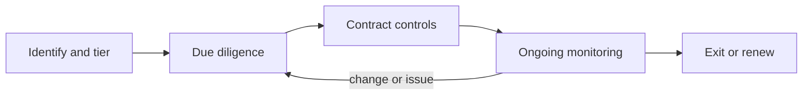

# Module 3 — Policies across the life cycle

*Module 2 gave Najm Bank principles, an appetite and people who own AI risk. This module gives those people rules to follow. Lesson 3.1 maps the AI life cycle and the stack of policies and procedures that governs each stage, from the top-level AI policy down to the exception process. Lesson 3.2 covers the two policy areas that trip organisations up most often: data governance for AI (provenance, quality, retention, lawful use) and intellectual property (rights in training data, ownership of outputs, confidential information in prompts). Lesson 3.3 deals with the fact that most of Najm's AI is not built in-house: vendor products, foundation-model APIs and open-source models, and the due diligence, contracts and monitoring they need. This course is educational and is not legal advice.*

> **BoK coverage:** I.C — policies and procedures that govern AI across its life cycle, including data governance, intellectual property and third-party risk.

---

# 3.1 — The AI life cycle and the policy stack
*Level: 🟡 Intermediate* · *Prerequisites: 2.1, 2.2* · *BoK: I.C*

## ⚡ In 60 seconds
- The **AI life cycle** runs from planning and design, through data and model building, verification and validation, deployment, operation and monitoring, to retirement. Governance applies at every stage, not only at launch.
- Standard life-cycle references: the **OECD** and **NIST AI RMF** life-cycle stages, **ISO/IEC 22989** (concepts and stages) and **ISO/IEC 5338** (life-cycle processes).
- The **policy stack** layers an AI policy (principles, scope, roles), an acceptable-use / GenAI policy (what staff may do), an inventory and risk-classification procedure, model risk management standards, and an exception process.
- Policies say *what* and *why*; standards set *minimum requirements*; procedures say *how*; guidelines advise. Keep the layers distinct.
- Exam cue: an AI inventory is the foundation. If a scenario asks what an organisation needs before it can govern its AI, the inventory (and classification) is usually the answer.
- Biggest trap: a "launch gate only" approach. Risks introduced at design or data stages, and drift after deployment, escape a single gate.

## 🧭 Why it matters
Najm Bank's existing controls were built for traditional software: a change advisory board approves releases, and the model risk team validates statistical models used for capital calculations. When Layla maps the credit copilot, the GenAI tool that drafts credit memos for relationship managers, against those controls, the gaps are obvious. Nobody reviewed the decision to let it read customer financial statements (a design choice). Nobody checked the licence of the retrieval documents it indexes (a data choice). Its "release" was a prompt change pushed on a Tuesday afternoon, which never touched the change advisory board. And nobody is watching whether its summaries get worse as the underlying model provider updates its model (a monitoring gap).

Each of these gaps sits at a different point in the life cycle, and each needs a different rule. That is why AI governance frameworks talk about the life cycle so much, and why a single "AI policy" document is never enough on its own.

## 📐 How it works

### 🟢 The essentials

**The AI life cycle.** Different frameworks draw the stages slightly differently, but they describe the same journey. A practical synthesis:

| Stage | What happens | Typical governance questions |
|---|---|---|
| 1. Plan and design | Define the problem, the intended purpose, users and affected people; decide whether AI is the right tool | Is this use case allowed? What risk tier? Who owns it? |
| 2. Collect and process data | Source, label, clean and document data | Do we have rights to use it? Is it representative and of good quality? Personal data? |
| 3. Build and train | Select or train the model; for GenAI, choose a foundation model, prompts, retrieval sources | Build or buy? Documented design choices? |
| 4. Verify and validate | Test performance, robustness, fairness, security; independent validation for high-tier | Does it meet the acceptance criteria set at design? |
| 5. Deploy | Integrate into business processes, train users, launch | Approvals complete? Transparency to users? Oversight staffed? |
| 6. Operate and monitor | Track performance, drift, incidents, complaints, changes from vendors | Still within tolerance? Who responds to alerts? |
| 7. Retire | Decommission, archive documentation, handle data, tell users | What happens to the data and to decisions already made? |

The **NIST AI RMF** uses a similar sequence (plan and design; collect and process data; build and use model; verify and validate; deploy and use; operate and monitor) and adds the people "using or impacted by" the system. The **OECD** describes comparable phases and stresses that they are iterative, not linear. **ISO/IEC 22989** defines AI concepts and describes life-cycle stages from inception through to retirement, and **ISO/IEC 5338** sets out AI system life-cycle processes, built on the established systems and software engineering process standards. The AIGP expects you to recognise these stages and place governance activities in them.

The loop back from monitoring to design matters: AI systems change after launch, through retraining, vendor model updates or shifts in the data they see.

**The policy stack.** Governance documents come in layers. Using the words precisely avoids confusion later:

- **Policy:** a short, board- or executive-approved statement of intent, scope, principles and roles. Changes rarely.
- **Standard:** mandatory minimum requirements, often technical (for example, "high-tier models must have documented fairness testing using approved metrics").
- **Procedure:** step-by-step instructions for a process (how to register a use case, how to request an exception).
- **Guideline:** recommended practice, not mandatory (a prompt-writing guide).

At Najm Bank the AI policy stack looks like this:

| Document | Type | What it covers | Owner |
|---|---|---|---|
| AI Policy | Policy | Principles, scope, definition of "AI system", roles, risk-based approach, links to other policies | Head of AI Governance, approved by board risk committee |
| Acceptable Use of AI / GenAI Policy | Policy | What all staff may and may not do with AI tools; approved tools; data rules | Head of AI Governance with CISO |
| AI Inventory and Risk Classification Procedure | Procedure | How use cases are registered, tiered and re-tiered | Head of AI Governance |
| AI Life-cycle Standard | Standard | Minimum controls per tier at each life-cycle stage | Head of AI Governance |
| Model Risk Management Standard (extended to AI) | Standard | Validation, performance monitoring, model change | Head of Model Risk |
| AI Exception Procedure | Procedure | How to request, approve, record and expire exceptions | Head of AI Governance |
| Linked: data governance, privacy, information security, third-party risk, records retention | Existing policies | Updated with AI-specific clauses (see 3.2 and 3.3) | Their existing owners |

### 🟡 Going deeper

**What goes in the AI policy.** A strong AI policy is usually short (a few pages) and contains:

1. **Purpose and scope:** which entities, geographies and systems it covers, including bought and embedded AI, not only models built in-house.
2. **Definition of AI system:** many organisations align with the OECD definition (updated in November 2023), which is also the basis of the EU AI Act definition. A clear definition prevents "it's just analytics" arguments.
3. **Principles:** the approved principles from Lesson 2.1.
4. **Risk-based approach:** every AI use case is registered and tiered; controls scale with the tier; some uses are prohibited outright (for example, anything prohibited by EU AI Act Art. 5, plus the bank's own red lines).
5. **Roles and accountability:** business owner, governance lead, committee, the three lines.
6. **Mandatory processes:** intake, impact assessments, validation, approval, monitoring, incident reporting, retirement.
7. **Related policies** and how conflicts are resolved.
8. **Exceptions, breaches and consequences.**
9. **Review cycle:** at least annually, and on major legal or technology change.

**The acceptable-use / GenAI policy.** This is the policy most staff will actually read. It should be concrete: which tools are approved (for example, the bank's enterprise GenAI tenant, where the vendor contract prohibits training on Najm's inputs); which are banned (consumer accounts of public tools for any bank data); what data classes may be entered where; the duty to check outputs before relying on them; disclosure rules (when to tell a customer AI was used); and how to request a new tool. Absolute bans on GenAI tend to fail and push use into the shadows; clear approved channels plus data rules work better.

**The inventory and classification procedure.** You cannot govern what you cannot see. The inventory is a register of every AI system in use or development, with, at minimum: a unique ID, name and description, intended purpose, business owner, life-cycle stage, whether built, bought or embedded, vendor and model details, data categories used (including personal and special-category data), affected people, jurisdictions, risk tier and the reason for it, EU AI Act classification and the organisation's role (provider or deployer), assessments completed, approval status and next review date. The procedure explains who must register (anyone starting an AI use case, and procurement for any purchase that includes AI), how tiering is done (a questionnaire scored by the governance team), and when re-tiering is triggered (change in purpose, data, users, jurisdiction or model).

Finding existing AI is its own project: survey business units, scan procurement records and expense claims for AI subscriptions, ask vendors whether their products include AI features, and check network logs for traffic to public AI services.

**Model risk management.** Banks already have model risk management (MRM) disciplines, and regulators expect them to cover AI models. In the US, the supervisory guidance SR 11-7 (2011) sets expectations for robust model development, independent validation ("effective challenge"), and governance including a model inventory. In the UK, the Prudential Regulation Authority's supervisory statement SS1/23 sets model risk management principles for banks and explicitly contemplates AI and machine-learning models. The QCB's AI guideline for financial institutions carries similar expectations for Qatari banks; check the current text. The governance move is to extend MRM to AI rather than duplicate it: widen the definition of "model" to cover AI systems including GenAI, add AI-specific validation (fairness, robustness, explainability, GenAI evaluation), and add triggers for vendor model changes.

**The exception process.** Rules will sometimes not fit. A good exception process makes deviations visible, time-bound and owned instead of silent:

- The requester states the rule, the reason, the risk, the compensating controls and the proposed expiry date.
- Approval authority scales with risk (governance lead for low risk; committee for high-tier; never for legally mandated requirements, which cannot be excepted internally).
- Every exception goes into an exception register, is reported to the committee, and expires. Renewal requires a fresh decision.
- Repeated exceptions to the same rule are a signal the rule needs changing.

### 🔴 Expert view

**Map controls to stages and tiers.** The most useful single artefact in a mature programme is a life-cycle control matrix: rows are life-cycle stages, columns are risk tiers, and each cell lists the mandatory controls and evidence. It turns the policy into something engineers can follow and auditors can test. **ISO/IEC 42001** Annex A is organised in a similar way, with control groups covering AI policies, internal organisation, resources, impact assessment, the AI system life cycle, data for AI systems, information for interested parties, use of AI systems, and third-party and customer relationships. Many organisations use it as a checklist for their policy stack.

**Regulatory requirements live inside the stack.** For providers of high-risk systems, the EU AI Act requires a risk management system that runs throughout the entire life cycle (Art. 9) and a quality management system with written policies, procedures and instructions (Art. 17). Deployers have their own duties (Art. 26), including using systems according to instructions for use, monitoring their operation and keeping automatically generated logs under their control for an appropriate period of at least six months unless other law says otherwise. The policy stack is where these obligations are assigned and evidenced.

**GenAI blurs the life cycle.** With a bought foundation model, "build" becomes selecting a model, writing prompts, configuring retrieval and adding guardrails. "Release" can be a configuration change with no code deployment. Your change management procedure must treat prompt, retrieval-source and model-version changes as changes, tiered by impact. A prompt change to the credit copilot that alters how it summarises risk factors is material; a typo fix is not.

**Proportionality keeps the stack alive.** If registering a low-risk internal tool takes six weeks, people stop registering. A fast track for low-tier use cases (short form, decision in days) is what makes the inventory complete, and completeness is worth more than rigour on trivial systems.

## ⚖️ The instruments
| Instrument | What it requires or recommends | Exam cue |
|---|---|---|
| **ISO/IEC 5338** | AI system life-cycle processes, built on existing systems and software life-cycle standards | The process standard for the AI life cycle |
| **ISO/IEC 22989** | AI concepts, terminology and a description of life-cycle stages | Shared vocabulary; stages run from inception to retirement |
| **NIST AI RMF** | Life-cycle stages and AI actors; Govern function calls for policies, processes and an inventory of AI systems | Inventory and policies sit in Govern |
| **OECD AI Principles** | AI system definition (updated Nov 2023) and an iterative life-cycle description | EU AI Act definition is based on the OECD's |
| **ISO/IEC 42001** — Clause 5.2 and Annex A | An AI policy approved by top management; Annex A controls for policies, life cycle, data, third parties and more | Annex A is a practical checklist for the policy stack |
| **EU AI Act** — Arts 9, 17 and 26 | Life-cycle risk management and quality management for high-risk providers; deployer duties including monitoring and log retention of at least six months | Obligations differ for providers and deployers |
| **SR 11-7** | US supervisory guidance on model risk management: sound development, independent validation, governance and inventory | "Effective challenge" and independent validation apply to AI models in banks |

## 🏛️ In practice at Najm Bank
Layla's **AI life-cycle control matrix (extract)**, part of the AI Life-cycle Standard:

| Stage | Low tier (e.g. meeting-notes summariser) | Medium tier (e.g. fraud-alert triage) | High tier (e.g. credit scoring, CV screening, credit copilot) |
|---|---|---|---|
| Plan and design | Register in inventory; owner named | + Documented intended purpose and misuse cases; privacy screen | + Committee approval to proceed; DPIA; FRIA where required; EU AI Act classification recorded |
| Data | Approved data sources only | + Data provenance record; quality checks | + Representativeness and bias analysis; rights-to-use confirmed by legal |
| Build | Approved tools and platforms | + Model documentation (model card) | + Explainability approach agreed; security threat model |
| Verify and validate | Owner self-test | + Peer review of tests | + Independent validation by model risk; red-teaming for GenAI |
| Deploy | User guidance published | + User training | + Committee launch approval; overseer training before access; customer transparency notice |
| Operate and monitor | Annual attestation by owner | + Quarterly performance review | + Monthly monitoring against tolerances; incident playbook; vendor-change triggers |
| Retire | Remove from inventory | + Archive documentation | + Retirement plan approved; data retention applied; affected users informed |

**Exception register entry (example):**

| ID | Rule | Requested by | Reason | Compensating controls | Approved by | Expiry |
|---|---|---|---|---|---|---|
| EX-004 | High-tier independent validation before launch | Khalid | Regulatory deadline for SME product | Limited pilot to 200 applications; 100% human review; validation complete within 60 days | AI Governance Committee | 60 days from approval |

## 🛠️ Exercises

### 🟢 Beginner
Place each of these Najm activities in a life-cycle stage: choosing retrieval documents for the credit copilot; checking fraud-model alert rates each month; deciding whether AI is needed for chatbot FAQs; deleting the old scoring model's training data.
*Done when:* each activity is matched to a stage with one sentence of reasoning.

### 🟡 Intermediate
Write the inventory record for the CV-screening tool, using the fields listed in 🟡 Going deeper.
*Done when:* every field is filled, the risk tier has a reason, and the EU AI Act classification and Najm's role (provider or deployer) are stated.

### 🔴 Advanced
Draft Najm's AI exception procedure in under 400 words: who can request, what they must provide, approval authority by tier, what cannot be excepted, recording, expiry and reporting.
*Done when:* the procedure prevents permanent silent exceptions and states that legally mandated requirements cannot be waived internally.

## ⚠️ Mistakes and exam traps
- **Launch-gate-only governance.** Answers that put all controls at deployment miss design, data and monitoring risks. Prefer life-cycle answers.
- **Inventory as an afterthought.** An organisation that has not inventoried its AI cannot tier, assess or monitor it. The inventory is usually the right "first operational step".
- **Only in-house models count.** Bought, embedded and employee-used GenAI tools belong in the inventory and under the acceptable-use policy.
- **Blanket GenAI bans.** They are rarely the best answer; approved tools plus data rules and training work better and reduce shadow AI.
- **Exceptions without expiry.** An exception with no end date is a policy change nobody approved.
- **Policy vs procedure confusion.** Policies state intent and roles; procedures give steps. Exam answers may test which document something belongs in.

## 🧾 Recap
- The AI life cycle runs from plan and design through data, build, validation, deployment and monitoring to retirement, and loops back on change.
- OECD, NIST AI RMF, ISO/IEC 22989 and ISO/IEC 5338 describe the life cycle; know the stages.
- The policy stack: AI policy, acceptable-use / GenAI policy, inventory and classification procedure, life-cycle standard, model risk management, exception procedure, plus AI clauses in existing policies.
- The inventory is the foundation; the life-cycle control matrix makes controls proportionate and testable.
- Exceptions must be visible, owned, compensated and time-bound.

## ✍️ Check yourself

**1. Najm Bank wants to start governing AI but does not know how many AI systems it uses. What should it do first?**

- A. Buy an AI monitoring platform
- B. Build an AI inventory, including bought and embedded AI, and classify each system by risk
- C. Commission a red-team exercise on the chatbot
- D. Write detailed technical standards for model validation

Answer

**B.** You cannot govern what you cannot see; the inventory and classification enable everything else. The other options are useful later but assume you know what you have. (See 🟡 Going deeper, inventory.)

**2. Which document would normally contain step-by-step instructions for registering a new AI use case?**

- A. A procedure
- B. The AI policy
- C. A guideline
- D. The risk appetite statement

Answer

**A.** Procedures describe how to carry out a process; policies state intent, scope and roles; guidelines are advisory. (See 🟢 The essentials, the policy stack.)

**3. A retailer's GenAI shopping assistant behaved well at launch but its answers degraded after the foundation-model vendor updated its model. Which life-cycle control was most clearly missing?**

- A. A business case at the design stage
- B. A data licence review
- C. Operational monitoring with triggers for vendor model changes
- D. A board-approved AI policy

Answer

**C.** Degradation after a vendor change is an operate-and-monitor failure. The life cycle loops back after deployment; governance must too. (See 🔴 Expert view.)

**4. What is the main purpose of an expiry date on an approved policy exception?**

- A. To comply with a specific EU AI Act article on exceptions
- B. To let the requester extend it automatically
- C. To reduce the number of committee meetings
- D. To make sure deviations are temporary and are re-decided rather than becoming silent permanent policy changes

Answer

**D.** Expiry forces a fresh decision and keeps the exception register meaningful. There is no AI Act article on internal exceptions, so A is invented. (See 🟡 Going deeper, exceptions.)

**5. Which ISO/IEC standard sets out processes for the AI system life cycle?**

- A. ISO/IEC 42005
- B. ISO/IEC 5338
- C. ISO/IEC 38507
- D. ISO/IEC 42006

Answer

**B.** ISO/IEC 5338 covers AI system life-cycle processes. 42005 is impact assessment, 38507 is board-level governance, and 42006 covers bodies certifying 42001. (See ⚖️ The instruments.)

## 📚 References
- NIST AI Risk Management Framework: https://www.nist.gov/itl/ai-risk-management-framework
- OECD AI Principles and AI system definition: https://oecd.ai/en/ai-principles
- ISO/IEC JTC 1/SC 42 (ISO/IEC 5338, 22989 and the AI standards family): https://www.iso.org/committee/6794475.html
- ISO/IEC 42001:2023: https://www.iso.org/standard/81230.html
- EU AI Act, Regulation (EU) 2024/1689: https://eur-lex.europa.eu/eli/reg/2024/1689/oj
- US Federal Reserve SR 11-7, Guidance on Model Risk Management: https://www.federalreserve.gov/supervisionreg/srletters/sr1107.htm
- Bank of England Prudential Regulation Authority (SS1/23 model risk management principles): https://www.bankofengland.co.uk/prudential-regulation
- Qatar Central Bank: https://www.qcb.gov.qa/

---

# 3.2 — Data governance and intellectual-property policies for AI
*Level: 🟡 Intermediate* · *Prerequisites: 3.1* · *BoK: I.C*

## ⚡ In 60 seconds
- AI systems inherit the strengths and flaws of their data. Data governance for AI covers **provenance** (where data came from), **lineage** (how it moved and changed), **quality and representativeness**, **retention**, and **lawful use** (legal basis, purpose, rights).
- For high-risk systems, **EU AI Act Art. 10** requires data governance practices for training, validation and testing data, including examination for possible biases. **GDPR** principles (purpose limitation, minimisation, storage limitation) still apply to personal data used in AI.
- IP policies must cover three things: **rights to training data** (licences, copyright, text-and-data-mining limits), **rights in outputs** (who owns them, whether they are protected at all), and **confidential information in prompts** (trade secrets and client data leaking to tools).
- Exam cue: "we have the data already" is not a legal basis for a new purpose. Look for purpose compatibility and rights checks.
- Biggest trap: assuming data that is publicly available online is free to use for training, or that AI outputs are automatically owned by the organisation.

## 🧭 Why it matters
Dana's team wants to improve the SME credit model by adding ten years of historical loan files, transaction data from current accounts, and a dataset of company financials bought from a data broker five years ago. Meanwhile, Omar's team is building the retrieval library for the credit copilot, and someone has uploaded industry research reports from a paid subscription service. And relationship managers want to paste draft credit memos, which contain client names and financials, into a public GenAI tool to polish the wording.

Each of these raises a data or IP question the bank has not written a rule for. Was the historical loan data collected for a purpose compatible with model training? Do the ten years reflect today's customer base, or a period when certain groups were under-served? Does the broker licence allow machine-learning use? Does the research subscription allow the content to be copied into an AI index? And what happens to client data typed into a consumer AI tool? Real cases show the stakes: the Italian data protection authority temporarily limited ChatGPT in Italy in 2023 and fined OpenAI €15 million in December 2024, including over the legal basis for training data; and Samsung restricted GenAI use in 2023 after staff reportedly pasted confidential code into a public chatbot.

## 📐 How it works

### 🟢 The essentials

**Why AI needs its own data rules.** Traditional data governance focuses on accuracy for reporting and security of stored data. AI adds new demands:

- Data is used to *learn patterns*, so historical biases become future decisions (the Amazon recruiting model, reported scrapped in 2018, learned to downgrade CVs associated with women because it was trained on a male-dominated history of hires).
- Data is often *repurposed*: collected for one reason, used to train a model for another.
- Models can *memorise* and sometimes reveal training data, so what goes in can come out.
- Data comes from many sources (internal systems, brokers, web scraping, synthetic generation, vendors), each with its own rights and quality.

**The core data governance policy elements for AI:**

| Element | What it means | Najm rule of thumb |
|---|---|---|
| Provenance | A record of where each dataset came from, under what terms, collected how and when | No dataset used for AI without a provenance record |
| Lineage | How data was transformed, joined, filtered and labelled between source and model | Pipelines logged so any model input can be traced back |
| Quality | Accuracy, completeness, consistency, timeliness, with known error rates | Quality checks and thresholds set per dataset |
| Representativeness | Whether the data reflects the population and context the system will serve | Compare training population with the current customer base |
| Lawful use | A legal basis for the processing, purpose compatibility, special-category limits, transfer rules | DPO sign-off for personal data in any medium or high-tier system |
| Minimisation | Only the data needed for the purpose | Justify every personal-data feature |
| Retention | How long training data, test sets, logs, prompts and outputs are kept, and why | Retention schedule per data type, aligned with legal holds and record-keeping duties |
| Access and security | Who can see and change datasets; protection from tampering (data poisoning) | Role-based access; integrity checks on training data |

**Lawful use of personal data.** Where personal data is involved, the **GDPR** (for Najm's EU customers) and the **Qatar PDPPL** (Law No. 13 of 2016) apply to AI like any other processing. The GDPR principles in Art. 5 bite hard: *purpose limitation* means data collected to service a loan cannot automatically be reused to train a marketing model; *data minimisation* limits features to what is necessary; *storage limitation* means training sets are not kept forever "just in case". Processing needs a lawful basis under Art. 6, and special categories (such as health or ethnic origin) need an Art. 9 condition. The EDPB's Opinion 28/2024 on AI models addresses when a model can be considered anonymous, how legitimate interest can be assessed for developing and deploying models, and the consequences when a model was trained on unlawfully processed personal data. Module 4 covers privacy law in depth; here the point is that the data policy must route personal-data use through the privacy team.

### 🟡 Going deeper

**EU AI Act Article 10.** For high-risk AI systems that are trained with data, the Act requires training, validation and testing datasets to be subject to data governance and management practices appropriate to the intended purpose. These cover, among other things: the relevant design choices; data collection processes and the origin of data (and, for personal data, the original purpose of collection); data preparation such as annotation, labelling, cleaning and enrichment; the assumptions the data is meant to represent; an assessment of availability, quantity and suitability; examination in view of possible biases likely to affect health and safety or fundamental rights or lead to prohibited discrimination; measures to detect, prevent and mitigate those biases; and identification of data gaps or shortcomings. Datasets must be relevant, sufficiently representative and, to the best extent possible, free of errors and complete in view of the intended purpose. The Act also allows providers, exceptionally and subject to strict safeguards, to process special categories of personal data where strictly necessary to detect and correct bias. Najm is the provider of its in-house credit-scoring model, which is high-risk under Annex III, so Article 10 applies to Dana's datasets.

**Data documentation.** Good practice is to document datasets the way you document models: a "datasheet" or data card describing motivation, composition, collection process, preprocessing, uses, distribution and maintenance. It becomes evidence for Article 10, for DPIAs and for validators.

**Retention for AI.** AI adds several new data types to the retention schedule: training and test datasets, model versions (which may embed personal data), prompts and outputs of GenAI tools, and logs. Retention must balance competing duties. Storage limitation says delete when no longer needed. Record-keeping and accountability duties say keep enough to explain and reconstruct decisions: EU AI Act deployers of high-risk systems must keep the logs under their control for at least six months unless other law provides otherwise, and banking record-keeping rules often require longer for credit decisions. The policy should state, per data type, the period, the reason and the legal driver.

**Intellectual property: training data rights.** Data and content used to train or ground AI may be protected by copyright, database rights, contract (licence terms) or trade secrets. Key points:

- **"Publicly available" is not "free to use".** Web content is usually copyright-protected. In the EU, the Digital Single Market Copyright Directive (EU) 2019/790 provides text-and-data-mining exceptions: one for research organisations and cultural heritage institutions for scientific research, and a general one that rightsholders can opt out of (for online content, in a machine-readable way). Other jurisdictions take different approaches, and litigation over AI training is ongoing in several countries; check the current position.
- **Licences matter.** Najm's broker dataset and research subscription are governed by contract. Many licences restrict use to internal analysis and do not permit machine learning, redistribution or derived products. Legal must check.
- **GPAI providers must address copyright.** Under the EU AI Act, providers of general-purpose AI models must put in place a policy to comply with EU copyright law, including respecting text-and-data-mining opt-outs, and publish a sufficiently detailed summary of the content used for training (the AI Office published a template in 2025). This helps Najm as a downstream user judge its foundation-model providers.

**Intellectual property: outputs.** Two separate questions:

- *Are outputs protected at all?* Copyright systems generally require human authorship or originality. The US Copyright Office's guidance is that material generated by AI without sufficient human creative contribution is not registrable, though human selection, arrangement and modification can be. Positions differ by country. Practical consequence: Najm cannot assume it owns exclusive rights in a purely AI-generated marketing image.
- *Could outputs infringe others' rights?* Outputs can reproduce protected material or trademarks. Policies should require review of externally published AI content, and contracts with providers should address IP indemnities (see 3.3).

**Confidential information in prompts.** Prompts are data transfers. Typing client financials into a consumer GenAI tool may disclose confidential and personal data to a third party that can store it, use it to train models (depending on the terms), or expose it in a breach. It may breach bank secrecy obligations, client contracts and data protection law. It may also weaken trade-secret protection: under the EU Trade Secrets Directive (EU) 2016/943, information is only protected as a trade secret if its holder takes reasonable steps to keep it secret, and uncontrolled pasting into public tools undermines that argument. The acceptable-use policy should classify data and state which classes may go into which tools, backed by enterprise agreements that prohibit training on inputs and by technical controls such as data loss prevention.

### 🔴 Expert view

**Data rights travel with the model.** If a model was trained on data the organisation had no right to use, the problem does not disappear once training ends. Regulators can order deletion, and in some cases have required deletion of models or algorithms derived from improperly obtained data. The EDPB's Opinion 28/2024 discusses how unlawful processing at the development stage may affect the lawfulness of later deployment. This is why provenance must be recorded *before* training, not reconstructed after a complaint.

**Fairness needs data you may not want to hold.** To test whether a credit model disadvantages a protected group, you need to know group membership, but minimisation and special-category rules discourage collecting it. Options include using the EU AI Act's narrow bias-detection allowance for high-risk systems (with its safeguards), using proxies with care, or using separate, access-controlled test datasets. The data policy should name who can authorise this and under what conditions; the DPO and compliance must both be involved.

**Synthetic and anonymised data are not automatically safe.** Synthetic data generated from personal data can still leak information about real individuals, and "anonymised" data may be re-identifiable. Treat claims of anonymity as something to verify, as the EDPB opinion does for models themselves.

**One policy set, many jurisdictions.** Najm processes data in Qatar, the UAE and the EU. Data residency, cross-border transfer rules and sector secrecy rules differ. A common pattern is a group-wide AI data standard at the strictest common level plus local annexes (for example PDPPL requirements in Qatar; UAE PDPL and, for DIFC entities, the DIFC Data Protection Law). Hedge local specifics and confirm with local counsel.

## ⚖️ The instruments
| Instrument | What it requires or recommends | Exam cue |
|---|---|---|
| **EU AI Act** — Art. 10 | Data governance for high-risk training, validation and testing data: origin, preparation, bias examination and mitigation, representativeness, data gaps | Provider obligation; bias examination is explicit |
| **EU AI Act** — Art. 53 | GPAI model providers: copyright-compliance policy (incl. TDM opt-outs) and a public summary of training content | Downstream users can use these to assess providers |
| **GDPR** — Arts 5, 6, 9 | Purpose limitation, minimisation, storage limitation; lawful basis; special-category conditions | Existing data does not come with a new purpose |
| **EDPB Opinion 28/2024** | Model anonymity, legitimate interest for AI development and deployment, effect of unlawfully processed training data | Anonymity of a model must be demonstrated, not assumed |
| **EU DSM Copyright Directive** — (EU) 2019/790, Arts 3–4 | Text-and-data-mining exceptions; rightsholders can opt out of the general exception | "Publicly available" is not a licence |
| **EU Trade Secrets Directive** — (EU) 2016/943 | Protection depends on reasonable steps to keep information secret | Prompt controls help preserve trade-secret status |
| **Qatar PDPPL** — Law No. 13 of 2016 | Qatar's personal data protection law, applying to processing of personal data including for AI | Local law alongside GDPR for Najm; check official text |

## 🏛️ In practice at Najm Bank
Clauses Layla, Omar and Sara add to Najm's **Data Governance Policy** and **Acceptable Use of AI Policy**:

> **AI data clauses (Data Governance Policy, section 9)**
> 9.1 No dataset may be used to train, fine-tune, evaluate or ground an AI system unless it has a provenance record stating source, collection method, date range, licence or legal basis, and data owner.
> 9.2 Personal data may be used for a new AI purpose only after the DPO has assessed purpose compatibility and lawful basis and, for medium and high-tier systems, a DPIA screen is complete.
> 9.3 Third-party data and content (licensed datasets, subscriptions, web content) may be used for AI only after Legal confirms the licence permits the intended use.
> 9.4 High-tier systems require a data card documenting representativeness, known gaps, bias examination and mitigations, approved by the model owner and reviewed in validation.
> 9.5 Training data, model versions, prompts, outputs and logs follow the AI retention schedule in Annex C. Logs of high-risk systems within scope of the EU AI Act are retained for at least the legally required period.

> **Prompt and output rules (Acceptable Use of AI Policy, section 4)**
>
> | Data class | Najm enterprise GenAI (no training on inputs, EU/Qatar hosting) | Public consumer AI tools |
> |---|---|---|
> | Public | Allowed | Allowed |
> | Internal | Allowed | Not allowed |
> | Confidential (client data, credit files) | Allowed only in approved use cases (e.g. credit copilot) | Never |
> | Restricted (special-category data, security secrets, source code) | Only with specific approval | Never |
>
> 4.3 AI outputs must be reviewed by a person before use in any customer communication, credit decision or external publication. 4.4 Do not assume Najm owns exclusive rights in AI-generated content; check with Legal before registering or relying on it as proprietary.

## 🛠️ Exercises

### 🟢 Beginner
For each of Dana's three proposed datasets (historical loan files, current-account transactions, the broker's company financials), write the one question that must be answered before use.
*Done when:* you have one lawful-use or rights question per dataset and named who answers it.

### 🟡 Intermediate
Draft a data card outline for the SME credit model's training data, with at least eight headings, and fill in two with plausible Najm content.
*Done when:* the outline covers origin, collection purpose, preparation, representativeness, known gaps, bias examination and retention.

### 🔴 Advanced
The research reports already in the credit copilot's retrieval library may not be licensed for AI use. Write a short decision memo for the committee: options (remove, license, keep with restrictions), risks of each, and your recommendation.
*Done when:* the memo distinguishes contract risk from copyright risk, addresses outputs that quote the reports, and sets an action owner and date.

## ⚠️ Mistakes and exam traps
- **"We already hold the data."** Holding data is not a lawful basis for a new AI purpose. Look for purpose-compatibility and lawful-basis checks.
- **Public equals free.** Public web content and purchased datasets are usually protected by copyright or contract. Choose answers that check rights and licences.
- **AI outputs are automatically ours.** Protection of purely AI-generated material is uncertain or unavailable in many systems; human contribution matters.
- **Prompts are harmless.** Prompts transmit data to a third party; treat them like any data transfer and control them by classification.
- **Keep everything forever.** Storage limitation and retention schedules apply to training data, prompts and logs, balanced against legal record-keeping duties.
- **Bias is a model problem only.** Most bias enters through data; Article 10 puts bias examination in data governance.

## 🧾 Recap
- AI data governance covers provenance, lineage, quality, representativeness, lawful use, minimisation, retention and security.
- EU AI Act Art. 10 sets data governance duties for high-risk providers, including bias examination; GDPR and local laws such as the Qatar PDPPL govern personal data.
- IP policy covers rights in training data (copyright, licences, TDM opt-outs), rights in outputs (human authorship), and confidential information in prompts (trade secrets, client confidentiality).
- Record provenance before training: data problems travel with the model.
- Control prompts by data classification, enterprise agreements and technical controls.

## ✍️ Check yourself

**1. Dana wants to use loan-servicing data collected over ten years to train a new marketing-propensity model. What is the key data governance question?**

- A. Whether the new purpose is compatible with the original purpose and has a lawful basis
- B. Whether the data is stored in the cloud
- C. Whether the data scientists have the right software licences
- D. Whether the model will be more accurate than the old one

Answer

**A.** Purpose limitation and lawful basis govern repurposing personal data. Holding the data is not enough. (See 🟢 The essentials, lawful use.)

**2. Under the EU AI Act, which requirement applies to training data for high-risk AI systems?**

- A. All training data must be synthetic
- B. Training data must be stored in the EU
- C. Data governance practices including examination for possible biases and measures to detect, prevent and mitigate them
- D. Training data must be published

Answer

**C.** Article 10 requires data governance practices including bias examination and mitigation. The other options are not Article 10 requirements. (See 🟡 Going deeper.)

**3. A marketing team says web images are "publicly available" and so can be used freely to fine-tune an image model. What is the best response?**

- A. Agree, because anything online is in the public domain
- B. Only use images with no watermark
- C. Use the images but do not tell anyone
- D. Check copyright, licence terms and any text-and-data-mining opt-outs before use

Answer

**D.** Public availability does not remove copyright; in the EU the general TDM exception can be opted out of by rightsholders. (See 🟡 Going deeper, training data rights.)

**4. Relationship managers at a bank paste client financials into a consumer GenAI tool. Which policy combination best addresses this?**

- A. An acceptable-use policy that classifies data by tool, an approved enterprise tool whose terms bar training on inputs, and technical controls such as data loss prevention
- B. A reminder email asking staff to be careful
- C. A total ban on all AI across the bank
- D. Asking the tool's vendor to delete the data

Answer

**A.** Combining clear rules, a safe approved channel and technical controls addresses the risk; B is weak, C drives shadow use, D is reactive. (See 🟡 Going deeper, confidential information in prompts.)

**5. Why might uncontrolled pasting of confidential information into public AI tools weaken an organisation's legal position beyond the immediate leak?**

- A. It automatically transfers copyright to the AI vendor
- B. It makes the organisation a GPAI provider
- C. It violates Article 5 of the EU AI Act
- D. Trade-secret protection depends on reasonable steps to keep information secret, which uncontrolled disclosure undermines

Answer

**D.** Under the EU Trade Secrets Directive, protection requires reasonable secrecy measures. The other options misstate the law. (See 🟡 Going deeper.)

## 📚 References
- EU AI Act, Regulation (EU) 2024/1689: https://eur-lex.europa.eu/eli/reg/2024/1689/oj
- GDPR, Regulation (EU) 2016/679: https://eur-lex.europa.eu/eli/reg/2016/679/oj
- European Data Protection Board (Opinion 28/2024 on AI models): https://www.edpb.europa.eu/
- Directive (EU) 2019/790 on copyright in the Digital Single Market: https://eur-lex.europa.eu/eli/dir/2019/790/oj
- Directive (EU) 2016/943 on trade secrets: https://eur-lex.europa.eu/eli/dir/2016/943/oj
- US Copyright Office, Copyright and Artificial Intelligence: https://www.copyright.gov/ai/
- Qatar legal portal Al Meezan (Law No. 13 of 2016, PDPPL): https://www.almeezan.qa/
- European Commission AI Office and AI Act guidance: https://digital-strategy.ec.europa.eu/en/policies/regulatory-framework-ai

---

# 3.3 — Third-party and supply-chain risk
*Level: 🟡 Intermediate* · *Prerequisites: 3.1, 3.2* · *BoK: I.C*

## ⚡ In 60 seconds
- Most organisations buy far more AI than they build: vendor AI products, AI features embedded in existing software, foundation-model APIs, open-source or open-weight models, data and labelling services.
- **Accountability does not transfer with the purchase.** As a deployer, you remain responsible for how you use the system; under the EU AI Act, deployers have their own duties, and a deployer can even become a provider.
- Third-party AI governance has four stages: **inventory and tiering**, **due diligence** (AI-specific questionnaire plus evidence), **contractual controls** (data use, change notification, audit, incidents, IP, exit), and **ongoing monitoring**.
- Open-source models need their own checks: licence terms (many "open" models carry use restrictions), provenance, security of model files, and who supports them.
- Exam cue: when a scenario involves a vendor tool causing harm, the best answer usually combines the organisation's own accountability with contract and monitoring controls, not "blame the vendor".
- Biggest trap: relying on a vendor's marketing claims ("bias-free", "compliant") instead of evidence, testing in your own context and contractual rights.

## 🧭 Why it matters
Yusuf in procurement signed Najm Bank's CV-screening contract two years ago on the standard software template. It says nothing about training data, bias testing, use of Najm's candidate data, or model changes. Now HR in Frankfurt wants to use the tool for EU hiring. Recruitment and candidate selection is listed as high-risk in Annex III of the EU AI Act, which makes Najm a deployer of a high-risk system with its own legal duties, and some of them (like following the instructions for use and monitoring the system) are impossible without the vendor's cooperation.

At the same time, the credit copilot runs on a foundation model accessed via API; the vendor has changed the underlying model version twice this year with a notice in a developer changelog. And Dana's team has downloaded an open-weight model from a public hub for fraud-narrative summaries without anyone checking its licence. Air Canada was held responsible for what its chatbot told a customer; buying or downloading a system does not buy you out of that kind of risk.

## 📐 How it works

### 🟢 The essentials

**Kinds of third-party AI.**

| Type | Najm example | Main risks |
|---|---|---|
| Vendor AI product | CV-screening tool | Opaque model, bias, vendor using your data, limited testing access |
| AI embedded in existing software | New "AI insights" feature switched on in the CRM platform | AI arrives without procurement review; data flows change silently |
| Foundation-model API | Model behind the credit copilot | Model changes without notice, data retention by provider, outages, concentration on a few providers |
| Open-source / open-weight model | Model downloaded for fraud summaries | Licence restrictions, unknown training data, malicious or tampered files, no vendor support |
| Data and labelling services | Broker datasets, outsourced labelling | Provenance and rights (see 3.2), labour and quality issues |

**Accountability stays with you.** The central principle: an organisation that uses a third-party AI system remains accountable for the outcomes of that use. Regulators and courts look at the organisation that made the decision about the customer or candidate. Contracts can allocate costs and cooperation duties between the parties, but they do not remove your obligations to the people affected.

**The EU AI Act value chain.** The Act assigns duties by role:

- **Providers** (who develop an AI system or have one developed and place it on the market under their own name) carry most high-risk obligations: risk management, data governance, technical documentation, instructions for use, conformity assessment.
- **Deployers** (who use an AI system under their authority in a professional context) must, for high-risk systems, use them according to the instructions for use, assign competent human oversight, ensure input data under their control is relevant and sufficiently representative, monitor operation and inform the provider of risks or serious incidents, keep logs, and inform workers' representatives and affected workers before using high-risk AI in the workplace. Some deployers, including those using AI for creditworthiness assessment of natural persons, must carry out a fundamental rights impact assessment (Art. 27).
- **Importers and distributors** have verification duties when bringing systems onto the EU market.
- A deployer or other third party **becomes a provider** if it puts its name or trademark on a high-risk system, makes a substantial modification to it, or changes the intended purpose of a system so that it becomes high-risk (Art. 25). If Najm rebrands the CV tool as "Najm TalentMatch" or retrains it substantially, it could inherit provider obligations.

**Four stages of third-party AI governance.**

### 🟡 Going deeper

**Identify and tier.** Procurement is the choke point. For every purchase and renewal, Najm's procurement procedure now asks whether the product uses or will add AI. If yes, the purchase is registered in the AI inventory and tiered like an internal use case (3.1). Embedded AI is caught at renewal.

**Due diligence.** Proportionate to the tier. An AI-specific due-diligence questionnaire supplements the usual security, privacy and financial checks:

| Area | Sample questions | Evidence to ask for |
|---|---|---|
| Intended purpose and limits | What is the system designed and validated for? Known limitations and unsuitable uses? | Instructions for use, model or system card |
| Regulatory status | Is the system high-risk under the EU AI Act? Are you the provider? Conformity status? | EU declaration of conformity and registration where applicable |
| Training data | Sources, rights, personal data, representativeness for our population | Data documentation, training content summary for GPAI models |
| Performance and fairness | Accuracy and error rates by relevant groups; test methodology | Test reports; independent audit results; permission for our own testing |
| Explainability | What explanations can be given to users and affected people? | Sample outputs, reason codes |
| Human oversight | What controls exist for overseers to understand, override or stop the system? | Interface demo, documentation |
| Data use | Do you use our inputs or outputs to train or improve models? Retention? Location? Subprocessors? | Data processing agreement, subprocessor list |
| Security | Protection against prompt injection, data poisoning, model extraction; secure development | Security certifications, penetration test summaries |
| Change management | How and when do you change models? Will you notify us? | Release policy, versioning |
| Incidents | How do you detect, handle and notify AI incidents? | Incident process, past incident history |
| Governance | Do you have an AI management system or responsible AI programme? | ISO/IEC 42001 certificate if held; policies |
| Foundation-model dependencies | Which foundation models or third-party components does your product rely on? | Component list |

Do not stop at the questionnaire: for high-tier systems, test in your own context with your own data.

**Contractual controls.** Najm's AI contract schedule includes:

- **Data use:** no use of Najm inputs, outputs or customer data to train or improve vendor models without explicit agreement; retention limits; data location; subprocessor approval; a data processing agreement meeting GDPR Art. 28 where the vendor processes personal data as a processor.
- **Transparency and documentation:** delivery of instructions for use and technical information needed for Najm's own obligations (DPIA, FRIA, human oversight, explanations to customers).
- **Change notification:** advance notice of material model, data or feature changes; the right to test before changes take effect for high-tier uses; version pinning where feasible.
- **Performance and fairness commitments:** agreed metrics, reporting and remediation.
- **Audit and testing rights:** rights for Najm, its auditors and regulators to access information, test, and audit.
- **Incident notification:** timelines for notifying Najm of incidents, security breaches and serious malfunctions; cooperation in investigations and regulatory reporting.
- **Regulatory cooperation:** vendor cooperation with Najm's EU AI Act, data protection and banking regulator obligations.
- **IP:** warranties about rights in training data; indemnities against third-party IP claims arising from outputs; clarity on ownership of outputs and fine-tuned models.
- **Liability, insurance and exit:** return and deletion of data, transition support, and continuity if the vendor withdraws the model.

For providers of high-risk systems, the EU AI Act also expects written agreements with third parties that supply AI systems, tools, services or components integrated into the high-risk system, specifying the information, capabilities, technical access and assistance needed to meet the Act's requirements (Art. 25), and provides for the AI Office to develop voluntary model contractual terms. In financial services, sector rules on outsourcing and ICT third-party risk also apply; in the EU, the Digital Operational Resilience Act (DORA, Regulation (EU) 2022/2554) has applied since January 2025 to ICT third-party arrangements of in-scope financial entities. Confirm scope for any given entity.

**Ongoing monitoring.** AI systems change. Monitoring includes tracking release notes and model versions, periodic performance and fairness checks on Najm's own outcomes, reviewing complaints and overrides, and re-assessing the vendor annually or on material change.

### 🔴 Expert view

**Foundation models create a layered supply chain.** The credit copilot involves at least three parties: the foundation-model provider, a platform or integrator, and Najm, which configures prompts and retrieval. Each layer can introduce risk, and each has different knowledge. The EU AI Act addresses this partly through obligations on general-purpose AI model providers (Art. 53), including technical documentation, information and documentation for downstream providers integrating the model into their systems, a copyright policy and a public training-content summary; providers of GPAI models with systemic risk (presumed above 10^25 floating-point operations of training compute) have additional duties such as evaluations, adversarial testing, incident reporting and cybersecurity. The GPAI Code of Practice published in July 2025 is a voluntary tool providers can use to demonstrate compliance. As a downstream user, Najm should ask for this documentation and check whether its provider has signed the Code. The NIST Generative AI Profile (NIST AI 600-1) also lists value-chain and component-integration risk among the risks unique to or exacerbated by GenAI.

**Open-source and open-weight models.** "Open" covers many things: some models use permissive open-source licences, while many "open-weight" models carry custom licences with use restrictions or commercial thresholds. The Open Source Initiative's 2024 Open Source AI Definition sets a higher bar than releasing weights. Governance checks for open models include: licence review by legal; provenance (official publisher versus a re-upload); integrity of files (some model file formats can execute code when loaded, so use safe formats and scanning); available documentation of training data and evaluations; and a plan for support and patching, because there is no vendor to call. Under the EU AI Act, AI released under free and open-source licences benefits from certain exemptions, but not if it is placed on the market as a high-risk system, falls under the prohibitions or triggers transparency obligations; open-source GPAI models are exempt from some documentation duties unless they present systemic risk.

**Both directions.** When Najm offers SME clients an AI cash-flow forecasting feature, Najm is the vendor and must answer the questionnaires it sends to others. **ISO/IEC 42001** Annex A treats third-party *and* customer relationships together, and the **NIST AI RMF** Govern function covers AI risks from third-party software, data and supply chains.

**Concentration and exit.** A few foundation-model and cloud providers underpin much of the market; one outage or withdrawn model can break many systems at once. Record dependencies, design for portability (evaluation suites that let you test a replacement model quickly), and keep exit plans for critical systems.

## ⚖️ The instruments
| Instrument | What it requires or recommends | Exam cue |
|---|---|---|
| **EU AI Act** — Art. 25 | Responsibilities along the value chain; a deployer or third party becomes a provider by rebranding, substantial modification or changing intended purpose to high-risk; written agreements with component suppliers | Rebranding or substantially modifying a high-risk system can make you the provider |
| **EU AI Act** — Art. 26 | Deployer duties for high-risk AI: follow instructions, human oversight, relevant input data, monitoring, logs, informing workers | Buying the system does not remove deployer duties |
| **EU AI Act** — Art. 53 | GPAI providers: technical documentation, information for downstream providers, copyright policy, training-content summary | Ask foundation-model providers for this documentation |
| **GDPR** — Art. 28 | Contract terms when a vendor processes personal data as a processor | AI vendors processing customer data need a DPA |
| **NIST AI RMF** — Govern function | Policies and procedures for third-party software, data and supply-chain AI risks | Third-party risk is part of governance, not only procurement |
| **NIST AI 600-1** | Generative AI Profile; includes value-chain and component-integration risk | GenAI supply chains need extra transparency |
| **ISO/IEC 42001** — Annex A | Controls on third-party and customer relationships, including allocating responsibilities and supplier management | Covers both your suppliers and your customers |
| **DORA** — Regulation (EU) 2022/2554 | ICT risk and ICT third-party risk management for in-scope EU financial entities | Sector rules add to AI-specific ones for banks; confirm scope |

## 🏛️ In practice at Najm Bank
Yusuf and Layla's **AI vendor due-diligence and contracting checklist** for the CV-screening tool (high tier):

| Step | Action | Owner | Status |
|---|---|---|---|
| 1 | Register the tool in the AI inventory; classify as high-risk (Annex III employment); record Najm as deployer | Layla | Done |
| 2 | Check for provider triggers: no rebranding, no substantial modification, intended purpose unchanged | Legal | Done: Najm remains deployer |
| 3 | Send AI due-diligence questionnaire; request instructions for use, declaration of conformity and registration details, fairness test reports | Yusuf | Sent |
| 4 | Run Najm's own adverse-impact test on 12 months of anonymised historical applications | Dana with HR | Scheduled |
| 5 | DPIA for candidate data; confirm vendor is processor; Art. 28 DPA; no training on Najm data | Sara | In progress |
| 6 | Inform workers' representatives in Frankfurt before use | HR | Planned |
| 7 | Contract amendment: AI schedule (data use, change notification with 30 days' notice for material changes, audit and testing rights, incident notification, regulatory cooperation, IP indemnity, exit) | Yusuf with Legal | Drafting |
| 8 | Recruiter training on oversight and overriding before access | HR | Planned |
| 9 | Monitoring plan: quarterly selection-rate analysis by group; vendor release-note review; annual reassessment | HR business owner | Drafted |
| 10 | Committee approval to deploy in the EU, with conditions | AI Governance Committee | Pending steps 3–9 |

**Open-source model rule (added to the AI Life-cycle Standard):** "Open-source or open-weight models may be downloaded only from the official publisher's repository, in safe file formats, after Legal has reviewed the licence for Najm's intended use and the model has been registered in the AI inventory. Experiments using customer data require the same approvals as any other AI use case."

## 🛠️ Exercises

### 🟢 Beginner
List Najm's third-party AI dependencies from this lesson and classify each by type (vendor product, embedded, foundation-model API, open model, data service).
*Done when:* each dependency has a type and one main risk.

### 🟡 Intermediate
Write ten contract clauses (one sentence each) for Najm's agreement with the credit copilot's foundation-model provider.
*Done when:* the clauses cover data use, retention and location, change notification, incident notification, audit or information rights, regulatory cooperation, IP and exit.

### 🔴 Advanced
HR wants to rename the CV tool "Najm TalentMatch", retrain it on Najm's own hiring data and offer it to a sister company. Analyse whether Najm becomes a provider under the EU AI Act, what obligations follow, and what you would recommend.
*Done when:* your analysis applies the rebranding, substantial-modification and intended-purpose triggers, lists the main provider obligations that would apply, and gives a clear recommendation with conditions.

## ⚠️ Mistakes and exam traps
- **"The vendor is responsible."** Deployers keep their own obligations and remain accountable to affected people. Choose answers that combine your controls with vendor cooperation.
- **Questionnaire only.** Self-reported answers are not evidence. For high-tier systems, prefer answers that include testing in your context and contractual audit rights.
- **Missing embedded AI.** AI features added to existing software bypass procurement unless renewals and vendor disclosures are checked.
- **"Open source means no restrictions."** Many open-weight licences restrict use; review licences and provenance.
- **Forgetting provider conversion.** Rebranding, substantial modification or a changed intended purpose can turn a deployer into a provider under the EU AI Act.
- **One-off due diligence.** Models and vendors change; monitoring and change-notification clauses are essential.

## 🧾 Recap
- Third-party AI includes vendor products, embedded features, foundation-model APIs, open models and data services, each with distinct risks.
- Accountability for use stays with the deploying organisation; the EU AI Act gives deployers their own duties and can convert them into providers.
- Govern the supply chain in four stages: identify and tier, due diligence with evidence and own testing, AI-specific contract controls, ongoing monitoring with exit plans.
- Foundation-model providers have GPAI obligations under Art. 53 that downstream users can rely on for documentation.
- Open-weight models need licence, provenance, file-integrity and support checks.

## ✍️ Check yourself

**1. Najm uses a vendor CV-screening tool for hiring in its EU branch. Under the EU AI Act, what is Najm's role, and does it carry obligations?**

- A. Provider; it carries all obligations
- B. Deployer of a high-risk system; it has its own obligations such as human oversight, monitoring and following instructions for use
- C. No role, because it did not build the tool
- D. Distributor; it only has to check the CE marking

Answer

**B.** Recruitment tools are high-risk under Annex III, and Najm uses the system under its authority, making it a deployer with Art. 26 duties. C is the classic trap. (See 🟢 The essentials.)

**2. Which action could make a deployer of a high-risk AI system become its provider under the EU AI Act?**

- A. Training its staff on the system
- B. Reporting an incident to the provider
- C. Putting its own name or trademark on the system
- D. Keeping the system's logs

Answer

**C.** Rebranding, substantial modification, or changing the intended purpose so the system becomes high-risk can convert a deployer into a provider (Art. 25). The others are ordinary deployer activities. (See 🟢 The essentials.)

**3. A logistics company's AI vendor completed a questionnaire claiming its route-optimisation model is "bias-free and fully compliant". The system will affect drivers' shifts and pay. What is the best next step?**

- A. Accept the answer and sign the contract
- B. Ask the vendor to add the claim to its marketing
- C. Reject the vendor because all AI is biased
- D. Request supporting evidence, test the system on the company's own data and context, and secure audit and change-notification rights in the contract

Answer

**D.** Claims need evidence, local testing and contractual rights. A relies on self-reporting; C is disproportionate. (See 🟡 Going deeper.)

**4. The foundation-model provider behind Najm's credit copilot updated its model without direct notice, and output quality changed. Which contract clause would most directly have helped?**

- A. Advance notification of material model changes with a right to test before they take effect
- B. An IP indemnity
- C. A clause on the vendor's office locations
- D. A longer payment term

Answer

**A.** Change notification and testing rights address silent model changes. An IP indemnity addresses a different risk. (See 🟡 Going deeper, contractual controls.)

**5. Dana's team wants to use an open-weight model downloaded from a public hub. Which check is most important before use?**

- A. None, because open models carry no restrictions
- B. Checking only the number of downloads
- C. Reviewing the licence for the intended use, verifying provenance and file integrity, and registering the model in the inventory
- D. Asking the model's authors to sign Najm's standard vendor contract

Answer

**C.** Open-weight licences may restrict use, and provenance and file integrity matter for security. Popularity is not assurance, and there is often no vendor to contract with. (See 🔴 Expert view.)

## 📚 References
- EU AI Act, Regulation (EU) 2024/1689: https://eur-lex.europa.eu/eli/reg/2024/1689/oj
- European Commission AI Office, GPAI Code of Practice and AI Act guidance: https://digital-strategy.ec.europa.eu/en/policies/regulatory-framework-ai
- GDPR, Regulation (EU) 2016/679: https://eur-lex.europa.eu/eli/reg/2016/679/oj
- DORA, Regulation (EU) 2022/2554: https://eur-lex.europa.eu/eli/reg/2022/2554/oj
- NIST AI Risk Management Framework: https://www.nist.gov/itl/ai-risk-management-framework
- NIST AI 600-1, Generative AI Profile: https://doi.org/10.6028/NIST.AI.600-1
- ISO/IEC 42001:2023: https://www.iso.org/standard/81230.html
- Open Source Initiative, Open Source AI Definition: https://opensource.org/ai
