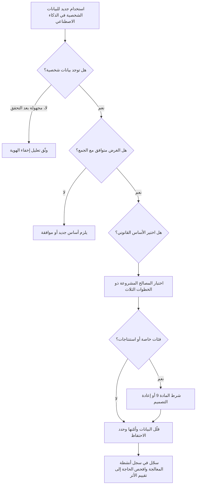

# الوحدة 4 — قانون الخصوصية وحماية البيانات

*تعمل معظم أنظمة الذكاء الاصطناعي بالبيانات الشخصية. فهي تتعلم منها، وتستنتج منها أمورًا عن الناس، وتنتج قرارات تقع على الناس. لذلك فإن أول مجموعة من القوانين يلجأ إليها المتخصص في حوكمة الذكاء الاصطناعي (AI governance) ليست "قانونًا للذكاء الاصطناعي" أصلًا؛ بل هي قانون حماية البيانات (data protection law)، الذي ينطبق بالفعل بالكامل. تبيّن هذه الوحدة كيف تنطبق مبادئ GDPR وحقوق الأفراد وتقييمات الأثر على نموذج التقييم الائتماني وروبوت المحادثة ومساعد مذكرات الائتمان (credit memo copilot) في بنك نجم (Najm Bank)، ثم توسّع العدسة لتشمل المملكة المتحدة والولايات المتحدة والصين ودول الخليج التي يعمل فيها نجم. وهي تشرح القانون لتتمكن من الحوكمة الجيدة والإجابة عن أسئلة الامتحان؛ وليست استشارة قانونية، ولأي قرار حقيقي ينبغي أن تتحقق من النص الحالي وأن تأخذ المشورة من مستشار قانوني مؤهل في البلد المعني.*

> **التغطية ضمن مجال المعرفة (BoK coverage):** II.A — كيف تنطبق قوانين خصوصية البيانات القائمة (المبادئ، والأسس القانونية، وحقوق الأفراد، والقرارات الآلية، وتقييمات الأثر على حماية البيانات (DPIAs)، وأنظمة النقل عبر الحدود) على أنظمة الذكاء الاصطناعي.

---

# 4.1 — مبادئ حماية البيانات في مواجهة الذكاء الاصطناعي
*المستوى: 🟡 متوسط* · *المتطلبات: 1.1، 1.2* · *مجال المعرفة (BoK): II.A*

## ⚡ الدرس في دقيقة
- ينطبق قانون حماية البيانات على الذكاء الاصطناعي كلما عولجت بيانات شخصية (personal data)، من بيانات التدريب إلى المخرجات المتعلقة بالأشخاص.
- مبادئ GDPR السبعة في المادة 5 (Art. 5) هي العمود الفقري، وكل منها يخلق توترًا محددًا مع طريقة عمل تعلّم الآلة.
- يحتاج كل نشاط معالجة إلى أساس قانوني (lawful basis) بموجب المادة 6 (Art. 6). وبالنسبة للتدريب، كثيرًا ما تكون المصالح المشروعة (legitimate interests) هي الأساس المرشح، لكن فقط إذا اجتازت اختبارًا من ثلاث خطوات. وقد شرح EDPB كيفية ذلك في الرأي 28/2024 (Opinion 28/2024).
- الاستنتاجات (inferences) بيانات شخصية أيضًا. فالنموذج الذي يستنتج الصحة أو الدين أو التوجه الجنسي قد يعالج بيانات من الفئات الخاصة (special category data) بموجب المادة 9 (Art. 9)، حتى لو لم يجمع أحد تلك الحقول قط.
- إشارة الامتحان هي أن تطابق كل مبدأ مع مرحلة دورة حياة (life cycle) الذكاء الاصطناعي التي يطبَّق فيها. والفخ الأكبر هو الظن بأن عبارة "البيانات كانت علنية" أو "النموذج مجرد إحصاءات" تُخرجك من نطاق GDPR.

## 🧭 لماذا يهم
تريد دانة، كبيرة علماء البيانات في بنك نجم (Najm Bank)، تحسين نموذج التقييم الائتماني للأفراد بجمع عشر سنوات من ملفات القروض وسجلات المعاملات وسجلات روبوت محادثة خدمة العملاء في مجموعة تدريب واحدة. تقول: "بيانات أكثر، نموذج أفضل"، ويوافقها خالد، مالك إقراض الأفراد. أما سارة، مسؤولة حماية البيانات (DPO)، فتطرح أربعة أسئلة. هل أُبلغ العملاء بأن رسائلهم في المحادثات ستُستخدم لتدريب نموذج ائتماني؟ هل تكشف سجلات المعاملات أي شيء حساس، مثل مدفوعات إلى مسجد أو مستشفى أو نقابة عمالية؟ إلى متى يحتفظ البنك بملفات عمرها عشر سنوات لعملاء غادروه؟ وأي أساس قانوني يغطي التدريب، بخلاف تشغيل الحساب؟

ليست أي من هذه الأسئلة خاصة بالذكاء الاصطناعي؛ إنها أسئلة عادية في حماية البيانات يجعلها الذكاء الاصطناعي أصعب. فالنماذج تريد بيانات أكثر مما تبدو المهمة بحاجة إليه، وتحوّل البيانات غير الضارة إلى استنتاجات حساسة، وما إن تُشكّل البيانات الشخصية معاملات النموذج (parameters) حتى يصعب سحبها منه. ولأن فرع نجم في فرانكفورت يخدم عملاء في الاتحاد الأوروبي، ينطبق GDPR على تلك المعالجة؛ وينطبق PDPPL القطري في البلد الأم.

والجهات الرقابية تطبّق ذلك: فقد قيّدت الهيئة الإيطالية (Garante) ChatGPT مؤقتًا عام 2023، وغرّمت OpenAI مبلغ 15 مليون يورو في ديسمبر 2024. كما غرّمت عدة هيئات أوروبية Clearview AI بسبب كشط صور الوجوه لبناء قاعدة بيانات للتعرف على الوجوه.

## 📐 كيف يعمل

### 🟢 الأساسيات
**البيانات الشخصية والمعالجة.** بموجب GDPR، *البيانات الشخصية* هي أي معلومات تتعلق بشخص طبيعي محدد الهوية أو قابل للتحديد (*صاحب البيانات* (data subject)). و*المعالجة* (processing) هي تقريبًا أي شيء تفعله بها، بما في ذلك التدريب عليها. ويحدد *المتحكّم* (controller) الأغراض والوسائل (نجم، بالنسبة للنموذج الائتماني)؛ ويعمل *المعالِج* (processor) نيابة عنه (مزوّد سحابي يستضيف عمليات التدريب).

تظهر البيانات الشخصية في كل مرحلة من مراحل نظام الذكاء الاصطناعي: بيانات المصدر، ومجموعات التدريب والاختبار، وربما معاملات النموذج (إذا كان يحفظ البيانات)، ومدخلات النشر مثل الأوامر النصية (prompts)، والمخرجات مثل الدرجات، والسجلات.

**المبادئ السبعة (المادة 5).** يحدد GDPR ستة مبادئ في المادة 5(1) ويضيف المساءلة (accountability) في المادة 5(2). وفيما يلي كل منها مع التوتر الذي يخلقه في سياق الذكاء الاصطناعي.

| المبدأ | ما يقوله بكلمات بسيطة | أين يضغط عليه الذكاء الاصطناعي |
|---|---|---|
| المشروعية والعدالة والشفافية | امتلك أساسًا قانونيًا؛ لا تعالج بطرق لا يتوقعها الناس أو تضرهم ظلمًا؛ أخبر الناس بما تفعله | التدريب على بيانات جُمعت لغرض آخر؛ والنماذج الغامضة؛ والاستنتاجات الخفية |
| تحديد الغرض | اجمع لأغراض محددة وصريحة ومشروعة؛ ولا تعالج لاحقًا بطريقة غير متوافقة | إعادة استخدام بيانات الخدمة لتدريب نماذج جديدة |
| تقليل البيانات | كافية وذات صلة ومقصورة على ما هو ضروري | تتحسن النماذج بخصائص أكثر وسجلات أكثر |
| الدقة | حافظ على دقة البيانات وحداثتها؛ وصحّح الأخطاء | الاستنتاجات الخاطئة، والحقائق المهلوسة عن الأشخاص، وبيانات التدريب القديمة |
| تحديد مدة التخزين | لا تحتفظ بالبيانات القابلة للتعريف أكثر من اللازم | مجموعات تدريب محفوظة "تحسبًا لإعادة التدريب"؛ ونماذج تحتفظ بالبيانات |
| السلامة والسرية | أمن مناسب | عكس النموذج، واستنتاج العضوية، وتسرب سجلات الأوامر النصية |
| المساءلة | كن مسؤولًا عن الامتثال وقادرًا على إثباته | يتطلب توثيقًا عبر سلسلة معالجة معقدة ومتعددة الأطراف |

**الأسس القانونية (المادة 6).** لا تكون المعالجة مشروعة إلا إذا انطبق أساس واحد على الأقل من ستة أسس: الموافقة؛ أو تنفيذ عقد؛ أو الامتثال لالتزام قانوني؛ أو المصالح الحيوية؛ أو مهمة للمصلحة العامة أو ممارسة سلطة رسمية؛ أو المصالح المشروعة، التي يجب ألا تطغى عليها مصالح صاحب البيانات أو حقوقه الأساسية. ويحتاج كل غرض إلى أساس خاص به: فتشغيل الحساب (العقد) وتدريب نموذج على بيانات الحساب غرضان منفصلان.

**الفئات الخاصة (المادة 9).** الأصل العرقي أو الإثني، والآراء السياسية، والمعتقدات الدينية أو الفلسفية، والعضوية النقابية، والبيانات الجينية، والبيانات البيومترية لتحديد الهوية بشكل فريد، والصحة، والحياة الجنسية أو التوجه الجنسي. ومعالجتها محظورة ما لم ينطبق شرط من شروط المادة 9(2)، مثل الموافقة الصريحة أو المصلحة العامة الجوهرية بموجب القانون. أما بيانات الجرائم الجنائية فتغطيها المادة 10.

### 🟡 التعمق أكثر
**المصالح المشروعة أساسًا للتدريب.** نادرًا ما تكون الموافقة عملية للتدريب على نطاق واسع: إذ يجب أن تُمنح بحرية، وأن تكون محددة ومستنيرة وواضحة لا لبس فيها، وسحبها صعب بعد أن تصبح البيانات داخل النموذج. أما العقد فلا يصلح إلا حيث تكون المعالجة ضرورية موضوعيًا لتقديم الخدمة، ونادرًا ما يكون تدريب نموذج مستقبلي كذلك. لذلك تكون المصالح المشروعة (المادة 6(1)(f)) هي المرشح المعتاد، ولها ثلاث خطوات:

1. **اختبار الغرض.** هل توجد مصلحة مشروعة؟ يجب أن تكون مشروعة، ومحددة بوضوح ودقة، وحقيقية وقائمة لا افتراضية. ويمكن أن تتأهل عبارة "تحسين اكتشاف الاحتيال لحماية العملاء".
2. **اختبار الضرورة.** هل المعالجة ضرورية لتلك المصلحة؟ هل يمكنك تحقيقها ببيانات أقل أو بوسائل أقل تدخلًا، مثل البيانات المجهّلة أو الاصطناعية؟
3. **اختبار الموازنة.** هل تطغى مصالح الفرد وحقوقه وحرياته على مصالحك؟ ضع في الاعتبار طبيعة البيانات، والتوقعات المعقولة للأشخاص المعنيين، والأثر المحتمل، والضمانات التي تضيفها.

**رأي EDPB رقم 28/2024.** في ديسمبر 2024 اعتمد المجلس الأوروبي لحماية البيانات (European Data Protection Board) رأيًا بشأن نماذج الذكاء الاصطناعي، بطلب من السلطة الرقابية الأيرلندية. ويتناول ثلاثة أسئلة.

- *متى يكون نموذج الذكاء الاصطناعي مجهول الهوية؟* ليس تلقائيًا. بل فقط إذا كان احتمال استخراج بيانات شخصية عن الأشخاص الذين دُرّب النموذج على بياناتهم، مباشرة من المعاملات أو عبر الاستعلامات، ضئيلًا، باستخدام جميع الوسائل التي يُرجَّح بصورة معقولة استخدامها. ويُحكم على ذلك حالةً بحالة، ويجب على المتحكّمين توثيق تعليلهم، مثلًا بنتائج اختبارات استنتاج العضوية والاستخراج.
- *هل يمكن أن تكون المصالح المشروعة أساسًا لتطوير النماذج ونشرها؟* ربما، إذا اجتيز الاختبار ذو الخطوات الثلاث. ويؤكد الرأي على التوقعات المعقولة (هل يتوقع من نشروا محتوى علنًا أن تُستخدم منشوراتهم لتدريب نموذج؟) ويسرد تدابير تخفيف مثل الترميز المستعار (pseudonymisation)، واستبعاد مصادر، وخيارات انسحاب سهلة، وشفافية إضافية.
- *ماذا لو طُوّر النموذج ببيانات عولجت بصورة غير مشروعة؟* يعتمد ذلك على السيناريو. فقد تشوب عدم المشروعية الاستخدامَ اللاحق من المتحكّم نفسه؛ وينبغي لمتحكّم مختلف يشغّل النموذج أن يبذل العناية الواجبة (due diligence) بشأن طريقة بنائه؛ وإذا كان النموذج قد جُهّل فعليًا، فقد لا ينطبق GDPR على تشغيله اللاحق، وإن ظل ينطبق على البيانات الشخصية المعالجة أثناء النشر.

درس الامتحان: ليست البيانات شخصية "دائمًا" أو "أبدًا"، بل "الأمر يعتمد، فأظهر تعليلك".

**تحديد الغرض والمعالجة اللاحقة.** لا يجوز استخدام بيانات جُمعت لغرض ما في غرض آخر إلا إذا كان الغرض الجديد *متوافقًا*، ما لم يوافق الشخص أو يسمح بذلك قانون. وتسرد المادة 6(4) العوامل: الصلة بين الأغراض، وسياق الجمع، وطبيعة البيانات، والعواقب المحتملة، والضمانات مثل الترميز المستعار. ويُفترض أن البحث والإحصاء متوافقان مع ضمانات المادة 89(1)، لكن لا ينبغي للبنك أن يفترض أن "البحث" يشمل نموذجًا ائتمانيًا تجاريًا. فاستخدام ملفات القروض لتدريب نموذج ائتماني قد يكون متوافقًا تمامًا؛ أما استخدام محادثات روبوت المحادثة لتقييم الجدارة الائتمانية فقفزة أكبر بكثير.

**تقليل البيانات مقابل شراهة النماذج.** لا يحظر تقليل البيانات (data minimisation) مجموعات البيانات الكبيرة؛ بل يحظر البيانات غير الضرورية للغرض المعلن. برّر كل خاصية وأسقط ما لا قيمة قابلة للقياس له، واستخدم منحنيات التعلم لإظهار متى تتوقف السجلات الإضافية عن المساعدة، ورمّز المعرّفات ترميزًا مستعارًا قبل التدريب، وفضّل البيانات المجمّعة أو العينات أو البيانات الاصطناعية حيث تكون مجدية.

**الفئات الخاصة والبيانات المستنتجة.** فسّرت CJEU المادة 9 تفسيرًا واسعًا: فالبيانات التي *تكشف بصورة غير مباشرة* عن فئة خاصة قد تندرج ضمنها، حتى لو لم يقصد المتحكّم معرفتها قط. والنموذج الذي يستنتج الصحة من الإنفاق في الصيدليات، أو الدين من أنماط التبرعات، قد يُدخل المعالجة في نطاق المادة 9. لذلك فإن استبعاد عمود "الدين" لا يزيل الخطر، لأن المؤشرات البديلة (proxies) يمكنها إعادة إنتاجه. واختبار العدالة (fairness) *يحتاج* أحيانًا إلى بيانات الفئات الخاصة للتحقق من النتائج بحسب الأصل الإثني أو الجنس. ويسمح قانون الذكاء الاصطناعي الأوروبي (EU AI Act) لمقدّمي الأنظمة عالية المخاطر، استثناءً، بمعالجة الفئات الخاصة حيث يكون ذلك ضروريًا بصورة صارمة لاكتشاف التحيّز وتصحيحه، مع ضمانات صارمة؛ وإلا فأنت بحاجة إلى شرط من شروط المادة 9.

**الدقة.** الدقة الإحصائية هي عدد المرات التي يكون فيها النموذج محقًا إجمالًا؛ أما مبدأ GDPR فيسأل ما إذا كانت *البيانات الشخصية*، بما في ذلك الاستنتاجات، صحيحة بشأن الفرد. فقد يكون النموذج دقيقًا بنسبة 95% ومع ذلك يصنّف آلاف الأشخاص خطأً، وروبوت المحادثة الذي يختلق بيانًا كاذبًا عن شخص مسمّى ينتج بيانات شخصية غير دقيقة. صنّف المخرجات على أنها تنبؤات، واسمح بالتصحيح، وراقب معدلات الخطأ بحسب الفئة، وامنع تدفق النصوص المولّدة إلى سجلات العملاء دون تحقق.

### 🔴 نظرة الخبير
**تحديد مدة التخزين والنموذج بوصفه مخزنًا للبيانات.** يضيف الذكاء الاصطناعي ثلاثة مخازن إلى جدول الاحتفاظ: لقطات التدريب، وسجلات الأوامر النصية والمخرجات، والنموذج نفسه إذا كان قد حفظ بيانات شخصية. حدد مدة احتفاظ لكل منها، وعامل النموذج غير المجهول على أنه يحتوي على بيانات شخصية لأغراض الاحتفاظ والمحو. وقد تبرر واجبات حفظ السجلات المصرفية الاحتفاظ بسجلات القرارات مدة أطول، لكن ذلك يشمل السجل، لا كل خاصية استُخدمت يومًا.

**الأمن بوصفه مبدأً من مبادئ الخصوصية.** يشمل مبدأ السلامة والسرية (المادة 5(1)(f)) والمادة 32 الآن الهجمات الخاصة بالذكاء الاصطناعي: *استنتاج العضوية* (membership inference) (معرفة ما إذا كان سجل شخص ما ضمن مجموعة التدريب، وهو ما قد يكشف بحد ذاته أنه تعثر في سداد قرض من نجم)، و*عكس النموذج واستخراجه* (model inversion and extraction) (إعادة بناء بيانات التدريب أو نسخ النموذج عبر الاستعلامات)، و*حقن الأوامر النصية* (prompt injection) (خداع روبوت محادثة ليسرّب بيانات عملاء آخرين)، و*تسميم البيانات* (data poisoning). وتشمل الضوابط التحكم في الوصول إلى بيانات التدريب، والخصوصية التفاضلية (differential privacy)، وتصفية المخرجات، وتحديد معدل الطلبات، واختبار الفريق الأحمر (red-teaming)، والاسترجاع المراعي للصلاحيات بحيث لا يجلب المساعد إلا المستندات التي يحق للمستخدم رؤيتها.

**حماية البيانات بالتصميم وبالإعداد الافتراضي (المادة 25)** هي المستند القانوني لمراجعات الخصوصية عند بوابات التصميم، لا قبل الإطلاق فقط (الوحدة 8).

**المساءلة عبر سلسلة التوريد.** حين يشتري نجم نموذجًا أو خدمة ذكاء اصطناعي توليدي، يظل عليه إثبات الامتثال في معالجته الخاصة: دور المورد (معالِج، أو متحكّم مستقل، أو متحكّم مشترك)، وما إذا كان يتدرب على الأوامر النصية، وأين تُخزَّن البيانات (الوحدتان 3.3 و11.2). وبالنسبة للبيانات المجمّعة من أطراف ثالثة، بما فيها البيانات المكشوطة، تشترط المادة 14 إبلاغ الأشخاص؛ واستثناء "الجهد غير المتناسب" ما زال يتطلب تدابير مناسبة مثل نشر المعلومات.

## ⚖️ الأدوات التنظيمية
| الأداة | ما تشترطه أو توصي به | إشارة الامتحان |
|---|---|---|
| **GDPR** — المادة 5 | سبعة مبادئ: المشروعية/العدالة/الشفافية، وتحديد الغرض، وتقليل البيانات، والدقة، وتحديد مدة التخزين، والسلامة/السرية، والمساءلة | طابِق كل مبدأ مع مرحلة من مراحل دورة حياة الذكاء الاصطناعي |
| **GDPR** — المادة 6 و6(4) | أساس واحد من ستة أسس قانونية لكل غرض؛ واختبار التوافق للمعالجة اللاحقة | التدريب غرض منفصل عن تقديم الخدمة |
| **GDPR** — المادة 9 | تحظر معالجة الفئات الخاصة ما لم ينطبق شرط من شروط المادة 9(2) | البيانات الحساسة المستنتجة قد تُحتسب |
| **GDPR** — المادتان 25 و32 | حماية البيانات بالتصميم وبالإعداد الافتراضي؛ والأمن المناسب | المستند القانوني للخصوصية عند بوابات التصميم وللهجمات الخاصة بالذكاء الاصطناعي |
| **EDPB Opinion 28/2024** | إخفاء هوية النموذج يُقيَّم حالةً بحالة؛ والمصالح المشروعة ممكنة مع الاختبار ذي الخطوات الثلاث؛ وعواقب بيانات التدريب غير المشروعة | "الأمر يعتمد، فوثّقه" |
| **EU AI Act** — المادة 10 | حوكمة البيانات للأنظمة عالية المخاطر؛ وإذن ضيق بمعالجة الفئات الخاصة لاكتشاف التحيّز وتصحيحه | لا يحل محل GDPR، الذي يظل ساريًا |
| **Qatar PDPPL** | القانون العام لحماية البيانات في قطر (القانون رقم 13 لسنة 2016): المبادئ، والحقوق، وواجبات المتحكّم | الأساس في البلد الأم لنجم، ويُغطّى في 4.3 |

## 🏛️ عمليًا في بنك نجم
تحوّل ليلى وسارة المبادئ إلى **قائمة تحقق للخصوصية بالتصميم لبيانات تدريب الذكاء الاصطناعي**، يجب استكمالها قبل أي عملية تدريب تستخدم بيانات شخصية. وتمر خطة دانة عبرها أولًا.

| # | السؤال | الأدلة المطلوبة | إجابة دانة بشأن النموذج الائتماني |
|---|---|---|---|
| 1 | ما الغرض، في جملة واحدة؟ | بيان الغرض في سجل أنظمة الذكاء الاصطناعي | "تقدير احتمال التعثر لمقدّمي طلبات قروض الأفراد" |
| 2 | هل هذا الغرض متوافق مع الغرض الأصلي لكل مصدر؟ | مذكرة توافق وفق المادة 6(4) لكل مصدر | ملفات القروض: نعم. المعاملات: نعم، مع تقليل البيانات. سجلات المحادثة: **لا، مستبعدة** |
| 3 | أي أساس قانوني ينطبق، وأين التقييم؟ | مرجع تقييم المصالح المشروعة (LIA) | LIA-2026-014، والخطوات الثلاث موثّقة |
| 4 | هل يمكن لأي خاصية أن تكشف فئة خاصة أو تكون مؤشرًا بديلًا لها؟ | مراجعة الخصائص، وتحليل المؤشرات البديلة | أُزيلت خصائص فئات التجار المتعلقة بالتجار الدينيين والطبيين؛ واختبار المؤشرات البديلة المتبقية مخطَّط |
| 5 | هل كل خاصية ضرورية؟ | نتائج الاستبعاد التجريبي للخصائص | أُسقطت 38 من أصل 112 خاصية |
| 6 | هل تُرمَّز المعرّفات ترميزًا مستعارًا قبل التدريب؟ | تصميم خط المعالجة | نعم، والمفتاح لدى مكتب البيانات |
| 7 | إلى متى يُحتفظ بلقطات التدريب والسجلات؟ | قيد في جدول الاحتفاظ | اللقطات 3 سنوات لأغراض المصادقة؛ واستُبعدت سجلات الحسابات المغلقة التي تجاوزت حد الاحتفاظ |
| 8 | هل يُختبر النموذج من حيث الحفظ أو استنتاج العضوية؟ | تقرير الاختبار | مطلوب قبل الإصدار |
| 9 | هل أُبلغ الأشخاص؟ | بند في إشعار الخصوصية | حُدّث الإشعار ليصف تدريب النماذج والتنميط |
| 10 | هل يحتاج هذا إلى تقييم الأثر على حماية البيانات؟ | نتيجة الفحص الأولي | نعم: تنميط ذو آثار كبيرة (انظر 4.3) |

قرار اللجنة المسجَّل: *"تُستبعد سجلات المحادثة من تدريب النموذج الائتماني. وأي مقترح مستقبلي لاستخدامها يتطلب تقييمًا جديدًا للتوافق وتقييمًا للأثر على حماية البيانات."*

## 🛠️ التمارين
- 🟢 خذ مبادئ المادة 5 السبعة، واكتب بالنسبة لروبوت محادثة خدمة العملاء في نجم جملة واحدة لكل مبدأ عن الموضع الذي يطبَّق فيه. *يكتمل عندما:* تكون لديك سبع جمل، تسمّي كل منها مرحلة ملموسة (الجمع، أو التدريب، أو النشر، أو المخرجات، أو السجلات).
- 🟡 صُغ تقييمًا للمصالح المشروعة من صفحة واحدة لاستخدام خمس سنوات من بيانات معاملات البطاقات لتدريب نموذج اكتشاف الاحتيال في نجم. غطِّ الغرض، والضرورة (بما في ذلك البدائل الأقل تدخلًا)، والموازنة (التوقعات، والأثر، والضمانات). *يكتمل عندما:* يكون لكل خطوة من الخطوات الثلاث استنتاج، ويُذكر ضمانان على الأقل.
- 🔴 تقول دانة إن النموذج الائتماني الجديد "مجهول الهوية لأنه مجرد أوزان". اكتب المذكرة التي سترسلها سارة، مطبّقًا رأي EDPB رقم 28/2024: ما الأدلة التي تدعم هذا الادعاء، وما الاختبارات التي يجب إجراؤها، وما الذي يترتب إذا فشل الادعاء. *يكتمل عندما:* تسمّي المذكرة اختبارين على الأقل قائمين على الهجمات، وتبيّن العاقبة بالنسبة لطلبات المحو والاحتفاظ.

## ⚠️ أخطاء وفخاخ الامتحان
- **"البيانات العلنية حرة الاستخدام."** البيانات الشخصية المتاحة علنًا تظل بيانات شخصية. وما زلت بحاجة إلى أساس قانوني، وشفافية، وموازنة تحترم التوقعات. وخيارات الإجابة التي تعامل "المتاح علنًا" على أنه إعفاء خاطئة.
- **"أزلنا الأعمدة الحساسة، فلا تنطبق المادة 9."** الاستنتاجات والمؤشرات البديلة قد تكشف الفئات الخاصة. ابحث عن الإجابة التي تختبر المؤشرات البديلة وتفاوت النتائج.
- **"الموافقة هي دائمًا الأساس الأكثر أمانًا."** الموافقة هشة في التدريب: يجب أن تُمنح بحرية (وهو أمر صعب في علاقة بين بنك وعميله) ويمكن سحبها. وكثيرًا ما تكافئ الامتحانات المصالح المشروعة مع تقييم موثّق، أو أساسًا آخر مناسبًا، على الموافقة التلقائية.
- **"النموذج ليس بيانات شخصية أبدًا" أو "بيانات شخصية دائمًا".** موقف EDPB هو التقييم حالةً بحالة، بناءً على احتمال الاستخراج. اختر الإجابة التي تشترط التقييم والتوثيق.
- **الخلط بين الدقة الإحصائية ومبدأ الدقة.** ارتفاع معدل الدقة الإجمالي لا يفي بواجب الحفاظ على صحة بيانات الأفراد، بما في ذلك الاستنتاجات.

## 🧾 الخلاصة
- ينطبق قانون حماية البيانات على دورة حياة الذكاء الاصطناعي بأكملها، بما في ذلك النماذج والمخرجات والسجلات.
- يخلق كل مبدأ من مبادئ المادة 5 توترًا محددًا في سياق الذكاء الاصطناعي؛ والمساءلة تعني أن تكون قادرًا على إظهار كيف عالجته.
- التدريب غرض قائم بذاته. ويحتاج إلى أساس قانوني، وحين تُعاد البيانات استخدامها، إلى تقييم للتوافق.
- يمكن أن تدعم المصالح المشروعة التدريب إذا اجتاز اختبارات الغرض والضرورة والموازنة (رأي EDPB رقم 28/2024).
- البيانات المستنتجة وبيانات المؤشرات البديلة قد تكون بيانات من الفئات الخاصة؛ وقد يحتاج اختبار العدالة نفسه إلى مسار وفق المادة 9 أو إلى الإذن الضيق لاختبار التحيّز في قانون الذكاء الاصطناعي.
- الهجمات الخاصة بالذكاء الاصطناعي تجعل الأمن، والاحتفاظ، وسؤال "هل النموذج مجهول الهوية؟" أسئلة خصوصية حيّة.

## ✍️ اختبر نفسك

**1. يريد بنك نجم إعادة استخدام نصوص محادثات روبوت خدمة العملاء لتدريب نموذج التقييم الائتماني للأفراد. بموجب GDPR، ما التحليل الأول الذي ينبغي أن تشترطه سارة؟**

- A. التحقق من أن النصوص مخزنة في الاتحاد الأوروبي
- B. تقييم ما إذا كان الغرض الجديد متوافقًا مع الغرض الذي جُمعت النصوص من أجله
- C. تدقيق للتحيّز يجريه مدقق مستقل
- D. تأكيد أن النموذج سيكون أدق مع النصوص

الإجابة

**B.** إعادة استخدام البيانات لغرض جديد تستدعي تحديد الغرض واختبار التوافق في المادة 6(4) (أو أساسًا جديدًا مثل الموافقة). ومكاسب الدقة (D) لا تجعل المعالجة مشروعة. أما الموقع (A) وتدقيقات التحيّز (C) فمهمة في مواضع أخرى، لكنها لا تجيب عن السؤال المبدئي. (انظر 🟡 تحديد الغرض والمعالجة اللاحقة.)

**2. وفقًا لرأي EDPB رقم 28/2024، متى يمكن اعتبار نموذج ذكاء اصطناعي مدرّب على بيانات شخصية مجهول الهوية؟**

- A. دائمًا، لأن معاملات النموذج ليست سجلات عن الأفراد
- B. أبدًا، لأن بيانات التدريب تترك آثارًا دائمًا
- C. حين يكون احتمال استخراج بيانات شخصية عن أصحاب بيانات التدريب، مباشرة أو عبر الاستعلامات، ضئيلًا، ويُقيَّم ذلك حالةً بحالة
- D. فقط حين تكون بيانات التدريب قد جُهّلت بالكامل مسبقًا

الإجابة

**C.** يتبنى EDPB نهجًا يقيّم كل حالة على حدة ويركّز على احتمال الاستخراج باستخدام الوسائل التي يُرجَّح بصورة معقولة استخدامها. والخياران A وB هما الموقفان المطلقان اللذان يرفضهما الرأي. أما D فيصف مسارًا واحدًا لإخفاء الهوية، لا الاختبار نفسه. (انظر 🟡 رأي EDPB رقم 28/2024.)

**3. لا يتلقى نموذج أحد المقرضين أي حقل "صحة"، لكنه يستخدم الإنفاق على مستوى التجار بما يتيح له استنتاج المرض المزمن. ما أفضل استجابة من منظور الحوكمة؟**

- A. معاملة الاستنتاجات على أنها قد تكون بيانات من الفئات الخاصة: إزالة خصائص المؤشرات البديلة أو تبريرها، واختبار النتائج بحثًا عن التفاوت
- B. لا شيء، لأن البيانات الصحية لم تُجمع قط
- C. مطالبة العملاء بالموافقة على أي استخدام لبيانات معاملاتهم
- D. تشفير ملف النموذج

الإجابة

**A.** البيانات التي تكشف بصورة غير مباشرة عن فئة خاصة قد تندرج ضمن المادة 9، لذا فالحل هو معالجة المؤشرات البديلة واختبار النتائج. والخيار B هو الفخ الكلاسيكي. أما C فموافقة شاملة قد لا تُمنح بحرية ولا تصلح التصميم. وD ضابط أمني، لا إجابة عن المادة 9. (انظر 🟡 الفئات الخاصة والبيانات المستنتجة.)

**4. أي مما يلي هو خطوة الضرورة في تقييم المصالح المشروعة لتدريب نموذج احتيال؟**

- A. إثبات أن مصلحة منع الاحتيال مشروعة ومصاغة بوضوح
- B. الحصول على توقيع مسؤول حماية البيانات
- C. الموازنة بين التوقعات المعقولة للعملاء ومصلحة البنك
- D. إثبات أن المعالجة لازمة لتلك المصلحة وأن الوسائل الأقل تدخلًا، مثل خصائص أقل أو بيانات اصطناعية، لن تحققها

الإجابة

**D.** تسأل الضرورة ما إذا كانت المعالجة لازمة وما إذا كانت توجد بدائل أقل تدخلًا. أما A فهو اختبار الغرض، وC هو اختبار الموازنة. وB ممارسة جيدة لكنه ليس خطوة من خطوات الاختبار. (انظر 🟡 المصالح المشروعة أساسًا للتدريب.)

**5. أي مبدأ من مبادئ الخصوصية يتأثر بصورة مباشرة أكثر من غيره بهجوم استنتاج العضوية على النموذج الائتماني لنجم؟**

- A. تحديد الغرض
- B. تحديد مدة التخزين
- C. السلامة والسرية
- D. الدقة

الإجابة

**C.** يكشف استنتاج العضوية ما إذا كانت بيانات شخص ما ضمن مجموعة التدريب، وهو إخفاق في السرية تعالجه المادة 5(1)(f) وأمن المادة 32. وتحديد مدة التخزين (B) ذو صلة، لأن الاحتفاظ بقدر أقل يقلل التعرض، لكن الهجوم نفسه مسألة أمنية. (انظر 🔴 الأمن بوصفه مبدأً من مبادئ الخصوصية.)

## 📚 المراجع
- اللائحة العامة لحماية البيانات (GDPR)، اللائحة (EU) 2016/679: https://eur-lex.europa.eu/eli/reg/2016/679/oj
- قانون الذكاء الاصطناعي الأوروبي (EU AI Act)، اللائحة (EU) 2024/1689: https://eur-lex.europa.eu/eli/reg/2024/1689/oj
- المجلس الأوروبي لحماية البيانات، الآراء والإرشادات (بما في ذلك الرأي 28/2024 بشأن نماذج الذكاء الاصطناعي): https://www.edpb.europa.eu
- محكمة العدل الأوروبية (CJEU)، البحث في السوابق القضائية: https://curia.europa.eu
- هيئة حماية البيانات الإيطالية (Garante): https://www.garanteprivacy.it
- IAPP، مجال المعرفة (BoK) لشهادة AIGP: https://iapp.org

---

