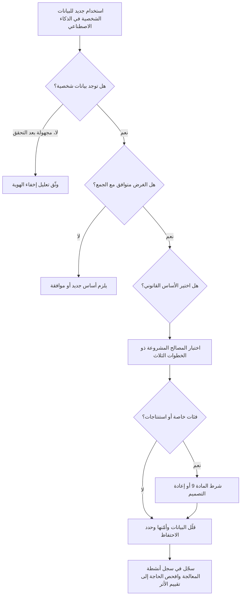
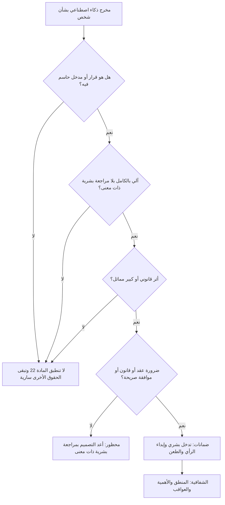

# الوحدة 4 — قانون الخصوصية وحماية البيانات

*تعمل معظم أنظمة الذكاء الاصطناعي بالبيانات الشخصية. فهي تتعلم منها، وتستنتج منها أمورًا عن الناس، وتنتج قرارات تقع على الناس. لذلك فإن أول مجموعة من القوانين يلجأ إليها المتخصص في حوكمة الذكاء الاصطناعي (AI governance) ليست "قانونًا للذكاء الاصطناعي" أصلًا؛ بل هي قانون حماية البيانات (data protection law)، الذي ينطبق بالفعل بالكامل. تبيّن هذه الوحدة كيف تنطبق مبادئ GDPR وحقوق الأفراد وتقييمات الأثر على نموذج التقييم الائتماني وروبوت المحادثة ومساعد مذكرات الائتمان (credit memo copilot) في بنك نجم (Najm Bank)، ثم توسّع العدسة لتشمل المملكة المتحدة والولايات المتحدة والصين ودول الخليج التي يعمل فيها نجم. وهي تشرح القانون لتتمكن من الحوكمة الجيدة والإجابة عن أسئلة الامتحان؛ وليست استشارة قانونية، ولأي قرار حقيقي ينبغي أن تتحقق من النص الحالي وأن تأخذ المشورة من مستشار قانوني مؤهل في البلد المعني.*

> **التغطية ضمن مجال المعرفة (BoK coverage):** II.A — كيف تنطبق قوانين خصوصية البيانات القائمة (المبادئ، والأسس القانونية، وحقوق الأفراد، والقرارات الآلية، وتقييمات الأثر على حماية البيانات (DPIAs)، وأنظمة النقل عبر الحدود) على أنظمة الذكاء الاصطناعي.

---

# 4.1 — مبادئ حماية البيانات في مواجهة الذكاء الاصطناعي
*المستوى: 🟡 متوسط* · *المتطلبات: 1.1، 1.2* · *مجال المعرفة (BoK): II.A*

## ⚡ الدرس في دقيقة
- ينطبق قانون حماية البيانات على الذكاء الاصطناعي كلما عولجت بيانات شخصية (personal data)، من بيانات التدريب إلى المخرجات المتعلقة بالأشخاص.
- مبادئ GDPR السبعة في المادة 5 (Art. 5) هي العمود الفقري، وكل منها يخلق توترًا محددًا مع طريقة عمل تعلّم الآلة.
- يحتاج كل نشاط معالجة إلى أساس قانوني (lawful basis) بموجب المادة 6 (Art. 6). وبالنسبة للتدريب، كثيرًا ما تكون المصالح المشروعة (legitimate interests) هي الأساس المرشح، لكن فقط إذا اجتازت اختبارًا من ثلاث خطوات. وقد شرح EDPB كيفية ذلك في الرأي 28/2024 (Opinion 28/2024).
- الاستنتاجات (inferences) بيانات شخصية أيضًا. فالنموذج الذي يستنتج الصحة أو الدين أو التوجه الجنسي قد يعالج بيانات من الفئات الخاصة (special category data) بموجب المادة 9 (Art. 9)، حتى لو لم يجمع أحد تلك الحقول قط.
- إشارة الامتحان هي أن تطابق كل مبدأ مع مرحلة دورة حياة (life cycle) الذكاء الاصطناعي التي يطبَّق فيها. والفخ الأكبر هو الظن بأن عبارة "البيانات كانت علنية" أو "النموذج مجرد إحصاءات" تُخرجك من نطاق GDPR.

## 🧭 لماذا يهم
تريد دانة، كبيرة علماء البيانات في بنك نجم (Najm Bank)، تحسين نموذج التقييم الائتماني للأفراد بجمع عشر سنوات من ملفات القروض وسجلات المعاملات وسجلات روبوت محادثة خدمة العملاء في مجموعة تدريب واحدة. تقول: "بيانات أكثر، نموذج أفضل"، ويوافقها خالد، مالك إقراض الأفراد. أما سارة، مسؤولة حماية البيانات (DPO)، فتطرح أربعة أسئلة. هل أُبلغ العملاء بأن رسائلهم في المحادثات ستُستخدم لتدريب نموذج ائتماني؟ هل تكشف سجلات المعاملات أي شيء حساس، مثل مدفوعات إلى مسجد أو مستشفى أو نقابة عمالية؟ إلى متى يحتفظ البنك بملفات عمرها عشر سنوات لعملاء غادروه؟ وأي أساس قانوني يغطي التدريب، بخلاف تشغيل الحساب؟

ليست أي من هذه الأسئلة خاصة بالذكاء الاصطناعي؛ إنها أسئلة عادية في حماية البيانات يجعلها الذكاء الاصطناعي أصعب. فالنماذج تريد بيانات أكثر مما تبدو المهمة بحاجة إليه، وتحوّل البيانات غير الضارة إلى استنتاجات حساسة، وما إن تُشكّل البيانات الشخصية معاملات النموذج (parameters) حتى يصعب سحبها منه. ولأن فرع نجم في فرانكفورت يخدم عملاء في الاتحاد الأوروبي، ينطبق GDPR على تلك المعالجة؛ وينطبق PDPPL القطري في البلد الأم.

والجهات الرقابية تطبّق ذلك: فقد قيّدت الهيئة الإيطالية (Garante) ChatGPT مؤقتًا عام 2023، وغرّمت OpenAI مبلغ 15 مليون يورو في ديسمبر 2024. كما غرّمت عدة هيئات أوروبية Clearview AI بسبب كشط صور الوجوه لبناء قاعدة بيانات للتعرف على الوجوه.

## 📐 كيف يعمل

### 🟢 الأساسيات
**البيانات الشخصية والمعالجة.** بموجب GDPR، *البيانات الشخصية* هي أي معلومات تتعلق بشخص طبيعي محدد الهوية أو قابل للتحديد (*صاحب البيانات* (data subject)). و*المعالجة* (processing) هي تقريبًا أي شيء تفعله بها، بما في ذلك التدريب عليها. ويحدد *المتحكّم* (controller) الأغراض والوسائل (نجم، بالنسبة للنموذج الائتماني)؛ ويعمل *المعالِج* (processor) نيابة عنه (مزوّد سحابي يستضيف عمليات التدريب).

تظهر البيانات الشخصية في كل مرحلة من مراحل نظام الذكاء الاصطناعي: بيانات المصدر، ومجموعات التدريب والاختبار، وربما معاملات النموذج (إذا كان يحفظ البيانات)، ومدخلات النشر مثل الأوامر النصية (prompts)، والمخرجات مثل الدرجات، والسجلات.

**المبادئ السبعة (المادة 5).** يحدد GDPR ستة مبادئ في المادة 5(1) ويضيف المساءلة (accountability) في المادة 5(2). وفيما يلي كل منها مع التوتر الذي يخلقه في سياق الذكاء الاصطناعي.

| المبدأ | ما يقوله بكلمات بسيطة | أين يضغط عليه الذكاء الاصطناعي |
|---|---|---|
| المشروعية والعدالة والشفافية | امتلك أساسًا قانونيًا؛ لا تعالج بطرق لا يتوقعها الناس أو تضرهم ظلمًا؛ أخبر الناس بما تفعله | التدريب على بيانات جُمعت لغرض آخر؛ والنماذج الغامضة؛ والاستنتاجات الخفية |
| تحديد الغرض | اجمع لأغراض محددة وصريحة ومشروعة؛ ولا تعالج لاحقًا بطريقة غير متوافقة | إعادة استخدام بيانات الخدمة لتدريب نماذج جديدة |
| تقليل البيانات | كافية وذات صلة ومقصورة على ما هو ضروري | تتحسن النماذج بخصائص أكثر وسجلات أكثر |
| الدقة | حافظ على دقة البيانات وحداثتها؛ وصحّح الأخطاء | الاستنتاجات الخاطئة، والحقائق المهلوسة عن الأشخاص، وبيانات التدريب القديمة |
| تحديد مدة التخزين | لا تحتفظ بالبيانات القابلة للتعريف أكثر من اللازم | مجموعات تدريب محفوظة "تحسبًا لإعادة التدريب"؛ ونماذج تحتفظ بالبيانات |
| السلامة والسرية | أمن مناسب | عكس النموذج، واستنتاج العضوية، وتسرب سجلات الأوامر النصية |
| المساءلة | كن مسؤولًا عن الامتثال وقادرًا على إثباته | يتطلب توثيقًا عبر سلسلة معالجة معقدة ومتعددة الأطراف |

**الأسس القانونية (المادة 6).** لا تكون المعالجة مشروعة إلا إذا انطبق أساس واحد على الأقل من ستة أسس: الموافقة؛ أو تنفيذ عقد؛ أو الامتثال لالتزام قانوني؛ أو المصالح الحيوية؛ أو مهمة للمصلحة العامة أو ممارسة سلطة رسمية؛ أو المصالح المشروعة، التي يجب ألا تطغى عليها مصالح صاحب البيانات أو حقوقه الأساسية. ويحتاج كل غرض إلى أساس خاص به: فتشغيل الحساب (العقد) وتدريب نموذج على بيانات الحساب غرضان منفصلان.

**الفئات الخاصة (المادة 9).** الأصل العرقي أو الإثني، والآراء السياسية، والمعتقدات الدينية أو الفلسفية، والعضوية النقابية، والبيانات الجينية، والبيانات البيومترية لتحديد الهوية بشكل فريد، والصحة، والحياة الجنسية أو التوجه الجنسي. ومعالجتها محظورة ما لم ينطبق شرط من شروط المادة 9(2)، مثل الموافقة الصريحة أو المصلحة العامة الجوهرية بموجب القانون. أما بيانات الجرائم الجنائية فتغطيها المادة 10.

### 🟡 التعمق أكثر
**المصالح المشروعة أساسًا للتدريب.** نادرًا ما تكون الموافقة عملية للتدريب على نطاق واسع: إذ يجب أن تُمنح بحرية، وأن تكون محددة ومستنيرة وواضحة لا لبس فيها، وسحبها صعب بعد أن تصبح البيانات داخل النموذج. أما العقد فلا يصلح إلا حيث تكون المعالجة ضرورية موضوعيًا لتقديم الخدمة، ونادرًا ما يكون تدريب نموذج مستقبلي كذلك. لذلك تكون المصالح المشروعة (المادة 6(1)(f)) هي المرشح المعتاد، ولها ثلاث خطوات:

1. **اختبار الغرض.** هل توجد مصلحة مشروعة؟ يجب أن تكون مشروعة، ومحددة بوضوح ودقة، وحقيقية وقائمة لا افتراضية. ويمكن أن تتأهل عبارة "تحسين اكتشاف الاحتيال لحماية العملاء".
2. **اختبار الضرورة.** هل المعالجة ضرورية لتلك المصلحة؟ هل يمكنك تحقيقها ببيانات أقل أو بوسائل أقل تدخلًا، مثل البيانات المجهّلة أو الاصطناعية؟
3. **اختبار الموازنة.** هل تطغى مصالح الفرد وحقوقه وحرياته على مصالحك؟ ضع في الاعتبار طبيعة البيانات، والتوقعات المعقولة للأشخاص المعنيين، والأثر المحتمل، والضمانات التي تضيفها.

**رأي EDPB رقم 28/2024.** في ديسمبر 2024 اعتمد المجلس الأوروبي لحماية البيانات (European Data Protection Board) رأيًا بشأن نماذج الذكاء الاصطناعي، بطلب من السلطة الرقابية الأيرلندية. ويتناول ثلاثة أسئلة.

- *متى يكون نموذج الذكاء الاصطناعي مجهول الهوية؟* ليس تلقائيًا. بل فقط إذا كان احتمال استخراج بيانات شخصية عن الأشخاص الذين دُرّب النموذج على بياناتهم، مباشرة من المعاملات أو عبر الاستعلامات، ضئيلًا، باستخدام جميع الوسائل التي يُرجَّح بصورة معقولة استخدامها. ويُحكم على ذلك حالةً بحالة، ويجب على المتحكّمين توثيق تعليلهم، مثلًا بنتائج اختبارات استنتاج العضوية والاستخراج.
- *هل يمكن أن تكون المصالح المشروعة أساسًا لتطوير النماذج ونشرها؟* ربما، إذا اجتيز الاختبار ذو الخطوات الثلاث. ويؤكد الرأي على التوقعات المعقولة (هل يتوقع من نشروا محتوى علنًا أن تُستخدم منشوراتهم لتدريب نموذج؟) ويسرد تدابير تخفيف مثل الترميز المستعار (pseudonymisation)، واستبعاد مصادر، وخيارات انسحاب سهلة، وشفافية إضافية.
- *ماذا لو طُوّر النموذج ببيانات عولجت بصورة غير مشروعة؟* يعتمد ذلك على السيناريو. فقد تشوب عدم المشروعية الاستخدامَ اللاحق من المتحكّم نفسه؛ وينبغي لمتحكّم مختلف يشغّل النموذج أن يبذل العناية الواجبة (due diligence) بشأن طريقة بنائه؛ وإذا كان النموذج قد جُهّل فعليًا، فقد لا ينطبق GDPR على تشغيله اللاحق، وإن ظل ينطبق على البيانات الشخصية المعالجة أثناء النشر.

درس الامتحان: ليست البيانات شخصية "دائمًا" أو "أبدًا"، بل "الأمر يعتمد، فأظهر تعليلك".

**تحديد الغرض والمعالجة اللاحقة.** لا يجوز استخدام بيانات جُمعت لغرض ما في غرض آخر إلا إذا كان الغرض الجديد *متوافقًا*، ما لم يوافق الشخص أو يسمح بذلك قانون. وتسرد المادة 6(4) العوامل: الصلة بين الأغراض، وسياق الجمع، وطبيعة البيانات، والعواقب المحتملة، والضمانات مثل الترميز المستعار. ويُفترض أن البحث والإحصاء متوافقان مع ضمانات المادة 89(1)، لكن لا ينبغي للبنك أن يفترض أن "البحث" يشمل نموذجًا ائتمانيًا تجاريًا. فاستخدام ملفات القروض لتدريب نموذج ائتماني قد يكون متوافقًا تمامًا؛ أما استخدام محادثات روبوت المحادثة لتقييم الجدارة الائتمانية فقفزة أكبر بكثير.

**تقليل البيانات مقابل شراهة النماذج.** لا يحظر تقليل البيانات (data minimisation) مجموعات البيانات الكبيرة؛ بل يحظر البيانات غير الضرورية للغرض المعلن. برّر كل خاصية وأسقط ما لا قيمة قابلة للقياس له، واستخدم منحنيات التعلم لإظهار متى تتوقف السجلات الإضافية عن المساعدة، ورمّز المعرّفات ترميزًا مستعارًا قبل التدريب، وفضّل البيانات المجمّعة أو العينات أو البيانات الاصطناعية حيث تكون مجدية.

**الفئات الخاصة والبيانات المستنتجة.** فسّرت CJEU المادة 9 تفسيرًا واسعًا: فالبيانات التي *تكشف بصورة غير مباشرة* عن فئة خاصة قد تندرج ضمنها، حتى لو لم يقصد المتحكّم معرفتها قط. والنموذج الذي يستنتج الصحة من الإنفاق في الصيدليات، أو الدين من أنماط التبرعات، قد يُدخل المعالجة في نطاق المادة 9. لذلك فإن استبعاد عمود "الدين" لا يزيل الخطر، لأن المؤشرات البديلة (proxies) يمكنها إعادة إنتاجه. واختبار العدالة (fairness) *يحتاج* أحيانًا إلى بيانات الفئات الخاصة للتحقق من النتائج بحسب الأصل الإثني أو الجنس. ويسمح قانون الذكاء الاصطناعي الأوروبي (EU AI Act) لمقدّمي الأنظمة عالية المخاطر، استثناءً، بمعالجة الفئات الخاصة حيث يكون ذلك ضروريًا بصورة صارمة لاكتشاف التحيّز وتصحيحه، مع ضمانات صارمة؛ وإلا فأنت بحاجة إلى شرط من شروط المادة 9.

**الدقة.** الدقة الإحصائية هي عدد المرات التي يكون فيها النموذج محقًا إجمالًا؛ أما مبدأ GDPR فيسأل ما إذا كانت *البيانات الشخصية*، بما في ذلك الاستنتاجات، صحيحة بشأن الفرد. فقد يكون النموذج دقيقًا بنسبة 95% ومع ذلك يصنّف آلاف الأشخاص خطأً، وروبوت المحادثة الذي يختلق بيانًا كاذبًا عن شخص مسمّى ينتج بيانات شخصية غير دقيقة. صنّف المخرجات على أنها تنبؤات، واسمح بالتصحيح، وراقب معدلات الخطأ بحسب الفئة، وامنع تدفق النصوص المولّدة إلى سجلات العملاء دون تحقق.

### 🔴 نظرة الخبير
**تحديد مدة التخزين والنموذج بوصفه مخزنًا للبيانات.** يضيف الذكاء الاصطناعي ثلاثة مخازن إلى جدول الاحتفاظ: لقطات التدريب، وسجلات الأوامر النصية والمخرجات، والنموذج نفسه إذا كان قد حفظ بيانات شخصية. حدد مدة احتفاظ لكل منها، وعامل النموذج غير المجهول على أنه يحتوي على بيانات شخصية لأغراض الاحتفاظ والمحو. وقد تبرر واجبات حفظ السجلات المصرفية الاحتفاظ بسجلات القرارات مدة أطول، لكن ذلك يشمل السجل، لا كل خاصية استُخدمت يومًا.

**الأمن بوصفه مبدأً من مبادئ الخصوصية.** يشمل مبدأ السلامة والسرية (المادة 5(1)(f)) والمادة 32 الآن الهجمات الخاصة بالذكاء الاصطناعي: *استنتاج العضوية* (membership inference) (معرفة ما إذا كان سجل شخص ما ضمن مجموعة التدريب، وهو ما قد يكشف بحد ذاته أنه تعثر في سداد قرض من نجم)، و*عكس النموذج واستخراجه* (model inversion and extraction) (إعادة بناء بيانات التدريب أو نسخ النموذج عبر الاستعلامات)، و*حقن الأوامر النصية* (prompt injection) (خداع روبوت محادثة ليسرّب بيانات عملاء آخرين)، و*تسميم البيانات* (data poisoning). وتشمل الضوابط التحكم في الوصول إلى بيانات التدريب، والخصوصية التفاضلية (differential privacy)، وتصفية المخرجات، وتحديد معدل الطلبات، واختبار الفريق الأحمر (red-teaming)، والاسترجاع المراعي للصلاحيات بحيث لا يجلب المساعد إلا المستندات التي يحق للمستخدم رؤيتها.

**حماية البيانات بالتصميم وبالإعداد الافتراضي (المادة 25)** هي المستند القانوني لمراجعات الخصوصية عند بوابات التصميم، لا قبل الإطلاق فقط (الوحدة 8).

**المساءلة عبر سلسلة التوريد.** حين يشتري نجم نموذجًا أو خدمة ذكاء اصطناعي توليدي، يظل عليه إثبات الامتثال في معالجته الخاصة: دور المورد (معالِج، أو متحكّم مستقل، أو متحكّم مشترك)، وما إذا كان يتدرب على الأوامر النصية، وأين تُخزَّن البيانات (الوحدتان 3.3 و11.2). وبالنسبة للبيانات المجمّعة من أطراف ثالثة، بما فيها البيانات المكشوطة، تشترط المادة 14 إبلاغ الأشخاص؛ واستثناء "الجهد غير المتناسب" ما زال يتطلب تدابير مناسبة مثل نشر المعلومات.

## ⚖️ الأدوات التنظيمية
| الأداة | ما تشترطه أو توصي به | إشارة الامتحان |
|---|---|---|
| **GDPR** — المادة 5 | سبعة مبادئ: المشروعية/العدالة/الشفافية، وتحديد الغرض، وتقليل البيانات، والدقة، وتحديد مدة التخزين، والسلامة/السرية، والمساءلة | طابِق كل مبدأ مع مرحلة من مراحل دورة حياة الذكاء الاصطناعي |
| **GDPR** — المادة 6 و6(4) | أساس واحد من ستة أسس قانونية لكل غرض؛ واختبار التوافق للمعالجة اللاحقة | التدريب غرض منفصل عن تقديم الخدمة |
| **GDPR** — المادة 9 | تحظر معالجة الفئات الخاصة ما لم ينطبق شرط من شروط المادة 9(2) | البيانات الحساسة المستنتجة قد تُحتسب |
| **GDPR** — المادتان 25 و32 | حماية البيانات بالتصميم وبالإعداد الافتراضي؛ والأمن المناسب | المستند القانوني للخصوصية عند بوابات التصميم وللهجمات الخاصة بالذكاء الاصطناعي |
| **EDPB Opinion 28/2024** | إخفاء هوية النموذج يُقيَّم حالةً بحالة؛ والمصالح المشروعة ممكنة مع الاختبار ذي الخطوات الثلاث؛ وعواقب بيانات التدريب غير المشروعة | "الأمر يعتمد، فوثّقه" |
| **EU AI Act** — المادة 10 | حوكمة البيانات للأنظمة عالية المخاطر؛ وإذن ضيق بمعالجة الفئات الخاصة لاكتشاف التحيّز وتصحيحه | لا يحل محل GDPR، الذي يظل ساريًا |
| **Qatar PDPPL** | القانون العام لحماية البيانات في قطر (القانون رقم 13 لسنة 2016): المبادئ، والحقوق، وواجبات المتحكّم | الأساس في البلد الأم لنجم، ويُغطّى في 4.3 |

## 🏛️ عمليًا في بنك نجم
تحوّل ليلى وسارة المبادئ إلى **قائمة تحقق للخصوصية بالتصميم لبيانات تدريب الذكاء الاصطناعي**، يجب استكمالها قبل أي عملية تدريب تستخدم بيانات شخصية. وتمر خطة دانة عبرها أولًا.

| # | السؤال | الأدلة المطلوبة | إجابة دانة بشأن النموذج الائتماني |
|---|---|---|---|
| 1 | ما الغرض، في جملة واحدة؟ | بيان الغرض في سجل أنظمة الذكاء الاصطناعي | "تقدير احتمال التعثر لمقدّمي طلبات قروض الأفراد" |
| 2 | هل هذا الغرض متوافق مع الغرض الأصلي لكل مصدر؟ | مذكرة توافق وفق المادة 6(4) لكل مصدر | ملفات القروض: نعم. المعاملات: نعم، مع تقليل البيانات. سجلات المحادثة: **لا، مستبعدة** |
| 3 | أي أساس قانوني ينطبق، وأين التقييم؟ | مرجع تقييم المصالح المشروعة (LIA) | LIA-2026-014، والخطوات الثلاث موثّقة |
| 4 | هل يمكن لأي خاصية أن تكشف فئة خاصة أو تكون مؤشرًا بديلًا لها؟ | مراجعة الخصائص، وتحليل المؤشرات البديلة | أُزيلت خصائص فئات التجار المتعلقة بالتجار الدينيين والطبيين؛ واختبار المؤشرات البديلة المتبقية مخطَّط |
| 5 | هل كل خاصية ضرورية؟ | نتائج الاستبعاد التجريبي للخصائص | أُسقطت 38 من أصل 112 خاصية |
| 6 | هل تُرمَّز المعرّفات ترميزًا مستعارًا قبل التدريب؟ | تصميم خط المعالجة | نعم، والمفتاح لدى مكتب البيانات |
| 7 | إلى متى يُحتفظ بلقطات التدريب والسجلات؟ | قيد في جدول الاحتفاظ | اللقطات 3 سنوات لأغراض المصادقة؛ واستُبعدت سجلات الحسابات المغلقة التي تجاوزت حد الاحتفاظ |
| 8 | هل يُختبر النموذج من حيث الحفظ أو استنتاج العضوية؟ | تقرير الاختبار | مطلوب قبل الإصدار |
| 9 | هل أُبلغ الأشخاص؟ | بند في إشعار الخصوصية | حُدّث الإشعار ليصف تدريب النماذج والتنميط |
| 10 | هل يحتاج هذا إلى تقييم الأثر على حماية البيانات؟ | نتيجة الفحص الأولي | نعم: تنميط ذو آثار كبيرة (انظر 4.3) |

قرار اللجنة المسجَّل: *"تُستبعد سجلات المحادثة من تدريب النموذج الائتماني. وأي مقترح مستقبلي لاستخدامها يتطلب تقييمًا جديدًا للتوافق وتقييمًا للأثر على حماية البيانات."*

## 🛠️ التمارين
- 🟢 خذ مبادئ المادة 5 السبعة، واكتب بالنسبة لروبوت محادثة خدمة العملاء في نجم جملة واحدة لكل مبدأ عن الموضع الذي يطبَّق فيه. *يكتمل عندما:* تكون لديك سبع جمل، تسمّي كل منها مرحلة ملموسة (الجمع، أو التدريب، أو النشر، أو المخرجات، أو السجلات).
- 🟡 صُغ تقييمًا للمصالح المشروعة من صفحة واحدة لاستخدام خمس سنوات من بيانات معاملات البطاقات لتدريب نموذج اكتشاف الاحتيال في نجم. غطِّ الغرض، والضرورة (بما في ذلك البدائل الأقل تدخلًا)، والموازنة (التوقعات، والأثر، والضمانات). *يكتمل عندما:* يكون لكل خطوة من الخطوات الثلاث استنتاج، ويُذكر ضمانان على الأقل.
- 🔴 تقول دانة إن النموذج الائتماني الجديد "مجهول الهوية لأنه مجرد أوزان". اكتب المذكرة التي سترسلها سارة، مطبّقًا رأي EDPB رقم 28/2024: ما الأدلة التي تدعم هذا الادعاء، وما الاختبارات التي يجب إجراؤها، وما الذي يترتب إذا فشل الادعاء. *يكتمل عندما:* تسمّي المذكرة اختبارين على الأقل قائمين على الهجمات، وتبيّن العاقبة بالنسبة لطلبات المحو والاحتفاظ.

## ⚠️ أخطاء وفخاخ الامتحان
- **"البيانات العلنية حرة الاستخدام."** البيانات الشخصية المتاحة علنًا تظل بيانات شخصية. وما زلت بحاجة إلى أساس قانوني، وشفافية، وموازنة تحترم التوقعات. وخيارات الإجابة التي تعامل "المتاح علنًا" على أنه إعفاء خاطئة.
- **"أزلنا الأعمدة الحساسة، فلا تنطبق المادة 9."** الاستنتاجات والمؤشرات البديلة قد تكشف الفئات الخاصة. ابحث عن الإجابة التي تختبر المؤشرات البديلة وتفاوت النتائج.
- **"الموافقة هي دائمًا الأساس الأكثر أمانًا."** الموافقة هشة في التدريب: يجب أن تُمنح بحرية (وهو أمر صعب في علاقة بين بنك وعميله) ويمكن سحبها. وكثيرًا ما تكافئ الامتحانات المصالح المشروعة مع تقييم موثّق، أو أساسًا آخر مناسبًا، على الموافقة التلقائية.
- **"النموذج ليس بيانات شخصية أبدًا" أو "بيانات شخصية دائمًا".** موقف EDPB هو التقييم حالةً بحالة، بناءً على احتمال الاستخراج. اختر الإجابة التي تشترط التقييم والتوثيق.
- **الخلط بين الدقة الإحصائية ومبدأ الدقة.** ارتفاع معدل الدقة الإجمالي لا يفي بواجب الحفاظ على صحة بيانات الأفراد، بما في ذلك الاستنتاجات.

## 🧾 الخلاصة
- ينطبق قانون حماية البيانات على دورة حياة الذكاء الاصطناعي بأكملها، بما في ذلك النماذج والمخرجات والسجلات.
- يخلق كل مبدأ من مبادئ المادة 5 توترًا محددًا في سياق الذكاء الاصطناعي؛ والمساءلة تعني أن تكون قادرًا على إظهار كيف عالجته.
- التدريب غرض قائم بذاته. ويحتاج إلى أساس قانوني، وحين تُعاد البيانات استخدامها، إلى تقييم للتوافق.
- يمكن أن تدعم المصالح المشروعة التدريب إذا اجتاز اختبارات الغرض والضرورة والموازنة (رأي EDPB رقم 28/2024).
- البيانات المستنتجة وبيانات المؤشرات البديلة قد تكون بيانات من الفئات الخاصة؛ وقد يحتاج اختبار العدالة نفسه إلى مسار وفق المادة 9 أو إلى الإذن الضيق لاختبار التحيّز في قانون الذكاء الاصطناعي.
- الهجمات الخاصة بالذكاء الاصطناعي تجعل الأمن، والاحتفاظ، وسؤال "هل النموذج مجهول الهوية؟" أسئلة خصوصية حيّة.

## ✍️ اختبر نفسك

**1. يريد بنك نجم إعادة استخدام نصوص محادثات روبوت خدمة العملاء لتدريب نموذج التقييم الائتماني للأفراد. بموجب GDPR، ما التحليل الأول الذي ينبغي أن تشترطه سارة؟**

- A. التحقق من أن النصوص مخزنة في الاتحاد الأوروبي
- B. تقييم ما إذا كان الغرض الجديد متوافقًا مع الغرض الذي جُمعت النصوص من أجله
- C. تدقيق للتحيّز يجريه مدقق مستقل
- D. تأكيد أن النموذج سيكون أدق مع النصوص

الإجابة

**B.** إعادة استخدام البيانات لغرض جديد تستدعي تحديد الغرض واختبار التوافق في المادة 6(4) (أو أساسًا جديدًا مثل الموافقة). ومكاسب الدقة (D) لا تجعل المعالجة مشروعة. أما الموقع (A) وتدقيقات التحيّز (C) فمهمة في مواضع أخرى، لكنها لا تجيب عن السؤال المبدئي. (انظر 🟡 تحديد الغرض والمعالجة اللاحقة.)

**2. وفقًا لرأي EDPB رقم 28/2024، متى يمكن اعتبار نموذج ذكاء اصطناعي مدرّب على بيانات شخصية مجهول الهوية؟**

- A. دائمًا، لأن معاملات النموذج ليست سجلات عن الأفراد
- B. أبدًا، لأن بيانات التدريب تترك آثارًا دائمًا
- C. حين يكون احتمال استخراج بيانات شخصية عن أصحاب بيانات التدريب، مباشرة أو عبر الاستعلامات، ضئيلًا، ويُقيَّم ذلك حالةً بحالة
- D. فقط حين تكون بيانات التدريب قد جُهّلت بالكامل مسبقًا

الإجابة

**C.** يتبنى EDPB نهجًا يقيّم كل حالة على حدة ويركّز على احتمال الاستخراج باستخدام الوسائل التي يُرجَّح بصورة معقولة استخدامها. والخياران A وB هما الموقفان المطلقان اللذان يرفضهما الرأي. أما D فيصف مسارًا واحدًا لإخفاء الهوية، لا الاختبار نفسه. (انظر 🟡 رأي EDPB رقم 28/2024.)

**3. لا يتلقى نموذج أحد المقرضين أي حقل "صحة"، لكنه يستخدم الإنفاق على مستوى التجار بما يتيح له استنتاج المرض المزمن. ما أفضل استجابة من منظور الحوكمة؟**

- A. معاملة الاستنتاجات على أنها قد تكون بيانات من الفئات الخاصة: إزالة خصائص المؤشرات البديلة أو تبريرها، واختبار النتائج بحثًا عن التفاوت
- B. لا شيء، لأن البيانات الصحية لم تُجمع قط
- C. مطالبة العملاء بالموافقة على أي استخدام لبيانات معاملاتهم
- D. تشفير ملف النموذج

الإجابة

**A.** البيانات التي تكشف بصورة غير مباشرة عن فئة خاصة قد تندرج ضمن المادة 9، لذا فالحل هو معالجة المؤشرات البديلة واختبار النتائج. والخيار B هو الفخ الكلاسيكي. أما C فموافقة شاملة قد لا تُمنح بحرية ولا تصلح التصميم. وD ضابط أمني، لا إجابة عن المادة 9. (انظر 🟡 الفئات الخاصة والبيانات المستنتجة.)

**4. أي مما يلي هو خطوة الضرورة في تقييم المصالح المشروعة لتدريب نموذج احتيال؟**

- A. إثبات أن مصلحة منع الاحتيال مشروعة ومصاغة بوضوح
- B. الحصول على توقيع مسؤول حماية البيانات
- C. الموازنة بين التوقعات المعقولة للعملاء ومصلحة البنك
- D. إثبات أن المعالجة لازمة لتلك المصلحة وأن الوسائل الأقل تدخلًا، مثل خصائص أقل أو بيانات اصطناعية، لن تحققها

الإجابة

**D.** تسأل الضرورة ما إذا كانت المعالجة لازمة وما إذا كانت توجد بدائل أقل تدخلًا. أما A فهو اختبار الغرض، وC هو اختبار الموازنة. وB ممارسة جيدة لكنه ليس خطوة من خطوات الاختبار. (انظر 🟡 المصالح المشروعة أساسًا للتدريب.)

**5. أي مبدأ من مبادئ الخصوصية يتأثر بصورة مباشرة أكثر من غيره بهجوم استنتاج العضوية على النموذج الائتماني لنجم؟**

- A. تحديد الغرض
- B. تحديد مدة التخزين
- C. السلامة والسرية
- D. الدقة

الإجابة

**C.** يكشف استنتاج العضوية ما إذا كانت بيانات شخص ما ضمن مجموعة التدريب، وهو إخفاق في السرية تعالجه المادة 5(1)(f) وأمن المادة 32. وتحديد مدة التخزين (B) ذو صلة، لأن الاحتفاظ بقدر أقل يقلل التعرض، لكن الهجوم نفسه مسألة أمنية. (انظر 🔴 الأمن بوصفه مبدأً من مبادئ الخصوصية.)

## 📚 المراجع
- اللائحة العامة لحماية البيانات (GDPR)، اللائحة (EU) 2016/679: https://eur-lex.europa.eu/eli/reg/2016/679/oj
- قانون الذكاء الاصطناعي الأوروبي (EU AI Act)، اللائحة (EU) 2024/1689: https://eur-lex.europa.eu/eli/reg/2024/1689/oj
- المجلس الأوروبي لحماية البيانات، الآراء والإرشادات (بما في ذلك الرأي 28/2024 بشأن نماذج الذكاء الاصطناعي): https://www.edpb.europa.eu
- محكمة العدل الأوروبية (CJEU)، البحث في السوابق القضائية: https://curia.europa.eu
- هيئة حماية البيانات الإيطالية (Garante): https://www.garanteprivacy.it
- IAPP، مجال المعرفة (BoK) لشهادة AIGP: https://iapp.org

---

# 4.2 — القرارات الآلية وحقوق الأفراد والشفافية
*المستوى: 🟡 متوسط* · *المتطلبات: 4.1* · *مجال المعرفة (BoK): II.A*

## ⚡ الدرس في دقيقة
- يحتفظ أصحاب البيانات (data subjects) بجميع حقوقهم حين يكون الذكاء الاصطناعي طرفًا: الإعلام، والوصول، والتصحيح، والمحو، والتقييد، وقابلية النقل، والاعتراض. ويجعل الذكاء الاصطناعي بعض هذه الحقوق صعبة تقنيًا، لكن الصعوبة ليست عذرًا قانونيًا.
- تمنح المادة 22 (Art. 22) من GDPR الأشخاص الحق في ألا يخضعوا لقرار قائم *فقط* على المعالجة الآلية، بما في ذلك التنميط (profiling)، يُنتج آثارًا قانونية أو آثارًا كبيرة مماثلة، ما لم ينطبق استثناء. وحتى في هذه الحالة، تُشترط ضمانات منها التدخل البشري.
- *SCHUFA* (CJEU، C-634/21، ديسمبر 2023): يمكن أن تكون الدرجة الائتمانية بحد ذاتها "قرارًا" بموجب المادة 22 حين يعتمد عليها طرف ثالث، مثل المُقرض، اعتمادًا كبيرًا في اتخاذ قراره.
- يحق للأشخاص الحصول على "معلومات ذات معنى عن المنطق المتّبع" في مثل هذه القرارات. وقد أكدت CJEU منذ ذلك الحين أن هذا يعني تفسيرًا مفهومًا للإجراء والمبادئ المطبّقة فعلًا، لا الشيفرة المصدرية.
- الفخاخ الأكبر: الظن بأن مراجعة بشرية شكلية تُخرج القرار من نطاق المادة 22، والظن بأن المحو يتحقق بحذف السجل المصدر بينما لا يزال النموذج يعيد إنتاج البيانات.

## 🧭 لماذا يهم
ينتج نموذج التقييم الائتماني للأفراد في بنك نجم (Najm Bank) درجة من 0 إلى 1,000. وقد وضع فريق خالد قاعدة: ما دون 420 يُرفض الطلب تلقائيًا ويُرسل خطاب قياسي. وما فوق 420 يراجعه موظف قروض. كتب عميل في فرانكفورت، رُفض طلبه عند 409، يسأل ثلاثة أمور: لماذا رُفضت، وما البيانات التي استخدمتموها، وأريد أن ينظر شخص في هذا. ويطلب عميل ثانٍ، أغلق حسابه قبل عامين، من نجم محو جميع بياناته "بما في ذلك من الذكاء الاصطناعي لديكم". وتسأل عميلة ثالثة روبوت المحادثة عن البيانات التي يحتفظ بها عنها فتحصل على إجابة واثقة لكنها خاطئة.

كل طلب من هذه الطلبات التزام قانوني له موعد نهائي، هو عادةً شهر واحد بموجب GDPR، قابل للتمديد في بعض الحالات. ويتناول هذا الدرس ما إذا كان الرفض التلقائي عند 409 مشروعًا أصلًا، وما الذي يدين به نجم للأشخاص الذين يقرر ذكاؤه الاصطناعي بشأنهم.

## 📐 كيف يعمل

### 🟢 الأساسيات
**الحقوق في لمحة.**

| الحق | GDPR | ما يعنيه لنظام ذكاء اصطناعي |
|---|---|---|
| الإعلام | المواد 13–14 | أخبر الأشخاص بأن بياناتهم تُستخدم للتنميط أو التدريب، وبالقرارات الآلية بالكامل |
| الوصول | المادة 15 | قدّم نسخة من البيانات الشخصية، بما في ذلك الاستنتاجات والدرجات، إضافة إلى معلومات عن القرارات الآلية |
| التصحيح | المادة 16 | صحّح البيانات غير الدقيقة، بما في ذلك المدخلات الخاطئة والاستنتاجات الخاطئة |
| المحو | المادة 17 | احذف البيانات حين ينطبق سبب، مثل انتفاء الحاجة إليها أو سحب الموافقة |
| التقييد | المادة 18 | أوقف المعالجة مؤقتًا، مثلًا أثناء النزاع على الدقة |
| قابلية النقل | المادة 20 | سلّم البيانات التي قدّمها الشخص بصيغة قابلة للقراءة آليًا (للمعالجة القائمة على الموافقة أو العقد) |
| الاعتراض | المادة 21 | الاعتراض على المعالجة القائمة على المصالح المشروعة أو المهمة العامة؛ وهو حق مطلق في التسويق المباشر |
| القرارات الآلية | المادة 22 | عدم الخضوع لقرارات آلية بالكامل ذات آثار قانونية أو آثار كبيرة مماثلة، مع مراعاة الاستثناءات والضمانات |

**المادة 22 في ثلاثة شروط.** تنطبق المادة 22 حين تتحقق الشروط الثلاثة كلها:
1. يوجد **قرار** بشأن شخص.
2. يقوم **فقط** على المعالجة الآلية، بما في ذلك التنميط. وهذا يعني عدم وجود مشاركة بشرية ذات معنى.
3. يُنتج **آثارًا قانونية** (مثلًا: رفض عقد أو منفعة) أو **آثارًا كبيرة مماثلة** (مثلًا: الرفض التلقائي لطلب ائتمان عبر الإنترنت أو قرار توظيف إلكتروني دون تدخل بشري، وهما مثالان تذكرهما حيثيات GDPR نفسها).

إذا تحققت الشروط الثلاثة، لا يُسمح بالقرار إلا إذا كان:
- ضروريًا لإبرام عقد مع الشخص أو تنفيذه؛
- مأذونًا به بموجب قانون الاتحاد الأوروبي أو قانون دولة عضو مع ضمانات مناسبة؛ أو
- قائمًا على الموافقة الصريحة للشخص.

وفي مساري العقد والموافقة، يجب على المتحكّم (controller) توفير ضمانات، أقلها الحق في الحصول على تدخل بشري، والتعبير عن وجهة النظر، والطعن في القرار. ولا يُسمح بالقرارات القائمة على بيانات الفئات الخاصة إلا بموافقة صريحة أو لمصلحة عامة جوهرية بموجب القانون، مع ضمانات.

**التنميط** يعني المعالجة الآلية لتقييم جوانب شخصية، مثل التنبؤ بالوضع الاقتصادي لشخص ما، أو موثوقيته، أو صحته، أو سلوكه، أو موقعه. والتقييم الائتماني تنميط. والتنميط بحد ذاته ليس محظورًا؛ فالمادة 22 تنطبق على *القرارات* الآلية بالكامل ذات الآثار الكبيرة.

### 🟡 التعمق أكثر
**ما معنى "فقط".** لا تُحتسب المشاركة البشرية إلا إذا كانت ذات معنى: أن يمتلك المراجع الصلاحية والكفاءة لتغيير النتيجة، وأن ينظر في جميع البيانات ذات الصلة، وأن يمارس حكمه فعلًا. وموظف القروض الذي ينقر "موافقة" على كل توصية من النموذج دون أن ينظر ليس مشاركة ذات معنى. وتسمي الجهات الرقابية هذا "الختم الشكلي" (rubber-stamping) أو تحيّز الأتمتة (automation bias). وفي نجم، الرفض التلقائي دون 420 آلي بالكامل بوضوح. أما النطاق الخاضع للمراجعة فوق 420 فقد يكون كذلك أو لا يكون، بحسب طريقة عمل المراجعة فعلًا.

**حكم SCHUFA (C-634/21، 7 ديسمبر 2023).** SCHUFA وكالة ألمانية للمعلومات الائتمانية. تقدّم الدرجات إلى البنوك، وقد رفض أحد البنوك منح قرض لشخص جزئيًا بسبب درجة SCHUFA متدنية. وكان السؤال ما إذا كانت SCHUFA، التي اكتفت بحساب احتمال، قد اتخذت "قرارًا". فقالت محكمة العدل: نعم؛ إن التحديد الآلي لقيمة احتمالية بشأن قدرة شخص على الوفاء بالتزامات السداد هو بحد ذاته قرار بموجب المادة 22 حيث *يعتمد اعتمادًا كبيرًا* عليه طرف ثالث أُرسل إليه لإنشاء علاقة تعاقدية أو تنفيذها أو إنهائها. ولماذا يهم هذا:

- لا يستطيع مقدّم الدرجة الاختباء وراء عبارة "البنك هو من يقرر". فإذا أدت الدرجة دورًا حاسمًا، امتدت المادة 22 إلى الدرجة.
- البنك الذي يشتري الدرجات من مكتب ائتماني، أو يقيّم بنموذجه الخاص، يجب أن ينظر في مدى حسم الدرجة في الممارسة الفعلية.
- تتبع الحماية الأثر الواقع على الشخص، لا الهيكل التنظيمي الرسمي.

بالنسبة لنجم، يقع الرفض التلقائي دون 420 في صميم نطاق المادة 22، وكذلك الدرجة إذا كان موظفو القروض في النطاق الخاضع للمراجعة يتبعونها في جميع الحالات تقريبًا. ويجب على نجم إما أن يستند إلى استثناء (مسار العقد معقول لطلبات الائتمان؛ وقد يكون لقانون الدولة العضو دور أيضًا) وأن يوفّر الضمانات، أو أن يعيد تصميم العملية بحيث يقرر البشر بصورة ذات معنى.

**الشفافية و"المعلومات ذات المعنى عن المنطق المتّبع".** حيث تُتخذ قرارات آلية بالكامل بموجب المادة 22، تشترط المواد 13(2)(f) و14(2)(g) و15(1)(h) أن يقدّم المتحكّم معلومات ذات معنى عن المنطق المتّبع، وعن أهمية القرار وعواقبه المتوقعة على الشخص. فما الذي يُعد ذا معنى؟

- ليس الشيفرة المصدرية أو النموذج الكامل، اللذين لا يستطيع استخدامهما إلا قلة.
- بل عرض مفهوم للعوامل المهمة، وكيف وُزنت تقريبًا، وما الذي يمكن للشخص تغييره.
- في فبراير 2025 قضت CJEU (*Dun & Bradstreet Austria*، C-203/22) بأن حق الوصول يتطلب شرح الإجراء والمبادئ المطبّقة فعلًا، بشكل موجز وشفاف ومفهوم ويسهل الوصول إليه، حتى يتمكن الشخص من فهم القرار والطعن فيه. وحيث يحتج المتحكّم بالأسرار التجارية، يجب تقديم المعلومات إلى السلطة الرقابية أو المحكمة، التي توازن بين المصالح؛ ولا يُسمح بالرفض الشامل.

وتستخدم الممارسة الجيدة رموز الأسباب (reason codes) المستمدة من مساهمات الخصائص، والتفسيرات المضادة للواقع (counterfactuals) ("لو كانت نسبة دينك إلى دخلك أقل من 35%، لاختلفت النتيجة على الأرجح")؛ انظر الوحدة 8.2. ويضيف قانون الذكاء الاصطناعي الأوروبي (EU AI Act) حقًا منفصلًا، في المادة 86 (Art. 86)، للأشخاص المتأثرين بقرارات قائمة على مخرجات أنظمة معينة عالية المخاطر في الحصول على تفسيرات واضحة وذات معنى لدور نظام الذكاء الاصطناعي في القرار. والتقييم الائتماني للأشخاص الطبيعيين استخدام عالي المخاطر ضمن الملحق III.

**الشفافية خارج المادة 22.** حتى دون قرار آلي بالكامل، تشترط المادتان 13–14 ومبدأ العدالة إبلاغ الأشخاص باستخدامات التنميط والتدريب، ويُفضّل أن يكون ذلك في إشعار متعدد الطبقات عند نقطة التفاعل.

### 🔴 نظرة الخبير
**الوصول إلى الاستنتاجات والدرجات.** الدرجات وتصنيفات المخاطر وغيرها من الاستنتاجات بيانات شخصية تدخل ضمن حق الوصول. وقد تحدّ الأسرار التجارية مما يُفصح عنه لكنها لا تبرر رفض تقديم أي معلومات: قدّم الدرجة والعوامل الرئيسية، واحمِ التفاصيل الداخلية للنموذج.

**المحو في مقابل النماذج المدرّبة.** تمنح المادة 17 حق المحو حين ينطبق سبب: انتفاء الحاجة إلى البيانات، أو سحب الموافقة، أو نجاح الاعتراض، أو المعالجة غير المشروعة، وغيرها. وتشمل الاستثناءات الامتثال لالتزام قانوني، مثل واجب البنك في حفظ السجلات، وإثبات المطالبات القانونية أو الدفاع عنها. وحذف السجل المصدر ضروري لكنه قد لا يكون كافيًا إذا كان النموذج لا يزال يحتوي على البيانات. والخيارات، من الأقل إلى الأشد:

| الخيار | كيف يعمل | متى يكون متناسبًا |
|---|---|---|
| الحذف من المصدر ومن مجموعات التدريب المستقبلية | إزالة السجل؛ واستبعاده من إعادة التدريب التالية | النموذج مقيَّم على أنه مجهول الهوية؛ وإعادة التدريب التالية قريبة |
| كبت المخرجات | مرشحات تمنع النموذج من إعادة إنتاج بيانات الشخص | الأنظمة التوليدية التي حفظت أسماء أو نصوصًا |
| إلغاء التعلم الآلي (machine unlearning) | تقنيات تقارب إزالة أثر سجل ما دون إعادة تدريب كاملة | ناشئة؛ ويلزم دليل على فعاليتها |
| إعادة التدريب من الصفر | إعادة التدريب دون البيانات | النموذج ليس مجهول الهوية والحفظ مثبت |

الخطوة الأساسية في الحوكمة هي اتخاذ القرار مسبقًا. فإذا انتهى تقييم نجم (وفق رأي EDPB رقم 28/2024) إلى أن النموذج الائتماني مجهول الهوية، فقد يكفي الحذف من المصدر مع الاستبعاد من إعادة التدريب. وإن لم يكن كذلك، يصبح إيقاع إعادة التدريب والقدرة على إلغاء التعلم ضوابطَ امتثال. ووثّق التعليل في الحالتين.

**تصحيح المحتوى المولَّد.** حين يولّد روبوت محادثة بيانات كاذبة عن شخص، فإن التصحيح يعني عادةً إصلاح المصدر الذي يستقي منه الاسترجاع، وإضافة حواجز حماية، وتصحيح أي سجل مخزَّن. وحجة "تصحيح النموذج غير ممكن تقنيًا" ليست حجة مريحة أمام هيئة حماية البيانات، لذا لا تعامل البيانات المولّدة عن العملاء على أنها سجلات ما لم يتحقق منها إنسان.

**الحق في الاعتراض والمصالح المشروعة.** إذا كان التدريب يستند إلى المصالح المشروعة، فيجوز للأشخاص الاعتراض بموجب المادة 21 لأسباب تتعلق بوضعهم. ويجب على المتحكّم التوقف ما لم يثبت وجود أسباب مشروعة قاهرة تطغى عليها. ويعامل رأي EDPB رقم 28/2024 خيارات الانسحاب السهلة وغير المشروطة على أنها تدبير تخفيف في اختبار الموازنة. والتصميم العملي هو سجل للانسحاب قبل التدريب يصفّي خط التدريب بناءً عليه.

**إشراف بشري يرضي النظامين.** تخدم المراجعة البشرية ذات المعنى GDPR (بإخراج القرارات من خانة "الآلي بالكامل") وEU AI Act (واجبات الإشراف البشري (human oversight) للأنظمة عالية المخاطر، التي تغطيها الوحدة 6.2). صمّمها مرة واحدة: مراجعون مدرّبون على حدود النموذج، ولديهم الوقت والصلاحية للاختلاف معه، ويصلون إلى البيانات الأساسية، مع رصد معدلات التجاوز وتسجيل أسبابه. ومعدل التجاوز القريب من الصفر علامة تحذير على الختم الشكلي.

## ⚖️ الأدوات التنظيمية
| الأداة | ما تشترطه أو توصي به | إشارة الامتحان |
|---|---|---|
| **GDPR** — المادة 22 | لا قرارات آلية بالكامل ذات آثار قانونية أو كبيرة مماثلة إلا بالعقد أو القانون أو الموافقة الصريحة؛ مع ضمانات منها التدخل البشري | ثلاثة شروط: قرار، وآلي بالكامل، وأثر كبير |
| **GDPR** — المواد 13–15 | الإعلام والوصول، بما في ذلك معلومات ذات معنى عن المنطق والأهمية والعواقب في القرارات الآلية | اشرح العوامل، لا الشيفرة المصدرية |
| **GDPR** — المواد 16–18 و21 | التصحيح، والمحو، والتقييد، والاعتراض | قد يمتد المحو إلى النموذج إذا لم يكن مجهول الهوية |
| **CJEU SCHUFA** — C-634/21 | الدرجة الائتمانية "قرار" بموجب المادة 22 حين يعتمد عليها طرف ثالث اعتمادًا كبيرًا | لا يستطيع مقدّمو الدرجات الاختباء وراء المُقرض |
| **CJEU Dun & Bradstreet Austria** — C-203/22 | شرح الإجراء والمبادئ المطبّقة فعلًا؛ وتوازن السلطة أو المحكمة الأسرار التجارية | لا رفض شامل بحجة الأسرار التجارية |
| **EU AI Act** — المادة 86 | الحق في تفسير دور نظام الذكاء الاصطناعي في القرارات القائمة على أنظمة معينة عالية المخاطر | يُضاف إلى حقوق GDPR ولا يحل محلها |
| **EDPB Opinion 28/2024** | خيارات الانسحاب والشفافية بوصفها تدابير تخفيف؛ وتقييم إخفاء الهوية يؤثر على المحو | خطط للتعامل مع المحو في مرحلة التصميم |

## 🏛️ عمليًا في بنك نجم
تعتمد لجنة حوكمة الذكاء الاصطناعي إعادة تصميم لمسار قرارات ائتمان الأفراد، و**دليلًا تشغيليًا لطلبات أصحاب البيانات في أنظمة الذكاء الاصطناعي**.

**قرار اللجنة (مقتطف):** *"يُبقى على الرفض التلقائي دون الدرجة 420 فقط لمقدّمي الطلبات في الاتحاد الأوروبي الذين يتقدمون عبر الإنترنت للمنتجات القياسية، استنادًا إلى ضرورة العقد بموجب المادة 22(2)(a). ويجب أن يتضمن كل خطاب رفض من هذا النوع (1) بيانًا بأن القرار آلي، و(2) أهم ثلاثة رموز أسباب بلغة بسيطة، و(3) مسارًا مسمّى للمراجعة البشرية خلال 10 أيام عمل. وستُرصد تجاوزات موظفي القروض في النطاق الخاضع للمراجعة شهريًا؛ ومعدل التجاوز الأقل من 2% يستدعي مراجعة للختم الشكلي."*

**مقتطف من الدليل التشغيلي:**

| نوع الطلب | الخطوة الخاصة بالذكاء الاصطناعي | المالك | الأدلة المحفوظة |
|---|---|---|---|
| الوصول | تضمين الدرجة الحالية، ورموز الأسباب، وإصدار النموذج وتاريخه؛ وشرح المنطق بالقالب المعتمد | سارة (مسؤولة حماية البيانات) مع دانة | نسخة من الرد |
| التصحيح | تصحيح المدخل؛ وإعادة التقييم؛ وإخطار العميل إذا تغيّر القرار | عمليات إقراض الأفراد | الدرجات قبل التصحيح وبعده |
| المحو | الحذف من المصدر؛ وإضافة المعرّف إلى قائمة الاستبعاد من التدريب؛ ومراجعة تقييم إخفاء الهوية للنموذج؛ وتطبيق مرشح المخرجات في أنظمة الذكاء الاصطناعي التوليدي | مكتب البيانات | قيد في قائمة الاستبعاد |
| الاعتراض على التدريب | الإضافة إلى سجل الانسحاب الذي يُصفّى قبل كل عملية تدريب | مكتب البيانات | قيد في السجل |
| الطعن في قرار آلي | الإحالة إلى موظف ائتمان أول لم يطّلع على توصية النموذج مسبقًا | فريق خالد | مذكرة المراجعة |

## 🛠️ التمارين
- 🟢 لكل نظام من أنظمة الذكاء الاصطناعي في نجم (التقييم الائتماني، وروبوت المحادثة، وفرز السير الذاتية، ومساعد مذكرات الائتمان، واكتشاف الاحتيال)، قرّر ما إذا كان من المرجح أن تنطبق المادة 22 ولماذا، مستخدمًا الشروط الثلاثة. *يكتمل عندما:* يكون لكل نظام حكم بـ"نعم" أو "لا" أو "يعتمد" مع سطر واحد من التعليل.
- 🟡 اكتب فقرة "المنطق المتّبع" لخطاب الرفض في نجم. يجب أن تكون مفهومة لغير المتخصص، وأن تسمّي العوامل الرئيسية، وأن تذكر ما يمكن للعميل تغييره. *يكتمل عندما:* تكون الفقرة أقل من 150 كلمة، ويستطيع زميل لم يرَ النموذج أن يشرحها لك مجددًا.
- 🔴 يطلب عميل سابق المحو "بما في ذلك من الذكاء الاصطناعي لديكم". مستخدمًا جدول خيارات المحو، اكتب مذكرة القرار للنموذج الائتماني ولمساعد مذكرات الائتمان، الذي يستخدم الاسترجاع من المستندات الداخلية. *يكتمل عندما:* يكون لكل نظام خيار مختار، والاستثناءات القانونية التي نُظر فيها (مثل واجبات حفظ السجلات)، والأدلة التي ستحتفظ بها.

## ⚠️ أخطاء وفخاخ الامتحان
- **"يوجد إنسان في الحلقة، فلا تنطبق المادة 22."** لا تُحتسب إلا المشاركة البشرية ذات المعنى. وإذا وصف السؤال مراجعًا يتبع النموذج دائمًا، فعامل القرار على أنه آلي بالكامل.
- **"مكتب الائتمان يقدّم الدرجة فقط؛ والبنك هو من يقرر."** بعد *SCHUFA*، يمكن للدرجة التي تؤدي دورًا حاسمًا أن تكون هي نفسها قرار المادة 22.
- **"شرح المنطق يعني تسليم الخوارزمية."** الواجب هو تفسير مفهوم للإجراء والمبادئ المطبّقة. والأسرار التجارية تخضع للموازنة، وليست سببًا للرفض القاطع.
- **"حذف الصف من قاعدة البيانات يُكمل المحو."** انظر فيما إذا كان النموذج مجهول الهوية. فإن لم يكن كذلك، فقد يتطلب المحو إعادة التدريب أو إلغاء التعلم أو كبت المخرجات، مع مراعاة الاستثناءات القانونية.
- **الخلط بين الحقوق.** تشمل قابلية النقل البيانات التي *قدّمها* الشخص (للمعالجة القائمة على الموافقة أو العقد)، لا الدرجة التي استنتجها البنك. أما الوصول فيشمل الاستنتاجات.
- **نسيان أن قانون الذكاء الاصطناعي يضيف حقًا.** بالنسبة لأنظمة معينة عالية المخاطر، تمنح المادة 86 حقًا في تفسير دور نظام الذكاء الاصطناعي، إلى جانب حقوق GDPR.

## 🧾 الخلاصة
- تنطبق جميع حقوق GDPR على أنظمة الذكاء الاصطناعي، بما في ذلك على الدرجات والاستنتاجات.
- تحتاج المادة 22 إلى ثلاثة أمور: قرار، وآلي بالكامل، وذو آثار قانونية أو كبيرة مماثلة. والاستثناءات هي ضرورة العقد، أو القانون، أو الموافقة الصريحة، مع ضمانات دائمًا.
- يمدّ حكم *SCHUFA* نطاق المادة 22 إلى الدرجات التي تؤدي دورًا حاسمًا في قرار يتخذه طرف آخر.
- "المعلومات ذات المعنى عن المنطق" تعني عرضًا مفهومًا للإجراء والمبادئ المطبّقة (*Dun & Bradstreet Austria*، 2025).
- يجب تصميم المحو والاعتراض ضمن خطوط التدريب؛ وكون النموذج مجهول الهوية أو لا هو ما يحدد مدى امتداد المحو.
- الإشراف البشري ذو المعنى هو الضابط المشترك بين GDPR وEU AI Act.

## ✍️ اختبر نفسك

**1. يرفض النموذج الائتماني لنجم تلقائيًا الطلبات المقدّمة عبر الإنترنت التي تقل درجتها عن 420؛ ولا يراها أي إنسان. أي عبارة صحيحة بموجب GDPR؟**

- A. هذا محظور في جميع الظروف
- B. هذا قرار آلي بالكامل ذو أثر كبير مماثل، لا يُسمح به إلا بموجب استثناء من استثناءات المادة 22(2) مع ضمانات مثل الحق في التدخل البشري
- C. لا تنطبق المادة 22 لأن العميل اختار التقدّم عبر الإنترنت
- D. لا تنطبق المادة 22 إلا إذا استُخدمت بيانات من الفئات الخاصة

الإجابة

**B.** الرفض التلقائي لطلب ائتمان عبر الإنترنت هو المثال النموذجي للأثر الكبير. ويمكن أن يكون مشروعًا بموجب ضرورة العقد أو القانون أو الموافقة الصريحة، مع ضمانات. أما A فمطلق أكثر من اللازم، وC يخلط بين التقدّم بالطلب والموافقة على الأتمتة، وD يخلط بين المادة 22 والقاعدة الإضافية الخاصة بالفئات الخاصة. (انظر 🟢 المادة 22 في ثلاثة شروط.)

**2. بماذا قضت CJEU في *SCHUFA* (C-634/21)؟**

- A. الحساب الآلي للدرجة الائتمانية "قرار" بموجب المادة 22 حيث يعتمد عليه المُقرض اعتمادًا كبيرًا في البت في عقد
- B. لا يجوز لمكاتب الائتمان حساب الدرجات دون موافقة صريحة
- C. يجب على البنوك الإفصاح عن الشيفرة المصدرية لخوارزميات التقييم لديها
- D. التنميط محظور بموجب GDPR

الإجابة

**A.** قضت المحكمة بأن الدرجة نفسها قد تكون قرارًا بموجب المادة 22 حين تؤدي دورًا حاسمًا. ولم تفرض شرط موافقة (B) ولا الإفصاح عن الشيفرة المصدرية (C)، والتنميط بحد ذاته ليس محظورًا (D). (انظر 🟡 حكم SCHUFA.)

**3. يوافق موظفو القروض في نجم على الطلبات أو يرفضونها في النطاق الخاضع للمراجعة، ويُظهر الرصد أنهم يتبعون توصية النموذج في 99.8% من الحالات بمتوسط وقت مراجعة قدره 20 ثانية. ما الذي ينبغي أن تستنتجه ليلى؟**

- A. العملية ممتثلة لأن إنسانًا يوقّع عليها
- B. ينبغي إزالة الموظفين وأتمتة العملية بالكامل
- C. النموذج دقيق جدًا، فلا حاجة إلى أي إجراء
- D. قد لا تكون المراجعة ذات معنى، فيخاطر أن تُعامل القرارات على أنها آلية بالكامل؛ ينبغي التحقيق وتعزيز الإشراف

الإجابة

**D.** التوافق شبه التام مع مراجعات قصيرة جدًا يوحي بالختم الشكلي. ويجب أن تكون المشاركة البشرية ذات معنى لإخراج القرار من نطاق المادة 22. والخيار A هو الفخ. أما C فيخلط بين التوافق والدقة. وB قد يكون ممكنًا بموجب استثناء لكنه يتجاهل مشكلة الإشراف. (انظر 🟡 ما معنى "فقط" و🔴 الإشراف البشري.)

**4. تطلب عميلة الوصول بموجب المادة 15 وتسأل لماذا رُفض طلبها. ويقول نجم إن نموذجه سر تجاري. ما أفضل رد؟**

- A. الرفض، لأن الأسرار التجارية تعلو على حق الوصول
- B. إرسال الشيفرة المصدرية للنموذج وأوزانه
- C. تقديم البيانات الشخصية بما فيها الدرجة ورموز الأسباب، وتفسير مفهوم للإجراء والمبادئ المطبّقة، مع حماية التفاصيل الداخلية حيث يكون ذلك مبررًا
- D. إخبارها بأن تشتكي إلى الجهة الرقابية

الإجابة

**C.** يتطلب حق الوصول معلومات ذات معنى ومفهومة؛ والأسرار التجارية تخضع للموازنة، وليست سببًا للرفض الشامل (*Dun & Bradstreet Austria*). أما B فيُفصح أكثر من اللازم دون أن يساعدها على الفهم. (انظر 🟡 الشفافية و🔴 الوصول إلى الاستنتاجات.)

**5. تطلب عميلة سابقة من نجم محو بياناتها من ذكائه الاصطناعي. وقد وثّق فريق حماية البيانات، باختبارات الاستخراج، أن النموذج الائتماني مجهول الهوية. ولا ينطبق أي واجب قانوني بالاحتفاظ. ما الرد الأكثر تناسبًا؟**

- A. حذف بياناتها من الأنظمة المصدرية ومجموعات التدريب وإضافتها إلى قائمة الاستبعاد لإعادة التدريب المستقبلية
- B. الرفض، لأن النماذج لا يمكن تغييرها
- C. إعادة تدريب النموذج من الصفر فورًا
- D. حذف النموذج

الإجابة

**A.** إذا كان النموذج مجهول الهوية على نحو موثوق، يتركّز المحو على بيانات المصدر والتدريب المستقبلي. أما إعادة التدريب (C) أو حذف النموذج (D) فغير متناسبين في ضوء هذه الوقائع، وB يتجاهل بيانات المصدر تمامًا. (انظر 🔴 المحو في مقابل النماذج المدرّبة.)

## 📚 المراجع
- اللائحة العامة لحماية البيانات (GDPR)، اللائحة (EU) 2016/679: https://eur-lex.europa.eu/eli/reg/2016/679/oj
- قانون الذكاء الاصطناعي الأوروبي (EU AI Act)، اللائحة (EU) 2024/1689: https://eur-lex.europa.eu/eli/reg/2024/1689/oj
- محكمة العدل الأوروبية (ابحث عن C-634/21 *SCHUFA Holding* وC-203/22 *Dun & Bradstreet Austria*): https://curia.europa.eu
- المجلس الأوروبي لحماية البيانات، الإرشادات بشأن اتخاذ القرار الآلي والتنميط وبشأن حقوق أصحاب البيانات: https://www.edpb.europa.eu
- مكتب مفوض المعلومات في المملكة المتحدة (ICO)، إرشادات بشأن الذكاء الاصطناعي وحماية البيانات: https://ico.org.uk

---

# 4.3 — تقييمات الأثر على حماية البيانات وخريطة الخصوصية العالمية، من الاتحاد الأوروبي إلى دول الخليج
*المستوى: 🟡 متوسط* · *المتطلبات: 4.1، 4.2* · *مجال المعرفة (BoK): II.A*

## ⚡ الدرس في دقيقة
- تقييم الأثر على حماية البيانات (DPIA، المادة 35 (Art. 35) من GDPR) إلزامي قبل أي معالجة يُرجَّح أن تؤدي إلى مخاطر عالية على حقوق الأشخاص وحرياتهم. ومعظم الاستخدامات المهمة للبيانات الشخصية في الذكاء الاصطناعي، مثل التقييم الائتماني وفرز السير الذاتية والتنميط (profiling) واسع النطاق، ستحتاج إلى تقييم منه.
- يجب أن يصف تقييم الأثر على حماية البيانات المعالجة، ويقيّم الضرورة والتناسب، ويقيّم المخاطر على الأشخاص، ويحدد تدابير التخفيف. وإذا بقيت مخاطر متبقية عالية، يجب عليك استشارة السلطة الرقابية قبل البدء.
- تقييم الأثر على حماية البيانات ليس هو نفسه تقييم أثر الذكاء الاصطناعي (AI impact assessment) أو تقييم الأثر على الحقوق الأساسية (FRIA) في EU AI Act، لكنها متداخلة. ويقول قانون الذكاء الاصطناعي إن تقييم الأثر على الحقوق الأساسية يكمّل تقييم الأثر على حماية البيانات القائم. ابنِ تقييمًا متكاملًا واحدًا بأقسام منفصلة.
- تقنيات تعزيز الخصوصية (privacy-enhancing technologies - PETs) مثل الخصوصية التفاضلية (differential privacy) أو التعلم الموحّد (federated learning) تدابير تخفيف تُسجَّل في تقييم الأثر على حماية البيانات، وليست إعفاءات.
- خارج الاتحاد الأوروبي: UK GDPR قريب من GDPR الأوروبي لكنه يتباعد عنه؛ وقانون الخصوصية الأمريكي خليط من قوانين الولايات؛ وPIPL الصيني فيه قواعد صريحة للقرارات الآلية؛ وفي دول الخليج، يهم بنكًا خليجيًا كلٌّ من PDPPL القطري، وPDPL السعودي، وPDPL الإماراتي، واللائحة 10 لمركز دبي المالي العالمي (DIFC). والتفاصيل تتغيّر: تحقق دائمًا من النصوص الحالية.

## 🧭 لماذا يهم
يوشك نجم على نشر أداة فرز السير الذاتية التي اشتراها يوسف من مورد، في التوظيف بالدوحة ودبي وفرانكفورت. وهي ترتّب المتقدمين وتُخفي أدنى 60% منهم عن مسؤولي التوظيف. تقول سارة إن تقييمًا للأثر على حماية البيانات مطلوب. ويشير يوسف إلى أن المورد أجرى بالفعل "تقييمًا للخصوصية". ويسأل خالد ما إذا كان تقييم الأثر على الحقوق الأساسية في EU AI Act سيجعل تقييم الأثر على حماية البيانات زائدًا عن الحاجة. ويسأل فريق الموارد البشرية في دبي أي قانون إماراتي ينطبق، إذ يقع مكتب دبي في مركز دبي المالي العالمي (DIFC).

وجواب ليلى هو تقييم متكامل واحد لكل نظام يستوفي تقييم الأثر على حماية البيانات وفق GDPR، ويغذّي تقييمات قانون الذكاء الاصطناعي، ويتكيّف مع كل ولاية قضائية. ويتوقع منك الامتحان أن تعرف الأنظمة الرئيسية وكيف تتعامل مع الذكاء الاصطناعي، لا كل بند فيها.

## 📐 كيف يعمل

### 🟢 الأساسيات
**متى يُشترط تقييم الأثر على حماية البيانات.** تشترط المادة 35(1) إجراء تقييم الأثر على حماية البيانات حيث يُرجَّح أن تؤدي المعالجة، "ولا سيما باستخدام تقنيات جديدة"، إلى مخاطر عالية. وتسرد المادة 35(3) ثلاث حالات يُشترط فيها دائمًا:

1. تقييم منهجي وشامل لجوانب شخصية قائم على المعالجة الآلية، بما في ذلك التنميط، تُبنى عليه قرارات ذات آثار قانونية أو آثار كبيرة مماثلة.
2. معالجة واسعة النطاق لبيانات الفئات الخاصة أو بيانات الجرائم الجنائية.
3. المراقبة المنهجية لمنطقة متاحة للجمهور على نطاق واسع.

كما تنشر السلطات الرقابية قوائم وطنية بعمليات المعالجة التي تحتاج إلى تقييم الأثر على حماية البيانات. وتسرد الإرشادات التي أقرّها EDPB معايير مثل التقييم أو إسناد الدرجات، والقرارات الآلية ذات الأثر الكبير، والمراقبة المنهجية، والبيانات الحساسة، والنطاق الواسع، ومطابقة مجموعات البيانات أو دمجها، وأصحاب البيانات المستضعفين (ويُحتسب منهم الموظفون والمتقدمون للوظائف)، والاستخدام المبتكر للتقنيات الجديدة، والمعالجة التي تمنع الأشخاص من استخدام خدمة أو عقد. وكقاعدة عامة، فإن المعالجة التي تستوفي معيارين أو أكثر تحتاج عمومًا إلى تقييم الأثر على حماية البيانات. والتقييم الائتماني يستوفي عدة معايير. وفرز السير الذاتية يستوفي عدة معايير. والمساعد القائم على الذكاء الاصطناعي التوليدي الذي يعالج ملفات العملاء على نطاق واسع يحتاج إليه على الأرجح.

**ما الذي يجب أن يتضمنه تقييم الأثر على حماية البيانات (المادة 35(7)).**

| العنصر | ما يُكتب لنظام ذكاء اصطناعي |
|---|---|
| وصف منهجي | الغرض، ومصادر البيانات، والخصائص، ونوع النموذج، والمخرجات، ومن يراها، ومسار القرار، والموردون، والاحتفاظ |
| الضرورة والتناسب | الأساس القانوني، وتوافق إعادة الاستخدام، وأدلة تقليل البيانات، والبدائل الأقل تدخلًا التي نُظر فيها |
| المخاطر على الحقوق والحريات | التمييز، وعدم الدقة، والغموض، وفقدان السيطرة، والهجمات الأمنية، والآثار المثبِّطة، والإقصاء من الخدمات |
| تدابير معالجة المخاطر | تقنية (تقنيات تعزيز الخصوصية، والاختبار، والتحكم في الوصول)، وتنظيمية (المراجعة البشرية، والتدريب)، وفردية (الإشعارات، ومسارات الطعن) |

يجب التماس مشورة مسؤول حماية البيانات (DPO). وحيثما كان ذلك مناسبًا، ينبغي التماس آراء أصحاب البيانات أو ممثليهم أيضًا. وإذا أظهر تقييم الأثر على حماية البيانات مخاطر عالية لا يستطيع المتحكّم (controller) تخفيفها، تشترط المادة 36 **الاستشارة المسبقة** للسلطة الرقابية قبل بدء المعالجة.

**تقييم الأثر على حماية البيانات وثيقة حيّة.** راجعه حين تتغير المعالجة: إصدار جديد للنموذج، أو مصدر بيانات جديد، أو استخدام جديد، أو فئة سكانية جديدة. وبالنسبة لأنظمة الذكاء الاصطناعي التي يُعاد تدريبها بانتظام، اربط مراجعة التقييم بعملية إدارة التغيير في الوحدة 10.3.

### 🟡 التعمق أكثر
**تقييم الأثر على حماية البيانات، وتقييم أثر الذكاء الاصطناعي، وتقييم الأثر على الحقوق الأساسية: كيف تتكامل.**

| التقييم | المصدر | من يجب عليه إجراؤه | التركيز |
|---|---|---|---|
| DPIA | المادة 35 من GDPR | المتحكّم، حين توجد مخاطر عالية على الأشخاص من معالجة البيانات الشخصية | حقوق حماية البيانات والحريات |
| FRIA | المادة 27 من EU AI Act | مُشغِّلون معيّنون للذكاء الاصطناعي عالي المخاطر: الهيئات العامة والهيئات الخاصة التي تقدّم خدمات عامة، ومُشغِّلو أنظمة التقييم الائتماني وتسعير التأمين على الحياة/الصحي | آثار النشر المحدد على الحقوق الأساسية: الفئات المتأثرة، ومخاطر الضرر، والإشراف البشري، وآليات الشكاوى |
| تقييم أثر الذكاء الاصطناعي | طوعي أو بدافع السياسات، مثل ISO/IEC 42005:2025، ووظيفة "Map" في NIST AI RMF | أي مؤسسة تختار ذلك | أوسع: الأفراد، والفئات، والمجتمع، والمؤسسة |

ثلاث نقاط يجب تذكرها:
- تقييم الأثر على الحقوق الأساسية لا يحل محل تقييم الأثر على حماية البيانات. إذ يقول قانون الذكاء الاصطناعي إنه حيث يكون التزام ما قد استوفي بالفعل عبر تقييم الأثر على حماية البيانات، فإن تقييم الأثر على الحقوق الأساسية يكمّله.
- يشترط قانون الذكاء الاصطناعي أيضًا على مُشغِّلي الأنظمة عالية المخاطر استخدام المعلومات التي يقدّمها لهم مقدّم النظام (تعليمات الاستخدام) عند إجراء تقييم الأثر على حماية البيانات. لذا فوثائق المورد مُدخل، لا بديل.
- "تقييم الخصوصية" الذي يجريه المورد يغطي وجهة نظر المورد. أما نجم، بصفته متحكّمًا في معالجة بيانات التوظيف لديه، فيملك تقييم الأثر على حماية البيانات الخاص به.

بالنسبة للنموذج الائتماني لنجم المستخدم لعملاء الاتحاد الأوروبي، يحتاج البنك بصفته مُشغِّلًا (deployer) إلى تقييم للأثر على حماية البيانات وتقييم للأثر على الحقوق الأساسية. أما أداة فرز السير الذاتية فهي عالية المخاطر بموجب الملحق III (التوظيف)، لكن صاحب العمل الخاص لا يندرج عمومًا ضمن فئة تقييم الأثر على الحقوق الأساسية، لذا يتحمّل تقييم الأثر على حماية البيانات العبء، مدعومًا بتقييم أثر الذكاء الاصطناعي الخاص بنجم.

**تقنيات تعزيز الخصوصية.**

| التقنية | ما تفعله | الاستخدام في الذكاء الاصطناعي | الحدود |
|---|---|---|---|
| الترميز المستعار (Pseudonymisation) | تستبدل المعرّفات؛ ويُحفظ المفتاح بشكل منفصل | التدريب على بيانات العملاء دون معرّفات مباشرة | البيانات المرمّزة ترميزًا مستعارًا تظل بيانات شخصية بموجب GDPR |
| إخفاء الهوية (Anonymisation) | يمنع التعرّف بشكل لا رجعة فيه بأي وسيلة يُرجَّح بصورة معقولة استخدامها | مشاركة مجموعات البيانات أو نشرها | يصعب تحقيقه مع البيانات الغنية؛ ويجب تقييمه وإعادة اختباره |
| الخصوصية التفاضلية | تضيف ضوضاء معايَرة بحيث لا تكشف المخرجات إلا القليل عن أي فرد | التدريب أو نشر الإحصاءات بحدود قابلة للإثبات على التسرب | مفاضلة بين الخصوصية والدقة؛ واختيار المعامل مهم |
| التعلم الموحّد | يدرّب عبر مواقع متعددة دون تجميع البيانات الخام مركزيًا | نماذج الاحتيال عبر دول نجم دون نقل البيانات | تحديثات النموذج قد تسرّب مع ذلك؛ ويحتاج إلى تجميع آمن |
| البيانات الاصطناعية | تولّد سجلات مصطنعة تحاكي إحصاءات البيانات الحقيقية | الاختبار، والتطوير، وتعزيز الحالات النادرة | قد تحفظ البيانات وتسرّبها؛ وقد تغفل أنماط العالم الحقيقي والتحيّز |
| الحوسبة الآمنة والتشفير المتماثل الشكل | تُجري الحسابات على بيانات مشفرة أو مجزأة | التحليل المشترك مع الشركاء | كلفة في الأداء؛ ومعقدة |
| بيئات التنفيذ الموثوقة | معالجة معزولة على مستوى العتاد | حماية البيانات أثناء الاستخدام في السحابة | تعتمد على الثقة في العتاد |

في تقييم الأثر على حماية البيانات، تقنية تعزيز الخصوصية تدبير يقلل خطرًا مسمّى. وينبغي أن تُرفق بدليل على أنها تعمل، لا مجرد اسم.

### 🔴 نظرة الخبير
**خريطة الخصوصية العالمية.** يحتاج المرشح لشهادة AIGP إلى معرفة شكل كل نظام، وكيف يتعامل مع القرارات الآلية، وأين يبحث عن التفاصيل. والتفاصيل تتغير كثيرًا، فتحقق من النصوص الحالية.

**المملكة المتحدة.** حافظ UK GDPR وقانون حماية البيانات لعام 2018 (Data Protection Act 2018) على بنية GDPR الأوروبي بعد خروج بريطانيا من الاتحاد الأوروبي. ويُصلح قانون البيانات (الاستخدام والوصول) لعام 2025 (Data (Use and Access) Act 2025) أجزاءً منه، بما في ذلك قواعد اتخاذ القرار الآلي (automated decision-making). وبوجه عام، يخفّف القيد العام على القرارات غير القائمة على بيانات الفئات الخاصة، مع الإبقاء على ضمانات مثل الإعلام، والقدرة على تقديم الملاحظات، والتدخل البشري، والطعن. وتُطبَّق أحكامه على مراحل، فتحقق مما ينطبق في التاريخ الذي تقدّم فيه المشورة. وإرشادات ICO بشأن الذكاء الاصطناعي وحماية البيانات مرجع عملي.

**الولايات المتحدة.** لا يوجد قانون اتحادي شامل للخصوصية؛ بل تنطبق قوانين قطاعية (قانون Gramm-Leach-Bliley للمؤسسات المالية، وHIPAA للصحة، وقانون الإبلاغ الائتماني العادل (Fair Credit Reporting Act)، وCOPPA). ولدى عدد متزايد من الولايات، في مقدمتها CCPA في كاليفورنيا بصيغته المعدّلة بموجب CPRA، قوانين شاملة لخصوصية المستهلك. وتشمل السمات المشتركة حقوق الوصول والحذف والتصحيح؛ والحق في الانسحاب من "التنميط الذي يخدم قرارات تُنتج آثارًا قانونية أو آثارًا كبيرة مماثلة" في ولايات كثيرة؛ وواجبات إجراء تقييمات لحماية البيانات في المعالجة عالية المخاطر. وقد اعتمدت الجهة التنظيمية للخصوصية في كاليفورنيا لوائح بشأن تقنيات اتخاذ القرار الآلي وتقييمات المخاطر وتدقيقات الأمن السيبراني، بمواعيد امتثال مرحلية. وتستثني قوانين ولايات كثيرة البيانات أو المؤسسات المشمولة بـ GLBA، وهذا مهم لبنك، لذا يأتي تحليل النطاق أولًا. وتعامل مع التفاصيل على أنها خاصة بكل ولاية وسريعة التغير.

**الصين.** قانون حماية المعلومات الشخصية (PIPL، النافذ منذ نوفمبر 2021) قانون شامل. وفيما يتعلق باتخاذ القرار الآلي، يشترط الشفافية والعدالة، ويحظر المعاملة التفاضلية غير المعقولة في شروط المعاملات مثل الأسعار، ويمنح الأفراد الحق في الحصول على تفسير ورفض القرارات المتخذة بوسائل آلية فقط والتي تؤثر تأثيرًا كبيرًا على حقوقهم. ويُشترط إجراء تقييم للأثر على حماية المعلومات الشخصية قبل اتخاذ القرار الآلي وغيره من عمليات المعالجة الأعلى مخاطر. وتضاف فوق ذلك قواعد الصين الخاصة بالخوارزميات والذكاء الاصطناعي التوليدي (الوحدة 7.3).

**دول الخليج.** الأسواق الأم لنجم هي حيث يعمل كثير من القرّاء.

| الولاية القضائية | الأداة الرئيسية | نقاط ذات صلة بالذكاء الاصطناعي (تحقق من النصوص الحالية) |
|---|---|---|
| قطر | **Qatar PDPPL**: القانون رقم 13 لسنة 2016 بشأن حماية خصوصية البيانات الشخصية | من أوائل قوانين حماية البيانات في دول الخليج. مبادئ الشفافية والعدالة والغرض المشروع؛ وحقوق الأفراد؛ وواجبات المتحكّم بما فيها الخصوصية بالتصميم والإخطار بالاختراقات؛ ومعاملة أشد لـ"البيانات الشخصية ذات الطبيعة الخاصة". وقد أصدرت السلطة المختصة إرشادات تنظيمية، وهي الآن ضمن الوكالة الوطنية للأمن السيبراني. ولمركز قطر للمال (Qatar Financial Centre) نظامه المستقل لحماية البيانات. |
| المملكة العربية السعودية | **Saudi PDPL**: نظام حماية البيانات الشخصية | نافذ منذ 2023 بعد تعديلات، مع مهلة سماح للامتثال؛ وSDAIA هي الجهة المختصة. وتغطي اللوائح التنفيذية مسائل مثل النقل عبر الحدود. وتحظى البيانات الحساسة، بما فيها البيانات الائتمانية، بحماية إضافية. كما أصدرت SDAIA مبادئ أخلاقيات الذكاء الاصطناعي. |
| الإمارات (اتحادي) | **UAE PDPL**: المرسوم بقانون اتحادي رقم 45 لسنة 2021 | قانون اتحادي يتضمن حقوقًا منها الحق في الاعتراض على المعالجة الآلية ذات الآثار القانونية أو الجسيمة. واستثناءات النطاق مهمة: فهو لا ينطبق في المناطق الحرة التي لها قوانينها الخاصة لحماية البيانات، وقد تقع بعض البيانات القطاعية خارجه، بما فيها بيانات مصرفية وائتمانية معينة تحكمها تشريعات أخرى. وكان التطبيق تدريجيًا؛ فتحقق من حالة اللوائح التنفيذية. |
| الإمارات (مركز دبي المالي العالمي) | **DIFC Data Protection Law** — اللائحة 10 | قانون حماية البيانات لمركز دبي المالي العالمي رقم 5 لسنة 2020 مشابه لـ GDPR. وتتناول اللائحة 10 المعالجة عبر الأنظمة المستقلة وشبه المستقلة، بما فيها الذكاء الاصطناعي. وتضع توقعات بشأن الإشعار والشفافية، ومبادئ تصميم مثل العدالة والأمن والمساءلة، ومتطلبات إضافية للاستخدامات الأعلى مخاطر. تحقق من النص الحالي ومن إرشادات المفوض. |

وللبحرين وعُمان والكويت أنظمتها الخاصة أيضًا.

**النقل عبر الحدود.** تقيّد معظم الأنظمة إرسال البيانات الشخصية إلى الخارج (GDPR عبر قرارات الكفاية والبنود التعاقدية القياسية؛ وPIPL وPDPL السعودي وPDPPL عبر قواعدها الخاصة). ويبرز هذا عند التدريب مركزيًا على بيانات من دول متعددة أو عند استخدام خدمة ذكاء اصطناعي توليدي مستضافة في الخارج، وهذا أحد أسباب الاهتمام بالتعلم الموحّد.

**بناء تقييم واحد لقوانين كثيرة.** تُجري البرامج الناضجة تقييمًا أساسيًا واحدًا إضافة إلى وحدات خاصة بكل ولاية قضائية، ما يجنّب إعداد ثلاث وثائق غير متسقة عن نظام واحد.

## ⚖️ الأدوات التنظيمية
| الأداة | ما تشترطه أو توصي به | إشارة الامتحان |
|---|---|---|
| **GDPR** — المادتان 35 و36 | تقييم الأثر على حماية البيانات قبل المعالجة المرجح أن تكون عالية المخاطر؛ ومحتوى محدد؛ واستشارة مسبقة إذا بقيت مخاطر متبقية عالية | التنميط ذو الآثار الكبيرة يستدعي دائمًا تقييم الأثر على حماية البيانات |
| **EU AI Act** — المادة 27 | تقييم الأثر على الحقوق الأساسية من جانب مُشغِّلين معيّنين للذكاء الاصطناعي عالي المخاطر، بما في ذلك التقييم الائتماني؛ ويكمّل تقييم الأثر على حماية البيانات | تقييم الأثر على الحقوق الأساسية لا يحل محل تقييم الأثر على حماية البيانات |
| **DIFC Data Protection Law** — اللائحة 10 | قواعد المعالجة عبر الأنظمة المستقلة وشبه المستقلة، بما فيها الذكاء الاصطناعي: الإشعار، ومبادئ التصميم، ومتطلبات إضافية للاستخدامات الأعلى مخاطر | أكثر قواعد الخصوصية خصوصيةً بالذكاء الاصطناعي في دول الخليج؛ تحقق من النص الحالي |
| **UK GDPR** | النسخة البريطانية من GDPR، المعدّلة بقانون البيانات (الاستخدام والوصول) لعام 2025، بما في ذلك القرارات الآلية | قريب من الاتحاد الأوروبي لكنه يتباعد؛ تحقق من مواعيد النفاذ |
| **China PIPL** | قانون شامل؛ شفافية القرارات الآلية، وحقوق التفسير والرفض؛ وتقييم الأثر | قواعد صريحة بشأن التسعير التفاضلي غير المعقول |
| **Qatar PDPPL** | القانون رقم 13 لسنة 2016: المبادئ، والحقوق، والبيانات ذات الطبيعة الخاصة، وواجبات المتحكّم | القانون في البلد الأم لنجم؛ ولمركز قطر للمال نظام منفصل |
| **Saudi PDPL** | قانون شامل، وSDAIA جهة مختصة، وقواعد النقل | نافذ منذ 2023 مع مهلة سماح |
| **UAE PDPL** | المرسوم بقانون اتحادي 45/2021؛ والحق في الاعتراض على المعالجة الآلية؛ واستثناءات النطاق | للمناطق الحرة مثل DIFC وADGM قوانينها الخاصة |

## 🏛️ عمليًا في بنك نجم
يُعدّ فريق ليلى **قالب تقييم الأثر المتكامل للذكاء الاصطناعي (IAIA)**، الذي استُخدم أول مرة على أداة فرز السير الذاتية.

**القسم A — الأساسي (جميع الولايات القضائية)**

| الحقل | قيد أداة فرز السير الذاتية |
|---|---|
| النظام والغرض | نموذج ترتيب من مورد يُعدّ القوائم المختصرة للمتقدمين لوظائف الفروع والعمليات |
| البيانات | السير الذاتية، وإجابات الطلبات، ودرجات التقييم؛ بلا صور؛ وتُزال الأسماء وتواريخ الميلاد قبل التقييم |
| مسار القرار | النموذج يرتّب؛ ومسؤول التوظيف يراجع أعلى 40% وعينة عشوائية بنسبة 10% من الباقين |
| الأدوار | المورد = مقدّم نظام ذكاء اصطناعي عالي المخاطر (EU AI Act)؛ ونجم = المُشغِّل والمتحكّم |
| المخاطر الرئيسية | التمييز غير المباشر (فجوات التوظيف، والجامعات بوصفها مؤشرات بديلة)؛ وعدم الدقة مع السير الذاتية غير القياسية؛ والغموض تجاه المتقدمين |
| تدابير التخفيف | مراجعة عينة عشوائية من المراتب الأدنى؛ واختبار ربع سنوي للأثر السلبي؛ وإشعار للمتقدمين ومسار للمراجعة البشرية؛ واشتراط أدلة المورد على اختبار التحيّز |
| المخاطر المتبقية | متوسطة، قبلتها اللجنة بشروط |

**القسم B — وحدات الولايات القضائية**

| الوحدة | البنود المطلوبة | الحالة |
|---|---|---|
| الاتحاد الأوروبي (المادة 35 من GDPR) | الضرورة والتناسب؛ ومشورة مسؤول حماية البيانات؛ والتماس آراء المتأثرين (استبيان للمتقدمين؛ واستشارة مجلس العمال في الجوانب المتعلقة بالموظفين) | مكتمل |
| EU AI Act | واجبات المُشغِّل (تعليمات الاستخدام، والإشراف، والسجلات، وإعلام العمال)؛ وتقييم الأثر على الحقوق الأساسية غير مطلوب لهذا الاستخدام | مكتمل |
| قطر (PDPPL) | الإشعار، والغرض المشروع، والتحقق من البيانات ذات الطبيعة الخاصة، والنقل إلى بلد استضافة المورد | بانتظار المراجعة القانونية |
| الإمارات (اللائحة 10 لمركز دبي المالي العالمي) | إشعار المتقدمين بالنظام المستقل؛ والتحقق من أي متطلبات إضافية | بانتظار المراجعة القانونية |

**الاعتماد:** مسؤولة حماية البيانات (سارة)، ومالك النظام (مدير الموارد البشرية)، ورئيسة حوكمة الذكاء الاصطناعي (ليلى). ومحفّزات المراجعة: إصدار جديد للنموذج من المورد، أو بلد جديد، أو نسبة أثر سلبي خارج حدود التحمّل.

## 🛠️ التمارين
- 🟢 مستخدمًا معايير تقييم الأثر على حماية البيانات في 🟢 الأساسيات، افحص أنظمة الذكاء الاصطناعي الخمسة في نجم واستخدام الموظفين لأدوات الذكاء الاصطناعي التوليدي العامة. *يكتمل عندما:* يكون لكل منها حكم "تقييم الأثر مطلوب / مرجّح / غير مطلوب" مع المعايير التي يستوفيها.
- 🟡 صُغ قسمَي "المخاطر على الحقوق والحريات" و"التدابير" في تقييم الأثر على حماية البيانات لمساعد مذكرات الائتمان، الذي يلخّص ملفات عملاء الشركات، بما فيها بيانات شخصية عن المديرين والضامنين. *يكتمل عندما:* تسرد خمسة مخاطر على الأقل، يقابل كلًا منها تدبير، ويكون أحد التدابير على الأقل تقنية لتعزيز الخصوصية مع بيان حدودها.
- 🔴 يريد نجم تدريب نموذج احتيال واحد على بيانات المعاملات من قطر والإمارات (داخل الدولة ومركز دبي المالي العالمي) وألمانيا. ارسم الخطوط العريضة لتحليل الخصوصية: القوانين التي تنطبق، ومسألة النقل لكل منها، وما إذا كان التعلم الموحّد يغيّر الإجابة. *يكتمل عندما:* يكون لديك جدول من صفحة واحدة باستنتاج متحفّظ لكل ولاية قضائية وقائمة بالأسئلة الموجهة إلى المستشار القانوني المحلي.

## ⚠️ أخطاء وفخاخ الامتحان
- **"أجرى المورد تقييمًا للخصوصية، فنحن مغطَّون."** يملك المتحكّم تقييم الأثر على حماية البيانات الخاص بمعالجته. ووثائق المورد مُدخل، وبموجب قانون الذكاء الاصطناعي يجب على المُشغِّلين استخدامها.
- **"تقييم الأثر على الحقوق الأساسية يحل محل تقييم الأثر على حماية البيانات."** بل يكمّله. وحيث ينطبق الاثنان، أجرِهما كليهما، ويُفضَّل في وثيقة متكاملة واحدة.
- **"البيانات المرمّزة ترميزًا مستعارًا ليست بيانات شخصية."** بموجب GDPR ما زالت كذلك. ولا يُخرج البيانات من النطاق إلا إخفاء الهوية الفعّال.
- **"تقييم الأثر على حماية البيانات إجراء لمرة واحدة قبل الإطلاق."** يجب مراجعته حين تتغير المعالجة، وهذا يشمل في الذكاء الاصطناعي إعادة التدريب والاستخدامات الجديدة.
- **"UAE PDPL يغطي كل شيء في الإمارات."** للمناطق الحرة المالية مثل DIFC وADGM قوانينها الخاصة لحماية البيانات، وقد تُستثنى بعض البيانات القطاعية. ابدأ بالنطاق.
- **"ليس لدى الولايات المتحدة قانون للخصوصية."** ليس لديها قانون *اتحادي* شامل، لكن القوانين القطاعية وقوانين ولايات كثيرة تنطبق، وكثيرًا ما تتضمن خيارات الانسحاب من التنميط وواجبات التقييم.

## 🧾 الخلاصة
- يُشترط تقييم الأثر على حماية البيانات للمعالجة المرجح أن تكون عالية المخاطر؛ والتقييم الائتماني وفرز السير الذاتية والتنميط واسع النطاق تستوفي ذلك في الغالب دائمًا.
- جوهره الوصف، والضرورة والتناسب، والمخاطر، والتدابير، مع الاستشارة المسبقة إذا بقيت المخاطر المتبقية عالية.
- يتداخل تقييم الأثر على حماية البيانات وتقييم الأثر على الحقوق الأساسية في قانون الذكاء الاصطناعي وتقييمات أثر الذكاء الاصطناعي الطوعية. ادمجها، لكن لا تستبدل أحدها بالآخر.
- تقلل تقنيات تعزيز الخصوصية المخاطر لكنها نادرًا ما تُخرج البيانات من نطاق القانون؛ فسجّل حدودها.
- الخريطة العالمية: المملكة المتحدة قريبة لكنها تتباعد؛ والولايات المتحدة خليط من القوانين القطاعية وقوانين الولايات؛ وPIPL الصيني بقواعد صريحة للقرارات الآلية؛ وقوانين دول الخليج في قطر والسعودية والإمارات، واللائحة 10 لمركز دبي المالي العالمي الخاصة بالذكاء الاصطناعي.
- تحقق من النصوص الحالية. فهذا أسرع أجزاء المنهج تغيّرًا.

## ✍️ اختبر نفسك

**1. أي معالجة تتطلب دائمًا تقييمًا للأثر على حماية البيانات بموجب المادة 35(3) من GDPR؟**

- A. أي استخدام لتعلّم الآلة
- B. التقييم المنهجي والشامل لجوانب شخصية قائم على المعالجة الآلية، بما في ذلك التنميط، تُبنى عليه قرارات ذات آثار قانونية أو آثار كبيرة مماثلة
- C. أي معالجة لبيانات الموظفين
- D. أي استخدام لمزوّد سحابي

الإجابة

**B.** هذه هي الحالة الأولى من الحالات الثلاث المدرجة. أما تعلّم الآلة (A) وبيانات الموظفين (C) فعوامل قد تسهم ضمن المعايير، لكنها ليست محفّزات تلقائية بمفردها. وD ليس محفّزًا. (انظر 🟢 متى يُشترط تقييم الأثر على حماية البيانات.)

**2. سيستخدم نجم، بصفته مُشغِّلًا، نظامًا عالي المخاطر للتقييم الائتماني لعملاء الاتحاد الأوروبي. أي عبارة صحيحة؟**

- A. لا يلزم إلا تقييم الأثر على حماية البيانات، لأن GDPR يغطي كل شيء
- B. لا يلزم إلا تقييم الأثر على الحقوق الأساسية، لأن قانون الذكاء الاصطناعي يحل محل GDPR في الذكاء الاصطناعي
- C. لا يلزم أي منهما إذا كان لدى مقدّم النظام علامة CE
- D. كلاهما ذو صلة: تقييم الأثر على حماية البيانات بموجب GDPR وتقييم الأثر على الحقوق الأساسية بموجب قانون الذكاء الاصطناعي، مع تكميل الثاني للأول

الإجابة

**D.** مُشغِّلو أنظمة التقييم الائتماني ضمن فئة تقييم الأثر على الحقوق الأساسية، والمعالجة تحتاج بوضوح إلى تقييم الأثر على حماية البيانات. ويقول قانون الذكاء الاصطناعي إن تقييم الأثر على الحقوق الأساسية يكمّل تقييم الأثر على حماية البيانات. ومطابقة مقدّم النظام (C) لا تُسقط واجبات المُشغِّل. (انظر 🟡 تقييم الأثر على حماية البيانات، وتقييم أثر الذكاء الاصطناعي، وتقييم الأثر على الحقوق الأساسية.)

**3. يقول عالم بيانات إن مجموعة التدريب "ليست بيانات شخصية لأننا استبدلنا الأسماء بمعرّفات عشوائية ونحتفظ بجدول المطابقة في نظام آخر". بموجب GDPR، هذه البيانات:**

- A. مجهولة الهوية وخارج النطاق
- B. مرمّزة ترميزًا مستعارًا وما زالت بيانات شخصية
- C. بيانات من الفئات الخاصة
- D. بيانات شخصية فقط إذا فُقد جدول المطابقة

الإجابة

**B.** الترميز المستعار ضمانة قيّمة، لكن البيانات لا يزال بالإمكان نسبتها إلى أفراد باستخدام معلومات إضافية، لذا تظل بيانات شخصية. (انظر جدول تقنيات تعزيز الخصوصية في 🟡 التعمق أكثر.)

**4. يقع فريق التوظيف في دبي التابع لنجم في مركز دبي المالي العالمي، وسيستخدم الذكاء الاصطناعي لفرز المتقدمين. أي أداة تتناول تحديدًا المعالجة عبر الأنظمة المستقلة وشبه المستقلة هناك؟**

- A. قانون حماية البيانات لمركز دبي المالي العالمي، اللائحة 10
- B. المرسوم بقانون اتحادي إماراتي رقم 45 لسنة 2021
- C. Qatar PDPPL
- D. China PIPL

الإجابة

**A.** لمركز دبي المالي العالمي قانونه الخاص لحماية البيانات، وتتناول اللائحة 10 الأنظمة المستقلة وشبه المستقلة. ولا ينطبق PDPL الاتحادي (B) في المناطق الحرة التي لها قوانينها الخاصة لحماية البيانات. (انظر 🔴 دول الخليج.)

**5. أي عبارة عن PIPL الصيني واتخاذ القرار الآلي صحيحة؟**

- A. لا يتضمن PIPL أي أحكام بشأن القرارات الآلية
- B. يحظر PIPL جميع أشكال اتخاذ القرار الآلي
- C. يشترط PIPL الشفافية والعدالة في اتخاذ القرار الآلي، ويحظر المعاملة التفاضلية غير المعقولة في شروط المعاملات، ويتيح للأفراد طلب التفسيرات ورفض القرارات الآلية بالكامل التي تؤثر تأثيرًا كبيرًا على حقوقهم
- D. لا ينطبق PIPL إلا على الجهات الحكومية

الإجابة

**C.** يتضمن PIPL قواعد صريحة للقرارات الآلية، بما في ذلك بشأن التسعير التفاضلي والتفسير والرفض. وهو لا يتجاهل القرارات الآلية (A) ولا يحظرها (B)، وينطبق على المؤسسات الخاصة (فالخيار D خاطئ). (انظر 🔴 الصين.)

## 📚 المراجع
- اللائحة العامة لحماية البيانات (GDPR)، اللائحة (EU) 2016/679: https://eur-lex.europa.eu/eli/reg/2016/679/oj
- قانون الذكاء الاصطناعي الأوروبي (EU AI Act)، اللائحة (EU) 2024/1689: https://eur-lex.europa.eu/eli/reg/2024/1689/oj
- المجلس الأوروبي لحماية البيانات، إرشادات تقييم الأثر على حماية البيانات وغيرها: https://www.edpb.europa.eu
- ISO/IEC 42005:2025 (ابحث في الفهرس): https://www.iso.org
- مكتب مفوض المعلومات في المملكة المتحدة (ICO): https://ico.org.uk
- التشريعات البريطانية (قانون حماية البيانات لعام 2018؛ وقانون البيانات (الاستخدام والوصول) لعام 2025): https://www.legislation.gov.uk
- وكالة حماية الخصوصية في كاليفورنيا (California Privacy Protection Agency): https://cppa.ca.gov
- إدارة الفضاء الإلكتروني الصينية (Cyberspace Administration of China): https://www.cac.gov.cn
- الوكالة الوطنية للأمن السيبراني في قطر: https://www.ncsa.gov.qa
- الهيئة السعودية للبيانات والذكاء الاصطناعي (SDAIA): https://sdaia.gov.sa
- البوابة الرسمية لحكومة الإمارات (قوانين حماية البيانات): https://u.ae
- مفوض حماية البيانات في مركز دبي المالي العالمي (DIFC Commissioner of Data Protection): https://www.difc.ae
