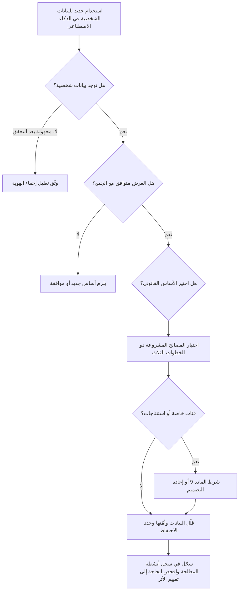
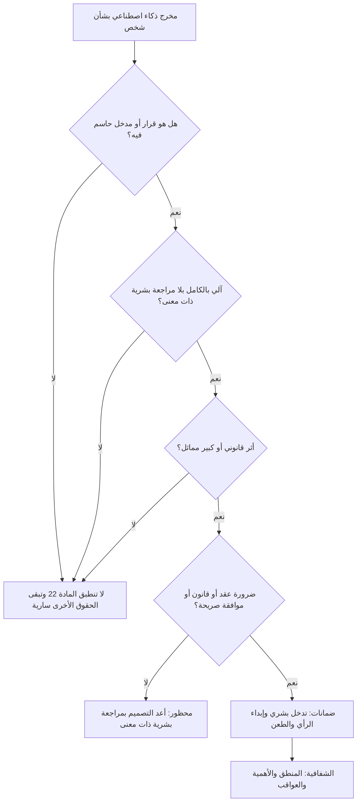

# الوحدة (Module) 4 — قانون الخصوصية وحماية البيانات (Privacy and data protection law)

*تعمل معظم أنظمة الذكاء الاصطناعي (AI systems) بالبيانات الشخصية (personal data). فهي تتعلم منها، وتستنتج (infer) منها أمورًا عن الناس، وتنتج قرارات تقع على الناس. لذلك فإن أول مجموعة من القوانين يلجأ إليها المتخصص في حوكمة الذكاء الاصطناعي (AI governance) ليست "قانونًا للذكاء الاصطناعي (AI)" أصلًا؛ بل هي قانون حماية البيانات (data protection law)، الذي ينطبق بالفعل بالكامل. تبيّن هذه الوحدة (Module) كيف تنطبق مبادئ (principles) GDPR وحقوق الأفراد (individual rights) وتقييمات الأثر على نموذج التقييم الائتماني (credit-scoring model) وروبوت المحادثة (chatbot) والمساعد الذكي لمذكرات الائتمان (credit memo copilot) في بنك نجم (Najm Bank)، ثم توسّع العدسة لتشمل المملكة المتحدة (UK) والولايات المتحدة (United States) والصين (China) ودول الخليج (GCC) التي يعمل فيها نجم. وهي تشرح القانون لتتمكن من الحوكمة الجيدة (govern well) والإجابة عن أسئلة الامتحان؛ وليست استشارة قانونية (legal advice)، ولأي قرار حقيقي ينبغي أن تتحقق من النص الحالي (current text) وأن تأخذ المشورة من مستشار قانوني مؤهل (qualified counsel) في البلد المعني.*

> **التغطية ضمن مجال المعرفة (BoK coverage):** II.A — كيف تنطبق قوانين خصوصية البيانات (data privacy laws) القائمة (المبادئ (principles)، والأسس القانونية (lawful bases)، وحقوق الأفراد (individual rights)، والقرارات الآلية (automated decisions)، وتقييمات الأثر على حماية البيانات (DPIAs)، وأنظمة النقل عبر الحدود (cross-border regimes)) على أنظمة الذكاء الاصطناعي (AI systems).

---

# 4.1 — مبادئ حماية البيانات (data protection principles) في مواجهة الذكاء الاصطناعي (AI)
*المستوى (Level): 🟡 متوسط (Intermediate)* · *المتطلبات (Prerequisites): 1.1، 1.2* · *مجال المعرفة (BoK): II.A*

## ⚡ الدرس في دقيقة (In 60 seconds)
- ينطبق قانون حماية البيانات (data protection law) على الذكاء الاصطناعي (AI) كلما عولجت (processed) بيانات شخصية (personal data)، من بيانات التدريب (training data) إلى المخرجات (outputs) المتعلقة بالأشخاص.
- مبادئ (principles) GDPR السبعة في المادة 5 (Art. 5) هي العمود الفقري، وكل منها يخلق توترًا محددًا مع طريقة عمل تعلّم الآلة (machine learning).
- يحتاج كل نشاط معالجة (processing activity) إلى أساس قانوني (lawful basis) بموجب المادة 6 (Art. 6). وبالنسبة للتدريب (training)، كثيرًا ما تكون المصالح المشروعة (legitimate interests) هي الأساس المرشح (candidate basis)، لكن فقط إذا اجتازت اختبارًا من ثلاث خطوات (three-step test). وقد شرح EDPB كيفية ذلك في الرأي 28/2024 (Opinion 28/2024).
- الاستنتاجات (inferences) بيانات شخصية (personal data) أيضًا. فالنموذج (model) الذي يستنتج (infers) الصحة أو الدين أو التوجه الجنسي (sexual orientation) قد يعالج (processes) بيانات من الفئات الخاصة (special category data) بموجب المادة 9 (Art. 9)، حتى لو لم يجمع أحد تلك الحقول قط.
- إشارة الامتحان (Exam cue) هي أن تطابق كل مبدأ (principle) مع مرحلة دورة حياة (life cycle) الذكاء الاصطناعي (AI) التي يطبَّق فيها. والفخ الأكبر (The biggest trap) هو الظن بأن عبارة "البيانات كانت علنية" أو "النموذج (model) مجرد إحصاءات" تُخرجك من نطاق GDPR.

## 🧭 لماذا يهم (Why it matters)
تريد دانة، كبيرة علماء البيانات (lead data scientist) في بنك نجم (Najm Bank)، تحسين نموذج التقييم الائتماني للأفراد (retail credit-scoring model) بجمع عشر سنوات من ملفات القروض (loan files) وسجلات المعاملات (transaction histories) وسجلات روبوت محادثة خدمة العملاء (customer-service chatbot logs) في مجموعة تدريب (training set) واحدة. تقول: "بيانات أكثر، نموذج (model) أفضل"، ويوافقها خالد، مالك إقراض الأفراد (owns retail lending). أما سارة، مسؤولة حماية البيانات (DPO)، فتطرح أربعة أسئلة. هل أُبلغ العملاء بأن رسائلهم في المحادثات ستُستخدم لتدريب (training) نموذج ائتماني (credit model)؟ هل تكشف سجلات المعاملات أي شيء حساس، مثل مدفوعات إلى مسجد أو مستشفى أو نقابة عمالية؟ إلى متى يحتفظ البنك بملفات عمرها عشر سنوات لعملاء غادروه؟ وأي أساس قانوني (lawful basis) يغطي التدريب، بخلاف تشغيل الحساب؟

ليست أي من هذه الأسئلة خاصة بالذكاء الاصطناعي (AI)؛ إنها أسئلة عادية في حماية البيانات (ordinary data protection questions) يجعلها الذكاء الاصطناعي أصعب. فالنماذج (models) تريد بيانات أكثر مما تبدو المهمة بحاجة إليه، وتحوّل البيانات غير الضارة إلى استنتاجات حساسة (sensitive inferences)، وما إن تُشكّل البيانات الشخصية (personal data) معاملات النموذج (parameters) حتى يصعب سحبها منه. ولأن فرع نجم في فرانكفورت يخدم عملاء في الاتحاد الأوروبي (EU)، ينطبق GDPR على تلك المعالجة (processing)؛ وينطبق PDPPL القطري في البلد الأم.

والجهات الرقابية (regulators) تطبّق ذلك: فقد قيّدت الهيئة الإيطالية (Garante) ChatGPT مؤقتًا عام 2023، وغرّمت OpenAI مبلغ 15 مليون يورو في ديسمبر 2024. كما غرّمت عدة هيئات أوروبية Clearview AI بسبب كشط (scraping) صور الوجوه (facial images) لبناء قاعدة بيانات (database) للتعرف على الوجوه (face-recognition).

## 📐 كيف يعمل (How it works)

### 🟢 الأساسيات (The essentials)
**البيانات الشخصية (personal data) والمعالجة.** بموجب GDPR، *البيانات الشخصية* هي أي معلومات تتعلق بشخص طبيعي (natural person) محدد الهوية أو قابل للتحديد (*صاحب البيانات* (data subject)). و*المعالجة* (processing) هي تقريبًا أي شيء تفعله بها، بما في ذلك التدريب (training) عليها. ويحدد *المتحكّم* (controller) الأغراض والوسائل (نجم، بالنسبة للنموذج الائتماني (credit model))؛ ويعمل *المعالِج* (processor) نيابة عنه (مزوّد سحابي (cloud provider) يستضيف عمليات التدريب (training runs)).

تظهر البيانات الشخصية (personal data) في كل مرحلة من مراحل نظام الذكاء الاصطناعي (AI system): بيانات المصدر (source data)، ومجموعات التدريب والاختبار (training and test sets)، وربما معاملات النموذج (إذا كان يحفظ (if it memorises) البيانات)، ومدخلات النشر (deployment inputs) مثل الأوامر النصية (prompts)، والمخرجات (outputs) مثل الدرجات (scores)، والسجلات (logs).

**المبادئ السبعة (المادة 5 (Art. 5)).** يحدد GDPR ستة مبادئ (principles) في المادة 5(1) ويضيف المساءلة (accountability) في المادة 5(2). وفيما يلي كل منها مع التوتر الذي يخلقه في سياق الذكاء الاصطناعي (AI).

| المبدأ (Principle) | ما يقوله بكلمات بسيطة (What it says, in plain words) | أين يضغط عليه الذكاء الاصطناعي (Where AI strains it) |
|---|---|---|
| المشروعية والعدالة والشفافية (Lawfulness, fairness, transparency) | امتلك أساسًا قانونيًا (legal basis)؛ لا تعالج (process) بطرق لا يتوقعها الناس أو تضرهم ظلمًا؛ أخبر الناس بما تفعله (What it does) | التدريب (training) على بيانات جُمعت لغرض (purpose) آخر؛ والنماذج (models) الغامضة؛ والاستنتاجات الخفية (hidden inferences) |
| تحديد الغرض (purpose limitation) | اجمع لأغراض محددة وصريحة ومشروعة؛ ولا تعالج (process) لاحقًا بطريقة غير متوافقة (incompatible) | إعادة استخدام بيانات الخدمة لتدريب (training) نماذج (models) جديدة |
| تقليل البيانات (data minimisation) | كافية وذات صلة ومقصورة على ما هو ضروري | تتحسن النماذج (models) بخصائص (features) أكثر وسجلات أكثر |
| الدقة (accuracy) | حافظ على دقة البيانات وحداثتها؛ وصحّح الأخطاء | الاستنتاجات الخاطئة (wrong inferences)، والحقائق المهلوسة (hallucinated facts) عن الأشخاص، وبيانات التدريب (training data) القديمة |
| تحديد مدة التخزين (storage limitation) | لا تحتفظ بالبيانات القابلة للتعريف أكثر من اللازم | مجموعات تدريب محفوظة "تحسبًا لإعادة التدريب (retraining)"؛ ونماذج (models) تحتفظ بالبيانات |
| السلامة والسرية (integrity and confidentiality) | أمن مناسب (Appropriate security) | عكس النموذج (Model inversion)، واستنتاج العضوية (membership inference)، وتسرب سجلات الأوامر النصية (prompt-log leaks) |
| المساءلة (accountability) | كن مسؤولًا عن الامتثال (compliance) وقادرًا على إثباته | يتطلب توثيقًا عبر سلسلة معالجة معقدة ومتعددة الأطراف (complex, multi-party pipeline) |

**الأسس القانونية (المادة 6 (Art. 6)).** لا تكون المعالجة (processing) مشروعة إلا إذا انطبق أساس واحد على الأقل من ستة أسس: الموافقة (consent)؛ أو تنفيذ عقد (performance of a contract)؛ أو الامتثال (compliance) لالتزام قانوني (legal obligation)؛ أو المصالح الحيوية (vital interests)؛ أو مهمة للمصلحة العامة (public interest) أو ممارسة سلطة رسمية (official authority)؛ أو المصالح المشروعة (legitimate interests)، التي يجب ألا تطغى عليها مصالح صاحب البيانات (data subject) أو حقوقه الأساسية (fundamental rights). ويحتاج كل غرض (purpose) إلى أساس خاص به: فتشغيل الحساب (العقد (contract)) وتدريب نموذج (model) على بيانات الحساب غرضان (purposes) منفصلان.

**الفئات الخاصة (المادة 9 (Art. 9)).** الأصل العرقي أو الإثني (racial or ethnic origin)، والآراء السياسية (political opinions)، والمعتقدات الدينية أو الفلسفية (religious or philosophical beliefs)، والعضوية النقابية (trade-union membership)، والبيانات الجينية (genetic data)، والبيانات البيومترية (biometric data) لتحديد الهوية بشكل فريد، والصحة، والحياة الجنسية (sex life) أو التوجه الجنسي (sexual orientation). ومعالجتها (processing them) محظورة ما لم ينطبق شرط من شروط المادة 9(2)، مثل الموافقة الصريحة (explicit consent) أو المصلحة العامة الجوهرية (substantial public interest) بموجب القانون. أما بيانات الجرائم الجنائية (criminal-offence data) فتغطيها المادة 10 (Art. 10).

### 🟡 التعمق أكثر (Going deeper)
**المصالح المشروعة (legitimate interests) أساسًا للتدريب (training).** نادرًا ما تكون الموافقة (consent) عملية للتدريب على نطاق واسع (at scale): إذ يجب أن تُمنح بحرية، وأن تكون محددة ومستنيرة وواضحة لا لبس فيها، وسحبها صعب بعد أن تصبح البيانات داخل النموذج (model). أما العقد (contract) فلا يصلح إلا حيث تكون المعالجة (processing) ضرورية موضوعيًا لتقديم الخدمة، ونادرًا ما يكون تدريب نموذج مستقبلي كذلك. لذلك تكون المصالح المشروعة (المادة 6(1)(f)) هي المرشح المعتاد، ولها ثلاث خطوات:

1. **اختبار الغرض (Purpose test).** هل توجد مصلحة مشروعة (legitimate interest)؟ يجب أن تكون مشروعة، ومحددة بوضوح ودقة، وحقيقية وقائمة لا افتراضية. ويمكن أن تتأهل عبارة "تحسين اكتشاف الاحتيال (fraud detection) لحماية العملاء".
2. **اختبار الضرورة (Necessity test).** هل المعالجة (processing) ضرورية لتلك المصلحة؟ هل يمكنك تحقيقها ببيانات أقل أو بوسائل أقل تدخلًا (less intrusive means)، مثل البيانات المجهّلة (anonymised) أو الاصطناعية؟
3. **اختبار الموازنة (Balancing test).** هل تطغى مصالح الفرد وحقوقه وحرياته على مصالحك؟ ضع في الاعتبار طبيعة البيانات، والتوقعات المعقولة (reasonable expectations) للأشخاص المعنيين، والأثر المحتمل، والضمانات (safeguards) التي تضيفها.

**رأي EDPB رقم 28/2024.** في ديسمبر 2024 اعتمد المجلس الأوروبي لحماية البيانات (European Data Protection Board) رأيًا بشأن نماذج (models) الذكاء الاصطناعي (AI)، بطلب من السلطة الرقابية الأيرلندية (Irish supervisory authority). ويتناول ثلاثة أسئلة.

- *متى يكون نموذج الذكاء الاصطناعي (AI) مجهول الهوية (anonymous)؟* ليس تلقائيًا. بل فقط إذا كان احتمال استخراج بيانات شخصية (likelihood of extracting personal data) عن الأشخاص الذين دُرّب النموذج (model) على بياناتهم، مباشرة من المعاملات أو عبر الاستعلامات (queries)، ضئيلًا، باستخدام جميع الوسائل التي يُرجَّح بصورة معقولة استخدامها. ويُحكم على ذلك حالةً بحالة، ويجب على المتحكّمين (controllers) توثيق تعليلهم، مثلًا بنتائج اختبارات استنتاج العضوية والاستخراج (membership-inference and extraction tests).
- *هل يمكن أن تكون المصالح المشروعة (legitimate interests) أساسًا لتطوير النماذج ونشرها (developing and deploying models)؟* ربما، إذا اجتيز الاختبار ذو الخطوات الثلاث (three-step test). ويؤكد الرأي على التوقعات المعقولة (هل يتوقع من نشروا محتوى علنًا أن تُستخدم منشوراتهم لتدريب (training) نموذج (model)؟) ويسرد تدابير تخفيف (mitigating measures) مثل الترميز المستعار (pseudonymisation)، واستبعاد مصادر (excluding sources)، وخيارات انسحاب سهلة (easy opt-outs)، وشفافية إضافية (extra transparency).
- *ماذا لو طُوّر النموذج (model) ببيانات عولجت (processed) بصورة غير مشروعة؟* يعتمد ذلك على السيناريو. فقد تشوب عدم المشروعية (lawfulness) الاستخدامَ اللاحق من المتحكّم (controller) نفسه؛ وينبغي لمتحكّم مختلف يشغّل النموذج أن يبذل العناية الواجبة (due diligence) بشأن طريقة بنائه؛ وإذا كان النموذج قد جُهّل فعليًا (effectively anonymised)، فقد لا ينطبق GDPR على تشغيله اللاحق، وإن ظل ينطبق على البيانات الشخصية (personal data) المعالجة (processing) أثناء النشر (deployment).

درس الامتحان (exam lesson): ليست البيانات شخصية "دائمًا" أو "أبدًا"، بل "الأمر يعتمد، فأظهر تعليلك".

**تحديد الغرض (purpose limitation) والمعالجة اللاحقة (further processing).** لا يجوز استخدام بيانات جُمعت لغرض (purpose) ما في غرض آخر إلا إذا كان الغرض الجديد (new purpose) *متوافقًا (compatible)*، ما لم يوافق الشخص أو يسمح بذلك قانون. وتسرد المادة 6(4) العوامل: الصلة بين الأغراض، وسياق الجمع، وطبيعة البيانات، والعواقب المحتملة، والضمانات (safeguards) مثل الترميز المستعار (pseudonymisation). ويُفترض أن البحث والإحصاء (Research and statistics) متوافقان مع ضمانات المادة 89(1)، لكن لا ينبغي للبنك أن يفترض أن "البحث" يشمل نموذجًا ائتمانيًا تجاريًا (commercial credit model). فاستخدام ملفات القروض (loan files) لتدريب (training) نموذج ائتماني (credit model) قد يكون متوافقًا تمامًا؛ أما استخدام محادثات روبوت المحادثة (chatbot conversations) لتقييم الجدارة الائتمانية (creditworthiness) فقفزة أكبر بكثير.

**تقليل البيانات مقابل شراهة النماذج (model hunger).** لا يحظر تقليل البيانات (data minimisation) مجموعات البيانات الكبيرة (large datasets)؛ بل يحظر البيانات غير الضرورية للغرض (purpose) المعلن. برّر كل خاصية (feature) وأسقط ما لا قيمة قابلة للقياس له، واستخدم منحنيات التعلم (learning curves) لإظهار متى تتوقف السجلات (logs) الإضافية عن المساعدة، ورمّز المعرّفات (identifiers) ترميزًا مستعارًا (pseudonymised) قبل التدريب (training)، وفضّل البيانات المجمّعة (aggregates) أو العينات أو البيانات الاصطناعية (synthetic data) حيث تكون مجدية.

**الفئات الخاصة (special categories) والبيانات المستنتجة (inferred data).** فسّرت CJEU المادة 9 (Art. 9) تفسيرًا واسعًا: فالبيانات التي *تكشف بصورة غير مباشرة* عن فئة خاصة (special category) قد تندرج ضمنها، حتى لو لم يقصد المتحكّم (controller) معرفتها قط. والنموذج (model) الذي يستنتج (infers) الصحة من الإنفاق في الصيدليات، أو الدين من أنماط التبرعات، قد يُدخل المعالجة (processing) في نطاق المادة 9. لذلك فإن استبعاد عمود "الدين" لا يزيل الخطر (risk)، لأن المتغيرات البديلة (proxies) يمكنها إعادة إنتاجه. واختبار العدالة (fairness) *يحتاج* أحيانًا إلى بيانات الفئات الخاصة (special category data) للتحقق من النتائج بحسب الأصل الإثني أو الجنس. ويسمح قانون الذكاء الاصطناعي الأوروبي (EU AI Act) لمقدّمي الأنظمة عالية المخاطر (high-risk systems)، استثناءً (exception)، بمعالجة الفئات الخاصة حيث يكون ذلك ضروريًا بصورة صارمة لاكتشاف التحيّز وتصحيحه (bias detection and correction)، مع ضمانات صارمة (strict safeguards)؛ وإلا فأنت بحاجة إلى شرط من شروط المادة 9.

**الدقة (accuracy).** الدقة الإحصائية (statistical accuracy) هي عدد المرات التي يكون فيها النموذج (model) محقًا إجمالًا؛ أما مبدأ (principle) GDPR فيسأل ما إذا كانت *البيانات الشخصية (personal data)*، بما في ذلك الاستنتاجات (inferences)، صحيحة بشأن الفرد. فقد يكون النموذج دقيقًا بنسبة 95% ومع ذلك يصنّف آلاف الأشخاص خطأً، وروبوت المحادثة (chatbot) الذي يختلق بيانًا كاذبًا عن شخص مسمّى ينتج بيانات شخصية غير دقيقة. صنّف المخرجات (outputs) على أنها تنبؤات، واسمح بالتصحيح (rectification)، وراقب معدلات الخطأ (error rates) بحسب الفئة، وامنع تدفق النصوص المولّدة (generated text) إلى سجلات العملاء (customer records) دون تحقق.

### 🔴 نظرة الخبير (Expert view)
**تحديد مدة التخزين (storage limitation) والنموذج بوصفه مخزنًا للبيانات (the model as a data store).** يضيف الذكاء الاصطناعي (AI) ثلاثة مخازن إلى جدول الاحتفاظ (retention schedule): لقطات التدريب (training snapshots)، وسجلات الأوامر النصية والمخرجات (prompt and output logs)، والنموذج (model) نفسه إذا كان قد حفظ بيانات شخصية (personal data). حدد مدة احتفاظ (retention) لكل منها، وعامل النموذج غير المجهول على أنه يحتوي على بيانات شخصية لأغراض الاحتفاظ والمحو (erasure). وقد تبرر واجبات حفظ السجلات (record-keeping duties) المصرفية الاحتفاظ بسجلات القرارات (decision records) مدة أطول، لكن ذلك يشمل السجل، لا كل خاصية (feature) استُخدمت يومًا.

**الأمن بوصفه مبدأً من مبادئ الخصوصية (Security as a privacy principle).** يشمل مبدأ (principle) السلامة والسرية (المادة 5(1)(f)) والمادة 32 (Art. 32) الآن الهجمات الخاصة بالذكاء الاصطناعي (AI-specific attacks): *استنتاج العضوية* (membership inference) (معرفة ما إذا كان سجل شخص ما ضمن مجموعة التدريب (training set)، وهو ما قد يكشف بحد ذاته أنه تعثر في سداد قرض (defaulted on a loan) من نجم)، و*عكس النموذج واستخراجه* (model inversion and extraction) (إعادة بناء بيانات التدريب (training data) أو نسخ النموذج (model) عبر الاستعلامات (queries))، و*حقن الأوامر* (prompt injection) (خداع روبوت محادثة (chatbot) ليسرّب بيانات عملاء آخرين)، و*تسميم البيانات* (data poisoning). وتشمل الضوابط (controls) التحكم في الوصول (access control) إلى بيانات التدريب (training)، والخصوصية التفاضلية (differential privacy)، وتصفية المخرجات (output filtering)، وتحديد معدل الطلبات (rate limiting)، واختبار الفريق الأحمر (red-teaming)، والاسترجاع المراعي للصلاحيات (permission-aware retrieval) بحيث لا يجلب المساعد إلا المستندات التي يحق للمستخدم رؤيتها.

**حماية البيانات بالتصميم وبالإعداد الافتراضي (المادة 25 (Art. 25))** هي المستند القانوني (legal hook) لمراجعات الخصوصية (privacy reviews) عند بوابات التصميم (design gates)، لا قبل الإطلاق فقط (الوحدة (Module) 8).

**المساءلة (accountability) عبر سلسلة التوريد (supply chain).** حين يشتري نجم نموذجًا (model) أو خدمة ذكاء اصطناعي توليدي (GenAI service)، يظل عليه إثبات الامتثال (compliance) في معالجته (its processing) الخاصة: دور المورد (معالِج (processor)، أو متحكّم مستقل (independent controller)، أو متحكّم مشترك (joint controller))، وما إذا كان يتدرب على الأوامر النصية (prompts)، وأين تُخزَّن البيانات (الوحدتان (Modules) 3.3 و11.2). وبالنسبة للبيانات المجمّعة من أطراف ثالثة (data collected from third parties)، بما فيها البيانات المكشوطة (scraped data)، تشترط المادة 14 (Art. 14) إبلاغ الأشخاص؛ واستثناء (exception) "الجهد غير المتناسب (disproportionate effort)" ما زال يتطلب تدابير مناسبة (appropriate measures) مثل نشر المعلومات.

```mermaid
flowchart TD
    A[استخدام جديد للبيانات الشخصية في الذكاء الاصطناعي] --> B{هل توجد بيانات شخصية؟}
    B -- لا، مجهولة بعد التحقق --> Z[وثّق تعليل إخفاء الهوية]
    B -- نعم --> C{هل الغرض متوافق مع الجمع؟}
    C -- لا --> D[يلزم أساس جديد أو موافقة]
    C -- نعم --> E{هل اختير الأساس القانوني؟}
    E --> F[اختبار المصالح المشروعة ذو الخطوات الثلاث]
    F --> G{فئات خاصة أو استنتاجات؟}
    G -- نعم --> H[شرط المادة 9 أو إعادة التصميم]
    G -- لا --> I[قلّل البيانات وأمّنها وحدد الاحتفاظ]
    H --> I
    I --> J[سجّل في سجل أنشطة المعالجة وافحص الحاجة إلى تقييم الأثر]
```

## ⚖️ الأدوات التنظيمية (The instruments)
| الأداة (Instrument) | ما تشترطه أو توصي به (What it requires or recommends) | إشارة الامتحان (Exam cue) |
|---|---|---|
| **GDPR** — المادة 5 (Art. 5) | سبعة مبادئ (principles): المشروعية (lawfulness)/العدالة (fairness)/الشفافية (transparency)، وتحديد الغرض (purpose limitation)، وتقليل البيانات (data minimisation)، والدقة (accuracy)، وتحديد مدة التخزين (storage limitation)، والسلامة/السرية (integrity/confidentiality)، والمساءلة (accountability) | طابِق كل مبدأ (principle) مع مرحلة من مراحل دورة حياة الذكاء الاصطناعي (AI life cycle) |
| **GDPR** — المادة 6 (Art. 6) و6(4) | أساس واحد من ستة أسس قانونية (lawful bases) لكل غرض (purpose)؛ واختبار التوافق (compatibility test) للمعالجة اللاحقة (further processing) | التدريب (training) غرض (purpose) منفصل عن تقديم الخدمة |
| **GDPR** — المادة 9 (Art. 9) | تحظر معالجة (processing) الفئات الخاصة (special categories) ما لم ينطبق شرط من شروط المادة 9(2) | البيانات الحساسة (sensitive data) المستنتجة قد تُحتسب |
| **GDPR** — المادتان 25 و32 (Art. 25 & 32) | حماية البيانات بالتصميم وبالإعداد الافتراضي (Data protection by design and by default)؛ والأمن المناسب (appropriate security) | المستند القانوني (legal hook) للخصوصية عند بوابات التصميم (design gates) وللهجمات الخاصة بالذكاء الاصطناعي (AI-specific attacks) |
| **EDPB Opinion 28/2024** | إخفاء هوية النموذج (model) يُقيَّم حالةً بحالة؛ والمصالح المشروعة (legitimate interests) ممكنة مع الاختبار ذي الخطوات الثلاث (three-step test)؛ وعواقب بيانات التدريب (training data) غير المشروعة | "الأمر يعتمد، فوثّقه" |
| **EU AI Act** — المادة 10 (Art. 10) | حوكمة البيانات للأنظمة عالية المخاطر (high-risk systems)؛ وإذن ضيق بمعالجة (processing) الفئات الخاصة (special categories) لاكتشاف التحيّز وتصحيحه (bias detection and correction) | لا يحل محل GDPR، الذي يظل ساريًا |
| **Qatar PDPPL** | القانون العام لحماية البيانات (general data protection law) في قطر (القانون رقم 13 لسنة 2016): المبادئ (principles)، والحقوق، وواجبات المتحكّم (controller duties) | الأساس في البلد الأم لنجم، ويُغطّى في 4.3 |

## 🏛️ عمليًا في بنك نجم (In practice at Najm Bank)
تحوّل ليلى وسارة المبادئ (principles) إلى **قائمة تحقق للخصوصية بالتصميم لبيانات تدريب الذكاء الاصطناعي (Privacy-by-Design Checklist for AI Training Data)**، يجب استكمالها قبل أي عملية تدريب (training run) تستخدم بيانات شخصية (personal data). وتمر خطة دانة عبرها أولًا.

| # | السؤال (question) | الأدلة المطلوبة (Evidence required) | إجابة دانة بشأن النموذج الائتماني (Dana's credit-model answer) |
|---|---|---|---|
| 1 | ما الغرض (purpose)، في جملة واحدة؟ | بيان الغرض (Purpose statement) في سجل أنظمة الذكاء الاصطناعي (AI inventory) | "تقدير احتمال التعثر (probability of default) لمقدّمي طلبات قروض الأفراد (retail loan applicants)" |
| 2 | هل هذا الغرض (purpose) متوافق (compatible) مع الغرض الأصلي (original purpose) لكل مصدر؟ | مذكرة توافق (compatibility note) وفق المادة 6(4) لكل مصدر | ملفات القروض (loan files): نعم. المعاملات: نعم، مع تقليل البيانات (data minimisation). سجلات المحادثة (chat logs): **لا، مستبعدة** |
| 3 | أي أساس قانوني (lawful basis) ينطبق، وأين التقييم؟ | مرجع تقييم المصالح المشروعة (LIA) | LIA-2026-014، والخطوات الثلاث موثّقة |
| 4 | هل يمكن لأي خاصية (feature) أن تكشف فئة خاصة (special category) أو تكون مؤشرًا بديلًا (proxy) لها؟ | مراجعة الخصائص (Feature review)، وتحليل المتغيرات البديلة (proxy analysis) | أُزيلت خصائص (features) فئات التجار المتعلقة بالتجار الدينيين والطبيين؛ واختبار المتغيرات البديلة (proxy test) المتبقية مخطَّط |
| 5 | هل كل خاصية (feature) ضرورية؟ | نتائج الاستبعاد التجريبي للخصائص (Ablation) | أُسقطت 38 من أصل 112 خاصية (feature) |
| 6 | هل تُرمَّز المعرّفات (identifiers) ترميزًا مستعارًا (pseudonymised) قبل التدريب (training)؟ | تصميم خط المعالجة (Pipeline design) | نعم، والمفتاح لدى مكتب البيانات (Data Office) |
| 7 | إلى متى يُحتفظ بلقطات التدريب (training snapshots) والسجلات (logs)؟ | قيد في جدول الاحتفاظ (Retention schedule entry) | اللقطات (snapshots) 3 سنوات لأغراض المصادقة (validation)؛ واستُبعدت سجلات الحسابات المغلقة (closed-account records) التي تجاوزت حد الاحتفاظ (retention limit) |
| 8 | هل يُختبر النموذج (model) من حيث الحفظ (memorisation) أو استنتاج العضوية (membership inference)؟ | تقرير الاختبار (Test report) | مطلوب قبل الإصدار |
| 9 | هل أُبلغ الأشخاص؟ | بند في إشعار الخصوصية (Privacy notice clause) | حُدّث الإشعار (notice) ليصف تدريب النماذج (models) والتنميط (profiling) |
| 10 | هل يحتاج هذا إلى تقييم الأثر على حماية البيانات (DPIA)؟ | نتيجة الفحص الأولي (Screening result) | نعم: تنميط ذو آثار كبيرة (انظر 4.3) |

قرار اللجنة المسجَّل (Committee decision recorded): *"تُستبعد سجلات المحادثة (chat logs) من تدريب النموذج الائتماني (credit model). وأي مقترح مستقبلي لاستخدامها يتطلب تقييمًا جديدًا للتوافق (new compatibility assessment) وتقييمًا للأثر على حماية البيانات (DPIA)."*

## 🛠️ التمارين (Exercises)
- 🟢 خذ مبادئ (principles) المادة 5 (Art. 5) السبعة، واكتب بالنسبة لروبوت محادثة خدمة العملاء (customer-service chatbot) في نجم جملة واحدة لكل مبدأ (principle) عن الموضع الذي يطبَّق فيه. *يكتمل عندما (Done when):* تكون لديك سبع جمل، تسمّي كل منها مرحلة ملموسة (الجمع، أو التدريب (training)، أو النشر (deployment)، أو المخرجات (outputs)، أو السجلات (logs)).
- 🟡 صُغ تقييمًا للمصالح المشروعة (legitimate interests assessment) من صفحة واحدة لاستخدام خمس سنوات من بيانات معاملات البطاقات (card transaction data) لتدريب (training) نموذج اكتشاف الاحتيال (fraud-detection model) في نجم. غطِّ الغرض (purpose)، والضرورة (بما في ذلك البدائل الأقل تدخلًا (less intrusive alternatives))، والموازنة (التوقعات، والأثر، والضمانات (safeguards)). *يكتمل عندما (Done when):* يكون لكل خطوة من الخطوات الثلاث استنتاج، ويُذكر ضمانان على الأقل.
- 🔴 تقول دانة إن النموذج الائتماني الجديد (new credit model) "مجهول الهوية (anonymous) لأنه مجرد أوزان (weights)". اكتب المذكرة التي سترسلها سارة، مطبّقًا رأي EDPB رقم 28/2024: ما الأدلة التي تدعم هذا الادعاء، وما الاختبارات التي يجب إجراؤها، وما الذي يترتب إذا فشل الادعاء. *يكتمل عندما (Done when):* تسمّي المذكرة اختبارين على الأقل قائمين على الهجمات، وتبيّن العاقبة بالنسبة لطلبات المحو (erasure requests) والاحتفاظ (retention).

## ⚠️ أخطاء وفخاخ الامتحان (Mistakes and exam traps)
- **"البيانات العلنية (public data) حرة الاستخدام."** البيانات الشخصية المتاحة علنًا (publicly available personal data) تظل بيانات شخصية (personal data). وما زلت بحاجة إلى أساس قانوني (lawful basis)، وشفافية (transparency)، وموازنة تحترم التوقعات. وخيارات الإجابة (Answer choices) التي تعامل "المتاح علنًا (publicly available)" على أنه إعفاء (exemption) خاطئة.
- **"أزلنا الأعمدة الحساسة، فلا تنطبق المادة 9 (Art. 9)."** الاستنتاجات (inferences) والمتغيرات البديلة (proxies) قد تكشف الفئات الخاصة (special categories). ابحث عن الإجابة التي تختبر المتغيرات البديلة وتفاوت النتائج (outcome disparities).
- **"الموافقة (consent) هي دائمًا الأساس الأكثر أمانًا."** الموافقة هشة في التدريب (training): يجب أن تُمنح بحرية (وهو أمر صعب في علاقة بين بنك وعميله) ويمكن سحبها. وكثيرًا ما تكافئ الامتحانات المصالح المشروعة (legitimate interests) مع تقييم موثّق، أو أساسًا آخر مناسبًا، على الموافقة التلقائية (reflexive consent).
- **"النموذج (model) ليس بيانات شخصية (personal data) أبدًا" أو "بيانات شخصية دائمًا".** موقف EDPB هو التقييم حالةً بحالة، بناءً على احتمال الاستخراج (likelihood of extraction). اختر الإجابة التي تشترط التقييم والتوثيق.
- **الخلط بين الدقة الإحصائية (statistical accuracy) ومبدأ الدقة (accuracy principle).** ارتفاع معدل الدقة (accuracy) الإجمالي لا يفي بواجب الحفاظ على صحة بيانات الأفراد، بما في ذلك الاستنتاجات (inferences).

## 🧾 الخلاصة (Recap)
- ينطبق قانون حماية البيانات (data protection law) على دورة حياة الذكاء الاصطناعي (AI life cycle) بأكملها، بما في ذلك النماذج (models) والمخرجات (outputs) والسجلات (logs).
- يخلق كل مبدأ (principle) من مبادئ (principles) المادة 5 (Art. 5) توترًا محددًا في سياق الذكاء الاصطناعي (AI)؛ والمساءلة (accountability) تعني أن تكون قادرًا على إظهار كيف عالجته.
- التدريب (training) غرض قائم بذاته (its own purpose). ويحتاج إلى أساس قانوني (lawful basis)، وحين تُعاد البيانات استخدامها، إلى تقييم للتوافق (compatibility assessment).
- يمكن أن تدعم المصالح المشروعة (legitimate interests) التدريب (training) إذا اجتاز اختبارات الغرض والضرورة والموازنة (رأي EDPB رقم 28/2024).
- البيانات المستنتجة (inferred data) وبيانات المتغيرات البديلة (proxy data) قد تكون بيانات من الفئات الخاصة (special category data)؛ وقد يحتاج اختبار العدالة (fairness testing) نفسه إلى مسار وفق المادة 9 (Art. 9) أو إلى الإذن الضيق لاختبار التحيّز (bias testing) في قانون الذكاء الاصطناعي (EU AI Act).
- الهجمات الخاصة بالذكاء الاصطناعي (AI-specific attacks) تجعل الأمن (security)، والاحتفاظ (retention)، وسؤال "هل النموذج (model) مجهول الهوية (anonymous)؟" أسئلة خصوصية حيّة.

## ✍️ اختبر نفسك (Check yourself)

**1. يريد بنك نجم إعادة استخدام نصوص محادثات روبوت خدمة العملاء (customer-service chatbot transcripts) لتدريب (training) نموذج التقييم الائتماني للأفراد (retail credit-scoring model). بموجب GDPR، ما التحليل الأول الذي ينبغي أن تشترطه سارة؟**

- A. التحقق من أن النصوص (transcripts) مخزنة في الاتحاد الأوروبي (EU)
- B. تقييم ما إذا كان الغرض الجديد (new purpose) متوافقًا (compatible) مع الغرض (purpose) الذي جُمعت النصوص (transcripts) من أجله
- C. تدقيق للتحيّز (bias audit) يجريه مدقق مستقل (independent auditor)
- D. تأكيد أن النموذج (model) سيكون أدق مع النصوص (transcripts)

الإجابة

**B.** إعادة استخدام البيانات لغرض (purpose) جديد تستدعي تحديد الغرض (purpose limitation) واختبار التوافق (compatibility test) في المادة 6(4) (أو أساسًا جديدًا (new basis) مثل الموافقة (consent)). ومكاسب الدقة (D) لا تجعل المعالجة (processing) مشروعة. أما الموقع (A) وتدقيقات التحيّز (C) فمهمة في مواضع أخرى، لكنها لا تجيب عن السؤال المبدئي (threshold question). (انظر 🟡 تحديد الغرض والمعالجة اللاحقة (further processing).)

**2. وفقًا لرأي EDPB رقم 28/2024، متى يمكن اعتبار نموذج (model) ذكاء اصطناعي (AI) مدرّب على بيانات شخصية (personal data) مجهول الهوية (anonymous)؟**

- A. دائمًا، لأن معاملات النموذج (model parameters) ليست سجلات عن الأفراد
- B. أبدًا، لأن بيانات التدريب (training data) تترك آثارًا دائمًا
- C. حين يكون احتمال استخراج بيانات شخصية (likelihood of extracting personal data) عن أصحاب بيانات التدريب (training subjects)، مباشرة أو عبر الاستعلامات (queries)، ضئيلًا، ويُقيَّم ذلك حالةً بحالة
- D. فقط حين تكون بيانات التدريب (training data) قد جُهّلت بالكامل مسبقًا

الإجابة

**C.** يتبنى EDPB نهجًا يقيّم كل حالة على حدة ويركّز على احتمال الاستخراج (likelihood of extraction) باستخدام الوسائل التي يُرجَّح بصورة معقولة استخدامها. والخياران A وB هما الموقفان المطلقان اللذان يرفضهما الرأي. أما D فيصف مسارًا واحدًا لإخفاء الهوية (anonymisation)، لا الاختبار نفسه. (انظر 🟡 رأي EDPB رقم 28/2024.)

**3. لا يتلقى نموذج (model) أحد المقرضين (lenders) أي حقل "صحة"، لكنه يستخدم الإنفاق على مستوى التجار بما يتيح له استنتاج المرض المزمن. ما أفضل استجابة من منظور الحوكمة (governance)؟**

- A. معاملة الاستنتاجات (inferences) على أنها قد تكون بيانات من الفئات الخاصة (special category data): إزالة خصائص المتغيرات البديلة (proxy features) أو تبريرها، واختبار النتائج بحثًا عن التفاوت (disparities)
- B. لا شيء، لأن البيانات الصحية لم تُجمع قط
- C. مطالبة العملاء بالموافقة (consent) على أي استخدام لبيانات معاملاتهم
- D. تشفير ملف النموذج (Encrypt the model file)

الإجابة

**A.** البيانات التي تكشف بصورة غير مباشرة عن فئة خاصة (special category) قد تندرج ضمن المادة 9 (Art. 9)، لذا فالحل هو معالجة المتغيرات البديلة (deal with the proxies) واختبار النتائج. والخيار (Option) B هو الفخ الكلاسيكي (the classic trap). أما C فموافقة شاملة (blanket consent) قد لا تُمنح بحرية ولا تصلح التصميم. وD ضابط أمني (security control)، لا إجابة عن المادة 9. (انظر 🟡 الفئات الخاصة (special categories) والبيانات المستنتجة (inferred data).)

**4. أي مما يلي هو خطوة الضرورة (necessity) في تقييم المصالح المشروعة (legitimate interests assessment) لتدريب (training) نموذج احتيال (fraud model)؟**

- A. إثبات أن مصلحة منع الاحتيال (fraud-prevention) مشروعة ومصاغة بوضوح
- B. الحصول على توقيع مسؤول حماية البيانات (DPO)
- C. الموازنة (balancing) بين التوقعات المعقولة (reasonable expectations) للعملاء ومصلحة البنك
- D. إثبات أن المعالجة (processing) لازمة لتلك المصلحة وأن الوسائل الأقل تدخلًا (less intrusive means)، مثل خصائص (features) أقل أو بيانات اصطناعية (synthetic data)، لن تحققها

الإجابة

**D.** تسأل الضرورة (necessity) ما إذا كانت المعالجة (processing) لازمة وما إذا كانت توجد بدائل أقل تدخلًا (less intrusive alternatives). أما A فهو اختبار الغرض (Purpose test)، وC هو اختبار الموازنة (Balancing test). وB ممارسة جيدة لكنه ليس خطوة من خطوات الاختبار. (انظر 🟡 المصالح المشروعة (legitimate interests) أساسًا للتدريب (training).)

**5. أي مبدأ (principle) من مبادئ (principles) الخصوصية يتأثر بصورة مباشرة أكثر من غيره بهجوم استنتاج العضوية (membership inference) على النموذج الائتماني (credit model) لنجم؟**

- A. تحديد الغرض (purpose limitation)
- B. تحديد مدة التخزين (storage limitation)
- C. السلامة والسرية (integrity and confidentiality)
- D. الدقة (accuracy)

الإجابة

**C.** يكشف استنتاج العضوية (membership inference) ما إذا كانت بيانات شخص ما ضمن مجموعة التدريب (training set)، وهو إخفاق في السرية (confidentiality) تعالجه المادة 5(1)(f) وأمن المادة 32 (Art. 32). وتحديد مدة التخزين (B) ذو صلة، لأن الاحتفاظ (retention) بقدر أقل يقلل التعرض، لكن الهجوم نفسه مسألة أمنية. (انظر 🔴 الأمن بوصفه مبدأً من مبادئ الخصوصية (Security as a privacy principle).)

## 📚 المراجع (References)
- اللائحة العامة لحماية البيانات (GDPR)، اللائحة (EU) 2016/679: https://eur-lex.europa.eu/eli/reg/2016/679/oj
- قانون الذكاء الاصطناعي الأوروبي (EU AI Act)، اللائحة (EU) 2024/1689: https://eur-lex.europa.eu/eli/reg/2024/1689/oj
- المجلس الأوروبي لحماية البيانات (European Data Protection Board)، الآراء والإرشادات (بما في ذلك الرأي 28/2024 بشأن نماذج (models) الذكاء الاصطناعي (AI)): https://www.edpb.europa.eu
- محكمة العدل الأوروبية (CJEU)، البحث في السوابق القضائية (case law): https://curia.europa.eu
- هيئة حماية البيانات الإيطالية (Garante): https://www.garanteprivacy.it
- IAPP، مجال المعرفة (BoK) لشهادة AIGP: https://iapp.org

---

# 4.2 — القرارات الآلية (automated decisions) وحقوق الأفراد (individual rights) والشفافية (transparency)
*المستوى (Level): 🟡 متوسط (Intermediate)* · *المتطلبات (Prerequisites): 4.1* · *مجال المعرفة (BoK): II.A*

## ⚡ الدرس في دقيقة (In 60 seconds)
- يحتفظ أصحاب البيانات (data subjects) بجميع حقوقهم حين يكون الذكاء الاصطناعي (AI) طرفًا: الإعلام (information)، والوصول (access)، والتصحيح (rectification)، والمحو (erasure)، والتقييد (restriction)، وقابلية النقل (portability)، والاعتراض (objection). ويجعل الذكاء الاصطناعي بعض هذه الحقوق صعبة تقنيًا، لكن الصعوبة ليست عذرًا قانونيًا.
- تمنح المادة 22 (Art. 22) من GDPR الأشخاص الحق (right) في ألا يخضعوا لقرار قائم *فقط* على المعالجة الآلية (automated processing)، بما في ذلك التنميط (profiling)، يُنتج آثارًا قانونية (legal effects) أو آثارًا كبيرة مماثلة (similarly significant effects)، ما لم ينطبق استثناء (exception). وحتى في هذه الحالة، تُشترط ضمانات (safeguards) منها التدخل البشري (human intervention).
- *SCHUFA* (CJEU، C-634/21، ديسمبر 2023): يمكن أن تكون الدرجة الائتمانية (credit score) بحد ذاتها "قرارًا" بموجب المادة 22 (Art. 22) حين يعتمد عليها طرف ثالث (third party)، مثل المُقرض (lender)، اعتمادًا كبيرًا في اتخاذ قراره.
- يحق للأشخاص الحصول على "معلومات ذات معنى عن المنطق المتّبع (meaningful information about the logic involved)" في مثل هذه القرارات. وقد أكدت CJEU منذ ذلك الحين أن هذا يعني تفسيرًا مفهومًا (intelligible explanation) للإجراء والمبادئ المطبّقة (procedure and principles applied) فعلًا، لا الشيفرة المصدرية (source code).
- الفخاخ الأكبر (The biggest traps): الظن بأن مراجعة بشرية (human review) شكلية تُخرج القرار من نطاق المادة 22 (Art. 22)، والظن بأن المحو (erasure) يتحقق بحذف السجل المصدر (source record) بينما لا يزال النموذج (model) يعيد إنتاج البيانات.

## 🧭 لماذا يهم (Why it matters)
ينتج نموذج التقييم الائتماني للأفراد (retail credit-scoring model) في بنك نجم (Najm Bank) درجة (score) من 0 إلى 1,000. وقد وضع فريق خالد قاعدة: ما دون 420 يُرفض الطلب تلقائيًا ويُرسل خطاب قياسي (standard letter). وما فوق 420 يراجعه موظف قروض. كتب عميل في فرانكفورت، رُفض طلبه عند 409، يسأل ثلاثة أمور: لماذا رُفضت، وما البيانات التي استخدمتموها، وأريد أن ينظر شخص في هذا. ويطلب عميل ثانٍ، أغلق حسابه قبل عامين، من نجم محو جميع بياناته "بما في ذلك من الذكاء الاصطناعي (AI) لديكم". وتسأل عميلة ثالثة روبوت المحادثة (chatbot) عن البيانات التي يحتفظ بها عنها فتحصل على إجابة واثقة لكنها خاطئة.

كل طلب من هذه الطلبات التزام قانوني (legal obligation) له موعد نهائي، هو عادةً شهر واحد بموجب GDPR، قابل للتمديد في بعض الحالات. ويتناول هذا الدرس ما إذا كان الرفض التلقائي (automatic decline) عند 409 مشروعًا أصلًا، وما الذي يدين به نجم للأشخاص الذين يقرر ذكاؤه الاصطناعي بشأنهم.

## 📐 كيف يعمل (How it works)

### 🟢 الأساسيات (The essentials)
**الحقوق في لمحة (The rights at a glance).**

| الحق (right) | GDPR | ما يعنيه لنظام ذكاء اصطناعي (What it means for an AI system) |
|---|---|---|
| الإعلام (information) | المواد 13–14 (Arts 13–14) | أخبر الأشخاص بأن بياناتهم تُستخدم للتنميط (profiling) أو التدريب (training)، وبالقرارات الآلية بالكامل (solely automated decisions) |
| الوصول (access) | المادة 15 (Art. 15) | قدّم نسخة من البيانات الشخصية (personal data)، بما في ذلك الاستنتاجات (inferences) والدرجات (scores)، إضافة إلى معلومات عن القرارات الآلية (automated decisions) |
| التصحيح (rectification) | المادة 16 (Art. 16) | صحّح البيانات غير الدقيقة، بما في ذلك المدخلات (inputs) الخاطئة والاستنتاجات الخاطئة (wrong inferences) |
| المحو (erasure) | المادة 17 (Art. 17) | احذف البيانات حين ينطبق سبب، مثل انتفاء الحاجة إليها أو سحب الموافقة (consent withdrawn) |
| التقييد (restriction) | المادة 18 (Art. 18) | أوقف المعالجة (processing) مؤقتًا، مثلًا أثناء النزاع على الدقة (accuracy) |
| قابلية النقل (portability) | المادة 20 (Art. 20) | سلّم البيانات التي قدّمها الشخص بصيغة قابلة للقراءة آليًا (للمعالجة (processing) القائمة على الموافقة (consent) أو العقد (contract)) |
| الاعتراض (objection) | المادة 21 (Art. 21) | الاعتراض (objection) على المعالجة (processing) القائمة على المصالح المشروعة (legitimate interests) أو المهمة العامة (public task)؛ وهو حق مطلق في التسويق المباشر (direct marketing) |
| القرارات الآلية (automated decisions) | المادة 22 (Art. 22) | عدم الخضوع لقرارات آلية بالكامل (solely automated decisions) ذات آثار قانونية (legal effects) أو آثار كبيرة مماثلة (similarly significant effects)، مع مراعاة الاستثناءات (exceptions) والضمانات (safeguards) |

**المادة 22 في ثلاثة شروط (Art. 22 in three conditions).** تنطبق المادة 22 (Art. 22) حين تتحقق الشروط الثلاثة كلها:
1. يوجد **قرار** بشأن شخص.
2. يقوم **فقط** على المعالجة الآلية (automated processing)، بما في ذلك التنميط (profiling). وهذا يعني عدم وجود مشاركة بشرية ذات معنى (meaningful human involvement).
3. يُنتج **آثارًا قانونية (legal effects)** (مثلًا: رفض عقد (contract) أو منفعة) أو **آثارًا كبيرة مماثلة (similarly significant effects)** (مثلًا: الرفض التلقائي (automatic decline) لطلب ائتمان (credit application) عبر الإنترنت أو قرار توظيف إلكتروني دون تدخل بشري (human intervention)، وهما مثالان تذكرهما حيثيات (recitals) GDPR نفسها).

إذا تحققت الشروط الثلاثة، لا يُسمح بالقرار إلا إذا كان:
- ضروريًا لإبرام عقد (contract) مع الشخص أو تنفيذه؛
- مأذونًا به بموجب قانون الاتحاد الأوروبي أو قانون دولة عضو (EU or member-state law) مع ضمانات مناسبة (suitable safeguards)؛ أو
- قائمًا على الموافقة الصريحة (explicit consent) للشخص.

وفي مساري العقد (contract) والموافقة (consent)، يجب على المتحكّم (controller) توفير ضمانات (safeguards)، أقلها الحق (right) في الحصول على تدخل بشري (human intervention)، والتعبير عن وجهة النظر (express their point of view)، والطعن في القرار (contest the decision). ولا يُسمح بالقرارات القائمة على بيانات الفئات الخاصة (special category data) إلا بموافقة صريحة (explicit consent) أو لمصلحة عامة جوهرية (substantial public interest) بموجب القانون، مع ضمانات.

**التنميط (profiling)** يعني المعالجة الآلية (automated processing) لتقييم جوانب شخصية (personal aspects)، مثل التنبؤ بالوضع الاقتصادي لشخص ما، أو موثوقيته، أو صحته، أو سلوكه، أو موقعه. والتقييم الائتماني (credit scoring) تنميط. والتنميط بحد ذاته ليس محظورًا؛ فالمادة 22 (Art. 22) تنطبق على *القرارات* الآلية بالكامل ذات الآثار الكبيرة (significant effects).

### 🟡 التعمق أكثر (Going deeper)
**ما معنى "فقط".** لا تُحتسب المشاركة البشرية (human involvement) إلا إذا كانت ذات معنى: أن يمتلك المراجع الصلاحية والكفاءة (reviewer, authority and competence) لتغيير النتيجة، وأن ينظر في جميع البيانات ذات الصلة، وأن يمارس حكمه فعلًا. وموظف القروض (loan officer) الذي ينقر "موافقة" (approve) على كل توصية من النموذج (model) دون أن ينظر ليس مشاركة ذات معنى. وتسمي الجهات الرقابية (regulators) هذا "الختم الشكلي" (rubber-stamping) أو تحيّز الأتمتة (automation bias). وفي نجم، الرفض التلقائي (automatic decline) دون 420 آلي بالكامل (solely automated) بوضوح. أما النطاق الخاضع للمراجعة (reviewed band) فوق 420 فقد يكون كذلك أو لا يكون، بحسب طريقة عمل المراجعة فعلًا.

**حكم SCHUFA (C-634/21، 7 ديسمبر 2023).** SCHUFA وكالة ألمانية للمعلومات الائتمانية (German credit-reference agency). تقدّم الدرجات (scores) إلى البنوك، وقد رفض أحد البنوك منح قرض لشخص جزئيًا بسبب درجة (score) SCHUFA متدنية. وكان السؤال (question) ما إذا كانت SCHUFA، التي اكتفت بحساب احتمال، قد اتخذت "قرارًا". فقالت محكمة العدل (Court of Justice): نعم؛ إن التحديد الآلي لقيمة احتمالية (probability value) بشأن قدرة شخص على الوفاء بالتزامات السداد هو بحد ذاته قرار بموجب المادة 22 (Art. 22) حيث *يعتمد اعتمادًا كبيرًا (draws strongly)* عليه طرف ثالث (third party) أُرسل إليه لإنشاء علاقة تعاقدية (contractual relationship) أو تنفيذها أو إنهائها. ولماذا يهم (Why it matters) هذا:

- لا يستطيع مقدّم الدرجة (score provider) الاختباء وراء عبارة "البنك هو من يقرر". فإذا أدت الدرجة (score) دورًا حاسمًا (determining role)، امتدت المادة 22 (Art. 22) إلى الدرجة.
- البنك الذي يشتري الدرجات (scores) من مكتب ائتماني (bureau)، أو يقيّم بنموذجه الخاص، يجب أن ينظر في مدى حسم الدرجة (score) في الممارسة الفعلية.
- تتبع الحماية الأثر الواقع على الشخص، لا الهيكل التنظيمي الرسمي (formal org chart).

بالنسبة لنجم، يقع الرفض التلقائي (automatic decline) دون 420 في صميم نطاق المادة 22 (Art. 22)، وكذلك الدرجة (score) إذا كان موظفو القروض (loan officers) في النطاق الخاضع للمراجعة (reviewed band) يتبعونها في جميع الحالات تقريبًا. ويجب على نجم إما أن يستند إلى استثناء (مسار العقد (contract) معقول لطلبات الائتمان (credit applications)؛ وقد يكون لقانون الدولة العضو (member-state law) دور أيضًا) وأن يوفّر الضمانات (safeguards)، أو أن يعيد تصميم العملية بحيث يقرر البشر بصورة ذات معنى.

```mermaid
flowchart TD
    A[مخرج ذكاء اصطناعي بشأن شخص] --> B{هل هو قرار أو مدخل حاسم فيه؟}
    B -- لا --> Z[لا تنطبق المادة 22 وتبقى الحقوق الأخرى سارية]
    B -- نعم --> C{آلي بالكامل بلا مراجعة بشرية ذات معنى؟}
    C -- لا --> Z
    C -- نعم --> D{أثر قانوني أو كبير مماثل؟}
    D -- لا --> Z
    D -- نعم --> E{ضرورة عقد أو قانون أو موافقة صريحة؟}
    E -- لا --> F[محظور: أعد التصميم بمراجعة بشرية ذات معنى]
    E -- نعم --> G[ضمانات: تدخل بشري وإبداء الرأي والطعن]
    G --> H[الشفافية: المنطق والأهمية والعواقب]
```

**الشفافية (transparency) و"المعلومات ذات المعنى عن المنطق المتّبع (meaningful information about the logic involved)".** حيث تُتخذ قرارات آلية بالكامل (solely automated decisions) بموجب المادة 22 (Art. 22)، تشترط المواد 13(2)(f) و14(2)(g) و15(1)(h) أن يقدّم المتحكّم (controller) معلومات ذات معنى عن المنطق المتّبع (logic involved)، وعن أهمية القرار وعواقبه المتوقعة على الشخص. فما الذي يُعد ذا معنى؟

- ليس الشيفرة المصدرية (source code) أو النموذج (model) الكامل، اللذين لا يستطيع استخدامهما إلا قلة.
- بل عرض مفهوم للعوامل المهمة، وكيف وُزنت تقريبًا، وما الذي يمكن للشخص تغييره.
- في فبراير 2025 قضت CJEU (*Dun & Bradstreet Austria*، C-203/22) بأن حق الوصول (right of access) يتطلب شرح الإجراء والمبادئ المطبّقة (procedure and principles applied) فعلًا، بشكل موجز وشفاف ومفهوم ويسهل الوصول (access) إليه، حتى يتمكن الشخص من فهم القرار والطعن (contest) فيه. وحيث يحتج المتحكّم (controller) بالأسرار التجارية (trade secrets)، يجب تقديم المعلومات إلى السلطة الرقابية (supervisory authority) أو المحكمة، التي توازن بين المصالح؛ ولا يُسمح بالرفض الشامل (blanket refusal).

وتستخدم الممارسة الجيدة رموز الأسباب (reason codes) المستمدة من مساهمات الخصائص (feature contributions)، والتفسيرات المضادة للواقع (counterfactuals) ("لو كانت نسبة دينك إلى دخلك (debt-to-income ratio) أقل من 35%، لاختلفت النتيجة على الأرجح")؛ انظر الوحدة (Module) 8.2. ويضيف قانون الذكاء الاصطناعي الأوروبي (EU AI Act) حقًا منفصلًا، في المادة 86 (Art. 86)، للأشخاص المتأثرين بقرارات قائمة على مخرجات (output) أنظمة معينة عالية المخاطر (certain high-risk systems) في الحصول على تفسيرات واضحة وذات معنى (clear and meaningful explanations) لدور نظام الذكاء الاصطناعي (AI system) في القرار. والتقييم الائتماني (credit scoring) للأشخاص الطبيعيين (natural persons) استخدام عالي المخاطر (high-risk use) ضمن الملحق III (Annex III).

**الشفافية (transparency) خارج المادة 22 (Art. 22).** حتى دون قرار آلي بالكامل (solely automated decision)، تشترط المادتان 13–14 (Arts 13–14) ومبدأ العدالة (fairness principle) إبلاغ الأشخاص باستخدامات التنميط (profiling) والتدريب (training)، ويُفضّل أن يكون ذلك في إشعار متعدد الطبقات (layered notice) عند نقطة التفاعل.

### 🔴 نظرة الخبير (Expert view)
**الوصول (access) إلى الاستنتاجات (inferences) والدرجات (scores).** الدرجات وتصنيفات المخاطر (risk labels) وغيرها من الاستنتاجات بيانات شخصية (personal data) تدخل ضمن حق الوصول (right of access). وقد تحدّ الأسرار التجارية (trade secrets) مما يُفصح عنه لكنها لا تبرر رفض تقديم أي معلومات: قدّم الدرجة (score) والعوامل الرئيسية، واحمِ التفاصيل الداخلية للنموذج (model internals).

**المحو (erasure) في مقابل النماذج المدرّبة (trained models).** تمنح المادة 17 (Art. 17) حق المحو (right to erasure) حين ينطبق سبب: انتفاء الحاجة إلى البيانات، أو سحب الموافقة (consent withdrawn)، أو نجاح الاعتراض (objection)، أو المعالجة (processing) غير المشروعة، وغيرها. وتشمل الاستثناءات (exceptions) الامتثال (compliance) لالتزام قانوني (legal obligation)، مثل واجب البنك في حفظ السجلات (bank's record-keeping duty)، وإثبات المطالبات القانونية (legal claims) أو الدفاع عنها. وحذف السجل المصدر (source record) ضروري لكنه قد لا يكون كافيًا إذا كان النموذج (model) لا يزال يحتوي على البيانات. والخيارات، من الأقل إلى الأشد:

| الخيار (Option) | كيف يعمل (How it works) | متى يكون متناسبًا (When it is proportionate) |
|---|---|---|
| الحذف من المصدر ومن مجموعات التدريب (training sets) المستقبلية | إزالة السجل؛ واستبعاده من إعادة التدريب التالية (next retraining) | النموذج (model) مقيَّم على أنه مجهول الهوية (anonymous)؛ وإعادة التدريب التالية (next retraining) قريبة |
| كبت المخرجات (output suppression) | مرشحات تمنع النموذج (model) من إعادة إنتاج بيانات الشخص | الأنظمة التوليدية (Generative systems) التي حفظت أسماء أو نصوصًا |
| إلغاء التعلم الآلي (machine unlearning) | تقنيات تقارب إزالة أثر سجل ما دون إعادة تدريب كاملة (full retraining) | ناشئة؛ ويلزم دليل على فعاليتها |
| إعادة التدريب من الصفر (Retrain from scratch) | إعادة التدريب (retraining) دون البيانات | النموذج (model) ليس مجهول الهوية (anonymous) والحفظ (memorisation) مثبت |

الخطوة الأساسية في الحوكمة (governance) هي اتخاذ القرار مسبقًا. فإذا انتهى تقييم نجم (وفق رأي EDPB رقم 28/2024) إلى أن النموذج الائتماني (credit model) مجهول الهوية (anonymous)، فقد يكفي الحذف من المصدر مع الاستبعاد من إعادة التدريب (retraining). وإن لم يكن كذلك، يصبح إيقاع إعادة التدريب (retraining cadence) والقدرة على إلغاء التعلم (unlearning capability) ضوابطَ امتثال (compliance controls). ووثّق التعليل في الحالتين.

**تصحيح المحتوى المولَّد (generated content).** حين يولّد روبوت محادثة (chatbot) بيانات كاذبة عن شخص، فإن التصحيح (rectification) يعني عادةً إصلاح المصدر الذي يستقي منه الاسترجاع (retrieval)، وإضافة حواجز حماية (guardrails)، وتصحيح أي سجل مخزَّن. وحجة "تصحيح النموذج (model) غير ممكن تقنيًا" ليست حجة مريحة أمام هيئة حماية البيانات (DPA)، لذا لا تعامل البيانات المولّدة عن العملاء على أنها سجلات ما لم يتحقق منها إنسان.

**الحق في الاعتراض (right to object) والمصالح المشروعة (legitimate interests).** إذا كان التدريب (training) يستند إلى المصالح المشروعة، فيجوز للأشخاص الاعتراض (objection) بموجب المادة 21 (Art. 21) لأسباب تتعلق بوضعهم. ويجب على المتحكّم (controller) التوقف ما لم يثبت وجود أسباب مشروعة قاهرة (compelling legitimate grounds) تطغى عليها. ويعامل رأي EDPB رقم 28/2024 خيارات الانسحاب السهلة (easy opt-outs) وغير المشروطة على أنها تدبير تخفيف (mitigating measure) في اختبار الموازنة (Balancing test). والتصميم العملي هو سجل للانسحاب (opt-out register) قبل التدريب يصفّي خط التدريب (training pipeline) بناءً عليه.

**إشراف بشري يرضي النظامين (Human oversight that satisfies both regimes).** تخدم المراجعة البشرية ذات المعنى (meaningful human review) GDPR (بإخراج القرارات من خانة "الآلي بالكامل") وEU AI Act (واجبات الإشراف البشري (human oversight) للأنظمة عالية المخاطر (high-risk systems)، التي تغطيها الوحدة (Module) 6.2). صمّمها مرة واحدة: مراجعون (reviewers) مدرّبون على حدود النموذج (model)، ولديهم الوقت والصلاحية للاختلاف معه، ويصلون إلى البيانات الأساسية (underlying data)، مع رصد معدلات التجاوز (override rates) وتسجيل أسبابه. ومعدل التجاوز (override rate) القريب من الصفر علامة تحذير على الختم الشكلي (rubber-stamping).

## ⚖️ الأدوات التنظيمية (The instruments)
| الأداة (Instrument) | ما تشترطه أو توصي به (What it requires or recommends) | إشارة الامتحان (Exam cue) |
|---|---|---|
| **GDPR** — المادة 22 (Art. 22) | لا قرارات آلية بالكامل (solely automated decisions) ذات آثار قانونية (legal effects) أو كبيرة مماثلة إلا بالعقد (contract) أو القانون أو الموافقة الصريحة (explicit consent)؛ مع ضمانات (safeguards) منها التدخل البشري (human intervention) | ثلاثة شروط: قرار، وآلي بالكامل (solely automated)، وأثر كبير |
| **GDPR** — المواد 13–15 (Arts 13–15) | الإعلام (information) والوصول (access)، بما في ذلك معلومات ذات معنى عن المنطق والأهمية والعواقب في القرارات الآلية (automated decisions) | اشرح العوامل، لا الشيفرة المصدرية (source code) |
| **GDPR** — المواد 16–18 و21 (Arts 16–18, 21) | التصحيح (rectification)، والمحو (erasure)، والتقييد (restriction)، والاعتراض (objection) | قد يمتد المحو (erasure) إلى النموذج (model) إذا لم يكن مجهول الهوية (anonymous) |
| **CJEU SCHUFA** — C-634/21 | الدرجة الائتمانية (credit score) "قرار" بموجب المادة 22 (Art. 22) حين يعتمد عليها طرف ثالث (third party) اعتمادًا كبيرًا | لا يستطيع مقدّمو الدرجات (score providers) الاختباء وراء المُقرض (lender) |
| **CJEU Dun & Bradstreet Austria** — C-203/22 | شرح الإجراء والمبادئ المطبّقة (procedure and principles applied) فعلًا؛ وتوازن السلطة أو المحكمة الأسرار التجارية (trade secrets) | لا رفض شامل (blanket refusal) بحجة الأسرار التجارية (trade secrets) |
| **EU AI Act** — المادة 86 (Art. 86) | الحق (right) في تفسير دور نظام الذكاء الاصطناعي (AI system) في القرارات القائمة على أنظمة معينة عالية المخاطر (certain high-risk systems) | يُضاف إلى حقوق GDPR ولا يحل محلها |
| **EDPB Opinion 28/2024** | خيارات الانسحاب (opt-outs) والشفافية (transparency) بوصفها تدابير تخفيف (mitigating measures)؛ وتقييم إخفاء الهوية (anonymity assessment) يؤثر على المحو (erasure) | خطط للتعامل مع المحو (erasure) في مرحلة التصميم |

## 🏛️ عمليًا في بنك نجم (In practice at Najm Bank)
تعتمد لجنة حوكمة الذكاء الاصطناعي (AI Governance Committee) إعادة تصميم لمسار قرارات ائتمان الأفراد (retail credit decision flow)، و**دليلًا تشغيليًا لطلبات أصحاب البيانات في أنظمة الذكاء الاصطناعي (Data Subject Request Runbook for AI Systems)**.

**قرار اللجنة (مقتطف):** *"يُبقى على الرفض التلقائي (automatic decline) دون الدرجة (score) 420 فقط لمقدّمي الطلبات في الاتحاد الأوروبي (EU) الذين يتقدمون عبر الإنترنت للمنتجات القياسية (standard products)، استنادًا إلى ضرورة العقد (contract necessity) بموجب المادة 22(2)(a). ويجب أن يتضمن كل خطاب رفض (decline letter) من هذا النوع (1) بيانًا بأن القرار آلي، و(2) أهم ثلاثة رموز أسباب (reason codes) بلغة بسيطة، و(3) مسارًا مسمّى للمراجعة البشرية (human review) خلال 10 أيام عمل (business days). وستُرصد تجاوزات (overrides) موظفي القروض (loan officers) في النطاق الخاضع للمراجعة (reviewed band) شهريًا؛ ومعدل التجاوز (override rate) الأقل من 2% يستدعي مراجعة للختم الشكلي (rubber-stamping)."*

**مقتطف من الدليل التشغيلي (Runbook extract):**

| نوع الطلب (Request type) | الخطوة الخاصة بالذكاء الاصطناعي (AI-specific step) | المالك (Owner) | الأدلة المحفوظة (Evidence kept) |
|---|---|---|---|
| الوصول (access) | تضمين الدرجة (score) الحالية، ورموز الأسباب (reason codes)، وإصدار النموذج (model version) وتاريخه؛ وشرح المنطق بالقالب المعتمد (approved template) | سارة (مسؤولة حماية البيانات (DPO)) مع دانة | نسخة من الرد (Response copy) |
| التصحيح (rectification) | تصحيح المدخل؛ وإعادة التقييم؛ وإخطار العميل إذا تغيّر القرار | عمليات إقراض الأفراد (Retail Lending ops) | الدرجات قبل التصحيح وبعده (Before/after scores) |
| المحو (erasure) | الحذف من المصدر؛ وإضافة المعرّف إلى قائمة الاستبعاد من التدريب (training exclusion list)؛ ومراجعة تقييم إخفاء الهوية (anonymity assessment) للنموذج (model)؛ وتطبيق مرشح المخرجات (output filter) في أنظمة الذكاء الاصطناعي التوليدي (GenAI systems) | مكتب البيانات (Data Office) | قيد في قائمة الاستبعاد (Exclusion-list entry) |
| الاعتراض على التدريب (Objection to training) | الإضافة إلى سجل الانسحاب (opt-out register) الذي يُصفّى قبل كل عملية تدريب (training run) | مكتب البيانات (Data Office) | قيد في السجل (Register entry) |
| الطعن في قرار آلي (Contest automated decision) | الإحالة إلى موظف ائتمان أول (senior credit officer) لم يطّلع على توصية النموذج (model) مسبقًا | فريق خالد | مذكرة المراجعة (Review note) |

## 🛠️ التمارين (Exercises)
- 🟢 لكل نظام من أنظمة الذكاء الاصطناعي (AI systems) في نجم (التقييم الائتماني (credit scoring)، وروبوت المحادثة (chatbot)، وفرز السير الذاتية (CV screening)، والمساعد الذكي لمذكرات الائتمان (credit memo copilot)، واكتشاف الاحتيال (fraud detection))، قرّر ما إذا كان من المرجح أن تنطبق المادة 22 (Art. 22) ولماذا، مستخدمًا الشروط الثلاثة. *يكتمل عندما (Done when):* يكون لكل نظام حكم بـ"نعم" أو "لا" أو "يعتمد" مع سطر واحد من التعليل.
- 🟡 اكتب فقرة "المنطق المتّبع (logic involved)" لخطاب الرفض (decline letter) في نجم. يجب أن تكون مفهومة لغير المتخصص، وأن تسمّي العوامل الرئيسية، وأن تذكر ما يمكن للعميل تغييره. *يكتمل عندما (Done when):* تكون الفقرة أقل من 150 كلمة، ويستطيع زميل لم يرَ النموذج (model) أن يشرحها لك مجددًا.
- 🔴 يطلب عميل سابق المحو (erasure) "بما في ذلك من الذكاء الاصطناعي (AI) لديكم". مستخدمًا جدول خيارات المحو (erasure options)، اكتب مذكرة القرار (decision memo) للنموذج الائتماني (credit model) وللمساعد الذكي لمذكرات الائتمان (credit memo copilot)، الذي يستخدم الاسترجاع (retrieval) من المستندات الداخلية. *يكتمل عندما (Done when):* يكون لكل نظام خيار مختار، والاستثناءات القانونية (legal exceptions) التي نُظر فيها (مثل واجبات حفظ السجلات (record-keeping duties))، والأدلة التي ستحتفظ بها.

## ⚠️ أخطاء وفخاخ الامتحان (Mistakes and exam traps)
- **"يوجد إنسان في الحلقة، فلا تنطبق المادة 22 (Art. 22)."** لا تُحتسب إلا المشاركة البشرية ذات المعنى (meaningful human involvement). وإذا وصف السؤال (question) مراجعًا (reviewer) يتبع النموذج (model) دائمًا، فعامل القرار على أنه آلي بالكامل (solely automated).
- **"مكتب الائتمان (credit bureau) يقدّم الدرجة (score) فقط؛ والبنك هو من يقرر."** بعد *SCHUFA*، يمكن للدرجة التي تؤدي دورًا حاسمًا (determining role) أن تكون هي نفسها قرار المادة 22 (Art. 22).
- **"شرح المنطق يعني تسليم الخوارزمية."** الواجب هو تفسير مفهوم (intelligible explanation) للإجراء والمبادئ المطبّقة (procedure and principles applied). والأسرار التجارية (trade secrets) تخضع للموازنة (balancing)، وليست سببًا للرفض القاطع.
- **"حذف الصف من قاعدة البيانات (database) يُكمل المحو (erasure)."** انظر فيما إذا كان النموذج (model) مجهول الهوية (anonymous). فإن لم يكن كذلك، فقد يتطلب المحو إعادة التدريب (retraining) أو إلغاء التعلم (machine unlearning) أو كبت المخرجات (output suppression)، مع مراعاة الاستثناءات القانونية (legal exceptions).
- **الخلط بين الحقوق.** تشمل قابلية النقل (portability) البيانات التي *قدّمها* الشخص (للمعالجة (processing) القائمة على الموافقة (consent) أو العقد (contract))، لا الدرجة (score) التي استنتجها البنك. أما الوصول (access) فيشمل الاستنتاجات (inferences).
- **نسيان أن قانون الذكاء الاصطناعي (EU AI Act) يضيف حقًا.** بالنسبة لأنظمة معينة عالية المخاطر (certain high-risk systems)، تمنح المادة 86 (Art. 86) حقًا في تفسير (right to an explanation) دور نظام الذكاء الاصطناعي (AI system)، إلى جانب حقوق GDPR.

## 🧾 الخلاصة (Recap)
- تنطبق جميع حقوق GDPR على أنظمة الذكاء الاصطناعي (AI systems)، بما في ذلك على الدرجات (scores) والاستنتاجات (inferences).
- تحتاج المادة 22 (Art. 22) إلى ثلاثة أمور: قرار، وآلي بالكامل (solely automated)، وذو آثار قانونية (legal effects) أو كبيرة مماثلة. والاستثناءات (exceptions) هي ضرورة العقد (contract necessity)، أو القانون، أو الموافقة الصريحة (explicit consent)، مع ضمانات (safeguards) دائمًا.
- يمدّ حكم *SCHUFA* نطاق المادة 22 (Art. 22) إلى الدرجات (scores) التي تؤدي دورًا حاسمًا (determining role) في قرار يتخذه طرف آخر.
- "المعلومات ذات المعنى عن المنطق (meaningful information about the logic)" تعني عرضًا مفهومًا للإجراء والمبادئ المطبّقة (*Dun & Bradstreet Austria*، 2025).
- يجب تصميم المحو (erasure) والاعتراض (objection) ضمن خطوط التدريب (training pipelines)؛ وكون النموذج (model) مجهول الهوية (anonymous) أو لا هو ما يحدد مدى امتداد المحو.
- الإشراف البشري ذو المعنى (meaningful human oversight) هو الضابط المشترك (shared control) بين GDPR وEU AI Act.

## ✍️ اختبر نفسك (Check yourself)

**1. يرفض النموذج الائتماني (credit model) لنجم تلقائيًا الطلبات المقدّمة عبر الإنترنت التي تقل درجتها عن 420؛ ولا يراها أي إنسان. أي عبارة صحيحة بموجب GDPR؟**

- A. هذا محظور في جميع الظروف
- B. هذا قرار آلي بالكامل (solely automated decision) ذو أثر كبير مماثل (similarly significant effect)، لا يُسمح به إلا بموجب استثناء (exception) من استثناءات المادة 22(2) مع ضمانات (safeguards) مثل الحق (right) في التدخل البشري (human intervention)
- C. لا تنطبق المادة 22 (Art. 22) لأن العميل اختار التقدّم عبر الإنترنت
- D. لا تنطبق المادة 22 (Art. 22) إلا إذا استُخدمت بيانات من الفئات الخاصة (special category data)

الإجابة

**B.** الرفض التلقائي (automatic decline) لطلب ائتمان (credit application) عبر الإنترنت هو المثال النموذجي للأثر الكبير (significant effect). ويمكن أن يكون مشروعًا بموجب ضرورة العقد (contract necessity) أو القانون أو الموافقة الصريحة (explicit consent)، مع ضمانات (safeguards). أما A فمطلق أكثر من اللازم، وC يخلط بين التقدّم بالطلب والموافقة (consent) على الأتمتة، وD يخلط بين المادة 22 (Art. 22) والقاعدة الإضافية الخاصة بالفئات الخاصة (special categories). (انظر 🟢 المادة 22 في ثلاثة شروط (Art. 22 in three conditions).)

**2. بماذا قضت CJEU في *SCHUFA* (C-634/21)؟**

- A. الحساب الآلي للدرجة الائتمانية (credit score) "قرار" بموجب المادة 22 (Art. 22) حيث يعتمد عليه المُقرض (lender) اعتمادًا كبيرًا في البت في عقد (contract)
- B. لا يجوز لمكاتب الائتمان (credit bureaus) حساب الدرجات (scores) دون موافقة صريحة (explicit consent)
- C. يجب على البنوك الإفصاح عن الشيفرة المصدرية (source code) لخوارزميات التقييم (scoring algorithms) لديها
- D. التنميط (profiling) محظور بموجب GDPR

الإجابة

**A.** قضت المحكمة بأن الدرجة (score) نفسها قد تكون قرارًا بموجب المادة 22 (Art. 22) حين تؤدي دورًا حاسمًا (determining role). ولم تفرض شرط موافقة (B) ولا الإفصاح عن الشيفرة المصدرية (C)، والتنميط (profiling) بحد ذاته ليس محظورًا (D). (انظر 🟡 حكم SCHUFA.)

**3. يوافق موظفو القروض (loan officers) في نجم على الطلبات أو يرفضونها في النطاق الخاضع للمراجعة (reviewed band)، ويُظهر الرصد أنهم يتبعون توصية النموذج (model) في 99.8% من الحالات بمتوسط وقت مراجعة قدره 20 ثانية. ما الذي ينبغي أن تستنتجه ليلى؟**

- A. العملية ممتثلة (compliant) لأن إنسانًا يوقّع عليها
- B. ينبغي إزالة الموظفين وأتمتة العملية بالكامل
- C. النموذج (model) دقيق جدًا، فلا حاجة إلى أي إجراء
- D. قد لا تكون المراجعة ذات معنى، فيخاطر أن تُعامل القرارات على أنها آلية بالكامل (solely automated)؛ ينبغي التحقيق وتعزيز الإشراف

الإجابة

**D.** التوافق شبه التام مع مراجعات قصيرة جدًا يوحي بالختم الشكلي (rubber-stamping). ويجب أن تكون المشاركة البشرية (human involvement) ذات معنى لإخراج القرار من نطاق المادة 22 (Art. 22). والخيار (Option) A هو الفخ. أما C فيخلط بين التوافق والدقة (accuracy). وB قد يكون ممكنًا بموجب استثناء (exception) لكنه يتجاهل مشكلة الإشراف. (انظر 🟡 ما معنى "فقط" و🔴 الإشراف البشري (human oversight).)

**4. تطلب عميلة الوصول (access) بموجب المادة 15 (Art. 15) وتسأل لماذا رُفض طلبها. ويقول نجم إن نموذجه سر تجاري (trade secret). ما أفضل رد؟**

- A. الرفض، لأن الأسرار التجارية (trade secrets) تعلو على حق الوصول (right of access)
- B. إرسال الشيفرة المصدرية (source code) للنموذج (model) وأوزانه (weights)
- C. تقديم البيانات الشخصية (personal data) بما فيها الدرجة (score) ورموز الأسباب (reason codes)، وتفسير مفهوم (intelligible explanation) للإجراء والمبادئ المطبّقة (procedure and principles applied)، مع حماية التفاصيل الداخلية حيث يكون ذلك مبررًا
- D. إخبارها بأن تشتكي إلى الجهة الرقابية (regulator)

الإجابة

**C.** يتطلب حق الوصول (right of access) معلومات ذات معنى ومفهومة؛ والأسرار التجارية (trade secrets) تخضع للموازنة (balancing)، وليست سببًا للرفض الشامل (*Dun & Bradstreet Austria*). أما B فيُفصح أكثر من اللازم دون أن يساعدها على الفهم. (انظر 🟡 الشفافية (transparency) و🔴 الوصول (access) إلى الاستنتاجات (inferences).)

**5. تطلب عميلة سابقة من نجم محو بياناتها من ذكائه الاصطناعي. وقد وثّق فريق حماية البيانات (data protection team)، باختبارات الاستخراج (extraction tests)، أن النموذج الائتماني (credit model) مجهول الهوية (anonymous). ولا ينطبق أي واجب قانوني بالاحتفاظ (legal retention duty). ما الرد الأكثر تناسبًا؟**

- A. حذف بياناتها من الأنظمة المصدرية (source systems) ومجموعات التدريب (training sets) وإضافتها إلى قائمة الاستبعاد (exclusion list) لإعادة التدريب المستقبلية (future retraining)
- B. الرفض، لأن النماذج (models) لا يمكن تغييرها
- C. إعادة تدريب النموذج من الصفر (Retrain the model from scratch) فورًا
- D. حذف النموذج (model)

الإجابة

**A.** إذا كان النموذج (model) مجهول الهوية (anonymous) على نحو موثوق، يتركّز المحو (erasure) على بيانات المصدر (source data) والتدريب المستقبلي (future training). أما إعادة التدريب (C) أو حذف النموذج (D) فغير متناسبين في ضوء هذه الوقائع، وB يتجاهل بيانات المصدر تمامًا. (انظر 🔴 المحو في مقابل النماذج المدرّبة (trained models).)

## 📚 المراجع (References)
- اللائحة العامة لحماية البيانات (GDPR)، اللائحة (EU) 2016/679: https://eur-lex.europa.eu/eli/reg/2016/679/oj
- قانون الذكاء الاصطناعي الأوروبي (EU AI Act)، اللائحة (EU) 2024/1689: https://eur-lex.europa.eu/eli/reg/2024/1689/oj
- محكمة العدل الأوروبية (ابحث عن C-634/21 *SCHUFA Holding* وC-203/22 *Dun & Bradstreet Austria*): https://curia.europa.eu
- المجلس الأوروبي لحماية البيانات (European Data Protection Board)، الإرشادات بشأن اتخاذ القرار الآلي والتنميط (automated decision-making and profiling) وبشأن حقوق أصحاب البيانات (data subject rights): https://www.edpb.europa.eu
- مكتب مفوض المعلومات في المملكة المتحدة (ICO)، إرشادات بشأن الذكاء الاصطناعي وحماية البيانات (AI and data protection): https://ico.org.uk

---

# 4.3 — تقييمات الأثر على حماية البيانات (DPIAs) وخريطة الخصوصية العالمية (global privacy map)، من الاتحاد الأوروبي (EU) إلى دول الخليج (GCC)
*المستوى (Level): 🟡 متوسط (Intermediate)* · *المتطلبات (Prerequisites): 4.1، 4.2* · *مجال المعرفة (BoK): II.A*

## ⚡ الدرس في دقيقة (In 60 seconds)
- تقييم الأثر على حماية البيانات (DPIA، المادة 35 (Art. 35) من GDPR) إلزامي قبل أي معالجة (processing) يُرجَّح أن تؤدي إلى مخاطر عالية (high risk) على حقوق الأشخاص وحرياتهم (people's rights and freedoms). ومعظم الاستخدامات المهمة للبيانات الشخصية (personal data) في الذكاء الاصطناعي (AI)، مثل التقييم الائتماني (credit scoring) وفرز السير الذاتية (CV screening) والتنميط (profiling) واسع النطاق، ستحتاج إلى تقييم منه.
- يجب أن يصف تقييم الأثر على حماية البيانات (DPIA) المعالجة (processing)، ويقيّم الضرورة والتناسب (necessity and proportionality)، ويقيّم المخاطر (risks) على الأشخاص، ويحدد تدابير التخفيف (Mitigations). وإذا بقيت مخاطر متبقية عالية (high residual risk)، يجب عليك استشارة السلطة الرقابية (supervisory authority) قبل البدء.
- تقييم الأثر على حماية البيانات (DPIA) ليس هو نفسه تقييم أثر الذكاء الاصطناعي (AI impact assessment) أو تقييم الأثر على الحقوق الأساسية (FRIA) في EU AI Act، لكنها متداخلة. ويقول قانون الذكاء الاصطناعي (EU AI Act) إن تقييم الأثر على الحقوق الأساسية يكمّل تقييم الأثر على حماية البيانات القائم. ابنِ تقييمًا متكاملًا (integrated assessment) واحدًا بأقسام منفصلة.
- تقنيات تعزيز الخصوصية (privacy-enhancing technologies - PETs) مثل الخصوصية التفاضلية (differential privacy) أو التعلم الموحّد (federated learning) تدابير تخفيف (mitigating measures) تُسجَّل في تقييم الأثر على حماية البيانات (DPIA)، وليست إعفاءات (exemptions).
- خارج الاتحاد الأوروبي (EU): UK GDPR قريب من GDPR الأوروبي لكنه يتباعد عنه؛ وقانون الخصوصية الأمريكي (US privacy law) خليط من قوانين الولايات؛ وPIPL الصيني فيه قواعد صريحة للقرارات الآلية (automated decisions)؛ وفي دول الخليج (GCC)، يهم بنكًا خليجيًا كلٌّ من PDPPL القطري، وPDPL السعودي، وPDPL الإماراتي، واللائحة 10 (Regulation 10) لمركز دبي المالي العالمي (DIFC). والتفاصيل تتغيّر: تحقق دائمًا من النصوص الحالية (current texts).

## 🧭 لماذا يهم (Why it matters)
يوشك نجم على نشر أداة فرز السير الذاتية (CV-screening tool) التي اشتراها يوسف من مورد، في التوظيف (hiring) بالدوحة ودبي وفرانكفورت. وهي ترتّب المتقدمين (applicants) وتُخفي أدنى 60% منهم عن مسؤولي التوظيف (recruiters). تقول سارة إن تقييمًا للأثر على حماية البيانات (DPIA) مطلوب. ويشير يوسف إلى أن المورد (vendor) أجرى بالفعل "تقييمًا للخصوصية (privacy assessment)". ويسأل خالد ما إذا كان تقييم الأثر على الحقوق الأساسية (FRIA) في EU AI Act سيجعل تقييم الأثر على حماية البيانات زائدًا عن الحاجة. ويسأل فريق الموارد البشرية (HR) في دبي أي قانون إماراتي ينطبق، إذ يقع مكتب دبي في مركز دبي المالي العالمي (DIFC).

وجواب ليلى هو تقييم متكامل (integrated assessment) واحد لكل نظام يستوفي تقييم الأثر على حماية البيانات (DPIA) وفق GDPR، ويغذّي تقييمات قانون الذكاء الاصطناعي (AI Act assessments)، ويتكيّف مع كل ولاية قضائية (jurisdiction). ويتوقع منك الامتحان أن تعرف الأنظمة الرئيسية (major regimes) وكيف تتعامل مع الذكاء الاصطناعي (AI)، لا كل بند فيها.

## 📐 كيف يعمل (How it works)

### 🟢 الأساسيات (The essentials)
**متى يُشترط تقييم الأثر على حماية البيانات (DPIA).** تشترط المادة 35(1) إجراء تقييم الأثر على حماية البيانات حيث يُرجَّح أن تؤدي المعالجة (processing)، "ولا سيما باستخدام تقنيات جديدة (new technologies)"، إلى مخاطر عالية (high risk). وتسرد المادة 35(3) ثلاث حالات يُشترط فيها دائمًا:

1. تقييم منهجي وشامل (systematic and extensive evaluation) لجوانب شخصية (personal aspects) قائم على المعالجة الآلية (automated processing)، بما في ذلك التنميط (profiling)، تُبنى عليه قرارات ذات آثار قانونية (legal effects) أو آثار كبيرة مماثلة (similarly significant effects).
2. معالجة واسعة النطاق (Large-scale processing) لبيانات الفئات الخاصة (special category data) أو بيانات الجرائم الجنائية (criminal-offence data).
3. المراقبة المنهجية (systematic monitoring) لمنطقة متاحة للجمهور (publicly accessible area) على نطاق واسع (at scale).

كما تنشر السلطات الرقابية (Supervisory authorities) قوائم وطنية بعمليات المعالجة (processing operations) التي تحتاج إلى تقييم الأثر على حماية البيانات (DPIA). وتسرد الإرشادات التي أقرّها EDPB معايير مثل التقييم أو إسناد الدرجات (scoring)، والقرارات الآلية (automated decisions) ذات الأثر الكبير (significant effect)، والمراقبة المنهجية (systematic monitoring)، والبيانات الحساسة (sensitive data)، والنطاق الواسع (large scale)، ومطابقة مجموعات البيانات أو دمجها (matching or combining datasets)، وأصحاب البيانات المستضعفين (ويُحتسب منهم الموظفون والمتقدمون للوظائف (job applicants))، والاستخدام المبتكر للتقنيات الجديدة (innovative use of new technology)، والمعالجة (processing) التي تمنع الأشخاص من استخدام خدمة أو عقد (contract). وكقاعدة عامة، فإن المعالجة التي تستوفي معيارين أو أكثر تحتاج عمومًا إلى تقييم الأثر على حماية البيانات. والتقييم الائتماني (credit scoring) يستوفي عدة معايير. وفرز السير الذاتية (CV screening) يستوفي عدة معايير. والمساعد القائم على الذكاء الاصطناعي التوليدي (GenAI copilot) الذي يعالج (processes) ملفات العملاء (customer files) على نطاق واسع (at scale) يحتاج إليه على الأرجح.

**ما الذي يجب أن يتضمنه تقييم الأثر على حماية البيانات (المادة 35(7)).**

| العنصر (Element) | ما يُكتب لنظام ذكاء اصطناعي (What to write for an AI system) |
|---|---|
| وصف منهجي (Systematic description) | الغرض (purpose)، ومصادر البيانات (data sources)، والخصائص (features)، ونوع النموذج (model type)، والمخرجات (outputs)، ومن يراها، ومسار القرار (Decision flow)، والموردون (vendors)، والاحتفاظ (retention) |
| الضرورة والتناسب (necessity and proportionality) | الأساس القانوني (lawful basis)، وتوافق إعادة الاستخدام (compatibility of reuse)، وأدلة تقليل البيانات (data minimisation)، والبدائل الأقل تدخلًا (less intrusive alternatives) التي نُظر فيها |
| المخاطر على الحقوق والحريات (Risks to rights and freedoms) | التمييز (discrimination)، وعدم الدقة (inaccuracy)، والغموض (opacity)، وفقدان السيطرة (loss of control)، والهجمات الأمنية (security attacks)، والآثار المثبِّطة (chilling effects)، والإقصاء من الخدمات (exclusion from services) |
| تدابير معالجة المخاطر (Measures to address risks) | تقنية (تقنيات تعزيز الخصوصية (privacy-enhancing technologies)، والاختبار، والتحكم في الوصول (access control))، وتنظيمية (المراجعة البشرية (human review)، والتدريب (training))، وفردية (الإشعارات (notices)، ومسارات الطعن (contest routes)) |

يجب التماس مشورة مسؤول حماية البيانات (DPO). وحيثما كان ذلك مناسبًا، ينبغي التماس آراء أصحاب البيانات (data subjects) أو ممثليهم أيضًا. وإذا أظهر تقييم الأثر على حماية البيانات (DPIA) مخاطر عالية (high risk) لا يستطيع المتحكّم (controller) تخفيفها، تشترط المادة 36 (Art. 36) **الاستشارة المسبقة (prior consultation)** للسلطة الرقابية (supervisory authority) قبل بدء المعالجة (processing).

**تقييم الأثر على حماية البيانات (DPIA) وثيقة حيّة (living document).** راجعه حين تتغير المعالجة (processing): إصدار جديد للنموذج (new model version)، أو مصدر بيانات جديد (new data source)، أو استخدام جديد، أو فئة سكانية جديدة (new population). وبالنسبة لأنظمة الذكاء الاصطناعي (AI systems) التي يُعاد تدريبها بانتظام، اربط مراجعة التقييم بعملية إدارة التغيير (change-management) في الوحدة (Module) 10.3.

### 🟡 التعمق أكثر (Going deeper)
**تقييم الأثر على حماية البيانات (DPIA)، وتقييم أثر الذكاء الاصطناعي (AI impact assessment)، وتقييم الأثر على الحقوق الأساسية (FRIA): كيف تتكامل.**

| التقييم | المصدر | من يجب عليه إجراؤه (Who must do it) | التركيز (Focus) |
|---|---|---|---|
| DPIA | المادة 35 (Art. 35) من GDPR | المتحكّم (controller)، حين توجد مخاطر عالية (high risk) على الأشخاص من معالجة (processing) البيانات الشخصية (personal data) | حقوق حماية البيانات (Data protection rights) والحريات |
| FRIA | المادة 27 (Art. 27) من EU AI Act | مُشغِّلون معيّنون للذكاء الاصطناعي عالي المخاطر (high-risk AI): الهيئات العامة (public bodies) والهيئات الخاصة (private bodies) التي تقدّم خدمات عامة (public services)، ومُشغِّلو (deployers) أنظمة التقييم الائتماني (credit-scoring systems) وتسعير التأمين على الحياة/الصحي (life/health insurance pricing) | آثار النشر المحدد على الحقوق الأساسية (Fundamental rights impacts of the specific deployment): الفئات المتأثرة (affected groups)، ومخاطر الضرر (risks of harm)، والإشراف البشري (human oversight)، وآليات الشكاوى (complaint mechanisms) |
| تقييم أثر الذكاء الاصطناعي (AI impact assessment) | طوعي أو بدافع السياسات، مثل ISO/IEC 42005:2025، ووظيفة "Map" في NIST AI RMF | أي مؤسسة تختار ذلك | أوسع: الأفراد، والفئات، والمجتمع، والمؤسسة |

ثلاث نقاط يجب تذكرها (Three points to remember):
- تقييم الأثر على الحقوق الأساسية (FRIA) لا يحل محل تقييم الأثر على حماية البيانات (DPIA). إذ يقول قانون الذكاء الاصطناعي (EU AI Act) إنه حيث يكون التزام ما (an obligation) قد استوفي بالفعل عبر تقييم الأثر على حماية البيانات، فإن تقييم الأثر على الحقوق الأساسية يكمّله.
- يشترط قانون الذكاء الاصطناعي (EU AI Act) أيضًا على مُشغِّلي (deployers) الأنظمة عالية المخاطر (high-risk systems) استخدام المعلومات التي يقدّمها لهم مقدّم النظام (تعليمات الاستخدام (instructions for use)) عند إجراء تقييم الأثر على حماية البيانات (DPIA). لذا فوثائق المورد (vendor documentation) مُدخل، لا بديل.
- "تقييم الخصوصية (privacy assessment)" الذي يجريه المورد (vendor) يغطي وجهة نظر المورد. أما نجم، بصفته متحكّمًا (controller) في معالجة (processing) بيانات التوظيف (hiring) لديه، فيملك تقييم الأثر على حماية البيانات (DPIA) الخاص به.

بالنسبة للنموذج الائتماني (credit model) لنجم المستخدم لعملاء الاتحاد الأوروبي (EU)، يحتاج البنك بصفته مُشغِّلًا (deployer) إلى تقييم للأثر على حماية البيانات وتقييم للأثر على الحقوق الأساسية. أما أداة فرز السير الذاتية (CV-screening tool) فهي عالية المخاطر (high-risk) بموجب الملحق III (التوظيف (hiring))، لكن صاحب العمل الخاص (private employer) لا يندرج عمومًا ضمن فئة تقييم الأثر على الحقوق الأساسية (FRIA)، لذا يتحمّل تقييم الأثر على حماية البيانات (DPIA) العبء، مدعومًا بتقييم أثر الذكاء الاصطناعي (AI impact assessment) الخاص بنجم.

**تقنيات تعزيز الخصوصية (privacy-enhancing technologies).**

| التقنية | ما تفعله (What it does) | الاستخدام في الذكاء الاصطناعي (AI use) | الحدود (Limits) |
|---|---|---|---|
| الترميز المستعار (Pseudonymisation) | تستبدل المعرّفات (identifiers)؛ ويُحفظ المفتاح بشكل منفصل | التدريب (training) على بيانات العملاء دون معرّفات مباشرة (direct identifiers) | البيانات المرمّزة ترميزًا مستعارًا (pseudonymised data) تظل بيانات شخصية (personal data) بموجب GDPR |
| إخفاء الهوية (Anonymisation) | يمنع التعرّف بشكل لا رجعة فيه بأي وسيلة يُرجَّح بصورة معقولة استخدامها | مشاركة مجموعات البيانات (datasets) أو نشرها | يصعب تحقيقه مع البيانات الغنية؛ ويجب تقييمه وإعادة اختباره |
| الخصوصية التفاضلية (differential privacy) | تضيف ضوضاء معايَرة (calibrated noise) بحيث لا تكشف المخرجات (outputs) إلا القليل عن أي فرد | التدريب (training) أو نشر الإحصاءات بحدود قابلة للإثبات على التسرب | مفاضلة بين الخصوصية والدقة (Trade-off between privacy and accuracy)؛ واختيار المعامل (parameter choice) مهم |
| التعلم الموحّد (federated learning) | يدرّب عبر مواقع متعددة دون تجميع البيانات الخام (raw data) مركزيًا | نماذج الاحتيال (fraud models) عبر دول نجم دون نقل البيانات | تحديثات النموذج (model updates) قد تسرّب مع ذلك؛ ويحتاج إلى تجميع آمن |
| البيانات الاصطناعية (synthetic data) | تولّد سجلات مصطنعة تحاكي إحصاءات البيانات الحقيقية | الاختبار، والتطوير، وتعزيز الحالات النادرة (augmenting rare cases) | قد تحفظ البيانات وتسرّبها؛ وقد تغفل أنماط العالم الحقيقي (real-world patterns) والتحيّز (bias) |
| الحوسبة الآمنة والتشفير المتماثل الشكل (Secure computation and homomorphic encryption) | تُجري الحسابات على بيانات مشفرة أو مجزأة | التحليل المشترك (Joint analysis) مع الشركاء | كلفة في الأداء (Performance cost)؛ ومعقدة |
| بيئات التنفيذ الموثوقة (Trusted execution environments) | معالجة معزولة على مستوى العتاد (Hardware-isolated processing) | حماية البيانات أثناء الاستخدام (Protecting data in use) في السحابة | تعتمد على الثقة في العتاد (hardware trust) |

في تقييم الأثر على حماية البيانات (DPIA)، تقنية تعزيز الخصوصية (PET) تدبير يقلل خطرًا (risk) مسمّى. وينبغي أن تُرفق بدليل على أنها تعمل، لا مجرد اسم.

### 🔴 نظرة الخبير (Expert view)
**خريطة الخصوصية العالمية (global privacy map).** يحتاج المرشح لشهادة AIGP (AIGP candidate) إلى معرفة شكل كل نظام، وكيف يتعامل مع القرارات الآلية (automated decisions)، وأين يبحث عن التفاصيل. والتفاصيل تتغير كثيرًا، فتحقق من النصوص الحالية (current texts).

**المملكة المتحدة (UK).** حافظ UK GDPR وقانون حماية البيانات لعام 2018 (Data Protection Act 2018) على بنية GDPR الأوروبي بعد خروج بريطانيا من الاتحاد الأوروبي (Brexit). ويُصلح قانون البيانات (الاستخدام والوصول) لعام 2025 (Data (Use and Access) Act 2025) أجزاءً منه، بما في ذلك قواعد اتخاذ القرار الآلي (automated decision-making). وبوجه عام، يخفّف القيد العام (general restriction) على القرارات غير القائمة على بيانات الفئات الخاصة (special category data)، مع الإبقاء على ضمانات (safeguards) مثل الإعلام (information)، والقدرة على تقديم الملاحظات (ability to make representations)، والتدخل البشري (human intervention)، والطعن (contest). وتُطبَّق أحكامه على مراحل، فتحقق مما ينطبق في التاريخ الذي تقدّم فيه المشورة. وإرشادات ICO بشأن الذكاء الاصطناعي وحماية البيانات (AI and data protection) مرجع عملي.

**الولايات المتحدة (United States).** لا يوجد قانون اتحادي شامل للخصوصية (comprehensive federal privacy law)؛ بل تنطبق قوانين قطاعية (قانون Gramm-Leach-Bliley للمؤسسات المالية (financial institutions)، وHIPAA للصحة، وقانون الإبلاغ الائتماني العادل (Fair Credit Reporting Act)، وCOPPA). ولدى عدد متزايد من الولايات، في مقدمتها CCPA في كاليفورنيا بصيغته المعدّلة بموجب CPRA، قوانين شاملة لخصوصية المستهلك (comprehensive consumer privacy laws). وتشمل السمات المشتركة حقوق الوصول (access) والحذف والتصحيح (rectification)؛ والحق (right) في الانسحاب (opt out) من "التنميط (profiling) الذي يخدم قرارات تُنتج آثارًا قانونية (legal effects) أو آثارًا كبيرة مماثلة (similarly significant effects)" في ولايات كثيرة؛ وواجبات إجراء تقييمات لحماية البيانات (data protection assessments) في المعالجة عالية المخاطر (high-risk processing). وقد اعتمدت الجهة التنظيمية للخصوصية في كاليفورنيا (California's privacy regulator) لوائح بشأن تقنيات اتخاذ القرار الآلي (automated decision-making technology) وتقييمات المخاطر (risk assessments) وتدقيقات الأمن السيبراني (cybersecurity audits)، بمواعيد امتثال مرحلية (phased compliance dates). وتستثني قوانين ولايات كثيرة البيانات أو المؤسسات المشمولة بـ GLBA، وهذا مهم لبنك، لذا يأتي تحليل النطاق (scope analysis) أولًا. وتعامل مع التفاصيل على أنها خاصة بكل ولاية وسريعة التغير.

**الصين (China).** قانون حماية المعلومات الشخصية (PIPL، النافذ منذ نوفمبر 2021) قانون شامل. وفيما يتعلق باتخاذ القرار الآلي (automated decision-making)، يشترط الشفافية والعدالة (transparency and fairness)، ويحظر المعاملة التفاضلية غير المعقولة (unreasonable differential treatment) في شروط المعاملات (transaction terms) مثل الأسعار، ويمنح الأفراد الحق في الحصول على تفسير (right to an explanation) ورفض القرارات المتخذة بوسائل آلية فقط والتي تؤثر تأثيرًا كبيرًا على حقوقهم. ويُشترط إجراء تقييم للأثر على حماية المعلومات الشخصية (personal information protection impact assessment) قبل اتخاذ القرار الآلي وغيره من عمليات المعالجة الأعلى مخاطر (higher-risk processing). وتضاف فوق ذلك قواعد الصين الخاصة بالخوارزميات والذكاء الاصطناعي التوليدي (الوحدة (Module) 7.3).

**دول الخليج (GCC).** الأسواق الأم (home markets) لنجم هي حيث يعمل كثير من القرّاء.

| الولاية القضائية (Jurisdiction) | الأداة الرئيسية (Main instrument) | نقاط ذات صلة بالذكاء الاصطناعي (تحقق من النصوص الحالية (current texts)) |
|---|---|---|
| قطر | **Qatar PDPPL**: القانون رقم 13 لسنة 2016 بشأن حماية خصوصية البيانات الشخصية (Personal Data Privacy Protection) | من أوائل قوانين حماية البيانات (data protection laws) في دول الخليج (GCC). مبادئ (principles) الشفافية والعدالة (transparency and fairness) والغرض المشروع (legitimate purpose)؛ وحقوق الأفراد (individual rights)؛ وواجبات المتحكّم (controller duties) بما فيها الخصوصية بالتصميم (privacy by design) والإخطار بالاختراقات (breach notification)؛ ومعاملة أشد لـ"البيانات الشخصية ذات الطبيعة الخاصة (personal data of a special nature)". وقد أصدرت السلطة المختصة (competent authority) إرشادات تنظيمية (Regulator guidance)، وهي الآن ضمن الوكالة الوطنية للأمن السيبراني (National Cyber Security Agency). ولمركز قطر للمال (Qatar Financial Centre) نظامه المستقل لحماية البيانات (own separate data protection regime). |
| المملكة العربية السعودية | **Saudi PDPL**: نظام حماية البيانات الشخصية (Personal Data Protection Law) | نافذ منذ 2023 بعد تعديلات، مع مهلة سماح (grace period) للامتثال (compliance)؛ وSDAIA هي الجهة المختصة (competent authority). وتغطي اللوائح التنفيذية (implementing regulations) مسائل مثل النقل عبر الحدود (cross-border transfers). وتحظى البيانات الحساسة (sensitive data)، بما فيها البيانات الائتمانية (credit data)، بحماية إضافية. كما أصدرت SDAIA مبادئ أخلاقيات الذكاء الاصطناعي (AI Ethics Principles). |
| الإمارات (اتحادي) | **UAE PDPL**: المرسوم بقانون اتحادي (Federal Decree-Law) رقم 45 لسنة 2021 | قانون اتحادي (Federal law) يتضمن حقوقًا منها الحق في الاعتراض (right to object) على المعالجة الآلية ذات الآثار القانونية أو الجسيمة (automated processing that has legal or serious effects). واستثناءات النطاق (scope exclusions) مهمة: فهو لا ينطبق في المناطق الحرة (free zones) التي لها قوانينها الخاصة لحماية البيانات (own data protection laws)، وقد تقع بعض البيانات القطاعية (sector data) خارجه، بما فيها بيانات مصرفية وائتمانية معينة تحكمها تشريعات أخرى. وكان التطبيق تدريجيًا؛ فتحقق من حالة اللوائح التنفيذية (implementing regulations). |
| الإمارات (مركز دبي المالي العالمي (DIFC)) | **DIFC Data Protection Law** — اللائحة 10 (Regulation 10) | قانون حماية البيانات لمركز دبي المالي العالمي (DIFC Data Protection Law) رقم 5 لسنة 2020 مشابه لـ GDPR. وتتناول اللائحة 10 (Regulation 10) المعالجة (processing) عبر الأنظمة المستقلة وشبه المستقلة (autonomous and semi-autonomous systems)، بما فيها الذكاء الاصطناعي (AI). وتضع توقعات بشأن الإشعار (notice) والشفافية (transparency)، ومبادئ تصميم (design principles) مثل العدالة (fairness) والأمن (security) والمساءلة (accountability)، ومتطلبات إضافية للاستخدامات الأعلى مخاطر (higher-risk uses). تحقق من النص الحالي (current text) ومن إرشادات المفوض (Commissioner's guidance). |

وللبحرين وعُمان والكويت أنظمتها الخاصة أيضًا.

**النقل عبر الحدود (cross-border transfers).** تقيّد معظم الأنظمة إرسال البيانات الشخصية (personal data) إلى الخارج (GDPR عبر قرارات الكفاية (adequacy decisions) والبنود التعاقدية القياسية (standard contractual clauses)؛ وPIPL وPDPL السعودي وPDPPL عبر قواعدها الخاصة). ويبرز هذا عند التدريب (training) مركزيًا على بيانات من دول متعددة أو عند استخدام خدمة ذكاء اصطناعي توليدي (GenAI service) مستضافة في الخارج، وهذا أحد أسباب الاهتمام بالتعلم الموحّد (federated learning).

**بناء تقييم واحد لقوانين كثيرة.** تُجري البرامج الناضجة (Mature programmes) تقييمًا أساسيًا واحدًا (single core assessment) إضافة إلى وحدات خاصة بكل ولاية قضائية (jurisdiction modules)، ما يجنّب إعداد ثلاث وثائق غير متسقة عن نظام واحد.

## ⚖️ الأدوات التنظيمية (The instruments)
| الأداة (Instrument) | ما تشترطه أو توصي به (What it requires or recommends) | إشارة الامتحان (Exam cue) |
|---|---|---|
| **GDPR** — المادتان 35 و36 (Art. 35 & 36) | تقييم الأثر على حماية البيانات (DPIA) قبل المعالجة (processing) المرجح أن تكون عالية المخاطر (high-risk)؛ ومحتوى محدد؛ واستشارة مسبقة إذا بقيت مخاطر متبقية عالية (high residual risk) | التنميط (profiling) ذو الآثار الكبيرة (significant effects) يستدعي دائمًا تقييم الأثر على حماية البيانات (DPIA) |
| **EU AI Act** — المادة 27 (Art. 27) | تقييم الأثر على الحقوق الأساسية (FRIA) من جانب مُشغِّلين (deployers) معيّنين للذكاء الاصطناعي عالي المخاطر (high-risk AI)، بما في ذلك التقييم الائتماني (credit scoring)؛ ويكمّل تقييم الأثر على حماية البيانات (DPIA) | تقييم الأثر على الحقوق الأساسية (FRIA) لا يحل محل تقييم الأثر على حماية البيانات (DPIA) |
| **DIFC Data Protection Law** — اللائحة 10 (Regulation 10) | قواعد المعالجة (processing) عبر الأنظمة المستقلة وشبه المستقلة (autonomous and semi-autonomous systems)، بما فيها الذكاء الاصطناعي (AI): الإشعار (notice)، ومبادئ التصميم (design principles)، ومتطلبات إضافية للاستخدامات الأعلى مخاطر (higher-risk uses) | أكثر قواعد الخصوصية خصوصيةً بالذكاء الاصطناعي (AI) في دول الخليج (GCC)؛ تحقق من النص الحالي (current text) |
| **UK GDPR** | النسخة البريطانية من GDPR، المعدّلة بقانون البيانات (الاستخدام والوصول) لعام 2025 (Data Use and Access Act 2025)، بما في ذلك القرارات الآلية (automated decisions) | قريب من الاتحاد الأوروبي (EU) لكنه يتباعد؛ تحقق من مواعيد النفاذ (commencement) |
| **China PIPL** | قانون شامل؛ شفافية (transparency) القرارات الآلية (automated decisions)، وحقوق التفسير والرفض؛ وتقييم الأثر | قواعد صريحة بشأن التسعير التفاضلي غير المعقول (unreasonable differential pricing) |
| **Qatar PDPPL** | القانون رقم 13 لسنة 2016: المبادئ (principles)، والحقوق، والبيانات ذات الطبيعة الخاصة (special-nature data)، وواجبات المتحكّم (controller duties) | القانون في البلد الأم لنجم؛ ولمركز قطر للمال (Qatar Financial Centre) نظام منفصل |
| **Saudi PDPL** | قانون شامل، وSDAIA جهة مختصة (competent authority)، وقواعد النقل (transfer rules) | نافذ منذ 2023 مع مهلة سماح (grace period) |
| **UAE PDPL** | المرسوم بقانون اتحادي (Federal Decree-Law) 45/2021؛ والحق في الاعتراض (right to object) على المعالجة الآلية (automated processing)؛ واستثناءات النطاق (scope exclusions) | للمناطق الحرة (free zones) مثل DIFC وADGM قوانينها الخاصة |

## 🏛️ عمليًا في بنك نجم (In practice at Najm Bank)
يُعدّ فريق ليلى **قالب تقييم الأثر المتكامل للذكاء الاصطناعي (IAIA)**، الذي استُخدم أول مرة على أداة فرز السير الذاتية (CV-screening tool).

**القسم A — الأساسي (جميع الولايات القضائية (all jurisdictions))**

| الحقل (Field) | قيد أداة فرز السير الذاتية (CV-screening tool entry) |
|---|---|
| النظام والغرض (purpose) | نموذج ترتيب (ranking model) من مورد (vendor) يُعدّ القوائم المختصرة (shortlisting) للمتقدمين (applicants) لوظائف الفروع والعمليات |
| البيانات | السير الذاتية (CVs)، وإجابات الطلبات (application answers)، ودرجات التقييم (assessment scores)؛ بلا صور؛ وتُزال الأسماء وتواريخ الميلاد قبل التقييم |
| مسار القرار (Decision flow) | النموذج (model) يرتّب؛ ومسؤول التوظيف (recruiter) يراجع أعلى 40% وعينة عشوائية (random sample) بنسبة 10% من الباقين |
| الأدوار | المورد (vendor) = مقدّم نظام ذكاء اصطناعي عالي المخاطر (EU AI Act)؛ ونجم = المُشغِّل (deployer) والمتحكّم (controller) |
| المخاطر الرئيسية (Key risks) | التمييز غير المباشر (فجوات التوظيف (hiring)، والجامعات بوصفها مؤشرات بديلة (proxies))؛ وعدم الدقة (inaccuracy) مع السير الذاتية غير القياسية (non-standard CVs)؛ والغموض (opacity) تجاه المتقدمين (applicants) |
| تدابير التخفيف (Mitigations) | مراجعة عينة عشوائية (random sample) من المراتب الأدنى (lower ranks)؛ واختبار ربع سنوي للأثر السلبي (quarterly adverse-impact testing)؛ وإشعار (notice) للمتقدمين (applicants) ومسار للمراجعة البشرية (human review)؛ واشتراط أدلة المورد (vendor) على اختبار التحيّز (bias testing) |
| المخاطر المتبقية (residual risk) | متوسطة (Medium)، قبلتها اللجنة (Committee) بشروط |

**القسم B — وحدات الولايات القضائية (Jurisdiction modules)**

| الوحدة (Module) | البنود المطلوبة (Required items) | الحالة |
|---|---|---|
| الاتحاد الأوروبي (المادة 35 (Art. 35) من GDPR) | الضرورة والتناسب (necessity and proportionality)؛ ومشورة مسؤول حماية البيانات (DPO)؛ والتماس آراء المتأثرين (استبيان للمتقدمين (applicant survey)؛ واستشارة مجلس العمال (works council) في الجوانب المتعلقة بالموظفين) | مكتمل |
| EU AI Act | واجبات المُشغِّل (تعليمات الاستخدام (instructions for use)، والإشراف، والسجلات (logs)، وإعلام العمال (worker information))؛ وتقييم الأثر على الحقوق الأساسية (FRIA) غير مطلوب لهذا الاستخدام | مكتمل |
| قطر (PDPPL) | الإشعار (notice)، والغرض المشروع (legitimate purpose)، والتحقق من البيانات ذات الطبيعة الخاصة (special-nature data)، والنقل إلى بلد استضافة المورد (vendor) | بانتظار المراجعة القانونية (Legal review) |
| الإمارات (اللائحة 10 (Regulation 10) لمركز دبي المالي العالمي (DIFC)) | إشعار (notice) المتقدمين (applicants) بالنظام المستقل (autonomous system)؛ والتحقق من أي متطلبات إضافية | بانتظار المراجعة القانونية (Legal review) |

**الاعتماد (Sign-off):** مسؤولة حماية البيانات (سارة)، ومالك النظام (مدير الموارد البشرية (HR director))، ورئيسة حوكمة الذكاء الاصطناعي (ليلى). ومحفّزات المراجعة (Review triggers): إصدار جديد للنموذج (new model version) من المورد (vendor)، أو بلد جديد، أو نسبة أثر سلبي (adverse-impact ratio) خارج حدود التحمّل.

## 🛠️ التمارين (Exercises)
- 🟢 مستخدمًا معايير تقييم الأثر على حماية البيانات (DPIA) في 🟢 الأساسيات (The essentials)، افحص أنظمة الذكاء الاصطناعي (AI systems) الخمسة في نجم واستخدام الموظفين لأدوات الذكاء الاصطناعي التوليدي العامة (public GenAI tools). *يكتمل عندما (Done when):* يكون لكل منها حكم "تقييم الأثر مطلوب / مرجّح / غير مطلوب" مع المعايير التي يستوفيها.
- 🟡 صُغ قسمَي "المخاطر على الحقوق والحريات (Risks to rights and freedoms)" و"التدابير (measures)" في تقييم الأثر على حماية البيانات (DPIA) للمساعد الذكي لمذكرات الائتمان (credit memo copilot)، الذي يلخّص ملفات عملاء الشركات (corporate clients)، بما فيها بيانات شخصية (personal data) عن المديرين والضامنين (directors and guarantors). *يكتمل عندما (Done when):* تسرد خمسة مخاطر (risks) على الأقل، يقابل كلًا منها تدبير، ويكون أحد التدابير على الأقل تقنية لتعزيز الخصوصية (PET) مع بيان حدودها.
- 🔴 يريد نجم تدريب نموذج احتيال (fraud model) واحد على بيانات المعاملات (transaction data) من قطر والإمارات (داخل الدولة ومركز دبي المالي العالمي (DIFC)) وألمانيا. ارسم الخطوط العريضة لتحليل الخصوصية: القوانين التي تنطبق، ومسألة النقل (transfer question) لكل منها، وما إذا كان التعلم الموحّد (federated learning) يغيّر الإجابة. *يكتمل عندما (Done when):* يكون لديك جدول من صفحة واحدة باستنتاج متحفّظ لكل ولاية قضائية (jurisdiction) وقائمة بالأسئلة الموجهة إلى المستشار القانوني المحلي (local counsel).

## ⚠️ أخطاء وفخاخ الامتحان (Mistakes and exam traps)
- **"أجرى المورد (vendor) تقييمًا للخصوصية (privacy assessment)، فنحن مغطَّون."** يملك المتحكّم (controller) تقييم الأثر على حماية البيانات (DPIA) الخاص بمعالجته (its processing). ووثائق المورد (vendor documentation) مُدخل، وبموجب قانون الذكاء الاصطناعي (EU AI Act) يجب على المُشغِّلين (deployers) استخدامها.
- **"تقييم الأثر على الحقوق الأساسية (FRIA) يحل محل تقييم الأثر على حماية البيانات (DPIA)."** بل يكمّله. وحيث ينطبق الاثنان، أجرِهما كليهما، ويُفضَّل في وثيقة متكاملة (integrated document) واحدة.
- **"البيانات المرمّزة ترميزًا مستعارًا (pseudonymised data) ليست بيانات شخصية (personal data)."** بموجب GDPR ما زالت كذلك. ولا يُخرج البيانات من النطاق إلا إخفاء الهوية الفعّال (effective anonymisation).
- **"تقييم الأثر على حماية البيانات (DPIA) إجراء لمرة واحدة قبل الإطلاق."** يجب مراجعته حين تتغير المعالجة (processing)، وهذا يشمل في الذكاء الاصطناعي (AI) إعادة التدريب (retraining) والاستخدامات الجديدة.
- **"UAE PDPL يغطي كل شيء في الإمارات."** للمناطق الحرة المالية (financial free zones) مثل DIFC وADGM قوانينها الخاصة لحماية البيانات (own data protection laws)، وقد تُستثنى بعض البيانات القطاعية (sector data). ابدأ بالنطاق.
- **"ليس لدى الولايات المتحدة (United States) قانون للخصوصية."** ليس لديها قانون *اتحادي* شامل، لكن القوانين القطاعية (sector laws) وقوانين ولايات كثيرة تنطبق، وكثيرًا ما تتضمن خيارات الانسحاب من التنميط (profiling opt-outs) وواجبات التقييم.

## 🧾 الخلاصة (Recap)
- يُشترط تقييم الأثر على حماية البيانات (DPIA) للمعالجة (processing) المرجح أن تكون عالية المخاطر (high-risk)؛ والتقييم الائتماني (credit scoring) وفرز السير الذاتية (CV screening) والتنميط واسع النطاق (large-scale profiling) تستوفي ذلك في الغالب دائمًا.
- جوهره الوصف، والضرورة والتناسب (necessity and proportionality)، والمخاطر (risks)، والتدابير (measures)، مع الاستشارة المسبقة (prior consultation) إذا بقيت المخاطر المتبقية (residual risk) عالية.
- يتداخل تقييم الأثر على حماية البيانات (DPIA) وتقييم الأثر على الحقوق الأساسية (FRIA) في قانون الذكاء الاصطناعي (EU AI Act) وتقييمات أثر الذكاء الاصطناعي الطوعية (voluntary AI impact assessments). ادمجها، لكن لا تستبدل أحدها بالآخر.
- تقلل تقنيات تعزيز الخصوصية (privacy-enhancing technologies) المخاطر (risks) لكنها نادرًا ما تُخرج البيانات من نطاق القانون؛ فسجّل حدودها.
- الخريطة العالمية (global map): المملكة المتحدة (UK) قريبة لكنها تتباعد؛ والولايات المتحدة (United States) خليط من القوانين القطاعية (sector laws) وقوانين الولايات؛ وPIPL الصيني بقواعد صريحة للقرارات الآلية (automated decisions)؛ وقوانين دول الخليج (GCC) في قطر والسعودية والإمارات، واللائحة 10 (Regulation 10) لمركز دبي المالي العالمي (DIFC) الخاصة بالذكاء الاصطناعي (AI).
- تحقق من النصوص الحالية (current texts). فهذا أسرع أجزاء المنهج (syllabus) تغيّرًا.

## ✍️ اختبر نفسك (Check yourself)

**1. أي معالجة (processing) تتطلب دائمًا تقييمًا للأثر على حماية البيانات (DPIA) بموجب المادة 35(3) من GDPR؟**

- A. أي استخدام لتعلّم الآلة (machine learning)
- B. التقييم المنهجي والشامل (systematic and extensive evaluation) لجوانب شخصية (personal aspects) قائم على المعالجة الآلية (automated processing)، بما في ذلك التنميط (profiling)، تُبنى عليه قرارات ذات آثار قانونية (legal effects) أو آثار كبيرة مماثلة (similarly significant effects)
- C. أي معالجة (processing) لبيانات الموظفين (employee data)
- D. أي استخدام لمزوّد سحابي (cloud provider)

الإجابة

**B.** هذه هي الحالة الأولى من الحالات الثلاث المدرجة. أما تعلّم الآلة (A) وبيانات الموظفين (C) فعوامل قد تسهم ضمن المعايير، لكنها ليست محفّزات تلقائية بمفردها. وD ليس محفّزًا. (انظر 🟢 متى يُشترط تقييم الأثر على حماية البيانات (DPIA).)

**2. سيستخدم نجم، بصفته مُشغِّلًا (deployer)، نظامًا عالي المخاطر للتقييم الائتماني (high-risk credit-scoring system) لعملاء الاتحاد الأوروبي (EU). أي عبارة صحيحة؟**

- A. لا يلزم إلا تقييم الأثر على حماية البيانات (DPIA)، لأن GDPR يغطي كل شيء
- B. لا يلزم إلا تقييم الأثر على الحقوق الأساسية (FRIA)، لأن قانون الذكاء الاصطناعي (EU AI Act) يحل محل GDPR في الذكاء الاصطناعي (AI)
- C. لا يلزم أي منهما إذا كان لدى مقدّم النظام (provider) علامة CE (CE marking)
- D. كلاهما ذو صلة: تقييم الأثر على حماية البيانات (DPIA) بموجب GDPR وتقييم الأثر على الحقوق الأساسية (FRIA) بموجب قانون الذكاء الاصطناعي (EU AI Act)، مع تكميل الثاني للأول

الإجابة

**D.** مُشغِّلو (deployers) أنظمة التقييم الائتماني (credit-scoring systems) ضمن فئة تقييم الأثر على الحقوق الأساسية (FRIA)، والمعالجة (processing) تحتاج بوضوح إلى تقييم الأثر على حماية البيانات (DPIA). ويقول قانون الذكاء الاصطناعي (EU AI Act) إن تقييم الأثر على الحقوق الأساسية يكمّل تقييم الأثر على حماية البيانات. ومطابقة مقدّم النظام (C) لا تُسقط واجبات المُشغِّل (Deployer duties). (انظر 🟡 تقييم الأثر على حماية البيانات، وتقييم أثر الذكاء الاصطناعي (AI impact assessment)، وتقييم الأثر على الحقوق الأساسية.)

**3. يقول عالم بيانات (data scientist) إن مجموعة التدريب (training set) "ليست بيانات شخصية (personal data) لأننا استبدلنا الأسماء بمعرّفات عشوائية (random IDs) ونحتفظ بجدول المطابقة (lookup table) في نظام آخر". بموجب GDPR، هذه البيانات:**

- A. مجهولة الهوية (anonymous) وخارج النطاق
- B. مرمّزة ترميزًا مستعارًا (pseudonymised) وما زالت بيانات شخصية (personal data)
- C. بيانات من الفئات الخاصة (special category data)
- D. بيانات شخصية (personal data) فقط إذا فُقد جدول المطابقة (lookup table)

الإجابة

**B.** الترميز المستعار (pseudonymisation) ضمانة (safeguard) قيّمة، لكن البيانات لا يزال بالإمكان نسبتها إلى أفراد باستخدام معلومات إضافية، لذا تظل بيانات شخصية (personal data). (انظر جدول تقنيات تعزيز الخصوصية (privacy-enhancing technologies) في 🟡 التعمق أكثر (Going deeper).)

**4. يقع فريق التوظيف (hiring) في دبي التابع لنجم في مركز دبي المالي العالمي (DIFC)، وسيستخدم الذكاء الاصطناعي (AI) لفرز المتقدمين (applicants). أي أداة تتناول تحديدًا المعالجة (processing) عبر الأنظمة المستقلة وشبه المستقلة (autonomous and semi-autonomous systems) هناك؟**

- A. قانون حماية البيانات لمركز دبي المالي العالمي (DIFC Data Protection Law)، اللائحة 10 (Regulation 10)
- B. المرسوم بقانون اتحادي إماراتي (UAE Federal Decree-Law) رقم 45 لسنة 2021
- C. Qatar PDPPL
- D. China PIPL

الإجابة

**A.** لمركز دبي المالي العالمي (DIFC) قانونه الخاص لحماية البيانات (own data protection law)، وتتناول اللائحة 10 (Regulation 10) الأنظمة المستقلة وشبه المستقلة (autonomous and semi-autonomous systems). ولا ينطبق PDPL الاتحادي (B) في المناطق الحرة (free zones) التي لها قوانينها الخاصة لحماية البيانات (own data protection laws). (انظر 🔴 دول الخليج (GCC).)

**5. أي عبارة عن PIPL الصيني واتخاذ القرار الآلي (automated decision-making) صحيحة؟**

- A. لا يتضمن PIPL أي أحكام بشأن القرارات الآلية (automated decisions)
- B. يحظر PIPL جميع أشكال اتخاذ القرار الآلي (automated decision-making)
- C. يشترط PIPL الشفافية والعدالة (transparency and fairness) في اتخاذ القرار الآلي (automated decision-making)، ويحظر المعاملة التفاضلية غير المعقولة (unreasonable differential treatment) في شروط المعاملات (transaction terms)، ويتيح للأفراد طلب التفسيرات ورفض القرارات الآلية بالكامل (solely automated decisions) التي تؤثر تأثيرًا كبيرًا على حقوقهم
- D. لا ينطبق PIPL إلا على الجهات الحكومية

الإجابة

**C.** يتضمن PIPL قواعد صريحة للقرارات الآلية (automated decisions)، بما في ذلك بشأن التسعير التفاضلي (differential pricing) والتفسير والرفض. وهو لا يتجاهل القرارات الآلية (A) ولا يحظرها (B)، وينطبق على المؤسسات الخاصة (فالخيار (Option) D خاطئ). (انظر 🔴 الصين (China).)

## 📚 المراجع (References)
- اللائحة العامة لحماية البيانات (GDPR)، اللائحة (EU) 2016/679: https://eur-lex.europa.eu/eli/reg/2016/679/oj
- قانون الذكاء الاصطناعي الأوروبي (EU AI Act)، اللائحة (EU) 2024/1689: https://eur-lex.europa.eu/eli/reg/2024/1689/oj
- المجلس الأوروبي لحماية البيانات (European Data Protection Board)، إرشادات تقييم الأثر على حماية البيانات (DPIA) وغيرها: https://www.edpb.europa.eu
- ISO/IEC 42005:2025 (ابحث في الفهرس): https://www.iso.org
- مكتب مفوض المعلومات في المملكة المتحدة (ICO): https://ico.org.uk
- التشريعات البريطانية (قانون حماية البيانات لعام 2018 (UK Data Protection Act 2018)؛ وقانون البيانات (الاستخدام والوصول) لعام 2025 (Data Use and Access Act 2025)): https://www.legislation.gov.uk
- وكالة حماية الخصوصية في كاليفورنيا (California Privacy Protection Agency): https://cppa.ca.gov
- إدارة الفضاء الإلكتروني الصينية (Cyberspace Administration of China): https://www.cac.gov.cn
- الوكالة الوطنية للأمن السيبراني في قطر (Qatar National Cyber Security Agency): https://www.ncsa.gov.qa
- الهيئة السعودية للبيانات والذكاء الاصطناعي (SDAIA): https://sdaia.gov.sa
- البوابة الرسمية لحكومة الإمارات (قوانين حماية البيانات (data protection laws)): https://u.ae
- مفوض حماية البيانات في مركز دبي المالي العالمي (DIFC Commissioner of Data Protection): https://www.difc.ae
