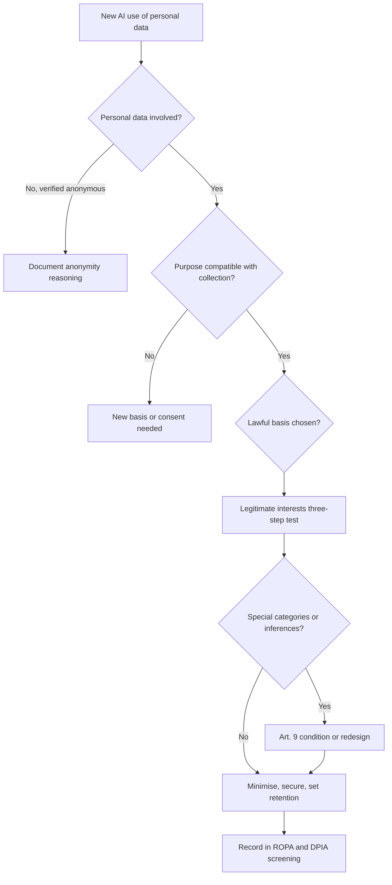
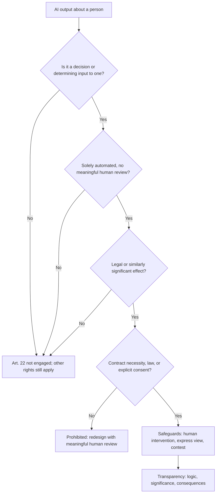

# Module 4 — Privacy and data protection law

*Most AI systems run on personal data. They learn from it, make inferences about people from it, and produce decisions that land on people. So the first body of law an AI governance professional reaches for is not an "AI law" at all; it is data protection law, which already applies in full. This module shows how the GDPR's principles, individual rights and impact assessments bite on Najm Bank's credit-scoring model, chatbot and credit memo copilot, and then widens the lens to the UK, the United States, China and the Gulf states where Najm operates. It explains the law so you can govern well and answer exam questions; it is not legal advice, and for any real decision you should check the current text and take advice from qualified counsel in the relevant country.*

> **BoK coverage:** II.A — how existing data privacy laws (principles, lawful bases, individual rights, automated decisions, DPIAs and cross-border regimes) apply to AI systems.

---

# 4.1 — Data protection principles meet AI
*Level: 🟡 Intermediate* · *Prerequisites: 1.1, 1.2* · *BoK: II.A*

## ⚡ In 60 seconds
- Data protection law applies to AI whenever personal data is processed, from training data to outputs about people.
- The GDPR's seven Art. 5 principles are the backbone, and each creates a specific tension with how machine learning works.
- Every processing activity needs a lawful basis under Art. 6. For training, legitimate interests is often the candidate basis, but only if it passes a three-step test. The EDPB explained how in Opinion 28/2024.
- Inferences are personal data too. A model that infers health, religion or sexual orientation may be processing special category data under Art. 9, even if nobody ever collected those fields.
- The exam cue is to match each principle to the AI life-cycle stage where it bites. The biggest trap is thinking "the data was public" or "the model is only statistics" takes you outside the GDPR.

## 🧭 Why it matters
Dana, Najm Bank's lead data scientist, wants to improve the retail credit-scoring model by pulling ten years of loan files, transaction histories and customer-service chatbot logs into one training set. "More data, better model," she says, and Khalid, who owns retail lending, agrees. Sara, the DPO, asks four questions. Were the customers told their chat messages would train a credit model? Do the transaction histories reveal anything sensitive, such as payments to a mosque, a hospital or a trade union? How long does the bank keep ten-year-old files of customers who left? And what lawful basis covers training, as opposed to running the account?

None of these are AI-specific questions; they are ordinary data protection questions that AI makes harder. Models want more data than the task seems to need, they turn innocuous data into sensitive inferences, and once personal data has shaped a model's parameters it is hard to pull back out. Because Najm's Frankfurt branch serves EU customers, the GDPR applies to that processing; Qatar's PDPPL applies at home.

Regulators enforce this: the Italian authority (the Garante) temporarily restricted ChatGPT in 2023 and fined OpenAI €15 million in December 2024. Several EU authorities fined Clearview AI for scraping facial images to build a face-recognition database.

## 📐 How it works

### 🟢 The essentials
**Personal data and processing.** Under the GDPR, *personal data* is any information relating to an identified or identifiable natural person (the *data subject*). *Processing* is almost anything you do with it, including training on it. The *controller* decides the purposes and means (Najm, for the credit model); a *processor* acts on its behalf (a cloud provider hosting training runs).

Personal data turns up at every stage of an AI system: source data, training and test sets, possibly the model's parameters (if it memorises), deployment inputs such as prompts, outputs such as scores, and logs.

**The seven principles (Art. 5).** The GDPR sets six principles in Art. 5(1) and adds accountability in Art. 5(2). Here is each one with the AI tension it creates.

| Principle | What it says, in plain words | Where AI strains it |
|---|---|---|
| Lawfulness, fairness, transparency | Have a legal basis; don't process in ways people would not expect or that harm them unjustly; tell people what you do | Training on data collected for something else; opaque models; hidden inferences |
| Purpose limitation | Collect for specified, explicit, legitimate purposes; don't further process in an incompatible way | Reusing service data to train new models |
| Data minimisation | Adequate, relevant and limited to what is necessary | Models improve with more features and more records |
| Accuracy | Keep data accurate and up to date; correct errors | Wrong inferences, hallucinated facts about people, stale training data |
| Storage limitation | Keep identifiable data no longer than necessary | Training sets kept "in case we retrain"; models retaining data |
| Integrity and confidentiality | Appropriate security | Model inversion, membership inference, prompt-log leaks |
| Accountability | Be responsible for, and able to demonstrate, compliance | Needs documentation across a complex, multi-party pipeline |

**Lawful bases (Art. 6).** Processing is lawful only if at least one of six bases applies: consent; performance of a contract; compliance with a legal obligation; vital interests; a task in the public interest or official authority; or legitimate interests, which must not be overridden by the data subject's interests or fundamental rights. Each purpose needs its own basis: running the account (contract) and training a model on account data are separate purposes.

**Special categories (Art. 9).** Racial or ethnic origin, political opinions, religious or philosophical beliefs, trade-union membership, genetic data, biometric data for unique identification, health, and sex life or sexual orientation. Processing is prohibited unless an Art. 9(2) condition applies, such as explicit consent or substantial public interest under law. Criminal-offence data is covered by Art. 10.

### 🟡 Going deeper
**Legitimate interests for training.** Consent is rarely practical for training at scale: it must be freely given, specific, informed and unambiguous, and withdrawal is awkward once data is inside a model. Contract works only where processing is objectively necessary to deliver the service, which training a future model rarely is. So legitimate interests (Art. 6(1)(f)) is the usual candidate, with three steps:

1. **Purpose test.** Is there a legitimate interest? It must be lawful, clearly and precisely set out, and real and present rather than speculative. "Improving fraud detection to protect customers" can qualify.
2. **Necessity test.** Is the processing necessary for that interest? Could you achieve it with less data or less intrusive means, such as anonymised or synthetic data?
3. **Balancing test.** Do the individual's interests, rights and freedoms override yours? Consider the nature of the data, the reasonable expectations of the people concerned, the likely impact, and the safeguards you add.

**EDPB Opinion 28/2024.** In December 2024 the European Data Protection Board adopted an opinion, requested by the Irish supervisory authority, on AI models. It addresses three questions.

- *When is an AI model anonymous?* Not automatically. Only if, using all means reasonably likely to be used, the likelihood of extracting personal data about training subjects, directly from the parameters or through queries, is insignificant. This is judged case by case, and controllers must document their reasoning, for example with membership-inference and extraction test results.
- *Can legitimate interests be a basis for developing and deploying models?* Potentially, if the three-step test is passed. The opinion stresses reasonable expectations (would people who posted publicly expect their posts to train a model?) and lists mitigating measures such as pseudonymisation, excluding sources, easy opt-outs and extra transparency.
- *What if the model was developed with unlawfully processed data?* It depends on the scenario. The unlawfulness may taint the same controller's later use; a different controller deploying the model should do due diligence on how it was built; and if the model was effectively anonymised, the GDPR may not apply to its later operation, though it still applies to personal data processed in deployment.

The exam lesson: not "always" or "never" personal data, but "it depends, and show your work."

**Purpose limitation and further processing.** Data collected for one purpose may be used for another only if the new purpose is *compatible*, unless the person consents or a law allows it. Art. 6(4) lists the factors: the link between purposes, the context of collection, the nature of the data, the possible consequences, and safeguards such as pseudonymisation. Research and statistics are presumed compatible with Art. 89(1) safeguards, but a bank should not assume "research" covers a commercial credit model. Using loan files to train a credit model may well be compatible; using chatbot conversations to score creditworthiness is a much bigger leap.

**Data minimisation versus model hunger.** Minimisation does not forbid large datasets; it forbids data that is not necessary for the stated purpose. Justify each feature and drop those with no measurable value, use learning curves to show when more records stop helping, pseudonymise identifiers before training, and prefer aggregates, samples or synthetic data where they work.

**Special categories and inferred data.** The CJEU has read Art. 9 broadly: data that *indirectly reveals* a special category can fall within it, even if the controller never meant to learn it. A model that infers health from pharmacy spending, or religion from donation patterns, can bring the processing into Art. 9. So excluding the "religion" column does not remove the risk, because proxies can recreate it. And fairness testing sometimes *needs* special category data to check outcomes by ethnicity or sex. The EU AI Act lets providers of high-risk systems exceptionally process special categories where strictly necessary for bias detection and correction, under strict safeguards; otherwise you need an Art. 9 condition.

**Accuracy.** Statistical accuracy is how often the model is right overall; the GDPR principle asks whether the *personal data*, including inferences, is correct about the individual. A model can be 95% accurate and still wrongly label thousands of people, and a chatbot inventing a false statement about a named person produces inaccurate personal data. Label outputs as predictions, allow correction, monitor error rates by group, and stop generated text flowing into customer records unchecked.

### 🔴 Expert view
**Storage limitation and the model as a data store.** AI adds three stores to the retention schedule: training snapshots, prompt and output logs, and the model itself if it has memorised personal data. Set retention for each, and treat a non-anonymous model as containing personal data for retention and erasure. Bank record-keeping duties may justify keeping decision records longer, but that covers the record, not every feature ever used.

**Security as a privacy principle.** Integrity and confidentiality (Art. 5(1)(f)) and Art. 32 now cover AI-specific attacks: *membership inference* (learning whether a person's record was in the training set, which may itself reveal that they defaulted on a Najm loan), *model inversion and extraction* (reconstructing training data or copying the model through queries), *prompt injection* (tricking a chatbot into leaking other customers' data) and *data poisoning*. Controls include access control on training data, differential privacy, output filtering, rate limiting, red-teaming, and permission-aware retrieval so the copilot only fetches documents the user may see.

**Data protection by design and by default (Art. 25)** is the legal hook for privacy reviews at design gates, not just before launch (Module 8).

**Accountability across the supply chain.** When Najm buys a model or GenAI service, it must still demonstrate compliance for its own processing: the vendor's role (processor, independent or joint controller), whether it trains on prompts, and where data is stored (Modules 3.3 and 11.2). For data collected from third parties, including scraped data, Art. 14 requires informing people; the "disproportionate effort" exception still requires appropriate measures such as publishing the information.

## ⚖️ The instruments
| Instrument | What it requires or recommends | Exam cue |
|---|---|---|
| **GDPR** — Art. 5 | Seven principles: lawfulness/fairness/transparency, purpose limitation, minimisation, accuracy, storage limitation, integrity/confidentiality, accountability | Map each principle to an AI life-cycle stage |
| **GDPR** — Art. 6 & 6(4) | One of six lawful bases for each purpose; compatibility test for further processing | Training is a separate purpose from delivering the service |
| **GDPR** — Art. 9 | Prohibits processing special categories unless an Art. 9(2) condition applies | Inferred sensitive data can count |
| **GDPR** — Art. 25 & 32 | Data protection by design and default; appropriate security | Legal hook for privacy at design gates and AI-specific attacks |
| **EDPB Opinion 28/2024** | Model anonymity is case by case; legitimate interests possible with the three-step test; consequences of unlawful training data | "It depends, and document it" |
| **EU AI Act** — Art. 10 | Data governance for high-risk systems; narrow permission to process special categories for bias detection and correction | Does not replace the GDPR, which still applies |
| **Qatar PDPPL** | Qatar's general data protection law (Law No. 13 of 2016): principles, rights and controller duties | Najm's home-country baseline, covered in 4.3 |

## 🏛️ In practice at Najm Bank
Layla and Sara turn the principles into a **Privacy-by-Design Checklist for AI Training Data**, which must be completed before any training run that uses personal data. Dana's plan goes through it first.

| # | Question | Evidence required | Dana's credit-model answer |
|---|---|---|---|
| 1 | What is the purpose, in one sentence? | Purpose statement in the AI inventory | "Estimate probability of default for retail loan applicants" |
| 2 | Is this purpose compatible with each source's original purpose? | Art. 6(4) compatibility note per source | Loan files: yes. Transactions: yes, with minimisation. Chat logs: **no, excluded** |
| 3 | Which lawful basis applies, and where is the assessment? | Legitimate interests assessment (LIA) reference | LIA-2026-014, three steps documented |
| 4 | Could any feature reveal or proxy a special category? | Feature review, proxy analysis | Merchant-category features for religious and medical merchants removed; residual proxy test planned |
| 5 | Is each feature necessary? | Ablation results | 38 of 112 features dropped |
| 6 | Are identifiers pseudonymised before training? | Pipeline design | Yes, key held by Data Office |
| 7 | How long are training snapshots and logs kept? | Retention schedule entry | Snapshots 3 years for validation; closed-account records older than retention limit excluded |
| 8 | Is the model tested for memorisation or membership inference? | Test report | Required before release |
| 9 | Have people been told? | Privacy notice clause | Notice updated to describe model training and profiling |
| 10 | Does this need a DPIA? | Screening result | Yes: profiling with significant effects (see 4.3) |

Committee decision recorded: *"Chat logs are excluded from credit-model training. Any future proposal to use them requires a new compatibility assessment and DPIA."*

## 🛠️ Exercises
- 🟢 Take the seven Art. 5 principles and, for Najm's customer-service chatbot, write one sentence each on where the principle bites. *Done when:* you have seven sentences, each naming a concrete stage (collection, training, deployment, outputs or logs).
- 🟡 Draft a one-page legitimate interests assessment for using five years of card transaction data to train Najm's fraud-detection model. Cover purpose, necessity (including less intrusive alternatives) and balancing (expectations, impact, safeguards). *Done when:* each of the three steps has a conclusion and at least two safeguards are named.
- 🔴 Dana says the new credit model is "anonymous because it is just weights". Write the memo Sara would send, applying EDPB Opinion 28/2024: what evidence would support that claim, what tests to run, and what follows if the claim fails. *Done when:* the memo names at least two attack-based tests and states the consequence for erasure requests and retention.

## ⚠️ Mistakes and exam traps
- **"Public data is free to use."** Publicly available personal data is still personal data. You still need a lawful basis, transparency and a balancing that respects expectations. Answer choices that treat "publicly available" as an exemption are wrong.
- **"We removed the sensitive columns, so Art. 9 doesn't apply."** Inferences and proxies can reveal special categories. Look for the answer that tests for proxies and outcome disparities.
- **"Consent is always the safest basis."** Consent is fragile for training: it must be freely given (hard in a bank-customer relationship) and can be withdrawn. Exams often reward legitimate interests with a documented assessment, or another fitting basis, over reflexive consent.
- **"A model is never personal data" or "always personal data."** The EDPB position is case by case, based on the likelihood of extraction. Pick the answer that requires assessment and documentation.
- **Confusing statistical accuracy with the accuracy principle.** A high overall accuracy rate doesn't satisfy the duty to keep individuals' data, including inferences, correct.

## 🧾 Recap
- Data protection law applies across the whole AI life cycle, including models, outputs and logs.
- The Art. 5 principles each create a specific AI tension; accountability means you must be able to show how you resolved it.
- Training is its own purpose. It needs a lawful basis and, when data is reused, a compatibility assessment.
- Legitimate interests can support training if it passes the purpose, necessity and balancing tests (EDPB Opinion 28/2024).
- Inferred and proxy data can be special category data; fairness testing may itself need an Art. 9 route or the AI Act's narrow bias-testing permission.
- AI-specific attacks make security, retention and "is the model anonymous?" live privacy questions.

## ✍️ Check yourself

**1. Najm Bank wants to reuse customer-service chatbot transcripts to train its retail credit-scoring model. Under the GDPR, what is the FIRST analysis Sara should require?**

- A. A check that the transcripts are stored in the EU
- B. An assessment of whether the new purpose is compatible with the purpose for which the transcripts were collected
- C. A bias audit by an independent auditor
- D. Confirmation that the model will be more accurate with the transcripts

Answer

**B.** Reusing data for a new purpose triggers purpose limitation and the Art. 6(4) compatibility test (or a new basis such as consent). Accuracy gains (D) don't make processing lawful. Location (A) and bias audits (C) matter elsewhere but don't answer the threshold question. (See 🟡 Purpose limitation and further processing.)

**2. According to EDPB Opinion 28/2024, when can an AI model trained on personal data be considered anonymous?**

- A. Always, because model parameters are not records about individuals
- B. Never, because training data always leaves traces
- C. When the likelihood of extracting personal data about training subjects, directly or through queries, is insignificant, assessed case by case
- D. Only when the training data was fully anonymised in advance

Answer

**C.** The EDPB takes a case-by-case approach focused on the likelihood of extraction using means reasonably likely to be used. A and B are the two absolute positions the Opinion rejects. D describes one route to anonymity, not the test itself. (See 🟡 EDPB Opinion 28/2024.)

**3. A lender's model never receives a "health" field, but uses merchant-level spending that lets it infer chronic illness. What is the best governance response?**

- A. Treat the inferences as potentially special category data: remove or justify proxy features and test outcomes for disparities
- B. None, because health data was never collected
- C. Ask customers to consent to any use of their transaction data
- D. Encrypt the model file

Answer

**A.** Data that indirectly reveals a special category can fall within Art. 9, so the fix is to deal with the proxies and test outcomes. B is the classic trap. C is blanket consent that may not be freely given and doesn't fix the design. D is a security control, not an answer to Art. 9. (See 🟡 Special categories and inferred data.)

**4. Which of the following is the necessity step of a legitimate interests assessment for training a fraud model?**

- A. Showing the fraud-prevention interest is lawful and clearly articulated
- B. Obtaining the DPO's signature
- C. Weighing customers' reasonable expectations against the bank's interest
- D. Showing the processing is needed for that interest and that less intrusive means, such as fewer features or synthetic data, would not achieve it

Answer

**D.** Necessity asks whether the processing is needed and whether less intrusive alternatives exist. A is the purpose test and C is the balancing test. B is good practice but not a step of the test. (See 🟡 Legitimate interests for training.)

**5. Which privacy principle is MOST directly engaged by a membership-inference attack against Najm's credit model?**

- A. Purpose limitation
- B. Storage limitation
- C. Integrity and confidentiality
- D. Accuracy

Answer

**C.** Membership inference reveals whether someone's data was in the training set, which is a confidentiality failure addressed by Art. 5(1)(f) and Art. 32 security. Storage limitation (B) is related, since keeping less reduces exposure, but the attack itself is a security issue. (See 🔴 Security as a privacy principle.)

## 📚 References
- GDPR, Regulation (EU) 2016/679: https://eur-lex.europa.eu/eli/reg/2016/679/oj
- EU AI Act, Regulation (EU) 2024/1689: https://eur-lex.europa.eu/eli/reg/2024/1689/oj
- European Data Protection Board, opinions and guidelines (including Opinion 28/2024 on AI models): https://www.edpb.europa.eu
- Court of Justice of the EU, case law search: https://curia.europa.eu
- Italian data protection authority (Garante): https://www.garanteprivacy.it
- IAPP, AIGP Body of Knowledge: https://iapp.org

---

# 4.2 — Automated decisions, individual rights and transparency
*Level: 🟡 Intermediate* · *Prerequisites: 4.1* · *BoK: II.A*

## ⚡ In 60 seconds
- Data subjects keep all their rights when AI is involved: information, access, rectification, erasure, restriction, portability and objection. AI makes some of these technically hard, but hard is not a legal excuse.
- Art. 22 GDPR gives people the right not to be subject to a decision based *solely* on automated processing, including profiling, that produces legal or similarly significant effects, unless an exception applies. Even then, safeguards including human intervention are required.
- *SCHUFA* (CJEU, C-634/21, December 2023): a credit score can itself be an Art. 22 "decision" when a third party, such as a lender, draws strongly on it to decide.
- People are entitled to "meaningful information about the logic involved" in such decisions. The CJEU has since confirmed this means an intelligible explanation of the procedure and principles actually applied, not the source code.
- The biggest traps: thinking a rubber-stamp human review takes a decision outside Art. 22, and thinking erasure is satisfied by deleting the source record while the model still reproduces the data.

## 🧭 Why it matters
Najm's retail credit-scoring model produces a score from 0 to 1,000. Khalid's team set a rule: below 420, the application is declined automatically and a standard letter goes out. Above 420, a loan officer reviews. One Frankfurt customer, declined at 409, writes in asking three things: why was I refused, what data did you use, and I want a person to look at this. A second customer, who closed their account two years ago, asks Najm to erase all their data "including from your AI". A third asks the chatbot what data it holds on her and gets a confident but wrong answer.

Each request is a legal obligation with a deadline, usually one month under the GDPR, extendable in some cases. This lesson covers whether that automatic decline at 409 was lawful at all, and what Najm owes the people its AI decides about.

## 📐 How it works

### 🟢 The essentials
**The rights at a glance.**

| Right | GDPR | What it means for an AI system |
|---|---|---|
| To be informed | Arts 13–14 | Tell people their data is used for profiling or training, and about solely automated decisions |
| Access | Art. 15 | Provide a copy of personal data, including inferences and scores, plus information about automated decisions |
| Rectification | Art. 16 | Correct inaccurate data, including wrong inputs and wrong inferences |
| Erasure | Art. 17 | Delete data when a ground applies, such as no longer necessary or consent withdrawn |
| Restriction | Art. 18 | Pause processing, for example while accuracy is disputed |
| Portability | Art. 20 | Give data the person provided in a machine-readable format (for consent or contract processing) |
| Object | Art. 21 | Object to processing based on legitimate interests or public task; absolute right for direct marketing |
| Automated decisions | Art. 22 | Not be subject to solely automated decisions with legal or similarly significant effects, subject to exceptions and safeguards |

**Art. 22 in three conditions.** Art. 22 applies when all three are true:
1. There is a **decision** about a person.
2. It is based **solely** on automated processing, including profiling. That means no meaningful human involvement.
3. It produces **legal effects** (for example, refusing a contract or benefit) or **similarly significant effects** (for example, automatic refusal of an online credit application or an e-recruiting decision without human intervention, examples the GDPR's own recitals give).

If all three are met, the decision is allowed only if it is:
- necessary for entering into or performing a contract with the person;
- authorised by EU or member-state law with suitable safeguards; or
- based on the person's explicit consent.

For the contract and consent routes, the controller must provide safeguards, at least the right to obtain human intervention, to express their point of view and to contest the decision. Decisions based on special category data are allowed only with explicit consent or substantial public interest under law, with safeguards.

**Profiling** means automated processing to evaluate personal aspects, such as predicting someone's economic situation, reliability, health, behaviour or location. Credit scoring is profiling. Profiling alone is not prohibited; Art. 22 bites on solely automated *decisions* with significant effects.

### 🟡 Going deeper
**What "solely" means.** Human involvement counts only if it is meaningful: the reviewer has the authority and competence to change the outcome, looks at all relevant data, and actually exercises judgement. A loan officer who clicks "approve" on every model recommendation without looking is not meaningful involvement. Regulators call this "rubber-stamping" or automation bias. At Najm, the automatic decline under 420 is plainly solely automated. The reviewed band above 420 may or may not be, depending on how the review really works.

**The SCHUFA judgment (C-634/21, 7 December 2023).** SCHUFA is a German credit-reference agency. It supplies scores to banks, and a bank refused a loan to a person partly because of a poor SCHUFA score. The question was whether SCHUFA, which only calculated a probability, made a "decision". The Court of Justice said yes: the automated establishment of a probability value about a person's ability to meet payment commitments is itself a decision under Art. 22 where a third party to whom it is transmitted *draws strongly* on it to establish, implement or terminate a contractual relationship. Why this matters:

- The score provider cannot hide behind "the bank decides". If the score plays a determining role, Art. 22 reaches the score.
- A bank buying scores from a bureau, or scoring with its own model, must look at how determinative the score is in practice.
- The protection follows the effect on the person, not the formal org chart.

For Najm, the automatic decline below 420 is squarely within Art. 22, and so is the score if loan officers in the reviewed band almost always follow it. Najm must either rely on an exception (the contract route is plausible for credit applications; member-state law may also play a role) and provide the safeguards, or redesign the process so that humans meaningfully decide.

**Transparency and "meaningful information about the logic involved".** Where solely automated decisions under Art. 22 are made, Arts 13(2)(f), 14(2)(g) and 15(1)(h) require the controller to give meaningful information about the logic involved, and the significance and envisaged consequences for the person. What counts as meaningful?

- Not the source code or the full model, which few people could use.
- An intelligible account of which factors mattered, roughly how they were weighed, and what the person could change.
- In February 2025 the CJEU (*Dun & Bradstreet Austria*, C-203/22) held that the right of access requires explaining the procedure and principles actually applied, in a concise, transparent, intelligible and easily accessible form, so the person can understand and contest the decision. Where the controller claims trade secrets, the information must be provided to the supervisory authority or court, which balances the interests; a blanket refusal is not allowed.

Good practice uses reason codes from feature contributions and counterfactuals ("had your debt-to-income ratio been below 35%, the outcome would likely have differed"); see Module 8.2. The EU AI Act adds a separate right, in Art. 86, for people affected by decisions based on certain high-risk systems' output to obtain clear and meaningful explanations of the role of the AI system in the decision. Credit scoring of natural persons is an Annex III high-risk use.

**Transparency beyond Art. 22.** Even without a solely automated decision, Arts 13–14 and the fairness principle require telling people about profiling and training uses, ideally in a layered notice at the point of interaction.

### 🔴 Expert view
**Access to inferences and scores.** Scores, risk labels and other inferences are personal data within the right of access. Trade secrets may limit what is disclosed but cannot justify refusing all information: give the score and main factors, protect the model internals.

**Erasure versus trained models.** Art. 17 gives a right to erasure where a ground applies: data no longer necessary, consent withdrawn, successful objection, unlawful processing, and others. Exceptions include compliance with a legal obligation, such as a bank's record-keeping duty, and the establishment or defence of legal claims. Deleting the source record is necessary but may not be sufficient if the model still contains the data. Options, from least to most drastic:

| Option | How it works | When it is proportionate |
|---|---|---|
| Delete from source and future training sets | Remove the record; exclude it from the next retraining | Model assessed as anonymous; next retrain is soon |
| Output suppression | Filters prevent the model reproducing the person's data | Generative systems that memorised names or text |
| Machine unlearning | Techniques that approximate removing a record's influence without full retraining | Emerging; evidence of effectiveness needed |
| Retrain from scratch | Retrain without the data | Model is not anonymous and memorisation is demonstrated |

The key governance move is deciding in advance. If Najm's assessment (per EDPB Opinion 28/2024) is that the credit model is anonymous, deletion from source plus exclusion from retraining may suffice. If not, the retraining cadence and unlearning capability become compliance controls. Document the reasoning either way.

**Rectification of generated content.** When a chatbot generates false statements about a person, correction usually means fixing the source that retrieval draws on, adding guardrails, and correcting any stored record. "Correcting a model is technically infeasible" is not a comfortable argument before a DPA, so don't treat generated statements about customers as records unless a human verifies them.

**The right to object and legitimate interests.** If training relies on legitimate interests, people may object under Art. 21 on grounds relating to their situation. The controller must stop unless it shows compelling legitimate grounds that override. EDPB Opinion 28/2024 treats easy, unconditional opt-outs as a mitigating measure in the balancing test. A practical design is a pre-training opt-out register that the training pipeline filters on.

**Human oversight that satisfies both regimes.** Meaningful human review serves the GDPR (taking decisions out of "solely automated") and the EU AI Act (human oversight duties for high-risk systems, covered in Module 6.2). Design it once: reviewers trained on the model's limits, time and authority to disagree, access to the underlying data, override rates monitored, and override reasons logged. An override rate near zero is a warning sign of rubber-stamping.

## ⚖️ The instruments
| Instrument | What it requires or recommends | Exam cue |
|---|---|---|
| **GDPR** — Art. 22 | No solely automated decisions with legal or similarly significant effects unless contract, law or explicit consent; safeguards incl. human intervention | Three conditions: decision, solely automated, significant effect |
| **GDPR** — Arts 13–15 | Information and access, incl. meaningful information about the logic, significance and consequences of automated decisions | Explain factors, not source code |
| **GDPR** — Arts 16–18, 21 | Rectification, erasure, restriction, objection | Erasure may reach the model if it is not anonymous |
| **CJEU SCHUFA** — C-634/21 | A credit score is a "decision" under Art. 22 when a third party draws strongly on it | Score providers can't hide behind the lender |
| **CJEU Dun & Bradstreet Austria** — C-203/22 | Explanation of procedure and principles actually applied; trade secrets balanced by authority or court | No blanket trade-secret refusal |
| **EU AI Act** — Art. 86 | Right to an explanation of the AI system's role in decisions based on certain high-risk systems | Adds to, doesn't replace, GDPR rights |
| **EDPB Opinion 28/2024** | Opt-outs and transparency as mitigating measures; anonymity assessment affects erasure | Plan erasure handling at design time |

## 🏛️ In practice at Najm Bank
The AI Governance Committee approves a redesign of the retail credit decision flow and a **Data Subject Request Runbook for AI Systems**.

**Committee decision (extract):** *"The automatic decline below score 420 is retained only for EU applicants who apply online for standard products, relying on contract necessity under Art. 22(2)(a). Every such decline letter must (1) state that the decision was automated, (2) give the top three reason codes in plain language, and (3) offer a named route to human review within 10 business days. Loan-officer overrides in the reviewed band will be monitored monthly; an override rate below 2% triggers a rubber-stamping review."*

**Runbook extract:**

| Request type | AI-specific step | Owner | Evidence kept |
|---|---|---|---|
| Access | Include current score, reason codes, model version and date; explain the logic in the approved template | Sara (DPO) with Dana | Response copy |
| Rectification | Correct the input; rescore; if the decision changes, notify the customer | Retail Lending ops | Before/after scores |
| Erasure | Delete from source; add ID to training exclusion list; check anonymity assessment for the model; apply output filter for GenAI systems | Data Office | Exclusion-list entry |
| Objection to training | Add to opt-out register filtered before each training run | Data Office | Register entry |
| Contest automated decision | Route to a senior credit officer who did not see the model's recommendation first | Khalid's team | Review note |

## 🛠️ Exercises
- 🟢 For each of Najm's AI systems (credit scoring, chatbot, CV screening, credit memo copilot, fraud detection), decide whether Art. 22 is likely engaged and why, using the three conditions. *Done when:* each system has a yes, no or depends with one line of reasoning.
- 🟡 Write the "logic involved" paragraph for Najm's decline letter. It must be understandable to a non-expert, name the main factors, and say what the customer could change. *Done when:* the paragraph is under 150 words and a colleague who has not seen the model can explain it back to you.
- 🔴 A former customer asks for erasure "including from your AI". Using the erasure options table, write the decision memo for the credit model and for the credit memo copilot, which uses retrieval over internal documents. *Done when:* each system has a chosen option, the legal exceptions considered (such as record-keeping duties) and the evidence you would keep.

## ⚠️ Mistakes and exam traps
- **"A human is in the loop, so Art. 22 doesn't apply."** Only meaningful human involvement counts. If the question describes a reviewer who always follows the model, treat the decision as solely automated.
- **"The credit bureau only provides a score; the bank decides."** After *SCHUFA*, a score that plays a determining role can itself be the Art. 22 decision.
- **"Explaining the logic means handing over the algorithm."** The duty is an intelligible explanation of the procedure and principles applied. Trade secrets are balanced, not a reason to refuse outright.
- **"Deleting the database row completes the erasure."** Consider whether the model is anonymous. If it isn't, erasure may require retraining, unlearning or output suppression, subject to legal exceptions.
- **Mixing up rights.** Portability covers data the person *provided* (for consent or contract processing), not the bank's inferred score. Access covers inferences.
- **Forgetting the AI Act adds a right.** For certain high-risk systems, Art. 86 gives a right to an explanation of the AI system's role, alongside GDPR rights.

## 🧾 Recap
- All GDPR rights apply to AI systems, including to scores and inferences.
- Art. 22 needs three things: a decision, solely automated, with legal or similarly significant effects. Exceptions are contract necessity, law, or explicit consent, always with safeguards.
- *SCHUFA* extends Art. 22 to scores that play a determining role in someone else's decision.
- "Meaningful information about the logic" means an intelligible account of the procedure and principles applied (*Dun & Bradstreet Austria*, 2025).
- Erasure and objection must be designed into training pipelines; whether the model is anonymous decides how far erasure reaches.
- Meaningful human oversight is the shared control for the GDPR and the EU AI Act.

## ✍️ Check yourself

**1. Najm's credit model automatically declines online applications scoring below 420; no human sees them. Which statement is correct under the GDPR?**

- A. This is prohibited in all circumstances
- B. This is a solely automated decision with a similarly significant effect, allowed only under an Art. 22(2) exception with safeguards such as the right to human intervention
- C. Art. 22 does not apply because the customer chose to apply online
- D. Art. 22 applies only if special category data is used

Answer

**B.** Automatic refusal of an online credit application is the textbook example of a significant effect. It can be lawful under contract necessity, law or explicit consent, with safeguards. A is too absolute, C confuses applying with consenting to automation, and D confuses Art. 22 with the extra rule for special categories. (See 🟢 Art. 22 in three conditions.)

**2. What did the CJEU decide in *SCHUFA* (C-634/21)?**

- A. The automated calculation of a credit score is a "decision" under Art. 22 where a lender draws strongly on it to decide on a contract
- B. Credit bureaus may not calculate scores without explicit consent
- C. Banks must disclose their scoring algorithms' source code
- D. Profiling is prohibited under the GDPR

Answer

**A.** The Court held that the score itself can be an Art. 22 decision when it plays a determining role. It didn't impose a consent requirement (B) or source-code disclosure (C), and profiling as such is not prohibited (D). (See 🟡 The SCHUFA judgment.)

**3. Najm's loan officers approve or decline in the reviewed band, and monitoring shows they follow the model's recommendation 99.8% of the time with an average review time of 20 seconds. What should Layla conclude?**

- A. The process is compliant because a human signs off
- B. The officers should be removed and the process fully automated
- C. The model is highly accurate, so no action is needed
- D. The review may not be meaningful, so the decisions risk being treated as solely automated; investigate and strengthen oversight

Answer

**D.** Near-total agreement with very short reviews suggests rubber-stamping. Human involvement must be meaningful to take a decision outside Art. 22. A is the trap. C confuses agreement with accuracy. B may be possible under an exception but ignores the oversight problem. (See 🟡 What "solely" means and 🔴 Human oversight.)

**4. A customer requests access under Art. 15 and asks why she was declined. Najm says its model is a trade secret. What is the best response?**

- A. Refuse, because trade secrets override the right of access
- B. Send the model's source code and weights
- C. Provide the personal data including score and reason codes, and an intelligible explanation of the procedure and principles applied, protecting internals where justified
- D. Tell her to complain to the regulator

Answer

**C.** The right of access requires meaningful, intelligible information; trade secrets are balanced, not a reason for blanket refusal (*Dun & Bradstreet Austria*). B over-discloses without helping her understand. (See 🟡 Transparency and 🔴 Access to inferences.)

**5. A former customer asks Najm to erase her data from its AI. The data protection team has documented, with extraction tests, that the credit model is anonymous. No legal retention duty applies. What is the most proportionate response?**

- A. Delete her data from source systems and training sets and add her to the exclusion list for future retraining
- B. Refuse, because models cannot be changed
- C. Retrain the model from scratch immediately
- D. Delete the model

Answer

**A.** If the model is credibly anonymous, erasure focuses on source data and future training. Retraining (C) or deleting the model (D) are disproportionate on these facts, and B ignores the source data entirely. (See 🔴 Erasure versus trained models.)

## 📚 References
- GDPR, Regulation (EU) 2016/679: https://eur-lex.europa.eu/eli/reg/2016/679/oj
- EU AI Act, Regulation (EU) 2024/1689: https://eur-lex.europa.eu/eli/reg/2024/1689/oj
- Court of Justice of the EU (search C-634/21 *SCHUFA Holding* and C-203/22 *Dun & Bradstreet Austria*): https://curia.europa.eu
- European Data Protection Board, guidelines on automated decision-making and profiling and on data subject rights: https://www.edpb.europa.eu
- UK Information Commissioner's Office, guidance on AI and data protection: https://ico.org.uk

---

# 4.3 — DPIAs and the global privacy map, from the EU to the GCC
*Level: 🟡 Intermediate* · *Prerequisites: 4.1, 4.2* · *BoK: II.A*

## ⚡ In 60 seconds
- A Data Protection Impact Assessment (DPIA, GDPR Art. 35) is mandatory before processing that is likely to result in a high risk to people's rights and freedoms. Most significant AI uses of personal data, such as credit scoring, CV screening and large-scale profiling, will need one.
- A DPIA must describe the processing, assess necessity and proportionality, assess risks to people, and set out mitigating measures. If high residual risk remains, you must consult the supervisory authority before starting.
- A DPIA is not the same as an AI impact assessment or the EU AI Act's Fundamental Rights Impact Assessment (FRIA), but they overlap. The AI Act says a FRIA complements an existing DPIA. Build one integrated assessment with separate sections.
- Privacy-enhancing technologies (PETs) such as differential privacy or federated learning are mitigations to record in the DPIA, not exemptions.
- Outside the EU: the UK GDPR is close to the EU GDPR but is diverging; US privacy law is a patchwork of state laws; China's PIPL has explicit automated-decision rules; in the GCC, Qatar's PDPPL, Saudi Arabia's PDPL, the UAE's PDPL and the DIFC's Regulation 10 all matter to a Gulf bank. Details change: always check current texts.

## 🧭 Why it matters
Najm is about to deploy the vendor CV-screening tool Yusuf bought, across hiring in Doha, Dubai and Frankfurt. It ranks applicants and hides the bottom 60% from recruiters. Sara says a DPIA is needed. Yusuf points out that the vendor already did a "privacy assessment". Khalid asks whether the EU AI Act's FRIA will make the DPIA redundant. The Dubai HR team asks which UAE law applies, since the Dubai office sits in the DIFC.

Layla's answer is one integrated assessment per system that satisfies the GDPR DPIA, feeds the AI Act assessments, and adapts to each jurisdiction. The exam expects you to know the major regimes and how they treat AI, not every clause.

## 📐 How it works

### 🟢 The essentials
**When a DPIA is required.** Art. 35(1) requires a DPIA where processing, "in particular using new technologies", is likely to result in a high risk. Art. 35(3) lists three cases where it is always required:

1. A systematic and extensive evaluation of personal aspects based on automated processing, including profiling, on which decisions with legal or similarly significant effects are based.
2. Large-scale processing of special category data or criminal-offence data.
3. Systematic monitoring of a publicly accessible area on a large scale.

Supervisory authorities also publish national lists of processing that needs a DPIA. EDPB-endorsed guidance lists criteria such as evaluation or scoring, automated decisions with significant effect, systematic monitoring, sensitive data, large scale, matching or combining datasets, vulnerable data subjects (employees and job applicants count), innovative use of new technology, and processing that prevents people from using a service or contract. As a rule of thumb, processing that meets two or more criteria generally needs a DPIA. Credit scoring meets several. CV screening meets several. A GenAI copilot that processes customer files at scale probably does.

**What a DPIA must contain (Art. 35(7)).**

| Element | What to write for an AI system |
|---|---|
| Systematic description | Purpose, data sources, features, model type, outputs, who sees them, decision flow, vendors, retention |
| Necessity and proportionality | Lawful basis, compatibility of reuse, minimisation evidence, less intrusive alternatives considered |
| Risks to rights and freedoms | Discrimination, inaccuracy, opacity, loss of control, security attacks, chilling effects, exclusion from services |
| Measures to address risks | Technical (PETs, testing, access control), organisational (human review, training), individual (notices, contest routes) |

The DPO's advice must be sought. Where appropriate, the views of data subjects or their representatives should be sought too. If the DPIA shows high risk that the controller cannot mitigate, Art. 36 requires **prior consultation** with the supervisory authority before processing starts.

**A DPIA is a living document.** Review it when the processing changes: a new model version, new data source, new use or new population. For AI systems that retrain regularly, tie DPIA review to the change-management process in Module 10.3.

### 🟡 Going deeper
**DPIA, AI impact assessment and FRIA: how they fit.**

| Assessment | Source | Who must do it | Focus |
|---|---|---|---|
| DPIA | GDPR Art. 35 | Controller, when high risk to people from personal data processing | Data protection rights and freedoms |
| FRIA | EU AI Act Art. 27 | Certain deployers of high-risk AI: public bodies and private bodies providing public services, and deployers of credit-scoring and life/health insurance pricing systems | Fundamental rights impacts of the specific deployment: affected groups, risks of harm, human oversight, complaint mechanisms |
| AI impact assessment | Voluntary or policy-driven, e.g. ISO/IEC 42005:2025, NIST AI RMF "Map" function | Any organisation choosing to | Broader: individuals, groups, society, the organisation |

Three points to remember:
- The FRIA does not replace the DPIA. The AI Act says that where an obligation is already met through a DPIA, the FRIA complements it.
- The AI Act also requires deployers of high-risk systems to use the information the provider gives them (instructions for use) when carrying out their DPIA. So vendor documentation is an input, not a substitute.
- A vendor's own "privacy assessment" covers the vendor's view. Najm, as controller of its hiring processing, owns its DPIA.

For Najm's credit model used for EU customers, the bank as deployer needs a DPIA and a FRIA. The CV-screening tool is high-risk under Annex III (employment) but a private employer is not generally in the FRIA group, so the DPIA carries the load, supplemented by Najm's own AI impact assessment.

**Privacy-enhancing technologies.**

| PET | What it does | AI use | Limits |
|---|---|---|---|
| Pseudonymisation | Replaces identifiers; the key is kept separately | Training on customer data without direct identifiers | Pseudonymised data is still personal data under the GDPR |
| Anonymisation | Irreversibly prevents identification by any means reasonably likely to be used | Sharing or publishing datasets | Hard to achieve with rich data; must be assessed and re-tested |
| Differential privacy | Adds calibrated noise so outputs reveal little about any one individual | Training or releasing statistics with provable limits on leakage | Trade-off between privacy and accuracy; the parameter choice matters |
| Federated learning | Trains across sites without centralising raw data | Fraud models across Najm's countries without moving data | Model updates can still leak; needs secure aggregation |
| Synthetic data | Generates artificial records mimicking real data's statistics | Testing, development, augmenting rare cases | Can memorise and leak; may miss real-world patterns and bias |
| Secure computation and homomorphic encryption | Computes on encrypted or split data | Joint analysis with partners | Performance cost; complex |
| Trusted execution environments | Hardware-isolated processing | Protecting data in use in the cloud | Depends on hardware trust |

In a DPIA, a PET is a measure that reduces a named risk. It should come with evidence it works, not just a name.

### 🔴 Expert view
**The global privacy map.** An AIGP candidate needs the shape of each regime, how it treats automated decisions, and where to look for detail. Specifics change often, so check the current texts.

**UK.** The UK GDPR and the Data Protection Act 2018 kept the EU GDPR's structure after Brexit. The Data (Use and Access) Act 2025 reforms parts of it, including the automated decision-making rules. Broadly, it relaxes the general restriction for decisions not based on special category data while keeping safeguards such as information, the ability to make representations, human intervention and contest. Its provisions are being brought into force in stages, so check what applies on the date you are advising. The ICO's guidance on AI and data protection is a practical reference.

**United States.** There is no comprehensive federal privacy law; sector laws apply (the Gramm-Leach-Bliley Act for financial institutions, HIPAA for health, the Fair Credit Reporting Act, COPPA). A growing number of states, led by California's CCPA as amended by the CPRA, have comprehensive consumer privacy laws. Common features include rights to access, delete and correct; a right to opt out of "profiling in furtherance of decisions that produce legal or similarly significant effects" in many states; and duties to conduct data protection assessments for high-risk processing. California's privacy regulator has adopted regulations on automated decision-making technology, risk assessments and cybersecurity audits, with phased compliance dates. Many state laws exempt data or institutions covered by GLBA, which matters for a bank, so the scope analysis comes first. Treat details as state-specific and fast-moving.

**China.** The Personal Information Protection Law (PIPL, in force November 2021) is comprehensive. On automated decision-making, it requires transparency and fairness, prohibits unreasonable differential treatment in transaction terms such as prices, and gives individuals the right to an explanation and to refuse decisions made solely by automated means that significantly affect their rights. A personal information protection impact assessment is required before automated decision-making and other higher-risk processing. China's algorithm and generative AI rules layer on top (Module 7.3).

**The GCC.** Najm's home markets are where many readers work.

| Jurisdiction | Main instrument | Points relevant to AI (check current texts) |
|---|---|---|
| Qatar | **Qatar PDPPL**: Law No. 13 of 2016 on Personal Data Privacy Protection | One of the first GCC data protection laws. Principles of transparency, fairness and legitimate purpose; individual rights; controller duties including privacy by design and breach notification; stricter treatment of "personal data of a special nature". Regulator guidance has been issued by the competent authority, now within the National Cyber Security Agency. The Qatar Financial Centre has its own separate data protection regime. |
| Saudi Arabia | **Saudi PDPL**: Personal Data Protection Law | In force from 2023 after amendments, with a grace period for compliance; SDAIA is the competent authority. Implementing regulations cover matters such as cross-border transfers. Sensitive data, including credit data, attracts extra protection. SDAIA has also issued AI Ethics Principles. |
| UAE (federal) | **UAE PDPL**: Federal Decree-Law No. 45 of 2021 | Federal law with rights including a right to object to automated processing that has legal or serious effects. Scope exclusions matter: it does not apply in free zones with their own data protection laws, and some sector data, including certain banking and credit data governed by other legislation, may fall outside it. Implementation has been gradual; check the status of executive regulations. |
| UAE (DIFC) | **DIFC Data Protection Law** — Regulation 10 | The DIFC Data Protection Law No. 5 of 2020 is GDPR-like. Regulation 10 addresses processing through autonomous and semi-autonomous systems, including AI. It sets notice and transparency expectations, design principles such as fairness, security and accountability, and additional requirements for higher-risk uses. Check the current text and the Commissioner's guidance. |

Bahrain, Oman and Kuwait have their own regimes too.

**Cross-border transfers.** Most regimes restrict sending personal data abroad (the GDPR through adequacy decisions and standard contractual clauses; PIPL, the Saudi PDPL and the PDPPL through their own rules). This bites when training centrally on multi-country data or using a foreign-hosted GenAI service, which is one reason federated learning gets attention.

**Building one assessment for many laws.** Mature programmes run a single core assessment plus jurisdiction modules, which avoids three inconsistent documents about one system.

## ⚖️ The instruments
| Instrument | What it requires or recommends | Exam cue |
|---|---|---|
| **GDPR** — Art. 35 & 36 | DPIA before likely high-risk processing; set content; prior consultation if high residual risk | Profiling with significant effects always triggers a DPIA |
| **EU AI Act** — Art. 27 | FRIA by certain deployers of high-risk AI, incl. credit scoring; complements the DPIA | FRIA does not replace the DPIA |
| **DIFC Data Protection Law** — Regulation 10 | Rules for processing through autonomous and semi-autonomous systems, incl. AI: notice, design principles, extra requirements for higher-risk uses | GCC's most AI-specific privacy rule; check current text |
| **UK GDPR** | UK version of GDPR, reformed by the Data (Use and Access) Act 2025, incl. automated decisions | Close to EU, diverging; check commencement |
| **China PIPL** | Comprehensive law; automated-decision transparency, explanation and refusal rights; impact assessment | Explicit rules on unreasonable differential pricing |
| **Qatar PDPPL** | Law No. 13 of 2016: principles, rights, special-nature data, controller duties | Najm's home law; QFC has a separate regime |
| **Saudi PDPL** | Comprehensive law, SDAIA as competent authority, transfer rules | In force 2023 with grace period |
| **UAE PDPL** | Federal Decree-Law 45/2021; right to object to automated processing; scope exclusions | Free zones like DIFC and ADGM have their own laws |

## 🏛️ In practice at Najm Bank
Layla's team produces the **Integrated AI Impact Assessment (IAIA) template**, first used on the CV-screening tool.

**Section A — Core (all jurisdictions)**

| Field | CV-screening tool entry |
|---|---|
| System and purpose | Vendor ranking model shortlisting applicants for branch and operations roles |
| Data | CVs, application answers, assessment scores; no photos; names and dates of birth removed before scoring |
| Decision flow | Model ranks; recruiter reviews top 40% and a random 10% sample of the rest |
| Roles | Vendor = provider of high-risk AI (EU AI Act); Najm = deployer and controller |
| Key risks | Indirect discrimination (gaps in employment, university proxies); inaccuracy for non-standard CVs; opacity to applicants |
| Mitigations | Random-sample review of lower ranks; quarterly adverse-impact testing; applicant notice and human review route; vendor bias-testing evidence required |
| Residual risk | Medium, accepted by Committee with conditions |

**Section B — Jurisdiction modules**

| Module | Required items | Status |
|---|---|---|
| EU (GDPR Art. 35) | Necessity and proportionality; DPO advice; views of affected people sought (applicant survey; works council consulted on employee-facing aspects) | Complete |
| EU AI Act | Deployer duties (instructions for use, oversight, logs, worker information); FRIA not required for this use | Complete |
| Qatar (PDPPL) | Notice, lawful purpose, special-nature data check, transfer to vendor's hosting country | Legal review pending |
| UAE (DIFC Reg. 10) | Autonomous-system notice to applicants; check any additional requirements | Legal review pending |

**Sign-off:** DPO (Sara), system owner (HR director), Head of AI Governance (Layla). Review triggers: new model version from the vendor, new country, or adverse-impact ratio outside tolerance.

## 🛠️ Exercises
- 🟢 Using the DPIA criteria in 🟢 The essentials, screen Najm's five AI systems and the staff use of public GenAI tools. *Done when:* each has a "DPIA required / likely / not required" verdict with the criteria it meets.
- 🟡 Draft the "risks to rights and freedoms" and "measures" sections of a DPIA for the credit memo copilot, which summarises corporate clients' files, including personal data about directors and guarantors. *Done when:* you list at least five risks, each matched to a measure, and at least one measure is a PET with its limitation stated.
- 🔴 Najm wants to train one fraud model on transaction data from Qatar, the UAE (onshore and DIFC) and Germany. Sketch the privacy analysis: which laws apply, the transfer question for each, and whether federated learning changes the answer. *Done when:* you have a one-page table with a hedged conclusion per jurisdiction and a list of questions for local counsel.

## ⚠️ Mistakes and exam traps
- **"The vendor did a privacy assessment, so we're covered."** The controller owns the DPIA for its processing. Vendor documentation is an input, and under the AI Act deployers must use it.
- **"The FRIA replaces the DPIA."** It complements it. Where both apply, do both, ideally in one integrated document.
- **"Pseudonymised data isn't personal data."** Under the GDPR it still is. Only effective anonymisation takes data out of scope.
- **"A DPIA is a one-off before launch."** It must be reviewed when the processing changes, which for AI includes retraining and new uses.
- **"The UAE PDPL covers everything in the UAE."** Financial free zones such as the DIFC and ADGM have their own data protection laws, and some sector data may be excluded. Scope first.
- **"The US has no privacy law."** It has no comprehensive *federal* law, but sector laws and many state laws apply, often with profiling opt-outs and assessment duties.

## 🧾 Recap
- A DPIA is required for likely high-risk processing; credit scoring, CV screening and large-scale profiling almost always qualify.
- Its core is description, necessity and proportionality, risks, and measures, with prior consultation if residual risk stays high.
- The DPIA, the AI Act FRIA and voluntary AI impact assessments overlap. Integrate them, but don't substitute one for another.
- PETs reduce risks but rarely remove data from the law's scope; record their limits.
- The global map: UK close but diverging; US sector and state patchwork; China's PIPL with explicit automated-decision rules; GCC laws in Qatar, Saudi Arabia, the UAE and the DIFC's AI-specific Regulation 10.
- Check current texts. This is the most fast-moving part of the syllabus.

## ✍️ Check yourself

**1. Which processing ALWAYS requires a DPIA under GDPR Art. 35(3)?**

- A. Any use of machine learning
- B. Systematic and extensive evaluation of personal aspects based on automated processing, including profiling, on which decisions with legal or similarly significant effects are based
- C. Any processing of employee data
- D. Any use of a cloud provider

Answer

**B.** This is the first of the three listed cases. Machine learning (A) and employee data (C) are factors that may contribute under the criteria, but they aren't automatic triggers on their own. D isn't a trigger. (See 🟢 When a DPIA is required.)

**2. Najm, as deployer, will use a high-risk credit-scoring system for EU customers. Which is correct?**

- A. Only a DPIA is needed, because the GDPR covers everything
- B. Only a FRIA is needed, because the AI Act replaces the GDPR for AI
- C. Neither is needed if the provider has a CE marking
- D. Both are relevant: a DPIA under the GDPR and a FRIA under the AI Act, with the FRIA complementing the DPIA

Answer

**D.** Deployers of credit-scoring systems are in the FRIA group, and the processing clearly needs a DPIA. The AI Act says the FRIA complements the DPIA. Provider conformity (C) doesn't discharge deployer duties. (See 🟡 DPIA, AI impact assessment and FRIA.)

**3. A data scientist says the training set is "not personal data because we replaced names with random IDs and keep the lookup table in another system". Under the GDPR, this data is:**

- A. Anonymous and out of scope
- B. Pseudonymised and still personal data
- C. Special category data
- D. Personal data only if the lookup table is lost

Answer

**B.** Pseudonymisation is a valuable safeguard, but the data can still be attributed to individuals using additional information, so it remains personal data. (See the PET table in 🟡 Going deeper.)

**4. Najm's Dubai hiring team sits in the DIFC and will use AI to screen applicants. Which instrument most specifically addresses processing through autonomous and semi-autonomous systems there?**

- A. DIFC Data Protection Law, Regulation 10
- B. UAE Federal Decree-Law No. 45 of 2021
- C. Qatar PDPPL
- D. China PIPL

Answer

**A.** The DIFC has its own data protection law, and Regulation 10 addresses autonomous and semi-autonomous systems. The federal PDPL (B) does not apply in free zones with their own data protection laws. (See 🔴 The GCC.)

**5. Which statement about China's PIPL and automated decision-making is correct?**

- A. PIPL has no provisions on automated decisions
- B. PIPL prohibits all automated decision-making
- C. PIPL requires transparency and fairness in automated decision-making, bars unreasonable differential treatment in transaction terms, and lets individuals seek explanations and refuse solely automated decisions that significantly affect their rights
- D. PIPL applies only to government agencies

Answer

**C.** PIPL has explicit automated-decision rules, including on differential pricing, explanation and refusal. It neither ignores (A) nor bans (B) automated decisions, and it applies to private organisations (D is wrong). (See 🔴 China.)

## 📚 References
- GDPR, Regulation (EU) 2016/679: https://eur-lex.europa.eu/eli/reg/2016/679/oj
- EU AI Act, Regulation (EU) 2024/1689: https://eur-lex.europa.eu/eli/reg/2024/1689/oj
- European Data Protection Board, DPIA and other guidelines: https://www.edpb.europa.eu
- ISO/IEC 42005:2025 (search the catalogue): https://www.iso.org
- UK Information Commissioner's Office: https://ico.org.uk
- UK legislation (Data Protection Act 2018; Data (Use and Access) Act 2025): https://www.legislation.gov.uk
- California Privacy Protection Agency: https://cppa.ca.gov
- Cyberspace Administration of China: https://www.cac.gov.cn
- Qatar National Cyber Security Agency: https://www.ncsa.gov.qa
- Saudi Data and AI Authority (SDAIA): https://sdaia.gov.sa
- UAE government portal (data protection laws): https://u.ae
- DIFC Commissioner of Data Protection: https://www.difc.ae
