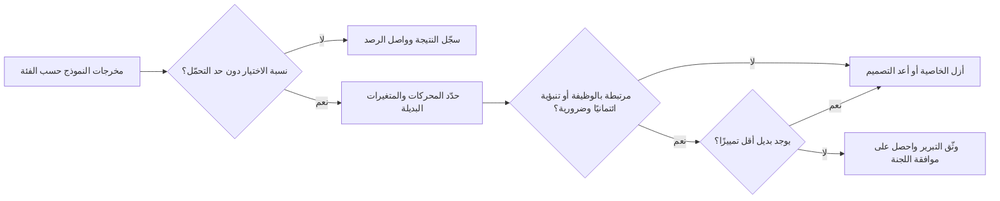
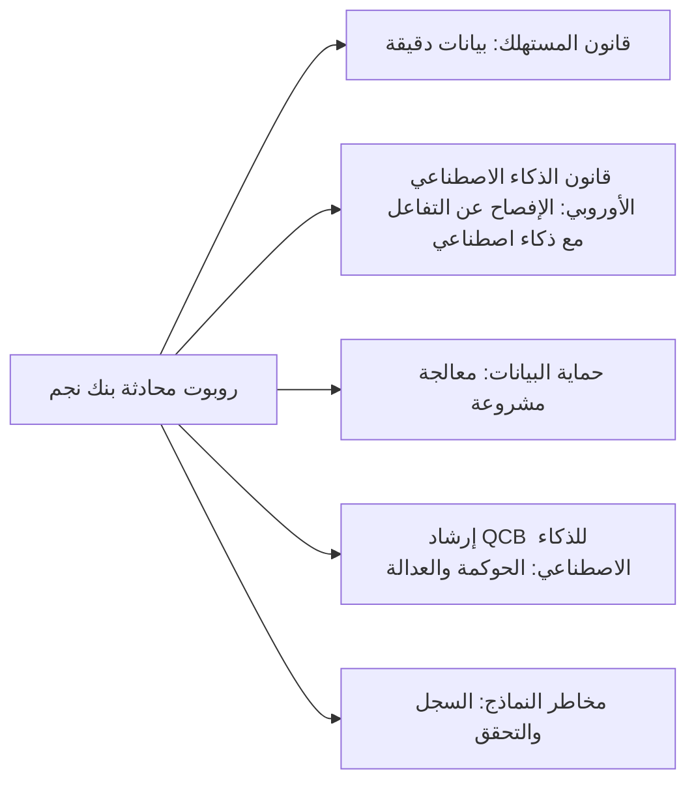

# الوحدة 5 — قوانين أخرى تنطبق بالفعل

*عبارة «لا يوجد قانون للذكاء الاصطناعي هنا بعد» من أغلى العبارات كلفةً في حوكمة الذكاء الاصطناعي (AI governance). فقبل قانون الذكاء الاصطناعي الأوروبي (EU AI Act) بزمن طويل، كانت أنظمة الذكاء الاصطناعي (AI systems) خاضعة بالفعل لقانون مكافحة التمييز (anti-discrimination law)، وقانون حق المؤلف (copyright) والأسرار التجارية (trade secrets)، وحماية المستهلك (consumer protection)، والمسؤولية عن المنتجات (product liability)، والتنظيم المالي (financial regulation)، وقد دأبت الجهات التنظيمية والمحاكم على تطبيقها. تستعرض هذه الوحدة تلك الأنظمة القانونية من خلال أداة فرز السير الذاتية (CV-screening tool) في بنك نجم (Najm Bank)، ونموذج الائتمان (credit model)، وروبوت المحادثة (chatbot)، والمساعد الذكي لمذكرات الائتمان (credit memo copilot)، لتتمكن من رصد التعرّض القانوني (legal exposure) الذي يحمله نظام الذكاء الاصطناعي منذ يومه الأول. وهي تشرح القانون لتحسن الحوكمة وتجيب عن أسئلة الامتحان؛ وليست استشارة قانونية، وفي أي قرار فعلي عليك مراجعة النص الساري والحصول على مشورة من مستشار قانوني مؤهَّل في البلد المعني.*

> **تغطية مجال المعرفة (BoK coverage):** II.B — كيف تنطبق قوانين عدم التمييز (non-discrimination) والملكية الفكرية (intellectual property) وحماية المستهلك والمسؤولية عن المنتجات والقوانين القطاعية (sector-specific laws) على أنظمة الذكاء الاصطناعي.

---

# 5.1 — عدم التمييز في التوظيف والائتمان والخدمات
*المستوى: 🟡 متوسط* · *المتطلبات: 1.2، 4.2* · *مجال المعرفة (BoK): II.B*

## ⚡ الدرس في دقيقة
- قانون مكافحة التمييز (anti-discrimination law) محايد تقنيًا. فإذا عامل نظام الذكاء الاصطناعي (AI system) الناسَ معاملةً أقل تفضيلًا بسبب خاصية محمية (protected characteristic)، أو أنتج ضررًا غير مبرَّر لفئة محمية (protected group)، فقد تكون الجهة التي تستخدمه مسؤولة قانونيًا.
- مفهومان يؤديان معظم العمل: **التمييز المباشر / المعاملة المتفاوتة (direct discrimination / disparate treatment)** (استخدام الخاصية، أو بديل واضح عنها، عن قصد) و**التمييز غير المباشر / الأثر المتفاوت (indirect discrimination / disparate impact)** (قاعدة تبدو محايدة تُلحق الضرر بفئة ولا يمكن تبريرها).
- يمارس الذكاء الاصطناعي التمييز في الغالب عبر **المتغيرات البديلة (proxies)** (الرمز البريدي، والمدرسة، والفجوات المهنية) و**بيانات التدريب المتحيّزة (biased training data)**، لا عبر حقل صريح اسمه «الجنس». وحذف الخاصية المحمية لا يعالج المشكلة.
- في التوظيف، لدى الولايات المتحدة الباب السابع (Title VII) وقانون ADA وقانون ADEA، وإنفاذ EEOC (تسوية *iTutorGroup*)، وتدقيقات التحيّز (bias audits) بموجب قانون NYC Local Law 144. وفي الائتمان، يشترط ECOA وRegulation B ذكر أسباب محددة للإجراء السلبي (adverse action). ولدى الاتحاد الأوروبي توجيهات المساواة (equality directives) وقواعد خاصة بالائتمان.
- إشارة الامتحان: استخدام أداة من مورّد (vendor) لا ينقل المسؤولية عن صاحب العمل أو المُقرِض. وأكبر فخ هو اعتبار «النموذج دقيق» دفاعًا في مواجهة الأثر المتفاوت.

## 🧭 لماذا يهم
في 2018 انتشرت تقارير واسعة عن تخلّي Amazon عن نموذج تجريبي للتوظيف. فقد تعلّم من سير ذاتية على مدى عشر سنوات، معظمها لرجال، وأفادت التقارير بأنه كان يخفض تقييم السير الذاتية التي تتضمن كلمة «women's»، كما في «قائدة نادي الشطرنج النسائي». لم يبرمجه أحد ليفضّل الرجال؛ بل تعلّم النمط من التاريخ. وفي 2023 سوّت لجنة تكافؤ فرص العمل الأمريكية (EEOC) قضيتها ضد iTutorGroup، التي يُدّعى أن برنامج طلبات التوظيف لديها كان يرفض تلقائيًا المتقدمات من الإناث في سن 55 فما فوق والمتقدمين من الذكور في سن 60 فما فوق. وأفادت التقارير بأن قيمة التسوية بلغت 365,000 دولار.

أداة فرز السير الذاتية التي اشتراها يوسف من مورّد لبنك نجم (Najm Bank) ترتّب المتقدمين لوظائف الفروع في الدوحة ودبي وفرانكفورت. ويُظهر أول اختبار ربع سنوي أجرته ليلى أن النساء يُدرجن في القائمة المختصرة (shortlist) بنسبة 68% من معدل الرجال في وظائف العمليات، وأن المتقدمين الذين لديهم فجوات تزيد على سنة يُعاقَبون بشدة. وبشكل منفصل، يوافق نموذج الائتمان الخاص بخالد على المتقدمين من حيّين في الدوحة بمعدلات أدنى بشكل ملحوظ. والحيّان مرتبطان ارتباطًا قويًا بجنسيات معينة. لا يستخدم أيٌّ من النموذجين الجنس أو الجنسية مدخلًا. ومع ذلك قد يكون كلاهما يمارس التمييز، من الناحية القانونية وكذلك الأخلاقية.

## 📐 كيف يعمل

### 🟢 الأساسيات
**الخصائص المحمية (protected characteristics).** تسرد القوانين الأسس التي لا يجوز معاملة الناس على أساسها معاملة غير عادلة. ومن أشيعها: الجنس، والعرق والأصل الإثني، واللون، والدين، والأصل القومي، والعمر، والإعاقة، والتوجه الجنسي، والحمل، والحالة الاجتماعية. وتختلف القائمة الدقيقة والقطاعات المشمولة (التوظيف، والائتمان، والإسكان، والسلع والخدمات) من ولاية قضائية (jurisdiction) إلى أخرى.

**طريقتان للتمييز.**

| المفهوم | المصطلح الأوروبي | المصطلح الأمريكي | كيف يبدو في الذكاء الاصطناعي |
|---|---|---|---|
| معاملة غير متساوية مقصودة أو صريحة | التمييز المباشر (Direct discrimination) | المعاملة المتفاوتة (Disparate treatment) | قاعدة ترفض المتقدمين فوق 55 عامًا؛ خاصية (feature) تُرمّز الجنس مباشرة |
| قاعدة محايدة، أثر غير متساوٍ | التمييز غير المباشر (Indirect discrimination) | الأثر المتفاوت (Disparate impact) | عقوبة «الفجوة المهنية» التي تقع في الغالب على النساء؛ خاصية الرمز البريدي التي تتتبّع الأصل الإثني |

التمييز المباشر غير مشروع عمومًا ما لم ينطبق استثناء ضيق. والتمييز غير المباشر غير مشروع ما لم تستطع الجهة **تبريره موضوعيًا (objectively justify)**. وفي القانون الأوروبي يعني ذلك هدفًا مشروعًا يُسعى إليه بوسائل مناسبة وضرورية. وفي عقيدة الأثر المتفاوت الأمريكية (المستمدة من *Griggs v. Duke Power*، 1971)، يجب على صاحب العمل أن يثبت أن الممارسة مرتبطة بالوظيفة ومتسقة مع ضرورة العمل (business necessity)، ويظل بإمكان المدّعي أن يكسب القضية بإثبات وجود بديل أقل تمييزًا (less discriminatory alternative) كان متاحًا.

**كيف يمارس الذكاء الاصطناعي التمييز.**
- **التحيّز التاريخي (historical bias):** تعكس تسميات التدريب (training labels) قرارات بشرية سابقة («من وُظِّف»، «من حصل على قرض»).
- **تحيّز التمثيل (representation bias):** بعض الفئات ممثَّلة تمثيلًا ناقصًا، فيكون النموذج أقل دقة بالنسبة إليها.
- **المتغيرات البديلة (proxies):** خصائص مرتبطة بالخصائص المحمية، مثل الرمز البريدي، واللغة الأولى، والجامعة، والفجوات في التوظيف.
- **تحيّز القياس (measurement bias):** الهدف (target) بديل ضعيف عمّا يهمك فعلًا، مثل «تقييم الأداء» حين تكون التقييمات نفسها متحيّزة.
- **عدم التوافق في النشر (deployment mismatch):** نموذج بُني لفئة سكانية ويُستخدم على فئة أخرى.

**قياس التفاوت.** من الفحوص الأولى الشائعة **نسبة معدل الاختيار (selection-rate ratio)**: معدل اختيار فئة ما مقسومًا على معدل اختيار الفئة الأكثر حظوة. وتستخدم الإرشادات الفدرالية الأمريكية بشأن اختيار الموظفين (الإرشادات الموحّدة (Uniform Guidelines)، 1978) «قاعدة الأربعة أخماس (four-fifths rule)» قاعدةً تقريبية: النسبة التي تقل عن 80% تُعامَل عمومًا دليلًا على الأثر السلبي (adverse impact). وهي أداة فرز استرشادية، لا ملاذًا قانونيًا آمنًا (safe harbour). ونسبة 68% للنساء في بنك نجم ستفشل فيها. أما المقاييس الأخرى مثل تساوي معدلات الخطأ (equal error rates) والمعايرة (calibration) فتغطيها الوحدة 9.2.

### 🟡 التعمق أكثر
**التوظيف في الولايات المتحدة.**
- يحظر **الباب السابع من قانون الحقوق المدنية لعام 1964 (Title VII of the Civil Rights Act of 1964)** التمييز في التوظيف على أساس العرق واللون والدين والجنس والأصل القومي، ويشمل المعاملة المتفاوتة والأثر المتفاوت كليهما.
- يحمي **قانون مكافحة التمييز على أساس السن في التوظيف (ADEA)** العاملين في سن 40 فما فوق. وكانت *iTutorGroup* قضية تمييز على أساس السن.
- يحظر **قانون الأمريكيين ذوي الإعاقة (ADA)** التمييز على أساس الإعاقة ويشترط الترتيبات التيسيرية المعقولة (reasonable accommodation). ويثير الذكاء الاصطناعي مخاطر محددة بموجب ADA: أدوات تستبعد الأشخاص ذوي الإعاقة (اختبار قائم على لعبة محدود بزمن لشخص لديه إعاقة حركية، أو تحليل الفيديو لتعابير الوجه)، والإخفاق في تقديم تقييم بديل.
- يظل صاحب العمل مسؤولًا عند استخدام أداة مورّد. وفي قضية *Mobley v. Workday*، التي لا تزال منظورة وقت كتابة هذا النص، سمحت محكمة بمضيّ الدعاوى استنادًا إلى نظرية مفادها أن مورّد الذكاء الاصطناعي قد يكون هو نفسه مسؤولًا بوصفه وكيلًا (agent) لأصحاب العمل. تابع هذه القضية؛ ولا تعاملها كقانون مستقر.
- **مناخ الإنفاذ.** أصدرت EEOC مساعدة فنية (technical assistance) بشأن الذكاء الاصطناعي في التوظيف في 2022–2023. وأُزيل بعضها من موقع الوكالة في 2025، ووجّه أمر تنفيذي صدر في 2025 الوكالاتِ الفدرالية إلى خفض أولوية إنفاذ الأثر المتفاوت. لكن القوانين والدعاوى الخاصة وقوانين الولايات تبقى قائمة، فتحقّق من الوضع الحالي.

**قانون NYC Local Law 144.** قانون مدينة نيويورك بشأن أدوات قرارات التوظيف الآلية (AEDTs) مُطبَّق منذ يوليو 2023. ويجب على أصحاب العمل ووكالات التوظيف الذين يستخدمون أداة AEDT للمساعدة بشكل جوهري في القرارات المتعلقة بالمرشحين أو الموظفين لوظائف في المدينة أن:
- يُجروا **تدقيق تحيّز مستقلًا (independent bias audit)** خلال سنة واحدة قبل الاستخدام، يحسب معدلات الاختيار أو التقييم و**نسب الأثر (impact ratios)** حسب فئات الجنس والعرق/الأصل الإثني، بما في ذلك الفئات المتقاطعة (intersectional categories)؛
- **ينشروا ملخصًا** لنتائج التدقيق؛
- **يُخطروا المرشحين** مسبقًا بأن أداة AEDT مستخدمة، مع معلومات عن المؤهلات التي تُقيَّم وكيفية طلب إجراء بديل أو ترتيب تيسيري.

يشترط القانون الإفصاح والتدقيق؛ ولا يحدد درجة نجاح. وقد تبعته ولايات ومدن أخرى بقواعدها الخاصة (مثل إلينوي بشأن الذكاء الاصطناعي في التوظيف، وقانون الذكاء الاصطناعي في كولورادو (Colorado's AI Act) بشأن القرارات عالية المخاطر (high-risk)، مع تأجيل تاريخ نفاذه إلى 30 يونيو 2026). تحقّق من الوضع الحالي قبل الاعتماد على أي منها.

**الائتمان في الولايات المتحدة.**
- يحظر **قانون تكافؤ فرص الائتمان (ECOA)**، الذي يُنفَّذ عبر **Regulation B**، التمييز في أي جانب من جوانب معاملة ائتمانية على أسس تشمل العرق واللون والدين والأصل القومي والجنس والحالة الاجتماعية والعمر، وتلقّي المساعدة العامة.
- عندما يتخذ الدائن **إجراءً سلبيًا (adverse action)** (الرفض، أو عرض شروط أسوأ)، يجب أن يقدّم للمتقدم بيانًا بـ**الأسباب الرئيسية المحددة (specific principal reasons)**. وقد صرّح مكتب الحماية المالية للمستهلك (CFPB) بأن النماذج المعقدة أو «الصناديق السوداء (black-box)» ليست عذرًا: يجب على الدائنين تقديم أسباب دقيقة ومحددة، ولا يمكنهم ببساطة اختيار أقرب البنود من قائمة مرجعية نموذجية إذا لم تكن تعكس المحركات الفعلية. تحقّق من الوضع الحالي لإرشادات CFPB، إذ تغيّر موقف المكتب في 2025.
- يغطي **قانون الإسكان العادل (Fair Housing Act)** إقراض الرهن العقاري والقرارات المتعلقة بالإسكان.
- تُظهر واقعة Apple Card (2019–2021) الجانب المتعلق بالسمعة. فبعد شكاوى علنية من أن النساء حصلن على حدود ائتمانية أقل من أزواجهن، حققت إدارة الخدمات المالية في ولاية نيويورك. ولم يجد تقريرها الصادر في 2021 تمييزًا غير مشروع من جانب البنك، لكنه انتقد إخفاقات في خدمة العملاء والشفافية (transparency).

**الاتحاد الأوروبي.**
- تضع **توجيهات المساواة الأوروبية (EU equality directives)** القواعد الأساسية: توجيه المساواة العرقية (Race Equality Directive) (2000/43/EC) يغطي التوظيف والوصول إلى السلع والخدمات؛ وتوجيه إطار المساواة في التوظيف (Employment Equality Framework Directive) (2000/78/EC) يغطي الدين أو المعتقد والإعاقة والعمر والتوجه الجنسي في التوظيف؛ وتغطي التوجيهات الخاصة بالمساواة بين الجنسين التوظيفَ (2006/54/EC) والسلع والخدمات (2004/113/EC). ويعرّف كلٌّ منها التمييز المباشر وغير المباشر على النحو الوارد أعلاه.
- في قضية *Test-Achats* (2011)، ألغت CJEU الاستثناء الذي كان يسمح لشركات التأمين باستخدام الجنس عاملًا في التسعير. وهي تذكير بأن «الدقيق اكتواريًا» ليس هو نفسه «المشروع قانونًا».
- يحظر **ميثاق الاتحاد الأوروبي للحقوق الأساسية (EU Charter of Fundamental Rights)** التمييز، ويشكّل أساس تركيز قانون الذكاء الاصطناعي على الحقوق الأساسية.
- في الائتمان، يشدّد **توجيه الائتمان الاستهلاكي المُعاد صياغته (Consumer Credit Directive (EU) 2023/2225)** تقييم الجدارة الائتمانية (creditworthiness assessment). وعلى مستوى عام، يقيّد استخدام فئات البيانات الخاصة (special category data)، وحين يتضمن التقييم معالجة آلية فإنه يمنح المستهلكين الحق في التدخل البشري والحصول على تفسير والاعتراض. وتطبّقه الدول الأعضاء اعتبارًا من أواخر 2026؛ فتحقّق من النقل إلى التشريع الوطني (national transposition).
- يعامل **قانون الذكاء الاصطناعي الأوروبي (EU AI Act)** الذكاء الاصطناعي المستخدم في التوظيف والاختيار وإدارة العاملين، وفي تقييم الجدارة الائتمانية للأشخاص الطبيعيين، على أنه عالي المخاطر (الملحق III)، مما يرتّب واجبات حوكمة البيانات وفحص التحيّز على مقدّمي النظام (providers) وواجبات الإشراف على المُشغِّلين (deployers) (الوحدة 6).
- وفي المملكة المتحدة يؤدي **قانون المساواة لعام 2010 (Equality Act 2010)** الدور نفسه.

### 🔴 نظرة الخبير
**العدالة عبر التجاهل تفشل (fairness through unawareness).** إزالة الخصائص المحمية («التجاهل») لا تمنع التمييز حين توجد متغيرات بديلة، كما أنها تمنعك من قياس التفاوت. والبرامج الناضجة تحتفظ ببيانات الخصائص المحمية، حيثما كان ذلك مشروعًا، في مخزن منفصل خاضع للتحكم في الوصول، ولا تُستخدم إلا للاختبار. وهذا يخلق توترًا مع قانون الخصوصية (الوحدة 4.1): ففي الاتحاد الأوروبي، يحتاج جمع بيانات الأصل الإثني إلى شرط من شروط المادة 9 (Art. 9)، والإذن الضيق لاختبار التحيّز في قانون الذكاء الاصطناعي ينطبق على مقدّمي الأنظمة عالية المخاطر.

**التبرير عملية، لا جملة.** للدفاع عن تفاوت ما تحتاج إلى دليل على أن الخاصية مرتبطة بالوظيفة أو ذات قدرة تنبؤية لهدف مشروع، وأنك بحثت عن بدائل أقل تمييزًا (خصائص أخرى، وحدود (thresholds) أخرى، ونماذج أخرى بدقة مماثلة)، وأنك وثّقت المفاضلة (trade-off). وتُظهر الأبحاث حول «تعدّد النماذج (model multiplicity)» أنه غالبًا ما توجد نماذج كثيرة بدقة شبه متطابقة لكن بتفاوتات مختلفة. وهذا يقوّي الحجة بأن بديلًا أقل تمييزًا كان متاحًا.

**الدقة ليست دفاعًا بحد ذاتها.** يمكن لنموذج أن يعيد إنتاج عالم تمييزي بدقة. والمحاكم والجهات التنظيمية تسأل عمّا إذا كانت الممارسة مبرَّرة وعمّا إذا كانت توجد بدائل أفضل، لا عمّا إذا كانت التنبؤات صحيحة فحسب.

**الترتيبات التيسيرية والبدائل.** كثيرًا ما يشترط قانون الإعاقة بديلًا فرديًا (صيغة اختبار مختلفة أو مقابلة بشرية). ابنِ المسار البديل داخل العملية، لا كفكرة لاحقة.

**سياق دول الخليج (GCC).** تتضمن قوانين العمل والمصارف في الخليج أحكامها الخاصة بالمساواة في المعاملة وعدالة المستهلك، كما أن سياسات القوى العاملة الوطنية (مثل أهداف التقطير (Qatarisation)) تشكّل التوظيف بصورة مشروعة. وأي ذكاء اصطناعي ينفّذ مثل هذه السياسات يجب أن يفعل ذلك علنًا وفي حدود القانون، لا عبر متغيرات بديلة خفية. استشر مستشارًا قانونيًا محليًا بشأن كيفية انطباق قواعد المساواة على الأدوات الآلية.

## ⚖️ الأدوات التنظيمية
| الأداة | ما تشترطه أو توصي به | إشارة الامتحان |
|---|---|---|
| **Title VII of the Civil Rights Act** | لا تمييز في التوظيف على أساس العرق أو اللون أو الدين أو الجنس أو الأصل القومي؛ المعاملة المتفاوتة والأثر المتفاوت | صاحب العمل مسؤول عن أدوات المورّدين |
| **ADA** | لا تمييز على أساس الإعاقة؛ ترتيبات تيسيرية معقولة | قدّم بدائل لتقييمات الذكاء الاصطناعي |
| **NYC Local Law 144** | تدقيق تحيّز مستقل خلال سنة قبل الاستخدام، وملخص منشور، وإخطار المرشحين بشأن أدوات AEDT | دقّق وأفصح؛ لا درجة نجاح |
| **ECOA / Regulation B** | لا تمييز في الائتمان؛ أسباب رئيسية محددة للإجراء السلبي | «الصندوق الأسود» ليس عذرًا للأسباب المبهمة |
| **EU equality directives** | تحظر التمييز المباشر وغير المباشر؛ اختبار التبرير الموضوعي | الخصائص المحايدة قد تمارس التمييز مع ذلك |
| **EU Consumer Credit Directive** — (EU) 2023/2225 | تقييم أكثر صرامة للجدارة الائتمانية؛ حقوق تتعلق بالتقييم الآلي | ينطبق إلى جانب المادة 22 من GDPR |
| **EU AI Act** — الملحق III | الذكاء الاصطناعي في التوظيف والجدارة الائتمانية عالي المخاطر؛ واجبات فحص التحيّز والإشراف | يضيف واجبات؛ لا يحلّ محل قانون المساواة |

## 🏛️ عمليًا في بنك نجم
تعتمد لجنة حوكمة الذكاء الاصطناعي (AI Governance Committee) **معيار اختبار الأثر السلبي (Adverse Impact Testing Standard)** لكل ذكاء اصطناعي يؤثر في التوظيف أو الائتمان أو التسعير.

| العنصر | المعيار |
|---|---|
| النطاق | فرز السير الذاتية، والتصنيف الائتماني، والتسعير، وترتيب أولويات التحصيل |
| الفئات المختبَرة | الجنس، والفئة العمرية، ومجموعة الجنسية، والإعاقة (حيث تكون البيانات محفوظة بصورة مشروعة)، والتقاطعات حيث تسمح أحجام العينات |
| المقاييس | نسبة معدل الاختيار؛ نسبة معدل الموافقة؛ معدلات الإيجابيات الكاذبة والسلبيات الكاذبة حسب الفئة |
| حد التحمّل | نسبة أقل من 0.80، أو فجوة في معدل الخطأ تتجاوز حدًا متفقًا عليه، تستدعي التحقيق |
| التعامل مع البيانات | يحتفظ مكتب البيانات (Data Office) بالخصائص المحمية في مخزن منفصل، ولا تُستخدم إلا للاختبار، مع أساس قانوني يعتمده مسؤول حماية البيانات (DPO) لكل ولاية قضائية |
| التحقيق | تحليل المحركات؛ فحص المتغيرات البديلة؛ البحث عن بدائل أقل تمييزًا؛ تبرير موثَّق |
| واجب المورّد | يجب على المورّدين تقديم أدلة اختبار التحيّز ودعم اختبارات بنك نجم الخاصة (بند تعاقدي، الوحدة 11.2) |
| التكرار | قبل الإطلاق، وكل ربع سنة، وبعد أي تغيير في النموذج أو الفئة السكانية |
| التصعيد | من رئيس حوكمة الذكاء الاصطناعي إلى اللجنة؛ والمسائل غير المحلولة تمنع الإطلاق |

**النتيجة الأولى:** أُزيلت عقوبة الفجوة المهنية في أداة السير الذاتية بعد أن أظهر تحليل المحركات أنها كانت وراء معظم التفاوت بين الجنسين دون أن تحسّن التنبؤ بالأداء. واستُبدلت خاصية حي الدوحة في نموذج الائتمان ببيانات تحقّق من القدرة على السداد (affordability).

## 🛠️ التمارين
- 🟢 لأداة السير الذاتية، اسرد خمس خصائص يمكن أن تعمل متغيرات بديلة لخاصية محمية، وسمِّ الخاصية التي قد يكون كلٌّ منها بديلًا عنها. *يكتمل عندما:* يكون لكل متغير بديل آلية معقولة في جملة واحدة.
- 🟡 باستخدام هذه الأرقام، احسب نسب معدل الاختيار وحدّد أيها يفشل في قاعدة الأربعة أخماس التقريبية: الرجال 300 متقدم، 90 في القائمة المختصرة؛ النساء 250 متقدمة، 50 في القائمة المختصرة؛ المتقدمون بعمر 50 فأكثر 80 متقدمًا، 12 في القائمة المختصرة؛ دون 50 عامًا 470 متقدمًا، 128 في القائمة المختصرة. *يكتمل عندما:* تحصل على نسبتين واستنتاج من سطر واحد لكل منهما.
- 🔴 اكتب نص أسباب الإجراء السلبي الذي سيرسله بنك نجم إلى متقدم أمريكي (بافتراض وجود فرع في الولايات المتحدة) رفضه نموذج الائتمان، واشرح كيف استخلصت الأسباب بحيث تستوفي اشتراط Regulation B بشأن «الأسباب الرئيسية المحددة». *يكتمل عندما:* تكون الأسباب محددة، ومطابقة للمحركات الفعلية للنموذج، ومفهومة.

## ⚠️ أخطاء وفخاخ الامتحان
- **«لا نستخدم الخصائص المحمية، إذن لا يمكن أن نمارس التمييز.»** المتغيرات البديلة والتسميات المتحيّزة تنتج تمييزًا غير مباشر. اختر الإجابة التي تختبر النتائج.
- **«المورّد هو المسؤول.»** يظل صاحب العمل أو المُقرِض مسؤولًا عن القرارات المتخذة بأداة مشتراة. والعقود يمكنها توزيع التكلفة، لا الواجب القانوني تجاه المتأثرين.
- **«قاعدة الأربعة أخماس هي المعيار القانوني.»** إنها قاعدة تقريبية للتنبيه إلى الأثر السلبي، وليست ملاذًا آمنًا.
- **«النموذج دقيق، إذن التفاوت مبرَّر.»** التبرير يتطلب الضرورة وغياب بديل أقل تمييزًا.
- **«قانون NYC Local Law 144 يحظر الأدوات المتحيّزة.»** إنه يشترط تدقيقًا مستقلًا ونشرًا وإخطارًا؛ ولا يحدد عتبة نجاح.
- **أسباب عامة للإجراء السلبي.** يجب أن تعكس الأسباب المحركات الرئيسية الفعلية للقرار.

## 🧾 الخلاصة
- ينطبق قانون التمييز على الذكاء الاصطناعي دون تعديل: التمييز المباشر/المعاملة المتفاوتة والتمييز غير المباشر/الأثر المتفاوت.
- المتغيرات البديلة والتحيّز التاريخي هما الآليتان الرئيسيتان؛ والتجاهل ليس حلًا.
- التوظيف في الولايات المتحدة: Title VII وADEA وADA وإنفاذ EEOC وتدقيقات NYC LL144. والائتمان في الولايات المتحدة: ECOA/Reg B مع أسباب محددة للإجراء السلبي.
- الاتحاد الأوروبي: توجيهات المساواة، وتوجيه الائتمان الاستهلاكي، ونظام الأنظمة عالية المخاطر في قانون الذكاء الاصطناعي للتوظيف والائتمان.
- الدفاع عن تفاوت ما يتطلب دليلًا على الضرورة وبحثًا موثَّقًا عن بدائل أقل تمييزًا.

## ✍️ اختبر نفسك

**1. لا تستخدم أداة السير الذاتية في بنك نجم الجنسَ مدخلًا، لكنها تُدرج النساء في القائمة المختصرة بنسبة 68% من معدل الرجال. أي مفهوم يصف المخاطر القانونية على أفضل وجه؟**

- A. التمييز المباشر
- B. التمييز غير المباشر / الأثر المتفاوت
- C. لا توجد مخاطر، لأن الجنس ليس مدخلًا
- D. خرق لحماية البيانات فقط

الإجابة

**B.** العملية التي تبدو محايدة وتُلحق الضرر بفئة محمية هي تمييز غير مباشر (الاتحاد الأوروبي) أو أثر متفاوت (الولايات المتحدة)، وهي غير مشروعة ما لم تُبرَّر. أما C فهو فخ التجاهل. (انظر 🟢 طريقتان للتمييز.)

**2. بموجب قانون NYC Local Law 144، ما الذي يجب على صاحب العمل الذي يستخدم أداة قرارات توظيف آلية أن يفعله؟**

- A. الحصول على موافقة المدينة قبل الاستخدام
- B. ضمان أن تكون نسب الأثر للأداة أعلى من 0.80
- C. إجراء تدقيق تحيّز مستقل خلال سنة واحدة قبل الاستخدام، ونشر ملخص للنتائج، وإخطار المرشحين
- D. استخدام الأداة للترقيات الداخلية فقط

الإجابة

**C.** يشترط القانون التدقيق والنشر والإخطار. ولا يحدد عتبة نجاح (B) ولا يتطلب موافقة مسبقة (A). (انظر 🟡 قانون NYC Local Law 144.)

**3. رفض نموذج مُقرِض أمريكي متقدمًا. ويريد فريق الامتثال إرسال السببين المعتادين «دخل غير كافٍ» و«التاريخ الائتماني»، مع أن المحركين الرئيسيين كانا سلوك الحساب مؤخرًا ونسبة استخدام الدين. ما المشكلة؟**

- A. يشترط Regulation B ذكر الأسباب الرئيسية المحددة الكامنة فعلًا وراء القرار، حتى في النماذج المعقدة
- B. لا مشكلة؛ فالأسباب النموذجية مقبولة دائمًا
- C. إشعارات الإجراء السلبي اختيارية لنماذج الذكاء الاصطناعي
- D. يجب على المُقرِض الإفصاح عن الكود المصدري للنموذج

الإجابة

**A.** يجب أن تعكس الأسباب المحركات الفعلية بدقة. والنماذج المعقدة لا تبرر الأسباب المبهمة أو غير الدقيقة. أما D فيتجاوز ما تشترطه القاعدة. (انظر 🟡 الائتمان في الولايات المتحدة.)

**4. في قضية *EEOC v. iTutorGroup* (سُوّيت في 2023)، ما المشكلة المُدّعاة؟**

- A. أعطى روبوت محادثة معلومات خاطئة عن الرواتب
- B. دُرِّب نموذج على سير ذاتية محمية بحق المؤلف
- C. أخطأت أداة لتحليل الوجه في تحديد عرق المرشحين
- D. كان برنامج طلبات التوظيف يرفض المتقدمين الأكبر سنًا تلقائيًا

الإجابة

**D.** ادّعت EEOC أن البرنامج كان يرفض تلقائيًا المتقدمات في سن 55 فما فوق والمتقدمين الذكور في سن 60 فما فوق، وهو تمييز على أساس السن. (انظر 🧭 لماذا يهم.)

**5. وجد بنك نجم تفاوتًا في نموذج الائتمان تحرّكه خاصية حي الإقامة. أي خطوة هي الأهم في تحديد ما إذا كان يمكن تبرير التفاوت؟**

- A. إثبات أن الدقة الإجمالية للنموذج مرتفعة
- B. إثبات أن الخاصية ضرورية لهدف مشروع وأنه لا يوجد بديل أقل تمييزًا يحقق أداءً مماثلًا
- C. إزالة الجنسية من بيانات التدريب
- D. مطالبة المورّد بتأكيد أن النموذج عادل

الإجابة

**B.** يتوقف التبرير على الضرورة وغياب بدائل أقل تمييزًا. فالدقة وحدها (A) ليست دفاعًا؛ وC قائم أصلًا ولا يحل مشكلة المتغيرات البديلة؛ وD لا ينقل شيئًا. (انظر 🔴 التبرير عملية.)

## 📚 المراجع
- لجنة تكافؤ فرص العمل الأمريكية (US Equal Employment Opportunity Commission): https://www.eeoc.gov
- إدارة حماية المستهلك والعامل في مدينة نيويورك (أدوات قرارات التوظيف الآلية): https://www.nyc.gov/site/dca
- مكتب الحماية المالية للمستهلك (ECOA، Regulation B): https://www.consumerfinance.gov
- قانون الاتحاد الأوروبي (توجيهات المساواة 2000/43/EC و2000/78/EC و2004/113/EC و2006/54/EC؛ توجيه الائتمان الاستهلاكي 2023/2225): https://eur-lex.europa.eu
- EU AI Act، اللائحة (EU) 2024/1689: https://eur-lex.europa.eu/eli/reg/2024/1689/oj
- محكمة العدل الأوروبية (ابحث عن C-236/09 *Test-Achats*): https://curia.europa.eu
- إدارة الخدمات المالية في ولاية نيويورك: https://www.dfs.ny.gov

---

# 5.2 — الملكية الفكرية في مدخلات الذكاء الاصطناعي ومخرجاته
*المستوى: 🟡 متوسط* · *المتطلبات: 3.2* · *مجال المعرفة (BoK): II.B*

## ⚡ الدرس في دقيقة
- تنشأ مسائل الملكية الفكرية (IP) على جانبي نظام الذكاء الاصطناعي. **المدخلات (inputs):** هل لديك الحق في استخدام بيانات التدريب (training data) والأوامر النصية (prompts) والمستندات التي يعالجها النظام؟ **المخرجات (outputs):** من يملك ما يولّده النظام، وهل يمكن أن يتعدى على حقوق الآخرين؟
- في الاتحاد الأوروبي، التنقيب في النصوص والبيانات (text and data mining, TDM) مسموح بموجب توجيه DSM Directive: المادة 3 (Art. 3) لمنظمات البحث ومؤسسات التراث الثقافي، والمادة 4 (Art. 4) للجميع غيرهم، لكن بموجب المادة 4 يمكن لأصحاب الحقوق **إعلان عدم الموافقة (opt out)**، وبالنسبة إلى المحتوى المتاح على الإنترنت يكون ذلك بوسائل قابلة للقراءة آليًا (machine-readable). ويشترط قانون الذكاء الاصطناعي الأوروبي (EU AI Act) على مقدّمي نماذج الذكاء الاصطناعي للأغراض العامة (GPAI) احترام حالات عدم الموافقة هذه ونشر ملخص لمحتوى التدريب.
- في الولايات المتحدة، يُحسم ما إذا كان التدريب **استخدامًا عادلًا (fair use)** قضيةً بقضية. وقد أشارت أحكام مبكرة صدرت في 2025 إلى اتجاهات مختلفة بحسب الوقائع.
- يتطلب حق المؤلف عمومًا **تأليفًا بشريًا (human authorship)**. وقد لا تكون المخرجات المولّدة بالكامل بالذكاء الاصطناعي محمية؛ بينما قد يكون العمل الذي يوجّهه الإنسان ويختاره ويحرّره محميًا. ولا يمكن تسمية الذكاء الاصطناعي مخترعًا في براءة اختراع في الولايات القضائية الرئيسية.
- الأسرار التجارية (trade secrets) والتراخيص (licences) لا تقل أهمية عن حق المؤلف: موظفون يلصقون مواد سرية في أدوات عامة، وتراخيص نماذج «مفتوحة» تحمل قيودًا على الاستخدام.

## 🧭 لماذا يهم
في 2023 أفادت التقارير بأن مهندسين في Samsung لصقوا كودًا مصدريًا سريًا وملاحظات اجتماعات في ChatGPT. ثم قيّدت الشركة استخدام الموظفين لأدوات الذكاء الاصطناعي التوليدي (generative AI). لم تكن المشكلة في حق المؤلف، بل في الأسرار التجارية والسرية: فالمعلومات التي تُشارَك مع خدمة طرف ثالث (third-party) بموجب شروط المستهلكين قد تُخزَّن أو تُراجَع أو تُستخدم في التدريب، وحماية الأسرار التجارية تتوقف على اتخاذ خطوات معقولة للحفاظ على سريتها.

في بنك نجم (Najm Bank)، تصل ثلاث مسائل ملكية فكرية إلى ليلى في أسبوع واحد. يريد عمر إجراء الضبط الدقيق (fine-tune) لنموذج مفتوح الأوزان (open-weight) على سياسات الائتمان الداخلية للبنك وعلى تقارير أبحاث السوق التي يشترك فيها البنك. ويريد قسم التسويق استخدام مولّد صور لحملة ويسأل عمّا إذا كان بنك نجم سيملك الصور. ويلصق مديرو العلاقات بالفعل البيانات المالية للعملاء في روبوت محادثة عام لصياغة مذكرات الائتمان. وكل منها يحتاج إلى إجابة مختلفة، تستند إلى قانون حق المؤلف والترخيص والأسرار التجارية والسرية.

## 📐 كيف يعمل

### 🟢 الأساسيات
**حقوق الملكية الفكرية المعنية.**

| الحق | ما يحميه | نقاط التماس مع الذكاء الاصطناعي |
|---|---|---|
| حق المؤلف (Copyright) | المصنفات الأصلية: النصوص، والكود، والصور، والموسيقى، وقواعد البيانات (في بعض الأنظمة) | بيانات التدريب؛ المخرجات التي تعيد إنتاج المصنفات؛ ملكية المخرجات |
| حق قاعدة البيانات (Database right) (الاتحاد الأوروبي) | الاستثمار الجوهري في قاعدة بيانات | الكشط (scraping) والاستخراج من قواعد البيانات |
| الأسرار التجارية (Trade secrets) | المعلومات ذات القيمة التجارية المحفوظة سرًا بخطوات معقولة | أوزان النموذج (model weights)، وبيانات التدريب، والأوامر النصية؛ تسريب الموظفين لبيانات سرية إلى الأدوات |
| براءات الاختراع (Patents) | الاختراعات | الاختراعات بمساعدة الذكاء الاصطناعي؛ صفة المخترع (inventorship) |
| العلامات التجارية (Trademarks) | علامات العلامة التجارية | مخرجات تعيد إنتاج الشعارات؛ أسماء النماذج |
| العقود والتراخيص (Contract and licences) | كل ما يتفق عليه الطرفان | تراخيص مجموعات البيانات، وتراخيص النماذج، وشروط API، وشروط الاشتراك |

**المدخلات: هل يمكننا التدريب عليها؟** نسخ المصنفات إلى مجموعة تدريب فعلٌ يمكن لحق المؤلف أن يتحكم فيه. ويتوقف كونه مشروعًا على (أ) ترخيص، أو (ب) استثناء مثل TDM أو الاستخدام العادل، أو (ج) كون المادة خارج نطاق حق المؤلف. كما يمكن لشروط العقد أن تقيّد الاستخدام حتى حيث لا يقيّده حق المؤلف. فقد يحظر اشتراك في أبحاث السوق مثلًا «الاستخدام في تعلّم الآلة».

**المخرجات: من يملكها، وهل يمكن أن تتعدى على حقوق الغير؟** سؤالان. الملكية: قانون حق المؤلف في معظم الأماكن يحمي مصنفات التأليف البشري، لذا قد لا تكون مخرجات الذكاء الاصطناعي غير المحرَّرة محمية بحق المؤلف. والتعدي: قد تتعدى المخرجات على الحقوق إذا أعادت إنتاج تعبير محمي من بيانات التدريب. والمقاطع المحفوظة (memorised)، وكلمات الأغاني، والشخصيات المعروفة، والشعارات هي المخاطر الكلاسيكية.

### 🟡 التعمق أكثر
**الاتحاد الأوروبي: التنقيب في النصوص والبيانات بموجب DSM Directive (EU) 2019/790.**
- **المادة 3** تسمح لمنظمات البحث ومؤسسات التراث الثقافي بإجراء TDM للبحث العلمي على المصنفات التي يحق لها الوصول إليها بصورة مشروعة. ولا يمكن لأصحاب الحقوق إعلان عدم الموافقة.
- **المادة 4** تسمح لأي شخص بإجراء عمليات النسخ والاستخراج لأغراض TDM من المصنفات المتاحة بصورة مشروعة، *ما لم يكن صاحب الحق قد احتفظ صراحةً بهذا الاستخدام* بطريقة مناسبة. وبالنسبة إلى المحتوى المتاح للجمهور على الإنترنت، يعني ذلك وسائل قابلة للقراءة آليًا (مثلًا في البيانات الوصفية (metadata) أو في شروط يمكن للآلات قراءتها؛ وتُناقَش إشارات من نوع robots.txt على نطاق واسع). ولا يجوز الاحتفاظ بالنسخ إلا طالما كان ذلك لازمًا لأغراض TDM.
- كيفية التعبير عن عدم الموافقة لا تزال قيد البلورة في المحاكم وفي معايير الصناعة. وقد نظرت المحاكم الألمانية بالفعل فيما إذا كان يمكن الاعتداد بالتحفظات المكتوبة بلغة طبيعية في شروط المواقع الإلكترونية. تعامل مع التفاصيل على أنها متطورة.

**واجبات حق المؤلف في قانون الذكاء الاصطناعي الأوروبي على مقدّمي نماذج GPAI.** يجب على مقدّمي نماذج الذكاء الاصطناعي للأغراض العامة وضع سياسة للامتثال لقانون حق المؤلف الأوروبي، بما في ذلك تحديد تحفظات المادة 4 واحترامها باستخدام أحدث التقنيات، ويجب عليهم نشر ملخص مفصّل بما يكفي للمحتوى المستخدم في التدريب، وفق نموذج صادر عن مكتب الذكاء الاصطناعي (AI Office) (نُشر في 2025). ويتضمن مدونة الممارسات الخاصة بنماذج GPAI (GPAI Code of Practice) (يوليو 2025) فصلًا عن حق المؤلف يصف كيف يمكن للموقّعين الوفاء بهذه الواجبات. وبالنسبة إلى بنك نجم، الذي *يستخدم* النماذج ويجري لها الضبط الدقيق بدلًا من بناء نماذج أساسية (foundation models)، فإن الأسئلة العملية هي ما إذا كان تعديل نموذج قد يجعله مقدّمًا للنظام (provider) (الوحدة 6.3)، وما إذا كان مورّدوه ممتثلين.

**الولايات المتحدة: الاستخدام العادل.** لا يتضمن قانون حق المؤلف الأمريكي استثناءً لـ TDM؛ والسؤال هو ما إذا كان التدريب استخدامًا عادلًا، بالموازنة بين أربعة عوامل: غرض الاستخدام وطبيعته (بما في ذلك ما إذا كان تحويليًا (transformative) وتجاريًا)، وطبيعة المصنف، والقدر المستخدم، والأثر على سوق المصنف. ووقت كتابة هذا النص:
- في قضية *Thomson Reuters v. Ross Intelligence* (2025)، قضت محكمة بأن نسخ الملخصات القانونية (headnotes) لبناء أداة بحث قانوني منافسة وغير توليدية لم يكن استخدامًا عادلًا.
- في 2025، قضت محكمتان في كاليفورنيا (*Bartz v. Anthropic* و*Kadrey v. Meta*) بأن تدريب النماذج التوليدية على الكتب كان استخدامًا عادلًا وفق الوقائع المعروضة عليهما، مع رسم حدود. ففي *Bartz* ميّزت المحكمة بين الكتب المقتناة بصورة مشروعة والنسخ المقرصنة.
- لا تزال قضايا كثيرة منظورة، منها *The New York Times v. OpenAI and Microsoft*. وفي المملكة المتحدة، صدر في قضية *Getty Images v. Stability AI* حكم من المحكمة العليا (High Court) في أواخر 2025، تناول في الغالب مسائل ضيقة. كما بدأت المحاكم في ألمانيا في إصدار أحكام بشأن حفظ النماذج لكلمات الأغاني.

لا يتوقع منك الامتحان التنبؤ بالنتائج. بل يتوقع أن تعرف الأطر (الاستثناءات الأوروبية مع إمكانية عدم الموافقة؛ وعوامل الاستخدام العادل الأمريكية) وأن القانون غير مستقر. وقد نشر مكتب حق المؤلف الأمريكي (US Copyright Office) تقريرًا متعدد الأجزاء عن حق المؤلف والذكاء الاصطناعي، يغطي النسخ الرقمية المطابقة (digital replicas)، وقابلية الحماية بحق المؤلف، والتدريب (صدر في صيغة ما قبل النشر في 2025).

**تأليف المخرجات.**
- **الولايات المتحدة:** لا يسجّل مكتب حق المؤلف إلا المواد ذات التأليف البشري. وفي قضية *Thaler v. Perlmutter* (D.C. Circuit، 2025)، أيّدت المحكمة رفض تسجيل مصنف يذكر نظام ذكاء اصطناعي مؤلفًا وحيدًا. وبالنسبة إلى المصنفات المنجزة بمساعدة الذكاء الاصطناعي، يمكن حماية اختيار الإنسان وترتيبه وتعديلاته؛ أما الأوامر النصية وحدها فلا تكفي عمومًا، وفقًا لإرشادات المكتب لعام 2025. وقد حمى قرار *Zarya of the Dawn* (2023) النص الذي كتبه الإنسان وترتيب كتاب مصوّر، لكنه لم يحمِ الصور المولّدة بالذكاء الاصطناعي.
- **الاتحاد الأوروبي:** تتطلب الحماية «الإبداع الفكري الخاص بالمؤلف (own intellectual creation)»، ويُفهم ذلك على أنه يتطلب خيارات إبداعية بشرية.
- **المملكة المتحدة:** يتضمن قانون حق المؤلف والتصاميم وبراءات الاختراع لعام 1988 (Copyright, Designs and Patents Act 1988) قاعدة خاصة بـ«المصنفات المولّدة حاسوبيًا (computer-generated works)» التي ليس لها مؤلف بشري، تنسب التأليف إلى الشخص الذي أجرى الترتيبات اللازمة. وقد أجرت حكومة المملكة المتحدة مشاورات بشأن تغيير ذلك؛ فتحقّق من الوضع الحالي.
- **الصين:** منحت المحاكم الصينية الحماية لبعض الصور المنجزة بمساعدة الذكاء الاصطناعي حيث كانت خيارات الإنسان جوهرية.
- **براءات الاختراع:** في قضايا DABUS، قضت المحكمة العليا في المملكة المتحدة (UK Supreme Court) (2023) والمحاكم الأمريكية والمكتب الأوروبي لبراءات الاختراع (European Patent Office) بأن المخترع يجب أن يكون شخصًا طبيعيًا. ولا يزال من الممكن منح براءات للاختراعات المنجزة بمساعدة الذكاء الاصطناعي ولها مخترع بشري.

**الأسرار التجارية.** يحمي توجيه الأسرار التجارية الأوروبي (EU Trade Secrets Directive) (EU) 2016/943 وقانون الدفاع عن الأسرار التجارية الأمريكي (Defend Trade Secrets Act) المعلوماتِ التي لها قيمة تجارية لكونها سرية والتي تخضع لخطوات معقولة للحفاظ على سريتها. ويخلق الذكاء الاصطناعي مخاطر في الاتجاهين. فقد تتسرب أسرارك إلى أدوات أطراف ثالثة، أو تُستخرج من نموذجك. وقد تدخل أسرار الآخرين إلى أنظمتك عبر الموظفين أو البيانات. وسياسة الاستخدام المقبول (acceptable-use policy) للذكاء الاصطناعي التوليدي، واتفاقيات المؤسسات التي تتضمن شروط عدم التدريب والسرية، والضوابط التقنية، هي «الخطوات المعقولة».

### 🔴 نظرة الخبير
**تراخيص النماذج ليست كلها «مفتوحة المصدر (open source)».** تتفاوت التراخيص تفاوتًا كبيرًا:

| نوع الترخيص | أمثلة | نقطة الحوكمة |
|---|---|---|
| مفتوح المصدر متساهل (Permissive open source) | Apache 2.0، MIT | قيود قليلة؛ احتفظ بالإشعارات؛ يتضمن Apache 2.0 ترخيص براءات |
| مفتوح الأوزان مع قيود على الاستخدام (Open-weight with use restrictions) | تراخيص مجتمع Llama من Meta؛ تراخيص الذكاء الاصطناعي المسؤول (عائلة RAIL) | سياسات الاستخدام المقبول، وحدود مجال الاستخدام، وبالنسبة إلى Llama، شروط للخدمات الكبيرة جدًا؛ ليست «مفتوحة المصدر» بمفهوم مبادرة المصدر المفتوح (Open Source Initiative) |
| شروط API مملوكة (Proprietary API terms) | شروط مقدّمي النماذج التجاريين | تحقّق من التدريب على بياناتك، وملكية المخرجات، والتعويضات (indemnities)، وحدود الاستخدام |

نشرت مبادرة المصدر المفتوح (Open Source Initiative) تعريف الذكاء الاصطناعي مفتوح المصدر (Open Source AI Definition) (1.0) في 2024، ويشترط معلومات كافية عن بيانات التدريب إلى جانب الكود والأوزان بموجب شروط معتمدة من OSI. وكثير من النماذج «المفتوحة» لا تستوفيه. ويمنح قانون الذكاء الاصطناعي الأوروبي بعض الإعفاءات للنماذج الصادرة بموجب تراخيص حرة ومفتوحة المصدر، لكن ليس لنماذج GPAI ذات المخاطر النظامية (systemic risk). وشروط الترخيص هي التي تحدد الإعفاءات المنطبقة.

**العقود هي الأداة الرئيسية لتوزيع المخاطر.** على مشتري خدمات الذكاء الاصطناعي التوليدي البحث عن: عدم التدريب على مدخلات العميل؛ والتزامات السرية وموقع البيانات؛ والوضوح في أن المخرجات تعود إلى العميل فيما بين الطرفين؛ وتعويضات الملكية الفكرية عن المخرجات (يقدّمها عدد من كبار المزوّدين، بشروط مثل استخدام المرشّحات المدمجة)؛ وضمانات بشأن حقوق بيانات التدريب. وتبني الوحدة 11.2 مجموعة البنود.

**ضوابط المخرجات.** قلّل مخاطر التعدي بمرشّحات للنصوص والأكواد المعروفة المحمية بحق المؤلف، والاستشهاد بالمصادر في الأنظمة المعزّزة بالاسترجاع (retrieval-augmented)، والمراجعة البشرية للمحتوى المنشور، وتقييد الأوامر النصية التي تطلب «على طريقة» فنانين أحياء أو إعادة إنتاج مصنفات محددة للاستخدام التجاري.

**بياناتك وملكيتك الفكرية.** الضبط الدقيق على محتوى الاشتراكات (مثل تقارير أبحاث السوق) مسألة عقدية في الغالب: اقرأ الترخيص. والضبط الدقيق على سياسات بنك نجم نفسه لا إشكال فيه من منظور الملكية الفكرية، لكن النموذج الناتج والأوامر النصية تصبح أسرارًا تجارية جديرة بالحماية.

## ⚖️ الأدوات التنظيمية
| الأداة | ما تشترطه أو توصي به | إشارة الامتحان |
|---|---|---|
| **EU DSM Copyright Directive** — المادتان 3–4 | استثناءات TDM: البحث (دون إمكانية عدم الموافقة) والعام (إمكانية عدم الموافقة لصاحب الحق، بوسائل قابلة للقراءة آليًا للمحتوى المتاح على الإنترنت) | عدم الموافقة بموجب المادة 4 هو السؤال الأوروبي الرئيسي بشأن التدريب |
| **EU AI Act** — المادة 53 | مقدّمو نماذج GPAI: سياسة امتثال لحق المؤلف تحترم حالات عدم الموافقة؛ ملخص علني لمحتوى التدريب | ينطبق على مقدّمي النماذج، لا على كل مستخدم |
| **US Copyright Act** — الاستخدام العادل | اختبار العوامل الأربعة للاستخدامات غير المرخّصة بما فيها التدريب | قضيةً بقضية؛ غير مستقر |
| **US Copyright Office guidance** | التأليف البشري شرط؛ المصنفات المنجزة بمساعدة الذكاء الاصطناعي محمية بقدر الإسهام البشري | الأوامر النصية وحدها لا تكفي عمومًا |
| **EU Trade Secrets Directive** — (EU) 2016/943 | الحماية تتطلب خطوات معقولة للحفاظ على سرية المعلومات | سياسة الاستخدام المقبول للذكاء الاصطناعي التوليدي «خطوة معقولة» |
| **Open Source AI Definition** | تعريف OSI للذكاء الاصطناعي مفتوح المصدر (2024) | «الأوزان المفتوحة» لا تعني مفتوح المصدر |

## 🏛️ عمليًا في بنك نجم
تُصدر ليلى **قائمة التحقق من الملكية الفكرية للذكاء الاصطناعي (AI Intellectual Property Clearance Checklist)**، وهي مطلوبة قبل أي تدريب أو ضبط دقيق أو نشر خارجي لمخرجات الذكاء الاصطناعي.

| # | الفحص | المسؤول | طلب الضبط الدقيق من عمر |
|---|---|---|---|
| 1 | اسرد كل مصدر بيانات والأساس القانوني لاستخدامه: مملوك، مرخّص، استثناء، ملك عام | مكتب البيانات | السياسات الداخلية: مملوكة. أبحاث السوق: مرخّصة |
| 2 | اقرأ شروط الترخيص بحثًا عن قيود الذكاء الاصطناعي/تعلّم الآلة | الشؤون القانونية | ترخيص الأبحاث **يحظر** استخدام تعلّم الآلة؛ استُبعدت إلى حين إعادة التفاوض |
| 3 | افحص ترخيص النموذج: النوع، وقيود الاستخدام، والإسناد، والعتبات | الشؤون القانونية والمشتريات (يوسف) | ترخيص مفتوح الأوزان مع سياسة استخدام مقبول؛ متوافق مع الاستخدام الداخلي |
| 4 | أكّد شروط المورّد: عدم التدريب على بيانات بنك نجم، والسرية، وملكية المخرجات، والتعويض | المشتريات | لا ينطبق (استضافة ذاتية) |
| 5 | صنّف المخرجات: مسودة داخلية، موجّهة للعملاء، منشورة | مالك النشاط | مسودات داخلية فقط |
| 6 | ضوابط المخرجات للمحتوى المنشور: مراجعة بشرية، وفحص التشابه، ولا أوامر نصية على طريقة فنانين أحياء | التسويق | لا ينطبق |
| 7 | احمِ الأصول الناتجة بوصفها أسرارًا تجارية: التحكم في الوصول، والتسجيل | أمن تقنية المعلومات | الأوزان بعد الضبط الدقيق مقصورة على فريق الائتمان |

**قرار اللجنة:** يُحظر استخدام روبوتات المحادثة العامة مع بيانات العملاء. ويحصل مديرو العلاقات على المساعد الذكي المؤسسي بشروط تعاقدية تتضمن عدم التدريب والسرية.

## 🛠️ التمارين
- 🟢 لكل حق من حقوق الملكية الفكرية في جدول الأساسيات، اكتب مخاطرة ذكاء اصطناعي واحدة يواجهها بنك نجم وضابطًا واحدًا. *يكتمل عندما:* يكون لديك ستة أزواج من المخاطر والضوابط.
- 🟡 يريد قسم التسويق نشر صور حملة مولّدة بالذكاء الاصطناعي. صُغ مذكرة إرشادية من صفحة واحدة تغطي الملكية (هل يستطيع بنك نجم تسجيل حق المؤلف؟) ومخاطر التعدي والضوابط المطلوبة. *يكتمل عندما:* تميّز المذكرة بين مخرجات الذكاء الاصطناعي الخالصة والعمل المحرَّر بشريًا وتسمّي ثلاثة ضوابط على الأقل.
- 🔴 قارن شروط ترخيص نموذجين مفتوحي الأوزان (اقرأ التراخيص على صفحاتها الرسمية) بالاستخدام المقصود لبنك نجم في المساعد الذكي لمذكرات الائتمان. *يكتمل عندما:* يكون لديك جدول بالقيود وواجبات الإسناد وأي شروط تتعلق بعدد المستخدمين أو مجال الاستخدام، مع توصية بالمضي أو عدمه.

## ⚠️ أخطاء وفخاخ الامتحان
- **«إنه على الإنترنت، إذن يمكننا التدريب عليه.»** الإتاحة للجمهور ليست ترخيصًا. ففي الاتحاد الأوروبي، لا ينطبق TDM بموجب المادة 4 إلا حيث لم يُعلَن عدم الموافقة؛ وفي الولايات المتحدة، الاستخدام العادل يُحسم قضيةً بقضية.
- **«نملك كل ما ينتجه ذكاؤنا الاصطناعي.»** يتطلب حق المؤلف عمومًا تأليفًا بشريًا؛ ويمكن للعقود توزيع الحقوق بين الأطراف لكنها لا تستطيع إنشاء حق مؤلف غير موجود.
- **«الأوزان المفتوحة تعني مفتوح المصدر.»** تحمل كثير من تراخيص النماذج قيودًا على الاستخدام. اقرأها.
- **«حق المؤلف هو مخاطرة الملكية الفكرية الوحيدة.»** كثيرًا ما تسبب الأسرار التجارية وشروط العقود المشكلات الحقيقية، كما أظهرت واقعة Samsung.
- **«واجبات حق المؤلف في قانون الذكاء الاصطناعي تنطبق على جميع المُشغِّلين.»** إنها تنطبق على مقدّمي نماذج GPAI. أما المُشغِّلون فيديرون مخاطرهم الخاصة عبر العقود والضوابط.
- **«يمكن ذكر الذكاء الاصطناعي بوصفه مخترعًا.»** تشترط مكاتب البراءات والمحاكم الرئيسية أن يكون المخترع شخصًا طبيعيًا.

## 🧾 الخلاصة
- تقع مخاطر الملكية الفكرية على المدخلات (الحق في استخدام البيانات) والمخرجات (الملكية والتعدي).
- الاتحاد الأوروبي: استثناءات TDM في المادتين 3–4 من DSM Directive؛ والمادة 4 تسمح بعدم الموافقة؛ وقانون الذكاء الاصطناعي يشترط على مقدّمي نماذج GPAI احترامها ونشر ملخصات التدريب.
- الولايات المتحدة: الاستخدام العادل في التدريب غير مستقر، وقد اتجهت أحكام مبكرة في 2025 اتجاهات مختلفة وفق وقائع مختلفة.
- التأليف البشري شرط لحق المؤلف؛ ولا يمكن للذكاء الاصطناعي أن يكون مخترعًا في براءة.
- الأسرار التجارية والتراخيص والعقود هي نقاط التحكم العملية: سياسة الاستخدام المقبول، وشروط المؤسسات، ومراجعة التراخيص.

## ✍️ اختبر نفسك

**1. بموجب DSM Directive الأوروبي، تريد شركة تجارية التنقيب في مقالات متاحة للجمهور على الإنترنت لتدريب نموذج. ما الذي يحدد ما إذا كان استثناء المادة 4 متاحًا؟**

- A. ما إذا كانت الشركة منظمة بحثية
- B. ما إذا كان عمر المقالات يزيد على خمس سنوات
- C. ما إذا كان لديها وصول مشروع ولم يحتفظ صاحب الحق صراحةً باستخدام TDM بوسائل مناسبة قابلة للقراءة آليًا
- D. ما إذا كان النموذج سيكون مفتوح المصدر

الإجابة

**C.** تغطي المادة 4 أي مستخدم لديه وصول مشروع، مع مراعاة تحفظات أصحاب الحقوق. وA يصف المادة 3. أما B وD فلا صلة لهما. (انظر 🟡 الاتحاد الأوروبي: التنقيب في النصوص والبيانات.)

**2. ولّد فريق التسويق في بنك نجم صورة حملة بالكامل بأداة ذكاء اصطناعي، بأمر نصي من سطر واحد ودون تعديلات. وفق نهج مكتب حق المؤلف الأمريكي، ما الأرجح؟**

- A. الأرجح أن الصورة غير محمية بحق المؤلف لافتقارها إلى التأليف البشري
- B. مزوّد الأداة يملك حق المؤلف
- C. بنك نجم يملك حق المؤلف لأنه دفع ثمن الأداة
- D. كاتب الأمر النصي هو مؤلف الصورة

الإجابة

**A.** تتطلب الحماية تأليفًا بشريًا؛ والأمر النصي وحده لا يكفي عمومًا. ويمكن للعقود توزيع ما هو موجود من حقوق بين الأطراف، لكنها لا تستطيع إنشاء حق المؤلف. (انظر 🟡 تأليف المخرجات.)

**3. أي التزام يفرضه قانون الذكاء الاصطناعي الأوروبي على مقدّمي نماذج الذكاء الاصطناعي للأغراض العامة فيما يتعلق بحق المؤلف؟**

- A. الحصول على ترخيص لكل مصنف تدريب
- B. دفع رسم لجمعيات الإدارة الجماعية
- C. تسجيل جميع المخرجات لدى مكتب الملكية الفكرية الأوروبي
- D. وضع سياسة امتثال لحق المؤلف، بما في ذلك احترام حالات عدم الموافقة على TDM، ونشر ملخص مفصّل بما يكفي لمحتوى التدريب

الإجابة

**D.** هذان هما الواجبان المتعلقان بحق المؤلف. ولا يشترط القانون ترخيص كل مصنف (A) ولا التسجيل (C) ولا رسمًا (B). (انظر 🟡 واجبات حق المؤلف في قانون الذكاء الاصطناعي الأوروبي.)

**4. يلصق مدير علاقات القوائم المالية السرية لعميل في روبوت محادثة استهلاكي عام. أي مسألة قانونية تُثار بشكل أكثر مباشرة؟**

- A. التعدي على براءة اختراع
- B. فقدان حماية الأسرار التجارية والسرية، إضافة إلى الإخلال بواجبات السرية تجاه العميل
- C. الحقوق الأدبية لمزوّد روبوت المحادثة
- D. إضعاف العلامة التجارية

الإجابة

**B.** مشاركة معلومات سرية مع خدمة طرف ثالث قد تقوّض «الخطوات المعقولة» التي تحتاجها حماية الأسرار التجارية، وتُخلّ بواجبات السرية. (انظر 🧭 و🟡 الأسرار التجارية.)

**5. يقترح عمر استخدام نموذج صادر بموجب ترخيص مجتمعي يتضمن سياسة استخدام مقبول وشروطًا للخدمات الكبيرة جدًا. أي عبارة صحيحة؟**

- A. قد يكون «مفتوح الأوزان» لكنه يحمل قيودًا ترخيصية يجب فحصها مقابل استخدام بنك نجم
- B. إنه مفتوح المصدر، إذن لا توجد قيود
- C. تراخيص النماذج غير قابلة للإنفاذ
- D. قانون الذكاء الاصطناعي الأوروبي وحده يحكم استخدام النماذج

الإجابة

**A.** كثيرًا ما تتضمن تراخيص الأوزان المفتوحة قيودًا وشروطًا على الاستخدام؛ وقد لا تستوفي تعريف OSI للذكاء الاصطناعي مفتوح المصدر. (انظر 🔴 تراخيص النماذج.)

## 📚 المراجع
- DSM Directive (EU) 2019/790: https://eur-lex.europa.eu/eli/dir/2019/790/oj
- EU AI Act، اللائحة (EU) 2024/1689: https://eur-lex.europa.eu/eli/reg/2024/1689/oj
- المفوضية الأوروبية، مكتب الذكاء الاصطناعي ومدونة الممارسات الخاصة بنماذج GPAI: https://digital-strategy.ec.europa.eu
- مكتب حق المؤلف الأمريكي، حق المؤلف والذكاء الاصطناعي: https://www.copyright.gov/ai/
- توجيه الأسرار التجارية (EU) 2016/943: https://eur-lex.europa.eu/eli/dir/2016/943/oj
- المنظمة العالمية للملكية الفكرية (WIPO)، الذكاء الاصطناعي والملكية الفكرية: https://www.wipo.int
- مبادرة المصدر المفتوح (Open Source Initiative): https://opensource.org

---

# 5.3 — حماية المستهلك والمسؤولية عن المنتجات والقواعد القطاعية
*المستوى: 🟡 متوسط* · *المتطلبات: 1.2، 4.2* · *مجال المعرفة (BoK): II.B*

## ⚡ الدرس في دقيقة
- يحظر قانون حماية المستهلك (consumer protection law) الممارسات غير العادلة والخادعة (unfair and deceptive practices). وهو ينطبق على ما يقوله نظام الذكاء الاصطناعي للعملاء وعلى ما تقوله الشركة *عن* ذكائها الاصطناعي. في الولايات المتحدة، تُنفِّذ FTC القسم 5 (section 5) من قانون FTC Act؛ وفي الاتحاد الأوروبي، يؤدي توجيه الممارسات التجارية غير العادلة (Unfair Commercial Practices Directive) عملًا مشابهًا.
- الشركة مسؤولة عن روبوت المحادثة (chatbot) الخاص بها. ففي قضية *Moffatt v. Air Canada* (2024)، حمّلت هيئة قضائية (tribunal) شركة الطيران المسؤولية عن بيان خاطئ أدلى به روبوت المحادثة على موقعها بشأن أسعار تذاكر الحداد (bereavement fares).
- يعامل **توجيه المسؤولية عن المنتجات (Product Liability Directive (EU) 2024/2853)** الأوروبي الجديد البرمجيات صراحةً، بما فيها أنظمة الذكاء الاصطناعي، على أنها منتج (product)، مع مسؤولية دون خطأ (no-fault liability) عن المنتجات المعيبة التي تسبب ضررًا. وقد سُحب **توجيه المسؤولية عن الذكاء الاصطناعي (AI Liability Directive)** المقترح في 2025.
- تطبّق الجهات التنظيمية القطاعية القواعد القائمة على الذكاء الاصطناعي. وبالنسبة إلى البنوك: إدارة مخاطر النماذج (model risk management) (**SR 11-7** الأمريكي، وSS1/23 الصادر عن PRA في المملكة المتحدة)، والإرشادات المصرفية الأوروبية، وإرشادات البنوك المركزية بشأن الذكاء الاصطناعي مثل إرشادات **QCB** للمؤسسات المالية القطرية.
- إشارة الامتحان: «الغسل بالذكاء الاصطناعي (AI washing)» (المبالغة في قدرات الذكاء الاصطناعي) خداع. وأكبر فخ هو الاعتقاد بأن إخلاء المسؤولية (disclaimer) أو عبارة «الروبوت كيان مستقل» ينقل المسؤولية بعيدًا عن الشركة.

## 🧭 لماذا يهم
في 2022، سأل Jake Moffatt روبوت المحادثة على موقع Air Canada عن أسعار تذاكر الحداد بعد وفاة في عائلته. فأخبره الروبوت بأنه يستطيع شراء تذكرة بالسعر الكامل ثم التقدم بطلب خصم الحداد لاحقًا. أما السياسة الفعلية لشركة الطيران، المنشورة على صفحة أخرى من الموقع نفسه، فكانت تقول العكس. وعندما رفضت Air Canada رد المبلغ، احتجّت جزئيًا بأن روبوت المحادثة مسؤول عن أفعاله. ورفضت هيئة حل النزاعات المدنية (Civil Resolution Tribunal) في كولومبيا البريطانية هذه الحجة في 2024. فروبوت المحادثة جزء من موقع Air Canada، وشركة الطيران مسؤولة عن جميع المعلومات الواردة فيه، ولم تبذل العناية المعقولة. كانت التعويضات صغيرة؛ أما المبدأ فلم يكن كذلك.

يجيب روبوت خدمة العملاء في بنك نجم (Najm Bank) عن أسئلة حول الرسوم، ورسوم السداد المبكر، والمنتجات المتوافقة مع الشريعة. ويريد فريق التسويق لدى خالد الإعلان عن «موافقات فورية مدعومة بالذكاء الاصطناعي» للقروض الشخصية، مع أن معظم الطلبات لا تزال تُحال إلى مراجعة يدوية. ونموذج مكافحة الاحتيال يحظر البطاقات تلقائيًا. ويتوقع مصرف قطر المركزي (Qatar Central Bank) من بنك نجم، بوصفه مؤسسة مرخّصة، أن يحكم الذكاء الاصطناعي وفق إرشاداته. ويغطي هذا الدرس القوانين التي تحوّل هذه الوقائع إلى مسؤولية قانونية.

## 📐 كيف يعمل

### 🟢 الأساسيات
**أساسيات حماية المستهلك.** يحظر قانون حماية المستهلك عمومًا:
- **الممارسات الخادعة (deceptive practices):** البيانات أو الإغفالات التي يُرجَّح أن تضلّل مستهلكًا معقولًا بشأن أمر جوهري، مثل السعر أو الخصائص أو الحقوق.
- **الممارسات غير العادلة (unfair practices):** السلوك الذي يسبب ضررًا جوهريًا لا يستطيع المستهلكون تجنّبه بصورة معقولة ولا تفوقه المنافع (الاختبار الأمريكي)؛ أو الممارسات المخالفة للعناية المهنية التي تشوّه سلوك المستهلك (الاختبار الأوروبي).

وعند التطبيق على الذكاء الاصطناعي، تنشأ أنواع من المخاطر:

| المخاطرة | مثال | لماذا تهم |
|---|---|---|
| ما يقوله الذكاء الاصطناعي للعملاء | روبوت محادثة يذكر رسومًا أو حقًا أو سياسة بشكل خاطئ | الشركة ملزمة ببيانات قناتها، أو مسؤولة عنها |
| ما تقوله الشركة عن ذكائها الاصطناعي | «موافقات فورية مدعومة بالذكاء الاصطناعي» بينما معظمها ليس كذلك؛ «ذكاء اصطناعي غير متحيّز»؛ «دقة مضمونة» | الادعاءات غير المثبتة خادعة («الغسل بالذكاء الاصطناعي») |
| كيف يعامل الذكاء الاصطناعي العملاء | الأنماط المظلمة (dark patterns)؛ التخصيص التلاعبي (manipulative personalisation)؛ الحظر الآلي غير العادل دون سبيل للانتصاف | عدم العدالة، وفي الاتحاد الأوروبي، محظورات قانون الذكاء الاصطناعي على التقنيات التلاعبية |

**أساسيات المسؤولية عن المنتجات.** تجعل المسؤولية عن المنتجات (product liability) المنتجين مسؤولين عن الضرر الذي تسببه المنتجات المعيبة، دون حاجة عادةً إلى إثبات الخطأ (المسؤولية «الصارمة (strict)» أو دون خطأ). ويثبت المتضرر العيب والضرر وعلاقة السببية. وكان السؤال بالنسبة إلى الذكاء الاصطناعي هو ما إذا كانت البرمجيات تُعدّ «منتجًا». وقد أجاب الاتحاد الأوروبي الآن بنعم.

**القواعد القطاعية.** للقطاعات المنظَّمة، مثل المصارف والتأمين والصحة والنقل، جهات رقابية تطبّق المتطلبات القائمة (إدارة المخاطر، والسلوك (conduct)، والإسناد الخارجي (outsourcing)، والمرونة التشغيلية (operational resilience)) على الذكاء الاصطناعي، وتُصدر بصورة متزايدة إرشادات خاصة بالذكاء الاصطناعي.

### 🟡 التعمق أكثر
**FTC والذكاء الاصطناعي في الولايات المتحدة.** تستخدم لجنة التجارة الفدرالية (Federal Trade Commission) القسم 5 من قانون FTC Act (الأفعال أو الممارسات غير العادلة أو الخادعة) في مواجهة السلوك المتعلق بالذكاء الاصطناعي. ومن الموضوعات المتكررة:
- **ادعاءات الذكاء الاصطناعي الخادعة.** في حملة «Operation AI Comply» لعام 2024، اتخذت FTC إجراءات ضد شركات بسبب ادعاءات تتعلق بالذكاء الاصطناعي، منها تسويق DoNotPay لـ«محامٍ آلي (robot lawyer)».
- **الاستخدام غير العادل للذكاء الاصطناعي.** في 2023، حظر أمر FTC ضد Rite Aid عليها استخدام المراقبة بتقنية التعرف على الوجه لمدة خمس سنوات. وادّعت FTC أن النظام أنتج مطابقات خاطئة أثّرت بشكل غير متناسب في بعض الفئات، وأن الشركة أخفقت في الاختبار والرصد وتدريب الموظفين.
- **الانتزاع الخوارزمي (algorithmic disgorgement).** في قضايا مثل Everalbum (2021) وWeight Watchers/Kurbo (2022)، اشترطت الأوامر حذف النماذج والخوارزميات المبنية ببيانات حُصل عليها بصورة غير سليمة. وهو سبيل انتصاف يمكن أن يمحو قيمة نظام ذكاء اصطناعي بأكمله.
- تتغير أولويات FTC بتغير قيادتها؛ أما إطار القسم 5 فيبقى. كما يُنفِّذ المدعون العامون في الولايات قوانين حماية المستهلك في الولايات (قوانين «UDAP»).

**الإطار الأوروبي للمستهلك.** يحظر **توجيه الممارسات التجارية غير العادلة (Unfair Commercial Practices Directive) (2005/29/EC)** الممارسات المضلِّلة والعدوانية والممارسات المخالفة للعناية المهنية. وهو ينطبق على المحتوى المولّد بالذكاء الاصطناعي والتخصيص المدفوع بالذكاء الاصطناعي. ويضيف قانون الذكاء الاصطناعي الأوروبي (EU AI Act) واجبات الشفافية (transparency): يجب إبلاغ الناس بأنهم يتفاعلون مع نظام ذكاء اصطناعي ما لم يكن ذلك واضحًا من السياق (المادة 50 (Art. 50))، كما تُحظر تقنيات الذكاء الاصطناعي التلاعبية أو الاستغلالية التي تسبب ضررًا كبيرًا (المادة 5 (Art. 5)). ويضيف قانون الخدمات الرقمية (Digital Services Act) واجبات على المنصات الإلكترونية.

***Moffatt v. Air Canada* (2024).** دروس للحوكمة:
1. روبوت المحادثة على قناتك يتحدث باسمك. وحجة «إنه كيان مستقل» فشلت.
2. المعلومات المتناقضة في مكان آخر من الموقع لم تُفِد. فلم يكن من المتوقع أن يتحقق العميل مرتين.
3. كانت الدعوى تحريفًا إهماليًا (negligent misrepresentation): كانت الشركة مدينة بواجب العناية (duty of care) في دقة بياناتها.
4. ضوابط كانت ستساعد: تأسيس إجابات الروبوت (grounding) على المصدر المعتمد للسياسة، واختباره على أسئلة السياسات، والتصعيد إلى البشر في موضوعات الرسوم والاسترداد، والوفاء ببيانات الروبوت مع إصلاح العيب.

**توجيه المسؤولية عن المنتجات الأوروبي (EU Product Liability Directive) (EU) 2024/2853.** يحلّ محل توجيه 1985. ويجب على الدول الأعضاء نقله إلى تشريعاتها بحلول ديسمبر 2026، وهو ينطبق على المنتجات المطروحة في السوق بعد ذلك التاريخ. النقاط الرئيسية للذكاء الاصطناعي:
- **البرمجيات منتج**، سواء كانت مدمجة أو مستقلة، وسواء قُدّمت على جهاز أو عبر السحابة. وأنظمة الذكاء الاصطناعي مشمولة صراحةً. وتُستثنى البرمجيات الحرة ومفتوحة المصدر المطوَّرة أو المقدَّمة خارج نشاط تجاري.
- **العيب (defectiveness)** يراعي السلامة التي يحق للناس توقعها، بما في ذلك أثر قدرة المنتج على مواصلة التعلم بعد النشر، ومتطلبات الأمن السيبراني، وتحكّم الصانع عبر التحديثات. والإخفاق في تقديم تحديثات أمنية قد يجعل المنتج معيبًا.
- **الضرر (damage)** يشمل الوفاة، والإصابة الشخصية (بما في ذلك الضرر النفسي المعترف به طبيًا)، والضرر بالممتلكات، وإتلاف البيانات أو إفسادها إذا لم تكن مستخدمة لأغراض مهنية. والخسارة الاقتصادية البحتة (pure economic loss)، مثل رفض قرض خطأً، لا يغطيها توجيه PLD نفسه.
- **الإفصاح والقرائن (disclosure and presumptions).** يمكن للمحاكم أن تأمر المدّعى عليهم بالإفصاح عن الأدلة ذات الصلة. ويمكن افتراض العيب أو السببية في بعض الحالات، مثلًا حين يخفق المدّعى عليه في الإفصاح، أو حين يجعل التعقيد التقني أو العلمي الإثباتَ صعبًا على نحو مفرط.
- **من المسؤول.** الصانعون، بمن فيهم من يعدّلون المنتج تعديلًا جوهريًا، وفي بعض الحالات المستوردون (importers)، والممثلون المفوَّضون (authorised representatives)، ومقدّمو خدمات التنفيذ اللوجستي (fulfilment service providers)، والموزّعون (distributors).

**توجيه المسؤولية عن الذكاء الاصطناعي: سُحب.** اقترحت المفوضية توجيهًا للمسؤولية عن الذكاء الاصطناعي في 2022 لتيسير الدعاوى القائمة على الخطأ التي تتضمن الذكاء الاصطناعي (الإفصاح وقرائن السببية). وأعلنت سحبه في برنامج عملها لعام 2025، وسُحب المقترح. وقد يختبر الامتحان معرفتك بأن PLD اعتُمد وأن AILD لم يُعتمد. وتستمر الدعاوى القائمة على الخطأ بموجب قانون المسؤولية التقصيرية (tort law) الوطني.

**المسؤولية عن المنتجات في الولايات المتحدة** تبقى من قانون المسؤولية التقصيرية في الولايات، مع نقاش مفتوح حول ما إذا كانت البرمجيات ومخرجات الذكاء الاصطناعي «منتجات». وقد سمحت بعض المحاكم بمضيّ نظريات المسؤولية عن المنتجات ضد مقدّمي روبوتات المحادثة بالذكاء الاصطناعي إلى ما بعد المراحل الأولى. تحقّق من السوابق القضائية الحالية.

### 🔴 نظرة الخبير
**إدارة مخاطر النماذج في المصارف.** يُعدّ **SR 11-7** الأمريكي (الاحتياطي الفدرالي، 2011، واعتمده OCC بوصفه النشرة 2011-12)، *الإرشادات الرقابية بشأن إدارة مخاطر النماذج (Supervisory Guidance on Model Risk Management)*، المرجع الكلاسيكي. وهو يعرّف **النموذج (model)** تعريفًا واسعًا بأنه طريقة كمية تعالج المدخلات لتحوّلها إلى تقديرات، ويقول إن مخاطر النماذج تنشأ من الأخطاء الجوهرية ومن الاستخدام غير الملائم. ركائزه:

| الركيزة | ما تشترطه | امتدادها إلى الذكاء الاصطناعي |
|---|---|---|
| التطوير والتنفيذ | تصميم سليم، وجودة البيانات، والاختبار، والتوثيق | تسلسل البيانات (data lineage)، وحوكمة الخصائص، وتصميم الأوامر النصية والاسترجاع في الذكاء الاصطناعي التوليدي |
| التحقق (Validation) | **تحدٍّ فعّال (effective challenge)** مستقل: السلامة المفاهيمية، والرصد المستمر، وتحليل النتائج | اختبار التحيّز، وقابلية التفسير (explainability)، والمتانة (robustness)، واختبار الفريق الأحمر (red-teaming) |
| الحوكمة | إشراف مجلس الإدارة والإدارة العليا، والسياسات، و**سجل النماذج (model inventory)**، والأدوار، والتدقيق الداخلي | يشمل السجل أنظمة المورّدين والذكاء الاصطناعي التوليدي |

«التحدي الفعّال» يعني التحليل النقدي من أشخاص موضوعيين مطّلعين يملكون من النفوذ ما يكفي لإحداث التغيير. وهو الجذر المصرفي لفكرة الإشراف البشري (human oversight). ونماذج المورّدين مشمولة: يجب على البنوك فهم ما تشتريه والتحقق منه.

توقعات رقابية ذات صلة:
- **UK PRA SS1/23** (مبادئ إدارة مخاطر النماذج للبنوك، سارية منذ 2024) ينطبق على النماذج بما فيها الذكاء الاصطناعي، ويغطي تحديد النماذج، والحوكمة، والتطوير، والتحقق، ومخففات المخاطر.
- **الاتحاد الأوروبي:** تضع *الإرشادات بشأن منح القروض ومتابعتها (Guidelines on loan origination and monitoring)* الصادرة عن EBA (2020) توقعات للنماذج الآلية في تقييم الجدارة الائتمانية، بما في ذلك فهمها والتحكم فيها. ويحكم **DORA** (قانون المرونة التشغيلية الرقمية (Digital Operational Resilience Act)، اللائحة (EU) 2022/2554، المطبَّقة منذ يناير 2025) مخاطر تقنية المعلومات والاتصالات (ICT) ومزوّدي خدمات ICT من الأطراف الثالثة، بما في ذلك خدمات الذكاء الاصطناعي. ويدمج قانون الذكاء الاصطناعي بعض الالتزامات الخاصة بالأنظمة عالية المخاطر (high-risk) للمؤسسات المالية في الحوكمة المصرفية القائمة.
- **سنغافورة:** مبادئ FEAT الصادرة عن سلطة النقد في سنغافورة (Monetary Authority of Singapore) (2018) بشأن العدالة (fairness) والأخلاقيات والمساءلة (accountability) والشفافية في الذكاء الاصطناعي المالي.
- **التأمين (الولايات المتحدة):** النشرة النموذجية لـ NAIC بشأن استخدام شركات التأمين للذكاء الاصطناعي (2023)، التي اعتمدتها ولايات كثيرة.

**قطر ودول الخليج.** أصدر مصرف قطر المركزي (QCB) إرشادًا للذكاء الاصطناعي للمؤسسات المالية الخاضعة لتنظيمه. ويضع توقعات بشأن الحوكمة والمساءلة، وإدارة المخاطر عبر دورة حياة (life cycle) الذكاء الاصطناعي، والعدالة، والشفافية تجاه العملاء، وإدارة البيانات، والإشراف البشري، والذكاء الاصطناعي من الأطراف الثالثة. اقرأ النص الحالي من QCB مباشرةً لمعرفة المتطلبات الدقيقة؛ ولا تعتمد على الملخصات، بما فيها هذا الملخص. وقد نشرت جهات تنظيمية مالية خليجية أخرى، منها الجهات في النظامين البرّي (onshore) والمناطق الحرة (free-zone) في الإمارات، وفي السعودية، مبادئ أو إرشادات أو مشاورات بشأن الذكاء الاصطناعي لقطاعاتها، إلى جانب أطر وطنية لأخلاقيات الذكاء الاصطناعي. تحقّق من الموقف الحالي لكل جهة تنظيمية.

**جمع الصورة: نظام واحد، أنظمة قانونية عديدة.** يخضع روبوت المحادثة في بنك نجم لقانون المستهلك (البيانات الخاطئة)، وقانون الذكاء الاصطناعي (الإفصاح عن أنه ذكاء اصطناعي؛ للعملاء في الاتحاد الأوروبي)، وحماية البيانات (الوحدة 4)، وإرشادات QCB، وربما المسؤولية عن المنتجات لو كان مدمجًا في منتج يسبب ضررًا مشمولًا. وينبغي للحوكمة أن تربط كل نظام بكل نظام قانوني، لا بقانون الذكاء الاصطناعي وحده.

## ⚖️ الأدوات التنظيمية
| الأداة | ما تشترطه أو توصي به | إشارة الامتحان |
|---|---|---|
| **FTC Act** — القسم 5 | يحظر الأفعال أو الممارسات غير العادلة أو الخادعة؛ أساس الإنفاذ المتعلق بالذكاء الاصطناعي | الغسل بالذكاء الاصطناعي، والاستخدام غير العادل للذكاء الاصطناعي، والانتزاع الخوارزمي |
| **EU Unfair Commercial Practices Directive** — 2005/29/EC | يحظر الممارسات المضلِّلة والعدوانية وغير العادلة | ينطبق على التسويق وروبوتات المحادثة المدفوعة بالذكاء الاصطناعي |
| **EU Product Liability Directive** — (EU) 2024/2853 | مسؤولية دون خطأ عن المنتجات المعيبة، تشمل الآن البرمجيات والذكاء الاصطناعي؛ الإفصاح والقرائن | البرمجيات منتج؛ الخسارة الاقتصادية البحتة غير مشمولة |
| **EU AI Liability Directive (withdrawn)** | قواعد مقترحة في 2022 قائمة على الخطأ؛ سُحبت في 2025 | غير نافذ |
| **SR 11-7** | إدارة مخاطر النماذج الأمريكية: التطوير، والتحقق مع التحدي الفعّال، والحوكمة والسجل | ينطبق على نماذج المورّدين ونماذج الذكاء الاصطناعي |
| **PRA SS1/23** | مبادئ إدارة مخاطر النماذج للبنوك في المملكة المتحدة | يشمل نماذج الذكاء الاصطناعي |
| **QCB AI guideline** | توقعات مصرف قطر المركزي بشأن الذكاء الاصطناعي في المؤسسات المالية المنظَّمة | الجهة الرقابية الأم لبنك نجم؛ اقرأ النص الحالي |

## 🏛️ عمليًا في بنك نجم
يضيف فريق ليلى **معيار ضوابط الذكاء الاصطناعي الموجّه للعملاء (AI Customer-Facing Controls Standard)** ويوسّع سياسة مخاطر النماذج.

**ضوابط روبوت المحادثة (مراجعة ما بعد *Moffatt*):**

| الضابط | المتطلب | المسؤول |
|---|---|---|
| الإفصاح | إشعار واضح بأن العميل يتحدث مع مساعد ذكاء اصطناعي، مع مسار للوصول إلى إنسان | القنوات الرقمية |
| التأسيس (Grounding) | يجب أن تأتي الإجابات عن الرسوم والتكاليف والحقوق وشروط المنتجات من قاعدة المعرفة المعتمدة لشروط المنتجات فقط | دانة |
| الموضوعات المقيّدة | الشكاوى، والحداد، والضائقة المالية، والنزاعات: التحويل إلى إنسان | خدمة العملاء |
| الاختبار | مجموعة اختبارات قبل الإطلاق وشهريًا من 300 سؤال عن السياسات؛ عتبة دقة تتفق عليها اللجنة | التحقق من النماذج |
| الوفاء بالبيانات | إذا ذكر الروبوت الشروط بشكل خاطئ على نحو يضر بالعميل، يفي البنك بالبيان حيثما كان ذلك معقولًا ويسجّل حادثًا | خالد |
| الادعاءات التسويقية | أي ادعاء عن الذكاء الاصطناعي («فوري»، «غير متحيّز»، «دقيق») يحتاج إلى أدلة يعتمدها قسم الامتثال | التسويق والامتثال |

**قرار اللجنة:** رُفضت حملة «موافقات فورية مدعومة بالذكاء الاصطناعي» لعدم إثباتها. والصياغة المعتمدة: «قدّم طلبك عبر الإنترنت في دقائق؛ وكثير من الطلبات تحصل على قرار في اليوم نفسه.»

**توسيع سياسة مخاطر النماذج:** كل نظام ذكاء اصطناعي، بما في ذلك أدوات المورّدين والذكاء الاصطناعي التوليدي، يُسجَّل في سجل النماذج، ويُصنَّف في مستويات حسب الأهمية النسبية (materiality)، ويُتحقق منه بصورة مستقلة قبل الاستخدام. ويغطي التحقق السلامة المفاهيمية، والأداء، والتحيّز، وقابلية التفسير، والمتانة، وبالنسبة إلى الذكاء الاصطناعي التوليدي، اختبار الهلوسة (hallucination) وحقن الأوامر (prompt injection). وتُحال السياسة مرجعيًا إلى إرشاد QCB للذكاء الاصطناعي، وبالنسبة إلى فرع فرانكفورت، إلى متطلبات EBA وقانون الذكاء الاصطناعي.

## 🛠️ التمارين
- 🟢 اسرد خمسة ادعاءات تسويقية قد يطلقها بنك عن الذكاء الاصطناعي، وأعد صياغة كل منها بحيث تكون مثبتة أو تُحذف. *يكتمل عندما:* تذكر كل إعادة صياغة الأدلة التي ستدعمها.
- 🟡 طبّق دروس *Moffatt* على روبوت المحادثة في بنك نجم: اكتب دليل تعامل مع الحوادث (incident playbook) من صفحة واحدة لحالة إعطاء الروبوت عميلًا معلومات خاطئة عن رسوم. *يكتمل عندما:* يغطي الدليل انتصاف العميل، والسبب الجذري، والإصلاح، وإعادة الاختبار، والإبلاغ.
- 🔴 اربط نموذج كشف الاحتيال بركائز على غرار SR 11-7 وبإرشاد QCB للذكاء الاصطناعي (اقرأه من موقع QCB). حدّد ثلاث فجوات ومعالجة لكل منها. *يكتمل عندما:* تذكر كل فجوة الركيزة أو موضوع الإرشاد، والدليل الناقص، والمسؤول.

## ⚠️ أخطاء وفخاخ الامتحان
- **«روبوت المحادثة هو من أخطأ، لا نحن.»** الجهات مسؤولة عن قنوات الذكاء الاصطناعي الخاصة بها (*Moffatt*). ونادرًا ما يعالج إخلاء المسؤولية بيانًا محددًا مضلِّلًا.
- **«ذكاؤنا الاصطناعي غير متحيّز» شعارًا تسويقيًا.** ادعاءات الذكاء الاصطناعي غير المثبتة خادعة. اختر الإجابة التي تشترط الأدلة.
- **«البرمجيات ليست منتجًا.»** بموجب PLD 2024/2853 الأوروبي، البرمجيات بما فيها الذكاء الاصطناعي منتج.
- **«توجيه المسؤولية عن الذكاء الاصطناعي سينطبق.»** سُحب في 2025. والأداة المعتمدة هي PLD الجديد.
- **«PLD يغطي أي خسارة يسببها الذكاء الاصطناعي.»** يغطي الوفاة والإصابة الشخصية والضرر بالممتلكات وفقدان البيانات غير المهنية، لا الخسارة الاقتصادية البحتة.
- **«قواعد مخاطر النماذج للنماذج الإحصائية التقليدية فقط.»** تعريف SR 11-7 واسع؛ وتطبّقه الجهات الرقابية على نماذج تعلّم الآلة ونماذج المورّدين والذكاء الاصطناعي التوليدي.

## 🧾 الخلاصة
- تغطي حماية المستهلك ما يقوله الذكاء الاصطناعي، وما تقوله الشركات عن الذكاء الاصطناعي، وكيف يعامل الذكاء الاصطناعي العملاء.
- *Moffatt v. Air Canada*: الشركة مسؤولة عن بيانات روبوت المحادثة الخاص بها.
- تُنفِّذ FTC المادة 5 في مواجهة الغسل بالذكاء الاصطناعي والاستخدام غير العادل للذكاء الاصطناعي، مع سبل انتصاف تصل إلى الانتزاع الخوارزمي.
- يُدخل PLD الأوروبي (2024/2853) البرمجيات والذكاء الاصطناعي في المسؤولية عن المنتجات دون خطأ؛ وسُحب AILD.
- تطبّق الجهات التنظيمية المصرفية إدارة مخاطر النماذج (SR 11-7، PRA SS1/23، إرشادات EBA) والإرشادات الخاصة بالذكاء الاصطناعي مثل إرشادات QCB على أنظمة الذكاء الاصطناعي.

## ✍️ اختبر نفسك

**1. في قضية *Moffatt v. Air Canada* (2024)، بمَ قضت الهيئة؟**

- A. روبوت المحادثة كيان قانوني مستقل مسؤول عن بياناته
- B. كان على العميل مراجعة صفحة السياسة، لذا لم تكن شركة الطيران مسؤولة
- C. شركة الطيران مسؤولة عن التحريف الإهمالي الصادر عن روبوت المحادثة على موقعها
- D. لا يمكن لروبوتات المحادثة الإدلاء ببيانات ملزمة

الإجابة

**C.** حمّلت الهيئة شركة الطيران المسؤولية عن جميع المعلومات على موقعها، بما فيها روبوت المحادثة. ورفضت A وB. (انظر 🟡 *Moffatt v. Air Canada*.)

**2. أي عبارة عن قانون المسؤولية الأوروبي المتعلق بالذكاء الاصطناعي صحيحة وقت كتابة هذا النص؟**

- A. توجيه المسؤولية عن الذكاء الاصطناعي نافذ وPLD يستثني البرمجيات
- B. قانون الذكاء الاصطناعي وحده ينشئ المسؤولية عن أضرار الذكاء الاصطناعي
- C. سُحب كلا التوجيهين
- D. يغطي توجيه المسؤولية عن المنتجات الجديد البرمجيات بما فيها الذكاء الاصطناعي؛ وسُحب توجيه المسؤولية عن الذكاء الاصطناعي المقترح

الإجابة

**D.** يغطي PLD (EU) 2024/2853 البرمجيات والذكاء الاصطناعي صراحةً؛ وسُحب مقترح AILD في 2025. (انظر 🟡 توجيه المسؤولية عن المنتجات.)

**3. يريد فريق التسويق في بنك نجم الإعلان عن «قرارات ائتمان غير متحيّزة بالذكاء الاصطناعي». ما أفضل استجابة من منظور الحوكمة؟**

- A. الموافقة؛ فالذكاء الاصطناعي موضوعي بطبيعته
- B. الموافقة مع إخلاء مسؤولية بخط صغير
- C. الرفض ما لم يُثبَت الادعاء بأدلة، لأن ادعاءات الذكاء الاصطناعي غير المثبتة قد تكون خادعة
- D. إحالته إلى مسؤول حماية البيانات فقط

الإجابة

**C.** يجب أن تكون الادعاءات عن الذكاء الاصطناعي صادقة ومثبتة. و«الغسل بالذكاء الاصطناعي» موضوع من موضوعات إنفاذ حماية المستهلك. وإخلاء المسؤولية (B) لا يعالج ادعاءً رئيسيًا مضلِّلًا. (انظر 🟡 FTC والذكاء الاصطناعي.)

**4. بموجب SR 11-7، ماذا يعني «التحدي الفعّال»؟**

- A. حق العملاء في الاعتراض على قرارات النماذج
- B. التحليل النقدي للنماذج من أطراف موضوعية مطّلعة لديها من النفوذ ما يكفي لإحداث التغيير
- C. اختبار الاختراق للبنية التحتية للنماذج
- D. تدقيق خارجي سنوي لسجل النماذج

الإجابة

**B.** التحدي الفعّال جوهر التحقق المستقل. أما A فمفهوم من GDPR/حماية المستهلك، وليس من SR 11-7. (انظر 🔴 إدارة مخاطر النماذج.)

**5. يتسبب نموذج ائتمان بالذكاء الاصطناعي سيئ المعايرة في رفض قرض لعميل، مما يؤدي إلى خسارة مالية. أي عبارة صحيحة بموجب PLD الأوروبي الجديد؟**

- A. لا يغطي PLD الخسارة الاقتصادية البحتة؛ وقد تنطبق مسارات أخرى (العقد، وحماية المستهلك، وحماية البيانات، وقانون المسؤولية التقصيرية الوطني)
- B. يمكن للعميل المطالبة بالخسارة الاقتصادية البحتة بموجب PLD
- C. لا ينطبق PLD على أي برمجيات
- D. البنك مسؤول تلقائيًا بموجب توجيه المسؤولية عن الذكاء الاصطناعي

الإجابة

**A.** يغطي PLD الوفاة والإصابة الشخصية والضرر بالممتلكات وفقدان البيانات غير المهنية، لا الخسارة الاقتصادية البحتة. وC خاطئ لأن البرمجيات مشمولة، وD يستشهد بمقترح مسحوب. (انظر 🟡 توجيه المسؤولية عن المنتجات.)

## 📚 المراجع
- لجنة التجارة الفدرالية الأمريكية (إرشادات وقضايا الذكاء الاصطناعي): https://www.ftc.gov
- توجيه الممارسات التجارية غير العادلة 2005/29/EC: https://eur-lex.europa.eu/eli/dir/2005/29/oj
- توجيه المسؤولية عن المنتجات (EU) 2024/2853: https://eur-lex.europa.eu/eli/dir/2024/2853/oj
- EU AI Act، اللائحة (EU) 2024/1689: https://eur-lex.europa.eu/eli/reg/2024/1689/oj
- هيئة حل النزاعات المدنية في كولومبيا البريطانية (ابحث عن *Moffatt v. Air Canada*، 2024): https://civilresolutionbc.ca
- الاحتياطي الفدرالي، SR 11-7 الإرشادات الرقابية بشأن إدارة مخاطر النماذج: https://www.federalreserve.gov/supervisionreg/srletters/sr1107.htm
- هيئة التنظيم الاحترازي في بنك إنجلترا (SS1/23): https://www.bankofengland.co.uk
- الهيئة المصرفية الأوروبية (الإرشادات بشأن منح القروض ومتابعتها): https://www.eba.europa.eu
- مصرف قطر المركزي: https://www.qcb.gov.qa
- سلطة النقد في سنغافورة: https://www.mas.gov.sg
