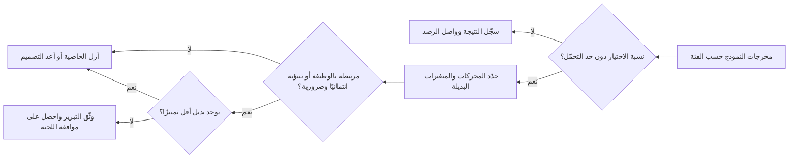
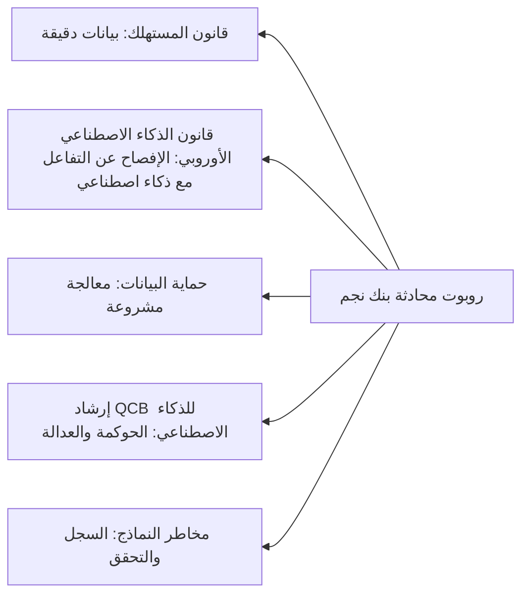

# الوحدة (Module) 5 — قوانين أخرى تنطبق بالفعل (Other laws that already apply)

*عبارة «لا يوجد قانون للذكاء الاصطناعي (AI) هنا بعد» من أغلى العبارات كلفةً في حوكمة الذكاء الاصطناعي (AI governance). فقبل قانون الذكاء الاصطناعي الأوروبي (EU AI Act) بزمن طويل، كانت أنظمة الذكاء الاصطناعي (AI systems) خاضعة بالفعل لقانون مكافحة التمييز (anti-discrimination law)، وقانون حق المؤلف (copyright) والأسرار التجارية (trade secrets)، وحماية المستهلك (consumer protection)، والمسؤولية عن المنتجات (product liability)، والتنظيم المالي (financial regulation)، وقد دأبت الجهات التنظيمية (regulators) والمحاكم (courts) على تطبيقها. تستعرض هذه الوحدة (Module) تلك الأنظمة القانونية (regimes) من خلال أداة فرز السير الذاتية (CV-screening tool) في بنك نجم (Najm Bank)، ونموذج الائتمان (credit model)، وروبوت المحادثة (chatbot)، والمساعد الذكي لمذكرات الائتمان (credit memo copilot)، لتتمكن من رصد التعرّض القانوني (legal exposure) الذي يحمله نظام الذكاء الاصطناعي (AI system) منذ يومه الأول. وهي تشرح القانون لتحسن الحوكمة (governance) وتجيب عن أسئلة الامتحان؛ وليست استشارة قانونية (legal advice)، وفي أي قرار فعلي عليك مراجعة النص الساري (current text) والحصول على مشورة من مستشار قانوني مؤهَّل (qualified counsel) في البلد المعني.*

> **تغطية مجال المعرفة (BoK coverage):** II.B — كيف تنطبق قوانين عدم التمييز (non-discrimination) والملكية الفكرية (intellectual property) وحماية المستهلك (consumer protection) والمسؤولية عن المنتجات (product liability) والقوانين القطاعية (sector-specific laws) على أنظمة الذكاء الاصطناعي (AI systems).

---

# 5.1 — عدم التمييز في التوظيف والائتمان والخدمات (Non-discrimination in hiring, credit and services)
*المستوى (Level): 🟡 متوسط (Intermediate)* · *المتطلبات (Prerequisites): 1.2، 4.2* · *مجال المعرفة (BoK): II.B*

## ⚡ الدرس في دقيقة (In 60 seconds)
- قانون مكافحة التمييز (anti-discrimination law) محايد تقنيًا. فإذا عامل نظام الذكاء الاصطناعي (AI system) الناسَ معاملةً أقل تفضيلًا بسبب خاصية محمية (protected characteristic)، أو أنتج ضررًا غير مبرَّر لفئة محمية (protected group)، فقد تكون الجهة التي تستخدمه مسؤولة قانونيًا.
- مفهومان يؤديان معظم العمل: **التمييز المباشر / المعاملة المتفاوتة (direct discrimination / disparate treatment)** (استخدام الخاصية، أو بديل واضح عنها، عن قصد) و**التمييز غير المباشر / الأثر المتفاوت (indirect discrimination / disparate impact)** (قاعدة تبدو محايدة تُلحق الضرر بفئة ولا يمكن تبريرها).
- يمارس الذكاء الاصطناعي (AI) التمييز (discrimination) في الغالب عبر **المتغيرات البديلة (proxies)** (الرمز البريدي (postcode)، والمدرسة، والفجوات المهنية (career gaps)) و**بيانات التدريب المتحيّزة (biased training data)**، لا عبر حقل صريح اسمه «الجنس». وحذف الخاصية المحمية (protected attribute) لا يعالج المشكلة.
- في التوظيف، لدى الولايات المتحدة (US) الباب السابع (Title VII) وقانون ADA وقانون ADEA، وإنفاذ EEOC (تسوية (settlement) *iTutorGroup*)، وتدقيقات التحيّز (bias audits) بموجب قانون NYC Local Law 144. وفي الائتمان، يشترط ECOA وRegulation B ذكر أسباب محددة (specific reasons) للإجراء السلبي (adverse action). ولدى الاتحاد الأوروبي (EU) توجيهات المساواة (equality directives) وقواعد خاصة بالائتمان.
- إشارة الامتحان (Exam cue): استخدام أداة من مورّد (vendor) لا ينقل المسؤولية عن صاحب العمل أو المُقرِض. وأكبر فخ (The biggest trap) هو اعتبار «النموذج (model) دقيق» دفاعًا في مواجهة الأثر المتفاوت (disparate impact).

## 🧭 لماذا يهم (Why it matters)
في 2018 انتشرت تقارير واسعة عن تخلّي Amazon عن نموذج تجريبي للتوظيف. فقد تعلّم من سير ذاتية على مدى عشر سنوات، معظمها لرجال، وأفادت التقارير بأنه كان يخفض تقييم السير الذاتية (CVs) التي تتضمن كلمة «women's»، كما في «قائدة نادي الشطرنج النسائي». لم يبرمجه أحد ليفضّل الرجال؛ بل تعلّم النمط من التاريخ. وفي 2023 سوّت لجنة تكافؤ فرص العمل الأمريكية (EEOC) قضيتها ضد iTutorGroup، التي يُدّعى أن برنامج طلبات التوظيف لديها كان يرفض تلقائيًا المتقدمات (female applicants) من الإناث في سن 55 فما فوق والمتقدمين (applicants) من الذكور في سن 60 فما فوق. وأفادت التقارير بأن قيمة التسوية (settlement) بلغت 365,000 دولار.

أداة فرز السير الذاتية (CV-screening tool) التي اشتراها يوسف من مورّد (vendor) لبنك نجم (Najm Bank) ترتّب المتقدمين (applicants) لوظائف الفروع في الدوحة ودبي وفرانكفورت. ويُظهر أول اختبار ربع سنوي أجرته ليلى أن النساء يُدرجن في القائمة المختصرة (shortlist) بنسبة 68% من معدل الرجال في وظائف العمليات، وأن المتقدمين الذين لديهم فجوات (gaps) تزيد على سنة يُعاقَبون بشدة. وبشكل منفصل، يوافق نموذج الائتمان (credit model) الخاص بخالد على المتقدمين من حيّين في الدوحة بمعدلات أدنى بشكل ملحوظ. والحيّان مرتبطان ارتباطًا قويًا بجنسيات معينة. لا يستخدم أيٌّ من النموذجين الجنس أو الجنسية مدخلًا. ومع ذلك قد يكون كلاهما يمارس التمييز (discrimination)، من الناحية القانونية وكذلك الأخلاقية.

## 📐 كيف يعمل (How it works)

### 🟢 الأساسيات (The essentials)
**الخصائص المحمية (protected characteristics).** تسرد القوانين الأسس التي لا يجوز معاملة الناس على أساسها معاملة غير عادلة. ومن أشيعها: الجنس، والعرق والأصل الإثني، واللون، والدين، والأصل القومي، والعمر، والإعاقة (disability)، والتوجه الجنسي، والحمل، والحالة الاجتماعية. وتختلف القائمة الدقيقة والقطاعات المشمولة (التوظيف، والائتمان، والإسكان، والسلع والخدمات (goods and services)) من ولاية قضائية (jurisdiction) إلى أخرى.

**طريقتان للتمييز (Two ways to discriminate).**

| المفهوم (Concept) | المصطلح الأوروبي (EU term) | المصطلح الأمريكي (US term) | كيف يبدو في الذكاء الاصطناعي (What it looks like in AI) |
|---|---|---|---|
| معاملة غير متساوية مقصودة أو صريحة | التمييز المباشر (Direct discrimination) | المعاملة المتفاوتة (Disparate treatment) | قاعدة ترفض المتقدمين (applicants) فوق 55 عامًا؛ خاصية (feature) تُرمّز الجنس مباشرة |
| قاعدة محايدة، أثر غير متساوٍ | التمييز غير المباشر (Indirect discrimination) | الأثر المتفاوت (Disparate impact) | عقوبة «الفجوة المهنية (career gap)» التي تقع في الغالب على النساء؛ خاصية الرمز البريدي (postcode) التي تتتبّع الأصل الإثني |

التمييز المباشر (direct discrimination) غير مشروع عمومًا ما لم ينطبق استثناء ضيق. والتمييز غير المباشر (indirect discrimination) غير مشروع ما لم تستطع الجهة **تبريره موضوعيًا (objectively justify)**. وفي القانون الأوروبي يعني ذلك هدفًا مشروعًا (legitimate aim) يُسعى إليه بوسائل مناسبة وضرورية. وفي عقيدة الأثر المتفاوت الأمريكية (المستمدة من *Griggs v. Duke Power*، 1971)، يجب على صاحب العمل أن يثبت أن الممارسة مرتبطة بالوظيفة (job-related) ومتسقة مع ضرورة العمل (business necessity)، ويظل بإمكان المدّعي (claimant) أن يكسب القضية بإثبات وجود بديل أقل تمييزًا (less discriminatory alternative) كان متاحًا.

**كيف يمارس الذكاء الاصطناعي التمييز (How AI discriminates).**
- **التحيّز التاريخي (historical bias):** تعكس تسميات التدريب (training labels) قرارات بشرية سابقة («من وُظِّف»، «من حصل على قرض»).
- **تحيّز التمثيل (representation bias):** بعض الفئات ممثَّلة تمثيلًا ناقصًا، فيكون النموذج (model) أقل دقة بالنسبة إليها.
- **المتغيرات البديلة (proxies):** خصائص (features) مرتبطة بالخصائص المحمية (protected characteristics)، مثل الرمز البريدي (postcode)، واللغة الأولى (first language)، والجامعة، والفجوات في التوظيف (gaps in employment).
- **تحيّز القياس (measurement bias):** الهدف (target) بديل ضعيف عمّا يهمك فعلًا، مثل «تقييم الأداء (performance rating)» حين تكون التقييمات نفسها متحيّزة.
- **عدم التوافق في النشر (deployment mismatch):** نموذج بُني لفئة سكانية (population) ويُستخدم على فئة أخرى.

**قياس التفاوت (Measuring disparity).** من الفحوص الأولى الشائعة **نسبة معدل الاختيار (selection-rate ratio)**: معدل اختيار فئة ما مقسومًا على معدل اختيار الفئة الأكثر حظوة. وتستخدم الإرشادات الفدرالية الأمريكية بشأن اختيار الموظفين (الإرشادات الموحّدة (Uniform Guidelines)، 1978) «قاعدة الأربعة أخماس (four-fifths rule)» قاعدةً تقريبية (rule of thumb): النسبة التي تقل عن 80% تُعامَل عمومًا دليلًا على الأثر السلبي (adverse impact). وهي أداة فرز استرشادية (screening heuristic)، لا ملاذًا قانونيًا آمنًا (safe harbour). ونسبة 68% للنساء في بنك نجم ستفشل فيها. أما المقاييس (Metrics) الأخرى مثل تساوي معدلات الخطأ (equal error rates) والمعايرة (calibration) فتغطيها الوحدة (Module) 9.2.

### 🟡 التعمق أكثر (Going deeper)
**التوظيف في الولايات المتحدة (Employment in the US).**
- يحظر **الباب السابع من قانون الحقوق المدنية لعام 1964 (Title VII of the Civil Rights Act of 1964)** التمييز (discrimination) في التوظيف على أساس العرق واللون والدين والجنس والأصل القومي، ويشمل المعاملة المتفاوتة (disparate treatment) والأثر المتفاوت (disparate impact) كليهما.
- يحمي **قانون مكافحة التمييز على أساس السن في التوظيف (ADEA)** العاملين في سن 40 فما فوق. وكانت *iTutorGroup* قضية تمييز على أساس السن (age case).
- يحظر **قانون الأمريكيين ذوي الإعاقة (ADA)** التمييز (discrimination) على أساس الإعاقة (disability) ويشترط الترتيبات التيسيرية المعقولة (reasonable accommodation). ويثير الذكاء الاصطناعي (AI) مخاطر محددة بموجب ADA: أدوات تستبعد الأشخاص ذوي الإعاقة (اختبار قائم على لعبة (game-based test) محدود بزمن لشخص لديه إعاقة حركية (motor impairment)، أو تحليل الفيديو لتعابير الوجه (video analysis of facial expressions))، والإخفاق في تقديم تقييم بديل (alternative assessment).
- يظل صاحب العمل مسؤولًا عند استخدام أداة مورّد (vendor's tool). وفي قضية *Mobley v. Workday*، التي لا تزال منظورة وقت كتابة هذا النص، سمحت محكمة بمضيّ الدعاوى استنادًا إلى نظرية مفادها أن مورّد (vendor) الذكاء الاصطناعي (AI) قد يكون هو نفسه مسؤولًا بوصفه وكيلًا (agent) لأصحاب العمل. تابع هذه القضية؛ ولا تعاملها كقانون مستقر (settled law).
- **مناخ الإنفاذ (Enforcement climate).** أصدرت EEOC مساعدة فنية (technical assistance) بشأن الذكاء الاصطناعي (AI) في التوظيف في 2022–2023. وأُزيل بعضها من موقع الوكالة في 2025، ووجّه أمر تنفيذي (executive order) صدر في 2025 الوكالاتِ الفدرالية (federal agencies) إلى خفض أولوية إنفاذ الأثر المتفاوت (disparate-impact enforcement). لكن القوانين والدعاوى الخاصة (private lawsuits) وقوانين الولايات (state laws) تبقى قائمة، فتحقّق من الوضع الحالي (current position).

**قانون NYC Local Law 144.** قانون مدينة نيويورك بشأن أدوات قرارات التوظيف الآلية (AEDTs) مُطبَّق منذ يوليو 2023. ويجب على أصحاب العمل ووكالات التوظيف (employment agencies) الذين يستخدمون أداة AEDT للمساعدة بشكل جوهري في القرارات المتعلقة بالمرشحين (candidates) أو الموظفين لوظائف في المدينة أن:
- يُجروا **تدقيق تحيّز مستقلًا (independent bias audit)** خلال سنة واحدة قبل الاستخدام، يحسب معدلات الاختيار (selection rates) أو التقييم و**نسب الأثر (impact ratios)** حسب فئات الجنس والعرق/الأصل الإثني، بما في ذلك الفئات المتقاطعة (intersectional categories)؛
- **ينشروا ملخصًا (publish a summary)** لنتائج التدقيق؛
- **يُخطروا المرشحين (notify candidates)** مسبقًا بأن أداة AEDT مستخدمة، مع معلومات عن المؤهلات التي تُقيَّم وكيفية طلب إجراء بديل (alternative process) أو ترتيب تيسيري (accommodation).

يشترط القانون الإفصاح والتدقيق (disclosure and auditing)؛ ولا يحدد درجة نجاح (pass mark). وقد تبعته ولايات ومدن أخرى بقواعدها الخاصة (مثل إلينوي بشأن الذكاء الاصطناعي (AI) في التوظيف، وقانون الذكاء الاصطناعي في كولورادو (Colorado's AI Act) بشأن القرارات عالية المخاطر (high-risk)، مع تأجيل تاريخ نفاذه (effective date) إلى 30 يونيو 2026). تحقّق من الوضع الحالي (current position) قبل الاعتماد على أي منها.

**الائتمان في الولايات المتحدة (Credit in the US).**
- يحظر **قانون تكافؤ فرص الائتمان (ECOA)**، الذي يُنفَّذ عبر **Regulation B**، التمييز (discrimination) في أي جانب من جوانب معاملة ائتمانية (credit transaction) على أسس تشمل العرق واللون والدين والأصل القومي والجنس والحالة الاجتماعية والعمر، وتلقّي المساعدة العامة (public assistance).
- عندما يتخذ الدائن (creditor) **إجراءً سلبيًا (adverse action)** (الرفض، أو عرض شروط أسوأ)، يجب أن يقدّم للمتقدم بيانًا بـ**الأسباب الرئيسية المحددة (specific principal reasons)**. وقد صرّح مكتب الحماية المالية للمستهلك (CFPB) بأن النماذج (models) المعقدة أو «الصناديق السوداء (black-box)» ليست عذرًا: يجب على الدائنين (creditors) تقديم أسباب دقيقة ومحددة، ولا يمكنهم ببساطة اختيار أقرب البنود من قائمة مرجعية نموذجية (sample checklist) إذا لم تكن تعكس المحركات الفعلية (real drivers). تحقّق من الوضع الحالي (current position) لإرشادات CFPB، إذ تغيّر موقف المكتب في 2025.
- يغطي **قانون الإسكان العادل (Fair Housing Act)** إقراض الرهن العقاري (mortgage lending) والقرارات المتعلقة بالإسكان.
- تُظهر واقعة Apple Card (2019–2021) الجانب المتعلق بالسمعة (reputational). فبعد شكاوى علنية من أن النساء حصلن على حدود ائتمانية (credit limits) أقل من أزواجهن، حققت إدارة الخدمات المالية في ولاية نيويورك (New York Department of Financial Services). ولم يجد تقريرها الصادر في 2021 تمييزًا (discrimination) غير مشروع من جانب البنك، لكنه انتقد إخفاقات في خدمة العملاء (customer service) والشفافية (transparency).

**الاتحاد الأوروبي (EU).**
- تضع **توجيهات المساواة الأوروبية (EU equality directives)** القواعد الأساسية: توجيه المساواة العرقية (Race Equality Directive) (2000/43/EC) يغطي التوظيف والوصول إلى السلع والخدمات (goods and services)؛ وتوجيه إطار المساواة في التوظيف (Employment Equality Framework Directive) (2000/78/EC) يغطي الدين أو المعتقد والإعاقة (disability) والعمر والتوجه الجنسي في التوظيف؛ وتغطي التوجيهات الخاصة بالمساواة بين الجنسين (sex equality) التوظيفَ (2006/54/EC) والسلع والخدمات (2004/113/EC). ويعرّف كلٌّ منها التمييز المباشر (direct discrimination) وغير المباشر على النحو الوارد أعلاه.
- في قضية *Test-Achats* (2011)، ألغت CJEU الاستثناء الذي كان يسمح لشركات التأمين (insurers) باستخدام الجنس عاملًا في التسعير (pricing). وهي تذكير بأن «الدقيق اكتواريًا (actuarially accurate)» ليس هو نفسه «المشروع قانونًا (lawful)».
- يحظر **ميثاق الاتحاد الأوروبي للحقوق الأساسية (EU Charter of Fundamental Rights)** التمييز (discrimination)، ويشكّل أساس تركيز قانون الذكاء الاصطناعي (EU AI Act) على الحقوق الأساسية (fundamental rights).
- في الائتمان، يشدّد **توجيه الائتمان الاستهلاكي المُعاد صياغته (Consumer Credit Directive (EU) 2023/2225)** تقييم الجدارة الائتمانية (creditworthiness assessment). وعلى مستوى عام، يقيّد استخدام فئات البيانات الخاصة (special category data)، وحين يتضمن التقييم معالجة آلية (automated processing) فإنه يمنح المستهلكين الحق (right) في التدخل البشري (human intervention) والحصول على تفسير والاعتراض. وتطبّقه الدول الأعضاء (member states) اعتبارًا من أواخر 2026؛ فتحقّق من النقل إلى التشريع الوطني (national transposition).
- يعامل **قانون الذكاء الاصطناعي الأوروبي (EU AI Act)** الذكاء الاصطناعي (AI) المستخدم في التوظيف والاختيار وإدارة العاملين (worker management)، وفي تقييم الجدارة الائتمانية (creditworthiness assessment) للأشخاص الطبيعيين (natural persons)، على أنه عالي المخاطر (الملحق III (Annex III))، مما يرتّب واجبات حوكمة البيانات (data-governance) وفحص التحيّز (bias examination) على مقدّمي النظام (providers) وواجبات الإشراف (oversight duties) على المُشغِّلين (deployers) (الوحدة (Module) 6).
- وفي المملكة المتحدة (UK) يؤدي **قانون المساواة لعام 2010 (Equality Act 2010)** الدور نفسه.

### 🔴 نظرة الخبير (Expert view)
**العدالة عبر التجاهل تفشل (fairness through unawareness).** إزالة الخصائص المحمية («التجاهل (unawareness)») لا تمنع التمييز (discrimination) حين توجد متغيرات بديلة (proxies)، كما أنها تمنعك من قياس التفاوت (Measuring disparity). والبرامج الناضجة تحتفظ ببيانات الخصائص المحمية (protected-attribute data)، حيثما كان ذلك مشروعًا، في مخزن منفصل (separate store) خاضع للتحكم في الوصول (access-controlled)، ولا تُستخدم إلا للاختبار. وهذا يخلق توترًا مع قانون الخصوصية (الوحدة (Module) 4.1): ففي الاتحاد الأوروبي (EU)، يحتاج جمع بيانات الأصل الإثني إلى شرط من شروط المادة 9 (Art. 9)، والإذن الضيق لاختبار التحيّز (narrow bias-testing permission) في قانون الذكاء الاصطناعي (EU AI Act) ينطبق على مقدّمي الأنظمة عالية المخاطر (high-risk systems).

**التبرير عملية، لا جملة (Justification is a process, not a sentence).** للدفاع عن تفاوت ما تحتاج إلى دليل على أن الخاصية مرتبطة بالوظيفة (job-related) أو ذات قدرة تنبؤية لهدف مشروع (legitimate aim)، وأنك بحثت عن بدائل أقل تمييزًا (خصائص (features) أخرى، وحدود (thresholds) أخرى، ونماذج (models) أخرى بدقة مماثلة)، وأنك وثّقت المفاضلة (trade-off). وتُظهر الأبحاث حول «تعدّد النماذج (model multiplicity)» أنه غالبًا ما توجد نماذج كثيرة بدقة شبه متطابقة لكن بتفاوتات مختلفة. وهذا يقوّي الحجة بأن بديلًا أقل تمييزًا (less discriminatory alternative) كان متاحًا.

**الدقة ليست دفاعًا بحد ذاتها (Accuracy is not a defence by itself).** يمكن لنموذج (model) أن يعيد إنتاج عالم تمييزي بدقة. والمحاكم (courts) والجهات التنظيمية (regulators) تسأل عمّا إذا كانت الممارسة مبرَّرة وعمّا إذا كانت توجد بدائل أفضل، لا عمّا إذا كانت التنبؤات صحيحة فحسب.

**الترتيبات التيسيرية والبدائل (Accommodation and alternatives).** كثيرًا ما يشترط قانون الإعاقة (Disability law) بديلًا فرديًا (صيغة اختبار مختلفة أو مقابلة بشرية). ابنِ المسار البديل داخل العملية، لا كفكرة لاحقة.

**سياق دول الخليج (GCC).** تتضمن قوانين العمل والمصارف في الخليج أحكامها الخاصة بالمساواة في المعاملة (equal treatment) وعدالة المستهلك (consumer fairness)، كما أن سياسات القوى العاملة الوطنية (مثل أهداف التقطير (Qatarisation)) تشكّل التوظيف بصورة مشروعة. وأي ذكاء اصطناعي (AI) ينفّذ مثل هذه السياسات يجب أن يفعل ذلك علنًا وفي حدود القانون، لا عبر متغيرات بديلة (proxies) خفية. استشر مستشارًا قانونيًا محليًا (local counsel) بشأن كيفية انطباق قواعد المساواة (equality rules) على الأدوات الآلية (automated tools).

```mermaid
flowchart RL
    A[مخرجات النموذج حسب الفئة] --> B{نسبة الاختيار دون حد التحمّل؟}
    B -- لا --> C[سجّل النتيجة وواصل الرصد]
    B -- نعم --> D[حدّد المحركات والمتغيرات البديلة]
    D --> E{مرتبطة بالوظيفة أو تنبؤية ائتمانيًا وضرورية؟}
    E -- لا --> F[أزل الخاصية أو أعد التصميم]
    E -- نعم --> G{يوجد بديل أقل تمييزًا؟}
    G -- نعم --> F
    G -- لا --> H[وثّق التبرير واحصل على موافقة اللجنة]
```

## ⚖️ الأدوات التنظيمية (The instruments)
| الأداة | ما تشترطه أو توصي به (What it requires or recommends) | إشارة الامتحان (Exam cue) |
|---|---|---|
| **Title VII of the Civil Rights Act** | لا تمييز في التوظيف على أساس العرق أو اللون أو الدين أو الجنس أو الأصل القومي؛ المعاملة المتفاوتة (disparate treatment) والأثر المتفاوت (disparate impact) | صاحب العمل مسؤول عن أدوات المورّدين (vendor tools) |
| **ADA** | لا تمييز على أساس الإعاقة (disability)؛ ترتيبات تيسيرية معقولة (reasonable accommodation) | قدّم بدائل لتقييمات الذكاء الاصطناعي (AI) |
| **NYC Local Law 144** | تدقيق تحيّز مستقل (independent bias audit) خلال سنة قبل الاستخدام، وملخص منشور (published summary)، وإخطار المرشحين (candidate notice) بشأن أدوات AEDT | دقّق وأفصح؛ لا درجة نجاح (pass mark) |
| **ECOA / Regulation B** | لا تمييز في الائتمان؛ أسباب رئيسية محددة (specific principal reasons) للإجراء السلبي (adverse action) | «الصندوق الأسود (black box)» ليس عذرًا للأسباب المبهمة (vague reasons) |
| **EU equality directives** | تحظر التمييز المباشر (direct discrimination) وغير المباشر؛ اختبار التبرير الموضوعي (objective justification test) | الخصائص المحايدة قد تمارس التمييز (discrimination) مع ذلك |
| **EU Consumer Credit Directive** — (EU) 2023/2225 | تقييم أكثر صرامة للجدارة الائتمانية (creditworthiness)؛ حقوق تتعلق بالتقييم الآلي (automated assessment) | ينطبق إلى جانب المادة 22 (Art. 22) من GDPR |
| **EU AI Act** — الملحق III (Annex III) | الذكاء الاصطناعي (AI) في التوظيف والجدارة الائتمانية (creditworthiness) عالي المخاطر (high-risk)؛ واجبات فحص التحيّز (bias examination) والإشراف | يضيف واجبات؛ لا يحلّ محل قانون المساواة (equality law) |

## 🏛️ عمليًا في بنك نجم (In practice at Najm Bank)
تعتمد لجنة حوكمة الذكاء الاصطناعي (AI Governance Committee) **معيار اختبار الأثر السلبي (Adverse Impact Testing Standard)** لكل ذكاء اصطناعي (AI) يؤثر في التوظيف أو الائتمان أو التسعير (pricing).

| العنصر (Element) | المعيار (Standard) |
|---|---|
| النطاق | فرز السير الذاتية (CV screening)، والتصنيف الائتماني (credit scoring)، والتسعير (pricing)، وترتيب أولويات التحصيل (collections prioritisation) |
| الفئات المختبَرة (Groups tested) | الجنس، والفئة العمرية (age band)، ومجموعة الجنسية (nationality group)، والإعاقة (حيث تكون البيانات محفوظة بصورة مشروعة)، والتقاطعات (intersections) حيث تسمح أحجام العينات (sample sizes) |
| المقاييس (Metrics) | نسبة معدل الاختيار (selection-rate ratio)؛ نسبة معدل الموافقة (approval-rate ratio)؛ معدلات الإيجابيات الكاذبة والسلبيات الكاذبة (false-positive and false-negative rates) حسب الفئة |
| حد التحمّل (Tolerance) | نسبة أقل من 0.80، أو فجوة في معدل الخطأ (error-rate gap) تتجاوز حدًا متفقًا عليه، تستدعي التحقيق (Investigation) |
| التعامل مع البيانات (Data handling) | يحتفظ مكتب البيانات (Data Office) بالخصائص المحمية (protected characteristics) في مخزن منفصل (separate store)، ولا تُستخدم إلا للاختبار، مع أساس قانوني (legal basis) يعتمده مسؤول حماية البيانات (Data Protection Officer, DPO) لكل ولاية قضائية (jurisdiction) |
| التحقيق (Investigation) | تحليل المحركات (driver analysis)؛ فحص المتغيرات البديلة (proxy check)؛ البحث عن بدائل أقل تمييزًا (less discriminatory alternatives)؛ تبرير موثَّق (documented justification) |
| واجب المورّد (Vendor duty) | يجب على المورّدين (vendors) تقديم أدلة اختبار التحيّز (bias testing) ودعم اختبارات بنك نجم الخاصة (بند تعاقدي (contract clause)، الوحدة (Module) 11.2) |
| التكرار (Frequency) | قبل الإطلاق (before release)، وكل ربع سنة، وبعد أي تغيير في النموذج (model) أو الفئة السكانية (population) |
| التصعيد (Escalation) | من رئيس حوكمة الذكاء الاصطناعي (Head of AI Governance) إلى اللجنة (Committee)؛ والمسائل غير المحلولة تمنع الإطلاق |

**النتيجة الأولى (First result):** أُزيلت عقوبة الفجوة المهنية (career-gap penalty) في أداة السير الذاتية (CV tool) بعد أن أظهر تحليل المحركات (driver analysis) أنها كانت وراء معظم التفاوت بين الجنسين (sex disparity) دون أن تحسّن التنبؤ بالأداء. واستُبدلت خاصية حي الدوحة في نموذج الائتمان (credit model) ببيانات تحقّق من القدرة على السداد (affordability).

## 🛠️ التمارين (Exercises)
- 🟢 لأداة السير الذاتية (CV tool)، اسرد خمس خصائص (features) يمكن أن تعمل متغيرات بديلة (proxies) لخاصية محمية (protected characteristic)، وسمِّ الخاصية التي قد يكون كلٌّ منها بديلًا عنها (proxy). *يكتمل عندما (Done when):* يكون لكل متغير بديل آلية معقولة في جملة واحدة.
- 🟡 باستخدام هذه الأرقام، احسب نسب معدل الاختيار (selection-rate ratios) وحدّد أيها يفشل في قاعدة الأربعة أخماس التقريبية (four-fifths rule of thumb): الرجال 300 متقدم، 90 في القائمة المختصرة (shortlist)؛ النساء 250 متقدمة، 50 في القائمة المختصرة؛ المتقدمون بعمر 50 فأكثر 80 متقدمًا، 12 في القائمة المختصرة؛ دون 50 عامًا 470 متقدمًا، 128 في القائمة المختصرة. *يكتمل عندما (Done when):* تحصل على نسبتين واستنتاج من سطر واحد لكل منهما.
- 🔴 اكتب نص أسباب الإجراء السلبي (adverse-action reasons) الذي سيرسله بنك نجم إلى متقدم أمريكي (بافتراض وجود فرع في الولايات المتحدة (US)) رفضه نموذج الائتمان (credit model)، واشرح كيف استخلصت الأسباب بحيث تستوفي اشتراط Regulation B بشأن «الأسباب الرئيسية المحددة (specific principal reasons)». *يكتمل عندما (Done when):* تكون الأسباب محددة، ومطابقة للمحركات الفعلية (real drivers) للنموذج (model)، ومفهومة.

## ⚠️ أخطاء وفخاخ الامتحان (Mistakes and exam traps)
- **«لا نستخدم الخصائص المحمية (protected characteristics)، إذن لا يمكن أن نمارس التمييز (discrimination).»** المتغيرات البديلة (proxies) والتسميات المتحيّزة تنتج تمييزًا غير مباشر (indirect discrimination). اختر الإجابة التي تختبر النتائج.
- **«المورّد (vendor) هو المسؤول.»** يظل صاحب العمل أو المُقرِض مسؤولًا عن القرارات المتخذة بأداة مشتراة. والعقود (contracts) يمكنها توزيع التكلفة، لا الواجب القانوني تجاه المتأثرين.
- **«قاعدة الأربعة أخماس (four-fifths rule) هي المعيار (Standard) القانوني.»** إنها قاعدة تقريبية (rule of thumb) للتنبيه إلى الأثر السلبي (adverse impact)، وليست ملاذًا آمنًا (safe harbour).
- **«النموذج (model) دقيق، إذن التفاوت (disparity) مبرَّر.»** التبرير (justification) يتطلب الضرورة وغياب بديل أقل تمييزًا (less discriminatory alternative).
- **«قانون NYC Local Law 144 يحظر الأدوات المتحيّزة.»** إنه يشترط تدقيقًا مستقلًا ونشرًا وإخطارًا؛ ولا يحدد عتبة نجاح (pass mark).
- **أسباب عامة للإجراء السلبي (adverse action).** يجب أن تعكس الأسباب المحركات الرئيسية الفعلية (actual principal drivers) للقرار.

## 🧾 الخلاصة (Recap)
- ينطبق قانون التمييز (discrimination law) على الذكاء الاصطناعي (AI) دون تعديل: التمييز المباشر (direct discrimination)/المعاملة المتفاوتة (disparate treatment) والتمييز غير المباشر (indirect discrimination)/الأثر المتفاوت (disparate impact).
- المتغيرات البديلة (proxies) والتحيّز التاريخي (historical bias) هما الآليتان الرئيسيتان؛ والتجاهل (unawareness) ليس حلًا.
- التوظيف في الولايات المتحدة (Employment in the US): Title VII وADEA وADA وإنفاذ EEOC وتدقيقات NYC LL144. والائتمان في الولايات المتحدة (Credit in the US): ECOA/Reg B مع أسباب محددة (specific reasons) للإجراء السلبي (adverse action).
- الاتحاد الأوروبي (EU): توجيهات المساواة (equality directives)، وتوجيه الائتمان الاستهلاكي (Consumer Credit Directive)، ونظام الأنظمة عالية المخاطر (high-risk systems) في قانون الذكاء الاصطناعي (EU AI Act) للتوظيف والائتمان.
- الدفاع عن تفاوت ما يتطلب دليلًا على الضرورة وبحثًا موثَّقًا عن بدائل أقل تمييزًا (less discriminatory alternatives).

## ✍️ اختبر نفسك (Check yourself)

**1. لا تستخدم أداة السير الذاتية (CV tool) في بنك نجم الجنسَ مدخلًا، لكنها تُدرج النساء في القائمة المختصرة (shortlist) بنسبة 68% من معدل الرجال. أي مفهوم يصف المخاطر القانونية على أفضل وجه؟**

- A. التمييز المباشر (direct discrimination)
- B. التمييز غير المباشر / الأثر المتفاوت (indirect discrimination or disparate impact)
- C. لا توجد مخاطر، لأن الجنس ليس مدخلًا
- D. خرق لحماية البيانات (data protection breach) فقط

الإجابة

**B.** العملية التي تبدو محايدة وتُلحق الضرر بفئة محمية (protected group) هي تمييز غير مباشر (الاتحاد الأوروبي (EU)) أو أثر متفاوت (الولايات المتحدة (US))، وهي غير مشروعة ما لم تُبرَّر. أما C فهو فخ التجاهل (unawareness trap). (انظر 🟢 طريقتان للتمييز (Two ways to discriminate).)

**2. بموجب قانون NYC Local Law 144، ما الذي يجب على صاحب العمل الذي يستخدم أداة قرارات توظيف آلية (automated employment decision tool) أن يفعله؟**

- A. الحصول على موافقة المدينة قبل الاستخدام
- B. ضمان أن تكون نسب الأثر (impact ratios) للأداة أعلى من 0.80
- C. إجراء تدقيق تحيّز مستقل (independent bias audit) خلال سنة واحدة قبل الاستخدام، ونشر ملخص للنتائج، وإخطار المرشحين (candidate notice)
- D. استخدام الأداة للترقيات الداخلية فقط

الإجابة

**C.** يشترط القانون التدقيق والنشر والإخطار. ولا يحدد عتبة نجاح (B) ولا يتطلب موافقة مسبقة (A). (انظر 🟡 قانون NYC Local Law 144.)

**3. رفض نموذج مُقرِض أمريكي متقدمًا. ويريد فريق الامتثال (compliance team) إرسال السببين المعتادين «دخل غير كافٍ» و«التاريخ الائتماني»، مع أن المحركين الرئيسيين كانا سلوك الحساب مؤخرًا ونسبة استخدام الدين. ما المشكلة؟**

- A. يشترط Regulation B ذكر الأسباب الرئيسية المحددة (specific principal reasons) الكامنة فعلًا وراء القرار، حتى في النماذج (models) المعقدة
- B. لا مشكلة؛ فالأسباب النموذجية (sample reasons) مقبولة دائمًا
- C. إشعارات الإجراء السلبي (adverse action notices) اختيارية لنماذج (models) الذكاء الاصطناعي (AI)
- D. يجب على المُقرِض الإفصاح (disclosure) عن الكود المصدري (source code) للنموذج (model)

الإجابة

**A.** يجب أن تعكس الأسباب المحركات الفعلية (real drivers) بدقة. والنماذج (models) المعقدة لا تبرر الأسباب المبهمة (vague reasons) أو غير الدقيقة. أما D فيتجاوز ما تشترطه القاعدة. (انظر 🟡 الائتمان في الولايات المتحدة (Credit in the US).)

**4. في قضية *EEOC v. iTutorGroup* (سُوّيت في 2023)، ما المشكلة المُدّعاة؟**

- A. أعطى روبوت محادثة (chatbot) معلومات خاطئة عن الرواتب
- B. دُرِّب نموذج على سير ذاتية (CVs) محمية بحق المؤلف (protected by copyright)
- C. أخطأت أداة لتحليل الوجه في تحديد عرق المرشحين (candidates)
- D. كان برنامج طلبات التوظيف يرفض المتقدمين (applicants) الأكبر سنًا تلقائيًا

الإجابة

**D.** ادّعت EEOC أن البرنامج كان يرفض تلقائيًا المتقدمات (female applicants) في سن 55 فما فوق والمتقدمين (applicants) الذكور في سن 60 فما فوق، وهو تمييز على أساس السن (age discrimination). (انظر 🧭 لماذا يهم (Why it matters).)

**5. وجد بنك نجم تفاوتًا في نموذج الائتمان (credit model) تحرّكه خاصية حي الإقامة. أي خطوة هي الأهم في تحديد ما إذا كان يمكن تبرير التفاوت (disparity)؟**

- A. إثبات أن الدقة الإجمالية (overall accuracy) للنموذج (model) مرتفعة
- B. إثبات أن الخاصية ضرورية لهدف مشروع (legitimate aim) وأنه لا يوجد بديل أقل تمييزًا (less discriminatory alternative) يحقق أداءً مماثلًا
- C. إزالة الجنسية من بيانات التدريب (training data)
- D. مطالبة المورّد (vendor) بتأكيد أن النموذج (model) عادل

الإجابة

**B.** يتوقف التبرير (justification) على الضرورة وغياب بدائل أقل تمييزًا (less discriminatory alternatives). فالدقة (accuracy) وحدها (A) ليست دفاعًا؛ وC قائم أصلًا ولا يحل مشكلة المتغيرات البديلة (proxies)؛ وD لا ينقل شيئًا. (انظر 🔴 التبرير عملية (Justification is a process).)

## 📚 المراجع (References)
- لجنة تكافؤ فرص العمل الأمريكية (US Equal Employment Opportunity Commission): https://www.eeoc.gov
- إدارة حماية المستهلك (consumer protection) والعامل في مدينة نيويورك (أدوات قرارات التوظيف الآلية (automated employment decision tools)): https://www.nyc.gov/site/dca/index.page
- مكتب الحماية المالية للمستهلك (ECOA، Regulation B): https://www.consumerfinance.gov
- قانون الاتحاد الأوروبي (توجيهات المساواة (equality directives) 2000/43/EC و2000/78/EC و2004/113/EC و2006/54/EC؛ توجيه الائتمان الاستهلاكي (Consumer Credit Directive) 2023/2225): https://eur-lex.europa.eu
- EU AI Act، اللائحة (EU) 2024/1689: https://eur-lex.europa.eu/eli/reg/2024/1689/oj
- محكمة العدل الأوروبية (ابحث عن C-236/09 *Test-Achats*): https://curia.europa.eu
- إدارة الخدمات المالية في ولاية نيويورك (New York Department of Financial Services): https://www.dfs.ny.gov

---

# 5.2 — الملكية الفكرية في مدخلات الذكاء الاصطناعي ومخرجاته (Intellectual property in AI inputs and outputs)
*المستوى (Level): 🟡 متوسط (Intermediate)* · *المتطلبات (Prerequisites): 3.2* · *مجال المعرفة (BoK): II.B*

## ⚡ الدرس في دقيقة (In 60 seconds)
- تنشأ مسائل الملكية الفكرية (IP) على جانبي نظام الذكاء الاصطناعي (AI system). **المدخلات (inputs):** هل لديك الحق (right) في استخدام بيانات التدريب (training data) والأوامر النصية (prompts) والمستندات التي يعالجها النظام؟ **المخرجات (outputs):** من يملك ما يولّده النظام، وهل يمكن أن يتعدى على حقوق الآخرين؟
- في الاتحاد الأوروبي (EU)، التنقيب في النصوص والبيانات (text and data mining, TDM) مسموح بموجب توجيه DSM Directive: المادة 3 (Art. 3) لمنظمات البحث (research organisations) ومؤسسات التراث الثقافي (cultural heritage institutions)، والمادة 4 (Art. 4) للجميع غيرهم، لكن بموجب المادة 4 يمكن لأصحاب الحقوق (rights holders) **إعلان عدم الموافقة (opt out)**، وبالنسبة إلى المحتوى المتاح على الإنترنت يكون ذلك بوسائل قابلة للقراءة آليًا (machine-readable). ويشترط قانون الذكاء الاصطناعي الأوروبي (EU AI Act) على مقدّمي نماذج الذكاء الاصطناعي للأغراض العامة (GPAI) احترام حالات عدم الموافقة (opt-outs) هذه ونشر ملخص لمحتوى التدريب (training content).
- في الولايات المتحدة (US)، يُحسم ما إذا كان التدريب (training) **استخدامًا عادلًا (fair use)** قضيةً بقضية. وقد أشارت أحكام مبكرة صدرت في 2025 إلى اتجاهات مختلفة بحسب الوقائع.
- يتطلب حق المؤلف (copyright) عمومًا **تأليفًا بشريًا (human authorship)**. وقد لا تكون المخرجات (outputs) المولّدة بالكامل بالذكاء الاصطناعي (AI) محمية؛ بينما قد يكون العمل الذي يوجّهه الإنسان ويختاره ويحرّره محميًا. ولا يمكن تسمية الذكاء الاصطناعي مخترعًا (inventor) في براءة اختراع (patent) في الولايات القضائية الرئيسية (major jurisdictions).
- الأسرار التجارية (trade secrets) والتراخيص (licences) لا تقل أهمية عن حق المؤلف (copyright): موظفون يلصقون مواد سرية (confidential material) في أدوات عامة، وتراخيص نماذج (models) «مفتوحة» تحمل قيودًا على الاستخدام.

## 🧭 لماذا يهم (Why it matters)
في 2023 أفادت التقارير بأن مهندسين في Samsung لصقوا كودًا مصدريًا سريًا (confidential source code) وملاحظات اجتماعات في ChatGPT. ثم قيّدت الشركة استخدام الموظفين لأدوات الذكاء الاصطناعي التوليدي (generative AI). لم تكن المشكلة في حق المؤلف (copyright)، بل في الأسرار التجارية (trade secrets) والسرية (confidentiality): فالمعلومات التي تُشارَك مع خدمة طرف ثالث (third-party) بموجب شروط المستهلكين قد تُخزَّن أو تُراجَع أو تُستخدم في التدريب (training)، وحماية الأسرار التجارية (trade-secret protection) تتوقف على اتخاذ خطوات معقولة (reasonable steps) للحفاظ على سريتها.

في بنك نجم (Najm Bank)، تصل ثلاث مسائل ملكية فكرية إلى ليلى في أسبوع واحد. يريد عمر إجراء الضبط الدقيق (fine-tune) لنموذج (model) مفتوح الأوزان (open-weight) على سياسات الائتمان الداخلية للبنك وعلى تقارير أبحاث السوق التي يشترك فيها البنك. ويريد قسم التسويق (Marketing) استخدام مولّد صور (image generator) لحملة ويسأل عمّا إذا كان بنك نجم سيملك الصور. ويلصق مديرو العلاقات (relationship managers) بالفعل البيانات المالية للعملاء في روبوت محادثة عام (public chatbot) لصياغة مذكرات الائتمان (credit memos). وكل منها يحتاج إلى إجابة مختلفة، تستند إلى قانون حق المؤلف (copyright law) والترخيص (licence) والأسرار التجارية (trade secrets) والسرية (confidentiality).

## 📐 كيف يعمل (How it works)

### 🟢 الأساسيات (The essentials)
**حقوق الملكية الفكرية المعنية (The IP rights in play).**

| الحق (right) | ما يحميه (Protects) | نقاط التماس مع الذكاء الاصطناعي (AI touchpoints) |
|---|---|---|
| حق المؤلف (Copyright) | المصنفات الأصلية (Original works): النصوص، والكود، والصور، والموسيقى، وقواعد البيانات (في بعض الأنظمة) | بيانات التدريب (training data)؛ المخرجات (outputs) التي تعيد إنتاج المصنفات (works)؛ ملكية المخرجات (output ownership) |
| حق قاعدة البيانات (Database right) (الاتحاد الأوروبي (EU)) | الاستثمار الجوهري في قاعدة بيانات (database) | الكشط (scraping) والاستخراج من قواعد البيانات (databases) |
| الأسرار التجارية (Trade secrets) | المعلومات ذات القيمة التجارية المحفوظة سرًا (secret) بخطوات معقولة (reasonable steps) | أوزان النموذج (model weights)، وبيانات التدريب (training data)، والأوامر النصية (prompts)؛ تسريب الموظفين لبيانات سرية (confidential data) إلى الأدوات |
| براءات الاختراع (Patents) | الاختراعات (inventions) | الاختراعات (inventions) بمساعدة الذكاء الاصطناعي (AI-assisted)؛ صفة المخترع (inventorship) |
| العلامات التجارية (Trademarks) | علامات العلامة التجارية (brand) | مخرجات (outputs) تعيد إنتاج الشعارات (logos)؛ أسماء النماذج (models) |
| العقود والتراخيص (Contract and licences) | كل ما يتفق عليه الطرفان | تراخيص مجموعات البيانات (dataset licences)، وتراخيص النماذج (model licences)، وشروط API (API terms)، وشروط الاشتراك (subscription terms) |

**المدخلات (inputs): هل يمكننا التدريب عليها (can we train on it)؟** نسخ المصنفات (works) إلى مجموعة تدريب (training set) فعلٌ يمكن لحق المؤلف (copyright) أن يتحكم فيه. ويتوقف كونه مشروعًا على (أ) ترخيص (licence)، أو (ب) استثناء مثل TDM أو الاستخدام العادل (fair use)، أو (ج) كون المادة خارج نطاق حق المؤلف. كما يمكن لشروط العقد (contract terms) أن تقيّد الاستخدام حتى حيث لا يقيّده حق المؤلف. فقد يحظر اشتراك في أبحاث السوق مثلًا «الاستخدام في تعلّم الآلة (machine learning)».

**المخرجات (outputs): من يملكها، وهل يمكن أن تتعدى (infringe) على حقوق الغير؟** سؤالان. الملكية: قانون حق المؤلف (copyright law) في معظم الأماكن يحمي مصنفات (works) التأليف البشري (human authorship)، لذا قد لا تكون مخرجات الذكاء الاصطناعي (AI output) غير المحرَّرة محمية بحق المؤلف (protected by copyright). والتعدي (infringement): قد تتعدى المخرجات على الحقوق إذا أعادت إنتاج تعبير محمي من بيانات التدريب (training data). والمقاطع المحفوظة (memorised)، وكلمات الأغاني، والشخصيات المعروفة، والشعارات (logos) هي المخاطر الكلاسيكية.

### 🟡 التعمق أكثر (Going deeper)
**الاتحاد الأوروبي: التنقيب في النصوص والبيانات (text and data mining) بموجب DSM Directive (EU) 2019/790.**
- **المادة 3 (Art. 3)** تسمح لمنظمات البحث (research organisations) ومؤسسات التراث الثقافي (cultural heritage institutions) بإجراء TDM للبحث العلمي (scientific research) على المصنفات (works) التي يحق لها الوصول إليها بصورة مشروعة. ولا يمكن لأصحاب الحقوق (rights holders) إعلان عدم الموافقة (opt out).
- **المادة 4 (Art. 4)** تسمح لأي شخص بإجراء عمليات النسخ والاستخراج لأغراض TDM من المصنفات (works) المتاحة بصورة مشروعة، *ما لم يكن صاحب الحق (rights holder) قد احتفظ صراحةً بهذا الاستخدام* بطريقة مناسبة. وبالنسبة إلى المحتوى المتاح للجمهور على الإنترنت، يعني ذلك وسائل قابلة للقراءة آليًا (مثلًا في البيانات الوصفية (metadata) أو في شروط يمكن للآلات قراءتها؛ وتُناقَش إشارات من نوع robots.txt على نطاق واسع). ولا يجوز الاحتفاظ بالنسخ إلا طالما كان ذلك لازمًا لأغراض TDM.
- كيفية التعبير عن عدم الموافقة (opt-out) لا تزال قيد البلورة في المحاكم (courts) وفي معايير الصناعة (industry standards). وقد نظرت المحاكم الألمانية بالفعل فيما إذا كان يمكن الاعتداد بالتحفظات المكتوبة بلغة طبيعية (natural-language reservations) في شروط المواقع الإلكترونية. تعامل مع التفاصيل على أنها متطورة.

**واجبات حق المؤلف (copyright duties) في قانون الذكاء الاصطناعي الأوروبي (EU AI Act) على مقدّمي نماذج GPAI (GPAI providers).** يجب على مقدّمي نماذج الذكاء الاصطناعي للأغراض العامة (general-purpose AI models) وضع سياسة للامتثال لقانون حق المؤلف الأوروبي (policy to comply with EU copyright law)، بما في ذلك تحديد تحفظات (reservations) المادة 4 (Art. 4) واحترامها باستخدام أحدث التقنيات، ويجب عليهم نشر ملخص مفصّل بما يكفي للمحتوى المستخدم في التدريب (training)، وفق نموذج صادر عن مكتب الذكاء الاصطناعي (AI Office) (نُشر في 2025). ويتضمن مدونة الممارسات الخاصة بنماذج GPAI (GPAI Code of Practice) (يوليو 2025) فصلًا عن حق المؤلف (copyright) يصف كيف يمكن للموقّعين (signatories) الوفاء بهذه الواجبات. وبالنسبة إلى بنك نجم، الذي *يستخدم* النماذج (models) ويجري لها الضبط الدقيق (fine-tuning) بدلًا من بناء نماذج أساسية (foundation models)، فإن الأسئلة العملية هي ما إذا كان تعديل نموذج قد يجعله مقدّمًا للنظام (provider) (الوحدة (Module) 6.3)، وما إذا كان مورّدوه (its vendors) ممتثلين.

**الولايات المتحدة (US): الاستخدام العادل (fair use).** لا يتضمن قانون حق المؤلف الأمريكي (US copyright law) استثناءً لـ TDM؛ والسؤال هو ما إذا كان التدريب (training) استخدامًا عادلًا، بالموازنة بين أربعة عوامل (four factors): غرض الاستخدام وطبيعته (بما في ذلك ما إذا كان تحويليًا (transformative) وتجاريًا)، وطبيعة المصنف (work)، والقدر المستخدم، والأثر على سوق المصنف. ووقت كتابة هذا النص:
- في قضية *Thomson Reuters v. Ross Intelligence* (2025)، قضت محكمة بأن نسخ الملخصات القانونية (headnotes) لبناء أداة بحث قانوني (legal search tool) منافسة وغير توليدية لم يكن استخدامًا عادلًا (fair use).
- في 2025، قضت محكمتان في كاليفورنيا (*Bartz v. Anthropic* و*Kadrey v. Meta*) بأن تدريب النماذج التوليدية (generative models) على الكتب كان استخدامًا عادلًا (fair use) وفق الوقائع المعروضة عليهما، مع رسم حدود. ففي *Bartz* ميّزت المحكمة بين الكتب المقتناة بصورة مشروعة والنسخ المقرصنة (pirated copies).
- لا تزال قضايا كثيرة منظورة، منها *The New York Times v. OpenAI and Microsoft*. وفي المملكة المتحدة (UK)، صدر في قضية *Getty Images v. Stability AI* حكم من المحكمة العليا (High Court) في أواخر 2025، تناول في الغالب مسائل ضيقة. كما بدأت المحاكم (courts) في ألمانيا في إصدار أحكام بشأن حفظ النماذج (models) لكلمات الأغاني.

لا يتوقع منك الامتحان التنبؤ بالنتائج. بل يتوقع أن تعرف الأطر (الاستثناءات الأوروبية مع إمكانية عدم الموافقة (opt-out)؛ وعوامل الاستخدام العادل (fair-use factors) الأمريكية) وأن القانون غير مستقر. وقد نشر مكتب حق المؤلف الأمريكي (US Copyright Office) تقريرًا متعدد الأجزاء عن حق المؤلف (copyright) والذكاء الاصطناعي (AI)، يغطي النسخ الرقمية المطابقة (digital replicas)، وقابلية الحماية بحق المؤلف (copyrightability)، والتدريب (صدر في صيغة ما قبل النشر (pre-publication form) في 2025).

**تأليف المخرجات (Authorship of outputs).**
- **الولايات المتحدة (US):** لا يسجّل مكتب حق المؤلف (Copyright Office) إلا المواد ذات التأليف البشري (human authorship). وفي قضية *Thaler v. Perlmutter* (D.C. Circuit، 2025)، أيّدت المحكمة رفض تسجيل مصنف (work) يذكر نظام ذكاء اصطناعي (AI system) مؤلفًا وحيدًا (sole author). وبالنسبة إلى المصنفات المنجزة بمساعدة الذكاء الاصطناعي (AI-assisted works)، يمكن حماية اختيار الإنسان وترتيبه وتعديلاته؛ أما الأوامر النصية (prompts) وحدها فلا تكفي عمومًا، وفقًا لإرشادات المكتب لعام 2025. وقد حمى قرار *Zarya of the Dawn* (2023) النص الذي كتبه الإنسان وترتيب كتاب مصوّر، لكنه لم يحمِ الصور المولّدة بالذكاء الاصطناعي (AI).
- **الاتحاد الأوروبي (EU):** تتطلب الحماية «الإبداع الفكري الخاص بالمؤلف (own intellectual creation)»، ويُفهم ذلك على أنه يتطلب خيارات إبداعية بشرية (human creative choices).
- **المملكة المتحدة (UK):** يتضمن قانون حق المؤلف والتصاميم وبراءات الاختراع لعام 1988 (Copyright, Designs and Patents Act 1988) قاعدة خاصة بـ«المصنفات المولّدة حاسوبيًا (computer-generated works)» التي ليس لها مؤلف بشري، تنسب التأليف (authorship) إلى الشخص الذي أجرى الترتيبات اللازمة. وقد أجرت حكومة المملكة المتحدة مشاورات بشأن تغيير ذلك؛ فتحقّق من الوضع الحالي (current position).
- **الصين (China):** منحت المحاكم (courts) الصينية الحماية لبعض الصور المنجزة بمساعدة الذكاء الاصطناعي (AI-assisted) حيث كانت خيارات الإنسان جوهرية.
- **براءات الاختراع (patents):** في قضايا DABUS، قضت المحكمة العليا في المملكة المتحدة (UK Supreme Court) (2023) والمحاكم (courts) الأمريكية والمكتب الأوروبي لبراءات الاختراع (European Patent Office) بأن المخترع (inventor) يجب أن يكون شخصًا طبيعيًا (natural person). ولا يزال من الممكن منح براءات للاختراعات (inventions) المنجزة بمساعدة الذكاء الاصطناعي (AI-assisted) ولها مخترع بشري (human inventor).

**الأسرار التجارية (trade secrets).** يحمي توجيه الأسرار التجارية الأوروبي (EU Trade Secrets Directive) (EU) 2016/943 وقانون الدفاع عن الأسرار التجارية الأمريكي (Defend Trade Secrets Act) المعلوماتِ التي لها قيمة تجارية لكونها سرية والتي تخضع لخطوات معقولة للحفاظ على سريتها. ويخلق الذكاء الاصطناعي (AI) مخاطر في الاتجاهين. فقد تتسرب أسرارك إلى أدوات أطراف ثالثة، أو تُستخرج من نموذجك. وقد تدخل أسرار الآخرين إلى أنظمتك عبر الموظفين أو البيانات. وسياسة الاستخدام المقبول (acceptable-use policy) للذكاء الاصطناعي التوليدي (GenAI)، واتفاقيات المؤسسات (enterprise agreements) التي تتضمن شروط عدم التدريب (no-training terms) والسرية (confidentiality)، والضوابط التقنية (technical controls)، هي «الخطوات المعقولة (reasonable steps)».

### 🔴 نظرة الخبير (Expert view)
**تراخيص النماذج (model licences) ليست كلها «مفتوحة المصدر (open source)».** تتفاوت التراخيص (licences) تفاوتًا كبيرًا:

| نوع الترخيص (Licence type) | أمثلة | نقطة الحوكمة (Governance point) |
|---|---|---|
| مفتوح المصدر متساهل (Permissive open source) | Apache 2.0، MIT | قيود قليلة؛ احتفظ بالإشعارات؛ يتضمن Apache 2.0 ترخيص براءات (patent licence) |
| مفتوح الأوزان (open-weight) مع قيود على الاستخدام (Open-weight with use restrictions) | تراخيص مجتمع Llama (Llama community licences) من Meta؛ تراخيص الذكاء الاصطناعي المسؤول (عائلة RAIL) | سياسات الاستخدام المقبول (Acceptable-use policies)، وحدود مجال الاستخدام (field-of-use limits)، وبالنسبة إلى Llama، شروط للخدمات الكبيرة جدًا؛ ليست «مفتوحة المصدر (open source)» بمفهوم مبادرة المصدر المفتوح (Open Source Initiative) |
| شروط API مملوكة (Proprietary API terms) | شروط مقدّمي النماذج (model providers) التجاريين | تحقّق من التدريب (training) على بياناتك، وملكية المخرجات (output ownership)، والتعويضات (indemnities)، وحدود الاستخدام (usage limits) |

نشرت مبادرة المصدر المفتوح (Open Source Initiative) تعريف الذكاء الاصطناعي مفتوح المصدر (Open Source AI Definition) (1.0) في 2024، ويشترط معلومات كافية عن بيانات التدريب (training data) إلى جانب الكود والأوزان (weights) بموجب شروط معتمدة من OSI. وكثير من النماذج (models) «المفتوحة» لا تستوفيه. ويمنح قانون الذكاء الاصطناعي الأوروبي (EU AI Act) بعض الإعفاءات (exemptions) للنماذج الصادرة بموجب تراخيص حرة ومفتوحة المصدر (free and open-source licences)، لكن ليس لنماذج GPAI (GPAI models) ذات المخاطر النظامية (systemic risk). وشروط الترخيص (licence terms) هي التي تحدد الإعفاءات المنطبقة.

**العقود هي الأداة الرئيسية لتوزيع المخاطر (Contracts are the main risk allocation tool).** على مشتري خدمات الذكاء الاصطناعي التوليدي (GenAI) البحث عن: عدم التدريب (no training) على مدخلات العميل؛ والتزامات السرية (confidentiality commitments) وموقع البيانات (data location)؛ والوضوح في أن المخرجات (outputs) تعود إلى العميل فيما بين الطرفين؛ وتعويضات الملكية الفكرية (IP indemnities) عن المخرجات (يقدّمها عدد من كبار المزوّدين، بشروط مثل استخدام المرشّحات المدمجة (built-in filters))؛ وضمانات (warranties) بشأن حقوق بيانات التدريب (training data). وتبني الوحدة (Module) 11.2 مجموعة البنود (clause set).

**ضوابط المخرجات (Output controls).** قلّل مخاطر التعدي (infringement risk) بمرشّحات للنصوص والأكواد المعروفة المحمية بحق المؤلف (copyrighted)، والاستشهاد بالمصادر في الأنظمة المعزّزة بالاسترجاع (retrieval-augmented)، والمراجعة البشرية (human review) للمحتوى المنشور، وتقييد الأوامر النصية (prompts) التي تطلب «على طريقة» فنانين أحياء أو إعادة إنتاج مصنفات (works) محددة للاستخدام التجاري.

**بياناتك وملكيتك الفكرية (Your own data and IP).** الضبط الدقيق (fine-tuning) على محتوى الاشتراكات (مثل تقارير أبحاث السوق) مسألة عقدية في الغالب: اقرأ الترخيص (licence). والضبط الدقيق على سياسات بنك نجم نفسه لا إشكال فيه من منظور الملكية الفكرية (intellectual property)، لكن النموذج (model) الناتج والأوامر النصية (prompts) تصبح أسرارًا تجارية جديرة بالحماية.

## ⚖️ الأدوات التنظيمية (The instruments)
| الأداة | ما تشترطه أو توصي به (What it requires or recommends) | إشارة الامتحان (Exam cue) |
|---|---|---|
| **EU DSM Copyright Directive** — المادتان 3–4 (Arts 3–4) | استثناءات TDM: البحث (دون إمكانية عدم الموافقة (opt-out)) والعام (إمكانية عدم الموافقة لصاحب الحق (rights holder)، بوسائل قابلة للقراءة آليًا (machine-readable means) للمحتوى المتاح على الإنترنت) | عدم الموافقة (opt-out) بموجب المادة 4 (Art. 4) هو السؤال الأوروبي الرئيسي بشأن التدريب (training) |
| **EU AI Act** — المادة 53 (Art. 53) | مقدّمو نماذج GPAI (GPAI models): سياسة امتثال لحق المؤلف (copyright-compliance policy) تحترم حالات عدم الموافقة (opt-outs)؛ ملخص علني لمحتوى التدريب (training content) | ينطبق على مقدّمي النماذج (model providers)، لا على كل مستخدم |
| **US Copyright Act** — الاستخدام العادل (fair use) | اختبار العوامل الأربعة (Four-factor test) للاستخدامات غير المرخّصة بما فيها التدريب (training) | قضيةً بقضية؛ غير مستقر |
| **US Copyright Office guidance** | التأليف البشري (human authorship) شرط؛ المصنفات المنجزة بمساعدة الذكاء الاصطناعي (AI-assisted works) محمية بقدر الإسهام البشري | الأوامر النصية (prompts) وحدها لا تكفي عمومًا |
| **EU Trade Secrets Directive** — (EU) 2016/943 | الحماية تتطلب خطوات معقولة (reasonable steps) للحفاظ على سرية المعلومات | سياسة الاستخدام المقبول (acceptable-use policy) للذكاء الاصطناعي التوليدي (GenAI) «خطوة معقولة (reasonable step)» |
| **Open Source AI Definition** | تعريف OSI للذكاء الاصطناعي مفتوح المصدر (2024) | «الأوزان المفتوحة (open weights)» لا تعني مفتوح المصدر (open source) |

## 🏛️ عمليًا في بنك نجم (In practice at Najm Bank)
تُصدر ليلى **قائمة التحقق من الملكية الفكرية للذكاء الاصطناعي (AI Intellectual Property Clearance Checklist)**، وهي مطلوبة قبل أي تدريب أو ضبط دقيق أو نشر خارجي لمخرجات الذكاء الاصطناعي (AI output).

| # | الفحص (Check) | المسؤول | طلب الضبط الدقيق من عمر (Omar's fine-tuning request) |
|---|---|---|---|
| 1 | اسرد كل مصدر بيانات (data source) والأساس القانوني (legal basis) لاستخدامه: مملوك، مرخّص (licensed)، استثناء، ملك عام (public domain) | مكتب البيانات (Data Office) | السياسات الداخلية: مملوكة. أبحاث السوق: مرخّصة (licensed) |
| 2 | اقرأ شروط الترخيص (licence terms) بحثًا عن قيود الذكاء الاصطناعي (AI)/تعلّم الآلة (machine learning) | الشؤون القانونية (Legal) | ترخيص (licence) الأبحاث **يحظر** استخدام تعلّم الآلة (machine learning)؛ استُبعدت إلى حين إعادة التفاوض |
| 3 | افحص ترخيص النموذج (model licence): النوع، وقيود الاستخدام (use restrictions)، والإسناد (attribution)، والعتبات (thresholds) | الشؤون القانونية والمشتريات (يوسف) | ترخيص (licence) مفتوح الأوزان (open-weight) مع سياسة استخدام مقبول (acceptable-use policy)؛ متوافق مع الاستخدام الداخلي |
| 4 | أكّد شروط المورّد (vendor terms): عدم التدريب (no training) على بيانات بنك نجم، والسرية (confidentiality)، وملكية المخرجات (output ownership)، والتعويض (indemnity) | المشتريات (procurement) | لا ينطبق (استضافة ذاتية (self-hosted)) |
| 5 | صنّف المخرجات (outputs): مسودة داخلية، موجّهة للعملاء، منشورة | مالك النشاط (Business owner) | مسودات داخلية فقط |
| 6 | ضوابط المخرجات (Output controls) للمحتوى المنشور: مراجعة بشرية (human review)، وفحص التشابه (similarity check)، ولا أوامر نصية على طريقة فنانين أحياء | التسويق (marketing) | لا ينطبق |
| 7 | احمِ الأصول الناتجة بوصفها أسرارًا تجارية: التحكم في الوصول (access control)، والتسجيل | أمن تقنية المعلومات (IT security) | الأوزان (weights) بعد الضبط الدقيق (fine-tuning) مقصورة على فريق الائتمان |

**قرار اللجنة (Committee decision):** يُحظر استخدام روبوتات المحادثة العامة (public chatbot) مع بيانات العملاء. ويحصل مديرو العلاقات (relationship managers) على المساعد الذكي المؤسسي (enterprise copilot) بشروط تعاقدية تتضمن عدم التدريب (no training) والسرية (confidentiality).

## 🛠️ التمارين (Exercises)
- 🟢 لكل حق من حقوق الملكية الفكرية (IP right) في جدول الأساسيات (The essentials)، اكتب مخاطرة ذكاء اصطناعي (AI) واحدة يواجهها بنك نجم وضابطًا واحدًا. *يكتمل عندما (Done when):* يكون لديك ستة أزواج من المخاطر والضوابط.
- 🟡 يريد قسم التسويق (Marketing) نشر صور حملة مولّدة بالذكاء الاصطناعي (AI). صُغ مذكرة إرشادية (guidance note) من صفحة واحدة تغطي الملكية (هل يستطيع بنك نجم تسجيل حق المؤلف (copyright)؟) ومخاطر التعدي (infringement risk) والضوابط المطلوبة. *يكتمل عندما (Done when):* تميّز المذكرة بين مخرجات الذكاء الاصطناعي (AI output) الخالصة والعمل المحرَّر بشريًا (human-edited) وتسمّي ثلاثة ضوابط على الأقل.
- 🔴 قارن شروط ترخيص (licence) نموذجين مفتوحي الأوزان (اقرأ التراخيص (licences) على صفحاتها الرسمية) بالاستخدام المقصود لبنك نجم في المساعد الذكي لمذكرات الائتمان (credit memo copilot). *يكتمل عندما (Done when):* يكون لديك جدول بالقيود وواجبات الإسناد (attribution duties) وأي شروط تتعلق بعدد المستخدمين أو مجال الاستخدام (field-of-use)، مع توصية بالمضي أو عدمه.

## ⚠️ أخطاء وفخاخ الامتحان (Mistakes and exam traps)
- **«إنه على الإنترنت، إذن يمكننا التدريب (training) عليه.»** الإتاحة للجمهور ليست ترخيصًا. ففي الاتحاد الأوروبي (EU)، لا ينطبق TDM بموجب المادة 4 (Art. 4) إلا حيث لم يُعلَن عدم الموافقة (opt-out)؛ وفي الولايات المتحدة (US)، الاستخدام العادل (fair use) يُحسم قضيةً بقضية.
- **«نملك كل ما ينتجه ذكاؤنا الاصطناعي.»** يتطلب حق المؤلف (copyright) عمومًا تأليفًا بشريًا (human authorship)؛ ويمكن للعقود (contracts) توزيع الحقوق بين الأطراف لكنها لا تستطيع إنشاء حق مؤلف غير موجود.
- **«الأوزان المفتوحة (open weights) تعني مفتوح المصدر (open source).»** تحمل كثير من تراخيص النماذج (model licences) قيودًا على الاستخدام. اقرأها.
- **«حق المؤلف (copyright) هو مخاطرة الملكية الفكرية (IP risk) الوحيدة.»** كثيرًا ما تسبب الأسرار التجارية (trade secrets) وشروط العقود (contract terms) المشكلات الحقيقية، كما أظهرت واقعة Samsung.
- **«واجبات حق المؤلف (copyright duties) في قانون الذكاء الاصطناعي (EU AI Act) تنطبق على جميع المُشغِّلين (deployers).»** إنها تنطبق على مقدّمي نماذج GPAI (GPAI providers). أما المُشغِّلون فيديرون مخاطرهم الخاصة عبر العقود (contracts) والضوابط.
- **«يمكن ذكر الذكاء الاصطناعي (AI) بوصفه مخترعًا.»** تشترط مكاتب البراءات (patent offices) والمحاكم (courts) الرئيسية أن يكون المخترع (inventor) شخصًا طبيعيًا (natural person).

## 🧾 الخلاصة (Recap)
- تقع مخاطر الملكية الفكرية (IP risk) على المدخلات (الحق (right) في استخدام البيانات) والمخرجات (الملكية والتعدي (infringement)).
- الاتحاد الأوروبي (EU): استثناءات TDM في المادتين 3–4 (Arts 3–4) من DSM Directive؛ والمادة 4 (Art. 4) تسمح بعدم الموافقة (opt-out)؛ وقانون الذكاء الاصطناعي (EU AI Act) يشترط على مقدّمي نماذج GPAI (GPAI providers) احترامها ونشر ملخصات التدريب (training summaries).
- الولايات المتحدة (US): الاستخدام العادل (fair use) في التدريب (training) غير مستقر، وقد اتجهت أحكام مبكرة في 2025 اتجاهات مختلفة وفق وقائع مختلفة.
- التأليف البشري (human authorship) شرط لحق المؤلف (copyright)؛ ولا يمكن للذكاء الاصطناعي (AI) أن يكون مخترعًا (inventor) في براءة (patent).
- الأسرار التجارية (trade secrets) والتراخيص (licences) والعقود (contracts) هي نقاط التحكم العملية: سياسة الاستخدام المقبول (acceptable-use policy)، وشروط المؤسسات، ومراجعة التراخيص.

## ✍️ اختبر نفسك (Check yourself)

**1. بموجب DSM Directive الأوروبي، تريد شركة تجارية التنقيب في مقالات متاحة للجمهور على الإنترنت لتدريب (training) نموذج. ما الذي يحدد ما إذا كان استثناء المادة 4 (Art. 4) متاحًا؟**

- A. ما إذا كانت الشركة منظمة بحثية
- B. ما إذا كان عمر المقالات يزيد على خمس سنوات
- C. ما إذا كان لديها وصول مشروع ولم يحتفظ صاحب الحق (rights holder) صراحةً باستخدام TDM بوسائل مناسبة قابلة للقراءة آليًا (machine-readable)
- D. ما إذا كان النموذج (model) سيكون مفتوح المصدر (open source)

الإجابة

**C.** تغطي المادة 4 (Art. 4) أي مستخدم لديه وصول مشروع، مع مراعاة تحفظات (reservations) أصحاب الحقوق (rights holders). وA يصف المادة 3 (Art. 3). أما B وD فلا صلة لهما. (انظر 🟡 الاتحاد الأوروبي (EU): التنقيب في النصوص والبيانات (text and data mining).)

**2. ولّد فريق التسويق (marketing team) في بنك نجم صورة حملة بالكامل بأداة ذكاء اصطناعي (AI)، بأمر نصي (prompt) من سطر واحد ودون تعديلات. وفق نهج مكتب حق المؤلف الأمريكي (US Copyright Office)، ما الأرجح؟**

- A. الأرجح أن الصورة غير محمية بحق المؤلف (protected by copyright) لافتقارها إلى التأليف البشري (human authorship)
- B. مزوّد الأداة يملك حق المؤلف (copyright)
- C. بنك نجم يملك حق المؤلف (copyright) لأنه دفع ثمن الأداة
- D. كاتب الأمر النصي (prompt) هو مؤلف الصورة (author of the image)

الإجابة

**A.** تتطلب الحماية تأليفًا بشريًا (human authorship)؛ والأمر النصي (prompt) وحده لا يكفي عمومًا. ويمكن للعقود (contracts) توزيع ما هو موجود من حقوق بين الأطراف، لكنها لا تستطيع إنشاء حق المؤلف (copyright). (انظر 🟡 تأليف المخرجات (Authorship of outputs).)

**3. أي التزام يفرضه قانون الذكاء الاصطناعي الأوروبي (EU AI Act) على مقدّمي نماذج الذكاء الاصطناعي للأغراض العامة (general-purpose AI models) فيما يتعلق بحق المؤلف (copyright)؟**

- A. الحصول على ترخيص (licence) لكل مصنف (work) تدريب
- B. دفع رسم لجمعيات الإدارة الجماعية
- C. تسجيل جميع المخرجات (outputs) لدى مكتب الملكية الفكرية (intellectual property) الأوروبي
- D. وضع سياسة امتثال لحق المؤلف (copyright-compliance policy)، بما في ذلك احترام حالات عدم الموافقة (opt-outs) على TDM، ونشر ملخص مفصّل بما يكفي لمحتوى التدريب (training content)

الإجابة

**D.** هذان هما الواجبان المتعلقان بحق المؤلف (copyright). ولا يشترط القانون ترخيص (licence) كل مصنف (A) ولا التسجيل (C) ولا رسمًا (B). (انظر 🟡 واجبات حق المؤلف (copyright duties) في قانون الذكاء الاصطناعي الأوروبي (EU AI Act).)

**4. يلصق مدير علاقات (relationship manager) القوائم المالية السرية (confidential financial statements) لعميل في روبوت محادثة استهلاكي عام (public consumer chatbot). أي مسألة قانونية تُثار بشكل أكثر مباشرة؟**

- A. التعدي على براءة اختراع (Patent infringement)
- B. فقدان حماية الأسرار التجارية (trade-secret protection) والسرية (confidentiality)، إضافة إلى الإخلال بواجبات السرية (confidentiality duties) تجاه العميل
- C. الحقوق الأدبية (moral rights) لمزوّد روبوت المحادثة (chatbot)
- D. إضعاف العلامة التجارية (Trademark dilution)

الإجابة

**B.** مشاركة معلومات سرية (confidential information) مع خدمة طرف ثالث قد تقوّض «الخطوات المعقولة (reasonable steps)» التي تحتاجها حماية الأسرار التجارية (trade-secret protection)، وتُخلّ بواجبات السرية (confidentiality duties). (انظر 🧭 و🟡 الأسرار التجارية (trade secrets).)

**5. يقترح عمر استخدام نموذج صادر بموجب ترخيص (licence) مجتمعي يتضمن سياسة استخدام مقبول (acceptable-use policy) وشروطًا للخدمات الكبيرة جدًا. أي عبارة صحيحة؟**

- A. قد يكون «مفتوح الأوزان (open-weight)» لكنه يحمل قيودًا ترخيصية يجب فحصها مقابل استخدام بنك نجم
- B. إنه مفتوح المصدر (open source)، إذن لا توجد قيود
- C. تراخيص النماذج (model licences) غير قابلة للإنفاذ
- D. قانون الذكاء الاصطناعي الأوروبي (EU AI Act) وحده يحكم استخدام النماذج (models)

الإجابة

**A.** كثيرًا ما تتضمن تراخيص (licences) الأوزان المفتوحة (open weights) قيودًا وشروطًا على الاستخدام؛ وقد لا تستوفي تعريف OSI للذكاء الاصطناعي مفتوح المصدر (open-source AI). (انظر 🔴 تراخيص النماذج (model licences).)

## 📚 المراجع (References)
- DSM Directive (EU) 2019/790: https://eur-lex.europa.eu/eli/dir/2019/790/oj
- EU AI Act، اللائحة (EU) 2024/1689: https://eur-lex.europa.eu/eli/reg/2024/1689/oj
- المفوضية (Commission) الأوروبية، مكتب الذكاء الاصطناعي (AI Office) ومدونة الممارسات الخاصة بنماذج GPAI (GPAI Code of Practice): https://digital-strategy.ec.europa.eu
- مكتب حق المؤلف الأمريكي (US Copyright Office)، حق المؤلف (copyright) والذكاء الاصطناعي (AI): https://www.copyright.gov/ai/
- توجيه الأسرار التجارية (EU) 2016/943: https://eur-lex.europa.eu/eli/dir/2016/943/oj
- المنظمة العالمية للملكية الفكرية (WIPO)، الذكاء الاصطناعي (AI) والملكية الفكرية: https://www.wipo.int
- مبادرة المصدر المفتوح (Open Source Initiative): https://opensource.org

---

# 5.3 — حماية المستهلك والمسؤولية عن المنتجات والقواعد القطاعية (Consumer protection, product liability and sector rules)
*المستوى (Level): 🟡 متوسط (Intermediate)* · *المتطلبات (Prerequisites): 1.2، 4.2* · *مجال المعرفة (BoK): II.B*

## ⚡ الدرس في دقيقة (In 60 seconds)
- يحظر قانون حماية المستهلك (consumer protection law) الممارسات غير العادلة والخادعة (unfair and deceptive practices). وهو ينطبق على ما يقوله نظام الذكاء الاصطناعي (AI system) للعملاء وعلى ما تقوله الشركة *عن* ذكائها الاصطناعي. في الولايات المتحدة (US)، تُنفِّذ FTC القسم 5 (section 5) من قانون FTC Act؛ وفي الاتحاد الأوروبي (EU)، يؤدي توجيه الممارسات التجارية غير العادلة (Unfair Commercial Practices Directive) عملًا مشابهًا.
- الشركة مسؤولة عن روبوت المحادثة (chatbot) الخاص بها. ففي قضية *Moffatt v. Air Canada* (2024)، حمّلت هيئة قضائية (tribunal) شركة الطيران المسؤولية عن بيان خاطئ أدلى به روبوت المحادثة على موقعها بشأن أسعار تذاكر الحداد (bereavement fares).
- يعامل **توجيه المسؤولية عن المنتجات (Product Liability Directive (EU) 2024/2853)** الأوروبي الجديد البرمجيات (software) صراحةً، بما فيها أنظمة الذكاء الاصطناعي (AI systems)، على أنها منتج (product)، مع مسؤولية دون خطأ (no-fault liability) عن المنتجات المعيبة (defective products) التي تسبب ضررًا. وقد سُحب **توجيه المسؤولية عن الذكاء الاصطناعي (AI Liability Directive)** المقترح في 2025.
- تطبّق الجهات التنظيمية القطاعية (sector regulators) القواعد القائمة على الذكاء الاصطناعي (AI). وبالنسبة إلى البنوك: إدارة مخاطر النماذج (model risk management) (**SR 11-7** الأمريكي، وSS1/23 الصادر عن PRA في المملكة المتحدة (UK))، والإرشادات المصرفية الأوروبية (EU banking guidance)، وإرشادات البنوك المركزية بشأن الذكاء الاصطناعي مثل إرشادات **QCB** للمؤسسات المالية (financial institutions) القطرية.
- إشارة الامتحان (Exam cue): «الغسل بالذكاء الاصطناعي (AI washing)» (المبالغة في قدرات الذكاء الاصطناعي (AI)) خداع (deception). وأكبر فخ (The biggest trap) هو الاعتقاد بأن إخلاء المسؤولية (disclaimer) أو عبارة «الروبوت (bot) كيان مستقل (separate entity)» ينقل المسؤولية بعيدًا عن الشركة.

## 🧭 لماذا يهم (Why it matters)
في 2022، سأل Jake Moffatt روبوت المحادثة (chatbot) على موقع Air Canada عن أسعار تذاكر الحداد (bereavement fares) بعد وفاة في عائلته. فأخبره الروبوت (bot) بأنه يستطيع شراء تذكرة بالسعر الكامل ثم التقدم بطلب خصم الحداد (bereavement discount) لاحقًا. أما السياسة الفعلية لشركة الطيران، المنشورة على صفحة أخرى من الموقع نفسه، فكانت تقول العكس. وعندما رفضت Air Canada رد المبلغ، احتجّت جزئيًا بأن روبوت المحادثة مسؤول عن أفعاله. ورفضت هيئة حل النزاعات المدنية (Civil Resolution Tribunal) في كولومبيا البريطانية هذه الحجة في 2024. فروبوت المحادثة جزء من موقع Air Canada، وشركة الطيران مسؤولة عن جميع المعلومات الواردة فيه، ولم تبذل العناية المعقولة (reasonable care). كانت التعويضات (The damages) صغيرة؛ أما المبدأ فلم يكن كذلك.

يجيب روبوت خدمة العملاء (customer-service chatbot) في بنك نجم (Najm Bank) عن أسئلة حول الرسوم، ورسوم السداد المبكر (early-repayment charges)، والمنتجات المتوافقة مع الشريعة (Sharia-compliant products). ويريد فريق التسويق (marketing team) لدى خالد الإعلان عن «موافقات فورية مدعومة بالذكاء الاصطناعي (AI-powered instant approvals)» للقروض الشخصية (personal loans)، مع أن معظم الطلبات لا تزال تُحال إلى مراجعة يدوية (manual review). ونموذج مكافحة الاحتيال (fraud model) يحظر البطاقات تلقائيًا. ويتوقع مصرف قطر المركزي (Qatar Central Bank) من بنك نجم، بوصفه مؤسسة مرخّصة (licensed institution)، أن يحكم الذكاء الاصطناعي (AI) وفق إرشاداته. ويغطي هذا الدرس القوانين التي تحوّل هذه الوقائع إلى مسؤولية قانونية (liability).

## 📐 كيف يعمل (How it works)

### 🟢 الأساسيات (The essentials)
**أساسيات حماية المستهلك (Consumer protection basics).** يحظر قانون حماية المستهلك (consumer protection law) عمومًا:
- **الممارسات الخادعة (deceptive practices):** البيانات أو الإغفالات التي يُرجَّح أن تضلّل مستهلكًا معقولًا (reasonable consumer) بشأن أمر جوهري، مثل السعر أو الخصائص أو الحقوق.
- **الممارسات غير العادلة (unfair practices):** السلوك (conduct) الذي يسبب ضررًا جوهريًا (substantial harm) لا يستطيع المستهلكون تجنّبه بصورة معقولة ولا تفوقه المنافع (الاختبار الأمريكي)؛ أو الممارسات المخالفة للعناية المهنية (professional diligence) التي تشوّه سلوك المستهلك (الاختبار الأوروبي).

وعند التطبيق على الذكاء الاصطناعي (AI)، تنشأ أنواع من المخاطر:

| المخاطرة (Risk) | مثال | لماذا تهم (Why it matters) |
|---|---|---|
| ما يقوله الذكاء الاصطناعي (AI) للعملاء | روبوت محادثة (chatbot) يذكر رسومًا أو حقًا أو سياسة بشكل خاطئ | الشركة ملزمة ببيانات قناتها، أو مسؤولة عنها |
| ما تقوله الشركة عن ذكائها الاصطناعي | «موافقات فورية مدعومة بالذكاء الاصطناعي (AI-powered instant approvals)» بينما معظمها ليس كذلك؛ «ذكاء اصطناعي (AI) غير متحيّز»؛ «دقة مضمونة» | الادعاءات غير المثبتة (Unsubstantiated claims) خادعة («الغسل بالذكاء الاصطناعي (AI washing)») |
| كيف يعامل الذكاء الاصطناعي (AI) العملاء | الأنماط المظلمة (dark patterns)؛ التخصيص التلاعبي (manipulative personalisation)؛ الحظر الآلي (automated blocking) غير العادل دون سبيل للانتصاف | عدم العدالة (unfairness)، وفي الاتحاد الأوروبي (EU)، محظورات قانون الذكاء الاصطناعي (EU AI Act) على التقنيات التلاعبية (manipulative techniques) |

**أساسيات المسؤولية عن المنتجات (Product liability basics).** تجعل المسؤولية عن المنتجات (product liability) المنتجين (producers) مسؤولين عن الضرر الذي تسببه المنتجات المعيبة (defective products)، دون حاجة عادةً إلى إثبات الخطأ (المسؤولية «الصارمة (strict)» أو دون خطأ). ويثبت المتضرر العيب (defect) والضرر وعلاقة السببية (causal link). وكان السؤال بالنسبة إلى الذكاء الاصطناعي (AI) هو ما إذا كانت البرمجيات (software) تُعدّ «منتجًا (product)». وقد أجاب الاتحاد الأوروبي (EU) الآن بنعم.

**القواعد القطاعية (Sector rules).** للقطاعات المنظَّمة (Regulated sectors)، مثل المصارف والتأمين والصحة والنقل، جهات رقابية (supervisors) تطبّق المتطلبات القائمة (إدارة المخاطر (risk management)، والسلوك (conduct)، والإسناد الخارجي (outsourcing)، والمرونة التشغيلية (operational resilience)) على الذكاء الاصطناعي (AI)، وتُصدر بصورة متزايدة إرشادات خاصة بالذكاء الاصطناعي (AI-specific guidance).

### 🟡 التعمق أكثر (Going deeper)
**FTC والذكاء الاصطناعي (AI) في الولايات المتحدة (US).** تستخدم لجنة التجارة الفدرالية (Federal Trade Commission) القسم 5 (section 5) من قانون FTC Act (الأفعال أو الممارسات غير العادلة أو الخادعة (unfair or deceptive acts or practices)) في مواجهة السلوك (conduct) المتعلق بالذكاء الاصطناعي. ومن الموضوعات المتكررة:
- **ادعاءات الذكاء الاصطناعي الخادعة (Deceptive AI claims).** في حملة «Operation AI Comply» لعام 2024، اتخذت FTC إجراءات ضد شركات بسبب ادعاءات تتعلق بالذكاء الاصطناعي (AI)، منها تسويق DoNotPay لـ«محامٍ آلي (robot lawyer)».
- **الاستخدام غير العادل للذكاء الاصطناعي (Unfair use of AI).** في 2023، حظر أمر FTC ضد Rite Aid عليها استخدام المراقبة بتقنية التعرف على الوجه (facial-recognition surveillance) لمدة خمس سنوات. وادّعت FTC أن النظام أنتج مطابقات خاطئة (false matches) أثّرت بشكل غير متناسب في بعض الفئات، وأن الشركة أخفقت في الاختبار والرصد وتدريب الموظفين.
- **الانتزاع الخوارزمي (algorithmic disgorgement).** في قضايا مثل Everalbum (2021) وWeight Watchers/Kurbo (2022)، اشترطت الأوامر حذف النماذج (models) والخوارزميات المبنية ببيانات حُصل عليها بصورة غير سليمة. وهو سبيل انتصاف (remedy) يمكن أن يمحو قيمة نظام ذكاء اصطناعي (AI system) بأكمله.
- تتغير أولويات FTC بتغير قيادتها؛ أما إطار القسم 5 (section 5) فيبقى. كما يُنفِّذ المدعون العامون في الولايات (State attorneys general) قوانين حماية المستهلك في الولايات (قوانين «UDAP»).

**الإطار الأوروبي للمستهلك (The EU consumer framework).** يحظر **توجيه الممارسات التجارية غير العادلة (Unfair Commercial Practices Directive) (2005/29/EC)** الممارسات المضلِّلة والعدوانية (misleading and aggressive practices) والممارسات المخالفة للعناية المهنية (professional diligence). وهو ينطبق على المحتوى المولّد بالذكاء الاصطناعي (AI) والتخصيص المدفوع بالذكاء الاصطناعي. ويضيف قانون الذكاء الاصطناعي الأوروبي (EU AI Act) واجبات الشفافية (transparency): يجب إبلاغ الناس بأنهم يتفاعلون مع نظام ذكاء اصطناعي (AI system) ما لم يكن ذلك واضحًا من السياق (المادة 50 (Art. 50))، كما تُحظر تقنيات الذكاء الاصطناعي التلاعبية أو الاستغلالية (manipulative or exploitative AI techniques) التي تسبب ضررًا كبيرًا (المادة 5 (Art. 5)). ويضيف قانون الخدمات الرقمية (Digital Services Act) واجبات على المنصات الإلكترونية (online platforms).

***Moffatt v. Air Canada* (2024).** دروس للحوكمة (Lessons for governance):
1. روبوت المحادثة (chatbot) على قناتك يتحدث باسمك. وحجة «إنه كيان مستقل (separate entity)» فشلت.
2. المعلومات المتناقضة في مكان آخر من الموقع لم تُفِد. فلم يكن من المتوقع أن يتحقق العميل مرتين.
3. كانت الدعوى تحريفًا إهماليًا (negligent misrepresentation): كانت الشركة مدينة بواجب العناية (duty of care) في دقة بياناتها.
4. ضوابط كانت ستساعد: تأسيس إجابات الروبوت (grounding) على المصدر المعتمد للسياسة (authoritative policy source)، واختباره على أسئلة السياسات، والتصعيد (Escalation) إلى البشر في موضوعات الرسوم والاسترداد، والوفاء ببيانات الروبوت (honouring the bot's statements) مع إصلاح العيب (defect).

**توجيه المسؤولية عن المنتجات الأوروبي (EU Product Liability Directive) (EU) 2024/2853.** يحلّ محل توجيه 1985. ويجب على الدول الأعضاء (member states) نقله إلى تشريعاتها بحلول ديسمبر 2026، وهو ينطبق على المنتجات المطروحة في السوق بعد ذلك التاريخ. النقاط الرئيسية للذكاء الاصطناعي (AI):
- **البرمجيات (software) منتج (product)**، سواء كانت مدمجة أو مستقلة، وسواء قُدّمت على جهاز أو عبر السحابة. وأنظمة الذكاء الاصطناعي (AI systems) مشمولة صراحةً. وتُستثنى البرمجيات الحرة ومفتوحة المصدر (Free and open-source software) المطوَّرة أو المقدَّمة خارج نشاط تجاري.
- **العيب (defectiveness)** يراعي السلامة التي يحق للناس توقعها، بما في ذلك أثر قدرة المنتج (product) على مواصلة التعلم بعد النشر، ومتطلبات الأمن السيبراني (cybersecurity)، وتحكّم الصانع (manufacturer) عبر التحديثات. والإخفاق في تقديم تحديثات أمنية (security updates) قد يجعل المنتج معيبًا (defective).
- **الضرر (damage)** يشمل الوفاة، والإصابة الشخصية (بما في ذلك الضرر النفسي المعترف به طبيًا (medically recognised psychological harm))، والضرر بالممتلكات (damage to property)، وإتلاف البيانات أو إفسادها إذا لم تكن مستخدمة لأغراض مهنية. والخسارة الاقتصادية البحتة (pure economic loss)، مثل رفض قرض خطأً، لا يغطيها توجيه PLD نفسه.
- **الإفصاح والقرائن (disclosure and presumptions).** يمكن للمحاكم (courts) أن تأمر المدّعى عليهم (defendants) بالإفصاح (disclosure) عن الأدلة ذات الصلة. ويمكن افتراض العيب (defect) أو السببية (causation) في بعض الحالات، مثلًا حين يخفق المدّعى عليه (defendant) في الإفصاح، أو حين يجعل التعقيد التقني أو العلمي الإثباتَ صعبًا على نحو مفرط.
- **من المسؤول.** الصانعون (Manufacturers)، بمن فيهم من يعدّلون المنتج (product) تعديلًا جوهريًا، وفي بعض الحالات المستوردون (importers)، والممثلون المفوَّضون (authorised representatives)، ومقدّمو خدمات التنفيذ اللوجستي (fulfilment service providers)، والموزّعون (distributors).

**توجيه المسؤولية عن الذكاء الاصطناعي (AI Liability Directive): سُحب.** اقترحت المفوضية (Commission) توجيهًا للمسؤولية عن الذكاء الاصطناعي (AI) في 2022 لتيسير الدعاوى القائمة على الخطأ (fault-based claims) التي تتضمن الذكاء الاصطناعي (الإفصاح (disclosure) وقرائن السببية (presumptions of causality)). وأعلنت سحبه في برنامج عملها (work programme) لعام 2025، وسُحب المقترح. وقد يختبر الامتحان معرفتك بأن PLD اعتُمد وأن AILD لم يُعتمد. وتستمر الدعاوى القائمة على الخطأ بموجب قانون المسؤولية التقصيرية (tort law) الوطني.

**المسؤولية عن المنتجات (product liability) في الولايات المتحدة (US)** تبقى من قانون المسؤولية التقصيرية في الولايات (state tort law)، مع نقاش مفتوح حول ما إذا كانت البرمجيات (software) ومخرجات الذكاء الاصطناعي (AI output) «منتجات». وقد سمحت بعض المحاكم (courts) بمضيّ نظريات المسؤولية عن المنتجات (product-liability theories) ضد مقدّمي روبوتات المحادثة بالذكاء الاصطناعي (AI chatbot providers) إلى ما بعد المراحل الأولى. تحقّق من السوابق القضائية (case law) الحالية.

### 🔴 نظرة الخبير (Expert view)
**إدارة مخاطر النماذج في المصارف (Model risk management in banking).** يُعدّ **SR 11-7** الأمريكي (الاحتياطي الفدرالي، 2011، واعتمده OCC بوصفه النشرة 2011-12)، *الإرشادات الرقابية بشأن إدارة مخاطر النماذج (Supervisory Guidance on Model Risk Management)*، المرجع الكلاسيكي. وهو يعرّف **النموذج (model)** تعريفًا واسعًا بأنه طريقة كمية (quantitative method) تعالج المدخلات (inputs) لتحوّلها إلى تقديرات، ويقول إن مخاطر النماذج (model risk) تنشأ من الأخطاء الجوهرية (fundamental errors) ومن الاستخدام غير الملائم (inappropriate use). ركائزه: وفي أبريل 2026 حلّت محلّها إرشادات **SR 26-2** (*Revised Guidance on Model Risk Management*) التي أصدرها الاحتياطي الفيدرالي (Federal Reserve) وOCC وFDIC. وهي أكثر اعتمادًا على المبادئ (principles-based)، وتربط شدة التحقق (validation) بأهمية النموذج (materiality) بدلًا من دورات ثابتة، وتضيّق تعريف النموذج، وتُخضع نماذج المورّدين (vendor models) للمعيار (Standard) نفسه؛ راجع نصّها الحالي لمعرفة كيف تتعامل مع الذكاء الاصطناعي التوليدي (GenAI) والوكيلي (agentic).

| الركيزة (Pillar) | ما تشترطه | امتدادها إلى الذكاء الاصطناعي (AI extension) |
|---|---|---|
| التطوير والتنفيذ (Development and implementation) | تصميم سليم، وجودة البيانات (data quality)، والاختبار، والتوثيق | تسلسل البيانات (data lineage)، وحوكمة الخصائص (feature governance)، وتصميم الأوامر النصية (prompts) والاسترجاع (retrieval) في الذكاء الاصطناعي التوليدي (GenAI) |
| التحقق (Validation) | **تحدٍّ فعّال (effective challenge)** مستقل: السلامة المفاهيمية (conceptual soundness)، والرصد المستمر (ongoing monitoring)، وتحليل النتائج (outcomes analysis) | اختبار التحيّز (bias testing)، وقابلية التفسير (explainability)، والمتانة (robustness)، واختبار الفريق الأحمر (red-teaming) |
| الحوكمة (governance) | إشراف مجلس الإدارة والإدارة العليا (Board and senior-management)، والسياسات، و**سجل النماذج (model inventory)**، والأدوار، والتدقيق الداخلي (internal audit) | يشمل السجل أنظمة المورّدين (vendor systems) والذكاء الاصطناعي التوليدي (GenAI) |

«التحدي الفعّال (effective challenge)» يعني التحليل النقدي من أشخاص موضوعيين مطّلعين يملكون من النفوذ ما يكفي لإحداث التغيير. وهو الجذر المصرفي لفكرة الإشراف البشري (human oversight). ونماذج المورّدين (vendor models) مشمولة: يجب على البنوك فهم ما تشتريه والتحقق (validation) منه.

توقعات رقابية ذات صلة (Related supervisory expectations):
- **UK PRA SS1/23** (مبادئ إدارة مخاطر النماذج (model risk management principles) للبنوك، سارية منذ 2024) ينطبق على النماذج (models) بما فيها الذكاء الاصطناعي (AI)، ويغطي تحديد النماذج (model identification)، والحوكمة (governance)، والتطوير، والتحقق (validation)، ومخففات المخاطر (risk mitigants).
- **الاتحاد الأوروبي:** تضع *الإرشادات بشأن منح القروض ومتابعتها (Guidelines on loan origination and monitoring)* الصادرة عن EBA (2020) توقعات للنماذج (models) الآلية في تقييم الجدارة الائتمانية (creditworthiness assessment)، بما في ذلك فهمها والتحكم فيها. ويحكم **DORA** (قانون المرونة التشغيلية الرقمية (Digital Operational Resilience Act)، اللائحة (EU) 2022/2554، المطبَّقة منذ يناير 2025) مخاطر تقنية المعلومات والاتصالات (ICT) ومزوّدي خدمات ICT من الأطراف الثالثة (third-party ICT providers)، بما في ذلك خدمات الذكاء الاصطناعي (AI). ويدمج قانون الذكاء الاصطناعي (EU AI Act) بعض الالتزامات الخاصة بالأنظمة عالية المخاطر (high-risk) للمؤسسات المالية (financial institutions) في الحوكمة المصرفية (banking governance) القائمة.
- **سنغافورة:** مبادئ FEAT (FEAT principles) الصادرة عن سلطة النقد في سنغافورة (Monetary Authority of Singapore) (2018) بشأن العدالة (fairness) والأخلاقيات (ethics) والمساءلة (accountability) والشفافية (transparency) في الذكاء الاصطناعي (AI) المالي.
- **التأمين (الولايات المتحدة (US)):** النشرة النموذجية (model bulletin) لـ NAIC بشأن استخدام شركات التأمين (insurers) للذكاء الاصطناعي (2023)، التي اعتمدتها ولايات كثيرة.

**قطر ودول الخليج (Qatar and the GCC).** أصدر مصرف قطر المركزي (QCB) إرشادًا للذكاء الاصطناعي (AI guideline) للمؤسسات المالية (financial institutions) الخاضعة لتنظيمه. ويضع توقعات بشأن الحوكمة (governance) والمساءلة (accountability)، وإدارة المخاطر (risk management) عبر دورة حياة (life cycle) الذكاء الاصطناعي (AI)، والعدالة (fairness)، والشفافية (transparency) تجاه العملاء، وإدارة البيانات (data management)، والإشراف البشري (human oversight)، والذكاء الاصطناعي من الأطراف الثالثة (third-party AI). اقرأ النص الحالي (current text) من QCB مباشرةً لمعرفة المتطلبات الدقيقة (exact requirements)؛ ولا تعتمد على الملخصات، بما فيها هذا الملخص. وقد نشرت جهات تنظيمية مالية خليجية أخرى، منها الجهات في النظامين البرّي (onshore) والمناطق الحرة (free-zone) في الإمارات، وفي السعودية، مبادئ أو إرشادات أو مشاورات بشأن الذكاء الاصطناعي لقطاعاتها، إلى جانب أطر وطنية لأخلاقيات الذكاء الاصطناعي (national AI ethics frameworks). تحقّق من الموقف الحالي لكل جهة تنظيمية.

**جمع الصورة (Putting it together): نظام واحد، أنظمة قانونية عديدة (one system, many regimes).** يخضع روبوت المحادثة (chatbot) في بنك نجم لقانون المستهلك (البيانات الخاطئة)، وقانون الذكاء الاصطناعي (الإفصاح (disclosure) عن أنه ذكاء اصطناعي (AI)؛ للعملاء في الاتحاد الأوروبي (EU))، وحماية البيانات (الوحدة (Module) 4)، وإرشادات QCB (QCB guidance)، وربما المسؤولية عن المنتجات (product liability) لو كان مدمجًا في منتج (product) يسبب ضررًا مشمولًا. وينبغي للحوكمة (governance) أن تربط كل نظام بكل نظام قانوني، لا بقانون الذكاء الاصطناعي وحده (AI Act alone).

```mermaid
flowchart RL
    S[روبوت محادثة بنك نجم] --> C[قانون المستهلك: بيانات دقيقة]
    S --> A[قانون الذكاء الاصطناعي الأوروبي: الإفصاح عن التفاعل مع ذكاء اصطناعي]
    S --> P[حماية البيانات: معالجة مشروعة]
    S --> Q[إرشاد QCB للذكاء الاصطناعي: الحوكمة والعدالة]
    S --> M[مخاطر النماذج: السجل والتحقق]
```

## ⚖️ الأدوات التنظيمية (The instruments)
| الأداة | ما تشترطه أو توصي به (What it requires or recommends) | إشارة الامتحان (Exam cue) |
|---|---|---|
| **FTC Act** — القسم 5 (section 5) | يحظر الأفعال أو الممارسات غير العادلة أو الخادعة (unfair or deceptive acts or practices)؛ أساس الإنفاذ المتعلق بالذكاء الاصطناعي (AI) | الغسل بالذكاء الاصطناعي (AI washing)، والاستخدام غير العادل للذكاء الاصطناعي (Unfair use of AI)، والانتزاع الخوارزمي (algorithmic disgorgement) |
| **EU Unfair Commercial Practices Directive** — 2005/29/EC | يحظر الممارسات المضلِّلة والعدوانية (misleading and aggressive practices) وغير العادلة | ينطبق على التسويق (marketing) وروبوتات المحادثة (chatbots) المدفوعة بالذكاء الاصطناعي (AI) |
| **EU Product Liability Directive** — (EU) 2024/2853 | مسؤولية دون خطأ (no-fault liability) عن المنتجات المعيبة (defective products)، تشمل الآن البرمجيات (software) والذكاء الاصطناعي (AI)؛ الإفصاح والقرائن (disclosure and presumptions) | البرمجيات (software) منتج (product)؛ الخسارة الاقتصادية البحتة (pure economic loss) غير مشمولة |
| **EU AI Liability Directive (withdrawn)** | قواعد مقترحة في 2022 قائمة على الخطأ (fault-based)؛ سُحبت في 2025 | غير نافذ |
| **SR 11-7** | (حلّت محلّها **SR 26-2** في أبريل 2026.) إدارة مخاطر النماذج (model risk management) الأمريكية: التطوير، والتحقق (validation) مع التحدي الفعّال (effective challenge)، والحوكمة (governance) والسجل | ينطبق على نماذج المورّدين (vendor models) ونماذج (models) الذكاء الاصطناعي (AI) |
| **PRA SS1/23** | مبادئ إدارة مخاطر النماذج (model risk management principles) للبنوك في المملكة المتحدة (UK) | يشمل نماذج (models) الذكاء الاصطناعي (AI) |
| **QCB AI guideline** | توقعات مصرف قطر المركزي (Qatar Central Bank) بشأن الذكاء الاصطناعي (AI) في المؤسسات المالية (financial institutions) المنظَّمة | الجهة الرقابية الأم (home supervisor) لبنك نجم؛ اقرأ النص الحالي (current text) |

## 🏛️ عمليًا في بنك نجم (In practice at Najm Bank)
يضيف فريق ليلى **معيار ضوابط الذكاء الاصطناعي الموجّه للعملاء (AI Customer-Facing Controls Standard)** ويوسّع سياسة مخاطر النماذج (model risk policy).

**ضوابط روبوت المحادثة (مراجعة ما بعد *Moffatt*):**

| الضابط (Control) | المتطلب (Requirement) | المسؤول |
|---|---|---|
| الإفصاح (disclosure) | إشعار واضح بأن العميل يتحدث مع مساعد ذكاء اصطناعي (AI assistant)، مع مسار للوصول إلى إنسان | القنوات الرقمية (Digital channels) |
| التأسيس (Grounding) | يجب أن تأتي الإجابات عن الرسوم والتكاليف والحقوق وشروط المنتجات (product terms) من قاعدة المعرفة المعتمدة لشروط المنتجات (approved product-terms knowledge base) فقط | دانة |
| الموضوعات المقيّدة (Restricted topics) | الشكاوى (complaints)، والحداد (bereavement)، والضائقة المالية (hardship)، والنزاعات (disputes): التحويل إلى إنسان | خدمة العملاء (customer service) |
| الاختبار | مجموعة اختبارات (test suite) قبل الإطلاق (before release) وشهريًا من 300 سؤال عن السياسات؛ عتبة دقة (accuracy threshold) تتفق عليها اللجنة (Committee) | التحقق من النماذج (Model validation) |
| الوفاء بالبيانات (Statement honouring) | إذا ذكر الروبوت (bot) الشروط بشكل خاطئ على نحو يضر بالعميل، يفي البنك بالبيان حيثما كان ذلك معقولًا ويسجّل حادثًا (incident) | خالد |
| الادعاءات التسويقية (Marketing claims) | أي ادعاء عن الذكاء الاصطناعي («فوري»، «غير متحيّز»، «دقيق») يحتاج إلى أدلة يعتمدها قسم الامتثال (Compliance) | التسويق (marketing) والامتثال (compliance) |

**قرار اللجنة (Committee decision):** رُفضت حملة «موافقات فورية مدعومة بالذكاء الاصطناعي (AI-powered instant approvals)» لعدم إثباتها. والصياغة المعتمدة: «قدّم طلبك عبر الإنترنت في دقائق؛ وكثير من الطلبات تحصل على قرار في اليوم نفسه.»

**توسيع سياسة مخاطر النماذج (Model risk policy extension):** كل نظام ذكاء اصطناعي (AI system)، بما في ذلك أدوات المورّدين (vendor tools) والذكاء الاصطناعي التوليدي (GenAI)، يُسجَّل في سجل النماذج (model inventory)، ويُصنَّف في مستويات حسب الأهمية النسبية (materiality)، ويُتحقق منه بصورة مستقلة قبل الاستخدام. ويغطي التحقق (validation) السلامة المفاهيمية (conceptual soundness)، والأداء، والتحيّز (bias)، وقابلية التفسير (explainability)، والمتانة (robustness)، وبالنسبة إلى الذكاء الاصطناعي التوليدي (generative AI)، اختبار الهلوسة (hallucination) وحقن الأوامر (prompt injection). وتُحال السياسة مرجعيًا إلى إرشاد QCB للذكاء الاصطناعي (QCB AI guideline)، وبالنسبة إلى فرع فرانكفورت، إلى متطلبات EBA وقانون الذكاء الاصطناعي (EU AI Act).

## 🛠️ التمارين (Exercises)
- 🟢 اسرد خمسة ادعاءات تسويقية (marketing claims) قد يطلقها بنك عن الذكاء الاصطناعي (AI)، وأعد صياغة كل منها بحيث تكون مثبتة أو تُحذف. *يكتمل عندما (Done when):* تذكر كل إعادة صياغة الأدلة التي ستدعمها.
- 🟡 طبّق دروس *Moffatt* على روبوت المحادثة (chatbot) في بنك نجم: اكتب دليل تعامل مع الحوادث (incident playbook) من صفحة واحدة لحالة إعطاء الروبوت (bot) عميلًا معلومات خاطئة عن رسوم. *يكتمل عندما (Done when):* يغطي الدليل انتصاف العميل (customer remedy)، والسبب الجذري (root cause)، والإصلاح (fix)، وإعادة الاختبار (re-test)، والإبلاغ (reporting).
- 🔴 اربط نموذج كشف الاحتيال (fraud-detection model) بركائز على غرار SR 11-7 وبإرشاد QCB للذكاء الاصطناعي (اقرأه من موقع QCB). حدّد ثلاث فجوات (gaps) ومعالجة (remediation) لكل منها. *يكتمل عندما (Done when):* تذكر كل فجوة الركيزة (Pillar) أو موضوع الإرشاد، والدليل الناقص، والمسؤول.

## ⚠️ أخطاء وفخاخ الامتحان (Mistakes and exam traps)
- **«روبوت المحادثة (chatbot) هو من أخطأ، لا نحن.»** الجهات مسؤولة عن قنوات الذكاء الاصطناعي (AI) الخاصة بها (*Moffatt*). ونادرًا ما يعالج إخلاء المسؤولية (disclaimer) بيانًا محددًا مضلِّلًا (misleading).
- **«ذكاؤنا الاصطناعي غير متحيّز» شعارًا تسويقيًا.** ادعاءات الذكاء الاصطناعي غير المثبتة (Unsubstantiated AI claims) خادعة (deceptive). اختر الإجابة التي تشترط الأدلة.
- **«البرمجيات (software) ليست منتجًا (product).»** بموجب PLD 2024/2853 الأوروبي، البرمجيات بما فيها الذكاء الاصطناعي (AI) منتج.
- **«توجيه المسؤولية عن الذكاء الاصطناعي (AI Liability Directive) سينطبق.»** سُحب في 2025. والأداة المعتمدة هي PLD الجديد.
- **«PLD يغطي أي خسارة يسببها الذكاء الاصطناعي (AI).»** يغطي الوفاة والإصابة الشخصية (personal injury) والضرر بالممتلكات (damage to property) وفقدان البيانات غير المهنية (loss of non-professional data)، لا الخسارة الاقتصادية البحتة (pure economic loss).
- **«قواعد مخاطر النماذج (model risk) للنماذج (models) الإحصائية التقليدية فقط.»** عرّفت SR 11-7 النموذج (model) تعريفًا واسعًا، وتنطبق خليفتها SR 26-2 (2026) على نماذج تعلّم الآلة (machine-learning models) ونماذج المورّدين (vendor models)؛ راجع نص SR 26-2 لمعرفة كيف يُعامَل الذكاء الاصطناعي التوليدي (GenAI) والوكيلي (agentic).

## 🧾 الخلاصة (Recap)
- تغطي حماية المستهلك (consumer protection) ما يقوله الذكاء الاصطناعي (AI)، وما تقوله الشركات عن الذكاء الاصطناعي، وكيف يعامل الذكاء الاصطناعي العملاء.
- *Moffatt v. Air Canada*: الشركة مسؤولة عن بيانات روبوت المحادثة (chatbot) الخاص بها.
- تُنفِّذ FTC المادة 5 في مواجهة الغسل بالذكاء الاصطناعي (AI washing) والاستخدام غير العادل للذكاء الاصطناعي (Unfair use of AI)، مع سبل انتصاف (remedies) تصل إلى الانتزاع الخوارزمي (algorithmic disgorgement).
- يُدخل PLD الأوروبي (2024/2853) البرمجيات (software) والذكاء الاصطناعي (AI) في المسؤولية عن المنتجات (product liability) دون خطأ؛ وسُحب AILD.
- تطبّق الجهات التنظيمية المصرفية (Banking regulators) إدارة مخاطر النماذج (SR 11-7، PRA SS1/23، إرشادات EBA) والإرشادات الخاصة بالذكاء الاصطناعي (AI-specific guidance) مثل إرشادات QCB (QCB guidance) على أنظمة الذكاء الاصطناعي (AI systems).

## ✍️ اختبر نفسك (Check yourself)

**1. في قضية *Moffatt v. Air Canada* (2024)، بمَ قضت الهيئة (tribunal)؟**

- A. روبوت المحادثة (chatbot) كيان قانوني مستقل (separate legal entity) مسؤول عن بياناته
- B. كان على العميل مراجعة صفحة السياسة، لذا لم تكن شركة الطيران مسؤولة
- C. شركة الطيران مسؤولة عن التحريف الإهمالي (negligent misrepresentation) الصادر عن روبوت المحادثة (chatbot) على موقعها
- D. لا يمكن لروبوتات المحادثة (chatbots) الإدلاء ببيانات ملزمة

الإجابة

**C.** حمّلت الهيئة (tribunal) شركة الطيران المسؤولية عن جميع المعلومات على موقعها، بما فيها روبوت المحادثة (chatbot). ورفضت A وB. (انظر 🟡 *Moffatt v. Air Canada*.)

**2. أي عبارة عن قانون المسؤولية الأوروبي (EU liability law) المتعلق بالذكاء الاصطناعي (AI) صحيحة وقت كتابة هذا النص؟**

- A. توجيه المسؤولية عن الذكاء الاصطناعي (AI Liability Directive) نافذ وPLD يستثني البرمجيات (software)
- B. قانون الذكاء الاصطناعي وحده (AI Act alone) ينشئ المسؤولية عن أضرار الذكاء الاصطناعي (AI)
- C. سُحب كلا التوجيهين
- D. يغطي توجيه المسؤولية عن المنتجات (Product Liability Directive) الجديد البرمجيات (software) بما فيها الذكاء الاصطناعي (AI)؛ وسُحب توجيه المسؤولية عن الذكاء الاصطناعي (AI Liability Directive) المقترح

الإجابة

**D.** يغطي PLD (EU) 2024/2853 البرمجيات (software) والذكاء الاصطناعي (AI) صراحةً؛ وسُحب مقترح AILD في 2025. (انظر 🟡 توجيه المسؤولية عن المنتجات (Product Liability Directive).)

**3. يريد فريق التسويق (marketing team) في بنك نجم الإعلان عن «قرارات ائتمان غير متحيّزة بالذكاء الاصطناعي (AI)». ما أفضل استجابة من منظور الحوكمة (governance)؟**

- A. الموافقة؛ فالذكاء الاصطناعي (AI) موضوعي بطبيعته
- B. الموافقة مع إخلاء مسؤولية (disclaimer) بخط صغير
- C. الرفض ما لم يُثبَت الادعاء بأدلة، لأن ادعاءات الذكاء الاصطناعي غير المثبتة (Unsubstantiated AI claims) قد تكون خادعة (deceptive)
- D. إحالته إلى مسؤول حماية البيانات (Data Protection Officer, DPO) فقط

الإجابة

**C.** يجب أن تكون الادعاءات عن الذكاء الاصطناعي (AI) صادقة ومثبتة. و«الغسل بالذكاء الاصطناعي (AI washing)» موضوع من موضوعات إنفاذ حماية المستهلك (consumer protection). وإخلاء المسؤولية (B) لا يعالج ادعاءً رئيسيًا مضلِّلًا (misleading). (انظر 🟡 FTC والذكاء الاصطناعي.)

**4. بموجب SR 11-7، ماذا يعني «التحدي الفعّال (effective challenge)»؟**

- A. حق العملاء في الاعتراض على قرارات النماذج (models)
- B. التحليل النقدي للنماذج (models) من أطراف موضوعية مطّلعة لديها من النفوذ ما يكفي لإحداث التغيير
- C. اختبار الاختراق (Penetration testing) للبنية التحتية (infrastructure) للنماذج (models)
- D. تدقيق خارجي (external audit) سنوي لسجل النماذج (model inventory)

الإجابة

**B.** التحدي الفعّال (effective challenge) جوهر التحقق (validation) المستقل. أما A فمفهوم من GDPR/حماية المستهلك (consumer protection)، وليس من SR 11-7. (انظر 🔴 إدارة مخاطر النماذج (model risk management).)

**5. يتسبب نموذج ائتمان (credit model) بالذكاء الاصطناعي (AI) سيئ المعايرة (poorly calibrated) في رفض قرض لعميل، مما يؤدي إلى خسارة مالية. أي عبارة صحيحة بموجب PLD الأوروبي الجديد؟**

- A. لا يغطي PLD الخسارة الاقتصادية البحتة (pure economic loss)؛ وقد تنطبق مسارات أخرى (العقد (contract)، وحماية المستهلك (consumer protection)، وحماية البيانات (data protection)، وقانون المسؤولية التقصيرية الوطني (national tort law))
- B. يمكن للعميل المطالبة بالخسارة الاقتصادية البحتة (pure economic loss) بموجب PLD
- C. لا ينطبق PLD على أي برمجيات
- D. البنك مسؤول تلقائيًا بموجب توجيه المسؤولية عن الذكاء الاصطناعي (AI Liability Directive)

الإجابة

**A.** يغطي PLD الوفاة والإصابة الشخصية (personal injury) والضرر بالممتلكات (damage to property) وفقدان البيانات غير المهنية (loss of non-professional data)، لا الخسارة الاقتصادية البحتة (pure economic loss). وC خاطئ لأن البرمجيات (software) مشمولة، وD يستشهد بمقترح مسحوب. (انظر 🟡 توجيه المسؤولية عن المنتجات (Product Liability Directive).)

## 📚 المراجع (References)
- لجنة التجارة الفدرالية الأمريكية (إرشادات وقضايا الذكاء الاصطناعي (AI)): https://www.ftc.gov
- توجيه الممارسات التجارية غير العادلة (Unfair Commercial Practices Directive) 2005/29/EC: https://eur-lex.europa.eu/eli/dir/2005/29/oj
- توجيه المسؤولية عن المنتجات (EU) 2024/2853: https://eur-lex.europa.eu/eli/dir/2024/2853/oj
- EU AI Act، اللائحة (EU) 2024/1689: https://eur-lex.europa.eu/eli/reg/2024/1689/oj
- هيئة حل النزاعات المدنية (Civil Resolution Tribunal) في كولومبيا البريطانية (ابحث عن *Moffatt v. Air Canada*، 2024): https://civilresolutionbc.ca
- الاحتياطي الفدرالي (Federal Reserve)، SR 11-7 الإرشادات الرقابية بشأن إدارة مخاطر النماذج (Supervisory Guidance on Model Risk Management): https://www.federalreserve.gov/boarddocs/srletters/2011/sr1107.htm
- الاحتياطي الفيدرالي (Federal Reserve) وOCC وFDIC، SR 26-2 الإرشادات المنقّحة بشأن إدارة مخاطر النماذج (Revised Guidance on Model Risk Management)، أبريل 2026: https://www.federalreserve.gov/supervisionreg/srletters/SR2602.htm
- هيئة التنظيم الاحترازي (Prudential Regulation Authority) في بنك إنجلترا (SS1/23): https://www.bankofengland.co.uk
- الهيئة المصرفية الأوروبية (الإرشادات بشأن منح القروض ومتابعتها (Guidelines on loan origination and monitoring)): https://www.eba.europa.eu
- مصرف قطر المركزي (Qatar Central Bank): https://www.qcb.gov.qa
- سلطة النقد في سنغافورة (Monetary Authority of Singapore): https://www.mas.gov.sg
