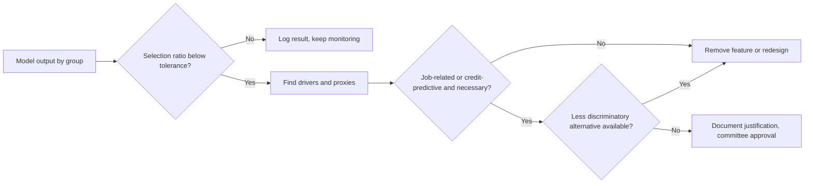
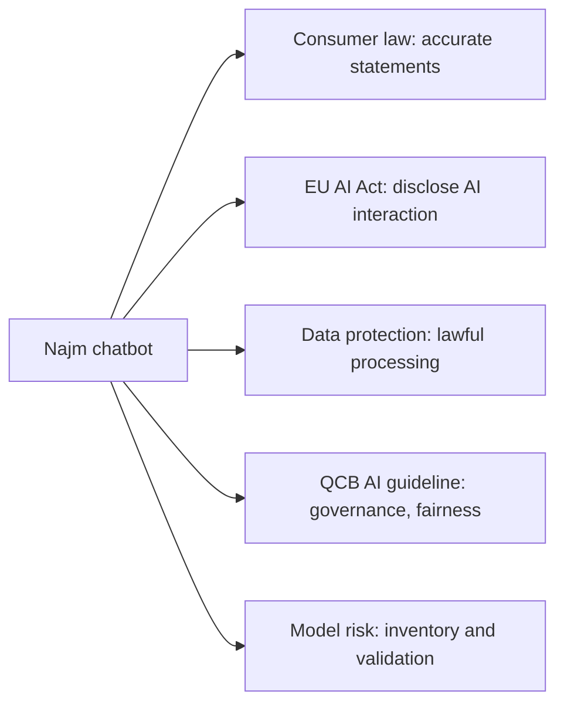

# Module 5 — Other laws that already apply

*"There is no AI law here yet" is one of the most expensive sentences in AI governance. Long before the EU AI Act, AI systems were already subject to anti-discrimination law, copyright and trade-secret law, consumer protection, product liability and financial regulation, and regulators and courts have been applying them. This module walks through those regimes using Najm Bank's CV-screening tool, credit model, chatbot and credit memo copilot, so you can spot the legal exposure an AI system carries on day one. It explains the law so you can govern well and answer exam questions; it is not legal advice, and for any real decision you should check the current text and take advice from qualified counsel in the relevant country.*

> **BoK coverage:** II.B — how non-discrimination, intellectual property, consumer protection, product liability and sector-specific laws apply to AI systems.

---

# 5.1 — Non-discrimination in hiring, credit and services
*Level: 🟡 Intermediate* · *Prerequisites: 1.2, 4.2* · *BoK: II.B*

## ⚡ In 60 seconds
- Anti-discrimination law is technology-neutral. If an AI system treats people less favourably because of a protected characteristic, or produces unjustified disadvantage for a protected group, the organisation using it can be liable.
- Two concepts do most of the work: **direct discrimination / disparate treatment** (using the characteristic, or an obvious stand-in, on purpose) and **indirect discrimination / disparate impact** (a neutral-looking rule that disadvantages a group and can't be justified).
- AI discriminates mostly through **proxies** (postcode, school, career gaps) and **biased training data**, not through an explicit "gender" field. Deleting the protected attribute doesn't fix it.
- In employment, the US has Title VII, the ADA and the ADEA, EEOC enforcement (the *iTutorGroup* settlement) and NYC Local Law 144's bias audits. In credit, ECOA and Regulation B require specific reasons for adverse action. The EU has equality directives and credit-specific rules.
- Exam cue: using a vendor's tool does not shift liability off the employer or lender. The biggest trap is treating "the model is accurate" as a defence to disparate impact.

## 🧭 Why it matters
In 2018 it was widely reported that Amazon had scrapped an experimental recruiting model. It had learned from ten years of CVs, mostly from men, and reportedly downgraded CVs containing the word "women's", as in "women's chess club captain". Nobody programmed it to prefer men. It learned the pattern from history. In 2023 the US Equal Employment Opportunity Commission (EEOC) settled its case against iTutorGroup, whose application software allegedly rejected female applicants aged 55 or older and male applicants aged 60 or older automatically. The settlement was reported at $365,000.

Najm's vendor CV-screening tool, bought by Yusuf, ranks applicants for branch roles in Doha, Dubai and Frankfurt. Layla's first quarterly test shows that women are shortlisted at 68% of the rate of men for operations roles, and that applicants with gaps of over a year are heavily penalised. Separately, Khalid's credit model approves applicants from two Doha districts at noticeably lower rates. The districts are strongly associated with particular nationalities. Neither model uses sex or nationality as an input. Both may still be discriminating, in law as well as in ethics.

## 📐 How it works

### 🟢 The essentials
**Protected characteristics.** Laws list the grounds on which people must not be treated unfairly. Common ones: sex, race and ethnic origin, colour, religion, national origin, age, disability, sexual orientation, pregnancy and marital status. The exact list and the covered sectors (employment, credit, housing, goods and services) vary by jurisdiction.

**Two ways to discriminate.**

| Concept | EU term | US term | What it looks like in AI |
|---|---|---|---|
| Intentional or explicit unequal treatment | Direct discrimination | Disparate treatment | A rule rejecting applicants over 55; a feature that directly encodes sex |
| Neutral rule, unequal effect | Indirect discrimination | Disparate impact | A "career gap" penalty that falls mostly on women; a postcode feature that tracks ethnicity |

Direct discrimination is generally unlawful unless a narrow exception applies. Indirect discrimination is unlawful unless the organisation can **objectively justify** it. In EU law that means a legitimate aim pursued by means that are appropriate and necessary. In US disparate-impact doctrine (from *Griggs v. Duke Power*, 1971), the employer must show the practice is job-related and consistent with business necessity, and the claimant can still win by showing a less discriminatory alternative was available.

**How AI discriminates.**
- **Historical bias:** training labels reflect past human decisions ("who was hired", "who got a loan").
- **Representation bias:** some groups are under-represented, so the model is less accurate for them.
- **Proxies:** features correlated with protected characteristics, such as postcode, first language, university, or gaps in employment.
- **Measurement bias:** the target is a poor stand-in for what you care about, like "performance rating" when ratings are themselves biased.
- **Deployment mismatch:** a model built for one population used on another.

**Measuring disparity.** A common first check is the **selection-rate ratio**: the selection rate of one group divided by that of the most favoured group. US federal guidelines on employee selection (the Uniform Guidelines, 1978) use a "four-fifths rule" of thumb: a ratio below 80% is generally treated as evidence of adverse impact. It is a screening heuristic, not a legal safe harbour. Najm's 68% ratio for women would fail it. Other metrics such as equal error rates and calibration are covered in Module 9.2.

### 🟡 Going deeper
**Employment in the US.**
- **Title VII of the Civil Rights Act of 1964** prohibits employment discrimination based on race, colour, religion, sex and national origin, covering both disparate treatment and disparate impact.
- The **Age Discrimination in Employment Act (ADEA)** protects workers aged 40 and over. *iTutorGroup* was an age case.
- The **Americans with Disabilities Act (ADA)** prohibits disability discrimination and requires reasonable accommodation. AI raises specific ADA risks: tools that screen out people with disabilities (a timed game-based test for someone with a motor impairment, or video analysis of facial expressions), and failure to offer an alternative assessment.
- The employer remains responsible when using a vendor's tool. In *Mobley v. Workday*, still being litigated at the time of writing, a court allowed claims to proceed on the theory that an AI vendor could itself be liable as an agent of employers. Watch that case; don't treat it as settled law.
- **Enforcement climate.** The EEOC issued technical assistance on AI in employment in 2022–2023. Some of it was removed from the agency's website in 2025, and a 2025 executive order directed federal agencies to deprioritise disparate-impact enforcement. The statutes, private lawsuits and state laws remain, so check the current position.

**NYC Local Law 144.** New York City's law on automated employment decision tools (AEDTs) has been enforced since July 2023. Employers and employment agencies using an AEDT to substantially assist decisions on candidates or employees for jobs in the city must:
- have an **independent bias audit** done within one year before use, calculating selection or scoring rates and **impact ratios** by sex and race/ethnicity categories, including intersectional categories;
- **publish a summary** of the audit results; and
- **notify candidates** in advance that an AEDT is used, with information about the qualifications assessed and how to request an alternative process or accommodation.

It requires disclosure and auditing; it doesn't set a pass mark. Other states and cities have followed with their own rules (for example Illinois on AI in employment, and Colorado's AI Act on high-risk decisions, with its effective date postponed to 30 June 2026). Check current status before relying on any.

**Credit in the US.**
- The **Equal Credit Opportunity Act (ECOA)**, implemented by **Regulation B**, prohibits discrimination in any aspect of a credit transaction on grounds including race, colour, religion, national origin, sex, marital status and age, and receipt of public assistance.
- When a creditor takes **adverse action** (declining, or offering worse terms), it must give the applicant a statement of the **specific principal reasons**. The Consumer Financial Protection Bureau (CFPB) has said that complex or "black-box" models are no excuse: creditors must give accurate, specific reasons, and can't simply pick the closest items from a sample checklist if those don't reflect the real drivers. Check the current status of CFPB guidance, as the Bureau's posture changed in 2025.
- The **Fair Housing Act** covers mortgage lending and housing-related decisions.
- The Apple Card episode (2019–2021) shows the reputational side. After public complaints that women got lower limits than their husbands, the New York Department of Financial Services investigated. Its 2021 report found no unlawful discrimination by the bank but criticised customer-service and transparency failures.

**The EU.**
- The **EU equality directives** set the core rules: the Race Equality Directive (2000/43/EC) covers employment and access to goods and services; the Employment Equality Framework Directive (2000/78/EC) covers religion or belief, disability, age and sexual orientation in employment; directives on sex equality cover employment (2006/54/EC) and goods and services (2004/113/EC). Each defines direct and indirect discrimination as above.
- In *Test-Achats* (2011), the CJEU struck down the exception that let insurers use sex as a pricing factor. It is a reminder that "actuarially accurate" is not the same as lawful.
- The **EU Charter of Fundamental Rights** prohibits discrimination and underpins the AI Act's fundamental-rights focus.
- For credit, the recast **Consumer Credit Directive (EU) 2023/2225** tightens creditworthiness assessment. At a high level it restricts the use of special category data, and where assessment involves automated processing it gives consumers rights to human intervention, an explanation and to contest. Member states apply it from late 2026; check national transposition.
- The **EU AI Act** treats AI for recruitment, selection and worker management, and creditworthiness assessment of natural persons, as high-risk (Annex III), bringing data-governance and bias-examination duties for providers and oversight duties for deployers (Module 6).
- In the UK, the **Equality Act 2010** plays the same role.

### 🔴 Expert view
**Fairness through unawareness fails.** Removing protected attributes ("unawareness") does not prevent discrimination when proxies exist, and it prevents you from measuring disparity. Mature programmes keep protected-attribute data, where lawful, in a separate, access-controlled store used only for testing. This creates a tension with privacy law (Module 4.1): in the EU, collecting ethnicity data needs an Art. 9 condition, and the AI Act's narrow bias-testing permission applies to providers of high-risk systems.

**Justification is a process, not a sentence.** To defend a disparity you need evidence that the feature is job-related or predictive for a legitimate aim, that you searched for less discriminatory alternatives (other features, other thresholds, other models with similar accuracy), and that you documented the trade-off. Research on "model multiplicity" shows there are often many models with near-identical accuracy but different disparities. That strengthens the argument that a less discriminatory alternative was available.

**Accuracy is not a defence by itself.** A model can accurately reproduce a discriminatory world. Courts and regulators ask whether the practice is justified and whether better alternatives exist, not only whether predictions are correct.

**Accommodation and alternatives.** Disability law often requires an individual alternative (a different test format or a human interview). Build the alternative route into the process, not as an afterthought.

**The GCC context.** Gulf labour and banking laws contain their own equal-treatment and consumer-fairness provisions, and national-workforce policies (such as Qatarisation targets) shape hiring lawfully. Any AI that implements such policies must do so openly and within the law, not through hidden proxies. Check local counsel on how equality rules apply to automated tools.

## ⚖️ The instruments
| Instrument | What it requires or recommends | Exam cue |
|---|---|---|
| **Title VII of the Civil Rights Act** | No employment discrimination by race, colour, religion, sex, national origin; disparate treatment and impact | Employer liable for vendor tools |
| **ADA** | No disability discrimination; reasonable accommodation | Offer alternatives to AI assessments |
| **NYC Local Law 144** | Independent bias audit within a year before use, published summary, candidate notice for AEDTs | Audit and disclose; no pass mark |
| **ECOA / Regulation B** | No credit discrimination; specific principal reasons for adverse action | "Black box" is no excuse for vague reasons |
| **EU equality directives** | Prohibit direct and indirect discrimination; objective justification test | Neutral features can still discriminate |
| **EU Consumer Credit Directive** — (EU) 2023/2225 | Stricter creditworthiness assessment; rights around automated assessment | Applies alongside GDPR Art. 22 |
| **EU AI Act** — Annex III | Employment and creditworthiness AI is high-risk; bias examination and oversight duties | Adds duties; doesn't replace equality law |

## 🏛️ In practice at Najm Bank
The AI Governance Committee adopts an **Adverse Impact Testing Standard** for all AI that affects hiring, credit or pricing.

| Element | Standard |
|---|---|
| Scope | CV screening, credit scoring, pricing, collections prioritisation |
| Groups tested | Sex, age band, nationality group, disability (where data is lawfully held), and intersections where sample sizes allow |
| Metrics | Selection-rate ratio; approval-rate ratio; false-positive and false-negative rates by group |
| Tolerance | Ratio below 0.80, or error-rate gap above an agreed threshold, triggers investigation |
| Data handling | Protected attributes held by the Data Office in a separate store, used only for testing, with DPO-approved legal basis per jurisdiction |
| Investigation | Driver analysis; proxy check; search for less discriminatory alternatives; documented justification |
| Vendor duty | Vendors must supply bias-testing evidence and support Najm's own testing (contract clause, Module 11.2) |
| Frequency | Before release, quarterly, and after any model or population change |
| Escalation | Head of AI Governance to Committee; unresolved issues block release |

**First result:** the CV tool's career-gap penalty is removed after driver analysis showed it drove most of the sex disparity without improving prediction of performance. The Doha district feature in the credit model is replaced with verified affordability data.

## 🛠️ Exercises
- 🟢 For the CV tool, list five features that could act as proxies for a protected characteristic, and name the characteristic each might proxy. *Done when:* each proxy has a plausible mechanism in one sentence.
- 🟡 With these figures, compute selection-rate ratios and say which fail the four-fifths rule of thumb: men 300 applied, 90 shortlisted; women 250 applied, 50 shortlisted; applicants 50+ 80 applied, 12 shortlisted; under 50 470 applied, 128 shortlisted. *Done when:* you have two ratios and a one-line conclusion for each.
- 🔴 Write the adverse-action reason text Najm would send to a US applicant (imagining a US branch) declined by the credit model, and explain how you derived the reasons so they satisfy Regulation B's "specific principal reasons" requirement. *Done when:* the reasons are specific, accurate to the model's real drivers, and understandable.

## ⚠️ Mistakes and exam traps
- **"We don't use protected attributes, so we can't discriminate."** Proxies and biased labels produce indirect discrimination. Pick the answer that tests outcomes.
- **"The vendor is responsible."** The employer or lender remains liable for decisions made with a bought tool. Contracts can allocate cost, not legal duty to affected people.
- **"The four-fifths rule is the legal standard."** It is a rule of thumb for flagging adverse impact, not a safe harbour.
- **"The model is accurate, so the disparity is justified."** Justification requires necessity and the absence of a less discriminatory alternative.
- **"NYC Local Law 144 bans biased tools."** It requires an independent audit, publication and notice; it doesn't set a pass threshold.
- **Generic adverse-action reasons.** Reasons must reflect the actual principal drivers of the decision.

## 🧾 Recap
- Discrimination law applies to AI without modification: direct/disparate treatment and indirect/disparate impact.
- Proxies and historical bias are the main mechanisms; unawareness is not a fix.
- US employment: Title VII, ADEA, ADA, EEOC enforcement, NYC LL144 audits. US credit: ECOA/Reg B with specific adverse-action reasons.
- EU: equality directives, Consumer Credit Directive, and the AI Act's high-risk regime for hiring and credit.
- Defending a disparity requires evidence of necessity and a documented search for less discriminatory alternatives.

## ✍️ Check yourself

**1. Najm's CV tool does not use sex as an input, but shortlists women at 68% of the rate of men. Which concept best describes the legal risk?**

- A. Direct discrimination
- B. Indirect discrimination / disparate impact
- C. No risk, because sex is not an input
- D. A data protection breach only

Answer

**B.** A neutral-seeming process that disadvantages a protected group is indirect discrimination (EU) or disparate impact (US), unlawful unless justified. C is the unawareness trap. (See 🟢 Two ways to discriminate.)

**2. Under NYC Local Law 144, what must an employer using an automated employment decision tool do?**

- A. Obtain approval from the city before use
- B. Ensure the tool's impact ratios are above 0.80
- C. Have an independent bias audit within one year before use, publish a summary of results, and notify candidates
- D. Use the tool only for internal promotions

Answer

**C.** The law requires audit, publication and notice. It sets no pass threshold (B) and needs no pre-approval (A). (See 🟡 NYC Local Law 144.)

**3. A US lender's model declines an applicant. The compliance team wants to send the standard reasons "insufficient income" and "credit history", although the main drivers were recent account behaviour and debt utilisation. What is the issue?**

- A. Regulation B requires the specific principal reasons actually behind the decision, even for complex models
- B. None; sample reasons are always acceptable
- C. Adverse-action notices are optional for AI models
- D. The lender must disclose the model's source code

Answer

**A.** Reasons must accurately reflect the real drivers. Complex models don't excuse vague or inaccurate reasons. D goes beyond what the rule requires. (See 🟡 Credit in the US.)

**4. In *EEOC v. iTutorGroup* (settled 2023), what was the alleged problem?**

- A. A chatbot gave wrong salary information
- B. A model was trained on copyrighted CVs
- C. A facial-analysis tool misidentified candidates' race
- D. Application software automatically rejected older applicants

Answer

**D.** The EEOC alleged the software automatically rejected female applicants 55 and older and male applicants 60 and older, which is age discrimination. (See 🧭 Why it matters.)

**5. Najm finds a disparity in its credit model driven by a district-of-residence feature. Which step is MOST important in deciding whether the disparity can be justified?**

- A. Showing the model's overall accuracy is high
- B. Showing the feature is necessary for a legitimate aim and that no less discriminatory alternative achieves similar performance
- C. Removing nationality from the training data
- D. Asking the vendor to confirm the model is fair

Answer

**B.** Justification turns on necessity and the absence of less discriminatory alternatives. Accuracy alone (A) is not a defence; C is already the case and doesn't solve proxies; D shifts nothing. (See 🔴 Justification is a process.)

## 📚 References
- US Equal Employment Opportunity Commission: https://www.eeoc.gov
- NYC Department of Consumer and Worker Protection (automated employment decision tools): https://www.nyc.gov/site/dca
- Consumer Financial Protection Bureau (ECOA, Regulation B): https://www.consumerfinance.gov
- EU law (equality directives 2000/43/EC, 2000/78/EC, 2004/113/EC, 2006/54/EC; Consumer Credit Directive 2023/2225): https://eur-lex.europa.eu
- EU AI Act, Regulation (EU) 2024/1689: https://eur-lex.europa.eu/eli/reg/2024/1689/oj
- Court of Justice of the EU (search C-236/09 *Test-Achats*): https://curia.europa.eu
- New York State Department of Financial Services: https://www.dfs.ny.gov

---

# 5.2 — Intellectual property in AI inputs and outputs
*Level: 🟡 Intermediate* · *Prerequisites: 3.2* · *BoK: II.B*

## ⚡ In 60 seconds
- IP questions arise on both sides of an AI system. **Inputs:** do you have the right to use the training data, prompts and documents the system processes? **Outputs:** who owns what the system generates, and could it infringe someone else's rights?
- In the EU, text and data mining (TDM) is permitted under the DSM Directive: Art. 3 for research organisations and cultural heritage institutions, Art. 4 for everyone else, but under Art. 4 rights holders can **opt out**, for online content by machine-readable means. The EU AI Act requires general-purpose AI model providers to respect those opt-outs and publish a summary of training content.
- In the US, whether training is **fair use** is being decided case by case. Early 2025 rulings pointed in different directions depending on the facts.
- Copyright generally requires **human authorship**. Purely AI-generated output may not be protected; human-directed, selected and edited work may be. AI cannot be named as an inventor on a patent in the major jurisdictions.
- Trade secrets and licences matter as much as copyright: staff pasting confidential material into public tools, and "open" model licences that carry use restrictions.

## 🧭 Why it matters
In 2023 Samsung engineers were reported to have pasted confidential source code and meeting notes into ChatGPT. The company then restricted staff use of generative AI tools. The problem wasn't copyright. It was trade secrets and confidentiality: information shared with a third-party service under consumer terms may be stored, reviewed or used for training, and protection for trade secrets depends on taking reasonable steps to keep them secret.

At Najm, three IP questions reach Layla in one week. Omar wants to fine-tune an open-weight model on the bank's internal credit policies and on market research reports the bank subscribes to. Marketing wants to use an image generator for a campaign and asks whether Najm will own the images. Relationship managers already paste client financials into a public chatbot to draft credit memos. Each needs a different answer, drawing on copyright, licensing, trade secrets and confidentiality law.

## 📐 How it works

### 🟢 The essentials
**The IP rights in play.**

| Right | Protects | AI touchpoints |
|---|---|---|
| Copyright | Original works: text, code, images, music, databases (in some systems) | Training data; outputs that reproduce works; ownership of outputs |
| Database right (EU) | Substantial investment in a database | Scraping and extracting from databases |
| Trade secrets | Commercially valuable information kept secret with reasonable steps | Model weights, training data, prompts; staff leaking confidential data into tools |
| Patents | Inventions | AI-assisted inventions; inventorship |
| Trademarks | Brand signs | Outputs reproducing logos; model names |
| Contract and licences | Whatever the parties agree | Dataset licences, model licences, API terms, subscription terms |

**Inputs: can we train on it?** Copying works into a training set is an act that copyright can control. Whether it is lawful depends on (a) a licence, (b) an exception such as TDM or fair use, or (c) the material being outside copyright. Contract terms can also restrict use even where copyright would not. A market research subscription may forbid "use in machine learning", for example.

**Outputs: who owns it, and could it infringe?** Two questions. Ownership: copyright law in most places protects works of human authorship, so unedited AI output may not be protected by copyright. Infringement: output can infringe if it reproduces protected expression from training data. Memorised passages, song lyrics, recognisable characters and logos are the classic risks.

### 🟡 Going deeper
**EU: text and data mining under the DSM Directive (EU) 2019/790.**
- **Art. 3** allows research organisations and cultural heritage institutions to carry out TDM for scientific research on works they have lawful access to. Rights holders cannot opt out.
- **Art. 4** allows anyone to make reproductions and extractions for TDM from lawfully accessible works, *unless the rights holder has expressly reserved the use* in an appropriate manner. For content made publicly available online, that means machine-readable means (for example in metadata or terms that machines can read; robots.txt-style signals are widely discussed). Copies may be kept only as long as needed for TDM.
- How opt-outs must be expressed is still being worked out in courts and in industry standards. German courts have already considered whether natural-language reservations in website terms can count. Treat the details as evolving.

**The EU AI Act's copyright duties for GPAI providers.** Providers of general-purpose AI models must put in place a policy to comply with EU copyright law, including identifying and respecting Art. 4 reservations using state-of-the-art technologies, and must publish a sufficiently detailed summary of the content used for training, following a template from the AI Office (published in 2025). The GPAI Code of Practice (July 2025) has a copyright chapter describing how signatories can meet these duties. For Najm, which *uses* and fine-tunes models rather than building foundation models, the practical questions are whether modifying a model could make it a provider (Module 6.3), and whether its vendors comply.

**US: fair use.** US copyright law has no TDM exception; the question is whether training is fair use, weighing four factors: purpose and character of the use (including whether it is transformative and commercial), the nature of the work, the amount used, and the effect on the market for the work. At the time of writing:
- In *Thomson Reuters v. Ross Intelligence* (2025), a court found that copying headnotes to build a competing, non-generative legal search tool was not fair use.
- In 2025, two courts in California (*Bartz v. Anthropic* and *Kadrey v. Meta*) found training generative models on books to be fair use on the facts before them, while drawing lines. In *Bartz*, the court distinguished lawfully acquired books from pirated copies.
- Many cases, including *The New York Times v. OpenAI and Microsoft*, remain pending. In the UK, *Getty Images v. Stability AI* reached a High Court judgment in late 2025, largely on narrow issues. Courts in Germany have also begun ruling on memorisation of song lyrics.

The exam doesn't expect you to predict outcomes. It expects you to know the frameworks (EU exceptions with opt-outs; US fair-use factors) and that the law is unsettled. The US Copyright Office has published a multi-part report on copyright and AI, covering digital replicas, copyrightability, and training (released in pre-publication form in 2025).

**Authorship of outputs.**
- **US:** the Copyright Office registers only human-authored material. In *Thaler v. Perlmutter* (D.C. Circuit, 2025), the court upheld refusal to register a work listing an AI system as sole author. For AI-assisted works, the human's selection, arrangement and modifications can be protected; prompts alone generally are not enough, according to the Office's 2025 guidance. The *Zarya of the Dawn* decision (2023) protected the human-written text and arrangement of a comic book but not the AI-generated images.
- **EU:** protection requires the author's "own intellectual creation", which is understood to require human creative choices.
- **UK:** the Copyright, Designs and Patents Act 1988 has a special rule for "computer-generated works" with no human author, attributing authorship to the person who made the necessary arrangements. The UK government has consulted on changing this; check the current position.
- **China:** Chinese courts have granted protection to some AI-assisted images where the human's choices were significant.
- **Patents:** in the DABUS cases, the UK Supreme Court (2023), US courts and the European Patent Office held that an inventor must be a natural person. AI-assisted inventions with a human inventor can still be patented.

**Trade secrets.** The EU Trade Secrets Directive (EU) 2016/943 and the US Defend Trade Secrets Act protect information that has commercial value because it is secret and that is subject to reasonable steps to keep it secret. AI creates risk in both directions. Your secrets can leak into third-party tools, or be extracted from your model. Others' secrets can enter your systems through employees or data. An acceptable-use policy for GenAI, enterprise agreements with no-training and confidentiality terms, and technical controls are the "reasonable steps".

### 🔴 Expert view
**Model licences are not all "open source".** Licences range widely:

| Licence type | Examples | Governance point |
|---|---|---|
| Permissive open source | Apache 2.0, MIT | Few restrictions; keep notices; Apache 2.0 includes a patent licence |
| Open-weight with use restrictions | Meta's Llama community licences; responsible-AI licences (RAIL family) | Acceptable-use policies, field-of-use limits and, for Llama, conditions for very large services; not "open source" in the Open Source Initiative's sense |
| Proprietary API terms | Commercial model providers' terms | Check training on your data, output ownership, indemnities, usage limits |

The Open Source Initiative published an Open Source AI Definition (1.0) in 2024, requiring enough information about training data plus code and weights under OSI-approved terms. Many "open" models don't meet it. The EU AI Act gives some exemptions to models released under free and open-source licences, but not for GPAI models with systemic risk. The terms of the licence matter for which exemptions apply.

**Contracts are the main risk allocation tool.** Buyers of GenAI services should look for: no training on customer inputs; confidentiality and data-location commitments; clarity that outputs belong to the customer as between the parties; IP indemnities for outputs (several major providers offer these, with conditions such as using built-in filters); and warranties about training data rights. Module 11.2 builds the clause set.

**Output controls.** Reduce infringement risk with filters for known copyrighted text and code, citation of sources in retrieval-augmented systems, human review of published content, and restrictions on prompts asking for "in the style of" living artists or reproductions of specific works for commercial use.

**Your own data and IP.** Fine-tuning on subscription content (such as market research reports) is mostly a contract question: read the licence. Fine-tuning on Najm's own policies is fine from an IP view, but the resulting model and prompts become trade secrets worth protecting.

## ⚖️ The instruments
| Instrument | What it requires or recommends | Exam cue |
|---|---|---|
| **EU DSM Copyright Directive** — Arts 3–4 | TDM exceptions: research (no opt-out) and general (rights-holder opt-out, machine-readable for online content) | Art. 4 opt-out is the key EU training question |
| **EU AI Act** — Art. 53 | GPAI providers: copyright-compliance policy respecting opt-outs; public summary of training content | Applies to model providers, not every user |
| **US Copyright Act** — fair use | Four-factor test for unlicensed uses including training | Case by case; unsettled |
| **US Copyright Office guidance** | Human authorship required; AI-assisted works protected to the extent of human contribution | Prompts alone generally not enough |
| **EU Trade Secrets Directive** — (EU) 2016/943 | Protection requires reasonable steps to keep information secret | GenAI acceptable-use policy is a "reasonable step" |
| **Open Source AI Definition** | OSI definition of open-source AI (2024) | "Open weights" does not mean open source |

## 🏛️ In practice at Najm Bank
Layla issues an **AI Intellectual Property Clearance Checklist**, required before any training, fine-tuning or external publication of AI output.

| # | Check | Owner | Omar's fine-tuning request |
|---|---|---|---|
| 1 | List every data source and its legal basis for use: owned, licensed, exception, public domain | Data Office | Internal policies: owned. Market research: licensed |
| 2 | Read licence terms for AI/ML restrictions | Legal | Research licence **prohibits** ML use; excluded pending renegotiation |
| 3 | Check model licence: type, use restrictions, attribution, thresholds | Legal and procurement (Yusuf) | Open-weight licence with acceptable-use policy; compatible with internal use |
| 4 | Confirm vendor terms: no training on Najm data, confidentiality, output ownership, indemnity | Procurement | N/A (self-hosted) |
| 5 | Classify outputs: internal draft, customer-facing, published | Business owner | Internal drafts only |
| 6 | Output controls for published content: human review, similarity check, no living-artist style prompts | Marketing | N/A |
| 7 | Protect resulting assets as trade secrets: access control, logging | IT security | Fine-tuned weights restricted to credit team |

**Committee decision:** public chatbot use with client data is prohibited. Relationship managers get the enterprise copilot with contractual no-training and confidentiality terms.

## 🛠️ Exercises
- 🟢 For each IP right in the essentials table, write one AI risk Najm faces and one control. *Done when:* you have six risk–control pairs.
- 🟡 Marketing wants to publish AI-generated campaign images. Draft a one-page guidance note covering ownership (can Najm register copyright?), infringement risk and required controls. *Done when:* the note distinguishes pure AI output from human-edited work and names at least three controls.
- 🔴 Compare the licence terms of two open-weight models (read the licences on their official pages) against Najm's intended use in the credit memo copilot. *Done when:* you have a table of restrictions, attribution duties and any user-number or field-of-use conditions, with a go/no-go recommendation.

## ⚠️ Mistakes and exam traps
- **"It's on the internet, so we can train on it."** Public availability isn't a licence. In the EU, Art. 4 TDM applies only where no opt-out was made; in the US, fair use is case by case.
- **"We own everything our AI produces."** Copyright generally requires human authorship; contracts can allocate rights between parties but can't create copyright that doesn't exist.
- **"Open weights means open source."** Many model licences carry use restrictions. Read them.
- **"Copyright is the only IP risk."** Trade secrets and contract terms often cause the real problems, as the Samsung episode showed.
- **"The AI Act's copyright duties apply to all deployers."** They apply to GPAI model providers. Deployers manage their own risk through contracts and controls.
- **"AI can be listed as an inventor."** Major patent offices and courts require a natural-person inventor.

## 🧾 Recap
- IP risk sits on inputs (right to use data) and outputs (ownership and infringement).
- EU: TDM exceptions in Arts 3–4 of the DSM Directive; Art. 4 allows opt-outs; the AI Act requires GPAI providers to respect them and publish training summaries.
- US: fair use for training is unsettled, with early 2025 rulings going different ways on different facts.
- Human authorship is required for copyright; AI can't be a patent inventor.
- Trade secrets, licences and contracts are practical control points: acceptable-use policy, enterprise terms, licence review.

## ✍️ Check yourself

**1. Under the EU DSM Directive, a commercial company wants to mine publicly available online articles to train a model. What determines whether the Art. 4 exception is available?**

- A. Whether the company is a research organisation
- B. Whether the articles are older than five years
- C. Whether it has lawful access and the rights holder has not expressly reserved TDM use by appropriate, machine-readable means
- D. Whether the model will be open source

Answer

**C.** Art. 4 covers any user with lawful access, subject to rights-holder reservations. A describes Art. 3. B and D are irrelevant. (See 🟡 EU: text and data mining.)

**2. Najm's marketing team generated a campaign image entirely with an AI tool, with a one-line prompt and no edits. Under the US Copyright Office's approach, what is most likely?**

- A. The image is likely not protected by copyright because it lacks human authorship
- B. The tool provider owns copyright
- C. Najm owns copyright because it paid for the tool
- D. The prompt writer is the author of the image

Answer

**A.** Protection requires human authorship; a prompt alone is generally not enough. Contracts may allocate whatever rights exist between the parties, but can't create copyright. (See 🟡 Authorship of outputs.)

**3. Which obligation does the EU AI Act place on providers of general-purpose AI models regarding copyright?**

- A. Obtain a licence for every training work
- B. Pay a levy to collecting societies
- C. Register all outputs with the EU IP Office
- D. Put in place a copyright-compliance policy, including respecting TDM opt-outs, and publish a sufficiently detailed summary of training content

Answer

**D.** Those are the two copyright-related duties. The Act doesn't require licensing every work (A), registration (C) or a levy (B). (See 🟡 The EU AI Act's copyright duties.)

**4. A relationship manager pastes a client's confidential financial statements into a public consumer chatbot. Which legal concern is MOST directly engaged?**

- A. Patent infringement
- B. Loss of trade-secret and confidentiality protection, plus breach of client confidentiality duties
- C. Moral rights of the chatbot provider
- D. Trademark dilution

Answer

**B.** Sharing confidential information with a third-party service can undermine the "reasonable steps" trade-secret protection needs, and breaches duties of confidentiality. (See 🧭 and 🟡 Trade secrets.)

**5. Omar proposes to use a model released under a community licence with an acceptable-use policy and conditions for very large services. Which statement is correct?**

- A. It may be "open weight" but carries licence restrictions that must be checked against Najm's use
- B. It is open source, so there are no restrictions
- C. Model licences are unenforceable
- D. Only the EU AI Act governs model use

Answer

**A.** Open-weight licences often include use restrictions and conditions; they may not meet the OSI's Open Source AI Definition. (See 🔴 Model licences.)

## 📚 References
- DSM Directive (EU) 2019/790: https://eur-lex.europa.eu/eli/dir/2019/790/oj
- EU AI Act, Regulation (EU) 2024/1689: https://eur-lex.europa.eu/eli/reg/2024/1689/oj
- European Commission, AI Office and GPAI Code of Practice: https://digital-strategy.ec.europa.eu
- US Copyright Office, copyright and artificial intelligence: https://www.copyright.gov/ai/
- Trade Secrets Directive (EU) 2016/943: https://eur-lex.europa.eu/eli/dir/2016/943/oj
- World Intellectual Property Organization, AI and IP: https://www.wipo.int
- Open Source Initiative: https://opensource.org

---

# 5.3 — Consumer protection, product liability and sector rules
*Level: 🟡 Intermediate* · *Prerequisites: 1.2, 4.2* · *BoK: II.B*

## ⚡ In 60 seconds
- Consumer protection law bans unfair and deceptive practices. It applies to what an AI system says to customers and to what a company says *about* its AI. In the US, the FTC enforces section 5 of the FTC Act; in the EU, the Unfair Commercial Practices Directive does similar work.
- A company is responsible for its chatbot. In *Moffatt v. Air Canada* (2024), a tribunal held the airline liable for its website chatbot's wrong statement about bereavement fares.
- The new EU **Product Liability Directive (EU) 2024/2853** expressly treats software, including AI systems, as a product, with no-fault liability for defective products causing damage. The proposed **AI Liability Directive** was withdrawn in 2025.
- Sector regulators apply existing rules to AI. For banks, model risk management (the US **SR 11-7**, the UK PRA's SS1/23), EU banking guidance, and central-bank AI guidance such as **QCB**'s for Qatari financial institutions.
- Exam cue: "AI washing" (overstating AI capabilities) is deception. The biggest trap is thinking a disclaimer or "the bot is a separate entity" shifts liability away from the company.

## 🧭 Why it matters
In 2022, Jake Moffatt asked Air Canada's website chatbot about bereavement fares after a death in his family. The chatbot told him he could buy a full-price ticket and apply for the bereavement discount afterwards. The airline's actual policy, on another page of the same website, said the opposite. When Air Canada refused the refund, it argued in part that the chatbot was responsible for its own actions. British Columbia's Civil Resolution Tribunal rejected that argument in 2024. The chatbot was part of Air Canada's website, the airline was responsible for all information on it, and it had not taken reasonable care. The damages were small; the principle was not.

Najm's customer-service chatbot answers questions about fees, early-repayment charges and Sharia-compliant products. Khalid's marketing team wants to advertise "AI-powered instant approvals" for personal loans, though most applications still go to manual review. The fraud model blocks cards automatically. And the Qatar Central Bank expects Najm, as a licensed institution, to govern AI under its guidance. This lesson covers the laws that turn those facts into liability.

## 📐 How it works

### 🟢 The essentials
**Consumer protection basics.** Consumer protection law generally prohibits:
- **Deceptive practices:** statements or omissions likely to mislead a reasonable consumer about something material, for example about price, features or rights.
- **Unfair practices:** conduct causing substantial harm that consumers can't reasonably avoid and that isn't outweighed by benefits (the US test); or practices contrary to professional diligence that distort consumer behaviour (the EU test).

Applied to AI, two kinds of risk arise:

| Risk | Example | Why it matters |
|---|---|---|
| What the AI tells customers | Chatbot misstates a fee, a right or a policy | The company is bound by, or liable for, its channel's statements |
| What the company says about its AI | "AI-powered instant approvals" when most aren't; "unbiased AI"; "guaranteed accuracy" | Unsubstantiated claims are deceptive ("AI washing") |
| How the AI treats customers | Dark patterns; manipulative personalisation; unfair automated blocking without recourse | Unfairness and, in the EU, AI Act prohibitions on manipulative techniques |

**Product liability basics.** Product liability makes producers liable for damage caused by defective products, typically without proof of fault ("strict" or no-fault liability). The victim proves the defect, the damage and the causal link. The question for AI has been whether software counts as a "product". The EU has now answered yes.

**Sector rules.** Regulated sectors, such as banking, insurance, health and transport, have supervisors who apply existing requirements (risk management, conduct, outsourcing, operational resilience) to AI and increasingly issue AI-specific guidance.

### 🟡 Going deeper
**The FTC and AI in the US.** The Federal Trade Commission uses section 5 of the FTC Act (unfair or deceptive acts or practices) against AI-related conduct. Recurring themes:
- **Deceptive AI claims.** In the 2024 "Operation AI Comply" sweep, the FTC took action against companies over AI claims, including DoNotPay's marketing of a "robot lawyer".
- **Unfair use of AI.** In 2023 the FTC's order against Rite Aid banned it from using facial-recognition surveillance for five years. The FTC alleged the system produced false matches that disproportionately affected some groups, and that the company failed to test, monitor and train staff.
- **Algorithmic disgorgement.** In cases such as Everalbum (2021) and Weight Watchers/Kurbo (2022), orders required deletion of models and algorithms built with improperly obtained data. A remedy that can wipe out the value of an AI system.
- FTC priorities shift with leadership; the section 5 framework remains. State attorneys general enforce state consumer-protection ("UDAP") laws too.

**The EU consumer framework.** The **Unfair Commercial Practices Directive (2005/29/EC)** prohibits misleading and aggressive practices and practices contrary to professional diligence. It applies to AI-generated content and AI-driven personalisation. The EU AI Act adds transparency duties: people must be informed when they are interacting with an AI system unless that is obvious from the context (Art. 50), and manipulative or exploitative AI techniques that cause significant harm are prohibited (Art. 5). The Digital Services Act adds duties for online platforms.

***Moffatt v. Air Canada* (2024).** Lessons for governance:
1. A chatbot on your channel speaks for you. "It's a separate entity" failed.
2. Contradictory information elsewhere on the site didn't help. The customer couldn't be expected to double-check.
3. The claim was negligent misrepresentation: the company owed a duty of care in the accuracy of its representations.
4. Controls that would have helped: grounding the bot in the authoritative policy source, testing on policy questions, escalation to humans for fee and refund topics, and honouring the bot's statements while fixing the defect.

**The EU Product Liability Directive (EU) 2024/2853.** It replaces the 1985 directive. Member states must transpose it by December 2026, and it applies to products placed on the market after that date. Key points for AI:
- **Software is a product**, whether embedded or standalone, and whether supplied on a device or through the cloud. AI systems are expressly in scope. Free and open-source software developed or supplied outside a commercial activity is excluded.
- **Defectiveness** considers the safety people are entitled to expect, including the effect of a product's ability to keep learning after deployment, cybersecurity requirements, and the manufacturer's control through updates. A failure to provide security updates can make a product defective.
- **Damage** covers death, personal injury (including medically recognised psychological harm), damage to property, and the destruction or corruption of data not used for professional purposes. Pure economic loss, such as a wrongly declined loan, is not covered by the PLD itself.
- **Disclosure and presumptions.** Courts can order defendants to disclose relevant evidence. Defectiveness or causation can be presumed in some cases, for example where the defendant fails to disclose, or where technical or scientific complexity makes proof excessively difficult.
- **Who is liable.** Manufacturers, including those who substantially modify a product, and in some cases importers, authorised representatives, fulfilment service providers and distributors.

**The AI Liability Directive: withdrawn.** The Commission proposed an AI Liability Directive in 2022 to ease fault-based claims involving AI (disclosure and presumptions of causality). It announced the withdrawal in its 2025 work programme, and the proposal was withdrawn. The exam may test that the PLD is adopted and the AILD is not. Fault-based claims continue under national tort law.

**US product liability** remains state tort law, with an open debate over whether software and AI outputs are "products". Some courts have let product-liability theories against AI chatbot providers proceed past early stages. Check current case law.

### 🔴 Expert view
**Model risk management in banking.** The US **SR 11-7** (Federal Reserve, 2011, adopted by the OCC as Bulletin 2011-12), *Supervisory Guidance on Model Risk Management*, is the classic reference. It defines a **model** broadly as a quantitative method that processes inputs into estimates, and says model risk comes from fundamental errors and from inappropriate use. Its pillars:

| Pillar | What it requires | AI extension |
|---|---|---|
| Development and implementation | Sound design, data quality, testing, documentation | Data lineage, feature governance, GenAI prompt and retrieval design |
| Validation | Independent **effective challenge**: conceptual soundness, ongoing monitoring, outcomes analysis | Bias testing, explainability, robustness, red-teaming |
| Governance | Board and senior-management oversight, policies, **model inventory**, roles, internal audit | Inventory includes vendor and GenAI systems |

"Effective challenge" means critical analysis by objective, informed people with the influence to make change happen. It's the banking root of the human-oversight idea. Vendor models are in scope: banks must understand and validate what they buy.

Related supervisory expectations:
- **UK PRA SS1/23** (model risk management principles for banks, effective 2024) applies to models including AI and covers model identification, governance, development, validation and risk mitigants.
- **EU:** the EBA's *Guidelines on loan origination and monitoring* (2020) set expectations for automated models in creditworthiness assessment, including understanding and controlling them. **DORA** (Digital Operational Resilience Act, Regulation (EU) 2022/2554, applying from January 2025) governs ICT risk and third-party ICT providers, including AI services. The AI Act integrates some high-risk obligations for financial institutions into existing banking governance.
- **Singapore:** the Monetary Authority of Singapore's FEAT principles (2018) on fairness, ethics, accountability and transparency in financial AI.
- **Insurance (US):** the NAIC model bulletin on insurers' use of AI (2023), adopted by many states.

**Qatar and the GCC.** The Qatar Central Bank has issued an AI guideline for the financial institutions it regulates. It sets expectations on governance and accountability, risk management across the AI life cycle, fairness, transparency to customers, data management, human oversight and third-party AI. Read the current text from QCB directly for exact requirements; don't rely on summaries, including this one. Other Gulf financial regulators, including those in the UAE's onshore and free-zone systems and Saudi Arabia, have published AI principles, guidance or consultations for their sectors, alongside national AI ethics frameworks. Check each regulator's current position.

**Putting it together: one system, many regimes.** Najm's chatbot is subject to consumer law (misstatements), the AI Act (disclose that it is AI; for EU customers), data protection (Module 4), QCB guidance, and potentially product liability if it were embedded in a product causing covered damage. Governance should map each system against every regime, not only the AI Act.

## ⚖️ The instruments
| Instrument | What it requires or recommends | Exam cue |
|---|---|---|
| **FTC Act** — s.5 | Prohibits unfair or deceptive acts or practices; basis for AI enforcement | AI washing, unfair AI use, algorithmic disgorgement |
| **EU Unfair Commercial Practices Directive** — 2005/29/EC | Prohibits misleading, aggressive and unfair practices | Applies to AI-driven marketing and chatbots |
| **EU Product Liability Directive** — (EU) 2024/2853 | No-fault liability for defective products, now including software and AI; disclosure and presumptions | Software is a product; pure economic loss not covered |
| **EU AI Liability Directive (withdrawn)** | Proposed 2022 fault-based rules; withdrawn 2025 | Not in force |
| **SR 11-7** | US model risk management: development, validation with effective challenge, governance and inventory | Applies to vendor and AI models |
| **PRA SS1/23** | UK model risk management principles for banks | Covers AI models |
| **QCB AI guideline** | Qatar Central Bank expectations for AI at regulated financial institutions | Najm's home supervisor; read the current text |

## 🏛️ In practice at Najm Bank
Layla's team adds an **AI Customer-Facing Controls Standard** and extends the model risk policy.

**Chatbot controls (post-*Moffatt* review):**

| Control | Requirement | Owner |
|---|---|---|
| Disclosure | Clear notice that the customer is chatting with an AI assistant, plus a route to a human | Digital channels |
| Grounding | Answers on fees, charges, rights and product terms must come only from the approved product-terms knowledge base | Dana |
| Restricted topics | Complaints, bereavement, hardship, disputes: hand off to a human | Customer service |
| Testing | Pre-release and monthly test suite of 300 policy questions; accuracy threshold agreed by Committee | Model validation |
| Statement honouring | If the bot misstates terms to the customer's detriment, the bank honours the statement where reasonable and logs an incident | Khalid |
| Marketing claims | Any claim about AI ("instant", "unbiased", "accurate") needs evidence approved by Compliance | Marketing and Compliance |

**Committee decision:** the "AI-powered instant approvals" campaign is rejected as unsubstantiated. Approved wording: "Apply online in minutes; many applications get a decision the same day."

**Model risk policy extension:** every AI system, including vendor tools and GenAI, is registered in the model inventory, tiered by materiality, and independently validated before use. Validation covers conceptual soundness, performance, bias, explainability, robustness and, for GenAI, hallucination and prompt-injection testing. The policy is cross-referenced to the QCB AI guideline and, for the Frankfurt branch, to EBA and AI Act requirements.

## 🛠️ Exercises
- 🟢 List five marketing claims a bank might make about AI and rewrite each so it is substantiated or removed. *Done when:* each rewrite states what evidence would support it.
- 🟡 Apply the *Moffatt* lessons to Najm's chatbot: write a one-page incident playbook for when the bot gives a customer wrong information about a fee. *Done when:* the playbook covers customer remedy, root cause, fix, re-test and reporting.
- 🔴 Map the fraud-detection model against SR 11-7-style pillars and against the QCB AI guideline (read it from QCB's site). Identify three gaps and a remediation for each. *Done when:* each gap cites the pillar or guideline theme, the evidence missing, and an owner.

## ⚠️ Mistakes and exam traps
- **"The chatbot made the mistake, not us."** Organisations are responsible for their AI channels (*Moffatt*). Disclaimers rarely cure a misleading specific statement.
- **"Our AI is unbiased" as a marketing line.** Unsubstantiated AI claims are deceptive. Pick the answer that requires evidence.
- **"Software isn't a product."** Under the EU PLD 2024/2853, software including AI is a product.
- **"The AI Liability Directive will apply."** It was withdrawn in 2025. The adopted instrument is the new PLD.
- **"The PLD covers any loss caused by AI."** It covers death, personal injury, property damage and loss of non-professional data, not pure economic loss.
- **"Model risk rules are only for traditional statistical models."** SR 11-7's definition is broad; supervisors apply it to machine learning, vendor and GenAI models.

## 🧾 Recap
- Consumer protection covers what AI says, what companies say about AI, and how AI treats customers.
- *Moffatt v. Air Canada*: the company is liable for its chatbot's statements.
- The FTC enforces section 5 against AI washing and unfair AI use, with remedies up to algorithmic disgorgement.
- The EU PLD (2024/2853) brings software and AI into no-fault product liability; the AILD was withdrawn.
- Banking regulators apply model risk management (SR 11-7, PRA SS1/23, EBA guidance) and AI-specific guidance such as QCB's to AI systems.

## ✍️ Check yourself

**1. In *Moffatt v. Air Canada* (2024), what did the tribunal decide?**

- A. The chatbot was a separate legal entity responsible for its own statements
- B. The customer should have checked the policy page, so the airline was not liable
- C. The airline was liable for negligent misrepresentation by its website chatbot
- D. Chatbots cannot make binding statements

Answer

**C.** The tribunal held the airline responsible for all information on its website, including the chatbot. It rejected A and B. (See 🟡 *Moffatt v. Air Canada*.)

**2. Which statement about EU liability law for AI is correct at the time of writing?**

- A. The AI Liability Directive is in force and the PLD excludes software
- B. Only the AI Act creates liability for AI harm
- C. Both directives were withdrawn
- D. The new Product Liability Directive covers software including AI; the proposed AI Liability Directive was withdrawn

Answer

**D.** PLD (EU) 2024/2853 expressly covers software and AI; the AILD proposal was withdrawn in 2025. (See 🟡 Product Liability Directive.)

**3. Najm's marketing team wants to advertise "unbiased AI credit decisions". What is the best governance response?**

- A. Approve; AI is inherently objective
- B. Approve with a small-print disclaimer
- C. Reject unless the claim is substantiated by evidence, since unsubstantiated AI claims can be deceptive
- D. Refer it to the data protection officer only

Answer

**C.** Claims about AI must be truthful and substantiated. "AI washing" is a consumer-protection enforcement theme. A disclaimer (B) doesn't cure a misleading headline claim. (See 🟡 The FTC and AI.)

**4. Under SR 11-7, what does "effective challenge" mean?**

- A. Customers' right to contest model decisions
- B. Critical analysis of models by objective, informed parties with enough influence to make change happen
- C. Penetration testing of model infrastructure
- D. Annual external audit of the model inventory

Answer

**B.** Effective challenge is the core of independent validation. A is a GDPR/consumer concept, not SR 11-7's. (See 🔴 Model risk management.)

**5. A wrongly calibrated AI credit model causes a customer to be declined a loan, leading to financial loss. Which is correct under the new EU PLD?**

- A. The PLD doesn't cover pure economic loss; other routes (contract, consumer, data protection, national tort law) may apply
- B. The customer can claim for the pure economic loss under the PLD
- C. The PLD doesn't apply to any software
- D. The bank is automatically liable under the AI Liability Directive

Answer

**A.** The PLD covers death, personal injury, property damage and loss of non-professional data, not pure economic loss. C is wrong since software is covered, and D cites a withdrawn proposal. (See 🟡 Product Liability Directive.)

## 📚 References
- US Federal Trade Commission (AI guidance and cases): https://www.ftc.gov
- Unfair Commercial Practices Directive 2005/29/EC: https://eur-lex.europa.eu/eli/dir/2005/29/oj
- Product Liability Directive (EU) 2024/2853: https://eur-lex.europa.eu/eli/dir/2024/2853/oj
- EU AI Act, Regulation (EU) 2024/1689: https://eur-lex.europa.eu/eli/reg/2024/1689/oj
- Civil Resolution Tribunal of British Columbia (search *Moffatt v. Air Canada*, 2024): https://civilresolutionbc.ca
- Federal Reserve, SR 11-7 Supervisory Guidance on Model Risk Management: https://www.federalreserve.gov/supervisionreg/srletters/sr1107.htm
- Bank of England Prudential Regulation Authority (SS1/23): https://www.bankofengland.co.uk
- European Banking Authority (Guidelines on loan origination and monitoring): https://www.eba.europa.eu
- Qatar Central Bank: https://www.qcb.gov.qa
- Monetary Authority of Singapore: https://www.mas.gov.sg
