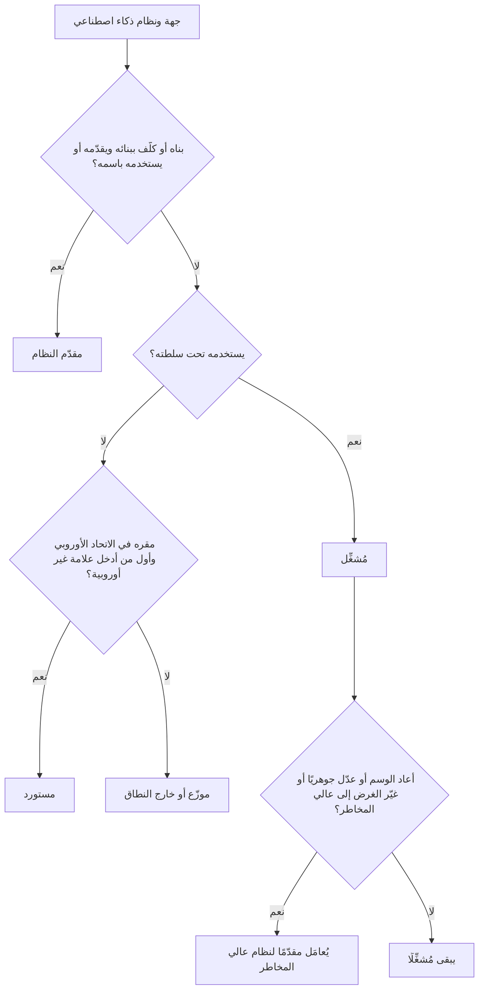

# الوحدة 6 — قانون الذكاء الاصطناعي الأوروبي (EU AI Act)

*قانون الذكاء الاصطناعي الأوروبي (EU AI Act) هو أول قانون شامل وأفقي (horizontal) يُكتب للذكاء الاصطناعي، ويعامله امتحان AIGP بوصفه النقطة المرجعية لكل ما عداه. يقع المقر الرئيسي لبنك نجم (Najm Bank) في الخليج، لكن فرعه في فرانكفورت وعملاءه في الاتحاد الأوروبي يُدخلون نموذج الائتمان (credit model)، وأداة فرز السير الذاتية (CV-screening tool) المشتراة من مورّد، وروبوت المحادثة (chatbot)، والمساعد الذكي بالذكاء الاصطناعي التوليدي (GenAI copilot) في نطاق القانون. تغطي هذه الوحدة القانون في ثلاث مراحل: النطاق والأدوار ومستويات المخاطر (6.1)؛ وما يجب على مقدّمي النظام (providers) والمُشغِّلين (deployers) للأنظمة عالية المخاطر (high-risk) فعله (6.2)؛ والذكاء الاصطناعي للأغراض العامة والشفافية والإنفاذ والجدول الزمني (6.3). يختبر الامتحان القانون كما اعتُمد في اللائحة (EU) 2024/1689، لذا فهذا ما ندرّسه، مع التنبيه إلى التطورات اللاحقة. هذه الدورة تعليمية وليست استشارة قانونية: في القرارات الفعلية، اقرأ النص الساري واستشر محاميًا مؤهَّلًا.*

> **تغطية مجال المعرفة (BoK coverage):** II.C — نطاق قانون الذكاء الاصطناعي الأوروبي وأدواره ومستويات المخاطر فيه؛ والتزامات الأنظمة عالية المخاطر على مقدّمي النظام والمُشغِّلين؛ والقواعد الخاصة بنماذج الذكاء الاصطناعي للأغراض العامة والشفافية؛ والحوكمة والعقوبات والجدول الزمني للتطبيق.

---

# 6.1 — النطاق والأدوار وهرم المخاطر
*المستوى: 🟡 متوسط* · *المتطلبات: 1.1، 4.1* · *مجال المعرفة (BoK): II.C*

## ⚡ الدرس في دقيقة

- قانون الذكاء الاصطناعي الأوروبي (EU AI Act) (اللائحة (EU) 2024/1689) لائحة أوروبية واجبة التطبيق مباشرةً، نافذة منذ 1 أغسطس 2024 وتُطبَّق على مراحل. وهو يستخدم آليات سلامة المنتجات (المتطلبات، وتقييم المطابقة (conformity assessment)، وعلامة CE (CE marking)، ومراقبة السوق (market surveillance)) لحماية الصحة والسلامة والحقوق الأساسية (fundamental rights).
- يمتد أثره خارج الاتحاد الأوروبي: فمقدّمو النظام (providers) في أي مكان ممن يطرحون ذكاءً اصطناعيًا في سوق الاتحاد الأوروبي مشمولون، وكذلك مقدّمو النظام والمُشغِّلون (deployers) في أي مكان إذا كانت *مخرجات نظامهم تُستخدم في الاتحاد الأوروبي*.
- تتبع الواجباتُ **الأدوارَ (roles)**. يتحمل **مقدّم النظام** معظمها؛ ويتحمل **المُشغِّل** مجموعة أخف لكنها حقيقية؛ وللمستوردين (importers) والموزّعين (distributors) والممثلين المفوَّضين (authorised representatives) ومصنّعي المنتجات (product manufacturers) واجباتهم الخاصة.
- أربعة مستويات: **المحظور (prohibited)** (المادة 5 (Art. 5))، و**عالي المخاطر (high-risk)** (المادة 6 (Art. 6) مع الملحقين I وIII)، و**الشفافية (transparency)** (المادة 50 (Art. 50))، و**الحد الأدنى (minimal)**. ولنماذج الذكاء الاصطناعي للأغراض العامة (general-purpose AI models) مسار منفصل (6.3).
- إشارة الامتحان: صنّف حسب **الغرض المقصود (intended purpose)** و**الدور (role)**، لا حسب التقنية.
- أكبر فخ: «اشتريناه فقط، إذن المورّد هو المسؤول.» للمُشغِّلين واجباتهم الخاصة، والمُشغِّل الذي يعيد وسم نظام (rebrands) أو يعدّله تعديلًا جوهريًا أو يغيّر غرضه قد *يصبح* مقدّم النظام.

## 🧭 لماذا يهم

أول رسالة بريد إلكتروني تتلقاها ليلى بشأن قانون الذكاء الاصطناعي تأتي من مدير فرع فرانكفورت: «هذه بالتأكيد مشكلة الشركات الأوروبية. نحن بنك خليجي.» ويتفق عمر معه جزئيًا؛ فهو يعتقد أن الأنظمة التي تعمل فعليًا من فرانكفورت وحدها قد تكون معنية.

تستعرض ليلى السجل (inventory) مع لجنة حوكمة الذكاء الاصطناعي (AI Governance Committee). بنى فريق دانة نموذج الائتمان في الدوحة، لكنه يقيّم المقيمين في الاتحاد الأوروبي الذين يتقدمون بطلباتهم في فرانكفورت. وأداة فرز السير الذاتية التي اشتراها يوسف من مورّد تفرز المتقدمين في الدوحة ودبي *وفرانكفورت*. وروبوت المحادثة يجيب عملاء الاتحاد الأوروبي. والمساعد الذكي لمذكرات الائتمان (credit memo copilot)، المبني على نموذج لغوي كبير (large language model) من طرف ثالث، يدعم إقراضًا يشمل بعض التجار الأفراد (sole traders) الألمان. ويعمل كشف الاحتيال (fraud detection) على كل معاملة بطاقة. ويستخدم الموظفون في كل مكان أدوات ذكاء اصطناعي توليدي عامة.

هل كل منها «نظام ذكاء اصطناعي (AI system)»؟ هل بنك نجم ضمن النطاق؟ مقدّم نظام أم مُشغِّل أم كلاهما؟ أي مستوى؟ الإجابات تحدد ما إذا كان بنك نجم يواجه واجب إفصاح أم برنامجًا كاملًا للأنظمة عالية المخاطر، مع غرامات على أسوأ المخالفات تصل إلى 35 مليون يورو أو 7% من حجم الأعمال العالمي. وكل ما عدا ذلك يتوقف على إصابة هذه الخطوة الأولى.

## 📐 كيف يعمل

### 🟢 الأساسيات

**أي نوع من القوانين هذا.** *اللائحة (regulation)* تُطبَّق مباشرةً في كل دولة عضو. ويستعير قانون الذكاء الاصطناعي تصميم قانون سلامة المنتجات الأوروبي («الإطار التشريعي الجديد (New Legislative Framework)»): يحدد القانون المتطلبات الأساسية، وتصف المعايير كيفية استيفائها، ويتحقق الصانع من المطابقة ويضع علامة CE، وتراقب السلطات السوق. وفوق ذلك طبقة للحقوق الأساسية، ولهذا تظهر الواجبات الهندسية (التسجيل (logging)) وواجبات الحقوق (تقييمات الأثر (impact assessments)) جنبًا إلى جنب.

**ما الذي يُعدّ «نظام ذكاء اصطناعي».** تعرّفه المادة 3(1) (Art. 3(1))، في جوهره، بأنه *نظام قائم على الآلة مصمَّم للعمل بمستويات متفاوتة من الاستقلالية، وقد يُظهر قدرة على التكيّف بعد النشر، ويستنتج، لأهداف صريحة أو ضمنية، من المدخلات التي يتلقاها كيفية توليد مخرجات مثل التنبؤات أو المحتوى أو التوصيات أو القرارات التي يمكن أن تؤثر في البيئات المادية أو الافتراضية.* وهو مصاغ على غرار تعريف OECD المحدَّث في نوفمبر 2023.

| العنصر | المعنى | مثال من بنك نجم |
|---|---|---|
| استقلالية متفاوتة | قدر من الاستقلال عن التدخل البشري | يردّ روبوت المحادثة دون أن يكتب إنسان |
| *قد* يكون متكيّفًا | التعلم بعد النشر ممكن لكنه **غير مشترط** | نموذج الائتمان المجمَّد (frozen) مؤهَّل مع ذلك |
| الأهداف | غايات صريحة أو ضمنية | «التنبؤ باحتمال التعثر (probability of default)» |
| **يستنتج** المخرجات | الاختبار الرئيسي: يستخلص المخرجات باستخدام تقنيات مثل تعلّم الآلة أو المناهج القائمة على المنطق والمعرفة | تعلّم نموذج الائتمان أوزانه من القروض السابقة |
| يؤثر في البيئات | تنبؤات، ومحتوى، وتوصيات، وقرارات | درجة تنقل طلبًا إلى «الرفض» |

**الاستنتاج (inference)** هو ما يفصل الذكاء الاصطناعي عن البرمجيات العادية: فالحيثيات (recitals) تستثني الأنظمة القائمة على قواعد يحددها البشر وحدهم. فقاعدة جدول بيانات لدى موظف الائتمان («ارفض إذا تجاوزت نسبة الدين إلى الدخل 45%») ليست نظام ذكاء اصطناعي؛ أما النموذج المدرَّب على حالات التعثر السابقة فهو كذلك. وتساعد إرشادات المفوضية غير الملزمة الصادرة في فبراير 2025 بشأن التعريف في الحالات الحدّية.

**الأنظمة مقابل النماذج.** **نظام الذكاء الاصطناعي (AI system)** هو الشيء القابل للنشر الذي ينتج مخرجات لاستخدام ما؛ أما **نموذج الذكاء الاصطناعي للأغراض العامة (GPAI)**، مثل النموذج اللغوي الكبير، فهو مكوّن يُدمج في أنظمة كثيرة. والمساعد الذكي في بنك نجم نظام؛ والنموذج اللغوي الكبير (LLM) بداخله نموذج GPAI (6.3).

**هرم المخاطر.**

| المستوى | الموضع | النتيجة | مثال من بنك نجم |
|---|---|---|---|
| غير مقبول | المادة 5 | **محظور** | التعرف على المشاعر لدى موظفي مركز الاتصال |
| عالٍ | المادة 6، الملحقان I وIII | متطلبات، وتقييم مطابقة، وتسجيل، وواجبات على المُشغِّل | التصنيف الائتماني للأفراد في الاتحاد الأوروبي؛ فرز السير الذاتية |
| الشفافية | المادة 50 | الإفصاح والوسم | روبوت المحادثة؛ فيديو تسويقي مولّد بالذكاء الاصطناعي |
| الحد الأدنى | — | لا واجبات جديدة؛ تُشجَّع المدونات الطوعية | تصفية الرسائل غير المرغوب فيها، والبحث الداخلي |

ينطبق **الإلمام بالذكاء الاصطناعي (AI literacy)** (المادة 4 (Art. 4)) على *جميع* مقدّمي النظام والمُشغِّلين أيًّا كان المستوى، وتنطبق قواعد **نماذج GPAI** على مقدّمي النماذج أيًّا كانت الأنظمة التي تستخدم النموذج. ويمكن أن تتراكم المستويات: فالنظام عالي المخاطر الذي يتحاور مع الناس يجب أن يستوفي المادة 50 أيضًا.

### 🟡 التعمق أكثر

**النطاق الإقليمي (المادة 2 (Art. 2)).** ينطبق القانون على:
1. **مقدّمي النظام** الذين يطرحون أنظمة ذكاء اصطناعي في السوق أو يضعونها في الخدمة في الاتحاد الأوروبي، أو يطرحون نماذج GPAI في سوق الاتحاد الأوروبي، *أينما كان مقر تأسيسهم*؛
2. **المُشغِّلين** المؤسَّسين أو الموجودين في الاتحاد الأوروبي؛
3. **مقدّمي النظام والمُشغِّلين خارج الاتحاد الأوروبي** حيث **تُستخدم مخرجات النظام في الاتحاد الأوروبي**؛
4. **المستوردين والموزّعين**؛
5. **مصنّعي المنتجات** الذين يطرحون نظام ذكاء اصطناعي في السوق مع منتجهم تحت اسمهم الخاص؛
6. **الممثلين المفوَّضين** لمقدّمي النظام من خارج الاتحاد الأوروبي؛
7. **الأشخاص المتأثرين (affected persons)** الموجودين في الاتحاد الأوروبي.

لذلك فإن فرع بنك نجم في فرانكفورت مُشغِّل في الاتحاد الأوروبي، وحتى النظام الذي يُدار بالكامل من الدوحة يقع في النطاق إذا كانت مخرجاته، كالدرجة الائتمانية، تُستخدم في الاتحاد الأوروبي.

**الطرح في السوق (placing on the market)** هو الإتاحة *الأولى* في الاتحاد الأوروبي. و**الوضع في الخدمة (putting into service)** هو توريد نظام لأول استخدام إلى مُشغِّل *أو لاستخدام مقدّم النظام نفسه*، وبهذه الطريقة تقع الأنظمة الداخلية في النطاق دون أن تُباع أبدًا.

**الاستثناءات.** لا ينطبق القانون على:
- الأنظمة المستخدمة **حصرًا لأغراض عسكرية أو دفاعية أو للأمن القومي**؛
- الأنظمة أو النماذج المطوَّرة والموضوعة في الخدمة **لغرض البحث والتطوير العلمي وحده**؛
- **البحث والاختبار والتطوير** قبل الطرح في السوق أو الوضع في الخدمة (الاختبار في ظروف العالم الحقيقي غير مستثنى)؛
- **الأشخاص الطبيعيين** الذين يستخدمون الذكاء الاصطناعي في **نشاط شخصي بحت غير مهني**؛
- الأنظمة الصادرة بموجب **تراخيص حرة ومفتوحة المصدر**، *ما لم* تُطرح في السوق بوصفها عالية المخاطر، أو تقع تحت المادة 5 أو المادة 50 (ولنماذج GPAI مفتوحة المصدر إعفاؤها الخاص الأضيق)؛

لا يمسّ القانون اللائحة العامة لحماية البيانات (GDPR)؛ فحيثما تُعالَج بيانات شخصية، ينطبق كلاهما.

**الأدوار.**

| الدور | التعريف المبسّط | مثال من بنك نجم |
|---|---|---|
| **مقدّم النظام (Provider)** | يطوّر نظام ذكاء اصطناعي أو نموذج GPAI (أو يكلّف بتطويره) ويطرحه في السوق أو يضعه في الخدمة **تحت اسمه أو علامته التجارية** | بنك نجم (نموذج الائتمان)؛ مورّد أداة السير الذاتية |
| **المُشغِّل (Deployer)** | يستخدم نظام ذكاء اصطناعي **تحت سلطته**، في غير الاستخدام الشخصي غير المهني | بنك نجم بالنسبة إلى أداة السير الذاتية |
| **المستورد (Importer)** | مؤسَّس في الاتحاد الأوروبي؛ يطرح في سوق الاتحاد الأوروبي نظامًا يحمل اسم جهة من خارج الاتحاد | موزّع أوروبي يعيد بيع أداة أمريكية |
| **الموزّع (Distributor)** | أي فاعل آخر في سلسلة التوريد (supply chain) يتيح نظامًا في الاتحاد الأوروبي | جهة تكامل تعيد بيع أداة السير الذاتية |
| **الممثل المفوَّض (Authorised representative)** | شخص في الاتحاد الأوروبي مفوَّض كتابيًا من مقدّم نظام من خارج الاتحاد | مطلوب لمقدّمي الأنظمة عالية المخاطر ونماذج GPAI من خارج الاتحاد |
| **مصنّع المنتج (Product manufacturer)** | يطرح في السوق منتجًا يتضمن ذكاءً اصطناعيًا مدمجًا تحت اسمه | صانع أجهزة طبية |

يشمل مصطلح «**المشغّل الاقتصادي (Operator)**» جميع هؤلاء. ويمكن لجهة واحدة أن تجمع أدوارًا عدة: فبنك نجم **مقدّم نظام ومُشغِّل** لنموذج الائتمان الخاص به، وهو نمط مفضّل في الامتحان.

**متى يصبح المُشغِّل مقدّمًا للنظام (المادة 25 (Art. 25)).** يُعامَل الموزّع أو المستورد أو المُشغِّل أو أي طرف ثالث آخر بوصفه **مقدّم نظام عالي المخاطر** إذا:
1. وضع **اسمه أو علامته التجارية** على نظام عالي المخاطر مطروح بالفعل في السوق (ويمكن للعقود توزيع الواجبات على نحو آخر بين الأطراف)؛
2. أجرى **تعديلًا جوهريًا (substantial modification)** على نظام عالي المخاطر بحيث يظل عالي المخاطر؛ أو
3. **غيّر الغرض المقصود** لنظام غير عالي المخاطر، بما في ذلك نظام GPAI، بحيث يصبح عالي المخاطر.

ويجب على مقدّم النظام الأصلي حينئذ التعاون وتقديم المعلومات والوصول التقني اللازمين (ما لم يكن قد استبعد بوضوح تحويل نظامه إلى نظام عالي المخاطر). و**التعديل الجوهري** تغيير غير مخطط له بعد الطرح في السوق يؤثر في الامتثال أو يغيّر الغرض المقصود. أما التغييرات التي يجريها نظام متعلّم ضمن حدود محددة مسبقًا وموثّقة عند تقييم المطابقة فلا تُحتسب.

**المادة 5: الممارسات المحظورة (prohibited practices)** (مطبَّقة منذ 2 فبراير 2025؛ ونُشرت إرشادات المفوضية في الشهر نفسه). يُحظر طرح أنظمة ذكاء اصطناعي في السوق أو وضعها في الخدمة أو استخدامها إذا كانت:
1. تستخدم **تقنيات لا شعورية (subliminal) أو تلاعبية أو خادعة** تشوّه السلوك تشويهًا جوهريًا، وتسبب أو يُرجَّح أن تسبب ضررًا كبيرًا؛
2. **تستغل مواطن الضعف** الناشئة عن العمر أو الإعاقة أو وضع اجتماعي أو اقتصادي محدد، بالأثر نفسه؛
3. تُجري **تصنيفًا اجتماعيًا (social scoring)** يؤدي إلى معاملة ضارة في سياقات غير ذات صلة، أو معاملة غير مبرَّرة أو غير متناسبة (من الجهات العامة *والخاصة*)؛
4. تتنبأ بخطر ارتكاب شخص لجريمة **استنادًا إلى التنميط (profiling) أو سمات الشخصية وحدها**؛
5. تبني قواعد بيانات للتعرف على الوجه عبر **الكشط غير الموجَّه (untargeted scraping)** للصور من الإنترنت أو كاميرات المراقبة (CCTV)؛
6. تستنتج **المشاعر في مكان العمل أو المؤسسات التعليمية**، إلا لأسباب طبية أو تتعلق بالسلامة؛
7. **تصنّف الأشخاص بيومتريًا (biometrically)** لاستنتاج العرق أو الآراء السياسية أو العضوية النقابية أو المعتقدات الدينية أو الفلسفية أو الحياة الجنسية أو التوجه الجنسي؛
8. تُجري **تحديد الهوية البيومتري عن بُعد في الوقت الفعلي في الأماكن المتاحة للجمهور لأغراض إنفاذ القانون**، إلا حيث يكون ذلك ضروريًا بشكل صارم للبحث عن ضحايا محددين أو أشخاص مفقودين، أو منع تهديد وشيك للحياة أو هجوم إرهابي، أو تحديد مكان المشتبه بهم في جرائم خطيرة مدرجة، مع إذن مسبق قضائي أو من جهة مستقلة وقانون وطني يتيح ذلك.

وبالنسبة إلى بنك، فإن البنود 1 و2 و3 و6 هي المخاطر الحية: أداة مبيعات تستغل الضائقة المالية، أو درجة «جدارة» مبنية على سلوك اجتماعي غير ذي صلة، أو تحليلات صوتية لمشاعر الموظفين.

### 🔴 نظرة الخبير

**المادة 6: طريقان إلى المخاطر العالية.**

*الطريق 1: المنتجات (المادة 6(1)).* يكون النظام عالي المخاطر إذا (أ) كان مكوّن سلامة (safety component) لمنتج، أو كان هو نفسه منتجًا، تشمله تشريعات المواءمة الأوروبية (EU harmonisation legislation) في **الملحق I** (مثل الآلات، والألعاب، والمصاعد، والمعدات الراديوية، والأجهزة الطبية، وفي قسم ثانٍ المركبات والطيران والمعدات البحرية ومعدات السكك الحديدية)، **و**(ب) كان ذلك المنتج يجب أن يخضع **لتقييم مطابقة من طرف ثالث** بموجب تلك التشريعات، **معًا**. وتُطبَّق هذه اعتبارًا من 2 أغسطس 2027.

*الطريق 2: حالات الاستخدام (المادة 6(2)، الملحق III).* يكون النظام عالي المخاطر إذا وقع غرضه المقصود ضمن أحد ثمانية مجالات:

| # | المجال | أمثلة على الاستخدامات المدرجة |
|---|---|---|
| 1 | القياسات الحيوية (البيومترية) | تحديد الهوية البيومتري عن بُعد (لا مجرد التحقق من هوية مُدّعاة)؛ التصنيف حسب السمات الحساسة؛ التعرف على المشاعر |
| 2 | البنية التحتية الحرجة | مكوّنات السلامة للبنية التحتية الرقمية الحرجة، وحركة المرور على الطرق، والمياه، والغاز، والتدفئة، والكهرباء |
| 3 | التعليم والتدريب المهني | القبول؛ تقييم نواتج التعلم؛ تقييم المستوى التعليمي؛ كشف الغش في الاختبارات |
| 4 | التوظيف وإدارة العاملين | التوظيف والاختيار (إعلانات الوظائف الموجّهة، وتصفية الطلبات، وتقييم المرشحين)؛ الترقية والإنهاء وتوزيع المهام؛ رصد الأداء والسلوك |
| 5 | الخدمات الخاصة والعامة الأساسية | أهلية الاستفادة من المزايا العامة؛ **تقييم الجدارة الائتمانية أو التصنيف الائتماني للأشخاص الطبيعيين، باستثناء كشف الاحتيال**؛ تقييم المخاطر والتسعير في التأمين على الحياة والتأمين الصحي؛ فرز مكالمات الطوارئ |
| 6 | إنفاذ القانون | موثوقية الأدلة، والتنميط في التحقيقات |
| 7 | الهجرة واللجوء ومراقبة الحدود | تقييم المخاطر، وفحص الطلبات |
| 8 | العدالة والديمقراطية | مساعدة القضاة؛ التأثير في الانتخابات أو التصويت |

يمكن للمفوضية تعديل الملحق III بقانون مفوَّض (delegated act) ضمن هذه المجالات (المادة 7).

*الاستثناء (المادة 6(3)) (derogation).* لا يكون نظام الملحق III عالي المخاطر إذا لم يشكّل خطرًا كبيرًا بالإضرار بالصحة أو السلامة أو الحقوق الأساسية، بما في ذلك عدم تأثيره الجوهري في نتائج القرارات. ويكون الأمر كذلك حيث يُقصد به:
- (أ) أداء **مهمة إجرائية ضيقة (narrow procedural task)** (مثل تحويل المستندات غير المهيكلة إلى بيانات مهيكلة)؛
- (ب) **تحسين نتيجة نشاط بشري منجز سابقًا** (مثل تنقيح خطاب صاغه شخص)؛
- (ج) **كشف أنماط القرار أو الانحرافات** عن الأنماط السابقة، دون أن يحلّ محل التقييم البشري المنجز أو يؤثر فيه في غياب مراجعة بشرية ملائمة؛ أو
- (د) أداء **مهمة تحضيرية (preparatory task)** لتقييم من تقييمات الملحق III.

ضمانتان: نظام الملحق III الذي **يُجري تنميطًا للأشخاص الطبيعيين عالي المخاطر دائمًا**؛ ومقدّم النظام الذي يعتمد على الاستثناء يجب أن **يوثّق تقييمه** مسبقًا وأن **يسجّل** النظام في قاعدة بيانات الاتحاد الأوروبي. تحقّق مما إذا كانت إرشادات التصنيف التي وعدت بها المفوضية قد صدرت.

**الحالة الصعبة في بنك نجم: المساعد الذكي.** المقترضون من الشركات الكبرى أشخاص اعتباريون، لذا لا ينطبق بند التصنيف الائتماني. أما التجار الأفراد فأشخاص طبيعيون. فإذا كان المساعد الذكي يعيد هيكلة المستندات في قالب مذكرة فحسب، فقد يكون ذلك مهمة إجرائية ضيقة أو تحضيرية. وإذا كان يلخّص السلوك المالي لشخص ويوصي بتصنيف، فهذا تنميط، وهو عالي المخاطر. وفي كلتا الحالتين، يوثّق بنك نجم تعليله.

**الغرض المقصود هو الحَكَم.** إنه ما يذكره مقدّم النظام في تعليماته ومواده الترويجية ووثائقه. فمصنِّف المستندات منخفض المخاطر إلى أن يستخدمه أحدهم لترتيب المتقدمين للوظائف، وقد يصبح من غيّر غرضه حينئذ مقدّمًا لنظام عالي المخاطر بموجب المادة 25.

## ⚖️ الأدوات التنظيمية

| الأداة | ما تشترطه أو توصي به | إشارة الامتحان |
|---|---|---|
| **EU AI Act** — المادة 3(1) | تعرّف «نظام الذكاء الاصطناعي»؛ الاستنتاج هو العنصر الرئيسي | القواعد التي يكتبها البشر وحدها خارج النطاق؛ والتكيّف اختياري |
| **EU AI Act** — المادة 2 | نطاق يتجاوز الحدود الإقليمية؛ استثناءات للأغراض العسكرية والبحث والاستخدام الشخصي ومعظم المصادر المفتوحة | «المقر الرئيسي خارج الاتحاد الأوروبي» لا يُنهي التحليل أبدًا |
| **EU AI Act** — المادتان 3 و25 | تعرّف الأدوار؛ إعادة الوسم أو التعديل الجوهري أو تغيير الغرض إلى عالي المخاطر يجعلك مقدّم النظام | «من هو مقدّم النظام الآن؟» |
| **EU AI Act** — المادة 5 | ثماني ممارسات محظورة، اعتبارًا من 2 فبراير 2025 | التعرف على المشاعر في مكان العمل والتصنيف الاجتماعي مفضّلان في الامتحان |
| **EU AI Act** — المادة 6 والملحقان I وIII | المخاطر العالية عبر المنتجات المنظَّمة أو ثمانية مجالات لحالات الاستخدام؛ استثناء المادة 6(3)، ولا يشمل التنميط أبدًا | التصنيف الائتماني للأفراد عالي المخاطر؛ وكشف الاحتيال ليس كذلك |
| **GDPR** | تنطبق إلى جانب قانون الذكاء الاصطناعي على البيانات الشخصية | قانون الذكاء الاصطناعي لا يحلّ محلها |

## 🏛️ عمليًا في بنك نجم

أول منتَج تعدّه ليلى هو **سجل تصنيف وفق قانون الذكاء الاصطناعي (AI Act classification register)**، تعتمده لجنة حوكمة الذكاء الاصطناعي. ولا يُطلق أي نظام في الاتحاد الأوروبي أو لصالحه دون صف مكتمل توقّعه ليلى وتراجعه سارة (مسؤولة حماية البيانات (DPO)).

| النظام | الصلة بالاتحاد الأوروبي | دور بنك نجم | المستوى | الخطوة التالية |
|---|---|---|---|---|
| نموذج ائتمان الأفراد | يقيّم المقيمين في الاتحاد الأوروبي | مقدّم نظام ومُشغِّل | عالي المخاطر، الملحق III البند 5 (تنميط) | برنامج مقدّم النظام وتقييم الأثر على الحقوق الأساسية (FRIA) (6.2) |
| أداة فرز السير الذاتية | التوظيف في فرانكفورت | مُشغِّل | عالي المخاطر، الملحق III البند 4 | واجبات المُشغِّل؛ أدلة المورّد |
| روبوت محادثة العملاء | عملاء الاتحاد الأوروبي | مقدّم النظام | الشفافية، المادة 50 | الإفصاح المدمج في التصميم |
| المساعد الذكي لمذكرات الائتمان | الإقراض لتجار أفراد في الاتحاد الأوروبي | مقدّم نظام مبني على نموذج GPAI | قيد المراجعة | تقييم موثَّق وفق المادة 6(3) |
| كشف الاحتيال | معاملات البطاقات في الاتحاد الأوروبي | مقدّم نظام ومُشغِّل | غير عالي المخاطر (استثناء الاحتيال) | الإلمام بالذكاء الاصطناعي، وGDPR، وسياسة مخاطر النماذج |
| استخدام الموظفين للذكاء الاصطناعي التوليدي العام | موظفو الاتحاد الأوروبي | مُشغِّل | الحد الأدنى، إضافة إلى المادة 4 | سياسة الاستخدام المقبول، والتدريب |

وتضيف بندًا واحدًا إلى سياسة الذكاء الاصطناعي في بنك نجم:

> **ضابط تغيّر الدور.** لا يجوز لأي وحدة عمل (أ) وضع اسم بنك نجم أو علامته التجارية على نظام ذكاء اصطناعي من طرف ثالث، أو (ب) تغيير نموذج نظام من طرف ثالث أو بياناته أو إعداداته بما يتجاوز المعايير الموثّقة من المورّد، أو (ج) استخدام أي نظام ذكاء اصطناعي لغرض غير الغرض المسجَّل في سجل أنظمة الذكاء الاصطناعي (AI inventory)، دون موافقة كتابية مسبقة من رئيس حوكمة الذكاء الاصطناعي. فمثل هذه التغييرات قد تجعل بنك نجم مقدّمًا لنظام ذكاء اصطناعي عالي المخاطر بموجب المادة 25 من قانون الذكاء الاصطناعي الأوروبي.

## 🛠️ التمارين

🟢 **اختبار التعريف.** خذ ثلاث أدوات (واحدة قائمة على القواعد، وواحدة بتعلّم الآلة، وواحدة توليدية) ومرّر كلًّا منها على المادة 3(1). استنتج ما إذا كانت كل منها «نظام ذكاء اصطناعي» وأي عنصر حسم ذلك.
*يكتمل عندما:* يكون لديك ثلاثة استنتاجات قصيرة، يسمّي كلٌّ منها العنصر الحاسم.

🟡 **خريطة الأدوار.** يبيع مورّد أمريكي أداة السير الذاتية عبر موزّع في الاتحاد الأوروبي، ويخطط فريق الموارد البشرية في بنك نجم لإضافة قواعد تقييم خاصة به فوقها. حدّد مقدّم النظام والمستورد والموزّع والمُشغِّل، وبيّن ما الذي سيجعل بنك نجم مقدّم النظام بموجب المادة 25.
*يكتمل عندما:* يكون لكل طرف دور مع تبرير من سطر واحد، وتكون قد سمّيت محفّزين اثنين على الأقل من محفّزات المادة 25.

🔴 **مذكرة الاستثناء.** اكتب تقييمًا من صفحة واحدة وفق المادة 6(3) للمساعد الذكي كما يُستخدم للتجار الأفراد: الشروط الأربعة، واستثناء التنميط الغالب، والأدلة المحفوظة، والاستنتاج.
*يكتمل عندما:* تستطيع سلطةٌ تتبّع التعليل ورؤية الأثر المترتب على التسجيل.

## ⚠️ أخطاء وفخاخ الامتحان

- **«شركة من خارج الاتحاد الأوروبي، إذن خارج النطاق.»** تحقّق من الطرح في سوق الاتحاد الأوروبي، والتشغيل في الاتحاد الأوروبي، والمخرجات المستخدمة في الاتحاد الأوروبي.
- **«التكيّف شرط.»** إنه اختياري («قد»). فنموذج تعلّم الآلة المجمَّد لا يزال نظام ذكاء اصطناعي؛ والاستنتاج هو المفتاح.
- **الخلط بين كشف الاحتيال والتصنيف الائتماني.** كشف الاحتيال مستثنى صراحةً؛ والتصنيف الائتماني *للأشخاص الطبيعيين* عالي المخاطر؛ وتقييم الشركات لا يقع تحت ذلك البند.
- **معاملة المادة 6(3) على أنها تلقائية.** إنها لا تشمل التنميط أبدًا، وتتطلب التوثيق والتسجيل.
- **«المورّد يتحمل كل شيء.»** للمُشغِّلين واجبات (6.2)، ويصبحون مقدّمين للنظام إذا أعادوا الوسم أو عدّلوا تعديلًا جوهريًا أو غيّروا الغرض إلى عالي المخاطر.
- **الخلط في التعرف على المشاعر.** محظور في العمل أو التعليم (باستثناء الأسباب الطبية أو المتعلقة بالسلامة)؛ وفي غير ذلك، عالي المخاطر إضافة إلى إشعار بموجب المادة 50.

## 🧾 الخلاصة

- يطبّق قانون الذكاء الاصطناعي أساليب سلامة المنتجات على الذكاء الاصطناعي، مع طبقة للحقوق الأساسية.
- يُعرَّف نظام الذكاء الاصطناعي بقدرته على *الاستنتاج*.
- النطاق يتجاوز الحدود الإقليمية: الطرح في سوق الاتحاد الأوروبي، والمُشغِّلون في الاتحاد الأوروبي، والمخرجات من خارج الاتحاد المستخدمة فيه.
- الأدوار تحدد الواجبات؛ وكثيرًا ما تجمع الجهات أدوارًا عدة، ويمكن للمادة 25 أن تحوّل المُشغِّل إلى مقدّم نظام.
- المستويات: ثمانية محظورات في المادة 5؛ والمخاطر العالية عبر منتجات الملحق I أو مجالات الملحق III الثمانية؛ والشفافية بموجب المادة 50؛ والحد الأدنى. وتسري قواعد الإلمام بالذكاء الاصطناعي ونماذج GPAI عبر المستويات كلها.
- استثناء المادة 6(3) لا يشمل التنميط أبدًا ويتطلب دائمًا التوثيق والتسجيل.

## ✍️ اختبر نفسك

**1. يقع المقر الرئيسي لبنك نجم في الدوحة. بنى فريق علوم البيانات لديه نموذج تصنيف ائتماني يستخدمه فرع فرانكفورت للبت في طلبات القروض المقدمة من مقيمين في الاتحاد الأوروبي. ما وضع بنك نجم بموجب قانون الذكاء الاصطناعي الأوروبي؟**

- A. خارج النطاق، لأن النموذج طُوّر واستُضيف خارج الاتحاد الأوروبي
- B. مقدّم نظام ومُشغِّل لنظام ذكاء اصطناعي عالي المخاطر
- C. مستورد، لأنه أدخل نظامًا من خارج الاتحاد إلى الاتحاد الأوروبي
- D. مُشغِّل فقط، لأنه لم يبع النموذج قط

الإجابة

**B.** بنى بنك نجم النظام ووضعه في الخدمة لاستخدامه الخاص تحت اسمه (مقدّم النظام)، ويستخدمه فرعه (المُشغِّل). قد يبدو D مغريًا، لكن الوضع في الخدمة للاستخدام الخاص يكفي ليكون المرء مقدّمًا للنظام. أما A فيتجاهل المادة 2. (انظر 🟡 التعمق أكثر: النطاق الإقليمي والأدوار.)

**2. أيٌّ مما يلي ممارسة محظورة بموجب المادة 5؟**

- A. روبوت محادثة للعملاء لا يذكر أنه ذكاء اصطناعي
- B. نموذج يقيّم الجدارة الائتمانية للمتقدمين الأفراد بطلبات القروض
- C. نظام يستنتج مشاعر موظفي مركز الاتصال من أصواتهم لإدارة الأداء
- D. نموذج يكشف معاملات البطاقات الاحتيالية

الإجابة

**C.** التعرف على المشاعر في مكان العمل محظور إلا لأسباب طبية أو تتعلق بالسلامة. أما A فيخالف المادة 50، لا المادة 5. وB عالي المخاطر وD مستثنى صراحةً من بند التصنيف الائتماني. (انظر 🟡 التعمق أكثر: المادة 5.)

**3. يريد مقدّم نظام الاعتماد على استثناء المادة 6(3) لأن نظامه المدرج في الملحق III يؤدي مهمة تحضيرية فقط. في أي حالة لا يمكنه ذلك؟**

- A. النظام يُجري تنميطًا للأشخاص الطبيعيين
- B. النظام يُباع للمنشآت الصغيرة والمتوسطة (SMEs) فقط
- C. النظام طُوّر خارج الاتحاد الأوروبي
- D. النظام يُستخدم إلى جانب مراجعة بشرية

الإجابة

**A.** نظام الملحق III الذي يُجري تنميطًا للأشخاص الطبيعيين عالي المخاطر دائمًا. والعوامل الأخرى لا تُسقط الاستثناء، والمراجعة البشرية (D) تدعم الشرط (ج). (انظر 🔴 نظرة الخبير: الاستثناء.)

**4. يشتري بنك نجم أداة فرز سير ذاتية تحمل علامة CE من مورّد. تعيد الموارد البشرية تسميتها «Najm TalentMatch» وتعرضها على شركات المجموعة في الاتحاد الأوروبي. ما النتيجة الأدق؟**

- A. لا شيء يتغير؛ يظل المورّد مقدّم النظام لأنه بنى النظام
- B. يصبح بنك نجم موزّعًا بواجبات تحقق محدودة
- C. يتوقف النظام عن كونه عالي المخاطر لأن تقييم المطابقة أُجري بالفعل
- D. يُعامَل بنك نجم بوصفه مقدّم نظام ذكاء اصطناعي عالي المخاطر

الإجابة

**D.** بموجب المادة 25، وضع اسمك أو علامتك التجارية على نظام عالي المخاطر مطروح بالفعل في السوق يجعلك مقدّمه. وA هو فخ «المورّد يتحمل كل شيء»؛ وإعادة الوسم هي بالضبط ما ينقل بنك نجم إلى ما يتجاوز دور الموزّع (B). (انظر 🟡 التعمق أكثر: متى يصبح المُشغِّل مقدّمًا للنظام.)

**5. أيٌّ مما يلي يقع خارج نطاق قانون الذكاء الاصطناعي الأوروبي؟**

- A. مقدّم نظام من خارج الاتحاد الأوروبي تُستخدم مخرجات نظامه في الاتحاد الأوروبي
- B. نظام ذكاء اصطناعي مفتوح المصدر مطروح في السوق بوصفه نظامًا عالي المخاطر
- C. شخص في برلين يستخدم مولّد صور بالذكاء الاصطناعي لصنع بطاقات أعياد ميلاد لعائلته
- D. مستورد في الاتحاد الأوروبي لنظام ذكاء اصطناعي من مورّد من خارج الاتحاد

الإجابة

**C.** الاستخدام الشخصي البحت غير المهني من الأفراد مستثنى. أما A وD فضمن النطاق صراحةً، واستثناء المصادر المفتوحة لا يشمل الأنظمة المطروحة في السوق بوصفها عالية المخاطر (B). (انظر 🟡 التعمق أكثر: الاستثناءات.)

## 📚 المراجع

- اللائحة (EU) 2024/1689 (قانون الذكاء الاصطناعي)، النص الرسمي: https://eur-lex.europa.eu/eli/reg/2024/1689/oj
- المفوضية الأوروبية، الإطار التنظيمي للذكاء الاصطناعي (بما في ذلك الإرشادات بشأن تعريف نظام الذكاء الاصطناعي والممارسات المحظورة): https://digital-strategy.ec.europa.eu/en/policies/regulatory-framework-ai
- مبادئ OECD للذكاء الاصطناعي وتعريف نظام الذكاء الاصطناعي: https://oecd.ai/en/ai-principles
- IAPP، شهادة AIGP ومجال المعرفة (Body of Knowledge): https://iapp.org/certify/aigp/

---

