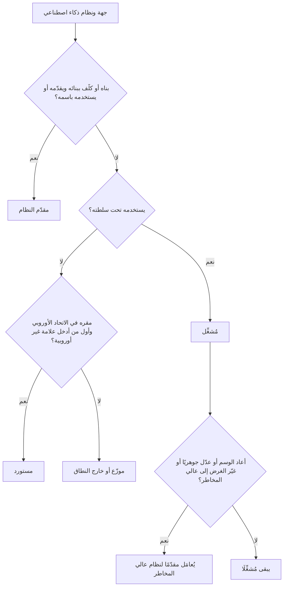
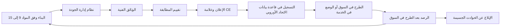

# الوحدة 6 — قانون الذكاء الاصطناعي الأوروبي (EU AI Act)

*قانون الذكاء الاصطناعي الأوروبي (EU AI Act) هو أول قانون شامل وأفقي (horizontal) يُكتب للذكاء الاصطناعي، ويعامله امتحان AIGP بوصفه النقطة المرجعية لكل ما عداه. يقع المقر الرئيسي لبنك نجم (Najm Bank) في الخليج، لكن فرعه في فرانكفورت وعملاءه في الاتحاد الأوروبي يُدخلون نموذج الائتمان (credit model)، وأداة فرز السير الذاتية (CV-screening tool) المشتراة من مورّد، وروبوت المحادثة (chatbot)، والمساعد الذكي بالذكاء الاصطناعي التوليدي (GenAI copilot) في نطاق القانون. تغطي هذه الوحدة القانون في ثلاث مراحل: النطاق والأدوار ومستويات المخاطر (6.1)؛ وما يجب على مقدّمي النظام (providers) والمُشغِّلين (deployers) للأنظمة عالية المخاطر (high-risk) فعله (6.2)؛ والذكاء الاصطناعي للأغراض العامة والشفافية والإنفاذ والجدول الزمني (6.3). يختبر الامتحان القانون كما اعتُمد في اللائحة (EU) 2024/1689، لذا فهذا ما ندرّسه، مع التنبيه إلى التطورات اللاحقة. هذه الدورة تعليمية وليست استشارة قانونية: في القرارات الفعلية، اقرأ النص الساري واستشر محاميًا مؤهَّلًا.*

> **تغطية مجال المعرفة (BoK coverage):** II.C — نطاق قانون الذكاء الاصطناعي الأوروبي وأدواره ومستويات المخاطر فيه؛ والتزامات الأنظمة عالية المخاطر على مقدّمي النظام والمُشغِّلين؛ والقواعد الخاصة بنماذج الذكاء الاصطناعي للأغراض العامة والشفافية؛ والحوكمة والعقوبات والجدول الزمني للتطبيق.

---

# 6.1 — النطاق والأدوار وهرم المخاطر
*المستوى: 🟡 متوسط* · *المتطلبات: 1.1، 4.1* · *مجال المعرفة (BoK): II.C*

## ⚡ الدرس في دقيقة

- قانون الذكاء الاصطناعي الأوروبي (EU AI Act) (اللائحة (EU) 2024/1689) لائحة أوروبية واجبة التطبيق مباشرةً، نافذة منذ 1 أغسطس 2024 وتُطبَّق على مراحل. وهو يستخدم آليات سلامة المنتجات (المتطلبات، وتقييم المطابقة (conformity assessment)، وعلامة CE (CE marking)، ومراقبة السوق (market surveillance)) لحماية الصحة والسلامة والحقوق الأساسية (fundamental rights).
- يمتد أثره خارج الاتحاد الأوروبي: فمقدّمو النظام (providers) في أي مكان ممن يطرحون ذكاءً اصطناعيًا في سوق الاتحاد الأوروبي مشمولون، وكذلك مقدّمو النظام والمُشغِّلون (deployers) في أي مكان إذا كانت *مخرجات نظامهم تُستخدم في الاتحاد الأوروبي*.
- تتبع الواجباتُ **الأدوارَ (roles)**. يتحمل **مقدّم النظام** معظمها؛ ويتحمل **المُشغِّل** مجموعة أخف لكنها حقيقية؛ وللمستوردين (importers) والموزّعين (distributors) والممثلين المفوَّضين (authorised representatives) ومصنّعي المنتجات (product manufacturers) واجباتهم الخاصة.
- أربعة مستويات: **المحظور (prohibited)** (المادة 5 (Art. 5))، و**عالي المخاطر (high-risk)** (المادة 6 (Art. 6) مع الملحقين I وIII)، و**الشفافية (transparency)** (المادة 50 (Art. 50))، و**الحد الأدنى (minimal)**. ولنماذج الذكاء الاصطناعي للأغراض العامة (general-purpose AI models) مسار منفصل (6.3).
- إشارة الامتحان: صنّف حسب **الغرض المقصود (intended purpose)** و**الدور (role)**، لا حسب التقنية.
- أكبر فخ: «اشتريناه فقط، إذن المورّد هو المسؤول.» للمُشغِّلين واجباتهم الخاصة، والمُشغِّل الذي يعيد وسم نظام (rebrands) أو يعدّله تعديلًا جوهريًا أو يغيّر غرضه قد *يصبح* مقدّم النظام.

## 🧭 لماذا يهم

أول رسالة بريد إلكتروني تتلقاها ليلى بشأن قانون الذكاء الاصطناعي تأتي من مدير فرع فرانكفورت: «هذه بالتأكيد مشكلة الشركات الأوروبية. نحن بنك خليجي.» ويتفق عمر معه جزئيًا؛ فهو يعتقد أن الأنظمة التي تعمل فعليًا من فرانكفورت وحدها قد تكون معنية.

تستعرض ليلى السجل (inventory) مع لجنة حوكمة الذكاء الاصطناعي (AI Governance Committee). بنى فريق دانة نموذج الائتمان في الدوحة، لكنه يقيّم المقيمين في الاتحاد الأوروبي الذين يتقدمون بطلباتهم في فرانكفورت. وأداة فرز السير الذاتية التي اشتراها يوسف من مورّد تفرز المتقدمين في الدوحة ودبي *وفرانكفورت*. وروبوت المحادثة يجيب عملاء الاتحاد الأوروبي. والمساعد الذكي لمذكرات الائتمان (credit memo copilot)، المبني على نموذج لغوي كبير (large language model) من طرف ثالث، يدعم إقراضًا يشمل بعض التجار الأفراد (sole traders) الألمان. ويعمل كشف الاحتيال (fraud detection) على كل معاملة بطاقة. ويستخدم الموظفون في كل مكان أدوات ذكاء اصطناعي توليدي عامة.

هل كل منها «نظام ذكاء اصطناعي (AI system)»؟ هل بنك نجم ضمن النطاق؟ مقدّم نظام أم مُشغِّل أم كلاهما؟ أي مستوى؟ الإجابات تحدد ما إذا كان بنك نجم يواجه واجب إفصاح أم برنامجًا كاملًا للأنظمة عالية المخاطر، مع غرامات على أسوأ المخالفات تصل إلى 35 مليون يورو أو 7% من حجم الأعمال العالمي. وكل ما عدا ذلك يتوقف على إصابة هذه الخطوة الأولى.

## 📐 كيف يعمل

### 🟢 الأساسيات

**أي نوع من القوانين هذا.** *اللائحة (regulation)* تُطبَّق مباشرةً في كل دولة عضو. ويستعير قانون الذكاء الاصطناعي تصميم قانون سلامة المنتجات الأوروبي («الإطار التشريعي الجديد (New Legislative Framework)»): يحدد القانون المتطلبات الأساسية، وتصف المعايير كيفية استيفائها، ويتحقق الصانع من المطابقة ويضع علامة CE، وتراقب السلطات السوق. وفوق ذلك طبقة للحقوق الأساسية، ولهذا تظهر الواجبات الهندسية (التسجيل (logging)) وواجبات الحقوق (تقييمات الأثر (impact assessments)) جنبًا إلى جنب.

**ما الذي يُعدّ «نظام ذكاء اصطناعي».** تعرّفه المادة 3(1) (Art. 3(1))، في جوهره، بأنه *نظام قائم على الآلة مصمَّم للعمل بمستويات متفاوتة من الاستقلالية، وقد يُظهر قدرة على التكيّف بعد النشر، ويستنتج، لأهداف صريحة أو ضمنية، من المدخلات التي يتلقاها كيفية توليد مخرجات مثل التنبؤات أو المحتوى أو التوصيات أو القرارات التي يمكن أن تؤثر في البيئات المادية أو الافتراضية.* وهو مصاغ على غرار تعريف OECD المحدَّث في نوفمبر 2023.

| العنصر | المعنى | مثال من بنك نجم |
|---|---|---|
| استقلالية متفاوتة | قدر من الاستقلال عن التدخل البشري | يردّ روبوت المحادثة دون أن يكتب إنسان |
| *قد* يكون متكيّفًا | التعلم بعد النشر ممكن لكنه **غير مشترط** | نموذج الائتمان المجمَّد (frozen) مؤهَّل مع ذلك |
| الأهداف | غايات صريحة أو ضمنية | «التنبؤ باحتمال التعثر (probability of default)» |
| **يستنتج** المخرجات | الاختبار الرئيسي: يستخلص المخرجات باستخدام تقنيات مثل تعلّم الآلة أو المناهج القائمة على المنطق والمعرفة | تعلّم نموذج الائتمان أوزانه من القروض السابقة |
| يؤثر في البيئات | تنبؤات، ومحتوى، وتوصيات، وقرارات | درجة تنقل طلبًا إلى «الرفض» |

**الاستنتاج (inference)** هو ما يفصل الذكاء الاصطناعي عن البرمجيات العادية: فالحيثيات (recitals) تستثني الأنظمة القائمة على قواعد يحددها البشر وحدهم. فقاعدة جدول بيانات لدى موظف الائتمان («ارفض إذا تجاوزت نسبة الدين إلى الدخل 45%») ليست نظام ذكاء اصطناعي؛ أما النموذج المدرَّب على حالات التعثر السابقة فهو كذلك. وتساعد إرشادات المفوضية غير الملزمة الصادرة في فبراير 2025 بشأن التعريف في الحالات الحدّية.

**الأنظمة مقابل النماذج.** **نظام الذكاء الاصطناعي (AI system)** هو الشيء القابل للنشر الذي ينتج مخرجات لاستخدام ما؛ أما **نموذج الذكاء الاصطناعي للأغراض العامة (GPAI)**، مثل النموذج اللغوي الكبير، فهو مكوّن يُدمج في أنظمة كثيرة. والمساعد الذكي في بنك نجم نظام؛ والنموذج اللغوي الكبير (LLM) بداخله نموذج GPAI (6.3).

**هرم المخاطر.**

| المستوى | الموضع | النتيجة | مثال من بنك نجم |
|---|---|---|---|
| غير مقبول | المادة 5 | **محظور** | التعرف على المشاعر لدى موظفي مركز الاتصال |
| عالٍ | المادة 6، الملحقان I وIII | متطلبات، وتقييم مطابقة، وتسجيل، وواجبات على المُشغِّل | التصنيف الائتماني للأفراد في الاتحاد الأوروبي؛ فرز السير الذاتية |
| الشفافية | المادة 50 | الإفصاح والوسم | روبوت المحادثة؛ فيديو تسويقي مولّد بالذكاء الاصطناعي |
| الحد الأدنى | — | لا واجبات جديدة؛ تُشجَّع المدونات الطوعية | تصفية الرسائل غير المرغوب فيها، والبحث الداخلي |

ينطبق **الإلمام بالذكاء الاصطناعي (AI literacy)** (المادة 4 (Art. 4)) على *جميع* مقدّمي النظام والمُشغِّلين أيًّا كان المستوى، وتنطبق قواعد **نماذج GPAI** على مقدّمي النماذج أيًّا كانت الأنظمة التي تستخدم النموذج. ويمكن أن تتراكم المستويات: فالنظام عالي المخاطر الذي يتحاور مع الناس يجب أن يستوفي المادة 50 أيضًا.

### 🟡 التعمق أكثر

**النطاق الإقليمي (المادة 2 (Art. 2)).** ينطبق القانون على:
1. **مقدّمي النظام** الذين يطرحون أنظمة ذكاء اصطناعي في السوق أو يضعونها في الخدمة في الاتحاد الأوروبي، أو يطرحون نماذج GPAI في سوق الاتحاد الأوروبي، *أينما كان مقر تأسيسهم*؛
2. **المُشغِّلين** المؤسَّسين أو الموجودين في الاتحاد الأوروبي؛
3. **مقدّمي النظام والمُشغِّلين خارج الاتحاد الأوروبي** حيث **تُستخدم مخرجات النظام في الاتحاد الأوروبي**؛
4. **المستوردين والموزّعين**؛
5. **مصنّعي المنتجات** الذين يطرحون نظام ذكاء اصطناعي في السوق مع منتجهم تحت اسمهم الخاص؛
6. **الممثلين المفوَّضين** لمقدّمي النظام من خارج الاتحاد الأوروبي؛
7. **الأشخاص المتأثرين (affected persons)** الموجودين في الاتحاد الأوروبي.

لذلك فإن فرع بنك نجم في فرانكفورت مُشغِّل في الاتحاد الأوروبي، وحتى النظام الذي يُدار بالكامل من الدوحة يقع في النطاق إذا كانت مخرجاته، كالدرجة الائتمانية، تُستخدم في الاتحاد الأوروبي.

**الطرح في السوق (placing on the market)** هو الإتاحة *الأولى* في الاتحاد الأوروبي. و**الوضع في الخدمة (putting into service)** هو توريد نظام لأول استخدام إلى مُشغِّل *أو لاستخدام مقدّم النظام نفسه*، وبهذه الطريقة تقع الأنظمة الداخلية في النطاق دون أن تُباع أبدًا.

**الاستثناءات.** لا ينطبق القانون على:
- الأنظمة المستخدمة **حصرًا لأغراض عسكرية أو دفاعية أو للأمن القومي**؛
- الأنظمة أو النماذج المطوَّرة والموضوعة في الخدمة **لغرض البحث والتطوير العلمي وحده**؛
- **البحث والاختبار والتطوير** قبل الطرح في السوق أو الوضع في الخدمة (الاختبار في ظروف العالم الحقيقي غير مستثنى)؛
- **الأشخاص الطبيعيين** الذين يستخدمون الذكاء الاصطناعي في **نشاط شخصي بحت غير مهني**؛
- الأنظمة الصادرة بموجب **تراخيص حرة ومفتوحة المصدر**، *ما لم* تُطرح في السوق بوصفها عالية المخاطر، أو تقع تحت المادة 5 أو المادة 50 (ولنماذج GPAI مفتوحة المصدر إعفاؤها الخاص الأضيق)؛

لا يمسّ القانون اللائحة العامة لحماية البيانات (GDPR)؛ فحيثما تُعالَج بيانات شخصية، ينطبق كلاهما.

**الأدوار.**

| الدور | التعريف المبسّط | مثال من بنك نجم |
|---|---|---|
| **مقدّم النظام (Provider)** | يطوّر نظام ذكاء اصطناعي أو نموذج GPAI (أو يكلّف بتطويره) ويطرحه في السوق أو يضعه في الخدمة **تحت اسمه أو علامته التجارية** | بنك نجم (نموذج الائتمان)؛ مورّد أداة السير الذاتية |
| **المُشغِّل (Deployer)** | يستخدم نظام ذكاء اصطناعي **تحت سلطته**، في غير الاستخدام الشخصي غير المهني | بنك نجم بالنسبة إلى أداة السير الذاتية |
| **المستورد (Importer)** | مؤسَّس في الاتحاد الأوروبي؛ يطرح في سوق الاتحاد الأوروبي نظامًا يحمل اسم جهة من خارج الاتحاد | موزّع أوروبي يعيد بيع أداة أمريكية |
| **الموزّع (Distributor)** | أي فاعل آخر في سلسلة التوريد (supply chain) يتيح نظامًا في الاتحاد الأوروبي | جهة تكامل تعيد بيع أداة السير الذاتية |
| **الممثل المفوَّض (Authorised representative)** | شخص في الاتحاد الأوروبي مفوَّض كتابيًا من مقدّم نظام من خارج الاتحاد | مطلوب لمقدّمي الأنظمة عالية المخاطر ونماذج GPAI من خارج الاتحاد |
| **مصنّع المنتج (Product manufacturer)** | يطرح في السوق منتجًا يتضمن ذكاءً اصطناعيًا مدمجًا تحت اسمه | صانع أجهزة طبية |

يشمل مصطلح «**المشغّل الاقتصادي (Operator)**» جميع هؤلاء. ويمكن لجهة واحدة أن تجمع أدوارًا عدة: فبنك نجم **مقدّم نظام ومُشغِّل** لنموذج الائتمان الخاص به، وهو نمط مفضّل في الامتحان.

**متى يصبح المُشغِّل مقدّمًا للنظام (المادة 25 (Art. 25)).** يُعامَل الموزّع أو المستورد أو المُشغِّل أو أي طرف ثالث آخر بوصفه **مقدّم نظام عالي المخاطر** إذا:
1. وضع **اسمه أو علامته التجارية** على نظام عالي المخاطر مطروح بالفعل في السوق (ويمكن للعقود توزيع الواجبات على نحو آخر بين الأطراف)؛
2. أجرى **تعديلًا جوهريًا (substantial modification)** على نظام عالي المخاطر بحيث يظل عالي المخاطر؛ أو
3. **غيّر الغرض المقصود** لنظام غير عالي المخاطر، بما في ذلك نظام GPAI، بحيث يصبح عالي المخاطر.

ويجب على مقدّم النظام الأصلي حينئذ التعاون وتقديم المعلومات والوصول التقني اللازمين (ما لم يكن قد استبعد بوضوح تحويل نظامه إلى نظام عالي المخاطر). و**التعديل الجوهري** تغيير غير مخطط له بعد الطرح في السوق يؤثر في الامتثال أو يغيّر الغرض المقصود. أما التغييرات التي يجريها نظام متعلّم ضمن حدود محددة مسبقًا وموثّقة عند تقييم المطابقة فلا تُحتسب.

**المادة 5: الممارسات المحظورة (prohibited practices)** (مطبَّقة منذ 2 فبراير 2025؛ ونُشرت إرشادات المفوضية في الشهر نفسه). يُحظر طرح أنظمة ذكاء اصطناعي في السوق أو وضعها في الخدمة أو استخدامها إذا كانت:
1. تستخدم **تقنيات لا شعورية (subliminal) أو تلاعبية أو خادعة** تشوّه السلوك تشويهًا جوهريًا، وتسبب أو يُرجَّح أن تسبب ضررًا كبيرًا؛
2. **تستغل مواطن الضعف** الناشئة عن العمر أو الإعاقة أو وضع اجتماعي أو اقتصادي محدد، بالأثر نفسه؛
3. تُجري **تصنيفًا اجتماعيًا (social scoring)** يؤدي إلى معاملة ضارة في سياقات غير ذات صلة، أو معاملة غير مبرَّرة أو غير متناسبة (من الجهات العامة *والخاصة*)؛
4. تتنبأ بخطر ارتكاب شخص لجريمة **استنادًا إلى التنميط (profiling) أو سمات الشخصية وحدها**؛
5. تبني قواعد بيانات للتعرف على الوجه عبر **الكشط غير الموجَّه (untargeted scraping)** للصور من الإنترنت أو كاميرات المراقبة (CCTV)؛
6. تستنتج **المشاعر في مكان العمل أو المؤسسات التعليمية**، إلا لأسباب طبية أو تتعلق بالسلامة؛
7. **تصنّف الأشخاص بيومتريًا (biometrically)** لاستنتاج العرق أو الآراء السياسية أو العضوية النقابية أو المعتقدات الدينية أو الفلسفية أو الحياة الجنسية أو التوجه الجنسي؛
8. تُجري **تحديد الهوية البيومتري عن بُعد في الوقت الفعلي في الأماكن المتاحة للجمهور لأغراض إنفاذ القانون**، إلا حيث يكون ذلك ضروريًا بشكل صارم للبحث عن ضحايا محددين أو أشخاص مفقودين، أو منع تهديد وشيك للحياة أو هجوم إرهابي، أو تحديد مكان المشتبه بهم في جرائم خطيرة مدرجة، مع إذن مسبق قضائي أو من جهة مستقلة وقانون وطني يتيح ذلك.

وبالنسبة إلى بنك، فإن البنود 1 و2 و3 و6 هي المخاطر الحية: أداة مبيعات تستغل الضائقة المالية، أو درجة «جدارة» مبنية على سلوك اجتماعي غير ذي صلة، أو تحليلات صوتية لمشاعر الموظفين.

### 🔴 نظرة الخبير

**المادة 6: طريقان إلى المخاطر العالية.**

*الطريق 1: المنتجات (المادة 6(1)).* يكون النظام عالي المخاطر إذا (أ) كان مكوّن سلامة (safety component) لمنتج، أو كان هو نفسه منتجًا، تشمله تشريعات المواءمة الأوروبية (EU harmonisation legislation) في **الملحق I** (مثل الآلات، والألعاب، والمصاعد، والمعدات الراديوية، والأجهزة الطبية، وفي قسم ثانٍ المركبات والطيران والمعدات البحرية ومعدات السكك الحديدية)، **و**(ب) كان ذلك المنتج يجب أن يخضع **لتقييم مطابقة من طرف ثالث** بموجب تلك التشريعات، **معًا**. وتُطبَّق هذه اعتبارًا من 2 أغسطس 2027.

*الطريق 2: حالات الاستخدام (المادة 6(2)، الملحق III).* يكون النظام عالي المخاطر إذا وقع غرضه المقصود ضمن أحد ثمانية مجالات:

| # | المجال | أمثلة على الاستخدامات المدرجة |
|---|---|---|
| 1 | القياسات الحيوية (البيومترية) | تحديد الهوية البيومتري عن بُعد (لا مجرد التحقق من هوية مُدّعاة)؛ التصنيف حسب السمات الحساسة؛ التعرف على المشاعر |
| 2 | البنية التحتية الحرجة | مكوّنات السلامة للبنية التحتية الرقمية الحرجة، وحركة المرور على الطرق، والمياه، والغاز، والتدفئة، والكهرباء |
| 3 | التعليم والتدريب المهني | القبول؛ تقييم نواتج التعلم؛ تقييم المستوى التعليمي؛ كشف الغش في الاختبارات |
| 4 | التوظيف وإدارة العاملين | التوظيف والاختيار (إعلانات الوظائف الموجّهة، وتصفية الطلبات، وتقييم المرشحين)؛ الترقية والإنهاء وتوزيع المهام؛ رصد الأداء والسلوك |
| 5 | الخدمات الخاصة والعامة الأساسية | أهلية الاستفادة من المزايا العامة؛ **تقييم الجدارة الائتمانية أو التصنيف الائتماني للأشخاص الطبيعيين، باستثناء كشف الاحتيال**؛ تقييم المخاطر والتسعير في التأمين على الحياة والتأمين الصحي؛ فرز مكالمات الطوارئ |
| 6 | إنفاذ القانون | موثوقية الأدلة، والتنميط في التحقيقات |
| 7 | الهجرة واللجوء ومراقبة الحدود | تقييم المخاطر، وفحص الطلبات |
| 8 | العدالة والديمقراطية | مساعدة القضاة؛ التأثير في الانتخابات أو التصويت |

يمكن للمفوضية تعديل الملحق III بقانون مفوَّض (delegated act) ضمن هذه المجالات (المادة 7).

*الاستثناء (المادة 6(3)) (derogation).* لا يكون نظام الملحق III عالي المخاطر إذا لم يشكّل خطرًا كبيرًا بالإضرار بالصحة أو السلامة أو الحقوق الأساسية، بما في ذلك عدم تأثيره الجوهري في نتائج القرارات. ويكون الأمر كذلك حيث يُقصد به:
- (أ) أداء **مهمة إجرائية ضيقة (narrow procedural task)** (مثل تحويل المستندات غير المهيكلة إلى بيانات مهيكلة)؛
- (ب) **تحسين نتيجة نشاط بشري منجز سابقًا** (مثل تنقيح خطاب صاغه شخص)؛
- (ج) **كشف أنماط القرار أو الانحرافات** عن الأنماط السابقة، دون أن يحلّ محل التقييم البشري المنجز أو يؤثر فيه في غياب مراجعة بشرية ملائمة؛ أو
- (د) أداء **مهمة تحضيرية (preparatory task)** لتقييم من تقييمات الملحق III.

ضمانتان: نظام الملحق III الذي **يُجري تنميطًا للأشخاص الطبيعيين عالي المخاطر دائمًا**؛ ومقدّم النظام الذي يعتمد على الاستثناء يجب أن **يوثّق تقييمه** مسبقًا وأن **يسجّل** النظام في قاعدة بيانات الاتحاد الأوروبي. تحقّق مما إذا كانت إرشادات التصنيف التي وعدت بها المفوضية قد صدرت.

**الحالة الصعبة في بنك نجم: المساعد الذكي.** المقترضون من الشركات الكبرى أشخاص اعتباريون، لذا لا ينطبق بند التصنيف الائتماني. أما التجار الأفراد فأشخاص طبيعيون. فإذا كان المساعد الذكي يعيد هيكلة المستندات في قالب مذكرة فحسب، فقد يكون ذلك مهمة إجرائية ضيقة أو تحضيرية. وإذا كان يلخّص السلوك المالي لشخص ويوصي بتصنيف، فهذا تنميط، وهو عالي المخاطر. وفي كلتا الحالتين، يوثّق بنك نجم تعليله.

**الغرض المقصود هو الحَكَم.** إنه ما يذكره مقدّم النظام في تعليماته ومواده الترويجية ووثائقه. فمصنِّف المستندات منخفض المخاطر إلى أن يستخدمه أحدهم لترتيب المتقدمين للوظائف، وقد يصبح من غيّر غرضه حينئذ مقدّمًا لنظام عالي المخاطر بموجب المادة 25.

## ⚖️ الأدوات التنظيمية

| الأداة | ما تشترطه أو توصي به | إشارة الامتحان |
|---|---|---|
| **EU AI Act** — المادة 3(1) | تعرّف «نظام الذكاء الاصطناعي»؛ الاستنتاج هو العنصر الرئيسي | القواعد التي يكتبها البشر وحدها خارج النطاق؛ والتكيّف اختياري |
| **EU AI Act** — المادة 2 | نطاق يتجاوز الحدود الإقليمية؛ استثناءات للأغراض العسكرية والبحث والاستخدام الشخصي ومعظم المصادر المفتوحة | «المقر الرئيسي خارج الاتحاد الأوروبي» لا يُنهي التحليل أبدًا |
| **EU AI Act** — المادتان 3 و25 | تعرّف الأدوار؛ إعادة الوسم أو التعديل الجوهري أو تغيير الغرض إلى عالي المخاطر يجعلك مقدّم النظام | «من هو مقدّم النظام الآن؟» |
| **EU AI Act** — المادة 5 | ثماني ممارسات محظورة، اعتبارًا من 2 فبراير 2025 | التعرف على المشاعر في مكان العمل والتصنيف الاجتماعي مفضّلان في الامتحان |
| **EU AI Act** — المادة 6 والملحقان I وIII | المخاطر العالية عبر المنتجات المنظَّمة أو ثمانية مجالات لحالات الاستخدام؛ استثناء المادة 6(3)، ولا يشمل التنميط أبدًا | التصنيف الائتماني للأفراد عالي المخاطر؛ وكشف الاحتيال ليس كذلك |
| **GDPR** | تنطبق إلى جانب قانون الذكاء الاصطناعي على البيانات الشخصية | قانون الذكاء الاصطناعي لا يحلّ محلها |

## 🏛️ عمليًا في بنك نجم

أول منتَج تعدّه ليلى هو **سجل تصنيف وفق قانون الذكاء الاصطناعي (AI Act classification register)**، تعتمده لجنة حوكمة الذكاء الاصطناعي. ولا يُطلق أي نظام في الاتحاد الأوروبي أو لصالحه دون صف مكتمل توقّعه ليلى وتراجعه سارة (مسؤولة حماية البيانات (DPO)).

| النظام | الصلة بالاتحاد الأوروبي | دور بنك نجم | المستوى | الخطوة التالية |
|---|---|---|---|---|
| نموذج ائتمان الأفراد | يقيّم المقيمين في الاتحاد الأوروبي | مقدّم نظام ومُشغِّل | عالي المخاطر، الملحق III البند 5 (تنميط) | برنامج مقدّم النظام وتقييم الأثر على الحقوق الأساسية (FRIA) (6.2) |
| أداة فرز السير الذاتية | التوظيف في فرانكفورت | مُشغِّل | عالي المخاطر، الملحق III البند 4 | واجبات المُشغِّل؛ أدلة المورّد |
| روبوت محادثة العملاء | عملاء الاتحاد الأوروبي | مقدّم النظام | الشفافية، المادة 50 | الإفصاح المدمج في التصميم |
| المساعد الذكي لمذكرات الائتمان | الإقراض لتجار أفراد في الاتحاد الأوروبي | مقدّم نظام مبني على نموذج GPAI | قيد المراجعة | تقييم موثَّق وفق المادة 6(3) |
| كشف الاحتيال | معاملات البطاقات في الاتحاد الأوروبي | مقدّم نظام ومُشغِّل | غير عالي المخاطر (استثناء الاحتيال) | الإلمام بالذكاء الاصطناعي، وGDPR، وسياسة مخاطر النماذج |
| استخدام الموظفين للذكاء الاصطناعي التوليدي العام | موظفو الاتحاد الأوروبي | مُشغِّل | الحد الأدنى، إضافة إلى المادة 4 | سياسة الاستخدام المقبول، والتدريب |

وتضيف بندًا واحدًا إلى سياسة الذكاء الاصطناعي في بنك نجم:

> **ضابط تغيّر الدور.** لا يجوز لأي وحدة عمل (أ) وضع اسم بنك نجم أو علامته التجارية على نظام ذكاء اصطناعي من طرف ثالث، أو (ب) تغيير نموذج نظام من طرف ثالث أو بياناته أو إعداداته بما يتجاوز المعايير الموثّقة من المورّد، أو (ج) استخدام أي نظام ذكاء اصطناعي لغرض غير الغرض المسجَّل في سجل أنظمة الذكاء الاصطناعي (AI inventory)، دون موافقة كتابية مسبقة من رئيس حوكمة الذكاء الاصطناعي. فمثل هذه التغييرات قد تجعل بنك نجم مقدّمًا لنظام ذكاء اصطناعي عالي المخاطر بموجب المادة 25 من قانون الذكاء الاصطناعي الأوروبي.

## 🛠️ التمارين

🟢 **اختبار التعريف.** خذ ثلاث أدوات (واحدة قائمة على القواعد، وواحدة بتعلّم الآلة، وواحدة توليدية) ومرّر كلًّا منها على المادة 3(1). استنتج ما إذا كانت كل منها «نظام ذكاء اصطناعي» وأي عنصر حسم ذلك.
*يكتمل عندما:* يكون لديك ثلاثة استنتاجات قصيرة، يسمّي كلٌّ منها العنصر الحاسم.

🟡 **خريطة الأدوار.** يبيع مورّد أمريكي أداة السير الذاتية عبر موزّع في الاتحاد الأوروبي، ويخطط فريق الموارد البشرية في بنك نجم لإضافة قواعد تقييم خاصة به فوقها. حدّد مقدّم النظام والمستورد والموزّع والمُشغِّل، وبيّن ما الذي سيجعل بنك نجم مقدّم النظام بموجب المادة 25.
*يكتمل عندما:* يكون لكل طرف دور مع تبرير من سطر واحد، وتكون قد سمّيت محفّزين اثنين على الأقل من محفّزات المادة 25.

🔴 **مذكرة الاستثناء.** اكتب تقييمًا من صفحة واحدة وفق المادة 6(3) للمساعد الذكي كما يُستخدم للتجار الأفراد: الشروط الأربعة، واستثناء التنميط الغالب، والأدلة المحفوظة، والاستنتاج.
*يكتمل عندما:* تستطيع سلطةٌ تتبّع التعليل ورؤية الأثر المترتب على التسجيل.

## ⚠️ أخطاء وفخاخ الامتحان

- **«شركة من خارج الاتحاد الأوروبي، إذن خارج النطاق.»** تحقّق من الطرح في سوق الاتحاد الأوروبي، والتشغيل في الاتحاد الأوروبي، والمخرجات المستخدمة في الاتحاد الأوروبي.
- **«التكيّف شرط.»** إنه اختياري («قد»). فنموذج تعلّم الآلة المجمَّد لا يزال نظام ذكاء اصطناعي؛ والاستنتاج هو المفتاح.
- **الخلط بين كشف الاحتيال والتصنيف الائتماني.** كشف الاحتيال مستثنى صراحةً؛ والتصنيف الائتماني *للأشخاص الطبيعيين* عالي المخاطر؛ وتقييم الشركات لا يقع تحت ذلك البند.
- **معاملة المادة 6(3) على أنها تلقائية.** إنها لا تشمل التنميط أبدًا، وتتطلب التوثيق والتسجيل.
- **«المورّد يتحمل كل شيء.»** للمُشغِّلين واجبات (6.2)، ويصبحون مقدّمين للنظام إذا أعادوا الوسم أو عدّلوا تعديلًا جوهريًا أو غيّروا الغرض إلى عالي المخاطر.
- **الخلط في التعرف على المشاعر.** محظور في العمل أو التعليم (باستثناء الأسباب الطبية أو المتعلقة بالسلامة)؛ وفي غير ذلك، عالي المخاطر إضافة إلى إشعار بموجب المادة 50.

## 🧾 الخلاصة

- يطبّق قانون الذكاء الاصطناعي أساليب سلامة المنتجات على الذكاء الاصطناعي، مع طبقة للحقوق الأساسية.
- يُعرَّف نظام الذكاء الاصطناعي بقدرته على *الاستنتاج*.
- النطاق يتجاوز الحدود الإقليمية: الطرح في سوق الاتحاد الأوروبي، والمُشغِّلون في الاتحاد الأوروبي، والمخرجات من خارج الاتحاد المستخدمة فيه.
- الأدوار تحدد الواجبات؛ وكثيرًا ما تجمع الجهات أدوارًا عدة، ويمكن للمادة 25 أن تحوّل المُشغِّل إلى مقدّم نظام.
- المستويات: ثمانية محظورات في المادة 5؛ والمخاطر العالية عبر منتجات الملحق I أو مجالات الملحق III الثمانية؛ والشفافية بموجب المادة 50؛ والحد الأدنى. وتسري قواعد الإلمام بالذكاء الاصطناعي ونماذج GPAI عبر المستويات كلها.
- استثناء المادة 6(3) لا يشمل التنميط أبدًا ويتطلب دائمًا التوثيق والتسجيل.

## ✍️ اختبر نفسك

**1. يقع المقر الرئيسي لبنك نجم في الدوحة. بنى فريق علوم البيانات لديه نموذج تصنيف ائتماني يستخدمه فرع فرانكفورت للبت في طلبات القروض المقدمة من مقيمين في الاتحاد الأوروبي. ما وضع بنك نجم بموجب قانون الذكاء الاصطناعي الأوروبي؟**

- A. خارج النطاق، لأن النموذج طُوّر واستُضيف خارج الاتحاد الأوروبي
- B. مقدّم نظام ومُشغِّل لنظام ذكاء اصطناعي عالي المخاطر
- C. مستورد، لأنه أدخل نظامًا من خارج الاتحاد إلى الاتحاد الأوروبي
- D. مُشغِّل فقط، لأنه لم يبع النموذج قط

الإجابة

**B.** بنى بنك نجم النظام ووضعه في الخدمة لاستخدامه الخاص تحت اسمه (مقدّم النظام)، ويستخدمه فرعه (المُشغِّل). قد يبدو D مغريًا، لكن الوضع في الخدمة للاستخدام الخاص يكفي ليكون المرء مقدّمًا للنظام. أما A فيتجاهل المادة 2. (انظر 🟡 التعمق أكثر: النطاق الإقليمي والأدوار.)

**2. أيٌّ مما يلي ممارسة محظورة بموجب المادة 5؟**

- A. روبوت محادثة للعملاء لا يذكر أنه ذكاء اصطناعي
- B. نموذج يقيّم الجدارة الائتمانية للمتقدمين الأفراد بطلبات القروض
- C. نظام يستنتج مشاعر موظفي مركز الاتصال من أصواتهم لإدارة الأداء
- D. نموذج يكشف معاملات البطاقات الاحتيالية

الإجابة

**C.** التعرف على المشاعر في مكان العمل محظور إلا لأسباب طبية أو تتعلق بالسلامة. أما A فيخالف المادة 50، لا المادة 5. وB عالي المخاطر وD مستثنى صراحةً من بند التصنيف الائتماني. (انظر 🟡 التعمق أكثر: المادة 5.)

**3. يريد مقدّم نظام الاعتماد على استثناء المادة 6(3) لأن نظامه المدرج في الملحق III يؤدي مهمة تحضيرية فقط. في أي حالة لا يمكنه ذلك؟**

- A. النظام يُجري تنميطًا للأشخاص الطبيعيين
- B. النظام يُباع للمنشآت الصغيرة والمتوسطة (SMEs) فقط
- C. النظام طُوّر خارج الاتحاد الأوروبي
- D. النظام يُستخدم إلى جانب مراجعة بشرية

الإجابة

**A.** نظام الملحق III الذي يُجري تنميطًا للأشخاص الطبيعيين عالي المخاطر دائمًا. والعوامل الأخرى لا تُسقط الاستثناء، والمراجعة البشرية (D) تدعم الشرط (ج). (انظر 🔴 نظرة الخبير: الاستثناء.)

**4. يشتري بنك نجم أداة فرز سير ذاتية تحمل علامة CE من مورّد. تعيد الموارد البشرية تسميتها «Najm TalentMatch» وتعرضها على شركات المجموعة في الاتحاد الأوروبي. ما النتيجة الأدق؟**

- A. لا شيء يتغير؛ يظل المورّد مقدّم النظام لأنه بنى النظام
- B. يصبح بنك نجم موزّعًا بواجبات تحقق محدودة
- C. يتوقف النظام عن كونه عالي المخاطر لأن تقييم المطابقة أُجري بالفعل
- D. يُعامَل بنك نجم بوصفه مقدّم نظام ذكاء اصطناعي عالي المخاطر

الإجابة

**D.** بموجب المادة 25، وضع اسمك أو علامتك التجارية على نظام عالي المخاطر مطروح بالفعل في السوق يجعلك مقدّمه. وA هو فخ «المورّد يتحمل كل شيء»؛ وإعادة الوسم هي بالضبط ما ينقل بنك نجم إلى ما يتجاوز دور الموزّع (B). (انظر 🟡 التعمق أكثر: متى يصبح المُشغِّل مقدّمًا للنظام.)

**5. أيٌّ مما يلي يقع خارج نطاق قانون الذكاء الاصطناعي الأوروبي؟**

- A. مقدّم نظام من خارج الاتحاد الأوروبي تُستخدم مخرجات نظامه في الاتحاد الأوروبي
- B. نظام ذكاء اصطناعي مفتوح المصدر مطروح في السوق بوصفه نظامًا عالي المخاطر
- C. شخص في برلين يستخدم مولّد صور بالذكاء الاصطناعي لصنع بطاقات أعياد ميلاد لعائلته
- D. مستورد في الاتحاد الأوروبي لنظام ذكاء اصطناعي من مورّد من خارج الاتحاد

الإجابة

**C.** الاستخدام الشخصي البحت غير المهني من الأفراد مستثنى. أما A وD فضمن النطاق صراحةً، واستثناء المصادر المفتوحة لا يشمل الأنظمة المطروحة في السوق بوصفها عالية المخاطر (B). (انظر 🟡 التعمق أكثر: الاستثناءات.)

## 📚 المراجع

- اللائحة (EU) 2024/1689 (قانون الذكاء الاصطناعي)، النص الرسمي: https://eur-lex.europa.eu/eli/reg/2024/1689/oj
- المفوضية الأوروبية، الإطار التنظيمي للذكاء الاصطناعي (بما في ذلك الإرشادات بشأن تعريف نظام الذكاء الاصطناعي والممارسات المحظورة): https://digital-strategy.ec.europa.eu/en/policies/regulatory-framework-ai
- مبادئ OECD للذكاء الاصطناعي وتعريف نظام الذكاء الاصطناعي: https://oecd.ai/en/ai-principles
- IAPP، شهادة AIGP ومجال المعرفة (Body of Knowledge): https://iapp.org/certify/aigp/

---

# 6.2 — التزامات الأنظمة عالية المخاطر على مقدّمي النظام والمُشغِّلين
*المستوى: 🟡 متوسط* · *المتطلبات: 6.1، 4.3* · *مجال المعرفة (BoK): II.C*

## ⚡ الدرس في دقيقة

- يجب أن تستوفي أنظمة الذكاء الاصطناعي عالية المخاطر (high-risk) سبعة متطلبات (المواد 9–15 (Arts 9–15)): **نظام إدارة المخاطر (risk management system)**، و**البيانات وحوكمة البيانات (data and data governance)**، و**الوثائق الفنية (technical documentation)**، و**حفظ السجلات (record-keeping) (logging)**، و**الشفافية وتعليمات الاستخدام (transparency and instructions for use)**، و**الإشراف البشري (human oversight)**، و**الدقة والمتانة والأمن السيبراني (accuracy, robustness and cybersecurity)**.
- يثبت **مقدّم النظام (provider)** الامتثال عبر **نظام إدارة الجودة (quality management system)**، و**تقييم المطابقة (conformity assessment)**، و**إعلان المطابقة الأوروبي (EU declaration of conformity)**، و**علامة CE (CE marking)**، و**التسجيل في قاعدة بيانات الاتحاد الأوروبي (EU database registration)**، ثم يتولى **الرصد بعد الطرح في السوق (post-market monitoring)** والإبلاغ عن **الحوادث الجسيمة (serious incidents)**.
- يجب على **المُشغِّل (deployer)** (المادة 26 (Art. 26)) استخدام النظام وفق تعليماته، وتكليف أشخاص أكفاء بـ**الإشراف البشري**، وضمان ملاءمة **بيانات الإدخال (input data)**، و**الرصد (monitor)**، والاحتفاظ بـ**السجلات (logs)** ستة أشهر على الأقل، و**إبلاغ العاملين (inform workers)** و**الأشخاص المتأثرين (affected persons)**.
- يجب على الهيئات العامة، ومقدّمي الخدمات العامة، والمُشغِّلين الذين يستخدمون الذكاء الاصطناعي في **التصنيف الائتماني (credit scoring)** أو **تسعير التأمين على الحياة والتأمين الصحي (life and health insurance pricing)** إجراء **تقييم الأثر على الحقوق الأساسية (FRIA)** (المادة 27 (Art. 27)).
- للأشخاص المتأثرين **الحق في التفسير (right to explanation)** (المادة 86 (Art. 86)) بشأن دور الذكاء الاصطناعي والعناصر الرئيسية للقرار.
- أكبر فخ: الاعتقاد بأن علامة CE الخاصة بالمورّد تغطي المُشغِّل. إنها لا تغطيه.

## 🧭 لماذا يهم

يريد خالد إطلاق نموذج التصنيف الائتماني لحملة الإقراض الربيعية في فرانكفورت. وتقول دانة إنه «جاهز»: فهو يتفوق على بطاقة التقييم (scorecard) القديمة وقد اعتمده فريق التحقق. وتسأل ليلى: «جاهز بالقياس إلى ماذا؟» فبوصفه مقدّمًا لنظام عالي المخاطر، يجب على بنك نجم (Najm Bank) أن يُظهر نظامًا لإدارة المخاطر، وأدلة على حوكمة البيانات، ووثائق وفق الملحق IV، وتسجيلًا للأحداث، وتعليمات استخدام، وإشرافًا بشريًا مدمجًا في التصميم، ومتانة مختبَرة، ونظامًا لإدارة الجودة، وتقييم مطابقة، وإعلانًا، وعلامة CE، وتسجيلًا. ولا شيء من ذلك سؤال عن دقة النموذج.

في هذه الأثناء، وقّع يوسف عقد أداة فرز السير الذاتية. «المورّد يحمل علامة CE، إذن الامتثال مشكلته هو.» وتخالفه سارة الرأي. فبوصفه مُشغِّلًا، يجب على بنك نجم استخدام الأداة وفق تعليماتها، وتكليف أشخاص مدرَّبين بالمراجعة، وفحص مدخلاتها، والاحتفاظ بالسجلات، وإحاطة مجلس العاملين (works council) في فرانكفورت، وإبلاغ المرشحين بأن نظامًا عالي المخاطر مستخدم. وبالنسبة إلى نموذج الائتمان، يجب على بنك نجم بوصفه مُشغِّلًا أن يُجري أيضًا تقييم FRIA.

هذا هو قلب القانون لمعظم الجهات، والسؤال المفضّل في الامتحان هنا هو: «من يجب أن يفعل هذا، مقدّم النظام أم المُشغِّل؟»

## 📐 كيف يعمل

### 🟢 الأساسيات

**المتطلبات السبعة.** يجب أن يستوفيها كل نظام عالي المخاطر، مع مراعاة غرضه المقصود وأحدث ما توصلت إليه التقنية (state of the art) (المادة 8). ويبنيها مقدّم النظام داخل النظام.

| المادة | المتطلب | المعنى المبسّط | في بنك نجم (نموذج الائتمان) |
|---|---|---|---|
| 9 | **نظام إدارة المخاطر** | عملية مستمرة ومتكررة عبر دورة الحياة (life cycle): تحديد وتقييم المخاطر على الصحة والسلامة والحقوق الأساسية في ظل الاستخدام المقصود *وإساءة الاستخدام المتوقعة بصورة معقولة*؛ واعتماد التدابير؛ والاختبار؛ وعدم قبول إلا المخاطر المتبقية المقبولة؛ ومراعاة الفئات الضعيفة | سجل مخاطر حيّ، يُراجَع عند كل إعادة تدريب |
| 10 | **البيانات وحوكمة البيانات** | حوكمة بيانات التدريب والتحقق والاختبار (training, validation and test data) (المصدر، والإعداد، والافتراضات، و**الفحص بحثًا عن التحيّزات المحتملة**، والفجوات)؛ وأن تكون ملائمة وممثِّلة بما يكفي، وخالية من الأخطاء وكاملة قدر الإمكان بالنسبة إلى الغرض والسياق | أدلة على تمثيل المتقدمين الألمان؛ اختبارات التحيّز حسب العمر والجنس |
| 11 | **الوثائق الفنية** | تُكتب *قبل* الطرح في السوق، وتُحدَّث باستمرار، بالمحتوى الوارد في **الملحق IV**؛ وصيغة مبسطة للمنشآت الصغيرة والمتوسطة (SMEs) | ملف النموذج مهيكل وفق الملحق IV |
| 12 | **حفظ السجلات** | يجب أن *يتيح النظام تقنيًا* التسجيل التلقائي للأحداث طوال عمره، بما يكفي لتتبّع المخاطر ودعم الرصد | تُسجَّل كل درجة مع إصدارات المدخلات والنموذج |
| 13 | **الشفافية، وتعليمات الاستخدام** | يستطيع المُشغِّلون تفسير المخرجات واستخدامها على النحو الصحيح؛ وتغطي التعليمات الغرض، ومقاييس الدقة، والمخاطر المعروفة، وتدابير الإشراف، ومواصفات المدخلات، والعمر الافتراضي، والسجلات | دليل موظف القروض: ماذا تعني درجة 0.62 ومتى لا يُعتمد عليها |
| 14 | **الإشراف البشري** | يستطيع الأشخاص فهم القدرات والحدود، والبقاء متيقظين لـ**تحيّز الأتمتة (automation bias)**، وتفسير المخرجات، وتجاهلها أو عكسها، وإيقاف النظام | سبب مكتوب مطلوب عند اتباع درجة حدّية |
| 15 | **الدقة والمتانة والأمن السيبراني** | أداء ملائم ومتسق؛ وقدرة على الصمود أمام الأخطاء و**حلقات التغذية الراجعة (feedback loops)**؛ وحماية من **تسميم البيانات (data poisoning)** و**تسميم النموذج (model poisoning)** و**الأمثلة العدائية (adversarial examples)** و**هجمات السرية (confidentiality attacks)** | اختبارات ضغط على دخول متحوّلة؛ مسار تدريب محكم الإغلاق |

يجوز لمقدّمي النظام، استثناءً ومع ضمانات صارمة، معالجة فئات البيانات الخاصة (special-category data) حيث يكون ذلك ضروريًا بشكل صارم لكشف التحيّز وتصحيحه (المادة 10(5)). وهي نافذة ضيقة؛ وتظل اللائحة العامة لحماية البيانات (GDPR) منطبقة.

**مسار مقدّم النظام إلى السوق.**

### 🟡 التعمق أكثر

**التزامات مقدّم النظام (المادة 16 وما يليها).** إضافة إلى المتطلبات السبعة، يجب على مقدّم النظام:
- إظهار **اسمه وعنوان الاتصال به** على النظام أو العبوة أو الوثائق؛
- تشغيل **نظام إدارة الجودة (QMS)** (المادة 17): سياسات وإجراءات موثّقة للامتثال التنظيمي وإدارة التغيير، والتصميم والتحقق، والاختبار والمصادقة، والمعايير المطبّقة، وإدارة البيانات، وإدارة المخاطر، والرصد بعد الطرح في السوق، والإبلاغ عن الحوادث، والتواصل مع السلطات، وحفظ السجلات، والموارد، و**إطار للمساءلة (accountability framework)**. ويجب أن يكون متناسبًا مع حجم الجهة. ويمكن **للمؤسسات المالية** استيفاء معظمه عبر قواعد الحوكمة الداخلية القائمة لديها بموجب قانون الخدمات المالية الأوروبي، لكن يجب عليها مع ذلك تغطية إدارة المخاطر والرصد بعد الطرح في السوق والإبلاغ عن الحوادث؛
- **الاحتفاظ بالوثائق** متاحة للسلطات مدة **عشر سنوات** بعد الطرح في السوق؛
- **الاحتفاظ بالسجلات** الخاضعة لسيطرته مدة تناسب الغرض، **ستة أشهر على الأقل**؛
- إتمام **تقييم المطابقة** (المادة 43)، وتحرير **إعلان المطابقة الأوروبي** (المادة 47)، ووضع **علامة CE** (المادة 48)، رقميًا بالنسبة إلى الأنظمة الرقمية فقط؛
- **تسجيل** نفسه والنظام في **قاعدة بيانات الاتحاد الأوروبي** (المادتان 49 و71) قبل الطرح في السوق (تُسجَّل أنظمة البنية التحتية الحرجة على المستوى الوطني؛ وأنظمة إنفاذ القانون والهجرة في قسم غير علني)؛
- اتخاذ **إجراءات تصحيحية** (الإصلاح أو السحب أو التعطيل أو الاسترجاع) وإبلاغ الآخرين حين يكون النظام غير ممتثل، و**التعاون** مع السلطات.

يجب على مقدّم النظام **من خارج الاتحاد الأوروبي** تعيين **ممثل مفوَّض (authorised representative)** في الاتحاد الأوروبي بتفويض كتابي (المادة 22). ويجب على **المستوردين (importers)** التحقق من تقييم المطابقة والوثائق وعلامة CE والإعلان والممثل قبل الطرح في السوق؛ ويفحص **الموزّعون (distributors)** علامة CE والإعلان والتعليمات. ولا يجوز لأي منهما توريد نظام يعتقد أنه غير ممتثل.

**مسارات تقييم المطابقة (المادة 43).**

| النظام | المسار |
|---|---|
| الملحق III، البنود 2–8 (الائتمان، والتوظيف، والتعليم…) | **الرقابة الداخلية (Internal control)** (الملحق VI): يقيّم مقدّم النظام نفسه؛ دون هيئة مُخطَرة |
| الملحق III، البند 1 (القياسات الحيوية) | **هيئة مُخطَرة (Notified body)** (الملحق VII)، ما لم تُطبَّق المعايير المنسَّقة تطبيقًا كاملًا، وحينئذ يجوز اختيار الرقابة الداخلية |
| منتجات الملحق I | إجراء قانون المنتجات القطاعي، مع إدماج متطلبات قانون الذكاء الاصطناعي فيه |

**الهيئة المُخطَرة (notified body)** هيئة مستقلة لتقييم المطابقة تعيّنها دولة عضو. و**المعايير المنسَّقة (harmonised standards)** المنشورة في الجريدة الرسمية تمنح **قرينة المطابقة (presumption of conformity)** (المادة 40)؛ وحيث لا توجد، يجوز للمفوضية اعتماد **مواصفات مشتركة (common specifications)** (المادة 41). وتشرح الوحدة 7.2 موقع معايير ISO/IEC وCEN-CENELEC. ويتطلب **التعديل الجوهري (substantial modification)** تقييم مطابقة جديدًا؛ أما تغييرات التعلّم المحددة مسبقًا والموثّقة فلا تتطلب ذلك.

**الرصد بعد الطرح في السوق (المادة 72).** يجب على مقدّمي النظام تشغيل نظام رصد موثّق و**خطة (plan)**، تشكّل جزءًا من الوثائق الفنية، تجمع بيانات الأداء وتحللها بصورة نشطة ومنهجية طوال عمر النظام، بما في ذلك البيانات التي يقدّمها المُشغِّلون.

**الإبلاغ عن الحوادث الجسيمة (المادة 73).** **الحادث الجسيم (serious incident)** حادث أو خلل يؤدي بصورة مباشرة أو غير مباشرة إلى الوفاة أو إلى ضرر جسيم بالصحة؛ أو إلى تعطيل جسيم لا رجعة فيه للبنية التحتية الحرجة؛ أو إلى **انتهاك التزامات قانون الاتحاد الأوروبي التي تحمي الحقوق الأساسية**؛ أو إلى ضرر جسيم بالممتلكات أو البيئة. ويبلّغ مقدّم النظام سلطة مراقبة السوق (market-surveillance authority) في المكان الذي وقع فيه:

| الحالة | المهلة بعد العلم |
|---|---|
| القاعدة العامة | فور إثبات علاقة سببية أو احتمالها المعقول، **في موعد لا يتجاوز 15 يومًا** |
| انتهاك واسع النطاق، أو تعطيل للبنية التحتية الحرجة | **في موعد لا يتجاوز يومين (2)** |
| وفاة شخص | **في موعد لا يتجاوز 10 أيام** |

يجب على مقدّم النظام التحقيق، ولا يجوز له تعديل النظام بطريقة قد تؤثر في التحقيق قبل إبلاغ السلطة.

### 🔴 نظرة الخبير

**التزامات المُشغِّل (المادة 26).** يجب على مُشغِّل النظام عالي المخاطر:
1. استخدامه **وفقًا لتعليمات الاستخدام**، عبر تدابير تقنية وتنظيمية ملائمة؛
2. إسناد **الإشراف البشري** إلى أشخاص يملكون **الكفاءة والتدريب والصلاحية** اللازمة، ودعمهم؛
3. ضمان أن تكون **بيانات الإدخال** الخاضعة لسيطرته **ملائمة وممثِّلة بما يكفي** للغرض المقصود؛
4. **رصد** التشغيل؛ وإذا كان الاستخدام قد يشكّل خطرًا، إبلاغ مقدّم النظام أو الموزّع والسلطة و**تعليق الاستخدام**؛ وإذا وقع **حادث جسيم**، إبلاغ **مقدّم النظام أولًا**، ثم المستورد أو الموزّع والسلطات (وتستوفي المؤسسات المالية واجب الرصد عبر قواعد الحوكمة الخاصة بالخدمات المالية)؛
5. **الاحتفاظ بالسجلات** الخاضعة لسيطرته مدة مناسبة، **ستة أشهر على الأقل** (وتحتفظ بها المؤسسات المالية ضمن وثائقها الخاصة بالخدمات المالية)؛
6. بوصفه **صاحب عمل**، **إبلاغ ممثلي العاملين والعاملين المتأثرين** قبل وضع النظام قيد الاستخدام في مكان العمل؛
7. بوصفه **سلطة عامة**، تسجيل استخدامه في قاعدة بيانات الاتحاد الأوروبي؛
8. استخدام معلومات مقدّم النظام بموجب المادة 13 في أي **تقييم للأثر على حماية البيانات (DPIA)** بموجب GDPR؛
9. بالنسبة إلى أنظمة **الملحق III** التي تتخذ قرارات بشأن الأشخاص أو تساعد في اتخاذها، **إبلاغ هؤلاء الأشخاص** بأنهم خاضعون لنظام ذكاء اصطناعي عالي المخاطر؛
10. **التعاون** مع السلطات.

**تقييم الأثر على الحقوق الأساسية (المادة 27).** *قبل أول استخدام*، يُشترط إجراء FRIA من جانب:
- **الهيئات الخاضعة للقانون العام** و**الجهات الخاصة التي تقدّم خدمات عامة**، بالنسبة إلى أنظمة الملحق III (باستثناء البند 2، البنية التحتية الحرجة)؛
- **أي مُشغِّل** لأنظمة البند 5(ب) و(ج) من الملحق III: **الجدارة الائتمانية أو التصنيف الائتماني للأشخاص الطبيعيين**، و**تقييم المخاطر والتسعير في التأمين على الحياة والتأمين الصحي**.

ويجب أن يصف **العمليات (processes)** التي يستخدم فيها المُشغِّل النظام؛ و**مدة الاستخدام وتكراره**؛ و**فئات الأشخاص والمجموعات** المرجَّح تأثرها؛ و**مخاطر الضرر المحددة** عليهم؛ وتدابير **الإشراف البشري**؛ و**التدابير المتخذة إذا تحققت المخاطر**، بما في ذلك الحوكمة الداخلية وآليات الشكاوى. ويجوز للمُشغِّل الاعتماد على تقييم FRIA سابق أو على تقييم مقدّم النظام في الحالات المماثلة، ويحدّثه عند تغيّر العناصر، و**يُخطر سلطة مراقبة السوق** بالنتائج باستخدام النموذج الصادر عن مكتب الذكاء الاصطناعي (AI Office). وحيث يغطي تقييم DPIA بموجب GDPR بعض العناصر، فإن FRIA **يكمّله**. وتُجري سارة وليلى تقييمًا مشتركًا واحدًا (11.3).

**الحق في التفسير (المادة 86).** للشخص الخاضع لقرار يتخذه مُشغِّل استنادًا إلى مخرجات نظام عالي المخاطر من أنظمة الملحق III (باستثناء البند 2)، إذا كان القرار **ينتج آثارًا قانونية أو يؤثر فيه تأثيرًا جوهريًا مماثلًا** على نحو يرى أنه يضر بصحته أو سلامته أو حقوقه الأساسية، أن يحصل من المُشغِّل على **تفسيرات واضحة وذات معنى لدور نظام الذكاء الاصطناعي في إجراء اتخاذ القرار وللعناصر الرئيسية للقرار**. وينطبق ذلك حيث لا يمنح قانون الاتحاد الأوروبي هذا الحق أصلًا. ويقف إلى جانب المواد 13–15 و22 من GDPR؛ وتذكّر قضية *SCHUFA* (4.2). ويمكن للأشخاص أيضًا **تقديم شكوى** إلى سلطة مراقبة السوق (المادة 85).

**التتابع بين مقدّم النظام والمُشغِّل.**

| يقدّم مقدّم النظام… | …ليتمكن المُشغِّل من… |
|---|---|
| تعليمات الاستخدام (المادة 13) | الاستخدام وفق التعليمات؛ وإجراء DPIA وFRIA |
| أدوات الإشراف (المادة 14) | إسناد الإشراف إلى أشخاص مدرَّبين |
| قدرة التسجيل (المادة 12) | الاحتفاظ بالسجلات ستة أشهر أو أكثر |
| قناة الرصد (المادة 72) | الإبلاغ عن المخاطر والحوادث |

ولهذا يجب أن يضمن عقد يوسف (11.2) الحصول على التعليمات، والوصول إلى السجلات، وإشعارات التغيير، وقناة للحوادث. ويجب على مورّدي المكوّنات المدمجة في أنظمة عالية المخاطر أيضًا الموافقة كتابيًا على منح مقدّمي النظام المعلومات والوصول الذي يحتاجونه (المادة 25(4)).

**القاعدة الانتقالية.** الأنظمة عالية المخاطر المطروحة بالفعل في السوق قبل 2 أغسطس 2026 لا تُشمل عمومًا إلا بعد تغييرات جوهرية في التصميم، لكن الأنظمة المخصصة للسلطات العامة يجب أن تمتثل بحلول 2 أغسطس 2030. وقد تُزيح حزمة Digital Omnibus هذه التواريخ (6.3).

## ⚖️ الأدوات التنظيمية

| الأداة | ما تشترطه أو توصي به | إشارة الامتحان |
|---|---|---|
| **EU AI Act** — المواد 9–15 | سبعة متطلبات تصميم للأنظمة عالية المخاطر | FRIA ليس في هذه القائمة |
| **EU AI Act** — المواد 16–17 و43 و47–49 | نظام إدارة الجودة، والوثائق (10 سنوات)، والسجلات (6 أشهر فأكثر)، وتقييم المطابقة، والإعلان، وعلامة CE، والتسجيل | بنود الملحق III 2–8 تستخدم الرقابة الداخلية |
| **EU AI Act** — المادتان 72–73 | الرصد بعد الطرح في السوق؛ الحوادث الجسيمة خلال 15 يومًا (يومان للانتهاك الواسع/البنية التحتية الحرجة؛ 10 أيام للوفاة) | المُشغِّل يبلّغ مقدّم النظام أولًا |
| **EU AI Act** — المادة 26 | واجبات المُشغِّل: التعليمات، والإشراف الكفء، والمدخلات، والرصد، والسجلات، وإبلاغ العاملين والأشخاص المتأثرين | علامة CE لا تُسقطها |
| **EU AI Act** — المادة 27 | FRIA قبل أول استخدام: الهيئات العامة، ومقدّمو الخدمات العامة، ومُشغِّلو التصنيف الائتماني والتأمين على الحياة/الصحي | البنك الخاص الذي يقيّم الأفراد يجب أن يُجري واحدًا |
| **EU AI Act** — المادة 86 | تفسير دور الذكاء الاصطناعي والعناصر الرئيسية للقرارات السلبية | واجب على المُشغِّل |
| **GDPR** — المادتان 22 و35 | ضمانات القرارات الآلية؛ وDPIA الذي يكمّله FRIA | قد يلزم التقييمان كلاهما |

## 🏛️ عمليًا في بنك نجم

**المنتَج أ — قائمة جاهزية المُشغِّل لأداة فرز السير الذاتية (فرانكفورت).** لا يُطلق شيء حتى يكون كل سطر «نعم» مع دليل.

| # | الواجب | الدليل | المسؤول |
|---|---|---|---|
| 1 | فحص إعلان المورّد وعلامة CE والتسجيل في قاعدة البيانات | نسخة من الإعلان؛ مرجع قاعدة البيانات | يوسف |
| 2 | تضمين تعليمات الاستخدام في إجراء الموارد البشرية | إجراء الفرز الإصدار 2 | رئيس الموارد البشرية |
| 3 | مراجعون مسمّون ومدرَّبون ومخوّلون بالتجاوز (override) | سجلات التدريب؛ مصفوفة RACI | رئيس الموارد البشرية، ليلى |
| 4 | فحص المدخلات (الأوصاف الوظيفية، والسير الذاتية) من حيث الملاءمة | مذكرة مراجعة المدخلات | دانة |
| 5 | مراجعة شهرية لمعدل الاختيار حسب الجنس والفئة العمرية؛ ومسار للتعليق والإبلاغ | لوحة متابعة؛ إجراء التصعيد | دانة، ليلى |
| 6 | الاحتفاظ بالسجلات ستة أشهر على الأقل | جدول الاحتفاظ | عمر |
| 7 | إبلاغ مجلس العاملين والموظفين قبل الاستخدام | محاضر الاجتماعات | رئيس الموارد البشرية |
| 8 | إبلاغ المرشحين باستخدام نظام ذكاء اصطناعي عالي المخاطر | إشعار المرشحين | سارة |
| 9 | إجراء DPIA باستخدام معلومات المورّد بموجب المادة 13 | مرجع DPIA | سارة |

**المنتَج ب — مقتطف من FRIA لنموذج التصنيف الائتماني للأفراد.**

> **العملية.** يقيّم النموذج طلبات القروض الاستهلاكية حتى 75,000 يورو. ويراجع موظفٌ كل رفض وكل درجة في المنطقة الرمادية قبل اتخاذ القرار.
> **المدة والتكرار.** مستمر منذ الإطلاق؛ نحو 1,200 قرار شهريًا؛ يُراجَع سنويًا أو عند أي تغيير جوهري.
> **الأشخاص المتأثرون.** المتقدمون الأفراد في الاتحاد الأوروبي، بمن فيهم الشباب ذوو السجل الائتماني الضعيف (thin-file)، والمهاجرون الجدد، والعاملون لحسابهم الخاص، والمتقدمون الأكبر سنًا.
> **المخاطر المحددة.** التمييز غير المباشر عبر المتغيرات البديلة (الرمز البريدي، ونوع التوظيف)؛ واستبعاد المتقدمين ذوي السجل الائتماني الضعيف؛ وتحيّز الأتمتة؛ والرفض غير المفسَّر.
> **الإشراف البشري.** موظفون مدرَّبون على التعليمات؛ وسبب مكتوب عند اتباع درجة في المنطقة الرمادية؛ وصلاحية التجاوز دون عقوبة.
> **إذا تحققت المخاطر.** مقاييس عدالة شهرية تُرفع إلى لجنة حوكمة الذكاء الاصطناعي؛ والتعليق إذا تجاوزت فجوات معدل الموافقة بين الفئات حد التحمّل الذي حددته اللجنة؛ وإعادة مراجعة بشرية للشكاوى خلال عشرة أيام عمل؛ ونموذج تفسير بموجب المادة 86.
> **الإخطار.** تُرسَل النتائج إلى سلطة مراقبة السوق على النموذج الرسمي.

## 🛠️ التمارين

🟢 **فرز الواجبات.** اكتب عشرين التزامًا من هذا الدرس على بطاقات وصنّفها إلى: مقدّم النظام، أو المُشغِّل، أو كلاهما.
*يكتمل عندما:* توضع كل بطاقة في مكانها وتستطيع ذكر المادة لكل منها.

🟡 **تعليمات الاستخدام.** صُغ صفحتين من تعليمات المادة 13 لنموذج الائتمان في بنك نجم، موجّهة إلى موظفي القروض: الغرض، ومقاييس الدقة، والحدود، والفئات التي يكون الأداء فيها أضعف، ومواصفات المدخلات، وخطوات الإشراف، والسجلات.
*يكتمل عندما:* يعرف الموظف متى *لا* يعتمد على الدرجة.

🔴 **تمرين الحادث.** تسبب خلل في مسار المعالجة (pipeline) في تصنيف جميع المتقدمين العاملين لحسابهم الخاص على أنهم عالو المخاطر لمدة ثلاثة أسابيع، ورُفض 140 منهم. قرّر ما إذا كان هذا حادثًا جسيمًا، ومن يبلّغ ماذا لمن ومتى، وماذا ينبغي أن تقول التفسيرات بموجب المادة 86.
*يكتمل عندما:* يكون لديك جدول زمني بالمهل والمسؤولين، ورأي معلَّل بشأن شق الحقوق الأساسية في التعريف.

## ⚠️ أخطاء وفخاخ الامتحان

- **«FRIA واجب على مقدّم النظام.»** إنه واجب على *المُشغِّل* (المادة 27). أما مقدّمو النظام فيديرون نظام إدارة المخاطر.
- **«حمل علامة CE يعني أننا ممتثلون.»** العلامة تغطي التزامات مقدّم النظام؛ وتبقى واجبات المُشغِّل.
- **الخلط في مدد الاحتفاظ.** الوثائق: عشر سنوات (مقدّم النظام). والسجلات: ستة أشهر على الأقل (مقدّم النظام والمُشغِّل).
- **«كل نظام عالي المخاطر يحتاج إلى هيئة مُخطَرة.»** معظم أنظمة الملحق III تستخدم الرقابة الداخلية؛ والقياسات الحيوية هي الاستثناء.
- **نسيان التتابع.** المُشغِّل يبلّغ مقدّم النظام أولًا؛ ومقدّم النظام يبلّغ ضمن مهل المادة 73.
- **الخلط بين المادة 86 والمادة 22 من GDPR.** المادة 86 لا تشترط قرارًا آليًا *بالكامل*؛ ويمكن أن تنطبق المادتان كلتاهما.

## 🧾 الخلاصة

- يبني مقدّمو النظام سبعة متطلبات داخل النظام (المواد 9–15).
- ويثبتون ذلك بنظام إدارة الجودة، وتقييم المطابقة (رقابة داخلية في الغالب لأنظمة الملحق III)، والإعلان، وعلامة CE، والتسجيل، ثم يرصدون ويبلّغون عن الحوادث الجسيمة.
- يستخدم المُشغِّلون النظام وفق التعليمات، ويُسندون الإشراف إلى أشخاص أكفاء، ويفحصون المدخلات، ويرصدون، ويحتفظون بالسجلات، ويُبلغون العاملين والأشخاص المتأثرين.
- يلزم FRIA قبل أول استخدام من الهيئات العامة ومقدّمي الخدمات العامة ومُشغِّلي التصنيف الائتماني أو التأمين على الحياة/الصحي؛ وهو يكمّل DPIA.
- يمكن للأشخاص المتأثرين الحصول على تفسير (المادة 86) وتقديم شكوى إلى سلطة.
- تستوفي المؤسسات المالية بعض واجبات نظام إدارة الجودة والرصد والتسجيل عبر حوكمة الخدمات المالية القائمة.

## ✍️ اختبر نفسك

**1. أيٌّ مما يلي ليس من متطلبات المواد 9–15 للأنظمة عالية المخاطر؟**

- A. نظام لإدارة المخاطر
- B. البيانات وحوكمة البيانات
- C. الإشراف البشري
- D. تقييم الأثر على الحقوق الأساسية

الإجابة

**D.** FRIA التزام على *المُشغِّل* (المادة 27)، وليس متطلب تصميم يبنيه مقدّمو النظام. أما A وB وC فهي المواد 9 و10 و14. (انظر 🟢 الأساسيات و🔴 نظرة الخبير.)

**2. يشتري بنك نجم نظام تصنيف ائتماني من مورّد أوروبي أتمّ تقييم المطابقة، لتقييم المتقدمين الأفراد بطلبات القروض في الاتحاد الأوروبي. قبل أول استخدام، ما الذي يجب على بنك نجم فعله إضافة إلى واجباته الأخرى بوصفه مُشغِّلًا؟**

- A. لا شيء آخر؛ فتقييم المطابقة الذي أجراه المورّد يغطي كل شيء
- B. إجراء FRIA وإخطار سلطة مراقبة السوق بالنتائج
- C. الحصول على شهادة من هيئة مُخطَرة لاستخدامه الخاص
- D. التسجيل بوصفه مقدّم النظام في قاعدة بيانات الاتحاد الأوروبي

الإجابة

**B.** يجب على مُشغِّلي أنظمة التصنيف الائتماني للأشخاص الطبيعيين إجراء FRIA قبل أول استخدام، حتى لو كانوا شركات خاصة. وA هو فخ «المورّد يغطي ذلك»؛ ولا يحتاج المُشغِّلون إلى شهادات من هيئات مُخطَرة (C)؛ وD لا ينطبق إلا إذا أصبح بنك نجم مقدّم النظام بموجب المادة 25. (انظر 🔴 نظرة الخبير: FRIA.)

**3. أي مسار لتقييم المطابقة ينطبق عادةً على نظام عالي المخاطر يصفّي المتقدمين للوظائف ويرتّبهم؟**

- A. الرقابة الداخلية من جانب مقدّم النظام
- B. تقييم هيئة مُخطَرة في كل الأحوال
- C. لا شيء، لأن التوظيف ليس منتجًا منظَّمًا
- D. موافقة مكتب الذكاء الاصطناعي الأوروبي

الإجابة

**A.** بنود الملحق III 2–8، بما فيها التوظيف، تستخدم الرقابة الداخلية (الملحق VI). والهيئات المُخطَرة هي القاعدة للقياسات الحيوية دون التطبيق الكامل للمعايير المنسَّقة ولمنتجات الملحق I. ولا يعتمد مكتب الذكاء الاصطناعي الأنظمة الفردية. (انظر 🟡 التعمق أكثر.)

**4. يعلم مقدّم نظام أن خللًا في نظامه عالي المخاطر يُرجَّح بصورة معقولة أنه تسبب في ضرر جسيم بصحة شخص. وفق القاعدة العامة، ما آخر موعد يجوز فيه الإبلاغ إلى سلطة مراقبة السوق؟**

- A. 72 ساعة بعد العلم
- B. 15 يومًا بعد العلم
- C. 30 يومًا بعد العلم
- D. في تقرير الرصد السنوي التالي بعد الطرح في السوق

الإجابة

**B.** الحد العام 15 يومًا، مع يومين للانتهاكات الواسعة أو تعطيل البنية التحتية الحرجة و10 أيام للوفاة. أما 72 ساعة (A) فهي مهلة الإخطار بالخرق في GDPR، وهي مشتِّت كلاسيكي. (انظر 🟡 التعمق أكثر: الإبلاغ عن الحوادث الجسيمة.)

**5. رُفض طلب قرض لمتقدمة في فرع بنك نجم في فرانكفورت بعد أن منحها نموذج الائتمان عالي المخاطر درجة ضعيفة وأكّد موظفٌ القرار. ما الذي يحق لها بموجب المادة 86، ومن مَن؟**

- A. الكود المصدري للنموذج وبيانات التدريب، من مقدّم النظام
- B. لا شيء، لأن إنسانًا أكّد القرار
- C. تفسير واضح وذو معنى لدور الذكاء الاصطناعي والعناصر الرئيسية للقرار، من بنك نجم بوصفه مُشغِّلًا
- D. الوثائق الفنية الكاملة، من سلطة مراقبة السوق

الإجابة

**C.** المادة 86 واجب على المُشغِّل ولا تشترط قرارًا آليًا بالكامل، لذا فإن B يخلط بينها وبين المادة 22 من GDPR. أما A وD فيتجاوزان الحق بكثير. (انظر 🔴 نظرة الخبير: الحق في التفسير.)

## 📚 المراجع

- اللائحة (EU) 2024/1689 (قانون الذكاء الاصطناعي)، الفصل III والمادة 86: https://eur-lex.europa.eu/eli/reg/2024/1689/oj
- المفوضية الأوروبية، الإطار التنظيمي للذكاء الاصطناعي (الإرشادات والنماذج): https://digital-strategy.ec.europa.eu/en/policies/regulatory-framework-ai
- اللائحة (EU) 2016/679 (GDPR): https://eur-lex.europa.eu/eli/reg/2016/679/oj
- المجلس الأوروبي لحماية البيانات (EDPB): https://www.edpb.europa.eu/

---

# 6.3 — الذكاء الاصطناعي للأغراض العامة والشفافية والإنفاذ والجدول الزمني
*المستوى: 🟡 متوسط* · *المتطلبات: 6.1، 6.2* · *مجال المعرفة (BoK): II.C*

## ⚡ الدرس في دقيقة

- **نموذج الذكاء الاصطناعي للأغراض العامة (GPAI)** نموذج يستطيع أداء طيف واسع من المهام المتمايزة بكفاءة ويمكن دمجه في أنظمة لاحقة (downstream) كثيرة، مثل النموذج اللغوي الكبير (large language model). ويجب على **مقدّمه (provider)** الاحتفاظ بـ**الوثائق الفنية (technical documentation)**، وتقديم **المعلومات إلى مقدّمي الأنظمة اللاحقة (information to downstream providers)**، واعتماد **سياسة لحق المؤلف (copyright policy)**، ونشر **ملخص لمحتوى التدريب (summary of training content)** (المادة 53 (Art. 53)).
- تحمل نماذج GPAI ذات **المخاطر النظامية (systemic risk)** واجبات إضافية: **تقييمات النموذج بما فيها الاختبار العدائي (model evaluations including adversarial testing)**، وتقييم المخاطر النظامية والتخفيف منها، و**الإبلاغ عن الحوادث الجسيمة (serious-incident reporting)** إلى مكتب الذكاء الاصطناعي (AI Office)، و**الأمن السيبراني (cybersecurity)** (المادة 55 (Art. 55)). وتُفترض المخاطر النظامية **فوق 10^25 FLOPs** من حوسبة التدريب التراكمية.
- **مدونة الممارسات الخاصة بنماذج GPAI (GPAI Code of Practice)** (نُشرت في يوليو 2025) وسيلة طوعية لإثبات الامتثال، وفيها فصول عن الشفافية، وحق المؤلف، والسلامة والأمن.
- **الشفافية بموجب المادة 50 (Art. 50 transparency):** أخبر الناس بأنهم يتحدثون إلى ذكاء اصطناعي؛ ووسِم المحتوى الاصطناعي بطريقة قابلة للقراءة آليًا؛ وأفصح عن **التزييف العميق (deepfakes)**؛ وأخطر الأشخاص المعرَّضين لـ**التعرف على المشاعر أو التصنيف البيومتري (emotion recognition or biometric categorisation)**. وينطبق **الإلمام بالذكاء الاصطناعي بموجب المادة 4 (Art. 4 AI literacy)** على كل مقدّم نظام ومُشغِّل.
- الإنفاذ: **مكتب الذكاء الاصطناعي (AI Office)** (نماذج GPAI)، و**سلطات مراقبة السوق (market-surveillance authorities)** الوطنية (أنظمة الذكاء الاصطناعي)، و**مجلس الذكاء الاصطناعي (AI Board)**، و**فريق علمي (scientific panel)**. والحدود القصوى للغرامات **35 مليون يورو/7%**، و**15 مليون يورو/3%**، و**7.5 مليون يورو/1%**.
- الجدول الزمني: النفاذ 1 أغسطس 2024؛ والمحظورات والإلمام بالذكاء الاصطناعي 2 فبراير 2025؛ ونماذج GPAI والحوكمة 2 أغسطس 2025؛ ومعظم القواعد بما فيها الملحق III 2 أغسطس 2026؛ ومنتجات الملحق I 2 أغسطس 2027. وقد يُزيح مقترح **Digital Omnibus** الصادر في نوفمبر 2025 تواريخ الأنظمة عالية المخاطر، لذا **تحقّق من الوضع الحالي**.

## 🧭 لماذا يهم

يعمل المساعد الذكي لمذكرات الائتمان في بنك نجم (Najm Bank) على نموذج لغوي كبير مرخّص من شركة ذكاء اصطناعي كبرى. ويسأل عمر: «هل ينطبق فصل GPAI *علينا*؟» وتريد دانة إجراء الضبط الدقيق (fine-tune) للنموذج على مذكرات ائتمان عشر سنوات. فهل سيجعل ذلك بنك نجم مقدّمًا لنموذج GPAI، بملخص تدريب وسياسة حق مؤلف خاصين به؟

في الوقت نفسه، أعدّ قسم التسويق فيديو يظهر فيه «عميل» واقعي مولّد بالذكاء الاصطناعي يمتدح أسعار الرهن العقاري لدى بنك نجم، موجَّهًا لوسائل التواصل الاجتماعي الألمانية. ويريد فريق روبوت المحادثة حذف عبارة «أنا المساعد الافتراضي لبنك نجم» لأن العملاء يجدونها منفّرة. ويلصق الموظفون في كل مكان مستندات في أدوات ذكاء اصطناعي توليدي عامة. وتحتاج ليلى إلى معرفة ما تشترطه قواعد GPAI والمادة 50 والمادة 4، ومن يُنفِّذها، والغرامات، ومتى يسري كل التزام. والتواريخ من أكثر أسئلة الامتحان شيوعًا.

## 📐 كيف يعمل

### 🟢 الأساسيات

**نماذج GPAI مقابل أنظمة GPAI.** **نموذج GPAI** نموذج ذكاء اصطناعي، بما في ذلك النموذج المدرَّب على كميات كبيرة من البيانات باستخدام الإشراف الذاتي (self-supervision) على نطاق واسع، يُظهر عمومية كبيرة، ويستطيع أداء طيف واسع من المهام المتمايزة بكفاءة، ويمكن دمجه في مجموعة متنوعة من الأنظمة أو التطبيقات اللاحقة. وتُستثنى النماذج المستخدمة للبحث أو التطوير أو النماذج الأولية فقط قبل طرحها في السوق. و**نظام GPAI** نظام ذكاء اصطناعي قائم على نموذج GPAI يمكنه خدمة أغراض متنوعة. والمساعد الذكي في بنك نجم نظام مبني على نموذج GPAI. ومطوّر النموذج هو **مقدّم نموذج GPAI (GPAI model provider)**. أما بنك نجم فهو **مقدّم نظام لاحق (downstream provider)**: يدمج النموذج في نظام الذكاء الاصطناعي الخاص به.

**طبقتان من التزامات GPAI.**

| الالتزام | جميع مقدّمي نماذج GPAI (المادة 53) | إضافةً، للنماذج ذات المخاطر النظامية (المادة 55) |
|---|---|---|
| **الوثائق الفنية** للنموذج (التدريب، والاختبار، ونتائج التقييم) للسلطات عند الطلب | ✔ (المصادر المفتوحة معفاة) | ✔ |
| **معلومات لمقدّمي الأنظمة اللاحقة** عن القدرات والحدود | ✔ (المصادر المفتوحة معفاة) | ✔ |
| **سياسة لحق المؤلف**، بما في ذلك احترام حالات عدم الموافقة على التنقيب في النصوص والبيانات | ✔ | ✔ |
| **ملخص علني لمحتوى التدريب** وفق نموذج مكتب الذكاء الاصطناعي | ✔ | ✔ |
| **تقييمات النموذج**، بما فيها **الاختبار العدائي** | | ✔ |
| **تقييم المخاطر النظامية والتخفيف منها** على مستوى الاتحاد الأوروبي | | ✔ |
| **تتبّع الحوادث الجسيمة والإبلاغ عنها** إلى مكتب الذكاء الاصطناعي دون تأخير غير مبرَّر | | ✔ |
| **أمن سيبراني** كافٍ للنموذج وبنيته التحتية | | ✔ |

**المصادر المفتوحة.** مقدّمو نماذج GPAI الصادرة بموجب ترخيص حر ومفتوح المصدر، مع إتاحة معاملاتها (parameters) وبنيتها ومعلومات استخدامها للجمهور، معفَون من واجبَي التوثيق. لكنهم يظلون بحاجة إلى سياسة حق المؤلف وملخص محتوى التدريب. و**لا ينطبق الإعفاء على النماذج ذات المخاطر النظامية**.

**التزامات الشفافية (المادة 50).** تنطبق أيًّا كان مستوى المخاطر:

| من | الواجب | مثال من بنك نجم |
|---|---|---|
| **مقدّم** نظام يتفاعل مباشرةً مع الناس | إبلاغ الناس بأنهم يتفاعلون مع ذكاء اصطناعي، ما لم يكن ذلك واضحًا من السياق | روبوت المحادثة |
| **مقدّم** نظام يولّد صوتًا أو صورًا أو فيديو أو نصًا اصطناعيًا | وسم المخرجات بطريقة **قابلة للقراءة آليًا** وقابلة للكشف (العلامات المائية (watermarks)، والبيانات الوصفية)، بقدر ما يكون ذلك ممكنًا تقنيًا | مولّد صور موجّه للعملاء |
| **مُشغِّل** نظام **للتعرف على المشاعر** أو **التصنيف البيومتري** | إبلاغ الأشخاص المعرَّضين له | تحليلات المشاعر الصوتية في مكالمات العملاء (ولا تُستخدم أبدًا على الموظفين: محظورة) |
| **مُشغِّل** **التزييف العميق** | الإفصاح عن أن المحتوى مولَّد أو معدَّل بالذكاء الاصطناعي (بدرجة أخف للأعمال الفنية أو الساخرة بوضوح) | فيديو «العميل» المولّد بالذكاء الاصطناعي لقسم التسويق |
| **مُشغِّل** **نص** ذكاء اصطناعي **منشور لإعلام الجمهور بمسائل تهم المصلحة العامة** | الإفصاح، ما لم يراجعه إنسان ويتحمّل أحدٌ المسؤولية التحريرية | تعليق على السوق صاغه الذكاء الاصطناعي |

يجب أن تكون المعلومات واضحة ويسهل الوصول إليها، وأن تُقدَّم **في موعد أقصاه أول تفاعل أو تعرّض**؛ وثمة استثناءات لإنفاذ القانون. و**التزييف العميق (deepfake)** صورة أو صوت أو فيديو مولَّد أو معدَّل بالذكاء الاصطناعي يشبه أشخاصًا أو أشياء أو أماكن أو أحداثًا حقيقية ويبدو زيفًا أنه أصيل. وتُطبَّق المادة 50 اعتبارًا من 2 أغسطس 2026.

**الإلمام بالذكاء الاصطناعي (المادة 4).** يجب على مقدّمي النظام والمُشغِّلين اتخاذ تدابير لضمان، بأقصى ما يستطيعون، **مستوى كافٍ من الإلمام بالذكاء الاصطناعي (AI literacy)** لدى الموظفين وغيرهم ممن يشغّلون الذكاء الاصطناعي نيابةً عنهم، مع مراعاة معرفتهم وخبرتهم وسياق الاستخدام. وقد طُبِّق منذ 2 فبراير 2025 على *كل* مقدّم نظام ومُشغِّل (انظر 2.3).

### 🟡 التعمق أكثر

**المخاطر النظامية (المادتان 51–52).** يكون لنموذج GPAI مخاطر نظامية إذا كانت لديه **قدرات عالية التأثير (high-impact capabilities)** (تضاهي النماذج الأكثر تقدمًا أو تتجاوزها)، أو إذا صنّفته المفوضية كذلك، بما في ذلك بعد تنبيه من الفريق العلمي. و**تُفترض** القدرات عالية التأثير حين تتجاوز حوسبة التدريب التراكمية **10^25 عملية بالفاصلة العائمة (FLOPs)**؛ ويمكن للمفوضية تحديث هذه العتبة. ويجب على مقدّم النموذج **إخطار المفوضية خلال أسبوعين** من بلوغها. ويجوز له الاحتجاج بأن نموذجه يفتقر استثنائيًا إلى المخاطر النظامية، لكن المفوضية هي التي تقرر.

**مدونة الممارسات الخاصة بنماذج GPAI (المادة 56).** صاغها خبراء مستقلون بمشاركة واسعة من أصحاب المصلحة و**نُشرت في يوليو 2025**، وفيها ثلاثة فصول:
- **الشفافية**، بما في ذلك نموذج لتوثيق النموذج (جميع مقدّمي GPAI)؛
- **حق المؤلف** (جميع مقدّمي GPAI)؛
- **السلامة والأمن** (مقدّمو النماذج ذات المخاطر النظامية فقط).

التوقيع عليها طوعي. ويمكن للموقّعين الاعتماد عليها **لإثبات الامتثال** إلى أن توجد معايير منسَّقة؛ أما غيرهم فيجب أن يثبتوا الامتثال بوسائل ملائمة أخرى. كما نشرت المفوضية **إرشادات GPAI (GPAI guidelines)** و**نموذج ملخص محتوى التدريب** في يوليو 2025. تحقّق من قائمة المفوضية لمعرفة الموقّعين الحاليين.

**متى تصبح الشركة اللاحقة مقدّمة لنموذج GPAI؟** دمج نموذج في نظامك، كما يفعل بنك نجم، يجعلك مقدّمًا لـ**نظام ذكاء اصطناعي**، لا للنموذج. أما *تعديل* النموذج فقد يختلف: إذ تعامل إرشادات GPAI الصادرة عن المفوضية من يعدّل النموذج بوصفه مقدّمًا جديدًا للنموذج في حالة التعديلات الكبيرة فقط، مع معيار استرشادي هو استخدام أكثر من **ثلث حوسبة التدريب للنموذج الأصلي**، وحينئذ تغطي التزاماته التعديلَ. والضبط الدقيق الذي تريده دانة سيكون أدنى من ذلك بكثير. هذه إرشادات؛ فتحقّق من الإصدار الحالي.

**القواعد الانتقالية.** تُطبَّق التزامات GPAI اعتبارًا من **2 أغسطس 2025**؛ والنماذج المطروحة في السوق بالفعل بحلول ذلك التاريخ لديها مهلة حتى **2 أغسطس 2027**. وتُطبَّق صلاحيات المفوضية في فرض الغرامات على مقدّمي GPAI اعتبارًا من **2 أغسطس 2026**. ويحتاج مقدّمو GPAI من خارج الاتحاد الأوروبي إلى **ممثل مفوَّض (authorised representative)** في الاتحاد (المادة 54)، مع استثناء لبعض النماذج مفتوحة المصدر.

**الأدوات الطوعية.** يشجّع القانون **مدونات السلوك (codes of conduct)** التي تطبّق متطلبات الأنظمة عالية المخاطر طوعًا على أنظمة أخرى (المادة 95). وكانت **مدونة ممارسات بشأن وسم المحتوى المولّد بالذكاء الاصطناعي وتمييزه** بموجب المادة 50 قيد الصياغة في 2025–2026؛ فتحقّق من وضعها.

### 🔴 نظرة الخبير

**من يُنفِّذ ماذا.**

| الجهة | الدور |
|---|---|
| **مكتب الذكاء الاصطناعي (AI Office)** | داخل المفوضية. يُنفِّذ قواعد نماذج GPAI؛ ويُصدر الإرشادات والنماذج؛ وييسّر مدونات الممارسات؛ ويشرف على الأنظمة المبنية على نموذج GPAI من المقدّم نفسه |
| **مجلس الذكاء الاصطناعي (AI Board)** | ممثل واحد لكل دولة عضو؛ يقدّم المشورة وينسّق التطبيق المتسق |
| **المنتدى الاستشاري (Advisory forum)** | أصحاب المصلحة (الصناعة، والمنشآت الصغيرة والمتوسطة، والمجتمع المدني، والأوساط الأكاديمية) الذين يقدّمون مدخلات فنية |
| **الفريق العلمي (Scientific panel)** | خبراء مستقلون يدعمون مكتب الذكاء الاصطناعي؛ ويمكنهم إصدار **تنبيهات مؤهَّلة (qualified alerts)** بشأن النماذج ذات المخاطر النظامية |
| **السلطات الوطنية المختصة (National competent authorities)** | على الأقل **سلطة إخطار (notifying authority)** واحدة (تشرف على الهيئات المُخطَرة) و**سلطة مراقبة سوق** واحدة (تُنفِّذ القواعد على أنظمة الذكاء الاصطناعي) في كل دولة عضو، بحلول 2 أغسطس 2025 |
| **الجهات الرقابية المالية (Financial supervisors)** | تعمل بوصفها سلطة مراقبة السوق للأنظمة عالية المخاطر التي تطرحها المؤسسات المالية المنظَّمة في السوق أو تستخدمها، لذا يواجه فرع بنك نجم في فرانكفورت جهته الرقابية المالية |
| **EDPS** | يشرف على مؤسسات الاتحاد الأوروبي وهيئاته، ويمكنه فرض غرامات عليها |

**العقوبات (المواد 99–101).** تحدد الدول الأعضاء العقوبات ضمن هذه الحدود القصوى:

| المخالفة | الحد الأقصى للغرامة |
|---|---|
| الممارسات المحظورة (المادة 5) | **35 مليون يورو أو 7%** من إجمالي حجم الأعمال السنوي العالمي للسنة المالية السابقة، **أيهما أعلى** |
| معظم الالتزامات الأخرى: واجبات المشغّلين الاقتصاديين المتعلقة بالأنظمة عالية المخاطر، وشفافية المادة 50، وواجبات الهيئات المُخطَرة | **15 مليون يورو أو 3%**، أيهما أعلى |
| تقديم معلومات غير صحيحة أو ناقصة أو مضلِّلة إلى الهيئات المُخطَرة أو السلطات | **7.5 مليون يورو أو 1%**، أيهما أعلى |
| مقدّمو نماذج GPAI (تفرض المفوضية الغرامات عليهم) | حتى **15 مليون يورو أو 3%**، أيهما أعلى |

بالنسبة إلى **المنشآت الصغيرة والمتوسطة (SMEs)، بما فيها الشركات الناشئة**، يكون كل حد أقصى هو **الأدنى** من المبلغين. وتوازن السلطات بين الجسامة، والمدة، وعدد المتأثرين، والتعاون، والحجم، والقصد أو الإهمال.

يمكن لأي شخص **تقديم شكوى** إلى سلطة مراقبة السوق (المادة 85)، ويتمتع المبلّغون عن المخالفات (whistleblowers) بالحماية بموجب توجيه حماية المبلّغين الأوروبي (EU Whistleblower Directive).

**دعم الابتكار: البيئات التجريبية والاختبار في ظروف العالم الحقيقي.**
- **البيئات التنظيمية التجريبية للذكاء الاصطناعي (AI regulatory sandboxes)** (المادة 57): يجب أن تكون لدى كل دولة عضو واحدة على الأقل قيد التشغيل بحلول **2 أغسطس 2026**. ويطوّر مقدّمو النظام ذكاءً اصطناعيًا مبتكرًا ويختبرونه تحت الإشراف، لمدة محدودة، وفق خطة البيئة التجريبية. ويظل المشاركون مسؤولين عن الضرر، لكن الالتزام بحسن نية بالخطة يحميهم من الغرامات، ويمكن لتقارير الخروج أن تدعم الامتثال.
- **الاختبار في ظروف العالم الحقيقي (testing in real-world conditions)** (المادة 60) لأنظمة الملحق III، وفق خطة معتمدة، مع موافقة مستنيرة وضمانات أخرى.
- تحصل **المنشآت الصغيرة والمتوسطة والشركات الناشئة** على الأولوية، ووصول مجاني إلى البيئات التجريبية، ووثائق مبسطة.

**الجدول الزمني.**

| التاريخ | ما يُطبَّق |
|---|---|
| 1 أغسطس 2024 | يدخل القانون حيز النفاذ |
| 2 فبراير 2025 | الأحكام العامة، بما فيها **الإلمام بالذكاء الاصطناعي (المادة 4)**، و**الممارسات المحظورة (المادة 5)** |
| 2 أغسطس 2025 | **التزامات نماذج GPAI**؛ والحوكمة (مكتب الذكاء الاصطناعي، والمجلس، والسلطات الوطنية)؛ والهيئات المُخطَرة؛ ونظام **العقوبات**؛ والسرية |
| 2 أغسطس 2026 | معظم الأحكام المتبقية: الأنظمة **عالية المخاطر في الملحق III**، وواجبات المُشغِّل، وFRIA، و**شفافية المادة 50**، والبيئات التجريبية، وإنفاذ المفوضية لقواعد GPAI |
| 2 أغسطس 2027 | الأنظمة عالية المخاطر بموجب **الملحق I** (المادة 6(1)، المنتجات المنظَّمة)؛ والموعد النهائي لنماذج GPAI المطروحة في السوق قبل 2 أغسطس 2025 |
| 2 أغسطس 2030 | يجب أن تمتثل الأنظمة عالية المخاطر المخصصة للاستخدام من السلطات العامة التي كانت في السوق قبل 2 أغسطس 2026 |
| 31 ديسمبر 2030 | مكوّنات الذكاء الاصطناعي في بعض أنظمة تقنية المعلومات الأوروبية واسعة النطاق (الملحق X) |

**مقترح Digital Omnibus (تحقّق من الوضع الحالي).** في 19 نوفمبر 2025 اقترحت المفوضية حزمة «Digital Omnibus» من شأنها تعديل قانون الذكاء الاصطناعي، ضمن قوانين أخرى. ووفق ما اقتُرح وما أفادت به التقارير آنذاك، فإنها:
- تربط تطبيق قواعد الأنظمة عالية المخاطر بتوافر المعايير المنسَّقة وأدوات الدعم الأخرى، مع تواريخ احتياطية لاحقة لأغسطس 2026 للملحق III ولاحقة لأغسطس 2027 للملحق I؛
- تعيد صياغة واجب الإلمام بالذكاء الاصطناعي بحيث تعزز الدول الأعضاء والمفوضية الإلمام، بدلًا من إلزام كل مقدّم نظام ومُشغِّل مباشرةً بضمانه؛
- تمدّ بعض التبسيطات الخاصة بالمنشآت الصغيرة والمتوسطة إلى الشركات الصغيرة متوسطة الرسملة (small mid-cap companies)؛
- توسّع الأساس القانوني لمعالجة فئات البيانات الخاصة لكشف التحيّز وتصحيحه؛
- تعدّل بعض متطلبات التسجيل وتركّز مزيدًا من الإشراف في مكتب الذكاء الاصطناعي.

المقترح ليس قانونًا حتى يتفق عليه البرلمان والمجلس، ويمكن أن يتغير محتواه. **وقت كتابة هذا النص (2026)، تحقّق من الوضع الحالي على EUR-Lex قبل الاعتماد على أي تاريخ.** ويختبر امتحان AIGP القانون كما اعتُمد، لذا تعلّم التواريخ الأصلية.

البرامج الجيدة تبني وفق الجدول الزمني المعتمد وتصمم ضوابط (السجل، والتصنيف، والإلمام، والتسجيل، والإشراف) تكون سليمة أيًّا كانت التواريخ النهائية.

## ⚖️ الأدوات التنظيمية

| الأداة | ما تشترطه أو توصي به | إشارة الامتحان |
|---|---|---|
| **EU AI Act** — المادة 53 | جميع مقدّمي نماذج GPAI: الوثائق الفنية، والمعلومات لمقدّمي الأنظمة اللاحقة، وسياسة حق المؤلف، وملخص علني لمحتوى التدريب؛ وإعفاء للمصادر المفتوحة من الأوليين | سياسة حق المؤلف وملخص التدريب ينطبقان حتى على النماذج مفتوحة المصدر |
| **EU AI Act** — المادتان 51 و55 | تُفترض المخاطر النظامية فوق 10^25 FLOPs؛ والتقييمات والاختبار العدائي، والتخفيف من المخاطر، والإبلاغ عن الحوادث إلى مكتب الذكاء الاصطناعي، والأمن السيبراني | «10^25» و«الإخطار خلال أسبوعين» |
| **GPAI Code of Practice** | مدونة طوعية (يوليو 2025) بفصول عن الشفافية، وحق المؤلف، والسلامة والأمن؛ وسيلة لإثبات الامتثال | طوعية، لكنها المرجع العملي |
| **EU AI Act** — المادة 50 | الإفصاح عن روبوت المحادثة (مقدّم النظام)، والوسم القابل للقراءة آليًا للمحتوى الاصطناعي (مقدّم النظام)، والإفصاح عن التزييف العميق والنصوص ذات المصلحة العامة (المُشغِّل)، وإشعارات التعرف على المشاعر والتصنيف البيومتري (المُشغِّل) | افصل بين من يصمّم (مقدّم النظام) ومن يُفصح أثناء الاستخدام (المُشغِّل) |
| **EU AI Act** — المادة 4 | الإلمام بالذكاء الاصطناعي للموظفين وغيرهم ممن يشغّلون الذكاء الاصطناعي نيابةً عن الجهة؛ جميع مقدّمي النظام والمُشغِّلين؛ اعتبارًا من 2 فبراير 2025 | ينطبق بغض النظر عن مستوى المخاطر |
| **EU AI Act** — المواد 99–101 | غرامات تصل إلى 35 مليون يورو/7%، و15 مليون يورو/3%، و7.5 مليون يورو/1%؛ «أيهما أعلى»، لكن «أيهما أدنى» للمنشآت الصغيرة والمتوسطة؛ وغرامات GPAI تفرضها المفوضية | طابِق مستوى الغرامة مع المخالفة |
| **EU AI Act** — المادة 113 | تواريخ تطبيق مرحلية من 2 فبراير 2025 إلى 2 أغسطس 2027 | أسئلة التواريخ شبه مؤكدة |
| **EU Digital Omnibus** (مقترح، نوفمبر 2025) | تعديلات مقترحة، منها ربط تواريخ الأنظمة عالية المخاطر بتوافر المعايير | ليس قانونًا ما لم يُعتمد؛ تحقّق من الوضع الحالي |

## 🏛️ عمليًا في بنك نجم

تعرض ليلى على لجنة حوكمة الذكاء الاصطناعي (AI Governance Committee) **سجل قرارات الذكاء الاصطناعي التوليدي والشفافية (GenAI and transparency decision record)**.

| البند | السؤال | القرار | الأساس | المسؤول |
|---|---|---|---|---|
| نموذج المساعد الذكي | هل بنك نجم مقدّم نموذج GPAI؟ | لا: مقدّم نظام ذكاء اصطناعي لاحق؛ وشركة النموذج اللغوي الكبير هي مقدّم النموذج | المادة 53؛ إرشادات GPAI | ليلى |
| الضبط الدقيق | هل سيغيّر ذلك الوضع؟ | غير متوقع: أدنى بكثير من المعيار الاسترشادي البالغ الثلث. سجّل الحوسبة المستخدمة | إرشادات GPAI | دانة |
| أدلة المورّد | ماذا نحتاج من شركة النموذج اللغوي الكبير؟ | وثائق الأنظمة اللاحقة، ورابط ملخص التدريب، وسياسة حق المؤلف، ووضعها من مدونة الممارسات | المادة 53؛ 11.2 | يوسف |
| روبوت المحادثة | حذف «أنا المساعد الافتراضي لبنك نجم»؟ | **لا.** صياغة أكثر ودًّا، لكن الإفصاح عند أول تفاعل يبقى | المادة 50(1) | رئيس القنوات الرقمية |
| فيديو «العميل» المولّد بالذكاء الاصطناعي | النشر؟ | فقط مع وسم واضح بأنه مولّد بالذكاء الاصطناعي؛ والأفضل عميل حقيقي، لأن الشهادة المزيفة قد تضلّل المستهلكين أيًّا كان الوسم | المادة 50(4)؛ 5.3 | التسويق، سارة |
| التعليق على السوق | مقالات يصوغها الذكاء الاصطناعي؟ | فقط بعد مراجعة محرر مسمّى | المادة 50(4) | رئيس الأبحاث |
| الإلمام بالذكاء الاصطناعي | هل نستوفي المادة 4؟ | تدريب قائم على الأدوار منذ الربع الأول 2025؛ مع تتبّع الإتمام | المادة 4؛ 2.3 | ليلى |
| الرصد التنظيمي | Omnibus | فحص شهري؛ لا تخفيف لأي خطة حتى تصبح التغييرات قانونًا | المادة 113 | ليلى |

## 🛠️ التمارين

🟢 **بطاقة الجدول الزمني.** اكتب من الذاكرة تواريخ التطبيق الخمسة الرئيسية لقانون الذكاء الاصطناعي وما يُطبَّق في كل منها. ثم قارنها بالجدول في 🔴 نظرة الخبير.
*يكتمل عندما:* تصيب الخمسة جميعًا مرتين متتاليتين، بفاصل يوم.

🟡 **تدقيق المادة 50.** اسرد كل مخرجات الذكاء الاصطناعي الموجّهة للعملاء أو للجمهور في بنك نجم (أو في جهتك): روبوتات المحادثة، والصور المولّدة، والصوت، والنصوص المنشورة. وحدّد لكل منها ما إذا كان واجب بموجب المادة 50 ينطبق، ومن يتحمله (مقدّم النظام أو المُشغِّل)، وكيف ينبغي أن يبدو الإفصاح.
*يكتمل عندما:* يكون لكل بند واجب وحامل له وسطر إفصاح مقترح، أو «لا واجب» معلَّل.

🔴 **استبيان مورّدي GPAI.** صُغ عشرة أسئلة ينبغي لبنك نجم طرحها على أي مورّد لنموذج GPAI، مربوطة بالمادتين 53 و55 وفصول مدونة الممارسات. وضمّنها سؤالين على الأقل عن حق المؤلف وبيانات التدريب، وسؤالين عن إخطار مقدّمي الأنظمة اللاحقة بالحوادث.
*يكتمل عندما:* يذكر كل سؤال الالتزام الذي يختبره ويبيّن الدليل الذي يُعدّ إجابة مقبولة.

## ⚠️ أخطاء وفخاخ الامتحان

- **استخدام نموذج GPAI لا يجعلك مقدّمًا لنموذج GPAI.** بناء نظام على نموذج شخص آخر يجعلك مقدّم *نظام* لاحقًا. ولا يجعلك مقدّمًا للنموذج إلا التعديل الكبير للنموذج نفسه.
- **الخلط بين مستويَي GPAI.** الاختبار العدائي، والتخفيف من المخاطر النظامية، والإبلاغ عن الحوادث، والأمن السيبراني واجبات خاصة بالمخاطر النظامية. أما الوثائق، ومعلومات الأنظمة اللاحقة، وسياسة حق المؤلف، وملخص التدريب فتنطبق على جميع مقدّمي GPAI.
- **افتراض أن المصدر المفتوح يعني الإعفاء من كل شيء.** مقدّمو GPAI مفتوح المصدر يظلون بحاجة إلى سياسة حق المؤلف وملخص التدريب، ولا تحصل النماذج ذات المخاطر النظامية على أي إعفاء.
- **قراءة الغرامات بالعكس.** «أيهما أعلى» لمعظم الشركات؛ و«أيهما أدنى» للمنشآت الصغيرة والمتوسطة. و35 مليون يورو/7% للممارسات المحظورة فقط.
- **الخلط بين التواريخ.** المحظورات والإلمام بالذكاء الاصطناعي: 2 فبراير 2025. وGPAI: 2 أغسطس 2025. والأنظمة عالية المخاطر في الملحق III والمادة 50: 2 أغسطس 2026. والملحق I: 2 أغسطس 2027.
- **معاملة Digital Omnibus على أنه قانون.** إنه مقترح. في الامتحان، أجب استنادًا إلى القانون كما اعتُمد ما لم يذكر السؤال خلاف ذلك.

## 🧾 الخلاصة

- يجب على مقدّمي نماذج GPAI توثيق النموذج، وإعلام مقدّمي الأنظمة اللاحقة، واعتماد سياسة لحق المؤلف، ونشر ملخص لمحتوى التدريب. وتضيف النماذج ذات المخاطر النظامية (المفترضة فوق 10^25 FLOPs) التقييمات، والاختبار العدائي، والتخفيف من المخاطر، والإبلاغ عن الحوادث، والأمن السيبراني.
- مدونة الممارسات الخاصة بنماذج GPAI الصادرة في يوليو 2025 مسار طوعي لإثبات الامتثال.
- تشترط المادة 50 الإفصاح عن التفاعل مع الذكاء الاصطناعي، والوسم القابل للقراءة آليًا للمحتوى الاصطناعي، والإفصاح عن التزييف العميق والنصوص ذات المصلحة العامة، والإشعارات الخاصة بالتعرف على المشاعر والتصنيف البيومتري. وتشترط المادة 4 الإلمام بالذكاء الاصطناعي من الجميع.
- يُنفِّذ مكتب الذكاء الاصطناعي قواعد GPAI؛ وتُنفِّذ سلطات مراقبة السوق الوطنية (الجهات الرقابية المالية بالنسبة إلى البنوك) قواعد الأنظمة؛ وينسّق مجلس الذكاء الاصطناعي؛ ويقدّم الفريق العلمي المشورة.
- تصل الغرامات إلى 35 مليون يورو/7%، و15 مليون يورو/3%، و7.5 مليون يورو/1%. وتدعم البيئات التجريبية والاختبار في ظروف العالم الحقيقي الابتكار.
- يمتد التطبيق من 2 فبراير 2025 إلى 2 أغسطس 2027. وقد يُزيح مقترح Digital Omnibus تواريخ الأنظمة عالية المخاطر؛ فتحقّق من وضعه الحالي.

## ✍️ اختبر نفسك

**1. فوق أي مستوى من حوسبة التدريب التراكمية يُفترض أن لنموذج GPAI قدرات عالية التأثير، ومن ثم مخاطر نظامية؟**

- A. 10^25 FLOPs
- B. 10^23 FLOPs
- C. 10^21 FLOPs
- D. 10^27 FLOPs

الإجابة

**A.** يفترض القانون وجود قدرات عالية التأثير فوق 10^25 FLOPs من حوسبة التدريب التراكمية. ويمكن للمفوضية أيضًا تصنيف نماذج دون ذلك، ويمكنها تحديث العتبة. (انظر 🟡 التعمق أكثر: المخاطر النظامية.)

**2. أي التزام ينطبق فقط على مقدّمي نماذج GPAI ذات المخاطر النظامية، لا على جميع مقدّمي نماذج GPAI؟**

- A. نشر ملخص مفصّل بما يكفي لمحتوى التدريب
- B. وضع سياسة للامتثال لقانون حق المؤلف الأوروبي
- C. تقديم المعلومات إلى مقدّمي الأنظمة اللاحقة
- D. إجراء تقييمات النموذج، بما فيها الاختبار العدائي

الإجابة

**D.** التقييمات مع الاختبار العدائي واجب خاص بالمخاطر النظامية بموجب المادة 55. أما A وB وC فواجبات بموجب المادة 53 لجميع مقدّمي نماذج GPAI (مع إعفاء للمصادر المفتوحة من C فقط). (انظر 🟢 الأساسيات: طبقتان من التزامات GPAI.)

**3. يبني بنك نجم روبوت المحادثة للعملاء على نموذج لغوي كبير من طرف ثالث وينشره على موقعه لعملاء الاتحاد الأوروبي. ويريد الفريق الرقمي حذف العبارة التي تفيد بأن المستخدمين يتحدثون إلى ذكاء اصطناعي. ماذا يشترط قانون الذكاء الاصطناعي؟**

- A. لا شيء، لأن روبوت المحادثة ليس عالي المخاطر
- B. يجب على شركة النموذج اللغوي الكبير إضافة الإفصاح، لأنها مقدّم نموذج GPAI
- C. يجب على بنك نجم، بوصفه مقدّم نظام روبوت المحادثة، ضمان إبلاغ المستخدمين بأنهم يتفاعلون مع ذكاء اصطناعي، ما لم يكن ذلك واضحًا من السياق
- D. الإفصاح مطلوب فقط إذا كان روبوت المحادثة يولّد تزييفًا عميقًا

الإجابة

**C.** تضع المادة 50(1) الواجب على مقدّم النظام المقصود به التفاعل مباشرةً مع الناس. وقد بنى بنك نجم روبوت المحادثة ويشغّله تحت اسمه، فهو ذلك المقدّم. أما A فيخلط بين مستوى الشفافية والمستوى عالي المخاطر. وB يخلط بين مقدّم النموذج ومقدّم النظام. (انظر 🟢 الأساسيات: التزامات الشفافية.)

**4. تبيّن أن شركة كبيرة (ليست من المنشآت الصغيرة والمتوسطة) استخدمت نظام ذكاء اصطناعي في ممارسة تصنيف اجتماعي محظورة. ما الحد الأقصى للغرامة الإدارية بموجب قانون الذكاء الاصطناعي؟**

- A. 7.5 مليون يورو أو 1% من حجم الأعمال السنوي العالمي، أيهما أعلى
- B. 15 مليون يورو أو 3% من حجم الأعمال السنوي العالمي، أيهما أعلى
- C. 20 مليون يورو أو 4% من حجم الأعمال السنوي العالمي، أيهما أعلى
- D. 35 مليون يورو أو 7% من حجم الأعمال السنوي العالمي، أيهما أعلى

الإجابة

**D.** الممارسات المحظورة تستوجب أعلى مستوى. وC هو المستوى الأعلى في GDPR، وهو مشتِّت شائع. ويغطي B معظم الالتزامات الأخرى ويغطي A المعلومات غير الصحيحة. وبالنسبة إلى المنشآت الصغيرة والمتوسطة، يكون الحد الأقصى هو المبلغ الأدنى. (انظر 🔴 نظرة الخبير: العقوبات.)

**5. أي الالتزامات مطبَّقة منذ 2 فبراير 2025؟**

- A. التزامات نماذج GPAI ونظام العقوبات
- B. الممارسات المحظورة وواجب الإلمام بالذكاء الاصطناعي
- C. التزامات الأنظمة عالية المخاطر في الملحق III وشفافية المادة 50
- D. التزامات الأنظمة عالية المخاطر للذكاء الاصطناعي في المنتجات المنظَّمة في الملحق I

الإجابة

**B.** طُبِّقت المادتان 4 و5 اعتبارًا من 2 فبراير 2025. وطُبِّق A اعتبارًا من 2 أغسطس 2025، وC اعتبارًا من 2 أغسطس 2026، وD اعتبارًا من 2 أغسطس 2027، مع مراعاة أي تغيير يُعتمد عبر Digital Omnibus. (انظر 🔴 نظرة الخبير: الجدول الزمني.)

## 📚 المراجع

- اللائحة (EU) 2024/1689 (قانون الذكاء الاصطناعي)، الفصول V (نماذج GPAI) وIV (الشفافية) وVII (الحوكمة) وXII (العقوبات) والمادة 113: https://eur-lex.europa.eu/eli/reg/2024/1689/oj
- المفوضية الأوروبية، مكتب الذكاء الاصطناعي الأوروبي: https://digital-strategy.ec.europa.eu/en/policies/ai-office
- المفوضية الأوروبية، الإطار التنظيمي للذكاء الاصطناعي (مدونة الممارسات الخاصة بنماذج GPAI، وإرشادات GPAI، ونموذج ملخص محتوى التدريب، والجدول الزمني للتنفيذ): https://digital-strategy.ec.europa.eu/en/policies/regulatory-framework-ai
- EUR-Lex، لمعرفة الوضع الحالي لمقترح Digital Omnibus: https://eur-lex.europa.eu/
