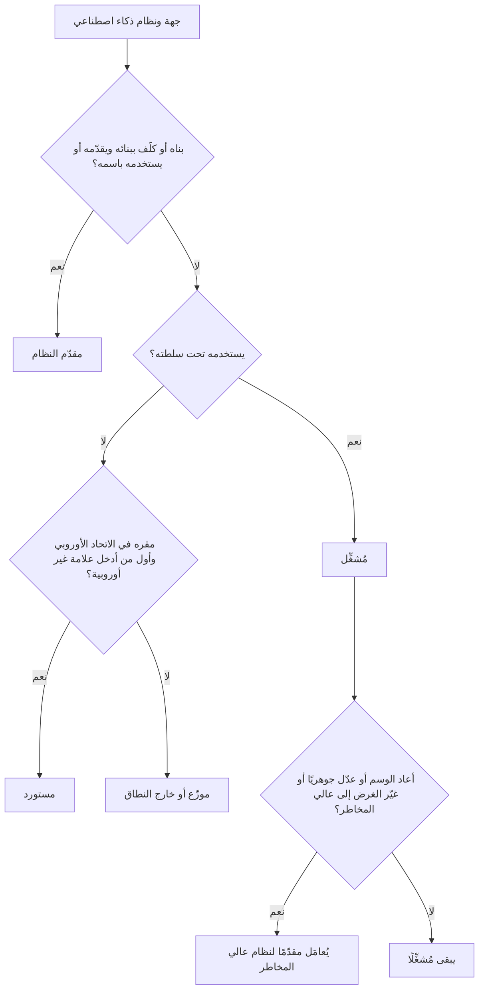

# الوحدة (Module) 6 — قانون الذكاء الاصطناعي الأوروبي (EU AI Act)

*قانون الذكاء الاصطناعي الأوروبي (EU AI Act) هو أول قانون شامل وأفقي (horizontal) يُكتب للذكاء الاصطناعي (AI)، ويعامله امتحان AIGP (AIGP exam) بوصفه النقطة المرجعية لكل ما عداه. يقع المقر الرئيسي (headquarters) لبنك نجم (Najm Bank) في الخليج، لكن فرعه في فرانكفورت وعملاءه في الاتحاد الأوروبي يُدخلون نموذج الائتمان (credit model)، وأداة فرز السير الذاتية (CV-screening tool) المشتراة من مورّد (vendor)، وروبوت المحادثة (chatbot)، والمساعد الذكي بالذكاء الاصطناعي التوليدي (GenAI copilot) في نطاق القانون. تغطي هذه الوحدة (Module) القانون في ثلاث مراحل: النطاق والأدوار ومستويات المخاطر (6.1)؛ وما يجب على مقدّمي النظام (providers) والمُشغِّلين (deployers) للأنظمة عالية المخاطر (high-risk) فعله (6.2)؛ والذكاء الاصطناعي للأغراض العامة والشفافية والإنفاذ والجدول الزمني (6.3). يختبر الامتحان (exam) القانون كما اعتُمد في اللائحة (EU) 2024/1689، لذا فهذا ما ندرّسه، مع التنبيه إلى التطورات اللاحقة. هذه الدورة (This course) تعليمية وليست استشارة قانونية (legal advice): في القرارات (decisions) الفعلية، اقرأ النص الساري واستشر محاميًا مؤهَّلًا.*

> **تغطية مجال المعرفة (BoK coverage):** II.C — نطاق قانون الذكاء الاصطناعي الأوروبي (EU AI Act) وأدواره ومستويات المخاطر (risk tiers) فيه؛ والتزامات الأنظمة عالية المخاطر على مقدّمي النظام والمُشغِّلين (High-risk obligations for providers and deployers)؛ والقواعد الخاصة بنماذج الذكاء الاصطناعي للأغراض العامة (general-purpose AI models) والشفافية (transparency)؛ والحوكمة (governance) والعقوبات (penalties) والجدول الزمني للتطبيق (application timeline).

---

# 6.1 — النطاق والأدوار وهرم المخاطر (Scope, roles and the risk pyramid)
*المستوى: 🟡 متوسط (Level: Intermediate)* · *المتطلبات: 1.1، 4.1* · *مجال المعرفة (BoK): II.C*

## ⚡ الدرس في دقيقة (In 60 seconds)

- قانون الذكاء الاصطناعي الأوروبي (EU AI Act) (اللائحة (EU) 2024/1689) لائحة أوروبية (EU regulation) واجبة التطبيق مباشرةً (directly applicable)، نافذة منذ 1 أغسطس 2024 وتُطبَّق على مراحل. وهو يستخدم آليات سلامة المنتجات (المتطلبات، وتقييم المطابقة (conformity assessment)، وعلامة CE (CE marking)، ومراقبة السوق (market surveillance)) لحماية الصحة والسلامة (safety) والحقوق الأساسية (fundamental rights).
- يمتد أثره خارج الاتحاد الأوروبي (EU): فمقدّمو النظام (providers) في أي مكان ممن يطرحون ذكاءً اصطناعيًا (AI) في سوق الاتحاد الأوروبي (EU market) مشمولون، وكذلك مقدّمو النظام والمُشغِّلون (deployers) في أي مكان إذا كانت *مخرجات (outputs) نظامهم تُستخدم في الاتحاد الأوروبي*.
- تتبع الواجباتُ (duties) **الأدوارَ (roles)**. يتحمل **مقدّم النظام (provider)** معظمها؛ ويتحمل **المُشغِّل (deployer)** مجموعة أخف لكنها حقيقية؛ وللمستوردين (importers) والموزّعين (distributors) والممثلين المفوَّضين (authorised representatives) ومصنّعي المنتجات (product manufacturers) واجباتهم الخاصة.
- أربعة مستويات: **المحظور (prohibited)** (المادة 5 (Art. 5))، و**عالي المخاطر (high-risk)** (المادة 6 (Art. 6) مع الملحقين I وIII)، و**الشفافية (transparency)** (المادة 50 (Art. 50))، و**الحد الأدنى (minimal)**. ولنماذج الذكاء الاصطناعي للأغراض العامة (general-purpose AI models) مسار منفصل (6.3).
- إشارة الامتحان (Exam cue): صنّف حسب **الغرض المقصود (intended purpose)** و**الدور (role)**، لا حسب التقنية.
- أكبر فخ (Biggest trap): «اشتريناه فقط، إذن المورّد (vendor) هو المسؤول.» للمُشغِّلين (deployers) واجباتهم الخاصة، والمُشغِّل (deployer) الذي يعيد وسم نظام (rebrands) أو يعدّله تعديلًا جوهريًا (substantial modification) أو يغيّر غرضه قد *يصبح* مقدّم النظام (provider).

## 🧭 لماذا يهم (Why it matters)

أول رسالة بريد إلكتروني تتلقاها ليلى بشأن قانون الذكاء الاصطناعي (AI Act) تأتي من مدير فرع فرانكفورت (Frankfurt branch): «هذه بالتأكيد مشكلة الشركات الأوروبية. نحن بنك خليجي.» ويتفق عمر معه جزئيًا؛ فهو يعتقد أن الأنظمة التي تعمل فعليًا من فرانكفورت وحدها قد تكون معنية.

تستعرض ليلى السجل (inventory) مع لجنة حوكمة الذكاء الاصطناعي (AI Governance Committee). بنى فريق دانة نموذج الائتمان (credit model) في الدوحة، لكنه يقيّم المقيمين في الاتحاد الأوروبي (EU) الذين يتقدمون بطلباتهم في فرانكفورت. وأداة فرز السير الذاتية (CV-screening tool) التي اشتراها يوسف من مورّد (vendor) تفرز المتقدمين (applicants) في الدوحة ودبي *وفرانكفورت*. وروبوت المحادثة (chatbot) يجيب عملاء الاتحاد الأوروبي. والمساعد الذكي لمذكرات الائتمان (credit memo copilot)، المبني على نموذج لغوي كبير (large language model) من طرف ثالث (third party)، يدعم إقراضًا يشمل بعض التجار الأفراد (sole traders) الألمان. ويعمل كشف الاحتيال (fraud detection) على كل معاملة بطاقة. ويستخدم الموظفون في كل مكان أدوات ذكاء اصطناعي توليدي (generative AI) عامة.

هل كل منها «نظام ذكاء اصطناعي (AI system)»؟ هل بنك نجم ضمن النطاق (in scope)؟ مقدّم نظام (provider) أم مُشغِّل (deployer) أم كلاهما؟ أي مستوى؟ الإجابات تحدد ما إذا كان بنك نجم يواجه واجب إفصاح أم برنامجًا كاملًا للأنظمة عالية المخاطر (high-risk)، مع غرامات (fines) على أسوأ المخالفات تصل إلى 35 مليون يورو أو 7% من حجم الأعمال العالمي (worldwide turnover). وكل ما عدا ذلك يتوقف على إصابة هذه الخطوة الأولى.

## 📐 كيف يعمل (How it works)

### 🟢 الأساسيات (The essentials)

**أي نوع من القوانين هذا (What kind of law this is).** *اللائحة (regulation)* تُطبَّق مباشرةً (applies directly) في كل دولة عضو (member state). ويستعير قانون الذكاء الاصطناعي (AI Act) تصميم قانون سلامة المنتجات الأوروبي («الإطار التشريعي الجديد (New Legislative Framework)»): يحدد القانون المتطلبات الأساسية (essential requirements)، وتصف المعايير (standards) كيفية استيفائها، ويتحقق الصانع (maker) من المطابقة (conformity) ويضع علامة CE (CE marking)، وتراقب السلطات (authorities) السوق. وفوق ذلك طبقة للحقوق الأساسية (fundamental rights)، ولهذا تظهر الواجبات (duties) الهندسية (التسجيل (logging)) وواجبات الحقوق (تقييمات الأثر (impact assessments)) جنبًا إلى جنب.

**ما الذي يُعدّ «نظام ذكاء اصطناعي (AI system)».** تعرّفه المادة 3(1) (Art. 3(1))، في جوهره، بأنه *نظام قائم على الآلة (machine-based system) مصمَّم للعمل بمستويات متفاوتة من الاستقلالية (autonomy)، وقد يُظهر قدرة على التكيّف (adaptiveness) بعد النشر (after deployment)، ويستنتج (infers)، لأهداف (Objectives) صريحة أو ضمنية، من المدخلات (inputs) التي يتلقاها كيفية توليد مخرجات (outputs) مثل التنبؤات (predictions) أو المحتوى أو التوصيات (recommendations) أو القرارات (decisions) التي يمكن أن تؤثر في البيئات المادية أو الافتراضية.* وهو مصاغ على غرار تعريف OECD (OECD definition) المحدَّث في نوفمبر 2023.

| العنصر | المعنى | مثال من بنك نجم (Najm example) |
|---|---|---|
| استقلالية متفاوتة (Varying autonomy) | قدر من الاستقلال عن التدخل البشري | يردّ روبوت المحادثة (chatbot) دون أن يكتب إنسان |
| *قد* يكون متكيّفًا (adaptive) | التعلم بعد النشر (after deployment) ممكن لكنه **غير مشترط** | نموذج الائتمان (credit model) المجمَّد (frozen) مؤهَّل مع ذلك |
| الأهداف (Objectives) | غايات صريحة أو ضمنية | «التنبؤ باحتمال التعثر (probability of default)» |
| **يستنتج (infers)** المخرجات (outputs) | الاختبار الرئيسي: يستخلص المخرجات (outputs) باستخدام تقنيات مثل تعلّم الآلة (machine learning) أو المناهج القائمة على المنطق والمعرفة | تعلّم نموذج الائتمان (credit model) أوزانه (its weights) من القروض السابقة |
| يؤثر في البيئات | تنبؤات، ومحتوى، وتوصيات، وقرارات (decisions) | درجة تنقل طلبًا إلى «الرفض» |

**الاستنتاج (inference)** هو ما يفصل الذكاء الاصطناعي (AI) عن البرمجيات العادية (ordinary software): فالحيثيات (recitals) تستثني الأنظمة القائمة على قواعد يحددها البشر (rules defined by people) وحدهم. فقاعدة جدول بيانات لدى موظف الائتمان («ارفض إذا تجاوزت نسبة الدين إلى الدخل 45%») ليست نظام ذكاء اصطناعي (AI system)؛ أما النموذج المدرَّب على حالات التعثر السابقة فهو كذلك. وتساعد إرشادات المفوضية (Commission guidelines) غير الملزمة الصادرة في فبراير 2025 بشأن التعريف في الحالات الحدّية (borderline cases).

**الأنظمة مقابل النماذج (Systems versus models).** **نظام الذكاء الاصطناعي (AI system)** هو الشيء القابل للنشر (deployable) الذي ينتج مخرجات (outputs) لاستخدام ما؛ أما **نموذج الذكاء الاصطناعي للأغراض العامة (GPAI)**، مثل النموذج اللغوي الكبير (large language model)، فهو مكوّن يُدمج في أنظمة كثيرة. والمساعد الذكي (copilot) في بنك نجم نظام؛ والنموذج اللغوي الكبير (LLM) بداخله نموذج GPAI (6.3).

**هرم المخاطر (risk pyramid).**

| المستوى | الموضع | النتيجة | مثال من بنك نجم (Najm example) |
|---|---|---|---|
| غير مقبول (Unacceptable) | المادة 5 | **محظور (Banned)** | التعرف على المشاعر (emotion recognition) لدى موظفي مركز الاتصال |
| عالٍ | المادة 6، الملحقان I وIII | متطلبات (requirements)، وتقييم مطابقة (conformity assessment)، وتسجيل (registration)، وواجبات (duties) على المُشغِّل (deployer) | التصنيف الائتماني (credit scoring) للأفراد في الاتحاد الأوروبي (EU)؛ فرز السير الذاتية (CV screening) |
| الشفافية (transparency) | المادة 50 | الإفصاح والوسم (Disclosure and labelling) | روبوت المحادثة (chatbot)؛ فيديو تسويقي مولّد بالذكاء الاصطناعي (AI) |
| الحد الأدنى (minimal) | — | لا واجبات (duties) جديدة؛ تُشجَّع المدونات الطوعية (voluntary codes) | تصفية الرسائل غير المرغوب فيها، والبحث الداخلي |

ينطبق **الإلمام بالذكاء الاصطناعي (AI literacy)** (المادة 4 (Art. 4)) على *جميع* مقدّمي النظام (providers) والمُشغِّلين (deployers) أيًّا كان المستوى، وتنطبق قواعد **نماذج GPAI (GPAI models)** على مقدّمي النماذج (model providers) أيًّا كانت الأنظمة التي تستخدم النموذج. ويمكن أن تتراكم المستويات: فالنظام عالي المخاطر (high-risk) الذي يتحاور مع الناس يجب أن يستوفي المادة 50 أيضًا.

### 🟡 التعمق أكثر (Going deeper)

**النطاق الإقليمي (المادة 2 (Art. 2)).** ينطبق القانون على:
1. **مقدّمي النظام (providers)** الذين يطرحون أنظمة ذكاء اصطناعي (AI systems) في السوق أو يضعونها في الخدمة في الاتحاد الأوروبي (EU)، أو يطرحون نماذج GPAI (GPAI models) في سوق الاتحاد الأوروبي (EU market)، *أينما كان مقر تأسيسهم*؛
2. **المُشغِّلين (deployers)** المؤسَّسين أو الموجودين في الاتحاد الأوروبي (EU)؛
3. **مقدّمي النظام (providers) والمُشغِّلين (deployers) خارج الاتحاد الأوروبي (EU)** حيث **تُستخدم مخرجات (outputs) النظام في الاتحاد الأوروبي**؛
4. **المستوردين (importers) والموزّعين (distributors)**؛
5. **مصنّعي المنتجات (product manufacturers)** الذين يطرحون نظام ذكاء اصطناعي (AI system) في السوق مع منتجهم تحت اسمهم الخاص؛
6. **الممثلين المفوَّضين (authorised representatives)** لمقدّمي النظام (providers) من خارج الاتحاد الأوروبي (EU)؛
7. **الأشخاص المتأثرين (affected persons)** الموجودين في الاتحاد الأوروبي (EU).

لذلك فإن فرع بنك نجم في فرانكفورت مُشغِّل في الاتحاد الأوروبي (EU deployer)، وحتى النظام الذي يُدار بالكامل من الدوحة يقع في النطاق (scope) إذا كانت مخرجاته، كالدرجة الائتمانية (credit score)، تُستخدم في الاتحاد الأوروبي (EU).

**الطرح في السوق (placing on the market)** هو الإتاحة *الأولى* في الاتحاد الأوروبي (EU). و**الوضع في الخدمة (putting into service)** هو توريد نظام لأول استخدام إلى مُشغِّل (deployer) *أو لاستخدام مقدّم النظام (provider) نفسه*، وبهذه الطريقة تقع الأنظمة الداخلية في النطاق (scope) دون أن تُباع أبدًا.

**الاستثناءات (Exclusions).** لا ينطبق القانون على:
- الأنظمة المستخدمة **حصرًا لأغراض عسكرية أو دفاعية أو للأمن القومي (national security)**؛
- الأنظمة أو النماذج المطوَّرة والموضوعة في الخدمة **لغرض البحث والتطوير العلمي (scientific research and development) وحده**؛
- **البحث والاختبار والتطوير (research, testing and development)** قبل الطرح في السوق (placing on the market) أو الوضع في الخدمة (الاختبار في ظروف العالم الحقيقي (testing in real-world conditions) غير مستثنى)؛
- **الأشخاص الطبيعيين (natural persons)** الذين يستخدمون الذكاء الاصطناعي (AI) في **نشاط شخصي بحت غير مهني (purely personal, non-professional activity)**؛
- الأنظمة الصادرة بموجب **تراخيص حرة ومفتوحة المصدر (free and open-source licences)**، *ما لم* تُطرح في السوق بوصفها عالية المخاطر (high-risk)، أو تقع تحت المادة 5 أو المادة 50 (ولنماذج GPAI (GPAI models) مفتوحة المصدر (open-source) إعفاؤها الخاص الأضيق)؛

لا يمسّ القانون اللائحة العامة لحماية البيانات (GDPR)؛ فحيثما تُعالَج بيانات شخصية (personal data)، ينطبق كلاهما.

**الأدوار (roles).**

| الدور (role) | التعريف المبسّط (Plain definition) | مثال من بنك نجم (Najm example) |
|---|---|---|
| **مقدّم النظام (Provider)** | يطوّر نظام ذكاء اصطناعي (AI system) أو نموذج GPAI (أو يكلّف بتطويره) ويطرحه في السوق أو يضعه في الخدمة **تحت اسمه أو علامته التجارية (its trademark)** | بنك نجم (نموذج الائتمان (credit model))؛ مورّد (vendor) أداة السير الذاتية (CV tool) |
| **المُشغِّل (Deployer)** | يستخدم نظام ذكاء اصطناعي (AI system) **تحت سلطته (under its authority)**، في غير الاستخدام الشخصي (personal use) غير المهني | بنك نجم بالنسبة إلى أداة السير الذاتية (CV tool) |
| **المستورد (Importer)** | مؤسَّس في الاتحاد الأوروبي (EU)؛ يطرح في سوق الاتحاد الأوروبي (EU market) نظامًا يحمل اسم جهة من خارج الاتحاد | موزّع (distributor) أوروبي يعيد بيع أداة أمريكية |
| **الموزّع (Distributor)** | أي فاعل آخر في سلسلة التوريد (supply chain) يتيح نظامًا في الاتحاد الأوروبي (EU) | جهة تكامل تعيد بيع أداة السير الذاتية (CV tool) |
| **الممثل المفوَّض (Authorised representative)** | شخص في الاتحاد الأوروبي (EU) مفوَّض كتابيًا من مقدّم نظام (provider) من خارج الاتحاد | مطلوب لمقدّمي (providers) الأنظمة عالية المخاطر (high-risk) ونماذج GPAI (GPAI models) من خارج الاتحاد |
| **مصنّع المنتج (Product manufacturer)** | يطرح في السوق منتجًا يتضمن ذكاءً اصطناعيًا (AI) مدمجًا تحت اسمه | صانع أجهزة طبية |

يشمل مصطلح «**المشغّل الاقتصادي (Operator)**» جميع هؤلاء. ويمكن لجهة واحدة أن تجمع أدوارًا عدة (several roles): فبنك نجم **مقدّم نظام (provider) ومُشغِّل (deployer)** لنموذج الائتمان (credit model) الخاص به، وهو نمط مفضّل في الامتحان (exam).

**متى يصبح المُشغِّل (deployer) مقدّمًا للنظام (المادة 25 (Art. 25)).** يُعامَل الموزّع (distributor) أو المستورد (importer) أو المُشغِّل أو أي طرف ثالث (third party) آخر بوصفه **مقدّم نظام عالي المخاطر (provider of a high-risk system)** إذا:
1. وضع **اسمه أو علامته التجارية (its trademark)** على نظام عالي المخاطر (high-risk) مطروح بالفعل في السوق (ويمكن للعقود توزيع الواجبات (duties) على نحو آخر بين الأطراف)؛
2. أجرى **تعديلًا جوهريًا (substantial modification)** على نظام عالي المخاطر (high-risk) بحيث يظل عالي المخاطر (risks)؛ أو
3. **غيّر الغرض المقصود (changes the intended purpose)** لنظام غير عالي المخاطر (not high-risk)، بما في ذلك نظام GPAI (GPAI system)، بحيث يصبح عالي المخاطر (high-risk).

ويجب على مقدّم النظام (provider) الأصلي حينئذ التعاون (cooperation) وتقديم المعلومات والوصول التقني اللازمين (ما لم يكن قد استبعد بوضوح تحويل نظامه إلى نظام عالي المخاطر (high-risk)). و**التعديل الجوهري (substantial modification)** تغيير غير مخطط له بعد الطرح في السوق (placing on the market) يؤثر في الامتثال (compliance) أو يغيّر الغرض المقصود (intended purpose). أما التغييرات التي يجريها نظام متعلّم ضمن حدود محددة مسبقًا وموثّقة عند تقييم المطابقة (conformity assessment) فلا تُحتسب.

```mermaid
flowchart TD
  A[جهة ونظام ذكاء اصطناعي] --> B{بناه أو كلّف ببنائه ويقدّمه أو يستخدمه باسمه؟}
  B -- نعم --> P[مقدّم النظام]
  B -- لا --> C{يستخدمه تحت سلطته؟}
  C -- نعم --> D[مُشغِّل]
  C -- لا --> E{مقره في الاتحاد الأوروبي وأول من أدخل علامة غير أوروبية؟}
  E -- نعم --> I[مستورد]
  E -- لا --> F[موزّع أو خارج النطاق]
  D --> G{أعاد الوسم أو عدّل جوهريًا أو غيّر الغرض إلى عالي المخاطر؟}
  G -- نعم --> P2[يُعامَل مقدّمًا لنظام عالي المخاطر]
  G -- لا --> D2[يبقى مُشغِّلًا]
```

**المادة 5: الممارسات المحظورة (prohibited practices)** (مطبَّقة منذ 2 فبراير 2025؛ ونُشرت إرشادات المفوضية (Commission guidelines) في الشهر نفسه). يُحظر طرح (placing) أنظمة ذكاء اصطناعي (AI systems) في السوق أو وضعها في الخدمة أو استخدامها إذا كانت:
1. تستخدم **تقنيات لا شعورية (subliminal) أو تلاعبية أو خادعة (manipulative or deceptive)** تشوّه السلوك تشويهًا جوهريًا، وتسبب أو يُرجَّح أن تسبب ضررًا كبيرًا؛
2. **تستغل مواطن الضعف (exploit vulnerabilities)** الناشئة عن العمر أو الإعاقة أو وضع اجتماعي أو اقتصادي محدد، بالأثر نفسه؛
3. تُجري **تصنيفًا اجتماعيًا (social scoring)** يؤدي إلى معاملة ضارة في سياقات غير ذات صلة، أو معاملة غير مبرَّرة أو غير متناسبة (من الجهات العامة *والخاصة*)؛
4. تتنبأ بخطر ارتكاب شخص لجريمة **استنادًا إلى التنميط (profiling) أو سمات الشخصية (personality traits) وحدها**؛
5. تبني قواعد بيانات للتعرف على الوجه (facial recognition) عبر **الكشط غير الموجَّه (untargeted scraping)** للصور من الإنترنت أو كاميرات المراقبة (CCTV)؛
6. تستنتج **المشاعر في مكان العمل (emotions in the workplace) أو المؤسسات التعليمية**، إلا لأسباب طبية أو تتعلق بالسلامة (safety)؛
7. **تصنّف الأشخاص بيومتريًا (biometrically)** لاستنتاج (inference) العرق أو الآراء السياسية أو العضوية النقابية أو المعتقدات الدينية أو الفلسفية أو الحياة الجنسية أو التوجه الجنسي؛
8. تُجري **تحديد الهوية البيومتري عن بُعد في الوقت الفعلي (real-time remote biometric identification) في الأماكن المتاحة للجمهور (publicly accessible spaces) لأغراض إنفاذ القانون (law enforcement)**، إلا حيث يكون ذلك ضروريًا بشكل صارم للبحث عن ضحايا محددين أو أشخاص مفقودين، أو منع تهديد وشيك للحياة أو هجوم إرهابي، أو تحديد مكان المشتبه بهم في جرائم خطيرة مدرجة، مع إذن مسبق قضائي (prior judicial authorisation) أو من جهة مستقلة وقانون وطني يتيح ذلك.

وبالنسبة إلى بنك، فإن البنود 1 و2 و3 و6 هي المخاطر (risks) الحية: أداة مبيعات تستغل الضائقة المالية، أو درجة «جدارة» مبنية على سلوك اجتماعي غير ذي صلة، أو تحليلات صوتية لمشاعر الموظفين.

### 🔴 نظرة الخبير (Expert view)

**المادة 6: طريقان إلى المخاطر العالية (two routes to high-risk).**

*الطريق 1 (Route 1): المنتجات (المادة 6(1)).* يكون النظام عالي المخاطر (high-risk) إذا (أ) كان مكوّن سلامة (safety component) لمنتج، أو كان هو نفسه منتجًا، تشمله تشريعات المواءمة الأوروبية (EU harmonisation legislation) في **الملحق (Annex) I** (مثل الآلات، والألعاب، والمصاعد، والمعدات الراديوية، والأجهزة الطبية، وفي قسم ثانٍ المركبات والطيران والمعدات البحرية ومعدات السكك الحديدية)، **و**(ب) كان ذلك المنتج يجب أن يخضع **لتقييم مطابقة (conformity assessment) من طرف ثالث (third party)** بموجب تلك التشريعات، **معًا**. وتُطبَّق هذه اعتبارًا من 2 أغسطس 2027.

*الطريق 2 (Route 2): حالات الاستخدام (المادة 6(2)، الملحق (Annex) III).* يكون النظام عالي المخاطر (high-risk) إذا وقع غرضه المقصود (its intended purpose) ضمن أحد ثمانية مجالات:

| # | المجال | أمثلة على الاستخدامات المدرجة |
|---|---|---|
| 1 | القياسات الحيوية (البيومترية) | تحديد الهوية البيومتري عن بُعد (لا مجرد التحقق من هوية مُدّعاة)؛ التصنيف حسب السمات الحساسة (categorisation by sensitive attributes)؛ التعرف على المشاعر (emotion recognition) |
| 2 | البنية التحتية الحرجة (critical infrastructure) | مكوّنات السلامة (safety components) للبنية التحتية الرقمية الحرجة (critical digital infrastructure)، وحركة المرور على الطرق، والمياه، والغاز، والتدفئة، والكهرباء |
| 3 | التعليم والتدريب المهني (Education and vocational training) | القبول؛ تقييم نواتج التعلم؛ تقييم المستوى التعليمي؛ كشف الغش في الاختبارات |
| 4 | التوظيف وإدارة العاملين (Employment and workers management) | التوظيف والاختيار (إعلانات الوظائف الموجّهة (targeted job ads)، وتصفية الطلبات، وتقييم المرشحين (candidates))؛ الترقية والإنهاء وتوزيع المهام؛ رصد الأداء والسلوك (monitoring performance and behaviour) |
| 5 | الخدمات الخاصة والعامة الأساسية (Essential private and public services) | أهلية الاستفادة من المزايا العامة (Public-benefit eligibility)؛ **تقييم الجدارة الائتمانية (creditworthiness) أو التصنيف الائتماني (credit scoring) للأشخاص الطبيعيين (natural persons)، باستثناء كشف الاحتيال (fraud detection)**؛ تقييم المخاطر (risk assessment) والتسعير (pricing) في التأمين على الحياة والتأمين الصحي (life and health insurance)؛ فرز مكالمات الطوارئ (emergency-call triage) |
| 6 | إنفاذ القانون (law enforcement) | موثوقية الأدلة (Evidence reliability)، والتنميط (profiling) في التحقيقات |
| 7 | الهجرة واللجوء ومراقبة الحدود (Migration, asylum, border control) | تقييم المخاطر (risk assessment)، وفحص الطلبات |
| 8 | العدالة والديمقراطية (Justice and democracy) | مساعدة القضاة؛ التأثير في الانتخابات أو التصويت |

يمكن للمفوضية (Commission) تعديل الملحق (Annex) III بقانون مفوَّض (delegated act) ضمن هذه المجالات (المادة 7).

*الاستثناء (المادة 6(3)) (derogation).* لا يكون نظام الملحق (Annex) III عالي المخاطر (high-risk) إذا لم يشكّل خطرًا (risk) كبيرًا بالإضرار بالصحة أو السلامة (safety) أو الحقوق الأساسية (fundamental rights)، بما في ذلك عدم تأثيره الجوهري في نتائج القرارات (decisions). ويكون الأمر كذلك حيث يُقصد به:
- (أ) أداء **مهمة إجرائية ضيقة (narrow procedural task)** (مثل تحويل المستندات غير المهيكلة إلى بيانات مهيكلة)؛
- (ب) **تحسين نتيجة نشاط بشري منجز سابقًا (improve the result of a previously completed human activity)** (مثل تنقيح خطاب صاغه شخص)؛
- (ج) **كشف أنماط القرار أو الانحرافات (detect decision patterns or deviations)** عن الأنماط السابقة، دون أن يحلّ محل التقييم البشري المنجز أو يؤثر فيه في غياب مراجعة بشرية (human review) ملائمة؛ أو
- (د) أداء **مهمة تحضيرية (preparatory task)** لتقييم من تقييمات الملحق (Annex) III.

ضمانتان (Two guard-rails): نظام الملحق (Annex) III الذي **يُجري تنميطًا (profiling) للأشخاص الطبيعيين (natural persons) عالي المخاطر (high-risk) دائمًا**؛ ومقدّم النظام (provider) الذي يعتمد على الاستثناء (derogation) يجب أن **يوثّق تقييمه (document its assessment)** مسبقًا وأن **يسجّل (register)** النظام في قاعدة بيانات الاتحاد الأوروبي (EU database). تحقّق مما إذا كانت إرشادات التصنيف (classification guidelines) التي وعدت بها المفوضية (Commission) قد صدرت.

**الحالة الصعبة (The hard case) في بنك نجم: المساعد الذكي (copilot).** المقترضون من الشركات الكبرى أشخاص اعتباريون (legal persons)، لذا لا ينطبق بند التصنيف الائتماني (credit scoring). أما التجار الأفراد (sole traders) فأشخاص طبيعيون (natural persons). فإذا كان المساعد الذكي يعيد هيكلة المستندات في قالب مذكرة فحسب، فقد يكون ذلك مهمة إجرائية ضيقة (narrow procedural task) أو تحضيرية. وإذا كان يلخّص السلوك المالي لشخص ويوصي بتصنيف، فهذا تنميط (profiling)، وهو عالي المخاطر (high-risk). وفي كلتا الحالتين، يوثّق بنك نجم تعليله (its reasoning).

**الغرض المقصود هو الحَكَم (Intended purpose is king).** إنه ما يذكره مقدّم النظام (provider) في تعليماته (its instructions) ومواده الترويجية ووثائقه. فمصنِّف المستندات منخفض المخاطر (minimal risk) إلى أن يستخدمه أحدهم لترتيب المتقدمين (applicants) للوظائف، وقد يصبح من غيّر غرضه حينئذ مقدّمًا لنظام عالي المخاطر (provider of a high-risk system) بموجب المادة 25.

## ⚖️ الأدوات التنظيمية (The instruments)

| الأداة | ما تشترطه أو توصي به (What it requires or recommends) | إشارة الامتحان (Exam cue) |
|---|---|---|
| **EU AI Act** — المادة 3(1) | تعرّف «نظام الذكاء الاصطناعي (AI system)»؛ الاستنتاج (inference) هو العنصر الرئيسي | القواعد التي يكتبها البشر وحدها خارج النطاق (out of scope)؛ والتكيّف (adaptiveness) اختياري |
| **EU AI Act** — المادة 2 | نطاق يتجاوز الحدود الإقليمية (extraterritorial scope)؛ استثناءات للأغراض العسكرية والبحث والاستخدام الشخصي (personal use) ومعظم المصادر المفتوحة (open source) | «المقر الرئيسي (headquarters) خارج الاتحاد الأوروبي (EU)» لا يُنهي التحليل أبدًا |
| **EU AI Act** — المادتان 3 و25 | تعرّف الأدوار (roles)؛ إعادة الوسم (rebranding) أو التعديل الجوهري (substantial modification) أو تغيير الغرض (repurposing) إلى عالي المخاطر (high-risk) يجعلك مقدّم النظام (provider) | «من هو مقدّم النظام (provider) الآن؟» |
| **EU AI Act** — المادة 5 | ثماني ممارسات محظورة (prohibited practices)، اعتبارًا من 2 فبراير 2025 | التعرف على المشاعر في مكان العمل (emotions in the workplace) والتصنيف الاجتماعي (social scoring) مفضّلان في الامتحان (exam) |
| **EU AI Act** — المادة 6 والملحقان I وIII | المخاطر العالية (high risk) عبر المنتجات المنظَّمة (regulated products) أو ثمانية مجالات لحالات الاستخدام (use cases)؛ استثناء المادة 6(3)، ولا يشمل التنميط (profiling) أبدًا | التصنيف الائتماني (credit scoring) للأفراد عالي المخاطر (high-risk)؛ وكشف الاحتيال (fraud detection) ليس كذلك |
| **GDPR** | تنطبق إلى جانب قانون الذكاء الاصطناعي (AI Act) على البيانات الشخصية (personal data) | قانون الذكاء الاصطناعي (AI Act) لا يحلّ محلها |

## 🏛️ عمليًا في بنك نجم (In practice at Najm Bank)

أول منتَج تعدّه ليلى هو **سجل تصنيف وفق قانون الذكاء الاصطناعي (AI Act classification register)**، تعتمده لجنة حوكمة الذكاء الاصطناعي (AI Governance Committee). ولا يُطلق أي نظام في الاتحاد الأوروبي (EU) أو لصالحه دون صف مكتمل توقّعه ليلى وتراجعه سارة (مسؤولة حماية البيانات (DPO)).

| النظام | الصلة بالاتحاد الأوروبي (EU nexus) | دور بنك نجم (Najm's role) | المستوى | الخطوة التالية (Next step) |
|---|---|---|---|---|
| نموذج ائتمان الأفراد (retail credit model) | يقيّم المقيمين في الاتحاد الأوروبي (EU) | مقدّم نظام (provider) ومُشغِّل (deployer) | عالي المخاطر (high-risk)، الملحق (Annex) III البند 5 (تنميط (profiling)) | برنامج مقدّم النظام (provider) وتقييم الأثر على الحقوق الأساسية (FRIA) (6.2) |
| أداة فرز السير الذاتية (CV-screening tool) | التوظيف في فرانكفورت | مُشغِّل (deployer) | عالي المخاطر (high-risk)، الملحق (Annex) III البند 4 | واجبات المُشغِّل (deployer duties)؛ أدلة المورّد (vendor) |
| روبوت محادثة العملاء (customer chatbot) | عملاء الاتحاد الأوروبي (EU) | مقدّم النظام (provider) | الشفافية (transparency)، المادة 50 | الإفصاح (disclosure) المدمج في التصميم |
| المساعد الذكي لمذكرات الائتمان (credit memo copilot) | الإقراض (lending) لتجار أفراد (sole traders) في الاتحاد الأوروبي (EU) | مقدّم نظام (provider) مبني على نموذج GPAI (GPAI model) | قيد المراجعة (Under review) | تقييم موثَّق وفق المادة 6(3) |
| كشف الاحتيال (fraud detection) | معاملات البطاقات في الاتحاد الأوروبي (EU) | مقدّم نظام (provider) ومُشغِّل (deployer) | غير عالي المخاطر (استثناء الاحتيال) | الإلمام بالذكاء الاصطناعي (AI literacy)، وGDPR، وسياسة مخاطر النماذج (model-risk policy) |
| استخدام الموظفين للذكاء الاصطناعي التوليدي (generative AI) العام | موظفو الاتحاد الأوروبي (EU) | مُشغِّل (deployer) | الحد الأدنى (minimal)، إضافة إلى المادة 4 | سياسة الاستخدام المقبول (acceptable-use policy)، والتدريب |

وتضيف بندًا واحدًا إلى سياسة الذكاء الاصطناعي (AI policy) في بنك نجم:

> **ضابط تغيّر الدور (Role-change control).** لا يجوز لأي وحدة عمل (أ) وضع اسم بنك نجم أو علامته التجارية (its trademark) على نظام ذكاء اصطناعي (AI system) من طرف ثالث (third party)، أو (ب) تغيير نموذج نظام من طرف ثالث أو بياناته أو إعداداته بما يتجاوز المعايير الموثّقة (documented parameters) من المورّد (vendor)، أو (ج) استخدام أي نظام ذكاء اصطناعي (AI) لغرض غير الغرض المسجَّل في سجل أنظمة الذكاء الاصطناعي (AI inventory)، دون موافقة كتابية مسبقة من رئيس حوكمة الذكاء الاصطناعي (Head of AI Governance). فمثل هذه التغييرات قد تجعل بنك نجم مقدّمًا لنظام ذكاء اصطناعي عالي المخاطر (provider of a high-risk AI system) بموجب المادة 25 من قانون الذكاء الاصطناعي الأوروبي (EU AI Act).

## 🛠️ التمارين (Exercises)

🟢 **اختبار التعريف (Definition test).** خذ ثلاث أدوات (واحدة قائمة على القواعد، وواحدة بتعلّم الآلة (machine learning)، وواحدة توليدية) ومرّر كلًّا منها على المادة 3(1). استنتج ما إذا كانت كل منها «نظام ذكاء اصطناعي (AI system)» وأي عنصر حسم ذلك.
*يكتمل عندما (Done when):* يكون لديك ثلاثة استنتاجات قصيرة، يسمّي كلٌّ منها العنصر الحاسم.

🟡 **خريطة الأدوار (Role map).** يبيع مورّد (vendor) أمريكي أداة السير الذاتية (CV tool) عبر موزّع في الاتحاد الأوروبي (EU)، ويخطط فريق الموارد البشرية (HR) في بنك نجم لإضافة قواعد تقييم خاصة به فوقها. حدّد مقدّم النظام (provider) والمستورد (importer) والموزّع (distributor) والمُشغِّل (deployer)، وبيّن ما الذي سيجعل بنك نجم مقدّم النظام بموجب المادة 25.
*يكتمل عندما (Done when):* يكون لكل طرف دور مع تبرير من سطر واحد، وتكون قد سمّيت محفّزين اثنين على الأقل من محفّزات المادة 25.

🔴 **مذكرة الاستثناء (Derogation memo).** اكتب تقييمًا من صفحة واحدة وفق المادة 6(3) للمساعد الذكي (copilot) كما يُستخدم للتجار الأفراد (sole traders): الشروط الأربعة، واستثناء التنميط (profiling) الغالب، والأدلة المحفوظة، والاستنتاج (conclusion).
*يكتمل عندما (Done when):* تستطيع سلطةٌ تتبّع التعليل (reasoning) ورؤية الأثر المترتب على التسجيل (registration).

## ⚠️ أخطاء وفخاخ الامتحان (Mistakes and exam traps)

- **«شركة من خارج الاتحاد الأوروبي (EU)، إذن خارج النطاق (out of scope).»** تحقّق من الطرح في سوق الاتحاد الأوروبي (EU market)، والتشغيل في الاتحاد الأوروبي، والمخرجات (outputs) المستخدمة في الاتحاد الأوروبي.
- **«التكيّف (adaptiveness) شرط.»** إنه اختياري («قد»). فنموذج تعلّم الآلة (machine-learning model) المجمَّد (frozen) لا يزال نظام ذكاء اصطناعي (AI system)؛ والاستنتاج (inference) هو المفتاح.
- **الخلط بين كشف الاحتيال (fraud detection) والتصنيف الائتماني (credit scoring).** كشف الاحتيال مستثنى صراحةً؛ والتصنيف الائتماني *للأشخاص الطبيعيين (natural persons)* عالي المخاطر (high-risk)؛ وتقييم الشركات لا يقع تحت ذلك البند.
- **معاملة المادة 6(3) على أنها تلقائية.** إنها لا تشمل التنميط (profiling) أبدًا، وتتطلب التوثيق (documentation) والتسجيل (registration).
- **«المورّد (vendor) يتحمل كل شيء.»** للمُشغِّلين (deployers) واجبات (6.2)، ويصبحون مقدّمين للنظام (providers) إذا أعادوا الوسم (rebrand) أو عدّلوا تعديلًا جوهريًا (substantial modification) أو غيّروا الغرض (repurpose) إلى عالي المخاطر (high-risk).
- **الخلط في التعرف على المشاعر (emotion recognition).** محظور (Banned) في العمل أو التعليم (باستثناء الأسباب الطبية أو المتعلقة بالسلامة (safety))؛ وفي غير ذلك، عالي المخاطر (high-risk) إضافة إلى إشعار بموجب المادة 50.

## 🧾 الخلاصة (Recap)

- يطبّق قانون الذكاء الاصطناعي (AI Act) أساليب سلامة المنتجات (product safety) على الذكاء الاصطناعي (AI)، مع طبقة للحقوق الأساسية (fundamental rights).
- يُعرَّف نظام الذكاء الاصطناعي (AI system) بقدرته على *الاستنتاج (inference)*.
- النطاق (scope) يتجاوز الحدود الإقليمية (extraterritorial): الطرح في سوق الاتحاد الأوروبي (EU market)، والمُشغِّلون في الاتحاد الأوروبي (EU deployers)، والمخرجات (outputs) من خارج الاتحاد المستخدمة فيه.
- الأدوار (roles) تحدد الواجبات (duties)؛ وكثيرًا ما تجمع الجهات أدوارًا عدة (several roles)، ويمكن للمادة 25 أن تحوّل المُشغِّل (deployer) إلى مقدّم نظام (provider).
- المستويات: ثمانية محظورات (prohibitions) في المادة 5؛ والمخاطر العالية (high risk) عبر منتجات الملحق (Annex) I أو مجالات الملحق III الثمانية؛ والشفافية (transparency) بموجب المادة 50؛ والحد الأدنى (minimal). وتسري قواعد الإلمام بالذكاء الاصطناعي (AI literacy) ونماذج GPAI (GPAI models) عبر المستويات كلها.
- استثناء المادة 6(3) لا يشمل التنميط (profiling) أبدًا ويتطلب دائمًا التوثيق (documentation) والتسجيل (registration).

## ✍️ اختبر نفسك (Check yourself)

**1. يقع المقر الرئيسي (headquarters) لبنك نجم في الدوحة. بنى فريق علوم البيانات (data-science team) لديه نموذج تصنيف ائتماني (credit-scoring model) يستخدمه فرع فرانكفورت (Frankfurt branch) للبت في طلبات القروض (loan applications) المقدمة من مقيمين في الاتحاد الأوروبي (EU). ما وضع بنك نجم بموجب قانون الذكاء الاصطناعي الأوروبي (EU AI Act)؟**

- A. خارج النطاق (out of scope)، لأن النموذج طُوّر واستُضيف خارج الاتحاد الأوروبي (EU)
- B. مقدّم نظام (provider) ومُشغِّل (deployer) لنظام ذكاء اصطناعي (AI system) عالي المخاطر (high-risk)
- C. مستورد (importer)، لأنه أدخل نظامًا من خارج الاتحاد إلى الاتحاد الأوروبي (EU)
- D. مُشغِّل (deployer) فقط، لأنه لم يبع النموذج قط

الإجابة

**B.** بنى بنك نجم النظام ووضعه في الخدمة لاستخدامه الخاص تحت اسمه (مقدّم النظام (provider))، ويستخدمه فرعه (المُشغِّل (deployer)). قد يبدو D مغريًا، لكن الوضع في الخدمة (putting into service) للاستخدام الخاص يكفي ليكون المرء مقدّمًا للنظام (the provider). أما A فيتجاهل المادة 2. (انظر 🟡 التعمق أكثر (Going deeper): النطاق الإقليمي (Territorial scope) والأدوار (roles).)

**2. أيٌّ مما يلي ممارسة محظورة (prohibited practice) بموجب المادة 5؟**

- A. روبوت محادثة (chatbot) للعملاء لا يذكر أنه ذكاء اصطناعي (AI)
- B. نموذج يقيّم الجدارة الائتمانية (creditworthiness) للمتقدمين (applicants) الأفراد بطلبات القروض (loan applications)
- C. نظام يستنتج (infers) مشاعر موظفي مركز الاتصال من أصواتهم لإدارة الأداء
- D. نموذج يكشف معاملات البطاقات الاحتيالية

الإجابة

**C.** التعرف على المشاعر في مكان العمل (emotions in the workplace) محظور (Banned) إلا لأسباب طبية أو تتعلق بالسلامة (safety). أما A فيخالف المادة 50، لا المادة 5. وB عالي المخاطر (high-risk) وD مستثنى صراحةً من بند التصنيف الائتماني (credit scoring). (انظر 🟡 التعمق أكثر (Going deeper): المادة 5.)

**3. يريد مقدّم نظام (provider) الاعتماد على استثناء المادة 6(3) لأن نظامه المدرج في الملحق (Annex) III يؤدي مهمة تحضيرية (preparatory task) فقط. في أي حالة لا يمكنه ذلك؟**

- A. النظام يُجري تنميطًا (profiling) للأشخاص الطبيعيين (natural persons)
- B. النظام يُباع للمنشآت الصغيرة والمتوسطة (SMEs) فقط
- C. النظام طُوّر خارج الاتحاد الأوروبي (EU)
- D. النظام يُستخدم إلى جانب مراجعة بشرية (human review)

الإجابة

**A.** نظام الملحق (Annex) III الذي يُجري تنميطًا (profiling) للأشخاص الطبيعيين (natural persons) عالي المخاطر (high-risk) دائمًا. والعوامل الأخرى لا تُسقط الاستثناء (derogation)، والمراجعة البشرية (D) تدعم الشرط (ج). (انظر 🔴 نظرة الخبير (Expert view): الاستثناء.)

**4. يشتري بنك نجم أداة فرز سير ذاتية (CV-screening tool) تحمل علامة CE (CE marking) من مورّد (vendor). تعيد الموارد البشرية (HR) تسميتها «Najm TalentMatch» وتعرضها على شركات المجموعة في الاتحاد الأوروبي (EU). ما النتيجة الأدق؟**

- A. لا شيء يتغير؛ يظل المورّد (vendor) مقدّم النظام (provider) لأنه بنى النظام
- B. يصبح بنك نجم موزّعًا (distributor) بواجبات (duties) تحقق محدودة
- C. يتوقف النظام عن كونه عالي المخاطر (high-risk) لأن تقييم المطابقة (conformity assessment) أُجري بالفعل
- D. يُعامَل بنك نجم بوصفه مقدّم نظام ذكاء اصطناعي عالي المخاطر (provider of a high-risk AI system)

الإجابة

**D.** بموجب المادة 25، وضع اسمك أو علامتك التجارية (your trademark) على نظام عالي المخاطر (high-risk) مطروح بالفعل في السوق (already on the market) يجعلك مقدّمه (its provider). وA هو فخ «المورّد (vendor) يتحمل كل شيء»؛ وإعادة الوسم (rebranding) هي بالضبط ما ينقل بنك نجم إلى ما يتجاوز دور الموزّع (B). (انظر 🟡 التعمق أكثر (Going deeper): متى يصبح المُشغِّل (deployer) مقدّمًا للنظام (the provider).)

**5. أيٌّ مما يلي يقع خارج نطاق قانون الذكاء الاصطناعي الأوروبي (EU AI Act)؟**

- A. مقدّم نظام (provider) من خارج الاتحاد الأوروبي (EU) تُستخدم مخرجات (outputs) نظامه في الاتحاد الأوروبي
- B. نظام ذكاء اصطناعي (AI system) مفتوح المصدر (open-source) مطروح في السوق بوصفه نظامًا عالي المخاطر (high-risk)
- C. شخص في برلين يستخدم مولّد صور (image generator) بالذكاء الاصطناعي (AI) لصنع بطاقات أعياد ميلاد لعائلته
- D. مستورد (importer) في الاتحاد الأوروبي (EU) لنظام ذكاء اصطناعي (AI system) من مورّد (vendor) من خارج الاتحاد

الإجابة

**C.** الاستخدام الشخصي البحت غير المهني (purely personal non-professional use) من الأفراد مستثنى. أما A وD فضمن النطاق (in scope) صراحةً، واستثناء المصادر المفتوحة (open source) لا يشمل الأنظمة المطروحة في السوق بوصفها عالية المخاطر (B). (انظر 🟡 التعمق أكثر (Going deeper): الاستثناءات (Exclusions).)

## 📚 المراجع (References)

- اللائحة (EU) 2024/1689 (قانون الذكاء الاصطناعي (AI Act))، النص الرسمي: https://eur-lex.europa.eu/eli/reg/2024/1689/oj
- المفوضية الأوروبية (European Commission)، الإطار التنظيمي للذكاء الاصطناعي (بما في ذلك الإرشادات (guidelines) بشأن تعريف نظام الذكاء الاصطناعي (AI system) والممارسات المحظورة (prohibited practices)): https://digital-strategy.ec.europa.eu/en/policies/regulatory-framework-ai
- مبادئ OECD للذكاء الاصطناعي (AI) وتعريف نظام الذكاء الاصطناعي (AI system): https://oecd.ai/en/ai-principles
- IAPP، شهادة AIGP ومجال المعرفة (Body of Knowledge): https://iapp.org/certify/aigp/

---

# 6.2 — التزامات الأنظمة عالية المخاطر على مقدّمي النظام والمُشغِّلين (High-risk obligations for providers and deployers)
*المستوى: 🟡 متوسط (Level: Intermediate)* · *المتطلبات: 6.1، 4.3* · *مجال المعرفة (BoK): II.C*

## ⚡ الدرس في دقيقة (In 60 seconds)

- يجب أن تستوفي أنظمة الذكاء الاصطناعي (AI systems) عالية المخاطر (high-risk) سبعة متطلبات (المواد 9–15 (Arts 9–15)): **نظام إدارة المخاطر (risk management system)**، و**البيانات وحوكمة البيانات (data and data governance)**، و**الوثائق الفنية (technical documentation)**، و**حفظ السجلات (record-keeping) (logging)**، و**الشفافية وتعليمات الاستخدام (transparency and instructions for use)**، و**الإشراف البشري (human oversight)**، و**الدقة والمتانة والأمن السيبراني (accuracy, robustness and cybersecurity)**.
- يثبت **مقدّم النظام (provider)** الامتثال (compliance) عبر **نظام إدارة الجودة (quality management system)**، و**تقييم المطابقة (conformity assessment)**، و**إعلان المطابقة الأوروبي (EU declaration of conformity)**، و**علامة CE (CE marking)**، و**التسجيل في قاعدة بيانات الاتحاد الأوروبي (EU database registration)**، ثم يتولى **الرصد بعد الطرح في السوق (post-market monitoring)** والإبلاغ عن **الحوادث الجسيمة (serious incidents)**.
- يجب على **المُشغِّل (deployer)** (المادة 26 (Art. 26)) استخدام النظام وفق تعليماته (its instructions)، وتكليف أشخاص أكفاء بـ**الإشراف البشري (human oversight)**، وضمان ملاءمة **بيانات الإدخال (input data)**، و**الرصد (monitor)**، والاحتفاظ بـ**السجلات (logs)** ستة أشهر على الأقل، و**إبلاغ العاملين (inform workers)** و**الأشخاص المتأثرين (affected persons)**.
- يجب على الهيئات العامة (public bodies)، ومقدّمي الخدمات العامة (providers of public services)، والمُشغِّلين (deployers) الذين يستخدمون الذكاء الاصطناعي (AI) في **التصنيف الائتماني (credit scoring)** أو **تسعير التأمين على الحياة والتأمين الصحي (life and health insurance pricing)** إجراء **تقييم الأثر على الحقوق الأساسية (FRIA)** (المادة 27 (Art. 27)).
- للأشخاص المتأثرين (affected persons) **الحق في التفسير (right to explanation)** (المادة 86 (Art. 86)) بشأن دور الذكاء الاصطناعي (AI) والعناصر الرئيسية للقرار (main elements of the decision).
- أكبر فخ (Biggest trap): الاعتقاد بأن علامة CE (CE marking) الخاصة بالمورّد (vendor) تغطي المُشغِّل (deployer). إنها لا تغطيه.

## 🧭 لماذا يهم (Why it matters)

يريد خالد إطلاق نموذج التصنيف الائتماني (credit-scoring model) لحملة الإقراض (lending) الربيعية في فرانكفورت. وتقول دانة إنه «جاهز»: فهو يتفوق على بطاقة التقييم (scorecard) القديمة وقد اعتمده فريق التحقق (validation). وتسأل ليلى: «جاهز بالقياس إلى ماذا؟» فبوصفه مقدّمًا لنظام عالي المخاطر (provider of a high-risk system)، يجب على بنك نجم (Najm Bank) أن يُظهر نظامًا لإدارة المخاطر (a risk management system)، وأدلة على حوكمة البيانات (data governance)، ووثائق (documentation) وفق الملحق (Annex) IV، وتسجيلًا للأحداث (logging)، وتعليمات استخدام (instructions for use)، وإشرافًا بشريًا (human oversight) مدمجًا في التصميم، ومتانة مختبَرة (tested robustness)، ونظامًا لإدارة الجودة (a quality management system)، وتقييم مطابقة (conformity assessment)، وإعلانًا (a declaration)، وعلامة CE (CE marking)، وتسجيلًا (a registration). ولا شيء من ذلك سؤال عن دقة النموذج (model accuracy).

في هذه الأثناء، وقّع يوسف عقد أداة فرز السير الذاتية (CV-screening tool). «المورّد (vendor) يحمل علامة CE (CE marking)، إذن الامتثال (compliance) مشكلته هو.» وتخالفه سارة الرأي. فبوصفه مُشغِّلًا (deployer)، يجب على بنك نجم استخدام الأداة وفق تعليماتها (its instructions)، وتكليف أشخاص مدرَّبين بالمراجعة، وفحص مدخلاتها، والاحتفاظ بالسجلات (keep logs)، وإحاطة مجلس العاملين (works council) في فرانكفورت، وإبلاغ المرشحين (candidates) بأن نظامًا عالي المخاطر (high-risk) مستخدم. وبالنسبة إلى نموذج الائتمان (credit model)، يجب على بنك نجم بوصفه مُشغِّلًا أن يُجري أيضًا تقييم FRIA.

هذا هو قلب القانون لمعظم الجهات، والسؤال (question) المفضّل في الامتحان (exam) هنا هو: «من يجب أن يفعل هذا، مقدّم النظام (provider) أم المُشغِّل (deployer)؟»

## 📐 كيف يعمل (How it works)

### 🟢 الأساسيات (The essentials)

**المتطلبات السبعة (The seven requirements).** يجب أن يستوفيها كل نظام عالي المخاطر (high-risk)، مع مراعاة غرضه المقصود (its intended purpose) وأحدث ما توصلت إليه التقنية (state of the art) (المادة 8). ويبنيها مقدّم النظام (provider) داخل النظام.

| المادة | المتطلب (Requirement) | المعنى المبسّط (Plain meaning) | في بنك نجم (نموذج الائتمان (credit model)) |
|---|---|---|---|
| 9 | **نظام إدارة المخاطر (risk management system)** | عملية مستمرة ومتكررة (continuous, iterative process) عبر دورة الحياة (life cycle): تحديد وتقييم المخاطر (risk assessment) على الصحة والسلامة (safety) والحقوق الأساسية (fundamental rights) في ظل الاستخدام المقصود (intended use) *وإساءة الاستخدام المتوقعة بصورة معقولة (reasonably foreseeable misuse)*؛ واعتماد التدابير؛ والاختبار؛ وعدم قبول إلا المخاطر المتبقية (residual risk) المقبولة؛ ومراعاة الفئات الضعيفة (vulnerable groups) | سجل مخاطر (risk register) حيّ، يُراجَع عند كل إعادة تدريب (retrain) |
| 10 | **البيانات وحوكمة البيانات (data and data governance)** | حوكمة بيانات التدريب والتحقق والاختبار (training, validation and test data) (المصدر، والإعداد، والافتراضات، و**الفحص بحثًا عن التحيّزات المحتملة (examination for possible biases)**، والفجوات)؛ وأن تكون ملائمة وممثِّلة بما يكفي (relevant and sufficiently representative)، وخالية من الأخطاء وكاملة قدر الإمكان بالنسبة إلى الغرض والسياق | أدلة على تمثيل المتقدمين (applicants) الألمان؛ اختبارات التحيّز (bias tests) حسب العمر والجنس |
| 11 | **الوثائق الفنية (technical documentation)** | تُكتب *قبل* الطرح في السوق (placing on the market)، وتُحدَّث باستمرار، بالمحتوى الوارد في **الملحق (Annex) IV**؛ وصيغة مبسطة للمنشآت الصغيرة والمتوسطة (SMEs) | ملف النموذج (model dossier) مهيكل وفق الملحق (Annex) IV |
| 12 | **حفظ السجلات (record-keeping)** | يجب أن *يتيح النظام تقنيًا* التسجيل التلقائي للأحداث (automatic event logging) طوال عمره، بما يكفي لتتبّع المخاطر (risks) ودعم الرصد (monitoring) | تُسجَّل كل درجة مع إصدارات المدخلات (inputs) والنموذج |
| 13 | **الشفافية (transparency)، وتعليمات الاستخدام (instructions for use)** | يستطيع المُشغِّلون (deployers) تفسير المخرجات (outputs) واستخدامها على النحو الصحيح؛ وتغطي التعليمات (instructions) الغرض، ومقاييس الدقة (accuracy metrics)، والمخاطر (risks) المعروفة، وتدابير الإشراف (oversight)، ومواصفات المدخلات (input specifications)، والعمر الافتراضي (lifetime)، والسجلات (logs) | دليل موظف القروض (loan officer): ماذا تعني درجة 0.62 ومتى لا يُعتمد عليها |
| 14 | **الإشراف البشري (human oversight)** | يستطيع الأشخاص فهم القدرات والحدود، والبقاء متيقظين لـ**تحيّز الأتمتة (automation bias)**، وتفسير المخرجات (outputs)، وتجاهلها أو عكسها، وإيقاف النظام | سبب مكتوب مطلوب عند اتباع درجة حدّية |
| 15 | **الدقة والمتانة والأمن السيبراني (Accuracy, robustness, cybersecurity)** | أداء ملائم ومتسق؛ وقدرة على الصمود أمام الأخطاء و**حلقات التغذية الراجعة (feedback loops)**؛ وحماية من **تسميم البيانات (data poisoning)** و**تسميم النموذج (model poisoning)** و**الأمثلة العدائية (adversarial examples)** و**هجمات السرية (confidentiality attacks)** | اختبارات ضغط (stress tests) على دخول متحوّلة؛ مسار تدريب محكم الإغلاق |

يجوز لمقدّمي النظام (providers)، استثناءً ومع ضمانات صارمة، معالجة فئات البيانات الخاصة (special-category data) حيث يكون ذلك ضروريًا بشكل صارم لكشف التحيّز (detecting bias) وتصحيحه (المادة 10(5)). وهي نافذة ضيقة؛ وتظل اللائحة العامة لحماية البيانات (GDPR) منطبقة.

**مسار مقدّم النظام إلى السوق (The provider's path to market).**

```mermaid
flowchart RL
  A[البناء وفق المواد 9 إلى 15] --> B[نظام إدارة الجودة]
  B --> C[الوثائق الفنية]
  C --> D[تقييم المطابقة]
  D --> E[الإعلان وعلامة CE]
  E --> F[التسجيل في قاعدة بيانات الاتحاد الأوروبي]
  F --> G[الطرح في السوق أو الوضع في الخدمة]
  G --> H[الرصد بعد الطرح في السوق]
  H --> I[الإبلاغ عن الحوادث الجسيمة]
  H --> A
```

### 🟡 التعمق أكثر (Going deeper)

**التزامات مقدّم النظام (المادة 16 وما يليها) (Provider obligations).** إضافة إلى المتطلبات السبعة (The seven requirements)، يجب على مقدّم النظام (provider):
- إظهار **اسمه وعنوان الاتصال به (name and contact address)** على النظام أو العبوة أو الوثائق (documentation)؛
- تشغيل **نظام إدارة الجودة (QMS)** (المادة 17): سياسات وإجراءات موثّقة للامتثال التنظيمي (regulatory compliance) وإدارة التغيير (change management)، والتصميم والتحقق (design and verification)، والاختبار والمصادقة (testing and validation)، والمعايير (standards) المطبّقة، وإدارة البيانات (data management)، وإدارة المخاطر (risk management)، والرصد بعد الطرح في السوق (post-market monitoring)، والإبلاغ عن الحوادث (incident reporting)، والتواصل مع السلطات (communication with authorities)، وحفظ السجلات (record-keeping)، والموارد، و**إطار للمساءلة (accountability framework)**. ويجب أن يكون متناسبًا مع حجم الجهة. ويمكن **للمؤسسات المالية (financial institutions)** استيفاء معظمه عبر قواعد الحوكمة الداخلية (internal governance) القائمة لديها بموجب قانون الخدمات المالية الأوروبي (EU financial-services law)، لكن يجب عليها مع ذلك تغطية إدارة المخاطر (risks) والرصد بعد الطرح في السوق (monitoring after placing on the market) والإبلاغ عن الحوادث (incidents)؛
- **الاحتفاظ بالوثائق (keep documentation)** متاحة للسلطات (authorities) مدة **عشر سنوات** بعد الطرح في السوق (placing on the market)؛
- **الاحتفاظ بالسجلات (keep logs)** الخاضعة لسيطرته مدة تناسب الغرض، **ستة أشهر على الأقل**؛
- إتمام **تقييم المطابقة (conformity assessment)** (المادة 43)، وتحرير **إعلان المطابقة الأوروبي (EU declaration of conformity)** (المادة 47)، ووضع **علامة CE (CE marking)** (المادة 48)، رقميًا بالنسبة إلى الأنظمة الرقمية فقط؛
- **تسجيل (registration)** نفسه والنظام في **قاعدة بيانات الاتحاد الأوروبي (EU database)** (المادتان 49 و71) قبل الطرح في السوق (تُسجَّل أنظمة البنية التحتية الحرجة (critical infrastructure) على المستوى الوطني؛ وأنظمة إنفاذ القانون (law enforcement) والهجرة في قسم غير علني)؛
- اتخاذ **إجراءات تصحيحية (corrective action)** (الإصلاح أو السحب (withdraw) أو التعطيل أو الاسترجاع (recall)) وإبلاغ الآخرين حين يكون النظام غير ممتثل (non-compliant)، و**التعاون (cooperation)** مع السلطات (authorities).

يجب على مقدّم النظام (provider) **من خارج الاتحاد الأوروبي (EU)** تعيين **ممثل مفوَّض (authorised representative)** في الاتحاد الأوروبي بتفويض كتابي (المادة 22). ويجب على **المستوردين (importers)** التحقق من تقييم المطابقة (conformity assessment) والوثائق (documentation) وعلامة CE (CE marking) والإعلان (declaration) والممثل (representative) قبل الطرح في السوق (placing on the market)؛ ويفحص **الموزّعون (distributors)** علامة CE والإعلان والتعليمات (instructions). ولا يجوز لأي منهما توريد نظام يعتقد أنه غير ممتثل (non-compliant).

**مسارات تقييم المطابقة (المادة 43) (Conformity assessment routes).**

| النظام | المسار |
|---|---|
| الملحق (Annex) III، البنود 2–8 (الائتمان، والتوظيف، والتعليم…) | **الرقابة الداخلية (Internal control)** (الملحق (Annex) VI): يقيّم مقدّم النظام (provider) نفسه؛ دون هيئة مُخطَرة (notified body) |
| الملحق (Annex) III، البند 1 (القياسات الحيوية (biometrics)) | **هيئة مُخطَرة (Notified body)** (الملحق (Annex) VII)، ما لم تُطبَّق المعايير المنسَّقة (harmonised standards) تطبيقًا كاملًا، وحينئذ يجوز اختيار الرقابة الداخلية (internal control) |
| منتجات الملحق (Annex) I | إجراء قانون المنتجات القطاعي (sectoral product law)، مع إدماج متطلبات (requirements) قانون الذكاء الاصطناعي (AI Act) فيه |

**الجهة المُخطَرة (notified body)** هيئة مستقلة لتقييم المطابقة (conformity assessment) تعيّنها دولة عضو (member state). و**المعايير المنسَّقة (harmonised standards)** المنشورة في الجريدة الرسمية (Official Journal) تمنح **افتراض المطابقة (presumption of conformity)** (المادة 40)؛ وحيث لا توجد، يجوز للمفوضية (Commission) اعتماد **مواصفات مشتركة (common specifications)** (المادة 41). وتشرح الوحدة (Module) 7.2 موقع معايير (standards) ISO/IEC وCEN-CENELEC. ويتطلب **التعديل الجوهري (substantial modification)** تقييم مطابقة جديدًا؛ أما تغييرات التعلّم المحددة مسبقًا والموثّقة فلا تتطلب ذلك.

**الرصد بعد الطرح في السوق (المادة 72) (Post-market monitoring).** يجب على مقدّمي النظام (providers) تشغيل نظام رصد (monitor) موثّق و**خطة (plan)**، تشكّل جزءًا من الوثائق الفنية (technical documentation)، تجمع بيانات الأداء (performance data) وتحللها بصورة نشطة ومنهجية طوال عمر النظام، بما في ذلك البيانات التي يقدّمها المُشغِّلون (deployers).

**الإبلاغ عن الحوادث الجسيمة (المادة 73) (Serious-incident reporting).** **الحادث الجسيم (serious incident)** حادث (incident) أو خلل (malfunction) يؤدي بصورة مباشرة أو غير مباشرة إلى الوفاة (death) أو إلى ضرر جسيم (serious harm) بالصحة؛ أو إلى تعطيل جسيم لا رجعة فيه للبنية التحتية الحرجة (critical infrastructure)؛ أو إلى **انتهاك التزامات (obligations) قانون الاتحاد الأوروبي (EU) التي تحمي الحقوق الأساسية (fundamental rights)**؛ أو إلى ضرر جسيم بالممتلكات أو البيئة (environment). ويبلّغ مقدّم النظام (provider) سلطة مراقبة السوق (market-surveillance authority) في المكان الذي وقع فيه:

| الحالة (Situation) | المهلة بعد العلم (Deadline after becoming aware) |
|---|---|
| القاعدة العامة (General rule) | فور إثبات علاقة سببية (causal link) أو احتمالها المعقول، **في موعد لا يتجاوز 15 يومًا** |
| انتهاك واسع النطاق (Widespread infringement)، أو تعطيل للبنية التحتية الحرجة (critical infrastructure) | **في موعد لا يتجاوز يومين (2)** |
| وفاة شخص | **في موعد لا يتجاوز 10 أيام** |

يجب على مقدّم النظام (provider) التحقيق، ولا يجوز له تعديل النظام بطريقة قد تؤثر في التحقيق قبل إبلاغ السلطة (authority).

### 🔴 نظرة الخبير (Expert view)

**التزامات المُشغِّل (المادة 26) (Deployer obligations).** يجب على مُشغِّل (deployer) النظام عالي المخاطر (high-risk):
1. استخدامه **وفقًا لتعليمات الاستخدام (instructions for use)**، عبر تدابير تقنية وتنظيمية (technical and organisational measures) ملائمة؛
2. إسناد **الإشراف البشري (human oversight)** إلى أشخاص يملكون **الكفاءة والتدريب والصلاحية (competence, training and authority)** اللازمة، ودعمهم؛
3. ضمان أن تكون **بيانات الإدخال (input data)** الخاضعة لسيطرته **ملائمة وممثِّلة بما يكفي (relevant and sufficiently representative)** للغرض المقصود (intended purpose)؛
4. **رصد (monitor)** التشغيل؛ وإذا كان الاستخدام قد يشكّل خطرًا (risk)، إبلاغ مقدّم النظام (provider) أو الموزّع (distributor) والسلطة (authority) و**تعليق الاستخدام (suspend use)**؛ وإذا وقع **حادث جسيم (serious incident)**، إبلاغ **مقدّم النظام أولًا**، ثم المستورد (importer) أو الموزّع والسلطات (وتستوفي المؤسسات المالية (financial institutions) واجب الرصد (monitoring) عبر قواعد الحوكمة (governance) الخاصة بالخدمات المالية (financial services))؛
5. **الاحتفاظ بالسجلات (keep logs)** الخاضعة لسيطرته مدة مناسبة، **ستة أشهر على الأقل** (وتحتفظ بها المؤسسات المالية (financial institutions) ضمن وثائقها الخاصة بالخدمات المالية (financial services))؛
6. بوصفه **صاحب عمل (employer)**، **إبلاغ ممثلي العاملين (workers' representatives) والعاملين المتأثرين (affected workers)** قبل وضع النظام قيد الاستخدام في مكان العمل (workplace)؛
7. بوصفه **سلطة عامة (public authority)**، تسجيل (registration) استخدامه في قاعدة بيانات الاتحاد الأوروبي (EU database)؛
8. استخدام معلومات مقدّم النظام (provider) بموجب المادة 13 في أي **تقييم للأثر على حماية البيانات (DPIA)** بموجب GDPR؛
9. بالنسبة إلى أنظمة **الملحق (Annex) III** التي تتخذ قرارات (decisions) بشأن الأشخاص أو تساعد في اتخاذها، **إبلاغ هؤلاء الأشخاص** بأنهم خاضعون لنظام ذكاء اصطناعي (AI system) عالي المخاطر (high-risk)؛
10. **التعاون (cooperation)** مع السلطات (authorities).

**تقييم الأثر على الحقوق الأساسية (المادة 27) (Fundamental rights impact assessment).** *قبل أول استخدام*، يُشترط إجراء FRIA من جانب:
- **الهيئات الخاضعة للقانون العام (bodies governed by public law)** و**الجهات الخاصة التي تقدّم خدمات عامة (private entities providing public services)**، بالنسبة إلى أنظمة الملحق (Annex) III (باستثناء البند 2، البنية التحتية الحرجة (critical infrastructure))؛
- **أي مُشغِّل (deployer)** لأنظمة البند 5(ب) و(ج) من الملحق (Annex) III: **الجدارة الائتمانية (creditworthiness) أو التصنيف الائتماني (credit scoring) للأشخاص الطبيعيين (natural persons)**، و**تقييم المخاطر (risk assessment) والتسعير (pricing) في التأمين على الحياة والتأمين الصحي (life and health insurance)**.

ويجب أن يصف **العمليات (processes)** التي يستخدم فيها المُشغِّل (deployer) النظام؛ و**مدة الاستخدام وتكراره (period and frequency of use)**؛ و**فئات الأشخاص والمجموعات (categories of people and groups)** المرجَّح تأثرها؛ و**مخاطر الضرر المحددة (specific risks of harm)** عليهم؛ وتدابير **الإشراف البشري (human oversight)**؛ و**التدابير المتخذة إذا تحققت المخاطر (measures if risks materialise)**، بما في ذلك الحوكمة الداخلية (internal governance) وآليات الشكاوى (complaint mechanisms). ويجوز للمُشغِّل الاعتماد على تقييم FRIA سابق أو على تقييم مقدّم النظام (provider) في الحالات المماثلة، ويحدّثه عند تغيّر العناصر، و**يُخطر سلطة مراقبة السوق (market-surveillance authority)** بالنتائج باستخدام النموذج الصادر عن مكتب الذكاء الاصطناعي (AI Office). وحيث يغطي تقييم DPIA بموجب GDPR بعض العناصر، فإن FRIA **يكمّله (complements it)**. وتُجري سارة وليلى تقييمًا مشتركًا واحدًا (11.3).

**الحق في التفسير (المادة 86) (Right to explanation).** للشخص الخاضع لقرار (decision) يتخذه مُشغِّل استنادًا إلى مخرجات (outputs) نظام عالي المخاطر (high-risk) من أنظمة الملحق (Annex) III (باستثناء البند 2)، إذا كان القرار **ينتج آثارًا قانونية (legal effects) أو يؤثر فيه تأثيرًا جوهريًا مماثلًا** على نحو يرى أنه يضر بصحته أو سلامته أو حقوقه الأساسية، أن يحصل من المُشغِّل (deployer) على **تفسيرات واضحة وذات معنى (clear and meaningful explanations) لدور (role) نظام الذكاء الاصطناعي (AI system) في إجراء اتخاذ القرار (decision-making procedure) وللعناصر الرئيسية للقرار (main elements of the decision)**. وينطبق ذلك حيث لا يمنح قانون الاتحاد الأوروبي (EU) هذا الحق أصلًا. ويقف إلى جانب المواد 13–15 و22 من GDPR؛ وتذكّر قضية *SCHUFA* (4.2). ويمكن للأشخاص أيضًا **تقديم شكوى (complain)** إلى سلطة مراقبة السوق (المادة 85).

**التتابع بين مقدّم النظام والمُشغِّل (The relay between provider and deployer).**

| يقدّم مقدّم النظام (provider)… | …ليتمكن المُشغِّل (deployer) من… |
|---|---|
| تعليمات الاستخدام (المادة 13) (Instructions for use) | الاستخدام وفق التعليمات (instructions)؛ وإجراء DPIA وFRIA |
| أدوات الإشراف (المادة 14) (Oversight tools) | إسناد الإشراف (oversight) إلى أشخاص مدرَّبين |
| قدرة التسجيل (المادة 12) (Logging capability) | الاحتفاظ بالسجلات (keep logs) ستة أشهر أو أكثر |
| قناة الرصد (المادة 72) (Monitoring channel) | الإبلاغ عن المخاطر (risks) والحوادث (incidents) |

ولهذا يجب أن يضمن عقد يوسف (11.2) الحصول على التعليمات (instructions)، والوصول إلى السجلات (log access)، وإشعارات التغيير (change notices)، وقناة للحوادث (incident channel). ويجب على مورّدي (vendors) المكوّنات المدمجة في أنظمة عالية المخاطر (high-risk) أيضًا الموافقة كتابيًا على منح مقدّمي النظام (providers) المعلومات والوصول الذي يحتاجونه (المادة 25(4)).

**القاعدة الانتقالية (Transitional rule).** الأنظمة عالية المخاطر (high-risk) المطروحة بالفعل في السوق قبل 2 أغسطس 2026 لا تُشمل عمومًا إلا بعد تغييرات جوهرية في التصميم، لكن الأنظمة المخصصة للسلطات العامة (public authorities) يجب أن تمتثل بحلول 2 أغسطس 2030. وقد تُزيح حزمة Digital Omnibus هذه التواريخ (6.3).

## ⚖️ الأدوات التنظيمية (The instruments)

| الأداة | ما تشترطه أو توصي به (What it requires or recommends) | إشارة الامتحان (Exam cue) |
|---|---|---|
| **EU AI Act** — المواد 9–15 | سبعة متطلبات تصميم (design requirements) للأنظمة عالية المخاطر (high-risk) | FRIA ليس في هذه القائمة |
| **EU AI Act** — المواد 16–17 و43 و47–49 | نظام إدارة الجودة (quality management system)، والوثائق (10 سنوات)، والسجلات (6 أشهر فأكثر)، وتقييم المطابقة (conformity assessment)، والإعلان (declaration)، وعلامة CE (CE marking)، والتسجيل (registration) | بنود الملحق (Annex) III 2–8 تستخدم الرقابة الداخلية (internal control) |
| **EU AI Act** — المادتان 72–73 | الرصد بعد الطرح في السوق (post-market monitoring)؛ الحوادث الجسيمة (serious incidents) خلال 15 يومًا (يومان للانتهاك الواسع/البنية التحتية الحرجة (critical infrastructure)؛ 10 أيام للوفاة (death)) | المُشغِّل (deployer) يبلّغ مقدّم النظام (provider) أولًا |
| **EU AI Act** — المادة 26 | واجبات المُشغِّل (deployer duties): التعليمات (instructions)، والإشراف (oversight) الكفء، والمدخلات (inputs)، والرصد (monitoring)، والسجلات (logs)، وإبلاغ العاملين (inform workers) والأشخاص المتأثرين (affected persons) | علامة CE (CE marking) لا تُسقطها |
| **EU AI Act** — المادة 27 | FRIA قبل أول استخدام: الهيئات العامة (public bodies)، ومقدّمو الخدمات العامة (public-service providers)، ومُشغِّلو (deployers) التصنيف الائتماني (credit scoring) والتأمين على الحياة/الصحي (life/health insurance) | البنك الخاص الذي يقيّم الأفراد يجب أن يُجري واحدًا |
| **EU AI Act** — المادة 86 | تفسير دور الذكاء الاصطناعي (AI) والعناصر الرئيسية للقرارات (decisions) السلبية | واجب على المُشغِّل (deployer) |
| **GDPR** — المادتان 22 و35 | ضمانات القرارات الآلية (automated decisions)؛ وDPIA الذي يكمّله (complements it) FRIA | قد يلزم التقييمان كلاهما |

## 🏛️ عمليًا في بنك نجم (In practice at Najm Bank)

**المنتَج أ (Artefact A) — قائمة جاهزية المُشغِّل (deployer readiness checklist) لأداة فرز السير الذاتية (فرانكفورت).** لا يُطلق شيء حتى يكون كل سطر «نعم» مع دليل.

| # | الواجب (duty) | الدليل (evidence) | المسؤول |
|---|---|---|---|
| 1 | فحص إعلان المورّد (vendor) وعلامة CE (CE marking) والتسجيل (registration) في قاعدة البيانات | نسخة من الإعلان (declaration)؛ مرجع قاعدة البيانات | يوسف |
| 2 | تضمين تعليمات الاستخدام (instructions for use) في إجراء الموارد البشرية (HR) | إجراء الفرز الإصدار 2 | رئيس الموارد البشرية (Head of HR) |
| 3 | مراجعون مسمّون ومدرَّبون ومخوّلون بالتجاوز (override) | سجلات التدريب (Training records)؛ مصفوفة RACI (RACI matrix) | رئيس الموارد البشرية (Head of HR)، ليلى |
| 4 | فحص المدخلات (الأوصاف الوظيفية، والسير الذاتية (CVs)) من حيث الملاءمة | مذكرة مراجعة المدخلات (Input review note) | دانة |
| 5 | مراجعة شهرية لمعدل الاختيار (selection rate) حسب الجنس والفئة العمرية؛ ومسار للتعليق والإبلاغ | لوحة متابعة (dashboard)؛ إجراء التصعيد (escalation procedure) | دانة، ليلى |
| 6 | الاحتفاظ بالسجلات (keep logs) ستة أشهر على الأقل | جدول الاحتفاظ (retention schedule) | عمر |
| 7 | إبلاغ مجلس العاملين (works council) والموظفين قبل الاستخدام | محاضر الاجتماعات (Meeting minutes) | رئيس الموارد البشرية (Head of HR) |
| 8 | إبلاغ المرشحين (candidates) باستخدام نظام ذكاء اصطناعي (AI system) عالي المخاطر (high-risk) | إشعار المرشحين (Candidate notice) | سارة |
| 9 | إجراء DPIA باستخدام معلومات المورّد (vendor) بموجب المادة 13 | مرجع DPIA | سارة |

**المنتَج ب (Artefact B) — مقتطف من FRIA لنموذج التصنيف الائتماني (credit-scoring model) للأفراد.**

> **العملية (Process).** يقيّم النموذج طلبات القروض (loan applications) الاستهلاكية حتى 75,000 يورو. ويراجع موظفٌ كل رفض وكل درجة في المنطقة الرمادية (grey zone) قبل اتخاذ القرار (decision).
> **المدة والتكرار (Period and frequency).** مستمر منذ الإطلاق (go-live)؛ نحو 1,200 قرار شهريًا؛ يُراجَع سنويًا أو عند أي تغيير جوهري.
> **الأشخاص المتأثرون (Affected persons).** المتقدمون (applicants) الأفراد في الاتحاد الأوروبي (EU)، بمن فيهم الشباب ذوو السجل الائتماني الضعيف (thin-file)، والمهاجرون الجدد، والعاملون لحسابهم الخاص، والمتقدمون الأكبر سنًا.
> **المخاطر المحددة (Specific risks).** التمييز غير المباشر (indirect discrimination) عبر المتغيرات البديلة (الرمز البريدي، ونوع التوظيف)؛ واستبعاد المتقدمين (applicants) ذوي السجل الائتماني الضعيف (thin-file)؛ وتحيّز الأتمتة (automation bias)؛ والرفض غير المفسَّر.
> **الإشراف البشري (human oversight).** موظفون مدرَّبون على التعليمات (instructions)؛ وسبب مكتوب عند اتباع درجة في المنطقة الرمادية (grey zone)؛ وصلاحية التجاوز (authority to override) دون عقوبة.
> **إذا تحققت المخاطر (If risks materialise).** مقاييس عدالة شهرية (monthly fairness metrics) تُرفع إلى لجنة حوكمة الذكاء الاصطناعي (AI Governance Committee)؛ والتعليق إذا تجاوزت فجوات معدل الموافقة (approval-rate) بين الفئات حد التحمّل (tolerance) الذي حددته اللجنة (Committee)؛ وإعادة مراجعة بشرية (human review) للشكاوى (complaints) خلال عشرة أيام عمل؛ ونموذج تفسير بموجب المادة 86.
> **الإخطار (Notification).** تُرسَل النتائج إلى سلطة مراقبة السوق (market-surveillance authority) على النموذج الرسمي.

## 🛠️ التمارين (Exercises)

🟢 **فرز الواجبات (Sort the duties).** اكتب عشرين التزامًا من هذا الدرس على بطاقات وصنّفها إلى: مقدّم النظام (provider)، أو المُشغِّل (deployer)، أو كلاهما.
*يكتمل عندما (Done when):* توضع كل بطاقة في مكانها وتستطيع ذكر المادة لكل منها.

🟡 **تعليمات الاستخدام (instructions for use).** صُغ صفحتين من تعليمات المادة 13 لنموذج الائتمان (credit model) في بنك نجم، موجّهة إلى موظفي القروض (loan officers): الغرض، ومقاييس الدقة (accuracy metrics)، والحدود، والفئات التي يكون الأداء فيها أضعف، ومواصفات المدخلات (input specifications)، وخطوات الإشراف (oversight)، والسجلات (logs).
*يكتمل عندما (Done when):* يعرف الموظف متى *لا* يعتمد على الدرجة.

🔴 **تمرين الحادث (Incident drill).** تسبب خلل (malfunction) في مسار المعالجة (pipeline) في تصنيف جميع المتقدمين (applicants) العاملين لحسابهم الخاص على أنهم عالو المخاطر (high-risk) لمدة ثلاثة أسابيع، ورُفض 140 منهم. قرّر ما إذا كان هذا حادثًا جسيمًا (a serious incident)، ومن يبلّغ ماذا لمن ومتى، وماذا ينبغي أن تقول التفسيرات بموجب المادة 86.
*يكتمل عندما (Done when):* يكون لديك جدول زمني (timeline) بالمهل والمسؤولين، ورأي معلَّل بشأن شق الحقوق الأساسية (fundamental rights) في التعريف.

## ⚠️ أخطاء وفخاخ الامتحان (Mistakes and exam traps)

- **«FRIA واجب على مقدّم النظام (provider).»** إنه واجب على *المُشغِّل (deployer)* (المادة 27). أما مقدّمو النظام (providers) فيديرون نظام إدارة المخاطر (risk management system).
- **«حمل علامة CE (CE marking) يعني أننا ممتثلون.»** العلامة تغطي التزامات مقدّم النظام (Provider obligations)؛ وتبقى واجبات المُشغِّل (deployer duties).
- **الخلط في مدد الاحتفاظ (retention periods).** الوثائق (documentation): عشر سنوات (مقدّم النظام (provider)). والسجلات (logs): ستة أشهر على الأقل (مقدّم النظام والمُشغِّل (deployer)).
- **«كل نظام عالي المخاطر (high-risk) يحتاج إلى هيئة مُخطَرة (notified body).»** معظم أنظمة الملحق (Annex) III تستخدم الرقابة الداخلية (internal control)؛ والقياسات الحيوية (biometrics) هي الاستثناء (derogation).
- **نسيان التتابع (relay).** المُشغِّل (deployer) يبلّغ مقدّم النظام (provider) أولًا؛ ومقدّم النظام يبلّغ ضمن مهل المادة 73.
- **الخلط بين المادة 86 والمادة 22 من GDPR.** المادة 86 لا تشترط قرارًا آليًا (automated decision) *بالكامل*؛ ويمكن أن تنطبق المادتان كلتاهما.

## 🧾 الخلاصة (Recap)

- يبني مقدّمو النظام (providers) سبعة متطلبات (seven requirements) داخل النظام (المواد 9–15).
- ويثبتون ذلك بنظام إدارة الجودة (quality management system)، وتقييم المطابقة (رقابة داخلية (internal control) في الغالب لأنظمة الملحق (Annex) III)، والإعلان (declaration)، وعلامة CE (CE marking)، والتسجيل (registration)، ثم يرصدون ويبلّغون عن الحوادث الجسيمة (serious incidents).
- يستخدم المُشغِّلون (deployers) النظام وفق التعليمات (instructions)، ويُسندون الإشراف (oversight) إلى أشخاص أكفاء، ويفحصون المدخلات (inputs)، ويرصدون، ويحتفظون بالسجلات (logs)، ويُبلغون العاملين والأشخاص المتأثرين (affected persons).
- يلزم FRIA قبل أول استخدام من الهيئات العامة (public bodies) ومقدّمي الخدمات العامة (providers of public services) ومُشغِّلي (deployers) التصنيف الائتماني (credit scoring) أو التأمين على الحياة/الصحي (life/health insurance)؛ وهو يكمّل DPIA.
- يمكن للأشخاص المتأثرين (affected persons) الحصول على تفسير (المادة 86) وتقديم شكوى (complain) إلى سلطة.
- تستوفي المؤسسات المالية (financial institutions) بعض واجبات (duties) نظام إدارة الجودة (quality management system) والرصد (monitoring) والتسجيل (registration) عبر حوكمة الخدمات المالية (financial services) القائمة.

## ✍️ اختبر نفسك (Check yourself)

**1. أيٌّ مما يلي ليس من متطلبات (requirements) المواد 9–15 للأنظمة عالية المخاطر (high-risk)؟**

- A. نظام لإدارة المخاطر (a risk management system)
- B. البيانات وحوكمة البيانات (data and data governance)
- C. الإشراف البشري (human oversight)
- D. تقييم الأثر على الحقوق الأساسية (fundamental rights impact assessment)

الإجابة

**D.** FRIA التزام (obligation) على *المُشغِّل (deployer)* (المادة 27)، وليس متطلب تصميم (design requirement) يبنيه مقدّمو النظام (providers). أما A وB وC فهي المواد 9 و10 و14. (انظر 🟢 الأساسيات (The essentials) و🔴 نظرة الخبير (Expert view).)

**2. يشتري بنك نجم نظام تصنيف ائتماني (credit scoring) من مورّد (vendor) أوروبي أتمّ تقييم المطابقة (conformity assessment)، لتقييم المتقدمين (applicants) الأفراد بطلبات القروض (loan applications) في الاتحاد الأوروبي (EU). قبل أول استخدام، ما الذي يجب على بنك نجم فعله إضافة إلى واجباته الأخرى بوصفه مُشغِّلًا (deployer)؟**

- A. لا شيء آخر؛ فتقييم المطابقة (conformity assessment) الذي أجراه المورّد (vendor) يغطي كل شيء
- B. إجراء FRIA وإخطار سلطة مراقبة السوق (market-surveillance authority) بالنتائج
- C. الحصول على شهادة من هيئة مُخطَرة (notified body) لاستخدامه الخاص
- D. التسجيل (registration) بوصفه مقدّم النظام (provider) في قاعدة بيانات الاتحاد الأوروبي (EU database)

الإجابة

**B.** يجب على مُشغِّلي أنظمة التصنيف الائتماني (credit scoring) للأشخاص الطبيعيين (natural persons) إجراء FRIA قبل أول استخدام، حتى لو كانوا شركات خاصة. وA هو فخ «المورّد (vendor) يغطي ذلك»؛ ولا يحتاج المُشغِّلون (deployers) إلى شهادات من هيئات مُخطَرة (C)؛ وD لا ينطبق إلا إذا أصبح بنك نجم مقدّم النظام (provider) بموجب المادة 25. (انظر 🔴 نظرة الخبير (Expert view): FRIA.)

**3. أي مسار لتقييم المطابقة (conformity assessment) ينطبق عادةً على نظام عالي المخاطر (high-risk) يصفّي المتقدمين (applicants) للوظائف ويرتّبهم؟**

- A. الرقابة الداخلية (internal control) من جانب مقدّم النظام (provider)
- B. تقييم هيئة مُخطَرة (notified body) في كل الأحوال
- C. لا شيء، لأن التوظيف ليس منتجًا منظَّمًا (a regulated product)
- D. موافقة مكتب الذكاء الاصطناعي (AI Office) الأوروبي

الإجابة

**A.** بنود الملحق (Annex) III 2–8، بما فيها التوظيف، تستخدم الرقابة الداخلية (الملحق VI). والجهات المُخطَرة (notified bodies) هي القاعدة للقياسات الحيوية (biometrics) دون التطبيق الكامل للمعايير المنسَّقة (harmonised standards) ولمنتجات الملحق I. ولا يعتمد مكتب الذكاء الاصطناعي (AI Office) الأنظمة الفردية. (انظر 🟡 التعمق أكثر (Going deeper).)

**4. يعلم مقدّم نظام (provider) أن خللًا في نظامه عالي المخاطر (high-risk) يُرجَّح بصورة معقولة أنه تسبب في ضرر جسيم (serious harm) بصحة شخص. وفق القاعدة العامة (General rule)، ما آخر موعد يجوز فيه الإبلاغ إلى سلطة مراقبة السوق (market-surveillance authority)؟**

- A. 72 ساعة بعد العلم
- B. 15 يومًا بعد العلم
- C. 30 يومًا بعد العلم
- D. في تقرير الرصد (monitoring) السنوي التالي بعد الطرح في السوق (placing on the market)

الإجابة

**B.** الحد العام 15 يومًا، مع يومين للانتهاكات الواسعة أو تعطيل البنية التحتية الحرجة (critical infrastructure) و10 أيام للوفاة (death). أما 72 ساعة (A) فهي مهلة الإخطار بالخرق (breach notification) في GDPR، وهي مشتِّت كلاسيكي (classic distractor). (انظر 🟡 التعمق أكثر (Going deeper): الإبلاغ عن الحوادث الجسيمة (serious incident reporting).)

**5. رُفض طلب قرض لمتقدمة في فرع بنك نجم في فرانكفورت بعد أن منحها نموذج الائتمان (credit model) عالي المخاطر (high-risk) درجة ضعيفة وأكّد موظفٌ القرار (decision). ما الذي يحق لها بموجب المادة 86، ومن مَن؟**

- A. الكود المصدري (source code) للنموذج وبيانات التدريب (training data)، من مقدّم النظام (provider)
- B. لا شيء، لأن إنسانًا أكّد القرار (decision)
- C. تفسير واضح وذو معنى لدور (role) الذكاء الاصطناعي (AI) والعناصر الرئيسية للقرار (main elements of the decision)، من بنك نجم بوصفه مُشغِّلًا (deployer)
- D. الوثائق الفنية (technical documentation) الكاملة، من سلطة مراقبة السوق (market-surveillance authority)

الإجابة

**C.** المادة 86 واجب على المُشغِّل (deployer) ولا تشترط قرارًا آليًا (automated decision) بالكامل، لذا فإن B يخلط بينها وبين المادة 22 من GDPR. أما A وD فيتجاوزان الحق بكثير. (انظر 🔴 نظرة الخبير (Expert view): الحق في التفسير (right to explanation).)

## 📚 المراجع (References)

- اللائحة (EU) 2024/1689 (قانون الذكاء الاصطناعي (AI Act))، الفصل III والمادة 86: https://eur-lex.europa.eu/eli/reg/2024/1689/oj
- المفوضية الأوروبية (European Commission)، الإطار التنظيمي للذكاء الاصطناعي (الإرشادات (guidelines) والنماذج): https://digital-strategy.ec.europa.eu/en/policies/regulatory-framework-ai
- اللائحة (EU) 2016/679 (GDPR): https://eur-lex.europa.eu/eli/reg/2016/679/oj
- المجلس الأوروبي لحماية البيانات (EDPB): https://www.edpb.europa.eu/

---

# 6.3 — الذكاء الاصطناعي للأغراض العامة والشفافية والإنفاذ والجدول الزمني (General-purpose AI, transparency, enforcement and the timeline)
*المستوى: 🟡 متوسط (Level: Intermediate)* · *المتطلبات: 6.1، 6.2* · *مجال المعرفة (BoK): II.C*

## ⚡ الدرس في دقيقة (In 60 seconds)

- **نموذج الذكاء الاصطناعي للأغراض العامة (GPAI)** نموذج يستطيع أداء طيف واسع من المهام المتمايزة بكفاءة ويمكن دمجه في أنظمة لاحقة (downstream) كثيرة، مثل النموذج اللغوي الكبير (large language model). ويجب على **مقدّمه (provider)** الاحتفاظ بـ**الوثائق الفنية (technical documentation)**، وتقديم **المعلومات إلى مقدّمي الأنظمة اللاحقة (information to downstream providers)**، واعتماد **سياسة لحق المؤلف (copyright policy)**، ونشر **ملخص لمحتوى التدريب (summary of training content)** (المادة 53 (Art. 53)).
- تحمل نماذج GPAI (GPAI models) ذات **المخاطر النظامية (systemic risk)** واجبات (duties) إضافية: **تقييمات النموذج بما فيها الاختبار العدائي (model evaluations including adversarial testing)**، وتقييم المخاطر النظامية (systemic-risk assessment) والتخفيف منها، و**الإبلاغ عن الحوادث الجسيمة (serious-incident reporting)** إلى مكتب الذكاء الاصطناعي (AI Office)، و**الأمن السيبراني (cybersecurity)** (المادة 55 (Art. 55)). وتُفترض المخاطر النظامية (systemic risk is presumed) **فوق 10^25 FLOPs** من حوسبة التدريب التراكمية (cumulative training compute).
- **مدونة الممارسات الخاصة بنماذج GPAI (GPAI Code of Practice)** (نُشرت في يوليو 2025) وسيلة طوعية لإثبات الامتثال (to demonstrate compliance)، وفيها فصول عن الشفافية (transparency)، وحق المؤلف (copyright)، والسلامة والأمن (safety and security).
- **الشفافية (transparency) بموجب المادة 50 (Art. 50 transparency):** أخبر الناس بأنهم يتحدثون إلى ذكاء اصطناعي (AI)؛ ووسِم المحتوى الاصطناعي (synthetic content) بطريقة قابلة للقراءة آليًا (machine-readable)؛ وأفصح عن **التزييف العميق (deepfakes)**؛ وأخطر الأشخاص المعرَّضين لـ**التعرف على المشاعر أو التصنيف البيومتري (emotion recognition or biometric categorisation)**. وينطبق **الإلمام بالذكاء الاصطناعي (AI literacy) بموجب المادة 4 (Art. 4 AI literacy)** على كل مقدّم نظام (provider) ومُشغِّل (deployer).
- الإنفاذ (enforcement): **مكتب الذكاء الاصطناعي (AI Office)** (نماذج GPAI (GPAI models))، و**سلطات مراقبة السوق (market-surveillance authorities)** الوطنية (أنظمة الذكاء الاصطناعي (AI systems))، و**مجلس الذكاء الاصطناعي (AI Board)**، و**فريق علمي (scientific panel)**. والحدود القصوى للغرامات (fine caps) **35 مليون يورو/7%**، و**15 مليون يورو/3%**، و**7.5 مليون يورو/1%**.
- الجدول الزمني (timeline): النفاذ (entry into force) 1 أغسطس 2024؛ والمحظورات (prohibitions) والإلمام بالذكاء الاصطناعي (AI literacy) 2 فبراير 2025؛ ونماذج GPAI (GPAI models) والحوكمة (governance) 2 أغسطس 2025؛ ومعظم القواعد بما فيها الملحق (Annex) III 2 أغسطس 2026؛ ومنتجات الملحق I 2 أغسطس 2027. وقد يُزيح مقترح (proposal) **Digital Omnibus** الصادر في نوفمبر 2025 تواريخ الأنظمة عالية المخاطر (high-risk)، لذا **تحقّق من الوضع الحالي (current status)**.

## 🧭 لماذا يهم (Why it matters)

يعمل المساعد الذكي لمذكرات الائتمان (credit memo copilot) في بنك نجم (Najm Bank) على نموذج لغوي كبير (large language model) مرخّص من شركة ذكاء اصطناعي (AI) كبرى. ويسأل عمر: «هل ينطبق فصل GPAI *علينا*؟» وتريد دانة إجراء الضبط الدقيق (fine-tune) للنموذج على مذكرات ائتمان عشر سنوات. فهل سيجعل ذلك بنك نجم مقدّمًا لنموذج GPAI (GPAI model provider)، بملخص تدريب (training summary) وسياسة حق مؤلف خاصين به؟

في الوقت نفسه، أعدّ قسم التسويق (marketing team) فيديو يظهر فيه «عميل» واقعي مولّد بالذكاء الاصطناعي (AI) يمتدح أسعار الرهن العقاري (mortgage) لدى بنك نجم، موجَّهًا لوسائل التواصل الاجتماعي الألمانية. ويريد فريق روبوت المحادثة (chatbot) حذف عبارة «أنا المساعد الافتراضي (virtual assistant) لبنك نجم» لأن العملاء يجدونها منفّرة. ويلصق الموظفون في كل مكان مستندات في أدوات ذكاء اصطناعي توليدي (generative AI) عامة. وتحتاج ليلى إلى معرفة ما تشترطه قواعد GPAI والمادة 50 والمادة 4، ومن يُنفِّذها، والغرامات (fines)، ومتى يسري كل التزام (obligation). والتواريخ من أكثر أسئلة الامتحان (exam) شيوعًا.

## 📐 كيف يعمل (How it works)

### 🟢 الأساسيات (The essentials)

**نماذج GPAI (GPAI models) مقابل أنظمة GPAI (GPAI systems).** **نموذج GPAI (GPAI model)** نموذج ذكاء اصطناعي (AI)، بما في ذلك النموذج المدرَّب على كميات كبيرة من البيانات باستخدام الإشراف الذاتي (self-supervision) على نطاق واسع، يُظهر عمومية كبيرة، ويستطيع أداء طيف واسع من المهام المتمايزة بكفاءة، ويمكن دمجه في مجموعة متنوعة من الأنظمة أو التطبيقات اللاحقة. وتُستثنى النماذج المستخدمة للبحث أو التطوير أو النماذج الأولية (prototyping) فقط قبل طرحها في السوق. و**نظام GPAI (GPAI system)** نظام ذكاء اصطناعي قائم على نموذج GPAI يمكنه خدمة أغراض متنوعة. والمساعد الذكي (copilot) في بنك نجم نظام مبني على نموذج GPAI. ومطوّر النموذج هو **مقدّم نموذج GPAI (GPAI model provider)**. أما بنك نجم فهو **مقدّم نظام لاحق (downstream provider)**: يدمج النموذج في نظام الذكاء الاصطناعي (AI system) الخاص به.

**طبقتان من التزامات GPAI (Two layers of GPAI obligations).**

| الالتزام (Obligation) | جميع مقدّمي نماذج GPAI (المادة 53) | إضافةً، للنماذج ذات المخاطر النظامية (المادة 55) |
|---|---|---|
| **الوثائق الفنية (technical documentation)** للنموذج (التدريب، والاختبار، ونتائج التقييم) للسلطات (authorities) عند الطلب | ✔ (المصادر المفتوحة (open source) معفاة) | ✔ |
| **معلومات لمقدّمي الأنظمة اللاحقة (downstream providers)** عن القدرات والحدود | ✔ (المصادر المفتوحة (open source) معفاة) | ✔ |
| **سياسة لحق المؤلف (copyright policy)**، بما في ذلك احترام حالات عدم الموافقة (opt-outs) على التنقيب في النصوص والبيانات (text and data mining) | ✔ | ✔ |
| **ملخص علني لمحتوى التدريب (public summary of training content)** وفق نموذج مكتب الذكاء الاصطناعي (AI Office) | ✔ | ✔ |
| **تقييمات النموذج (model evaluations)**، بما فيها **الاختبار العدائي (adversarial testing)** | | ✔ |
| **تقييم المخاطر النظامية (systemic-risk assessment) والتخفيف منها** على مستوى الاتحاد الأوروبي (EU) | | ✔ |
| **تتبّع الحوادث الجسيمة (serious incidents) والإبلاغ عنها** إلى مكتب الذكاء الاصطناعي (AI Office) دون تأخير غير مبرَّر | | ✔ |
| **أمن سيبراني (cybersecurity)** كافٍ للنموذج وبنيته التحتية | | ✔ |

**المصادر المفتوحة (open source).** مقدّمو نماذج GPAI (GPAI model providers) الصادرة بموجب ترخيص حر ومفتوح المصدر (free and open-source licence)، مع إتاحة معاملاتها (parameters) وبنيتها ومعلومات استخدامها للجمهور، معفَون من واجبَي التوثيق (documentation). لكنهم يظلون بحاجة إلى سياسة حق المؤلف (copyright policy) وملخص محتوى التدريب (training-content summary). و**لا ينطبق الإعفاء على النماذج ذات المخاطر النظامية (models with systemic risk)**.

**التزامات الشفافية (المادة 50) (Transparency obligations).** تنطبق أيًّا كان مستوى المخاطر (risk tier):

| من | الواجب (duty) | مثال من بنك نجم (Najm example) |
|---|---|---|
| **مقدّم (provider)** نظام يتفاعل مباشرةً مع الناس | إبلاغ الناس بأنهم يتفاعلون مع ذكاء اصطناعي (AI)، ما لم يكن ذلك واضحًا من السياق | روبوت المحادثة (chatbot) |
| **مقدّم (provider)** نظام يولّد صوتًا أو صورًا أو فيديو أو نصًا اصطناعيًا | وسم المخرجات (outputs) بطريقة **قابلة للقراءة آليًا (machine-readable)** وقابلة للكشف (العلامات المائية (watermarks)، والبيانات الوصفية (metadata))، بقدر ما يكون ذلك ممكنًا تقنيًا | مولّد صور (image generator) موجّه للعملاء |
| **مُشغِّل (deployer)** نظام **للتعرف على المشاعر (emotion recognition)** أو **التصنيف البيومتري (biometric categorisation)** | إبلاغ الأشخاص المعرَّضين له | تحليلات المشاعر الصوتية في مكالمات العملاء (ولا تُستخدم أبدًا على الموظفين: محظورة) |
| **مُشغِّل (deployer)** **التزييف العميق (deepfake)** | الإفصاح (disclosure) عن أن المحتوى مولَّد أو معدَّل بالذكاء الاصطناعي (بدرجة أخف للأعمال الفنية أو الساخرة بوضوح) | فيديو «العميل» المولّد بالذكاء الاصطناعي (AI) لقسم التسويق (marketing team) |
| **مُشغِّل (deployer)** **نص** ذكاء اصطناعي (AI) **منشور لإعلام الجمهور بمسائل تهم المصلحة العامة (public interest)** | الإفصاح (disclosure)، ما لم يراجعه إنسان ويتحمّل أحدٌ المسؤولية التحريرية (editorial responsibility) | تعليق على السوق صاغه الذكاء الاصطناعي (AI) |

يجب أن تكون المعلومات واضحة ويسهل الوصول إليها، وأن تُقدَّم **في موعد أقصاه أول تفاعل أو تعرّض**؛ وثمة استثناءات لإنفاذ القانون (law enforcement). و**التزييف العميق (deepfake)** صورة أو صوت أو فيديو مولَّد أو معدَّل بالذكاء الاصطناعي (AI) يشبه أشخاصًا أو أشياء أو أماكن أو أحداثًا حقيقية ويبدو زيفًا أنه أصيل. وتُطبَّق المادة 50 اعتبارًا من 2 أغسطس 2026.

**الإلمام بالذكاء الاصطناعي (المادة 4).** يجب على مقدّمي النظام (providers) والمُشغِّلين (deployers) اتخاذ تدابير لضمان، بأقصى ما يستطيعون، **مستوى كافٍ من الإلمام بالذكاء الاصطناعي (AI literacy)** لدى الموظفين وغيرهم ممن يشغّلون الذكاء الاصطناعي (AI) نيابةً عنهم، مع مراعاة معرفتهم وخبرتهم وسياق الاستخدام. وقد طُبِّق منذ 2 فبراير 2025 على *كل* مقدّم نظام (provider) ومُشغِّل (انظر 2.3).

### 🟡 التعمق أكثر (Going deeper)

**المخاطر النظامية (المادتان 51–52) (Systemic risk).** يكون لنموذج GPAI (GPAI model) مخاطر نظامية إذا كانت لديه **قدرات عالية التأثير (high-impact capabilities)** (تضاهي النماذج الأكثر تقدمًا أو تتجاوزها)، أو إذا صنّفته المفوضية (Commission) كذلك، بما في ذلك بعد تنبيه (alert) من الفريق العلمي (scientific panel). و**تُفترض** القدرات عالية التأثير حين تتجاوز حوسبة التدريب التراكمية (cumulative training compute) **10^25 عملية بالفاصلة العائمة (FLOPs)**؛ ويمكن للمفوضية تحديث هذه العتبة (threshold). ويجب على مقدّم النموذج (model provider) **إخطار المفوضية خلال أسبوعين** من بلوغها. ويجوز له الاحتجاج بأن نموذجه يفتقر استثنائيًا إلى المخاطر النظامية، لكن المفوضية هي التي تقرر.

**مدونة الممارسات الخاصة بنماذج GPAI (المادة 56) (The GPAI Code of Practice).** صاغها خبراء مستقلون بمشاركة واسعة من أصحاب المصلحة (stakeholders) و**نُشرت في يوليو 2025**، وفيها ثلاثة فصول:
- **الشفافية (transparency)**، بما في ذلك نموذج لتوثيق (documentation) النموذج (جميع مقدّمي GPAI (GPAI providers))؛
- **حق المؤلف (copyright)** (جميع مقدّمي GPAI (GPAI providers))؛
- **السلامة والأمن (safety and security)** (مقدّمو (providers) النماذج ذات المخاطر النظامية (models with systemic risk) فقط).

التوقيع عليها طوعي. ويمكن للموقّعين (signatories) الاعتماد عليها **لإثبات الامتثال (to demonstrate compliance)** إلى أن توجد معايير منسَّقة (harmonised standards)؛ أما غيرهم فيجب أن يثبتوا الامتثال (compliance) بوسائل ملائمة أخرى. كما نشرت المفوضية (Commission) **إرشادات GPAI (GPAI guidelines)** و**نموذج ملخص محتوى التدريب (training-content summary)** في يوليو 2025. تحقّق من قائمة المفوضية لمعرفة الموقّعين الحاليين.

**متى تصبح الشركة اللاحقة مقدّمة لنموذج GPAI (GPAI model)؟** دمج نموذج في نظامك، كما يفعل بنك نجم، يجعلك مقدّمًا (provider) لـ**نظام ذكاء اصطناعي (AI system)**، لا للنموذج. أما *تعديل* النموذج فقد يختلف: إذ تعامل إرشادات GPAI (GPAI guidelines) الصادرة عن المفوضية (Commission) من يعدّل النموذج بوصفه مقدّمًا جديدًا للنموذج في حالة التعديلات الكبيرة فقط، مع معيار استرشادي هو استخدام أكثر من **ثلث حوسبة التدريب (training compute) للنموذج الأصلي**، وحينئذ تغطي التزاماته التعديلَ. والضبط الدقيق (fine-tuning) الذي تريده دانة سيكون أدنى من ذلك بكثير. هذه إرشادات؛ فتحقّق من الإصدار الحالي.

**القواعد الانتقالية (Transitional rules).** تُطبَّق التزامات (obligations) GPAI اعتبارًا من **2 أغسطس 2025**؛ والنماذج المطروحة في السوق بالفعل بحلول ذلك التاريخ لديها مهلة حتى **2 أغسطس 2027**. وتُطبَّق صلاحيات المفوضية (Commission) في فرض الغرامات (fines) على مقدّمي GPAI (GPAI providers) اعتبارًا من **2 أغسطس 2026**. ويحتاج مقدّمو GPAI من خارج الاتحاد الأوروبي (EU) إلى **ممثل مفوَّض (authorised representative)** في الاتحاد (المادة 54)، مع استثناء لبعض النماذج مفتوحة المصدر (open-source).

**الأدوات الطوعية (Voluntary instruments).** يشجّع القانون **مدونات السلوك (codes of conduct)** التي تطبّق متطلبات (requirements) الأنظمة عالية المخاطر (high-risk) طوعًا على أنظمة أخرى (المادة 95). وكانت **مدونة ممارسات بشأن وسم المحتوى المولّد بالذكاء الاصطناعي وتمييزه (code of practice on marking and labelling AI-generated content)** بموجب المادة 50 قيد الصياغة في 2025–2026؛ فتحقّق من وضعها.

### 🔴 نظرة الخبير (Expert view)

**من يُنفِّذ ماذا (Who enforces what).**

| الجهة | الدور (role) |
|---|---|
| **مكتب الذكاء الاصطناعي (AI Office)** | داخل المفوضية (Commission). يُنفِّذ قواعد نماذج GPAI (GPAI models)؛ ويُصدر الإرشادات (guidelines) والنماذج؛ وييسّر مدونات الممارسات (codes of practice)؛ ويشرف على الأنظمة المبنية على نموذج GPAI (GPAI model) من المقدّم (provider) نفسه |
| **مجلس الذكاء الاصطناعي (AI Board)** | ممثل واحد لكل دولة عضو (member state)؛ يقدّم المشورة وينسّق التطبيق المتسق |
| **المنتدى الاستشاري (Advisory forum)** | أصحاب المصلحة (الصناعة، والمنشآت الصغيرة والمتوسطة (SMEs)، والمجتمع المدني، والأوساط الأكاديمية) الذين يقدّمون مدخلات (inputs) فنية |
| **الفريق العلمي (Scientific panel)** | خبراء مستقلون يدعمون مكتب الذكاء الاصطناعي (AI Office)؛ ويمكنهم إصدار **تنبيهات مؤهَّلة (qualified alerts)** بشأن النماذج ذات المخاطر النظامية (models with systemic risk) |
| **السلطات الوطنية المختصة (National competent authorities)** | على الأقل **سلطة إخطار (notifying authority)** واحدة (تشرف على الجهات المُخطَرة (notified bodies)) و**سلطة مراقبة سوق (market-surveillance authority)** واحدة (تُنفِّذ القواعد على أنظمة الذكاء الاصطناعي (AI systems)) في كل دولة عضو (member state)، بحلول 2 أغسطس 2025 |
| **الجهات الرقابية المالية (Financial supervisors)** | تعمل بوصفها سلطة مراقبة السوق (market-surveillance authority) للأنظمة عالية المخاطر (high-risk) التي تطرحها المؤسسات المالية المنظَّمة (regulated financial institutions) في السوق أو تستخدمها، لذا يواجه فرع بنك نجم في فرانكفورت جهته الرقابية المالية (its financial supervisor) |
| **EDPS** | يشرف على مؤسسات الاتحاد الأوروبي (EU institutions) وهيئاته، ويمكنه فرض غرامات (fines) عليها |

**العقوبات (المواد 99–101) (Penalties).** تحدد الدول الأعضاء (member states) العقوبات ضمن هذه الحدود القصوى:

| المخالفة (infringement) | الحد الأقصى للغرامة (Maximum fine) |
|---|---|
| الممارسات المحظورة (المادة 5) (prohibited practices) | **35 مليون يورو أو 7%** من إجمالي حجم الأعمال السنوي العالمي (total worldwide annual turnover) للسنة المالية السابقة، **أيهما أعلى (whichever is higher)** |
| معظم الالتزامات الأخرى: واجبات (duties) المشغّلين الاقتصاديين (operators) المتعلقة بالأنظمة عالية المخاطر (high-risk)، وشفافية المادة 50 (Art. 50 transparency)، وواجبات الجهات المُخطَرة (notified bodies) | **15 مليون يورو أو 3%**، أيهما أعلى (whichever is higher) |
| تقديم معلومات غير صحيحة أو ناقصة أو مضلِّلة إلى الجهات المُخطَرة (notified bodies) أو السلطات (authorities) | **7.5 مليون يورو أو 1%**، أيهما أعلى (whichever is higher) |
| مقدّمو نماذج GPAI (تفرض المفوضية (Commission) الغرامات (fines) عليهم) | حتى **15 مليون يورو أو 3%**، أيهما أعلى (whichever is higher) |

بالنسبة إلى **المنشآت الصغيرة والمتوسطة (SMEs)، بما فيها الشركات الناشئة (start-ups)**، يكون كل حد أقصى هو **الأدنى** من المبلغين. وتوازن السلطات (authorities) بين الجسامة، والمدة، وعدد المتأثرين، والتعاون (cooperation)، والحجم، والقصد أو الإهمال.

يمكن لأي شخص **تقديم شكوى (complain)** إلى سلطة مراقبة السوق (المادة 85)، ويتمتع المبلّغون عن المخالفات (whistleblowers) بالحماية بموجب توجيه حماية المبلّغين الأوروبي (EU Whistleblower Directive).

**دعم الابتكار (Supporting innovation): البيئات التجريبية (sandboxes) والاختبار في ظروف العالم الحقيقي (testing in real-world conditions).**
- **البيئات التنظيمية التجريبية للذكاء الاصطناعي (AI regulatory sandboxes)** (المادة 57): يجب أن تكون لدى كل دولة عضو (member state) واحدة على الأقل قيد التشغيل بحلول **2 أغسطس 2026**. ويطوّر مقدّمو النظام (providers) ذكاءً اصطناعيًا (AI) مبتكرًا ويختبرونه تحت الإشراف (oversight)، لمدة محدودة، وفق خطة البيئة التجريبية (sandbox). ويظل المشاركون مسؤولين عن الضرر، لكن الالتزام (Obligation) بحسن نية بالخطة (plan) يحميهم من الغرامات (fines)، ويمكن لتقارير الخروج (exit reports) أن تدعم الامتثال (compliance).
- **الاختبار في ظروف العالم الحقيقي (testing in real-world conditions)** (المادة 60) لأنظمة الملحق (Annex) III، وفق خطة (plan) معتمدة، مع موافقة مستنيرة (informed consent) وضمانات أخرى.
- تحصل **المنشآت الصغيرة والمتوسطة (SMEs) والشركات الناشئة (start-ups)** على الأولوية، ووصول مجاني إلى البيئات التجريبية (sandboxes)، ووثائق (documentation) مبسطة.

**الجدول الزمني (timeline).**

| التاريخ | ما يُطبَّق (What applies) |
|---|---|
| 1 أغسطس 2024 | يدخل القانون حيز النفاذ (into force) |
| 2 فبراير 2025 | الأحكام العامة (general provisions)، بما فيها **الإلمام بالذكاء الاصطناعي (المادة 4) (AI literacy)**، و**الممارسات المحظورة (المادة 5) (prohibited practices)** |
| 2 أغسطس 2025 | **التزامات (obligations) نماذج GPAI (GPAI models)**؛ والحوكمة (مكتب الذكاء الاصطناعي (AI Office)، والمجلس، والسلطات الوطنية (national authorities))؛ والجهات المُخطَرة (notified bodies)؛ ونظام **العقوبات (penalties)**؛ والسرية |
| 2 أغسطس 2026 | معظم الأحكام المتبقية: الأنظمة **عالية المخاطر (high-risk) في الملحق (Annex) III**، وواجبات المُشغِّل (deployer duties)، وFRIA، و**شفافية المادة 50 (Art. 50 transparency)**، والبيئات التجريبية (sandboxes)، وإنفاذ المفوضية (Commission) لقواعد GPAI |
| 2 أغسطس 2027 | الأنظمة عالية المخاطر (high-risk) بموجب **الملحق (Annex) I** (المادة 6(1)، المنتجات المنظَّمة (regulated products))؛ والموعد النهائي لنماذج GPAI (GPAI models) المطروحة في السوق قبل 2 أغسطس 2025 |
| 2 أغسطس 2030 | يجب أن تمتثل الأنظمة عالية المخاطر (high-risk) المخصصة للاستخدام من السلطات العامة (public authorities) التي كانت في السوق قبل 2 أغسطس 2026 |
| 31 ديسمبر 2030 | مكوّنات الذكاء الاصطناعي (AI) في بعض أنظمة تقنية المعلومات الأوروبية واسعة النطاق (الملحق (Annex) X) |

**مقترح Digital Omnibus (تحقّق من الوضع الحالي (current status)).** في 19 نوفمبر 2025 اقترحت المفوضية (Commission) حزمة «Digital Omnibus» من شأنها تعديل قانون الذكاء الاصطناعي (AI Act)، ضمن قوانين أخرى. ووفق ما اقتُرح وما أفادت به التقارير آنذاك، فإنها:
- تربط تطبيق قواعد الأنظمة عالية المخاطر (high-risk) بتوافر المعايير المنسَّقة (harmonised standards) وأدوات الدعم الأخرى، مع تواريخ احتياطية لاحقة لأغسطس 2026 للملحق (Annex) III ولاحقة لأغسطس 2027 للملحق I؛
- تعيد صياغة واجب الإلمام بالذكاء الاصطناعي (AI literacy) بحيث تعزز الدول الأعضاء (member states) والمفوضية (Commission) الإلمام، بدلًا من إلزام كل مقدّم نظام (provider) ومُشغِّل (deployer) مباشرةً بضمانه؛
- تمدّ بعض التبسيطات الخاصة بالمنشآت الصغيرة والمتوسطة (SMEs) إلى الشركات الصغيرة متوسطة الرسملة (small mid-cap companies)؛
- توسّع الأساس القانوني (legal basis) لمعالجة فئات البيانات الخاصة (special-category data) لكشف التحيّز (detecting bias) وتصحيحه؛
- تعدّل بعض متطلبات (requirements) التسجيل (registration) وتركّز مزيدًا من الإشراف (oversight) في مكتب الذكاء الاصطناعي (AI Office).

المقترح (proposal) ليس قانونًا حتى يتفق عليه البرلمان (Parliament) والمجلس، ويمكن أن يتغير محتواه. **وقت كتابة هذا النص (2026)، تحقّق من الوضع الحالي (current status) على EUR-Lex قبل الاعتماد على أي تاريخ.** ويختبر امتحان AIGP (AIGP exam) القانون كما اعتُمد، لذا تعلّم التواريخ الأصلية.

البرامج الجيدة تبني وفق الجدول الزمني (timeline) المعتمد وتصمم ضوابط (السجل (inventory)، والتصنيف، والإلمام (AI literacy)، والتسجيل (registration)، والإشراف (oversight)) تكون سليمة أيًّا كانت التواريخ النهائية.

## ⚖️ الأدوات التنظيمية (The instruments)

| الأداة | ما تشترطه أو توصي به (What it requires or recommends) | إشارة الامتحان (Exam cue) |
|---|---|---|
| **EU AI Act** — المادة 53 | جميع مقدّمي نماذج GPAI (GPAI model providers): الوثائق الفنية (technical documentation)، والمعلومات لمقدّمي الأنظمة اللاحقة (downstream providers)، وسياسة حق المؤلف (copyright policy)، وملخص علني لمحتوى التدريب (public summary of training content)؛ وإعفاء للمصادر المفتوحة (open source) من الأوليين | سياسة حق المؤلف (copyright policy) وملخص التدريب (training summary) ينطبقان حتى على النماذج مفتوحة المصدر (open-source) |
| **EU AI Act** — المادتان 51 و55 | تُفترض المخاطر النظامية (systemic risk is presumed) فوق 10^25 FLOPs؛ والتقييمات والاختبار العدائي (adversarial testing)، والتخفيف من المخاطر (risk mitigation)، والإبلاغ عن الحوادث (incident reporting) إلى مكتب الذكاء الاصطناعي (AI Office)، والأمن السيبراني (cybersecurity) | «10^25» و«الإخطار (Notification) خلال أسبوعين» |
| **GPAI Code of Practice** | مدونة طوعية (يوليو 2025) بفصول عن الشفافية (transparency)، وحق المؤلف (copyright)، والسلامة والأمن (safety and security)؛ وسيلة لإثبات الامتثال (to demonstrate compliance) | طوعية، لكنها المرجع العملي |
| **EU AI Act** — المادة 50 | الإفصاح (disclosure) عن روبوت المحادثة (مقدّم النظام (provider))، والوسم (labelling) القابل للقراءة آليًا (machine-readable) للمحتوى الاصطناعي (مقدّم النظام)، والإفصاح عن التزييف العميق (deepfake) والنصوص ذات المصلحة العامة (المُشغِّل (deployer))، وإشعارات التعرف على المشاعر (emotion recognition) والتصنيف البيومتري (المُشغِّل) | افصل بين من يصمّم (مقدّم النظام (provider)) ومن يُفصح أثناء الاستخدام (المُشغِّل (deployer)) |
| **EU AI Act** — المادة 4 | الإلمام بالذكاء الاصطناعي (AI literacy) للموظفين وغيرهم ممن يشغّلون الذكاء الاصطناعي (AI) نيابةً عن الجهة؛ جميع مقدّمي النظام (providers) والمُشغِّلين (deployers)؛ اعتبارًا من 2 فبراير 2025 | ينطبق بغض النظر عن مستوى المخاطر (risk tier) |
| **EU AI Act** — المواد 99–101 | غرامات (fines) تصل إلى 35 مليون يورو/7%، و15 مليون يورو/3%، و7.5 مليون يورو/1%؛ «أيهما أعلى (whichever is higher)»، لكن «أيهما أدنى (whichever is lower)» للمنشآت الصغيرة والمتوسطة (SMEs)؛ وغرامات GPAI تفرضها المفوضية (Commission) | طابِق مستوى الغرامة (fine) مع المخالفة (infringement) |
| **EU AI Act** — المادة 113 | تواريخ تطبيق مرحلية من 2 فبراير 2025 إلى 2 أغسطس 2027 | أسئلة التواريخ شبه مؤكدة |
| **EU Digital Omnibus** (مقترح (proposal)، نوفمبر 2025) | تعديلات مقترحة، منها ربط تواريخ الأنظمة عالية المخاطر (high-risk) بتوافر المعايير (standards) | ليس قانونًا ما لم يُعتمد؛ تحقّق من الوضع الحالي (current status) |

## 🏛️ عمليًا في بنك نجم (In practice at Najm Bank)

تعرض ليلى على لجنة حوكمة الذكاء الاصطناعي (AI Governance Committee) **سجل قرارات الذكاء الاصطناعي التوليدي والشفافية (GenAI and transparency decision record)**.

| البند | السؤال (question) | القرار (decision) | الأساس | المسؤول |
|---|---|---|---|---|
| نموذج المساعد الذكي (copilot) | هل بنك نجم مقدّم نموذج GPAI (GPAI model provider)؟ | لا: مقدّم نظام ذكاء اصطناعي لاحق (downstream AI system provider)؛ وشركة النموذج اللغوي الكبير (large language model) هي مقدّم النموذج (model provider) | المادة 53؛ إرشادات GPAI (GPAI guidelines) | ليلى |
| الضبط الدقيق (fine-tuning) | هل سيغيّر ذلك الوضع؟ | غير متوقع: أدنى بكثير من المعيار الاسترشادي البالغ الثلث. سجّل الحوسبة المستخدمة | إرشادات GPAI (GPAI guidelines) | دانة |
| أدلة المورّد (vendor) | ماذا نحتاج من شركة النموذج اللغوي الكبير (large language model)؟ | وثائق (documentation) الأنظمة اللاحقة (downstream systems)، ورابط ملخص التدريب (training summary)، وسياسة حق المؤلف (copyright policy)، ووضعها من مدونة الممارسات (Code of Practice) | المادة 53؛ 11.2 | يوسف |
| روبوت المحادثة (chatbot) | حذف «أنا المساعد الافتراضي (virtual assistant) لبنك نجم»؟ | **لا.** صياغة أكثر ودًّا، لكن الإفصاح (disclosure) عند أول تفاعل يبقى | المادة 50(1) | رئيس القنوات الرقمية (Head of Digital Channels) |
| فيديو «العميل» المولّد بالذكاء الاصطناعي (AI) | النشر؟ | فقط مع وسم واضح بأنه مولّد بالذكاء الاصطناعي (AI)؛ والأفضل عميل حقيقي، لأن الشهادة المزيفة (fake testimonial) قد تضلّل المستهلكين أيًّا كان الوسم (labelling) | المادة 50(4)؛ 5.3 | التسويق (Marketing)، سارة |
| التعليق على السوق (Market commentary) | مقالات يصوغها الذكاء الاصطناعي (AI)؟ | فقط بعد مراجعة محرر مسمّى | المادة 50(4) | رئيس الأبحاث (Head of Research) |
| الإلمام بالذكاء الاصطناعي (AI literacy) | هل نستوفي المادة 4؟ | تدريب قائم على الأدوار (role-based training) منذ الربع الأول 2025؛ مع تتبّع الإتمام | المادة 4؛ 2.3 | ليلى |
| الرصد التنظيمي (Regulatory watch) | Omnibus | فحص شهري؛ لا تخفيف لأي خطة (plan) حتى تصبح التغييرات قانونًا | المادة 113 | ليلى |

## 🛠️ التمارين (Exercises)

🟢 **بطاقة الجدول الزمني (Timeline card).** اكتب من الذاكرة تواريخ التطبيق (application dates) الخمسة الرئيسية لقانون الذكاء الاصطناعي (AI Act) وما يُطبَّق (What applies) في كل منها. ثم قارنها بالجدول في 🔴 نظرة الخبير (Expert view).
*يكتمل عندما (Done when):* تصيب الخمسة جميعًا مرتين متتاليتين، بفاصل يوم.

🟡 **تدقيق المادة 50 (Art. 50 audit).** اسرد كل مخرجات (outputs) الذكاء الاصطناعي (AI) الموجّهة للعملاء أو للجمهور في بنك نجم (أو في جهتك): روبوتات المحادثة (chatbots)، والصور المولّدة، والصوت، والنصوص المنشورة. وحدّد لكل منها ما إذا كان واجب بموجب المادة 50 ينطبق، ومن يتحمله (مقدّم النظام (provider) أو المُشغِّل (deployer))، وكيف ينبغي أن يبدو الإفصاح (disclosure).
*يكتمل عندما (Done when):* يكون لكل بند واجب وحامل له وسطر إفصاح مقترح (proposal)، أو «لا واجب» معلَّل.

🔴 **استبيان مورّدي GPAI (GPAI vendor questionnaire).** صُغ عشرة أسئلة ينبغي لبنك نجم طرحها على أي مورّد (vendor) لنموذج GPAI (GPAI model)، مربوطة بالمادتين 53 و55 وفصول مدونة الممارسات (Code of Practice). وضمّنها سؤالين على الأقل عن حق المؤلف (copyright) وبيانات التدريب (training data)، وسؤالين عن إخطار مقدّمي الأنظمة اللاحقة (downstream providers) بالحوادث (incidents).
*يكتمل عندما (Done when):* يذكر كل سؤال الالتزام (Obligation) الذي يختبره ويبيّن الدليل (evidence) الذي يُعدّ إجابة مقبولة.

## ⚠️ أخطاء وفخاخ الامتحان (Mistakes and exam traps)

- **استخدام نموذج GPAI (GPAI model) لا يجعلك مقدّمًا لنموذج GPAI (GPAI model provider).** بناء نظام على نموذج شخص آخر يجعلك مقدّم *نظام* لاحقًا. ولا يجعلك مقدّمًا (provider) للنموذج إلا التعديل الكبير للنموذج نفسه.
- **الخلط بين مستويَي GPAI.** الاختبار العدائي (adversarial testing)، والتخفيف من المخاطر النظامية (systemic-risk mitigation)، والإبلاغ عن الحوادث (incident reporting)، والأمن السيبراني (cybersecurity) واجبات (duties) خاصة بالمخاطر النظامية (systemic risk). أما الوثائق (documentation)، ومعلومات الأنظمة اللاحقة (downstream systems)، وسياسة حق المؤلف (copyright policy)، وملخص التدريب (training summary) فتنطبق على جميع مقدّمي GPAI (GPAI providers).
- **افتراض أن المصدر المفتوح (open source) يعني الإعفاء من كل شيء.** مقدّمو GPAI (GPAI providers) مفتوح المصدر (open-source) يظلون بحاجة إلى سياسة حق المؤلف (copyright policy) وملخص التدريب (training summary)، ولا تحصل النماذج ذات المخاطر النظامية (models with systemic risk) على أي إعفاء.
- **قراءة الغرامات (fines) بالعكس.** «أيهما أعلى (whichever is higher)» لمعظم الشركات؛ و«أيهما أدنى (whichever is lower)» للمنشآت الصغيرة والمتوسطة (SMEs). و35 مليون يورو/7% للممارسات المحظورة (prohibited practices) فقط.
- **الخلط بين التواريخ.** المحظورات (prohibitions) والإلمام بالذكاء الاصطناعي (AI literacy): 2 فبراير 2025. وGPAI: 2 أغسطس 2025. والأنظمة عالية المخاطر (high-risk) في الملحق (Annex) III والمادة 50: 2 أغسطس 2026. والملحق I: 2 أغسطس 2027.
- **معاملة Digital Omnibus على أنه قانون.** إنه مقترح (proposal). في الامتحان (exam)، أجب استنادًا إلى القانون كما اعتُمد ما لم يذكر السؤال (question) خلاف ذلك.

## 🧾 الخلاصة (Recap)

- يجب على مقدّمي نماذج GPAI (GPAI model providers) توثيق النموذج، وإعلام مقدّمي الأنظمة اللاحقة (downstream providers)، واعتماد سياسة لحق المؤلف (copyright policy)، ونشر ملخص لمحتوى التدريب (summary of training content). وتضيف النماذج ذات المخاطر النظامية (المفترضة فوق 10^25 FLOPs) التقييمات، والاختبار العدائي (adversarial testing)، والتخفيف من المخاطر (risk mitigation)، والإبلاغ عن الحوادث (incident reporting)، والأمن السيبراني (cybersecurity).
- مدونة الممارسات الخاصة بنماذج GPAI (GPAI Code of Practice) الصادرة في يوليو 2025 مسار طوعي لإثبات الامتثال (to demonstrate compliance).
- تشترط المادة 50 الإفصاح (disclosure) عن التفاعل مع الذكاء الاصطناعي (AI)، والوسم (labelling) القابل للقراءة آليًا (machine-readable) للمحتوى الاصطناعي (synthetic content)، والإفصاح عن التزييف العميق (deepfake) والنصوص ذات المصلحة العامة (public interest)، والإشعارات الخاصة بالتعرف على المشاعر (emotion recognition) والتصنيف البيومتري (biometric categorisation). وتشترط المادة 4 الإلمام بالذكاء الاصطناعي (AI literacy) من الجميع.
- يُنفِّذ مكتب الذكاء الاصطناعي (AI Office) قواعد GPAI؛ وتُنفِّذ سلطات مراقبة السوق (market-surveillance authorities) الوطنية (الجهات الرقابية المالية (Financial supervisors) بالنسبة إلى البنوك) قواعد الأنظمة؛ وينسّق مجلس الذكاء الاصطناعي (AI Board)؛ ويقدّم الفريق العلمي (scientific panel) المشورة.
- تصل الغرامات (fines) إلى 35 مليون يورو/7%، و15 مليون يورو/3%، و7.5 مليون يورو/1%. وتدعم البيئات التجريبية (sandboxes) والاختبار في ظروف العالم الحقيقي (testing in real-world conditions) الابتكار.
- يمتد التطبيق من 2 فبراير 2025 إلى 2 أغسطس 2027. وقد يُزيح مقترح Digital Omnibus (Digital Omnibus proposal) تواريخ الأنظمة عالية المخاطر (high-risk)؛ فتحقّق من وضعه الحالي.

## ✍️ اختبر نفسك (Check yourself)

**1. فوق أي مستوى من حوسبة التدريب التراكمية (cumulative training compute) يُفترض أن لنموذج GPAI (GPAI model) قدرات عالية التأثير (high-impact capabilities)، ومن ثم مخاطر نظامية (systemic risk)؟**

- A. 10^25 FLOPs
- B. 10^23 FLOPs
- C. 10^21 FLOPs
- D. 10^27 FLOPs

الإجابة

**A.** يفترض القانون وجود قدرات عالية التأثير (high-impact capabilities) فوق 10^25 FLOPs من حوسبة التدريب التراكمية (cumulative training compute). ويمكن للمفوضية (Commission) أيضًا تصنيف نماذج دون ذلك، ويمكنها تحديث العتبة (threshold). (انظر 🟡 التعمق أكثر (Going deeper): المخاطر النظامية (systemic risk).)

**2. أي التزام (obligation) ينطبق فقط على مقدّمي نماذج GPAI (GPAI model providers) ذات المخاطر النظامية (with systemic risk)، لا على جميع مقدّمي نماذج GPAI (providers of GPAI models)؟**

- A. نشر ملخص مفصّل بما يكفي لمحتوى التدريب
- B. وضع سياسة للامتثال (compliance) لقانون حق المؤلف (copyright) الأوروبي
- C. تقديم المعلومات إلى مقدّمي الأنظمة اللاحقة (downstream providers)
- D. إجراء تقييمات النموذج (model evaluations)، بما فيها الاختبار العدائي (adversarial testing)

الإجابة

**D.** التقييمات مع الاختبار العدائي (adversarial testing) واجب خاص بالمخاطر النظامية (systemic risk) بموجب المادة 55. أما A وB وC فواجبات (duties) بموجب المادة 53 لجميع مقدّمي نماذج GPAI (مع إعفاء للمصادر المفتوحة (open source) من C فقط). (انظر 🟢 الأساسيات (The essentials): طبقتان من التزامات GPAI (Two layers of GPAI obligations).)

**3. يبني بنك نجم روبوت المحادثة (chatbot) للعملاء على نموذج لغوي كبير (large language model) من طرف ثالث (third party) وينشره على موقعه لعملاء الاتحاد الأوروبي (EU). ويريد الفريق الرقمي حذف العبارة التي تفيد بأن المستخدمين يتحدثون إلى ذكاء اصطناعي (AI). ماذا يشترط قانون الذكاء الاصطناعي (AI Act)؟**

- A. لا شيء، لأن روبوت المحادثة (chatbot) ليس عالي المخاطر (high-risk)
- B. يجب على شركة النموذج اللغوي الكبير (large language model) إضافة الإفصاح (disclosure)، لأنها مقدّم نموذج GPAI (GPAI model provider)
- C. يجب على بنك نجم، بوصفه مقدّم نظام (provider) روبوت المحادثة (chatbot)، ضمان إبلاغ المستخدمين بأنهم يتفاعلون مع ذكاء اصطناعي (AI)، ما لم يكن ذلك واضحًا من السياق
- D. الإفصاح (disclosure) مطلوب فقط إذا كان روبوت المحادثة (chatbot) يولّد تزييفًا عميقًا (deepfakes)

الإجابة

**C.** تضع المادة 50(1) الواجب (duty) على مقدّم النظام (provider) المقصود به التفاعل مباشرةً مع الناس. وقد بنى بنك نجم روبوت المحادثة (chatbot) ويشغّله تحت اسمه، فهو ذلك المقدّم. أما A فيخلط بين مستوى الشفافية (transparency) والمستوى عالي المخاطر (high-risk). وB يخلط بين مقدّم النموذج (model provider) ومقدّم النظام. (انظر 🟢 الأساسيات (The essentials): التزامات الشفافية (Transparency obligations).)

**4. تبيّن أن شركة كبيرة (ليست من المنشآت الصغيرة والمتوسطة (SMEs)) استخدمت نظام ذكاء اصطناعي (AI system) في ممارسة تصنيف اجتماعي (social scoring) محظورة. ما الحد الأقصى للغرامة (Maximum fine) الإدارية بموجب قانون الذكاء الاصطناعي (AI Act)؟**

- A. 7.5 مليون يورو أو 1% من حجم الأعمال السنوي العالمي (worldwide annual turnover)، أيهما أعلى (whichever is higher)
- B. 15 مليون يورو أو 3% من حجم الأعمال السنوي العالمي (worldwide annual turnover)، أيهما أعلى (whichever is higher)
- C. 20 مليون يورو أو 4% من حجم الأعمال السنوي العالمي (worldwide annual turnover)، أيهما أعلى (whichever is higher)
- D. 35 مليون يورو أو 7% من حجم الأعمال السنوي العالمي (worldwide annual turnover)، أيهما أعلى (whichever is higher)

الإجابة

**D.** الممارسات المحظورة (prohibited practices) تستوجب أعلى مستوى. وC هو المستوى الأعلى في GDPR، وهو مشتِّت شائع (common distractor). ويغطي B معظم الالتزامات الأخرى ويغطي A المعلومات غير الصحيحة. وبالنسبة إلى المنشآت الصغيرة والمتوسطة (SMEs)، يكون الحد الأقصى هو المبلغ الأدنى. (انظر 🔴 نظرة الخبير (Expert view): العقوبات (penalties).)

**5. أي الالتزامات مطبَّقة منذ 2 فبراير 2025؟**

- A. التزامات (obligations) نماذج GPAI (GPAI models) ونظام العقوبات (penalties regime)
- B. الممارسات المحظورة (prohibited practices) وواجب الإلمام بالذكاء الاصطناعي (AI literacy)
- C. التزامات (obligations) الأنظمة عالية المخاطر (high-risk) في الملحق (Annex) III وشفافية المادة 50 (Art. 50 transparency)
- D. التزامات (obligations) الأنظمة عالية المخاطر (high-risk) للذكاء الاصطناعي (AI) في المنتجات المنظَّمة (regulated products) في الملحق (Annex) I

الإجابة

**B.** طُبِّقت المادتان 4 و5 اعتبارًا من 2 فبراير 2025. وطُبِّق A اعتبارًا من 2 أغسطس 2025، وC اعتبارًا من 2 أغسطس 2026، وD اعتبارًا من 2 أغسطس 2027، مع مراعاة أي تغيير يُعتمد عبر Digital Omnibus. (انظر 🔴 نظرة الخبير (Expert view): الجدول الزمني (timeline).)

## 📚 المراجع (References)

- اللائحة (EU) 2024/1689 (قانون الذكاء الاصطناعي (AI Act))، الفصول V (نماذج GPAI (GPAI models)) وIV (الشفافية (transparency)) وVII (الحوكمة (governance)) وXII (العقوبات (penalties)) والمادة 113: https://eur-lex.europa.eu/eli/reg/2024/1689/oj
- المفوضية الأوروبية (European Commission)، مكتب الذكاء الاصطناعي (AI Office) الأوروبي: https://digital-strategy.ec.europa.eu/en/policies/ai-office
- المفوضية الأوروبية (European Commission)، الإطار التنظيمي للذكاء الاصطناعي (مدونة الممارسات الخاصة بنماذج GPAI (GPAI Code of Practice)، وإرشادات GPAI (GPAI guidelines)، ونموذج ملخص محتوى التدريب (training-content summary)، والجدول الزمني (timeline) للتنفيذ): https://digital-strategy.ec.europa.eu/en/policies/regulatory-framework-ai
- EUR-Lex، لمعرفة الوضع الحالي (current status) لمقترح Digital Omnibus (Digital Omnibus proposal): https://eur-lex.europa.eu/
