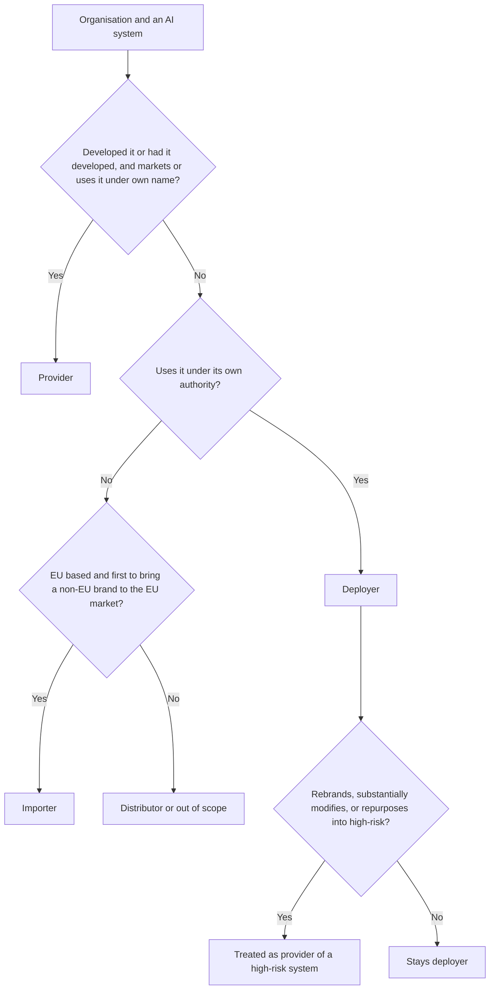
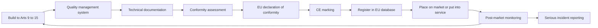

# Module 6 — The EU AI Act

*The EU AI Act is the first comprehensive, horizontal law written specifically for artificial intelligence, and the AIGP exam treats it as the reference point against which everything else is measured. Najm Bank is headquartered in the Gulf, but it has a branch in Frankfurt and customers in the EU, so the Act reaches its credit-scoring model, its vendor CV-screening tool, its customer chatbot and its GenAI copilot. This module takes you through the Act in three passes: who and what it covers and how it sorts AI into risk tiers (6.1); what providers and deployers of high-risk systems must do (6.2); and the rules for general-purpose AI models, transparency, enforcement and the phased timeline (6.3). The exam tests the Act as adopted in Regulation (EU) 2024/1689, so that is what we teach; where later developments may change things, we flag them. This course is educational and is not legal advice: for a real decision, read the current text and take advice from a qualified lawyer.*

> **BoK coverage:** II.C — the scope, roles and risk tiers of the EU AI Act; the obligations for high-risk AI systems on providers and deployers; the rules for general-purpose AI models and transparency; and governance, enforcement, penalties and the application timeline.

---

# 6.1 — Scope, roles and the risk pyramid
*Level: 🟡 Intermediate* · *Prerequisites: 1.1, 4.1* · *BoK: II.C*

## ⚡ In 60 seconds

- The EU AI Act (Regulation (EU) 2024/1689) is a directly applicable EU regulation. It entered into force on 1 August 2024 and applies in phases. It uses product-safety machinery (requirements, conformity assessment, CE marking, market surveillance) to protect health, safety and fundamental rights.
- It reaches outside the EU. A provider anywhere that places an AI system on the EU market is covered, and so is a provider or deployer anywhere whose system's *output is used in the EU*.
- Your duties depend on your **role**. The **provider** (who develops the system, or has it developed, and puts it on the market under its own name) carries most of them. The **deployer** (who uses it under its authority) carries a lighter but real set. Importers, distributors, authorised representatives and product manufacturers have their own duties.
- AI is sorted into tiers: **prohibited** practices (Art. 5), **high-risk** systems (Art. 6 with Annexes I and III), systems with **transparency** obligations (Art. 50), and **minimal** risk. General-purpose AI models have a separate track (6.3).
- Exam cue: classify by the system's **intended purpose** and the **role** of the organisation in the scenario, not by the technology.
- Biggest trap: "we only bought it, so the vendor is responsible." Deployers have their own duties, and a deployer that rebrands, substantially modifies or repurposes a system can *become* the provider.

## 🧭 Why it matters

Layla's first week on the AI Act starts with an email from the Frankfurt branch manager: "Surely the EU AI Act is a problem for European companies. We are a Gulf bank. Can we just note it and move on?" Omar, the Chief Data Officer, half agrees. He thinks only the handful of systems physically run from Frankfurt could matter.

Layla opens Najm's AI inventory and walks the AI Governance Committee through it. Dana's team built the credit-scoring model in Doha, but it scores loan applications from EU residents who bank with the Frankfurt branch. The CV-screening tool Yusuf bought from a vendor filters applicants for jobs in Doha, Dubai *and* Frankfurt. The customer-service chatbot answers EU customers in German and English. The credit memo copilot, built on a third-party large language model, drafts memos that relationship managers use for corporate and SME lending, including some sole traders in Germany. Fraud detection runs on every card transaction, wherever it happens. And employees in all three countries use public GenAI tools.

Each question the committee asks has a precise answer in the Act. Is it an "AI system"? Is Najm in scope even though it is headquartered outside the EU? Is Najm the provider, the deployer, or both? Which tier does each system fall into? The answers decide whether Najm faces a light transparency duty or a full high-risk compliance programme, with fines for the worst breaches of up to €35 million or 7% of worldwide annual turnover. Getting scope and classification right is the first governance decision, and every other decision in this module depends on it.

## 📐 How it works

### 🟢 The essentials

**What kind of law this is.** The AI Act is a *regulation*, so it applies directly in every EU member state without national transposition (unlike a directive). Its design borrows from EU product-safety law, known as the New Legislative Framework. The law sets essential requirements. Technical standards describe how to meet them. The maker checks conformity before sale and affixes a CE marking. Authorities then police the market. The AI Act adds a strong layer of fundamental-rights protection on top of that product-safety core. That is why you will see both engineering duties (logging, robustness) and rights duties (impact assessments, explanations) in the same text.

**What counts as an "AI system".** Article 3(1) defines an AI system as, in substance:

> a machine-based system designed to operate with varying levels of autonomy, that may exhibit adaptiveness after deployment, and that, for explicit or implicit objectives, infers from the input it receives how to generate outputs such as predictions, content, recommendations or decisions that can influence physical or virtual environments.

The definition is deliberately aligned with the OECD definition of an AI system, which the OECD updated in November 2023. Break it into parts:

| Element | What it means | Najm example |
|---|---|---|
| Machine-based | Runs on hardware and software | All of Najm's systems |
| Varying levels of autonomy | Operates with some independence from human involvement | The chatbot answers without a human typing each reply |
| *May* exhibit adaptiveness | Can change after deployment, for example by learning. "May" means this is not required | The fraud model is retrained monthly; the credit model is frozen, and it still qualifies |
| Explicit or implicit objectives | Goals set by people, or goals implicit in training | "Predict probability of default" |
| **Infers** how to generate outputs | The key test. The system derives outputs using techniques such as machine learning or logic- and knowledge-based approaches | The credit model learned its weights from historical loans |
| Outputs that influence environments | Predictions, content, recommendations, decisions | A score that moves an application to "decline" |

The capacity to **infer** is what separates an AI system from ordinary software. The Act's recitals exclude systems based on rules defined solely by natural persons to execute operations automatically. A spreadsheet rule written by a credit officer ("decline if debt-to-income is above 45%") is therefore not an AI system. A gradient-boosted model trained on past defaults is. In February 2025 the Commission published guidelines on the AI-system definition to help with borderline cases. They are not binding, but regulators will read the definition through them.

**AI systems versus AI models.** The Act regulates two different objects. An **AI system** is the deployable thing that produces outputs for a use. A **general-purpose AI (GPAI) model**, such as a large language model, is a component that can be built into many systems. Najm's copilot is an AI system. The third-party LLM inside it is a GPAI model. Obligations for GPAI models are covered in 6.3. Keep the two apart, because exam questions often turn on the difference.

**The risk pyramid.** The Act does not regulate all AI the same way. It scales obligations to risk:

| Tier | Where in the Act | What happens | Najm example |
|---|---|---|---|
| Unacceptable risk | Art. 5 | **Banned** in the EU | Emotion recognition to monitor call-centre staff |
| High risk | Art. 6, Annexes I and III | Strict requirements, conformity assessment, registration, deployer duties | Credit scoring of EU individuals; CV screening |
| Transparency risk | Art. 50 | Disclosure and labelling duties | The customer chatbot; AI-generated marketing images |
| Minimal risk | None specific | No new obligations; voluntary codes of conduct encouraged | Spam filtering, internal document search |

Two cross-cutting duties sit outside the pyramid. **AI literacy** (Art. 4) applies to *all* providers and deployers, whatever the tier. **GPAI model** obligations apply to model providers, whatever systems their models end up in. A single system can sit in more than one tier: a high-risk system that also chats with people must meet both the high-risk requirements and the Art. 50 disclosure duty.

### 🟡 Going deeper

**Territorial scope (Art. 2).** The Act applies to:

1. **Providers** placing AI systems on the market or putting them into service in the EU, or placing GPAI models on the EU market, *wherever the provider is established*.
2. **Deployers** of AI systems that are established or located in the EU.
3. **Providers and deployers established outside the EU** where the *output* produced by the AI system is used in the EU.
4. **Importers and distributors** of AI systems.
5. **Product manufacturers** that place an AI system on the market together with their product and under their own name or trademark.
6. **Authorised representatives** of providers not established in the EU.
7. **Affected persons** located in the EU.

This is the "Brussels effect" in legal form. For Najm, the Frankfurt branch is a deployer located in the EU. The Doha credit team places the credit model into service for EU use, which makes Najm its provider. Even a system run entirely from Doha would be caught if its output were used in the EU, for example a score sent to the Frankfurt branch to decide an EU resident's loan.

Three terms matter because obligations attach to them:
- **Placing on the market** is the *first* making available of a system on the EU market.
- **Making available** is any supply for distribution or use in the course of a commercial activity, paid or free.
- **Putting into service** is supplying a system for first use directly to the deployer, *or for the provider's own use*, for its intended purpose. This is how an in-house system like Najm's credit model is caught without ever being "sold".

**What is excluded.** The Act does not apply to:
- AI systems used **exclusively for military, defence or national-security purposes**, whoever uses them.
- AI systems or models developed and put into service **solely for scientific research and development**.
- **Research, testing and development** activity *before* a system is placed on the market or put into service. Testing in real-world conditions is not covered by this exclusion.
- **Natural persons using AI in a purely personal, non-professional activity**.
- AI systems released under **free and open-source licences**, *unless* they are placed on the market as high-risk systems, fall under Art. 5, or are subject to Art. 50. (Open-source GPAI models have a separate, narrower exemption; see 6.3.)
- Public authorities of third countries and international organisations using AI in international law-enforcement and judicial cooperation, where adequate safeguards exist.

The Act also states that it does not affect the GDPR. Where personal data are processed, both laws apply at once.

**The roles.** Most exam scenarios come down to "who is who".

| Role | Definition in plain words | Najm example |
|---|---|---|
| **Provider** | Develops an AI system or GPAI model, or has one developed, and places it on the market or puts it into service **under its own name or trademark**, paid or free | Najm for the in-house credit model; the vendor for the CV tool; the LLM company for its model |
| **Deployer** | Uses an AI system **under its authority**, except in a personal non-professional activity | Najm for the CV tool; Najm for its own credit model too |
| **Importer** | Located or established in the EU; places on the EU market a system bearing the name or trademark of a non-EU entity | An EU reseller bringing a US vendor's tool into the EU |
| **Distributor** | Any other entity in the supply chain, not the provider or importer, that makes a system available on the EU market | A systems integrator reselling the CV tool |
| **Authorised representative** | EU-based person with a written mandate from a non-EU provider to perform certain obligations on its behalf | Needed for a non-EU provider of high-risk systems or GPAI models |
| **Product manufacturer** | Places a product on the market with an AI system embedded, under its own name | A maker of medical devices or machinery with AI components |

"**Operator**" is the umbrella term for all of these. A single organisation can hold several roles at once. Najm is both **provider and deployer** of its credit model. That is common for in-house systems, and the exam likes it.

**When a deployer becomes a provider (Art. 25).** A distributor, importer, deployer or other third party is treated as the **provider of a high-risk AI system**, with all the provider's obligations, if it:

1. puts **its name or trademark** on a high-risk system already on the market (contracts can allocate duties differently between the parties, but the regulator will look to the name on the box);
2. makes a **substantial modification** to a high-risk system so that it remains high-risk; or
3. **changes the intended purpose** of a system, including a GPAI system, that was not high-risk, so that it becomes high-risk.

When this happens, the original provider is no longer the provider *of that specific system* for these purposes. It must, however, cooperate and hand over the information and technical access the new provider needs, unless it had clearly stated that its system must not be changed into a high-risk one. A **substantial modification** is a change after placing on the market that was not foreseen in the initial conformity assessment and that affects compliance or changes the intended purpose. Changes that a learning system makes within limits the provider set in advance and documented at conformity assessment are not substantial modifications.

**Article 5: prohibited practices.** These have been banned since 2 February 2025. The Commission published guidelines on them the same month. Art. 5(1) prohibits placing on the market, putting into service or using AI systems that:

1. **Manipulate or deceive.** They deploy subliminal techniques beyond a person's consciousness, or purposefully manipulative or deceptive techniques, that materially distort behaviour by impairing informed decision-making, causing or reasonably likely to cause significant harm.
2. **Exploit vulnerabilities** due to age, disability or a specific social or economic situation, to materially distort behaviour in a way that causes or is reasonably likely to cause significant harm.
3. **Social scoring.** They evaluate or classify people over time based on social behaviour or personal characteristics, where the score leads to detrimental treatment in social contexts unrelated to where the data were collected, or treatment that is unjustified or disproportionate. This applies to public *and* private actors.
4. **Predict crime from profiling alone.** They assess the risk of a person committing a criminal offence based solely on profiling or personality traits. Systems that support a human assessment already based on objective, verifiable facts linked to criminal activity are not covered.
5. **Scrape faces.** They create or expand facial-recognition databases through untargeted scraping of facial images from the internet or CCTV footage.
6. **Recognise emotions at work or in education.** They infer emotions of people in the workplace or in education institutions, except for medical or safety reasons.
7. **Biometric categorisation by sensitive traits.** They categorise people from biometric data to deduce or infer race, political opinions, trade-union membership, religious or philosophical beliefs, sex life or sexual orientation. There is an exception for labelling or filtering lawfully acquired biometric datasets and for certain law-enforcement uses.
8. **Real-time remote biometric identification in public spaces for law enforcement.** This is banned except where strictly necessary for narrowly defined objectives: targeted search for specific victims of abduction, trafficking or sexual exploitation, and for missing persons; preventing a specific, substantial and imminent threat to life or a genuine threat of a terrorist attack; and locating or identifying suspects of serious crimes listed in the Act. The exceptions need prior authorisation by a judicial or independent administrative authority (with an urgency procedure), a fundamental rights impact assessment and registration, and member states must opt in through national law.

For a bank, the practical risks are items 1, 2, 3 and 6. Examples: a sales tool that exploits financial distress to push expensive credit, a "customer worthiness" score built from unrelated social behaviour, or voice analytics that infer call-centre agents' emotions.

### 🔴 Expert view

**Article 6: how a system becomes high-risk.** There are two routes.

*Route 1: products (Art. 6(1)).* An AI system is high-risk if **both** of these are true:
- it is a **safety component** of a product, or is itself a product, covered by the EU harmonisation legislation listed in **Annex I** (for example machinery, toys, lifts, radio equipment, medical devices, in-vitro diagnostics, and, in a second section, vehicles, aviation, marine and rail equipment); **and**
- that product must undergo a **third-party conformity assessment** under that legislation.

These systems follow the sectoral rules and have a later application date (2 August 2027).

*Route 2: use cases (Art. 6(2) and Annex III).* A system is high-risk if its intended purpose falls within one of the eight **Annex III** areas:

| # | Annex III area | Examples of listed uses |
|---|---|---|
| 1 | Biometrics (where permitted by law) | Remote biometric identification (not simple verification that a person is who they claim to be); biometric categorisation by sensitive attributes; emotion recognition |
| 2 | Critical infrastructure | Safety components in managing critical digital infrastructure, road traffic, or the supply of water, gas, heating and electricity |
| 3 | Education and vocational training | Admission decisions; evaluating learning outcomes; assessing the appropriate level of education; monitoring for cheating during tests |
| 4 | Employment and workers management | Recruitment and selection, including targeted job ads, filtering applications and evaluating candidates; decisions on promotion, termination and task allocation; monitoring and evaluating performance and behaviour |
| 5 | Access to essential private and public services | Eligibility for public assistance; **creditworthiness evaluation or credit scoring of natural persons, except systems used to detect financial fraud**; risk assessment and pricing for life and health insurance; evaluating and classifying emergency calls and triage |
| 6 | Law enforcement | Assessing victim risk, polygraph-like tools, evaluating evidence reliability, profiling in investigations |
| 7 | Migration, asylum and border control | Risk assessments, examining applications, detecting and identifying people |
| 8 | Administration of justice and democratic processes | Assisting judges in researching and interpreting facts and law; systems intended to influence elections or voting behaviour |

The Commission can amend Annex III through delegated acts (Art. 7), adding or changing use cases within the eight areas using criteria the Act sets out.

*The derogation (Art. 6(3)).* An Annex III system is **not** high-risk if it does not pose a significant risk of harm to health, safety or fundamental rights, including by not materially influencing the outcome of decision-making. That is the case where the system is intended to do any of the following:
- (a) perform a **narrow procedural task**, such as turning unstructured documents into structured data;
- (b) **improve the result of a previously completed human activity**, such as polishing the language of a letter a person has already drafted;
- (c) **detect decision-making patterns or deviations** from prior patterns, without replacing or influencing the previously completed human assessment without proper human review;
- (d) perform a **preparatory task** to an assessment relevant to an Annex III use.

Two rules keep the derogation honest. First, an Annex III system that performs **profiling of natural persons is always high-risk**; the derogation cannot apply. Second, a provider that relies on the derogation must **document its assessment** before placing the system on the market, **register** the system in the EU database, and hand the documentation to authorities on request. The Act asked the Commission for guidelines with practical examples of high-risk and non-high-risk uses. Check whether they have been issued and what they say.

**Applying it at Najm.**
- *Credit scoring.* The model scores EU natural persons for consumer loans: Annex III point 5, high-risk. It profiles individuals, so the derogation is unavailable. Najm is the provider (built in-house, put into service for its own use) and the deployer.
- *Fraud detection.* The Annex III credit entry expressly excludes systems used to detect financial fraud. Unless another area applies, it is not high-risk. It still needs AI literacy, GDPR compliance and good governance.
- *CV screening.* Filtering applications and evaluating candidates is Annex III point 4, high-risk. The vendor is the provider. Najm is the deployer for Frankfurt hiring. If Najm rebranded it as "Najm TalentMatch" and offered it to group companies, it would become the provider.
- *Credit memo copilot.* This is the subtle one. For large corporates, the borrower is a legal person, not a natural person, so the credit-scoring entry does not bite. For sole traders, who are natural persons, the copilot may evaluate creditworthiness. If it only restructures documents into a memo template, that might be a narrow procedural or preparatory task under Art. 6(3). If it summarises a person's financial behaviour and recommends a rating, it is profiling and high-risk. Najm must document the reasoning either way.
- *Chatbot.* Art. 50 transparency applies (6.3). It becomes high-risk only if it starts taking Annex III decisions, such as deciding loan eligibility.
- *Public GenAI use by staff.* Minimal risk as a use in most cases, but covered by the AI-literacy duty, and by the GDPR if staff paste in personal data.

**Intended purpose is king.** The Act defines intended purpose by what the provider specifies in its instructions, promotional material and technical documentation. A general document classifier is minimal risk until someone uses it to rank job applicants. At that point the person who changed its purpose may have become a high-risk provider under Art. 25. That is why Najm's intake form (8.1) asks "what will this be used for?" and not only "what is it?"

## ⚖️ The instruments

| Instrument | What it requires or recommends | Exam cue |
|---|---|---|
| **EU AI Act** — Art. 3(1) | Defines "AI system" around machine-based operation, autonomy and, crucially, *inference* | Rule-based software written wholly by humans is outside; "adaptiveness" is optional |
| **EU AI Act** — Art. 2 | Territorial and material scope: providers placing on the EU market wherever based; EU deployers; non-EU providers and deployers whose output is used in the EU; exclusions for military, research, personal use and most open-source | "Headquartered outside the EU" never ends the analysis; check where the output is used |
| **EU AI Act** — Arts 3 and 25 | Defines provider, deployer, importer, distributor, authorised representative; a party that rebrands, substantially modifies or repurposes into high-risk becomes the provider | Scenario asks "who is the provider now?" after a rebrand or repurposing |
| **EU AI Act** — Art. 5 | Eight prohibited practices, applicable since 2 Feb 2025 | Workplace emotion recognition and social scoring are the favourite distractors |
| **EU AI Act** — Art. 6 & Annexes I, III | High-risk via regulated products needing third-party assessment, or via the eight Annex III areas; Art. 6(3) derogation, never for profiling | Credit scoring of natural persons is high-risk; fraud detection is excluded |
| **OECD AI Principles** — AI system definition | The 2023 OECD definition on which Art. 3(1) is modelled | Explains why EU and OECD definitions look alike |
| **GDPR** | Applies alongside the AI Act whenever personal data are processed | The AI Act does not displace GDPR duties |

## 🏛️ In practice at Najm Bank

Layla's first artefact is an **AI Act classification register** that the AI Governance Committee approves. Every inventory entry gets one row, and no system goes live in, or for, the EU without a completed row signed off by Layla and reviewed by Sara (DPO).

| System | AI system under Art. 3(1)? | EU nexus | Najm's role | Tier | Rationale | Next step |
|---|---|---|---|---|---|---|
| Retail credit-scoring model | Yes, ML model infers default risk | Scores EU residents at Frankfurt branch | Provider and deployer | High-risk, Annex III 5 | Creditworthiness of natural persons; profiling, so Art. 6(3) unavailable | Full provider programme (6.2) and FRIA |
| CV-screening tool (vendor) | Yes | Used for Frankfurt hiring | Deployer | High-risk, Annex III 4 | Filters and ranks candidates | Deployer duties; check vendor's conformity evidence; inform workers' representatives |
| Customer chatbot | Yes, built on an LLM | Serves EU customers | Provider of the chatbot system | Transparency, Art. 50 | Interacts directly with people; no Annex III decisions | Disclosure by design; guard against scope creep into eligibility decisions |
| Credit memo copilot | Yes | Used for SME and sole-trader lending in the EU | Provider of the system; downstream of a GPAI model | Under review | Corporates out of Annex III 5; sole traders possibly in | Document Art. 6(3) assessment; register if relying on it |
| Fraud detection | Yes | EU card transactions | Provider and deployer | Not high-risk | Express fraud exclusion in Annex III 5 | AI literacy, GDPR, model risk policy |
| Staff use of public GenAI | Yes, but third-party system | EU staff | Deployer | Minimal, with Art. 4 literacy | General productivity | Acceptable-use policy and training (2.3) |

Alongside the register, Layla adds one clause to Najm's AI policy:

> **Role-change control.** No business unit may (a) place Najm's name or trademark on a third-party AI system, (b) materially change a third-party AI system's model, data or configuration beyond the vendor's documented parameters, or (c) use any AI system for a purpose other than the one recorded in the AI inventory, without prior written approval from the Head of AI Governance. Such changes may make Najm the provider of a high-risk AI system under Article 25 of the EU AI Act.

## 🛠️ Exercises

🟢 **Definition test.** Take three tools from your organisation (or from Najm's list): one rules-based, one machine-learning, one generative. For each, walk through the elements of Art. 3(1) and conclude whether it is an "AI system". Say which element decided it.
*Done when:* you have three one-paragraph conclusions, each naming the decisive element (usually inference).

🟡 **Role map.** Najm's vendor, based in the US, sells the CV-screening tool through an EU reseller, and Najm's HR team plans to add its own scoring rules on top. Identify the provider, importer, distributor and deployer. Then say what Najm would have to change for it to become the provider under Art. 25.
*Done when:* every party has a role with a one-line justification, and you have named at least two actions that would trigger Art. 25.

🔴 **Derogation memo.** Write a one-page Art. 6(3) assessment for the credit memo copilot as used for sole traders. Address each of the four conditions, the profiling override, and what evidence Najm would keep. Conclude high-risk or not, and list what would change your conclusion.
*Done when:* the memo could be handed to a market-surveillance authority and would show both the reasoning and the registration consequence.

## ⚠️ Mistakes and exam traps

- **"Non-EU company, so out of scope."** Wrong. Check whether it places systems on the EU market, has an EU establishment that deploys, or has output used in the EU.
- **"Adaptiveness is required."** The definition says a system *may* exhibit adaptiveness. A frozen ML model is still an AI system. Inference is the key.
- **Confusing fraud detection with credit scoring.** Annex III expressly excludes financial-fraud detection from the credit entry. Credit scoring of *natural persons* is high-risk; scoring companies is not caught by that entry.
- **Treating the Art. 6(3) derogation as automatic.** It never applies to profiling, and the provider must document the assessment and register the system.
- **Assuming the vendor carries everything.** Deployers have their own obligations (6.2) and become providers if they rebrand, substantially modify, or repurpose into high-risk.
- **Mixing up prohibited and high-risk biometrics.** Emotion recognition *at work or in education* is prohibited (except for medical or safety reasons). Emotion recognition elsewhere is Annex III high-risk and also triggers an Art. 50 notice.

## 🧾 Recap

- The AI Act is a directly applicable EU regulation that applies product-safety methods to AI, with a strong fundamental-rights layer.
- An AI system is defined by its capacity to *infer* outputs; human-written rules alone are not enough.
- Scope is extraterritorial: providers placing on the EU market, EU deployers, and non-EU actors whose output is used in the EU.
- Roles drive duties. Organisations often hold several roles, and Art. 25 can turn a deployer or distributor into a provider.
- Tiers: Art. 5 prohibitions (eight practices), high-risk via Annex I products or the eight Annex III areas, Art. 50 transparency, and minimal risk. AI literacy and GPAI rules cut across them.
- The Art. 6(3) derogation removes some Annex III systems from high-risk, but never profiling, and always with documentation and registration.

## ✍️ Check yourself

**1. Najm Bank is headquartered in Doha. Its data-science team built a credit-scoring model that the Frankfurt branch uses to decide loan applications from EU residents. Under the EU AI Act, what is Najm's position?**

- A. Out of scope, because the model was developed and hosted outside the EU
- B. Provider and deployer of a high-risk AI system
- C. Importer, because it brought a non-EU system into the EU
- D. Deployer only, because it never sold the model to anyone

Answer

**B.** Najm developed the system and put it into service for its own use under its own name, which makes it the provider. Its Frankfurt branch uses it, which makes it a deployer. Credit scoring of natural persons is Annex III high-risk. D is tempting, but "putting into service" for your own use is enough to be a provider; no sale is needed. A ignores Art. 2 extraterritorial scope. (See 🟡 Going deeper: territorial scope and roles.)

**2. Which of the following is a prohibited practice under Article 5 of the EU AI Act?**

- A. A bank's customer chatbot that does not state it is an AI
- B. A system that infers the emotions of call-centre agents from their voices to manage their performance
- C. A machine-learning model that evaluates creditworthiness of individual loan applicants
- D. A model that detects fraudulent card transactions

Answer

**B.** Emotion recognition in the workplace is prohibited except for medical or safety reasons. A is a breach of the Art. 50 transparency duty, not a prohibited practice. C is high-risk under Annex III, and D is expressly excluded from the credit-scoring entry. (See 🟡 Going deeper: Article 5.)

**3. A provider believes its Annex III system qualifies for the Article 6(3) derogation because it only performs a preparatory task. In which situation can it NOT rely on the derogation?**

- A. The system is sold only to small and medium-sized enterprises
- B. The system performs profiling of natural persons
- C. The system was developed outside the EU
- D. The system is used alongside human review

Answer

**B.** An Annex III system that profiles natural persons is always high-risk. The derogation does not apply. None of the other factors removes the derogation, and human review (D) actually supports condition (c). The provider must still document the assessment and register the system. (See 🔴 Expert view: the derogation.)

**4. Najm buys a CV-screening tool from a vendor that has completed the high-risk conformity process. Najm's HR team relabels it "Najm TalentMatch" and makes it available to other group companies in the EU. What is the most accurate consequence?**

- A. Nothing changes; the vendor remains the provider because it built the system
- B. Najm becomes a distributor with limited verification duties
- C. Najm is treated as the provider of a high-risk AI system and takes on the provider obligations
- D. The system stops being high-risk because a conformity assessment was already done

Answer

**C.** Under Art. 25, putting your own name or trademark on a high-risk system already on the market makes you the provider. The original vendor must cooperate and supply the information Najm needs. A is the "vendor carries everything" trap. B is wrong because rebranding is exactly what triggers the provider role. (See 🟡 Going deeper: when a deployer becomes a provider.)

**5. Which of the following falls OUTSIDE the scope of the EU AI Act?**

- A. A non-EU provider whose AI system's output is used in the EU
- B. An open-source AI system placed on the market as a high-risk system
- C. A person in Berlin using an AI image generator to make birthday cards for family
- D. An EU importer of a non-EU vendor's AI system

Answer

**C.** Natural persons using AI in a purely personal, non-professional activity are excluded. A and D are expressly in scope under Art. 2. B is in scope because the open-source exclusion does not apply to systems placed on the market as high-risk. (See 🟡 Going deeper: what is excluded.)

## 📚 References

- Regulation (EU) 2024/1689 (Artificial Intelligence Act), official text: https://eur-lex.europa.eu/eli/reg/2024/1689/oj
- European Commission, regulatory framework for AI (including guidelines on the AI-system definition and on prohibited practices): https://digital-strategy.ec.europa.eu/en/policies/regulatory-framework-ai
- OECD AI Principles and the OECD definition of an AI system: https://oecd.ai/en/ai-principles
- IAPP, AIGP certification and Body of Knowledge: https://iapp.org/certify/aigp/

---

# 6.2 — High-risk obligations for providers and deployers
*Level: 🟡 Intermediate* · *Prerequisites: 6.1, 4.3* · *BoK: II.C*

## ⚡ In 60 seconds

- A high-risk AI system must meet seven design requirements in Arts 9–15: a **risk management system**, **data and data governance**, **technical documentation**, **record-keeping (logging)**, **transparency and instructions for use**, **human oversight**, and **accuracy, robustness and cybersecurity**.
- The **provider** proves this through a **quality management system**, a **conformity assessment**, an **EU declaration of conformity**, the **CE marking** and **registration in the EU database**. After launch it runs **post-market monitoring** and reports **serious incidents**.
- The **deployer** has its own list (Art. 26): use the system according to the instructions, assign competent **human oversight**, ensure **input data** are relevant, **monitor** and report, keep **logs** for at least six months, **inform workers** and **affected persons**.
- Some deployers, including public bodies and anyone using AI for **credit scoring or life and health insurance pricing**, must also carry out a **fundamental rights impact assessment (FRIA)** under Art. 27.
- People affected by high-risk decisions have a **right to an explanation** (Art. 86) of the AI's role and the main elements of the decision.
- Biggest trap: assuming the vendor's CE marking covers the deployer. It does not. Deployer duties are separate and cannot be contracted away.

## 🧭 Why it matters

Khalid, Head of Retail Lending, wants the credit-scoring model live for Frankfurt's spring lending campaign. Dana tells the AI Governance Committee the model is "ready": its accuracy beats the old scorecard and the validation report is signed. Layla asks one question: "Ready against what?" The model is a high-risk AI system and Najm is its provider. Before it can be used on EU residents, Najm must be able to show a risk management system, data governance evidence, technical documentation to a set template, logging, instructions for use written for its own loan officers, a designed-in human oversight step, tested robustness, a quality management system, a completed conformity assessment, a signed declaration, a CE marking and a database registration. None of that is a model-accuracy question.

Meanwhile, Yusuf has closed the CV-screening contract. "The vendor has done its conformity assessment and it's CE-marked," he says, "so compliance is their problem." Sara, the DPO, disagrees. As deployer, Najm must use the tool according to its instructions, staff the human review with trained people, check that the job and CV data it feeds in are relevant, keep logs, tell the Frankfurt works council before the tool goes live, and tell candidates that a high-risk AI system is involved in decisions about them. On the credit side, as a deployer of a credit-scoring system, Najm must also do a FRIA.

This lesson is the heart of the Act for most organisations. It is also where AIGP scenario questions most often ask "who must do this, the provider or the deployer?"

## 📐 How it works

### 🟢 The essentials

**The seven requirements (Chapter III, Section 2).** Every high-risk AI system must comply with these, taking into account its intended purpose and the generally acknowledged state of the art (Art. 8). The provider is responsible for building them in.

| Article | Requirement | What it means in plain words | At Najm (credit model) |
|---|---|---|---|
| Art. 9 | **Risk management system** | A continuous, iterative process across the whole life cycle: identify and analyse known and foreseeable risks to health, safety and fundamental rights; estimate risks under intended use *and reasonably foreseeable misuse*; adopt measures; test; accept residual risk only if judged acceptable. Consider impacts on children and other vulnerable groups | A living risk register for the model, reviewed at every retrain |
| Art. 10 | **Data and data governance** | Training, validation and testing data must be subject to governance practices (design choices, collection and origin, preparation, assumptions, availability, **examination for possible biases**, identifying gaps). Data must be relevant, sufficiently representative, and to the best extent possible free of errors and complete for the purpose, and must account for the geographical, behavioural or functional setting | Dana documents that German applicants are represented, and tests for bias by age and sex |
| Art. 11 | **Technical documentation** | Drawn up *before* placing on the market and kept up to date, with the content listed in **Annex IV** (description, design, development process, data, testing, risk management, changes, standards applied). SMEs may use a simplified form | A model dossier structured to Annex IV |
| Art. 12 | **Record-keeping** | The system must *technically allow* automatic recording of events (logs) over its lifetime, enough to identify risks, support post-market monitoring and monitor operation | Every score is logged with input version, model version and timestamp |
| Art. 13 | **Transparency and information to deployers** | Designed so deployers can interpret output and use it appropriately; comes with **instructions for use** covering identity of the provider, intended purpose, accuracy and its metrics, known risks, human oversight measures, input data specifications, expected lifetime, and log handling | A loan-officer guide explaining what a score of 0.62 means and when not to rely on it |
| Art. 14 | **Human oversight** | Designed so natural persons can oversee it effectively: understand its capacities and limits, stay aware of **automation bias**, interpret output correctly, decide not to use or to disregard or reverse the output, and intervene or stop it (a "stop button") | Officers must record a reason when they follow a borderline score |
| Art. 15 | **Accuracy, robustness and cybersecurity** | Appropriate and consistent levels throughout the life cycle; accuracy metrics declared in the instructions; resilience to errors and to **feedback loops** in systems that keep learning; protection against attacks such as **data poisoning**, **model poisoning**, **adversarial examples** and **confidentiality attacks** | Robustness tests on shifted income distributions; access controls on the training pipeline |

One extra point on data: the Act *permits* providers, exceptionally and with strict safeguards, to process special categories of personal data (such as ethnicity) where strictly necessary to detect and correct bias in high-risk systems (Art. 10(5)). This is a narrow opening, not a general licence, and GDPR still applies.

**The provider's path to market.**

### 🟡 Going deeper

**The provider's obligations (Art. 16 and following).** Beyond building the seven requirements in, the provider must:

- **Show its identity**: name, registered trade name or trademark, and contact address on the system, its packaging or its documentation.
- Run a **quality management system (QMS)** (Art. 17). This is a documented set of policies, procedures and instructions covering: a strategy for regulatory compliance, including managing modifications; design, design control and verification; development, quality control and quality assurance; examination, test and validation procedures; technical specifications and standards applied; data management systems and procedures; the risk management system; post-market monitoring; serious-incident reporting; communication with authorities and customers; record-keeping; resource management, including security of supply; and an **accountability framework** setting out management and staff responsibilities. The QMS must be proportionate to the size of the organisation. For **financial institutions** already subject to internal-governance rules under EU financial-services law, most of the QMS obligation is deemed met by complying with those rules, but the risk management, post-market monitoring and incident-reporting elements still have to be covered.
- **Keep documentation** (technical documentation, QMS documentation, the declaration of conformity and related records) available to authorities for **ten years** after the system is placed on the market or put into service.
- **Keep the automatically generated logs** under its control for a period appropriate to the intended purpose, and **at least six months** unless other law says otherwise.
- Carry out the **conformity assessment** before placing on the market (Art. 43).
- Draw up an **EU declaration of conformity** (Art. 47) and affix the **CE marking** (Art. 48). For systems provided only digitally, a digital CE marking is used, reachable through the interface or a machine-readable code.
- **Register** itself and the system in the **EU database** (Arts 49 and 71) before placing on the market. Annex III systems in critical infrastructure are registered at national level instead. Law-enforcement, migration and border-control systems go into a secure, non-public section.
- Take **corrective action** if the system is not in conformity: bring it into conformity, withdraw it, disable it or recall it, inform distributors, deployers and others, and inform authorities where there is a risk.
- **Cooperate** with competent authorities and give them the information and documentation they request, including logs.
- Meet EU **accessibility** requirements.

A provider established **outside the EU** must, before making a high-risk system available in the EU, appoint an **authorised representative** in the EU by written mandate (Art. 22). The representative keeps documentation available, cooperates with authorities and must end the mandate if it believes the provider is acting contrary to the Act. For Najm, whose credit model is put into service by its own EU branch, legal advice will be needed on how its EU establishment and its non-EU head office share these duties.

**Importers and distributors** are gatekeepers. Before placing a system on the market, an **importer** must verify that the conformity assessment was done, the technical documentation exists, the CE marking and declaration are present, and an authorised representative has been appointed. A **distributor** must check the CE marking, the declaration and the instructions, and that the provider and importer have met their duties. Both must not supply a system they believe is non-compliant, and both must cooperate with authorities.

**Conformity assessment routes (Art. 43).**

| System | Route |
|---|---|
| Annex III points 2–8 (for example credit scoring, employment, education) | **Internal control** (Annex VI): the provider self-assesses its QMS and technical documentation. No notified body is involved |
| Annex III point 1 (biometrics) | **Notified body** assessment of the QMS and technical documentation (Annex VII), unless the provider has fully applied harmonised standards (or common specifications), in which case it may choose internal control. A notified body is an independent conformity-assessment organisation designated by a member state |
| Annex I products | The conformity procedure required by the sectoral product law, with the AI Act requirements folded in |

**Harmonised standards (Art. 40)** are European standards whose references are published in the Official Journal of the EU. Complying with them gives a **presumption of conformity** with the requirements they cover. Where standards are missing or inadequate, the Commission can adopt **common specifications** (Art. 41) that do the same job. Module 7.2 explains how CEN-CENELEC's work and ISO/IEC standards fit in.

A new conformity assessment is needed whenever a system undergoes a **substantial modification**. Changes a continuously learning system makes within limits the provider pre-determined and documented at the initial assessment are not substantial modifications.

**Post-market monitoring (Art. 72).** Every provider of a high-risk system must set up a post-market monitoring system with a documented **plan** that forms part of the technical documentation (the Commission was asked to adopt a template). It must actively and systematically collect, document and analyse data on performance throughout the system's lifetime. Deployers can supply that data. The purpose is to evaluate continuous compliance, including interaction with other AI systems.

**Serious-incident reporting (Art. 73).** A **serious incident** is an incident or malfunction that directly or indirectly leads to: death or serious harm to a person's health; serious and irreversible disruption of critical infrastructure; infringement of EU-law obligations intended to protect fundamental rights; or serious harm to property or the environment. The provider must report it to the market-surveillance authority of the member state where it occurred:

| Situation | Deadline after becoming aware |
|---|---|
| General rule | Immediately after establishing a causal link, or its reasonable likelihood, and **no later than 15 days** |
| Widespread infringement, or serious and irreversible disruption of critical infrastructure | Immediately, and **no later than 2 days** |
| Death of a person | Immediately, and **no later than 10 days** |

An initial, incomplete report may be followed by a complete one. The provider must investigate, run a risk assessment and take corrective action without altering the system in a way that could hamper the investigation before informing the authorities.

### 🔴 Expert view

**The deployer's obligations (Art. 26).** A deployer of a high-risk AI system must:

1. Take appropriate technical and organisational measures to **use the system in accordance with the instructions for use**.
2. Assign **human oversight** to natural persons who have the necessary **competence, training and authority**, and the necessary support.
3. To the extent it controls the input data, ensure the **input data are relevant and sufficiently representative** in view of the intended purpose.
4. **Monitor** the system's operation on the basis of the instructions and inform the provider where relevant. If the deployer has reason to believe that use in line with the instructions may present a risk, it must inform the provider or distributor and the market-surveillance authority *without undue delay* and **suspend use**. If it identifies a **serious incident**, it must immediately inform the provider first, then the importer or distributor and the authorities. For **financial institutions**, the monitoring obligation is deemed met by complying with governance rules under EU financial-services law.
5. **Keep the logs** automatically generated by the system, to the extent they are under its control, for a period appropriate to the intended purpose, and **at least six months**, unless other EU or national law provides otherwise. Financial institutions keep them as part of the documentation required by financial-services law.
6. As an **employer**, before putting a high-risk system into service or use at the workplace, **inform workers' representatives and the affected workers** that they will be subject to it.
7. If it is a **public authority** or an EU institution, **register its use** in the EU database, and not use a system that is not registered there.
8. Use the information provided under Art. 13 to carry out a **data protection impact assessment** under the GDPR, where one is required.
9. For **Annex III** systems that make decisions, or assist in making decisions, about natural persons, **inform those persons** that they are subject to the use of a high-risk AI system.
10. **Cooperate** with the competent authorities.

(There are also special rules for deployers of post-remote biometric identification in criminal investigations.)

**Fundamental rights impact assessment (Art. 27).** *Before* first deploying a high-risk system, a FRIA is required from:
- deployers that are **bodies governed by public law**, or **private entities providing public services**, for Annex III systems (except critical infrastructure, point 2); and
- **any** deployer of Annex III point 5(b) and (c) systems: **creditworthiness evaluation or credit scoring of natural persons**, and **risk assessment and pricing in life and health insurance**.

The FRIA must describe:
- the deployer's **processes** in which the system will be used, in line with its intended purpose;
- the **period and frequency** of use;
- the **categories of natural persons and groups** likely to be affected in the specific context;
- the **specific risks of harm** likely to affect them, taking into account the provider's information;
- the **human oversight measures**, according to the instructions for use; and
- the **measures to be taken if those risks materialise**, including internal governance arrangements and complaint mechanisms.

The FRIA applies to first use. The deployer may rely on a previous FRIA, or one done by the provider, in similar cases, but must update it when any element changes. The deployer notifies the market-surveillance authority of the results using a template the AI Office was asked to develop. Where a GDPR **DPIA** already covers some of these points, the FRIA **complements** it; it does not replace it. In practice, Sara and Layla run one joint assessment with a FRIA section and a DPIA section (Module 11.3).

**Right to explanation (Art. 86).** Any affected person subject to a decision taken by a deployer on the basis of output from an Annex III high-risk system (except point 2), where the decision produces **legal effects or similarly significantly affects** that person in a way they consider adverse to their health, safety or fundamental rights, has the right to obtain from the deployer **clear and meaningful explanations of the role of the AI system in the decision-making procedure and the main elements of the decision taken**. It applies only to the extent that EU law does not already provide such a right. It sits alongside GDPR Arts 13–15 ("meaningful information about the logic involved") and Art. 22. Recall the CJEU's *SCHUFA* ruling (4.2): a credit score that plays a determining role can itself be an automated decision. An applicant can also **lodge a complaint** with a market-surveillance authority (Art. 85).

**How the duties interlock.** Provider and deployer duties are designed as a relay:

| Provider gives… | …so the deployer can… |
|---|---|
| Instructions for use (Art. 13) | Use per instructions; do the DPIA and FRIA |
| Built-in oversight tools (Art. 14) | Staff oversight with competent, trained people |
| Logging capability (Art. 12) | Keep logs for at least six months |
| Accuracy metrics and known limits | Check input data relevance and monitor performance |
| Post-market monitoring channel (Art. 72) | Report risks and serious incidents back |

That is why Yusuf's contract with the CV vendor matters (11.2). It should secure the instructions for use, log access, notice of changes and a channel for incident reporting.

**Obligations along the value chain.** Where a third party supplies tools, services, components or processes that are integrated into a high-risk system, the provider and that supplier must agree in writing the information, capabilities, technical access and assistance needed for the provider to comply (Art. 25(4)). The AI Office may recommend voluntary model contract terms. This does not apply to third parties supplying tools under free and open-source licences, other than GPAI models.

**Transitional reality.** High-risk systems already on the market before 2 August 2026 are generally covered only if they undergo significant changes in design after that date. Systems intended for use by public authorities must be brought into compliance by 2 August 2030. The exam tests the Act as adopted; 6.3 covers the Digital Omnibus proposals that may shift these dates.

## ⚖️ The instruments

| Instrument | What it requires or recommends | Exam cue |
|---|---|---|
| **EU AI Act** — Arts 9–15 | Seven requirements for high-risk systems: risk management, data governance, technical documentation, logging, transparency and instructions, human oversight, accuracy/robustness/cybersecurity | "Which is a *provider design* requirement?" FRIA is not on this list |
| **EU AI Act** — Arts 16–17, 43, 47–49 | Provider duties: QMS, documentation (10 years), logs (six months or more), conformity assessment, declaration, CE marking, registration | Annex III points 2–8 use internal control; biometrics may need a notified body |
| **EU AI Act** — Arts 72–73 | Post-market monitoring plan; serious-incident reporting (15 days; 2 days for widespread or critical-infrastructure; 10 days for death) | The provider reports; the deployer informs the provider first |
| **EU AI Act** — Art. 26 | Deployer duties: use per instructions, competent oversight, input data, monitoring, logs, informing workers and affected persons | A vendor's CE marking does not discharge deployer duties |
| **EU AI Act** — Art. 27 | FRIA before first use by public bodies and public-service providers, and by deployers of credit-scoring and life/health insurance pricing systems | A private bank using credit scoring must do a FRIA |
| **EU AI Act** — Art. 86 | Right to a clear and meaningful explanation of the AI's role and the main elements of an adverse decision | Owed by the deployer, not the provider |
| **GDPR** — Arts 22, 35 | Automated-decision safeguards and DPIA; the FRIA complements the DPIA | Both assessments may be needed for the same system |

## 🏛️ In practice at Najm Bank

Layla turns this lesson into two artefacts that the AI Governance Committee adopts.

**1. Deployer readiness checklist: CV-screening tool (Frankfurt).** Nothing goes live until every line is "Yes" with evidence attached.

| # | Duty | Evidence | Owner |
|---|---|---|---|
| 1 | Vendor's EU declaration of conformity, CE marking and EU database registration checked | Copy of declaration; database entry reference | Yusuf |
| 2 | Instructions for use received and embedded in HR procedures | HR screening procedure v2 cites the instructions | Head of HR |
| 3 | Named human reviewers with training and authority to override rankings | Training records; RACI | Head of HR, Layla |
| 4 | Job descriptions and CV inputs checked for relevance and representativeness | Input data review note | Dana |
| 5 | Monitoring plan: monthly selection-rate review by sex and age band; route for reporting risks to the vendor and suspending use | Dashboard; escalation procedure | Dana, Layla |
| 6 | Logs retained at least six months, longer if HR or employment law requires | Retention schedule entry | Omar |
| 7 | Works council and staff informed before use | Minutes of works-council briefing | Head of HR |
| 8 | Candidates informed that a high-risk AI system is used in decisions about them | Updated candidate privacy notice | Sara |
| 9 | DPIA completed, using the vendor's Art. 13 information | DPIA reference | Sara |
| 10 | Serious-incident procedure: inform vendor first, then authorities | Incident runbook section | Layla |

**2. FRIA excerpt: retail credit-scoring model (Frankfurt).**

> **Process and purpose.** The model produces a probability-of-default score for consumer loan applications up to €75,000. Scores above the approval threshold go to a loan officer for confirmation. Scores in the grey zone go to a senior officer for full manual review. Scores below the decline threshold are declined only after officer review.
> **Period and frequency.** Continuous use from go-live; around 1,200 decisions a month; annual review of this FRIA or earlier on material change.
> **Affected persons.** EU-resident retail applicants, including young applicants with thin credit files, recent migrants, self-employed people and older applicants.
> **Specific risks.** Indirect discrimination through proxies (postcode, employment type); exclusion of thin-file applicants; over-reliance by officers on the score (automation bias); unexplained declines.
> **Human oversight.** Officers trained on the instructions for use; mandatory written reason when following a grey-zone score; authority to override without penalty.
> **If risks materialise.** Monthly fairness metrics reported to the AI Governance Committee; suspension trigger if the approval-rate gap between groups exceeds the tolerance set by the Committee; complaint route with human re-review in ten working days; Art. 86 explanation template.
> **Notification.** Results notified to the competent market-surveillance authority using the official template.

## 🛠️ Exercises

🟢 **Sort the duties.** List twenty obligations from this lesson on cards (for example "CE marking", "inform workers", "Annex IV documentation", "FRIA", "keep logs six months"). Sort them into Provider, Deployer, or Both.
*Done when:* every card is placed and you can cite the article or section of this lesson for each.

🟡 **Write the instructions for use.** Draft a two-page Art. 13 instructions-for-use document for Najm's credit model, aimed at loan officers. Cover intended purpose, accuracy and its metrics, known limitations, groups where performance is weaker, input data specifications, human oversight steps and log handling.
*Done when:* a loan officer could read it and know when *not* to rely on the score.

🔴 **Incident drill.** A data-pipeline bug caused the credit model to score all self-employed applicants as high-risk for three weeks, and 140 applicants were declined. Decide whether this is a "serious incident", who reports what to whom and by when, what Najm must not do before informing the authority, and what the Art. 86 explanations to affected applicants should say.
*Done when:* you have a timeline with deadlines, named owners and a reasoned view on the fundamental-rights limb of the serious-incident definition.

## ⚠️ Mistakes and exam traps

- **"The FRIA is a provider duty."** No. It is a *deployer* duty (Art. 27), for public bodies, public-service providers, and credit-scoring and life/health insurance deployers. Providers do the risk management system.
- **"CE-marked means compliant for us."** The CE marking covers the provider's obligations. The deployer still has Art. 26 duties, and possibly Art. 27 and Art. 86 duties.
- **Mixing up retention periods.** Documentation: ten years (provider). Logs: at least six months (provider and deployer, for logs under their control).
- **Assuming every high-risk system needs a notified body.** Most Annex III systems, including credit scoring and employment, use internal control. Biometrics is the exception unless harmonised standards are fully applied.
- **Forgetting the relay.** In an incident, the deployer informs the *provider* first; the provider reports to the authority within the Art. 73 deadlines.
- **Confusing Art. 86 with GDPR Art. 22.** Art. 86 is owed by the deployer for Annex III decisions with legal or similarly significant effects, whether or not the decision is "solely automated". Art. 22 applies to solely automated decisions. Both may apply at once.

## 🧾 Recap

- High-risk systems must meet seven requirements (Arts 9–15), built in by the provider.
- Providers prove compliance through a QMS, conformity assessment (mostly internal control for Annex III), a declaration, CE marking and EU database registration, then monitor and report serious incidents.
- Deployers must use per instructions, staff oversight with competent people, check input data, monitor, keep logs, and inform workers and affected persons.
- A FRIA is required *before first use* from public bodies, public-service providers, and deployers of credit-scoring and life/health insurance pricing systems. It complements the DPIA.
- Affected persons have a right to an explanation of the AI's role and the main elements of adverse decisions (Art. 86) and can complain to an authority.
- Financial institutions can meet some QMS, monitoring and logging duties through their existing financial-services governance rules, but not all of them.

## ✍️ Check yourself

**1. Which of the following is NOT one of the requirements for high-risk AI systems set out in Articles 9–15 of the EU AI Act?**

- A. A risk management system
- B. Data and data governance
- C. Human oversight
- D. A fundamental rights impact assessment

Answer

**D.** The FRIA is a *deployer* obligation under Art. 27, not one of the Arts 9–15 design requirements that providers must build in. A, B and C are Arts 9, 10 and 14. (See 🟢 The essentials and 🔴 Expert view.)

**2. Najm Bank buys a credit-scoring system from an EU vendor that has completed its conformity assessment. Najm will use it to evaluate EU retail loan applicants. Before first use, what must Najm do in addition to its other deployer duties?**

- A. Nothing further; the vendor's conformity assessment covers all obligations
- B. Carry out a fundamental rights impact assessment and notify the market-surveillance authority of the results
- C. Obtain a notified-body certificate for its own use of the system
- D. Register as the provider in the EU database

Answer

**B.** Deployers of creditworthiness and credit-scoring systems for natural persons must do a FRIA before first use, even if they are private companies, and notify the authority of the results. A is the "vendor covers it" trap. C is wrong because deployers do not need notified-body certificates. D would apply only if Najm became the provider under Art. 25. (See 🔴 Expert view: FRIA.)

**3. What conformity assessment route normally applies to a high-risk AI system used to filter and rank job applicants?**

- A. Internal control by the provider
- B. Mandatory notified-body assessment in every case
- C. No conformity assessment, because employment is not a regulated product
- D. Approval by the European AI Office

Answer

**A.** Annex III points 2–8, including employment, follow internal control (Annex VI). Notified-body involvement is the norm for biometrics (point 1) where harmonised standards have not been fully applied, and for Annex I products under their sectoral law. The AI Office does not approve individual high-risk systems. (See 🟡 Going deeper: conformity assessment routes.)

**4. A provider becomes aware that its high-risk system malfunctioned and this is reasonably likely to have caused serious harm to a person's health. Under the general rule, what is the latest point by which it must report to the market-surveillance authority?**

- A. 72 hours after becoming aware
- B. 15 days after becoming aware
- C. 30 days after becoming aware
- D. At the next annual post-market monitoring report

Answer

**B.** The general rule is immediately after establishing a causal link or its reasonable likelihood, and no later than 15 days. Shorter limits apply to widespread infringements or critical-infrastructure disruption (2 days) and death (10 days). 72 hours (A) is the GDPR personal-data-breach deadline, a common distractor. (See 🟡 Going deeper: serious-incident reporting.)

**5. An applicant at Najm's Frankfurt branch is refused a loan after the high-risk credit model scored her poorly and an officer confirmed the decision. She asks why. Under Article 86 of the AI Act, what is she entitled to, and from whom?**

- A. The model's source code and training data, from the provider
- B. Nothing, because a human confirmed the decision
- C. A clear and meaningful explanation of the AI system's role in the decision and the main elements of the decision, from Najm as deployer
- D. A full copy of the technical documentation, from the market-surveillance authority

Answer

**C.** Art. 86 gives affected persons a right to clear and meaningful explanations of the AI system's role and the main elements of the decision, owed by the deployer. It does not depend on the decision being solely automated, so B is wrong; that confuses it with GDPR Art. 22. A and D go far beyond what the right provides. (See 🔴 Expert view: right to explanation.)

## 📚 References

- Regulation (EU) 2024/1689 (Artificial Intelligence Act), Chapter III (high-risk AI systems) and Art. 86: https://eur-lex.europa.eu/eli/reg/2024/1689/oj
- European Commission, regulatory framework for AI (guidance, templates and implementation updates): https://digital-strategy.ec.europa.eu/en/policies/regulatory-framework-ai
- Regulation (EU) 2016/679 (GDPR): https://eur-lex.europa.eu/eli/reg/2016/679/oj
- European Data Protection Board (guidance on DPIAs and automated decision-making): https://www.edpb.europa.eu/

---

# 6.3 — General-purpose AI, transparency, enforcement and the timeline
*Level: 🟡 Intermediate* · *Prerequisites: 6.1, 6.2* · *BoK: II.C*

## ⚡ In 60 seconds

- A **general-purpose AI (GPAI) model** is a model that can competently perform a wide range of distinct tasks and can be built into many downstream systems, like a large language model. Its **provider** must keep **technical documentation**, give **information to downstream providers**, adopt a **copyright policy**, and publish a **summary of training content** (Art. 53).
- GPAI models with **systemic risk** carry extra duties: **model evaluations including adversarial testing**, systemic-risk assessment and mitigation, **serious-incident reporting** to the AI Office, and **cybersecurity** (Art. 55). Systemic risk is **presumed above 10^25 FLOPs** of cumulative training compute.
- The **GPAI Code of Practice** (published July 2025) is a voluntary way to show compliance, with chapters on transparency, copyright, and safety and security.
- **Art. 50 transparency:** tell people they are talking to an AI; mark synthetic content in a machine-readable way; disclose **deepfakes**; notify people exposed to **emotion recognition or biometric categorisation**. **Art. 4 AI literacy** applies to every provider and deployer.
- Enforcement: the **AI Office** (GPAI models), national **market-surveillance authorities** (AI systems), the **AI Board**, and a **scientific panel**. Maximum fines are **€35m/7%**, **€15m/3%** and **€7.5m/1%**.
- Timeline: in force 1 Aug 2024; prohibitions and literacy 2 Feb 2025; GPAI and governance 2 Aug 2025; most rules including Annex III 2 Aug 2026; Annex I products 2 Aug 2027. The Nov 2025 **Digital Omnibus** proposal may shift high-risk dates, so **check the current status**.

## 🧭 Why it matters

Najm's credit memo copilot runs on a large language model licensed from a major AI company. Omar asks the question every bank asks: "Does the GPAI chapter apply to *us*?" Dana adds a twist. She wants to fine-tune the model on ten years of Najm's credit memos so it writes in the bank's house style. Would that make Najm a GPAI model provider, with training-data summaries and copyright policies of its own to publish?

Meanwhile, the marketing team has produced a video in which a realistic AI-generated "customer" praises Najm's mortgage rates, for use on German social media. The chatbot team wants to remove the line "I'm Najm's virtual assistant" because customers find it off-putting. And staff across all three countries are pasting documents into public GenAI tools. Layla needs a clear view of what the GPAI rules, Art. 50 and Art. 4 require, who enforces them, what the fines are, and when each obligation bites. The exam tests all of this, and the dates are among the most common questions.

## 📐 How it works

### 🟢 The essentials

**GPAI models versus GPAI systems.** A **GPAI model** is an AI model, including one trained on large amounts of data using self-supervision at scale, that displays significant generality, can competently perform a wide range of distinct tasks, and can be integrated into a variety of downstream systems or applications. Models used only for research, development or prototyping before being placed on the market are excluded. A **GPAI system** is an AI system based on a GPAI model that can serve a variety of purposes. Najm's copilot is a system built on a GPAI model. The model's developer is the **GPAI model provider**. Najm is a **downstream provider**: it integrates the model into its own AI system.

**Two layers of GPAI obligations.**

| Obligation | All GPAI model providers (Art. 53) | Plus, for systemic-risk models (Art. 55) |
|---|---|---|
| Technical documentation of the model, including training and testing process and evaluation results, for the AI Office and national authorities on request | ✔ (open-source exempt) | ✔ |
| Information and documentation for **downstream providers**, enough for them to understand capabilities and limits and comply with their own obligations | ✔ (open-source exempt) | ✔ |
| A **policy to comply with EU copyright law**, in particular to identify and respect text-and-data-mining opt-outs expressed under the EU copyright rules | ✔ | ✔ |
| A **sufficiently detailed summary of the content used for training**, published using the AI Office's template | ✔ | ✔ |
| **Model evaluations** using state-of-the-art protocols, including **adversarial testing** | | ✔ |
| **Assess and mitigate systemic risks** at EU level, including their sources | | ✔ |
| **Track, document and report serious incidents** and possible corrective measures to the AI Office and, as appropriate, national authorities, without undue delay | | ✔ |
| Ensure adequate **cybersecurity** protection for the model and its physical infrastructure | | ✔ |

**Open-source.** Providers of GPAI models released under a free and open-source licence, with their parameters, architecture and usage information made public, are exempt from the two documentation duties. They still need the copyright policy and the training-content summary. The exemption **does not apply to systemic-risk models**.

**Transparency obligations (Art. 50).** These apply whatever the risk tier:

| Who | Duty | Najm example |
|---|---|---|
| **Provider** of a system intended to interact directly with people | Design it so people are informed they are interacting with an AI system, unless that is obvious to a reasonably well-informed person from the context | The chatbot must say it is an AI |
| **Provider** of a system generating synthetic audio, image, video or text | Mark outputs in a **machine-readable format** so they are **detectable as artificially generated or manipulated**, as far as technically feasible (for example watermarks, metadata) | If Najm offered a GenAI image tool to customers |
| **Deployer** of an **emotion-recognition** or **biometric-categorisation** system | Inform the people exposed to it, and process personal data in line with the GDPR | Any voice-emotion analytics on customer calls (never on staff: that is prohibited) |
| **Deployer** of a system generating **deepfakes** | Disclose that the content has been artificially generated or manipulated. For evidently artistic, creative, satirical or fictional work, disclosure can be done in a way that does not spoil the work | Marketing's AI "customer" video |
| **Deployer** publishing AI-generated or manipulated **text to inform the public on matters of public interest** | Disclose it is AI-generated, unless it has undergone human review or editorial control and someone holds editorial responsibility | An AI-written market commentary published on Najm's website |

The information must be given clearly and distinguishably, **at the latest at the first interaction or exposure**, and must meet accessibility requirements. There are exceptions for systems authorised by law to detect or investigate crime. A **deepfake** is AI-generated or manipulated image, audio or video that resembles existing persons, objects, places, entities or events and would falsely appear authentic or truthful. The Art. 50 obligations apply from 2 August 2026.

**AI literacy (Art. 4).** Providers and deployers must take measures to ensure, to their best extent, a **sufficient level of AI literacy** among their staff and other people dealing with AI systems on their behalf. They must take into account those people's technical knowledge, experience, education and training, and the context and people the systems are used on. This has applied since 2 February 2025, to *every* provider and deployer, not only high-risk ones. Module 2.3 builds Najm's literacy programme.

### 🟡 Going deeper

**Systemic risk (Arts 51–52).** A GPAI model has systemic risk if it has **high-impact capabilities**, meaning capabilities that match or exceed those of the most advanced models, assessed with appropriate technical tools and benchmarks, *or* if the Commission designates it as such, on its own initiative or after a qualified alert from the scientific panel. High-impact capabilities are **presumed** when the cumulative compute used for training exceeds **10^25 floating-point operations (FLOPs)**. The Commission can update the threshold by delegated act as technology changes. A provider whose model meets the threshold must **notify the Commission within two weeks** of meeting it, or of learning that it will. It may argue that, exceptionally, its model does not present systemic risk despite meeting the threshold, but the Commission decides.

**The GPAI Code of Practice (Art. 56).** The Act invited the AI Office to facilitate codes of practice. The GPAI Code of Practice, drafted by independent experts with input from many stakeholders, was **published in July 2025**. It has three chapters:
- **Transparency**, including a model documentation form (all GPAI providers);
- **Copyright** (all GPAI providers);
- **Safety and security** (systemic-risk model providers only).

Signing is voluntary. Providers that adhere can rely on the code to **demonstrate compliance** until harmonised standards exist. Providers that do not sign must show compliance through other adequate means. The Commission also published **guidelines on the scope of GPAI obligations** and the **template for the training-content summary** in July 2025. Which companies have signed which chapters has changed over time; check the Commission's list.

**When does a downstream company become a GPAI model provider?** Integrating a GPAI model into your own system, as Najm does with the copilot, makes you a provider of an **AI system**, not of the model. *Modifying* the model itself can be different. The Commission's GPAI guidelines treat a downstream modifier as a new GPAI model provider only where the modification is significant. The indicative criterion is that the compute used for the modification exceeds **one third of the compute used to train the original model**. The modifier's obligations then relate to the modification. Dana's fine-tune on credit memos would be far below that level, so Najm would stay a downstream system provider. Check the current guidelines before relying on this criterion, because it is guidance and may be revised.

**Transitional rules for GPAI.** GPAI obligations have applied since **2 August 2025**. Providers of models placed on the market **before** that date have until **2 August 2027** to comply. The Commission's powers to enforce GPAI obligations, including fines, apply from **2 August 2026**. Non-EU GPAI providers must appoint an **authorised representative** in the EU (Art. 54), except for certain open-source models without systemic risk.

**Codes of conduct and other voluntary tools.** For AI systems that are *not* high-risk, the Act encourages **codes of conduct** for voluntary application of some or all high-risk requirements (Art. 95). A separate **code of practice on marking and labelling AI-generated content** under Art. 50 was being drafted during 2025–2026; check whether it has been finalised.

### 🔴 Expert view

**Who enforces what.**

| Body | Role |
|---|---|
| **AI Office** | Part of the European Commission. Supervises and enforces the GPAI-model rules, develops tools, templates and guidance, facilitates codes of practice, and supports national authorities. Also supervises AI systems based on a GPAI model where the model and system come from the same provider |
| **European Artificial Intelligence Board (AI Board)** | One representative per member state, with the EDPS as observer. Advises and assists the Commission and member states on consistent application |
| **Advisory forum** | Stakeholders (industry, SMEs, civil society, academia) providing technical expertise to the Board and the Commission |
| **Scientific panel of independent experts** | Supports the AI Office, particularly on GPAI. Can issue **qualified alerts** that a GPAI model may pose systemic risk |
| **National competent authorities** | Each member state designates at least one **notifying authority** (designates and monitors notified bodies) and at least one **market-surveillance authority** (enforces the rules on AI systems). These had to be designated by 2 August 2025 |
| **Financial supervisors** | For high-risk systems placed on the market or used by regulated financial institutions, the market-surveillance role is given to the authorities responsible for financial supervision. For Najm's Frankfurt branch, that points to its financial supervisor, not a new AI regulator |
| **European Data Protection Supervisor** | Supervises EU institutions, bodies and agencies under the Act, and can fine them |

**Penalties (Arts 99–101).** Member states set penalties within these maxima:

| Infringement | Maximum fine |
|---|---|
| Prohibited practices (Art. 5) | **€35 million or 7%** of total worldwide annual turnover for the preceding financial year, **whichever is higher** |
| Most other obligations: operators' high-risk duties, Art. 50 transparency, notified-body duties | **€15 million or 3%**, whichever is higher |
| Supplying incorrect, incomplete or misleading information to notified bodies or authorities | **€7.5 million or 1%**, whichever is higher |
| GPAI model providers (fined by the Commission) | Up to **€15 million or 3%**, whichever is higher |

For **SMEs, including start-ups**, each cap is the **lower** of the two amounts, not the higher. When setting a fine, authorities consider the nature, gravity and duration of the infringement, the number of people affected, cooperation, previous fines, the size of the operator and whether it was intentional or negligent. EU institutions face lower, separate caps imposed by the EDPS.

**Remedies for individuals.** Anyone with grounds to believe the Act has been infringed can lodge a complaint with a market-surveillance authority (Art. 85). Affected persons have the Art. 86 right to explanation (6.2). Whistleblowers reporting infringements are protected under the EU Whistleblower Directive.

**Innovation support: sandboxes and real-world testing.**
- **AI regulatory sandboxes** (Art. 57). Each member state must ensure at least one national sandbox is operational by **2 August 2026**. A sandbox is a controlled framework set up by a competent authority in which providers can develop, train, validate and test innovative AI systems under supervision for a limited time, with a sandbox plan. Participants remain liable for harm, but authorities should not impose fines where participants follow the plan and guidance in good faith. Exit reports can be used to show compliance.
- **Further processing of personal data in sandboxes** for developing certain AI systems in the public interest, under strict conditions.
- **Testing in real-world conditions** outside sandboxes (Art. 60) for Annex III systems, under a real-world testing plan approved by the market-surveillance authority, with informed consent of participants, limited duration and other safeguards.
- **SMEs and start-ups** get priority, free access to sandboxes, simplified documentation and awareness-raising support.

**The timeline.**

| Date | What applies |
|---|---|
| 1 Aug 2024 | The Act enters into force |
| 2 Feb 2025 | General provisions, including **AI literacy (Art. 4)**, and **prohibited practices (Art. 5)** |
| 2 Aug 2025 | **GPAI model obligations**; governance (AI Office, Board, national authorities); notified bodies; **penalties** regime; confidentiality |
| 2 Aug 2026 | Most remaining provisions: **Annex III high-risk** systems, deployer duties, FRIA, **Art. 50 transparency**, sandboxes, Commission enforcement of GPAI rules |
| 2 Aug 2027 | High-risk systems under **Annex I** (Art. 6(1), regulated products); deadline for GPAI models placed on the market before 2 Aug 2025 |
| 2 Aug 2030 | High-risk systems intended for use by public authorities that were on the market before 2 Aug 2026 must comply |
| 31 Dec 2030 | AI components of certain large-scale EU IT systems (Annex X) |

**The Digital Omnibus proposal (check the current status).** On 19 November 2025 the Commission proposed a "Digital Omnibus" package that would amend the AI Act, among other laws. As proposed and reported at the time, it would:
- link the application of the high-risk rules to the availability of harmonised standards and other support tools, with backstop dates later than August 2026 for Annex III and later than August 2027 for Annex I;
- recast the AI-literacy duty so that member states and the Commission promote literacy, rather than every provider and deployer being directly obliged to ensure it;
- extend some SME simplifications to small mid-cap companies;
- widen the legal basis for processing special-category data to detect and correct bias;
- adjust some registration requirements and centralise more oversight in the AI Office.

A proposal is not law. It must be agreed by the European Parliament and the Council, and its content can change during negotiation. **At the time of writing (2026), check the current status on EUR-Lex and the Commission's AI Act pages before relying on any date.** The AIGP exam tests the Act as adopted in Regulation (EU) 2024/1689, so learn the original dates and treat the Omnibus as a "what might change" point.

**Why this matters for governance design.** A well-run programme does not wait for the final date. Najm's AI Governance Committee builds to the adopted timeline, keeps a regulatory-change log with an owner (Layla) and a monthly check on Omnibus developments, and designs controls (inventory, classification, literacy, logging, oversight) that are good practice whatever the final dates turn out to be.

## ⚖️ The instruments

| Instrument | What it requires or recommends | Exam cue |
|---|---|---|
| **EU AI Act** — Art. 53 | All GPAI model providers: technical documentation, information to downstream providers, copyright policy, public training-content summary; open-source exemption for the first two | The copyright policy and training summary apply even to open-source models |
| **EU AI Act** — Arts 51, 55 | Systemic risk presumed above 10^25 FLOPs; evaluations and adversarial testing, risk mitigation, incident reporting to the AI Office, cybersecurity | "10^25" and "notify within two weeks" |
| **GPAI Code of Practice** | Voluntary code (July 2025) with transparency, copyright, and safety and security chapters; a way to demonstrate compliance | Voluntary, but it is the practical benchmark |
| **EU AI Act** — Art. 50 | Chatbot disclosure (provider), machine-readable marking of synthetic content (provider), deepfake and public-interest text disclosure (deployer), emotion-recognition and biometric-categorisation notices (deployer) | Separate who designs (provider) from who discloses in use (deployer) |
| **EU AI Act** — Art. 4 | AI literacy for staff and others operating AI on the organisation's behalf; all providers and deployers; from 2 Feb 2025 | Applies regardless of risk tier |
| **EU AI Act** — Arts 99–101 | Fines up to €35m/7%, €15m/3%, €7.5m/1%; "whichever is higher", but "whichever is lower" for SMEs; GPAI fines by the Commission | Match the fine tier to the breach |
| **EU AI Act** — Art. 113 | Phased application dates from 2 Feb 2025 to 2 Aug 2027 | The date questions are near-certain |
| **EU Digital Omnibus** (proposal, Nov 2025) | Proposed amendments, including linking high-risk dates to standards availability | Not law unless adopted; check the current status |

## 🏛️ In practice at Najm Bank

Layla brings a **GenAI and transparency decision record** to the AI Governance Committee.

| Item | Question | Decision | Basis | Owner |
|---|---|---|---|---|
| Copilot model | Is Najm a GPAI model provider? | No. Najm is a downstream provider of an AI system. The LLM company is the GPAI model provider | Art. 53; Commission GPAI guidelines | Layla |
| Fine-tuning plan | Would Dana's fine-tune make Najm a GPAI provider? | Not expected: compute far below the indicative one-third criterion. Record the compute used and re-check if the plan grows | GPAI guidelines (check current version) | Dana |
| Vendor evidence | What do we need from the LLM company? | Its downstream-provider documentation, a link to its public training-content summary, its copyright policy, and whether it signed the Code of Practice. Add these to Yusuf's due-diligence questionnaire | Art. 53(1)(b)–(d); 11.2 | Yusuf |
| Chatbot disclosure | May we remove "I'm Najm's virtual assistant"? | **No.** Keep a clear disclosure at the first interaction, in German and English; make it friendlier but not optional | Art. 50(1) | Head of Digital |
| AI "customer" video | May marketing publish it? | Only with a clear on-screen disclosure that the person is AI-generated. Committee also flags consumer-protection risk: a fake testimonial may mislead whatever the label says. Recommend a real customer or clearly fictional framing | Art. 50(4); consumer law (5.3) | Head of Marketing, Sara |
| Market commentary | AI-drafted articles on the website? | Published only after review by a named editor who holds editorial responsibility | Art. 50(4) | Head of Research |
| Staff literacy | Are we meeting Art. 4? | Role-based training live since Q1 2025. Completion tracked; public-GenAI acceptable-use policy acknowledged by all staff | Art. 4; 2.3 | Layla |
| Regulatory watch | Omnibus and later guidance | Monthly check; timeline register updated; no plan relaxed until changes are adopted law | Art. 113; Omnibus proposal | Layla |

## 🛠️ Exercises

🟢 **Timeline card.** From memory, write the five key application dates of the AI Act and what applies on each. Then check against the table in 🔴 Expert view.
*Done when:* you get all five right twice in a row, a day apart.

🟡 **Art. 50 audit.** List every customer-facing or public-facing AI output at Najm (or your organisation): chatbots, generated images, voice, published text. For each, identify whether an Art. 50 duty applies, who holds it (provider or deployer), and what the disclosure should look like.
*Done when:* each item has a duty, a holder and a draft disclosure line, or a reasoned "no duty".

🔴 **GPAI vendor questionnaire.** Draft ten questions Najm should put to any GPAI model vendor, mapped to Arts 53 and 55 and the Code of Practice chapters. Include at least two on copyright and training data, and two on incident notification to downstream providers.
*Done when:* each question cites the obligation it tests and says what evidence would be an acceptable answer.

## ⚠️ Mistakes and exam traps

- **Using a GPAI model does not make you a GPAI model provider.** Building a system on someone else's model makes you a downstream *system* provider. Only significant modification of the model itself can make you a model provider.
- **Mixing up the two GPAI tiers.** Adversarial testing, systemic-risk mitigation, incident reporting and cybersecurity are systemic-risk duties. Documentation, downstream information, the copyright policy and the training summary apply to all GPAI providers.
- **Assuming open-source means exempt from everything.** Open-source GPAI providers still need the copyright policy and training summary, and systemic-risk models get no exemption.
- **Reading fines backwards.** "Whichever is higher" for most companies; "whichever is lower" for SMEs. €35m/7% is only for prohibited practices.
- **Confusing the dates.** Prohibitions and literacy: 2 Feb 2025. GPAI: 2 Aug 2025. Annex III high-risk and Art. 50: 2 Aug 2026. Annex I: 2 Aug 2027.
- **Treating the Digital Omnibus as law.** It is a proposal. On the exam, answer from the Act as adopted unless the question says otherwise.

## 🧾 Recap

- GPAI model providers must document the model, inform downstream providers, adopt a copyright policy and publish a training-content summary. Systemic-risk models (presumed above 10^25 FLOPs) add evaluations, adversarial testing, risk mitigation, incident reporting and cybersecurity.
- The July 2025 GPAI Code of Practice is a voluntary route to demonstrating compliance.
- Art. 50 requires AI-interaction disclosure, machine-readable marking of synthetic content, deepfake and public-interest text disclosure, and notices for emotion recognition and biometric categorisation. Art. 4 requires AI literacy from everyone.
- The AI Office enforces GPAI rules; national market-surveillance authorities (financial supervisors for banks) enforce system rules; the AI Board coordinates; a scientific panel advises.
- Fines reach €35m/7%, €15m/3% and €7.5m/1%. Sandboxes and real-world testing support innovation.
- Application runs from 2 Feb 2025 to 2 Aug 2027. The Digital Omnibus proposal may shift high-risk dates; check its current status.

## ✍️ Check yourself

**1. Above what level of cumulative training compute is a GPAI model presumed to have high-impact capabilities, and therefore systemic risk?**

- A. 10^21 FLOPs
- B. 10^23 FLOPs
- C. 10^25 FLOPs
- D. 10^27 FLOPs

Answer

**C.** The Act presumes high-impact capabilities above 10^25 FLOPs of cumulative training compute. The Commission can also designate models below it and can update the threshold. (See 🟡 Going deeper: systemic risk.)

**2. Which obligation applies ONLY to providers of GPAI models with systemic risk, and not to all GPAI model providers?**

- A. Publishing a sufficiently detailed summary of training content
- B. Putting in place a policy to comply with EU copyright law
- C. Performing model evaluations, including adversarial testing
- D. Providing information to downstream providers

Answer

**C.** Evaluations with adversarial testing are an Art. 55 systemic-risk duty. A, B and D are Art. 53 duties for all GPAI model providers (with an open-source exemption for D only). (See 🟢 The essentials: two layers of GPAI obligations.)

**3. Najm builds its customer chatbot on a third-party large language model and deploys it on its website for EU customers. The digital team wants to remove the statement that users are talking to an AI. What does the AI Act require?**

- A. Nothing, because the chatbot is not high-risk
- B. The LLM company must add the disclosure, because it is the GPAI model provider
- C. Najm, as provider of the chatbot system, must ensure users are informed they are interacting with an AI, unless that is obvious from the context
- D. Disclosure is needed only if the chatbot generates deepfakes

Answer

**C.** Art. 50(1) places the duty on the provider of a system intended to interact directly with people. Najm built and operates the chatbot under its own name, so it is that provider. A confuses the transparency tier with high-risk. B confuses the model provider with the system provider. (See 🟢 The essentials: transparency obligations.)

**4. A large company (not an SME) is found to have used an AI system for a prohibited social-scoring practice. What is the maximum administrative fine under the AI Act?**

- A. €7.5 million or 1% of worldwide annual turnover, whichever is higher
- B. €15 million or 3% of worldwide annual turnover, whichever is higher
- C. €20 million or 4% of worldwide annual turnover, whichever is higher
- D. €35 million or 7% of worldwide annual turnover, whichever is higher

Answer

**D.** Prohibited practices carry the top tier. C is the GDPR's upper tier, a common distractor. B covers most other obligations and A covers incorrect information. For an SME, the cap would be whichever amount is lower. (See 🔴 Expert view: penalties.)

**5. Which obligations have applied since 2 February 2025?**

- A. GPAI model obligations and the penalties regime
- B. Prohibited practices and the AI-literacy duty
- C. Annex III high-risk obligations and Art. 50 transparency
- D. High-risk obligations for AI in Annex I regulated products

Answer

**B.** Arts 4 and 5 applied from 2 February 2025. A applied from 2 August 2025, C from 2 August 2026 and D from 2 August 2027, subject to any change adopted through the Digital Omnibus. (See 🔴 Expert view: the timeline.)

## 📚 References

- Regulation (EU) 2024/1689 (Artificial Intelligence Act), Chapters V (GPAI models), IV (transparency), VII (governance), XII (penalties) and Art. 113: https://eur-lex.europa.eu/eli/reg/2024/1689/oj
- European Commission, European AI Office: https://digital-strategy.ec.europa.eu/en/policies/ai-office
- European Commission, regulatory framework for AI (GPAI Code of Practice, GPAI guidelines, training-content summary template, implementation timeline): https://digital-strategy.ec.europa.eu/en/policies/regulatory-framework-ai
- EUR-Lex, for the current status of the Digital Omnibus proposal: https://eur-lex.europa.eu/
