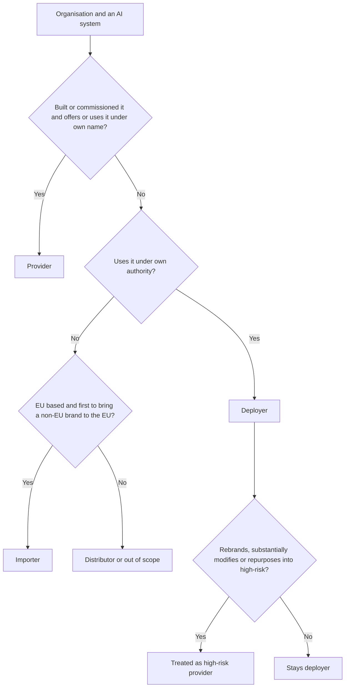
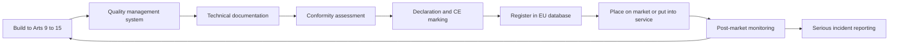

# Module 6 — The EU AI Act

*The EU AI Act is the first comprehensive, horizontal law written for artificial intelligence, and the AIGP exam treats it as the reference point for everything else. Najm Bank is headquartered in the Gulf, but its Frankfurt branch and EU customers bring its credit model, vendor CV-screening tool, chatbot and GenAI copilot into the Act's reach. This module covers the Act in three passes: scope, roles and risk tiers (6.1); what providers and deployers of high-risk systems must do (6.2); and general-purpose AI, transparency, enforcement and the timeline (6.3). The exam tests the Act as adopted in Regulation (EU) 2024/1689, so that is what we teach, and we flag later developments. This course is educational and is not legal advice: for real decisions, read the current text and consult a qualified lawyer.*

> **BoK coverage:** II.C — the scope, roles and risk tiers of the EU AI Act; high-risk obligations for providers and deployers; rules for general-purpose AI models and transparency; governance, penalties and the application timeline.

---

# 6.1 — Scope, roles and the risk pyramid
*Level: 🟡 Intermediate* · *Prerequisites: 1.1, 4.1* · *BoK: II.C*

## ⚡ In 60 seconds

- The EU AI Act (Regulation (EU) 2024/1689) is a directly applicable EU regulation, in force since 1 August 2024 and applying in phases. It uses product-safety machinery (requirements, conformity assessment, CE marking, market surveillance) to protect health, safety and fundamental rights.
- It reaches outside the EU: providers anywhere placing AI on the EU market are covered, and so are providers and deployers anywhere whose system's *output is used in the EU*.
- Duties follow **roles**. The **provider** carries most; the **deployer** carries a lighter but real set; importers, distributors, authorised representatives and product manufacturers have their own.
- Four tiers: **prohibited** (Art. 5), **high-risk** (Art. 6 with Annexes I and III), **transparency** (Art. 50), **minimal**. General-purpose AI models have a separate track (6.3).
- Exam cue: classify by **intended purpose** and **role**, not by technology.
- Biggest trap: "we only bought it, so the vendor is responsible." Deployers have their own duties, and a deployer that rebrands, substantially modifies or repurposes a system can *become* the provider.

## 🧭 Why it matters

Layla's first AI Act email comes from the Frankfurt branch manager: "Surely this is a problem for European companies. We are a Gulf bank." Omar half agrees; he thinks only systems physically run from Frankfurt could matter.

Layla walks the AI Governance Committee through the inventory. Dana's team built the credit model in Doha, but it scores EU residents applying in Frankfurt. The vendor CV-screening tool Yusuf bought filters applicants in Doha, Dubai *and* Frankfurt. The chatbot answers EU customers. The credit memo copilot, built on a third-party large language model, supports lending that includes some German sole traders. Fraud detection runs on every card transaction. Staff everywhere use public GenAI tools.

Is each one an "AI system"? Is Najm in scope? Provider, deployer, or both? Which tier? The answers decide whether Najm faces a disclosure duty or a full high-risk programme, with fines for the worst breaches of up to €35 million or 7% of worldwide turnover. Everything else depends on getting this first step right.

## 📐 How it works

### 🟢 The essentials

**What kind of law this is.** A *regulation* applies directly in every member state. The AI Act borrows the design of EU product-safety law (the "New Legislative Framework"): the law sets essential requirements, standards describe how to meet them, the maker checks conformity and affixes a CE marking, and authorities police the market. A fundamental-rights layer sits on top, which is why engineering duties (logging) and rights duties (impact assessments) appear side by side.

**What counts as an "AI system".** Art. 3(1) defines it, in substance, as *a machine-based system designed to operate with varying levels of autonomy, that may exhibit adaptiveness after deployment, and that, for explicit or implicit objectives, infers from the input it receives how to generate outputs such as predictions, content, recommendations or decisions that can influence physical or virtual environments.* It is modelled on the OECD definition updated in November 2023.

| Element | Meaning | Najm example |
|---|---|---|
| Varying autonomy | Some independence from human involvement | The chatbot replies without a human typing |
| *May* be adaptive | Learning after deployment is possible but **not required** | The frozen credit model still qualifies |
| Objectives | Explicit or implicit goals | "Predict probability of default" |
| **Infers** outputs | The key test: derives outputs using techniques such as machine learning or logic- and knowledge-based approaches | The credit model learned its weights from past loans |
| Influences environments | Predictions, content, recommendations, decisions | A score that moves an application to "decline" |

**Inference** separates AI from ordinary software: the recitals exclude systems based on rules defined solely by people. A credit officer's spreadsheet rule ("decline if debt-to-income exceeds 45%") is not an AI system; a model trained on past defaults is. The Commission's non-binding February 2025 guidelines on the definition help with borderline cases.

**Systems versus models.** An **AI system** is the deployable thing that produces outputs for a use; a **general-purpose AI (GPAI) model**, such as a large language model, is a component built into many systems. Najm's copilot is a system; the LLM inside it is a GPAI model (6.3).

**The risk pyramid.**

| Tier | Where | Consequence | Najm example |
|---|---|---|---|
| Unacceptable | Art. 5 | **Banned** | Emotion recognition on call-centre staff |
| High | Art. 6, Annexes I and III | Requirements, conformity assessment, registration, deployer duties | Credit scoring of EU individuals; CV screening |
| Transparency | Art. 50 | Disclosure and labelling | The chatbot; AI-generated marketing video |
| Minimal | — | No new duties; voluntary codes encouraged | Spam filtering, internal search |

**AI literacy** (Art. 4) applies to *all* providers and deployers whatever the tier, and **GPAI model** rules apply to model providers whatever systems use the model. Tiers can stack: a high-risk system that chats with people must also meet Art. 50.

### 🟡 Going deeper

**Territorial scope (Art. 2).** The Act applies to:
1. **providers** placing AI systems on the market or putting them into service in the EU, or placing GPAI models on the EU market, *wherever they are established*;
2. **deployers** established or located in the EU;
3. **providers and deployers outside the EU** where the system's **output is used in the EU**;
4. **importers and distributors**;
5. **product manufacturers** placing an AI system on the market with their product under their own name;
6. **authorised representatives** of non-EU providers;
7. **affected persons** located in the EU.

So Najm's Frankfurt branch is an EU deployer, and even a system run entirely from Doha is caught if its output, such as a score, is used in the EU.

**Placing on the market** is the *first* making available in the EU. **Putting into service** is supplying a system for first use to a deployer *or for the provider's own use*, which is how in-house systems are caught without ever being sold.

**Exclusions.** The Act does not apply to:
- systems used **exclusively for military, defence or national-security purposes**;
- systems or models developed and put into service **solely for scientific research and development**;
- **research, testing and development** before placing on the market or putting into service (real-world testing is not excluded);
- **natural persons** using AI in a **purely personal, non-professional activity**;
- systems under **free and open-source licences**, *unless* placed on the market as high-risk, or caught by Art. 5 or Art. 50 (open-source GPAI models have their own narrower exemption);

The Act does not affect the GDPR; where personal data are processed, both apply.

**The roles.**

| Role | Plain definition | Najm example |
|---|---|---|
| **Provider** | Develops an AI system or GPAI model (or has one developed) and places it on the market or puts it into service **under its own name or trademark** | Najm (credit model); the CV vendor |
| **Deployer** | Uses an AI system **under its authority**, other than for personal non-professional use | Najm for the CV tool |
| **Importer** | EU-established; places on the EU market a system bearing a non-EU entity's name | An EU reseller of a US tool |
| **Distributor** | Any other supply-chain actor making a system available in the EU | An integrator reselling the CV tool |
| **Authorised representative** | EU person mandated in writing by a non-EU provider | Required for non-EU high-risk and GPAI providers |
| **Product manufacturer** | Places a product with embedded AI on the market under its own name | A medical-device maker |

"**Operator**" covers them all. One organisation can hold several roles: Najm is **provider and deployer** of its credit model, a favourite exam pattern.

**When a deployer becomes a provider (Art. 25).** A distributor, importer, deployer or other third party is treated as the **provider of a high-risk system** if it:
1. puts **its name or trademark** on a high-risk system already on the market (contracts can allocate duties otherwise between the parties);
2. makes a **substantial modification** to a high-risk system so that it remains high-risk; or
3. **changes the intended purpose** of a non-high-risk system, including a GPAI system, so that it becomes high-risk.

The original provider must then cooperate and supply the information and technical access needed (unless it clearly excluded changing its system into a high-risk one). A **substantial modification** is an unplanned change after placing on the market that affects compliance or changes the intended purpose. Changes a learning system makes within limits pre-determined and documented at conformity assessment do not count.

**Article 5: prohibited practices** (applicable since 2 February 2025; Commission guidelines published the same month). It is prohibited to place on the market, put into service or use AI systems that:
1. use **subliminal, manipulative or deceptive techniques** that materially distort behaviour, causing or likely to cause significant harm;
2. **exploit vulnerabilities** due to age, disability or a specific social or economic situation, with the same effect;
3. perform **social scoring** leading to detrimental treatment in unrelated contexts, or treatment that is unjustified or disproportionate (public *and* private actors);
4. predict a person's risk of committing a crime **based solely on profiling or personality traits**;
5. build facial-recognition databases through **untargeted scraping** of images from the internet or CCTV;
6. infer **emotions in the workplace or education institutions**, except for medical or safety reasons;
7. **categorise people biometrically** to infer race, political opinions, trade-union membership, religious or philosophical beliefs, sex life or sexual orientation;
8. perform **real-time remote biometric identification in publicly accessible spaces for law enforcement**, except where strictly necessary to search for specific victims or missing persons, prevent an imminent threat to life or a terrorist attack, or locate suspects of listed serious crimes, with prior judicial or independent authorisation and enabling national law.

For a bank, items 1, 2, 3 and 6 are the live risks: a sales tool exploiting financial distress, a "worthiness" score built from unrelated social behaviour, or voice analytics on staff emotions.

### 🔴 Expert view

**Article 6: two routes to high-risk.**

*Route 1: products (Art. 6(1)).* A system is high-risk if **both** (a) it is a safety component of a product, or itself a product, covered by the EU harmonisation legislation in **Annex I** (such as machinery, toys, lifts, radio equipment, medical devices, and in a second section vehicles, aviation, marine and rail equipment), **and** (b) that product must undergo **third-party conformity assessment** under that legislation. These apply from 2 August 2027.

*Route 2: use cases (Art. 6(2), Annex III).* A system is high-risk if its intended purpose falls within one of eight areas:

| # | Area | Examples of listed uses |
|---|---|---|
| 1 | Biometrics | Remote biometric identification (not mere verification of a claimed identity); categorisation by sensitive attributes; emotion recognition |
| 2 | Critical infrastructure | Safety components for critical digital infrastructure, road traffic, water, gas, heating, electricity |
| 3 | Education and vocational training | Admission; evaluating learning outcomes; assessing education level; detecting cheating in tests |
| 4 | Employment and workers management | Recruitment and selection (targeted job ads, filtering applications, evaluating candidates); promotion, termination and task allocation; monitoring performance and behaviour |
| 5 | Essential private and public services | Public-benefit eligibility; **creditworthiness evaluation or credit scoring of natural persons, except fraud detection**; life and health insurance risk assessment and pricing; emergency-call triage |
| 6 | Law enforcement | Evidence reliability, profiling in investigations |
| 7 | Migration, asylum, border control | Risk assessment, examining applications |
| 8 | Justice and democracy | Assisting judges; influencing elections or voting |

The Commission can amend Annex III by delegated act within these areas (Art. 7).

*The derogation (Art. 6(3)).* An Annex III system is **not** high-risk if it does not pose a significant risk of harm to health, safety or fundamental rights, including by not materially influencing decision outcomes. That is the case where it is intended to:
- (a) perform a **narrow procedural task** (for example, turning unstructured documents into structured data);
- (b) **improve the result of a previously completed human activity** (for example, polishing a letter a person drafted);
- (c) **detect decision patterns or deviations** from prior patterns, without replacing or influencing the completed human assessment absent proper human review; or
- (d) perform a **preparatory task** to an Annex III assessment.

Two guard-rails: an Annex III system that **profiles natural persons is always high-risk**; and a provider relying on the derogation must **document its assessment** beforehand and **register** the system in the EU database. Check whether the Commission's promised classification guidelines have been issued.

**The hard case at Najm: the copilot.** Large corporate borrowers are legal persons, so the credit-scoring entry does not bite. Sole traders are natural persons. If the copilot only restructures documents into a memo template, that may be a narrow procedural or preparatory task. If it summarises a person's financial behaviour and recommends a rating, it is profiling, and high-risk. Either way, Najm documents the reasoning.

**Intended purpose is king.** It is what the provider states in its instructions, promotional material and documentation. A document classifier is minimal risk until someone uses it to rank job applicants, and whoever changed its purpose may then be a high-risk provider under Art. 25.

## ⚖️ The instruments

| Instrument | What it requires or recommends | Exam cue |
|---|---|---|
| **EU AI Act** — Art. 3(1) | Defines "AI system"; inference is the key element | Human-written rules alone are out; adaptiveness is optional |
| **EU AI Act** — Art. 2 | Extraterritorial scope; exclusions for military, research, personal use and most open-source | "Headquartered outside the EU" never ends the analysis |
| **EU AI Act** — Arts 3 and 25 | Defines the roles; rebranding, substantial modification or repurposing into high-risk makes you the provider | "Who is the provider now?" |
| **EU AI Act** — Art. 5 | Eight prohibited practices, from 2 Feb 2025 | Workplace emotion recognition and social scoring are favourites |
| **EU AI Act** — Art. 6 & Annexes I, III | High-risk via regulated products or eight use-case areas; Art. 6(3) derogation, never for profiling | Credit scoring of individuals is high-risk; fraud detection is not |
| **GDPR** | Applies alongside the AI Act to personal data | The AI Act does not displace it |

## 🏛️ In practice at Najm Bank

Layla's first artefact is an **AI Act classification register**, approved by the AI Governance Committee. No system goes live in, or for, the EU without a completed row signed by Layla and reviewed by Sara (DPO).

| System | EU nexus | Najm's role | Tier | Next step |
|---|---|---|---|---|
| Retail credit model | Scores EU residents | Provider and deployer | High-risk, Annex III 5 (profiling) | Provider programme and FRIA (6.2) |
| CV-screening tool | Frankfurt hiring | Deployer | High-risk, Annex III 4 | Deployer duties; vendor evidence |
| Customer chatbot | EU customers | System provider | Transparency, Art. 50 | Disclosure by design |
| Credit memo copilot | EU sole-trader lending | System provider on a GPAI model | Under review | Documented Art. 6(3) assessment |
| Fraud detection | EU card transactions | Provider and deployer | Not high-risk (fraud exclusion) | Literacy, GDPR, model-risk policy |
| Staff public GenAI | EU staff | Deployer | Minimal, plus Art. 4 | Acceptable-use policy, training |

She adds one clause to Najm's AI policy:

> **Role-change control.** No business unit may (a) put Najm's name or trademark on a third-party AI system, (b) change a third-party system's model, data or configuration beyond the vendor's documented parameters, or (c) use any AI system for a purpose other than the one recorded in the AI inventory, without prior written approval from the Head of AI Governance. Such changes may make Najm the provider of a high-risk AI system under Article 25 of the EU AI Act.

## 🛠️ Exercises

🟢 **Definition test.** Take three tools (one rules-based, one machine-learning, one generative) and walk each through Art. 3(1). Conclude whether each is an "AI system" and which element decided it.
*Done when:* you have three short conclusions, each naming the decisive element.

🟡 **Role map.** A US vendor sells the CV tool through an EU reseller, and Najm's HR team plans to add its own scoring rules on top. Identify the provider, importer, distributor and deployer, and say what would make Najm the provider under Art. 25.
*Done when:* every party has a role with a one-line justification and you have named at least two Art. 25 triggers.

🔴 **Derogation memo.** Write a one-page Art. 6(3) assessment for the copilot as used for sole traders: the four conditions, the profiling override, the evidence kept, and a conclusion.
*Done when:* an authority could follow the reasoning and see the registration consequence.

## ⚠️ Mistakes and exam traps

- **"Non-EU company, so out of scope."** Check for EU market placement, EU deployment, and output used in the EU.
- **"Adaptiveness is required."** It is optional ("may"). A frozen ML model is still an AI system; inference is the key.
- **Confusing fraud detection with credit scoring.** Fraud detection is expressly excluded; credit scoring of *natural persons* is high-risk; scoring companies is not caught by that entry.
- **Treating Art. 6(3) as automatic.** It never covers profiling, and requires documentation and registration.
- **"The vendor carries everything."** Deployers have duties (6.2) and become providers if they rebrand, substantially modify or repurpose into high-risk.
- **Mixing up emotion recognition.** Prohibited at work or in education (bar medical or safety reasons); elsewhere, high-risk plus an Art. 50 notice.

## 🧾 Recap

- The AI Act applies product-safety methods to AI, with a fundamental-rights layer.
- An AI system is defined by its capacity to *infer*.
- Scope is extraterritorial: EU market placement, EU deployers, and non-EU output used in the EU.
- Roles drive duties; organisations often hold several, and Art. 25 can turn a deployer into a provider.
- Tiers: eight Art. 5 prohibitions; high-risk via Annex I products or eight Annex III areas; Art. 50 transparency; minimal. Literacy and GPAI rules cut across.
- The Art. 6(3) derogation never covers profiling and always needs documentation and registration.

## ✍️ Check yourself

**1. Najm Bank is headquartered in Doha. Its data-science team built a credit-scoring model that the Frankfurt branch uses to decide loan applications from EU residents. What is Najm's position under the EU AI Act?**

- A. Out of scope, because the model was developed and hosted outside the EU
- B. Provider and deployer of a high-risk AI system
- C. Importer, because it brought a non-EU system into the EU
- D. Deployer only, because it never sold the model

Answer

**B.** Najm built the system and put it into service for its own use under its own name (provider), and its branch uses it (deployer). D is tempting, but putting into service for your own use is enough to be a provider. A ignores Art. 2. (See 🟡 Going deeper: territorial scope and roles.)

**2. Which of the following is a prohibited practice under Article 5?**

- A. A customer chatbot that does not state it is an AI
- B. A model evaluating the creditworthiness of individual loan applicants
- C. A system inferring call-centre agents' emotions from their voices to manage performance
- D. A model detecting fraudulent card transactions

Answer

**C.** Emotion recognition in the workplace is prohibited except for medical or safety reasons. A breaches Art. 50, not Art. 5. B is high-risk and D is expressly excluded from the credit-scoring entry. (See 🟡 Going deeper: Article 5.)

**3. A provider wants to rely on the Article 6(3) derogation because its Annex III system performs only a preparatory task. In which situation can it NOT do so?**

- A. The system performs profiling of natural persons
- B. The system is sold only to SMEs
- C. The system was developed outside the EU
- D. The system is used alongside human review

Answer

**A.** An Annex III system that profiles natural persons is always high-risk. The other factors do not remove the derogation, and human review (D) supports condition (c). (See 🔴 Expert view: the derogation.)

**4. Najm buys a CE-marked CV-screening tool from a vendor. HR relabels it "Najm TalentMatch" and offers it to group companies in the EU. What is the most accurate consequence?**

- A. Nothing changes; the vendor remains the provider because it built the system
- B. Najm becomes a distributor with limited verification duties
- C. The system stops being high-risk because a conformity assessment was already done
- D. Najm is treated as the provider of a high-risk AI system

Answer

**D.** Under Art. 25, putting your name or trademark on a high-risk system already on the market makes you its provider. A is the "vendor carries everything" trap; rebranding is exactly what takes Najm beyond a distributor role (B). (See 🟡 Going deeper: when a deployer becomes a provider.)

**5. Which of the following falls OUTSIDE the scope of the EU AI Act?**

- A. A non-EU provider whose AI system's output is used in the EU
- B. An open-source AI system placed on the market as a high-risk system
- C. A person in Berlin using an AI image generator to make birthday cards for family
- D. An EU importer of a non-EU vendor's AI system

Answer

**C.** Purely personal, non-professional use by individuals is excluded. A and D are expressly in scope, and the open-source exclusion does not cover systems placed on the market as high-risk (B). (See 🟡 Going deeper: exclusions.)

## 📚 References

- Regulation (EU) 2024/1689 (Artificial Intelligence Act), official text: https://eur-lex.europa.eu/eli/reg/2024/1689/oj
- European Commission, regulatory framework for AI (including guidelines on the AI-system definition and prohibited practices): https://digital-strategy.ec.europa.eu/en/policies/regulatory-framework-ai
- OECD AI Principles and definition of an AI system: https://oecd.ai/en/ai-principles
- IAPP, AIGP certification and Body of Knowledge: https://iapp.org/certify/aigp/

---

# 6.2 — High-risk obligations for providers and deployers
*Level: 🟡 Intermediate* · *Prerequisites: 6.1, 4.3* · *BoK: II.C*

## ⚡ In 60 seconds

- High-risk AI systems must meet seven requirements (Arts 9–15): **risk management system**, **data and data governance**, **technical documentation**, **record-keeping (logging)**, **transparency and instructions for use**, **human oversight**, and **accuracy, robustness and cybersecurity**.
- The **provider** proves compliance through a **quality management system**, **conformity assessment**, **EU declaration of conformity**, **CE marking** and **EU database registration**, then runs **post-market monitoring** and reports **serious incidents**.
- The **deployer** (Art. 26) must use the system per its instructions, assign competent **human oversight**, ensure relevant **input data**, **monitor**, keep **logs** for at least six months, and **inform workers** and **affected persons**.
- Public bodies, providers of public services, and deployers using AI for **credit scoring** or **life and health insurance pricing** must do a **fundamental rights impact assessment (FRIA)** (Art. 27).
- Affected people have a **right to explanation** (Art. 86) of the AI's role and the main elements of the decision.
- Biggest trap: thinking the vendor's CE marking covers the deployer. It does not.

## 🧭 Why it matters

Khalid wants the credit-scoring model live for Frankfurt's spring lending campaign. Dana says it is "ready": it beats the old scorecard and validation has signed off. Layla asks: "Ready against what?" As provider of a high-risk system, Najm must show a risk management system, data governance evidence, Annex IV documentation, logging, instructions for use, designed-in human oversight, tested robustness, a quality management system, a conformity assessment, a declaration, a CE marking and a registration. None of that is a model-accuracy question.

Meanwhile Yusuf has signed the CV-screening contract. "The vendor is CE-marked, so compliance is their problem." Sara disagrees. As deployer, Najm must use the tool per its instructions, staff the review with trained people, check its inputs, keep logs, brief the Frankfurt works council and tell candidates a high-risk system is involved. For the credit model, Najm as deployer must also do a FRIA.

This is the heart of the Act for most organisations, and the exam's favourite question here is: "Who must do this, the provider or the deployer?"

## 📐 How it works

### 🟢 The essentials

**The seven requirements.** Every high-risk system must meet them, taking into account its intended purpose and the state of the art (Art. 8). The provider builds them in.

| Art. | Requirement | Plain meaning | At Najm (credit model) |
|---|---|---|---|
| 9 | **Risk management system** | Continuous, iterative process across the life cycle: identify and evaluate risks to health, safety and fundamental rights under intended use *and reasonably foreseeable misuse*; adopt measures; test; accept only acceptable residual risk; consider vulnerable groups | Living risk register, reviewed at every retrain |
| 10 | **Data and data governance** | Training, validation and test data governed (origin, preparation, assumptions, **examination for possible biases**, gaps); relevant, sufficiently representative and, as far as possible, error-free and complete for the purpose and setting | Evidence that German applicants are represented; bias tests by age and sex |
| 11 | **Technical documentation** | Written *before* placing on the market, kept current, with the content in **Annex IV**; simplified form for SMEs | Model dossier structured to Annex IV |
| 12 | **Record-keeping** | System must *technically allow* automatic event logging over its lifetime, enough to trace risks and support monitoring | Each score logged with input and model versions |
| 13 | **Transparency, instructions for use** | Deployers can interpret and use output properly; instructions cover purpose, accuracy metrics, known risks, oversight measures, input specifications, lifetime, logs | Loan-officer guide: what a 0.62 score means and when not to rely on it |
| 14 | **Human oversight** | People can understand capacities and limits, stay alert to **automation bias**, interpret output, disregard or reverse it, and stop the system | Written reason required when following a borderline score |
| 15 | **Accuracy, robustness, cybersecurity** | Appropriate, consistent performance; resilience to errors and **feedback loops**; protection against **data poisoning**, **model poisoning**, **adversarial examples** and **confidentiality attacks** | Stress tests on shifted incomes; locked-down training pipeline |

Providers may, exceptionally and with strict safeguards, process special-category data where strictly necessary to detect and correct bias (Art. 10(5)). It is a narrow opening; the GDPR still applies.

**The provider's path to market.**

### 🟡 Going deeper

**Provider obligations (Art. 16 and following).** Beyond the seven requirements, the provider must:
- show its **name and contact address** on the system, packaging or documentation;
- run a **quality management system (QMS)** (Art. 17): documented policies and procedures for regulatory compliance and change management, design and verification, testing and validation, standards applied, data management, risk management, post-market monitoring, incident reporting, communication with authorities, record-keeping, resources, and an **accountability framework**. It must be proportionate to the organisation's size. **Financial institutions** can meet most of it through their existing internal-governance rules under EU financial-services law, but must still cover risk management, post-market monitoring and incident reporting;
- **keep documentation** available to authorities for **ten years** after placing on the market;
- **keep logs** under its control for a period suited to the purpose, **at least six months**;
- complete the **conformity assessment** (Art. 43), draw up the **EU declaration of conformity** (Art. 47) and affix the **CE marking** (Art. 48), digitally for digital-only systems;
- **register** itself and the system in the **EU database** (Arts 49, 71) before placing on the market (critical-infrastructure systems register nationally; law-enforcement and migration systems in a non-public section);
- take **corrective action** (fix, withdraw, disable or recall) and inform others when the system is non-compliant, and **cooperate** with authorities.

A provider **outside the EU** must appoint an **authorised representative** in the EU by written mandate (Art. 22). **Importers** must verify the conformity assessment, documentation, CE marking, declaration and representative before placing on the market; **distributors** check the CE marking, declaration and instructions. Neither may supply a system they believe non-compliant.

**Conformity assessment routes (Art. 43).**

| System | Route |
|---|---|
| Annex III points 2–8 (credit, employment, education…) | **Internal control** (Annex VI): the provider self-assesses; no notified body |
| Annex III point 1 (biometrics) | **Notified body** (Annex VII), unless harmonised standards are fully applied, in which case internal control may be chosen |
| Annex I products | The sectoral product law's procedure, with AI Act requirements folded in |

A **notified body** is an independent conformity-assessment body designated by a member state. **Harmonised standards** published in the Official Journal give a **presumption of conformity** (Art. 40); where they are missing, the Commission may adopt **common specifications** (Art. 41). Module 7.2 explains how ISO/IEC and CEN-CENELEC standards fit in. A **substantial modification** requires a new conformity assessment; pre-determined, documented learning changes do not.

**Post-market monitoring (Art. 72).** Providers must run a documented monitoring system and **plan**, part of the technical documentation, that actively and systematically collects and analyses performance data over the system's lifetime, including data supplied by deployers.

**Serious-incident reporting (Art. 73).** A **serious incident** is an incident or malfunction that directly or indirectly leads to death or serious harm to health; serious and irreversible disruption of critical infrastructure; **infringement of EU-law obligations protecting fundamental rights**; or serious harm to property or the environment. The provider reports to the market-surveillance authority where it occurred:

| Situation | Deadline after becoming aware |
|---|---|
| General rule | Immediately after establishing a causal link or its reasonable likelihood, **no later than 15 days** |
| Widespread infringement, or critical-infrastructure disruption | **No later than 2 days** |
| Death of a person | **No later than 10 days** |

The provider must investigate and must not alter the system in a way that could affect the investigation before informing the authority.

### 🔴 Expert view

**Deployer obligations (Art. 26).** A deployer of a high-risk system must:
1. use it **in accordance with the instructions for use**, through appropriate technical and organisational measures;
2. assign **human oversight** to people with the necessary **competence, training and authority**, and support them;
3. ensure **input data** under its control are **relevant and sufficiently representative** for the intended purpose;
4. **monitor** operation; if use may present a risk, inform the provider or distributor and the authority and **suspend use**; if a **serious incident** occurs, inform the **provider first**, then the importer or distributor and the authorities (financial institutions meet the monitoring duty through their financial-services governance rules);
5. **keep logs** under its control for a suitable period, **at least six months** (financial institutions keep them within their financial-services documentation);
6. as an **employer**, **inform workers' representatives and affected workers** before putting the system into use at the workplace;
7. as a **public authority**, register its use in the EU database;
8. use the provider's Art. 13 information for any GDPR **DPIA**;
9. for **Annex III** systems making or assisting decisions about people, **inform those people** that they are subject to a high-risk AI system;
10. **cooperate** with authorities.

**Fundamental rights impact assessment (Art. 27).** *Before first use*, a FRIA is required from:
- **bodies governed by public law** and **private entities providing public services**, for Annex III systems (except point 2, critical infrastructure); and
- **any deployer** of Annex III point 5(b) and (c) systems: **creditworthiness or credit scoring of natural persons**, and **life and health insurance risk assessment and pricing**.

It must describe the deployer's **processes** using the system; the **period and frequency** of use; the **categories of people and groups** likely affected; the **specific risks of harm** to them; the **human oversight** measures; and the **measures if risks materialise**, including internal governance and complaint mechanisms. The deployer may rely on a previous FRIA or the provider's in similar cases, updates it when elements change, and **notifies the market-surveillance authority** of the results using the AI Office's template. Where a GDPR **DPIA** covers some elements, the FRIA **complements** it. Sara and Layla run one joint assessment (11.3).

**Right to explanation (Art. 86).** A person subject to a deployer's decision based on output from an Annex III high-risk system (except point 2), which produces **legal effects or similarly significantly affects** them in a way they consider adverse to their health, safety or fundamental rights, can obtain from the deployer **clear and meaningful explanations of the role of the AI system in the decision-making procedure and the main elements of the decision**. It applies where EU law does not already give such a right. It sits beside GDPR Arts 13–15 and 22; recall *SCHUFA* (4.2). People can also **complain** to a market-surveillance authority (Art. 85).

**The relay between provider and deployer.**

| Provider supplies… | …so the deployer can… |
|---|---|
| Instructions for use (Art. 13) | Use per instructions; do the DPIA and FRIA |
| Oversight tools (Art. 14) | Staff oversight with trained people |
| Logging capability (Art. 12) | Keep logs six months or more |
| Monitoring channel (Art. 72) | Report risks and incidents back |

This is why Yusuf's contract (11.2) must secure instructions, log access, change notices and an incident channel. Suppliers of components integrated into high-risk systems must also agree in writing to give providers the information and access they need (Art. 25(4)).

**Transitional rule.** High-risk systems already on the market before 2 August 2026 are generally covered only after significant design changes, but systems intended for public authorities must comply by 2 August 2030. The Digital Omnibus may shift dates (6.3).

## ⚖️ The instruments

| Instrument | What it requires or recommends | Exam cue |
|---|---|---|
| **EU AI Act** — Arts 9–15 | Seven design requirements for high-risk systems | FRIA is not on this list |
| **EU AI Act** — Arts 16–17, 43, 47–49 | QMS, documentation (10 years), logs (6+ months), conformity assessment, declaration, CE marking, registration | Annex III points 2–8 use internal control |
| **EU AI Act** — Arts 72–73 | Post-market monitoring; serious incidents within 15 days (2 days widespread/critical infrastructure; 10 days death) | The deployer tells the provider first |
| **EU AI Act** — Art. 26 | Deployer duties: instructions, competent oversight, inputs, monitoring, logs, informing workers and affected persons | A CE marking does not discharge them |
| **EU AI Act** — Art. 27 | FRIA before first use: public bodies, public-service providers, credit-scoring and life/health insurance deployers | A private bank scoring individuals must do one |
| **EU AI Act** — Art. 86 | Explanation of the AI's role and main elements of adverse decisions | Owed by the deployer |
| **GDPR** — Arts 22, 35 | Automated-decision safeguards; DPIA, which the FRIA complements | Both assessments may be needed |

## 🏛️ In practice at Najm Bank

**Artefact A — deployer readiness checklist for the CV-screening tool (Frankfurt).** Nothing goes live until every line is "Yes" with evidence.

| # | Duty | Evidence | Owner |
|---|---|---|---|
| 1 | Vendor declaration, CE marking and database registration checked | Declaration copy; database reference | Yusuf |
| 2 | Instructions for use embedded in HR procedure | Screening procedure v2 | Head of HR |
| 3 | Named reviewers trained and empowered to override | Training records; RACI | Head of HR, Layla |
| 4 | Inputs (job descriptions, CVs) checked for relevance | Input review note | Dana |
| 5 | Monthly selection-rate review by sex and age band; suspend-and-report route | Dashboard; escalation procedure | Dana, Layla |
| 6 | Logs kept at least six months | Retention schedule | Omar |
| 7 | Works council and staff informed before use | Meeting minutes | Head of HR |
| 8 | Candidates told a high-risk AI system is used | Candidate notice | Sara |
| 9 | DPIA done using vendor's Art. 13 information | DPIA reference | Sara |

**Artefact B — FRIA excerpt for the retail credit-scoring model.**

> **Process.** The model scores consumer loan applications up to €75,000. Every decline and every grey-zone score is reviewed by an officer before a decision.
> **Period and frequency.** Continuous from go-live; about 1,200 decisions a month; reviewed annually or on material change.
> **Affected persons.** EU retail applicants, including thin-file young people, recent migrants, the self-employed and older applicants.
> **Specific risks.** Indirect discrimination through proxies (postcode, employment type); exclusion of thin-file applicants; automation bias; unexplained declines.
> **Human oversight.** Officers trained on the instructions; written reason when following a grey-zone score; authority to override without penalty.
> **If risks materialise.** Monthly fairness metrics to the AI Governance Committee; suspension if group approval-rate gaps exceed the Committee's tolerance; human re-review of complaints within ten working days; Art. 86 explanation template.
> **Notification.** Results sent to the market-surveillance authority on the official template.

## 🛠️ Exercises

🟢 **Sort the duties.** Write twenty obligations from this lesson on cards and sort them into Provider, Deployer or Both.
*Done when:* every card is placed and you can cite the article for each.

🟡 **Instructions for use.** Draft two pages of Art. 13 instructions for Najm's credit model, aimed at loan officers: purpose, accuracy metrics, limits, weaker-performing groups, input specifications, oversight steps, logs.
*Done when:* an officer would know when *not* to rely on the score.

🔴 **Incident drill.** A pipeline bug scored all self-employed applicants as high-risk for three weeks, and 140 were declined. Decide whether this is a serious incident, who reports what to whom and by when, and what Art. 86 explanations should say.
*Done when:* you have a timeline with deadlines and owners, and a reasoned view on the fundamental-rights limb of the definition.

## ⚠️ Mistakes and exam traps

- **"The FRIA is a provider duty."** It is a *deployer* duty (Art. 27). Providers run the risk management system.
- **"CE-marked means compliant for us."** The marking covers provider obligations; deployer duties remain.
- **Mixing up retention.** Documentation: ten years (provider). Logs: at least six months (provider and deployer).
- **"Every high-risk system needs a notified body."** Most Annex III systems use internal control; biometrics is the exception.
- **Forgetting the relay.** The deployer tells the provider first; the provider reports within Art. 73 deadlines.
- **Confusing Art. 86 with GDPR Art. 22.** Art. 86 does not require a *solely* automated decision; both can apply.

## 🧾 Recap

- Providers build in seven requirements (Arts 9–15).
- They prove it with a QMS, conformity assessment (mostly internal control for Annex III), declaration, CE marking and registration, then monitor and report serious incidents.
- Deployers use per instructions, staff oversight competently, check inputs, monitor, keep logs, and inform workers and affected persons.
- A FRIA is needed before first use by public bodies, public-service providers and credit-scoring or life/health insurance deployers; it complements the DPIA.
- Affected persons can obtain an explanation (Art. 86) and complain to an authority.
- Financial institutions meet some QMS, monitoring and logging duties through existing financial-services governance.

## ✍️ Check yourself

**1. Which of the following is NOT one of the Articles 9–15 requirements for high-risk AI systems?**

- A. A risk management system
- B. Data and data governance
- C. Human oversight
- D. A fundamental rights impact assessment

Answer

**D.** The FRIA is a *deployer* obligation (Art. 27), not a design requirement providers build in. A, B and C are Arts 9, 10 and 14. (See 🟢 The essentials and 🔴 Expert view.)

**2. Najm buys a credit-scoring system from an EU vendor that has completed its conformity assessment, to evaluate EU retail loan applicants. Before first use, what must Najm do in addition to its other deployer duties?**

- A. Nothing further; the vendor's conformity assessment covers everything
- B. Carry out a FRIA and notify the market-surveillance authority of the results
- C. Obtain a notified-body certificate for its own use
- D. Register as the provider in the EU database

Answer

**B.** Deployers of credit-scoring systems for natural persons must do a FRIA before first use, even as private companies. A is the "vendor covers it" trap; deployers do not need notified-body certificates (C); D applies only if Najm became the provider under Art. 25. (See 🔴 Expert view: FRIA.)

**3. Which conformity assessment route normally applies to a high-risk system that filters and ranks job applicants?**

- A. Internal control by the provider
- B. Notified-body assessment in every case
- C. None, because employment is not a regulated product
- D. Approval by the European AI Office

Answer

**A.** Annex III points 2–8, including employment, use internal control (Annex VI). Notified bodies are the norm for biometrics without full use of harmonised standards and for Annex I products. The AI Office does not approve individual systems. (See 🟡 Going deeper.)

**4. A provider learns that its high-risk system's malfunction is reasonably likely to have caused serious harm to a person's health. Under the general rule, what is the latest it may report to the market-surveillance authority?**

- A. 72 hours after becoming aware
- B. 15 days after becoming aware
- C. 30 days after becoming aware
- D. In the next annual post-market monitoring report

Answer

**B.** The general limit is 15 days, with 2 days for widespread infringements or critical-infrastructure disruption and 10 days for a death. 72 hours (A) is the GDPR breach-notification deadline, a classic distractor. (See 🟡 Going deeper: serious-incident reporting.)

**5. An applicant at Najm's Frankfurt branch is refused a loan after the high-risk credit model scored her poorly and an officer confirmed the decision. What is she entitled to under Article 86, and from whom?**

- A. The model's source code and training data, from the provider
- B. Nothing, because a human confirmed the decision
- C. A clear and meaningful explanation of the AI's role and the main elements of the decision, from Najm as deployer
- D. The full technical documentation, from the market-surveillance authority

Answer

**C.** Art. 86 is owed by the deployer and does not require a solely automated decision, so B confuses it with GDPR Art. 22. A and D go far beyond the right. (See 🔴 Expert view: right to explanation.)

## 📚 References

- Regulation (EU) 2024/1689 (Artificial Intelligence Act), Chapter III and Art. 86: https://eur-lex.europa.eu/eli/reg/2024/1689/oj
- European Commission, regulatory framework for AI (guidance and templates): https://digital-strategy.ec.europa.eu/en/policies/regulatory-framework-ai
- Regulation (EU) 2016/679 (GDPR): https://eur-lex.europa.eu/eli/reg/2016/679/oj
- European Data Protection Board: https://www.edpb.europa.eu/

---

# 6.3 — General-purpose AI, transparency, enforcement and the timeline
*Level: 🟡 Intermediate* · *Prerequisites: 6.1, 6.2* · *BoK: II.C*

## ⚡ In 60 seconds

- A **general-purpose AI (GPAI) model** is a model that can competently perform a wide range of distinct tasks and can be built into many downstream systems, like a large language model. Its **provider** must keep **technical documentation**, give **information to downstream providers**, adopt a **copyright policy**, and publish a **summary of training content** (Art. 53).
- GPAI models with **systemic risk** carry extra duties: **model evaluations including adversarial testing**, systemic-risk assessment and mitigation, **serious-incident reporting** to the AI Office, and **cybersecurity** (Art. 55). Systemic risk is **presumed above 10^25 FLOPs** of cumulative training compute.
- The **GPAI Code of Practice** (published July 2025) is a voluntary way to show compliance, with chapters on transparency, copyright, and safety and security.
- **Art. 50 transparency:** tell people they are talking to an AI; mark synthetic content in a machine-readable way; disclose **deepfakes**; notify people exposed to **emotion recognition or biometric categorisation**. **Art. 4 AI literacy** applies to every provider and deployer.
- Enforcement: the **AI Office** (GPAI models), national **market-surveillance authorities** (AI systems), the **AI Board**, and a **scientific panel**. Maximum fines are **€35m/7%**, **€15m/3%** and **€7.5m/1%**.
- Timeline: in force 1 Aug 2024; prohibitions and literacy 2 Feb 2025; GPAI and governance 2 Aug 2025; most rules including Annex III 2 Aug 2026; Annex I products 2 Aug 2027. The Nov 2025 **Digital Omnibus** proposal may shift high-risk dates, so **check the current status**.

## 🧭 Why it matters

Najm's credit memo copilot runs on a large language model licensed from a major AI company. Omar asks: "Does the GPAI chapter apply to *us*?" Dana wants to fine-tune the model on ten years of credit memos. Would that make Najm a GPAI model provider, with its own training summary and copyright policy?

Meanwhile, marketing has made a video in which a realistic AI-generated "customer" praises Najm's mortgage rates for German social media. The chatbot team wants to drop "I'm Najm's virtual assistant" because customers find it off-putting. Staff everywhere paste documents into public GenAI tools. Layla needs to know what the GPAI rules, Art. 50 and Art. 4 require, who enforces them, the fines, and when each obligation bites. The dates are among the exam's most common questions.

## 📐 How it works

### 🟢 The essentials

**GPAI models versus GPAI systems.** A **GPAI model** is an AI model, including one trained on large amounts of data using self-supervision at scale, that displays significant generality, can competently perform a wide range of distinct tasks, and can be integrated into a variety of downstream systems or applications. Models used only for research, development or prototyping before being placed on the market are excluded. A **GPAI system** is an AI system based on a GPAI model that can serve a variety of purposes. Najm's copilot is a system built on a GPAI model. The model's developer is the **GPAI model provider**. Najm is a **downstream provider**: it integrates the model into its own AI system.

**Two layers of GPAI obligations.**

| Obligation | All GPAI model providers (Art. 53) | Plus, for systemic-risk models (Art. 55) |
|---|---|---|
| **Technical documentation** of the model (training, testing, evaluation results) for authorities on request | ✔ (open-source exempt) | ✔ |
| **Information for downstream providers** on capabilities and limits | ✔ (open-source exempt) | ✔ |
| **Copyright policy**, including respecting text-and-data-mining opt-outs | ✔ | ✔ |
| Public **summary of training content** on the AI Office template | ✔ | ✔ |
| **Model evaluations**, including **adversarial testing** | | ✔ |
| **Assess and mitigate systemic risks** at EU level | | ✔ |
| **Track and report serious incidents** to the AI Office without undue delay | | ✔ |
| Adequate **cybersecurity** for the model and its infrastructure | | ✔ |

**Open-source.** Providers of GPAI models released under a free and open-source licence, with their parameters, architecture and usage information made public, are exempt from the two documentation duties. They still need the copyright policy and the training-content summary. The exemption **does not apply to systemic-risk models**.

**Transparency obligations (Art. 50).** These apply whatever the risk tier:

| Who | Duty | Najm example |
|---|---|---|
| **Provider** of a system interacting directly with people | Inform people they are interacting with AI, unless obvious from context | The chatbot |
| **Provider** of a system generating synthetic audio, image, video or text | Mark outputs in a **machine-readable**, detectable way (watermarks, metadata), as far as technically feasible | A customer-facing image generator |
| **Deployer** of **emotion-recognition** or **biometric-categorisation** | Inform the people exposed | Voice-emotion analytics on customer calls (never on staff: prohibited) |
| **Deployer** of **deepfakes** | Disclose the content is AI-generated or manipulated (lighter touch for evidently artistic or satirical work) | Marketing's AI "customer" video |
| **Deployer** of AI **text published to inform the public on matters of public interest** | Disclose, unless a human reviewed it and someone holds editorial responsibility | AI-drafted market commentary |

Information must be clear, accessible and given **at the latest at the first interaction or exposure**; there are law-enforcement exceptions. A **deepfake** is AI-generated or manipulated image, audio or video resembling real people, objects, places or events that would falsely appear authentic. Art. 50 applies from 2 August 2026.

**AI literacy (Art. 4).** Providers and deployers must take measures to ensure, to their best extent, a **sufficient level of AI literacy** among staff and others operating AI on their behalf, considering their knowledge, experience and the context of use. It has applied since 2 February 2025 to *every* provider and deployer (see 2.3).

### 🟡 Going deeper

**Systemic risk (Arts 51–52).** A GPAI model has systemic risk if it has **high-impact capabilities** (matching or exceeding the most advanced models), or if the Commission designates it, including after a scientific-panel alert. High-impact capabilities are **presumed** when cumulative training compute exceeds **10^25 floating-point operations (FLOPs)**; the Commission can update this threshold. The provider must **notify the Commission within two weeks** of meeting it. It may argue its model exceptionally lacks systemic risk, but the Commission decides.

**The GPAI Code of Practice (Art. 56).** Drafted by independent experts with wide stakeholder input and **published in July 2025**, it has three chapters:
- **Transparency**, including a model documentation form (all GPAI providers);
- **Copyright** (all GPAI providers);
- **Safety and security** (systemic-risk model providers only).

Signing is voluntary. Signatories can rely on it to **demonstrate compliance** until harmonised standards exist; others must show compliance by other adequate means. The Commission also published **GPAI guidelines** and the **training-content summary template** in July 2025. Check the Commission's list for current signatories.

**When does a downstream company become a GPAI model provider?** Integrating a model into your system, as Najm does, makes you a provider of an **AI system**, not of the model. *Modifying* the model can differ: the Commission's GPAI guidelines treat a modifier as a new model provider only for significant modifications, with an indicative criterion of using more than **one third of the original model's training compute**, and its obligations then cover the modification. Dana's fine-tune would be far below that. This is guidance; check the current version.

**Transitional rules.** GPAI obligations apply from **2 August 2025**; models already on the market by then have until **2 August 2027**. The Commission's fining powers over GPAI providers apply from **2 August 2026**. Non-EU GPAI providers need an EU **authorised representative** (Art. 54), with an exception for certain open-source models.

**Voluntary tools.** The Act encourages **codes of conduct** applying high-risk requirements voluntarily to other systems (Art. 95). A **code of practice on marking and labelling AI-generated content** under Art. 50 was being drafted in 2025–2026; check its status.

### 🔴 Expert view

**Who enforces what.**

| Body | Role |
|---|---|
| **AI Office** | Within the Commission. Enforces GPAI-model rules; issues guidance and templates; facilitates codes of practice; supervises systems built on a GPAI model by the same provider |
| **AI Board** | One representative per member state; advises and coordinates consistent application |
| **Advisory forum** | Stakeholders (industry, SMEs, civil society, academia) giving technical input |
| **Scientific panel** | Independent experts supporting the AI Office; can issue **qualified alerts** on systemic-risk models |
| **National competent authorities** | At least one **notifying authority** (oversees notified bodies) and one **market-surveillance authority** (enforces rules on AI systems) per member state, due by 2 August 2025 |
| **Financial supervisors** | Act as market-surveillance authority for high-risk systems placed on the market or used by regulated financial institutions, so Najm's Frankfurt branch faces its financial supervisor |
| **EDPS** | Supervises, and can fine, EU institutions and bodies |

**Penalties (Arts 99–101).** Member states set penalties within these maxima:

| Infringement | Maximum fine |
|---|---|
| Prohibited practices (Art. 5) | **€35 million or 7%** of total worldwide annual turnover for the preceding financial year, **whichever is higher** |
| Most other obligations: operators' high-risk duties, Art. 50 transparency, notified-body duties | **€15 million or 3%**, whichever is higher |
| Supplying incorrect, incomplete or misleading information to notified bodies or authorities | **€7.5 million or 1%**, whichever is higher |
| GPAI model providers (fined by the Commission) | Up to **€15 million or 3%**, whichever is higher |

For **SMEs, including start-ups**, each cap is the **lower** of the two amounts. Authorities weigh gravity, duration, people affected, cooperation, size and intent or negligence.

Anyone can **complain** to a market-surveillance authority (Art. 85), and whistleblowers reporting infringements are protected under the EU Whistleblower Directive.

**Innovation support: sandboxes and real-world testing.**
- **AI regulatory sandboxes** (Art. 57): each member state must have at least one operational by **2 August 2026**. Providers develop and test innovative AI under supervision, for a limited time, under a sandbox plan. Participants stay liable for harm, but good-faith adherence to the plan protects them from fines, and exit reports can support compliance.
- **Testing in real-world conditions** (Art. 60) for Annex III systems, under an approved plan, with informed consent and other safeguards.
- **SMEs and start-ups** get priority, free sandbox access and simplified documentation.

**The timeline.**

| Date | What applies |
|---|---|
| 1 Aug 2024 | The Act enters into force |
| 2 Feb 2025 | General provisions, including **AI literacy (Art. 4)**, and **prohibited practices (Art. 5)** |
| 2 Aug 2025 | **GPAI model obligations**; governance (AI Office, Board, national authorities); notified bodies; **penalties** regime; confidentiality |
| 2 Aug 2026 | Most remaining provisions: **Annex III high-risk** systems, deployer duties, FRIA, **Art. 50 transparency**, sandboxes, Commission enforcement of GPAI rules |
| 2 Aug 2027 | High-risk systems under **Annex I** (Art. 6(1), regulated products); deadline for GPAI models placed on the market before 2 Aug 2025 |
| 2 Aug 2030 | High-risk systems intended for use by public authorities that were on the market before 2 Aug 2026 must comply |
| 31 Dec 2030 | AI components of certain large-scale EU IT systems (Annex X) |

**The Digital Omnibus proposal (check the current status).** On 19 November 2025 the Commission proposed a "Digital Omnibus" package that would amend the AI Act, among other laws. As proposed and reported at the time, it would:
- link the application of the high-risk rules to the availability of harmonised standards and other support tools, with backstop dates later than August 2026 for Annex III and later than August 2027 for Annex I;
- recast the AI-literacy duty so that member states and the Commission promote literacy, rather than every provider and deployer being directly obliged to ensure it;
- extend some SME simplifications to small mid-cap companies;
- widen the legal basis for processing special-category data to detect and correct bias;
- adjust some registration requirements and centralise more oversight in the AI Office.

A proposal is not law until the Parliament and Council agree it, and its content can change. **At the time of writing (2026), check the current status on EUR-Lex before relying on any date.** The AIGP exam tests the Act as adopted, so learn the original dates.

Good programmes build to the adopted timeline and design controls (inventory, classification, literacy, logging, oversight) that are sound whatever the final dates turn out to be.

## ⚖️ The instruments

| Instrument | What it requires or recommends | Exam cue |
|---|---|---|
| **EU AI Act** — Art. 53 | All GPAI model providers: technical documentation, information to downstream providers, copyright policy, public training-content summary; open-source exemption for the first two | The copyright policy and training summary apply even to open-source models |
| **EU AI Act** — Arts 51, 55 | Systemic risk presumed above 10^25 FLOPs; evaluations and adversarial testing, risk mitigation, incident reporting to the AI Office, cybersecurity | "10^25" and "notify within two weeks" |
| **GPAI Code of Practice** | Voluntary code (July 2025) with transparency, copyright, and safety and security chapters; a way to demonstrate compliance | Voluntary, but it is the practical benchmark |
| **EU AI Act** — Art. 50 | Chatbot disclosure (provider), machine-readable marking of synthetic content (provider), deepfake and public-interest text disclosure (deployer), emotion-recognition and biometric-categorisation notices (deployer) | Separate who designs (provider) from who discloses in use (deployer) |
| **EU AI Act** — Art. 4 | AI literacy for staff and others operating AI on the organisation's behalf; all providers and deployers; from 2 Feb 2025 | Applies regardless of risk tier |
| **EU AI Act** — Arts 99–101 | Fines up to €35m/7%, €15m/3%, €7.5m/1%; "whichever is higher", but "whichever is lower" for SMEs; GPAI fines by the Commission | Match the fine tier to the breach |
| **EU AI Act** — Art. 113 | Phased application dates from 2 Feb 2025 to 2 Aug 2027 | The date questions are near-certain |
| **EU Digital Omnibus** (proposal, Nov 2025) | Proposed amendments, including linking high-risk dates to standards availability | Not law unless adopted; check the current status |

## 🏛️ In practice at Najm Bank

Layla brings a **GenAI and transparency decision record** to the AI Governance Committee.

| Item | Question | Decision | Basis | Owner |
|---|---|---|---|---|
| Copilot model | Is Najm a GPAI model provider? | No: a downstream AI-system provider; the LLM company is the model provider | Art. 53; GPAI guidelines | Layla |
| Fine-tuning | Would it change that? | Not expected: far below the one-third indicative criterion. Record compute used | GPAI guidelines | Dana |
| Vendor evidence | What do we need from the LLM company? | Downstream documentation, training summary link, copyright policy, Code of Practice status | Art. 53; 11.2 | Yusuf |
| Chatbot | Drop "I'm Najm's virtual assistant"? | **No.** Friendlier wording, but disclosure at first interaction stays | Art. 50(1) | Head of Digital |
| AI "customer" video | Publish? | Only with a clear AI-generated label; better still, a real customer, because a fake testimonial may mislead consumers whatever the label | Art. 50(4); 5.3 | Marketing, Sara |
| Market commentary | AI-drafted articles? | Only after review by a named editor | Art. 50(4) | Head of Research |
| Literacy | Meeting Art. 4? | Role-based training since Q1 2025; completion tracked | Art. 4; 2.3 | Layla |
| Regulatory watch | Omnibus | Monthly check; no plan relaxed until changes are law | Art. 113 | Layla |

## 🛠️ Exercises

🟢 **Timeline card.** From memory, write the five key application dates of the AI Act and what applies on each. Then check against the table in 🔴 Expert view.
*Done when:* you get all five right twice in a row, a day apart.

🟡 **Art. 50 audit.** List every customer-facing or public-facing AI output at Najm (or your organisation): chatbots, generated images, voice, published text. For each, identify whether an Art. 50 duty applies, who holds it (provider or deployer), and what the disclosure should look like.
*Done when:* each item has a duty, a holder and a draft disclosure line, or a reasoned "no duty".

🔴 **GPAI vendor questionnaire.** Draft ten questions Najm should put to any GPAI model vendor, mapped to Arts 53 and 55 and the Code of Practice chapters. Include at least two on copyright and training data, and two on incident notification to downstream providers.
*Done when:* each question cites the obligation it tests and says what evidence would be an acceptable answer.

## ⚠️ Mistakes and exam traps

- **Using a GPAI model does not make you a GPAI model provider.** Building a system on someone else's model makes you a downstream *system* provider. Only significant modification of the model itself can make you a model provider.
- **Mixing up the two GPAI tiers.** Adversarial testing, systemic-risk mitigation, incident reporting and cybersecurity are systemic-risk duties. Documentation, downstream information, the copyright policy and the training summary apply to all GPAI providers.
- **Assuming open-source means exempt from everything.** Open-source GPAI providers still need the copyright policy and training summary, and systemic-risk models get no exemption.
- **Reading fines backwards.** "Whichever is higher" for most companies; "whichever is lower" for SMEs. €35m/7% is only for prohibited practices.
- **Confusing the dates.** Prohibitions and literacy: 2 Feb 2025. GPAI: 2 Aug 2025. Annex III high-risk and Art. 50: 2 Aug 2026. Annex I: 2 Aug 2027.
- **Treating the Digital Omnibus as law.** It is a proposal. On the exam, answer from the Act as adopted unless the question says otherwise.

## 🧾 Recap

- GPAI model providers must document the model, inform downstream providers, adopt a copyright policy and publish a training-content summary. Systemic-risk models (presumed above 10^25 FLOPs) add evaluations, adversarial testing, risk mitigation, incident reporting and cybersecurity.
- The July 2025 GPAI Code of Practice is a voluntary route to demonstrating compliance.
- Art. 50 requires AI-interaction disclosure, machine-readable marking of synthetic content, deepfake and public-interest text disclosure, and notices for emotion recognition and biometric categorisation. Art. 4 requires AI literacy from everyone.
- The AI Office enforces GPAI rules; national market-surveillance authorities (financial supervisors for banks) enforce system rules; the AI Board coordinates; a scientific panel advises.
- Fines reach €35m/7%, €15m/3% and €7.5m/1%. Sandboxes and real-world testing support innovation.
- Application runs from 2 Feb 2025 to 2 Aug 2027. The Digital Omnibus proposal may shift high-risk dates; check its current status.

## ✍️ Check yourself

**1. Above what level of cumulative training compute is a GPAI model presumed to have high-impact capabilities, and therefore systemic risk?**

- A. 10^25 FLOPs
- B. 10^23 FLOPs
- C. 10^21 FLOPs
- D. 10^27 FLOPs

Answer

**A.** The Act presumes high-impact capabilities above 10^25 FLOPs of cumulative training compute. The Commission can also designate models below it and can update the threshold. (See 🟡 Going deeper: systemic risk.)

**2. Which obligation applies ONLY to providers of GPAI models with systemic risk, and not to all GPAI model providers?**

- A. Publishing a sufficiently detailed summary of training content
- B. Putting in place a policy to comply with EU copyright law
- C. Providing information to downstream providers
- D. Performing model evaluations, including adversarial testing

Answer

**D.** Evaluations with adversarial testing are an Art. 55 systemic-risk duty. A, B and C are Art. 53 duties for all GPAI model providers (with an open-source exemption for C only). (See 🟢 The essentials: two layers of GPAI obligations.)

**3. Najm builds its customer chatbot on a third-party large language model and deploys it on its website for EU customers. The digital team wants to remove the statement that users are talking to an AI. What does the AI Act require?**

- A. Nothing, because the chatbot is not high-risk
- B. The LLM company must add the disclosure, because it is the GPAI model provider
- C. Najm, as provider of the chatbot system, must ensure users are informed they are interacting with an AI, unless that is obvious from the context
- D. Disclosure is needed only if the chatbot generates deepfakes

Answer

**C.** Art. 50(1) places the duty on the provider of a system intended to interact directly with people. Najm built and operates the chatbot under its own name, so it is that provider. A confuses the transparency tier with high-risk. B confuses the model provider with the system provider. (See 🟢 The essentials: transparency obligations.)

**4. A large company (not an SME) is found to have used an AI system for a prohibited social-scoring practice. What is the maximum administrative fine under the AI Act?**

- A. €7.5 million or 1% of worldwide annual turnover, whichever is higher
- B. €15 million or 3% of worldwide annual turnover, whichever is higher
- C. €20 million or 4% of worldwide annual turnover, whichever is higher
- D. €35 million or 7% of worldwide annual turnover, whichever is higher

Answer

**D.** Prohibited practices carry the top tier. C is the GDPR's upper tier, a common distractor. B covers most other obligations and A covers incorrect information. For an SME, the cap would be whichever amount is lower. (See 🔴 Expert view: penalties.)

**5. Which obligations have applied since 2 February 2025?**

- A. GPAI model obligations and the penalties regime
- B. Prohibited practices and the AI-literacy duty
- C. Annex III high-risk obligations and Art. 50 transparency
- D. High-risk obligations for AI in Annex I regulated products

Answer

**B.** Arts 4 and 5 applied from 2 February 2025. A applied from 2 August 2025, C from 2 August 2026 and D from 2 August 2027, subject to any change adopted through the Digital Omnibus. (See 🔴 Expert view: the timeline.)

## 📚 References

- Regulation (EU) 2024/1689 (Artificial Intelligence Act), Chapters V (GPAI models), IV (transparency), VII (governance), XII (penalties) and Art. 113: https://eur-lex.europa.eu/eli/reg/2024/1689/oj
- European Commission, European AI Office: https://digital-strategy.ec.europa.eu/en/policies/ai-office
- European Commission, regulatory framework for AI (GPAI Code of Practice, GPAI guidelines, training-content summary template, implementation timeline): https://digital-strategy.ec.europa.eu/en/policies/regulatory-framework-ai
- EUR-Lex, for the current status of the Digital Omnibus proposal: https://eur-lex.europa.eu/
