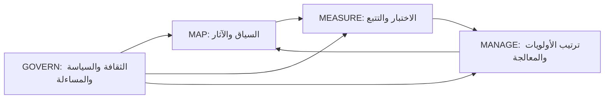
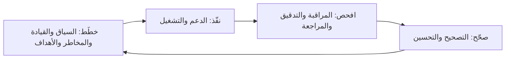

# الوحدة 7 — المعايير والأطر

*تخبرك القوانين بالنتيجة المطلوبة، أما المعايير (standards) والأطر (frameworks) فتخبرك كيف تنظّم نفسك للوصول إليها. يطلب قانون الذكاء الاصطناعي الأوروبي (EU AI Act) من بنك نجم (Najm Bank) نظامًا لإدارة المخاطر (risk management system)، والإشراف البشري (human oversight)، ونظامًا لإدارة الجودة (quality management system)، لكنه لا يقول كيف تُدار هذه الأمور يومًا بيوم. هذه هي مهمة مبادئ OECD للذكاء الاصطناعي (OECD AI Principles)، وإطار إدارة مخاطر الذكاء الاصطناعي من NIST (NIST AI Risk Management Framework)، والمعيار ISO/IEC 42001 والمعايير الشقيقة له، والمجموعة المتنامية من الأطر الوطنية والدولية، ومنها أطر دول الخليج. تغطي هذه الوحدة طبقة القيم ونموذج التشغيل في NIST (7.1)، وعائلة معايير ISO/IEC وصلتها بالمعايير المنسَّقة (harmonised standards) الأوروبية (7.2)، والخريطة العالمية الأوسع، وتنتهي بجدول مقابلة (crosswalk) يسمح لبنك نجم بتشغيل مجموعة ضوابط واحدة تغطي EU AI Act وNIST وISO (7.3). معظم الأدوات هنا طوعية، وسننبّه بوضوح حيث يكون الأمر ملزمًا. هذه الدورة تعليمية وليست استشارة قانونية.*

> **تغطية مجال المعرفة (BoK coverage):** II.D — أهم المبادئ والأطر والمعايير الطوعية لحوكمة الذكاء الاصطناعي (OECD وNIST AI RMF وISO/IEC 42001 والمعايير المرتبطة به، وغيرها من الأطر الدولية والوطنية)، وكيف تتقابل فيما بينها ومع القانون.

---

# 7.1 — مبادئ OECD وإطار NIST AI RMF
*المستوى: 🟡 متوسط* · *المتطلبات: 1.2، 2.1، 6.1* · *مجال المعرفة (BoK): II.D*

## ⚡ الدرس في دقيقة

- **مبادئ OECD للذكاء الاصطناعي (OECD AI Principles)** (2019، وحُدّثت في مايو 2024) هي أول معيار حكومي دولي للذكاء الاصطناعي: خمسة **مبادئ قائمة على القيم (values-based principles)** للذكاء الاصطناعي الجدير بالثقة (trustworthy AI)، وخمس **توصيات (recommendations)** للحكومات. وتعريف OECD لـ "نظام الذكاء الاصطناعي (AI system)" هو الأساس الذي بُني عليه تعريف EU AI Act.
- **إطار إدارة مخاطر الذكاء الاصطناعي من NIST (NIST AI Risk Management Framework, AI RMF 1.0)**، الصادر في يناير 2023، إطار **طوعي (voluntary)** ومحايد قطاعيًا لإدارة مخاطر الذكاء الاصطناعي. وهو أكثر نماذج التشغيل استخدامًا في برامج حوكمة الذكاء الاصطناعي (AI governance).
- يحدد سبع **خصائص للجدارة بالثقة (trustworthiness characteristics)** وأربع **وظائف (functions)**: **Govern** (الحوكمة: ثقافة ومساءلة شاملة لكل الوظائف)، و**Map** (التحديد: السياق)، و**Measure** (القياس: التقييم والتتبع)، و**Manage** (الإدارة: ترتيب الأولويات والمعالجة).
- الموارد المرافقة: **الدليل الإرشادي (Playbook)** (إجراءات مقترحة)، و**الملفات التعريفية (profiles)** (نسخ مفصّلة لسياق معين)، و**الملف التعريفي للذكاء الاصطناعي التوليدي (Generative AI Profile)، NIST AI 600-1** (يوليو 2024)، الذي يسرد اثني عشر خطرًا خاصًا بالذكاء الاصطناعي التوليدي (GenAI).
- إشارة الامتحان: طابق النشاط مع وظيفته في NIST، واعلم أن Govern ينطبق على كل الوظائف الأخرى.
- الفخ الأكبر: التعامل مع NIST كمعيار قابل للاعتماد (certifiable) أو كقائمة تحقق (checklist). فهو ليس هذا ولا ذاك: إنه طوعي ومرن ويركّز على النتائج.

## 🧭 لماذا يهم

بعد الوحدة 6، تعرف لجنة حوكمة الذكاء الاصطناعي (AI Governance Committee) في بنك نجم *ما* يشترطه EU AI Act. والآن يطرح مجلس الإدارة على ليلى سؤالًا أصعب: "كيف ندير هذا فعليًا في قطر والإمارات والاتحاد الأوروبي، بفريق واحد ومجموعة واحدة من العمليات؟" يريد فريق البيانات لدى عمر دليلًا تقنيًا. وتريد سارة أن تكون الخصوصية مدمجة من البداية. ويريد خالد أن يعرف أي المراجعات ستبطئ منتجات الإقراض لديه، ولماذا.

تحتاج ليلى إلى أمرين. الأول **مرتكز قيمي (values anchor)** تعترف به كل الولايات القضائية التي يعمل فيها بنك نجم، حتى لا تُخترَع مبادئ الذكاء الاصطناعي لدى مجلس الإدارة من الصفر. وتعطيها مبادئ OECD ذلك: فالالتزام بها يتجاوز الدول الأعضاء في OECD بكثير، واستندت إليها مبادئ مجموعة العشرين (G20) للذكاء الاصطناعي لعام 2019. والثاني **نموذج تشغيل (operating model)**: طريقة منظمة لاكتشاف مخاطر الذكاء الاصطناعي وتقييمها ومعالجتها عبر دورة الحياة (life cycle). ويعطيها NIST AI RMF ذلك. فهو مجاني ومفصّل ويفهمه الموردون والمدققون على نطاق واسع، ويتقابل جيدًا مع كل من AI Act وISO/IEC 42001.

يتوقع امتحان AIGP أن تعرف الاثنين جيدًا، وخصوصًا أن تميّز إلى أي وظيفة في NIST ينتمي نشاط معين.

## 📐 كيف يعمل

### 🟢 الأساسيات

**مبادئ OECD للذكاء الاصطناعي.** اعتمدها مجلس OECD في مايو 2019 بصفتها توصية (Recommendation) (أداة من القانون المرن (soft-law)، وليست معاهدة)، وحُدّثت في مايو 2024. وهي من جزأين.

*خمسة مبادئ قائمة على القيم للذكاء الاصطناعي الجدير بالثقة*، موجّهة إلى جميع الجهات الفاعلة في الذكاء الاصطناعي (AI actors):

| # | المبدأ | بكلمات بسيطة |
|---|---|---|
| 1 | **النمو الشامل والتنمية المستدامة والرفاه** | يجب أن يفيد الذكاء الاصطناعي الناس والكوكب، ويقلّل أوجه عدم المساواة، ويحمي البيئة |
| 2 | **احترام سيادة القانون وحقوق الإنسان والقيم الديمقراطية، بما فيها العدالة والخصوصية** | احترام الحرية والكرامة والاستقلالية والخصوصية وعدم التمييز وحقوق العمال، ووجود ضمانات مثل الإرادة البشرية والإشراف البشري |
| 3 | **الشفافية وقابلية التفسير** | تقديم معلومات ذات معنى حتى يفهم الناس أنظمة الذكاء الاصطناعي، ويعرفوا متى يتعاملون معها، ويستطيعوا الطعن في نتائجها |
| 4 | **المتانة والأمن والسلامة** | يجب أن يعمل الذكاء الاصطناعي بموثوقية وأمان طوال دورة حياته، ويجب أن توجد آليات تسمح بتجاوزه أو إصلاحه أو إيقافه وتقاعده بأمان إذا سبّب ضررًا غير مبرر |
| 5 | **المساءلة** | الجهات الفاعلة في الذكاء الاصطناعي مسؤولة عن حسن عمله، مع إمكانية التتبع (traceability) ونهج منهجي لإدارة المخاطر عبر دورة الحياة |

*خمس توصيات لصانعي السياسات*: (1) الاستثمار في البحث والتطوير في الذكاء الاصطناعي؛ (2) تعزيز منظومة شاملة ممكِّنة للذكاء الاصطناعي؛ (3) تهيئة بيئة حوكمة وسياسات قابلة للتشغيل البيني (interoperable)؛ (4) بناء القدرات البشرية والاستعداد للتحول في سوق العمل؛ (5) التعاون الدولي من أجل ذكاء اصطناعي جدير بالثقة.

عزّز **تحديث 2024** الإشارات إلى السلامة (بما فيها القدرة على تجاوز الأنظمة أو إيقافها وتقاعدها بأمان)، والمعلومات المضللة والمعلومات المضللة المتعمدة (misinformation and disinformation) وسلامة المعلومات (information integrity)، والاستدامة البيئية، والسلوك التجاري المسؤول عبر دورة حياة الذكاء الاصطناعي، والتشغيل البيني بين الولايات القضائية. وبشكل منفصل، حدّثت OECD في نوفمبر 2023 **تعريفها لنظام الذكاء الاصطناعي**، الذي اعتمده EU AI Act حرفيًا تقريبًا (6.1).

**إطار NIST AI RMF 1.0.** نشره المعهد الوطني الأمريكي للمعايير والتقنية (US National Institute of Standards and Technology) في يناير 2023 (الوثيقة NIST AI 100-1)، بعد عملية مفتوحة قائمة على التوافق. وهو:
- **طوعي** و**غير خاص بقطاع معين (non-sector-specific)**؛
- **يحافظ على الحقوق (rights-preserving)** و**لا يرتبط بحالة استخدام محددة (use-case agnostic)**؛
- مصمَّم ليكون **مرنًا** للمؤسسات من أي حجم؛
- "وثيقة حيّة (living document)"، تُحدَّث مواردها المرافقة أكثر من جوهرها.

وهو من جزأين. **الجزء 1** يشرح كيف يُؤطَّر خطر الذكاء الاصطناعي وما معنى "الذكاء الاصطناعي الجدير بالثقة". و**الجزء 2** هو **الجوهر (Core)** (الوظائف الأربع) و**الملفات التعريفية**.

**تأطير المخاطر.** يعرّف NIST الخطر بأنه مركّب من **احتمال (probability)** وقوع حدث و**حجم (magnitude)** عواقبه. ويطلب من المؤسسات أن تنظر في الأضرار على ثلاث فئات: **الناس** (الأفراد والمجموعات والمجتمعات المحلية والمجتمع)، و**المؤسسات** (العمليات والسمعة والأمن)، و**المنظومات (ecosystems)** (الأنظمة المترابطة وسلاسل التوريد والبيئة). ويسمّي أربعة تحديات: **قياس** مخاطر الذكاء الاصطناعي (مقاييس غير ناضجة، ومكوّنات من أطراف ثالثة، والفرق بين المختبر والعالم الحقيقي)؛ وتحديد **تحمّل المخاطر (risk tolerance)**؛ و**ترتيب أولويات** المخاطر؛ و**دمج** مخاطر الذكاء الاصطناعي في إدارة المخاطر المؤسسية الأوسع. ويشير إلى أن بعض المخاطر قد تكون عالية إلى حد يستوجب إيقاف التطوير أو النشر.

**خصائص الجدارة بالثقة السبع.**

| الخاصية | ما تعنيه | مثال من بنك نجم |
|---|---|---|
| **صالح وموثوق (Valid and reliable)** | الأساس: يفعل النظام ما صُمّم له، بدقة واتساق، في ظروف استخدامه الحقيقية | التحقق من نموذج الائتمان على متقدمين ألمان، لا على البيانات القطرية فقط |
| **آمن (Safe)** | لا يعرّض الحياة أو الصحة أو الممتلكات أو البيئة للخطر ضمن ظروف محددة | لا يستطيع المساعد الذكي (Copilot) تنفيذ مدفوعات |
| **مؤمَّن ومرن (Secure and resilient)** | يصمد أمام الهجمات والتغيرات غير المتوقعة، ويتعافى منها | الحماية من حقن الأوامر (prompt injection) في روبوت المحادثة |
| **خاضع للمساءلة وشفاف (Accountable and transparent)** | المعلومات عن النظام متاحة لمن يحتاجها، وهناك من يُسأل عن النتائج. ويعرض NIST هذه الخاصية على أنها تمتد عبر الخصائص الأخرى | بطاقات النموذج (model cards) ومالك نموذج مسمّى |
| **قابل للتفسير وقابل للفهم (Explainable and interpretable)** | قابلية التفسير: *كيف* أنتج النظام المخرَج؛ وقابلية الفهم: *ماذا يعني* المخرَج لغرض المستخدم | رموز الأسباب (reason codes) للمتقدمين المرفوضين |
| **معزّز للخصوصية (Privacy-enhanced)** | يحمي الاستقلالية والهوية والكرامة عبر قيم الخصوصية مثل إخفاء الهوية والتحكم | تقليل البيانات (data minimisation) في مجموعات التدريب |
| **عادل، مع إدارة التحيّز الضار (Fair, with harmful bias managed)** | يعالج المساواة والإنصاف، بما في ذلك التحيّز الضار والتمييز | مراقبة معدلات الموافقة عبر المجموعات |

يشدد NIST على **المفاضلات (trade-offs)**: فزيادة قابلية الفهم قد تكلّف الدقة، وزيادة الخصوصية قد تجعل اختبار العدالة أصعب. والجدارة بالثقة لا تكون أقوى من أضعف خصائصها. ويسمّي NIST أيضًا ثلاث فئات من تحيّز الذكاء الاصطناعي (AI bias): **النظامي (systemic)** (في المؤسسات والبيانات)، و**الحسابي والإحصائي (computational and statistical)** (في العينات والأساليب)، و**البشري المعرفي (human-cognitive)** (في كيفية إدراك الناس للمخرجات واستخدامهم لها).

### 🟡 التعمق أكثر

**الجوهر: الوظائف الأربع وفئاتها.** تنقسم كل وظيفة إلى فئات (categories) ثم إلى فئات فرعية (subcategories) (نتائج محددة). ومجموع الفئات 19 فئة. لا تحتاج إلى أرقام الفئات الفرعية في الامتحان، لكن يجب أن تعرف موضوع كل وظيفة وكل فئة.

**GOVERN** (الحوكمة) شاملة لكل الوظائف. فهي تنمّي ثقافة واعية بالمخاطر وتنطبق طوال الوظائف الأخرى.

| الفئة | النتيجة |
|---|---|
| GOVERN 1 | السياسات والعمليات والإجراءات والممارسات الخاصة بتحديد مخاطر الذكاء الاصطناعي وقياسها وإدارتها قائمة وشفافة ومطبّقة بفاعلية (بما في ذلك المتطلبات القانونية وتحمّل المخاطر وسجل الأنظمة والإيقاف والتقاعد) |
| GOVERN 2 | هياكل المساءلة: الفرق المناسبة ممكَّنة ومسؤولة ومدرَّبة |
| GOVERN 3 | إعطاء الأولوية لتنوع القوى العاملة والإنصاف والشمول وإمكانية الوصول في إدارة مخاطر الذكاء الاصطناعي |
| GOVERN 4 | الفرق ملتزمة بثقافة تأخذ مخاطر الذكاء الاصطناعي في الحسبان وتتواصل بشأنها |
| GOVERN 5 | عمليات للتواصل الفعّال مع الجهات الفاعلة ذات الصلة في الذكاء الاصطناعي والمجتمعات المتأثرة |
| GOVERN 6 | السياسات والإجراءات تعالج المخاطر الناشئة عن برمجيات الأطراف الثالثة وبياناتها وسلاسل التوريد |

**MAP** (التحديد) تضع السياق الذي تُحدَّد فيه المخاطر.

| الفئة | النتيجة |
|---|---|
| MAP 1 | السياق محدد ومفهوم (الغرض المقصود والمستخدمون والبيئات والقوانين والأعراف) |
| MAP 2 | نظام الذكاء الاصطناعي مصنّف (المهام والأساليب وحدود المعرفة) |
| MAP 3 | القدرات والاستخدام المستهدف والأهداف والفوائد والتكاليف المتوقعة مفهومة |
| MAP 4 | المخاطر والفوائد محددة لكل المكوّنات، بما فيها برمجيات الأطراف الثالثة وبياناتها |
| MAP 5 | الآثار على الأفراد والمجموعات والمجتمعات المحلية والمؤسسات والمجتمع موصوفة |

**MEASURE** (القياس) تستخدم أدوات كمية ونوعية لتحليل المخاطر وتقييمها ومقارنتها بمعايير مرجعية ومراقبتها.

| الفئة | النتيجة |
|---|---|
| MEASURE 1 | الأساليب والمقاييس المناسبة محددة ومطبّقة |
| MEASURE 2 | أنظمة الذكاء الاصطناعي مقيَّمة من حيث خصائص الجدارة بالثقة |
| MEASURE 3 | آليات تتبع المخاطر المحددة بمرور الوقت قائمة |
| MEASURE 4 | التغذية الراجعة عن فاعلية القياس تُجمَع وتُقيَّم |

**MANAGE** (الإدارة) تخصص الموارد للمخاطر التي حُدّدت وقيست.

| الفئة | النتيجة |
|---|---|
| MANAGE 1 | المخاطر مرتبة حسب الأولوية ومستجاب لها ومُدارة، بناءً على MAP وMEASURE |
| MANAGE 2 | استراتيجيات تعظيم الفوائد وتقليل الآثار السلبية مخطط لها ومطبّقة وموثّقة |
| MANAGE 3 | المخاطر والفوائد الناشئة عن جهات الطرف الثالث مُدارة |
| MANAGE 4 | معالجات المخاطر، بما فيها خطط الاستجابة والتعافي والتواصل، موثّقة ومراقبة بانتظام |

الوظائف **تكرارية (iterative)**، وليست تسلسلًا متتابعًا (waterfall). بعد أن يصبح Govern قائمًا، تبدأ معظم المؤسسات بـ Map، لكن يمكن الرجوع إلى أي وظيفة كلما تغيّر النظام وسياقه. ويستخدم الإطار أيضًا مصطلح **الاختبار والتقييم والتحقق والمصادقة (TEVV)** (test, evaluation, verification and validation) لأعمال الاختبار التي تغذّي Measure، ويصف **الجهات الفاعلة في الذكاء الاصطناعي (AI actors)** عبر دورة الحياة (المصممون والمطورون والمُشغِّلون (deployers) والقائمون على التشغيل (operators) والمقيِّمون والمجتمعات المتأثرة).

**تطبيق الجوهر على نموذج الائتمان في بنك نجم.**

| الوظيفة | نشاط بنك نجم |
|---|---|
| Govern | اعتماد سياسة الذكاء الاصطناعي؛ وتحديد اللجنة لتحمّل المخاطر بشأن فجوات العدالة؛ وتسمية دانة مالكةً للنموذج؛ وسياسة بيانات الأطراف الثالثة تغطي تغذية مكتب الائتمان |
| Map | توثيق الغرض المقصود (قروض استهلاكية في الاتحاد الأوروبي حتى 75,000 يورو)؛ وتحديد المجموعات المتأثرة؛ وتسجيل تصنيف النظام عالي المخاطر (high-risk) وفق EU AI Act؛ وسرد المتطلبات القانونية |
| Measure | اختيار مقاييس الدقة والاستقرار والعدالة واختبارها؛ واختبار قابلية التفسير مع موظفي القروض؛ ووجود مراقبة للانجراف (drift) |
| Manage | إحالة الحالات الرمادية إلى البشر؛ ومحفّز للتعليق؛ ودليل تشغيل للحوادث (incident runbook)؛ وتقاعد النموذج إذا تكرر تجاوز حد تحمّل العدالة |

### 🔴 نظرة الخبير

**الملفات التعريفية.** **الملف التعريفي (profile)** في AI RMF هو تطبيق للوظائف والفئات والفئات الفرعية في سياق محدد. ويصف NIST **ملفات حالات الاستخدام (use-case profiles)** (مثل التوظيف أو الإسكان العادل)، و**الملفات الزمنية (temporal profiles)** (ملف *حالي* يصف الوضع اليوم، وملف *مستهدف* يصف الوضع المرغوب، والفجوة بينهما تقود خارطة الطريق)، و**الملفات العابرة للقطاعات (cross-sectoral profiles)** (تغطي مخاطر مشتركة بين الاستخدامات، مثل الذكاء الاصطناعي التوليدي). وبالنسبة لبنك نجم، يُعدّ الملف الحالي مقابل المستهدف لنموذج الائتمان وثيقة قوية على مستوى مجلس الإدارة.

**الدليل الإرشادي (Playbook)** مرافق إلكتروني يقترح إجراءات ومراجع ووثائق لكل فئة فرعية. وهو إرشاد، وليس مجموعة متطلبات: تأخذ المؤسسات ما يناسبها. وينشر NIST أيضًا **جداول مقابلة (crosswalks)** بين AI RMF وأدوات أخرى (مثل معايير ISO/IEC وEU AI Act) عبر مركز موارد الذكاء الاصطناعي الجدير بالثقة والمسؤول (Trustworthy and Responsible AI Resource Center).

**الملف التعريفي للذكاء الاصطناعي التوليدي (NIST AI 600-1، يوليو 2024)** ملف عابر للقطاعات. ويسرد اثني عشر خطرًا فريدًا للذكاء الاصطناعي التوليدي أو يزيدها سوءًا:

| الخطر | مثال من بنك نجم |
|---|---|
| المعلومات أو القدرات الكيميائية والبيولوجية والإشعاعية والنووية (CBRN) | صلة ضعيفة بالنسبة لبنك |
| **التلفيق (Confabulation)** (محتوى خاطئ يُقدَّم بثقة، ويُسمّى غالبًا الهلوسة (hallucination)) | المساعد الذكي يخترع رقم إيرادات لمقترض |
| المحتوى الخطير أو العنيف أو المحرّض على الكراهية | التلاعب بروبوت المحادثة ليقدّم ردودًا مسيئة |
| خصوصية البيانات | تسرّب بيانات العملاء عبر الأوامر (prompts) أو المخرجات |
| الآثار البيئية | تكلفة الطاقة للنماذج الكبيرة |
| التحيّز الضار والتجانس (homogenisation) | المساعد الذكي يصف المنشآت الصغيرة والمتوسطة المملوكة لنساء بطريقة مختلفة |
| التكوين بين الإنسان والذكاء الاصطناعي (Human-AI configuration) | مديرو العلاقات يفرطون في الثقة بالمذكرات (تحيّز الأتمتة (automation bias)) |
| سلامة المعلومات | محتوى "عملاء" اصطناعي يقوّض الثقة |
| أمن المعلومات | حقن الأوامر؛ وتسهيل الهجمات السيبرانية |
| الملكية الفكرية | مخرجات تعيد إنتاج نص محمي بحقوق النشر |
| المحتوى الفاحش أو المهين أو المسيء | إساءة استخدام توليد الصور |
| سلسلة القيمة ودمج المكوّنات | غموض مصدر نموذج الطرف الثالث وبياناته |

ويقابل الإجراءات المقترحة لكل خطر مع الجوهر، ويبرز أربعة محاور من مجموعة العمل العامة في NIST: **الحوكمة**، و**مصدر المحتوى (content provenance)**، و**الاختبار قبل النشر (pre-deployment testing)**، و**الإفصاح عن الحوادث (incident disclosure)**.

**موارد أخرى من NIST تستحق المعرفة.** تضع الوثيقة NIST AI 100-2 تصنيفًا لهجمات **تعلّم الآلة العدائي (adversarial machine learning)** وسبل تخفيفها (هجمات التهرّب (evasion) والتسميم (poisoning) والخصوصية وإساءة الاستخدام). ويتأثر عمل NIST في الذكاء الاصطناعي بالسياسة الفيدرالية الأمريكية، التي تغيّرت في 2025: فقد أُلغي الأمر التنفيذي 14110 لعام 2023 في يناير 2025، ودعت خطة عمل الذكاء الاصطناعي الأمريكية (US AI Action Plan) الصادرة في يوليو 2025 إلى مراجعة AI RMF. **وقت كتابة هذا الدرس، راجع صفحة AI RMF لدى NIST لمعرفة أي نسخة معدّلة**؛ فامتحان AIGP مبني على AI RMF 1.0.

**لماذا يعمل NIST وOECD معًا بشكل جيد.** تعطي OECD *القيم* والمفردات المشتركة بين الحكومات، ويعطي NIST *العملية* لتحويلها إلى ضوابط. ويساعد كتالوج OECD لأدوات ومقاييس الذكاء الاصطناعي الجدير بالثقة (Catalogue of Tools and Metrics for Trustworthy AI) ومرصدها لحوادث الذكاء الاصطناعي (AI Incidents Monitor) في Measure وManage. ولا أحد منهما ملزم. لكن الجهات التنظيمية والمحاكم كثيرًا ما تنظر إلى الأطر المعترف بها عند الحكم على ما إذا كانت المؤسسة قد بذلت العناية المعقولة، وقد أشارت بعض قوانين الولايات الأمريكية إلى NIST AI RMF أو أطر مشابهة عند وصف ما تبدو عليه الإدارة المعقولة للمخاطر. راجع القانون المعني تحديدًا.

## ⚖️ الأدوات التنظيمية

| الأداة | ما تشترطه أو توصي به | إشارة الامتحان |
|---|---|---|
| **OECD AI Principles** | خمسة مبادئ قائمة على القيم وخمس توصيات للحكومات؛ حُدّثت في مايو 2024 | ميّز المبادئ (لجميع الجهات الفاعلة في الذكاء الاصطناعي) من التوصيات (للحكومات) |
| **OECD AI Principles** — تعريف نظام الذكاء الاصطناعي | حُدّث في نوفمبر 2023؛ وهو أساس تعريف EU AI Act | "على أي تعريف استند EU AI Act؟" |
| **NIST AI RMF** — الجزء 1 | تأطير المخاطر (الناس والمؤسسات والمنظومات) وخصائص الجدارة بالثقة السبع | "صالح وموثوق" هو الأساس؛ و"خاضع للمساءلة وشفاف" يمتد عبر البقية |
| **NIST AI RMF** — الجوهر | Govern وMap وMeasure وManage؛ و19 فئة | Govern شاملة لكل الوظائف؛ طابق الأنشطة مع الوظائف |
| **NIST AI RMF** — الملفات التعريفية والدليل الإرشادي | ملفات حالية ومستهدفة؛ وإجراءات مقترحة لكل فئة فرعية | طوعي وقابل للتكييف، وليس قائمة تحقق |
| **NIST AI 600-1** | الملف التعريفي للذكاء الاصطناعي التوليدي: اثنا عشر خطرًا للذكاء الاصطناعي التوليدي، مع إجراءات مقابلة للجوهر | "التلفيق (confabulation)" و"التكوين بين الإنسان والذكاء الاصطناعي (human-AI configuration)" |

## 🏛️ عمليًا في بنك نجم

تعرض ليلى على لجنة حوكمة الذكاء الاصطناعي **ملفًا تعريفيًا حاليًا ومستهدفًا وفق NIST AI RMF** للمساعد الذكي لمذكرات الائتمان (credit memo copilot). ويبيّن كل صف الوضع اليوم، والهدف، ومالك الفجوة.

| الوظيفة / الفئة | الوضع الحالي | الوضع المستهدف (خلال 6 أشهر) | المالك |
|---|---|---|---|
| GOVERN 1 — السياسات | سياسة ذكاء اصطناعي عامة؛ دون قسم للذكاء الاصطناعي التوليدي | اعتماد معيار لاستخدام الذكاء الاصطناعي التوليدي؛ وتحديد تحمّل المخاطر للتلفيق | ليلى |
| GOVERN 2 — المساءلة | الملكية غير واضحة بين الائتمان والبيانات | خالد مالك الأعمال؛ ودانة المالكة التقنية؛ ومصفوفة RACI موقّعة | ليلى |
| GOVERN 6 — الأطراف الثالثة | عقد النموذج اللغوي الكبير (LLM) يفتقر إلى بنود خاصة بالذكاء الاصطناعي | ملحق عقد: إشعارات تغيير النموذج، وإشعار الحوادث، وقيود استخدام البيانات | يوسف |
| MAP 1 — السياق | الاستخدام موصوف بشكل غير رسمي | توثيق الغرض المقصود والمستخدمين والاستخدامات المستبعدة؛ ومذكرة وفق المادة 6(3) من EU AI Act (Art. 6(3)) | خالد، ليلى |
| MAP 5 — الآثار | غير مقيَّمة | تقييم الأثر (impact assessment) على المقترضين من المنشآت الصغيرة والمتوسطة والتجار الأفراد | سارة |
| MEASURE 2 — الجدارة بالثقة | فحوص عشوائية مرتجلة | قياس معدل التلفيق على 200 مذكرة مرجعية؛ واختبارات تحيّز حسب نوع المقترض | دانة |
| MEASURE 3 — التتبع | لا يوجد | أخذ عينات شهرية من الأخطاء؛ وزر تغذية راجعة لمديري العلاقات | دانة |
| MANAGE 1 — المعالجة | لا يوجد | يجب أن ترتبط الأرقام في المذكرات بوثائق المصدر؛ وتُحجب الأرقام غير المرتبطة | دانة |
| MANAGE 4 — الاستجابة | عملية عامة لحوادث تقنية المعلومات | دليل لحوادث الذكاء الاصطناعي التوليدي مع الرجوع إلى المذكرات اليدوية | عمر |

القرار المسجَّل: *"يبقى المساعد الذكي في مرحلة تجريبية لعشرين مدير علاقات حتى يتحقق الملف المستهدف في GOVERN 2 وMAP 1 وMEASURE 2 وMANAGE 1."*

## 🛠️ التمارين

🟢 **مطابقة المبادئ.** خذ مسودة مبادئ الذكاء الاصطناعي الأربعة لدى بنك نجم ("عادل"، "قابل للتفسير"، "آمن"، "خاضع للمساءلة") وقابل كلًا منها مع مبدأ من مبادئ OECD وخاصية من خصائص الجدارة بالثقة في NIST.
*يكتمل عندما:* يكون لكل مبدأ في المسودة مقابل واحد من OECD وواحد من NIST، وتكون قد اكتشفت أي مبدأ من مبادئ OECD أغفله بنك نجم.

🟡 **فرز الوظائف.** اسرد خمسة عشر نشاطًا لحوكمة الذكاء الاصطناعي (مثل "تحديد تحمّل المخاطر"، و"إجراء اختبار الفريق الأحمر على روبوت المحادثة"، و"توثيق الاستخدام المقصود"، و"إيقاف بطاقة التقييم القديمة وتقاعدها"، و"استطلاع آراء العملاء المتأثرين") وانسب كلًا منها إلى Govern أو Map أو Measure أو Manage، مع فئة.
*يكتمل عندما:* يكون لكل نشاط وظيفة وفئة، وتستطيع تبرير الأنشطة الثلاثة التي وجدتها الأصعب.

🔴 **ملف الذكاء الاصطناعي التوليدي.** باستخدام المخاطر الاثني عشر في NIST AI 600-1، ابنِ سجل مخاطر (risk register) لروبوت محادثة العملاء في بنك نجم: قيّم احتمال كل خطر وأثره، واختر معالجة، وسمِّ وظيفة NIST التي تقع فيها تلك المعالجة.
*يكتمل عندما:* تكون المخاطر الاثنا عشر كلها مقيَّمة (بما في ذلك "لا ينطبق" مع ذكر السبب) ويكون للمخاطر الثلاثة الأعلى ضوابط قابلة للقياس.

## ⚠️ أخطاء وفخاخ الامتحان

- **"شهادة اعتماد NIST AI RMF."** لا توجد. فالإطار إرشاد طوعي. أما ISO/IEC 42001 فهو المعيار القابل للاعتماد (7.2).
- **التعامل مع الوظائف كتسلسل.** إنها تكرارية، وGovern شاملة لكل الوظائف وتوجّه جميع الوظائف الأخرى.
- **الخلط بين قابلية التفسير وقابلية الفهم.** قابلية التفسير هي *كيف* أُنتج المخرَج؛ وقابلية الفهم هي *ماذا يعني* في سياقه.
- **الخلط بين مبادئ OECD وتوصياتها.** "الاستثمار في البحث والتطوير في الذكاء الاصطناعي" و"التعاون الدولي" توصيات للحكومات، وليست مبادئ قائمة على القيم.
- **نسيان أن "صالح وموثوق" هو الأساس.** النظام الذي لا يعمل لا يمكن أن يكون جديرًا بالثقة، مهما حقق من أمور أخرى.
- **استخدام مصطلح خاطئ للذكاء الاصطناعي التوليدي.** تستخدم NIST AI 600-1 مصطلح "التلفيق (confabulation)" لما يسميه كثيرون الهلوسة.

## 🧾 الخلاصة

- تقدّم مبادئ OECD للذكاء الاصطناعي (2019، وحُدّثت في 2024) خمسة مبادئ قائمة على القيم وخمس توصيات للحكومات؛ وتعريف OECD لنظام الذكاء الاصطناعي هو أساس تعريف EU AI Act.
- إطار NIST AI RMF 1.0 (يناير 2023) طوعي ومحايد قطاعيًا، وله سبع خصائص للجدارة بالثقة وأربع وظائف.
- Govern شاملة لكل الوظائف؛ وMap تضع السياق؛ وMeasure تقيّم وتتتبع؛ وManage ترتب الأولويات وتعالج. وهناك 19 فئة.
- تكيّف الملفات التعريفية الإطار (الحالي مقابل المستهدف، وحالات الاستخدام، والعابر للقطاعات)؛ ويقترح الدليل الإرشادي إجراءات.
- تضيف NIST AI 600-1 (يوليو 2024) اثني عشر خطرًا خاصًا بالذكاء الاصطناعي التوليدي، منها التلفيق والتكوين بين الإنسان والذكاء الاصطناعي.
- تغيّرت السياسة الأمريكية في 2025؛ راجع وجود أي نسخة معدّلة من الإطار، لكن الامتحان مبني على النسخة 1.0.

## ✍️ اختبر نفسك

**1. أي وظيفة في NIST AI RMF توصف بأنها شاملة لكل الوظائف، توجّه الوظائف الثلاث الأخرى وتنطبق عليها؟**

- A. Map
- B. Measure
- C. Manage
- D. Govern

الإجابة

**D.** تنمّي Govern الثقافة والسياسات والمساءلة التي تنطبق طوال Map وMeasure وManage. والوظائف الثلاث الأخرى وظائف تكرارية توجّهها Govern. (انظر 🟡 التعمق أكثر: الجوهر.)

**2. أي مما يلي ليس من خصائص الجدارة بالثقة في NIST AI RMF؟**

- A. مربح وقابل للتوسع
- B. معزّز للخصوصية
- C. عادل، مع إدارة التحيّز الضار
- D. صالح وموثوق

الإجابة

**A.** الخصائص السبع هي: صالح وموثوق؛ وآمن؛ ومؤمَّن ومرن؛ وخاضع للمساءلة وشفاف؛ وقابل للتفسير وقابل للفهم؛ ومعزّز للخصوصية؛ وعادل مع إدارة التحيّز الضار. والقيمة التجارية ليست منها. (انظر 🟢 الأساسيات.)

**3. توثّق دانة الغرض المقصود من نموذج الائتمان، ومستخدميه، والمتطلبات القانونية التي تنطبق عليه، ومجموعات الناس التي قد يؤثر فيها. أي وظيفة في NIST AI RMF تؤديها أساسًا؟**

- A. Govern
- B. Map
- C. Measure
- D. Manage

الإجابة

**B.** وضع السياق والغرض المقصود والآثار المحتملة هو Map (MAP 1 وMAP 5). أما Measure فتختبر الأداء مقابل المقاييس، وManage تعالج المخاطر المرتبة حسب الأولوية، وGovern تضع السياسة والمساءلة. (انظر 🟡 التعمق أكثر.)

**4. أي مما يلي من توصيات OECD للحكومات، وليس من مبادئها القائمة على القيم؟**

- A. الشفافية وقابلية التفسير
- B. المساءلة
- C. الاستثمار في البحث والتطوير في الذكاء الاصطناعي
- D. المتانة والأمن والسلامة

الإجابة

**C.** الاستثمار في البحث والتطوير في الذكاء الاصطناعي هو أولى التوصيات الخمس لصانعي السياسات. أما A وB وD فمبادئ قائمة على القيم موجّهة إلى جميع الجهات الفاعلة في الذكاء الاصطناعي. (انظر 🟢 الأساسيات: OECD.)

**5. تكتشف مراجعة بنك نجم أن المساعد الذكي لمذكرات الائتمان يذكر أحيانًا أرقام إيرادات لا تظهر في أي وثيقة مصدر. أي مورد من موارد NIST يسمّي هذا الخطر ويعالجه بشكل مباشر أكثر من غيره؟**

- A. NIST AI 600-1، الملف التعريفي للذكاء الاصطناعي التوليدي، الذي يسمّيه التلفيق
- B. مرصد OECD لحوادث الذكاء الاصطناعي (OECD AI Incidents Monitor)
- C. ISO/IEC 22989
- D. تعريف "آمن" في الجزء 1 من NIST AI RMF

الإجابة

**A.** تسرد NIST AI 600-1 التلفيق ضمن اثني عشر خطرًا للذكاء الاصطناعي التوليدي، وتقابل الإجراءات المقترحة مع الجوهر. أما B فأداة من OECD لتتبع الحوادث، وليست ملفًا تعريفيًا للمخاطر من NIST؛ وC معيار مصطلحات من ISO. (انظر 🔴 نظرة الخبير: الملف التعريفي للذكاء الاصطناعي التوليدي.)

## 📚 المراجع

- مبادئ OECD للذكاء الاصطناعي (OECD AI Principles): https://oecd.ai/en/ai-principles
- توصية مجلس OECD بشأن الذكاء الاصطناعي (OECD/LEGAL/0449): https://legalinstruments.oecd.org/en/instruments/OECD-LEGAL-0449
- إطار NIST لإدارة مخاطر الذكاء الاصطناعي (NIST AI Risk Management Framework): https://www.nist.gov/itl/ai-risk-management-framework
- NIST AI 100-1، AI RMF 1.0: https://doi.org/10.6028/NIST.AI.100-1
- NIST AI 600-1، الملف التعريفي للذكاء الاصطناعي التوليدي: https://doi.org/10.6028/NIST.AI.600-1
- مركز NIST لموارد الذكاء الاصطناعي الجدير بالثقة والمسؤول (Playbook، crosswalks): https://airc.nist.gov/

---

# 7.2 — ISO/IEC 42001 وعائلة معايير الذكاء الاصطناعي
*المستوى: 🟡 متوسط* · *المتطلبات: 7.1، 6.2* · *مجال المعرفة (BoK): II.D*

## ⚡ الدرس في دقيقة

- يحدد **ISO/IEC 42001:2023** متطلبات **نظام إدارة الذكاء الاصطناعي (AIMS)** (AI management system): السياسات والأدوار والعمليات والضوابط التي تستخدمها المؤسسة لتطوير الذكاء الاصطناعي أو تقديمه أو استخدامه بمسؤولية. وهو أول معيار لأنظمة إدارة الذكاء الاصطناعي **قابل للاعتماد (certifiable)**.
- يتبع البنية المشتركة لمعايير أنظمة الإدارة في ISO (**البنود 4–10 (clauses 4–10)**، ودورة خطّط-نفّذ-تحقّق-صحّح (Plan-Do-Check-Act)) التي يشترك فيها مع ISO/IEC 27001 (أمن المعلومات) وISO/IEC 27701 (الخصوصية)، لذلك يمكن تشغيل الثلاثة كنظام متكامل واحد.
- يسرد **الملحق A (Annex A)** ضوابط مرجعية (السياسات، والتنظيم الداخلي، والموارد، وتقييم الأثر، ودورة الحياة، والبيانات، والمعلومات للأطراف المعنية، والاستخدام، والأطراف الثالثة). وتبرّر المؤسسات ما تُدرجه وما تستبعده في **بيان قابلية التطبيق (Statement of Applicability)**.
- المعايير الشقيقة: **23894** (إرشادات إدارة مخاطر الذكاء الاصطناعي)، و**22989** (المفاهيم والمصطلحات)، و**42005** (تقييم أثر نظام الذكاء الاصطناعي)، و**38507** (الحوكمة لمجالس الإدارة)، و**5338** (عمليات دورة حياة الذكاء الاصطناعي)، و**42006** (متطلبات الجهات التي تمنح اعتماد 42001).
- في الاتحاد الأوروبي، لا تمنح **افتراض المطابقة (presumption of conformity)** مع AI Act إلا **المعايير المنسَّقة (harmonised standards)** المُشار إليها في الجريدة الرسمية (Official Journal). وتتولى كتابتها **CEN-CENELEC JTC 21**. واعتماد ISO/IEC 42001 وحده لا يمنح هذا الافتراض.
- الفخ الأكبر: اعتبار شهادة 42001 لدى مورّد دليلًا على أن منتجه يمتثل لـ AI Act. فهي تعتمد نظام الإدارة في المؤسسة، لا المنتج.

## 🧭 لماذا يهم

يرسل فريق المشتريات لدى عميل مؤسسي ألماني استبيانًا إلى بنك نجم (Najm Bank): "هل مؤسستكم معتمدة وفق ISO/IEC 42001؟ إذا لم تكن كذلك، فصِف نظام إدارة الذكاء الاصطناعي لديكم." وفي الأسبوع نفسه، يطلب يوسف من مورّد أداة فرز السير الذاتية دليلًا على الامتثال لـ AI Act. فيرد المورّد بشهادة 42001 وسطر يقول "ممتثل بالكامل".

على ليلى أن تجيب مجلس الإدارة عن ثلاثة أسئلة. هل ينبغي لبنك نجم أن يسعى إلى اعتماد 42001، وماذا يتطلب ذلك؟ وهل تحسم شهادة المورّد مسألة AI Act؟ وكيف تترابط معايير ISO/IEC الكثيرة للذكاء الاصطناعي التي يستشهد بها المستشارون باستمرار؟ تعتمد الإجابات على فكرة أساسية: معايير أنظمة الإدارة تعتمد *كيف تدير المؤسسة نفسها*، بينما ينظّم AI Act *المنتجات المطروحة في السوق*. ويتداخل الأمران كثيرًا، لكنهما ليسا الشيء نفسه.

للامتحان، اعرف بنية 42001، وما الذي يجعله قابلًا للاعتماد، وما يغطيه الملحق A، والغرض من كل معيار شقيق.

## 📐 كيف يعمل

### 🟢 الأساسيات

**من يكتب هذه المعايير.** تعمل ISO (المنظمة الدولية للتقييس (International Organization for Standardization)) وIEC (اللجنة الكهروتقنية الدولية (International Electrotechnical Commission)) معًا في مجال تقنية المعلومات عبر لجنة فنية مشتركة، هي **ISO/IEC JTC 1**. وتطوّر لجنتها الفرعية **SC 42** معايير الذكاء الاصطناعي. وتصوّت هيئات التقييس الوطنية عليها. والمعايير طوعية ما لم يجعلها قانون أو عقد إلزامية. ويجب شراؤها (فهي محمية بحقوق النشر)، ولهذا تصفها هذه الدورة ولا تقتبس منها.

**المتطلبات مقابل الإرشادات.** معيار المتطلبات (requirements standard) يستخدم صيغة "يجب (shall)" ويمكن تدقيقه والاعتماد وفقه. أما معيار الإرشادات (guidance standard) فيستخدم صيغة "ينبغي (should)" ويساعدك على تطبيق أمر ما، لكن لا يمكن الاعتماد وفقه.

| المعيار | العنوان بكلمات بسيطة | النوع |
|---|---|---|
| **ISO/IEC 42001:2023** | نظام إدارة الذكاء الاصطناعي | **متطلبات، قابل للاعتماد** |
| **ISO/IEC 23894:2023** | إرشادات بشأن إدارة مخاطر الذكاء الاصطناعي | إرشادات |
| **ISO/IEC 22989:2022** | مفاهيم الذكاء الاصطناعي ومصطلحاته | مفردات تأسيسية |
| **ISO/IEC 42005:2025** | تقييم أثر نظام الذكاء الاصطناعي | إرشادات |
| **ISO/IEC 38507:2022** | الآثار الحوكمية لاستخدام الذكاء الاصطناعي، لهيئات الحوكمة | إرشادات |
| **ISO/IEC 5338:2023** | عمليات دورة حياة نظام الذكاء الاصطناعي | إطار عمليات |
| **ISO/IEC 42006** | متطلبات الجهات التي تدقق 42001 وتمنح الاعتماد وفقه | متطلبات لجهات الاعتماد |

**ما هو نظام إدارة الذكاء الاصطناعي.** **نظام الإدارة (management system)** هو مجموعة العناصر المترابطة التي تستخدمها المؤسسة لوضع السياسات والأهداف والعمليات اللازمة لتحقيقها. وأنت تعرف أمثلة عليه: ISO 9001 للجودة، وISO/IEC 27001 لأمن المعلومات. ويطبّق نظام إدارة الذكاء الاصطناعي المنطق نفسه على الذكاء الاصطناعي: التزام القيادة، وسياسة للذكاء الاصطناعي، وأدوار محددة، وتقييم المخاطر والأثر، والضوابط، والكفاءة، والمراقبة، والتدقيق، والتحسين المستمر. وينطبق 42001 على أي مؤسسة **تقدّم أو تستخدم** منتجات أو خدمات قائمة على الذكاء الاصطناعي، من أي حجم وفي أي قطاع. ويطلب من المؤسسة أن تحدد **دورها (role)** فيما يتعلق بالذكاء الاصطناعي (مثل مقدّم الذكاء الاصطناعي (AI provider) أو المنتِج (producer) أو العميل (customer) أو المستخدم (user) أو الشريك (partner))، مستخدمةً مفردات 22989.

**خطّط-نفّذ-تحقّق-صحّح.** يتبع 42001 الدورة التي يستخدمها كل معيار من معايير أنظمة الإدارة في ISO:

### 🟡 التعمق أكثر

**بنود ISO/IEC 42001.** تغطي البنود 1–3 النطاق والمراجع والمصطلحات. أما المتطلبات القابلة للتدقيق ففي البنود 4–10، التي تستخدم البنية المنسَّقة المشتركة بين معايير أنظمة الإدارة في ISO (المعروفة سابقًا باسم Annex SL).

| البند | ما يشترطه | مثال من بنك نجم |
|---|---|---|
| **4 سياق المؤسسة** | فهم القضايا الداخلية والخارجية، بما فيها المتطلبات القانونية ودور المؤسسة في الذكاء الاصطناعي؛ وتحديد الأطراف المعنية واحتياجاتها؛ وتحديد **نطاق (scope)** نظام إدارة الذكاء الاصطناعي | النطاق: "أنظمة الذكاء الاصطناعي التي يطوّرها أو يستخدمها بنك نجم في قطر والإمارات وألمانيا" |
| **5 القيادة** | التزام الإدارة العليا؛ و**سياسة للذكاء الاصطناعي (AI policy)**؛ وأدوار ومسؤوليات وصلاحيات مُسندة | سياسة ذكاء اصطناعي معتمدة من مجلس الإدارة؛ وليلى مالكةً لنظام إدارة الذكاء الاصطناعي |
| **6 التخطيط** | إجراءات لمعالجة المخاطر والفرص، بما فيها **تقييم مخاطر الذكاء الاصطناعي (AI risk assessment)**، و**معالجة مخاطر الذكاء الاصطناعي (AI risk treatment)** (مع بيان قابلية التطبيق)، و**تقييم أثر نظام الذكاء الاصطناعي (AI system impact assessment)**؛ و**أهداف ذكاء اصطناعي (AI objectives)** قابلة للقياس؛ وتخطيط التغييرات | منهجية المخاطر؛ وهدف "100% من الأنظمة عالية المخاطر لها تقييم أثر قبل التشغيل الفعلي" |
| **7 الدعم** | الموارد، و**الكفاءة (competence)**، والوعي، والتواصل، والمعلومات الموثقة | برنامج الإلمام بالذكاء الاصطناعي (AI literacy) (2.3)؛ وضبط الوثائق |
| **8 التشغيل** | التخطيط والضبط التشغيليان؛ وإجراء تقييمات مخاطر الذكاء الاصطناعي ومعالجة المخاطر وتقييمات الأثر عمليًا | بوابات استقبال ومراجعة لكل حالة استخدام (use case) جديدة للذكاء الاصطناعي |
| **9 تقييم الأداء** | المراقبة والقياس والتحليل؛ و**التدقيق الداخلي (internal audit)**؛ و**مراجعة الإدارة (management review)** | تدقيق داخلي سنوي لنظام إدارة الذكاء الاصطناعي؛ ومراجعة ربع سنوية من اللجنة |
| **10 التحسين** | التحسين المستمر؛ وعدم المطابقة (nonconformity) و**الإجراء التصحيحي (corrective action)** | تحليل السبب الجذري بعد حادثة روبوت المحادثة |

**ثلاثة تقييمات، لا تقييم واحد.** يميّز 42001 بين **تقييم مخاطر الذكاء الاصطناعي** (المخاطر على أهداف المؤسسة، بما فيها المخاطر القانونية ومخاطر السمعة والمخاطر التشغيلية)، و**معالجة مخاطر الذكاء الاصطناعي** (اختيار الضوابط لمعالجتها)، و**تقييم أثر نظام الذكاء الاصطناعي** (العواقب المحتملة على الأفراد والمجموعات والمجتمع). وهذا يعكس تقسيم AI Act بين نظام إدارة المخاطر لدى مقدّم النظام (provider) وتقييم الأثر على الحقوق الأساسية (FRIA) لدى المُشغِّل (deployer).

**الملحق A: الضوابط المرجعية.** الملحق A *معياري (normative)*: يجب أن تقارن المؤسسة معالجتها للمخاطر به، وأن تسجّل في **بيان قابلية التطبيق (SoA)** الضوابط التي تطبّقها، وتبرّر أي ضابط تستبعده. وتقع أهداف الضوابط في تسعة مجالات:

| المجال | ما تغطيه الضوابط |
|---|---|
| A.2 السياسات المتعلقة بالذكاء الاصطناعي | سياسة للذكاء الاصطناعي، واتساقها مع السياسات الأخرى، ومراجعتها الدورية |
| A.3 التنظيم الداخلي | أدوار الذكاء الاصطناعي ومسؤولياته؛ والإبلاغ عن المخاوف |
| A.4 موارد أنظمة الذكاء الاصطناعي | توثيق موارد البيانات والأدوات والحوسبة والأنظمة والموارد البشرية |
| A.5 تقييم آثار أنظمة الذكاء الاصطناعي | عملية تقييم الأثر وتوثيقه، على الأفراد والمجموعات والمجتمع |
| A.6 دورة حياة نظام الذكاء الاصطناعي | أهداف التطوير المسؤول؛ والمتطلبات، والتصميم، والتحقق والمصادقة، والنشر، والتشغيل والمراقبة، والتوثيق التقني، وسجلات الأحداث |
| A.7 بيانات أنظمة الذكاء الاصطناعي | اقتناء البيانات، وجودتها، ومصدرها، وإعدادها |
| A.8 المعلومات للأطراف المعنية | توثيق النظام والمعلومات للمستخدمين؛ والإبلاغ الخارجي؛ والإبلاغ عن الحوادث |
| A.9 استخدام أنظمة الذكاء الاصطناعي | عمليات الاستخدام المسؤول؛ وأهداف الاستخدام المسؤول؛ والاستخدام المقصود |
| A.10 العلاقات مع الأطراف الثالثة والعملاء | توزيع المسؤوليات؛ والموردون؛ والعملاء |

يتضمن المعيار المنشور 38 ضابطًا في الملحق A. وتساعد ملاحق أخرى: **الملحق B** يقدم إرشادات تطبيق لكل ضابط، و**الملحق C** يسرد أهدافًا مؤسسية محتملة متعلقة بالذكاء الاصطناعي (مثل العدالة والأمن والسلامة والخصوصية والشفافية) ومصادر للمخاطر، و**الملحق D** يناقش استخدام نظام إدارة الذكاء الاصطناعي عبر المجالات والقطاعات. ويمكن للمؤسسة إضافة ضوابط تتجاوز الملحق A.

**الاعتماد (Certification).** لا تمنح ISO الاعتماد لأحد. بل تدقق المؤسسةَ **جهاتُ اعتماد (certification bodies)** مستقلة، يُفضَّل أن تكون **معتمَدة (accredited)** من هيئة اعتماد وطنية. والدورة المعتادة هي تدقيق **المرحلة 1 (Stage 1)** (الوثائق والجاهزية)، ثم تدقيق **المرحلة 2 (Stage 2)** (هل يعمل نظام إدارة الذكاء الاصطناعي عمليًا)، ثم شهادة صالحة عادةً لثلاث سنوات، مع **تدقيقات رقابية سنوية (annual surveillance audits)**، ثم إعادة الاعتماد. ويضع **ISO/IEC 42006** (المنشور في 2025) متطلبات إضافية على الجهات التي تمنح اعتماد 42001، منها كفاءة المدققين في الذكاء الاصطناعي، حتى يكون للشهادات معنى متسق.

**التكامل مع 27001 و27701.** لأن الثلاثة تشترك في بنية البنود نفسها، يستطيع بنك نجم تشغيل نظام إدارة متكامل واحد: مراجعة إدارة واحدة، وبرنامج تدقيق داخلي واحد، وعملية واحدة لضبط الوثائق، وسجل واحد للإجراءات التصحيحية. لكن عدسات *المخاطر* تختلف: يعالج 27001 مخاطر أمن المعلومات، و27701 الخصوصية (وقد جعلته مراجعة 2025 معيارًا مستقلًا لنظام إدارة الخصوصية؛ راجع الإصدار الحالي)، و42001 المخاطر والآثار الخاصة بالذكاء الاصطناعي. وكثير من ضوابط الذكاء الاصطناعي، مثل ضبط الوصول إلى مسارات التدريب (training pipelines) أو التعامل مع اختراقات البيانات، يُفضَّل تطبيقها مرة واحدة والإشارة إليها من عدة أنظمة.

### 🔴 نظرة الخبير

**المعايير الشقيقة عمليًا.**
- **ISO/IEC 23894:2023** يكيّف **ISO 31000:2018** (المعيار العام لإدارة المخاطر) مع الذكاء الاصطناعي. ويتبع عملية 31000 (تحديد السياق، ثم تحديد المخاطر وتحليلها وتقييمها ومعالجتها؛ ثم المراقبة والمراجعة والتسجيل والإبلاغ) ويضيف مصادر مخاطر واعتبارات دورة حياة خاصة بالذكاء الاصطناعي. استخدمه لتصميم منهجية المخاطر التي يشترطها البند 6 من 42001.
- **ISO/IEC 22989:2022** هو المفردات المشتركة: نظام الذكاء الاصطناعي، وتعلّم الآلة، ودورة حياة الذكاء الاصطناعي، وأدوار أصحاب المصلحة، وخصائص الجدارة بالثقة. ومواءمة مصطلحات سياسة بنك نجم معه تجنّب الجدل حول الكلمات.
- **ISO/IEC 42005:2025** يقدم إرشادات بشأن **تقييم أثر نظام الذكاء الاصطناعي**: متى يُجرى، وماذا يغطي (الاستخدام المقصود وسوء الاستخدام المتوقع، وأصحاب المصلحة المتأثرون، والفوائد والأضرار، بما فيها ما يمس الحقوق الأساسية)، وكيف يُوثَّق ويُدمَج مع التقييمات الأخرى. وهو المنهجية الطبيعية لبند تقييم الأثر في 42001، وبنية مفيدة لتقييم الأثر على الحقوق الأساسية وفق AI Act.
- **ISO/IEC 38507:2022** يخاطب **مجالس الإدارة وهيئات الحوكمة**: دورها الإشرافي، والمساءلة التي لا يمكن تفويضها إلى التقنية، ووضع سياسات للاستخدام المقبول للذكاء الاصطناعي. وهو يوسّع ISO/IEC 38500 (حوكمة تقنية المعلومات).
- **ISO/IEC 5338:2023** يحدد **عمليات دورة حياة نظام الذكاء الاصطناعي**، مستندًا إلى معايير دورة حياة البرمجيات والأنظمة العامة، ومضيفًا اهتمامات خاصة بالذكاء الاصطناعي مثل البيانات والتعلّم المستمر ومراقبة النماذج.

من معايير SC 42 الأخرى التي قد تصادفها: ISO/IEC 23053 (إطار لأنظمة الذكاء الاصطناعي التي تستخدم تعلّم الآلة)، وسلسلة ISO/IEC 5259 (جودة البيانات للتحليلات وتعلّم الآلة)، وISO/IEC TR 24027 (التحيّز في أنظمة الذكاء الاصطناعي)، وISO/IEC TR 24028 (نظرة عامة على الجدارة بالثقة).

**كيف ترتبط المعايير بـ EU AI Act.** بموجب المادة 40 (Art. 40)، تُفترَض مطابقة الأنظمة عالية المخاطر (high-risk) (ونماذج GPAI) التي تتوافق مع **معايير منسَّقة** نُشرت مراجعها في **الجريدة الرسمية للاتحاد الأوروبي (Official Journal of the EU)** للمتطلبات التي تغطيها تلك المعايير. والمعايير المنسَّقة معايير أوروبية (EN) تُطوَّر بناءً على **طلب تقييس (standardisation request)** من المفوضية. وقد أصدرت المفوضية طلبها الخاص بالذكاء الاصطناعي إلى CEN وCENELEC في 2023، ويقع العمل لدى لجنتهما الفنية المشتركة **CEN-CENELEC JTC 21**. وتغطي المخرجات متطلبات القانون الخاصة بالأنظمة عالية المخاطر: إدارة المخاطر، وحوكمة البيانات وجودتها، وحفظ السجلات، والشفافية، والإشراف البشري، والدقة، والمتانة، والأمن السيبراني، ونظام إدارة الجودة، وتقييم المطابقة (conformity assessment). وتبني JTC 21 على عمل ISO/IEC حيث يناسب، لكن تركيز القانون على صحة *الأشخاص المتأثرين* وسلامتهم وحقوقهم الأساسية، وعلى *المنتجات*، يعني أن بعض المعايير الأوروبية جديدة أو معدّلة بدرجة كبيرة، لا مجرد اعتماد مباشر.

جاء العمل أبطأ مما خُطّط له. **وقت كتابة هذا الدرس (2026)، راجع صفحات CEN-CENELEC والمفوضية** لمعرفة المعايير المنسَّقة التي نُشرت وأُشير إليها في الجريدة الرسمية؛ فمقترح Digital Omnibus (6.3) يربط جزئيًا مواعيد تطبيق أحكام الأنظمة عالية المخاطر بتوافرها. وإلى أن يُشار إليها، لا يمنح أي معيار، بما في ذلك ISO/IEC 42001، افتراض المطابقة. ومع ذلك، فإن نظام إدارة ذكاء اصطناعي قائمًا على 42001 أساس قوي لـ **نظام إدارة الجودة** في AI Act (المادة 17) ولإثبات المساءلة أمام الجهات التنظيمية والعملاء.

**ما تخبرك به شهادة المورّد وما لا تخبرك به.** تخبر شهادة 42001 يوسف بأن لدى المورّد نظام إدارة ذكاء اصطناعي مدقَّقًا ضمن **نطاق** محدد. ويجب أن يتحقق من هذا النطاق (هل يشمل منتج السير الذاتية وموقع التطوير؟)، ومن جهة الاعتماد واعتمادها، ومن صلاحية الشهادة. لكنها *لا* تُثبت أن أداة السير الذاتية تستوفي المواد 9–15، أو أنها اجتازت تقييم المطابقة، أو أنها تناسب غرض بنك نجم. ولذلك يحتاج إلى إعلان المطابقة (declaration of conformity)، وتعليمات الاستخدام (instructions for use)، وأدلة من اختبارات بنك نجم نفسه (11.2).

## ⚖️ الأدوات التنظيمية

| الأداة | ما تشترطه أو توصي به | إشارة الامتحان |
|---|---|---|
| **ISO/IEC 42001** | نظام إدارة ذكاء اصطناعي قابل للاعتماد: البنود 4–10 (PDCA)، وتقييم مخاطر الذكاء الاصطناعي ومعالجتها، وتقييم أثر نظام الذكاء الاصطناعي، وضوابط الملحق A، وبيان قابلية التطبيق | المعيار الوحيد القابل للاعتماد في هذا الدرس؛ يعتمد المؤسسة، لا المنتج |
| **ISO/IEC 23894** | إرشادات بشأن إدارة مخاطر الذكاء الاصطناعي، مبنية على ISO 31000 | "إرشادات لإدارة المخاطر تبني على ISO 31000" |
| **ISO/IEC 22989** | مفاهيم الذكاء الاصطناعي ومصطلحاته، بما فيها أدوار أصحاب المصلحة | معيار المفردات |
| **ISO/IEC 42005** | إرشادات بشأن تقييم أثر نظام الذكاء الاصطناعي | يدعم بند تقييم الأثر في 42001 وممارسة تقييم الأثر على الحقوق الأساسية |
| **ISO/IEC 38507** | الآثار الحوكمية للذكاء الاصطناعي لمجالس الإدارة وهيئات الحوكمة | إشراف مجلس الإدارة والمساءلة |
| **ISO/IEC 5338** | عمليات دورة حياة نظام الذكاء الاصطناعي | معيار عمليات دورة الحياة |
| **ISO/IEC 42006** | متطلبات الجهات التي تدقق 42001 وتمنح الاعتماد وفقه | يخص جهات الاعتماد، لا مستخدمي الذكاء الاصطناعي |
| **EU AI Act** — المادة 40 | افتراض المطابقة من المعايير المنسَّقة المُشار إليها في الجريدة الرسمية (CEN-CENELEC JTC 21) | 42001 وحده لا يمنح افتراض المطابقة |

## 🏛️ عمليًا في بنك نجم

تقرر لجنة حوكمة الذكاء الاصطناعي **بناء نظام إدارة ذكاء اصطناعي متوافق مع ISO/IEC 42001، ومتكامل مع نظام إدارة أمن المعلومات (ISMS) القائم وفق 27001 في بنك نجم، واستهداف الاعتماد خلال 18 شهرًا**. مقتطف من تقييم الفجوات الذي أعدّته ليلى:

| البند / الضابط | المتطلب باختصار | بنك نجم اليوم | إجراء سد الفجوة | المالك |
|---|---|---|---|---|
| 4.3 النطاق | تحديد حدود نظام إدارة الذكاء الاصطناعي | غير محدد | بيان نطاق يغطي الدول الثلاث وكل الأنظمة في السجل | ليلى |
| 5.2 سياسة الذكاء الاصطناعي | سياسة ملائمة للغرض، مع التزامات | مسودة مبادئ فقط | سياسة ذكاء اصطناعي معتمدة من مجلس الإدارة مع التزام بالامتثال القانوني والتحسين | ليلى |
| 6.1.2–6.1.3 المخاطر | تقييم مخاطر الذكاء الاصطناعي ومعالجتها؛ وبيان قابلية التطبيق | سياسة مخاطر النماذج تغطي الدقة فقط | توسيع المنهجية باستخدام ISO/IEC 23894؛ وإعداد بيان قابلية التطبيق مقابل الملحق A | عمر |
| 6.1.4 / A.5 الأثر | تقييم أثر نظام الذكاء الاصطناعي | تقييمات الأثر على حماية البيانات (DPIAs) فقط | نموذج مشترك يجمع DPIA وFRIA وتقييم الأثر باستخدام ISO/IEC 42005 | سارة |
| 7.2 الكفاءة | أشخاص أكفاء | مرتجل | تدريب على الذكاء الاصطناعي حسب الدور مع سجلات | ليلى |
| A.6 دورة الحياة | ضوابط تطوير موثقة وسجلات | يختلف من فريق لآخر | ملف نموذج قياسي؛ ومعيار للتسجيل | دانة |
| A.10 الأطراف الثالثة | مسؤوليات الموردين | عقود تقنية معلومات عامة | بنود خاصة بالذكاء الاصطناعي في كل عقود موردي الذكاء الاصطناعي | يوسف |
| 9.2–9.3 التدقيق والمراجعة | التدقيق الداخلي؛ ومراجعة الإدارة | لا يوجد للذكاء الاصطناعي | إضافة نظام إدارة الذكاء الاصطناعي إلى خطة التدقيق الداخلي؛ ومراجعة اللجنة ربع السنوية بوصفها مراجعة الإدارة | التدقيق الداخلي، ليلى |

وتُضاف **قاعدة لشهادات الموردين** إلى معيار المشتريات:

> تُقبَل شهادة ISO/IEC 42001 لدى المورّد دليلًا على نظام الإدارة لديه فقط بعد أن تتحقق إدارة المشتريات من نطاق الشهادة، والجهة المُصدِرة، واعتمادها، وصلاحية الشهادة. ولا تُقبَل دليلًا على أن منتجًا بعينه يستوفي EU AI Act أو متطلبات بنك نجم.

## 🛠️ التمارين

🟢 **خريطة البنود.** ضع عشرة أنشطة من بنك نجم (مثل "مجلس الإدارة يعتمد سياسة الذكاء الاصطناعي"، و"مراجعة اللجنة ربع السنوية"، و"الإصلاح بعد حادثة روبوت المحادثة"، و"سجلات التدريب على الذكاء الاصطناعي") في بند 42001 الذي تنتمي إليه.
*يكتمل عندما:* يكون لكل نشاط بند من 4 إلى 10، وتستطيع أن تقول إلى أي مرحلة من PDCA ينتمي كل منها.

🟡 **بيان قابلية التطبيق.** باستخدام مجالات الملحق A التسعة، اكتب مسودة مخطط لبيان قابلية التطبيق لنموذج الائتمان في بنك نجم: لكل مجال، قل هل تنطبق الضوابط، وكيف تُطبَّق، وبرّر أي استبعاد.
*يكتمل عندما:* يكون لكل مجال قرار "ينطبق / مستبعد" مع تبرير في سطر واحد.

🔴 **التشكيك في الشهادة.** يرسل مورّد السير الذاتية شهادة 42001. اكتب الأسئلة الخمسة التي يجب أن يطرحها يوسف بشأنها، واشرح في فقرة واحدة للجنة لماذا لا تجيب عن مسألة AI Act، وما الأدلة التي تجيب عنها.
*يكتمل عندما:* تغطي أسئلتك النطاق والجهة المُصدِرة والاعتماد والصلاحية، وتسمّي فقرتك وثائق AI Act المطلوبة.

## ⚠️ أخطاء وفخاخ الامتحان

- **"اعتماد 42001 يعني الامتثال لـ AI Act."** لا. فهو يعتمد نظام إدارة؛ أما افتراض المطابقة مع AI Act فلا يأتي إلا من المعايير المنسَّقة المُشار إليها في الجريدة الرسمية.
- **"معتمد وفق 23894" أو "وفق 42005".** هذه معايير إرشادات ولا يمكن الاعتماد وفقها.
- **الخلط بين 42001 و42006.** 42001 للمؤسسات التي تشغّل نظام إدارة ذكاء اصطناعي؛ و42006 للجهات التي تمنحها الاعتماد.
- **تجاهل بيان قابلية التطبيق.** يجب تبرير استبعادات الملحق A؛ ولا يمكنك إسقاط الضوابط بصمت.
- **"ISO تمنح المؤسسات الاعتماد."** بل تمنحه جهات اعتماد مستقلة، ويُفضَّل أن تكون معتمَدة.
- **نسيان مجلس الإدارة.** 38507 هو المعيار الموجّه إلى هيئات الحوكمة؛ ولا يمكن تفويض المساءلة إلى نظام.

## 🧾 الخلاصة

- ISO/IEC 42001:2023 هو معيار نظام إدارة الذكاء الاصطناعي القابل للاعتماد، المبني على بنية البنود 4–10 المشتركة ودورة PDCA.
- يشترط تقييم مخاطر الذكاء الاصطناعي، ومعالجة المخاطر مع بيان قابلية التطبيق، وتقييم أثر نظام الذكاء الاصطناعي، مدعومةً بـ 38 ضابطًا في الملحق A عبر تسعة مجالات.
- يتكامل بشكل طبيعي مع 27001 و27701 في نظام إدارة واحد.
- المعايير الشقيقة: 23894 (المخاطر)، و22989 (المصطلحات)، و42005 (تقييم الأثر)، و38507 (مجالس الإدارة)، و5338 (دورة الحياة)، و42006 (جهات الاعتماد).
- يأتي افتراض المطابقة في الاتحاد الأوروبي من المعايير المنسَّقة التي تطوّرها CEN-CENELEC JTC 21 ويُشار إليها في الجريدة الرسمية؛ راجع حالتها.
- شهادة 42001 لدى المورّد دليل على مؤسسته، لا على منتجه.

## ✍️ اختبر نفسك

**1. أي من المعايير التالية يمكن أن تحصل المؤسسة على اعتماد وفقه؟**

- A. ISO/IEC 23894
- B. ISO/IEC 42001
- C. ISO/IEC 22989
- D. ISO/IEC 42005

الإجابة

**B.** ISO/IEC 42001 معيار متطلبات (بصيغة "يجب") لنظام إدارة الذكاء الاصطناعي، وهو قابل للاعتماد. أما 23894 و42005 فإرشادات، و22989 معيار مصطلحات. (انظر 🟢 الأساسيات.)

**2. في ISO/IEC 42001، أي بند يتضمن التدقيق الداخلي ومراجعة الإدارة؟**

- A. البند 5، القيادة
- B. البند 7، الدعم
- C. البند 9، تقييم الأداء
- D. البند 10، التحسين

الإجابة

**C.** يغطي البند 9 المراقبة والقياس والتدقيق الداخلي ومراجعة الإدارة (مرحلة "افحص"). ويغطي البند 10 الإجراء التصحيحي والتحسين المستمر (مرحلة "صحّح"). (انظر 🟡 التعمق أكثر: البنود.)

**3. يرسل مورّد أداة فرز السير الذاتية لبنك نجم شهادة ISO/IEC 42001 دليلًا على أن أداته تمتثل لـ EU AI Act. ما أفضل رد؟**

- A. قبولها: اعتماد 42001 يمنح افتراض المطابقة مع AI Act
- B. رفضها لعدم صلتها: 42001 لا علاقة له بحوكمة الذكاء الاصطناعي
- C. الطلب من المورّد الحصول على اعتماد وفق ISO/IEC 23894 بدلًا منها
- D. التعامل معها كدليل على نظام الإدارة لدى المورّد بعد التحقق من النطاق والجهة المُصدِرة، وطلب أدلة مطابقة المنتج لـ AI Act بشكل منفصل

الإجابة

**D.** شهادة 42001 دليل مفيد على نظام إدارة الذكاء الاصطناعي في المؤسسة، لكنها لا تُثبت أن منتجًا يستوفي AI Act؛ فافتراض المطابقة لا يأتي إلا من المعايير المنسَّقة المُشار إليها. وB تذهب بعيدًا أكثر من اللازم، و23894 (C) لا يمكن الاعتماد وفقه. (انظر 🔴 نظرة الخبير.)

**4. أي معيار يقدم إرشادات بشأن إدارة مخاطر الذكاء الاصطناعي عبر تكييف ISO 31000؟**

- A. ISO/IEC 38507
- B. ISO/IEC 5338
- C. ISO/IEC 23894
- D. ISO/IEC 42006

الإجابة

**C.** يكيّف ISO/IEC 23894:2023 عملية إدارة المخاطر في ISO 31000 مع الذكاء الاصطناعي. أما 38507 فلهيئات الحوكمة، و5338 يغطي عمليات دورة الحياة، و42006 لجهات الاعتماد. (انظر 🔴 نظرة الخبير: المعايير الشقيقة.)

**5. تقرر مؤسسة تطبّق ISO/IEC 42001 أن بعض ضوابط الملحق A لا تنطبق عليها. ماذا يجب أن تفعل؟**

- A. لا شيء؛ فالملحق A إعلامي فقط
- B. تسجيل القرار وتبريره في بيان قابلية التطبيق
- C. الحصول على موافقة ISO قبل استبعادها
- D. استبدالها بضوابط من ISO/IEC 27001

الإجابة

**B.** الملحق A مادة مرجعية معيارية: تقارن المؤسسة معالجتها للمخاطر به، وتبرّر ما تُدرجه وما تستبعده في بيان قابلية التطبيق. ولا توافق ISO على الاستبعادات (C). (انظر 🟡 التعمق أكثر: الملحق A.)

## 📚 المراجع

- ISO/IEC 42001:2023، نظام إدارة الذكاء الاصطناعي: https://www.iso.org/standard/81230.html
- ISO/IEC JTC 1/SC 42 (الذكاء الاصطناعي) ومعاييرها: https://www.iso.org/
- CEN-CENELEC (JTC 21، الذكاء الاصطناعي): https://www.cencenelec.eu/
- اللائحة (EU) 2024/1689، المادة 40 (المعايير المنسَّقة): https://eur-lex.europa.eu/eli/reg/2024/1689/oj
- المفوضية الأوروبية، التقييس وAI Act: https://digital-strategy.ec.europa.eu/en/policies/regulatory-framework-ai

---

# 7.3 — الخريطة العالمية: أطر أخرى تشكّل الممارسة
*المستوى: 🟡 متوسط* · *المتطلبات: 7.1، 7.2* · *مجال المعرفة (BoK): II.D*

## ⚡ الدرس في دقيقة

- إلى جانب EU AI Act وNIST وISO، تتشكل حوكمة الذكاء الاصطناعي (AI governance) عبر **القانون الدولي المرن (international soft law)** (**توصية UNESCO بشأن أخلاقيات الذكاء الاصطناعي (UNESCO Recommendation on the Ethics of AI)**، 2021؛ ومدونة سلوك **مسار هيروشيما لمجموعة السبع (G7 Hiroshima Process)**، 2023)، و**معاهدة ملزمة (binding treaty)** واحدة (**الاتفاقية الإطارية لمجلس أوروبا بشأن الذكاء الاصطناعي (Council of Europe Framework Convention on AI)**، التي فُتح باب التوقيع عليها في سبتمبر 2024)، و**مقاربات وطنية (national approaches)** تختلف اختلافًا حادًا.
- **المملكة المتحدة** تتبع نهجًا قائمًا على المبادئ تقوده الجهات التنظيمية؛ و**الولايات المتحدة** ليس لديها قانون فيدرالي شامل للذكاء الاصطناعي وتعتمد على القوانين القائمة وإجراءات الوكالات وقوانين الولايات؛ و**الصين** لديها قواعد ملزمة خاصة بكل خدمة (خوارزميات التوصية، والتوليف العميق (deep synthesis)، والذكاء الاصطناعي التوليدي، ووسم المحتوى (labelling))؛ و**سنغافورة** رائدة في الأدوات العملية الطوعية (Model AI Governance Framework وAI Verify).
- في **دول مجلس التعاون الخليجي (GCC)**، تقود الاستراتيجياتُ والمبادئُ حوكمةَ الذكاء الاصطناعي في الغالب، إلى جانب قوانين حماية البيانات والإرشادات القطاعية: الاستراتيجية الوطنية للذكاء الاصطناعي في قطر و**إرشادات مصرف قطر المركزي (QCB) للذكاء الاصطناعي** للمؤسسات المالية، و**مبادئ أخلاقيات الذكاء الاصطناعي من SDAIA** في السعودية، والاستراتيجية الوطنية وميثاق الذكاء الاصطناعي في الإمارات.
- **جدول المقابلة (crosswalk)** يقابل الضابط نفسه (مثل الإشراف البشري (human oversight)) عبر EU AI Act وNIST AI RMF وISO/IEC 42001، بحيث يستوفي ضابط واحد عدة أطر.
- إشارة الامتحان: ميّز القانون الملزم من الأطر الطوعية، وتعرّف على أسلوب كل ولاية قضائية.
- الفخ الأكبر: ذكر تفاصيل وطنية سريعة التغير من الذاكرة. سمِّ المقاربة، وراجع الوضع الحالي.

## 🧭 لماذا يهم

يجتمع مجلس إدارة بنك نجم (Najm Bank) في الدوحة. والجهات التنظيمية التي يخضع لها هي مصرف قطر المركزي، والسلطات الإماراتية لعملياته في دبي، وBaFin وسلطات EU AI Act لفرعه في فرانكفورت. ويدرس فريق الاستراتيجية فتح مكتب في الرياض. ويريد شريك بريطاني في التقنية المالية (fintech) أن يطوّر معه تطبيقًا لإقراض المنشآت الصغيرة والمتوسطة، وسأل البنك المراسل الأمريكي لبنك نجم عن إدارة مخاطر نماذج الذكاء الاصطناعي لديه. وكل طرف من هؤلاء يتحدث لغة حوكمة مختلفة.

لا تستطيع ليلى تشغيل ستة برامج امتثال. ومقاربتها هي **"مجموعة ضوابط واحدة، وخرائط كثيرة"**: بناء الضوابط مرة واحدة على العمود الفقري لـ NIST وISO، ثم مقابلتها مع قانون كل ولاية قضائية وإرشاداتها. ويتطلب ذلك خريطة عملية لمن يقول ماذا، ومدى إلزامه.

## 📐 كيف يعمل

### 🟢 الأساسيات

**ثلاث طبقات من الأدوات.**

| الطبقة | ما هي | أمثلة | ملزمة؟ |
|---|---|---|---|
| القانون الدولي المرن | مبادئ وتوصيات تتفق عليها الدول | مبادئ OECD للذكاء الاصطناعي، وتوصية UNESCO، ومدونة هيروشيما لمجموعة السبع | لا، لكنها مؤثرة سياسيًا |
| معاهدة دولية | التزامات قانونية على الدول التي تصادق عليها | الاتفاقية الإطارية لمجلس أوروبا | نعم، للأطراف، عبر القانون الوطني |
| قواعد وطنية وإقليمية | قوانين ولوائح وإرشادات جهات تنظيمية واستراتيجيات | EU AI Act، وتدابير الصين للذكاء الاصطناعي التوليدي، وإرشادات QCB، وإرشادات الجهات التنظيمية البريطانية | تتفاوت من قانون ملزم إلى إرشادات طوعية |

ويبقى للقانون المرن أثره: فهو يشكّل القوانين اللاحقة (أصبح تعريف OECD تعريفَ الاتحاد الأوروبي)، ويضع معيارًا للسلوك "المعقول"، ويظهر في العقود.

**توصية UNESCO بشأن أخلاقيات الذكاء الاصطناعي (نوفمبر 2021).** اعتمدتها جميع الدول الأعضاء في UNESCO آنذاك، وهي أول معيار عالمي لأخلاقيات الذكاء الاصطناعي. وتحدد أربع **قيم (values)** (حقوق الإنسان والكرامة الإنسانية؛ والعيش في مجتمعات مسالمة وعادلة ومترابطة؛ وضمان التنوع والشمول؛ وازدهار البيئة والنظم البيئية) وعشرة **مبادئ (principles)**:

| المبادئ |
|---|
| التناسب وعدم الإضرار · السلامة والأمن · الحق في الخصوصية وحماية البيانات · الحوكمة والتعاون متعددا أصحاب المصلحة والتكيفيان · المسؤولية والمساءلة · الشفافية وقابلية التفسير · الإشراف البشري والقرار البشري · الاستدامة · الوعي والإلمام · العدالة وعدم التمييز |

ويليها أحد عشر **مجالًا للعمل السياساتي (policy action areas)**، تدعمها **منهجية تقييم الجاهزية (Readiness Assessment Methodology)** للدول وأداة **تقييم الأثر الأخلاقي (Ethical Impact Assessment)**.

**الاتفاقية الإطارية لمجلس أوروبا بشأن الذكاء الاصطناعي وحقوق الإنسان والديمقراطية وسيادة القانون.** اعتُمدت في مايو 2024 و**فُتح باب التوقيع عليها في سبتمبر 2024**، وهي **أول معاهدة دولية ملزمة قانونًا بشأن الذكاء الاصطناعي**. ومن الموقّعين عليها أعضاء مجلس أوروبا والاتحاد الأوروبي ودول غير أعضاء. وهي تُلزم *الدول* التي تصادق عليها، لا الشركات مباشرة. وتغطي السلطات العامة والجهات الخاصة التي تعمل نيابة عنها؛ أما الجهات الخاصة الأخرى فيختار كل طرف كيف يعالج مخاطرها. ومن مبادئها الكرامة الإنسانية والاستقلالية الفردية، والمساواة وعدم التمييز، والخصوصية وحماية البيانات الشخصية، والشفافية والرقابة، والمساءلة والمسؤولية، والموثوقية، والابتكار الآمن. وتشترط أيضًا **سبل الانتصاف (remedies)**، والضمانات الإجرائية، و**إدارة المخاطر والأثر (risk and impact management)**. ويُستثنى الأمن الوطني، ويُستثنى البحث والتطوير إلى أن تُختبر الأنظمة أو تُستخدم بطرق قد تمس الحقوق. **راجع الوضع الحالي للمصادقة ودخولها حيز النفاذ.**

**مسار هيروشيما للذكاء الاصطناعي لمجموعة السبع (2023).** في أكتوبر 2023 نشرت مجموعة السبع **المبادئ التوجيهية الدولية (International Guiding Principles)** و**مدونة السلوك الدولية للمؤسسات التي تطوّر أنظمة ذكاء اصطناعي متقدمة (International Code of Conduct for Organizations Developing Advanced AI Systems)** الطوعية. وتطلب من مطوّري الذكاء الاصطناعي المتقدم، بما فيه النماذج الأساسية (foundation models)، أن يحددوا المخاطر ويخففوها عبر دورة الحياة (life cycle) (بما في ذلك اختبار الفريق الأحمر (red-teaming))، وأن يراقبوا سوء الاستخدام بعد النشر، وأن يعلنوا القدرات والقيود، وأن يتبادلوا المعلومات عن الحوادث، وأن يعتمدوا سياسات لإدارة المخاطر، وأن يستثمروا في الأمن، وأن يطوروا أدوات لإثبات مصدر المحتوى مثل العلامات المائية (watermarking). ويسمح **إطار إبلاغ (reporting framework)** تديره OECD للمؤسسات بالإبلاغ عن كيفية تطبيقها لها.

### 🟡 التعمق أكثر

**المملكة المتحدة: نهج قائم على المبادئ تقوده الجهات التنظيمية.** اختارت المملكة المتحدة حتى الآن ألّا تُصدر قانونًا أفقيًا واحدًا للذكاء الاصطناعي. ووضعت ورقتها البيضاء لعام 2023 *A pro-innovation approach to AI regulation* (نهج داعم للابتكار في تنظيم الذكاء الاصطناعي) خمسة مبادئ عابرة للقطاعات تطبّقها الجهات التنظيمية القائمة ضمن اختصاصاتها:
1. السلامة والأمن والمتانة؛
2. الشفافية وقابلية التفسير الملائمتان؛
3. العدالة؛
4. المساءلة والحوكمة؛
5. قابلية الطعن والانتصاف.

وتفسّر جهات تنظيمية مثل ICO (حماية البيانات)، وFCA وبنك إنجلترا (الخدمات المالية)، وCMA (المنافسة)، وOfcom هذه المبادئ لقطاعاتها. وأنشأت الحكومة معهدًا لسلامة الذكاء الاصطناعي (AI Safety Institute)، أُعيدت تسميته **معهد أمن الذكاء الاصطناعي (AI Security Institute)** في 2025. وما زال UK GDPR ساريًا، وقد عدّل **Data (Use and Access) Act 2025** قواعد المملكة المتحدة بشأن اتخاذ القرار الآلي (automated decision-making). ونوقشت مقترحات لتشريع بشأن أقوى نماذج الذكاء الاصطناعي. **راجع الوضع الحالي** قبل الاعتماد على أي تفصيل.

**الولايات المتحدة: لا قانون فيدرالي شامل للذكاء الاصطناعي.** **أُلغي** الأمر التنفيذي 14110 (2023) **في يناير 2025**؛ وركّزت الإجراءات الفيدرالية اللاحقة على الريادة في الذكاء الاصطناعي وعلى الطعن في قوانين الولايات الخاصة بالذكاء الاصطناعي أو استباقها. **راجع الموقف الحالي.** وما يبقى ثابتًا أن **القوانين القائمة تنطبق على الذكاء الاصطناعي**: قانون FTC (الممارسات غير العادلة أو المضللة)، وقانون تكافؤ فرص الائتمان (Equal Credit Opportunity Act) واللائحة B (Regulation B) (بما في ذلك ذكر أسباب محددة في إشعارات الإجراء السلبي (adverse-action notices)، حتى عند استخدام نموذج معقد)، وقانون الإسكان العادل (Fair Housing Act)، والباب السابع (Title VII) وADA في التوظيف. وتطبّق الجهات التنظيمية المصرفية توقعات إدارة مخاطر النماذج على نماذج الذكاء الاصطناعي. وعلى مستوى الولايات، يشترط **NYC Local Law 144** عمليات تدقيق للتحيّز وإشعارات لأدوات قرارات التوظيف الآلية، ويفرض **Colorado AI Act** (SB 24-205) واجبات على مطوّري الأنظمة عالية المخاطر (high-risk) ومُشغِّليها (deployers)، مع تأجيل تاريخ نفاذه إلى 30 يونيو 2026؛ راجع ما إذا كان قد دخل حيز النفاذ أو تغيّر مرة أخرى. ويبقى **NIST AI RMF** (7.1) الإطار المرجعي.

**الصين: قواعد ملزمة ومحددة الهدف.** تنظّم الصين خدمات ذكاء اصطناعي محددة عبر إدارة الفضاء الإلكتروني في الصين (Cyberspace Administration of China, CAC) ووكالات أخرى:

| الأداة | السنة | المتطلبات الأساسية |
|---|---|---|
| أحكام بشأن التوصية الخوارزمية | 2022 | الشفافية بشأن خوارزميات التوصية، وخيارات للمستخدم لإيقاف التخصيص، و**إيداع (filing)** الخوارزمية لدى الجهة التنظيمية للخدمات ذات التأثير على الرأي العام |
| أحكام بشأن التوليف العميق | 2023 | وسم المحتوى الاصطناعي، والتحقق من هوية المستخدمين، والتقييم الأمني |
| **التدابير المؤقتة لإدارة خدمات الذكاء الاصطناعي التوليدي (Interim Measures for the Management of Generative AI Services)** | 2023 | تنطبق على خدمات الذكاء الاصطناعي التوليدي المقدمة للجمهور في الصين: مشروعية بيانات التدريب واحترام الملكية الفكرية، وضوابط المحتوى، والوسم، والتقييم الأمني والإيداع للخدمات ذات التأثير على الرأي العام، ومعالجة الشكاوى |
| تدابير وسم المحتوى الاصطناعي المولَّد بالذكاء الاصطناعي (مع معيار وطني) | 2025 | وسوم **صريحة (explicit)** يراها المستخدمون، ووسوم **ضمنية (implicit)** (مثل البيانات الوصفية (metadata)) في الملفات |

وأصدرت الصين أيضًا إطارًا لحوكمة سلامة الذكاء الاصطناعي (AI Safety Governance Framework) ومعايير تقنية كثيرة. والنهج ملزم وسريع التغير؛ راجع القواعد الحالية.

**سنغافورة: أدوات عملية وطوعية.** يترجم **الإطار النموذجي لحوكمة الذكاء الاصطناعي (Model AI Governance Framework)** في سنغافورة (نُشر أول مرة في 2019، والإصدار الثاني في 2020) المبادئ إلى ممارسة عبر أربعة مجالات: هياكل الحوكمة الداخلية وتدابيرها؛ وتحديد مستوى المشاركة البشرية في اتخاذ القرار المعزَّز بالذكاء الاصطناعي؛ وإدارة العمليات؛ والتفاعل والتواصل مع أصحاب المصلحة. ويوسّعه **الإطار النموذجي لحوكمة الذكاء الاصطناعي التوليدي (Model AI Governance Framework for Generative AI)** (2024) ليشمل قضايا مثل المساءلة والبيانات والإبلاغ عن الحوادث والاختبار والأمن ومصدر المحتوى. و**AI Verify** إطار اختبار ومجموعة أدوات مفتوحة المصدر، ترعاها الآن مؤسسة AI Verify Foundation، تتيح للمؤسسات اختبار أنظمة الذكاء الاصطناعي لديها وتوثيقها مقابل مبادئ معترف بها دوليًا. وبالنسبة للبنوك، تُعدّ **مبادئ FEAT** لسلطة النقد في سنغافورة (Monetary Authority of Singapore) (العدالة والأخلاق والمساءلة والشفافية (Fairness, Ethics, Accountability and Transparency)) ومبادرة Veritas مراجع قطاعية.

### 🔴 نظرة الخبير

**دول مجلس التعاون الخليجي.** تحركت دول الخليج بسرعة في استراتيجيات الذكاء الاصطناعي وأخلاقياته، وتأتي القواعد الملزمة أساسًا عبر قوانين حماية البيانات والجهات التنظيمية القطاعية. والتفاصيل تتغير كثيرًا، لذلك تعامل مع ما يلي كتوجيه عام و**راجع المصادر الرسمية**.

- **قطر.** حددت **الاستراتيجية الوطنية للذكاء الاصطناعي (National Artificial Intelligence Strategy)** (2019) طموحات قطر للذكاء الاصطناعي في الاقتصاد والتعليم والحكومة. ويحكم **قانون حماية خصوصية البيانات الشخصية (Law No. 13 of 2016, PDPPL)** البيانات الشخصية. وبالنسبة لبنك نجم، فإن الأداة الأوثق صلة مباشرة هي **إرشادات مصرف قطر المركزي للذكاء الاصطناعي للمؤسسات المالية (Qatar Central Bank's AI guideline for financial institutions)**، التي تضع التوقعات الرقابية لكيفية حوكمة المؤسسات المرخّصة للذكاء الاصطناعي. وبعبارات عامة، تغطي الحوكمة والمساءلة، وإدارة المخاطر، وعدالة نتائج الذكاء الاصطناعي وشفافيتها للعملاء، وإدارة البيانات، والإشراف على الذكاء الاصطناعي المقدَّم من أطراف ثالثة. وينبغي لنظام إدارة الذكاء الاصطناعي (AIMS) في بنك نجم أن يقابل كل متطلب منها بضابط. اقرأ الإرشادات الحالية من QCB بدلًا من الاعتماد على الملخصات.
- **السعودية.** نشرت الهيئة السعودية للبيانات والذكاء الاصطناعي (**SDAIA**) **مبادئ أخلاقيات الذكاء الاصطناعي (AI Ethics Principles)**، التي تغطي العدالة؛ والخصوصية والأمن؛ والإنسانية؛ والمنافع الاجتماعية والبيئية؛ والموثوقية والسلامة؛ والشفافية وقابلية التفسير؛ والمساءلة والمسؤولية. وأصدرت أيضًا إرشادات بشأن الذكاء الاصطناعي التوليدي. و**نظام حماية البيانات الشخصية (Personal Data Protection Law)** نافذ منذ 2023، وتشرف عليه SDAIA.
- **الإمارات العربية المتحدة.** عيّنت الإمارات وزير دولة للذكاء الاصطناعي في 2017، ونشرت **الاستراتيجية الوطنية للذكاء الاصطناعي 2031 (National Strategy for Artificial Intelligence 2031)**. وأصدرت **ميثاق الإمارات لتطوير الذكاء الاصطناعي واستخدامه (UAE Charter for the Development and Use of AI)** (2024) وإرشادات لأخلاقيات الذكاء الاصطناعي. ويحكم البيانات الشخصية القانون الاتحادي **PDPL (Federal Decree-Law No. 45 of 2021)**. ويضيف **قانون حماية البيانات في مركز دبي المالي العالمي (DIFC Data Protection Law)**، عبر **اللائحة 10 (Regulation 10)**، متطلبات محددة للبيانات الشخصية التي تعالجها الأنظمة المستقلة وشبه المستقلة في المنطقة الحرة لـ DIFC.

القاسم المشترك: تركّز أطر دول الخليج على الاستراتيجية الوطنية ومبادئ الأخلاقيات والإشراف القطاعي، بدلًا من قانون أفقي واحد للذكاء الاصطناعي، على الأقل وقت كتابة هذا الدرس. وبالنسبة لبنك خاضع للتنظيم، فإن توقعات **الجهة التنظيمية المالية** هي عادة ما يُلزِم أولًا.

**جدول المقابلة.** يتيح جدول المقابلة لضابط واحد أن يقدّم أدلة لعدة أدوات. وهذه نسخة ليلى العملية لبنك نجم. وهو أداة تخطيط، لا تكافؤ قانوني: فاستيفاء فئة في NIST لا يثبت بحد ذاته الامتثال لمادة في AI Act.

| محور الضابط | EU AI Act | NIST AI RMF | ISO/IEC 42001 |
|---|---|---|---|
| سياسة الذكاء الاصطناعي والمساءلة | إطار المساءلة في نظام إدارة الجودة (QMS) (المادة 17)؛ وأدوار مقدّم النظام والمُشغِّل | GOVERN 1، GOVERN 2 | البند 5؛ A.2، A.3 |
| الإلمام بالذكاء الاصطناعي والكفاءة | المادة 4؛ وموظفو إشراف أكفاء (المادة 26) | GOVERN 2 | البند 7.2–7.3؛ A.4 |
| السجل والتصنيف | مستويات المخاطر (المواد 5 و6 و50)؛ والغرض المقصود | GOVERN 1، MAP 1، MAP 2 | البند 4.3؛ A.6 |
| إدارة المخاطر | نظام إدارة المخاطر (المادة 9) | MAP، MEASURE، MANAGE 1 | البندان 6.1 و8.2–8.3 (مع ISO/IEC 23894) |
| الأثر على الناس | تقييم الأثر على الحقوق الأساسية (FRIA) (المادة 27) | MAP 5 | البند 6.1.4 و8.4؛ A.5 (مع ISO/IEC 42005) |
| حوكمة البيانات | المادة 10 | MAP 4، MEASURE 2 | A.7 |
| التوثيق | التوثيق التقني (المادة 11، والملحق IV) | GOVERN 1، MAP | البند 7.5؛ A.6 |
| التسجيل | حفظ السجلات (المادة 12)؛ والاحتفاظ بالسجلات (المادتان 19 و26) | MEASURE 3 | A.6 (سجلات الأحداث) |
| الشفافية للمستخدمين والناس | المواد 13 و50 و86 | خاضع للمساءلة وشفاف؛ GOVERN 4، MANAGE 4 | A.8 |
| الإشراف البشري | المادة 14؛ والمادة 26 | MAP 3، MANAGE 2 | A.9 |
| الدقة والمتانة والأمن | المادة 15 | MEASURE 2 | A.6 |
| الأطراف الثالثة وسلسلة التوريد | واجبات سلسلة القيمة (المادة 25)؛ والعناية الواجبة من المُشغِّل | GOVERN 6، MAP 4، MANAGE 3 | A.10 |
| المراقبة والحوادث | الرصد بعد الطرح في السوق (المادة 72)؛ والحوادث الجسيمة (المادة 73) | MEASURE 3، MANAGE 4 | البندان 9 و10؛ A.8 |
| التدقيق والتحسين | نظام إدارة الجودة (المادة 17)؛ وتقييم المطابقة (المادة 43) | GOVERN 1، MEASURE 4 | البنود 9.2 و9.3 و10 |

**استخدام الخريطة بشكل جيد.** **ابدأ من أشد متطلب ملزم** في كل محور (عادةً AI Act أو الجهة التنظيمية المالية). **أبقِ الفروق الخاصة بكل ولاية قضائية ظاهرة**: فإشعار تقييم الأثر على الحقوق الأساسية أو توقع من QCB لن يظهر في NIST أو ISO. **أعد المقابلة عند تغير الأمور**، مثل Digital Omnibus، أو نسخة معدّلة من NIST RMF، أو معايير منسَّقة جديدة.

## ⚖️ الأدوات التنظيمية

| الأداة | ما تشترطه أو توصي به | إشارة الامتحان |
|---|---|---|
| **UNESCO Recommendation on the Ethics of AI** | أربع قيم، وعشرة مبادئ، وأحد عشر مجالًا سياساتيًا؛ وأدوات لتقييم الجاهزية وتقييم الأثر الأخلاقي (2021) | قانون عالمي مرن اعتمدته الدول الأعضاء في UNESCO |
| **Council of Europe Framework Convention on AI** | أول معاهدة دولية ملزمة للذكاء الاصطناعي (التوقيع منذ سبتمبر 2024)؛ حقوق الإنسان والديمقراطية وسيادة القانون؛ وسبل الانتصاف؛ وإدارة المخاطر والأثر | تُلزم الدول المصادِقة، لا الشركات مباشرة |
| **G7 Hiroshima Code of Conduct** | إجراءات طوعية لمطوري الذكاء الاصطناعي المتقدم: تخفيف المخاطر، واختبار الفريق الأحمر، وتقارير الشفافية، وتبادل معلومات الحوادث، ومصدر المحتوى (2023) | طوعية؛ وإطار إبلاغ تديره OECD |
| **UK AI regulation white paper** | خمسة مبادئ عابرة للقطاعات تطبّقها الجهات التنظيمية القائمة (2023) | تقوده الجهات التنظيمية، ولا قانون واحد للذكاء الاصطناعي وقت كتابة هذا الدرس |
| **China Generative AI Measures** | التدابير المؤقتة (2023) لخدمات الذكاء الاصطناعي التوليدي العامة: مشروعية بيانات التدريب، والوسم، والتقييم الأمني، والإيداع؛ إضافة إلى تدابير الوسم لعام 2025 | ملزمة، وخاصة بكل خدمة |
| **Singapore Model AI Governance Framework** | إطار طوعي عملي (2019/2020؛ ونسخة الذكاء الاصطناعي التوليدي 2024)؛ ومجموعة أدوات الاختبار AI Verify | أدوات عملية، لا قانون |
| **QCB AI guideline** | التوقعات الرقابية لمصرف قطر المركزي بشأن الذكاء الاصطناعي في المؤسسات المالية المرخّصة | إرشادات الجهة التنظيمية القطاعية تُلزم المؤسسات الخاضعة للتنظيم عمليًا |
| **SDAIA AI Ethics Principles** | مبادئ أخلاقيات الذكاء الاصطناعي السعودية، إلى جانب نظام حماية البيانات الشخصية السعودي (PDPL) | مقاربة خليجية قائمة على المبادئ |

## 🏛️ عمليًا في بنك نجم

تعدّ ليلى **خريطة للولايات القضائية** للجنة حوكمة الذكاء الاصطناعي، تبيّن الأدوات التي تنطبق في كل مكان، ومدى إلزامها، وما تضيفه إلى مجموعة الضوابط المشتركة.

| الولاية القضائية | الأدوات الرئيسية لبنك نجم | ملزمة؟ | ما تضيفه بعد الضوابط المشتركة | المالك |
|---|---|---|---|---|
| الاتحاد الأوروبي (فرانكفورت) | EU AI Act؛ وGDPR؛ والجهة الرقابية المالية | نعم | إشعار تقييم الأثر على الحقوق الأساسية، وسلسلة علامة CE، وإفصاحات المادة 50 | ليلى، سارة |
| قطر (المقر الرئيسي) | إرشادات QCB للذكاء الاصطناعي؛ وPDPPL؛ والاستراتيجية الوطنية للذكاء الاصطناعي | الإرشادات وPDPPL: نعم، بالنسبة لبنك نجم | توقعات الجهة التنظيمية؛ وإشعارات PDPPL | ليلى، سارة |
| الإمارات (دبي) | PDPL الاتحادي؛ واللائحة 10 في DIFC إن كان داخل DIFC؛ وميثاق الإمارات للذكاء الاصطناعي | القوانين: نعم؛ والميثاق: إرشادات | متطلبات الأنظمة المستقلة في DIFC | سارة |
| السعودية (مخطط لها) | PDPL؛ ومبادئ أخلاقيات الذكاء الاصطناعي من SDAIA | PDPL: نعم؛ والمبادئ: إرشادات | مسائل نقل البيانات | ليلى |
| الشريك البريطاني | UK GDPR؛ وإرشادات FCA وICO | نعم، بالنسبة للشريك | توزيع الواجبات تعاقديًا | يوسف |
| البنك المراسل الأمريكي | توقعات مخاطر النماذج | تعاقدية بالنسبة لبنك نجم | أدلة متوافقة مع NIST | عمر |

**قرار اللجنة:** *"سيحتفظ بنك نجم بإطار واحد لضوابط الذكاء الاصطناعي قائم على ISO/IEC 42001 وNIST AI RMF، مقابَل في جدول المقابلة مع EU AI Act وإرشادات QCB للذكاء الاصطناعي وقوانين حماية البيانات المنطبقة. ويملك الفروقَ الخاصة بكل ولاية قضائية أفرادٌ مسمَّون، وتُراجَع كل ربع سنة."*

## 🛠️ التمارين

🟢 **ملزمة أم لا؟** صنّف عشر أدوات من هذه الوحدة (مثل توصية UNESCO، واتفاقية مجلس أوروبا، وNIST AI RMF، وتدابير الصين للذكاء الاصطناعي التوليدي، والإطار النموذجي لسنغافورة، وEU AI Act، وISO/IEC 42001، وإرشادات QCB للذكاء الاصطناعي) ضمن "قانون ملزم"، و"ملزمة عمليًا للمؤسسات الخاضعة للتنظيم"، و"معاهدة ملزمة للدول"، و"طوعية".
*يكتمل عندما:* توضع كل أداة في مكانها مع سبب في سطر واحد.

🟡 **وسّع جدول المقابلة.** أضف عمودًا رابعًا إلى جدول المقابلة لإرشادات QCB للذكاء الاصطناعي أو لإرشادات جهة تنظيمية أخرى تنطبق عليك. وأشِر إلى المحاور التي تضيف فيها الإرشادات شيئًا لا تضيفه الأدوات الثلاث الأخرى.
*يكتمل عندما:* يكون لكل صف مدخل أو "غير معالَج"، وتكون قد سردت فرقين على الأقل.

🔴 **ضابط واحد، وخرائط كثيرة.** اكتب ضابطًا واحدًا للإشراف البشري لنموذج الائتمان في بنك نجم، ثم بيّن بدقة كيف يقدّم أدلة للمادتين 14 و26 من AI Act، وMAP 3 وMANAGE 2 في NIST، وA.9 في ISO/IEC 42001، وتوقع QCB ذي الصلة. وحدّد الأدلة التي يحتاجها كل إطار وأي فجوات.
*يكتمل عندما:* يُقابَل بيان ضابط واحد مع خمسة مراجع على الأقل، مع سرد الأدلة والفجوات.

## ⚠️ أخطاء وفخاخ الامتحان

- **وصف توصية UNESCO أو مدونة هيروشيما بأنها "ملزمة".** كلتاهما قانون مرن. واتفاقية مجلس أوروبا هي المعاهدة الملزمة، وهي تُلزم الدول المصادِقة.
- **القول إن لدى الولايات المتحدة قانونًا فيدراليًا للذكاء الاصطناعي.** ليس لديها؛ بل تنطبق القوانين القائمة وإرشادات الوكالات وقوانين الولايات. راجع التطورات الفيدرالية وعلى مستوى الولايات الحالية.
- **وصف المملكة المتحدة بأن لديها قانونًا للذكاء الاصطناعي مثل قانون الاتحاد الأوروبي.** وقت كتابة هذا الدرس تعتمد على الجهات التنظيمية التي تطبّق مبادئ عابرة للقطاعات.
- **التعامل مع قواعد الصين كأنها طوعية.** إنها ملزمة وخاصة بكل خدمة، مع واجبات إيداع ووسم.
- **تجاهل الجهة التنظيمية القطاعية في دول الخليج.** بالنسبة لبنك، كثيرًا ما تكون توقعات البنك المركزي بشأن الذكاء الاصطناعي هي الأهم.
- **التعامل مع جدول المقابلة كتكافؤ قانوني.** تساعد المقابلة على إعادة استخدام الضوابط، لكن المتطلبات والأدلة الخاصة بكل أداة ما زالت بحاجة إلى تحقق.

## 🧾 الخلاصة

- يشكّل القانون الدولي المرن (OECD وUNESCO ومجموعة السبع) الأعراف؛ واتفاقية مجلس أوروبا هي أول معاهدة ملزمة للذكاء الاصطناعي، للدول المصادِقة.
- المملكة المتحدة تتبع نهجًا قائمًا على المبادئ تقوده الجهات التنظيمية؛ والولايات المتحدة ليس لديها قانون فيدرالي شامل للذكاء الاصطناعي وتعتمد على القوانين القائمة وإجراءات الولايات؛ والصين لديها قواعد ملزمة خاصة بكل خدمة؛ وسنغافورة تقدّم أدوات عملية طوعية.
- تجمع مقاربات دول الخليج بين الاستراتيجيات الوطنية للذكاء الاصطناعي، ومبادئ الأخلاقيات، وقوانين حماية البيانات، والإرشادات القطاعية مثل إرشادات QCB للذكاء الاصطناعي.
- يتيح جدول المقابلة لضابط واحد أن يقدّم أدلة لـ EU AI Act وNIST AI RMF وISO/IEC 42001، لكنه ليس تكافؤًا قانونيًا.
- ابدأ من أشد متطلب ملزم، وأبقِ الفروق الخاصة بكل ولاية قضائية ظاهرة، وأعد المقابلة عند تغير الأمور.

## ✍️ اختبر نفسك

**1. أي مما يلي معاهدة دولية ملزمة قانونًا بشأن الذكاء الاصطناعي؟**

- A. الاتفاقية الإطارية لمجلس أوروبا بشأن الذكاء الاصطناعي وحقوق الإنسان والديمقراطية وسيادة القانون
- B. مدونة السلوك الدولية لمسار هيروشيما لمجموعة السبع
- C. توصية UNESCO بشأن أخلاقيات الذكاء الاصطناعي
- D. مبادئ OECD للذكاء الاصطناعي

الإجابة

**A.** الاتفاقية الإطارية لمجلس أوروبا، التي فُتح باب التوقيع عليها في سبتمبر 2024، هي أول معاهدة دولية ملزمة قانونًا للذكاء الاصطناعي، وتُلزم الدول التي تصادق عليها. أما البقية فقانون مرن. (انظر 🟢 الأساسيات.)

**2. أي عبارة تصف مقاربة المملكة المتحدة لتنظيم الذكاء الاصطناعي وقت كتابة هذا الدرس بشكل أفضل؟**

- A. قانون أفقي واحد للذكاء الاصطناعي على غرار EU AI Act
- B. لا مبادئ ولا إرشادات على الإطلاق
- C. نظام ترخيص إلزامي لكل أنظمة الذكاء الاصطناعي
- D. مبادئ عابرة للقطاعات تطبّقها الجهات التنظيمية القائمة ضمن اختصاصاتها

الإجابة

**D.** وضعت الورقة البيضاء البريطانية لعام 2023 خمسة مبادئ لتطبّقها الجهات التنظيمية القائمة مثل ICO وFCA. ولا يوجد قانون واحد للذكاء الاصطناعي، مع أن تشريعًا بشأن أقوى النماذج نوقش. (انظر 🟡 التعمق أكثر: المملكة المتحدة.)

**3. يريد بنك نجم إعادة استخدام ضوابط إدارة المخاطر لديه لإظهار التوافق مع المادة 9 (Art. 9) من EU AI Act. أي عناصر ISO/IEC 42001 هي الأقرب مطابقةً؟**

- A. البندان 6.1 و8 بشأن تقييم مخاطر الذكاء الاصطناعي ومعالجتها، مدعومين بـ ISO/IEC 23894
- B. الملحق A.10 بشأن العلاقات مع الأطراف الثالثة والعملاء
- C. البند 5.2 بشأن سياسة الذكاء الاصطناعي فقط
- D. ISO/IEC 42006 بشأن جهات الاعتماد

الإجابة

**A.** يقابل نظام إدارة المخاطر في المادة 9 تقييمَ مخاطر الذكاء الاصطناعي ومعالجتها في البندين 6.1 و8 من 42001، ويقدّم 23894 منهجية المخاطر. أما A.10 فيغطي الأطراف الثالثة، و5.2 السياسة، و42006 يخص جهات الاعتماد. (انظر 🔴 نظرة الخبير: جدول المقابلة.)

**4. يريد مقدّم خدمة ذكاء اصطناعي توليدي إطلاق روبوت محادثة عام في البر الرئيسي للصين. أي أداة تضع متطلبات تلك الخدمة بشكل مباشر أكثر من غيرها؟**

- A. الإطار النموذجي لحوكمة الذكاء الاصطناعي التوليدي في سنغافورة
- B. التدابير المؤقتة لإدارة خدمات الذكاء الاصطناعي التوليدي في الصين
- C. مدونة السلوك لمسار هيروشيما لمجموعة السبع
- D. توصية UNESCO بشأن أخلاقيات الذكاء الاصطناعي

الإجابة

**B.** التدابير المؤقتة الصينية لعام 2023 قواعد ملزمة لخدمات الذكاء الاصطناعي التوليدي المقدمة للجمهور في الصين، إلى جانب قواعد التوليف العميق والوسم. أما البقية فطوعية أو تنطبق في أماكن أخرى. (انظر 🟡 التعمق أكثر: الصين.)

**5. ما هو AI Verify؟**

- A. سجل صيني لإيداع الخوارزميات
- B. قاعدة بيانات الاتحاد الأوروبي للأنظمة عالية المخاطر
- C. إطار اختبار لحوكمة الذكاء الاصطناعي ومجموعة أدوات مفتوحة المصدر من سنغافورة
- D. نظام اعتماد فيدرالي أمريكي لنماذج الذكاء الاصطناعي

الإجابة

**C.** AI Verify هو إطار الاختبار ومجموعة الأدوات في سنغافورة، الذي ترعاه مؤسسة AI Verify Foundation، لاختبار أنظمة الذكاء الاصطناعي وتوثيقها مقابل مبادئ معترف بها. وهو طوعي. (انظر 🟡 التعمق أكثر: سنغافورة.)

## 📚 المراجع

- توصية UNESCO بشأن أخلاقيات الذكاء الاصطناعي: https://www.unesco.org/en/artificial-intelligence/recommendation-ethics
- مجلس أوروبا، الاتفاقية الإطارية بشأن الذكاء الاصطناعي: https://www.coe.int/en/web/artificial-intelligence
- OECD، مسار هيروشيما للذكاء الاصطناعي لمجموعة السبع وإطار الإبلاغ: https://oecd.ai/
- حكومة المملكة المتحدة، تنظيم الذكاء الاصطناعي: نهج داعم للابتكار: https://www.gov.uk/government/publications/ai-regulation-a-pro-innovation-approach
- إطار NIST لإدارة مخاطر الذكاء الاصطناعي (جداول المقابلة): https://www.nist.gov/itl/ai-risk-management-framework
- إدارة الفضاء الإلكتروني في الصين: https://www.cac.gov.cn/
- هيئة حماية البيانات الشخصية في سنغافورة PDPC (الإطار النموذجي لحوكمة الذكاء الاصطناعي): https://www.pdpc.gov.sg/
- مؤسسة AI Verify Foundation: https://aiverifyfoundation.sg/
- مصرف قطر المركزي: https://www.qcb.gov.qa/
- الهيئة السعودية للبيانات والذكاء الاصطناعي (SDAIA): https://sdaia.gov.sa/
- مكتب الذكاء الاصطناعي في الإمارات: https://ai.gov.ae/
