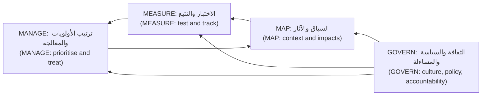
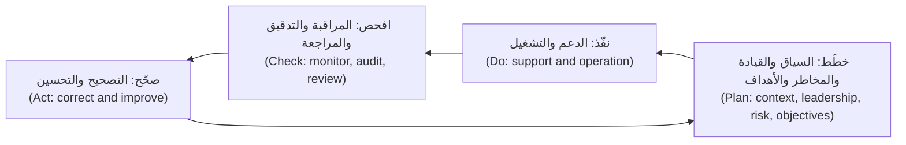

# الوحدة (Module) 7 — المعايير والأطر (Standards and frameworks)

*تخبرك القوانين بالنتيجة (outcome) المطلوبة، أما المعايير (standards) والأطر (frameworks) فتخبرك كيف تنظّم نفسك للوصول إليها. يطلب قانون الذكاء الاصطناعي الأوروبي (EU AI Act) من بنك نجم (Najm Bank) نظامًا لإدارة المخاطر (risk management system)، والإشراف البشري (human oversight)، ونظامًا لإدارة الجودة (quality management system)، لكنه لا يقول كيف تُدار هذه الأمور يومًا بيوم. هذه هي مهمة مبادئ OECD للذكاء الاصطناعي (OECD AI Principles)، وإطار إدارة مخاطر الذكاء الاصطناعي من NIST (NIST AI Risk Management Framework)، والمعيار (standard) ISO/IEC 42001 والمعايير الشقيقة (sister standards) له، والمجموعة المتنامية من الأطر الوطنية والدولية، ومنها أطر دول الخليج (Gulf states). تغطي هذه الوحدة (Module) طبقة القيم (values layer) ونموذج التشغيل (operating model) في NIST (7.1)، وعائلة معايير ISO/IEC وصلتها بالمعايير المنسَّقة (harmonised standards) الأوروبية (7.2)، والخريطة العالمية (global map) الأوسع، وتنتهي بجدول مقابلة (crosswalk) يسمح لبنك نجم بتشغيل مجموعة ضوابط (controls) واحدة تغطي EU AI Act وNIST وISO (7.3). معظم الأدوات (instruments) هنا طوعية (voluntary)، وسننبّه بوضوح حيث يكون الأمر ملزمًا. هذه الدورة (This course) تعليمية وليست استشارة قانونية (legal advice).*

> **تغطية مجال المعرفة (BoK coverage):** II.D — أهم المبادئ (principles) والأطر والمعايير الطوعية (voluntary) لحوكمة الذكاء الاصطناعي (OECD وNIST AI RMF وISO/IEC 42001 والمعايير المرتبطة به، وغيرها من الأطر الدولية والوطنية)، وكيف تتقابل فيما بينها ومع القانون.

---

# 7.1 — مبادئ OECD وإطار NIST AI RMF (OECD Principles and the NIST AI RMF)
*المستوى: 🟡 متوسط (Level: Intermediate)* · *المتطلبات: 1.2، 2.1، 6.1* · *مجال المعرفة (BoK): II.D*

## ⚡ الدرس في دقيقة (In 60 seconds)

- **مبادئ OECD للذكاء الاصطناعي (OECD AI Principles)** (2019، وحُدّثت في مايو 2024) هي أول معيار حكومي دولي (intergovernmental standard) للذكاء الاصطناعي (AI): خمسة **مبادئ قائمة على القيم (values-based principles)** للذكاء الاصطناعي الجدير بالثقة (trustworthy AI)، وخمس **توصيات (recommendations)** للحكومات. وتعريف OECD (OECD definition) لـ "نظام الذكاء الاصطناعي (AI system)" هو الأساس الذي بُني عليه تعريف EU AI Act (EU AI Act definition).
- **إطار إدارة مخاطر الذكاء الاصطناعي من NIST (NIST AI Risk Management Framework, AI RMF 1.0)**، الصادر في يناير 2023، إطار **طوعي (voluntary)** ومحايد قطاعيًا (sector-neutral) لإدارة مخاطر الذكاء الاصطناعي (AI risk management). وهو أكثر نماذج التشغيل (operating models) استخدامًا في برامج حوكمة الذكاء الاصطناعي (AI governance).
- يحدد سبع **خصائص للجدارة بالثقة (trustworthiness characteristics)** وأربع **وظائف (functions)**: **Govern** (الحوكمة (governance): ثقافة ومساءلة شاملة لكل الوظائف (cross-cutting))، و**Map** (التحديد (mapping): السياق (context))، و**Measure** (القياس (measurement): التقييم والتتبع (assessment and tracking))، و**Manage** (الإدارة (management): ترتيب الأولويات (prioritisation) والمعالجة (treatment)).
- الموارد المرافقة (companion resources): **الدليل الإرشادي (Playbook)** (إجراءات مقترحة)، و**الملفات التعريفية (profiles)** (نسخ مفصّلة لسياق (context) معين)، و**الملف التعريفي للذكاء الاصطناعي التوليدي (Generative AI Profile)، NIST AI 600-1** (يوليو 2024)، الذي يسرد اثني عشر خطرًا (risk) خاصًا بالذكاء الاصطناعي التوليدي (GenAI).
- إشارة الامتحان (Exam cue): طابق النشاط مع وظيفته في NIST، واعلم أن Govern ينطبق على كل الوظائف (functions) الأخرى.
- الفخ الأكبر (Biggest trap): التعامل مع NIST كمعيار قابل للاعتماد (certifiable) أو كقائمة تحقق (checklist). فهو ليس هذا ولا ذاك: إنه طوعي (voluntary) ومرن (flexible) ويركّز على النتائج.

## 🧭 لماذا يهم (Why it matters)

بعد الوحدة (Module) 6، تعرف لجنة حوكمة الذكاء الاصطناعي (AI Governance Committee) في بنك نجم *ما* يشترطه EU AI Act. والآن يطرح مجلس الإدارة (board) على ليلى سؤالًا أصعب: "كيف ندير هذا فعليًا في قطر (Qatar) والإمارات (UAE) والاتحاد الأوروبي (EU)، بفريق واحد ومجموعة واحدة من العمليات؟" يريد فريق البيانات (data team) لدى عمر دليلًا تقنيًا. وتريد سارة أن تكون الخصوصية (privacy) مدمجة من البداية. ويريد خالد أن يعرف أي المراجعات ستبطئ منتجات الإقراض لديه، ولماذا.

تحتاج ليلى إلى أمرين. الأول **مرتكز قيمي (values anchor)** تعترف به كل الولايات القضائية (jurisdictions) التي يعمل فيها بنك نجم، حتى لا تُخترَع مبادئ الذكاء الاصطناعي (AI principles) لدى مجلس الإدارة (board) من الصفر. وتعطيها مبادئ OECD (OECD Principles) ذلك: فالالتزام بها يتجاوز الدول الأعضاء (member states) في OECD بكثير، واستندت إليها مبادئ مجموعة العشرين (G20) للذكاء الاصطناعي (AI) لعام 2019. والثاني **نموذج تشغيل (operating model)**: طريقة منظمة لاكتشاف مخاطر (risks) الذكاء الاصطناعي وتقييمها ومعالجتها عبر دورة الحياة (life cycle). ويعطيها NIST AI RMF ذلك. فهو مجاني ومفصّل ويفهمه الموردون (suppliers) والمدققون (auditors) على نطاق واسع، ويتقابل جيدًا مع كل من AI Act وISO/IEC 42001.

يتوقع امتحان AIGP (AIGP exam) أن تعرف الاثنين جيدًا، وخصوصًا أن تميّز إلى أي وظيفة (function) في NIST ينتمي نشاط معين.

## 📐 كيف يعمل (How it works)

### 🟢 الأساسيات (The essentials)

**مبادئ OECD للذكاء الاصطناعي (OECD AI Principles).** اعتمدها مجلس OECD (OECD Council) في مايو 2019 بصفتها توصية (Recommendation) (أداة من القانون المرن (soft-law)، وليست معاهدة (treaty))، وحُدّثت في مايو 2024. وهي من جزأين.

*خمسة مبادئ قائمة على القيم (values-based principles) للذكاء الاصطناعي الجدير بالثقة (trustworthy AI)*، موجّهة إلى جميع الجهات الفاعلة في الذكاء الاصطناعي (AI actors):

| # | المبدأ (Principle) | بكلمات بسيطة (In plain words) |
|---|---|---|
| 1 | **النمو الشامل والتنمية المستدامة والرفاه (Inclusive growth, sustainable development and well-being)** | يجب أن يفيد الذكاء الاصطناعي (AI) الناس والكوكب، ويقلّل أوجه عدم المساواة (inequalities)، ويحمي البيئة |
| 2 | **احترام سيادة القانون وحقوق الإنسان والقيم الديمقراطية، بما فيها العدالة والخصوصية (Respect for the rule of law, human rights and democratic values, including fairness and privacy)** | احترام الحرية والكرامة (dignity) والاستقلالية (autonomy) والخصوصية (privacy) وعدم التمييز (non-discrimination) وحقوق العمال (labour rights)، ووجود ضمانات مثل الإرادة البشرية (human agency) والإشراف البشري (human oversight) |
| 3 | **الشفافية وقابلية التفسير (Transparency and explainability)** | تقديم معلومات ذات معنى حتى يفهم الناس أنظمة الذكاء الاصطناعي (AI systems)، ويعرفوا متى يتعاملون معها، ويستطيعوا الطعن في نتائجها |
| 4 | **المتانة والأمن والسلامة (Robustness, security and safety)** | يجب أن يعمل الذكاء الاصطناعي (AI) بموثوقية وأمان طوال دورة حياته (its life cycle)، ويجب أن توجد آليات تسمح بتجاوزه أو إصلاحه أو إيقافه وتقاعده بأمان إذا سبّب ضررًا غير مبرر |
| 5 | **المساءلة (accountability)** | الجهات الفاعلة في الذكاء الاصطناعي (AI actors) مسؤولة عن حسن عمله، مع إمكانية التتبع (traceability) ونهج منهجي لإدارة المخاطر (systematic risk-management approach) عبر دورة الحياة (life cycle) |

*خمس توصيات (recommendations) لصانعي السياسات (policy makers)*: (1) الاستثمار في البحث والتطوير في الذكاء الاصطناعي (invest in AI research and development)؛ (2) تعزيز منظومة شاملة ممكِّنة للذكاء الاصطناعي (inclusive AI-enabling ecosystem)؛ (3) تهيئة بيئة حوكمة وسياسات قابلة للتشغيل البيني (interoperable)؛ (4) بناء القدرات البشرية (human capacity) والاستعداد للتحول في سوق العمل (labour-market transition)؛ (5) التعاون الدولي (international cooperation) من أجل ذكاء اصطناعي جدير بالثقة (trustworthy AI).

عزّز **تحديث 2024 (2024 update)** الإشارات إلى السلامة (بما فيها القدرة على تجاوز الأنظمة أو إيقافها وتقاعدها بأمان)، والمعلومات المضللة والمعلومات المضللة المتعمدة (misinformation and disinformation) وسلامة المعلومات (information integrity)، والاستدامة البيئية (environmental sustainability)، والسلوك التجاري المسؤول (responsible business conduct) عبر دورة حياة (life cycle) الذكاء الاصطناعي (AI)، والتشغيل البيني (interoperability) بين الولايات القضائية (jurisdictions). وبشكل منفصل، حدّثت OECD في نوفمبر 2023 **تعريفها لنظام الذكاء الاصطناعي (its definition of an AI system)**، الذي اعتمده EU AI Act حرفيًا تقريبًا (6.1).

**إطار NIST AI RMF (NIST AI RMF framework) 1.0.** نشره المعهد الوطني الأمريكي للمعايير والتقنية (US National Institute of Standards and Technology) في يناير 2023 (الوثيقة NIST AI 100-1)، بعد عملية مفتوحة قائمة على التوافق. وهو:
- **طوعي (voluntary)** و**غير خاص بقطاع معين (non-sector-specific)**؛
- **يحافظ على الحقوق (rights-preserving)** و**لا يرتبط بحالة استخدام محددة (use-case agnostic)**؛
- مصمَّم ليكون **مرنًا (flexible)** للمؤسسات (organisations) من أي حجم؛
- "وثيقة حيّة (living document)"، تُحدَّث مواردها المرافقة (its companion resources) أكثر من جوهرها.

وهو من جزأين. **الجزء 1 (Part 1)** يشرح كيف يُؤطَّر خطر الذكاء الاصطناعي (AI) وما معنى "الذكاء الاصطناعي الجدير بالثقة (trustworthy AI)". و**الجزء 2 (Part 2)** هو **الجوهر (Core)** (الوظائف الأربع (four functions)) و**الملفات التعريفية (profiles)**.

**تأطير المخاطر (Risk framing).** يعرّف NIST الخطر (risk) بأنه مركّب من **احتمال (probability)** وقوع حدث و**حجم (magnitude)** عواقبه. ويطلب من المؤسسات (organisations) أن تنظر في الأضرار على ثلاث فئات (categories): **الناس** (الأفراد والمجموعات والمجتمعات المحلية والمجتمع)، و**المؤسسات** (العمليات والسمعة والأمن (security))، و**المنظومات (ecosystems)** (الأنظمة المترابطة وسلاسل التوريد (supply chains) والبيئة). ويسمّي أربعة تحديات: **قياس (measuring)** مخاطر الذكاء الاصطناعي (مقاييس (metrics) غير ناضجة، ومكوّنات من أطراف ثالثة (third parties)، والفرق بين المختبر والعالم الحقيقي)؛ وتحديد **تحمّل المخاطر (risk tolerance)**؛ و**ترتيب أولويات (prioritising)** المخاطر (risks)؛ و**دمج** مخاطر الذكاء الاصطناعي في إدارة المخاطر المؤسسية (enterprise risk management) الأوسع. ويشير إلى أن بعض المخاطر قد تكون عالية إلى حد يستوجب إيقاف التطوير أو النشر.

**خصائص الجدارة بالثقة السبع (The seven trustworthiness characteristics).**

| الخاصية (Characteristic) | ما تعنيه (What it means) | مثال من بنك نجم (Najm example) |
|---|---|---|
| **صالح وموثوق (Valid and reliable)** | الأساس: يفعل النظام ما صُمّم له، بدقة واتساق، في ظروف استخدامه الحقيقية | التحقق من نموذج الائتمان (credit model) على متقدمين ألمان، لا على البيانات القطرية فقط |
| **آمن (Safe)** | لا يعرّض الحياة أو الصحة أو الممتلكات أو البيئة للخطر (risk) ضمن ظروف محددة | لا يستطيع المساعد الذكي (Copilot) تنفيذ مدفوعات |
| **مؤمَّن ومرن (Secure and resilient)** | يصمد أمام الهجمات والتغيرات غير المتوقعة، ويتعافى منها | الحماية من حقن الأوامر (prompt injection) في روبوت المحادثة (chatbot) |
| **خاضع للمساءلة وشفاف (Accountable and transparent)** | المعلومات عن النظام متاحة لمن يحتاجها، وهناك من يُسأل عن النتائج. ويعرض NIST هذه الخاصية (characteristic) على أنها تمتد عبر الخصائص الأخرى | بطاقات النموذج (model cards) ومالك نموذج مسمّى (named model owner) |
| **قابل للتفسير وقابل للفهم (Explainable and interpretable)** | قابلية التفسير (explainability): *كيف* أنتج النظام المخرَج (output)؛ وقابلية الفهم (interpretability): *ماذا يعني* المخرَج لغرض المستخدم (user) | رموز الأسباب (reason codes) للمتقدمين المرفوضين |
| **معزّز للخصوصية (Privacy-enhanced)** | يحمي الاستقلالية (autonomy) والهوية والكرامة (dignity) عبر قيم الخصوصية (privacy) مثل إخفاء الهوية (anonymity) والتحكم | تقليل البيانات (data minimisation) في مجموعات التدريب |
| **عادل، مع إدارة التحيّز الضار (Fair, with harmful bias managed)** | يعالج المساواة (equality) والإنصاف (equity)، بما في ذلك التحيّز الضار (harmful bias) والتمييز (discrimination) | مراقبة معدلات الموافقة (approval rates) عبر المجموعات |

يشدد NIST على **المفاضلات (trade-offs)**: فزيادة قابلية الفهم (interpretability) قد تكلّف الدقة (accuracy)، وزيادة الخصوصية (privacy) قد تجعل اختبار العدالة (fairness) أصعب. والجدارة بالثقة (trustworthiness) لا تكون أقوى من أضعف خصائصها. ويسمّي NIST أيضًا ثلاث فئات (categories) من تحيّز الذكاء الاصطناعي (AI bias): **النظامي (systemic)** (في المؤسسات (organisations) والبيانات)، و**الحسابي والإحصائي (computational and statistical)** (في العينات والأساليب)، و**البشري المعرفي (human-cognitive)** (في كيفية إدراك الناس للمخرجات (outputs) واستخدامهم لها).

### 🟡 التعمق أكثر (Going deeper)

**الجوهر: الوظائف الأربع وفئاتها (The Core: four functions and their categories).** تنقسم كل وظيفة (function) إلى فئات (categories) ثم إلى فئات فرعية (subcategories) (نتائج محددة). ومجموع الفئات 19 فئة (category). لا تحتاج إلى أرقام الفئات الفرعية في الامتحان (exam)، لكن يجب أن تعرف موضوع كل وظيفة وكل فئة.

**GOVERN** (الحوكمة (governance)) شاملة لكل الوظائف (cross-cutting). فهي تنمّي ثقافة واعية بالمخاطر (risk-aware culture) وتنطبق طوال الوظائف (functions) الأخرى.

| الفئة (Category) | النتيجة (Outcome) |
|---|---|
| GOVERN 1 | السياسات (policies) والعمليات والإجراءات والممارسات الخاصة بتحديد مخاطر (risks) الذكاء الاصطناعي (AI) وقياسها وإدارتها قائمة وشفافة ومطبّقة بفاعلية (بما في ذلك المتطلبات القانونية (legal requirements) وتحمّل المخاطر (risk tolerance) وسجل الأنظمة والإيقاف والتقاعد (decommissioning)) |
| GOVERN 2 | هياكل المساءلة (accountability structures): الفرق المناسبة ممكَّنة ومسؤولة ومدرَّبة |
| GOVERN 3 | إعطاء الأولوية لتنوع القوى العاملة والإنصاف والشمول وإمكانية الوصول (workforce diversity, equity, inclusion and accessibility) في إدارة مخاطر الذكاء الاصطناعي (AI risk management) |
| GOVERN 4 | الفرق ملتزمة بثقافة تأخذ مخاطر (risks) الذكاء الاصطناعي (AI) في الحسبان وتتواصل بشأنها |
| GOVERN 5 | عمليات للتواصل (communication) الفعّال مع الجهات الفاعلة ذات الصلة في الذكاء الاصطناعي (AI) والمجتمعات المتأثرة (affected communities) |
| GOVERN 6 | السياسات (policies) والإجراءات تعالج المخاطر (risks) الناشئة عن برمجيات الأطراف الثالثة (third-party software) وبياناتها وسلاسل التوريد (supply chains) |

**MAP** (التحديد (mapping)) تضع السياق (context) الذي تُحدَّد فيه المخاطر (risks).

| الفئة (Category) | النتيجة (Outcome) |
|---|---|
| MAP 1 | السياق (context) محدد ومفهوم (الغرض المقصود (intended purpose) والمستخدمون والبيئات والقوانين والأعراف) |
| MAP 2 | نظام الذكاء الاصطناعي (AI system) مصنّف (المهام والأساليب وحدود المعرفة (knowledge limits)) |
| MAP 3 | القدرات والاستخدام المستهدف (targeted use) والأهداف والفوائد والتكاليف المتوقعة (expected benefits and costs) مفهومة |
| MAP 4 | المخاطر (risks) والفوائد محددة لكل المكوّنات، بما فيها برمجيات الأطراف الثالثة (third-party software) وبياناتها |
| MAP 5 | الآثار (impacts) على الأفراد والمجموعات والمجتمعات المحلية والمؤسسات (organisations) والمجتمع موصوفة |

**MEASURE** (القياس (measurement)) تستخدم أدوات كمية ونوعية (quantitative and qualitative tools) لتحليل المخاطر (risks) وتقييمها ومقارنتها بمعايير مرجعية (benchmarks) ومراقبتها.

| الفئة (Category) | النتيجة (Outcome) |
|---|---|
| MEASURE 1 | الأساليب والمقاييس (methods and metrics) المناسبة محددة ومطبّقة |
| MEASURE 2 | أنظمة الذكاء الاصطناعي (AI systems) مقيَّمة من حيث خصائص الجدارة بالثقة (trustworthiness characteristics) |
| MEASURE 3 | آليات تتبع المخاطر (risks) المحددة بمرور الوقت قائمة |
| MEASURE 4 | التغذية الراجعة (feedback) عن فاعلية القياس (efficacy of measurement) تُجمَع وتُقيَّم |

**MANAGE** (الإدارة (management)) تخصص الموارد للمخاطر (risks) التي حُدّدت وقيست.

| الفئة (Category) | النتيجة (Outcome) |
|---|---|
| MANAGE 1 | المخاطر (risks) مرتبة حسب الأولوية ومستجاب لها ومُدارة، بناءً على MAP وMEASURE |
| MANAGE 2 | استراتيجيات تعظيم الفوائد (maximise benefits) وتقليل الآثار السلبية (negative impacts) مخطط لها ومطبّقة وموثّقة |
| MANAGE 3 | المخاطر (risks) والفوائد الناشئة عن جهات الطرف الثالث (third-party entities) مُدارة |
| MANAGE 4 | معالجات المخاطر (risk treatments)، بما فيها خطط الاستجابة والتعافي والتواصل (response, recovery and communication plans)، موثّقة ومراقبة بانتظام |

```mermaid
flowchart RL
  G["GOVERN: الثقافة والسياسة والمساءلة<br/>(GOVERN: culture, policy, accountability)"] --> M1["MAP: السياق والآثار<br/>(MAP: context and impacts)"]
  M1 --> M2["MEASURE: الاختبار والتتبع<br/>(MEASURE: test and track)"]
  M2 --> M3["MANAGE: ترتيب الأولويات والمعالجة<br/>(MANAGE: prioritise and treat)"]
  M3 --> M1
  G --> M2
  G --> M3
```

الوظائف (functions) **تكرارية (iterative)**، وليست تسلسلًا متتابعًا (waterfall). بعد أن يصبح Govern قائمًا، تبدأ معظم المؤسسات (organisations) بـ Map، لكن يمكن الرجوع إلى أي وظيفة (function) كلما تغيّر النظام وسياقه. ويستخدم الإطار أيضًا مصطلح **الاختبار والتقييم والتحقق والمصادقة (TEVV)** (test, evaluation, verification and validation) لأعمال الاختبار التي تغذّي Measure، ويصف **الجهات الفاعلة في الذكاء الاصطناعي (AI actors)** عبر دورة الحياة (المصممون (designers) والمطورون (developers) والمُشغِّلون (deployers) والقائمون على التشغيل (operators) والمقيِّمون (evaluators) والمجتمعات المتأثرة (affected communities)).

**تطبيق الجوهر على نموذج الائتمان في بنك نجم (Applying the Core to Najm's credit model).**

| الوظيفة (Function) | نشاط بنك نجم (Najm activity) |
|---|---|
| Govern | اعتماد سياسة الذكاء الاصطناعي (AI policy)؛ وتحديد اللجنة (Committee) لتحمّل المخاطر (risk tolerance) بشأن فجوات العدالة (fairness gaps)؛ وتسمية دانة مالكةً للنموذج (model owner)؛ وسياسة بيانات الأطراف الثالثة (third parties) تغطي تغذية مكتب الائتمان (credit bureau) |
| Map | توثيق الغرض المقصود (قروض استهلاكية في الاتحاد الأوروبي (EU) حتى 75,000 يورو)؛ وتحديد المجموعات المتأثرة (affected groups)؛ وتسجيل تصنيف النظام عالي المخاطر (high-risk) وفق EU AI Act؛ وسرد المتطلبات القانونية (legal requirements) |
| Measure | اختيار مقاييس الدقة (accuracy metrics) والاستقرار والعدالة (fairness) واختبارها؛ واختبار قابلية التفسير (explainability) مع موظفي القروض (loan officers)؛ ووجود مراقبة للانجراف (drift) |
| Manage | إحالة الحالات الرمادية (grey cases) إلى البشر؛ ومحفّز للتعليق (suspension trigger)؛ ودليل تشغيل للحوادث (incident runbook)؛ وتقاعد النموذج (model retirement) إذا تكرر تجاوز حد تحمّل العدالة (fairness) |

### 🔴 نظرة الخبير (Expert view)

**الملفات التعريفية (profiles).** **الملف التعريفي (profile)** في AI RMF هو تطبيق للوظائف (functions) والفئات (categories) والفئات الفرعية (subcategories) في سياق محدد. ويصف NIST **ملفات حالات الاستخدام (use-case profiles)** (مثل التوظيف أو الإسكان العادل (fair housing))، و**الملفات الزمنية (temporal profiles)** (ملف *حالي* يصف الوضع اليوم، وملف *مستهدف* يصف الوضع المرغوب، والفجوة بينهما تقود خارطة الطريق (roadmap))، و**الملفات العابرة للقطاعات (cross-sectoral profiles)** (تغطي مخاطر (risks) مشتركة بين الاستخدامات، مثل الذكاء الاصطناعي التوليدي (generative AI)). وبالنسبة لبنك نجم، يُعدّ الملف الحالي مقابل المستهدف (current versus target profile) لنموذج الائتمان (credit model) وثيقة قوية على مستوى مجلس الإدارة (board).

**الدليل الإرشادي (Playbook)** مرافق إلكتروني يقترح إجراءات ومراجع ووثائق لكل فئة فرعية (subcategory). وهو إرشاد (guidance)، وليس مجموعة متطلبات: تأخذ المؤسسات (organisations) ما يناسبها. وينشر NIST أيضًا **جداول مقابلة (crosswalks)** بين AI RMF وأدوات أخرى (مثل معايير ISO/IEC وEU AI Act) عبر مركز موارد الذكاء الاصطناعي الجدير بالثقة والمسؤول (Trustworthy and Responsible AI Resource Center).

**الملف التعريفي للذكاء الاصطناعي التوليدي (NIST AI 600-1، يوليو 2024)** ملف عابر للقطاعات (cross-sectoral profile). ويسرد اثني عشر خطرًا (risk) فريدًا للذكاء الاصطناعي التوليدي (generative AI) أو يزيدها سوءًا:

| الخطر (risk) | مثال من بنك نجم (Najm example) |
|---|---|
| المعلومات أو القدرات الكيميائية والبيولوجية والإشعاعية والنووية (CBRN) | صلة ضعيفة بالنسبة لبنك |
| **التلفيق (Confabulation)** (محتوى خاطئ يُقدَّم بثقة، ويُسمّى غالبًا الهلوسة (hallucination)) | المساعد الذكي (copilot) يخترع رقم إيرادات لمقترض (for a borrower) |
| المحتوى الخطير أو العنيف أو المحرّض على الكراهية (Dangerous, violent or hateful content) | التلاعب بروبوت المحادثة (chatbot) ليقدّم ردودًا مسيئة |
| خصوصية البيانات (Data privacy) | تسرّب بيانات العملاء عبر الأوامر (prompts) أو المخرجات (outputs) |
| الآثار البيئية (Environmental impacts) | تكلفة الطاقة للنماذج الكبيرة |
| التحيّز الضار والتجانس (homogenisation) | المساعد الذكي (copilot) يصف المنشآت الصغيرة والمتوسطة (SMEs) المملوكة لنساء بطريقة مختلفة |
| التكوين بين الإنسان والذكاء الاصطناعي (Human-AI configuration) | مديرو العلاقات يفرطون في الثقة بالمذكرات (تحيّز الأتمتة (automation bias)) |
| سلامة المعلومات (information integrity) | محتوى "عملاء" اصطناعي يقوّض الثقة |
| أمن المعلومات (Information security) | حقن الأوامر (prompt injection)؛ وتسهيل الهجمات السيبرانية (cyberattacks) |
| الملكية الفكرية (Intellectual property) | مخرجات (outputs) تعيد إنتاج نص محمي بحقوق النشر (copyright) |
| المحتوى الفاحش أو المهين أو المسيء (Obscene, degrading or abusive content) | إساءة استخدام توليد الصور |
| سلسلة القيمة ودمج المكوّنات (Value chain and component integration) | غموض مصدر نموذج الطرف الثالث (third party) وبياناته |

ويقابل الإجراءات المقترحة لكل خطر مع الجوهر (Core)، ويبرز أربعة محاور من مجموعة العمل العامة (public working group) في NIST: **الحوكمة (governance)**، و**مصدر المحتوى (content provenance)**، و**الاختبار قبل النشر (pre-deployment testing)**، و**الإفصاح عن الحوادث (incident disclosure)**.

**موارد أخرى من NIST تستحق المعرفة (Other NIST resources worth knowing).** تضع الوثيقة NIST AI 100-2 تصنيفًا لهجمات (attacks) **تعلّم الآلة العدائي (adversarial machine learning)** وسبل تخفيفها (هجمات التهرّب (evasion) والتسميم (poisoning) والخصوصية (privacy) وإساءة الاستخدام (misuse)). ويتأثر عمل NIST في الذكاء الاصطناعي (AI) بالسياسة الفيدرالية الأمريكية (US federal policy)، التي تغيّرت في 2025: فقد أُلغي الأمر التنفيذي (Executive Order) 14110 لعام 2023 في يناير 2025، ودعت خطة عمل الذكاء الاصطناعي الأمريكية (US AI Action Plan) الصادرة في يوليو 2025 إلى مراجعة AI RMF. **وقت كتابة هذا الدرس، راجع صفحة AI RMF لدى NIST لمعرفة أي نسخة معدّلة (revised version)**؛ فامتحان AIGP (AIGP exam) مبني على AI RMF 1.0.

**لماذا يعمل NIST وOECD معًا بشكل جيد (Why NIST and OECD work well together).** تعطي OECD *القيم (values)* والمفردات المشتركة (shared vocabulary) بين الحكومات، ويعطي NIST *العملية* لتحويلها إلى ضوابط (controls). ويساعد كتالوج OECD لأدوات ومقاييس الذكاء الاصطناعي الجدير بالثقة (Catalogue of Tools and Metrics for Trustworthy AI) ومرصدها لحوادث الذكاء الاصطناعي (AI Incidents Monitor) في Measure وManage. ولا أحد منهما ملزم (binding). لكن الجهات التنظيمية (regulators) والمحاكم (courts) كثيرًا ما تنظر إلى الأطر المعترف بها (recognised frameworks) عند الحكم على ما إذا كانت المؤسسة (organisation) قد بذلت العناية المعقولة (reasonable care)، وقد أشارت بعض قوانين الولايات الأمريكية (US state laws) إلى NIST AI RMF أو أطر مشابهة عند وصف ما تبدو عليه الإدارة المعقولة للمخاطر (reasonable risk management). راجع القانون المعني تحديدًا.

## ⚖️ الأدوات التنظيمية (The instruments)

| الأداة (instrument) | ما تشترطه أو توصي به (What it requires or recommends) | إشارة الامتحان (Exam cue) |
|---|---|---|
| **OECD AI Principles** | خمسة مبادئ قائمة على القيم (values-based principles) وخمس توصيات (recommendations) للحكومات؛ حُدّثت في مايو 2024 | ميّز المبادئ (لجميع الجهات الفاعلة في الذكاء الاصطناعي (AI actors)) من التوصيات (للحكومات) |
| **OECD AI Principles** — تعريف نظام الذكاء الاصطناعي (AI system) | حُدّث في نوفمبر 2023؛ وهو أساس تعريف EU AI Act (EU AI Act definition) | "على أي تعريف استند EU AI Act؟" |
| **NIST AI RMF** — الجزء 1 (Part 1) | تأطير المخاطر (الناس والمؤسسات (organisations) والمنظومات (ecosystems)) وخصائص الجدارة بالثقة السبع (The seven trustworthiness characteristics) | "صالح وموثوق (Valid and reliable)" هو الأساس؛ و"خاضع للمساءلة وشفاف (Accountable and transparent)" يمتد عبر البقية |
| **NIST AI RMF** — الجوهر (Core) | Govern وMap وMeasure وManage؛ و19 فئة (category) | Govern شاملة لكل الوظائف (cross-cutting)؛ طابق الأنشطة مع الوظائف (functions) |
| **NIST AI RMF** — الملفات التعريفية (profiles) والدليل الإرشادي (Playbook) | ملفات حالية ومستهدفة؛ وإجراءات مقترحة لكل فئة فرعية (subcategory) | طوعي (voluntary) وقابل للتكييف، وليس قائمة تحقق (checklist) |
| **NIST AI 600-1** | الملف التعريفي للذكاء الاصطناعي التوليدي (Generative AI Profile): اثنا عشر خطرًا (risk) للذكاء الاصطناعي التوليدي (generative AI)، مع إجراءات مقابلة للجوهر (Core) | "التلفيق (confabulation)" و"التكوين بين الإنسان والذكاء الاصطناعي (human-AI configuration)" |

## 🏛️ عمليًا في بنك نجم (In practice at Najm Bank)

تعرض ليلى على لجنة حوكمة الذكاء الاصطناعي (AI Governance Committee) **ملفًا تعريفيًا حاليًا ومستهدفًا (current and target profile) وفق NIST AI RMF** للمساعد الذكي لمذكرات الائتمان (credit memo copilot). ويبيّن كل صف الوضع اليوم، والهدف، ومالك الفجوة (gap owner).

| الوظيفة / الفئة (Function / category) | الوضع الحالي (Current state) | الوضع المستهدف (خلال 6 أشهر) | المالك (Owner) |
|---|---|---|---|
| GOVERN 1 — السياسات (policies) | سياسة ذكاء اصطناعي (AI policy) عامة؛ دون قسم للذكاء الاصطناعي التوليدي (generative AI) | اعتماد معيار لاستخدام الذكاء الاصطناعي التوليدي (GenAI use standard)؛ وتحديد تحمّل المخاطر (risk tolerance) للتلفيق (confabulation) | ليلى |
| GOVERN 2 — المساءلة (accountability) | الملكية غير واضحة بين الائتمان والبيانات | خالد مالك الأعمال (business owner)؛ ودانة المالكة التقنية (technical owner)؛ ومصفوفة RACI (RACI matrix) موقّعة | ليلى |
| GOVERN 6 — الأطراف الثالثة (third parties) | عقد النموذج اللغوي الكبير (LLM) يفتقر إلى بنود خاصة بالذكاء الاصطناعي (AI-specific clauses) | ملحق عقد (contract addendum): إشعارات تغيير النموذج (model-change notices)، وإشعار الحوادث (incident notification)، وقيود استخدام البيانات (data-use restrictions) | يوسف |
| MAP 1 — السياق (context) | الاستخدام موصوف بشكل غير رسمي | توثيق الغرض المقصود (intended purpose) والمستخدمين والاستخدامات المستبعدة (excluded uses)؛ ومذكرة وفق المادة 6(3) من EU AI Act (Art. 6(3)) | خالد، ليلى |
| MAP 5 — الآثار (impacts) | غير مقيَّمة | تقييم الأثر (impact assessment) على المقترضين (borrowers) من المنشآت الصغيرة والمتوسطة (SMEs) والتجار الأفراد | سارة |
| MEASURE 2 — الجدارة بالثقة (trustworthiness) | فحوص عشوائية مرتجلة (ad hoc spot checks) | قياس (measuring) معدل التلفيق (confabulation) على 200 مذكرة مرجعية (reference memos)؛ واختبارات تحيّز (bias tests) حسب نوع المقترض | دانة |
| MEASURE 3 — التتبع (tracking) | لا يوجد | أخذ عينات شهرية من الأخطاء؛ وزر تغذية راجعة (feedback button) لمديري العلاقات (relationship managers) | دانة |
| MANAGE 1 — المعالجة (treatment) | لا يوجد | يجب أن ترتبط الأرقام في المذكرات بوثائق المصدر (source documents)؛ وتُحجب الأرقام غير المرتبطة | دانة |
| MANAGE 4 — الاستجابة (response) | عملية عامة لحوادث تقنية المعلومات (generic IT incident process) | دليل لحوادث (incidents) الذكاء الاصطناعي التوليدي (generative AI) مع الرجوع إلى المذكرات اليدوية (fallback to manual memos) | عمر |

القرار المسجَّل (Recorded decision): *"يبقى المساعد الذكي (copilot) في مرحلة تجريبية (pilot) لعشرين مدير علاقات (relationship manager) حتى يتحقق الملف المستهدف (target profile) في GOVERN 2 وMAP 1 وMEASURE 2 وMANAGE 1."*

## 🛠️ التمارين (Exercises)

🟢 **مطابقة المبادئ (Principle match).** خذ مسودة مبادئ الذكاء الاصطناعي (AI principles) الأربعة لدى بنك نجم ("عادل (fair)"، "قابل للتفسير (explainable)"، "آمن (Safe)"، "خاضع للمساءلة (accountable)") وقابل كلًا منها مع مبدأ (principle) من مبادئ OECD (OECD Principles) وخاصية من خصائص الجدارة بالثقة (trustworthiness characteristics) في NIST.
*يكتمل عندما (Done when):* يكون لكل مبدأ (principle) في المسودة (draft) مقابل واحد من OECD وواحد من NIST، وتكون قد اكتشفت أي مبدأ من مبادئ OECD (OECD Principles) أغفله بنك نجم.

🟡 **فرز الوظائف (Function sort).** اسرد خمسة عشر نشاطًا لحوكمة الذكاء الاصطناعي (مثل "تحديد تحمّل المخاطر (risk tolerance)"، و"إجراء اختبار الفريق الأحمر (red-teaming) على روبوت المحادثة (chatbot)"، و"توثيق الاستخدام المقصود (intended use)"، و"إيقاف بطاقة التقييم القديمة وتقاعدها"، و"استطلاع آراء العملاء المتأثرين") وانسب كلًا منها إلى Govern أو Map أو Measure أو Manage، مع فئة (category).
*يكتمل عندما (Done when):* يكون لكل نشاط وظيفة (function) وفئة (category)، وتستطيع تبرير الأنشطة الثلاثة التي وجدتها الأصعب.

🔴 **ملف الذكاء الاصطناعي التوليدي (GenAI profile).** باستخدام المخاطر (risks) الاثني عشر في NIST AI 600-1، ابنِ سجل مخاطر (risk register) لروبوت محادثة العملاء (customer chatbot) في بنك نجم: قيّم احتمال كل خطر وأثره، واختر معالجة، وسمِّ وظيفة (function) NIST التي تقع فيها تلك المعالجة (treatment).
*يكتمل عندما (Done when):* تكون المخاطر (risks) الاثنا عشر كلها مقيَّمة (بما في ذلك "لا ينطبق" مع ذكر السبب) ويكون للمخاطر الثلاثة الأعلى ضوابط (controls) قابلة للقياس (measurable).

## ⚠️ أخطاء وفخاخ الامتحان (Mistakes and exam traps)

- **"شهادة اعتماد (certification) NIST AI RMF."** لا توجد. فالإطار إرشاد (guidance) طوعي (voluntary). أما ISO/IEC 42001 فهو المعيار (standard) القابل للاعتماد (7.2).
- **التعامل مع الوظائف (functions) كتسلسل.** إنها تكرارية (iterative)، وGovern شاملة لكل الوظائف (cross-cutting) وتوجّه جميع الوظائف الأخرى.
- **الخلط بين قابلية التفسير (explainability) وقابلية الفهم (interpretability).** قابلية التفسير هي *كيف* أُنتج المخرَج (output)؛ وقابلية الفهم هي *ماذا يعني* في سياقه.
- **الخلط بين مبادئ OECD (OECD Principles) وتوصياتها (its recommendations).** "الاستثمار في البحث والتطوير في الذكاء الاصطناعي (invest in AI research and development)" و"التعاون الدولي (international cooperation)" توصيات (recommendations) للحكومات، وليست مبادئ قائمة على القيم (values-based principles).
- **نسيان أن "صالح وموثوق (Valid and reliable)" هو الأساس.** النظام الذي لا يعمل لا يمكن أن يكون جديرًا بالثقة (trustworthy)، مهما حقق من أمور أخرى.
- **استخدام مصطلح خاطئ للذكاء الاصطناعي التوليدي (generative AI).** تستخدم NIST AI 600-1 مصطلح "التلفيق (confabulation)" لما يسميه كثيرون الهلوسة (hallucination).

## 🧾 الخلاصة (Recap)

- تقدّم مبادئ OECD للذكاء الاصطناعي (2019، وحُدّثت في 2024) خمسة مبادئ قائمة على القيم (values-based principles) وخمس توصيات (recommendations) للحكومات؛ وتعريف OECD لنظام الذكاء الاصطناعي (OECD definition of an AI system) هو أساس تعريف EU AI Act (EU AI Act definition).
- إطار NIST AI RMF (NIST AI RMF framework) 1.0 (يناير 2023) طوعي (voluntary) ومحايد قطاعيًا (sector-neutral)، وله سبع خصائص للجدارة بالثقة (trustworthiness characteristics) وأربع وظائف (four functions).
- Govern شاملة لكل الوظائف (cross-cutting)؛ وMap تضع السياق (context)؛ وMeasure تقيّم وتتتبع؛ وManage ترتب الأولويات وتعالج. وهناك 19 فئة (category).
- تكيّف الملفات التعريفية (profiles) الإطار (الحالي مقابل المستهدف، وحالات الاستخدام (use cases)، والعابر للقطاعات (cross-sectoral))؛ ويقترح الدليل الإرشادي (Playbook) إجراءات.
- تضيف NIST AI 600-1 (يوليو 2024) اثني عشر خطرًا (risk) خاصًا بالذكاء الاصطناعي التوليدي (generative AI)، منها التلفيق (confabulation) والتكوين بين الإنسان والذكاء الاصطناعي (Human-AI configuration).
- تغيّرت السياسة الأمريكية في 2025؛ راجع وجود أي نسخة معدّلة (revised version) من الإطار، لكن الامتحان (exam) مبني على النسخة 1.0.

## ✍️ اختبر نفسك (Check yourself)

**1. أي وظيفة (function) في NIST AI RMF توصف بأنها شاملة لكل الوظائف (cross-cutting)، توجّه الوظائف (functions) الثلاث الأخرى وتنطبق عليها؟**

- A. Map
- B. Measure
- C. Manage
- D. Govern

الإجابة

**D.** تنمّي Govern الثقافة والسياسات (policies) والمساءلة (accountability) التي تنطبق طوال Map وMeasure وManage. والوظائف (functions) الثلاث الأخرى وظائف تكرارية (iterative) توجّهها Govern. (انظر 🟡 التعمق أكثر (Going deeper): الجوهر (Core).)

**2. أي مما يلي ليس من خصائص الجدارة بالثقة (trustworthiness characteristics) في NIST AI RMF؟**

- A. مربح وقابل للتوسع
- B. معزّز للخصوصية (Privacy-enhanced)
- C. عادل، مع إدارة التحيّز الضار (Fair, with harmful bias managed)
- D. صالح وموثوق (Valid and reliable)

الإجابة

**A.** الخصائص السبع هي: صالح وموثوق (Valid and reliable)؛ وآمن (Safe)؛ ومؤمَّن ومرن (Secure and resilient)؛ وخاضع للمساءلة وشفاف (Accountable and transparent)؛ وقابل للتفسير وقابل للفهم (Explainable and interpretable)؛ ومعزّز للخصوصية (Privacy-enhanced)؛ وعادل (fair) مع إدارة التحيّز الضار (harmful bias). والقيمة التجارية ليست منها. (انظر 🟢 الأساسيات (The essentials).)

**3. توثّق دانة الغرض المقصود (intended purpose) من نموذج الائتمان (credit model)، ومستخدميه، والمتطلبات القانونية (legal requirements) التي تنطبق عليه، ومجموعات الناس التي قد يؤثر فيها. أي وظيفة (function) في NIST AI RMF تؤديها أساسًا؟**

- A. Govern
- B. Map
- C. Measure
- D. Manage

الإجابة

**B.** وضع السياق (context) والغرض المقصود (intended purpose) والآثار (impacts) المحتملة هو Map (MAP 1 وMAP 5). أما Measure فتختبر الأداء مقابل المقاييس (metrics)، وManage تعالج المخاطر (risks) المرتبة حسب الأولوية، وGovern تضع السياسة والمساءلة (accountability). (انظر 🟡 التعمق أكثر (Going deeper).)

**4. أي مما يلي من توصيات (recommendations) OECD للحكومات، وليس من مبادئها القائمة على القيم (its values-based principles)؟**

- A. الشفافية وقابلية التفسير (Transparency and explainability)
- B. المساءلة (accountability)
- C. الاستثمار في البحث والتطوير في الذكاء الاصطناعي (invest in AI research and development)
- D. المتانة والأمن والسلامة (Robustness, security and safety)

الإجابة

**C.** الاستثمار في البحث والتطوير في الذكاء الاصطناعي (invest in AI research and development) هو أولى التوصيات (recommendations) الخمس لصانعي السياسات (policy makers). أما A وB وD فمبادئ قائمة على القيم (values-based principles) موجّهة إلى جميع الجهات الفاعلة في الذكاء الاصطناعي (AI actors). (انظر 🟢 الأساسيات (The essentials): OECD.)

**5. تكتشف مراجعة بنك نجم أن المساعد الذكي لمذكرات الائتمان (credit memo copilot) يذكر أحيانًا أرقام إيرادات لا تظهر في أي وثيقة مصدر (source document). أي مورد من موارد NIST (NIST resource) يسمّي هذا الخطر (risk) ويعالجه بشكل مباشر أكثر من غيره؟**

- A. NIST AI 600-1، الملف التعريفي للذكاء الاصطناعي التوليدي (Generative AI Profile)، الذي يسمّيه التلفيق (confabulation)
- B. مرصد OECD لحوادث الذكاء الاصطناعي (OECD AI Incidents Monitor)
- C. ISO/IEC 22989
- D. تعريف "آمن (Safe)" في الجزء 1 (Part 1) من NIST AI RMF

الإجابة

**A.** تسرد NIST AI 600-1 التلفيق (confabulation) ضمن اثني عشر خطرًا (risk) للذكاء الاصطناعي التوليدي (generative AI)، وتقابل الإجراءات المقترحة مع الجوهر (Core). أما B فأداة من OECD لتتبع (tracking) الحوادث (incidents)، وليست ملفًا تعريفيًا (profile) للمخاطر (risks) من NIST؛ وC معيار مصطلحات من ISO. (انظر 🔴 نظرة الخبير (Expert view): الملف التعريفي للذكاء الاصطناعي التوليدي (Generative AI Profile).)

## 📚 المراجع (References)

- مبادئ OECD للذكاء الاصطناعي (OECD AI Principles): https://oecd.ai/en/ai-principles
- توصية مجلس OECD (OECD Council Recommendation) بشأن الذكاء الاصطناعي (OECD/LEGAL/0449): https://legalinstruments.oecd.org/en/instruments/OECD-LEGAL-0449
- إطار NIST لإدارة مخاطر الذكاء الاصطناعي (NIST AI Risk Management Framework): https://www.nist.gov/itl/ai-risk-management-framework
- NIST AI 100-1، AI RMF 1.0: https://doi.org/10.6028/NIST.AI.100-1
- NIST AI 600-1، الملف التعريفي للذكاء الاصطناعي التوليدي (Generative AI Profile): https://doi.org/10.6028/NIST.AI.600-1
- مركز NIST لموارد الذكاء الاصطناعي الجدير بالثقة (trustworthy AI) والمسؤول (Playbook، crosswalks): https://airc.nist.gov/

---

# 7.2 — ISO/IEC 42001 وعائلة معايير الذكاء الاصطناعي (ISO/IEC 42001 and the AI standards family)
*المستوى: 🟡 متوسط (Level: Intermediate)* · *المتطلبات: 7.1، 6.2* · *مجال المعرفة (BoK): II.D*

## ⚡ الدرس في دقيقة (In 60 seconds)

- يحدد **ISO/IEC 42001:2023** متطلبات **نظام إدارة الذكاء الاصطناعي (AIMS)** (AI management system): السياسات (policies) والأدوار والعمليات والضوابط (controls) التي تستخدمها المؤسسة (organisation) لتطوير الذكاء الاصطناعي (AI) أو تقديمه أو استخدامه بمسؤولية. وهو أول معيار لأنظمة إدارة الذكاء الاصطناعي **قابل للاعتماد (certifiable)**.
- يتبع البنية المشتركة (common structure) لمعايير أنظمة الإدارة (management-system standards) في ISO (**البنود 4–10 (clauses 4–10)**، ودورة خطّط-نفّذ-تحقّق-صحّح (Plan-Do-Check-Act)) التي يشترك فيها مع ISO/IEC 27001 (أمن المعلومات (Information security)) وISO/IEC 27701 (الخصوصية (privacy))، لذلك يمكن تشغيل الثلاثة كنظام متكامل واحد.
- يسرد **الملحق A (Annex A)** ضوابط مرجعية (السياسات (policies)، والتنظيم الداخلي (internal organisation)، والموارد، وتقييم الأثر (impact assessment)، ودورة الحياة (life cycle)، والبيانات، والمعلومات للأطراف المعنية (Information for interested parties)، والاستخدام، والأطراف الثالثة (third parties)). وتبرّر المؤسسات (organisations) ما تُدرجه وما تستبعده في **بيان قابلية التطبيق (Statement of Applicability)**.
- المعايير الشقيقة (sister standards): **23894** (إرشادات إدارة مخاطر الذكاء الاصطناعي (AI risk management guidance))، و**22989** (المفاهيم والمصطلحات (concepts and terminology))، و**42005** (تقييم أثر نظام الذكاء الاصطناعي (AI system impact assessment))، و**38507** (الحوكمة لمجالس الإدارة (governance for boards))، و**5338** (عمليات دورة حياة الذكاء الاصطناعي (AI life-cycle processes))، و**42006** (متطلبات الجهات التي تمنح اعتماد 42001 (bodies certifying 42001)).
- في الاتحاد الأوروبي (EU)، لا تمنح **افتراض المطابقة (presumption of conformity)** مع AI Act إلا **المعايير المنسَّقة (harmonised standards)** المُشار إليها في الجريدة الرسمية (Official Journal). وتتولى كتابتها **CEN-CENELEC JTC 21**. واعتماد ISO/IEC 42001 (ISO/IEC 42001 certification) وحده لا يمنح هذا الافتراض.
- الفخ الأكبر (Biggest trap): اعتبار شهادة (certificate) 42001 لدى مورّد (vendor) دليلًا على أن منتجه يمتثل لـ AI Act. فهي تعتمد نظام الإدارة (management system) في المؤسسة (organisation)، لا المنتج.

## 🧭 لماذا يهم (Why it matters)

يرسل فريق المشتريات (procurement team) لدى عميل مؤسسي ألماني استبيانًا إلى بنك نجم (Najm Bank): "هل مؤسستكم معتمدة وفق (certified to) ISO/IEC 42001؟ إذا لم تكن كذلك، فصِف نظام إدارة الذكاء الاصطناعي (AI management system) لديكم." وفي الأسبوع نفسه، يطلب يوسف من مورّد أداة فرز السير الذاتية (CV-screening vendor) دليلًا على الامتثال (compliance) لـ AI Act. فيرد المورّد (vendor) بشهادة (certificate) 42001 وسطر يقول "ممتثل (compliant) بالكامل".

على ليلى أن تجيب مجلس الإدارة (board) عن ثلاثة أسئلة. هل ينبغي لبنك نجم أن يسعى إلى اعتماد 42001 (42001 certification)، وماذا يتطلب ذلك؟ وهل تحسم شهادة (certificate) المورّد (vendor) مسألة AI Act؟ وكيف تترابط معايير ISO/IEC الكثيرة للذكاء الاصطناعي (AI) التي يستشهد بها المستشارون (consultants) باستمرار؟ تعتمد الإجابات على فكرة أساسية: معايير أنظمة الإدارة (management-system standards) تعتمد *كيف تدير المؤسسة (organisation) نفسها*، بينما ينظّم AI Act *المنتجات المطروحة في السوق (products placed on the market)*. ويتداخل الأمران كثيرًا، لكنهما ليسا الشيء نفسه.

للامتحان (exam)، اعرف بنية 42001، وما الذي يجعله قابلًا للاعتماد (certifiable)، وما يغطيه الملحق A (Annex A)، والغرض من كل معيار شقيق.

## 📐 كيف يعمل (How it works)

### 🟢 الأساسيات (The essentials)

**من يكتب هذه المعايير (Who writes these standards).** تعمل ISO (المنظمة الدولية للتقييس (International Organization for Standardization)) وIEC (اللجنة الكهروتقنية الدولية (International Electrotechnical Commission)) معًا في مجال تقنية المعلومات عبر لجنة فنية مشتركة (joint technical committee)، هي **ISO/IEC JTC 1**. وتطوّر لجنتها الفرعية (its subcommittee) **SC 42** معايير الذكاء الاصطناعي (AI). وتصوّت هيئات التقييس الوطنية (National standards bodies) عليها. والمعايير طوعية (voluntary) ما لم يجعلها قانون أو عقد إلزامية. ويجب شراؤها (فهي محمية بحقوق النشر (copyrighted))، ولهذا تصفها هذه الدورة (This course) ولا تقتبس منها.

**المتطلبات مقابل الإرشادات (Requirements versus guidance).** معيار المتطلبات (requirements standard) يستخدم صيغة "يجب (shall)" ويمكن تدقيقه والاعتماد وفقه (certified against). أما معيار الإرشادات (guidance standard) فيستخدم صيغة "ينبغي (should)" ويساعدك على تطبيق أمر ما، لكن لا يمكن الاعتماد وفقه.

| المعيار (standard) | العنوان بكلمات بسيطة (Title in plain words) | النوع (Type) |
|---|---|---|
| **ISO/IEC 42001:2023** | نظام إدارة الذكاء الاصطناعي (AI management system) | **متطلبات، قابل للاعتماد (Requirements, certifiable)** |
| **ISO/IEC 23894:2023** | إرشادات (guidance) بشأن إدارة مخاطر الذكاء الاصطناعي (AI risk management) | إرشادات (guidance) |
| **ISO/IEC 22989:2022** | مفاهيم الذكاء الاصطناعي ومصطلحاته (AI concepts and terminology) | مفردات تأسيسية (Foundational vocabulary) |
| **ISO/IEC 42005:2025** | تقييم أثر نظام الذكاء الاصطناعي (AI system impact assessment) | إرشادات (guidance) |
| **ISO/IEC 38507:2022** | الآثار الحوكمية (governance implications) لاستخدام الذكاء الاصطناعي (AI)، لهيئات الحوكمة (governing bodies) | إرشادات (guidance) |
| **ISO/IEC 5338:2023** | عمليات دورة حياة نظام الذكاء الاصطناعي (AI system life-cycle processes) | إطار عمليات (Process framework) |
| **ISO/IEC 42006** | متطلبات الجهات التي تدقق 42001 وتمنح الاعتماد وفقه (certified against) | متطلبات لجهات الاعتماد (Requirements for certification bodies) |

**ما هو نظام إدارة الذكاء الاصطناعي (What an AI management system is).** **نظام الإدارة (management system)** هو مجموعة العناصر المترابطة التي تستخدمها المؤسسة (organisation) لوضع السياسات (policies) والأهداف والعمليات اللازمة لتحقيقها. وأنت تعرف أمثلة (Examples) عليه: ISO 9001 للجودة، وISO/IEC 27001 لأمن المعلومات (Information security). ويطبّق نظام إدارة الذكاء الاصطناعي (AI management system) المنطق نفسه على الذكاء الاصطناعي (AI): التزام القيادة (leadership commitment)، وسياسة للذكاء الاصطناعي، وأدوار محددة (defined roles)، وتقييم المخاطر (risk assessment) والأثر، والضوابط (controls)، والكفاءة (competence)، والمراقبة (monitoring)، والتدقيق (audit)، والتحسين المستمر (continual improvement). وينطبق 42001 على أي مؤسسة **تقدّم أو تستخدم** منتجات أو خدمات قائمة على الذكاء الاصطناعي، من أي حجم وفي أي قطاع. ويطلب من المؤسسة أن تحدد **دورها (role)** فيما يتعلق بالذكاء الاصطناعي (مثل مقدّم الذكاء الاصطناعي (AI provider) أو المنتِج (producer) أو العميل (customer) أو المستخدم (user) أو الشريك (partner))، مستخدمةً مفردات 22989.

**خطّط-نفّذ-تحقّق-صحّح (Plan-Do-Check-Act).** يتبع 42001 الدورة التي يستخدمها كل معيار من معايير أنظمة الإدارة (management-system standards) في ISO:

```mermaid
flowchart RL
  P["خطّط: السياق والقيادة والمخاطر والأهداف<br/>(Plan: context, leadership, risk, objectives)"] --> D["نفّذ: الدعم والتشغيل<br/>(Do: support and operation)"]
  D --> C["افحص: المراقبة والتدقيق والمراجعة<br/>(Check: monitor, audit, review)"]
  C --> A["صحّح: التصحيح والتحسين<br/>(Act: correct and improve)"]
  A --> P
```

### 🟡 التعمق أكثر (Going deeper)

**بنود ISO/IEC 42001.** تغطي البنود (clauses) 1–3 النطاق والمراجع (References) والمصطلحات. أما المتطلبات القابلة للتدقيق (audit) ففي البنود 4–10 (clauses 4–10)، التي تستخدم البنية المنسَّقة (harmonised structure) المشتركة بين معايير أنظمة الإدارة (management-system standards) في ISO (المعروفة سابقًا باسم Annex SL).

| البند (clause) | ما يشترطه (What it requires) | مثال من بنك نجم (Najm example) |
|---|---|---|
| **4 سياق المؤسسة (Context of the organisation)** | فهم القضايا الداخلية والخارجية (internal and external issues)، بما فيها المتطلبات القانونية (legal requirements) ودور المؤسسة (organisation) في الذكاء الاصطناعي (AI)؛ وتحديد الأطراف المعنية (interested parties) واحتياجاتها؛ وتحديد **نطاق (scope)** نظام إدارة الذكاء الاصطناعي (AI management system) | النطاق: "أنظمة الذكاء الاصطناعي (AI systems) التي يطوّرها أو يستخدمها بنك نجم في قطر (Qatar) والإمارات (UAE) وألمانيا" |
| **5 القيادة (Leadership)** | التزام الإدارة العليا (top management)؛ و**سياسة للذكاء الاصطناعي (AI policy)**؛ وأدوار ومسؤوليات وصلاحيات مُسندة | سياسة ذكاء اصطناعي (AI policy) معتمدة من مجلس الإدارة (board-approved)؛ وليلى مالكةً لنظام إدارة الذكاء الاصطناعي (AI management system) |
| **6 التخطيط (Planning)** | إجراءات لمعالجة المخاطر والفرص (to address risks and opportunities)، بما فيها **تقييم مخاطر الذكاء الاصطناعي (AI risk assessment)**، و**معالجة مخاطر الذكاء الاصطناعي (AI risk treatment)** (مع بيان قابلية التطبيق (Statement of Applicability))، و**تقييم أثر نظام الذكاء الاصطناعي (AI system impact assessment)**؛ و**أهداف ذكاء اصطناعي (AI objectives)** قابلة للقياس (measurable)؛ وتخطيط التغييرات | منهجية المخاطر (risk methodology)؛ وهدف "100% من الأنظمة عالية المخاطر (high-risk systems) لها تقييم أثر (impact assessment) قبل التشغيل الفعلي (go-live)" |
| **7 الدعم (Support)** | الموارد، و**الكفاءة (competence)**، والوعي (awareness)، والتواصل (communication)، والمعلومات الموثقة (documented information) | برنامج الإلمام بالذكاء الاصطناعي (AI literacy) (2.3)؛ وضبط الوثائق (document control) |
| **8 التشغيل (Operation)** | التخطيط والضبط التشغيليان (Operational planning and control)؛ وإجراء تقييمات مخاطر (risks) الذكاء الاصطناعي (AI) ومعالجة المخاطر (risk treatment) وتقييمات الأثر (impact assessments) عمليًا | بوابات استقبال ومراجعة (intake and review gates) لكل حالة استخدام (use case) جديدة للذكاء الاصطناعي (AI) |
| **9 تقييم الأداء (Performance evaluation)** | المراقبة (monitoring) والقياس (measurement) والتحليل؛ و**التدقيق الداخلي (internal audit)**؛ و**مراجعة الإدارة (management review)** | تدقيق داخلي (internal audit) سنوي لنظام إدارة الذكاء الاصطناعي (AI management system)؛ ومراجعة ربع سنوية من اللجنة (Committee) |
| **10 التحسين (Improvement)** | التحسين المستمر (continual improvement)؛ وعدم المطابقة (nonconformity) و**الإجراء التصحيحي (corrective action)** | تحليل السبب الجذري (Root-cause analysis) بعد حادثة (incident) روبوت المحادثة (chatbot) |

**ثلاثة تقييمات، لا تقييم واحد (Three assessments, not one).** يميّز 42001 بين **تقييم مخاطر الذكاء الاصطناعي (AI risk assessment)** (المخاطر (risks) على أهداف المؤسسة (organisation)، بما فيها المخاطر القانونية ومخاطر السمعة والمخاطر التشغيلية)، و**معالجة مخاطر الذكاء الاصطناعي (AI risk treatment)** (اختيار الضوابط (controls) لمعالجتها)، و**تقييم أثر نظام الذكاء الاصطناعي (AI system impact assessment)** (العواقب المحتملة على الأفراد والمجموعات والمجتمع). وهذا يعكس تقسيم AI Act بين نظام إدارة المخاطر (risk management system) لدى مقدّم النظام (provider) وتقييم الأثر على الحقوق الأساسية (FRIA) لدى المُشغِّل (deployer).

**الملحق A (Annex A): الضوابط المرجعية (reference controls).** الملحق A (ISO/IEC 42001 Annex A) *معياري (normative)*: يجب أن تقارن المؤسسة (organisation) معالجتها للمخاطر (risks) به، وأن تسجّل في **بيان قابلية التطبيق (SoA)** الضوابط (controls) التي تطبّقها، وتبرّر أي ضابط (control) تستبعده. وتقع أهداف الضوابط (control objectives) في تسعة مجالات:

| المجال (Area) | ما تغطيه الضوابط (What the controls cover) |
|---|---|
| A.2 السياسات المتعلقة بالذكاء الاصطناعي (Policies related to AI) | سياسة للذكاء الاصطناعي (AI)، واتساقها مع السياسات (policies) الأخرى، ومراجعتها الدورية |
| A.3 التنظيم الداخلي (internal organisation) | أدوار الذكاء الاصطناعي (AI) ومسؤولياته؛ والإبلاغ عن المخاوف (reporting of concerns) |
| A.4 موارد أنظمة الذكاء الاصطناعي (Resources for AI systems) | توثيق موارد البيانات والأدوات والحوسبة والأنظمة والموارد البشرية (data, tooling, computing, system and human resources) |
| A.5 تقييم آثار أنظمة الذكاء الاصطناعي (Assessing impacts of AI systems) | عملية تقييم الأثر (impact assessment) وتوثيقه، على الأفراد والمجموعات والمجتمع |
| A.6 دورة حياة نظام الذكاء الاصطناعي (AI system life cycle) | أهداف التطوير المسؤول (responsible development)؛ والمتطلبات، والتصميم، والتحقق والمصادقة (verification and validation)، والنشر، والتشغيل (operation) والمراقبة (monitoring)، والتوثيق التقني (technical documentation)، وسجلات الأحداث (event logs) |
| A.7 بيانات أنظمة الذكاء الاصطناعي (Data for AI systems) | اقتناء البيانات (Data acquisition)، وجودتها (quality)، ومصدرها (provenance)، وإعدادها |
| A.8 المعلومات للأطراف المعنية (Information for interested parties) | توثيق النظام والمعلومات للمستخدمين؛ والإبلاغ الخارجي (external reporting)؛ والإبلاغ عن الحوادث (incident reporting) |
| A.9 استخدام أنظمة الذكاء الاصطناعي (Use of AI systems) | عمليات الاستخدام المسؤول (responsible use)؛ وأهداف الاستخدام المسؤول؛ والاستخدام المقصود (intended use) |
| A.10 العلاقات مع الأطراف الثالثة والعملاء (Third-party and customer relationships) | توزيع المسؤوليات (Allocating responsibilities)؛ والموردون (suppliers)؛ والعملاء |

يتضمن المعيار (standard) المنشور 38 ضابطًا (control) في الملحق A (Annex A). وتساعد ملاحق أخرى: **الملحق (Annex) B** يقدم إرشادات تطبيق (implementation guidance) لكل ضابط، و**الملحق C** يسرد أهدافًا مؤسسية محتملة متعلقة بالذكاء الاصطناعي (مثل العدالة (fairness) والأمن (security) والسلامة (safety) والخصوصية (privacy) والشفافية (transparency)) ومصادر للمخاطر (risk sources)، و**الملحق D** يناقش استخدام نظام إدارة الذكاء الاصطناعي (AI management system) عبر المجالات والقطاعات. ويمكن للمؤسسة (organisation) إضافة ضوابط (controls) تتجاوز الملحق A (ISO/IEC 42001 Annex A).

**الاعتماد (Certification).** لا تمنح ISO الاعتماد لأحد. بل تدقق المؤسسةَ (organisation) **جهاتُ اعتماد (certification bodies)** مستقلة، يُفضَّل أن تكون **معتمَدة (accredited)** من هيئة اعتماد وطنية (national accreditation body). والدورة المعتادة هي تدقيق **المرحلة 1 (Stage 1)** (الوثائق والجاهزية)، ثم تدقيق **المرحلة 2 (Stage 2)** (هل يعمل نظام إدارة الذكاء الاصطناعي (AI management system) عمليًا)، ثم شهادة (certificate) صالحة عادةً لثلاث سنوات، مع **تدقيقات رقابية سنوية (annual surveillance audits)**، ثم إعادة الاعتماد (recertification). ويضع **ISO/IEC 42006** (المنشور في 2025) متطلبات إضافية على الجهات التي تمنح اعتماد 42001 (bodies certifying 42001)، منها كفاءة المدققين (auditor competence) في الذكاء الاصطناعي (AI)، حتى يكون للشهادات (certificates) معنى متسق.

**التكامل مع 27001 و27701 (Integration with 27001 and 27701).** لأن الثلاثة تشترك في بنية البنود (clauses) نفسها، يستطيع بنك نجم تشغيل نظام إدارة متكامل (integrated management system) واحد: مراجعة إدارة واحدة، وبرنامج تدقيق داخلي (internal-audit programme) واحد، وعملية واحدة لضبط الوثائق (document control)، وسجل واحد للإجراءات التصحيحية (corrective actions). لكن عدسات *المخاطر (risks)* تختلف: يعالج 27001 مخاطر أمن المعلومات (information-security risk)، و27701 الخصوصية (وقد جعلته مراجعة 2025 معيارًا مستقلًا لنظام إدارة الخصوصية (privacy management system)؛ راجع الإصدار الحالي)، و42001 المخاطر والآثار (impacts) الخاصة بالذكاء الاصطناعي (AI). وكثير من ضوابط (controls) الذكاء الاصطناعي، مثل ضبط الوصول (access control) إلى مسارات التدريب (training pipelines) أو التعامل مع اختراقات البيانات (data breaches)، يُفضَّل تطبيقها مرة واحدة والإشارة إليها من عدة أنظمة.

### 🔴 نظرة الخبير (Expert view)

**المعايير الشقيقة عمليًا (The sister standards in practice).**
- **ISO/IEC 23894:2023** يكيّف **ISO 31000:2018** (المعيار العام لإدارة المخاطر (general risk-management standard)) مع الذكاء الاصطناعي (AI). ويتبع عملية 31000 (تحديد السياق (establish context)، ثم تحديد المخاطر (risks) وتحليلها وتقييمها ومعالجتها؛ ثم المراقبة والمراجعة والتسجيل والإبلاغ (monitor, review, record, report)) ويضيف مصادر مخاطر (risk sources) واعتبارات دورة حياة (life cycle) خاصة بالذكاء الاصطناعي. استخدمه لتصميم منهجية المخاطر (risk methodology) التي يشترطها البند (clause) 6 من 42001.
- **ISO/IEC 22989:2022** هو المفردات المشتركة (shared vocabulary): نظام الذكاء الاصطناعي (AI system)، وتعلّم الآلة (machine learning)، ودورة حياة (life cycle) الذكاء الاصطناعي (AI)، وأدوار أصحاب المصلحة (stakeholder roles)، وخصائص الجدارة بالثقة (trustworthiness characteristics). ومواءمة مصطلحات سياسة بنك نجم معه تجنّب الجدل حول الكلمات.
- **ISO/IEC 42005:2025** يقدم إرشادات (guidance) بشأن **تقييم أثر نظام الذكاء الاصطناعي (AI system impact assessment)**: متى يُجرى، وماذا يغطي (الاستخدام المقصود (intended use) وسوء الاستخدام المتوقع (foreseeable misuse)، وأصحاب المصلحة المتأثرون (affected stakeholders)، والفوائد والأضرار (benefits and harms)، بما فيها ما يمس الحقوق الأساسية (fundamental rights))، وكيف يُوثَّق ويُدمَج مع التقييمات الأخرى. وهو المنهجية الطبيعية لبند (clause) تقييم الأثر (impact assessment) في 42001، وبنية مفيدة لتقييم الأثر على الحقوق الأساسية (fundamental rights impact assessment) وفق AI Act.
- **ISO/IEC 38507:2022** يخاطب **مجالس الإدارة (boards) وهيئات الحوكمة (governing bodies)**: دورها الإشرافي (their oversight role)، والمساءلة (accountability) التي لا يمكن تفويضها إلى التقنية، ووضع سياسات (policies) للاستخدام المقبول (acceptable use) للذكاء الاصطناعي (AI). وهو يوسّع ISO/IEC 38500 (حوكمة تقنية المعلومات (governance of IT)).
- **ISO/IEC 5338:2023** يحدد **عمليات دورة حياة نظام الذكاء الاصطناعي (AI system life-cycle processes)**، مستندًا إلى معايير دورة حياة (life cycle) البرمجيات والأنظمة العامة، ومضيفًا اهتمامات خاصة بالذكاء الاصطناعي (AI) مثل البيانات والتعلّم المستمر (continuous learning) ومراقبة النماذج (model monitoring).

من معايير SC 42 الأخرى التي قد تصادفها: ISO/IEC 23053 (إطار لأنظمة الذكاء الاصطناعي (AI systems) التي تستخدم تعلّم الآلة (machine learning))، وسلسلة ISO/IEC 5259 (جودة البيانات (data quality) للتحليلات وتعلّم الآلة)، وISO/IEC TR 24027 (التحيّز في أنظمة الذكاء الاصطناعي (bias in AI systems))، وISO/IEC TR 24028 (نظرة عامة على الجدارة بالثقة (overview of trustworthiness)).

**كيف ترتبط المعايير بـ EU AI Act (How standards connect to the EU AI Act).** بموجب المادة 40 (Art. 40)، تُفترَض مطابقة (presumed to conform) الأنظمة عالية المخاطر (high-risk) (ونماذج GPAI) التي تتوافق مع **معايير منسَّقة** نُشرت مراجعها في **الجريدة الرسمية للاتحاد الأوروبي (Official Journal of the EU)** للمتطلبات التي تغطيها تلك المعايير. والمعايير المنسَّقة (harmonised standards) معايير أوروبية (EN) تُطوَّر بناءً على **طلب تقييس (standardisation request)** من المفوضية (Commission). وقد أصدرت المفوضية طلبها الخاص بالذكاء الاصطناعي (AI) إلى CEN وCENELEC في 2023، ويقع العمل لدى لجنتهما الفنية المشتركة (their Joint Technical Committee) **CEN-CENELEC JTC 21**. وتغطي المخرجات (outputs) متطلبات القانون الخاصة بالأنظمة عالية المخاطر: إدارة المخاطر (risk management)، وحوكمة البيانات وجودتها (data governance and quality)، وحفظ السجلات (record-keeping)، والشفافية (transparency)، والإشراف البشري (human oversight)، والدقة (accuracy)، والمتانة (robustness)، والأمن السيبراني (cybersecurity)، ونظام إدارة الجودة (quality management system)، وتقييم المطابقة (conformity assessment). وتبني JTC 21 على عمل ISO/IEC حيث يناسب، لكن تركيز القانون على صحة *الأشخاص المتأثرين (affected persons)* وسلامتهم وحقوقهم الأساسية، وعلى *المنتجات*، يعني أن بعض المعايير الأوروبية (European standards) جديدة أو معدّلة بدرجة كبيرة، لا مجرد اعتماد مباشر (straight adoption).

جاء العمل أبطأ مما خُطّط له. **وقت كتابة هذا الدرس (2026)، راجع صفحات CEN-CENELEC والمفوضية (Commission)** لمعرفة المعايير المنسَّقة (harmonised standards) التي نُشرت وأُشير إليها في الجريدة الرسمية (Official Journal)؛ فمقترح Digital Omnibus (6.3) يربط جزئيًا مواعيد تطبيق أحكام الأنظمة عالية المخاطر (high-risk systems) بتوافرها. وإلى أن يُشار إليها، لا يمنح أي معيار، بما في ذلك ISO/IEC 42001، افتراض المطابقة (presumption of conformity). ومع ذلك، فإن نظام إدارة ذكاء اصطناعي (AI management system) قائمًا على 42001 أساس قوي لـ **نظام إدارة الجودة (quality management system)** في AI Act (المادة 17) ولإثبات المساءلة (accountability) أمام الجهات التنظيمية (regulators) والعملاء.

**ما تخبرك به شهادة المورّد وما لا تخبرك به (What a vendor certificate tells you and what it does not).** تخبر شهادة (certificate) 42001 يوسف بأن لدى المورّد (vendor) نظام إدارة ذكاء اصطناعي (AI management system) مدقَّقًا ضمن **نطاق** محدد. ويجب أن يتحقق من هذا النطاق (هل يشمل منتج السير الذاتية (CVs) وموقع التطوير؟)، ومن جهة الاعتماد (certification body) واعتمادها (its accreditation)، ومن صلاحية الشهادة (certificate validity). لكنها *لا* تُثبت أن أداة السير الذاتية (CV tool) تستوفي المواد 9–15، أو أنها اجتازت تقييم المطابقة (conformity assessment)، أو أنها تناسب غرض بنك نجم. ولذلك يحتاج إلى إعلان المطابقة (declaration of conformity)، وتعليمات الاستخدام (instructions for use)، وأدلة من اختبارات بنك نجم نفسه (11.2).

## ⚖️ الأدوات التنظيمية (The instruments)

| الأداة (instrument) | ما تشترطه أو توصي به (What it requires or recommends) | إشارة الامتحان (Exam cue) |
|---|---|---|
| **ISO/IEC 42001** | نظام إدارة ذكاء اصطناعي (AI management system) قابل للاعتماد (certifiable): البنود 4–10 (PDCA)، وتقييم مخاطر الذكاء الاصطناعي (AI risk assessment) ومعالجتها، وتقييم أثر نظام الذكاء الاصطناعي (AI system impact assessment)، وضوابط (controls) الملحق A (Annex A)، وبيان قابلية التطبيق (Statement of Applicability) | المعيار (standard) الوحيد القابل للاعتماد (certifiable) في هذا الدرس؛ يعتمد المؤسسة (organisation)، لا المنتج |
| **ISO/IEC 23894** | إرشادات (guidance) بشأن إدارة مخاطر الذكاء الاصطناعي (AI risk management)، مبنية على ISO 31000 | "إرشادات (guidance) لإدارة المخاطر (risk management) تبني على ISO 31000" |
| **ISO/IEC 22989** | مفاهيم الذكاء الاصطناعي ومصطلحاته (AI concepts and terminology)، بما فيها أدوار أصحاب المصلحة (stakeholder roles) | معيار المفردات |
| **ISO/IEC 42005** | إرشادات (guidance) بشأن تقييم أثر نظام الذكاء الاصطناعي (AI system impact assessment) | يدعم بند (clause) تقييم الأثر (impact assessment) في 42001 وممارسة تقييم الأثر على الحقوق الأساسية (fundamental rights impact assessment) |
| **ISO/IEC 38507** | الآثار الحوكمية (governance implications) للذكاء الاصطناعي (AI) لمجالس الإدارة (boards) وهيئات الحوكمة (governing bodies) | إشراف مجلس الإدارة (board) والمساءلة (accountability) |
| **ISO/IEC 5338** | عمليات دورة حياة نظام الذكاء الاصطناعي (AI system life-cycle processes) | معيار عمليات دورة الحياة (life cycle) |
| **ISO/IEC 42006** | متطلبات الجهات التي تدقق 42001 وتمنح الاعتماد وفقه (certified against) | يخص جهات الاعتماد (certification bodies)، لا مستخدمي الذكاء الاصطناعي (AI) |
| **EU AI Act** — المادة 40 | افتراض المطابقة (presumption of conformity) من المعايير المنسَّقة (harmonised standards) المُشار إليها في الجريدة الرسمية (CEN-CENELEC JTC 21) | 42001 وحده لا يمنح افتراض المطابقة (presumption of conformity) |

## 🏛️ عمليًا في بنك نجم (In practice at Najm Bank)

تقرر لجنة حوكمة الذكاء الاصطناعي (AI Governance Committee) **بناء نظام إدارة ذكاء اصطناعي (AI management system) متوافق مع ISO/IEC 42001، ومتكامل مع نظام إدارة أمن المعلومات (ISMS) القائم وفق 27001 في بنك نجم، واستهداف الاعتماد (target certification) خلال 18 شهرًا**. مقتطف من تقييم الفجوات (gap assessment) الذي أعدّته ليلى:

| البند / الضابط (Clause / control) | المتطلب باختصار (Requirement in brief) | بنك نجم اليوم (Najm today) | إجراء سد الفجوة (Gap action) | المالك (Owner) |
|---|---|---|---|---|
| 4.3 النطاق | تحديد حدود نظام إدارة الذكاء الاصطناعي (AI management system) | غير محدد | بيان نطاق (scope statement) يغطي الدول الثلاث وكل الأنظمة في السجل (inventory) | ليلى |
| 5.2 سياسة الذكاء الاصطناعي (AI policy) | سياسة ملائمة للغرض، مع التزامات | مسودة مبادئ (draft principles) فقط | سياسة ذكاء اصطناعي (AI policy) معتمدة من مجلس الإدارة (board-approved) مع التزام بالامتثال (compliance) القانوني والتحسين (improvement) | ليلى |
| 6.1.2–6.1.3 المخاطر (risks) | تقييم مخاطر الذكاء الاصطناعي (AI risk assessment) ومعالجتها؛ وبيان قابلية التطبيق (Statement of Applicability) | سياسة مخاطر النماذج (model-risk policy) تغطي الدقة (accuracy) فقط | توسيع المنهجية باستخدام ISO/IEC 23894؛ وإعداد بيان قابلية التطبيق (Statement of Applicability) مقابل الملحق A (Annex A) | عمر |
| 6.1.4 / A.5 الأثر | تقييم أثر نظام الذكاء الاصطناعي (AI system impact assessment) | تقييمات الأثر على حماية البيانات (DPIAs) فقط | نموذج مشترك (joint template) يجمع DPIA وFRIA وتقييم الأثر (impact assessment) باستخدام ISO/IEC 42005 | سارة |
| 7.2 الكفاءة (competence) | أشخاص أكفاء | مرتجل | تدريب على الذكاء الاصطناعي (AI) حسب الدور (role) مع سجلات | ليلى |
| A.6 دورة الحياة (life cycle) | ضوابط (controls) تطوير موثقة وسجلات | يختلف من فريق لآخر | ملف نموذج قياسي (standard model file)؛ ومعيار للتسجيل (logging standard) | دانة |
| A.10 الأطراف الثالثة (third parties) | مسؤوليات الموردين (vendors) | عقود تقنية معلومات عامة (generic IT contracts) | بنود خاصة بالذكاء الاصطناعي (AI-specific clauses) في كل عقود موردي (vendors) الذكاء الاصطناعي (AI) | يوسف |
| 9.2–9.3 التدقيق (audit) والمراجعة | التدقيق الداخلي (internal audit)؛ ومراجعة الإدارة (management review) | لا يوجد للذكاء الاصطناعي (AI) | إضافة نظام إدارة الذكاء الاصطناعي (AI management system) إلى خطة التدقيق الداخلي (internal audit plan)؛ ومراجعة اللجنة (Committee) ربع السنوية بوصفها مراجعة الإدارة (management review) | التدقيق الداخلي (internal audit)، ليلى |

وتُضاف **قاعدة لشهادات الموردين (vendor-certificate rule)** إلى معيار المشتريات (procurement standard):

> تُقبَل شهادة ISO/IEC 42001 لدى المورّد (vendor) دليلًا على نظام الإدارة (management system) لديه فقط بعد أن تتحقق إدارة المشتريات (Procurement) من نطاق الشهادة (certificate)، والجهة المُصدِرة (issuing body)، واعتمادها (its accreditation)، وصلاحية الشهادة (certificate validity). ولا تُقبَل دليلًا على أن منتجًا بعينه يستوفي EU AI Act أو متطلبات بنك نجم.

## 🛠️ التمارين (Exercises)

🟢 **خريطة البنود (Clause map).** ضع عشرة أنشطة من بنك نجم (مثل "مجلس الإدارة (board) يعتمد سياسة الذكاء الاصطناعي (AI policy)"، و"مراجعة اللجنة (Committee) ربع السنوية"، و"الإصلاح بعد حادثة (incident) روبوت المحادثة (chatbot)"، و"سجلات التدريب على الذكاء الاصطناعي (AI)") في بند (clause) 42001 الذي تنتمي إليه.
*يكتمل عندما (Done when):* يكون لكل نشاط بند (clause) من 4 إلى 10، وتستطيع أن تقول إلى أي مرحلة (phase) من PDCA ينتمي كل منها.

🟡 **بيان قابلية التطبيق (Statement of Applicability).** باستخدام مجالات الملحق A (Annex A) التسعة، اكتب مسودة مخطط لبيان قابلية التطبيق (the Statement of Applicability) لنموذج الائتمان (credit model) في بنك نجم: لكل مجال، قل هل تنطبق الضوابط (controls)، وكيف تُطبَّق، وبرّر أي استبعاد.
*يكتمل عندما (Done when):* يكون لكل مجال قرار "ينطبق / مستبعد" مع تبرير في سطر واحد.

🔴 **التشكيك في الشهادة (Challenge the certificate).** يرسل مورّد السير الذاتية (CV vendor) شهادة (certificate) 42001. اكتب الأسئلة الخمسة التي يجب أن يطرحها يوسف بشأنها، واشرح في فقرة واحدة للجنة (Committee) لماذا لا تجيب عن مسألة AI Act، وما الأدلة التي تجيب عنها.
*يكتمل عندما (Done when):* تغطي أسئلتك النطاق والجهة المُصدِرة (issuing body) والاعتماد والصلاحية، وتسمّي فقرتك وثائق AI Act المطلوبة.

## ⚠️ أخطاء وفخاخ الامتحان (Mistakes and exam traps)

- **"اعتماد 42001 (42001 certification) يعني الامتثال (compliance) لـ AI Act."** لا. فهو يعتمد نظام إدارة (management system)؛ أما افتراض المطابقة (presumption of conformity) مع AI Act فلا يأتي إلا من المعايير المنسَّقة (harmonised standards) المُشار إليها في الجريدة الرسمية (Official Journal).
- **"معتمد وفق (certified to) 23894" أو "وفق 42005".** هذه معايير إرشادات (guidance standards) ولا يمكن الاعتماد وفقها (certified against).
- **الخلط بين 42001 و42006.** 42001 للمؤسسات (organisations) التي تشغّل نظام إدارة ذكاء اصطناعي (AI management system)؛ و42006 للجهات التي تمنحها الاعتماد.
- **تجاهل بيان قابلية التطبيق (Statement of Applicability).** يجب تبرير استبعادات الملحق A (Annex A)؛ ولا يمكنك إسقاط الضوابط (controls) بصمت.
- **"ISO تمنح المؤسسات (organisations) الاعتماد."** بل تمنحه (certify) جهات اعتماد (certification bodies) مستقلة، ويُفضَّل أن تكون معتمَدة.
- **نسيان مجلس الإدارة (board).** 38507 هو المعيار (standard) الموجّه إلى هيئات الحوكمة (governing bodies)؛ ولا يمكن تفويض المساءلة (accountability) إلى نظام.

## 🧾 الخلاصة (Recap)

- ISO/IEC 42001:2023 هو معيار نظام إدارة الذكاء الاصطناعي (AI management system) القابل للاعتماد (certifiable)، المبني على بنية البنود 4–10 (clauses 4–10) المشتركة ودورة PDCA.
- يشترط تقييم مخاطر الذكاء الاصطناعي (AI risk assessment)، ومعالجة المخاطر (risk treatment) مع بيان قابلية التطبيق (Statement of Applicability)، وتقييم أثر نظام الذكاء الاصطناعي (AI system impact assessment)، مدعومةً بـ 38 ضابطًا (control) في الملحق A (Annex A) عبر تسعة مجالات.
- يتكامل بشكل طبيعي مع 27001 و27701 في نظام إدارة (management system) واحد.
- المعايير الشقيقة (sister standards): 23894 (المخاطر (risks))، و22989 (المصطلحات)، و42005 (تقييم الأثر (impact assessment))، و38507 (مجالس الإدارة (boards))، و5338 (دورة الحياة (life cycle))، و42006 (جهات الاعتماد (certification bodies)).
- يأتي افتراض المطابقة (presumption of conformity) في الاتحاد الأوروبي (EU) من المعايير المنسَّقة (harmonised standards) التي تطوّرها CEN-CENELEC JTC 21 ويُشار إليها في الجريدة الرسمية (Official Journal)؛ راجع حالتها.
- شهادة (certificate) 42001 لدى المورّد (vendor) دليل على مؤسسته، لا على منتجه.

## ✍️ اختبر نفسك (Check yourself)

**1. أي من المعايير التالية يمكن أن تحصل المؤسسة (organisation) على اعتماد وفقه؟**

- A. ISO/IEC 23894
- B. ISO/IEC 42001
- C. ISO/IEC 22989
- D. ISO/IEC 42005

الإجابة

**B.** ISO/IEC 42001 معيار متطلبات (بصيغة "يجب") لنظام إدارة الذكاء الاصطناعي (AI management system)، وهو قابل للاعتماد (certifiable). أما 23894 و42005 فإرشادات (guidance)، و22989 معيار مصطلحات. (انظر 🟢 الأساسيات (The essentials).)

**2. في ISO/IEC 42001، أي بند (clause) يتضمن التدقيق الداخلي (internal audit) ومراجعة الإدارة (management review)؟**

- A. البند (clause) 5، القيادة (Leadership)
- B. البند (clause) 7، الدعم (Support)
- C. البند (clause) 9، تقييم الأداء (Performance evaluation)
- D. البند (clause) 10، التحسين (improvement)

الإجابة

**C.** يغطي البند (clause) 9 المراقبة (monitoring) والقياس (measurement) والتدقيق الداخلي (internal audit) ومراجعة الإدارة (مرحلة (phase) "افحص (Check)"). ويغطي البند 10 الإجراء التصحيحي (corrective action) والتحسين المستمر (مرحلة "صحّح (Act)"). (انظر 🟡 التعمق أكثر (Going deeper): البنود (clauses).)

**3. يرسل مورّد أداة فرز السير الذاتية (CV-screening vendor) لبنك نجم شهادة (certificate) ISO/IEC 42001 دليلًا على أن أداته تمتثل لـ EU AI Act. ما أفضل رد؟**

- A. قبولها: اعتماد 42001 (42001 certification) يمنح افتراض المطابقة (presumption of conformity) مع AI Act
- B. رفضها لعدم صلتها: 42001 لا علاقة له بحوكمة الذكاء الاصطناعي (AI governance)
- C. الطلب من المورّد (vendor) الحصول على اعتماد (obtain certification) وفق ISO/IEC 23894 بدلًا منها
- D. التعامل معها كدليل على نظام الإدارة (management system) لدى المورّد (vendor) بعد التحقق من النطاق والجهة المُصدِرة (issuing body)، وطلب أدلة مطابقة المنتج لـ AI Act بشكل منفصل

الإجابة

**D.** شهادة (certificate) 42001 دليل مفيد على نظام إدارة الذكاء الاصطناعي (AI management system) في المؤسسة (organisation)، لكنها لا تُثبت أن منتجًا يستوفي AI Act؛ فافتراض المطابقة (presumption of conformity) لا يأتي إلا من المعايير المنسَّقة (harmonised standards) المُشار إليها. وB تذهب بعيدًا أكثر من اللازم، و23894 (C) لا يمكن الاعتماد وفقه (certified against). (انظر 🔴 نظرة الخبير (Expert view).)

**4. أي معيار يقدم إرشادات (guidance) بشأن إدارة مخاطر الذكاء الاصطناعي (AI risk management) عبر تكييف ISO 31000؟**

- A. ISO/IEC 38507
- B. ISO/IEC 5338
- C. ISO/IEC 23894
- D. ISO/IEC 42006

الإجابة

**C.** يكيّف ISO/IEC 23894:2023 عملية إدارة المخاطر (risk management) في ISO 31000 مع الذكاء الاصطناعي (AI). أما 38507 فلهيئات الحوكمة (governing bodies)، و5338 يغطي عمليات دورة الحياة (life cycle)، و42006 لجهات الاعتماد (certification bodies). (انظر 🔴 نظرة الخبير (Expert view): المعايير الشقيقة (sister standards).)

**5. تقرر مؤسسة (organisation) تطبّق ISO/IEC 42001 أن بعض ضوابط (controls) الملحق A (Annex A) لا تنطبق عليها. ماذا يجب أن تفعل؟**

- A. لا شيء؛ فالملحق A (Annex A) إعلامي (informative) فقط
- B. تسجيل القرار (decision) وتبريره في بيان قابلية التطبيق (Statement of Applicability)
- C. الحصول على موافقة ISO قبل استبعادها
- D. استبدالها بضوابط (controls) من ISO/IEC 27001

الإجابة

**B.** الملحق A (Annex A) مادة مرجعية معيارية: تقارن المؤسسة (organisation) معالجتها للمخاطر (risks) به، وتبرّر ما تُدرجه وما تستبعده في بيان قابلية التطبيق (Statement of Applicability). ولا توافق ISO على الاستبعادات (C). (انظر 🟡 التعمق أكثر (Going deeper): الملحق A (ISO/IEC 42001 Annex A).)

## 📚 المراجع (References)

- ISO/IEC 42001:2023، نظام إدارة الذكاء الاصطناعي (AI management system): https://www.iso.org/standard/81230.html
- ISO/IEC JTC 1/SC 42 (الذكاء الاصطناعي (AI)) ومعاييرها: https://www.iso.org/
- CEN-CENELEC (JTC 21، الذكاء الاصطناعي (AI)): https://www.cencenelec.eu/
- اللائحة (EU) 2024/1689، المادة 40 (المعايير المنسَّقة (harmonised standards)): https://eur-lex.europa.eu/eli/reg/2024/1689/oj
- المفوضية الأوروبية (European Commission)، التقييس وAI Act: https://digital-strategy.ec.europa.eu/en/policies/regulatory-framework-ai

---

# 7.3 — الخريطة العالمية: أطر أخرى تشكّل الممارسة (The global map: other frameworks that shape practice)
*المستوى: 🟡 متوسط (Level: Intermediate)* · *المتطلبات: 7.1، 7.2* · *مجال المعرفة (BoK): II.D*

## ⚡ الدرس في دقيقة (In 60 seconds)

- إلى جانب EU AI Act وNIST وISO، تتشكل حوكمة الذكاء الاصطناعي (AI governance) عبر **القانون الدولي المرن (international soft law)** (**توصية UNESCO بشأن أخلاقيات الذكاء الاصطناعي (UNESCO Recommendation on the Ethics of AI)**، 2021؛ ومدونة سلوك **مسار هيروشيما لمجموعة السبع (G7 Hiroshima Process)**، 2023)، و**معاهدة ملزمة (binding treaty)** واحدة (**الاتفاقية الإطارية لمجلس أوروبا بشأن الذكاء الاصطناعي (Council of Europe Framework Convention on AI)**، التي فُتح باب التوقيع (signature) عليها في سبتمبر 2024)، و**مقاربات وطنية (national approaches)** تختلف اختلافًا حادًا.
- **المملكة المتحدة (UK)** تتبع نهجًا قائمًا على المبادئ (principles-based) تقوده الجهات التنظيمية (regulator-led)؛ و**الولايات المتحدة (US)** ليس لديها قانون فيدرالي شامل للذكاء الاصطناعي (comprehensive federal AI law) وتعتمد على القوانين القائمة وإجراءات الوكالات (agency action) وقوانين الولايات (state laws)؛ و**الصين (China)** لديها قواعد ملزمة خاصة بكل خدمة (خوارزميات التوصية (recommendation algorithms)، والتوليف العميق (deep synthesis)، والذكاء الاصطناعي التوليدي (generative AI)، ووسم المحتوى (labelling))؛ و**سنغافورة (Singapore)** رائدة في الأدوات العملية الطوعية (Model AI Governance Framework وAI Verify).
- في **دول مجلس التعاون الخليجي (GCC)**، تقود الاستراتيجياتُ (strategies) والمبادئُ (principles) حوكمةَ الذكاء الاصطناعي (AI governance) في الغالب، إلى جانب قوانين حماية البيانات (data-protection laws) والإرشادات القطاعية (sector guidance): الاستراتيجية الوطنية للذكاء الاصطناعي (National Artificial Intelligence Strategy) في قطر (Qatar) و**إرشادات مصرف قطر المركزي (QCB) للذكاء الاصطناعي (AI)** للمؤسسات المالية (financial institutions)، و**مبادئ أخلاقيات الذكاء الاصطناعي من SDAIA (SDAIA AI Ethics Principles)** في السعودية (Saudi Arabia)، والاستراتيجية الوطنية (national strategy) وميثاق الذكاء الاصطناعي (AI charter) في الإمارات (UAE).
- **جدول المقابلة (crosswalk)** يقابل الضابط (control) نفسه (مثل الإشراف البشري (human oversight)) عبر EU AI Act وNIST AI RMF وISO/IEC 42001، بحيث يستوفي ضابط واحد عدة أطر.
- إشارة الامتحان (Exam cue): ميّز القانون الملزم (binding law) من الأطر الطوعية (voluntary)، وتعرّف على أسلوب كل ولاية قضائية (jurisdiction).
- الفخ الأكبر (Biggest trap): ذكر تفاصيل وطنية سريعة التغير (fast-moving) من الذاكرة. سمِّ المقاربة (approach)، وراجع الوضع الحالي (current status).

## 🧭 لماذا يهم (Why it matters)

يجتمع مجلس إدارة بنك نجم (Najm Bank) في الدوحة. والجهات التنظيمية (regulators) التي يخضع لها هي مصرف قطر المركزي (Qatar Central Bank)، والسلطات الإماراتية لعملياته في دبي، وBaFin وسلطات EU AI Act لفرعه في فرانكفورت. ويدرس فريق الاستراتيجية فتح مكتب في الرياض. ويريد شريك بريطاني في التقنية المالية (fintech) أن يطوّر معه تطبيقًا لإقراض المنشآت الصغيرة والمتوسطة (SMEs)، وسأل البنك المراسل الأمريكي (US correspondent bank) لبنك نجم عن إدارة مخاطر (risks) نماذج الذكاء الاصطناعي (AI) لديه. وكل طرف من هؤلاء يتحدث لغة حوكمة مختلفة.

لا تستطيع ليلى تشغيل ستة برامج امتثال (compliance programmes). ومقاربتها (her approach) هي **"مجموعة ضوابط واحدة، وخرائط كثيرة (one control set, many maps)"**: بناء الضوابط (controls) مرة واحدة على العمود الفقري (backbone) لـ NIST وISO، ثم مقابلتها مع قانون كل ولاية قضائية (jurisdiction) وإرشاداتها. ويتطلب ذلك خريطة عملية لمن يقول ماذا، ومدى إلزامه.

## 📐 كيف يعمل (How it works)

### 🟢 الأساسيات (The essentials)

**ثلاث طبقات من الأدوات (Three layers of instruments).**

| الطبقة (Layer) | ما هي (What it is) | أمثلة (Examples) | ملزمة؟ ⁦(Binding?)⁩ |
|---|---|---|---|
| القانون الدولي المرن (international soft law) | مبادئ وتوصيات تتفق عليها الدول (Principles and recommendations agreed by states) | مبادئ OECD للذكاء الاصطناعي (OECD AI Principles)، وتوصية UNESCO (UNESCO Recommendation)، ومدونة هيروشيما لمجموعة السبع (G7 Hiroshima code) | لا، لكنها مؤثرة سياسيًا (politically influential) |
| معاهدة دولية (international treaty) | التزامات قانونية على الدول التي تصادق عليها (Legal obligations for states that ratify) | الاتفاقية الإطارية لمجلس أوروبا (Council of Europe Framework Convention) | نعم، للأطراف، عبر القانون الوطني |
| قواعد وطنية وإقليمية (National and regional rules) | قوانين ولوائح وإرشادات جهات تنظيمية واستراتيجيات (Laws, regulations, regulator guidance, strategies) | EU AI Act، وتدابير الصين للذكاء الاصطناعي التوليدي (China's generative AI measures)، وإرشادات QCB (QCB guideline)، وإرشادات الجهات التنظيمية البريطانية (UK regulator guidance) | تتفاوت من قانون ملزم إلى إرشادات طوعية (Varies from binding law to voluntary guidance) |

ويبقى للقانون المرن (soft law) أثره: فهو يشكّل القوانين اللاحقة (أصبح تعريف OECD (OECD definition) تعريفَ الاتحاد الأوروبي (EU))، ويضع معيارًا للسلوك "المعقول"، ويظهر في العقود.

**توصية UNESCO بشأن أخلاقيات الذكاء الاصطناعي (نوفمبر 2021).** اعتمدتها جميع الدول الأعضاء (member states) في UNESCO آنذاك، وهي أول معيار عالمي لأخلاقيات الذكاء الاصطناعي (first global standard on AI ethics). وتحدد أربع **قيم (values)** (حقوق الإنسان والكرامة الإنسانية (human rights and human dignity)؛ والعيش في مجتمعات مسالمة وعادلة ومترابطة (living in peaceful, just and interconnected societies)؛ وضمان التنوع والشمول (ensuring diversity and inclusiveness)؛ وازدهار البيئة والنظم البيئية (environment and ecosystem flourishing)) وعشرة **مبادئ (principles)**:

| المبادئ (principles) |
|---|
| التناسب وعدم الإضرار (Proportionality and do no harm) · السلامة والأمن (Safety and security) · الحق في الخصوصية وحماية البيانات (Right to privacy and data protection) · الحوكمة والتعاون متعددا أصحاب المصلحة والتكيفيان (Multi-stakeholder and adaptive governance and collaboration) · المسؤولية والمساءلة (Responsibility and accountability) · الشفافية وقابلية التفسير (Transparency and explainability) · الإشراف البشري والقرار البشري (Human oversight and determination) · الاستدامة (Sustainability) · الوعي والإلمام (Awareness and literacy) · العدالة وعدم التمييز (Fairness and non-discrimination) |

ويليها أحد عشر **مجالًا للعمل السياساتي (policy action areas)**، تدعمها **منهجية تقييم الجاهزية (Readiness Assessment Methodology)** للدول وأداة **تقييم الأثر الأخلاقي (Ethical Impact Assessment)**.

**الاتفاقية الإطارية لمجلس أوروبا بشأن الذكاء الاصطناعي وحقوق الإنسان والديمقراطية وسيادة القانون (Council of Europe Framework Convention on AI and Human Rights, Democracy and the Rule of Law).** اعتُمدت في مايو 2024 و**فُتح باب التوقيع (signature) عليها في سبتمبر 2024**، وهي **أول معاهدة دولية ملزمة قانونًا بشأن الذكاء الاصطناعي (first legally binding international treaty on AI)**. ومن الموقّعين (signatories) عليها أعضاء مجلس أوروبا (Council of Europe) والاتحاد الأوروبي (EU) ودول غير أعضاء. وهي تُلزم *الدول* التي تصادق عليها، لا الشركات مباشرة. وتغطي السلطات العامة والجهات الخاصة التي تعمل نيابة عنها؛ أما الجهات الخاصة الأخرى فيختار كل طرف كيف يعالج مخاطرها. ومن مبادئها الكرامة الإنسانية والاستقلالية الفردية (human dignity and individual autonomy)، والمساواة وعدم التمييز (equality and non-discrimination)، والخصوصية وحماية البيانات الشخصية (privacy and personal-data protection)، والشفافية والرقابة (transparency and oversight)، والمساءلة والمسؤولية (accountability and responsibility)، والموثوقية (reliability)، والابتكار الآمن (safe innovation). وتشترط أيضًا **سبل الانتصاف (remedies)**، والضمانات الإجرائية (procedural safeguards)، و**إدارة المخاطر والأثر (risk and impact management)**. ويُستثنى الأمن الوطني (national security)، ويُستثنى البحث والتطوير إلى أن تُختبر الأنظمة أو تُستخدم بطرق قد تمس الحقوق. **راجع الوضع الحالي (current status) للمصادقة (ratification) ودخولها حيز النفاذ (entry into force).**

**مسار هيروشيما للذكاء الاصطناعي لمجموعة السبع (2023).** في أكتوبر 2023 نشرت مجموعة السبع (G7) **المبادئ التوجيهية الدولية (International Guiding Principles)** و**مدونة السلوك الدولية للمؤسسات التي تطوّر أنظمة ذكاء اصطناعي متقدمة (International Code of Conduct for Organizations Developing Advanced AI Systems)** الطوعية (voluntary). وتطلب من مطوّري (developers) الذكاء الاصطناعي المتقدم (advanced AI)، بما فيه النماذج الأساسية (foundation models)، أن يحددوا المخاطر (risks) ويخففوها عبر دورة الحياة (life cycle) (بما في ذلك اختبار الفريق الأحمر (red-teaming))، وأن يراقبوا سوء الاستخدام (misuse) بعد النشر، وأن يعلنوا القدرات والقيود، وأن يتبادلوا المعلومات عن الحوادث (incidents)، وأن يعتمدوا سياسات (policies) لإدارة المخاطر (risk management)، وأن يستثمروا في الأمن (security)، وأن يطوروا أدوات لإثبات مصدر المحتوى (content provenance) مثل العلامات المائية (watermarking). ويسمح **إطار إبلاغ (reporting framework)** تديره OECD للمؤسسات (organisations) بالإبلاغ عن كيفية تطبيقها لها.

### 🟡 التعمق أكثر (Going deeper)

**المملكة المتحدة (UK): نهج قائم على المبادئ (principles-based) تقوده الجهات التنظيمية (regulator-led).** اختارت المملكة المتحدة حتى الآن ألّا تُصدر قانونًا أفقيًا واحدًا للذكاء الاصطناعي (single horizontal AI law). ووضعت ورقتها البيضاء (its white paper) لعام 2023 *A pro-innovation approach to AI regulation* (نهج داعم للابتكار في تنظيم الذكاء الاصطناعي (A pro-innovation approach to AI regulation)) خمسة مبادئ عابرة للقطاعات (cross-sector principles) تطبّقها الجهات التنظيمية (regulators) القائمة ضمن اختصاصاتها (their remits):
1. السلامة والأمن والمتانة (safety, security and robustness)؛
2. الشفافية وقابلية التفسير الملائمتان (appropriate transparency and explainability)؛
3. العدالة (fairness)؛
4. المساءلة والحوكمة (accountability and governance)؛
5. قابلية الطعن والانتصاف (contestability and redress).

وتفسّر جهات تنظيمية (regulators) مثل ICO (حماية البيانات (data protection))، وFCA وبنك إنجلترا (الخدمات المالية (financial services))، وCMA (المنافسة (competition))، وOfcom هذه المبادئ (principles) لقطاعاتها. وأنشأت الحكومة معهدًا لسلامة الذكاء الاصطناعي (AI Safety Institute)، أُعيدت تسميته **معهد أمن الذكاء الاصطناعي (AI Security Institute)** في 2025. وما زال UK GDPR ساريًا، وقد عدّل **Data (Use and Access) Act 2025** قواعد المملكة المتحدة (UK) بشأن اتخاذ القرار الآلي (automated decision-making). ونوقشت مقترحات لتشريع بشأن أقوى نماذج الذكاء الاصطناعي (most powerful AI models). **راجع الوضع الحالي (current status)** قبل الاعتماد على أي تفصيل.

**الولايات المتحدة (US): لا قانون فيدرالي شامل للذكاء الاصطناعي (comprehensive federal AI law).** **أُلغي** الأمر التنفيذي (Executive Order) 14110 (2023) **في يناير 2025**؛ وركّزت الإجراءات الفيدرالية (federal action) اللاحقة على الريادة في الذكاء الاصطناعي (AI leadership) وعلى الطعن في قوانين الولايات (state laws) الخاصة بالذكاء الاصطناعي (AI) أو استباقها. **راجع الموقف الحالي.** وما يبقى ثابتًا أن **القوانين القائمة تنطبق على الذكاء الاصطناعي**: قانون FTC (الممارسات غير العادلة أو المضللة (unfair or deceptive practices))، وقانون تكافؤ فرص الائتمان (Equal Credit Opportunity Act) واللائحة B (Regulation B) (بما في ذلك ذكر أسباب محددة في إشعارات الإجراء السلبي (adverse-action notices)، حتى عند استخدام نموذج معقد)، وقانون الإسكان العادل (Fair Housing Act)، والباب السابع (Title VII) وADA في التوظيف. وتطبّق الجهات التنظيمية المصرفية (Banking regulators) توقعات إدارة مخاطر النماذج (model-risk management expectations) على نماذج الذكاء الاصطناعي. وعلى مستوى الولايات، يشترط **NYC Local Law 144** عمليات تدقيق للتحيّز (bias audits) وإشعارات لأدوات قرارات التوظيف الآلية (automated employment decision tools)، ويفرض **Colorado AI Act** (SB 24-205) واجبات على مطوّري (developers) الأنظمة عالية المخاطر (high-risk) ومُشغِّليها (deployers)، مع تأجيل تاريخ نفاذه (effective date) إلى 30 يونيو 2026؛ راجع ما إذا كان قد دخل حيز النفاذ (into force) أو تغيّر مرة أخرى. ويبقى **NIST AI RMF** (7.1) الإطار المرجعي (reference framework).

**الصين (China): قواعد ملزمة (binding rules) ومحددة الهدف.** تنظّم الصين خدمات ذكاء اصطناعي (AI) محددة عبر إدارة الفضاء الإلكتروني في الصين (Cyberspace Administration of China, CAC) ووكالات أخرى:

| الأداة (instrument) | السنة (Year) | المتطلبات الأساسية (Core requirements) |
|---|---|---|
| أحكام بشأن التوصية الخوارزمية (Provisions on algorithmic recommendation) | 2022 | الشفافية (transparency) بشأن خوارزميات التوصية (recommendation algorithms)، وخيارات للمستخدم (user) لإيقاف التخصيص (switch off personalisation)، و**إيداع (filing)** الخوارزمية لدى الجهة التنظيمية (regulator) للخدمات ذات التأثير على الرأي العام (public-opinion influence) |
| أحكام بشأن التوليف العميق (Provisions on deep synthesis) | 2023 | وسم المحتوى (labelling) الاصطناعي، والتحقق من هوية المستخدمين (identity verification of users)، والتقييم الأمني (security assessment) |
| **التدابير المؤقتة لإدارة خدمات الذكاء الاصطناعي التوليدي (Interim Measures for the Management of Generative AI Services)** | 2023 | تنطبق على خدمات الذكاء الاصطناعي التوليدي (generative AI services) المقدمة للجمهور في الصين (China): مشروعية بيانات التدريب (training-data legality) واحترام الملكية الفكرية (Intellectual property)، وضوابط المحتوى (content controls)، والوسم، والتقييم الأمني (security assessment) والإيداع (filing) للخدمات ذات التأثير على الرأي العام (public-opinion influence)، ومعالجة الشكاوى (complaint handling) |
| تدابير وسم المحتوى الاصطناعي المولَّد بالذكاء الاصطناعي (مع معيار وطني (national standard)) | 2025 | وسوم **صريحة (explicit)** يراها المستخدمون، ووسوم **ضمنية (implicit)** (مثل البيانات الوصفية (metadata)) في الملفات |

وأصدرت الصين (China) أيضًا إطارًا لحوكمة سلامة الذكاء الاصطناعي (AI Safety Governance Framework) ومعايير تقنية (technical standards) كثيرة. والنهج ملزم (binding) وسريع التغير (fast-moving)؛ راجع القواعد الحالية.

**سنغافورة (Singapore): أدوات عملية (practical tools) وطوعية (voluntary).** يترجم **الإطار النموذجي لحوكمة الذكاء الاصطناعي (Model AI Governance Framework)** في سنغافورة (نُشر أول مرة في 2019، والإصدار الثاني في 2020) المبادئ (principles) إلى ممارسة عبر أربعة مجالات: هياكل الحوكمة الداخلية وتدابيرها (internal governance structures and measures)؛ وتحديد مستوى المشاركة البشرية (human involvement) في اتخاذ القرار المعزَّز بالذكاء الاصطناعي (AI-augmented decision-making)؛ وإدارة العمليات (operations management)؛ والتفاعل والتواصل مع أصحاب المصلحة (stakeholder interaction and communication). ويوسّعه **الإطار النموذجي لحوكمة الذكاء الاصطناعي التوليدي (Model AI Governance Framework for Generative AI)** (2024) ليشمل قضايا مثل المساءلة (accountability) والبيانات والإبلاغ عن الحوادث (incident reporting) والاختبار والأمن (security) ومصدر المحتوى (content provenance). و**AI Verify** إطار اختبار (testing framework) ومجموعة أدوات (toolkit) مفتوحة المصدر، ترعاها الآن مؤسسة (organisation) AI Verify Foundation، تتيح للمؤسسات (organisations) اختبار أنظمة الذكاء الاصطناعي (AI systems) لديها وتوثيقها مقابل مبادئ معترف بها دوليًا. وبالنسبة للبنوك، تُعدّ **مبادئ FEAT (FEAT principles)** لسلطة النقد في سنغافورة (Monetary Authority of Singapore) (العدالة (fairness) والأخلاق والمساءلة والشفافية (Fairness, Ethics, Accountability and Transparency)) ومبادرة Veritas مراجع قطاعية (sector-specific references).

### 🔴 نظرة الخبير (Expert view)

**دول مجلس التعاون الخليجي (GCC).** تحركت دول الخليج (Gulf states) بسرعة في استراتيجيات الذكاء الاصطناعي (AI) وأخلاقياته، وتأتي القواعد الملزمة أساسًا عبر قوانين حماية البيانات (data-protection laws) والجهات التنظيمية القطاعية (sector regulators). والتفاصيل تتغير كثيرًا، لذلك تعامل مع ما يلي كتوجيه عام و**راجع المصادر الرسمية**.

- **قطر (Qatar).** حددت **الاستراتيجية الوطنية للذكاء الاصطناعي (National Artificial Intelligence Strategy)** (2019) طموحات قطر للذكاء الاصطناعي (AI) في الاقتصاد والتعليم والحكومة. ويحكم **قانون حماية خصوصية البيانات الشخصية (Law No. 13 of 2016, PDPPL)** البيانات الشخصية (personal data). وبالنسبة لبنك نجم، فإن الأداة (instrument) الأوثق صلة مباشرة هي **إرشادات مصرف قطر المركزي للذكاء الاصطناعي للمؤسسات المالية (Qatar Central Bank's AI guideline for financial institutions)**، التي تضع التوقعات الرقابية (supervisory expectations) لكيفية حوكمة المؤسسات المرخّصة (licensed institutions) للذكاء الاصطناعي. وبعبارات عامة، تغطي الحوكمة (governance) والمساءلة (accountability)، وإدارة المخاطر (risk management)، وعدالة نتائج الذكاء الاصطناعي وشفافيتها للعملاء، وإدارة البيانات، والإشراف على الذكاء الاصطناعي المقدَّم من أطراف ثالثة (third-party AI). وينبغي لنظام إدارة الذكاء الاصطناعي (AIMS) في بنك نجم أن يقابل كل متطلب منها بضابط (control). اقرأ الإرشادات الحالية من QCB بدلًا من الاعتماد على الملخصات.
- **السعودية (Saudi Arabia).** نشرت الهيئة السعودية للبيانات والذكاء الاصطناعي (**SDAIA**) **مبادئ أخلاقيات الذكاء الاصطناعي (AI Ethics Principles)**، التي تغطي العدالة (fairness)؛ والخصوصية والأمن (privacy and security)؛ والإنسانية (humanity)؛ والمنافع الاجتماعية والبيئية (social and environmental benefits)؛ والموثوقية والسلامة (reliability and safety)؛ والشفافية وقابلية التفسير (Transparency and explainability)؛ والمساءلة والمسؤولية (accountability and responsibility). وأصدرت أيضًا إرشادات (guidance) بشأن الذكاء الاصطناعي التوليدي (generative AI). و**نظام حماية البيانات الشخصية (Personal Data Protection Law)** نافذ منذ 2023، وتشرف عليه SDAIA.
- **الإمارات العربية المتحدة (United Arab Emirates).** عيّنت الإمارات (UAE) وزير دولة للذكاء الاصطناعي (Minister of State for AI) في 2017، ونشرت **الاستراتيجية الوطنية للذكاء الاصطناعي 2031 (National Strategy for Artificial Intelligence 2031)**. وأصدرت **ميثاق الإمارات لتطوير الذكاء الاصطناعي واستخدامه (UAE Charter for the Development and Use of AI)** (2024) وإرشادات لأخلاقيات الذكاء الاصطناعي (AI ethics guidance). ويحكم البيانات الشخصية (personal data) القانون الاتحادي (federal law) **PDPL (Federal Decree-Law No. 45 of 2021)**. ويضيف **قانون حماية البيانات في مركز دبي المالي العالمي (DIFC Data Protection Law)**، عبر **اللائحة 10 (Regulation 10)**، متطلبات محددة للبيانات الشخصية التي تعالجها الأنظمة المستقلة وشبه المستقلة (autonomous and semi-autonomous systems) في المنطقة الحرة (free zone) لـ DIFC.

القاسم المشترك (The common thread): تركّز أطر دول الخليج (Gulf states) على الاستراتيجية الوطنية (national strategy) ومبادئ (principles) الأخلاقيات والإشراف القطاعي (sector supervision)، بدلًا من قانون أفقي واحد للذكاء الاصطناعي (single horizontal AI act)، على الأقل وقت كتابة هذا الدرس. وبالنسبة لبنك خاضع للتنظيم، فإن توقعات **الجهة التنظيمية المالية (financial regulator)** هي عادة ما يُلزِم أولًا.

**جدول المقابلة (crosswalk).** يتيح جدول المقابلة (the crosswalk) لضابط (control) واحد أن يقدّم أدلة لعدة أدوات. وهذه نسخة ليلى العملية لبنك نجم. وهو أداة تخطيط (planning aid)، لا تكافؤ قانوني (legal equivalence): فاستيفاء فئة (category) في NIST لا يثبت بحد ذاته الامتثال (compliance) لمادة في AI Act.

| محور الضابط (Control theme) | EU AI Act | NIST AI RMF | ISO/IEC 42001 |
|---|---|---|---|
| سياسة الذكاء الاصطناعي والمساءلة (AI policy and accountability) | إطار المساءلة (accountability framework) في نظام إدارة الجودة (QMS) (المادة 17)؛ وأدوار مقدّم النظام والمُشغِّل (provider and deployer roles) | GOVERN 1، GOVERN 2 | البند (clause) 5؛ A.2، A.3 |
| الإلمام بالذكاء الاصطناعي والكفاءة (AI literacy and competence) | المادة 4؛ وموظفو إشراف أكفاء (المادة 26) | GOVERN 2 | البند (clause) 7.2–7.3؛ A.4 |
| السجل والتصنيف (Inventory and classification) | مستويات المخاطر (المواد 5 و6 و50)؛ والغرض المقصود (intended purpose) | GOVERN 1، MAP 1، MAP 2 | البند (clause) 4.3؛ A.6 |
| إدارة المخاطر (risk management) | نظام إدارة المخاطر (المادة 9) | MAP، MEASURE، MANAGE 1 | البندان 6.1 و8.2–8.3 (مع ISO/IEC 23894) |
| الأثر على الناس (Impact on people) | تقييم الأثر على الحقوق الأساسية (FRIA) (المادة 27) | MAP 5 | البند (clause) 6.1.4 و8.4؛ A.5 (مع ISO/IEC 42005) |
| حوكمة البيانات (data governance) | المادة 10 | MAP 4، MEASURE 2 | A.7 |
| التوثيق (documentation) | التوثيق التقني (المادة 11، والملحق (Annex) IV) | GOVERN 1، MAP | البند (clause) 7.5؛ A.6 |
| التسجيل (logging) | حفظ السجلات (المادة 12)؛ والاحتفاظ بالسجلات (المادتان 19 و26) | MEASURE 3 | A.6 (سجلات الأحداث (event logs)) |
| الشفافية للمستخدمين والناس (Transparency to users and people) | المواد 13 و50 و86 | خاضع للمساءلة وشفاف (Accountable and transparent)؛ GOVERN 4، MANAGE 4 | A.8 |
| الإشراف البشري (human oversight) | المادة 14؛ والمادة 26 | MAP 3، MANAGE 2 | A.9 |
| الدقة والمتانة والأمن (Accuracy, robustness, security) | المادة 15 | MEASURE 2 | A.6 |
| الأطراف الثالثة وسلسلة التوريد (Third parties and supply chain) | واجبات سلسلة القيمة (المادة 25)؛ والعناية الواجبة من المُشغِّل (deployer due diligence) | GOVERN 6، MAP 4، MANAGE 3 | A.10 |
| المراقبة والحوادث (Monitoring and incidents) | الرصد بعد الطرح في السوق (المادة 72)؛ والحوادث الجسيمة (المادة 73) | MEASURE 3، MANAGE 4 | البندان 9 و10؛ A.8 |
| التدقيق والتحسين (Audit and improvement) | نظام إدارة الجودة (المادة 17)؛ وتقييم المطابقة (المادة 43) | GOVERN 1، MEASURE 4 | البنود (clauses) 9.2 و9.3 و10 |

**استخدام الخريطة بشكل جيد (Using the map well).** **ابدأ من أشد متطلب ملزم (strictest binding requirement)** في كل محور (عادةً AI Act أو الجهة التنظيمية المالية (financial regulator)). **أبقِ الفروق الخاصة بكل ولاية قضائية (jurisdiction-specific deltas) ظاهرة**: فإشعار تقييم الأثر على الحقوق الأساسية (FRIA notification) أو توقع من QCB لن يظهر في NIST أو ISO. **أعد المقابلة (Re-map) عند تغير الأمور**، مثل Digital Omnibus، أو نسخة معدّلة (revised version) من NIST RMF، أو معايير منسَّقة (harmonised standards) جديدة.

## ⚖️ الأدوات التنظيمية (The instruments)

| الأداة (instrument) | ما تشترطه أو توصي به (What it requires or recommends) | إشارة الامتحان (Exam cue) |
|---|---|---|
| **UNESCO Recommendation on the Ethics of AI** | أربع قيم، وعشرة مبادئ (principles)، وأحد عشر مجالًا سياساتيًا (policy areas)؛ وأدوات لتقييم الجاهزية (readiness assessment) وتقييم الأثر الأخلاقي (2021) | قانون عالمي مرن (global soft law) اعتمدته الدول الأعضاء (member states) في UNESCO |
| **Council of Europe Framework Convention on AI** | أول معاهدة دولية ملزمة (binding international treaty) للذكاء الاصطناعي (التوقيع (signature) منذ سبتمبر 2024)؛ حقوق الإنسان (human rights) والديمقراطية وسيادة القانون (rule of law)؛ وسبل الانتصاف (remedies)؛ وإدارة المخاطر والأثر (risk and impact management) | تُلزم الدول المصادِقة (ratifying states)، لا الشركات مباشرة |
| **G7 Hiroshima Code of Conduct** | إجراءات طوعية (voluntary) لمطوري (developers) الذكاء الاصطناعي المتقدم (advanced AI): تخفيف المخاطر (risk mitigation)، واختبار الفريق الأحمر (red-teaming)، وتقارير الشفافية (transparency reports)، وتبادل معلومات الحوادث (incident sharing)، ومصدر المحتوى (2023) | طوعية (voluntary)؛ وإطار إبلاغ (reporting framework) تديره OECD |
| **UK AI regulation white paper** | خمسة مبادئ عابرة للقطاعات (cross-sector principles) تطبّقها الجهات التنظيمية (regulators) القائمة (2023) | تقوده الجهات التنظيمية (regulator-led)، ولا قانون واحد للذكاء الاصطناعي (single AI act) وقت كتابة هذا الدرس |
| **China Generative AI Measures** | التدابير المؤقتة (2023) لخدمات الذكاء الاصطناعي التوليدي (generative AI services) العامة: مشروعية بيانات التدريب (training-data legality)، والوسم، والتقييم الأمني (security assessment)، والإيداع (filing)؛ إضافة إلى تدابير الوسم (labelling measures) لعام 2025 | ملزمة (binding)، وخاصة بكل خدمة (service-specific) |
| **Singapore Model AI Governance Framework** | إطار طوعي (voluntary) عملي (2019/2020؛ ونسخة الذكاء الاصطناعي التوليدي (generative AI) 2024)؛ ومجموعة أدوات (toolkit) الاختبار AI Verify | أدوات عملية (practical tools)، لا قانون |
| **QCB AI guideline** | التوقعات الرقابية (supervisory expectations) لمصرف قطر المركزي (Qatar Central Bank) بشأن الذكاء الاصطناعي (AI) في المؤسسات المالية المرخّصة (licensed financial institutions) | إرشادات (guidance) الجهة التنظيمية القطاعية (sector regulator) تُلزم المؤسسات الخاضعة للتنظيم (regulated firms) عمليًا |
| **SDAIA AI Ethics Principles** | مبادئ أخلاقيات الذكاء الاصطناعي (AI Ethics Principles) السعودية (Saudi Arabia)، إلى جانب نظام حماية البيانات الشخصية (Personal Data Protection Law) السعودي (PDPL) | مقاربة (approach) خليجية قائمة على المبادئ (principles) |

## 🏛️ عمليًا في بنك نجم (In practice at Najm Bank)

تعدّ ليلى **خريطة للولايات القضائية (jurisdiction map)** للجنة حوكمة الذكاء الاصطناعي (AI Governance Committee)، تبيّن الأدوات (instruments) التي تنطبق في كل مكان، ومدى إلزامها، وما تضيفه إلى مجموعة الضوابط المشتركة (common control set).

| الولاية القضائية (jurisdiction) | الأدوات الرئيسية لبنك نجم (Key instruments for Najm) | ملزمة؟ ⁦(Binding?)⁩ | ما تضيفه بعد الضوابط المشتركة (What it adds beyond the common controls) | المالك (Owner) |
|---|---|---|---|---|
| الاتحاد الأوروبي (فرانكفورت) | EU AI Act؛ وGDPR؛ والجهة الرقابية المالية (financial supervisor) | نعم | إشعار تقييم الأثر على الحقوق الأساسية (FRIA notification)، وسلسلة علامة CE (CE-marking chain)، وإفصاحات المادة 50 (Art. 50 disclosures) | ليلى، سارة |
| قطر (المقر الرئيسي (headquarters)) | إرشادات QCB للذكاء الاصطناعي (QCB AI guideline)؛ وPDPPL؛ والاستراتيجية الوطنية للذكاء الاصطناعي (National Artificial Intelligence Strategy) | الإرشادات وPDPPL: نعم، بالنسبة لبنك نجم | توقعات الجهة التنظيمية (regulator)؛ وإشعارات PDPPL | ليلى، سارة |
| الإمارات (دبي) | PDPL الاتحادي (federal PDPL)؛ واللائحة 10 في DIFC (DIFC Regulation 10) إن كان داخل DIFC؛ وميثاق الإمارات للذكاء الاصطناعي (UAE AI Charter) | القوانين: نعم؛ والميثاق (charter): إرشادات (guidance) | متطلبات الأنظمة المستقلة (autonomous systems) في DIFC | سارة |
| السعودية (مخطط لها) | PDPL؛ ومبادئ أخلاقيات الذكاء الاصطناعي من SDAIA (SDAIA AI Ethics Principles) | PDPL: نعم؛ والمبادئ (principles): إرشادات (guidance) | مسائل نقل البيانات (data-transfer issues) | ليلى |
| الشريك البريطاني (UK partner) | UK GDPR؛ وإرشادات (guidance) FCA وICO | نعم، بالنسبة للشريك (partner) | توزيع الواجبات تعاقديًا (contractual allocation of duties) | يوسف |
| البنك المراسل الأمريكي (US correspondent bank) | توقعات مخاطر النماذج (model-risk expectations) | تعاقدية (contractual) بالنسبة لبنك نجم | أدلة متوافقة مع NIST (NIST-aligned evidence) | عمر |

**قرار اللجنة (Committee decision):** *"سيحتفظ بنك نجم بإطار واحد لضوابط الذكاء الاصطناعي (single AI control framework) قائم على ISO/IEC 42001 وNIST AI RMF، مقابَل في جدول المقابلة (crosswalk) مع EU AI Act وإرشادات QCB للذكاء الاصطناعي (QCB AI guideline) وقوانين حماية البيانات (data-protection laws) المنطبقة. ويملك الفروقَ الخاصة بكل ولاية قضائية (jurisdiction-specific deltas) أفرادٌ مسمَّون، وتُراجَع كل ربع سنة."*

## 🛠️ التمارين (Exercises)

🟢 **ملزمة أم لا (Binding or not)؟** صنّف عشر أدوات من هذه الوحدة (مثل توصية UNESCO (UNESCO Recommendation)، واتفاقية مجلس أوروبا (Council of Europe Convention)، وNIST AI RMF، وتدابير الصين للذكاء الاصطناعي التوليدي (China's generative AI measures)، والإطار النموذجي (Model Framework) لسنغافورة (Singapore)، وEU AI Act، وISO/IEC 42001، وإرشادات QCB للذكاء الاصطناعي (QCB AI guideline)) ضمن "قانون ملزم (binding law)"، و"ملزمة عمليًا للمؤسسات الخاضعة للتنظيم (binding in practice for regulated firms)"، و"معاهدة ملزمة للدول (treaty binding on states)"، و"طوعية (voluntary)".
*يكتمل عندما (Done when):* توضع كل أداة في مكانها مع سبب في سطر واحد.

🟡 **وسّع جدول المقابلة (Extend the crosswalk).** أضف عمودًا رابعًا إلى جدول المقابلة (crosswalk) لإرشادات QCB للذكاء الاصطناعي (QCB AI guideline) أو لإرشادات (guidance) جهة تنظيمية (regulator) أخرى تنطبق عليك. وأشِر إلى المحاور التي تضيف فيها الإرشادات شيئًا لا تضيفه الأدوات (instruments) الثلاث الأخرى.
*يكتمل عندما (Done when):* يكون لكل صف مدخل أو "غير معالَج"، وتكون قد سردت فرقين على الأقل.

🔴 **ضابط واحد، وخرائط كثيرة (One control, many maps).** اكتب ضابطًا (control) واحدًا للإشراف البشري (human oversight) لنموذج الائتمان (credit model) في بنك نجم، ثم بيّن بدقة كيف يقدّم أدلة للمادتين 14 و26 من AI Act، وMAP 3 وMANAGE 2 في NIST، وA.9 في ISO/IEC 42001، وتوقع QCB ذي الصلة. وحدّد الأدلة التي يحتاجها كل إطار وأي فجوات.
*يكتمل عندما (Done when):* يُقابَل بيان ضابط (control) واحد مع خمسة مراجع على الأقل، مع سرد الأدلة والفجوات.

## ⚠️ أخطاء وفخاخ الامتحان (Mistakes and exam traps)

- **وصف توصية UNESCO (UNESCO Recommendation) أو مدونة هيروشيما (Hiroshima code) بأنها "ملزمة (binding)".** كلتاهما قانون مرن (soft law). واتفاقية مجلس أوروبا (Council of Europe Convention) هي المعاهدة الملزمة (binding treaty)، وهي تُلزم الدول المصادِقة (ratifying states).
- **القول إن لدى الولايات المتحدة (US) قانونًا فيدراليًا للذكاء الاصطناعي (federal AI law).** ليس لديها؛ بل تنطبق القوانين القائمة وإرشادات الوكالات (agency guidance) وقوانين الولايات (state laws). راجع التطورات الفيدرالية وعلى مستوى الولايات الحالية.
- **وصف المملكة المتحدة (UK) بأن لديها قانونًا للذكاء الاصطناعي (AI) مثل قانون الاتحاد الأوروبي (EU).** وقت كتابة هذا الدرس تعتمد على الجهات التنظيمية (regulators) التي تطبّق مبادئ عابرة للقطاعات (cross-sector principles).
- **التعامل مع قواعد الصين (China) كأنها طوعية (voluntary).** إنها ملزمة وخاصة بكل خدمة (binding and service-specific)، مع واجبات إيداع (filing) ووسم.
- **تجاهل الجهة التنظيمية القطاعية (sector regulator) في دول الخليج (Gulf states).** بالنسبة لبنك، كثيرًا ما تكون توقعات البنك المركزي بشأن الذكاء الاصطناعي (AI) هي الأهم.
- **التعامل مع جدول المقابلة (crosswalk) كتكافؤ قانوني (legal equivalence).** تساعد المقابلة على إعادة استخدام الضوابط (controls)، لكن المتطلبات والأدلة الخاصة بكل أداة ما زالت بحاجة إلى تحقق.

## 🧾 الخلاصة (Recap)

- يشكّل القانون الدولي المرن (OECD وUNESCO ومجموعة السبع (G7)) الأعراف؛ واتفاقية مجلس أوروبا (Council of Europe Convention) هي أول معاهدة ملزمة (binding treaty) للذكاء الاصطناعي (AI)، للدول المصادِقة (ratifying states).
- المملكة المتحدة (UK) تتبع نهجًا قائمًا على المبادئ (principles-based) تقوده الجهات التنظيمية (regulator-led)؛ والولايات المتحدة (US) ليس لديها قانون فيدرالي شامل للذكاء الاصطناعي (comprehensive federal AI law) وتعتمد على القوانين القائمة وإجراءات الولايات؛ والصين (China) لديها قواعد ملزمة خاصة بكل خدمة (binding, service-specific rules)؛ وسنغافورة (Singapore) تقدّم أدوات عملية طوعية (practical voluntary tools).
- تجمع مقاربات دول الخليج (GCC approaches) بين الاستراتيجيات الوطنية للذكاء الاصطناعي (national AI strategies)، ومبادئ (principles) الأخلاقيات، وقوانين حماية البيانات (data-protection laws)، والإرشادات القطاعية (sector guidance) مثل إرشادات QCB للذكاء الاصطناعي (QCB AI guideline).
- يتيح جدول المقابلة (crosswalk) لضابط (control) واحد أن يقدّم أدلة لـ EU AI Act وNIST AI RMF وISO/IEC 42001، لكنه ليس تكافؤًا قانونيًا (legal equivalence).
- ابدأ من أشد متطلب ملزم (strictest binding requirement)، وأبقِ الفروق الخاصة بكل ولاية قضائية (jurisdiction-specific deltas) ظاهرة، وأعد المقابلة (Re-map) عند تغير الأمور.

## ✍️ اختبر نفسك (Check yourself)

**1. أي مما يلي معاهدة دولية ملزمة قانونًا (legally binding international treaty) بشأن الذكاء الاصطناعي (AI)؟**

- A. الاتفاقية الإطارية لمجلس أوروبا بشأن الذكاء الاصطناعي وحقوق الإنسان والديمقراطية وسيادة القانون (Council of Europe Framework Convention on AI and Human Rights, Democracy and the Rule of Law)
- B. مدونة السلوك الدولية لمسار هيروشيما لمجموعة السبع (G7 Hiroshima Process International Code of Conduct)
- C. توصية UNESCO بشأن أخلاقيات الذكاء الاصطناعي (UNESCO Recommendation on the Ethics of AI)
- D. مبادئ OECD للذكاء الاصطناعي (OECD AI Principles)

الإجابة

**A.** الاتفاقية الإطارية لمجلس أوروبا (Council of Europe Framework Convention)، التي فُتح باب التوقيع (signature) عليها في سبتمبر 2024، هي أول معاهدة دولية ملزمة قانونًا (legally binding international treaty) للذكاء الاصطناعي (AI)، وتُلزم الدول التي تصادق عليها (states that ratify). أما البقية فقانون مرن (soft law). (انظر 🟢 الأساسيات (The essentials).)

**2. أي عبارة تصف مقاربة (approach) المملكة المتحدة (UK) لتنظيم الذكاء الاصطناعي (AI) وقت كتابة هذا الدرس بشكل أفضل؟**

- A. قانون أفقي واحد للذكاء الاصطناعي (single horizontal AI act) على غرار EU AI Act
- B. لا مبادئ (principles) ولا إرشادات (guidance) على الإطلاق
- C. نظام ترخيص إلزامي (mandatory licensing regime) لكل أنظمة الذكاء الاصطناعي (AI systems)
- D. مبادئ عابرة للقطاعات (cross-sector principles) تطبّقها الجهات التنظيمية (regulators) القائمة ضمن اختصاصاتها (their remits)

الإجابة

**D.** وضعت الورقة البيضاء (white paper) البريطانية لعام 2023 خمسة مبادئ (principles) لتطبّقها الجهات التنظيمية (regulators) القائمة مثل ICO وFCA. ولا يوجد قانون واحد للذكاء الاصطناعي (single AI act)، مع أن تشريعًا بشأن أقوى النماذج (most powerful models) نوقش. (انظر 🟡 التعمق أكثر (Going deeper): المملكة المتحدة (UK).)

**3. يريد بنك نجم إعادة استخدام ضوابط (controls) إدارة المخاطر (risk management) لديه لإظهار التوافق مع المادة 9 (Art. 9) من EU AI Act. أي عناصر ISO/IEC 42001 هي الأقرب مطابقةً؟**

- A. البندان 6.1 و8 بشأن تقييم مخاطر الذكاء الاصطناعي (AI risk assessment) ومعالجتها، مدعومين بـ ISO/IEC 23894
- B. الملحق A.10 (Annex A.10) بشأن العلاقات مع الأطراف الثالثة والعملاء (Third-party and customer relationships)
- C. البند (clause) 5.2 بشأن سياسة الذكاء الاصطناعي (AI policy) فقط
- D. ISO/IEC 42006 بشأن جهات الاعتماد (certification bodies)

الإجابة

**A.** يقابل نظام إدارة المخاطر (risk management system) في المادة 9 تقييمَ مخاطر الذكاء الاصطناعي (AI risk assessment) ومعالجتها في البندين 6.1 و8 من 42001، ويقدّم 23894 منهجية المخاطر (risk methodology). أما A.10 فيغطي الأطراف الثالثة (third parties)، و5.2 السياسة، و42006 يخص جهات الاعتماد (certification bodies). (انظر 🔴 نظرة الخبير (Expert view): جدول المقابلة (crosswalk).)

**4. يريد مقدّم خدمة ذكاء اصطناعي توليدي (generative AI service provider) إطلاق روبوت محادثة (chatbot) عام في البر الرئيسي للصين (mainland China). أي أداة تضع متطلبات تلك الخدمة بشكل مباشر أكثر من غيرها؟**

- A. الإطار النموذجي لحوكمة الذكاء الاصطناعي التوليدي (Model AI Governance Framework for Generative AI) في سنغافورة (Singapore)
- B. التدابير المؤقتة لإدارة خدمات الذكاء الاصطناعي التوليدي (Interim Measures for the Management of Generative AI Services) في الصين (China)
- C. مدونة السلوك لمسار هيروشيما لمجموعة السبع (G7 Hiroshima Process Code of Conduct)
- D. توصية UNESCO بشأن أخلاقيات الذكاء الاصطناعي (UNESCO Recommendation on the Ethics of AI)

الإجابة

**B.** التدابير المؤقتة (Interim Measures) الصينية لعام 2023 قواعد ملزمة (binding rules) لخدمات الذكاء الاصطناعي التوليدي (generative AI services) المقدمة للجمهور في الصين (China)، إلى جانب قواعد التوليف العميق (deep synthesis) والوسم. أما البقية فطوعية (voluntary) أو تنطبق في أماكن أخرى. (انظر 🟡 التعمق أكثر (Going deeper): الصين.)

**5. ما هو AI Verify؟**

- A. سجل صيني لإيداع الخوارزميات (Chinese algorithm-filing registry)
- B. قاعدة بيانات الاتحاد الأوروبي (EU) للأنظمة عالية المخاطر (high-risk systems)
- C. إطار اختبار (testing framework) لحوكمة الذكاء الاصطناعي (AI governance) ومجموعة أدوات (toolkit) مفتوحة المصدر من سنغافورة (Singapore)
- D. نظام اعتماد فيدرالي أمريكي (US federal certification scheme) لنماذج الذكاء الاصطناعي (AI)

الإجابة

**C.** AI Verify هو إطار الاختبار ومجموعة الأدوات (toolkit) في سنغافورة (Singapore)، الذي ترعاه مؤسسة (organisation) AI Verify Foundation، لاختبار أنظمة الذكاء الاصطناعي (AI systems) وتوثيقها مقابل مبادئ (principles) معترف بها. وهو طوعي (voluntary). (انظر 🟡 التعمق أكثر (Going deeper): سنغافورة.)

## 📚 المراجع (References)

- توصية UNESCO بشأن أخلاقيات الذكاء الاصطناعي (UNESCO Recommendation on the Ethics of AI): https://www.unesco.org/en/artificial-intelligence/recommendation-ethics
- مجلس أوروبا (Council of Europe)، الاتفاقية الإطارية بشأن الذكاء الاصطناعي (AI): https://www.coe.int/en/web/artificial-intelligence
- OECD، مسار هيروشيما للذكاء الاصطناعي لمجموعة السبع (G7 Hiroshima AI Process) وإطار الإبلاغ: https://oecd.ai/
- حكومة المملكة المتحدة (UK)، تنظيم الذكاء الاصطناعي (AI): نهج داعم للابتكار: https://www.gov.uk/government/publications/ai-regulation-a-pro-innovation-approach
- إطار NIST لإدارة مخاطر الذكاء الاصطناعي (جداول المقابلة (crosswalks)): https://www.nist.gov/itl/ai-risk-management-framework
- إدارة الفضاء الإلكتروني في الصين (Cyberspace Administration of China): https://www.cac.gov.cn/
- هيئة حماية البيانات الشخصية في سنغافورة (Singapore's Personal Data Protection Commission) PDPC (الإطار النموذجي لحوكمة الذكاء الاصطناعي (Model AI Governance Framework)): https://www.pdpc.gov.sg/
- مؤسسة (organisation) AI Verify Foundation: https://aiverifyfoundation.sg/
- مصرف قطر المركزي (Qatar Central Bank): https://www.qcb.gov.qa/
- الهيئة السعودية للبيانات والذكاء الاصطناعي (SDAIA): https://sdaia.gov.sa/
- مكتب الذكاء الاصطناعي في الإمارات (UAE AI Office): https://ai.gov.ae/
