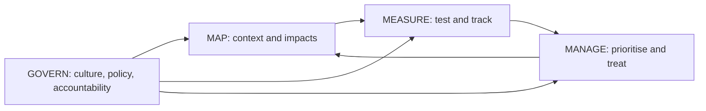
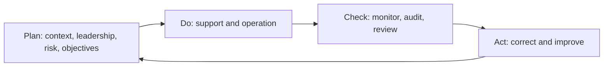

# Module 7 — Standards and frameworks

*Laws tell you what outcome is required; standards and frameworks tell you how to organise yourself to get there. The EU AI Act asks Najm Bank for a risk management system, human oversight and a quality management system, but it does not say how to run them day to day. That is the job of the OECD AI Principles, the NIST AI Risk Management Framework, ISO/IEC 42001 and its sister standards, and the growing set of national and international frameworks, including those in the Gulf. This module covers the values layer and the NIST operating model (7.1), the ISO/IEC standards family and how it links to EU harmonised standards (7.2), and the wider global map, ending with a crosswalk that lets Najm run one control set across the EU AI Act, NIST and ISO (7.3). Most instruments here are voluntary; we flag clearly where something is binding. This course is educational and is not legal advice.*

> **BoK coverage:** II.D — the main voluntary principles, frameworks and standards for AI governance (OECD, NIST AI RMF, ISO/IEC 42001 and related standards, and other international and national frameworks), and how they map to each other and to law.

---

# 7.1 — OECD principles and the NIST AI RMF
*Level: 🟡 Intermediate* · *Prerequisites: 1.2, 2.1, 6.1* · *BoK: II.D*

## ⚡ In 60 seconds

- The **OECD AI Principles** (2019, updated May 2024) are the first intergovernmental AI standard: five **values-based principles** for trustworthy AI and five **recommendations** to governments. The OECD's definition of an "AI system" underpins the EU AI Act's.
- The **NIST AI Risk Management Framework (AI RMF 1.0)**, published January 2023, is a **voluntary**, sector-neutral framework for managing AI risk. It is the most widely used operating model for AI governance programmes.
- It defines seven **trustworthiness characteristics** and four **functions**: **Govern** (cross-cutting culture and accountability), **Map** (context), **Measure** (assess and track), **Manage** (prioritise and treat).
- Companion resources: the **Playbook** (suggested actions), **profiles** (tailored versions), and the **Generative AI Profile, NIST AI 600-1** (July 2024), which lists twelve GenAI risks.
- Exam cue: match an activity to its NIST function, and know that Govern applies across all the others.
- Biggest trap: treating NIST as a certifiable standard or a checklist. It is neither: it is voluntary, flexible and outcome-focused.

## 🧭 Why it matters

After Module 6, Najm's AI Governance Committee knows *what* the EU AI Act requires. The board now asks Layla a harder question: "How do we actually run this across Qatar, the UAE and the EU, with one team and one set of processes?" Omar's data team wants a technical playbook. Sara wants privacy built in. Khalid wants to know which reviews will slow his lending products and why.

Layla needs two things. The first is a **values anchor** that every jurisdiction Najm works in recognises, so the board's AI principles are not invented from scratch. The OECD AI Principles give her that: they are adhered to well beyond the OECD's own members, and the G20's 2019 AI principles drew on them. The second is an **operating model**: a structured way to find, assess and treat AI risks across the life cycle. The NIST AI RMF gives her that. It is free, detailed, widely understood by vendors and auditors, and it maps well to both the AI Act and ISO/IEC 42001.

The AIGP exam expects you to know both well, and especially to recognise which NIST function a given activity belongs to.

## 📐 How it works

### 🟢 The essentials

**The OECD AI Principles.** Adopted by the OECD Council in May 2019 as a Recommendation (a soft-law instrument, not a treaty), and updated in May 2024. They have two parts.

*Five values-based principles for trustworthy AI*, addressed to all AI actors:

| # | Principle | In plain words |
|---|---|---|
| 1 | **Inclusive growth, sustainable development and well-being** | AI should benefit people and the planet, reduce inequalities and protect the environment |
| 2 | **Respect for the rule of law, human rights and democratic values, including fairness and privacy** | Respect freedom, dignity, autonomy, privacy, non-discrimination and labour rights; have safeguards such as human agency and oversight |
| 3 | **Transparency and explainability** | Give meaningful information so people understand AI systems, know when they interact with them, and can challenge outcomes |
| 4 | **Robustness, security and safety** | AI should work reliably and safely across its life cycle; mechanisms should let it be overridden, repaired or safely decommissioned if it causes undue harm |
| 5 | **Accountability** | AI actors are accountable for proper functioning, with traceability and a systematic risk-management approach across the life cycle |

*Five recommendations for policy makers*: (1) invest in AI research and development; (2) foster an inclusive AI-enabling ecosystem; (3) enable an interoperable governance and policy environment; (4) build human capacity and prepare for labour-market transition; (5) cooperate internationally for trustworthy AI.

The **2024 update** strengthened references to safety (including the ability to override or safely decommission systems), misinformation and disinformation and information integrity, environmental sustainability, responsible business conduct across the AI life cycle, and interoperability between jurisdictions. Separately, in November 2023 the OECD updated its **definition of an AI system**, which the EU AI Act adopted almost word for word (6.1).

**The NIST AI RMF 1.0.** The US National Institute of Standards and Technology published it in January 2023 (document NIST AI 100-1), after an open, consensus-driven process. It is:
- **voluntary** and **non-sector-specific**;
- **rights-preserving** and **use-case agnostic**;
- designed to be **flexible** for organisations of any size;
- a "living document", with companion resources updated more often than the core.

It has two parts. **Part 1** explains how to frame AI risk and what "trustworthy AI" means. **Part 2** is the **Core** (the four functions) and **profiles**.

**Framing risk.** NIST defines risk as a composite of the **probability** of an event and the **magnitude** of its consequences. It asks organisations to consider harms to three groups: **people** (individuals, groups, communities, society), **organisations** (operations, reputation, security) and **ecosystems** (interconnected systems, supply chains, the environment). It names four challenges: **measuring** AI risk (immature metrics, third-party components, differences between lab and real world); setting **risk tolerance**; **prioritising** risks; and **integrating** AI risk into wider enterprise risk management. It notes that some risks may be so high that development or deployment should stop.

**The seven trustworthiness characteristics.**

| Characteristic | What it means | Najm example |
|---|---|---|
| **Valid and reliable** | The base: the system does what it is meant to, accurately and consistently, in its real conditions of use | Credit model validated on German applicants, not only Qatari data |
| **Safe** | Does not endanger life, health, property or the environment under defined conditions | Copilot cannot trigger payments |
| **Secure and resilient** | Withstands attacks and unexpected changes, and recovers | Protection against prompt injection in the chatbot |
| **Accountable and transparent** | Information about the system is available to those who need it; someone answers for outcomes. NIST presents this as spanning the others | Model cards and a named model owner |
| **Explainable and interpretable** | Explainable: *how* the system produced an output; interpretable: *what* the output *means* for the user's purpose | Reason codes for declined applicants |
| **Privacy-enhanced** | Safeguards autonomy, identity and dignity through privacy values such as anonymity and control | Data minimisation in training sets |
| **Fair, with harmful bias managed** | Addresses equality and equity, including harmful bias and discrimination | Approval-rate monitoring across groups |

NIST stresses **trade-offs**: more interpretability can cost accuracy, and more privacy can make fairness testing harder. Trustworthiness is only as strong as its weakest characteristic. NIST also names three categories of AI bias: **systemic** (in institutions and data), **computational and statistical** (in samples and methods) and **human-cognitive** (in how people perceive and use outputs).

### 🟡 Going deeper

**The Core: four functions and their categories.** Each function breaks into categories and then subcategories (specific outcomes). There are 19 categories in total. You do not need the subcategory numbers for the exam, but you should know what each function and category is about.

**GOVERN** is cross-cutting. It cultivates a risk-aware culture and applies throughout the others.

| Category | Outcome |
|---|---|
| GOVERN 1 | Policies, processes, procedures and practices for mapping, measuring and managing AI risk are in place, transparent and implemented effectively (incl. legal requirements, risk tolerance, inventory, decommissioning) |
| GOVERN 2 | Accountability structures: the right teams are empowered, responsible and trained |
| GOVERN 3 | Workforce diversity, equity, inclusion and accessibility are prioritised in managing AI risk |
| GOVERN 4 | Teams are committed to a culture that considers and communicates AI risk |
| GOVERN 5 | Processes for robust engagement with relevant AI actors and affected communities |
| GOVERN 6 | Policies and procedures address risks from third-party software, data and supply chains |

**MAP** establishes the context in which risks are identified.

| Category | Outcome |
|---|---|
| MAP 1 | Context is established and understood (intended purpose, users, settings, laws, norms) |
| MAP 2 | The AI system is categorised (tasks, methods, knowledge limits) |
| MAP 3 | Capabilities, targeted use, goals, and expected benefits and costs are understood |
| MAP 4 | Risks and benefits are mapped for all components, including third-party software and data |
| MAP 5 | Impacts on individuals, groups, communities, organisations and society are characterised |

**MEASURE** uses quantitative and qualitative tools to analyse, assess, benchmark and monitor risk.

| Category | Outcome |
|---|---|
| MEASURE 1 | Appropriate methods and metrics are identified and applied |
| MEASURE 2 | AI systems are evaluated for trustworthy characteristics |
| MEASURE 3 | Mechanisms for tracking identified risks over time are in place |
| MEASURE 4 | Feedback about the efficacy of measurement is gathered and assessed |

**MANAGE** allocates resources to mapped and measured risks.

| Category | Outcome |
|---|---|
| MANAGE 1 | Risks are prioritised, responded to and managed, based on MAP and MEASURE |
| MANAGE 2 | Strategies to maximise benefits and minimise negative impacts are planned, implemented and documented |
| MANAGE 3 | Risks and benefits from third-party entities are managed |
| MANAGE 4 | Risk treatments, including response, recovery and communication plans, are documented and monitored regularly |

The functions are **iterative**, not a waterfall. After Govern is in place, most organisations start with Map, but any function can be revisited as the system and its context change. The RMF also uses the term **TEVV** (test, evaluation, verification and validation) for the testing work that feeds Measure, and describes **AI actors** across the life cycle (designers, developers, deployers, operators, evaluators, affected communities).

**Applying the Core to Najm's credit model.**

| Function | Najm activity |
|---|---|
| Govern | AI policy approved; risk tolerance for fairness gaps set by the Committee; Dana named model owner; third-party data policy covers the credit-bureau feed |
| Map | Intended purpose documented (EU consumer loans up to €75,000); affected groups identified; EU AI Act high-risk classification recorded; legal requirements listed |
| Measure | Accuracy, stability and fairness metrics chosen and tested; explainability tested with loan officers; drift monitoring in place |
| Manage | Grey-zone referral to humans; suspension trigger; incident runbook; model retired if fairness tolerance repeatedly breached |

### 🔴 Expert view

**Profiles.** An AI RMF **profile** is an implementation of the functions, categories and subcategories for a specific setting. NIST describes **use-case profiles** (for example hiring, or fair housing), **temporal profiles** (a *current* profile describing today's state and a *target* profile describing the desired state, with the gap driving the roadmap) and **cross-sectoral profiles** (covering risks common across uses, such as GenAI). For Najm, a current-versus-target profile for the credit model is a strong board-level artefact.

**The Playbook** is an online companion that suggests actions, references and documentation for each subcategory. It is guidance, not a set of requirements: organisations take what fits. NIST also publishes **crosswalks** from the AI RMF to other instruments (such as ISO/IEC standards and the EU AI Act) through its Trustworthy and Responsible AI Resource Center.

**The Generative AI Profile (NIST AI 600-1, July 2024)** is a cross-sectoral profile. It lists twelve risks that are unique to or made worse by generative AI:

| Risk | Najm example |
|---|---|
| CBRN information or capabilities | Low relevance for a bank |
| **Confabulation** (confidently stated false content, often called hallucination) | Copilot invents a borrower's revenue figure |
| Dangerous, violent or hateful content | Chatbot manipulated into abusive replies |
| Data privacy | Customer data leaking through prompts or outputs |
| Environmental impacts | Energy cost of large models |
| Harmful bias and homogenisation | Copilot describes female-owned SMEs differently |
| Human-AI configuration | Relationship managers over-trust memos (automation bias) |
| Information integrity | Synthetic "customer" content undermining trust |
| Information security | Prompt injection; lowering barriers to cyberattacks |
| Intellectual property | Outputs reproducing copyrighted text |
| Obscene, degrading or abusive content | Misuse of image generation |
| Value chain and component integration | Opaque third-party model and data provenance |

It maps suggested actions for each risk to the Core, and highlights four themes from NIST's public working group: **governance**, **content provenance**, **pre-deployment testing** and **incident disclosure**.

**Other NIST resources worth knowing.** NIST AI 100-2 sets out a taxonomy of **adversarial machine learning** attacks and mitigations (evasion, poisoning, privacy and abuse attacks). NIST's work on AI is shaped by US federal policy, which changed in 2025: Executive Order 14110 of 2023 was revoked in January 2025, and the July 2025 US AI Action Plan called for revisions to the AI RMF. **At the time of writing, check NIST's AI RMF page for any revised version**; the AIGP exam is based on AI RMF 1.0.

**Why NIST and OECD work well together.** OECD gives the *values* and the vocabulary governments share; NIST gives the *process* for turning them into controls. The OECD's own Catalogue of Tools and Metrics for Trustworthy AI and its AI Incidents Monitor help with Measure and Manage. Neither is binding. But regulators and courts often look to recognised frameworks when judging whether an organisation took reasonable care, and some US state laws have referred to the NIST AI RMF or similar frameworks when describing what reasonable risk management looks like. Check the specific law.

## ⚖️ The instruments

| Instrument | What it requires or recommends | Exam cue |
|---|---|---|
| **OECD AI Principles** | Five values-based principles and five recommendations to governments; updated May 2024 | Distinguish principles (for all AI actors) from recommendations (for governments) |
| **OECD AI Principles** — AI system definition | Updated Nov 2023; basis of the EU AI Act definition | "Which definition did the EU AI Act draw on?" |
| **NIST AI RMF** — Part 1 | Risk framing (people, organisations, ecosystems) and seven trustworthiness characteristics | Valid and reliable is the base; accountable and transparent spans the rest |
| **NIST AI RMF** — Core | Govern, Map, Measure, Manage; 19 categories | Govern is cross-cutting; match activities to functions |
| **NIST AI RMF** — Profiles and Playbook | Current and target profiles; suggested actions per subcategory | Voluntary and adaptable, not a checklist |
| **NIST AI 600-1** | Generative AI Profile: twelve GenAI risks, with actions mapped to the Core | "Confabulation" and "human-AI configuration" |

## 🏛️ In practice at Najm Bank

Layla presents a **NIST AI RMF current and target profile** for the credit memo copilot to the AI Governance Committee. Each row shows today's state, the target, and the gap owner.

| Function / category | Current state | Target state (in 6 months) | Owner |
|---|---|---|---|
| GOVERN 1 — policies | Generic AI policy; no GenAI section | GenAI use standard approved; risk tolerance for confabulation set | Layla |
| GOVERN 2 — accountability | Owner unclear between Credit and Data | Khalid business owner; Dana technical owner; RACI signed | Layla |
| GOVERN 6 — third parties | LLM contract lacks AI terms | Contract addendum: model-change notices, incident notice, data use limits | Yusuf |
| MAP 1 — context | Use described informally | Intended purpose, users and excluded uses documented; EU AI Act Art. 6(3) memo | Khalid, Layla |
| MAP 5 — impacts | Not assessed | Impact assessment on SME and sole-trader borrowers | Sara |
| MEASURE 2 — trustworthiness | Ad-hoc spot checks | Confabulation rate measured on 200 benchmark memos; bias tests by borrower type | Dana |
| MEASURE 3 — tracking | None | Monthly error sampling; relationship-manager feedback button | Dana |
| MANAGE 1 — treatment | None | Numbers in memos must link to source documents; unlinked figures blocked | Dana |
| MANAGE 4 — response | General IT incident process | GenAI incident playbook with rollback to manual memos | Omar |

Decision recorded: *"The copilot remains in pilot for 20 relationship managers until the target profile is met for GOVERN 2, MAP 1, MEASURE 2 and MANAGE 1."*

## 🛠️ Exercises

🟢 **Principle match.** Take Najm's four draft AI principles ("fair", "explainable", "secure", "accountable") and map each to an OECD principle and a NIST trustworthiness characteristic.
*Done when:* each draft principle has one OECD and one NIST match, and you have spotted which OECD principle Najm has left out.

🟡 **Function sort.** List fifteen AI governance activities (for example "set risk tolerance", "red-team the chatbot", "document intended use", "decommission the old scorecard", "survey affected customers") and assign each to Govern, Map, Measure or Manage, with a category.
*Done when:* every activity has a function and category, and you can justify the three you found hardest.

🔴 **GenAI profile.** Using the twelve NIST AI 600-1 risks, build a risk register for Najm's customer chatbot: rate each risk's likelihood and impact, choose a treatment, and name the NIST function that treatment sits in.
*Done when:* all twelve risks are rated (including "not applicable" with a reason) and the top three have measurable controls.

## ⚠️ Mistakes and exam traps

- **"NIST AI RMF certification."** There is none. The RMF is voluntary guidance. ISO/IEC 42001 is the certifiable standard (7.2).
- **Treating the functions as a sequence.** They are iterative, and Govern is cross-cutting, informing all the others.
- **Confusing explainability and interpretability.** Explainability is *how* an output was produced; interpretability is *what it means* in context.
- **Mixing OECD principles and recommendations.** "Investing in AI R&D" and "international cooperation" are recommendations to governments, not values-based principles.
- **Forgetting "valid and reliable" is the base.** A system that does not work cannot be trustworthy, whatever else it achieves.
- **Using the wrong GenAI term.** NIST AI 600-1 uses "confabulation" for what many call hallucination.

## 🧾 Recap

- The OECD AI Principles (2019, updated 2024) give five values-based principles and five government recommendations; the OECD AI-system definition is the basis of the EU AI Act's.
- The NIST AI RMF 1.0 (Jan 2023) is voluntary and sector-neutral, with seven trustworthiness characteristics and four functions.
- Govern is cross-cutting; Map sets context; Measure assesses and tracks; Manage prioritises and treats. There are 19 categories.
- Profiles tailor the RMF (current vs target, use-case, cross-sectoral); the Playbook suggests actions.
- NIST AI 600-1 (July 2024) adds twelve GenAI-specific risks, including confabulation and human-AI configuration.
- US policy shifted in 2025; check for any revised RMF, but the exam is based on 1.0.

## ✍️ Check yourself

**1. Which NIST AI RMF function is described as cross-cutting, informing and applying across the other three?**

- A. Map
- B. Measure
- C. Manage
- D. Govern

Answer

**D.** Govern cultivates the culture, policies and accountability that apply throughout Map, Measure and Manage. The other three are iterative functions that Govern informs. (See 🟡 Going deeper: the Core.)

**2. Which of the following is NOT one of the NIST AI RMF trustworthiness characteristics?**

- A. Profitable and scalable
- B. Privacy-enhanced
- C. Fair, with harmful bias managed
- D. Valid and reliable

Answer

**A.** The seven characteristics are valid and reliable; safe; secure and resilient; accountable and transparent; explainable and interpretable; privacy-enhanced; and fair with harmful bias managed. Commercial value is not one of them. (See 🟢 The essentials.)

**3. Dana is documenting the credit model's intended purpose, its users, the legal requirements that apply and the groups of people it could affect. Which NIST AI RMF function is she mainly performing?**

- A. Govern
- B. Map
- C. Measure
- D. Manage

Answer

**B.** Establishing context, intended purpose and potential impacts is Map (MAP 1 and MAP 5). Measure would test performance against metrics; Manage would treat prioritised risks; Govern sets policy and accountability. (See 🟡 Going deeper.)

**4. Which of the following is one of the OECD's recommendations to governments, rather than one of its values-based principles?**

- A. Transparency and explainability
- B. Accountability
- C. Investing in AI research and development
- D. Robustness, security and safety

Answer

**C.** Investing in AI R&D is the first of the five recommendations for policy makers. A, B and D are values-based principles addressed to all AI actors. (See 🟢 The essentials: OECD.)

**5. Najm's review finds the credit memo copilot sometimes states revenue figures that do not appear in any source document. Which NIST resource most directly names and addresses this risk?**

- A. NIST AI 600-1, the Generative AI Profile, which calls it confabulation
- B. The OECD AI Incidents Monitor
- C. ISO/IEC 22989
- D. NIST AI RMF Part 1's definition of "safe"

Answer

**A.** NIST AI 600-1 lists confabulation among twelve GenAI risks and maps suggested actions to the Core. B is an OECD tool for tracking incidents, not a NIST risk profile; C is an ISO terminology standard. (See 🔴 Expert view: Generative AI Profile.)

## 📚 References

- OECD AI Principles: https://oecd.ai/en/ai-principles
- OECD Recommendation of the Council on Artificial Intelligence (OECD/LEGAL/0449): https://legalinstruments.oecd.org/en/instruments/OECD-LEGAL-0449
- NIST AI Risk Management Framework: https://www.nist.gov/itl/ai-risk-management-framework
- NIST AI 100-1, AI RMF 1.0: https://doi.org/10.6028/NIST.AI.100-1
- NIST AI 600-1, Generative AI Profile: https://doi.org/10.6028/NIST.AI.600-1
- NIST Trustworthy and Responsible AI Resource Center (Playbook, crosswalks): https://airc.nist.gov/

---

# 7.2 — ISO/IEC 42001 and the AI standards family
*Level: 🟡 Intermediate* · *Prerequisites: 7.1, 6.2* · *BoK: II.D*

## ⚡ In 60 seconds

- **ISO/IEC 42001:2023** specifies requirements for an **AI management system (AIMS)**: the policies, roles, processes and controls an organisation uses to develop, provide or use AI responsibly. It is the first **certifiable** AI management system standard.
- It follows the common ISO management-system structure (**clauses 4–10**, Plan-Do-Check-Act) shared with ISO/IEC 27001 (information security) and ISO/IEC 27701 (privacy), so the three can be run as one integrated system.
- **Annex A** lists reference controls (policies, internal organisation, resources, impact assessment, life cycle, data, information for interested parties, use, third parties). Organisations justify inclusions and exclusions in a **Statement of Applicability**.
- Sister standards: **23894** (AI risk management guidance), **22989** (concepts and terminology), **42005** (AI system impact assessment), **38507** (governance for boards), **5338** (AI life-cycle processes), **42006** (requirements for bodies that certify 42001).
- In the EU, only **harmonised standards** cited in the Official Journal give a **presumption of conformity** with the AI Act. They are being written by **CEN-CENELEC JTC 21**. ISO/IEC 42001 certification alone does not give that presumption.
- Biggest trap: treating a vendor's 42001 certificate as proof that its product complies with the AI Act. It certifies the organisation's management system, not the product.

## 🧭 Why it matters

A German corporate client's procurement team sends Najm a questionnaire: "Is your organisation certified to ISO/IEC 42001? If not, describe your AI management system." In the same week, Yusuf asks the CV-screening vendor for proof of AI Act compliance. The vendor replies with a 42001 certificate and a line saying "fully compliant".

Layla has to answer three questions for the board. Should Najm seek 42001 certification, and what would it take? Does a vendor's certificate settle the AI Act question? And how do the many ISO/IEC AI standards the consultants keep quoting fit together? The answers draw on a key idea: management-system standards certify *how an organisation runs itself*, while the AI Act regulates *products placed on a market*. They overlap a great deal but are not the same thing.

For the exam, know 42001's structure, what makes it certifiable, what Annex A covers, and what each sister standard is for.

## 📐 How it works

### 🟢 The essentials

**Who writes these standards.** ISO (the International Organization for Standardization) and IEC (the International Electrotechnical Commission) work together on IT through a joint technical committee, **ISO/IEC JTC 1**. Its subcommittee **SC 42** develops the AI standards. National standards bodies vote on them. Standards are voluntary unless a law or contract makes them mandatory. They must be bought (they are copyrighted), which is why this course describes rather than quotes them.

**Requirements versus guidance.** A requirements standard uses "shall" and can be audited and certified. A guidance standard uses "should" and helps you implement something, but cannot be certified against.

| Standard | Title in plain words | Type |
|---|---|---|
| **ISO/IEC 42001:2023** | AI management system | **Requirements, certifiable** |
| **ISO/IEC 23894:2023** | Guidance on AI risk management | Guidance |
| **ISO/IEC 22989:2022** | AI concepts and terminology | Foundational vocabulary |
| **ISO/IEC 42005:2025** | AI system impact assessment | Guidance |
| **ISO/IEC 38507:2022** | Governance implications of AI use, for governing bodies | Guidance |
| **ISO/IEC 5338:2023** | AI system life-cycle processes | Process framework |
| **ISO/IEC 42006** | Requirements for bodies auditing and certifying 42001 | Requirements for certification bodies |

**What an AI management system is.** A **management system** is the set of interrelated elements an organisation uses to set policies and objectives and the processes to achieve them. You already know examples: ISO 9001 for quality, ISO/IEC 27001 for information security. An AIMS applies the same logic to AI: leadership commitment, an AI policy, defined roles, risk and impact assessment, controls, competence, monitoring, audit, and continual improvement. 42001 applies to any organisation that **provides or uses** AI-based products or services, of any size and sector. It asks the organisation to determine its **role** with respect to AI (for example AI provider, producer, customer or user, partner), using vocabulary from 22989.

**Plan-Do-Check-Act.** 42001 follows the cycle every ISO management-system standard uses:

### 🟡 Going deeper

**The clauses of ISO/IEC 42001.** Clauses 1–3 cover scope, references and terms. The auditable requirements are in clauses 4–10, which use the harmonised structure shared by ISO management-system standards (formerly known as Annex SL).

| Clause | What it requires | Najm example |
|---|---|---|
| **4 Context of the organisation** | Understand internal and external issues, including legal requirements and the organisation's AI role; identify interested parties and their needs; define the **scope** of the AIMS | Scope: "AI systems developed or used by Najm Bank in Qatar, the UAE and Germany" |
| **5 Leadership** | Top-management commitment; an **AI policy**; assigned roles, responsibilities and authorities | Board-approved AI policy; Layla as AIMS owner |
| **6 Planning** | Actions to address risks and opportunities, including **AI risk assessment**, **AI risk treatment** (with a Statement of Applicability) and **AI system impact assessment**; measurable **AI objectives**; planning of changes | Risk methodology; objective "100% of high-risk systems with an impact assessment before go-live" |
| **7 Support** | Resources, **competence**, awareness, communication, documented information | AI literacy programme (2.3); document control |
| **8 Operation** | Operational planning and control; performing the AI risk assessments, risk treatment and impact assessments in practice | Intake and review gates for each new AI use case |
| **9 Performance evaluation** | Monitoring, measurement, analysis; **internal audit**; **management review** | Annual internal audit of the AIMS; quarterly Committee review |
| **10 Improvement** | Continual improvement; nonconformity and **corrective action** | Root-cause analysis after the chatbot incident |

**Three assessments, not one.** 42001 distinguishes **AI risk assessment** (risks to the organisation's objectives, including legal, reputational and operational ones), **AI risk treatment** (choosing controls to address them) and **AI system impact assessment** (potential consequences for individuals, groups and society). This mirrors the AI Act's split between the provider's risk management system and the deployer's FRIA.

**Annex A: reference controls.** Annex A is *normative*: the organisation must compare its risk treatment against it and record in the **Statement of Applicability (SoA)** which controls it applies, and justify any it excludes. The control objectives fall into nine areas:

| Area | What the controls cover |
|---|---|
| A.2 Policies related to AI | An AI policy, alignment with other policies, periodic review |
| A.3 Internal organisation | AI roles and responsibilities; reporting of concerns |
| A.4 Resources for AI systems | Documenting data, tooling, computing, system and human resources |
| A.5 Assessing impacts of AI systems | Impact-assessment process and documentation, on individuals, groups and society |
| A.6 AI system life cycle | Objectives for responsible development; requirements, design, verification and validation, deployment, operation and monitoring, technical documentation, event logs |
| A.7 Data for AI systems | Data acquisition, quality, provenance and preparation |
| A.8 Information for interested parties | System documentation and information for users; external reporting; communicating incidents |
| A.9 Use of AI systems | Processes for responsible use; objectives for responsible use; intended use |
| A.10 Third-party and customer relationships | Allocating responsibilities; suppliers; customers |

The published standard contains 38 Annex A controls. Other annexes help: **Annex B** gives implementation guidance for each control, **Annex C** lists possible AI-related organisational objectives (such as fairness, security, safety, privacy, transparency) and risk sources, and **Annex D** discusses using the AIMS across domains and sectors. The organisation can add controls beyond Annex A.

**Certification.** ISO does not certify anyone. Independent **certification bodies**, ideally **accredited** by a national accreditation body, audit the organisation. The usual cycle is a **Stage 1** audit (documentation and readiness), a **Stage 2** audit (whether the AIMS works in practice), a certificate typically valid for three years, **annual surveillance audits**, and recertification. **ISO/IEC 42006** (published in 2025) sets extra requirements for bodies certifying 42001, including auditor competence in AI, so that certificates mean something consistent.

**Integration with 27001 and 27701.** Because all three share the same clause structure, Najm can run one integrated management system: one management review, one internal-audit programme, one document-control process and one corrective-action log. The *risk* lenses differ: 27001 addresses information-security risk, 27701 privacy (a 2025 revision made it a standalone privacy management system standard; check the current edition), and 42001 AI-specific risks and impacts. Many AI controls, such as access control for training pipelines or data-breach handling, are best implemented once and referenced by several systems.

### 🔴 Expert view

**The sister standards in practice.**
- **ISO/IEC 23894:2023** adapts **ISO 31000:2018** (the general risk-management standard) to AI. It follows the 31000 process (establish context, identify, analyse, evaluate and treat risks; monitor, review, record, report) and adds AI-specific risk sources and life-cycle considerations. Use it to design the risk method that 42001 clause 6 requires.
- **ISO/IEC 22989:2022** is the shared vocabulary: AI system, machine learning, the AI life cycle, stakeholder roles, and trustworthiness properties. Aligning Najm's policy terms with it avoids arguments about words.
- **ISO/IEC 42005:2025** gives guidance on **AI system impact assessment**: when to do it, what to cover (intended use and foreseeable misuse, affected stakeholders, benefits and harms, including to fundamental rights), and how to document and integrate it with other assessments. It is the natural method for 42001's impact-assessment clause and a useful structure for an AI Act FRIA.
- **ISO/IEC 38507:2022** speaks to **boards and governing bodies**: their oversight role, accountability that cannot be delegated to the technology, and setting policies for acceptable AI use. It extends ISO/IEC 38500 (governance of IT).
- **ISO/IEC 5338:2023** defines **AI system life-cycle processes**, building on the general software and systems life-cycle standards and adding AI-specific concerns such as data, continuous learning and model monitoring.

Other SC 42 standards you may meet include ISO/IEC 23053 (framework for AI systems using machine learning), the ISO/IEC 5259 series (data quality for analytics and ML), ISO/IEC TR 24027 (bias in AI systems) and ISO/IEC TR 24028 (overview of trustworthiness).

**How standards connect to the EU AI Act.** Under Art. 40, high-risk systems (and GPAI models) that conform to **harmonised standards** whose references are published in the **Official Journal of the EU** are **presumed to conform** with the requirements those standards cover. Harmonised standards are European standards (EN) developed on a **standardisation request** from the Commission. The Commission issued its AI request to CEN and CENELEC in 2023, and the work sits with their Joint Technical Committee **CEN-CENELEC JTC 21**. The deliverables cover the Act's high-risk requirements: risk management, data governance and quality, record-keeping, transparency, human oversight, accuracy, robustness, cybersecurity, a quality management system, and conformity assessment. JTC 21 builds on ISO/IEC work where it fits, but the Act's focus on health, safety and fundamental rights of *affected persons*, and on *products*, means some European standards are new or heavily adapted rather than straight adoptions.

The work has been slower than planned. **At the time of writing (2026), check the CEN-CENELEC and Commission pages** for which harmonised standards have been published and cited in the Official Journal; the Digital Omnibus proposal (6.3) partly links high-risk application dates to their availability. Until they are cited, no standard, including ISO/IEC 42001, gives a presumption of conformity. That said, a 42001-based AIMS is a strong foundation for the AI Act's **quality management system** (Art. 17) and for demonstrating accountability to regulators and clients.

**What a vendor certificate does and does not tell you.** A 42001 certificate tells Yusuf that the vendor has an audited AI management system within a stated **scope**. He should check that scope (does it include the CV product and the development site?), the certification body and its accreditation, and the certificate's validity. It does *not* show that the CV tool meets Arts 9–15, has passed conformity assessment, or suits Najm's purpose. For that he needs the declaration of conformity, the instructions for use and evidence from Najm's own testing (11.2).

## ⚖️ The instruments

| Instrument | What it requires or recommends | Exam cue |
|---|---|---|
| **ISO/IEC 42001** | Certifiable AIMS: clauses 4–10 (PDCA), AI risk assessment and treatment, AI system impact assessment, Annex A controls, Statement of Applicability | The only certifiable standard in this lesson; certifies the organisation, not a product |
| **ISO/IEC 23894** | Guidance on AI risk management, based on ISO 31000 | "Risk management guidance building on ISO 31000" |
| **ISO/IEC 22989** | AI concepts and terminology, including stakeholder roles | The vocabulary standard |
| **ISO/IEC 42005** | Guidance on AI system impact assessment | Supports 42001's impact-assessment clause and FRIA practice |
| **ISO/IEC 38507** | Governance implications of AI for boards and governing bodies | Board oversight and accountability |
| **ISO/IEC 5338** | AI system life-cycle processes | The life-cycle process standard |
| **ISO/IEC 42006** | Requirements for bodies that audit and certify 42001 | About certifiers, not users of AI |
| **EU AI Act** — Art. 40 | Presumption of conformity from harmonised standards cited in the Official Journal (CEN-CENELEC JTC 21) | 42001 alone does not give presumption of conformity |

## 🏛️ In practice at Najm Bank

The AI Governance Committee decides to **build an AIMS aligned to ISO/IEC 42001, integrated with Najm's existing 27001 ISMS, and to target certification in 18 months**. Layla's gap assessment extract:

| Clause / control | Requirement in brief | Najm today | Gap action | Owner |
|---|---|---|---|---|
| 4.3 Scope | Define AIMS boundaries | Undefined | Scope statement covering all three countries and all inventory systems | Layla |
| 5.2 AI policy | Policy fit for purpose, with commitments | Draft principles only | Board-approved AI policy with commitment to legal compliance and improvement | Layla |
| 6.1.2–6.1.3 Risk | AI risk assessment and treatment; SoA | Model-risk policy covers accuracy only | Extend method using ISO/IEC 23894; produce SoA against Annex A | Omar |
| 6.1.4 / A.5 Impact | AI system impact assessment | DPIAs only | Joint DPIA-FRIA-impact template using ISO/IEC 42005 | Sara |
| 7.2 Competence | Competent people | Ad hoc | Role-based AI training with records | Layla |
| A.6 Life cycle | Documented development controls and logs | Varies by team | Standard model dossier; logging standard | Dana |
| A.10 Third parties | Supplier responsibilities | Generic IT contracts | AI clauses in all AI vendor contracts | Yusuf |
| 9.2–9.3 Audit and review | Internal audit; management review | None for AI | Add AIMS to internal-audit plan; quarterly Committee review as management review | Internal Audit, Layla |

A **vendor-certificate rule** is added to the procurement standard:

> A supplier's ISO/IEC 42001 certificate is accepted as evidence of its management system only after Procurement has checked the certificate's scope, issuing body, accreditation and validity. It is not accepted as evidence that a specific product meets the EU AI Act or Najm's requirements.

## 🛠️ Exercises

🟢 **Clause map.** Place ten Najm activities (for example "board approves AI policy", "quarterly Committee review", "fix after chatbot incident", "AI training records") into the 42001 clause they belong to.
*Done when:* every activity has a clause from 4 to 10, and you can say which PDCA stage each belongs to.

🟡 **Statement of Applicability.** Using the nine Annex A areas, draft an SoA outline for Najm's credit model: for each area, say whether controls apply, how they are implemented, and justify any exclusion.
*Done when:* each area has an "applies / excluded" decision with a one-line justification.

🔴 **Certificate challenge.** The CV vendor sends a 42001 certificate. Write the five questions Yusuf should ask about it and explain, in one paragraph for the Committee, why it does not answer the AI Act question and what evidence would.
*Done when:* your questions cover scope, issuer, accreditation and validity, and your paragraph names the AI Act artefacts needed.

## ⚠️ Mistakes and exam traps

- **"42001 certification means AI Act compliance."** No. It certifies a management system; AI Act presumption of conformity comes only from harmonised standards cited in the Official Journal.
- **"Certified to 23894" or "to 42005".** These are guidance standards and cannot be certified against.
- **Mixing up 42001 and 42006.** 42001 is for organisations running an AIMS; 42006 is for the bodies that certify them.
- **Ignoring the Statement of Applicability.** Annex A exclusions must be justified; you cannot quietly drop controls.
- **"ISO certifies organisations."** Independent, preferably accredited, certification bodies do.
- **Forgetting the board.** 38507 is the standard aimed at governing bodies; accountability cannot be delegated to a system.

## 🧾 Recap

- ISO/IEC 42001:2023 is the certifiable AI management system standard, built on the shared clause 4–10 structure and PDCA.
- It requires AI risk assessment, risk treatment with a Statement of Applicability, and AI system impact assessment, supported by 38 Annex A controls across nine areas.
- It integrates naturally with 27001 and 27701 in one management system.
- Sister standards: 23894 (risk), 22989 (terms), 42005 (impact assessment), 38507 (boards), 5338 (life cycle), 42006 (certifiers).
- EU presumption of conformity comes from harmonised standards developed by CEN-CENELEC JTC 21 and cited in the Official Journal; check their status.
- A vendor's 42001 certificate is evidence about its organisation, not its product.

## ✍️ Check yourself

**1. Which of the following standards can an organisation be certified against?**

- A. ISO/IEC 23894
- B. ISO/IEC 42001
- C. ISO/IEC 22989
- D. ISO/IEC 42005

Answer

**B.** ISO/IEC 42001 is a requirements ("shall") standard for an AI management system and is certifiable. 23894 and 42005 are guidance, and 22989 is terminology. (See 🟢 The essentials.)

**2. In ISO/IEC 42001, which clause contains internal audit and management review?**

- A. Clause 5, Leadership
- B. Clause 7, Support
- C. Clause 9, Performance evaluation
- D. Clause 10, Improvement

Answer

**C.** Clause 9 covers monitoring and measurement, internal audit and management review (the "Check" stage). Clause 10 covers corrective action and continual improvement ("Act"). (See 🟡 Going deeper: the clauses.)

**3. Najm's CV-screening vendor sends an ISO/IEC 42001 certificate as proof that its tool complies with the EU AI Act. What is the best response?**

- A. Accept it: 42001 certification gives a presumption of conformity with the AI Act
- B. Reject it as irrelevant: 42001 has nothing to do with AI governance
- C. Ask the vendor to certify to ISO/IEC 23894 instead
- D. Treat it as evidence about the vendor's management system after checking scope and issuer, and separately request the AI Act conformity evidence for the product

Answer

**D.** A 42001 certificate is useful evidence of an organisation's AIMS but does not show a product meets the AI Act; presumption of conformity comes only from cited harmonised standards. B goes too far, and 23894 (C) cannot be certified. (See 🔴 Expert view.)

**4. Which standard provides guidance on AI risk management by adapting ISO 31000?**

- A. ISO/IEC 38507
- B. ISO/IEC 5338
- C. ISO/IEC 23894
- D. ISO/IEC 42006

Answer

**C.** ISO/IEC 23894:2023 adapts the ISO 31000 risk-management process to AI. 38507 is for governing bodies, 5338 covers life-cycle processes, and 42006 is for certification bodies. (See 🔴 Expert view: sister standards.)

**5. An organisation implementing ISO/IEC 42001 decides that some Annex A controls do not apply to it. What must it do?**

- A. Nothing; Annex A is informative only
- B. Record the decision and justification in its Statement of Applicability
- C. Obtain approval from ISO before excluding them
- D. Replace them with controls from ISO/IEC 27001

Answer

**B.** Annex A is normative reference material: the organisation compares its risk treatment with it and justifies inclusions and exclusions in the Statement of Applicability. ISO does not approve exclusions (C). (See 🟡 Going deeper: Annex A.)

## 📚 References

- ISO/IEC 42001:2023, AI management system: https://www.iso.org/standard/81230.html
- ISO/IEC JTC 1/SC 42 (Artificial intelligence) and its standards: https://www.iso.org/
- CEN-CENELEC (JTC 21, Artificial Intelligence): https://www.cencenelec.eu/
- Regulation (EU) 2024/1689, Art. 40 (harmonised standards): https://eur-lex.europa.eu/eli/reg/2024/1689/oj
- European Commission, standardisation and the AI Act: https://digital-strategy.ec.europa.eu/en/policies/regulatory-framework-ai

---

# 7.3 — The global map: other frameworks that shape practice
*Level: 🟡 Intermediate* · *Prerequisites: 7.1, 7.2* · *BoK: II.D*

## ⚡ In 60 seconds

- Beyond the EU AI Act, NIST and ISO, AI governance is shaped by **international soft law** (the **UNESCO Recommendation on the Ethics of AI**, 2021; the **G7 Hiroshima Process** code of conduct, 2023), one **binding treaty** (the **Council of Europe Framework Convention on AI**, opened for signature September 2024), and **national approaches** that differ sharply.
- The **UK** is principles-based and regulator-led; the **US** has no comprehensive federal AI law and relies on existing laws, agency action and state laws; **China** has binding, service-specific rules (recommendation algorithms, deep synthesis, generative AI, labelling); **Singapore** leads on practical, voluntary tools (Model AI Governance Framework, AI Verify).
- In the **GCC**, AI governance is mostly strategy- and principles-led, plus data-protection laws and sector guidance: Qatar's national AI strategy and **QCB's AI guideline** for financial institutions, Saudi Arabia's **SDAIA AI Ethics Principles**, and the UAE's national strategy and AI charter.
- A **crosswalk** maps the same control (for example human oversight) across the EU AI Act, NIST AI RMF and ISO/IEC 42001, so one control can satisfy several frameworks.
- Exam cue: tell binding law from voluntary frameworks, and recognise each jurisdiction's style.
- Biggest trap: stating fast-moving national details from memory. Name the approach; check the current status.

## 🧭 Why it matters

Najm's board meets in Doha. Its regulators are the Qatar Central Bank, the UAE authorities for its Dubai operations, and BaFin and the EU AI Act authorities for Frankfurt. The strategy team is exploring a Riyadh office. A UK fintech partner wants to co-develop an SME lending app, and Najm's US correspondent bank has asked about its AI model risk management. Each counterpart speaks a different governance language.

Layla cannot run six compliance programmes. Her approach is **"one control set, many maps"**: build controls once, on the NIST and ISO backbone, then map them to each jurisdiction's law and guidance. That needs a working map of who says what and how binding it is.

## 📐 How it works

### 🟢 The essentials

**Three layers of instruments.**

| Layer | What it is | Examples | Binding? |
|---|---|---|---|
| International soft law | Principles and recommendations agreed by states | OECD AI Principles, UNESCO Recommendation, G7 Hiroshima code | No, but politically influential |
| International treaty | Legal obligations for states that ratify | Council of Europe Framework Convention | Yes, for parties, through national law |
| National and regional rules | Laws, regulations, regulator guidance, strategies | EU AI Act, China's generative AI measures, QCB guideline, UK regulator guidance | Varies from binding law to voluntary guidance |

Soft law still matters: it shapes later laws (the OECD definition became the EU's), benchmarks "reasonable" conduct, and appears in contracts.

**UNESCO Recommendation on the Ethics of AI (November 2021).** Adopted by all UNESCO member states at the time, it is the first global standard on AI ethics. It sets out four **values** (human rights and human dignity; living in peaceful, just and interconnected societies; ensuring diversity and inclusiveness; environment and ecosystem flourishing) and ten **principles**:

| Principles |
|---|
| Proportionality and do no harm · Safety and security · Right to privacy and data protection · Multi-stakeholder and adaptive governance and collaboration · Responsibility and accountability · Transparency and explainability · Human oversight and determination · Sustainability · Awareness and literacy · Fairness and non-discrimination |

Eleven **policy action areas** follow, supported by a **Readiness Assessment Methodology** for countries and an **Ethical Impact Assessment** tool.

**Council of Europe Framework Convention on Artificial Intelligence and Human Rights, Democracy and the Rule of Law.** Adopted in May 2024 and **opened for signature in September 2024**, it is the **first legally binding international treaty on AI**. Signatories include Council of Europe members, the EU and non-member states. It binds *states* that ratify it, not companies directly. It covers public authorities and private actors acting for them; for other private actors, each party chooses how to address risks. Its principles include human dignity and individual autonomy, equality and non-discrimination, privacy and personal-data protection, transparency and oversight, accountability and responsibility, reliability, and safe innovation. It also requires **remedies**, procedural safeguards, and **risk and impact management**. National security is excluded, and research and development is excluded until systems are tested or used in ways that could interfere with rights. **Check the current ratification and entry-into-force status.**

**G7 Hiroshima AI Process (2023).** In October 2023 the G7 published **International Guiding Principles** and a voluntary **International Code of Conduct for Organizations Developing Advanced AI Systems**. It asks developers of advanced AI, including foundation models, to identify and mitigate risks across the life cycle (including red-teaming), monitor misuse after deployment, publicly report capabilities and limitations, share information on incidents, adopt risk-management policies, invest in security, and develop content provenance tools such as watermarking. An OECD-run **reporting framework** lets organisations report how they apply it.

### 🟡 Going deeper

**United Kingdom: principles-based and regulator-led.** The UK has chosen not to pass a single horizontal AI law so far. Its 2023 white paper *A pro-innovation approach to AI regulation* set five cross-sector principles for existing regulators to apply within their remits:
1. safety, security and robustness;
2. appropriate transparency and explainability;
3. fairness;
4. accountability and governance;
5. contestability and redress.

Regulators such as the ICO (data protection), the FCA and the Bank of England (financial services), the CMA (competition) and Ofcom interpret these for their sectors. The government created an AI Safety Institute, renamed the **AI Security Institute** in 2025. The UK GDPR still applies, and the **Data (Use and Access) Act 2025** revised the UK's rules on automated decision-making. Proposals for legislation on the most powerful AI models have been discussed. **Check current status** before relying on any detail.

**United States: no comprehensive federal AI law.** Executive Order 14110 (2023) was **revoked in January 2025**; later federal action has focused on AI leadership and on challenging or pre-empting state AI laws. **Check the current position.** What stays constant is that **existing laws apply to AI**: the FTC Act (unfair or deceptive practices), the Equal Credit Opportunity Act and Regulation B (including specific reasons in adverse-action notices, even when a complex model is used), the Fair Housing Act, Title VII and the ADA in employment. Banking regulators apply model-risk management expectations to AI models. At state level, **NYC Local Law 144** requires bias audits and notices for automated employment decision tools, and the **Colorado AI Act** (SB 24-205) imposes duties on developers and deployers of high-risk AI systems, with its effective date postponed to 30 June 2026; check whether it has taken effect or changed again. The **NIST AI RMF** (7.1) remains the reference framework.

**China: binding, targeted rules.** China regulates specific AI services through the Cyberspace Administration of China (CAC) and other agencies:

| Instrument | Year | Core requirements |
|---|---|---|
| Provisions on algorithmic recommendation | 2022 | Transparency about recommendation algorithms, user options to switch off personalisation, algorithm **filing** with the regulator for services with public-opinion influence |
| Provisions on deep synthesis | 2023 | Labelling of synthetic content, identity verification of users, security assessment |
| **Interim Measures for the Management of Generative AI Services** | 2023 | Applies to generative AI services offered to the public in China: lawful training data and IP respect, content controls, labelling, security assessment and filing for services with public-opinion influence, complaint handling |
| Measures for labelling AI-generated synthetic content (with a national standard) | 2025 | **Explicit** labels visible to users and **implicit** labels (such as metadata) in files |

China has also issued an AI Safety Governance Framework and many technical standards. The approach is binding and fast-moving; check current rules.

**Singapore: practical, voluntary tools.** Singapore's **Model AI Governance Framework** (first published 2019, second edition 2020) translates principles into practice across four areas: internal governance structures and measures; determining the level of human involvement in AI-augmented decision-making; operations management; and stakeholder interaction and communication. The **Model AI Governance Framework for Generative AI** (2024) extends it to issues such as accountability, data, incident reporting, testing, security and content provenance. **AI Verify** is a testing framework and open-source toolkit, now stewarded by the AI Verify Foundation, that lets organisations test and document their AI systems against internationally recognised principles. For banks, the Monetary Authority of Singapore's **FEAT principles** (Fairness, Ethics, Accountability and Transparency) and the Veritas initiative are sector-specific references.

### 🔴 Expert view

**The GCC.** Gulf states have moved fast on AI strategy and ethics, with binding rules coming mainly through data-protection law and sector regulators. Specifics change often, so treat what follows as orientation and **check official sources**.

- **Qatar.** A **National Artificial Intelligence Strategy** (2019) set out Qatar's ambitions for AI in the economy, education and government. The **Personal Data Privacy Protection Law (Law No. 13 of 2016, PDPPL)** governs personal data. For Najm, the most directly relevant instrument is the **Qatar Central Bank's AI guideline for financial institutions**, which sets supervisory expectations for how licensed institutions govern AI. In general terms it covers governance and accountability, risk management, the fairness and transparency of AI outcomes for customers, data management, and oversight of third-party AI. Najm's AIMS should map each of its requirements to a control. Read the current guideline from QCB rather than relying on summaries.
- **Saudi Arabia.** The Saudi Data and Artificial Intelligence Authority (**SDAIA**) published **AI Ethics Principles**, covering fairness; privacy and security; humanity; social and environmental benefits; reliability and safety; transparency and explainability; and accountability and responsibility. It has also issued guidance on generative AI. The **Personal Data Protection Law** has been in force since 2023, supervised by SDAIA.
- **United Arab Emirates.** The UAE appointed a Minister of State for AI in 2017 and published a **National Strategy for Artificial Intelligence 2031**. It has issued a **UAE Charter for the Development and Use of AI** (2024) and AI ethics guidance. Personal data is governed by the federal **PDPL (Federal Decree-Law No. 45 of 2021)**. The **DIFC Data Protection Law**, through **Regulation 10**, adds specific requirements for personal data processed by autonomous and semi-autonomous systems in the DIFC free zone.

The common thread: GCC frameworks emphasise national strategy, ethics principles and sector supervision rather than a single horizontal AI act, at least at the time of writing. For a regulated bank, the **financial regulator's** expectations usually bite first.

**The crosswalk.** A crosswalk lets one control provide evidence for several instruments. This is Layla's working version for Najm. It is a planning aid, not a legal equivalence: meeting a NIST category does not by itself prove compliance with an AI Act article.

| Control theme | EU AI Act | NIST AI RMF | ISO/IEC 42001 |
|---|---|---|---|
| AI policy and accountability | QMS accountability framework (Art. 17); provider and deployer roles | GOVERN 1, GOVERN 2 | Clause 5; A.2, A.3 |
| AI literacy and competence | Art. 4; competent oversight staff (Art. 26) | GOVERN 2 | Clause 7.2–7.3; A.4 |
| Inventory and classification | Risk tiers (Arts 5, 6, 50); intended purpose | GOVERN 1, MAP 1, MAP 2 | Clause 4.3; A.6 |
| Risk management | Risk management system (Art. 9) | MAP, MEASURE, MANAGE 1 | Clauses 6.1, 8.2–8.3 (with ISO/IEC 23894) |
| Impact on people | FRIA (Art. 27) | MAP 5 | Clause 6.1.4, 8.4; A.5 (with ISO/IEC 42005) |
| Data governance | Art. 10 | MAP 4, MEASURE 2 | A.7 |
| Documentation | Technical documentation (Art. 11, Annex IV) | GOVERN 1, MAP | Clause 7.5; A.6 |
| Logging | Record-keeping (Art. 12); log retention (Arts 19, 26) | MEASURE 3 | A.6 (event logs) |
| Transparency to users and people | Arts 13, 50, 86 | Accountable and transparent; GOVERN 4, MANAGE 4 | A.8 |
| Human oversight | Art. 14; Art. 26 | MAP 3, MANAGE 2 | A.9 |
| Accuracy, robustness, security | Art. 15 | MEASURE 2 | A.6 |
| Third parties and supply chain | Value-chain duties (Art. 25); deployer due diligence | GOVERN 6, MAP 4, MANAGE 3 | A.10 |
| Monitoring and incidents | Post-market monitoring (Art. 72); serious incidents (Art. 73) | MEASURE 3, MANAGE 4 | Clauses 9, 10; A.8 |
| Audit and improvement | QMS (Art. 17); conformity assessment (Art. 43) | GOVERN 1, MEASURE 4 | Clauses 9.2, 9.3, 10 |

**Using the map well.** **Start from the strictest binding requirement** in each theme (usually the AI Act or the financial regulator). **Keep jurisdiction-specific deltas visible**: a FRIA notification or a QCB expectation will not appear in NIST or ISO. **Re-map when things change**, such as the Digital Omnibus, a revised NIST RMF or new harmonised standards.

## ⚖️ The instruments

| Instrument | What it requires or recommends | Exam cue |
|---|---|---|
| **UNESCO Recommendation on the Ethics of AI** | Four values, ten principles, eleven policy areas; readiness and ethical impact assessment tools (2021) | Global soft law adopted by UNESCO member states |
| **Council of Europe Framework Convention on AI** | First binding international AI treaty (signature from Sept 2024); human rights, democracy, rule of law; remedies; risk and impact management | Binds ratifying states, not companies directly |
| **G7 Hiroshima Code of Conduct** | Voluntary actions for developers of advanced AI: risk mitigation, red-teaming, transparency reports, incident sharing, provenance (2023) | Voluntary; OECD reporting framework |
| **UK AI regulation white paper** | Five cross-sector principles applied by existing regulators (2023) | Regulator-led, no single AI act at the time of writing |
| **China Generative AI Measures** | Interim Measures (2023) for public generative AI services: training-data legality, labelling, security assessment, filing; plus 2025 labelling measures | Binding, service-specific |
| **Singapore Model AI Governance Framework** | Practical voluntary framework (2019/2020; GenAI version 2024); AI Verify testing toolkit | Practical tools, not law |
| **QCB AI guideline** | Qatar Central Bank supervisory expectations for AI in licensed financial institutions | Sector regulator guidance binds regulated firms in practice |
| **SDAIA AI Ethics Principles** | Saudi AI ethics principles, alongside the Saudi PDPL | Principles-led GCC approach |

## 🏛️ In practice at Najm Bank

Layla produces a **jurisdiction map** for the AI Governance Committee, showing which instruments apply where, how binding they are, and what they add to the common control set.

| Jurisdiction | Key instruments for Najm | Binding? | What it adds beyond the common controls | Owner |
|---|---|---|---|---|
| EU (Frankfurt) | EU AI Act; GDPR; financial supervisor | Yes | FRIA notification, CE-marking chain, Art. 50 disclosures | Layla, Sara |
| Qatar (HQ) | QCB AI guideline; PDPPL; national AI strategy | Guideline and PDPPL: yes, for Najm | Regulator expectations; PDPPL notices | Layla, Sara |
| UAE (Dubai) | Federal PDPL; DIFC Regulation 10 if in DIFC; UAE AI charter | Laws: yes; charter: guidance | Autonomous-system requirements in DIFC | Sara |
| Saudi Arabia (planned) | PDPL; SDAIA AI Ethics Principles | PDPL: yes; principles: guidance | Data-transfer questions | Layla |
| UK partner | UK GDPR; FCA and ICO guidance | Yes, for the partner | Contract allocation of duties | Yusuf |
| US correspondent | Model-risk expectations | Contractual for Najm | NIST-aligned evidence | Omar |

**Committee decision:** *"Najm will maintain one AI control framework based on ISO/IEC 42001 and the NIST AI RMF, mapped in the crosswalk to the EU AI Act, the QCB AI guideline and applicable data-protection laws. Jurisdiction-specific deltas are owned by named individuals and reviewed each quarter."*

## 🛠️ Exercises

🟢 **Binding or not?** Sort ten instruments from this module (for example UNESCO Recommendation, CoE Convention, NIST AI RMF, China's Generative AI Measures, Singapore Model Framework, EU AI Act, ISO/IEC 42001, QCB AI guideline) into "binding law", "binding for regulated firms in practice", "treaty binding on states" and "voluntary".
*Done when:* every instrument is placed with a one-line reason.

🟡 **Extend the crosswalk.** Add a fourth column to the crosswalk for the QCB AI guideline or another regulator's AI guidance that applies to you. Mark themes where the guidance adds something the other three do not.
*Done when:* every row has an entry or "not addressed", and you have listed at least two deltas.

🔴 **One control, many maps.** Write a single human-oversight control for Najm's credit model, then show exactly how it provides evidence for AI Act Art. 14 and Art. 26, NIST MAP 3 and MANAGE 2, ISO/IEC 42001 A.9, and the relevant QCB expectation. Identify what evidence each framework would need and any gaps.
*Done when:* one control statement is mapped to at least five references, with the evidence and gaps listed.

## ⚠️ Mistakes and exam traps

- **Calling the UNESCO Recommendation or the Hiroshima code "binding".** Both are soft law. The Council of Europe Convention is the binding treaty, and it binds ratifying states.
- **Saying the US has a federal AI act.** It does not; existing laws, agency guidance and state laws apply. Check current federal and state developments.
- **Describing the UK as having an AI act like the EU's.** At the time of writing it relies on regulators applying cross-sector principles.
- **Treating China's rules as voluntary.** They are binding and service-specific, with filing and labelling duties.
- **Ignoring the sector regulator in the GCC.** For a bank, the central bank's AI expectations often matter most.
- **Treating a crosswalk as legal equivalence.** Mapping helps reuse controls, but each instrument's specific requirements and evidence still need checking.

## 🧾 Recap

- International soft law (OECD, UNESCO, G7) shapes norms; the Council of Europe Convention is the first binding AI treaty, for ratifying states.
- The UK is principles-based and regulator-led; the US has no comprehensive federal AI law and relies on existing laws and state action; China has binding, service-specific rules; Singapore offers practical voluntary tools.
- GCC approaches combine national AI strategies, ethics principles, data-protection laws and sector guidance such as the QCB AI guideline.
- A crosswalk lets one control provide evidence for the EU AI Act, NIST AI RMF and ISO/IEC 42001, but it is not a legal equivalence.
- Start from the strictest binding requirement, keep jurisdiction-specific deltas visible, and re-map when things change.

## ✍️ Check yourself

**1. Which of the following is a legally binding international treaty on AI?**

- A. The Council of Europe Framework Convention on AI and Human Rights, Democracy and the Rule of Law
- B. The G7 Hiroshima International Code of Conduct
- C. The UNESCO Recommendation on the Ethics of AI
- D. The OECD AI Principles

Answer

**A.** The Council of Europe Framework Convention, opened for signature in September 2024, is the first legally binding international AI treaty, binding the states that ratify it. The others are soft law. (See 🟢 The essentials.)

**2. Which statement best describes the UK's approach to AI regulation at the time of writing?**

- A. A single horizontal AI act modelled on the EU AI Act
- B. No principles or guidance at all
- C. A mandatory licensing regime for all AI systems
- D. Cross-sector principles applied by existing regulators within their remits

Answer

**D.** The UK's 2023 white paper set five principles for existing regulators such as the ICO and FCA to apply. There is no single AI act, although legislation on the most powerful models has been discussed. (See 🟡 Going deeper: United Kingdom.)

**3. Najm wants to reuse its risk-management controls to show alignment with Art. 9 of the EU AI Act. Which ISO/IEC 42001 elements are the closest match?**

- A. Clauses 6.1 and 8 on AI risk assessment and treatment, supported by ISO/IEC 23894
- B. Annex A.10 on third-party and customer relationships
- C. Clause 5.2 on the AI policy only
- D. ISO/IEC 42006 on certification bodies

Answer

**A.** Art. 9's risk management system maps to 42001's AI risk assessment and treatment in clauses 6.1 and 8, and 23894 gives the risk method. A.10 covers third parties, 5.2 the policy, and 42006 concerns certifiers. (See 🔴 Expert view: the crosswalk.)

**4. A generative AI service provider wants to launch a public chatbot in mainland China. Which instrument most directly sets requirements for that service?**

- A. Singapore's Model AI Governance Framework for Generative AI
- B. China's Interim Measures for the Management of Generative AI Services
- C. The G7 Hiroshima Code of Conduct
- D. The UNESCO Recommendation on the Ethics of AI

Answer

**B.** China's 2023 Interim Measures are binding rules for generative AI services offered to the public in China, alongside deep-synthesis and labelling rules. The others are voluntary or apply elsewhere. (See 🟡 Going deeper: China.)

**5. What is AI Verify?**

- A. A Chinese algorithm filing registry
- B. The EU database for high-risk AI systems
- C. A Singaporean AI governance testing framework and open-source toolkit
- D. A US federal certification scheme for AI models

Answer

**C.** AI Verify is Singapore's testing framework and toolkit, stewarded by the AI Verify Foundation, for testing and documenting AI systems against recognised principles. It is voluntary. (See 🟡 Going deeper: Singapore.)

## 📚 References

- UNESCO Recommendation on the Ethics of Artificial Intelligence: https://www.unesco.org/en/artificial-intelligence/recommendation-ethics
- Council of Europe, Framework Convention on Artificial Intelligence: https://www.coe.int/en/web/artificial-intelligence
- OECD, G7 Hiroshima AI Process and reporting framework: https://oecd.ai/
- UK Government, AI regulation: a pro-innovation approach: https://www.gov.uk/government/publications/ai-regulation-a-pro-innovation-approach
- NIST AI Risk Management Framework (crosswalks): https://www.nist.gov/itl/ai-risk-management-framework
- Cyberspace Administration of China: https://www.cac.gov.cn/
- Singapore PDPC (Model AI Governance Framework): https://www.pdpc.gov.sg/
- AI Verify Foundation: https://aiverifyfoundation.sg/
- Qatar Central Bank: https://www.qcb.gov.qa/
- Saudi Data and Artificial Intelligence Authority (SDAIA): https://sdaia.gov.sa/
- UAE Artificial Intelligence Office: https://ai.gov.ae/
