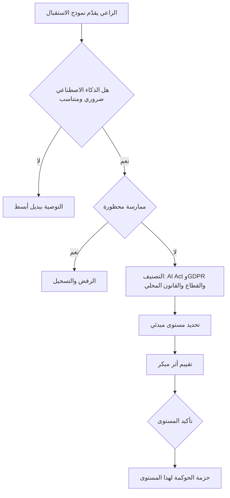

# الوحدة 8 — حوكمة التصميم والبناء

*تُحسم معظم إخفاقات الذكاء الاصطناعي قبل أن يكتب أحد سطرًا واحدًا من الكود. تُعتمد حالة الاستخدام (use case) الخاطئة، ولا يحدد أحد القوانين التي تنطبق، ويُضاف "شرح القرار" قبل الإطلاق بثلاثة أسابيع، وتُكتب بطاقة النموذج (model card) من الذاكرة بعد أن يطلبها المدقق. تغطي هذه الوحدة مرحلة التصميم والبناء من دورة الحياة (life cycle)، حيث تكون الحوكمة (governance) أقل تكلفة وأكثر فاعلية. ستتابع بنك نجم (Najm Bank) وفريق ليلى يمرّر أربعة مقترحات عبر الاستقبال (intake) والفرز (triage)، ويكتب متطلبات الجدارة بالثقة (trustworthiness requirements) لنموذج تقييم الائتمان للأفراد (retail credit-scoring model) وللمساعد الذكي لمذكرات الائتمان القائم على الذكاء الاصطناعي التوليدي (GenAI credit memo copilot)، ويقرر ما الذي يُبنى أو يُشترى أو يُضبط ضبطًا دقيقًا (fine-tune) أو يُستدعى عبر API. وكل خيار يغيّر من يتحمل المسؤولية القانونية. هذه الدورة للتعليم والاستعداد للامتحان، وليست استشارة قانونية.*

> **تغطية مجال المعرفة (BoK coverage):** III.A — حوكمة تصميم نظام الذكاء الاصطناعي وبنائه: الاستقبال، ودراسة الجدوى (business case)، والتصنيف وتحديد مستوى المخاطر (risk tiering)، ومتطلبات الجدارة بالثقة، والتوثيق، وقرار البناء مقابل الشراء.

---

# 8.1 — استقبال حالات الاستخدام ودراسة الجدوى وتحديد مستوى المخاطر
*المستوى: 🔴 متقدم* · *المتطلبات: 3.1، 4.3، 6.1* · *مجال المعرفة (BoK): III.A*

## ⚡ الدرس في دقيقة
- تدخل كل فكرة للذكاء الاصطناعي إلى الحوكمة من باب واحد: **استقبال حالة الاستخدام (use-case intake)**. وهو يسجّل الغرض، والأشخاص المتأثرين، والبيانات، وأثر القرار، والمورّد، والولايات القضائية، *قبل* إنفاق أي مال.
- أول سؤال في الحوكمة ليس "هل هو آمن؟" بل "**هل نحتاج إلى الذكاء الاصطناعي أصلًا**، وهل هو متناسب؟" فقد تحقق قاعدة أو قائمة تحقق أو نموذج أبسط الهدفَ بمخاطر أقل.
- يجري التصنيف بالتوازي عبر الأنظمة القانونية: **مستوى المخاطر في EU AI Act (EU AI Act tier)** (محظور، عالي المخاطر (high-risk)، التزامات الشفافية، الحد الأدنى)، و**GDPR** (بيانات شخصية؟ المادة 22 (Art. 22)؟ تقييم الأثر على حماية البيانات (DPIA)؟)، و**القواعد القطاعية (sector rules)** (بالنسبة لبنك نجم، توقعات البنك المركزي وقانون الإقراض)، والقانون المحلي (PDPPL في قطر، وPDPL في الإمارات).
- الناتج هو **مستوى مخاطر (risk tier)** يُطلق مستوى حوكمة متفقًا عليه مسبقًا: من يوافق، وأي تقييمات، وأي اختبارات، وكم مرة يُراجَع.
- إشارة الامتحان: عندما يسأل سيناريو عن الخطوة *الأولى* بشأن مقترح جديد للذكاء الاصطناعي، تكون الإجابة عادةً تحديد الغرض والسياق وتصنيف المخاطر، لا البدء بالاختبار أو شراء أداة.
- الفخ الأكبر: تحديد المستوى بناءً على *التقنية* ("إنه مجرد انحدار لوجستي (logistic regression)"، "إنه مجرد روبوت محادثة") بدلًا من **الاستخدام وأثره على الناس**.

## 🧭 لماذا يهم
صباح يوم اثنين، تجد ليلى أربعة مقترحات في صندوق وارد حوكمة الذكاء الاصطناعي. يريد خالد (رئيس الإقراض للأفراد) نموذج تعلّم آلة لتقييم الائتمان يحل محل بطاقة التقييم (scorecard) القديمة للأفراد التي عمرها عشر سنوات. واختارت الموارد البشرية أداة من مورّد ترتّب السير الذاتية. ويريد فريق لإدارة العلاقات "مساعدًا ذكيًا لمذكرات الائتمان" قائمًا على الذكاء الاصطناعي التوليدي يصوغ مسودات مذكرات الائتمان لقروض المنشآت الصغيرة والمتوسطة والشركات. ويريد فريق مكافحة الاحتيال إعادة تدريب نموذج مراقبة المعاملات بخصائص (features) جديدة. ويقول الرعاة الأربعة جميعًا إن الأمر عاجل، ويصف كل منهم مشروعه بأنه "منخفض المخاطر".

من دون استقبال موحّد، يقرر كل راعٍ بنفسه ما معنى "منخفض المخاطر". فتصل أداة السير الذاتية إلى الإنتاج عبر نموذج مشتريات، ويُعامَل نموذج الائتمان كترقية لتقنية المعلومات. ولا يلاحظ أحد أن عملاء الأفراد الأوروبيين لفرع فرانكفورت يُدخلون تقييم الائتمان ضمن الملحق III (Annex III) من EU AI Act، أو أن ترتيب المرشحين للوظائف استخدام مدرج في الملحق III أيضًا.

يمنح الاستقبال والفرز المؤسسةَ سجلًا واحدًا، ومفردات واحدة للمخاطر، وقاعدة واحدة لمقدار التدقيق الذي يحصل عليه كل مقترح. ومعظم ما يلي في المجال III (تقييمات الأثر، وعمق الاختبار، والتوثيق، والاعتماد النهائي) يعتمد على المستوى المحدد هنا.

## 📐 كيف يعمل

### 🟢 الأساسيات

**استقبال حالة الاستخدام** نموذج قصير منظم يملؤه مالك الأعمال، ويسجّل فكرة الذكاء الاصطناعي في **سجل أنظمة الذكاء الاصطناعي (AI inventory)** (قائمة المؤسسة بأنظمة الذكاء الاصطناعي، التي قُدّمت في 0.3). والاستقبال الجيد يطرح أسئلة بسيطة يستطيع راعٍ غير تقني الإجابة عنها:

| سؤال الاستقبال | لماذا تحتاجه الحوكمة |
|---|---|
| ما المشكلة التي تحلها، وكيف تُحل اليوم؟ | يحدد خط الأساس وما إذا كنا نحتاج إلى الذكاء الاصطناعي أصلًا |
| ما الذي سيُخرجه النظام: درجة، أم ترتيب، أم نص، أم إجراء؟ | يحدد مدى تأثير النظام المباشر على الناس |
| من المتأثر: العملاء، أم المتقدمون، أم الموظفون، أم الجمهور؟ وهل توجد فئات ضعيفة؟ | يقود تحليل الأثر والعدالة |
| هل سيقرر إنسان، أم سيسري المخرَج تلقائيًا؟ | يُدخل المادة 22 من GDPR وتصميم الإشراف |
| ما البيانات التي سيستخدمها؟ بيانات شخصية؟ فئات خاصة؟ | يُدخل GDPR/PDPPL، وتقييم الأثر على حماية البيانات، وحقوق البيانات (الوحدة 9) |
| هل بُني داخليًا، أم اشتُري، أم بُني على نموذج أو API من طرف ثالث؟ | يحدد الدور وفق AI Act ومخاطر الطرف الثالث (8.3، 11.2) |
| أين المستخدمون والأشخاص المتأثرون؟ | يحدد القوانين المنطبقة: الاتحاد الأوروبي، قطر، الإمارات، وغيرها |
| ماذا يحدث إذا أخطأ، ولمن؟ | يبدأ تقدير الشدة |

**الفرز (Triage)** هو الخطوة التي يقرأ فيها فريق الحوكمة (مكتب ليلى) نموذج الاستقبال ويحدد **مستوى مخاطر** مبدئيًا. ثم يوجّه المقترح: مسار سريع، أو مراجعة قياسية، أو مراجعة كاملة بموافقة اللجنة. وتُرفض بعض المقترحات في هذه المرحلة.

**التناسب (Proportionality)** يعني أن التدقيق، ومدى تدخّل الحل، يجب أن يتناسبا مع الفائدة والمخاطر. وله وجهان:
1. **هل الذكاء الاصطناعي ضروري؟** إذا كانت قاعدة شفافة ("وسم التحويلات التي تتجاوز 50,000 ريال قطري إلى مستفيدين جدد") تؤدي المهمة، فإن النموذج المعقد يضيف مخاطر بلا قيمة.
2. **هل هو متناسب؟** حتى عندما يساعد الذكاء الاصطناعي، يجب أن تبرر الفائدةُ المخاطرَ على الأشخاص المتأثرين. هل يمكن لتصميم أقل تدخلًا أن يحقق الهدف: بيانات أقل، أو إنسان في القرار، أو نطاق أضيق؟

**دراسة الجدوى (business case)** في حوكمة الذكاء الاصطناعي ليست مجرد حساب للعائد على الاستثمار (ROI). بل تسجّل أيضًا *الغرض المقصود (intended purpose)* (الاستخدام الذي صُمّم له النظام، والذي يحدد لاحقًا ما يُعدّ سوء استخدام أو استخدامًا "خارج التسمية (off-label)")، ومقاييس النجاح، والبدائل التي دُرست وسبب رفضها، و**مالك الأعمال (business owner)** المسمّى الذي سيُساءل عن النظام.

### 🟡 التعمق أكثر

**التصنيف القانوني والتنظيمي** يُجرى لكل نظام قانوني على حدة، لأن النظام الواحد قد يقع ضمن عدة أنظمة.

*EU AI Act (الوحدة 6).* أربعة أسئلة، بالترتيب:
1. هل هو "نظام ذكاء اصطناعي (AI system)" وفق تعريف القانون؟ (نظام قائم على الآلة يستنتج من المدخلات كيف يولّد مخرجات مثل التنبؤات أو المحتوى أو التوصيات أو القرارات، بقدر من الاستقلالية.) ونشرت المفوضية إرشادات بشأن التعريف في فبراير 2025. وقد تقع بعض الأدوات البسيطة القائمة على القواعد أو الأدوات الإحصائية الأساسية خارجه، لكن الحالات الحدّية تحتاج إلى تحليل موثّق، لا إلى هزّ الكتفين.
2. هل هو من **الممارسات المحظورة (prohibited practice)** (المادة 5)؟ أمثلة: التقييم الاجتماعي (social scoring) المؤدي إلى معاملة ضارة غير مبررة، والتعرف على المشاعر في مكان العمل (مع استثناءات ضيقة)، والأساليب التلاعبية التي تسبب ضررًا كبيرًا. إن كان كذلك، فتوقّف.
3. هل هو **عالي المخاطر** (المادة 6)؟ إما مكوّن سلامة في منتج خاضع لتشريعات الملحق I، أو استخدام مدرج في **الملحق III**. وبالنسبة لبنك نجم، فإن بنود الملحق III ذات الصلة هي *تقييم الجدارة الائتمانية أو تقييم الائتمان للأشخاص الطبيعيين* (مع استثناء للأنظمة المستخدمة لكشف الاحتيال المالي) و*التوظيف*: الاستقطاب والاختيار، بما في ذلك تصفية الطلبات وتقييم المرشحين.
4. هل تترتب عليه **التزامات الشفافية (transparency obligations)** (المادة 50)؟ مثلًا، يجب إبلاغ الناس بأنهم يتعاملون مع نظام ذكاء اصطناعي (روبوتات المحادثة)، ويجب وسم المحتوى الاصطناعي.

وسجّل أيضًا **دور** بنك نجم: مقدّم النظام (provider) (يطوّر النظام ويضعه في الخدمة باسمه، حتى لاستخدامه الخاص) أو المُشغِّل (deployer) (يستخدم نظامًا يورّده شخص آخر). أداة السير الذاتية تجعل بنك نجم مُشغِّلًا. ونموذج الائتمان الداخلي يجعل بنك نجم مقدّمًا للنظام *و*مُشغِّلًا.

*مرشّح المادة 6(3) (Art. 6(3)).* لا يكون نظام الملحق III عالي المخاطر إذا لم يشكّل خطرًا كبيرًا للضرر. أمثلة: يؤدي مهمة إجرائية ضيقة، أو يحسّن نتيجة نشاط بشري اكتمل بالفعل، أو يكتشف أنماطًا دون أن يحل محل التقييم البشري، أو يؤدي مهمة تحضيرية. وهناك حد صارم: **نظام الملحق III الذي يقوم بتنميط (profiling) الأشخاص الطبيعيين يكون دائمًا عالي المخاطر.** ويجب على مقدّم النظام الذي يعتمد على هذا المرشّح أن يوثّق التقييم قبل طرح النظام في السوق وأن يسجّله. وتقييم الائتمان ينمّط الناس بطبيعة تصميمه، لذلك لا يفيد المرشّح خالدًا.

*GDPR وقانون الخصوصية المحلي (الوحدة 4).* هل تُعالَج بيانات شخصية، وعلى أي أساس قانوني (lawful basis)؟ هل تدخل فئات خاصة (المادة 9)؟ هل سينتج عن قرار قائم *فقط* على المعالجة الآلية آثار قانونية أو آثار مماثلة بدرجة كبيرة (المادة 22)؟ بعد حكم محكمة العدل الأوروبية (CJEU) في قضية *SCHUFA* (C-634/21، 2023)، يمكن أن تُعدّ درجة الائتمان بحد ذاتها قرارًا من هذا النوع حين تؤدي دورًا حاسمًا في قرار المُقرِض. هل يلزم **تقييم الأثر على حماية البيانات** (المادة 35)؟ بالنسبة لتقنية جديدة تُستخدم لتقييم الناس على نطاق واسع، فالجواب نعم في كل الحالات تقريبًا. ويطبّق PDPPL في قطر (القانون رقم 13 لسنة 2016) وPDPL في الإمارات متطلباتهما الخاصة، التي تتحقق منها سارة (مسؤولة حماية البيانات (DPO)) مع المستشار القانوني المحلي.

*القواعد القطاعية.* تعمل البنوك بالفعل وفق توقعات إدارة مخاطر النماذج، وقانون الائتمان الاستهلاكي، وقانون مكافحة التمييز، وقواعد السلوك. ويجب على بنك نجم أيضًا أن يأخذ في الحسبان إرشادات QCB للذكاء الاصطناعي للمؤسسات المالية. وهي تتوقع عادةً مساءلة على مستوى مجلس الإدارة، وتقييمًا للمخاطر، وقابلية للتفسير (explainability)، وإشرافًا بشريًا (human oversight) يتناسب مع الاستخدام، وينبغي لبنك نجم أن يقرأ النص الحالي بدلًا من الاعتماد على الملخصات.

**تحديد مستوى المخاطر.** تعطيك القوانين فئات *قانونية*. لكن المؤسسات تحتاج إلى مستوى *داخلي* يغطي أيضًا مخاطر السمعة والمخاطر التشغيلية والمالية والأخلاقية، وينطبق في كل دولة تعمل فيها. ويجمع المخطط الداخلي النموذجي بين **الشدة (severity)** (مدى سوء الضرر المحتمل، وهل يمكن عكسه)، و**النطاق (scale)** (كم عدد الناس)، و**الاستقلالية (autonomy)** (مقدار ما يفحصه الإنسان قبل أن يسري المخرَج)، ثم يقابل كل مستوى بحزمة حوكمة:

| مستوى بنك نجم | المحفّزات النموذجية | الحوكمة المُطلَقة |
|---|---|---|
| **المستوى 0 — غير مسموح** | ممارسة وفق المادة 5 من AI Act؛ تعارض مع مبادئ الذكاء الاصطناعي لدى بنك نجم | يُرفض عند الفرز؛ ويُسجَّل |
| **المستوى 1 — عالٍ** | استخدام في الملحق III؛ آثار قانونية أو مماثلة بدرجة كبيرة على الأفراد؛ بيانات من الفئات الخاصة؛ ذكاء اصطناعي توليدي يواجه العملاء ويقدّم مشورة | تقييم أثر كامل (DPIA، إضافة إلى تقييم الأثر على الحقوق الأساسية (FRIA) حيث يلزم)، وتحقق مستقل، واختبار العدالة، وموافقة اللجنة، ومراجعة ربع سنوية للمراقبة |
| **المستوى 2 — متوسط** | دعم قرار داخلي مع مراجعة بشرية؛ يواجه العملاء لكن بمخاطر منخفضة؛ بيانات شخصية دون آثار كبيرة | تقييم قياسي، واعتماد المالك مع مراجعة الحوكمة، واختبارات قبل الإصدار، ومراجعة سنوية |
| **المستوى 3 — منخفض** | إنتاجية داخلية دون بيانات شخصية؛ لا أثر على الأفراد | تسجيل في السجل، وقواعد الاستخدام المقبول، وفحص خفيف |

المستوى **مبدئي** عند الفرز، ويُؤكَّد بعد تقييم الأثر المبكر. ويجب أيضًا إعادة النظر فيه عندما يتغير الغرض أو البيانات أو المستخدمون أو النموذج (الوحدة 10).

### 🔴 نظرة الخبير

**تقييم الأثر المبكر.** لا تنتظر نظامًا مكتملًا لتقييم الأثر. أجرِ تقييمًا *أوليًا (screening)* عند الفرز: من قد يتضرر، وكيف، وإلى أي حد، وما التخفيفات التي يجب تصميمها في النظام. ثم عمّقه كلما استقرت خيارات التصميم. يقدّم ISO/IEC 42005:2025 إرشادات بشأن تقييمات أثر أنظمة الذكاء الاصطناعي عبر دورة الحياة. ويشترط ISO/IEC 42001 على المؤسسات التي لديها نظام إدارة ذكاء اصطناعي أن تقيّم الآثار على الأفراد والمجتمعات. ووظيفة **Map** (التحديد) في NIST AI RMF هي هذا العمل بالضبط: وضع السياق، وتصنيف النظام، وتحديد آثاره والأشخاص المتأثرين. وكثيرًا ما *يغيّر* التقييم المبكر التصميم. فقد يُقصَر فرز السير الذاتية في بنك نجم على الترتيب مقابل معايير دنيا موضوعية، مع مراجعة شخص لكل رفض. وإصلاح ذلك على الورق أرخص من إصلاحه في الإنتاج.

**تحليل البدائل دليل، لا طقس.** يسأل المدققون *لماذا هذا التصميم*. عبارة "درسنا نهجًا قائمًا على القواعد وبطاقة تقييم؛ وتنبأ نموذج تعلّم الآلة بالتعثر (default) بشكل أفضل على بيانات من خارج الفترة الزمنية (out-of-time) مع عدالة مماثلة" قابلة للدفاع عنها. أما "بدا العرض التوضيحي للمورّد جيدًا" فلا. احتفظ بالبدائل المرفوضة في الملف.

**مزالق تحديد المستوى التي ينتبه لها الممارسون المتمرسون:**
- *التأثير الخفي.* المساعد الذكي "منخفض المخاطر" الذي يصوغ مذكرات الائتمان ما زال يشكّل قرارات الإقراض: فالمسودة كثيرًا ما *تصبح* هي القرار.
- *التجميع.* عدة أدوات من المستوى 2 تغذّي قرارًا واحدًا قد يصل مجموع أثرها إلى المستوى 1.
- *الانجراف القضائي.* أداة بُنيت لقطر تُطرح لاحقًا لعملاء في الاتحاد الأوروبي عبر فرع فرانكفورت. ويجب أن تُعيد تغييرات النطاق إطلاق الفرز.
- *ورقة التوت "الإنسان في الحلقة (human in the loop)".* المراجع الذي يوافق على 99.8% من المخرجات في ثماني ثوانٍ لكل منها يمارس إشرافًا شكليًا (انظر 8.2).
- *التغيير التنظيمي بعد 2025.* في نوفمبر 2025 اقترحت المفوضية الأوروبية حزمة "Digital Omnibus" من شأنها تعديل بعض الجداول الزمنية في AI Act، بما فيها التزامات الأنظمة عالية المخاطر. وقت كتابة هذا الدرس، راجع وضعها الحالي. وفي الامتحان، طبّق القانون كما اعتُمد.

**التناسب سلاح ذو حدّين:** الإفراط في حوكمة الأدوات منخفضة المخاطر يعلّم الموظفين تجنّب الاستقبال.

## ⚖️ الأدوات التنظيمية
| الأداة | ما تشترطه أو توصي به | إشارة الامتحان |
|---|---|---|
| **EU AI Act** — المادة 5، والمادة 6 والملحق III | الممارسات المحظورة؛ وتصنيف الأنظمة عالية المخاطر، بما فيها تقييم الائتمان للأشخاص الطبيعيين والاستقطاب/الاختيار | "تقييم الائتمان لأفراد في الاتحاد الأوروبي" = عالي المخاطر؛ وكشف الاحتيال مستثنى من هذا البند |
| **EU AI Act** — المادة 6(3) | نظام الملحق III ليس عالي المخاطر إذا لم يشكّل خطرًا كبيرًا (مهام إجرائية ضيقة أو تحضيرية، وما إلى ذلك)؛ ولا ينطبق ذلك أبدًا حيث ينمّط الأفراد؛ ويوثّق مقدّم النظام التقييم | التنميط يُسقط الاستثناء |
| **EU AI Act** — المادة 27 | بعض المُشغِّلين (الهيئات العامة؛ واستخدامات تقييم الائتمان وتسعير التأمين على الحياة/الصحة) يجرون تقييم الأثر على الحقوق الأساسية قبل الاستخدام الأول | بنك نجم بصفته مُشغِّلًا لتقييم الائتمان يجب أن يجري FRIA |
| **GDPR** — المادتان 22 و35 | قيود على القرارات المهمة الآلية بالكامل؛ وتقييم الأثر على حماية البيانات حيث يُرجَّح أن تؤدي المعالجة إلى مخاطر عالية | الذكاء الاصطناعي الجديد الذي يقيّم الناس على نطاق واسع يُطلق DPIA |
| **NIST AI RMF** — وظيفة Map | وضع السياق والغرض المقصود والتصنيف والآثار قبل القياس أو الإدارة | "Map" هي خطوة الاستقبال والفرز |
| **ISO/IEC 42001** | نظام إدارة الذكاء الاصطناعي الذي يتضمن تقييم مخاطر الذكاء الاصطناعي وتقييم أثر نظام الذكاء الاصطناعي | معيار نظام إدارة قابل للاعتماد |
| **ISO/IEC 42005** | إرشادات بشأن كيفية إجراء تقييمات أثر أنظمة الذكاء الاصطناعي | إرشادات، غير قابل للاعتماد |
| **QCB AI guideline** | توقعات للمؤسسات المالية الخاضعة لتنظيم قطر بشأن حوكمة الذكاء الاصطناعي، تُطبَّق بما يتناسب مع المخاطر | القواعد القطاعية تنطبق إلى جانب القانون العام |

## 🏛️ عمليًا في بنك نجم
**سجل استقبال حالات استخدام الذكاء الاصطناعي وفرزها (AI Use-Case Intake and Triage Record)** لدى ليلى (الإصدار 1.2)، المعتمد من لجنة حوكمة الذكاء الاصطناعي (AI Governance Committee):

| القسم | الحقل | نموذج تقييم الائتمان (خالد) | المساعد الذكي لمذكرات الائتمان (فريق مديري العلاقات) |
|---|---|---|---|
| الغرض | الغرض المقصود | تقدير احتمال التعثر لمتقدمي قروض الأفراد في قطر والإمارات والاتحاد الأوروبي | صياغة مسودات مذكرات ائتمان للمنشآت الصغيرة والمتوسطة/الشركات من وثائق داخلية ليراجعها مدير العلاقات |
| خط الأساس | العملية الحالية | بطاقة تقييم بالانحدار اللوجستي (2015) إضافة إلى الاكتتاب اليدوي | يكتب مديرو العلاقات المذكرات يدويًا (نحو 4 ساعات لكل منها) |
| التناسب | البدائل المدروسة | بطاقة تقييم معاد معايرتها؛ نموذج تعلّم آلة؛ تعلّم آلة مع نموذج بديل قابل للفهم (interpretable surrogate) | قوالب فقط؛ بحث استرجاعي؛ صياغة بالذكاء الاصطناعي التوليدي |
| الأشخاص | الأشخاص المتأثرون | متقدمو الأفراد، بمن فيهم المقيمون في الاتحاد الأوروبي | مالكو المنشآت الصغيرة والمتوسطة والضامنون (بشكل غير مباشر) |
| القرار | دور الإنسان | موظف الاكتتاب يقرر؛ والدرجة حاسمة للقروض الصغيرة | مدير العلاقات يحرر ويوقّع؛ ولجنة الائتمان تقرر |
| البيانات | شخصية / خاصة | نعم / لا تُجمع فئات خاصة (لكن هناك خطر المتغيرات البديلة (proxy)) | نعم (بيانات الضامنين) / محتملة في الوثائق |
| التصنيف | EU AI Act | عالي المخاطر (تقييم الائتمان في الملحق III)؛ بنك نجم = مقدّم النظام + المُشغِّل؛ ويلزم FRIA بصفته مُشغِّلًا | ليس ضمن الملحق III ظاهريًا (أشخاص اعتباريون)، لكنه قد يؤثر في ضامنين من الأشخاص الطبيعيين؛ ولا تنطبق المادة 50 (المستخدمون الداخليون يعرفون أنه ذكاء اصطناعي) |
| التصنيف | GDPR / المحلي | خطر المادة 22 (SCHUFA)؛ يلزم DPIA؛ ومراجعة PDPPL وPDPL الإماراتي | فحص أولي لـ DPIA؛ وسرية بيانات العملاء |
| المستوى | مبدئي ← مؤكَّد | المستوى 1 ← المستوى 1 | المستوى 2 ← المستوى 2 (يُعاد التقييم إذا استُخدم لإقراض الأفراد) |
| الحزمة | الحوكمة المُطلَقة | DPIA + FRIA، وتحقق مستقل، واختبارات العدالة، وموافقة اللجنة | تقييم قياسي، واختبار الفريق الأحمر (red-team)، وتدريب مديري العلاقات، واعتماد المالك + ليلى |
| المالك | المُساءَل | خالد | رئيس الخدمات المصرفية للشركات |

قرار اللجنة المسجَّل بشأن المساعد الذكي: *"معتمد للتصميم في المستوى 2. يقتصر النطاق على المقترضين من الأشخاص الاعتباريين. وأي توسيع إلى إقراض الأفراد يتطلب إعادة الفرز."*

## 🛠️ التمارين
- 🟢 اكتب نموذج الاستقبال لإعادة تدريب نموذج الاحتيال في بنك نجم باستخدام أسئلة الاستقبال الثمانية أعلاه. *يكتمل عندما:* تكون كل إجابة جملة أو جملتين وتسمّي من المتأثر.
- 🟡 صنّف أداة فرز السير الذاتية المقدَّمة من المورّد وفق EU AI Act وGDPR وقانون خليجي واحد. واذكر دور بنك نجم وفق AI Act والمستوى المبدئي. *يكتمل عندما:* يكون لديك جدول من أربعة صفوف (النظام القانوني، والتصنيف، ودور بنك نجم/واجبه، والأدلة المطلوبة) ومستوى مع تبرير في سطر واحد.
- 🔴 يريد فرع فرانكفورت استخدام المساعد الذكي لمذكرات الائتمان (المستوى 2) لطلبات الرهن العقاري للأفراد. اكتب مذكرة إعادة الفرز: ما الذي يتغير، والمستوى الجديد، وثلاثة شروط للتصميم. *يكتمل عندما:* تعالج المذكرة الملحق III، والمادة 22/SCHUFA، وتحيّز الأتمتة (automation bias)، وتسمّي مالكًا مُساءَلًا.

## ⚠️ أخطاء وفخاخ الامتحان
- **تحديد المستوى حسب التقنية.** "إنه انحدار بسيط، إذن مخاطره منخفضة." حدّد المستوى حسب الاستخدام والأثر والاستقلالية. فالنموذج البسيط الذي يقرر الائتمان عالي المخاطر.
- **تخطّي سؤال "هل نحتاج إلى الذكاء الاصطناعي؟".** عندما يقدّم سؤال خيار "دراسة ما إذا كان نهج أقل خطرًا لا يعتمد على الذكاء الاصطناعي يحقق الهدف"، فهو كثيرًا ما يكون أفضل خطوة مبكرة.
- **التعامل مع استثناء المادة 6(3) على أنه سهل.** لا ينطبق أبدًا حيث ينمّط النظام الأفراد، ويجب توثيقه.
- **الظن بأن المُشغِّلين ليس عليهم عمل تصنيف.** مُشغِّلو الأنظمة عالية المخاطر يتحملون واجباتهم الخاصة (المادة 26، وFRIA لتقييم الائتمان)، لذلك يجب أن يصنّفوا أيضًا.
- **التعامل مع التصنيف كأمر يتم مرة واحدة.** الغرض الجديد، أو المستخدمون الجدد، أو الولاية القضائية الجديدة، أو النموذج الجديد يعني إعادة الفرز.
- **تسمية المراجعة الشكلية "الإنسان في الحلقة".** الإشراف الشكلي لا يخفّض المستوى.

## 🧾 الخلاصة
- باب استقبال واحد يغذّي سجلًا واحدًا لأنظمة الذكاء الاصطناعي. ويحدد الفرز مستوى مبدئيًا يُطلق حزمة حوكمة متناسبة.
- اسأل هل نحتاج إلى الذكاء الاصطناعي وهل هو متناسب قبل أن تسأل كيف تحكمه. وسجّل البدائل التي رفضتها.
- صنّف عبر الأنظمة القانونية بالتوازي: مستوى AI Act والدور، وGDPR/قانون الخصوصية المحلي، والقواعد القطاعية.
- تجمع المستويات الداخلية بين الشدة والنطاق والاستقلالية، وتنطبق في كل دولة تعمل فيها المؤسسة.
- ابدأ تقييم الأثر عند الفرز وعمّقه كلما استقر التصميم (Map في NIST، وISO/IEC 42005).

## ✍️ اختبر نفسك

**1. يقترح فريق إقراض الأفراد في بنك نجم نموذج تعلّم آلة لتقييم متقدمي القروض في الاتحاد الأوروبي. ماذا يجب أن يفعل فريق حوكمة الذكاء الاصطناعي أولًا؟**

- A. التكليف بتدقيق للتحيّز في بيانات تدريب النموذج
- B. تسجيل حالة الاستخدام، وتحديد غرضها المقصود وسياقها، وتصنيف مخاطرها
- C. الطلب من المشتريات إعداد قائمة مختصرة بالموردين
- D. صياغة بطاقة النموذج

الإجابة

**B.** يأتي الاستقبال والفرز أولًا: فالغرض والسياق والتصنيف تحدد التقييمات والاختبارات التي تليها. تدقيق التحيّز (A) مهم، لكن عمقه يعتمد على المستوى، ولا يوجد نموذج بعد. (🟢 الأساسيات؛ 🟡 التعمق أكثر.)

**2. يحتج مقدّم نظام بأن أداته للاستقطاب المدرجة في الملحق III ليست عالية المخاطر لأنها "تؤدي مهمة تحضيرية فقط". وتبني الأداة ملفًا تعريفيًا لكل مرشح من سيرته الذاتية ووجوده على الإنترنت. أي عبارة صحيحة؟**

- A. ينطبق الاستثناء لأن المهام التحضيرية مذكورة في المادة 6(3)
- B. ينطبق الاستثناء فقط إذا وافق المُشغِّل كتابيًا
- C. لا يمكن أن ينطبق الاستثناء لأن النظام ينمّط أشخاصًا طبيعيين
- D. أدوات الاستقطاب ليست عالية المخاطر أبدًا وفق AI Act

الإجابة

**C.** بموجب المادة 6(3)، يكون نظام الملحق III الذي يقوم بتنميط الأشخاص الطبيعيين عالي المخاطر دائمًا. وحجة "المهمة التحضيرية" (A) مغرية لكنها تسقط بسبب قاعدة التنميط. (🟡 التعمق أكثر.)

**3. أي عامل يجب أن يكون له الوزن الأكبر عند تحديد مستوى المخاطر الداخلي في بنك نجم؟**

- A. شدة الضرر المحتمل على الناس ونطاقه وإمكانية عكسه، ومقدار المراجعة البشرية التي تحدث قبل أن تسري المخرجات
- B. تكلفة النظام
- C. هل يستخدم النظام التعلّم العميق أم خوارزمية أبسط
- D. هل المورّد معتمد وفق ISO/IEC 42001

الإجابة

**A.** يُحدَّد المستوى حسب الاستخدام والأثر. والتقنية (C) هي الفخ الكلاسيكي. واعتماد المورّد (D) دليل ذو صلة في العناية الواجبة (due diligence)، لكنه لا يحدد مخاطر استخدام*ك* أنت. (🟡 التعمق أكثر.)

**4. يريد فريق الاحتيال نموذج تعلّم آلة لوسم التحويلات المشبوهة. ويلاحظ محلل مخاطر أن مجموعة قواعد ثابتة تكشف 95% من الحالات نفسها بشفافية كاملة. وفق تحليل التناسب، ما أفضل رد؟**

- A. اعتماد نموذج تعلّم الآلة لأن الذكاء الاصطناعي هو استراتيجية بنك نجم
- B. اعتماد نموذج تعلّم الآلة لأن كشف الاحتيال مستثنى من الملحق III
- C. رفض كل استخدام للذكاء الاصطناعي في كشف الاحتيال
- D. تسجيل البديل القائم على القواعد، ومطالبة الراعي بإثبات أن الفائدة الإضافية لنموذج تعلّم الآلة تبرر مخاطره وتكلفته الإضافية

الإجابة

**D.** يسأل التناسب هل نحتاج إلى الذكاء الاصطناعي، وهل تبرر فائدته مخاطره مقارنةً ببدائل أقل خطرًا. أما B فتخلط بين التصنيف القانوني والضرورة: فكون النظام غير عالي المخاطر لا يجعله ضروريًا. (🟢 الأساسيات.)

**5. أي وظيفة في NIST AI RMF تقابل بشكل مباشر أكثر من غيرها استقبال حالات الاستخدام، ووضع السياق، والتحديد المبكر للآثار؟**

- A. Govern
- B. Map
- C. Measure
- D. Manage

الإجابة

**B.** تضع Map السياق والغرض المقصود والتصنيف والآثار. أما Govern (A) فهي وظيفة الثقافة والمساءلة الشاملة لكل الوظائف. وتأتي Measure وManage بعد Map. (🔴 نظرة الخبير؛ جدول ⚖️.)

## 📚 المراجع
- EU AI Act، اللائحة (EU) 2024/1689 — https://eur-lex.europa.eu/eli/reg/2024/1689/oj
- المفوضية الأوروبية، صفحات سياسة AI Act (إرشادات بشأن تعريف نظام الذكاء الاصطناعي والممارسات المحظورة) — https://digital-strategy.ec.europa.eu/en/policies/regulatory-framework-ai
- GDPR، اللائحة (EU) 2016/679 — https://eur-lex.europa.eu/eli/reg/2016/679/oj
- محكمة العدل الأوروبية (CJEU)، القضية C-634/21 *SCHUFA Holding (Scoring)* — https://curia.europa.eu
- إطار NIST لإدارة مخاطر الذكاء الاصطناعي 1.0 والدليل الإرشادي (Playbook) — https://www.nist.gov/itl/ai-risk-management-framework
- ISO/IEC 42001:2023 — https://www.iso.org/standard/81230.html
- ISO/IEC JTC 1/SC 42 (معايير الذكاء الاصطناعي، بما فيها ISO/IEC 42005) — https://www.iso.org/committee/6794475.html
- مصرف قطر المركزي — https://www.qcb.gov.qa
- مجال المعرفة لشهادة AIGP من IAPP (IAPP AIGP Body of Knowledge) — https://iapp.org/certify/aigp/

---

