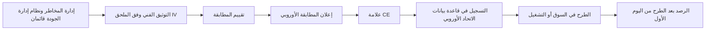
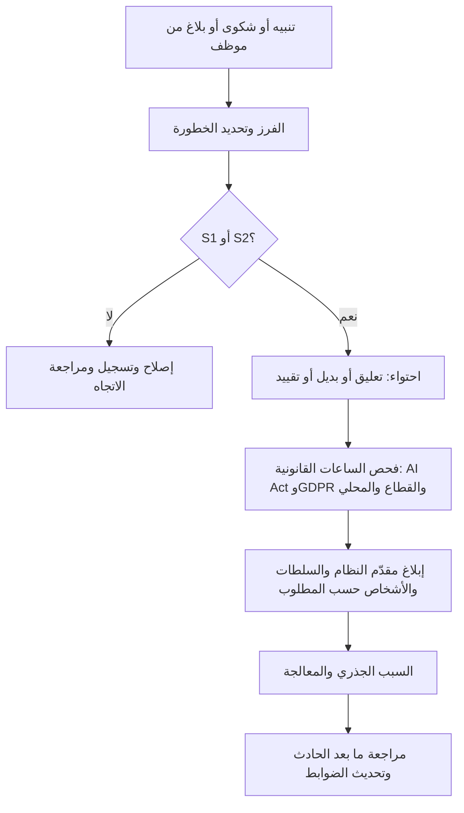
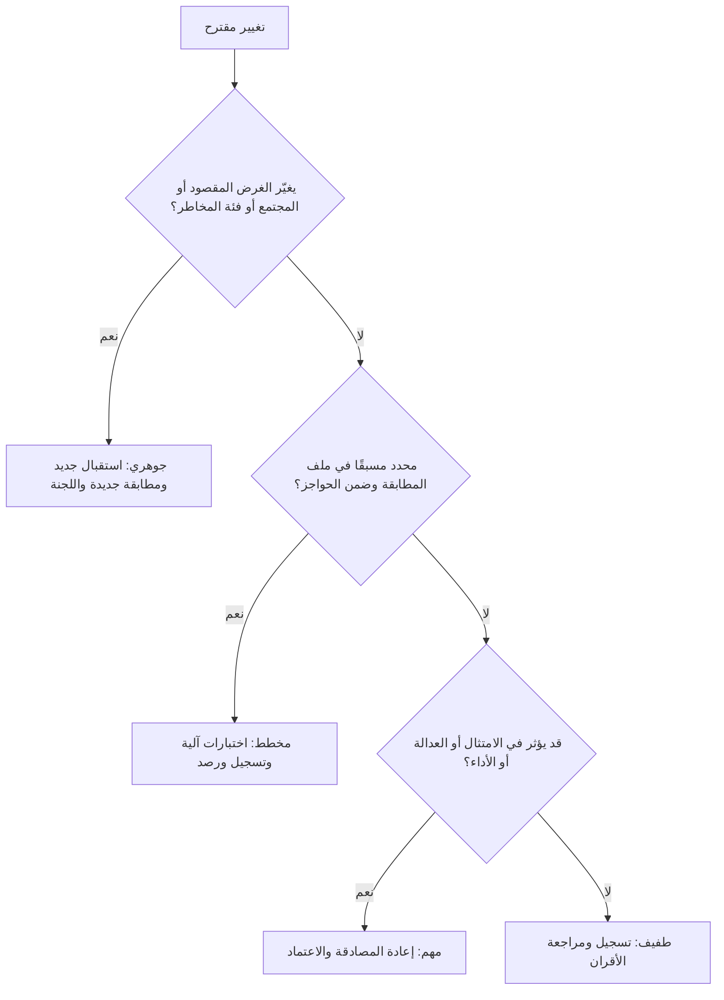

# الوحدة 10 — الإطلاق والرصد والصيانة

*أخطر لحظة في حياة نظام الذكاء الاصطناعي ليست لحظة تدريبه. بل هي اللحظة التي يبدأ فيها اتخاذ قرارات بشأن أشخاص حقيقيين، وكل يوم بعدها. فبمجرد أن يعمل النموذج فعليًا، يتحرك العالم: يتغير العملاء، وتتغير خطوط معالجة البيانات، ويطرح الموردون إصدارات جديدة، ويعتاد الأشخاص المكلَّفون بالإشراف على النظام على الثقة به. تتتبّع هذه الوحدة نموذج تقييم الجدارة الائتمانية الداخلي في بنك نجم (Najm Bank) من بوابة الإطلاق إلى الإنتاج، ثم في النهاية إلى التقاعد. ستتعلم كيف تقرر أن النظام جاهز، وكيف تعمل خطوات المطابقة في قانون الذكاء الاصطناعي الأوروبي (EU AI Act) لنظام عالي المخاطر (high-risk)، وكيف ترصد الانجراف (drift) وانعدام العدالة، وكيف تتعرّف على الحادث وتبلّغ عنه، ومتى يكون التغيير كبيرًا بما يكفي ليحتاج إلى موافقة جديدة (أو تقييم مطابقة جديد)، وكيف توقف النظام بأمان. هذه ليست استشارة قانونية: فالقوانين والإرشادات تتغير، والتفاصيل تعتمد على وقائع حالتك، لذا راجع المصادر الرسمية ومستشارك القانوني.*

> **تغطية مجال المعرفة (BoK coverage):** III.C — حوكمة الإطلاق والرصد والصيانة: الجاهزية والمطابقة، والرصد بعد الطرح في السوق، والانجراف والحوادث، وضبط التغيير، والصيانة، والإيقاف والتقاعد.

---

# 10.1 — جاهزية الإطلاق والمطابقة
*المستوى: 🔴 متقدم* · *المتطلبات: 6.2، 8.3، 9.3* · *مجال المعرفة (BoK): III.C*

## ⚡ الدرس في دقيقة

- الإطلاق (release) قرار حوكمة: شخص مسمّى ومساءَل يقول "انطلق" بناءً على **معايير الانطلاق/عدم الانطلاق (go/no-go criteria) المتفق عليها قبل الاختبار**، مع أدلة محفوظة في الملف.
- الجاهزية تعني أكثر من "اجتياز الاختبارات": توثيق مكتمل، وإشراف ورصد قائمان، وخطوات قانونية منجزة، ومستخدمون مدرَّبون، وتراجع (rollback) جاهز.
- بالنسبة إلى نظام **عالي المخاطر** في الاتحاد الأوروبي، يجب على مقدّم النظام (provider) أن يُتم **تقييم المطابقة** (conformity assessment)، وأن يوقّع **إعلان المطابقة الأوروبي** (EU declaration of conformity)، وأن يضع **علامة CE** (CE marking)، وأن **يسجّل** (register) النظام في قاعدة بيانات الاتحاد الأوروبي *قبل* طرحه في السوق أو تشغيله.
- تقييم الجدارة الائتمانية للأشخاص الطبيعيين استخدام عالي المخاطر في الملحق III، ويستند تقييم مطابقته إلى **الرقابة الداخلية** (internal control): يقيّم مقدّم النظام نفسه، دون جهة مُخطَرة (notified body)، لكن يجب أن يكون قادرًا على إثبات كل ادعاء.
- أطلق على مراحل (**الظل ← التجربة ← الكناري ← الكامل**، shadow → pilot → canary → full) حتى يكون أي شيء فاته اختبارك ضررًا صغيرًا وقابلًا للعكس.
- الفخ الأكبر: الظن بأن البنك الذي يبني نموذجًا لاستخدامه الخاص "مجرد مستخدم". فتشغيله لاستخدامك الخاص يجعلك **مقدّم النظام**.

## 🧭 لماذا يهم

إنه عصر يوم خميس في بنك نجم (Najm Bank). أنهت دانة، كبيرة علماء البيانات، الإصدار 2 من نموذج تقييم الجدارة الائتمانية للأفراد. وعلى مجموعة البيانات المحجوزة (holdout) يفصل بين المقترضين الجيدين والسيئين أفضل بشكل ملحوظ من الإصدار 1، ويريد خالد، رئيس إقراض الأفراد، تشغيله يوم الأحد حتى يقيّم النموذج الجديد الطلبات قبل إطلاق حملة القروض الشخصية. يقول لليلى، رئيسة حوكمة الذكاء الاصطناعي: "انتهى الاختبار. ماذا بقي؟"

تفتح ليلى قائمة فحص الإطلاق. تحليل العدالة يتجاهل عملاء فرع فرانكفورت في الاتحاد الأوروبي. وتعليمات الاستخدام، التي تخبر موظفي الائتمان متى لا يعتمدون على الدرجة، ما زالت مسودة. ولم يبنِ أحد لوحة الرصد. ولم ترَ سارة، مسؤولة حماية البيانات (DPO)، تقييم الأثر على حماية البيانات (DPIA) المحدَّث، مع أن الإصدار 2 يستخدم حقلي بيانات جديدين. ولأن بنك نجم بنى النظام ويقيّم به مقيمين في الاتحاد الأوروبي، ولأن تقييم الجدارة الائتمانية عالي المخاطر بموجب قانون الذكاء الاصطناعي الأوروبي، يتحمل بنك نجم التزامات **مقدّم النظام**: تقييم المطابقة، والإعلان، وعلامة CE، والتسجيل. ولم يكتب أحد ما الذي يحدث إذا وجب إيقاف النموذج صباح الاثنين.

لا شيء من هذه الفجوات غريب. فكثير من إخفاقات الذكاء الاصطناعي هي إخفاقات إطلاق، لا إخفاقات خوارزمية: فقد عمل النظام قبل أن يكون الناس والعمليات والضمانات المحيطة به جاهزين. يحوّل هذا الدرس سؤال "هل هو جاهز؟" إلى قرار تقف خلفه أدلة.

## 📐 كيف يعمل

### 🟢 الأساسيات

**ما معنى "الإطلاق".** الإطلاق هو اللحظة التي يبدأ فيها نظام الذكاء الاصطناعي بالتأثير في قرارات حقيقية وأشخاص حقيقيين. ويستخدم قانون الذكاء الاصطناعي الأوروبي مصطلحين دقيقين. **الطرح في السوق** (placing on the market) يعني إتاحة نظام ذكاء اصطناعي في سوق الاتحاد الأوروبي لأول مرة. و**التشغيل** (putting into service) يعني توريده للاستخدام الأول مباشرة إلى مُشغِّل (deployer)، *أو لاستخدام مقدّم النظام نفسه*، في الاتحاد الأوروبي لغرضه المقصود. بنك نجم لا يبيع نموذج التقييم أبدًا، لكنه يشغّله لاستخدامه الخاص في فرعه بفرانكفورت. وهذا كافٍ لتفعيل التزامات مقدّم النظام بالنسبة إلى نظام عالي المخاطر.

**بوابة الإطلاق (release gate).** بوابة الإطلاق نقطة تفتيش رسمية يجب أن يستوفي فيها النظام معايير محددة قبل أن ينتقل إلى المرحلة التالية. وتشترك البوابات الجيدة في أربع سمات:

1. **تُحدَّد المعايير مسبقًا.** يُتفق على العتبات عند اعتماد حالة الاستخدام (8.1)، ولا يُتفاوض عليها بعد ظهور النتائج.
2. **لكل معيار دليل.** "العدالة مقبولة" ليست دليلًا. أما "نسبة معدل الموافقة بين الرجال والنساء 0.93 على مجموعة 2025 المحجوزة، فوق العتبة 0.90، التقرير DS-117" فهي دليل.
3. **الاعتماد النهائي مسمّى ومتناسب.** قد لا تحتاج أداة منخفضة المخاطر إلا إلى مالكي الأعمال والنموذج؛ أما النظام عالي المخاطر فيحتاج إلى مصادقة مستقلة، وإدارة المخاطر، والامتثال، ومسؤول حماية البيانات، ولجنة حوكمة الذكاء الاصطناعي.
4. **تُتابَع الشروط.** عبارة "انطلق، بشرط أن تعمل لوحة الرصد أولًا" مقبولة إذا كان هناك من يملك هذا الشرط.

**معايير الانطلاق/عدم الانطلاق.** تغطي مجموعة عملية منها ستة مجالات:

| المجال | مثال على معيار | الأدلة المعتادة |
|---|---|---|
| الأداء | يحقق أهداف الدقة والمعايرة في كل شريحة رئيسية، لا في المتوسط فقط | تقرير المصادقة، جداول الشرائح |
| العدالة | فجوات النتائج ومعدلات الخطأ ضمن العتبات المتفق عليها للمجموعات ذات الصلة | تقرير اختبار التحيّز (انظر 9.2، 9.3) |
| المتانة والأمن | اختبارات الإجهاد ونتائج الاختبارات العدائية واختبار الفريق الأحمر مغلقة أو مقبولة | سجلات الاختبار، المراجعة الأمنية |
| التوثيق | بطاقة النموذج أو النظام، والتوثيق الفني، وتعليمات الاستخدام، والقيود، كلها نهائية | سجل المستندات |
| العمليات | الرصد يعمل، والتنبيهات موجَّهة، والتراجع مُختبَر، وعملية البديل مزوَّدة بالموظفين | دليل التشغيل (runbook)، سجل اختبار التراجع |
| القانون والأفراد | تقييم الأثر على حماية البيانات محدَّث، والالتزامات القانونية محددة ومستوفاة، والمستخدمون مدرَّبون، والإشعارات جاهزة | DPIA، سجلات التدريب، نص الإشعار |

**التوثيق المكتمل.** "مكتمل" يعني أن شخصًا غير البنّاء يستطيع أن يفهم ما يفعله النظام، وكيف اختُبر، وأين لا ينبغي استخدامه، وكيف يُشغَّل بأمان: الغرض، وتسلسل البيانات (9.1)، ونتائج الاختبار وقيوده، وتقييم المخاطر، وتصميم الإشراف، وتعليمات الاستخدام، وخطة الرصد.

### 🟡 التعمق أكثر

**مسار المطابقة الأوروبي لنظام عالي المخاطر.** بالنسبة إلى مقدّم نظام ذكاء اصطناعي عالي المخاطر، يحدد قانون الذكاء الاصطناعي تسلسلًا يجب إتمامه قبل الإطلاق:

- **نظام إدارة الجودة (quality management system) (المادة 17)** و**نظام إدارة المخاطر (risk management system) (المادة 9).** سياسات وإجراءات ومسؤوليات وعملية للمخاطر عبر دورة الحياة (life cycle) كاملة.
- **التوثيق الفني (technical documentation) (المادة 11 والملحق IV).** الغرض، والتصميم، والبيانات، والاختبار، والأداء، وتدابير الإشراف البشري (human oversight)، وخطة الرصد بعد الطرح في السوق (post-market monitoring)، وغير ذلك.
- **تقييم المطابقة (المادة 43 (Art. 43)).** الإجراء الذي يُظهر أن متطلبات المواد 8 إلى 15 مستوفاة (إدارة المخاطر، وحوكمة البيانات، والتوثيق، والتسجيل، والشفافية، والإشراف البشري، والدقة والمتانة والأمن السيبراني). وبالنسبة إلى معظم استخدامات الملحق III، بما فيها **تقييم الجدارة الائتمانية**، يكون المسار هو **الرقابة الداخلية** (الملحق VI): يفحص مقدّم النظام نظام إدارة الجودة لديه وتوثيقه الفني مقابل المتطلبات. وبالنسبة إلى الأنظمة البيومترية في الملحق III، قد يُشترط وجود **جهة مُخطَرة** (notified body) (جهة تقييم مستقلة تعيّنها دولة عضو)، ولا سيما حيث لم تُطبَّق المعايير المنسَّقة (harmonised standards) بالكامل. أما الذكاء الاصطناعي عالي المخاطر في المنتجات المشمولة بتشريعات الملحق I، مثل الأجهزة الطبية أو الآلات، فيتبع إجراء المطابقة القائم في ذلك القطاع، مع إدماج متطلبات الذكاء الاصطناعي فيه.
- **إعلان المطابقة الأوروبي (المادة 47).** بيان موقَّع من مقدّم النظام بأن النظام يستوفي المتطلبات. ويتحمل مقدّم النظام المسؤولية القانونية عنه.
- **علامة CE (المادة 48).** العلامة المرئية للمطابقة. وبالنسبة إلى الأنظمة المقدَّمة رقميًا، يمكن استخدام علامة CE رقمية.
- **التسجيل (المادة 49، وقاعدة البيانات بموجب المادة 71).** يسجّل مقدّمو الأنظمة عالية المخاطر في الملحق III أنفسهم والنظام في قاعدة بيانات الاتحاد الأوروبي قبل طرحه في السوق أو تشغيله. ويسجّل كذلك المُشغِّلون الذين هم سلطات عامة، أو يعملون نيابة عنها، استخدامهم.

**المعايير المنسَّقة (Harmonised standards).** اتباع معيار منسَّق منشور في الجريدة الرسمية يمنح *افتراض المطابقة* (presumption of conformity) مع المتطلبات التي يغطيها. وفي وقت كتابة هذا النص (2026) كانت المعايير المنسَّقة للذكاء الاصطناعي لا تزال قيد التطوير، ومقترح "الحزمة الرقمية الشاملة" (Digital Omnibus) الذي قدّمته المفوضية في نوفمبر 2025 من شأنه تأجيل بعض المواعيد النهائية للأنظمة عالية المخاطر. تحقّق من الوضع الحالي؛ فالامتحان يختبر القانون بصيغته المعتمدة.

**خطوات جاهزية المُشغِّل.** قبل استخدام نظام عالي المخاطر، يجب أن يكون المُشغِّل قادرًا على اتباع تعليمات الاستخدام، وإسناد الإشراف البشري إلى أشخاص يملكون الكفاءة والتدريب والصلاحية والدعم اللازم (المادة 26)، وضمان أن تكون بيانات الإدخال الخاضعة لسيطرته ذات صلة وتمثيلية بما يكفي، وأن يُبلغ، بصفته صاحب عمل، ممثلي العمال والعمال المتأثرين. ويجب على الهيئات العامة، والمُشغِّلين الذين يستخدمون نظامًا **لتقييم الجدارة الائتمانية أو تسعير التأمين على الحياة والصحة**، إتمام **تقييم الأثر على الحقوق الأساسية (FRIA)** بموجب المادة 27 قبل الاستخدام الأول (انظر 11.3). وبنك نجم، بصفته مقدّم النظام والمُشغِّل معًا، يحتاج إلى مجموعتي الخطوات.

**خارج الاتحاد الأوروبي.** لا تحتاج عمليات بنك نجم في قطر والإمارات إلى علامة CE، لكن الانضباط نفسه يظل منطبقًا. فإرشادات QCB للذكاء الاصطناعي في المؤسسات المالية تتوقع الحوكمة والاختبار والإشراف المستمر على الذكاء الاصطناعي؛ اقرأ النص الحالي على موقع QCB. ولدى البنوك أيضًا سياسات **إدارة مخاطر النماذج** (model risk management) (وإرشادات الاحتياطي الفيدرالي الأمريكي وOCC لعام 2011، SR 11-7، هي المرجع الكلاسيكي) التي تشترط المصادقة المستقلة و"التحدي الفعّال" (effective challenge). وينبغي لبوابة إطلاق الذكاء الاصطناعي أن تعيد استخدام هذه الآلية، لا أن تكررها.

### 🔴 نظرة الخبير

**الإطلاق المرحلي (Staged rollout).** لا توجد مجموعة اختبار تمثّل الإنتاج تمثيلًا مثاليًا. والإطلاق المرحلي يحدّ من الضرر الناتج عما لم تتوقعه.

| المرحلة | ما يحدث | ما تثبته | ملاحظات الحوكمة |
|---|---|---|---|
| **الظل** | يقيّم النموذج الجديد الحركة الفعلية بالتوازي؛ تُسجَّل مخرجاته لكن لا تُستخدم | السلوك على بيانات حقيقية وحالية؛ الاتفاق مع النموذج الحالي؛ الاستقرار التشغيلي | ما زال يعالج بيانات شخصية (الأساس القانوني، DPIA)، لكن دون أثر على العملاء |
| **التجربة** | يُستخدم لقرارات حقيقية في نطاق محدود، مثل فرع واحد أو منتج واحد، مع مراجعة بشرية إضافية | الملاءمة لسير العمل، وفهم المستخدمين، وأنماط التجاوز، والشكاوى | قرارات حقيقية: تنطبق كل الالتزامات القانونية؛ إشراف مشدَّد |
| **الكناري** | نسبة صغيرة من الحركة الفعلية، مثل 5%، تذهب إلى النموذج الجديد، مع محفزات تراجع آلية | الأداء والعدالة على نطاق واسع في شريحة عشوائية | اتفق مسبقًا على محفزات التراجع ومن يستطيع تفعيلها |
| **الإطلاق الكامل** | كل الحركة، مع تقاعد النموذج القديم أو إبقائه بديلًا | — | خطة الرصد (10.2) تتولى الأمر |

هناك دقيقتان كثيرًا ما توقعان حتى الممارسين ذوي الخبرة:

- **التجربة إطلاق.** إذا اتخذ نظام عالي المخاطر قرارات حقيقية بشأن أشخاص في الاتحاد الأوروبي أثناء تجربة، فقد جرى تشغيله، ويجب أن تكون خطوات المطابقة مكتملة بالفعل. ويوفر قانون الذكاء الاصطناعي نظامًا منفصلًا لـ **اختبار أنظمة الملحق III في ظروف العالم الحقيقي** (testing in real-world conditions) قبل طرحها في السوق (المادة 60)، لكن له شروطه الخاصة، منها خطة اختبار مسجّلة، ومدة محدودة، وكقاعدة عامة موافقة مستنيرة من المشاركين. وهو ليس ثغرة لتجاوز المطابقة. احصل على مشورة قانونية قبل الاعتماد عليه.
- **وضع الظل ليس خاليًا من المخاطر.** إنه يتجنب الأثر على العملاء لكنه لا يتجنب التزامات الخصوصية، وفترة الظل القصيرة تفوّت الآثار الموسمية والنتائج المتأخرة.

**التراجع والبديل (Rollback and fallback).** قبل الإطلاق، أجب كتابةً: كيف نوقفه، ومن يجوز له ذلك (بما في ذلك خارج ساعات العمل)، وما الذي يحل محله؟ بالنسبة إلى بنك نجم، البديل هو بطاقة التقييم (scorecard) للإصدار 1 إضافة إلى الاكتتاب اليدوي. ويجب أن يكون مزوَّدًا بالموظفين ومُختبَرًا: فمفتاح الإيقاف الذي يوجّه 3,000 طلب يوميًا إلى أربعة مكتتبين ليس بديلًا.

**المطابقة لقطة ثابتة؛ والامتثال فيلم.** يصف الإعلان النظام في يوم توقيعه؛ والرصد (10.2) وضبط التغيير (10.3) يُبقيانه صحيحًا. ويحتفظ مقدّم النظام بالتوثيق الفني وتوثيق نظام إدارة الجودة والإعلان لمدة **10 سنوات** بعد الطرح في السوق أو التشغيل (المادة 18). وملف الإطلاق سجل خاضع للتنظيم.

**من لا ينبغي أن يوقّع.** لا ينبغي أن يكون البنّاء هو الوحيد الذي يوقّع على أن النموذج ملائم. ففي بنك نجم، يبني فريق دانة، وتصادق وحدة المصادقة على النماذج بشكل مستقل، ويقبل خالد بصفته مالك الأعمال المخاطر المتبقية، وتعتمد لجنة حوكمة الذكاء الاصطناعي (AI Governance Committee) إطلاقات الأنظمة عالية المخاطر.

## ⚖️ الأدوات التنظيمية

| الأداة | ما تشترطه أو توصي به | إشارة الامتحان |
|---|---|---|
| **EU AI Act** — المواد 43 و47 و48 و49 | يُتم مقدّم النظام تقييم المطابقة، ويوقّع إعلان المطابقة الأوروبي، ويضع علامة CE، ويسجّل أنظمة الملحق III قبل الطرح في السوق أو التشغيل | "قبل الإطلاق، ما الذي يجب أن يفعله مقدّم نظام عالي المخاطر لتقييم الجدارة الائتمانية؟" الرقابة الداخلية، والإعلان، وCE، والتسجيل |
| **EU AI Act** — المادتان 26 و27 | المُشغِّلون: اتباع التعليمات، وإشراف بشري كفء، وبيانات إدخال ذات صلة، وإبلاغ العمال؛ وتقييم FRIA قبل الاستخدام الأول لتقييم الجدارة الائتمانية وتسعير التأمين وللهيئات العامة | جاهزية المُشغِّل تشمل FRIA لتقييم الجدارة الائتمانية |
| **EU AI Act** — المادة 60 | اختبار أنظمة الملحق III في ظروف العالم الحقيقي قبل الطرح في السوق، بشروط صارمة | التجربة على أشخاص حقيقيين ليست معفاة تلقائيًا من المطابقة |
| **GDPR** — المادتان 25 و35 | حماية البيانات بالتصميم؛ تقييم DPIA قبل المعالجة عالية المخاطر، ويُحدَّث عند تغيّر المعالجة | حقول البيانات الجديدة في الإصدار 2 تعني وجوب مراجعة DPIA قبل الإطلاق |
| **NIST AI RMF** — MANAGE 1.1 وGOVERN 1 | تحديد ما إذا كان النظام يحقق غرضه المقصود وما إذا كان ينبغي المضي في النشر؛ والسياسات تحدد الأدوار والعمليات | طوعي؛ "الانطلاق/عدم الانطلاق" يقابل MANAGE 1.1 |
| **ISO/IEC 42001** — ضوابط دورة الحياة في الملحق A | معايير وعمليات موثّقة للتحقق من أنظمة الذكاء الاصطناعي والمصادقة عليها ونشرها ضمن نظام إدارة قابل للاعتماد | الاعتماد يكون لنظام الإدارة، لا علامة CE للمنتج |
| **QCB AI guideline** | اعتماد الحوكمة والاختبار والإشراف للذكاء الاصطناعي الذي تستخدمه المؤسسات المالية الخاضعة لتنظيم قطر | الجهات المنظِّمة المصرفية المحلية تتوقع حوكمة الإطلاق حتى دون قانون للذكاء الاصطناعي |

## 🏛️ عمليًا في بنك نجم

يحوّل فريق ليلى بوابة الإطلاق إلى **سجل قرار الإطلاق** (Release Decision Record) من صفحة واحدة، يُحفظ مع قيد النظام في سجل أنظمة الذكاء الاصطناعي (AI inventory). وهذا هو السجل الخاص بالإصدار 2 من تقييم الجدارة الائتمانية بعد سد الفجوات:

| الحقل | القيد |
|---|---|
| النظام / الإصدار | درجة ائتمان الأفراد v2.0.0 (معرّف السجل CS-RET-002) |
| فئة المخاطر | عالية (تقييم الجدارة الائتمانية في الملحق III من EU AI Act؛ الفئة الداخلية 1) |
| الدور القانوني لبنك نجم | مقدّم النظام والمُشغِّل (مبني داخليًا، ومُشغَّل للاستخدام الخاص، بما في ذلك فرع فرانكفورت) |
| معايير الانطلاق/عدم الانطلاق (حُدّدت عند الاستقبال، 14 يناير) | Gini ≥ 0.55 إجمالًا و≥ 0.50 في كل شريحة · نسبة معدل الموافقة ≥ 0.90 عبر الجنس والفئات العمرية · لا نتائج حرجة مفتوحة من الفريق الأحمر · التراجع مُختبَر |
| الأدلة | تقرير المصادقة MV-2026-031 · تقرير التحيّز DS-117 (يشمل الآن المحفظة الأوروبية) · المراجعة الأمنية SEC-442 · اختبار التراجع RB-19 |
| التوثيق | التوثيق الفني v2 · تعليمات الاستخدام v2 (نهائية) · بطاقة النظام · خطة الرصد MP-CS-2 · DPIA v3 (وقّعته سارة) · FRIA v1 |
| المطابقة الأوروبية | تقييم الرقابة الداخلية مكتمل · إعلان المطابقة موقَّع من رئيس المخاطر (CRO) · علامة CE رقمية · مسجّل في قاعدة بيانات الاتحاد الأوروبي |
| خطة الإطلاق | 4 أسابيع ظل ← تجربة لأسبوعين في فرع الأفراد بالدوحة ← كناري 10% ← كامل. محفزات التراجع: PSI > 0.25 على المدخلات الرئيسية، ونسبة معدل الموافقة < 0.85، وارتفاع الشكاوى > 2× خط الأساس |
| البديل | بطاقة تقييم v1 جاهزة للعمل؛ جدول مناوبة للاكتتاب اليدوي للحالات المحالة |
| التوقيعات | مالكة النموذج (دانة) · المصادقة المستقلة (وحدة المصادقة على النماذج) · مسؤولة حماية البيانات (سارة) · رئيس البيانات CDO (عمر) · مالك الأعمال الذي يقبل المخاطر المتبقية (خالد) · اعتماد لجنة حوكمة الذكاء الاصطناعي، المحضر 2026-07 |
| الشروط | لوحة الرصد تعمل قبل التجربة (المسؤول: عمر) · تدريب موظفي الائتمان مكتمل بنسبة ≥ 95% قبل التجربة (المسؤول: خالد) |

خسر خالد إطلاق يوم الأحد؛ وعمل الإصدار 2 بعد ستة أسابيع بملف نظيف.

## 🛠️ التمارين

- 🟢 اذكر عشرة بنود في قائمة فحص الإطلاق لروبوت محادثة خدمة العملاء في بنك نجم (محدود المخاطر بموجب قانون الذكاء الاصطناعي)، مع تحديد البنود التي يحتاج إليها نموذج الائتمان أيضًا. *يكتمل عندما:* يذكر كل بند من يقدّم الدليل.
- 🟡 صُغ معايير الانطلاق/عدم الانطلاق لنموذج كشف الاحتيال في بنك نجم، موضحًا لماذا لا تنطبق خطوات المطابقة الأوروبية (فكشف الاحتيال مستثنى من فئة الائتمان في الملحق III) بينما تظل معايير العدالة والتراجع منطبقة. *يكتمل عندما:* يكون لكل مجال من المجالات الستة معيار قابل للقياس.
- 🔴 صمّم إطلاقًا مرحليًا للإصدار 2 من تقييم الجدارة الائتمانية يغطي عملاء الاتحاد الأوروبي: أي مرحلة تُعد تشغيلًا، وما الذي يجب أن يكتمل قبلها، وأي محفزات تراجع تنطبق. *يكتمل عندما:* تستطيع جهة تنظيمية أن ترى أنه لم يُقيَّم أي متقدم في الاتحاد الأوروبي بنظام غير مطابق.

## ⚠️ أخطاء وفخاخ الامتحان

- **"اجتزنا الاختبار، إذن نحن جاهزون."** الاختبار مُدخل واحد. أجب بالمجموعة الكاملة: التوثيق، والإشراف، والرصد، والخطوات القانونية، والتدريب، والتراجع.
- **"نستخدمه داخليًا فقط، إذن نحن مُشغِّل."** المؤسسة التي تطوّر نظامًا عالي المخاطر وتشغّله باسمها، بما في ذلك لاستخدامها الخاص، هي **مقدّم النظام**. وبنك نجم مقدّم النظام والمُشغِّل معًا.
- **"تقييم الجدارة الائتمانية يحتاج إلى جهة مُخطَرة."** لا. تقييم الجدارة الائتمانية في الملحق III يستخدم مسار الرقابة الداخلية. وتظهر الجهات المُخطَرة أساسًا في الأنظمة البيومترية ومنتجات الملحق I.
- **"علامة CE تعني موافقة الاتحاد الأوروبي."** إنها تدل على إعلان *مقدّم النظام نفسه*، المدعوم بتقييم المطابقة الذي أجراه.
- **"اعتماد ISO/IEC 42001 يحل محل تقييم المطابقة."** لا: فمعيار 42001 يعتمد نظام إدارة، لا نظام ذكاء اصطناعي بعينه.
- **تحديد العتبات بعد رؤية النتائج.** في الامتحان، الإجابة الصحيحة تثبّت معايير القبول مسبقًا وتوثّق أي تغيير ومن اعتمده.

## 🧾 الخلاصة

- الإطلاق قرار مساءَل يستند إلى معايير انطلاق/عدم انطلاق متفق عليها مسبقًا، وتدعمه الأدلة والمصادقة المستقلة وتوقيعات مسمّاة، ويغطي الأداء والعدالة والأمن والتوثيق والعمليات والجاهزية القانونية وجاهزية الأفراد.
- يجب على مقدّمي الأنظمة عالية المخاطر في الاتحاد الأوروبي إتمام تقييم المطابقة (الرقابة الداخلية لتقييم الجدارة الائتمانية)، وإعلان المطابقة، وعلامة CE، والتسجيل في قاعدة بيانات الاتحاد الأوروبي قبل الإطلاق. ويجب أن يكون المُشغِّلون جاهزين أيضًا، بما في ذلك FRIA حيث ينطبق.
- الإطلاق المرحلي (الظل، والتجربة، والكناري) يحدّ من الضرر، لكن التجربة التي تتضمن قرارات حقيقية إطلاق حقيقي.
- ملف الإطلاق سجل خاضع للتنظيم لا يبقى صحيحًا إلا عبر الرصد وضبط التغيير.

## ✍️ اختبر نفسك

**1. يطوّر بنك نجم نموذجًا لتقييم الجدارة الائتمانية داخليًا ويستخدمه لتقييم المتقدمين في فرعه بفرانكفورت. ولا يبيع النموذج أبدًا. ما دور بنك نجم بموجب قانون الذكاء الاصطناعي الأوروبي بالنسبة إلى هذا النظام؟**

- A. مُشغِّل فقط، لأنه لا يطرح النظام في السوق
- B. مقدّم النظام ومُشغِّل، لأنه يشغّل النظام لاستخدامه الخاص ويستخدمه
- C. موزّع، لأنه يتيح النظام داخليًا
- D. لا دور له، لأن الأدوات الداخلية خارج النطاق

الإجابة

**B.** تشغيل نظام لاستخدامك الخاص في الاتحاد الأوروبي يفعّل التزامات مقدّم النظام، وبنك نجم يستخدمه أيضًا، فهو مُشغِّل كذلك. وA هو الخطأ المغري. (الأساسيات: ما معنى "الإطلاق".)

**2. أي مسار لتقييم المطابقة ينطبق على نظام ذكاء اصطناعي عالي المخاطر يُستخدم لتقييم الجدارة الائتمانية للأشخاص الطبيعيين؟**

- A. تقييم من جهة مُخطَرة في كل الحالات
- B. لا تقييم مطابقة؛ التسجيل فقط
- C. الرقابة الداخلية من مقدّم النظام، استنادًا إلى نظام إدارة الجودة لديه وتوثيقه الفني
- D. الاعتماد وفق ISO/IEC 42001

الإجابة

**C.** معظم استخدامات الملحق III، بما فيها تقييم الجدارة الائتمانية، تتبع إجراء الرقابة الداخلية. وتدخل الجهات المُخطَرة أساسًا في الأنظمة البيومترية ومنتجات الملحق I. ومعيار ISO/IEC 42001 يعتمد نظام إدارة ولا يحل محل تقييم المطابقة. (التعمق أكثر: مسار المطابقة الأوروبي.)

**3. يعرض فريق علم البيانات نتائج اختبار ممتازة ويطلب الإطلاق. وقد خُفّضت عتبة العدالة في الأسبوع السابق، بعد ظهور النتائج الأولى. ما الذي ينبغي أن تفعله وظيفة الحوكمة أولًا؟**

- A. الاعتماد، لأن العتبة الجديدة مستوفاة
- B. أن تطلب من المورّد إعادة تشغيل الاختبارات
- C. رفض النموذج نهائيًا
- D. معاملة تغيير العتبة كقرار حوكمة: توثيق سبب تغييرها، ومن اعتمده، وهل ينبغي تطبيق المعيار الأصلي

الإجابة

**D.** ينبغي تحديد المعايير مسبقًا، ويجب تبرير أي تغيير واعتماده عبر الحوكمة، لا تبنّيه بهدوء بعد وصول النتائج. أما A فيكافئ تحريك المرمى. وC غير متناسب دون تحليل. (الأساسيات: بوابة الإطلاق.)

**4. أثناء نشر في وضع الظل، يقيّم النموذج الجديد الطلبات الفعلية، لكن مخرجاته تُسجَّل فقط ولا تُستخدم. أي عبارة هي الأدق؟**

- A. وضع الظل ما زال يعالج بيانات شخصية، فيحتاج إلى أساس قانوني وتغطية في DPIA، لكنه يتجنب الأثر المباشر على العملاء
- B. وضع الظل خارج قانون حماية البيانات لأنه لا يُتخذ فيه أي قرار
- C. وضع الظل يُعد طرحًا في السوق
- D. وضع الظل يلغي الحاجة إلى تجربة أو كناري لاحقًا

الإجابة

**A.** تقييم بيانات متقدمين حقيقيين معالجةٌ حتى لو أُهملت المخرجات. ووضع الظل يتجنب الأثر على القرارات لكنه لا يحل محل المراحل اللاحقة التي تختبر سير العمل والاستخدام البشري. (نظرة الخبير: الإطلاق المرحلي.)

**5. قبل اعتماد نظام عالي المخاطر لتقييم الجدارة الائتمانية، أي بند يُعد جزءًا من جاهزية *المُشغِّل* بموجب قانون الذكاء الاصطناعي الأوروبي، لا جاهزية مقدّم النظام؟**

- A. إعداد إعلان المطابقة الأوروبي
- B. وضع علامة CE
- C. إتمام تقييم الأثر على الحقوق الأساسية قبل الاستخدام الأول
- D. كتابة التوثيق الفني وفق الملحق IV

الإجابة

**C.** تشترط المادة 27 على المُشغِّلين الذين يستخدمون نظامًا لتقييم الجدارة الائتمانية، ضمن آخرين، إتمام FRIA قبل الاستخدام الأول. أما A وB وD فالتزامات على مقدّم النظام. وبنك نجم، بصفته الاثنين، يجب أن يفعل الأربعة كلها. (التعمق أكثر: خطوات جاهزية المُشغِّل.)

## 📚 المراجع

- EU AI Act، اللائحة (EU) 2024/1689 (EUR-Lex): https://eur-lex.europa.eu/eli/reg/2024/1689/oj
- المفوضية الأوروبية، الإطار التنظيمي للذكاء الاصطناعي ومكتب الذكاء الاصطناعي (AI Office): https://digital-strategy.ec.europa.eu/en/policies/regulatory-framework-ai
- GDPR، اللائحة (EU) 2016/679 (EUR-Lex): https://eur-lex.europa.eu/eli/reg/2016/679/oj
- إطار NIST لإدارة مخاطر الذكاء الاصطناعي (NIST AI Risk Management Framework): https://www.nist.gov/itl/ai-risk-management-framework
- ISO/IEC 42001:2023 (ISO): https://www.iso.org/standard/81230.html
- مصرف قطر المركزي (Qatar Central Bank) (لإرشاداته بشأن الذكاء الاصطناعي في المؤسسات المالية): https://www.qcb.gov.qa
- IAPP، شهادة AIGP ومجال المعرفة (BoK): https://iapp.org/certify/aigp/

---

# 10.2 — الرصد والانجراف والحوادث
*المستوى: 🔴 متقدم* · *المتطلبات: 10.1، 9.3* · *مجال المعرفة (BoK): III.C*

## ⚡ الدرس في دقيقة

- نظام الذكاء الاصطناعي الذي كان ملائمًا يوم إطلاقه قد يصبح غير ملائم دون أن يغيّر أحد سطرًا من الشيفرة، لأن العالم الذي يحاكيه يتغير. والرصد (monitoring) هو الطريقة التي تكتشف بها ذلك قبل أن يكتشفه العملاء أو الجهات التنظيمية.
- راقب ستة أشياء: **المدخلات** (inputs) (انجراف البيانات)، و**المخرجات** (outputs)، و**الأداء** (performance) (بمجرد وصول النتائج)، و**العدالة عبر المجموعات بمرور الوقت** (fairness across groups over time)، و**العمليات** (operations)، و**الإشارات البشرية وإشارات العملاء** (human and customer signals) مثل حالات التجاوز والشكاوى.
- **انجراف البيانات** (data drift) تغيّر فيما يدخل. و**انجراف المفهوم** (concept drift) تغيّر في العلاقة بين المدخلات والنتائج. وانجراف المفهوم أخطر وأصعب رؤية.
- يجب على **مقدّمي** الأنظمة عالية المخاطر (high-risk) في الاتحاد الأوروبي تشغيل نظام **للرصد بعد الطرح في السوق** (post-market monitoring) (المادة 72 (Art. 72)). ويجب على **المُشغِّلين** (deployers) رصد التشغيل، والاحتفاظ بالسجلات ستة أشهر على الأقل، وإبلاغ مقدّم النظام بالمخاطر والحوادث الجسيمة (المادة 26).
- **الحوادث الجسيمة** (serious incidents) المتعلقة بالأنظمة عالية المخاطر يجب الإبلاغ عنها إلى سلطات مراقبة السوق (market surveillance authorities) خلال **15 يومًا** كحد أقصى، وبشكل أسرع في حالات الوفاة وأخطر الحالات (المادة 73). ولخرق البيانات الشخصية (personal data breach) ساعته الخاصة البالغة **72 ساعة** بموجب GDPR. وقد تعمل عدة ساعات في وقت واحد.
- الفخ الأكبر: رصد الدقة الإجمالية فقط. فالضرر يبدأ عادةً في شريحة أو مجموعة أو حلقة تغذية راجعة يخفيها المتوسط.

## 🧭 لماذا يهم

في عام 2021 أعلنت شركة العقارات الأمريكية Zillow أنها ستنهي Zillow Offers، وهو نشاطها في شراء المنازل بأسعار تساعد الخوارزميات في تحديدها، قائلةً إن التنبؤ بأسعار المنازل ثبت أنه أصعب بكثير مما كان متوقعًا. وتكبّدت خسائر فادحة في منازل دفعت فيها أكثر من قيمتها. لم "يكسر" أحد النموذج. بل تحرّك العالم من تحته.

في بنك نجم (Najm Bank)، علامات التحذير أصغر لكنها حقيقية بالقدر نفسه. فبعد أربعة أشهر من تشغيل الإصدار 2 من تقييم الجدارة الائتمانية، يلاحظ فريق خالد أن الموافقات للمتقدمين دون 25 عامًا في الإمارات انخفضت بمقدار الثلث، ويسجّل فريق الشكاوى ارتفاعًا في مكالمات "رُفضت دون تفسير". ولم يتحرك معدل الموافقة الإجمالي تقريبًا، فظهرت لوحة المؤشرات الرئيسية باللون الأخضر. وعندما تحقق دانة، تجد أن مورّد بيانات الموارد البشرية في المنبع أعاد ترميز حقل "فئة جهة العمل". فآلاف المتقدمين الشباب العاملين لدى جهات حكومية جديدة صاروا يصلون بقيمة "جهة عمل غير معروفة"، وهي قيمة يعاملها النموذج على أنها عالية المخاطر.

هل كان هذا حادثًا؟ من كان يجب إبلاغه، وبحلول متى؟ هل يمكن أن يتكرر دون أن يلاحظ أحد؟ يمنحك هذا الدرس الأدوات للإجابة عن هذه الأسئلة: تصميم رصد كان سيكتشف المشكلة في أيام لا أشهر، وعملية للحوادث تعرف أي الساعات تبدأ في العدّ.

## 📐 كيف يعمل

### 🟢 الأساسيات

**لماذا يحتاج الذكاء الاصطناعي إلى رصد خاص.** البرمجيات التقليدية تفشل بصوت عالٍ. أما الذكاء الاصطناعي فيفشل بهدوء، إذ ينتج مخرجات واثقة بينما تنجرف البيانات بعيدًا عما تعلّمه.

**ما الذي يُرصد.**

| الإشارة | ما تراقبه | مثال في بنك نجم (نموذج الائتمان) |
|---|---|---|
| **المدخلات** | توزيعات الخصائص؛ القيم المفقودة؛ الفئات الجديدة أو غير المتوقعة | حصة "جهة عمل غير معروفة" تقفز من 2% إلى 14% |
| **المخرجات** | توزيع الدرجات؛ معدلات الموافقة والرفض والإحالة | ترتفع حالات الرفض في شريحة واحدة بينما يبقى المعدل الإجمالي ثابتًا |
| **الأداء** | الدقة والمعايرة ومعدلات الخطأ، بمجرد وصول النتائج الحقيقية | معدل التأخر المبكر في السداد للقروض الموافق عليها مقارنة بما تنبأ به النموذج |
| **العدالة بمرور الوقت** | فجوات النتائج ومعدلات الخطأ بين المجموعات، متابَعة شهريًا | نسبة معدل الموافقة لمن هم دون 25 تنخفض تحت مستوى التنبيه 0.85 |
| **العمليات** | زمن الاستجابة، ووقت التشغيل، والاستدعاءات الفاشلة، وتغييرات خطوط المعالجة والمخططات | تغيير في مخطط حقل جهة العمل في المنبع |
| **الإشارات البشرية وإشارات العملاء** | معدلات التجاوز، ونتائج الإحالات، والشكاوى، والتظلمات، وملاحظات الموظفين | موظفو الائتمان يتجاوزون قرارات الرفض للمتقدمين الشباب؛ ارتفاع مفاجئ في الشكاوى |

**الانجراف بعبارات بسيطة.**

- **انجراف البيانات** (ويُسمى أيضًا تحوّل المتغيرات المشتركة (covariate shift)): تتغير المدخلات. تصل شريحة عملاء جديدة، أو تجذب حملة تسويقية متقدمين أصغر سنًا، أو يبدأ خط معالجة في إرسال حقل بصيغة مختلفة.
- **انجراف المفهوم**: تتغير *العلاقة* بين المدخلات والنتيجة. فقبل الركود ربما كانت نسبة معينة من الدين إلى الدخل آمنة. وبعد ارتفاع أسعار الفائدة، تتنبأ النسبة نفسها بالتعثّر. المدخلات تبدو كما هي، لكن معناها تغيّر.
- **انجراف الوسم أو الاحتمال المسبق** (label or prior drift): يتغير المعدل الأساسي للنتيجة، كأن تتضاعف معدلات التعثّر الإجمالية في فترة ركود.

من المقاييس الأولى الشائعة لانجراف البيانات في الائتمان **مؤشر استقرار المجتمع** (population stability index, PSI)، الذي يقارن توزيع متغير أو درجة اليوم بتوزيعه وقت التطوير. وتعدّ قاعدة تقريبية واسعة الاستخدام في القطاع ما دون 0.1 مستقرًا، ومن 0.1 إلى 0.25 جديرًا بالتحقيق، وما فوق 0.25 تحوّلًا كبيرًا. تعامل معها كنقاط بداية تُعايَر، لا كعتبات قانونية.

**التسجيل (Logging).** لا يمكنك التحقيق فيما لم تسجّله. سجّل لكل قرار خصائص الإدخال (أو مرجعًا إليها)، وإصدار النموذج، والمخرج، وأي إجراء بشري (قبول، تجاوز، إحالة)، والقرار النهائي. وبالنسبة إلى الأنظمة عالية المخاطر، يشترط قانون الذكاء الاصطناعي الأوروبي (EU AI Act) قدرات تسجيل آلية (المادة 12). ويجب على المُشغِّلين الاحتفاظ بالسجلات الخاضعة لسيطرتهم ستة أشهر على الأقل، ما لم ينص قانون آخر على غير ذلك (المادة 26). والسجلات تحتوي على بيانات شخصية، فتحتاج إلى ضوابط وصول ومدة احتفاظ تحترم قانون حماية البيانات.

### 🟡 التعمق أكثر

**الرصد بعد الطرح في السوق بموجب قانون الذكاء الاصطناعي الأوروبي.** يجب على مقدّم نظام عالي المخاطر إنشاء **نظام للرصد بعد الطرح في السوق** متناسب مع المخاطر (المادة 72). ويجب أن يجمع بيانات الأداء ويوثّقها ويحللها بشكل نشط ومنهجي طوال عمر النظام، بما فيها البيانات الواردة من المُشغِّلين، للتحقق من استمرار الامتثال. و**خطة الرصد بعد الطرح في السوق** جزء من التوثيق الفني؛ ويطلب القانون من المفوضية اعتماد نموذج لها، لذا تحقّق من وضعه الحالي.

**جانب المُشغِّل.** يجب على المُشغِّلين رصد تشغيل النظام وفقًا لتعليمات الاستخدام وإبلاغ مقدّم النظام حيثما كان ذلك ذا صلة (المادة 26). وإذا كان لدى المُشغِّل ما يدعوه إلى الاعتقاد بأن النظام يشكّل خطرًا على الصحة أو السلامة أو الحقوق الأساسية، فيجب عليه إبلاغ مقدّم النظام (أو الموزّع) وسلطة مراقبة السوق المعنية و**تعليق الاستخدام**. ويمكن للمؤسسات المالية الخاضعة لتنظيم الاتحاد الأوروبي الوفاء بواجب الرصد عبر ترتيبات الحوكمة الداخلية بموجب القانون المصرفي الأوروبي. وينبغي لبنك نجم، بصفته مقدّم النظام والمُشغِّل، تصميم نظام رصد واحد يخدم الدورين.

**مشكلة تأخر الوسوم.** في الائتمان لا تعرف ما إذا كان القرض "جيدًا" إلا بعد أشهر. لذا راقب **المؤشرات الاستباقية** (leading indicators) (التأخر المبكر عند 30 أو 60 يومًا، وانجراف المدخلات، وحالات التجاوز) أثناء انتظار **المؤشرات اللاحقة** (lagging indicators) مثل معدلات التعثّر خلال 12 شهرًا، وإلا اكتشفت المشكلات متأخرًا بعام.

**حلقات التغذية الراجعة (Feedback loops).** يمكن لأنظمة الذكاء الاصطناعي أن تغيّر البيانات التي تتعلم منها لاحقًا. وهناك نمطان مهمان:

- **الوسوم الانتقائية (Selective labels).** لا يرى بنك نجم نتائج السداد إلا للمتقدمين الذين وافق عليهم. فإذا رفض النموذج مجموعة خطأً، لا يلاحظ بنك نجم أبدًا أن هؤلاء كانوا سيسددون، فلا تُصحَّح قناعة النموذج أبدًا، وقد تزيدها إعادة التدريب سوءًا.
- **الحلقات السلوكية (Behavioural loops).** نموذج احتيال يطلق مزيدًا من الفحوص في حي ما يكتشف مزيدًا من الاحتيال هناك *لأنه يبحث بجد أكبر*، وهذا بدوره "يؤكد" النمط.

ومن التدابير المضادة الاحتفاظ بعينة عشوائية صغيرة للمراجعة، وتتبّع نتائج الحالات التي جرى تجاوزها، واستخدام أساليب استدلال المرفوضين بحذر. ووثّق الحلقة كقيد معروف.

**العدالة بمرور الوقت.** قد يصبح النموذج الذي اجتاز اختبار التحيّز غير عادل بسبب الانجراف، كما يُظهر مثال فئة دون 25 في بنك نجم. تابع مقاييس العدالة المعتمدة عند الإطلاق (9.2) وفق جدول زمني، مع عتبات تنبيه، حسب الشريحة والبلد. وحيث تكون البيانات المتعلقة بالخصائص المحمية مقيَّدة، قرّر مع مسؤول حماية البيانات وقت التصميم أي السمات يجوز لك قانونًا استخدامها *لاختبار* التحيّز.

**الشكاوى بيانات رصد.** كثيرًا ما تكشف الشكاوى والتظلمات وملاحظات الموظفين المشكلات قبل أن تكشفها المقاييس. صنّف الشكاوى المتعلقة بالقرارات الآلية، ووجّهها إلى مالك النموذج، وراجع الاتجاه. ويدعو إطار NIST AI RMF إلى آليات لالتقاط الملاحظات بعد النشر من المستخدمين والأشخاص المتأثرين.

### 🔴 نظرة الخبير

**ما الذي يُعد حادث ذكاء اصطناعي.** لا يوجد تعريف عالمي واحد. وهذا تعريف عملي: حدث يتسبب فيه تطوير نظام ذكاء اصطناعي أو استخدامه أو خلله، أو يكاد يتسبب، في ضرر للأشخاص أو الممتلكات أو البيئة أو المؤسسة أو الحقوق الأساسية. وتميّز OECD بين **حادث الذكاء الاصطناعي** (AI incident) (وقع ضرر) و**خطر الذكاء الاصطناعي** (AI hazard) (يمكن أن يترتب عليه ضرر بشكل معقول). وداخليًا، أبلغ عن كليهما.

**الخطورة.** تتيح مصفوفة بسيطة من أربعة مستويات للناس الفرز بشكل متسق:

| الخطورة | الوصف | مثال | الاستجابة |
|---|---|---|---|
| **S1 حرجة** | ضرر جسيم للأشخاص أو الحقوق، أو خرق قانوني، أو أثر واسع النطاق | تمييز منهجي غير مشروع في قرارات الائتمان | تصعيد فوري إلى ليلى ورئيس المخاطر ومسؤولة حماية البيانات والإدارة القانونية؛ النظر في التعليق؛ فحص الساعات التنظيمية خلال ساعات |
| **S2 كبيرة** | ضرر مادي لمجموعة أو أثر مالي أو على السمعة كبير | انجراف حقل جهة العمل لفئة دون 25 | تصعيد في اليوم نفسه؛ احتواء؛ تحديد العملاء المتأثرين |
| **S3 متوسطة** | ضرر محدود ومحتوى | روبوت المحادثة يقدّم معلومات خاطئة عن الرسوم لعدد قليل من العملاء | الإصلاح خلال أيام؛ تصحيح المعلومات للمتأثرين |
| **S4 طفيفة أو شبه حادث** | لا ضرر بعد | تنبيه انجراف اكتُشف في وضع الظل | التسجيل، والتحليل، والتعلّم |

**الحوادث الجسيمة بموجب قانون الذكاء الاصطناعي الأوروبي.** **الحادث الجسيم** (المادة 3(49)) هو حادث أو خلل في نظام ذكاء اصطناعي يؤدي بشكل مباشر أو غير مباشر إلى الوفاة أو إلى ضرر جسيم بالصحة؛ أو إلى تعطّل جسيم ولا رجعة فيه للبنية التحتية الحيوية؛ أو إلى **انتهاك التزامات قانون الاتحاد الأوروبي الرامية إلى حماية الحقوق الأساسية**؛ أو إلى ضرر جسيم بالممتلكات أو البيئة. والشق الثالث مهم للبنوك: فالتمييز المنهجي في قرارات الائتمان قد يندرج تحته.

يجب على مقدّمي الأنظمة عالية المخاطر الإبلاغ عن الحوادث الجسيمة إلى سلطات مراقبة السوق في الدولة العضو التي وقع فيها الحادث (المادة 73):

- فور إثبات علاقة سببية، أو احتمال معقول لوجودها، بين النظام والحادث، و**في موعد لا يتجاوز 15 يومًا** من العلم به؛
- **في موعد لا يتجاوز يومين** في حالة الانتهاك واسع النطاق أو التعطّل الجسيم الذي لا رجعة فيه للبنية التحتية الحيوية؛
- **في موعد لا يتجاوز 10 أيام** في حالة الوفاة.

يُسمح بتقرير أولي غير مكتمل، يعقبه تقرير كامل. ثم يجب على مقدّم النظام التحقيق وتقييم المخاطر واتخاذ الإجراءات التصحيحية. ويجب على المُشغِّلين الذين يحددون حادثًا جسيمًا إبلاغ مقدّم النظام فورًا أولًا، ثم المستورد أو الموزّع والسلطات. ولمقدّمي نماذج الذكاء الاصطناعي للأغراض العامة (GPAI) ذات المخاطر النظامية (systemic risk) واجبهم الخاص في الإبلاغ عن الحوادث الجسيمة إلى مكتب الذكاء الاصطناعي (AI Office). وتعمل المفوضية على إعداد إرشادات ونموذج إبلاغ للمادة 73. تحقّق من الإصدار الحالي.

**الساعات المتوازية.** قد يفعّل حدث واحد عدة أنظمة قانونية في وقت واحد:

| النظام القانوني | المحفّز | الموعد النهائي |
|---|---|---|
| **EU AI Act** (المادة 73) | حادث جسيم يتعلق بنظام عالي المخاطر | 15 يومًا كحد أقصى؛ 10 في حالة الوفاة؛ 2 لأخطر الحالات |
| **GDPR** (المادة 33) | خرق بيانات شخصية، ما لم يكن من غير المرجح أن ينتج عنه خطر | إلى السلطة الرقابية دون تأخير غير مبرر، وحيثما أمكن خلال **72 ساعة** من العلم به |
| **GDPR** (المادة 34) | خرق يُرجَّح أن ينتج عنه خطر *مرتفع* على الأفراد | إبلاغ أصحاب البيانات دون تأخير غير مبرر |
| القواعد القطاعية والمحلية | مثل حوادث تقنية المعلومات والاتصالات الكبرى بموجب قانون المرونة التشغيلية الرقمية الأوروبي (DORA) حيث ينطبق؛ ومتطلبات PDPPL القطري وQCB | تحقّق من النطاق والنص الحالي |

لم يكن حدث حقل جهة العمل في بنك نجم خرقًا للبيانات: فلم تُفقد بيانات ولم يُكشف عنها. أما ما إذا كان قد انتهك التزامات الحقوق الأساسية فهو تقدير يعود إلى المستشار القانوني، ويُتخذ بسرعة ويُوثَّق في كلتا الحالتين.

**قواعد بيانات الحوادث العامة.** يتتبّع **مرصد OECD لحوادث الذكاء الاصطناعي (OECD AI Incidents Monitor, AIM)** حوادث الذكاء الاصطناعي ومخاطره المبلَّغ عنها في الأخبار حول العالم؛ وتجمع **قاعدة بيانات حوادث الذكاء الاصطناعي** (AI Incident Database) المستقلة المساهمات العامة. ولا تُعد أيٌّ منهما قناة تنظيمية. استخدمهما للتعلّم من إخفاقات الآخرين، ولتغذية سجلات المخاطر وسيناريوهات اختبار الفريق الأحمر، ولإحاطة مجالس الإدارة.

## ⚖️ الأدوات التنظيمية

| الأداة | ما تشترطه أو توصي به | إشارة الامتحان |
|---|---|---|
| **EU AI Act** — المادة 72 | يشغّل مقدّمو الأنظمة عالية المخاطر نظامًا وخطة متناسبين للرصد بعد الطرح في السوق، باستخدام بيانات من المُشغِّلين ومصادر أخرى، طوال عمر النظام | الرصد واجب على *مقدّم النظام* يستمر بعد الإطلاق |
| **EU AI Act** — المادة 73 والمادة 3(49) | الإبلاغ عن الحوادث الجسيمة إلى سلطات مراقبة السوق: في موعد لا يتجاوز 15 يومًا، و10 في حالة الوفاة، و2 للانتهاك واسع النطاق أو تعطّل البنية التحتية الحيوية | انتهاك التزامات الحقوق الأساسية قد يكون حادثًا جسيمًا |
| **EU AI Act** — المادتان 12 و26 | التسجيل الآلي بالتصميم؛ المُشغِّلون يرصدون، ويحتفظون بالسجلات 6 أشهر على الأقل، ويبلغون مقدّم النظام، ويعلّقون الاستخدام حيث يوجد خطر | المُشغِّل يبلغ مقدّم النظام *أولًا* بالحادث الجسيم |
| **GDPR** — المادتان 33 و34 | الإخطار بالخرق إلى السلطة خلال 72 ساعة حيثما أمكن؛ وإلى الأفراد إذا كان الخطر مرتفعًا | إخفاق النموذج ليس خرقًا للبيانات تلقائيًا، والعكس صحيح |
| **NIST AI RMF** — MEASURE وMANAGE 4.1 | تتبّع المخاطر بمرور الوقت؛ خطط رصد بعد النشر تتضمن ملاحظات المستخدمين، والتظلم والتجاوز، والاستجابة للحوادث، والتعافي، وإدارة التغيير | طوعي؛ MANAGE يغطي الرصد بعد النشر |
| **ISO/IEC 42001** — البند 9 والملحق A | تقييم الأداء ورصد نظام إدارة الذكاء الاصطناعي وقياسه؛ تشغيل أنظمة الذكاء الاصطناعي ورصدها | الرصد يغذّي مراجعة الإدارة والتحسين المستمر |
| **OECD AI Incidents Monitor** | تتبّع علني لحوادث الذكاء الاصطناعي ومخاطره؛ عمل OECD على تعريفات مشتركة للحوادث | مورد للتعلّم، لا قناة إبلاغ قانونية |

## 🏛️ عمليًا في بنك نجم

بعد حدث حقل جهة العمل، تعيد ليلى وعمر بناء **خطة الرصد** لنموذج الائتمان (مقتطف):

| المقياس | التكرار | عتبة التنبيه | المسؤول | التصعيد |
|---|---|---|---|---|
| PSI على أهم 10 خصائص إدخال وعلى الدرجة | يوميًا | > 0.10 تحقيق · > 0.25 تنبيه | دانة | مالك النموذج ← رئيس البيانات |
| حصة الفئات الجديدة أو غير المعروفة لكل حقل فئوي | يوميًا | > 2× متوسط آخر 30 يومًا | هندسة البيانات | مالك خط المعالجة + دانة |
| معدلات الموافقة والرفض والإحالة حسب البلد والفئة العمرية والجنس والمنتج | أسبوعيًا | نسبة معدل الموافقة < 0.90 مراقبة · < 0.85 تنبيه | دانة | ليلى + خالد |
| معدل التأخر 30 و60 يومًا مقارنة بالمتنبأ به، حسب الشريحة | شهريًا | الفعلي/المتنبأ به خارج 0.8–1.2 | وحدة المصادقة على النماذج | رئيس المخاطر |
| معدل التجاوز حسب موظف الائتمان والفرع | أسبوعيًا | < 2% أو > 20% | فريق خالد | ليلى |
| الشكاوى المصنّفة "قرار آلي" | أسبوعيًا | > 2× خط الأساس لـ 8 أسابيع | قائد فريق الشكاوى | ليلى + سارة |
| تغييرات المخططات أو العقود في المنبع | عند التغيير | أي تغيير في مُدخل للنموذج | هندسة البيانات | مجلس التغيير (10.3) |

**سجل الحادث، IR-2026-014 (مقتطف).** الخطورة S2. اكتُشف عبر اتجاه الشكاوى في اليوم 118. احتُوي في اليوم 119 بإعادة ربط رموز جهات العمل الجديدة وتوجيه حالات الرفض المتأثرة إلى المراجعة اليدوية. أُعيد تقييم 2,140 متقدمًا، وعُرضت إعادة النظر على 610 منهم. التقييم القانوني: ليس خرقًا للبيانات الشخصية. قُيّم انتهاك الحقوق الأساسية ورُئي أنه لا يبلغ عتبة الحادث الجسيم، مع تسجيل الأسباب. السبب الجذري: لا يوجد بند تعاقدي يُلزم مورّد البيانات بالإخطار بتغييرات المخطط (أُحيل إلى يوسف، المشتريات). الضوابط المضافة: تنبيه الفئة غير المعروفة وبوابة تغيير المخطط.

## 🛠️ التمارين

- 🟢 بالنسبة إلى روبوت محادثة خدمة العملاء في بنك نجم، اذكر خمس إشارات رصد، وبيّن لكل منها هل تكشف انجراف البيانات، أو انجراف المفهوم، أو مشكلات الجودة، أو الضرر بالعملاء. *يكتمل عندما:* يكون لكل إشارة مسؤول مسمّى.
- 🟡 صُغ قسم الرصد في تعليمات الاستخدام التي يقدّمها بنك نجم (بصفته مقدّم النظام) لموظفي الائتمان لديه (بصفتهم مُشغِّلين): ما الذي يراقبونه، وكيف يبلّغون، ومتى يتوقفون عن استخدام الدرجة. *يكتمل عندما:* يستطيع مدير فرع اتباعه دون مساعدة.
- 🔴 نموذج ائتمان يقلّل درجات المتقدمين من جنسية واحدة لمدة شهرين قبل أن يلاحظ أحد. حدّد أي أنظمة الإبلاغ قد تنطبق، وما الوقائع التي تحتاج إليها، والمواعيد النهائية. *يكتمل عندما:* يكون لديك جدول زمني من "العلم" إلى كل إخطار محتمل، مع صاحب قرار مسمّى.

## ⚠️ أخطاء وفخاخ الامتحان

- **مراقبة الدقة الإجمالية فقط.** المتوسطات تخفي ضرر الشرائح. راقب حسب المجموعة والشريحة والبلد.
- **الخلط بين انجراف البيانات وانجراف المفهوم.** إذا قال السؤال إن المدخلات تبدو كما هي لكن النتائج تغيرت، فالإجابة هي انجراف المفهوم.
- **"كل حادث ذكاء اصطناعي خرق للبيانات."** الخرق يتعلق بأمن البيانات الشخصية. وكثير من حوادث الذكاء الاصطناعي لا تنطوي على خرق، وبعضها ينطوي على الأمرين. قيّم كل نظام قانوني على حدة.
- **انتظار اكتمال الوقائع قبل الإبلاغ.** يسمح قانون الذكاء الاصطناعي بتقرير أولي غير مكتمل، ويسمح GDPR بتقديم المعلومات على مراحل. وتفويت الموعد النهائي هو الإخفاق الأكبر.
- **المُشغِّل يبلّغ السلطة فقط.** بموجب قانون الذكاء الاصطناعي، يبلغ المُشغِّل *مقدّم النظام أولًا*، ثم المستورد أو الموزّع والسلطات.
- **معاملة قواعد بيانات الحوادث العامة كقنوات امتثال.** إنها أدوات تعلّم، لا مكان لتقديم التقارير التنظيمية.

## 🧾 الخلاصة

- الذكاء الاصطناعي يفشل بهدوء. راقب المدخلات والمخرجات والأداء والعدالة بمرور الوقت والعمليات والإشارات البشرية وإشارات العملاء، حسب الشريحة.
- انجراف البيانات يغيّر المدخلات، وانجراف المفهوم يغيّر معناها، وحلقات التغذية الراجعة تسمح للنموذج بتشكيل بياناته المستقبلية.
- يشغّل مقدّمو الأنظمة عالية المخاطر في الاتحاد الأوروبي الرصد بعد الطرح في السوق (المادة 72). ويرصد المُشغِّلون، ويحتفظون بالسجلات ستة أشهر على الأقل، ويبلغون مقدّم النظام، ويعلّقون الاستخدام حيث يوجد خطر (المادة 26).
- تذهب الحوادث الجسيمة إلى سلطات مراقبة السوق خلال 15 يومًا كحد أقصى (2 أو 10 في أخطر الحالات). ولخرق البيانات الشخصية ساعة منفصلة مدتها 72 ساعة بموجب GDPR.
- مصفوفة الخطورة، ودليل الاحتواء، ومراجعة ما بعد الحادث تحوّل الحوادث إلى ضوابط أفضل.

## ✍️ اختبر نفسك

**1. يتلقى نموذج الائتمان في بنك نجم مدخلات تبدو توزيعاتها دون تغيير، لكن بعد ارتفاع حاد في أسعار الفائدة، يتعثّر المتقدمون ذوو الملف نفسه أكثر بكثير مما تنبأ به النموذج. ما هذا؟**

- A. انجراف البيانات
- B. انجراف المفهوم
- C. خرق للبيانات الشخصية
- D. الوسوم الانتقائية

الإجابة

**B.** تغيّرت العلاقة بين المدخلات والنتيجة بينما تبدو المدخلات كما هي. هذا هو انجراف المفهوم. أما A فيتطلب تحوّل توزيعات المدخلات. (الأساسيات: الانجراف بعبارات بسيطة.)

**2. بنك يشغّل نظام ذكاء اصطناعي عالي المخاطر من مورّد يحدد حادثًا جسيمًا. بموجب قانون الذكاء الاصطناعي الأوروبي، من يجب أن يبلغ أولًا؟**

- A. مقدّم النظام
- B. مكتب الذكاء الاصطناعي الأوروبي
- C. العملاء المتأثرين
- D. سلطة حماية البيانات

الإجابة

**A.** يجب على المُشغِّلين إبلاغ مقدّم النظام فورًا أولًا، ثم المستورد أو الموزّع وسلطات مراقبة السوق المعنية. ولا تدخل سلطة حماية البيانات إلا إذا كان هناك أيضًا خرق للبيانات الشخصية أو مسألة أخرى تتعلق بـ GDPR. (نظرة الخبير: الحوادث الجسيمة.)

**3. ما أقصى مدة متاحة لمقدّم نظام ذكاء اصطناعي عالي المخاطر للإبلاغ عن حادث جسيم لم ينطوِ على وفاة أو انتهاك واسع النطاق أو تعطّل للبنية التحتية الحيوية؟**

- A. 72 ساعة
- B. في التقرير السنوي التالي فقط
- C. 30 يومًا
- D. 15 يومًا من العلم به

الإجابة

**D.** الحد العام بموجب المادة 73 هو 15 يومًا، مع حدود أقصر هي 10 أيام (الوفاة) ويومان (الانتهاك واسع النطاق أو التعطّل الجسيم الذي لا رجعة فيه للبنية التحتية الحيوية). أما 72 ساعة فهي ساعة الخرق في GDPR، وهي الخيار المضلِّل الأكثر شيوعًا. (نظرة الخبير: الحوادث الجسيمة.)

**4. لا يرى بنك نجم نتائج السداد إلا للمتقدمين الموافق عليهم. أي خطر ينشأ عن ذلك في الرصد وإعادة التدريب؟**

- A. انجراف المفهوم
- B. حلقة تغذية راجعة من الوسوم الانتقائية لا تُصحَّح فيها أبدًا المجموعات المرفوضة خطأً
- C. خرق تلقائي للمادة 33 من GDPR
- D. فقدان علامة CE

الإجابة

**B.** لأن المتقدمين المرفوضين لا يحصلون على نتيجة أبدًا، تكون أخطاء النموذج بحقهم غير مرئية، وقد ترسّخها إعادة التدريب. ومن تدابير التخفيف المراجعة بعينة عشوائية محجوزة وتتبّع الحالات التي جرى تجاوزها. (التعمق أكثر: حلقات التغذية الراجعة.)

**5. أي عبارة عن مرصد OECD لحوادث الذكاء الاصطناعي صحيحة؟**

- A. يسجّل حوادث الذكاء الاصطناعي ومخاطره من التقارير العامة، وتستخدمه فرق الحوكمة للتعلّم ولتغذية سجلات المخاطر
- B. هو قناة الإبلاغ عن الحوادث الجسيمة بموجب قانون الذكاء الاصطناعي الأوروبي
- C. يعتمد أنظمة الذكاء الاصطناعي بوصفها آمنة
- D. يحل محل سجل الحوادث الخاص بالشركة

الإجابة

**A.** مرصد AIM مورد عام للرصد والتعلّم. وتذهب تقارير قانون الذكاء الاصطناعي الأوروبي إلى سلطات مراقبة السوق الوطنية (أو إلى مكتب الذكاء الاصطناعي بالنسبة إلى نماذج GPAI ذات المخاطر النظامية). (نظرة الخبير: قواعد بيانات الحوادث العامة.)

## 📚 المراجع

- EU AI Act، اللائحة (EU) 2024/1689 (EUR-Lex): https://eur-lex.europa.eu/eli/reg/2024/1689/oj
- GDPR، اللائحة (EU) 2016/679 (EUR-Lex): https://eur-lex.europa.eu/eli/reg/2016/679/oj
- المجلس الأوروبي لحماية البيانات (EDPB) (إرشادات الإخطار بخرق البيانات الشخصية): https://www.edpb.europa.eu
- قانون المرونة التشغيلية الرقمية (DORA)، اللائحة (EU) 2022/2554 (EUR-Lex): https://eur-lex.europa.eu/eli/reg/2022/2554/oj
- إطار NIST لإدارة مخاطر الذكاء الاصطناعي (NIST AI Risk Management Framework): https://www.nist.gov/itl/ai-risk-management-framework
- مرصد OECD لحوادث الذكاء الاصطناعي (OECD AI Incidents Monitor): https://oecd.ai/en/incidents
- ISO/IEC 42001:2023 (ISO): https://www.iso.org/standard/81230.html

---

# 10.3 — إدارة التغيير والصيانة والتقاعد
*المستوى: 🔴 متقدم* · *المتطلبات: 10.2، 6.2* · *مجال المعرفة (BoK): III.C*

## ⚡ الدرس في دقيقة

- كل نظام ذكاء اصطناعي عامل يتغير: إعادة تدريب، وتعديلات على العتبات، وخصائص جديدة، وتحديثات من الموردين. و**إدارة التغيير** (change management) تمنح كل تغيير المستوى المناسب من المراجعة قبل تشغيله.
- صنّف التغييرات حسب المخاطر: **طفيف** (minor) (يُسجَّل)، أو **مهم** (significant) (تُعاد المصادقة عليه ويُعتمد)، أو **جوهري** (substantial) (بمصطلحات الاتحاد الأوروبي، تغيير قد يستدعي *تقييم مطابقة جديدًا* بل قد يحوّل المُشغِّل (deployer) إلى مقدّم نظام (provider)).
- بموجب قانون الذكاء الاصطناعي الأوروبي (EU AI Act)، **التعديل الجوهري** (substantial modification) تغيير غير مخطط بعد الإطلاق يؤثر في الامتثال لمتطلبات الأنظمة عالية المخاطر (high-risk) أو يغيّر الغرض المقصود. أما التغييرات التي **حدّدها مقدّم النظام مسبقًا** (pre-determined) ووثّقها عند تقييم المطابقة الأولي، مثل التعلّم المستمر المخطط له، فليست تعديلات جوهرية.
- إدارة الإصدارات (versioning) هي العمود الفقري: يجب أن تستطيع أن تقول أي نموذج وبيانات وشيفرة وإعدادات وتوثيق صنعت أي قرار سابق.
- **التقاعد** (retirement) مرحلة من مراحل دورة الحياة (life cycle): خطّط للبديل، وأبلغ المتأثرين، وتخلّص مما يجب التخلص منه (بما في ذلك النموذج أحيانًا)، واحتفظ بما يجب الاحتفاظ به، وحدّث سجل أنظمة الذكاء الاصطناعي (AI inventory).
- الفخ الأكبر: "إنها مجرد إعادة تدريب". فإعادة التدريب على بيانات جديدة قد تغيّر السلوك بقدر ما يغيّره نموذج جديد.

## 🧭 لماذا يهم

بعد ستة أشهر من تشغيل الإصدار 2 من تقييم الجدارة الائتمانية، تقترح دانة إعادة تدريب شهرية آلية. تقول: "سيتكيف النموذج مع الانجراف من تلقاء نفسه، ويمكننا إلغاء دورة المصادقة الربع سنوية." يُعجب عمر بالكفاءة. ولدى ليلى ثلاثة أسئلة. إذا كان النموذج يعيد تدريب نفسه كل شهر، فأي إصدار اتخذ القرار الذي سيشتكي منه عميل في الربيع القادم؟ هل سيعيد أحد فحص العدالة بعد كل إعادة تدريب؟ وبموجب قانون الذكاء الاصطناعي الأوروبي، هل إعادة التدريب الشهرية *تعديل جوهري* يحتاج إلى تقييم مطابقة جديد، أم تغيير محدد مسبقًا يغطيه التقييم الأصلي بالفعل؟

وفي الأسبوع نفسه، يُحيل فريق خالد أخيرًا بطاقة التقييم القديمة للإصدار 1 إلى التقاعد. لقد استُخدمت ثماني سنوات. ولا أحد متأكد أين توجد كل مستخرجات تدريبها، ومن لا يزال يملك صلاحية الوصول إليها، وكم يجب على البنك الاحتفاظ بسجلات قراراتها، أو ما إذا كان ملف النموذج نفسه يحتوي على بيانات شخصية ينبغي حذفها.

التغيير والتقاعد هما الموضع الذي تتآكل فيه حوكمة الإطلاق الجيدة بهدوء. فبعد اثني عشر تغييرًا صغيرًا عقب الاعتماد، قد يصبح النظام نظامًا لم يعتمده أحد. والنظام الذي يُوقَف دون خطة يخلّف وراءه بيانات شخصية وصلاحيات وصول. والجهات التنظيمية تأمر بحذف لا البيانات فحسب بل النماذج المبنية عليها أيضًا. ففي عام 2021 ألزمت تسوية لجنة التجارة الفيدرالية الأمريكية (Federal Trade Commission) مع تطبيق الصور Everalbum الشركة بحذف النماذج والخوارزميات التي طُوّرت باستخدام صور المستخدمين دون موافقة سليمة.

## 📐 كيف يعمل

### 🟢 الأساسيات

**أنواع التغيير.** ليست كل التغييرات متساوية. وهذا تصنيف مفيد لنظام ذكاء اصطناعي:

| نوع التغيير | مثال | لماذا يهم |
|---|---|---|
| تحديث البيانات / إعادة التدريب، بالتصميم نفسه | إعادة تدريب الإصدار 2 على بيانات آخر 24 شهرًا | قد يتحوّل السلوك، بما في ذلك العدالة، حتى مع شيفرة مطابقة |
| تغيير العتبة أو السياسة | الموافقة عند درجة ≥ 620 بدلًا من ≥ 640 | يغيّر مباشرة من يُوافَق عليه؛ بسيط لكن عالي الأثر |
| تغيير الخصائص | إضافة حقل دخل جديد من المصرفية المفتوحة | بيانات جديدة، وأسئلة خصوصية جديدة، ومخاطر تحيّز جديدة |
| تغيير البنية | استبدال بطاقة التقييم بأشجار معززة بالتدرج (gradient-boosted trees) | قابلية التفسير والمصادقة والتوثيق تتغير كلها |
| تغيير الغرض أو النطاق | استخدام درجة الأفراد لأصحاب المنشآت الصغيرة والمتوسطة، أو في بلد جديد | مجتمع جديد وسياق قانوني جديد؛ وربما فئة مخاطر جديدة |
| تغيير في المنبع أو من المورّد | مقدّم النموذج الأساسي يطرح إصدارًا جديدًا؛ مورّد البيانات يعيد ترميز حقل | يأتي التغيير من الخارج، وغالبًا دون إعلان |
| البنية التحتية والاعتماديات | ترقية مكتبة، أو منصة تقديم جديدة | قد تغيّر النتائج الرقمية أو التوافر |

**إدارة الإصدارات.** يسجّل **سجل النماذج** (model registry)، لكل إصدار: ملف النموذج، ولقطة بيانات التدريب، وإيداع الشيفرة (code commit)، والإعدادات (الخصائص، والعتبات، والمعاملات الفائقة (hyperparameters))، ونتائج المصادقة، والاعتمادات. وتُسجَّل القرارات مع الإصدار الذي اتخذها (10.2). وهذه معًا تمنح **تسلسل البيانات** (lineage): القدرة على إعادة بناء أي قرار سابق لشكوى أو جهة تنظيمية أو محكمة.

**محفزات إعادة المصادقة.** حدّد مسبقًا ما الذي يُرجع النظام إلى المصادقة والاعتماد:

- أي تغيير مصنّف مهمًا أو جوهريًا؛
- تنبيهات الرصد التي تتجاوز العتبات (الانجراف، والعدالة، والأداء)؛
- حادث جسيم أو حوادث متكررة أقل خطورة؛
- تغيير في القانون أو التنظيم أو الإرشادات يؤثر في الاستخدام؛
- تغيير في المجتمع أو سياق الاستخدام؛
- تغيير من المورّد أو في نموذج المنبع؛
- موعد مراجعة دورية، مثل المراجعة السنوية للأنظمة عالية المخاطر، حتى لو لم يحدث شيء آخر.

**الصيانة (Maintenance).** حافظ على سلامة النظام كله: رقّع الاعتماديات والثغرات، وأبقِ خطوط معالجة البيانات وعقودها محدّثة، وأبقِ التوثيق (بطاقة النظام، وتعليمات الاستخدام، وDPIA، وFRIA) متوافقًا مع الواقع، وأعد تدريب المستخدمين عند تغيّر الإرشادات، وراجع صلاحيات الوصول. والتوثيق القديم نتيجة تدقيق كلاسيكية تجعل كل ضابط آخر يبدو غير موثوق.

### 🟡 التعمق أكثر

**التعديل الجوهري بموجب قانون الذكاء الاصطناعي الأوروبي.** يعرّف القانون **التعديل الجوهري** (المادة 3(23) (Art. 3(23))) بأنه تغيير في نظام ذكاء اصطناعي بعد طرحه في السوق أو تشغيله **لم يكن متوقعًا أو مخططًا له** في تقييم المطابقة الأولي لمقدّم النظام، ويكون إما **مؤثرًا في امتثال النظام** لمتطلبات الأنظمة عالية المخاطر أو **معدِّلًا لغرضه المقصود**. والعواقب:

- النظام عالي المخاطر الذي يخضع لتعديل جوهري يحتاج إلى **تقييم مطابقة جديد** (المادة 43(4)).
- بالنسبة إلى الأنظمة التي تستمر في التعلّم بعد الإطلاق، فإن التغييرات في النظام وأدائه التي **حدّدها مقدّم النظام مسبقًا** عند تقييم المطابقة الأولي، ووصفها في التوثيق الفني، **ليست** تعديلات جوهرية. وهذا يكافئ التخطيط. فإذا أراد بنك نجم (Najm Bank) إعادة تدريب شهرية، فعليه أن يحدد عملية إعادة التدريب، والبيانات، والحواجز الوقائية، واختبارات القبول *مسبقًا*، وأن يوثّقها كجزء من ملف المطابقة.
- **تحوّل الدور (المادة 25).** يُعامَل الموزّع أو المستورد أو المُشغِّل أو أي طرف ثالث آخر على أنه **مقدّم** نظام عالي المخاطر إذا وضع اسمه أو علامته التجارية على النظام، أو أجرى تعديلًا جوهريًا بحيث يظل النظام عالي المخاطر، أو غيّر الغرض المقصود لنظام (بما في ذلك نظام للأغراض العامة) بحيث يصبح عالي المخاطر. فالبنك الذي يعيد توظيف روبوت محادثة عام لتقييم الجدارة الائتمانية قد يرث التزامات مقدّم النظام كاملة. ويجب على مقدّم النظام الأصلي حينئذ التعاون ومشاركة المعلومات اللازمة، ما لم يكن قد حدّد بوضوح أن نظامه لا يجوز تحويله إلى نظام عالي المخاطر.

**الأنظمة القديمة (Legacy systems).** تعني القواعد الانتقالية (المادة 111) أن متطلبات الأنظمة عالية المخاطر في القانون لا تنطبق على الأنظمة التي طُرحت في السوق أو شُغّلت قبل سريان قواعد الأنظمة عالية المخاطر إلا إذا خضعت لاحقًا لـ **تغييرات مهمة في تصميمها** (مع موعد نهائي منفصل ولاحق للأنظمة المعدّة لاستخدام السلطات العامة). وبالنسبة إلى بنك يشغّل نموذجًا قديمًا، قد تُدخله إعادة التصميم في النطاق. تحقّق من المواعيد الحالية، في ضوء مقترح الحزمة الرقمية الشاملة (Digital Omnibus).

**خطط التغيير المحددة مسبقًا في مجالات أخرى.** يتبع نهج **خطة ضبط التغيير المحددة مسبقًا** (predetermined change control plan) لدى إدارة الغذاء والدواء الأمريكية (FDA) لبرمجيات الأجهزة الطبية المدعومة بالذكاء الاصطناعي المنطق نفسه: الاتفاق مسبقًا على ما يجوز أن يتغير وكيف ستُجرى المصادقة عليه، حتى لا يحتاج كل تحديث مخطط إلى اعتماد جديد. وتميّز سياسات مخاطر النماذج في البنوك بالمثل بين التغييرات "الجوهرية" (material) و"غير الجوهرية" (non-material).

**مسار لتصنيف التغيير.**

لاحظ خيار التصميم: التغيير الذي "قد يؤثر في الامتثال" يُعامل على أنه مهم *إلى أن يثبت خلاف ذلك*. أما ما إذا كان يُعد قانونًا تعديلًا جوهريًا فهو تقدير موثّق يُتخذ مع الإدارة القانونية والامتثال، لا تخمين من المهندس المناوب.

### 🔴 نظرة الخبير

**التعلّم المستمر خيار حوكمة، لا إعداد تقني افتراضي.** إعادة التدريب الآلية تقايض الاستقرار وقابلية التدقيق بالقدرة على التكيّف. وإذا سمحت بها، فقيّدها: مصادر بيانات ثابتة، ومجموعة خصائص ثابتة، واختبارات قبول آلية للأداء *و*العدالة، وتراجع آلي إذا فشلت، وإصدار لكل إعادة تدريب، ومراجعة بشرية للاتجاه. وبالنسبة إلى القرارات عالية الأثر، تفضّل مؤسسات كثيرة **إعادة التدريب المجدولة المعتمدة بشريًا**، وهي ترتيب البطل والمنافس (champion–challenger) الذي يجب فيه أن يتفوّق النموذج المعاد تدريبه على النموذج الحالي وفق معايير متفق عليها قبل ترقيته.

**تغييرات الموردين والنماذج الأساسية.** بالنسبة إلى الأنظمة المشتراة ونماذج API (11.2)، التغيير يحدث لك: يُوقف مقدّم خدمة إصدارًا من النموذج، أو يعيد مورّد تدريب أداة فرز السير الذاتية. وينبغي أن تشترط العقود إخطارًا مسبقًا بالتغييرات الجوهرية، وتثبيت الإصدارات حيثما أمكن، وتوثيقًا محدّثًا. وداخليًا، مرّر تغييرات الموردين عبر مسار التصنيف نفسه.

**التقاعد والإيقاف (Retirement and decommissioning).** تُحال الأنظمة إلى التقاعد عندما تُستبدل، أو تتدهور بما لا يمكن إصلاحه، أو يتجاوزها القانون، أو يتخلى عنها المورّد، أو يفقدها حادث مصداقيتها، أو تأمر جهة تنظيمية بإيقافها. ويسمّي إطار NIST AI RMF الإيقاف والتقاعد صراحة: عمليات للتخلص التدريجي من أنظمة الذكاء الاصطناعي بأمان، وآليات لاستبدال الأنظمة التي تعمل خارج استخدامها المقصود أو فصلها أو تعطيلها. وتغطي خطة الإيقاف الجيدة سبعة أمور:

1. **القرار ومبرراته.** من اعتمد التقاعد ولماذا، مع أي اعتماديات (أنظمة في المصب، وتقارير، ونماذج أخرى تستخدم مخرجاته).
2. **الانتقال.** البديل أو النظام الاحتياطي، وتاريخ التحويل، والتشغيل المتوازي عند الحاجة، وإحاطة الموظفين.
3. **الإخطار.** المستخدمون الداخليون، وحيثما كان ذلك ذا صلة، العملاء، أو مقدّم النظام أو المُشغِّلون (إذا كنت مقدّم نظام يستخدمه آخرون)، والجهات التنظيمية إذا كان النظام مسجّلًا أو قيد المراجعة الرقابية.
4. **الاحتفاظ.** احتفظ بما يشترطه القانون. يحتفظ مقدّمو الأنظمة عالية المخاطر في الاتحاد الأوروبي بالتوثيق الفني وإعلان المطابقة لمدة 10 سنوات بعد الطرح في السوق أو التشغيل (المادة 18). ويشترط القانون المصرفي عادةً الاحتفاظ بسجلات القرارات والعملاء لسنوات. وأوامر الحفظ لأغراض التقاضي تعلو على الحذف.
5. **التخلص.** احذف ما لم يعد لازمًا. فبموجب مبدأ تقييد التخزين في GDPR (المادة 5(1)(e))، يجب ألا تُحفظ البيانات الشخصية مدة أطول من اللازم، وحقوق المحو (المادة 17) تظل منطبقة. ومستخرجات التدريب، ومخازن الخصائص (feature stores)، والسجلات التي تجاوزت مدة احتفاظها، ومجموعات الاختبار، والنسخ على الحواسيب المحمولة، كلها مشمولة.
6. **النموذج نفسه.** قد تحفظ النماذج بيانات التدريب. وقد قال المجلس الأوروبي لحماية البيانات EDPB (الرأي 28/2024) إن نموذج الذكاء الاصطناعي المدرَّب على بيانات شخصية لا يمكن معاملته تلقائيًا على أنه مجهول الهوية، لذا يجب تقييم ذلك حالة بحالة. وإذا لم يكن النموذج مجهول الهوية، فقد يحتوي ملف النموذج نفسه على بيانات شخصية ويحتاج إلى قرار الاحتفاظ والتخلص نفسه. وحيث تكون بيانات التدريب قد عولجت بشكل غير مشروع، قد تأمر السلطات بحذف النموذج، كما تُظهر قضية Everalbum.
7. **السجلات وسجل الأنظمة.** ألغِ صلاحيات الوصول وبيانات الاعتماد، وأوقف نقاط النهاية (endpoints)، وحدّث سجل أنظمة الذكاء الاصطناعي إلى "متقاعد" مع التاريخ وموقع الأرشيف، وسجّل الدروس المستفادة.

**الاحتفاظ مقابل تقليل البيانات.** قانون الذكاء الاصطناعي والتنظيم المالي يدفعان نحو *الاحتفاظ* بالسجلات؛ وGDPR يدفع نحو *الحذف*. كن محددًا: احتفظ بالتوثيق والحد الأدنى من سجلات القرارات التي يشترطها القانون، في أرشيف مقيَّد، للمدة المطلوبة؛ واحذف الباقي؛ واكتب المنطق الذي استندت إليه.

## ⚖️ الأدوات التنظيمية

| الأداة | ما تشترطه أو توصي به | إشارة الامتحان |
|---|---|---|
| **EU AI Act** — المادة 3(23) والمادة 43(4) | التغيير غير المخطط الذي يؤثر في الامتثال أو الغرض المقصود تعديل جوهري ويستدعي تقييم مطابقة جديدًا؛ أما تغييرات التعلّم المحددة مسبقًا والموثّقة عند التقييم الأولي فليست كذلك | "إعادة تدريب شهرية مخطط لها وموثّقة في ملف المطابقة": ليست جوهرية |
| **EU AI Act** — المادة 25 | يصبح المُشغِّل أو أي طرف آخر مقدّمًا للنظام إذا أعاد وسمه، أو عدّله تعديلًا جوهريًا، أو غيّر الغرض المقصود بحيث يصبح النظام عالي المخاطر | إعادة توظيف روبوت محادثة عام لقرارات الائتمان تحوّل الدور |
| **EU AI Act** — المادة 111 | تدخل الأنظمة عالية المخاطر القائمة مسبقًا في النطاق إذا تغيّر تصميمها تغييرًا مهمًا بعد سريان قواعد الأنظمة عالية المخاطر (مع موعد منفصل لأنظمة السلطات العامة) | إعادة تصميم نموذج قديم قد تُدخله في نطاق القانون |
| **EU AI Act** — المادتان 18 و20 | الاحتفاظ بالتوثيق 10 سنوات؛ اتخاذ إجراءات تصحيحية، وسحب الأنظمة غير المطابقة أو تعطيلها أو استرجاعها، وإبلاغ الآخرين | التقاعد لا ينهي حفظ السجلات |
| **GDPR** — المادتان 5(1)(e) و17 | تقييد التخزين؛ الحق في المحو | احذف مستخرجات التدريب والسجلات التي تجاوزت مدة الاحتفاظ؛ وانظر هل يحتوي النموذج على بيانات شخصية |
| **EDPB Opinion 28/2024** | نماذج الذكاء الاصطناعي المدرَّبة على بيانات شخصية ليست مجهولة الهوية تلقائيًا؛ عواقب بيانات التدريب المعالَجة بشكل غير مشروع | ملف النموذج نفسه قد يحتاج إلى قرار تخلّص |
| **NIST AI RMF** — GOVERN 1.7 وMANAGE 2.4 وMANAGE 4.1 | عمليات إيقاف آمنة؛ آليات للاستبدال أو الفصل أو التعطيل؛ إدارة التغيير بعد النشر | الإيقاف والتقاعد جزء من الحوكمة، لا من التدبير المنزلي لتقنية المعلومات |
| **ISO/IEC 42001** — ضوابط دورة الحياة في الملحق A | عمليات موثّقة عبر دورة حياة نظام الذكاء الاصطناعي، بما فيها التغييرات والتشغيل والتقاعد | ضبط التغيير جزء من نظام الإدارة القابل للاعتماد |

## 🏛️ عمليًا في بنك نجم

تعتمد لجنة حوكمة الذكاء الاصطناعي (AI Governance Committee) **مصفوفة تصنيف للتغيير** لجميع أنظمة الفئة 1 (عالية المخاطر):

| الفئة | أمثلة | المطلوب قبل التشغيل | المعتمِد |
|---|---|---|---|
| **طفيف** | تغيير في التسجيل، أو رقعة مكتبة دون أثر رقمي، أو خطأ مطبعي في إشعار | مراجعة الأقران، واختبارات الانحدار، وسجل التغيير | مالكة النموذج (دانة) |
| **مخطط** | إعادة تدريب شهرية ضمن الخطة المحددة مسبقًا في ملف المطابقة | اختبارات قبول آلية للأداء والعدالة، وتراجع آلي، وتسجيل الإصدار، وملخص شهري للجنة | مالكة النموذج، مع إشراف شهري من وحدة المصادقة على النماذج |
| **مهم** | خاصية جديدة، أو تغيير عتبة، أو تغيير في البنية، أو إعادة تدريب خارج الخطة، أو تحديث نموذج المورّد | مصادقة كاملة من جديد، ومراجعة DPIA، وتوثيق محدَّث، وإطلاق مرحلي | وحدة المصادقة على النماذج + خالد + ليلى |
| **جوهري** | غرض مقصود جديد، أو مجتمع أو بلد جديد، أو تغيير يؤثر في الامتثال ولا تغطيه الخطة | استقبال جديد (8.1)، وتحليل قانوني، وتقييم مطابقة جديد، وتحديث FRIA وDPIA | لجنة حوكمة الذكاء الاصطناعي |

**قائمة فحص الإيقاف، بطاقة تقييم الائتمان v1 (مقتطف).**

- [x] اعتمدت اللجنة التقاعد (المحضر 2026-11)؛ الإصدار 2 يعمل بالكامل منذ 90 يومًا مع رصد مستقر.
- [x] حُدّدت الاعتماديات في المصب: تقرير المخصصات وقاعدة أولويات التحصيل، ونُقل كلاهما إلى درجة الإصدار 2.
- [x] أُحيط مديرو العلاقات وموظفو الفروع؛ وسُحبت تعليمات الاستخدام v1 من الشبكة الداخلية.
- [x] المحتفَظ به: التوثيق الفني وتقارير المصادقة (10 سنوات)؛ وسجلات القرارات وفق جدول الاحتفاظ بسجلات البنك؛ مؤرشفة للقراءة فقط، والوصول مقصور على وحدة المصادقة على النماذج والتدقيق الداخلي.
- [x] المحذوف: مستخرجات التدريب على ثلاثة حواسيب محمولة لمحللين ومحرك أقراص مشترك واحد؛ وجداول مخزن الخصائص للإصدار 1؛ ونسخ الاختبار في بيئة التطوير. شهادات الحذف محفوظة في الملف (راجعتها سارة).
- [x] ملف النموذج: قُيّم مع سارة في ضوء رأي EDPB رقم 28/2024. رُئي أن معاملات بطاقة التقييم لا تحتوي على بيانات شخصية؛ وهي محفوظة في الأرشيف لإعادة البناء لأغراض التدقيق.
- [x] أُلغيت حسابات الخدمة ومفاتيح API؛ وأُوقفت نقطة النهاية.
- [x] حُدّث سجل أنظمة الذكاء الاصطناعي إلى "متقاعد، 2026-12-15"، مع موقع الأرشيف.
- [x] الدروس المستفادة: لا يوجد ربط في السجل بين النماذج والتقارير في المصب. أُضيف حقل جديد إلى السجل.

## 🛠️ التمارين

- 🟢 صنّف هذه التغييرات الخمسة على روبوت المحادثة في بنك نجم باستخدام المصفوفة: نص ترحيب جديد؛ الانتقال إلى إصدار أحدث من النموذج الأساسي؛ إضافة أسئلة شائعة عن أسعار الرهن العقاري؛ السماح للروبوت بإخبار العملاء هل يُرجَّح أن يتأهلوا لقرض؛ رقعة أمنية. *يكتمل عندما:* يكون لكلٍّ منها فئة وسبب في سطر واحد.
- 🟡 اكتب قسم "التغييرات المحددة مسبقًا" في التوثيق الفني لنموذج الائتمان بحيث تكون إعادة التدريب الشهرية مخططًا لها لا تعديلًا جوهريًا: نافذة البيانات، والخصائص الثابتة، واختبارات القبول، والتراجع، والإبلاغ. *يكتمل عندما:* يستطيع مقيّم فحص أي إعادة تدريب مقابله.
- 🔴 يجري استبدال أداة فرز السير الذاتية التي يوفرها مورّد لبنك نجم. صُغ خطة الإيقاف: ما الذي يجب أن يحصل عليه بنك نجم (المُشغِّل) من المورّد بشأن حذف البيانات، وأي سجلات المرشحين يحتفظ بها ولأي مدة (اذكر الافتراضات)، ومن يُخطَر. *يكتمل عندما:* يكون لكل عنصر من عناصر الإيقاف السبعة مسؤول وتاريخ.

## ⚠️ أخطاء وفخاخ الامتحان

- **"إنها مجرد إعادة تدريب."** إعادة التدريب قد تغيّر السلوك والعدالة. وما لم تكن إعادة التدريب محددة مسبقًا ومقيَّدة، فعاملها كتغيير مهم.
- **افتراض أن أي تغيير تعديل جوهري.** يشترط تعريف قانون الذكاء الاصطناعي تغييرًا *غير مخطط* يؤثر في الامتثال أو يغيّر الغرض المقصود. والتغييرات المحددة مسبقًا والموثّقة عند التقييم الأولي مستثناة.
- **نسيان تحوّل الدور.** في الامتحان، المُشغِّل الذي يعيد وسم نظام أو يعدّله تعديلًا جوهريًا أو يعيد توظيفه في استخدام عالي المخاطر يصبح **مقدّم النظام**.
- **حذف كل شيء عند التقاعد.** يجب الاحتفاظ ببعض السجلات (10 سنوات لتوثيق الأنظمة عالية المخاطر، إضافة إلى متطلبات الاحتفاظ في القطاع المالي). وأوامر الحفظ لأغراض التقاضي تأتي أولًا.
- **الاحتفاظ بكل شيء "تحسّبًا".** هذا يخالف تقييد التخزين. احتفظ بالمطلوب، في أرشيف مقيَّد، واحذف الباقي.
- **تجاهل ملف النموذج.** قد يحتوي النموذج على بيانات شخصية. قيّمه، وتذكّر أن الجهات التنظيمية قد تأمر بحذف النموذج.

## 🧾 الخلاصة

- صنّف كل تغيير (طفيف، ومخطط، ومهم، وجوهري) واجعل المراجعة على قدر المخاطر. واحفظ إصدارات كل شيء حتى يمكن إعادة بناء أي قرار سابق.
- حدّد محفزات إعادة المصادقة مسبقًا: التغييرات المهمة، وتجاوزات الرصد، والحوادث، والتغييرات القانونية، والسياقات الجديدة، وتحديثات الموردين، والمراجعة الدورية.
- بموجب قانون الذكاء الاصطناعي الأوروبي، التغيير غير المخطط الذي يؤثر في الامتثال أو الغرض المقصود تعديل جوهري، يستدعي تقييم مطابقة جديدًا وربما تحوّلًا في الدور. أما تغييرات التعلّم المحددة مسبقًا فليست كذلك.
- الصيانة تشمل إبقاء التوثيق وخطوط المعالجة والأمن والتدريب محدّثة، لا النموذج فقط.
- التقاعد يحتاج إلى خطة: الانتقال، والإخطار، والاحتفاظ، والتخلص (بما في ذلك النموذج ربما)، وإلغاء صلاحيات الوصول، وسجل أنظمة محدَّث.

## ✍️ اختبر نفسك

**1. وثّق مقدّم نظام، في تقييم المطابقة الأولي، عملية إعادة تدريب شهرية بخصائص ثابتة واختبارات قبول آلية. وجرت إعادة تدريب ضمن تلك الحدود. بموجب قانون الذكاء الاصطناعي الأوروبي، فإن إعادة التدريب هذه:**

- A. تعديل جوهري يتطلب تقييم مطابقة جديدًا
- B. محظورة على الأنظمة عالية المخاطر
- C. ليست تعديلًا جوهريًا، لأن التغيير حُدّد مسبقًا ووُثّق عند التقييم الأولي
- D. شأن يخص المُشغِّل وحده

الإجابة

**C.** التغييرات في نظام يتعلّم باستمرار، التي حدّدها مقدّم النظام مسبقًا عند تقييم المطابقة الأولي ووثّقها في التوثيق الفني، ليست تعديلات جوهرية. وA سيكون صحيحًا لتغيير غير مخطط يؤثر في الامتثال. (التعمق أكثر: التعديل الجوهري.)

**2. يرخّص بنك روبوت محادثة عامًا لخدمة العملاء ويعيد تهيئته ليخبر العملاء هل ستتم الموافقة على قرضهم الشخصي. ما أهم عاقبة حوكمية بموجب قانون الذكاء الاصطناعي الأوروبي؟**

- A. لا شيء؛ يظل البنك مُشغِّلًا لنظام محدود المخاطر
- B. لا يلزم إلا تقييم DPIA وفق GDPR
- C. يصبح مورّد روبوت المحادثة هو المُشغِّل
- D. قد يصبح البنك مقدّم نظام عالي المخاطر، لأنه غيّر الغرض المقصود إلى تقييم الجدارة الائتمانية

الإجابة

**D.** بموجب المادة 25، تغيير الغرض المقصود لنظام بحيث يصبح عالي المخاطر (تقييم الجدارة الائتمانية مدرج في الملحق III) يجعل ذلك الطرف مقدّمًا للنظام، بكل التزامات مقدّم النظام. (التعمق أكثر: تحوّل الدور.)

**3. ما أفضل سبب لتسجيل إصدار النموذج مع كل قرار؟**

- A. يحسّن دقة النموذج
- B. يتيح إعادة بناء أي قرار سابق وتفسيره للشكاوى وعمليات التدقيق والجهات التنظيمية
- C. إنه مطلوب لكي تكون علامة CE مرئية
- D. يلغي الحاجة إلى الرصد

الإجابة

**B.** إدارة الإصدارات وتسجيل القرارات يمنحان تسلسل البيانات، الذي تحتاج إليه لتفسير القرارات السابقة والتحقيق فيها والدفاع عنها. ولا يغيّر ذلك الدقة ولا يحل محل الرصد. (الأساسيات: إدارة الإصدارات.)

**4. يُحيل بنك نجم بطاقة تقييم ائتماني إلى التقاعد. أي إجراء يوازن التزاماته على أفضل وجه؟**

- A. حذف كل البيانات والتوثيق والسجلات فورًا للامتثال لـ GDPR
- B. الاحتفاظ بكل البيانات إلى أجل غير مسمى تحسّبًا للحاجة إليها
- C. الاحتفاظ بالتوثيق وسجلات القرارات المطلوبة قانونًا في أرشيف مقيَّد للمدة المطلوبة، وحذف البيانات الشخصية الأخرى، وتقييم ما إذا كان ملف النموذج نفسه يحتوي على بيانات شخصية
- D. نقل النموذج إلى المورّد وإغلاق قيده في السجل

الإجابة

**C.** تنطبق واجبات الاحتفاظ (مثل 10 سنوات لتوثيق الأنظمة عالية المخاطر، إضافة إلى السجلات المصرفية) وتقييد التخزين معًا. أما A فيخالف واجبات الاحتفاظ؛ وB يخالف تقييد التخزين. (نظرة الخبير: التقاعد، والاحتفاظ مقابل تقليل البيانات.)

**5. أي مجال في إطار NIST AI RMF يتناول بشكل مباشر التخلص التدريجي الآمن من أنظمة الذكاء الاصطناعي؟**

- A. GOVERN 1.7، عمليات الإيقاف والتخلص التدريجي الآمن من أنظمة الذكاء الاصطناعي
- B. MAP 1.1، تحديد السياق
- C. MEASURE 2.11، تقييم العدالة
- D. ملف الذكاء الاصطناعي التوليدي فقط

الإجابة

**A.** يتناول GOVERN 1.7 الإيقاف والتخلص التدريجي الآمن، ويدعمه MANAGE 2.4 (آليات الفصل أو التعطيل) وMANAGE 4.1 (خطط ما بعد النشر بما فيها الإيقاف). (نظرة الخبير: التقاعد والإيقاف.)

## 📚 المراجع

- EU AI Act، اللائحة (EU) 2024/1689 (EUR-Lex): https://eur-lex.europa.eu/eli/reg/2024/1689/oj
- GDPR، اللائحة (EU) 2016/679 (EUR-Lex): https://eur-lex.europa.eu/eli/reg/2016/679/oj
- EDPB، الرأي 28/2024 بشأن بعض جوانب حماية البيانات المتعلقة بمعالجة البيانات الشخصية في سياق نماذج الذكاء الاصطناعي (Opinion 28/2024): https://www.edpb.europa.eu
- إطار NIST لإدارة مخاطر الذكاء الاصطناعي (NIST AI Risk Management Framework): https://www.nist.gov/itl/ai-risk-management-framework
- ISO/IEC 42001:2023 (ISO): https://www.iso.org/standard/81230.html
- لجنة التجارة الفيدرالية الأمريكية (FTC) (تسوية Everalbum، 2021): https://www.ftc.gov
- إدارة الغذاء والدواء الأمريكية (FDA) (برمجيات الأجهزة الطبية المدعومة بالذكاء الاصطناعي وخطط ضبط التغيير المحددة مسبقًا): https://www.fda.gov
