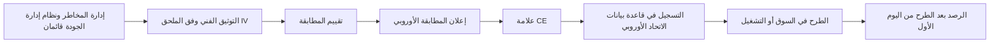

# الوحدة 10 — الإطلاق والرصد والصيانة

*أخطر لحظة في حياة نظام الذكاء الاصطناعي ليست لحظة تدريبه. بل هي اللحظة التي يبدأ فيها اتخاذ قرارات بشأن أشخاص حقيقيين، وكل يوم بعدها. فبمجرد أن يعمل النموذج فعليًا، يتحرك العالم: يتغير العملاء، وتتغير خطوط معالجة البيانات، ويطرح الموردون إصدارات جديدة، ويعتاد الأشخاص المكلَّفون بالإشراف على النظام على الثقة به. تتتبّع هذه الوحدة نموذج تقييم الجدارة الائتمانية الداخلي في بنك نجم (Najm Bank) من بوابة الإطلاق إلى الإنتاج، ثم في النهاية إلى التقاعد. ستتعلم كيف تقرر أن النظام جاهز، وكيف تعمل خطوات المطابقة في قانون الذكاء الاصطناعي الأوروبي (EU AI Act) لنظام عالي المخاطر (high-risk)، وكيف ترصد الانجراف (drift) وانعدام العدالة، وكيف تتعرّف على الحادث وتبلّغ عنه، ومتى يكون التغيير كبيرًا بما يكفي ليحتاج إلى موافقة جديدة (أو تقييم مطابقة جديد)، وكيف توقف النظام بأمان. هذه ليست استشارة قانونية: فالقوانين والإرشادات تتغير، والتفاصيل تعتمد على وقائع حالتك، لذا راجع المصادر الرسمية ومستشارك القانوني.*

> **تغطية مجال المعرفة (BoK coverage):** III.C — حوكمة الإطلاق والرصد والصيانة: الجاهزية والمطابقة، والرصد بعد الطرح في السوق، والانجراف والحوادث، وضبط التغيير، والصيانة، والإيقاف والتقاعد.

---

# 10.1 — جاهزية الإطلاق والمطابقة
*المستوى: 🔴 متقدم* · *المتطلبات: 6.2، 8.3، 9.3* · *مجال المعرفة (BoK): III.C*

## ⚡ الدرس في دقيقة

- الإطلاق (release) قرار حوكمة: شخص مسمّى ومساءَل يقول "انطلق" بناءً على **معايير الانطلاق/عدم الانطلاق (go/no-go criteria) المتفق عليها قبل الاختبار**، مع أدلة محفوظة في الملف.
- الجاهزية تعني أكثر من "اجتياز الاختبارات": توثيق مكتمل، وإشراف ورصد قائمان، وخطوات قانونية منجزة، ومستخدمون مدرَّبون، وتراجع (rollback) جاهز.
- بالنسبة إلى نظام **عالي المخاطر** في الاتحاد الأوروبي، يجب على مقدّم النظام (provider) أن يُتم **تقييم المطابقة** (conformity assessment)، وأن يوقّع **إعلان المطابقة الأوروبي** (EU declaration of conformity)، وأن يضع **علامة CE** (CE marking)، وأن **يسجّل** (register) النظام في قاعدة بيانات الاتحاد الأوروبي *قبل* طرحه في السوق أو تشغيله.
- تقييم الجدارة الائتمانية للأشخاص الطبيعيين استخدام عالي المخاطر في الملحق III، ويستند تقييم مطابقته إلى **الرقابة الداخلية** (internal control): يقيّم مقدّم النظام نفسه، دون جهة مُخطَرة (notified body)، لكن يجب أن يكون قادرًا على إثبات كل ادعاء.
- أطلق على مراحل (**الظل ← التجربة ← الكناري ← الكامل**، shadow → pilot → canary → full) حتى يكون أي شيء فاته اختبارك ضررًا صغيرًا وقابلًا للعكس.
- الفخ الأكبر: الظن بأن البنك الذي يبني نموذجًا لاستخدامه الخاص "مجرد مستخدم". فتشغيله لاستخدامك الخاص يجعلك **مقدّم النظام**.

## 🧭 لماذا يهم

إنه عصر يوم خميس في بنك نجم (Najm Bank). أنهت دانة، كبيرة علماء البيانات، الإصدار 2 من نموذج تقييم الجدارة الائتمانية للأفراد. وعلى مجموعة البيانات المحجوزة (holdout) يفصل بين المقترضين الجيدين والسيئين أفضل بشكل ملحوظ من الإصدار 1، ويريد خالد، رئيس إقراض الأفراد، تشغيله يوم الأحد حتى يقيّم النموذج الجديد الطلبات قبل إطلاق حملة القروض الشخصية. يقول لليلى، رئيسة حوكمة الذكاء الاصطناعي: "انتهى الاختبار. ماذا بقي؟"

تفتح ليلى قائمة فحص الإطلاق. تحليل العدالة يتجاهل عملاء فرع فرانكفورت في الاتحاد الأوروبي. وتعليمات الاستخدام، التي تخبر موظفي الائتمان متى لا يعتمدون على الدرجة، ما زالت مسودة. ولم يبنِ أحد لوحة الرصد. ولم ترَ سارة، مسؤولة حماية البيانات (DPO)، تقييم الأثر على حماية البيانات (DPIA) المحدَّث، مع أن الإصدار 2 يستخدم حقلي بيانات جديدين. ولأن بنك نجم بنى النظام ويقيّم به مقيمين في الاتحاد الأوروبي، ولأن تقييم الجدارة الائتمانية عالي المخاطر بموجب قانون الذكاء الاصطناعي الأوروبي، يتحمل بنك نجم التزامات **مقدّم النظام**: تقييم المطابقة، والإعلان، وعلامة CE، والتسجيل. ولم يكتب أحد ما الذي يحدث إذا وجب إيقاف النموذج صباح الاثنين.

لا شيء من هذه الفجوات غريب. فكثير من إخفاقات الذكاء الاصطناعي هي إخفاقات إطلاق، لا إخفاقات خوارزمية: فقد عمل النظام قبل أن يكون الناس والعمليات والضمانات المحيطة به جاهزين. يحوّل هذا الدرس سؤال "هل هو جاهز؟" إلى قرار تقف خلفه أدلة.

## 📐 كيف يعمل

### 🟢 الأساسيات

**ما معنى "الإطلاق".** الإطلاق هو اللحظة التي يبدأ فيها نظام الذكاء الاصطناعي بالتأثير في قرارات حقيقية وأشخاص حقيقيين. ويستخدم قانون الذكاء الاصطناعي الأوروبي مصطلحين دقيقين. **الطرح في السوق** (placing on the market) يعني إتاحة نظام ذكاء اصطناعي في سوق الاتحاد الأوروبي لأول مرة. و**التشغيل** (putting into service) يعني توريده للاستخدام الأول مباشرة إلى مُشغِّل (deployer)، *أو لاستخدام مقدّم النظام نفسه*، في الاتحاد الأوروبي لغرضه المقصود. بنك نجم لا يبيع نموذج التقييم أبدًا، لكنه يشغّله لاستخدامه الخاص في فرعه بفرانكفورت. وهذا كافٍ لتفعيل التزامات مقدّم النظام بالنسبة إلى نظام عالي المخاطر.

**بوابة الإطلاق (release gate).** بوابة الإطلاق نقطة تفتيش رسمية يجب أن يستوفي فيها النظام معايير محددة قبل أن ينتقل إلى المرحلة التالية. وتشترك البوابات الجيدة في أربع سمات:

1. **تُحدَّد المعايير مسبقًا.** يُتفق على العتبات عند اعتماد حالة الاستخدام (8.1)، ولا يُتفاوض عليها بعد ظهور النتائج.
2. **لكل معيار دليل.** "العدالة مقبولة" ليست دليلًا. أما "نسبة معدل الموافقة بين الرجال والنساء 0.93 على مجموعة 2025 المحجوزة، فوق العتبة 0.90، التقرير DS-117" فهي دليل.
3. **الاعتماد النهائي مسمّى ومتناسب.** قد لا تحتاج أداة منخفضة المخاطر إلا إلى مالكي الأعمال والنموذج؛ أما النظام عالي المخاطر فيحتاج إلى مصادقة مستقلة، وإدارة المخاطر، والامتثال، ومسؤول حماية البيانات، ولجنة حوكمة الذكاء الاصطناعي.
4. **تُتابَع الشروط.** عبارة "انطلق، بشرط أن تعمل لوحة الرصد أولًا" مقبولة إذا كان هناك من يملك هذا الشرط.

**معايير الانطلاق/عدم الانطلاق.** تغطي مجموعة عملية منها ستة مجالات:

| المجال | مثال على معيار | الأدلة المعتادة |
|---|---|---|
| الأداء | يحقق أهداف الدقة والمعايرة في كل شريحة رئيسية، لا في المتوسط فقط | تقرير المصادقة، جداول الشرائح |
| العدالة | فجوات النتائج ومعدلات الخطأ ضمن العتبات المتفق عليها للمجموعات ذات الصلة | تقرير اختبار التحيّز (انظر 9.2، 9.3) |
| المتانة والأمن | اختبارات الإجهاد ونتائج الاختبارات العدائية واختبار الفريق الأحمر مغلقة أو مقبولة | سجلات الاختبار، المراجعة الأمنية |
| التوثيق | بطاقة النموذج أو النظام، والتوثيق الفني، وتعليمات الاستخدام، والقيود، كلها نهائية | سجل المستندات |
| العمليات | الرصد يعمل، والتنبيهات موجَّهة، والتراجع مُختبَر، وعملية البديل مزوَّدة بالموظفين | دليل التشغيل (runbook)، سجل اختبار التراجع |
| القانون والأفراد | تقييم الأثر على حماية البيانات محدَّث، والالتزامات القانونية محددة ومستوفاة، والمستخدمون مدرَّبون، والإشعارات جاهزة | DPIA، سجلات التدريب، نص الإشعار |

**التوثيق المكتمل.** "مكتمل" يعني أن شخصًا غير البنّاء يستطيع أن يفهم ما يفعله النظام، وكيف اختُبر، وأين لا ينبغي استخدامه، وكيف يُشغَّل بأمان: الغرض، وتسلسل البيانات (9.1)، ونتائج الاختبار وقيوده، وتقييم المخاطر، وتصميم الإشراف، وتعليمات الاستخدام، وخطة الرصد.

### 🟡 التعمق أكثر

**مسار المطابقة الأوروبي لنظام عالي المخاطر.** بالنسبة إلى مقدّم نظام ذكاء اصطناعي عالي المخاطر، يحدد قانون الذكاء الاصطناعي تسلسلًا يجب إتمامه قبل الإطلاق:

- **نظام إدارة الجودة (quality management system) (المادة 17)** و**نظام إدارة المخاطر (risk management system) (المادة 9).** سياسات وإجراءات ومسؤوليات وعملية للمخاطر عبر دورة الحياة (life cycle) كاملة.
- **التوثيق الفني (technical documentation) (المادة 11 والملحق IV).** الغرض، والتصميم، والبيانات، والاختبار، والأداء، وتدابير الإشراف البشري (human oversight)، وخطة الرصد بعد الطرح في السوق (post-market monitoring)، وغير ذلك.
- **تقييم المطابقة (المادة 43 (Art. 43)).** الإجراء الذي يُظهر أن متطلبات المواد 8 إلى 15 مستوفاة (إدارة المخاطر، وحوكمة البيانات، والتوثيق، والتسجيل، والشفافية، والإشراف البشري، والدقة والمتانة والأمن السيبراني). وبالنسبة إلى معظم استخدامات الملحق III، بما فيها **تقييم الجدارة الائتمانية**، يكون المسار هو **الرقابة الداخلية** (الملحق VI): يفحص مقدّم النظام نظام إدارة الجودة لديه وتوثيقه الفني مقابل المتطلبات. وبالنسبة إلى الأنظمة البيومترية في الملحق III، قد يُشترط وجود **جهة مُخطَرة** (notified body) (جهة تقييم مستقلة تعيّنها دولة عضو)، ولا سيما حيث لم تُطبَّق المعايير المنسَّقة (harmonised standards) بالكامل. أما الذكاء الاصطناعي عالي المخاطر في المنتجات المشمولة بتشريعات الملحق I، مثل الأجهزة الطبية أو الآلات، فيتبع إجراء المطابقة القائم في ذلك القطاع، مع إدماج متطلبات الذكاء الاصطناعي فيه.
- **إعلان المطابقة الأوروبي (المادة 47).** بيان موقَّع من مقدّم النظام بأن النظام يستوفي المتطلبات. ويتحمل مقدّم النظام المسؤولية القانونية عنه.
- **علامة CE (المادة 48).** العلامة المرئية للمطابقة. وبالنسبة إلى الأنظمة المقدَّمة رقميًا، يمكن استخدام علامة CE رقمية.
- **التسجيل (المادة 49، وقاعدة البيانات بموجب المادة 71).** يسجّل مقدّمو الأنظمة عالية المخاطر في الملحق III أنفسهم والنظام في قاعدة بيانات الاتحاد الأوروبي قبل طرحه في السوق أو تشغيله. ويسجّل كذلك المُشغِّلون الذين هم سلطات عامة، أو يعملون نيابة عنها، استخدامهم.

**المعايير المنسَّقة (Harmonised standards).** اتباع معيار منسَّق منشور في الجريدة الرسمية يمنح *افتراض المطابقة* (presumption of conformity) مع المتطلبات التي يغطيها. وفي وقت كتابة هذا النص (2026) كانت المعايير المنسَّقة للذكاء الاصطناعي لا تزال قيد التطوير، ومقترح "الحزمة الرقمية الشاملة" (Digital Omnibus) الذي قدّمته المفوضية في نوفمبر 2025 من شأنه تأجيل بعض المواعيد النهائية للأنظمة عالية المخاطر. تحقّق من الوضع الحالي؛ فالامتحان يختبر القانون بصيغته المعتمدة.

**خطوات جاهزية المُشغِّل.** قبل استخدام نظام عالي المخاطر، يجب أن يكون المُشغِّل قادرًا على اتباع تعليمات الاستخدام، وإسناد الإشراف البشري إلى أشخاص يملكون الكفاءة والتدريب والصلاحية والدعم اللازم (المادة 26)، وضمان أن تكون بيانات الإدخال الخاضعة لسيطرته ذات صلة وتمثيلية بما يكفي، وأن يُبلغ، بصفته صاحب عمل، ممثلي العمال والعمال المتأثرين. ويجب على الهيئات العامة، والمُشغِّلين الذين يستخدمون نظامًا **لتقييم الجدارة الائتمانية أو تسعير التأمين على الحياة والصحة**، إتمام **تقييم الأثر على الحقوق الأساسية (FRIA)** بموجب المادة 27 قبل الاستخدام الأول (انظر 11.3). وبنك نجم، بصفته مقدّم النظام والمُشغِّل معًا، يحتاج إلى مجموعتي الخطوات.

**خارج الاتحاد الأوروبي.** لا تحتاج عمليات بنك نجم في قطر والإمارات إلى علامة CE، لكن الانضباط نفسه يظل منطبقًا. فإرشادات QCB للذكاء الاصطناعي في المؤسسات المالية تتوقع الحوكمة والاختبار والإشراف المستمر على الذكاء الاصطناعي؛ اقرأ النص الحالي على موقع QCB. ولدى البنوك أيضًا سياسات **إدارة مخاطر النماذج** (model risk management) (وإرشادات الاحتياطي الفيدرالي الأمريكي وOCC لعام 2011، SR 11-7، هي المرجع الكلاسيكي) التي تشترط المصادقة المستقلة و"التحدي الفعّال" (effective challenge). وينبغي لبوابة إطلاق الذكاء الاصطناعي أن تعيد استخدام هذه الآلية، لا أن تكررها.

### 🔴 نظرة الخبير

**الإطلاق المرحلي (Staged rollout).** لا توجد مجموعة اختبار تمثّل الإنتاج تمثيلًا مثاليًا. والإطلاق المرحلي يحدّ من الضرر الناتج عما لم تتوقعه.

| المرحلة | ما يحدث | ما تثبته | ملاحظات الحوكمة |
|---|---|---|---|
| **الظل** | يقيّم النموذج الجديد الحركة الفعلية بالتوازي؛ تُسجَّل مخرجاته لكن لا تُستخدم | السلوك على بيانات حقيقية وحالية؛ الاتفاق مع النموذج الحالي؛ الاستقرار التشغيلي | ما زال يعالج بيانات شخصية (الأساس القانوني، DPIA)، لكن دون أثر على العملاء |
| **التجربة** | يُستخدم لقرارات حقيقية في نطاق محدود، مثل فرع واحد أو منتج واحد، مع مراجعة بشرية إضافية | الملاءمة لسير العمل، وفهم المستخدمين، وأنماط التجاوز، والشكاوى | قرارات حقيقية: تنطبق كل الالتزامات القانونية؛ إشراف مشدَّد |
| **الكناري** | نسبة صغيرة من الحركة الفعلية، مثل 5%، تذهب إلى النموذج الجديد، مع محفزات تراجع آلية | الأداء والعدالة على نطاق واسع في شريحة عشوائية | اتفق مسبقًا على محفزات التراجع ومن يستطيع تفعيلها |
| **الإطلاق الكامل** | كل الحركة، مع تقاعد النموذج القديم أو إبقائه بديلًا | — | خطة الرصد (10.2) تتولى الأمر |

هناك دقيقتان كثيرًا ما توقعان حتى الممارسين ذوي الخبرة:

- **التجربة إطلاق.** إذا اتخذ نظام عالي المخاطر قرارات حقيقية بشأن أشخاص في الاتحاد الأوروبي أثناء تجربة، فقد جرى تشغيله، ويجب أن تكون خطوات المطابقة مكتملة بالفعل. ويوفر قانون الذكاء الاصطناعي نظامًا منفصلًا لـ **اختبار أنظمة الملحق III في ظروف العالم الحقيقي** (testing in real-world conditions) قبل طرحها في السوق (المادة 60)، لكن له شروطه الخاصة، منها خطة اختبار مسجّلة، ومدة محدودة، وكقاعدة عامة موافقة مستنيرة من المشاركين. وهو ليس ثغرة لتجاوز المطابقة. احصل على مشورة قانونية قبل الاعتماد عليه.
- **وضع الظل ليس خاليًا من المخاطر.** إنه يتجنب الأثر على العملاء لكنه لا يتجنب التزامات الخصوصية، وفترة الظل القصيرة تفوّت الآثار الموسمية والنتائج المتأخرة.

**التراجع والبديل (Rollback and fallback).** قبل الإطلاق، أجب كتابةً: كيف نوقفه، ومن يجوز له ذلك (بما في ذلك خارج ساعات العمل)، وما الذي يحل محله؟ بالنسبة إلى بنك نجم، البديل هو بطاقة التقييم (scorecard) للإصدار 1 إضافة إلى الاكتتاب اليدوي. ويجب أن يكون مزوَّدًا بالموظفين ومُختبَرًا: فمفتاح الإيقاف الذي يوجّه 3,000 طلب يوميًا إلى أربعة مكتتبين ليس بديلًا.

**المطابقة لقطة ثابتة؛ والامتثال فيلم.** يصف الإعلان النظام في يوم توقيعه؛ والرصد (10.2) وضبط التغيير (10.3) يُبقيانه صحيحًا. ويحتفظ مقدّم النظام بالتوثيق الفني وتوثيق نظام إدارة الجودة والإعلان لمدة **10 سنوات** بعد الطرح في السوق أو التشغيل (المادة 18). وملف الإطلاق سجل خاضع للتنظيم.

**من لا ينبغي أن يوقّع.** لا ينبغي أن يكون البنّاء هو الوحيد الذي يوقّع على أن النموذج ملائم. ففي بنك نجم، يبني فريق دانة، وتصادق وحدة المصادقة على النماذج بشكل مستقل، ويقبل خالد بصفته مالك الأعمال المخاطر المتبقية، وتعتمد لجنة حوكمة الذكاء الاصطناعي (AI Governance Committee) إطلاقات الأنظمة عالية المخاطر.

## ⚖️ الأدوات التنظيمية

| الأداة | ما تشترطه أو توصي به | إشارة الامتحان |
|---|---|---|
| **EU AI Act** — المواد 43 و47 و48 و49 | يُتم مقدّم النظام تقييم المطابقة، ويوقّع إعلان المطابقة الأوروبي، ويضع علامة CE، ويسجّل أنظمة الملحق III قبل الطرح في السوق أو التشغيل | "قبل الإطلاق، ما الذي يجب أن يفعله مقدّم نظام عالي المخاطر لتقييم الجدارة الائتمانية؟" الرقابة الداخلية، والإعلان، وCE، والتسجيل |
| **EU AI Act** — المادتان 26 و27 | المُشغِّلون: اتباع التعليمات، وإشراف بشري كفء، وبيانات إدخال ذات صلة، وإبلاغ العمال؛ وتقييم FRIA قبل الاستخدام الأول لتقييم الجدارة الائتمانية وتسعير التأمين وللهيئات العامة | جاهزية المُشغِّل تشمل FRIA لتقييم الجدارة الائتمانية |
| **EU AI Act** — المادة 60 | اختبار أنظمة الملحق III في ظروف العالم الحقيقي قبل الطرح في السوق، بشروط صارمة | التجربة على أشخاص حقيقيين ليست معفاة تلقائيًا من المطابقة |
| **GDPR** — المادتان 25 و35 | حماية البيانات بالتصميم؛ تقييم DPIA قبل المعالجة عالية المخاطر، ويُحدَّث عند تغيّر المعالجة | حقول البيانات الجديدة في الإصدار 2 تعني وجوب مراجعة DPIA قبل الإطلاق |
| **NIST AI RMF** — MANAGE 1.1 وGOVERN 1 | تحديد ما إذا كان النظام يحقق غرضه المقصود وما إذا كان ينبغي المضي في النشر؛ والسياسات تحدد الأدوار والعمليات | طوعي؛ "الانطلاق/عدم الانطلاق" يقابل MANAGE 1.1 |
| **ISO/IEC 42001** — ضوابط دورة الحياة في الملحق A | معايير وعمليات موثّقة للتحقق من أنظمة الذكاء الاصطناعي والمصادقة عليها ونشرها ضمن نظام إدارة قابل للاعتماد | الاعتماد يكون لنظام الإدارة، لا علامة CE للمنتج |
| **QCB AI guideline** | اعتماد الحوكمة والاختبار والإشراف للذكاء الاصطناعي الذي تستخدمه المؤسسات المالية الخاضعة لتنظيم قطر | الجهات المنظِّمة المصرفية المحلية تتوقع حوكمة الإطلاق حتى دون قانون للذكاء الاصطناعي |

## 🏛️ عمليًا في بنك نجم

يحوّل فريق ليلى بوابة الإطلاق إلى **سجل قرار الإطلاق** (Release Decision Record) من صفحة واحدة، يُحفظ مع قيد النظام في سجل أنظمة الذكاء الاصطناعي (AI inventory). وهذا هو السجل الخاص بالإصدار 2 من تقييم الجدارة الائتمانية بعد سد الفجوات:

| الحقل | القيد |
|---|---|
| النظام / الإصدار | درجة ائتمان الأفراد v2.0.0 (معرّف السجل CS-RET-002) |
| فئة المخاطر | عالية (تقييم الجدارة الائتمانية في الملحق III من EU AI Act؛ الفئة الداخلية 1) |
| الدور القانوني لبنك نجم | مقدّم النظام والمُشغِّل (مبني داخليًا، ومُشغَّل للاستخدام الخاص، بما في ذلك فرع فرانكفورت) |
| معايير الانطلاق/عدم الانطلاق (حُدّدت عند الاستقبال، 14 يناير) | Gini ≥ 0.55 إجمالًا و≥ 0.50 في كل شريحة · نسبة معدل الموافقة ≥ 0.90 عبر الجنس والفئات العمرية · لا نتائج حرجة مفتوحة من الفريق الأحمر · التراجع مُختبَر |
| الأدلة | تقرير المصادقة MV-2026-031 · تقرير التحيّز DS-117 (يشمل الآن المحفظة الأوروبية) · المراجعة الأمنية SEC-442 · اختبار التراجع RB-19 |
| التوثيق | التوثيق الفني v2 · تعليمات الاستخدام v2 (نهائية) · بطاقة النظام · خطة الرصد MP-CS-2 · DPIA v3 (وقّعته سارة) · FRIA v1 |
| المطابقة الأوروبية | تقييم الرقابة الداخلية مكتمل · إعلان المطابقة موقَّع من رئيس المخاطر (CRO) · علامة CE رقمية · مسجّل في قاعدة بيانات الاتحاد الأوروبي |
| خطة الإطلاق | 4 أسابيع ظل ← تجربة لأسبوعين في فرع الأفراد بالدوحة ← كناري 10% ← كامل. محفزات التراجع: PSI > 0.25 على المدخلات الرئيسية، ونسبة معدل الموافقة < 0.85، وارتفاع الشكاوى > 2× خط الأساس |
| البديل | بطاقة تقييم v1 جاهزة للعمل؛ جدول مناوبة للاكتتاب اليدوي للحالات المحالة |
| التوقيعات | مالكة النموذج (دانة) · المصادقة المستقلة (وحدة المصادقة على النماذج) · مسؤولة حماية البيانات (سارة) · رئيس البيانات CDO (عمر) · مالك الأعمال الذي يقبل المخاطر المتبقية (خالد) · اعتماد لجنة حوكمة الذكاء الاصطناعي، المحضر 2026-07 |
| الشروط | لوحة الرصد تعمل قبل التجربة (المسؤول: عمر) · تدريب موظفي الائتمان مكتمل بنسبة ≥ 95% قبل التجربة (المسؤول: خالد) |

خسر خالد إطلاق يوم الأحد؛ وعمل الإصدار 2 بعد ستة أسابيع بملف نظيف.

## 🛠️ التمارين

- 🟢 اذكر عشرة بنود في قائمة فحص الإطلاق لروبوت محادثة خدمة العملاء في بنك نجم (محدود المخاطر بموجب قانون الذكاء الاصطناعي)، مع تحديد البنود التي يحتاج إليها نموذج الائتمان أيضًا. *يكتمل عندما:* يذكر كل بند من يقدّم الدليل.
- 🟡 صُغ معايير الانطلاق/عدم الانطلاق لنموذج كشف الاحتيال في بنك نجم، موضحًا لماذا لا تنطبق خطوات المطابقة الأوروبية (فكشف الاحتيال مستثنى من فئة الائتمان في الملحق III) بينما تظل معايير العدالة والتراجع منطبقة. *يكتمل عندما:* يكون لكل مجال من المجالات الستة معيار قابل للقياس.
- 🔴 صمّم إطلاقًا مرحليًا للإصدار 2 من تقييم الجدارة الائتمانية يغطي عملاء الاتحاد الأوروبي: أي مرحلة تُعد تشغيلًا، وما الذي يجب أن يكتمل قبلها، وأي محفزات تراجع تنطبق. *يكتمل عندما:* تستطيع جهة تنظيمية أن ترى أنه لم يُقيَّم أي متقدم في الاتحاد الأوروبي بنظام غير مطابق.

## ⚠️ أخطاء وفخاخ الامتحان

- **"اجتزنا الاختبار، إذن نحن جاهزون."** الاختبار مُدخل واحد. أجب بالمجموعة الكاملة: التوثيق، والإشراف، والرصد، والخطوات القانونية، والتدريب، والتراجع.
- **"نستخدمه داخليًا فقط، إذن نحن مُشغِّل."** المؤسسة التي تطوّر نظامًا عالي المخاطر وتشغّله باسمها، بما في ذلك لاستخدامها الخاص، هي **مقدّم النظام**. وبنك نجم مقدّم النظام والمُشغِّل معًا.
- **"تقييم الجدارة الائتمانية يحتاج إلى جهة مُخطَرة."** لا. تقييم الجدارة الائتمانية في الملحق III يستخدم مسار الرقابة الداخلية. وتظهر الجهات المُخطَرة أساسًا في الأنظمة البيومترية ومنتجات الملحق I.
- **"علامة CE تعني موافقة الاتحاد الأوروبي."** إنها تدل على إعلان *مقدّم النظام نفسه*، المدعوم بتقييم المطابقة الذي أجراه.
- **"اعتماد ISO/IEC 42001 يحل محل تقييم المطابقة."** لا: فمعيار 42001 يعتمد نظام إدارة، لا نظام ذكاء اصطناعي بعينه.
- **تحديد العتبات بعد رؤية النتائج.** في الامتحان، الإجابة الصحيحة تثبّت معايير القبول مسبقًا وتوثّق أي تغيير ومن اعتمده.

## 🧾 الخلاصة

- الإطلاق قرار مساءَل يستند إلى معايير انطلاق/عدم انطلاق متفق عليها مسبقًا، وتدعمه الأدلة والمصادقة المستقلة وتوقيعات مسمّاة، ويغطي الأداء والعدالة والأمن والتوثيق والعمليات والجاهزية القانونية وجاهزية الأفراد.
- يجب على مقدّمي الأنظمة عالية المخاطر في الاتحاد الأوروبي إتمام تقييم المطابقة (الرقابة الداخلية لتقييم الجدارة الائتمانية)، وإعلان المطابقة، وعلامة CE، والتسجيل في قاعدة بيانات الاتحاد الأوروبي قبل الإطلاق. ويجب أن يكون المُشغِّلون جاهزين أيضًا، بما في ذلك FRIA حيث ينطبق.
- الإطلاق المرحلي (الظل، والتجربة، والكناري) يحدّ من الضرر، لكن التجربة التي تتضمن قرارات حقيقية إطلاق حقيقي.
- ملف الإطلاق سجل خاضع للتنظيم لا يبقى صحيحًا إلا عبر الرصد وضبط التغيير.

## ✍️ اختبر نفسك

**1. يطوّر بنك نجم نموذجًا لتقييم الجدارة الائتمانية داخليًا ويستخدمه لتقييم المتقدمين في فرعه بفرانكفورت. ولا يبيع النموذج أبدًا. ما دور بنك نجم بموجب قانون الذكاء الاصطناعي الأوروبي بالنسبة إلى هذا النظام؟**

- A. مُشغِّل فقط، لأنه لا يطرح النظام في السوق
- B. مقدّم النظام ومُشغِّل، لأنه يشغّل النظام لاستخدامه الخاص ويستخدمه
- C. موزّع، لأنه يتيح النظام داخليًا
- D. لا دور له، لأن الأدوات الداخلية خارج النطاق

الإجابة

**B.** تشغيل نظام لاستخدامك الخاص في الاتحاد الأوروبي يفعّل التزامات مقدّم النظام، وبنك نجم يستخدمه أيضًا، فهو مُشغِّل كذلك. وA هو الخطأ المغري. (الأساسيات: ما معنى "الإطلاق".)

**2. أي مسار لتقييم المطابقة ينطبق على نظام ذكاء اصطناعي عالي المخاطر يُستخدم لتقييم الجدارة الائتمانية للأشخاص الطبيعيين؟**

- A. تقييم من جهة مُخطَرة في كل الحالات
- B. لا تقييم مطابقة؛ التسجيل فقط
- C. الرقابة الداخلية من مقدّم النظام، استنادًا إلى نظام إدارة الجودة لديه وتوثيقه الفني
- D. الاعتماد وفق ISO/IEC 42001

الإجابة

**C.** معظم استخدامات الملحق III، بما فيها تقييم الجدارة الائتمانية، تتبع إجراء الرقابة الداخلية. وتدخل الجهات المُخطَرة أساسًا في الأنظمة البيومترية ومنتجات الملحق I. ومعيار ISO/IEC 42001 يعتمد نظام إدارة ولا يحل محل تقييم المطابقة. (التعمق أكثر: مسار المطابقة الأوروبي.)

**3. يعرض فريق علم البيانات نتائج اختبار ممتازة ويطلب الإطلاق. وقد خُفّضت عتبة العدالة في الأسبوع السابق، بعد ظهور النتائج الأولى. ما الذي ينبغي أن تفعله وظيفة الحوكمة أولًا؟**

- A. الاعتماد، لأن العتبة الجديدة مستوفاة
- B. أن تطلب من المورّد إعادة تشغيل الاختبارات
- C. رفض النموذج نهائيًا
- D. معاملة تغيير العتبة كقرار حوكمة: توثيق سبب تغييرها، ومن اعتمده، وهل ينبغي تطبيق المعيار الأصلي

الإجابة

**D.** ينبغي تحديد المعايير مسبقًا، ويجب تبرير أي تغيير واعتماده عبر الحوكمة، لا تبنّيه بهدوء بعد وصول النتائج. أما A فيكافئ تحريك المرمى. وC غير متناسب دون تحليل. (الأساسيات: بوابة الإطلاق.)

**4. أثناء نشر في وضع الظل، يقيّم النموذج الجديد الطلبات الفعلية، لكن مخرجاته تُسجَّل فقط ولا تُستخدم. أي عبارة هي الأدق؟**

- A. وضع الظل ما زال يعالج بيانات شخصية، فيحتاج إلى أساس قانوني وتغطية في DPIA، لكنه يتجنب الأثر المباشر على العملاء
- B. وضع الظل خارج قانون حماية البيانات لأنه لا يُتخذ فيه أي قرار
- C. وضع الظل يُعد طرحًا في السوق
- D. وضع الظل يلغي الحاجة إلى تجربة أو كناري لاحقًا

الإجابة

**A.** تقييم بيانات متقدمين حقيقيين معالجةٌ حتى لو أُهملت المخرجات. ووضع الظل يتجنب الأثر على القرارات لكنه لا يحل محل المراحل اللاحقة التي تختبر سير العمل والاستخدام البشري. (نظرة الخبير: الإطلاق المرحلي.)

**5. قبل اعتماد نظام عالي المخاطر لتقييم الجدارة الائتمانية، أي بند يُعد جزءًا من جاهزية *المُشغِّل* بموجب قانون الذكاء الاصطناعي الأوروبي، لا جاهزية مقدّم النظام؟**

- A. إعداد إعلان المطابقة الأوروبي
- B. وضع علامة CE
- C. إتمام تقييم الأثر على الحقوق الأساسية قبل الاستخدام الأول
- D. كتابة التوثيق الفني وفق الملحق IV

الإجابة

**C.** تشترط المادة 27 على المُشغِّلين الذين يستخدمون نظامًا لتقييم الجدارة الائتمانية، ضمن آخرين، إتمام FRIA قبل الاستخدام الأول. أما A وB وD فالتزامات على مقدّم النظام. وبنك نجم، بصفته الاثنين، يجب أن يفعل الأربعة كلها. (التعمق أكثر: خطوات جاهزية المُشغِّل.)

## 📚 المراجع

- EU AI Act، اللائحة (EU) 2024/1689 (EUR-Lex): https://eur-lex.europa.eu/eli/reg/2024/1689/oj
- المفوضية الأوروبية، الإطار التنظيمي للذكاء الاصطناعي ومكتب الذكاء الاصطناعي (AI Office): https://digital-strategy.ec.europa.eu/en/policies/regulatory-framework-ai
- GDPR، اللائحة (EU) 2016/679 (EUR-Lex): https://eur-lex.europa.eu/eli/reg/2016/679/oj
- إطار NIST لإدارة مخاطر الذكاء الاصطناعي (NIST AI Risk Management Framework): https://www.nist.gov/itl/ai-risk-management-framework
- ISO/IEC 42001:2023 (ISO): https://www.iso.org/standard/81230.html
- مصرف قطر المركزي (Qatar Central Bank) (لإرشاداته بشأن الذكاء الاصطناعي في المؤسسات المالية): https://www.qcb.gov.qa
- IAPP، شهادة AIGP ومجال المعرفة (BoK): https://iapp.org/certify/aigp/

---

