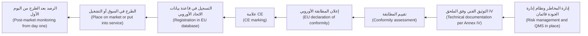
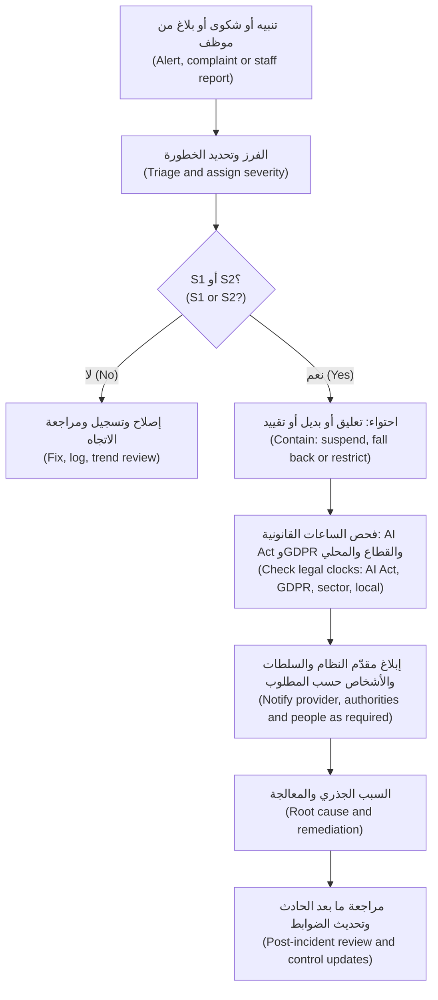
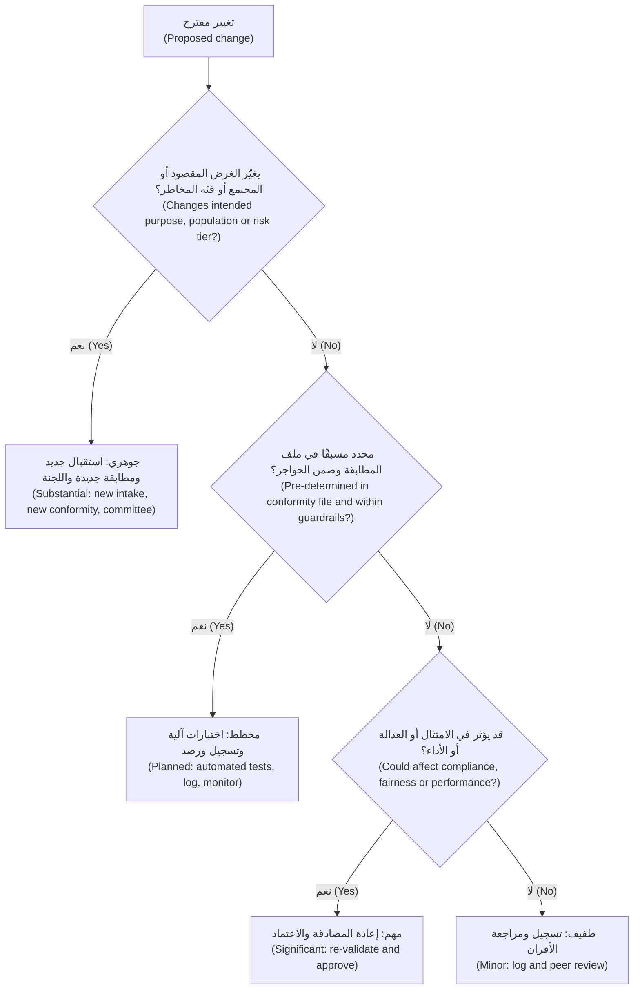

# الوحدة 10 — الإطلاق (release) والرصد (monitoring) والصيانة (maintenance)

*أخطر لحظة في حياة نظام الذكاء الاصطناعي (AI system) ليست لحظة تدريبه. بل هي اللحظة التي يبدأ فيها اتخاذ قرارات بشأن أشخاص حقيقيين، وكل يوم بعدها. فبمجرد أن يعمل النموذج (model) فعليًا، يتحرك العالم: يتغير العملاء، وتتغير خطوط معالجة البيانات (data pipelines)، ويطرح الموردون (vendors) إصدارات (versions) جديدة، ويعتاد الأشخاص المكلَّفون بالإشراف (oversight) على النظام على الثقة به. تتتبّع هذه الوحدة نموذج تقييم الجدارة الائتمانية (credit-scoring model) الداخلي في بنك نجم (Najm Bank) من بوابة الإطلاق (release gate) إلى الإنتاج (production)، ثم في النهاية إلى التقاعد (retirement). ستتعلم كيف تقرر أن النظام جاهز، وكيف تعمل خطوات المطابقة (conformity steps) في قانون الذكاء الاصطناعي الأوروبي (EU AI Act) لنظام عالي المخاطر (high-risk)، وكيف ترصد الانجراف (drift) وانعدام العدالة (unfairness)، وكيف تتعرّف على الحادث (incident) وتبلّغ عنه، ومتى يكون التغيير كبيرًا بما يكفي ليحتاج إلى موافقة جديدة (أو تقييم مطابقة جديد (new conformity assessment))، وكيف توقف النظام بأمان. هذه ليست استشارة قانونية (legal advice): فالقوانين والإرشادات (guidance) تتغير، والتفاصيل تعتمد على وقائع حالتك، لذا راجع المصادر الرسمية ومستشارك القانوني (your own counsel).*

> **تغطية مجال المعرفة (BoK coverage):** III.C — حوكمة الإطلاق (release governance) والرصد (monitoring) والصيانة (maintenance): الجاهزية (readiness) والمطابقة (conformity)، والرصد بعد الطرح في السوق (post-market monitoring)، والانجراف (drift) والحوادث (incidents)، وضبط التغيير (change control)، والصيانة، والإيقاف والتقاعد (decommissioning).

---

# 10.1 — جاهزية الإطلاق (release readiness) والمطابقة (conformity)
*المستوى (Level): 🔴 متقدم (Advanced)* · *المتطلبات (Prerequisites): 6.2، 8.3، 9.3* · *مجال المعرفة (BoK): III.C*

## ⚡ الدرس في دقيقة (In 60 seconds)

- الإطلاق (release) قرار حوكمة (governance decision): شخص مسمّى ومساءَل (accountable) يقول "انطلق" بناءً على **معايير الانطلاق/عدم الانطلاق (go/no-go criteria) المتفق عليها قبل الاختبار (testing)**، مع أدلة محفوظة في الملف.
- الجاهزية (readiness) تعني أكثر من "اجتياز الاختبارات (tests passed)": توثيق (documentation) مكتمل، وإشراف (oversight) ورصد (monitoring) قائمان، وخطوات قانونية (legal steps) منجزة، ومستخدمون مدرَّبون، وتراجع (rollback) جاهز.
- بالنسبة إلى نظام **عالي المخاطر (high-risk)** في الاتحاد الأوروبي (EU)، يجب على مقدّم النظام (provider) أن يُتم **تقييم المطابقة** (conformity assessment)، وأن يوقّع **إعلان المطابقة الأوروبي** (EU declaration of conformity)، وأن يضع **علامة CE** (CE marking)، وأن **يسجّل** (register) النظام في قاعدة بيانات الاتحاد الأوروبي (EU database) *قبل* طرحه في السوق أو تشغيله (placing it on the market or putting it into service).
- تقييم الجدارة الائتمانية (credit scoring) للأشخاص الطبيعيين (natural persons) استخدام عالي المخاطر (high-risk use) في الملحق III (Annex III)، ويستند تقييم مطابقته (its conformity assessment) إلى **الرقابة الداخلية** (internal control): يقيّم مقدّم النظام (provider) نفسه، دون جهة مُخطَرة (notified body)، لكن يجب أن يكون قادرًا على إثبات كل ادعاء.
- أطلق على مراحل (**الظل (shadow) ← التجربة (pilot) ← الكناري (canary) ← الكامل**، shadow → pilot → canary → full) حتى يكون أي شيء فاته اختبارك ضررًا صغيرًا وقابلًا للعكس.
- الفخ الأكبر (The biggest trap): الظن بأن البنك الذي يبني نموذجًا (model) لاستخدامه الخاص "مجرد مستخدم (user)". فتشغيله لاستخدامك الخاص يجعلك **مقدّم النظام (provider)**.

## 🧭 لماذا يهم (Why it matters)

إنه عصر يوم خميس في بنك نجم (Najm Bank). أنهت دانة، كبيرة علماء البيانات (lead data scientist)، الإصدار 2 (v2) من نموذج تقييم الجدارة الائتمانية (credit-scoring model) للأفراد. وعلى مجموعة البيانات المحجوزة (holdout) يفصل بين المقترضين الجيدين والسيئين أفضل بشكل ملحوظ من الإصدار 1 (v1)، ويريد خالد، رئيس إقراض الأفراد (Head of Retail Lending)، تشغيله يوم الأحد حتى يقيّم النموذج الجديد (new model) الطلبات قبل إطلاق حملة القروض الشخصية (personal-loan campaign launch). يقول لليلى، رئيسة حوكمة الذكاء الاصطناعي (Head of AI Governance): "انتهى الاختبار (testing). ماذا بقي؟"

تفتح ليلى قائمة فحص الإطلاق (release checklist). تحليل العدالة (fairness) يتجاهل عملاء فرع فرانكفورت في الاتحاد الأوروبي (EU). وتعليمات الاستخدام (instructions for use)، التي تخبر موظفي الائتمان (credit officers) متى لا يعتمدون على الدرجة (score)، ما زالت مسودة. ولم يبنِ أحد لوحة الرصد (monitoring dashboard). ولم ترَ سارة، مسؤولة حماية البيانات (Data Protection Officer, DPO)، تقييم الأثر على حماية البيانات (DPIA) المحدَّث، مع أن الإصدار 2 (v2) يستخدم حقلي بيانات جديدين (two new data fields). ولأن بنك نجم بنى النظام ويقيّم به مقيمين في الاتحاد الأوروبي، ولأن تقييم الجدارة الائتمانية (credit scoring) عالي المخاطر (high-risk) بموجب قانون الذكاء الاصطناعي الأوروبي (EU AI Act)، يتحمل بنك نجم التزامات **مقدّم النظام (provider)**: تقييم المطابقة (conformity assessment)، والإعلان (declaration)، وعلامة CE (CE marking)، والتسجيل. ولم يكتب أحد ما الذي يحدث إذا وجب إيقاف النموذج (model) صباح الاثنين.

لا شيء من هذه الفجوات غريب. فكثير من إخفاقات الذكاء الاصطناعي (AI) هي إخفاقات إطلاق (release)، لا إخفاقات خوارزمية (algorithm): فقد عمل النظام قبل أن يكون الناس والعمليات والضمانات المحيطة به (people, processes and safeguards around it) جاهزين. يحوّل هذا الدرس سؤال "هل هو جاهز؟" إلى قرار تقف خلفه أدلة.

## 📐 كيف يعمل (How it works)

### 🟢 الأساسيات (The essentials)

**ما معنى "الإطلاق" (What "release" means).** الإطلاق (release) هو اللحظة التي يبدأ فيها نظام الذكاء الاصطناعي (AI system) بالتأثير في قرارات حقيقية وأشخاص حقيقيين. ويستخدم قانون الذكاء الاصطناعي الأوروبي (EU AI Act) مصطلحين دقيقين. **الطرح في السوق** (placing on the market) يعني إتاحة نظام ذكاء اصطناعي في سوق الاتحاد الأوروبي (EU) لأول مرة. و**التشغيل** (putting into service) يعني توريده للاستخدام الأول (first use) مباشرة إلى مُشغِّل (deployer)، *أو لاستخدام مقدّم النظام (provider) نفسه*، في الاتحاد الأوروبي لغرضه المقصود (its intended purpose). بنك نجم لا يبيع نموذج التقييم (scoring model) أبدًا، لكنه يشغّله لاستخدامه الخاص في فرعه بفرانكفورت. وهذا كافٍ لتفعيل التزامات مقدّم النظام بالنسبة إلى نظام عالي المخاطر (high-risk system).

**بوابة الإطلاق (release gate).** بوابة الإطلاق نقطة تفتيش رسمية يجب أن يستوفي فيها النظام معايير محددة قبل أن ينتقل إلى المرحلة (Stage) التالية. وتشترك البوابات الجيدة (good gates) في أربع سمات:

1. **تُحدَّد المعايير مسبقًا.** يُتفق على العتبات (thresholds) عند اعتماد حالة الاستخدام (8.1)، ولا يُتفاوض عليها بعد ظهور النتائج.
2. **لكل معيار دليل.** "العدالة (fairness) مقبولة" ليست دليلًا (evidence). أما "نسبة معدل الموافقة (approval-rate ratio) بين الرجال والنساء 0.93 على مجموعة 2025 المحجوزة (holdout)، فوق العتبة (threshold) 0.90، التقرير DS-117" فهي دليل.
3. **الاعتماد النهائي (sign-off) مسمّى ومتناسب.** قد لا تحتاج أداة منخفضة المخاطر (low-risk) إلا إلى مالكي الأعمال والنموذج (business and model owners)؛ أما النظام عالي المخاطر (high-risk) فيحتاج إلى مصادقة مستقلة (independent validation)، وإدارة المخاطر (risk management)، والامتثال (compliance)، ومسؤول حماية البيانات (Data Protection Officer, DPO)، ولجنة حوكمة الذكاء الاصطناعي (AI Governance Committee).
4. **تُتابَع الشروط (Conditions).** عبارة "انطلق، بشرط أن تعمل لوحة الرصد (monitoring dashboard) أولًا" مقبولة إذا كان هناك من يملك هذا الشرط.

**معايير الانطلاق/عدم الانطلاق (go/no-go criteria).** تغطي مجموعة عملية منها ستة مجالات:

| المجال (Area) | مثال على معيار (Example criterion) | الأدلة المعتادة (Typical evidence) |
|---|---|---|
| الأداء (performance) | يحقق أهداف الدقة (accuracy) والمعايرة (calibration) في كل شريحة (segment) رئيسية، لا في المتوسط فقط | تقرير المصادقة (validation report)، جداول الشرائح (segment tables) |
| العدالة (fairness) | فجوات النتائج (outcome gaps) ومعدلات الخطأ (error rates) ضمن العتبات (thresholds) المتفق عليها للمجموعات ذات الصلة | تقرير اختبار التحيّز (انظر 9.2، 9.3) |
| المتانة والأمن (robustness and security) | اختبارات الإجهاد (stress tests) ونتائج الاختبارات العدائية (adversarial tests) واختبار الفريق الأحمر (red-team testing) مغلقة أو مقبولة | سجلات الاختبار (test logs)، المراجعة الأمنية (security review) |
| التوثيق (documentation) | بطاقة النموذج (model card) أو النظام، والتوثيق الفني (technical documentation)، وتعليمات الاستخدام (instructions for use)، والقيود (limitations)، كلها نهائية | سجل المستندات (document register) |
| العمليات (operations) | الرصد (monitoring) يعمل، والتنبيهات (alerts) موجَّهة، والتراجع (rollback) مُختبَر، وعملية البديل (fallback process) مزوَّدة بالموظفين | دليل التشغيل (runbook)، سجل اختبار التراجع (rollback test record) |
| القانون والأفراد | تقييم الأثر على حماية البيانات (DPIA) محدَّث، والالتزامات القانونية (legal obligations) محددة ومستوفاة، والمستخدمون (users) مدرَّبون، والإشعارات (notices) جاهزة | DPIA، سجلات التدريب (training records)، نص الإشعار (notice text) |

**التوثيق المكتمل (Documentation complete).** "مكتمل" يعني أن شخصًا غير البنّاء يستطيع أن يفهم ما يفعله النظام، وكيف اختُبر، وأين لا ينبغي استخدامه، وكيف يُشغَّل بأمان: الغرض، وتسلسل البيانات (9.1)، ونتائج الاختبار (test results) وقيوده، وتقييم المخاطر (risk assessment)، وتصميم الإشراف (oversight design)، وتعليمات الاستخدام (instructions for use)، وخطة الرصد (monitoring plan).

### 🟡 التعمق أكثر (Going deeper)

**مسار المطابقة الأوروبي (EU conformity route) لنظام عالي المخاطر (high-risk system).** بالنسبة إلى مقدّم (provider) نظام ذكاء اصطناعي (AI system) عالي المخاطر (high-risk)، يحدد قانون الذكاء الاصطناعي (EU AI Act) تسلسلًا يجب إتمامه قبل الإطلاق (release):

```mermaid
flowchart RL
  A["إدارة المخاطر ونظام إدارة الجودة قائمان<br/>(Risk management and QMS in place)"] --> B["التوثيق الفني وفق الملحق IV<br/>(Technical documentation per Annex IV)"]
  B --> C["تقييم المطابقة<br/>(Conformity assessment)"]
  C --> D["إعلان المطابقة الأوروبي<br/>(EU declaration of conformity)"]
  D --> E["علامة CE<br/>(CE marking)"]
  E --> F["التسجيل في قاعدة بيانات الاتحاد الأوروبي<br/>(Registration in EU database)"]
  F --> G["الطرح في السوق أو التشغيل<br/>(Place on market or put into service)"]
  G --> H["الرصد بعد الطرح من اليوم الأول<br/>(Post-market monitoring from day one)"]
```

- **نظام إدارة الجودة (quality management system) (المادة 17 (Art. 17))** و**نظام إدارة المخاطر (risk management system) (المادة 9 (Art. 9)).** سياسات وإجراءات ومسؤوليات وعملية للمخاطر (risk process) عبر دورة الحياة (life cycle) كاملة.
- **التوثيق الفني (technical documentation) (المادة 11 (Art. 11) والملحق IV (Annex IV)).** الغرض، والتصميم، والبيانات (data)، والاختبار (testing)، والأداء (performance)، وتدابير الإشراف البشري (human oversight)، وخطة الرصد بعد الطرح في السوق (post-market monitoring)، وغير ذلك.
- **تقييم المطابقة (المادة 43 (Art. 43)).** الإجراء الذي يُظهر أن متطلبات المواد 8 إلى 15 (Articles 8 to 15) مستوفاة (إدارة المخاطر (risk management)، وحوكمة البيانات (data governance)، والتوثيق (documentation)، والتسجيل، والشفافية (transparency)، والإشراف البشري (human oversight)، والدقة (accuracy) والمتانة (robustness) والأمن السيبراني (cybersecurity)). وبالنسبة إلى معظم استخدامات الملحق III (Annex III)، بما فيها **تقييم الجدارة الائتمانية (credit scoring)**، يكون المسار هو **الرقابة الداخلية (internal control)** (الملحق VI (Annex VI)): يفحص مقدّم النظام (provider) نظام إدارة الجودة (quality management system) لديه وتوثيقه الفني (its technical documentation) مقابل المتطلبات. وبالنسبة إلى الأنظمة البيومترية (biometric systems) في الملحق III، قد يُشترط وجود **جهة مُخطَرة** (notified body) (جهة تقييم مستقلة تعيّنها دولة عضو (Member State))، ولا سيما حيث لم تُطبَّق المعايير المنسَّقة (harmonised standards) بالكامل. أما الذكاء الاصطناعي (AI) عالي المخاطر (high-risk) في المنتجات المشمولة بتشريعات الملحق I، مثل الأجهزة الطبية (medical devices) أو الآلات (machinery)، فيتبع إجراء المطابقة (conformity procedure) القائم في ذلك القطاع، مع إدماج متطلبات الذكاء الاصطناعي فيه.
- **إعلان المطابقة الأوروبي (المادة 47 (Art. 47)).** بيان موقَّع من مقدّم النظام (provider) بأن النظام يستوفي المتطلبات. ويتحمل مقدّم النظام المسؤولية القانونية (legal responsibility) عنه.
- **علامة CE (المادة 48 (Art. 48)).** العلامة المرئية للمطابقة (conformity). وبالنسبة إلى الأنظمة المقدَّمة رقميًا، يمكن استخدام علامة CE رقمية (digital CE marking).
- **التسجيل (المادة 49 (Art. 49)، وقاعدة البيانات (data) بموجب المادة 71 (Art. 71)).** يسجّل مقدّمو الأنظمة عالية المخاطر (providers of high-risk systems) في الملحق III (Annex III) أنفسهم والنظام في قاعدة بيانات الاتحاد الأوروبي (EU database) قبل طرحه في السوق أو تشغيله (placing it on the market or putting it into service). ويسجّل كذلك المُشغِّلون (deployers) الذين هم سلطات عامة (public authorities)، أو يعملون نيابة عنها، استخدامهم.

**المعايير المنسَّقة (Harmonised standards).** اتباع معيار منسَّق (harmonised standard) منشور في الجريدة الرسمية (Official Journal) يمنح *افتراض المطابقة* (presumption of conformity) مع المتطلبات التي يغطيها. وفي وقت كتابة هذا النص (2026) كانت المعايير المنسَّقة للذكاء الاصطناعي (AI harmonised standards) لا تزال قيد التطوير، ومقترح "الحزمة الرقمية الشاملة" (Digital Omnibus) الذي قدّمته المفوضية (Commission) في نوفمبر 2025 من شأنه تأجيل بعض المواعيد النهائية (deadlines) للأنظمة عالية المخاطر (high-risk systems). تحقّق من الوضع الحالي؛ فالامتحان يختبر القانون بصيغته المعتمدة.

**خطوات جاهزية المُشغِّل (the deployer's readiness steps).** قبل استخدام نظام عالي المخاطر (high-risk system)، يجب أن يكون المُشغِّل (deployer) قادرًا على اتباع تعليمات الاستخدام (instructions for use)، وإسناد الإشراف البشري (human oversight) إلى أشخاص يملكون الكفاءة والتدريب والصلاحية والدعم اللازم (المادة 26 (Art. 26))، وضمان أن تكون بيانات الإدخال (input data) الخاضعة لسيطرته ذات صلة وتمثيلية بما يكفي، وأن يُبلغ، بصفته صاحب عمل (employer)، ممثلي العمال (workers' representatives) والعمال المتأثرين (affected workers). ويجب على الهيئات العامة (public bodies)، والمُشغِّلين (deployers) الذين يستخدمون نظامًا **لتقييم الجدارة الائتمانية (credit scoring) أو تسعير التأمين على الحياة والصحة (life and health insurance pricing)**، إتمام **تقييم الأثر على الحقوق الأساسية (FRIA)** بموجب المادة 27 (Art. 27) قبل الاستخدام الأول (انظر 11.3). وبنك نجم، بصفته مقدّم النظام والمُشغِّل (provider and deployer) معًا، يحتاج إلى مجموعتي الخطوات.

**خارج الاتحاد الأوروبي (Outside the EU).** لا تحتاج عمليات بنك نجم في قطر والإمارات إلى علامة CE (CE marking)، لكن الانضباط نفسه يظل منطبقًا. فإرشادات QCB للذكاء الاصطناعي (QCB AI guideline) في المؤسسات المالية (financial institutions) تتوقع الحوكمة (governance) والاختبار (testing) والإشراف المستمر (ongoing oversight) على الذكاء الاصطناعي (AI)؛ اقرأ النص الحالي على موقع QCB. ولدى البنوك أيضًا سياسات **إدارة مخاطر النماذج** (model risk management) (وإرشادات الاحتياطي الفيدرالي الأمريكي (US Federal Reserve guidance) وOCC لعام 2011، SR 11-7، هي المرجع الكلاسيكي) التي تشترط المصادقة المستقلة (independent validation) و"التحدي الفعّال" (effective challenge). وينبغي لبوابة إطلاق الذكاء الاصطناعي (AI release gate) أن تعيد استخدام هذه الآلية، لا أن تكررها.

### 🔴 نظرة الخبير (Expert view)

**الإطلاق المرحلي (Staged rollout).** لا توجد مجموعة اختبار (test set) تمثّل الإنتاج (production) تمثيلًا مثاليًا. والإطلاق المرحلي يحدّ من الضرر (staged rollout limits the damage) الناتج عما لم تتوقعه.

| المرحلة (Stage) | ما يحدث (What happens) | ما تثبته (What it proves) | ملاحظات الحوكمة (Governance notes) |
|---|---|---|---|
| **الظل (shadow)** | يقيّم النموذج الجديد (new model) الحركة الفعلية (live traffic) بالتوازي؛ تُسجَّل مخرجاته (its outputs) لكن لا تُستخدم | السلوك على بيانات حقيقية وحالية؛ الاتفاق مع النموذج الحالي (current model)؛ الاستقرار التشغيلي (operational stability) | ما زال يعالج بيانات شخصية (الأساس القانوني (lawful basis)، DPIA)، لكن دون أثر على العملاء |
| **التجربة (pilot)** | يُستخدم لقرارات (decisions) حقيقية في نطاق محدود، مثل فرع واحد أو منتج واحد، مع مراجعة بشرية (human review) إضافية | الملاءمة لسير العمل (workflow fit)، وفهم المستخدمين (users)، وأنماط التجاوز (override patterns)، والشكاوى (complaints) | قرارات حقيقية: تنطبق كل الالتزامات القانونية (legal obligations)؛ إشراف مشدَّد (heightened oversight) |
| **الكناري (canary)** | نسبة صغيرة من الحركة الفعلية (live traffic)، مثل 5%، تذهب إلى النموذج الجديد (new model)، مع محفزات تراجع (rollback triggers) آلية | الأداء (performance) والعدالة (fairness) على نطاق واسع في شريحة (segment) عشوائية | اتفق مسبقًا على محفزات التراجع (rollback triggers) ومن يستطيع تفعيلها |
| **الإطلاق الكامل (full release)** | كل الحركة، مع تقاعد النموذج القديم (old model) أو إبقائه بديلًا (fallback) | — | خطة الرصد (10.2) تتولى الأمر |

هناك دقيقتان كثيرًا ما توقعان حتى الممارسين ذوي الخبرة:

- **التجربة إطلاق (A pilot is a release).** إذا اتخذ نظام عالي المخاطر (high-risk system) قرارات حقيقية بشأن أشخاص في الاتحاد الأوروبي (EU) أثناء تجربة (pilot)، فقد جرى تشغيله، ويجب أن تكون خطوات المطابقة (conformity steps) مكتملة بالفعل. ويوفر قانون الذكاء الاصطناعي (EU AI Act) نظامًا منفصلًا لـ **اختبار أنظمة الملحق III في ظروف العالم الحقيقي** (testing in real-world conditions) قبل طرحها في السوق (المادة 60 (Art. 60))، لكن له شروطه الخاصة، منها خطة اختبار مسجّلة (registered testing plan)، ومدة محدودة، وكقاعدة عامة موافقة مستنيرة (informed consent) من المشاركين. وهو ليس ثغرة لتجاوز المطابقة (a loophole for skipping conformity). احصل على مشورة قانونية (legal advice) قبل الاعتماد عليه.
- **وضع الظل ليس خاليًا من المخاطر (Shadow mode is not risk-free).** إنه يتجنب الأثر على العملاء لكنه لا يتجنب التزامات الخصوصية (privacy obligations)، وفترة الظل (shadow period) القصيرة تفوّت الآثار الموسمية (seasonal effects) والنتائج المتأخرة (delayed outcomes).

**التراجع والبديل (Rollback and fallback).** قبل الإطلاق (release)، أجب كتابةً: كيف نوقفه، ومن يجوز له ذلك (بما في ذلك خارج ساعات العمل)، وما الذي يحل محله؟ بالنسبة إلى بنك نجم، البديل (fallback) هو بطاقة التقييم (scorecard) للإصدار 1 (v1) إضافة إلى الاكتتاب اليدوي (manual underwriting). ويجب أن يكون مزوَّدًا بالموظفين ومُختبَرًا: فمفتاح الإيقاف (kill switch) الذي يوجّه 3,000 طلب يوميًا إلى أربعة مكتتبين (underwriters) ليس بديلًا.

**المطابقة لقطة ثابتة؛ والامتثال فيلم (Conformity is a snapshot; compliance is a film).** يصف الإعلان (declaration) النظام في يوم توقيعه؛ والرصد (10.2) وضبط التغيير (10.3) يُبقيانه صحيحًا. ويحتفظ مقدّم النظام (provider) بالتوثيق الفني (technical documentation) وتوثيق نظام إدارة الجودة (QMS documentation) والإعلان لمدة **10 سنوات** بعد الطرح في السوق أو التشغيل (المادة 18 (Art. 18)). وملف الإطلاق (release file) سجل خاضع للتنظيم (regulated record).

**من لا ينبغي أن يوقّع (Who should not sign).** لا ينبغي أن يكون البنّاء هو الوحيد الذي يوقّع على أن النموذج (model) ملائم. ففي بنك نجم، يبني فريق دانة، وتصادق وحدة المصادقة على النماذج (Model Validation Unit) بشكل مستقل، ويقبل خالد بصفته مالك الأعمال (business owner) المخاطر المتبقية (residual risk)، وتعتمد لجنة حوكمة الذكاء الاصطناعي (AI Governance Committee) إطلاقات الأنظمة عالية المخاطر (high-risk releases).

## ⚖️ الأدوات التنظيمية (The instruments)

| الأداة (Instrument) | ما تشترطه أو توصي به (What it requires or recommends) | إشارة الامتحان (Exam cue) |
|---|---|---|
| **EU AI Act** — المواد 43 و47 و48 و49 (Arts 43, 47, 48, 49) | يُتم مقدّم النظام (provider) تقييم المطابقة (conformity assessment)، ويوقّع إعلان المطابقة الأوروبي (EU declaration of conformity)، ويضع علامة CE (CE marking)، ويسجّل أنظمة الملحق III (Annex III) قبل الطرح في السوق أو التشغيل (placing on the market or putting into service) | "قبل الإطلاق (release)، ما الذي يجب أن يفعله مقدّم (provider) نظام عالي المخاطر (high-risk system) لتقييم الجدارة الائتمانية (credit scoring)؟" الرقابة الداخلية (internal control)، والإعلان (declaration)، وCE، والتسجيل |
| **EU AI Act** — المادتان 26 و27 (Arts 26, 27) | المُشغِّلون (deployers): اتباع التعليمات، وإشراف بشري (human oversight) كفء، وبيانات إدخال ذات صلة، وإبلاغ العمال؛ وتقييم FRIA قبل الاستخدام الأول (first use) لتقييم الجدارة الائتمانية (credit scoring) وتسعير التأمين (insurance pricing) وللهيئات العامة (public bodies) | جاهزية المُشغِّل (deployer's readiness) تشمل FRIA لتقييم الجدارة الائتمانية (credit scoring) |
| **EU AI Act** — المادة 60 (Art. 60) | اختبار أنظمة الملحق III في ظروف العالم الحقيقي (testing Annex III systems in real-world conditions) قبل الطرح في السوق (placing on the market)، بشروط صارمة | التجربة (pilot) على أشخاص حقيقيين ليست معفاة تلقائيًا من المطابقة (conformity) |
| **GDPR** — المادتان 25 و35 (Arts 25, 35) | حماية البيانات بالتصميم (data protection by design)؛ تقييم DPIA قبل المعالجة عالية المخاطر (high-risk)، ويُحدَّث عند تغيّر المعالجة | حقول البيانات (data fields) الجديدة في الإصدار 2 (v2) تعني وجوب مراجعة DPIA قبل الإطلاق (release) |
| **NIST AI RMF** — MANAGE 1.1 وGOVERN 1 | تحديد ما إذا كان النظام يحقق غرضه المقصود (its intended purpose) وما إذا كان ينبغي المضي في النشر (deployment)؛ والسياسات تحدد الأدوار والعمليات (operations) | طوعي؛ "الانطلاق/عدم الانطلاق (go/no-go)" يقابل MANAGE 1.1 |
| **ISO/IEC 42001** — ضوابط دورة الحياة (life-cycle controls) في الملحق A (Annex A) | معايير وعمليات موثّقة للتحقق من أنظمة الذكاء الاصطناعي (verification of AI systems) والمصادقة (validation) عليها ونشرها ضمن نظام إدارة قابل للاعتماد (certifiable management system) | الاعتماد يكون لنظام الإدارة (management system)، لا علامة CE (CE marking) للمنتج |
| **QCB AI guideline** | اعتماد الحوكمة (governance) والاختبار (testing) والإشراف (oversight) للذكاء الاصطناعي (AI) الذي تستخدمه المؤسسات المالية (financial institutions) الخاضعة لتنظيم قطر (Qatar-regulated) | الجهات المنظِّمة المصرفية المحلية (local banking regulators) تتوقع حوكمة الإطلاق (release governance) حتى دون قانون للذكاء الاصطناعي (AI) |

## 🏛️ عمليًا في بنك نجم (In practice at Najm Bank)

يحوّل فريق ليلى بوابة الإطلاق (release gate) إلى **سجل قرار الإطلاق** (Release Decision Record) من صفحة واحدة، يُحفظ مع قيد النظام (inventory entry) في سجل أنظمة الذكاء الاصطناعي (AI inventory). وهذا هو السجل الخاص بالإصدار 2 (v2) من تقييم الجدارة الائتمانية (credit scoring) بعد سد الفجوات:

| الحقل (field) | القيد (Entry) |
|---|---|
| النظام / الإصدار (version) | درجة ائتمان الأفراد (retail credit score) v2.0.0 (معرّف السجل (registry ID) CS-RET-002) |
| فئة المخاطر (risk tier) | عالية (تقييم الجدارة الائتمانية (credit scoring) في الملحق III (Annex III) من EU AI Act؛ الفئة الداخلية (internal tier) 1) |
| الدور القانوني (legal role) لبنك نجم | مقدّم النظام والمُشغِّل (مبني داخليًا (built in-house)، ومُشغَّل للاستخدام الخاص (put into service for own use)، بما في ذلك فرع فرانكفورت) |
| معايير الانطلاق/عدم الانطلاق (حُدّدت عند الاستقبال (intake)، 14 يناير) | Gini ≥ 0.55 إجمالًا و≥ 0.50 في كل شريحة (segment) · نسبة معدل الموافقة (approval-rate ratio) ≥ 0.90 عبر الجنس (sex) والفئات العمرية (age bands) · لا نتائج حرجة مفتوحة من الفريق الأحمر (red team) · التراجع (rollback) مُختبَر |
| الأدلة (evidence) | تقرير المصادقة (validation report) MV-2026-031 · تقرير التحيّز (bias report) DS-117 (يشمل الآن المحفظة الأوروبية (EU portfolio)) · المراجعة الأمنية (security review) SEC-442 · اختبار التراجع (rollback test) RB-19 |
| التوثيق (documentation) | التوثيق الفني (technical documentation) v2 · تعليمات الاستخدام (instructions for use) v2 (نهائية) · بطاقة النظام (system card) · خطة الرصد (monitoring plan) MP-CS-2 · DPIA v3 (وقّعته سارة) · FRIA v1 |
| المطابقة الأوروبية (EU conformity) | تقييم الرقابة الداخلية (internal-control assessment) مكتمل · إعلان المطابقة (declaration of conformity) موقَّع من رئيس المخاطر (CRO) · علامة CE رقمية (digital CE marking) · مسجّل في قاعدة بيانات الاتحاد الأوروبي (EU database) |
| خطة الإطلاق (release) | 4 أسابيع ظل ← تجربة (pilot) لأسبوعين في فرع الأفراد بالدوحة ← كناري (canary) 10% ← كامل. محفزات التراجع (rollback triggers): PSI > 0.25 على المدخلات (inputs) الرئيسية، ونسبة معدل الموافقة (approval-rate ratio) < 0.85، وارتفاع الشكاوى > 2× خط الأساس (baseline) |
| البديل (fallback) | بطاقة تقييم (scorecard) v1 جاهزة للعمل؛ جدول مناوبة (rota) للاكتتاب اليدوي (manual underwriting) للحالات المحالة (referrals) |
| التوقيعات (Sign-offs) | مالكة النموذج (دانة) · المصادقة المستقلة (وحدة المصادقة على النماذج (Model Validation Unit)) · مسؤولة حماية البيانات (سارة) · رئيس البيانات CDO (عمر) · مالك الأعمال (business owner) الذي يقبل المخاطر المتبقية (خالد) · اعتماد لجنة حوكمة الذكاء الاصطناعي (AI Governance Committee)، المحضر (minute) 2026-07 |
| الشروط (Conditions) | لوحة الرصد (monitoring dashboard) تعمل قبل التجربة (المسؤول (Owner): عمر) · تدريب موظفي الائتمان (credit officers) مكتمل بنسبة ≥ 95% قبل التجربة (المسؤول: خالد) |

خسر خالد إطلاق يوم الأحد (Sunday launch)؛ وعمل الإصدار 2 (v2) بعد ستة أسابيع بملف نظيف.

## 🛠️ التمارين (Exercises)

- 🟢 اذكر عشرة بنود في قائمة فحص الإطلاق (release checklist) لروبوت محادثة خدمة العملاء (customer-service chatbot) في بنك نجم (محدود المخاطر (limited risk) بموجب قانون الذكاء الاصطناعي (EU AI Act))، مع تحديد البنود التي يحتاج إليها نموذج الائتمان (credit model) أيضًا. *يكتمل عندما (Done when):* يذكر كل بند من يقدّم الدليل.
- 🟡 صُغ معايير الانطلاق/عدم الانطلاق (go/no-go criteria) لنموذج كشف الاحتيال (fraud-detection model) في بنك نجم، موضحًا لماذا لا تنطبق خطوات المطابقة الأوروبية (فكشف الاحتيال (fraud detection) مستثنى من فئة الائتمان (credit) في الملحق III (Annex III)) بينما تظل معايير العدالة (fairness) والتراجع (rollback) منطبقة. *يكتمل عندما (Done when):* يكون لكل مجال من المجالات الستة معيار قابل للقياس.
- 🔴 صمّم إطلاقًا مرحليًا (staged rollout) للإصدار 2 (v2) من تقييم الجدارة الائتمانية (credit scoring) يغطي عملاء الاتحاد الأوروبي (EU): أي مرحلة تُعد تشغيلًا (putting into service)، وما الذي يجب أن يكتمل قبلها، وأي محفزات تراجع (rollback triggers) تنطبق. *يكتمل عندما (Done when):* تستطيع جهة تنظيمية (a regulator) أن ترى أنه لم يُقيَّم أي متقدم (applicant) في الاتحاد الأوروبي بنظام غير مطابق (non-conformant).

## ⚠️ أخطاء وفخاخ الامتحان (Mistakes and exam traps)

- **"اجتزنا الاختبار، إذن نحن جاهزون (Testing passed, so we're ready)."** الاختبار (testing) مُدخل (input) واحد. أجب بالمجموعة الكاملة: التوثيق (documentation)، والإشراف (oversight)، والرصد (monitoring)، والخطوات القانونية (legal steps)، والتدريب، والتراجع (rollback).
- **"نستخدمه داخليًا فقط، إذن نحن مُشغِّل (We only use it internally, so we're a deployer)."** المؤسسة التي تطوّر نظامًا عالي المخاطر (a high-risk system) وتشغّله باسمها، بما في ذلك لاستخدامها الخاص، هي **مقدّم النظام (provider)**. وبنك نجم مقدّم النظام والمُشغِّل (provider and deployer) معًا.
- **"تقييم الجدارة الائتمانية (credit scoring) يحتاج إلى جهة مُخطَرة (notified body)."** لا. تقييم الجدارة الائتمانية (creditworthiness) في الملحق III (Annex III) يستخدم مسار الرقابة الداخلية (internal-control route). وتظهر الجهات المُخطَرة (notified bodies) أساسًا في الأنظمة البيومترية (biometric systems) ومنتجات الملحق I.
- **"علامة CE (CE marking) تعني موافقة الاتحاد الأوروبي (EU)."** إنها تدل على إعلان *مقدّم النظام (provider) نفسه*، المدعوم بتقييم المطابقة (conformity assessment) الذي أجراه.
- **"اعتماد ISO/IEC 42001 (ISO/IEC 42001 certification) يحل محل تقييم المطابقة (conformity assessment)."** لا: فمعيار 42001 يعتمد نظام إدارة (certifies a management system)، لا نظام ذكاء اصطناعي (AI system) بعينه.
- **تحديد العتبات بعد رؤية النتائج (Setting thresholds after seeing results).** في الامتحان، الإجابة الصحيحة تثبّت معايير القبول (acceptance criteria) مسبقًا وتوثّق أي تغيير ومن اعتمده.

## 🧾 الخلاصة (Recap)

- الإطلاق (release) قرار مساءَل (accountable) يستند إلى معايير انطلاق/عدم انطلاق (go/no-go) متفق عليها مسبقًا، وتدعمه الأدلة (evidence) والمصادقة المستقلة (independent validation) وتوقيعات مسمّاة، ويغطي الأداء (performance) والعدالة (fairness) والأمن (security) والتوثيق (documentation) والعمليات (operations) والجاهزية القانونية وجاهزية الأفراد (legal and people readiness).
- يجب على مقدّمي الأنظمة عالية المخاطر (providers of high-risk systems) في الاتحاد الأوروبي (EU) إتمام تقييم المطابقة (الرقابة الداخلية (internal control) لتقييم الجدارة الائتمانية (credit scoring))، وإعلان المطابقة (declaration of conformity)، وعلامة CE (CE marking)، والتسجيل في قاعدة بيانات الاتحاد الأوروبي (registration in the EU database) قبل الإطلاق (release). ويجب أن يكون المُشغِّلون (deployers) جاهزين أيضًا، بما في ذلك FRIA حيث ينطبق.
- الإطلاق المرحلي (الظل (shadow)، والتجربة (pilot)، والكناري (canary)) يحدّ من الضرر، لكن التجربة التي تتضمن قرارات حقيقية إطلاق (release) حقيقي.
- ملف الإطلاق (release file) سجل خاضع للتنظيم (regulated record) لا يبقى صحيحًا إلا عبر الرصد (monitoring) وضبط التغيير (change control).

## ✍️ اختبر نفسك (Check yourself)

**1. يطوّر بنك نجم نموذجًا لتقييم الجدارة الائتمانية (credit scoring) داخليًا ويستخدمه لتقييم المتقدمين (applicants) في فرعه بفرانكفورت. ولا يبيع النموذج (model) أبدًا. ما دور بنك نجم بموجب قانون الذكاء الاصطناعي الأوروبي (EU AI Act) بالنسبة إلى هذا النظام؟**

- A. مُشغِّل (deployer) فقط، لأنه لا يطرح النظام في السوق
- B. مقدّم النظام ومُشغِّل (provider and deployer)، لأنه يشغّل النظام لاستخدامه الخاص ويستخدمه
- C. موزّع (distributor)، لأنه يتيح النظام داخليًا
- D. لا دور له، لأن الأدوات الداخلية خارج النطاق (out of scope)

الإجابة

**B.** تشغيل نظام لاستخدامك الخاص في الاتحاد الأوروبي (EU) يفعّل التزامات مقدّم النظام (provider)، وبنك نجم يستخدمه أيضًا، فهو مُشغِّل (deployer) كذلك. وA هو الخطأ المغري (tempting error). (الأساسيات (The essentials): ما معنى "الإطلاق" (What "release" means).)

**2. أي مسار لتقييم المطابقة (conformity assessment) ينطبق على نظام ذكاء اصطناعي (AI system) عالي المخاطر (high-risk) يُستخدم لتقييم الجدارة الائتمانية (credit scoring) للأشخاص الطبيعيين (natural persons)؟**

- A. تقييم من جهة مُخطَرة (notified body) في كل الحالات
- B. لا تقييم مطابقة (conformity assessment)؛ التسجيل فقط
- C. الرقابة الداخلية (internal control) من مقدّم النظام (provider)، استنادًا إلى نظام إدارة الجودة (quality management system) لديه وتوثيقه الفني (its technical documentation)
- D. الاعتماد وفق ISO/IEC 42001 (certification to ISO/IEC 42001)

الإجابة

**C.** معظم استخدامات الملحق III (Annex III)، بما فيها تقييم الجدارة الائتمانية (credit scoring)، تتبع إجراء الرقابة الداخلية (internal-control procedure). وتدخل الجهات المُخطَرة (notified bodies) أساسًا في الأنظمة البيومترية (biometric systems) ومنتجات الملحق I. ومعيار ISO/IEC 42001 يعتمد نظام إدارة (certifies a management system) ولا يحل محل تقييم المطابقة (conformity assessment). (التعمق أكثر (Going deeper): مسار المطابقة الأوروبي (EU conformity route).)

**3. يعرض فريق علم البيانات (data) نتائج اختبار (test results) ممتازة ويطلب الإطلاق (release). وقد خُفّضت عتبة العدالة (fairness threshold) في الأسبوع السابق، بعد ظهور النتائج الأولى. ما الذي ينبغي أن تفعله وظيفة الحوكمة (governance function) أولًا؟**

- A. الاعتماد، لأن العتبة (threshold) الجديدة مستوفاة
- B. أن تطلب من المورّد (vendor) إعادة تشغيل الاختبارات (tests)
- C. رفض النموذج (model) نهائيًا
- D. معاملة تغيير العتبة (threshold) كقرار حوكمة (governance decision): توثيق (documentation) سبب تغييرها، ومن اعتمده، وهل ينبغي تطبيق المعيار الأصلي

الإجابة

**D.** ينبغي تحديد المعايير مسبقًا، ويجب تبرير أي تغيير واعتماده عبر الحوكمة (governance)، لا تبنّيه بهدوء بعد وصول النتائج. أما A فيكافئ تحريك المرمى (moving the goalposts). وC غير متناسب دون تحليل. (الأساسيات (The essentials): بوابة الإطلاق (release gate).)

**4. أثناء نشر في وضع الظل (shadow deployment)، يقيّم النموذج الجديد (new model) الطلبات الفعلية، لكن مخرجاته (its outputs) تُسجَّل فقط ولا تُستخدم. أي عبارة هي الأدق؟**

- A. وضع الظل (shadow mode) ما زال يعالج بيانات شخصية (personal data)، فيحتاج إلى أساس قانوني (lawful basis) وتغطية في DPIA، لكنه يتجنب الأثر المباشر على العملاء
- B. وضع الظل (shadow mode) خارج قانون حماية البيانات (data protection law) لأنه لا يُتخذ فيه أي قرار
- C. وضع الظل (shadow mode) يُعد طرحًا في السوق (placing on the market)
- D. وضع الظل (shadow mode) يلغي الحاجة إلى تجربة (pilot) أو كناري (canary) لاحقًا

الإجابة

**A.** تقييم بيانات متقدمين (applicants) حقيقيين معالجةٌ حتى لو أُهملت المخرجات (outputs). ووضع الظل (shadow mode) يتجنب الأثر على القرارات (decisions) لكنه لا يحل محل المراحل اللاحقة التي تختبر سير العمل (workflow) والاستخدام البشري. (نظرة الخبير (Expert view): الإطلاق المرحلي (staged rollout).)

**5. قبل اعتماد نظام عالي المخاطر (high-risk system) لتقييم الجدارة الائتمانية (credit scoring)، أي بند يُعد جزءًا من جاهزية (readiness) *المُشغِّل (deployer)* بموجب قانون الذكاء الاصطناعي الأوروبي (EU AI Act)، لا جاهزية مقدّم النظام (provider)؟**

- A. إعداد إعلان المطابقة الأوروبي (EU declaration of conformity)
- B. وضع علامة CE (CE marking)
- C. إتمام تقييم الأثر على الحقوق الأساسية (fundamental rights impact assessment) قبل الاستخدام الأول (first use)
- D. كتابة التوثيق الفني (technical documentation) وفق الملحق IV (Annex IV)

الإجابة

**C.** تشترط المادة 27 (Art. 27) على المُشغِّلين (deployers) الذين يستخدمون نظامًا لتقييم الجدارة الائتمانية (credit scoring)، ضمن آخرين، إتمام FRIA قبل الاستخدام الأول (first use). أما A وB وD فالتزامات على مقدّم النظام (provider). وبنك نجم، بصفته الاثنين، يجب أن يفعل الأربعة كلها. (التعمق أكثر (Going deeper): خطوات جاهزية المُشغِّل (the deployer's readiness steps).)

## 📚 المراجع (References)

- EU AI Act، اللائحة (EU) 2024/1689 (EUR-Lex): https://eur-lex.europa.eu/eli/reg/2024/1689/oj
- المفوضية الأوروبية (European Commission)، الإطار التنظيمي للذكاء الاصطناعي (AI regulatory framework) ومكتب الذكاء الاصطناعي (AI Office): https://digital-strategy.ec.europa.eu/en/policies/regulatory-framework-ai
- GDPR، اللائحة (EU) 2016/679 (EUR-Lex): https://eur-lex.europa.eu/eli/reg/2016/679/oj
- إطار NIST لإدارة مخاطر الذكاء الاصطناعي (NIST AI Risk Management Framework): https://www.nist.gov/itl/ai-risk-management-framework
- ISO/IEC 42001:2023 (ISO): https://www.iso.org/standard/81230.html
- مصرف قطر المركزي (Qatar Central Bank) (لإرشاداته بشأن الذكاء الاصطناعي (AI) في المؤسسات المالية (financial institutions)): https://www.qcb.gov.qa
- IAPP، شهادة AIGP (AIGP certification) ومجال المعرفة (BoK): https://iapp.org/certify/aigp/

---

# 10.2 — الرصد (monitoring) والانجراف (drift) والحوادث (incidents)
*المستوى (Level): 🔴 متقدم (Advanced)* · *المتطلبات (Prerequisites): 10.1، 9.3* · *مجال المعرفة (BoK): III.C*

## ⚡ الدرس في دقيقة (In 60 seconds)

- نظام الذكاء الاصطناعي (AI system) الذي كان ملائمًا يوم إطلاقه قد يصبح غير ملائم دون أن يغيّر أحد سطرًا من الشيفرة (code)، لأن العالم الذي يحاكيه يتغير. والرصد (monitoring) هو الطريقة التي تكتشف بها ذلك قبل أن يكتشفه العملاء أو الجهات التنظيمية (regulators).
- راقب ستة أشياء: **المدخلات** (inputs) (انجراف البيانات (data drift))، و**المخرجات** (outputs)، و**الأداء** (performance) (بمجرد وصول النتائج)، و**العدالة عبر المجموعات بمرور الوقت** (fairness across groups over time)، و**العمليات** (operations)، و**الإشارات البشرية وإشارات العملاء** (human and customer signals) مثل حالات التجاوز (overrides) والشكاوى (complaints).
- **انجراف البيانات** (data drift) تغيّر فيما يدخل. و**انجراف المفهوم** (concept drift) تغيّر في العلاقة بين المدخلات (inputs) والنتائج. وانجراف المفهوم أخطر (concept drift is more dangerous) وأصعب رؤية.
- يجب على **مقدّمي (providers)** الأنظمة عالية المخاطر (high-risk) في الاتحاد الأوروبي (EU) تشغيل نظام **للرصد بعد الطرح في السوق** (post-market monitoring) (المادة 72 (Art. 72)). ويجب على **المُشغِّلين** (deployers) رصد التشغيل (monitor operation)، والاحتفاظ بالسجلات (keeping logs) ستة أشهر على الأقل، وإبلاغ مقدّم النظام (provider) بالمخاطر والحوادث الجسيمة (المادة 26 (Art. 26)).
- **الحوادث الجسيمة** (serious incidents) المتعلقة بالأنظمة عالية المخاطر (high-risk systems) يجب الإبلاغ (reporting) عنها إلى سلطات مراقبة السوق (market surveillance authorities) خلال **15 يومًا** كحد أقصى، وبشكل أسرع في حالات الوفاة وأخطر الحالات (المادة 73 (Art. 73)). ولخرق البيانات الشخصية (personal data breach) ساعته الخاصة البالغة **72 ساعة** بموجب GDPR. وقد تعمل عدة ساعات في وقت واحد.
- الفخ الأكبر (The biggest trap): رصد الدقة الإجمالية (monitoring aggregate accuracy) فقط. فالضرر يبدأ عادةً في شريحة (segment) أو مجموعة أو حلقة تغذية راجعة (feedback loop) يخفيها المتوسط.

## 🧭 لماذا يهم (Why it matters)

في عام 2021 أعلنت شركة العقارات الأمريكية Zillow أنها ستنهي Zillow Offers، وهو نشاطها في شراء المنازل بأسعار تساعد الخوارزميات (algorithms) في تحديدها، قائلةً إن التنبؤ بأسعار المنازل ثبت أنه أصعب بكثير مما كان متوقعًا. وتكبّدت خسائر فادحة في منازل دفعت فيها أكثر من قيمتها. لم "يكسر" أحد النموذج (model). بل تحرّك العالم من تحته.

في بنك نجم (Najm Bank)، علامات التحذير أصغر لكنها حقيقية بالقدر نفسه. فبعد أربعة أشهر من تشغيل الإصدار 2 (v2) من تقييم الجدارة الائتمانية (credit scoring)، يلاحظ فريق خالد أن الموافقات (approvals) للمتقدمين (applicants) دون 25 عامًا في الإمارات انخفضت بمقدار الثلث، ويسجّل فريق الشكاوى (complaints team) ارتفاعًا في مكالمات "رُفضت دون تفسير". ولم يتحرك معدل الموافقة الإجمالي (overall approval rate) تقريبًا، فظهرت لوحة المؤشرات الرئيسية (headline dashboard) باللون الأخضر. وعندما تحقق دانة، تجد أن مورّد بيانات الموارد البشرية (HR-data vendor) في المنبع (upstream) أعاد ترميز (recoded) حقل (field) "فئة جهة العمل (employer category)". فآلاف المتقدمين الشباب العاملين لدى جهات حكومية جديدة صاروا يصلون بقيمة "جهة عمل غير معروفة (unknown employer)"، وهي قيمة يعاملها النموذج (model) على أنها عالية المخاطر (high-risk).

هل كان هذا حادثًا (incident)؟ من كان يجب إبلاغه، وبحلول متى؟ هل يمكن أن يتكرر دون أن يلاحظ أحد؟ يمنحك هذا الدرس الأدوات للإجابة عن هذه الأسئلة: تصميم رصد (monitoring design) كان سيكتشف المشكلة في أيام لا أشهر، وعملية للحوادث (incident process) تعرف أي الساعات تبدأ في العدّ.

## 📐 كيف يعمل (How it works)

### 🟢 الأساسيات (The essentials)

**لماذا يحتاج الذكاء الاصطناعي إلى رصد خاص (Why AI needs special monitoring).** البرمجيات التقليدية (traditional software) تفشل بصوت عالٍ. أما الذكاء الاصطناعي (AI) فيفشل بهدوء، إذ ينتج مخرجات (outputs) واثقة بينما تنجرف البيانات (data) بعيدًا عما تعلّمه.

**ما الذي يُرصد (What to monitor).**

| الإشارة (Signal) | ما تراقبه (What you watch) | مثال في بنك نجم (نموذج الائتمان (credit model)) |
|---|---|---|
| **المدخلات (inputs)** | توزيعات الخصائص (distributions of features)؛ القيم المفقودة (missing values)؛ الفئات الجديدة أو غير المتوقعة (new or unexpected categories) | حصة "جهة عمل غير معروفة (unknown employer)" تقفز من 2% إلى 14% |
| **المخرجات (outputs)** | توزيع الدرجات (score distribution)؛ معدلات الموافقة والرفض والإحالة (approval, decline and referral rates) | ترتفع حالات الرفض (declines) في شريحة (segment) واحدة بينما يبقى المعدل الإجمالي (overall rate) ثابتًا |
| **الأداء (performance)** | الدقة (accuracy) والمعايرة (calibration) ومعدلات الخطأ (error rates)، بمجرد وصول النتائج الحقيقية | معدل التأخر المبكر في السداد (early delinquency) للقروض الموافق عليها مقارنة بما تنبأ به النموذج (model) |
| **العدالة بمرور الوقت (fairness over time)** | فجوات النتائج (outcome gaps) ومعدلات الخطأ (error rates) بين المجموعات، متابَعة شهريًا | نسبة معدل الموافقة (approval-rate ratio) لمن هم دون 25 تنخفض تحت مستوى التنبيه 0.85 |
| **العمليات (operations)** | زمن الاستجابة (latency)، ووقت التشغيل (uptime)، والاستدعاءات الفاشلة (failed calls)، وتغييرات خطوط المعالجة والمخططات (pipeline and schema changes) | تغيير في مخطط (schema change) حقل جهة العمل (employer field) في المنبع (upstream) |
| **الإشارات البشرية وإشارات العملاء (human and customer signals)** | معدلات التجاوز (override rates)، ونتائج الإحالات (referrals)، والشكاوى (complaints)، والتظلمات (appeals)، وملاحظات الموظفين (staff feedback) | موظفو الائتمان (credit officers) يتجاوزون قرارات الرفض (declines) للمتقدمين (applicants) الشباب؛ ارتفاع مفاجئ في الشكاوى (complaints) |

**الانجراف بعبارات بسيطة (Drift, in plain terms).**

- **انجراف البيانات** (ويُسمى أيضًا تحوّل المتغيرات المشتركة (covariate shift)): تتغير المدخلات (inputs). تصل شريحة عملاء جديدة (new customer segment)، أو تجذب حملة تسويقية متقدمين (applicants) أصغر سنًا، أو يبدأ خط معالجة (pipeline) في إرسال حقل (field) بصيغة مختلفة.
- **انجراف المفهوم (concept drift)**: تتغير *العلاقة* بين المدخلات (inputs) والنتيجة. فقبل الركود (recession) ربما كانت نسبة معينة من الدين إلى الدخل (debt-to-income) آمنة. وبعد ارتفاع أسعار الفائدة (interest rates)، تتنبأ النسبة نفسها بالتعثّر (default). المدخلات تبدو كما هي، لكن معناها تغيّر.
- **انجراف الوسم أو الاحتمال المسبق** (label or prior drift): يتغير المعدل الأساسي (base rate) للنتيجة، كأن تتضاعف معدلات التعثّر (default rates) الإجمالية في فترة ركود.

من المقاييس الأولى الشائعة لانجراف البيانات (data drift) في الائتمان (credit) **مؤشر استقرار المجتمع** (population stability index, PSI)، الذي يقارن توزيع متغير أو درجة (score) اليوم بتوزيعه وقت التطوير. وتعدّ قاعدة تقريبية (rule of thumb) واسعة الاستخدام في القطاع ما دون 0.1 مستقرًا، ومن 0.1 إلى 0.25 جديرًا بالتحقيق، وما فوق 0.25 تحوّلًا كبيرًا (significant shift). تعامل معها كنقاط بداية تُعايَر، لا كعتبات قانونية (legal thresholds).

**التسجيل (Logging).** لا يمكنك التحقيق فيما لم تسجّله. سجّل لكل قرار خصائص الإدخال (أو مرجعًا إليها)، وإصدار النموذج (model version)، والمخرج (output)، وأي إجراء بشري (قبول، تجاوز، إحالة)، والقرار النهائي (final decision). وبالنسبة إلى الأنظمة عالية المخاطر (high-risk systems)، يشترط قانون الذكاء الاصطناعي الأوروبي (EU AI Act) قدرات تسجيل آلية (المادة 12 (Art. 12)). ويجب على المُشغِّلين (deployers) الاحتفاظ بالسجلات (keeping logs) الخاضعة لسيطرتهم ستة أشهر على الأقل، ما لم ينص قانون آخر على غير ذلك (المادة 26 (Art. 26)). والسجلات تحتوي على بيانات شخصية (personal data)، فتحتاج إلى ضوابط وصول (access controls) ومدة احتفاظ (retention period) تحترم قانون حماية البيانات (data protection law).

### 🟡 التعمق أكثر (Going deeper)

**الرصد بعد الطرح في السوق (post-market monitoring) بموجب قانون الذكاء الاصطناعي الأوروبي (EU AI Act).** يجب على مقدّم (provider) نظام عالي المخاطر (high-risk system) إنشاء **نظام للرصد بعد الطرح في السوق (post-market monitoring system)** متناسب مع المخاطر (المادة 72 (Art. 72)). ويجب أن يجمع بيانات الأداء (performance data) ويوثّقها ويحللها بشكل نشط ومنهجي طوال عمر النظام، بما فيها البيانات (data) الواردة من المُشغِّلين (deployers)، للتحقق من استمرار الامتثال (continuing compliance). و**خطة الرصد بعد الطرح في السوق (post-market monitoring plan)** جزء من التوثيق الفني (technical documentation)؛ ويطلب القانون من المفوضية (Commission) اعتماد نموذج لها (a template for it)، لذا تحقّق من وضعه الحالي.

**جانب المُشغِّل (The deployer's side).** يجب على المُشغِّلين (deployers) رصد تشغيل النظام (monitor the system's operation) وفقًا لتعليمات الاستخدام (instructions for use) وإبلاغ مقدّم النظام (provider) حيثما كان ذلك ذا صلة (المادة 26 (Art. 26)). وإذا كان لدى المُشغِّل (deployer) ما يدعوه إلى الاعتقاد بأن النظام يشكّل خطرًا (a risk) على الصحة أو السلامة (health or safety) أو الحقوق الأساسية (fundamental rights)، فيجب عليه إبلاغ مقدّم النظام (أو الموزّع (distributor)) وسلطة مراقبة السوق (market surveillance authority) المعنية و**تعليق الاستخدام (suspend use)**. ويمكن للمؤسسات المالية (financial institutions) الخاضعة لتنظيم الاتحاد الأوروبي (EU-regulated) الوفاء بواجب الرصد (monitoring duty) عبر ترتيبات الحوكمة الداخلية (internal governance) بموجب القانون المصرفي الأوروبي (EU banking law). وينبغي لبنك نجم، بصفته مقدّم النظام والمُشغِّل (provider and deployer)، تصميم نظام رصد (monitoring system) واحد يخدم الدورين.

**مشكلة تأخر الوسوم (The label-delay problem).** في الائتمان (credit) لا تعرف ما إذا كان القرض (loan) "جيدًا" إلا بعد أشهر. لذا راقب **المؤشرات الاستباقية** (leading indicators) (التأخر المبكر (early arrears) عند 30 أو 60 يومًا، وانجراف المدخلات (input drift)، وحالات التجاوز (overrides)) أثناء انتظار **المؤشرات اللاحقة** (lagging indicators) مثل معدلات التعثّر (default rates) خلال 12 شهرًا، وإلا اكتشفت المشكلات متأخرًا بعام.

**حلقات التغذية الراجعة (Feedback loops).** يمكن لأنظمة الذكاء الاصطناعي (AI systems) أن تغيّر البيانات (data) التي تتعلم منها لاحقًا. وهناك نمطان مهمان:

- **الوسوم الانتقائية (Selective labels).** لا يرى بنك نجم نتائج السداد (repayment outcomes) إلا للمتقدمين (applicants) الذين وافق عليهم. فإذا رفض النموذج (model) مجموعة خطأً، لا يلاحظ بنك نجم أبدًا أن هؤلاء كانوا سيسددون، فلا تُصحَّح قناعة النموذج أبدًا، وقد تزيدها إعادة التدريب (retraining) سوءًا.
- **الحلقات السلوكية (Behavioural loops).** نموذج احتيال (fraud model) يطلق مزيدًا من الفحوص في حي ما يكتشف مزيدًا من الاحتيال (fraud) هناك *لأنه يبحث بجد أكبر*، وهذا بدوره "يؤكد" النمط.

ومن التدابير المضادة الاحتفاظ بعينة عشوائية (random sample) صغيرة للمراجعة، وتتبّع نتائج الحالات التي جرى تجاوزها، واستخدام أساليب استدلال المرفوضين (reject-inference) بحذر. ووثّق الحلقة كقيد معروف (known limitation).

**العدالة بمرور الوقت (fairness over time).** قد يصبح النموذج (model) الذي اجتاز اختبار التحيّز (bias testing) غير عادل (unfair) بسبب الانجراف (drift)، كما يُظهر مثال فئة دون 25 في بنك نجم. تابع مقاييس العدالة (fairness metrics) المعتمدة عند الإطلاق (9.2) وفق جدول زمني، مع عتبات تنبيه (alert thresholds)، حسب الشريحة (segment) والبلد. وحيث تكون البيانات (data) المتعلقة بالخصائص المحمية (protected characteristics) مقيَّدة، قرّر مع مسؤول حماية البيانات (Data Protection Officer, DPO) وقت التصميم أي السمات يجوز لك قانونًا استخدامها *لاختبار (testing)* التحيّز (bias).

**الشكاوى بيانات رصد (Complaints are monitoring data).** كثيرًا ما تكشف الشكاوى (complaints) والتظلمات (appeals) وملاحظات الموظفين (staff feedback) المشكلات قبل أن تكشفها المقاييس. صنّف الشكاوى المتعلقة بالقرارات الآلية (automated decisions)، ووجّهها إلى مالك النموذج (model owner)، وراجع الاتجاه. ويدعو إطار NIST AI RMF إلى آليات لالتقاط الملاحظات بعد النشر (post-deployment feedback) من المستخدمين (users) والأشخاص المتأثرين (affected people).

### 🔴 نظرة الخبير (Expert view)

**ما الذي يُعد حادث ذكاء اصطناعي (What counts as an AI incident).** لا يوجد تعريف عالمي واحد. وهذا تعريف عملي: حدث يتسبب فيه تطوير نظام ذكاء اصطناعي (AI system) أو استخدامه أو خلله، أو يكاد يتسبب، في ضرر للأشخاص أو الممتلكات أو البيئة أو المؤسسة أو الحقوق الأساسية (fundamental rights). وتميّز OECD بين **حادث الذكاء الاصطناعي** (AI incident) (وقع ضرر) و**خطر الذكاء الاصطناعي** (AI hazard) (يمكن أن يترتب عليه ضرر بشكل معقول). وداخليًا، أبلغ عن كليهما.

**الخطورة (severity).** تتيح مصفوفة بسيطة من أربعة مستويات للناس الفرز (triage) بشكل متسق:

| الخطورة (severity) | الوصف (Description) | مثال | الاستجابة (Response) |
|---|---|---|---|
| **S1 حرجة (Critical)** | ضرر جسيم للأشخاص أو الحقوق، أو خرق قانوني (legal breach)، أو أثر واسع النطاق (widespread) | تمييز منهجي (systematic discrimination) غير مشروع (unlawful) في قرارات الائتمان (credit decisions) | تصعيد (escalation) فوري إلى ليلى ورئيس المخاطر (CRO) ومسؤولة حماية البيانات (Data Protection Officer, DPO) والإدارة القانونية (legal)؛ النظر في التعليق (suspension)؛ فحص الساعات التنظيمية (regulatory clocks) خلال ساعات |
| **S2 كبيرة (Major)** | ضرر مادي لمجموعة أو أثر مالي أو على السمعة (reputation) كبير | انجراف حقل جهة العمل (employer-field drift) لفئة دون 25 | تصعيد (escalation) في اليوم نفسه؛ احتواء (containment)؛ تحديد العملاء المتأثرين (affected customers) |
| **S3 متوسطة (Moderate)** | ضرر محدود ومحتوى | روبوت المحادثة (chatbot) يقدّم معلومات خاطئة عن الرسوم لعدد قليل من العملاء | الإصلاح خلال أيام؛ تصحيح المعلومات للمتأثرين (affected) |
| **S4 طفيفة أو شبه حادث (Minor or near-miss)** | لا ضرر بعد | تنبيه انجراف (drift alert) اكتُشف في وضع الظل (shadow mode) | التسجيل، والتحليل، والتعلّم |

**الحوادث الجسيمة (serious incidents) بموجب قانون الذكاء الاصطناعي الأوروبي (EU AI Act).** **الحادث الجسيم** (المادة 3(49)) هو حادث (incident) أو خلل في نظام ذكاء اصطناعي (AI system) يؤدي بشكل مباشر أو غير مباشر إلى الوفاة أو إلى ضرر جسيم بالصحة؛ أو إلى تعطّل جسيم ولا رجعة فيه للبنية التحتية الحيوية (critical infrastructure)؛ أو إلى **انتهاك التزامات قانون الاتحاد الأوروبي (EU) الرامية إلى حماية الحقوق الأساسية (fundamental rights)**؛ أو إلى ضرر جسيم بالممتلكات أو البيئة. والشق الثالث مهم للبنوك: فالتمييز المنهجي (systematic discrimination) في قرارات الائتمان (credit decisions) قد يندرج تحته.

يجب على مقدّمي الأنظمة عالية المخاطر (providers of high-risk systems) الإبلاغ (reporting) عن الحوادث الجسيمة (serious incidents) إلى سلطات مراقبة السوق (market surveillance authorities) في الدولة العضو (Member State) التي وقع فيها الحادث (المادة 73 (Art. 73)):

- فور إثبات علاقة سببية (causal link)، أو احتمال معقول لوجودها، بين النظام والحادث (incident)، و**في موعد لا يتجاوز 15 يومًا** من العلم به؛
- **في موعد لا يتجاوز يومين** في حالة الانتهاك واسع النطاق (widespread infringement) أو التعطّل الجسيم الذي لا رجعة فيه للبنية التحتية الحيوية (critical infrastructure)؛
- **في موعد لا يتجاوز 10 أيام** في حالة الوفاة.

يُسمح بتقرير أولي (initial report) غير مكتمل، يعقبه تقرير كامل. ثم يجب على مقدّم النظام (provider) التحقيق وتقييم المخاطر (risk assessment) واتخاذ الإجراءات التصحيحية (corrective action). ويجب على المُشغِّلين (deployers) الذين يحددون حادثًا جسيمًا (serious incident) إبلاغ مقدّم النظام فورًا أولًا، ثم المستورد (importer) أو الموزّع (distributor) والسلطات. ولمقدّمي نماذج الذكاء الاصطناعي للأغراض العامة (GPAI) ذات المخاطر النظامية (systemic risk) واجبهم الخاص في الإبلاغ (reporting) عن الحوادث الجسيمة (serious incidents) إلى مكتب الذكاء الاصطناعي (AI Office). وتعمل المفوضية (Commission) على إعداد إرشادات ونموذج إبلاغ (reporting template) للمادة 73 (Art. 73). تحقّق من الإصدار (version) الحالي.

**الساعات المتوازية (Parallel clocks).** قد يفعّل حدث واحد عدة أنظمة قانونية (regimes) في وقت واحد:

| النظام القانوني (Regime) | المحفّز (Trigger) | الموعد النهائي (deadline) |
|---|---|---|
| **EU AI Act** (المادة 73 (Art. 73)) | حادث جسيم (serious incident) يتعلق بنظام عالي المخاطر (high-risk system) | 15 يومًا كحد أقصى؛ 10 في حالة الوفاة؛ 2 لأخطر الحالات |
| **GDPR** (المادة 33 (Art. 33)) | خرق بيانات شخصية (personal data breach)، ما لم يكن من غير المرجح أن ينتج عنه خطر (risk) | إلى السلطة الرقابية (supervisory authority) دون تأخير غير مبرر (without undue delay)، وحيثما أمكن خلال **72 ساعة** من العلم به |
| **GDPR** (المادة 34) | خرق يُرجَّح أن ينتج عنه خطر (risk) *مرتفع* على الأفراد | إبلاغ أصحاب البيانات (data subjects) دون تأخير غير مبرر (without undue delay) |
| القواعد القطاعية والمحلية (Sector and local rules) | مثل حوادث تقنية المعلومات والاتصالات الكبرى (major ICT incidents) بموجب قانون المرونة التشغيلية الرقمية الأوروبي (DORA) حيث ينطبق؛ ومتطلبات PDPPL القطري وQCB | تحقّق من النطاق (scope) والنص الحالي |

لم يكن حدث حقل جهة العمل (employer field) في بنك نجم خرقًا للبيانات (data breach): فلم تُفقد بيانات ولم يُكشف عنها. أما ما إذا كان قد انتهك التزامات الحقوق الأساسية (fundamental-rights obligations) فهو تقدير يعود إلى المستشار القانوني (counsel)، ويُتخذ بسرعة ويُوثَّق في كلتا الحالتين.

```mermaid
flowchart TD
  A["تنبيه أو شكوى أو بلاغ من موظف<br/>(Alert, complaint or staff report)"] --> B["الفرز وتحديد الخطورة<br/>(Triage and assign severity)"]
  B --> C{"S1 أو S2؟<br/>(S1 or S2?)"}
  C -- "لا (No)" --> D["إصلاح وتسجيل ومراجعة الاتجاه<br/>(Fix, log, trend review)"]
  C -- "نعم (Yes)" --> E["احتواء: تعليق أو بديل أو تقييد<br/>(Contain: suspend, fall back or restrict)"]
  E --> F["فحص الساعات القانونية: AI Act وGDPR والقطاع والمحلي<br/>(Check legal clocks: AI Act, GDPR, sector, local)"]
  F --> G["إبلاغ مقدّم النظام والسلطات والأشخاص حسب المطلوب<br/>(Notify provider, authorities and people as required)"]
  G --> H["السبب الجذري والمعالجة<br/>(Root cause and remediation)"]
  H --> I["مراجعة ما بعد الحادث وتحديث الضوابط<br/>(Post-incident review and control updates)"]
```

**قواعد بيانات الحوادث العامة (public incident databases).** يتتبّع **مرصد OECD لحوادث الذكاء الاصطناعي (OECD AI Incidents Monitor, AIM)** حوادث الذكاء الاصطناعي (AI incidents) ومخاطره المبلَّغ عنها في الأخبار حول العالم؛ وتجمع **قاعدة بيانات حوادث الذكاء الاصطناعي** (AI Incident Database) المستقلة المساهمات العامة. ولا تُعد أيٌّ منهما قناة تنظيمية (regulatory channel). استخدمهما للتعلّم من إخفاقات الآخرين، ولتغذية سجلات المخاطر (risk registers) وسيناريوهات اختبار الفريق الأحمر (red-team testing)، ولإحاطة مجالس الإدارة (boards).

## ⚖️ الأدوات التنظيمية (The instruments)

| الأداة (Instrument) | ما تشترطه أو توصي به (What it requires or recommends) | إشارة الامتحان (Exam cue) |
|---|---|---|
| **EU AI Act** — المادة 72 (Art. 72) | يشغّل مقدّمو الأنظمة عالية المخاطر (providers of high-risk systems) نظامًا وخطة متناسبين للرصد بعد الطرح في السوق (post-market monitoring)، باستخدام بيانات من المُشغِّلين (deployers) ومصادر أخرى، طوال عمر النظام | الرصد (monitoring) واجب على *مقدّم النظام (provider)* يستمر بعد الإطلاق (release) |
| **EU AI Act** — المادة 73 (Art. 73) والمادة 3(49) | الإبلاغ (reporting) عن الحوادث الجسيمة (serious incidents) إلى سلطات مراقبة السوق (market surveillance authorities): في موعد لا يتجاوز 15 يومًا، و10 في حالة الوفاة، و2 للانتهاك واسع النطاق (widespread infringement) أو تعطّل البنية التحتية الحيوية (critical infrastructure) | انتهاك التزامات الحقوق الأساسية (fundamental-rights obligations) قد يكون حادثًا جسيمًا (serious incident) |
| **EU AI Act** — المادتان 12 و26 (Arts 12, 26) | التسجيل الآلي (automatic logging) بالتصميم؛ المُشغِّلون (deployers) يرصدون، ويحتفظون بالسجلات 6 أشهر على الأقل، ويبلغون مقدّم النظام (provider)، ويعلّقون الاستخدام حيث يوجد خطر (risk) | المُشغِّل (deployer) يبلغ مقدّم النظام (provider) *أولًا* بالحادث الجسيم (serious incident) |
| **GDPR** — المادتان 33 و34 (Arts 33, 34) | الإخطار بالخرق (breach notification) إلى السلطة خلال 72 ساعة حيثما أمكن؛ وإلى الأفراد إذا كان الخطر (risk) مرتفعًا | إخفاق النموذج (model) ليس خرقًا للبيانات (data breach) تلقائيًا، والعكس صحيح |
| **NIST AI RMF** — MEASURE وMANAGE 4.1 | تتبّع المخاطر بمرور الوقت؛ خطط رصد بعد النشر (post-deployment monitoring plans) تتضمن ملاحظات المستخدمين (user feedback)، والتظلم (appeal) والتجاوز (override)، والاستجابة للحوادث (incident response)، والتعافي، وإدارة التغيير (change management) | طوعي؛ MANAGE يغطي الرصد (monitoring) بعد النشر (post-deployment) |
| **ISO/IEC 42001** — البند 9 (Clause 9) والملحق A (Annex A) | تقييم الأداء (performance evaluation) ورصد نظام إدارة الذكاء الاصطناعي (monitoring of the AI management system) وقياسه؛ تشغيل أنظمة الذكاء الاصطناعي (AI systems) ورصدها | الرصد (monitoring) يغذّي مراجعة الإدارة (management review) والتحسين المستمر (continual improvement) |
| **OECD AI Incidents Monitor** | تتبّع علني لحوادث الذكاء الاصطناعي (AI incidents) ومخاطره؛ عمل OECD على تعريفات مشتركة للحوادث (incidents) | مورد للتعلّم (a learning resource)، لا قناة إبلاغ قانونية (legal reporting channel) |

## 🏛️ عمليًا في بنك نجم (In practice at Najm Bank)

بعد حدث حقل جهة العمل (employer field)، تعيد ليلى وعمر بناء **خطة الرصد (monitoring plan)** لنموذج الائتمان (مقتطف):

| المقياس (Metric) | التكرار (Frequency) | عتبة التنبيه (alert threshold) | المسؤول (Owner) | التصعيد (escalation) |
|---|---|---|---|---|
| PSI على أهم 10 خصائص إدخال (input features) وعلى الدرجة (score) | يوميًا | > 0.10 تحقيق · > 0.25 تنبيه (alert) | دانة | مالك النموذج (model owner) ← رئيس البيانات (CDO) |
| حصة الفئات الجديدة أو غير المعروفة لكل حقل فئوي (categorical field) | يوميًا | > 2× متوسط آخر 30 يومًا | هندسة البيانات (Data engineering) | مالك خط المعالجة (pipeline owner) + دانة |
| معدلات الموافقة والرفض والإحالة (approval, decline and referral rates) حسب البلد والفئة العمرية (age band) والجنس (sex) والمنتج | أسبوعيًا | نسبة معدل الموافقة (approval-rate ratio) < 0.90 مراقبة · < 0.85 تنبيه (alert) | دانة | ليلى + خالد |
| معدل التأخر (days-past-due rate) 30 و60 يومًا مقارنة بالمتنبأ به، حسب الشريحة (segment) | شهريًا | الفعلي/المتنبأ به خارج 0.8–1.2 | وحدة المصادقة على النماذج (Model Validation Unit) | رئيس المخاطر (CRO) |
| معدل التجاوز (override rate) حسب موظف الائتمان (credit officer) والفرع | أسبوعيًا | < 2% أو > 20% | فريق خالد | ليلى |
| الشكاوى (complaints) المصنّفة "قرار آلي (automated decision)" | أسبوعيًا | > 2× خط الأساس (baseline) لـ 8 أسابيع | قائد فريق الشكاوى (Complaints lead) | ليلى + سارة |
| تغييرات المخططات (schema changes) أو العقود في المنبع (upstream) | عند التغيير | أي تغيير في مُدخل (input) للنموذج (model) | هندسة البيانات (Data engineering) | مجلس التغيير (10.3) |

**سجل الحادث (Incident record)، IR-2026-014 (مقتطف).** الخطورة (severity) S2. اكتُشف عبر اتجاه الشكاوى (complaint trend) في اليوم 118. احتُوي في اليوم 119 بإعادة ربط رموز جهات العمل الجديدة (new employer codes) وتوجيه حالات الرفض (declines) المتأثرة إلى المراجعة اليدوية (manual review). أُعيد تقييم 2,140 متقدمًا (applicants)، وعُرضت إعادة النظر على 610 منهم. التقييم القانوني (legal assessment): ليس خرقًا للبيانات الشخصية (personal data breach). قُيّم انتهاك الحقوق الأساسية (fundamental-rights infringement) ورُئي أنه لا يبلغ عتبة الحادث الجسيم (serious-incident threshold)، مع تسجيل الأسباب. السبب الجذري (root cause): لا يوجد بند تعاقدي (contract term) يُلزم مورّد البيانات (data vendor) بالإخطار (notification) بتغييرات المخطط (أُحيل إلى يوسف، المشتريات (procurement)). الضوابط المضافة (Controls added): تنبيه الفئة غير المعروفة (unknown-category alert) وبوابة تغيير المخطط (schema-change gate).

## 🛠️ التمارين (Exercises)

- 🟢 بالنسبة إلى روبوت محادثة خدمة العملاء (customer-service chatbot) في بنك نجم، اذكر خمس إشارات رصد (monitoring signals)، وبيّن لكل منها هل تكشف انجراف البيانات (data drift)، أو انجراف المفهوم (concept drift)، أو مشكلات الجودة (quality problems)، أو الضرر بالعملاء (customer harm). *يكتمل عندما (Done when):* يكون لكل إشارة مسؤول مسمّى.
- 🟡 صُغ قسم الرصد (monitoring) في تعليمات الاستخدام (instructions for use) التي يقدّمها بنك نجم (بصفته مقدّم النظام (provider)) لموظفي الائتمان (credit officers) لديه (بصفتهم مُشغِّلين (deployers)): ما الذي يراقبونه، وكيف يبلّغون، ومتى يتوقفون عن استخدام الدرجة (score). *يكتمل عندما (Done when):* يستطيع مدير فرع اتباعه دون مساعدة.
- 🔴 نموذج ائتمان (credit model) يقلّل درجات المتقدمين (applicants) من جنسية واحدة لمدة شهرين قبل أن يلاحظ أحد. حدّد أي أنظمة الإبلاغ (reporting regimes) قد تنطبق، وما الوقائع التي تحتاج إليها، والمواعيد النهائية (deadlines). *يكتمل عندما (Done when):* يكون لديك جدول زمني من "العلم" إلى كل إخطار محتمل (possible notification)، مع صاحب قرار (decision-maker) مسمّى.

## ⚠️ أخطاء وفخاخ الامتحان (Mistakes and exam traps)

- **مراقبة الدقة الإجمالية فقط (Watching only overall accuracy).** المتوسطات تخفي ضرر الشرائح (segments). راقب حسب المجموعة والشريحة (segment) والبلد.
- **الخلط بين انجراف البيانات وانجراف المفهوم (Confusing data drift and concept drift).** إذا قال السؤال إن المدخلات (inputs) تبدو كما هي لكن النتائج تغيرت، فالإجابة هي انجراف المفهوم (concept drift).
- **"كل حادث ذكاء اصطناعي (AI incident) خرق للبيانات (data breach)."** الخرق يتعلق بأمن البيانات الشخصية (personal data). وكثير من حوادث الذكاء الاصطناعي (AI incidents) لا تنطوي على خرق، وبعضها ينطوي على الأمرين. قيّم كل نظام قانوني على حدة.
- **انتظار اكتمال الوقائع قبل الإبلاغ (Waiting for full facts before reporting).** يسمح قانون الذكاء الاصطناعي (EU AI Act) بتقرير أولي (initial report) غير مكتمل، ويسمح GDPR بتقديم المعلومات على مراحل. وتفويت الموعد النهائي (deadline) هو الإخفاق الأكبر.
- **المُشغِّل يبلّغ السلطة فقط (Deployer reports only to the authority).** بموجب قانون الذكاء الاصطناعي (EU AI Act)، يبلغ المُشغِّل (deployer) *مقدّم النظام (provider) أولًا*، ثم المستورد (importer) أو الموزّع (distributor) والسلطات.
- **معاملة قواعد بيانات الحوادث العامة (public incident databases) كقنوات امتثال (compliance channels).** إنها أدوات تعلّم، لا مكان لتقديم التقارير التنظيمية.

## 🧾 الخلاصة (Recap)

- الذكاء الاصطناعي (AI) يفشل بهدوء. راقب المدخلات (inputs) والمخرجات (outputs) والأداء (performance) والعدالة بمرور الوقت (fairness over time) والعمليات (operations) والإشارات البشرية وإشارات العملاء (human and customer signals)، حسب الشريحة (segment).
- انجراف البيانات (data drift) يغيّر المدخلات (inputs)، وانجراف المفهوم (concept drift) يغيّر معناها، وحلقات التغذية الراجعة (feedback loops) تسمح للنموذج (model) بتشكيل بياناته المستقبلية.
- يشغّل مقدّمو الأنظمة عالية المخاطر (providers of high-risk systems) في الاتحاد الأوروبي (EU) الرصد بعد الطرح في السوق (المادة 72 (Art. 72)). ويرصد المُشغِّلون (deployers)، ويحتفظون بالسجلات ستة أشهر على الأقل، ويبلغون مقدّم النظام (provider)، ويعلّقون الاستخدام حيث يوجد خطر (المادة 26 (Art. 26)).
- تذهب الحوادث الجسيمة (serious incidents) إلى سلطات مراقبة السوق (market surveillance authorities) خلال 15 يومًا كحد أقصى (2 أو 10 في أخطر الحالات). ولخرق البيانات الشخصية (personal data breach) ساعة منفصلة مدتها 72 ساعة بموجب GDPR.
- مصفوفة الخطورة (severity matrix)، ودليل الاحتواء (containment playbook)، ومراجعة ما بعد الحادث (post-incident review) تحوّل الحوادث (incidents) إلى ضوابط (controls) أفضل.

## ✍️ اختبر نفسك (Check yourself)

**1. يتلقى نموذج الائتمان (credit model) في بنك نجم مدخلات (inputs) تبدو توزيعاتها دون تغيير، لكن بعد ارتفاع حاد في أسعار الفائدة (interest rates)، يتعثّر المتقدمون (applicants) ذوو الملف نفسه أكثر بكثير مما تنبأ به النموذج (model). ما هذا؟**

- A. انجراف البيانات (data drift)
- B. انجراف المفهوم (concept drift)
- C. خرق للبيانات الشخصية (personal data breach)
- D. الوسوم الانتقائية (selective labels)

الإجابة

**B.** تغيّرت العلاقة بين المدخلات (inputs) والنتيجة بينما تبدو المدخلات كما هي. هذا هو انجراف المفهوم (concept drift). أما A فيتطلب تحوّل توزيعات المدخلات. (الأساسيات (The essentials): الانجراف بعبارات بسيطة (Drift, in plain terms).)

**2. بنك يشغّل نظام ذكاء اصطناعي (AI system) عالي المخاطر (high-risk) من مورّد (vendor) يحدد حادثًا جسيمًا (serious incident). بموجب قانون الذكاء الاصطناعي الأوروبي (EU AI Act)، من يجب أن يبلغ أولًا؟**

- A. مقدّم النظام (provider)
- B. مكتب الذكاء الاصطناعي الأوروبي (European AI Office)
- C. العملاء المتأثرين (affected customers)
- D. سلطة حماية البيانات (data protection authority)

الإجابة

**A.** يجب على المُشغِّلين (deployers) إبلاغ مقدّم النظام (provider) فورًا أولًا، ثم المستورد (importer) أو الموزّع (distributor) وسلطات مراقبة السوق (market surveillance authorities) المعنية. ولا تدخل سلطة حماية البيانات (data protection authority) إلا إذا كان هناك أيضًا خرق للبيانات الشخصية (personal data breach) أو مسألة أخرى تتعلق بـ GDPR. (نظرة الخبير (Expert view): الحوادث الجسيمة (serious incidents).)

**3. ما أقصى مدة متاحة لمقدّم (provider) نظام ذكاء اصطناعي (AI system) عالي المخاطر (high-risk) للإبلاغ (reporting) عن حادث جسيم (serious incident) لم ينطوِ على وفاة أو انتهاك واسع النطاق (widespread infringement) أو تعطّل للبنية التحتية الحيوية (critical infrastructure)؟**

- A. 72 ساعة
- B. في التقرير السنوي التالي فقط
- C. 30 يومًا
- D. 15 يومًا من العلم به

الإجابة

**D.** الحد العام بموجب المادة 73 (Art. 73) هو 15 يومًا، مع حدود أقصر هي 10 أيام (الوفاة) ويومان (الانتهاك واسع النطاق (widespread infringement) أو التعطّل الجسيم الذي لا رجعة فيه للبنية التحتية الحيوية (critical infrastructure)). أما 72 ساعة فهي ساعة الخرق (breach clock) في GDPR، وهي الخيار المضلِّل الأكثر شيوعًا. (نظرة الخبير (Expert view): الحوادث الجسيمة (serious incidents).)

**4. لا يرى بنك نجم نتائج السداد (repayment outcomes) إلا للمتقدمين (applicants) الموافق عليهم. أي خطر (risk) ينشأ عن ذلك في الرصد (monitoring) وإعادة التدريب (retraining)؟**

- A. انجراف المفهوم (concept drift)
- B. حلقة تغذية راجعة (feedback loop) من الوسوم الانتقائية (selective labels) لا تُصحَّح فيها أبدًا المجموعات المرفوضة خطأً
- C. خرق تلقائي للمادة 33 (Art. 33) من GDPR
- D. فقدان علامة CE (CE marking)

الإجابة

**B.** لأن المتقدمين (applicants) المرفوضين لا يحصلون على نتيجة أبدًا، تكون أخطاء النموذج (model) بحقهم غير مرئية، وقد ترسّخها إعادة التدريب (retraining). ومن تدابير التخفيف المراجعة بعينة عشوائية (random sample) محجوزة وتتبّع الحالات التي جرى تجاوزها. (التعمق أكثر (Going deeper): حلقات التغذية الراجعة (feedback loops).)

**5. أي عبارة عن مرصد OECD لحوادث الذكاء الاصطناعي (OECD AI Incidents Monitor) صحيحة؟**

- A. يسجّل حوادث الذكاء الاصطناعي (AI incidents) ومخاطره من التقارير العامة، وتستخدمه فرق الحوكمة (governance) للتعلّم ولتغذية سجلات المخاطر (risk registers)
- B. هو قناة الإبلاغ (reporting channel) عن الحوادث الجسيمة (serious incidents) بموجب قانون الذكاء الاصطناعي الأوروبي (EU AI Act)
- C. يعتمد أنظمة الذكاء الاصطناعي (AI systems) بوصفها آمنة
- D. يحل محل سجل الحوادث (incident log) الخاص بالشركة

الإجابة

**A.** مرصد AIM مورد عام للرصد والتعلّم (a public monitoring and learning resource). وتذهب تقارير قانون الذكاء الاصطناعي الأوروبي (EU AI Act) إلى سلطات مراقبة السوق (market surveillance authorities) الوطنية (أو إلى مكتب الذكاء الاصطناعي (AI Office) بالنسبة إلى نماذج (models) GPAI ذات المخاطر النظامية (systemic risk)). (نظرة الخبير (Expert view): قواعد بيانات الحوادث العامة (public incident databases).)

## 📚 المراجع (References)

- EU AI Act، اللائحة (EU) 2024/1689 (EUR-Lex): https://eur-lex.europa.eu/eli/reg/2024/1689/oj
- GDPR، اللائحة (EU) 2016/679 (EUR-Lex): https://eur-lex.europa.eu/eli/reg/2016/679/oj
- المجلس الأوروبي لحماية البيانات (EDPB) (إرشادات الإخطار (notification) بخرق البيانات الشخصية (personal data breach)): https://www.edpb.europa.eu
- قانون المرونة التشغيلية الرقمية (DORA)، اللائحة (EU) 2022/2554 (EUR-Lex): https://eur-lex.europa.eu/eli/reg/2022/2554/oj
- إطار NIST لإدارة مخاطر الذكاء الاصطناعي (NIST AI Risk Management Framework): https://www.nist.gov/itl/ai-risk-management-framework
- مرصد OECD لحوادث الذكاء الاصطناعي (OECD AI Incidents Monitor): https://oecd.ai/en/incidents
- ISO/IEC 42001:2023 (ISO): https://www.iso.org/standard/81230.html

---

# 10.3 — إدارة التغيير (change management) والصيانة (maintenance) والتقاعد (retirement)
*المستوى (Level): 🔴 متقدم (Advanced)* · *المتطلبات (Prerequisites): 10.2، 6.2* · *مجال المعرفة (BoK): III.C*

## ⚡ الدرس في دقيقة (In 60 seconds)

- كل نظام ذكاء اصطناعي (AI system) عامل يتغير: إعادة تدريب (retrain)، وتعديلات على العتبات (thresholds)، وخصائص (features) جديدة، وتحديثات من الموردين (vendors). و**إدارة التغيير** (change management) تمنح كل تغيير المستوى المناسب من المراجعة (the right level of review) قبل تشغيله.
- صنّف التغييرات حسب المخاطر: **طفيف** (minor) (يُسجَّل)، أو **مهم** (significant) (تُعاد المصادقة (validation) عليه ويُعتمد)، أو **جوهري** (substantial) (بمصطلحات الاتحاد الأوروبي (EU)، تغيير قد يستدعي *تقييم مطابقة جديدًا (new conformity assessment)* بل قد يحوّل المُشغِّل (deployer) إلى مقدّم نظام (provider)).
- بموجب قانون الذكاء الاصطناعي الأوروبي (EU AI Act)، **التعديل الجوهري** (substantial modification) تغيير غير مخطط (unplanned) بعد الإطلاق (release) يؤثر في الامتثال (compliance) لمتطلبات الأنظمة عالية المخاطر (high-risk) أو يغيّر الغرض المقصود (intended purpose). أما التغييرات التي **حدّدها مقدّم النظام مسبقًا** (pre-determined) ووثّقها عند تقييم المطابقة الأولي (initial conformity assessment)، مثل التعلّم المستمر (continuous learning) المخطط له، فليست تعديلات جوهرية (substantial modifications).
- إدارة الإصدارات (versioning) هي العمود الفقري (backbone): يجب أن تستطيع أن تقول أي نموذج (model) وبيانات وشيفرة (code) وإعدادات وتوثيق (documentation) صنعت أي قرار سابق.
- **التقاعد** (retirement) مرحلة من مراحل دورة الحياة (life cycle): خطّط للبديل (fallback)، وأبلغ المتأثرين (affected)، وتخلّص مما يجب التخلص (disposal) منه (بما في ذلك النموذج (model) أحيانًا)، واحتفظ بما يجب الاحتفاظ به، وحدّث سجل أنظمة الذكاء الاصطناعي (AI inventory).
- الفخ الأكبر (The biggest trap): "إنها مجرد إعادة تدريب (it's just a retrain)". فإعادة التدريب (retraining) على بيانات جديدة قد تغيّر السلوك بقدر ما يغيّره نموذج (model) جديد.

## 🧭 لماذا يهم (Why it matters)

بعد ستة أشهر من تشغيل الإصدار 2 (v2) من تقييم الجدارة الائتمانية (credit scoring)، تقترح دانة إعادة تدريب شهرية آلية (automatic monthly retraining). تقول: "سيتكيف النموذج (model) مع الانجراف (drift) من تلقاء نفسه، ويمكننا إلغاء دورة المصادقة (validation cycle) الربع سنوية." يُعجب عمر بالكفاءة. ولدى ليلى ثلاثة أسئلة. إذا كان النموذج يعيد تدريب نفسه كل شهر، فأي إصدار (version) اتخذ القرار الذي سيشتكي منه عميل في الربيع القادم؟ هل سيعيد أحد فحص العدالة (fairness) بعد كل إعادة تدريب (retrain)؟ وبموجب قانون الذكاء الاصطناعي الأوروبي (EU AI Act)، هل إعادة التدريب الشهرية (monthly retraining) *تعديل جوهري (substantial modification)* يحتاج إلى تقييم مطابقة جديد (new conformity assessment)، أم تغيير محدد مسبقًا (pre-determined change) يغطيه التقييم الأصلي (original assessment) بالفعل؟

وفي الأسبوع نفسه، يُحيل فريق خالد أخيرًا بطاقة التقييم (scorecard) القديمة للإصدار 1 (v1) إلى التقاعد (retirement). لقد استُخدمت ثماني سنوات. ولا أحد متأكد أين توجد كل مستخرجات تدريبها (its training extracts)، ومن لا يزال يملك صلاحية الوصول (access) إليها، وكم يجب على البنك الاحتفاظ بسجلات قراراتها، أو ما إذا كان ملف النموذج (model file) نفسه يحتوي على بيانات شخصية (personal data) ينبغي حذفها.

التغيير والتقاعد (retirement) هما الموضع الذي تتآكل فيه حوكمة الإطلاق (release governance) الجيدة بهدوء. فبعد اثني عشر تغييرًا صغيرًا عقب الاعتماد، قد يصبح النظام نظامًا لم يعتمده أحد. والنظام الذي يُوقَف دون خطة يخلّف وراءه بيانات شخصية (personal data) وصلاحيات وصول. والجهات التنظيمية (regulators) تأمر بحذف لا البيانات (data) فحسب بل النماذج (models) المبنية عليها أيضًا. ففي عام 2021 ألزمت تسوية لجنة التجارة الفيدرالية الأمريكية (Federal Trade Commission) مع تطبيق الصور Everalbum الشركة بحذف النماذج والخوارزميات (algorithms) التي طُوّرت باستخدام صور المستخدمين (users) دون موافقة سليمة.

## 📐 كيف يعمل (How it works)

### 🟢 الأساسيات (The essentials)

**أنواع التغيير (Kinds of change).** ليست كل التغييرات متساوية. وهذا تصنيف مفيد لنظام ذكاء اصطناعي (AI system):

| نوع التغيير (Change type) | مثال | لماذا يهم (Why it matters) |
|---|---|---|
| تحديث البيانات (data refresh) / إعادة التدريب (retraining)، بالتصميم نفسه | إعادة تدريب الإصدار 2 (retrain v2) على بيانات آخر 24 شهرًا | قد يتحوّل السلوك، بما في ذلك العدالة (fairness)، حتى مع شيفرة (code) مطابقة |
| تغيير العتبة أو السياسة (threshold or policy change) | الموافقة (approval) عند درجة (score) ≥ 620 بدلًا من ≥ 640 | يغيّر مباشرة من يُوافَق عليه؛ بسيط لكن عالي الأثر |
| تغيير الخصائص (feature change) | إضافة حقل دخل جديد (a new income field) من المصرفية المفتوحة (open banking) | بيانات جديدة، وأسئلة خصوصية جديدة، ومخاطر تحيّز جديدة (new bias risks) |
| تغيير البنية (architecture change) | استبدال بطاقة التقييم (scorecard) بأشجار معززة بالتدرج (gradient-boosted trees) | قابلية التفسير (explainability) والمصادقة (validation) والتوثيق (documentation) تتغير كلها |
| تغيير الغرض أو النطاق (purpose or scope change) | استخدام درجة الأفراد (retail score) لأصحاب المنشآت الصغيرة والمتوسطة (SME)، أو في بلد جديد | مجتمع جديد وسياق قانوني جديد؛ وربما فئة مخاطر (risk tier) جديدة |
| تغيير في المنبع أو من المورّد (upstream or vendor change) | مقدّم النموذج الأساسي (foundation-model provider) يطرح إصدارًا جديدًا؛ مورّد البيانات (data vendor) يعيد ترميز (recodes) حقل (field) | يأتي التغيير من الخارج، وغالبًا دون إعلان |
| البنية التحتية والاعتماديات (infrastructure and dependency) | ترقية مكتبة (library upgrade)، أو منصة تقديم (serving platform) جديدة | قد تغيّر النتائج الرقمية أو التوافر (availability) |

**إدارة الإصدارات (versioning).** يسجّل **سجل النماذج** (model registry)، لكل إصدار: ملف النموذج (model file)، ولقطة بيانات التدريب (training-data snapshot)، وإيداع الشيفرة (code commit)، والإعدادات (الخصائص (features)، والعتبات (thresholds)، والمعاملات الفائقة (hyperparameters))، ونتائج المصادقة (validation results)، والاعتمادات (approvals). وتُسجَّل القرارات (decisions) مع الإصدار (version) الذي اتخذها (10.2). وهذه معًا تمنح **تسلسل البيانات** (lineage): القدرة على إعادة بناء أي قرار سابق لشكوى (complaint) أو جهة تنظيمية (a regulator) أو محكمة.

**محفزات إعادة المصادقة (re-validation triggers).** حدّد مسبقًا ما الذي يُرجع النظام إلى المصادقة (validation) والاعتماد:

- أي تغيير مصنّف مهمًا أو جوهريًا (significant or substantial)؛
- تنبيهات الرصد (monitoring alerts) التي تتجاوز العتبات (الانجراف (drift)، والعدالة (fairness)، والأداء (performance))؛
- حادث جسيم (serious incident) أو حوادث (incidents) متكررة أقل خطورة؛
- تغيير في القانون أو التنظيم (regulation) أو الإرشادات (guidance) يؤثر في الاستخدام؛
- تغيير في المجتمع أو سياق الاستخدام (context of use)؛
- تغيير من المورّد (vendor) أو في نموذج المنبع (upstream model)؛
- موعد مراجعة دورية (periodic review)، مثل المراجعة السنوية (annual review) للأنظمة عالية المخاطر (high-risk systems)، حتى لو لم يحدث شيء آخر.

**الصيانة (Maintenance).** حافظ على سلامة النظام كله: رقّع الاعتماديات (dependencies) والثغرات (vulnerabilities)، وأبقِ خطوط معالجة البيانات (data pipelines) وعقودها محدّثة، وأبقِ التوثيق (بطاقة النظام (system card)، وتعليمات الاستخدام (instructions for use)، وDPIA، وFRIA) متوافقًا مع الواقع، وأعد تدريب المستخدمين (users) عند تغيّر الإرشادات (guidance)، وراجع صلاحيات الوصول (access rights). والتوثيق القديم (stale documentation) نتيجة تدقيق (audit finding) كلاسيكية تجعل كل ضابط (control) آخر يبدو غير موثوق.

### 🟡 التعمق أكثر (Going deeper)

**التعديل الجوهري (substantial modification) بموجب قانون الذكاء الاصطناعي الأوروبي (EU AI Act).** يعرّف القانون **التعديل الجوهري** (المادة 3(23) (Art. 3(23))) بأنه تغيير في نظام ذكاء اصطناعي (AI system) بعد طرحه في السوق أو تشغيله (placing it on the market or putting it into service) **لم يكن متوقعًا أو مخططًا له** في تقييم المطابقة الأولي (initial conformity assessment) لمقدّم النظام (provider)، ويكون إما **مؤثرًا في امتثال النظام (the system's compliance)** لمتطلبات الأنظمة عالية المخاطر (high-risk systems) أو **معدِّلًا لغرضه المقصود (its intended purpose)**. والعواقب:

- النظام عالي المخاطر (high-risk) الذي يخضع لتعديل جوهري (substantial modification) يحتاج إلى **تقييم مطابقة جديد** (المادة 43(4)).
- بالنسبة إلى الأنظمة التي تستمر في التعلّم بعد الإطلاق (release)، فإن التغييرات في النظام وأدائه (and its performance) التي **حدّدها مقدّم النظام مسبقًا (pre-determined)** عند تقييم المطابقة الأولي (initial conformity assessment)، ووصفها في التوثيق الفني (technical documentation)، **ليست** تعديلات جوهرية (substantial modifications). وهذا يكافئ التخطيط. فإذا أراد بنك نجم (Najm Bank) إعادة تدريب شهرية (monthly retraining)، فعليه أن يحدد عملية إعادة التدريب (retraining)، والبيانات (data)، والحواجز الوقائية (guardrails)، واختبارات القبول (acceptance tests) *مسبقًا*، وأن يوثّقها كجزء من ملف المطابقة (conformity file).
- **تحوّل الدور (المادة 25 (Art. 25)).** يُعامَل الموزّع (distributor) أو المستورد (importer) أو المُشغِّل (deployer) أو أي طرف ثالث (third party) آخر على أنه **مقدّم** نظام عالي المخاطر (high-risk system) إذا وضع اسمه أو علامته التجارية (its trademark) على النظام، أو أجرى تعديلًا جوهريًا (substantial modification) بحيث يظل النظام عالي المخاطر (high-risk)، أو غيّر الغرض المقصود (intended purpose) لنظام (بما في ذلك نظام للأغراض العامة (general-purpose)) بحيث يصبح عالي المخاطر. فالبنك الذي يعيد توظيف (repurposes) روبوت محادثة (chatbot) عام لتقييم الجدارة الائتمانية (credit scoring) قد يرث التزامات مقدّم النظام (provider) كاملة. ويجب على مقدّم النظام الأصلي (original provider) حينئذ التعاون ومشاركة المعلومات اللازمة، ما لم يكن قد حدّد بوضوح أن نظامه لا يجوز تحويله إلى نظام عالي المخاطر.

**الأنظمة القديمة (Legacy systems).** تعني القواعد الانتقالية (المادة 111 (Art. 111)) أن متطلبات الأنظمة عالية المخاطر (high-risk systems) في القانون لا تنطبق على الأنظمة التي طُرحت في السوق (placed on the market) أو شُغّلت قبل سريان قواعد الأنظمة عالية المخاطر (high-risk) إلا إذا خضعت لاحقًا لـ **تغييرات مهمة في تصميمها (significant changes in their design)** (مع موعد نهائي (deadline) منفصل ولاحق للأنظمة المعدّة لاستخدام السلطات العامة (public authorities)). وبالنسبة إلى بنك يشغّل نموذجًا قديمًا (an older model)، قد تُدخله إعادة التصميم (redesign) في النطاق (scope). تحقّق من المواعيد الحالية، في ضوء مقترح الحزمة الرقمية الشاملة (Digital Omnibus).

**خطط التغيير المحددة مسبقًا في مجالات أخرى (Pre-determined change plans elsewhere).** يتبع نهج **خطة ضبط التغيير المحددة مسبقًا** (predetermined change control plan) لدى إدارة الغذاء والدواء الأمريكية (FDA) لبرمجيات الأجهزة الطبية المدعومة بالذكاء الاصطناعي (AI-enabled medical device software) المنطق نفسه: الاتفاق مسبقًا على ما يجوز أن يتغير وكيف ستُجرى المصادقة (validation) عليه، حتى لا يحتاج كل تحديث مخطط إلى اعتماد جديد (fresh approval). وتميّز سياسات مخاطر النماذج (model risk) في البنوك بالمثل بين التغييرات "الجوهرية" (material) و"غير الجوهرية" (non-material).

**مسار لتصنيف التغيير (A change-classification flow).**

```mermaid
flowchart TD
  A["تغيير مقترح<br/>(Proposed change)"] --> B{"يغيّر الغرض المقصود أو المجتمع أو فئة المخاطر؟<br/>(Changes intended purpose, population or risk tier?)"}
  B -- "نعم (Yes)" --> S["جوهري: استقبال جديد ومطابقة جديدة واللجنة<br/>(Substantial: new intake, new conformity, committee)"]
  B -- "لا (No)" --> C{"محدد مسبقًا في ملف المطابقة وضمن الحواجز؟<br/>(Pre-determined in conformity file and within guardrails?)"}
  C -- "نعم (Yes)" --> M["مخطط: اختبارات آلية وتسجيل ورصد<br/>(Planned: automated tests, log, monitor)"]
  C -- "لا (No)" --> D{"قد يؤثر في الامتثال أو العدالة أو الأداء؟<br/>(Could affect compliance, fairness or performance?)"}
  D -- "نعم (Yes)" --> G["مهم: إعادة المصادقة والاعتماد<br/>(Significant: re-validate and approve)"]
  D -- "لا (No)" --> N["طفيف: تسجيل ومراجعة الأقران<br/>(Minor: log and peer review)"]
```

لاحظ خيار التصميم: التغيير الذي "قد يؤثر في الامتثال (compliance)" يُعامل على أنه مهم *إلى أن يثبت خلاف ذلك*. أما ما إذا كان يُعد قانونًا تعديلًا جوهريًا (substantial modification) فهو تقدير موثّق يُتخذ مع الإدارة القانونية (legal) والامتثال، لا تخمين من المهندس المناوب (engineer on duty).

### 🔴 نظرة الخبير (Expert view)

**التعلّم المستمر خيار حوكمة، لا إعداد تقني افتراضي (Continuous learning is a governance choice, not a technical default).** إعادة التدريب الآلية (automatic retraining) تقايض الاستقرار وقابلية التدقيق (auditability) بالقدرة على التكيّف (adaptiveness). وإذا سمحت بها، فقيّدها: مصادر بيانات ثابتة، ومجموعة خصائص (features) ثابتة، واختبارات قبول آلية (automated acceptance tests) للأداء (performance) *و*العدالة (fairness)، وتراجع آلي (auto-rollback) إذا فشلت، وإصدار (version) لكل إعادة تدريب (retrain)، ومراجعة بشرية للاتجاه (human review of the trend). وبالنسبة إلى القرارات (decisions) عالية الأثر، تفضّل مؤسسات كثيرة **إعادة التدريب المجدولة المعتمدة بشريًا (scheduled, human-approved retraining)**، وهي ترتيب البطل والمنافس (champion–challenger) الذي يجب فيه أن يتفوّق النموذج المعاد تدريبه (retrained model) على النموذج الحالي (current model) وفق معايير متفق عليها قبل ترقيته.

**تغييرات الموردين (vendor changes) والنماذج الأساسية (foundation models).** بالنسبة إلى الأنظمة المشتراة (bought systems) ونماذج API (11.2)، التغيير يحدث لك: يُوقف مقدّم خدمة (a provider) إصدارًا من النموذج (model)، أو يعيد مورّد (vendor) تدريب أداة فرز السير الذاتية (CV-screening tool). وينبغي أن تشترط العقود إخطارًا مسبقًا بالتغييرات الجوهرية (material changes)، وتثبيت الإصدارات (pinned versions) حيثما أمكن، وتوثيقًا محدّثًا (updated documentation). وداخليًا، مرّر تغييرات الموردين (vendors) عبر مسار التصنيف (classification flow) نفسه.

**التقاعد والإيقاف (Retirement and decommissioning).** تُحال الأنظمة إلى التقاعد (retirement) عندما تُستبدل، أو تتدهور بما لا يمكن إصلاحه، أو يتجاوزها القانون، أو يتخلى عنها المورّد (vendor)، أو يفقدها حادث (incident) مصداقيتها، أو تأمر جهة تنظيمية (a regulator) بإيقافها. ويسمّي إطار NIST AI RMF الإيقاف والتقاعد (decommissioning) صراحة: عمليات للتخلص التدريجي (phasing out) من أنظمة الذكاء الاصطناعي (AI systems) بأمان، وآليات لاستبدال الأنظمة التي تعمل خارج استخدامها المقصود (intended use) أو فصلها أو تعطيلها. وتغطي خطة الإيقاف (decommissioning plan) الجيدة سبعة أمور:

1. **القرار ومبرراته (Decision and rationale).** من اعتمد التقاعد (retirement) ولماذا، مع أي اعتماديات (أنظمة في المصب (downstream)، وتقارير، ونماذج (models) أخرى تستخدم مخرجاته (its outputs)).
2. **الانتقال (transition).** البديل أو النظام الاحتياطي (fallback)، وتاريخ التحويل (cut-over date)، والتشغيل المتوازي (parallel running) عند الحاجة، وإحاطة الموظفين (staff briefing).
3. **الإخطار (notification).** المستخدمون الداخليون (internal users)، وحيثما كان ذلك ذا صلة، العملاء، أو مقدّم النظام (provider) أو المُشغِّلون (إذا كنت مقدّم نظام يستخدمه آخرون)، والجهات التنظيمية (regulators) إذا كان النظام مسجّلًا أو قيد المراجعة الرقابية (supervisory review).
4. **الاحتفاظ (Retention).** احتفظ بما يشترطه القانون. يحتفظ مقدّمو الأنظمة عالية المخاطر (providers of high-risk systems) في الاتحاد الأوروبي (EU) بالتوثيق الفني (technical documentation) وإعلان المطابقة (declaration of conformity) لمدة 10 سنوات بعد الطرح في السوق أو التشغيل (المادة 18 (Art. 18)). ويشترط القانون المصرفي (banking law) عادةً الاحتفاظ بسجلات القرارات (decision records) والعملاء لسنوات. وأوامر الحفظ لأغراض التقاضي (litigation holds) تعلو على الحذف (deletion).
5. **التخلص (disposal).** احذف ما لم يعد لازمًا. فبموجب مبدأ تقييد التخزين (storage-limitation principle) في GDPR (المادة 5(1)(e))، يجب ألا تُحفظ البيانات الشخصية (personal data) مدة أطول من اللازم، وحقوق المحو (المادة 17 (Art. 17)) تظل منطبقة. ومستخرجات التدريب (training extracts)، ومخازن الخصائص (feature stores)، والسجلات التي تجاوزت مدة احتفاظها، ومجموعات الاختبار (test sets)، والنسخ على الحواسيب المحمولة، كلها مشمولة.
6. **النموذج نفسه (The model itself).** قد تحفظ النماذج (models) بيانات التدريب (training data). وقد قال المجلس الأوروبي لحماية البيانات (European Data Protection Board) EDPB (الرأي 28/2024 (Opinion 28/2024)) إن نموذج الذكاء الاصطناعي (AI model) المدرَّب على بيانات شخصية (personal data) لا يمكن معاملته تلقائيًا على أنه مجهول الهوية (anonymous)، لذا يجب تقييم ذلك حالة بحالة. وإذا لم يكن النموذج (model) مجهول الهوية، فقد يحتوي ملف النموذج (model file) نفسه على بيانات شخصية ويحتاج إلى قرار الاحتفاظ والتخلص (disposal) نفسه. وحيث تكون بيانات التدريب قد عولجت بشكل غير مشروع (unlawfully)، قد تأمر السلطات بحذف النموذج (model deletion)، كما تُظهر قضية Everalbum.
7. **السجلات وسجل الأنظمة (Records and inventory).** ألغِ صلاحيات الوصول (access rights) وبيانات الاعتماد (credentials)، وأوقف نقاط النهاية (endpoints)، وحدّث سجل أنظمة الذكاء الاصطناعي (AI inventory) إلى "متقاعد (Retired)" مع التاريخ وموقع الأرشيف (archive location)، وسجّل الدروس المستفادة (lessons learned).

**الاحتفاظ مقابل تقليل البيانات (Retention versus minimisation).** قانون الذكاء الاصطناعي (EU AI Act) والتنظيم المالي (financial regulation) يدفعان نحو *الاحتفاظ* (keep) بالسجلات؛ وGDPR يدفع نحو *الحذف* (delete). كن محددًا: احتفظ بالتوثيق (documentation) والحد الأدنى من سجلات القرارات (decision records) التي يشترطها القانون، في أرشيف مقيَّد (restricted archive)، للمدة المطلوبة؛ واحذف الباقي؛ واكتب المنطق الذي استندت إليه.

## ⚖️ الأدوات التنظيمية (The instruments)

| الأداة (Instrument) | ما تشترطه أو توصي به (What it requires or recommends) | إشارة الامتحان (Exam cue) |
|---|---|---|
| **EU AI Act** — المادة 3(23) والمادة 43(4) | التغيير غير المخطط الذي يؤثر في الامتثال (compliance) أو الغرض المقصود (intended purpose) تعديل جوهري (substantial modification) ويستدعي تقييم مطابقة جديدًا (new conformity assessment)؛ أما تغييرات التعلّم المحددة مسبقًا (pre-determined learning changes) والموثّقة عند التقييم الأولي (initial assessment) فليست كذلك | "إعادة تدريب شهرية (monthly retraining) مخطط لها وموثّقة في ملف المطابقة (conformity file)": ليست جوهرية |
| **EU AI Act** — المادة 25 (Art. 25) | يصبح المُشغِّل (deployer) أو أي طرف آخر مقدّمًا للنظام (a provider) إذا أعاد وسمه (rebrands it)، أو عدّله تعديلًا جوهريًا (substantial modification)، أو غيّر الغرض المقصود (intended purpose) بحيث يصبح النظام عالي المخاطر (high-risk) | إعادة توظيف (repurposing) روبوت محادثة (chatbot) عام لقرارات الائتمان (credit decisions) تحوّل الدور (role shift) |
| **EU AI Act** — المادة 111 (Art. 111) | تدخل الأنظمة عالية المخاطر (high-risk systems) القائمة مسبقًا في النطاق (scope) إذا تغيّر تصميمها تغييرًا مهمًا (significant change) بعد سريان قواعد الأنظمة عالية المخاطر (مع موعد منفصل لأنظمة السلطات العامة (public authorities)) | إعادة تصميم (redesign) نموذج قديم (a legacy model) قد تُدخله في نطاق القانون |
| **EU AI Act** — المادتان 18 و20 (Arts 18, 20) | الاحتفاظ بالتوثيق (documentation) 10 سنوات؛ اتخاذ إجراءات تصحيحية (corrective action)، وسحب الأنظمة غير المطابقة (non-conforming) أو تعطيلها أو استرجاعها، وإبلاغ الآخرين | التقاعد (retirement) لا ينهي حفظ السجلات (record-keeping) |
| **GDPR** — المادتان 5(1)(e) و17 | تقييد التخزين (storage limitation)؛ الحق في المحو (right to erasure) | احذف مستخرجات التدريب (training extracts) والسجلات التي تجاوزت مدة الاحتفاظ (retention period)؛ وانظر هل يحتوي النموذج (model) على بيانات شخصية (personal data) |
| **EDPB Opinion 28/2024** | نماذج الذكاء الاصطناعي (AI models) المدرَّبة على بيانات شخصية (personal data) ليست مجهولة الهوية (anonymous) تلقائيًا؛ عواقب بيانات التدريب (training data) المعالَجة بشكل غير مشروع (unlawfully) | ملف النموذج (model file) نفسه قد يحتاج إلى قرار تخلّص (disposal decision) |
| **NIST AI RMF** — GOVERN 1.7 وMANAGE 2.4 وMANAGE 4.1 | عمليات إيقاف آمنة (safe decommissioning processes)؛ آليات للاستبدال أو الفصل أو التعطيل (supersede, disengage or deactivate)؛ إدارة التغيير (change management) بعد النشر (post-deployment) | الإيقاف والتقاعد (decommissioning) جزء من الحوكمة (governance)، لا من التدبير المنزلي لتقنية المعلومات (IT housekeeping) |
| **ISO/IEC 42001** — ضوابط دورة الحياة (life-cycle controls) في الملحق A (Annex A) | عمليات موثّقة عبر دورة حياة (life cycle) نظام الذكاء الاصطناعي (AI system)، بما فيها التغييرات والتشغيل والتقاعد (retirement) | ضبط التغيير (change control) جزء من نظام الإدارة القابل للاعتماد (certifiable management system) |

## 🏛️ عمليًا في بنك نجم (In practice at Najm Bank)

تعتمد لجنة حوكمة الذكاء الاصطناعي (AI Governance Committee) **مصفوفة تصنيف للتغيير (change classification matrix)** لجميع أنظمة الفئة 1 (عالية المخاطر (high-risk)):

| الفئة | أمثلة (Examples) | المطلوب قبل التشغيل (Required before go-live) | المعتمِد (Approver) |
|---|---|---|---|
| **طفيف** (Minor) | تغيير في التسجيل، أو رقعة مكتبة (library patch) دون أثر رقمي، أو خطأ مطبعي في إشعار (notice) | مراجعة الأقران (peer review)، واختبارات الانحدار (regression tests)، وسجل التغيير (change log) | مالكة النموذج (دانة) |
| **مخطط** (Planned) | إعادة تدريب شهرية (monthly retraining) ضمن الخطة المحددة مسبقًا (pre-determined plan) في ملف المطابقة (conformity file) | اختبارات قبول آلية (automated acceptance tests) للأداء (performance) والعدالة (fairness)، وتراجع آلي (auto-rollback)، وتسجيل الإصدار (version)، وملخص شهري للجنة (committee) | مالكة النموذج (model owner)، مع إشراف (oversight) شهري من وحدة المصادقة على النماذج (Model Validation Unit) |
| **مهم** (Significant) | خاصية جديدة (new feature)، أو تغيير عتبة (threshold change)، أو تغيير في البنية (architecture change)، أو إعادة تدريب (retrain) خارج الخطة، أو تحديث نموذج المورّد (vendor model update) | مصادقة كاملة من جديد (full re-validation)، ومراجعة DPIA، وتوثيق محدَّث (updated documentation)، وإطلاق مرحلي (staged rollout) | وحدة المصادقة على النماذج (Model Validation Unit) + خالد + ليلى |
| **جوهري** (Substantial) | غرض مقصود جديد، أو مجتمع أو بلد جديد، أو تغيير يؤثر في الامتثال (compliance) ولا تغطيه الخطة | استقبال جديد (8.1)، وتحليل قانوني (legal analysis)، وتقييم مطابقة جديد (new conformity assessment)، وتحديث FRIA وDPIA | لجنة حوكمة الذكاء الاصطناعي (AI Governance Committee) |

**قائمة فحص الإيقاف (Decommissioning checklist)، بطاقة تقييم الائتمان (credit scorecard) v1 (مقتطف).**

- [x] اعتمدت اللجنة (committee) التقاعد (المحضر (minute) 2026-11)؛ الإصدار 2 (v2) يعمل بالكامل منذ 90 يومًا مع رصد (monitoring) مستقر.
- [x] حُدّدت الاعتماديات (dependencies) في المصب (downstream): تقرير المخصصات (provisioning report) وقاعدة أولويات التحصيل (collections prioritisation)، ونُقل كلاهما إلى درجة الإصدار 2 (v2 score).
- [x] أُحيط مديرو العلاقات (relationship managers) وموظفو الفروع؛ وسُحبت تعليمات الاستخدام (instructions for use) v1 من الشبكة الداخلية (intranet).
- [x] المحتفَظ به: التوثيق الفني (technical documentation) وتقارير المصادقة (10 سنوات)؛ وسجلات القرارات (decision records) وفق جدول الاحتفاظ (retention schedule) بسجلات البنك؛ مؤرشفة للقراءة فقط (archived read-only)، والوصول مقصور على وحدة المصادقة على النماذج (Model Validation Unit) والتدقيق الداخلي (Internal Audit).
- [x] المحذوف: مستخرجات التدريب (training extracts) على ثلاثة حواسيب محمولة لمحللين ومحرك أقراص مشترك واحد؛ وجداول مخزن الخصائص (feature store) للإصدار 1 (v1)؛ ونسخ الاختبار (test copies) في بيئة التطوير (development environment). شهادات الحذف (deletion certificates) محفوظة في الملف (راجعتها سارة).
- [x] ملف النموذج (model file): قُيّم مع سارة في ضوء رأي EDPB رقم 28/2024. رُئي أن معاملات بطاقة التقييم (scorecard coefficients) لا تحتوي على بيانات شخصية (personal data)؛ وهي محفوظة في الأرشيف (archive) لإعادة البناء (reconstruction) لأغراض التدقيق (audit).
- [x] أُلغيت حسابات الخدمة (service accounts) ومفاتيح API (API keys)؛ وأُوقفت نقطة النهاية (endpoint).
- [x] حُدّث سجل أنظمة الذكاء الاصطناعي (AI inventory) إلى "متقاعد (Retired)، 2026-12-15"، مع موقع الأرشيف (archive location).
- [x] الدروس المستفادة (lessons learned): لا يوجد ربط في السجل بين النماذج (models) والتقارير في المصب (downstream). أُضيف حقل (field) جديد إلى السجل.

## 🛠️ التمارين (Exercises)

- 🟢 صنّف هذه التغييرات الخمسة على روبوت المحادثة (chatbot) في بنك نجم باستخدام المصفوفة: نص ترحيب جديد؛ الانتقال (transition) إلى إصدار (version) أحدث من النموذج الأساسي (foundation model)؛ إضافة أسئلة شائعة (FAQ) عن أسعار الرهن العقاري (mortgage)؛ السماح للروبوت بإخبار العملاء هل يُرجَّح أن يتأهلوا لقرض (loan)؛ رقعة أمنية (security patch). *يكتمل عندما (Done when):* يكون لكلٍّ منها فئة وسبب في سطر واحد.
- 🟡 اكتب قسم "التغييرات المحددة مسبقًا (pre-determined changes)" في التوثيق الفني (technical documentation) لنموذج الائتمان (credit model) بحيث تكون إعادة التدريب الشهرية (monthly retraining) مخططًا لها لا تعديلًا جوهريًا (substantial modification): نافذة البيانات (data window)، والخصائص الثابتة (fixed features)، واختبارات القبول (acceptance tests)، والتراجع (rollback)، والإبلاغ (reporting). *يكتمل عندما (Done when):* يستطيع مقيّم (assessor) فحص أي إعادة تدريب (retrain) مقابله.
- 🔴 يجري استبدال أداة فرز السير الذاتية (CV-screening tool) التي يوفرها مورّد لبنك نجم. صُغ خطة الإيقاف (decommissioning plan): ما الذي يجب أن يحصل عليه بنك نجم (المُشغِّل (deployer)) من المورّد (vendor) بشأن حذف البيانات (data deletion)، وأي سجلات المرشحين (candidates) يحتفظ بها ولأي مدة (اذكر الافتراضات)، ومن يُخطَر. *يكتمل عندما (Done when):* يكون لكل عنصر من عناصر الإيقاف (decommissioning) السبعة مسؤول وتاريخ.

## ⚠️ أخطاء وفخاخ الامتحان (Mistakes and exam traps)

- **"إنها مجرد إعادة تدريب (it's just a retrain)."** إعادة التدريب (retraining) قد تغيّر السلوك والعدالة (fairness). وما لم تكن إعادة التدريب محددة مسبقًا (pre-determined) ومقيَّدة، فعاملها كتغيير مهم (as a significant change).
- **افتراض أن أي تغيير تعديل جوهري (Assuming any change is a substantial modification).** يشترط تعريف قانون الذكاء الاصطناعي (EU AI Act) تغييرًا *غير مخطط (unplanned)* يؤثر في الامتثال (compliance) أو يغيّر الغرض المقصود (intended purpose). والتغييرات المحددة مسبقًا (pre-determined changes) والموثّقة عند التقييم الأولي (initial assessment) مستثناة.
- **نسيان تحوّل الدور (Forgetting the role shift).** في الامتحان، المُشغِّل (deployer) الذي يعيد وسم (rebrands) نظام أو يعدّله تعديلًا جوهريًا (substantial modification) أو يعيد توظيفه (repurposes it) في استخدام عالي المخاطر (high-risk use) يصبح **مقدّم النظام (provider)**.
- **حذف كل شيء عند التقاعد (Deleting everything at retirement).** يجب الاحتفاظ ببعض السجلات (10 سنوات لتوثيق الأنظمة عالية المخاطر (high-risk documentation)، إضافة إلى متطلبات الاحتفاظ (retention requirements) في القطاع المالي). وأوامر الحفظ لأغراض التقاضي (litigation holds) تأتي أولًا.
- **الاحتفاظ بكل شيء "تحسّبًا" (Keeping everything "just in case").** هذا يخالف تقييد التخزين (storage limitation). احتفظ بالمطلوب، في أرشيف مقيَّد (restricted archive)، واحذف الباقي.
- **تجاهل ملف النموذج (Ignoring the model file).** قد يحتوي النموذج (model) على بيانات شخصية (personal data). قيّمه، وتذكّر أن الجهات التنظيمية (regulators) قد تأمر بحذف النموذج (model deletion).

## 🧾 الخلاصة (Recap)

- صنّف كل تغيير (طفيف (minor)، ومخطط، ومهم، وجوهري (substantial)) واجعل المراجعة على قدر المخاطر. واحفظ إصدارات (versions) كل شيء حتى يمكن إعادة بناء أي قرار سابق.
- حدّد محفزات إعادة المصادقة (re-validation triggers) مسبقًا: التغييرات المهمة (significant changes)، وتجاوزات الرصد (monitoring breaches)، والحوادث (incidents)، والتغييرات القانونية، والسياقات الجديدة، وتحديثات الموردين (vendor updates)، والمراجعة الدورية (periodic review).
- بموجب قانون الذكاء الاصطناعي الأوروبي (EU AI Act)، التغيير غير المخطط الذي يؤثر في الامتثال (compliance) أو الغرض المقصود (intended purpose) تعديل جوهري (substantial modification)، يستدعي تقييم مطابقة جديدًا (new conformity assessment) وربما تحوّلًا في الدور. أما تغييرات التعلّم المحددة مسبقًا (pre-determined learning changes) فليست كذلك.
- الصيانة (maintenance) تشمل إبقاء التوثيق (documentation) وخطوط المعالجة (pipelines) والأمن (security) والتدريب محدّثة، لا النموذج (model) فقط.
- التقاعد (retirement) يحتاج إلى خطة: الانتقال (transition)، والإخطار (notification)، والاحتفاظ، والتخلص (بما في ذلك النموذج (model) ربما)، وإلغاء صلاحيات الوصول (access rights)، وسجل أنظمة محدَّث.

## ✍️ اختبر نفسك (Check yourself)

**1. وثّق مقدّم نظام (provider)، في تقييم المطابقة الأولي (initial conformity assessment)، عملية إعادة تدريب شهرية (monthly retraining) بخصائص (features) ثابتة واختبارات قبول آلية (automated acceptance tests). وجرت إعادة تدريب (retrain) ضمن تلك الحدود. بموجب قانون الذكاء الاصطناعي الأوروبي (EU AI Act)، فإن إعادة التدريب (retraining) هذه:**

- A. تعديل جوهري (substantial modification) يتطلب تقييم مطابقة جديدًا (new conformity assessment)
- B. محظورة (prohibited) على الأنظمة عالية المخاطر (high-risk systems)
- C. ليست تعديلًا جوهريًا (substantial modification)، لأن التغيير حُدّد مسبقًا ووُثّق عند التقييم الأولي (initial assessment)
- D. شأن يخص المُشغِّل (deployer) وحده

الإجابة

**C.** التغييرات في نظام يتعلّم باستمرار، التي حدّدها مقدّم النظام مسبقًا (pre-determined) عند تقييم المطابقة الأولي (initial conformity assessment) ووثّقها في التوثيق الفني (technical documentation)، ليست تعديلات جوهرية (substantial modifications). وA سيكون صحيحًا لتغيير غير مخطط (unplanned) يؤثر في الامتثال (compliance). (التعمق أكثر (Going deeper): التعديل الجوهري (substantial modification).)

**2. يرخّص بنك روبوت محادثة (chatbot) عامًا لخدمة العملاء ويعيد تهيئته ليخبر العملاء هل ستتم الموافقة (approval) على قرضهم الشخصي. ما أهم عاقبة حوكمية بموجب قانون الذكاء الاصطناعي الأوروبي (EU AI Act)؟**

- A. لا شيء؛ يظل البنك مُشغِّلًا (deployer) لنظام محدود المخاطر (limited risk)
- B. لا يلزم إلا تقييم DPIA وفق GDPR
- C. يصبح مورّد روبوت المحادثة (chatbot vendor) هو المُشغِّل (deployer)
- D. قد يصبح البنك مقدّم (provider) نظام عالي المخاطر (high-risk system)، لأنه غيّر الغرض المقصود (intended purpose) إلى تقييم الجدارة الائتمانية (credit scoring)

الإجابة

**D.** بموجب المادة 25 (Art. 25)، تغيير الغرض المقصود (intended purpose) لنظام بحيث يصبح عالي المخاطر (تقييم الجدارة الائتمانية (credit scoring) مدرج في الملحق III (Annex III)) يجعل ذلك الطرف مقدّمًا للنظام (a provider)، بكل التزامات مقدّم النظام (provider). (التعمق أكثر (Going deeper): تحوّل الدور (role shift).)

**3. ما أفضل سبب لتسجيل إصدار النموذج (model version) مع كل قرار؟**

- A. يحسّن دقة النموذج (model)
- B. يتيح إعادة بناء أي قرار سابق وتفسيره للشكاوى (complaints) وعمليات التدقيق (audits) والجهات التنظيمية (regulators)
- C. إنه مطلوب لكي تكون علامة CE (CE marking) مرئية
- D. يلغي الحاجة إلى الرصد (monitoring)

الإجابة

**B.** إدارة الإصدارات (versioning) وتسجيل القرارات (decisions) يمنحان تسلسل البيانات (data lineage)، الذي تحتاج إليه لتفسير القرارات السابقة والتحقيق فيها والدفاع عنها. ولا يغيّر ذلك الدقة (accuracy) ولا يحل محل الرصد (monitoring). (الأساسيات (The essentials): إدارة الإصدارات.)

**4. يُحيل بنك نجم بطاقة تقييم ائتماني (credit scorecard) إلى التقاعد (retirement). أي إجراء يوازن التزاماته على أفضل وجه؟**

- A. حذف كل البيانات (data) والتوثيق (documentation) والسجلات فورًا للامتثال (compliance) لـ GDPR
- B. الاحتفاظ بكل البيانات (data) إلى أجل غير مسمى تحسّبًا للحاجة إليها
- C. الاحتفاظ بالتوثيق (documentation) وسجلات القرارات (decision records) المطلوبة قانونًا في أرشيف مقيَّد (restricted archive) للمدة المطلوبة، وحذف البيانات الشخصية (personal data) الأخرى، وتقييم ما إذا كان ملف النموذج (model file) نفسه يحتوي على بيانات شخصية
- D. نقل النموذج (model) إلى المورّد (vendor) وإغلاق قيده في السجل (its inventory entry)

الإجابة

**C.** تنطبق واجبات الاحتفاظ (مثل 10 سنوات لتوثيق الأنظمة عالية المخاطر (high-risk documentation)، إضافة إلى السجلات المصرفية) وتقييد التخزين (storage limitation) معًا. أما A فيخالف واجبات الاحتفاظ؛ وB يخالف تقييد التخزين. (نظرة الخبير (Expert view): التقاعد (retirement)، والاحتفاظ مقابل تقليل البيانات (Retention versus minimisation).)

**5. أي مجال في إطار NIST AI RMF يتناول بشكل مباشر التخلص التدريجي (phasing out) الآمن من أنظمة الذكاء الاصطناعي (AI systems)؟**

- A. GOVERN 1.7، عمليات الإيقاف (decommissioning) والتخلص التدريجي (phasing out) الآمن من أنظمة الذكاء الاصطناعي (AI systems)
- B. MAP 1.1، تحديد السياق (context is established)
- C. MEASURE 2.11، تقييم العدالة (fairness evaluation)
- D. ملف الذكاء الاصطناعي التوليدي (Generative AI Profile) فقط

الإجابة

**A.** يتناول GOVERN 1.7 الإيقاف (decommissioning) والتخلص التدريجي (phasing out) الآمن، ويدعمه MANAGE 2.4 (آليات الفصل أو التعطيل (mechanisms to disengage or deactivate)) وMANAGE 4.1 (خطط ما بعد النشر (post-deployment) بما فيها الإيقاف). (نظرة الخبير (Expert view): التقاعد والإيقاف (Retirement and decommissioning).)

## 📚 المراجع (References)

- EU AI Act، اللائحة (EU) 2024/1689 (EUR-Lex): https://eur-lex.europa.eu/eli/reg/2024/1689/oj
- GDPR، اللائحة (EU) 2016/679 (EUR-Lex): https://eur-lex.europa.eu/eli/reg/2016/679/oj
- EDPB، الرأي 28/2024 بشأن بعض جوانب حماية البيانات (data) المتعلقة بمعالجة البيانات الشخصية (personal data) في سياق نماذج الذكاء الاصطناعي (Opinion 28/2024): https://www.edpb.europa.eu
- إطار NIST لإدارة مخاطر الذكاء الاصطناعي (NIST AI Risk Management Framework): https://www.nist.gov/itl/ai-risk-management-framework
- ISO/IEC 42001:2023 (ISO): https://www.iso.org/standard/81230.html
- لجنة التجارة الفيدرالية الأمريكية (FTC) (تسوية Everalbum، 2021): https://www.ftc.gov
- إدارة الغذاء والدواء الأمريكية (FDA) (برمجيات الأجهزة الطبية المدعومة بالذكاء الاصطناعي (AI-enabled medical device software) وخطط ضبط التغيير المحددة مسبقًا (predetermined change control plans)): https://www.fda.gov
