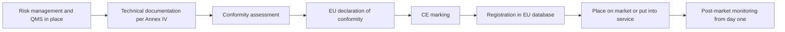
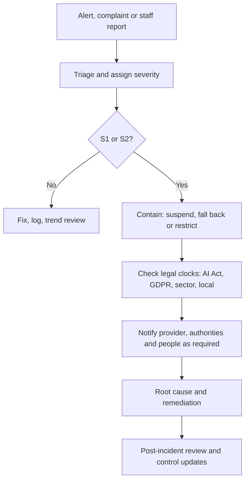
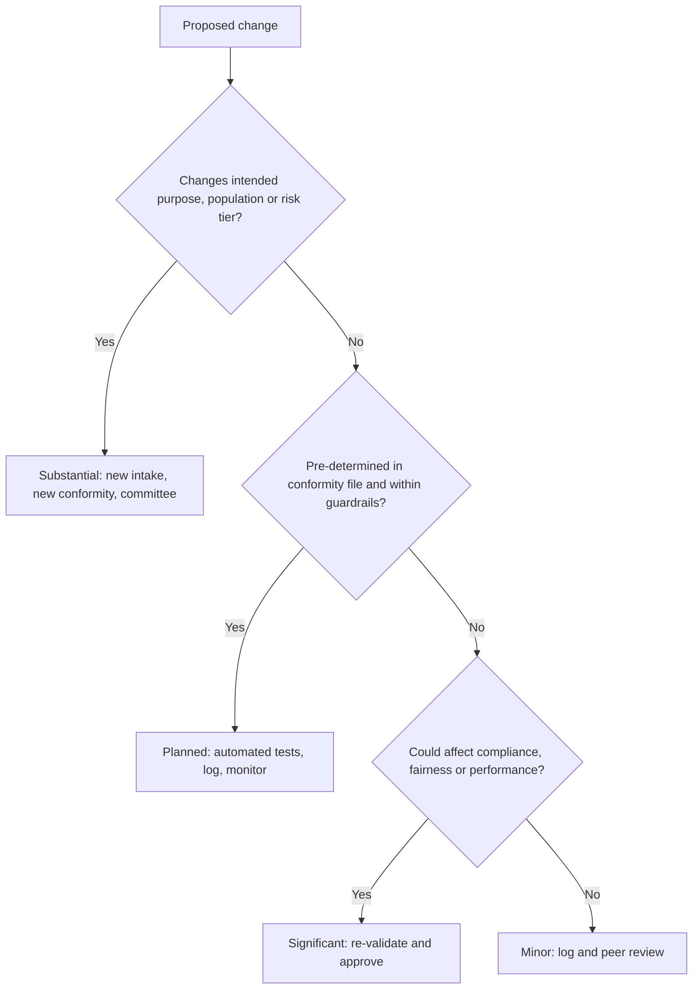

# Module 10 — Release, monitoring and maintenance

*An AI system's riskiest moment is not when it is trained. It is when it starts making decisions about real people, and every day after that. Once a model is live, the world moves: customers change, data pipelines change, vendors ship new versions, and the people meant to supervise the system get used to trusting it. This module follows Najm Bank's in-house credit-scoring model from the release gate into production and, eventually, to retirement. You will learn how to decide that a system is ready, how the EU AI Act's conformity steps work for a high-risk system, how to monitor for drift and unfairness, how to recognise and report an incident, when a change is big enough to need fresh approval (or a fresh conformity assessment), and how to switch a system off safely. This is not legal advice: laws and guidance change, and the details depend on your facts, so check official sources and your own counsel.*

> **BoK coverage:** III.C — Governing release, monitoring and maintenance: readiness and conformity, post-market monitoring, drift and incidents, change control, maintenance and decommissioning.

---

# 10.1 — Release readiness and conformity
*Level: 🔴 Advanced* · *Prerequisites: 6.2, 8.3, 9.3* · *BoK: III.C*

## ⚡ In 60 seconds

- Release is a governance decision: a named, accountable person says "go" against **go/no-go criteria agreed before testing**, with evidence on file.
- Ready means more than "tests passed": documentation complete, oversight and monitoring in place, legal steps done, users trained, rollback ready.
- For an EU **high-risk** system, the provider must finish the **conformity assessment**, sign an **EU declaration of conformity**, affix the **CE marking** and **register** the system in the EU database *before* placing it on the market or putting it into service.
- Credit scoring of natural persons is an Annex III high-risk use, and its conformity assessment is based on **internal control**: the provider assesses itself, with no notified body, but it must be able to prove every claim.
- Roll out in stages (**shadow → pilot → canary → full**) so that anything your testing missed does small, reversible harm.
- The biggest trap: thinking a bank that builds a model for its own use is "just a user". Putting it into service for your own use makes you the **provider**.

## 🧭 Why it matters

It is a Thursday afternoon at Najm Bank. Dana, the lead data scientist, has finished version 2 of the retail credit-scoring model. On the holdout set it separates good and bad borrowers noticeably better than version 1, and Khalid, Head of Retail Lending, wants it live on Sunday so the new model is scoring applications before a personal-loan campaign launches. "Testing is done," he tells Layla, Head of AI Governance. "What else is there?"

Layla opens the release checklist. The fairness analysis skips the Frankfurt branch's EU customers. The instructions for use, which tell credit officers when not to rely on the score, are a draft. Nobody has built the monitoring dashboard. Sara, the DPO, has not seen the updated DPIA, though v2 uses two new data fields. Because Najm built the system and scores EU residents with it, and credit scoring is high-risk under the EU AI Act, Najm carries **provider** obligations: conformity assessment, declaration, CE marking and registration. And no one has written down what happens if the model must be switched off on Monday morning.

None of these gaps is exotic. Many AI failures are failures of release, not of the algorithm: the system went live before the people, processes and safeguards around it were ready. This lesson turns "is it ready?" into a decision with evidence behind it.

## 📐 How it works

### 🟢 The essentials

**What "release" means.** Release is the moment an AI system starts affecting real decisions and real people. The EU AI Act uses two precise terms. **Placing on the market** means first making an AI system available on the EU market. **Putting into service** means supplying it for first use directly to a deployer, *or for the provider's own use*, in the EU for its intended purpose. Najm never sells its scoring model, but it puts the model into service for its own use in its Frankfurt branch. That is enough to trigger provider obligations for a high-risk system.

**The release gate.** A release gate is a formal checkpoint where a system must meet defined criteria before it moves to the next stage. Good gates share four features:

1. **Criteria are set in advance.** Thresholds are agreed at use-case approval (8.1), not negotiated after results come in.
2. **Every criterion has evidence.** "Fairness acceptable" is not evidence. "Approval-rate ratio between men and women of 0.93 on the 2025 holdout, above the 0.90 threshold, report DS-117" is.
3. **Sign-off is named and proportionate.** A low-risk tool may need only the business and model owners; a high-risk system needs independent validation, risk, compliance, the DPO and the AI Governance Committee.
4. **Conditions are tracked.** "Go, subject to the dashboard being live first" is fine if someone owns the condition.

**Go/no-go criteria.** A practical set covers six areas:

| Area | Example criterion | Typical evidence |
|---|---|---|
| Performance | Meets the accuracy and calibration targets for every major segment, not only on average | Validation report, segment tables |
| Fairness | Outcome and error-rate gaps within agreed thresholds for relevant groups | Bias testing report (see 9.2, 9.3) |
| Robustness and security | Stress tests, adversarial and red-team findings closed or accepted | Test logs, security review |
| Documentation | Model or system card, technical documentation, instructions for use, limitations all final | Document register |
| Operations | Monitoring live, alerts routed, rollback tested, fallback process staffed | Runbook, rollback test record |
| Legal and people | DPIA updated, legal obligations mapped and met, users trained, notices ready | DPIA, training records, notice text |

**Documentation complete.** "Complete" means someone other than the builder could understand what the system does, how it was tested, where it should not be used and how to operate it safely: purpose, data lineage (9.1), test results and limitations, risk assessment, oversight design, instructions for use and monitoring plan.

### 🟡 Going deeper

**The EU conformity route for a high-risk system.** For a provider of a high-risk AI system, the AI Act sets out a sequence that must be complete before release:

- **Quality management system (Art. 17)** and **risk management system (Art. 9).** Policies, procedures, responsibilities and a risk process across the whole life cycle.
- **Technical documentation (Art. 11 and Annex IV).** Purpose, design, data, testing, performance, human-oversight measures, the post-market monitoring plan and more.
- **Conformity assessment (Art. 43).** The procedure that shows the requirements in Articles 8 to 15 are met (risk management, data governance, documentation, logging, transparency, human oversight, and accuracy, robustness and cybersecurity). For most Annex III uses, including **credit scoring**, the route is **internal control** (Annex VI): the provider checks its own QMS and technical documentation against the requirements. For biometric systems in Annex III, a **notified body** (an independent assessor designated by a Member State) may be required, particularly where harmonised standards have not been fully applied. High-risk AI in products covered by Annex I legislation, such as medical devices or machinery, follows that sector's existing conformity procedure, with the AI requirements folded in.
- **EU declaration of conformity (Art. 47).** A signed statement by the provider that the system meets the requirements. The provider takes legal responsibility for it.
- **CE marking (Art. 48).** The visible sign of conformity. For systems provided digitally, a digital CE marking can be used.
- **Registration (Art. 49, database under Art. 71).** Providers of Annex III high-risk systems register themselves and the system in the EU database before placing it on the market or putting it into service. Deployers that are public authorities, or act on their behalf, also register their use.

**Harmonised standards.** Following a harmonised standard published in the Official Journal gives a *presumption of conformity* with the requirements it covers. At the time of writing (2026) the AI harmonised standards were still being developed, and the Commission's November 2025 "Digital Omnibus" proposal would postpone some high-risk deadlines. Check the current status; the exam tests the Act as adopted.

**The deployer's readiness steps.** Before using a high-risk system, a deployer must be able to follow the instructions for use, assign human oversight to people with the necessary competence, training, authority and support (Art. 26), ensure input data under its control is relevant and sufficiently representative, and, as an employer, inform workers' representatives and affected workers. Public bodies, and deployers using a system for **credit scoring or life and health insurance pricing**, must complete a **fundamental rights impact assessment (FRIA)** under Art. 27 before first use (see 11.3). Najm, as provider and deployer, needs both sets of steps.

**Outside the EU.** Najm's Qatar and UAE operations need no CE marking, but the discipline still applies. QCB's AI guideline for financial institutions expects governance, testing and ongoing oversight of AI; read the current text on the QCB website. Banks also have **model risk management** policies (the US Federal Reserve and OCC's 2011 guidance, SR 11-7, is the classic reference) requiring independent validation and "effective challenge". An AI release gate should reuse this machinery, not duplicate it.

### 🔴 Expert view

**Staged rollout.** No test set perfectly represents production. Staged rollout limits the damage from what you did not foresee.

| Stage | What happens | What it proves | Governance notes |
|---|---|---|---|
| **Shadow** | New model scores live traffic in parallel; its outputs are logged but not used | Behaviour on real, current data; agreement with the current model; operational stability | Still processes personal data (lawful basis, DPIA), but no customer impact |
| **Pilot** | Used for real decisions in a limited setting, such as one branch or one product, with extra human review | Workflow fit, user understanding, override patterns, complaints | Real decisions: all legal obligations apply; heightened oversight |
| **Canary** | A small share of live traffic, for example 5%, goes to the new model, with automatic rollback triggers | Performance and fairness at scale on a random slice | Pre-agree the rollback triggers and who can pull them |
| **Full release** | All traffic, with the old model retired or kept as a fallback | — | Monitoring plan (10.2) takes over |

Two nuances often trip up experienced practitioners:

- **A pilot is a release.** If a high-risk system makes real decisions about people in the EU during a pilot, it has been put into service, and the conformity steps must already be complete. The AI Act does offer a separate regime for **testing Annex III systems in real-world conditions** before placing on the market (Art. 60), but it has its own conditions, including a registered testing plan, a limited duration and, as a rule, informed consent from participants. It is not a loophole for skipping conformity. Get legal advice before relying on it.
- **Shadow mode is not risk-free.** It avoids customer impact but not privacy obligations, and a short shadow period misses seasonal effects and delayed outcomes.

**Rollback and fallback.** Before release, answer in writing: how do we switch it off, who may do so (including out of hours), and what takes over? For Najm, the fallback is the v1 scorecard plus manual underwriting. It must be staffed and tested: a kill switch that routes 3,000 applications a day to four underwriters is not a fallback.

**Conformity is a snapshot; compliance is a film.** The declaration describes the system on the day it is signed; monitoring (10.2) and change control (10.3) keep it true. The provider keeps the technical documentation, QMS documentation and declaration for **10 years** after placing on the market or putting into service (Art. 18). The release file is a regulated record.

**Who should not sign.** The builder should not be the only one who signs that the model is fit. At Najm, Dana's team builds, the Model Validation Unit validates independently, Khalid as business owner accepts the residual risk, and the AI Governance Committee approves high-risk releases.

## ⚖️ The instruments

| Instrument | What it requires or recommends | Exam cue |
|---|---|---|
| **EU AI Act** — Arts 43, 47, 48, 49 | Provider completes the conformity assessment, signs the EU declaration of conformity, affixes CE marking and registers Annex III systems before placing on the market or putting into service | "Before release, what must the provider of a high-risk credit-scoring system do?" Internal control, declaration, CE, registration |
| **EU AI Act** — Arts 26, 27 | Deployers: follow instructions, competent human oversight, relevant input data, inform workers; FRIA before first use for credit scoring and insurance pricing and for public bodies | A deployer's readiness includes the FRIA for credit scoring |
| **EU AI Act** — Art. 60 | Real-world testing of Annex III systems before placing on the market, under strict conditions | A pilot on real people is not automatically exempt from conformity |
| **GDPR** — Arts 25, 35 | Data protection by design; DPIA before high-risk processing, updated when processing changes | New data fields in v2 mean the DPIA must be reviewed before release |
| **NIST AI RMF** — MANAGE 1.1, GOVERN 1 | Decide whether the system achieves its intended purpose and whether deployment should proceed; policies define roles and processes | Voluntary; "go/no-go" maps to MANAGE 1.1 |
| **ISO/IEC 42001** — Annex A life-cycle controls | Documented criteria and processes for AI system verification, validation and deployment within a certifiable management system | Certification is of the management system, not a CE marking for the product |
| **QCB AI guideline** | Governance approval, testing and oversight for AI used by Qatar-regulated financial institutions | Local banking regulators expect release governance even without an AI Act |

## 🏛️ In practice at Najm Bank

Layla's team turns the release gate into a one-page **Release Decision Record**, filed with the system's inventory entry. Here is the record for credit-scoring v2 after the gaps were closed:

| Field | Entry |
|---|---|
| System / version | Retail credit score v2.0.0 (registry ID CS-RET-002) |
| Risk tier | High (EU AI Act Annex III credit scoring; internal tier 1) |
| Najm's legal role | Provider and deployer (built in-house, put into service for own use, including the Frankfurt branch) |
| Go/no-go criteria (set at intake, 14 Jan) | Gini ≥ 0.55 overall and ≥ 0.50 in each segment · approval-rate ratio ≥ 0.90 across sex and age bands · no open critical red-team findings · rollback tested |
| Evidence | Validation report MV-2026-031 · Bias report DS-117 (now incl. EU portfolio) · Security review SEC-442 · Rollback test RB-19 |
| Documentation | Technical documentation v2 · Instructions for use v2 (final) · System card · Monitoring plan MP-CS-2 · DPIA v3 (Sara signed) · FRIA v1 |
| EU conformity | Internal-control assessment complete · Declaration of conformity signed by the CRO · Digital CE marking · Registered in EU database |
| Rollout plan | 4 weeks shadow → 2-week pilot in Doha retail → 10% canary → full. Rollback triggers: PSI > 0.25 on key inputs, approval-rate ratio < 0.85, complaint spike > 2× baseline |
| Fallback | v1 scorecard kept warm; manual underwriting rota for referrals |
| Sign-offs | Model owner (Dana) · Independent validation (Model Validation Unit) · DPO (Sara) · CDO (Omar) · Business owner accepting residual risk (Khalid) · AI Governance Committee approval, minute 2026-07 |
| Conditions | Monitoring dashboard live before pilot (owner: Omar) · Credit-officer training ≥ 95% complete before pilot (owner: Khalid) |

Khalid lost his Sunday launch; v2 went live six weeks later with a clean file.

## 🛠️ Exercises

- 🟢 List ten release-checklist items for Najm's customer-service chatbot (limited risk under the AI Act), marking which the credit model also needs. *Done when:* each item names who provides the evidence.
- 🟡 Draft go/no-go criteria for Najm's fraud-detection model, explaining why EU conformity steps do not apply (fraud detection is excluded from the Annex III credit category) but fairness and rollback criteria still do. *Done when:* each of the six areas has a measurable criterion.
- 🔴 Design a staged rollout for credit-scoring v2 covering EU customers: which stage counts as putting into service, what must be complete before it, and which rollback triggers apply. *Done when:* a regulator could see that no EU applicant was scored by a non-conformant system.

## ⚠️ Mistakes and exam traps

- **"Testing passed, so we're ready."** Testing is one input. Answer with the full set: documentation, oversight, monitoring, legal steps, training and rollback.
- **"We only use it internally, so we're a deployer."** An organisation that develops a high-risk system and puts it into service under its own name, including for its own use, is the **provider**. Najm is both provider and deployer.
- **"Credit scoring needs a notified body."** No. Annex III credit scoring uses the internal-control route. Notified bodies mainly appear for biometrics and Annex I products.
- **"CE marking means EU approval."** It signals the *provider's own* declaration, backed by its conformity assessment.
- **"ISO/IEC 42001 certification replaces conformity assessment."** No: 42001 certifies a management system, not a specific AI system.
- **Setting thresholds after seeing results.** On the exam, the right answer fixes acceptance criteria up front and documents any change and who approved it.

## 🧾 Recap

- Release is an accountable decision against pre-agreed go/no-go criteria, backed by evidence, independent validation and named sign-offs, covering performance, fairness, security, documentation, operations and legal and people readiness.
- EU high-risk providers must complete the conformity assessment (internal control for credit scoring), the declaration of conformity, CE marking and EU database registration before release. Deployers must be ready too, including the FRIA where it applies.
- Staged rollout (shadow, pilot, canary) limits harm, but a pilot with real decisions is a real release.
- The release file is a regulated record that stays true only through monitoring and change control.

## ✍️ Check yourself

**1. Najm Bank develops a credit-scoring model in-house and uses it to assess applicants at its Frankfurt branch. It never sells the model. What is Najm's role under the EU AI Act for this system?**

- A. Deployer only, because it does not place the system on the market
- B. Provider and deployer, because it puts the system into service for its own use and uses it
- C. Distributor, because it makes the system available internally
- D. No role, because internal tools are out of scope

Answer

**B.** Putting a system into service for your own use in the EU triggers provider obligations, and Najm also uses it, so it is a deployer too. A is the tempting error. (Essentials: what "release" means.)

**2. Which conformity assessment route applies to a high-risk AI system used to evaluate the creditworthiness of natural persons?**

- A. Assessment by a notified body in every case
- B. No conformity assessment; registration only
- C. Internal control by the provider, based on its QMS and technical documentation
- D. Certification to ISO/IEC 42001

Answer

**C.** Most Annex III uses, including credit scoring, follow the internal-control procedure. Notified bodies mainly come in for biometrics and Annex I products. ISO/IEC 42001 certifies a management system and does not replace conformity assessment. (Going deeper: the EU conformity route.)

**3. A data science team presents excellent test results and asks for release. The fairness threshold was lowered the week before, after the first results came in. What should the governance function do first?**

- A. Approve, because the new threshold is met
- B. Ask the vendor to re-run the tests
- C. Reject the model permanently
- D. Treat the threshold change as a governance decision: document why it changed, who approved it and whether the original criterion should apply

Answer

**D.** Criteria should be set in advance, and any change must be justified and approved through governance, not quietly adopted after results arrive. A rewards moving the goalposts. C is disproportionate without analysis. (Essentials: the release gate.)

**4. During a shadow deployment the new model scores live applications, but its outputs are only logged and not used. Which statement is most accurate?**

- A. Shadow mode still processes personal data, so it needs a lawful basis and DPIA coverage, but it avoids direct customer impact
- B. Shadow mode is outside data protection law because no decision is made
- C. Shadow mode counts as placing on the market
- D. Shadow mode removes the need for a later pilot or canary

Answer

**A.** Scoring real applicants' data is processing even if the output is discarded. Shadow mode avoids impact on decisions but does not replace later stages that test workflow and human use. (Expert view: staged rollout.)

**5. Before signing off a high-risk credit-scoring system, which item is part of the *deployer's* readiness under the EU AI Act, rather than the provider's?**

- A. Drawing up the EU declaration of conformity
- B. Affixing the CE marking
- C. Completing a fundamental rights impact assessment before first use
- D. Writing the Annex IV technical documentation

Answer

**C.** Art. 27 requires deployers using a system for credit scoring, among others, to complete a FRIA before first use. A, B and D are provider obligations. Najm, being both, must do all four. (Going deeper: the deployer's readiness steps.)

## 📚 References

- EU AI Act, Regulation (EU) 2024/1689 (EUR-Lex): https://eur-lex.europa.eu/eli/reg/2024/1689/oj
- European Commission, AI regulatory framework and AI Office: https://digital-strategy.ec.europa.eu/en/policies/regulatory-framework-ai
- GDPR, Regulation (EU) 2016/679 (EUR-Lex): https://eur-lex.europa.eu/eli/reg/2016/679/oj
- NIST AI Risk Management Framework: https://www.nist.gov/itl/ai-risk-management-framework
- ISO/IEC 42001:2023 (ISO): https://www.iso.org/standard/81230.html
- Qatar Central Bank (for its AI guideline for financial institutions): https://www.qcb.gov.qa
- IAPP AIGP certification and Body of Knowledge: https://iapp.org/certify/aigp/

---

# 10.2 — Monitoring, drift and incidents
*Level: 🔴 Advanced* · *Prerequisites: 10.1, 9.3* · *BoK: III.C*

## ⚡ In 60 seconds

- An AI system that was fit on release day can become unfit without anyone changing a line of code, because the world it models changes. Monitoring is how you find out before customers or regulators do.
- Watch six things: **inputs** (data drift), **outputs**, **performance** (once outcomes arrive), **fairness across groups over time**, **operations**, and **human and customer signals** such as overrides and complaints.
- **Data drift** is a change in what goes in. **Concept drift** is a change in the relationship between inputs and outcomes. Concept drift is more dangerous and harder to see.
- EU high-risk **providers** must run a **post-market monitoring** system (Art. 72). **Deployers** must monitor operation, keep logs for at least six months and tell the provider about risks and serious incidents (Art. 26).
- **Serious incidents** involving high-risk systems must be reported to market surveillance authorities within **15 days** at most, and faster for deaths and the gravest cases (Art. 73). A personal data breach has its own **72-hour** clock under the GDPR. Several clocks can run at once.
- The biggest trap: monitoring only aggregate accuracy. Harm usually starts in a segment, a group or a feedback loop that the average hides.

## 🧭 Why it matters

In 2021 the US property company Zillow announced it was winding down Zillow Offers, its business of buying homes at algorithm-assisted prices, saying that forecasting home prices had proved far harder than expected. It took heavy losses on homes it had overpaid for. No one had "broken" the model. The world had moved under it.

At Najm Bank, the warning signs are smaller but just as real. Four months after credit-scoring v2 went live, Khalid's team notices that approvals for applicants under 25 in the UAE have fallen by a third, and the complaints team logs a rise in "declined without explanation" calls. The overall approval rate hardly moved, so the headline dashboard showed green. When Dana investigates, she finds that an upstream HR-data vendor recoded the "employer category" field. Thousands of young applicants employed by new government entities were now arriving as "unknown employer", a value the model treats as high risk.

Was this an incident? Who had to be told, and by when? Could it happen again without anyone noticing? This lesson gives you the tools to answer those questions: a monitoring design that would have caught the problem in days rather than months, and an incident process that knows which clocks start ticking.

## 📐 How it works

### 🟢 The essentials

**Why AI needs special monitoring.** Traditional software fails loudly. AI fails quietly, producing confident outputs as the data drifts away from what it learned.

**What to monitor.**

| Signal | What you watch | Example at Najm (credit model) |
|---|---|---|
| **Inputs** | Distributions of features; missing values; new or unexpected categories | Share of "unknown employer" jumps from 2% to 14% |
| **Outputs** | Score distribution; approval, decline and referral rates | Declines rise in one segment while the overall rate is flat |
| **Performance** | Accuracy, calibration and error rates, once real outcomes arrive | Early-delinquency rate for approved loans versus what the model predicted |
| **Fairness over time** | Outcome and error-rate gaps between groups, tracked monthly | Approval-rate ratio for under-25s falls below the 0.85 alert level |
| **Operations** | Latency, uptime, failed calls, pipeline and schema changes | Upstream schema change on the employer field |
| **Human and customer signals** | Override rates, referral outcomes, complaints, appeals, staff feedback | Credit officers overriding declines for young applicants; complaint spike |

**Drift, in plain terms.**

- **Data drift** (also called covariate shift): the inputs change. A new customer segment arrives, a marketing campaign attracts younger applicants, or a pipeline starts sending a field in a different format.
- **Concept drift**: the *relationship* between inputs and the outcome changes. Before a recession, a certain debt-to-income ratio might have been safe. After interest rates rise, the same ratio predicts default. The inputs look the same, but their meaning has changed.
- **Label or prior drift**: the base rate of the outcome changes, for example when overall default rates double in a downturn.

A common first measure of data drift in credit is the **population stability index (PSI)**, which compares today's distribution of a variable or score with the distribution at development. A widely used industry rule of thumb treats below 0.1 as stable, 0.1 to 0.25 as worth investigating and above 0.25 as a significant shift. Treat these as starting points to calibrate, not legal thresholds.

**Logging.** You cannot investigate what you did not record. For each decision, log the input features (or a reference to them), the model version, the output, any human action (accept, override, refer) and the final decision. For high-risk systems the EU AI Act requires automatic logging capabilities (Art. 12). Deployers must keep the logs under their control for at least six months, unless other law says otherwise (Art. 26). Logs contain personal data, so they need access controls and a retention period that respects data protection law.

### 🟡 Going deeper

**Post-market monitoring under the EU AI Act.** A provider of a high-risk system must set up a **post-market monitoring system** proportionate to the risk (Art. 72). It must actively and systematically collect, document and analyse performance data throughout the system's lifetime, including data from deployers, to check continuing compliance. The **post-market monitoring plan** is part of the technical documentation; the Act asks the Commission to adopt a template for it, so check its current status.

**The deployer's side.** Deployers must monitor the system's operation according to the instructions for use and inform the provider where relevant (Art. 26). If a deployer has reason to believe the system presents a risk to health, safety or fundamental rights, it must inform the provider (or distributor) and the relevant market surveillance authority and **suspend use**. EU-regulated financial institutions can meet the monitoring duty through their internal-governance arrangements under EU banking law. Najm, as provider and deployer, should design one monitoring system that serves both roles.

**The label-delay problem.** In credit you learn whether a loan was "good" only months later. So monitor **leading indicators** (early arrears at 30 or 60 days past due, input drift, overrides) while waiting for **lagging indicators** such as 12-month default rates, or you find problems a year late.

**Feedback loops.** AI systems can change the data they later learn from. Two patterns matter:

- **Selective labels.** Najm only sees repayment outcomes for applicants it approved. If the model wrongly declines a group, Najm never observes that those people would have repaid, so the model's belief is never corrected and retraining can make it worse.
- **Behavioural loops.** A fraud model that triggers more checks in a neighbourhood finds more fraud there *because it looks harder*, which then "confirms" the pattern.

Countermeasures include holding back a small random sample for review, tracking outcomes of overridden cases, and using reject-inference methods carefully. Document the loop as a known limitation.

**Fairness over time.** A model that passed bias testing can become unfair through drift, as Najm's under-25 example shows. Track the release fairness metrics (9.2) on a schedule, with alert thresholds, by segment and country. Where data on protected characteristics is restricted, decide with the DPO at design time which attributes you may lawfully use to *test* for bias.

**Complaints are monitoring data.** Complaints, appeals and staff feedback often surface problems before metrics do. Tag complaints about automated decisions, route them to the model owner and review the trend. The NIST AI RMF calls for mechanisms to capture post-deployment feedback from users and affected people.

### 🔴 Expert view

**What counts as an AI incident.** There is no single global definition. A practical one: an event in which an AI system's development, use or malfunction causes, or nearly causes, harm to people, property, the environment, the organisation or fundamental rights. The OECD distinguishes an **AI incident** (harm occurred) from an **AI hazard** (harm could plausibly follow). Internally, report both.

**Severity.** A simple four-level matrix lets people triage consistently:

| Severity | Description | Example | Response |
|---|---|---|---|
| **S1 Critical** | Serious harm to people or rights, legal breach or widespread impact | Systematic unlawful discrimination in credit decisions | Immediate escalation to Layla, CRO, DPO and legal; consider suspension; regulatory clocks checked within hours |
| **S2 Major** | Material harm to a group or significant financial or reputational impact | The under-25 employer-field drift | Same-day escalation; containment; affected customers identified |
| **S3 Moderate** | Limited harm, contained | Chatbot gives wrong fee information to a handful of customers | Fix within days; correct the information for those affected |
| **S4 Minor or near-miss** | No harm yet | Drift alert caught in shadow mode | Log, analyse, learn |

**Serious incidents under the EU AI Act.** A **serious incident** (Art. 3(49)) is an incident or malfunction of an AI system that directly or indirectly leads to death or serious harm to health; a serious and irreversible disruption of critical infrastructure; an **infringement of EU-law obligations intended to protect fundamental rights**; or serious harm to property or the environment. The third limb matters for banks: systematic discrimination in credit decisions could qualify.

Providers of high-risk systems must report serious incidents to the market surveillance authorities of the Member State where the incident occurred (Art. 73):

- immediately after establishing a causal link, or the reasonable likelihood of one, between the system and the incident, and **no later than 15 days** after becoming aware of it;
- **no later than 2 days** for a widespread infringement or a serious and irreversible disruption of critical infrastructure;
- **no later than 10 days** in the event of a death.

An initial, incomplete report is allowed, followed by a complete one. The provider must then investigate, assess the risk and take corrective action. Deployers that identify a serious incident must immediately inform the provider first, then the importer or distributor and the authorities. Providers of general-purpose AI models with systemic risk have their own duty to report serious incidents to the AI Office. The Commission has been preparing guidance and a reporting template for Art. 73. Check the current version.

**Parallel clocks.** One event can trigger several regimes at once:

| Regime | Trigger | Deadline |
|---|---|---|
| **EU AI Act** (Art. 73) | Serious incident involving a high-risk system | 15 days at most; 10 for a death; 2 for the gravest cases |
| **GDPR** (Art. 33) | Personal data breach, unless unlikely to result in risk | To the supervisory authority without undue delay and, where feasible, within **72 hours** of becoming aware |
| **GDPR** (Art. 34) | Breach likely to result in *high* risk to individuals | Tell data subjects without undue delay |
| Sector and local rules | For example, major ICT incidents under the EU's Digital Operational Resilience Act (DORA) where it applies; Qatar PDPPL and QCB requirements | Check scope and current text |

The Najm employer-field event was not a data breach: no data was lost or disclosed. Whether it infringed fundamental-rights obligations is a judgement for counsel, made quickly and documented either way.

**Public incident databases.** The **OECD AI Incidents Monitor (AIM)** tracks AI incidents and hazards reported in the news worldwide; the independent **AI Incident Database** collects public submissions. Neither is a regulatory channel. Use them to learn from others' failures, seed risk registers and red-team scenarios, and brief boards.

## ⚖️ The instruments

| Instrument | What it requires or recommends | Exam cue |
|---|---|---|
| **EU AI Act** — Art. 72 | Providers of high-risk systems run a proportionate post-market monitoring system and plan, using data from deployers and other sources, for the system's whole lifetime | Monitoring is a *provider* duty that continues after release |
| **EU AI Act** — Art. 73 & Art. 3(49) | Report serious incidents to market surveillance authorities: no later than 15 days, 10 for a death, 2 for widespread infringement or critical-infrastructure disruption | Infringement of fundamental-rights obligations can be a serious incident |
| **EU AI Act** — Arts 12, 26 | Automatic logging by design; deployers monitor, keep logs for at least 6 months, inform the provider and suspend use where there is risk | Deployer tells the provider *first* about a serious incident |
| **GDPR** — Arts 33, 34 | Breach notification to the authority within 72 hours where feasible; to individuals if high risk | A model failure is not automatically a data breach, and vice versa |
| **NIST AI RMF** — MEASURE, MANAGE 4.1 | Track risks over time; post-deployment monitoring plans with user feedback, appeal and override, incident response, recovery and change management | Voluntary; MANAGE covers post-deployment monitoring |
| **ISO/IEC 42001** — Clause 9, Annex A | Performance evaluation, monitoring and measurement of the AI management system; operation and monitoring of AI systems | Monitoring feeds management review and continual improvement |
| **OECD AI Incidents Monitor** | Public tracking of AI incidents and hazards; OECD work on common incident definitions | A learning resource, not a legal reporting channel |

## 🏛️ In practice at Najm Bank

After the employer-field event, Layla and Omar rebuild the credit model's **monitoring plan** (extract):

| Metric | Frequency | Alert threshold | Owner | Escalation |
|---|---|---|---|---|
| PSI on top 10 input features and on score | Daily | > 0.10 investigate · > 0.25 alert | Dana | Model owner → CDO |
| New or unknown category share per categorical field | Daily | > 2× trailing 30-day average | Data engineering | Pipeline owner + Dana |
| Approval, decline and referral rates by country, age band, sex, product | Weekly | Approval-rate ratio < 0.90 watch · < 0.85 alert | Dana | Layla + Khalid |
| 30 and 60 days-past-due rate versus predicted, by segment | Monthly | Actual/predicted outside 0.8–1.2 | Model Validation Unit | CRO |
| Override rate by credit officer and branch | Weekly | < 2% or > 20% | Khalid's team | Layla |
| Complaints tagged "automated decision" | Weekly | > 2× 8-week baseline | Complaints lead | Layla + Sara |
| Upstream schema or contract changes | On change | Any change to a model input | Data engineering | Change board (10.3) |

**Incident record, IR-2026-014 (extract).** Severity S2. Detected via complaint trend on day 118. Contained on day 119 by remapping the new employer codes and routing affected declines to manual review. 2,140 applicants re-assessed, 610 offered reconsideration. Legal assessment: not a personal data breach. Fundamental-rights infringement assessed and judged not to meet the serious-incident threshold, with reasons recorded. Root cause: no contract term requiring the data vendor to notify schema changes (sent to Yusuf, procurement). Controls added: unknown-category alert and schema-change gate.

## 🛠️ Exercises

- 🟢 For Najm's customer-service chatbot, list five monitoring signals and say for each whether it detects data drift, concept drift, quality problems or customer harm. *Done when:* each signal has a named owner.
- 🟡 Draft the monitoring section of the instructions for use Najm (as provider) gives its credit officers (as deployers): what to watch, how to report, when to stop using the score. *Done when:* a branch manager could follow it unaided.
- 🔴 A credit model under-scores applicants of one nationality for two months before anyone notices. Decide which reporting regimes may apply, what facts you need and the deadlines. *Done when:* you have a timeline from "aware" to each possible notification, with a named decision-maker.

## ⚠️ Mistakes and exam traps

- **Watching only overall accuracy.** Averages hide segment harm. Monitor by group, segment and country.
- **Confusing data drift and concept drift.** If the question says the inputs look the same but outcomes have changed, the answer is concept drift.
- **"Every AI incident is a data breach."** A breach is about the security of personal data. Many AI incidents involve no breach, and some involve both. Assess each regime separately.
- **Waiting for full facts before reporting.** The AI Act allows an initial, incomplete report, and the GDPR allows information in phases. Missing the deadline is the bigger failure.
- **Deployer reports only to the authority.** Under the AI Act the deployer informs the *provider first*, then the importer or distributor and the authorities.
- **Treating public incident databases as compliance channels.** They are learning tools, not a place to file regulatory reports.

## 🧾 Recap

- AI fails quietly. Monitor inputs, outputs, performance, fairness over time, operations and human and customer signals, by segment.
- Data drift changes the inputs, concept drift changes their meaning, and feedback loops let the model shape its own future data.
- EU high-risk providers run post-market monitoring (Art. 72). Deployers monitor, keep logs for at least six months, inform the provider and suspend use where there is risk (Art. 26).
- Serious incidents go to market surveillance authorities within 15 days at most (2 or 10 in the gravest cases). A personal data breach has a separate 72-hour GDPR clock.
- A severity matrix, a containment playbook and a post-incident review turn incidents into better controls.

## ✍️ Check yourself

**1. Najm's credit model receives inputs whose distributions look unchanged, but after a sharp rise in interest rates, applicants with the same profile default far more often than predicted. What is this?**

- A. Data drift
- B. Concept drift
- C. A personal data breach
- D. Selective labels

Answer

**B.** The relationship between the inputs and the outcome has changed while the inputs look the same. That is concept drift. A would need the input distributions to shift. (Essentials: drift, in plain terms.)

**2. A bank deploying a vendor's high-risk AI system identifies a serious incident. Under the EU AI Act, whom must it inform first?**

- A. The provider of the system
- B. The European AI Office
- C. The affected customers
- D. The data protection authority

Answer

**A.** Deployers must immediately inform the provider first, then the importer or distributor and the relevant market surveillance authorities. The data protection authority is involved only if there is also a personal data breach or other GDPR issue. (Expert view: serious incidents.)

**3. What is the maximum time a provider of a high-risk AI system has to report a serious incident that did not involve a death, a widespread infringement or critical-infrastructure disruption?**

- A. 72 hours
- B. Only at the next annual report
- C. 30 days
- D. 15 days after becoming aware

Answer

**D.** The general limit under Art. 73 is 15 days, with shorter limits of 10 days (death) and 2 days (widespread infringement or serious and irreversible critical-infrastructure disruption). 72 hours is the GDPR breach clock, the most common distractor. (Expert view: serious incidents.)

**4. Najm only observes repayment outcomes for approved applicants. Which risk does this create for monitoring and retraining?**

- A. Concept drift
- B. A selective-labels feedback loop in which wrongly declined groups are never corrected
- C. Automatic breach of GDPR Article 33
- D. Loss of CE marking

Answer

**B.** Because declined applicants never get an outcome, the model's errors against them are invisible and retraining can entrench them. Mitigations include random holdback review and tracking overridden cases. (Going deeper: feedback loops.)

**5. Which statement about the OECD AI Incidents Monitor is correct?**

- A. It records AI incidents and hazards from public reporting, and governance teams use it to learn and to seed risk registers
- B. It is the channel for reporting serious incidents under the EU AI Act
- C. It certifies AI systems as safe
- D. It replaces a firm's own incident log

Answer

**A.** The AIM is a public monitoring and learning resource. EU AI Act reports go to national market surveillance authorities (or to the AI Office for systemic-risk GPAI models). (Expert view: public incident databases.)

## 📚 References

- EU AI Act, Regulation (EU) 2024/1689 (EUR-Lex): https://eur-lex.europa.eu/eli/reg/2024/1689/oj
- GDPR, Regulation (EU) 2016/679 (EUR-Lex): https://eur-lex.europa.eu/eli/reg/2016/679/oj
- European Data Protection Board (guidance on personal data breach notification): https://www.edpb.europa.eu
- Digital Operational Resilience Act, Regulation (EU) 2022/2554 (EUR-Lex): https://eur-lex.europa.eu/eli/reg/2022/2554/oj
- NIST AI Risk Management Framework: https://www.nist.gov/itl/ai-risk-management-framework
- OECD AI Incidents Monitor: https://oecd.ai/en/incidents
- ISO/IEC 42001:2023 (ISO): https://www.iso.org/standard/81230.html

---

# 10.3 — Change management, maintenance and retirement
*Level: 🔴 Advanced* · *Prerequisites: 10.2, 6.2* · *BoK: III.C*

## ⚡ In 60 seconds

- Every live AI system changes: retrains, threshold tweaks, new features, vendor updates. **Change management** gives each change the right level of review before it goes live.
- Classify changes by risk: **minor** (logged), **significant** (re-validated and approved), or **substantial** (in EU terms, a change that can trigger a *new conformity assessment* and can even turn a deployer into a provider).
- Under the EU AI Act, a **substantial modification** is an unplanned change after release that affects compliance with the high-risk requirements or changes the intended purpose. Changes the provider **pre-determined** and documented at the initial conformity assessment, such as planned continuous learning, are not substantial modifications.
- Versioning is the backbone: you must be able to say which model, data, code, configuration and documentation made any past decision.
- **Retirement** is a life-cycle stage: plan the fallback, tell those affected, dispose of what must go (sometimes including the model), keep what must be kept, update the inventory.
- The biggest trap: "it's just a retrain". A retrain on new data can change behaviour as much as a new model.

## 🧭 Why it matters

Six months after credit-scoring v2 went live, Dana proposes automatic monthly retraining. "The model will adapt to drift on its own," she says, "and we can drop the quarterly validation cycle." Omar likes the efficiency. Layla has three questions. If the model retrains itself every month, which version made the decision a customer complains about next spring? Will anyone re-check fairness after each retrain? And under the EU AI Act, is a monthly retrain a *substantial modification* that needs a new conformity assessment, or a pre-determined change that the original assessment already covers?

In the same week, Khalid's team is finally retiring the old v1 scorecard. It has been used for eight years. Nobody is sure where all its training extracts live, who still has access to them, how long the bank must keep its decision records, or whether the model file itself contains personal data that should be deleted.

Change and retirement are where good release governance quietly decays. Twelve small changes after approval, a system can be one that no one approved. A system switched off without a plan leaves personal data and access rights behind. And regulators will order deletion not only of data but of models built on it. In 2021 the US Federal Trade Commission's settlement with the photo app Everalbum required the company to delete models and algorithms developed using users' photos without proper consent.

## 📐 How it works

### 🟢 The essentials

**Kinds of change.** Not all changes are equal. A useful taxonomy for an AI system:

| Change type | Example | Why it matters |
|---|---|---|
| Data refresh / retrain, same design | Retrain v2 on the latest 24 months of data | Behaviour can shift, including fairness, even with identical code |
| Threshold or policy change | Approve at score ≥ 620 instead of ≥ 640 | Directly changes who is approved; simple but high-impact |
| Feature change | Add a new open-banking income field | New data, new privacy questions, new bias risks |
| Architecture change | Replace a scorecard with gradient-boosted trees | Explainability, validation and documentation all change |
| Purpose or scope change | Use the retail score for SME owners, or in a new country | New population and new legal context; possibly a new risk tier |
| Upstream or vendor change | Foundation-model provider releases a new version; data vendor recodes a field | Change arrives from outside, often unannounced |
| Infrastructure and dependency | Library upgrade, new serving platform | Can alter numeric results or availability |

**Versioning.** A **model registry** records, for every version: the model artefact, the training-data snapshot, the code commit, the configuration (features, thresholds, hyperparameters), validation results and approvals. Decisions are logged with the version that made them (10.2). Together these give **lineage**: the ability to reconstruct any past decision for a complaint, a regulator or a court.

**Re-validation triggers.** Define in advance what forces a system back through validation and approval:

- any change classed as significant or substantial;
- monitoring alerts that breach thresholds (drift, fairness, performance);
- a serious incident or repeated lower-severity incidents;
- a change in law, regulation or guidance affecting the use;
- a change in the population or context of use;
- a vendor or upstream model change;
- a periodic review date, for example annual for high-risk systems, even if nothing else has happened.

**Maintenance.** Keep the whole system healthy: patch dependencies and vulnerabilities, keep data pipelines and their contracts current, keep documentation (system card, instructions for use, DPIA, FRIA) in step with reality, re-train users when guidance changes, and review access rights. Stale documentation is a classic audit finding that makes every other control look unreliable.

### 🟡 Going deeper

**Substantial modification under the EU AI Act.** The Act defines a **substantial modification** (Art. 3(23)) as a change to an AI system after it has been placed on the market or put into service that was **not foreseen or planned** in the provider's initial conformity assessment and that either **affects the system's compliance** with the high-risk requirements or **modifies its intended purpose**. The consequences:

- A high-risk system that undergoes a substantial modification needs a **new conformity assessment** (Art. 43(4)).
- For systems that continue to learn after release, changes to the system and its performance that the provider **pre-determined** at the initial conformity assessment, and described in the technical documentation, are **not** substantial modifications. This rewards planning. If Najm wants monthly retraining, it should define the retraining process, the data, the guardrails and the acceptance tests *in advance*, and document them as part of the conformity file.
- **Role shift (Art. 25).** A distributor, importer, deployer or other third party is treated as a **provider** of a high-risk system if it puts its name or trademark on the system, makes a substantial modification so that the system remains high-risk, or changes the intended purpose of a system (including a general-purpose one) so that it becomes high-risk. A bank that repurposes a general chatbot to assess creditworthiness can inherit full provider obligations. The original provider must then cooperate and share the necessary information, unless it clearly specified that its system is not to be changed into a high-risk system.

**Legacy systems.** Transitional rules (Art. 111) mean the Act's high-risk requirements apply to systems already placed on the market or put into service before the high-risk rules applied only if they are subsequently subject to **significant changes in their design** (with a separate, later deadline for systems intended for use by public authorities). For a bank running an older model, a redesign can pull it into scope. Check the current dates, given the Digital Omnibus proposal.

**Pre-determined change plans elsewhere.** The US Food and Drug Administration's **predetermined change control plan** approach for AI-enabled medical device software follows the same logic: agree in advance what may change and how it will be validated, so planned updates do not each need fresh approval. Bank model risk policies similarly distinguish "material" from "non-material" changes.

**A change-classification flow.**

Note the design choice: a change that "could affect compliance" is treated as significant *until shown otherwise*. Whether it legally counts as a substantial modification is then a documented judgement made with legal and compliance, not a guess by the engineer on duty.

### 🔴 Expert view

**Continuous learning is a governance choice, not a technical default.** Automatic retraining trades stability and auditability for adaptiveness. If you allow it, bound it: fixed data sources, fixed feature set, automated acceptance tests for performance *and* fairness, automatic rollback if they fail, a version for every retrain, and human review of the trend. For high-impact decisions many organisations prefer **scheduled, human-approved retraining**, a champion–challenger set-up in which the retrained model must beat the current one on agreed criteria before promotion.

**Vendor and foundation-model changes.** For bought systems and API models (11.2), change happens to you: a provider deprecates a model version, a vendor retrains its CV screener. Contracts should require advance notice of material changes, pinned versions where possible and updated documentation. Internally, route vendor changes through the same classification flow.

**Retirement and decommissioning.** Systems are retired when replaced, decayed beyond repair, overtaken by law, dropped by a vendor, discredited by an incident or ordered off by a regulator. The NIST AI RMF names decommissioning explicitly: processes to phase out AI systems safely, and mechanisms to supersede, disengage or deactivate systems performing outside their intended use. A good decommissioning plan covers seven things:

1. **Decision and rationale.** Who approved retirement and why, with any dependencies (downstream systems, reports, other models using its outputs).
2. **Transition.** The replacement or fallback, a cut-over date, parallel running if needed, and staff briefing.
3. **Notification.** Internal users and, where relevant, customers, the provider or deployers (if you are the provider of a system others use), and regulators if the system was registered or under supervisory review.
4. **Retention.** Keep what law requires. EU high-risk providers keep technical documentation and the declaration of conformity for 10 years after placing on the market or putting into service (Art. 18). Banking law typically requires decision and customer records to be kept for years. Litigation holds override deletion.
5. **Disposal.** Delete what is no longer needed. Under the GDPR's storage-limitation principle (Art. 5(1)(e)), personal data must not be kept longer than necessary, and erasure rights (Art. 17) still apply. Training extracts, feature stores, logs past their retention period, test sets and copies on laptops all count.
6. **The model itself.** Models can memorise training data. The EDPB (Opinion 28/2024) has said that an AI model trained on personal data cannot automatically be treated as anonymous, so this must be assessed case by case. If the model is not anonymous, the model file may itself hold personal data and needs the same retention and disposal decision. Where the training data was unlawfully processed, authorities may order the model deleted, as the Everalbum case shows.
7. **Records and inventory.** Revoke access and credentials, shut down endpoints, update the AI inventory to "retired" with the date and archive location, and record lessons learned.

**Retention versus minimisation.** The AI Act and financial regulation push to *keep* records; the GDPR pushes to *delete*. Be specific: keep the documentation and minimum decision records the law requires, in a restricted archive, for the required period; delete the rest; write the reasoning down.

## ⚖️ The instruments

| Instrument | What it requires or recommends | Exam cue |
|---|---|---|
| **EU AI Act** — Art. 3(23), Art. 43(4) | An unplanned change affecting compliance or intended purpose is a substantial modification and triggers a new conformity assessment; pre-determined learning changes documented at the initial assessment are not | "Monthly retraining planned and documented in the conformity file": not substantial |
| **EU AI Act** — Art. 25 | A deployer or other party becomes a provider if it rebrands, substantially modifies, or changes the intended purpose so that the system becomes high-risk | Repurposing a general chatbot for credit decisions shifts the role |
| **EU AI Act** — Art. 111 | Pre-existing high-risk systems come into scope if significantly changed in design after the high-risk rules apply (separate deadline for public-authority systems) | A redesign of a legacy model can pull it into the Act |
| **EU AI Act** — Arts 18, 20 | Keep documentation for 10 years; take corrective action, withdraw, disable or recall non-conforming systems and inform others | Retirement does not end record-keeping |
| **GDPR** — Arts 5(1)(e), 17 | Storage limitation; right to erasure | Delete training extracts and logs beyond retention; consider whether the model holds personal data |
| **EDPB Opinion 28/2024** | AI models trained on personal data are not automatically anonymous; consequences of unlawfully processed training data | The model file itself may need a disposal decision |
| **NIST AI RMF** — GOVERN 1.7, MANAGE 2.4, MANAGE 4.1 | Safe decommissioning processes; mechanisms to supersede, disengage or deactivate; post-deployment change management | Decommissioning is part of governance, not IT housekeeping |
| **ISO/IEC 42001** — Annex A life-cycle controls | Documented processes across the AI system life cycle, including changes, operation and retirement | Change control is part of the certifiable management system |

## 🏛️ In practice at Najm Bank

The AI Governance Committee adopts a **change classification matrix** for all tier-1 (high-risk) systems:

| Class | Examples | Required before go-live | Approver |
|---|---|---|---|
| **Minor** | Logging change, library patch with no numerical effect, typo in notice | Peer review, regression tests, change log | Model owner (Dana) |
| **Planned** | Monthly retrain within the pre-determined plan in the conformity file | Automated performance and fairness acceptance tests, auto-rollback, version registered, monthly summary to committee | Model owner, with monthly oversight by Model Validation Unit |
| **Significant** | New feature, threshold change, architecture change, retrain outside plan, vendor model update | Full re-validation, DPIA review, updated documentation, staged rollout | Model Validation Unit + Khalid + Layla |
| **Substantial** | New intended purpose, new population or country, change affecting compliance not covered by the plan | New intake (8.1), legal analysis, new conformity assessment, FRIA and DPIA refresh | AI Governance Committee |

**Decommissioning checklist, credit scorecard v1 (extract).**

- [x] Retirement approved by committee (minute 2026-11); v2 fully live for 90 days with stable monitoring.
- [x] Downstream dependencies found: provisioning report and collections prioritisation rule, both moved to v2 score.
- [x] Relationship managers and branch staff briefed; instructions for use v1 withdrawn from intranet.
- [x] Retained: technical documentation and validation reports (10 years); decision logs per bank record-retention schedule; archived read-only, access limited to Model Validation Unit and Internal Audit.
- [x] Deleted: training extracts on three analyst laptops and one shared drive; feature-store tables for v1; test copies in the development environment. Deletion certificates on file (Sara reviewed).
- [x] Model file: assessed with Sara against EDPB Opinion 28/2024. Scorecard coefficients judged not to contain personal data; retained in archive for audit reconstruction.
- [x] Service accounts and API keys revoked; endpoint shut down.
- [x] AI inventory updated to "Retired, 2026-12-15", with archive location.
- [x] Lessons learned: no inventory link between models and downstream reports. New inventory field added.

## 🛠️ Exercises

- 🟢 Classify these five changes to Najm's chatbot using the matrix: new greeting text; switching to a newer foundation-model version; adding a mortgage-rates FAQ; letting the bot tell customers whether they are likely to qualify for a loan; a security patch. *Done when:* each has a class and a one-line reason.
- 🟡 Write the "pre-determined changes" section of the credit model's technical documentation so that monthly retraining is planned rather than a substantial modification: data window, fixed features, acceptance tests, rollback and reporting. *Done when:* an assessor could check any retrain against it.
- 🔴 Najm's vendor CV-screening tool is being replaced. Draft the decommissioning plan: what Najm (the deployer) must obtain from the vendor about data deletion, which candidate records it keeps and for how long (state assumptions), and who is notified. *Done when:* all seven decommissioning elements have an owner and a date.

## ⚠️ Mistakes and exam traps

- **"It's only a retrain."** Retraining can change behaviour and fairness. Unless the retrain is pre-determined and bounded, treat it as a significant change.
- **Assuming any change is a substantial modification.** The AI Act definition requires an *unplanned* change that affects compliance or changes the intended purpose. Pre-determined changes documented at the initial assessment are excluded.
- **Forgetting the role shift.** On the exam, a deployer that rebrands, substantially modifies or repurposes a system into a high-risk use becomes a **provider**.
- **Deleting everything at retirement.** Some records must be kept (10 years for high-risk documentation, plus financial-sector retention). Litigation holds come first.
- **Keeping everything "just in case".** That breaches storage limitation. Keep what is required, in a restricted archive, and delete the rest.
- **Ignoring the model file.** A model can contain personal data. Assess it, and remember regulators can order model deletion.

## 🧾 Recap

- Classify every change (minor, planned, significant, substantial) and match the review to the risk. Version everything so any past decision can be reconstructed.
- Define re-validation triggers in advance: significant changes, monitoring breaches, incidents, legal changes, new contexts, vendor updates and periodic review.
- Under the EU AI Act, an unplanned change affecting compliance or intended purpose is a substantial modification, triggering a new conformity assessment and possibly a role shift. Pre-determined learning changes are not.
- Maintenance includes keeping documentation, pipelines, security and training current, not only the model.
- Retirement needs a plan: transition, notification, retention, disposal (including possibly the model), access revocation and an updated inventory.

## ✍️ Check yourself

**1. A provider documented, in its initial conformity assessment, a monthly retraining process with fixed features and automated acceptance tests. A retrain runs within those limits. Under the EU AI Act, this retrain is:**

- A. A substantial modification requiring a new conformity assessment
- B. Prohibited for high-risk systems
- C. Not a substantial modification, because the change was pre-determined and documented at the initial assessment
- D. A matter only for the deployer

Answer

**C.** Changes to a continuously learning system that the provider pre-determined at the initial conformity assessment, and documented in the technical documentation, are not substantial modifications. A would be right for an unplanned change that affects compliance. (Going deeper: substantial modification.)

**2. A bank licenses a general-purpose customer-service chatbot and reconfigures it to tell customers whether they will be approved for a personal loan. What is the most significant governance consequence under the EU AI Act?**

- A. None; the bank remains a deployer of a limited-risk system
- B. Only a GDPR DPIA is needed
- C. The chatbot vendor becomes the deployer
- D. The bank may become the provider of a high-risk system, because it changed the intended purpose to credit assessment

Answer

**D.** Under Art. 25, changing the intended purpose of a system so that it becomes high-risk (creditworthiness assessment is Annex III) makes that party a provider, with all provider obligations. (Going deeper: role shift.)

**3. Which is the best reason to log the model version with every decision?**

- A. It improves model accuracy
- B. It allows any past decision to be reconstructed and explained for complaints, audits and regulators
- C. It is required for CE marking to be visible
- D. It replaces the need for monitoring

Answer

**B.** Versioning and decision logging give lineage, which you need to explain, investigate and defend past decisions. It does not change accuracy or replace monitoring. (Essentials: versioning.)

**4. Najm is retiring a credit scorecard. Which action best balances its obligations?**

- A. Delete all data, documentation and logs immediately to comply with the GDPR
- B. Keep all data indefinitely in case it is needed
- C. Keep legally required documentation and decision records in a restricted archive for the required period, delete other personal data, and assess whether the model file itself contains personal data
- D. Transfer the model to the vendor and close the inventory entry

Answer

**C.** Retention duties (for example 10 years for high-risk documentation, plus banking records) and storage limitation both apply. A breaches retention duties; B breaches storage limitation. (Expert view: retirement and retention versus minimisation.)

**5. Which NIST AI RMF area most directly addresses safely phasing out AI systems?**

- A. GOVERN 1.7, processes for decommissioning and phasing out AI systems safely
- B. MAP 1.1, context is established
- C. MEASURE 2.11, fairness evaluation
- D. The Generative AI Profile only

Answer

**A.** GOVERN 1.7 addresses decommissioning and phasing out safely, supported by MANAGE 2.4 (mechanisms to disengage or deactivate) and MANAGE 4.1 (post-deployment plans including decommissioning). (Expert view: retirement and decommissioning.)

## 📚 References

- EU AI Act, Regulation (EU) 2024/1689 (EUR-Lex): https://eur-lex.europa.eu/eli/reg/2024/1689/oj
- GDPR, Regulation (EU) 2016/679 (EUR-Lex): https://eur-lex.europa.eu/eli/reg/2016/679/oj
- EDPB Opinion 28/2024 on certain data protection aspects related to the processing of personal data in the context of AI models: https://www.edpb.europa.eu
- NIST AI Risk Management Framework: https://www.nist.gov/itl/ai-risk-management-framework
- ISO/IEC 42001:2023 (ISO): https://www.iso.org/standard/81230.html
- US Federal Trade Commission (Everalbum settlement, 2021): https://www.ftc.gov
- US Food and Drug Administration (AI-enabled medical device software and predetermined change control plans): https://www.fda.gov
