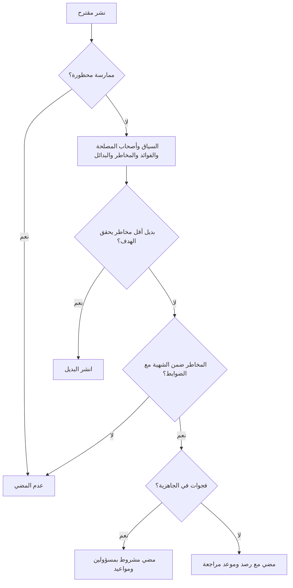
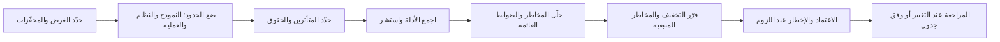

# الوحدة 11 — نشر الذكاء الاصطناعي واستخدامه

*ستنشر معظم المؤسسات من أنظمة الذكاء الاصطناعي أكثر بكثير مما تبنيه. فبنك نجم (Najm Bank) يشتري أداة لفرز السير الذاتية (CV-screening)، ويرخّص منصة روبوت محادثة (chatbot)، ويستدعي واجهة برمجية (API) لنموذج أساسي (foundation model) لمساعده الذكي في مذكرات الائتمان (credit memo copilot)، ويرى موظفيه يلجؤون كل يوم إلى أدوات الذكاء الاصطناعي التوليدي العامة (public GenAI tools). وكل واحد من هذه يضع بنك نجم في دور **المُشغِّل (deployer)**، والمُشغِّل لا يستطيع أن يُسند المساءلة (accountability) إلى مورّده. تغطي هذه الوحدة المهام الأربع التي تجعل النشر (deployment) قابلًا للحوكمة (governance): أن تقرر هل تنشر أصلًا، وأن تشتري شراءً جيدًا، وأن تقيّم النظام قبل الاستخدام وأثناءه، وأن تحكمه يومًا بيوم بإشراف بشري (human oversight) حقيقي وشفافية (transparency) صادقة ودليل عمل (playbook) للحوادث يعمل فعلًا. هذا ليس استشارة قانونية: فالقوانين والإرشادات تتغير وتعتمد على وقائعك، لذا راجع المصادر الرسمية ومستشارك القانوني.*

> **التغطية من مجال المعرفة (BoK coverage):** IV.A–IV.C — تقييم العوامل والمخاطر قبل النشر، وشراء الذكاء الاصطناعي بمسؤولية، وإجراء تقييمات الأثر (impact assessments) والتدقيقات (audits)، وحوكمة النشر والاستخدام.

---

# 11.1 — قرار النشر: السياق وأصحاب المصلحة والبدائل
*المستوى: 🔴 متقدم* · *المتطلبات: 8.1، 6.1* · *مجال المعرفة (BoK): IV.A*

## ⚡ الدرس في دقيقة

- قد يكون نظام الذكاء الاصطناعي (AI system) نفسه منخفض المخاطر في سياق وعالي المخاطر (high-risk) في سياق آخر. قرار النشر (deploy decision) يتعلق بـ **هذا النظام، في هذا السياق، لهؤلاء الناس**، لا بالتقنية عمومًا.
- قبل النشر، أجب عن ستة أسئلة: ما **سياق الاستخدام (context of use)**؟ من **أصحاب المصلحة المتأثرون (affected stakeholders)**؟ هل **تفوق الفوائد المخاطر (benefits outweigh the risks)**؟ ما **البدائل (alternatives)**؟ هل **الأشخاص والعمليات والبيانات جاهزة (people, processes and data ready)**؟ هل الاستخدام **متناسب (proportionate)**؟
- اعرف **دورك القانوني (legal role)**. استخدام نظام تحت سلطتك يجعلك **مُشغِّلًا** بموجب قانون الذكاء الاصطناعي الأوروبي (EU AI Act). أما تغيير غرضه المقصود (intended purpose) إلى استخدام عالي المخاطر، أو إعادة وسمه باسمك (rebranding)، فقد يجعلك **مقدّم النظام (provider)**.
- «لا تنشر» و«انشر شيئًا أبسط» نتيجتان مشروعتان، وكثيرًا ما تكونان حكيمتين.
- الفخ الأكبر: اعتبار موافقة المورّد، أو عرض توضيحي (demo) ناجح، أو استخدام منافس للنظام، دليلًا على أن النشر صحيح *بالنسبة إليك*.

## 🧭 لماذا يهم

في 2022 سأل عميلٌ مفجوع روبوتَ المحادثة على موقع Air Canada عن أسعار تذاكر الحداد (bereavement fares). فأخبره الروبوت أنه يستطيع المطالبة بالخصم بعد السفر. وكان ذلك خطأ، فسياسة شركة الطيران تقول غير ذلك. وعندما طالب بالخصم، احتجّت Air Canada في جوهر الأمر بأن روبوت المحادثة مسؤول عن كلامه هو. وفي قضية *Moffatt v. Air Canada* (2024) رفضت محكمة تسوية النزاعات المدنية (Civil Resolution Tribunal) في كولومبيا البريطانية هذه الحجة، وحمّلت شركة الطيران المسؤولية عن المعلومات المنشورة على موقعها، بما في ذلك روبوت المحادثة. كان روبوت المحادثة قرار نشر، وتحمّل المُشغِّل عواقبه.

في بنك نجم (Najm Bank) لدى خالد، رئيس الإقراض للأفراد (Head of Retail Lending)، خطة. فروبوت المحادثة لخدمة العملاء، المرخَّص من مورّد منصة والذي يجيب حاليًا عن أسئلة مواعيد الفروع ورسوم البطاقات، يحظى بشعبية. ويريد خالد أن يبدأ الروبوت **التأهيل المسبق (pre-qualifying)** لطالبي القروض الشخصية: يكتب العملاء رواتبهم والتزاماتهم، فيخبرهم الروبوت هل «من المرجح أن تتم الموافقة» عليهم. يقول: «إنه روبوت المحادثة نفسه، نحن نضيف ميزة فقط».

أما ليلى، رئيسة حوكمة الذكاء الاصطناعي (Head of AI Governance)، فترى نظامًا مختلفًا. فإخبار الناس هل من المرجح أن يحصلوا على ائتمان هو شكل من أشكال تقييم الجدارة الائتمانية (creditworthiness assessment)، وهو عالي المخاطر بموجب قانون الذكاء الاصطناعي الأوروبي عندما يتعلق بأشخاص طبيعيين. والإجابات الخاطئة ستثبّط عملاء مؤهلين أو تضلّل غير المؤهلين، وقضية Air Canada تقول إن بنك نجم سيتحمّلها. ثم إن تغيير الغرض المقصود من روبوت المحادثة قد يجعل بنك نجم *مقدّم* نظام عالي المخاطر. التقنية هي نفسها، لكن السياق غيّر كل شيء. يعلّمك هذا الدرس التحليل الذي تجريه ليلى قبل أن يقول أحد «انطلقوا».

## 📐 كيف يعمل

### 🟢 الأساسيات

**النشر قرار منفصل عن البناء أو الشراء.** حوكمة التصميم (الوحدة 8) تسأل هل النظام مصنوع جيدًا. أما قرار النشر فيسأل هل *استخدامه* هنا، والآن، ولهذا الغرض، مبرَّر. وتنظّمه ستة أسئلة:

| السؤال | ما الذي نسأله | مثال التأهيل المسبق في بنك نجم |
|---|---|---|
| **1. سياق الاستخدام** | أي مهمة، وأي قرارات، ومن يستخدم المخرجات، وبأي حجم، وما مدى قابلية الأخطاء للتدارك، وفي أي مجال (عام، توظيف، ائتمان، صحة)؟ | موجّه إلى العملاء؛ يؤثر في تقدّم الناس بطلبات الائتمان؛ آلاف المحادثات شهريًا؛ الأخطاء صعبة الاكتشاف |
| **2. أصحاب المصلحة المتأثرون** | من يستخدمه، ومن يتأثر بمخرجاته، ومن يتأثر بشكل غير مباشر، ومن هو المستضعف؟ | العملاء (ومنهم من يمرّون بضائقة مالية أو محدودو الإلمام بالقراءة والكتابة)، وموظفو مركز الاتصال، وموظفو الإقراض، والجهة الرقابية |
| **3. الفوائد مقابل المخاطر** | ما الفائدة القابلة للقياس؟ وما الأضرار التي قد تقع، ولمن، وما احتمالها وشدتها؟ | الفائدة: طلبات غير ملائمة أقل. المخاطر: «لا» خاطئة تثبّط المؤهلين؛ و«نعم» خاطئة تضلّل؛ والتمييز؛ والخصوصية |
| **4. البدائل** | هل يمكن لأداة غير قائمة على الذكاء الاصطناعي، أو نموذج أبسط، أو عملية بشرية، أن تحقق الهدف بمخاطر أقل؟ | حاسبة أهلية قائمة على القواعد تستخدم المعايير المنشورة |
| **5. الجاهزية** | هل الأشخاص مدرَّبون، والعمليات (التصعيد، والشكاوى، والإشراف) مصمَّمة، والبيانات ملائمة، والرصد قائم؟ | لا يملك مركز الاتصال نصًا للتعامل مع الاعتراض على إجابات الروبوت؛ ولا رصد لما يقوله الروبوت عن الائتمان |
| **6. التناسب** | هل التدخل في مصالح الناس مبرَّر بالفائدة ومقصور على ما هو ضروري؟ | جمع تفاصيل الراتب والديون في محادثة مفتوحة من أجل إجابة استرشادية: من الصعب تبريره |

**سياق الاستخدام (context of use).** يشمل السياق المجال، والفئة السكانية، والقرار الذي تغذّيه المخرجات، ودرجة الأتمتة، والحجم، وقابلية الضرر للتدارك. فنموذج لغوي كبير (large language model) يلخّص وثائق السياسات الداخلية، والنموذج نفسه وهو يصوغ خطاب رفض ائتمان لعميل، هما عمليتا نشر مختلفتان.

**أصحاب المصلحة (stakeholders).** ارسم خريطة لأربع مجموعات على الأقل: **المستخدمون (users)** (من يشغّلون النظام)، و**الأشخاص المتأثرون (affected persons)** (من تتعلق بهم المخرجات)، و**المتأثرون بشكل غير مباشر (indirectly affected people)** (الأسر، والمجتمعات، والمنافسون)، و**جهات الرقابة (overseers)** (الجهات التنظيمية، والمدققون، ومجلس الإدارة). وحدّد **الفئات المستضعفة (vulnerable groups)**: من يمرّون بضائقة مالية، والقُصَّر، والأشخاص ذوو الإعاقة، ومحدودو المهارات اللغوية. وحيثما أمكن، استشر ممثلين عن هذه الفئات، لا من ينوب عنهم داخليًا فقط.

**البدائل (alternatives).** سؤال «البدائل» هو الموضع الذي تُثبت فيه الحوكمة الجيدة قيمتها. قارن دائمًا بما يلي على الأقل: *عدم فعل شيء*، ونهج *غير قائم على الذكاء الاصطناعي*، ونموذج *أبسط أو أكثر قابلية للفهم*، و*ذكاء اصطناعي بمشاركة بشرية أكبر*. فإذا حقق محرك قواعد (rules engine) شفاف 90% من الفائدة بـ 10% من المخاطر، فهو في العادة الخيار الأفضل.

### 🟡 التعمق أكثر

**الدور القانوني بوصفك مُشغِّلًا.** بموجب قانون الذكاء الاصطناعي الأوروبي (EU AI Act)، **المُشغِّل (deployer)** هو شخص طبيعي أو اعتباري، أو سلطة عامة، أو وكالة، أو هيئة أخرى، يستخدم نظام ذكاء اصطناعي تحت سلطته، باستثناء الاستخدام الشخصي غير المهني البحت. ويتحمّل مُشغِّلو الأنظمة عالية المخاطر التزامات حقيقية (المادة 26 (Art. 26)): استخدام النظام وفق تعليمات الاستخدام (instructions for use)، وتكليف أشخاص أكفاء بالإشراف البشري (human oversight)، والتأكد من أن بيانات الإدخال الخاضعة لسيطرتهم ذات صلة وممثِّلة بدرجة كافية، ورصد التشغيل، والاحتفاظ بالسجلات (logs)، وإبلاغ العاملين المتأثرين، وإبلاغ الأشخاص بأن نظامًا عالي المخاطر يُستخدم في قرارات تخصّهم، وإجراء تقييم الأثر على الحقوق الأساسية (FRIA) بالنسبة إلى الهيئات العامة واستخدامات التصنيف الائتماني (credit scoring) وتسعير التأمين (المادة 27 (Art. 27)). كما يتحمّل مُشغِّلو أنظمة معيّنة واجبات شفافية (المادة 50 (Art. 50))، ويجب على كل مقدّم نظام ومُشغِّل أن يتخذ تدابير تضمن قدرًا كافيًا من الإلمام بالذكاء الاصطناعي (AI literacy) لدى موظفيه (المادة 4 (Art. 4)).

**متى يصبح المُشغِّل مقدّمًا للنظام.** تعامل المادة 25 (Art. 25) المُشغِّلَ (أو الموزّع (distributor) أو المستورد (importer) أو أي طرف ثالث (third party) آخر) على أنه **مقدّم (provider)** نظام عالي المخاطر إذا:

- وضع اسمه أو علامته التجارية على نظام عالي المخاطر مطروح في السوق بالفعل؛
- أجرى تعديلًا جوهريًا (substantial modification) على نظام عالي المخاطر بحيث يظل عالي المخاطر؛ أو
- عدّل الغرض المقصود من نظام، بما في ذلك نظام للأغراض العامة (general-purpose)، لم يكن عالي المخاطر، بحيث يصبح عالي المخاطر.

تقع خطة خالد تمامًا ضمن البند الثالث. ويجب أن يكشف قرار النشر عن تغيّرات الدور *قبل* حدوثها، لأن التزامات مقدّم النظام (تقييم المطابقة (conformity assessment)، والوثائق الفنية (technical documentation)، ونظام إدارة الجودة (QMS)، والتسجيل) لا يمكن الوفاء بها في دورة عمل قصيرة (sprint).

**قائمة التصنيف (classification checklist) عند بوابة النشر.** لكل استخدام مقترح، تحقّق وسجّل:

1. هل الممارسة **محظورة (prohibited)** (المادة 5 (Art. 5))؟ مثل التصنيف الاجتماعي (social scoring) أو استغلال نقاط الضعف لتشويه السلوك بطرق ضارة.
2. هل الاستخدام **عالي المخاطر** (الملحق III، مثل الجدارة الائتمانية، والتوظيف، والوصول إلى الخدمات الأساسية؛ أو منتجات الملحق I)؟
3. هل يستدعي واجبات **الشفافية (transparency)** (المادة 50)، مثل روبوت محادثة يتفاعل مع الناس أو محتوى مولَّد بالذكاء الاصطناعي؟
4. بموجب اللائحة العامة لحماية البيانات (**GDPR**): الأساس القانوني (lawful basis)، وهل تنطبق المادة 22 (Art. 22) على القرارات الآلية بالكامل ذات الآثار القانونية أو الآثار المماثلة في أهميتها، وهل يلزم تقييم الأثر على حماية البيانات (DPIA). ويُظهر حكم محكمة العدل الأوروبية (CJEU) في قضية *SCHUFA* (2023) أن إنتاج درجة (score) قد يكون هو القرار نفسه عندما يعتمد عليه الآخرون اعتمادًا كبيرًا.
5. **القواعد القطاعية والمحلية (sector and local rules)**: قوانين الائتمان الاستهلاكي ومكافحة التمييز؛ وبالنسبة إلى بنك نجم: قانون حماية خصوصية البيانات الشخصية القطري (Qatar PDPPL)، وإرشادات QCB للذكاء الاصطناعي للمؤسسات المالية (QCB AI guideline)، وقانون حماية البيانات في الإمارات؛ وخارج الاتحاد الأوروبي، قوانين الولايات الأمريكية مثل Colorado AI Act، الذي يفرض على مُشغِّلي الأنظمة عالية المخاطر واجبات إدارة المخاطر وتقييم الأثر والإخطار (أُرجئ تاريخ نفاذه إلى 30 يونيو 2026؛ تحقّق من وضعه الحالي).

**التناسب (proportionality).** تأتي هذه الفكرة من قانون الحقوق الأساسية ومن حماية البيانات: يجب أن يسعى أي تدخل في حقوق الناس إلى هدف مشروع، وأن يكون ملائمًا وضروريًا لتحقيقه، وألا يكون مفرطًا في آثاره. وفي نشر الذكاء الاصطناعي، اسأل: هل الذكاء الاصطناعي ضروري لهذا الهدف، وهل هذا هو الخيار الفعّال الأقل تدخلًا، وهل الضمانات متكافئة مع حجم ما هو على المحك؟

**أُطر تساعد (frameworks that help).** وظيفة **MAP** في NIST AI RMF هي في جوهرها مجموعة أدوات قرار النشر: إرساء السياق وفهمه (MAP 1)، وتصنيف النظام (MAP 2)، وفهم القدرات والفوائد والتكاليف مقارنة بمعايير مرجعية (benchmarks) مناسبة (MAP 3)، ورسم مخاطر مكوّنات الطرف الثالث (MAP 4)، وتوصيف الآثار على الأفراد والمجموعات والمجتمعات والمؤسسات والمجتمع ككل (MAP 5). ويتضمن الملحق A من ISO/IEC 42001 ضوابط (controls) لتقييم آثار أنظمة الذكاء الاصطناعي وللاستخدام المسؤول والمقصود لها.

### 🔴 نظرة الخبير

**قرار منظَّم بالمضي أو عدمه (go/no-go).** تدير المؤسسات الناضجة قرار النشر بوصفه قرار لجنة موثَّقًا له أربع نتائج محتملة:

**للمخاطر المتبقية (residual risk) مالك.** بعد الضوابط تبقى بعض المخاطر. ويقبلها رسميًا مسؤول تنفيذي محدد بالاسم وخاضع للمساءلة، وهو عادة مالك النشاط (business owner)، ضمن شهية المخاطر (risk appetite) التي يحددها مجلس الإدارة (2.1). وظيفة الحوكمة تنصح وتعترض، لكنها لا تملك مخاطر النشاط. وفي بنك نجم يقبل خالد المخاطر المتبقية لأنظمة الإقراض، ويمكن للجنة حوكمة الذكاء الاصطناعي (AI Governance Committee) أن ترفض أي نشر يقع خارج الشهية.

**مخاطر عدم النشر.** التناسب سيف ذو حدين. فالامتناع عن استخدام نموذج لكشف الاحتيال يحمي العملاء بشكل مثبت هو أيضًا خيار له عواقب. سجّل مخاطر خيار «عدم فعل شيء» بأمانة، حتى يكون القرار متوازنًا لا حذرًا فحسب.

**محفّزات إعادة النظر (revisit triggers).** قرار النشر صالح لسياق معيّن. ضع محفّزات تعيد فتحه: فئة سكانية أو بلد جديد، أو تغيير في الغرض المقصود، أو تغيير المورّد، أو تجاوز في الرصد، أو حادث جسيم (serious incident)، أو تغيير في القانون. وكثير من إخفاقات الحوكمة هي عمليات نشر كانت صحيحة في السنة الأولى، ثم صارت خاطئة بصمت في السنة الثالثة.

**الجاهزية تتعلق بالأشخاص في معظمها.** أكثر فجوات الجاهزية شيوعًا فجوات بشرية: موظفون لا يفهمون حدود النظام، ولا وقت مخصصًا لمراجعة حقيقية، ولا مسار للتصعيد، ومعالجو شكاوى لا يستطيعون شرح نتيجة ساعد فيها الذكاء الاصطناعي. تعامل مع التدريب وتصميم سير العمل والتوظيف على أنها معايير للنشر، لا متابعات لاحقة. وواجب الإلمام بالذكاء الاصطناعي (المادة 4)، الساري منذ 2 فبراير 2025، يمنح ذلك وزنًا قانونيًا في الاتحاد الأوروبي.

## ⚖️ الأدوات التنظيمية

| الأداة | ما تشترطه أو توصي به | إشارة الامتحان |
|---|---|---|
| **EU AI Act** — المادة 3(4) والمادة 26 | تعرّف المُشغِّل؛ وتحدد واجبات المُشغِّل للأنظمة عالية المخاطر (التعليمات، والإشراف البشري، وبيانات الإدخال، والرصد، والسجلات، وإبلاغ العاملين والأشخاص المتأثرين) | «الاستخدام تحت سلطته» = مُشغِّل، حتى لو لم تبنِه أنت |
| **EU AI Act** — المادة 25 | يصبح المُشغِّل مقدّمًا للنظام إذا أعاد وسمه، أو عدّله تعديلًا جوهريًا، أو غيّر غرضه المقصود إلى استخدام عالي المخاطر | إعادة توظيف روبوت محادثة للتأهيل المسبق للائتمان = تغيّر في الدور |
| **EU AI Act** — المادة 5، والمادة 6 والملحق III، والمادة 50 | التصنيف: الممارسات المحظورة، والاستخدامات عالية المخاطر، وواجبات الشفافية | أجرِ التصنيف قبل النشر، لكل حالة استخدام |
| **GDPR** — المواد 5 و6 و22 و35 | المبادئ (ومنها التقليل)، والأساس القانوني، والقرارات الآلية بالكامل ذات الأثر الكبير، وتقييم الأثر على حماية البيانات | التناسب والضرورة جزء أصيل من تحليل GDPR |
| **NIST AI RMF** — MAP | السياق، والتصنيف، والفوائد والتكاليف، ومخاطر الطرف الثالث، والآثار | طوعي؛ وMAP هي وظيفة التحليل السابق للنشر |
| **ISO/IEC 42001** — الملحق A | ضوابط لتقييم الأثر وللاستخدام المسؤول والمقصود لأنظمة الذكاء الاصطناعي | نظام إدارة قابل للاعتماد؛ ويجب أن تكون قرارات النشر مدعومة بأدلة |
| **Colorado AI Act** — SB 24-205 | على مُشغِّلي الذكاء الاصطناعي عالي المخاطر بذل العناية المعقولة، وتشغيل برامج لإدارة المخاطر، وإجراء تقييمات الأثر، وتقديم الإخطارات | قانون ولاية أمريكية؛ أُرجئ تاريخ نفاذه إلى 30 يونيو 2026 — تحقّق من وضعه الحالي |
| **QCB AI guideline** | توقعات بشأن الحوكمة وتقييم المخاطر والإشراف على الذكاء الاصطناعي في المؤسسات المالية الخاضعة لتنظيم قطر | تتوقع الجهات التنظيمية المحلية قرار نشر موثَّقًا |

## 🏛️ عمليًا في بنك نجم

يكتب فريق ليلى **مذكرة قرار النشر (Deploy Decision Memo)** للجنة.

| القسم | المحتوى |
|---|---|
| المقترح | روبوت محادثة يخبر عملاء الأفراد هل «من المرجح أن تتم الموافقة» عليهم لقرض شخصي |
| السياق | موجّه إلى العملاء، في الاتحاد الأوروبي (فرانكفورت) وقطر والإمارات؛ نحو 40,000 محادثة شهريًا؛ يؤثر في قرارات التقدم للائتمان؛ الأخطاء نادرًا ما تكون ظاهرة لبنك نجم |
| أصحاب المصلحة | عملاء الأفراد (المستضعفون: المتأخرون في السداد، ومحدودو الإلمام بالقراءة والكتابة، ومن لا يتحدثون العربية أو الإنجليزية)، وموظفو مركز الاتصال، وموظفو الإقراض، وQCB، وسلطة مراقبة السوق في الاتحاد الأوروبي، وسلطات حماية البيانات (DPAs) |
| التصنيف | يغيّر الغرض المقصود إلى تقييم الجدارة الائتمانية ← عالي المخاطر (الملحق III) في الاتحاد الأوروبي ← يصبح بنك نجم **مقدّم النظام** (المادة 25). GDPR: بيانات مالية في المحادثة؛ مسألة محتملة بموجب المادة 22 إذا ثبّطت الإجابات التقدّم بالطلبات؛ يلزم تقييم الأثر على حماية البيانات |
| الفوائد | انخفاض مقدَّر بنسبة 15% في الطلبات غير الملائمة؛ رحلة عميل أسرع |
| المخاطر | إجابات مضلِّلة (سابقة Air Canada)؛ تمييز غير مباشر؛ جمع مفرط للبيانات في النص الحر؛ التزامات مقدّم النظام التي لا يستطيع بنك نجم الوفاء بها خلال ستة أشهر |
| البدائل | (أ) عدم فعل شيء. (ب) **حاسبة أهلية قائمة على القواعد** تعرض الحد الأدنى المنشور من المعايير مع تنبيه واضح بأن «هذا ليس قرارًا»، ويحيل روبوت المحادثة إليها. (ج) تأهيل مسبق يجريه مستشار بشري عند الطلب |
| الجاهزية | نصوص مركز الاتصال ومعالجة الشكاوى والرصد غير جاهزة لما يقوله الروبوت عن الائتمان |
| **القرار** | **عدم المضي بالصيغة المقترحة.** المضي بالخيار (ب)، مع قصر روبوت المحادثة على شرح المعايير وتحويل العميل إلى موظف بشري. الشروط: تحديث تقييم الأثر على حماية البيانات (سارة)، وضوابط حماية (guardrails) للروبوت تمنع توقعات الأهلية (دانة)، ونص للموظفين (خالد). المراجعة بعد 6 أشهر |
| مالك المخاطر المتبقية | خالد، رئيس الإقراض للأفراد |

## 🛠️ التمارين

- 🟢 ارسم خريطة أصحاب المصلحة للمساعد الذكي لمذكرات الائتمان في بنك نجم (أداة ذكاء اصطناعي توليدي تصوغ المذكرات لمديري العلاقات). *يكتمل عندما:* يكون لديك المستخدمون، والأشخاص المتأثرون، والمتأثرون بشكل غير مباشر، وجهات الرقابة، مع تحديد فئتين مستضعفتين على الأقل أو استبعادهما مع ذكر الأسباب.
- 🟡 اكتب قسم «البدائل» لأداة فرز السير الذاتية من المورّد في بنك نجم، مقارنًا إياها بعدم فعل شيء، وبالفرز البشري المنظَّم، وبنموذج أبسط يعتمد على أسئلة الاستبعاد (knock-out questions). *يكتمل عندما:* يكون لكل خيار فوائد ومخاطر وتكلفة تقريبية.
- 🔴 طبّق قائمة التصنيف كاملة على الاستخدام *الحالي* لروبوت المحادثة (المواعيد والرسوم) وعلى الاستخدام المقترح (التأهيل المسبق) في الاتحاد الأوروبي وقطر والإمارات. *يكتمل عندما:* تستطيع أن تحدد دور بنك نجم، ومستوى المخاطر، والالتزامات الرئيسية لكل استخدام في كل ولاية قضائية، مع الإشارة إلى ما ستتحقق منه مع المستشار القانوني.

## ⚠️ أخطاء وفخاخ الامتحان

- **«المورّد هو المسؤول».** للمُشغِّل التزاماته الخاصة، وكما تُظهر قضية *Moffatt v. Air Canada*، فهو يتحمّل ما يقوله الذكاء الاصطناعي الموجّه إلى عملائه.
- **تقييم التقنية بدلًا من الاستخدام.** كثيرًا ما تغيّر سيناريوهات الامتحان السياقَ لا النظام. ومستوى المخاطر يتبع الاستخدام.
- **إغفال تغيّر الدور.** إعادة توظيف نظام عام في استخدام عالي المخاطر تجعلك مقدّمًا للنظام بموجب المادة 25.
- **تخطي البدائل.** إذا عرض سؤال خيار «المقارنة بخيار أبسط وأقل مخاطر»، فهذه عادة هي الإجابة ذات العقلية الحوكمية.
- **اعتبار الجاهزية تقنية فقط.** التدريب، ووقت المراجعة، والتصعيد، ومعالجة الشكاوى، كلها معايير للنشر.
- **أن تملك الحوكمة المخاطر.** مالك النشاط هو من يقبل المخاطر المتبقية؛ والحوكمة تنصح وتعترض ويمكنها التصعيد أو المنع.

## 🧾 الخلاصة

- يسأل قرار النشر هل استخدام هذا النظام، في هذا السياق، لهؤلاء الناس، مبرَّر.
- ستة أسئلة: سياق الاستخدام، وأصحاب المصلحة، والفوائد مقابل المخاطر، والبدائل، والجاهزية، والتناسب.
- بوصفك مُشغِّلًا، لديك واجباتك الخاصة بموجب قانون الذكاء الاصطناعي الأوروبي (المادة 26، والمادة 4، وأحيانًا المادة 27 والمادة 50). وتغيير الغرض أو إعادة الوسم قد يجعلك مقدّمًا للنظام (المادة 25).
- صنّف كل استخدام (محظور، عالي المخاطر، شفافية، GDPR، القانون القطاعي والمحلي) قبل التشغيل الفعلي (go-live).
- تشمل النتائج: عدم المضي، ونشر بديل، والمضي المشروط، والمضي، ولكل منها مالك خاضع للمساءلة ومحفّزات لإعادة النظر.

## ✍️ اختبر نفسك

**1. يرخّص بنك روبوت محادثة عامًا لخدمة العملاء ويهيّئه ليخبر العملاء هل من المرجح أن تتم الموافقة عليهم لقرض شخصي. بموجب قانون الذكاء الاصطناعي الأوروبي، ما أهم عاقبة يجب الإشارة إليها في قرار النشر؟**

- A. يبقى البنك مجرد مُشغِّل لنظام ذي مخاطر دنيا
- B. قد يصبح البنك مقدّم نظام عالي المخاطر لأنه غيّر الغرض المقصود إلى تقييم الجدارة الائتمانية
- C. يصبح مورّد روبوت المحادثة هو المُشغِّل
- D. يصبح النظام ممارسة محظورة

الإجابة

**B.** تعامل المادة 25 الطرفَ الذي يعدّل الغرض المقصود من نظام بحيث يصبح عالي المخاطر على أنه مقدّم النظام. وتقييم الجدارة الائتمانية للأشخاص الطبيعيين مدرج في الملحق III. وهو ليس محظورًا (D). (التعمق أكثر: متى يصبح المُشغِّل مقدّمًا للنظام.)

**2. أي سؤال هو *الأكثر* تمثيلًا لخطوة «البدائل» في قرار النشر؟**

- A. هل يمكن لنهج غير قائم على الذكاء الاصطناعي أو لنهج أبسط أن يحقق الهدف بمخاطر أقل؟
- B. ما الدقة التي يدّعيها المورّد؟
- C. أي منطقة سحابية ستستضيف النموذج؟
- D. كم منافسًا يستخدم ذكاءً اصطناعيًا مشابهًا؟

الإجابة

**A.** تقارن البدائل خيار الذكاء الاصطناعي بعدم فعل شيء، وبالنُّهُج غير القائمة على الذكاء الاصطناعي، وبالنماذج الأبسط، وبمشاركة بشرية أكبر. واستخدام المنافسين (D) ليس مبررًا. (الأساسيات: البدائل.)

**3. في قضية *Moffatt v. Air Canada* (2024)، ماذا قررت المحكمة بشأن روبوت المحادثة الخاص بشركة الطيران؟**

- A. روبوت المحادثة كيان قانوني مستقل مسؤول عن أقواله
- B. مورّد روبوت المحادثة هو المسؤول الوحيد
- C. شركة الطيران مسؤولة عن المعلومات التي قدّمها روبوت المحادثة للعملاء
- D. روبوتات المحادثة لا يمكنها تقديم معلومات ملزمة، لذا لم يكن أحد مسؤولًا

الإجابة

**C.** رفضت المحكمة فكرة أن روبوت المحادثة مسؤول عن كلامه، وحمّلت شركة الطيران المسؤولية عن المعلومات المنشورة على موقعها، بما في ذلك روبوت المحادثة. فالمُشغِّل يتحمّل الذكاء الاصطناعي الموجّه إلى عملائه. (لماذا يهم.)

**4. تخلص لجنة بنك نجم إلى أن نشرًا مقترحًا للذكاء الاصطناعي يقع ضمن شهية المخاطر، لكن تدريب الموظفين وعملية معالجة الشكاوى ليسا جاهزين. ما أفضل قرار؟**

- A. المضي فورًا؛ ويمكن أن يأتي التدريب لاحقًا
- B. عدم المضي نهائيًا
- C. نقل القرار إلى المورّد
- D. مضي مشروط، مع مسؤولين محددين بالاسم ومواعيد لسد فجوات الجاهزية، يُتحقَّق منها قبل التشغيل الفعلي

الإجابة

**D.** يمكن معالجة فجوات الجاهزية عبر موافقة مشروطة بشروط تُتابَع. الخيار A يتجاهل الجاهزية؛ وB غير متناسب؛ وC تخلٍّ عن المساءلة. (نظرة الخبير: قرار منظَّم بالمضي أو عدمه.)

**5. أي وظيفة في NIST AI RMF تدعم بشكل مباشر أكثر من غيرها التحليلَ السابق للنشر للسياق والفوائد والتكاليف والآثار؟**

- A. GOVERN
- B. MAP
- C. MEASURE
- D. MANAGE

الإجابة

**B.** تُرسي MAP السياق، وتصنّف النظام، وتفحص الفوائد والتكاليف، وتوصّف الآثار. أما MEASURE فتقيس المخاطر كميًا؛ وMANAGE ترتّب أولوياتها وتتصرف بشأنها؛ وGOVERN تضع الثقافة والهياكل. (التعمق أكثر: أُطر تساعد.)

## 📚 المراجع

- EU AI Act, Regulation (EU) 2024/1689 (EUR-Lex): https://eur-lex.europa.eu/eli/reg/2024/1689/oj
- GDPR, Regulation (EU) 2016/679 (EUR-Lex): https://eur-lex.europa.eu/eli/reg/2016/679/oj
- NIST AI Risk Management Framework and Playbook: https://www.nist.gov/itl/ai-risk-management-framework
- ISO/IEC 42001:2023 (ISO): https://www.iso.org/standard/81230.html
- Colorado General Assembly (SB 24-205, Consumer Protections for Artificial Intelligence): https://leg.colorado.gov
- British Columbia Civil Resolution Tribunal (*Moffatt v. Air Canada*, 2024): https://civilresolutionbc.ca
- Qatar Central Bank: https://www.qcb.gov.qa

---

# 11.2 — شراء الذكاء الاصطناعي: العناية الواجبة تجاه المورّدين والعقود
*المستوى: 🔴 متقدم* · *المتطلبات: 3.3، 11.1* · *مجال المعرفة (BoK): IV.A*

## ⚡ الدرس في دقيقة

- يمكنك أن تُسند وظيفة ذكاء اصطناعي إلى جهة خارجية، لكنك لا تستطيع أن تُسند المساءلة (accountability). شراء الذكاء الاصطناعي نشاط من أنشطة الحوكمة (governance)، والمشتريات (procurement) من أقوى ضوابطك.
- تسأل **العناية الواجبة (due diligence)**: ماذا يفعل النظام، وكيف بُني واختُبر؟ كيف يتعامل المورّد مع بياناتنا (بما في ذلك التدريب عليها)؟ من هم المعالِجون الفرعيون (sub-processors) لديه؟ ما مدى أمانه؟ وما الأدلة والشهادات (certifications) التي تدعم ادعاءاته؟
- **العقود (contracts)** تحوّل الإجابات إلى التزامات: حدود استخدام البيانات، وحماية الملكية الفكرية (IP) والتعويض (indemnity)، وحقوق التدقيق والحصول على المعلومات، والإخطار بالحوادث، والتزامات الأداء والعدالة (fairness)، والإخطار بالتغييرات، والتعاون التنظيمي، وخروج نظيف (clean exit).
- تحتاج **واجهات النماذج الأساسية البرمجية (foundation-model APIs)** و**النماذج مفتوحة المصدر (open-source models)** إلى فحوص خاصة بها: شروط الاستخدام، والاحتفاظ بالبيانات، وتغييرات الإصدارات، والتراخيص، ومن يصون ماذا.
- شهادة **ISO/IEC 42001** تخبرك أن المورّد يدير نظام إدارة الذكاء الاصطناعي (AI management system). لكنها لا تثبت أن منتجًا بعينه دقيق أو عادل أو ممتثل قانونيًا.
- الفخ الأكبر: قبول عبارة «هذا مملوك لنا (proprietary)، لا يمكننا مشاركته» في استخدام عالي المخاطر (high-risk). فإذا لم يستطع المورّد أن يعطيك ما تحتاجه للوفاء بالتزاماتك، فلن تستطيع الوفاء بها.

## 🧭 لماذا يهم

في 2023 أبرمت لجنة تكافؤ فرص العمل الأمريكية (US Equal Employment Opportunity Commission) تسوية في دعوى ضد شركة الدروس الخصوصية iTutorGroup، وقد وُصفت على نطاق واسع بأنها أول تسوية للوكالة في قضية تتعلق بالتوظيف الآلي. ادّعت EEOC أن برنامج طلبات التوظيف لدى الشركة كان مُعدًّا لرفض المتقدمين الأكبر سنًا تلقائيًا، وانتهت القضية بتسوية. والدرس لأي صاحب عمل بسيط: إذا كان البرنامج الذي تستخدمه يستبعد الناس بشكل غير قانوني، فـ*أنت* من يُسأل عن ذلك.

يشتري بنك نجم (Najm Bank) أداة لفرز السير الذاتية للتعامل مع آلاف الطلبات التي تتلقاها فروعه. ولدى يوسف، من إدارة المشتريات، قائمة مختصرة بثلاثة مورّدين. وكل العروض التقديمية اللامعة تعد بـ«ذكاء اصطناعي خالٍ من التحيّز (bias-free AI)». وعندما تطلب ليلى نتائج اختبار التحيّز مفصّلة حسب الجنس والعمر، يرسل أحد المورّدين ملخصًا من صفحة واحدة بلا منهجية، ويقول آخر إن النموذج «مملوك»، ويرسل الثالث تقريرًا مفصّلًا إضافة إلى تعليمات الاستخدام (instructions for use) التي يُعدّها بوصفه مقدّم نظام (provider) بموجب قانون الذكاء الاصطناعي الأوروبي (EU AI Act). وفرز طلبات التوظيف استخدام عالي المخاطر مدرج في الملحق III. وبوصف بنك نجم مُشغِّلًا (deployer)، يجب عليه أن يستخدم النظام وفق تعليماته، وأن يكلّف أشخاصًا أكفاء بالإشراف البشري (human oversight)، وأن يحتفظ بالسجلات، وأن يُبلغ المتقدمين والموظفين، وأن يرصد النظام. ولا يستطيع فعل أي من ذلك دون تعاون المورّد، ويجب أن يُكتب هذا التعاون في العقد. وفي الوقت نفسه، تختار دانة نموذجًا أساسيًا (foundation model) للمساعد الذكي لمذكرات الائتمان، وتسأل هل يُغني نموذج مفتوح الأوزان (open-weight) عن كل هذا. والجواب لا، بل سيغيّر فقط من يقوم بالعمل.

## 📐 كيف يعمل

### 🟢 الأساسيات

**لماذا المشتريات ضابط (control).** قبل التوقيع تكون لديك أقصى قوة تفاوضية: المورّد يريد الصفقة، وأنت تستطيع الانسحاب. أما بعد التوقيع فيصبح كل طلب مفاوضة. وفرق الحوكمة التي تُشرك المشتريات مبكرًا (3.3) تحصل على أدلة أفضل وشروط أفضل ومفاجآت أقل.

**عملية عناية واجبة متناسبة مع المخاطر.**

1. **الفرز الأولي (triage).** استخدم تصنيف الاستقبال (intake classification) (8.1، 11.1). فمدقق إملائي وأداة لفرز السير الذاتية يستحقان عمقًا مختلفًا.
2. **الاستبيان (questionnaire).** أسئلة معيارية مقسّمة إلى مستويات حسب المخاطر. واستبيانات مشتريات الذكاء الاصطناعي في القطاع الخاص والقطاع العام نقطة انطلاق مفيدة.
3. **مراجعة الوثائق (documentation review).** اقرأ ما يقدمه المورّد، لا مواده التسويقية فقط.
4. **الاختبار المستقل (independent testing).** حيث تبرر المخاطر ذلك، اختبر النظام على بياناتك أنت، في بيئة معزولة (sandbox) أو تجربة (pilot)، قبل الالتزام.
5. **القرار والعقد (decision and contract).** سجّل النتائج والمخاطر المتبقية والشروط، وانقلها إلى العقد.

**ما الذي تسأل عنه، والعلامات الحمراء (red flags).**

| المجال | الأسئلة الرئيسية | العلامات الحمراء |
|---|---|---|
| **الغرض والتصميم** | الغرض المقصود، والقيود، وإساءة الاستخدام المتوقعة؛ ونوع النموذج؛ وميزات الإشراف البشري | «يعمل لكل شيء»؛ لا قيود مذكورة |
| **الوثائق** | بطاقة النموذج (model card) أو بطاقة النظام؛ وتعليمات الاستخدام؛ وللأنظمة عالية المخاطر في الاتحاد الأوروبي: إعلان المطابقة (declaration of conformity) والتسجيل | لا تعليمات استخدام لنظام عالي المخاطر |
| **أدلة الاختبار** | الدقة حسب الشريحة؛ واختبار التحيّز حسب المجموعات ذات الصلة، مع المنهجية؛ ونتائج المتانة (robustness) واختبار الفريق الأحمر (red-teaming) | متوسطات فقط؛ ادعاءات «خالٍ من التحيّز»؛ لا منهجية |
| **استخدام البيانات** | هل ستُستخدم بياناتنا (المدخلات والمخرجات والتغذية الراجعة) لتدريب نماذج المورّد؟ الاحتفاظ، والموقع، والنقل، والحذف عند الخروج | تدريب افتراضي على بيانات العملاء؛ غموض بشأن الاحتفاظ |
| **المعالِجون الفرعيون** | من غيره يعالج بياناتنا أو يستضيف النموذج؟ وأين؟ وهل يُخطَرنا بالتغييرات؟ | معالِجون فرعيون غير مُفصَح عنهم؛ لا إخطار بالتغيير |
| **الأمن** | شهادة ISO/IEC 27001 أو تقرير SOC 2؛ واختبارات الاختراق (penetration tests)؛ والدفاعات ضد حقن الأوامر (prompt injection) وتسرّب البيانات في الذكاء الاصطناعي التوليدي | لا ضمان أمني مستقل |
| **الحوكمة** | سياسة للذكاء الاصطناعي؛ وشهادة ISO/IEC 42001 أو ما يعادلها؛ وعملية للحوادث؛ والسجل التنظيمي | لا عملية للحوادث؛ لا مالك محدد بالاسم لحوكمة الذكاء الاصطناعي |
| **الاستمرارية** | الاستقرار المالي، والدعم، وخارطة الطريق، والاعتماد على نموذج واحد في المنبع (upstream) | مورّد صغير جدًا يغلّف واجهة برمجية لطرف ثالث دون خطة طوارئ |

**الشهادات: ما تثبته وما لا تثبته.** تُظهر شهادة **ISO/IEC 42001** أن جهة اعتماد (certification body) معتمدة قد دققت *نظام الإدارة* للذكاء الاصطناعي لدى المورّد: السياسات، وعمليات تقييم المخاطر والأثر، وضوابط دورة الحياة (life cycle). وهي دليل قيّم على الانضباط. لكنها لا تشهد بأن نموذجًا بعينه دقيق أو عادل، ولا بأن المنتج يستوفي قانون الذكاء الاصطناعي الأوروبي. تحقّق من **نطاق (scope)** الشهادة (أي المنتجات والمواقع)، ومن جهة الاعتماد واعتمادها (يحدد ISO/IEC 42006 متطلبات الجهات التي تمنح شهادة 42001)، ومن التاريخ.

### 🟡 التعمق أكثر

**بنود العقد المهمة.** العقد الجيد للذكاء الاصطناعي، أو ملحق الذكاء الاصطناعي (AI schedule) في عقد معياري، يغطي ما يلي:

| البند | ما ينبغي أن ينص عليه | السبب |
|---|---|---|
| **قيود استخدام البيانات** | لا تُستخدم بيانات العميل (المدخلات، والمخرجات، وبيانات الضبط الدقيق (fine-tuning)، والتغذية الراجعة) إلا لتقديم الخدمة؛ ولا تدريب لنماذج المورّد أو نماذج أطراف ثالثة دون موافقة صريحة مسبقة (opt-in)؛ وحدود للاحتفاظ؛ والحذف عند الطلب وعند الخروج | يحمي السرية والبيانات الشخصية؛ ويمنع أن تُحسِّن بياناتك أدوات المنافسين |
| **شروط حماية البيانات** | شروط المعالِج (processor) بموجب المادة 28 من GDPR (التعليمات، والسرية، والأمن، والموافقة على المعالِجين الفرعيين، والمساعدة في الحقوق وتقييمات الأثر على حماية البيانات، والحذف أو الإعادة، والتدقيقات)؛ وضمانات النقل؛ وما يعادلها في القوانين المحلية (مثل Qatar PDPPL) | مطلوبة قانونًا حيث يعالج المورّد بيانات شخصية نيابة عنك |
| **الملكية الفكرية والتعويض** | ملكية المخرجات أو ترخيصها؛ وضمان من المورّد بأنه يملك الحقوق في بيانات التدريب والنموذج؛ وتعويض ضد مطالبات الملكية الفكرية من أطراف ثالثة، بشروط واضحة | نزاعات حقوق النشر المتعلقة ببيانات التدريب قائمة؛ فاعرف من يتحمّل المخاطر |
| **حقوق التدقيق والحصول على المعلومات** | الوصول إلى الوثائق ونتائج الاختبار والسجلات، وبالنسبة إلى الاستخدامات عالية المخاطر: المعلومات اللازمة لتقييم الأثر على الحقوق الأساسية (FRIA) وتقييم الأثر على حماية البيانات (DPIA) والرصد؛ والحق في التدقيق أو في تلقي تقارير تدقيق مستقلة | لا يمكنك الوفاء بواجبات المُشغِّل دون معلومات |
| **الإخطار بالحوادث** | الإخطار خلال مدة محددة (مثلًا 24–72 ساعة) بالحوادث الأمنية، أو الأعطال الجسيمة، أو مشكلات الأداء أو التحيّز الجوهرية؛ والتعاون في التحقيق | مهلك الزمنية الخاصة (72 ساعة في GDPR؛ وواجبات الحادث الجسيم في قانون الذكاء الاصطناعي) تبدأ عندما تعلم *أنت* |
| **التزامات الأداء والعدالة** | مستويات الخدمة؛ ومقاييس الدقة والعدالة مع عتبات؛ وسبل الانتصاف عند الإخلال؛ وحقك في الاختبار | يحوّل الادعاءات التسويقية إلى التزامات |
| **الإخطار بالتغييرات** | إخطار مسبق بالتغييرات الجوهرية (إعادة تدريب النموذج، وتغيير الإصدارات، ومعالِجون فرعيون جدد)؛ وتثبيت الإصدار (version pinning) حيث أمكن؛ والحق في إعادة الاختبار أو الإنهاء | تغييرات المورّد قد تغيّر السلوك وامتثالك (10.3) |
| **التعاون التنظيمي** | يدعم المورّد التزاماتك: يقدّم تعليمات الاستخدام، والسجلات، والتفسيرات للأشخاص المتأثرين، والتعاون مع السلطات | يفترض قانون الذكاء الاصطناعي الأوروبي التعاون بين مقدّم النظام والمُشغِّل |
| **الخروج والانتقال** | إعادة البيانات وحذفها مع شهادة بذلك؛ والمساعدة في الانتقال؛ والإيداع لدى طرف ثالث (escrow) أو استمرار الوصول إلى الوثائق والسجلات التي يجب عليك الاحتفاظ بها | قد تحتاج إلى السجلات بعد انتهاء العقد بسنوات |

**ما يقوله القانون بالفعل.** يُلزم قانون الذكاء الاصطناعي الأوروبي مقدّمي الأنظمة عالية المخاطر بتقديم تعليمات الاستخدام (المادة 13 (Art. 13))، ويُلزم الأطراف الثالثة التي تورّد أدوات أو خدمات أو مكوّنات أو عمليات تُستخدم في أنظمة عالية المخاطر بأن تحدد، في اتفاق مكتوب مع مقدّم النظام، المعلومات والقدرات والوصول الفني والمساعدة اللازمة ليمتثل مقدّم النظام (المادة 25 (Art. 25)). ويجوز للمفوضية أن توصي بشروط تعاقدية نموذجية طوعية لهذا الغرض. وبصورة منفصلة، نشرت المفوضية بنودًا تعاقدية نموذجية طوعية لمشتريات القطاع العام من الذكاء الاصطناعي (MCC-AI)؛ فتحقّق من أحدث إصدار. وبالنسبة إلى الكيانات المالية في الاتحاد الأوروبي، يحدد قانون المرونة التشغيلية الرقمية (**Digital Operational Resilience Act (DORA)**) أحكامًا تعاقدية إلزامية لخدمات تقنية المعلومات والاتصالات (ICT) المقدَّمة من أطراف ثالثة حيث ينطبق. تحقّق هل ينطبق على كيانك وكيف.

### 🔴 نظرة الخبير

**واجهات النماذج الأساسية البرمجية (foundation-model APIs).** عندما يستدعي بنك نجم نموذجًا أساسيًا عبر واجهة برمجية لمساعده الذكي لمذكرات الائتمان، يكون مقدّم النموذج **مقدّم نموذج ذكاء اصطناعي للأغراض العامة (GPAI)**. ومنذ 2 أغسطس 2025 يجب على مقدّمي نماذج GPAI، من بين أمور أخرى، الاحتفاظ بوثائق فنية، وتزويد مقدّمي الأنظمة في المصب (downstream providers) بالمعلومات التي يحتاجونها لفهم قدرات النموذج وحدوده، ووضع سياسة لحقوق النشر (copyright policy)، ونشر ملخص لمحتوى التدريب (المادة 53 (Art. 53)). ومدونة الممارسات الخاصة بنماذج GPAI (GPAI Code of Practice) المنشورة في يوليو 2025 وسيلة طوعية لإثبات الامتثال. أما بنك نجم، الذي يدمج النموذج في نظامه الخاص، فهو مقدّم *ذلك النظام* أو مُشغِّله. ولقرار النشر والتعاقد، تحقّق مما يلي:

- **أي الشروط تنطبق.** كثيرًا ما تختلف شروط المستهلكين عن شروط المؤسسات أو الواجهة البرمجية، لا سيما في ما إذا كانت المدخلات تُستخدم للتدريب ومدة الاحتفاظ بها. استخدم اتفاقيات المؤسسات لبيانات الأعمال.
- **موطن البيانات والاحتفاظ بها (data residency and retention).** أين تُعالَج الأوامر (prompts) وتُخزَّن، ولكم من الوقت، ومن يمكنه الوصول إليها (بما في ذلك لأغراض رصد إساءة الاستخدام)؟
- **إصدارات النموذج.** يحدّث المقدّمون إصدارات النماذج ويسحبونها. ثبّت الإصدارات حيث أمكن، واحصل على إخطار بالإيقاف (deprecations)، وأعد الاختبار قبل التبديل (10.3).
- **وثائق المصب (downstream documentation).** اطلب المعلومات التي يجب على مقدّمي نماذج GPAI تقديمها لمقدّمي الأنظمة في المصب، واستخدمها في وثائقك الخاصة.
- **مخاطر التركّز (concentration risk).** إذا تعطّل نموذج واحد في المنبع أو غيّر شروطه، فما خطتك البديلة؟

**النماذج مفتوحة المصدر ومفتوحة الأوزان (open-source and open-weight models).** تنزيل أوزان نموذج ينقل السيطرة، والعمل، إليك. فلا يوجد مورّد يقدّم ضمانات، أو يصلح الثغرات، أو يُخطرك بالتغييرات، لذا تملك أنت التقييم والأمن والرصد والصيانة. تحقّق مما يلي:

- **الترخيص (licence).** كلمة «مفتوح» تختلف في معناها. فبعض تراخيص النماذج تقيّد استخدامات أو مستخدمين أو أحجامًا معينة؛ وقد نشرت مبادرة المصدر المفتوح (Open Source Initiative) تعريف الذكاء الاصطناعي مفتوح المصدر (Open Source AI Definition) (الإصدار 1.0، أكتوبر 2024)، وكثير من النماذج «مفتوحة الأوزان» لا تستوفيه. ويجب أن يراجع الفريق القانوني الترخيص في ضوء استخدامك المقصود.
- **المصدر والوثائق (provenance and documentation).** ما المعروف عن بيانات التدريب والتقييم والقيود المعروفة؟
- **الأمن.** احصل على الأوزان من مصادر موثوقة، وتحقّق من سلامتها، وافحص ملفات النموذج، لأن بعض صيغ ملفات النماذج يمكن أن تنفّذ كودًا عند تحميلها.
- **الموقف التنظيمي.** يعفي قانون الذكاء الاصطناعي الأوروبي بعض أنظمة الذكاء الاصطناعي المجانية ومفتوحة المصدر من بعض الالتزامات، لكن الإعفاء لا يشمل الأنظمة عالية المخاطر، ولا الممارسات المحظورة (prohibited practices)، ولا واجبات الشفافية في المادة 50، ولا تحصل نماذج GPAI مفتوحة المصدر ذات المخاطر النظامية (systemic risk) على إعفاء من التوثيق. وإذا بنى بنك نجم نظامًا عالي المخاطر على نموذج مفتوح، فبنك نجم هو مقدّم النظام.

**العناية الواجبة مستمرة.** أعد تقييم المورّدين دوريًا وعند وقوع محفّزات: الحوادث، وتغيّرات الملكية، والإصدارات الجديدة، والمعالِجون الفرعيون الجدد، والإجراءات التنظيمية. واحتفظ بسجل لمورّدي الذكاء الاصطناعي مرتبط بسجل أنظمة الذكاء الاصطناعي (AI inventory). وتدعو وظيفة GOVERN 6 في NIST AI RMF إلى سياسات تعالج مخاطر الذكاء الاصطناعي من الأطراف الثالثة، بما في ذلك الملكية الفكرية، وإلى عمليات طوارئ لمواجهة إخفاقات بيانات الأطراف الثالثة أو أنظمتها للذكاء الاصطناعي.

## ⚖️ الأدوات التنظيمية

| الأداة | ما تشترطه أو توصي به | إشارة الامتحان |
|---|---|---|
| **EU AI Act** — المادتان 13 و26 | يقدّم مقدّمو الأنظمة تعليمات الاستخدام؛ ويستخدم المُشغِّلون النظام وفق التعليمات، ويشرفون، ويرصدون، ويحتفظون بالسجلات، ويُبلغون الأشخاص المتأثرين | واجبات المُشغِّل تعتمد على معلومات المورّد: فتعاقَد عليها |
| **EU AI Act** — المادة 25 | اتفاقات مكتوبة بين مقدّمي الأنظمة عالية المخاطر ومورّدي المكوّنات والأدوات والخدمات؛ وقواعد تغيّر الدور | التعاون في سلسلة التوريد (supply chain) جزء أصيل من القانون |
| **EU AI Act** — المادة 53 | مقدّمو نماذج GPAI: وثائق فنية، ومعلومات لمقدّمي الأنظمة في المصب، وسياسة لحقوق النشر، وملخص لمحتوى التدريب | اطلب من مقدّم النموذج الأساسي وثائق المصب |
| **GDPR** — المادة 28 | شروط تعاقدية إلزامية مع المعالِج، منها الإذن بالمعالِجين الفرعيين والمساعدة في تقييمات الأثر على حماية البيانات والحقوق | مورّدو الذكاء الاصطناعي الذين يعالجون بيانات شخصية نيابة عنك هم عادة معالِجون |
| **NIST AI RMF** — GOVERN 6 | سياسات وإجراءات لمخاطر الذكاء الاصطناعي من الأطراف الثالثة، بما في ذلك الملكية الفكرية، وخطط طوارئ لإخفاقات الأطراف الثالثة | طوعي؛ ومخاطر الأطراف الثالثة تقع ضمن GOVERN |
| **ISO/IEC 42001** — ضوابط الأطراف الثالثة في الملحق A | توزيع المسؤوليات مع المورّدين والعملاء؛ وإدارة الذكاء الاصطناعي الذي يقدّمه المورّدون | الشهادة تخص نظام الإدارة ونطاقه، لا المنتج |
| **DORA** — Regulation (EU) 2022/2554 | أحكام تعاقدية إلزامية ورقابة على خدمات تقنية المعلومات والاتصالات من أطراف ثالثة التي تستخدمها الكيانات المالية في الاتحاد الأوروبي، حيث ينطبق | تحقّق من النطاق؛ يسري منذ 17 يناير 2025 |

## 🏛️ عمليًا في بنك نجم

يُعدّ يوسف وليلى **بطاقة تقييم العناية الواجبة لمورّدي الذكاء الاصطناعي (Vendor AI Due Diligence Scorecard)**. وهذه نتيجتها لمورّدي فرز السير الذاتية الثلاثة:

| المعيار (الوزن) | المورّد A | المورّد B | المورّد C |
|---|---|---|---|
| تعليمات الاستخدام ووثائق مقدّم النظام بموجب قانون الذكاء الاصطناعي الأوروبي (20%) | جزئية | لا شيء («مملوك») | كاملة، مع إعلان المطابقة |
| اختبار التحيّز حسب الجنس والعمر والجنسية، مع المنهجية (20%) | ملخص فقط | لا شيء | مفصّل؛ نسب الأثر (impact ratios)؛ بيانات الاختبار موصوفة |
| استخدام البيانات: لا تدريب على بيانات بنك نجم افتراضيًا (15%) | إلغاء الاشتراك (opt-out) فقط | يدرّب افتراضيًا | عدم تدريب منصوص عليه تعاقديًا |
| الإفصاح عن المعالِجين الفرعيين، وخيارات الاستضافة في الاتحاد الأوروبي أو دول الخليج (10%) | نعم | جزئيًا | نعم |
| الضمان الأمني: ISO/IEC 27001 أو SOC 2 (10%) | ISO 27001 | SOC 2 | ISO 27001 |
| نظام إدارة الذكاء الاصطناعي: ISO/IEC 42001، ونطاقه يشمل المنتج (10%) | لا | لا | نعم، والمنتج ضمن النطاق |
| السماح بالاختبار على بيانات عيّنة من بنك نجم (10%) | نعم | لا | نعم |
| مرونة العقد في البنود الرئيسية (5%) | متوسطة | منخفضة | عالية |
| **النتيجة** | مشروط | **مستبعَد** | **مفضَّل** |

**بند ملحق الذكاء الاصطناعي (مقتطف)، المتفق عليه مع المورّد C:**
> *«يلتزم المورّد بما يلي: (أ) ألا يستخدم بيانات العميل، بما فيها المدخلات والمخرجات والتغذية الراجعة، لتدريب أو تحسين أي نموذج غير النسخة المخصصة المقدَّمة للعميل؛ (ب) أن يُخطر العميل قبل 60 يومًا على الأقل من أي تغيير جوهري في النموذج أو بيانات تدريبه أو معالِجيه الفرعيين، وأن يقدّم نتائج اختبار محدَّثة؛ (ج) أن يُخطر العميل دون تأخير غير مبرر، وفي جميع الأحوال خلال 48 ساعة من علمه، بأي حادث أمني أو عطل جسيم أو انحراف جوهري عن عتبات الدقة أو العدالة المتفق عليها؛ (د) أن يقدّم، عند الطلب، المعلومات والسجلات التي يحتاجها العميل بشكل معقول للوفاء بالتزاماته بوصفه مُشغِّلًا، بما في ذلك لأغراض تقييمات الأثر والرصد والتفسيرات للأشخاص المتأثرين؛ (هـ) أن يعيد، عند الإنهاء، بيانات العميل ويشهد بحذفها خلال 30 يومًا، مع مراعاة متطلبات الاحتفاظ القانونية.»*

## 🛠️ التمارين

- 🟢 اكتب عشرة أسئلة للعناية الواجبة موجّهة إلى مقدّم النموذج الأساسي للمساعد الذكي لمذكرات الائتمان. *يكتمل عندما:* يرتبط كل سؤال بخطر (استخدام البيانات، والإصدارات، والأمن، والملكية الفكرية، والوثائق) وبإجابة تمثّل علامة حمراء.
- 🟡 صُغ بندَي الإخطار بالحوادث والإخطار بالتغييرات لعقد منصة روبوت المحادثة، واشرح كيف تتلاءم المهل مع الجداول الزمنية الخاصة ببنك نجم بموجب GDPR وقانون الذكاء الاصطناعي. *يكتمل عندما:* يستطيع محامٍ أن يُجري تعديلاته على نصك.
- 🔴 تقترح دانة نموذجًا مفتوح الأوزان مستضافًا على خوادم بنك نجم للمساعد الذكي، بدلًا من واجهة برمجية. اكتب مقارنة من صفحة واحدة لالتزامات الحوكمة والمخاطر المتبقية للخيارين. *يكتمل عندما:* تستطيع اللجنة أن تتخذ القرار من صفحتك وحدها.

## ⚠️ أخطاء وفخاخ الامتحان

- **قبول «مملوك» في الاستخدامات عالية المخاطر.** إذا لم تستطع الحصول على ما تحتاجه للوفاء بالتزاماتك بوصفك مُشغِّلًا، فالحل أن تفاوض، أو تختبر بشكل مستقل، أو تنسحب.
- **اعتبار ISO/IEC 42001 ضمانًا للمنتج.** إنها تشهد لنظام إدارة ضمن نطاق محدد.
- **نسيان التدريب على بياناتك.** تحقّق من الشروط التي تنطبق فعلًا (المستهلك، المؤسسة، الواجهة البرمجية). فالإعدادات الافتراضية تختلف.
- **غياب بند التغيير.** يعيد المورّدون تدريب النماذج وتحديثها. ودون حقوق الإخطار ستكتشف ذلك من رصدك، أو من عملائك.
- **الاعتقاد بأن المصدر المفتوح يعني انعدام الالتزامات.** إنه ينقل الالتزامات إليك، وإعفاء قانون الذكاء الاصطناعي الأوروبي لا يشمل الأنظمة عالية المخاطر.
- **شروط خروج ضعيفة.** قد تحتاج إلى السجلات والوثائق بعد انتهاء العقد بوقت طويل.

## 🧾 الخلاصة

- المشتريات ضابط من ضوابط الحوكمة: الفرز الأولي، والاستبيان، ومراجعة الوثائق، والاختبار المستقل، والقرار والعقد.
- ابحث عن أدلة لا ادعاءات: تعليمات الاستخدام، والاختبار على مستوى الشرائح، وشروط استخدام البيانات، والمعالِجون الفرعيون، والضمان الأمني، والشهادات محددة النطاق.
- البنود الرئيسية: حدود استخدام البيانات، وشروط المادة 28، والملكية الفكرية والتعويض، وحقوق التدقيق والحصول على المعلومات، والإخطار بالحوادث والتغييرات، والتزامات الأداء والعدالة، والتعاون التنظيمي، والخروج.
- تحتاج واجهات النماذج الأساسية البرمجية إلى الانتباه للشروط والاحتفاظ والإصدارات ووثائق المصب. والنماذج المفتوحة تنقل العمل والالتزامات إليك.
- تستمر العناية الواجبة بعد التوقيع، وفق جدول زمني وعند وقوع المحفّزات.

## ✍️ اختبر نفسك

**1. يعرض مورّد أداة لفرز السير الذاتية بفخر شهادة ISO/IEC 42001 الخاصة به. ماذا تُثبت هذه الشهادة؟**

- A. أن الأداة خالية من التحيّز
- B. أن الأداة ممتثلة لقانون الذكاء الاصطناعي الأوروبي
- C. أن جهة معتمدة دققت نظام إدارة الذكاء الاصطناعي لدى المورّد ضمن نطاق الشهادة
- D. أن الأداة اجتازت تقييم مطابقة أجرته جهة مُخطَرة (notified body)

الإجابة

**C.** تشهد ISO/IEC 42001 لنظام إدارة. وهي دليل مفيد لكنها لا تثبت عدالة المنتج أو امتثاله القانوني. تحقّق من النطاق. (الأساسيات: الشهادات.)

**2. يستخدم المساعد الذكي لمذكرات الائتمان في بنك نجم واجهة برمجية لنموذج أساسي. أي شرط تعاقدي هو الأهم لحماية معلومات العملاء السرية؟**

- A. قيد يمنع المقدّم من استخدام مدخلات بنك نجم ومخرجاته لتدريب نماذجه، مع حدود للاحتفاظ
- B. بند يثبّت السعر لثلاث سنوات
- C. بند تسويقي يسمح لبنك نجم بذكر اسم المقدّم
- D. بند يُلزم المقدّم باستخدام برمجيات مفتوحة المصدر

الإجابة

**A.** قيود استخدام البيانات وحدود الاحتفاظ تحمي البيانات السرية والشخصية. أما الخيارات الأخرى فلا تعالج هذا الخطر. (التعمق أكثر: بنود العقد.)

**3. يرفض مورّد مشاركة أي نتائج لاختبار التحيّز لأداته عالية المخاطر لفرز طلبات التوظيف، متذرعًا بالأسرار التجارية. ما أفضل استجابة حوكمية؟**

- A. القبول، لأن المورّد مسؤول عن العدالة
- B. المضي والاعتماد على الادعاءات التسويقية للمورّد
- C. النشر ومطالبة المتقدمين بالإبلاغ عن المشكلات
- D. السعي إلى الحصول على الأدلة عبر التفاوض أو الاختبار المستقل، وعدم المضي إذا لم يستطع المُشغِّل الوفاء بالتزاماته الخاصة

الإجابة

**D.** للمُشغِّل التزاماته وتعرّضه القانوني الخاص (وقضية iTutorGroup تُظهر أن مستخدم برنامج الفرز هو من يُسأل عنه). ودون أدلة لا يمكن تقييم المخاطر. (لماذا يهم؛ الأخطاء.)

**4. بموجب قانون الذكاء الاصطناعي الأوروبي، أي التزام ينطبق على مقدّمي نماذج الذكاء الاصطناعي للأغراض العامة ويساعد المؤسسات في المصب؟**

- A. تسجيل كل مُشغِّل في المصب في قاعدة بيانات الاتحاد الأوروبي
- B. تزويد مقدّمي الأنظمة في المصب بمعلومات ووثائق عن قدرات النموذج وحدوده
- C. إجراء تقييم الأثر على الحقوق الأساسية لكل عميل
- D. الحصول على علامة CE للنموذج

الإجابة

**B.** تُلزم المادة 53 مقدّمي نماذج GPAI بإتاحة المعلومات والوثائق لمقدّمي الأنظمة في المصب، إلى جانب الوثائق الفنية وسياسة حقوق النشر وملخص محتوى التدريب. (نظرة الخبير: واجهات النماذج الأساسية البرمجية.)

**5. يخطط بنك نجم لتشغيل نموذج مفتوح الأوزان على خوادمه ضمن نظام عالي المخاطر. أي عبارة صحيحة؟**

- A. بنك نجم، بوصفه المؤسسة التي تبني النظام عالي المخاطر وتضعه في الخدمة، يتحمّل التزامات مقدّم النظام، ويجب عليه أن يدير الترخيص والأمن والصيانة بنفسه
- B. إعفاء المصدر المفتوح في قانون الذكاء الاصطناعي الأوروبي يزيل جميع الالتزامات
- C. يصبح المطوّر الأصلي للنموذج هو المُشغِّل
- D. لا حاجة إلى مراجعة الترخيص للنماذج مفتوحة الأوزان

الإجابة

**A.** لا ينطبق إعفاء المصدر المفتوح على الأنظمة عالية المخاطر، واستخدام الأوزان المفتوحة ينقل التقييم والأمن والصيانة إلى بنك نجم. والتراخيص تختلف وتحتاج إلى مراجعة. (نظرة الخبير: النماذج مفتوحة المصدر ومفتوحة الأوزان.)

## 📚 المراجع

- EU AI Act, Regulation (EU) 2024/1689 (EUR-Lex): https://eur-lex.europa.eu/eli/reg/2024/1689/oj
- GDPR, Regulation (EU) 2016/679 (EUR-Lex): https://eur-lex.europa.eu/eli/reg/2016/679/oj
- Digital Operational Resilience Act, Regulation (EU) 2022/2554 (EUR-Lex): https://eur-lex.europa.eu/eli/reg/2022/2554/oj
- European Commission, AI regulatory framework, AI Office and GPAI Code of Practice: https://digital-strategy.ec.europa.eu/en/policies/regulatory-framework-ai
- NIST AI Risk Management Framework: https://www.nist.gov/itl/ai-risk-management-framework
- ISO/IEC 42001:2023 (ISO): https://www.iso.org/standard/81230.html
- US Equal Employment Opportunity Commission (iTutorGroup settlement, 2023): https://www.eeoc.gov

---

# 11.3 — تقييم النظام: تقييمات الأثر والتدقيقات والضمان
*المستوى: 🔴 متقدم* · *المتطلبات: 4.3، 6.2، 11.1* · *مجال المعرفة (BoK): IV.B*

## ⚡ الدرس في دقيقة

- **التقييمات (assessments)** تنظر إلى الأمام (ما الذي قد يسوء، ولمن، وماذا سنفعل حياله؟). و**التدقيقات (audits)** تنظر في الأدلة (هل يستوفي النظام وحوكمته معايير محددة؟). و**الضمان (assurance)** هو الثقة الإجمالية الناتجة، و**الشهادة (certification)** بيان رسمي تصدره جهة معتمدة.
- اعرف العائلة: **تقييم أثر الذكاء الاصطناعي (AI impact assessment)** (على مستوى المؤسسة، انظر ISO/IEC 42005)، و**تقييم الأثر على حماية البيانات (DPIA)** (المادة 35 من GDPR)، و**تقييم الأثر على الحقوق الأساسية (FRIA)** (المادة 27 من EU AI Act)، و**تقييمات الأثر الخوارزمي (algorithmic impact assessments)** مثل AIA الكندي للحكومة الفيدرالية، و**تقييم المطابقة (conformity assessment)** (مقدّم النظام، امتثال المنتج)، و**تدقيقات التحيّز (bias audits)** مثل NYC Local Law 144.
- ينطبق **تقييم الأثر على الحقوق الأساسية** على المُشغِّلين (deployers) من الهيئات العامة أو الكيانات الخاصة التي تقدّم خدمات عامة، وعلى مُشغِّلي الأنظمة عالية المخاطر (high-risk) لـ**التصنيف الائتماني (credit scoring)** و**تسعير التأمين على الحياة والتأمين الصحي (life and health insurance pricing)**. ويُجرى قبل الاستخدام الأول، وتُخطَر سلطة مراقبة السوق (market surveillance authority) بنتائجه.
- يلزم **تقييم الأثر على حماية البيانات** عندما يُرجَّح أن تؤدي المعالجة إلى مخاطر عالية على حقوق الأفراد وحرياتهم. ومعظم استخدامات الذكاء الاصطناعي ذات العواقب للبيانات الشخصية تستوفي هذا الاختبار.
- اجمعها في عملية واحدة: عملية تقييم واحدة، ومخرجات قانونية متعددة، وأدلة مشتركة.
- الفخ الأكبر: الخلط بين هذه الأدوات، لا سيما بين تقييم الأثر على الحقوق الأساسية وتقييم المطابقة، أو بين شهادة نظام الإدارة وضمان المنتج.

## 🧭 لماذا يهم

في لجنة حوكمة الذكاء الاصطناعي (AI Governance Committee) يطرح عمر سؤالًا منصفًا: «لنموذج التصنيف الائتماني v2 لدينا تقييم أثر على حماية البيانات، وقانون الذكاء الاصطناعي الأوروبي يقول إننا نحتاج إلى تقييم أثر على الحقوق الأساسية، وسياستنا الداخلية تشترط تقييم أثر للذكاء الاصطناعي، والتدقيق الداخلي يريد أن يدققه العام المقبل، ومستشار يعرض علينا "شهادة ذكاء اصطناعي". فهل هذه خمس وثائق مختلفة، وخمسة فرق، وخمس جولات من المقابلات مع دانة؟»

تلاحظ سارة، مسؤولة حماية البيانات (DPO)، أن تقييم الأثر على حماية البيانات يركّز على البيانات الشخصية ومخاطر الخصوصية. وتلاحظ ليلى أن تقييم الأثر على الحقوق الأساسية يغطي مجموعة أوسع من الحقوق (عدم التمييز، والوصول إلى الخدمات، والحق في انتصاف فعّال)، ويجب إخطار سلطة مراقبة السوق به. أما مهمة التدقيق الداخلي فليست تقييم المخاطر، بل تقديم ضمان مستقل بأن الضوابط تعمل. وشهادة المستشار ستغطي نظام الإدارة في بنك نجم (Najm Bank)، لا النموذج. لكل أداة غرض ومحفّز وجمهور، وكلها تستقي من الأدلة نفسها: ما الذي يفعله النظام، ومن يتأثر به، وكيف اختُبر، وما الضمانات الموجودة.

يفرز هذا الدرس الأدوات، ويبيّن كيف تحدد نطاق التقييم وتوثّقه، ويشرح كيف تديرها كلها بوصفها عملية واحدة متكاملة.

## 📐 كيف يعمل

### 🟢 الأساسيات

**التقييم مقابل التدقيق مقابل الضمان.**

- **تقييم الأثر (impact assessment)** تحليل منظَّم استشرافي للآثار المحتملة لنظام ما على الناس وعلى المؤسسة، تجريه المؤسسة أو يُجرى لصالحها، وينتهي إلى قرارات وتدابير تخفيف.
- **التدقيق (audit)** فحص قائم على الأدلة مقابل معايير محددة (قانون، أو معيار، أو سياسة، أو عقد)، يُجرى بقدر من الاستقلالية، وينتهي إلى نتائج ورأي.
- **الضمان (assurance)** هو النشاط الأوسع لبناء ثقة مبرَّرة، عبر التقييمات والاختبار والتدقيقات والشهادات، بأن النظام جدير بالثقة وممتثل.
- **الشهادة (certification)** إقرار رسمي، من طرف ثالث معتمد، بأن شيئًا ما (نظام إدارة، أو منتج، أو شخص) يستوفي معيارًا.

**مقارنة الأدوات الرئيسية.**

| الأداة | من يجريها | متى | التركيز | هل هي ملزمة؟ |
|---|---|---|---|---|
| **تقييم أثر الذكاء الاصطناعي** | المؤسسة (المطوّر أو المُشغِّل) | قبل النشر وعند حدوث تغيير كبير | الآثار على الأفراد والمجموعات والمجتمع، عبر جميع أنواع المخاطر | يعتمد على السياسة والقانون؛ يشترط ISO/IEC 42001 تقييم أثر نظام الذكاء الاصطناعي ضمن نظام الإدارة؛ ويقدّم ISO/IEC 42005 إرشادات |
| **تقييم الأثر على حماية البيانات** (المادة 35 من GDPR) | المتحكّم (controller)، بمشورة مسؤول حماية البيانات | قبل معالجة يُرجَّح أن تؤدي إلى مخاطر عالية | المخاطر على الحقوق والحريات الناتجة عن معالجة البيانات الشخصية | إلزامي عند تحقق المحفّز |
| **تقييم الأثر على الحقوق الأساسية** (المادة 27 من EU AI Act) | مُشغِّلون معيّنون للأنظمة عالية المخاطر | قبل الاستخدام الأول؛ ويُحدَّث إذا تغيّرت العوامل ذات الصلة | الحقوق الأساسية للأشخاص والمجموعات المتأثرين | إلزامي للمُشغِّلين المحددين |
| **تقييم المطابقة** (المادة 43 من EU AI Act) | مقدّم النظام (أحيانًا مع جهة مُخطَرة (notified body)) | قبل الطرح في السوق أو الوضع في الخدمة؛ وعند التعديل الجوهري | امتثال النظام لمتطلبات الأنظمة عالية المخاطر | إلزامي لمقدّمي الأنظمة عالية المخاطر |
| **تقييم الأثر الخوارزمي** (مثل AIA الكندي) | الهيئات العامة في الولاية القضائية التي تعتمده | قبل الاستخدام الإنتاجي لأنظمة القرار الآلي | مستوى الأثر، الذي يحدد متطلبات متناسبة | إلزامي للمؤسسات الفيدرالية الكندية الواقعة ضمن النطاق |
| **تدقيق التحيّز** (مثل NYC Local Law 144) | مدقق مستقل | قبل الاستخدام وسنويًا (في حالة نيويورك) | الأثر المتفاوت (disparate impact) في النتائج | إلزامي حيث ينطبق القانون |
| **التدقيق الداخلي أو الخارجي** | التدقيق الداخلي (الخط الثالث) أو المدققون الخارجيون | وفق خطة قائمة على المخاطر | هل الحوكمة والضوابط مصمَّمة وتعمل بفعالية | يعتمد على التنظيم والسياسة |

**تقييم الأثر على الحقوق الأساسية باختصار.** بموجب المادة 27 (Art. 27)، وقبل نشر نظام عالي المخاطر، يجب على المُشغِّلين الذين هم هيئات خاضعة للقانون العام أو كيانات خاصة تقدّم خدمات عامة، وعلى مُشغِّلي أنظمة الملحق III لـ**تقييم الجدارة الائتمانية والتصنيف الائتماني (creditworthiness assessment and credit scoring)** للأشخاص الطبيعيين (ويُستثنى كشف الاحتيال من هذه الفئة) أو لـ**تقييم المخاطر والتسعير في التأمين على الحياة والتأمين الصحي (risk assessment and pricing in life and health insurance)**، أن يقيّموا الأثر على الحقوق الأساسية. ويصف التقييم ما يلي:

- عمليات المُشغِّل التي سيُستخدم فيها النظام، بما يتفق مع غرضه المقصود؛
- مدة الاستخدام وتكراره؛
- فئات الأشخاص الطبيعيين والمجموعات التي يُرجَّح أن تتأثر؛
- مخاطر الضرر المحددة التي يُرجَّح أن تصيبهم، مع مراعاة المعلومات المقدَّمة من مقدّم النظام؛
- تدابير الإشراف البشري (human oversight)، وفق تعليمات الاستخدام؛
- التدابير الواجب اتخاذها إذا تحققت تلك المخاطر، بما في ذلك الحوكمة الداخلية وآليات الشكاوى.

ويُخطر المُشغِّل سلطة مراقبة السوق بالنتائج، باستخدام نموذج سيقدّمه مكتب الذكاء الاصطناعي (AI Office). وحيث يغطي تقييم أثر على حماية البيانات قائم بعض هذه النقاط، يكمّله تقييم الأثر على الحقوق الأساسية. وهو ينطبق على الاستخدام الأول، ويجب تحديثه إذا تغيّر أي من العناصر.

### 🟡 التعمق أكثر

**تقييم الأثر على حماية البيانات (DPIA).** تشترط المادة 35 من GDPR إجراء تقييم أثر على حماية البيانات حيث يُرجَّح أن تؤدي المعالجة، «لا سيما باستخدام التقنيات الجديدة»، إلى مخاطر عالية على الأفراد. وهو مطلوب صراحة للتقييم المنهجي والواسع للجوانب الشخصية القائم على المعالجة الآلية، بما في ذلك التنميط (profiling)، الذي تُبنى عليه قرارات ذات آثار قانونية أو آثار مماثلة في أهميتها. وتسرد إرشادات سلطات حماية البيانات الأوروبية معايير تدل على المخاطر العالية، منها: التقييم أو إعطاء الدرجات، والقرارات الآلية ذات الآثار القانونية أو المماثلة، والمراقبة المنهجية، والبيانات الحساسة، والنطاق الواسع، ودمج مجموعات البيانات، وأصحاب البيانات (data subjects) المستضعفون، والتقنيات المبتكرة، والمعالجة التي تمنع الناس من ممارسة حق أو استخدام خدمة. وكقاعدة عامة، فإن استيفاء معيارين أو أكثر يعني عادة أن تقييم الأثر على حماية البيانات مطلوب. ونموذج التصنيف الائتماني يستوفي عدة معايير. ويجب أن يتضمن التقييم على الأقل وصفًا منهجيًا للمعالجة وأغراضها، وتقييمًا للضرورة والتناسب، وتقييمًا للمخاطر على الحقوق والحريات، والتدابير لمعالجتها. وإذا بقيت مخاطر متبقية عالية، وجب على المتحكّم استشارة السلطة الرقابية قبل المعالجة (المادة 36 (Art. 36)). ولقانون PDPPL القطري وقوانين خليجية أخرى توقعاتها الخاصة بشأن تقييم المخاطر؛ فراجع إرشادات الجهة التنظيمية الحالية.

**تقييم أثر الذكاء الاصطناعي وISO/IEC 42005.** يشترط ISO/IEC 42001 على المؤسسات أن تقيّم العواقب المحتملة لأنظمة الذكاء الاصطناعي على الأفراد والمجموعات والمجتمعات. ويقدّم **ISO/IEC 42005:2025** إرشادات حول الكيفية: متى يُجرى تقييم أثر نظام الذكاء الاصطناعي، وما الذي يُراعى (الاستخدامات المقصودة وإساءة الاستخدام المتوقعة، والأطراف المتأثرة، والفوائد والأضرار)، وكيف يُوثَّق، وكيف يُدمج مع التقييمات الأخرى. وكثيرًا ما تستخدمه المؤسسات بوصفه «المظلة» التي تندرج تحتها مخرجات تقييم الأثر على حماية البيانات وتقييم الأثر على الحقوق الأساسية.

**تقييم الأثر الخوارزمي الكندي (Canada's Algorithmic Impact Assessment).** ينطبق **التوجيه بشأن اتخاذ القرار الآلي (Directive on Automated Decision-Making)** الصادر عن مجلس الخزانة الكندي (Treasury Board) على المؤسسات الحكومية الفيدرالية التي تستخدم أنظمة آلية لاتخاذ قرارات إدارية بشأن الناس أو لدعمها. ويشترط **تقييم الأثر الخوارزمي (AIA)**، وهو أداة قائمة على استبيان تمنح درجات لتصميم النظام وبياناته وقراره وآثاره، وتحدد **مستوى أثر من I (أثر ضئيل) إلى IV (أثر مرتفع جدًا)**. ويحدد المستوى متطلبات متناسبة، مثل مراجعة الأقران (peer review)، وإخطار المتأثرين، والمشاركة البشرية في القرارات، والتفسير، والتدريب. وتُنشر النتائج. ولا ينطبق التوجيه على الشركات الخاصة مثل بنك نجم، لكنه نموذج مؤثّر لـ*التناسب بالتصميم (proportionality by design)*: قيّم، وحدّد مستوى، ودع المستوى يحدد الضوابط.

**قانون الذكاء الاصطناعي في كولورادو (Colorado AI Act).** من بين قوانين الولايات الأمريكية، يشترط قانون كولورادو SB 24-205 على مُشغِّلي أنظمة الذكاء الاصطناعي عالية المخاطر المستخدمة في القرارات ذات العواقب (consequential decisions) إجراء تقييمات الأثر، إلى جانب واجبات أخرى. وقد أُرجئ تاريخ نفاذه إلى 30 يونيو 2026؛ فتحقّق من الوضع الحالي وأي تعديلات.

### 🔴 نظرة الخبير

**التدقيقات وحدودها.** ثلاثة أنواع من التدقيق مهمة:

- **التدقيق الداخلي (internal audit).** بموجب نموذج الخطوط الثلاثة (three lines model) الشائع الاستخدام، يقدّم التدقيق الداخلي لمجلس الإدارة ضمانًا مستقلًا بأن حوكمة الذكاء الاصطناعي وضوابطها مصمَّمة وتعمل. وهو يختبر هل تعمل بوابة الإصدار (release gate) والرصد وعملية الحوادث فعلًا، لا فقط هل هي موجودة على الورق.
- **التدقيقات الخارجية (external audits).** الفحوص التنظيمية، ومدققو القوائم المالية الذين يراجعون النماذج المؤثرة في التقارير المالية، والتدقيقات المستقلة للذكاء الاصطناعي التي يُكلَّف بها لأغراض الضمان أو يشترطها القانون.
- **تدقيقات التحيّز (bias audits).** يحظر **NYC Local Law 144** على أصحاب العمل ووكالات التوظيف في مدينة نيويورك استخدام أداة قرار توظيف آلية (automated employment decision tool) ما لم تخضع لـ**تدقيق تحيّز يجريه مدقق مستقل خلال العام الماضي**، وما لم يكن **ملخص نتائجه متاحًا للعموم**، وما لم يتلقَّ المتقدمون والموظفون في المدينة **إخطارًا** باستخدامها. ويحسب التدقيق معدلات الاختيار و**نسب الأثر (impact ratios)** حسب فئات الجنس والعِرق/الإثنية، بما في ذلك الفئات المتقاطعة. وبدأ التنفيذ في يوليو 2023، وتتولاه إدارة حماية المستهلك والعامل (Department of Consumer and Worker Protection) في المدينة. ولاحظ ما *لا* يشترطه: فالقانون يشترط التدقيق والإفصاح، لكنه لا يحدد بنفسه عتبة نجاح أو رسوب لنسبة الأثر.

ما زال تدقيق الذكاء الاصطناعي في طور النضج. فلا يوجد معيار واحد مقبول عالميًا لتدقيق الذكاء الاصطناعي، ووصول المدققين إلى النماذج والبيانات كثيرًا ما يكون محدودًا، وكلمة «تدقيق» تُستخدم بتساهل لكل شيء من مراجعة قائمة تحقق إلى اختبار فني عميق. وعندما تكلّف بتدقيق أو تعتمد عليه، حدّد بدقة **المعايير (criteria)**، و**النطاق (scope)** (النموذج، أو النظام، أو العملية كلها)، و**الوصول إلى الأدلة (evidence access)**، و**استقلالية المدقق وكفاءته (auditor independence and competence)**، و**مستوى الضمان (level of assurance)** (مثل الضمان المحدود مقابل الضمان المعقول).

**الشهادة (certification).** تتولى جهات الاعتماد (certification bodies)، التي ينبغي أن تكون معتمدة، منح شهادة ISO/IEC 42001 لنظام إدارة الذكاء الاصطناعي؛ ويحدد **ISO/IEC 42006** متطلبات الجهات التي تدقق أنظمة إدارة الذكاء الاصطناعي وتمنحها الشهادة. أما تقييم المطابقة بموجب قانون الذكاء الاصطناعي الأوروبي فمختلف: إنه يخص نظامًا عالي المخاطر بعينه. فلا تدع أيًّا منهما يحل محل الآخر.

**أدلة الفريق الأحمر والمطابقة بوصفها مدخلات.** تقارير اختبار الفريق الأحمر (red-teaming)، واختبارات التحيّز، وتقارير التحقق (validation)، وإعلان المطابقة وتعليمات الاستخدام الصادرة عن مقدّم النظام، كلها *أدلة* تغذّي التقييمات والتدقيقات. وينبغي أن يستشهد تقييم الأثر على الحقوق الأساسية بالقيود التي يذكرها مقدّم النظام؛ وينبغي أن يختبر التدقيق هل أُغلقت نتائج الفريق الأحمر.

**كيف تحدد نطاق التقييم وتوثّقه.**

يذكر سجل التقييم الجيد: من أجراه وبأي قدر من الاستقلالية؛ وإصدار النظام الذي قُيِّم؛ والحدود (بما فيها العمليات البشرية المحيطة بالنموذج)؛ والأشخاص والحقوق التي رُوعيت؛ والأدلة المستخدمة؛ وأصحاب المصلحة الذين استُشيروا؛ والمخاطر مصنّفة حسب الاحتمال والشدة؛ وتدابير التخفيف مع مسؤوليها ومواعيدها؛ والمخاطر المتبقية ومن قبلها؛ وأي إخطارات أُرسلت؛ وموعد المراجعة. قيّم **النظام ضمن عمليته (system in its process)**، لا النموذج وحده: فكثير من الأضرار ينشأ من طريقة استخدام البشر للمخرجات.

**الدمج.** يستخدم بنك نجم نموذجًا واحدًا لـ**تقييم أثر متكامل للذكاء الاصطناعي (integrated AI impact assessment)** يتكون من وحدات: وحدة أساسية (الوصف، والسياق، وأصحاب المصلحة، والمخاطر)، ووحدة للخصوصية تستوفي المادة 35، ووحدة للحقوق الأساسية تستوفي المادة 27، ووحدة لأدلة المطابقة (للأنظمة التي يكون فيها بنك نجم مقدّم النظام). حزمة أدلة واحدة، ومخرجات قانونية متعددة، يعتمد كلًّا منها المالك المناسب.

## ⚖️ الأدوات التنظيمية

| الأداة | ما تشترطه أو توصي به | إشارة الامتحان |
|---|---|---|
| **EU AI Act** — المادة 27 | تقييم الأثر على الحقوق الأساسية من قِبل المُشغِّلين من الهيئات العامة، والجهات الخاصة المقدّمة لخدمات عامة، ومُشغِّلي أنظمة التصنيف الائتماني وتسعير التأمين على الحياة والتأمين الصحي؛ قبل الاستخدام الأول؛ مع إخطار السلطة | تصنيف ائتماني من بنك خاص ← تقييم الأثر على الحقوق الأساسية مطلوب |
| **GDPR** — المادتان 35 و36 | تقييم الأثر على حماية البيانات حيث يُرجَّح وجود مخاطر عالية؛ والحد الأدنى للمحتوى؛ والاستشارة المسبقة إذا بقيت مخاطر متبقية عالية | تنميط لقرارات مهمة ← تقييم الأثر على حماية البيانات |
| **ISO/IEC 42005** | إرشادات حول تقييم أثر نظام الذكاء الاصطناعي: متى، وما الذي يُراعى، وكيف يُوثَّق ويُدمج | معيار إرشادي؛ يدعم 42001 |
| **ISO/IEC 42001** و**ISO/IEC 42006** | 42001: نظام إدارة ذكاء اصطناعي قابل للاعتماد، يشمل تقييم الأثر؛ 42006: متطلبات الجهات التي تمنح شهادة 42001 | شهادة نظام الإدارة ≠ مطابقة المنتج |
| **Canada Directive on Automated Decision-Making** | تقييم الأثر الخوارزمي للمؤسسات الفيدرالية؛ مستويات الأثر I–IV تحدد متطلبات متناسبة | للقطاع العام فقط؛ نموذج للتناسب |
| **NYC Local Law 144** | تدقيق تحيّز مستقل خلال عام واحد قبل الاستخدام، وملخص علني، وإخطار المتقدمين؛ ونسب الأثر حسب الجنس والعِرق/الإثنية | تدقيق وإفصاح، دون عتبة نجاح قانونية |
| **NIST AI RMF** — MEASURE | الاختبار والتقييم والتحقق والمصادقة؛ والتقييم المستقل؛ وتتبّع مقاييس خصائص الجدارة بالثقة | طوعي؛ وMEASURE توفّر أدلة التقييم |
| **Colorado AI Act** — SB 24-205 | تقييمات أثر يجريها المُشغِّلون للذكاء الاصطناعي عالي المخاطر في القرارات ذات العواقب | تحقّق من الوضع الحالي والتواريخ |

## 🏛️ عمليًا في بنك نجم

**مقتطف من تقييم الأثر على الحقوق الأساسية، التصنيف الائتماني للأفراد v2 (الاستخدام في الاتحاد الأوروبي عبر فرع فرانكفورت):**

| عنصر المادة 27 | تقييم بنك نجم |
|---|---|
| العمليات والغرض المقصود | يستخدم موظفو الائتمان الدرجة للبت في طلبات القروض الشخصية حتى 50,000 يورو؛ ويتخذ الموظف القرار النهائي؛ وتُحال الدرجات الواقعة في المنطقة الرمادية إلى مكتتب أول (senior underwriter) |
| المدة والتكرار | مستمر من التشغيل الفعلي؛ نحو 1,200 طلب شهريًا في الاتحاد الأوروبي؛ إعادة تقييم سنوية |
| الأشخاص والمجموعات المتأثرون | المتقدمون الأفراد المقيمون في الاتحاد الأوروبي؛ والمجموعات التي رُوعيت: الجنس، والفئات العمرية، والجنسية ووضع الإقامة، وأصحاب الملفات الائتمانية الضئيلة (الشباب، والمهاجرون الجدد) |
| المخاطر المحددة | تمييز غير مباشر ضد أصحاب الملفات الضئيلة؛ وآثار عمرية ناتجة عن خصائص مدة الخدمة الوظيفية؛ والإقصاء من الائتمان؛ والغموض الذي يحدّ من القدرة على الاعتراض |
| الإشراف البشري | موظفون مدرَّبون؛ وتجاوز القرار مع ذكر الأسباب؛ ومراجعة إلزامية لكل حالات الرفض الواقعة ضمن 5 نقاط من حد القطع؛ ورصد معدلات التجاوز (10.2، 11.4) |
| التدابير إذا تحققت المخاطر | معايير للإيقاف والرجوع إلى v1 مع الاكتتاب اليدوي؛ ومسار للشكاوى مع مراجعة بشرية خلال 10 أيام عمل؛ وشرح الأسباب الرئيسية عند الطلب؛ وإشراف لجنة حوكمة الذكاء الاصطناعي؛ وإخطار وظيفة مقدّم النظام والسلطات حسب الاقتضاء |
| الروابط | تقييم الأثر على حماية البيانات v3 (سارة)؛ والتحقق MV-2026-031؛ وتقرير التحيّز DS-117؛ وتعليمات الاستخدام v2 |
| الاعتماد والإخطار | خالد (مالك النشاط)، وسارة (مسؤولة حماية البيانات، وحدة الخصوصية)، وليلى (الحوكمة)؛ وأُخطرت سلطة مراقبة السوق المختصة بالنتائج باستخدام النموذج الرسمي |
| محفّزات المراجعة | خصائص أو بيانات جديدة، وتغييرات في العتبات، ومنتج أو فئة سكانية جديدة، وتنبيه عدالة، وحادث جسيم، وتغيير قانوني |

## 🛠️ التمارين

- 🟢 لكل نظام في بنك نجم (التصنيف الائتماني، وروبوت المحادثة، وأداة فرز السير الذاتية، والمساعد الذكي لمذكرات الائتمان، وكشف الاحتيال، واستخدام الموظفين للذكاء الاصطناعي التوليدي)، بيّن هل يلزم في الاتحاد الأوروبي تقييم أثر على حماية البيانات، وتقييم أثر على الحقوق الأساسية، وتقييم مطابقة، ومن يجري كلًّا منها. *يكتمل عندما:* يكون لكل إجابة سبب في سطر واحد.
- 🟡 حدّد نطاق تدقيق داخلي لنشر أداة فرز السير الذاتية في بنك نجم: المعايير، والحدود، والأدلة، والاختبارات، ومستوى الضمان. *يكتمل عندما:* يستطيع مدقق أن يبدأ العمل الميداني انطلاقًا من نطاقك.
- 🔴 صمّم نموذج تقييم الأثر المتكامل لبنك نجم بحيث ينتج تمرين واحد تقييمَ أثر على حماية البيانات وتقييمَ أثر على الحقوق الأساسية ممتثلين، إضافة إلى تقييم الأثر بموجب ISO/IEC 42001. *يكتمل عندما:* تستطيع أن تبيّن أي قسم يستوفي كل متطلب قانوني ومن يعتمده.

## ⚠️ أخطاء وفخاخ الامتحان

- **تقييم الأثر على الحقوق الأساسية مقابل تقييم المطابقة.** تقييم الأثر على الحقوق الأساسية واجب على *المُشغِّل* يتعلق بالحقوق الأساسية في سياق المُشغِّل. وتقييم المطابقة واجب على *مقدّم النظام* يتعلق باستيفاء النظام للمتطلبات.
- **افتراض أن كل مُشغِّل يحتاج إلى تقييم أثر على الحقوق الأساسية.** لا يحتاجه إلا المُشغِّلون المدرجون: الهيئات العامة، والكيانات الخاصة المقدّمة لخدمات عامة، ومُشغِّلو أنظمة التصنيف الائتماني وتسعير التأمين على الحياة والتأمين الصحي.
- **الاعتقاد بأن تقييم الأثر على الحقوق الأساسية يحل محل تقييم الأثر على حماية البيانات.** إنه يكمّله. وقد يلزم الاثنان معًا.
- **وصف AIA الكندي بأنه قانون للقطاع الخاص.** إنه أداة ضمن توجيه للحكومة الفيدرالية، ومفيد بوصفه نموذجًا.
- **الادعاء بأن NYC LL144 يحدد عتبة نجاح.** إنه يشترط تدقيقًا مستقلًا ونشرًا وإخطارًا.
- **الاعتماد على شهادة دون التحقق من نطاقها.** اسأل عمّا تغطيه الشهادة ومن أصدرها.

## 🧾 الخلاصة

- التقييمات تنظر إلى الأمام، والتدقيقات تختبر مقابل معايير، والضمان يبني الثقة، والشهادة إقرار رسمي.
- تختلف في المحفّز والمالك والتركيز كلٌّ من: تقييم الأثر على حماية البيانات (GDPR)، وتقييم الأثر على الحقوق الأساسية (قانون الذكاء الاصطناعي، لمُشغِّلين محددين)، وتقييم المطابقة (مقدّمو الأنظمة)، وتقييم أثر الذكاء الاصطناعي (ISO/IEC 42001/42005)، وتقييم الأثر الخوارزمي (مثل كندا)، وتدقيقات التحيّز (مثل NYC LL144).
- يغطي تقييم الأثر على الحقوق الأساسية العمليات، والمدة والتكرار، والأشخاص المتأثرين، والمخاطر المحددة، والإشراف البشري، والتدابير العلاجية، وتُخطَر السلطة به.
- حدّد النطاق بعناية: الغرض، والحدود، والحقوق، والأدلة، والاستقلالية، والمخاطر المتبقية، والاعتماد، والمراجعة.
- ادمج الأدوات في عملية واحدة بأدلة مشتركة واعتمادات منفصلة.

## ✍️ اختبر نفسك

**1. أي مؤسسة يجب عليها إجراء تقييم أثر على الحقوق الأساسية بموجب قانون الذكاء الاصطناعي الأوروبي قبل استخدام نظام عالي المخاطر؟**

- A. كل مُشغِّل لأي نظام عالي المخاطر
- B. مقدّم النظام قبل طرح أي نظام ذكاء اصطناعي في السوق
- C. بنك خاص ينشر نظامًا عالي المخاطر لتقييم الجدارة الائتمانية للأفراد
- D. متجر تجزئة يستخدم مرشّحًا للرسائل غير المرغوب فيها

الإجابة

**C.** تغطي المادة 27 الهيئات العامة، والكيانات الخاصة المقدّمة لخدمات عامة، ومُشغِّلي أنظمة التصنيف الائتماني وتسعير التأمين على الحياة والتأمين الصحي. لا كل المُشغِّلين (A)؛ ومقدّمو الأنظمة يجرون تقييم المطابقة بدلًا منه (B). (الأساسيات: تقييم الأثر على الحقوق الأساسية باختصار.)

**2. لدى بنك نجم بالفعل تقييم شامل للأثر على حماية البيانات لنموذجه الائتماني. هل يُغني ذلك عن تقييم الأثر على الحقوق الأساسية؟**

- A. نعم، فتقييم الأثر على حماية البيانات يحل دائمًا محل تقييم الأثر على الحقوق الأساسية
- B. لا، ويجب التخلي عن تقييم الأثر على حماية البيانات
- C. نعم، إذا وقّع مسؤول حماية البيانات على كليهما
- D. لا، فتقييم الأثر على الحقوق الأساسية يكمّل تقييم الأثر على حماية البيانات ويغطي حقوقًا أساسية تتجاوز حماية البيانات، وإن كان يمكنه البناء عليه

الإجابة

**D.** ينص القانون على أن تقييم الأثر على الحقوق الأساسية يكمّل تقييم الأثر على حماية البيانات الذي يغطي بالفعل بعض الالتزامات نفسها. أعد استخدام الأدلة، لكن نطاق تقييم الأثر على الحقوق الأساسية أوسع. (الأساسيات؛ الأخطاء.)

**3. ماذا يشترط NYC Local Law 144 على أصحاب العمل الذين يستخدمون أدوات قرار التوظيف الآلية في مدينة نيويورك؟**

- A. ترخيصًا من المدينة قبل أي استخدام
- B. تدقيق تحيّز مستقلًا خلال عام واحد قبل الاستخدام، وملخصًا علنيًا للنتائج، وإخطار المتقدمين والموظفين
- C. تقييم مطابقة تجريه جهة مُخطَرة
- D. أن تتجاوز نسب الأثر 0.8

الإجابة

**B.** يشترط القانون التدقيق ونشر ملخص والإخطار. ولا يحدد عتبة نجاح قانونية (D هو الخيار المضلِّل المغري). (نظرة الخبير: تدقيقات التحيّز.)

**4. أي عبارة تصف تقييم الأثر الخوارزمي الكندي على أفضل وجه؟**

- A. أداة قائمة على استبيان بموجب التوجيه الفيدرالي بشأن اتخاذ القرار الآلي، تحدد مستويات أثر من I إلى IV، وهي التي تحدد المتطلبات المتناسبة
- B. نظام شهادات للقطاع الخاص لمنتجات الذكاء الاصطناعي
- C. المقابل الكندي لعلامة CE في قانون الذكاء الاصطناعي الأوروبي
- D. تدقيق تحيّز طوعي لأصحاب العمل

الإجابة

**A.** ينطبق على المؤسسات الفيدرالية ويحدد متطلبات متناسبة مع مستوى الأثر. وليس شهادة للقطاع الخاص. (التعمق أكثر: تقييم الأثر الخوارزمي الكندي.)

**5. طُلب من مدقق داخلي تدقيق نشر أداة فرز السير الذاتية في بنك نجم. أي قرار يتعلق بالنطاق هو الأهم لتدقيق ذي معنى؟**

- A. هل يستخدم تقرير التدقيق شعار المورّد
- B. قصر التدقيق على المواد التسويقية للمورّد
- C. تحديد المعايير، والحدود (النموذج والنظام والعملية المحيطة)، والوصول إلى الأدلة، ومستوى الضمان
- D. استبعاد متخذي القرار من البشر من النطاق

الإجابة

**C.** التدقيق الذي يفتقر إلى معايير وحدود وأدلة ومستوى ضمان واضحة لا يمكنه أن يدعم رأيًا موثوقًا، وكثير من الأضرار يقع في العملية البشرية المحيطة بالنموذج (لذا فإن D خاطئ). (نظرة الخبير: كيف تحدد نطاق التقييم وتوثّقه.)

## 📚 المراجع

- EU AI Act, Regulation (EU) 2024/1689 (EUR-Lex): https://eur-lex.europa.eu/eli/reg/2024/1689/oj
- GDPR, Regulation (EU) 2016/679 (EUR-Lex): https://eur-lex.europa.eu/eli/reg/2016/679/oj
- European Data Protection Board (DPIA guidelines and other guidance): https://www.edpb.europa.eu
- ISO/IEC JTC 1/SC 42 Artificial intelligence (ISO/IEC 42001, 42005, 42006): https://www.iso.org/committee/6794475.html
- Government of Canada (Directive on Automated Decision-Making and Algorithmic Impact Assessment tool): https://www.canada.ca
- NYC Department of Consumer and Worker Protection (automated employment decision tools): https://www.nyc.gov/site/dca/about/automated-employment-decision-tools.page
- NIST AI Risk Management Framework: https://www.nist.gov/itl/ai-risk-management-framework

---

# 11.4 — حوكمة الاستخدام: الإشراف والشفافية والاستجابة للحوادث
*المستوى: 🔴 متقدم* · *المتطلبات: 11.3، 10.2* · *مجال المعرفة (BoK): IV.C*

## ⚡ الدرس في دقيقة

- لا تنتهي الحوكمة (governance) عند التشغيل الفعلي (go-live). فأصعب عمل على المُشغِّل (deployer) هو جعل الضمانات تعمل **كل يوم**: إشراف بشري (human oversight) حقيقي، وشفافية (transparency) صادقة، وتطبيق فعلي لقواعد الاستخدام المقبول (acceptable use)، ورصد في بيئة الإنتاج (production monitoring)، ودليل عمل (playbook) للحوادث مُختبَر.
- يفشل **الإشراف البشري** بسبب **تحيّز الأتمتة (automation bias)**، وهو الميل إلى الإفراط في الثقة بمخرجات الآلة. قِسه: معدلات التجاوز (override rates)، ووقت المراجعة، ومعدلات الموافقة. وامنح المشرفين الكفاءة والصلاحية والوقت والدعم.
- للشفافية طبقات: أخبر الناس أنهم يتعاملون مع ذكاء اصطناعي (المادة 50 (Art. 50))، وأخبرهم أن نظامًا عالي المخاطر (high-risk) يُستخدم في قرارات تخصّهم (المادة 26 (Art. 26))، واشرح القرارات الفردية (المادة 86 (Art. 86)، وGDPR)، وامنحهم مسارًا حقيقيًا لـ**الاعتراض (contest)** و**التظلّم (appeal)**.
- يحتاج **الاستخدام المقبول** للذكاء الاصطناعي التوليدي (GenAI) إلى قواعد *وإلى* تطبيق: أدوات معتمدة، وبيانات محظورة، والتحقق من المخرجات، وضوابط فنية، وتدريب. وقضية **Samsung** (2023) هي التحذير الكلاسيكي.
- تستمر التزامات المُشغِّل طوال مدة الاستخدام: اتباع التعليمات، والرصد، والاحتفاظ بالسجلات، والإبلاغ، والإيقاف عند وجود خطر، والحفاظ على إلمام الموظفين بالذكاء الاصطناعي (AI literacy)، وإبقاء التقييمات محدَّثة.
- الفخ الأكبر: «إنسان في الحلقة (human in the loop)» لا يملك الوقت ولا المعلومات ولا الصلاحية ليعترض.

## 🧭 لماذا يهم

في ربيع 2023 أفادت وسائل الإعلام بأن مهندسين في قطاع أشباه الموصلات لدى Samsung لصقوا مواد سرية، منها كود مصدري (source code) وملاحظات اجتماعات داخلية، في ChatGPT ليستعينوا به في عملهم. ثم قيّدت الشركة استخدام أدوات الذكاء الاصطناعي التوليدي على أجهزة الشركة. لم يقصد أحد تسريب الأسرار. كان الموظفون يحاولون أن يكونوا منتجين بأداة لم يحكمها أحد.

في بنك نجم (Najm Bank) يظهر أمران في الشهر نفسه. الأول: يكتشف فريق الأمن لدى عمر أن مديري العلاقات (relationship managers) يلصقون القوائم المالية للعملاء في روبوت محادثة عام مجاني لتلخيصها أسرع من المساعد الذكي المعتمد لمذكرات الائتمان. والثاني: تُظهر سجلات المساعد الذكي نفسه أمرًا أدق: مديرو العلاقات يقبلون مسودات مذكرات الائتمان التي يعدّها دون تعديلات جوهرية في 97% من الحالات، وانخفض متوسط وقت المراجعة من 11 دقيقة إلى أقل من دقيقتين. يرى خالد في ذلك كفاءة. وترى ليلى «إنسانًا في الحلقة» ربما لم يعد ينظر، وعميلًا وُوفق على قرضه بناءً على مذكرة أساءت قراءة رقم رئيسي.

هذه مشكلات *استخدام*، لا تصميم. والسؤال هو هل الضمانات المكتوبة على الورق تعمل داخل المبنى.

## 📐 كيف يعمل

### 🟢 الأساسيات

**الإشراف البشري أثناء التشغيل.** يعني الإشراف أن الناس يستطيعون فهم نظام الذكاء الاصطناعي ورصده والتدخل فيه، وإيقافه عند الضرورة. ويشترط قانون الذكاء الاصطناعي الأوروبي (EU AI Act) أن تُصمَّم الأنظمة عالية المخاطر بحيث يستطيع المشرفون فهم قدرات النظام وحدوده، و**البقاء على وعي بالميل إلى الاعتماد التلقائي أو المفرط على مخرجاته («تحيّز الأتمتة»)**، وتفسير المخرجات تفسيرًا صحيحًا، وتقرير عدم استخدامها أو تجاوزها، ومقاطعة النظام (المادة 14 (Art. 14)). ويجب على المُشغِّلين إسناد الإشراف إلى أشخاص يملكون **الكفاءة والتدريب والصلاحية (competence, training and authority)** اللازمة والدعم اللازم (المادة 26).

تصاميم الإشراف الشائعة:

| التصميم | كيف يعمل | يناسب |
|---|---|---|
| **الإنسان في الحلقة (human in the loop)** | يوافق شخص على كل مُخرَج قبل أن يسري أثره | القرارات الفردية عالية الأثر (الائتمان، التوظيف) |
| **الإنسان على الحلقة (human on the loop)** | يتصرف النظام؛ ويرصد الناس ويمكنهم التدخل | المهام كبيرة الحجم منخفضة الأثر (فرز تنبيهات الاحتيال) |
| **الإنسان في موقع القيادة (human in command)** | يقرر الناس متى يُستخدم النظام وكيف، ابتداءً | جميع الأنظمة، على مستوى الحوكمة |

**قياس ما إذا كان الإشراف يعمل.** الإشراف الذي لا تستطيع قياسه مجرد أمنية. تتبّع ما يلي:

| الإشارة | ما قد تعنيه |
|---|---|
| معدل تجاوز قريب من الصفر | موافقة شكلية (تحيّز الأتمتة)، أو نظام ممتاز حقًا. تحقّق بمراجعات للعيّنات |
| معدل تجاوز مرتفع جدًا | النظام غير موثوق أو غير ملائم؛ أو أن المشرفين يتجاوزونه لأسباب سيئة (منها التحيّز) |
| تجاوزات متركزة لدى موظفين معيّنين أو مجموعات معيّنة من المتقدمين | ممارسة غير متسقة؛ وتحيّز بشري محتمل |
| انخفاض وقت المراجعة | ضغط عبء العمل؛ والتراخي |
| نتائج الحالات التي جرى تجاوزها | هل يضيف البشر قيمة، أم يجعلون الأمور أسوأ |

التدابير المضادة: التدريب على أنماط فشل النظام، وعرض درجة عدم اليقين أو العوامل الرئيسية المؤثرة مع المخرجات، ومراجعة الجودة القائمة على العيّنات، وأعباء عمل واقعية، ودسّ حالات اختبار معروفة من حين لآخر للتحقق من الانتباه.

**الشفافية تجاه المستخدمين والأشخاص المتأثرين.** أربع طبقات:

1. **الإفصاح عن الذكاء الاصطناعي (AI disclosure).** يجب على مقدّمي الأنظمة (providers) تصميم الأنظمة التي تتفاعل مع الناس بحيث يُبلَّغ الناس بأنهم يتعاملون مع ذكاء اصطناعي، ما لم يكن ذلك واضحًا (المادة 50). ويجب على مُشغِّلي أنظمة التعرف على المشاعر (emotion-recognition) أو التصنيف البيومتري (biometric-categorisation) إبلاغ الأشخاص المعرَّضين لها، ويجب على مُشغِّلي التزييف العميق (deepfakes) الإفصاح عنه. وتسري هذه الواجبات اعتبارًا من 2 أغسطس 2026.
2. **الإخطار بالاستخدام في القرارات (notice of use in decisions).** يجب على مُشغِّلي الأنظمة عالية المخاطر المدرجة في الملحق III التي تتخذ قرارات بشأن الناس أو تساعد في اتخاذها أن يُبلغوا هؤلاء الناس بأنهم خاضعون للنظام (المادة 26). ويشترط GDPR تقديم معلومات عن اتخاذ القرار الآلي (automated decision-making)، بما في ذلك معلومات ذات معنى عن المنطق المعتمد، حيث تنطبق المادة 22 (المواد 13–15).
3. **التفسير (explanation).** للأشخاص المتأثرين بقرار مبني على نظام عالي المخاطر مدرج في الملحق III (مع بعض الاستثناءات) وينتج آثارًا قانونية أو آثارًا مماثلة في أهميتها الحق في تفسيرات واضحة وذات معنى لدور نظام الذكاء الاصطناعي والعناصر الرئيسية للقرار (المادة 86). وفي الائتمان الاستهلاكي الأمريكي، يُلزم ECOA وRegulation B الدائنين بذكر الأسباب الرئيسية المحددة للإجراء السلبي (adverse action)؛ وقد صرّحت الجهات التنظيمية الأمريكية بأن ذلك ينطبق مهما كان النموذج معقدًا (راجع الإرشادات الحالية).
4. **الاعتراض والتظلّم (contestation and appeal).** بموجب المادة 22(3) من GDPR، وحيث يُسمح بالقرارات الآلية بالكامل، يملك الناس على الأقل الحق في الحصول على تدخل بشري، والتعبير عن وجهة نظرهم، والاعتراض على القرار. وتمدّ الممارسة الجيدة ذلك إلى جميع القرارات ذات الآثار المهمة التي يساعد فيها الذكاء الاصطناعي: قناة واضحة، ومراجع بشري يملك صلاحية تغيير النتيجة، ومهلة زمنية.

### 🟡 التعمق أكثر

**الاستخدام المقبول لأدوات الذكاء الاصطناعي التوليدي.** استخدام الموظفين للذكاء الاصطناعي التوليدي العام هو أوسع نشر للذكاء الاصطناعي انتشارًا في معظم المؤسسات، وكثيرًا ما يكون أقلها حوكمة. ولنظام الاستخدام المقبول القابل للتطبيق خمسة أجزاء:

| الجزء | ما يتضمنه | مثال بنك نجم |
|---|---|---|
| **السياسة** | الأدوات المعتمدة؛ والبيانات المحظورة (البيانات الشخصية للعملاء، والبيانات السرية وشديدة السرية، والكود المصدري، وبيانات الاعتماد)؛ والتحقق البشري المطلوب من المخرجات؛ والإفصاح عند استخدام مخرجات الذكاء الاصطناعي خارجيًا؛ والاستخدامات المحظورة | «بيانات العملاء في الأدوات المعتمدة فقط؛ وأبدًا في روبوتات المحادثة العامة» |
| **البدائل المعتمدة** | أدوات مؤسسية مع عدم تدريب منصوص عليه تعاقديًا، وحدود للاحتفاظ، وتسجيل دخول موحّد (SSO)، وتسجيل للنشاط | المساعد الذكي لمذكرات الائتمان ومساعد مؤسسي |
| **الضوابط الفنية** | منع فقدان البيانات (DLP) عند الرفع واللصق؛ وحظر مواقع الذكاء الاصطناعي التوليدي غير المعتمدة أو التحذير منها؛ والتسجيل؛ والوصول حسب الدور | قواعد DLP لأرقام الحسابات والكشوف |
| **التدريب والإلمام** | تدريب حسب الدور على المخاطر (السرية، والهلوسة (hallucination)، والملكية الفكرية، والتحيّز) وعلى السياسة | وحدة إلزامية لمديري العلاقات قبل الوصول إلى المساعد الذكي (الإلمام بالذكاء الاصطناعي بموجب المادة 4) |
| **التطبيق والتعلّم** | الرصد، ومسار للإبلاغ عن الأخطاء دون لوم، وعواقب متناسبة للمخالفات المتعمدة، وعملية للاستثناءات، ومراجعة دورية لما يحتاجه الناس فعلًا | استبيان الذكاء الاصطناعي الخفي (shadow AI) يغذّي خارطة طريق الأدوات المعتمدة |

درس Samsung هو أن الحظر دون بدائل يدفع الاستخدام إلى الخفاء. وفّر أداة آمنة ومفيدة، ثم قيّد الأدوات غير الآمنة. كما تتخذ الجهات التنظيمية إجراءات ضد مقدّمي الذكاء الاصطناعي التوليدي: فقد قيّدت سلطة حماية البيانات الإيطالية، Garante، استخدام ChatGPT مؤقتًا في 2023، وفرضت على OpenAI غرامة قدرها 15 مليون يورو في ديسمبر 2024. واعتماد المُشغِّل على أداة عامة يحمل معه المخاطر التنظيمية لتلك الأداة أيضًا.

**الرصد في بيئة الإنتاج، من جانب المُشغِّل.** يجب على المُشغِّلين رصد الأنظمة عالية المخاطر وفق تعليمات الاستخدام (instructions for use)، وإذا اعتقدوا أن النظام ينطوي على خطر، فعليهم إبلاغ مقدّم النظام وسلطة مراقبة السوق (market surveillance authority) وإيقاف الاستخدام (المادة 26). ويجب على المُشغِّلين أيضًا الاحتفاظ بالسجلات الخاضعة لسيطرتهم ستة أشهر على الأقل. وبعيدًا عن القانون، فإن إجراء لجنة التجارة الفيدرالية الأمريكية (US Federal Trade Commission) في 2023 ضد سلسلة الصيدليات Rite Aid، الذي حظر عليها استخدام التعرف على الوجه (facial recognition) لأغراض المراقبة لمدة خمس سنوات، يُظهر ما يحدث عندما يُخفق المُشغِّل في اختبار أخطاء النظام ورصدها والتصرف بشأنها: فقد ادّعت FTC أن النظام أنتج مطابقات خاطئة كثيرة أضرّت بالعملاء. وينبغي أن يجمع رصد المُشغِّل بين مقاييس مقدّم النظام وإشارات المُشغِّل الخاصة: أنماط التجاوز، والشكاوى، ونتائج التظلّمات، وملاحظات الموظفين، والآثار اللاحقة على العملاء (10.2).

**مخاطر الاستخدام الخاصة بالذكاء الاصطناعي التوليدي.** بالنسبة إلى أدوات مثل المساعد الذكي لمذكرات الائتمان، يسلّط ملف الذكاء الاصطناعي التوليدي من NIST (NIST Generative AI Profile) (NIST AI 600-1) الضوء على مخاطر مثل **التلفيق (confabulation)** (محتوى خاطئ يُقدَّم بثقة)، وأمن المعلومات (بما في ذلك حقن الأوامر (prompt injection))، وخصوصية البيانات، والتحيّز الضار. ومن الضوابط المستخدمة: تأسيس المخرجات على الوثائق المصدرية مع الاستشهادات، وإلزام الإنسان بالتحقق من الأرقام الرئيسية مقابل المصادر، وتسجيل الأوامر والمخرجات، وقصر الأداة على الأغراض المعتمدة.

### 🔴 نظرة الخبير

**دليل عمل للاستجابة للحوادث (incident response) خاص بالمُشغِّلين.** غطّت الوحدة 10 الحوادث من منظور مقدّم النظام. ويضيف دليل عمل المُشغِّل واجباته وعلاقاته الخاصة:

| الخطوة | إجراءات المُشغِّل | المسؤول في بنك نجم |
|---|---|---|
| **1. الاكتشاف** | تنبيهات الرصد، والشكاوى، وبلاغات الموظفين، وإشعارات المورّد، ووسائل الإعلام | أي شخص؛ ويُحال إلى مكتب حوادث الذكاء الاصطناعي |
| **2. الفرز** | الشدة (مصفوفة 10.2)؛ وأي نظام، وأي إصدار، وأي مستخدمين وعملاء؛ وهل تدخل بيانات شخصية في الأمر؟ | فريق ليلى مع مالك النظام |
| **3. الاحتواء** | إيقاف الاستخدام، والتحويل إلى البديل الاحتياطي، وتقييد الميزات، وتعطيل التكاملات؛ والحفاظ على السجلات والأدلة | مالك النظام (خالد للإقراض)، وعمر للخطوات الفنية |
| **4. الإخطار** | قانون الذكاء الاصطناعي: أبلغ **مقدّم النظام أولًا**، ثم المستورد أو الموزّع وسلطة مراقبة السوق في حالة الحوادث الجسيمة؛ GDPR: يقيّم مسؤول حماية البيانات هل هو خرق وهل تنطبق مهلة 72 ساعة؛ والجهات التنظيمية القطاعية والمحلية (QCB)؛ والعملاء حيث يلزم ذلك أو يكون منصفًا | الإدارة القانونية، وسارة (مسؤولة حماية البيانات)، والامتثال |
| **5. المعالجة** | تصحيح القرارات المتأثرة؛ وعرض إعادة النظر؛ ومعالجة الأسباب الجذرية مع المورّد؛ وتحديث تقييم الأثر على الحقوق الأساسية (FRIA) أو تقييم الأثر على حماية البيانات (DPIA) إذا تغيّرت صورة المخاطر | مالك النظام، ومدير المورّد (يوسف) |
| **6. التواصل** | رسائل صادقة وفي الوقت المناسب إلى المتأثرين والموظفين، وإلى الجمهور عند الضرورة | الاتصال المؤسسي مع الإدارة القانونية |
| **7. التعلّم** | مراجعة ما بعد الحادث؛ وتحديث الضوابط والتدريب والعقود وسجل المخاطر؛ ورفع تقرير إلى اللجنة | ليلى |

أجرِ **تمارين محاكاة على الطاولة (tabletop exercises)** مرة سنويًا على الأقل للأنظمة عالية المخاطر؛ فالخطط كثيرًا ما تفشل لأن لا أحد يعرف من يستطيع إيقاف نظام المورّد.

**التصريحات الموجّهة إلى العملاء هي تصريحاتك أنت.** تنطبق قضية *Moffatt v. Air Canada* (11.1) على التعامل مع الحوادث أيضًا: عندما يقدّم روبوت محادثة معلومات خاطئة، صحّحها، واحترم الاعتماد المعقول عليها حيث يكون ذلك منصفًا، وعالج المصدر، بدلًا من المجادلة بأن الآلة هي المسؤولة.

**الالتزامات المستمرة للمُشغِّل.** بالنسبة إلى نظام عالي المخاطر في الاتحاد الأوروبي، تنطبق القائمة التالية طوال مدة استخدام النظام:

- استخدام النظام وفق تعليمات الاستخدام، والحفاظ على كفاءة موظفي الإشراف وتمكينهم (المادتان 14 و26)؛
- التأكد من أن بيانات الإدخال الخاضعة لسيطرتك تظل ذات صلة وممثِّلة بدرجة كافية؛
- رصد التشغيل، وإبلاغ مقدّم النظام، وإيقاف الاستخدام والإخطار عند وجود خطر؛
- الإبلاغ عن الحوادث الجسيمة (serious incidents) (مقدّم النظام أولًا)؛
- الاحتفاظ بالسجلات ستة أشهر على الأقل، أو مدة أطول إذا اشترط ذلك قانون آخر؛
- إبلاغ العاملين قبل الاستخدام في مكان العمل، وإبلاغ الأشخاص المتأثرين باستخدام النظام في القرارات؛
- تقديم التفسيرات عند الطلب حيث تنطبق المادة 86، ومعالجة طلبات الحقوق بموجب GDPR؛
- إبقاء تقييم الأثر على الحقوق الأساسية وتقييم الأثر على حماية البيانات محدَّثين عند تغيّر العوامل ذات الصلة؛
- الحفاظ على إلمام الموظفين بالذكاء الاصطناعي (المادة 4 (Art. 4))؛
- التعاون مع السلطات المختصة.

وفي قطر والإمارات، تنبع توقعات مماثلة من قوانين حماية البيانات وإرشادات القطاع المالي مثل إرشادات QCB للذكاء الاصطناعي. تحفّظ في التفاصيل وراجع النصوص الحالية.

**الإشراف على الإشراف.** تتلقى لجنة حوكمة الذكاء الاصطناعي (AI Governance Committee) **تقرير تشغيل (operating report)** ربع سنوي لكل نظام عالي المخاطر (المقاييس، والتجاوزات، والتظلّمات، والحوادث، والتغييرات، والإجراءات المفتوحة)، ويختبر التدقيق الداخلي أنه يعكس الواقع.

## ⚖️ الأدوات التنظيمية

| الأداة | ما تشترطه أو توصي به | إشارة الامتحان |
|---|---|---|
| **EU AI Act** — المادتان 14 و26 | تصميم للإشراف يتيح الفهم، والوعي بتحيّز الأتمتة، والتجاوز، والمقاطعة؛ ويُسند المُشغِّلون الإشراف إلى مشرفين أكفاء ومدرَّبين ومُمكَّنين، ويرصدون، ويحتفظون بالسجلات، ويُبلغون، ويوقفون، ويُخطرون | «الإنسان في الحلقة» يجب أن يملك الكفاءة والصلاحية والدعم |
| **EU AI Act** — المادة 50 | الإفصاح عن أن الناس يتفاعلون مع ذكاء اصطناعي؛ والإفصاح عن التزييف العميق وبعض المحتوى؛ والإخطار بأنظمة التعرف على المشاعر والتصنيف البيومتري | يجب أن يوضّح روبوت المحادثة أنه ذكاء اصطناعي، ما لم يكن ذلك واضحًا |
| **EU AI Act** — المادة 86 | الحق في تفسير واضح وذي معنى لدور نظام الذكاء الاصطناعي والعناصر الرئيسية لقرارات معيّنة مبنية على أنظمة عالية المخاطر مدرجة في الملحق III | واجب التفسير يقع على المُشغِّل |
| **EU AI Act** — المادة 4 | يضمن مقدّمو الأنظمة والمُشغِّلون مستوى كافيًا من الإلمام بالذكاء الاصطناعي لدى الموظفين | سارية منذ 2 فبراير 2025؛ والتدريب واجب قانوني |
| **GDPR** — المواد 13–15 و22 | معلومات عن القرارات الآلية والمنطق المعتمد؛ والحق في التدخل البشري، والتعبير عن الرأي، والاعتراض | يجب أن يكون الاعتراض حقيقيًا، لا رسالة نموذجية |
| **ECOA / Regulation B** | يجب على الدائنين الأمريكيين ذكر الأسباب الرئيسية المحددة للإجراء السلبي؛ وقد صرّحت الجهات التنظيمية بأن تعقيد النموذج ليس عذرًا | «الخوارزمية هي التي قررت» ليس سببًا |
| **NIST AI 600-1** | ملف الذكاء الاصطناعي التوليدي: مخاطر مثل التلفيق وأمن المعلومات وخصوصية البيانات، مع إجراءات مقترحة | مرافق طوعي لـ AI RMF خاص بالذكاء الاصطناعي التوليدي |
| **ISO/IEC 42001** — الملحق A | ضوابط للاستخدام المسؤول لأنظمة الذكاء الاصطناعي وللمعلومات المقدَّمة للأطراف المعنية | حوكمة الاستخدام جزء من نظام الإدارة |

## 🏛️ عمليًا في بنك نجم

**مصفوفة RACI التشغيلية للمساعد الذكي لمذكرات الائتمان** (R = المنفِّذ، A = المساءَل، C = المستشار، I = المُبلَّغ):

| النشاط | خالد (مالك النشاط) | مديرو العلاقات | دانة (علم البيانات) | عمر (CDO) | سارة (مسؤولة حماية البيانات) | ليلى (حوكمة الذكاء الاصطناعي) |
|---|---|---|---|---|---|---|
| التحقق من الأرقام الرئيسية في كل مذكرة مقابل المصادر | A | R | I | I | – | C |
| مراجعة شهرية لمعدلات التعديل وأوقات المراجعة وفحوص الجودة على العيّنات | A | C | R | I | – | C |
| صيانة DLP وحظر أدوات الذكاء الاصطناعي التوليدي غير المعتمدة | I | I | – | A/R | C | C |
| تدريب الإلمام بالذكاء الاصطناعي قبل الوصول | A | R (الإتمام) | C | I | C | R (المحتوى) |
| فرز الحوادث واحتواؤها | A | R (الإبلاغ) | R | R | C | R |
| تقرير التشغيل ربع السنوي إلى اللجنة | C | – | R | C | C | A |

**بند من معيار الاستخدام المقبول للذكاء الاصطناعي التوليدي في بنك نجم:**
> *«4.2 لا يجوز للموظفين إدخال البيانات الشخصية للعملاء، أو المعلومات السرية أو شديدة السرية، أو الكود المصدري، أو بيانات الاعتماد، في أي أداة ذكاء اصطناعي غير مدرجة في قائمة أدوات الذكاء الاصطناعي المعتمدة. 4.3 يظل الموظفون مسؤولين عن أي مُخرَج يستخدمونه: ويجب عليهم التحقق من الوقائع والأرقام والاستشهادات مقابل المواد المصدرية قبل الاعتماد عليها أو مشاركتها. 4.4 يجب على الموظفين الإفصاح عند إرسال محتوى مولَّد بالذكاء الاصطناعي إلى العملاء أو الجهات التنظيمية، بما يتفق مع سياسة التواصل مع العملاء. 4.5 يجب الإبلاغ عن الأخطاء إلى مكتب حوادث الذكاء الاصطناعي خلال يوم عمل واحد؛ والإبلاغ بحسن نية لن يؤدي في حد ذاته إلى إجراء تأديبي.»*

بعد هذه النتائج، نقل بنك نجم مديري العلاقات إلى المساعد الذكي المؤسسي لإعداد الملخصات، وأضاف قاعدة DLP للقوائم المالية، وغيّر واجهة المساعد الذكي بحيث تظهر الأرقام الرئيسية جنبًا إلى جنب مع مقتطفاتها المصدرية ويجب وضع علامة على أنها فُحصت. فانخفض القبول دون تعديل إلى 71%، واكتُشف خطآن جوهريان في الشهر الأول.

## 🛠️ التمارين

- 🟢 اكتب نص الإفصاح عن الذكاء الاصطناعي ونص «كيف تعترض» لروبوت محادثة خدمة العملاء في بنك نجم ولخطاب رفض ائتمان. *يكتمل عندما:* يكون كل منهما أقل من 80 كلمة، ويفهم العميل ما يجب أن يفعله بعد ذلك.
- 🟡 صمّم لوحة إشراف (oversight dashboard) لأداة فرز السير الذاتية: خمسة مقاييس، وعتبات، وما تستدعيه كل عتبة. *يكتمل عندما:* تستطيع أن تشرح كيف يكشف كل مقياس تحيّز الأتمتة أو التحيّز البشري.
- 🔴 أجرِ تمرين محاكاة على الطاولة على الورق: روبوت المحادثة التابع للمورّد يخبر عملاء في الاتحاد الأوروبي بأن رسمًا ما قد أُعفي منه وهو لم يُعفَ، وتنتشر لقطة شاشة انتشارًا واسعًا. مُرّ على خطوات دليل العمل السبع كلها مع الأسماء والتوقيتات والإخطارات. *يكتمل عندما:* تكون قد حددت فجوتين على الأقل في الترتيبات الحالية لبنك نجم وحلًّا لكل منهما.

## ⚠️ أخطاء وفخاخ الامتحان

- **إشراف بشري شكلي.** المراجع الذي لا يملك الوقت أو المعلومات أو الصلاحية ليس إشرافًا. وإجابات الامتحان تفضّل الكفاءة والصلاحية والدعم والقياس.
- **قراءة معدل التجاوز المنخفض على أنه نجاح.** قد يدل على تحيّز الأتمتة. تحقّق قبل أن تحتفل.
- **حظر الذكاء الاصطناعي التوليدي دون بدائل.** درس Samsung: وفّر أدوات معتمدة وضوابط وتدريبًا، ثم طبّق.
- **الخلط بين الإفصاح والتفسير.** إخبار الناس بأن الذكاء الاصطناعي مستخدم (المادة 50، والمادة 26) يختلف عن تفسير قرار بعينه (المادة 86، وGDPR).
- **المُشغِّل يُبلغ الجهات التنظيمية فقط.** بموجب قانون الذكاء الاصطناعي، أبلغ مقدّم النظام أولًا، ثم السلطات في حالة الحوادث الجسيمة.
- **اعتبار التشغيل الفعلي هو النهاية.** التزامات المُشغِّل مستمرة: الرصد، والسجلات، والإلمام، والتقييمات، والتعاون.

## 🧾 الخلاصة

- لا يعمل الإشراف إلا بأشخاص أكفاء ومُمكَّنين وبقياس تحيّز الأتمتة عبر معدلات التجاوز وأوقات المراجعة وفحوص العيّنات.
- طبقات الشفافية: الإفصاح عن الذكاء الاصطناعي، والإخطار بالاستخدام في القرارات، وتفسير القرارات الفردية، ومسار حقيقي للاعتراض والتظلّم.
- يحتاج الاستخدام المقبول للذكاء الاصطناعي التوليدي إلى سياسة، وبدائل معتمدة، وضوابط فنية، وتدريب، وتطبيق متناسب.
- يمر دليل عمل الحوادث الخاص بالمُشغِّل بمراحل الاكتشاف، والفرز، والاحتواء، والإخطار (مقدّم النظام أولًا؛ مع التحقق من مهلة GDPR)، والمعالجة، والتواصل، والتعلّم، ويخضع للاختبار.
- تستمر التزامات المُشغِّل طوال الاستخدام، ويُرفع تقرير بشأنها إلى لجنة الحوكمة.

## ✍️ اختبر نفسك

**1. يقبل مديرو العلاقات في بنك نجم 97% من مذكرات الائتمان التي يصوغها الذكاء الاصطناعي دون تعديلات جوهرية، وقد انخفض وقت المراجعة انخفاضًا حادًا. ما أفضل استجابة حوكمية؟**

- A. الاحتفاء بالكفاءة وإلغاء خطوة المراجعة
- B. مطالبة المورّد بالمصادقة على المذكرات
- C. استبدال أداة الذكاء الاصطناعي فورًا
- D. التحقيق في احتمال وجود تحيّز الأتمتة عبر مراجعات جودة للعيّنات، وتعديل التدريب والواجهة وعبء العمل حتى يتمكن المراجعون من فحص المخرجات فعلًا

الإجابة

**D.** معدل التعديل المنخفض جدًا مع تراجع وقت المراجعة إشارة كلاسيكية على تحيّز الأتمتة. ويجب التحقيق فيه وجعل الإشراف فعّالًا. الخيار A يزيل الضمانة؛ وC سابق لأوانه دون أدلة. (الأساسيات: قياس ما إذا كان الإشراف يعمل.)

**2. بموجب قانون الذكاء الاصطناعي الأوروبي، أي عبارة صحيحة بشأن روبوت محادثة لخدمة العملاء؟**

- A. لا ينطبق أي واجب شفافية على روبوتات المحادثة
- B. يجب إبلاغ الناس بأنهم يتفاعلون مع نظام ذكاء اصطناعي، ما لم يكن ذلك واضحًا من الظروف
- C. يجب أن يحمل روبوت المحادثة علامة CE بوصفه عالي المخاطر
- D. روبوتات المحادثة التي تتعرف على المشاعر هي وحدها التي تحتاج إلى إفصاح

الإجابة

**B.** تشترط المادة 50 أن تُصمَّم الأنظمة المعدّة للتفاعل المباشر مع الناس بحيث يُبلَّغ الناس بأنهم يتفاعلون مع ذكاء اصطناعي، ما لم يكن ذلك واضحًا. وروبوت المحادثة العام ليس عالي المخاطر افتراضيًا. (الأساسيات: الشفافية.)

**3. أي درس تعلّمه قضية Samsung لعام 2023 بشكل مباشر أكثر من غيره؟**

- A. الموظفون الذين يستخدمون أدوات الذكاء الاصطناعي التوليدي العامة دون حوكمة قد يسرّبون معلومات سرية؛ والمؤسسات تحتاج إلى قواعد للاستخدام المقبول، وبدائل معتمدة، وضوابط، وتدريب
- B. أدوات الذكاء الاصطناعي التوليدي محظورة بموجب قانون الذكاء الاصطناعي الأوروبي
- C. مخرجات روبوتات المحادثة ملزمة قانونيًا
- D. يجب أن يقتصر استخدام أدوات الذكاء الاصطناعي على موظفي تقنية المعلومات

الإجابة

**A.** لصق مهندسون مواد سرية في روبوت محادثة عام. والاستجابة الحوكمية هي نظام استخدام مقبول قابل للتطبيق، لا مجرد حظر. (لماذا يهم؛ التعمق أكثر: الاستخدام المقبول.)

**4. عميل رُفض طلب قرضه في عملية تعتمد على نظام ذكاء اصطناعي عالي المخاطر مدرج في الملحق III يسأل عن السبب. أي حكم في قانون الذكاء الاصطناعي الأوروبي يدعم طلبه بشكل مباشر أكثر من غيره؟**

- A. المادة 50، الشفافية لروبوتات المحادثة
- B. المادة 4، الإلمام بالذكاء الاصطناعي
- C. المادة 86، الحق في تفسيرات واضحة وذات معنى لدور نظام الذكاء الاصطناعي والعناصر الرئيسية للقرار
- D. المادة 43، تقييم المطابقة

الإجابة

**C.** تمنح المادة 86 الأشخاص المتأثرين الحق في تفسير لقرارات معيّنة مبنية على أنظمة عالية المخاطر مدرجة في الملحق III. وقد تنطبق حقوق GDPR بالتوازي. (الأساسيات: الشفافية، الطبقة 3.)

**5. يشتبه بنك نجم، بوصفه مُشغِّلًا، في أن أداة فرز السير الذاتية عالية المخاطر التابعة لمورّد تنطوي على خطر على الحقوق الأساسية. ما الذي يجب عليه فعله بموجب قانون الذكاء الاصطناعي الأوروبي؟**

- A. مواصلة الاستخدام حتى التدقيق السنوي
- B. إخطار المتقدمين فقط
- C. إعادة تدريب نموذج المورّد بنفسه
- D. إبلاغ مقدّم النظام أو الموزّع وسلطة مراقبة السوق المختصة، وإيقاف الاستخدام

الإجابة

**D.** تُلزم المادة 26 المُشغِّلين الذين لديهم سبب للاعتقاد بأن نظامًا ما ينطوي على خطر بإبلاغ مقدّم النظام أو الموزّع وسلطة مراقبة السوق، وبإيقاف الاستخدام. وإعادة تدريب نموذج المورّد (C) قد تجعل بنك نجم مقدّمًا للنظام. (التعمق أكثر: الرصد في بيئة الإنتاج؛ نظرة الخبير: الالتزامات المستمرة.)

## 📚 المراجع

- EU AI Act, Regulation (EU) 2024/1689 (EUR-Lex): https://eur-lex.europa.eu/eli/reg/2024/1689/oj
- GDPR, Regulation (EU) 2016/679 (EUR-Lex): https://eur-lex.europa.eu/eli/reg/2016/679/oj
- NIST AI Risk Management Framework: https://www.nist.gov/itl/ai-risk-management-framework
- NIST AI 600-1, Generative AI Profile: https://doi.org/10.6028/NIST.AI.600-1
- ISO/IEC 42001:2023 (ISO): https://www.iso.org/standard/81230.html
- Garante per la protezione dei dati personali (Italy): https://www.garanteprivacy.it
- US Federal Trade Commission (Rite Aid order, 2023): https://www.ftc.gov
- US Consumer Financial Protection Bureau (Regulation B): https://www.consumerfinance.gov
