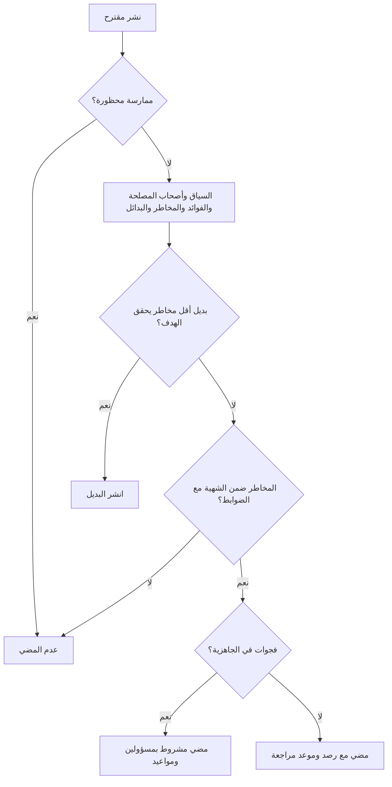

# الوحدة 11 — نشر الذكاء الاصطناعي (deploying AI) واستخدامه

*ستنشر معظم المؤسسات من أنظمة الذكاء الاصطناعي (AI systems) أكثر بكثير مما تبنيه. فبنك نجم (Najm Bank) يشتري أداة لفرز السير الذاتية (CV-screening)، ويرخّص منصة روبوت محادثة (chatbot)، ويستدعي واجهة برمجية (API) لنموذج أساسي (foundation model) لمساعده الذكي في مذكرات الائتمان (credit memo copilot)، ويرى موظفيه يلجؤون كل يوم إلى أدوات الذكاء الاصطناعي التوليدي العامة (public GenAI tools). وكل واحد من هذه يضع بنك نجم في دور **المُشغِّل (deployer)**، والمُشغِّل لا يستطيع أن يُسند المساءلة (accountability) إلى مورّده. تغطي هذه الوحدة المهام الأربع التي تجعل النشر (deployment) قابلًا للحوكمة (governance): أن تقرر هل تنشر أصلًا، وأن تشتري شراءً جيدًا، وأن تقيّم النظام قبل الاستخدام وأثناءه، وأن تحكمه يومًا بيوم بإشراف بشري (human oversight) حقيقي وشفافية (transparency) صادقة ودليل عمل (playbook) للحوادث (incidents) يعمل فعلًا. هذا ليس استشارة قانونية (legal advice): فالقوانين والإرشادات (guidance) تتغير وتعتمد على وقائعك، لذا راجع المصادر الرسمية (official sources) ومستشارك القانوني (your own counsel).*

> **التغطية من مجال المعرفة (BoK coverage):** IV.A–IV.C — تقييم العوامل والمخاطر (evaluating factors and risks) قبل النشر (before deploying)، وشراء الذكاء الاصطناعي (AI) بمسؤولية، وإجراء تقييمات الأثر (impact assessments) والتدقيقات (audits)، وحوكمة النشر (governing deployment) والاستخدام.

---

# 11.1 — قرار النشر (deploy decision): السياق (context) وأصحاب المصلحة (stakeholders) والبدائل (alternatives)
*المستوى (Level): 🔴 متقدم (Advanced)* · *المتطلبات (Prerequisites): 8.1، 6.1* · *مجال المعرفة (BoK): IV.A*

## ⚡ الدرس في دقيقة (In 60 seconds)

- قد يكون نظام الذكاء الاصطناعي (AI system) نفسه منخفض المخاطر في سياق وعالي المخاطر (high-risk) في سياق آخر. قرار النشر (deploy decision) يتعلق بـ **هذا النظام، في هذا السياق (context)، لهؤلاء الناس**، لا بالتقنية عمومًا.
- قبل النشر (before deploying)، أجب عن ستة أسئلة: ما **سياق الاستخدام (context of use)**؟ من **أصحاب المصلحة المتأثرون (affected stakeholders)**؟ هل **تفوق الفوائد المخاطر (benefits outweigh the risks)**؟ ما **البدائل (alternatives)**؟ هل **الأشخاص والعمليات والبيانات جاهزة (people, processes and data ready)**؟ هل الاستخدام **متناسب (proportionate)**؟
- اعرف **دورك القانوني (legal role)**. استخدام نظام تحت سلطتك يجعلك **مُشغِّلًا (deployer)** بموجب قانون الذكاء الاصطناعي الأوروبي (EU AI Act). أما تغيير غرضه المقصود (intended purpose) إلى استخدام عالي المخاطر (high-risk use)، أو إعادة وسمه باسمك (rebranding)، فقد يجعلك **مقدّم النظام (provider)**.
- «لا تنشر» و«انشر شيئًا أبسط» نتيجتان مشروعتان، وكثيرًا ما تكونان حكيمتين.
- الفخ الأكبر (The biggest trap): اعتبار موافقة المورّد (vendor)، أو عرض توضيحي (demo) ناجح، أو استخدام منافس للنظام، دليلًا (evidence) على أن النشر (deployment) صحيح *بالنسبة إليك*.

## 🧭 لماذا يهم (Why it matters)

في 2022 سأل عميلٌ مفجوع روبوتَ المحادثة (chatbot) على موقع Air Canada عن أسعار تذاكر الحداد (bereavement fares). فأخبره الروبوت (bot) أنه يستطيع المطالبة بالخصم بعد السفر. وكان ذلك خطأ، فسياسة شركة الطيران تقول غير ذلك. وعندما طالب بالخصم، احتجّت Air Canada في جوهر الأمر بأن روبوت المحادثة مسؤول عن كلامه هو. وفي قضية *Moffatt v. Air Canada* (2024) رفضت محكمة تسوية النزاعات المدنية (Civil Resolution Tribunal) في كولومبيا البريطانية هذه الحجة، وحمّلت شركة الطيران المسؤولية عن المعلومات المنشورة على موقعها، بما في ذلك روبوت المحادثة. كان روبوت المحادثة قرار نشر (deployment decision)، وتحمّل المُشغِّل (deployer) عواقبه.

في بنك نجم (Najm Bank) لدى خالد، رئيس الإقراض للأفراد (Head of Retail Lending)، خطة. فروبوت المحادثة لخدمة العملاء (customer-service chatbot)، المرخَّص من مورّد (vendor) منصة والذي يجيب حاليًا عن أسئلة مواعيد الفروع ورسوم البطاقات، يحظى بشعبية. ويريد خالد أن يبدأ الروبوت (bot) **التأهيل المسبق (pre-qualifying)** لطالبي القروض الشخصية (personal loans): يكتب العملاء رواتبهم والتزاماتهم، فيخبرهم الروبوت هل «من المرجح أن تتم الموافقة» عليهم. يقول: «إنه روبوت المحادثة (chatbot) نفسه، نحن نضيف ميزة فقط».

أما ليلى، رئيسة حوكمة الذكاء الاصطناعي (Head of AI Governance)، فترى نظامًا مختلفًا. فإخبار الناس هل من المرجح أن يحصلوا على ائتمان (credit) هو شكل من أشكال تقييم الجدارة الائتمانية (creditworthiness assessment)، وهو عالي المخاطر (high-risk) بموجب قانون الذكاء الاصطناعي الأوروبي (EU AI Act) عندما يتعلق بأشخاص طبيعيين. والإجابات الخاطئة ستثبّط عملاء مؤهلين أو تضلّل غير المؤهلين، وقضية Air Canada تقول إن بنك نجم سيتحمّلها. ثم إن تغيير الغرض المقصود (intended purpose) من روبوت المحادثة (chatbot) قد يجعل بنك نجم *مقدّم (provider)* نظام عالي المخاطر (high-risk system). التقنية هي نفسها، لكن السياق (context) غيّر كل شيء. يعلّمك هذا الدرس التحليل الذي تجريه ليلى قبل أن يقول أحد «انطلقوا».

## 📐 كيف يعمل (How it works)

### 🟢 الأساسيات (The essentials)

**النشر قرار منفصل عن البناء أو الشراء (Deploying is a separate decision from building or buying).** حوكمة التصميم (الوحدة 8) تسأل هل النظام مصنوع جيدًا. أما قرار النشر (deploy decision) فيسأل هل *استخدامه* هنا، والآن، ولهذا الغرض، مبرَّر. وتنظّمه ستة أسئلة:

| السؤال | ما الذي نسأله (What to ask) | مثال التأهيل المسبق في بنك نجم (Najm pre-qualification example) |
|---|---|---|
| **1. سياق الاستخدام (Context of use)** | أي مهمة، وأي قرارات، ومن يستخدم المخرجات (outputs)، وبأي حجم، وما مدى قابلية الأخطاء للتدارك، وفي أي مجال (عام، توظيف، ائتمان (credit)، صحة)؟ | موجّه إلى العملاء؛ يؤثر في تقدّم الناس بطلبات الائتمان (credit)؛ آلاف المحادثات شهريًا؛ الأخطاء صعبة الاكتشاف (detect) |
| **2. أصحاب المصلحة المتأثرون (Affected stakeholders)** | من يستخدمه، ومن يتأثر بمخرجاته (its outputs)، ومن يتأثر بشكل غير مباشر، ومن هو المستضعف (vulnerable)؟ | العملاء (ومنهم من يمرّون بضائقة مالية (financial difficulty) أو محدودو الإلمام بالقراءة والكتابة (people with limited literacy))، وموظفو مركز الاتصال (call-centre staff)، وموظفو الإقراض (lending officers)، والجهة الرقابية (the regulator) |
| **3. الفوائد مقابل المخاطر (Benefits versus risks)** | ما الفائدة (benefit) القابلة للقياس؟ وما الأضرار التي قد تقع، ولمن، وما احتمالها وشدتها؟ | الفائدة (benefit): طلبات غير ملائمة أقل. المخاطر: «لا» خاطئة تثبّط المؤهلين؛ و«نعم» خاطئة تضلّل؛ والتمييز (discrimination)؛ والخصوصية (privacy) |
| **4. البدائل (Alternatives)** | هل يمكن لأداة غير قائمة على الذكاء الاصطناعي (AI)، أو نموذج (model) أبسط، أو عملية بشرية (human process)، أن تحقق الهدف بمخاطر أقل؟ | حاسبة أهلية قائمة على القواعد (rules-based eligibility calculator) تستخدم المعايير (criteria) المنشورة |
| **5. الجاهزية (Readiness)** | هل الأشخاص مدرَّبون، والعمليات (التصعيد (escalation)، والشكاوى (complaints)، والإشراف (oversight)) مصمَّمة، والبيانات (data) ملائمة، والرصد (monitoring) قائم؟ | لا يملك مركز الاتصال (call-centre) نصًا للتعامل مع الاعتراض (contest) على إجابات الروبوت (bot)؛ ولا رصد (monitoring) لما يقوله الروبوت عن الائتمان (credit) |
| **6. التناسب (Proportionality)** | هل التدخل في مصالح الناس مبرَّر بالفائدة (benefit) ومقصور على ما هو ضروري؟ | جمع تفاصيل الراتب والديون في محادثة مفتوحة من أجل إجابة استرشادية: من الصعب تبريره |

**سياق الاستخدام (context of use).** يشمل السياق (context) المجال (domain)، والفئة السكانية (population)، والقرار الذي تغذّيه المخرجات (outputs)، ودرجة الأتمتة، والحجم، وقابلية الضرر للتدارك. فنموذج لغوي كبير (large language model) يلخّص وثائق السياسات الداخلية (internal policy documents)، والنموذج (model) نفسه وهو يصوغ خطاب رفض ائتمان (credit decline letter) لعميل، هما عمليتا نشر (deployments) مختلفتان.

**أصحاب المصلحة (stakeholders).** ارسم خريطة لأربع مجموعات على الأقل: **المستخدمون (users)** (من يشغّلون النظام)، و**الأشخاص المتأثرون (affected persons)** (من تتعلق بهم المخرجات (outputs))، و**المتأثرون بشكل غير مباشر (indirectly affected people)** (الأسر، والمجتمعات، والمنافسون)، و**جهات الرقابة (overseers)** (الجهات التنظيمية (regulators)، والمدققون (auditors)، ومجلس الإدارة (the board)). وحدّد **الفئات المستضعفة (vulnerable groups)**: من يمرّون بضائقة مالية (financial difficulty)، والقُصَّر، والأشخاص ذوو الإعاقة، ومحدودو المهارات اللغوية. وحيثما أمكن، استشر ممثلين عن هذه الفئات، لا من ينوب عنهم داخليًا فقط.

**البدائل (alternatives).** سؤال «البدائل» هو الموضع الذي تُثبت فيه الحوكمة (governance) الجيدة قيمتها. قارن دائمًا بما يلي على الأقل: *عدم فعل شيء*، ونهج *غير قائم على الذكاء الاصطناعي (AI)*، ونموذج (model) *أبسط أو أكثر قابلية للفهم*، و*ذكاء اصطناعي بمشاركة بشرية (human involvement) أكبر*. فإذا حقق محرك قواعد (rules engine) شفاف 90% من الفائدة (benefit) بـ 10% من المخاطر، فهو في العادة الخيار الأفضل.

### 🟡 التعمق أكثر (Going deeper)

**الدور القانوني بوصفك مُشغِّلًا (Legal role as deployer).** بموجب قانون الذكاء الاصطناعي الأوروبي (EU AI Act)، **المُشغِّل (deployer)** هو شخص طبيعي أو اعتباري، أو سلطة عامة، أو وكالة، أو هيئة أخرى، يستخدم نظام ذكاء اصطناعي (AI system) تحت سلطته، باستثناء الاستخدام الشخصي غير المهني البحت. ويتحمّل مُشغِّلو الأنظمة عالية المخاطر (high-risk systems) التزامات حقيقية (المادة 26 (Art. 26)): استخدام النظام وفق تعليمات الاستخدام (instructions for use)، وتكليف أشخاص أكفاء بالإشراف البشري (human oversight)، والتأكد من أن بيانات الإدخال (input data) الخاضعة لسيطرتهم ذات صلة وممثِّلة بدرجة كافية، ورصد التشغيل (monitor operation)، والاحتفاظ بالسجلات (logs)، وإبلاغ العاملين المتأثرين (affected)، وإبلاغ الأشخاص بأن نظامًا عالي المخاطر (a high-risk system) يُستخدم في قرارات تخصّهم، وإجراء تقييم الأثر على الحقوق الأساسية (FRIA) بالنسبة إلى الهيئات العامة (public bodies) واستخدامات التصنيف الائتماني (credit scoring) وتسعير التأمين (المادة 27 (Art. 27)). كما يتحمّل مُشغِّلو أنظمة معيّنة واجبات شفافية (المادة 50 (Art. 50))، ويجب على كل مقدّم نظام (provider) ومُشغِّل أن يتخذ تدابير تضمن قدرًا كافيًا من الإلمام بالذكاء الاصطناعي (AI literacy) لدى موظفيه (المادة 4 (Art. 4)).

**متى يصبح المُشغِّل مقدّمًا للنظام (When a deployer becomes a provider).** تعامل المادة 25 (Art. 25) المُشغِّلَ (أو الموزّع (distributor) أو المستورد (importer) أو أي طرف ثالث (third party) آخر) على أنه **مقدّم (provider)** نظام عالي المخاطر (high-risk system) إذا:

- وضع اسمه أو علامته التجارية (its trademark) على نظام عالي المخاطر (high-risk system) مطروح في السوق بالفعل؛
- أجرى تعديلًا جوهريًا (substantial modification) على نظام عالي المخاطر (high-risk system) بحيث يظل عالي المخاطر (high-risk)؛ أو
- عدّل الغرض المقصود (intended purpose) من نظام، بما في ذلك نظام للأغراض العامة (general-purpose)، لم يكن عالي المخاطر (high-risk)، بحيث يصبح عالي المخاطر.

تقع خطة خالد تمامًا ضمن البند الثالث (the third bullet). ويجب أن يكشف قرار النشر (deploy decision) عن تغيّرات الدور (role changes) *قبل* حدوثها، لأن التزامات مقدّم النظام (تقييم المطابقة (conformity assessment)، والوثائق الفنية (technical documentation)، ونظام إدارة الجودة (QMS)، والتسجيل) لا يمكن الوفاء بها في دورة عمل قصيرة (sprint).

**قائمة التصنيف (classification checklist) عند بوابة النشر (deploy gate).** لكل استخدام مقترح، تحقّق وسجّل:

1. هل الممارسة **محظورة (prohibited)** (المادة 5 (Art. 5))؟ مثل التصنيف الاجتماعي (social scoring) أو استغلال نقاط الضعف لتشويه السلوك بطرق ضارة.
2. هل الاستخدام **عالي المخاطر (high-risk)** (الملحق III (Annex III)، مثل الجدارة الائتمانية (creditworthiness)، والتوظيف (employment)، والوصول إلى الخدمات الأساسية (access to essential services)؛ أو منتجات الملحق I)؟
3. هل يستدعي واجبات **الشفافية (transparency)** (المادة 50)، مثل روبوت محادثة (chatbot) يتفاعل مع الناس أو محتوى مولَّد بالذكاء الاصطناعي (AI-generated content)؟
4. بموجب اللائحة العامة لحماية البيانات (**GDPR**): الأساس القانوني (lawful basis)، وهل تنطبق المادة 22 (Art. 22) على القرارات الآلية بالكامل (solely automated decisions) ذات الآثار القانونية أو الآثار المماثلة في أهميتها (legal or similarly significant effects)، وهل يلزم تقييم الأثر على حماية البيانات (DPIA). ويُظهر حكم محكمة العدل الأوروبية (CJEU) في قضية *SCHUFA* (2023) أن إنتاج درجة (score) قد يكون هو القرار نفسه عندما يعتمد عليه الآخرون اعتمادًا كبيرًا.
5. **القواعد القطاعية والمحلية (sector and local rules)**: قوانين الائتمان الاستهلاكي (consumer credit) ومكافحة التمييز (anti-discrimination)؛ وبالنسبة إلى بنك نجم: قانون حماية خصوصية البيانات الشخصية القطري (Qatar PDPPL)، وإرشادات QCB للذكاء الاصطناعي للمؤسسات المالية (QCB AI guideline)، وقانون حماية البيانات في الإمارات (UAE data protection law)؛ وخارج الاتحاد الأوروبي (Outside the EU)، قوانين الولايات الأمريكية (US state laws) مثل Colorado AI Act، الذي يفرض على مُشغِّلي الأنظمة عالية المخاطر (high-risk systems) واجبات إدارة المخاطر (risk-management) وتقييم الأثر (impact assessment) والإخطار (أُرجئ تاريخ نفاذه (its effective date) إلى 30 يونيو 2026؛ تحقّق من وضعه الحالي).

**التناسب (proportionality).** تأتي هذه الفكرة من قانون الحقوق الأساسية (fundamental-rights law) ومن حماية البيانات (data protection): يجب أن يسعى أي تدخل في حقوق الناس إلى هدف مشروع (legitimate aim)، وأن يكون ملائمًا وضروريًا لتحقيقه، وألا يكون مفرطًا في آثاره. وفي نشر الذكاء الاصطناعي (deploying AI)، اسأل: هل الذكاء الاصطناعي (AI) ضروري لهذا الهدف، وهل هذا هو الخيار الفعّال الأقل تدخلًا (least intrusive)، وهل الضمانات (safeguards) متكافئة مع حجم ما هو على المحك؟

**أُطر تساعد (frameworks that help).** وظيفة **MAP** في NIST AI RMF هي في جوهرها مجموعة أدوات قرار النشر (deploy decision): إرساء السياق (context) وفهمه (MAP 1)، وتصنيف النظام (MAP 2)، وفهم القدرات والفوائد والتكاليف (benefits and costs) مقارنة بمعايير مرجعية (benchmarks) مناسبة (MAP 3)، ورسم مخاطر مكوّنات الطرف الثالث (MAP 4)، وتوصيف الآثار على الأفراد والمجموعات والمجتمعات والمؤسسات والمجتمع ككل (MAP 5). ويتضمن الملحق A (Annex A) من ISO/IEC 42001 ضوابط (controls) لتقييم (assessment) آثار أنظمة الذكاء الاصطناعي (AI systems) وللاستخدام المسؤول والمقصود (responsible and intended use) لها.

### 🔴 نظرة الخبير (Expert view)

**قرار منظَّم بالمضي أو عدمه (go/no-go).** تدير المؤسسات الناضجة قرار النشر (deploy decision) بوصفه قرار لجنة موثَّقًا له أربع نتائج محتملة:

```mermaid
flowchart TD
  A[نشر مقترح] --> B{ممارسة محظورة؟}
  B -- نعم --> X[عدم المضي]
  B -- لا --> C[السياق وأصحاب المصلحة والفوائد والمخاطر والبدائل]
  C --> D{بديل أقل مخاطر يحقق الهدف؟}
  D -- نعم --> Y[انشر البديل]
  D -- لا --> E{المخاطر ضمن الشهية مع الضوابط؟}
  E -- لا --> X
  E -- نعم --> F{فجوات في الجاهزية؟}
  F -- نعم --> G[مضي مشروط بمسؤولين ومواعيد]
  F -- لا --> H[مضي مع رصد وموعد مراجعة]
```

**للمخاطر المتبقية (residual risk) مالك.** بعد الضوابط (controls) تبقى بعض المخاطر. ويقبلها رسميًا مسؤول تنفيذي (executive) محدد بالاسم وخاضع للمساءلة (accountable)، وهو عادة مالك النشاط (business owner)، ضمن شهية المخاطر (risk appetite) التي يحددها مجلس الإدارة (2.1). وظيفة الحوكمة (governance function) تنصح وتعترض، لكنها لا تملك مخاطر النشاط (business risk). وفي بنك نجم يقبل خالد المخاطر المتبقية لأنظمة الإقراض (lending systems)، ويمكن للجنة حوكمة الذكاء الاصطناعي (AI Governance Committee) أن ترفض أي نشر (any deployment) يقع خارج الشهية (appetite).

**مخاطر عدم النشر (The risk of not deploying).** التناسب (proportionality) سيف ذو حدين. فالامتناع عن استخدام نموذج (model) لكشف الاحتيال (fraud detection) يحمي العملاء بشكل مثبت هو أيضًا خيار له عواقب. سجّل مخاطر خيار «عدم فعل شيء» بأمانة، حتى يكون القرار متوازنًا لا حذرًا فحسب.

**محفّزات إعادة النظر (revisit triggers).** قرار النشر (deploy decision) صالح لسياق (context) معيّن. ضع محفّزات (triggers) تعيد فتحه: فئة سكانية (population) أو بلد جديد، أو تغيير في الغرض المقصود (intended purpose)، أو تغيير المورّد (vendor)، أو تجاوز في الرصد (monitoring)، أو حادث جسيم (serious incident)، أو تغيير في القانون. وكثير من إخفاقات الحوكمة (governance) هي عمليات نشر (deployments) كانت صحيحة في السنة الأولى، ثم صارت خاطئة بصمت في السنة الثالثة.

**الجاهزية تتعلق بالأشخاص في معظمها (Readiness is mostly about people).** أكثر فجوات الجاهزية (readiness gaps) شيوعًا فجوات بشرية: موظفون لا يفهمون حدود النظام، ولا وقت مخصصًا لمراجعة حقيقية، ولا مسار للتصعيد (escalation)، ومعالجو شكاوى (complaint handlers) لا يستطيعون شرح نتيجة ساعد فيها الذكاء الاصطناعي (AI). تعامل مع التدريب (training) وتصميم سير العمل والتوظيف (workflow design and staffing) على أنها معايير للنشر (deploy criteria)، لا متابعات لاحقة. وواجب الإلمام بالذكاء الاصطناعي (المادة 4)، الساري منذ 2 فبراير 2025، يمنح ذلك وزنًا قانونيًا في الاتحاد الأوروبي (EU).

## ⚖️ الأدوات التنظيمية (The instruments)

| الأداة | ما تشترطه أو توصي به (What it requires or recommends) | إشارة الامتحان (Exam cue) |
|---|---|---|
| **EU AI Act** — المادة 3(4) والمادة 26 (Art. 26) | تعرّف المُشغِّل (deployer)؛ وتحدد واجبات المُشغِّل للأنظمة عالية المخاطر (التعليمات، والإشراف البشري (human oversight)، وبيانات الإدخال (input data)، والرصد (monitoring)، والسجلات، وإبلاغ العاملين والأشخاص المتأثرين (affected persons)) | «الاستخدام تحت سلطته» = مُشغِّل (deployer)، حتى لو لم تبنِه أنت |
| **EU AI Act** — المادة 25 (Art. 25) | يصبح المُشغِّل (deployer) مقدّمًا للنظام (a provider) إذا أعاد وسمه (rebrands it)، أو عدّله تعديلًا جوهريًا (substantial modification)، أو غيّر غرضه المقصود (its intended purpose) إلى استخدام عالي المخاطر (high-risk use) | إعادة توظيف (repurposing) روبوت محادثة (chatbot) للتأهيل المسبق (pre-qualification) للائتمان (credit) = تغيّر في الدور (role shift) |
| **EU AI Act** — المادة 5، والمادة 6 والملحق III (Annex III)، والمادة 50 | التصنيف (classification): الممارسات المحظورة (prohibited practices)، والاستخدامات عالية المخاطر (high-risk uses)، وواجبات الشفافية (transparency duties) | أجرِ التصنيف (classification) قبل النشر (before deploying)، لكل حالة استخدام |
| **GDPR** — المواد 5 و6 و22 و35 | المبادئ (ومنها التقليل)، والأساس القانوني (lawful basis)، والقرارات الآلية بالكامل (solely automated decisions) ذات الأثر الكبير، وتقييم الأثر على حماية البيانات (DPIA) | التناسب (proportionality) والضرورة جزء أصيل من تحليل GDPR |
| **NIST AI RMF** — MAP | السياق (context)، والتصنيف (classification)، والفوائد والتكاليف (benefits and costs)، ومخاطر الطرف الثالث (third-party risks)، والآثار | طوعي؛ وMAP هي وظيفة التحليل السابق للنشر (pre-deployment) |
| **ISO/IEC 42001** — الملحق A (Annex A) | ضوابط (controls) لتقييم الأثر (impact assessment) وللاستخدام المسؤول والمقصود (responsible and intended use) لأنظمة الذكاء الاصطناعي (AI systems) | نظام إدارة قابل للاعتماد (certifiable management system)؛ ويجب أن تكون قرارات النشر (deployment) مدعومة بأدلة |
| **Colorado AI Act** — SB 24-205 | على مُشغِّلي الذكاء الاصطناعي عالي المخاطر (high-risk AI) بذل العناية المعقولة، وتشغيل برامج لإدارة المخاطر (risk-management)، وإجراء تقييمات الأثر (impact assessments)، وتقديم الإخطارات | قانون ولاية أمريكية (US state law)؛ أُرجئ تاريخ نفاذه (its effective date) إلى 30 يونيو 2026 — تحقّق من وضعه الحالي |
| **QCB AI guideline** | توقعات بشأن الحوكمة (governance) وتقييم المخاطر (risk assessment) والإشراف (oversight) على الذكاء الاصطناعي (AI) في المؤسسات المالية (financial institutions) الخاضعة لتنظيم قطر (Qatar-regulated) | تتوقع الجهات التنظيمية (regulators) المحلية قرار نشر (deployment decision) موثَّقًا |

## 🏛️ عمليًا في بنك نجم (In practice at Najm Bank)

يكتب فريق ليلى **مذكرة قرار النشر (Deploy Decision Memo)** للجنة (committee).

| القسم (Section) | المحتوى (content) |
|---|---|
| المقترح (Proposal) | روبوت محادثة (chatbot) يخبر عملاء الأفراد (retail customers) هل «من المرجح أن تتم الموافقة» عليهم لقرض شخصي (personal loan) |
| السياق (context) | موجّه إلى العملاء، في الاتحاد الأوروبي (فرانكفورت) وقطر والإمارات؛ نحو 40,000 محادثة شهريًا؛ يؤثر في قرارات التقدم للائتمان (credit)؛ الأخطاء نادرًا ما تكون ظاهرة لبنك نجم |
| أصحاب المصلحة (stakeholders) | عملاء الأفراد (المستضعفون (vulnerable): المتأخرون في السداد، ومحدودو الإلمام بالقراءة والكتابة (people with limited literacy)، ومن لا يتحدثون العربية أو الإنجليزية)، وموظفو مركز الاتصال (call-centre staff)، وموظفو الإقراض (lending officers)، وQCB، وسلطة مراقبة السوق (market surveillance authority) في الاتحاد الأوروبي (EU)، وسلطات حماية البيانات (DPAs) |
| التصنيف (classification) | يغيّر الغرض المقصود (intended purpose) إلى تقييم الجدارة الائتمانية (creditworthiness assessment) ← عالي المخاطر (الملحق III (Annex III)) في الاتحاد الأوروبي (EU) ← يصبح بنك نجم **مقدّم النظام (provider)** (المادة 25 (Art. 25)). GDPR: بيانات مالية في المحادثة؛ مسألة محتملة بموجب المادة 22 إذا ثبّطت الإجابات التقدّم بالطلبات؛ يلزم تقييم الأثر على حماية البيانات (DPIA) |
| الفوائد (benefits) | انخفاض مقدَّر بنسبة 15% في الطلبات غير الملائمة؛ رحلة عميل (customer journey) أسرع |
| المخاطر | إجابات مضلِّلة (سابقة Air Canada (Air Canada precedent))؛ تمييز غير مباشر (indirect discrimination)؛ جمع مفرط للبيانات (over-collection) في النص الحر (free text)؛ التزامات مقدّم النظام (provider) التي لا يستطيع بنك نجم الوفاء بها خلال ستة أشهر |
| البدائل (alternatives) | (أ) عدم فعل شيء. (ب) **حاسبة أهلية قائمة على القواعد (rules-based eligibility calculator)** تعرض الحد الأدنى المنشور من المعايير (criteria) مع تنبيه واضح (a clear notice) بأن «هذا ليس قرارًا»، ويحيل روبوت المحادثة (chatbot) إليها. (ج) تأهيل مسبق (pre-qualification) يجريه مستشار بشري (human adviser) عند الطلب |
| الجاهزية (readiness) | نصوص مركز الاتصال (call-centre) ومعالجة الشكاوى (complaint handling) والرصد (monitoring) غير جاهزة لما يقوله الروبوت (bot) عن الائتمان (credit) |
| **القرار (Decision)** | **عدم المضي (no-go) بالصيغة المقترحة.** المضي (go) بالخيار (ب)، مع قصر روبوت المحادثة (chatbot) على شرح المعايير (criteria) وتحويل العميل إلى موظف بشري. الشروط (terms): تحديث تقييم الأثر على حماية البيانات (سارة)، وضوابط حماية (guardrails) للروبوت (bot) تمنع توقعات الأهلية (دانة)، ونص للموظفين (خالد). المراجعة بعد 6 أشهر |
| مالك المخاطر المتبقية (Residual risk owner) | خالد، رئيس الإقراض للأفراد (Head of Retail Lending) |

## 🛠️ التمارين (Exercises)

- 🟢 ارسم خريطة أصحاب المصلحة (stakeholders) للمساعد الذكي لمذكرات الائتمان (credit memo copilot) في بنك نجم (أداة ذكاء اصطناعي توليدي (GenAI) تصوغ المذكرات (memos) لمديري العلاقات (relationship managers)). *يكتمل عندما (Done when):* يكون لديك المستخدمون (users)، والأشخاص المتأثرون (affected persons)، والمتأثرون بشكل غير مباشر (indirectly affected people)، وجهات الرقابة (overseers)، مع تحديد فئتين مستضعفتين (two vulnerable groups) على الأقل أو استبعادهما مع ذكر الأسباب.
- 🟡 اكتب قسم «البدائل (alternatives)» لأداة فرز السير الذاتية (CV-screening tool) من المورّد (vendor) في بنك نجم، مقارنًا إياها بعدم فعل شيء، وبالفرز البشري المنظَّم (structured human screening)، وبنموذج (model) أبسط يعتمد على أسئلة الاستبعاد (knock-out questions). *يكتمل عندما (Done when):* يكون لكل خيار فوائد ومخاطر وتكلفة تقريبية.
- 🔴 طبّق قائمة التصنيف (classification checklist) كاملة على الاستخدام *الحالي* لروبوت المحادثة (المواعيد والرسوم) وعلى الاستخدام المقترح (التأهيل المسبق (pre-qualification)) في الاتحاد الأوروبي (EU) وقطر والإمارات. *يكتمل عندما (Done when):* تستطيع أن تحدد دور بنك نجم، ومستوى المخاطر (risk tier)، والالتزامات الرئيسية (key obligations) لكل استخدام في كل ولاية قضائية (jurisdiction)، مع الإشارة إلى ما ستتحقق منه مع المستشار القانوني (counsel).

## ⚠️ أخطاء وفخاخ الامتحان (Mistakes and exam traps)

- **«المورّد هو المسؤول» (The vendor is responsible).** للمُشغِّل (deployer) التزاماته الخاصة، وكما تُظهر قضية *Moffatt v. Air Canada*، فهو يتحمّل ما يقوله الذكاء الاصطناعي الموجّه إلى عملائه (its customer-facing AI).
- **تقييم التقنية بدلًا من الاستخدام (Assessing the technology instead of the use).** كثيرًا ما تغيّر سيناريوهات الامتحان السياقَ (context) لا النظام. ومستوى المخاطر (risk tier) يتبع الاستخدام.
- **إغفال تغيّر الدور (Missing the role shift).** إعادة توظيف (repurposing) نظام عام في استخدام عالي المخاطر (high-risk use) تجعلك مقدّمًا للنظام (a provider) بموجب المادة 25 (Art. 25).
- **تخطي البدائل (Skipping alternatives).** إذا عرض سؤال خيار «المقارنة بخيار أبسط وأقل مخاطر»، فهذه عادة هي الإجابة ذات العقلية الحوكمية.
- **اعتبار الجاهزية تقنية فقط (Treating readiness as technical only).** التدريب (training)، ووقت المراجعة (review time)، والتصعيد (escalation)، ومعالجة الشكاوى (complaint handling)، كلها معايير للنشر (deploy criteria).
- **أن تملك الحوكمة المخاطر (Governance owning the risk).** مالك النشاط (business owner) هو من يقبل المخاطر المتبقية (residual risk)؛ والحوكمة (governance) تنصح وتعترض ويمكنها التصعيد (escalation) أو المنع.

## 🧾 الخلاصة (Recap)

- يسأل قرار النشر (deploy decision) هل استخدام هذا النظام، في هذا السياق (context)، لهؤلاء الناس، مبرَّر.
- ستة أسئلة: سياق الاستخدام (context of use)، وأصحاب المصلحة (stakeholders)، والفوائد مقابل المخاطر (benefits versus risks)، والبدائل (alternatives)، والجاهزية (readiness)، والتناسب (proportionality).
- بوصفك مُشغِّلًا (deployer)، لديك واجباتك الخاصة بموجب قانون الذكاء الاصطناعي الأوروبي (المادة 26 (Art. 26)، والمادة 4، وأحيانًا المادة 27 (Art. 27) والمادة 50). وتغيير الغرض أو إعادة الوسم (rebranding) قد يجعلك مقدّمًا للنظام (المادة 25 (Art. 25)).
- صنّف كل استخدام (محظور (prohibited)، عالي المخاطر (high-risk)، شفافية (transparency)، GDPR، القانون القطاعي والمحلي) قبل التشغيل الفعلي (go-live).
- تشمل النتائج: عدم المضي (no-go)، ونشر بديل (deploy an alternative)، والمضي المشروط (conditional go)، والمضي (go)، ولكل منها مالك خاضع للمساءلة (accountable) ومحفّزات لإعادة النظر (revisit triggers).

## ✍️ اختبر نفسك (Check yourself)

**1. يرخّص بنك روبوت محادثة (chatbot) عامًا لخدمة العملاء ويهيّئه ليخبر العملاء هل من المرجح أن تتم الموافقة عليهم لقرض شخصي (personal loan). بموجب قانون الذكاء الاصطناعي الأوروبي (EU AI Act)، ما أهم عاقبة يجب الإشارة إليها في قرار النشر (deploy decision)؟**

- A. يبقى البنك مجرد مُشغِّل (deployer) لنظام ذي مخاطر دنيا (minimal risk)
- B. قد يصبح البنك مقدّم (provider) نظام عالي المخاطر (high-risk system) لأنه غيّر الغرض المقصود (intended purpose) إلى تقييم الجدارة الائتمانية (creditworthiness assessment)
- C. يصبح مورّد روبوت المحادثة (chatbot vendor) هو المُشغِّل (deployer)
- D. يصبح النظام ممارسة محظورة (prohibited practice)

الإجابة

**B.** تعامل المادة 25 (Art. 25) الطرفَ الذي يعدّل الغرض المقصود (intended purpose) من نظام بحيث يصبح عالي المخاطر (high-risk) على أنه مقدّم النظام (provider). وتقييم الجدارة الائتمانية (creditworthiness assessment) للأشخاص الطبيعيين (natural persons) مدرج في الملحق III (Annex III). وهو ليس محظورًا (D). (التعمق أكثر (Going deeper): متى يصبح المُشغِّل مقدّمًا للنظام (When a deployer becomes a provider).)

**2. أي سؤال هو *الأكثر* تمثيلًا لخطوة (Step) «البدائل (alternatives)» في قرار النشر (deploy decision)؟**

- A. هل يمكن لنهج غير قائم على الذكاء الاصطناعي (AI) أو لنهج أبسط أن يحقق الهدف بمخاطر أقل؟
- B. ما الدقة (accuracy) التي يدّعيها المورّد (vendor)؟
- C. أي منطقة سحابية (cloud region) ستستضيف النموذج (model)؟
- D. كم منافسًا يستخدم ذكاءً اصطناعيًا مشابهًا؟

الإجابة

**A.** تقارن البدائل (alternatives) خيار الذكاء الاصطناعي (AI) بعدم فعل شيء، وبالنُّهُج غير القائمة على الذكاء الاصطناعي، وبالنماذج (models) الأبسط، وبمشاركة بشرية (human involvement) أكبر. واستخدام المنافسين (D) ليس مبررًا. (الأساسيات (The essentials): البدائل.)

**3. في قضية *Moffatt v. Air Canada* (2024)، ماذا قررت المحكمة بشأن روبوت المحادثة (chatbot) الخاص بشركة الطيران؟**

- A. روبوت المحادثة (chatbot) كيان قانوني مستقل (separate legal entity) مسؤول عن أقواله
- B. مورّد روبوت المحادثة (chatbot vendor) هو المسؤول الوحيد (solely liable)
- C. شركة الطيران مسؤولة عن المعلومات التي قدّمها روبوت المحادثة (chatbot) للعملاء
- D. روبوتات المحادثة (chatbots) لا يمكنها تقديم معلومات ملزمة، لذا لم يكن أحد مسؤولًا

الإجابة

**C.** رفضت المحكمة فكرة أن روبوت المحادثة (chatbot) مسؤول عن كلامه، وحمّلت شركة الطيران المسؤولية عن المعلومات المنشورة على موقعها، بما في ذلك روبوت المحادثة. فالمُشغِّل (deployer) يتحمّل الذكاء الاصطناعي الموجّه إلى عملائه (its customer-facing AI). (لماذا يهم (Why it matters).)

**4. تخلص لجنة بنك نجم إلى أن نشرًا (a deployment) مقترحًا للذكاء الاصطناعي (AI) يقع ضمن شهية المخاطر (risk appetite)، لكن تدريب الموظفين وعملية معالجة الشكاوى (complaint handling) ليسا جاهزين. ما أفضل قرار؟**

- A. المضي (go) فورًا؛ ويمكن أن يأتي التدريب (training) لاحقًا
- B. عدم المضي (no-go) نهائيًا
- C. نقل القرار إلى المورّد (vendor)
- D. مضي مشروط (conditional go)، مع مسؤولين محددين بالاسم ومواعيد لسد فجوات الجاهزية (readiness gaps)، يُتحقَّق منها قبل التشغيل الفعلي (go-live)

الإجابة

**D.** يمكن معالجة فجوات الجاهزية (readiness gaps) عبر موافقة مشروطة (conditional approval) بشروط (terms) تُتابَع. الخيار A يتجاهل الجاهزية (readiness)؛ وB غير متناسب (proportionate)؛ وC تخلٍّ عن المساءلة (accountability). (نظرة الخبير (Expert view): قرار منظَّم بالمضي أو عدمه (A structured go/no-go).)

**5. أي وظيفة في NIST AI RMF تدعم بشكل مباشر أكثر من غيرها التحليلَ السابق للنشر (pre-deployment) للسياق (context) والفوائد والتكاليف (benefits and costs) والآثار؟**

- A. GOVERN
- B. MAP
- C. MEASURE
- D. MANAGE

الإجابة

**B.** تُرسي MAP السياق (context)، وتصنّف النظام، وتفحص الفوائد والتكاليف (benefits and costs)، وتوصّف الآثار. أما MEASURE فتقيس المخاطر كميًا؛ وMANAGE ترتّب أولوياتها وتتصرف بشأنها؛ وGOVERN تضع الثقافة والهياكل. (التعمق أكثر (Going deeper): أُطر تساعد.)

## 📚 المراجع (References)

- EU AI Act, Regulation (EU) 2024/1689 (EUR-Lex): https://eur-lex.europa.eu/eli/reg/2024/1689/oj
- GDPR, Regulation (EU) 2016/679 (EUR-Lex): https://eur-lex.europa.eu/eli/reg/2016/679/oj
- NIST AI Risk Management Framework and Playbook: https://www.nist.gov/itl/ai-risk-management-framework
- ISO/IEC 42001:2023 (ISO): https://www.iso.org/standard/81230.html
- Colorado General Assembly (SB 24-205, Consumer Protections for Artificial Intelligence): https://leg.colorado.gov
- British Columbia Civil Resolution Tribunal (*Moffatt v. Air Canada*, 2024): https://civilresolutionbc.ca
- Qatar Central Bank: https://www.qcb.gov.qa

---

# 11.2 — شراء الذكاء الاصطناعي (AI): العناية الواجبة (due diligence) تجاه المورّدين (vendors) والعقود (contracts)
*المستوى (Level): 🔴 متقدم (Advanced)* · *المتطلبات (Prerequisites): 3.3، 11.1* · *مجال المعرفة (BoK): IV.A*

## ⚡ الدرس في دقيقة (In 60 seconds)

- يمكنك أن تُسند وظيفة ذكاء اصطناعي إلى جهة خارجية، لكنك لا تستطيع أن تُسند المساءلة (accountability). شراء الذكاء الاصطناعي (AI) نشاط من أنشطة الحوكمة (governance)، والمشتريات (procurement) من أقوى ضوابطك.
- تسأل **العناية الواجبة (due diligence)**: ماذا يفعل النظام، وكيف بُني واختُبر؟ كيف يتعامل المورّد (vendor) مع بياناتنا (بما في ذلك التدريب (training) عليها)؟ من هم المعالِجون الفرعيون (sub-processors) لديه؟ ما مدى أمانه؟ وما الأدلة (evidence) والشهادات (certifications) التي تدعم ادعاءاته؟
- **العقود (contracts)** تحوّل الإجابات إلى التزامات: حدود استخدام البيانات (data)، وحماية الملكية الفكرية (IP) والتعويض (indemnity)، وحقوق التدقيق (audit rights) والحصول على المعلومات، والإخطار بالحوادث (incident notification)، والتزامات الأداء والعدالة (fairness)، والإخطار بالتغييرات (change notification)، والتعاون التنظيمي (regulatory cooperation)، وخروج نظيف (clean exit).
- تحتاج **واجهات النماذج الأساسية البرمجية (foundation-model APIs)** و**النماذج مفتوحة المصدر (open-source models)** إلى فحوص خاصة بها: شروط الاستخدام (terms of use)، والاحتفاظ بالبيانات (data retention)، وتغييرات الإصدارات، والتراخيص (licences)، ومن يصون ماذا.
- شهادة (certificate) **ISO/IEC 42001** تخبرك أن المورّد (vendor) يدير نظام إدارة الذكاء الاصطناعي (AI management system). لكنها لا تثبت أن منتجًا بعينه دقيق أو عادل أو ممتثل قانونيًا.
- الفخ الأكبر (The biggest trap): قبول عبارة «هذا مملوك لنا (proprietary)، لا يمكننا مشاركته» في استخدام عالي المخاطر (high-risk). فإذا لم يستطع المورّد (vendor) أن يعطيك ما تحتاجه للوفاء بالتزاماتك، فلن تستطيع الوفاء بها.

## 🧭 لماذا يهم (Why it matters)

في 2023 أبرمت لجنة تكافؤ فرص العمل الأمريكية (US Equal Employment Opportunity Commission) تسوية (settlement) في دعوى (lawsuit) ضد شركة الدروس الخصوصية (tutoring) iTutorGroup، وقد وُصفت على نطاق واسع بأنها أول تسوية للوكالة في قضية تتعلق بالتوظيف الآلي (automated hiring). ادّعت EEOC أن برنامج طلبات التوظيف (employment) لدى الشركة كان مُعدًّا لرفض المتقدمين الأكبر سنًا (to reject older applicants) تلقائيًا، وانتهت القضية بتسوية. والدرس لأي صاحب عمل (employer) بسيط: إذا كان البرنامج الذي تستخدمه يستبعد الناس بشكل غير قانوني، فـ*أنت* من يُسأل عن ذلك.

يشتري بنك نجم (Najm Bank) أداة لفرز السير الذاتية (CV-screening tool) للتعامل مع آلاف الطلبات التي تتلقاها فروعه. ولدى يوسف، من إدارة المشتريات (procurement)، قائمة مختصرة بثلاثة مورّدين. وكل العروض التقديمية اللامعة تعد بـ«ذكاء اصطناعي خالٍ من التحيّز (bias-free AI)». وعندما تطلب ليلى نتائج اختبار التحيّز (bias testing) مفصّلة حسب الجنس (sex) والعمر، يرسل أحد المورّدين (vendors) ملخصًا من صفحة واحدة بلا منهجية (method)، ويقول آخر إن النموذج (model) «مملوك» (proprietary)، ويرسل الثالث تقريرًا مفصّلًا إضافة إلى تعليمات الاستخدام (instructions for use) التي يُعدّها بوصفه مقدّم نظام (provider) بموجب قانون الذكاء الاصطناعي الأوروبي (EU AI Act). وفرز طلبات التوظيف (employment screening) استخدام عالي المخاطر (high-risk use) مدرج في الملحق III (Annex III). وبوصف بنك نجم مُشغِّلًا (deployer)، يجب عليه أن يستخدم النظام وفق تعليماته، وأن يكلّف أشخاصًا أكفاء بالإشراف البشري (human oversight)، وأن يحتفظ بالسجلات، وأن يُبلغ المتقدمين والموظفين، وأن يرصد النظام. ولا يستطيع فعل أي من ذلك دون تعاون المورّد (vendor)، ويجب أن يُكتب هذا التعاون في العقد (contract). وفي الوقت نفسه، تختار دانة نموذجًا أساسيًا (foundation model) للمساعد الذكي لمذكرات الائتمان (credit memo copilot)، وتسأل هل يُغني نموذج مفتوح الأوزان (open-weight) عن كل هذا. والجواب لا، بل سيغيّر فقط من يقوم بالعمل.

## 📐 كيف يعمل (How it works)

### 🟢 الأساسيات (The essentials)

**لماذا المشتريات ضابط (control).** قبل التوقيع تكون لديك أقصى قوة تفاوضية: المورّد (vendor) يريد الصفقة، وأنت تستطيع الانسحاب. أما بعد التوقيع فيصبح كل طلب مفاوضة. وفرق الحوكمة (governance) التي تُشرك المشتريات (procurement) مبكرًا (3.3) تحصل على أدلة أفضل وشروط (terms) أفضل ومفاجآت أقل.

**عملية عناية واجبة متناسبة مع المخاطر (A due diligence process, proportionate to risk).**

1. **الفرز الأولي (triage).** استخدم تصنيف الاستقبال (intake classification) (8.1، 11.1). فمدقق إملائي (spell-checker) وأداة لفرز السير الذاتية (CV-screening tool) يستحقان عمقًا مختلفًا.
2. **الاستبيان (questionnaire).** أسئلة معيارية مقسّمة إلى مستويات حسب المخاطر. واستبيانات (questionnaires) مشتريات الذكاء الاصطناعي (AI procurement) في القطاع الخاص (private sector) والقطاع العام (public sector) نقطة انطلاق مفيدة.
3. **مراجعة الوثائق (documentation review).** اقرأ ما يقدمه المورّد (vendor)، لا مواده التسويقية (its marketing) فقط.
4. **الاختبار المستقل (independent testing).** حيث تبرر المخاطر ذلك، اختبر النظام على بياناتك أنت، في بيئة معزولة (sandbox) أو تجربة (pilot)، قبل الالتزام.
5. **القرار والعقد (decision and contract).** سجّل النتائج والمخاطر المتبقية والشروط (findings, residual risks and conditions)، وانقلها إلى العقد (contract).

**ما الذي تسأل عنه، والعلامات الحمراء (red flags).**

| المجال (domain) | الأسئلة الرئيسية (Key questions) | العلامات الحمراء (Red flags) |
|---|---|---|
| **الغرض والتصميم (Purpose and design)** | الغرض المقصود (intended purpose)، والقيود (limitations)، وإساءة الاستخدام المتوقعة (foreseeable misuse)؛ ونوع النموذج (model)؛ وميزات الإشراف البشري (human oversight) | «يعمل لكل شيء»؛ لا قيود مذكورة |
| **الوثائق (Documentation)** | بطاقة النموذج (model card) أو بطاقة النظام (system card)؛ وتعليمات الاستخدام (instructions for use)؛ وللأنظمة عالية المخاطر (high-risk systems) في الاتحاد الأوروبي (EU): إعلان المطابقة (declaration of conformity) والتسجيل | لا تعليمات استخدام لنظام عالي المخاطر (high-risk system) |
| **أدلة الاختبار (Testing evidence)** | الدقة (accuracy) حسب الشريحة (segment)؛ واختبار التحيّز (bias testing) حسب المجموعات ذات الصلة، مع المنهجية (method)؛ ونتائج المتانة (robustness) واختبار الفريق الأحمر (red-teaming) | متوسطات فقط؛ ادعاءات «خالٍ من التحيّز (bias)»؛ لا منهجية (method) |
| **استخدام البيانات (Data use)** | هل ستُستخدم بياناتنا (المدخلات (inputs) والمخرجات (outputs) والتغذية الراجعة (feedback)) لتدريب (training) نماذج المورّد (the vendor's models)؟ الاحتفاظ (retention)، والموقع، والنقل (transfers)، والحذف عند الخروج (deletion on exit) | تدريب افتراضي على بيانات العملاء؛ غموض بشأن الاحتفاظ (retention) |
| **المعالِجون الفرعيون (Sub-processors)** | من غيره يعالج بياناتنا أو يستضيف النموذج (model)؟ وأين؟ وهل يُخطَرنا بالتغييرات؟ | معالِجون فرعيون (sub-processors) غير مُفصَح عنهم؛ لا إخطار بالتغيير (change notice) |
| **الأمن (Security)** | شهادة (certificate) ISO/IEC 27001 أو تقرير SOC 2؛ واختبارات الاختراق (penetration tests)؛ والدفاعات ضد حقن الأوامر (prompt injection) وتسرّب البيانات (data leakage) في الذكاء الاصطناعي التوليدي (GenAI) | لا ضمان أمني (security assurance) مستقل |
| **الحوكمة (Governance)** | سياسة للذكاء الاصطناعي (AI policy)؛ وشهادة (certificate) ISO/IEC 42001 أو ما يعادلها؛ وعملية للحوادث (incident process)؛ والسجل التنظيمي (regulatory track record) | لا عملية للحوادث (incident process)؛ لا مالك محدد بالاسم لحوكمة الذكاء الاصطناعي (AI governance) |
| **الاستمرارية (Viability)** | الاستقرار المالي (financial stability)، والدعم، وخارطة الطريق (roadmap)، والاعتماد على نموذج واحد في المنبع (upstream) | مورّد (vendor) صغير جدًا يغلّف واجهة برمجية (API) لطرف ثالث (third party) دون خطة طوارئ (contingency) |

**الشهادات: ما تثبته وما لا تثبته (Certifications: what they do and do not prove).** تُظهر شهادة (certificate) **ISO/IEC 42001** أن جهة اعتماد (certification body) معتمدة قد دققت *نظام الإدارة (management system)* للذكاء الاصطناعي (AI) لدى المورّد (vendor): السياسات، وعمليات تقييم المخاطر والأثر (risk and impact assessment processes)، وضوابط دورة الحياة (life cycle). وهي دليل (evidence) قيّم على الانضباط. لكنها لا تشهد بأن نموذجًا (model) بعينه دقيق أو عادل، ولا بأن المنتج يستوفي قانون الذكاء الاصطناعي الأوروبي (EU AI Act). تحقّق من **نطاق (scope)** الشهادة (أي المنتجات والمواقع)، ومن جهة الاعتماد واعتمادها (يحدد ISO/IEC 42006 متطلبات الجهات التي تمنح شهادة 42001)، ومن التاريخ.

### 🟡 التعمق أكثر (Going deeper)

**بنود العقد المهمة (Contract clauses that matter).** العقد (contract) الجيد للذكاء الاصطناعي (AI)، أو ملحق الذكاء الاصطناعي (AI schedule) في عقد معياري (standard contract)، يغطي ما يلي:

| البند (Clause) | ما ينبغي أن ينص عليه (What it should say) | السبب |
|---|---|---|
| **قيود استخدام البيانات (Data use restrictions)** | لا تُستخدم بيانات العميل (المدخلات (inputs)، والمخرجات (outputs)، وبيانات الضبط الدقيق (fine-tuning)، والتغذية الراجعة (feedback)) إلا لتقديم الخدمة؛ ولا تدريب لنماذج المورّد (the vendor's models) أو نماذج (models) أطراف ثالثة (third parties) دون موافقة صريحة مسبقة (opt-in)؛ وحدود للاحتفاظ (retention limits)؛ والحذف (deletion) عند الطلب وعند الخروج (exit) | يحمي السرية (confidentiality) والبيانات الشخصية (personal data)؛ ويمنع أن تُحسِّن بياناتك أدوات المنافسين |
| **شروط حماية البيانات (Data protection terms)** | شروط المعالِج (processor) بموجب المادة 28 من GDPR (التعليمات، والسرية (confidentiality)، والأمن (security)، والموافقة على المعالِجين الفرعيين (sub-processors)، والمساعدة في الحقوق وتقييمات الأثر على حماية البيانات (DPIAs)، والحذف (deletion) أو الإعادة، والتدقيقات (audits))؛ وضمانات النقل (transfer safeguards)؛ وما يعادلها في القوانين المحلية (مثل Qatar PDPPL) | مطلوبة قانونًا حيث يعالج المورّد (vendor) بيانات شخصية (personal data) نيابة عنك |
| **الملكية الفكرية والتعويض (IP and indemnity)** | ملكية المخرجات (outputs) أو ترخيصها؛ وضمان من المورّد (vendor warranty) بأنه يملك الحقوق في بيانات التدريب (training data) والنموذج (model)؛ وتعويض (indemnity) ضد مطالبات الملكية الفكرية (IP) من أطراف ثالثة (third parties)، بشروط (terms) واضحة | نزاعات حقوق النشر (copyright) المتعلقة ببيانات التدريب (training data) قائمة؛ فاعرف من يتحمّل المخاطر |
| **حقوق التدقيق والحصول على المعلومات (Audit and information rights)** | الوصول إلى الوثائق (documentation) ونتائج الاختبار (test results) والسجلات، وبالنسبة إلى الاستخدامات عالية المخاطر (high-risk uses): المعلومات اللازمة لتقييم الأثر على الحقوق الأساسية (FRIA) وتقييم الأثر على حماية البيانات (DPIA) والرصد (monitoring)؛ والحق في التدقيق (audit) أو في تلقي تقارير تدقيق مستقلة (independent audit reports) | لا يمكنك الوفاء بواجبات المُشغِّل (deployer) دون معلومات |
| **الإخطار بالحوادث (Incident notification)** | الإخطار (notification) خلال مدة محددة (مثلًا 24–72 ساعة) بالحوادث الأمنية (security incidents)، أو الأعطال الجسيمة (serious malfunctions)، أو مشكلات الأداء (performance) أو التحيّز (bias) الجوهرية؛ والتعاون في التحقيق | مهلك الزمنية الخاصة (72 ساعة في GDPR؛ وواجبات الحادث الجسيم (serious incident) في قانون الذكاء الاصطناعي (EU AI Act)) تبدأ عندما تعلم *أنت* |
| **التزامات الأداء والعدالة (Performance and fairness commitments)** | مستويات الخدمة (service levels)؛ ومقاييس الدقة (accuracy) والعدالة (fairness) مع عتبات (thresholds)؛ وسبل الانتصاف (remedies) عند الإخلال؛ وحقك في الاختبار (testing) | يحوّل الادعاءات التسويقية (marketing claims) إلى التزامات |
| **الإخطار بالتغييرات (Change notification)** | إخطار مسبق بالتغييرات الجوهرية (إعادة تدريب النموذج (model retraining)، وتغيير الإصدارات، ومعالِجون فرعيون (sub-processors) جدد)؛ وتثبيت الإصدار (version pinning) حيث أمكن؛ والحق في إعادة الاختبار (re-test) أو الإنهاء (termination) | تغييرات المورّد (vendor) قد تغيّر السلوك وامتثالك (10.3) |
| **التعاون التنظيمي (Regulatory cooperation)** | يدعم المورّد (vendor) التزاماتك: يقدّم تعليمات الاستخدام (instructions for use)، والسجلات، والتفسيرات (explanations) للأشخاص المتأثرين (affected persons)، والتعاون مع السلطات | يفترض قانون الذكاء الاصطناعي الأوروبي (EU AI Act) التعاون بين مقدّم النظام والمُشغِّل (provider and deployer) |
| **الخروج والانتقال (Exit and transition)** | إعادة البيانات (data) وحذفها مع شهادة (certificate) بذلك؛ والمساعدة في الانتقال (transition assistance)؛ والإيداع لدى طرف ثالث (escrow) أو استمرار الوصول إلى الوثائق (documentation) والسجلات التي يجب عليك الاحتفاظ (retention) بها | قد تحتاج إلى السجلات بعد انتهاء العقد (contract) بسنوات |

**ما يقوله القانون بالفعل (What the law already says).** يُلزم قانون الذكاء الاصطناعي الأوروبي (EU AI Act) مقدّمي الأنظمة عالية المخاطر (providers of high-risk systems) بتقديم تعليمات الاستخدام (المادة 13 (Art. 13))، ويُلزم الأطراف الثالثة (third parties) التي تورّد أدوات أو خدمات أو مكوّنات أو عمليات تُستخدم في أنظمة عالية المخاطر (high-risk systems) بأن تحدد، في اتفاق مكتوب مع مقدّم النظام (provider)، المعلومات والقدرات والوصول الفني والمساعدة اللازمة ليمتثل مقدّم النظام (المادة 25 (Art. 25)). ويجوز للمفوضية (Commission) أن توصي بشروط تعاقدية نموذجية (model contractual terms) طوعية لهذا الغرض. وبصورة منفصلة، نشرت المفوضية بنودًا تعاقدية نموذجية (model contractual clauses) طوعية لمشتريات القطاع العام من الذكاء الاصطناعي (MCC-AI)؛ فتحقّق من أحدث إصدار (version). وبالنسبة إلى الكيانات المالية (financial entities) في الاتحاد الأوروبي (EU)، يحدد قانون المرونة التشغيلية الرقمية (**Digital Operational Resilience Act (DORA)**) أحكامًا تعاقدية إلزامية (mandatory contractual provisions) لخدمات تقنية المعلومات والاتصالات (ICT) المقدَّمة من أطراف ثالثة حيث ينطبق. تحقّق هل ينطبق على كيانك وكيف.

### 🔴 نظرة الخبير (Expert view)

**واجهات النماذج الأساسية البرمجية (foundation-model APIs).** عندما يستدعي بنك نجم نموذجًا أساسيًا (a foundation model) عبر واجهة برمجية (API) لمساعده الذكي لمذكرات الائتمان (its credit memo copilot)، يكون مقدّم النموذج (the model's provider) **مقدّم نموذج ذكاء اصطناعي للأغراض العامة (GPAI)**. ومنذ 2 أغسطس 2025 يجب على مقدّمي نماذج GPAI (GPAI providers)، من بين أمور أخرى، الاحتفاظ بوثائق فنية (keep technical documentation)، وتزويد مقدّمي الأنظمة في المصب (downstream providers) بالمعلومات التي يحتاجونها لفهم قدرات النموذج (model) وحدوده، ووضع سياسة لحقوق النشر (copyright policy)، ونشر ملخص لمحتوى التدريب (المادة 53 (Art. 53)). ومدونة الممارسات الخاصة بنماذج GPAI (GPAI Code of Practice) المنشورة في يوليو 2025 وسيلة طوعية لإثبات الامتثال (compliance). أما بنك نجم، الذي يدمج النموذج في نظامه الخاص، فهو مقدّم (provider) *ذلك النظام* أو مُشغِّله. ولقرار النشر (deploy decision) والتعاقد، تحقّق مما يلي:

- **أي الشروط تنطبق (Which terms apply).** كثيرًا ما تختلف شروط المستهلكين (consumer terms) عن شروط المؤسسات (enterprise terms) أو الواجهة البرمجية (API)، لا سيما في ما إذا كانت المدخلات (inputs) تُستخدم للتدريب (training) ومدة الاحتفاظ (retention period) بها. استخدم اتفاقيات المؤسسات (enterprise agreements) لبيانات الأعمال (business data).
- **موطن البيانات والاحتفاظ بها (data residency and retention).** أين تُعالَج الأوامر (prompts) وتُخزَّن، ولكم من الوقت، ومن يمكنه الوصول إليها (بما في ذلك لأغراض رصد إساءة الاستخدام (abuse monitoring))؟
- **إصدارات النموذج.** يحدّث المقدّمون إصدارات النماذج (model versions) ويسحبونها. ثبّت الإصدارات حيث أمكن، واحصل على إخطار بالإيقاف (deprecations)، وأعد الاختبار (testing) قبل التبديل (10.3).
- **وثائق المصب (downstream documentation).** اطلب المعلومات التي يجب على مقدّمي نماذج GPAI (GPAI providers) تقديمها لمقدّمي الأنظمة في المصب (downstream providers)، واستخدمها في وثائقك الخاصة.
- **مخاطر التركّز (concentration risk).** إذا تعطّل نموذج (model) واحد في المنبع (upstream) أو غيّر شروطه، فما خطتك البديلة (your fallback)؟

**النماذج مفتوحة المصدر ومفتوحة الأوزان (open-source and open-weight models).** تنزيل أوزان نموذج (a model's weights) ينقل السيطرة، والعمل، إليك. فلا يوجد مورّد (vendor) يقدّم ضمانات (warranties)، أو يصلح الثغرات (vulnerabilities)، أو يُخطرك بالتغييرات، لذا تملك أنت التقييم (assessment) والأمن (security) والرصد (monitoring) والصيانة (maintenance). تحقّق مما يلي:

- **الترخيص (licence).** كلمة «مفتوح» تختلف في معناها. فبعض تراخيص النماذج (model licences) تقيّد استخدامات أو مستخدمين أو أحجامًا معينة؛ وقد نشرت مبادرة المصدر المفتوح (Open Source Initiative) تعريف الذكاء الاصطناعي مفتوح المصدر (Open Source AI Definition) (الإصدار (version) 1.0، أكتوبر 2024)، وكثير من النماذج (models) «مفتوحة الأوزان (open-weight)» لا تستوفيه. ويجب أن يراجع الفريق القانوني الترخيص في ضوء استخدامك المقصود.
- **المصدر والوثائق (provenance and documentation).** ما المعروف عن بيانات التدريب (training data) والتقييم (assessment) والقيود (limitations) المعروفة؟
- **الأمن (Security).** احصل على الأوزان (weights) من مصادر موثوقة، وتحقّق من سلامتها، وافحص ملفات النموذج (model files)، لأن بعض صيغ ملفات النماذج (model file formats) يمكن أن تنفّذ كودًا عند تحميلها.
- **الموقف التنظيمي (Regulatory position).** يعفي قانون الذكاء الاصطناعي الأوروبي (EU AI Act) بعض أنظمة الذكاء الاصطناعي (AI systems) المجانية ومفتوحة المصدر (open-source) من بعض الالتزامات، لكن الإعفاء (exemption) لا يشمل الأنظمة عالية المخاطر (high-risk systems)، ولا الممارسات المحظورة (prohibited practices)، ولا واجبات الشفافية (transparency duties) في المادة 50، ولا تحصل نماذج GPAI (GPAI models) مفتوحة المصدر ذات المخاطر النظامية (systemic risk) على إعفاء من التوثيق (documentation). وإذا بنى بنك نجم نظامًا عالي المخاطر (a high-risk system) على نموذج (model) مفتوح، فبنك نجم هو مقدّم النظام (provider).

**العناية الواجبة مستمرة (Due diligence is continuous).** أعد تقييم المورّدين (re-assess vendors) دوريًا وعند وقوع محفّزات (triggers): الحوادث (incidents)، وتغيّرات الملكية (ownership changes)، والإصدارات الجديدة، والمعالِجون الفرعيون (sub-processors) الجدد، والإجراءات التنظيمية (regulatory actions). واحتفظ بسجل لمورّدي الذكاء الاصطناعي (vendor AI register) مرتبط بسجل أنظمة الذكاء الاصطناعي (AI inventory). وتدعو وظيفة GOVERN 6 في NIST AI RMF إلى سياسات تعالج مخاطر الذكاء الاصطناعي (AI) من الأطراف الثالثة (third parties)، بما في ذلك الملكية الفكرية (IP)، وإلى عمليات طوارئ (contingency processes) لمواجهة إخفاقات بيانات الأطراف الثالثة أو أنظمتها للذكاء الاصطناعي.

## ⚖️ الأدوات التنظيمية (The instruments)

| الأداة | ما تشترطه أو توصي به (What it requires or recommends) | إشارة الامتحان (Exam cue) |
|---|---|---|
| **EU AI Act** — المادتان 13 و26 | يقدّم مقدّمو الأنظمة (providers) تعليمات الاستخدام (instructions for use)؛ ويستخدم المُشغِّلون (deployers) النظام وفق التعليمات، ويشرفون، ويرصدون، ويحتفظون بالسجلات، ويُبلغون الأشخاص المتأثرين (affected persons) | واجبات المُشغِّل (deployer) تعتمد على معلومات المورّد (vendor): فتعاقَد عليها |
| **EU AI Act** — المادة 25 (Art. 25) | اتفاقات مكتوبة بين مقدّمي الأنظمة عالية المخاطر (providers of high-risk systems) ومورّدي المكوّنات والأدوات والخدمات (suppliers of components, tools and services)؛ وقواعد تغيّر الدور (role shift) | التعاون في سلسلة التوريد (supply chain) جزء أصيل من القانون |
| **EU AI Act** — المادة 53 | مقدّمو (providers) نماذج GPAI (GPAI models): وثائق فنية (technical documentation)، ومعلومات لمقدّمي الأنظمة في المصب (downstream providers)، وسياسة لحقوق النشر (copyright policy)، وملخص لمحتوى التدريب (summary of training content) | اطلب من مقدّم النموذج الأساسي (foundation-model provider) وثائق المصب (downstream documentation) |
| **GDPR** — المادة 28 | شروط تعاقدية (contractual terms) إلزامية مع المعالِج (processor)، منها الإذن بالمعالِجين الفرعيين (sub-processors) والمساعدة في تقييمات الأثر على حماية البيانات (DPIAs) والحقوق | مورّدو الذكاء الاصطناعي (AI vendors) الذين يعالجون بيانات شخصية (personal data) نيابة عنك هم عادة معالِجون (processors) |
| **NIST AI RMF** — GOVERN 6 | سياسات وإجراءات لمخاطر الذكاء الاصطناعي (AI) من الأطراف الثالثة (third parties)، بما في ذلك الملكية الفكرية (IP)، وخطط طوارئ (contingency) لإخفاقات الأطراف الثالثة | طوعي؛ ومخاطر الأطراف الثالثة (third parties) تقع ضمن GOVERN |
| **ISO/IEC 42001** — ضوابط الأطراف الثالثة (third-party controls) في الملحق A (Annex A) | توزيع المسؤوليات مع المورّدين (vendors) والعملاء؛ وإدارة الذكاء الاصطناعي (AI) الذي يقدّمه المورّدون | الشهادة (certification) تخص نظام الإدارة (management system) ونطاقه، لا المنتج |
| **DORA** — Regulation (EU) 2022/2554 | أحكام تعاقدية إلزامية (mandatory contractual provisions) ورقابة على خدمات تقنية المعلومات والاتصالات (ICT services) من أطراف ثالثة (third parties) التي تستخدمها الكيانات المالية (financial entities) في الاتحاد الأوروبي (EU)، حيث ينطبق | تحقّق من النطاق (scope)؛ يسري منذ 17 يناير 2025 |

## 🏛️ عمليًا في بنك نجم (In practice at Najm Bank)

يُعدّ يوسف وليلى **بطاقة تقييم العناية الواجبة لمورّدي الذكاء الاصطناعي (Vendor AI Due Diligence Scorecard)**. وهذه نتيجتها لمورّدي (vendors) فرز السير الذاتية (CV screening) الثلاثة:

| المعيار (الوزن) (Criterion and weight) | المورّد (vendor) A | المورّد (vendor) B | المورّد (vendor) C |
|---|---|---|---|
| تعليمات الاستخدام (instructions for use) ووثائق (documentation) مقدّم النظام (provider) بموجب قانون الذكاء الاصطناعي الأوروبي (20%) | جزئية | لا شيء («مملوك» (proprietary)) | كاملة، مع إعلان المطابقة (declaration of conformity) |
| اختبار التحيّز (bias testing) حسب الجنس (sex) والعمر والجنسية، مع المنهجية (20%) | ملخص فقط | لا شيء | مفصّل؛ نسب الأثر (impact ratios)؛ بيانات الاختبار (testing) موصوفة |
| استخدام البيانات (data): لا تدريب على بيانات بنك نجم افتراضيًا (15%) | إلغاء الاشتراك (opt-out) فقط | يدرّب افتراضيًا | عدم تدريب منصوص عليه تعاقديًا |
| الإفصاح (disclosure) عن المعالِجين الفرعيين (sub-processors)، وخيارات الاستضافة في الاتحاد الأوروبي (EU) أو دول الخليج (10%) | نعم | جزئيًا | نعم |
| الضمان الأمني (security assurance): ISO/IEC 27001 أو SOC 2 (10%) | ISO 27001 | SOC 2 | ISO 27001 |
| نظام إدارة الذكاء الاصطناعي (AI management system): ISO/IEC 42001، ونطاقه يشمل المنتج (10%) | لا | لا | نعم، والمنتج ضمن النطاق (scope) |
| السماح بالاختبار (testing) على بيانات عيّنة من بنك نجم (10%) | نعم | لا | نعم |
| مرونة العقد (contract) في البنود الرئيسية (5%) | متوسطة | منخفضة | عالية |
| **النتيجة (outcome)** | مشروط (Conditional) | **مستبعَد (Excluded)** | **مفضَّل (Preferred)** |

**بند ملحق الذكاء الاصطناعي (مقتطف)، المتفق عليه مع المورّد (vendor) C:**
> *«يلتزم المورّد (vendor) بما يلي: (أ) ألا يستخدم بيانات العميل، بما فيها المدخلات (inputs) والمخرجات (outputs) والتغذية الراجعة (feedback)، لتدريب (training) أو تحسين أي نموذج غير النسخة المخصصة المقدَّمة للعميل؛ (ب) أن يُخطر العميل قبل 60 يومًا على الأقل من أي تغيير جوهري (material change) في النموذج (model) أو بيانات تدريبه أو معالِجيه الفرعيين (its sub-processors)، وأن يقدّم نتائج اختبار (test results) محدَّثة؛ (ج) أن يُخطر العميل دون تأخير غير مبرر (without undue delay)، وفي جميع الأحوال خلال 48 ساعة من علمه، بأي حادث أمني (security incident) أو عطل جسيم (serious malfunction) أو انحراف جوهري (substantial) عن عتبات الدقة أو العدالة (accuracy or fairness thresholds) المتفق عليها؛ (د) أن يقدّم، عند الطلب، المعلومات والسجلات التي يحتاجها العميل بشكل معقول للوفاء بالتزاماته بوصفه مُشغِّلًا (deployer)، بما في ذلك لأغراض تقييمات الأثر (impact assessments) والرصد (monitoring) والتفسيرات (explanations) للأشخاص المتأثرين (affected persons)؛ (هـ) أن يعيد، عند الإنهاء (termination)، بيانات العميل ويشهد بحذفها خلال 30 يومًا، مع مراعاة متطلبات الاحتفاظ القانونية (legal retention requirements).»*

## 🛠️ التمارين (Exercises)

- 🟢 اكتب عشرة أسئلة للعناية الواجبة (due diligence) موجّهة إلى مقدّم النموذج الأساسي (foundation-model provider) للمساعد الذكي لمذكرات الائتمان (credit memo copilot). *يكتمل عندما (Done when):* يرتبط كل سؤال بخطر (استخدام البيانات (data)، والإصدارات، والأمن (security)، والملكية الفكرية (IP)، والوثائق (documentation)) وبإجابة تمثّل علامة حمراء.
- 🟡 صُغ بندَي الإخطار بالحوادث (incident notification) والإخطار بالتغييرات (change notification) لعقد (contract) منصة روبوت المحادثة (chatbot)، واشرح كيف تتلاءم المهل مع الجداول الزمنية الخاصة ببنك نجم بموجب GDPR وقانون الذكاء الاصطناعي (EU AI Act). *يكتمل عندما (Done when):* يستطيع محامٍ أن يُجري تعديلاته على نصك.
- 🔴 تقترح دانة نموذجًا (model) مفتوح الأوزان (open-weight) مستضافًا على خوادم بنك نجم (Najm's servers) للمساعد الذكي (copilot)، بدلًا من واجهة برمجية (API). اكتب مقارنة من صفحة واحدة لالتزامات الحوكمة (governance) والمخاطر المتبقية (residual risk) للخيارين. *يكتمل عندما (Done when):* تستطيع اللجنة (committee) أن تتخذ القرار من صفحتك وحدها.

## ⚠️ أخطاء وفخاخ الامتحان (Mistakes and exam traps)

- **قبول «مملوك» في الاستخدامات عالية المخاطر (Accepting "proprietary" for high-risk uses).** إذا لم تستطع الحصول على ما تحتاجه للوفاء بالتزاماتك بوصفك مُشغِّلًا (deployer)، فالحل أن تفاوض، أو تختبر بشكل مستقل، أو تنسحب.
- **اعتبار ISO/IEC 42001 ضمانًا للمنتج (Treating ISO/IEC 42001 as product assurance).** إنها تشهد لنظام إدارة (management system) ضمن نطاق محدد.
- **نسيان التدريب على بياناتك (Forgetting training on your data).** تحقّق من الشروط (terms) التي تنطبق فعلًا (المستهلك، المؤسسة، الواجهة البرمجية (API)). فالإعدادات الافتراضية (default settings) تختلف.
- **غياب بند التغيير (No change clause).** يعيد المورّدون (vendors) تدريب النماذج (models) وتحديثها. ودون حقوق الإخطار (notification) ستكتشف ذلك من رصدك، أو من عملائك.
- **الاعتقاد بأن المصدر المفتوح يعني انعدام الالتزامات (Thinking open source means no obligations).** إنه ينقل الالتزامات إليك، وإعفاء (exemption) قانون الذكاء الاصطناعي الأوروبي (EU AI Act) لا يشمل الأنظمة عالية المخاطر (high-risk systems).
- **شروط خروج ضعيفة (Weak exit terms).** قد تحتاج إلى السجلات والوثائق (documentation) بعد انتهاء العقد (contract) بوقت طويل.

## 🧾 الخلاصة (Recap)

- المشتريات (procurement) ضابط (control) من ضوابط الحوكمة (governance controls): الفرز الأولي (triage)، والاستبيان (questionnaire)، ومراجعة الوثائق (documentation review)، والاختبار المستقل (independent testing)، والقرار والعقد (decision and contract).
- ابحث عن أدلة لا ادعاءات: تعليمات الاستخدام (instructions for use)، والاختبار (testing) على مستوى الشرائح (segments)، وشروط (terms) استخدام البيانات (data)، والمعالِجون الفرعيون (sub-processors)، والضمان الأمني (security assurance)، والشهادات (certifications) محددة النطاق (scope).
- البنود الرئيسية (key clauses): حدود استخدام البيانات (data)، وشروط المادة 28 (Art. 28 terms)، والملكية الفكرية (IP) والتعويض (indemnity)، وحقوق التدقيق (audit rights) والحصول على المعلومات، والإخطار بالحوادث (incident notification) والتغييرات، والتزامات الأداء والعدالة (performance and fairness commitments)، والتعاون التنظيمي (regulatory cooperation)، والخروج (exit).
- تحتاج واجهات النماذج الأساسية البرمجية (foundation-model APIs) إلى الانتباه للشروط (terms) والاحتفاظ (retention) والإصدارات ووثائق المصب (downstream documentation). والنماذج (models) المفتوحة تنقل العمل والالتزامات إليك.
- تستمر العناية الواجبة (due diligence) بعد التوقيع، وفق جدول زمني وعند وقوع المحفّزات (triggers).

## ✍️ اختبر نفسك (Check yourself)

**1. يعرض مورّد (vendor) أداة لفرز السير الذاتية (CV-screening tool) بفخر شهادة (certificate) ISO/IEC 42001 الخاصة به. ماذا تُثبت هذه الشهادة (certification)؟**

- A. أن الأداة خالية من التحيّز (bias)
- B. أن الأداة ممتثلة لقانون الذكاء الاصطناعي الأوروبي (EU AI Act)
- C. أن جهة معتمدة (accredited body) دققت نظام إدارة الذكاء الاصطناعي (AI management system) لدى المورّد (vendor) ضمن نطاق الشهادة (certification)
- D. أن الأداة اجتازت تقييم مطابقة (conformity assessment) أجرته جهة مُخطَرة (notified body)

الإجابة

**C.** تشهد ISO/IEC 42001 لنظام إدارة (management system). وهي دليل (evidence) مفيد لكنها لا تثبت عدالة المنتج أو امتثاله القانوني. تحقّق من النطاق (scope). (الأساسيات (The essentials): الشهادات (certifications).)

**2. يستخدم المساعد الذكي لمذكرات الائتمان (credit memo copilot) في بنك نجم واجهة برمجية (API) لنموذج أساسي (foundation model). أي شرط تعاقدي (contract term) هو الأهم لحماية معلومات العملاء السرية (confidentiality)؟**

- A. قيد يمنع المقدّم من استخدام مدخلات (inputs) بنك نجم ومخرجاته (its outputs) لتدريب (training) نماذجه، مع حدود للاحتفاظ (retention limits)
- B. بند (clause) يثبّت السعر لثلاث سنوات
- C. بند (clause) تسويقي يسمح لبنك نجم بذكر اسم المقدّم
- D. بند (clause) يُلزم المقدّم باستخدام برمجيات مفتوحة المصدر (open-source)

الإجابة

**A.** قيود استخدام البيانات (data) وحدود الاحتفاظ (retention limits) تحمي البيانات السرية (confidential data) والشخصية. أما الخيارات الأخرى فلا تعالج هذا الخطر (risk). (التعمق أكثر (Going deeper): بنود العقد (contract clauses).)

**3. يرفض مورّد (vendor) مشاركة أي نتائج لاختبار التحيّز (bias testing) لأداته عالية المخاطر (high-risk) لفرز طلبات التوظيف (employment screening)، متذرعًا بالأسرار التجارية (trade secrets). ما أفضل استجابة حوكمية (governance response)؟**

- A. القبول، لأن المورّد (vendor) مسؤول عن العدالة (fairness)
- B. المضي (go) والاعتماد على الادعاءات التسويقية (marketing claims) للمورّد (vendor)
- C. النشر (deployment) ومطالبة المتقدمين بالإبلاغ (reporting) عن المشكلات
- D. السعي إلى الحصول على الأدلة (evidence) عبر التفاوض أو الاختبار المستقل (independent testing)، وعدم المضي (no-go) إذا لم يستطع المُشغِّل (deployer) الوفاء بالتزاماته الخاصة

الإجابة

**D.** للمُشغِّل (deployer) التزاماته وتعرّضه القانوني (and legal exposure) الخاص (وقضية iTutorGroup تُظهر أن مستخدم برنامج الفرز (the user of screening software) هو من يُسأل عنه). ودون أدلة لا يمكن تقييم المخاطر (risk assessment). (لماذا يهم (Why it matters)؛ الأخطاء.)

**4. بموجب قانون الذكاء الاصطناعي الأوروبي (EU AI Act)، أي التزام ينطبق على مقدّمي نماذج الذكاء الاصطناعي للأغراض العامة (providers of general-purpose AI models) ويساعد المؤسسات في المصب (downstream organisations)؟**

- A. تسجيل كل مُشغِّل (deployer) في المصب (downstream) في قاعدة بيانات الاتحاد الأوروبي (EU database)
- B. تزويد مقدّمي الأنظمة في المصب (downstream providers) بمعلومات ووثائق (documentation) عن قدرات النموذج (model) وحدوده
- C. إجراء تقييم الأثر على الحقوق الأساسية (FRIA) لكل عميل
- D. الحصول على علامة CE (CE marking) للنموذج (model)

الإجابة

**B.** تُلزم المادة 53 مقدّمي نماذج GPAI (GPAI providers) بإتاحة المعلومات والوثائق (documentation) لمقدّمي الأنظمة في المصب (downstream providers)، إلى جانب الوثائق الفنية (technical documentation) وسياسة حقوق النشر (copyright policy) وملخص محتوى التدريب (training-content summary). (نظرة الخبير (Expert view): واجهات النماذج الأساسية البرمجية (foundation-model APIs).)

**5. يخطط بنك نجم لتشغيل نموذج (model) مفتوح الأوزان (open-weight) على خوادمه ضمن نظام عالي المخاطر (high-risk system). أي عبارة صحيحة؟**

- A. بنك نجم، بوصفه المؤسسة التي تبني النظام عالي المخاطر (high-risk) وتضعه في الخدمة (putting it into service)، يتحمّل التزامات مقدّم النظام (provider)، ويجب عليه أن يدير الترخيص (licence) والأمن (security) والصيانة (maintenance) بنفسه
- B. إعفاء المصدر المفتوح (open-source exemption) في قانون الذكاء الاصطناعي الأوروبي (EU AI Act) يزيل جميع الالتزامات
- C. يصبح المطوّر الأصلي للنموذج (model) هو المُشغِّل (deployer)
- D. لا حاجة إلى مراجعة الترخيص (licence review) للنماذج (models) مفتوحة الأوزان (open-weight)

الإجابة

**A.** لا ينطبق إعفاء المصدر المفتوح (open-source exemption) على الأنظمة عالية المخاطر (high-risk systems)، واستخدام الأوزان المفتوحة (open weights) ينقل التقييم (assessment) والأمن (security) والصيانة (maintenance) إلى بنك نجم. والتراخيص (licences) تختلف وتحتاج إلى مراجعة. (نظرة الخبير (Expert view): النماذج مفتوحة المصدر ومفتوحة الأوزان (open-source and open-weight models).)

## 📚 المراجع (References)

- EU AI Act, Regulation (EU) 2024/1689 (EUR-Lex): https://eur-lex.europa.eu/eli/reg/2024/1689/oj
- GDPR, Regulation (EU) 2016/679 (EUR-Lex): https://eur-lex.europa.eu/eli/reg/2016/679/oj
- Digital Operational Resilience Act, Regulation (EU) 2022/2554 (EUR-Lex): https://eur-lex.europa.eu/eli/reg/2022/2554/oj
- European Commission, AI regulatory framework, AI Office and GPAI Code of Practice: https://digital-strategy.ec.europa.eu/en/policies/regulatory-framework-ai
- NIST AI Risk Management Framework: https://www.nist.gov/itl/ai-risk-management-framework
- ISO/IEC 42001:2023 (ISO): https://www.iso.org/standard/81230.html
- US Equal Employment Opportunity Commission (iTutorGroup settlement, 2023): https://www.eeoc.gov

---

# 11.3 — تقييم النظام (Assessing the system): تقييمات الأثر (impact assessments) والتدقيقات (audits) والضمان (assurance)
*المستوى (Level): 🔴 متقدم (Advanced)* · *المتطلبات (Prerequisites): 4.3، 6.2، 11.1* · *مجال المعرفة (BoK): IV.B*

## ⚡ الدرس في دقيقة (In 60 seconds)

- **التقييمات (assessments)** تنظر إلى الأمام (ما الذي قد يسوء، ولمن، وماذا سنفعل حياله؟). و**التدقيقات (audits)** تنظر في الأدلة (هل يستوفي النظام وحوكمته معايير (criteria) محددة؟). و**الضمان (assurance)** هو الثقة الإجمالية الناتجة، و**الشهادة (certification)** بيان رسمي تصدره جهة معتمدة (accredited body).
- اعرف العائلة: **تقييم أثر الذكاء الاصطناعي (AI impact assessment)** (على مستوى المؤسسة، انظر ISO/IEC 42005)، و**تقييم الأثر على حماية البيانات (DPIA)** (المادة 35 من GDPR)، و**تقييم الأثر على الحقوق الأساسية (FRIA)** (المادة 27 (Art. 27) من EU AI Act)، و**تقييمات الأثر الخوارزمي (algorithmic impact assessments)** مثل AIA الكندي للحكومة الفيدرالية (federal government)، و**تقييم المطابقة (conformity assessment)** (مقدّم النظام (provider)، امتثال المنتج (product compliance))، و**تدقيقات التحيّز (bias audits)** مثل NYC Local Law 144.
- ينطبق **تقييم الأثر على الحقوق الأساسية (FRIA)** على المُشغِّلين (deployers) من الهيئات العامة (public bodies) أو الكيانات الخاصة (private entities) التي تقدّم خدمات عامة (public services)، وعلى مُشغِّلي الأنظمة عالية المخاطر (high-risk) لـ**التصنيف الائتماني (credit scoring)** و**تسعير التأمين على الحياة والتأمين الصحي (life and health insurance pricing)**. ويُجرى قبل الاستخدام الأول (first use)، وتُخطَر سلطة مراقبة السوق (market surveillance authority) بنتائجه.
- يلزم **تقييم الأثر على حماية البيانات (DPIA)** عندما يُرجَّح أن تؤدي المعالجة (processing) إلى مخاطر عالية على حقوق الأفراد وحرياتهم (individuals' rights and freedoms). ومعظم استخدامات الذكاء الاصطناعي (AI) ذات العواقب للبيانات الشخصية (personal data) تستوفي هذا الاختبار (testing).
- اجمعها في عملية واحدة: عملية تقييم (assessment) واحدة، ومخرجات قانونية (legal outputs) متعددة، وأدلة مشتركة.
- الفخ الأكبر (The biggest trap): الخلط بين هذه الأدوات، لا سيما بين تقييم الأثر على الحقوق الأساسية (FRIA) وتقييم المطابقة (conformity assessment)، أو بين شهادة نظام الإدارة (management-system certification) وضمان المنتج (product assurance).

## 🧭 لماذا يهم (Why it matters)

في لجنة حوكمة الذكاء الاصطناعي (AI Governance Committee) يطرح عمر سؤالًا منصفًا: «لنموذج التصنيف الائتماني (credit-scoring) v2 لدينا تقييم أثر على حماية البيانات (DPIA)، وقانون الذكاء الاصطناعي الأوروبي (EU AI Act) يقول إننا نحتاج إلى تقييم أثر على الحقوق الأساسية (FRIA)، وسياستنا الداخلية تشترط تقييم أثر للذكاء الاصطناعي (AI impact assessment)، والتدقيق الداخلي (internal audit) يريد أن يدققه العام المقبل، ومستشار يعرض علينا "شهادة ذكاء اصطناعي (AI certification)". فهل هذه خمس وثائق (documentation) مختلفة، وخمسة فرق، وخمس جولات من المقابلات مع دانة؟»

تلاحظ سارة، مسؤولة حماية البيانات (Data Protection Officer, DPO)، أن تقييم الأثر على حماية البيانات (DPIA) يركّز على البيانات الشخصية (personal data) ومخاطر الخصوصية (privacy). وتلاحظ ليلى أن تقييم الأثر على الحقوق الأساسية (FRIA) يغطي مجموعة أوسع من الحقوق (عدم التمييز (non-discrimination)، والوصول إلى الخدمات (access to services)، والحق في انتصاف فعّال (an effective remedy))، ويجب إخطار سلطة مراقبة السوق (market surveillance authority) به. أما مهمة التدقيق الداخلي (internal audit) فليست تقييم المخاطر (risk assessment)، بل تقديم ضمان مستقل (independent assurance) بأن الضوابط (controls) تعمل. وشهادة المستشار (the consultant's certification) ستغطي نظام الإدارة (management system) في بنك نجم (Najm Bank)، لا النموذج (model). لكل أداة غرض ومحفّز (trigger) وجمهور، وكلها تستقي من الأدلة (evidence) نفسها: ما الذي يفعله النظام، ومن يتأثر به، وكيف اختُبر، وما الضمانات (safeguards) الموجودة.

يفرز هذا الدرس الأدوات، ويبيّن كيف تحدد نطاق التقييم وتوثّقه (How to scope and document an assessment)، ويشرح كيف تديرها كلها بوصفها عملية واحدة متكاملة.

## 📐 كيف يعمل (How it works)

### 🟢 الأساسيات (The essentials)

**التقييم مقابل التدقيق مقابل الضمان (Assessment versus audit versus assurance).**

- **تقييم الأثر (impact assessment)** تحليل منظَّم استشرافي للآثار المحتملة لنظام ما على الناس وعلى المؤسسة، تجريه المؤسسة أو يُجرى لصالحها، وينتهي إلى قرارات وتدابير تخفيف (mitigations).
- **التدقيق (audit)** فحص قائم على الأدلة (evidence) مقابل معايير (criteria) محددة (قانون، أو معيار (standard)، أو سياسة، أو عقد (contract))، يُجرى بقدر من الاستقلالية (independence)، وينتهي إلى نتائج ورأي.
- **الضمان (assurance)** هو النشاط (activity) الأوسع لبناء ثقة مبرَّرة، عبر التقييمات (assessments) والاختبار (testing) والتدقيقات (audits) والشهادات (certifications)، بأن النظام جدير بالثقة وممتثل.
- **الشهادة (certification)** إقرار رسمي (formal attestation)، من طرف ثالث معتمد (accredited third party)، بأن شيئًا ما (نظام إدارة (management system)، أو منتج، أو شخص) يستوفي معيارًا (a standard).

**مقارنة الأدوات الرئيسية (The main instruments compared).**

| الأداة | من يجريها (Who does it) | متى | التركيز (Focus) | هل هي ملزمة؟ (Binding?) |
|---|---|---|---|---|
| **تقييم أثر الذكاء الاصطناعي (AI impact assessment)** | المؤسسة (المطوّر أو المُشغِّل (deployer)) | قبل النشر (before deploying) وعند حدوث تغيير كبير | الآثار على الأفراد والمجموعات والمجتمع، عبر جميع أنواع المخاطر | يعتمد على السياسة والقانون؛ يشترط ISO/IEC 42001 تقييم أثر نظام الذكاء الاصطناعي (AI system impact assessment) ضمن نظام الإدارة (management system)؛ ويقدّم ISO/IEC 42005 إرشادات |
| **تقييم الأثر على حماية البيانات (DPIA)** (المادة 35 من GDPR) | المتحكّم (controller)، بمشورة مسؤول حماية البيانات (Data Protection Officer, DPO) | قبل معالجة يُرجَّح أن تؤدي إلى مخاطر عالية | المخاطر على الحقوق والحريات (rights and freedoms) الناتجة عن معالجة البيانات الشخصية (personal data processing) | إلزامي عند تحقق المحفّز (trigger) |
| **تقييم الأثر على الحقوق الأساسية (FRIA)** (المادة 27 (Art. 27) من EU AI Act) | مُشغِّلون معيّنون للأنظمة عالية المخاطر (high-risk systems) | قبل الاستخدام الأول (first use)؛ ويُحدَّث إذا تغيّرت العوامل ذات الصلة | الحقوق الأساسية (fundamental rights) للأشخاص والمجموعات المتأثرين (affected) | إلزامي للمُشغِّلين (deployers) المحددين |
| **تقييم المطابقة** (المادة 43 (Art. 43) من EU AI Act) | مقدّم النظام (أحيانًا مع جهة مُخطَرة (notified body)) | قبل الطرح في السوق أو الوضع في الخدمة (placing on the market or putting into service)؛ وعند التعديل الجوهري (substantial modification) | امتثال النظام (the system's compliance) لمتطلبات الأنظمة عالية المخاطر (high-risk systems) | إلزامي لمقدّمي الأنظمة عالية المخاطر (providers of high-risk systems) |
| **تقييم الأثر الخوارزمي** (مثل AIA الكندي) | الهيئات العامة (public bodies) في الولاية القضائية (jurisdiction) التي تعتمده | قبل الاستخدام الإنتاجي (production use) لأنظمة القرار الآلي (automated decision systems) | مستوى الأثر (impact level)، الذي يحدد متطلبات متناسبة (proportionate) | إلزامي للمؤسسات الفيدرالية الكندية (Canadian federal institutions) الواقعة ضمن النطاق (scope) |
| **تدقيق التحيّز** (مثل NYC Local Law 144) | مدقق مستقل (independent auditor) | قبل الاستخدام وسنويًا (في حالة نيويورك) | الأثر المتفاوت (disparate impact) في النتائج | إلزامي حيث ينطبق القانون |
| **التدقيق الداخلي أو الخارجي (Internal or external audit)** | التدقيق الداخلي (الخط الثالث (third line)) أو المدققون الخارجيون (external auditors) | وفق خطة قائمة على المخاطر | هل الحوكمة (governance) والضوابط (controls) مصمَّمة وتعمل بفعالية | يعتمد على التنظيم (regulation) والسياسة |

**تقييم الأثر على الحقوق الأساسية باختصار (The FRIA in brief).** بموجب المادة 27 (Art. 27)، وقبل نشر نظام عالي المخاطر (deploying a high-risk system)، يجب على المُشغِّلين (deployers) الذين هم هيئات خاضعة للقانون العام (bodies governed by public law) أو كيانات خاصة (private entities) تقدّم خدمات عامة (public services)، وعلى مُشغِّلي أنظمة الملحق III (Annex III) لـ**تقييم الجدارة الائتمانية والتصنيف الائتماني (creditworthiness assessment and credit scoring)** للأشخاص الطبيعيين (ويُستثنى كشف الاحتيال (fraud detection) من هذه الفئة) أو لـ**تقييم المخاطر والتسعير في التأمين على الحياة والتأمين الصحي (risk assessment and pricing in life and health insurance)**، أن يقيّموا الأثر على الحقوق الأساسية (fundamental rights). ويصف التقييم (assessment) ما يلي:

- عمليات المُشغِّل (the deployer's processes) التي سيُستخدم فيها النظام، بما يتفق مع غرضه المقصود (its intended purpose)؛
- مدة الاستخدام وتكراره (period and frequency of use)؛
- فئات الأشخاص الطبيعيين (natural persons) والمجموعات التي يُرجَّح أن تتأثر؛
- مخاطر الضرر المحددة التي يُرجَّح أن تصيبهم، مع مراعاة المعلومات المقدَّمة من مقدّم النظام (provider)؛
- تدابير الإشراف البشري (human oversight)، وفق تعليمات الاستخدام (instructions for use)؛
- التدابير الواجب اتخاذها إذا تحققت تلك المخاطر، بما في ذلك الحوكمة الداخلية (internal governance) وآليات الشكاوى (complaint mechanisms).

ويُخطر المُشغِّل (deployer) سلطة مراقبة السوق (market surveillance authority) بالنتائج، باستخدام نموذج سيقدّمه (a template) مكتب الذكاء الاصطناعي (AI Office). وحيث يغطي تقييم أثر على حماية البيانات (DPIA) قائم بعض هذه النقاط، يكمّله تقييم الأثر على الحقوق الأساسية (FRIA). وهو ينطبق على الاستخدام الأول (first use)، ويجب تحديثه إذا تغيّر أي من العناصر.

### 🟡 التعمق أكثر (Going deeper)

**تقييم الأثر على حماية البيانات (DPIA).** تشترط المادة 35 من GDPR إجراء تقييم أثر على حماية البيانات حيث يُرجَّح أن تؤدي المعالجة (processing)، «لا سيما باستخدام التقنيات الجديدة (new technologies)»، إلى مخاطر عالية على الأفراد. وهو مطلوب صراحة للتقييم (assessment) المنهجي والواسع للجوانب الشخصية القائم على المعالجة الآلية (automated processing)، بما في ذلك التنميط (profiling)، الذي تُبنى عليه قرارات ذات آثار قانونية أو آثار مماثلة في أهميتها (legal or similarly significant effects). وتسرد إرشادات سلطات حماية البيانات الأوروبية (European data protection authorities) معايير (criteria) تدل على المخاطر العالية، منها: التقييم أو إعطاء الدرجات (scores)، والقرارات الآلية (automated decisions) ذات الآثار القانونية أو المماثلة، والمراقبة المنهجية (systematic monitoring)، والبيانات الحساسة (sensitive data)، والنطاق الواسع (large scale)، ودمج مجموعات البيانات (combining datasets)، وأصحاب البيانات (data subjects) المستضعفون (vulnerable)، والتقنيات المبتكرة (innovative technology)، والمعالجة التي تمنع الناس من ممارسة حق أو استخدام خدمة. وكقاعدة عامة، فإن استيفاء معيارين أو أكثر يعني عادة أن تقييم الأثر على حماية البيانات مطلوب. ونموذج التصنيف الائتماني (credit-scoring model) يستوفي عدة معايير. ويجب أن يتضمن التقييم على الأقل وصفًا منهجيًا للمعالجة وأغراضها، وتقييمًا للضرورة والتناسب (necessity and proportionality)، وتقييمًا للمخاطر على الحقوق والحريات (rights and freedoms)، والتدابير لمعالجتها. وإذا بقيت مخاطر متبقية عالية، وجب على المتحكّم (controller) استشارة السلطة الرقابية (supervisory authority) قبل المعالجة (المادة 36 (Art. 36)). ولقانون PDPPL القطري وقوانين خليجية أخرى توقعاتها الخاصة بشأن تقييم المخاطر (risk assessment)؛ فراجع إرشادات الجهة التنظيمية الحالية.

**تقييم أثر الذكاء الاصطناعي (AI impact assessment) وISO/IEC 42005.** يشترط ISO/IEC 42001 على المؤسسات أن تقيّم العواقب المحتملة لأنظمة الذكاء الاصطناعي (AI systems) على الأفراد والمجموعات والمجتمعات. ويقدّم **ISO/IEC 42005:2025** إرشادات حول الكيفية: متى يُجرى تقييم أثر نظام الذكاء الاصطناعي (AI system impact assessment)، وما الذي يُراعى (الاستخدامات المقصودة وإساءة الاستخدام المتوقعة (foreseeable misuse)، والأطراف المتأثرة، والفوائد (benefits) والأضرار)، وكيف يُوثَّق، وكيف يُدمج مع التقييمات (assessments) الأخرى. وكثيرًا ما تستخدمه المؤسسات بوصفه «المظلة» التي تندرج تحتها مخرجات (outputs) تقييم الأثر على حماية البيانات (DPIA) وتقييم الأثر على الحقوق الأساسية (FRIA).

**تقييم الأثر الخوارزمي الكندي (Canada's Algorithmic Impact Assessment).** ينطبق **التوجيه بشأن اتخاذ القرار الآلي (Directive on Automated Decision-Making)** الصادر عن مجلس الخزانة الكندي (Treasury Board) على المؤسسات الحكومية الفيدرالية (federal government institutions) التي تستخدم أنظمة آلية لاتخاذ قرارات إدارية (administrative decisions) بشأن الناس أو لدعمها. ويشترط **تقييم الأثر الخوارزمي (AIA)**، وهو أداة قائمة على استبيان (questionnaire) تمنح درجات لتصميم النظام وبياناته وقراره وآثاره، وتحدد **مستوى أثر (impact level) من I (أثر ضئيل) إلى IV (أثر مرتفع جدًا)**. ويحدد المستوى متطلبات متناسبة (proportionate)، مثل مراجعة الأقران (peer review)، وإخطار المتأثرين (affected)، والمشاركة البشرية (human involvement) في القرارات (decisions)، والتفسير (explanation)، والتدريب (training). وتُنشر النتائج. ولا ينطبق التوجيه (Directive) على الشركات الخاصة مثل بنك نجم، لكنه نموذج (model) مؤثّر لـ*التناسب بالتصميم (proportionality by design)*: قيّم، وحدّد مستوى، ودع المستوى يحدد الضوابط (controls).

**قانون الذكاء الاصطناعي في كولورادو (Colorado AI Act).** من بين قوانين الولايات الأمريكية (US state laws)، يشترط قانون كولورادو SB 24-205 على مُشغِّلي أنظمة الذكاء الاصطناعي (AI systems) عالية المخاطر (high-risk) المستخدمة في القرارات ذات العواقب (consequential decisions) إجراء تقييمات الأثر (impact assessments)، إلى جانب واجبات أخرى. وقد أُرجئ تاريخ نفاذه (its effective date) إلى 30 يونيو 2026؛ فتحقّق من الوضع الحالي وأي تعديلات.

### 🔴 نظرة الخبير (Expert view)

**التدقيقات وحدودها (Audits and their limits).** ثلاثة أنواع من التدقيق (audit) مهمة:

- **التدقيق الداخلي (internal audit).** بموجب نموذج الخطوط الثلاثة (three lines model) الشائع الاستخدام، يقدّم التدقيق الداخلي لمجلس الإدارة (the board) ضمانًا مستقلًا (independent assurance) بأن حوكمة الذكاء الاصطناعي (AI governance) وضوابطها مصمَّمة وتعمل. وهو يختبر هل تعمل بوابة الإصدار (release gate) والرصد (monitoring) وعملية الحوادث (incident process) فعلًا، لا فقط هل هي موجودة على الورق.
- **التدقيقات الخارجية (external audits).** الفحوص التنظيمية (regulatory examinations)، ومدققو القوائم المالية (financial-statement auditors) الذين يراجعون النماذج (models) المؤثرة في التقارير المالية (financial reporting)، والتدقيقات المستقلة للذكاء الاصطناعي (independent AI audits) التي يُكلَّف بها لأغراض الضمان (assurance) أو يشترطها القانون.
- **تدقيقات التحيّز (bias audits).** يحظر **NYC Local Law 144** على أصحاب العمل (employers) ووكالات التوظيف (employment agencies) في مدينة نيويورك استخدام أداة قرار توظيف آلية (automated employment decision tool) ما لم تخضع لـ**تدقيق تحيّز (bias audit) يجريه مدقق مستقل (independent auditor) خلال العام الماضي**، وما لم يكن **ملخص نتائجه متاحًا للعموم**، وما لم يتلقَّ المتقدمون (applicants) والموظفون في المدينة **إخطارًا** باستخدامها. ويحسب التدقيق (audit) معدلات الاختيار (selection rates) و**نسب الأثر (impact ratios)** حسب فئات الجنس (sex) والعِرق/الإثنية (race/ethnicity)، بما في ذلك الفئات المتقاطعة (intersectional categories). وبدأ التنفيذ (enforcement) في يوليو 2023، وتتولاه إدارة حماية المستهلك والعامل (Department of Consumer and Worker Protection) في المدينة. ولاحظ ما *لا* يشترطه: فالقانون يشترط التدقيق والإفصاح (disclosure)، لكنه لا يحدد بنفسه عتبة نجاح أو رسوب (pass/fail threshold) لنسبة الأثر (impact ratio).

ما زال تدقيق الذكاء الاصطناعي (AI auditing) في طور النضج. فلا يوجد معيار واحد مقبول عالميًا لتدقيق الذكاء الاصطناعي (single universally accepted AI audit standard)، ووصول المدققين (auditors) إلى النماذج (models) والبيانات (data) كثيرًا ما يكون محدودًا، وكلمة «تدقيق (audit)» تُستخدم بتساهل لكل شيء من مراجعة قائمة تحقق إلى اختبار (testing) فني عميق. وعندما تكلّف بتدقيق أو تعتمد عليه، حدّد بدقة **المعايير (criteria)**، و**النطاق (scope)** (النموذج (model)، أو النظام، أو العملية كلها)، و**الوصول إلى الأدلة (evidence access)**، و**استقلالية المدقق وكفاءته (auditor independence and competence)**، و**مستوى الضمان (level of assurance)** (مثل الضمان المحدود (limited assurance) مقابل الضمان المعقول (reasonable assurance)).

**الشهادة (certification).** تتولى جهات الاعتماد (certification bodies)، التي ينبغي أن تكون معتمدة، منح شهادة (certificate) ISO/IEC 42001 لنظام إدارة الذكاء الاصطناعي (AI management system)؛ ويحدد **ISO/IEC 42006** متطلبات الجهات التي تدقق أنظمة إدارة الذكاء الاصطناعي (AI) وتمنحها الشهادة. أما تقييم المطابقة (conformity assessment) بموجب قانون الذكاء الاصطناعي الأوروبي (EU AI Act) فمختلف: إنه يخص نظامًا عالي المخاطر (a high-risk system) بعينه. فلا تدع أيًّا منهما يحل محل الآخر.

**أدلة الفريق الأحمر والمطابقة بوصفها مدخلات (Red-team and conformity evidence as inputs).** تقارير اختبار الفريق الأحمر (red-teaming)، واختبارات التحيّز (bias tests)، وتقارير التحقق (validation)، وإعلان المطابقة (declaration of conformity) وتعليمات الاستخدام (instructions for use) الصادرة عن مقدّم النظام (provider)، كلها *أدلة* تغذّي التقييمات (assessments) والتدقيقات (audits). وينبغي أن يستشهد تقييم الأثر على الحقوق الأساسية (FRIA) بالقيود (limitations) التي يذكرها مقدّم النظام؛ وينبغي أن يختبر التدقيق (audit) هل أُغلقت نتائج الفريق الأحمر (red team).

**كيف تحدد نطاق التقييم وتوثّقه (How to scope and document an assessment).**

```mermaid
flowchart RL
  A[حدّد الغرض والمحفّزات] --> B[ضع الحدود: النموذج والنظام والعملية]
  B --> C[حدّد المتأثرين والحقوق]
  C --> D[اجمع الأدلة واستشر]
  D --> E[حلّل المخاطر والضوابط القائمة]
  E --> F[قرّر التخفيف والمخاطر المتبقية]
  F --> G[الاعتماد والإخطار عند اللزوم]
  G --> H[المراجعة عند التغيير أو وفق جدول]
```

يذكر سجل التقييم (assessment record) الجيد: من أجراه وبأي قدر من الاستقلالية (independence)؛ وإصدار النظام (the version of the system) الذي قُيِّم؛ والحدود (بما فيها العمليات البشرية (human processes) المحيطة بالنموذج (model))؛ والأشخاص والحقوق التي رُوعيت؛ والأدلة (evidence) المستخدمة؛ وأصحاب المصلحة (stakeholders) الذين استُشيروا؛ والمخاطر مصنّفة حسب الاحتمال والشدة (likelihood and severity)؛ وتدابير التخفيف (mitigations) مع مسؤوليها ومواعيدها؛ والمخاطر المتبقية (residual risk) ومن قبلها؛ وأي إخطارات أُرسلت؛ وموعد المراجعة. قيّم **النظام ضمن عمليته (system in its process)**، لا النموذج وحده: فكثير من الأضرار ينشأ من طريقة استخدام البشر للمخرجات (outputs).

**الدمج (Integrate).** يستخدم بنك نجم نموذجًا واحدًا (one template) لـ**تقييم أثر متكامل للذكاء الاصطناعي (integrated AI impact assessment)** يتكون من وحدات: وحدة أساسية (الوصف (description)، والسياق (context)، وأصحاب المصلحة (stakeholders)، والمخاطر)، ووحدة للخصوصية (privacy module) تستوفي المادة 35، ووحدة للحقوق الأساسية (fundamental-rights module) تستوفي المادة 27 (Art. 27)، ووحدة لأدلة المطابقة (للأنظمة التي يكون فيها بنك نجم مقدّم النظام (provider)). حزمة أدلة (evidence pack) واحدة، ومخرجات قانونية (legal outputs) متعددة، يعتمد كلًّا منها المالك المناسب.

## ⚖️ الأدوات التنظيمية (The instruments)

| الأداة | ما تشترطه أو توصي به (What it requires or recommends) | إشارة الامتحان (Exam cue) |
|---|---|---|
| **EU AI Act** — المادة 27 (Art. 27) | تقييم الأثر على الحقوق الأساسية (FRIA) من قِبل المُشغِّلين (deployers) من الهيئات العامة (public bodies)، والجهات الخاصة المقدّمة لخدمات عامة (private providers of public services)، ومُشغِّلي أنظمة التصنيف الائتماني (credit scoring) وتسعير التأمين على الحياة والتأمين الصحي (life and health insurance pricing)؛ قبل الاستخدام الأول (first use)؛ مع إخطار السلطة | تصنيف ائتماني من بنك خاص ← تقييم الأثر على الحقوق الأساسية (FRIA) مطلوب |
| **GDPR** — المادتان 35 و36 | تقييم الأثر على حماية البيانات (DPIA) حيث يُرجَّح وجود مخاطر عالية؛ والحد الأدنى للمحتوى (minimum content)؛ والاستشارة المسبقة (prior consultation) إذا بقيت مخاطر متبقية عالية | تنميط (profiling) لقرارات (decisions) مهمة ← تقييم الأثر على حماية البيانات (DPIA) |
| **ISO/IEC 42005** | إرشادات حول تقييم أثر نظام الذكاء الاصطناعي (AI system impact assessment): متى، وما الذي يُراعى، وكيف يُوثَّق ويُدمج | معيار إرشادي (guidance standard)؛ يدعم 42001 |
| **ISO/IEC 42001** و**ISO/IEC 42006** | 42001: نظام إدارة (management system) ذكاء اصطناعي قابل للاعتماد، يشمل تقييم الأثر (impact assessment)؛ 42006: متطلبات الجهات التي تمنح شهادة (certificate) 42001 | شهادة نظام الإدارة (management-system certification) ≠ مطابقة المنتج |
| **Canada Directive on Automated Decision-Making** | تقييم الأثر الخوارزمي (algorithmic impact assessment) للمؤسسات الفيدرالية (federal institutions)؛ مستويات الأثر (impact levels) I–IV تحدد متطلبات متناسبة (proportionate) | للقطاع العام (public sector) فقط؛ نموذج (model) للتناسب (proportionality) |
| **NYC Local Law 144** | تدقيق تحيّز مستقل (independent bias audit) خلال عام واحد قبل الاستخدام، وملخص علني (public summary)، وإخطار المتقدمين؛ ونسب الأثر (impact ratios) حسب الجنس (sex) والعِرق/الإثنية (race/ethnicity) | تدقيق (audit) وإفصاح (disclosure)، دون عتبة نجاح قانونية (statutory pass threshold) |
| **NIST AI RMF** — MEASURE | الاختبار (testing) والتقييم (assessment) والتحقق والمصادقة (validation)؛ والتقييم المستقل؛ وتتبّع مقاييس خصائص الجدارة بالثقة (trustworthy characteristics) | طوعي؛ وMEASURE توفّر أدلة التقييم (assessment) |
| **Colorado AI Act** — SB 24-205 | تقييمات أثر يجريها المُشغِّلون (deployers) للذكاء الاصطناعي عالي المخاطر (high-risk AI) في القرارات ذات العواقب (consequential decisions) | تحقّق من الوضع الحالي والتواريخ |

## 🏛️ عمليًا في بنك نجم (In practice at Najm Bank)

**مقتطف من تقييم الأثر على الحقوق الأساسية (FRIA)، التصنيف الائتماني للأفراد (retail credit score) v2 (الاستخدام في الاتحاد الأوروبي (EU) عبر فرع فرانكفورت):**

| عنصر المادة 27 (Art. 27 element) | تقييم بنك نجم (Najm's assessment) |
|---|---|
| العمليات والغرض المقصود (Processes and intended purpose) | يستخدم موظفو الائتمان (credit officers) الدرجة للبت في طلبات القروض الشخصية (personal loans) حتى 50,000 يورو؛ ويتخذ الموظف القرار النهائي (final decision)؛ وتُحال الدرجات (scores) الواقعة في المنطقة الرمادية (grey zone) إلى مكتتب أول (senior underwriter) |
| المدة والتكرار (Period and frequency) | مستمر من التشغيل الفعلي (go-live)؛ نحو 1,200 طلب شهريًا في الاتحاد الأوروبي (EU)؛ إعادة تقييم سنوية (annual reassessment) |
| الأشخاص والمجموعات المتأثرون (Affected persons and groups) | المتقدمون (applicants) الأفراد المقيمون في الاتحاد الأوروبي (EU)؛ والمجموعات التي رُوعيت: الجنس (sex)، والفئات العمرية (age bands)، والجنسية ووضع الإقامة، وأصحاب الملفات الائتمانية الضئيلة (الشباب، والمهاجرون الجدد) |
| المخاطر المحددة (Specific risks) | تمييز غير مباشر (indirect discrimination) ضد أصحاب الملفات الضئيلة (thin files)؛ وآثار عمرية ناتجة عن خصائص (features) مدة الخدمة الوظيفية؛ والإقصاء من الائتمان (credit)؛ والغموض الذي يحدّ من القدرة على الاعتراض (contest) |
| الإشراف البشري (human oversight) | موظفون مدرَّبون؛ وتجاوز القرار مع ذكر الأسباب؛ ومراجعة إلزامية لكل حالات الرفض (declines) الواقعة ضمن 5 نقاط من حد القطع (cut-off)؛ ورصد (monitoring) معدلات التجاوز (10.2، 11.4) |
| التدابير إذا تحققت المخاطر (Measures if risks materialise) | معايير للإيقاف (suspension criteria) والرجوع إلى v1 مع الاكتتاب اليدوي (manual underwriting)؛ ومسار للشكاوى (complaints) مع مراجعة بشرية (human review) خلال 10 أيام عمل؛ وشرح الأسباب الرئيسية عند الطلب؛ وإشراف (oversight) لجنة حوكمة الذكاء الاصطناعي (AI Governance Committee)؛ وإخطار وظيفة مقدّم النظام (notification to the provider function) والسلطات حسب الاقتضاء |
| الروابط (Links) | تقييم الأثر على حماية البيانات (DPIA) v3 (سارة)؛ والتحقق (validation) MV-2026-031؛ وتقرير التحيّز (bias report) DS-117؛ وتعليمات الاستخدام (instructions for use) v2 |
| الاعتماد والإخطار (Sign-off and notification) | خالد (مالك النشاط (business owner))، وسارة (مسؤولة حماية البيانات (Data Protection Officer, DPO)، وحدة الخصوصية (privacy module))، وليلى (الحوكمة (governance))؛ وأُخطرت سلطة مراقبة السوق (market surveillance authority) المختصة بالنتائج باستخدام النموذج الرسمي (official template) |
| محفّزات المراجعة (Review triggers) | خصائص (features) أو بيانات جديدة، وتغييرات في العتبات (thresholds)، ومنتج أو فئة سكانية (population) جديدة، وتنبيه (alert) عدالة، وحادث جسيم (serious incident)، وتغيير قانوني |

## 🛠️ التمارين (Exercises)

- 🟢 لكل نظام في بنك نجم (التصنيف الائتماني (credit scoring)، وروبوت المحادثة (chatbot)، وأداة فرز السير الذاتية (CV-screening tool)، والمساعد الذكي لمذكرات الائتمان (credit memo copilot)، وكشف الاحتيال (fraud detection)، واستخدام الموظفين للذكاء الاصطناعي التوليدي (GenAI))، بيّن هل يلزم في الاتحاد الأوروبي (EU) تقييم أثر على حماية البيانات (DPIA)، وتقييم أثر على الحقوق الأساسية (FRIA)، وتقييم مطابقة (conformity assessment)، ومن يجري كلًّا منها. *يكتمل عندما (Done when):* يكون لكل إجابة سبب في سطر واحد.
- 🟡 حدّد نطاق تدقيق داخلي (internal audit) لنشر أداة فرز السير الذاتية (CV-screening deployment) في بنك نجم: المعايير (criteria)، والحدود (boundary)، والأدلة (evidence)، والاختبارات (tests)، ومستوى الضمان (level of assurance). *يكتمل عندما (Done when):* يستطيع مدقق (auditor) أن يبدأ العمل الميداني (fieldwork) انطلاقًا من نطاقك.
- 🔴 صمّم نموذج تقييم الأثر المتكامل (integrated impact assessment template) لبنك نجم بحيث ينتج تمرين واحد تقييمَ أثر على حماية البيانات (DPIA) وتقييمَ أثر على الحقوق الأساسية (FRIA) ممتثلين، إضافة إلى تقييم الأثر (impact assessment) بموجب ISO/IEC 42001. *يكتمل عندما (Done when):* تستطيع أن تبيّن أي قسم يستوفي كل متطلب قانوني ومن يعتمده.

## ⚠️ أخطاء وفخاخ الامتحان (Mistakes and exam traps)

- **تقييم الأثر على الحقوق الأساسية مقابل تقييم المطابقة (FRIA versus conformity assessment).** تقييم الأثر على الحقوق الأساسية (FRIA) واجب على *المُشغِّل (deployer)* يتعلق بالحقوق الأساسية (fundamental rights) في سياق المُشغِّل (the deployer's context). وتقييم المطابقة (conformity assessment) واجب على *مقدّم النظام (provider)* يتعلق باستيفاء النظام للمتطلبات.
- **افتراض أن كل مُشغِّل يحتاج إلى تقييم أثر على الحقوق الأساسية (Assuming every deployer needs a FRIA).** لا يحتاجه إلا المُشغِّلون (deployers) المدرجون: الهيئات العامة (public bodies)، والكيانات الخاصة (private entities) المقدّمة لخدمات عامة (public services)، ومُشغِّلو أنظمة التصنيف الائتماني (credit scoring) وتسعير التأمين على الحياة والتأمين الصحي (life and health insurance pricing).
- **الاعتقاد بأن تقييم الأثر على الحقوق الأساسية يحل محل تقييم الأثر على حماية البيانات (Thinking the FRIA replaces the DPIA).** إنه يكمّله. وقد يلزم الاثنان معًا.
- **وصف AIA الكندي بأنه قانون للقطاع الخاص (Calling Canada's AIA a private-sector law).** إنه أداة ضمن توجيه للحكومة الفيدرالية (federal government)، ومفيد بوصفه نموذجًا (model).
- **الادعاء بأن NYC LL144 يحدد عتبة نجاح (Claiming NYC LL144 sets a pass threshold).** إنه يشترط تدقيقًا (audit) مستقلًا ونشرًا وإخطارًا (publication and notice).
- **الاعتماد على شهادة دون التحقق من نطاقها (Relying on a certificate without checking scope).** اسأل عمّا تغطيه الشهادة (certification) ومن أصدرها.

## 🧾 الخلاصة (Recap)

- التقييمات (assessments) تنظر إلى الأمام، والتدقيقات (audits) تختبر مقابل معايير (criteria)، والضمان (assurance) يبني الثقة، والشهادة (certification) إقرار رسمي (formal attestation).
- تختلف في المحفّز (trigger) والمالك والتركيز (Focus) كلٌّ من: تقييم الأثر على حماية البيانات (GDPR)، وتقييم الأثر على الحقوق الأساسية (قانون الذكاء الاصطناعي (EU AI Act)، لمُشغِّلين (deployers) محددين)، وتقييم المطابقة (مقدّمو الأنظمة (providers))، وتقييم أثر الذكاء الاصطناعي (ISO/IEC 42001/42005)، وتقييم الأثر الخوارزمي (مثل كندا)، وتدقيقات التحيّز (مثل NYC LL144).
- يغطي تقييم الأثر على الحقوق الأساسية (FRIA) العمليات (processes)، والمدة والتكرار (Period and frequency)، والأشخاص المتأثرين (affected persons)، والمخاطر المحددة (Specific risks)، والإشراف البشري (human oversight)، والتدابير العلاجية، وتُخطَر السلطة به.
- حدّد النطاق (scope) بعناية: الغرض، والحدود (boundary)، والحقوق، والأدلة (evidence)، والاستقلالية (independence)، والمخاطر المتبقية (residual risk)، والاعتماد، والمراجعة.
- ادمج الأدوات في عملية واحدة بأدلة مشتركة واعتمادات منفصلة.

## ✍️ اختبر نفسك (Check yourself)

**1. أي مؤسسة يجب عليها إجراء تقييم أثر على الحقوق الأساسية (perform a FRIA) بموجب قانون الذكاء الاصطناعي الأوروبي (EU AI Act) قبل استخدام نظام عالي المخاطر (high-risk system)؟**

- A. كل مُشغِّل (deployer) لأي نظام عالي المخاطر (high-risk system)
- B. مقدّم النظام (provider) قبل طرح أي نظام ذكاء اصطناعي (AI system) في السوق
- C. بنك خاص ينشر نظامًا عالي المخاطر (a high-risk system) لتقييم الجدارة الائتمانية (creditworthiness assessment) للأفراد
- D. متجر تجزئة يستخدم مرشّحًا للرسائل غير المرغوب فيها (spam filter)

الإجابة

**C.** تغطي المادة 27 (Art. 27) الهيئات العامة (public bodies)، والكيانات الخاصة (private entities) المقدّمة لخدمات عامة (public services)، ومُشغِّلي أنظمة التصنيف الائتماني (credit scoring) وتسعير التأمين على الحياة والتأمين الصحي (life and health insurance pricing). لا كل المُشغِّلين (A)؛ ومقدّمو الأنظمة (providers) يجرون تقييم المطابقة (conformity assessment) بدلًا منه (B). (الأساسيات (The essentials): تقييم الأثر على الحقوق الأساسية باختصار (The FRIA in brief).)

**2. لدى بنك نجم بالفعل تقييم شامل للأثر على حماية البيانات (thorough DPIA) لنموذجه الائتماني. هل يُغني ذلك عن تقييم الأثر على الحقوق الأساسية (FRIA)؟**

- A. نعم، فتقييم الأثر على حماية البيانات (DPIA) يحل دائمًا محل تقييم الأثر على الحقوق الأساسية (FRIA)
- B. لا، ويجب التخلي عن تقييم الأثر على حماية البيانات (DPIA)
- C. نعم، إذا وقّع مسؤول حماية البيانات (Data Protection Officer, DPO) على كليهما
- D. لا، فتقييم الأثر على الحقوق الأساسية (FRIA) يكمّل تقييم الأثر على حماية البيانات (DPIA) ويغطي حقوقًا أساسية تتجاوز حماية البيانات (data protection)، وإن كان يمكنه البناء عليه

الإجابة

**D.** ينص القانون على أن تقييم الأثر على الحقوق الأساسية (FRIA) يكمّل تقييم الأثر على حماية البيانات (DPIA) الذي يغطي بالفعل بعض الالتزامات نفسها. أعد استخدام الأدلة (evidence)، لكن نطاق تقييم الأثر على الحقوق الأساسية أوسع (but the FRIA's scope is wider). (الأساسيات (The essentials)؛ الأخطاء.)

**3. ماذا يشترط NYC Local Law 144 على أصحاب العمل (employers) الذين يستخدمون أدوات قرار التوظيف الآلية (automated employment decision tools) في مدينة نيويورك؟**

- A. ترخيصًا من المدينة قبل أي استخدام
- B. تدقيق تحيّز مستقلًا (independent bias audit) خلال عام واحد قبل الاستخدام، وملخصًا علنيًا (public summary) للنتائج، وإخطار المتقدمين والموظفين
- C. تقييم مطابقة (conformity assessment) تجريه جهة مُخطَرة (notified body)
- D. أن تتجاوز نسب الأثر (impact ratios) 0.8

الإجابة

**B.** يشترط القانون التدقيق (audit) ونشر ملخص والإخطار (notification). ولا يحدد عتبة نجاح قانونية (D هو الخيار المضلِّل المغري). (نظرة الخبير (Expert view): تدقيقات التحيّز (bias audits).)

**4. أي عبارة تصف تقييم الأثر الخوارزمي الكندي (Canada's Algorithmic Impact Assessment) على أفضل وجه؟**

- A. أداة قائمة على استبيان (questionnaire) بموجب التوجيه الفيدرالي بشأن اتخاذ القرار الآلي (federal Directive on Automated Decision-Making)، تحدد مستويات أثر (impact levels) من I إلى IV، وهي التي تحدد المتطلبات المتناسبة
- B. نظام شهادات (certifications) للقطاع الخاص (private sector) لمنتجات الذكاء الاصطناعي (AI)
- C. المقابل الكندي لعلامة CE (CE marking) في قانون الذكاء الاصطناعي الأوروبي (EU AI Act)
- D. تدقيق تحيّز (bias audit) طوعي لأصحاب العمل (employers)

الإجابة

**A.** ينطبق على المؤسسات الفيدرالية (federal institutions) ويحدد متطلبات متناسبة (proportionate) مع مستوى الأثر (impact level). وليس شهادة (certificate) للقطاع الخاص (private sector). (التعمق أكثر (Going deeper): تقييم الأثر الخوارزمي الكندي (Canada's Algorithmic Impact Assessment).)

**5. طُلب من مدقق داخلي (internal auditor) تدقيق نشر أداة فرز السير الذاتية (CV-screening deployment) في بنك نجم. أي قرار يتعلق بالنطاق (scope) هو الأهم لتدقيق (audit) ذي معنى؟**

- A. هل يستخدم تقرير التدقيق (audit) شعار المورّد (vendor)
- B. قصر التدقيق (audit) على المواد التسويقية (marketing materials) للمورّد (vendor)
- C. تحديد المعايير (criteria)، والحدود (النموذج (model) والنظام والعملية المحيطة)، والوصول إلى الأدلة (evidence access)، ومستوى الضمان (level of assurance)
- D. استبعاد متخذي القرار من البشر من النطاق (scope)

الإجابة

**C.** التدقيق (audit) الذي يفتقر إلى معايير (criteria) وحدود وأدلة ومستوى ضمان (assurance level) واضحة لا يمكنه أن يدعم رأيًا موثوقًا، وكثير من الأضرار يقع في العملية البشرية (human process) المحيطة بالنموذج (لذا فإن D خاطئ). (نظرة الخبير (Expert view): كيف تحدد نطاق التقييم وتوثّقه (How to scope and document an assessment).)

## 📚 المراجع (References)

- EU AI Act, Regulation (EU) 2024/1689 (EUR-Lex): https://eur-lex.europa.eu/eli/reg/2024/1689/oj
- GDPR, Regulation (EU) 2016/679 (EUR-Lex): https://eur-lex.europa.eu/eli/reg/2016/679/oj
- European Data Protection Board (DPIA guidelines and other guidance): https://www.edpb.europa.eu
- ISO/IEC JTC 1/SC 42 Artificial intelligence (ISO/IEC 42001, 42005, 42006): https://www.iso.org/committee/6794475.html
- Government of Canada (Directive on Automated Decision-Making and Algorithmic Impact Assessment tool): https://www.canada.ca
- NYC Department of Consumer and Worker Protection (automated employment decision tools): https://www.nyc.gov/site/dca/about/automated-employment-decision-tools.page
- NIST AI Risk Management Framework: https://www.nist.gov/itl/ai-risk-management-framework

---

# 11.4 — حوكمة الاستخدام (governing use): الإشراف (oversight) والشفافية (transparency) والاستجابة للحوادث (incident response)
*المستوى (Level): 🔴 متقدم (Advanced)* · *المتطلبات (Prerequisites): 11.3، 10.2* · *مجال المعرفة (BoK): IV.C*

## ⚡ الدرس في دقيقة (In 60 seconds)

- لا تنتهي الحوكمة (governance) عند التشغيل الفعلي (go-live). فأصعب عمل على المُشغِّل (deployer) هو جعل الضمانات (safeguards) تعمل **كل يوم**: إشراف بشري (human oversight) حقيقي، وشفافية (transparency) صادقة، وتطبيق فعلي لقواعد الاستخدام المقبول (acceptable use)، ورصد في بيئة الإنتاج (production monitoring)، ودليل عمل (playbook) للحوادث (incidents) مُختبَر.
- يفشل **الإشراف البشري (human oversight)** بسبب **تحيّز الأتمتة (automation bias)**، وهو الميل إلى الإفراط في الثقة بمخرجات الآلة (machine outputs). قِسه: معدلات التجاوز (override rates)، ووقت المراجعة (review time)، ومعدلات الموافقة (agreement rates). وامنح المشرفين (overseers) الكفاءة والصلاحية (competence and authority) والوقت والدعم.
- للشفافية (transparency) طبقات: أخبر الناس أنهم يتعاملون مع ذكاء اصطناعي (المادة 50 (Art. 50))، وأخبرهم أن نظامًا عالي المخاطر (high-risk) يُستخدم في قرارات تخصّهم (المادة 26 (Art. 26))، واشرح القرارات الفردية (المادة 86 (Art. 86)، وGDPR)، وامنحهم مسارًا حقيقيًا لـ**الاعتراض (contest)** و**التظلّم (appeal)**.
- يحتاج **الاستخدام المقبول (acceptable use)** للذكاء الاصطناعي التوليدي (GenAI) إلى قواعد *وإلى* تطبيق: أدوات معتمدة (approved tools)، وبيانات محظورة (prohibited data)، والتحقق من المخرجات (output verification)، وضوابط فنية (technical controls)، وتدريب. وقضية **Samsung** (2023) هي التحذير الكلاسيكي.
- تستمر التزامات المُشغِّل (deployer) طوال مدة الاستخدام: اتباع التعليمات، والرصد (monitoring)، والاحتفاظ بالسجلات (keeping logs)، والإبلاغ (reporting)، والإيقاف (suspension) عند وجود خطر (risk)، والحفاظ على إلمام الموظفين بالذكاء الاصطناعي (AI literacy)، وإبقاء التقييمات (assessments) محدَّثة.
- الفخ الأكبر (The biggest trap): «إنسان في الحلقة (human in the loop)» لا يملك الوقت ولا المعلومات ولا الصلاحية (authority) ليعترض.

## 🧭 لماذا يهم (Why it matters)

في ربيع 2023 أفادت وسائل الإعلام بأن مهندسين في قطاع أشباه الموصلات (semiconductor) لدى Samsung لصقوا مواد سرية، منها كود مصدري (source code) وملاحظات اجتماعات داخلية، في ChatGPT ليستعينوا به في عملهم. ثم قيّدت الشركة استخدام أدوات الذكاء الاصطناعي التوليدي (GenAI tools) على أجهزة الشركة. لم يقصد أحد تسريب الأسرار. كان الموظفون يحاولون أن يكونوا منتجين بأداة لم يحكمها أحد.

في بنك نجم (Najm Bank) يظهر أمران في الشهر نفسه. الأول: يكتشف فريق الأمن (security) لدى عمر أن مديري العلاقات (relationship managers) يلصقون القوائم المالية (financial statements) للعملاء في روبوت محادثة عام مجاني (free public chatbot) لتلخيصها أسرع من المساعد الذكي المعتمد لمذكرات الائتمان (approved credit memo copilot). والثاني: تُظهر سجلات المساعد الذكي (copilot) نفسه أمرًا أدق: مديرو العلاقات يقبلون مسودات مذكرات الائتمان (credit memos) التي يعدّها دون تعديلات جوهرية (without substantive edits) في 97% من الحالات، وانخفض متوسط وقت المراجعة (review time) من 11 دقيقة إلى أقل من دقيقتين. يرى خالد في ذلك كفاءة. وترى ليلى «إنسانًا في الحلقة (human in the loop)» ربما لم يعد ينظر، وعميلًا وُوفق على قرضه بناءً على مذكرة (memo) أساءت قراءة رقم رئيسي.

هذه مشكلات *استخدام*، لا تصميم. والسؤال هو هل الضمانات (safeguards) المكتوبة على الورق تعمل داخل المبنى.

## 📐 كيف يعمل (How it works)

### 🟢 الأساسيات (The essentials)

**الإشراف البشري أثناء التشغيل (Human oversight in operation).** يعني الإشراف (oversight) أن الناس يستطيعون فهم نظام الذكاء الاصطناعي (AI system) ورصده والتدخل فيه، وإيقافه عند الضرورة. ويشترط قانون الذكاء الاصطناعي الأوروبي (EU AI Act) أن تُصمَّم الأنظمة عالية المخاطر (high-risk systems) بحيث يستطيع المشرفون (overseers) فهم قدرات النظام وحدوده، و**البقاء على وعي بالميل إلى الاعتماد التلقائي أو المفرط على مخرجاته («تحيّز الأتمتة (automation bias)»)**، وتفسير المخرجات (interpret outputs) تفسيرًا صحيحًا، وتقرير عدم استخدامها أو تجاوزها، ومقاطعة النظام (المادة 14 (Art. 14)). ويجب على المُشغِّلين (deployers) إسناد الإشراف إلى أشخاص يملكون **الكفاءة والتدريب والصلاحية (competence, training and authority)** اللازمة والدعم اللازم (المادة 26 (Art. 26)).

تصاميم الإشراف (oversight designs) الشائعة:

| التصميم | كيف يعمل (How it works) | يناسب (Suits) |
|---|---|---|
| **الإنسان في الحلقة (human in the loop)** | يوافق شخص على كل مُخرَج قبل أن يسري أثره | القرارات الفردية (individual decisions) عالية الأثر (الائتمان (credit)، التوظيف (employment)) |
| **الإنسان على الحلقة (human on the loop)** | يتصرف النظام؛ ويرصد الناس ويمكنهم التدخل | المهام كبيرة الحجم منخفضة الأثر (فرز تنبيهات الاحتيال (fraud alerts triage)) |
| **الإنسان في موقع القيادة (human in command)** | يقرر الناس متى يُستخدم النظام وكيف، ابتداءً | جميع الأنظمة، على مستوى الحوكمة (governance) |

**قياس ما إذا كان الإشراف يعمل (Measuring whether oversight works).** الإشراف (oversight) الذي لا تستطيع قياسه مجرد أمنية. تتبّع ما يلي:

| الإشارة | ما قد تعنيه (What it may mean) |
|---|---|
| معدل تجاوز (override rate) قريب من الصفر | موافقة شكلية (تحيّز الأتمتة (automation bias))، أو نظام ممتاز حقًا. تحقّق بمراجعات للعيّنات (sample reviews) |
| معدل تجاوز (override rate) مرتفع جدًا | النظام غير موثوق أو غير ملائم؛ أو أن المشرفين (overseers) يتجاوزونه لأسباب سيئة (منها التحيّز (bias)) |
| تجاوزات (overrides) متركزة لدى موظفين معيّنين أو مجموعات معيّنة من المتقدمين | ممارسة غير متسقة؛ وتحيّز بشري (human bias) محتمل |
| انخفاض وقت المراجعة (review time) | ضغط عبء العمل (workload)؛ والتراخي (complacency) |
| نتائج الحالات التي جرى تجاوزها | هل يضيف البشر قيمة، أم يجعلون الأمور أسوأ |

التدابير المضادة: التدريب (training) على أنماط فشل النظام (the system's failure modes)، وعرض درجة عدم اليقين (uncertainty) أو العوامل الرئيسية المؤثرة مع المخرجات (outputs)، ومراجعة الجودة القائمة على العيّنات (sample-based quality review)، وأعباء عمل واقعية (realistic workloads)، ودسّ حالات اختبار معروفة (known test cases) من حين لآخر للتحقق من الانتباه.

**الشفافية تجاه المستخدمين والأشخاص المتأثرين (Transparency to users and affected persons).** أربع طبقات:

1. **الإفصاح عن الذكاء الاصطناعي (AI disclosure).** يجب على مقدّمي الأنظمة (providers) تصميم الأنظمة التي تتفاعل مع الناس بحيث يُبلَّغ الناس بأنهم يتعاملون مع ذكاء اصطناعي، ما لم يكن ذلك واضحًا (المادة 50). ويجب على مُشغِّلي أنظمة التعرف على المشاعر (emotion-recognition) أو التصنيف البيومتري (biometric-categorisation) إبلاغ الأشخاص المعرَّضين لها، ويجب على مُشغِّلي التزييف العميق (deepfakes) الإفصاح (disclosure) عنه. وتسري هذه الواجبات اعتبارًا من 2 أغسطس 2026.
2. **الإخطار بالاستخدام في القرارات (notice of use in decisions).** يجب على مُشغِّلي الأنظمة عالية المخاطر (high-risk systems) المدرجة في الملحق III (Annex III) التي تتخذ قرارات بشأن الناس أو تساعد في اتخاذها أن يُبلغوا هؤلاء الناس بأنهم خاضعون للنظام (المادة 26 (Art. 26)). ويشترط GDPR تقديم معلومات عن اتخاذ القرار الآلي (automated decision-making)، بما في ذلك معلومات ذات معنى عن المنطق المعتمد (logic involved)، حيث تنطبق المادة 22 (المواد 13–15).
3. **التفسير (explanation).** للأشخاص المتأثرين (affected persons) بقرار مبني على نظام عالي المخاطر (high-risk system) مدرج في الملحق III (مع بعض الاستثناءات) وينتج آثارًا قانونية أو آثارًا مماثلة في أهميتها الحق في تفسيرات واضحة وذات معنى (clear and meaningful explanations) لدور نظام الذكاء الاصطناعي (AI system) والعناصر الرئيسية للقرار (المادة 86). وفي الائتمان الاستهلاكي (consumer credit) الأمريكي، يُلزم ECOA وRegulation B الدائنين (creditors) بذكر الأسباب الرئيسية المحددة (specific principal reasons) للإجراء السلبي (adverse action)؛ وقد صرّحت الجهات التنظيمية (regulators) الأمريكية بأن ذلك ينطبق مهما كان النموذج (model) معقدًا (راجع الإرشادات (guidance) الحالية).
4. **الاعتراض والتظلّم (contestation and appeal).** بموجب المادة 22(3) من GDPR، وحيث يُسمح بالقرارات الآلية بالكامل (solely automated decisions)، يملك الناس على الأقل الحق في الحصول على تدخل بشري (human intervention)، والتعبير عن وجهة نظرهم، والاعتراض (contest) على القرار. وتمدّ الممارسة الجيدة ذلك إلى جميع القرارات (decisions) ذات الآثار المهمة التي يساعد فيها الذكاء الاصطناعي (AI): قناة واضحة، ومراجع بشري (human reviewer) يملك صلاحية تغيير النتيجة (outcome)، ومهلة زمنية.

### 🟡 التعمق أكثر (Going deeper)

**الاستخدام المقبول لأدوات الذكاء الاصطناعي التوليدي (Acceptable use of generative AI tools).** استخدام الموظفين للذكاء الاصطناعي التوليدي العام (public GenAI) هو أوسع نشر للذكاء الاصطناعي (AI deployment) انتشارًا في معظم المؤسسات، وكثيرًا ما يكون أقلها حوكمة (governance). ولنظام الاستخدام المقبول (acceptable-use regime) القابل للتطبيق (enforcement) خمسة أجزاء:

| الجزء (Part) | ما يتضمنه (What it includes) | مثال بنك نجم (Najm example) |
|---|---|---|
| **السياسة (Policy)** | الأدوات المعتمدة (approved tools)؛ والبيانات المحظورة (البيانات الشخصية (personal data) للعملاء، والبيانات السرية (confidential data) وشديدة السرية (secret)، والكود المصدري (source code)، وبيانات الاعتماد (credentials))؛ والتحقق البشري (human verification) المطلوب من المخرجات (outputs)؛ والإفصاح (disclosure) عند استخدام مخرجات الذكاء الاصطناعي (AI) خارجيًا؛ والاستخدامات المحظورة (prohibited uses) | «بيانات العملاء في الأدوات المعتمدة (approved tools) فقط؛ وأبدًا في روبوتات المحادثة العامة (public chatbots)» |
| **البدائل المعتمدة (Approved alternatives)** | أدوات مؤسسية مع عدم تدريب منصوص عليه تعاقديًا، وحدود للاحتفاظ (retention limits)، وتسجيل دخول موحّد (SSO)، وتسجيل للنشاط (activity) | المساعد الذكي لمذكرات الائتمان (credit memo copilot) ومساعد مؤسسي |
| **الضوابط الفنية (Technical controls)** | منع فقدان البيانات (DLP) عند الرفع واللصق؛ وحظر مواقع الذكاء الاصطناعي التوليدي غير المعتمدة (unsanctioned GenAI sites) أو التحذير منها؛ والتسجيل؛ والوصول حسب الدور (access by role) | قواعد DLP (DLP rules) لأرقام الحسابات والكشوف |
| **التدريب والإلمام (Training and literacy)** | تدريب حسب الدور (role-based training) على المخاطر (السرية (confidentiality)، والهلوسة (hallucination)، والملكية الفكرية (IP)، والتحيّز (bias)) وعلى السياسة | وحدة إلزامية لمديري العلاقات (relationship managers) قبل الوصول إلى المساعد الذكي (الإلمام بالذكاء الاصطناعي (AI literacy) بموجب المادة 4) |
| **التطبيق والتعلّم (Enforcement and learning)** | الرصد (monitoring)، ومسار للإبلاغ عن الأخطاء دون لوم (no-blame route to report mistakes)، وعواقب متناسبة (proportionate) للمخالفات المتعمدة (deliberate breaches)، وعملية للاستثناءات (exceptions process)، ومراجعة دورية (periodic review) لما يحتاجه الناس فعلًا | استبيان الذكاء الاصطناعي الخفي (shadow AI) يغذّي خارطة طريق الأدوات المعتمدة (approved-tools roadmap) |

درس Samsung هو أن الحظر دون بدائل (alternatives) يدفع الاستخدام إلى الخفاء. وفّر أداة آمنة ومفيدة، ثم قيّد الأدوات غير الآمنة. كما تتخذ الجهات التنظيمية (regulators) إجراءات ضد مقدّمي الذكاء الاصطناعي التوليدي (GenAI providers): فقد قيّدت سلطة حماية البيانات الإيطالية (Italy's data protection authority)، Garante، استخدام ChatGPT مؤقتًا في 2023، وفرضت على OpenAI غرامة قدرها 15 مليون يورو في ديسمبر 2024. واعتماد المُشغِّل (deployer) على أداة عامة يحمل معه المخاطر التنظيمية (regulatory risk) لتلك الأداة أيضًا.

**الرصد في بيئة الإنتاج، من جانب المُشغِّل (Monitoring in production, from the deployer's side).** يجب على المُشغِّلين (deployers) رصد الأنظمة عالية المخاطر (monitor high-risk systems) وفق تعليمات الاستخدام (instructions for use)، وإذا اعتقدوا أن النظام ينطوي على خطر (risk)، فعليهم إبلاغ مقدّم النظام (provider) وسلطة مراقبة السوق (market surveillance authority) وإيقاف الاستخدام (المادة 26 (Art. 26)). ويجب على المُشغِّلين أيضًا الاحتفاظ بالسجلات (keeping logs) الخاضعة لسيطرتهم ستة أشهر على الأقل. وبعيدًا عن القانون، فإن إجراء لجنة التجارة الفيدرالية الأمريكية (US Federal Trade Commission) في 2023 ضد سلسلة الصيدليات Rite Aid، الذي حظر عليها استخدام التعرف على الوجه (facial recognition) لأغراض المراقبة لمدة خمس سنوات، يُظهر ما يحدث عندما يُخفق المُشغِّل (deployer) في اختبار (testing) أخطاء النظام ورصدها والتصرف بشأنها: فقد ادّعت FTC أن النظام أنتج مطابقات خاطئة (false matches) كثيرة أضرّت بالعملاء. وينبغي أن يجمع رصد المُشغِّل (deployer monitoring) بين مقاييس مقدّم النظام وإشارات المُشغِّل الخاصة: أنماط التجاوز (override patterns)، والشكاوى (complaints)، ونتائج التظلّمات (appeals outcomes)، وملاحظات الموظفين (staff feedback)، والآثار اللاحقة (downstream effects) على العملاء (10.2).

**مخاطر الاستخدام الخاصة بالذكاء الاصطناعي التوليدي (GenAI-specific use risks).** بالنسبة إلى أدوات مثل المساعد الذكي لمذكرات الائتمان (credit memo copilot)، يسلّط ملف الذكاء الاصطناعي التوليدي من NIST (NIST Generative AI Profile) (NIST AI 600-1) الضوء على مخاطر مثل **التلفيق (confabulation)** (محتوى خاطئ يُقدَّم بثقة)، وأمن المعلومات (بما في ذلك حقن الأوامر (prompt injection))، وخصوصية البيانات (data privacy)، والتحيّز الضار (harmful bias). ومن الضوابط (controls) المستخدمة: تأسيس المخرجات (grounding outputs) على الوثائق المصدرية (source documents) مع الاستشهادات (citations)، وإلزام الإنسان بالتحقق من الأرقام الرئيسية مقابل المصادر (sources)، وتسجيل الأوامر (prompts) والمخرجات (outputs)، وقصر الأداة على الأغراض المعتمدة.

### 🔴 نظرة الخبير (Expert view)

**دليل عمل للاستجابة للحوادث (incident response) خاص بالمُشغِّلين (deployers).** غطّت الوحدة 10 الحوادث (incidents) من منظور مقدّم النظام (provider). ويضيف دليل عمل المُشغِّل (deployer's playbook) واجباته وعلاقاته الخاصة:

| الخطوة (Step) | إجراءات المُشغِّل (Deployer actions) | المسؤول في بنك نجم (Najm owner) |
|---|---|---|
| **1. الاكتشاف (Detect)** | تنبيهات الرصد (monitoring alerts)، والشكاوى (complaints)، وبلاغات الموظفين، وإشعارات المورّد (vendor)، ووسائل الإعلام | أي شخص؛ ويُحال إلى مكتب حوادث الذكاء الاصطناعي (AI incident desk) |
| **2. الفرز (Triage)** | الشدة (مصفوفة 10.2 (10.2 matrix))؛ وأي نظام، وأي إصدار (version)، وأي مستخدمين وعملاء؛ وهل تدخل بيانات شخصية (personal data) في الأمر؟ | فريق ليلى مع مالك النظام |
| **3. الاحتواء (Contain)** | إيقاف الاستخدام (suspend use)، والتحويل إلى البديل الاحتياطي (fallback)، وتقييد الميزات (restrict features)، وتعطيل التكاملات (disable integrations)؛ والحفاظ على السجلات والأدلة (evidence) | مالك النظام (خالد للإقراض (lending))، وعمر للخطوات الفنية |
| **4. الإخطار (Notify)** | قانون الذكاء الاصطناعي (EU AI Act): أبلغ **مقدّم النظام (provider) أولًا**، ثم المستورد (importer) أو الموزّع (distributor) وسلطة مراقبة السوق (market surveillance authority) في حالة الحوادث الجسيمة (serious incidents)؛ GDPR: يقيّم مسؤول حماية البيانات (Data Protection Officer, DPO) هل هو خرق وهل تنطبق مهلة 72 ساعة (72-hour clock)؛ والجهات التنظيمية القطاعية والمحلية (QCB)؛ والعملاء حيث يلزم ذلك أو يكون منصفًا | الإدارة القانونية (legal)، وسارة (مسؤولة حماية البيانات (Data Protection Officer, DPO))، والامتثال (compliance) |
| **5. المعالجة (Remediate)** | تصحيح القرارات (decisions) المتأثرة؛ وعرض إعادة النظر؛ ومعالجة الأسباب الجذرية (fix root causes) مع المورّد (vendor)؛ وتحديث تقييم الأثر على الحقوق الأساسية (FRIA) أو تقييم الأثر على حماية البيانات (DPIA) إذا تغيّرت صورة المخاطر (risk picture) | مالك النظام، ومدير المورّد (يوسف) |
| **6. التواصل (Communicate)** | رسائل صادقة وفي الوقت المناسب إلى المتأثرين (affected) والموظفين، وإلى الجمهور عند الضرورة | الاتصال المؤسسي (Communications) مع الإدارة القانونية (legal) |
| **7. التعلّم (Learn)** | مراجعة ما بعد الحادث (post-incident review)؛ وتحديث الضوابط (controls) والتدريب (training) والعقود (contracts) وسجل المخاطر (risk register)؛ ورفع تقرير إلى اللجنة (committee) | ليلى |

أجرِ **تمارين محاكاة على الطاولة (tabletop exercises)** مرة سنويًا على الأقل للأنظمة عالية المخاطر (high-risk systems)؛ فالخطط كثيرًا ما تفشل لأن لا أحد يعرف من يستطيع إيقاف نظام المورّد (vendor).

**التصريحات الموجّهة إلى العملاء هي تصريحاتك أنت (Customer-facing statements are your statements).** تنطبق قضية *Moffatt v. Air Canada* (11.1) على التعامل مع الحوادث (incidents) أيضًا: عندما يقدّم روبوت محادثة (chatbot) معلومات خاطئة، صحّحها، واحترم الاعتماد المعقول (reasonable reliance) عليها حيث يكون ذلك منصفًا، وعالج المصدر، بدلًا من المجادلة بأن الآلة هي المسؤولة.

**الالتزامات المستمرة للمُشغِّل (The deployer's continuing obligations).** بالنسبة إلى نظام عالي المخاطر (high-risk system) في الاتحاد الأوروبي (EU)، تنطبق القائمة التالية طوال مدة استخدام النظام:

- استخدام النظام وفق تعليمات الاستخدام (instructions for use)، والحفاظ على كفاءة موظفي الإشراف (oversight staff) وتمكينهم (المادتان 14 و26)؛
- التأكد من أن بيانات الإدخال (input data) الخاضعة لسيطرتك تظل ذات صلة وممثِّلة بدرجة كافية؛
- رصد التشغيل (monitor operation)، وإبلاغ مقدّم النظام (provider)، وإيقاف الاستخدام (and suspend use) والإخطار (notification) عند وجود خطر (risk)؛
- الإبلاغ (reporting) عن الحوادث الجسيمة (serious incidents) (مقدّم النظام (provider) أولًا)؛
- الاحتفاظ بالسجلات (keeping logs) ستة أشهر على الأقل، أو مدة أطول إذا اشترط ذلك قانون آخر؛
- إبلاغ العاملين قبل الاستخدام في مكان العمل (workplace)، وإبلاغ الأشخاص المتأثرين (affected persons) باستخدام النظام في القرارات (decisions)؛
- تقديم التفسيرات (explanations) عند الطلب حيث تنطبق المادة 86، ومعالجة طلبات الحقوق (handle rights requests) بموجب GDPR؛
- إبقاء تقييم الأثر على الحقوق الأساسية (FRIA) وتقييم الأثر على حماية البيانات (DPIA) محدَّثين عند تغيّر العوامل ذات الصلة؛
- الحفاظ على إلمام الموظفين بالذكاء الاصطناعي (المادة 4 (Art. 4))؛
- التعاون مع السلطات المختصة (competent authorities).

وفي قطر والإمارات، تنبع توقعات مماثلة من قوانين حماية البيانات (data protection) وإرشادات القطاع المالي مثل إرشادات QCB للذكاء الاصطناعي (QCB AI guideline). تحفّظ في التفاصيل وراجع النصوص الحالية.

**الإشراف على الإشراف (Oversight of oversight).** تتلقى لجنة حوكمة الذكاء الاصطناعي (AI Governance Committee) **تقرير تشغيل (operating report)** ربع سنوي لكل نظام عالي المخاطر (المقاييس، والتجاوزات (overrides)، والتظلّمات (appeals)، والحوادث (incidents)، والتغييرات، والإجراءات المفتوحة)، ويختبر التدقيق الداخلي (internal audit) أنه يعكس الواقع.

## ⚖️ الأدوات التنظيمية (The instruments)

| الأداة | ما تشترطه أو توصي به (What it requires or recommends) | إشارة الامتحان (Exam cue) |
|---|---|---|
| **EU AI Act** — المادتان 14 و26 | تصميم للإشراف (oversight design) يتيح الفهم، والوعي بتحيّز الأتمتة (automation bias)، والتجاوز، والمقاطعة؛ ويُسند المُشغِّلون (deployers) الإشراف (oversight) إلى مشرفين (overseers) أكفاء ومدرَّبين ومُمكَّنين، ويرصدون، ويحتفظون بالسجلات، ويُبلغون، ويوقفون، ويُخطرون | «الإنسان في الحلقة (human in the loop)» يجب أن يملك الكفاءة والصلاحية (competence and authority) والدعم |
| **EU AI Act** — المادة 50 | الإفصاح (disclosure) عن أن الناس يتفاعلون مع ذكاء اصطناعي؛ والإفصاح عن التزييف العميق (deepfakes) وبعض المحتوى (content)؛ والإخطار (notification) بأنظمة التعرف على المشاعر (emotion recognition) والتصنيف البيومتري (biometric categorisation) | يجب أن يوضّح روبوت المحادثة (chatbot) أنه ذكاء اصطناعي، ما لم يكن ذلك واضحًا |
| **EU AI Act** — المادة 86 | الحق في تفسير واضح وذي معنى (clear and meaningful explanation) لدور نظام الذكاء الاصطناعي (AI system) والعناصر الرئيسية لقرارات (decisions) معيّنة مبنية على أنظمة عالية المخاطر (high-risk systems) مدرجة في الملحق III (Annex III) | واجب التفسير (explanation duty) يقع على المُشغِّل (deployer) |
| **EU AI Act** — المادة 4 | يضمن مقدّمو الأنظمة (providers) والمُشغِّلون (deployers) مستوى كافيًا من الإلمام بالذكاء الاصطناعي (AI literacy) لدى الموظفين | سارية منذ 2 فبراير 2025؛ والتدريب (training) واجب قانوني |
| **GDPR** — المواد 13–15 و22 | معلومات عن القرارات الآلية (automated decisions) والمنطق المعتمد (logic involved)؛ والحق في التدخل البشري (human intervention)، والتعبير عن الرأي، والاعتراض (contest) | يجب أن يكون الاعتراض (contest) حقيقيًا، لا رسالة نموذجية |
| **ECOA / Regulation B** | يجب على الدائنين الأمريكيين (US creditors) ذكر الأسباب الرئيسية المحددة (specific principal reasons) للإجراء السلبي (adverse action)؛ وقد صرّحت الجهات التنظيمية (regulators) بأن تعقيد النموذج (model) ليس عذرًا | «الخوارزمية (algorithm) هي التي قررت» ليس سببًا |
| **NIST AI 600-1** | ملف الذكاء الاصطناعي التوليدي (Generative AI Profile): مخاطر مثل التلفيق (confabulation) وأمن المعلومات (information security) وخصوصية البيانات (data privacy)، مع إجراءات مقترحة | مرافق طوعي لـ AI RMF خاص بالذكاء الاصطناعي التوليدي (GenAI) |
| **ISO/IEC 42001** — الملحق A (Annex A) | ضوابط (controls) للاستخدام المسؤول لأنظمة الذكاء الاصطناعي (AI systems) وللمعلومات المقدَّمة للأطراف المعنية (interested parties) | حوكمة الاستخدام (governing use) جزء من نظام الإدارة (management system) |

## 🏛️ عمليًا في بنك نجم (In practice at Najm Bank)

**مصفوفة RACI التشغيلية (Operating RACI) للمساعد الذكي لمذكرات الائتمان** (R = المنفِّذ (responsible)، A = المساءَل (accountable)، C = المستشار (consulted)، I = المُبلَّغ (informed)):

| النشاط (activity) | خالد (مالك النشاط (business owner)) | مديرو العلاقات (relationship managers) | دانة (علم البيانات (data science)) | عمر (CDO) | سارة (مسؤولة حماية البيانات (Data Protection Officer, DPO)) | ليلى (حوكمة الذكاء الاصطناعي (AI governance)) |
|---|---|---|---|---|---|---|
| التحقق من الأرقام الرئيسية في كل مذكرة (memo) مقابل المصادر (sources) | A | R | I | I | – | C |
| مراجعة شهرية لمعدلات التعديل (edit rates) وأوقات المراجعة (review times) وفحوص الجودة على العيّنات (sample quality checks) | A | C | R | I | – | C |
| صيانة DLP وحظر أدوات الذكاء الاصطناعي التوليدي غير المعتمدة (unsanctioned GenAI tools) | I | I | – | A/R | C | C |
| تدريب الإلمام بالذكاء الاصطناعي (AI literacy training) قبل الوصول | A | R (الإتمام (complete)) | C | I | C | R (المحتوى (content)) |
| فرز الحوادث (incident triage) واحتواؤها | A | R (الإبلاغ (reporting)) | R | R | C | R |
| تقرير التشغيل ربع السنوي (quarterly operating report) إلى اللجنة (committee) | C | – | R | C | C | A |

**بند (clause) من معيار الاستخدام المقبول للذكاء الاصطناعي التوليدي (GenAI Acceptable Use Standard) في بنك نجم:**
> *«4.2 لا يجوز للموظفين إدخال البيانات الشخصية (personal data) للعملاء، أو المعلومات السرية (confidential information) أو شديدة السرية (secret)، أو الكود المصدري (source code)، أو بيانات الاعتماد (credentials)، في أي أداة ذكاء اصطناعي غير مدرجة في قائمة أدوات الذكاء الاصطناعي المعتمدة (Approved AI Tools list). 4.3 يظل الموظفون مسؤولين عن أي مُخرَج يستخدمونه: ويجب عليهم التحقق من الوقائع والأرقام والاستشهادات (citations) مقابل المواد المصدرية (source material) قبل الاعتماد عليها أو مشاركتها. 4.4 يجب على الموظفين الإفصاح (disclosure) عند إرسال محتوى مولَّد بالذكاء الاصطناعي (AI-generated content) إلى العملاء أو الجهات التنظيمية (regulators)، بما يتفق مع سياسة التواصل مع العملاء (Customer Communications Policy). 4.5 يجب الإبلاغ (reporting) عن الأخطاء إلى مكتب حوادث الذكاء الاصطناعي (AI incident desk) خلال يوم عمل واحد؛ والإبلاغ بحسن نية لن يؤدي في حد ذاته إلى إجراء تأديبي (disciplinary action).»*

بعد هذه النتائج، نقل بنك نجم مديري العلاقات (relationship managers) إلى المساعد الذكي المؤسسي (enterprise copilot) لإعداد الملخصات، وأضاف قاعدة DLP (DLP rule) للقوائم المالية (financial statements)، وغيّر واجهة المساعد الذكي (copilot) بحيث تظهر الأرقام الرئيسية جنبًا إلى جنب مع مقتطفاتها المصدرية (their source extracts) ويجب وضع علامة على أنها فُحصت. فانخفض القبول دون تعديل (unedited acceptance) إلى 71%، واكتُشف خطآن جوهريان في الشهر الأول.

## 🛠️ التمارين (Exercises)

- 🟢 اكتب نص الإفصاح عن الذكاء الاصطناعي (AI disclosure) ونص «كيف تعترض» لروبوت محادثة خدمة العملاء (customer-service chatbot) في بنك نجم ولخطاب رفض ائتمان (credit decline letter). *يكتمل عندما (Done when):* يكون كل منهما أقل من 80 كلمة، ويفهم العميل ما يجب أن يفعله بعد ذلك.
- 🟡 صمّم لوحة إشراف (oversight dashboard) لأداة فرز السير الذاتية (CV-screening tool): خمسة مقاييس، وعتبات (thresholds)، وما تستدعيه كل عتبة (threshold). *يكتمل عندما (Done when):* تستطيع أن تشرح كيف يكشف كل مقياس تحيّز الأتمتة (automation bias) أو التحيّز البشري (human bias).
- 🔴 أجرِ تمرين محاكاة على الطاولة (tabletop exercise) على الورق: روبوت المحادثة (chatbot) التابع للمورّد (vendor) يخبر عملاء في الاتحاد الأوروبي (EU) بأن رسمًا ما قد أُعفي منه وهو لم يُعفَ، وتنتشر لقطة شاشة انتشارًا واسعًا. مُرّ على خطوات دليل العمل (playbook) السبع كلها مع الأسماء والتوقيتات والإخطارات. *يكتمل عندما (Done when):* تكون قد حددت فجوتين على الأقل في الترتيبات الحالية لبنك نجم وحلًّا لكل منهما.

## ⚠️ أخطاء وفخاخ الامتحان (Mistakes and exam traps)

- **إشراف بشري شكلي (Nominal human oversight).** المراجع الذي لا يملك الوقت أو المعلومات أو الصلاحية (authority) ليس إشرافًا. وإجابات الامتحان تفضّل الكفاءة والصلاحية (competence and authority) والدعم والقياس.
- **قراءة معدل التجاوز المنخفض على أنه نجاح (Reading a low override rate as success).** قد يدل على تحيّز الأتمتة (automation bias). تحقّق قبل أن تحتفل.
- **حظر الذكاء الاصطناعي التوليدي دون بدائل (Banning GenAI without alternatives).** درس Samsung: وفّر أدوات معتمدة (approved tools) وضوابط (controls) وتدريبًا، ثم طبّق.
- **الخلط بين الإفصاح والتفسير (Confusing disclosure with explanation).** إخبار الناس بأن الذكاء الاصطناعي (AI) مستخدم (المادة 50، والمادة 26 (Art. 26)) يختلف عن تفسير (explanation) قرار بعينه (المادة 86، وGDPR).
- **المُشغِّل يُبلغ الجهات التنظيمية فقط (Deployer reports only to regulators).** بموجب قانون الذكاء الاصطناعي (EU AI Act)، أبلغ مقدّم النظام (provider) أولًا، ثم السلطات في حالة الحوادث الجسيمة (serious incidents).
- **اعتبار التشغيل الفعلي هو النهاية (Treating go-live as the end).** التزامات المُشغِّل (deployer) مستمرة: الرصد (monitoring)، والسجلات، والإلمام (literacy)، والتقييمات (assessments)، والتعاون.

## 🧾 الخلاصة (Recap)

- لا يعمل الإشراف (oversight) إلا بأشخاص أكفاء ومُمكَّنين وبقياس تحيّز الأتمتة (automation bias) عبر معدلات التجاوز (override rates) وأوقات المراجعة (review times) وفحوص العيّنات (sample checks).
- طبقات الشفافية (transparency): الإفصاح عن الذكاء الاصطناعي (AI disclosure)، والإخطار بالاستخدام في القرارات (notice of use in decisions)، وتفسير القرارات الفردية (explanation of individual decisions)، ومسار حقيقي للاعتراض والتظلّم (contestation and appeal).
- يحتاج الاستخدام المقبول (acceptable use) للذكاء الاصطناعي التوليدي (GenAI) إلى سياسة، وبدائل معتمدة (approved alternatives)، وضوابط فنية (technical controls)، وتدريب، وتطبيق متناسب (proportionate enforcement).
- يمر دليل عمل الحوادث (incident playbook) الخاص بالمُشغِّل (deployer) بمراحل الاكتشاف (detect)، والفرز، والاحتواء (containment)، والإخطار (مقدّم النظام (provider) أولًا؛ مع التحقق من مهلة GDPR (GDPR clock))، والمعالجة، والتواصل، والتعلّم (remediate, communicate and learn)، ويخضع للاختبار (testing).
- تستمر التزامات المُشغِّل (deployer) طوال الاستخدام، ويُرفع تقرير بشأنها إلى لجنة الحوكمة (governance committee).

## ✍️ اختبر نفسك (Check yourself)

**1. يقبل مديرو العلاقات (relationship managers) في بنك نجم 97% من مذكرات الائتمان (credit memos) التي يصوغها الذكاء الاصطناعي (AI) دون تعديلات جوهرية (without substantive edits)، وقد انخفض وقت المراجعة (review time) انخفاضًا حادًا. ما أفضل استجابة حوكمية (governance response)؟**

- A. الاحتفاء بالكفاءة وإلغاء خطوة المراجعة
- B. مطالبة المورّد (vendor) بالمصادقة على المذكرات (to certify the memos)
- C. استبدال أداة الذكاء الاصطناعي (AI) فورًا
- D. التحقيق في احتمال وجود تحيّز الأتمتة (automation bias) عبر مراجعات جودة للعيّنات (sample quality reviews)، وتعديل التدريب (training) والواجهة وعبء العمل (workload) حتى يتمكن المراجعون (reviewers) من فحص المخرجات (outputs) فعلًا

الإجابة

**D.** معدل التعديل (edit rate) المنخفض جدًا مع تراجع وقت المراجعة (review time) إشارة كلاسيكية على تحيّز الأتمتة (automation bias). ويجب التحقيق فيه وجعل الإشراف (oversight) فعّالًا. الخيار A يزيل الضمانة؛ وC سابق لأوانه دون أدلة. (الأساسيات (The essentials): قياس ما إذا كان الإشراف يعمل (Measuring whether oversight works).)

**2. بموجب قانون الذكاء الاصطناعي الأوروبي (EU AI Act)، أي عبارة صحيحة بشأن روبوت محادثة (chatbot) لخدمة العملاء؟**

- A. لا ينطبق أي واجب شفافية (transparency) على روبوتات المحادثة (chatbots)
- B. يجب إبلاغ الناس بأنهم يتفاعلون مع نظام ذكاء اصطناعي (AI system)، ما لم يكن ذلك واضحًا من الظروف
- C. يجب أن يحمل روبوت المحادثة (chatbot) علامة CE (CE marking) بوصفه عالي المخاطر (high-risk)
- D. روبوتات المحادثة (chatbots) التي تتعرف على المشاعر هي وحدها التي تحتاج إلى إفصاح (disclosure)

الإجابة

**B.** تشترط المادة 50 أن تُصمَّم الأنظمة المعدّة للتفاعل المباشر مع الناس بحيث يُبلَّغ الناس بأنهم يتفاعلون مع ذكاء اصطناعي، ما لم يكن ذلك واضحًا. وروبوت المحادثة (chatbot) العام ليس عالي المخاطر (high-risk) افتراضيًا. (الأساسيات (The essentials): الشفافية (transparency).)

**3. أي درس تعلّمه قضية Samsung لعام 2023 بشكل مباشر أكثر من غيره؟**

- A. الموظفون الذين يستخدمون أدوات الذكاء الاصطناعي التوليدي العامة (public GenAI tools) دون حوكمة (governance) قد يسرّبون معلومات سرية؛ والمؤسسات تحتاج إلى قواعد للاستخدام المقبول (acceptable-use rules)، وبدائل معتمدة (approved alternatives)، وضوابط (controls)، وتدريب
- B. أدوات الذكاء الاصطناعي التوليدي (GenAI tools) محظورة (prohibited) بموجب قانون الذكاء الاصطناعي الأوروبي (EU AI Act)
- C. مخرجات (outputs) روبوتات المحادثة (chatbots) ملزمة قانونيًا
- D. يجب أن يقتصر استخدام أدوات الذكاء الاصطناعي (AI) على موظفي تقنية المعلومات

الإجابة

**A.** لصق مهندسون مواد سرية في روبوت محادثة (chatbot) عام. والاستجابة الحوكمية (governance response) هي نظام استخدام مقبول (acceptable-use regime) قابل للتطبيق (enforcement)، لا مجرد حظر. (لماذا يهم (Why it matters)؛ التعمق أكثر (Going deeper): الاستخدام المقبول (acceptable use).)

**4. عميل رُفض طلب قرضه في عملية تعتمد على نظام ذكاء اصطناعي (AI system) عالي المخاطر (high-risk) مدرج في الملحق III (Annex III) يسأل عن السبب. أي حكم في قانون الذكاء الاصطناعي الأوروبي (EU AI Act) يدعم طلبه بشكل مباشر أكثر من غيره؟**

- A. المادة 50، الشفافية (transparency) لروبوتات المحادثة (chatbots)
- B. المادة 4، الإلمام بالذكاء الاصطناعي (AI literacy)
- C. المادة 86، الحق في تفسيرات واضحة وذات معنى (clear and meaningful explanations) لدور نظام الذكاء الاصطناعي (AI system) والعناصر الرئيسية للقرار
- D. المادة 43 (Art. 43)، تقييم المطابقة (conformity assessment)

الإجابة

**C.** تمنح المادة 86 الأشخاص المتأثرين (affected persons) الحق في تفسير (explanation) لقرارات (decisions) معيّنة مبنية على أنظمة عالية المخاطر (high-risk systems) مدرجة في الملحق III (Annex III). وقد تنطبق حقوق GDPR (GDPR rights) بالتوازي. (الأساسيات (The essentials): الشفافية (transparency)، الطبقة 3.)

**5. يشتبه بنك نجم، بوصفه مُشغِّلًا (deployer)، في أن أداة فرز السير الذاتية (CV-screening tool) عالية المخاطر (high-risk) التابعة لمورّد (vendor) تنطوي على خطر (risk) على الحقوق الأساسية (fundamental rights). ما الذي يجب عليه فعله بموجب قانون الذكاء الاصطناعي الأوروبي (EU AI Act)؟**

- A. مواصلة الاستخدام حتى التدقيق (audit) السنوي
- B. إخطار المتقدمين فقط
- C. إعادة تدريب نموذج المورّد (retraining the vendor's model) بنفسه
- D. إبلاغ مقدّم النظام (provider) أو الموزّع (distributor) وسلطة مراقبة السوق (market surveillance authority) المختصة، وإيقاف الاستخدام (and suspend use)

الإجابة

**D.** تُلزم المادة 26 (Art. 26) المُشغِّلين (deployers) الذين لديهم سبب للاعتقاد بأن نظامًا ما ينطوي على خطر (risk) بإبلاغ مقدّم النظام (provider) أو الموزّع (distributor) وسلطة مراقبة السوق (market surveillance authority)، وبإيقاف الاستخدام (suspend use). وإعادة تدريب نموذج المورّد (C) قد تجعل بنك نجم مقدّمًا للنظام (a provider). (التعمق أكثر (Going deeper): الرصد في بيئة الإنتاج (monitoring in production)؛ نظرة الخبير (Expert view): الالتزامات المستمرة.)

## 📚 المراجع (References)

- EU AI Act, Regulation (EU) 2024/1689 (EUR-Lex): https://eur-lex.europa.eu/eli/reg/2024/1689/oj
- GDPR, Regulation (EU) 2016/679 (EUR-Lex): https://eur-lex.europa.eu/eli/reg/2016/679/oj
- NIST AI Risk Management Framework: https://www.nist.gov/itl/ai-risk-management-framework
- NIST AI 600-1, Generative AI Profile: https://doi.org/10.6028/NIST.AI.600-1
- ISO/IEC 42001:2023 (ISO): https://www.iso.org/standard/81230.html
- Garante per la protezione dei dati personali (Italy): https://www.garanteprivacy.it
- US Federal Trade Commission (Rite Aid order, 2023): https://www.ftc.gov
- US Consumer Financial Protection Bureau (Regulation B): https://www.consumerfinance.gov
