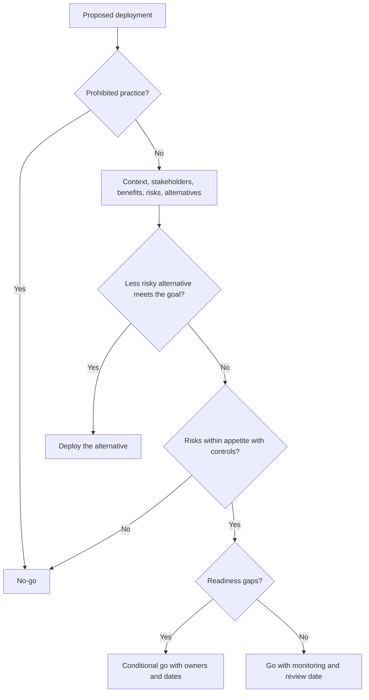
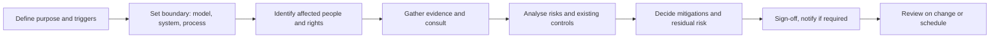

# Module 11 — Deploying and using AI

*Most organisations will deploy far more AI than they build. Najm Bank buys a CV-screening tool, licenses a chatbot platform, calls a foundation-model API for its credit memo copilot, and watches its employees reach for public GenAI tools every day. Each of these puts Najm in the role of **deployer**, and a deployer cannot outsource accountability to its vendor. This module covers the four jobs that make deployment governable: deciding whether to deploy at all, buying well, assessing the system before and during use, and governing it day to day with real human oversight, honest transparency and an incident playbook that works. This is not legal advice: laws and guidance change and depend on your facts, so check official sources and your own counsel.*

> **BoK coverage:** IV.A–IV.C — Evaluating factors and risks before deploying, buying AI responsibly, performing impact assessments and audits, and governing deployment and use.

---

# 11.1 — The deploy decision: context, stakeholders and alternatives
*Level: 🔴 Advanced* · *Prerequisites: 8.1, 6.1* · *BoK: IV.A*

## ⚡ In 60 seconds

- The same AI system can be low-risk in one context and high-risk in another. The deploy decision is about **this system, in this context, for these people**, not about the technology in general.
- Before deploying, answer six questions: What is the **context of use**? Who are the **affected stakeholders**? Do the **benefits outweigh the risks**? What are the **alternatives**? Are **people, processes and data ready**? Is the use **proportionate**?
- Know your **legal role**. Using a system under your authority makes you a **deployer** under the EU AI Act. Changing its intended purpose into a high-risk use, or rebranding it, can make you a **provider**.
- "Do not deploy" and "deploy something simpler" are legitimate, often wise, outcomes.
- The biggest trap: treating a vendor's approval, a successful demo or a competitor's use as proof that deployment is right *for you*.

## 🧭 Why it matters

In 2022 a grieving customer asked Air Canada's website chatbot about bereavement fares. The chatbot told him he could claim the discount after travelling. That was wrong; the airline's policy said otherwise. When he claimed, Air Canada argued, in effect, that the chatbot was responsible for its own words. In *Moffatt v. Air Canada* (2024), British Columbia's Civil Resolution Tribunal rejected that argument and held the airline responsible for information on its own website, chatbot included. The chatbot was a deployment decision, and the deployer owned the consequences.

At Najm Bank, Khalid, Head of Retail Lending, has a plan. The customer-service chatbot, licensed from a platform vendor and currently answering questions about branch hours and card fees, is popular. Khalid wants it to start **pre-qualifying** personal-loan applicants: customers would type in their salary and commitments, and the bot would tell them whether they are "likely to be approved". "It's the same chatbot," he says. "We're just adding a feature."

Layla, Head of AI Governance, sees a different system. Telling people whether they are likely to get credit is a form of creditworthiness assessment, which is high-risk under the EU AI Act when it concerns natural persons. Wrong answers would discourage eligible customers or mislead ineligible ones, and the Air Canada case says Najm would own them. And by changing the chatbot's intended purpose, Najm might become the *provider* of a high-risk system. The technology is the same; the context has changed everything. This lesson teaches the analysis Layla runs before anyone says "go".

## 📐 How it works

### 🟢 The essentials

**Deploying is a separate decision from building or buying.** Governance of design (Module 8) asks whether a system is well made. The deploy decision asks whether *using* it here, now, for this purpose is justified. Six questions structure it:

| Question | What to ask | Najm pre-qualification example |
|---|---|---|
| **1. Context of use** | What task, which decisions, who uses the output, at what scale, how reversible are errors, what setting (public, employment, credit, health)? | Customer-facing; influences whether people apply for credit; thousands of conversations a month; errors hard to detect |
| **2. Affected stakeholders** | Who uses it, who is affected by its outputs, who is affected indirectly, who is vulnerable? | Customers (including those in financial difficulty or with limited literacy), call-centre staff, lending officers, the regulator |
| **3. Benefits versus risks** | What is the measurable benefit? What harms could occur, to whom, how likely and how severe? | Benefit: fewer unsuitable applications. Risks: wrong "no" discourages eligible people; wrong "yes" misleads; discrimination; privacy |
| **4. Alternatives** | Could a non-AI tool, a simpler model, or a human process achieve the goal with less risk? | A rules-based eligibility calculator using published criteria |
| **5. Readiness** | Are people trained, processes (escalation, complaints, oversight) designed, data fit, and monitoring in place? | Call-centre has no script for disputing bot answers; no monitoring of the bot's credit statements |
| **6. Proportionality** | Is the intrusion on people's interests justified by the benefit and limited to what is necessary? | Collecting salary and debt details in an open chat for an indicative answer: hard to justify |

**Context of use.** Context covers the domain, the population, the decision the output feeds, the degree of automation, the scale and the reversibility of harm. A large language model summarising internal policy documents and the same model drafting a customer's adverse credit letter are different deployments.

**Stakeholders.** Map at least four groups: **users** (who operate the system), **affected persons** (whom outputs are about), **indirectly affected people** (families, communities, competitors), and **overseers** (regulators, auditors, the board). Mark **vulnerable groups**: people in financial distress, minors, people with disabilities, people with limited language skills. Where possible, consult representatives, not only internal proxies.

**Alternatives.** The "alternatives" question is where good governance earns its keep. Always compare against at least: *do nothing*, a *non-AI* approach, a *simpler or more interpretable* model, and *AI with more human involvement*. If a transparent rules engine gets 90% of the benefit at 10% of the risk, that is usually the better choice.

### 🟡 Going deeper

**Legal role as deployer.** Under the EU AI Act a **deployer** is a natural or legal person, public authority, agency or other body using an AI system under its authority, except for purely personal non-professional use. Deployers of high-risk systems carry real obligations (Art. 26): use the system according to its instructions for use, assign competent human oversight, ensure input data under their control is relevant and sufficiently representative, monitor operation, keep logs, inform affected workers, inform people that a high-risk system is used in decisions about them, and, for public bodies and credit-scoring and insurance-pricing uses, complete a FRIA (Art. 27). Deployers of certain systems also have transparency duties (Art. 50), and every provider and deployer must take measures to ensure sufficient AI literacy among its staff (Art. 4).

**When a deployer becomes a provider.** Art. 25 treats a deployer (or distributor, importer or other third party) as a **provider** of a high-risk system if it:

- puts its name or trademark on a high-risk system already on the market;
- makes a substantial modification to a high-risk system so that it remains high-risk; or
- modifies the intended purpose of a system, including a general-purpose one, that was not high-risk, so that it becomes high-risk.

Khalid's plan falls squarely into the third bullet. The deploy decision must surface role changes *before* they happen, because provider obligations (conformity assessment, technical documentation, QMS, registration) cannot be met in a sprint.

**The classification checklist at the deploy gate.** For each proposed use, confirm and record:

1. Is the practice **prohibited** (Art. 5)? For example, social scoring or exploiting vulnerabilities to distort behaviour in harmful ways.
2. Is the use **high-risk** (Annex III, such as creditworthiness, employment, access to essential services; or Annex I products)?
3. Does it trigger **transparency** duties (Art. 50), such as a chatbot interacting with people or AI-generated content?
4. Under the **GDPR**: lawful basis, whether Art. 22 applies to solely automated decisions with legal or similarly significant effects, and whether a DPIA is required. The CJEU's *SCHUFA* judgment (2023) shows that producing a score can itself be the decision when others rely heavily on it.
5. **Sector and local rules**: consumer-credit and anti-discrimination law; for Najm, the Qatar PDPPL, the QCB AI guideline for financial institutions and UAE data protection law; outside the EU, US state laws such as the Colorado AI Act, which places risk-management, impact-assessment and notice duties on deployers of high-risk systems (its effective date was postponed to 30 June 2026; check its current status).

**Proportionality.** This idea comes from fundamental-rights law and data protection: an interference with people's rights must pursue a legitimate aim, be suitable and necessary to achieve it, and not be excessive in its effects. For AI deployment, ask: is AI needed for this goal, is this the least intrusive effective option, and are the safeguards commensurate with the stakes?

**Frameworks that help.** The NIST AI RMF's **MAP** function is essentially the deploy-decision toolkit: establish and understand the context (MAP 1), categorise the system (MAP 2), understand capabilities, benefits and costs against appropriate benchmarks (MAP 3), map risks of third-party components (MAP 4), and characterise impacts on individuals, groups, communities, organisations and society (MAP 5). ISO/IEC 42001's Annex A includes controls on assessing the impacts of AI systems and on the responsible and intended use of AI systems.

### 🔴 Expert view

**A structured go/no-go.** Mature organisations run the deploy decision as a documented committee decision with four possible outcomes:

**Residual risk has an owner.** After controls, some risk remains. A named accountable executive, usually the business owner, formally accepts it, within the risk appetite set by the board (2.1). The governance function advises and challenges; it does not own the business risk. At Najm, Khalid accepts residual risk for lending systems, and the AI Governance Committee can refuse any deployment outside appetite.

**The risk of not deploying.** Proportionality cuts both ways. Declining to use a fraud-detection model that demonstrably protects customers is also a choice with consequences. Record the "do nothing" option's risks honestly, so that the decision is balanced, not merely cautious.

**Revisit triggers.** A deploy decision is valid for a context. Set triggers that reopen it: a new population or country, a change of intended purpose, a vendor change, a monitoring breach, a serious incident, a change in law. Many governance failures are deployments that were right in year one and quietly wrong by year three.

**Readiness is mostly about people.** The most common readiness gaps are human: staff who do not understand the system's limits, no time allowed for real review, no escalation path, complaint handlers who cannot explain an AI-assisted outcome. Treat training, workflow design and staffing as deploy criteria, not follow-ups. The AI literacy duty (Art. 4), which has applied since 2 February 2025, gives this legal weight in the EU.

## ⚖️ The instruments

| Instrument | What it requires or recommends | Exam cue |
|---|---|---|
| **EU AI Act** — Art. 3(4), Art. 26 | Defines the deployer; sets deployer duties for high-risk systems (instructions, human oversight, input data, monitoring, logs, informing workers and affected persons) | "Using under its authority" = deployer, even if you did not build it |
| **EU AI Act** — Art. 25 | Deployer becomes provider if it rebrands, substantially modifies, or changes intended purpose into a high-risk use | Repurposing a chatbot to pre-qualify for credit = role shift |
| **EU AI Act** — Art. 5, Art. 6 & Annex III, Art. 50 | Classification: prohibited practices, high-risk uses, transparency duties | Run the classification before deploying, for each use case |
| **GDPR** — Arts 5, 6, 22, 35 | Principles (including minimisation), lawful basis, solely automated significant decisions, DPIA | Proportionality and necessity are built into GDPR analysis |
| **NIST AI RMF** — MAP | Context, categorisation, benefits and costs, third-party risks, impacts | Voluntary; MAP is the pre-deployment analysis function |
| **ISO/IEC 42001** — Annex A | Controls on impact assessment and on responsible, intended use of AI systems | Certifiable management system; deploy decisions should be evidenced |
| **Colorado AI Act** — SB 24-205 | Deployers of high-risk AI must use reasonable care, run risk-management programmes, complete impact assessments and give notices | US state law; effective date postponed to 30 June 2026 — check current status |
| **QCB AI guideline** | Governance, risk assessment and oversight expectations for AI in Qatar-regulated financial institutions | Local regulators expect a documented deploy decision |

## 🏛️ In practice at Najm Bank

Layla's team writes a **Deploy Decision Memo** for the committee.

| Section | Content |
|---|---|
| Proposal | Chatbot to tell retail customers whether they are "likely to be approved" for a personal loan |
| Context | Customer-facing, EU (Frankfurt), Qatar and UAE; ~40,000 chats a month; affects decisions to apply for credit; errors rarely visible to Najm |
| Stakeholders | Retail customers (vulnerable: people in arrears, low literacy, non-Arabic/non-English speakers), call-centre staff, lending officers, QCB, EU market surveillance authority, DPAs |
| Classification | Changes intended purpose to creditworthiness assessment → high-risk (Annex III) in the EU → Najm would become **provider** (Art. 25). GDPR: financial data in chat; possible Art. 22 issue if answers deter applications; DPIA needed |
| Benefits | Estimated 15% fewer unsuitable applications; faster customer journey |
| Risks | Misleading answers (Air Canada precedent); indirect discrimination; over-collection in free text; provider obligations Najm cannot meet within six months |
| Alternatives | (a) Do nothing. (b) **Rules-based eligibility calculator** showing published minimum criteria with a clear "this is not a decision" notice, and the chatbot links to it. (c) Pre-qualification by a human adviser on request |
| Readiness | Call-centre scripts, complaint handling and monitoring not ready for credit statements |
| **Decision** | **No-go as proposed.** Go for option (b), with the chatbot limited to explaining criteria and handing off to a human. Conditions: DPIA update (Sara), bot guardrails preventing eligibility predictions (Dana), staff script (Khalid). Review in 6 months |
| Residual risk owner | Khalid, Head of Retail Lending |

## 🛠️ Exercises

- 🟢 Map the stakeholders for Najm's credit memo copilot (a GenAI tool that drafts memos for relationship managers). *Done when:* you have users, affected persons, indirectly affected people and overseers, with at least two vulnerable groups identified or ruled out with reasons.
- 🟡 Write the "alternatives" section for Najm's vendor CV-screening tool, comparing it with doing nothing, structured human screening, and a simpler knock-out-questions form. *Done when:* each option has benefits, risks and a rough cost.
- 🔴 Run the full classification checklist for the chatbot's *current* use (hours and fees) and the proposed use (pre-qualification) in the EU, Qatar and the UAE. *Done when:* you can state Najm's role, risk tier and key obligations for each use in each jurisdiction, flagging what you would verify with counsel.

## ⚠️ Mistakes and exam traps

- **"The vendor is responsible."** The deployer has its own obligations and, as *Moffatt v. Air Canada* shows, owns what its customer-facing AI says.
- **Assessing the technology instead of the use.** Exam scenarios often change the context and not the system. The risk tier follows the use.
- **Missing the role shift.** Repurposing a general system into a high-risk use makes you a provider under Art. 25.
- **Skipping alternatives.** If a question offers "compare with a simpler, less risky option", that is usually the governance-minded answer.
- **Treating readiness as technical only.** Training, time for review, escalation and complaint handling are deploy criteria.
- **Governance owning the risk.** The business owner accepts residual risk; governance advises, challenges and can escalate or block.

## 🧾 Recap

- The deploy decision asks whether using this system, in this context, for these people is justified.
- Six questions: context of use, stakeholders, benefits versus risks, alternatives, readiness and proportionality.
- As a deployer you have your own EU AI Act duties (Art. 26, Art. 4, sometimes Art. 27 and Art. 50). Changing purpose or rebranding can make you a provider (Art. 25).
- Classify every use (prohibited, high-risk, transparency, GDPR, sector and local law) before go-live.
- Outcomes include no-go, deploy an alternative, conditional go and go, each with an accountable owner and revisit triggers.

## ✍️ Check yourself

**1. A bank licenses a general customer-service chatbot and configures it to tell customers whether they are likely to be approved for a personal loan. Under the EU AI Act, what is the most important consequence to flag in the deploy decision?**

- A. The bank remains only a deployer of a minimal-risk system
- B. The bank may become the provider of a high-risk system because it changed the intended purpose to creditworthiness assessment
- C. The chatbot vendor becomes the deployer
- D. The system becomes a prohibited practice

Answer

**B.** Art. 25 treats a party that modifies a system's intended purpose so that it becomes high-risk as a provider. Creditworthiness assessment of natural persons is Annex III. It is not prohibited (D). (Going deeper: when a deployer becomes a provider.)

**2. Which question is *most* characteristic of the "alternatives" step of a deploy decision?**

- A. What accuracy does the vendor claim?
- B. Could a non-AI or simpler approach achieve the goal with less risk?
- C. Which cloud region will host the model?
- D. How many competitors use similar AI?

Answer

**B.** Alternatives compare the AI option with doing nothing, non-AI approaches, simpler models and more human involvement. Competitor use (D) is not a justification. (Essentials: alternatives.)

**3. In *Moffatt v. Air Canada* (2024), what did the tribunal decide about the airline's chatbot?**

- A. The chatbot was a separate legal entity responsible for its own statements
- B. The airline was responsible for the information its chatbot gave customers
- C. The chatbot's vendor was solely liable
- D. Chatbots cannot give binding information, so no one was liable

Answer

**B.** The tribunal rejected the idea that the chatbot was responsible for its own words and held the airline responsible for information on its website, including the chatbot. The deployer owns its customer-facing AI. (Why it matters.)

**4. Najm's committee concludes that a proposed AI deployment is within risk appetite, but staff training and the complaint-handling process are not ready. What is the best decision?**

- A. Go immediately; training can follow
- B. No-go permanently
- C. Conditional go, with named owners and dates for the readiness gaps, checked before go-live
- D. Transfer the decision to the vendor

Answer

**C.** Readiness gaps can be handled through a conditional approval with tracked conditions. A ignores readiness; B is disproportionate; D abdicates accountability. (Expert view: a structured go/no-go.)

**5. Which NIST AI RMF function most directly supports the pre-deployment analysis of context, benefits, costs and impacts?**

- A. GOVERN
- B. MAP
- C. MEASURE
- D. MANAGE

Answer

**B.** MAP establishes context, categorises the system, examines benefits and costs, and characterises impacts. MEASURE quantifies risks; MANAGE prioritises and acts on them; GOVERN sets the culture and structures. (Going deeper: frameworks that help.)

## 📚 References

- EU AI Act, Regulation (EU) 2024/1689 (EUR-Lex): https://eur-lex.europa.eu/eli/reg/2024/1689/oj
- GDPR, Regulation (EU) 2016/679 (EUR-Lex): https://eur-lex.europa.eu/eli/reg/2016/679/oj
- NIST AI Risk Management Framework and Playbook: https://www.nist.gov/itl/ai-risk-management-framework
- ISO/IEC 42001:2023 (ISO): https://www.iso.org/standard/81230.html
- Colorado General Assembly (SB 24-205, Consumer Protections for Artificial Intelligence): https://leg.colorado.gov
- British Columbia Civil Resolution Tribunal (*Moffatt v. Air Canada*, 2024): https://civilresolutionbc.ca
- Qatar Central Bank: https://www.qcb.gov.qa

---

# 11.2 — Buying AI: vendor due diligence and contracts
*Level: 🔴 Advanced* · *Prerequisites: 3.3, 11.1* · *BoK: IV.A*

## ⚡ In 60 seconds

- You can outsource an AI function; you cannot outsource accountability. Buying AI is a governance activity, and procurement is one of your strongest controls.
- **Due diligence** asks: what does the system do and how was it built and tested? How does the vendor handle our data (including training on it)? Who are its sub-processors? How secure is it? What evidence and certifications back the claims?
- **Contracts** turn answers into obligations: data-use limits, IP protection and indemnity, audit and information rights, incident notice, performance and fairness commitments, change notification, regulatory cooperation and a clean exit.
- **Foundation-model APIs** and **open-source models** need their own checks: terms of use, data retention, version changes, licences and who maintains what.
- **ISO/IEC 42001** certification tells you the vendor runs an AI management system. It does not prove a particular product is accurate, fair or legally compliant.
- The biggest trap: accepting "proprietary, we can't share that" for a high-risk use. If the vendor cannot give you what you need to meet your own obligations, you cannot meet them.

## 🧭 Why it matters

In 2023 the US Equal Employment Opportunity Commission settled a lawsuit against the tutoring company iTutorGroup, widely reported as the agency's first settlement in a case about automated hiring. The EEOC alleged that the company's application software was set up to automatically reject older applicants, and the case ended in a settlement. For any employer, the lesson is simple: if the software you use screens people out unlawfully, *you* answer for it.

Najm Bank is buying a CV-screening tool to handle the thousands of applications its branches receive. Yusuf, from procurement, has a shortlist of three vendors. The glossy decks all promise "bias-free AI". When Layla asks for the bias testing results broken down by sex and age, one vendor sends a one-page summary with no method, another says the model is "proprietary", and the third sends a detailed report plus the instructions for use it prepares as an EU AI Act provider. Employment screening is an Annex III high-risk use. As deployer, Najm must use the system according to its instructions, assign competent human oversight, keep logs, inform candidates and staff, and monitor the system. It cannot do any of that without the vendor's cooperation, and that cooperation must be written into the contract. At the same time, Dana is choosing a foundation model for the credit memo copilot and asks whether an open-weight model would avoid all this. It wouldn't; it would change who does the work.

## 📐 How it works

### 🟢 The essentials

**Why procurement is a control.** Before signature, you have maximum leverage: the vendor wants the deal, and you can walk away. After signature, every request becomes a negotiation. Governance teams that engage procurement early (3.3) get better evidence, better terms and fewer surprises.

**A due diligence process, proportionate to risk.**

1. **Triage.** Use the intake classification (8.1, 11.1). A spell-checker and a CV screener deserve different depth.
2. **Questionnaire.** Standard questions, tiered by risk. Industry and public-sector AI procurement questionnaires are a useful starting point.
3. **Documentation review.** Read what the vendor provides, not only its marketing.
4. **Independent testing.** Where risk warrants it, test the system on your own data, in a sandbox or pilot, before committing.
5. **Decision and contract.** Record the findings, residual risks and conditions, and carry them into the contract.

**What to ask, and red flags.**

| Area | Key questions | Red flags |
|---|---|---|
| **Purpose and design** | Intended purpose, limitations, foreseeable misuse; model type; human-oversight features | "Works for everything"; no stated limitations |
| **Documentation** | Model or system card; instructions for use; for EU high-risk, the declaration of conformity and registration | No instructions for use for a high-risk system |
| **Testing evidence** | Accuracy by segment; bias testing by relevant group, with method; robustness and red-team results | Averages only; "bias-free" claims; no method |
| **Data use** | Will our data (inputs, outputs, feedback) train the vendor's models? Retention, location, transfers, deletion on exit | Default training on customer data; vague retention |
| **Sub-processors** | Who else processes our data or hosts the model? Where? Notice of changes? | Undisclosed sub-processors; no change notice |
| **Security** | ISO/IEC 27001 certification or SOC 2 report; penetration tests; defences against prompt injection and data leakage for GenAI | No independent security assurance |
| **Governance** | AI policy; ISO/IEC 42001 certification or equivalent; incident process; regulatory track record | No incident process; no named AI governance owner |
| **Viability** | Financial stability, support, roadmap, dependency on a single upstream model | Tiny vendor wrapping a third-party API with no contingency |

**Certifications: what they do and do not prove.** **ISO/IEC 42001** certification shows that an accredited certification body audited the vendor's AI *management system*: policies, risk and impact assessment processes, life-cycle controls. It is valuable evidence of discipline. It does not certify that a particular model is accurate or fair, or that the product meets the EU AI Act. Check the certificate's **scope** (which products and sites), the certifying body and its accreditation (ISO/IEC 42006 sets requirements for bodies certifying 42001), and the date.

### 🟡 Going deeper

**Contract clauses that matter.** A good AI contract, or an AI schedule to a standard contract, covers:

| Clause | What it should say | Why |
|---|---|---|
| **Data use restrictions** | Customer data (inputs, outputs, fine-tuning data, feedback) used only to provide the service; no training of vendor or third-party models without explicit opt-in; retention limits; deletion on request and at exit | Protects confidentiality and personal data; avoids your data improving competitors' tools |
| **Data protection terms** | GDPR Art. 28 processor terms (instructions, confidentiality, security, sub-processor approval, assistance with rights and DPIAs, deletion or return, audits); transfer safeguards; local-law equivalents (for example Qatar PDPPL) | Legally required where the vendor processes personal data for you |
| **IP and indemnity** | Ownership or licence of outputs; vendor warranty that it has rights to its training data and model; indemnity against third-party IP claims, with clear conditions | Training-data copyright disputes are live; know who carries the risk |
| **Audit and information rights** | Access to documentation, test results, logs and, for high-risk uses, information needed for your FRIA, DPIA and monitoring; right to audit or receive independent audit reports | You cannot meet deployer duties without information |
| **Incident notification** | Notify within a set period (for example 24–72 hours) of security incidents, serious malfunctions or material performance or bias issues; cooperate in investigation | Your own clocks (GDPR 72 hours; AI Act serious-incident duties) start when *you* become aware |
| **Performance and fairness commitments** | Service levels; accuracy and fairness metrics with thresholds; remedies if breached; your right to test | Turns marketing claims into obligations |
| **Change notification** | Advance notice of material changes (model retraining, version changes, new sub-processors); version pinning where possible; right to re-test or terminate | Vendor changes can alter behaviour and your compliance (10.3) |
| **Regulatory cooperation** | Vendor supports your obligations: provides instructions for use, logs, explanations for affected persons, cooperation with authorities | The EU AI Act assumes provider–deployer cooperation |
| **Exit and transition** | Data return and certified deletion; transition assistance; escrow or continued access to documentation and logs you must retain | You may need records years after the contract ends |

**What the law already says.** The EU AI Act requires providers of high-risk systems to supply instructions for use (Art. 13) and requires third parties that supply tools, services, components or processes used in high-risk systems to specify, in a written agreement with the provider, the information, capabilities, technical access and assistance needed for the provider to comply (Art. 25). The Commission may recommend voluntary model contractual terms for this. Separately, the Commission has published voluntary model contractual clauses for public procurement of AI (MCC-AI); check the latest version. For EU financial entities, the **Digital Operational Resilience Act (DORA)** sets mandatory contractual provisions for ICT third-party services where it applies. Check whether and how it applies to your entity.

### 🔴 Expert view

**Foundation-model APIs.** When Najm calls a foundation model through an API for its credit memo copilot, the provider of the model is a **general-purpose AI (GPAI) model provider**. Since 2 August 2025 GPAI providers must, among other things, keep technical documentation, give downstream providers the information they need to understand the model's capabilities and limitations, have a copyright policy and publish a summary of training content (Art. 53). The GPAI Code of Practice published in July 2025 is a voluntary way to show compliance. Najm, integrating the model into its own system, is the provider or deployer of *that system*. For the deploy and contract decision, check:

- **Which terms apply.** Consumer terms and enterprise or API terms often differ, especially on whether inputs are used for training and how long they are retained. Use enterprise agreements for business data.
- **Data residency and retention.** Where are prompts processed and stored, for how long, and who can access them (including for abuse monitoring)?
- **Model versions.** Providers update and retire model versions. Pin versions where possible, get notice of deprecations, and re-test before switching (10.3).
- **Downstream documentation.** Ask for the information GPAI providers must give downstream providers, and use it in your own documentation.
- **Concentration risk.** If one upstream model fails or changes terms, what is your fallback?

**Open-source and open-weight models.** Downloading a model's weights moves control, and work, to you. There is no vendor to give warranties, fix vulnerabilities or notify you of changes, so you own evaluation, security, monitoring and maintenance. Check:

- **The licence.** "Open" varies. Some model licences restrict certain uses, users or scales; the Open Source Initiative published an Open Source AI Definition (version 1.0, October 2024), and many "open-weight" models do not meet it. Legal must review the licence for your intended use.
- **Provenance and documentation.** What is known about training data, evaluation and known limitations?
- **Security.** Obtain weights from trusted sources, verify integrity, and scan model files, since some model file formats can execute code when loaded.
- **Regulatory position.** The EU AI Act exempts some free and open-source AI from certain obligations, but the exemption does not cover high-risk systems, prohibited practices or the Art. 50 transparency duties, and open-source GPAI models with systemic risk get no documentation exemption. If Najm builds a high-risk system on an open model, Najm is the provider.

**Due diligence is continuous.** Re-assess vendors periodically and on triggers: incidents, ownership changes, new versions, new sub-processors, regulatory actions. Keep a vendor AI register linked to the AI inventory. NIST AI RMF GOVERN 6 calls for policies addressing third-party AI risks, including IP, and contingency processes for failures of third-party data or AI systems.

## ⚖️ The instruments

| Instrument | What it requires or recommends | Exam cue |
|---|---|---|
| **EU AI Act** — Arts 13, 26 | Providers supply instructions for use; deployers use per instructions, oversee, monitor, keep logs, inform affected persons | Deployer duties depend on vendor information: contract for it |
| **EU AI Act** — Art. 25 | Written agreements between high-risk providers and suppliers of components, tools and services; role shift rules | Supply-chain cooperation is built into the Act |
| **EU AI Act** — Art. 53 | GPAI providers: technical documentation, information for downstream providers, copyright policy, training-content summary | Ask your foundation-model provider for downstream documentation |
| **GDPR** — Art. 28 | Mandatory processor contract terms, including sub-processor authorisation and assistance with DPIAs and rights | AI vendors processing personal data for you are usually processors |
| **NIST AI RMF** — GOVERN 6 | Policies and procedures for third-party AI risks, including IP, and contingency for third-party failures | Voluntary; third-party risk sits in GOVERN |
| **ISO/IEC 42001** — Annex A third-party controls | Allocate responsibilities with suppliers and customers; manage supplier-provided AI | Certification is of the management system and its scope, not the product |
| **DORA** — Regulation (EU) 2022/2554 | Mandatory contractual provisions and oversight for ICT third-party services used by EU financial entities, where it applies | Check scope; applies from 17 January 2025 |

## 🏛️ In practice at Najm Bank

Yusuf and Layla create a **Vendor AI Due Diligence Scorecard**. Here is the result for the three CV-screening vendors:

| Criterion (weight) | Vendor A | Vendor B | Vendor C |
|---|---|---|---|
| Instructions for use and EU AI Act provider documentation (20%) | Partial | None ("proprietary") | Complete, with declaration of conformity |
| Bias testing by sex, age, nationality, with method (20%) | Summary only | None | Detailed; impact ratios; test data described |
| Data use: no training on Najm data by default (15%) | Opt-out only | Trains by default | Contractual no-training |
| Sub-processors disclosed, EU/GCC hosting options (10%) | Yes | Partial | Yes |
| Security assurance: ISO/IEC 27001 or SOC 2 (10%) | ISO 27001 | SOC 2 | ISO 27001 |
| AI management system: ISO/IEC 42001, scope covers product (10%) | No | No | Yes, product in scope |
| Test on Najm sample data permitted (10%) | Yes | No | Yes |
| Contract flexibility on key clauses (5%) | Medium | Low | High |
| **Outcome** | Conditional | **Excluded** | **Preferred** |

**AI schedule clause (extract), agreed with Vendor C:**
> *"The Supplier shall (a) not use Customer Data, including inputs, outputs and feedback, to train or improve any model other than the dedicated instance provided to the Customer; (b) notify the Customer at least 60 days before any material change to the model, its training data or its sub-processors, and provide updated test results; (c) notify the Customer without undue delay and in any event within 48 hours of becoming aware of any security incident, serious malfunction or material deviation from the agreed accuracy or fairness thresholds; (d) provide, on request, the information and logs the Customer reasonably needs to meet its obligations as a deployer, including for impact assessments, monitoring and explanations to affected persons; and (e) on termination, return Customer Data and certify its deletion within 30 days, subject to legal retention requirements."*

## 🛠️ Exercises

- 🟢 Write ten due diligence questions for the credit memo copilot's foundation-model provider. *Done when:* each question maps to a risk (data use, versions, security, IP, documentation) and a red-flag answer.
- 🟡 Draft the incident-notification and change-notification clauses for the chatbot platform contract, and explain how the deadlines fit Najm's own GDPR and AI Act timelines. *Done when:* a lawyer could redline your text.
- 🔴 Dana proposes an open-weight model hosted on Najm's servers for the copilot, instead of an API. Write a one-page comparison of governance obligations and residual risks for the two options. *Done when:* the committee could decide from your page alone.

## ⚠️ Mistakes and exam traps

- **Accepting "proprietary" for high-risk uses.** If you cannot get what you need to meet your deployer obligations, the answer is to negotiate, test independently or walk away.
- **Treating ISO/IEC 42001 as product assurance.** It certifies a management system within a stated scope.
- **Forgetting training on your data.** Check the terms that actually apply (consumer, enterprise, API). Default settings differ.
- **No change clause.** Vendors retrain and update models. Without notice rights you find out from your monitoring, or your customers.
- **Thinking open source means no obligations.** It shifts obligations to you, and the EU AI Act exemption does not cover high-risk systems.
- **Weak exit terms.** You may need logs and documentation long after the contract ends.

## 🧾 Recap

- Procurement is a governance control: triage, questionnaire, documentation review, independent testing, decision and contract.
- Look for evidence, not claims: instructions for use, segment-level testing, data-use terms, sub-processors, security assurance and scoped certifications.
- Key clauses: data use limits, Art. 28 terms, IP and indemnity, audit and information rights, incident and change notification, performance and fairness commitments, regulatory cooperation and exit.
- Foundation-model APIs need attention to terms, retention, versions and downstream documentation. Open models shift the work and the obligations to you.
- Due diligence continues after signature, on a schedule and on triggers.

## ✍️ Check yourself

**1. A vendor of a CV-screening tool proudly shares its ISO/IEC 42001 certificate. What does this certificate demonstrate?**

- A. The tool is free of bias
- B. The tool complies with the EU AI Act
- C. An accredited body has audited the vendor's AI management system within the certificate's scope
- D. The tool has passed a conformity assessment by a notified body

Answer

**C.** ISO/IEC 42001 certifies a management system. It is useful evidence but does not prove a product's fairness or legal compliance. Check the scope. (Essentials: certifications.)

**2. Najm's credit memo copilot uses a foundation-model API. Which contract term is most important to protect confidential customer information?**

- A. A clause fixing the price for three years
- B. A restriction preventing the provider from using Najm's inputs and outputs to train its models, with retention limits
- C. A marketing clause allowing Najm to name the provider
- D. A clause requiring the provider to use open-source software

Answer

**B.** Data-use restrictions and retention limits protect confidential and personal data. The other options do not address that risk. (Going deeper: contract clauses.)

**3. A vendor refuses to share any bias testing results for its high-risk employment screening tool, citing trade secrets. What is the best governance response?**

- A. Accept, since the vendor is responsible for fairness
- B. Proceed and rely on the vendor's marketing claims
- C. Seek the evidence through negotiation or independent testing, and do not proceed if the deployer cannot meet its own obligations
- D. Deploy and ask candidates to report problems

Answer

**C.** The deployer has its own obligations and legal exposure (the iTutorGroup case shows the user of screening software answers for it). Without evidence, the risk cannot be assessed. (Why it matters; Mistakes.)

**4. Under the EU AI Act, which obligation applies to providers of general-purpose AI models and helps downstream organisations?**

- A. Registering every downstream deployer in the EU database
- B. Giving downstream providers information and documentation on the model's capabilities and limitations
- C. Completing a FRIA for every customer
- D. Obtaining CE marking for the model

Answer

**B.** Art. 53 requires GPAI providers to make information and documentation available to downstream providers, alongside technical documentation, a copyright policy and a training-content summary. (Expert view: foundation-model APIs.)

**5. Najm plans to run an open-weight model on its own servers as part of a high-risk system. Which statement is correct?**

- A. The EU AI Act's open-source exemption removes all obligations
- B. Najm, as the organisation building and putting the high-risk system into service, bears provider obligations and must manage licence, security and maintenance itself
- C. The model's original developer becomes the deployer
- D. No licence review is needed for open-weight models

Answer

**B.** The open-source exemption does not apply to high-risk systems, and using open weights shifts evaluation, security and maintenance to Najm. Licences vary and need review. (Expert view: open-source and open-weight models.)

## 📚 References

- EU AI Act, Regulation (EU) 2024/1689 (EUR-Lex): https://eur-lex.europa.eu/eli/reg/2024/1689/oj
- GDPR, Regulation (EU) 2016/679 (EUR-Lex): https://eur-lex.europa.eu/eli/reg/2016/679/oj
- Digital Operational Resilience Act, Regulation (EU) 2022/2554 (EUR-Lex): https://eur-lex.europa.eu/eli/reg/2022/2554/oj
- European Commission, AI regulatory framework, AI Office and GPAI Code of Practice: https://digital-strategy.ec.europa.eu/en/policies/regulatory-framework-ai
- NIST AI Risk Management Framework: https://www.nist.gov/itl/ai-risk-management-framework
- ISO/IEC 42001:2023 (ISO): https://www.iso.org/standard/81230.html
- US Equal Employment Opportunity Commission (iTutorGroup settlement, 2023): https://www.eeoc.gov

---

# 11.3 — Assessing the system: impact assessments, audits and assurance
*Level: 🔴 Advanced* · *Prerequisites: 4.3, 6.2, 11.1* · *BoK: IV.B*

## ⚡ In 60 seconds

- **Assessments** look forward (what could go wrong, for whom, and what will we do about it?). **Audits** look at evidence (does the system and its governance meet defined criteria?). **Assurance** is the overall confidence that results, and **certification** is a formal statement by an accredited body.
- Know the family: **AI impact assessment** (organisational, see ISO/IEC 42005), **DPIA** (GDPR Art. 35), **FRIA** (EU AI Act Art. 27), **algorithmic impact assessments** such as Canada's AIA for federal government, **conformity assessment** (provider, product compliance), **bias audits** such as NYC Local Law 144.
- The **FRIA** applies to deployers that are public bodies or private entities providing public services, and to deployers of high-risk systems for **credit scoring** and **life and health insurance pricing**. It is done before first use and its results are notified to the market surveillance authority.
- A **DPIA** is required when processing is likely to result in a high risk to individuals' rights and freedoms. Most consequential AI uses of personal data meet that test.
- Integrate: one assessment process, several legal outputs, shared evidence.
- The biggest trap: confusing these instruments, especially FRIA with conformity assessment, or management-system certification with product assurance.

## 🧭 Why it matters

At the AI Governance Committee, Omar asks a fair question. "For credit-scoring v2 we have a DPIA, the EU AI Act says we need a FRIA, our own policy requires an AI impact assessment, internal audit wants to audit it next year, and a consultant is offering us an 'AI certification'. Are these five different documents, five teams and five sets of interviews with Dana?"

Sara, the DPO, notes that the DPIA focuses on personal data and privacy risks. Layla notes that the FRIA covers a wider set of rights (non-discrimination, access to services, an effective remedy) and has to be notified to a market surveillance authority. Internal audit's job is not to assess risk but to give independent assurance that controls work. The consultant's certification would cover Najm's management system, not the model. Each instrument has a purpose, a trigger and an audience, and all of them draw on the same evidence: what the system does, who it affects, how it was tested and what safeguards exist.

This lesson sorts the instruments, shows how to scope and document an assessment, and explains how to run them as one integrated process.

## 📐 How it works

### 🟢 The essentials

**Assessment versus audit versus assurance.**

- An **impact assessment** is a structured, forward-looking analysis of a system's potential effects on people and the organisation, carried out by or for the organisation, leading to decisions and mitigations.
- An **audit** is an evidence-based examination against defined criteria (a law, a standard, a policy, a contract), carried out with some independence, leading to findings and an opinion.
- **Assurance** is the broader activity of building justified confidence, through assessments, testing, audits and certification, that a system is trustworthy and compliant.
- **Certification** is a formal attestation, by an accredited third party, that something (a management system, a product or a person) meets a standard.

**The main instruments compared.**

| Instrument | Who does it | When | Focus | Binding? |
|---|---|---|---|---|
| **AI impact assessment** | The organisation (developer or deployer) | Before deployment and on significant change | Effects on individuals, groups and society, across all risk types | Depends on policy and law; ISO/IEC 42001 requires AI system impact assessment within the management system; ISO/IEC 42005 gives guidance |
| **DPIA** (GDPR Art. 35) | The controller, with the DPO's advice | Before processing likely to result in high risk | Risks to rights and freedoms from personal data processing | Mandatory where triggered |
| **FRIA** (EU AI Act Art. 27) | Certain deployers of high-risk systems | Before first use; update if relevant factors change | Fundamental rights of affected persons and groups | Mandatory for the specified deployers |
| **Conformity assessment** (EU AI Act Art. 43) | The provider (sometimes with a notified body) | Before placing on the market or putting into service; on substantial modification | Compliance of the system with the high-risk requirements | Mandatory for high-risk providers |
| **Algorithmic impact assessment** (e.g. Canada's AIA) | Public bodies in the adopting jurisdiction | Before production use of automated decision systems | Impact level, which sets proportionate requirements | Mandatory for Canadian federal institutions within scope |
| **Bias audit** (e.g. NYC Local Law 144) | An independent auditor | Before use and annually (in NYC's case) | Disparate impact in outcomes | Mandatory where the law applies |
| **Internal or external audit** | Internal audit (third line) or external auditors | On a risk-based plan | Whether governance and controls are designed and operating effectively | Depends on regulation and policy |

**The FRIA in brief.** Under Art. 27, before deploying a high-risk system, deployers that are bodies governed by public law or private entities providing public services, and deployers of Annex III systems for **creditworthiness assessment and credit scoring** of natural persons (fraud detection is excluded from that category) or for **risk assessment and pricing in life and health insurance**, must assess the impact on fundamental rights. The assessment describes:

- the deployer's processes in which the system will be used, in line with its intended purpose;
- the period and frequency of use;
- the categories of natural persons and groups likely to be affected;
- the specific risks of harm likely to affect them, taking into account the provider's information;
- the human-oversight measures, according to the instructions for use;
- the measures to be taken if those risks materialise, including internal governance and complaint mechanisms.

The deployer notifies the market surveillance authority of the results, using a template the AI Office is to provide. Where a DPIA already covers some of these points, the FRIA complements it. It applies to the first use and must be updated if any of the elements changes.

### 🟡 Going deeper

**The DPIA.** Art. 35 GDPR requires a DPIA where processing, "in particular using new technologies", is likely to result in a high risk to individuals. It is expressly required for systematic and extensive evaluation of personal aspects based on automated processing, including profiling, on which decisions with legal or similarly significant effects are based. European data protection authorities' guidelines list criteria that indicate high risk, including evaluation or scoring, automated decisions with legal or similar effects, systematic monitoring, sensitive data, large scale, combining datasets, vulnerable data subjects, innovative technology and processing that prevents people from exercising a right or using a service. As a rule of thumb, meeting two or more criteria usually means a DPIA is needed. A credit-scoring model meets several. A DPIA must contain at least a systematic description of the processing and its purposes, an assessment of necessity and proportionality, an assessment of risks to rights and freedoms, and the measures to address them. If high residual risk remains, the controller must consult the supervisory authority before processing (Art. 36). Qatar's PDPPL and other GCC laws have their own risk-assessment expectations; check the current regulator guidance.

**The AI impact assessment and ISO/IEC 42005.** ISO/IEC 42001 requires organisations to assess the potential consequences of AI systems for individuals, groups and societies. **ISO/IEC 42005:2025** gives guidance on how: when to perform an AI system impact assessment, what to consider (intended uses and foreseeable misuse, affected parties, benefits and harms), how to document it and how to integrate it with other assessments. Organisations often use it as the "umbrella" that DPIA and FRIA outputs plug into.

**Canada's Algorithmic Impact Assessment.** Canada's Treasury Board **Directive on Automated Decision-Making** applies to federal government institutions using automated systems to make or support administrative decisions about people. It requires an **Algorithmic Impact Assessment (AIA)**, a questionnaire-based tool that scores the system's design, data, decision and impacts and assigns an **impact level from I (little impact) to IV (very high impact)**. The level determines proportionate requirements, such as peer review, notice to affected people, human involvement in decisions, explanation and training. Results are published. The Directive does not apply to private companies like Najm, but it is an influential model of *proportionality by design*: assess, assign a level, and let the level set the controls.

**The Colorado AI Act.** Among US state laws, Colorado's SB 24-205 requires deployers of high-risk AI systems used for consequential decisions to complete impact assessments, among other duties. Its effective date was postponed to 30 June 2026; check the current status and any amendments.

### 🔴 Expert view

**Audits and their limits.** Three kinds of audit matter:

- **Internal audit.** Under the widely used three-lines model, internal audit provides independent assurance to the board that AI governance and controls are designed and working. It tests whether the release gate, monitoring and incident process actually operate, not only whether they exist on paper.
- **External audits.** Regulatory examinations, financial-statement auditors reviewing models that affect financial reporting, and independent AI audits commissioned for assurance or required by law.
- **Bias audits.** **NYC Local Law 144** prohibits employers and employment agencies in New York City from using an automated employment decision tool unless it has had a **bias audit by an independent auditor within the past year**, a **summary of the results is publicly available**, and candidates and employees in the city receive **notice** of its use. The audit calculates selection rates and **impact ratios** by sex and race/ethnicity categories, including intersectional categories. Enforcement began in July 2023 and is carried out by the city's Department of Consumer and Worker Protection. Note what it does *not* require: the law requires the audit and disclosure, but does not itself set a pass/fail impact-ratio threshold.

AI auditing is still maturing. There is no single universally accepted AI audit standard, auditor access to models and data is often limited, and "audit" is used loosely for everything from a checklist review to deep technical testing. When commissioning or relying on an audit, pin down the **criteria**, **scope** (model, system or whole process), **evidence access**, **auditor independence and competence**, and the **level of assurance** (for example, limited versus reasonable assurance).

**Certification.** ISO/IEC 42001 certification of an AI management system is performed by certification bodies, which should be accredited; **ISO/IEC 42006** sets requirements for bodies that audit and certify AI management systems. EU AI Act conformity assessment is different: it concerns a specific high-risk system. Do not let either stand in for the other.

**Red-team and conformity evidence as inputs.** Red-team reports, bias tests, validation reports and the provider's declaration of conformity and instructions for use are *evidence* that feeds assessments and audits. A FRIA should cite the provider's stated limitations; an audit should test whether red-team findings were closed.

**How to scope and document an assessment.**

A good assessment record states: who did it and with what independence; the version of the system assessed; the boundary (including human processes around the model); the people and rights considered; the evidence used; stakeholders consulted; risks rated for likelihood and severity; mitigations with owners and dates; residual risk and who accepted it; any notifications made; and the review date. Assess the **system in its process**, not only the model: many harms arise in how humans use outputs.

**Integrate.** Najm uses one **integrated AI impact assessment** template with modules: a core (description, context, stakeholders, risks), a privacy module that satisfies Art. 35, a fundamental-rights module that satisfies Art. 27, and a conformity-evidence module (for systems where Najm is provider). One evidence pack, several legal outputs, each signed by the right owner.

## ⚖️ The instruments

| Instrument | What it requires or recommends | Exam cue |
|---|---|---|
| **EU AI Act** — Art. 27 | FRIA by public-body deployers, private providers of public services, and deployers of credit-scoring and life/health insurance pricing systems; before first use; notify the authority | Credit scoring by a private bank → FRIA required |
| **GDPR** — Arts 35, 36 | DPIA where high risk is likely; minimum content; prior consultation if high residual risk | Profiling for significant decisions → DPIA |
| **ISO/IEC 42005** | Guidance on AI system impact assessment: when, what to consider, how to document and integrate | Guidance standard; supports 42001 |
| **ISO/IEC 42001** & **ISO/IEC 42006** | 42001: certifiable AI management system, including impact assessment; 42006: requirements for bodies certifying 42001 | Management-system certification ≠ product conformity |
| **Canada Directive on Automated Decision-Making** | Algorithmic Impact Assessment for federal institutions; impact levels I–IV set proportionate requirements | Public sector only; model of proportionality |
| **NYC Local Law 144** | Independent bias audit within one year before use, public summary, notice to candidates; impact ratios by sex and race/ethnicity | Audit and disclosure, no statutory pass mark |
| **NIST AI RMF** — MEASURE | Test, evaluate, verify and validate; independent assessment; track metrics for trustworthy characteristics | Voluntary; MEASURE supplies assessment evidence |
| **Colorado AI Act** — SB 24-205 | Deployer impact assessments for high-risk AI in consequential decisions | Check current status and dates |

## 🏛️ In practice at Najm Bank

**FRIA extract, retail credit score v2 (EU use via Frankfurt branch):**

| Art. 27 element | Najm's assessment |
|---|---|
| Processes and intended purpose | Score used by credit officers to decide personal-loan applications up to €50,000; officer makes the final decision; referrals to senior underwriter for scores in the grey zone |
| Period and frequency | Continuous from go-live; ~1,200 EU applications a month; annual reassessment |
| Affected persons and groups | EU-resident retail applicants; groups considered: sex, age bands, nationality and residence status, people with thin credit files (young people, recent migrants) |
| Specific risks | Indirect discrimination against thin-file applicants; age effects from employment-tenure features; exclusion from credit; opacity limiting ability to contest |
| Human oversight | Trained officers; override with reasons; mandatory review of all declines within 5 points of the cut-off; override rates monitored (10.2, 11.4) |
| Measures if risks materialise | Suspension criteria and fallback to v1 plus manual underwriting; complaint route with human review within 10 working days; explanation of main reasons on request; AI Governance Committee oversight; notification to the provider function and authorities as required |
| Links | DPIA v3 (Sara); validation MV-2026-031; bias report DS-117; instructions for use v2 |
| Sign-off and notification | Khalid (business owner), Sara (DPO, privacy module), Layla (governance); results notified to the relevant market surveillance authority using the official template |
| Review triggers | New features or data, threshold changes, new product or population, fairness alert, serious incident, legal change |

## 🛠️ Exercises

- 🟢 For each Najm system (credit score, chatbot, CV screener, credit memo copilot, fraud detection, staff GenAI use), say whether a DPIA, a FRIA and a conformity assessment are required in the EU, and who does each. *Done when:* each answer has a one-line reason.
- 🟡 Scope an internal audit of Najm's CV-screening deployment: criteria, boundary, evidence, tests and level of assurance. *Done when:* an auditor could start fieldwork from your scope.
- 🔴 Design Najm's integrated impact assessment template so that one exercise produces a compliant DPIA and FRIA plus the ISO/IEC 42001 impact assessment. *Done when:* you can show which section satisfies each legal requirement and who signs it.

## ⚠️ Mistakes and exam traps

- **FRIA versus conformity assessment.** The FRIA is a *deployer* duty about fundamental rights in the deployer's context. Conformity assessment is a *provider* duty about the system meeting requirements.
- **Assuming every deployer needs a FRIA.** Only the listed deployers do: public bodies, private entities providing public services, and deployers for credit scoring and life/health insurance pricing.
- **Thinking the FRIA replaces the DPIA.** It complements it. Both may be needed.
- **Calling Canada's AIA a private-sector law.** It is a federal government directive tool, useful as a model.
- **Claiming NYC LL144 sets a pass threshold.** It requires an independent audit, publication and notice.
- **Relying on a certificate without checking scope.** Ask what the certificate covers and who issued it.

## 🧾 Recap

- Assessments look forward, audits test against criteria, assurance builds confidence, and certification is a formal attestation.
- DPIA (GDPR), FRIA (AI Act, specified deployers), conformity assessment (providers), AI impact assessment (ISO/IEC 42001/42005), algorithmic impact assessment (e.g. Canada) and bias audits (e.g. NYC LL144) differ in trigger, owner and focus.
- A FRIA covers processes, period and frequency, affected persons, specific risks, human oversight and remedial measures, and is notified to the authority.
- Scope carefully: purpose, boundary, rights, evidence, independence, residual risk, sign-off and review.
- Integrate instruments into one process with shared evidence and distinct sign-offs.

## ✍️ Check yourself

**1. Which organisation must perform a fundamental rights impact assessment under the EU AI Act before using a high-risk system?**

- A. Every deployer of any high-risk system
- B. A private bank deploying a high-risk system to evaluate the creditworthiness of individuals
- C. A provider before placing any AI system on the market
- D. A retailer using a spam filter

Answer

**B.** Art. 27 covers public bodies, private entities providing public services, and deployers of credit-scoring and life/health insurance pricing systems. Not all deployers (A); providers do conformity assessment instead (C). (Essentials: the FRIA in brief.)

**2. Najm already has a thorough DPIA for its credit model. Does this remove the need for a FRIA?**

- A. Yes, the DPIA always replaces the FRIA
- B. No, the FRIA complements the DPIA and covers fundamental rights beyond data protection, though it can build on the DPIA
- C. Yes, if the DPO signs both
- D. No, and the DPIA must be discarded

Answer

**B.** The Act says the FRIA complements a DPIA that already covers some of the same obligations. Reuse the evidence, but the FRIA's scope is wider. (Essentials; Mistakes.)

**3. What does NYC Local Law 144 require of employers using automated employment decision tools in New York City?**

- A. A licence from the city before any use
- B. An independent bias audit within one year before use, a public summary of results and notice to candidates and employees
- C. A notified-body conformity assessment
- D. That impact ratios exceed 0.8

Answer

**B.** The law requires the audit, publication of a summary and notice. It does not set a statutory pass threshold (D is the tempting distractor). (Expert view: bias audits.)

**4. Which statement best describes Canada's Algorithmic Impact Assessment?**

- A. A private-sector certification scheme for AI products
- B. A questionnaire-based tool under the federal Directive on Automated Decision-Making that assigns impact levels I–IV, which determine proportionate requirements
- C. The Canadian equivalent of the EU AI Act's CE marking
- D. A voluntary bias audit for employers

Answer

**B.** It applies to federal institutions and sets requirements proportionate to the impact level. It is not a private-sector certification. (Going deeper: Canada's AIA.)

**5. An internal auditor is asked to audit Najm's CV-screening deployment. Which scoping decision matters most for a meaningful audit?**

- A. Whether the audit report uses the vendor's logo
- B. Defining the criteria, the boundary (model, system and surrounding process), evidence access and the level of assurance
- C. Limiting the audit to the vendor's marketing materials
- D. Excluding human decision-makers from scope

Answer

**B.** An audit without clear criteria, boundary, evidence and assurance level cannot support a reliable opinion, and many harms occur in the human process around the model (so D is wrong). (Expert view: how to scope and document.)

## 📚 References

- EU AI Act, Regulation (EU) 2024/1689 (EUR-Lex): https://eur-lex.europa.eu/eli/reg/2024/1689/oj
- GDPR, Regulation (EU) 2016/679 (EUR-Lex): https://eur-lex.europa.eu/eli/reg/2016/679/oj
- European Data Protection Board (DPIA guidelines and other guidance): https://www.edpb.europa.eu
- ISO/IEC JTC 1/SC 42 Artificial intelligence (ISO/IEC 42001, 42005, 42006): https://www.iso.org/committee/6794475.html
- Government of Canada (Directive on Automated Decision-Making and Algorithmic Impact Assessment tool): https://www.canada.ca
- NYC Department of Consumer and Worker Protection (automated employment decision tools): https://www.nyc.gov/site/dca/about/automated-employment-decision-tools.page
- NIST AI Risk Management Framework: https://www.nist.gov/itl/ai-risk-management-framework

---

# 11.4 — Governing use: oversight, transparency and incident response
*Level: 🔴 Advanced* · *Prerequisites: 11.3, 10.2* · *BoK: IV.C*

## ⚡ In 60 seconds

- Governance does not end at go-live. A deployer's hardest work is making safeguards work **every day**: real human oversight, honest transparency, enforced acceptable use, production monitoring and a tested incident playbook.
- **Human oversight** fails through **automation bias**, the tendency to over-trust machine outputs. Measure it: override rates, review time, agreement rates. Give overseers competence, authority, time and support.
- **Transparency** has layers: tell people they are dealing with AI (Art. 50), tell them a high-risk system is used in decisions about them (Art. 26), explain individual decisions (Art. 86, GDPR), and give a real route to **contest** and **appeal**.
- **Acceptable use** for GenAI needs rules *and* enforcement: approved tools, forbidden data, output verification, technical controls and training. The **Samsung** case (2023) is the classic warning.
- The deployer's obligations continue for the whole life of the use: follow instructions, monitor, keep logs, report, suspend where there is risk, keep staff AI-literate and keep assessments current.
- The biggest trap: a "human in the loop" who has neither the time, the information nor the authority to disagree.

## 🧭 Why it matters

In spring 2023, media reported that engineers at Samsung's semiconductor business had pasted confidential material, including source code and internal meeting notes, into ChatGPT to help with their work. The company then restricted the use of generative AI tools on company devices. Nobody set out to leak secrets. Staff were trying to be productive with a tool that nobody had governed.

At Najm Bank, two things surface in the same month. First, Omar's security team finds that relationship managers have been pasting customers' financial statements into a free public chatbot to summarise them faster than the approved credit memo copilot. Second, the copilot's own logs show something subtler: relationship managers accept its draft credit memos with no substantive edits in 97% of cases, and average review time has fallen from 11 minutes to under 2. Khalid sees efficiency. Layla sees a "human in the loop" who may no longer be looking, and a customer whose loan was approved on a memo that misread a key figure.

These are problems of *use*, not design. The question is whether the safeguards on paper work in the building.

## 📐 How it works

### 🟢 The essentials

**Human oversight in operation.** Oversight means people can understand, monitor, intervene in and, when necessary, stop an AI system. The EU AI Act requires high-risk systems to be designed so that overseers can understand the system's capacities and limitations, **remain aware of the tendency to rely automatically or over-rely on its output ("automation bias")**, correctly interpret outputs, decide not to use or to override them, and interrupt the system (Art. 14). Deployers must assign oversight to people with the necessary **competence, training and authority** and the necessary support (Art. 26).

Common oversight designs:

| Design | How it works | Suits |
|---|---|---|
| **Human in the loop** | A person approves each output before it takes effect | High-impact individual decisions (credit, hiring) |
| **Human on the loop** | The system acts; people monitor and can intervene | High-volume, lower-impact tasks (fraud alerts triage) |
| **Human in command** | People decide when and how the system is used at all | All systems, at governance level |

**Measuring whether oversight works.** Oversight you cannot measure is a hope. Track:

| Signal | What it may mean |
|---|---|
| Override rate near zero | Rubber-stamping (automation bias), or a genuinely excellent system. Investigate with sample reviews |
| Override rate very high | The system is not trusted or not fit; or overseers are overriding for bad reasons (including bias) |
| Overrides concentrated in certain staff or groups of applicants | Inconsistent practice; possible human bias |
| Falling review time | Workload pressure; complacency |
| Outcomes of overridden cases | Whether humans add value, or make things worse |

Countermeasures: training on the system's failure modes, showing uncertainty or key drivers with outputs, sample-based quality review, realistic workloads, and occasionally seeding known test cases to check attention.

**Transparency to users and affected persons.** Four layers:

1. **AI disclosure.** Providers must design systems that interact with people so that the people are informed they are dealing with AI, unless that is obvious (Art. 50). Deployers of emotion-recognition or biometric-categorisation systems must inform the people exposed, and deployers of deepfakes must disclose them. These duties apply from 2 August 2026.
2. **Notice of use in decisions.** Deployers of Annex III high-risk systems that make or assist decisions about people must inform those people that they are subject to the system (Art. 26). The GDPR requires information about automated decision-making, including meaningful information about the logic involved, where Art. 22 applies (Arts 13–15).
3. **Explanation.** People affected by a decision based on an Annex III high-risk system (with some exceptions) that produces legal or similarly significant effects have a right to clear and meaningful explanations of the role of the AI system and the main elements of the decision (Art. 86). In US consumer credit, ECOA and Regulation B require creditors to give the specific principal reasons for adverse action; US regulators have said this holds however complex the model (check current guidance).
4. **Contestation and appeal.** Under GDPR Art. 22(3), where solely automated decisions are permitted, people have at least the right to obtain human intervention, express their point of view and contest the decision. Good practice extends this to all AI-assisted decisions with significant effects: a clear channel, a human reviewer with authority to change the outcome, and a deadline.

### 🟡 Going deeper

**Acceptable use of generative AI tools.** Staff use of public GenAI is the most widespread AI deployment in most organisations, and often the least governed. An enforceable acceptable-use regime has five parts:

| Part | What it includes | Najm example |
|---|---|---|
| **Policy** | Approved tools; prohibited data (customer personal data, confidential and secret data, source code, credentials); required human verification of outputs; disclosure when AI output is used externally; prohibited uses | "Customer data only in approved tools; never in public chatbots" |
| **Approved alternatives** | Enterprise tools with contractual no-training, retention limits, SSO and logging | The credit memo copilot and an enterprise assistant |
| **Technical controls** | Data loss prevention on uploads and pastes; blocking or warning on unsanctioned GenAI sites; logging; access by role | DLP rules for account numbers and statements |
| **Training and literacy** | Role-based training on risks (confidentiality, hallucination, IP, bias) and on the policy | Mandatory module for RMs before copilot access (Art. 4 AI literacy) |
| **Enforcement and learning** | Monitoring, a no-blame route to report mistakes, proportionate consequences for deliberate breaches, an exceptions process, and periodic review of what people actually need | Shadow AI survey feeds the approved-tools roadmap |

The Samsung lesson is that bans without alternatives drive use underground. Provide a safe, useful tool, then restrict the unsafe ones. Regulators also act against GenAI providers: Italy's data protection authority, the Garante, temporarily limited ChatGPT in 2023 and fined OpenAI €15 million in December 2024. A deployer's reliance on a public tool carries that tool's regulatory risk too.

**Monitoring in production, from the deployer's side.** Deployers must monitor high-risk systems according to the instructions for use, and, if they believe the system presents a risk, inform the provider and the market surveillance authority and suspend use (Art. 26). Deployers must also keep the logs under their control for at least six months. Beyond the law, the US Federal Trade Commission's 2023 action against the pharmacy chain Rite Aid, which banned it from using facial recognition for surveillance for five years, shows what happens when a deployer fails to test, monitor and act on a system's errors: the FTC alleged that the system produced many false matches that harmed customers. Deployer monitoring should combine the provider's metrics with the deployer's own signals: override patterns, complaints, appeals outcomes, staff feedback and the downstream effects on customers (10.2).

**GenAI-specific use risks.** For tools like the credit memo copilot, the NIST Generative AI Profile (NIST AI 600-1) highlights risks such as **confabulation** (confidently stated false content), information security (including prompt injection), data privacy and harmful bias. Controls in use include grounding outputs in source documents with citations, requiring the human to check key figures against sources, logging prompts and outputs, and restricting the tool to approved purposes.

### 🔴 Expert view

**An incident response playbook for deployers.** Module 10 covered incidents from the provider's view. A deployer's playbook adds its own duties and relationships:

| Step | Deployer actions | Najm owner |
|---|---|---|
| **1. Detect** | Monitoring alerts, complaints, staff reports, vendor notices, media | Anyone; routed to the AI incident desk |
| **2. Triage** | Severity (10.2 matrix); which system, version, users and customers; is personal data involved? | Layla's team with the system owner |
| **3. Contain** | Suspend use, switch to fallback, restrict features, disable integrations; preserve logs and evidence | System owner (Khalid for lending), Omar for technical steps |
| **4. Notify** | AI Act: inform the **provider first**, then importer or distributor and the market surveillance authority for serious incidents; GDPR: the DPO assesses whether it is a breach and whether the 72-hour clock applies; sector and local regulators (QCB); customers where required or fair | Legal, Sara (DPO), Compliance |
| **5. Remediate** | Correct affected decisions; offer reconsideration; fix root causes with the vendor; update the FRIA or DPIA if the risk picture changed | System owner, vendor manager (Yusuf) |
| **6. Communicate** | Honest, timely messages to affected people, staff and, if necessary, the public | Communications with Legal |
| **7. Learn** | Post-incident review; update controls, training, contracts and the risk register; report to the committee | Layla |

Run **tabletop exercises** at least annually for high-risk systems; plans often fail because nobody knows who can switch the vendor system off.

**Customer-facing statements are your statements.** *Moffatt v. Air Canada* (11.1) applies to incident handling too: when a chatbot gives wrong information, correct it, honour reasonable reliance where fair, and fix the source, rather than arguing the machine was responsible.

**The deployer's continuing obligations.** For an EU high-risk system, the list below applies for as long as the system is in use:

- use the system according to the instructions for use, and keep oversight staff competent and empowered (Arts 14, 26);
- ensure input data under your control remains relevant and sufficiently representative;
- monitor operation, inform the provider, and suspend use and notify where there is risk;
- report serious incidents (provider first);
- keep logs for at least six months, or longer if other law requires;
- inform workers before workplace use, and inform affected persons of the system's use in decisions;
- provide explanations on request where Art. 86 applies, and handle GDPR rights requests;
- keep the FRIA and DPIA current when relevant factors change;
- maintain AI literacy for staff (Art. 4);
- cooperate with competent authorities.

In Qatar and the UAE, similar expectations flow from data protection law and financial-sector guidance such as QCB's AI guideline. Hedge on specifics and check current texts.

**Oversight of oversight.** The AI Governance Committee receives a quarterly **operating report** per high-risk system (metrics, overrides, appeals, incidents, changes, open actions), and internal audit tests that it reflects reality.

## ⚖️ The instruments

| Instrument | What it requires or recommends | Exam cue |
|---|---|---|
| **EU AI Act** — Arts 14, 26 | Oversight design that enables understanding, awareness of automation bias, override and interruption; deployers assign competent, trained, empowered overseers, monitor, keep logs, inform, suspend and report | "Human in the loop" must have competence, authority and support |
| **EU AI Act** — Art. 50 | Disclosure that people are interacting with AI; deepfake and certain content disclosures; emotion-recognition and biometric-categorisation notices | Chatbot must make clear it is AI, unless obvious |
| **EU AI Act** — Art. 86 | Right to clear and meaningful explanation of the AI system's role and the main elements of certain decisions based on Annex III high-risk systems | Explanation duty sits with the deployer |
| **EU AI Act** — Art. 4 | Providers and deployers ensure a sufficient level of AI literacy of staff | Applies since 2 February 2025; training is a legal duty |
| **GDPR** — Arts 13–15, 22 | Information about automated decisions and the logic involved; right to human intervention, to express a view and to contest | Contestation must be real, not a form letter |
| **ECOA / Regulation B** | US creditors must state specific principal reasons for adverse action; regulators have said model complexity is no excuse | "The algorithm decided" is not a reason |
| **NIST AI 600-1** | Generative AI Profile: risks such as confabulation, information security and data privacy, with suggested actions | Voluntary GenAI companion to the AI RMF |
| **ISO/IEC 42001** — Annex A | Controls on the responsible use of AI systems and information for interested parties | Use governance is part of the management system |

## 🏛️ In practice at Najm Bank

**Operating RACI for the credit memo copilot** (R = responsible, A = accountable, C = consulted, I = informed):

| Activity | Khalid (business owner) | Relationship managers | Dana (data science) | Omar (CDO) | Sara (DPO) | Layla (AI governance) |
|---|---|---|---|---|---|---|
| Verify key figures in every memo against sources | A | R | I | I | – | C |
| Monthly review of edit rates, review times and sample quality checks | A | C | R | I | – | C |
| Maintain DLP and blocking of unsanctioned GenAI tools | I | I | – | A/R | C | C |
| AI literacy training before access | A | R (complete) | C | I | C | R (content) |
| Incident triage and containment | A | R (report) | R | R | C | R |
| Quarterly operating report to committee | C | – | R | C | C | A |

**Clause from Najm's GenAI Acceptable Use Standard:**
> *"4.2 Staff must not enter customer personal data, confidential or secret information, source code or credentials into any AI tool that is not on the Approved AI Tools list. 4.3 Staff remain responsible for any output they use: they must check facts, figures and citations against source material before relying on or sharing it. 4.4 Staff must disclose when AI-generated content is sent to customers or regulators, in line with the Customer Communications Policy. 4.5 Mistakes must be reported to the AI incident desk within one working day; reporting in good faith will not in itself lead to disciplinary action."*

After the findings, Najm moved relationship managers onto the enterprise copilot for summaries, added a DLP rule for financial statements, and changed the copilot's interface so that key figures appear side by side with their source extracts and must be ticked as checked. Unedited-acceptance fell to 71% and two material errors were caught in the first month.

## 🛠️ Exercises

- 🟢 Write the AI disclosure and the "how to contest" text for Najm's customer-service chatbot and for a credit decline letter. *Done when:* each is under 80 words and a customer would understand what to do next.
- 🟡 Design an oversight dashboard for the CV-screening tool: five metrics, thresholds and what each threshold triggers. *Done when:* you can explain how each metric detects automation bias or human bias.
- 🔴 Run a tabletop exercise on paper: the vendor chatbot tells EU customers that a fee has been waived when it has not, and a screenshot goes viral. Walk through all seven playbook steps with names, timings and notifications. *Done when:* you have identified at least two gaps in Najm's current arrangements and a fix for each.

## ⚠️ Mistakes and exam traps

- **Nominal human oversight.** A reviewer without time, information or authority is not oversight. Exam answers favour competence, authority, support and measurement.
- **Reading a low override rate as success.** It may signal automation bias. Investigate before celebrating.
- **Banning GenAI without alternatives.** The Samsung lesson: provide approved tools, controls and training, then enforce.
- **Confusing disclosure with explanation.** Telling people AI is used (Art. 50, Art. 26) is different from explaining a specific decision (Art. 86, GDPR).
- **Deployer reports only to regulators.** Under the AI Act, inform the provider first, then the authorities for serious incidents.
- **Treating go-live as the end.** Deployer obligations continue: monitoring, logs, literacy, assessments and cooperation.

## 🧾 Recap

- Oversight works only with competent, empowered people and measurement of automation bias through override rates, review times and sample checks.
- Transparency layers: AI disclosure, notice of use in decisions, explanation of individual decisions and a real route to contest and appeal.
- GenAI acceptable use needs policy, approved alternatives, technical controls, training and proportionate enforcement.
- A deployer incident playbook runs detect, triage, contain, notify (provider first; GDPR clock checked), remediate, communicate and learn, and is tested.
- The deployer's obligations continue throughout use and are reported to the governance committee.

## ✍️ Check yourself

**1. Najm's relationship managers accept 97% of AI-drafted credit memos without substantive edits, and review time has fallen sharply. What is the best governance response?**

- A. Celebrate the efficiency and remove the review step
- B. Investigate possible automation bias with sample quality reviews, and adjust training, interface and workload so reviewers can genuinely check outputs
- C. Replace the AI tool immediately
- D. Ask the vendor to certify the memos

Answer

**B.** A very low edit rate with falling review time is a classic automation-bias signal. It must be investigated and oversight made effective. A removes the safeguard; C is premature without evidence. (Essentials: measuring whether oversight works.)

**2. Under the EU AI Act, which statement about a customer-service chatbot is correct?**

- A. No transparency duty applies to chatbots
- B. People must be informed they are interacting with an AI system, unless this is obvious from the circumstances
- C. The chatbot must be CE-marked as high-risk
- D. Only emotion-recognition chatbots need disclosure

Answer

**B.** Art. 50 requires systems intended to interact directly with people to be designed so that people are informed they are interacting with AI, unless obvious. A general chatbot is not high-risk by default. (Essentials: transparency.)

**3. Which lesson does the 2023 Samsung case most directly teach?**

- A. Generative AI tools are prohibited under the EU AI Act
- B. Staff using public GenAI tools without governance can leak confidential information; organisations need acceptable-use rules, approved alternatives, controls and training
- C. Chatbot outputs are legally binding
- D. Only IT staff should use AI tools

Answer

**B.** Engineers pasted confidential material into a public chatbot. The governance response is an enforceable acceptable-use regime, not only a ban. (Why it matters; Going deeper: acceptable use.)

**4. A customer declined for a loan by a process relying on an Annex III high-risk AI system asks why. Which EU AI Act provision most directly supports their request?**

- A. Art. 50, transparency for chatbots
- B. Art. 86, the right to clear and meaningful explanations of the AI system's role and the main elements of the decision
- C. Art. 4, AI literacy
- D. Art. 43, conformity assessment

Answer

**B.** Art. 86 gives affected persons a right to an explanation for certain decisions based on Annex III high-risk systems. GDPR rights may apply in parallel. (Essentials: transparency, layer 3.)

**5. Najm, as deployer, suspects a vendor's high-risk CV-screening tool presents a risk to fundamental rights. What must it do under the EU AI Act?**

- A. Continue use until the annual audit
- B. Inform the provider or distributor and the relevant market surveillance authority, and suspend use
- C. Retrain the vendor's model itself
- D. Notify only the candidates

Answer

**B.** Art. 26 requires deployers with reason to believe a system presents a risk to inform the provider or distributor and the market surveillance authority, and to suspend use. Retraining the vendor's model (C) could make Najm a provider. (Going deeper: monitoring in production; Expert view: continuing obligations.)

## 📚 References

- EU AI Act, Regulation (EU) 2024/1689 (EUR-Lex): https://eur-lex.europa.eu/eli/reg/2024/1689/oj
- GDPR, Regulation (EU) 2016/679 (EUR-Lex): https://eur-lex.europa.eu/eli/reg/2016/679/oj
- NIST AI Risk Management Framework: https://www.nist.gov/itl/ai-risk-management-framework
- NIST AI 600-1, Generative AI Profile: https://doi.org/10.6028/NIST.AI.600-1
- ISO/IEC 42001:2023 (ISO): https://www.iso.org/standard/81230.html
- Garante per la protezione dei dati personali (Italy): https://www.garanteprivacy.it
- US Federal Trade Commission (Rite Aid order, 2023): https://www.ftc.gov
- US Consumer Financial Protection Bureau (Regulation B): https://www.consumerfinance.gov
