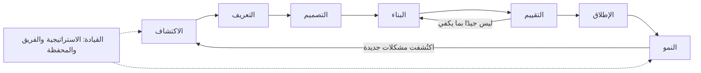
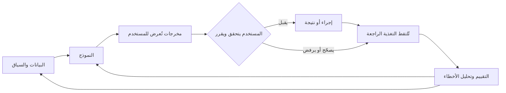
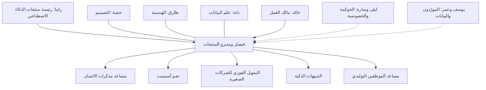

# الوحدة 0 — التوجيه (Orientation)

*قبل الموجّهات (prompts) والنماذج (models) والمقاييس (metrics)، تحتاج إلى صورة واضحة عن طبيعة العمل (the job). تشرح هذه الوحدة ما هي إدارة منتجات الذكاء الاصطناعي (AI product management) وما ليست هي. وتبيّن لماذا تتصرف منتجات الذكاء الاصطناعي (AI products) بشكل مختلف عن البرمجيات التي تعرفها أصلًا: فهي احتمالية (probabilistic)، وتعتمد على البيانات (depend on data)، وكل استخدام لها يكلّف مالًا (every use costs money)، ولا تنجح إلا إذا وثق بها الناس بالقدر الصحيح (trust them the right amount). ثم تقدّم بنك نجم (Najm Bank)، البنك الخليجي الخيالي (fictional Gulf bank) الذي ستنضم إلى فريق المنتجات الرقمية ومنتجات الذكاء الاصطناعي (Digital & AI Products team) فيه طوال الدورة، مع منتجاته الخمسة القائمة على الذكاء الاصطناعي (five AI products) والأشخاص الذين يبنونها ويرعونها ويحكمونها (build, sponsor and govern them). وتنتهي بكيفية تنظيم الدورة (how the course is organised)، وكيفية دراستها، ومتى تنتقل إلى إحدى الدورات المرافقة (companion courses).*

> **المراحل (Stages):** جميع المراحل الثماني، في عرض تمهيدي (All eight, previewed) — Discover · Define · Design · Build · Evaluate · Launch · Grow · Lead — خريطة العمل (map of the job) قبل أن نسير فيها مرحلةً مرحلة (stage by stage).

---

# 0.1 — ما هي إدارة منتجات الذكاء الاصطناعي، وما ليست هي (What AI product management is, and what it is not)
*المستوى (Level): 🟢 مبتدئ (Beginner)* · *المتطلبات (Prerequisites): لا يوجد (none)* · *المرحلة (Stage): Discover, Lead*

## ⚡ الدرس في دقيقة (In 60 seconds)
- **إدارة منتجات الذكاء الاصطناعي (AI product management)** هي عمل تحديد أي منتج قائم على الذكاء الاصطناعي (AI-powered product) يجب بناؤه، ولمن (for whom)، وبأي معيار جودة (quality bar)، وبأي تكلفة ومخاطر (cost and risk)، ثم إثبات أنه يخلق قيمة (creates value) حين يستخدمه أناس حقيقيون (real people).
- ما زالت إدارة منتج (product management). فأنت تجيب عن الأسئلة الأربعة نفسها التي يواجهها كل فريق منتج (product team)، وهي مخاطر القيمة (value) وسهولة الاستخدام (usability) والجدوى التقنية (feasibility) والجدوى التجارية (business viability) عند مارتي كيغان (Marty Cagan). ومع الذكاء الاصطناعي (AI)، يكتسب كل سؤال أجزاءً جديدة وأصعب (new and harder parts).
- وهي **ليست** علم بيانات (data science)، ولا هندسة موجّهات (prompt engineering)، ولا إدارة مشاريع (project management)، ولا حوكمة (governance)، ولا «أن تكون المتحمّس للذكاء الاصطناعي (being the AI enthusiast)». أنت تعمل عن قرب مع كل هذه الأدوار (roles)، لكن عملك هو قرار المنتج (product decision) والنتيجة (outcome).
- إشارة القرار (Decision cue): ابدأ من مشكلة (problem) ونتيجة قابلة للقياس (measurable outcome) («تقليص وقت صياغة مذكرات الائتمان دون خفض جودة المذكرة (cut credit memo drafting time without lowering memo quality)»)، ولا تبدأ أبدًا من تقنية (technology) («أين يمكننا استخدام الذكاء الاصطناعي التوليدي؟ ⁦(where can we use GenAI?)⁩»).
- أكبر فخ (Biggest trap): **فخ العرض التوضيحي (the demo trap)**. العرض التوضيحي (demo) الذي ينجح ثماني مرات من عشر يبدو كأنه منتج (looks like a product). لكنه ليس منتجًا حتى تعرف كم مرة يفشل (how often it fails)، وكم تكلّف هذه الإخفاقات (what those failures cost)، ومن يكتشفها (who catches them).

## 🧭 لماذا يهم (Why it matters)
في يوم الاثنين الأول لفيصل بصفته مدير منتج ذكاء اصطناعي (AI product manager) في بنك نجم (Najm Bank)، يمرّ خالد، رئيس الإقراض للأفراد (Head of Retail Lending)، بمكتبه. «منافسونا لديهم ذكاء اصطناعي في تطبيقاتهم (AI in their apps). أريد مساعدًا على غرار ChatGPT (ChatGPT-style assistant) في تطبيقنا بحلول الربع الثالث (third quarter). هل يمكنك كتابة المتطلبات (requirements)؟» فيصل متحمّس لإثارة الإعجاب (keen to impress). وبحلول الأربعاء يكون لديه مستند من اثنتي عشرة صفحة (twelve-page document) يسرد الميزات (features): المحادثة (chat)، والصوت (voice)، والعربية والإنجليزية (Arabic and English)، والتحكم في البطاقات (card controls)، ومدرّب الإنفاق (spending coach)، وعروض القروض (loan offers).

تقرأه رانيا، رئيسة منتجات الذكاء الاصطناعي (Head of AI Products)، وتطرح أربعة أسئلة. ما مشكلة العميل (customer problem) التي يحلها هذا، وكيف نعرف أنها مشكلة؟ ما مدى الجودة المطلوبة لكل إجابة (how good does each answer have to be)، وكيف سنقيس ذلك قبل الإطلاق (before launch)؟ كم تكلّفنا كل محادثة (what does each conversation cost us)، وماذا يستعيد العمل (what does the business get back)؟ ماذا يحدث حين يخطئ المساعد (when the assistant is wrong)، ومن يلاحظ؟ المستند لا يجيب عن أي منها. لقد كتب فيصل قائمة ميزات لعرض توضيحي (feature list for a demo)، لا خطة لمنتج (plan for a product).

وقد ارتكبت مؤسسات جيدة التمويل (well-funded organisations) الخطأ نفسه على نطاق أكبر بكثير. استثمرت IBM بكثافة في Watson Health وروّجت له لاستخدامات سريرية (clinical uses) مثل توصيات علاج السرطان (cancer treatment recommendations). وفي عام 2022 باعت IBM أصول البيانات والتحليلات (data and analytics assets) الخاصة بـ Watson Health. ووصفت التقارير العامة (public reporting) فجوة واسعة بين عروض توضيحية مبهرة (impressive demonstrations) وأدوات تلائم سير العمل الفعلي للأطباء (clinicians' real workflows) ومعايير الأدلة (evidence standards) لديهم. كانت أسئلة المنتج (product questions) — عمل مَن يحسّنه هذا (whose job does this improve)، وكيف نثبت أنه ينجح هنا (how do we prove it works here)، وكم تكلّف الموثوقية؟ ⁦(what does reliability cost?)⁩ — أصعب مما جعلها العرض التوضيحي تبدو. وتلك الفجوة بين «يستطيع فعل ذلك (it can do it)» و«يعتمد عليه الناس كل يوم (people rely on it every day)» هي حيث يستحق مديرو منتجات الذكاء الاصطناعي (AI product managers) أجرهم.

## 📐 كيف يعمل (How it works)

### 🟢 الأساسيات (The essentials)

**ماذا يفعل مدير المنتج (What a product manager does).** مدير المنتج (product manager - PM) مسؤول عن التأكد من أن الفريق يبني شيئًا يستحق البناء (worth building)، وأنه ينجح فعلًا للأشخاص الذين يُفترض أن يخدمهم (the people it is meant to serve). يصوّر كتاب كيغان (Cagan) *Inspired* ذلك على أنه تقليل أربعة مخاطر (reducing four risks) قبل البناء وأثناءه:

| المخاطرة (Risk) | السؤال (The question) | من يقودها عادةً (Who usually leads on it) |
|---|---|---|
| **القيمة (Value)** | هل سيختار العملاء أو المستخدمون (customers or users) استخدامه أو شراءه؟ | مدير المنتج (Product manager) |
| **سهولة الاستخدام (Usability)** | هل يستطيعون معرفة كيفية استخدامه (work out how to use it)؟ | مصمم المنتج (Product designer) |
| **الجدوى التقنية (Feasibility)** | هل نستطيع بناءه بالوقت والمهارات والبيانات والتقنية (time, skills, data and technology) المتاحة لنا؟ | قائد الهندسة (Engineering lead) |
| **الجدوى التجارية (Business viability)** | هل يناسب بقية العمل (rest of the business): التكلفة (cost)، والقانون (legal)، والعلامة التجارية (brand)، والمبيعات (sales)، والدعم (support)؟ | مدير المنتج (Product manager) |

لا يفعل مدير المنتج (PM) كل هذا وحده. فهو يتأكد من معالجة المخاطر الأربعة جميعها (all four risks are addressed)، ويملك سؤالَي القيمة والجدوى التجارية (value and viability questions).

**ما الذي تضيفه إدارة منتجات الذكاء الاصطناعي (What AI product management adds).** منتج الذكاء الاصطناعي (AI product) هو منتج يُنتج فيه نموذج (model) — أي برنامج تعلّم سلوكه من البيانات (learned from data) بدلًا من أن يُكتب كقواعد (written as rules) — جزءًا مهمًا من المخرجات (output). قد يكون نموذج تعلّم آلي (machine-learning model) يتنبأ برقم، مثل احتمال سداد فاتورة (chance an invoice is paid)، أو نموذجًا لغويًا كبيرًا (large language model - LLM) يولّد نصًا (generates text). وفي الحالتين، يغيّر الذكاء الاصطناعي كل مخاطرة:

| المخاطرة (Risk) | ما يضيفه الذكاء الاصطناعي (What AI adds) |
|---|---|
| القيمة (Value) | قد يحب المستخدمون الفكرة (like the idea) لكنهم لا يثقون بالمخرجات (trust the output) بما يكفي لاستخدامها. القيمة تعتمد على الجودة (depends on quality)، والجودة تتفاوت (quality varies). |
| سهولة الاستخدام (Usability) | يجب أن تُظهر الواجهة (interface) عدم اليقين (uncertainty)، وتدعو إلى التحقق (invite checking)، وتجعل تصحيح الأخطاء سهلًا (errors easy to fix) (الوحدة 4 (Module 4)). |
| الجدوى التقنية (Feasibility) | كثيرًا ما لا تستطيع معرفة مدى جودة النموذج على بياناتك *أنت* (*your* data) حتى تجرّب. تصبح الجدوى التقنية تجربة لا تقديرًا (an experiment, not an estimate) (الوحدتان 1 و5 (Modules 1 and 5)). |
| الجدوى التجارية (Viability) | كل استخدام يكلّف مالًا (every use costs money)، ويمكن أن تسبب الأخطاء ضررًا قانونيًا وضررًا بالسمعة (legal and reputational harm)، وقد يصنّف المنظمون (regulators) الاستخدام على أنه عالي المخاطر (high-risk) (الوحدتان 8 و9 (Modules 8 and 9)). |

**تعريف عملي (A working definition).** في هذه الدورة، تعني إدارة منتجات الذكاء الاصطناعي (AI product management): *اختيار المشكلات التي يمكن للذكاء الاصطناعي أن يخلق فيها قيمة (choosing problems where AI can create value)، وتحديد معيار الجودة الذي يجب أن يستوفيه الذكاء الاصطناعي (setting the quality bar the AI must meet)، وتصميم كيفية عمل الناس والذكاء الاصطناعي معًا (designing how people and AI work together)، وإثبات الجودة قبل الإطلاق وبعده (proving quality before and after launch)، وإدارة القيمة والتكلفة والمخاطر (managing value, cost and risk) طوال عمر المنتج (over the product's life).* وكل وحدة تعلّم جزءًا واحدًا من هذه الجملة.

**ما ليست إدارة منتجات الذكاء الاصطناعي (What AI product management is not).** كثيرًا ما ينجرف مديرو منتجات الذكاء الاصطناعي الجدد (new AI PMs) إلى دور مجاور (neighbouring role) لأنه يبدو أكثر ملموسية (more concrete). يبيّن الجدول أين تقع الحدود عادةً (where the lines usually sit). تختلف الحدود بين المؤسسات (vary between organisations)، لكن عمل مدير المنتج لا يذوب أبدًا في أي منها.

| الدور (Role) | ما يملكه (What they own) | أين يعمل معه مدير المنتج (Where the PM works with them) | ما لا ينبغي لمدير المنتج فعله (What the PM should not do) |
|---|---|---|---|
| عالم البيانات (Data scientist) (دانة) | النماذج (Models)، والخصائص (features)، والتقييم الإحصائي (statistical evaluation) | الاتفاق على معنى «جيد (good)» وأي الأخطاء أهم (which errors matter most) | اختيار بنية النموذج (Choose the model architecture) |
| مهندس الذكاء الاصطناعي أو التعلّم الآلي (AI or ML engineer) (فريق طارق) | خطوط المعالجة (Pipelines)، والموجّهات في بيئة الإنتاج (prompts in production)، والتشغيل والخدمة (serving)، وزمن الاستجابة (latency)، وهندسة التكلفة (cost engineering) | المفاضلات بين الجودة والسرعة والتكلفة (Trade-offs between quality, speed and cost) | ضبط موجّهات الإنتاج يدويًا دون اختبارات (Hand-tune production prompts without tests) |
| مصمم المنتج (Product designer) (حصة) | البحث (Research)، وأنماط التفاعل (interaction patterns)، والتجربة (the experience) | كيف تُعرض مخرجات الذكاء الاصطناعي وتُراجَع وتُصحَّح (How AI output is shown, checked and corrected) | تخطّي بحث المستخدمين (Skip user research) لأن «النموذج سيتولى الأمر (the model will handle it)» |
| الحوكمة والمخاطر (Governance and risk) (ليلى) | تصنيف المخاطر (Risk tiering)، والسياسات (policy)، والموافقات (approvals) | تصميم الضوابط في المنتج مبكرًا (Designing controls into the product early) | معاملة الحوكمة كبوابة في النهاية (Treat governance as a gate at the end) |
| مدير المشروع أو التسليم (Project or delivery manager) | الخطط (Plans)، والاعتماديات (dependencies)، والمواعيد (dates) | ترتيب تسلسل العمل (Sequencing work) | الخلط بين مشروع مُسلَّم ومنتج ناجح (Mistake a delivered project for a successful product) |
| مالك العمل (Business owner) (خالد) | خط العمل (The business line)، وقائمة الأرباح والخسائر (P&L) الخاصة به، وأهدافه (targets) | تحديد النتيجة (Defining the outcome) ودراسة الجدوى (business case) | اعتبار قائمة الميزات هي المتطلب (Take the feature list as the requirement) |

وإدارة منتجات الذكاء الاصطناعي ليست أيضًا **«الذكاء الاصطناعي لمديري المنتجات (AI for PMs)»** (أي استخدام أدوات الذكاء الاصطناعي لكتابة المواصفات (write specs) أو تلخيص المقابلات (summarise interviews))؛ فهذه الدورة تتناول إدارة المنتجات *التي تحتوي على ذكاء اصطناعي (that contain AI)*. وليست **تبشيرًا (evangelism)**. فمدير منتج الذكاء الاصطناعي الجيد (good AI PM) يقتل أفكار ذكاء اصطناعي (kills more AI ideas) أكثر مما يطلق (than they ship) (الدرس 2.3 (lesson 2.3))، لأن مشكلات كثيرة تُحلّ على نحو أفضل بقاعدة (rule) أو نموذج ورقي (form) أو تغيير في الإجراءات (process change).

### 🟡 التعمق أكثر (Going deeper)

**ثلاثة أنواع من وظائف منتجات الذكاء الاصطناعي (Three kinds of AI product job).** يغطي لقب «مدير منتج ذكاء اصطناعي (AI product manager)» وظائف مختلفة. ومن المفيد أن تعرف في أيها أنت.

| النوع (Kind) | ما تديره (What you manage) | مثال من نجم (Najm example) | التحدي الرئيسي (Main challenge) |
|---|---|---|---|
| **مدير منتج ميزة ذكاء اصطناعي (AI feature PM)** | قدرة ذكاء اصطناعي (AI capability) داخل منتج قائم (existing product) | التنبيهات الذكية (Smart Alerts) داخل تطبيق الجوال (mobile app) | إدخال الذكاء الاصطناعي في تجربة راسخة (established experience) دون كسر الثقة (without breaking trust) |
| **مدير منتج أصيل في الذكاء الاصطناعي (AI-native product PM)** | منتج لم يكن ليوجد لولا الذكاء الاصطناعي (would not exist without AI) | مساعد مذكرات الائتمان (Credit Memo Copilot) | إثبات أن القدرة الأساسية (core capability) جيدة بما يكفي وتستحق تغيير سير العمل (worth changing a workflow for) |
| **مدير منتج منصة ذكاء اصطناعي (AI platform PM)** | قدرات مشتركة (Shared capabilities) تبني عليها فرق أخرى | بوابة النماذج (model gateway) وخدمة الاسترجاع (retrieval service) وأدوات التقييم (evaluation tools) خلف مساعد الموظفين التوليدي (Staff GenAI) ومساعد المذكرات (the copilot) | العملاء الداخليون (Internal customers)، وإعادة الاستخدام (reuse)، وضبط التكلفة (cost control)، والمعايير (standards) |

**دورة حياة المنتج في هذه الدورة (The product lifecycle in this course).** كل درس موسوم بمرحلة أو اثنتين من ثماني مراحل (eight stages). وهي ليست تسلسلًا صارمًا (strict sequence). فالفرق الحقيقية تعود إلى الوراء باستمرار (loop back constantly)، خاصةً بين البناء (Build) والتقييم (Evaluate).

| المرحلة (Stage) | السؤال الجوهري لمدير المنتج (The PM's core question) | المُخرَج النموذجي (Typical artefact) |
|---|---|---|
| **Discover** | هل توجد مشكلة حقيقية (real problem)، وهل يمكن للذكاء الاصطناعي أن يساعد؟ | ملخص الفرصة (Opportunity brief) |
| **Define** | ما الذي نبنيه بالضبط، وما معنى «جيد (good)»؟ | بطاقة تقييم حالة الاستخدام (Use-case scorecard)، ومواصفات الذكاء الاصطناعي بمعايير الجودة (AI spec with quality bars) |
| **Design** | كيف يعمل الناس والذكاء الاصطناعي معًا (work together)؟ | تصميم التفاعل (Interaction design)، ومستوى الأتمتة (automation level)، ومسارات الأخطاء (error flows) |
| **Build** | كيف نصل إلى نسخة عاملة (working version) بسرعة وأمان (fast and safely)؟ | النموذج الأولي (Prototype)، وتصميم الموجّه والسياق (prompt and context design) |
| **Evaluate** | هل ينجح فعلًا (actually work)، وكيف نعرف؟ | خطة التقييم (Eval plan)، والمجموعة المرجعية (golden set)، وتحليل الأخطاء (error analysis) |
| **Launch** | هل هو جاهز للمستخدمين الحقيقيين (ready for real users)، وهل هم جاهزون له؟ | قائمة تحقق الإطلاق (Launch checklist)، وخطة التمكين (enablement plan) |
| **Grow** | هل يخلق قيمة بتكلفة مقبولة (value at an acceptable cost)، ويبقى جيدًا (staying good)؟ | شجرة المقاييس (Metrics tree)، واقتصاديات الوحدة (unit economics)، وخطة المراقبة (monitoring plan) |
| **Lead** | أين يجب أن نستثمر بعد ذلك (invest next)، وكيف يجب أن يعمل الفريق؟ | الاستراتيجية (Strategy)، وخارطة الطريق (roadmap)، ونموذج التشغيل (operating model) |

مرحلتان تهمان أكثر بكثير في الذكاء الاصطناعي. **التقييم (Evaluate)** مرحلة قائمة بذاتها (stands alone) لأن «يعمل دون أخطاء (it runs without errors)» لا يقول شيئًا عن صحة الإجابات (whether answers are right). و**النمو (Grow)** يحمل وزنًا أكبر لأن الجودة تنجرف (quality drifts) مع تغيّر البيانات والمستخدمين والنماذج (data, users and models change) (الدرس 8.3 (lesson 8.3)).

**الأطر التي تعرفها ما زالت تنطبق (Frameworks you already know still apply).** يتوافق **الماس المزدوج (Double Diamond)** الصادر عن مجلس التصميم البريطاني (UK Design Council) عام 2005 مع مرحلتي الاكتشاف والتعريف (Discover and Define) — أي ماسة المشكلة (the problem diamond) — ومع المراحل من التصميم إلى الإطلاق (Design to Launch) — أي ماسة الحل (the solution diamond). وحلقة ابنِ-قِس-تعلّم (build-measure-learn loop) في منهج **الشركة الناشئة الرشيقة (Lean Startup)** لإريك ريس (Eric Ries) عام 2011 تلائم الذكاء الاصطناعي جيدًا، بشرط أن يشمل «القياس (measure)» *الجودة (quality)* على مجموعة اختبار ثابتة (fixed test set)، لا الاستخدام (usage) وحده. وإطار **المهام المطلوب إنجازها (Jobs to be Done)** لكلايتون كريستنسن (Clayton Christensen) — حيث «يستأجر (hire)» الناس منتجًا لتحقيق تقدّم في موقف ما (make progress in a situation) — يبقيك مركّزًا على المهمة (the job) لا على النموذج (the model).

### 🔴 نظرة الخبير (Expert view)

**من تحديد الميزات إلى تحديد السلوك (From specifying features to specifying behaviour).** في البرمجيات العادية (ordinary software) يصف مدير المنتج الميزات (describes features)، ويجعلها المهندسون تتصرف تمامًا كما وُصفت (behave exactly as described). أما في منتجات الذكاء الاصطناعي فأنت تصف *السلوك ومعيار الجودة (behaviour and a quality bar)*: «في مذكرات ائتمان الشركات الصغيرة والمتوسطة (SME credit memos)، يجب أن تطابق الأرقام المالية في المسودة (draft's financial figures) المستندات المصدر (source documents) في نسبة محددة على الأقل من الحالات (a set percentage of cases) على مجموعة الاختبار لدينا (our test set)، ويجب أن تذكر المسودة حين يكون رقم ما مفقودًا بدلًا من أن تخمّن (say so when a figure is missing rather than guess)». ثم تتفق مع دانة على طريقة قياس ذلك. وحالات الاختبار (Test cases) التي ترمّز هذا السلوك، والمعروفة باسم **التقييمات (evals)**، تصبح جزءًا من المتطلبات (part of the requirements) (الدرس 5.1 (lesson 5.1)). ومدير المنتج الذي لا يستطيع قراءة تقرير تقييم (evaluation report) يخمّن بشأن منتجه هو (guessing about their own product).

**امتلاك التكلفة كقرار منتج (Owning cost as a product decision).** كثيرًا ما تكلّف ميزة الذكاء الاصطناعي (AI feature) مالًا في كل مرة تعمل فيها. فالنموذج الأكبر (larger model)، أو السياق الأكثر (more context)، أو خطوة تحقق ثانية (second checking step) هي قرارات منتج لها ثمن (product decisions with a price attached)، وليست مجرد تفاصيل هندسية (engineering details). ومدير المنتج الذي يملك القيمة (owns value) يجب أن يملك أيضًا **تكلفة الخدمة (cost to serve)** (الدرس 8.2 (lesson 8.2)).

**المساءلة دون سلطة على كل شيء (Accountability without authority over everything).** حين يُلحق منتج ذكاء اصطناعي ضررًا بأحد (harms someone)، تكون المسؤولية مشتركة (responsibility is shared) بين مالك العمل (business owner) والحوكمة (governance) والبناة (builders) ومدير المنتج. وجزء مدير المنتج هو منتج مصمَّم بحيث يكون الضرر غير مرجّح (harm is unlikely)، ومرئيًا حين يقع (visible when it happens)، ويُصحَّح بسرعة (quickly corrected). وهذا يعني دعوة ليلى وسارة في مرحلة الاكتشاف (during Discover)، لا في الأسبوع الذي يسبق الإطلاق (the week before launch). تفاصيل الحوكمة (governance detail) موجودة في الدورة المرافقة (companion course) *AI Governance: Zero to Hero*؛ أما هنا فنبقى على قرار المنتج (product decision).

**ماذا تعني «البطل (hero)» هنا (What "hero" means here).** بنهاية الدورة يجب أن تكون قادرًا على أخذ طلب غامض (vague request) مثل طلب خالد حتى الوصول إلى منتج في بيئة الإنتاج (product in production)، وأن تصمد في النقاش (hold your own) مع المهندسين (engineers) وعلماء البيانات (data scientists) ومسؤولي المخاطر (risk officers) والتنفيذيين (executives). والمشروع الختامي (capstone) في الوحدة 10 (Module 10) يطلب منك فعل ذلك بالضبط لنجم أسيست (Najm Assist).

## 🧰 الأدوات (The toolkit)
| الأداة أو الإطار (Tool or framework) | ما هو وماذا يفعل (What it is and does) | متى تلجأ إليه (When to reach for it) |
|---|---|---|
| **Four big risks** (Marty Cagan, *Inspired*) — المخاطر الأربع الكبرى | القيمة (value)، وسهولة الاستخدام (usability)، والجدوى التقنية (feasibility)، والجدوى التجارية (business viability): الطرق الأربع التي يفشل بها المنتج (the four ways a product fails) | في بداية أي فكرة ذكاء اصطناعي (AI idea)، لمعرفة أي مخاطرة هي الأكبر (which risk is biggest) واختبارها أولًا (test it first) |
| **Jobs to be Done** (Clayton Christensen; Anthony Ulwick's Outcome-Driven Innovation) — المهام المطلوب إنجازها | يصوغ الطلب (frames demand) على أنه التقدّم الذي يحاول شخص تحقيقه في موقف ما (progress a person is trying to make in a situation) | حين يصل طلب في صورة تقنية (arrives as a technology) («أضف روبوت محادثة (add a chatbot)») وتحتاج إلى المهمة الكامنة (underlying job) |
| **Double Diamond** (UK Design Council, 2005) — الماس المزدوج | التوسّع ثم التضييق مرتين (diverge then converge twice): على المشكلة (on the problem)، ثم على الحل (on the solution) | لمنع الفريق من القفز إلى حل (jumping to a solution) قبل أن تتضح المشكلة |
| **Lean Startup build-measure-learn** (Eric Ries, 2011) — حلقة ابنِ-قِس-تعلّم | تجارب صغيرة مقيسة (small experiments, measured) للتعلّم بسرعة (learn fast) قبل التوسّع (before scaling) | حين تكون الجدوى التقنية أو القيمة غير مؤكدة (feasibility or value is uncertain)، وهذا هو الحال عادةً مع الذكاء الاصطناعي |
| **Product lifecycle stages** (this course) — مراحل دورة حياة المنتج (هذه الدورة) | Discover وDefine وDesign وBuild وEvaluate وLaunch وGrow وLead، مع سؤال جوهري ومُخرَج لكل مرحلة (core question and artefact per stage) | لتحديد موقع المنتج (locate where a product is) وأي قرار مستحق بعد ذلك (what decision is due next) |

## 🏛️ عمليًا في بنك نجم (In practice at Najm Bank)
بعد المراجعة، تعطي رانيا فيصل شيئين. الأول هو **بطاقة دور مدير منتج الذكاء الاصطناعي (AI PM role card)** التي تعطيها لكل مدير منتج جديد في فريقها:

| | فيصل في نجم أسيست (Faisal on Najm Assist) |
|---|---|
| **يملك (Owns)** | مشكلة العميل والنتيجة المستهدفة (customer problem and target outcome)؛ ومعيار الجودة (quality bar) (بالاتفاق مع دانة)؛ والنطاق ومستوى الأتمتة (scope and automation level)؛ ودراسة الجدوى (business case)؛ والتوصية بقرار الإطلاق (launch decision recommendation)؛ ومقاييس ما بعد الإطلاق (post-launch metrics) |
| **يشارك في (Shares)** | تصميم التجربة (Experience design) (مع حصة)؛ وتصميم التقييم (evaluation design) (مع دانة)؛ ومفاضلات التكلفة وزمن الاستجابة (cost and latency trade-offs) (مع طارق)؛ وضوابط المخاطر (risk controls) (مع ليلى وسارة) |
| **يقدّم المشورة في (Advises on)** | اختيار النموذج والمورّد (Model and vendor choice) (يقرر طارق ودانة ويوسف)؛ وفئة الحوكمة (governance tier) (تقرر ليلى) |
| **لا يملك (Does not own)** | بنية النموذج (Model architecture)؛ وتغييرات موجّهات الإنتاج دون اختبارات (production prompt changes without tests)؛ والموافقة النهائية على المخاطر (final risk approval)؛ وقائمة الأرباح والخسائر (P&L) الخاصة بخالد |

الثاني هو **طلب مُعاد صياغته (reframed request)**، يعيد فيصل كتابته مع خالد في صفحة واحدة:

| الحقل (Field) | قبل (Before) (طلب خالد (Khalid's ask)) | بعد (After) (بعد إعادة الصياغة (reframed)) |
|---|---|---|
| المشكلة (Problem) | «نحتاج إلى مساعد ذكاء اصطناعي مثل المنافسين (We need an AI assistant like competitors)» | كثير من مكالمات مركز الاتصال (contact-centre calls) أسئلة بسيطة عن الرسوم (fees) وحالة البطاقة (card status) والتحويلات (transfers)، كان العملاء سيجيبون عنها بأنفسهم لو كانت الإجابات سهلة الإيجاد (easy to find) |
| من (Who) | «جميع العملاء (All customers)» | مستخدمو تطبيق الأفراد (Retail app users) في قطر والإمارات، بالعربية والإنجليزية |
| النتيجة (Outcome) | «الإطلاق بحلول الربع الثالث (Launch by Q3)» | مكالمات بسيطة أقل (Fewer simple calls)، مع رضا عملاء (customer satisfaction) لا يقل عن مستواه اليوم، ودون ارتفاع في الشكاوى من معلومات خاطئة (complaints about wrong information) |
| معيار الجودة (Quality bar) | غير مذكور (Not stated) | إجابات مستندة إلى محتوى البنك المعتمد (grounded in approved bank content)؛ وتسليم إلى إنسان عند عدم التأكد (hands over to a human when unsure)؛ ومعدل خطأ (error rate) على مجموعة اختبار يُتفق عليه قبل التجربة التجريبية (before pilot) |
| التكلفة (Cost) | غير مذكورة (Not stated) | تكلفة المحادثة المحلولة (Cost per resolved conversation) تُقدَّر قبل البناء وتُتابَع بعد الإطلاق |
| الخطوة الأولى (First step) | البناء (Build) | أسبوعان من الاكتشاف (Two weeks of discovery): الاستماع إلى المكالمات (listen to calls)، وأخذ عينة من بيانات مركز الاتصال (sample contact-centre data)، واختبار الإجابات على نموذج أولي صغير (small prototype) |

يوافق خالد على النتيجة (outcome)، لأنها مكتوبة بلغته (in his language): المكالمات (calls)، والرضا (satisfaction)، والشكاوى (complaints).

## 🛠️ التمارين (Exercises)
- 🟢 اختر ميزة ذكاء اصطناعي تستخدمها (AI feature you use) (مرشّح بريد مزعج (spam filter)، أو بحث في الصور (photo search)، أو مساعد كتابة (writing assistant)). اكتب جملة واحدة لكل من مخاطر كيغان الأربع (Cagan's four risks) كما تنطبق عليها. *يكتمل عندما (Done when):* تكون لديك أربع جمل، ويذكر اثنتان منها على الأقل شيئًا خاصًا بالذكاء الاصطناعي (specific to AI) (الأخطاء (errors)، أو البيانات (data)، أو التكلفة (cost)، أو الثقة (trust)).
- 🟡 خذ طلبًا يبدأ من التقنية (technology-first request) سمعته («نحتاج إلى روبوت محادثة بالذكاء الاصطناعي (we need an AI chatbot)»، «لنستخدم الذكاء الاصطناعي التوليدي للتقارير (let's use GenAI for reports)») وأعد صياغته (reframe it) باستخدام الجدول في 🏛️: المشكلة (problem)، ومن (who)، والنتيجة (outcome)، ومعيار الجودة (quality bar)، والتكلفة (cost)، والخطوة الأولى (first step). *يكتمل عندما (Done when):* تكون النتيجة قابلة للقياس (measurable) ولا تقول شيئًا عن التقنية التي ستُستخدم (which technology to use).
- 🔴 اكتب بطاقة دور (role card) مثل بطاقة رانيا لمنتج ذكاء اصطناعي في مؤسستك، واعرضها على مهندس واحد (one engineer) وزميل واحد من المخاطر أو الامتثال (risk or compliance colleague). *يكتمل عندما (Done when):* يوافق كلاهما على صفَّي «يملك (Owns)» و«لا يملك (Does not own)»، أو تكون قد دوّنت أين يختلفان ولماذا.

## ⚠️ أخطاء وفخاخ (Mistakes and traps)
- **البدء من التقنية (Starting from the technology).** سؤال «أين يمكننا استخدام الذكاء الاصطناعي التوليدي؟ ⁦(Where can we use GenAI?)⁩» ينتج عروضًا توضيحية (produces demos). ابدأ من مهمة (job) وسير عمل (workflow) ونتيجة قابلة للقياس (measurable outcome).
- **الخلط بين العرض التوضيحي والمنتج (Confusing a demo with a product).** العرض التوضيحي يُظهر أن النموذج *يستطيع (can)* أن ينجح. أما المنتج فيحتاج إلى معرفة *كم مرة (how often)* يفشل وماذا يحدث حينها. اطلب معدل خطأ على حالات تمثيلية (error rate on representative cases) قبل أن يقول أحد «إنه يعمل (it works)».
- **أن تصبح أنت مهندس الموجّهات (Becoming the prompt engineer).** ضبط الموجّهات بنفسك (tuning prompts yourself) يبدو منتجًا، لكنه يترك النتيجة بلا مالك (leaves nobody owning the outcome). ساهم بالأمثلة ومعايير الجودة (examples and quality criteria). واترك تغييرات الإنتاج (production changes) لعملية مُختبَرة (tested process).
- **معاملة الحوكمة كآخر بوابة (Treating governance as the last gate).** إدخال ليلى عند الإطلاق يحوّل تغييرًا صغيرًا في التصميم (small design change) إلى تأخير (delay). ادعُ زملاء المخاطر والخصوصية (risk and privacy colleagues) في مرحلة الاكتشاف (during Discover).
- **قياس الإطلاق بدلًا من النتيجة (Measuring launch instead of outcome).** «أُطلق بحلول الربع الثالث (Shipped by Q3)» معلم مشروع (project milestone). اتفق على مقياس نتيجة (outcome metric) ومعيار جودة (quality bar) قبل البناء.

## 🧾 الخلاصة (Recap)
- إدارة منتجات الذكاء الاصطناعي (AI product management) هي إدارة منتج بأربعة شروط أصعب (four harder conditions): جودة متفاوتة (variable quality)، واعتماد على البيانات (dependence on data)، وتكلفة لكل استخدام (cost per use)، وثقة هشّة (fragile trust).
- ما زالت مخاطر كيغان الأربع (Cagan's four risks) تؤطّر العمل. والذكاء الاصطناعي يضيف أسئلة جديدة إلى كل منها.
- يملك مدير منتج الذكاء الاصطناعي (AI PM) المشكلة (problem) والنتيجة (outcome) ومعيار الجودة (quality bar) ودراسة الجدوى (business case). ويشارك قرارات التصميم والتقييم والتكلفة والمخاطر (design, evaluation, cost and risk decisions) مع المتخصصين (specialists).
- تتبع الدورة ثماني مراحل لدورة الحياة (eight lifecycle stages). والتقييم والنمو (Evaluate and Grow) يهمان في الذكاء الاصطناعي أكثر مما يهمان في البرمجيات العادية (ordinary software).
- الفشل الأكثر شيوعًا هو فخ العرض التوضيحي (the demo trap): الخلط بين «يستطيع (it can)» و«يفعل ذلك بموثوقية، هنا، لهؤلاء الناس، بهذه التكلفة (it reliably does, here, for these people, at this cost)».

## ✍️ اختبر نفسك (Check yourself)

**1. يطلب خالد من فيصل «إضافة مساعد ذكاء اصطناعي إلى التطبيق بحلول الربع الثالث ⁦(add an AI assistant to the app by Q3)⁩». ماذا يجب أن يفعل فيصل أولًا؟**

- A. كتابة متطلبات ميزات مفصّلة (detailed feature requirements) كي يبدأ فريق الهندسة (engineering)
- B. أن يطلب من طارق اختيار مورّد نموذج (model vendor)
- C. إعادة صياغة الطلب (reframe the request) حول مشكلة عميل (customer problem) ونتيجة قابلة للقياس (measurable outcome) ومعيار جودة (quality bar)، ثم إجراء اكتشاف قصير (short discovery)
- D. بناء عرض توضيحي (demo) لعرضه على خالد خلال أسبوع

الإجابة

**C.** المهمة الأولى لمدير المنتج (PM's first job) هي تحويل طلب تقني (technology request) إلى مشكلة ونتيجة (problem and outcome)، ثم اختبار ما إذا كانت المشكلة حقيقية (real). العرض التوضيحي (D) مغرٍ لأنه يبدو تقدّمًا (looks like progress)، لكنه يتخطى أسئلة القيمة والجودة (value and quality questions) ويقود مباشرة إلى فخ العرض التوضيحي (demo trap). (🧭 لماذا يهم (Why it matters)؛ 🏛️ عمليًا (In practice).)

**2. أي مخاطر كيغان الأربع (Cagan's four risks) يتغير *أكثر* بسبب أنك كثيرًا ما لا تستطيع معرفة مدى جودة أداء نموذج على بياناتك حتى تجرّبه (until you try it)؟**

- A. القيمة (Value)
- B. سهولة الاستخدام (Usability)
- C. الجدوى التقنية (Feasibility)
- D. الجدوى التجارية (Business viability)

الإجابة

**C.** مع الذكاء الاصطناعي، تصبح الجدوى التقنية (feasibility) تجربة لا تقديرًا (an experiment rather than an estimate)، لأن الأداء على بياناتك (performance on your data) غير مؤكد حتى يُختبر. القيمة (A) تتأثر أيضًا، لكن النقطة المحددة المتعلقة بعدم معرفة أداء النموذج مسبقًا (not knowing model performance in advance) هي سؤال جدوى تقنية (feasibility question). (🟢 الأساسيات (The essentials).)

**3. في بنك نجم (Najm Bank)، من يجب أن يقرر بنية النموذج (model architecture) للتمويل الفوري للشركات الصغيرة (SME Instant Finance)؟**

- A. مدير منتج الذكاء الاصطناعي (AI product manager)، لأنه يملك المنتج (owns the product)
- B. قائدا علم البيانات والهندسة (data science and engineering leads)، مع تحديد مدير المنتج لمعيار الجودة والمفاضلات (quality bar and trade-offs)
- C. رئيسة حوكمة الذكاء الاصطناعي (Head of AI Governance)
- D. مالك العمل (business owner)، لأنه يموّله (funds it)

الإجابة

**B.** يملك مدير المنتج *معنى الجيد (what good means)* والمفاضلات (trade-offs). ويختار المتخصصون (specialists) *كيفية (how)* تحقيقه. الخيار A هو الخطأ المغري (tempting mistake): امتلاك المنتج لا يعني امتلاك كل قرار تقني (every technical decision). (🟢 الأساسيات (The essentials)، جدول الأدوار (role table)؛ 🏛️ بطاقة الدور (role card).)

**4. أي عبارة تصف على أفضل وجه الفرق بين مدير منتج ميزة ذكاء اصطناعي (AI feature PM) ومدير منتج منصة ذكاء اصطناعي (AI platform PM)؟**

- A. مدير منتج الميزة يعمل على الذكاء الاصطناعي التوليدي (generative AI)؛ ومدير منتج المنصة يعمل على التعلّم الآلي الكلاسيكي (classic machine learning)
- B. مدير منتج الميزة يدير قدرة ذكاء اصطناعي داخل منتج للمستخدمين النهائيين (AI capability inside a product for end users)؛ ومدير منتج المنصة يدير قدرات ذكاء اصطناعي مشتركة تبني عليها فرق داخلية أخرى (shared AI capabilities that other internal teams build on)
- C. مدير منتج المنصة يدير المورّدين فقط (only manages vendors)
- D. لا يوجد فرق حقيقي؛ اللقبان قابلان للتبادل (interchangeable)

الإجابة

**B.** الفرق هو من هو العميل (who the customer is): المستخدمون النهائيون لمنتج واحد (end users of one product)، أو الفرق الداخلية التي تستخدم خدمات مشتركة (internal teams using shared services). نوع الذكاء الاصطناعي (type of AI) (A) لا يحدد الدور. (🟡 التعمق أكثر (Going deeper).)

**5. يقول فريق إن ملخِّصه الجديد بالذكاء الاصطناعي (AI summariser) «يعمل (works)» لأنه أنتج ملخصات جيدة في كل عرض توضيحي أمام القيادة (every demo to leadership). ما السؤال التالي الأكثر فائدة من مدير المنتج؟**

- A. «هل يمكننا جعل الواجهة أكثر جاذبية؟ ⁦(Can we make the interface more attractive?)⁩»
- B. «كم مرة يفشل على مجموعة تمثيلية من المستندات الحقيقية، وما أنواع الفشل، ومن سيكتشفها؟ ⁦(How often does it fail on a representative set of real documents, what kinds of failure are they, and who would catch them?)⁩»
- C. «أي منافس لديه ميزة مشابهة؟ ⁦(Which competitor has a similar feature?)⁩»
- D. «هل يمكننا الإطلاق للجميع الأسبوع القادم؟ ⁦(Can we launch to everyone next week?)⁩»

الإجابة

**B.** العروض التوضيحية (Demos) تُظهر أن النموذج *يستطيع (can)* أن ينجح. أما قرارات المنتج (Product decisions) فتحتاج إلى معدل الفشل على حالات تمثيلية (failure rate on representative cases) وخطة لاكتشاف الإخفاقات (plan for catching failures). الخيار D ينبع من فخ العرض التوضيحي (demo trap). (⚡ الدرس في دقيقة (In 60 seconds)؛ ⚠️ أخطاء وفخاخ (Mistakes and traps).)

## 📚 المراجع (References)
- Marty Cagan, *Inspired: How to Create Tech Products Customers Love*, 2nd ed. (Wiley, 2017) — https://www.svpg.com
- Clayton M. Christensen, Taddy Hall, Karen Dillon and David S. Duncan, *Competing Against Luck* (Harper Business, 2016)
- Anthony W. Ulwick, *Jobs to Be Done: Theory to Practice* (Idea Bite Press, 2016) — https://strategyn.com
- UK Design Council, the Double Diamond — https://www.designcouncil.org.uk
- Eric Ries, *The Lean Startup* (Crown Business, 2011) — https://theleanstartup.com
- Google PAIR, People + AI Guidebook — https://pair.withgoogle.com/guidebook

---

# 0.2 — كيف تختلف منتجات الذكاء الاصطناعي: احتمالية، ونهمة للبيانات، ومكلفة لكل استخدام، ومرهونة بالثقة (How AI products differ: probabilistic, data-hungry, costly per use, trust-bound)
*المستوى (Level): 🟢 مبتدئ (Beginner)* · *المتطلبات (Prerequisites): 0.1* · *المرحلة (Stage): Define, Evaluate*

## ⚡ الدرس في دقيقة (In 60 seconds)
- تختلف منتجات الذكاء الاصطناعي (AI products) عن البرمجيات العادية (ordinary software) في أربعة جوانب تغيّر تقريبًا كل قرار منتج (product decision). فهي **احتمالية (probabilistic)**، و**نهمة للبيانات (data-hungry)**، و**مكلفة لكل استخدام (costly per use)**، و**مرهونة بالثقة (trust-bound)**.
- **احتمالية (Probabilistic):** المدخل نفسه (same input) قد يعطي مخرجات مختلفة (different outputs)، وبعض المخرجات ستكون خاطئة. الجودة *معدل (rate)* يُقاس على حالات تمثيلية (representative cases)، لا اختبار نعم/لا (yes/no test).
- **نهمة للبيانات (Data-hungry):** ما يعرفه المنتج ومدى جودة أدائه يعتمدان على بيانات يجب أن يكون لك الحق في استخدامها (right to use)، وأن تحافظ على نظافتها (keep clean) وحداثتها (keep current).
- **مكلفة لكل استخدام (Costly per use):** كثير من ميزات الذكاء الاصطناعي (AI features) تكلّف مالًا في كل مرة تعمل فيها، لذا يرفع النجاح التكاليف (success raises costs). وتكلفة المهمة الواحدة (cost per task) مقياس منتج (product metric).
- **مرهونة بالثقة (Trust-bound):** لا تظهر القيمة (value) إلا حين يعتمد الناس على المخرجات بالقدر الصحيح (rely on the output the right amount): لا اعتمادًا أعمى (not blindly)، ولا اعتمادًا ضئيلًا يجعلهم يعيدون العمل (redo the work).
- أكبر فخ (Biggest trap): كتابة مواصفات (spec) كأن الذكاء الاصطناعي سيتصرف كميزة حتمية (deterministic feature) («المساعد يجيب عن أسئلة الرسوم بشكل صحيح (the assistant answers fee questions correctly)») دون معدل خطأ (error rate)، ودون تقدير للتكلفة (cost estimate)، ودون خطة لحالة الخطأ (plan for when it is wrong).

## 🧭 لماذا يهم (Why it matters)
في عام 2022 سأل مسافر روبوت المحادثة (chatbot) في موقع Air Canada عن أسعار تذاكر الحداد (bereavement fares). فأخبره الروبوت أنه يستطيع التقدم بطلب الخصم بعد السفر (after travelling). لكن سياسة الشركة نفسها (airline's own policy) كانت تقول غير ذلك. وحين طالب باسترداد المبلغ (claimed the refund)، احتجّت الشركة بأن روبوت المحادثة كان في الواقع كيانًا مستقلًا (separate entity) مسؤولًا عن تصريحاته. وفي قضية *Moffatt v. Air Canada* (2024)، رفضت محكمة تسوية النزاعات المدنية في كولومبيا البريطانية (British Columbia's Civil Resolution Tribunal) هذه الحجة، وحمّلت الشركة المسؤولية عمّا قاله روبوتها. كان المبلغ صغيرًا. أما الدرس فكان كبيرًا: العميل لا يهتم بأن الإجابة جاءت من نموذج (came from a model). الشركة هي التي تملكها (the company owns it).

بعد أسبوعين من الاكتشاف (discovery)، يعرض فيصل على خالد نموذجًا أوليًا (prototype) لنجم أسيست (Najm Assist). يجيب النموذج عن عشرين سؤالًا مُعدًّا مسبقًا (twenty prepared questions) عن الرسوم والبطاقات (fees and cards) إجابات مثالية، بالعربية والإنجليزية. ثم تدير حصة جلسة (session) مع عشرة عملاء حقيقيين (ten real customers) يكتبون أسئلتهم الخاصة. يسأل أحدهم عن رسوم تحويل دولي من حساب توفير (international transfer from a savings account). فيعطي النموذج الأولي إجابة واثقة (confident answer) تخلط بين جدولَي رسوم (mixes up two fee schedules). ويطرح آخر السؤال نفسه مرتين فيحصل على إجابتين بصياغتين مختلفتين (differently worded answers)، تُسقط إحداهما شرطًا (leaves out a condition). لم يكن أحد في الغرفة قد رأى هذا في العرض التوضيحي (demo).

لم يكن شيء «معطّلًا (broken)»؛ لقد فعل النموذج الأولي ما تفعله النماذج اللغوية (language models). كانت خطة فيصل قد افترضت ميزة تطبيق عادية (normal app feature).

## 📐 كيف يعمل (How it works)

### 🟢 الأساسيات (The essentials)

يقارن الجدول بين ميزة برمجية تقليدية (traditional software feature) وميزة ذكاء اصطناعي (AI feature) في الفروق الأربعة (four differences).

| | البرمجيات التقليدية (Traditional software) | منتج الذكاء الاصطناعي (AI product) |
|---|---|---|
| **السلوك (Behaviour)** | حتمي (Deterministic): المدخل نفسه، المخرج نفسه، في كل مرة | احتمالي (Probabilistic): المخرجات تتفاوت (outputs vary)، وجزء منها خاطئ (a share of them are wrong) |
| **ما يجعله يعمل (What makes it work)** | شيفرة يكتبها المهندسون (Code written by engineers) | شيفرة *إضافةً إلى (plus)* نموذج يأتي سلوكه من البيانات (behaviour comes from data) |
| **تكلفة كل استخدام (Cost of each use)** | قريبة من الصفر بعد البناء (Close to zero once built) | غالبًا تكلفة حقيقية لكل طلب (real cost per request)، تنمو مع الاستخدام (grows with usage) |
| **علاقة المستخدم (User relationship)** | يتوقع المستخدمون أن يكون صحيحًا وهو كذلك عادةً (expect it to be right and it usually is) | يجب أن يتعلم المستخدمون متى يعتمدون عليه ومتى يتحققون (when to rely on it and when to check) |

**1. احتمالية (Probabilistic).** الميزة التقليدية (traditional feature)، مثل حاسبة الرسوم (fee calculator)، تتبع قواعد (follows rules). وإذا أعطت إجابة خاطئة، فذلك خلل برمجي (bug) يمكنك إيجاده وإصلاحه، وبعد الإصلاح تكون صحيحة في كل مرة. أما نموذج الذكاء الاصطناعي (AI model) فينتج المخرج *الأكثر ترجيحًا (most likely)* بناءً على ما تعلّمه. في معظم الأحيان يكون ذلك المخرج جيدًا. وفي بعضها لا يكون، ولا يمكنك سرد كل حالة مسبقًا (list every case in advance).

كثيرًا ما تعمل النماذج التوليدية (generative models) بعشوائية مقصودة (deliberate randomness)، تُضبط بواسطة **درجة الحرارة (temperature)**: القيم الأعلى تعطي مخرجات أكثر تنوعًا (more varied)، والقيم الأدنى مخرجات أكثر اتساقًا (more consistent). وحتى عند الإعدادات المنخفضة، قد يحصل سؤال أُعيدت صياغته قليلًا (slightly reworded question) على إجابة مختلفة. وحين يذكر نموذج لغوي (language model) شيئًا خاطئًا بثقة (states something false with confidence)، يسمّي الناس ذلك **هلوسة (hallucination)** (الدرس 1.2 (lesson 1.2)).

والنتيجة على المنتج (product consequence) أن سؤال «هل يعمل؟ ⁦(does it work?)⁩» لم يعد سؤال نعم/لا (yes/no question). بل يصبح: «كم مرة يكون صحيحًا في الحالات التي تهم، وماذا يحدث حين يخطئ؟ ⁦(how often is it right on the cases that matter, and what happens when it is wrong?)⁩». وتجيب عن ذلك بـ**مجموعة مرجعية (golden set)**: مجموعة ثابتة من المدخلات الواقعية (fixed collection of realistic inputs) ذات إجابات جيدة معروفة (known good answers)، تُستخدم لقياس الجودة بالطريقة نفسها في كل مرة (the same way every time) (الدرس 6.1 (lesson 6.1)).

**2. نهمة للبيانات (Data-hungry).** يعتمد سلوك منتج الذكاء الاصطناعي على البيانات في ثلاث نقاط (three points):
- **بيانات التدريب (Training data):** ما تعلّم منه النموذج. في التمويل الفوري للشركات الصغيرة (SME Instant Finance)، هي تاريخ نجم من الفواتير والسداد والتعثّر (invoices, repayments and defaults). وفي نموذج لغوي كبير من مورّد (vendor LLM)، هي بيانات لم تخترها ولا تستطيع فحصها بالكامل (cannot fully inspect).
- **بيانات السياق (Context data):** ما يعطيه المنتج للنموذج لحظة تشغيله (at the moment it runs). في نجم أسيست (Najm Assist)، هي جداول الرسوم المعتمدة (approved fee schedules) وشروط المنتجات (product terms) التي يسترجعها قبل الإجابة (نمط يُسمّى التوليد المعزّز بالاسترجاع (retrieval-augmented generation - RAG)، ويُغطّى في الدرس 1.3 (lesson 1.3)).
- **بيانات التغذية الراجعة (Feedback data):** ما تتعلمه من الاستخدام (from use)، مثل التصحيحات (corrections) والتقييمات (ratings) والنتائج (outcomes). وهكذا يتحسّن المنتج (the product improves) (الدرس 3.2 (lesson 3.2)).

إذا كان جدول الرسوم الذي يسترجعه المساعد قديمًا (out of date)، فستكون الإجابة خاطئة، مهما كان النموذج جيدًا. وإذا لم يكن لنجم الحق في استخدام محادثات العملاء للتحسين (right to use customer chats for improvement)، فإن حلقة التغذية الراجعة (feedback loop) تكون مغلقة. جاهزية البيانات (Data readiness) سؤال منتج (product question)، لا سؤال هندسي فقط (not only an engineering one) (الوحدة 3 (Module 3)).

**3. مكلفة لكل استخدام (Costly per use).** كثير من ميزات الذكاء الاصطناعي، خاصةً التوليدية منها (generative ones)، تكلّف مالًا في كل مرة تعمل فيها. وتُسعَّر النماذج اللغوية (language models) عادةً لكل **رمز (token)**، وهو قطعة نص (chunk of text) بحجم كلمة قصيرة تقريبًا أو جزء من كلمة، ويُحسب بشكل منفصل للمدخلات (input) (ما ترسله) وللمخرجات (output) (ما يعود). وطريقة تقدير التكلفة (method for estimating cost) عملية حسابية بسيطة (simple arithmetic):

> تكلفة المهمة (cost per task) = (رموز المدخلات × سعر المدخلات (input tokens × input price)) + (رموز المخرجات × سعر المخرجات (output tokens × output price))، مجموعةً على كل استدعاء للنموذج (every model call) تقوم به المهمة

مثال **توضيحي (illustrative)** بأرقام تقريبية مختلَقة (made-up round numbers) (الأسعار الحقيقية تتغير كثيرًا، فتحقق دائمًا من الأسعار الحالية (current ones)): لنفترض أن صياغة مذكرة ائتمان واحدة (drafting one credit memo) ترسل 30,000 رمز مدخلات (input tokens) وتستقبل 3,000 رمز مخرجات (output tokens)، بسعر مثلًا $3 لكل مليون رمز مدخلات و$15 لكل مليون رمز مخرجات. هذا يساوي $0.09 + $0.045 ≈ $0.14 لكل مسودة (per draft). وهذا زهيد مقارنة بساعات من وقت مدير العلاقة (relationship manager's time). لكن حين تُطبَّق الحسبة نفسها على نجم أسيست (Najm Assist) بآلاف المحادثات يوميًا (thousands of conversations a day)، مع عدة استدعاءات لكل منها (several calls each)، فإنها تنتج فاتورة شهرية (monthly bill) يجب أن يبرّرها أحد. ونماذج التعلّم الآلي الكلاسيكية (classic ML models) مثل التنبيهات الذكية (Smart Alerts) أرخص بكثير عادةً لكل تنبؤ (per prediction)، لكنها ما زالت تحمل تكاليف البنية التحتية والمراقبة وإعادة التدريب (infrastructure, monitoring and retraining costs).

والنتيجة على المنتج (product consequence): كلما نجحت الميزة أكثر، ارتفعت الفاتورة (the higher the bill). وتكلفة المهمة (Cost per task) مكانها بجانب الجودة والتبنّي (quality and adoption) في لوحة مؤشرات مدير المنتج (PM's dashboard) (الوحدة 8 (Module 8)).

**4. مرهونة بالثقة (Trust-bound).** لا يخلق منتج الذكاء الاصطناعي قيمة إلا حين يتصرف الناس بناءً على مخرجاته (act on its output). فإذا لم يثق مديرو العلاقات (relationship managers) بمساعد مذكرات الائتمان (Credit Memo Copilot)، فسيعيدون كتابة كل مسودة (rewrite every draft) ولن يوفّروا وقتًا. وإذا وثقوا به أكثر من اللازم (trust it too much)، فسيلصقون رقمًا خاطئًا في حزمة لجنة الائتمان (credit committee pack). والهدف هو **الثقة المعايَرة (calibrated trust)**: اعتماد يطابق مدى موثوقية المنتج فعلًا (reliance that matches how reliable the product actually is)، حالةً بحالة (case by case). ويتعامل كل من People + AI Guidebook من فريق Google PAIR وإرشادات التفاعل بين الإنسان والذكاء الاصطناعي من Microsoft (Microsoft's Guidelines for Human-AI Interaction) (Amershi et al., 2019) مع هذا بوصفه هدف تصميم أساسيًا (core design goal). وإرشادات مثل «وضّح مدى جودة النظام في ما يستطيع فعله (make clear how well the system can do what it can do)» و«ادعم التصحيح الفعّال (support efficient correction)» موجودة بسببه (الوحدة 4 (Module 4)).

والثقة تنكسر أيضًا على الملأ (breaks in public). فقد تضمّن العرض التوضيحي لإطلاق Bard من Google (فبراير 2023) خطأً واقعيًا (factual error) عن تلسكوب جيمس ويب الفضائي (James Webb Space Telescope). وفي ديسمبر 2023 تلاعب مستخدمون (manipulated) بروبوت محادثة في موقع وكيل سيارات Chevrolet حتى «وافق» على بيع سيارة بدولار واحد ($1). وفي يناير 2024 شتم روبوت محادثة الطرود التابع لـ DPD عميلًا بعد تحديث للنظام (system update). كل حادثة كانت صغيرة ماليًا (small in money) وكبيرة على السمعة (large in reputation).

### 🟡 التعمق أكثر (Going deeper)

**المنتجات التنبؤية والتوليدية تختلف أيضًا (Predictive and generative products differ too).** لدى نجم النوعان كلاهما، وتظهر الفروق الأربعة بطرق مختلفة.

| | التعلّم الآلي التنبؤي (Predictive ML) (التمويل الفوري للشركات الصغيرة، التنبيهات الذكية (SME Instant Finance, Smart Alerts)) | الذكاء الاصطناعي التوليدي (Generative AI) (مساعد مذكرات الائتمان، نجم أسيست (Credit Memo Copilot, Najm Assist)) |
|---|---|---|
| المخرجات (Output) | درجة (score) أو فئة (class) أو رقم (number) | نص مفتوح (Open-ended text)، وأحيانًا إجراءات (actions) |
| كيف يبدو «الخطأ (wrong)» | تصنيف خاطئ (misclassification): فاتورة سيئة تُعتمد (bad invoice approved)، أو دفعة حقيقية يُشار إليها كمشبوهة (genuine payment flagged) | عبارة معقولة لكنها خاطئة (plausible but false statement)، أو إغفال (omission)، أو نبرة خاطئة (wrong tone)، أو إجراء غير آمن (unsafe action) |
| كيف تُقاس الجودة (How quality is measured) | مقاييس قياسية على بيانات موسومة (Standard metrics on labelled data): الدقة (precision)، والاستدعاء (recall)، ومعدلات الخطأ (error rates) | معايير التقييم الوصفية (Rubrics)، والإجابات المرجعية (reference answers)، والمراجعة البشرية (human review)، والنموذج اللغوي كمُحكِّم (LLM-as-judge) (الدرس 6.2 (lesson 6.2)) |
| أين تقع التكلفة (Where the cost is) | بناء النموذج والتحقق من صحته ومراقبته (Building, validating and monitoring the model) | كل استدعاء (Every call)، إضافةً إلى التقييم والمراجعة البشرية (evaluation and human review) |
| مخاطرة الثقة الرئيسية (Main trust risk) | قرارات غامضة تؤثر في الناس (Opaque decisions affecting people) (الائتمان (credit))، وإرهاق التنبيهات (alert fatigue) | إجابات خاطئة واثقة (Confident wrong answers)، والاعتماد المفرط (over-reliance) |

في المنتجات التنبؤية (predictive products)، تكون **مصفوفة الالتباس (confusion matrix)** هي الأداة الأساسية (basic tool). وهي جدول اثنين في اثنين (two-by-two table) يعدّ الإيجابيات الصادقة (true positives)، والإيجابيات الكاذبة (false positives)، والسلبيات الصادقة (true negatives)، والسلبيات الكاذبة (false negatives). وتجعلك تسأل أي خطأ أسوأ (which error is worse). في التنبيهات الذكية (Smart Alerts)، يزعج الإيجابي الكاذب (false positive) العميل بتنبيه لا داعي له (needless alert). ويسمح السلبي الكاذب (false negative) بمرور الاحتيال (lets fraud through). ولا يمكنك تقليل الاثنين معًا (minimise both at once)، لذا يجب أن يساعد مدير المنتج في اختيار المفاضلة (choose the trade-off) (الدرس 6.1 (lesson 6.1)).

**حلقة منتج الذكاء الاصطناعي (The AI product loop).** لأن السلوك يعتمد على البيانات والاستخدام (data and use)، فإن منتج الذكاء الاصطناعي حلقة (loop) لا خط معالجة أحادي الاتجاه (one-way pipeline):

كل مربع قرار لمدير المنتج (PM decision): أي بيانات تدخل (which data goes in)، وأي نموذج (which model)، وكيف تُعرض المخرجات (how output is shown)، ومدى سهولة التصحيح (how easy correction is)، وأي تغذية راجعة يُسمح لك بالتقاطها (what feedback you may capture)، وكم مرة يُعاد قياس الجودة (how often quality is re-measured).

**ما الذي يتغير في العمل اليومي لمدير المنتج (What changes in day-to-day PM work).** تتحول الفروق الأربعة إلى تغييرات عملية ملموسة (concrete practice changes):

| العادة التقليدية (Traditional habit) | ممارسة منتجات الذكاء الاصطناعي (AI product practice) | أين في الدورة (Where in the course) |
|---|---|---|
| معايير القبول كنجاح/فشل (Acceptance criteria as pass/fail) | معايير الجودة كمعدلات على مجموعة مرجعية (Quality bars as rates on a golden set)، مقسّمة حسب نوع الحالة (split by case type) | 5.1، 6.1 |
| قدّر الجهد ثم ابنِ (Estimate effort, then build) | صمّم نموذجًا أوليًا مبكرًا (Prototype early) لتكتشف ما هو ممكن (what is feasible) | 5.2 |
| اختبر مرة واحدة قبل الإصدار (Test once before release) | قيّم باستمرار (Evaluate continuously)؛ فالنماذج والبيانات والمورّدون يتغيرون (models, data and vendors change) | 6.3، 8.3 |
| التكلفة ميزانية بناء لمرة واحدة (Cost is a one-off build budget) | تكلفة المهمة مقياس مستمر (Cost per task is a running metric) | 8.2 |
| صمّم المسار السعيد (Design the happy path) | صمّم للأخطاء وعدم اليقين والتعافي أولًا (Design for errors, uncertainty and recovery first) | 4.2 |
| المستخدمون يقرؤون دليلًا (Users read a manual) | المستخدمون يحتاجون إلى مساعدة لمعايرة الثقة (need help to calibrate trust) | 4.2، 7.3 |

### 🔴 نظرة الخبير (Expert view)

**القدرة غير المتساوية (Uneven capability).** قدرة الذكاء الاصطناعي (AI capability) ليست سلسة (not smooth). فقد يؤدي نموذج مهمة صعبة جيدًا ثم يفشل في مهمة تبدو سهلة بجانبها (easy-looking one next to it). وقد وصفت ورقة عمل (working paper) صادرة عام 2023 لفابريزيو ديلاكوا (Fabrizio Dell'Acqua) وزملائه (Harvard Business School، مع مستشارين من Boston Consulting Group) هذا بأنه «حدود تقنية متعرّجة (jagged technological frontier)». وفي تجربتهم، أدى المستشارون الذين استخدموا نموذجًا لغويًا كبيرًا (LLM) أداءً أفضل في المهام الواقعة داخل الحدود (inside the frontier)، وأسوأ في مهمة خارجها (outside it). والدرس للمنتج (product lesson): ارسم خريطة موقع حدود منتجك *أنت* (map where *your* product's frontier lies) بتقييمك الخاص (your own evaluation)، نوعَ حالةٍ بنوعِ حالة (case type by case type)، لا من المتوسط (not from the average).

**الأخطاء تتراكم في المنتجات متعددة الخطوات (Errors compound in multi-step products).** حين ينفّذ وكيل (agent) عدة خطوات متتالية (several steps in a row)، تتضاعف موثوقية كل خطوة (per-step reliability multiplies). على سبيل التوضيح فقط (as an illustration only)، وبافتراض أن كل خطوة تنجح باستقلال (succeeds independently) بنسبة 95% من الوقت، فإن مهمة من عشر خطوات تنجح من البداية إلى النهاية (end to end) بنحو 60% فقط من الوقت (0.95 مرفوعة للقوة 10 ≈ 0.60). الخطوات الحقيقية ليست مستقلة، والمعدلات الحقيقية تتفاوت، لكن الاتجاه صحيح (the direction holds). ولهذا يبدأ نجم أسيست (Najm Assist) بالإجابة عن الأسئلة قبل أن يُسمح له بالتنفيذ (allowed to act) (الدرس 4.3 (lesson 4.3))، ولهذا تخصص الدورة المرافقة (companion course) *Production AI Agents* وقتًا طويلًا لنقاط التحقق (checkpoints) والتعافي (recovery).

**الأرض تتحرك تحت قدميك (The ground moves under you).** يحدّث المورّدون النماذج ويسحبونها (Vendors update and retire models)، والموجّه (prompt) الذي نجح الشهر الماضي قد يتصرف بشكل مختلف بعد تحديث (after an update) (فحادثة DPD جاءت بعد تحديث للنظام (system update)). ثبّت إصدارات النماذج (Pin model versions)، واختبرها، وقم بالترقية عن قصد (upgrade deliberately) (الدرس 9.2 (lesson 9.2)).

**التكلفة والجودة تُقاسان معًا (Cost and quality are measured together).** أعلنت Klarna في فبراير 2024 أن مساعدها بالذكاء الاصطناعي (AI assistant) يتولى حصة كبيرة من محادثات خدمة العملاء (customer-service chats). وفي عام 2025 قالت الشركة إنها ستعيد المزيد من خدمة العملاء البشرية (human customer service)، مع تقارير تشير إلى جودة الخدمة (service quality). والدرس العام لمديري المنتجات (public lesson for PMs): المقياس الذي يلتقط التوفير (savings) دون جودة الحل (resolution quality) سيضللك. ضع مقاييس الجودة والثقة (quality and trust measures) بجانب التكلفة (الوحدة 8 (Module 8)).

**تكاليف الأخطاء غير متماثلة (Error costs are asymmetric).** الإجابة الخاطئة عن ساعات عمل الفرع (branch hours) والإجابة الخاطئة عن رسوم تحويل (transfer fee) كلتاهما «خطأ واحد (one error)» في العدّ الخام (raw count)، لكن عواقبهما مختلفة جدًا. رجّح الأخطاء حسب الشدة (Weight errors by severity)، وضع معايير أكثر صرامة (stricter bars) حيث يمكن أن تسبب خسارة مالية (financial loss) أو تعرّضًا قانونيًا (legal exposure) أو معاملة غير عادلة (unfair treatment). يتخذ التمويل الفوري للشركات الصغيرة (SME Instant Finance) قرارات ائتمانية (credit decisions) قد تؤثر في التجار الأفراد (sole traders) والكفلاء (guarantors)، لذا تُحدَّد معاييره والإشراف عليه (bars and oversight) مع فريق ليلى (التفاصيل في *AI Governance: Zero to Hero*).

## 🧰 الأدوات (The toolkit)
| الأداة أو الإطار (Tool or framework) | ما هو وماذا يفعل (What it is and does) | متى تلجأ إليه (When to reach for it) |
|---|---|---|
| **Golden set** — المجموعة المرجعية | مجموعة ثابتة وتمثيلية من المدخلات (fixed, representative set of inputs) ذات مخرجات جيدة معروفة (known good outputs)، تُستخدم لقياس الجودة بالطريقة نفسها في كل مرة | قبل ادعاء أن أي شيء «يعمل (works)»، وفي كل مرة يتغير فيها النموذج أو الموجّه أو البيانات (model, prompt or data changes) |
| **Confusion matrix** — مصفوفة الالتباس | أعداد الإيجابيات والسلبيات الصادقة والكاذبة (true and false positives and negatives) لمصنِّف (classifier) | لمناقشة أي خطأ أسوأ (which error is worse) واختيار عتبة (choose a threshold) مع جهة العمل (with the business) |
| **Cost-per-task model** — نموذج تكلفة المهمة | الرموز أو الحوسبة لكل مهمة (Tokens or compute per task) × سعر الوحدة (unit price) × الاستدعاءات لكل مهمة (calls per task) × الحجم (volume) | قبل البناء، لاختبار الجدوى التجارية (test viability)؛ وبعد الإطلاق، لتتبع التكلفة مع نمو الاستخدام (as usage grows) |
| **People + AI Guidebook** (Google PAIR) — دليل الناس والذكاء الاصطناعي | إرشادات عملية (Practical guidance) عن احتياجات المستخدمين (user needs) والثقة (trust) والتفسيرات (explanations) والتغذية الراجعة (feedback) والأخطاء (errors) في منتجات الذكاء الاصطناعي | عند تصميم كيفية رؤية المستخدمين لمخرجات الذكاء الاصطناعي والتحقق منها وتصحيحها (see, check and correct AI output) |
| **Guidelines for Human-AI Interaction** (Amershi et al., Microsoft, CHI 2019) — إرشادات التفاعل بين الإنسان والذكاء الاصطناعي | 18 إرشادًا قائمًا على البحث (18 research-based guidelines) لسلوك الذكاء الاصطناعي قبل التفاعل وأثناءه وبعده ومع مرور الوقت (before, during and after interaction and over time) | كقائمة تحقق لمراجعة التصميم (design review checklist) لأي ميزة ذكاء اصطناعي |

## 🏛️ عمليًا في بنك نجم (In practice at Najm Bank)
بعد جلسة العملاء، تطلب رانيا من فيصل ملء **فحص فروق الذكاء الاصطناعي (AI difference check)** الخاص بها، وهو جدول من صفحة واحدة (one-page table) يكمله كل منتج ذكاء اصطناعي في نجم قبل كتابة مواصفاته (before its spec is written). وهذه نسخة فيصل للإصدار الأول (first release) من نجم أسيست (Najm Assist) (أسئلة الرسوم والبطاقات فقط (fee and card questions only)):

| الفرق (Difference) | السؤال المطلوب الإجابة عنه (Question to answer) | إجابة نجم أسيست (Najm Assist answer) | ما يدخل في المواصفات (What goes into the spec) |
|---|---|---|---|
| احتمالية (Probabilistic) | ما أنواع الإجابات الخاطئة الممكنة (kinds of wrong answer)، وأيها الأسوأ؟ | مبلغ رسوم أو شرط خاطئ (Wrong fee amount or condition) (الأسوأ (worst))؛ ومعلومات قديمة (outdated information)؛ والإجابة خارج نطاقه (outside its scope)؛ وإجابات غير متسقة على السؤال نفسه (inconsistent answers to the same question) | مجموعة مرجعية (Golden set) من نحو 200 سؤال عميل حقيقي مُجهَّل الهوية (real, anonymised customer questions) عبر أنواع الرسوم وباللغتين (across fee types and both languages)؛ ومعيار أكثر صرامة لمبالغ الرسوم (stricter bar for fee amounts)؛ ويجب التسليم إلى إنسان (hand over to a human) حين لا يغطي المحتوى المسترجَع (retrieved content) السؤال |
| نهمة للبيانات (Data-hungry) | على أي بيانات يعتمد، وهل لدينا الحق في استخدامها (right to use it)؟ | جداول الرسوم المعتمدة وشروط المنتجات (Approved fee schedules and product terms)؛ ومحادثات سابقة مُجهَّلة الهوية للاختبار (anonymised past chats for testing) | مالك محتوى لكل مصدر (Content owner for each source)؛ وعملية تحديث عند تغيّر الرسوم (update process when fees change)؛ وسارة تؤكد ما إذا كان يمكن استخدام سجلات المحادثات للتقييم (chat logs may be used for evaluation) |
| مكلفة لكل استخدام (Costly per use) | كم تكلّف محادثة واحدة، وعند أي حجم يصبح ذلك مهمًا (at what volume does it matter)؟ | تقدير توضيحي من طارق (Illustrative estimate from Tariq)، مبني على الرموز والاستدعاءات المتوقعة لكل محادثة (expected tokens and calls per conversation) | تكلفة المحادثة المحلولة (Cost per resolved conversation) كمقياس متتبَّع (tracked metric)؛ وتنبيه ميزانية شهري (monthly budget alert) |
| مرهونة بالثقة (Trust-bound) | كيف سيعرف العملاء متى يعتمدون عليه، وكيف يتعافون من الأخطاء (recover from errors)؟ | قد يعامل العملاء أي رقم على أنه التزام من البنك (commitment by the bank) (قارن بحكم Air Canada (Air Canada ruling)) | اعرض المستند المصدر (source document) لكل إجابة عن الرسوم؛ ونقرة واحدة للوصول إلى إنسان (one tap to reach a human)؛ وصياغة واضحة بأن المساعد يجيب من معلومات نجم المنشورة (Najm's published information) |

يتحول سطر فيصل في المواصفات «المساعد يجيب عن أسئلة الرسوم بشكل صحيح (the assistant answers fee questions correctly)» إلى أربعة متطلبات قابلة للقياس (four measurable requirements)، ويحصل خالد على إصدار أول أضيق وأكثر أمانًا (narrower, safer first version) مع معيار جودة مكتوب قبل البناء (quality bar written before build).

## 🛠️ التمارين (Exercises)
- 🟢 لمنتج ذكاء اصطناعي تستخدمه كل يوم، اكتب مثالًا واحدًا لكل من الفروق الأربعة وهو يعمل (in action). *يكتمل عندما (Done when):* تكون لديك أربعة أمثلة، كل منها مرتبط بشيء رأيته فعلًا أو تستطيع التحقق منه (actually seen or can check).
- 🟡 استخدم صيغة تكلفة المهمة (cost-per-task formula) بأرقام توضيحية (illustrative numbers) تختارها وتذكرها. قدّر تكلفة النموذج الشهرية (monthly model cost) لمساعد يتعامل مع 5,000 محادثة يوميًا، بمتوسط ثلاثة استدعاءات للنموذج (three model calls) لكل محادثة. *يكتمل عندما (Done when):* يكون كل افتراض (assumption) مكتوبًا وموسومًا بأنه توضيحي (labelled illustrative)، وتستطيع أن تقول أي افتراض تكون النتيجة أكثر حساسية له (most sensitive to).
- 🔴 أكمل فحص فروق الذكاء الاصطناعي (AI difference check) لمساعد مذكرات الائتمان (Credit Memo Copilot). *يكتمل عندما (Done when):* يسمّي كل صف نوع فشل محددًا واحدًا على الأقل (specific failure type)، ومصدر بيانات واحدًا بمالكه (data source with an owner)، ومحرّك تكلفة واحدًا (cost driver)، ومخاطرة ثقة واحدة (trust risk)، وينتج كل صف متطلبًا يمكنك اختباره (requirement you could test).

## ⚠️ أخطاء وفخاخ (Mistakes and traps)
- **معايير قبول نجاح/فشل لسلوك الذكاء الاصطناعي (Pass/fail acceptance criteria for AI behaviour).** عبارة «يجيب بشكل صحيح (It answers correctly)» لا يمكن اختبارها. اكتب معدلات على مجموعة مرجعية مسمّاة (rates on a named golden set)، مع معايير أكثر صرامة للحالات عالية الشدة (high-severity cases).
- **الحكم على الجودة من عرض توضيحي أو محاولات قليلة (Judging quality from a demo or a handful of tries).** الأسئلة المُعدّة مسبقًا (Prepared questions) تخفي التفاوت (hide variability). اختبر بمدخلات المستخدمين الحقيقيين أنفسهم (real users' own inputs)، وكرّر المدخلات نفسها لترى التفاوت (see variation).
- **تجاهل التكلفة حتى تصل الفاتورة (Ignoring cost until the invoice arrives).** قدّر تكلفة المهمة (cost per task) قبل البناء وتتبّعها بعد الإطلاق. التكلفة تنمو مع النجاح (Cost grows with success).
- **افتراض أن البيانات جاهزة (Assuming the data is ready).** المحتوى القديم أو الذي بلا مالك (Stale or unowned content) ينتج إجابات خاطئة من نموذج جيد. سمِّ مالكًا وعملية تحديث (owner and an update process) لكل مصدر.
- **التصميم للثقة على أنه «اجعل المستخدمين يثقون به» (Designing for trust as "make users trust it").** الهدف هو الثقة *المعايَرة (calibrated)*. اعرض المصادر (Show sources)، وأشِر إلى عدم اليقين (signal uncertainty)، واجعل التصحيح سهلًا (make correction easy).
- **معاملة النموذج على أنه ثابت (Treating the model as fixed).** المورّدون يحدّثون النماذج (Vendors update models). ثبّت الإصدارات (Pin versions) وأعد تشغيل تقييماتك (re-run your evals) قبل التبديل.

## 🧾 الخلاصة (Recap)
- **احتمالية (Probabilistic):** الجودة معدل على حالات تمثيلية (rate on representative cases)، لذا تحلّ المجموعات المرجعية وتحليل الأخطاء (golden sets and error analysis) محل اختبارات النجاح/الفشل (pass/fail tests).
- **نهمة للبيانات (Data-hungry):** بيانات التدريب والسياق والتغذية الراجعة (training, context and feedback data) تحدد السلوك، وحقوق البيانات (data rights) تحدد ما يُسمح لك باستخدامه.
- **مكلفة لكل استخدام (Costly per use):** تكلفة المهمة (cost per task) مقياس منتج، وترتفع مع التبنّي (rises with adoption).
- **مرهونة بالثقة (Trust-bound):** القيمة تعتمد على الاعتماد المعايَر (calibrated reliance)، الذي يُصمَّم عبر المصادر (sources) وإشارات عدم اليقين (uncertainty signals) وسهولة التصحيح (easy correction).
- المنتجات التنبؤية والتوليدية (Predictive and generative products) تفشل بطرق مختلفة وتُقاس بشكل مختلف، لكن الفروق الأربعة تنطبق على كليهما.

## ✍️ اختبر نفسك (Check yourself)

**1. تقول مواصفات فيصل: «نجم أسيست يجيب عن أسئلة الرسوم بشكل صحيح ⁦(Najm Assist answers fee questions correctly.)⁩». ما أفضل إعادة كتابة (best rewrite)؟**

- A. «نجم أسيست يجيب عن أسئلة الرسوم بشكل صحيح وسريع (correctly and quickly)»
- B. «نجم أسيست يحقق معدل دقة متفقًا عليه (agreed accuracy rate) على مجموعة مرجعية (golden set) من أسئلة رسوم حقيقية باللغتين، مع معيار أكثر صرامة لمبالغ الرسوم (stricter bar for fee amounts)، ويسلّم إلى إنسان (hands over to a human) حين لا تغطي مصادره السؤال»
- C. «نجم أسيست يستخدم أدق نموذج متاح (most accurate model available)»
- D. «نجم أسيست يختبره فريق المنتج (product team) قبل الإطلاق»

الإجابة

**B.** السلوك الاحتمالي (Probabilistic behaviour) يحتاج إلى معدل قابل للقياس على مجموعة محددة (measurable rate on a defined set)، ومعايير مرجّحة حسب الشدة (severity-weighted bars)، وبديل احتياطي (fallback). الخيار C مغرٍ لكنه يسمّي مُدخلًا (names an input) لا متطلبًا (not a requirement). فالنموذج «الأفضل (best)» قد يفشل مع ذلك على بياناتك. (🟢 احتمالية (Probabilistic)؛ 🏛️ عمليًا (In practice).)

**2. على سبيل التوضيح (Illustratively)، ترسل مهمة 20,000 رمز مدخلات (input tokens) وتستقبل 2,000 رمز مخرجات (output tokens)، بسعر $2 لكل مليون رمز مدخلات و$10 لكل مليون رمز مخرجات. ما تكلفة النموذج لكل مهمة (model cost per task)؟**

- A. $0.02
- B. $0.04
- C. $0.06
- D. $0.24

الإجابة

**C.** ‏20,000 × $2 / 1,000,000 = $0.04، زائد 2,000 × $10 / 1,000,000 = $0.02، يعطي $0.06. الخيار B يحسب رموز المدخلات فقط (only the input tokens). (🟢 مكلفة لكل استخدام (Costly per use).)

**3. بدأ مديرو العلاقات (Relationship managers) الذين يستخدمون مساعد مذكرات الائتمان (Credit Memo Copilot) لصق مسوداته مباشرة في حزم لجنة الائتمان (credit committee packs) دون التحقق من الأرقام. بأي فرق يتعلق هذا أساسًا؟**

- A. مكلفة لكل استخدام (Costly per use)
- B. نهمة للبيانات (Data-hungry)
- C. مرهونة بالثقة (Trust-bound): الاعتماد أعلى مما تبرره موثوقية المنتج (reliance is higher than the product's reliability justifies)
- D. لا شيء؛ هذه مسألة تدريب فقط (training issue only)

الإجابة

**C.** هذا اعتماد مفرط (over-reliance)، أي فشل في الثقة المعايَرة (failure of calibrated trust). التدريب يساعد (D)، لكن المنتج نفسه يجب أن يدعم التحقق (support checking)، مثلًا بعرض المصادر (showing sources) ووضع علامة على الأرقام التي لم يستطع التحقق منها (flagging figures it could not verify). (🟢 مرهونة بالثقة (Trust-bound).)

**4. في التنبيهات الذكية (Smart Alerts)، أي أداة تساعد خالد ودانة على أفضل وجه في مناقشة ما إذا كان يجب الإشارة إلى مزيد من المعاملات (flag more transactions) وقبول مزيد من الإنذارات الكاذبة (false alarms)؟**

- A. نموذج تكلفة المهمة (cost-per-task model)
- B. مصفوفة الالتباس (confusion matrix)
- C. إعداد درجة الحرارة (temperature setting)
- D. الماس المزدوج (Double Diamond)

الإجابة

**B.** مصفوفة الالتباس (confusion matrix) تجعل المفاضلة بين الإيجابيات الكاذبة (false positives) (تنبيهات لا داعي لها (needless alerts)) والسلبيات الكاذبة (false negatives) (احتيال فائت (missed fraud)) صريحة. ودرجة الحرارة (Temperature) (C) إعداد للنماذج التوليدية (generative models)، لا طريقة للتفكير في أخطاء المصنِّف (classifier errors). (🟡 التعمق أكثر (Going deeper).)

**5. افترض، للتوضيح (for illustration)، أن كل خطوة من مهمة وكيل (agent task) من خمس خطوات تنجح باستقلال (succeeds independently) بنسبة 90% من الوقت. كم مرة تقريبًا تنجح المهمة كاملة (whole task)؟**

- A. 90%
- B. نحو 75% (About 75%)
- C. نحو 59% (About 59%)
- D. نحو 45% (About 45%)

الإجابة

**C.** ‏0.9 مرفوعة للقوة 5 ≈ 0.59. موثوقية كل خطوة تتضاعف عبر الخطوات (Per-step reliability multiplies across steps). الخيار A هو الإجابة البديهية لكنها خاطئة (intuitive but wrong answer) التي تتجاهل التراكم (ignores compounding). (🔴 نظرة الخبير (Expert view).)

## 📚 المراجع (References)
- *Moffatt v. Air Canada*, 2024 BCCRT 149, British Columbia Civil Resolution Tribunal — https://civilresolutionbc.ca
- Google PAIR, People + AI Guidebook — https://pair.withgoogle.com/guidebook
- Saleema Amershi et al., "Guidelines for Human-AI Interaction", CHI 2019 — https://www.microsoft.com/en-us/research/project/guidelines-for-human-ai-interaction/
- Fabrizio Dell'Acqua et al., "Navigating the Jagged Technological Frontier", Harvard Business School Working Paper 24-013 (2023) — https://www.hbs.edu
- NIST, AI Risk Management Framework 1.0 (2023) — https://www.nist.gov/itl/ai-risk-management-framework

---

# 0.3 — تعرّف إلى فريق منتجات الذكاء الاصطناعي في بنك نجم، وكيف تستخدم هذه الدورة (Meet Najm Bank's AI product team, and how to use this course)
*المستوى (Level): 🟢 مبتدئ (Beginner)* · *المتطلبات (Prerequisites): 0.1* · *المرحلة (Stage): Discover, Lead*

## ⚡ الدرس في دقيقة (In 60 seconds)
- **بنك نجم (Najm Bank) خيالي (fictional).** إنه بنك خليجي متوسط الحجم (mid-sized Gulf bank) مقره الرئيسي في الدوحة (headquartered in Doha)، له عملاء أفراد وشركات صغيرة ومتوسطة وشركات كبرى (retail, SME and corporate customers) في قطر والإمارات والاتحاد الأوروبي (the EU). وأنت تنضم إلى فريق **المنتجات الرقمية ومنتجات الذكاء الاصطناعي (Digital & AI Products)** فيه طوال الدورة.
- ستتابع **خمسة منتجات (five products)**: مساعد مذكرات الائتمان (Credit Memo Copilot)، ونجم أسيست (Najm Assist)، والتمويل الفوري للشركات الصغيرة (SME Instant Finance)، والتنبيهات الذكية (Smart Alerts)، ومساعد الموظفين التوليدي (Staff GenAI). وهي معًا تغطي الذكاء الاصطناعي التوليدي والتنبؤي (generative and predictive AI)، والاستخدام الداخلي والموجّه للعملاء (internal and customer-facing use)، والمساعدات التي تنمو لتصبح وكلاء (assistants that grow into agents).
- ستعمل مع **طاقم متكرر من الشخصيات (a recurring cast)**: رانيا (مرشدتك (your mentor))، وفيصل (زميلك (your peer)، الذي يرتكب الأخطاء التي يجب أن تتجنبها)، وحصة، وطارق، ودانة، وخالد، وليلى، وسارة، ويوسف، وعمر.
- لكل درس الأقسام العشرة نفسها (same ten sections)، ومستوى (level) (🟢 🟡 🔴)، ومرحلة أو اثنتان من دورة الحياة (lifecycle stages)، ومُخرَج من نجم (Najm artefact)، وثلاثة تمارين متدرّجة (three graded exercises)، وخمسة أسئلة (five questions).
- هذه الدورة هي **طبقة المنتج (product layer)**. أما للعمق الهندسي (engineering depth)، أو الوكلاء (agents)، أو البنية الأساسية للبرمجيات كخدمة (SaaS plumbing)، أو الحوكمة (governance)، فهي توجّهك إلى دوراتها المرافقة الأربع (four companion courses).
- أفضل طريقة للدراسة (Best way to study): ابنِ نسختك الخاصة من كل مُخرَج من نجم (Najm artefact) لمنتج حقيقي أو واقعي (real or realistic product). وبحلول الوحدة 10 (Module 10) سيكون لديك ملف أعمال (portfolio).

## 🧭 لماذا يهم (Why it matters)
من السهل أن تومئ موافقًا على الأطر (Frameworks are easy to nod along to) ومن الصعب تطبيقها. عبارة «حدّد معيار جودة (Set a quality bar)» لا تعني الكثير حتى تحدد واحدًا لمذكرة ائتمان (credit memo) ستقرؤها لجنة (committee)، مع مالك عمل متشكك (sceptical business owner)، وعالمة بيانات تريد مزيدًا من الوقت (data scientist who wants more time)، وقائدة حوكمة تريد أدلة (governance lead who wants evidence). والحالة المستمرة (running case) تمنح كل فكرة مكانًا تستقر فيه (a place to land): المنتجات نفسها تنتقل من الفكرة إلى النمو (from idea to growth)، ويتجادل حولها الأشخاص أنفسهم.

يوم فيصل الأول يبيّن لماذا يهم هذا. تعطيه رانيا خريطة من صفحة واحدة (one-page map) لمحفظة الفريق (team's portfolio) وقائمة بالأشخاص الذين يجب أن يلتقيهم في أول أسبوعين. وتقول له: «نصف هذا العمل (Half of this job) هو معرفة أيٍّ من هؤلاء الأشخاص يجب أن يكون في الغرفة لأي قرار (in the room for which decision)، وما الذي سيقلق كلًّا منهم (what each of them will worry about)». وبنهاية هذا الدرس ستكون لديك الخريطة نفسها.

## 📐 كيف يعمل (How it works)

### 🟢 الأساسيات (The essentials)

**بنك نجم في لمحة (Najm Bank at a glance).** نجم خيالي (fictional)؛ وأي تشابه مع مؤسسة حقيقية (real institution) غير مقصود (unintended). ويظهر البنك نفسه في الدورة المرافقة (companion course) *AI Governance: Zero to Hero*، حيث تراه من جانب فريق الحوكمة (governance team's side). أما هنا فأنت تجلس مع فريق المنتج (product team).

| الحقيقة (Fact) | التفاصيل (Detail) |
|---|---|
| النوع (Type) | بنك تجاري متوسط الحجم (Mid-sized commercial bank): إقراض الأفراد والشركات الصغيرة والمتوسطة والشركات الكبرى (retail, SME and corporate lending)، والبطاقات (cards)، والودائع (deposits) |
| المقر الرئيسي (Headquarters) | الدوحة، قطر، تحت إشراف مصرف قطر المركزي (supervised by the Qatar Central Bank) |
| عمليات أخرى (Other operations) | شركة تابعة في الإمارات (subsidiary in the UAE)؛ وفرع في فرانكفورت (branch in Frankfurt) يخدم عملاء الاتحاد الأوروبي (EU customers) |
| العملاء (Customers) | أفراد وشركات (Individuals and businesses) في قطر والإمارات؛ وعملاء مقيمون في الاتحاد الأوروبي (EU-resident customers) عبر فرانكفورت |
| اللغات (Languages) | العربية والإنجليزية (Arabic and English) للعملاء والموظفين |
| الفريق الذي تنضم إليه (The team you join) | المنتجات الرقمية ومنتجات الذكاء الاصطناعي (Digital & AI Products)، بقيادة رانيا، ويعمل مع الهندسة (engineering) وعلم البيانات (data science) والتصميم (design) وخطوط العمل (business lines) والحوكمة والخصوصية (governance and privacy) |

ثلاث ولايات قضائية (Three jurisdictions) تهم قرارات المنتج (product decisions): فالميزة التي تُطلق في الدوحة قد تحتاج إلى تغييرات قبل أن تصل إلى فرانكفورت. لن تتعلم هذه القواعد بعمق هنا، لكنك ستتعلم متى تسأل (when to ask).

**طاقم الشخصيات (The cast).** تعلّم ما يهتم به كل شخص. فعمل منتجات الذكاء الاصطناعي الحقيقي (Real AI product work) هو في معظمه جعل هؤلاء الأشخاص يتفقون على قرار (agree on a decision).

| الشخص (Person) | الدور (Role) | ما يهتم به (What they care about) | السؤال الذي يطرحه دائمًا (The question they always ask) |
|---|---|---|---|
| **رانيا (Rania)** | رئيسة منتجات الذكاء الاصطناعي (Head of AI Products) (مرشدتك (your mentor)) | منتجات تخلق قيمة حقيقية (real value) وتكسب الثقة (earn trust) | «ما المشكلة، وما النتيجة، وكيف سنعرف؟ ⁦(What problem, what outcome, and how will we know?)⁩» |
| **فيصل (Faisal)** | مدير منتج ذكاء اصطناعي (AI product manager) (زميلك (your peer)) | إطلاق شيء مبهر بسرعة (Shipping something impressive, fast) | «هل يمكننا عرضه الأسبوع القادم؟ ⁦(Can we demo it next week?)⁩» |
| **حصة (Hessa)** | مصممة المنتج (Product designer) | المستخدمون الحقيقيون (Real users)، وسير عملهم (workflows)، وكيف يتعافون من الأخطاء (recover from errors) | «هل راقبنا أحدًا يستخدمه فعلًا؟ ⁦(Have we watched anyone actually use it?)⁩» |
| **طارق (Tariq)** | قائد الهندسة (Engineering lead) | المنصة (Platform)، والموثوقية (reliability)، وزمن الاستجابة (latency)، والتكلفة (cost) | «كم يكلّف كل طلب، وما مدى سرعته؟ ⁦(What does each request cost, and how fast is it?)⁩» |
| **دانة (Dana)** | كبيرة علماء البيانات (Lead data scientist) | النماذج (Models)، والتقييم السليم (sound evaluation)، والأرقام الصادقة (honest numbers) | «مقيس على أي بيانات، ومقارنةً بأي خط أساس؟ ⁦(Measured on what data, against what baseline?)⁩» |
| **خالد (Khalid)** | رئيس الإقراض للأفراد (Head of Retail Lending) (مالك العمل (business owner)) | النمو (Growth)، والكفاءة (efficiency)، والعائد على الاستثمار (return on investment) | «ماذا يستعيد العمل، ومتى؟ ⁦(What does the business get back, and when?)⁩» |
| **ليلى (Layla)** | رئيسة حوكمة الذكاء الاصطناعي (Head of AI Governance) | تصنيف المخاطر (Risk tiering)، والضوابط (controls)، والموافقات (approvals) | «ما فئة المخاطر، ومن يعتمد؟ ⁦(What is the risk tier, and who signs off?)⁩» |
| **سارة (Sara)** | مسؤولة حماية البيانات (Data Protection Officer) | الاستخدام المشروع للبيانات الشخصية (Lawful use of personal data)، وحقوق العملاء (customers' rights) | «أي بيانات شخصية، وعلى أي أساس قانوني؟ ⁦(Which personal data, on what legal basis?)⁩» |
| **يوسف (Yusuf)** | المشتريات (Procurement) | شروط المورّدين (Vendor terms)، والتكلفة (cost)، ومخاطر المورّدين (supplier risk) | «ماذا يقول العقد عن بياناتنا ونموذجهم؟ ⁦(What does the contract say about our data and their model?)⁩» |
| **عمر (Omar)** | كبير مسؤولي البيانات (Chief Data Officer) | منصات البيانات (Data platforms)، وجودتها (quality)، وملكيتها (ownership) | «أي بيانات تحتاج، ومن يملكها؟ ⁦(Which data do you need, and who owns it?)⁩» |

فيصل غير مثالي عن قصد (deliberately imperfect): يقفز إلى الحلول (jumps to solutions)، ويثق بالعروض التوضيحية (trusts demos)، وينسى التكلفة (forgets cost). وكلما تصرّف، اسأل ماذا كانت رانيا ستفعل بدلًا من ذلك (what Rania would do instead).

**المنتجات الخمسة (The five products).** كل منها يعلّم شيئًا مختلفًا، وكل منها يعود في عدة وحدات (several modules).

| المنتج (Product) | ما هو (What it is) | نوع الذكاء الاصطناعي (Kind of AI) | المستخدمون (Users) | لماذا هو في الدورة (Why it is in the course) |
|---|---|---|---|---|
| **مساعد مذكرات الائتمان (Credit Memo Copilot)** (المنتج الرئيسي (flagship)) | يصوغ مذكرات ائتمان (Drafts credit memos) لمديري العلاقات (relationship managers) من مستندات العملاء (client documents) وبياناتهم المالية (financials) | توليدي (Generative) (نموذج لغوي كبير مع استرجاع (LLM with retrieval)) | داخلي (Internal): مديرو العلاقات وفرق الائتمان (relationship managers and credit teams) | تغيير سير العمل (Workflow change)، ومعايير الجودة للمستندات الطويلة (quality bars for long documents)، والمراجعة البشرية (human review)، وتكلفة المسودة (cost per draft) |
| **نجم أسيست (Najm Assist)** | مساعد العملاء في تطبيق الجوال (customer assistant in the mobile app)؛ يبدأ بالإجابة عن الأسئلة (answering questions)، ثم ينفّذ مهام (performs tasks) لاحقًا مثل تجميد بطاقة (freezing a card) أو الاعتراض على معاملة (disputing a transaction) | توليدي، ينمو ليصبح وكيلًا (Generative, growing into an agent) | عملاء الأفراد (Retail customers)، بالعربية والإنجليزية | الثقة (Trust)، وتصميم المحادثة (conversational design)، والضوابط الوقائية (guardrails)، والخطوة من الإجابة إلى التنفيذ (the step from answering to acting) |
| **التمويل الفوري للشركات الصغيرة (SME Instant Finance)** | يوافق مسبقًا على طلبات تمويل الفواتير الصغيرة (Pre-approves small invoice-financing requests) | تعلّم آلي تنبؤي (Predictive ML) (نموذج تقييم درجات (scoring model)) | عملاء الشركات الصغيرة والمتوسطة (SME customers)؛ وموظفو الائتمان للحالات المحالة (credit staff for referrals) | قرارات عالية المخاطر (High-stakes decisions)، ومفاضلات الأخطاء (error trade-offs)، والتفسيرات (explanations)، والعدالة (fairness)، والتنظيم (regulation) |
| **التنبيهات الذكية (Smart Alerts)** | تنبيهات الاحتيال والإنفاق للعملاء (Fraud and spending alerts to customers) | تعلّم آلي كلاسيكي (Classic ML) (تصنيف (classification)) | عملاء الأفراد (Retail customers)؛ وفريق مكافحة الاحتيال (the fraud team) | الدقة والاستدعاء (Precision and recall)، والعتبات (thresholds)، وإرهاق التنبيهات (alert fatigue) |
| **مساعد الموظفين التوليدي (Staff GenAI)** | مساعد داخلي للموظفين (Internal assistant for employees) | توليدي، يُشترى في الغالب أو يُبنى على منصة مورّد (largely bought or built on a vendor platform) | جميع الموظفين (All staff) | البناء مقابل الشراء (Build versus buy)، والتبنّي (adoption)، وإدارة التغيير (change management)، والاستخدام المقبول (acceptable use) |

الخطوط المنقّطة (Dotted lines) تشير إلى أشخاص تحتاج إلى مدخلاتهم أو موافقتهم (input or approval) في نقاط محددة؛ وتركهم حتى النهاية طريقة كلاسيكية للتأخر (classic way to be late).

### 🟡 التعمق أكثر (Going deeper)

**كيف تُنظَّم الدورة (How the course is organised).** إحدى عشرة وحدة (Eleven modules) تأخذك من الصفر إلى البطولة (from zero to hero). وترتفع المستويات كلما تقدمت (Levels rise as you go): 🟢 مبتدئ (Beginner) في الوحدات 0–1، و🟡 متوسط (Intermediate) في 2–6، و🔴 متقدم (Advanced) في 7–10.

| الوحدة (Module) | الموضوع (Topic) | المراحل الرئيسية (Main stages) |
|---|---|---|
| 0 | التوجيه (Orientation) | جميعها، في عرض تمهيدي (All, previewed) |
| 1 | الإلمام بالذكاء الاصطناعي لأهل المنتج (AI literacy for product people) | Discover, Define |
| 2 | العثور على مشكلات تستحق الحل (Finding problems worth solving) | Discover |
| 3 | البيانات كأساس للمنتج (Data as the product's foundation) | Define |
| 4 | تصميم تجارب الذكاء الاصطناعي (Designing AI experiences) | Design |
| 5 | التحديد والبناء (Specifying and building) | Define, Build |
| 6 | التقييم: أن تعرف أنه يعمل (Evaluation: knowing it works) | Evaluate |
| 7 | إطلاق منتجات الذكاء الاصطناعي (Launching AI products) | Launch |
| 8 | المقاييس والاقتصاديات والنمو (Metrics, economics and growth) | Grow |
| 9 | الاستراتيجية والقيادة (Strategy and leadership) | Lead |
| 10 | المشروع الختامي والامتحان التدريبي (Capstone and practice exam) | جميعها (All) |

**تشريح الدرس (The anatomy of a lesson).** لكل درس الأقسام العشرة نفسها، لذا تعرف دائمًا أين تبحث:

| القسم (Section) | ما يقدّمه لك (What it gives you) |
|---|---|
| ⚡ الدرس في دقيقة (In 60 seconds) | الأفكار الجوهرية (core ideas)، وإشارة القرار (decision cue)، وأكبر فخ (biggest trap). اقرأه أولًا، ثم مجددًا عند المراجعة (when revising) |
| 🧭 لماذا يهم (Why it matters) | سيناريو من نجم (Najm scenario) أو حالة عامة حقيقية (real public case) تجعل الموضوع ملموسًا (concrete) |
| 📐 كيف يعمل (How it works) | ثلاث طبقات (Three layers): 🟢 الأساسيات (essentials)، و🟡 التعمق أكثر (going deeper)، و🔴 نظرة الخبير (expert view) |
| 🧰 الأدوات (The toolkit) | الأطر والأدوات المسمّاة (named frameworks and tools) للموضوع، مع نسبتها إلى مؤلفيها (credit to their authors) |
| 🏛️ عمليًا في بنك نجم (In practice at Najm Bank) | المُخرَج الذي ينتجه الدرس (artefact the lesson produces): ملخص (brief)، أو بطاقة تقييم (scorecard)، أو مواصفات (spec)، أو خطة تقييم (eval plan)، أو قائمة تحقق (checklist)، أو شجرة مقاييس (metrics tree) |
| 🛠️ التمارين (Exercises) | ثلاث مهام متدرّجة (Three graded tasks)، لكل منها سطر «*يكتمل عندما (Done when):*» لتعرف متى انتهيت |
| ⚠️ أخطاء وفخاخ (Mistakes and traps) | ما الذي يسوء في الممارسة (what goes wrong in practice)، وماذا تفعل بدلًا من ذلك |
| 🧾 الخلاصة (Recap) | ما يجب أن تتذكره (What to remember) |
| ✍️ اختبر نفسك (Check yourself) | خمسة أسئلة، معظمها سيناريوهات (mostly scenarios)، مع إجابات مشروحة (explained answers) |
| 📚 المراجع (References) | كتب وأوراق بحثية وصفحات رسمية (Books, papers and official pages) للتوسع (to go further) |

يمكن للمبتدئين (Beginners) قراءة 🟢 أولًا وتصفّح الباقي (skim the rest)؛ ويمكن للممارسين (practitioners) تصفّح 🟢 والتركيز على 🟡 و🔴.

**الدورات المرافقة (The companion courses).** تقع هذه الدورة فوق أربع دورات أخرى (sits on top of four others) في المكتبة نفسها (same library). وهي عن قصد لا تعيد تدريسها (does not re-teach them).

| الدورة المرافقة (Companion course) | اذهب إليها حين تحتاج إلى… (Go there when you need…) | أين تشير إليها هذه الدورة (Where this course points to it) |
|---|---|---|
| *System Design for Vibe Coders* | كيف تتكامل الأنظمة خلف المنتج (How the systems behind a product fit together): واجهات البرمجة (APIs)، وقواعد البيانات (databases)، والتخزين المؤقت (caching)، والطوابير (queues)، والتوسّع (scaling) | دروس البناء والنمو (Build and Grow lessons)، حين يشكّل زمن الاستجابة (latency) أو الموثوقية (reliability) أو البنية (architecture) خيارًا للمنتج (product choice) |
| *SaaS Building Blocks* | الأجزاء القياسية لمنتج برمجي (standard parts of a software product): المصادقة (authentication)، والفوترة (billing)، وتعدد المستأجرين (multi-tenancy)، والإشعارات (notifications) | دروس الإطلاق والتسعير (Launch and pricing lessons) |
| *Production AI Agents* | هندسة وكلاء (Engineering agents) يستخدمون الأدوات (use tools)، ويحتفظون بالذاكرة (keep memory)، ويتعافون من الأخطاء (recover from errors)، ويعملون بأمان في بيئة الإنتاج (run safely in production) | الدرس 4.3 (Lesson 4.3) وقصة وكيل نجم أسيست (Najm Assist agent story) |
| *AI Governance: Zero to Hero* | تصنيف المخاطر (Risk tiering)، وقانون الذكاء الاصطناعي الأوروبي (EU AI Act)، وقانون الخصوصية (privacy law)، وتقييمات الأثر (impact assessments)، وأنظمة إدارة الذكاء الاصطناعي (AI management systems) | في كل مرة يمسّ فيها قرار منتج التنظيم (touches regulation)، خاصةً في الوحدات 3 و7 و9 (Modules 3, 7 and 9) |

القاعدة العامة (The rule of thumb): حين يكون السؤال «هل *يجب (should)* أن نفعل، ولمن، وما مدى الجودة المطلوبة؟ ⁦(*should* we, for whom, and how good must it be?)⁩»، ابقَ هنا. وحين يكون «*كيف (how)* يُبنى هذا بالضبط؟ ⁦(*how* exactly is this built?)⁩» أو «*ماذا بالضبط (what exactly)* يتطلب القانون؟ ⁦(*what exactly* does the law require?)⁩»، فاذهب إلى الدورة المرافقة (companion course)، ثم عُد بالإجابة.

### 🔴 نظرة الخبير (Expert view)

**أربعة مسارات عبر الدورة (Four ways through the course).** الوحدات مكتوبة بالترتيب (written in order)، لكن ليس كل شخص يحتاج إلى كل درس بالعمق نفسه (same depth).

| أنت… (You are…) | المسار المقترح (Suggested path) |
|---|---|
| جديد على المنتج وعلى الذكاء الاصطناعي (New to product and to AI) | كل شيء بالترتيب (Everything in order). أدِّ تمارين 🟢 و🟡؛ واحتفظ بـ 🔴 لقراءة ثانية (second pass) |
| مهندس أو عالم بيانات ينتقل إلى المنتج (An engineer or data scientist moving into product) | تصفّح الوحدة 1 (Skim Module 1). وتعمّق في الوحدات 2 و4 و7 و8، حيث يهم حكم المنتج (product judgement) أكثر ما يكون |
| مدير أو راعٍ لمنتجات ذكاء اصطناعي (A manager or sponsor of AI products) | الوحدات 0، و2.2، و2.3، و7، و8، و9. استخدم مُخرَجات 🏛️ (🏛️ artefacts) كقوالب (templates) تطلبها من فرقك |
| تعمل بالفعل مدير منتج ذكاء اصطناعي (Already working as an AI PM) | خذ الامتحان التدريبي (practice exam) في 10.3 أولًا كأداة تشخيص (diagnostic)، ثم ادرس الدروس التي تقف خلف الأسئلة التي أخطأت فيها (questions you missed) |

**ابنِ ملف أعمال أثناء تقدمك (Build a portfolio as you go).** كل قسم 🏛️ هو قالب (template). وإذا أعدت إنجازه لمنتج تعرفه (في العمل، أو مشروع جانبي (side project)، أو منتج مخترَع واقعي (realistic invented one))، فستنتهي بمجموعة من المُخرَجات (set of artefacts): ملخص الفرصة (opportunity brief)، وبطاقة تقييم حالة الاستخدام (use-case scorecard)، ومواصفات الذكاء الاصطناعي (AI spec)، وخطة التقييم (eval plan)، وقائمة تحقق الإطلاق (launch checklist)، وشجرة المقاييس (metrics tree)، والاستراتيجية (strategy). ويبيّن الدرس 10.2 (Lesson 10.2) كيف تحوّلها إلى مادة للمقابلات الوظيفية (interview material). أبقِ أي شيء سرّي (anything confidential) خارجها. واخترع منتجًا إن اضطررت (Invent a product if you must)، كما اخترعت هذه الدورة نجم.

**استخدم الذكاء الاصطناعي وأنت تتعلم، بحذر (Use AI while you learn, carefully).** يمكن لمساعد ذكاء اصطناعي (AI assistant) أن يختبرك (quiz you) أو ينتقد مُخرَجاتك (critique your artefacts). وعامِل مخرجاته كما تعلّمك هذه الدورة: تحقق من الأرقام والتواريخ والنقاط القانونية والأسعار (numbers, dates, legal points and prices) مقابل الدرس أو مصدر أولي (primary source).

**كيف تتعامل الدورة مع الحقائق (How the course handles facts).** الأسعار وأحجام السياق (context sizes) وميزات المورّدين (vendor features) تتغير شهريًا، لذا تعلّم الدروس أساليب (methods) لا أرقام اليوم (today's numbers). والأرقام موسومة بأنها توضيحية (marked illustrative) أو مؤرخة «وقت الكتابة (2026) (at the time of writing (2026))»، والحالات الحقيقية (real cases) مقتصرة على أحداث عامة موثقة جيدًا (well-documented public events). وهذه الدورة مستقلة (independent)، وغير تابعة لأي جهة اعتماد (not affiliated with any certification body)، وليست استشارة قانونية (not legal advice).

## 🧰 الأدوات (The toolkit)
| الأداة أو الإطار (Tool or framework) | ما هو وماذا يفعل (What it is and does) | متى تلجأ إليه (When to reach for it) |
|---|---|---|
| **Stakeholder map** (power/interest grid, often credited to Aubrey Mendelow) — خريطة أصحاب المصلحة | تضع كل صاحب مصلحة (stakeholder) حسب نفوذه على المنتج واهتمامه به (influence over and interest in a product)، لتقرير كيفية إشراكه (how to involve them) | في أسبوعك الأول على أي منتج ذكاء اصطناعي، ومجددًا قبل الإطلاق (before launch) |
| **RACI matrix** — مصفوفة RACI | لكل قرار: من المنفّذ (Responsible)، ومن المساءَل (Accountable)، ومن المستشار (Consulted)، ومن المُبلَّغ (Informed) | حين يظل قرار يتنقل بين الأشخاص (keeps bouncing between people)، أو حين تفاجئك الموافقة متأخرًا (approval surprises you late) |
| **AI product portfolio map** (this course) — خريطة محفظة منتجات الذكاء الاصطناعي (هذه الدورة) | جدول واحد يسرد كل منتج ذكاء اصطناعي مع نوع الذكاء الاصطناعي (kind of AI)، والمستخدمين (users)، والمرحلة (stage)، والمالك (owner)، وفئة المخاطر (risk tier)، والسؤال المفتوح الرئيسي (main open question) | لرؤية المحفظة كاملة (see the whole portfolio)، ورصد الاعتماديات المشتركة (spot shared dependencies)، وإحاطة عضو فريق جديد (brief a new team member) |
| **Product lifecycle stages** (this course) — مراحل دورة حياة المنتج (هذه الدورة) | Discover وDefine وDesign وBuild وEvaluate وLaunch وGrow وLead، مع سؤال جوهري ومُخرَج لكل مرحلة (core question and artefact per stage) | لتحديد موقع كل منتج (locate each product) وتسمية القرار التالي المستحق (name the next decision due) |

## 🏛️ عمليًا في بنك نجم (In practice at Najm Bank)
**خريطة محفظة منتجات الذكاء الاصطناعي (AI product portfolio map)** الخاصة برانيا، وهي الصفحة التي تعطيها لفيصل في اليوم الأول (on day one). المراحل والفئات (Stages and tiers) نقاط انطلاق توضيحية (illustrative starting points)؛ وهي تتغير مع تقدّم الدورة.

| المنتج (Product) | نوع الذكاء الاصطناعي (Kind of AI) | المستخدمون (Users) | المرحلة الحالية (Current stage) | مالك العمل (Business owner) | فئة المخاطر المبدئية (ليلى) (Provisional risk tier (Layla)) | السؤال المفتوح الرئيسي (Main open question) |
|---|---|---|---|---|---|---|
| مساعد مذكرات الائتمان (Credit Memo Copilot) | توليدي مع استرجاع (Generative with retrieval) | مديرو العلاقات (Relationship managers) | Build | رئيس الخدمات المصرفية للشركات (Head of Corporate Banking) | متوسطة (Medium) | هل تستطيع المسودات استيفاء معيار الجودة للأرقام (quality bar on figures) دون زيادة وقت المراجعة (without adding review time)؟ |
| نجم أسيست (Najm Assist) | توليدي، يصبح وكيلًا (Generative, becoming an agent) | عملاء الأفراد (Retail customers) | Discover | خالد (Khalid) | متوسطة، ترتفع إلى عالية حين يصبح قادرًا على التنفيذ (Medium, rising to high once it can act) | أي أسئلة يجب أن يجيب عنها، ومتى يجب أن يسلّم إلى إنسان (hand over)؟ |
| التمويل الفوري للشركات الصغيرة (SME Instant Finance) | تعلّم آلي تنبؤي (Predictive ML) | عملاء الشركات الصغيرة والمتوسطة، وموظفو الائتمان (SME customers, credit staff) | Define | رئيس الخدمات المصرفية للشركات الصغيرة والمتوسطة (Head of SME Banking) | عالية (High) | أي القرارات يمكن أتمتتها (can be automated)، وأيها يحتاج إلى شخص (need a person)؟ |
| التنبيهات الذكية (Smart Alerts) | تعلّم آلي كلاسيكي (Classic ML) | عملاء الأفراد، وفريق مكافحة الاحتيال (Retail customers, fraud team) | Grow | رئيس مكافحة الاحتيال (Head of Fraud) | متوسطة (Medium) | هل يتجاهل العملاء التنبيهات لأنها كثيرة جدًا (too many)؟ |
| مساعد الموظفين التوليدي (Staff GenAI) | توليدي، منصة مورّد (Generative, vendor platform) | جميع الموظفين (All staff) | Launch | عمر (Omar) | منخفضة إلى متوسطة، حسب الاستخدام (Low to medium, depending on use) | هل سيتبنّاه الموظفون (Will staff adopt it)، وهل سيُبقون البيانات الحساسة (sensitive data) خارج الأدوات الأخرى؟ |

صفحتها الثانية هي مصفوفة **RACI** لقرار الإطلاق التجريبي (pilot launch decision) لمساعد مذكرات الائتمان (Credit Memo Copilot):

| مهمة القرار (Decision task) | رانيا | فيصل | دانة | طارق | حصة | رئيس الخدمات المصرفية للشركات (Head of Corporate Banking) | ليلى | سارة |
|---|---|---|---|---|---|---|---|---|
| تحديد معيار الجودة (Set quality bar) | C | R | R | C | C | A | C | I |
| إجراء التقييم (Run evaluation) | I | C | R/A | C | I | I | I | I |
| تأكيد فئة المخاطر والضوابط (Confirm risk tier and controls) | I | C | C | C | I | C | R/A | C |
| تأكيد استخدام البيانات (Confirm data use) | I | C | I | C | I | I | C | R/A |
| التوصية بالمضي أو عدمه (Recommend go or no-go) | A | R | C | C | C | C | C | C |
| قرار المضي النهائي (Final go decision) | C | I | I | I | I | A | C | I |

تعليق فيصل حين قرأها: «إذن أنا أوصي والعمل يقرر، وليلى ما زال بإمكانها أن تقول لا (So I recommend and the business decides, and Layla can still say no).» رانيا: «نعم. عملك هو أن تجعل التوصية غير قابلة للجدال (make the recommendation impossible to argue with).»

## 🛠️ التمارين (Exercises)
- 🟢 لكل من منتجات نجم الخمسة، اكتب جملة واحدة تقول فيها أي شخصية من الطاقم (cast member) ستتحدث إليها أولًا ولماذا. *يكتمل عندما (Done when):* تكون لديك خمس جمل، وثلاثة أشخاص مختلفين على الأقل مذكورين.
- 🟡 ابنِ خريطة محفظة (portfolio map) مثل خريطة رانيا لثلاثة منتجات ذكاء اصطناعي تعرفها، في العمل أو في تطبيقات عامة (public apps). *يكتمل عندما (Done when):* تكون كل خلية مملوءة (every cell is filled)، ويكون «السؤال المفتوح الرئيسي (main open question)» لكل منتج سؤالًا تستطيع اختباره (one you could test).
- 🔴 اختر مسار دراستك (study path) من جدول 🔴 واكتب خطة من صفحة واحدة (one-page plan): أي الوحدات وبأي ترتيب، وأي منتج ستبني له مُخرَجات ملف أعمالك (portfolio artefacts)، وموضوعًا واحدًا من دورة مرافقة (companion course topic) تتوقع أن تحتاج إليه. *يكتمل عندما (Done when):* تتضمن الخطة تواريخ (dates)، وتسمّي منتجًا حقيقيًا أو مخترَعًا (real or invented product)، وتسرد أول ثلاثة مُخرَجات (first three artefacts) ستنتجها.

## ⚠️ أخطاء وفخاخ (Mistakes and traps)
- **معاملة بنك نجم على أنه حقيقي (Treating Najm Bank as real).** إنه خيالي (fictional). أرقامه وهيكله التنظيمي (org chart) ومنتجاته أدوات تعليمية (teaching devices). لا تقتبسها كحقائق عن أي بنك.
- **دراسة طبقة 🟢 فقط (Studying only the 🟢 layer).** إنها تمنحك المفردات لا الحكم (vocabulary, not judgement). عُد إلى 🟡 و🔴 في الدروس الأقرب إلى عملك (closest to your job).
- **القراءة دون إنتاج (Reading without producing).** المُخرَجات هي الغاية (The artefacts are the point). ابنِ واحدًا على الأقل لكل وحدة لمنتج تعرفه.
- **التعمق في دورة مرافقة مبكرًا جدًا (Going deep into a companion course too early).** لست بحاجة إلى إتقان تصميم ذاكرة الوكلاء (agent memory design) أو قانون الذكاء الاصطناعي الأوروبي (EU AI Act) قبل أن تتعلم تحديد نطاق منتج (scope a product). اذهب إليها حين يحتاج قرار إلى ذلك (when a decision needs it).
- **تجاهل أصحاب المصلحة ذوي الخطوط المنقّطة (Ignoring the dotted-line stakeholders).** الحوكمة (Governance) والخصوصية (privacy) والمشتريات (procurement) ومالكو البيانات (data owners) يستطيع كل منهم إيقاف إطلاق (stop a launch). ارسم خريطتهم في الأسبوع الأول (Map them in week one).

## 🧾 الخلاصة (Recap)
- بنك نجم (Najm Bank) بنك خليجي خيالي (fictional Gulf bank). وأنت تجلس في فريق المنتجات الرقمية ومنتجات الذكاء الاصطناعي (Digital & AI Products team) فيه، بقيادة رانيا، بجانب فيصل.
- خمسة منتجات تحمل الدورة (carry the course): مساعد مذكرات الائتمان (Credit Memo Copilot) (المنتج الرئيسي (flagship))، ونجم أسيست (Najm Assist)، والتمويل الفوري للشركات الصغيرة (SME Instant Finance)، والتنبيهات الذكية (Smart Alerts)، ومساعد الموظفين التوليدي (Staff GenAI).
- لكل درس الأقسام العشرة نفسها (same ten sections)، وثلاث طبقات عمق (three depth layers)، ووسم مرحلة (stage tag)، ومُخرَج من نجم (Najm artefact)، وتمارين متدرّجة (graded exercises)، وأسئلة.
- الدورات المرافقة (companion courses) تغطي الهندسة (engineering)، وأجزاء البرمجيات كخدمة (SaaS parts)، والوكلاء (agents)، والحوكمة (governance) بعمق. وهذه الدورة تبقى على قرار المنتج (product decision).
- اختر مسار دراسة (study path) وابنِ ملف أعمال من المُخرَجات (portfolio of artefacts) أثناء تقدمك.

## ✍️ اختبر نفسك (Check yourself)

**1. أي عبارة عن بنك نجم (Najm Bank) صحيحة؟**

- A. إنه بنك قطري حقيقي (real Qatari bank) يُستخدم بإذن (with permission)
- B. إنه بنك خليجي خيالي متوسط الحجم (fictional mid-sized Gulf bank) يُستخدم كحالة مستمرة (running case)
- C. إنه مزيج من بنوك حقيقية مسمّاة (composite of named real banks)
- D. يظهر في هذه الدورة فقط (only in this course)

الإجابة

**B.** نجم خيالي (fictional)، وأي تشابه مع مؤسسة حقيقية (real institution) غير مقصود. ويظهر أيضًا في *AI Governance: Zero to Hero* (لذا فإن D خاطئ)، من جانب الحوكمة (governance side). (🟢 الأساسيات (The essentials).)

**2. يريد فيصل أن يعرف ما إذا كانت مسودات مساعد مذكرات الائتمان (Credit Memo Copilot) تتضمن الأرقام الصحيحة بالقدر الكافي من المرات (often enough). أي شخصية من الطاقم (cast member) هو شريكه الرئيسي في تصميم هذا القياس (designing that measurement)؟**

- A. يوسف (Yusuf)
- B. خالد (Khalid)
- C. دانة (Dana)
- D. عمر (Omar)

الإجابة

**C.** دانة، كبيرة علماء البيانات (lead data scientist)، تملك التقييم السليم (sound evaluation) وتسأل «مقيس على أي بيانات، ومقارنةً بأي خط أساس؟ ⁦(measured on what data, against what baseline?)⁩». عمر (D) يملك منصات البيانات وجودتها (data platforms and quality)، وهي أمور مهمة، لكنه لا يصمم التقييم (does not design the evaluation). (🟢 طاقم الشخصيات (The cast).)

**3. أي منتج من منتجات نجم هو أفضل مثال على منتج قرار تنبؤي عالي المخاطر (predictive, high-stakes decision product)؟**

- A. مساعد الموظفين التوليدي (Staff GenAI)
- B. مساعد مذكرات الائتمان (Credit Memo Copilot)
- C. التمويل الفوري للشركات الصغيرة (SME Instant Finance)
- D. نجم أسيست (Najm Assist)

الإجابة

**C.** التمويل الفوري للشركات الصغيرة (SME Instant Finance) نموذج تقييم درجات (scoring model) يوافق مسبقًا على التمويل (pre-approves financing)، وهذا قرار ائتماني (credit decision). مساعد مذكرات الائتمان (B) يمسّ الائتمان أيضًا، لكنه توليدي (generative) ويصوغ مسودات لإنسان (drafts for a human) بدلًا من أن يقرر. (🟢 المنتجات الخمسة (The five products).)

**4. أثناء تحديد نطاق نجم أسيست (scoping Najm Assist)، يحتاج فيصل إلى معرفة الالتزامات التي يفرضها قانون الذكاء الاصطناعي الأوروبي (EU AI Act) بالضبط على روبوتات المحادثة الموجّهة للعملاء (customer-facing chatbots). بماذا تنصح هذه الدورة؟**

- A. استنتج ذلك من المبادئ الأولى (from first principles) في مواصفات المنتج (product spec)
- B. اذهب إلى *AI Governance: Zero to Hero* وأشرك ليلى (involve Layla)، ثم أعد الإجابة إلى قرار المنتج (product decision)
- C. تجاهله حتى الإطلاق (until launch)
- D. اذهب إلى *SaaS Building Blocks*

الإجابة

**B.** سؤال «ماذا يتطلب القانون بالضبط؟ ⁦(What exactly does the law require?)⁩» هو سؤال لدورة الحوكمة المرافقة (governance companion course) ولفريق ليلى. أما قرار المنتج فيبقى هنا. و*SaaS Building Blocks* (D) تغطي البنية الأساسية للمنتج (product plumbing)، لا التنظيم (not regulation). (🟡 الدورات المرافقة (The companion courses).)

**5. في مصفوفة RACI لمساعد مذكرات الائتمان (Credit Memo Copilot RACI)، من هو المساءَل (Accountable) عن قرار المضي النهائي (final go decision) للتجربة التجريبية (pilot)؟**

- A. فيصل (Faisal)
- B. رانيا (Rania)
- C. رئيس الخدمات المصرفية للشركات (Head of Corporate Banking)
- D. ليلى (Layla)

الإجابة

**C.** مالك العمل (business owner) هو المساءَل عن قرار المضي النهائي. فيصل (A) هو المنفّذ (Responsible) للتوصية، التي تكون رانيا مساءَلة عنها. وليلى تملك فئة المخاطر والضوابط (risk tier and controls) ويجب استشارتها (must be consulted)، لكنها ليست مساءَلة عن قرار العمل (business decision). (🏛️ عمليًا (In practice).)

## 📚 المراجع (References)
- Project Management Institute, *A Guide to the Project Management Body of Knowledge (PMBOK Guide)* (مصفوفات توزيع المسؤوليات مثل RACI (responsibility assignment matrices such as RACI)) — https://www.pmi.org
- Marty Cagan, *Inspired*, 2nd ed. (Wiley, 2017) — https://www.svpg.com
- Teresa Torres, *Continuous Discovery Habits* (Product Talk, 2021) — https://www.producttalk.org
- Google PAIR, People + AI Guidebook — https://pair.withgoogle.com/guidebook
