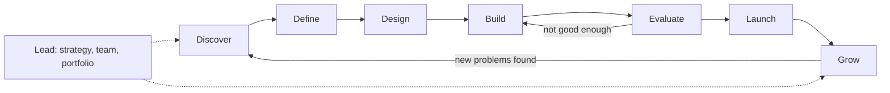
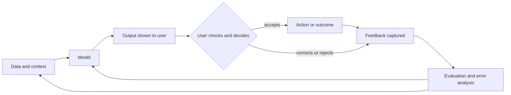
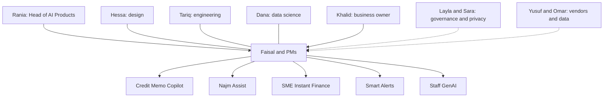

# Module 0 — Orientation

*Before prompts, models or metrics, you need a clear picture of the job. This module explains what AI product management is and what it is not. It shows why AI products behave differently from the software you already know: they are probabilistic, they depend on data, every use costs money, and they only work if people trust them the right amount. It then introduces Najm Bank, the fictional Gulf bank whose Digital & AI Products team you will join for the whole course, with its five AI products and the people who build, sponsor and govern them. It ends with how the course is organised, how to study it, and when to switch to one of the companion courses.*

> **Stages:** All eight, previewed — Discover · Define · Design · Build · Evaluate · Launch · Grow · Lead — the map of the job before we walk it stage by stage.

---

# 0.1 — What AI product management is, and what it is not
*Level: 🟢 Beginner* · *Prerequisites: none* · *Stage: Discover, Lead*

## ⚡ In 60 seconds
- **AI product management** is the work of deciding which AI-powered product to build, for whom, to what quality bar, at what cost and risk, and then proving that it creates value once real people use it.
- It is still product management. You answer the same four questions every product team faces (Marty Cagan's value, usability, feasibility and business viability risks). With AI, each question has new and harder parts.
- It is **not** data science, prompt engineering, project management, governance or "being the AI enthusiast". You work closely with all of those roles, but your job is the product decision and the outcome.
- Decision cue: start from a problem and a measurable outcome ("cut credit memo drafting time without lowering memo quality"), never from a technology ("where can we use GenAI?").
- Biggest trap: **the demo trap**. A demo that works eight times out of ten looks like a product. It is not one until you know how often it fails, what those failures cost, and who catches them.

## 🧭 Why it matters
On Faisal's first Monday as an AI product manager at Najm Bank, Khalid (Head of Retail Lending) stops by his desk. "Our competitors have AI in their apps. I want a ChatGPT-style assistant in ours by the third quarter. Can you write the requirements?" Faisal is keen to impress. By Wednesday he has a twelve-page document listing features: chat, voice, Arabic and English, card controls, a spending coach, loan offers.

Rania (Head of AI Products) reads it and asks four questions. Which customer problem does this solve, and how do we know it is a problem? How good does each answer have to be, and how will we measure that before launch? What does each conversation cost us, and what does the business get back? What happens when the assistant is wrong, and who notices? The document answers none of them. Faisal has written a feature list for a demo, not a plan for a product.

Well-funded organisations have made the same mistake at much larger scale. IBM invested heavily in Watson Health and promoted it for clinical uses such as cancer treatment recommendations. In 2022 IBM sold the Watson Health data and analytics assets. Public reporting described a wide gap between impressive demonstrations and tools that fitted clinicians' real workflows and evidence standards. The product questions (whose job does this improve, how do we prove it works here, what does reliability cost?) were harder than the demo made them look. That gap between "it can do it" and "people rely on it every day" is where AI product managers earn their keep.

## 📐 How it works

### 🟢 The essentials

**What a product manager does.** A product manager (PM) is responsible for making sure the team builds something that is worth building and that it actually works for the people it is meant to serve. Cagan's book *Inspired* frames this as reducing four risks before and during building:

| Risk | The question | Who usually leads on it |
|---|---|---|
| **Value** | Will customers or users choose to use it, or buy it? | Product manager |
| **Usability** | Can they work out how to use it? | Product designer |
| **Feasibility** | Can we build it with the time, skills, data and technology we have? | Engineering lead |
| **Business viability** | Does it work for the rest of the business: cost, legal, brand, sales, support? | Product manager |

The PM does not do all of this alone. They make sure all four risks are addressed, and they own the value and viability questions.

**What AI product management adds.** An AI product is one where a model (software whose behaviour was learned from data rather than written as rules) produces an important part of the output. It might be a machine-learning model predicting a number, such as the chance an invoice is paid, or a large language model (LLM) that generates text. Either way, AI changes each risk:

| Risk | What AI adds |
|---|---|
| Value | Users may like the idea but not trust the output enough to use it. Value depends on quality, and quality varies. |
| Usability | The interface must show uncertainty, invite checking, and make errors easy to fix (Module 4). |
| Feasibility | You often cannot know how good the model will be on *your* data until you try. Feasibility becomes an experiment, not an estimate (Modules 1 and 5). |
| Viability | Every use costs money, errors can create legal and reputational harm, and regulators may classify the use as high-risk (Modules 8 and 9). |

**A working definition.** In this course, AI product management means: *choosing problems where AI can create value, setting the quality bar the AI must meet, designing how people and AI work together, proving quality before and after launch, and managing value, cost and risk over the product's life.* Each module teaches one part of that sentence.

**What AI product management is not.** New AI PMs often drift into a neighbouring role because it feels more concrete. The table shows where the lines usually sit. The lines vary between organisations, but the PM's job never disappears into any of them.

| Role | What they own | Where the PM works with them | What the PM should not do |
|---|---|---|---|
| Data scientist (Dana) | Models, features, statistical evaluation | Agreeing what "good" means and which errors matter most | Choose the model architecture |
| AI or ML engineer (Tariq's team) | Pipelines, prompts in production, serving, latency, cost engineering | Trade-offs between quality, speed and cost | Hand-tune production prompts without tests |
| Product designer (Hessa) | Research, interaction patterns, the experience | How AI output is shown, checked and corrected | Skip user research because "the model will handle it" |
| Governance and risk (Layla) | Risk tiering, policy, approvals | Designing controls into the product early | Treat governance as a gate at the end |
| Project or delivery manager | Plans, dependencies, dates | Sequencing work | Mistake a delivered project for a successful product |
| Business owner (Khalid) | The business line, its P&L and targets | Defining the outcome and the business case | Take the feature list as the requirement |

AI PM is also not **"AI for PMs"** (using AI tools to write specs or summarise interviews); this course is about managing products *that contain AI*. And it is not **evangelism**. A good AI PM kills more AI ideas than they ship (lesson 2.3), because many problems are better solved with a rule, a form or a process change.

### 🟡 Going deeper

**Three kinds of AI product job.** The title "AI product manager" covers different jobs. It helps to know which one you are in.

| Kind | What you manage | Najm example | Main challenge |
|---|---|---|---|
| **AI feature PM** | An AI capability inside an existing product | Smart Alerts inside the mobile app | Fitting AI into an established experience without breaking trust |
| **AI-native product PM** | A product that would not exist without AI | Credit Memo Copilot | Proving the core capability is good enough and worth changing a workflow for |
| **AI platform PM** | Shared capabilities that other teams build on | The model gateway, retrieval service and evaluation tools behind Staff GenAI and the copilot | Internal customers, reuse, cost control, standards |

**The product lifecycle in this course.** Every lesson is tagged with one or two of eight stages. They are not a strict sequence. Real teams loop back constantly, especially between Build and Evaluate.

| Stage | The PM's core question | Typical artefact |
|---|---|---|
| **Discover** | Is there a real problem, and could AI help? | Opportunity brief |
| **Define** | What exactly are we building, and what does "good" mean? | Use-case scorecard, AI spec with quality bars |
| **Design** | How do people and the AI work together? | Interaction design, automation level, error flows |
| **Build** | How do we get to a working version fast and safely? | Prototype, prompt and context design |
| **Evaluate** | Does it actually work, and how do we know? | Eval plan, golden set, error analysis |
| **Launch** | Is it ready for real users, and are they ready for it? | Launch checklist, enablement plan |
| **Grow** | Is it creating value at an acceptable cost, and staying good? | Metrics tree, unit economics, monitoring plan |
| **Lead** | Where should we invest next, and how should the team work? | Strategy, roadmap, operating model |

Two stages matter far more for AI. **Evaluate** stands alone because "it runs without errors" says nothing about whether answers are right. **Grow** carries more weight because quality drifts as data, users and models change (lesson 8.3).

**Frameworks you already know still apply.** The UK Design Council's **Double Diamond** (2005) maps onto Discover and Define (the problem diamond) and Design to Launch (the solution diamond). Eric Ries's **Lean Startup** (2011) build-measure-learn loop fits AI well, if "measure" includes *quality* on a fixed test set, not only usage. Clayton Christensen's **Jobs to be Done** (people "hire" a product to make progress in a situation) keeps you focused on the job, not the model.

### 🔴 Expert view

**From specifying features to specifying behaviour.** In ordinary software the PM describes features and the engineers make them behave exactly as described. In AI products you describe *behaviour and a quality bar*: "for SME credit memos, the draft's financial figures must match the source documents in at least a set percentage of cases on our test set, and the draft must say so when a figure is missing rather than guess". You then agree with Dana how to measure that. Test cases that encode this behaviour, known as **evals**, become part of the requirements (lesson 5.1). A PM who cannot read an evaluation report is guessing about their own product.

**Owning cost as a product decision.** An AI feature often costs money every time it runs. A larger model, more context or a second checking step are product decisions with a price attached, not only engineering details. The PM who owns value must also own **cost to serve** (lesson 8.2).

**Accountability without authority over everything.** When an AI product harms someone, responsibility is shared across the business owner, governance, the builders and the PM. The PM's part is a product designed so that harm is unlikely, visible when it happens and quickly corrected. That means inviting Layla and Sara in during Discover, not the week before launch. The governance detail lives in the companion course *AI Governance: Zero to Hero*; here we stay on the product decision.

**What "hero" means here.** By the end you should be able to take a vague request like Khalid's all the way to a product in production, and hold your own with engineers, data scientists, risk officers and executives. Module 10's capstone asks you to do exactly that for Najm Assist.

## 🧰 The toolkit
| Tool or framework | What it is and does | When to reach for it |
|---|---|---|
| **Four big risks** (Marty Cagan, *Inspired*) | Value, usability, feasibility and business viability: the four ways a product fails | At the start of any AI idea, to see which risk is biggest and test it first |
| **Jobs to be Done** (Clayton Christensen; Anthony Ulwick's Outcome-Driven Innovation) | Frames demand as the progress a person is trying to make in a situation | When a request arrives as a technology ("add a chatbot") and you need the underlying job |
| **Double Diamond** (UK Design Council, 2005) | Diverge then converge twice: on the problem, then on the solution | To stop the team jumping to a solution before the problem is clear |
| **Lean Startup build-measure-learn** (Eric Ries, 2011) | Small experiments, measured, to learn fast before scaling | When feasibility or value is uncertain, which with AI is usually |
| **Product lifecycle stages** (this course) | Discover, Define, Design, Build, Evaluate, Launch, Grow, Lead, with a core question and artefact per stage | To locate where a product is and what decision is due next |

## 🏛️ In practice at Najm Bank
After the review, Rania gives Faisal two things. The first is the **AI PM role card** she gives every new PM on her team:

| | Faisal on Najm Assist |
|---|---|
| **Owns** | The customer problem and target outcome; the quality bar (agreed with Dana); scope and automation level; the business case; the launch decision recommendation; post-launch metrics |
| **Shares** | Experience design (with Hessa); evaluation design (with Dana); cost and latency trade-offs (with Tariq); risk controls (with Layla and Sara) |
| **Advises on** | Model and vendor choice (Tariq, Dana, Yusuf decide); governance tier (Layla decides) |
| **Does not own** | Model architecture; production prompt changes without tests; the final risk approval; Khalid's P&L |

The second is a **reframed request**, which Faisal rewrites with Khalid in one page:

| Field | Before (Khalid's ask) | After (reframed) |
|---|---|---|
| Problem | "We need an AI assistant like competitors" | Many contact-centre calls are simple questions about fees, card status and transfers that customers could answer themselves if the answers were easy to find |
| Who | "All customers" | Retail app users in Qatar and the UAE, Arabic and English |
| Outcome | "Launch by Q3" | Fewer simple calls, with customer satisfaction at least as high as today and no rise in complaints about wrong information |
| Quality bar | Not stated | Answers grounded in approved bank content; hands over to a human when unsure; error rate on a test set agreed before pilot |
| Cost | Not stated | Cost per resolved conversation estimated before build and tracked after launch |
| First step | Build | Two weeks of discovery: listen to calls, sample contact-centre data, test answers on a small prototype |

Khalid agrees to the outcome, because it is written in his language: calls, satisfaction and complaints.

## 🛠️ Exercises
- 🟢 Pick an AI feature you use (a spam filter, a photo search, a writing assistant). Write one sentence for each of Cagan's four risks as they apply to it. *Done when:* you have four sentences, and at least two mention something specific to AI (errors, data, cost or trust).
- 🟡 Take a technology-first request you have heard ("we need an AI chatbot", "let's use GenAI for reports") and reframe it with the table in 🏛️: problem, who, outcome, quality bar, cost, first step. *Done when:* the outcome is measurable and says nothing about which technology to use.
- 🔴 Write a role card like Rania's for an AI product in your own organisation, and show it to one engineer and one risk or compliance colleague. *Done when:* both agree with the "Owns" and "Does not own" rows, or you have written down where they disagree and why.

## ⚠️ Mistakes and traps
- **Starting from the technology.** "Where can we use GenAI?" produces demos. Start from a job, a workflow and a measurable outcome.
- **Confusing a demo with a product.** A demo shows that the model *can* succeed. A product needs to know *how often* it fails and what happens then. Ask for an error rate on representative cases before anyone says "it works".
- **Becoming the prompt engineer.** Tuning prompts yourself feels productive, but it leaves nobody owning the outcome. Contribute examples and quality criteria. Leave production changes to a tested process.
- **Treating governance as the last gate.** Bringing Layla in at launch turns a small design change into a delay. Invite risk and privacy colleagues in during Discover.
- **Measuring launch instead of outcome.** "Shipped by Q3" is a project milestone. Agree an outcome metric and a quality bar before building.

## 🧾 Recap
- AI product management is product management with four harder conditions: variable quality, dependence on data, cost per use and fragile trust.
- Cagan's four risks still frame the job. AI adds new questions to each one.
- The AI PM owns the problem, the outcome, the quality bar and the business case. They share design, evaluation, cost and risk decisions with specialists.
- The course follows eight lifecycle stages. Evaluate and Grow matter more for AI than for ordinary software.
- The most common failure is the demo trap: mistaking "it can" for "it reliably does, here, for these people, at this cost".

## ✍️ Check yourself

**1. Khalid asks Faisal to "add an AI assistant to the app by Q3". What should Faisal do first?**

- A. Write detailed feature requirements so engineering can start
- B. Ask Tariq to choose a model vendor
- C. Reframe the request around a customer problem, a measurable outcome and a quality bar, then run short discovery
- D. Build a demo to show Khalid within a week

Answer

**C.** The PM's first job is to turn a technology request into a problem and an outcome, then test whether the problem is real. A demo (D) is tempting because it looks like progress, but it skips the value and quality questions and leads straight into the demo trap. (🧭 Why it matters; 🏛️ In practice.)

**2. Which of Cagan's four risks is MOST changed by the fact that you often cannot know how well a model will perform on your data until you try it?**

- A. Value
- B. Usability
- C. Feasibility
- D. Business viability

Answer

**C.** With AI, feasibility becomes an experiment rather than an estimate, because performance on your data is uncertain until tested. Value (A) is also affected, but the specific point about not knowing model performance in advance is a feasibility question. (🟢 The essentials.)

**3. At Najm Bank, who should decide the model architecture for SME Instant Finance?**

- A. The AI product manager, because they own the product
- B. The data science and engineering leads, with the PM setting the quality bar and trade-offs
- C. The Head of AI Governance
- D. The business owner, because they fund it

Answer

**B.** The PM owns *what good means* and the trade-offs. Specialists choose *how* to achieve it. Option A is the tempting mistake: owning the product does not mean owning every technical decision. (🟢 The essentials, role table; 🏛️ role card.)

**4. Which statement best describes the difference between an AI feature PM and an AI platform PM?**

- A. The feature PM works on generative AI; the platform PM works on classic machine learning
- B. The feature PM manages an AI capability inside a product for end users; the platform PM manages shared AI capabilities that other internal teams build on
- C. The platform PM only manages vendors
- D. There is no real difference; the titles are interchangeable

Answer

**B.** The difference is who the customer is: end users of one product, or internal teams using shared services. The type of AI (A) does not define the role. (🟡 Going deeper.)

**5. A team says its new AI summariser "works" because it produced good summaries in every demo to leadership. What is the most useful next question from the PM?**

- A. "Can we make the interface more attractive?"
- B. "How often does it fail on a representative set of real documents, what kinds of failure are they, and who would catch them?"
- C. "Which competitor has a similar feature?"
- D. "Can we launch to everyone next week?"

Answer

**B.** Demos show the model *can* succeed. Product decisions need the failure rate on representative cases and a plan for catching failures. Option D follows from the demo trap. (⚡ In 60 seconds; ⚠️ Mistakes and traps.)

## 📚 References
- Marty Cagan, *Inspired: How to Create Tech Products Customers Love*, 2nd ed. (Wiley, 2017) — https://www.svpg.com
- Clayton M. Christensen, Taddy Hall, Karen Dillon and David S. Duncan, *Competing Against Luck* (Harper Business, 2016)
- Anthony W. Ulwick, *Jobs to Be Done: Theory to Practice* (Idea Bite Press, 2016) — https://strategyn.com
- UK Design Council, the Double Diamond — https://www.designcouncil.org.uk
- Eric Ries, *The Lean Startup* (Crown Business, 2011) — https://theleanstartup.com
- Google PAIR, People + AI Guidebook — https://pair.withgoogle.com/guidebook

---

# 0.2 — How AI products differ: probabilistic, data-hungry, costly per use, trust-bound
*Level: 🟢 Beginner* · *Prerequisites: 0.1* · *Stage: Define, Evaluate*

## ⚡ In 60 seconds
- AI products differ from ordinary software in four ways that change almost every product decision. They are **probabilistic**, **data-hungry**, **costly per use** and **trust-bound**.
- **Probabilistic:** the same input can give different outputs, and some outputs will be wrong. Quality is a *rate* measured on representative cases, not a yes/no test.
- **Data-hungry:** what the product knows and how well it performs depends on data you must have the right to use, keep clean and keep current.
- **Costly per use:** many AI features cost money every time they run, so success raises costs. Cost per task is a product metric.
- **Trust-bound:** value only appears when people rely on the output the right amount: not blindly, and not so little that they redo the work.
- Biggest trap: writing a spec as if the AI will behave like a deterministic feature ("the assistant answers fee questions correctly") with no error rate, no cost estimate and no plan for when it is wrong.

## 🧭 Why it matters
In 2022 a passenger asked Air Canada's website chatbot about bereavement fares. The chatbot told him he could apply for the discount after travelling. The airline's own policy said otherwise. When he claimed the refund, the airline argued that the chatbot was in effect a separate entity responsible for its own statements. In *Moffatt v. Air Canada* (2024), British Columbia's Civil Resolution Tribunal rejected that argument and held the airline responsible for what its chatbot said. The amount was small. The lesson was large: the customer does not care that the answer came from a model. The company owns it.

Two weeks into discovery, Faisal shows Khalid a Najm Assist prototype. It answers twenty prepared questions about fees and cards perfectly, in Arabic and English. Then Hessa runs a session with ten real customers typing their own questions. One asks about the fee for an international transfer from a savings account. The prototype gives a confident answer that mixes up two fee schedules. Another asks the same question twice and gets two differently worded answers, one of which leaves out a condition. Nobody in the room had seen this in the demo.

Nothing was "broken"; the prototype did what language models do. Faisal's plan had assumed a normal app feature.

## 📐 How it works

### 🟢 The essentials

The table compares a traditional software feature with an AI feature on the four differences.

| | Traditional software | AI product |
|---|---|---|
| **Behaviour** | Deterministic: same input, same output, every time | Probabilistic: outputs vary, and a share of them are wrong |
| **What makes it work** | Code written by engineers | Code *plus* a model whose behaviour comes from data |
| **Cost of each use** | Close to zero once built | Often a real cost per request, which grows with usage |
| **User relationship** | Users expect it to be right and it usually is | Users must learn when to rely on it and when to check |

**1. Probabilistic.** A traditional feature, such as a fee calculator, follows rules. If it gives the wrong answer, that is a bug you can find and fix, and after the fix it is right every time. An AI model produces the *most likely* output given what it learned. Most of the time that output is good. Some of the time it is not, and you cannot list every case in advance.

Generative models often run with deliberate randomness, set by **temperature**: higher values give more varied outputs, lower values more consistent ones. Even at low settings, a slightly reworded question can get a different answer. When a language model states something false with confidence, people call it a **hallucination** (lesson 1.2).

The product consequence is that "does it work?" stops being a yes/no question. It becomes "how often is it right on the cases that matter, and what happens when it is wrong?" You answer that with a **golden set**: a fixed collection of realistic inputs with known good answers, used to measure quality the same way every time (lesson 6.1).

**2. Data-hungry.** An AI product's behaviour depends on data at three points:
- **Training data:** what the model learned from. For SME Instant Finance, that is Najm's history of invoices, repayments and defaults. For a vendor LLM, it is data you did not choose and cannot fully inspect.
- **Context data:** what the product gives the model at the moment it runs. For Najm Assist, that is the approved fee schedules and product terms it retrieves before answering (a pattern called retrieval-augmented generation, or RAG, covered in lesson 1.3).
- **Feedback data:** what you learn from use, such as corrections, ratings and outcomes. This is how the product improves (lesson 3.2).

If the fee schedule the assistant retrieves is out of date, the answer will be wrong, however good the model is. If Najm has no right to use customer chats for improvement, the feedback loop is closed. Data readiness is a product question, not only an engineering one (Module 3).

**3. Costly per use.** Many AI features, especially generative ones, cost money each time they run. Language models are usually priced per **token**, a chunk of text roughly the size of a short word or part of a word, counted separately for input (what you send) and output (what comes back). The method for estimating cost is simple arithmetic:

> cost per task = (input tokens × input price) + (output tokens × output price), summed over every model call the task makes

An **illustrative** example with made-up round numbers (real prices change often, so always check current ones): suppose drafting one credit memo sends 30,000 input tokens and gets back 3,000 output tokens, at say $3 per million input tokens and $15 per million output tokens. That is $0.09 + $0.045 ≈ $0.14 per draft. That is trivial next to hours of a relationship manager's time. Applied to Najm Assist at thousands of conversations a day, several calls each, the same arithmetic produces a monthly bill someone must justify. Classic ML models such as Smart Alerts are usually much cheaper per prediction, but they still carry infrastructure, monitoring and retraining costs.

The product consequence: the more successful the feature, the higher the bill. Cost per task belongs next to quality and adoption on the PM's dashboard (Module 8).

**4. Trust-bound.** An AI product only creates value when people act on its output. If relationship managers do not trust the Credit Memo Copilot, they rewrite every draft and save no time. If they trust it too much, they paste a wrong figure into a credit committee pack. The goal is **calibrated trust**: reliance that matches how reliable the product actually is, case by case. The Google PAIR team's People + AI Guidebook and Microsoft's Guidelines for Human-AI Interaction (Amershi et al., 2019) both treat this as a core design goal. Guidelines such as "make clear how well the system can do what it can do" and "support efficient correction" exist because of it (Module 4).

Trust also breaks in public. Google's Bard launch demo (February 2023) contained a factual error about the James Webb Space Telescope. In December 2023 users manipulated a Chevrolet dealer's website chatbot into "agreeing" to sell a car for $1. In January 2024 DPD's parcel chatbot swore at a customer after a system update. Each was small in money and large in reputation.

### 🟡 Going deeper

**Predictive and generative products differ too.** Najm has both kinds, and the four differences show up in different ways.

| | Predictive ML (SME Instant Finance, Smart Alerts) | Generative AI (Credit Memo Copilot, Najm Assist) |
|---|---|---|
| Output | A score, a class or a number | Open-ended text, and sometimes actions |
| What "wrong" looks like | A misclassification: a bad invoice approved, a genuine payment flagged | A plausible but false statement, an omission, the wrong tone, an unsafe action |
| How quality is measured | Standard metrics on labelled data: precision, recall, error rates | Rubrics, reference answers, human review, LLM-as-judge (lesson 6.2) |
| Where the cost is | Building, validating and monitoring the model | Every call, plus evaluation and human review |
| Main trust risk | Opaque decisions affecting people (credit), alert fatigue | Confident wrong answers, over-reliance |

For predictive products, the **confusion matrix** is the basic tool. It is a two-by-two table counting true positives, false positives, true negatives and false negatives. It makes you ask which error is worse. For Smart Alerts, a false positive annoys a customer with a needless alert. A false negative lets fraud through. You cannot minimise both at once, so the PM must help choose the trade-off (lesson 6.1).

**The AI product loop.** Because behaviour depends on data and use, an AI product is a loop rather than a one-way pipeline:

Each box is a PM decision: which data goes in, which model, how output is shown, how easy correction is, what feedback you may capture, and how often quality is re-measured.

**What changes in day-to-day PM work.** The four differences turn into concrete practice changes:

| Traditional habit | AI product practice | Where in the course |
|---|---|---|
| Acceptance criteria as pass/fail | Quality bars as rates on a golden set, split by case type | 5.1, 6.1 |
| Estimate effort, then build | Prototype early to find out what is feasible | 5.2 |
| Test once before release | Evaluate continuously; models, data and vendors change | 6.3, 8.3 |
| Cost is a one-off build budget | Cost per task is a running metric | 8.2 |
| Design the happy path | Design for errors, uncertainty and recovery first | 4.2 |
| Users read a manual | Users need help to calibrate trust | 4.2, 7.3 |

### 🔴 Expert view

**Uneven capability.** AI capability is not smooth. A model may do a hard task well and then fail an easy-looking one next to it. A 2023 working paper by Fabrizio Dell'Acqua and colleagues (Harvard Business School, with Boston Consulting Group consultants) described this as a "jagged technological frontier". In their experiment, consultants using an LLM did better on tasks inside the frontier and worse on a task outside it. The product lesson: map where *your* product's frontier lies with your own evaluation, case type by case type, not from the average.

**Errors compound in multi-step products.** When an agent performs several steps in a row, per-step reliability multiplies. As an illustration only, assuming each step succeeds independently 95% of the time, a ten-step task succeeds end to end only about 60% of the time (0.95 to the power of 10 ≈ 0.60). Real steps are not independent, and real rates vary, but the direction holds. It is why Najm Assist starts by answering questions before it is allowed to act (lesson 4.3), and why the companion course *Production AI Agents* spends so much time on checkpoints and recovery.

**The ground moves under you.** Vendors update and retire models, and a prompt that worked last month may behave differently after an update (the DPD incident followed a system update). Pin model versions, test them and upgrade deliberately (lesson 9.2).

**Cost and quality are measured together.** Klarna announced in February 2024 that its AI assistant was handling a large share of its customer-service chats. In 2025 the company said it would bring more human customer service back, with reporting pointing to service quality. The public lesson for PMs: a metric that captures savings but not resolution quality will mislead you. Put quality and trust measures next to cost (Module 8).

**Error costs are asymmetric.** A wrong answer about branch hours and a wrong answer about a transfer fee are both "one error" in a raw count, with very different consequences. Weight errors by severity and set stricter bars where they can cause financial loss, legal exposure or unfair treatment. SME Instant Finance makes credit decisions that can affect sole traders and guarantors, so its bars and oversight are set with Layla's team (detail in *AI Governance: Zero to Hero*).

## 🧰 The toolkit
| Tool or framework | What it is and does | When to reach for it |
|---|---|---|
| **Golden set** | A fixed, representative set of inputs with known good outputs, used to measure quality the same way every time | Before claiming anything "works", and every time the model, prompt or data changes |
| **Confusion matrix** | Counts of true and false positives and negatives for a classifier | To discuss which error is worse and choose a threshold with the business |
| **Cost-per-task model** | Tokens or compute per task × unit price × calls per task × volume | Before build, to test viability; after launch, to track cost as usage grows |
| **People + AI Guidebook** (Google PAIR) | Practical guidance on user needs, trust, explanations, feedback and errors in AI products | When designing how users see, check and correct AI output |
| **Guidelines for Human-AI Interaction** (Amershi et al., Microsoft, CHI 2019) | 18 research-based guidelines for AI behaviour before, during and after interaction and over time | As a design review checklist for any AI feature |

## 🏛️ In practice at Najm Bank
After the customer session, Rania asks Faisal to fill in her **AI difference check**, a one-page table every AI product at Najm completes before its spec is written. Here is Faisal's version for Najm Assist's first release (fee and card questions only):

| Difference | Question to answer | Najm Assist answer | What goes into the spec |
|---|---|---|---|
| Probabilistic | What kinds of wrong answer are possible, and which are worst? | Wrong fee amount or condition (worst); outdated information; answering outside its scope; inconsistent answers to the same question | Golden set of about 200 real, anonymised customer questions across fee types and both languages; a stricter bar for fee amounts; must hand over to a human when retrieved content does not cover the question |
| Data-hungry | Which data does it rely on, and do we have the right to use it? | Approved fee schedules and product terms; anonymised past chats for testing | Content owner for each source; update process when fees change; Sara to confirm whether chat logs may be used for evaluation |
| Costly per use | What does one conversation cost, and at what volume does it matter? | Illustrative estimate from Tariq, based on expected tokens and calls per conversation | Cost per resolved conversation as a tracked metric; a monthly budget alert |
| Trust-bound | How will customers know when to rely on it, and how do they recover from errors? | Customers may treat any figure as a commitment by the bank (compare the Air Canada ruling) | Show the source document for every fee answer; one tap to reach a human; clear wording that the assistant answers from Najm's published information |

Faisal's spec line "the assistant answers fee questions correctly" becomes four measurable requirements, and Khalid gets a narrower, safer first version with its quality bar written before build.

## 🛠️ Exercises
- 🟢 For an AI product you use every day, write one example of each of the four differences in action. *Done when:* you have four examples, each tied to something you have actually seen or can check.
- 🟡 Use the cost-per-task formula with illustrative numbers you choose and state. Estimate the monthly model cost of an assistant handling 5,000 conversations a day, averaging three model calls per conversation. *Done when:* every assumption is written down and labelled illustrative, and you can say which assumption the result is most sensitive to.
- 🔴 Complete the AI difference check for the Credit Memo Copilot. *Done when:* each row names at least one specific failure type, one data source with an owner, one cost driver and one trust risk, and each row produces a requirement you could test.

## ⚠️ Mistakes and traps
- **Pass/fail acceptance criteria for AI behaviour.** "It answers correctly" cannot be tested. Write rates on a named golden set, with stricter bars for high-severity cases.
- **Judging quality from a demo or a handful of tries.** Prepared questions hide variability. Test with real users' own inputs and repeat the same inputs to see variation.
- **Ignoring cost until the invoice arrives.** Estimate cost per task before build and track it after launch. Cost grows with success.
- **Assuming the data is ready.** Stale or unowned content produces wrong answers from a good model. Name an owner and an update process for every source.
- **Designing for trust as "make users trust it".** The goal is *calibrated* trust. Show sources, signal uncertainty and make correction easy.
- **Treating the model as fixed.** Vendors update models. Pin versions and re-run your evals before switching.

## 🧾 Recap
- **Probabilistic:** quality is a rate on representative cases, so golden sets and error analysis replace pass/fail tests.
- **Data-hungry:** training, context and feedback data decide behaviour, and data rights decide what you may use.
- **Costly per use:** cost per task is a product metric, and it rises with adoption.
- **Trust-bound:** value depends on calibrated reliance, which is designed through sources, uncertainty signals and easy correction.
- Predictive and generative products fail in different ways and are measured differently, but all four differences apply to both.

## ✍️ Check yourself

**1. Faisal's spec says: "Najm Assist answers fee questions correctly." What is the best rewrite?**

- A. "Najm Assist answers fee questions correctly and quickly"
- B. "Najm Assist meets an agreed accuracy rate on a golden set of real fee questions in both languages, with a stricter bar for fee amounts, and hands over to a human when its sources do not cover the question"
- C. "Najm Assist uses the most accurate model available"
- D. "Najm Assist is tested by the product team before launch"

Answer

**B.** Probabilistic behaviour needs a measurable rate on a defined set, severity-weighted bars and a fallback. Option C is tempting but names an input, not a requirement. A "best" model can still fail on your data. (🟢 Probabilistic; 🏛️ In practice.)

**2. Illustratively, a task sends 20,000 input tokens and receives 2,000 output tokens, at $2 per million input tokens and $10 per million output tokens. What is the model cost per task?**

- A. $0.02
- B. $0.04
- C. $0.06
- D. $0.24

Answer

**C.** 20,000 × $2 / 1,000,000 = $0.04, plus 2,000 × $10 / 1,000,000 = $0.02, gives $0.06. Option B counts only the input tokens. (🟢 Costly per use.)

**3. Relationship managers using the Credit Memo Copilot have started pasting its drafts straight into credit committee packs without checking the figures. Which difference is this mainly about?**

- A. Costly per use
- B. Data-hungry
- C. Trust-bound: reliance is higher than the product's reliability justifies
- D. None; this is a training issue only

Answer

**C.** This is over-reliance, a failure of calibrated trust. Training helps (D), but the product itself must support checking, for example by showing sources and flagging figures it could not verify. (🟢 Trust-bound.)

**4. For Smart Alerts, which tool best helps Khalid and Dana discuss whether to flag more transactions and accept more false alarms?**

- A. A cost-per-task model
- B. A confusion matrix
- C. A temperature setting
- D. A Double Diamond

Answer

**B.** The confusion matrix makes the trade-off between false positives (needless alerts) and false negatives (missed fraud) explicit. Temperature (C) is a setting for generative models, not a way to reason about classifier errors. (🟡 Going deeper.)

**5. Assume, for illustration, that each step of a five-step agent task succeeds independently 90% of the time. Roughly how often does the whole task succeed?**

- A. 90%
- B. About 75%
- C. About 59%
- D. About 45%

Answer

**C.** 0.9 to the power of 5 ≈ 0.59. Per-step reliability multiplies across steps. Option A is the intuitive but wrong answer that ignores compounding. (🔴 Expert view.)

## 📚 References
- *Moffatt v. Air Canada*, 2024 BCCRT 149, British Columbia Civil Resolution Tribunal — https://civilresolutionbc.ca
- Google PAIR, People + AI Guidebook — https://pair.withgoogle.com/guidebook
- Saleema Amershi et al., "Guidelines for Human-AI Interaction", CHI 2019 — https://www.microsoft.com/en-us/research/project/guidelines-for-human-ai-interaction/
- Fabrizio Dell'Acqua et al., "Navigating the Jagged Technological Frontier", Harvard Business School Working Paper 24-013 (2023) — https://www.hbs.edu
- NIST, AI Risk Management Framework 1.0 (2023) — https://www.nist.gov/itl/ai-risk-management-framework

---

# 0.3 — Meet Najm Bank's AI product team, and how to use this course
*Level: 🟢 Beginner* · *Prerequisites: 0.1* · *Stage: Discover, Lead*

## ⚡ In 60 seconds
- **Najm Bank is fictional.** It is a mid-sized Gulf bank headquartered in Doha, with retail, SME and corporate customers in Qatar, the UAE and the EU. You join its **Digital & AI Products** team for the whole course.
- You will follow **five products**: Credit Memo Copilot, Najm Assist, SME Instant Finance, Smart Alerts and Staff GenAI. Between them they cover generative and predictive AI, internal and customer-facing use, and assistants that grow into agents.
- You will work with **a recurring cast**: Rania (your mentor), Faisal (your peer, who makes the mistakes you should avoid), Hessa, Tariq, Dana, Khalid, Layla, Sara, Yusuf and Omar.
- Every lesson has the same ten sections, a level (🟢 🟡 🔴), one or two lifecycle stages, a Najm artefact, three graded exercises and five questions.
- This course is the **product layer**. For engineering depth, agents, SaaS plumbing or governance, it points you to its four companion courses.
- Best way to study: build your own version of each Najm artefact for a real or realistic product. By Module 10 you will have a portfolio.

## 🧭 Why it matters
Frameworks are easy to nod along to and hard to apply. "Set a quality bar" means little until you set one for a credit memo a committee will read, with a sceptical business owner, a data scientist who wants more time and a governance lead who wants evidence. A running case gives every idea a place to land: the same products move from idea to growth, argued over by the same people.

Faisal's first day shows why this matters. Rania gives him a one-page map of the team's portfolio and a list of people to meet in his first two weeks. "Half of this job," she tells him, "is knowing which of these people needs to be in the room for which decision, and what each of them will worry about." By the end of this lesson you will have the same map.

## 📐 How it works

### 🟢 The essentials

**Najm Bank at a glance.** Najm is fictional; any resemblance to a real institution is unintended. The same bank appears in the companion course *AI Governance: Zero to Hero*, where you see it from the governance team's side. Here you sit with the product team.

| Fact | Detail |
|---|---|
| Type | Mid-sized commercial bank: retail, SME and corporate lending, cards, deposits |
| Headquarters | Doha, Qatar, supervised by the Qatar Central Bank |
| Other operations | A subsidiary in the UAE; a branch in Frankfurt serving EU customers |
| Customers | Individuals and businesses in Qatar and the UAE; EU-resident customers through Frankfurt |
| Languages | Arabic and English for customers and staff |
| The team you join | Digital & AI Products, led by Rania, working with engineering, data science, design, the business lines, and governance and privacy |

Three jurisdictions matter for product decisions: a feature launched in Doha may need changes before it reaches Frankfurt. You will not learn those rules in depth here, but you will learn when to ask.

**The cast.** Learn what each person cares about. Real AI product work is mostly getting these people to agree on a decision.

| Person | Role | What they care about | The question they always ask |
|---|---|---|---|
| **Rania** | Head of AI Products (your mentor) | Products that create real value and earn trust | "What problem, what outcome, and how will we know?" |
| **Faisal** | AI product manager (your peer) | Shipping something impressive, fast | "Can we demo it next week?" |
| **Hessa** | Product designer | Real users, their workflows and how they recover from errors | "Have we watched anyone actually use it?" |
| **Tariq** | Engineering lead | Platform, reliability, latency and cost | "What does each request cost, and how fast is it?" |
| **Dana** | Lead data scientist | Models, sound evaluation, honest numbers | "Measured on what data, against what baseline?" |
| **Khalid** | Head of Retail Lending (business owner) | Growth, efficiency, return on investment | "What does the business get back, and when?" |
| **Layla** | Head of AI Governance | Risk tiering, controls and approvals | "What is the risk tier, and who signs off?" |
| **Sara** | Data Protection Officer | Lawful use of personal data, customers' rights | "Which personal data, on what legal basis?" |
| **Yusuf** | Procurement | Vendor terms, cost, supplier risk | "What does the contract say about our data and their model?" |
| **Omar** | Chief Data Officer | Data platforms, quality and ownership | "Which data do you need, and who owns it?" |

Faisal is deliberately imperfect: he jumps to solutions, trusts demos and forgets cost. Whenever he acts, ask what Rania would do instead.

**The five products.** Each one teaches something different, and each returns in several modules.

| Product | What it is | Kind of AI | Users | Why it is in the course |
|---|---|---|---|---|
| **Credit Memo Copilot** (flagship) | Drafts credit memos for relationship managers from client documents and financials | Generative (LLM with retrieval) | Internal: relationship managers and credit teams | Workflow change, quality bars for long documents, human review, cost per draft |
| **Najm Assist** | The customer assistant in the mobile app; starts by answering questions, later performs tasks like freezing a card or disputing a transaction | Generative, growing into an agent | Retail customers, Arabic and English | Trust, conversational design, guardrails, the step from answering to acting |
| **SME Instant Finance** | Pre-approves small invoice-financing requests | Predictive ML (a scoring model) | SME customers; credit staff for referrals | High-stakes decisions, error trade-offs, explanations, fairness, regulation |
| **Smart Alerts** | Fraud and spending alerts to customers | Classic ML (classification) | Retail customers; the fraud team | Precision and recall, thresholds, alert fatigue |
| **Staff GenAI** | Internal assistant for employees | Generative, largely bought or built on a vendor platform | All staff | Build versus buy, adoption, change management, acceptable use |

Dotted lines mark people whose input or approval you need at specific points; leaving them until the end is a classic way to be late.

### 🟡 Going deeper

**How the course is organised.** Eleven modules take you from zero to hero. Levels rise as you go: 🟢 Beginner in Modules 0–1, 🟡 Intermediate in 2–6, 🔴 Advanced in 7–10.

| Module | Topic | Main stages |
|---|---|---|
| 0 | Orientation | All, previewed |
| 1 | AI literacy for product people | Discover, Define |
| 2 | Finding problems worth solving | Discover |
| 3 | Data as the product's foundation | Define |
| 4 | Designing AI experiences | Design |
| 5 | Specifying and building | Define, Build |
| 6 | Evaluation: knowing it works | Evaluate |
| 7 | Launching AI products | Launch |
| 8 | Metrics, economics and growth | Grow |
| 9 | Strategy and leadership | Lead |
| 10 | Capstone and practice exam | All |

**The anatomy of a lesson.** Every lesson has the same ten sections, so you always know where to look:

| Section | What it gives you |
|---|---|
| ⚡ In 60 seconds | The core ideas, the decision cue and the biggest trap. Read it first, and again when revising |
| 🧭 Why it matters | A Najm scenario or a real public case that makes the topic concrete |
| 📐 How it works | Three layers: 🟢 essentials, 🟡 going deeper, 🔴 expert view |
| 🧰 The toolkit | The named frameworks and tools for the topic, with credit to their authors |
| 🏛️ In practice at Najm Bank | The artefact the lesson produces: a brief, scorecard, spec, eval plan, checklist or metrics tree |
| 🛠️ Exercises | Three graded tasks, each with a "*Done when:*" line so you know when you have finished |
| ⚠️ Mistakes and traps | What goes wrong in practice, and what to do instead |
| 🧾 Recap | What to remember |
| ✍️ Check yourself | Five questions, mostly scenarios, with explained answers |
| 📚 References | Books, papers and official pages to go further |

Beginners can read 🟢 first and skim the rest; practitioners can skim 🟢 and focus on 🟡 and 🔴.

**The companion courses.** This course sits on top of four others in the same library. It deliberately does not re-teach them.

| Companion course | Go there when you need… | Where this course points to it |
|---|---|---|
| *System Design for Vibe Coders* | How the systems behind a product fit together: APIs, databases, caching, queues, scaling | Build and Grow lessons, when latency, reliability or architecture shape a product choice |
| *SaaS Building Blocks* | The standard parts of a software product: authentication, billing, multi-tenancy, notifications | Launch and pricing lessons |
| *Production AI Agents* | Engineering agents that use tools, keep memory, recover from errors and run safely in production | Lesson 4.3 and the Najm Assist agent story |
| *AI Governance: Zero to Hero* | Risk tiering, the EU AI Act, privacy law, impact assessments, AI management systems | Every time a product decision touches regulation, especially in Modules 3, 7 and 9 |

The rule of thumb: when the question is "*should* we, for whom, and how good must it be?", stay here. When it is "*how* exactly is this built?" or "*what exactly* does the law require?", go to the companion course, then come back with the answer.

### 🔴 Expert view

**Four ways through the course.** The modules are written in order, but not everyone needs every lesson at the same depth.

| You are… | Suggested path |
|---|---|
| New to product and to AI | Everything in order. Do the 🟢 and 🟡 exercises; save 🔴 for a second pass |
| An engineer or data scientist moving into product | Skim Module 1. Go deep on Modules 2, 4, 7 and 8, where product judgement matters most |
| A manager or sponsor of AI products | Modules 0, 2.2, 2.3, 7, 8 and 9. Use the 🏛️ artefacts as templates to ask your teams for |
| Already working as an AI PM | Take the practice exam in 10.3 first as a diagnostic, then study the lessons behind the questions you missed |

**Build a portfolio as you go.** Each 🏛️ section is a template. If you redo it for a product you know (at work, a side project, or a realistic invented one), you end with a set of artefacts: opportunity brief, use-case scorecard, AI spec, eval plan, launch checklist, metrics tree, strategy. Lesson 10.2 shows how to turn these into interview material. Keep anything confidential out of it. Invent a product if you must, the way this course invented Najm.

**Use AI while you learn, carefully.** An AI assistant can quiz you or critique your artefacts. Treat its output as this course teaches: check numbers, dates, legal points and prices against the lesson or a primary source.

**How the course handles facts.** Prices, context sizes and vendor features change monthly, so lessons teach methods rather than today's numbers. Numbers are marked illustrative or dated "at the time of writing (2026)", and real cases are limited to well-documented public events. This course is independent, is not affiliated with any certification body, and is not legal advice.

## 🧰 The toolkit
| Tool or framework | What it is and does | When to reach for it |
|---|---|---|
| **Stakeholder map** (power/interest grid, often credited to Aubrey Mendelow) | Places each stakeholder by their influence over and interest in a product, to decide how to involve them | In your first week on any AI product, and again before launch |
| **RACI matrix** | For each decision: who is Responsible, Accountable, Consulted and Informed | When a decision keeps bouncing between people, or approval surprises you late |
| **AI product portfolio map** (this course) | One table listing each AI product with its kind of AI, users, stage, owner, risk tier and main open question | To see the whole portfolio, spot shared dependencies and brief a new team member |
| **Product lifecycle stages** (this course) | Discover, Define, Design, Build, Evaluate, Launch, Grow, Lead, with a core question and artefact per stage | To locate each product and name the next decision due |

## 🏛️ In practice at Najm Bank
Rania's **AI product portfolio map**, the page she gives Faisal on day one. Stages and tiers are illustrative starting points; they change as the course goes on.

| Product | Kind of AI | Users | Current stage | Business owner | Provisional risk tier (Layla) | Main open question |
|---|---|---|---|---|---|---|
| Credit Memo Copilot | Generative with retrieval | Relationship managers | Build | Head of Corporate Banking | Medium | Can drafts meet the quality bar on figures without adding review time? |
| Najm Assist | Generative, becoming an agent | Retail customers | Discover | Khalid | Medium, rising to high once it can act | Which questions should it answer, and when should it hand over? |
| SME Instant Finance | Predictive ML | SME customers, credit staff | Define | Head of SME Banking | High | Which decisions can be automated, and which need a person? |
| Smart Alerts | Classic ML | Retail customers, fraud team | Grow | Head of Fraud | Medium | Are customers ignoring alerts because there are too many? |
| Staff GenAI | Generative, vendor platform | All staff | Launch | Omar | Low to medium, depending on use | Will staff adopt it, and will they keep sensitive data out of other tools? |

Her second page is a **RACI** for the Credit Memo Copilot's pilot launch decision:

| Decision task | Rania | Faisal | Dana | Tariq | Hessa | Head of Corporate Banking | Layla | Sara |
|---|---|---|---|---|---|---|---|---|
| Set quality bar | C | R | R | C | C | A | C | I |
| Run evaluation | I | C | R/A | C | I | I | I | I |
| Confirm risk tier and controls | I | C | C | C | I | C | R/A | C |
| Confirm data use | I | C | I | C | I | I | C | R/A |
| Recommend go or no-go | A | R | C | C | C | C | C | C |
| Final go decision | C | I | I | I | I | A | C | I |

Faisal's comment on reading it: "So I recommend and the business decides, and Layla can still say no." Rania: "Yes. Your job is to make the recommendation impossible to argue with."

## 🛠️ Exercises
- 🟢 For each of the five Najm products, write one sentence saying which cast member you would talk to first and why. *Done when:* you have five sentences and at least three different people named.
- 🟡 Build a portfolio map like Rania's for three AI products you know, at work or in public apps. *Done when:* every cell is filled, and the "main open question" for each is one you could test.
- 🔴 Choose your study path from the 🔴 table and write a one-page plan: which modules in what order, which product you will build your portfolio artefacts for, and one companion course topic you expect to need. *Done when:* the plan has dates, names a real or invented product, and lists the first three artefacts you will produce.

## ⚠️ Mistakes and traps
- **Treating Najm Bank as real.** It is fictional. Its numbers, org chart and products are teaching devices. Do not quote them as facts about any bank.
- **Studying only the 🟢 layer.** It gives you vocabulary, not judgement. Come back for 🟡 and 🔴 on the lessons closest to your job.
- **Reading without producing.** The artefacts are the point. Build at least one per module for a product you know.
- **Going deep into a companion course too early.** You do not need to master agent memory design or the EU AI Act before learning to scope a product. Go there when a decision needs it.
- **Ignoring the dotted-line stakeholders.** Governance, privacy, procurement and data owners can each stop a launch. Map them in week one.

## 🧾 Recap
- Najm Bank is a fictional Gulf bank. You sit in its Digital & AI Products team, led by Rania, next to Faisal.
- Five products carry the course: Credit Memo Copilot (flagship), Najm Assist, SME Instant Finance, Smart Alerts and Staff GenAI.
- Every lesson has the same ten sections, three depth layers, a stage tag, a Najm artefact, graded exercises and questions.
- The companion courses cover engineering, SaaS parts, agents and governance in depth. This course stays on the product decision.
- Pick a study path and build a portfolio of artefacts as you go.

## ✍️ Check yourself

**1. Which statement about Najm Bank is correct?**

- A. It is a real Qatari bank used with permission
- B. It is a fictional mid-sized Gulf bank used as the running case
- C. It is a composite of named real banks
- D. It appears only in this course

Answer

**B.** Najm is fictional, and any resemblance to a real institution is unintended. It also appears in *AI Governance: Zero to Hero* (so D is wrong), seen from the governance side. (🟢 The essentials.)

**2. Faisal wants to know whether the Credit Memo Copilot's drafts contain the right figures often enough. Which cast member is his main partner for designing that measurement?**

- A. Yusuf
- B. Khalid
- C. Dana
- D. Omar

Answer

**C.** Dana, the lead data scientist, owns sound evaluation and asks "measured on what data, against what baseline?". Omar (D) owns data platforms and quality, which matter, but he does not design the evaluation. (🟢 The cast.)

**3. Which Najm product is the best example of a predictive, high-stakes decision product?**

- A. Staff GenAI
- B. Credit Memo Copilot
- C. SME Instant Finance
- D. Najm Assist

Answer

**C.** SME Instant Finance is a scoring model that pre-approves financing, a credit decision. The Credit Memo Copilot (B) also touches credit, but it is generative and drafts for a human rather than deciding. (🟢 The five products.)

**4. While scoping Najm Assist, Faisal needs to know exactly which obligations the EU AI Act places on customer-facing chatbots. What does this course advise?**

- A. Work it out from first principles in the product spec
- B. Go to *AI Governance: Zero to Hero* and involve Layla, then bring the answer back into the product decision
- C. Ignore it until launch
- D. Go to *SaaS Building Blocks*

Answer

**B.** "What exactly does the law require?" is a question for the governance companion course and for Layla's team. The product decision stays here. *SaaS Building Blocks* (D) covers product plumbing, not regulation. (🟡 The companion courses.)

**5. In the Credit Memo Copilot RACI, who is Accountable for the final go decision for the pilot?**

- A. Faisal
- B. Rania
- C. The Head of Corporate Banking
- D. Layla

Answer

**C.** The business owner is accountable for the final go decision. Faisal (A) is Responsible for the recommendation, which Rania is accountable for. Layla owns the risk tier and controls and must be consulted, but she is not accountable for the business decision. (🏛️ In practice.)

## 📚 References
- Project Management Institute, *A Guide to the Project Management Body of Knowledge (PMBOK Guide)* (responsibility assignment matrices such as RACI) — https://www.pmi.org
- Marty Cagan, *Inspired*, 2nd ed. (Wiley, 2017) — https://www.svpg.com
- Teresa Torres, *Continuous Discovery Habits* (Product Talk, 2021) — https://www.producttalk.org
- Google PAIR, People + AI Guidebook — https://pair.withgoogle.com/guidebook
