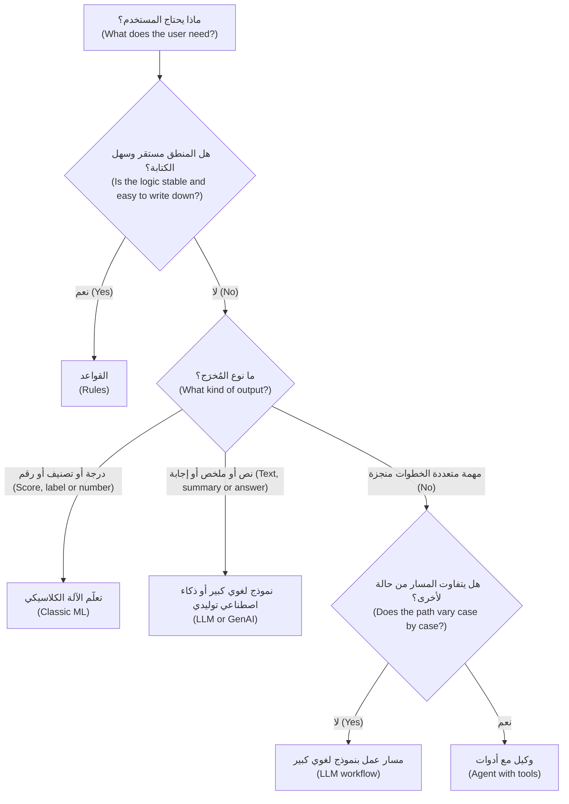
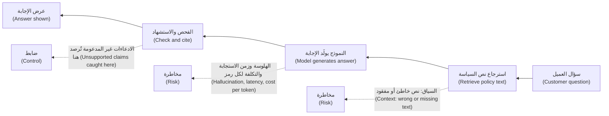
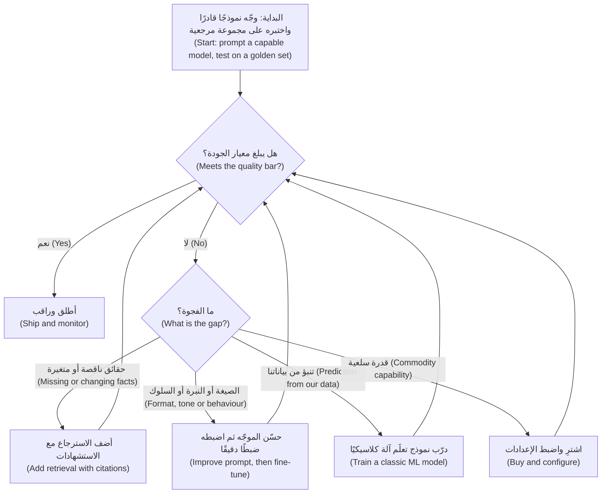

# الوحدة 1 — الثقافة في الذكاء الاصطناعي لأهل المنتج (AI literacy for product people)

*لا يمكنك إدارة منتج لا تستطيع التفكير فيه بوعي. تمنحك هذه الوحدة ما يكفي من الفهم التقني (technical understanding) لاتخاذ قرارات المنتج (product decisions)، دون أن تطلب منك أن تصبح مهندسًا. ستتعلم التمييز بين تعلّم الآلة (machine learning) والذكاء الاصطناعي التوليدي (generative AI) والنماذج اللغوية الكبيرة (large language models) والوكلاء (agents)، ومطابقة كلٍّ منها مع المهمة التي يُحسن أداءها. وستتعلم الحدود التي تشكّل كل منتج ذكاء اصطناعي (AI product): الأخطاء (errors)، والهلوسة (hallucination)، والسياق (context)، وزمن الاستجابة (latency)، والتكلفة (cost). وستتعلم أيضًا سُلّم طرق بناء ميزة ذكاء اصطناعي (AI feature)، من كتابة موجّه (prompt) إلى تدريب نموذج (training a model) أو شراء منتج (buying a product). وطوال الوحدة تجلس مع فريق المنتجات الرقمية والذكاء الاصطناعي (Digital & AI Products team) في بنك نجم (Najm Bank) بينما يتعلم فيصل، مدير منتج ذكاء اصطناعي (AI product manager) جديد، من رانيا ودانة وطارق كيف يطرح أسئلة أفضل قبل أن يكتب متطلبًا واحدًا (a single requirement).*

> **المراحل (Stages):** Discover · Define · Build — المفردات والحُكم (vocabulary and judgement) اللذان تحتاجهما قبل أن تتمكن من إيجاد منتج ذكاء اصطناعي أو تحديد مواصفاته أو بنائه بثقة.

---

# 1.1 — تعلّم الآلة والذكاء الاصطناعي التوليدي والنماذج اللغوية الكبيرة والوكلاء: فيمَ يُجيد كلٌّ منها (Machine learning, generative AI, LLMs and agents: what each is good for)
*المستوى (Level): 🟢 مبتدئ (Beginner)* · *المتطلبات (Prerequisites): 0.2* · *المرحلة (Stage): Discover*

## ⚡ الدرس في دقيقة (In 60 seconds)
- «الذكاء الاصطناعي (AI)» مظلة تضم أربع عائلات (four families): **تعلّم الآلة (machine learning)** (يتنبأ بتصنيف أو رقم (label or number) انطلاقًا من أمثلة)، و**الذكاء الاصطناعي التوليدي (generative AI)** (ينتج محتوى جديدًا (new content))، و**النماذج اللغوية الكبيرة (large language models)** (ذكاء اصطناعي توليدي للنصوص، يقف خلف معظم المساعدات (assistants))، و**الوكلاء (agents)** (نموذج يستخدم أدوات في حلقة (tools in a loop) لإنجاز مهمة).
- الفكرة الأهم: **ابدأ من المُخرَج الذي يحتاجه المستخدم (start from the output the user needs)**، لا من التقنية. الدرجة (score) أو الإجابة بنعم/لا تشير إلى تعلّم الآلة الكلاسيكي (classic ML)؛ والمسودة أو الإجابة بالكلمات تشير إلى النموذج اللغوي الكبير (LLM)؛ والمهمة متعددة الخطوات (multi-step task) التي تغيّر أنظمة أخرى تشير إلى الوكيل (agent)؛ والمنطق الثابت (fixed logic) يشير إلى القواعد البسيطة (plain rules).
- العائلات تتكامل (families combine). كثير من المنتجات الجيدة تستخدم نموذجًا تنبؤيًا (predictive model) لاتخاذ القرار ونموذجًا لغويًا (language model) لشرحه أو صياغة ما حوله.
- مؤشر القرار (decision cue): إذا كانت قاعدة شفافة (transparent rule) تؤدي المهمة، فاستخدم القاعدة. أضف التعلّم (learning) فقط حيث يكون النمط (pattern) أعقد من أن يُكتب أو يتغير أكثر من اللازم.
- أكبر فخ (biggest trap): استخدام نموذج لغوي كبير (LLM) لمهمة تحتاج رقمًا متسقًا ومعايَرًا وقابلًا للتفسير (consistent, calibrated, explainable number)، مثل قرار ائتماني (credit decision).

## 🧭 لماذا يهم (Why it matters)
في أسبوعه الثاني في بنك نجم (Najm Bank)، يُحضر فيصل إلى رانيا قائمة من اثنتي عشرة فكرة، كلها موسومة «ذكاء اصطناعي توليدي (GenAI)». ثلاث منها تلفت النظر: *دع نموذجًا لغويًا كبيرًا يوافق على طلبات تمويل الفواتير للشركات الصغيرة والمتوسطة (let an LLM approve SME invoice-financing requests)* بناءً على الفاتورة والكشوف؛ و*نموذج لغوي كبير يقرأ كل معاملة بطاقة ويرصد الاحتيال (an LLM that reads every card transaction and flags fraud)*؛ و*وكيل يتولى نزاعات البطاقات من البداية إلى النهاية في نجم أسيست (an agent that handles card disputes end to end in Najm Assist)*.

لا تقول رانيا لا. بل تطرح سؤالًا واحدًا عن كل فكرة: «كيف يبدو المُخرَج، وماذا يحدث حين يكون خاطئًا؟ ⁦(What does the output look like, and what happens when it is wrong?)⁩». تمويل الشركات الصغيرة والمتوسطة (SME financing) يحتاج قرار إقراض (lending decision) متسقًا وقابلًا للتدقيق وقابلًا للتفسير (consistent, auditable and explainable)، ولدى البنك سنوات من سجل السداد المُصنَّف (labelled repayment history)، وهو بالضبط ما يتعلم منه نموذج تنبؤي كلاسيكي (classic predictive model). أما تقييم الاحتيال (fraud scoring) فيجب أن يعالج ملايين المعاملات ضمن نافذة تفويض البطاقة (card authorisation window) بتكلفة ضئيلة لكل منها؛ ونموذج لغوي كبير يقرأ كل معاملة سيكون بطيئًا ومكلفًا. ووكيل النزاعات (dispute agent) فرصة حقيقية، لكنه يحرّك الأموال (moves money)، فيحتاج تصميمًا أكثر عناية بكثير من مساعد للإجابة عن الأسئلة (question-answering assistant).

قائمة فيصل نموذجية: الفرق تمدّ يدها إلى التقنية المثيرة أولًا ثم تبحث عن مشكلة ثانيًا. يبني هذا الدرس العادة المعاكسة: سمِّ المهمة (name the job)، ثم اختر عائلة التقنية (family of technique) التي تناسبها.

## 📐 كيف يعمل (How it works)

### 🟢 الأساسيات (The essentials)

**الذكاء الاصطناعي (Artificial intelligence, AI)** تسمية واسعة لبرمجيات تؤدي مهامّ نربطها بالحُكم البشري (human judgement). في عمل المنتج، التقسيم المفيد هو بين منطق *يكتبه* شخص (القواعد (rules)) ومنطق *متعلَّم من البيانات (learned from data)* (النماذج (models)).

**القواعد (Rules)** تعليمات صريحة (explicit instructions): «إذا تجاوز التحويل 50,000 ريال قطري وكان المستفيد جديدًا، فأوقفه للمراجعة (if a transfer is over QAR 50,000 and the payee is new, hold it for review)». القواعد شفافة ورخيصة ويمكن التنبؤ بها (transparent, cheap and predictable)، لكنها تنهار حين يكون النمط أعقد من أن يُكتب أو يتغير أسرع مما يستطيع الناس تحديثها.

**تعلّم الآلة (Machine learning, ML)** يتعلم نمطًا من الأمثلة (learns a pattern from examples) بدلًا من أن تُملى عليه القاعدة. الشكل الأكثر شيوعًا في الأعمال هو **التعلّم الخاضع للإشراف (supervised learning)**: تعرض على النموذج حالات سابقة كثيرة مرفقًا بها الإجابة الصحيحة (**تصنيف (label)**)، مثل «هذه الفاتورة سُدِّدت (this invoice was repaid)»، فيتعلم التنبؤ بالتصنيف للحالات الجديدة. **التدريب (Training)** هو خطوة التعلم؛ و**الاستدلال (inference)** هو استخدام النموذج المدرَّب على حالة جديدة. مهامّ تعلّم الآلة النموذجية (typical ML jobs):

- **التصنيف (Classification)**: أي فئة؟ (احتيال أم لا، سيسدد أم لا)
- **الانحدار (Regression)**: أي رقم؟ (الخسارة المتوقعة (expected loss)، مدة السداد (time to repay))
- **الترتيب والتوصية (Ranking and recommendation)**: أي العناصر أولًا؟ (أي عرض يُعرض على العميل)
- **كشف الشذوذ (Anomaly detection)**: ما الذي يبدو غير معتاد؟ (قفزة في الإنفاق (spending spike))
- **التنبؤ بالمستقبل (Forecasting)**: ماذا بعد؟ (الطلب على النقد في الفروع (branch cash demand) الأسبوع المقبل)

عادةً ما يُخرج نموذج التصنيف (classification model) **درجة (score)**، مثل احتمال سداد (probability of repayment) قدره 0.82. ثم يختار فريق المنتج **عتبة (threshold)** تحوّل الدرجة إلى إجراء («موافقة مبدئية فوق 0.9، وإحالة إلى محلل بين 0.6 و0.9، ورفض دون ذلك (pre-approve above 0.9, refer to an analyst between 0.6 and 0.9, decline below)»). اختيار العتبة قرار منتج (product decision)، لأنه يحدد كم عميلًا جيدًا ترفض وكم مخاطرة سيئة تقبل (الدرس 1.2).

**الذكاء الاصطناعي التوليدي (Generative AI)** هو عائلة النماذج التي تنتج محتوى جديدًا (produce new content): نصوصًا وصورًا وصوتًا وشيفرة برمجية (text, images, audio, code).

**النموذج اللغوي الكبير (large language model, LLM)** نموذج توليدي (generative model) دُرِّب على كميات هائلة من النصوص للتنبؤ بالقطعة الصغيرة التالية من النص، وتسمى **الرمز (token)** (تقريبًا كلمة أو جزء من كلمة). كرّر هذا التنبؤ آلاف المرات فتحصل على فقرات وإجابات وشيفرة. والنتيجة محرّك متعدد الأغراض (general-purpose engine): النموذج نفسه يمكنه تلخيص قائمة مالية (financial statement)، وصياغة بريد إلكتروني بالعربية، وتصنيف شكوى (classify a complaint)، بحسب طريقة سؤالك له. والنموذج المدرَّب على نطاق واسع ثم المكيَّف لمهام كثيرة يُسمى غالبًا **النموذج الأساسي (foundation model)**.

**الوكيل (agent)** نموذج لغوي كبير موضوع في حلقة (placed in a loop). يُعطى هدفًا (goal) ومجموعة من **الأدوات (tools)** (دوال يمكنه استدعاؤها (functions it can call)، مثل «البحث عن بطاقة (look up a card)» و«تجميد بطاقة (freeze a card)» و«فتح نزاع (open a dispute)»). يختار أداة، ويقرأ النتيجة، ويقرر الخطوة التالية حتى يتحقق الهدف أو يستسلم. الوكلاء يحوّلون النماذج اللغوية من *مستشارين (advisers)* إلى *فاعلين (actors)*، وهذه هي قيمتهم ومخاطرتهم في آنٍ واحد.

| العائلة (Family) | المُخرَج النموذجي (Typical output) | يصلح لـ (Good for) | مثال من نجم (Najm example) | نقطة الضعف الرئيسية (Main weakness) |
|---|---|---|---|---|
| القواعد (Rules) | إجراء ثابت (fixed action) | منطق مستقر ومفهوم جيدًا (stable, well-understood logic) | حدود صارمة على التحويلات إلى مستفيدين جدد (hard limits on transfers to new payees) | هشّة حين تتغير الأنماط (brittle when patterns change) |
| تعلّم الآلة الكلاسيكي (Classic ML) | درجة، تصنيف، رقم، ترتيب (score, label, number, ranking) | تنبؤات متكررة وعالية الحجم مع سجل مُصنَّف (high-volume, repeatable predictions with labelled history) | الموافقة المبدئية في التمويل الفوري للشركات الصغيرة (SME Instant Finance)؛ التنبيهات الذكية (Smart Alerts) | يحتاج بيانات مُصنَّفة جيدة (good labelled data)؛ مهمة ضيقة واحدة لكل نموذج (one narrow task per model) |
| الذكاء الاصطناعي التوليدي / النموذج اللغوي الكبير (Generative AI / LLM) | نصوص، ملخصات، إجابات، شيفرة (text, summaries, answers, code) | العمل الكثيف لغويًا (language-heavy work): الصياغة والتلخيص والاستخراج والإجابة من المستندات | مساعد مذكرات الائتمان (Credit Memo Copilot)؛ مساعد الموظفين التوليدي (Staff GenAI) | قد يخطئ بطلاقة (can be fluently wrong)؛ يكلّف في كل استخدام (costs per use)؛ يتفاوت من تشغيل لآخر (varies run to run) |
| الوكيل (Agent) | مهمة منجزة مع إجراءات في أنظمة أخرى (completed task with actions in other systems) | عمل متعدد الخطوات عبر أدوات يتفاوت مساره (multi-step work across tools where the path varies) | نجم أسيست (Najm Assist) وهو يعالج نزاع بطاقة (card dispute) | الأخطاء تتراكم عبر الخطوات (errors compound over steps)؛ قد يصعب التراجع عن الإجراءات (actions can be hard to undo) |

### 🟡 التعمق أكثر (Going deeper)

**كيف «يعرف» النموذج اللغوي الكبير الأشياء (How an LLM "knows" things).** لا يبحث النموذج اللغوي الكبير عن الحقائق في قاعدة بيانات (database). التدريب يضبط مليارات الأرقام الداخلية (**المعاملات (parameters)**، أو **الأوزان (weights)**)، وينتهي المطاف بالمعرفة مخزّنة فيها بطريقة منتشرة وتقريبية (diffuse, approximate way). وتترتب على ذلك ثلاث نتائج. تتوقف معرفة النموذج عند **تاريخ انقطاع المعرفة (knowledge cutoff)**، أي حين جُمعت بيانات تدريبه. ويمكنه إنتاج نص معقول الظاهر (plausible text) عن أشياء لا يعرفها، لأن النص المعقول الظاهر هو ما دُرِّب على إنتاجه. والطريقة الموثوقة لجعله يجيب من حقائقك *أنت* (your facts) هي إعطاؤه تلك الحقائق وقت الطلب (at request time) (الاسترجاع (retrieval)، الدرس 1.3).

تُبنى النماذج اللغوية الكبيرة الحديثة على معمارية **المحوِّل (transformer)** (Vaswani et al., 2017). لا تحتاج إلى رياضياتها، بل إلى هذا فقط: يستخدم النموذج كل ما في **نافذة السياق (context window)** (النص المعطى له في هذا الطلب، الدرس 1.2) لتشكيل كل رمز تالٍ (each next token).

**الضبط بالتعليمات والتدريب على التفضيلات (Instruction tuning and preference training).** النموذج المدرَّب فقط على التنبؤ بالنص يُكمل النص؛ ولا يتبع الطلبات بموثوقية. يضيف المورّدون (vendors) تدريبًا على أمثلة لتعليمات واستجابات جيدة، ثم على أحكام بشأن أي الاستجابات أفضل (انظر ورقة InstructGPT من OpenAI، Ouyang et al., 2022، حول التعلّم المعزّز من الملاحظات البشرية (reinforcement learning from human feedback)). لهذا تتصرف المساعدات كزملاء متعاونين (helpful colleagues)، ولهذا أيضًا تميل إلى أن تبدو واثقة وموافِقة (confident and agreeable) حتى حين ينبغي لها أن تعترض (push back).

**التضمينات (Embeddings).** **التضمين (embedding)** قائمة أرقام تمثّل معنى قطعة من النص (the meaning of a piece of text)، بحيث تحصل النصوص المتشابهة في المعنى على أرقام متشابهة. تقف التضمينات خلف كثير من منتجات الذكاء الاصطناعي: البحث الدلالي (semantic search) («ابحث عن السياسات المتعلقة بالسداد المبكر (find policies about early repayment)» يطابق بندًا لا يستخدم تلك الكلمات أبدًا)، وتجميع الشكاوى حسب الموضوع (clustering complaints by theme)، وخطوة الاسترجاع (retrieval step) في التوليد المعزّز بالاسترجاع (RAG).

**مسارات العمل مقابل الوكلاء (Workflows versus agents).** ليس كل نظام متعدد الخطوات قائم على نموذج لغوي كبير وكيلًا. يميّز دليل Anthropic واسع الاستشهاد *Building effective agents* (2024) بين **مسارات العمل (workflows)**، حيث يحدد المطوّر الخطوات مسبقًا (استخرج الأرقام، ثم افحص النسب، ثم صُغ المذكرة (extract figures, then check ratios, then draft the memo))، و**الوكلاء (agents)**، حيث يقرر النموذج نفسه الخطوات. مسارات العمل أكثر قابلية للتنبؤ وأرخص وأسهل في الاختبار (more predictable, cheaper and easier to test)؛ فلا تختر وكيلًا إلا حين يتفاوت المسار فعلًا وتبرر القيمة المخاطرة. نزاع البطاقة قد يسلك عدة اتجاهات (استرداد معلّق من التاجر (merchant refund pending)، احتيال دون حضور البطاقة (card-not-present fraud)، خصم مكرر (duplicate charge))، ولهذا فمسار النزاعات في نجم أسيست (Najm Assist) مرشح معقول لوكيل. أما مساعد مذكرات الائتمان (Credit Memo Copilot) فيتبع البنية نفسها في كل مرة، فينبغي أن يكون مسار عمل (workflow).

**الأدوات وبروتوكول MCP (Tools and MCP).** تستدعي النماذج الأدوات عبر **استدعاء الدوال (function calling)** (ويسمى أيضًا استخدام الأدوات (tool use)): يُخرج النموذج طلبًا مهيكلًا (structured request)، مثل `freeze_card(card_id)`، وينفّذه التطبيق. **بروتوكول سياق النموذج (Model Context Protocol, MCP)**، الذي قدّمته Anthropic في نوفمبر 2024، معيار مفتوح (open standard) لربط النماذج بالأدوات ومصادر البيانات (tools and data sources) بطريقة متسقة، بحيث يخدم تكامل واحد (one integration) تطبيقات ذكاء اصطناعي كثيرة. بالنسبة لمدير المنتج (PM)، الأدوات التي تكشفها هي سطح المنتج (product surface): تحدد ما *يستطيع* الوكيل فعله، وبالتالي ما يمكن أن يخطئ فيه (الدرس 5.3؛ ويغطي مقرر *Production AI Agents* الجانب الهندسي).

### 🔴 نظرة الخبير (Expert view)

**الحلول الهجينة تتفوق على الحلول الصافية (Hybrids beat purists).** نادرًا ما تستخدم أفضل منتجات الذكاء الاصطناعي عائلة واحدة. يستخدم التمويل الفوري للشركات الصغيرة (SME Instant Finance) نموذج تعلّم آلة كلاسيكيًا (classic ML model) لدرجة الموافقة المبدئية (pre-approval score)، لأن ذلك القرار يجب أن يكون متسقًا، وقابلًا للاختبار على الحالات التاريخية (testable on historical cases)، وقابلًا للتفسير برموز الأسباب (reason codes). يمكن لنموذج لغوي كبير أن يصوغ خطاب العميل (customer letter)، لكن القرار يبقى مع النموذج المحوكَم (governed model). وكذلك التنبيهات الذكية (Smart Alerts): يقيّم تعلّم الآلة المعاملة؛ وقد يشرح نموذج لغوي التنبيه بعربية أو إنجليزية بسيطة. والقاعدة العملية (rule of thumb) هي أن *تقرر بالمكوّن الأكثر قابلية للتحكم وتتواصل بالمكوّن الأكثر طلاقة (decide with the most controllable component and communicate with the most fluent one)*.

**لماذا لا ندع النموذج اللغوي الكبير يقرر الائتمان؟ ⁦(Why not let the LLM decide credit?)⁩** ثمة أربع مشكلات منتج. (1) *الاتساق (Consistency)*: قد يحصل الطلب نفسه على إجابات مختلفة في تشغيلات مختلفة، أو بعد تحديث المورّد للنموذج (vendor model update). (2) *المعايرة (Calibration)*: يمكن مقارنة درجات النموذج التنبؤي بمعدلات التعثر المرصودة (observed default rates)؛ أما الثقة المعلنة (stated confidence) للنموذج اللغوي الكبير فليست احتمالًا موثوقًا. (3) *قابلية التفسير (Explainability)*: رموز الأسباب (reason codes) المستمدة من بطاقة تقييم (scorecard) أو من نموذج مفسَّر بتقنيات راسخة أسهل في الدفاع عنها من فقرة استدلال مولَّد (generated reasoning)، قد لا تعكس ما دفع المُخرَج فعلًا. (4) *التنظيم (Regulation)*: التقييم الائتماني للأفراد (credit scoring of individuals) استخدام عالي المخاطر (high-risk use) بموجب قانون الذكاء الاصطناعي الأوروبي (EU AI Act)، والمالكون الأفراد والضامنون (sole proprietors and guarantors) يطمسون الحد الفاصل حتى في منتج للشركات الصغيرة والمتوسطة (يغطي مقرر *AI Governance: Zero to Hero* التصنيف). عبارة «النموذج اللغوي الكبير يقرر الائتمان (LLM decides credit)» تضعك في أشد المواضع تطلبًا على كل المحاور في آنٍ واحد.

**التقييم يختلف باختلاف العائلة (Evaluation differs by family).** للنموذج التنبؤي إجابة صحيحة لكل حالة تاريخية، فيمكنك قياسه على بيانات محجوزة (held-out data) قبل الإطلاق. أما النص المولَّد فله إجابات مقبولة كثيرة وإجابات خاطئة بشكل خفي كثيرة، فيحتاج التقييم إلى معايير تقدير (rubrics) وأمثلة مرجعية (reference examples) ومحكّمين من البشر أو النماذج (human or model judges) (الوحدة 6). لذلك فميزة ذكاء اصطناعي توليدي (GenAI feature) تبدو مكتملة بعد نموذج أولي (prototype) من يومين قد تحتاج أسابيع من التقييم قبل أن يصبح إطلاقها آمنًا.

**هل تحتاج إلى الذكاء الاصطناعي أصلًا؟ ⁦(Do you need AI at all?)⁩** يفتتح مارتن زينكيفيتش (Martin Zinkevich) كتابه *Rules of Machine Learning* (Google) بعبارة «لا تخف من إطلاق منتج دون تعلّم آلة ⁦(Don't be afraid to launch a product without machine learning.)⁩». كثيرًا ما تحقق القاعدة (rule) جزءًا كبيرًا من القيمة بجزء بسيط من المخاطرة، وتنتج البيانات التي يحتاجها نموذج لاحق (الدرس 2.3).

## 🧰 الأدوات (The toolkit)
| الأداة أو الإطار (Tool or framework) | ما هو وماذا يفعل (What it is and does) | متى تلجأ إليه (When to reach for it) |
|---|---|---|
| **Task-to-technology map** — خريطة المهمة إلى التقنية | عبارة من سطر واحد لكل فكرة: مهمة المستخدم (user job)، والمُخرَج المطلوب (required output)، وتكلفة الخطأ (cost of an error)، والعائلة المناسبة (القواعد، تعلّم الآلة، النموذج اللغوي الكبير، مسار العمل، الوكيل) | المرور الأول على أي قائمة أفكار ذكاء اصطناعي (list of AI ideas) |
| **Rules of ML** (Martin Zinkevich, Google) — قواعد تعلّم الآلة | إرشادات عملية لمنتجات تعلّم الآلة (ML products)، تبدأ بالإطلاق دون تعلّم آلة (launching without ML) | حين يريد فريق نموذجًا قبل أن يكون لديه خط أساس (baseline) |
| **Workflows vs agents** (Anthropic, *Building effective agents*) — مسارات العمل مقابل الوكلاء | يميّز بين خطوط معالجة ثابتة متعددة الخطوات بالنموذج اللغوي (fixed multi-step LLM pipelines) والحلقات التي يوجّهها النموذج (model-directed loops) | تقرير ما إذا كانت الميزة تحتاج استقلالية (autonomy) أم مجرد خطوات |
| **Model Context Protocol (MCP)** (Anthropic, 2024) — بروتوكول سياق النموذج | معيار مفتوح (open standard) لربط النماذج بالأدوات ومصادر البيانات | التخطيط لأي الأنظمة يمكن أن يصل إليها مساعد أو وكيل |
| **Embeddings** — التضمينات | تمثيلات رقمية للمعنى (numeric representations of meaning) تُستخدم في البحث الدلالي والتجميع والاسترجاع (semantic search, clustering and retrieval) | حين يبحث المستخدمون بكلماتهم الخاصة، أو تحتاج إلى تجميع النصوص |
| **Decide-then-explain pattern** — نمط «قرّر ثم اشرح» | نموذج تنبؤي يتخذ القرار؛ ونموذج لغوي يصوغ أو يشرح ما حوله | القرارات الخاضعة للتنظيم (regulated decisions) التي تستفيد مع ذلك من اللغة الطبيعية (natural language) |

## 🏛️ عمليًا في بنك نجم (In practice at Najm Bank)
تطلب رانيا من فيصل إعادة صياغة قائمته في صورة **بطاقة ملاءمة التقنية (Technology-fit card)**، صف واحد لكل منتج، قبل أن يقدّر أحدٌ الجهد (estimates effort):

| المنتج (Product) | مهمة المستخدم (User job) | المُخرَج المطلوب (Output needed) | تكلفة الخطأ (Cost of an error) | العائلة (Family) | لماذا ليس البديل البديهي (Why not the obvious alternative) |
|---|---|---|---|---|---|
| مساعد مذكرات الائتمان (Credit Memo Copilot) | مدير العلاقة (RM) يحوّل البيانات المالية والملاحظات إلى مسودة أولى لمذكرة ائتمان (first-draft credit memo) | نص مهيكل مع أرقام ومصادر (structured text with figures and sources) | رقم خاطئ أو تعهّد مختلَق (invented covenant) يصل إلى لجنة الائتمان (credit committee) | **مسار عمل (workflow)** بنموذج لغوي كبير (خطوات ثابتة (fixed steps)) | الوكيل يضيف عدم قابلية للتنبؤ دون فائدة؛ فالخطوات لا تتغير أبدًا |
| نجم أسيست (Najm Assist) (المرحلة 1 (phase 1)) | العميل يحصل على إجابة عن المنتجات والرسوم (products and fees) | إجابة قصيرة بالعربية أو الإنجليزية، مستندة إلى الشروط المنشورة (grounded in published terms) | رسوم أو سياسة معروضة خطأً (misstated fee or policy)؛ البنك ملزم بما يقوله الروبوت (bank bound by what the bot says) | نموذج لغوي كبير مع استرجاع (LLM with retrieval) | روبوت الأسئلة الشائعة القائم على القواعد (rules-based FAQ bot) لا يتعامل جيدًا مع الأسئلة الحرة (free-form questions) |
| نجم أسيست (Najm Assist) (المرحلة 2 (phase 2)) | العميل يجمّد بطاقة أو يعترض على معاملة (disputes a transaction) | إجراء منجز مع تأكيد (completed action plus confirmation) | تجميد البطاقة الخطأ؛ تقديم النزاع بشكل غير صحيح | **وكيل (Agent)** بأدوات ضيقة وتأكيدات (narrow tools and confirmations) | مسار العمل الثابت لا يغطي تنوع مسارات النزاع (variety of dispute paths) |
| التمويل الفوري للشركات الصغيرة (SME Instant Finance) | الشركة الصغيرة تحصل على موافقة مبدئية سريعة (fast pre-approval) على فاتورة | درجة وقرار مع رموز الأسباب (score and decision with reason codes) | خسارة من قروض سيئة (bad loans)؛ رفض غير عادل (unfair declines) | **تعلّم الآلة الكلاسيكي (Classic ML)**، مع نموذج لغوي كبير يصوغ الخطابات | قرارات النموذج اللغوي الكبير غير متسقة وغير معايَرة ويصعب تفسيرها (inconsistent, uncalibrated and hard to explain) |
| التنبيهات الذكية (Smart Alerts) | العميل يُنبَّه إلى احتيال محتمل أو إنفاق غير معتاد (likely fraud or unusual spend) | درجة لكل معاملة، في الوقت الفعلي (in real time) | احتيال فائت (missed fraud) مقابل إرهاق التنبيهات (alert fatigue) | **تعلّم الآلة الكلاسيكي (Classic ML)** مع القواعد | نموذج لغوي كبير لكل معاملة بطيء جدًا ومكلف جدًا عند هذا الحجم (too slow and too costly at volume) |
| مساعد الموظفين التوليدي (Staff GenAI) | الموظف يصوغ ويلخّص ويبحث في المعرفة الداخلية (internal knowledge) | نصوص وإجابات (text and answers) | تسريب بيانات (leaked data)؛ اقتباس سياسة داخلية خاطئة (wrong internal policy quoted) | **مساعد نموذج لغوي كبير (LLM assistant)** متعدد الأغراض (يُشترى على الأرجح (likely bought)، الدرس 1.3) | البناء المخصص (custom build) يكرر منتجًا سلعيًا (commodity product) |

قاعدة رانيا للبطاقة: *«إذا لم تستطع ملء خانة "تكلفة الخطأ"، فأنت لست مستعدًا لاختيار التقنية ⁦(If you cannot fill in 'cost of an error', you are not ready to choose the technology.)⁩»*

## 🛠️ التمارين (Exercises)
- 🟢 صنّف خمس ميزات ذكاء اصطناعي (AI features) تستخدمها إلى: قواعد (rules)، أو تعلّم آلة كلاسيكي (classic ML)، أو نموذج لغوي كبير (LLM)، أو مسار عمل (workflow)، أو وكيل (agent). *يكتمل عندما (Done when):* يكون لكلٍّ منها سبب من سطر واحد مبني على مُخرَجها (its output)، لا على تسويقها (its marketing).
- 🟡 تتضمن قائمة فيصل «نموذجًا لغويًا كبيرًا يقرأ كل معاملة بطاقة ويرصد الاحتيال (an LLM that reads every card transaction and flags fraud)». أعد كتابتها كتصميم هجين (hybrid design) يستخدم تعلّم الآلة والنموذج اللغوي الكبير كلًّا حيث يكون قويًا. *يكتمل عندما (Done when):* تحدد أي مكوّن يقرر (decides)، وأيّها يتواصل (communicates)، وسببًا واحدًا لكلٍّ منهما (السرعة (speed)، أو التكلفة (cost)، أو الاتساق (consistency)، أو اللغة (language)).
- 🔴 يريد مالك منتج (product owner) نجم أسيست (Najm Assist) أن يتولى وكيل المرحلة 2 (phase-2 agent) «أي شيء يطلبه العميل (anything a customer asks for)». اكتب مذكرة من نصف صفحة تدافع فيها عن نطاق أول أضيق (narrower first scope). *يكتمل عندما (Done when):* تسمّي المذكرة ثلاث مهام على الأكثر، وتشرح لماذا تناسب كلٌّ منها وكيلًا لا مسار عمل ثابتًا (fixed workflow)، وتسمّي مهمة واحدة ينبغي أن تبقى مسار عمل مع السبب.

## ⚠️ أخطاء وفخاخ (Mistakes and traps)
- **التقنية أولًا (Technology first).** عبارة «نحتاج حالة استخدام (use case) للذكاء الاصطناعي التوليدي» تنتج عروضًا تجريبية (demos)، لا منتجات. ابدأ من مهمة المستخدم (user job) والمُخرَج الذي تحتاجه.
- **نموذج لغوي كبير للقرارات التنبؤية (An LLM for predictive decisions).** للحصول على درجات متسقة ومعايَرة وقابلة للتفسير على بيانات مهيكلة (structured data)، يكون تعلّم الآلة الكلاسيكي (classic ML) عادةً أفضل وأرخص وأسهل في الحوكمة (easier to govern). استخدم النموذج اللغوي الكبير للتواصل حول القرار.
- **تسمية كل خط معالجة وكيلًا (Calling every pipeline an agent).** إذا كانت الخطوات هي نفسها في كل مرة، فابنِ مسار عمل (workflow). فهو أكثر قابلية للتنبؤ وأسهل في الاختبار.
- **افتراض أن النموذج يعرف عملك (Assuming the model knows your business).** يعرف النموذج اللغوي الكبير ما كان في بيانات تدريبه (training data) حتى تاريخ انقطاعه (cutoff)، على وجه التقريب. سياساتك وأسعارك وعملاؤك يجب توفيرها وقت الطلب (at request time).
- **تخطي خط الأساس القائم على القواعد (Skipping the rules baseline).** دون خط أساس بسيط (simple baseline) لا تستطيع إثبات أن النموذج يضيف قيمة، وتخسر الخيار الأرخص.

## 🧾 الخلاصة (Recap)
- القواعد تُكتب (rules are written)؛ والنماذج تُتعلَّم (models are learned). تعلّم الآلة الكلاسيكي يتنبأ بالتصنيفات والأرقام (labels and numbers)؛ والذكاء الاصطناعي التوليدي والنماذج اللغوية الكبيرة تنتج المحتوى؛ والوكلاء يستخدمون الأدوات في حلقة (tools in a loop) لإنجاز المهام.
- اختر العائلة انطلاقًا من المُخرَج الذي يحتاجه المستخدم (output the user needs) ومن تكلفة الخطأ (cost of an error).
- النماذج اللغوية الكبيرة تتنبأ بالنص من أنماط تعلّمتها في التدريب (patterns learned in training). ولا تبحث عن الحقائق ما لم تعطها الحقائق.
- فضّل مسارات العمل (workflows) على الوكلاء (agents) ما لم يتفاوت المسار فعلًا؛ والأدوات سطح منتج (tools are product surface).
- الحلول الهجينة (hybrids) أمر طبيعي: قرّر بالمكوّن القابل للتحكم (controllable component)، وتواصل بالمكوّن الطَّلِق (fluent one).

## ✍️ اختبر نفسك (Check yourself)

**1. يريد بنك نجم (Najm Bank) منح موافقة مبدئية (pre-approve) على طلبات تمويل الفواتير للشركات الصغيرة والمتوسطة (SME invoice-financing requests) في ثوانٍ، باستخدام عشر سنوات من سجل السداد المُصنَّف (labelled repayment history). أي نهج يناسب القرار نفسه على أفضل وجه؟**

- A. اطلب من نموذج لغوي كبير (LLM) قراءة الطلب والإجابة بـ«موافقة (approve)» أو «رفض (decline)»
- B. درّب نموذج تعلّم آلة كلاسيكيًا (classic ML model) على سجل السداد وحدّد عتبات (thresholds) للموافقة والإحالة والرفض (approve, refer and decline)
- C. ابنِ وكيلًا (agent) يتصفح موقع الشركة الإلكتروني قبل أن يقرر
- D. استخدم التضمينات (embeddings) لإيجاد مذكرات سابقة مشابهة (similar past memos) ونسخ قرارها

الإجابة

**B.** المهمة تنبؤ متسق وقابل للتفسير (consistent, explainable prediction) من سجل مهيكل ومُصنَّف (structured, labelled history)، وهذا بالضبط ما يفعله التعلّم الخاضع للإشراف (supervised ML). الخيار A مُغرٍ لأن النموذج اللغوي الكبير يستطيع إنتاج إجابة، لكنه غير متسق وغير معايَر ويصعب تفسيره (inconsistent, uncalibrated and hard to explain) في قرار خاضع للتنظيم (regulated decision). (🟢 الأساسيات (The essentials)؛ 🔴 نظرة الخبير (Expert view).)

**2. ما أفضل وصف لما يفعله النموذج اللغوي الكبير (large language model) حين يولّد إجابة؟**

- A. يسترجع الإجابة من قاعدة بيانات داخلية من الحقائق الموثّقة (internal database of verified facts)
- B. يتنبأ مرارًا بالرمز التالي (next token) بناءً على أنماط تعلّمها في التدريب (patterns learned in training) وعلى النص الموجود في سياقه (the text in its context)
- C. ينفّذ القواعد التي كتبها مطوّروه لكل موضوع
- D. يبحث في الإنترنت (searches the internet) عند كل طلب

الإجابة

**B.** تولّد النماذج اللغوية الكبيرة النص رمزًا تلو رمز (token by token) من أنماط متعلَّمة إضافةً إلى ما في نافذة السياق (context window). الخيار A هو أكثر المفاهيم الخاطئة شيوعًا (most common misconception): لا توجد قاعدة حقائق (fact database) داخل النموذج، ولهذا يمكن أن يخطئ بطلاقة (fluently wrong). (🟢 الأساسيات (The essentials)؛ 🟡 التعمق أكثر (Going deeper).)

**3. يستخرج مساعد مذكرات الائتمان (Credit Memo Copilot) دائمًا الأرقام، ثم يفحص النسب (checks ratios)، ثم يصوغ الأقسام بالترتيب نفسه. يعرض مورّد (vendor) «وكيلًا مستقلًا (autonomous agent)» له. ما أقوى استجابة من منظور المنتج (strongest product response)؟**

- A. اقبل، لأن الوكلاء أكثر تقدمًا من مسارات العمل (more advanced than workflows)
- B. ارفض أي استخدام للنماذج اللغوية الكبيرة في مذكرات الائتمان (credit memos)
- C. فضّل مسار عمل ثابتًا بنموذج لغوي كبير (fixed LLM workflow)، لأن الخطوات لا تتغير ومسار العمل أكثر قابلية للتنبؤ وأسهل في الاختبار
- D. استبدل المساعد بمصنِّف تعلّم آلة كلاسيكي (classic ML classifier)

الإجابة

**C.** لا تستخدم وكيلًا إلا حين يتفاوت المسار من حالة لأخرى (path varies case by case). وهنا لا يتفاوت، فمسار العمل يعطي القيمة نفسها بقدر أقل من عدم القابلية للتنبؤ (less unpredictability). الخيار A يخلط بين التعقيد والملاءمة (confuses sophistication with fit). (🟡 التعمق أكثر (Going deeper)، مسارات العمل مقابل الوكلاء (workflows versus agents).)

**4. يجب أن تقيّم التنبيهات الذكية (Smart Alerts) ملايين معاملات البطاقات في الوقت الفعلي (in real time) بتكلفة منخفضة جدًا لكل معاملة. يقترح فريق نموذجًا لغويًا كبيرًا لمراجعة كل معاملة. ما الاعتراض الرئيسي من منظور المنتج (main product objection)؟**

- A. النماذج اللغوية الكبيرة لا تستطيع قراءة الأرقام
- B. عند هذا الحجم وزمن الاستجابة (volume and latency)، يكون نموذج تعلّم آلة متخصص (specialised ML model) أسرع وأرخص بكثير لكل قرار، ويمكن إبقاء النموذج اللغوي الكبير لشرح التنبيهات للعملاء (explaining alerts to customers)
- C. كشف الاحتيال (fraud detection) محظور بموجب قانون الذكاء الاصطناعي الأوروبي (EU AI Act)
- D. لا يمكن استخدام النماذج اللغوية الكبيرة بالعربية

الإجابة

**B.** الاعتراض يتعلق بالملاءمة (fit): السرعة والتكلفة عند الحجم الكبير والاتساق (speed, cost at volume and consistency) ترجّح تعلّم الآلة الكلاسيكي، بينما يمكن للنموذج اللغوي الكبير أن يضيف قيمة في التواصل (communication). الخيار C خاطئ: كشف الاحتيال ليس ممارسة محظورة (prohibited practice). (🔴 نظرة الخبير (Expert view)، الحلول الهجينة (hybrids)؛ جدول 🏛️ (table).)

**5. أي عبارة عن بروتوكول سياق النموذج (Model Context Protocol, MCP) صحيحة؟**

- A. هو طريقة تدريب (training method) تجعل النماذج أكثر دقة
- B. هو معيار مفتوح (open standard)، قدّمته Anthropic عام 2024، لربط النماذج بالأدوات ومصادر البيانات (tools and data sources)
- C. هو تنظيم (regulation) يحكم وكلاء الذكاء الاصطناعي في الاتحاد الأوروبي
- D. هو مقياس (metric) لقياس الهلوسة (hallucination)

الإجابة

**B.** يوحّد MCP طريقة اتصال تطبيقات الذكاء الاصطناعي بالأدوات والبيانات (standardises how AI applications connect to tools and data). وهو لا يغيّر النموذج نفسه (A). يهم مدير المنتج (PM) لأن الأدوات التي تربطها تحدد ما يستطيع المساعد فعله. (🟡 التعمق أكثر (Going deeper)، الأدوات وMCP (tools and MCP).)

## 📚 المراجع (References)
- Vaswani et al., "Attention Is All You Need" (2017) — https://arxiv.org/abs/1706.03762
- Ouyang et al., "Training language models to follow instructions with human feedback" (2022) — https://arxiv.org/abs/2203.02155
- Martin Zinkevich, *Rules of Machine Learning: Best Practices for ML Engineering* (Google) — https://developers.google.com/machine-learning/guides/rules-of-ml
- Anthropic, *Building effective agents* (2024) — https://www.anthropic.com/research/building-effective-agents
- Model Context Protocol — https://modelcontextprotocol.io
- Google, People + AI Guidebook (PAIR) — https://pair.withgoogle.com/guidebook

---

# 1.2 — القدرات والحدود: الأخطاء والهلوسة والسياق وزمن الاستجابة والتكلفة (Capabilities and limits: errors, hallucination, context, latency and cost)
*المستوى (Level): 🟢 مبتدئ (Beginner)* · *المتطلبات (Prerequisites): 1.1* · *المرحلة (Stage): Define, Design*

## ⚡ الدرس في دقيقة (In 60 seconds)
- كل نظام ذكاء اصطناعي **يخطئ في بعض الأحيان (wrong some of the time)**. سؤال المنتج ليس أبدًا «هل هو دقيق؟ ⁦(is it accurate?)⁩» بل «كم مرة يخطئ، وبأي طريقة، ولمن، وماذا يحدث حينها؟ ⁦(how often is it wrong, in which way, for whom, and what happens then?)⁩».
- خمسة حدود تشكّل كل منتج ذكاء اصطناعي (AI product): **الأخطاء (errors)** (الإيجابيات الكاذبة والسلبيات الكاذبة (false positives and false negatives))، و**الهلوسة (hallucination)** (مُخرَج طَلِق غير صحيح أو غير مدعوم بالمصادر (fluent output that is not true or not supported by the sources))، و**السياق (context)** (ما يستطيع النموذج رؤيته وما يعرفه)، و**زمن الاستجابة (latency)** (كم ينتظر المستخدم)، و**التكلفة (cost)** (تدفع لكل استخدام (per use)، لا مرة واحدة).
- تُقاس أخطاء النماذج التنبؤية (predictive errors) بـ**مصفوفة الالتباس (confusion matrix)** و**الدقة (precision)** و**الاستدعاء (recall)**. حين يكون الشيء الذي تبحث عنه نادرًا (rare)، يمكن لنموذج أن يكون دقيقًا بنسبة 99% (99% accurate) ومع ذلك يخطئ في معظم التنبيهات التي يطلقها.
- تُقدَّر التكلفة لكل مهمة (per task) بنموذج بسيط: الرموز الداخلة والخارجة (tokens in and out)، مضروبة في السعر (price)، مضروبة في عدد الاستدعاءات لكل مهمة (calls per task)، مضروبة في الحجم (volume). غالبًا ما تكون زهيدة لأداة داخلية (internal tool) ومؤثرة لمساعد موجّه للمستهلكين (consumer assistant).
- مؤشر القرار (decision cue): دوّن الحدود *قبل* أن تصمم. كل حد يصبح إما ميزة تصميم (design feature) (الاستشهادات (citations)، التأكيدات (confirmations)، البث التدريجي (streaming)، البدائل الاحتياطية (fallbacks)) أو معيار جودة (quality bar).
- أكبر فخ (biggest trap): الحكم على نموذج من عرض تجريبي رائع (great demo). العروض التجريبية تُظهر أفضل حالة (best case)؛ والمستخدمون يواجهون التوزيع الكامل (the distribution).

## 🧭 لماذا يهم (Why it matters)
بعد أسبوعين من تجربة مساعد مذكرات الائتمان (Credit Memo Copilot pilot)، يُحيل خالد إلى رانيا مسودة مذكرة (draft memo) مع جملة واحدة مظلَّلة. تقول المذكرة إن التسهيل القائم للمقترض (borrower's existing facility) «يتضمن تعهّد عدم رهن الأصول (negative pledge covenant) وحدًّا أدنى لنسبة تغطية خدمة الدين (minimum DSCR) قدره 1.25x». واتفاقية التسهيل (facility agreement) لا تذكر أيًّا منهما. المسودة تُقرأ بشكل مثالي. ولم يتحقق منها مدير العلاقة (relationship manager, RM) لأن «بقية الأرقام كانت صحيحة (the rest of the numbers were right)». ملاحظة خالد قصيرة: «إذا وصل هذا إلى لجنة الائتمان (credit committee)، فمن المسؤول؟ ⁦(who is accountable?)⁩».

فعل النموذج ما تفعله النماذج اللغوية: أنتج مذكرة ائتمان معقولة الظاهر (plausible credit memo)، ومذكرات الائتمان المعقولة تذكر التعهدات (covenants). كان الإخفاق في المنتج (the failure was in the product). لم يكن هناك ما يُلزم المسودة بالاستشهاد بمصدرها (cite its source)، ولا ما يرصد الادعاءات غير المدعومة (unsupported claims)، ولم يُخبر أحدٌ مدير العلاقة أين يضعف المساعد.

والأمثلة العامة (public examples) تُظهر النمط نفسه. في فبراير 2023، تضمّن عرض إطلاق Bard من Google خطأً معلوماتيًا (factual error) عن تلسكوب جيمس ويب الفضائي (James Webb Space Telescope). وفي قضية *Moffatt v. Air Canada* (2024)، حمّلت محكمةٌ شركةَ الطيران المسؤولية (held the airline liable) بعد أن وصف روبوت المحادثة (chatbot) على موقعها سياسة استرداد (refund policy) لا تطابق سياسة الشركة نفسها. في الحالتين، لم يأخذ المنتج المحيط بالنموذج في الحسبان حدًّا معروفًا (known limit). يمنحك هذا الدرس المفردات لتسمية كل حد، وعادة التصميم له قبل أن يكتشفه المستخدمون.

## 📐 كيف يعمل (How it works)

### 🟢 الأساسيات (The essentials)

| الحد (Limit) | ماذا يعني (What it means) | ماذا يرى المستخدم (What the user sees) | ماذا يفعل مدير المنتج حياله (What the PM does about it) |
|---|---|---|---|
| **الأخطاء (Errors)** | مُخرَج النموذج خاطئ لبعض المدخلات (some inputs)، بمعدل ما (at some rate) | احتيال فائت (missed fraud)؛ تنبيه كاذب (false alert)؛ فئة خاطئة (wrong category) | قِس أنواع الأخطاء (error types)، واختر العتبات (thresholds)، وصمّم التعافي (design recovery) |
| **الهلوسة (Hallucination)** | محتوى مولَّد خاطئ أو غير مدعوم بالمصادر المقدَّمة (provided sources) | تعهّد أو رسوم أو سياسة مختلَقة تُذكر بثقة (stated confidently) | أسند الإجابات إلى المصادر (ground answers in sources)، واعرض الاستشهادات، واسمح بـ«لا أعرف (I don't know)»، وافحص الادعاءات (check claims) |
| **السياق (Context)** | يرى النموذج فقط ما في نافذة السياق (context window)، ويعرف فقط ما تعلّمه حتى تاريخ انقطاعه (cutoff) | إجابات قديمة (out-of-date answers)؛ يتجاهل مستندًا لم يُعطَ له | وفّر الحقائق الصحيحة وقت الطلب (at request time)؛ وأدِر ما يدخل إليه |
| **زمن الاستجابة (Latency)** | الوقت من الطلب إلى مُخرَج مفيد (useful output) | الانتظار، ومؤشرات التحميل (spinners)، والمحادثات المتروكة (abandoned conversations) | حدّد ميزانية زمن الاستجابة (latency budget)؛ واستخدم البث التدريجي (stream)؛ واختر نماذج أصغر للخطوات البسيطة |
| **التكلفة (Cost)** | كل طلب يكلّف مالًا، بما يتناسب مع النص المعالَج (text processed) | لا شيء مباشرةً، إلى أن يرى الفريق المالي (finance team) | قدّر التكلفة لكل مهمة (cost per task) مبكرًا؛ وصمّم لإبقاء السياق مقتضبًا (keep context lean) |

وثمة خاصيتان إضافيتان تتقاطعان مع الحدود الخمسة كلها.

**عدم الحتمية (Non-determinism).** تختار النماذج اللغوية الكبيرة كل رمز تالٍ بأخذ عيّنة من الاحتمالات (sampling from probabilities). ويتحكم إعداد يسمى **درجة الحرارة (temperature)** في مدى جرأة ذلك الاختيار: القيمة المنخفضة تفضّل الرموز الأكثر احتمالًا (most likely tokens)، والعالية تسمح بتنوع أكبر (more variety). وحتى عند درجة حرارة منخفضة، قد تتفاوت المُخرَجات بين التشغيلات (vary between runs)، فيجب أن يتعامل المنتج مع إجابات مختلفة قليلًا.

**تغيّر الإصدار (Version change).** يحدّث المورّدون النماذج ويُوقفونها (update and retire models). قد يكون الإصدار الجديد أفضل في المتوسط (better on average) وأسوأ في مهمتك. عامِل تغيير النموذج (model change) كتغيير في الشيفرة (code change): أعد تشغيل تقييمك (re-run your evaluation) قبل التبديل (الوحدة 6، الدرس 9.2).

### 🟡 التعمق أكثر (Going deeper)

**الأخطاء في النماذج التنبؤية (Errors in predictive models).** لنموذج نعم/لا (yes/no model) أربع نتائج، تُعرض في **مصفوفة الالتباس (confusion matrix)**:

| | احتيال فعلًا (Actually fraud) | مشروعة فعلًا (Actually legitimate) |
|---|---|---|
| **النموذج يرصد (Model flags)** | إيجابي صحيح (True positive) (مرصود (caught)) | إيجابي كاذب (False positive) (إنذار كاذب (false alarm)) |
| **النموذج لا يرصد (Model does not flag)** | سلبي كاذب (False negative) (فائت (missed)) | سلبي صحيح (True negative) |

ويتفرع عنها مقياسان. **الدقة (Precision)**: من بين المعاملات المرصودة، ما نسبة الاحتيال الحقيقي؟ **الاستدعاء (Recall)**: من بين حالات الاحتيال الحقيقية، ما النسبة التي رصدناها؟ ويتبادلان المكاسب عبر العتبة (trade off through the threshold): اخفضها فيرتفع الاستدعاء وتنخفض الدقة.

وإليك سبب أهمية المعدلات الأساسية (base rates) (أرقام توضيحية (illustrative numbers)). لنفترض أن التنبيهات الذكية (Smart Alerts) ترى 1,000,000 معاملة منها 1,000 احتيال (0.1%). يرصد النموذج 900 منها (استدعاء 90% (90% recall)) ويرصد خطأً 1% من المعاملات المشروعة (legitimate transactions)، أي 9,990 إنذارًا كاذبًا. تبدو الدقة الإجمالية (accuracy) ممتازة: (900 + 989,010) / 1,000,000 ≈ 99%. لكن الدقة (precision) هي 900 / (900 + 9,990) ≈ 8%. أكثر من أحد عشر من كل اثني عشر تنبيهًا يتلقاها العميل كاذبة. و«نموذج» لا يرصد أي شيء على الإطلاق سيحصل على دقة إجمالية 99.9% ولن يرصد شيئًا. **الدقة الإجمالية هي المقياس الرئيسي الخاطئ للأحداث النادرة ⁦(Accuracy is the wrong headline metric for rare events.)⁩** قرّر أي خطأ يؤلم أكثر: الاحتيال الفائت يكلّف مالًا وثقة؛ والتنبيه الكاذب يعلّم العملاء تجاهل التنبيهات (**إرهاق التنبيهات (alert fatigue)**).

**الهلوسة في النماذج التوليدية (Hallucination in generative models).** يغطي المصطلح عدة إخفاقات، ومن المفيد الفصل بينها:
- **الاختلاق (Fabrication)**: محتوى لا أساس له إطلاقًا (تعهّد مختلَق (invented covenant)، أو تنظيم غير موجود (non-existent regulation)، أو استشهاد مصطنع (made-up citation)).
- **عدم الأمانة للمصدر (Unfaithfulness to the source)**: أُعطي النموذج المستند الصحيح لكنه يعرضه خطأً (رقم خاطئ (wrong figure)، شرط معكوس (reversed condition)).
- **المعرفة القديمة (Outdated knowledge)**: كانت صحيحة يومًا، لا الآن (جدول رسوم العام الماضي (last year's fee schedule) من بيانات التدريب).
- **الإسناد الخاطئ (Wrong attribution)**: حقيقة صحيحة تُنسب إلى المصدر أو الجهة الخطأ (wrong source or entity).

وأبرز وسائل التخفيف (mitigations) خيارات تصميم منتج (product design choices). **الإسناد إلى المصادر (Grounding)** يعني إعطاء النموذج النص المرجعي المعتمد (authoritative text) وتوجيهه للإجابة منه فقط. **الاستشهادات (Citations)** تربط كل ادعاء بمصدره (link each claim to its source) حتى يتمكن شخص من التحقق منه بسرعة. **الامتناع (Abstention)** يعني السماح بعبارة «لم أجد هذا في المستندات (I couldn't find this in the documents)» ومكافأتها بدلًا من التخمين. **التحقق (Verification)** يعني خطوة ثانية، ببرمجية أو بنموذج آخر، تفحص الادعاءات مقابل المصادر، وترصد الادعاءات غير المدعومة أو تزيلها. لا شيء من هذا يخفّض الهلوسة إلى الصفر. لكنها تجعلها أندر وأسهل في الرصد (rarer and easier to catch).

**السياق (Context).** تعالج النماذج النص في صورة **رموز (tokens)**. في الإنجليزية، ثمة قاعدة تقريبية شائعة (rule of thumb) أن الرمز يعادل نحو ثلاثة أرباع الكلمة؛ وكثيرًا ما تحتاج العربية ولغات أخرى إلى رموز أكثر لكل كلمة، بحسب مُقسِّم الرموز (tokenizer) الخاص بالنموذج. **نافذة السياق (context window)** هي الحد الأقصى لعدد الرموز التي يستطيع النموذج التعامل معها في طلب واحد، محتسبةً ما ترسله وما يكتبه ردًّا. وحتى وقت كتابة هذا النص (2026)، تقبل النماذج الرائدة (leading models) سياقات طويلة جدًا، لكن تبقى ثلاثة حدود:
1. **الأطول ليس دائمًا الأفضل (Longer is not always better).** وجدت أبحاث مثل Liu et al., "Lost in the Middle" (2023) أن النماذج قد تستخدم المعلومات القريبة من بداية السياق الطويل أو نهايته أفضل من المعلومات في منتصفه. وضع كل شيء فيه ليس كاستخدام النموذج لكل شيء.
2. **كل رمز يكلّف مالًا ووقتًا (Every token costs money and time).** حزمة تسهيلات (facility pack) من 100 صفحة تُرسل مع كل سؤال بطيئة ومكلفة.
3. **النموذج يعرف فقط ما يُعرض عليه (The model only knows what it is shown).** إذا أخطأت خطوة الاسترجاع (retrieval step) البند ذا الصلة، فلن يستطيع النموذج استخدامه، وقد يملأ الفراغ بشيء معقول الظاهر (something plausible).

**زمن الاستجابة (Latency).** يهم مقياسان: **الزمن حتى الرمز الأول (time to first token)** (مدى سرعة ظهور شيء ما) و**الزمن الإجمالي (total time)** (المدة حتى يكتمل المُخرَج). طول المُخرَج (output length) هو ما يحدد الزمن الإجمالي. **البث التدريجي (Streaming)** (عرض النص أثناء توليده) يجعل إجابة من 10 ثوانٍ مقبولة في محادثة، لكنه لا يساعد حين يغذّي المُخرَج نظامًا آخر. وفي مسارات العمل والوكلاء (workflows and agents)، يتراكم زمن الاستجابة: خمسة استدعاءات متتالية (sequential calls) كلٌّ منها ثلاث ثوانٍ تصنع مهمة من 15 ثانية.

**التكلفة (Cost).** تتقاضى معظم واجهات برمجة النماذج (model APIs) لكل رمز (per token)، مع تسعير منفصل للمدخلات والمخرجات (input and output priced separately)، وعادةً ما يكلّف المُخرَج أكثر لكل رمز. **نموذج التكلفة لكل مهمة (cost-per-task model)** البسيط:

> التكلفة لكل مهمة (cost per task) = (رموز المدخلات (input tokens) × سعر المدخلات (input price) + رموز المخرجات (output tokens) × سعر المخرجات (output price)) × استدعاءات النموذج لكل مهمة (model calls per task) + تكاليف أخرى (other costs) (الاسترجاع (retrieval)، الأدوات (tools)، الاستضافة (hosting))

أسعار توضيحية فقط (illustrative prices only) (تحقق من الأسعار الحالية لمورّدك): لنقل 3 دولارات لكل مليون رمز مدخلات و15 دولارًا لكل مليون رمز مخرجات.
- *مساعد مذكرات الائتمان (Credit Memo Copilot)*: نحو 30,000 رمز مدخلات (البيانات المالية والملاحظات) و2,000 رمز مخرجات لكل استدعاء تساوي $0.09 + $0.03 = $0.12. ومع أربعة استدعاءات لكل مذكرة، يصبح ذلك نحو $0.48 لكل مذكرة. عند بضع مئات من المذكرات شهريًا، تكون تكلفة النموذج صغيرة مقارنة بساعات عمل مدير العلاقة (RM time). **الجودة، لا التكلفة، هي القيد ⁦(Quality, not cost, is the constraint.)⁩**
- *نجم أسيست (Najm Assist)*: نحو 2,000 رمز مدخلات و300 رمز مخرجات لكل دورة (per turn) تساوي $0.006 + $0.0045 ≈ $0.01. خمس دورات لكل محادثة تعادل نحو $0.05، ومليون محادثة شهريًا تعادل نحو $50,000. على نطاق المستهلكين (consumer scale)، **تصبح التكلفة قيدًا تصميميًا (cost becomes a design constraint)**. كما أن سجل المحادثة (conversation history) يكبر مع كل دورة، فتكلّف الدورات اللاحقة أكثر ما لم تقتطعه (trim it).

المنهج أهم من الأرقام: قدّر التكلفة لكل مهمة في مرحلة الاكتشاف (discovery) واضربها في حجم واقعي (realistic volume) (الوحدة 8).

### 🔴 نظرة الخبير (Expert view)

**الحدود متعرّجة (The frontier is jagged).** قد يحلل نموذج قائمة تدفقات نقدية معقدة (complex cash-flow statement) ومع ذلك يتعثر في عملية حسابية (arithmetic) أو في صيغة تاريخ محلية (local date format). المعايير العامة (general benchmarks) لا تقول الكثير عن مهمتك *أنت* (your task)؛ والإجابة الموثوقة عن «هل هو جيد بما يكفي؟ ⁦(is it good enough?)⁩» هي تقييم (evaluation) على مدخلاتك التمثيلية (representative inputs)، بما فيها الصعبة منها (awkward ones) (الوحدة 6). العرض التجريبي عيّنة واحدة (one sample)؛ ومستخدموك سيواجهون التوزيع كله.

**الأخطاء تتراكم في السلاسل (Errors compound in chains).** إذا نجحت كل خطوة في وكيل بنسبة 95% من الوقت، وكانت الإخفاقات مستقلة (independent)، فإن مهمة من عشر خطوات تنجح بنحو 0.95¹⁰ ≈ 60% من الوقت. الخطوات الحقيقية ليست مستقلة، فتعامل مع هذا كحدس (intuition)، لكن الاتجاه صحيح: السلاسل الطويلة تحتاج نقاط تحقق (checkpoints)، وتأكيدات قبل الإجراءات الخطرة (confirmations before risky actions)، ومسارات تعافٍ (recovery paths). ولهذا يطلب وكيل النزاعات في نجم أسيست (Najm Assist) من العميل التأكيد قبل التقديم (confirm before filing).

**النص غير الموثوق يمكنه توجيه النموذج (Untrusted text can steer the model).** لأن التعليمات والبيانات تصل كلاهما في صورة نص، فإن المحتوى الذي يقرؤه النموذج (بريد إلكتروني، صفحة ويب، مستند) قد يحتوي تعليمات تختطفه (hijack it). هذا هو **حقن الموجّهات (prompt injection)**. روبوت المحادثة لدى وكيل Chevrolet الذي وافق على «بيع» سيارة مقابل دولار واحد بعد تلاعب المستخدم (user manipulation) (ديسمبر 2023) مثال عام معروف؛ كانت المخاطر هناك متعلقة بالسمعة (reputational)، أما لوكيل يملك أدوات فهي إجراءات (actions). دور مدير المنتج (PM) هو تقييد ما تستطيع الأدوات فعله، واشتراط التأكيد للإجراءات ذات العواقب (consequential actions)، وعدم الاعتماد أبدًا على الموجّه وحده للأمان (never rely on the prompt alone for security). ويغطي مقرر *Production AI Agents* وسائل الدفاع (defences).

**التكلفة رافعة للجودة، والجودة رافعة للتكلفة (Cost is a quality lever, and quality is a cost lever).** النماذج الأصغر (smaller models) كثيرًا ما تكون جيدة بما يكفي للخطوات البسيطة، مما يترك النموذج الأكبر للخطوة الصعبة. لكن نموذجًا رخيصًا يخفق أكثر يدفع التكلفة نحو المراجعة البشرية وإعادة العمل (human review and rework). ومساعد Klarna للذكاء الاصطناعي تحذير مفيد. أعلنت الشركة في مطلع 2024 أنه يتولى حصة كبيرة من محادثات العملاء، وفي 2025 قالت إنها ستعيد مزيدًا من الخدمة البشرية (human service). وهذا يبيّن لماذا يجب قياس وفورات التكلفة (cost savings) إلى جانب جودة الحل (resolution quality) والرضا (satisfaction).

**الحدود مادة للتصميم (Limits are design material).** يحوّل مديرو منتجات الذكاء الاصطناعي الناضجون (mature AI PMs) كل حد إلى متطلب (requirement). تصبح الهلوسة «كل رقم يرتبط بخلية مصدره (every figure links to its source cell)». ويصبح زمن الاستجابة «الرمز الأول في أقل من ثانيتين؛ والمذكرة الكاملة في أقل من دقيقة (first token under two seconds; full memo under a minute)». وتصبح التكلفة «التكلفة لكل محادثة محلولة أقل من $X (cost per resolved conversation under $X)». وتصبح الأخطاء «دقة (precision) لا تقل عن Y عند استدعاء (recall) Z». ويحوّل الدرس 5.1 هذه إلى مواصفات منتج الذكاء الاصطناعي (AI product spec).

## 🧰 الأدوات (The toolkit)
| الأداة أو الإطار (Tool or framework) | ما هو وماذا يفعل (What it is and does) | متى تلجأ إليه (When to reach for it) |
|---|---|---|
| **Confusion matrix** — مصفوفة الالتباس | جدول بالإيجابيات والسلبيات الصحيحة والكاذبة (true/false positives and negatives) لمصنِّف (classifier) | أي نموذج نعم/لا (yes/no model): الاحتيال، الموافقة، التوجيه (routing) |
| **Precision and recall** — الدقة والاستدعاء | نسبة العناصر المرصودة الصحيحة (share of flagged items that are right)؛ ونسبة العناصر الصحيحة التي تُرصد (share of right items that get flagged) | تحديد العتبات (setting thresholds)؛ منتجات الأحداث النادرة (rare-event products) مثل التنبيهات الذكية (Smart Alerts) |
| **Cost-per-task model** — نموذج التكلفة لكل مهمة | الرموز الداخلة والخارجة × السعر × الاستدعاءات لكل مهمة × الحجم، مع التكاليف الأخرى (other costs) | الاكتشاف (discovery) ودراسة الجدوى (business case) لأي ميزة قائمة على نموذج لغوي كبير (LLM feature) |
| **Limits register** — سجل الحدود | صفحة واحدة تسرد كل حد، وكيف يظهر، وشدته (severity)، والاستجابة التصميمية (design response) | قبل بدء التصميم؛ ويُراجَع عند كل بوابة مرحلة (stage gate) |
| **Grounding with citations** — الإسناد إلى المصادر مع الاستشهادات | الإجابة فقط من المصادر المقدَّمة (supplied sources) وربط كل ادعاء بمصدره | أي إجابة تذكر حقائق أو سياسات أو أرقامًا أو شروطًا (facts, policies, figures or terms) |
| **Golden set** — المجموعة المرجعية | مجموعة منتقاة من المدخلات التمثيلية (curated set of representative inputs) مع مُخرَجات متوقعة أو معايير تقدير (grading criteria) | فحص القدرة على مهمتك (checking capability on your task) بدلًا من الثقة بالعروض التجريبية |
| **Latency budget** — ميزانية زمن الاستجابة | أزمنة مستهدفة (target times) للرمز الأول والاكتمال، موزعة على الخطوات | المحادثة والصوت ومسارات العمل متعددة الخطوات (chat, voice and multi-step workflows) |

## 🏛️ عمليًا في بنك نجم (In practice at Najm Bank)
بعد رسالة خالد، تكتب رانيا وفيصل **سجل الحدود (Limits register)** لمساعد مذكرات الائتمان (Credit Memo Copilot)، مع دانة (النماذج، التقييم (models, evaluation)) وطارق (زمن الاستجابة، التكلفة (latency, cost)). وقد أصبح الآن صفحة إلزامية في كل موجز منتج ذكاء اصطناعي (AI product brief) في نجم.

| الحد (Limit) | كيف يظهر هنا (How it shows up here) | الشدة (Severity) | الاستجابة التصميمية (Design response) | معيار الجودة (مسودة) (Quality bar (draft)) | المالك (Owner) |
|---|---|---|---|---|---|
| الهلوسة: الاختلاق (Hallucination: fabrication) | تعهدات أو ضمانات أو تصنيفات مختلَقة (invented covenants, collateral or ratings) | عالية (High) | الإجابة فقط من المستندات المرفوعة (uploaded documents)؛ كل ادعاء يستشهد بصفحة (cites a page)؛ الادعاءات غير المدعومة تُعلَّم بالأحمر (flagged in red) | صفر تعهدات غير مدعومة (zero unsupported covenants) على المجموعة المرجعية (golden set)؛ فحوص عشوائية (spot checks) في بيئة الإنتاج | دانة |
| الهلوسة: أرقام غير أمينة للمصدر (Hallucination: unfaithful figures) | نسبة تغطية خدمة الدين أو الرافعة أو الإيرادات خاطئة (wrong DSCR, leverage or revenue) | عالية (High) | الأرقام تُستخرج وتُحسب بالشيفرة (extracted and calculated by code)، لا تُولَّد؛ والنموذج يكتب السرد حولها (writes narrative around them) | 100% من الأرقام تطابق المصدر على المجموعة المرجعية | طارق |
| السياق (Context) | حزم تسهيلات كبيرة (large facility packs)؛ بند رئيسي فائت (key clause missed) | متوسطة (Medium) | استرجاع قسمًا بقسم (section-by-section retrieval)؛ عرض قائمة «المستندات غير المراجَعة (documents not reviewed)» لمدير العلاقة | يرى مدير العلاقة أي المستندات استُخدمت، في كل مرة | فيصل |
| عدم الحتمية (Non-determinism) | مسودتان للمذكرة نفسها تختلفان | منخفضة (Low) | درجة حرارة منخفضة (low temperature)؛ مدير العلاقة يحرر مسودة واحدة؛ الإصدار محفوظ (version stored) | الاختلافات مقتصرة على الصياغة لا الحقائق (wording, not facts) | دانة |
| زمن الاستجابة (Latency) | مدير العلاقة ينتظر مذكرة كاملة | منخفضة (Low) | صياغة الأقسام بالتوازي (in parallel)؛ عرض التقدم (progress shown) | المسودة الكاملة في أقل من دقيقتين (توضيحي (illustrative)) | طارق |
| التكلفة (Cost) | مدخلات طويلة × مراجعات (long inputs × revisions) | منخفضة (Low) | تخزين البيانات المالية المستخرجة مؤقتًا (cache extracted financials)؛ اقتطاع السياق (trim context) | أقل من دولار واحد لكل مذكرة (تقدير توضيحي (illustrative estimate): نحو $0.50) | طارق |
| الإفراط في الثقة (Over-trust) | مدير العلاقة يتوقف عن التحقق لأن معظم المُخرَج صحيح | عالية (High) | مراجعة إلزامية للادعاءات المظلَّلة قبل التصدير (mandatory review of highlighted claims before export)؛ تدريب على نقاط الضعف المعروفة (known weaknesses) | اكتمال خطوة المراجعة في 100% من المذكرات المصدَّرة | فيصل، حصة |

ملاحظة رانيا في الأسفل: *«كل صف عالي الشدة (high-severity row) يحتاج استجابة تصميمية يمكننا اختبارها، لا تحذيرًا في دليل المستخدم ⁦(Every high-severity row needs a design response we can test, not a warning in the user guide.)⁩»*

## 🛠️ التمارين (Exercises)
- 🟢 أعد حساب دقة (precision) التنبيهات الذكية (Smart Alerts) إذا انخفض معدل الإنذارات الكاذبة (false-alarm rate) على المعاملات المشروعة من 1% إلى 0.2% وبقي الاستدعاء (recall) عند 90%. *يكتمل عندما (Done when):* تُظهر عدد الإنذارات الكاذبة، والدقة، وجملة واحدة عما يعنيه ذلك لإرهاق التنبيهات (alert fatigue).
- 🟡 ابنِ تقديرًا للتكلفة لكل مهمة (cost-per-task estimate) لمساعد الموظفين التوليدي (Staff GenAI) بافتراضاتك التوضيحية الخاصة (illustrative assumptions): المستخدمون، والطلبات لكل مستخدم يوميًا، والرموز الداخلة والخارجة، والسعر. *يكتمل عندما (Done when):* تكون لديك تكلفة شهرية (monthly cost)، وقد وسمتَ كل افتراض بأنه توضيحي، وتسمّي الافتراض الوحيد الذي يحرّك الإجمالي أكثر من غيره.
- 🔴 اكتب سجل حدود (limits register) لنجم أسيست (Najm Assist) في المرحلة 1 (الإجابة عن أسئلة المنتجات والرسوم). *يكتمل عندما (Done when):* يغطي الحدود الخمسة كلها إضافةً إلى عدم الحتمية (non-determinism)، ولكل صف عالي الشدة استجابة تصميمية قابلة للاختبار (testable design response)، ويستشهد صف واحد على الأقل بحالة عامة (public case) (Air Canada أو وكيل Chevrolet) سببًا للضابط (control).

## ⚠️ أخطاء وفخاخ (Mistakes and traps)
- **الدقة الإجمالية كعنوان رئيسي (Headline accuracy).** في الأحداث النادرة (rare events)، تُخفي الدقة الإجمالية الإخفاق. اطلب الدقة والاستدعاء (precision and recall)، وتكلفة كل نوع من الأخطاء.
- **معاملة الهلوسة كخلل في النموذج سيصلحه المورّد (Treating hallucination as a model bug the vendor will fix).** إنها خاصية من خصائص طريقة عمل التوليد (a property of how generation works). صمّم الإسناد إلى المصادر والاستشهادات والامتناع والمراجعة (grounding, citations, abstention and review) داخل المنتج.
- **حشو السياق (Stuffing the context).** المزيد من النص أبطأ وأغلى ولا يُستخدم دائمًا جيدًا. استرجع ما هو ذو صلة (retrieve what is relevant) وأرِ المستخدمين ما استُخدم.
- **اكتشاف التكلفة بعد الإطلاق (Discovering cost after launch).** قدّر التكلفة لكل مهمة في الاكتشاف (discovery) واضربها في حجم واقعي. سجل المحادثة المتنامي (growing chat history) مفاجأة شائعة.
- **الثقة بالعرض التجريبي (Trusting the demo).** اختبر على مدخلاتك التمثيلية (representative inputs)، بما فيها الصعبة، قبل أن تعِد بالجودة.
- **التحذيرات بدلًا من التصميم (Warnings instead of design).** عبارة «قد يرتكب الذكاء الاصطناعي أخطاء (AI can make mistakes)» بخط صغير لا تحمي المستخدمين ولا البنك. حوّل كل حد جدّي إلى ضابط يمكنك اختباره (a control you can test).

## 🧾 الخلاصة (Recap)
- أنظمة الذكاء الاصطناعي تخطئ أحيانًا؛ ومدير المنتج (PM) يقرر أي الأخطاء مقبولة (tolerable) وماذا يحدث حين تقع.
- الدقة والاستدعاء (precision and recall)، لا الدقة الإجمالية (accuracy)، هما ما يصف نماذج الأحداث النادرة؛ والعتبات تبادل أحدهما بالآخر.
- للهلوسة (hallucination) أنواع عدة؛ والإسناد إلى المصادر والاستشهادات والامتناع والتحقق (grounding, citations, abstention and verification) تقللها وتكشفها.
- السياق وزمن الاستجابة والتكلفة (context, latency and cost) مترابطة عبر الرموز (tokens)؛ قدّر التكلفة لكل مهمة مبكرًا بنموذج بسيط.
- اكتب سجل حدود (limits register) قبل التصميم، وحوّل كل حد جدّي إلى استجابة تصميمية (design response) ومعيار جودة (quality bar).

## ✍️ اختبر نفسك (Check yourself)

**1. نموذج احتيال (fraud model) دقيق بنسبة 99% على مجموعة بيانات تشكّل فيها حالات الاحتيال 0.1% من المعاملات. ماذا ينبغي أن يسأل مدير المنتج (PM) بعد ذلك؟**

- A. لا شيء؛ دقة 99% ممتازة (excellent)
- B. ما دقته واستدعاؤه (precision and recall)، وكم يكلّف كل نوع من الأخطاء (each type of error)؟
- C. هل يستخدم النموذج التعلّم العميق (deep learning)
- D. هل يمكن أن تصل الدقة الإجمالية (accuracy) إلى 99.9%

الإجابة

**B.** في الأحداث النادرة (rare events)، يحصل نموذج لا يرصد شيئًا على دقة إجمالية 99.9%. الدقة والاستدعاء يُظهران كم من التنبيهات حقيقي وكم من الاحتيال يُرصد. الخيار D مُغرٍ، لكنه يطارد المقياس المضلِّل (misleading metric). (🟡 التعمق أكثر (Going deeper)، الأخطاء (errors).)

**2. يذكر مساعد مذكرات الائتمان (Credit Memo Copilot) تعهّدًا (covenant) لا يظهر في اتفاقية التسهيل (facility agreement) التي أُعطيت له. أي استجابة تصميمية (design response) تعالج هذا بشكل أكثر مباشرة؟**

- A. ارفع درجة الحرارة (temperature) ليستكشف النموذج خيارات أكثر
- B. أضف سطرًا إلى دليل المستخدم (user guide) يقول إن الذكاء الاصطناعي قد يرتكب أخطاء
- C. اشترط أن يستشهد كل ادعاء بمقطع مصدر (cite a source passage) وأن يُعلَّم أي ادعاء بلا مصدر (flag any claim without one)
- D. انتقل إلى نموذج ذي نافذة سياق أكبر (larger context window)

الإجابة

**C.** الإسناد إلى المصادر مع الاستشهادات (grounding with citations) يجعل الادعاءات غير المدعومة مرئية وقابلة للتحقق. الخيار A يجعل التفاوت أكثر احتمالًا، وB تحذير لا ضابط (a warning rather than a control)، وD لا يوقف الاختلاق (fabrication) لأن النموذج كان لديه المستند أصلًا. (🟡 التعمق أكثر (Going deeper)، الهلوسة (hallucination)؛ سجل 🏛️ (register).)

**3. باستخدام أسعار توضيحية (illustrative prices) قدرها 3 دولارات لكل مليون رمز مدخلات (input tokens) و15 دولارًا لكل مليون رمز مخرجات (output tokens)، ما التكلفة التقريبية للنموذج (model cost) لاستدعاء واحد بـ30,000 رمز مدخلات و2,000 رمز مخرجات؟**

- A. $0.012
- B. $0.12
- C. $1.20
- D. $12.00

الإجابة

**B.** 30,000 × $3 / 1,000,000 = $0.09، يضاف إليها 2,000 × $15 / 1,000,000 = $0.03، فيكون المجموع $0.12. (🟡 التعمق أكثر (Going deeper)، التكلفة (cost).)

**4. وكيل المرحلة 2 (phase-2 agent) في نجم أسيست (Najm Assist) ينجز نزاعًا في ثماني خطوات. كل خطوة تنجح بنحو 95% من الوقت في الاختبار. ما أفضل استنتاج من منظور المنتج (best product conclusion)؟**

- A. الوكيل موثوق بنسبة 95% من البداية إلى النهاية (end to end)
- B. النجاح من البداية إلى النهاية (end-to-end success) أقل بكثير على الأرجح، فأضف نقاط تحقق (checkpoints) وتأكيدًا من العميل قبل التقديم (customer confirmation before filing) ومسار تعافٍ (recovery path)
- C. لا ينبغي أبدًا استخدام الوكلاء في النزاعات (disputes)
- D. كبّر نافذة السياق (context window) لإصلاح ذلك

الإجابة

**B.** أخطاء الخطوات تتراكم (step errors compound): 0.95⁸ يعادل تقريبًا 66% لو كانت الخطوات مستقلة. الخيار A هو فخ قراءة الدقة لكل خطوة (per-step accuracy) على أنها دقة من البداية إلى النهاية. والخيار C مبالغة في رد الفعل (over-reacts)؛ فالحل هو التصميم، لا التخلي (design, not abandonment). (🔴 نظرة الخبير (Expert view)، الأخطاء تتراكم (errors compound).)

**5. لماذا قد يؤدي وضع مستند كامل من 300 صفحة في نافذة سياق طويلة (long context window) إلى إجابات ضعيفة مع ذلك؟**

- A. النماذج لا تستطيع قراءة مستندات أطول من صفحة واحدة
- B. قد تستخدم النماذج المعلومات في منتصف السياقات الطويلة (middle of long contexts) بموثوقية أقل، وكل رمز يضيف تكلفة وزمن استجابة (cost and latency)
- C. السياقات الطويلة تجعل النماذج حتمية (deterministic)
- D. نوافذ السياق تحتسب رموز المخرجات فقط (output tokens)

الإجابة

**B.** وجدت أبحاث مثل "Lost in the Middle" استخدامًا غير متكافئ للسياقات الطويلة (uneven use of long contexts)، وكل رمز إضافي يكلّف وقتًا ومالًا. الخيار D خاطئ: النافذة تحتسب المدخلات والمخرجات (input and output). (🟡 التعمق أكثر (Going deeper)، السياق (context).)

## 📚 المراجع (References)
- Liu et al., "Lost in the Middle: How Language Models Use Long Contexts" (2023) — https://arxiv.org/abs/2307.03172
- Google, Machine Learning Crash Course: classification, precision and recall — https://developers.google.com/machine-learning/crash-course
- *Moffatt v. Air Canada*, 2024 BCCRT 149 — https://decisions.civilresolutionbc.ca
- OWASP Top 10 for Large Language Model Applications — https://owasp.org/www-project-top-10-for-large-language-model-applications/
- Google, People + AI Guidebook (PAIR): errors and graceful failure — https://pair.withgoogle.com/guidebook
- Amershi et al., "Guidelines for Human-AI Interaction", CHI 2019 — https://www.microsoft.com/en-us/research/project/guidelines-for-human-ai-interaction/

---

# 1.3 — طيف البناء: الموجّه، أو الاسترجاع (RAG)، أو الضبط الدقيق، أو التدريب، أو الشراء (The build spectrum: prompt, retrieval (RAG), fine-tune, train, or buy)
*المستوى (Level): 🟢 مبتدئ (Beginner)* · *المتطلبات (Prerequisites): 1.1، 1.2* · *المرحلة (Stage): Build*

## ⚡ الدرس في دقيقة (In 60 seconds)
- ثمة خمس طرق رئيسية لإدخال الذكاء الاصطناعي في منتج، من الأخف إلى الأثقل: **توجيه (prompt)** نموذج قائم، أو إضافة **الاسترجاع (retrieval, RAG)** ليجيب من مستنداتك، أو **الضبط الدقيق (fine-tune)** لنموذج على أمثلتك، أو **تدريب (train)** نموذجك الخاص، أو **شراء (buy)** منتج جاهز.
- الفكرة الأهم: **شخّص الفجوة قبل اختيار العلاج (diagnose the gap before choosing the fix).** المعرفة الناقصة (missing knowledge) مشكلة استرجاع. والسلوك أو الصيغة أو النبرة الخاطئة (wrong behaviour, format or tone) مشكلة توجيه أو ضبط دقيق. والتنبؤ من بياناتك المهيكلة (structured data) مشكلة تدريب. والحاجة السلعية (commodity need) مشكلة شراء.
- اصعد السُّلّم درجةً درجة (one rung at a time). ابدأ بأبسط نهج قد ينجح، وقِسه على مجموعة مرجعية (golden set)، ولا تصعد إلا حين تُظهر الأدلة أن الدرجة الأدنى لا تستطيع بلوغ معيار الجودة (quality bar).
- مؤشر القرار (decision cue): الحقائق التي تتغير (السياسات، الأسعار، المعدلات، سجلات العملاء (policies, prices, rates, customer records)) مكانها الاسترجاع، لا أوزان النموذج (model weights).
- أكبر فخ (biggest trap): الضبط الدقيق لتعليم النموذج الحقائق (fine-tuning to teach a model facts). إنه بطيء، وصعب التحديث، ويظل يهلوس، ويتقادم حين تتغير السياسة.

## 🧭 لماذا يهم (Why it matters)
لدى فيصل خطة لمشكلة الدقة في مساعد مذكرات الائتمان (Credit Memo Copilot) (الدرس 1.2): «لدينا عشر سنوات من مذكرات الائتمان المعتمدة (approved credit memos). لنُجرِ ضبطًا دقيقًا لنموذج عليها كلها حتى يكتب مثل أفضل محللينا ويعرف سياستنا الائتمانية (credit policy) ⁦(Let's fine-tune a model on all of them so it writes like our best analysts and knows our credit policy.)⁩».

تطرح دانة، كبيرة علماء البيانات (lead data scientist)، ثلاثة أسئلة. «أي سياسة ائتمانية؟ سياستنا تغيرت في 2024، وكثير من تلك المذكرات يستشهد بقواعد لم نعد نستخدمها. كيف ستحدّث النموذج حين تتغير السياسة مجددًا؟ وحين يذكر تعهّدًا (covenant)، كيف سيعرف مدير العلاقة (RM) من أين جاء؟ ⁦(how will the RM know where it came from?)⁩» ويضيف طارق أن النموذج المضبوط ضبطًا دقيقًا (fine-tuned model) يجب أن يُستضاف ويُدار إصداره ويُعاد تدريبه (hosted, versioned and retrained)، وربما من الصفر حين يُوقف المورّد نموذجه الأساسي (base model).

عبارة «درّبه على بياناتنا (train it on our data)» تبدو الخيار الجاد والمملوك (serious, proprietary option). لكن إخفاق المساعد لم يكن متعلقًا بالأسلوب (style): لقد ذكر حقائق لم تكن في المستندات. هذه مشكلة معرفة وإسناد إلى المصادر (knowledge and grounding problem)، تُعالَج بإعطاء النموذج المستندات الصحيحة وقت الطلب وإلزامه بالاستشهاد بها. الدرجة الخطأ من سُلّم البناء (build ladder) تهدر شهورًا وقد تجعل المنتج أسوأ. اختر الدرجة انطلاقًا من الفجوة التي تحاول سدّها (the gap you are trying to close).

## 📐 كيف يعمل (How it works)

### 🟢 الأساسيات (The essentials)

**الدرجة 1: التوجيه (Rung 1: Prompting).** تستخدم نموذجًا قائمًا كما هو وتتحكم فيه عبر **الموجّه (prompt)**: التعليمات والسياق والأمثلة (instructions, context and examples) التي ترسلها مع كل طلب. **موجّه النظام (system prompt)** يحدد التعليمات الدائمة (standing instructions) («أنت تصوغ أقسام مذكرات الائتمان لمديري العلاقات في بنك نجم. استخدم فقط المستندات المقدَّمة. استشهد بأرقام الصفحات. ⁦(You draft credit memo sections for Najm Bank RMs. Use only the documents provided. Cite page numbers.)⁩»). وإضافة بضعة أمثلة محلولة (worked examples) في الموجّه تسمى **التوجيه بأمثلة قليلة (few-shot prompting)**. التوجيه سريع، ورخيص التعديل، وقوي على نحو مدهش (surprisingly powerful): وهو دائمًا الدرجة الأولى.

**الدرجة 2: التوليد المعزّز بالاسترجاع (Rung 2: Retrieval-augmented generation, RAG).** تربط النموذج بمعرفتك الخاصة (your own knowledge). حين يصل طلب، يبحث النظام في مستنداتك عن أكثر المقاطع صلة (most relevant passages) ويضعها في الموجّه، فيجيب النموذج منها، ويُفضَّل أن يكون ذلك مع استشهادات. يعود المصطلح إلى Lewis et al. (2020). والتوليد المعزّز بالاسترجاع (RAG) هو الطريقة المعيارية لجعل النموذج يجيب من معلومات **حالية أو خاصة أو محددة (current, private or specific)**: السياسات، وشروط المنتجات (product terms)، وملف العميل (customer's file). تحدّث المعرفة بتحديث المستندات، لا النموذج (by updating the documents, not the model).

**الدرجة 3: الضبط الدقيق (Rung 3: Fine-tuning).** تأخذ نموذجًا قائمًا وتدرّبه أكثر على أمثلتك الخاصة من المدخلات والمُخرَجات المرغوبة (inputs and desired outputs)، مما يغيّر أوزانه (changes its weights). الضبط الدقيق جيد في تعليم **السلوك (behaviour)**: صيغة متسقة (consistent format)، وأسلوب المؤسسة (house style)، ومهمة تصنيف ضيقة (narrow classification task)، أو جعل نموذج أصغر وأرخص يؤدي كنموذج أكبر في مهمة واحدة. وهو ضعيف في تعليم **الحقائق التي تتغير (facts that change)**.

**الدرجة 4: تدريب نموذجك الخاص (Rung 4: Training your own model).** تبني نموذجًا من بياناتك الخاصة. في تعلّم الآلة الكلاسيكي (classic ML) هذا أمر طبيعي وكثيرًا ما يكون الإجابة الصحيحة: نموذج الموافقة المبدئية (pre-approval model) في التمويل الفوري للشركات الصغيرة (SME Instant Finance) مدرَّب على سجل السداد الخاص بنجم (Najm's own repayment history)، الذي لا يملكه أي مورّد. أما تدريب نموذج لغوي كبير من الصفر (training a large language model from scratch) فيتطلب بيانات وقدرة حوسبة (computing power) وفرقًا متخصصة هائلة، ونادرًا جدًا ما يكون معقولًا لبنك.

**بجانب السُّلّم: الشراء (Beside the ladder: buying).** تشتري منتجًا جاهزًا (finished product) (مساعدًا مؤسسيًا (enterprise assistant)، منصة احتيال (fraud platform)) أو خدمة مُدارة (managed service) وتضبط إعداداتها (configure it). تكسب السرعة واستثمار المورّد (vendor's investment)؛ وتتخلى عن بعض التحكم والتمايز (control and differentiation) وتتحمل الاعتمادية (dependency).

| الدرجة (Rung) | ماذا تغيّر (What it changes) | ماذا تحتاج (What you need) | الزمن حتى الإصدار الأول (Time to first version) | مسار التحديث (Update path) | مثال من نجم (Najm example) |
|---|---|---|---|---|---|
| الموجّه (Prompt) | التعليمات والأمثلة المرسلة مع كل طلب (per request) | مهمة واضحة (clear task)؛ مجموعة مرجعية (golden set) | أيام (Days) | عدّل الموجّه (edit the prompt) | نبرة إجابات نجم أسيست (Najm Assist) وبنيتها (tone and structure) |
| التوليد المعزّز بالاسترجاع (RAG) | المعلومات التي يراها النموذج في كل طلب | مستندات نظيفة ومضبوطة الصلاحيات (clean, permissioned documents)؛ فهرس بحث (search index) | أسابيع (Weeks) | حدّث المستندات (update documents) | مساعد مذكرات الائتمان (Credit Memo Copilot) وهو يقرأ حزمة التسهيلات والسياسة الائتمانية (facility pack and credit policy) |
| الضبط الدقيق (Fine-tune) | سلوك النموذج (model behaviour)، عبر أوزانه | مئات إلى آلاف الأمثلة الجيدة (good examples)؛ مهارات تعلّم الآلة (ML skills) | أسابيع إلى شهور (Weeks to months) | أعد التدريب (retrain) | نموذج صغير يصنّف رسائل العملاء إلى أنواع نزاعات (dispute types) |
| التدريب (Train) | نموذج جديد (new model) | بيانات تاريخية مُصنَّفة (labelled historical data)؛ فريق تعلّم آلة (ML team)؛ عملية مخاطر النماذج (model risk process) | شهور (Months) | أعد التدريب وأعد الاعتماد (retrain and revalidate) | نموذج الموافقة المبدئية في التمويل الفوري للشركات الصغيرة (SME Instant Finance) |
| الشراء (Buy) | لا شيء داخليًا؛ أنت تضبط الإعدادات (you configure) | العناية الواجبة بالمورّد (vendor due diligence)؛ التكامل (integration)؛ العقد (contract) | أسابيع (Weeks) | إصدارات المورّد (vendor releases) | المساعد المؤسسي لمساعد الموظفين التوليدي (Staff GenAI enterprise assistant) |

### 🟡 التعمق أكثر (Going deeper)

**شخّص الفجوة أولًا (Diagnose the gap first).** دوّن ما هو خاطئ في أبسط إصدار، مستخدمًا أمثلة من المجموعة المرجعية (golden-set examples) (الدرس 1.2):

| العَرَض في الاختبار (Symptom in testing) | الفجوة المرجّحة (Likely gap) | أول علاج تجرّبه (First fix to try) |
|---|---|---|
| أسلوب صحيح، وحقائق خاطئة أو مختلَقة (right style, wrong or invented facts) | المعرفة (Knowledge) | التوليد المعزّز بالاسترجاع مع الاستشهادات (RAG with citations) |
| حقائق صحيحة، وصيغة أو نبرة أو بنية خاطئة (right facts, wrong format, tone or structure) | السلوك (Behaviour) | موجّه وأمثلة أفضل (better prompt and examples)؛ والضبط الدقيق إذا بلغ ذلك حدّه (plateaus) |
| جودة جيدة لكنه بطيء أو مكلف جدًا عند الحجم الكبير (too slow or costly at volume) | الكفاءة (Efficiency) | نموذج أصغر (smaller model)؛ ضبط دقيق لنموذج صغير؛ التخزين المؤقت (caching) |
| يحتاج تنبؤًا من بياناتك المهيكلة (prediction from your structured data) | التنبؤ (Prediction) | درّب نموذج تعلّم آلة كلاسيكيًا (classic ML model) |
| قدرة عامة يحتاجها الجميع (generic capability everyone needs) | السلعة (Commodity) | اشترِ (Buy) |
| يخفق حتى مع سياق وأمثلة مثالية (perfect context and examples) | القدرة (Capability) | نموذج أقوى (stronger model)، أو تضييق المهمة (narrow the task)، أو إعادة النظر في الفكرة |

**داخل التوليد المعزّز بالاسترجاع (Inside RAG).** التوليد المعزّز بالاسترجاع محرّك بحث صغير (small search engine) مرتبط بنموذج، ومعظم إخفاقاته إخفاقات بحث (search failures). الخطوات:
1. **التحضير (Prepare)**: اجمع المستندات، ونظّفها، وقسّمها إلى مقاطع (**التقطيع (chunking)**)، وأرفق بها بيانات وصفية (metadata) مثل التاريخ والمنتج ومن يحق له رؤيتها.
2. **الفهرسة (Index)**: حوّل المقاطع إلى تضمينات (embeddings) (الدرس 1.1) واحفظها في فهرس قابل للبحث (searchable index)، غالبًا **قاعدة بيانات متجهية (vector database)**، ويُجمع ذلك عادةً مع البحث بالكلمات المفتاحية (keyword search).
3. **الاسترجاع (Retrieve)**: لكل سؤال، اعثر على أكثر المقاطع صلة، ويمكنك اختياريًا **إعادة ترتيبها (rerank)** بنموذج ثانٍ أكثر دقة.
4. **التوليد (Generate)**: ضع المقاطع في الموجّه ووجّه النموذج للإجابة منها فقط، مع الاستشهادات.

الإخفاقات النموذجية والأسئلة التي تثيرها: المقطع الصحيح لم يُسترجع قط (*هل تُقاس جودة البحث بشكل منفصل؟ ⁦(is search quality measured separately?)⁩*)؛ استُرجع إصدار قديم من السياسة (*من يملك الحداثة؟ ⁦(who owns freshness?)⁩*)؛ يرى مستخدم مقطعًا لا يحق له رؤيته (*هل يحترم الاسترجاع صلاحيات الوصول؟ ⁦(does retrieval respect access rights?)⁩*). والأخير هو الأهم في بنك. يجب ألا يكشف مساعد الموظفين التوليدي (Staff GenAI) ملف ائتمان سري (confidential credit file) لشخص من خارج فريق الصفقة (deal team) لمجرد أن الإجابة كانت ذات صلة. **يجب فرض الصلاحيات عند الاسترجاع، لا تركها للموجّه ⁦(Permissions must be enforced at retrieval, not left to the prompt.)⁩**

**داخل الضبط الدقيق (Inside fine-tuning).** ثمة نوعان يستحقان المعرفة بالاسم. **الضبط الدقيق الكامل (Full fine-tuning)** يحدّث كل الأوزان؛ و**الضبط الدقيق الموفِّر للمعاملات (parameter-efficient fine-tuning)** يحدّث إضافة صغيرة (small add-on)، وأشهر طرقه **LoRA** (Hu et al., 2021). وهو أرخص وأسرع. وفي الحالتين تحتاج أمثلة جيدة: متسقة وصحيحة وتمثيلية ومُجازة لهذا الاستخدام من فريق الخصوصية (privacy team) لديك (سارة في نجم، الدرس 3.3). كما ترث عبء الصيانة (maintenance): حين يُوقف النموذج الأساسي (base model is retired)، قد تحتاج إلى الضبط الدقيق والتقييم من جديد. اضبط ضبطًا دقيقًا حين يبلغ التوجيه حدّه في السلوك (prompting has plateaued on behaviour)، أو حين تحتاج نموذجًا أصغر للتكلفة أو زمن الاستجابة، أو حين تكون لمهمة ضيقة أمثلة وفيرة (abundant examples).

**الجمع بين الدرجات أمر طبيعي (Combining rungs is normal).** قد يستخدم مساعد مذكرات الائتمان (Credit Memo Copilot) في نسخته الناضجة التوليد المعزّز بالاسترجاع للمستندات، والشيفرة للحسابات (code for calculations)، وموجّهًا دقيقًا للبنية، ولاحقًا نموذجًا صغيرًا مضبوطًا ضبطًا دقيقًا لخطوة استخراج (extraction step) واحدة. يحدد السُّلّم *الترتيب (order)* الذي تضيف به التعقيد (add complexity)، لا خيارًا واحدًا.

### 🔴 نظرة الخبير (Expert view)

**الشراء مقابل البناء قرار محفظة (Buy versus build is a portfolio decision).** اشترِ حيث تكون القدرة سلعية (commodity) والتمايز منخفضًا (الصياغة والتلخيص في مساعد الموظفين التوليدي (Staff GenAI)). وابنِ حيث تكون بياناتك أو مسار عملك أو موقعك من المخاطر هو الميزة (the advantage) (تكامل مساعد مذكرات الائتمان مع العملية الائتمانية في نجم (Najm's credit process)، ونموذج التمويل الفوري للشركات الصغيرة). معظم المنتجات الحقيقية هي «اشترِ النموذج، وابنِ المنتج (buy the model, build the product)»: تستأجر نموذجًا أساسيًا (foundation model) عبر واجهة برمجة تطبيقات (API) وتبني حوله الاسترجاع ومسار العمل والتقييم وتجربة المستخدم (retrieval, workflow, evaluation and user experience). وسيطرح يوسف (المشتريات (procurement)) وسارة (مسؤولة حماية البيانات (DPO)) أسئلة منتج أيضًا: أين تُعالج البيانات، وهل تُستخدم لتدريب نماذج المورّد، وماذا يحدث حين يُوقف نموذج، وهل يمكننا تصدير بياناتنا (export our data)، وما السعر عند حجمنا؟ ويغطي مقرر *AI Governance: Zero to Hero* كيف تنتقل المسؤولية بين المزوّد والناشر (provider and deployer).

**النماذج مفتوحة الأوزان مقابل المغلقة (Open-weight versus closed models).** تُستخدم النماذج **المغلقة (Closed)** عبر واجهة برمجة المورّد (vendor's API)؛ ولا تملك الأوزان أبدًا. أما النماذج **مفتوحة الأوزان (Open-weight)** فتنشر أوزانها، فيمكنك استضافتها بنفسك (host them yourself). قد تساعد الاستضافة الذاتية (self-hosting) في إقامة البيانات (data residency) والتحكم والتكلفة عند الأحجام الكبيرة، لكنك تتحمل البنية التحتية والأمان والتوسّع والترقيات (infrastructure, security, scaling and upgrades)، كما أن مقارنة النماذج مفتوحة الأوزان بالمغلقة في مهمتك تتفاوت وتتغير بسرعة. بالنسبة لبنك خليجي (GCC bank) لديه مخاوف بشأن إقامة البيانات هذا خيار حقيقي؛ فقرّره مع طارق بناءً على أدلة من تقييمك الخاص (your own evaluation)، لا على العقيدة (ideology).

**صمّم لتغيّر النموذج (Design for model change).** النموذج الذي تطلق به لن يكون النموذج الذي تشغّله بعد عامين. احمِ المنتج بإبقاء طبقة رقيقة (thin layer) بين تطبيقك وواجهة برمجة أي مورّد بعينه، وبإبقاء الموجّهات وإعدادات الاسترجاع (prompts and retrieval configuration) تحت إدارة الإصدارات (version control)، والأهم من ذلك، بامتلاك **حزمة تقييم (evaluation suite)** قوية. المجموعات المرجعية وأداة التقييم (golden sets and an evaluation harness) تجعل تبديل النماذج قرارًا مقيسًا (measured decision) بدلًا من قفزة إيمانية (leap of faith)، ولا يستطيع منافس نسخها باستدعاء واجهة البرمجة نفسها.

**أين تكمن القابلية للدفاع (Where the defensibility is).** إذا كان بإمكان الجميع استدعاء النماذج نفسها، فالنموذج ليس خندقك التنافسي (moat). الميزة الدائمة (durable advantage) تأتي من البيانات المملوكة وحلقات التغذية الراجعة (proprietary data and feedback loops) (الوحدة 3)، والتكامل مع مسار العمل (workflow integration)، والثقة، وخبرة التقييم (evaluation know-how) (الدرس 9.1). ومساعد Morgan Stanley الداخلي للمستشارين الماليين (financial advisers) (أُعلن عنه في 2023) يوضح ذلك: مبني على نموذج مورّد، وجعلته أبحاث الشركة وإجراءاتها الخاصة (the firm's own research and procedures) مفيدًا.

**التكلفة الإجمالية أكثر من الرموز (Total cost is more than tokens).** قارن الدرجات على أساس التكلفة الإجمالية للملكية (total cost of ownership): زمن البناء، والأفراد، والاستضافة، والتقييم، وإعادة التدريب، ورسوم المورّد عند الحجم المتوقع (projected volume)، وتكلفة التبديل (switching cost). قد يكلّف نموذج مضبوط ضبطًا دقيقًا يوفّر في الرموز أكثر بمجرد احتساب إعادة التدريب ووقت المتخصصين (specialist time).

## 🧰 الأدوات (The toolkit)
| الأداة أو الإطار (Tool or framework) | ما هو وماذا يفعل (What it is and does) | متى تلجأ إليه (When to reach for it) |
|---|---|---|
| **Build ladder** — سُلّم البناء | الموجّه ← التوليد المعزّز بالاسترجاع ← الضبط الدقيق ← التدريب (prompt → RAG → fine-tune → train)، مع الشراء خيارًا موازيًا (parallel option)؛ اصعد فقط بناءً على الأدلة (only on evidence) | اختيار طريقة بناء أي ميزة ذكاء اصطناعي |
| **Gap diagnosis table** — جدول تشخيص الفجوة | يربط الأعراض في الاختبار (حقائق خاطئة، صيغة خاطئة، بطء شديد، الحاجة إلى تنبؤ) بالعلاج الصحيح (right fix) | قبل اقتراح الضبط الدقيق أو التدريب |
| **RAG** (Lewis et al., 2020) — التوليد المعزّز بالاسترجاع | استرجاع المقاطع ذات الصلة وقت الطلب وتوليد إجابة منها مع الاستشهادات (with citations) | المعرفة الحالية أو الخاصة أو المحددة؛ إجابات السياسات والمنتجات (policy and product answers) |
| **Fine-tuning** (e.g. LoRA, Hu et al., 2021) — الضبط الدقيق | تدريب إضافي على أمثلتك لتغيير السلوك (change behaviour) | الصيغة، والنبرة، والمهام الضيقة، والنماذج الأصغر والأرخص، بعد أن يبلغ التوجيه حدّه (after prompting plateaus) |
| **Golden set** — المجموعة المرجعية | مجموعة منتقاة من المدخلات التمثيلية مع مُخرَجات متوقعة أو معايير تقدير (grading criteria) | تقرير ما إذا كانت درجة ما جيدة بما يكفي، وما إذا كان تغيير النموذج آمنًا (a model change is safe) |
| **Build-vs-buy scorecard** — بطاقة تقييم البناء مقابل الشراء | تقارن الخيارات من حيث التمايز، والتحكم في البيانات، والزمن حتى القيمة (time to value)، والتكلفة الإجمالية، والارتهان للمورّد (lock-in) | القدرات السلعية (commodity capabilities)؛ عروض المورّدين (vendor proposals) |
| **Cost-per-task model** — نموذج التكلفة لكل مهمة | الرموز الداخلة والخارجة × السعر × الاستدعاءات لكل مهمة × الحجم، مع التكاليف الأخرى | مقارنة الدرجات والمورّدين من حيث تكلفة التشغيل (running cost) |

## 🏛️ عمليًا في بنك نجم (In practice at Najm Bank)
بعد أسئلة دانة، يكتب فيصل **سجل قرار مسار البناء (Build-path decision record)** لمساعد مذكرات الائتمان (Credit Memo Copilot). وأصبحت رانيا تطلب سجلًا كهذا لكل ميزة ذكاء اصطناعي، قبل أي تقدير هندسي (engineering estimate).

**سجل قرار مسار البناء — مساعد مذكرات الائتمان (الإصدار 1) (Build-path decision record — Credit Memo Copilot (v1))**

| الحقل (Field) | المُدخَل (Entry) |
|---|---|
| مهمة المستخدم (User job) | مدير العلاقة (RM) يحوّل حزمة التسهيلات والقوائم المالية وملاحظات المكالمات (facility pack, financial statements and call notes) إلى مسودة أولى لمذكرة ائتمان |
| معيار الجودة (من سجل الحدود، 1.2) (Quality bar (from limits register, 1.2)) | صفر تعهدات غير مدعومة على المجموعة المرجعية (golden set)؛ 100% من الأرقام تطابق المصدر؛ مدير العلاقة يستطيع رؤية مصدر كل ادعاء (source of every claim) |
| الفجوة المكتشفة بالتوجيه وحده (Gap found with prompting alone) | بنية ونبرة صحيحتان؛ حقائق مختلَقة أو قديمة (invented or outdated facts)؛ زلّات حسابية (arithmetic slips) |
| التشخيص (Diagnosis) | فجوة معرفة (knowledge gap) (حقائق) وفجوة حساب (calculation gap)، لا فجوة سلوك (behaviour gap) |
| المسار المختار (Chosen path) | **الموجّه + التوليد المعزّز بالاسترجاع + الشيفرة للحسابات (Prompt + RAG + code for calculations).** استرجاع من مستندات الصفقة والسياسة الائتمانية الحالية (current credit policy)؛ الأرقام تُحسب بالشيفرة؛ والنموذج يكتب السرد مع استشهادات الصفحات (page citations) |
| مرفوض: الضبط الدقيق على عشر سنوات من المذكرات (Rejected: fine-tune on ten years of memos) | المذكرات القديمة تتضمن سياسة ملغاة (superseded policy)؛ والحقائق ستتقادم (go stale)؛ ولا استشهادات؛ وعبء إعادة التدريب مع كل تغيير في السياسة وكل إيقاف للنموذج الأساسي (base-model retirement) |
| مرفوض: الوكيل (Rejected: agent) | الخطوات هي نفسها في كل مرة؛ ومسار العمل (workflow) أكثر قابلية للتنبؤ (1.1) |
| أعد النظر في الضبط الدقيق حين (Reconsider fine-tuning when) | يبلغ التوجيه حدّه في أسلوب المؤسسة (house style) **و** تتوفر مجموعة نظيفة وحالية من المذكرات الجيدة **و** يبرر الحجمُ ذلك (volume justifies it) |
| اختيار النموذج (Model choice) | نموذج عبر واجهة برمجة مورّد (vendor API model) خلف طبقة تجريد داخلية (internal abstraction layer)؛ وخيار مفتوح الأوزان (open-weight option) يقيّمه طارق لأجل إقامة البيانات (data residency) |
| البيانات والصلاحيات (Data and permissions) | الاسترجاع مقتصر على المستندات التي يحق لمدير العلاقة رؤيتها (entitled to see)؛ وسارة تؤكد شروط المعالجة (processing terms) مع المورّد |
| الأدلة اللازمة للمضي قدمًا (Evidence needed to proceed) | مجموعة مرجعية من 50 صفقة سابقة بحقائق متحقَّق منها (checked facts) (دانة)؛ تقدير التكلفة لكل مهمة (cost-per-task estimate) (طارق) |

النظرة السريعة للفريق عبر المحفظة (across the portfolio):

| المنتج (Product) | المسار (Path) | لماذا (Why) |
|---|---|---|
| نجم أسيست (Najm Assist) (المرحلة 1 (phase 1)) | الموجّه + التوليد المعزّز بالاسترجاع (Prompt + RAG) على الشروط والرسوم المنشورة (published terms and fees) | يجب أن تطابق الإجابات المعلومات الرسمية الحالية (current, official information) |
| نجم أسيست (Najm Assist) (المرحلة 2 (phase 2)) | الموجّه + التوليد المعزّز بالاسترجاع + الأدوات (Prompt + RAG + tools)، كوكيل مع تأكيدات (agent with confirmations) | يحتاج أن يتصرف (act)، لا أن يجيب فقط |
| التمويل الفوري للشركات الصغيرة (SME Instant Finance) | درّب نموذج تعلّم آلة كلاسيكيًا (classic ML model)؛ وموجّه نموذج لغوي كبير للخطابات (LLM prompt for letters) | تنبؤ من بيانات السداد الخاصة بنجم (Najm's own repayment data) |
| التنبيهات الذكية (Smart Alerts) | درّب، أو اشترِ منصة احتيال واضبطها (buy a fraud platform and tune it) | تقييم متخصص وعالي الحجم (specialised, high-volume scoring)؛ سوق مورّدين ناضجة (mature vendor market) |
| مساعد الموظفين التوليدي (Staff GenAI) | اشترِ مساعدًا مؤسسيًا (enterprise assistant)؛ وأضف التوليد المعزّز بالاسترجاع على السياسات الداخلية (internal policies) | قدرة سلعية (commodity capability)؛ القيمة تأتي من التبنّي (adoption) والمعرفة الداخلية |

## 🛠️ التمارين (Exercises)
- 🟢 لكل عَرَض من هذه الأعراض، سمِّ أول علاج من جدول تشخيص الفجوة (gap diagnosis table): (a) نجم أسيست (Najm Assist) يذكر رسوم البطاقة للعام الماضي (last year's card fee)؛ (b) إجابات مساعد الموظفين التوليدي (Staff GenAI) صحيحة لكنها طويلة جدًا؛ (c) مصنِّف النزاعات (dispute classifier) دقيق لكنه بطيء جدًا ومكلف عند ذروة الحجم (peak volume). *يكتمل عندما (Done when):* تسمّي كل إجابة درجةً (rung) وتعطي سببًا من جملة واحدة.
- 🟡 اكتب سجل قرار مسار البناء (build-path decision record) لنجم أسيست في المرحلة 1 باستخدام القالب أعلاه. *يكتمل عندما (Done when):* يذكر معيار الجودة (quality bar)، والفجوة المكتشفة بالتوجيه وحده، والمسار المختار، وخيارًا مرفوضًا واحدًا على الأقل مع الأسباب، وشرطًا واحدًا من شأنه تغيير القرار.
- 🔴 لدى يوسف عرضان لمساعد الموظفين التوليدي: شراء مساعد مؤسسي، أو بناء واحد على نموذج مفتوح الأوزان مستضاف داخل البلد (open-weight model hosted in-country). صُغ بطاقة تقييم البناء مقابل الشراء (build-vs-buy scorecard). *يكتمل عندما (Done when):* تقارن الخيارين من حيث التمايز (differentiation)، وإقامة البيانات والتحكم (data residency and control)، والزمن حتى القيمة (time to value)، والتكلفة الإجمالية للملكية (total cost of ownership) (بأرقام توضيحية موسومة (illustrative, labelled numbers))، والارتهان للمورّد (lock-in)، ومخاطر تغيّر النموذج (model-change risk)، وتقدّم توصية مع الدليل الوحيد الذي قد يعكسها.

## ⚠️ أخطاء وفخاخ (Mistakes and traps)
- **الضبط الدقيق للحقائق (Fine-tuning for facts).** الحقائق المتغيرة مكانها الاسترجاع (retrieval)، حيث يمكن تحديثها والاستشهاد بها. اضبط ضبطًا دقيقًا لأجل السلوك (for behaviour).
- **تخطي الدرجات (Skipping rungs).** القفز إلى الضبط الدقيق أو التدريب قبل خط أساس (baseline) متقن من الموجّه والتوليد المعزّز بالاسترجاع يهدر شهورًا. اصعد بناءً على أدلة من مجموعة مرجعية (golden set).
- **معاملة التوليد المعزّز بالاسترجاع كحل جاهز للتركيب (Treating RAG as plug-and-play).** معظم إخفاقاته إخفاقات بحث. قِس الاسترجاع بشكل منفصل (measure retrieval separately) وعيّن مالكين للمستندات (document owners).
- **ترك التحكم في الوصول للموجّه (Leaving access control to the prompt).** افرض من يحق له رؤية ماذا عند الاسترجاع. تعليمات الموجّه ليست ضابطًا أمنيًا (security control).
- **افتراض أن النموذج هو الخندق التنافسي (Assuming the model is the moat).** يستطيع أي أحد استدعاء واجهة البرمجة نفسها. استثمر في البيانات، والتكامل مع مسار العمل، والتقييم (data, workflow integration and evaluation).
- **الشراء دون مخرج (Buying without an exit).** تحقق من شروط استخدام البيانات، وإيقاف النماذج، والتصدير، والتسعير عند حجمك قبل التوقيع، واحتفظ بحزمة تقييم (evaluation suite) تتيح لك التبديل.

## 🧾 الخلاصة (Recap)
- خمس طرق للبناء: الموجّه، والتوليد المعزّز بالاسترجاع، والضبط الدقيق، والتدريب، والشراء (prompt, RAG, fine-tune, train, buy). ومعظم المنتجات تجمع عدة منها.
- شخّص الفجوة أولًا (diagnose the gap first): المعرفة ← التوليد المعزّز بالاسترجاع؛ السلوك ← الموجّه ثم الضبط الدقيق؛ التنبؤ من بياناتك ← التدريب؛ السلعة ← الشراء.
- ابدأ من أدنى درجة (lowest rung)، وقِس على مجموعة مرجعية، ولا تصعد إلا حين تقول الأدلة إنه لا بد من ذلك.
- التوليد المعزّز بالاسترجاع بحثٌ مضافًا إليه توليد (search plus generation)؛ والجودة والحداثة والصلاحيات (quality, freshness and permissions) تكمن في خطوة البحث.
- صمّم لتغيّر النموذج (design for model change) وامتلك تقييماتك (own your evaluations)؛ فالقابلية للدفاع (defensibility) تأتي من البيانات ومسار العمل والثقة، لا من النموذج الذي تستأجره.

## ✍️ اختبر نفسك (Check yourself)

**1. يستمر نجم أسيست (Najm Assist) في ذكر رسوم بطاقة (card fee) تغيرت الشهر الماضي. ما العلاج الأنسب؟**

- A. اضبط النموذج ضبطًا دقيقًا (fine-tune) على جدول الرسوم الجديد (new fee schedule)
- B. استرجع جدول الرسوم الحالي وقت الطلب (at request time) واجعل النموذج يجيب منه مع استشهاد (with a citation)
- C. ارفع درجة الحرارة (temperature)
- D. درّب نموذجًا لغويًا جديدًا من الصفر (from scratch)

الإجابة

**B.** الحقائق التي تتغير مكانها الاسترجاع (retrieval)، حيث يؤدي تحديث المستند إلى تحديث الإجابة. الخيار A مُغرٍ لكنه سيحتاج إعادة تدريب (retraining) مع كل تغيير في الرسوم ولا يقدّم استشهادًا مع ذلك. (🟢 الأساسيات (The essentials)؛ 🟡 تشخيص الفجوة (gap diagnosis).)

**2. يقترح فيصل الضبط الدقيق (fine-tuning) على عشر سنوات من مذكرات الائتمان السابقة (past credit memos) حتى «يعرف المساعد سياستنا الائتمانية (knows our credit policy)». ما أقوى اعتراض؟**

- A. الضبط الدقيق غير قانوني للبنوك
- B. المذكرات السابقة تتضمن سياسة ملغاة (superseded policy)، والحقائق في الأوزان تتقادم (go stale) ولا يمكن الاستشهاد بها، وكل تغيير في السياسة سيحتاج إعادة تدريب
- C. الضبط الدقيق يجعل النماذج دائمًا أقل دقة
- D. عشر سنوات من البيانات قليلة جدًا لأي نموذج

الإجابة

**B.** هذه مشكلة معرفة (knowledge problem)، والاسترجاع يعالجها بشكل أفضل. يمكن للضبط الدقيق أن يساعد في الأسلوب (style) لاحقًا، ولهذا يبالغ الخيار C في الحكم (overstates the case). (🧭 لماذا يهم (Why it matters)؛ 🏛️ سجل القرار (decision record).)

**3. يُظهر الاختبار أن مساعد الموظفين التوليدي (Staff GenAI) يعطي إجابات صحيحة، لكن ببنية خاطئة (wrong structure) وطويلة جدًا، حتى بعد عدة مراجعات للموجّه (prompt revisions). أي خطوة تالية تناسب سُلّم البناء (build ladder)؟**

- A. أضف مزيدًا من المستندات إلى الاسترجاع (retrieval)
- B. درّب نموذجًا من الصفر (from scratch)
- C. حسّن الأمثلة في الموجّه أكثر، وفكّر في الضبط الدقيق إذا ظل يبلغ حدّه (still plateaus)، لأن هذه فجوة سلوك (behaviour gap)
- D. اشترِ منتجًا ثانيًا من مورّد (second vendor product)

الإجابة

**C.** الصيغة أو الطول الخاطئ مع حقائق صحيحة فجوة سلوك (behaviour gap): الموجّه أولًا، ثم الضبط الدقيق بناءً على الأدلة (on evidence). الخيار A يعالج المعرفة (knowledge)، وهي ليست المشكلة هنا. (🟡 التعمق أكثر (Going deeper)، تشخيص الفجوة (gap diagnosis).)

**4. يتلقى مستخدم لمساعد الموظفين التوليدي (Staff GenAI) في تسويق التجزئة (Retail Marketing) إجابة تقتبس ملف ائتمان مؤسسي سري (confidential corporate credit file). أين كان ينبغي منع ذلك؟**

- A. في موجّه النظام (system prompt)، بإخبار النموذج بألا يكشف البيانات السرية
- B. عند الاسترجاع (at retrieval)، بفرض صلاحيات وصول المستخدم (user's access rights) قبل أن تصل المقاطع إلى النموذج
- C. بخفض درجة الحرارة (temperature)
- D. بالضبط الدقيق للنموذج على البيانات العامة فقط (public data only)

الإجابة

**B.** يجب فرض الصلاحيات عند الاسترجاع (permissions must be enforced at retrieval). وتعليمات الموجّه (A) ليست ضابطًا أمنيًا (security control) ويمكن تجاوزها أو تجاهلها. (🟡 التعمق أكثر (Going deeper)، داخل التوليد المعزّز بالاسترجاع (inside RAG)؛ ⚠️ الفخاخ (traps).)

**5. أي أصل (asset) يحمي منتجات الذكاء الاصطناعي في نجم على أفضل وجه حين يُوقف مورّدٌ النموذج الذي تعتمد عليه؟**

- A. عقد أطول مع المورّد الحالي (current vendor)
- B. حزمة تقييم (evaluation suite) قوية مع مجموعات مرجعية (golden sets)، إضافةً إلى طبقة رقيقة (thin layer) بين التطبيق وواجهة برمجة أي مورّد بعينه
- C. نسخة مضبوطة ضبطًا دقيقًا (fine-tuned copy) من النموذج الموقوف
- D. تجنّب منتجات الذكاء الاصطناعي كليًا

الإجابة

**B.** التقييمات المملوكة وطبقة التجريد (owned evaluations and an abstraction layer) تحوّلان تبديل النموذج إلى قرار مقيس (measured decision). الخيار C يبقيك مرتبطًا بالنموذج الأساسي الموقوف (retired base model) ويظل بحاجة إلى إعادة اعتماد (revalidation). (🔴 نظرة الخبير (Expert view)، صمّم لتغيّر النموذج (design for model change).)

## 📚 المراجع (References)
- Lewis et al., "Retrieval-Augmented Generation for Knowledge-Intensive NLP Tasks" (2020) — https://arxiv.org/abs/2005.11401
- Hu et al., "LoRA: Low-Rank Adaptation of Large Language Models" (2021) — https://arxiv.org/abs/2106.09685
- Anthropic, *Building effective agents* (2024) — https://www.anthropic.com/research/building-effective-agents
- Martin Zinkevich, *Rules of Machine Learning* (Google) — https://developers.google.com/machine-learning/guides/rules-of-ml
- NIST AI Risk Management Framework (third-party and supply-chain considerations) — https://www.nist.gov/itl/ai-risk-management-framework
- OWASP Top 10 for Large Language Model Applications — https://owasp.org/www-project-top-10-for-large-language-model-applications/
