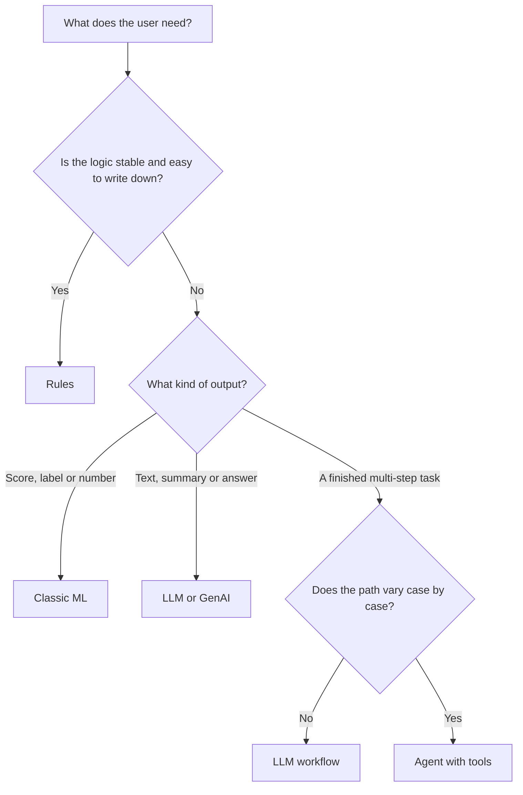
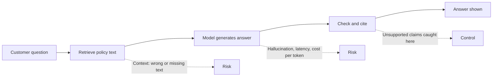
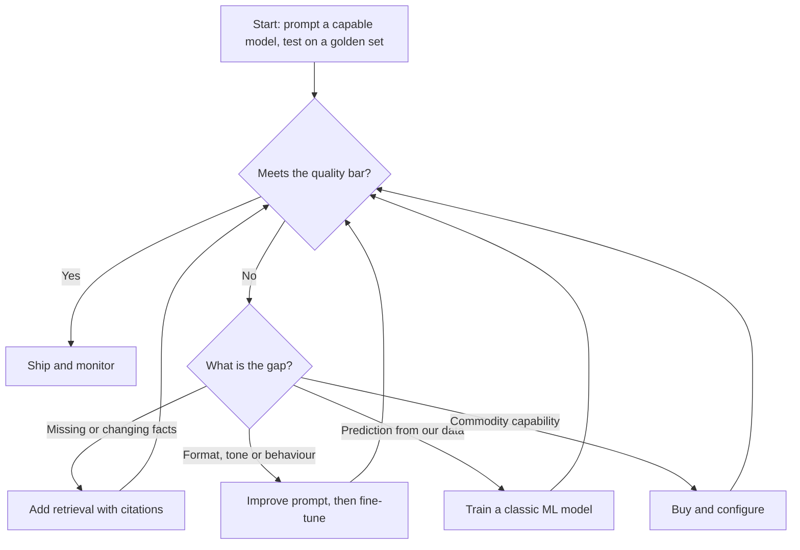

# Module 1 — AI literacy for product people

*You cannot manage a product you cannot reason about. This module gives you enough technical understanding to make product decisions, without asking you to become an engineer. You will learn to tell machine learning, generative AI, large language models and agents apart and match each to the job it does well. You will learn the limits that shape every AI product: errors, hallucination, context, latency and cost. You will also learn the ladder of ways to build an AI feature, from writing a prompt to training a model or buying a product. Throughout, you sit with Najm Bank's Digital & AI Products team as Faisal, a new AI product manager, learns from Rania, Dana and Tariq to ask better questions before he writes a single requirement.*

> **Stages:** Discover · Define · Build — the vocabulary and judgement you need before you can find, specify or build an AI product with confidence.

---

# 1.1 — Machine learning, generative AI, LLMs and agents: what each is good for
*Level: 🟢 Beginner* · *Prerequisites: 0.2* · *Stage: Discover*

## ⚡ In 60 seconds
- "AI" is an umbrella over four families: **machine learning** (predicts a label or number from examples), **generative AI** (produces new content), **large language models** (generative AI for text, behind most assistants) and **agents** (a model using tools in a loop to finish a task).
- The idea that matters most: **start from the output the user needs**, not from the technology. A score or yes/no points to classic ML; a draft or answer in words to an LLM; a multi-step task that changes other systems to an agent; fixed logic to plain rules.
- Families combine. Many good products use a predictive model to decide and a language model to explain or draft around that decision.
- Decision cue: if a transparent rule does the job, use the rule. Add learning only where the pattern is too complex or changes too often to write down.
- Biggest trap: using an LLM for a job that needs a consistent, calibrated, explainable number, such as a credit decision.

## 🧭 Why it matters
In his second week at Najm Bank, Faisal brings Rania a list of twelve ideas, all labelled "GenAI". Three stand out: *let an LLM approve SME invoice-financing requests* from the invoice and statements; *an LLM that reads every card transaction and flags fraud*; and *an agent that handles card disputes end to end in Najm Assist*.

Rania does not say no. She asks one question of each idea: "What does the output look like, and what happens when it is wrong?" SME financing needs a lending decision that is consistent, auditable and explainable, and the bank has years of labelled repayment history, which is what a classic predictive model learns from. Fraud scoring must handle millions of transactions within a card authorisation window at a tiny cost each; an LLM reading every one would be slow and expensive. The dispute agent is a real opportunity, but it moves money, so it needs far more careful design than a question-answering assistant.

Faisal's list is typical: teams reach for the exciting technology first and look for a problem second. This lesson builds the opposite habit: name the job, then pick the family of technique that fits it.

## 📐 How it works

### 🟢 The essentials

**Artificial intelligence (AI)** is a broad label for software that does tasks we associate with human judgement. For product work, the useful split is between logic a person *writes* (rules) and logic *learned from data* (models).

**Rules** are explicit instructions: "if a transfer is over QAR 50,000 and the payee is new, hold it for review." Rules are transparent, cheap and predictable, but break down when the pattern is too complex to write or changes faster than people can update them.

**Machine learning (ML)** learns a pattern from examples instead of being told the rule. The most common form in business is **supervised learning**: you show the model many past cases with the right answer attached (a **label**), such as "this invoice was repaid", and it learns to predict the label for new cases. **Training** is the learning step; **inference** is using the trained model on a new case. Typical ML jobs:

- **Classification**: which category? (fraud or not, will repay or not)
- **Regression**: what number? (expected loss, time to repay)
- **Ranking and recommendation**: which items first? (which offer to show a customer)
- **Anomaly detection**: what looks unusual? (a spending spike)
- **Forecasting**: what next? (branch cash demand next week)

A classification model usually outputs a **score**, for example a 0.82 probability of repayment. The product team then chooses a **threshold** that turns the score into an action ("pre-approve above 0.9, refer to an analyst between 0.6 and 0.9, decline below"). Choosing it is a product decision, because it sets how many good customers you turn away and how many bad risks you accept (lesson 1.2).

**Generative AI** is the family of models that produce new content: text, images, audio, code.

A **large language model (LLM)** is a generative model trained on very large amounts of text to predict the next small piece of text, called a **token** (roughly a word or part of a word). Repeat that prediction thousands of times and you get paragraphs, answers and code. The result is a general-purpose engine: the same model can summarise a financial statement, draft an email in Arabic and classify a complaint, depending on how you ask. A model trained broadly and then adapted to many tasks is often called a **foundation model**.

An **agent** is an LLM placed in a loop. It is given a goal and a set of **tools** (functions it can call, such as "look up a card", "freeze a card", "open a dispute"). It picks a tool, reads the result and decides the next step until the goal is met or it gives up. Agents turn language models from *advisers* into *actors*, which is both their value and their risk.

| Family | Typical output | Good for | Najm example | Main weakness |
|---|---|---|---|---|
| Rules | Fixed action | Stable, well-understood logic | Hard limits on transfers to new payees | Brittle when patterns change |
| Classic ML | Score, label, number, ranking | High-volume, repeatable predictions with labelled history | SME Instant Finance pre-approval; Smart Alerts | Needs good labelled data; one narrow task per model |
| Generative AI / LLM | Text, summaries, answers, code | Language-heavy work: drafting, summarising, extracting, answering from documents | Credit Memo Copilot; Staff GenAI | Can be fluently wrong; costs per use; varies run to run |
| Agent | Completed task with actions in other systems | Multi-step work across tools where the path varies | Najm Assist handling a card dispute | Errors compound over steps; actions can be hard to undo |

### 🟡 Going deeper

**How an LLM "knows" things.** An LLM does not look facts up in a database. Training adjusts billions of internal numbers (its **parameters**, or **weights**), and knowledge ends up stored in them in a diffuse, approximate way. Three consequences follow. The model's knowledge stops at its **knowledge cutoff**, when its training data was collected. It can produce plausible text about things it does not know, because plausible text is what it was trained to produce. And the reliable way to make it answer from *your* facts is to give it those facts at request time (retrieval, lesson 1.3).

Modern LLMs are built on the **transformer** architecture (Vaswani et al., 2017). You do not need its maths, only this: the model uses everything in its **context window** (the text it is given for this request, lesson 1.2) to shape each next token.

**Instruction tuning and preference training.** A model trained only to predict text continues text; it does not reliably follow requests. Vendors add training on examples of instructions and good responses, then on judgements of which responses are better (see OpenAI's InstructGPT paper, Ouyang et al., 2022, on reinforcement learning from human feedback). This is why assistants behave like helpful colleagues, and also why they tend to sound confident and agreeable even when they should push back.

**Embeddings.** An **embedding** is a list of numbers that represents the meaning of a piece of text, so that texts with similar meanings get similar numbers. They sit behind many AI products: semantic search ("find policies about early repayment" matches a clause that never uses those words), clustering complaints by theme, and the retrieval step in RAG.

**Workflows versus agents.** Not every multi-step LLM system is an agent. Anthropic's widely cited guide *Building effective agents* (2024) distinguishes **workflows**, where the steps are fixed by the developer (extract figures, then check ratios, then draft the memo), from **agents**, where the model itself decides the steps. Workflows are more predictable, cheaper and easier to test; choose an agent only when the path genuinely varies and the value justifies the risk. A card dispute can go several ways (merchant refund pending, card-not-present fraud, duplicate charge), which is why Najm Assist's dispute flow is a reasonable agent candidate. The Credit Memo Copilot follows the same structure every time, so it should be a workflow.

**Tools and MCP.** Models call tools through **function calling** (also called tool use): the model outputs a structured request, such as `freeze_card(card_id)`, and the application executes it. The **Model Context Protocol (MCP)**, introduced by Anthropic in November 2024, is an open standard for connecting models to tools and data sources in a consistent way, so that one integration can serve many AI applications. For a PM, the tools you expose are product surface: they set what the agent *can* do, and so what it can get wrong (lesson 5.3; the *Production AI Agents* course covers the engineering).

### 🔴 Expert view

**Hybrids beat purists.** The best AI products rarely use one family. SME Instant Finance uses a classic ML model for the pre-approval score, because that decision must be consistent, testable on historical cases and explainable with reason codes. An LLM can draft the customer letter, but the decision stays with the governed model. Smart Alerts likewise: ML scores the transaction; a language model might explain the alert in plain Arabic or English. The rule of thumb is to *decide with the most controllable component and communicate with the most fluent one*.

**Why not let the LLM decide credit?** There are four product problems. (1) *Consistency*: the same application may get different answers on different runs, or after a vendor model update. (2) *Calibration*: a predictive model's scores can be checked against observed default rates; an LLM's stated confidence is not a reliable probability. (3) *Explainability*: reason codes from a scorecard or a model explained with established techniques are easier to defend than a paragraph of generated reasoning, which may not reflect what actually drove the output. (4) *Regulation*: credit scoring of individuals is a high-risk use under the EU AI Act, and sole proprietors and guarantors blur the line even for an SME product (the *AI Governance: Zero to Hero* course covers the classification). "LLM decides credit" puts you in the most demanding place on every axis at once.

**Evaluation differs by family.** A predictive model has a right answer for each historical case, so you can measure it on held-out data before launch. Generated text has many acceptable answers and many subtly wrong ones, so evaluation needs rubrics, reference examples and human or model judges (Module 6). So a GenAI feature that looks finished after a two-day prototype may need weeks of evaluation before it is safe to ship.

**Do you need AI at all?** Martin Zinkevich's *Rules of Machine Learning* (Google) opens with "Don't be afraid to launch a product without machine learning." A rule often delivers much of the value at a fraction of the risk, and produces the data a later model needs (lesson 2.3).

## 🧰 The toolkit
| Tool or framework | What it is and does | When to reach for it |
|---|---|---|
| **Task-to-technology map** | A one-line statement per idea: user job, required output, cost of an error, and the family that fits (rules, ML, LLM, workflow, agent) | First pass over any list of AI ideas |
| **Rules of ML** (Martin Zinkevich, Google) | Practical guidance for ML products, starting with launching without ML | When a team wants a model before it has a baseline |
| **Workflows vs agents** (Anthropic, *Building effective agents*) | Distinguishes fixed multi-step LLM pipelines from model-directed loops | Deciding whether a feature needs autonomy or just steps |
| **Model Context Protocol (MCP)** (Anthropic, 2024) | Open standard for connecting models to tools and data sources | Planning which systems an assistant or agent can reach |
| **Embeddings** | Numeric representations of meaning used for semantic search, clustering and retrieval | When users search in their own words, or you need to group text |
| **Decide-then-explain pattern** | A predictive model makes the decision; a language model drafts or explains around it | Regulated decisions that still benefit from natural language |

## 🏛️ In practice at Najm Bank
Rania asks Faisal to redo his list as a **Technology-fit card**, one row per product, before anyone estimates effort:

| Product | User job | Output needed | Cost of an error | Family | Why not the obvious alternative |
|---|---|---|---|---|---|
| Credit Memo Copilot | RM turns financials and notes into a first-draft credit memo | Structured text with figures and sources | Wrong figure or invented covenant reaches credit committee | LLM **workflow** (fixed steps) | Agent adds unpredictability without benefit; the steps never vary |
| Najm Assist (phase 1) | Customer gets an answer about products and fees | Short answer in Arabic or English, grounded in published terms | Misstated fee or policy; bank bound by what the bot says | LLM with retrieval | Rules-based FAQ bot cannot handle free-form questions well |
| Najm Assist (phase 2) | Customer freezes a card or disputes a transaction | Completed action plus confirmation | Wrong card frozen; dispute filed incorrectly | **Agent** with narrow tools and confirmations | Fixed workflow cannot cover the variety of dispute paths |
| SME Instant Finance | SME gets a fast pre-approval on an invoice | Score and decision with reason codes | Loss from bad loans; unfair declines | **Classic ML**, with an LLM drafting letters | LLM decisions are inconsistent, uncalibrated and hard to explain |
| Smart Alerts | Customer is warned about likely fraud or unusual spend | Score per transaction, in real time | Missed fraud vs alert fatigue | **Classic ML** plus rules | LLM per transaction is too slow and too costly at volume |
| Staff GenAI | Employee drafts, summarises, searches internal knowledge | Text and answers | Leaked data; wrong internal policy quoted | General-purpose **LLM assistant** (likely bought, lesson 1.3) | A custom build duplicates a commodity product |

Rania's rule for the card: *"If you cannot fill in 'cost of an error', you are not ready to choose the technology."*

## 🛠️ Exercises
- 🟢 Classify five AI features you use as rules, classic ML, LLM, workflow or agent. *Done when:* each has a one-line reason based on its output, not on its marketing.
- 🟡 Faisal's list includes "an LLM that reads every card transaction and flags fraud". Rewrite it as a hybrid design that uses ML and an LLM each where it is strong. *Done when:* you state which component decides, which communicates, and one reason each (speed, cost, consistency or language).
- 🔴 Najm Assist's product owner wants the phase-2 agent to handle "anything a customer asks for". Write a half-page note arguing for a narrower first scope. *Done when:* the note names at most three tasks, explains why each suits an agent rather than a fixed workflow, and names one task that should stay a workflow and why.

## ⚠️ Mistakes and traps
- **Technology first.** "We need a GenAI use case" produces demos, not products. Start from the user job and the output it needs.
- **An LLM for predictive decisions.** For consistent, calibrated, explainable scores on structured data, classic ML is usually better, cheaper and easier to govern. Use the LLM to communicate around the decision.
- **Calling every pipeline an agent.** If the steps are the same every time, build a workflow. It is more predictable and easier to test.
- **Assuming the model knows your business.** An LLM knows what was in its training data up to its cutoff, approximately. Your policies, prices and customers must be supplied at request time.
- **Skipping the rules baseline.** Without a simple baseline you cannot show the model adds value, and you lose the cheapest option.

## 🧾 Recap
- Rules are written; models are learned. Classic ML predicts labels and numbers; generative AI and LLMs produce content; agents use tools in a loop to complete tasks.
- Choose the family from the output the user needs and the cost of an error.
- LLMs predict text from patterns learned in training. They do not look facts up unless you give them the facts.
- Prefer workflows to agents unless the path genuinely varies; tools are product surface.
- Hybrids are normal: decide with the controllable component, communicate with the fluent one.

## ✍️ Check yourself

**1. Najm Bank wants to pre-approve SME invoice-financing requests in seconds, using ten years of labelled repayment history. Which approach best fits the decision itself?**

- A. Ask an LLM to read the application and answer "approve" or "decline"
- B. Train a classic ML model on the repayment history and set thresholds for approve, refer and decline
- C. Build an agent that browses the company's website before deciding
- D. Use embeddings to find similar past memos and copy their decision

Answer

**B.** The job is a consistent, explainable prediction from structured, labelled history, which is exactly what supervised ML does. A is tempting because an LLM can produce an answer, but it is inconsistent, uncalibrated and hard to explain for a regulated decision. (🟢 The essentials; 🔴 Expert view.)

**2. What best describes what a large language model does when it generates an answer?**

- A. It retrieves the answer from an internal database of verified facts
- B. It repeatedly predicts the next token based on patterns learned in training and the text in its context
- C. It runs the rules its developers wrote for each topic
- D. It searches the internet for every request

Answer

**B.** LLMs generate text token by token from learned patterns plus whatever is in the context window. A is the most common misconception: there is no fact database inside the model, which is why they can be fluently wrong. (🟢 The essentials; 🟡 Going deeper.)

**3. The Credit Memo Copilot always extracts figures, checks ratios, then drafts sections in the same order. A vendor pitches an "autonomous agent" for it. What is the strongest product response?**

- A. Accept, because agents are more advanced than workflows
- B. Reject all use of LLMs for credit memos
- C. Prefer a fixed LLM workflow, because the steps do not vary and a workflow is more predictable and easier to test
- D. Replace the copilot with a classic ML classifier

Answer

**C.** Use an agent only when the path varies case by case. Here it does not, so a workflow gives the same value with less unpredictability. A confuses sophistication with fit. (🟡 Going deeper, workflows versus agents.)

**4. Smart Alerts must score millions of card transactions in real time at very low cost per transaction. A team proposes an LLM to review every transaction. What is the main product objection?**

- A. LLMs cannot read numbers
- B. For this volume and latency, a specialised ML model is faster and far cheaper per decision, and an LLM can be kept for explaining alerts to customers
- C. Fraud detection is prohibited under the EU AI Act
- D. LLMs cannot be used in Arabic

Answer

**B.** The objection is fit: speed, cost at volume and consistency favour classic ML, while an LLM can add value in communication. C is wrong: fraud detection is not a prohibited practice. (🔴 Expert view, hybrids; 🏛️ table.)

**5. Which statement about the Model Context Protocol (MCP) is accurate?**

- A. It is a training method that makes models more accurate
- B. It is an open standard, introduced by Anthropic in 2024, for connecting models to tools and data sources
- C. It is a regulation governing AI agents in the EU
- D. It is a metric for measuring hallucination

Answer

**B.** MCP standardises how AI applications connect to tools and data. It does not change the model itself (A). For a PM it matters because the tools you connect define what an assistant can do. (🟡 Going deeper, tools and MCP.)

## 📚 References
- Vaswani et al., "Attention Is All You Need" (2017) — https://arxiv.org/abs/1706.03762
- Ouyang et al., "Training language models to follow instructions with human feedback" (2022) — https://arxiv.org/abs/2203.02155
- Martin Zinkevich, *Rules of Machine Learning: Best Practices for ML Engineering* (Google) — https://developers.google.com/machine-learning/guides/rules-of-ml
- Anthropic, *Building effective agents* (2024) — https://www.anthropic.com/research/building-effective-agents
- Model Context Protocol — https://modelcontextprotocol.io
- Google, People + AI Guidebook (PAIR) — https://pair.withgoogle.com/guidebook

---

# 1.2 — Capabilities and limits: errors, hallucination, context, latency and cost
*Level: 🟢 Beginner* · *Prerequisites: 1.1* · *Stage: Define, Design*

## ⚡ In 60 seconds
- Every AI system is **wrong some of the time**. The product question is never "is it accurate?" but "how often is it wrong, in which way, for whom, and what happens then?"
- Five limits shape every AI product: **errors** (false positives and false negatives), **hallucination** (fluent output that is not true or not supported by the sources), **context** (what the model can see and what it knows), **latency** (how long the user waits) and **cost** (you pay per use, not once).
- Predictive errors are measured with a **confusion matrix**, **precision** and **recall**. When the thing you are looking for is rare, a model can be 99% accurate and still be wrong on most of the alerts it raises.
- Cost is estimated per task with a simple model: tokens in and out, times price, times calls per task, times volume. It is often trivial for an internal tool and material for a consumer assistant.
- Decision cue: write down the limits *before* you design. Each limit becomes either a design feature (citations, confirmations, streaming, fallbacks) or a quality bar.
- Biggest trap: judging a model by a great demo. Demos show the best case; users meet the distribution.

## 🧭 Why it matters
Two weeks into the Credit Memo Copilot pilot, Khalid forwards Rania a draft memo with one sentence highlighted. The memo says the borrower's existing facility "includes a negative pledge covenant and a minimum DSCR of 1.25x". The facility agreement says neither. The draft reads perfectly. The relationship manager (RM) had not checked it because "the rest of the numbers were right". Khalid's note is short: "If this reaches credit committee, who is accountable?"

The model did what language models do: it produced a plausible credit memo, and plausible credit memos mention covenants. The failure was in the product. Nothing forced the draft to cite its source, nothing flagged unsupported claims, and nobody had told the RM where the copilot is weak.

Public examples show the same pattern. In February 2023, a launch demo of Google's Bard included a factual error about the James Webb Space Telescope. In *Moffatt v. Air Canada* (2024), a tribunal held the airline liable after its website chatbot described a refund policy that did not match the airline's own policy. In both cases the product around the model did not account for a known limit. This lesson gives you the vocabulary to name each limit, and the habit of designing for it before users find it.

## 📐 How it works

### 🟢 The essentials

| Limit | What it means | What the user sees | What the PM does about it |
|---|---|---|---|
| **Errors** | The model's output is wrong for some inputs, at some rate | A missed fraud; a false alert; a wrong category | Measure error types, choose thresholds, design recovery |
| **Hallucination** | Generated content that is false or not supported by the provided sources | Invented covenant, fee or policy stated confidently | Ground answers in sources, show citations, allow "I don't know", check claims |
| **Context** | The model sees only what is in its context window, and knows only what it learned up to its cutoff | Out-of-date answers; ignores a document it was not given | Supply the right facts at request time; manage what goes in |
| **Latency** | Time from request to useful output | Waiting, spinners, abandoned conversations | Set a latency budget; stream; choose smaller models for simple steps |
| **Cost** | Every request costs money, in proportion to the text processed | Nothing directly, until the finance team does | Estimate cost per task early; design to keep context lean |

Two further properties cut across all five.

**Non-determinism.** LLMs choose each next token by sampling from probabilities. A setting called **temperature** controls how adventurous that choice is: low favours the most likely tokens, high allows more variety. Even at low temperature, outputs can vary between runs, so the product must cope with slightly different answers.

**Version change.** Vendors update and retire models. A new version can be better on average and worse on your task. Treat a model change like a code change: re-run your evaluation before switching (Module 6, lesson 9.2).

### 🟡 Going deeper

**Errors in predictive models.** For a yes/no model, there are four outcomes, shown in a **confusion matrix**:

| | Actually fraud | Actually legitimate |
|---|---|---|
| **Model flags** | True positive (caught) | False positive (false alarm) |
| **Model does not flag** | False negative (missed) | True negative |

Two measures follow. **Precision**: of the transactions flagged, what share were really fraud? **Recall**: of the real frauds, what share did we flag? They trade off through the threshold: lower it and recall rises while precision falls.

Here is why base rates matter (illustrative numbers). Suppose Smart Alerts sees 1,000,000 transactions and 1,000 are fraud (0.1%). The model catches 900 of them (90% recall) and wrongly flags 1% of legitimate transactions, which is 9,990 false alarms. Accuracy looks superb: (900 + 989,010) / 1,000,000 ≈ 99%. But precision is 900 / (900 + 9,990) ≈ 8%. More than eleven of every twelve alerts a customer receives are false. A "model" that never flags anything would score 99.9% accuracy and catch nothing. **Accuracy is the wrong headline metric for rare events.** Decide which error hurts more: a missed fraud costs money and trust; a false alert teaches customers to ignore alerts (**alert fatigue**).

**Hallucination in generative models.** The term covers several failures, and it helps to separate them:
- **Fabrication**: content with no basis at all (an invented covenant, a non-existent regulation, a made-up citation).
- **Unfaithfulness to the source**: the model was given the right document but misstates it (wrong figure, reversed condition).
- **Outdated knowledge**: true once, not now (last year's fee schedule from training data).
- **Wrong attribution**: a real fact credited to the wrong source or entity.

The main mitigations are product design choices. **Grounding** means giving the model the authoritative text and instructing it to answer only from it. **Citations** link each claim to its source so a person can check it quickly. **Abstention** means allowing and rewarding "I couldn't find this in the documents" instead of a guess. **Verification** means a second step, by software or another model, that checks claims against the sources, and flags or removes unsupported ones. None of these reduces hallucination to zero. They make it rarer and easier to catch.

**Context.** Models process text as **tokens**. For English, a common rule of thumb is that a token is about three-quarters of a word; Arabic and other languages often need more tokens per word, depending on the model's tokenizer. The **context window** is the maximum number of tokens the model can handle in one request, counting both what you send and what it writes back. At the time of writing (2026), leading models accept very long contexts, but three limits remain:
1. **Longer is not always better.** Research such as Liu et al., "Lost in the Middle" (2023), found that models can use information near the start or end of a long context better than information in the middle. Putting everything in is not the same as the model using everything.
2. **Every token costs money and time.** A 100-page facility pack sent with every question is slow and expensive.
3. **The model only knows what it is shown.** If the retrieval step misses the relevant clause, the model cannot use it, and may fill the gap with something plausible.

**Latency.** Two measures matter: **time to first token** (how quickly something appears) and **total time** (how long until the output is complete). Output length drives total time. **Streaming** (showing text as it is generated) makes a 10-second answer feel acceptable in a chat but does not help when the output feeds another system. In workflows and agents, latency adds up: five sequential three-second calls make a 15-second task.

**Cost.** Most model APIs charge per token, with input and output priced separately, and output usually costing more per token. A simple **cost-per-task model**:

> cost per task = (input tokens × input price + output tokens × output price) × model calls per task + other costs (retrieval, tools, hosting)

Illustrative prices only (check your vendor's current prices): say $3 per million input tokens and $15 per million output tokens.
- *Credit Memo Copilot*: about 30,000 input tokens (financials and notes) and 2,000 output tokens per call is $0.09 + $0.03 = $0.12. With four calls per memo, that is about $0.48 per memo. At a few hundred memos a month, model cost is small next to hours of RM time. **Quality, not cost, is the constraint.**
- *Najm Assist*: about 2,000 input and 300 output tokens per turn is $0.006 + $0.0045 ≈ $0.01. Five turns per conversation is about $0.05, and a million conversations a month is about $50,000. At consumer scale, **cost becomes a design constraint**. Conversation history also grows with each turn, so later turns cost more unless you trim it.

The method matters more than the numbers: estimate cost per task in discovery and multiply by realistic volume (Module 8).

### 🔴 Expert view

**The frontier is jagged.** A model can analyse a complex cash-flow statement and still slip on arithmetic or a local date format. General benchmarks say little about *your* task; the reliable answer to "is it good enough?" is an evaluation on your own representative inputs, including awkward ones (Module 6). A demo is one sample; your users will meet the whole distribution.

**Errors compound in chains.** If each step in an agent succeeds 95% of the time, and failures are independent, a ten-step task succeeds about 0.95¹⁰ ≈ 60% of the time. Real steps are not independent, so treat this as intuition, but the direction holds: long chains need checkpoints, confirmations before risky actions and recovery paths. This is why Najm Assist's dispute agent asks the customer to confirm before filing.

**Untrusted text can steer the model.** Because instructions and data both arrive as text, content the model reads (an email, a web page, a document) can contain instructions that hijack it. This is **prompt injection**. The Chevrolet dealer chatbot that agreed to "sell" a car for $1 after user manipulation (December 2023) is a well-known public example; the stakes there were reputational, but for an agent with tools they are actions. The PM's part is to limit what tools can do, require confirmation for consequential actions and never rely on the prompt alone for security. The *Production AI Agents* course covers defences.

**Cost is a quality lever, and quality is a cost lever.** Smaller models are often good enough for simple steps, leaving the larger model for the hard step. But a cheap model that fails more often pushes cost into human review and rework. Klarna's AI assistant is a useful caution. The company announced in early 2024 that it was handling a large share of customer chats, and in 2025 said it would bring more human service back. It shows why cost savings must be measured alongside resolution quality and satisfaction.

**Limits are design material.** Mature AI PMs turn each limit into a requirement. Hallucination becomes "every figure links to its source cell". Latency becomes "first token under two seconds; full memo under a minute". Cost becomes "cost per resolved conversation under $X". Errors become "precision at least Y at recall Z". Lesson 5.1 turns these into the AI product spec.

## 🧰 The toolkit
| Tool or framework | What it is and does | When to reach for it |
|---|---|---|
| **Confusion matrix** | Table of true/false positives and negatives for a classifier | Any yes/no model: fraud, approval, routing |
| **Precision and recall** | Share of flagged items that are right; share of right items that get flagged | Setting thresholds; rare-event products like Smart Alerts |
| **Cost-per-task model** | Tokens in and out × price × calls per task × volume, plus other costs | Discovery and business case for any LLM feature |
| **Limits register** | One page listing each limit, how it shows up, its severity and the design response | Before design starts; reviewed at each stage gate |
| **Grounding with citations** | Answer only from supplied sources and link each claim to its source | Any answer that states facts, policies, figures or terms |
| **Golden set** | A curated set of representative inputs with expected outputs or grading criteria | Checking capability on your task instead of trusting demos |
| **Latency budget** | Target times for first token and completion, split across steps | Chat, voice and multi-step workflows |

## 🏛️ In practice at Najm Bank
After Khalid's email, Rania and Faisal write a **Limits register** for the Credit Memo Copilot, with Dana (models, evaluation) and Tariq (latency, cost). It is now a required page in every AI product brief at Najm.

| Limit | How it shows up here | Severity | Design response | Quality bar (draft) | Owner |
|---|---|---|---|---|---|
| Hallucination: fabrication | Invented covenants, collateral or ratings | High | Answer only from uploaded documents; every claim cites a page; unsupported claims flagged in red | Zero unsupported covenants on the golden set; spot checks in production | Dana |
| Hallucination: unfaithful figures | Wrong DSCR, leverage or revenue | High | Figures extracted and calculated by code, not generated; model writes narrative around them | 100% of figures match source on the golden set | Tariq |
| Context | Large facility packs; key clause missed | Medium | Section-by-section retrieval; "documents not reviewed" list shown to the RM | RM sees which documents were used, every time | Faisal |
| Non-determinism | Two drafts of the same memo differ | Low | Low temperature; RM edits a single draft; version stored | Differences limited to wording, not facts | Dana |
| Latency | RM waits for a full memo | Low | Draft sections in parallel; progress shown | Full draft under two minutes (illustrative) | Tariq |
| Cost | Long inputs × revisions | Low | Cache extracted financials; trim context | Under $1 per memo (illustrative estimate: about $0.50) | Tariq |
| Over-trust | RM stops checking because most output is right | High | Mandatory review of highlighted claims before export; training on known weaknesses | Review step completed on 100% of exported memos | Faisal, Hessa |

Rania's note at the bottom: *"Every high-severity row needs a design response we can test, not a warning in the user guide."*

## 🛠️ Exercises
- 🟢 Recompute Smart Alerts precision if the false-alarm rate on legitimate transactions falls from 1% to 0.2% and recall stays at 90%. *Done when:* you show the number of false alarms, the precision, and one sentence on what this means for alert fatigue.
- 🟡 Build a cost-per-task estimate for Staff GenAI with your own illustrative assumptions: users, requests per user per day, tokens in and out, price. *Done when:* you have a monthly cost, you have labelled every assumption as illustrative, and you name the one assumption that moves the total most.
- 🔴 Write a limits register for Najm Assist phase 1 (answering questions about products and fees). *Done when:* it covers all five limits plus non-determinism, each high-severity row has a testable design response, and at least one row cites a public case (Air Canada or the Chevrolet dealer) as the reason for the control.

## ⚠️ Mistakes and traps
- **Headline accuracy.** For rare events, accuracy hides failure. Ask for precision and recall, and for the cost of each error type.
- **Treating hallucination as a model bug the vendor will fix.** It is a property of how generation works. Design grounding, citations, abstention and review into the product.
- **Stuffing the context.** More text is slower, costlier and not always used well. Retrieve what is relevant and show users what was used.
- **Discovering cost after launch.** Estimate cost per task in discovery and multiply by realistic volume. Growing chat history is a common surprise.
- **Trusting the demo.** Test on your own representative inputs, including awkward ones, before promising quality.
- **Warnings instead of design.** "AI can make mistakes" in small print does not protect users or the bank. Turn each serious limit into a control you can test.

## 🧾 Recap
- AI systems are wrong some of the time; the PM decides which errors are tolerable and what happens when they occur.
- Precision and recall, not accuracy, describe rare-event models; thresholds trade one against the other.
- Hallucination comes in several kinds; grounding, citations, abstention and verification reduce and expose it.
- Context, latency and cost are linked through tokens; estimate cost per task early with a simple model.
- Write a limits register before design, and turn each serious limit into a design response and a quality bar.

## ✍️ Check yourself

**1. A fraud model is 99% accurate on a dataset where 0.1% of transactions are fraud. What should the PM ask next?**

- A. Nothing; 99% accuracy is excellent
- B. What are its precision and recall, and what does each type of error cost?
- C. Whether the model uses deep learning
- D. Whether accuracy could reach 99.9%

Answer

**B.** With rare events, a model that never flags anything scores 99.9% accuracy. Precision and recall show how many alerts are real and how much fraud is caught. D is tempting, but it chases the misleading metric. (🟡 Going deeper, errors.)

**2. The Credit Memo Copilot states a covenant that does not appear in the facility agreement it was given. Which design response most directly addresses this?**

- A. Increase the temperature so the model explores more options
- B. Add a line to the user guide saying AI can make mistakes
- C. Require every claim to cite a source passage and flag any claim without one
- D. Switch to a model with a larger context window

Answer

**C.** Grounding with citations makes unsupported claims visible and checkable. A makes variation more likely, B is a warning rather than a control, and D does not stop fabrication because the model already had the document. (🟡 Going deeper, hallucination; 🏛️ register.)

**3. Using illustrative prices of $3 per million input tokens and $15 per million output tokens, what is the approximate model cost of one call with 30,000 input tokens and 2,000 output tokens?**

- A. $0.012
- B. $0.12
- C. $1.20
- D. $12.00

Answer

**B.** 30,000 × $3 / 1,000,000 = $0.09, plus 2,000 × $15 / 1,000,000 = $0.03, which gives $0.12. (🟡 Going deeper, cost.)

**4. Najm Assist's phase-2 agent completes a dispute in eight steps. Each step succeeds about 95% of the time in testing. What is the best product conclusion?**

- A. The agent is 95% reliable end to end
- B. End-to-end success is likely much lower, so add checkpoints, customer confirmation before filing and a recovery path
- C. Agents should never be used for disputes
- D. Increase the context window to fix it

Answer

**B.** Step errors compound: 0.95⁸ is roughly 66% if the steps were independent. A is the trap of reading per-step accuracy as end-to-end accuracy. C over-reacts; the answer is design, not abandonment. (🔴 Expert view, errors compound.)

**5. Why can putting an entire 300-page document into a long context window still produce poor answers?**

- A. Models cannot read documents longer than one page
- B. Models may use information in the middle of long contexts less reliably, and every token adds cost and latency
- C. Long contexts make models deterministic
- D. Context windows only count output tokens

Answer

**B.** Research such as "Lost in the Middle" found uneven use of long contexts, and every extra token costs time and money. D is wrong: the window counts input and output. (🟡 Going deeper, context.)

## 📚 References
- Liu et al., "Lost in the Middle: How Language Models Use Long Contexts" (2023) — https://arxiv.org/abs/2307.03172
- Google, Machine Learning Crash Course: classification, precision and recall — https://developers.google.com/machine-learning/crash-course
- *Moffatt v. Air Canada*, 2024 BCCRT 149 — https://decisions.civilresolutionbc.ca
- OWASP Top 10 for Large Language Model Applications — https://owasp.org/www-project-top-10-for-large-language-model-applications/
- Google, People + AI Guidebook (PAIR): errors and graceful failure — https://pair.withgoogle.com/guidebook
- Amershi et al., "Guidelines for Human-AI Interaction", CHI 2019 — https://www.microsoft.com/en-us/research/project/guidelines-for-human-ai-interaction/

---

# 1.3 — The build spectrum: prompt, retrieval (RAG), fine-tune, train, or buy
*Level: 🟢 Beginner* · *Prerequisites: 1.1, 1.2* · *Stage: Build*

## ⚡ In 60 seconds
- There are five main ways to put AI into a product, from lightest to heaviest: **prompt** an existing model, add **retrieval (RAG)** so it answers from your documents, **fine-tune** a model on your examples, **train** your own model, or **buy** a finished product.
- The idea that matters most: **diagnose the gap before choosing the fix.** Missing knowledge is a retrieval problem. Wrong behaviour, format or tone is a prompting or fine-tuning problem. A prediction from your own structured data is a training problem. A commodity need is a buying problem.
- Climb the ladder one rung at a time. Start with the simplest approach that could work, measure it on a golden set, and move up only when evidence shows the lower rung cannot reach the quality bar.
- Decision cue: facts that change (policies, prices, rates, customer records) belong in retrieval, not in model weights.
- Biggest trap: fine-tuning to teach a model facts. It is slow, hard to update, still hallucinates and goes stale when policy changes.

## 🧭 Why it matters
Faisal has a plan for the Credit Memo Copilot's accuracy problem (lesson 1.2): "We have ten years of approved credit memos. Let's fine-tune a model on all of them so it writes like our best analysts and knows our credit policy."

Dana, the lead data scientist, asks three questions. "Which credit policy? Ours changed in 2024, and many of those memos cite rules we no longer use. How will you update the model when policy changes again? And when it states a covenant, how will the RM know where it came from?" Tariq adds that a fine-tuned model must be hosted, versioned and retrained, possibly from scratch when the vendor retires its base model.

"Train it on our data" sounds like the serious, proprietary option. But the copilot's failure was not about style: it stated facts that were not in the documents. That is a knowledge and grounding problem, fixed by giving the model the right documents at request time and making it cite them. The wrong rung of the build ladder wastes months and can make the product worse. Choose the rung from the gap you are trying to close.

## 📐 How it works

### 🟢 The essentials

**Rung 1: Prompting.** You use an existing model as it is and control it through the **prompt**: the instructions, context and examples you send with each request. A **system prompt** sets standing instructions ("You draft credit memo sections for Najm Bank RMs. Use only the documents provided. Cite page numbers."). Adding a few worked examples in the prompt is called **few-shot prompting**. Prompting is fast, cheap to change and surprisingly powerful: always the first rung.

**Rung 2: Retrieval-augmented generation (RAG).** You connect the model to your own knowledge. When a request arrives, the system searches your documents for the most relevant passages and places them in the prompt, and the model answers from them, ideally with citations. The term comes from Lewis et al. (2020). RAG is the standard way to make a model answer from **current, private or specific** information: policies, product terms, a customer's file. You update the knowledge by updating the documents, not the model.

**Rung 3: Fine-tuning.** You take an existing model and train it further on your own examples of inputs and desired outputs, which changes its weights. Fine-tuning is good at teaching **behaviour**: a consistent format, a house style, a narrow classification task, or making a smaller, cheaper model perform like a larger one on one task. It is poor at teaching **facts that change**.

**Rung 4: Training your own model.** You build a model from your own data. For classic ML this is normal and often the right answer: SME Instant Finance's pre-approval model is trained on Najm's own repayment history, which no vendor has. Training a large language model from scratch takes enormous data, computing power and specialist teams, and is almost never sensible for a bank.

**Beside the ladder: buying.** You buy a finished product (an enterprise assistant, a fraud platform) or managed service and configure it. You gain speed and a vendor's investment; you give up some control and differentiation and take on dependency.

| Rung | What it changes | What you need | Time to first version | Update path | Najm example |
|---|---|---|---|---|---|
| Prompt | Instructions and examples sent per request | Clear task; golden set | Days | Edit the prompt | Tone and structure of Najm Assist answers |
| RAG | The information the model sees per request | Clean, permissioned documents; search index | Weeks | Update documents | Credit Memo Copilot reading the facility pack and credit policy |
| Fine-tune | Model behaviour, through its weights | Hundreds to thousands of good examples; ML skills | Weeks to months | Retrain | A small model that classifies customer messages into dispute types |
| Train | A new model | Labelled historical data; ML team; model risk process | Months | Retrain and revalidate | SME Instant Finance pre-approval model |
| Buy | Nothing inside; you configure | Vendor due diligence; integration; contract | Weeks | Vendor releases | Staff GenAI enterprise assistant |

### 🟡 Going deeper

**Diagnose the gap first.** Write down what is wrong with the simplest version, using golden-set examples (lesson 1.2):

| Symptom in testing | Likely gap | First fix to try |
|---|---|---|
| Right style, wrong or invented facts | Knowledge | RAG with citations |
| Right facts, wrong format, tone or structure | Behaviour | Better prompt and examples; fine-tune if that plateaus |
| Good quality but too slow or costly at volume | Efficiency | Smaller model; fine-tune a small model; caching |
| Needs a prediction from your structured data | Prediction | Train a classic ML model |
| A generic capability everyone needs | Commodity | Buy |
| Fails even with perfect context and examples | Capability | Stronger model, or narrow the task, or reconsider the idea |

**Inside RAG.** RAG is a small search engine attached to a model, and most RAG failures are search failures. The steps:
1. **Prepare**: collect documents, clean them, split them into passages (**chunking**) and attach metadata such as date, product and who may see them.
2. **Index**: turn passages into embeddings (lesson 1.1) and store them in a searchable index, often a **vector database**, commonly combined with keyword search.
3. **Retrieve**: for each question, find the most relevant passages, and optionally **rerank** them with a second, more precise model.
4. **Generate**: put the passages into the prompt and instruct the model to answer only from them, with citations.

Typical failures and the questions they raise: the right passage was never retrieved (*is search quality measured separately?*); an old policy version is retrieved (*who owns freshness?*); a user sees a passage they are not entitled to (*does retrieval respect access rights?*). The last one matters most in a bank. Staff GenAI must not surface a confidential credit file to someone outside the deal team because the answer happened to be relevant. **Permissions must be enforced at retrieval, not left to the prompt.**

**Inside fine-tuning.** Two variants are worth knowing by name. **Full fine-tuning** updates all the weights; **parameter-efficient fine-tuning** updates a small add-on, with **LoRA** (Hu et al., 2021) the best-known method. It is cheaper and faster. Either way you need good examples: consistent, correct, representative and cleared for this use by your privacy team (Sara at Najm, lesson 3.3). You also inherit maintenance: when the base model is retired, you may need to fine-tune and evaluate again. Fine-tune when prompting has plateaued on behaviour, when you need a smaller model for cost or latency, or when a narrow task has abundant examples.

**Combining rungs is normal.** A mature Credit Memo Copilot might use RAG for documents, code for calculations, a careful prompt for structure and later a fine-tuned small model for one extraction step. The ladder sets the *order* in which you add complexity, not a single choice.

### 🔴 Expert view

**Buy versus build is a portfolio decision.** Buy where the capability is a commodity and differentiation is low (Staff GenAI's drafting and summarising). Build where your data, workflow or risk position is the advantage (the Credit Memo Copilot's integration with Najm's credit process, SME Instant Finance's model). Most real products are "buy the model, build the product": you rent a foundation model through an API and build the retrieval, workflow, evaluation and user experience around it. Yusuf (procurement) and Sara (DPO) will ask product questions too: where is data processed, is it used to train the vendor's models, what happens when a model is retired, can we export our data, and what is the price at our volume? *AI Governance: Zero to Hero* covers how responsibility shifts between provider and deployer.

**Open-weight versus closed models.** **Closed** models are used through a vendor's API; you never hold the weights. **Open-weight** models publish their weights, so you can host them yourself. Self-hosting can help with data residency, control and cost at high volume, but you take on infrastructure, security, scaling and upgrades, and how open-weight and closed models compare on your task varies and changes quickly. For a GCC bank with residency concerns this is a real choice; decide it with Tariq on evidence from your own evaluation, not on ideology.

**Design for model change.** The model you launch with will not be the model you run in two years. Protect the product by keeping a thin layer between your application and any one vendor's API, keeping prompts and retrieval configuration under version control, and, most importantly, owning a strong **evaluation suite**. Golden sets and an evaluation harness make switching models a measured decision instead of a leap of faith, and a competitor cannot copy them by calling the same API.

**Where the defensibility is.** If everyone can call the same models, the model is not your moat. Durable advantage comes from proprietary data and feedback loops (Module 3), workflow integration, trust and evaluation know-how (lesson 9.1). Morgan Stanley's internal assistant for financial advisers (announced 2023) illustrates this: built on a vendor's model, made useful by the firm's own research and procedures.

**Total cost is more than tokens.** Compare rungs on total cost of ownership: build time, people, hosting, evaluation, retraining, vendor fees at projected volume and switching cost. A fine-tuned model that saves on tokens can cost more once retraining and specialist time are counted.

## 🧰 The toolkit
| Tool or framework | What it is and does | When to reach for it |
|---|---|---|
| **Build ladder** | Prompt → RAG → fine-tune → train, with buy as a parallel option; climb only on evidence | Choosing how to build any AI feature |
| **Gap diagnosis table** | Maps symptoms in testing (wrong facts, wrong format, too slow, needs prediction) to the right fix | Before proposing fine-tuning or training |
| **RAG** (Lewis et al., 2020) | Retrieve relevant passages at request time and generate an answer from them with citations | Current, private or specific knowledge; policy and product answers |
| **Fine-tuning** (e.g. LoRA, Hu et al., 2021) | Further training on your examples to change behaviour | Format, tone, narrow tasks, smaller cheaper models, after prompting plateaus |
| **Golden set** | A curated set of representative inputs with expected outputs or grading criteria | Deciding whether a rung is good enough, and whether a model change is safe |
| **Build-vs-buy scorecard** | Compares options on differentiation, data control, time to value, total cost and lock-in | Commodity capabilities; vendor proposals |
| **Cost-per-task model** | Tokens in and out × price × calls per task × volume, plus other costs | Comparing rungs and vendors on running cost |

## 🏛️ In practice at Najm Bank
After Dana's questions, Faisal writes a **Build-path decision record** for the Credit Memo Copilot. Rania now asks for one for every AI feature, before any engineering estimate.

**Build-path decision record — Credit Memo Copilot (v1)**

| Field | Entry |
|---|---|
| User job | RM turns a facility pack, financial statements and call notes into a first-draft credit memo |
| Quality bar (from limits register, 1.2) | Zero unsupported covenants on the golden set; 100% of figures match source; RM can see the source of every claim |
| Gap found with prompting alone | Right structure and tone; invented or outdated facts; arithmetic slips |
| Diagnosis | Knowledge gap (facts) and calculation gap, not a behaviour gap |
| Chosen path | **Prompt + RAG + code for calculations.** Retrieval over the deal's documents and the current credit policy; figures computed by code; model writes the narrative with page citations |
| Rejected: fine-tune on ten years of memos | Old memos embed superseded policy; facts would go stale; no citations; retraining burden on every policy change and base-model retirement |
| Rejected: agent | Steps are the same every time; a workflow is more predictable (1.1) |
| Reconsider fine-tuning when | Prompting plateaus on house style **and** a cleaned, current set of good memos exists **and** volume justifies it |
| Model choice | Vendor API model behind an internal abstraction layer; open-weight option evaluated by Tariq for data residency |
| Data and permissions | Retrieval limited to documents the RM is entitled to see; Sara to confirm processing terms with the vendor |
| Evidence needed to proceed | Golden set of 50 past deals with checked facts (Dana); cost-per-task estimate (Tariq) |

The team's quick view across the portfolio:

| Product | Path | Why |
|---|---|---|
| Najm Assist (phase 1) | Prompt + RAG over published terms and fees | Answers must match current, official information |
| Najm Assist (phase 2) | Prompt + RAG + tools, as an agent with confirmations | Needs to act, not only answer |
| SME Instant Finance | Train a classic ML model; LLM prompt for letters | Prediction from Najm's own repayment data |
| Smart Alerts | Train, or buy a fraud platform and tune it | Specialised, high-volume scoring; mature vendor market |
| Staff GenAI | Buy an enterprise assistant; add RAG over internal policies | Commodity capability; value comes from adoption and internal knowledge |

## 🛠️ Exercises
- 🟢 For each of these symptoms, name the first fix from the gap diagnosis table: (a) Najm Assist quotes last year's card fee; (b) Staff GenAI answers are correct but too long; (c) the dispute classifier is accurate but too slow and costly at peak volume. *Done when:* each answer names a rung and gives a one-sentence reason.
- 🟡 Write a build-path decision record for Najm Assist phase 1 using the template above. *Done when:* it states the quality bar, the gap found with prompting alone, the chosen path, at least one rejected option with reasons, and one condition that would change the decision.
- 🔴 Yusuf has two proposals for Staff GenAI: buy an enterprise assistant, or build one on an open-weight model hosted in-country. Draft a build-vs-buy scorecard. *Done when:* you compare both on differentiation, data residency and control, time to value, total cost of ownership (with illustrative, labelled numbers), lock-in and model-change risk, and make a recommendation with the one piece of evidence that could reverse it.

## ⚠️ Mistakes and traps
- **Fine-tuning for facts.** Changing facts belong in retrieval, where they can be updated and cited. Fine-tune for behaviour.
- **Skipping rungs.** Jumping to fine-tuning or training before a well-built prompt and RAG baseline wastes months. Climb on evidence from a golden set.
- **Treating RAG as plug-and-play.** Most RAG failures are search failures. Measure retrieval separately and assign document owners.
- **Leaving access control to the prompt.** Enforce who may see what at retrieval. A prompt instruction is not a security control.
- **Assuming the model is the moat.** Anyone can call the same API. Invest in data, workflow integration and evaluation.
- **Buying without an exit.** Check data use, model retirement, export and pricing terms at your volume before signing, and keep an evaluation suite that lets you switch.

## 🧾 Recap
- Five ways to build: prompt, RAG, fine-tune, train, buy. Most products combine several.
- Diagnose the gap first: knowledge → RAG; behaviour → prompt then fine-tune; prediction from your data → train; commodity → buy.
- Start at the lowest rung, measure on a golden set and climb only when evidence says you must.
- RAG is search plus generation; quality, freshness and permissions live in the search step.
- Design for model change and own your evaluations; defensibility comes from data, workflow and trust, not from the model you rent.

## ✍️ Check yourself

**1. Najm Assist keeps quoting a card fee that changed last month. What is the most appropriate fix?**

- A. Fine-tune the model on the new fee schedule
- B. Retrieve the current fee schedule at request time and have the model answer from it with a citation
- C. Increase the temperature
- D. Train a new language model from scratch

Answer

**B.** Facts that change belong in retrieval, where updating the document updates the answer. A is tempting but would need retraining at every fee change and still gives no citation. (🟢 The essentials; 🟡 gap diagnosis.)

**2. Faisal proposes fine-tuning on ten years of past credit memos so the copilot "knows our credit policy". What is the strongest objection?**

- A. Fine-tuning is illegal for banks
- B. Past memos embed superseded policy, facts in weights go stale and cannot be cited, and every policy change would need retraining
- C. Fine-tuning always makes models less accurate
- D. Ten years of data is too little for any model

Answer

**B.** This is a knowledge problem, which retrieval handles better. Fine-tuning can help with style later, which is why C overstates the case. (🧭 Why it matters; 🏛️ decision record.)

**3. Testing shows the Staff GenAI assistant gives correct answers, but in the wrong structure and far too long, even after several prompt revisions. Which next step fits the build ladder?**

- A. Add more documents to retrieval
- B. Train a model from scratch
- C. Refine examples in the prompt further, and consider fine-tuning if it still plateaus, since this is a behaviour gap
- D. Buy a second vendor product

Answer

**C.** Wrong format or length with correct facts is a behaviour gap: prompt first, then fine-tune on evidence. A addresses knowledge, which is not the problem here. (🟡 Going deeper, gap diagnosis.)

**4. A Staff GenAI user in Retail Marketing receives an answer quoting a confidential corporate credit file. Where should this have been prevented?**

- A. In the system prompt, by telling the model not to reveal confidential data
- B. At retrieval, by enforcing the user's access rights before passages reach the model
- C. By lowering the temperature
- D. By fine-tuning the model on public data only

Answer

**B.** Permissions must be enforced at retrieval. A prompt instruction (A) is not a security control and can be bypassed or ignored. (🟡 Going deeper, inside RAG; ⚠️ traps.)

**5. Which asset best protects Najm's AI products when a vendor retires the model they depend on?**

- A. A longer contract with the current vendor
- B. A strong evaluation suite with golden sets, plus a thin layer between the application and any one vendor's API
- C. A fine-tuned copy of the retired model
- D. Avoiding AI products altogether

Answer

**B.** Owned evaluations and an abstraction layer turn a model switch into a measured decision. C keeps you tied to the retired base model and still needs revalidation. (🔴 Expert view, design for model change.)

## 📚 References
- Lewis et al., "Retrieval-Augmented Generation for Knowledge-Intensive NLP Tasks" (2020) — https://arxiv.org/abs/2005.11401
- Hu et al., "LoRA: Low-Rank Adaptation of Large Language Models" (2021) — https://arxiv.org/abs/2106.09685
- Anthropic, *Building effective agents* (2024) — https://www.anthropic.com/research/building-effective-agents
- Martin Zinkevich, *Rules of Machine Learning* (Google) — https://developers.google.com/machine-learning/guides/rules-of-ml
- NIST AI Risk Management Framework (third-party and supply-chain considerations) — https://www.nist.gov/itl/ai-risk-management-framework
- OWASP Top 10 for Large Language Model Applications — https://owasp.org/www-project-top-10-for-large-language-model-applications/
