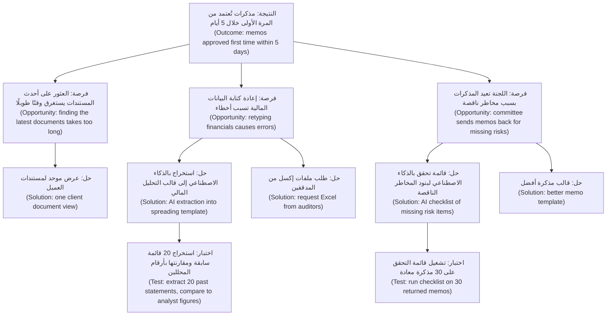
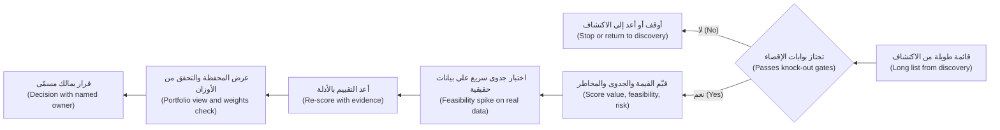
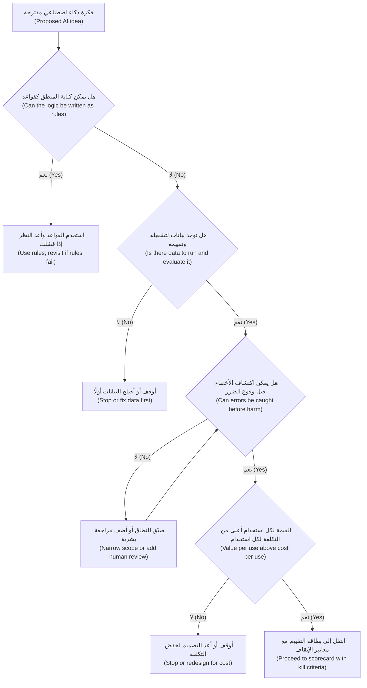

# الوحدة 2 — العثور على مشكلات تستحق الحل (Finding problems worth solving)

*معظم منتجات الذكاء الاصطناعي الفاشلة (failed AI products) لم تكن مخطئة بشأن التقنية (technology). كانت مخطئة بشأن المشكلة (problem). رأى أحدهم عرضًا توضيحيًا (demo)، واختار نموذجًا (model)، ثم ذهب يبحث عن مكان يضعه فيه. هذه الوحدة تقلب هذا الترتيب. ستتعلم كيف تجد المهمة الحقيقية (real job) التي يحاول الشخص إنجازها، وترسم خريطة سير العمل (workflow) الذي تعيش فيه هذه المهمة، وتكتشف الخطوات القليلة (few steps) التي يساعد فيها الذكاء الاصطناعي (AI) فعلًا. بعد ذلك ستقيّم حالات الاستخدام المرشحة (candidate use cases) وتقارن بينها من حيث القيمة (value) والجدوى التقنية (feasibility) والمخاطر (risk)، وتتعلم متى تكون الإجابة الصحيحة قاعدةً (rule) أو قالبًا (template) أو لا شيء على الإطلاق (nothing at all)، وكيف تقتل فكرة (kill an idea) قبل أن تلتهم ربع سنة (quarter). ستتابع فيصل خلال أول دورة اكتشاف (discovery cycle) له في بنك نجم (Najm Bank). خالد يريد «الذكاء الاصطناعي التوليدي في الإقراض (GenAI in lending)»، ورانيا تريد أدلة (evidence)، وخمس أفكار متنافسة تصل إلى قائمة الأعمال المتراكمة (backlog) نفسها.*

> **المراحل (Stages):** Discover, Define — اعثر على المهمة (find the job)، وارسم خريطة سير العمل (map the workflow)، واختر حالات الاستخدام الجديرة بالبناء (use cases worth building)، وأوقف تلك التي لا تستحق (stop the ones that are not).

---

# 2.1 — الاكتشاف للذكاء الاصطناعي: المهام وسير العمل وأين يلائم الذكاء الاصطناعي (Discovery for AI: jobs, workflows and where AI fits)
*المستوى (Level): 🟡 متوسط (Intermediate)* · *المتطلبات (Prerequisites): 0.2، 1.1* · *المرحلة (Stage): Discover*

## ⚡ الدرس في دقيقة (In 60 seconds)
- يبدأ الاكتشاف للذكاء الاصطناعي (Discovery for AI) من **المشكلة لا من النموذج (the problem, not the model)**. اسأل أولًا: «ما المهمة التي يحاول هذا الشخص إنجازها، وأين يكمن الألم؟ ⁦(what job is this person trying to get done, and where does it hurt?)⁩». بعد ذلك فقط اسأل: «هل يمكن للذكاء الاصطناعي أن يساعد هنا؟ ⁦(could AI help here?)⁩».
- إطار **المهام المطلوب إنجازها (Jobs to be Done)** يصوغ الاحتياجات (needs) على أنها تقدّم (progress) يريد الشخص تحقيقه في موقف معيّن (situation). و**رسم خريطة سير العمل (Workflow mapping)** يقسّم المهمة إلى خطوات (steps) كي ترى أين يذهب الوقت (time) وأين تقع الأخطاء (errors) والانتظار (waiting) فعلًا.
- يلائم الذكاء الاصطناعي الخطوات التي تكون **كبيرة الحجم (high-volume)، ومبنية على مدخلات فوضوية غير منظمة (messy unstructured input)، وتتحمّل قدرًا من الخطأ (tolerant of some error)، ويكون التحقق منها أرخص من أدائها (cheaper to check than to do)**. ويلائم بشكل سيئ حيث تكون الإجابة الخاطئة الواحدة مكلفة (costly) ولا أحد يستطيع التحقق منها (nobody can check it).
- ابحث عن فرص الذكاء الاصطناعي (AI opportunities) على **مستوى الخطوة (step level)** لا على مستوى المهمة (job level). «اكتب مذكرة الائتمان (Write the credit memo)» ليست حالة استخدام للذكاء الاصطناعي (AI use case). أما «استخرج البيانات المالية (financials) من ثلاث سنوات من القوائم بصيغة PDF إلى قالب التحليل المالي (spreading template)» فقد تكون كذلك.
- استخدم **شجرة الفرص والحلول (Opportunity Solution Tree)** لتُبقي النتيجة (outcome) والمشكلات التي وجدتها والأفكار التي تختبرها في صفحة واحدة (one page)، حتى لا يتمكن حلّ مفضّل (favourite solution) من تخطّي الدور (skip the queue).
- أكبر فخ (Biggest trap): أن تجري مقابلات (interviewing) مع الناس حول ميزة الذكاء الاصطناعي (AI feature) التي تريد بناءها أصلًا، بدلًا من مراقبتهم وهم يؤدون العمل (watching them do the work).

## 🧭 لماذا يهم (Why it matters)
يبدأ أسبوع فيصل الأول في بنك نجم (Najm Bank) بطلب من سطر واحد (one-line request) من خالد، رئيس الإقراض للأفراد (Head of Retail Lending): «منافسونا يضعون الذكاء الاصطناعي التوليدي (GenAI) في الإقراض (lending). أريد أن يكون لدينا ذلك مباشرًا (live) هذا العام.» يفتح فيصل أداة محادثة (chat tool)، ويلصق ملف قرض مُجهَّل الهوية (anonymised loan file)، ويطلب مذكرة ائتمان (credit memo)، فيحصل على ثلاث صفحات سلسة (three fluent pages). ويحجز عرضًا توضيحيًا (demo) مع خالد يوم الخميس.

توقفه رانيا، رئيسة منتجات الذكاء الاصطناعي (Head of AI Products). «على ماذا يقضي مدير العلاقة (relationship manager) يومه فعلًا؟ أي جزء من المذكرة (memo) يستغرق أطول وقت؟ أي جزء يعيده فريق الائتمان (credit team)؟ أنت لا تعرف بعد، ولا النموذج (model) يعرف.» وترسله ليجلس مع اثنين من مديري العلاقات (relationship managers - RMs) في فريق الشركات الصغيرة والمتوسطة (SME team) لمدة يومين.

ما يجده فيصل يغيّر المنتج (changes the product). الأقسام السردية (narrative sections) من المذكرة، وهي الجزء الذي كتبه عرضه التوضيحي بإتقان، ليست حيث يذهب الوقت. يذهب الوقت في البحث عن أحدث المستندات (latest documents) في البريد الإلكتروني (email) والمجلد المشترك (shared drive)، وإعادة كتابة الأرقام (retyping figures) من القوائم المدققة (audited statements) في قالب التحليل المالي (financial spreading template)، وإعادة العمل على المذكرة (reworking the memo) بعد أن يستفسر فريق الائتمان عن رقم ما. لقد حلّ العرض التوضيحي واحدة من أقصر الخطوات (shortest steps). هذا فشل شائع (common failure) في منتجات الذكاء الاصطناعي، والسجل العام (public record) فيه نسخ أكبر منه. استثمرت IBM بكثافة في Watson Health وباعت تلك الوحدات في 2022، ومن الدروس التي نوقشت على نطاق واسع في تلك القصة الفجوة بين عرض توضيحي مبهر (impressive demo) وأداة تلائم سير العمل السريري (clinical workflow). الاكتشاف (Discovery) هو الطريقة التي تسد بها هذه الفجوة قبل أن تبني (before you build)، لا بعده.

## 📐 كيف يعمل (How it works)

### 🟢 الأساسيات (The essentials)

**الاكتشاف (Discovery)** هو عمل التعلّم عن أي مشكلة يجب حلّها (what problem to solve)، ولمن (for whom)، ولماذا تهم (why it matters)، قبل الالتزام بالبناء (committing to build). يصوّره **الماس المزدوج (Double Diamond)** الصادر عن مجلس التصميم البريطاني (UK Design Council) عام 2005 على أنه جولتان من التوسيع والتضييق (widening and narrowing). الماسة الأولى (first diamond) تتعلق بالمشكلة: استكشف على نطاق واسع (explore widely)، ثم عرّف مشكلة واحدة (define one problem). والثانية تتعلق بالحل (solution): استكشف أفكارًا كثيرة (explore many ideas)، ثم سلّم واحدة (deliver one). والذكاء الاصطناعي يُغري الفرق (tempts teams) بتخطّي الماسة الأولى.

**المهام المطلوب إنجازها (Jobs to be Done - JTBD)** هي العدسة الأساسية (core lens). الفكرة، التي نشرها كلايتون كريستنسن (Clayton Christensen)، هي أن الناس «يستأجرون (hire)» منتجًا لتحقيق تقدّم (make progress) في موقف معيّن (particular situation). ويجعلها **الابتكار الموجّه بالنتائج (Outcome-Driven Innovation)** لأنتوني أولويك (Anthony Ulwick) قابلة للقياس (measurable). فهو يقسّم المهمة إلى خطوات (steps) ويسأل عن النتائج (outcomes) التي يهتم بها الناس (مثل «تقليل الوقت الذي يستغرقه… (minimise the time it takes to…)» أو «تقليل احتمال… (minimise the chance of…)») ومدى تحقق كل نتيجة اليوم (how well each outcome is met today). لبيان المهمة (job statement) ثلاثة أجزاء:

> *عندما (When)* [الموقف (situation)]، *أريد أن (I want to)* [أحقق تقدّمًا (make progress)]، *حتى أتمكن من (so I can)* [النتيجة (outcome)].

لمدير علاقة في الشركات الصغيرة والمتوسطة (SME relationship manager): *عندما تحين المراجعة السنوية (annual review) لعميل، أريد أن أُعدّ مذكرة ائتمان تقبلها اللجنة من المرة الأولى (committee accepts first time)، حتى أتمكن من تجديد التسهيل (facility renewed) قبل حاجة العميل إلى التدفق النقدي (cash-flow need).* لاحظ ما **ليس** موجودًا في البيان: المذكرات (memos)، والذكاء الاصطناعي (AI)، والصياغة (drafting). المهمة هي «تمرير قرار سليم عبر اللجنة في الوقت المحدد (get a sound decision through committee on time)». والمذكرة هي طريقة اليوم في إنجاز ذلك (today's way of doing it).

للمهام أيضًا جوانب **عاطفية واجتماعية (emotional and social)**. فمدير العلاقة يريد أيضًا *أن يبدو كفؤًا أمام لجنة الائتمان (look competent in front of the credit committee)*. وهذا يهم الذكاء الاصطناعي. فالمسودة (draft) التي لا يستطيع مدير العلاقة الدفاع عنها سطرًا بسطر (line by line) لن تُستخدم، مهما كانت سريعة.

**رسم خريطة سير العمل (Workflow mapping)** يحوّل المهمة إلى خطوات يمكنك رؤيتها. لكل خطوة، دوّن خمسة أشياء:

| سمة الخطوة (Step attribute) | السؤال الذي تطرحه (Question to ask) | لماذا يهم للذكاء الاصطناعي (Why it matters for AI) |
|---|---|---|
| المدخلات (Input) | ما الذي يدخل؟ حقول منظمة (structured fields)، ملفات PDF، رسائل بريد إلكتروني (emails)، محادثات (conversations)؟ | المدخلات غير المنظمة (Unstructured input) هي حيث يضيف الذكاء الاصطناعي الحديث (modern AI) أكثر مقارنة بالقواعد (rules) |
| العمل (Work) | ماذا يفعل الشخص: يبحث (find)، يقرأ (read)، يستخرج (extract)، يحكم (judge)، يكتب (write)، يقرر (decide)، ينفّذ (act)؟ | أنواع المهام المختلفة (Different task types) تناسب أنواعًا مختلفة من الذكاء الاصطناعي (1.1) |
| الوقت والحجم (Time and volume) | كم يستغرق، وكم مرة (how often)، وكم شخصًا (how many people)؟ | يحدد حجم الجائزة (size of the prize) |
| الأخطاء وإعادة العمل (Errors and rework) | ما الذي يسوء، وكم مرة، ومن يكتشفه (who catches it)؟ | يُظهر معيار الجودة (quality bar) وأين يحدث التحقق أصلًا (where checking already happens) |
| التسليمات والانتظار (Hand-offs and waiting) | من ينتظر من (Who waits for whom)؟ | غالبًا ما يكون عنق الزجاجة الحقيقي (real bottleneck)، وغالبًا ليس مشكلة ذكاء اصطناعي (AI problem) أصلًا |

كيف تحصل على هذه المعلومات؟ **راقب واسأل عن أحداث حقيقية (Watch and ask about real events).** توصي تيريزا توريس (Teresa Torres)، في كتاب *Continuous Discovery Habits* (2021)، بالمقابلات القائمة على القصص (story-based interviews). بدلًا من «ماذا تريد؟ ⁦(what do you want?)⁩» أو «هل ستستخدم مساعدًا بالذكاء الاصطناعي؟ ⁦(would you use an AI assistant?)⁩»، اسأل: «حدثني عن آخر مرة أعددت فيها مذكرة ائتمان (tell me about the last time you prepared a credit memo)». يتذكر الناس حلقة حديثة محددة (specific recent episode) أفضل بكثير مما يتنبؤون بسلوكهم (predict their own behaviour). والأفضل من ذلك أن تجلس معهم وهم يعملون (**الاستقصاء السياقي (contextual inquiry)**). سترى جدول البيانات البديل (workaround spreadsheet) الذي لا يذكره أحد في المقابلة (interview).

### 🟡 التعمق أكثر (Going deeper)

**أين يلائم الذكاء الاصطناعي: اختبار مستوى الخطوة (Where AI fits: the step-level test).** بعد رسم خريطة سير العمل، مرّ على كل خطوة واطرح خمسة أسئلة. إنها قاعدة استرشادية (heuristic) لا قانون (not a law).

1. **هل المدخلات فوضوية؟ ⁦(Is the input messy?)⁩** نص حر (Free text)، مستندات (documents)، صور (images)، كلام (speech). القواعد (Rules) تواجه صعوبة معها. والذكاء الاصطناعي غالبًا يتعامل معها جيدًا.
2. **هل يوجد حجم؟ ⁦(Is there volume?)⁩** الخطوة التي تُنفَّذ عشر مرات في السنة نادرًا ما تسترد تكلفة بناء ميزة ذكاء اصطناعي (AI feature) وتقييمها (evaluating) وحوكمتها (governing). أما عشرة آلاف مرة في الشهر فقد تفعل.
3. **هل يمكن التحقق من المخرجات بتكلفة أقل من إنتاجها؟ ⁦(Can the output be checked more cheaply than it can be produced?)⁩** هذا هو السؤال المنفرد الأكثر فائدة (most useful single question). يستطيع مدير العلاقة (RM) التحقق من ميزانية عمومية مستخرجة (extracted balance sheet) مقابل ملف PDF المصدر (source PDF) في دقيقتين. أما إعادة كتابتها فتستغرق ثلاثين. والمسودة (draft) التي يستغرق التحقق منها (verify) ما تستغرقه كتابتها لا توفّر شيئًا.
4. **كم تكلّف المخرجات الخاطئة، ومن يكتشفها؟ ⁦(What does a wrong output cost, and who catches it?)⁩** الرقم الخاطئ الذي يكتشفه محلل الائتمان (credit analyst) يكلّف جولة من إعادة العمل (round of rework). أما الرقم الخاطئ الذي يصل إلى اللجنة (committee) دون أن يُلاحظ فقد يعني قرضًا سيئًا (bad loan). تكلفة الخطأ (Error cost) ووجود مدقّق (presence of a checker) يحددان مقدار الاستقلالية (autonomy) التي يمكن أن تتمتع بها الميزة (الوحدة 4 (Module 4)).
5. **هل تتعلق الخطوة بحكم يُسأل عنه الناس؟ ⁦(Is the step about judgement people are accountable for?)⁩** قرار الإقراض من عدمه (Deciding whether to lend) حكمٌ (judgement) يجب على البنك أن يتحمّله ويشرحه (own and explain). يمكن للذكاء الاصطناعي أن يُثريه (inform it). ولا ينبغي أن يتخذه بصمت (quietly make it) (انظر 2.3، والوحدة 9 (Module 9) للتنظيم (regulation)).

اربط كل خطوة بـ**نوع مهمة (task type)** من الوحدة 1 (Module 1): *البحث (find)* (البحث والاسترجاع (search and retrieval))، *الاستخراج (extract)* (تحويل المستندات إلى حقول (turn documents into fields))، *التصنيف (classify)* (الفرز إلى فئات (sort into categories))، *التنبؤ (predict)* (تقدير رقم أو احتمال (estimate a number or probability))، *الصياغة (draft)* (توليد نص ليحرره إنسان (generate text for a human to edit))، *التلخيص (summarise)*، *المحادثة (converse)*، *التنفيذ (act)* (اتخاذ إجراء في نظام (take an action in a system)). هذا يمنع عبارة «استخدم الذكاء الاصطناعي (use AI)» من أن تكون مبهمة (vague).

**شجرة الفرص والحلول (Opportunity Solution Tree).** تُبقي **شجرة الفرص والحلول (Opportunity Solution Tree - OST)** لتوريس الاكتشاف صادقًا (keeps discovery honest). في القمة تقع **نتيجة (outcome)** واحدة يحاول الفريق تحريكها، وهي نتيجة أعمال أو عملاء قابلة للقياس (measurable business or customer result). تحتها **الفرص (opportunities)**: الاحتياجات غير الملبّاة (unmet needs) ونقاط الألم (pain points) والرغبات (desires) التي سمعتها في البحث (research)، مصوغة من جانب المستخدم (phrased from the user's side). تحت كل فرصة **حلول (solutions)** مرشحة، وتحتها **اختبارات الافتراضات (assumption tests)**: تجارب صغيرة (small experiments) تتحقق مما إذا كانت الفكرة يمكن أن تنجح. الشجرة تجعل أمرين مرئيين. كل حل يجب أن يعود إلى فرصة حقيقية (trace back to a real opportunity). ويجب أن تقارن عدة حلول للفرصة نفسها (compare several solutions for the same opportunity)، لا أن تقع في حب الحل الأول (fall in love with the first).

اثنان من الحلول الخمسة في شجرة فيصل ليسا ذكاءً اصطناعيًا على الإطلاق (not AI at all). وهذا صحّي (healthy). فالشجرة المليئة بأفكار الذكاء الاصطناعي (AI ideas) تعني عادةً أن الفريق بدأ من التقنية (started from the technology).

**فخاخ المقابلات الخاصة بالذكاء الاصطناعي (Interview traps specific to AI).** غالبًا ما يحمل المستخدمون نماذج ذهنية خاطئة (wrong mental models) عن الذكاء الاصطناعي، فيتوقعون إما السحر (magic) أو لا شيء (nothing). لا تطلب من الناس تقييم ميزة ذكاء اصطناعي متخيَّلة (imagined AI feature). اسأل عن العمل (Ask about the work)، واختبر أفكار الذكاء الاصطناعي لاحقًا بالنماذج الأولية (prototypes) (5.2) أو باختبارات **ساحر أوز (Wizard of Oz)**، حيث ينتج إنسان سرًّا مخرجات «الذكاء الاصطناعي (AI)» كي ترى كيف يستخدمها الناس قبل بناء أي شيء (before anything is built).

### 🔴 نظرة الخبير (Expert view)

**الذكاء الاصطناعي يغيّر سير العمل، فاكتشف سير العمل المستقبلي أيضًا (AI changes the workflow, so discover the future workflow too).** إضافة الذكاء الاصطناعي إلى خطوة واحدة تنقل العمل من مكان إلى آخر (moves work around). إذا أصبح الاستخراج (extraction) فوريًا، فقد ينتقل عنق الزجاجة (bottleneck) إلى المحلل الذي يتحقق منه (analyst who checks it)، أو إلى جدول مواعيد اللجنة (committee calendar). يرسم مديرو المنتجات الخبراء (Expert PMs) **سير العمل المستهدف (to-be workflow)** بجانب سير العمل الحالي (as-is): من يفعل ماذا بعد التغيير، وما عمل التحقق الجديد (new checking work) الذي يظهر، ومن تصبح وظيفته أصعب (whose job gets harder).

**لا تؤتمت عملية معطّلة (Do not automate a broken process).** إذا كانت المذكرات تُعاد لأن سياسة الائتمان (credit policy) غامضة (ambiguous)، فأصلح السياسة أولًا (fix the policy first). الذكاء الاصطناعي فوق سياسة غير واضحة (unclear policy) ينتج مذكرات غير واضحة بسرعة أكبر.

**عادم البيانات نتيجةٌ من نتائج الاكتشاف (Data exhaust is a discovery finding).** أثناء رسم الخريطة، دوّن البيانات (data) التي تنشئها كل خطوة أو يمكن أن تنشئها: تعديلات مدير العلاقة على المسودات (RM edits to drafts)، وتعليقات اللجنة (committee comments)، وأسباب الإعادة (reasons for returns). هذه هي المادة الخام (raw material) للتقييم (evaluation) ولحلقات التعلّم (learning loops) في الوحدة 3 (Module 3).

**للمهمة أكثر من عميل واحد (The job has more than one customer).** في الذكاء الاصطناعي المؤسسي (enterprise AI) كثيرًا ما يكون المستخدم (user) والمشتري (buyer) والمتأثرون (people affected) أشخاصًا مختلفين. في مساعد مذكرات الائتمان (Credit Memo Copilot) المستخدم هو مدير العلاقة (RM). والمشتري هو رئيس الخدمات المصرفية للشركات (head of corporate banking). والمراجع (reviewer) هو فريق الائتمان (credit team). والمتأثرون هم أصحاب الشركات الصغيرة والمتوسطة والكفلاء (SME owners and guarantors)، الذين تعتمد تسهيلاتهم (facilities) على المذكرة. ارسم خريطة المهمة لكل مجموعة، ولو باختصار. قد تتعارض مهمة فريق الائتمان («اكتشاف الإقراض الضعيف قبل اعتماده (catch weak lending before it is approved)») مع مهمة مدير العلاقة («اعتماده بسرعة (get it approved quickly)»). والمنتج الجيد (good product) يخدم الاثنين.

## 🧰 الأدوات (The toolkit)
| الأداة أو الإطار (Tool or framework) | ما هو وماذا يفعل (What it is and does) | متى تلجأ إليه (When to reach for it) |
|---|---|---|
| **Jobs to be Done** (كلايتون كريستنسن (Clayton Christensen)؛ الابتكار الموجّه بالنتائج (Outcome-Driven Innovation) لأنتوني أولويك (Anthony Ulwick)) | يصوغ الاحتياجات (needs) على أنها تقدّم (progress) يريد الشخص تحقيقه في موقف ما؛ ويقسّم ODI المهمة إلى خطوات (steps) ونتائج قابلة للقياس (measurable outcomes) | في البداية، لمنع الحديث من أن يدور حول الميزات (features) أو النماذج (models) |
| **Workflow map** — خريطة سير العمل | خريطة خطوة بخطوة (step-by-step) للمهمة مع المدخلات (input) والعمل (work) والوقت (time) والأخطاء (errors) والتسليمات (hand-offs) لكل خطوة | للعثور على الخطوة التي يلائمها الذكاء الاصطناعي، ولرؤية التدفق الحالي والمستهدف (as-is and to-be flow) |
| **Contextual inquiry** — الاستقصاء السياقي | مراقبة الناس وهم يؤدون عملًا حقيقيًا (real work) في بيئتهم (own setting) والسؤال عمّا تراه | عندما تمنحك المقابلات العملية المثالية (idealised process) بدلًا من العملية الحقيقية (real one) |
| **Opportunity Solution Tree** (تيريزا توريس (Teresa Torres)) | صفحة واحدة تربط نتيجة (outcome) بالفرص (opportunities) والحلول المرشحة (candidate solutions) واختبارات الافتراضات (assumption tests) | لمقارنة عدة حلول لكل مشكلة (several solutions per problem) وإبقاء الأفكار المفضّلة صادقة (keep favourite ideas honest) |
| **Step-level AI fit test** — اختبار ملاءمة الذكاء الاصطناعي على مستوى الخطوة | خمسة أسئلة لكل خطوة: مدخلات فوضوية (messy input)، الحجم (volume)، التحقق أرخص من الأداء (cheaper to check than do)، تكلفة الخطأ (cost of error)، الحكم الخاضع للمساءلة (accountable judgement) | لتحويل «استخدم الذكاء الاصطناعي في مكان ما (use AI somewhere)» إلى خطوات مرشحة محددة (specific candidate steps) |
| **Wizard of Oz** — ساحر أوز | ينتج إنسان سرًّا المخرجات التي كان الذكاء الاصطناعي سينتجها، كي تراقب الاستخدام الحقيقي (real use) | لاختبار ما إذا كان الناس سيستخدمون مخرجات الذكاء الاصطناعي ويثقون بها (use and trust) قبل بنائها |

## 🏛️ عمليًا في بنك نجم (In practice at Najm Bank)
بعد يومين من المرافقة (shadowing) وست مقابلات قائمة على القصص (story-based interviews)، يكتب فيصل **موجز فرصة من صفحة واحدة (one-page opportunity brief)**. وتجعله رانيا الصيغة المعيارية للفريق (team's standard format) لأي فكرة ذكاء اصطناعي جديدة (new AI idea).

**موجز الفرصة — إعداد مذكرات ائتمان الشركات الصغيرة والمتوسطة (Opportunity brief — SME credit memo preparation)** (الإصدار v0.3، المالك (owner): فيصل؛ راجعته رانيا وحصة)

| القسم (Section) | المحتوى (Content) |
|---|---|
| بيان المهمة (Job statement) | عندما تصل مراجعة (review) أو طلب جديد (new request) من عميل من الشركات الصغيرة والمتوسطة (SME client)، يريد مدير العلاقة (RM) الحصول على مذكرة تقبلها لجنة الائتمان من المرة الأولى (accepts first time)، حتى يُعتمد التسهيل (facility is approved) قبل حاجة العميل. |
| من (Who) | المستخدمون (Users): نحو 40 مدير علاقة للشركات الصغيرة والمتوسطة (SME RMs). المراجعون (Reviewers): محللو الائتمان (credit analysts). المتأثرون (Affected): أصحاب الشركات الصغيرة والمتوسطة والكفلاء (SME owners and guarantors). المشتري (Buyer): رئيس الخدمات المصرفية للشركات الصغيرة والمتوسطة (Head of SME Banking). |
| الأدلة (Evidence) | يومان من المرافقة (shadowing)، 6 مقابلات (interviews)، عينة من 30 مذكرة حديثة (sample of 30 recent memos) (الأرقام التوضيحية أدناه (illustrative numbers) مأخوذة من هذه العينة الصغيرة؛ تحقّق منها قبل التقدير (confirm before sizing)) |
| سير العمل الحالي والوقت لكل مذكرة (As-is workflow and time per memo) | جمع المستندات (Gather documents): ~1 ساعة · التحليل المالي (Spread financials): ~1.5 ساعة · كتابة السرد (Write narrative): ~1 ساعة · إعادة العمل بعد أسئلة الائتمان (Rework after credit questions): ~1.5 ساعة |
| أكبر نقاط الألم (Biggest pains) | إعادة كتابة الأرقام من ملفات PDF (Retyping figures from PDFs)؛ البحث عن أحدث المستندات (hunting for latest documents)؛ مذكرات تُعاد بسبب بنود مخاطر ناقصة (memos returned for missing risk items) (نحو 1 من كل 3 في العينة) |
| خطوات الذكاء الاصطناعي المرشحة (Candidate AI steps) | استخراج البيانات المالية من القوائم (Extract financials from statements) (استخراج (extract)؛ التحقق منه مقابل المصدر رخيص (cheap to check against source)) · الإشارة إلى بنود المخاطر الناقصة قبل التقديم (Flag missing risk items before submission) (تصنيف/تحقق (classify/check)) · صياغة السرد (Draft narrative) (صياغة (draft)؛ قيمة أقل من المتوقع (lower value than expected)) |
| خيارات غير الذكاء الاصطناعي (Non-AI options) | عرض موحد لمستندات العميل (Single client document view)؛ طلب قوائم مقروءة آليًا (machine-readable statements) من المدققين (auditors)؛ قالب مذكرة أوضح (clearer memo template) |
| ليس للذكاء الاصطناعي (Not for AI) | توصية الإقراض نفسها (lending recommendation itself) تبقى لدى مدير العلاقة واللجنة |
| أخطر الافتراضات (Riskiest assumptions) | دقة الاستخراج (Extraction accuracy) على القوائم الممسوحة ضوئيًا (scanned statements) جيدة بما يكفي؛ مديرو العلاقات سيتحققون من الأرقام المستخرجة (check extracted figures) بدلًا من الوثوق بها ثقة عمياء (trust them blindly) |
| الاختبار التالي (Next test) | تشغيل الاستخراج على 20 قائمة سابقة (20 past statements) ومقارنتها بالأرقام التي حلّلها المحللون (analyst-spread figures) (دانة، أسبوعان) |
| النتيجة المراد تحريكها (Outcome to move) | نسبة المذكرات المعتمدة من المرة الأولى (Share of memos approved first time)؛ عدد الأيام من الطلب إلى اللجنة (days from request to committee) |

يوم الخميس لا يعرض فيصل على خالد أي عرض توضيحي (no demo). بل يُريه أين تذهب الساعات الخمس (where the five hours go)، ولماذا يجب أن تكون أولى ميزات الذكاء الاصطناعي (first AI features) هي الاستخراج (extraction) والتحقق قبل التقديم (pre-submission check)، مع ترك الصياغة (drafting) لاحقًا.

## 🛠️ التمارين (Exercises)
- 🟢 اكتب ثلاثة بيانات مهام (job statements) (*عندما… أريد أن… حتى أتمكن من… (When… I want to… so I can…)*) لمستخدمي نجم أسيست (Najm Assist)، مساعد تطبيق العملاء (customer app assistant): عميل يعترض على دفعة بالبطاقة (disputing a card payment)، وعميل مسافر إلى الخارج (travelling abroad)، وصاحب شركة صغيرة يتحقق من تحويل (small-business owner checking a transfer). *يكتمل عندما (Done when):* لا يذكر أيٌّ من البيانات الثلاثة الذكاءَ الاصطناعي (AI) أو المحادثة (chat) أو التطبيق (app)، ولكل منها موقف (situation) ونتيجة (outcome) واضحان.
- 🟡 ارسم خريطة سير العمل الحالي (as-is workflow) لمهمة واحدة تعرفها جيدًا في عملك (مثل معالجة شكوى عميل (handling a customer complaint))، من خمس إلى ثماني خطوات. املأ سمات الخطوة الخمس (five step attributes) وطبّق اختبار ملاءمة الذكاء الاصطناعي على مستوى الخطوة (step-level AI fit test) على كل خطوة. *يكتمل عندما (Done when):* يكون لديك جدول بصف واحد لكل خطوة، وقد سمّيت خطوتين على الأكثر (at most two steps) يلائمهما الذكاء الاصطناعي وشرحت لماذا لا تلائمه الخطوات الأخرى.
- 🔴 ابنِ شجرة فرص وحلول (Opportunity Solution Tree) للتنبيهات الذكية (Smart Alerts) بالنتيجة «تقليل خسائر الاحتيال دون زيادة شكاوى العملاء من التنبيهات (reduce fraud losses without raising customer complaints about alerts)». ضمّنها ثلاث فرص (opportunities) على الأقل، وحلّين لكل فرصة (two solutions per opportunity) (أحدهما على الأقل ليس ذكاءً اصطناعيًا (non-AI))، واختبار افتراض (assumption test) واحدًا لكل من حلّيك المفضّلين. *يكتمل عندما (Done when):* يعود كل حل إلى فرصة مصوغة من جانب العميل (customer's side) أو محلل الاحتيال (fraud analyst's side)، وينص كل اختبار على النتيجة التي ستجعلك تتخلى عن الفكرة (drop the idea).

## ⚠️ أخطاء وفخاخ (Mistakes and traps)
- **البدء من العرض التوضيحي (Starting from the demo).** العرض التوضيحي السلس (fluent demo) يثبت أن النموذج يستطيع إنتاج نص (produce text). ولا يثبت أن النص يوفّر وقت أحد (saves anyone time). ارسم خريطة سير العمل أولًا (Map the workflow first) واعثر على مواضع الوقت والأخطاء.
- **سؤال المستخدمين عن الذكاء الاصطناعي الذي يريدونه (Asking users what AI they want).** لا يستطيع الناس الحكم على ميزات ذكاء اصطناعي متخيَّلة (imagined AI features). اسألهم عن آخر مرة أدّوا فيها العمل (last time they did the work)، وراقبهم إن استطعت.
- **تجاهل المدقّق (Ignoring the checker).** إذا لم يستطع أحد التحقق من المخرجات بسرعة (check the output quickly)، فإن الوقت الموفَّر في إنتاجها يُنفق على التحقق منها، أو يُتخطى التحقق (checking gets skipped). وكلاهما سيئ.
- **رسم خريطة المستخدم وحده (Mapping only the user).** للذكاء الاصطناعي المؤسسي (Enterprise AI) مستخدمون (users) ومشترون (buyers) ومراجعون (reviewers) ومتأثرون (affected people). أغفل أحدهم فيفشل المنتج في مرحلة الاعتماد (approval stage) أو في طابور الشكاوى (complaints queue).
- **أتمتة عملية معطّلة (Automating a broken process).** عندما تُظهر الخريطة مشكلة في السياسة (policy) أو في التسليم (hand-off)، أصلح ذلك أولًا.

## 🧾 الخلاصة (Recap)
- ابدأ من المهمة وسير العمل (job and the workflow)، لا من النموذج (model). استخدم المهام المطلوب إنجازها (Jobs to be Done) لوصف التقدّم (progress) الذي يريده الناس، دون تسمية حل (without naming a solution).
- ارسم خريطة سير العمل خطوة بخطوة (step by step): المدخلات (input)، العمل (work)، الوقت (time)، الأخطاء (errors)، التسليمات (hand-offs). فرص الذكاء الاصطناعي (AI opportunities) تعيش على مستوى الخطوة (step level).
- يلائم الذكاء الاصطناعي الخطوات ذات المدخلات الفوضوية (messy input) والحجم (volume)، حيث يكون التحقق من المخرجات أرخص من إنتاجها (cheaper to check than to produce) وتُكتشف الأخطاء (errors are caught). ويلائم بشكل سيئ حيث تكون الأخطاء مكلفة وغير مدقّقة (costly and unchecked)، أو حيث يدخل حكم خاضع للمساءلة (accountable judgement).
- استخدم شجرة الفرص والحلول (Opportunity Solution Tree) لمقارنة عدة حلول لكل فرصة (several solutions per opportunity)، بما فيها الحلول غير القائمة على الذكاء الاصطناعي (non-AI ones)، ولتخطيط اختبارات افتراضات صغيرة (small assumption tests).
- ارسم سير العمل المستهدف (to-be workflow). فالذكاء الاصطناعي ينقل العمل وأعناق الزجاجة (bottlenecks) من مكان إلى آخر.

## ✍️ اختبر نفسك (Check yourself)

**1. يطلب خالد من فيصل «وضع الذكاء الاصطناعي التوليدي في الإقراض هذا العام (put GenAI into lending this year)». ما الذي يجب أن يفعله فيصل أولًا؟**

- A. اختيار نموذج لغوي كبير (large language model) وبناء عرض توضيحي لصياغة المذكرات (memo-drafting demo) لإظهار الزخم (show momentum)
- B. دراسة كيف يؤدي مديرو العلاقات (relationship managers) ومحللو الائتمان (credit analysts) عمل الإقراض اليوم، والعثور على مواضع تركّز الوقت والأخطاء (where time and errors concentrate)
- C. إجراء استبيان (survey) يسأل مديري العلاقات عن ميزات الذكاء الاصطناعي (AI features) التي يرغبون فيها
- D. طلب مستوى مخاطر (risk tier) من ليلى لـ«الذكاء الاصطناعي التوليدي في الإقراض (GenAI in lending)»

الإجابة

**B.** يبدأ الاكتشاف (Discovery) من المهمة وسير العمل (job and the workflow). العرض التوضيحي (A) هو الإجابة المغرية (tempting answer)، لكنه يجيب عن «هل يستطيع النموذج أن يكتب؟ ⁦(can the model write?)⁩»، لا عن «أين يؤلم العمل؟ ⁦(where does the work hurt?)⁩». فعرض فيصل نفسه حلّ أسرع خطوة (fastest step). والاستبيانات عن ميزات متخيَّلة (imagined features) (C) تعطي إجابات غير موثوقة (unreliable answers). والحوكمة (Governance) (D) تحتاج إلى حالة استخدام محددة (specific use case) أولًا. (🧭 لماذا يهم (Why it matters)؛ 🟢 الأساسيات (The essentials).)

**2. أي بيان مهمة (job statement) مكتوب بأفضل صورة؟**

- A. «يريد مديرو العلاقات مساعدًا بالذكاء الاصطناعي يصوغ مذكرات الائتمان. ⁦(RMs want an AI assistant that drafts credit memos.)⁩»
- B. «عندما تحين مراجعة عميل، أريد مذكرة تقبلها اللجنة من المرة الأولى، حتى يُجدَّد التسهيل قبل أن يحتاج العميل إلى الأموال. ⁦(When a client's review is due, I want a memo the committee accepts first time, so the facility is renewed before the client needs the funds.)⁩»
- C. «تحسين إنتاجية مديري العلاقات بالذكاء الاصطناعي التوليدي. ⁦(Improve RM productivity with GenAI.)⁩»
- D. «يحتاج مديرو العلاقات إلى برنامج أسرع للمذكرات. ⁦(RMs need faster memo software.)⁩»

الإجابة

**B.** فيه موقف (situation)، والتقدّم المطلوب (progress wanted)، والنتيجة (outcome)، ولا يسمّي أي حل (names no solution). أما A وD فيُدمجان حلًا مسبقًا (bake in a solution). وC هدف للبنك (goal for the bank)، لا مهمة لشخص (job for a person). (🟢 الأساسيات (The essentials).)

**3. خطوتان مرشحتان (candidate steps) تستغرق كل منهما نحو 30 دقيقة. الخطوة X هي استخراج أرقام الميزانية العمومية (balance-sheet figures) من ملفات PDF، ويستطيع المحلل التحقق منها مقابل المصدر (check against the source) في نحو 3 دقائق. والخطوة Y هي كتابة فقرة تقييم مخاطر (risk assessment paragraph)، ويستغرق التحقق منها كما يجب (verify properly) نحو 25 دقيقة. بناءً على اختبار الملاءمة على مستوى الخطوة (step-level fit test)، أيهما المرشح الأقوى للذكاء الاصطناعي (stronger AI candidate)؟**

- A. Y، لأن الذكاء الاصطناعي التوليدي (generative AI) هو الأفضل في الكتابة
- B. هما متساويتان، لأن كلتيهما تستغرق 30 دقيقة
- C. X، لأن التحقق من مخرجاتها أرخص بكثير من إنتاجها (much cheaper to check than to produce)
- D. لا هذه ولا تلك، لأن كلتيهما تتضمن بيانات مالية (financial data)

الإجابة

**C.** «التحقق أرخص من الأداء (Cheaper to check than to do)» هو السؤال المنفرد الأكثر فائدة (most useful single question). فالخطوة Y لا توفّر شيئًا تقريبًا بعد احتساب التحقق (verification). والخيار A مغرٍ لأن الصياغة (drafting) هي أفضل ما تُظهره العروض التوضيحية للذكاء الاصطناعي التوليدي (GenAI demos). لكن القيمة (value) تعتمد على تكلفة التحقق (checking cost)، لا على قوة النموذج (model's strength). (🟡 التعمق أكثر (Going deeper).)

**4. في شجرة الفرص والحلول (Opportunity Solution Tree)، ما الذي ينتمي مباشرة تحت النتيجة (outcome)؟**

- A. الفرص (Opportunities): الاحتياجات غير الملبّاة (unmet needs) ونقاط الألم (pain points) التي سُمعت في البحث، مصوغة من جانب المستخدم (phrased from the user's side)
- B. نموذج الذكاء الاصطناعي (AI model) الذي اختاره الفريق
- C. الميزات (Features) مرتبة حسب الجهد (ranked by effort)
- D. اختبارات الافتراضات (Assumption tests)

الإجابة

**A.** النتيجة (Outcome)، ثم الفرص (opportunities)، ثم الحلول (solutions)، ثم اختبارات الافتراضات (assumption tests). وضع نموذج أو ميزات مباشرة تحت النتيجة (B، C) هو بالضبط عادة البدء بالحل (solution-first habit) التي وُجدت الشجرة لمنعها. (🟡 التعمق أكثر (Going deeper).)

**5. تُظهر خريطة سير العمل (workflow map) أن ثلث المذكرات يُعاد لأن سياستَي ائتمان (credit policies) تتناقضان بشأن الضمانات (collateral). ما أفضل استجابة من المنتج (best product response)؟**

- A. بناء ذكاء اصطناعي يعيد كتابة المذكرات لتلبي السياستين معًا
- B. رفع تعارض السياسات (policy conflict) إلى مالك السياسة (policy owner) وإصلاحه قبل تصميم دعم بالذكاء الاصطناعي (AI support) لتلك الخطوة
- C. تجاهله، لأنه ليس مشكلة ذكاء اصطناعي (AI problem)
- D. الضبط الدقيق (Fine-tune) لنموذج على المذكرات المعادة (returned memos)

الإجابة

**B.** أتمتة عملية معطّلة (Automating a broken process) تنتج الفشل نفسه بسرعة أكبر. والسبب الجذري (root cause) هو السياسة (policy)، لا الكتابة (writing). والخيار C خاطئ لأن مدير المنتج (PM) يملك النتيجة (owns the outcome)، وهذا سبب رئيسي لإعادة العمل (major cause of rework)، حتى لو لم يكن إصلاحًا بالذكاء الاصطناعي (AI fix). (🔴 نظرة الخبير (Expert view).)

## 📚 المراجع (References)
- Clayton M. Christensen, Taddy Hall, Karen Dillon and David S. Duncan, *Competing Against Luck* (2016), and "Know Your Customers' Jobs to Be Done", *Harvard Business Review* (2016) — https://hbr.org
- Anthony W. Ulwick, *What Customers Want* (2005) and *Jobs to be Done: Theory to Practice* (2016); Outcome-Driven Innovation — https://strategyn.com
- Teresa Torres, *Continuous Discovery Habits* (2021); Opportunity Solution Trees — https://www.producttalk.org
- UK Design Council, the Double Diamond — https://www.designcouncil.org.uk
- Google People + AI Guidebook (احتياجات المستخدم وتعريف النجاح (user needs and defining success)) — https://pair.withgoogle.com/guidebook

---

# 2.2 — تقييم حالات الاستخدام واختيارها: القيمة والجدوى التقنية والمخاطر (Scoring and choosing use cases: value, feasibility, risk)
*المستوى (Level): 🟡 متوسط (Intermediate)* · *المتطلبات (Prerequisites): 1.3، 2.1* · *المرحلة (Stage): Discover, Define*

## ⚡ الدرس في دقيقة (In 60 seconds)
- يمنحك الاكتشاف (Discovery) أفكارًا جيدة أكثر مما تستطيع بناءه. والاختيار (Choosing) مهارة منفصلة (separate skill): قارن المرشحين (candidates) من حيث **القيمة والجدوى التقنية والمخاطر (value, feasibility and risk)**، بشكل علني وبالوحدات نفسها (openly and in the same units).
- **المخاطر الأربع الكبرى (four big risks)** لمارتي كاغان (Marty Cagan) (القيمة (value)، سهولة الاستخدام (usability)، الجدوى التقنية (feasibility)، الجدوى التجارية (business viability)) هي العمود الفقري (backbone). وللذكاء الاصطناعي، أضف ثلاثة أسئلة إلى الجدوى التقنية والمخاطر: **هل البيانات موجودة؟ ⁦(Is the data there?)⁩ هل نستطيع بلوغ معيار الجودة؟ ⁦(Can we reach the quality bar?)⁩ ماذا يحدث عندما يخطئ؟ ⁦(What happens when it is wrong?)⁩**
- افرز أولًا بـ**بوابات الإقصاء (knock-out gates)** (الخطوط الحمراء القانونية (legal red lines)، غياب البيانات (no data)، غياب المالك (no owner))، ثم قيّم ما ينجو. فالدرجة المرجّحة (weighted score) لا تستطيع إنقاذ فكرة تفشل في بوابة.
- قدّر القيمة (Size value) بصيغة **الحجم × القيمة لكل وحدة × التحسّن المتوقع × التبنّي (volume × value per unit × expected improvement × adoption)**، ودوّن درجة ثقتك (confidence). فمعظم دراسات الجدوى (business cases) المبكرة للذكاء الاصطناعي تبالغ في تقدير التبنّي (overstate adoption).
- قبل أن تلتزم، نفّذ **اختبار جدوى سريعًا (feasibility spike)** قصيرًا (أسبوع إلى أسبوعين) على بيانات حقيقية (real data). فهو يحوّل أكبر مجهول (biggest unknown) إلى دليل (evidence).
- أكبر فخ (Biggest trap): معاملة الدرجة على أنها القرار (treating the score as the decision). الدرجات لتنظيم الحجة (structuring the argument). والقرار لا يزال يحتاج إلى حُكم (judgement) ومالك (owner).

## 🧭 لماذا يهم (Why it matters)
بنهاية الشهر الأول لفيصل، تضم قائمة الأعمال المتراكمة لمنتجات الذكاء الاصطناعي (AI products backlog) خمسة مقترحات (proposals)، لكل منها راعٍ (sponsor) يقول إنها الأولوية القصوى (top priority):

1. **مساعد مذكرات الائتمان (Credit Memo Copilot)**: الاستخراج (extraction) والتحقق قبل التقديم (pre-submission check) لمذكرات الشركات الصغيرة والمتوسطة (SME memos) (من 2.1).
2. إجابات **نجم أسيست (Najm Assist)**: مساعد للعملاء (customer assistant) في التطبيق يجيب عن أسئلة المنتجات والرسوم (product and fee questions).
3. **التمويل الفوري للشركات الصغيرة (SME Instant Finance)**: نموذج تعلّم آلي (ML model) يوافق مسبقًا (pre-approves) على طلبات تمويل الفواتير الصغيرة (small invoice-financing requests) في دقائق.
4. ضبط **التنبيهات الذكية (Smart Alerts)**: تنبيهات احتيال كاذبة أقل (fewer false fraud alerts) تزعج العملاء.
5. **مساعد الموظفين التوليدي (Staff GenAI)**: مساعد داخلي عام (general internal assistant) لجميع الموظفين.

يستطيع فريق المنصة (platform team) بقيادة طارق دعم عمليتَي بناء جديدتين (two new builds) في هذا النصف من العام. ويستطيع فريق علوم البيانات (data science team) بقيادة دانة دعم جهد نمذجة جاد واحد (one serious modelling effort). يريد خالد التمويل الفوري للشركات الصغيرة (SME Instant Finance) لأنه ينمّي الإيرادات (grows revenue). ويريد مركز الاتصال (contact centre) نجم أسيست (Najm Assist) لأنه يقلّل المكالمات (cuts calls). والجميع يريد مساعد الموظفين التوليدي (Staff GenAI) لأن لدى البنوك الأخرى واحدًا.

من دون طريقة مشتركة (shared method)، يفوز الراعي الأعلى صوتًا (loudest sponsor)، أو يتوزع الفريق على الخمسة كلها فلا يُنهي أيًّا منها. تطلب رانيا من فيصل **بطاقة تقييم لحالات الاستخدام (use-case scorecard)** بحلول يوم الجمعة: كل فكرة تُقيَّم وفق المعايير نفسها (same criteria)، مع الأدلة (evidence) ودرجة الثقة (confidence) وراء كل درجة، وتوصية (recommendation) تستطيع الدفاع عنها أمام اللجنة التنفيذية (executive committee).

## 📐 كيف يعمل (How it works)

### 🟢 الأساسيات (The essentials)

كل فكرة منتج (product idea) تحمل مخاطر (risk). وتمنحك **المخاطر الأربع الكبرى (four big risks)** لكاغان، من كتاب *Inspired*، قائمة تحقق (checklist):

| الخطر (Risk) | السؤال (The question) | اللمسة الخاصة بالذكاء الاصطناعي (AI-specific twist) |
|---|---|---|
| **القيمة (Value)** | هل سيستخدمه الناس أو يشترونه؟ هل يحرّك نتيجة (outcome) نهتم بها؟ | قد لا يثق المستخدمون بمخرجات الذكاء الاصطناعي (AI output) أو لا يتحققون منها، لذا يكون التبنّي (adoption) غير مؤكد حتى عندما تكون الحاجة حقيقية (need is real) |
| **سهولة الاستخدام (Usability)** | هل يستطيع الناس معرفة كيفية استخدامه؟ | يجب أن يفهم المستخدمون ما يستطيع الذكاء الاصطناعي فعله وما لا يستطيع (can and cannot do)، وكيف يصلحون أخطاءه (fix its mistakes) (الوحدة 4 (Module 4)) |
| **الجدوى التقنية (Feasibility)** | هل نستطيع بناءه بأشخاصنا ووقتنا وتقنيتنا وبياناتنا (people, time, technology and data)؟ | الجودة (Quality) غير مؤكدة حتى تختبر على بيانات حقيقية (real data)؛ وجاهزية البيانات (data readiness) كثيرًا ما تكون العائق (blocker) |
| **الجدوى التجارية (Business viability)** | هل ينجح للأعمال: قانونيًا (legal)، ومن حيث المخاطر (risk)، والتكلفة (cost)، والعلامة التجارية (brand)، والعمليات (operations)؟ | التكلفة لكل استخدام (Cost per use)، والتنظيم (regulation) (مثل الاستخدامات عالية المخاطر (high-risk uses) في EU AI Act)، والضرر الناتج عن الأخطاء (harm from errors) |

لمقارنة الأفكار، حوّل المخاطر إلى **بطاقة تقييم (scorecard)**. اجمع المعايير (criteria) في ثلاث عائلات:

- **القيمة (Value)**: مقدار تحسّن النتيجة (how much the outcome improves)، ولكم من الناس (for how many people)، وكيف ترتبط بالاستراتيجية (links to strategy).
- **الجدوى التقنية (Feasibility)**: جاهزية البيانات (data readiness)، والجودة المتوقعة مقابل المعيار (expected quality against the bar)، وجهد التكامل (integration effort)، وقدرة الفريق (team capability).
- **المخاطر (Risk)**: الضرر إذا أخطأ الذكاء الاصطناعي (harm if the AI is wrong)، والتعرّض التنظيمي (regulatory exposure)، والتعرّض للسمعة (reputational exposure)، وتكلفة الخدمة (cost to serve).

قيّم كل معيار من 1 إلى 5 مقابل وصف مكتوب (written description) لما تعنيه كل درجة. اتفقوا على الأوصاف *قبل (before)* أن يقيّم أي شخص أي شيء. هكذا تتجنب أن يليّ الناس الدرجات (bending scores) لتناسب فكرتهم المفضّلة (favourite idea).

**قدّر القيمة بصيغة بسيطة (Size value with a simple formula).** لمعظم حالات استخدام الذكاء الاصطناعي الداخلية (internal AI use cases):

> **القيمة السنوية ≈ الحجم × القيمة لكل وحدة × التحسّن × التبنّي (Annual value ≈ volume × value per unit × improvement × adoption)**

لمساعد مذكرات الائتمان (Credit Memo Copilot) (أرقام توضيحية (illustrative numbers)): نحو 2,000 مذكرة للشركات الصغيرة والمتوسطة سنويًا × 5 ساعات لكل منها × 30% من الوقت الموفَّر (time saved) × 60% من مديري العلاقات يستخدمونه بانتظام (using it regularly) ≈ 1,800 ساعة من وقت مديري العلاقات (RM hours) سنويًا. يمكنك أن تضع تكلفة على هذه الساعات، أو، وهو الأفضل غالبًا، أن تحوّلها إلى قرارات أسرع للعملاء (faster decisions for clients). كل عامل (factor) افتراضٌ يجب اختباره (assumption to test). و**التبنّي (Adoption)** هو العامل الذي يُخمَّن أعلى من الواقع (guessed too high) في أغلب الأحيان.

درجة **RICE** من Intercom (الوصول × الأثر × الثقة ÷ الجهد (Reach × Impact × Confidence ÷ Effort)) أداة أخف (lighter tool) لترتيب الميزات (ranking features) داخل منتج واحد. وهي مفيدة لأنها تجعل **الثقة (confidence)** رقمًا صريحًا (explicit number). وهذا بالضبط ما تُغفله دراسات جدوى الذكاء الاصطناعي (AI business cases) في أغلب الأحيان.

### 🟡 التعمق أكثر (Going deeper)

**البوابات أولًا، ثم الدرجات (Gates first, then scores).** بعض المعايير ليست مفاضلات (trade-offs). إنها نجاح أو رسوب (pass or fail). نفّذ **بوابات الإقصاء (knock-out gates)** هذه قبل أي تقييم مرجّح (weighted scoring):

- **الخطوط الحمراء القانونية والأخلاقية (Legal and ethical red lines).** هل هذه ممارسة محظورة (prohibited practice)، أو شيء لن يفعله البنك؟ يقدّم فريق ليلى رأيًا أوليًا (first view) (تفاصيل الحوكمة (governance detail) موجودة في *AI Governance: Zero to Hero*).
- **البيانات موجودة ويمكن استخدامها (Data exists and can be used).** هل توجد بيانات يعمل عليها المنتج، ولتقييمه (evaluating it)، مع أساس قانوني (lawful basis) لاستخدامها؟ (الوحدة 3 (Module 3).)
- **مالك أعمال مسؤول (An accountable business owner).** شخص سيملك النتيجة (own the outcome)، ويموّل التبنّي (fund adoption)، ويقبل المخاطر المتبقية (accept the residual risk).
- **نتيجة قابلة للقياس (A measurable outcome).** إذا لم يستطع أحد أن يقول ما معنى «أفضل (better)»، فلا يمكنك تقييمه.

الفكرة التي تفشل في بوابة تعود إلى الاكتشاف (goes back to discovery) أو تُوقف (is stopped). ولا تحصل على درجة منخفضة وتبقى عالقة في القائمة (linger on the list).

**الجدوى التقنية للذكاء الاصطناعي تحتاج إلى أدلة لا آراء (AI feasibility needs evidence, not opinion).** الجدوى التقنية التقليدية (Traditional feasibility) تسأل: «هل نستطيع بناءه؟ ⁦(can we build it?)⁩». أما الجدوى التقنية للذكاء الاصطناعي فتسأل: «هل يمكن أن يكون *جيدًا بما يكفي (good enough)*، و*في أغلب الأحيان بما يكفي (often enough)*، و*بتكلفة مقبولة (acceptable cost)*؟» لا يمكنك الإجابة عن ذلك في ورشة عمل (workshop). نفّذ **اختبار جدوى سريعًا (feasibility spike)**: اختبارًا قصيرًا محدد المدة (short, time-boxed test) (أسبوع إلى أسبوعين) على عينة من البيانات الحقيقية (sample of real data)، مع **معيار جودة (quality bar)** تقريبي متفق عليه مسبقًا (agreed in advance). للاستخراج (extraction): «95% على الأقل من الأرقام صحيحة على 20 قائمة حقيقية، مع أخطاء يسهل اكتشافها (errors easy to spot)». يغيّر اختبار الجدوى السريع درجة الجدوى التقنية من تخمين (guess) إلى قياس (measurement). ويكتشف أيضًا مشكلات البيانات مبكرًا (data problems early)، مثل المستندات الممسوحة ضوئيًا (scanned documents)، أو التسميات الناقصة (missing labels)، أو الصيغ غير المتسقة (inconsistent formats).

**قدّر تكلفة الخدمة مبكرًا (Estimate cost to serve early).** منتجات الذكاء الاصطناعي التوليدي (GenAI products) تكلّف مالًا في كل مرة تعمل فيها. علّم نفسك الطريقة الآن (الوحدة 8 (Module 8) تتعمق أكثر):

> **التكلفة لكل مهمة ≈ (رموز الإدخال + رموز الإخراج) × السعر لكل رمز × عدد الاستدعاءات لكل مهمة (Cost per task ≈ (input tokens + output tokens) × price per token × calls per task)**، مضافًا إليها الاسترجاع (retrieval) والاستضافة (hosting) ووقت المراجعة البشرية (human review time).

لنفترض أن تحققًا من مذكرة (memo check) يرسل 30,000 رمز (tokens) ويستقبل 2,000، مرتين لكل مذكرة. بسعر مختلط توضيحي (illustrative blended price)، هذه تكلفة صغيرة لكل مذكرة مقارنة بساعة من وقت مدير العلاقة (RM hour). والحساب نفسه لمساعد موجّه للعملاء (customer-facing assistant) بملايين المحادثات قد يعطي إجابة مختلفة جدًا. الأسعار تتغير كثيرًا (Prices change often). استخدم الأسعار الحالية (current prices) من مورّدك (vendor) ودوّن التاريخ (label the date).

**الأوزان تعكس الاستراتيجية (Weights reflect strategy).** الأوزان (weights) التي تمنحها للقيمة والجدوى التقنية والمخاطر خيارٌ قيادي (leadership choice). وليست حقيقة تقنية (technical fact). قد يُعطي بنكٌ في سنة خفض التكاليف (cost-cutting year) وزنًا أكبر للجدوى التقنية والوقت حتى تحقيق القيمة (time-to-value). وقد يعطي بنكٌ يبني موقعًا طويل الأمد (long-term position) وزنًا أكبر للقيمة الاستراتيجية (strategic value). اتفق على الأوزان مع مجموعة الرعاة (sponsor group) قبل التقييم، وبيّن كيف يتغير الترتيب (ranking) إذا تغيرت الأوزان. والتوصية التي تنقلب عندما يتحرك وزن واحد بنسبة 10% توصية هشّة (fragile). قل ذلك صراحة.

**ارسم المحفظة (Plot the portfolio).** مصفوفة ثنائية (two-by-two) من **القيمة (value)** (عموديًا) مقابل **الجدوى التقنية (feasibility)** (أفقيًا)، مع لون الفقاعة (bubble colour) يُظهر المخاطر، هي الشريحة المنفردة الأكثر فائدة (most useful single slide). تُظهر أربع مجموعات:

| الربع (Quadrant) | المعنى (Meaning) | الإجراء المعتاد (Typical action) |
|---|---|---|
| قيمة عالية، جدوى تقنية عالية (High value, high feasibility) | مرشحون أقوياء (Strong candidates) | ابنِ الآن (Build now) |
| قيمة عالية، جدوى تقنية منخفضة (High value, low feasibility) | رهانات استراتيجية (Strategic bets) | اختبار سريع (Spike) أو استثمر في البيانات أولًا (invest in data first)؛ لا تعد بمواعيد (do not promise dates) |
| قيمة منخفضة، جدوى تقنية عالية (Low value, high feasibility) | مشتتات مغرية (Tempting distractions) | فقط إن كانت شبه مجانية (nearly free)، أو كمشروع تعلّم (learning project) |
| قيمة منخفضة، جدوى تقنية منخفضة (Low value, low feasibility) | أسقطها (Drop) | دوّن السبب (Record why)، وامضِ قدمًا (move on) |

### 🔴 نظرة الخبير (Expert view)

**قيّم الثقة بمعزل عن الحجم (Score confidence separately from size).** الرقم الكبير بثقة منخفضة (big number with low confidence) ليس كالرقم المتوسط بثقة عالية (medium number with high confidence). يدوّن مديرو المنتجات الخبراء (Expert PMs)، لكل درجة قيمة وجدوى تقنية، **الدليل الذي تستند إليه (what evidence it rests on)** (مقابلة (interview)، اختبار سريع (spike)، تجربة تشغيلية (pilot)، حالة مماثلة (analogue)) و**مستوى الثقة (confidence level)**. ثم يختارون العمل التالي على أنه الذي يقلّل عدم اليقين أكثر (most reduces uncertainty) في الفكرة الأعلى قيمة (highest-value idea). أحيانًا لا يكون القرار الصحيح «ابنِ (build)» أو «أوقف (stop)» بل «اشترِ معلومات (buy information)»: نفّذ الاختبار السريع، أو اختبار ساحر أوز (Wizard of Oz test)، أو اسحب عينة البيانات (pull the data sample).

**القيمة المتوقعة لا أفضل الحالات (Expected value, not best case).** للرهانات ذات الجدوى التقنية غير المؤكدة (uncertain feasibility)، تساعد قيمة متوقعة تقريبية (rough expected value): *القيمة إن نجح × احتمال بلوغه معيار الجودة − تكلفة المحاولة (value if it works × chance it reaches the quality bar − cost of trying)*. قد تكون للتمويل الفوري للشركات الصغيرة (SME Instant Finance) أعلى قيمة إن نجح. لكن نموذج ائتمان للشركات الصغيرة (credit model for small businesses) يحتاج إلى بيانات أداء تاريخية (historical performance data)، واختبار عدالة (fairness testing)، والتحقق من صحة النموذج (model validation)، وقد يستغرق وقتًا طويلًا حتى يصل إلى الاعتماد (approval). وقد يساوي مساعدٌ (copilot) بجائزة أصغر (smaller prize) واحتمال نجاح مرتفع (high chance of success) أكثر هذا العام.

**تأثيرات المنصة تغيّر الحسابات (Platform effects change the maths).** بعض حالات الاستخدام تبني قدرة مشتركة (shared capability). يحتاج مساعد مذكرات الائتمان (Credit Memo Copilot) إلى استيعاب المستندات (document ingestion)، والاسترجاع عبر ملفات العملاء (retrieval over client files)، وإطار تقييم (evaluation harness). وسيحتاج نجم أسيست (Najm Assist) ومساعد الموظفين التوليدي (Staff GenAI) إلى الشيء نفسه. ترتيب كل فكرة بمفردها (Ranking each idea alone) يقلّل من قيمة الفكرة الأولى التي تبني المنصة (builds the platform). أظهر الاعتماديات (dependencies) صراحة. ولا تخفها في «القيمة الاستراتيجية (strategic value)».

**المخاطر ليست مجرد علامة سالبة (Risk is not only a minus).** كثيرًا ما تصبح درجات المخاطر عقوبة (penalty) تدفع كل فكرة موجّهة للعملاء (customer-facing idea) إلى أسفل القائمة. والنهج الأفضل أن تسأل ما الذي يلزم لـ**تقليل (reduce)** المخاطر (خطوة مراجعة بشرية (human review step)، نطاق أضيق (narrower scope)، المستخدمون الداخليون أولًا (internal users first)). ثم قيّم التصميم *المخفَّف (mitigated)* وأضف تكلفة التخفيف (cost of the mitigation) إلى الجهد (effort). إن نجم أسيست (Najm Assist) وهو يجيب عن أسئلة الرسوم من قاعدة معرفة مضبوطة (controlled knowledge base)، مع تحويل إلى موظف (hand-off to an agent)، خطرٌ مختلف عن نجم أسيست وهو يجيب عن أي شيء (answering anything). تعلّمت Air Canada هذا في قضية *Moffatt v. Air Canada* (2024): حمّلت هيئة قضائية (tribunal) شركة الطيران المسؤولية عمّا قاله روبوت المحادثة (chatbot) على موقعها لعميل بشأن الأسعار (fares). فالمخاطر تعتمد على النطاق والتصميم (scope and design)، لا على «روبوت المحادثة (chatbot)» بوصفه فئة (category).

**التلاعب والسياسة (Gaming and politics).** يُتلاعب ببطاقات التقييم (Scorecards get gamed). يضخّم الرعاة الوصول (Sponsors inflate reach)، وتقلّل الفرق الجهد (teams deflate effort) للأفكار المفضّلة. دفاعات مفيدة (Useful defences): قيّموا ضمن مجموعة (score in a group) والأدلة مرئية (evidence visible)، واجعلوا دانة وطارق يملكان درجات الجدوى التقنية (feasibility scores) والراعي يملك درجات القيمة (value scores)، وأعيدوا النظر في الدرجات بعد الاختبار السريع (spike). وعندما يتجاوز مسؤول تنفيذي (executive overrides) الترتيب، دوّنوا التجاوز (override) وسببه. هذا مشروع (legitimate)، وهو قراره (their call)، لكن يجب أن يكون مرئيًا (visible).

## 🧰 الأدوات (The toolkit)
| الأداة أو الإطار (Tool or framework) | ما هو وماذا يفعل (What it is and does) | متى تلجأ إليه (When to reach for it) |
|---|---|---|
| **Four big risks** (مارتي كاغان (Marty Cagan)، *Inspired*) — المخاطر الأربع الكبرى | القيمة (value) وسهولة الاستخدام (usability) والجدوى التقنية (feasibility) والجدوى التجارية (business viability) بوصفها المخاطر التي يجب أن تعالجها كل فكرة | كعمود فقري (backbone) لأي بطاقة تقييم (scorecard) ولتخطيط الاكتشاف (discovery planning) |
| **Knock-out gates** — بوابات الإقصاء | فحوص نجاح أو رسوب (pass or fail checks) (الخطوط الحمراء (red lines)، البيانات (data)، المالك (owner)، النتيجة القابلة للقياس (measurable outcome)) تُنفَّذ قبل التقييم | لإيقاف الأفكار التي لا تستطيع أي درجة إنقاذها (no score can rescue) |
| **Use-case scorecard** — بطاقة تقييم حالات الاستخدام | درجات مرجّحة من 1 إلى 5 (weighted 1–5 scores) للقيمة والجدوى التقنية والمخاطر، مع أوصاف مستويات مكتوبة (written level descriptions) وأدلة (evidence) ودرجة ثقة (confidence) | لمقارنة المقترحات المتنافسة (competing proposals) بشكل علني |
| **RICE** (Intercom) | الوصول × الأثر × الثقة ÷ الجهد (Reach × Impact × Confidence ÷ Effort) | لترتيب الميزات (rank features) داخل منتج واحد، مع جعل الثقة صريحة (confidence made explicit) |
| **Value sizing formula** — صيغة تقدير القيمة | الحجم × القيمة لكل وحدة × التحسّن × التبنّي (Volume × value per unit × improvement × adoption) | لتقدير حجم الجائزة (size the prize) وكشف افتراض التبنّي (expose the adoption assumption) |
| **Feasibility spike** — اختبار الجدوى السريع | اختبار من أسبوع إلى أسبوعين على بيانات حقيقية (real data) مقابل معيار جودة (quality bar) متفق عليه مسبقًا | قبل إلزام فريق ببناء ذكاء اصطناعي (committing a team to an AI build) |
| **Cost-per-task model** — نموذج التكلفة لكل مهمة | الرموز (Tokens)، والاستدعاءات (calls)، والاسترجاع (retrieval)، والاستضافة (hosting)، ووقت المراجعة (review time) لكل مهمة، بأسعار مؤرّخة (dated prices) | للتحقق من أن تكلفة الخدمة (cost to serve) تتناسب مع القيمة لكل مهمة (value per task) |
| **Value–feasibility matrix** — مصفوفة القيمة والجدوى التقنية | عرض محفظة ثنائي (two-by-two portfolio view) مع المخاطر كلون (risk as colour) | لعرض التوصية على القيادة (present the recommendation to leadership) |

## 🏛️ عمليًا في بنك نجم (In practice at Najm Bank)
**بطاقة تقييم حالات الاستخدام (use-case scorecard)** لفيصل (الإصدار v1.0)، متفق عليها مع رانيا. الأوزان (Weights): القيمة (value) 40%، الجدوى التقنية (feasibility) 35%، المخاطر (risk) 25%. تُقيَّم المخاطر بحيث 5 = أدنى مخاطر متبقية بعد التخفيف (lowest residual risk after mitigation). الأرقام توضيحية (illustrative).

| حالة الاستخدام (Use case) | البوابات (Gates) | القيمة (Value) (1–5) | الجدوى التقنية (Feasibility) (1–5) | المخاطر بعد التخفيف (Risk, mitigated) (1–5) | الدرجة المرجّحة (Weighted) | الثقة (Confidence) | الأدلة (Evidence) | التوصية (Recommendation) |
|---|---|---|---|---|---|---|---|---|
| مساعد مذكرات الائتمان (Credit Memo Copilot): الاستخراج + التحقق المسبق (extraction + pre-check) | نجاح (Pass) | 4 | 4 | 4 | 4.00 | متوسطة إلى عالية (Medium-high) | المرافقة (Shadowing)، عينة من 30 مذكرة (30-memo sample)، اختبار سريع مخطط (spike planned) | **ابنِ الآن (Build now)**؛ مستخدمون داخليون (internal users)، ومدير العلاقة يتحقق من كل رقم (RM checks every figure) |
| نجم أسيست (Najm Assist): إجابات الرسوم والمنتجات (fee and product answers) | نجاح (Pass) (إجابات من المحتوى المعتمد فقط (answers only from approved content)؛ تحويل إلى الموظفين (hand-off to agents)) | 4 | 3 | 3 | 3.40 | متوسطة (Medium) | أسباب مكالمات مركز الاتصال (Contact-centre call reasons)؛ لا اختبار سريع بعد (no spike yet) | **اختبار سريع (Spike)** لجودة الاسترجاع (retrieval quality) على أهم 50 سؤالًا (top 50 questions)، ثم قرّر |
| التمويل الفوري للشركات الصغيرة (SME Instant Finance) | نجاح بشروط (Pass, with conditions) (قرارات الائتمان (credit decisions): عالية المخاطر (high-risk)، مراجعة كاملة من ليلى (Layla's full review)) | 5 | 2 | 2 | 3.20 | منخفضة (Low) | تقدير الراعي فقط (Sponsor estimate only)؛ بيانات التعثر (default data) لم تُفحص بعد | **رهان استراتيجي (Strategic bet)**: مراجعة جاهزية البيانات (data readiness review) أولًا (الوحدة 3 (Module 3))؛ لا موعد للبناء (no build date) |
| ضبط التنبيهات الذكية (Smart Alerts tuning) | نجاح (Pass) | 3 | 4 | 4 | 3.60 | متوسطة (Medium) | سجلات الشكاوى (Complaint logs)؛ النموذج موجود (model exists) | **التالي في الدور (Next in queue)**؛ فريق دانة بعد اختبار المذكرات السريع (memo spike) |
| مساعد الموظفين التوليدي (Staff GenAI) | رسوب (Fail): لا مالك أعمال (no business owner)، ولا نتيجة معرّفة (no outcome defined) | — | — | — | — | — | — | **إعادة (Return)**: اعثر على مالك (find an owner) ومهمتين محددتين (two concrete jobs) أولًا |

الدرجة المرجّحة (Weighted score) = 0.40 × القيمة + 0.35 × الجدوى التقنية + 0.25 × المخاطر. يضيف فيصل ملاحظة: «إذا ارتفع وزن القيمة (value weight) إلى 60% (الجدوى التقنية 25%، المخاطر 15%)، ينتقل التمويل الفوري للشركات الصغيرة (SME Instant Finance) إلى المركز الثاني، لا الأول، بسبب انخفاض الجدوى التقنية (low feasibility). التوصية صامدة (The recommendation holds).» خالد غير راضٍ لأن فكرته المفضّلة ليست الأولى. لكنه يقبل التزامًا مكتوبًا (written commitment) بمراجعة جاهزية البيانات (data readiness review) مع موعد للقرار (decision date)، وهو أكثر مما كان لديه من قبل.

## 🛠️ التمارين (Exercises)
- 🟢 اكتب أوصاف المستويات من 1 إلى 5 (1-to-5 level descriptions) لمعيار واحد، «جاهزية البيانات (data readiness)»، بحيث يعطي شخصان يقيّمان بشكل مستقل (scoring independently) الدرجة نفسها. *يكتمل عندما (Done when):* يصف كل مستوى شيئًا قابلًا للملاحظة (observable) (مثل «توجد أمثلة موسومة للحالة الرئيسية (labelled examples exist for the main case)»)، لا شعورًا (not a feeling).
- 🟡 قدّر القيمة السنوية (annual value) لنجم أسيست (Najm Assist) وهو يجيب عن أسئلة الرسوم باستخدام الحجم × القيمة لكل وحدة × التحسّن × التبنّي (volume × value per unit × improvement × adoption). اخترع مدخلات توضيحية موسومة بوضوح (clearly labelled illustrative inputs)، ثم اذكر المدخل الذي أنت أقل تأكدًا منه (least sure of) وكيف ستختبره خلال أسبوعين. *يكتمل عندما (Done when):* يُعرض الحساب خطوة بخطوة (step by step)، وكل مدخل موسوم بأنه توضيحي، وتسمّي اختبارًا ملموسًا واحدًا (one concrete test).
- 🔴 خذ بطاقة التقييم أعلاه وغيّر شيئًا واحدًا: تقول ليلى إن التمويل الفوري للشركات الصغيرة (SME Instant Finance) يمكن أن يبدأ أداةً من نوع «يوصي، والإنسان يقرر (recommend, human decides)» للفواتير تحت حد صغير (under a small limit). أعد تقييمه بالتصميم المخفَّف (mitigated design)، وأضف تكلفة التخفيف (mitigation cost) إلى الجهد (effort)، واكتب مذكرة من ثلاث جمل (three-sentence memo) لرانيا عمّا إذا كان يجب أن يتغير الترتيب (ranking). *يكتمل عندما (Done when):* تُظهر الدرجات قبل وبعد (before and after scores)، وتسمّي الدليل الذي سيرفع ثقتك (raise your confidence)، وتذكر توصية واضحة (clear recommendation).

## ⚠️ أخطاء وفخاخ (Mistakes and traps)
- **التقييم قبل البوابات (Scoring before gating).** الفكرة التي لا بيانات لها أو لا مالك لها قد تحصل على درجة جيدة على الورق (on paper). نفّذ بوابات الإقصاء (knock-out gates) أولًا.
- **الدقة الزائفة (False precision).** «3.47 تتفوق على 3.41» مجرد ضجيج (noise). عامل الدرجات المتقاربة (close scores) على أنها تعادل (ties) وقرّر بناءً على الأدلة (evidence) والاستراتيجية (strategy) والاعتماديات (dependencies).
- **تخمين الجدوى التقنية (Guessing feasibility).** في الذكاء الاصطناعي، الجدوى التقنية سؤال تجريبي (empirical question). استبدل الآراء باختبار سريع على بيانات حقيقية (spike on real data).
- **افتراض التبنّي الكامل (Assuming full adoption).** دراسات الجدوى (Business cases) التي تفترض أن كل مستخدم يتبنّى المنتج من اليوم الأول (adopts on day one) خاطئة دائمًا تقريبًا. استخدم معدل تبنٍّ متحفظًا (conservative adoption rate) واختبره.
- **تقييم المخاطر الخام بدلًا من المخاطر المصمَّمة (Scoring raw risk instead of designed risk).** قيّم التصميم المخفَّف (mitigated design)، وأضف تكلفة التخفيف (mitigation cost). وإلا فستُدفن كل فكرة موجّهة للعملاء (customer-facing idea) خطأً.
- **ترك الدرجة تقرر (Letting the score decide).** بطاقة التقييم تنظّم النقاش (structures the debate). ومالك مسمّى (named owner) يتخذ القرار ويدوّن التجاوزات (records overrides).

## 🧾 الخلاصة (Recap)
- قارن كل مرشح من حيث القيمة (value) والجدوى التقنية (feasibility) والمخاطر (risk)، مستخدمًا المخاطر الأربع الكبرى (four big risks) لكاغان عمودًا فقريًا، ومضيفًا أسئلة الذكاء الاصطناعي عن البيانات (data) والجودة (quality) وتكلفة الخطأ (error cost).
- نفّذ بوابات الإقصاء (knock-out gates) قبل التقييم. ثم قيّم مقابل أوصاف مستويات مكتوبة (written level descriptions)، مع أدلة (evidence) ودرجة ثقة (confidence) لكل درجة.
- قدّر القيمة بصيغة الحجم × القيمة لكل وحدة × التحسّن × التبنّي (volume × value per unit × improvement × adoption)، وتعامل مع التبنّي (adoption) بريبة (with suspicion).
- استخدم اختبار جدوى سريعًا قصيرًا (short feasibility spike) على بيانات حقيقية لاستبدال أكبر تخمين (biggest guess) بقياس (measurement). وقدّر تكلفة الخدمة (cost to serve) بنموذج تكلفة لكل مهمة مؤرّخ (dated cost-per-task model).
- اعرض محفظة القيمة والجدوى التقنية (value–feasibility portfolio)، واختبر الأوزان (test the weights)، وأظهر اعتماديات المنصة (platform dependencies)، واتخذ القرار بمالك مسمّى (named owner).

## ✍️ اختبر نفسك (Check yourself)

**1. يحظى مساعد الموظفين التوليدي (Staff GenAI) بحماس قوي في أنحاء البنك، لكن لا مالك أعمال (business owner) له ولا نتيجة معرّفة (defined outcome). في عملية فيصل، ماذا يحدث له؟**

- A. يحصل على درجة منخفضة (low score) ويبقى في القائمة
- B. يفشل في بوابات الإقصاء (knock-out gates) ويعود إلى الاكتشاف (returns to discovery) للعثور على مالك ومهام محددة (concrete jobs)
- C. يُبنى أولًا لأن الطلب مرتفع (demand is high)
- D. يُقيَّم على الجدوى التقنية (feasibility) فقط

الإجابة

**B.** البوابات تُنفَّذ قبل التقييم (Gates run before scoring). غياب المالك وغياب النتيجة القابلة للقياس (measurable outcome) شرطا نجاح أو رسوب (pass or fail conditions). الخيار A (إبقاؤه في القائمة بدرجة منخفضة) مغرٍ، لكنه يترك فكرة بلا مالك (unowned idea) عالقة تمتص الاهتمام (soak up attention). (🟡 التعمق أكثر (Going deeper)؛ 🏛️ عمليًا (In practice).)

**2. أي من المخاطر الأربع الكبرى (four big risks) لكاغان يختبره بشكل أكثر مباشرة (MOST directly) اختبارٌ سريع لمدة أسبوعين (two-week spike) يشغّل الاستخراج (extraction) على 20 قائمة حقيقية مقابل معيار دقة متفق عليه مسبقًا (pre-agreed accuracy bar)؟**

- A. القيمة (Value)
- B. سهولة الاستخدام (Usability)
- C. الجدوى التقنية (Feasibility)
- D. الجدوى التجارية (Business viability)

الإجابة

**C.** يختبر الاختبار السريع (spike) ما إذا كان الذكاء الاصطناعي يستطيع بلوغ معيار الجودة (quality bar) على بيانات حقيقية، وهذه هي الجدوى التقنية للذكاء الاصطناعي (AI feasibility). ولا يقول الكثير عمّا إذا كان مديرو العلاقات سيتبنّونه (adopt it) (القيمة (value)) أو سيفهمونه (understand it) (سهولة الاستخدام (usability)). (🟢 الأساسيات (The essentials)؛ 🟡 التعمق أكثر (Going deeper).)

**3. تقول دراسة جدوى (business case): 10,000 مستخدم × ساعتان موفَّرتان شهريًا × 100% تبنٍّ منذ الإطلاق (100% adoption from launch). ما أهم اعتراض (most important challenge) يجب أن يطرحه مدير المنتج (PM)؟**

- A. يجب أن تكون الساعات الموفَّرة بالدقائق
- B. افتراض التبنّي (adoption assumption) مرتفع جدًا على الأرجح ويجب أن يكون متحفظًا ومختبرًا (conservative and tested)
- C. يجب مضاعفة الحجم (volume) لمراعاة النمو (growth)
- D. لا شيء، فدراسات الجدوى متفائلة دائمًا (always optimistic)

الإجابة

**B.** التبنّي (Adoption) هو العامل الأكثر مبالغة (most often overstated) في دراسات جدوى الذكاء الاصطناعي (AI business cases). فقد لا يثق المستخدمون بالأداة أو لا يتحققون منها أو حتى لا يفتحونها. استخدم معدلًا متحفظًا (conservative rate) واختبره بتجربة تشغيلية (pilot). (🟢 الأساسيات (The essentials).)

**4. حالتا استخدام تحصلان على 3.47 و3.41. الفكرة ذات 3.41 تبني استيعاب المستندات (document ingestion) وإطار التقييم (evaluation harness) اللذين يحتاجهما منتجان لاحقان. ماذا يجب أن يفعل مدير المنتج (PM)؟**

- A. اختيار 3.47 لأنها حصلت على درجة أعلى
- B. معاملة الدرجتين على أنهما متعادلتان فعليًا (effectively tied) ووزن اعتمادية المنصة (platform dependency) صراحة في القرار
- C. إعادة الترجيح (Re-weight) حتى تفوز 3.41
- D. حساب متوسط الاثنتين وبناء كلتيهما

الإجابة

**B.** الفروق الصغيرة في الدرجات ضجيج (noise)، وتأثيرات المنصة (platform effects) قيمة حقيقية تفوتها الدرجات المستقلة (stand-alone scores). الخيار C تلاعب ببطاقة التقييم (gaming the scorecard). أظهر الاعتمادية (dependency) علنًا بدلًا من ذلك. (🟡 التعمق أكثر (Going deeper)؛ 🔴 نظرة الخبير (Expert view).)

**5. يمنح فريق المخاطر (risk team) نجم أسيست (Najm Assist) درجة مخاطر سيئة (poor risk score) لأن «روبوتات المحادثة للعملاء قد تقول أشياء خاطئة (customer chatbots can say wrong things)». ما أفضل استجابة من مدير المنتج (PM)؟**

- A. قبول الدرجة والتخلي عن الفكرة
- B. المجادلة بأن روبوتات المحادثة (chatbots) منخفضة المخاطر (low risk)
- C. تعريف تصميم مخفَّف (mitigated design) (إجابات من المحتوى المعتمد فقط (answers only from approved content)، تحويل إلى الموظفين (hand-off to agents)، تجربة داخلية أولًا (internal pilot first))، وتقييم ذلك التصميم، وإضافة تكلفة التخفيف (mitigation cost) إلى الجهد (effort)
- D. حذف المخاطر من بطاقة التقييم (scorecard)

الإجابة

**C.** تعتمد المخاطر على النطاق والتصميم (scope and design). وتقييم التصميم المخفَّف، ودفع تكلفة التخفيف، أمر صادق في الاتجاهين (honest in both directions). الخيار B يتجاهل حالات حقيقية (real cases) مثل *Moffatt v. Air Canada* (2024)، حيث حُمّلت الشركة المسؤولية عن إجابة روبوت المحادثة الخاص بها (its chatbot's answer). (🔴 نظرة الخبير (Expert view).)

## 📚 المراجع (References)
- Marty Cagan, *Inspired: How to Create Tech Products Customers Love* (2nd ed., 2017) and SVPG articles on product risks — https://www.svpg.com
- Intercom, RICE prioritisation (Intercom blog) — https://www.intercom.com/blog
- Teresa Torres, *Continuous Discovery Habits* (2021) — https://www.producttalk.org
- Google People + AI Guidebook — https://pair.withgoogle.com/guidebook
- NIST AI Risk Management Framework (وظيفة التخطيط: السياق والآثار (Map function: context and impacts)) — https://www.nist.gov/itl/ai-risk-management-framework
- EU AI Act, Regulation (EU) 2024/1689 — https://eur-lex.europa.eu/eli/reg/2024/1689/oj

---

# 2.3 — متى لا تستخدم الذكاء الاصطناعي، وقتل الأفكار مبكرًا (When not to use AI, and killing ideas early)
*المستوى (Level): 🟡 متوسط (Intermediate)* · *المتطلبات (Prerequisites): 2.1، 2.2* · *المرحلة (Stage): Discover*

## ⚡ الدرس في دقيقة (In 60 seconds)
- معرفة متى **لا (not)** تستخدم الذكاء الاصطناعي مهارة أساسية في منتجات الذكاء الاصطناعي (core AI product skill). وليست نقصًا في الطموح (lack of ambition). فكثير من «مشكلات الذكاء الاصطناعي (AI problems)» هي في الحقيقة مشكلات قواعد (rules) أو بحث (search) أو قوالب (template) أو بيانات (data) أو عمليات (process).
- علامات التحذير (Warning signs): يمكن **كتابة المنطق على شكل قواعد (written down as rules)**؛ **عدم تحمّل أي خطأ (zero tolerance for error)** مع غياب طريقة عملية للتحقق؛ **غياب البيانات (no data)** لتشغيله أو تقييمه؛ **حجم منخفض (low volume)**؛ الحاجة إلى **تفسير دقيق وثابت (exact, stable explanation)**؛ أو **تكلفة لكل استخدام (cost per use)** تفوق القيمة لكل استخدام (value per use).
- قارن دائمًا مع **أبسط بديل يمكن أن ينجح (simplest alternative that could work)**. إذا أوصلتك مجموعة قواعد (rule set) إلى معظم الطريق بشفافية كاملة (full transparency)، فعلى الذكاء الاصطناعي أن يستحق تكلفته ومخاطره الإضافية (earn its extra cost and risk).
- قتل الأفكار مبكرًا (Killing ideas early) أرخص من قتلها متأخرًا. اكتب **معايير الإيقاف قبل أن تبدأ (kill criteria before you start)**: الدليل (evidence) والعتبة (threshold) والتاريخ (date) التي ستجعلك تتوقف.
- استخدم اختبارات رخيصة (cheap tests) (ساحر أوز (Wizard of Oz)، اختبار سريع (spike)، تحليل ما قبل الفشل (pre-mortem)) حتى تفشل الأفكار في أسابيع لا في أرباع سنة (fail in weeks, not quarters).
- أكبر فخ (Biggest trap): دوّامة التكلفة الغارقة (sunk-cost spiral). عبارة «لقد استثمرنا أكثر من أن نتوقف الآن (We've invested too much to stop now)» هي الطريقة التي تصبح بها التجارب التشغيلية دائمة (pilots become permanent).

## 🧭 لماذا يهم (Why it matters)
تصل ثلاثة مقترحات (proposals) إلى فيصل في الأسبوع نفسه.

يريد فريق التحصيل (collections team) «نموذج ذكاء اصطناعي يكتشف متى وصل راتب العميل (an AI model to detect when a customer's salary has arrived)»، كي يضبطوا توقيت تذكيرات السداد (payment reminders). ويريد التسويق (Marketing) «ذكاءً اصطناعيًا توليديًا يكتب خطابات رفض مخصّصة (GenAI to write personalised decline letters)» لمقدمي طلبات قروض الأفراد (retail loan applicants). ولدى فريق خالد تجربة تشغيلية مدتها ستة أشهر (six-month pilot) لنموذج تعلّم آلي (ML model) يتنبأ بعملاء الشركات الصغيرة والمتوسطة (SME clients) الذين سيطلبون زيادة في الحد (limit increase). الدقة (Accuracy) «واعدة (promising)»، لكن لم يغيّر أي مدير علاقة (RM) ما يفعله بسببه.

الأول قاعدة (rule). فقيود الرواتب (Salary credits) في النظام المصرفي الأساسي (core banking system) لبنك نجم تحمل عادةً رمز رواتب (payroll code) ونمطًا منتظمًا (regular pattern)، لذا تكفي بضعة شروط (a few conditions) للعثور على معظمها، ويمكن التعامل مع الباقي بسؤال العميل. والثاني اتصال خاضع للتنظيم (regulated communication). فمقدّم الطلب المرفوض (declined applicant) له الحق في أسباب دقيقة ومحددة (accurate, specific reasons)، والخطاب السلس الذي يعيد صياغة الأسباب أو يخترعها (paraphrases or invents reasons) أسوأ من قالب مُراجَع (reviewed template). والثالث مشروع زومبي (zombie). إنه واعد أكثر من أن يُقتل (too promising to kill)، وغير مستخدم أكثر من أن يهم (too unused to matter)، ويُبقي اثنين من علماء البيانات (data scientists) مشغولين.

تُظهر الحالات العامة (Public cases) ما يحدث عندما تسير هذه القرارات في الاتجاه الخاطئ. أنهت Zillow نشاط شراء المنازل Zillow Offers في 2021 بعد أن أخطأ نهجها في التسعير (pricing approach) في تسعير المنازل (mispriced homes)، مع شطب كبير للقيم (large write-downs). لم يكن النموذج (model) سوى جزء من تلك القصة، لكن النشاط كان قد راهن على الدقة الخوارزمية (algorithmic accuracy) في سوق متقلبة (volatile market) مع هامش ضئيل للخطأ (little room for error). وقد تصدّرت روبوتات المحادثة الموجّهة للعملاء (Customer-facing chatbots) العناوين لأسباب أقل من ذلك. فقد تم التلاعب (manipulated) بروبوت محادثة على موقع وكيل Chevrolet ليـ«وافق» على بيع سيارة مقابل دولار واحد ($1) (ديسمبر 2023). وشتم روبوت محادثة التوصيل التابع لـDPD وانتقد الشركة بعد تحديث (update) (يناير 2024). وأُفيد في 2024 بأن روبوت المحادثة MyCity التابع لمدينة نيويورك (New York City) يعطي أصحاب الأعمال إجابات تناقض القانون (contradicted the law). في كل حالة، كان سؤال «هل يجب أن يجيب الذكاء الاصطناعي عن هذا، بهذه الطريقة، دون تحقق؟ ⁦(should AI answer this, in this way, without a check?)⁩» يستحق اهتمامًا أكبر مما ناله.

## 📐 كيف يعمل (How it works)

### 🟢 الأساسيات (The essentials)

قبل أن تدخل أي فكرة ذكاء اصطناعي (AI idea) إلى بطاقة التقييم (scorecard) من 2.2، اطرح سؤالًا واحدًا بسيطًا: **ما أبسط شيء يمكن أن يحل هذه المشكلة؟ ⁦(what is the simplest thing that could solve this problem?)⁩** ثم قارن الذكاء الاصطناعي به. غالبًا ما تكون الخيارات الأبسط (simpler options) جيدة جدًا:

| البديل الأبسط (Simpler alternative) | مناسب لـ (Good for) | مثال من نجم (Najm example) |
|---|---|---|
| **القواعد والعتبات (Rules and thresholds)** | منطق يمكنك كتابته (Logic you can write down)؛ أنماط ثابتة (stable patterns)؛ قرارات يجب أن تكون دقيقة وقابلة للتفسير (exact and explainable) | اكتشاف قيود الرواتب (Detecting salary credits) برمز الرواتب والنمط (payroll code and pattern) |
| **البحث وقاعدة معرفة جيدة (Search and a good knowledge base)** | أشخاص يحتاجون إلى العثور على إجابة معروفة (find a known answer) | موظفون يبحثون عن جدول الرسوم الحالي (current fee schedule) |
| **القوالب والنماذج (Templates and forms)** | اتصالات خاضعة للتنظيم أو متكررة (Regulated or repetitive communication)؛ جمع مدخلات منظمة (capturing structured input) | خطابات رفض مبنية من رموز الأسباب (Decline letters built from reason codes) |
| **تجربة مستخدم أفضل أو سياسة أوضح (Better UX or clearer policy)** | ارتباك يسببه المنتج أو العملية (Confusion caused by the product or the process) | نموذج اعتراض (dispute form) يتركه العملاء في منتصفه (abandon halfway) |
| **تحليلات بسيطة أو نماذج إحصائية (Simple analytics or statistical models)** | التنبؤ على بيانات منظمة (Prediction on structured data) بميزات قليلة (few features) | نموذج لوجستي (logistic model) للتنبؤ بالتنبيهات التي تتأكد أنها احتيال (confirmed as fraud) |
| **تغيير العملية أو الملكية (Process or ownership change)** | التسليمات والانتظار (Hand-offs and waiting) | مذكرات عالقة لأيام بانتظار توقيع ثانٍ (second signature) |

**علامات التحذير بأن الذكاء الاصطناعي هو الأداة الخاطئة (Warning signs that AI is the wrong tool).** لا شيء منها قاعدة مطلقة (absolute rule)، لكن كل منها يجب أن يستدعي نظرة فاحصة (hard look):

1. **يمكن كتابة المنطق (The logic can be written down).** إذا استطاع خبير (expert) أن يصوغ القاعدة (state the rule) ونادرًا ما تتغير، فاكتب القاعدة. إنها أرخص وأسرع وقابلة للاختبار (testable) وقابلة للتفسير بالكامل (fully explainable).
2. **عدم تحمّل أي خطأ مع غياب تحقق عملي (Zero tolerance for error with no practical check).** الذكاء الاصطناعي يرتكب أخطاء (1.2). إذا كان خطأ واحد غير مقبول (one mistake is unacceptable) ولا يستطيع أحد مراجعة كل مخرج (review each output)، فلا يلائم الذكاء الاصطناعي، أو يلائم فقط في دور أضيق (narrower role).
3. **غياب البيانات (No data).** لا مدخلات يعمل عليها (no inputs)، ولا أمثلة على مخرجات جيدة (examples of good output)، ولا طريقة لمعرفة ما إذا كان صحيحًا. عندها لا يمكنك بناؤه جيدًا ولا تقييمه (evaluate it) على الإطلاق.
4. **حجم منخفض (Low volume).** المهمة التي تُنفَّذ 50 مرة في السنة نادرًا ما تسترد تكلفة بناء ميزة ذكاء اصطناعي (AI feature) وتقييمها وحوكمتها ومراقبتها (building, evaluating, governing and monitoring).
5. **الحاجة إلى تفسير دقيق وثابت (Exact, stable explanation is required).** بعض القرارات تحتاج إلى *الأسباب نفسها (same reasons)* في كل مرة، مصاغة بدقة، مثلًا للجهة التنظيمية (regulator) أو لمقدّم طلب مرفوض (declined applicant). وتوليد النص الاحتمالي (Probabilistic text generation) لا يلائم كتابة تلك الأسباب. لكنه لا يزال يستطيع المساعدة في أجزاء أخرى من المهمة.
6. **التكلفة لكل استخدام تفوق القيمة لكل استخدام (Cost per use exceeds value per use).** استدعاء الذكاء الاصطناعي التوليدي (GenAI call) على كل معاملة بطاقة (card transaction) قد يكلّف أكثر من الاحتيال الذي يمنعه. أجرِ حساب التكلفة لكل مهمة (cost-per-task arithmetic) (2.2).
7. **لن يملكه أحد (Nobody will own it).** غياب مالك مسؤول (accountable owner) يعني ألّا أحد يصلحه عندما يسوء.

### 🟡 التعمق أكثر (Going deeper)

**«ليس ذكاءً اصطناعيًا (Not AI)» نادرًا ما يكون كل شيء أو لا شيء (all or nothing).** الإجابة الأفضل غالبًا ما تكون **هجينة (hybrid)**: قواعد للحالات الواضحة (rules for the clear cases)، وذكاء اصطناعي للمنطقة الوسطى الفوضوية (AI for the messy middle)، وبشر للقرارات الأصعب (humans for the hardest calls). في خطابات الرفض (decline letters)، تأتي *الأسباب (reasons)* من رموز الأسباب (reason codes) في قرار الائتمان، ثابتة ومُراجَعة (fixed and reviewed). ويحوّلها قالب (template) إلى خطاب. ثم قد تساعد أداة ذكاء اصطناعي توليدي (GenAI tool) مركز الاتصال (contact centre) في شرح الخطاب بلغة بسيطة (plain language) عندما يتصل عميل، معتمدةً على الخطاب نفسه فقط (drawing only on the letter itself). يبقى الجوهر الخاضع للتنظيم (regulated core) حتميًا (deterministic). ولا يساعد الذكاء الاصطناعي إلا عند الأطراف (at the edge)، حيث يوجد إنسان في الحلقة (a person is in the loop).

**معايير الإيقاف، مكتوبة قبل أن تبدأ (Kill criteria, written before you start).** **معيار الإيقاف (kill criterion)** بيانٌ يُتفق عليه في بداية العمل: *إذا رأينا هذه النتيجة بحلول هذا التاريخ، نتوقف أو نغيّر الاتجاه (if we see this result by this date, we stop or change direction).* لمعايير الإيقاف الجيدة ثلاثة أجزاء: **مقياس (metric)**، و**عتبة (threshold)**، و**تاريخ (date)**. مثلًا: «إذا كانت دقة الاستخراج (extraction accuracy) على 20 قائمة حقيقية ممسوحة ضوئيًا (real scanned statements) أقل من 90% بنهاية اختبار الأسبوعين السريع (two-week spike)، نتوقف وننظر في طلب قوائم مقروءة آليًا (machine-readable statements) بدلًا من ذلك.» كتابتها مسبقًا مهمة لأنه بمجرد بدء العمل، يصبح لدى كل المعنيين أسباب لرؤية الوعد في النتائج الضعيفة (see promise in weak results).

هذا هو جوهر حلقة **الشركة الناشئة الرشيقة (Lean Startup)** لإريك ريس (Eric Ries) (2011)، **ابنِ–قِس–تعلّم (build–measure–learn)**: ابنِ أصغر شيء يختبر أخطر افتراضاتك (riskiest assumption) (**الحد الأدنى من المنتج القابل للتطبيق (minimum viable product)**، أو MVP)، وقِس، ثم قرّر أن *تستمر (persevere)* أو *تغيّر المسار (pivot)*. ولمنتجات الذكاء الاصطناعي، أضف خيارًا ثالثًا يجب أن تكون مستعدًا لاتخاذه: **التوقف (stop)**.

**طرق رخيصة للفشل السريع (Cheap ways to fail fast).**

- **ساحر أوز (Wizard of Oz).** ينتج شخصٌ مخرجات «الذكاء الاصطناعي (AI)» خلف الكواليس (behind the scenes). إذا لم يستخدم العملاء الإجابات حتى عندما يكتبها إنسان بإتقان (a human writes them perfectly)، فلن يساعد النموذج.
- **اختبار الجدوى السريع (Feasibility spike)** على بيانات حقيقية (real data) مقابل معيار جودة (quality bar) (2.2).
- **اختبار الكونسيرج (Concierge test).** قدّم الخدمة يدويًا (by hand)، وبشكل علني (openly)، لعدد قليل من المستخدمين لترى ما إذا كانوا يقدّرونها (value it).
- **تحليل ما قبل الفشل (Pre-mortem).** تقنية غاري كلاين (Gary Klein): يتخيّل الفريق أن المشروع قد فشل بعد عام من الآن ويدوّن السبب. وهي تُظهر مخاطر يتردد الناس في طرحها (reluctant to raise)، مثل «مديرو العلاقات لم يثقوا بالأرقام أبدًا (RMs never trusted the numbers)» أو «طلبت الجهة التنظيمية تفسيرات لم نستطع تقديمها (the regulator asked for explanations we could not give)».

**مشاريع الزومبي (Zombie projects).** **الزومبي (zombie)** تجربة تشغيلية (pilot) لا تموت أبدًا ولا تتوسع أبدًا (never dies and never scales). علاماته: لا موعد للقرار (no decision date)، ونتائج «واعدة (promising)» لا تبلغ العتبة أبدًا، ولا مستخدم سيشتكي لو توقف، وفريق يواصل إضافة الميزات (adding features) بدلًا من اختبار التبنّي (testing adoption). مُتنبئ زيادة الحد (limit-increase predictor) لدى خالد يطابق هذا النمط. والاختبار بسيط. اسأل مديري العلاقات عمّا سيخسرونه لو أُطفئ غدًا (switched off tomorrow). إذا كانت الإجابة لا شيء، فلا قيمة له بعد (no value yet)، مهما كانت دقته (however accurate it is).

### 🔴 نظرة الخبير (Expert view)

**اجعل التوقف آمنًا وطبيعيًا (Make stopping safe and normal).** لا تقتل الفرق الأفكار حين يبدو القتل فشلًا (killing feels like failure). يغيّر قادة المنتجات الخبراء (Expert product leaders) الحافز (incentive). فهم يحتفون بالتوقف المدعوم بالأدلة (well-evidenced stop) على أنه ميزانية موفَّرة (saved budget). ويتتبعون **الوقت حتى القرار (time to decision)**، لا عمليات الإطلاق (launches) فقط. ويجعلون معايير الإيقاف (kill criteria) جزءًا من كل موافقة تمويل (funding approval). قاعدة رانيا في نجم: لا تحصل أي تجربة تشغيلية للذكاء الاصطناعي (AI pilot) على تمويل دون موعد للقرار (decision date) ومعايير إيقاف مكتوبة (written kill criteria)، وكل قرار (الاستمرار (continue)، تغيير المسار (pivot)، التوقف (stop)) يحصل على سجل قصير (short record).

**افصل «ليس الآن» عن «ليس أبدًا» (Separate "not now" from "not ever").** تفشل كثير من أفكار الذكاء الاصطناعي لأن شرطًا ما مفقود (a condition is missing)، لا لأن الفكرة سيئة. البيانات غير موجودة بعد، أو جودة النموذج (model quality) لم تصل بعد، أو التكلفة مرتفعة جدًا بأسعار اليوم (today's prices). دوّن الشرط الذي سيعيد فتح الفكرة (condition that would reopen the idea)، مثل «أعد النظر عندما تصل القوائم بصيغة مقروءة آليًا (revisit when statements arrive in machine-readable form)» أو «أعد النظر إذا انخفضت التكلفة لكل مهمة إلى النصف (revisit if per-task cost falls by half)». النماذج تتحسن والأسعار تتغير. والفكرة التي أُوقفت بشرط إعادة فتح واضح (clear reopening condition) يمكن أن تعود بتكلفة زهيدة. أما التي أُوقفت بعبارة مبهمة «لم تنجح (didn't work)» فيُعاد اقتراحها من الصفر (re-proposed from scratch) على يد المتحمس التالي (next enthusiast).

**حجة تكلفة الفرصة البديلة (The opportunity cost argument).** عندما يقاوم راعٍ (sponsor) التوقف، نادرًا ما تكون أقوى حجة «إنها سيئة (it's bad)». بل هي «هذا ما يمكن أن يفعله هذان العالمان في البيانات بدلًا من ذلك (here is what these two data scientists could do instead)». ضع البديل بجانب الزومبي: ضبط التنبيهات الذكية (Smart Alerts tuning)، مع بيانات الشكاوى (complaint data) ونموذج موجود (existing model)، ينتظر في الدور (waiting in the queue). إيقاف شيء أسهل قبولًا عندما يبدأ شيئًا آخر.

**احذر «الغسل بالذكاء الاصطناعي» في مقترحاتك أنت (Beware "AI-washing" in your own proposals).** أحيانًا يُوسم مشروع بأنه ذكاء اصطناعي لجذب الانتباه أو الميزانية (attention or budget)، بينما القيمة الحقيقية هي تنظيف بيانات (data clean-up)، أو تكامل جديد (new integration)، أو إصلاح عملية (process fix). لا بأس بذلك ما دمت صادقًا بشأنه. قيّمه وموّله على حقيقته (as what it is). فوسم الذكاء الاصطناعي (AI label) يجلب معه تقييم الذكاء الاصطناعي (AI evaluation) وحوكمة الذكاء الاصطناعي (AI governance) وتكاليف تشغيل الذكاء الاصطناعي (AI running costs)، ولا شيء من ذلك يساعد مشروعًا يتعلق في الحقيقة بالتمديدات (plumbing).

**التوقف حدث حوكمة أيضًا (Stopping is also a governance event).** عندما يُسحب نظام ذكاء اصطناعي من الخدمة (retired)، يحتاج المستخدمون إلى أن يعلموا، ويجب التعامل مع البيانات والنماذج وفق قواعد الاحتفاظ (retention rules)، ويجب تحديث سجل الذكاء الاصطناعي (AI inventory). أحِل إلى *AI Governance: Zero to Hero* لخطوات الإيقاف النهائي (decommissioning steps). ومهمة مدير المنتج (PM) أن يتأكد من أن التوقف مخطط له (planned)، لا مجرد إعلان (not just announced).

## 🧰 الأدوات (The toolkit)
| الأداة أو الإطار (Tool or framework) | ما هو وماذا يفعل (What it is and does) | متى تلجأ إليه (When to reach for it) |
|---|---|---|
| **Simplest-alternative check** — فحص البديل الأبسط | مقارنة كل فكرة ذكاء اصطناعي بالقواعد (rules) والبحث (search) والقوالب (templates) وتجربة المستخدم (UX) والنماذج البسيطة (simple models) وتغييرات العمليات (process changes) | قبل أن تدخل أي فكرة ذكاء اصطناعي إلى بطاقة التقييم (scorecard) |
| **Is-AI-needed decision tree** — شجرة قرار «هل نحتاج إلى الذكاء الاصطناعي؟» | قواعد؟ بيانات؟ هل يمكن اكتشاف الأخطاء؟ القيمة أعلى من التكلفة؟ ⁦(Rules? Data? Can errors be caught? Value above cost?)⁩ | لفرز الأفكار الواردة (triage incoming ideas) بسرعة واتساق (quickly and consistently) |
| **Kill criteria** — معايير الإيقاف | مقياس (Metric) وعتبة (threshold) وتاريخ (date)، يُتفق عليها قبل بدء العمل، وتستدعي التوقف أو تغيير المسار (stop or pivot) | لكل اختبار سريع (spike) وتجربة تشغيلية (pilot) وموافقة تمويل (funding approval) |
| **Build–measure–learn** (إريك ريس (Eric Ries)، *The Lean Startup*، 2011) — ابنِ–قِس–تعلّم | ابنِ أصغر اختبار لأخطر افتراض (smallest test of the riskiest assumption)، وقِس، ثم استمر (persevere) أو غيّر المسار (pivot) أو توقف (stop) | لهيكلة تجارب الذكاء الاصطناعي المبكرة (early AI experiments) |
| **Wizard of Oz** — ساحر أوز | ينتج إنسان سرًّا مخرجات الذكاء الاصطناعي لاختبار الاستخدام الحقيقي (real use) قبل البناء | عندما يكون الشك الرئيسي (main doubt) في ما إذا كان الناس سيستخدمون المخرجات أو يثقون بها |
| **Pre-mortem** (غاري كلاين (Gary Klein)) — تحليل ما قبل الفشل | يتخيّل الفريق الفشل مسبقًا (imagines failure in advance) ويسرد أسبابه | عند انطلاق (kick-off) أي مبادرة ذكاء اصطناعي كبيرة الحجم (sizeable AI initiative) |
| **Decision record** — سجل القرار | سجل قصير لقرار الاستمرار أو تغيير المسار أو التوقف (continue, pivot or stop decision)، والأدلة (evidence)، وشرط إعادة الفتح (reopening condition) | في كل مرة تُوقف فيها فكرة أو تُغيَّر |

## 🏛️ عمليًا في بنك نجم (In practice at Najm Bank)
يحضر فيصل ثلاثة **سجلات قرار (decision records)** إلى المراجعة الأسبوعية (weekly review) لرانيا. وتضيفها رانيا إلى السجل المشترك للفريق (team's shared log).

**سجل القرار — فرز أفكار الذكاء الاصطناعي، الأسبوع 6 (Decision record — AI idea triage, week 6)** (المالك (owner): فيصل؛ اعتمدته رانيا)

| الفكرة (Idea) | البديل الأبسط (Simplest alternative) | القرار (Decision) | الأدلة (Evidence) | أعد الفتح إذا (Reopen if) |
|---|---|---|---|---|
| اكتشاف وصول الراتب (Salary-arrival detection) (التحصيل (collections)) | قواعد على رمز الرواتب (payroll code) ونمط المبلغ (amount pattern) ونافذة التاريخ (date window) | **ليس ذكاءً اصطناعيًا (Not AI).** ابنِ القواعد مع فريق التحصيل | صيغت القواعد مع محلل بيانات (data analyst)؛ وفُحصت مقابل عينة من الحسابات (sample of accounts) (توضيحي (illustrative): وُجدت معظم الرواتب؛ ويمكن تأكيد الباقي بسؤال العميل) | القواعد تُغفل نسبة كبيرة من الرواتب في بيئة الإنتاج (in production) |
| خطابات رفض بالذكاء الاصطناعي التوليدي (GenAI decline letters) (التسويق (marketing)) | رموز الأسباب من قرار الائتمان (Reason codes from the credit decision) + قالب مُراجَع (reviewed template) | **ليس ذكاءً اصطناعيًا للخطاب (Not AI for the letter).** قالب برموز الأسباب. وسُجّلت فكرة منفصلة (Separate idea logged): مساعد لمركز الاتصال (contact-centre helper) يشرح للعميل خطابه هو | مراجعة قانونية وامتثال (Legal and compliance review)؛ ليلى تشير إلى محتوى إجراء سلبي خاضع للتنظيم (regulated adverse-action content) | أبدًا للأسباب نفسها (Never for the reasons themselves)؛ وفكرة المساعد تذهب إلى الاكتشاف (goes to discovery) |
| مُتنبئ زيادة الحد للشركات الصغيرة والمتوسطة (SME limit-increase predictor) (تجربة تشغيلية لستة أشهر (6-month pilot)) | لم يُختبر أي بديل (None tested) | **توقف (Stop).** حرّر اثنين من علماء البيانات (data scientists) للتنبيهات الذكية (Smart Alerts) | لم يُتتبَّع أي إجراء لمدير علاقة إلى النموذج (No RM action traced to the model) خلال 6 أشهر؛ قال مديرو العلاقات إنهم لن يخسروا شيئًا لو أُطفئ | العثور على سير عمل لمديري العلاقات (RM workflow) يغيّر فيه التنبؤ إجراءً (prediction changes an action)؛ والعودة عبر موجز فرصة (opportunity brief) |

معايير الإيقاف (Kill criteria) للعمل التالي، أي اختبار الاستخراج السريع لمساعد مذكرات الائتمان (Credit Memo Copilot extraction spike)، مكتوبة في اليوم الأول (written on day one):

> **المقياس (Metric):** نسبة الأرقام المستخرجة بشكل صحيح (share of figures correctly extracted) من 20 قائمة مدققة حقيقية (real audited statements)، بما فيها الممسوحة ضوئيًا (scanned ones).
> **العتبة (Threshold):** 95% صحيحة على الأقل، وكل خطأ مرئي عند المقارنة جنبًا إلى جنب مع المصدر (compared side by side with the source).
> **التاريخ (Date):** نهاية الأسبوع 2 (end of week 2).
> **إذا لم تتحقق (If missed):** أوقف بناء الاستخراج (stop the extraction build)؛ واختبر الخيار غير القائم على الذكاء الاصطناعي (non-AI option) (قوائم مقروءة آليًا من المدققين (machine-readable statements from auditors)) بدلًا من ذلك.
> **التوقيع (Signed):** فيصل (مدير المنتج (PM))، دانة (علوم البيانات (data science))، رئيس الخدمات المصرفية للشركات الصغيرة والمتوسطة (Head of SME Banking) (المالك (owner)).

يعترض خالد على إيقاف المُتنبئ (predictor): «لقد أنفقنا ستة أشهر عليه (We've spent six months on it).» وتجيب رانيا بتكلفة الفرصة البديلة (opportunity cost). فالشخصان نفساهما يستطيعان خفض تنبيهات الاحتيال الكاذبة (false fraud alerts)، وهي مشكلة يشتكي منها العملاء كل أسبوع. ويمضي التوقف قدمًا (The stop goes ahead).

## 🛠️ التمارين (Exercises)
- 🟢 لكل مما يلي، سمِّ أبسط بديل للذكاء الاصطناعي (simplest alternative to AI) وقل في جملة واحدة ما إذا كان الذكاء الاصطناعي لا يزال مبررًا (still justified): (a) توجيه رسائل البريد الإلكتروني إلى الفريق الصحيح بالكلمات المفتاحية (routing emails to the right team by keyword)، (b) الإجابة عن «ما حد بطاقتي؟ ⁦(what is my card limit?)⁩»، (c) تلخيص اتفاقيات القروض المشتركة (syndicated loan agreements) ذات 200 صفحة لمحللي الائتمان (credit analysts). *يكتمل عندما (Done when):* تسمّي كل إجابة بديلًا محددًا (specific alternative) وتعطي سببًا واحدًا مرتبطًا بعلامات التحذير (warning signs).
- 🟡 اكتب معايير إيقاف (kill criteria) لتجربة تشغيلية لنجم أسيست (Najm Assist pilot) تجيب عن أسئلة الرسوم، تغطي الجودة (quality) والتبنّي (adoption) ومقياس أمان واحدًا (one safety measure). *يكتمل عندما (Done when):* يكون لكل معيار مقياس (metric) وعتبة (threshold) وتاريخ (date)، وتذكر ما ستفعله بدلًا من ذلك إذا لم يتحقق كل منها.
- 🔴 نفّذ تحليل ما قبل الفشل مكتوبًا (written pre-mortem) للتمويل الفوري للشركات الصغيرة (SME Instant Finance): مرّ عام والمنتج قد سُحب (withdrawn). اسرد ستة أسباب معقولة (plausible causes) على الأقل عبر القيمة (value) والجدوى التقنية (feasibility) والجدوى التجارية (viability) والثقة (trust). حوّل الأسباب الثلاثة الأولى إلى معايير إيقاف أو اختبارات مبكرة (early tests). *يكتمل عندما (Done when):* يرتبط كل من أسبابك الثلاثة الأولى باختبار يمكنك تنفيذه في الأسابيع الثمانية الأولى، ويتعلق سبب واحد على الأقل بالتنظيم (regulation) أو العدالة (fairness).

## ⚠️ أخطاء وفخاخ (Mistakes and traps)
- **معاملة «ليس ذكاءً اصطناعيًا» على أنه فشل (Treating "not AI" as failure).** اختيار القواعد أو القالب عندما ينجحان حُكمٌ جيد في المنتج (good product judgement). قيّم البديل بالعناية نفسها التي تقيّم بها خيار الذكاء الاصطناعي.
- **كتابة معايير الإيقاف بعد وصول النتائج (Writing kill criteria after the results arrive).** المعايير المكتوبة لاحقًا تنحني دائمًا لتناسب النتائج (always bend to fit). اتفق على المقياس والعتبة والتاريخ (metric, threshold and date) في اليوم الأول، واجعل المالك يوقّع (have the owner sign).
- **ترك التجارب التشغيلية تعمل دون موعد للقرار (Letting pilots run without a decision date).** كل تجربة تشغيلية (pilot) تحتاج إلى تاريخ يجب فيه أن تستمر أو تغيّر المسار أو تتوقف (continue, pivot or stop).
- **المجادلة بأن «النموذج دقيق» لنموذج غير مستخدم (Arguing "it's accurate" for an unused model).** الدقة دون إجراء متغيّر (Accuracy without a changed action) ليست قيمة. اسأل عمّا سيخسره المستخدمون لو أُطفئ.
- **التوقف دون سجل (Stopping without a record).** من دون الأدلة وشرط إعادة الفتح (reopening condition)، تعود الفكرة بعد ستة أشهر ويتكرر العمل.
- **إعطاء نظام احتمالي مهمة تتطلب أسبابًا دقيقة وقابلة للتكرار (Giving a probabilistic system a job that needs exact, repeatable reasons).** أبقِ الأسباب الخاضعة للتنظيم (regulated reasons) حتمية (deterministic) ودع الذكاء الاصطناعي يساعد عند الأطراف (around the edges).

## 🧾 الخلاصة (Recap)
- قارن دائمًا فكرة الذكاء الاصطناعي بأبسط بديل يمكن أن ينجح (simplest alternative that could work): القواعد (rules)، البحث (search)، القوالب (templates)، تجربة المستخدم (UX)، النماذج البسيطة (simple models) أو تغيير العملية (process change).
- علامات التحذير (Warning signs): منطق يمكنك كتابته، عدم تحمّل الخطأ دون تحقق (zero error tolerance without checks)، غياب البيانات (no data)، حجم منخفض (low volume)، الحاجة إلى تفسيرات دقيقة (exact explanations)، تكلفة أعلى من القيمة (cost above value)، غياب المالك (no owner).
- الحلول الهجينة (Hybrids) غالبًا هي الأفضل: جوهر حتمي (deterministic core)، وذكاء اصطناعي حيث تكون المدخلات فوضوية (input is messy)، وبشر للحالات الصعبة (hard cases).
- اكتب معايير الإيقاف (kill criteria) (المقياس (metric)، العتبة (threshold)، التاريخ (date)) قبل بدء العمل، واستخدم اختبارات رخيصة (cheap tests) (ساحر أوز (Wizard of Oz)، الاختبارات السريعة (spikes)، تحليلات ما قبل الفشل (pre-mortems)) لتفشل بسرعة (fail fast).
- اجعل التوقف أمرًا طبيعيًا (Make stopping normal): دوّن القرارات، وافصل «ليس الآن (not now)» عن «ليس أبدًا (not ever)»، واستخدم تكلفة الفرصة البديلة (opportunity cost) لإنهاء تجارب الزومبي (zombie pilots).

## ✍️ اختبر نفسك (Check yourself)

**1. يطلب فريق التحصيل (collections team) «نموذج ذكاء اصطناعي لاكتشاف إيداعات الرواتب (an AI model to detect salary deposits)». قيود الرواتب تحمل رمز رواتب (payroll code) وتصل بنمط منتظم (regular pattern). ماذا يجب أن يوصي به فيصل أولًا؟**

- A. تدريب مصنِّف (Train a classifier) على كل المعاملات
- B. استخدام نموذج لغوي كبير (LLM) لقراءة أوصاف المعاملات (transaction descriptions)
- C. كتابة قواعد على رمز الرواتب والمبلغ ونمط التاريخ (payroll code, amount and date pattern)، والنظر في الذكاء الاصطناعي فقط للحالات التي تُغفلها القواعد (cases rules miss)
- D. رفض الطلب لأن التحصيل حساس (collections is sensitive)

الإجابة

**C.** عندما يمكن كتابة المنطق، تكون القواعد أرخص وقابلة للاختبار (testable) وقابلة للتفسير بالكامل (fully explainable). الخيار A مغرٍ لأنه يبدو أكثر قدرة (more capable)، لكنه يضيف تكلفة وغموضًا (cost and opacity) مقابل مكسب ضئيل. (🟢 الأساسيات (The essentials)؛ 🧭 لماذا يهم (Why it matters).)

**2. أي معيار إيقاف (kill criterion) مكتوب بأفضل صورة؟**

- A. «سنتوقف إذا لم تكن التجربة التشغيلية واعدة. ⁦(We will stop if the pilot is not promising.)⁩»
- B. «إذا استخدم أقل من 30% من مديري العلاقات في التجربة التحقق المسبق على نصف مذكراتهم على الأقل بحلول 31 مارس، نتوقف ونراجع التصميم. ⁦(If fewer than 30% of pilot RMs use the pre-check on at least half their memos by 31 March, we stop and review the design.)⁩»
- C. «سنراجع النتائج عندما يشعر الفريق بأنه مستعد. ⁦(We will review results when the team feels ready.)⁩»
- D. «توقف إذا لم يكن النموذج من أحدث طراز. ⁦(Stop if the model is not state of the art.)⁩»

الإجابة

**B.** فيه مقياس (metric) وعتبة (threshold) وتاريخ (date). أما A وC فلا يمكن اختبارهما وسينحنيان ليناسبا أي نتيجة. والخيار D يقيس النموذج (measures the model)، لا نتيجة المنتج (product outcome). (🟡 التعمق أكثر (Going deeper).)

**3. نموذج في تجربة تشغيلية لستة أشهر (six-month pilot model) يتنبأ بزيادات الحد للشركات الصغيرة والمتوسطة (SME limit increases) بدقة جيدة، لكن لم يغيّر أي مدير علاقة إجراءً بسببه. يقول الراعي (sponsor): «لقد استثمرنا أكثر من أن نتوقف. ⁦(We've invested too much to stop.)⁩» ما أقوى استجابة (strongest response)؟**

- A. الاستمرار وإضافة مزيد من الميزات (add more features)
- B. تحسين دقة النموذج (model's accuracy) أكثر
- C. إيقاف التجربة التشغيلية، وتدوين الأدلة وشرط إعادة الفتح (reopening condition)، ونقل الفريق إلى عنصر أعلى قيمة في الدور (higher-value queued item)
- D. تسليم النموذج إلى مورّد (vendor)

الإجابة

**C.** الدقة دون إجراء متغيّر (Accuracy without a changed action) ليست قيمة، والإنفاق السابق تكلفة غارقة (sunk cost). وإظهار تكلفة الفرصة البديلة (opportunity cost) يجعل التوقف أسهل قبولًا. الخيار A هو نمط الزومبي (zombie pattern). والخيار B يحسّن نموذجًا لا يستخدمه أحد. (🟡 التعمق أكثر (Going deeper)؛ 🔴 نظرة الخبير (Expert view).)

**4. يريد التسويق (Marketing) ذكاءً اصطناعيًا توليديًا (GenAI) يكتب خطابات رفض قروض مخصّصة (personalised loan decline letters). ما أفضل تصميم (best design)؟**

- A. ترك النموذج يولّد الأسباب من ملف الطلب (application file)
- B. إبقاء الأسباب حتمية (deterministic)، من رموز أسباب القرار (decision's reason codes) وقالب مُراجَع (reviewed template). والنظر في الذكاء الاصطناعي فقط لمساعدة الموظفين على شرح الخطاب (helping staff explain the letter)
- C. استخدام الذكاء الاصطناعي التوليدي مع إضافة إخلاء مسؤولية (disclaimer)
- D. عدم إرسال أي أسباب

الإجابة

**B.** يجب أن تكون الأسباب الخاضعة للتنظيم (Regulated reasons) دقيقة ومحددة وقابلة للتكرار (accurate, specific and repeatable)، وهذا يلائم مصدرًا حتميًا وقالبًا (deterministic source and template). ويمكن للذكاء الاصطناعي أن يساعد عند الأطراف (at the edge) مع إنسان في الحلقة (human in the loop). الخيار C مغرٍ، لكن إخلاء المسؤولية (disclaimer) لا يجعل الأسباب المخترعة أو المعاد صياغتها (invented or paraphrased reasons) مقبولة. (🟡 التعمق أكثر (Going deeper)؛ 🏛️ عمليًا (In practice).)

**5. أُوقفت فكرة استخراج (extraction idea) لأن القوائم الممسوحة ضوئيًا (scanned statements) رديئة جدًا للاستخراج الدقيق اليوم. ماذا يجب أن يتضمن سجل القرار (decision record)؟**

- A. عبارة «لم تنجح (did not work)» فقط
- B. الأدلة (evidence) وشرط إعادة الفتح (reopening condition)، مثل «أعد النظر عندما تصل القوائم بصيغة مقروءة آليًا أو تتحسن جودة الاستخراج على مجموعة الاختبار نفسها (revisit when statements arrive in machine-readable form or extraction quality improves on the same test set)»
- C. أسماء الأشخاص الذين اقترحوها
- D. لا شيء، فالأفكار الموقوفة لا يجب تدوينها

الإجابة

**B.** الفصل بين «ليس الآن (not now)» و«ليس أبدًا (not ever)» يتيح للفكرة أن تعود بتكلفة زهيدة (return cheaply) عندما يتغير الشرط. النماذج والبيانات تتحسن. والسجل المبهم (vague record) يعني أن العمل يُعاد من الصفر (repeated from scratch). (🔴 نظرة الخبير (Expert view).)

## 📚 المراجع (References)
- Eric Ries, *The Lean Startup* (2011) — https://theleanstartup.com
- Gary Klein, "Performing a Project Premortem", *Harvard Business Review* (2007) — https://hbr.org
- Marty Cagan, *Inspired* (2nd ed., 2017) — https://www.svpg.com
- Teresa Torres, *Continuous Discovery Habits* (2021) — https://www.producttalk.org
- Google People + AI Guidebook (تحديد ما إذا كان الذكاء الاصطناعي يضيف قيمة فريدة (deciding whether AI adds unique value)) — https://pair.withgoogle.com/guidebook
- Zillow Group investor relations (إعلانات 2021 عن إنهاء Zillow Offers (2021 announcements on winding down Zillow Offers)) — https://investors.zillowgroup.com
