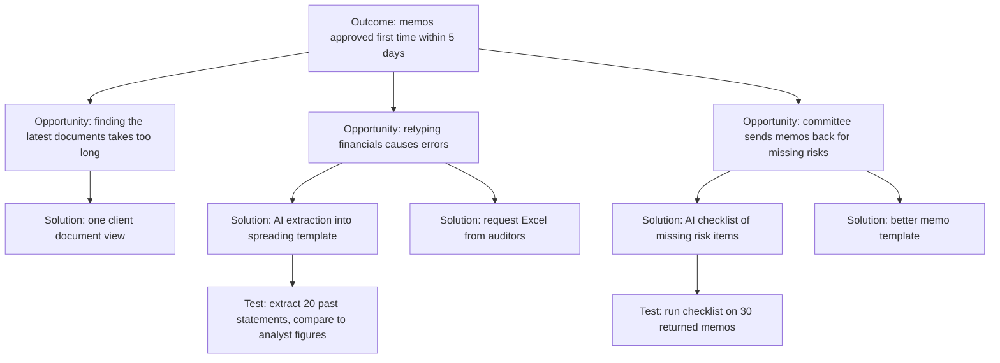
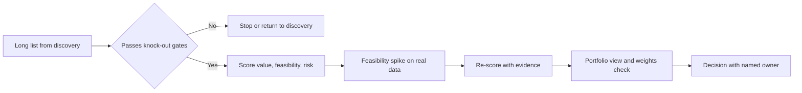
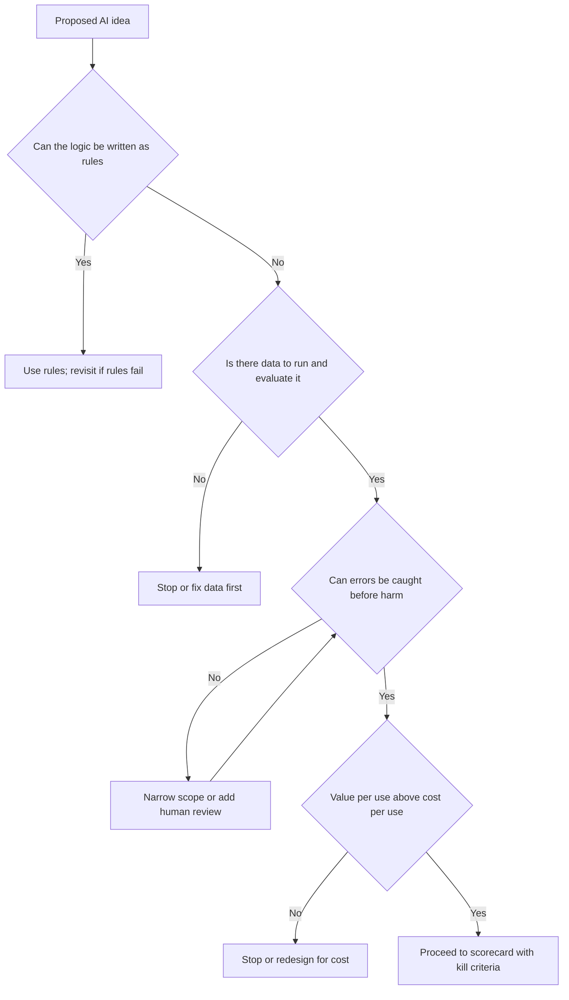

# Module 2 — Finding problems worth solving

*Most failed AI products were never wrong about the technology. They were wrong about the problem. Someone saw a demo, picked a model, and went looking for a place to put it. This module turns that order around. You will learn to find the real job a person is trying to get done, map the workflow where that job lives, and spot the few steps where AI actually helps. Then you will score and compare candidate use cases on value, feasibility and risk, and learn when the right answer is a rule, a template or nothing at all, and how to kill an idea before it eats a quarter. You will follow Faisal through his first discovery cycle at Najm Bank. Khalid wants "GenAI in lending", Rania wants evidence, and five competing ideas arrive on the same backlog.*

> **Stages:** Discover, Define — find the job, map the workflow, choose the use cases worth building, and stop the ones that are not.

---

# 2.1 — Discovery for AI: jobs, workflows and where AI fits
*Level: 🟡 Intermediate* · *Prerequisites: 0.2, 1.1* · *Stage: Discover*

## ⚡ In 60 seconds
- Discovery for AI starts with the **problem, not the model**. First ask "what job is this person trying to get done, and where does it hurt?" Only then ask "could AI help here?"
- **Jobs to be Done** frames needs as progress a person wants to make in a situation. **Workflow mapping** breaks the job into steps so you can see where the time, errors and waiting actually are.
- AI fits steps that are **high-volume, built on messy unstructured input, tolerant of some error, and cheaper to check than to do**. It fits badly where one wrong answer is costly and nobody can check it.
- Find AI opportunities at the **step level**, not the job level. "Write the credit memo" is not an AI use case. "Pull the financials out of three years of PDF statements into the spreading template" might be.
- Use the **Opportunity Solution Tree** to keep the outcome, the problems you found and the ideas you are testing on one page, so a favourite solution cannot skip the queue.
- Biggest trap: interviewing people about the AI feature you already want to build, instead of watching them do the work.

## 🧭 Why it matters
Faisal's first week at Najm Bank begins with a one-line request from Khalid, Head of Retail Lending: "Our competitors are putting GenAI into lending. I want ours live this year." Faisal opens a chat tool, pastes in an anonymised loan file, asks for a credit memo, and gets back three fluent pages. He books a demo with Khalid for Thursday.

Rania, Head of AI Products, stops him. "What does a relationship manager actually spend their day on? Which part of the memo takes longest? Which part gets sent back by the credit team? You don't know yet, and neither does the model." She sends him to sit with two relationship managers (RMs) in the SME team for two days.

What Faisal finds changes the product. The narrative sections of the memo, the part his demo wrote so well, are not where the time goes. The time goes into finding the latest documents in email and the shared drive, retyping figures from audited statements into the financial spreading template, and reworking the memo after the credit team questions a number. The demo solved one of the shortest steps. This is a common failure in AI products, and the public record has bigger versions of it. IBM invested heavily in Watson Health and sold those units in 2022, and a widely discussed lesson from that story is the gap between an impressive demo and a tool that fits clinical workflow. Discovery is how you close that gap before you build, not after.

## 📐 How it works

### 🟢 The essentials

**Discovery** is the work of learning what problem to solve, for whom, and why it matters, before committing to build. The UK Design Council's **Double Diamond** (2005) pictures it as two rounds of widening and narrowing. The first diamond is about the problem: explore widely, then define one problem. The second is about the solution: explore many ideas, then deliver one. AI tempts teams to skip the first diamond.

**Jobs to be Done (JTBD)** is the core lens. The idea, popularised by Clayton Christensen, is that people "hire" a product to make progress in a particular situation. Anthony Ulwick's **Outcome-Driven Innovation** makes it measurable. He breaks a job into steps and asks which outcomes people care about (for example "minimise the time it takes to…" or "minimise the chance of…") and how well each outcome is met today. A job statement has three parts:

> *When* [situation], *I want to* [make progress], *so I can* [outcome].

For an SME relationship manager: *When a client's annual review is due, I want to produce a credit memo the committee accepts first time, so I can get the facility renewed before the client's cash-flow need.* Notice what is **not** in the statement: memos, AI, drafting. The job is "get a sound decision through committee on time". A memo is today's way of doing it.

Jobs also have **emotional and social** sides. The RM also wants to *look competent in front of the credit committee*. That matters for AI. A draft the RM cannot defend line by line will not be used, however fast it is.

**Workflow mapping** turns the job into steps you can see. For each step, note five things:

| Step attribute | Question to ask | Why it matters for AI |
|---|---|---|
| Input | What goes in? Structured fields, PDFs, emails, conversations? | Unstructured input is where modern AI adds most over rules |
| Work | What does the person do: find, read, extract, judge, write, decide, act? | Different task types suit different AI (1.1) |
| Time and volume | How long, how often, how many people? | Sets the size of the prize |
| Errors and rework | What goes wrong, how often, and who catches it? | Shows the quality bar and where checking already happens |
| Hand-offs and waiting | Who waits for whom? | Often the real bottleneck, and often not an AI problem at all |

How do you get this information? **Watch and ask about real events.** Teresa Torres, in *Continuous Discovery Habits* (2021), recommends story-based interviews. Instead of "what do you want?" or "would you use an AI assistant?", ask "tell me about the last time you prepared a credit memo". People recall a specific recent episode far better than they predict their own behaviour. Better still, sit with them while they work (**contextual inquiry**). You will see the workaround spreadsheet nobody mentions in an interview.

### 🟡 Going deeper

**Where AI fits: the step-level test.** Once the workflow is mapped, go through each step and ask five questions. It is a heuristic, not a law.

1. **Is the input messy?** Free text, documents, images, speech. Rules struggle with these. AI often handles them well.
2. **Is there volume?** A step done ten times a year rarely repays the cost of building, evaluating and governing an AI feature. Ten thousand times a month might.
3. **Can the output be checked more cheaply than it can be produced?** This is the most useful single question. An RM can check an extracted balance sheet against the source PDF in two minutes. Retyping it takes thirty. A draft that takes as long to verify as to write saves nothing.
4. **What does a wrong output cost, and who catches it?** A wrong figure that the credit analyst catches costs a round of rework. A wrong figure that reaches the committee unnoticed could mean a bad loan. Error cost and the presence of a checker decide how much autonomy the feature can have (Module 4).
5. **Is the step about judgement people are accountable for?** Deciding whether to lend is a judgement the bank must own and explain. AI can inform it. It should not quietly make it (see 2.3, and Module 9 for regulation).

Map each step to a **task type** from Module 1: *find* (search and retrieval), *extract* (turn documents into fields), *classify* (sort into categories), *predict* (estimate a number or probability), *draft* (generate text for a human to edit), *summarise*, *converse*, *act* (take an action in a system). This stops "use AI" from being vague.

**Opportunity Solution Tree.** Torres's **Opportunity Solution Tree (OST)** keeps discovery honest. At the top sits one **outcome** the team is trying to move, a measurable business or customer result. Beneath it are **opportunities**: unmet needs, pain points and desires you heard in research, phrased from the user's side. Beneath each opportunity are candidate **solutions**, and beneath those, **assumption tests**: small experiments that check whether an idea could work. The tree makes two things visible. Every solution must trace back to a real opportunity. And you should compare several solutions for the same opportunity, not fall in love with the first.

Two of the five solutions on Faisal's tree are not AI at all. That is healthy. A tree full of AI ideas usually means the team started from the technology.

**Interview traps specific to AI.** Users often have wrong mental models of AI, expecting either magic or nothing. Do not ask people to evaluate an imagined AI feature. Ask about the work, and test AI ideas later with prototypes (5.2) or **Wizard of Oz** tests, where a human secretly produces the "AI" output so you can see how people use it before anything is built.

### 🔴 Expert view

**AI changes the workflow, so discover the future workflow too.** Adding AI to one step moves work around. If extraction becomes instant, the bottleneck may move to the analyst who checks it, or to the committee calendar. Expert PMs sketch the **to-be workflow** next to the as-is one: who does what after the change, what new checking work appears, and whose job gets harder.

**Do not automate a broken process.** If memos are sent back because the credit policy is ambiguous, fix the policy first. AI on top of an unclear policy produces unclear memos faster.

**Data exhaust is a discovery finding.** While mapping, note what data each step creates or could create: RM edits to drafts, committee comments, reasons for returns. This is the raw material for evaluation and for the learning loops in Module 3.

**The job has more than one customer.** In enterprise AI the user, the buyer and the people affected are often different. For the Credit Memo Copilot the user is the RM. The buyer is the head of corporate banking. The reviewer is the credit team. The people affected are SME owners and guarantors, whose facilities depend on the memo. Map the job for each group, at least briefly. The credit team's job ("catch weak lending before it is approved") may clash with the RM's job ("get it approved quickly"). A good product serves both.

## 🧰 The toolkit
| Tool or framework | What it is and does | When to reach for it |
|---|---|---|
| **Jobs to be Done** (Clayton Christensen; Anthony Ulwick's Outcome-Driven Innovation) | Frames needs as progress a person wants to make in a situation; ODI breaks the job into steps and measurable outcomes | At the start, to stop the conversation from being about features or models |
| **Workflow map** | Step-by-step map of the job with input, work, time, errors and hand-offs per step | To find the step where AI fits, and to see the as-is and to-be flow |
| **Contextual inquiry** | Watching people do real work in their own setting and asking about what you see | When interviews give you the idealised process rather than the real one |
| **Opportunity Solution Tree** (Teresa Torres) | One page linking an outcome to opportunities, candidate solutions and assumption tests | To compare several solutions per problem and keep favourite ideas honest |
| **Step-level AI fit test** | Five questions per step: messy input, volume, cheaper to check than do, cost of error, accountable judgement | To turn "use AI somewhere" into specific candidate steps |
| **Wizard of Oz** | A human secretly produces the output the AI would produce, so you can watch real use | To test whether people would use and trust an AI output before building it |

## 🏛️ In practice at Najm Bank
After two days of shadowing and six story-based interviews, Faisal writes a **one-page opportunity brief**. Rania makes it the team's standard format for any new AI idea.

**Opportunity brief — SME credit memo preparation** (v0.3, owner: Faisal; reviewed by Rania and Hessa)

| Section | Content |
|---|---|
| Job statement | When an SME client's review or new request comes in, the RM wants to get a memo the credit committee accepts first time, so the facility is approved before the client's need. |
| Who | Users: about 40 SME RMs. Reviewers: credit analysts. Affected: SME owners and guarantors. Buyer: Head of SME Banking. |
| Evidence | 2 days shadowing, 6 interviews, sample of 30 recent memos (illustrative numbers below come from this small sample; confirm before sizing) |
| As-is workflow and time per memo | Gather documents: ~1 h · Spread financials: ~1.5 h · Write narrative: ~1 h · Rework after credit questions: ~1.5 h |
| Biggest pains | Retyping figures from PDFs; hunting for latest documents; memos returned for missing risk items (about 1 in 3 in the sample) |
| Candidate AI steps | Extract financials from statements (extract; cheap to check against source) · Flag missing risk items before submission (classify/check) · Draft narrative (draft; lower value than expected) |
| Non-AI options | Single client document view; ask auditors for machine-readable statements; clearer memo template |
| Not for AI | The lending recommendation itself stays with the RM and the committee |
| Riskiest assumptions | Extraction accuracy on scanned statements is good enough; RMs will check extracted figures rather than trust them blindly |
| Next test | Run extraction on 20 past statements and compare with analyst-spread figures (Dana, 2 weeks) |
| Outcome to move | Share of memos approved first time; days from request to committee |

On Thursday Faisal shows Khalid no demo. He shows where the five hours go, and why the first AI features should be extraction and a pre-submission check, with drafting later.

## 🛠️ Exercises
- 🟢 Write three job statements (*When… I want to… so I can…*) for users of Najm Assist, the customer app assistant: a customer disputing a card payment, a customer travelling abroad, and a small-business owner checking a transfer. *Done when:* none of the three statements mentions AI, chat or the app, and each has a clear situation and outcome.
- 🟡 Map the as-is workflow for one job you know well at work (for example handling a customer complaint), with five to eight steps. Fill in the five step attributes and apply the step-level AI fit test to each step. *Done when:* you have a table with one row per step, and you have named at most two steps where AI fits and explained why the others do not.
- 🔴 Build an Opportunity Solution Tree for Smart Alerts with the outcome "reduce fraud losses without raising customer complaints about alerts". Include at least three opportunities, two solutions per opportunity (at least one non-AI) and one assumption test for your two favourite solutions. *Done when:* every solution traces to an opportunity phrased from the customer's or fraud analyst's side, and each test states what result would make you drop the idea.

## ⚠️ Mistakes and traps
- **Starting from the demo.** A fluent demo proves the model can produce text. It does not prove the text saves anyone time. Map the workflow first and find where the time and errors are.
- **Asking users what AI they want.** People cannot judge imagined AI features. Ask about the last time they did the work, and watch them if you can.
- **Ignoring the checker.** If nobody can check the output quickly, the time saved on producing it is spent on checking, or the checking gets skipped. Either is bad.
- **Mapping only the user.** Enterprise AI has users, buyers, reviewers and affected people. Leave one out and the product fails at the approval stage or in the complaints queue.
- **Automating a broken process.** When the map shows a policy or hand-off problem, fix that first.

## 🧾 Recap
- Start from the job and the workflow, not from the model. Use Jobs to be Done to describe the progress people want, without naming a solution.
- Map the workflow step by step: input, work, time, errors, hand-offs. AI opportunities live at the step level.
- AI fits steps with messy input and volume, where output is cheaper to check than to produce and errors are caught. It fits badly where errors are costly and unchecked, or where accountable judgement is involved.
- Use an Opportunity Solution Tree to compare several solutions per opportunity, including non-AI ones, and to plan small assumption tests.
- Sketch the to-be workflow. AI moves work and bottlenecks around.

## ✍️ Check yourself

**1. Khalid asks Faisal to "put GenAI into lending this year". What should Faisal do first?**

- A. Pick a large language model and build a memo-drafting demo to show momentum
- B. Study how relationship managers and credit analysts do the lending work today, and find where time and errors concentrate
- C. Run a survey asking RMs which AI features they would like
- D. Ask Layla for a risk tier for "GenAI in lending"

Answer

**B.** Discovery starts with the job and the workflow. The demo (A) is the tempting answer, but it answers "can the model write?", not "where does the work hurt?". Faisal's own demo solved the fastest step. Surveys about imagined features (C) give unreliable answers. Governance (D) needs a specific use case first. (🧭 Why it matters; 🟢 The essentials.)

**2. Which job statement is best written?**

- A. "RMs want an AI assistant that drafts credit memos."
- B. "When a client's review is due, I want a memo the committee accepts first time, so the facility is renewed before the client needs the funds."
- C. "Improve RM productivity with GenAI."
- D. "RMs need faster memo software."

Answer

**B.** It has a situation, the progress wanted and the outcome, and it names no solution. A and D bake in a solution. C is a goal for the bank, not a job for a person. (🟢 The essentials.)

**3. Two candidate steps both take about 30 minutes. Step X is extracting balance-sheet figures from PDFs, which an analyst can check against the source in about 3 minutes. Step Y is writing a risk assessment paragraph, which takes about 25 minutes to verify properly. Based on the step-level fit test, which is the stronger AI candidate?**

- A. Y, because generative AI is best at writing
- B. They are equal, because both take 30 minutes
- C. X, because its output is much cheaper to check than to produce
- D. Neither, because both involve financial data

Answer

**C.** "Cheaper to check than to do" is the most useful single question. Y saves almost nothing once verification is counted. A is tempting because drafting is what GenAI demos show best. But the value depends on checking cost, not on the model's strength. (🟡 Going deeper.)

**4. In an Opportunity Solution Tree, what belongs directly under the outcome?**

- A. Opportunities: unmet needs and pain points heard in research, phrased from the user's side
- B. The AI model the team has chosen
- C. Features ranked by effort
- D. Assumption tests

Answer

**A.** Outcome, then opportunities, then solutions, then assumption tests. Putting a model or features directly under the outcome (B, C) is exactly the solution-first habit the tree exists to prevent. (🟡 Going deeper.)

**5. The workflow map shows that a third of memos are sent back because two credit policies contradict each other on collateral. What is the best product response?**

- A. Build an AI that rewrites memos to satisfy both policies
- B. Raise the policy conflict with the policy owner and fix it before designing AI support for that step
- C. Ignore it, because it is not an AI problem
- D. Fine-tune a model on returned memos

Answer

**B.** Automating a broken process produces the same failure faster. The root cause is policy, not writing. C is wrong because the PM owns the outcome, and this is a major cause of rework, even though it is not an AI fix. (🔴 Expert view.)

## 📚 References
- Clayton M. Christensen, Taddy Hall, Karen Dillon and David S. Duncan, *Competing Against Luck* (2016), and "Know Your Customers' Jobs to Be Done", *Harvard Business Review* (2016) — https://hbr.org
- Anthony W. Ulwick, *What Customers Want* (2005) and *Jobs to be Done: Theory to Practice* (2016); Outcome-Driven Innovation — https://strategyn.com
- Teresa Torres, *Continuous Discovery Habits* (2021); Opportunity Solution Trees — https://www.producttalk.org
- UK Design Council, the Double Diamond — https://www.designcouncil.org.uk
- Google People + AI Guidebook (user needs and defining success) — https://pair.withgoogle.com/guidebook

---

# 2.2 — Scoring and choosing use cases: value, feasibility, risk
*Level: 🟡 Intermediate* · *Prerequisites: 1.3, 2.1* · *Stage: Discover, Define*

## ⚡ In 60 seconds
- Discovery gives you more good ideas than you can build. Choosing is a separate skill: compare candidates on **value, feasibility and risk**, openly and in the same units.
- Marty Cagan's **four big risks** (value, usability, feasibility, business viability) are the backbone. For AI, add three questions to feasibility and risk: **Is the data there? Can we reach the quality bar? What happens when it is wrong?**
- Screen first with **knock-out gates** (legal red lines, no data, no owner), then score what survives. A weighted score cannot rescue an idea that fails a gate.
- Size value as **volume × value per unit × expected improvement × adoption**, and write down your confidence. Most early AI business cases overstate adoption.
- Before you commit, run a short **feasibility spike** (one to two weeks) on real data. It turns the biggest unknown into evidence.
- Biggest trap: treating the score as the decision. Scores are for structuring the argument. The decision still needs judgement and an owner.

## 🧭 Why it matters
By the end of Faisal's first month, the AI products backlog holds five proposals, each with a sponsor who says it is the top priority:

1. **Credit Memo Copilot**: extraction and a pre-submission check for SME memos (from 2.1).
2. **Najm Assist** answers: a customer assistant in the app that answers product and fee questions.
3. **SME Instant Finance**: an ML model that pre-approves small invoice-financing requests in minutes.
4. **Smart Alerts** tuning: fewer false fraud alerts that annoy customers.
5. **Staff GenAI**: a general internal assistant for all employees.

Tariq's platform team can support two new builds this half-year. Dana's data science team can support one serious modelling effort. Khalid wants SME Instant Finance because it grows revenue. The contact centre wants Najm Assist because it cuts calls. Everyone wants Staff GenAI because other banks have one.

Without a shared method, the loudest sponsor wins, or the team spreads itself across all five and finishes none. Rania asks Faisal for a **use-case scorecard** by Friday: every idea scored on the same criteria, with the evidence and confidence behind each score, and a recommendation she can defend to the executive committee.

## 📐 How it works

### 🟢 The essentials

Every product idea carries risk. Cagan's **four big risks**, from *Inspired*, give you a checklist:

| Risk | The question | AI-specific twist |
|---|---|---|
| **Value** | Will people use it or buy it? Does it move an outcome we care about? | Users may not trust or check AI output, so adoption is uncertain even when the need is real |
| **Usability** | Can people work out how to use it? | Users must understand what the AI can and cannot do, and how to fix its mistakes (Module 4) |
| **Feasibility** | Can we build it with our people, time, technology and data? | Quality is uncertain until you test on real data; data readiness is often the blocker |
| **Business viability** | Does it work for the business: legal, risk, cost, brand, operations? | Cost per use, regulation (for example EU AI Act high-risk uses) and the harm from errors |

To compare ideas, turn the risks into a **scorecard**. Group the criteria into three families:

- **Value**: how much the outcome improves, for how many people, and how it links to strategy.
- **Feasibility**: data readiness, expected quality against the bar, integration effort, and team capability.
- **Risk**: harm if the AI is wrong, regulatory exposure, reputational exposure, and cost to serve.

Score each criterion from 1 to 5 against a written description of what each score means. Agree the descriptions *before* anyone scores anything. This is how you avoid people bending scores to fit their favourite idea.

**Size value with a simple formula.** For most internal AI use cases:

> **Annual value ≈ volume × value per unit × improvement × adoption**

For the Credit Memo Copilot (illustrative numbers): about 2,000 SME memos a year × 5 hours each × 30% time saved × 60% of RMs using it regularly ≈ 1,800 RM hours a year. You can put a cost on those hours, or, often better, turn them into faster decisions for clients. Each factor is an assumption to test. **Adoption** is the one most often guessed too high.

Intercom's **RICE** score (Reach × Impact × Confidence ÷ Effort) is a lighter tool for ranking features within one product. It is useful because it makes **confidence** an explicit number. That is what AI business cases most often leave out.

### 🟡 Going deeper

**Gates first, then scores.** Some criteria are not trade-offs. They are pass or fail. Run these **knock-out gates** before any weighted scoring:

- **Legal and ethical red lines.** Is this a prohibited practice, or something the bank will not do? Layla's team gives a first view (the governance detail is in *AI Governance: Zero to Hero*).
- **Data exists and can be used.** Is there data for the product to work on, and for evaluating it, with a lawful basis to use it? (Module 3.)
- **An accountable business owner.** Someone who will own the outcome, fund adoption and accept the residual risk.
- **A measurable outcome.** If nobody can say what "better" means, you cannot evaluate it.

An idea that fails a gate goes back to discovery or is stopped. It does not get a low score and linger on the list.

**AI feasibility needs evidence, not opinion.** Traditional feasibility asks "can we build it?". AI feasibility asks "can it be *good enough*, *often enough*, at an *acceptable cost*?" You cannot answer that in a workshop. Run a **feasibility spike**: a short, time-boxed test (one to two weeks) on a sample of real data, with a rough **quality bar** agreed in advance. For extraction: "at least 95% of figures correct on 20 real statements, with errors easy to spot". The spike changes a feasibility score from a guess to a measurement. It also finds data problems early, such as scanned documents, missing labels or inconsistent formats.

**Estimate cost to serve early.** GenAI products cost money every time they run. Teach yourself the method now (Module 8 goes deeper):

> **Cost per task ≈ (input tokens + output tokens) × price per token × calls per task**, plus retrieval, hosting and human review time.

Say a memo check sends 30,000 tokens in and gets 2,000 out, twice per memo. At an illustrative blended price, that is a small cost per memo compared with an RM hour. The same arithmetic for a customer-facing assistant with millions of conversations can give a very different answer. Prices change often. Use current prices from your vendor and label the date.

**Weights reflect strategy.** The weights you give value, feasibility and risk are a leadership choice. They are not a technical fact. A bank in a cost-cutting year may weight feasibility and time-to-value. A bank building a long-term position may weight strategic value. Agree the weights with the sponsor group before scoring, and show how the ranking changes if the weights change. A recommendation that flips when one weight moves by 10% is fragile. Say so.

**Plot the portfolio.** A two-by-two of **value** (vertical) against **feasibility** (horizontal), with bubble colour showing risk, is the most useful single slide. It shows four groups:

| Quadrant | Meaning | Typical action |
|---|---|---|
| High value, high feasibility | Strong candidates | Build now |
| High value, low feasibility | Strategic bets | Spike or invest in data first; do not promise dates |
| Low value, high feasibility | Tempting distractions | Only if nearly free, or as a learning project |
| Low value, low feasibility | Drop | Record why, and move on |

### 🔴 Expert view

**Score confidence separately from size.** A big number with low confidence is not the same as a medium number with high confidence. Expert PMs record, for every value and feasibility score, **what evidence it rests on** (interview, spike, pilot, analogue) and a **confidence level**. Then they choose the next piece of work as the one that most reduces uncertainty on the highest-value idea. Sometimes the right decision is not "build" or "stop" but "buy information": run the spike, do the Wizard of Oz test, pull the data sample.

**Expected value, not best case.** For bets with uncertain feasibility, a rough expected value helps: *value if it works × chance it reaches the quality bar − cost of trying*. SME Instant Finance may have the highest value if it works. But a credit model for small businesses needs historical performance data, fairness testing and model validation, and it may take a long time to reach approval. A copilot with a smaller prize and a high chance of success may be worth more this year.

**Platform effects change the maths.** Some use cases build shared capability. The Credit Memo Copilot needs document ingestion, retrieval over client files and an evaluation harness. Najm Assist and Staff GenAI will need the same. Ranking each idea alone undervalues the first one that builds the platform. Show dependencies explicitly. Do not hide them in "strategic value".

**Risk is not only a minus.** Risk scores often become a penalty that pushes every customer-facing idea down the list. A better approach is to ask what it would take to **reduce** the risk (a human review step, a narrower scope, internal users first). Then score the *mitigated* design and add the cost of the mitigation to effort. Najm Assist answering fee questions from a controlled knowledge base, with hand-off to an agent, is a different risk from Najm Assist answering anything. Air Canada learned this in *Moffatt v. Air Canada* (2024): a tribunal held the airline responsible for what its website chatbot told a customer about fares. The risk depends on scope and design, not on "chatbot" as a category.

**Gaming and politics.** Scorecards get gamed. Sponsors inflate reach, and teams deflate effort for favoured ideas. Useful defences: score in a group with the evidence visible, have Dana and Tariq own the feasibility scores and the sponsor own the value scores, and revisit scores after the spike. When an executive overrides the ranking, record the override and the reason. That is legitimate, and it is their call, but it should be visible.

## 🧰 The toolkit
| Tool or framework | What it is and does | When to reach for it |
|---|---|---|
| **Four big risks** (Marty Cagan, *Inspired*) | Value, usability, feasibility and business viability as the risks every idea must address | As the backbone of any scorecard and of discovery planning |
| **Knock-out gates** | Pass or fail checks (red lines, data, owner, measurable outcome) run before scoring | To stop ideas that no score can rescue |
| **Use-case scorecard** | Weighted 1–5 scores on value, feasibility and risk, with written level descriptions, evidence and confidence | To compare competing proposals openly |
| **RICE** (Intercom) | Reach × Impact × Confidence ÷ Effort | To rank features inside one product, with confidence made explicit |
| **Value sizing formula** | Volume × value per unit × improvement × adoption | To size the prize and expose the adoption assumption |
| **Feasibility spike** | One-to-two-week test on real data against a quality bar agreed in advance | Before committing a team to an AI build |
| **Cost-per-task model** | Tokens, calls, retrieval, hosting and review time per task, at dated prices | To check that cost to serve fits the value per task |
| **Value–feasibility matrix** | Two-by-two portfolio view with risk as colour | To present the recommendation to leadership |

## 🏛️ In practice at Najm Bank
Faisal's **use-case scorecard** (v1.0), agreed with Rania. Weights: value 40%, feasibility 35%, risk 25%. Risk is scored so that 5 = lowest residual risk after mitigation. Numbers are illustrative.

| Use case | Gates | Value (1–5) | Feasibility (1–5) | Risk, mitigated (1–5) | Weighted | Confidence | Evidence | Recommendation |
|---|---|---|---|---|---|---|---|---|
| Credit Memo Copilot: extraction + pre-check | Pass | 4 | 4 | 4 | 4.00 | Medium-high | Shadowing, 30-memo sample, spike planned | **Build now**; internal users, RM checks every figure |
| Najm Assist: fee and product answers | Pass (answers only from approved content; hand-off to agents) | 4 | 3 | 3 | 3.40 | Medium | Contact-centre call reasons; no spike yet | **Spike** retrieval quality on top 50 questions, then decide |
| SME Instant Finance | Pass, with conditions (credit decisions: high-risk, Layla's full review) | 5 | 2 | 2 | 3.20 | Low | Sponsor estimate only; default data not yet checked | **Strategic bet**: data readiness review first (Module 3); no build date |
| Smart Alerts tuning | Pass | 3 | 4 | 4 | 3.60 | Medium | Complaint logs; model exists | **Next in queue**; Dana's team after memo spike |
| Staff GenAI | Fail: no business owner, no outcome defined | — | — | — | — | — | — | **Return**: find an owner and two concrete jobs first |

Weighted score = 0.40 × value + 0.35 × feasibility + 0.25 × risk. Faisal adds a note: "If the value weight rises to 60% (feasibility 25%, risk 15%), SME Instant Finance moves to second place, not first, because of low feasibility. The recommendation holds." Khalid is unhappy that his favourite is not first. He accepts a written commitment to a data readiness review with a decision date, which is more than he had before.

## 🛠️ Exercises
- 🟢 Write the 1-to-5 level descriptions for one criterion, "data readiness", so that two people scoring independently would give the same score. *Done when:* each level describes something observable (for example "labelled examples exist for the main case"), not a feeling.
- 🟡 Size the annual value of Najm Assist answering fee questions using volume × value per unit × improvement × adoption. Invent clearly labelled illustrative inputs, then state which input you are least sure of and how you would test it within two weeks. *Done when:* the calculation is shown step by step, every input is labelled illustrative, and you name one concrete test.
- 🔴 Take the scorecard above and change one thing: Layla says SME Instant Finance could start as a "recommend, human decides" tool for invoices under a small limit. Re-score it with the mitigated design, add the mitigation cost to effort, and write a three-sentence memo to Rania on whether the ranking should change. *Done when:* you show the before and after scores, name what evidence would raise your confidence, and state a clear recommendation.

## ⚠️ Mistakes and traps
- **Scoring before gating.** An idea with no data or no owner can still score well on paper. Run the knock-out gates first.
- **False precision.** "3.47 beats 3.41" is noise. Treat close scores as ties and decide on evidence, strategy and dependencies.
- **Guessing feasibility.** For AI, feasibility is an empirical question. Replace opinions with a spike on real data.
- **Assuming full adoption.** Business cases that assume every user adopts on day one are nearly always wrong. Use a conservative adoption rate and test it.
- **Scoring raw risk instead of designed risk.** Score the mitigated design, and add the mitigation cost. Otherwise every customer-facing idea is wrongly buried.
- **Letting the score decide.** The scorecard structures the debate. A named owner makes the decision and records overrides.

## 🧾 Recap
- Compare every candidate on value, feasibility and risk, using Cagan's four big risks as the backbone and adding AI questions about data, quality and error cost.
- Run knock-out gates before scoring. Then score against written level descriptions, with evidence and confidence for each score.
- Size value as volume × value per unit × improvement × adoption, and treat adoption with suspicion.
- Use a short feasibility spike on real data to replace the biggest guess with a measurement. Estimate cost to serve with a dated cost-per-task model.
- Present a value–feasibility portfolio, test the weights, show platform dependencies, and make the decision with a named owner.

## ✍️ Check yourself

**1. Staff GenAI has strong enthusiasm across the bank but no business owner and no defined outcome. In Faisal's process, what happens to it?**

- A. It gets a low score and stays on the list
- B. It fails the knock-out gates and returns to discovery to find an owner and concrete jobs
- C. It is built first because demand is high
- D. It is scored on feasibility only

Answer

**B.** Gates run before scoring. A missing owner and a missing measurable outcome are pass or fail conditions. A (keeping it on the list with a low score) is tempting, but it lets an unowned idea linger and soak up attention. (🟡 Going deeper; 🏛️ In practice.)

**2. Which of Cagan's four big risks is MOST directly tested by a two-week spike that runs extraction on 20 real statements against a pre-agreed accuracy bar?**

- A. Value
- B. Usability
- C. Feasibility
- D. Business viability

Answer

**C.** The spike tests whether the AI can reach the quality bar on real data, which is AI feasibility. It says little about whether RMs will adopt it (value) or understand it (usability). (🟢 The essentials; 🟡 Going deeper.)

**3. A business case says: 10,000 users × 2 hours saved a month × 100% adoption from launch. What is the most important challenge a PM should raise?**

- A. The hours saved should be in minutes
- B. The adoption assumption is almost certainly too high and should be conservative and tested
- C. The volume should be doubled for growth
- D. Nothing, business cases are always optimistic

Answer

**B.** Adoption is the factor most often overstated in AI business cases. Users may not trust, check or even open the tool. Use a conservative rate and test it with a pilot. (🟢 The essentials.)

**4. Two use cases score 3.47 and 3.41. The 3.41 idea builds the document ingestion and evaluation harness that two later products need. What should the PM do?**

- A. Pick 3.47 because it scored higher
- B. Treat the scores as effectively tied and weigh the platform dependency explicitly in the decision
- C. Re-weight until 3.41 wins
- D. Average the two and build both

Answer

**B.** Small score gaps are noise, and platform effects are real value that stand-alone scores miss. C is gaming the scorecard. Show the dependency openly instead. (🟡 Going deeper; 🔴 Expert view.)

**5. The risk team gives Najm Assist a poor risk score because "customer chatbots can say wrong things". What is the best PM response?**

- A. Accept the score and drop the idea
- B. Argue that chatbots are low risk
- C. Define a mitigated design (answers only from approved content, hand-off to agents, internal pilot first), score that design, and add the mitigation cost to effort
- D. Remove risk from the scorecard

Answer

**C.** Risk depends on scope and design. Scoring the mitigated design, and paying for the mitigation, is honest in both directions. B ignores real cases such as *Moffatt v. Air Canada* (2024), where the company was held responsible for its chatbot's answer. (🔴 Expert view.)

## 📚 References
- Marty Cagan, *Inspired: How to Create Tech Products Customers Love* (2nd ed., 2017) and SVPG articles on product risks — https://www.svpg.com
- Intercom, RICE prioritisation (Intercom blog) — https://www.intercom.com/blog
- Teresa Torres, *Continuous Discovery Habits* (2021) — https://www.producttalk.org
- Google People + AI Guidebook — https://pair.withgoogle.com/guidebook
- NIST AI Risk Management Framework (Map function: context and impacts) — https://www.nist.gov/itl/ai-risk-management-framework
- EU AI Act, Regulation (EU) 2024/1689 — https://eur-lex.europa.eu/eli/reg/2024/1689/oj

---

# 2.3 — When not to use AI, and killing ideas early
*Level: 🟡 Intermediate* · *Prerequisites: 2.1, 2.2* · *Stage: Discover*

## ⚡ In 60 seconds
- Knowing when **not** to use AI is a core AI product skill. It is not a lack of ambition. Many "AI problems" are really rules, search, template, data or process problems.
- Warning signs: the logic can be **written down as rules**; **zero tolerance for error** and no practical way to check; **no data** to run or evaluate it; **low volume**; the need for an **exact, stable explanation**; or **cost per use** above value per use.
- Always compare against the **simplest alternative that could work**. If a rule set gets you most of the way with full transparency, AI has to earn its extra cost and risk.
- Killing ideas early is cheaper than killing them late. Write **kill criteria before you start**: the evidence, threshold and date that would make you stop.
- Use cheap tests (Wizard of Oz, a spike, a pre-mortem) so ideas can fail in weeks, not quarters.
- Biggest trap: the sunk-cost spiral. "We've invested too much to stop now" is how pilots become permanent.

## 🧭 Why it matters
Three proposals reach Faisal in the same week.

The collections team wants "an AI model to detect when a customer's salary has arrived", so they can time payment reminders. Marketing wants "GenAI to write personalised decline letters" for retail loan applicants. And Khalid's team has a six-month pilot of an ML model that predicts which SME clients will ask for a limit increase. Accuracy is "promising", but no RM has changed what they do because of it.

The first is a rule. Salary credits in Najm's core banking system usually carry a payroll code and a regular pattern, so a few conditions will find most of them, and the rest can be handled by asking the customer. The second is a regulated communication. A declined applicant is owed accurate, specific reasons, and a fluent letter that paraphrases or invents reasons is worse than a reviewed template. The third is a zombie. It is too promising to kill, too unused to matter, and it keeps two data scientists busy.

Public cases show what happens when these calls go the wrong way. Zillow wound down its Zillow Offers home-buying business in 2021 after its pricing approach mispriced homes, with large write-downs. The model was only part of that story, but the business had bet on algorithmic accuracy in a volatile market with little room for error. Customer-facing chatbots have made headlines for less. A Chevrolet dealer's website chatbot was manipulated into "agreeing" to sell a car for $1 (December 2023). DPD's delivery chatbot swore and criticised the company after an update (January 2024). New York City's MyCity chatbot was reported in 2024 to give business owners answers that contradicted the law. In each case the question "should AI answer this, in this way, without a check?" deserved more attention than it got.

## 📐 How it works

### 🟢 The essentials

Before any AI idea goes onto the scorecard from 2.2, ask one plain question: **what is the simplest thing that could solve this problem?** Then compare AI against it. The simpler options are often very good:

| Simpler alternative | Good for | Najm example |
|---|---|---|
| **Rules and thresholds** | Logic you can write down; stable patterns; decisions that must be exact and explainable | Detecting salary credits by payroll code and pattern |
| **Search and a good knowledge base** | People who need to find a known answer | Staff looking up the current fee schedule |
| **Templates and forms** | Regulated or repetitive communication; capturing structured input | Decline letters built from reason codes |
| **Better UX or clearer policy** | Confusion caused by the product or the process | A dispute form that customers abandon halfway |
| **Simple analytics or statistical models** | Prediction on structured data with few features | A logistic model for which alerts get confirmed as fraud |
| **Process or ownership change** | Hand-offs and waiting | Memos stuck for days waiting for a second signature |

**Warning signs that AI is the wrong tool.** None of these is an absolute rule, but each should trigger a hard look:

1. **The logic can be written down.** If an expert can state the rule and it rarely changes, write the rule. It is cheaper, faster, testable and fully explainable.
2. **Zero tolerance for error with no practical check.** AI makes mistakes (1.2). If one mistake is unacceptable and nobody can review each output, AI does not fit, or it fits only in a narrower role.
3. **No data.** No inputs to work on, no examples of good output, and no way to tell whether it is right. Then you cannot build it well or evaluate it at all.
4. **Low volume.** A task done 50 times a year rarely repays the cost of building, evaluating, governing and monitoring an AI feature.
5. **Exact, stable explanation is required.** Some decisions need the *same* reasons every time, stated precisely, for example to a regulator or a declined applicant. Probabilistic text generation is a poor fit for writing those reasons. It can still help with other parts of the task.
6. **Cost per use exceeds value per use.** A GenAI call on every card transaction may cost more than the fraud it prevents. Do the cost-per-task arithmetic (2.2).
7. **Nobody will own it.** No accountable owner means nobody to fix it when it goes wrong.

### 🟡 Going deeper

**"Not AI" is rarely all or nothing.** The best answer is often a **hybrid**: rules for the clear cases, AI for the messy middle, humans for the hardest calls. For the decline letters, the *reasons* come from the credit decision's reason codes, fixed and reviewed. A template turns them into the letter. A GenAI tool might then help the contact centre explain the letter in plain language when a customer calls, drawing only on the letter itself. The regulated core stays deterministic. AI helps only at the edge, where a person is in the loop.

**Kill criteria, written before you start.** A **kill criterion** is a statement agreed at the start of a piece of work: *if we see this result by this date, we stop or change direction.* Good kill criteria have three parts: a **metric**, a **threshold** and a **date**. For example: "If extraction accuracy on 20 real scanned statements is below 90% by the end of the two-week spike, we stop and look at requesting machine-readable statements instead." Writing them in advance matters because once work starts, everyone involved has reasons to see promise in weak results.

This is the core of Eric Ries's **Lean Startup** (2011) loop, **build–measure–learn**: build the smallest thing that tests your riskiest assumption (a **minimum viable product**, or MVP), measure, and then decide to *persevere* or *pivot*. For AI products, add a third option you must be willing to take: **stop**.

**Cheap ways to fail fast.**

- **Wizard of Oz.** A person produces the "AI" output behind the scenes. If customers do not use the answers even when a human writes them perfectly, a model will not help.
- **Feasibility spike** on real data against a quality bar (2.2).
- **Concierge test.** Deliver the service by hand, openly, to a few users to see whether they value it.
- **Pre-mortem.** Gary Klein's technique: the team imagines the project has failed a year from now and writes down why. It surfaces risks people are reluctant to raise, such as "RMs never trusted the numbers" or "the regulator asked for explanations we could not give".

**Zombie projects.** A **zombie** is a pilot that never dies and never scales. Signs: no decision date, "promising" results that never meet a threshold, no user who would complain if it stopped, and a team that keeps adding features instead of testing adoption. Khalid's limit-increase predictor fits the pattern. The test is simple. Ask the RMs what they would lose if it were switched off tomorrow. If the answer is nothing, it has no value yet, however accurate it is.

### 🔴 Expert view

**Make stopping safe and normal.** Teams do not kill ideas when killing feels like failure. Expert product leaders change the incentive. They celebrate a well-evidenced stop as a saved budget. They track **time to decision**, not just launches. And they make kill criteria part of every funding approval. Rania's rule at Najm: no AI pilot gets funding without a decision date and written kill criteria, and every decision (continue, pivot, stop) gets a short record.

**Separate "not now" from "not ever".** Many AI ideas fail because a condition is missing, not because the idea is bad. The data does not exist yet, the model quality is not there, or the cost is too high at today's prices. Record the condition that would reopen the idea, for example "revisit when statements arrive in machine-readable form" or "revisit if per-task cost falls by half". Models improve and prices change. An idea stopped with a clear reopening condition can come back cheaply. One stopped with a vague "didn't work" gets re-proposed from scratch by the next enthusiast.

**The opportunity cost argument.** When a sponsor resists stopping, the strongest argument is rarely "it's bad". It is "here is what these two data scientists could do instead". Put the alternative next to the zombie: Smart Alerts tuning, with complaint data and an existing model, waiting in the queue. Stopping one thing is easier to accept when it starts another.

**Beware "AI-washing" in your own proposals.** Sometimes a project is labelled AI to get attention or budget, and the real value is a data clean-up, a new integration or a process fix. That is fine as long as you are honest about it. Evaluate and fund it as what it is. An AI label brings AI evaluation, AI governance and AI running costs, and none of those help a project that is really about plumbing.

**Stopping is also a governance event.** When an AI system is retired, users need to know, data and models must be handled under retention rules, and the AI inventory must be updated. Point to *AI Governance: Zero to Hero* for the decommissioning steps. The PM's job is to make sure the stop is planned, not just announced.

## 🧰 The toolkit
| Tool or framework | What it is and does | When to reach for it |
|---|---|---|
| **Simplest-alternative check** | Compare every AI idea with rules, search, templates, UX, simple models and process changes | Before any AI idea enters the scorecard |
| **Is-AI-needed decision tree** | Rules? Data? Can errors be caught? Value above cost? | To triage incoming ideas quickly and consistently |
| **Kill criteria** | Metric, threshold and date, agreed before work starts, that trigger a stop or pivot | For every spike, pilot and funding approval |
| **Build-measure-learn** (Eric Ries, *The Lean Startup*, 2011) | Build the smallest test of the riskiest assumption, measure, then persevere, pivot or stop | To structure early AI experiments |
| **Wizard of Oz** | A human secretly produces the AI output to test real use before building | When the main doubt is whether people will use or trust the output |
| **Pre-mortem** (Gary Klein) | The team imagines failure in advance and lists the causes | At kick-off of any sizeable AI initiative |
| **Decision record** | Short record of a continue, pivot or stop decision, the evidence and the reopening condition | Every time an idea is stopped or changed |

## 🏛️ In practice at Najm Bank
Faisal brings three **decision records** to Rania's weekly review. Rania adds them to the team's shared log.

**Decision record — AI idea triage, week 6** (owner: Faisal; approved by Rania)

| Idea | Simplest alternative | Decision | Evidence | Reopen if |
|---|---|---|---|---|
| Salary-arrival detection (collections) | Rules on payroll code, amount pattern and date window | **Not AI.** Build rules with the collections team | Rules drafted with a data analyst; checked against a sample of accounts (illustrative: most salaries found; the rest can be confirmed by asking the customer) | Rules miss a large share of salaries in production |
| GenAI decline letters (marketing) | Reason codes from the credit decision + reviewed template | **Not AI for the letter.** Template with reason codes. Separate idea logged: contact-centre helper that explains a customer's own letter | Legal and compliance review; Layla flags regulated adverse-action content | Never for the reasons themselves; the helper idea goes to discovery |
| SME limit-increase predictor (6-month pilot) | None tested | **Stop.** Release two data scientists to Smart Alerts | No RM action traced to the model in 6 months; RMs said they would lose nothing if it were switched off | An RM workflow is found where the prediction changes an action; re-enter via an opportunity brief |

Kill criteria for the next piece of work, the Credit Memo Copilot extraction spike, written on day one:

> **Metric:** share of figures correctly extracted from 20 real audited statements, including scanned ones.
> **Threshold:** at least 95% correct, and every error visible when compared side by side with the source.
> **Date:** end of week 2.
> **If missed:** stop the extraction build; test the non-AI option (machine-readable statements from auditors) instead.
> **Signed:** Faisal (PM), Dana (data science), Head of SME Banking (owner).

Khalid pushes back on stopping the predictor: "We've spent six months on it." Rania answers with the opportunity cost. The same two people can cut false fraud alerts, a problem customers complain about every week. The stop goes ahead.

## 🛠️ Exercises
- 🟢 For each of these, name the simplest alternative to AI and say in one sentence whether AI is still justified: (a) routing emails to the right team by keyword, (b) answering "what is my card limit?", (c) summarising 200-page syndicated loan agreements for credit analysts. *Done when:* each answer names a specific alternative and gives one reason tied to the warning signs.
- 🟡 Write kill criteria for a Najm Assist pilot answering fee questions, covering quality, adoption and one safety measure. *Done when:* each criterion has a metric, a threshold and a date, and you state what you will do instead if each one is missed.
- 🔴 Run a written pre-mortem for SME Instant Finance: it is a year from now and the product has been withdrawn. List at least six plausible causes across value, feasibility, viability and trust. Turn the top three into kill criteria or early tests. *Done when:* each of your top three causes is linked to a test you could run in the first eight weeks, and at least one cause concerns regulation or fairness.

## ⚠️ Mistakes and traps
- **Treating "not AI" as failure.** Picking rules or a template when they work is good product judgement. Evaluate the alternative with the same care as the AI option.
- **Writing kill criteria after the results arrive.** Criteria written later always bend to fit. Agree metric, threshold and date on day one, and have the owner sign.
- **Letting pilots run without a decision date.** Every pilot needs a date on which it must continue, pivot or stop.
- **Arguing "it's accurate" for an unused model.** Accuracy without a changed action is not value. Ask what users would lose if it were switched off.
- **Stopping without a record.** Without the evidence and a reopening condition, the idea comes back in six months and the work is repeated.
- **Giving a probabilistic system a job that needs exact, repeatable reasons.** Keep regulated reasons deterministic and let AI help around the edges.

## 🧾 Recap
- Always compare an AI idea with the simplest alternative that could work: rules, search, templates, UX, simple models or process change.
- Warning signs: logic you can write down, zero error tolerance without checks, no data, low volume, need for exact explanations, cost above value, no owner.
- Hybrids are often best: deterministic core, AI where input is messy, humans on the hard cases.
- Write kill criteria (metric, threshold, date) before work starts, and use cheap tests (Wizard of Oz, spikes, pre-mortems) to fail fast.
- Make stopping normal: record decisions, separate "not now" from "not ever", and use opportunity cost to end zombie pilots.

## ✍️ Check yourself

**1. The collections team asks for "an AI model to detect salary deposits". Salary credits carry a payroll code and arrive on a regular pattern. What should Faisal recommend first?**

- A. Train a classifier on all transactions
- B. Use an LLM to read transaction descriptions
- C. Write rules on payroll code, amount and date pattern, and consider AI only for the cases rules miss
- D. Reject the request because collections is sensitive

Answer

**C.** When the logic can be written down, rules are cheaper, testable and fully explainable. A is tempting because it sounds more capable, but it adds cost and opacity for little gain. (🟢 The essentials; 🧭 Why it matters.)

**2. Which kill criterion is best written?**

- A. "We will stop if the pilot is not promising."
- B. "If fewer than 30% of pilot RMs use the pre-check on at least half their memos by 31 March, we stop and review the design."
- C. "We will review results when the team feels ready."
- D. "Stop if the model is not state of the art."

Answer

**B.** It has a metric, a threshold and a date. A and C cannot be tested and will bend to fit any result. D measures the model, not the product outcome. (🟡 Going deeper.)

**3. A six-month pilot model predicts SME limit increases with good accuracy, but no RM has changed an action because of it. The sponsor says, "We've invested too much to stop." What is the strongest response?**

- A. Keep going and add more features
- B. Improve the model's accuracy further
- C. Stop the pilot, record the evidence and a reopening condition, and move the team to a higher-value queued item
- D. Hand the model to a vendor

Answer

**C.** Accuracy without a changed action is not value, and past spending is a sunk cost. Showing the opportunity cost makes the stop easier to accept. A is the zombie pattern. B improves a model nobody is using. (🟡 Going deeper; 🔴 Expert view.)

**4. Marketing wants GenAI to write personalised loan decline letters. What is the best design?**

- A. Let the model generate the reasons from the application file
- B. Keep the reasons deterministic, from the decision's reason codes and a reviewed template. Consider AI only for helping staff explain the letter
- C. Use GenAI but add a disclaimer
- D. Send no reasons

Answer

**B.** Regulated reasons must be accurate, specific and repeatable, which fits a deterministic source and template. AI can help at the edge with a human in the loop. C is tempting, but a disclaimer does not make invented or paraphrased reasons acceptable. (🟡 Going deeper; 🏛️ In practice.)

**5. An extraction idea is stopped because scanned statements are too poor for accurate extraction today. What should the decision record include?**

- A. Only "did not work"
- B. The evidence and a reopening condition, such as "revisit when statements arrive in machine-readable form or extraction quality improves on the same test set"
- C. The names of the people who proposed it
- D. Nothing, stopped ideas should not be recorded

Answer

**B.** Separating "not now" from "not ever" lets the idea return cheaply when the condition changes. Models and data improve. A vague record means the work gets repeated from scratch. (🔴 Expert view.)

## 📚 References
- Eric Ries, *The Lean Startup* (2011) — https://theleanstartup.com
- Gary Klein, "Performing a Project Premortem", *Harvard Business Review* (2007) — https://hbr.org
- Marty Cagan, *Inspired* (2nd ed., 2017) — https://www.svpg.com
- Teresa Torres, *Continuous Discovery Habits* (2021) — https://www.producttalk.org
- Google People + AI Guidebook (deciding whether AI adds unique value) — https://pair.withgoogle.com/guidebook
- Zillow Group investor relations (2021 announcements on winding down Zillow Offers) — https://investors.zillowgroup.com
