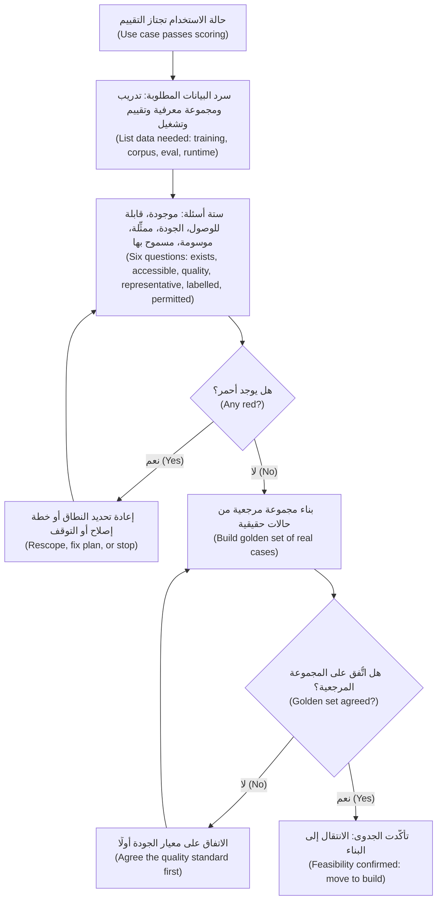
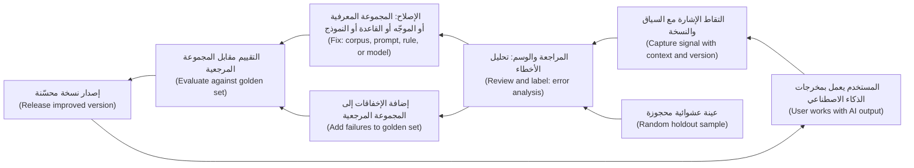
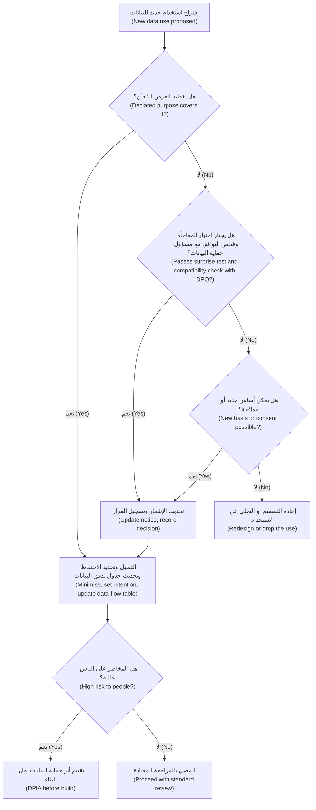

# الوحدة 3 — البيانات أساسًا للمنتج (Data as the product's foundation)

*لا يكون منتج الذكاء الاصطناعي (AI product) أفضل من البيانات (data) التي يتعلّم منها (learns from)، ويقرأ منها (reads from)، ويُحكَم عليه بمقارنته بها (judged against). ومعظم مشاريع الذكاء الاصطناعي المتعثّرة (AI projects that stall) تتعثّر بسبب البيانات لا بسبب النموذج (the data, not the model). فيتبيّن أن البيانات مفقودة (missing)، أو موسومة بشكل خاطئ (mislabelled)، أو محبوسة في النظام الخطأ (locked in the wrong system)، أو غير ممثِّلة للمستخدمين الحقيقيين (unrepresentative of real users)، أو غير قابلة للاستخدام قانونيًا للغرض الجديد (not legally usable for the new purpose). تعلّمك هذه الوحدة دور مدير المنتج (product manager's part) في هذا العمل. لن تبني خطوط معالجة البيانات (pipelines)، لكنك ستطرح الأسئلة التي تحدّد هل المنتج ممكن (feasible)، وهل يتحسّن مع الاستخدام (gets better with use)، وهل يُسمح للبنك بتنفيذه (allowed to do it). ستتابع فيصل ورانيا في بنك نجم (Najm Bank) وهما يقيّمان البيانات التي يقوم عليها مساعد مذكرات الائتمان (Credit Memo Copilot) والتمويل الفوري للشركات الصغيرة (SME Instant Finance)، ويصمّمان حلقات التغذية الراجعة (feedback loops) التي تتيح للتنبيهات الذكية (Smart Alerts) وللمساعد أن يتعلّما، ويكتبان قسم الخصوصية (privacy section) في مواصفات منتج (product spec) نجم أسيست (Najm Assist) مع سارة، مسؤول حماية البيانات (Data Protection Officer, DPO).*

> **المراحل (Stages):** Define, Design, Build, Grow — التحقق من أن البيانات موجودة وصالحة للغرض (exists and is fit for purpose)، وتصميم منتجات تجمع الإشارات الصحيحة (collect the right signals)، وامتلاك قرارات المنتج (product decisions) التي تعتمد عليها الخصوصية وحقوق البيانات (privacy and data rights).

---

# 3.1 — جاهزية البيانات: هل لدينا ما يحتاجه المنتج؟ ⁦(Data readiness: do we have what the product needs?)⁩
*المستوى (Level): 🟡 متوسط (Intermediate)* · *المتطلبات (Prerequisites): 1.3، 2.2* · *المرحلة (Stage): Define, Build*

## ⚡ الدرس في دقيقة (In 60 seconds)
- **جاهزية البيانات (Data readiness)** هي الدليل (evidence) على أن البيانات التي يحتاجها منتج الذكاء الاصطناعي موجودة (exists)، ويمكن الوصول إليها (can be reached)، وجيدة بما يكفي (good enough)، وتمثّل المستخدمين الحقيقيين (represents the real users)، ويجوز استخدامها قانونيًا لهذا الغرض (may legally be used for this purpose). إنها سؤال جدوى تقنية (feasibility question)، ومكانها في الاكتشاف (discovery) لا في السبرينت السادس (sprint 6).
- المنتجات المختلفة تحتاج بيانات مختلفة (different data). **النموذج التنبؤي (predictive model)** يحتاج أمثلة تاريخية (historical examples) ذات **وسوم (labels)** موثوقة (الإجابة الصحيحة المعروفة (the known right answer)). و**منتج الذكاء الاصطناعي التوليدي المبني على الاسترجاع (GenAI product built on retrieval)** يحتاج **مجموعة معرفية (knowledge corpus)** نظيفة وحديثة ومضبوطة الصلاحيات (clean, current, permissioned). و**كل** منتج ذكاء اصطناعي يحتاج **بيانات تقييم (evaluation data)**: مجموعة من الحالات الحقيقية (real cases) مع إجابات جيدة متّفق عليها (agreed good answers).
- عبارة «لدينا بيانات كثيرة (We have lots of data)» ليست إجابة. الأسئلة هي: البيانات *الصحيحة (right)*، للفئة *الصحيحة (right population)*، المتاحة *لحظة اتخاذ القرار (at the moment of decision)*، مع وسوم تثق بها (labels you trust).
- مدير المنتج (PM) لا ينظّف البيانات (does not clean data). مدير المنتج يطرح الأسئلة ويحوّل الفجوات (gaps) إلى قرارات نطاق (scope) وجدول زمني (timeline) وقرار المضيّ أو التوقف (go/no-go).
- إشارة القرار (Decision cue): إن لم تستطع تجميع 50–100 حالة حقيقية ممثِّلة (real, representative cases) مع إجابات جيدة متّفق عليها في أول أسبوعين، فأنت لا تعرف بعد هل المنتج ممكن (feasible).
- أكبر فخ (Biggest trap): أن تكتشف بعد التجربة الأولية (pilot) أن النموذج دُرّب على بيانات لن يراها أبدًا في بيئة الإنتاج (production)، أو على فئة ليست عملاءك (not your customers).

## 🧭 لماذا يهم (Why it matters)
يريد خالد، رئيس إقراض الأفراد (Head of Retail Lending)، أن يُطلَق التمويل الفوري للشركات الصغيرة (SME Instant Finance) بنهاية الربع: نموذج (model) يوافق مسبقًا (pre-approves) على طلبات تمويل الفواتير الصغيرة (small invoice-financing requests) خلال دقائق بدلًا من أيام. ويعود فيصل، مدير منتج الذكاء الاصطناعي الجديد (new AI product manager)، من اجتماع مع فريق مستودع البيانات (data warehouse team) بأخبار سارة: «لدينا ثماني سنوات من بيانات إقراض الشركات الصغيرة والمتوسطة (SME lending data). مئات الآلاف من الصفوف (rows). البيانات ليست المشكلة (Data isn't the problem)».

تطرح رانيا، رئيسة منتجات الذكاء الاصطناعي (Head of AI Products)، أربعة أسئلة. كم صفًّا منها يخص *تمويل الفواتير (invoice financing)*؟ ولكم منها نعرف هل سُدّدت الفاتورة (whether the invoice was paid)؟ وهل سُجّلت الطلبات المرفوضة (declined applications)؟ وأي الحقول (fields) متاحة لحظة ضغط العميل على «قدّم الطلب (apply)»، لا تلك التي يملؤها محلل (analyst) لاحقًا؟ بعد أسبوعين تعود الإجابات. هناك نحو 9,000 صفقة تمويل فواتير (invoice-financing deals) (أرقام توضيحية (illustrative numbers)). ونتائج السداد (repayment outcomes) موثوقة لأربع سنوات فقط، لأن ترحيل النظام المصرفي الأساسي (core-banking migration) قطع الربط مع التحصيل (collections). والطلبات المرفوضة حُفظت ملفات PDF ممسوحة ضوئيًا (scanned PDFs). واثنان من «أقوى» الحقول (strongest fields) كتبهما المحللون *بعد* الموافقة (after approval).

لا شيء من ذلك يقتل المنتج (kills the product)، لكنه يغيّر الخطة (changes the plan): يضيق النطاق (scope narrows) ليشمل العملاء المتكررين (repeat customers)، وتُزال ميزتان (two features are removed)، ويتأجّل موعد الإطلاق (launch date moves). اكتشاف ذلك في الأسبوع الثاني يكلّف اجتماعًا (costs a meeting). واكتشافه بعد تجربة أولية (pilot) يكلّف ثقة خالد (Khalid's trust). ولهذا تنتمي جاهزية البيانات (data readiness) إلى مدير المنتج.

## 📐 كيف يعمل (How it works)

### 🟢 الأساسيات (The essentials)

**ما تعنيه «البيانات» لكل نوع من منتجات الذكاء الاصطناعي (What "data" means for each kind of AI product).** قدّم الدرس 1.3 طيف البناء (build spectrum). ويحتاج كل خيار بيانات مختلفة (different data):

| نوع المنتج (Product type) | البيانات التي يحتاجها (Data it needs) | مثال من نجم (Najm example) |
|---|---|---|
| تعلّم الآلة التنبؤي (Predictive ML) (التصنيف (classify)، والتقييم بالدرجات (score)، والتنبؤ (forecast)) | **بيانات تدريب (training data)** تاريخية: المدخلات (inputs) إضافةً إلى **وسم (label)**، أي النتيجة التي تريد التنبؤ بها (the outcome you want to predict) | التمويل الفوري للشركات الصغيرة (SME Instant Finance): صفقات الفواتير السابقة (past invoice deals) إضافةً إلى «سُدّد في موعده أم لا (repaid on time or not)» |
| الذكاء الاصطناعي التوليدي مع الاسترجاع (GenAI with retrieval) (RAG) | **مجموعة معرفية (knowledge corpus)** يقرؤها النموذج وقت الإجابة (at answer time): مستندات (documents)، وسياسات (policies)، وسجلات (records) | مساعد مذكرات الائتمان (Credit Memo Copilot): سياسة الائتمان (credit policy)، ومذكرات القطاعات (sector notes)، والقوائم المالية للعميل (client's financial statements)، والمذكرات السابقة (past memos) |
| الذكاء الاصطناعي التوليدي مع الضبط الدقيق (GenAI with fine-tuning) | مئات إلى آلاف من أمثلة المدخلات والمخرجات عالية الجودة (high-quality input/output examples) للسلوك الذي تريده (behaviour you want) | نموذج بأسلوب المذكرات (memo-style model) مدرَّب على مذكرات سابقة معتمدة (approved past memos) (إن لم يكفِ التوجيه بالموجّهات (prompting) والاسترجاع (retrieval)) |
| أي منتج ذكاء اصطناعي (Any AI product) | **بيانات التقييم (Evaluation data)**: حالات حقيقية (real cases) بإجابات جيدة متّفق عليها، تُستخدم للتحقق من الجودة (check quality) | 80 طلب مذكرة حقيقيًا (real memo requests) مع مذكرات اعتمدها مديرو العلاقات (RM-approved memos)؛ و500 صفقة فواتير سابقة معروفة النتائج (known outcomes) |
| أي منتج ذكاء اصطناعي في بيئة الإنتاج (Any AI product in production) | **مدخلات وقت التشغيل (Runtime inputs)**: البيانات التي يتلقاها المنتج عند استخدامه فعليًا (actually used) | حقول نموذج التطبيق (app form fields)؛ والمستندات التي يرفعها مدير العلاقة (RM uploads) |

**الوسم (label)** هو الإجابة الصحيحة المرفقة بمثال (right answer attached to an example): «هذه الفاتورة سُدّدت (this invoice was paid)»، «هذه المعاملة كانت احتيالًا (this transaction was fraud)»، «هذه المذكرة اعتُمدت دون تغييرات (this memo was approved without changes)». وكثيرًا ما تكون الوسوم أندر الأجزاء وأغلاها (scarcest and most expensive part). فلا بد أن يقرّرها أحد (somebody has to decide them)، ونتائج مثل سداد القرض (loan repayment) تستغرق شهورًا حتى تصل.

**أسئلة الجاهزية الستة (The six readiness questions).** يستطيع مدير المنتج إجراء فحص جاهزية (readiness check) دون كتابة استعلام (without writing a query) بطرح هذه الأسئلة الستة ومطالبة بدليل (demanding evidence) على كل منها:

1. **موجودة (Exists):** هل البيانات مسجّلة أصلًا (recorded at all)، أم أنها تعيش في رؤوس الناس (people's heads) ورسائل البريد الإلكتروني (emails) وملفات PDF الممسوحة (scanned PDFs)؟
2. **قابلة للوصول (Accessible):** هل يستطيع الفريق الحصول عليها فعلًا (actually get it): أي نظام (which system)، وأي مالك (which owner)، وأي موافقات (what approvals)، وكم من الوقت (how long)؟
3. **الجودة (Quality):** هل هي دقيقة (accurate)، وكاملة (complete)، ومتّسقة عبر الأنظمة (consistent across systems)، وحديثة بما يكفي (fresh enough)؟
4. **ممثِّلة (Representative):** هل تغطي المستخدمين (users) والمنتجات (products) واللغات (languages) والمواقف (situations) التي سيواجهها المنتج؟
5. **موسومة (Labelled):** في تعلّم الآلة (For ML)، هل لدينا نتائج موثوقة (trustworthy outcomes)؟ وفي الذكاء الاصطناعي التوليدي (For GenAI)، هل لدينا أمثلة متّفق عليها للإجابات الجيدة (agreed examples of good answers)؟
6. **مسموح بها (Permitted):** هل يجوز لنا استخدامها لهذا الغرض (for this purpose)، بموجب القانون (law) والعقود (contract) ووعود العملاء (customer promises) وسياسة البنك نفسه (bank's own policy)؟ (هذا هو الدرس 3.3.)

قيّم كل سؤال **أخضر (green)** (جاهز (ready))، أو **كهرماني (amber)** (إصلاح معروف (known fix) ومالك (owner) وتاريخ (date))، أو **أحمر (red)** (عائق (blocker) يغيّر النطاق أو يقتل الفكرة (changes scope or kills the idea)). والنتيجة، أي **بطاقة تقييم جاهزية البيانات (data readiness scorecard)**، دليل (evidence) لدرجة الجدوى التقنية (feasibility score) من الدرس 2.2.

**جودة البيانات بكلمات بسيطة (Data quality, in plain words).** تصف ممارسات إدارة البيانات (Data management practice) (مثل *Data Management Body of Knowledge* الصادر عن DAMA) الجودة بأبعاد (dimensions). خمسة منها هي الأهم لمدير المنتج: **الدقة (accuracy)** (رموز القطاعات الخاطئة (wrong sector codes) تعلّم أنماطًا خاطئة (wrong patterns))، و**الاكتمال (completeness)** (حقل مفقود لدى 40% من العملاء لا يمكن أن يقود القرارات الخاصة بهم (cannot drive decisions for them))، و**الاتساق (consistency)** («الإيرادات (revenue)» سنوية في نظام وشهرية في آخر)، و**الحداثة (timeliness)** (المساعد يقتبس سياسة استُبدلت (replaced policy))، و**التفرّد (uniqueness)** (ثلاث نسخ من مذكرة واحدة تربك الاسترجاع (confuse retrieval)).

### 🟡 التعمق أكثر (Going deeper)

**التمثيل: سؤال «من الغائب؟» (Representativeness: the "who is missing?" question).** البيانات تصف الماضي (Data describes the past)، والماضي يعكس منتجات قديمة (old products) وعمليات قديمة (old processes) وعملاء قدامى (old customers). تاريخ التمويل الفوري للشركات الصغيرة (SME Instant Finance) مصدره شركات خدمها مديرو علاقات (relationship managers). أما التطبيق فسيصل إلى شركات أصغر وأحدث (smaller, newer businesses) لم يكن لها مدير علاقة قط. وقد يؤدي نموذج مدرَّب على المجموعة الأولى أداءً سيئًا على الثانية (do badly on the second)، ولن يرى البنك ذلك في الدقة الإجمالية (headline accuracy). اطلب البيانات مقسّمة حسب الشرائح المهمة (sliced by the segments that matter) (الحجم (size)، والقطاع (sector)، والدولة (country)، والقناة (channel)، واللغة (language)، ومدة العلاقة (tenure)) وتحقق من أن لكل شريحة أمثلة كافية للتعلّم منها واختبارها (enough examples to learn from and test on).

**انحياز الاختيار في الإقراض: أنت ترى النتائج فقط لمن وافقت عليهم (Selection bias in lending: you only see outcomes for the people you approved).** هذا هو الفخ الكلاسيكي (classic trap) لمنتجات الائتمان (credit products). يعرف البنك هل سُدّدت الفاتورة الموافق عليها (approved invoice was repaid). لكنه لا يعرف ما كان سيحدث للمتقدمين الذين رفضهم (applicants it declined). والنموذج المدرَّب على الصفقات الموافق عليها فقط يتعلّم عن «أناس يشبهون من اعتدنا الموافقة عليهم (people like the ones we used to approve)». لدى فرق مخاطر الائتمان (Credit risk teams) أساليب لهذا تُسمّى **استدلال المرفوضين (reject inference)**، لكن لا أحد منها يستعيد المعلومات المفقودة بالكامل (fully recover the missing information). اسأل دانة، كبيرة علماء البيانات (lead data scientist)، كيف سيتصرف النموذج مع أنواع المتقدمين التي نادرًا ما وُوفق عليها في الماضي (rarely approved in the past)؛ فقد توجّههم إلى إنسان (route them to a human).

**متاح وقت القرار: التسرّب والانحراف بين التدريب والتشغيل (Available at decision time: leakage and skew).** إخفاقان يبدآن سؤالين للمنتج (product questions):
- **تسرّب الوسم (Label leakage)** يحدث حين تحتوي ميزة (feature) على معلومات لم تكن معروفة لحظة اتخاذ القرار (moment of the decision)، وكثيرًا ما يكون ذلك لأنها سُجّلت لاحقًا (recorded afterwards). حقل «قوة العلاقة (relationship strength)» في نجم ملأه المحللون بعد الموافقة (after approval): إنه يتنبأ بالسداد جيدًا في البيانات التاريخية (predicts repayment well in history) وسيكون فارغًا لكل متقدم عبر التطبيق (empty for every app applicant). النماذج المتسرّبة (Leaky models) تبدو ممتازة في الاختبار (look excellent in testing) وتفشل في بيئة الإنتاج (fail in production).
- **الانحراف بين التدريب والتشغيل (Training-serving skew)** يحدث حين تختلف البيانات وقت التشغيل (data at runtime) عن بيانات التدريب (training data). يحتفظ المستودع (warehouse) بإيرادات نهاية الشهر المنظّفة (cleaned month-end revenue)؛ أما التطبيق الحي (live app) فيتلقى كل ما يكتبه العميل (whatever the customer types).

سؤال مدير المنتج عن كل مُدخل مرشّح (candidate input) بسيط: «حين يضغط العميل على *قدّم الطلب (apply)*، من أين تأتي هذه القيمة، وهل هي نفس ما درّبنا عليه؟ ⁦(where does this value come from, and is it the same as what we trained on?)⁩»

**جاهزية الذكاء الاصطناعي التوليدي هي جاهزية المجموعة المعرفية (GenAI readiness is corpus readiness).** في مساعد مذكرات الائتمان (Credit Memo Copilot)، «البيانات» في معظمها مستندات (mostly documents). وتتغيّر صيغة أسئلة الجاهزية (readiness questions change shape):
- **التغطية (Coverage):** هل تحوي المجموعة المعرفية (corpus) ما تحتاجه المذكرة، وماذا يفعل المساعد حين يكون شيء ما مفقودًا (something is missing)؟
- **الحداثة (Currency):** هل هناك نسخة حالية واحدة (one current version) من كل سياسة، مع سحب النسخ القديمة (old versions retired)؟
- **الصيغة (Format):** الصور الممسوحة (Scanned images)، وجداول PDF (PDF tables)، والصفحات المختلطة بالعربية والإنجليزية (mixed Arabic and English pages) كلها تؤثر في الاستخراج (extraction) وتحتاج إلى اختبار (need testing).
- **الصلاحيات (Permissions):** يجب أن يحترم الاسترجاع (retrieval) قواعد الوصول نفسها (same access rules) المعمول بها في نظام المستندات (document system)، وإلا صار المساعد وسيلة لقراءة ملفات لا يجوز لمدير العلاقة فتحها (files an RM may not open). يسمّي طارق، قائد الهندسة (engineering lead)، ذلك «الاسترجاع المراعي للصلاحيات (permission-aware retrieval)»؛ وهو متطلب منتج (product requirement).
- **النسخ المكررة والمسودات (Duplicates and drafts):** قرّر أي المذكرات السابقة تُعدّ أمثلة جيدة (good examples) وأيها يجب ألا يُسترجع أبدًا (never be retrieved).

**بيانات التقييم أولًا (Evaluation data comes first).** أيًّا كان نوع المنتج، فإن أول أصل بيانات (first data asset) يُبنى هو **مجموعة مرجعية (golden set)** صغيرة: حالات حقيقية ممثِّلة (real, representative cases) بإجابات يتفق قطاع الأعمال (business) على أنها جيدة. (تتعمق الوحدة 6 أكثر.) إن لم يستطع الفريق تجميع حتى 50–100 حالة كهذه، فلا سبيل لديه لمعرفة هل تعمل أي نسخة من المنتج (whether any version of the product works). في المساعد، تختار حصة (مصممة المنتج (product designer)) واثنان من كبار مديري العلاقات (senior RMs) 80 صفقة سابقة حقيقية (real past deals) عبر القطاعات والأحجام (sectors and sizes)، ويحدّدون ما يجب أن تحتويه المذكرة الجيدة لكل منها (what a good memo must contain). وجمع ذلك مبكرًا يكشف الخلاف أيضًا (exposes disagreement). فإن اختلف اثنان من كبار مديري العلاقات على ماهية المذكرة الجيدة، فلن يرضيهما أي نموذج معًا (no model will satisfy both)، ويحتاج المنتج إلى معيار متّفق عليه (agreed standard) قبل أن يحتاج إلى نموذج.

### 🔴 نظرة الخبير (Expert view)

**جاهزية البيانات أداة ترتيب لا بوابة (Data readiness is a sequencing tool, not a gate).** مديرو منتجات الذكاء الاصطناعي المتمرسون (Experienced AI PMs) يعيدون تشكيل المنتج حول البيانات *الجاهزة فعلًا (that is ready)* بدلًا من الانتظار. في التمويل الفوري للشركات الصغيرة (SME Instant Finance)، يعني ذلك البدء بالعملاء المتكررين (repeat customers) الذين تاريخهم كامل ونظيف (complete and clean)، وإبقاء المتقدمين لأول مرة (first-time applicants) على المسار اليدوي (manual path)، والتخطيط لجمع الوسوم المفقودة (collect the missing labels) أثناء تشغيل المنتج. وينتهي تقييم الجاهزية الجيد (good readiness assessment) بـ**نطاق (scope)** تستطيع البيانات دعمه، و**خطة (plan)** لتوسيعه، و**تاريخ (date)** يجب أن يتحول فيه كل بند كهرماني (amber item) إلى أخضر.

**التفكير المتمحور حول البيانات (Data-centric thinking).** نحو عام 2021 روّج Andrew Ng لمفهوم «الذكاء الاصطناعي المتمحور حول البيانات (data-centric AI)»: في كثير من المشكلات العملية (practical problems)، يرفع تحسين البيانات (improving the data) (وسوم متّسقة (consistent labels)، وتغطية الحالات الصعبة (coverage of hard cases)) الجودة أكثر من تغيير النموذج (changing the model). حين تتوقف الجودة عن التحسن (quality stalls)، اسأل «أي الحالات تفشل، وأي بيانات ستصلحها؟ ⁦(which cases fail, and what data would fix them?)⁩» قبل أن تطلب نموذجًا أكبر (bigger model). الوسم (Labelling)، ووقت المراجعين الخبراء (expert reviewers' time)، وهندسة البيانات (data engineering) كلها تكاليف منتج (product costs)؛ ضعها في دراسة الجدوى (business case).

**وثّق البيانات لا النموذج فقط (Document the data, not just the model).** تساعد صيغتان معروفتان (well-known formats). تقترح **Datasheets for Datasets** (Gebru et al., 2018) أن تُرفق مع كل مجموعة بيانات (dataset) إجابات عن أسئلة معيارية (standard questions): لماذا أُنشئت (why it was created)، وما الذي تحتويه (what it contains)، وكيف جُمعت ووُسمت (collected and labelled)، وفيمَ يجب وما لا يجب أن تُستخدم (should and should not be used for)، وكيف تُصان (maintained). و**Data Cards** (Pushkarna وZaldivar وKjartansson في Google، 2022) قالب مشابه (similar template) أكثر توجّهًا إلى المنتج (product-facing). لست مضطرًا لاستخدام أيٍّ منهما بالكامل، لكن اكتب من هم في البيانات (who is in the data)، ومن الغائب (who is missing)، وكيف تقرّرت الوسوم (how labels were decided)، وفيمَ يجب ألا تُستخدم البيانات (must not be used for). سيسأل فريق الحوكمة (governance team) الذي تقوده ليلى؛ ويغطي *AI Governance: Zero to Hero* المتطلبات الرسمية (formal requirements).

**احذر البيانات التي تحمل قرارات لا تريد تكرارها (Watch for data that carries decisions you do not want to repeat).** الوسوم التاريخية (Historical labels) تعكس قرارات تاريخية (historical decisions). فإن كان المحللون السابقون أشدّ صرامة مع بعض القطاعات (some sectors) أو الشركات الجديدة (new businesses) لأسباب لا علاقة لها بالسداد (unrelated to repayment)، فإن نموذجًا مدرَّبًا على قراراتهم يتعلّم ذلك على أنه حقيقة (learns that as truth). فضّل وسوم *النتيجة (outcome labels)* (هل سُدّدت الفاتورة؟ ⁦(was the invoice paid?)⁩) على وسوم *القرار (decision labels)* (هل وافق المحلل؟ ⁦(did the analyst approve?)⁩). اختبار الإنصاف (Fairness testing) يأتي لاحقًا (الوحدة 6)، لكن اختيار الوسم (choosing the label) هو أول قرار إنصاف (first fairness decision) يتخذه مدير المنتج.

**الجاهزية تتآكل (Readiness decays).** تتغير السياسات (Policies change)، وتتحول قاعدة العملاء (customer base shifts)، وتعيد الأنظمة المصدرية (upstream systems) تسمية الحقول (rename fields). ضمّن مالكين (owners) وفحوصًا للحداثة (freshness checks) منذ البداية (يغطي الدرس 8.3 الانجراف (drift)).

## 🧰 الأدوات (The toolkit)
| الأداة أو الإطار (Tool or framework) | ما هو وماذا يفعل (What it is and does) | متى تلجأ إليه (When to reach for it) |
|---|---|---|
| **Data readiness scorecard** — بطاقة تقييم جاهزية البيانات | الأسئلة الستة (موجودة (exists)، قابلة للوصول (accessible)، الجودة (quality)، ممثِّلة (representative)، موسومة (labelled)، مسموح بها (permitted)) مقيّمة بالأخضر أو الكهرماني أو الأحمر (green, amber or red)، ولكل منها دليل (evidence) ومالك (owner) وتاريخ (date) | أثناء الاكتشاف (discovery) وتقييم حالات الاستخدام (use-case scoring)، قبل الالتزام بالبناء (committing to a build) |
| **Data profiling** — التنميط الإحصائي للبيانات | نظرة إحصائية سريعة (quick statistical look) على مجموعة بيانات: عدد الصفوف (row counts)، والقيم المفقودة (missing values)، ونطاقات القيم (value ranges)، والتوزيعات حسب الشريحة (distributions by segment) | لاختبار ادعاءات «لدينا بيانات كثيرة (we have lots of data)» في أيام لا أسابيع |
| **Decision-time audit** — تدقيق وقت القرار | لكل مُدخل مرشّح (candidate input)، فحص لمصدره لحظة القرار (moment of decision) وهل يطابق بيانات التدريب (matches the training data) | قبل تدريب النموذج (model training)، لاكتشاف التسرّب (leakage) والانحراف بين التدريب والتشغيل (training-serving skew) |
| **Golden set** — المجموعة المرجعية | مجموعة صغيرة من الحالات الحقيقية الممثِّلة (real, representative cases) بإجابات جيدة متّفق عليها (agreed good answers) | أول أصل بيانات (first data asset) لأي منتج ذكاء اصطناعي؛ تثبت الجدوى (proves feasibility) وتحدد معيار الجودة (sets the quality bar) |
| **Datasheets for Datasets** (Gebru et al., 2018) | قائمة أسئلة معيارية (standard question list) توثّق غرض مجموعة البيانات (purpose)، وتكوينها (composition)، وجمعها (collection)، ووسمها (labelling)، وحدودها (limits) | حين تُعاد مجموعة بيانات للاستخدام (reused)، أو تُدقَّق (audited)، أو تُسلَّم لفريق آخر (handed to another team) |

## 🏛️ عمليًا في بنك نجم (In practice at Najm Bank)
**تقييم جاهزية البيانات (Data Readiness Assessment)** الذي أعدّه فيصل لمنتجين، وراجعته دانة وعمر (رئيس البيانات (Chief Data Officer)):

| السؤال (Question) | التمويل الفوري للشركات الصغيرة (SME Instant Finance) (تنبؤي (predictive)) | مساعد مذكرات الائتمان (Credit Memo Copilot) (ذكاء اصطناعي توليدي مع استرجاع (GenAI + retrieval)) |
|---|---|---|
| **موجودة (Exists)** | 🟡 نحو 9,000 صفقة فواتير (invoice deals)؛ الطلبات المرفوضة (declined applications) موجودة فقط ملفات PDF ممسوحة (scanned PDFs) | 🟢 السياسات (Policies)، ومذكرات القطاعات (sector notes)، والمذكرات السابقة (past memos)، وقوائم العملاء (client statements) كلها مسجّلة |
| **قابلة للوصول (Accessible)** | 🟢 الوصول إلى المستودع (Warehouse access) وافق عليه فريق عمر؛ مهلة أسبوعين (2-week lead time) | 🟡 المذكرات في نظام المستندات (document system)؛ الوصول عبر واجهة برمجة التطبيقات (API access) يحتاج مراجعة أمن تقنية المعلومات (IT security review) |
| **الجودة (Quality)** | 🟡 حقل الإيرادات (Revenue field) غير متّسق بين نظامين مصدريين (two source systems)؛ رموز القطاعات (sector codes) خاطئة بنحو 10% في فحص العينة (sample check) | 🔴 ثلاث نسخ من سياسة الائتمان (credit policy versions) متداولة؛ لا يوجد مصدر حقيقة واحد (single source of truth) |
| **ممثِّلة (Representative)** | 🔴 التاريخ يغطي فقط الشركات التي خدمها مديرو العلاقات (RM-served SMEs)؛ التطبيق سيصل إلى شركات أصغر وأحدث (smaller, newer firms) | 🟡 مذكرات الشركات الكبرى (Corporate memos) ممثَّلة بإفراط (over-represented)؛ حالات قليلة للشركات الصغيرة (SME) وباللغة العربية (Arabic-language cases) |
| **موسومة (Labelled)** | 🟡 نتائج السداد (Repayment outcomes) موثوقة لآخر 4 سنوات فقط؛ المتقدمون المرفوضون (declined applicants) بلا نتيجة (no outcome) | 🟡 لا معيار متّفق عليه بعد لـ«المذكرة الجيدة (good memo)»؛ مجموعة مرجعية (golden set) من 80 حالة قيد الإعداد (in progress) |
| **مسموح بها (Permitted)** | 🟡 يجب التحقق من ترخيص بيانات مكتب الائتمان (credit bureau data licence) لاستخدامه في تدريب النموذج (model-training use) (سارة، يوسف) | 🟡 يجوز استخدام مستندات العملاء (Client documents) لصياغة المذكرات (memo drafting)؛ إعادة استخدامها للضبط الدقيق (reuse for fine-tuning) لم تُقيَّم بعد (انظر 3.3) |
| **فحص وقت القرار (Decision-time check)** | 🔴 أُزيل حقلان كتبهما المحللون (analyst-written fields) (تسرّب ما بعد الموافقة (post-approval leakage)) | 🟢 المدخلات (Inputs) هي المستندات نفسها التي يستخدمها مديرو العلاقات اليوم |
| **النطاق الناتج (Resulting scope)** | الإطلاق للعملاء المتكررين (repeat customers) الذين لديهم تاريخ سنتين فأكثر (2+ years of history)؛ البقية يبقون على المسار اليدوي (stay manual)؛ البدء بجمع النتائج (collecting outcomes) للشرائح الجديدة (new segments) | الإطلاق أولًا على مذكرات الشركات الكبرى باللغة الإنجليزية (corporate memos in English)؛ فريق السياسات (policy team) يسحب النسخ القديمة (retire old versions) قبل التجربة الأولية (pilot) |
| **المالك / التاريخ (Owner / date)** | دانة، عمر / نهاية الشهر (end of month) | طارق، إدارة سياسات الائتمان (Credit Policy) / قبل بدء التجربة الأولية (before pilot start) |

ملاحظة رانيا (Rania's note): *«أحمران، وكلاهما يُعالَج بتغيير النطاق (changing scope)، لا سببان للتوقف (not reasons to stop). على فيصل تحديث بطاقة التقييم (scorecard) وخارطة الطريق (roadmap)، وإطلاع خالد (brief Khalid) هذا الأسبوع.»*

## 🛠️ التمارين (Exercises)
- 🟢 لميزة ذكاء اصطناعي (AI feature) تعرفها، اسرد الأنواع الأربعة من البيانات التي تحتاجها (بيانات التدريب أو المجموعة المعرفية (training or corpus)، والتقييم (evaluation)، ومدخلات وقت التشغيل (runtime inputs)، والوسوم (labels)). *يكتمل عندما (Done when):* يكون لديك جدول من أربعة صفوف (four-row table) مع مصدر (source) ومالك (owner) لكل صف.
- 🟡 طبّق أسئلة الجاهزية الستة (six readiness questions) على التنبيهات الذكية (Smart Alerts)، تنبيهات الاحتيال والإنفاق (fraud and spending alerts) في نجم. افترض أن وسوم الاحتيال (fraud labels) تأتي من شكاوى العملاء (customer complaints) واستردادات المبالغ (chargebacks). *يكتمل عندما (Done when):* يُقيَّم كل سؤال بالأخضر أو الكهرماني أو الأحمر مع سطر دليل واحد (one line of evidence)، وتكون قد سمّيت فجوة تمثيل (representativeness gap) واحدة على الأقل وفجوة وسم (labelling gap) واحدة.
- 🔴 يصرّ خالد على أن يُطلَق التمويل الفوري للشركات الصغيرة (SME Instant Finance) لجميع الشركات الصغيرة والمتوسطة، بما فيها المتقدمون لأول مرة (first-time applicants)، في الموعد الأصلي (original date). اكتب له مذكرة من صفحة واحدة (one-page memo) تقترح نطاقًا مرحليًا (phased scope). *يكتمل عندما (Done when):* تبيّن ما يُطلَق أولًا ولماذا (what launches first and why)، وكيف تُجمع البيانات المفقودة في المرحلة الأولى (phase one)، والدليل الذي يطلق المرحلة الثانية (triggers phase two).

## ⚠️ أخطاء وفخاخ (Mistakes and traps)
- **عدّ الصفوف بدلًا من طرح الأسئلة (Counting rows instead of asking questions).** «مئات الآلاف من الصفوف (Hundreds of thousands of rows)» لا تقول شيئًا عن الصلة (relevance) أو الوسوم (labels) أو التغطية (coverage). اطرح الأسئلة الستة واطلب الدليل (demand evidence).
- **ترك فحص البيانات للهندسة (Leaving the data check to engineering).** الفجوات التي تُكتشف أثناء البناء (found in build) تصل على شكل تأخيرات (delays) دون قرار منتج مرتبط بها (no product decision attached). افحص في الاكتشاف (Check in discovery).
- **التدريب على ما لن يكون متاحًا لك وقت القرار (Training on what you will not have at decision time).** دقّق كل مُدخل (Audit every input) مقابل لحظة القرار (moment of decision).
- **افتراض أن القرارات السابقة حقيقة مطلقة (Assuming past decisions are ground truth).** وسوم القرار (Decision labels) تنسخ العادات القديمة (copy old habits)، بما فيها المنحازة (biased ones). فضّل وسوم النتيجة (outcome labels)، واسأل من الغائب عن التاريخ (who is missing from the history).
- **البدء دون مجموعة مرجعية (Starting without a golden set).** دون حالات حقيقية (real cases) وإجابات متّفق عليها (agreed answers)، لا يستطيع أحد معرفة هل يعمل المنتج. ابنها أولًا (Build it first)، حتى لو كانت صغيرة.

## 🧾 الخلاصة (Recap)
- جاهزية البيانات (Data readiness) سؤال جدوى تقنية (feasibility question) يملكه مدير المنتج في الاكتشاف (discovery): موجودة (exists)، قابلة للوصول (accessible)، الجودة (quality)، ممثِّلة (representative)، موسومة (labelled)، مسموح بها (permitted).
- المنتجات التنبؤية (Predictive products) تحتاج تاريخًا موسومًا (labelled history)؛ ومنتجات التوليد المعزّز بالاسترجاع (RAG products) تحتاج مجموعة معرفية نظيفة وحديثة ومضبوطة الصلاحيات (clean, current, permissioned corpus)؛ وكل منتج يحتاج بيانات تقييم (evaluation data).
- انحياز الاختيار (Selection bias)، وتسرّب الوسم (label leakage)، والانحراف بين التدريب والتشغيل (training-serving skew) أسئلة منتج (product questions) قبل أن تكون أسئلة تقنية (technical ones): من الغائب (who is missing)، وما المتاح فعلًا وقت القرار (really available at decision time)؟
- يجب أن ينتهي تقييم الجاهزية (readiness assessment) بنطاق تدعمه البيانات (scope the data supports)، وخطة لتوسيعه (plan to extend it)، ومالكين وتواريخ (owners and dates) لكل فجوة.
- وثّق مجموعات البيانات (Document datasets) (datasheets، وdata cards) وتعامل مع الجاهزية على أنها شيء يتآكل (decays) ويحتاج إلى مراقبة (monitoring).

## ✍️ اختبر نفسك (Check yourself)

**1. يبلّغ فيصل أن لدى نجم «ثماني سنوات ومئات الآلاف من الصفوف (eight years and hundreds of thousands of rows)» من بيانات إقراض الشركات الصغيرة والمتوسطة (SME lending data). ما الخطوة التالية الأكثر فائدة (most useful next step)؟**

- A. بدء تدريب النموذج (model training)، لأن الحجم (volume) كافٍ بوضوح
- B. السؤال عن عدد الصفوف التي تطابق المنتج والفئة المستهدفين (target product and population)، وعدد ما لديه وسوم نتيجة موثوقة (reliable outcome labels)، وأي الحقول متاحة وقت القرار (available at decision time)
- C. شراء بيانات خارجية عن الشركات الصغيرة (external SME data) من باب الاحتياط
- D. سؤال المورّد (vendor) عن بنية النموذج (model architecture) الأفضل في التعامل مع مجموعات البيانات الكبيرة (large datasets)

الإجابة

**B.** الحجم ليس جاهزية (Volume is not readiness): اسأل عن الصلة (relevance)، والوسوم (labels)، والتمثيل (representativeness)، والإتاحة وقت القرار (availability at decision time). وخيار C سابق لأوانه (premature) قبل أن تعرف الفجوات (gaps). (🧭 لماذا يهم (Why it matters)؛ 🟢 الأساسيات (The essentials).)

**2. نموذج ائتمان (credit model) يؤدي أداءً ممتازًا جدًا في الاختبار (testing). أكثر مدخلاته قدرة على التنبؤ (most predictive input) حقلٌ يكمله محللو الائتمان (credit analysts) بعد الموافقة على القرض (after a loan is approved). ما المشكلة؟**

- A. انحراف بين التدريب والتشغيل (Training-serving skew) سببه مدخلات عملاء فوضوية (messy customer input)
- B. انحياز اختيار (Selection bias) بسبب غياب المتقدمين المرفوضين (missing declined applicants)
- C. تسرّب الوسم (Label leakage): الحقل لن يكون موجودًا حين يُبتّ في طلب جديد (new application is decided)
- D. ضعف حداثة البيانات (Poor data timeliness)

الإجابة

**C.** الحقل المسجّل بعد القرار (recorded after the decision) يحمل معلومات لن تتوفر للنموذج وقت القرار، لذا تبالغ نتائج الاختبار في تقدير الأداء الحقيقي (overstate real performance). والانحراف (Skew) (A) يتعلق باختلاف بيانات وقت التشغيل (runtime data) في شكلها عن بيانات التدريب (training data)، لا بمعلومات من المستقبل (information from the future). (🟡 التعمق أكثر (Going deeper).)

**3. في مساعد مذكرات الائتمان (Credit Memo Copilot)، أي مسألة جاهزية (readiness issue) تخص منتج ذكاء اصطناعي توليدي قائمًا على الاسترجاع (retrieval-based GenAI product) لا نموذجًا تنبؤيًا (predictive model)؟**

- A. هل توجد وسوم نتيجة (outcome labels) للقروض السابقة
- B. هل يحترم الاسترجاع (retrieval) صلاحيات الوصول إلى المستندات (document access permissions) نفسها المعمول بها في النظام المصدر (source system)
- C. هل تتضمن بيانات التدريب (training data) المتقدمين المرفوضين (declined applicants)
- D. هل ميزات النموذج (model's features) متاحة وقت القرار (available at decision time)

الإجابة

**B.** منتج التوليد المعزّز بالاسترجاع (RAG product) يقرأ المستندات وقت الإجابة (at answer time)، لذا يجب أن تكون المجموعة المعرفية (corpus) حديثة (current)، وخالية من التكرار (deduplicated)، ومراعية للصلاحيات (permission-aware). ودون ذلك، قد يعرض المساعد على مديري العلاقات ملفات لا يُسمح لهم برؤيتها (not allowed to see). أما A وC وD فهي في الأساس مخاوف النماذج التنبؤية (predictive-model concerns). (🟡 التعمق أكثر (Going deeper)، «جاهزية الذكاء الاصطناعي التوليدي هي جاهزية المجموعة المعرفية (GenAI readiness is corpus readiness)».)

**4. يجد تقييم الجاهزية (readiness assessment) للتمويل الفوري للشركات الصغيرة (SME Instant Finance) أن التاريخ يغطي فقط الشركات التي خدمها مديرو العلاقات (RM-served businesses)، بينما سيصل التطبيق إلى شركات أصغر وأحدث (smaller, newer firms). ما أفضل استجابة منتج (best product response)؟**

- A. إلغاء المنتج (Cancel the product)
- B. الإطلاق لجميع الشركات الصغيرة والمتوسطة ومراقبة الشكاوى (monitor complaints)
- C. الإطلاق أولًا للشرائح التي تمثّلها البيانات (segments the data represents)، وإبقاء الآخرين على المسار اليدوي (manual path)، وجمع النتائج (collect outcomes) لتوسيع النطاق لاحقًا (extend scope later)
- D. إزالة حقلي الحجم ومدة العلاقة (size and tenure fields) حتى لا يرى النموذج الفرق

الإجابة

**C.** الجاهزية أداة ترتيب (sequencing tool): شكّل النطاق حول البيانات الجاهزة (data that is ready) وخطّط لتوسيعه. خيار D يخفي الفجوة (hides the gap) بدلًا من إصلاحها، وخيار B يعرّض العملاء غير الممثَّلين (unrepresented customers) لنموذج غير مختبَر (untested model). (🔴 نظرة الخبير (Expert view).)

**5. لماذا يوصي الدرس ببناء مجموعة مرجعية (golden set) من الحالات الحقيقية بإجابات متّفق عليها قبل بناء المنتج؟**

- A. لأن قانون الاتحاد الأوروبي للذكاء الاصطناعي (EU AI Act) يشترطها لجميع الأنظمة
- B. لأنها تغني عن الحاجة إلى بيانات التدريب (training data)
- C. لأنه من دونها لا يستطيع الفريق معرفة هل تعمل أي نسخة (whether any version works)، وبناؤها يكشف الخلاف حول معنى «جيد (good)»
- D. لأنها تتيح للفريق تخطّي أبحاث المستخدمين (user research)

الإجابة

**C.** بيانات التقييم (Evaluation data) تثبت الجدوى (proves feasibility) وتحدّد معيار الجودة (sets the quality bar). وإن اختلف الخبراء على الإجابات الجيدة، يحتاج المنتج إلى معيار متّفق عليه (agreed standard) قبل أن يحتاج إلى نموذج. خيار A ليس قاعدة قانونية عامة (general legal rule)، وخيار B يخلط بين بيانات التقييم وبيانات التدريب. (🟡 التعمق أكثر (Going deeper)، «بيانات التقييم أولًا (Evaluation data comes first)».)

## 📚 المراجع (References)
- Gebru, T. et al. (2018/2021). *Datasheets for Datasets*. — https://arxiv.org/abs/1803.09010
- Pushkarna, M., Zaldivar, A. and Kjartansson, O. (2022). *Data Cards: Purposeful and Transparent Dataset Documentation for Responsible AI*. — https://arxiv.org
- Google PAIR, *People + AI Guidebook*، فصل «جمع البيانات والتقييم (Data Collection + Evaluation)». — https://pair.withgoogle.com/guidebook
- DAMA International, *DAMA-DMBOK: Data Management Body of Knowledge* (الطبعة الثانية ⁦(2nd ed.)⁩، 2017). — https://www.dama.org

---

# 3.2 — حلقات التغذية الراجعة ودواليب البيانات والمنتجات المتعلّمة (Feedback loops, flywheels and learning products)
*المستوى (Level): 🟡 متوسط (Intermediate)* · *المتطلبات (Prerequisites): 3.1، 1.2* · *المرحلة (Stage): Design, Grow*

## ⚡ الدرس في دقيقة (In 60 seconds)
- **المنتج المتعلّم (learning product)** يتحسّن لأن الناس يستخدمونه (because people use it). ولا يحدث ذلك إلا إذا صُمّم المنتج لالتقاط **إشارات التغذية الراجعة (feedback signals)**، وتحويلها إلى **وسوم (labels)** أو حالات اختبار (test cases)، وإعادتها إلى الموجّهات (prompts) أو الاسترجاع (retrieval) أو النماذج (models) أو القواعد (rules) وفق جدول يملكه شخص ما (on a schedule someone owns).
- الإشارات إما **صريحة (explicit)** (الإعجاب وعدمه (thumbs)، والتقييمات (ratings)، والتصحيحات (corrections)، وسبب يُختار من قائمة (reason picked from a list)) أو **ضمنية (implicit)** (ما يقبله المستخدمون (accept)، أو يعدّلونه (edit)، أو يتجاهلونه (ignore)، أو يتراجعون عنه (undo)). الإشارات الضمنية وفيرة لكنها ملتبسة (plentiful but ambiguous). أما الصريحة فأوضح لكنها نادرة (clearer but rare).
- **دولاب البيانات (data flywheel)** (استخدام أكثر، بيانات أكثر، منتج أفضل، استخدام أكثر (more use, more data, better product, more use)) حقيقي لبعض المنتجات، وأسطورة عروض تقديمية (slide-deck myth) لكثير منها. اختبره قبل أن تدّعيه (Test it before you claim it).
- احذر **حلقات التغذية الراجعة المتدهورة (degenerate feedback loops)**: المنتج يشكّل البيانات التي يتعلّم منها لاحقًا (shapes the data it later learns from). نموذج احتيال (fraud model) لا يتعلّم إلا من التنبيهات التي أطلقها (alerts it raised)، أو نموذج ائتمان (credit model) لا يرى النتائج إلا للمتقدمين الذين وافق عليهم (applicants it approved)، يمكن أن يعزّز نقاطه العمياء (blind spots) بهدوء.
- إشارة القرار (Decision cue): لكل إشارة تغذية راجعة، اكتب ما تعنيه (what it means)، ومتى تصل (when it arrives)، ومن يتصرف بناءً عليها (who acts on it)، وهل يُسمح لك بإعادة استخدامها (allowed to reuse it).
- أكبر فخ (Biggest trap): زر إعجاب (thumbs-up button) لا يقرأ أحد بياناته (whose data nobody reads).

## 🧭 لماذا يهم (Why it matters)
بعد ثلاثة أشهر من التجربة الأولية (pilot) لمساعد مذكرات الائتمان (Credit Memo Copilot)، يعرض فيصل شريحة بعنوان «دولاب البيانات (Data flywheel)»: كل تعديل يجريه مدير علاقة (RM edit) سيكون «بيانات تدريب (training data)»، والمساعد «سيصبح أذكى كل أسبوع (get smarter every week)». يعجب ذلك خالد. وتطرح دانة ثلاثة أسئلة. أين تُخزَّن التعديلات (Where are the edits stored)؟ في لا مكان: المسودة (draft) والمذكرة النهائية (final memo) تعيشان في نظامين مختلفين غير مرتبطين (unlinked). أي التعديلات تعني «المسودة كانت خاطئة (the draft was wrong)» وأيها تعني «مدير العلاقة هذا يكتب بأسلوب مختلف (this RM writes differently)»؟ لا أحد يعرف. من يراجع الإشارات (Who reviews the signals)، وما الذي يتغير نتيجة لذلك؟ لم يُكلَّف أحد (No one is assigned).

في الأثناء، يواجه فريق التنبيهات الذكية (Smart Alerts) المشكلة المعاكسة (opposite problem). فهو يتعلّم بحماس من ردود العملاء على تنبيهات الاحتيال (customer responses to fraud alerts). حين يضغط العميل على «نعم، كنت أنا (Yes, this was me)»، توسم المعاملة بأنها حقيقية (labelled genuine). وخلال ستة أشهر صار النموذج بارعًا جدًا في أنواع الاحتيال التي كان يرصدها أصلًا (already flagged)، وأعمى عن الأنماط الجديدة (blind to new patterns) التي لم يرصدها قط، لأنها لم تولّد وسمًا أبدًا (never generated a label). كلا الفريقين يعتقد أن منتجه «يتعلّم (learning)». وخيار تصميمي واحد فقط (one design choice) يفصل بين حلقة تعلّم حقيقية (real learning loop) وبين شريحة عرض (slide) أو فخ (trap)، وهذا الخيار يتخذه مدير المنتج (product manager).

## 📐 كيف يعمل (How it works)

### 🟢 الأساسيات (The essentials)

**لحلقة التغذية الراجعة خمسة أجزاء (A feedback loop has five parts).** إن فاتك جزء واحد انكسرت الحلقة (the loop is broken).

1. **الإشارة (Signal):** شيء يفعله المستخدم أو يقوله يخبرك عن الجودة (tells you about quality). مثلًا، يحذف مدير علاقة فقرة (deletes a paragraph)، أو يعترض عميل على تنبيه (disputes an alert)، أو يسدّد متقدمٌ (applicant repays).
2. **الالتقاط (Capture):** يسجّل المنتج الإشارة، مربوطة بالمُدخل (input) والمُخرج (output) ونسخة النموذج (model version) والسياق (context) الذي أنتجها بالضبط.
3. **التفسير (Interpretation):** تصبح الإشارة **وسمًا (label)** (حكمًا على صحة المُخرج (judgement about whether the output was right)) أو **حالة اختبار (test case)**. وأحيانًا يراجعها شخص (a person reviews it) ليصدر ذلك الحكم.
4. **الإجراء (Action):** يغيّر الوسم شيئًا: موجّهًا (prompt)، أو المجموعة المعرفية للاسترجاع (retrieval corpus)، أو قاعدة (rule)، أو المجموعة المرجعية (golden set)، أو إعادة تدريب النموذج (model retrain)، أو تصميم المنتج (product's design).
5. **التحقق (Verification):** تتحقق من أن التغيير حسّن المنتج ولم يكسر شيئًا آخر (did not break anything else)، باستخدام أساليب التقييم (evaluation methods) في الوحدة 6.

**الإشارات الصريحة والضمنية (Explicit and implicit signals).**

| النوع (Kind) | أمثلة (Examples) | نقطة القوة (Strength) | نقطة الضعف (Weakness) |
|---|---|---|---|
| **صريحة (Explicit)** | إعجاب أو عدم إعجاب (Thumbs up/down)، تقييم بالنجوم (star rating)، «الإبلاغ عن مشكلة (Report a problem)»، اختيار سبب (choosing a reason)، كتابة تصحيح (typing a correction) | معنى واضح (Clear meaning)؛ المستخدم يخبرك بنفسه | قلة من المستخدمين يقدّمونها؛ غير الراضين والراضون جدًا ممثَّلون بإفراط (over-represented) |
| **ضمنية (Implicit)** | قبول اقتراح (Accepting a suggestion)، تعديل مسودة (editing a draft)، نسخ إجابة (copying an answer)، إعادة صياغة سؤال (rephrasing a question)، التخلي عن مسار (abandoning a flow)، الاتصال بالدعم بعد ذلك (calling support afterwards) | وفيرة (Plentiful)؛ تعكس السلوك الحقيقي (real behaviour) | ملتبسة (Ambiguous): قد يعني التعديل «خطأ (wrong)» أو مجرد «أسلوبي (my style)» |
| **النتيجة (Outcome)** | سداد القرض أو تعثّره (Loan repaid or defaulted)؛ تأكيد التنبيه احتيالًا (alert confirmed as fraud)؛ قبول الشكوى (complaint upheld) | أقرب شيء إلى الحقيقة (closest thing to truth) | بطيئة (Slow) (من أيام إلى شهور) ومتاحة لبعض الحالات فقط (only available for some cases) |

المنتجات الجيدة تستخدم الأنواع الثلاثة (all three). في المساعد، الإشارة الضمنية (implicit signal) هي **مقدار ما يبقى من المسودة (how much of the draft survives)** في المذكرة النهائية. والإشارة الصريحة (explicit signal) أداة اختيار قصيرة «ما الخطأ؟ ⁦(what was wrong?)⁩» تظهر حين يرفض مدير العلاقة قسمًا (rejects a section). وإشارة النتيجة (outcome signal) هي هل أعادت لجنة الائتمان (credit committee) المذكرة بسبب معلومات ناقصة (missing information).

**تصميم الالتقاط (Designing the capture).** يتضمن *People + AI Guidebook* من Google فصلًا عن التغذية الراجعة والتحكم (feedback and control)، وتتضمن *Guidelines for Human-AI Interaction* من Microsoft (Amershi et al., CHI 2019) مبادئ «شجّع التغذية الراجعة التفصيلية (encourage granular feedback)»، و«تعلّم من سلوك المستخدم (learn from user behavior)»، و«حدّث وتكيّف بحذر (update and adapt cautiously)». عمليًا (In practice):
- اسأل في **لحظة إنجاز المهمة (moment of the job)**، داخل سير العمل (inside the workflow)، لا في استبيان لاحق (survey afterwards).
- اجعلها **رخيصة (cheap)**: ضغطة واحدة (one tap)، أو قائمة أسباب قصيرة (short list of reasons)، لا نموذج نص حر (free-text form).
- اجعلها **محددة (specific)**: التغذية الراجعة على فقرة أو حقل (paragraph or a field) أفضل من تقييم المذكرة كلها (rating of the whole memo).
- **أظهر أنها مهمة (Show that it matters)**: حين تغيّر التغذية الراجعة شيئًا، قل ذلك («شكرًا، أصلحنا الإشارة إلى السياسة (Thanks, we've fixed the policy reference)»). يتوقف المستخدمون عن تقديم تغذية راجعة تختفي (feedback that disappears).

### 🟡 التعمق أكثر (Going deeper)

**الوسوم المتأخرة والجزئية (Delayed and partial labels).** أثمن الوسوم (most valuable labels) كثيرًا ما تصل متأخرة (arrive late). يعرف التمويل الفوري للشركات الصغيرة (SME Instant Finance) هل سُدّدت الفاتورة بعد 30 إلى 120 يومًا من القرار. وحتى ذلك الحين، لا يمكنك قياس الدقة الحقيقية للنموذج (model's real accuracy) على العملاء الجدد (new customers). خطّط لذلك بثلاث طرق. أولًا، حدّد **مؤشرات مبكرة بديلة (early proxies)** (أول دفعة فائتة (missed first payment)، أو عميل يتوقف عن التعامل عبر الحساب (stops trading on the account)) وكن واضحًا بأنها مؤشرات بديلة (proxies). ثانيًا، حدّد **نافذة نضج الوسم (label maturity window)**، أي أنك لا تحكم على قرارات شهر ما إلا بعد أن تُعرف معظم نتائجها (most of their outcomes are known). ثالثًا، حافظ على نزاهة الحلقة (keep the loop honest) بالإبلاغ عن «القرارات غير الموسومة بعد (decisions not yet labelled)» بجانب كل رقم جودة (quality number).

**حلقات التغذية الراجعة المتدهورة (Degenerate feedback loops).** حين تقرّر مخرجات المنتج نفسه (product's own outputs) أي البيانات تُوسم، قد يتعلّم صورة مشوّهة عن العالم (distorted picture of the world). يحذّر Sculley et al. (2015)، في *Hidden Technical Debt in Machine Learning Systems*، من «حلقات التغذية الراجعة (feedback loops)» هذه بوصفها تكلفة خفية (hidden cost) لأنظمة تعلّم الآلة (ML systems). ثلاثة أشكال شائعة (common shapes):

| الشكل (Shape) | مثال من نجم (Najm example) | ما الذي يسوء (What goes wrong) |
|---|---|---|
| **لا يُوسم إلا ما رصدته (Only what you flagged gets labelled)** | التنبيهات الذكية (Smart Alerts) تتعلّم فقط من التنبيهات التي أطلقتها (alerts it raised) | أنماط الاحتيال الجديدة (New fraud patterns) لا تولّد وسومًا أبدًا، فلا يتعلّمها النموذج أبدًا |
| **لا يحصل على نتائج إلا ما وافقت عليه (Only what you approved gets outcomes)** | التمويل الفوري للشركات الصغيرة (SME Instant Finance) لا يرى السداد إلا للصفقات الموافق عليها (approved deals) | الفئات المرفوضة تبقى مرفوضة (Declined groups stay declined)؛ لا يستطيع النموذج أن يتعلّم أنها كانت مخاطر جيدة (good risks) |
| **المستخدمون يتكيّفون مع المنتج (Users adapt to the product)** | يتعلّم مديرو العلاقات أي أقسام المساعد يحذفونها دون قراءة (delete without reading) | الأقسام «المقبولة (Accepted)» تبدو جيدة لأن أحدًا لا يفحصها؛ تكفّ التعديلات عن أن تعني الجودة (edits stop meaning quality) |

العلاجات المعيارية (standard remedies) قرارات منتج (product decisions)، ولها تكلفة (they cost something):
- **عينات الاستكشاف أو العينات المحجوزة (Exploration or holdout samples).** راجِع عينة عشوائية صغيرة (small random sample) من الحالات التي *لم* يرصدها النموذج (did not flag)، أو وافق على حصة صغيرة مضبوطة (small, controlled share) من الطلبات الحدّية (borderline applications) ضمن حدود مخاطر متّفق عليها (agreed risk limits). ينتج ذلك وسومًا من خارج اختيارات النموذج نفسه (outside the model's own choices). ويكلّف وقت المحللين (analyst time) أو بعض مخاطر الائتمان (some credit risk)، لذا يتفق مدير المنتج ودانة ومالك مخاطر الائتمان (credit risk owner) على الحجم معًا.
- **الوسوم المستقلة (Independent labels).** استخدم حالات الاحتيال التي أكّدها المحققون (investigators' confirmed fraud cases)، واستردادات المبالغ (chargebacks)، والشكاوى (complaints)، إلى جانب ردود التنبيهات (alert responses).
- **تدقيق المخرجات المقبولة (Audits of accepted outputs).** اجعل مراجعًا (reviewer) يفحص عينة مما قبله المستخدمون دون تعديل (accepted without edits)، لا ما غيّروه فقط.

يسمّي الباحثون الأثر العام **التنبؤ الأدائي (performative prediction)** (Perdomo et al., 2020): تنبؤ يؤثر في النتيجة التي يتنبأ بها (influences the outcome it predicts)، كما حين يغيّر تنبيه احتيال الخطوة التالية للمحتال (fraudster's next move). توقّع أن يتفاعل العالم مع المنتج (Expect the world to react to the product).

**أين يحدث التعلّم فعلًا في منتج ذكاء اصطناعي توليدي (Where learning actually happens in a GenAI product).** افترضت شريحة فيصل أن التعديلات تذهب إلى «التدريب (training)». في معظم منتجات الذكاء الاصطناعي التوليدي المبنية على نموذج من طرف ثالث (third-party model)، **لا** تعيد الحلقة تدريب النموذج (does not retrain the model). بل تحسّن الأجزاء التي يتحكم فيها الفريق (parts the team controls):

| نمط الإشارة (Signal pattern) | الإصلاح الأرجح (Most likely fix) | من يملكه (Who owns it) |
|---|---|---|
| مديرو العلاقات يصحّحون الإشارة نفسها إلى السياسة مرارًا (same policy reference) | تحديث المستند المصدر (source document) في المجموعة المعرفية (corpus) أو سحبه | إدارة سياسات الائتمان (Credit Policy)، عبر مدير المنتج |
| المسودات تغفل قسمًا مطلوبًا في المذكرة (required memo section) | تغيير الموجّه (prompt) أو قالب المخرجات (output template) | مدير المنتج وفريق طارق |
| الاسترجاع (Retrieval) يجلب قوائم العميل الخطأ (wrong client's statements) | إصلاح مرشّحات الاسترجاع (retrieval filters) والبيانات الوصفية (metadata) | طارق |
| يظهر نمط فشل جديد (new failure pattern) | إضافة حالات إلى المجموعة المرجعية (golden set) واختبارات الانحدار (regression tests) | دانة |
| تعديلات أسلوبية متّسقة (Consistent style edits) لدى كثير من مديري العلاقات | تعديل القالب (template)، أو التفكير لاحقًا في الضبط الدقيق (fine-tuning) | مدير المنتج يقرّر، ودانة تنصح |

هذه هي الحلقة عمليًا (the loop in practice): السجلات (logs) تقود إلى **تحليل الأخطاء (error analysis)** (قراءة الإخفاقات الحقيقية (real failures) وتجميعها في أنماط (patterns))، الذي يقود إلى إصلاحات (fixes)، التي تقود إلى حالات اختبار جديدة (new test cases). ويأتي الضبط الدقيق (Fine-tuning) في وقت متأخر كثيرًا، إن أتى أصلًا (الدرس 1.3). وكثيرًا ما تكون أكبر قيمة لبيانات التغذية الراجعة (feedback data) بوصفها **بيانات تقييم (evaluation data)**، لأن كل إخفاق حقيقي يصبح اختبارًا دائمًا (permanent test).

### 🔴 نظرة الخبير (Expert view)

**اختبر الدولاب قبل أن تبيعه (Test the flywheel before you sell it).** دولاب البيانات (data flywheel) من أكثر الادعاءات تكرارًا في استراتيجية الذكاء الاصطناعي (AI strategy)، وكثيرًا ما يكون أضعفها (often the weakest). اطرح أربعة أسئلة قبل أن تضعه على شريحة:
1. **هل تحرّك البيانات الجودة؟ ⁦(Does the data move quality?)⁩** أثبت أن إضافة إشارات الشهر الماضي حسّنت مقياس تقييم مهمًا (evaluation metric that matters). وإن استقرت الجودة عند حد (quality has plateaued)، فلن يساعد المزيد من البيانات نفسها.
2. **هل هناك عوائد متناقصة؟ ⁦(Are there diminishing returns?)⁩** كثيرًا ما تساعد أول ألف تصحيح (first thousand corrections) كثيرًا، ولا تكاد المئة ألف التالية تُحدث فرقًا. والدولاب الذي يتوقف بعد بضعة أشهر ليس خندقًا تنافسيًا (not a moat).
3. **هل البيانات فريدة؟ ⁦(Is the data unique?)⁩** إن استطاع المنافسون (competitors) الحصول على الإشارة نفسها (المستندات العامة (public documents)، أو تحسينات النموذج العام نفسه (general-purpose model's own improvements))، فلا ميزة فيها (no advantage). البيانات الفريدة حقًا لدى نجم (genuinely unique data) هي نتائج سداد عملائها (repayment outcomes) وأحكام مديري علاقاتها على عملائها (RMs' judgements on its own clients). ومن هنا يمكن أن تأتي ميزة حقيقية (real advantage).
4. **هل يمكنك إعادة استخدامها قانونيًا؟ ⁦(Can you legally reuse it?)⁩** الإشارات المجموعة لتقديم خدمة (collected to deliver a service) قد لا يجوز استخدامها لتدريب نموذج دون خطوات إضافية (further steps) (الدرس 3.3). والدولاب الذي لا يمكنك تدويره قانونيًا (cannot legally spin) ليس دولابًا.

يعود الدرس 9.1 إلى القابلية للدفاع (defensibility). والخلاصة المختصرة: تعامل مع «سنتعلّم من الاستخدام (we will learn from usage)» على أنها فرضية لها اختبار (hypothesis with a test)، لا على أنها استراتيجية (strategy).

**الوسم منتج له مستخدموه (Labelling is a product with its own users).** يحتاج الأشخاص الذين يحوّلون الإشارات إلى وسوم إلى **إرشادات وسم (labelling guidelines)** مكتوبة مع أمثلة، وطريقة لقول «غير متأكد (unsure)»، ومقياس لمدى اتفاقهم (**الاتفاق بين المقيّمين (inter-rater agreement)**، الدرس 6.2). والخلاف المتكرر (Frequent disagreement) يعني أن التعريف غير واضح (definition is unclear): أصلحه قبل إضافة مراجعين (before adding reviewers).

**حدّث بحذر (Update cautiously).** يشير مبدأ Microsoft «حدّث وتكيّف بحذر (update and adapt cautiously)» إلى خطر حقيقي. المنتج الذي يغيّر سلوكه كل أسبوع يقوّض النموذج الذهني للمستخدمين (users' mental model) ويجعل تتبّع الأخطاء صعبًا (errors hard to trace). اجمع التغييرات في إصدارات ذات أرقام نسخ (versioned releases)، وقيّم كلًا منها مقابل المجموعة المرجعية (golden set)، وأخبر المستخدمين بما تغيّر حين يمسّهم («أبلغ المستخدمين بالتغييرات (notify users about changes)» مبدأ آخر من المبادئ)، واحتفظ بالقدرة على التراجع (ability to roll back). إعادة التدريب التلقائية المستمرة (Continuous automatic retraining) على تغذية راجعة خام من المستخدمين (raw user feedback) لا تكون صائبة تقريبًا أبدًا في منتج خاضع للتنظيم (regulated product). كما أنها تفتح بابًا لـ**تسميم البيانات (data poisoning)**، حيث يغذّي أحدهم إشارات سيئة عمدًا (deliberately feeds bad signals) لتوجيه النموذج (steer the model).

**قِس الحلقة نفسها (Measure the loop itself).** تتبّع الحلقة لا المُخرج فقط (not just the output): نسبة المخرجات التي التُقطت لها إشارة (share of outputs with a captured signal)، والوقت من الإشارة إلى الإصلاح (time from signal to fix)، وأنماط الفشل المغلقة (failure patterns closed)، وتغيّر الجودة لكل إصدار (quality change per release). إن كانت هذه ثابتة (flat)، فالمنتج لا يتعلّم (not learning).

## 🧰 الأدوات (The toolkit)
| الأداة أو الإطار (Tool or framework) | ما هو وماذا يفعل (What it is and does) | متى تلجأ إليه (When to reach for it) |
|---|---|---|
| **Feedback loop spec** — مواصفات حلقة التغذية الراجعة | لكل إشارة: المعنى (meaning)، ونقطة الالتقاط (capture point)، والتأخير (delay)، والتفسير (interpretation)، والإجراء (action)، والمالك (owner)، وإذن إعادة الاستخدام (reuse permission) | عند تصميم أي ميزة ذكاء اصطناعي (AI feature)، قبل البناء (before build) |
| **People + AI Guidebook** (Google PAIR) | إرشادات عملية (Practical guidance)، منها فصول عن التغذية الراجعة والتحكم (feedback and control) وعن جمع البيانات (data collection) | عند تصميم طريقة تقديم المستخدمين للتغذية الراجعة وكيفية استجابة المنتج لها |
| **Guidelines for Human-AI Interaction** (Amershi et al., Microsoft, 2019) | 18 مبدأً (18 guidelines)، منها التغذية الراجعة التفصيلية (granular feedback)، والتعلّم من السلوك (learning from behaviour)، والتحديثات الحذرة (cautious updates)، وإبلاغ المستخدمين بالتغييرات (notifying users of changes) | عند مراجعة تصميم التغذية الراجعة (feedback design) أو خطة إصدار (release plan) |
| **Error analysis** — تحليل الأخطاء | قراءة عينة من الإخفاقات الحقيقية (real failures)، وتجميعها في أنماط (patterns)، وترتيبها حسب التكرار والضرر (frequency and harm) | لتحويل التغذية الراجعة الخام (raw feedback) إلى الإصلاحات التالية (next fixes) |
| **Holdout sample** — العينة المحجوزة | مجموعة عشوائية صغيرة (small random set) من الحالات تُراجَع أو تُعالَج خارج اختيارات النموذج نفسه (outside the model's own choices) | أي منتج يقرّر فيه النموذج أي الحالات تحصل على وسوم |
| **Flywheel test** — اختبار الدولاب | أربعة أسئلة: هل تحرّك البيانات الجودة (does data move quality)، والعوائد المتناقصة (diminishing returns)، والتفرّد (uniqueness)، وإعادة الاستخدام القانونية (legal reuse) | قبل ادعاء دولاب بيانات (data flywheel) في استراتيجية (strategy) أو دراسة جدوى (business case) |

## 🏛️ عمليًا في بنك نجم (In practice at Najm Bank)
**مواصفات حلقة التغذية الراجعة (Feedback Loop Spec)** التي أعدّها فيصل ودانة لمساعد مذكرات الائتمان (Credit Memo Copilot) والتنبيهات الذكية (Smart Alerts) (النسخة 1.0 (v1.0)):

| الإشارة (Signal) | النوع (Kind) | المعنى الذي نعطيه لها (Meaning we assign) | أين ومتى تُلتقط (Captured where and when) | التأخير (Delay) | تصبح (Becomes) | الإجراء والمالك (Action and owner) | هل إعادة الاستخدام مسموحة؟ ⁦(Reuse permitted?)⁩ |
|---|---|---|---|---|---|---|---|
| نسبة نص المسودة المحتفَظ بها في المذكرة النهائية (Share of draft text kept in final memo)، لكل قسم | ضمنية (Implicit) | انخفاض الاحتفاظ في قسم (Low retention on a section) = مشكلة جودة مرشّحة (candidate quality problem)، لا دليل (not proof) | المساعد يقارن المسودة بالمذكرة المقدَّمة إلى اللجنة (memo submitted to committee) | اليوم نفسه (Same day) | عينة أسبوعية لتحليل الأخطاء (Weekly error-analysis sample) | حصة وفيصل يراجعان 30 قسمًا منخفض الاحتفاظ (low-retention sections) أسبوعيًا؛ إصلاحات للموجّه أو القالب (prompt or template) | نعم، لتحسين الجودة (quality improvement) (بيانات موظفين داخلية (internal staff data)؛ أكّدت سارة الإشعار (notice)) |
| أداة اختيار «ما الخطأ؟ ⁦(What was wrong?)⁩» في القسم المرفوض (rejected section) | صريحة (Explicit) | رمز السبب (Reason code): حقيقة خاطئة (wrong fact)، معلومات ناقصة (missing info)، سياسة خاطئة (wrong policy)، أسلوب (style) | ضمن السياق (In-line)، حين يحذف مدير العلاقة قسمًا أو يعيد كتابته | فوري (Immediate) | حالة فشل موسومة (Labelled failure case) | حالات السياسة الخاطئة (Wrong-policy cases) تذهب إلى إدارة سياسات الائتمان (Credit Policy) لإصلاح المجموعة المعرفية (corpus fix) | نعم (Yes) |
| اللجنة تعيد المذكرة بسبب معلومات ناقصة (Committee returns memo for missing information) | النتيجة (Outcome) | المسودة أو مدير العلاقة أغفل محتوى مطلوبًا (missed required content) | سير عمل لجنة الائتمان (Credit committee workflow) | 1–2 أسبوع | إضافة إلى المجموعة المرجعية (Golden set addition) | دانة تضيف الحالة إلى اختبارات الانحدار (regression tests) | نعم (Yes) |
| تدقيق عشوائي لـ20 قسمًا مقبولًا أسبوعيًا (Random audit of 20 accepted sections a week) | محجوزة (Holdout) | يتحقق من أن «مقبول (accepted)» ما زال يعني «صحيح (correct)» | مراجع من كبار مديري العلاقات (Senior RM reviewer) | أسبوع واحد (1 week) | وسم مع درجة اتفاق (Label plus agreement score) | فيصل يتتبع خطر القبول دون قراءة (acceptance-without-reading risk) | نعم (Yes) |
| العميل يضغط «كنت أنا (This was me)» على تنبيه | صريحة (Explicit) | على الأرجح حقيقية (Probably genuine)، لكن قد تكون نتيجة هندسة اجتماعية (socially engineered) | بطاقة التنبيه في نجم أسيست (Najm Assist alert card) | دقائق (Minutes) | وسم «حقيقية» ضعيف (Weak "genuine" label) | يُستخدم مع وسوم المحققين (investigator labels)، ولا يُستخدم وحده أبدًا (never alone) | نعم، ضمن غرض منع الاحتيال (fraud-prevention purpose) |
| الاحتيال الذي أكّده المحققون واستردادات المبالغ (Investigator-confirmed fraud and chargebacks) | النتيجة (Outcome) | احتيال مؤكَّد (Confirmed fraud) | نظام إدارة الحالات (Case management system) | من أيام إلى أسابيع (Days to weeks) | وسم قوي (Strong label) | مراجعة إعادة التدريب الشهرية (monthly retraining review) لدى دانة | نعم (Yes) |
| مراجعة عينة عشوائية بنسبة 0.5% من المعاملات *غير المرصودة (unflagged)* | محجوزة (Holdout) | يكتشف الاحتيال الذي فات النموذج (fraud the model missed) | طابور عمليات الاحتيال (Fraud ops queue) | 1–2 أسبوع | وسم قوي خارج اختيارات النموذج (Strong label outside model's choices) | حجم العينة (Sample size) متّفق عليه وفق طاقة عمليات الاحتيال (fraud ops capacity) | نعم (Yes) |

مقاييس الحلقة (Loop metrics) التي تراجعها رانيا شهريًا: نسبة المذكرات التي التُقطت لها إشارة (share of memos with a captured signal)، ووسيط الأيام من الإشارة إلى الإصلاح (median days from signal to fix)، وأنماط الفشل المغلقة لكل إصدار (failure patterns closed per release)، وتغيّر درجة المجموعة المرجعية لكل إصدار (change in golden-set score per release).

## 🛠️ التمارين (Exercises)
- 🟢 لميزة ذكاء اصطناعي (AI feature) تستخدمها يوميًا، اسرد إشارتين صريحتين (two explicit)، وإشارتين ضمنيتين (two implicit)، وإشارة نتيجة واحدة (one outcome signal) يمكن أن تستخدمها. *يكتمل عندما (Done when):* يكون لكل إشارة سطر «ما الذي تعنيه على الأرجح (what it probably means)» وسطر «ما الذي قد يُفهم منها خطأً (what it might wrongly be taken to mean)».
- 🟡 اكتب مواصفات حلقة تغذية راجعة (feedback loop spec) لميزة الإجابة عن الأسئلة (question-answering feature) في نجم أسيست (Najm Assist)، مستخدمًا الأجزاء الخمسة (الإشارة (signal)، والالتقاط (capture)، والتفسير (interpretation)، والإجراء (action)، والتحقق (verification)). *يكتمل عندما (Done when):* يكون لديك أربع إشارات على الأقل بصيغة الجدول أعلاه، منها إشارة محجوزة أو تدقيق (holdout or audit signal) واحدة، ولكل إشارة مالك مسمّى (named owner).
- 🔴 يريد خالد أن تدّعي دراسة جدوى (business case) التمويل الفوري للشركات الصغيرة (SME Instant Finance) دولاب بيانات (data flywheel) ميزةً تنافسية (competitive advantage). طبّق اختبار الدولاب ذا الأسئلة الأربعة (four-question flywheel test) واكتب حكمًا (verdict) في نصف صفحة. *يكتمل عندما (Done when):* تجيب عن كل سؤال بالدليل الذي ستحتاج إلى جمعه (evidence you would need to collect)، وتسمّي خطر الحلقة المتدهورة (degenerate loop risk) لهذا المنتج وعلاجه (remedy)، وتقدّم توصية واضحة (clear recommendation) بشأن ما إذا كان الادعاء ينتمي إلى دراسة الجدوى.

## ⚠️ أخطاء وفخاخ (Mistakes and traps)
- **جمع تغذية راجعة لا يقرؤها أحد (Collecting feedback nobody reads).** زر إعجاب (thumbs button) دون مالك (owner) وإيقاع مراجعة (review cadence) ومسار إلى الإجراء (path to action) مجرد زينة (decoration). عيّن مالكًا ومراجعة أسبوعية (weekly review) قبل الإطلاق (launch).
- **معاملة كل تعديل على أنه خطأ (Treating every edit as an error).** الإشارات الضمنية (Implicit signals) ملتبسة (ambiguous). اجمعها مع أسباب صريحة (explicit reasons) ومراجعة بشرية بالعينة (sampled human review) قبل التصرف.
- **ترك النموذج يختار وسومه بنفسه (Letting the model choose its own labels).** إن لم تحصل على نتائج إلا الحالات المرصودة أو الموافق عليها (flagged or approved cases)، يعزّز النموذج نقاطه العمياء (blind spots). خصّص ميزانية للعينات المحجوزة (holdout samples) والوسوم المستقلة (independent labels).
- **الوعد بأنه «يتعلّم من كل استخدام» (Promising "it learns from every use").** معظم منتجات الذكاء الاصطناعي التوليدي (GenAI products) تتحسّن عبر تغييرات في المجموعة المعرفية (corpus) والموجّه (prompt) والقالب (template) والتقييمات (eval)، في إصدارات ذات أرقام نسخ (versioned releases). قل ذلك بدلًا منه.
- **ادعاء دولاب دون اختباره (Claiming a flywheel without testing it).** أثبت أن البيانات تحرّك الجودة (data moves quality)، وأن العوائد لا تتسطح بسرعة (returns do not flatten quickly)، وأن البيانات فريدة (unique)، وأنه يجوز لك إعادة استخدامها (may reuse it).
- **التحديث المستمر في منتج خاضع للتنظيم (Updating continuously in a regulated product).** التغييرات الأسبوعية الصامتة (Silent weekly changes) تكسر ثقة المستخدمين (users' trust) وقابلية التتبّع لدى المدققين (auditors' traceability). أصدِر بنسخ (Release in versions)، وقيّم (evaluate)، وأبلِغ (notify)، واحتفظ بإمكانية التراجع (keep rollback).

## 🧾 الخلاصة (Recap)
- تحتاج حلقة التغذية الراجعة (feedback loop) إلى إشارة (signal) والتقاط (capture) وتفسير (interpretation) وإجراء (action) وتحقق (verification)، لكل منها مالك (owner).
- استخدم الإشارات الصريحة والضمنية وإشارات النتيجة (explicit, implicit and outcome signals) معًا؛ فكل منها منحاز بمفرده (biased on its own).
- خطّط للوسوم المتأخرة (delayed labels) بمؤشرات بديلة (proxies) ونوافذ نضج (maturity windows) وإبلاغ نزيه عن القرارات غير الموسومة (unlabelled decisions).
- تحدث حلقات التغذية الراجعة المتدهورة (Degenerate feedback loops) حين يقرّر المنتج ما يُوسم (what gets labelled)؛ والعينات المحجوزة (holdout samples) والوسوم المستقلة (independent labels) هي العلاج.
- تعامل مع دولاب البيانات (data flywheel) على أنه فرضية تُختبر (hypothesis to test)، وتذكّر أن التغذية الراجعة كثيرًا ما تكون أثمن بوصفها بيانات تقييم (evaluation data).

## ✍️ اختبر نفسك (Check yourself)

**1. تتعلّم التنبيهات الذكية (Smart Alerts) فقط من ردود العملاء على التنبيهات التي تطلقها. بعد ستة أشهر صارت ترصد أنماط الاحتيال المعروفة (known fraud patterns) جيدًا لكنها تفوّت الجديدة (misses new ones). ما السبب الأرجح (most likely cause)؟**

- A. النموذج صغير جدًا (too small)
- B. حلقة تغذية راجعة متدهورة (degenerate feedback loop): المعاملات التي لم ترصدها أبدًا (never flagged) لا تنتج وسومًا أبدًا
- C. العملاء يقدّمون تغذية راجعة أكثر من اللازم (too much feedback)
- D. تسرّب الوسم (Label leakage) من حقول ما بعد القرار (post-decision fields)

الإجابة

**B.** حين يقرّر المنتج أي الحالات تُوسم، لا يتعلّم إلا ما يراه أصلًا (what it already sees). والعلاج عينة محجوزة (holdout sample) من المعاملات غير المرصودة (unflagged transactions) إضافةً إلى وسوم مستقلة (independent labels). أما D فمشكلة من الدرس 3.1، لا مشكلة حلقة (loop problem). (🟡 التعمق أكثر (Going deeper)، «حلقات التغذية الراجعة المتدهورة (Degenerate feedback loops)».)

**2. يعدّل مديرو العلاقات نحو 40% من مسودات مساعد مذكرات الائتمان (Credit Memo Copilot). ما أفضل طريقة لتحويل ذلك إلى تعلّم مفيد (useful learning)؟**

- A. معاملة كل قسم معدَّل على أنه خطأ نموذج (model error) وإعادة التدريب شهريًا (retrain monthly)
- B. تجاهل التعديلات لأنها مجرد أسلوب شخصي (personal style)
- C. ربط بيانات التعديل بأداة اختيار أسباب قصيرة (short reason picker) ومراجعة أسبوعية بالعينة (weekly sampled review)، ثم إصلاح الأنماط في المجموعة المعرفية (corpus) أو الموجّه (prompt) أو القالب (template)
- D. إزالة إمكانية التعديل حتى تصبح الإشارة أنظف (signal is cleaner)

الإجابة

**C.** الإشارات الضمنية (Implicit signals) ملتبسة. وجمعها مع أسباب صريحة (explicit reasons) وتحليل أخطاء بشري (human error analysis) يحوّلها إلى أنماط قابلة للتنفيذ (actionable patterns). خيار A يعامل الأسلوب على أنه خطأ ويفترض أن إعادة التدريب (retraining) هي الإصلاح. وفي معظم منتجات الذكاء الاصطناعي التوليدي يكمن الإصلاح في الأجزاء التي يتحكم فيها الفريق (parts the team controls). (🟢 الأساسيات (The essentials)؛ 🟡 «أين يحدث التعلّم فعلًا (Where learning actually happens)».)

**3. أي سؤال ليس جزءًا (NOT part) من اختبار الدولاب ذي الأسئلة الأربعة (four-question flywheel test) في الدرس؟**

- A. هل تحسّن إضافة البيانات الجديدة الجودة بشكل قابل للقياس (measurably improve quality)؟
- B. هل البيانات فريدة (unique)، أم يستطيع المنافسون الحصول على الإشارة نفسها؟
- C. كم زر تغذية راجعة (feedback buttons) في الواجهة (interface)؟
- D. هل يُسمح لنا بإعادة استخدام البيانات (reuse the data) لهذا الغرض؟

الإجابة

**C.** يسأل الاختبار هل تحرّك البيانات الجودة (data moves quality)، وهل تتناقص العوائد (returns diminish)، وهل البيانات فريدة (unique)، وهل يمكن إعادة استخدامها قانونيًا (legally be reused). وعدد الأزرار لا يقول شيئًا عن وجود دولاب (whether a flywheel exists). (🔴 نظرة الخبير (Expert view).)

**4. تصل نتائج السداد (repayment outcomes) في التمويل الفوري للشركات الصغيرة (SME Instant Finance) بعد 30–120 يومًا من كل قرار. كيف ينبغي للفريق أن يبلّغ عن جودة النموذج (model quality) لقرارات الشهر الماضي؟**

- A. الإبلاغ عن الدقة (accuracy) فقط للقرارات المعروفة نتائجها (outcomes are known)، وإظهار نسبة ما لم يُوسم بعد (share not yet labelled)، مع استخدام مؤشرات مبكرة بديلة (early proxies) موسومة بوضوح على أنها بديلة
- B. افتراض أن القرارات غير الموسومة كانت صحيحة (were correct)
- C. الانتظار سنة قبل الإبلاغ عن أي شيء
- D. استخدام درجات رضا العملاء (customer satisfaction scores) بدلًا من السداد

الإجابة

**A.** تحتاج الوسوم المتأخرة (Delayed labels) إلى نافذة نضج (maturity window)، وإبلاغ نزيه عن القرارات غير الموسومة، ومؤشرات بديلة (proxies) موسومة بوضوح. خيار B يضخّم الجودة (inflates quality)، وخيار C يترك المنتج دون إدارة (unmanaged). (🟡 التعمق أكثر (Going deeper)، «الوسوم المتأخرة والجزئية (Delayed and partial labels)».)

**5. يقترح طارق إعادة تدريب نموذج موجّه للعملاء (customer-facing model) تلقائيًا كل ليلة على تغذية المستخدمين الراجعة من اليوم السابق. ما المخاوف الرئيسية من منظور المنتج (main product concern)؟**

- A. إعادة التدريب الليلية (Nightly retraining) دائمًا مكلفة جدًا
- B. سيتغيّر السلوك بصمت وبكثرة (silently and often)، مما يقوّض الثقة وقابلية التتبّع (trust and traceability)، ويفتح الباب لتغذية راجعة مسمَّمة عمدًا (deliberately poisoned feedback)
- C. بيانات التغذية الراجعة (Feedback data) ليست مفيدة للتدريب أبدًا
- D. تكسر القاعدة التي تقضي بألا تُحدَّث النماذج إلا مرة في السنة (once a year)

الإجابة

**B.** «حدّث وتكيّف بحذر (Update and adapt cautiously)»: غيّر في إصدارات مقيَّمة ذات أرقام نسخ (evaluated, versioned releases) مع إبلاغ (notification) وإمكانية تراجع (rollback)؛ فالتغذية الراجعة غير المرشّحة (unfiltered feedback) يمكن التلاعب بها (manipulated). خيار D قاعدة مختلقة (invented rule). (🔴 نظرة الخبير (Expert view)، «حدّث بحذر (Update cautiously)».)

## 📚 المراجع (References)
- Google PAIR, *People + AI Guidebook* (فصلا «التغذية الراجعة والتحكم (Feedback + Control)» و«جمع البيانات والتقييم (Data Collection + Evaluation)»). — https://pair.withgoogle.com/guidebook
- Amershi, S. et al. (2019). *Guidelines for Human-AI Interaction*. CHI 2019. — https://www.microsoft.com/en-us/research/project/guidelines-for-human-ai-interaction/
- Sculley, D. et al. (2015). *Hidden Technical Debt in Machine Learning Systems*. NeurIPS. — https://papers.nips.cc
- Perdomo, J. et al. (2020). *Performative Prediction*. ICML. — https://arxiv.org
- Torres, T. (2021). *Continuous Discovery Habits*. — https://www.producttalk.org

---

# 3.3 — الخصوصية والموافقة وحقوق البيانات: ما يجب أن يملكه مدير المنتج (Privacy, consent and data rights: what the PM must own)
*المستوى (Level): 🟡 متوسط (Intermediate)* · *المتطلبات (Prerequisites): 3.1، 3.2* · *المرحلة (Stage): Define, Build*

## ⚡ الدرس في دقيقة (In 60 seconds)
- يفسّر مسؤول حماية البيانات (Data Protection Officer, DPO) والفريق القانوني (legal) قانون الخصوصية (privacy law)، لكن معظم نتائج الخصوصية (privacy outcomes) هي **قرارات منتج (product decisions)**: ما الذي تجمعه الميزة (what the feature collects)، ولأي غرض (for what)، ولأي مدة (for how long)، ومع من تشاركه (shared with whom)، وما الذي يُقال للمستخدم وما الذي يستطيع التحكم فيه (what the user is told and can control). ومدير المنتج (PM) يملك هذه القرارات.
- أربعة مبادئ تؤدي معظم العمل (do most of the work): **تحديد الغرض (purpose limitation)** (استخدم البيانات فقط للأغراض التي أعلنتها (purposes you declared)، أو المتوافقة معها (compatible ones))، و**تقليل البيانات (data minimisation)** (اجمع وأرسل فقط ما تحتاجه الميزة)، و**تحديد مدة التخزين (storage limitation)** (لا تحتفظ بها أطول من اللازم)، و**الشفافية (transparency)** (أخبر الناس بكلمات بسيطة (in plain words)).
- يضيف الذكاء الاصطناعي ثلاثة أسئلة جديدة: **هل يجوز لنا إعادة استخدام هذه البيانات لتحسين المنتج أو تدريبه؟ ⁦(may we reuse this data to improve or train the product?)⁩**، و**ماذا يفعل مورّد النموذج بالبيانات التي نرسلها؟ ⁦(what does our model vendor do with the data we send?)⁩**، و**هل نستطيع احترام حقوق مثل المحو بعد أن تكون البيانات قد شكّلت نموذجًا؟ ⁦(can we honour rights like erasure once data has shaped a model?)⁩**
- **الموافقة (Consent)** ليست سوى أساس قانوني واحد (one legal basis)، وكثيرًا ما لا تكون الأساس المناسب لبنك (not the right one for a bank).
- إشارة القرار (Decision cue): املأ جدول تدفّق البيانات (data-flow table) لكل ميزة ذكاء اصطناعي قبل البناء (before build) وراجعه مع مسؤول حماية البيانات (DPO). لا غرض، لا بيانات (No purpose, no data).
- أكبر فخ (Biggest trap): «سندرّب على سجلات المحادثات لاحقًا (we'll train on the chat logs later)»، دون التحقق من أن ذلك مُعلَن (declared)، ومسموح به (permitted)، وقابل للتراجع عنه (reversible).

## 🧭 لماذا يهم (Why it matters)
نجم أسيست (Najm Assist)، مساعد العملاء (customer assistant) في تطبيق الهاتف (mobile app)، يعمل منذ شهرين. تحتوي محادثاته على أرقام حسابات (account numbers)، وأرصدة (balances)، وتفاصيل رواتب (salary details)، وأحيانًا صورة جواز سفر (passport photo) مرفوعة «لإثبات هويتي (to prove who I am)». على مكتب فيصل مقترحان. المورّد (vendor) يريد النصوص الكاملة للمحادثات (full transcripts) لضبط نموذج ضبطًا دقيقًا (fine-tune a model) «يفهم عملاء نجم (understands Najm's customers)». والتسويق (Marketing) يريد وسم المحادثات حسب الموضوع (tag conversations by topic)، حتى يتلقى العميل الذي سأل عن الرسوم المدرسية (school fees) عرض قرض شخصي (personal-loan offer) في اليوم التالي.

يعجب فيصل المقترحان كلاهما. لكن سارة، مسؤول حماية البيانات (Data Protection Officer, DPO)، تطرح خمسة أسئلة أولًا. ماذا أخبر التطبيق العملاء عن الغرض من استخدام محادثاتهم (what their conversations would be used for)؟ وعلى أي أساس قانوني (legal basis) يعالجها البنك، في كل دولة لنجم فيها عملاء؟ وهل يسمح عقد المورّد (vendor contract) بالتدريب (training)، وأين ستُخزَّن البيانات (where would the data be stored)؟ وإن طلب عميل من البنك حذف بياناته (delete their data)، فهل يستطيع البنك إزالتها من نموذج خضع للضبط الدقيق (fine-tuned model)؟ وهل سيتفاجأ العميل (would a customer be surprised) إن تلقى عرض قرض بسبب شيء قاله للمساعد؟

لا يستطيع فيصل الإجابة عن أيٍّ منها. وهذا إخفاق منتج لا إخفاق قانوني (a product failure, not a legal one): فكل إجابة تعتمد على قرارات اتخذها فريق المنتج، أو أخفق في اتخاذها، حين صُمّم المساعد.

## 📐 كيف يعمل (How it works)

### 🟢 الأساسيات (The essentials)

**من يملك ماذا (Who owns what).** الخصوصية عمل مشترك (shared job)، والأدوار غير الواضحة (unclear roles) سبب شائع للإخفاق.

| الدور (Role) | يملك (Owns) |
|---|---|
| **مسؤول حماية البيانات (DPO) (سارة)** | تفسير القانون (Interpreting the law)، وتقديم المشورة بشأن الأساس القانوني (legal basis)، ومراجعة تقييمات أثر حماية البيانات (DPIAs)، والتعامل مع الجهات الرقابية (regulators) وطلبات أصحاب البيانات (data subject requests) |
| **الشؤون القانونية والمشتريات (Legal and procurement) (يوسف)** | عقود المورّدين (Vendor contracts)، وشروط معالجة البيانات (data processing terms)، وتراخيص بيانات الأطراف الثالثة (licences for third-party data) |
| **رئيس البيانات (CDO) (عمر)** | تصنيف البيانات (Data classification)، وفهرس البيانات (data catalogue)، وجداول الاحتفاظ (retention schedules)، ومالكو البيانات (data owners) |
| **الهندسة (Engineering) (طارق)** | تنفيذ التحكم في الوصول (access control)، والتسجيل (logging)، والتنقيح (redaction)، والحذف (deletion)، والتشفير (encryption) |
| **مدير المنتج (Product manager)** | ما الذي تجمعه الميزة ولماذا (what the feature collects and why)، ولأي مدة تحتفظ به (how long it keeps it)، وما الذي يُقال للمستخدمين وما الذي يستطيعون التحكم فيه (what users are told and can control)، وكل ذلك مكتوب في المواصفات (written into the spec) |

مدير المنتج هو الشخص الوحيد الذي يرى الميزة كاملة (sees the whole feature). وكل شخص آخر يرى شريحة منها (sees a slice).

**المبادئ الأهم لمدير المنتج (The principles that matter most to a PM).** تحدد اللائحة العامة لحماية البيانات (General Data Protection Regulation, GDPR) في الاتحاد الأوروبي مبادئها في المادة 5 (Article 5). ويتشارك قانون حماية خصوصية البيانات الشخصية في قطر (PDPPL) (القانون رقم 13 لسنة 2016 (Law No. 13 of 2016)) وقانون حماية البيانات الشخصية في الإمارات (PDPL) (المرسوم بقانون اتحادي رقم 45 لسنة 2021 (Federal Decree-Law No. 45 of 2021)) أفكارًا متشابهة على نحو عام (broadly similar ideas)، مع فروق محلية (local differences) تتحقق منها سارة:

| المبدأ (Principle) | ما يعنيه لميزة ذكاء اصطناعي (What it means for an AI feature) | مثال من نجم أسيست (Najm Assist example) |
|---|---|---|
| **تحديد الغرض (Purpose limitation)** | قرّر الأغراض وأعلنها مسبقًا (declare the purposes up front)؛ الأغراض الجديدة تحتاج فحصًا جديدًا (new check) | النصوص المجموعة للإجابة عن الأسئلة (Transcripts collected to answer questions) لا يمكن ببساطة إعادة استخدامها للتسويق (reused for marketing) |
| **تقليل البيانات (Data minimisation)** | اجمع وأرسل واحتفظ فقط بما تحتاجه الميزة (only what the feature needs) | لا ترسل سجل الحساب الكامل (full account history) إلى النموذج للإجابة عن «ما ساعات عمل فرعكم؟ ⁦(what are your branch hours?)⁩» |
| **تحديد مدة التخزين (Storage limitation)** | حدّد فترات احتفاظ (retention periods) للسجلات (logs) والموجّهات (prompts) والمخرجات (outputs) والتغذية الراجعة (feedback) | النصوص الخام (Raw transcripts) تُحفظ 90 يومًا لمراجعة الجودة (quality review)، ثم تُحذف أو تُزال منها الهوية (deleted or de-identified) (فترة توضيحية (illustrative period)) |
| **الشفافية (Transparency)** | أخبر الناس بما يحدث لبياناتهم، بكلمات بسيطة (plain words)، في اللحظة المناسبة (right moment) | إشعار قصير عند بدء المحادثة (short notice when the chat starts)، مع رابط للتفاصيل (link to details) |

**الأساس القانوني: الموافقة ليست الخيار الافتراضي (Legal basis: consent is not the default).** تسمح اللائحة العامة لحماية البيانات (GDPR) بستة أسس قانونية (six legal bases) لمعالجة البيانات الشخصية (processing personal data): الموافقة (consent)، والعقد (contract)، والالتزام القانوني (legal obligation)، والمصالح الحيوية (vital interests)، والمهمة العامة (public task)، والمصالح المشروعة (legitimate interests). بالنسبة إلى بنك، تستند الإجابة عن سؤال عميل عن حسابه الخاص (own account) عادةً إلى **العقد (contract)** أو **المصالح المشروعة (legitimate interests)**، لا إلى الموافقة. فالموافقة هشّة (Consent is fragile): يجب أن تُعطى بحرية (freely given)، وأن تكون محددة (specific)، ومستنيرة (informed)، ولا لبس فيها (unambiguous)، وأن يكون سحبها بسهولة إعطائها (as easy to withdraw as to give)، ونادرًا ما تكون «معطاة بحرية» حين تكون شرطًا للحصول على الخدمة (condition of the service). سارة تختار الأساس (Sara chooses the basis). ومدير المنتج يصف الأغراض بدقة كافية (describes the purposes precisely enough) لتتمكن من الاختيار، وحين *تكون* الموافقة هي الأساس، يبني خيارًا منفصلًا غير مؤشَّر مسبقًا (separate, unticked choice)، لا جملة مدفونة في الشروط (buried in the terms).

**البيانات الشخصية موجودة في كل مكان في منتجات الذكاء الاصطناعي (Personal data is everywhere in AI products).** في ميزة قائمة على نموذج لغوي كبير (LLM feature) تظهر البيانات الشخصية في **الموجّه (prompt)** (ما كتبه المستخدم إضافةً إلى ما أضافه المنتج)، و**المستندات المسترجَعة (retrieved documents)**، و**مخرجات النموذج (model's output)**، و**السجلات (logs)**، و**بيانات التغذية الراجعة (feedback data)**، و**مجموعات التقييم (evaluation sets)**. وكلٌّ منها يمكن أن يتسرّب (leak)، أو يُحتفظ به أطول من اللازم (kept too long)، أو يُعاد استخدامه دون إذن (reused without permission).

### 🟡 التعمق أكثر (Going deeper)

**الأسئلة الثلاثة الخاصة بالذكاء الاصطناعي (The three AI-specific questions).**

*1. هل يجوز لنا إعادة استخدام هذه البيانات لتحسين المنتج أو تدريبه؟ ⁦(May we reuse this data to improve or train the product?)⁩* استخدام النصوص **لإصلاح الأخطاء (fix errors)** في الخدمة التي استخدمها العميل أسهل في التبرير عادةً من **تدريب نموذج (train a model)** يخدم آخرين، ويختلف كثيرًا عن **التسويق (marketing)**. لا تسمح اللائحة العامة لحماية البيانات (GDPR) بالمعالجة الإضافية (further processing) إلا لأغراض متوافقة (compatible purposes)، ويُحكم على ذلك بعوامل مثل الصلة بين الأغراض (link between purposes)، والتوقعات المعقولة للعميل (customer's reasonable expectations)، وطبيعة البيانات (nature of the data)، والضمانات (safeguards). ومن الاختبارات المفيدة **اختبار المفاجأة (surprise test)**: هل سيتفاجأ عميل معقول أو ينزعج (surprised or upset) إن علم بهذا الاستخدام؟ إن كانت الإجابة نعم، فأنت تحتاج على الأرجح إلى أساس جديد (new basis)، أو إشعار واضح (clear notice)، أو تصميم مختلف (different design). قرّر أغراض إعادة الاستخدام وأعلنها **قبل الإطلاق (before launch)**؛ فإضافتها لاحقًا أصعب، ومستحيلة أحيانًا.

*2. ماذا يفعل مورّد النموذج ببياناتنا؟ ⁦(What does our model vendor do with our data?)⁩* حين يرسل نجم أسيست (Najm Assist) موجّهًا (prompt) إلى نموذج طرف ثالث (third-party model)، يصبح المورّد **معالِجًا (processor)** (يعالج البيانات نيابة عن نجم (on Najm's behalf)) وربما أكثر. في وقت كتابة هذا الدرس (2026)، تنص كثير من عروض واجهات البرمجة المؤسسية (enterprise API offerings) على أن بيانات العملاء لا تُستخدم للتدريب افتراضيًا (not used for training by default)، لكن الشروط تختلف باختلاف المورّد (vendor) والفئة (tier) والتاريخ (date). يتحقق يوسف وسارة من العقد الفعلي (actual contract)؛ وينبغي أن يعرف مدير المنتج الإجابات:

| سؤال للمورّد (Question for the vendor) | لماذا يهم (Why it matters) |
|---|---|
| هل تُستخدم بياناتنا لتدريب نماذجكم أو تحسينها؟ هل يمكننا الانسحاب؟ ⁦(Is our data used to train or improve your models? Can we opt out?)⁩ | إعادة الاستخدام من جانب المورّد (Reuse by the vendor) غرض جديد (new purpose) يجب أن يستطيع نجم تبريره |
| كم مدة الاحتفاظ بالموجّهات والمخرجات، ولماذا؟ ⁦(How long are prompts and outputs retained, and why?)⁩ | تُضاف إلى وعود الاحتفاظ (retention promises) الخاصة بنجم |
| أين تُعالَج البيانات وتُخزَّن؟ ⁦(Where is data processed and stored?)⁩ | قواعد النقل عبر الحدود (Cross-border transfer rules) في الاتحاد الأوروبي وقطر والإمارات |
| أي المعالِجين الفرعيين مشاركون؟ ⁦(Which sub-processors are involved?)⁩ | كلٌّ منهم مكان آخر تذهب إليه البيانات (another place data goes) |
| هل يمكن حذف البيانات عند الطلب، وبأي سرعة؟ ⁦(Can data be deleted on request, and how quickly?)⁩ | ضروري لاحترام طلبات المحو (erasure requests) |

*3. هل نستطيع احترام حقوق البيانات بعد أن تكون البيانات قد شكّلت نموذجًا؟ ⁦(Can we honour data rights once data has shaped a model?)⁩* حقوق الوصول (access) والتصحيح (correct) والمحو (erase) والاعتراض (object) واضحة التطبيق على البيانات في قاعدة بيانات (database)، وصعبة على البيانات التي امتصّتها أوزان النموذج (absorbed into a model's weights). أظهرت الأبحاث أن النماذج اللغوية الكبيرة (large language models) قد تعيد أحيانًا إنتاج أجزاء من بيانات تدريبها حرفيًا (word for word) (Carlini et al., 2021, "Extracting Training Data from Large Language Models"). وإزالة أثر شخص واحد من نموذج مدرَّب (**إلغاء التعلّم الآلي (machine unlearning)**) ما زالت مجال بحث نشطًا (active research area)، لا عملية روتينية (routine operation). ويقول الرأي 28/2024 (Opinion 28/2024) الصادر عن المجلس الأوروبي لحماية البيانات (European Data Protection Board) إن كون النموذج المدرَّب على بيانات شخصية مجهول الهوية (anonymous) أم لا يجب أن يُقيَّم حالةً بحالة (case by case). والدرس المستفاد للمنتج معماري (architectural):
- احتفظ بالبيانات الشخصية في **مخازن يمكنك الاستعلام عنها وحذفها (stores you can query and delete)**، مثل فهرس استرجاع (retrieval index) أو سجل عميل (customer record)، بدلًا من دمجها في أوزان النموذج (baking it into model weights).
- إن أجريت ضبطًا دقيقًا (fine-tune)، فدرّب على أمثلة **منزوعة الهوية أو اصطناعية (de-identified or synthetic)** كلما أمكن، ووثّق ما دخل فيها (document what went in).
- تأكّد من أن السجلات (logs) ومجموعات التغذية الراجعة (feedback sets) والمجموعات المرجعية (golden sets) مشمولة بعملية الحذف (deletion process) أيضًا.

**القرارات الآلية (Automated decisions).** حين يتخذ منتج قرارات بشأن أفراد لها آثار قانونية أو آثار مماثلة في أهميتها (legal or similarly significant effects)، مثل رفض الائتمان (declining credit)، تنطبق قواعد إضافية (extra rules). تقيّد المادة 22 من اللائحة العامة لحماية البيانات (GDPR Article 22) القرارات القائمة *فقط (solely)* على المعالجة الآلية (automated processing)، وتشترط ضمانات (safeguards) مثل الحق في التدخل البشري (right to human intervention) والطعن في القرار (contest the decision). يخدم التمويل الفوري للشركات الصغيرة (SME Instant Finance) الشركات في الغالب، لكن المالكين الأفراد (sole proprietors) والضامنين (guarantors) أفراد، لذا يجب أن يقرّر التصميم ما يحدث حين يقول النموذج لا (when the model says no)؛ ومن الأنماط الشائعة الموافقة الآلية مع مراجعة بشرية لحالات الرفض (automated approval with human review of declines). يضع مدير المنتج مسار المراجعة (review path)، والتفسير (explanation)، وطريق الاستئناف (appeal route) في المواصفات (spec) (الوحدة 4). كما يعامل قانون الاتحاد الأوروبي للذكاء الاصطناعي (EU AI Act) التقييم الائتماني للأفراد (credit scoring of individuals) على أنه عالي المخاطر (high-risk)؛ انظر *AI Governance: Zero to Hero*.

### 🔴 نظرة الخبير (Expert view)

**الخصوصية بالتصميم أسلوب منتج لا شعار (Privacy by design is a product method, not a slogan).** وضعت Ann Cavoukian، مفوّضة المعلومات والخصوصية في أونتاريو آنذاك (then Information and Privacy Commissioner of Ontario)، إطار **الخصوصية بالتصميم (Privacy by Design)** في سبعة مبادئ تأسيسية (seven foundational principles)، منها الاستباقية لا ردّ الفعل (proactive not reactive)، والخصوصية بوصفها الإعداد الافتراضي (privacy as the default setting)، والخصوصية المدمجة في التصميم (privacy embedded into design). وتجعل المادة 25 من اللائحة العامة لحماية البيانات (GDPR Article 25) **حماية البيانات بالتصميم وبالافتراض (data protection by design and by default)** واجبًا قانونيًا (legal duty). و«بالافتراض (By default)» هي الحافة الحادة (sharp edge): يجب أن يجمع الإعداد الافتراضي أقل قدر من البيانات ويحتفظ به (collect and keep the least data). أنماط عملية (Practical patterns):
- **نقّح قبل أن ترسل (Redact before you send).** أزل أرقام البطاقات والهويات والحسابات (card, ID and account numbers) من الموجّهات والسجلات (prompts and logs) حين لا يحتاجها النموذج.
- **استرجع ولا تنسخ (Retrieve, don't copy).** دع المساعد يبحث عن بيانات العميل وقت الإجابة (at answer time) بصلاحيات ذلك العميل (under that customer's permissions)، بدلًا من نسخها إلى الموجّهات والسجلات ومجموعات التدريب (training sets).
- **افصل المخازن (Separate the stores).** أبقِ السجلات التشغيلية (operational logs)، وعينات الجودة منزوعة الهوية (de-identified quality samples)، ومجموعات التقييم (evaluation sets) منفصلة، ولكلٍّ منها قاعدة احتفاظ خاصة (own retention rule).
- **صمّم مسار «انسَني» (Design the "forget me" path).** اختبر المحو عبر كل مخزن (Test erasure across every store) قبل الإطلاق.

**تقييم أثر حماية البيانات صديقك إن بدأته مبكرًا (The DPIA is your friend if you start it early).** **تقييم أثر حماية البيانات (Data Protection Impact Assessment)** (المادة 35 من اللائحة العامة لحماية البيانات (GDPR Article 35)) مطلوب حين يُرجَّح أن تؤدي المعالجة إلى مخاطر عالية على الناس (high risk to people)، وهو أمر شائع مع التقنيات الجديدة (new technology) التي تقيّم الناس (evaluates people) أو تعالج بياناتهم على نطاق واسع (at scale). تعامل معه على أنه مراجعة تصميم لا استمارة (design review, not a form): ابدأه حين يوجد جدول تدفّق البيانات (data-flow table)، حتى تغيّر النتائجُ التصميمَ بينما التغيير رخيص (while change is cheap). سارة تديره؛ ومدير المنتج يقدّم الحقائق (supplies the facts) ويملك تغييرات التصميم (owns the design changes). ويقدّم NIST Privacy Framework هيكلًا مشابهًا غير قانوني للمخاطر (similar, non-legal risk structure).

**حقوق لم تتوقعها: التراخيص والسرّية (Rights you did not expect: licences and confidentiality).** «هل يجوز لنا استخدام هذه البيانات؟ ⁦(May we use this data?)⁩» ليس سؤال خصوصية فقط. بيانات مكاتب الائتمان والبيانات المشتراة (Bureau and purchased data) تأتي مع **تراخيص (licences)** قد تقيّد تدريب النماذج (restrict model training)؛ ومستندات العملاء (client documents) تحمل واجبات **السرّية (confidentiality)**؛ وبيانات الموظفين (staff data) في مساعد الموظفين التوليدي (Staff GenAI) تحمل قيود التوظيف (employment constraints). أضف عمود «الترخيص والعقد (licence and contract)» ليملأه يوسف.

**الثقة مقياس منتج (Trust is a product metric).** العملاء الذين يشعرون بأنهم مراقَبون (feel watched) يشاركون أقل (share less)، والمساعدون الذكيون يعتمدون على ما يشاركه العملاء. فكرة التسويق بشأن الرسوم المدرسية (school-fees idea) تفشل في اختبار المفاجأة (surprise test) حتى لو وجد محامٍ أساسًا لها (a lawyer found a basis)، وستعلّم العملاء أن يحذروا مما يقولونه لنجم أسيست (Najm Assist). يضع الدرس 8.1 الثقة في شجرة المقاييس (metrics tree).

## 🧰 الأدوات (The toolkit)
| الأداة أو الإطار (Tool or framework) | ما هو وماذا يفعل (What it is and does) | متى تلجأ إليه (When to reach for it) |
|---|---|---|
| **Data-flow table** — جدول تدفّق البيانات | صف لكل عنصر بيانات (data item): المصدر (source)، والغرض (purpose)، والأساس القانوني (legal basis) (من مسؤول حماية البيانات (DPO))، وأين يذهب (where it goes)، ومن يراه (who sees it)، والاحتفاظ (retention)، وإذن إعادة الاستخدام (reuse permission)، ومسار الحذف (deletion path) | كل ميزة ذكاء اصطناعي، قبل البناء؛ ويُحدَّث مع كل استخدام جديد للبيانات (new data use) |
| **Surprise test** — اختبار المفاجأة | السؤال عمّا إذا كان عميل معقول (reasonable customer) سيتفاجأ أو ينزعج من استخدام ما للبيانات | المرشّح الأول (First filter) لأي استخدام جديد أو إعادة استخدام للبيانات |
| **Privacy by Design** (Ann Cavoukian) | سبعة مبادئ (Seven principles) لبناء الخصوصية استباقيًا وبالافتراض (proactively and by default)؛ تنعكس في المادة 25 من اللائحة العامة لحماية البيانات (GDPR Art. 25) | عند تحديد الإعدادات الافتراضية (defaults) والمعمارية (architecture) والاحتفاظ (retention) في المواصفات (spec) |
| **DPIA** (GDPR Art. 35) — تقييم أثر حماية البيانات | تقييم منظّم (structured assessment) للمعالجة عالية المخاطر (high-risk processing)، وضرورتها (necessity)، وضماناتها (safeguards) | ميزات الذكاء الاصطناعي الجديدة التي تُنمّط الناس (profile people) أو تعالج البيانات الشخصية على نطاق واسع (at scale) |
| **Vendor data terms checklist** — قائمة تحقق شروط بيانات المورّد | استخدام التدريب (Training use)، والاحتفاظ (retention)، والموقع (location)، والمعالِجون الفرعيون (sub-processors)، والحذف (deletion)، وحقوق التدقيق (audit rights) | قبل إرسال أي بيانات عملاء أو موظفين (customer or staff data) إلى مورّد نموذج (model vendor) |
| **PII redaction** — تنقيح المعلومات الشخصية المعرِّفة | إزالة المعرّفات الشخصية (personal identifiers) أو إخفاؤها (masking) من الموجّهات والسجلات ومجموعات البيانات (prompts, logs and datasets) | في أي مكان لا يحتاج فيه النموذج أو المحللون إلى المعرّف (identifier) |

## 🏛️ عمليًا في بنك نجم (In practice at Najm Bank)
**قسم الخصوصية وحقوق البيانات (Privacy and data rights section)** الذي كتبه فيصل في مواصفات منتج (product spec) نجم أسيست (Najm Assist) (النسخة 2.0 (v2.0))، وراجعه مع سارة ويوسف:

| عنصر البيانات (Data item) | المصدر (Source) | الغرض (Purpose) | الأساس القانوني (Legal basis) (سارة) | يُرسل إلى النموذج؟ ⁦(Sent to model?)⁩ | الاحتفاظ (Retention) | إعادة الاستخدام المسموحة (Reuse allowed) | مسار الحذف (Deletion path) |
|---|---|---|---|---|---|---|---|
| نص سؤال العميل (Customer's question text) | العميل (Customer) | الإجابة عن السؤال (Answer the question) | العقد / المصالح المشروعة (Contract / legitimate interests) (حسب الدولة (per country)) | نعم، بعد تنقيح أرقام البطاقات والهويات (after redaction of card and ID numbers) | الخام 90 يومًا (Raw 90 days)، ثم إزالة الهوية (de-identified) (توضيحي (illustrative)) | تحليل الأخطاء (Error analysis) ومجموعة التقييم (eval set)، منزوعة الهوية | يُمحى مع سجل محادثات العميل (Erased with customer's chat history) |
| بيانات الحساب (Account data) (الرصيد (balance)، والمعاملات الأخيرة (recent transactions)) | النظام المصرفي الأساسي (Core banking)، يُسترجع وقت الإجابة (retrieved at answer time) | الإجابة عن أسئلة الحساب (Answer account questions) | العقد (Contract) | فقط الحقول اللازمة لهذا السؤال (Only the fields needed for this question) | لا تُخزَّن في سجلات نجم (Not stored in Najm logs)؛ احتفاظ المورّد حسب العقد (vendor retention per contract) | لا (No) | لا شيء منسوخ لدى نجم (Nothing copied on Najm's side) |
| الصور المرفوعة (Uploaded images) (مثل صور الهوية (ID photos)) | العميل (Customer) | لا شيء بالنسبة للمساعد (None for the assistant) | لا يوجد (None) | لا؛ محظورة (blocked)، مع رسالة تشير إلى قناة الرفع الآمنة (secure upload channel) | لا يُحتفظ بها (Not retained) | لا (No) | لا ينطبق (n/a) |
| الإعجابات ورموز الأسباب (Thumbs and reason codes) | العميل (Customer) | تحسين جودة الإجابات (Improve answer quality) | المصالح المشروعة (Legitimate interests) (سارة تؤكد اختبار الموازنة (balancing test)) | لا (No) | 12 شهرًا (توضيحي (illustrative)) | تحسين الجودة فقط (Quality improvement only) | مرتبطة بالمحادثة (Linked to chat)؛ تُمحى معها |
| موضوعات المحادثات (Conversation topics) | مشتقة (Derived) | تحليلات الخدمة في صورة مجمّعة (Service analytics in aggregate) | المصالح المشروعة (Legitimate interests) | لا (No) | بيانات مجمّعة فقط (Aggregates only) | **ليست للتسويق الفردي (Not for individual marketing)** | لا ينطبق (n/a) (مجمّعة (aggregate)) |
| النصوص الكاملة لضبط المورّد الدقيق (Full transcripts for vendor fine-tuning) | — | مقترح (Proposed) | **غير معتمد (Not approved)** | — | — | **مرفوض في النسخة 2.0 (Rejected in v2.0)**؛ يُعاد النظر فيه ببيانات اصطناعية أو منزوعة الهوية (synthetic or de-identified data) وتقييم أثر حماية البيانات (DPIA) | — |

قرارات التصميم المسجّلة (Design decisions recorded):
1. إشعار بدء المحادثة (Chat-start notice)، المتفق عليه مع سارة والذي اختبرته حصة بالعربية والإنجليزية (in Arabic and English): *«يستخدم نجم أسيست الذكاء الاصطناعي للإجابة عن أسئلتك. نستخدم المحادثات لتحسين الخدمة. [كيف نستخدم بياناتك] ⁦(Najm Assist uses AI to answer your questions. We use conversations to improve the service. [How we use your data])⁩»*.
2. عقد المورّد (Vendor contract): لا تدريب على بيانات نجم (no training on Najm data)، ومعالجة داخل المنطقة (in-region processing). يوسف يحتفظ بالدليل (holds the evidence).
3. يُختبر المحو (Erasure tested) عبر مخزن المحادثات (chat store) والسجلات (logs) وعينات الجودة (quality samples) ومجموعات التقييم (eval sets) قبل كل إصدار (before each release).
4. بدأ تقييم أثر حماية البيانات (DPIA) الآن لميزات الوكيل المخطط لها (planned agent features) (تجميد البطاقة (card freeze)، والاعتراضات (disputes)).

## 🛠️ التمارين (Exercises)
- 🟢 لميزة ذكاء اصطناعي تعرفها، اسرد كل مكان تظهر فيه البيانات الشخصية (personal data appears). *يكتمل عندما (Done when):* يكون لديك ستة مواقع على الأقل (at least six locations)، لكلٍّ منها فترة احتفاظ مقترحة (proposed retention period).
- 🟡 طبّق اختبار المفاجأة (surprise test) وفحص تحديد الغرض (purpose-limitation check) على ثلاثة استخدامات مقترحة لبيانات مساعد مذكرات الائتمان (Credit Memo Copilot): (a) تحسين مسودات المذكرات باستخدام تعديلات مديري العلاقات (RM edits)، (b) تقييم أداء مديري العلاقات (scoring RMs' performance) بحسب مقدار ما يعدّلونه، (c) مشاركة أنماط المذكرات المجهّلة (anonymised memo patterns) مع مورّد. *يكتمل عندما (Done when):* يكون لكل استخدام حكم (verdict) (المضي (proceed)، أو المضي مع تغييرات (proceed with changes)، أو الرفض (reject))، وسبب في سطر واحد (one-line reason)، والسؤال الذي ستحمله إلى سارة.
- 🔴 اكتب توصية من صفحة واحدة (one-page recommendation)، على أساس الخصوصية وحقوق البيانات وحدهما (privacy and data rights alone)، بشأن ما إذا كان يجب شراء مساعد الموظفين التوليدي (Staff GenAI) من مورّد (bought from a vendor) أو تشغيله على نموذج يستضيفه نجم (model Najm hosts). *يكتمل عندما (Done when):* تغطي استخدام التدريب (training use)، والاحتفاظ (retention)، والموقع (location)، والمعالِجين الفرعيين (sub-processors)، والحذف (deletion)، وإشعار الموظفين (employee notice)، وتسمّي الدليل الذي يجب أن يحصل عليه يوسف، وتبيّن ما الذي سيغيّر رأيك (what would change your mind).

## ⚠️ أخطاء وفخاخ (Mistakes and traps)
- **«الخصوصية شأن الفريق القانوني» ⁦("Privacy is legal's job.")⁩** امتلك جدول تدفّق البيانات (data-flow table) واحمله إلى مسؤول حماية البيانات (DPO) مبكرًا.
- **اللجوء إلى الموافقة افتراضيًا (Defaulting to consent).** دع مسؤول حماية البيانات يختار الأساس (choose the basis)؛ وإن كان الموافقة، فاجعلها منفصلة (separate) ومحددة (specific) وسهلة السحب (easy to withdraw).
- **التخطيط لإعادة الاستخدام بعد الإطلاق (Planning reuse after launch).** استخدامات التدريب أو التسويق غير المُعلَنة (Undeclared training or marketing uses) قد تُمنع لاحقًا. أعلنها قبل الإطلاق (Declare them before launch).
- **الثقة بانطباع عام عن شروط المورّد (Trusting a general impression of vendor terms).** تحقق من العقد الفعلي (actual contract) بشأن استخدام التدريب (training use) والاحتفاظ (retention) والموقع (location) والحذف (deletion).
- **دمج البيانات الشخصية في أوزان النموذج (Baking personal data into model weights).** احتفظ بالبيانات الشخصية في مخازن يمكنك الحذف منها (stores you can delete)؛ واضبط النموذج ضبطًا دقيقًا (fine-tune) على بيانات منزوعة الهوية أو اصطناعية (de-identified or synthetic data).
- **رسم خريطة قاعدة البيانات فقط (Mapping only the database).** الموجّهات (Prompts) والمخرجات (outputs) والسجلات (logs) والتغذية الراجعة (feedback) ومجموعات التقييم (eval sets) تحتوي بيانات شخصية أيضًا.

## 🧾 الخلاصة (Recap)
- يفسّر مسؤول حماية البيانات (DPO) القانون؛ ويملك مدير المنتج قرارات المنتج (product decisions) التي تعتمد عليها الخصوصية: الجمع (collection)، والغرض (purpose)، والاحتفاظ (retention)، والمشاركة (sharing)، والإشعار (notice)، والتحكم (control).
- تحديد الغرض (Purpose limitation)، والتقليل (minimisation)، وتحديد مدة التخزين (storage limitation)، والشفافية (transparency) تؤدي معظم العمل؛ واختبار المفاجأة (surprise test) مرشّح أول سريع (fast first filter).
- يطرح الذكاء الاصطناعي ثلاثة أسئلة جديدة: إعادة الاستخدام للتحسين أو التدريب (reuse for improvement or training)، وتعامل المورّد مع البيانات (vendor data handling)، واحترام الحقوق بعد أن تكون البيانات قد شكّلت نموذجًا (honouring rights once data has shaped a model).
- صمّم من أجل الحقوق (Design for rights): نقّح (redact)، واسترجع بدلًا من النسخ (retrieve rather than copy)، وافصل المخازن (separate stores)، واختبر الحذف (test deletion)، وابدأ تقييم أثر حماية البيانات (DPIA) مبكرًا.
- خيارات الخصوصية خيارات ثقة (Privacy choices are trust choices): فهي تحدد مقدار ما يشاركه العملاء (how much customers share).

## ✍️ اختبر نفسك (Check yourself)

**1. يعرض مورّد (vendor) إجراء ضبط دقيق (fine-tune) لنموذج على النصوص الكاملة لمحادثات عملاء نجم أسيست (Najm Assist's full customer transcripts). ما الذي يجب أن يثبته فيصل أولًا؟**

- A. هل سيحقق النموذج المضبوط درجات أعلى على المقاييس المعيارية العامة (public benchmarks)
- B. هل أُعلن هذا الاستخدام (declared) وله أساس قانوني (legal basis)، وما الذي يسمح به عقد المورّد (vendor contract)، وهل يستطيع البنك احترام طلبات المحو (erasure requests) بعد ذلك
- C. هل ضغط العملاء «أوافق (accept)» على الشروط والأحكام (terms and conditions) في التطبيق
- D. هل النصوص باللغة الإنجليزية (in English)

الإجابة

**B.** التدريب غرض جديد (new purpose) يحتاج إلى أساس، وشروط عقد تسمح به، وتصميم يحترم حقوق البيانات (data rights). خيار C مغرٍ، لكن قبول شروط مدفونة (accepting buried terms) ليس موافقة محددة ومستنيرة (specific, informed consent). (🧭 لماذا يهم (Why it matters)؛ 🟡 «الأسئلة الثلاثة الخاصة بالذكاء الاصطناعي (The three AI-specific questions)».)

**2. يريد التسويق (Marketing) إرسال عرض قرض شخصي (personal-loan offer) إلى العملاء الذين سألوا نجم أسيست عن الرسوم المدرسية (school fees). أي فحص يفشل فيه هذا الاستخدام بأوضح صورة (most clearly fail)؟**

- A. دقة البيانات (Data accuracy)
- B. اختبار المفاجأة وتحديد الغرض (The surprise test and purpose limitation): شارك العملاء المعلومات للحصول على إجابة، لا ليُستهدفوا (not to be targeted)
- C. تحديد مدة التخزين (Storage limitation)
- D. الأمن (Security)

الإجابة

**B.** سيتفاجأ عميل معقول (reasonable customer)، والغرض يختلف عن الغرض الذي جُمعت البيانات من أجله (collected for). كما أنه يضر بالثقة في المساعد (damages trust in the assistant). (🟡 «هل يجوز لنا إعادة استخدام هذه البيانات (May we reuse this data)»؛ 🔴 «الثقة مقياس منتج (Trust is a product metric)».)

**3. لماذا يوصي الدرس بالاحتفاظ ببيانات العملاء في مخازن قابلة للاسترجاع (retrievable stores) بدلًا من دمجها في نموذج عبر الضبط الدقيق (fine-tuning)؟**

- A. الاسترجاع (Retrieval) دائمًا أرخص من الضبط الدقيق
- B. الضبط الدقيق غير قانوني (illegal) بموجب اللائحة العامة لحماية البيانات (GDPR)
- C. البيانات في مخزن قابل للاستعلام (queryable store) يمكن الوصول إليها وتصحيحها وحذفها، بينما إزالة بيانات شخص واحد من أوزان مدرَّبة (trained weights) صعبة وما زالت مشكلة بحثية مفتوحة (open research problem)
- D. النماذج لا تستطيع التعلّم من البيانات الشخصية (personal data)

الإجابة

**C.** احترام حقَّي الوصول والمحو (access and erasure) قرار معماري (architecture decision)؛ فالنماذج يمكن أن تحفظ بيانات التدريب (memorise training data)، وإلغاء التعلّم (unlearning) ليس روتينيًا. خيار B خاطئ: الضبط الدقيق على بيانات شخصية ليس غير قانوني تلقائيًا (not automatically illegal)، بل أصعب في الإدارة فقط. (🟡 «هل نستطيع احترام حقوق البيانات (Can we honour data rights)».)

**4. بالنسبة إلى مساعد بنكي يجيب عن أسئلة العميل عن حسابه الخاص (own account)، أي عبارة عن الأساس القانوني (legal basis) هي الأدق؟**

- A. الموافقة (Consent) مطلوبة دائمًا لمعالجة الذكاء الاصطناعي (AI processing)
- B. ينبغي لمدير المنتج أن يختار الأساس القانوني ويبلغ مسؤول حماية البيانات (DPO)
- C. الموافقة أساس واحد من عدة أسس (one of several bases)، وكثيرًا ما لا تكون الأنسب في علاقة مصرفية (banking relationship)؛ يقرّر مسؤول حماية البيانات، بناءً على وصف دقيق للأغراض (precise description of purposes) من مدير المنتج
- D. لا حاجة إلى أساس قانوني إن بقيت البيانات داخل البنك (stays inside the bank)

الإجابة

**C.** كثيرًا ما يلائم العقد (Contract) أو المصالح المشروعة (legitimate interests) تقديم الخدمة (service delivery) أكثر من الموافقة الهشّة (fragile consent). مسؤول حماية البيانات يقرّر؛ ومدير المنتج يقدّم الأغراض. خيار B يعكس الأدوار (reverses the roles). (🟢 «الأساس القانوني: الموافقة ليست الخيار الافتراضي (Legal basis: consent is not the default)».)

**5. أين تظهر البيانات الشخصية (personal data) عادةً في مساعد قائم على نموذج لغوي كبير (LLM-based assistant)؟**

- A. في قاعدة بيانات العملاء (customer database) فقط
- B. في الموجّه (prompt) الذي يكتبه المستخدم فقط
- C. في الموجّه، والمستندات المسترجَعة (retrieved documents)، والمخرجات (outputs)، والسجلات (logs)، وبيانات التغذية الراجعة (feedback data)، ومجموعات التقييم (evaluation sets)
- D. لا مكان، إن لم يدرّب مورّد النموذج (model vendor) عليها

الإجابة

**C.** كلٌّ منها يحتوي بيانات شخصية ويحتاج إلى قواعد احتفاظ وحذف (retention and deletion rules). خيار D يخلط بين تدريب المورّد (vendor training) ومعالجة نجم الخاصة (Najm's own processing). (🟢 «البيانات الشخصية موجودة في كل مكان في منتجات الذكاء الاصطناعي (Personal data is everywhere in AI products)».)

## 📚 المراجع (References)
- GDPR, Regulation (EU) 2016/679 (Arts 5, 6, 7, 17, 22, 25, 28, 35). — https://eur-lex.europa.eu/eli/reg/2016/679/oj
- European Data Protection Board، الإرشادات والآراء (guidelines and opinions) (بما فيها الرأي 28/2024 بشأن نماذج الذكاء الاصطناعي (Opinion 28/2024 on AI models)). — https://www.edpb.europa.eu
- Cavoukian, A. *Privacy by Design: The 7 Foundational Principles*. Information and Privacy Commissioner of Ontario. — https://www.ipc.on.ca
- NIST Privacy Framework. — https://www.nist.gov/privacy-framework
- Carlini, N. et al. (2021). *Extracting Training Data from Large Language Models*. USENIX Security. — https://arxiv.org/abs/2012.07805
- قانون حماية خصوصية البيانات الشخصية في قطر (Qatar Personal Data Privacy Protection Law) (القانون رقم 13 لسنة 2016 (Law No. 13 of 2016)) وإرشاداته (and guidance). — https://www.almeezan.qa
- Google PAIR, *People + AI Guidebook*. — https://pair.withgoogle.com/guidebook
