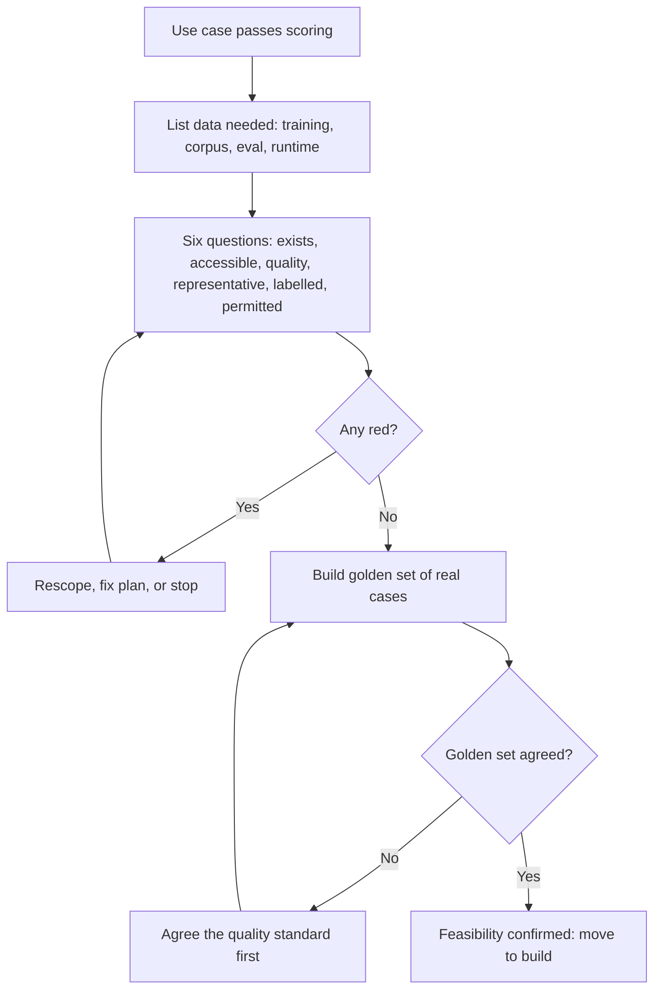
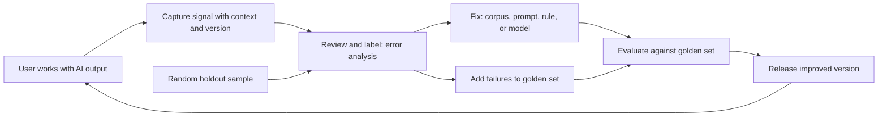
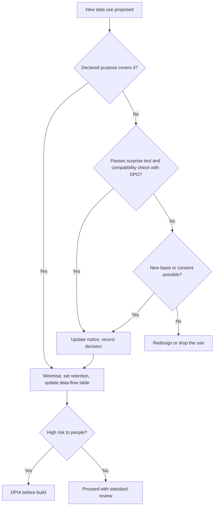

# Module 3 — Data as the product's foundation

*An AI product is only as good as the data it learns from, reads from and is judged against. Most AI projects that stall do so because of the data, not the model. The data turns out to be missing, mislabelled, locked in the wrong system, unrepresentative of real users, or not legally usable for the new purpose. This module teaches the product manager's part of that work. You will not build pipelines, but you will ask the questions that decide whether a product is feasible, whether it gets better with use, and whether the bank is allowed to do it. You will follow Faisal and Rania at Najm Bank as they assess the data behind Credit Memo Copilot and SME Instant Finance, design the feedback loops that let Smart Alerts and the Copilot learn, and write the privacy section of Najm Assist's product spec with Sara, the Data Protection Officer.*

> **Stages:** Define, Design, Build, Grow — checking that the data exists and is fit for purpose, designing products that collect the right signals, and owning the product decisions that privacy and data rights depend on.

---

# 3.1 — Data readiness: do we have what the product needs?
*Level: 🟡 Intermediate* · *Prerequisites: 1.3, 2.2* · *Stage: Define, Build*

## ⚡ In 60 seconds
- **Data readiness** is the evidence that the data an AI product needs exists, can be reached, is good enough, represents the real users, and may legally be used for this purpose. It is a feasibility question, and it belongs in discovery, not in sprint 6.
- Different products need different data. A **predictive model** needs historical examples with trustworthy **labels** (the known right answer). A **GenAI product built on retrieval** needs a clean, current, permissioned **knowledge corpus**. **Every** AI product needs **evaluation data**: a set of real cases with agreed good answers.
- "We have lots of data" is not an answer. The questions are: the *right* data, for the *right* population, available *at the moment of decision*, with labels you trust.
- The PM does not clean data. The PM asks the questions and turns the gaps into scope, timeline and go/no-go decisions.
- Decision cue: if you cannot assemble 50–100 real, representative cases with agreed good answers in the first two weeks, you do not yet know whether the product is feasible.
- Biggest trap: discovering after the pilot that the model was trained on data it will never see in production, or on a population that is not your customers.

## 🧭 Why it matters
Khalid, Head of Retail Lending, wants SME Instant Finance live by the end of the quarter: a model that pre-approves small invoice-financing requests in minutes rather than days. Faisal, the new AI product manager, comes back from a meeting with the data warehouse team with good news. "We have eight years of SME lending data. Hundreds of thousands of rows. Data isn't the problem."

Rania, Head of AI Products, asks four questions. How many rows are *invoice financing*? For how many do we know whether the invoice was paid? Were declined applications recorded? And which fields are available when a customer taps "apply", rather than filled in later by an analyst? Two weeks later the answers come back. There are about 9,000 invoice-financing deals (illustrative numbers). Repayment outcomes are reliable for only four years, since a core-banking migration broke the link to collections. Declined applications were kept as scanned PDFs. And two of the "strongest" fields were written by analysts *after* approval.

None of this kills the product, but it changes the plan: scope narrows to repeat customers, two features are removed, and the launch date moves. Discovering this in week two costs a meeting. Discovering it after a pilot costs Khalid's trust. That is why data readiness belongs to the product manager.

## 📐 How it works

### 🟢 The essentials

**What "data" means for each kind of AI product.** Lesson 1.3 introduced the build spectrum. Each option needs different data:

| Product type | Data it needs | Najm example |
|---|---|---|
| Predictive ML (classify, score, forecast) | Historical **training data**: inputs plus a **label**, the outcome you want to predict | SME Instant Finance: past invoice deals plus "repaid on time or not" |
| GenAI with retrieval (RAG) | A **knowledge corpus** the model reads at answer time: documents, policies, records | Credit Memo Copilot: credit policy, sector notes, the client's financial statements, past memos |
| GenAI with fine-tuning | Hundreds to thousands of high-quality input/output examples of the behaviour you want | A memo-style model trained on approved past memos (if prompting and retrieval are not enough) |
| Any AI product | **Evaluation data**: real cases with agreed good answers, used to check quality | 80 real memo requests with RM-approved memos; 500 past invoice deals with known outcomes |
| Any AI product in production | **Runtime inputs**: the data the product receives when it is actually used | The app form fields; the documents an RM uploads |

A **label** is the right answer attached to an example: "this invoice was paid", "this transaction was fraud", "this memo was approved without changes". Labels are often the scarcest and most expensive part. Somebody has to decide them, and outcomes like loan repayment take months to arrive.

**The six readiness questions.** A PM can run a readiness check without writing a query by asking these six questions and demanding evidence for each:

1. **Exists:** Is the data recorded at all, or does it live in people's heads, emails and scanned PDFs?
2. **Accessible:** Can the team actually get it: which system, which owner, what approvals, how long?
3. **Quality:** Is it accurate, complete, consistent across systems, and fresh enough?
4. **Representative:** Does it cover the users, products, languages and situations the product will face?
5. **Labelled:** For ML, do we have trustworthy outcomes? For GenAI, do we have agreed examples of good answers?
6. **Permitted:** May we use it for this purpose, under law, contract, customer promises and the bank's own policy? (This is lesson 3.3.)

Score each **green** (ready), **amber** (known fix, owner, date) or **red** (a blocker that changes scope or kills the idea). The result, a **data readiness scorecard**, is evidence for the feasibility score from 2.2.

**Data quality, in plain words.** Data management practice (for example DAMA's *Data Management Body of Knowledge*) describes quality in dimensions. Five matter most to a PM: **accuracy** (wrong sector codes teach wrong patterns), **completeness** (a field missing for 40% of customers cannot drive decisions for them), **consistency** ("revenue" is annual in one system and monthly in another), **timeliness** (the Copilot quotes a replaced policy) and **uniqueness** (three copies of one memo confuse retrieval).

### 🟡 Going deeper

**Representativeness: the "who is missing?" question.** Data describes the past, and the past reflects old products, old processes and old customers. SME Instant Finance's history comes from businesses that were served by relationship managers. The app will reach smaller, newer businesses that never had an RM. A model trained on the first group may do badly on the second, and the bank will not see it in the headline accuracy. Ask for the data sliced by the segments that matter (size, sector, country, channel, language, tenure) and check each has enough examples to learn from and test on.

**Selection bias in lending: you only see outcomes for the people you approved.** This is the classic trap for credit products. The bank knows whether an approved invoice was repaid. It does not know what would have happened to the applicants it declined. A model trained only on approved deals learns about "people like the ones we used to approve". Credit risk teams have methods for this, called **reject inference**, but none fully recover the missing information. Ask Dana, the lead data scientist, how the model will behave for applicant types rarely approved in the past; you may route them to a human.

**Available at decision time: leakage and skew.** Two failures that start as product questions:
- **Label leakage** happens when a feature contains information that would not be known at the moment of the decision, often because it was recorded afterwards. Najm's "relationship strength" field was filled in by analysts after approval: it predicts repayment well in history and will be empty for every app applicant. Leaky models look excellent in testing and fail in production.
- **Training-serving skew** happens when the data at runtime differs from the training data. The warehouse holds cleaned month-end revenue; the live app receives whatever the customer types.

The PM's question for every candidate input is simple: "When the customer taps *apply*, where does this value come from, and is it the same as what we trained on?"

**GenAI readiness is corpus readiness.** For Credit Memo Copilot, the "data" is mostly documents. Readiness questions change shape:
- **Coverage:** Does the corpus hold what the memo needs, and what does the Copilot do when something is missing?
- **Currency:** Is there one current version of each policy, with old versions retired?
- **Format:** Scanned images, PDF tables, mixed Arabic and English pages all affect extraction and need testing.
- **Permissions:** Retrieval must respect the same access rules as the document system, or the Copilot becomes a way to read files an RM may not open. Tariq, the engineering lead, calls this "permission-aware retrieval"; it is a product requirement.
- **Duplicates and drafts:** Decide which past memos count as good examples and which must never be retrieved.

**Evaluation data comes first.** Whatever the product type, the first data asset to build is a small **golden set**: real, representative cases with answers that the business agrees are good. (Module 6 goes deeper.) If the team cannot assemble even 50–100 such cases, it has no way to know whether any version of the product works. For the Copilot, Hessa (product designer) and two senior RMs pick 80 real past deals across sectors and sizes, and mark what a good memo for each must contain. Collecting this early also exposes disagreement. If two senior RMs disagree about what a good memo is, no model will satisfy both, and the product needs an agreed standard before it needs a model.

### 🔴 Expert view

**Data readiness is a sequencing tool, not a gate.** Experienced AI PMs reshape the product around the data that *is* ready rather than wait. For SME Instant Finance, that means starting with repeat customers whose history is complete and clean, keeping first-time applicants on the manual path, and planning to collect the missing labels as the product runs. A good readiness assessment ends with a **scope** that the data can support, a **plan** to extend it, and a **date** by which each amber item should turn green.

**Data-centric thinking.** Around 2021 Andrew Ng popularised "data-centric AI": for many practical problems, improving the data (consistent labels, coverage of hard cases) moves quality more than changing the model. When quality stalls, ask "which cases fail, and what data would fix them?" before asking for a bigger model. Labelling, expert reviewers' time and data engineering are product costs; put them in the business case.

**Document the data, not just the model.** Two well-known formats help. **Datasheets for Datasets** (Gebru et al., 2018) proposes that every dataset ship with answers to standard questions: why it was created, what it contains, how it was collected and labelled, what it should and should not be used for, and how it is maintained. **Data Cards** (Pushkarna, Zaldivar and Kjartansson at Google, 2022) is a similar, more product-facing template. You need not use either in full, but write down who is in the data, who is missing, how labels were decided and what the data must not be used for. Layla's governance team will ask; *AI Governance: Zero to Hero* covers the formal requirements.

**Watch for data that carries decisions you do not want to repeat.** Historical labels reflect historical decisions. If past analysts were stricter with some sectors or new businesses for reasons unrelated to repayment, a model trained on their decisions learns that as truth. Prefer *outcome* labels (was the invoice paid?) over *decision* labels (did the analyst approve?). Fairness testing comes later (Module 6), but choosing the label is the PM's first fairness decision.

**Readiness decays.** Policies change, the customer base shifts and upstream systems rename fields. Build owners and freshness checks in from the start (lesson 8.3 covers drift).

## 🧰 The toolkit
| Tool or framework | What it is and does | When to reach for it |
|---|---|---|
| **Data readiness scorecard** | The six questions (exists, accessible, quality, representative, labelled, permitted) scored green, amber or red, each with evidence, an owner and a date | During discovery and use-case scoring, before committing to a build |
| **Data profiling** | A quick statistical look at a dataset: row counts, missing values, value ranges, distributions by segment | To test "we have lots of data" claims in days, not weeks |
| **Decision-time audit** | For each candidate input, a check on where it comes from at the moment of decision and whether it matches the training data | Before model training, to catch leakage and training-serving skew |
| **Golden set** | A small set of real, representative cases with agreed good answers | First data asset for any AI product; proves feasibility and sets the quality bar |
| **Datasheets for Datasets** (Gebru et al., 2018) | A standard question list documenting a dataset's purpose, composition, collection, labelling and limits | When a dataset will be reused, audited or handed to another team |

## 🏛️ In practice at Najm Bank
Faisal's **Data Readiness Assessment** for two products, reviewed by Dana and Omar (Chief Data Officer):

| Question | SME Instant Finance (predictive) | Credit Memo Copilot (GenAI + retrieval) |
|---|---|---|
| **Exists** | 🟡 About 9,000 invoice deals; declined applications only as scanned PDFs | 🟢 Policies, sector notes, past memos and client statements are all recorded |
| **Accessible** | 🟢 Warehouse access approved by Omar's team; 2-week lead time | 🟡 Memos in the document system; API access needs an IT security review |
| **Quality** | 🟡 Revenue field is inconsistent across two source systems; sector codes about 10% wrong on sample check | 🔴 Three credit policy versions in circulation; no single source of truth |
| **Representative** | 🔴 History covers RM-served SMEs only; app will reach smaller, newer firms | 🟡 Corporate memos over-represented; few SME and Arabic-language cases |
| **Labelled** | 🟡 Repayment outcomes reliable for the last 4 years only; declined applicants have no outcome | 🟡 No agreed standard for a "good memo" yet; golden set of 80 cases in progress |
| **Permitted** | 🟡 Credit bureau data licence must be checked for model-training use (Sara, Yusuf) | 🟡 Client documents may be used for memo drafting; reuse for fine-tuning not yet assessed (see 3.3) |
| **Decision-time check** | 🔴 Two analyst-written fields removed (post-approval leakage) | 🟢 Inputs are the same documents RMs use today |
| **Resulting scope** | Launch for repeat customers with 2+ years of history; others stay manual; start collecting outcomes for new segments | Launch on corporate memos in English first; policy team to retire old versions before pilot |
| **Owner / date** | Dana, Omar / end of month | Tariq, Credit Policy / before pilot start |

Rania's note: *"Two reds, both fixed by changing scope, not reasons to stop. Faisal to update the scorecard and roadmap, and brief Khalid this week."*

## 🛠️ Exercises
- 🟢 For an AI feature you know, list the four kinds of data it needs (training or corpus, evaluation, runtime inputs, labels). *Done when:* you have a four-row table with a source and an owner for each row.
- 🟡 Run the six readiness questions for Smart Alerts, Najm's fraud and spending alerts. Assume fraud labels come from customer complaints and chargebacks. *Done when:* each question is scored green, amber or red with one line of evidence, and you have named at least one representativeness gap and one labelling gap.
- 🔴 Khalid insists SME Instant Finance must launch for all SMEs, including first-time applicants, on the original date. Write him a one-page memo proposing a phased scope. *Done when:* it states what launches first and why, how missing data is collected in phase one, and the evidence that triggers phase two.

## ⚠️ Mistakes and traps
- **Counting rows instead of asking questions.** "Hundreds of thousands of rows" says nothing about relevance, labels or coverage. Ask the six questions and demand evidence.
- **Leaving the data check to engineering.** Gaps found in build arrive as delays with no product decision attached. Check in discovery.
- **Training on what you will not have at decision time.** Audit every input against the moment of decision.
- **Assuming past decisions are ground truth.** Decision labels copy old habits, including biased ones. Prefer outcome labels, and ask who is missing from the history.
- **Starting without a golden set.** Without real cases and agreed answers, nobody can tell whether the product works. Build it first, even if it is small.

## 🧾 Recap
- Data readiness is a feasibility question the PM owns in discovery: exists, accessible, quality, representative, labelled, permitted.
- Predictive products need labelled history; RAG products need a clean, current, permissioned corpus; every product needs evaluation data.
- Selection bias, label leakage and training-serving skew are product questions before they are technical ones: who is missing, and what is really available at decision time?
- A readiness assessment should end in a scope the data supports, a plan to extend it, and owners and dates for each gap.
- Document datasets (datasheets, data cards) and treat readiness as something that decays and needs monitoring.

## ✍️ Check yourself

**1. Faisal reports that Najm has "eight years and hundreds of thousands of rows" of SME lending data. What is the most useful next step?**

- A. Start model training, since the volume is clearly sufficient
- B. Ask how many rows match the target product and population, how many have reliable outcome labels, and which fields are available at decision time
- C. Buy external SME data to be safe
- D. Ask the vendor which model architecture handles large datasets best

Answer

**B.** Volume is not readiness: ask about relevance, labels, representativeness and availability at decision time. C is premature before you know the gaps. (🧭 Why it matters; 🟢 The essentials.)

**2. A credit model performs extremely well in testing. Its most predictive input is a field that credit analysts complete after a loan is approved. What is the problem?**

- A. Training-serving skew caused by messy customer input
- B. Selection bias from missing declined applicants
- C. Label leakage: the field will not exist when a new application is decided
- D. Poor data timeliness

Answer

**C.** A field recorded after the decision carries information the model will not have at decision time, so test results overstate real performance. Skew (A) is about runtime data differing in form from training data, not about information from the future. (🟡 Going deeper.)

**3. For Credit Memo Copilot, which readiness issue is specific to a retrieval-based GenAI product rather than a predictive model?**

- A. Whether outcome labels exist for past loans
- B. Whether retrieval respects the same document access permissions as the source system
- C. Whether the training data includes declined applicants
- D. Whether the model's features are available at decision time

Answer

**B.** A RAG product reads documents at answer time, so the corpus must be current, deduplicated and permission-aware. Without that, the assistant can show RMs files they are not allowed to see. A, C and D are mainly predictive-model concerns. (🟡 Going deeper, "GenAI readiness is corpus readiness".)

**4. The readiness assessment for SME Instant Finance finds that history covers only RM-served businesses, while the app will reach smaller, newer firms. What is the best product response?**

- A. Cancel the product
- B. Launch for all SMEs and monitor complaints
- C. Launch first for the segments the data represents, keep others on the manual path, and collect outcomes to extend scope later
- D. Remove the size and tenure fields so the model cannot see the difference

Answer

**C.** Readiness is a sequencing tool: shape the scope around the data that is ready and plan to extend it. D hides the gap instead of fixing it, and B exposes unrepresented customers to an untested model. (🔴 Expert view.)

**5. Why does the lesson recommend building a golden set of real cases with agreed answers before building the product?**

- A. It is required by the EU AI Act for all systems
- B. It replaces the need for training data
- C. Without it the team cannot tell whether any version works, and building it exposes disagreement about what "good" means
- D. It lets the team skip user research

Answer

**C.** Evaluation data proves feasibility and sets the quality bar. If experts disagree about good answers, the product needs an agreed standard before it needs a model. A is not a general legal rule, and B confuses evaluation data with training data. (🟡 Going deeper, "Evaluation data comes first".)

## 📚 References
- Gebru, T. et al. (2018/2021). *Datasheets for Datasets*. — https://arxiv.org/abs/1803.09010
- Pushkarna, M., Zaldivar, A. and Kjartansson, O. (2022). *Data Cards: Purposeful and Transparent Dataset Documentation for Responsible AI*. — https://arxiv.org
- Google PAIR, *People + AI Guidebook*, chapter "Data Collection + Evaluation". — https://pair.withgoogle.com/guidebook
- DAMA International, *DAMA-DMBOK: Data Management Body of Knowledge* (2nd ed., 2017). — https://www.dama.org

---

# 3.2 — Feedback loops, flywheels and learning products
*Level: 🟡 Intermediate* · *Prerequisites: 3.1, 1.2* · *Stage: Design, Grow*

## ⚡ In 60 seconds
- A **learning product** gets better because people use it. That only happens if the product is designed to capture **feedback signals**, turn them into **labels** or test cases, and feed them back into prompts, retrieval, models or rules on a schedule someone owns.
- Signals are **explicit** (thumbs, ratings, corrections, a reason picked from a list) or **implicit** (what users accept, edit, ignore or undo). Implicit signals are plentiful but ambiguous. Explicit ones are clearer but rare.
- A **data flywheel** (more use, more data, better product, more use) is real for some products and a slide-deck myth for many. Test it before you claim it.
- Watch for **degenerate feedback loops**: the product shapes the data it later learns from. A fraud model that only learns from the alerts it raised, or a credit model that only sees outcomes for applicants it approved, can quietly reinforce its own blind spots.
- Decision cue: for every feedback signal, write down what it means, when it arrives, who acts on it, and whether you are allowed to reuse it.
- Biggest trap: a thumbs-up button whose data nobody reads.

## 🧭 Why it matters
Three months into the Credit Memo Copilot pilot, Faisal presents a slide titled "Data flywheel": every RM edit will be "training data" and the Copilot will "get smarter every week". Khalid likes it. Dana asks three questions. Where are the edits stored? Nowhere: the draft and the final memo live in different systems, unlinked. Which edits mean "the draft was wrong" and which mean "this RM writes differently"? Nobody knows. Who reviews the signals, and what changes as a result? No one is assigned.

Meanwhile, the Smart Alerts team has the opposite problem. It learns eagerly from customer responses to fraud alerts. When a customer taps "Yes, this was me", the transaction is labelled genuine. Over six months the model has become very good at the kinds of fraud it already flagged, and blind to new patterns it never flagged, because those never generated a label. Both teams believe their products are "learning". Only one design choice separates a real learning loop from a slide or a trap, and that choice is made by the product manager.

## 📐 How it works

### 🟢 The essentials

**A feedback loop has five parts.** Miss one and the loop is broken.

1. **Signal:** something the user does or says that tells you about quality. For example, an RM deletes a paragraph, a customer disputes an alert, or an applicant repays.
2. **Capture:** the product records the signal, linked to the exact input, output, model version and context that produced it.
3. **Interpretation:** the signal becomes a **label** (a judgement about whether the output was right) or a **test case**. Sometimes a person reviews it to make that judgement.
4. **Action:** the label changes something: a prompt, the retrieval corpus, a rule, the golden set, a model retrain, or the product's design.
5. **Verification:** you check that the change improved the product and did not break anything else, using the evaluation methods in Module 6.

**Explicit and implicit signals.**

| Kind | Examples | Strength | Weakness |
|---|---|---|---|
| **Explicit** | Thumbs up/down, star rating, "Report a problem", choosing a reason, typing a correction | Clear meaning; the user tells you | Few users give it; the unhappy and very happy are over-represented |
| **Implicit** | Accepting a suggestion, editing a draft, copying an answer, rephrasing a question, abandoning a flow, calling support afterwards | Plentiful; reflects real behaviour | Ambiguous: an edit might mean "wrong" or just "my style" |
| **Outcome** | Loan repaid or defaulted; alert confirmed as fraud; complaint upheld | The closest thing to truth | Slow (days to months) and only available for some cases |

Good products use all three. For the Copilot, the implicit signal is **how much of the draft survives** into the final memo. The explicit signal is a short "what was wrong?" picker shown when an RM rejects a section. The outcome signal is whether the credit committee sent the memo back for missing information.

**Designing the capture.** Google's *People + AI Guidebook* has a chapter on feedback and control, and Microsoft's *Guidelines for Human-AI Interaction* (Amershi et al., CHI 2019) include "encourage granular feedback", "learn from user behavior" and "update and adapt cautiously". In practice:
- Ask at the **moment of the job**, inside the workflow, not in a survey afterwards.
- Make it **cheap**: one tap, or a short list of reasons, not a free-text form.
- Make it **specific**: feedback on a paragraph or a field beats a rating of the whole memo.
- **Show that it matters**: when feedback changes something, say so ("Thanks, we've fixed the policy reference"). Users stop giving feedback that disappears.

### 🟡 Going deeper

**Delayed and partial labels.** The most valuable labels often arrive late. SME Instant Finance learns whether an invoice was paid 30 to 120 days after the decision. Until then, you cannot measure the model's real accuracy on new customers. Plan for this in three ways. First, define **early proxies** (a missed first payment, a customer who stops trading on the account) and be clear that they are proxies. Second, set a **label maturity window**, meaning you only judge a month's decisions once most of their outcomes are known. Third, keep the loop honest by reporting "decisions not yet labelled" next to every quality number.

**Degenerate feedback loops.** When a product's own outputs decide which data gets labelled, it can learn a distorted picture of the world. Sculley et al. (2015), in *Hidden Technical Debt in Machine Learning Systems*, warn about these "feedback loops" as a hidden cost of ML systems. Three common shapes:

| Shape | Najm example | What goes wrong |
|---|---|---|
| **Only what you flagged gets labelled** | Smart Alerts learns only from alerts it raised | New fraud patterns never generate labels, so the model never learns them |
| **Only what you approved gets outcomes** | SME Instant Finance only sees repayment for approved deals | Declined groups stay declined; the model cannot learn they were good risks |
| **Users adapt to the product** | RMs learn which Copilot sections to delete without reading | "Accepted" sections look good because nobody checks them; edits stop meaning quality |

The standard remedies are product decisions, and they cost something:
- **Exploration or holdout samples.** Review a small random sample of cases the model did *not* flag, or approve a small, controlled share of borderline applications within agreed risk limits. This produces labels from outside the model's own choices. It costs analyst time or some credit risk, so the PM, Dana and the credit risk owner agree the size together.
- **Independent labels.** Use investigators' confirmed fraud cases, chargebacks and complaints as well as alert responses.
- **Audits of accepted outputs.** Have a reviewer check a sample of what users accepted without edits, not only what they changed.

Researchers call the general effect **performative prediction** (Perdomo et al., 2020): a prediction that influences the outcome it predicts, as when a fraud alert changes the fraudster's next move. Expect the world to react to the product.

**Where learning actually happens in a GenAI product.** Faisal's slide assumed edits go into "training". For most GenAI products built on a third-party model, the loop does **not** retrain the model. It improves the parts the team controls:

| Signal pattern | Most likely fix | Who owns it |
|---|---|---|
| RMs keep correcting the same policy reference | Update or retire the source document in the corpus | Credit Policy, via the PM |
| Drafts miss a required memo section | Change the prompt or the output template | PM and Tariq's team |
| Retrieval pulls the wrong client's statements | Fix retrieval filters and metadata | Tariq |
| A new failure pattern appears | Add cases to the golden set and the regression tests | Dana |
| Consistent style edits across many RMs | Adjust the template, or later consider fine-tuning | PM decides, Dana advises |

This is the loop in practice: logs lead to **error analysis** (reading real failures and grouping them into patterns), which leads to fixes, which lead to new test cases. Fine-tuning comes much later, if at all (lesson 1.3). Feedback data often has its biggest value as **evaluation data**, because each real failure becomes a permanent test.

### 🔴 Expert view

**Test the flywheel before you sell it.** The data flywheel is one of the most repeated claims in AI strategy, and often the weakest. Ask four questions before putting one on a slide:
1. **Does the data move quality?** Show that adding last month's signals improved an evaluation metric that matters. If quality has plateaued, more of the same data will not help.
2. **Are there diminishing returns?** Often the first thousand corrections help a lot and the next hundred thousand barely matter. A flywheel that stops after a few months is not a moat.
3. **Is the data unique?** If competitors can get the same signal (public documents, a general-purpose model's own improvements), it is no advantage. Najm's genuinely unique data is its own customers' repayment outcomes and its RMs' judgements on its own clients. That is where a real advantage could come from.
4. **Can you legally reuse it?** Signals collected to deliver a service may not be usable to train a model without further steps (lesson 3.3). A flywheel you cannot legally spin is not a flywheel.

Lesson 9.1 returns to defensibility. The short version is to treat "we will learn from usage" as a hypothesis with a test, not as a strategy.

**Labelling is a product with its own users.** The people who turn signals into labels need written **labelling guidelines** with examples, a way to say "unsure", and a measure of whether they agree (**inter-rater agreement**, lesson 6.2). Frequent disagreement means the definition is unclear: fix it before adding reviewers.

**Update cautiously.** Microsoft's guideline "update and adapt cautiously" points to a real risk. A product that changes behaviour every week erodes users' mental model and makes errors hard to trace. Batch changes into versioned releases, evaluate each against the golden set, tell users what changed when it affects them ("notify users about changes" is another of the guidelines), and keep the ability to roll back. Continuous automatic retraining on raw user feedback is almost never right for a regulated product. It also opens a door to **data poisoning**, where someone deliberately feeds bad signals to steer the model.

**Measure the loop itself.** Track the loop, not just the output: share of outputs with a captured signal, time from signal to fix, failure patterns closed and quality change per release. If these are flat, the product is not learning.

## 🧰 The toolkit
| Tool or framework | What it is and does | When to reach for it |
|---|---|---|
| **Feedback loop spec** | For each signal: meaning, capture point, delay, interpretation, action, owner, reuse permission | When designing any AI feature, before build |
| **People + AI Guidebook** (Google PAIR) | Practical guidance, including chapters on feedback and control and on data collection | Designing how users give feedback and how the product responds |
| **Guidelines for Human-AI Interaction** (Amershi et al., Microsoft, 2019) | 18 guidelines, including granular feedback, learning from behaviour, cautious updates and notifying users of changes | Reviewing a feedback design or a release plan |
| **Error analysis** | Reading a sample of real failures, grouping them into patterns and ranking by frequency and harm | Turning raw feedback into the next fixes |
| **Holdout sample** | A small random set of cases reviewed or treated outside the model's own choices | Any product where the model decides which cases get labels |
| **Flywheel test** | Four questions: does data move quality, diminishing returns, uniqueness, legal reuse | Before claiming a data flywheel in a strategy or business case |

## 🏛️ In practice at Najm Bank
Faisal and Dana's **Feedback Loop Spec** for Credit Memo Copilot and Smart Alerts (v1.0):

| Signal | Kind | Meaning we assign | Captured where and when | Delay | Becomes | Action and owner | Reuse permitted? |
|---|---|---|---|---|---|---|---|
| Share of draft text kept in final memo, per section | Implicit | Low retention on a section = candidate quality problem, not proof | Copilot compares draft with the memo submitted to committee | Same day | Weekly error-analysis sample | Hessa and Faisal review 30 low-retention sections a week; fixes to prompt or template | Yes, for quality improvement (internal staff data; Sara confirmed notice) |
| "What was wrong?" picker on rejected section | Explicit | Reason code: wrong fact, missing info, wrong policy, style | In-line, when an RM deletes or rewrites a section | Immediate | Labelled failure case | Wrong-policy cases go to Credit Policy for corpus fix | Yes |
| Committee returns memo for missing information | Outcome | Draft or RM missed required content | Credit committee workflow | 1–2 weeks | Golden set addition | Dana adds case to regression tests | Yes |
| Random audit of 20 accepted sections a week | Holdout | Checks "accepted" still means "correct" | Senior RM reviewer | 1 week | Label plus agreement score | Faisal tracks acceptance-without-reading risk | Yes |
| Customer taps "This was me" on an alert | Explicit | Probably genuine, but may be socially engineered | Najm Assist alert card | Minutes | Weak "genuine" label | Used with investigator labels, never alone | Yes, under fraud-prevention purpose |
| Investigator-confirmed fraud and chargebacks | Outcome | Confirmed fraud | Case management system | Days to weeks | Strong label | Dana's monthly retraining review | Yes |
| 0.5% random sample of *unflagged* transactions reviewed | Holdout | Finds fraud the model missed | Fraud ops queue | 1–2 weeks | Strong label outside model's choices | Sample size agreed with fraud ops capacity | Yes |

Loop metrics reviewed monthly by Rania: share of memos with a captured signal, median days from signal to fix, failure patterns closed per release, and change in golden-set score per release.

## 🛠️ Exercises
- 🟢 For one AI feature you use daily, list two explicit, two implicit and one outcome signal it could use. *Done when:* each signal has a one-line "what it probably means" and "what it might wrongly be taken to mean".
- 🟡 Write a feedback loop spec for Najm Assist's question-answering feature, using the five parts (signal, capture, interpretation, action, verification). *Done when:* you have at least four signals in the table format above, including one holdout or audit signal, and every signal has a named owner.
- 🔴 Khalid wants the SME Instant Finance business case to claim a data flywheel as a competitive advantage. Apply the four-question flywheel test and write a half-page verdict. *Done when:* you answer each question with evidence you would need to collect, name the degenerate loop risk for this product and its remedy, and give a clear recommendation on whether the claim belongs in the business case.

## ⚠️ Mistakes and traps
- **Collecting feedback nobody reads.** A thumbs button without an owner, a review cadence and a path to action is decoration. Assign an owner and a weekly review before launch.
- **Treating every edit as an error.** Implicit signals are ambiguous. Combine them with explicit reasons and a sampled human review before acting.
- **Letting the model choose its own labels.** If only flagged or approved cases get outcomes, the model reinforces its blind spots. Budget for holdout samples and independent labels.
- **Promising "it learns from every use".** Most GenAI products improve through corpus, prompt, template and eval changes, in versioned releases. Say that instead.
- **Claiming a flywheel without testing it.** Show that the data moves quality, that returns do not flatten quickly, that the data is unique, and that you may reuse it.
- **Updating continuously in a regulated product.** Silent weekly changes break users' trust and auditors' traceability. Release in versions, evaluate, notify, and keep rollback.

## 🧾 Recap
- A feedback loop needs signal, capture, interpretation, action and verification, each with an owner.
- Use explicit, implicit and outcome signals together; each is biased on its own.
- Plan for delayed labels with proxies, maturity windows and honest reporting of unlabelled decisions.
- Degenerate feedback loops happen when the product decides what gets labelled; holdout samples and independent labels are the remedy.
- Treat a data flywheel as a hypothesis to test, and remember that feedback is often most valuable as evaluation data.

## ✍️ Check yourself

**1. Smart Alerts learns only from customer responses to the alerts it raises. After six months it catches known fraud patterns well but misses new ones. What is the most likely cause?**

- A. The model is too small
- B. A degenerate feedback loop: transactions it never flagged never produce labels
- C. Customers are giving too much feedback
- D. Label leakage from post-decision fields

Answer

**B.** When the product decides which cases get labelled, it learns only what it already sees. The remedy is a holdout sample of unflagged transactions plus independent labels. D is a lesson 3.1 problem, not a loop problem. (🟡 Going deeper, "Degenerate feedback loops".)

**2. RMs edit about 40% of Credit Memo Copilot's drafts. What is the best way to turn this into useful learning?**

- A. Treat every edited section as a model error and retrain monthly
- B. Ignore edits, because they are just personal style
- C. Pair edit data with a short reason picker and a weekly sampled review, then fix patterns in the corpus, prompt or template
- D. Remove the ability to edit so the signal is cleaner

Answer

**C.** Implicit signals are ambiguous. Combining them with explicit reasons and human error analysis turns them into actionable patterns. A treats style as error and assumes retraining is the fix. For most GenAI products the fix sits in the parts the team controls. (🟢 The essentials; 🟡 "Where learning actually happens".)

**3. Which question is NOT part of the lesson's four-question flywheel test?**

- A. Does adding the new data measurably improve quality?
- B. Is the data unique, or can competitors get the same signal?
- C. How many feedback buttons does the interface have?
- D. Are we allowed to reuse the data for this purpose?

Answer

**C.** The test asks whether data moves quality, whether returns diminish, whether the data is unique and whether it can legally be reused. The number of buttons says nothing about whether a flywheel exists. (🔴 Expert view.)

**4. SME Instant Finance's repayment outcomes arrive 30–120 days after each decision. How should the team report model quality for last month's decisions?**

- A. Report accuracy only on decisions whose outcomes are known, and show the share not yet labelled, using early proxies clearly marked as proxies
- B. Assume unlabelled decisions were correct
- C. Wait a year before reporting anything
- D. Use customer satisfaction scores instead of repayment

Answer

**A.** Delayed labels need a maturity window, honest reporting of unlabelled decisions and clearly labelled proxies. B inflates quality, and C leaves the product unmanaged. (🟡 Going deeper, "Delayed and partial labels".)

**5. Tariq proposes automatically retraining a customer-facing model every night on the previous day's user feedback. What is the main product concern?**

- A. Nightly retraining is always too expensive
- B. Behaviour would change silently and often, eroding trust and traceability, and it opens the door to deliberately poisoned feedback
- C. Feedback data is never useful for training
- D. It breaks the rule that models may only be updated once a year

Answer

**B.** "Update and adapt cautiously": change in evaluated, versioned releases with notification and rollback; unfiltered feedback can be manipulated. D is an invented rule. (🔴 Expert view, "Update cautiously".)

## 📚 References
- Google PAIR, *People + AI Guidebook* (chapters "Feedback + Control" and "Data Collection + Evaluation"). — https://pair.withgoogle.com/guidebook
- Amershi, S. et al. (2019). *Guidelines for Human-AI Interaction*. CHI 2019. — https://www.microsoft.com/en-us/research/project/guidelines-for-human-ai-interaction/
- Sculley, D. et al. (2015). *Hidden Technical Debt in Machine Learning Systems*. NeurIPS. — https://papers.nips.cc
- Perdomo, J. et al. (2020). *Performative Prediction*. ICML. — https://arxiv.org
- Torres, T. (2021). *Continuous Discovery Habits*. — https://www.producttalk.org

---

# 3.3 — Privacy, consent and data rights: what the PM must own
*Level: 🟡 Intermediate* · *Prerequisites: 3.1, 3.2* · *Stage: Define, Build*

## ⚡ In 60 seconds
- The DPO and legal interpret privacy law, but most privacy outcomes are **product decisions**: what the feature collects, for what, for how long, shared with whom, and what the user is told and can control. The PM owns them.
- Four principles do most of the work: **purpose limitation** (use data only for the purposes you declared, or compatible ones), **data minimisation** (collect and send only what the feature needs), **storage limitation** (keep it no longer than needed) and **transparency** (tell people in plain words).
- AI adds three new questions: **may we reuse this data to improve or train the product?**, **what does our model vendor do with the data we send?**, and **can we honour rights like erasure once data has shaped a model?**
- **Consent** is only one legal basis, and often not the right one for a bank.
- Decision cue: fill in a data-flow table for every AI feature before build and review it with the DPO. No purpose, no data.
- Biggest trap: "we'll train on the chat logs later", without checking that this is declared, permitted and reversible.

## 🧭 Why it matters
Najm Assist, the customer assistant in the mobile app, has been live for two months. Its conversations contain account numbers, balances, salary details and the occasional passport photo uploaded "to prove who I am". Faisal has two proposals on his desk. The vendor wants the full transcripts to fine-tune a model that "understands Najm's customers". Marketing wants to tag conversations by topic, so a customer who asked about school fees gets a personal-loan offer the next day.

Faisal likes both. Sara, the Data Protection Officer, asks five questions first. What did the app tell customers their conversations would be used for? On which legal basis is the bank processing them, in each country where Najm has customers? Does the vendor contract allow training, and where would the data be stored? If a customer asks the bank to delete their data, can the bank remove it from a fine-tuned model? And would a customer be surprised to get a loan offer because of something they told the assistant?

Faisal cannot answer any of them. That is a product failure, not a legal one: each answer depends on decisions the product team made, or failed to make, when the assistant was designed.

## 📐 How it works

### 🟢 The essentials

**Who owns what.** Privacy is a shared job, and unclear roles are a common cause of failure.

| Role | Owns |
|---|---|
| **DPO (Sara)** | Interpreting the law, advising on legal basis, reviewing DPIAs, handling regulators and data subject requests |
| **Legal and procurement (Yusuf)** | Vendor contracts, data processing terms, licences for third-party data |
| **CDO (Omar)** | Data classification, data catalogue, retention schedules, data owners |
| **Engineering (Tariq)** | Implementing access control, logging, redaction, deletion and encryption |
| **Product manager** | What the feature collects and why, how long it keeps it, what users are told and can control, all written into the spec |

The PM is the only person who sees the whole feature. Everyone else sees a slice.

**The principles that matter most to a PM.** The EU's General Data Protection Regulation (GDPR) sets out principles in Article 5. Qatar's PDPPL (Law No. 13 of 2016) and the UAE's PDPL (Federal Decree-Law No. 45 of 2021) share broadly similar ideas, with local differences Sara checks:

| Principle | What it means for an AI feature | Najm Assist example |
|---|---|---|
| **Purpose limitation** | Decide and declare the purposes up front; new purposes need a new check | Transcripts collected to answer questions cannot simply be reused for marketing |
| **Data minimisation** | Collect, send and keep only what the feature needs | Do not send full account history to the model to answer "what are your branch hours?" |
| **Storage limitation** | Set retention periods for logs, prompts, outputs and feedback | Raw transcripts kept 90 days for quality review, then deleted or de-identified (illustrative period) |
| **Transparency** | Tell people what happens to their data, in plain words, at the right moment | A short notice when the chat starts, with a link to details |

**Legal basis: consent is not the default.** GDPR allows six legal bases for processing personal data: consent, contract, legal obligation, vital interests, public task and legitimate interests. For a bank, answering a customer's question about their own account usually rests on the **contract** or on **legitimate interests**, not on consent. Consent is fragile: it must be freely given, specific, informed and unambiguous, as easy to withdraw as to give, and it is rarely "freely given" when it is a condition of the service. Sara chooses the basis. The PM describes the purposes precisely enough for her to choose, and where consent *is* the basis, builds a separate, unticked choice, not a sentence buried in the terms.

**Personal data is everywhere in AI products.** For an LLM feature it appears in the **prompt** (what the user typed plus what the product added), the **retrieved documents**, the **model's output**, the **logs**, the **feedback data** and the **evaluation sets**. Each can leak, be kept too long or be reused without permission.

### 🟡 Going deeper

**The three AI-specific questions.**

*1. May we reuse this data to improve or train the product?* Using transcripts to **fix errors** in the service the customer used is usually easier to justify than to **train a model** serving others, and very different from **marketing**. GDPR allows further processing only for compatible purposes, judged by factors such as the link between purposes, the customer's reasonable expectations, the nature of the data and the safeguards. A useful test is the **surprise test**: would a reasonable customer be surprised or upset to learn about this use? If yes, you probably need a new basis, a clear notice, or a different design. Decide and declare reuse purposes **before launch**; adding them later is harder and sometimes impossible.

*2. What does our model vendor do with our data?* When Najm Assist sends a prompt to a third-party model, the vendor becomes a **processor** (it processes data on Najm's behalf) and possibly more. At the time of writing (2026), many enterprise API offerings state that customer data is not used for training by default, but terms vary by vendor, tier and date. Yusuf and Sara check the actual contract; the PM should know the answers:

| Question for the vendor | Why it matters |
|---|---|
| Is our data used to train or improve your models? Can we opt out? | Reuse by the vendor is a new purpose Najm must be able to justify |
| How long are prompts and outputs retained, and why? | It adds to Najm's own retention promises |
| Where is data processed and stored? | Cross-border transfer rules in the EU, Qatar and the UAE |
| Which sub-processors are involved? | Each is another place data goes |
| Can data be deleted on request, and how quickly? | Needed to honour erasure requests |

*3. Can we honour data rights once data has shaped a model?* Rights to access, correct, erase and object are straightforward for data in a database and hard for data absorbed into a model's weights. Research has shown that large language models can sometimes reproduce parts of their training data word for word (Carlini et al., 2021, "Extracting Training Data from Large Language Models"). Removing one person's influence from a trained model (**machine unlearning**) is still an active research area, not a routine operation. The European Data Protection Board's Opinion 28/2024 says whether a model trained on personal data is anonymous must be assessed case by case. The product lesson is architectural:
- Keep personal data in **stores you can query and delete**, such as a retrieval index or a customer record, rather than baking it into model weights.
- If you fine-tune, train on **de-identified or synthetic** examples wherever possible, and document what went in.
- Make sure logs, feedback sets and golden sets are covered by the deletion process too.

**Automated decisions.** Where a product makes decisions about individuals with legal or similarly significant effects, such as declining credit, extra rules apply. GDPR Article 22 limits decisions based *solely* on automated processing, and requires safeguards such as the right to human intervention and to contest the decision. SME Instant Finance mostly serves companies, but sole proprietors and guarantors are individuals, so the design must decide what happens when the model says no; a common pattern is automated approval with human review of declines. The PM puts the review path, explanation and appeal route into the spec (Module 4). The EU AI Act also treats credit scoring of individuals as high-risk; see *AI Governance: Zero to Hero*.

### 🔴 Expert view

**Privacy by design is a product method, not a slogan.** Ann Cavoukian, then Information and Privacy Commissioner of Ontario, set out **Privacy by Design** as seven foundational principles, including proactive not reactive, privacy as the default setting, and privacy embedded into design. GDPR Article 25 makes **data protection by design and by default** a legal duty. "By default" is the sharp edge: the default should collect and keep the least data. Practical patterns:
- **Redact before you send.** Strip card, ID and account numbers from prompts and logs when the model does not need them.
- **Retrieve, don't copy.** Let the assistant look up the customer's data at answer time under that customer's permissions, rather than copying it into prompts, logs and training sets.
- **Separate the stores.** Keep operational logs, de-identified quality samples and evaluation sets apart, each with its own retention rule.
- **Design the "forget me" path.** Test erasure across every store before launch.

**The DPIA is your friend if you start it early.** A **Data Protection Impact Assessment** (GDPR Article 35) is required when processing is likely to result in a high risk to people, which is common for new technology that evaluates people or processes their data at scale. Treat it as a design review, not a form: start it when the data-flow table exists, so findings change the design while change is cheap. Sara runs it; the PM supplies the facts and owns the design changes. The NIST Privacy Framework offers a similar, non-legal risk structure.

**Rights you did not expect: licences and confidentiality.** "May we use this data?" is not only a privacy question. Bureau and purchased data come with **licences** that may restrict model training; client documents carry **confidentiality** duties; staff data in Staff GenAI carries employment constraints. Add a "licence and contract" column for Yusuf to fill in.

**Trust is a product metric.** Customers who feel watched share less, and AI assistants depend on what customers share. Marketing's school-fees idea fails the surprise test even if a lawyer found a basis, and it would teach customers to be careful what they tell Najm Assist. Lesson 8.1 puts trust in the metrics tree.

## 🧰 The toolkit
| Tool or framework | What it is and does | When to reach for it |
|---|---|---|
| **Data-flow table** | One row per data item: source, purpose, legal basis (from the DPO), where it goes, who sees it, retention, reuse permission, deletion path | Every AI feature, before build; updated with every new data use |
| **Surprise test** | Asking whether a reasonable customer would be surprised or upset by a data use | First filter for any new use or reuse of data |
| **Privacy by Design** (Ann Cavoukian) | Seven principles for building privacy in proactively and by default; reflected in GDPR Art. 25 | Setting defaults, architecture and retention in the spec |
| **DPIA** (GDPR Art. 35) | A structured assessment of high-risk processing, its necessity and its safeguards | New AI features that profile people or process personal data at scale |
| **Vendor data terms checklist** | Training use, retention, location, sub-processors, deletion, audit rights | Before sending any customer or staff data to a model vendor |
| **PII redaction** | Removing or masking personal identifiers from prompts, logs and datasets | Anywhere the model or analysts do not need the identifier |

## 🏛️ In practice at Najm Bank
Faisal's **Privacy and data rights section** of the Najm Assist product spec (v2.0), reviewed with Sara and Yusuf:

| Data item | Source | Purpose | Legal basis (Sara) | Sent to model? | Retention | Reuse allowed | Deletion path |
|---|---|---|---|---|---|---|---|
| Customer's question text | Customer | Answer the question | Contract / legitimate interests (per country) | Yes, after redaction of card and ID numbers | Raw 90 days, then de-identified (illustrative) | Error analysis and eval set, de-identified | Erased with customer's chat history |
| Account data (balance, recent transactions) | Core banking, retrieved at answer time | Answer account questions | Contract | Only the fields needed for this question | Not stored in Najm logs; vendor retention per contract | No | Nothing copied on Najm's side |
| Uploaded images (for example, ID photos) | Customer | None for the assistant | None | No; blocked, with a message pointing to the secure upload channel | Not retained | No | n/a |
| Thumbs and reason codes | Customer | Improve answer quality | Legitimate interests (Sara to confirm balancing test) | No | 12 months (illustrative) | Quality improvement only | Linked to chat; erased with it |
| Conversation topics | Derived | Service analytics in aggregate | Legitimate interests | No | Aggregates only | **Not for individual marketing** | n/a (aggregate) |
| Full transcripts for vendor fine-tuning | — | Proposed | **Not approved** | — | — | **Rejected in v2.0**; revisit with synthetic or de-identified data and a DPIA | — |

Design decisions recorded:
1. Chat-start notice, agreed with Sara and tested by Hessa in Arabic and English: *"Najm Assist uses AI to answer your questions. We use conversations to improve the service. [How we use your data]"*.
2. Vendor contract: no training on Najm data, in-region processing. Yusuf holds the evidence.
3. Erasure tested across chat store, logs, quality samples and eval sets before each release.
4. DPIA started now for the planned agent features (card freeze, disputes).

## 🛠️ Exercises
- 🟢 For an AI feature you know, list every place personal data appears. *Done when:* you have at least six locations, each with a proposed retention period.
- 🟡 Apply the surprise test and the purpose-limitation check to three proposed uses of Credit Memo Copilot data: (a) improving memo drafts using RM edits, (b) scoring RMs' performance by how much they edit, (c) sharing anonymised memo patterns with a vendor. *Done when:* each use has a verdict (proceed, proceed with changes, or reject), a one-line reason, and the question you would take to Sara.
- 🔴 Write a one-page recommendation, on privacy and data rights alone, on whether Staff GenAI should be bought from a vendor or run on a model Najm hosts. *Done when:* it covers training use, retention, location, sub-processors, deletion and employee notice, names the evidence Yusuf must obtain, and states what would change your mind.

## ⚠️ Mistakes and traps
- **"Privacy is legal's job."** Own the data-flow table and bring it to the DPO early.
- **Defaulting to consent.** Let the DPO choose the basis; if it is consent, make it separate, specific and easy to withdraw.
- **Planning reuse after launch.** Undeclared training or marketing uses may be blocked later. Declare them before launch.
- **Trusting a general impression of vendor terms.** Check the actual contract for training use, retention, location and deletion.
- **Baking personal data into model weights.** Keep personal data in stores you can delete; fine-tune on de-identified or synthetic data.
- **Mapping only the database.** Prompts, outputs, logs, feedback and eval sets hold personal data too.

## 🧾 Recap
- The DPO interprets the law; the PM owns the product decisions that privacy depends on: collection, purpose, retention, sharing, notice and control.
- Purpose limitation, minimisation, storage limitation and transparency do most of the work; the surprise test is a fast first filter.
- AI raises three new questions: reuse for improvement or training, vendor data handling, and honouring rights once data has shaped a model.
- Design for rights: redact, retrieve rather than copy, separate stores, test deletion, and start the DPIA early.
- Privacy choices are trust choices: they decide how much customers share.

## ✍️ Check yourself

**1. A vendor offers to fine-tune a model on Najm Assist's full customer transcripts. What should Faisal establish first?**

- A. Whether the fine-tuned model will score higher on public benchmarks
- B. Whether this use was declared and has a legal basis, what the vendor contract permits, and whether the bank could honour erasure requests afterwards
- C. Whether customers clicked "accept" on the app's terms and conditions
- D. Whether the transcripts are in English

Answer

**B.** Training is a new purpose needing a basis, contract terms that allow it, and a design that respects data rights. C is tempting, but accepting buried terms is not specific, informed consent. (🧭 Why it matters; 🟡 "The three AI-specific questions".)

**2. Marketing wants to send a personal-loan offer to customers who asked Najm Assist about school fees. Which check does this use most clearly fail?**

- A. Data accuracy
- B. The surprise test and purpose limitation: customers shared the information to get an answer, not to be targeted
- C. Storage limitation
- D. Security

Answer

**B.** A reasonable customer would be surprised, and the purpose differs from the one the data was collected for. It also damages trust in the assistant. (🟡 "May we reuse this data"; 🔴 "Trust is a product metric".)

**3. Why does the lesson recommend keeping customer data in retrievable stores rather than fine-tuning it into a model?**

- A. Retrieval is always cheaper than fine-tuning
- B. Fine-tuning is illegal under GDPR
- C. Data in a queryable store can be accessed, corrected and deleted, while removing one person's data from trained weights is hard and still an open research problem
- D. Models cannot learn from personal data

Answer

**C.** Honouring access and erasure is an architecture decision; models can memorise training data and unlearning is not routine. B is false: fine-tuning on personal data is not automatically illegal, just harder to manage. (🟡 "Can we honour data rights".)

**4. For a bank's assistant answering a customer's questions about their own account, which statement about legal basis is most accurate?**

- A. Consent is always required for AI processing
- B. The PM should choose the legal basis and inform the DPO
- C. Consent is one of several bases and often not the most suitable in a banking relationship; the DPO decides, based on a precise description of purposes from the PM
- D. No legal basis is needed if the data stays inside the bank

Answer

**C.** Contract or legitimate interests often fit service delivery better than fragile consent. The DPO decides; the PM supplies the purposes. B reverses the roles. (🟢 "Legal basis: consent is not the default".)

**5. Where does personal data typically appear in an LLM-based assistant?**

- A. Only in the customer database
- B. Only in the prompt the user types
- C. In the prompt, retrieved documents, outputs, logs, feedback data and evaluation sets
- D. Nowhere, if the model vendor does not train on it

Answer

**C.** Each holds personal data and needs retention and deletion rules. D confuses vendor training with Najm's own processing. (🟢 "Personal data is everywhere in AI products".)

## 📚 References
- GDPR, Regulation (EU) 2016/679 (Arts 5, 6, 7, 17, 22, 25, 28, 35). — https://eur-lex.europa.eu/eli/reg/2016/679/oj
- European Data Protection Board, guidelines and opinions (including Opinion 28/2024 on AI models). — https://www.edpb.europa.eu
- Cavoukian, A. *Privacy by Design: The 7 Foundational Principles*. Information and Privacy Commissioner of Ontario. — https://www.ipc.on.ca
- NIST Privacy Framework. — https://www.nist.gov/privacy-framework
- Carlini, N. et al. (2021). *Extracting Training Data from Large Language Models*. USENIX Security. — https://arxiv.org/abs/2012.07805
- Qatar Personal Data Privacy Protection Law (Law No. 13 of 2016) and guidance. — https://www.almeezan.qa
- Google PAIR, *People + AI Guidebook*. — https://pair.withgoogle.com/guidebook
