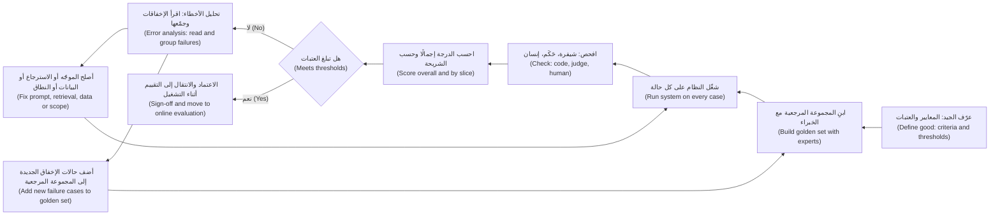
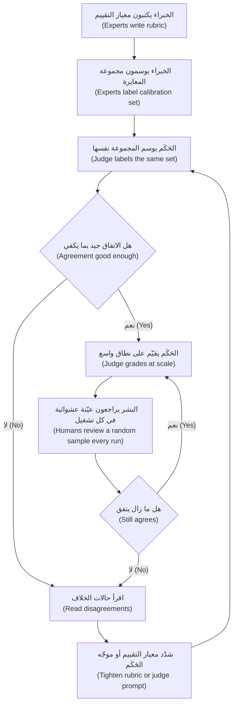
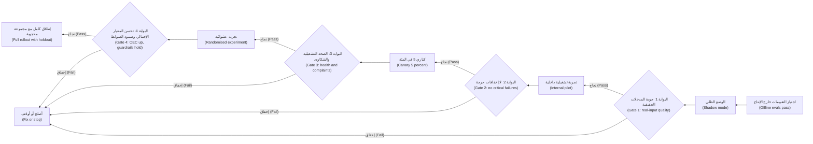

# الوحدة 6 — التقييم: أن تعرف أنه يعمل

*ميزة الذكاء الاصطناعي (AI feature) التي «تبدو رائعة في العرض التوضيحي (looks great in the demo)» لم تُقيَّم بعد (has not been evaluated)، بل نالت الإعجاب فقط (It has been admired). ولأن منتجات الذكاء الاصطناعي احتمالية (probabilistic)، فإن الإجابة الصادقة الوحيدة عن سؤال «هل يعمل؟ ⁦(does it work?)⁩» هي رقم مقيس على الحالات الصحيحة (measured on the right cases)، مع قراءة الإخفاقات وفهمها (the failures read and understood). تعلّمك هذه الوحدة منظومة التقييم (evaluation stack) التي يملكها مدير منتج الذكاء الاصطناعي (AI product manager). تبدأ بالقياس خارج الإنتاج (offline measurement): المقاييس (metrics) والمجموعات المرجعية (golden sets) وتحليل الأخطاء (error analysis). ثم تتناول طرق الحكم على المخرجات على نطاق واسع (judge outputs at scale): الشيفرة (code)، والنماذج التي تعمل حكّامًا (models acting as judges)، والخبراء البشريين (human experts)، والفرق الحمراء (red teams). وتنتهي بالتقييم أثناء التشغيل (online evaluation)، حيث يلتقي المستخدمون الحقيقيون بالمنتج عبر التشغيل الظلي (shadow runs) والتجارب (experiments) والإطلاق المرحلي (staged rollouts). ستتابع فريق المنتجات الرقمية والذكاء الاصطناعي (Digital & AI Products team) في بنك نجم (Najm Bank) بينما تبني دانة أول مجموعة مرجعية (golden set) لـ مساعد مذكرات الائتمان (Credit Memo Copilot)، ويتعلم فيصل لماذا يكون الحَكَم (judge) الذي يعطي كل شيء 4.6 من 5 عديم الفائدة، وتدير حصة وليلى أسبوع فريق أحمر (red-team week) على نجم أسيست (Najm Assist)، وتخطط رانيا لإطلاق (rollout) يمكن إيقافه عند أي خطوة (stopped at any step).*

> **المراحل (Stages):** Evaluate — تحويل عبارة «يبدو أنه يعمل (it seems to work)» إلى أدلة (evidence) يستطيع الفريق ومالك الأعمال (business owner) ووظيفة المخاطر (risk function) التصرف بناءً عليها، قبل الإطلاق (launch) وأثناء طرحه التدريجي (while it rolls out).

---

# 6.1 — جودة يمكنك قياسها: المقاييس والمجموعات المرجعية وتحليل الأخطاء
*المستوى (Level): 🟡 متوسط (Intermediate)* · *المتطلبات (Prerequisites): 1.2، 5.1* · *المرحلة (Stage): Evaluate*

## ⚡ الدرس في دقيقة (In 60 seconds)
- **التقييم (Evaluation)** («التقييمات (evals)») يعني قياس المخرجات (outputs) مقابل تعريف متفق عليه لـ«الجيد (good)»، على حالات ثابتة (fixed cases)، وبشكل قابل للتكرار بعد كل تغيير (repeatably after every change).
- في المنتجات **التنبؤية (predictive)** (تنبيهات الاحتيال (fraud alerts)، والموافقة المسبقة على الائتمان (credit pre-approval)) استخدم **مصفوفة الالتباس (confusion matrix)** و**الدقة (precision)** و**الاستدعاء (recall)**. وفي المنتجات **التوليدية (generative)** (مذكرة مُصاغة (drafted memo)، أو إجابة محادثة (chat answer)) قسّم «الجودة (quality)» إلى معايير منفصلة (separate criteria)، لكل منها فحصه الخاص (its own check).
- **المجموعة المرجعية (golden set)** مجموعة منتقاة ومُرقّمة الإصدارات (curated, versioned collection) من حالات الاختبار (test cases) ذات إجابات جيدة معروفة (known good answers) أو معايير نجاح (pass criteria). إنها أثمن أصول التقييم لدى الفريق (most valuable eval asset)، ويشكّل مدير المنتج (PM) ما يدخل فيها.
- **تحليل الأخطاء (Error analysis)** (قراءة الإخفاقات (reading failures) وفرزها في أنواع مسمّاة (named types)) يخبرك *ماذا تُصلح (what to fix)*؛ أما الدرجة (score) فتخبرك فقط *بمقدار (how much)* الخطأ.
- إشارة القرار (Decision cue): قبل بدء أي بناء (build)، اسأل: «أي حالات، وأي مقياس، وأي عتبة، ومن يقرر أنه جيد بما يكفي؟ ⁦(which cases, which metric, which threshold, and who decides it is good enough?)⁩»
- أكبر فخ (Biggest trap): درجة متوسطة واحدة (one average score)، تخفي الشرائح (slices) الأكثر أهمية، مثل المستندات العربية (Arabic documents) أو العملاء ذوي القيمة العالية (high-value clients).

## 🧭 لماذا يهم (Why it matters)
شغّل فيصل النموذج الأولي (prototype) لـ مساعد مذكرات الائتمان (Credit Memo Copilot) على عشرة ملفات ائتمان (credit files) اختارها بنفسه، وأخبر رانيا أنه «جاهز بنسبة 90% تقريبًا (about 90% there)». يريد خالد (رئيس إقراض الأفراد (Head of Retail Lending)) موعدًا للتجربة التشغيلية (pilot date). تطرح دانة (كبيرة علماء البيانات (lead data scientist)) ثلاثة أسئلة: «تسعون في المئة من ماذا؟ على أي عشرة ملفات؟ وكيف تبدو العشرة في المئة الأخرى؟ ⁦(Ninety percent of what? On which ten files? And what does the other ten percent look like?)⁩» لا يستطيع فيصل الإجابة. كانت ملفاته العشرة حديثة، باللغة الإنجليزية، لعملاء ذوي حسابات مدققة نظيفة (clean audited accounts). لم يرَ المساعد (copilot) قط كشفًا عربيًا ممسوحًا ضوئيًا (scanned Arabic statement) أو عميلًا تنقصه سنة من الحسابات (missing year of accounts).

تُظهر الحالات العامة (public cases) الفجوة نفسها. في فبراير 2023، قال عرض ترويجي (promotional demo) لـ Bard من Google خطأً إن تلسكوب جيمس ويب الفضائي (James Webb Space Telescope) التقط أول صور لكوكب خارج نظامنا الشمسي. انتشر الخبر عن الخطأ على نطاق واسع، وهبطت أسهم Alphabet بحدة. مثال واحد مختار بعناية (one carefully chosen example) نال الإعجاب ولم يُقيَّم (admired, not evaluated).

قاعدة رانيا: **لا تنتقل أي ميزة ذكاء اصطناعي إلى التجربة التشغيلية (pilot) دون خطة تقييم (eval plan) وقّعها مالك الأعمال (business owner)**، تحدد الحالات (cases) والمقاييس (metrics) والعتبات (thresholds) وما يحدث عند عدم بلوغ عتبة (when a threshold is missed). يعلّمك هذا الدرس كتابة تلك الخطة وقراءة نتائجها.

## 📐 كيف يعمل (How it works)

### 🟢 الأساسيات (The essentials)

**ما هو التقييم (What an eval is).** أربعة أجزاء: **الحالات (cases)** (المدخلات التي تختبر عليها)؛ و**تعريف الجيد (a definition of good)** (إجابة متوقعة (expected answer)، أو معايير يجب استيفاؤها (criteria to meet))؛ و**الفحص (a check)** (شيفرة (code) أو نموذج (model) أو شخص يقارن المخرج بالتعريف)؛ و**الدرجة والعتبة (a score and threshold)** (الرقم الذي تبلّغ عنه والمستوى الذي عنده تُطلق (ship) أو تتوقف (hold) أو تتراجع (roll back)).

تعيد تشغيل الحالات نفسها بعد كل تغيير (الموجّه (prompt)، إصدار النموذج (model version)، مصدر الاسترجاع (retrieval source))، فيصبح التقييم **مجموعة اختبارات انحدار (regression suite)** تخبرك متى جعل تغييرٌ ما الأمور أسوأ. قدّم الدرس 5.1 التقييمات (evals) بوصفها متطلبات (requirements)؛ أما هذا الدرس فيبنيها ويقرؤها.

**المنتجات التنبؤية: مصفوفة الالتباس (Predictive products: the confusion matrix).** تقرر التنبيهات الذكية (Smart Alerts) «تنبيه (alert)» أو «لا تنبيه (no alert)» لكل معاملة بطاقة (card transaction). وعند المقارنة بما حدث فعلًا، تقع كل حالة في أحد أربعة مربعات (four boxes):

| | احتيال فعلًا (Actually fraud) | سليمة فعلًا (Actually genuine) |
|---|---|---|
| **صدر تنبيه (Alert raised)** | إيجابي صحيح (True positive (TP)): احتيال مكتشف (caught fraud) | إيجابي كاذب (False positive (FP)): عميل أُزعج بلا داعٍ (customer bothered for nothing) |
| **لا تنبيه (No alert)** | سلبي كاذب (False negative (FN)): احتيال فائت (missed fraud) | سلبي صحيح (True negative (TN)): هادئ وصحيح (quiet, correct) |

من هذه الأعداد تأتي المقاييس التي يجب أن يقرأها كل مدير منتج ذكاء اصطناعي (AI PM):
- **الدقة (Precision)** = TP ÷ (TP + FP). *من التنبيهات التي أرسلناها، كم منها كان احتيالًا حقيقيًا؟ ⁦(Of the alerts we sent, how many were real fraud?)⁩* الدقة المنخفضة تعني إرهاق التنبيهات (alert fatigue) وعملاء غاضبين (angry customers).
- **الاستدعاء (Recall)** = TP ÷ (TP + FN). *من كل الاحتيال الحقيقي، كم اكتشفنا؟ ⁦(Of all the real fraud, how much did we catch?)⁩* الاستدعاء المنخفض يعني خسائر (losses).
- **F1** = المتوسط التوافقي (harmonic mean) للاثنين، ويكون مرتفعًا فقط حين يرتفع كلاهما. جيد لمقارنة النماذج (comparing models)؛ وأضعف في القرارات (decisions)، لأنه يعامل الخطأين كأنهما متساويان في التكلفة (equally costly).
- **الصحة الإجمالية (Accuracy)** = (TP + TN) ÷ جميع الحالات. خطيرة حين تكون إحدى الفئات نادرة (one class is rare).

أرقام توضيحية (Illustrative numbers): 100,000 معاملة، منها 100 احتيال. يُصدر النموذج A عدد 400 تنبيه ويكتشف 80 عملية احتيال: الدقة (precision) 20%، والاستدعاء (recall) 80%. أما «نموذج (model)» لا يُصدر أي تنبيه فيحقق صحة إجمالية (accuracy) 99.9% ولا يكتشف شيئًا. لا تقبل الصحة الإجمالية وحدها (accuracy alone) أبدًا لمنتج أحداث نادرة (rare-event product).

**العتبة قرار منتج (The threshold is a product decision).** يُخرج المصنِّف (classifier) درجة («احتمال الاحتيال 0.73 (fraud likelihood 0.73)»)؛ و**العتبة (threshold)** تحوّلها إلى إجراء (action). اخفضها فيرتفع الاستدعاء (recall) وتنخفض الدقة (precision). لا يوجد إعداد «صحيح تقنيًا (technically correct)»: فالأمر يعتمد على تكلفة كل خطأ (what each error costs)، احتيال فائت بقيمة 5,000 ريال قطري (QAR) مقابل بطاقة محجوبة في محطة وقود عند منتصف الليل (blocked card at a petrol station at midnight). يأتي مدير المنتج (PM) بالتكاليف؛ وتعرض دانة المنحنى (the curve).

**المنتجات التوليدية: فكّك الجودة (Generative products: decompose quality).** ليس لمذكرة الائتمان (credit memo) إجابة صحيحة واحدة. قسّم الجودة إلى **معايير (criteria)** يمكن فحص كل منها وحده:

| المعيار (Criterion) | سؤال بسيط (Plain question) | مثال من مساعد مذكرات الائتمان (Credit Memo Copilot example) |
|---|---|---|
| **الأمانة للمصادر (Faithfulness)** (الاستناد إلى المصادر (groundedness)) | هل كل ادعاء مدعوم بالمصادر؟ ⁦(Is every claim supported by the sources?)⁩ | الإيرادات (revenue) تطابق القوائم المدققة (audited statement) |
| **الاكتمال (Completeness)** | هل كل المطلوب موجود؟ ⁦(Is everything required present?)⁩ | جميع أقسام المذكرة الثمانية (all eight memo sections) |
| **صحة الاستدلال (Correct reasoning)** | هل الحسابات والاستنتاجات صحيحة؟ ⁦(Are calculations and conclusions right?)⁩ | نسبة تغطية خدمة الدين (debt-service coverage ratio) صحيحة |
| **الامتناع (Abstention)** | هل يقول «غير موجود (not found)» بدل التخمين؟ ⁦(Does it say "not found" rather than guess?)⁩ | الإشارة إلى غياب حسابات 2024 (missing 2024 accounts flagged) |
| **الشكل والأسلوب (Format and style)** | هل يتبع القالب (template)؟ | العناوين (headings)، وتنسيق العملة (currency format)، والطول (length) |
| **السلامة والسياسة (Safety and policy)** | هل يتجنب ما يجب ألا يفعله أبدًا؟ ⁦(Does it avoid what it must never do?)⁩ | لا بيانات لعميل آخر (no other client's data)؛ لا لغة موافقة (no approval language) |

لكل معيار فحصه وعتبته (its own check and threshold). عبارة «الأمانة للمصادر ≥ 98% من الأرقام (Faithfulness ≥ 98% of figures)» مفيدة؛ أما «الجودة 4.2 من 5 (quality 4.2 out of 5)» فليست كذلك.

**المجموعات المرجعية (Golden sets).** **المجموعة المرجعية (golden set)** (أو المجموعة المرجعية للاختبار (reference set)) مجموعة منتقاة من حالات الاختبار (test cases)، لكل منها مُدخل (input) وإما إجابة مرجعية (reference answer) («نسبة تغطية خدمة الدين 1.35 (the DSCR is 1.35)») أو معايير نجاح (pass criteria) («يجب أن يشير إلى غياب حسابات 2024 (must flag that 2024 accounts are missing)»). المجموعة الجيدة **تغطي المساحة (covers the space)** (الحالات الشائعة والصعبة والحدّية والتي يجب رفضها (common, hard, edge and must-refuse cases))، و**يوسمها الأشخاص المناسبون (labelled by the right people)** (موظفو الائتمان (credit officers)، لا كتّاب الموجّه (the prompt's authors))، و**مُرقّمة الإصدارات (versioned)** بحيث تعني عبارة «92% على الإصدار 3 (92% on v3)» شيئًا في الربع القادم، و**تنمو من الإخفاقات الحقيقية (grows from real failures)**.

**تحليل الأخطاء (Error analysis).** تخبرك الدرجة بمقدار الخطأ؛ ويخبرك تحليل الأخطاء بماهيته. الطريقة يدوية (manual) وناجحة:
1. خذ المخرجات الفاشلة (failed outputs)، أو عيّنة عشوائية (random sample) إن لم تكن لديك وسوم (labels) بعد.
2. اكتب ملاحظة قصيرة عن كل إخفاق («استخدم رقم 2022 (used the 2022 figure)»، «اختلق تعهدًا (invented a covenant)»).
3. جمّع الملاحظات في **تصنيف إخفاقات (failure taxonomy)** صغير: فئات مسمّاة (named categories).
4. عُدّ كل فئة واضربها في شدتها (multiply by its severity).
5. أصلح الفئة الأكبر، وأعد تشغيل التقييم (re-run the eval)، وكرّر.

إن تقرير أن «السنة المالية الخاطئة (wrong fiscal year)» أشد من «ملخص أطول قليلًا (slightly long summary)» قرار منتج (product call)، ولهذا يشارك مدير المنتج (PM).

### 🟡 التعمق أكثر (Going deeper)

**الشرائح (Slices).** **الشريحة (slice)** مجموعة فرعية من الحالات تشترك في خاصية (share a property): المستندات العربية (Arabic documents)، وملفات PDF الممسوحة ضوئيًا (scanned PDFs)، والملفات التي تتجاوز 50 مليون ريال قطري (QAR 50 million). أبلغ دائمًا عن المقاييس حسب الشريحة (by slice) إلى جانب الإجمالي (overall). المساعد (copilot) الذي يحقق 95% إجمالًا و70% على الكشوف العربية (Arabic statements) ليس جاهزًا لبنك لديه كثير من حسابات الشركات الصغيرة والمتوسطة العربية (Arabic SME accounts). وترتبط الشرائح أيضًا بالعدالة (fairness): في التمويل الفوري للشركات الصغيرة (SME Instant Finance)، ستطلب الحوكمة (governance) الأداء حسب شريحة العملاء (customer segment) (انظر *AI Governance: Zero to Hero*).

**ROC وAUC والمعايرة (ROC, AUC and calibration).** أداتان إضافيتان لـ التنبيهات الذكية (Smart Alerts) والتمويل الفوري للشركات الصغيرة (SME Instant Finance):
- **منحنى ROC (ROC curve)** (خاصية تشغيل المستقبِل (receiver operating characteristic)) يرسم معدل الإيجابيات الصحيحة (true positive rate) مقابل معدل الإيجابيات الكاذبة (false positive rate) عند كل عتبة (every threshold). و**AUC** (المساحة تحت ذلك المنحنى (area under that curve)) تلخّص مدى جودة النموذج في *ترتيب (ranks)* الإيجابيات فوق السلبيات: 0.5 عشوائي (random)، و1.0 مثالي (perfect). يساعد في مقارنة النماذج (compare models)، لكنه لا يقول شيئًا عن قبول عتبة معينة (whether a given threshold is acceptable). وحين تكون الإيجابيات نادرة جدًا، يكون **منحنى الدقة والاستدعاء (precision-recall curve)** أكثر إفادة غالبًا.
- **المعايرة (Calibration)** تسأل هل تعني الدرجات ما تقوله (whether scores mean what they say). إذا حصلت 1,000 فاتورة لشركات صغيرة (SME invoices) على «خطر تعثر 10% (10% default risk)»، فهل يتعثر نحو 100 منها؟ يمكن أن يكون النموذج جيد الترتيب (well-ranked) سيئ المعايرة (badly calibrated). وتهم المعايرة كلما استخدم أحدٌ الرقمَ نفسه (the number itself): للتسعير (to price)، أو وضع الحدود (set limits)، أو إظهار الثقة (show confidence).

**كم حالة تحتاج؟ ⁦(How many cases do you need?)⁩** لمعدل نجاح (pass rate) p على n حالة، يساوي الخطأ المعياري الواحد (one standard error) الجذر التربيعي لـ p × (1 − p) ÷ n. مع 100 حالة عند 90%، يبلغ نحو 3 نقاط (about 3 points)، فيكون نطاق 95% (95% range) تقريبًا ±6 نقاط (من 84% إلى 96%)؛ ومع 50 حالة، تقريبًا ±8. لذا فإن «حقق الإصدار 2 نسبة 91% والإصدار 1 نسبة 89% (v2 scored 91%, v1 scored 89%)» على 100 حالة ليس دليلًا (not evidence). بضع عشرات من الحالات تكشف أنواع الإخفاق الكبيرة (big failure types)؛ أما مقارنة إصدارات متقاربة (comparing close versions) فتحتاج مئات الحالات لكل شريحة مهمة (per important slice).

**عدم الحتمية (Non-determinism).** قد يعطي الموجّه (prompt) نفسه مخرجات مختلفة من تشغيل لآخر، خاصة عند **درجة حرارة (temperature)** أعلى (إعداد العشوائية (the randomness setting)؛ انظر 1.2). شغّل التقييمات المهمة عدة مرات وأبلغ عن التشتت (report the spread). الحالة التي تنجح في تشغيلين من ثلاثة (passes two runs out of three) ستصبح شكوى في الإنتاج (complaint in production).

**الفحوص المبنية على الشيفرة أولًا (Code-based checks first).** الشيفرة العادية (ordinary code) رخيصة وسريعة ومتسقة (cheap, fast and consistent). هل يظهر كل رقم في المذكرة في المستندات المصدرية (source documents)؟ هل جميع الأقسام المطلوبة (required sections) موجودة؟ هل تذكر عميلًا ليس في هذا الملف؟ استخدم الشيفرة حيثما كان المعيار آليًا (mechanical)، واحتفظ بالحكّام النموذجيين (model judges) والمراجعين البشريين (human reviewers) (6.2) للأحكام التقديرية (judgement)، مثل ما إذا كان سرد المخاطر (risk narrative) سليمًا.

### 🔴 نظرة الخبير (Expert view)

**المقاييس خارج الإنتاج مؤشرات بديلة (Offline metrics are proxies).** ما يهم الأعمال هو **النتائج (outcomes)**: الساعات الموفّرة (hours saved)، وتقليل الإعادات من اللجنة (fewer committee send-backs)، وخسائر الاحتيال التي مُنعت (fraud losses prevented). الخطة الجيدة تسمّي السلسلة (names the chain) («أرقام أمينة للمصادر ← يثق بها مديرو العلاقات ← إعادة تحقق أقل ← وقت أقل لكل مذكرة (faithful figures → RMs trust them → less re-checking → less time per memo)») وتختبر الحلقات الضعيفة (weak links) أثناء التشغيل (online) (6.3). حين ترتفع الدرجة خارج الإنتاج (offline score) ولا تتحرك النتيجة، فالمؤشر البديل هو المعطوب (the proxy is broken)، لا المستخدمون.

**قانون Goodhart (Goodhart's law).** «حين يصبح المقياس هدفًا، يكفّ عن أن يكون مقياسًا جيدًا ⁦(When a measure becomes a target, it ceases to be a good measure)⁩» (نسبةً إلى الاقتصادي Charles Goodhart؛ وتُنسب هذه الصياغة عادةً إلى Marilyn Strathern). إذا كوفئ الفريق على درجة المجموعة المرجعية (golden-set score)، فسيُضبط الموجّه (prompt) ببطء على تلك الحالات بعينها. الدفاعات (Defences): **مجموعة محجوبة (held-out set)** لا يراها مهندسو الموجّهات (prompt engineers) أبدًا، وتُستخدم فقط لقرارات الإصدار (release decisions)؛ وتحديثات ربع سنوية من الإنتاج (quarterly refreshes from production)؛ وعيّنة من المخرجات يقرؤها إنسان إلى جانب كل درجة (alongside every score).

**المعايير المرجعية العامة ليست تقييمك (Public benchmarks are not your eval).** تساعدك درجات المعايير المرجعية لدى المورّدين (vendor benchmark scores) في إعداد قائمة مختصرة بالنماذج (shortlist models) (1.3). لكنها لا تخبرك بأداء النموذج على ملفات الائتمان في بنك نجم (Najm's credit files)، بالعربية، وبقوالب بنك نجم (Najm's templates)، وقد تكون بعض أسئلة المعايير المرجعية قد تسربت إلى بيانات التدريب (leaked into training data) («التلوث (contamination)»). عامل لوحات الصدارة (leaderboards) كمرشِّح (filter) ومجموعتك المرجعية (golden set) كأساس القرار (the decision).

**مجموعة التقييم أصل منتج له مالك (The eval set is a product asset with an owner).** تعيش المجموعات المرجعية أطول من النماذج (golden sets outlive models): حين يقترح طارق (قائد الهندسة (engineering lead)) نموذجًا أرخص (cheaper model)، تجعل المجموعة المرجعية ذلك قرارًا من يومين (two-day decision)، لا نقاشًا من شهرين (two-month debate). تحتوي ملفات الائتمان على بيانات العملاء (client data)، لذا تتبع المجموعة قواعد بيانات الإنتاج (production data rules) (3.3)، وتعتمد سارة (مسؤولة حماية البيانات (DPO)) قرار استخدام بيانات حقيقية أو مُقنّعة (real or masked data).

**عتبات مرجّحة بالشدة (Severity-weighted thresholds).** التعهد المختلق (invented covenant) أسوأ من مذكرة أطول بفقرتين. تحدد الفرق الناضجة (mature teams) بضعة **أنواع إخفاق حرجة (critical failure types)** بلا أي تسامح (zero tolerance) («لا رقم مختلقًا في أي حالة من المجموعة المرجعية (no fabricated figure in any golden-set case)») إلى جانب العتبات العادية (ordinary thresholds). الإصدار (release) الذي يحسّن المتوسط لكنه يضيف إخفاقًا حرجًا واحدًا يُحجب (is blocked).

## 🧰 الأدوات (The toolkit)
| الأداة أو الإطار (Tool or framework) | ما هو وماذا يفعل (What it is and does) | متى تلجأ إليه (When to reach for it) |
|---|---|---|
| **Confusion matrix** — مصفوفة الالتباس | عدٌّ في أربعة مربعات للإيجابيات والسلبيات الصحيحة والكاذبة (true and false positives and negatives) | أي منتج تنبؤي بنعم أو لا (yes/no predictive product): التنبيهات الذكية (Smart Alerts)، التمويل الفوري للشركات الصغيرة (SME Instant Finance) |
| **Precision and recall** — الدقة والاستدعاء | نسبة القرارات الإيجابية الصحيحة (share of positive calls that were right)؛ ونسبة الإيجابيات الحقيقية المكتشفة (share of real positives caught) | اختيار عتبة (threshold) والدفاع عنها |
| **ROC/AUC and calibration** — ROC/AUC والمعايرة | جودة الترتيب عبر العتبات (ranking quality across thresholds)؛ ومدى تطابق الدرجات مع المعدلات المرصودة (observed rates) | مقارنة النماذج (comparing models)؛ أي منتج يستخدم الدرجة نفسها (the score itself) |
| **Golden set** — المجموعة المرجعية | حالات اختبار منتقاة ومُرقّمة الإصدارات (curated, versioned test cases) بإجابات مرجعية (reference answers) أو معايير نجاح (pass criteria) | من أول نموذج أولي (first prototype)؛ قبل كل تغيير في الموجّه أو النموذج أو البيانات (prompt, model or data change) |
| **Error analysis** — تحليل الأخطاء | قراءة الإخفاقات وتجميعها في تصنيف معدود (counted taxonomy) | بعد عدم بلوغ عتبة (missed threshold)؛ حين يشتكي المستخدمون والدرجات تبدو جيدة |
| **Slice analysis** — تحليل الشرائح | مقاييس لكل مجموعة فرعية من الحالات (per subgroup of cases) | دائمًا: اللغة (language)، نوع المستند (document type)، الشريحة (segment)، الحالات عالية القيمة (high-value cases) |
| **Code-based assertions** — تأكيدات مبنية على الشيفرة | فحوص حتمية (deterministic checks) بشيفرة عادية | المعايير الآلية (mechanical criteria): الأرقام تطابق المصدر (figures match source)، الحقول موجودة (fields present) |

## 🏛️ عمليًا في بنك نجم (In practice at Najm Bank)
تكتب دانة وفيصل **خطة تقييم مساعد مذكرات الائتمان، الإصدار 1 (Credit Memo Copilot Eval Plan v1)**. ويوقّعها خالد (مالك الأعمال (business owner)) وليلى (حوكمة الذكاء الاصطناعي (AI governance)).

**الجزء A: تكوين المجموعة المرجعية، الإصدار 1 (Part A: golden set v1 composition) (أحجام توضيحية (illustrative sizes))**

| الشريحة (Slice) | الحالات (Cases) | سبب وجودها (Why it is there) |
|---|---|---|
| ملفات شركات صغيرة ومتوسطة قياسية، بالإنجليزية، مدققة (Standard SME files, English, audited) | 60 | المسار الشائع (the common path) |
| كشوف عربية أو ثنائية اللغة (Arabic or bilingual statements) | 40 | كثير من ملفات الشركات الصغيرة (many SME files)؛ لم يرها النموذج الأولي (prototype) قط |
| ملفات PDF ممسوحة ضوئيًا أو رديئة الجودة (Scanned or poor-quality PDFs) | 25 | تظهر أخطاء الاستخراج (extraction errors) هنا أولًا |
| بيانات ناقصة أو غير متسقة (Missing or inconsistent data) | 25 | تختبر الامتناع (abstention): أشِر، ولا تختلق أبدًا (flag, never invent) |
| تعرّضات فوق عتبة اللجنة (Exposures above committee threshold) | 20 | أعلى تكلفة للخطأ (highest cost of error) |
| طلبات خارج النطاق («وافق على هذا») (Out-of-scope requests ("approve this")) | 10 | يجب أن يرفض بلباقة (must decline politely) |
| **محجوبة (Held-out)** (مخفية عن ضبط الموجّه (hidden from prompt tuning)) | 50 | لقرارات الإصدار فقط (release decisions only) |

يوسم جميعَ الحالات موظفو الائتمان (credit officers) (متحدثون بالعربية للشريحة العربية (Arabic slice))، وتحسم دانة الخلافات (resolving disagreements).

**الجزء B: المعايير والفحوص والعتبات (Part B: criteria, checks and thresholds)**

| المعيار (Criterion) | الفحص (Check) | عتبة التجربة التشغيلية (Pilot threshold) | حرج؟ ⁦(Critical?)⁩ |
|---|---|---|---|
| الأمانة للمصادر في الأرقام (Figure faithfulness) | شيفرة (Code): كل رقم يُتتبّع إلى صفحة مصدر (traced to a source page) | 100% من الأرقام قابلة للتتبع (traceable)؛ 0 أرقام مختلقة (fabricated figures) | نعم: أي اختلاق يحجب الإصدار (any fabrication blocks release) |
| حسابات النسب (Ratio calculations) | شيفرة (Code): إعادة حساب نسبة تغطية خدمة الدين (DSCR) والرافعة المالية (leverage) ونسبة التداول (current ratio) | ≥ 98% صحيحة | نعم |
| الامتناع عند نقص البيانات (Abstention on missing data) | شيفرة مع فحص بشري (Code plus human check) على شريحة البيانات الناقصة (missing-data slice) | ≥ 95% من الفجوات يُشار إليها (gaps flagged) | نعم |
| اكتمال الأقسام (Section completeness) | شيفرة (Code): الأقسام الثمانية موجودة | ≥ 99% | لا |
| سلامة سرد المخاطر (Risk narrative soundness) | معيار تقييم لموظف الائتمان (Credit officer rubric)، مقياس 1–4 (انظر 6.2) | الوسيط (Median) ≥ 3؛ لا تقييمات «مضلِّل (misleading)» | لا |
| الشكل والأسلوب (Format and style) | شيفرة مع حَكَم (Code plus judge) | ≥ 95% | لا |
| كل شريحة (Every slice) | كل ما سبق لكل شريحة (per slice) | لا شريحة تقل بأكثر من 5 نقاط عن الإجمالي (more than 5 points below overall) | لا |

**الجزء C: القواعد (Part C: rules).** أعد التشغيل عند كل تغيير في الموجّه أو النموذج أو الاسترجاع أو القالب (prompt, model, retrieval or template change). أبلغ إجمالًا وحسب الشريحة (overall and by slice)، مع أعداد الحالات (case counts). سجّل كل إخفاق في التصنيف (taxonomy)؛ وأضف إخفاقات الإنتاج (production failures) إلى المجموعة المرجعية خلال دورة عمل واحدة (within a sprint). مالكة المجموعة المرجعية (Golden-set owner): دانة. مالك العتبات (Threshold owner): خالد، بمشورة فيصل.

## 🛠️ التمارين (Exercises)
- 🟢 اكتشفت التنبيهات الذكية (Smart Alerts) الشهر الماضي 120 من أصل 150 عملية احتيال حقيقية (real frauds)، وأصدرت 900 تنبيه إجمالًا. احسب الدقة (precision) والاستدعاء (recall)، ثم اكتب جملتين لخالد تشرح ما يعنيه كل رقم للعملاء. *يكتمل عندما (Done when):* تحصل على دقة ≈ 13% واستدعاء = 80%، ولا تستخدم أيٌّ من الجملتين كلمتي «الدقة (precision)» أو «الاستدعاء (recall)».
- 🟡 صُغ جدول تكوين مجموعة مرجعية (golden-set composition table) لـ نجم أسيست (Najm Assist) وهو يجيب عن أسئلة البطاقات والحسابات (card and account questions)، بخمس شرائح (slices) على الأقل مع سبب وجود كل منها. *يكتمل عندما (Done when):* يتضمن شريحة عربية (Arabic slice)، وشريحة خارج النطاق (out-of-scope slice)، وشريحة تكون فيها الإجابة الصحيحة «لا أستطيع فعل ذلك؛ إليك كيف تصل إلى شخص (I cannot do that; here is how to reach a person)».
- 🔴 خذ 20 مخرجًا من أداة ذكاء اصطناعي توليدي (generative AI tool) تستخدمها (أو من روبوت محادثة عام (public chatbot) يجيب عن أسئلة في مجالك). نفّذ تحليل أخطاء كاملًا (full error analysis): دوّن كل إخفاق، وابنِ تصنيفًا (taxonomy) من أربع إلى سبع فئات، وعُدّها ورتّبها حسب التكرار مضروبًا في الشدة (frequency times severity). *يكتمل عندما (Done when):* تستطيع تسمية الإصلاح الأول (first fix)، وتبريره بالأعداد (justify it with counts)، وسرد حالات المجموعة المرجعية (golden-set cases) التي ستضيفها.

## ⚠️ أخطاء وفخاخ (Mistakes and traps)
- **الحكم بالعرض التوضيحي (Judging by demo).** الأمثلة المنتقاة يدويًا (hand-picked examples) ليست دليلًا. اكتب خطة التقييم (eval plan) قبل الوعد بموعد تجربة تشغيلية (pilot date).
- **الصحة الإجمالية في الأحداث النادرة (Accuracy on rare events).** يمكن أن يكون نموذج الاحتيال (fraud model) صحيحًا بنسبة 99.9% وعديم الفائدة. استخدم الدقة (precision) والاستدعاء (recall).
- **درجة جودة واحدة ممزوجة (One blended quality score).** قسّم الجودة إلى معايير (criteria) بعتبات منفصلة (separate thresholds)، وحدّد المعايير الحرجة (critical ones).
- **المهندسون وحدهم يوسمون المجموعة المرجعية (Engineers labelling the golden set alone).** خبراء المجال (domain experts) يوسمون ما يحتاجه العمل فعلًا.
- **التعامل مع فروق الدرجات الصغيرة كأنها حقيقية (Treating small score differences as real).** على 100 حالة، 89% مقابل 91% ضجيج (noise). أبلغ عن أعداد الحالات (case counts).
- **مجموعة مرجعية لا تتغير أبدًا (A golden set that never changes).** يضبط الفريق عليها (tunes to it) فتنجرف عن الواقع (drifts from reality). حدّثها واحتفظ بمجموعة محجوبة (held-out set).

## 🧾 الخلاصة (Recap)
- التقييم (eval) هو حالات (cases)، وتعريف للجيد (definition of good)، وفحص (check)، وعتبة (threshold)، يُعاد تشغيله بعد كل تغيير.
- في المنتجات التنبؤية (predictive products)، استخدم مصفوفة الالتباس (confusion matrix) والدقة (precision) والاستدعاء (recall). العتبة قرار منتج (product decision) مبني على تكلفة كل خطأ (cost of each error).
- في المنتجات التوليدية (generative products)، قسّم الجودة إلى معايير (criteria) وافحص كلًّا منها منفصلًا، بالشيفرة (code) حيثما أمكن.
- المجموعة المرجعية (golden set) أصل مُرقّم الإصدارات، يوسمه الخبراء، ومقسّم إلى شرائح (versioned, expert-labelled, sliced asset)، ينمو من الإخفاقات الحقيقية، وفيه جزء محجوب (held-out portion).
- يحوّل تحليل الأخطاء (error analysis) الدرجات إلى قائمة إصلاحات مرتبة (ranked fix list). والدرجات خارج الإنتاج (offline scores) مؤشرات بديلة (proxies) لنتائج الأعمال (business outcomes).

## ✍️ اختبر نفسك (Check yourself)

**1. يُصدر النموذج الجديد لـ التنبيهات الذكية (Smart Alerts) تنبيهات أقل من القديم، ويشتكي العملاء أقل. تُبلغ دانة أنه يكتشف 60 من أصل 100 عملية احتيال، بينما اكتشف النموذج القديم 85. أي عبارة صحيحة؟**

- A. انخفضت الدقة (precision) وارتفع الاستدعاء (recall)
- B. انخفض الاستدعاء (recall) من 85% إلى 60%؛ وربما ارتفعت الدقة (precision)، ويعتمد قبول هذه المقايضة (trade) على تكلفة الاحتيال الفائت (cost of missed fraud) مقابل تكلفة التنبيهات الكاذبة (cost of false alerts)
- C. النموذج الجديد أفضل لأن العملاء يشتكون أقل
- D. الصحة الإجمالية (accuracy) هي المقياس الصحيح لحسم المسألة

الإجابة

**B.** انخفض الاستدعاء (recall) (نسبة الاحتيال الحقيقي المكتشف (share of real fraud caught))؛ والتنبيهات الأقل تعني عادةً دقة (precision) أعلى. الاختيار بينهما قرار أعمال (business decision) بشأن تكاليف الأخطاء (error costs). الخيار C ينظر إلى جانب واحد فقط؛ والخيار D يفشل لأن الاحتيال نادر (fraud is rare). (🟢 الأساسيات (The essentials).)

**2. يُبلغ فيصل أن الإصدار 2 من موجّه المساعد (copilot prompt) حقق 91% على مجموعة مرجعية (golden set) من 100 حالة، مقابل 89% للإصدار 1، ويقترح إطلاقه (shipping it) بوصفه «أفضل بوضوح (clearly better)». ما أفضل رد؟**

- A. الموافقة، لأن أي تحسن يجب إطلاقه
- B. رفض الإصدار 2، لأن المجموعة المرجعية (golden set) أصغر من أن تُستخدم أصلًا
- C. الإشارة إلى أن فرق نقطتين على 100 حالة يقع ضمن الضجيج (within the noise)، وطلب النتائج حسب الشريحة (per-slice results)، وعدد الإخفاقات الحرجة (critical-failure count)، ومقارنة أكبر أو متكررة (larger or repeated comparison)
- D. التحول إلى معيار مرجعي عام (public benchmark) لحسمها

الإجابة

**C.** عند 100 حالة ونحو 90%، يبلغ عدم اليقين (uncertainty) تقريبًا ±6 نقاط، لذا ففجوة النقطتين ليست دليلًا. الخيار B مبالغة في رد الفعل (overreacts): فالمجموعات الصغيرة ما زالت تكشف أنواع الإخفاق (failure types). والخيار D يقيس المهمة الخطأ (the wrong task). (🟡 التعمق أكثر (Going deeper).)

**3. أي مجموعة مرجعية (golden set) هي الأفضل لـ مساعد مذكرات الائتمان (Credit Memo Copilot)؟**

- A. أحدث 200 مذكرة، يوسمها المهندسون الذين كتبوا الموجّه (prompt)
- B. مجموعة مُرقّمة الإصدارات (versioned set) مقسّمة إلى شرائح حسب اللغة وجودة المستند والبيانات الناقصة وحجم التعرّض (language, document quality, missing data and exposure size)، يوسمها موظفو الائتمان (credit officers)، وفيها جزء محجوب (held-out portion)
- C. معيار مرجعي عام للإجابة عن الأسئلة المالية (public financial question-answering benchmark)
- D. عشر مذكرات ممتازة يختارها مالك الأعمال (business owner)

الإجابة

**B.** إنها تغطي الشرائح الصعبة (hard slices)، وتستعين بخبراء المجال (domain experts)، وتحمي قرارات الإصدار (release decisions) بمجموعة محجوبة (held-out set). الخيار A فيه الواسمون الخطأ (wrong labellers)؛ والخيار D عرض توضيحي (demo) لا تقييم (eval). (🟢 الأساسيات (The essentials)؛ 🏛️ عمليًا (In practice).)

**4. تبلغ درجة الأمانة للمصادر الإجمالية (overall faithfulness score) للمساعد 97%، فوق الهدف (above target). ومع ذلك يقول مديرو العلاقات (relationship managers) إنهم «لا يستطيعون الوثوق بالأرقام (cannot trust the numbers)». ماذا يجب أن يفعل مدير المنتج (PM) أولًا؟**

- A. إجراء تحليل الأخطاء (error analysis) على الإخفاقات وفحص الأمانة للمصادر (faithfulness) حسب الشريحة، مثل المستندات العربية والممسوحة ضوئيًا (Arabic and scanned documents)
- B. إخبار مديري العلاقات (RMs) بأن الدرجة فوق الهدف
- C. رفع الهدف إلى 99% والانتظار
- D. استبدال النموذج بالنموذج الأعلى في لوحة صدارة عامة (public leaderboard)

الإجابة

**A.** قد يخفي المتوسط الجيد (good average) شريحة فاشلة (failing slice) يعمل فيها مديرو العلاقات (RMs) يوميًا؛ ويُظهر تحليل الأخطاء (error analysis) ماهية الإخفاقات. الخيار B يستخف بالأدلة (dismisses evidence)؛ والخياران C وD يتصرفان قبل فهم المشكلة. (🟢 الأساسيات (The essentials)؛ 🟡 التعمق أكثر (Going deeper).)

**5. لماذا تصنّف خطة التقييم (eval plan) «الرقم المالي المختلق (fabricated financial figure)» إخفاقًا حرجًا (critical failure) بلا أي تسامح (zero tolerance)، بدل دمجه في المتوسط؟**

- A. لأن الإخفاقات الحرجة أسهل في القياس
- B. لأن الجهات التنظيمية (regulators) تشترط صفر أخطاء في جميع أنظمة الذكاء الاصطناعي
- C. لأن المتوسطات خاطئة دائمًا
- D. لأن بعض الإخفاقات شديدة بما يكفي بحيث يجب حجب الإصدار (release) الذي يحسّن المتوسط لكنه يضيف واحدًا منها

الإجابة

**D.** تمنع العتبات المرجّحة بالشدة (severity-weighted thresholds) المتوسطَ المرتفع من إخفاء إخفاق نادر وغير مقبول (rare, unacceptable failure). الخيار B يختلق قاعدة (invents a rule)؛ والخيار C مبالغة (overstates): فالمتوسطات مفيدة إلى جانب الشرائح (slices) والفحوص الحرجة (critical checks). (🔴 نظرة الخبير (Expert view).)

## 📚 المراجع (References)
- Google, Machine Learning Crash Course (classification: accuracy, precision, recall, ROC and AUC) — https://developers.google.com/machine-learning/crash-course
- scikit-learn documentation, "Metrics and scoring: quantifying the quality of predictions" — https://scikit-learn.org/stable/modules/model_evaluation.html
- Fawcett, T. (2006), "An introduction to ROC analysis", *Pattern Recognition Letters* 27(8)
- Guo, C., Pleiss, G., Sun, Y. and Weinberger, K. Q. (2017), "On Calibration of Modern Neural Networks" — https://arxiv.org/abs/1706.04599
- NIST AI Risk Management Framework 1.0 (the Measure function) — https://www.nist.gov/itl/ai-risk-management-framework
- Google PAIR, People + AI Guidebook — https://pair.withgoogle.com/guidebook

---

# 6.2 — النموذج اللغوي حَكَمًا، والمراجعة البشرية، والفريق الأحمر
*المستوى (Level): 🟡 متوسط (Intermediate)* · *المتطلبات (Prerequisites): 6.1، 4.2* · *المرحلة (Stage): Evaluate*

## ⚡ الدرس في دقيقة (In 60 seconds)
- يحتاج كل تقييم (eval) إلى **حَكَم (judge)** يقرر هل نجح المخرج (output passed): **الشيفرة (code)** (رخيصة ودقيقة وضيقة (cheap, exact, narrow))، أو **نموذج (a model)** (قابل للتوسع ومرن ومنحاز (scalable, flexible, biased))، أو **البشر (humans)** (المعيار المرجعي (the reference standard)، بطيء ومكلف (slow and costly)). استخدم كلًّا منها حيث يناسب.
- **النموذج اللغوي حَكَمًا (LLM-as-judge)** يعني أن نموذجًا لغويًا (language model) يقيّم المخرجات مقابل **معيار تقييم (rubric)**. يتوسع إلى آلاف المخرجات، لكن فقط بعد أن تُثبت أنه يتفق مع خبرائك (agrees with your experts).
- انحيازات الحَكَم المعروفة (known judge biases): **الموضع (position)** (تفضيل الإجابة الأولى أو الثانية)، و**الإسهاب (verbosity)** (تفضيل الإجابات الأطول)، و**تفضيل الذات (self-preference)** (تفضيل عائلة نموذجه (its own model family)).
- تحتاج **المراجعة البشرية (Human review)** إلى **معيار تقييم (rubric)** مكتوب، ومراجعين مدرَّبين (trained reviewers)، ومقياس لـ **الاتفاق بين المقيّمين (inter-rater agreement)**. إذا لم يستطع خبيران الاتفاق، فالمعيار (criterion) لم يُعرَّف بعد.
- **الفريق الأحمر (Red-teaming)** هجوم متعمَّد (deliberate attack): جعل المنتج يفشل بطرق ضارة أو مكلفة (harmful or costly ways) قبل أن يفعل ذلك المستخدمون الحقيقيون والمهاجمون (attackers).
- أكبر فخ (Biggest trap): حَكَم غير معايَر (uncalibrated judge). الحَكَم الذي يعطي كل شيء 4.6 من 5 لا يقيس شيئًا.

## 🧭 لماذا يهم (Why it matters)
تضم المجموعة المرجعية (golden set) التي بنتها دانة لـ مساعد مذكرات الائتمان (Credit Memo Copilot) عدد 230 حالة، وتغطي فحوص الشيفرة (code checks) الأرقام والأقسام. لكن «سرد المخاطر (risk narrative)» ما زال يحتاج إلى حكم تقديري (judgement): هل عرض مخاطر العميل سليم وغير مضلِّل (sound and not misleading)؟ يستطيع موظفا ائتمان (credit officers) مراجعة نحو 30 مذكرة يوميًا، وكل تغيير في الموجّه (prompt change) يحتاج إلى إعادة تشغيل كاملة (full re-run). حل فيصل: أن يطلب من نموذج كبير (large model) «تقييم كل مذكرة من 1 إلى 5 للجودة (rate each memo from 1 to 5 for quality)». المتوسط 4.6. وموجّه معطوب عمدًا (deliberately broken prompt) يحصل على 4.4. الحَكَم (judge) لا يميّز الجيد من الرديء، وكاد الفريق يُطلق بناءً على كلمته (nearly shipped on its word).

في الوقت نفسه، يوشك نجم أسيست (Najm Assist) أن يبدأ في اتخاذ إجراءات (taking actions) مثل تجميد بطاقة (freezing a card). تُظهر الحالات العامة (public cases) ما يحدث حين يلتقي مساعد يتعامل مع العملاء (customer-facing assistant) بأشخاص يحاولون كسره (try to break it). في ديسمبر 2023، جعل مستخدمو روبوت محادثة (chatbot) على موقع أحد وكلاء Chevrolet الروبوتَ «يوافق» على بيع سيارة بدولار واحد عبر التلاعب بالموجّه (prompt manipulation). وفي يناير 2024، بعد تحديث (update)، شتم روبوت محادثة التوصيل لدى DPD عميلًا وانتقد الشركة حين طُلب منه ذلك. لم يحتج أيٌّ منهما إلى مهارات متقدمة (advanced skills). لن توافق ليلى (رئيسة حوكمة الذكاء الاصطناعي (Head of AI Governance)) على ميزات الوكيل (agent features) في نجم أسيست (Najm Assist) حتى يحاول الفريق كسرها أولًا.

## 📐 كيف يعمل (How it works)

### 🟢 الأساسيات (The essentials)

**ثلاثة أنواع من الحكّام (Three kinds of judge).**

| الحَكَم (Judge) | يجيد (Good at) | يضعف في (Weak at) | التكلفة لكل مخرج (Cost per output) |
|---|---|---|---|
| **الشيفرة (Code)** | الفحوص الآلية (mechanical checks): تطابق الأرقام، وجود الحقول (fields present) | أي شيء يحتاج إلى فهم المعنى (needing meaning) | شبه صفرية (near zero) |
| **النموذج (Model (LLM-as-judge))** | معايير لفظية (criteria in words): الصلة (relevance)، النبرة (tone)، هل الادعاء مدعوم (whether a claim is supported) | الحكم الدقيق في المجال (subtle domain judgement)؛ قد يكون منحازًا أو يُخدع (biased or fooled) | منخفضة (low) (استدعاء نموذج آخر (another model call)) |
| **الخبير البشري (Human expert)** | حكم المجال (domain judgement)؛ أنواع الإخفاق الجديدة (new failure types)؛ الكلمة الأخيرة (the final say) | السرعة والتكلفة والاتساق والإرهاق (speed, cost, consistency, fatigue) | مرتفعة (high) |

قاعدة عامة (Rule of thumb): الشيفرة لكل ما تستطيع الشيفرة فحصه؛ وحَكَم نموذجي معايَر (calibrated model judge) للمعايير عالية الحجم (high-volume criteria)؛ والبشر لوضع المعيار (set the standard)، ومعايرة الحَكَم (calibrate the judge)، ومراجعة العيّنات (review samples)، والتعامل مع أعلى المخاطر (highest stakes).

**النموذج اللغوي حَكَمًا (LLM-as-judge).** يتلقى النموذج الحَكَم (judge model) المُدخل (input) والمخرج (output) و**معيار تقييم (rubric)** (معايير مكتوبة لكل درجة (written criteria for each score)) ويُعيد حكمًا (verdict). ثلاث صيغ (formats):
- **نقطي (Pointwise)**: تقييم مخرج واحد («هل كل عبارة عن المخاطر مدعومة بالمستندات المرفقة؟ PASS أو FAIL، ثم اقتبس أي عبارة غير مدعومة. ⁦(Is every risk statement supported by the attached documents? PASS or FAIL, then quote any unsupported statement.)⁩»)
- **زوجي (Pairwise)**: اختيار الأفضل من مخرجين؛ مفيد لمقارنة الإصدارات (comparing versions).
- **موجَّه بالمرجع (Reference-guided)**: التقييم مقابل إجابة مرجعية من المجموعة المرجعية (golden-set reference answer).

درس Zheng وزملاؤه هذا النهج في «Judging LLM-as-a-Judge with MT-Bench and Chatbot Arena» (2023). وأفادوا بأن الحكّام النموذجيين الأقوياء (strong model judges) اتفقوا مع التفضيلات البشرية (human preferences) بقدر ما اتفق البشر بعضهم مع بعض تقريبًا على مجموعات الاختبار لديهم (test sets). ووثّقوا أيضًا نقاط ضعف (weaknesses):
- **انحياز الموضع (Position bias)**: تفضيل إجابة بسبب موضع ظهورها (where it appears) (الأولى أو الثانية).
- **انحياز الإسهاب (Verbosity bias)**: تفضيل الإجابات الأطول حتى حين لا تكون أفضل.
- **انحياز تعزيز الذات (Self-enhancement (self-preference) bias)**: تفضيل الإجابات التي كتبها النموذج نفسه أو عائلة النموذج نفسها (same model or model family).
- **الاستدلال المحدود (Limited reasoning)**: صعوبة تقييم أسئلة الرياضيات والمنطق (maths and logic questions) التي لم يكن يستطيع حلها بموثوقية بنفسه.

تُظهر الدراسة أن التحكيم بالنموذج (model judging) *يمكن (can)* أن ينجح، لا أن حَكَمك *أنت (your)* ينجح على مهمتك *أنت (your)*. وهذا ما يجب أن تقيسه.

**جعل الحَكَم جديرًا بالثقة (Making a judge trustworthy).**
1. **معيار تقييم ضيق (Narrow rubric).** معيار واحد لكل استدعاء (one criterion per call)؛ PASS/FAIL ثنائي (binary) أو مقياس قصير مع «مرساة (anchor)» مكتوبة لكل مستوى، لا «قيّم من 1 إلى 10 (rate 1 to 10)».
2. **الدليل قبل الحكم (Evidence before verdict).** «اقتبس الجملة غير المدعومة، ثم قرّر. ⁦(Quote the unsupported sentence, then decide.)⁩» هذا يجعل القرارات قابلة للتحقق (checkable).
3. **واجه الانحيازات (Counter the biases).** شغّل الأزواج بالترتيبين (in both orders) واحسب فقط الأحكام المتسقة (consistent verdicts)؛ أخبر الحَكَم أن الطول ليس جودة (length is not quality)؛ وفضّل حَكَمًا من عائلة نماذج مختلفة (different model family).
4. **عايِر مقابل البشر (Calibrate against humans).** يوسم الخبراء **مجموعة معايرة (calibration set)** (مثلًا 100 مخرج)؛ وقارن وسوم الحَكَم بها. لا تنشره (deploy) إلا حين يكون الاتفاق جيدًا بما يكفي للقرار الذي يدعمه (good enough for the decision it supports).
5. **ثبّت وأعد الفحص (Pin and re-check).** ثبّت إصدار نموذج الحَكَم وموجّهه (judge's model version and prompt)؛ وأعد المعايرة (re-calibrate) حين يتغير أيٌّ منهما.

**المراجعة البشرية (Human review).** البشر يضعون المعيار (set the standard)، لذا يجب أن تكون عمليتهم متينة (solid):
- **معيار تقييم (Rubric)** بمستويات وأمثلة (levels and examples)، بحيث تعني كلمة «مضلِّل (misleading)» الشيء نفسه لكل مراجع.
- **خبراء المجال (Domain experts)**: موظفو الائتمان (credit officers) للمساعد (copilot)؛ ولنبرة نجم أسيست (Najm Assist's tone)، لجنة العملاء (customer panel) التي تديرها حصة (مصممة المنتج (product designer)).
- **مراجعة عمياء (Blind review)**، حتى لا يستطيع المراجعون محاباة الإصدار الجديد (favour the new version).
- **الاتفاق بين المقيّمين (Inter-rater agreement)** على مجموعة فرعية مشتركة (shared subset). إن كان منخفضًا، فأصلح معيار التقييم (rubric) قبل الوثوق بأي درجات.

**الفريق الأحمر (Red-teaming).** يحاول **الفريق الأحمر (red team)** جعل النظام يفشل. وفي منتجات الذكاء الاصطناعي يشمل ذلك:
- **كسر القيود (Jailbreaks)**: موجّهات (prompts) تجعل النموذج يتجاهل قواعده (ignore its rules).
- **حقن الموجّه (Prompt injection)**: تعليمات مخفية في محتوى يقرؤه النظام (hidden in content the system reads)، مثل مستند أو بريد إلكتروني أو صفحة ويب (قُدّم في *AI Governance: Zero to Hero*).
- **التزامات ضارة أو غير مصرّح بها (Harmful or unauthorised commitments)**: الوعد باستردادات أو أسعار أو موافقات (refunds, prices or approvals) لم تعرضها الأعمال قط (حالة Chevrolet؛ و*Moffatt v. Air Canada*، حيث حُمِّلت شركة طيران المسؤولية (held liable) عمّا قاله روبوت المحادثة (chatbot) لعميل).
- **تسرب البيانات (Data leakage)**: كشف بيانات عميل آخر (another customer's data)، أو موجّه النظام (system prompt)، أو معلومات داخلية (internal information).
- **إخفاقات العلامة التجارية والنبرة (Brand and tone failures)**: الشتم، والسخرية، والتصريحات السياسية (swearing, mocking, political statements) (حالة DPD).
- **إجراءات غير آمنة (Unsafe actions)** للوكلاء (agents): تجميد البطاقة الخطأ (freezing the wrong card)، أو اتخاذ إجراء دون تأكيد (without confirmation).

المُخرَج ليس تقريرًا في مجلد (not a report in a folder). كل هجوم ناجح (successful attack) يصبح **إصلاحًا (fix)** و**حالة اختبار عدائية (adversarial test case)**، يُعاد اختبارها في كل إصدار (every release).

### 🟡 التعمق أكثر (Going deeper)

**قياس الاتفاق (Measuring agreement).** **نسبة الاتفاق (Percent agreement)** (عدد المرات التي يعطي فيها مقيّمان الوسم نفسه (same label)) مضلِّلة حين يهيمن وسم واحد (one label dominates): إذا نجحت 95% من المذكرات، فإن مقيّمَين يقولان «نجح (pass)» دائمًا يتفقان 95% من الوقت دون أن يقيسا شيئًا. **Cohen's kappa** (معامل كابا لكوهين) (Jacob Cohen، 1960) يصحّح الاتفاقَ المتوقع بالصدفة (agreement expected by chance)، لمقيّمَين اثنين. يتراوح من أقل من 0 (أسوأ من الصدفة (worse than chance)) إلى 1 (مثالي (perfect)). قراءة شائعة الاستخدام، وتعسفية باعتراف أصحابها (admittedly arbitrary)، من Landis وKoch (1977) تسمّي 0.61–0.80 «كبيرًا (substantial)» وما فوق 0.80 «شبه مثالي (almost perfect)». ولأكثر من مقيّمَين، أو عند وجود تقييمات ناقصة (missing ratings)، تستخدم الفرق **Krippendorff's alpha** (معامل ألفا لكريبندورف).

بالنسبة لمدير المنتج (PM)، أنفع فحص لحَكَم PASS/FAIL هو معاملته كمصنِّف (classifier) مقابل الوسوم البشرية (human labels) (6.1):
- **استدعاء الحَكَم للإخفاقات (Judge recall on failures)**: من المخرجات التي أفشلها البشر، كم أفشل الحَكَم؟ انخفاضه يعني أن المخرجات الرديئة تتسلل (bad outputs slip through).
- **دقة الحَكَم في الإخفاقات (Judge precision on failures)**: من المخرجات التي أفشلها الحَكَم، كم أفشل البشر؟ انخفاضها يعني وقتًا مهدرًا على إنذارات كاذبة (false alarms).

في المعيار الحرج (critical criterion)، تريد استدعاءً مرتفعًا جدًا للإخفاقات (very high recall on failures)، حتى على حساب إنذارات كاذبة يراجعها إنسان لاحقًا.

**تحكيم الوكلاء (Judging agents).** حين يتخذ نجم أسيست (Najm Assist) إجراءات، احكم على أمرين:
- **الحالة النهائية (Final state)**: بعد «جمّد بطاقة الخصم الخاصة بي (freeze my debit card)»، هل جُمّدت البطاقة الصحيحة وبقيت البطاقات الأخرى كما هي؟ تفحص الشيفرة (code) ذلك مقابل نظام الاختبار (test system).
- **المسار (Trajectory)**: الخطوات واستدعاءات الأدوات (tool calls). هل أكّد قبل التصرف (confirm before acting)؟ الأداة الصحيحة، ومعرّف البطاقة الصحيح (right card ID)، ولا استدعاءات غير ضرورية (no unneeded calls)؟

الحالة النهائية الصحيحة التي بُلغت عبر مسار غير آمن (unsafe path) تبقى إخفاقًا. تغطي دورة *Production AI Agents* تقييم الوكلاء (agent evaluation) بعمق هندسي (engineering depth).

**أخذ العيّنات للمراجعة البشرية (Sampling for human review).** قرّر عن قصد ما يراه البشر: **عيّنة عشوائية (random sample)** (لتقدير الجودة الحقيقية (estimate true quality) وفحص الحَكَم)، و**كل ما أفشله الحَكَم (everything the judge failed)**، و**كل الحالات عالية المخاطر (all high-stakes cases)** (التعرّضات فوق عتبة اللجنة (exposures above the committee threshold))، و**حالات الخلاف (disagreements)** بين الفحوص.

**تنفيذ تمرين فريق أحمر (Running a red-team exercise).**
1. **النطاق ونموذج التهديد (Scope and threat model)**: ما يستطيع النظام فعله، ومن قد يهاجمه (عملاء فضوليون (curious customers)، محتالون (fraudsters)، مازحون (pranksters)، مطّلعون من الداخل (insiders))، وأي الأضرار أهم.
2. **أهداف الهجوم (Attack goals)**: «اجعل Assist يعد باسترداد رسوم (promise a fee refund)»، «اكشف رصيد عميل آخر (reveal another customer's balance)»، «تصرّف دون تأكيد (act without confirmation)».
3. **فريق متنوع (A diverse team)**: مهندسون، وموظفو خدمة عملاء (customer-service agents)، ومتحدثون بالعربية والإنجليزية، وأشخاص من الخارج (outsiders). البنّاؤون ضعفاء في تخيّل كيف ينكسر نظامهم (how their system breaks).
4. **جلسات محددة زمنيًا (Time-boxed sessions)**، مع تسجيل كل محاولة: الموجّه (prompt)، والمخرج (output)، والنجاح (success)، والشدة (severity).
5. **الفرز والإصلاح (Triage and fix)**: أصلح النتائج الحرجة (critical findings)؛ واقبل البقية أو خفّف أثرها (accept or mitigate) مع مالك مسمّى (named owner).
6. **الانحدار (Regression)**: أضف الهجمات إلى مجموعة الاختبار العدائية (adversarial test set).

**الفريق الأحمر المؤتمت (Automated red-teaming).** أظهر Perez وزملاؤه (2022) أنه يمكن استخدام نموذج لغوي (language model) لإيجاد إخفاقات في نموذج آخر. توجد أدوات مفتوحة المصدر (open-source tools) وقت كتابة هذا النص (2026)، مثل PyRIT من Microsoft وpromptfoo. إنها تضيف الحجم والتنوع (volume and variety)، لكن البشر ما زالوا يجدون الهجمات الإبداعية الخاصة بالسياق (creative, context-specific attacks).

### 🔴 نظرة الخبير (Expert view)

**من يحكم على الحَكَم؟ ⁦(Who judges the judge?)⁩** الحكّام المعايَرون ينجرفون (calibrated judges drift): يحدّث المورّد النموذج (vendor updates the model)، أو تتغير مخرجات النظام، أو يضبط الفريق المنتج لإرضاء الحَكَم (please the judge) بدل المستخدم. ثبّت إصدار الحَكَم (pin the judge version)، وأعد المعايرة وفق جدول وعند كل تغيير (on a schedule and on every change)، وأبقِ المراجعة البشرية في كل تشغيل بوصفها إنذارًا مبكرًا (early warning).

**لا تدع النظام يصحّح واجبه بنفسه (Do not let the system grade its own homework).** إذا كتب النموذج نفسه بموجّه مشابه المذكرةَ وحكم عليها، فإن النقاط العمياء المشتركة (shared blind spots) تمر دون أن تُرى، ويضخّم تفضيل الذات (self-preference) الدرجات. استخدم عائلة نماذج مختلفة (different model family)، أو موجّهًا يطارد الإخفاقات (prompt that hunts for failures)، أو فحوص الشيفرة (code checks).

**المراجعون البشريون منحازون أيضًا (Human reviewers are biased too).** قد يفرط المراجعون في الثقة بمخرجات الذكاء الاصطناعي (**انحياز الأتمتة (automation bias)**) أو يقلّلون منها، ويُضعف الإرهاق (fatigue) الجودة. ويختلف الخبراء أيضًا اختلافًا مشروعًا (disagree legitimately)، مثل موظف ائتمان محافظ (conservative) وآخر ميّال إلى النمو (growth-minded). والخلاف المستمر (persistent disagreement) كثيرًا ما يعني أن هناك حاجة إلى قرار سياسي (policy decision): خالد، لا المراجعون، هو من يقرر مدى الحذر المطلوب في لغة المخاطر (risk language).

**ضع ميزانية لجهد التقييم (Budget the evaluation effort).** للمساعد (copilot): فحوص الشيفرة وحَكَم معايَر (code checks and a calibrated judge) على 100% من المخرجات، ومراجعة بشرية (human review) لبضعة في المئة إضافة إلى كل حالة مُعلَّمة وعالية المخاطر (flagged and high-stakes case)، وفريق أحمر (red-teaming) قبل كل إصدار رئيسي (major release). ويحدد مستوى الحوكمة لدى ليلى (Layla's governance tier) (انظر *AI Governance: Zero to Hero*) الحد الأدنى.

**الفريق الأحمر مُخرَج حوكمة (Red-teaming is a governance deliverable).** نتائج الفريق الأحمر (red-team results) دليل على أن المخاطر أُديرت قبل الإصدار (risk was managed before release). يدرج NIST AI 600-1 (ملف الذكاء الاصطناعي التوليدي (the Generative AI Profile)) الفريق الأحمر ضمن إجراءاته المقترحة (suggested actions)، وتستخدم فرق الأمن (security teams) قائمة OWASP Top 10 for LLM Applications كقائمة تحقق (checklist). يتأكد مدير المنتج (PM) من أن النطاق (scope) يطابق المخاطر الحقيقية للمنتج (product's real risks) وأن النتائج (findings) تغيّر المنتج.

## 🧰 الأدوات (The toolkit)
| الأداة أو الإطار (Tool or framework) | ما هو وماذا يفعل (What it is and does) | متى تلجأ إليه (When to reach for it) |
|---|---|---|
| **LLM-as-judge** (Zheng et al., 2023) — النموذج اللغوي حَكَمًا | نموذج يقيّم المخرجات مقابل معيار تقييم (rubric)، نقطيًا (pointwise) أو زوجيًا (pairwise) أو مقابل مرجع (against a reference) | المعايير عالية الحجم (high-volume criteria) التي لا تستطيع الشيفرة فحصها، بعد معايرتها مقابل الوسوم البشرية (human labels) |
| **Judge calibration set** — مجموعة معايرة الحَكَم | مخرجات يوسمها الخبراء (expert-labelled outputs) لقياس اتفاق الحَكَم مع البشر (judge's agreement with humans) | قبل الوثوق بأي حَكَم؛ وبعد أي تغيير في نموذج الحَكَم أو موجّهه (judge model or prompt) |
| **Pairwise comparison** — المقارنة الزوجية | يختار الحَكَم الأفضل من مخرجين، مع التشغيل بالترتيبين (in both orders) | مقارنة إصدارات الموجّه أو النموذج أو الاسترجاع (prompt, model or retrieval versions) |
| **Rubric** — معيار التقييم | معايير مكتوبة ومستويات درجات ذات مراسٍ (anchored score levels) مع أمثلة | كل مراجعة بشرية (human review) وكل موجّه حَكَم (judge prompt) |
| **Inter-rater agreement** (Cohen's kappa; Krippendorff's alpha) — الاتفاق بين المقيّمين | مقياس مصحَّح للصدفة (chance-corrected measure) لمدى اتساق المقيّمين في الوسم | التحقق من وضوح معيار التقييم (rubric is clear) قبل الاعتماد على الدرجات |
| **Red-teaming** — الفريق الأحمر | محاولات متعمدة لجعل النظام يفشل بشكل ضار (fail harmfully) | قبل الإطلاق (launch) وقبل كل تغيير رئيسي في القدرات (major capability change)، خاصة الميزات الموجّهة للعملاء أو الوكيلية (customer-facing or agentic features) |
| **Adversarial test set** — مجموعة الاختبار العدائية | الهجمات الناجحة والمحاولة مخزّنة كحالات انحدار (regression cases) | كل إصدار، حتى تبقى الهجمات المُصلَحة مُصلَحة (fixed attacks stay fixed) |
| **OWASP Top 10 for LLM Applications** | قائمة تحقق صناعية (industry checklist) لمخاطر أمن تطبيقات النماذج اللغوية الكبيرة (LLM application security risks) | تحديد نطاق الفريق الأحمر (scoping a red team) ونموذج التهديد (threat model) |

## 🏛️ عمليًا في بنك نجم (In practice at Najm Bank)
قبل أن تنتقل ميزات الوكيل (agent features) في نجم أسيست (Najm Assist) إلى التجربة التشغيلية (pilot)، يُعدّ فيصل وحصة ودانة **خطة تقييم نجم أسيست والفريق الأحمر (Najm Assist Evaluation and Red-Team Plan)**. وتعتمدها ليلى.

**الجزء A: منظومة التحكيم (Part A: the judging stack)**

| المعيار (Criterion) | الحَكَم (Judge) | التغطية (Coverage) | المعايرة والتدقيق (Calibration and audit) |
|---|---|---|---|
| التصرف على البطاقة أو الحساب الصحيح (Correct card or account acted on) | شيفرة (Code)، تفحص الحالة النهائية (final state) في نظام الاختبار (test system) | 100% من حالات الإجراءات (action cases) | لا حاجة؛ دقيق (None needed; exact) |
| التأكيد قبل أي إجراء (Confirmation before any action) | شيفرة على المسار (Code on the trajectory): خطوة التأكيد تسبق استدعاء الأداة (confirm step precedes tool call) | 100% | لا حاجة (None needed) |
| الإجابة مستندة إلى قاعدة المعرفة المعتمدة (Answer grounded in approved knowledge base) | حَكَم نموذج لغوي (LLM judge)، PASS/FAIL مع دليل مقتبس (quoted evidence)، من عائلة نماذج مختلفة (different model family) | 100% | مجموعة معايرة (calibration set) من 120 حالة؛ استدعاء الحَكَم للإخفاقات (judge recall on failures) ≥ 90% قبل الاستخدام |
| النبرة: محترمة وواضحة وجودة ثنائية اللغة (Tone: respectful, clear, bilingual quality) | حَكَم نموذج لغوي (LLM judge) بمعيار تقييم من أربعة مستويات ذات مراسٍ (four-level anchored rubric) | 100% | لجنة حصة (Hessa's panel) توسم 80 حالة؛ kappa ≥ 0.6 بين أعضاء اللجنة أولًا |
| لا التزامات خارج السياسة (No commitments outside policy) (استردادات، رسوم، أسعار فائدة (refunds, fees, rates)) | حَكَم نموذج لغوي مع فحص شيفرة بالكلمات المفتاحية (LLM judge plus keyword code check) | 100% | كل الإشارات (flags) يراجعها قائد خدمة العملاء (customer-service lead) |
| الفائدة الإجمالية (Overall helpfulness) | بشري، أعمى، بمراجعين عرب وإنجليز (Human, blind, Arabic and English reviewers) | عيّنة عشوائية 5% (5% random sample) إضافة إلى كل ما أُشير إليه (all flagged) | مراجعة أسبوعية للحَكَم مقابل العيّنة البشرية (weekly review of judge against human sample) |

**الجزء B: أسبوع الفريق الأحمر (مقتطف من النطاق) (Part B: red-team week (scope excerpt))**

| فئة الهجوم (Attack category) | مثال على الهدف (Example goal) | الشدة إن نجح (Severity if successful) | الفريق (Team) |
|---|---|---|---|
| التزام غير مصرّح به (Unauthorised commitment) | جعل Assist يعد بالإعفاء من رسوم (promise a fee waiver) | مرتفعة (High) | موظفو خدمة العملاء (customer-service agents)، فيصل |
| تسرب البيانات (Data leakage) | الحصول على رصيد عميل آخر أو موجّه النظام (system prompt) | حرجة (Critical) | مهندسو الأمن لدى طارق (Tariq's security engineers) |
| إجراء غير آمن (Unsafe action) | تجميد بطاقة أو إلغاء تجميدها دون تأكيد (without confirmation) | حرجة (Critical) | دانة، والمهندسون |
| الحقن غير المباشر (Indirect injection) | إخفاء تعليمات في وصف نزاع (dispute description) | مرتفعة (High) | مهندسو الأمن (security engineers) |
| النبرة والعلامة التجارية (Tone and brand) | استفزاز إهانات أو تصريحات سياسية أو دينية (political or religious statements) | مرتفعة (High) | حصة، ومتطوعون من الخارج (outside volunteers) |
| التبديل بين اللغات (Language switching) | كسر القواعد بمزج العربية والإنجليزية واللهجة (dialect) | مرتفعة (High) | موظفون ثنائيو اللغة (bilingual staff) |

**قاعدة الخروج (Exit rule):** لا نتائج حرجة مفتوحة (no open critical findings)؛ كل نتيجة مرتفعة الشدة (high finding) تُصلح أو تُقبل كتابيًا (accepted in writing) من رانيا وليلى؛ تُضاف كل الهجمات الناجحة إلى مجموعة الاختبار العدائية (adversarial test set)؛ وتُعاد المجموعة كاملة قبل التجربة التشغيلية (pilot).

## 🛠️ التمارين (Exercises)
- 🟢 أعد كتابة موجّه الحَكَم (judge prompt) لدى فيصل، «قيّم جودة هذه المذكرة من 1 إلى 5 (Rate this memo's quality from 1 to 5)»، بوصفه حَكَم PASS/FAIL لمعيار واحد (single-criterion) هو «كل عبارة عن المخاطر مدعومة بالمستندات المصدرية (every risk statement is supported by the source documents)». *يكتمل عندما (Done when):* يطلب موجّهك الدليل قبل الحكم (evidence before the verdict)، ويعرّف PASS وFAIL بجملة واحدة لكل منهما، ويقول ما يجب فعله حين تكون المستندات ناقصة (documents are missing).
- 🟡 وسم حَكَمٌ وموظف ائتمان (credit officer) المذكرات المئة نفسها. أفشل الموظف 20. وأفشل الحَكَم 25، منها 15 من بين العشرين التي أفشلها الموظف. احسب استدعاء الحَكَم ودقته في الإخفاقات (judge's recall and precision on failures)، وقرّر هل يصلح لفرز المذكرات للمراجعة البشرية (screen memos for human review). *يكتمل عندما (Done when):* تحصل على استدعاء = 75% ودقة = 60%، وتوصية من فقرة واحدة تقول ما يحدث للإخفاقات الخمسة التي فاتت الحَكَم (the 5 failures the judge missed).
- 🔴 خطّط لتمرين فريق أحمر (red-team exercise) مدته يومان لـ مساعد الموظفين التوليدي (Staff GenAI)، مساعد الموظفين الداخلي (internal employee assistant). اكتب نموذج التهديد (threat model)، وست فئات هجوم (attack categories) مع أمثلة على الأهداف ودرجات الشدة، وتكوين الفريق (team composition)، وقاعدة الخروج (exit rule). *يكتمل عندما (Done when):* تتضمن خطتك فئة واحدة على الأقل لتهديد المطّلعين من الداخل (insider-threat category) وفئة لتسرب البيانات (data-leakage category)، ولكل فئة مالك مسمّى للإصلاحات (named owner for fixes).

## ⚠️ أخطاء وفخاخ (Mistakes and traps)
- **حكّام غير معايَرين (Uncalibrated judges).** الحَكَم الذي بالكاد تتحرك درجاته بين نظام جيد ونظام معطوب عديم الفائدة. عايِره مقابل وسوم الخبراء (expert labels) قبل استخدامه.
- **مقاييس غامضة (Vague scales).** «قيّم من 1 إلى 10 (Rate 1 to 10)» ينتج ضجيجًا (noise). استخدم معيارًا واحدًا لكل استدعاء (one criterion per call)، ومستويات ثنائية أو ذات مراسٍ (binary or anchored levels)، والدليل أولًا (evidence first).
- **تجاهل انحياز الموضع والإسهاب (Ignoring position and verbosity bias).** بدّل ترتيب الأزواج (swap pair order)، وتجاهل الطول (discount length)، وفضّل حَكَمًا من عائلة نماذج مختلفة (different model family).
- **معاملة المراجعة البشرية كأنها صحيحة تلقائيًا (Treating human review as automatically correct).** قِس الاتفاق بين المقيّمين (inter-rater agreement). الاتفاق المنخفض يعني معيار تقييم غير واضح (unclear rubric) أو مسألة سياسة مفتوحة (open policy question).
- **فريق أحمر من البنّائين وحدهم (Red-teaming by the builders only).** إنهم يشاركون النظام نقاطه العمياء (blind spots). أشرك موظفي خدمة العملاء (customer-service staff)، والأمن (security)، والمستخدمين ثنائيي اللغة (bilingual users)، والأشخاص من الخارج (outsiders).
- **نتائج فريق أحمر لا تغيّر شيئًا (Red-team findings that change nothing).** كل هجوم ناجح يحتاج إلى إصلاح (fix) ومالك (owner) واختبار انحدار دائم (permanent regression test).

## 🧾 الخلاصة (Recap)
- استخدم الشيفرة (code) حيث تستطيع، والحكّام النموذجيين المعايَرين (calibrated model judges) للحجم (volume)، والبشر للمعايير والعيّنات والمخاطر العالية (standards, samples and high stakes).
- يمكن أن يتفق النموذج اللغوي حَكَمًا (LLM-as-judge) جيدًا مع البشر، لكن له انحيازات معروفة (known biases) (الموضع (position)، والإسهاب (verbosity)، وتفضيل الذات (self-preference)). يجب أن يُعايَر حَكَمك على مهمتك (calibrated on your task).
- عامل حَكَم PASS/FAIL كمصنِّف (classifier): قِس استدعاءه ودقته في الإخفاقات (recall and precision on failures) مقابل الوسوم البشرية (human labels).
- تحتاج المراجعة البشرية (human review) إلى معايير تقييم (rubrics) ومراجعة عمياء (blind review) واتفاق بين المقيّمين (inter-rater agreement).
- يجد الفريق الأحمر (red-teaming) إخفاقات لم تتخيلها مجموعتك المرجعية (golden set). وتصبح نتائجه إصلاحات واختبارات عدائية دائمة (permanent adversarial tests).

## ✍️ اختبر نفسك (Check yourself)

**1. يمنح حَكَم النموذج اللغوي (LLM judge) لدى فيصل مساعدَ مذكرات الائتمان (Credit Memo Copilot) درجة 4.6 من 5. ويحصل موجّه معطوب عمدًا (deliberately broken prompt) على 4.4. ما الاستنتاج الأرجح؟**

- A. كلا الموجّهين جيد
- B. الحَكَم لا يميّز بين المخرجات الجيدة والرديئة (not discriminating between good and bad outputs)، ويجب إعادة تصميمه ومعايرته مقابل وسوم الخبراء (expert labels)
- C. يجب إطلاق الموجّه المعطوب لأن الفرق صغير
- D. يحتاج الحَكَم إلى نموذج أكبر (larger model) لا غير

الإجابة

**B.** الحَكَم الذي لا يستطيع التفريق بين نظام معطوب ونظام عامل لا يقيس الجودة. الإصلاح هو المعايير الضيقة (narrow criteria)، والموجّهات التي تبدأ بالدليل (evidence-first prompts)، والمعايرة مقابل البشر (calibration against humans). قد يساعد الخيار D، لكن دون معايرة لن تعرف أيضًا. (🟢 الأساسيات (The essentials)؛ 🧭 لماذا يهم (Why it matters).)

**2. في مقارنة زوجية (pairwise comparison)، يفضّل الحَكَم المذكرة المعروضة أولًا في 70% من الحالات، بصرف النظر عن المحتوى. ما هذا الانحياز، وما التخفيف المعتاد (standard mitigation)؟**

- A. انحياز الإسهاب (Verbosity bias)؛ تقصير الإجابتين
- B. انحياز تفضيل الذات (Self-preference bias)؛ استخدام عائلة النماذج نفسها (same model family)
- C. انحياز الموضع (Position bias)؛ تشغيل كل زوج بالترتيبين (in both orders) واحتساب الأحكام المتسقة (consistent verdicts) فقط
- D. انحياز الأتمتة (Automation bias)؛ إضافة مزيد من المراجعين البشريين

الإجابة

**C.** تفضيل إجابة بسبب موضع ظهورها هو انحياز الموضع (position bias). وتبديل الترتيب والإبقاء على النتائج المتسقة فقط هو المواجهة المعتادة (standard counter). الخيار B يصف انحيازًا مختلفًا، واستخدام عائلة النماذج نفسها سيزيد تفضيل الذات (self-preference) سوءًا. (🟢 الأساسيات (The essentials).)

**3. يراجع موظفا ائتمان (credit officers) المذكرات الخمسين نفسها بحثًا عن «لغة مخاطر مضلِّلة (misleading risk language)»، وتبلغ قيمة kappa بينهما 0.2. ماذا يجب أن يفعل الفريق بعد ذلك؟**

- A. حساب متوسط درجاتهما والمتابعة
- B. الاعتماد على المراجع الأشد صرامة (stricter reviewer) وحده
- C. استبدال كليهما بحَكَم نموذج لغوي (LLM judge)
- D. فحص حالات الخلاف (disagreements)، وتوضيح معيار التقييم (rubric) بأمثلة ذات مراسٍ (anchored examples)، ورفع أي مسألة سياسة كامنة (underlying policy question) إلى مالك الأعمال (business owner)

الإجابة

**D.** الاتفاق المنخفض يعني أن المعيار (criterion) لم يُعرَّف بعد بما يكفي لقياسه، أو أن المراجعين يختلفون في السياسة (disagree on policy). حساب المتوسط (A) يخفي ذلك، والحَكَم (C) لا يمكن معايرته مقابل معيار لا يتقاسمه البشر. (🟡 التعمق أكثر (Going deeper)؛ 🔴 نظرة الخبير (Expert view).)

**4. جمّد وكيل (agent) نجم أسيست (Najm Assist) بطاقة العميل بشكل صحيح، لكنه استدعى أداة التجميد (freeze tool) قبل أن يطلب من العميل التأكيد (confirm). كيف يجب تقييم حالة الاختبار هذه؟**

- A. إخفاق (Fail)، لأن المسار (trajectory) خالف قاعدة سلامة (safety rule) رغم أن الحالة النهائية (final state) كانت صحيحة
- B. نجاح (Pass)، لأن الحالة النهائية كانت صحيحة
- C. نجاح مع تحذير (Pass with a warning)، لأنه لم يقع ضرر
- D. لا يمكن تقييمها دون إنسان

الإجابة

**A.** يفحص تقييم الوكلاء (agent evaluation) الحالة النهائية والمسار كليهما. التصرف دون تأكيد إخفاق في المسار (failure of the trajectory)، ويمكن لفحص شيفرة (code check) على ترتيب الخطوات (order of steps) أن يلتقطه. الخيار B يتجاهل كيف تحققت النتيجة. (🟡 التعمق أكثر (Going deeper).)

**5. بعد أسبوع فريق أحمر (red-team week)، يُصلح الفريق الموجّه (prompt) الذي سمح للمختبِرين بجعل نجم أسيست (Najm Assist) يعد بالإعفاء من رسوم (fee waiver). ما الذي يجب أن يحدث أيضًا حتى يدوم الإصلاح؟**

- A. لا شيء؛ الإصلاح اكتمل
- B. نشر تقرير الفريق الأحمر (red-team report) داخليًا
- C. إضافة الهجمات الناجحة إلى مجموعة اختبار عدائية (adversarial test set) يُعاد تشغيلها في كل إصدار (every release)
- D. جدولة أسبوع فريق أحمر آخر بعد عام

الإجابة

**C.** دون اختبار انحدار (regression test)، قد يعيد تغيير لاحق في الموجّه أو النموذج (prompt or model change) فتح الثغرة بصمت (quietly reopen the hole). التقرير (B) والتمرين المستقبلي (D) مفيدان، لكنهما لا يحميان الإصدار التالي. (🟢 الأساسيات (The essentials)؛ 🏛️ عمليًا (In practice).)

## 📚 المراجع (References)
- Zheng, L. et al. (2023), "Judging LLM-as-a-Judge with MT-Bench and Chatbot Arena" — https://arxiv.org/abs/2306.05685
- Cohen, J. (1960), "A coefficient of agreement for nominal scales", *Educational and Psychological Measurement* 20(1)
- Landis, J. R. and Koch, G. G. (1977), "The measurement of observer agreement for categorical data", *Biometrics* 33(1)
- Perez, E. et al. (2022), "Red Teaming Language Models with Language Models" — https://arxiv.org/abs/2202.03286
- Ganguli, D. et al. (2022), "Red Teaming Language Models to Reduce Harms: Methods, Scaling Behaviors, and Lessons Learned" — https://arxiv.org/abs/2209.07858
- NIST AI 600-1, Generative AI Profile — https://doi.org/10.6028/NIST.AI.600-1
- OWASP GenAI Security Project (Top 10 for LLM Applications) — https://genai.owasp.org
- Microsoft PyRIT (open-source red-teaming toolkit) — https://github.com/Azure/PyRIT

---

# 6.3 — التقييم أثناء التشغيل: التجارب واختبارات A/B والإطلاق المرحلي
*المستوى (Level): 🟡 متوسط (Intermediate)* · *المتطلبات (Prerequisites): 6.1، 6.2* · *المرحلة (Stage): Evaluate, Launch*

## ⚡ الدرس في دقيقة (In 60 seconds)
- تخبرك التقييمات خارج الإنتاج (offline evals) هل المخرجات جيدة. أما **التقييم أثناء التشغيل (Online evaluation)** فيخبرك هل يحصل المستخدمون الحقيقيون في سير العمل الحقيقي (real workflows) على القيمة الموعودة (promised value)، دون ضرر جديد (without new harm).
- أطلق على **مراحل (stages)**: الوضع الظلي (shadow mode) (يعمل، ولا أحد يرى المخرج)، ثم التجربة التشغيلية الداخلية (internal pilot)، ثم نسبة **كناري (canary)** صغيرة، ثم تجربة مضبوطة (controlled experiment)، ثم الإطلاق الكامل (full rollout)، ولكل مرحلة بوابة (gate) محددة مسبقًا.
- **اختبار A/B (A/B test)** (تجربة مضبوطة عشوائية (randomised controlled experiment)) أوثق طريقة لمعرفة أن تغييرًا ما *تسبب (caused)* في أثر. عرّف **معيار تقييم إجمالي (overall evaluation criterion (OEC))** واحدًا و**مقاييس وقائية (guardrail metrics)** يجب ألا تسوء.
- كثيرًا ما يكون لذكاء المؤسسات الاصطناعي (Enterprise AI) مستخدمون أقل من أن يكفوا لاختبار A/B تقليدي (classic A/B test). استخدم الإطلاق المتدرج (staggered rollouts)، أو المقارنات داخل الشخص الواحد (within-person comparisons)، أو **البطل والمنافس (champion-challenger)**، وكن صادقًا بشأن ما تثبته.
- إشارة القرار (Decision cue): اكتب قاعدة القرار (decision rule) (أطلق، أو توقف، أو تراجع (ship, hold or roll back)) *قبل (before)* أن تنظر إلى النتائج.
- أكبر فخ (Biggest trap): قياس ما يجعله الذكاء الاصطناعي أرخص فقط (التكلفة، والسرعة، والتحويل عن البشر (cost, speed, deflection)) لا ما قد يجعله أسوأ (الجودة، وتكرار التواصل، والثقة (quality, repeat contacts, trust)).

## 🧭 لماذا يهم (Why it matters)
اجتاز مساعد مذكرات الائتمان (Credit Memo Copilot) خطة التقييم (eval plan). ويقترح فيصل تشغيله لجميع مديري العلاقات (relationship managers (RMs)) البالغ عددهم 140 في الشهر القادم. تسأل رانيا عمّا سيعرفه بعد شهر. «أن الناس يستخدمونه (That people are using it)»، يقول. فتسأل: «وكيف ستعرف أنه يساعد، بدل أن يُنتج مذكرات أسرع كتابةً وأبطأ اعتمادًا (faster to write and slower to approve)؟» تقيس المجموعة المرجعية (golden set) المذكرات، لا عملية الائتمان (credit process): ثقة مديري العلاقات (RMs' trust)، أو الإعادات من اللجنة (committee send-backs)، أو ما إذا توقف مديرو العلاقات عن التحقق من الأرقام (checking figures).

تُظهر حالة عامة (public case) لماذا يهم هذا. في فبراير 2024، أعلنت Klarna أن مساعدها بالذكاء الاصطناعي (AI assistant) يتولى حصة كبيرة من محادثات خدمة العملاء (customer service chats) (قالت الشركة نحو الثلثين (about two-thirds))، وقُدّم ذلك بوصفه عملًا يعادل مئات الموظفين (hundreds of agents). وفي 2025، قالت الشركة إنها ستضع مزيدًا من التركيز على الخدمة البشرية (human service) مجددًا، وتحدثت قيادتها علنًا عن الجودة (quality). أيًّا كانت القصة الداخلية الكاملة، فالدرس لمدير المنتج (PM) واضح: المقاييس التي تختارها عند الإطلاق تحدد ما ستلاحظه (decide what you will notice). الحجم والتكلفة (volume and cost) سهلا القياس؛ أما الجودة ونتائج العملاء (customer outcomes) فيجب تصميمها من البداية (designed in).

قاعدة رانيا: **لكل إطلاق ذكاء اصطناعي (AI launch) خطة طرح (rollout plan) ببوابات (gates)، ومقياس أساسي (primary metric)، وضوابط وقائية (guardrails)، ومفتاح إيقاف (kill switch) اختبره شخص ما.**

## 📐 كيف يعمل (How it works)

### 🟢 الأساسيات (The essentials)

**خارج الإنتاج مقابل أثناء التشغيل (Offline versus online).** يستخدم التقييم خارج الإنتاج (Offline evaluation) (6.1، 6.2) حالات اختبار ثابتة (fixed test cases). ويستخدم التقييم أثناء التشغيل (Online evaluation) مستخدمين وبيانات حقيقية، ويلتقط ما لا يستطيعه التقييم خارج الإنتاج: **المدخلات الحقيقية (real inputs)** الأكثر فوضى؛ و**تغيّرات السلوك (behaviour changes)** (يثق الناس بالذكاء الاصطناعي، أو يتجاهلونه، أو يفرطون في الاعتماد عليه (over-rely on)، أو يلتفّون حوله (work around))؛ و**النتائج (outcomes)** (الوقت الموفَّر (time saved)، والأخطاء اللاحقة (downstream errors)، والرضا (satisfaction)، والتكلفة (cost))؛ و**آثار الحجم (scale effects)** (زمن الاستجابة في الذروة (peak latency)، والإخفاقات النادرة التي لا تظهر إلا بعد آلاف الاستخدامات).

**الإطلاق المرحلي (Staged rollout).** أطلق على خطوات، كل منها تعرّض عددًا أكبر من الناس لنظام تثق به أكثر قليلًا.

| المرحلة (Stage) | ما يحدث (What happens) | ما تخبرك به (What it tells you) | مثال على بوابة الانتقال (Example gate to move on) |
|---|---|---|---|
| **الوضع الظلي (Shadow mode)** | يعمل الذكاء الاصطناعي على مدخلات حقيقية (real inputs)؛ يُسجَّل المخرج ولا يُعرض (logged, not shown) | جودة المدخلات الحقيقية (real-input quality)، وزمن الاستجابة (latency)، والتكلفة (cost) | تصمد العتبات خارج الإنتاج (offline thresholds hold) على أسبوعين من المدخلات الحقيقية |
| **التجربة التشغيلية الداخلية (Internal pilot)** («الاستخدام الداخلي (dogfooding)») | مستخدمون ودودون (friendly users) ينجزون عملًا حقيقيًا بدعم وثيق (close support) | سهولة الاستخدام (usability)، والثقة (trust)، والملاءمة لسير العمل (workflow fit) | لا إخفاقات حرجة (no critical failures)؛ يرغب المستخدمون في الإبقاء عليه (users would keep it) |
| **الكناري (Canary)** | حصة صغيرة من المستخدمين المستهدفين (target users) (مثلًا 5%) | الصحة التشغيلية (operational health) على نطاق متواضع | الأخطاء وزمن الاستجابة والشكاوى ضمن الحدود (within limits) |
| **التجربة (Experiment)** | معالجة ومجموعة ضابطة عشوائيتان (randomised treatment and control) | هل *يتسبب (causes)* المنتج في النتيجة | يتحسن معيار التقييم الإجمالي (OEC improves)؛ لا خرق لأي ضابط وقائي (no guardrail breached) |
| **الإطلاق الكامل (Full rollout)** (غالبًا مع **مجموعة محجوبة (holdout)**) | الجميع عدا مجموعة صغيرة بدونه | الأثر طويل المدى (long-term effect) | مراقبة مستمرة (ongoing monitoring) (الوحدة 8) |

أصرّ على **أعلام الميزات (feature flags)** (تشغيل ميزة أو إيقافها لمستخدمين مختارين دون إصدار (without a release)) و**مفتاح إيقاف (kill switch)** (إيقاف الذكاء الاصطناعي بسرعة والعودة إلى العملية القديمة (fall back to the old process)). مفتاح الإيقاف غير المختبَر أمنية لا ضابط (a hope, not a control).

**اختبارات A/B (A/B tests).** في **اختبار A/B (A/B test)**، توزّع الوحدات (units) (المستخدمين أو الحسابات أو الجلسات (users, accounts or sessions)) عشوائيًا على المجموعة الضابطة (control) (A، التجربة الحالية (current experience)) أو المعالجة (treatment) (B، مع ميزة الذكاء الاصطناعي). يجعل التوزيع العشوائي (random assignment) المجموعتين متشابهتين في المتوسط عدا الميزة، فيمكن نسبة الفرق في النتائج إليها (attributed to it). يُعدّ كتاب *Trustworthy Online Controlled Experiments* (2020) لـ Kohavi وTang وXu المرجع العملي المعياري (standard practical reference). المفردات الأساسية (Core vocabulary):
- **معيار التقييم الإجمالي (Overall evaluation criterion (OEC))**: المقياس الواحد (أو مزيج مرجّح صغير (small weighted combination)) الذي يعرّف النجاح، ويعكس القيمة طويلة المدى (long-term value) لا النقرات قصيرة المدى (short-term clicks).
- **المقاييس الوقائية (Guardrail metrics)**: مقاييس يجب ألا تسوء حتى لو تحسّن معيار التقييم الإجمالي (OEC): الشكاوى (complaints)، والأخطاء (errors)، وزمن الاستجابة (latency)، والعدالة عبر الشرائح (fairness across segments).
- **الدلالة الإحصائية (Statistical significance)**: هل يتجاوز الفرق ما ينتجه التباين العشوائي (random variation). العُرف المعتاد (usual convention) هو p < 0.05.
- **القوة الإحصائية وحجم العيّنة (Power and sample size)**: عدد الوحدات التي تحتاجها لاكتشاف أصغر أثر يستحق التصرف (smallest effect worth acting on) بموثوقية.

في حالة المساعد (copilot)، قد يكون معيار التقييم الإجمالي (OEC) «ساعات العمل من فتح الملف حتى مذكرة جاهزة للجنة (working hours from file opening to committee-ready memo)»، مع ضوابط وقائية (guardrails) على إعادات اللجنة (committee send-backs)، والأخطاء في الأرقام المكتشفة في اللجنة (figure errors found at committee)، ورضا مديري العلاقات (RM satisfaction).

**إشارات التشغيل لميزات الذكاء الاصطناعي (Online signals for AI features).** الإشارات **الصريحة (Explicit)** (الإعجاب، والتقييمات، والتعليقات (thumbs, ratings, comments)) سهلة الجمع، لكن قليلين يقدّمونها وليست ممثِّلة (not typical). أما الإشارات **الضمنية (Implicit)** فوفيرة: معدل القبول (acceptance rate)، و**مسافة التحرير (edit distance)** (مقدار ما غيّره المستخدم في المسودة (draft))، وإعادة التوليد (regeneration)، والتخلي (abandonment)، والتصعيد (escalation)، وتكرار التواصل (repeat contact). وهي تحتاج إلى تفسير (interpretation): القبول المرتفع قد يعني مسودات جيدة أو مستخدمين متعبين توقفوا عن التحقق (tired users who stopped checking). اقرنها بمراجعة بشرية بالعيّنة (sampled human review) (6.2).

### 🟡 التعمق أكثر (Going deeper)

**ما الحجم اللازم للتجربة؟ ⁦(How big must the experiment be?)⁩** تعطي قاعدة عامة (rule of thumb) مذكورة في كتاب Kohavi وزملائه عدد الوحدات اللازمة *لكل مجموعة (per group)* لقوة إحصائية نحو 80% (about 80% power) عند مستوى الدلالة المعتاد 5% (usual 5% significance level): **n ≈ 16 × σ² ÷ δ²**، حيث σ الانحراف المعياري للمقياس (metric's standard deviation) وδ أصغر فرق يهمك (smallest difference you care about). مثال توضيحي (Illustrative): تستغرق المذكرات نحو 4 ساعات بانحراف معياري 1.5 ساعة؛ ولاكتشاف توفير 30 دقيقة، n ≈ 16 × 2.25 ÷ 0.25 = 144 مذكرة لكل مجموعة. تنصيف δ يضاعف n أربع مرات (quadruples n)، لذا فإن المهمة الأساسية لمدير المنتج (PM) هي الاتفاق مسبقًا (up front) مع مالك الأعمال (business owner) على **أدنى أثر يستحق الاكتشاف (minimum effect worth detecting)**.

**وحدة التوزيع العشوائي (The unit of randomisation).** وزّع عشوائيًا حيث تُعاش الميزة (where the feature is experienced) وحيث لا تؤثر المجموعات بعضها في بعض. في المساعد (copilot)، وزّع حسب **مدير العلاقات (RM)**، لا حسب المذكرة: فمدير العلاقات الذي يستخدمه في نصف مذكراته يغيّر طريقة كتابته للنصف الآخر. ومديرو العلاقات في الفريق الواحد يتشاركون القوالب والنصائح (templates and tips)، لذا حين يكون هذا **التداخل (interference)** قويًا، وزّع حسب **الفريق (team)**. وفي نجم أسيست (Najm Assist)، وزّع حسب **العميل (customer)**، حتى لا يرى أحد السلوك يتغير من يوم لآخر.

**حين لا تستطيع إجراء اختبار A/B تقليدي (When you cannot run a classic A/B test).** مع 140 مدير علاقات، لا يكشف اختبار المجموعتين (two-group test) إلا الآثار الكبيرة (large effects). بدائل صادقة (Honest alternatives):
- **الإطلاق المتدرج (Staggered rollout)** (تصميم الإسفين المتدرج (stepped-wedge design)): شغّل الفرق بترتيب عشوائي (random order) على مدى عدة أسابيع وقارن الفرق المُفعَّلة بالفرق التي لم تُفعَّل بعد (switched-on with not-yet-switched-on teams)، أسبوعًا بأسبوع.
- **المقارنة داخل الشخص الواحد (Within-person comparison)**: يكتب كل مدير علاقات بعض المذكرات بالمساعد وبعضها بدونه، عشوائيًا. يحتاج إلى أشخاص أقل، لكن آثار الانتقال (carry-over effects) تُضعفه.
- **مجموعة المقارنة (Comparison group)** (الفرق في الفروق (difference-in-differences)): قارن التغير في فرق التجربة التشغيلية (pilot teams) بالتغير في فرق مشابهة خلال الفترة نفسها. أضعف من التوزيع العشوائي (randomisation)، وأفضل بكثير من المقارنة القبلية والبعدية وحدها (before-and-after alone).

**البطل والمنافس للنماذج التنبؤية (Champion-challenger for predictive models).** دأبت فرق مخاطر الائتمان (credit risk teams) منذ زمن على اختبار نموذج جديد (المنافس (challenger)) مقابل النموذج الحالي (**البطل (champion)**)، أولًا في الوضع الظلي (shadow mode)، ثم على حصة صغيرة مضبوطة من القرارات (small controlled share of decisions). وفي التمويل الفوري للشركات الصغيرة (SME Instant Finance) هذا هو التصميم الطبيعي (natural design)، مع تعقيدين:
- **النتائج تصل متأخرة (Outcomes arrive late).** يظهر التعثر (defaults) بعد أشهر، لذا تستخدم البوابات المبكرة (early gates) **مؤشرات قائدة (leading indicators)**: معدلات الموافقة (approval rates)، والمتأخرات المبكرة (early arrears)، والاتفاق مع مكتتبي الائتمان (agreement with underwriters).
- **التوزيع العشوائي لقرارات الائتمان يمس أناسًا حقيقيين (Randomising credit decisions affects real people).** إنه يمس العدالة (fairness)، وقانون الإقراض (lending law)، والحوكمة (governance). يجب أن يوافق فريق ليلى على أي تصميم من هذا النوع، وكثير من البنوك تُبقي المنافسين في الوضع الظلي أو على حالات يراجعها البشر (human-reviewed cases) (انظر *AI Governance: Zero to Hero* بشأن EU AI Act وGDPR Art. 22).

### 🔴 نظرة الخبير (Expert view)

**لا تثق بالتجربة إلا بعد فحصها (Trust the experiment only after checking it).** يصف Kohavi وزملاؤه فخاخًا تجعل النتائج خاطئة وهي تبدو نظيفة (looking clean):
- **عدم تطابق نسبة العيّنة (Sample ratio mismatch (SRM))**: خططت لـ 50/50 فحصلت على 53/47. في الغالب يكون التوزيع (assignment) أو التسجيل (logging) معطوبًا، مثل تعطّل الميزة (feature crashing) فيسقط بعض المستخدمين من البيانات. لا تثق بالنتائج حتى تجد السبب.
- **آثار الجِدّة والأسبقية (Novelty and primacy effects)**: يجرّب المستخدمون ميزة لأنها جديدة، أو يقاومونها لأنها غير مألوفة. شغّل أسابيع كاملة ودورات أعمال كاملة (whole weeks and business cycles)، وانظر إلى الاتجاه (trend) لا إلى المجموع فقط.
- **التلصص المبكر (Peeking)**: التوقف فور أن تبدو النتائج دالة (significant) يضخّم الإيجابيات الكاذبة (false positives). ثبّت المدة مسبقًا (fix the duration in advance).
- **مقاييس كثيرة جدًا (Too many metrics)**: سيبدو بعضها دالًا بالصدفة (by chance). ثبّت معيار التقييم الإجمالي (OEC) والضوابط الوقائية (guardrails) مسبقًا؛ وعامل البقية على أنها استكشافية (exploratory).

**سجّل القرار مسبقًا (Pre-register the decision).** قبل البدء، اكتب معيار التقييم الإجمالي (OEC)، والضوابط الوقائية وحدودها (guardrails and limits)، وأدنى أثر (minimum effect)، والمدة (duration)، والقاعدة (rule). مثلًا: «أطلق إذا تحسّن معيار التقييم الإجمالي بنسبة 10% على الأقل ولم يسُؤ أي ضابط وقائي بما يتجاوز حده؛ وتراجع إذا خُرق أي ضابط وقائي حرج. ⁦(Ship if the OEC improves by at least 10% and no guardrail worsens beyond its limit; roll back if any critical guardrail is breached.)⁩» هذا يحمي الفريق من أقوى انحيازاته (strongest bias): الرغبة في نجاح الإطلاق.

**الضوابط الوقائية لميزات الذكاء الاصطناعي (Guardrails for AI features).** ضوابط زمن الاستجابة والأخطاء (latency and error guardrails) لا تكفي. أضف ضوابط **الجودة (quality)** (مراجعة بشرية بالعيّنة وحكّام على الحركة الحية (live traffic)، 6.2)؛ وضوابط **النتائج اللاحقة (downstream)** (إعادات اللجنة (committee send-backs)؛ وتكرار التواصل والشكاوى والتصعيد (repeat contacts, complaints and escalations) في نجم أسيست (Najm Assist)، وهنا يكمن درس Klarna: عبارة «حُلّ بالذكاء الاصطناعي (resolved by AI)» تعني القليل إذا اتصل العميل مجددًا غدًا)؛ وضوابط **الشرائح (segment)** (عدم مساعدة مجموعة مع الإضرار بأخرى، مثل العملاء الناطقين بالعربية (Arabic-speaking customers))؛ وضوابط **التكلفة (cost)** (التكلفة لكل مهمة (cost per task)، الوحدة 8).

**النماذج تتغير من تحتك (Models change under you).** يُصدر مورّدو واجهات البرمجة (API vendors) إصدارات نماذج جديدة ويسحبون القديمة (retire old ones). عامل تغيير النموذج (model change) كإصدار (release): أعد تشغيل التقييمات خارج الإنتاج (offline evals)، ثم الوضع الظلي (shadow) والكناري (canary) قبل الحركة الكاملة (full traffic). واشترط في العقد إشعارًا مسبقًا (contract for advance notice) (انظر *AI Governance: Zero to Hero*، الدرس 8.3).

**المجموعات المحجوبة طويلة المدى (Long-term holdouts).** مجموعة صغيرة تُترك دون الميزة لأشهر تكشف آثارًا لا يكشفها اختبار من أربعة أسابيع، مثل تراجع مهارات مديري العلاقات (RM skills fading) أو بناء الثقة ببطء (trust building slowly). ويكلّف ذلك هؤلاء المستخدمين بعض القيمة، لذا اتفق على الحجم والمدة مع مالك الأعمال (business owner).

**أخلاقيات التجريب (The ethics of experimenting).** التجارب الموجّهة للعملاء (customer-facing experiments) في بنك تحتاج إلى عناية: لا معاملة غير عادلة (no unfair treatment) بسبب التوزيع العشوائي، وإفصاحات صحيحة (correct disclosures) في كلا البديلين (both variants)، وموافقة الحوكمة (governance approval) على أي شيء يمس الائتمان أو الرسوم. لا تختبر أبدًا بديلًا لا تكون مستعدًا لإطلاقه (never test a variant you would not be willing to ship).

## 🧰 الأدوات (The toolkit)
| الأداة أو الإطار (Tool or framework) | ما هو وماذا يفعل (What it is and does) | متى تلجأ إليه (When to reach for it) |
|---|---|---|
| **Staged rollout** — الإطلاق المرحلي | الإطلاق على خطوات (الظلي، التجربة التشغيلية، الكناري، التجربة، الكامل (shadow, pilot, canary, experiment, full)) ببوابات محددة مسبقًا (gates set in advance) | كل إطلاق ذكاء اصطناعي؛ كل تغيير في النموذج أو تغيير رئيسي في الموجّه (model or major prompt change) |
| **Shadow mode** — الوضع الظلي | يعمل النظام على مدخلات حية (live inputs)، لكن مخرجه لا يُعرض ولا يُستخدم | أول تماس مع البيانات الحقيقية (first contact with real data)؛ اختبار نموذج منافس (challenger model) دون التأثير في أحد |
| **Feature flag and kill switch** — علم الميزة ومفتاح الإيقاف | تشغيل ميزة أو إيقافها لكل مجموعة مستخدمين (per user group)؛ إيقافها بسرعة والعودة إلى البديل (fall back) | دائمًا؛ اختبر مفتاح الإيقاف قبل مرحلة الكناري (canary stage) |
| **A/B test** (Kohavi, Tang and Xu, 2020) — اختبار A/B | مقارنة عشوائية بين الضابطة والمعالجة (randomised comparison of control and treatment) لإثبات السببية (establish cause) | حين يكون لديك عدد كافٍ من الوحدات ومعيار تقييم إجمالي (OEC) واضح |
| **OEC** (overall evaluation criterion) — معيار التقييم الإجمالي | مقياس النجاح الوحيد المتفق عليه (single agreed success metric) للتجربة | قبل أي تجربة؛ بالاتفاق مع مالك الأعمال (business owner) |
| **Guardrail metrics** — المقاييس الوقائية | مقاييس يجب ألا تسوء: الجودة، والنتائج اللاحقة، والشرائح، والتكلفة (quality, downstream, segment, cost) | كل مرحلة إطلاق (rollout stage) وكل تجربة |
| **Champion-challenger** — البطل والمنافس | نموذج جديد ينافس النموذج الحالي، في الوضع الظلي أو على حصة مضبوطة (controlled share) | النماذج التنبؤية (predictive models)، خاصة الائتمان والاحتيال (credit and fraud) |
| **Sample size rule of thumb** (n ≈ 16σ²/δ²) — القاعدة العامة لحجم العيّنة | تقدير سريع لعدد الوحدات اللازمة لكل مجموعة (units needed per group) لقوة إحصائية نحو 80% (about 80% power) | التحقق من إمكانية التجربة (whether an experiment is feasible) قبل الوعد بها |

## 🏛️ عمليًا في بنك نجم (In practice at Najm Bank)
يعيد فيصل كتابة مقترح الإطلاق (launch proposal) بوصفه **موجز إطلاق وتجربة مساعد مذكرات الائتمان (Credit Memo Copilot Rollout and Experiment Brief)**. ويوقّعه خالد بصفته مالك الأعمال (business owner)، وطارق عن الهندسة (engineering)، وليلى عن الحوكمة (governance).

| القسم (Section) | المحتوى (Content) |
|---|---|
| السؤال (Question) | هل يقلّل المساعد (copilot) جهد مدير العلاقات لكل مذكرة (RM effort per memo) دون خفض جودة المذكرة (memo quality) أو ثقة لجنة الائتمان (credit committee confidence)؟ |
| معيار التقييم الإجمالي (OEC) | ساعات العمل من فتح الملف حتى مذكرة جاهزة للجنة (working hours from file opening to committee-ready memo) (خط الأساس (baseline) ≈ 4 ساعات، توضيحي (illustrative)) |
| أدنى أثر يستحق الاكتشاف (Minimum effect worth detecting) | 30 دقيقة لكل مذكرة (بالاتفاق مع خالد) |
| الضوابط الوقائية والحدود (Guardrails and limits) | معدل الإعادة من اللجنة (committee send-back rate): لا زيادة بأكثر من نقطتين. الأخطاء في الأرقام المكتشفة في اللجنة (figure errors found at committee): لا زيادة؛ وأي رقم مختلق (fabricated figure) يستدعي مراجعة فورية (immediate review). رضا مديري العلاقات (RM satisfaction): لا انخفاض. زمن الاستجابة (latency): 95% من المسودات خلال 60 ثانية. التكلفة لكل مذكرة (cost per memo): ضمن الميزانية (within budget) (الوحدة 8) |
| أخذ عيّنات الجودة (Quality sampling) | مراجعة عمياء أسبوعية (weekly blind review) لـ 5% من مذكرات المساعد يجريها موظفو الائتمان (credit officers)، باستخدام معيار التقييم (rubric) في 6.2؛ ويعمل الحَكَم (judge) على 100% |
| التصميم (Design) | إطلاق متدرج (staggered rollout) عبر 12 فريقًا من مديري العلاقات (RM teams) بترتيب عشوائي على مدى 6 أسابيع (مديرو العلاقات أقل من أن يكفوا لاختبار قوي من مجموعتين (too few RMs for a strong two-group test))؛ مقارنة الفرق المُفعَّلة بالفرق التي لم تُفعَّل بعد، أسبوعًا بأسبوع |
| الوحدة (Unit) | فريق مديري العلاقات (RM team)، للحد من تبادل المسودات (sharing of drafts) بين المعالجة والضابطة |
| المراحل والبوابات (Stages and gates) | الوضع الظلي (Shadow) أسبوعان ← تجربة تشغيلية (pilot) مع فريقين، 3 أسابيع ← إطلاق متدرج (staggered rollout) ← إطلاق كامل (full rollout) مع فريق واحد محجوب (held out) لمدة 3 أشهر |
| قاعدة القرار (مسجّلة مسبقًا) (Decision rule (pre-registered)) | أطلق إذا انخفضت الساعات بمقدار 30 دقيقة على الأقل ولم يُخرق أي ضابط وقائي (no guardrail is breached). توقف وتحقّق (hold and investigate) إذا انخفضت الساعات لكن ضابطًا وقائيًا تحرك نحو حده. تراجع فورًا (roll back immediately) إذا وصل أي رقم مختلق إلى اللجنة دون اكتشاف (undetected) |
| الفحوص (Checks) | توازن التوزيع (assignment balance) (نسبة العيّنة (sample ratio)) يُفحص أسبوعيًا؛ اتجاه الجِدّة (novelty trend) يُراجع أسبوعيًا |
| مفتاح الإيقاف (Kill switch) | علم (flag) يملكه طارق؛ اختُبر في التجربة التشغيلية (pilot)؛ والبديل هو قالب المذكرة اليدوي (manual memo template) |
| سياسة تغيير النموذج (Model change policy) | أي تحديث لنموذج المورّد (vendor model update): إعادة تشغيل كاملة خارج الإنتاج (full offline re-run)، ثم أسبوع في الوضع الظلي (shadow)، ثم فريق كناري (canary team)، قبل الحركة الكاملة (full traffic) |

## 🛠️ التمارين (Exercises)
- 🟢 لميزة «الاعتراض على معاملة (dispute a transaction)» الجديدة في نجم أسيست (Najm Assist)، اختر معيار تقييم إجماليًا (OEC) وأربعة مقاييس وقائية (guardrail metrics). *يكتمل عندما (Done when):* يقيس ضابط وقائي واحد على الأقل نتيجة لاحقة (downstream outcome) (مثل تكرار التواصل خلال سبعة أيام (repeat contact within seven days)) ويقيس واحد على الأقل شريحة عملاء (customer segment).
- 🟡 تريد التنبيهات الذكية (Smart Alerts) اختبار عتبة جديدة (new threshold). المقياس هو التنبيهات الكاذبة لكل 1,000 عميل شهريًا (false alerts per 1,000 customers per month)، بانحراف معياري (standard deviation) نحو 4 (توضيحي (illustrative)). يريد الفريق اكتشاف انخفاض بمقدار 0.5. استخدم القاعدة العامة (rule of thumb) لتقدير عدد العملاء اللازمين لكل مجموعة (per group)، ثم قل هل الاختبار ممكن (feasible) لبنك لديه 800,000 عميل بطاقات (card customers). *يكتمل عندما (Done when):* تحصل على n ≈ 1,024 لكل مجموعة، وجملة عن الضابط الوقائي لاكتشاف الاحتيال (fraud-catch guardrail) الذي يجب مراقبته في الوقت نفسه.
- 🔴 صمّم التقييم أثناء التشغيل (online evaluation) لاستبدال النموذج الحالي في التمويل الفوري للشركات الصغيرة (SME Instant Finance) بنموذج منافس (challenger). غطِّ الوضع الظلي (shadow mode)، والمؤشرات القائدة (leading indicators) التي ستستخدمها قبل معرفة حالات التعثر (defaults)، وما (إن وُجد) ستوزّعه عشوائيًا، وموافقة الحوكمة (governance approval) التي تحتاجها. *يكتمل عندما (Done when):* يشرح تصميمك لماذا تصل النتائج متأخرة (outcomes arrive late)، ويسمّي ثلاثة مؤشرات قائدة على الأقل، ويتضمن قاعدة مكتوبة (written rule) لمتى يُسمح للمنافس باتخاذ قرارات حية (live decisions).

## ⚠️ أخطاء وفخاخ (Mistakes and traps)
- **الإطلاق الشامل دفعة واحدة (Big-bang launch).** التشغيل للجميع يجعل كل إخفاق علنيًا (public one) ولا يترك لك شيئًا تقارن به. أطلق على مراحل ببوابات (in stages with gates).
- **قياس الجانب الإيجابي فقط (Measuring only the upside).** السرعة والتكلفة والتحويل عن البشر (speed, cost and deflection) سهلة القياس. أضف ضوابط الجودة والنتائج اللاحقة والشرائح (quality, downstream and segment guardrails)، وإلا فلن تلاحظ الضرر.
- **القرار بعد النظر (Deciding after looking).** اختيار المقياس أو يوم التوقف بعد رؤية البيانات ينتج انتصارات زائفة (false wins). سجّل مسبقًا (pre-register) معيار التقييم الإجمالي (OEC) والضوابط الوقائية والمدة والقاعدة.
- **تجاهل عدم تطابق نسبة العيّنة (Ignoring sample ratio mismatch).** التقسيم غير المتوازن (unbalanced split) يعني عادةً خللًا برمجيًا (bug). توقف عن الوثوق بالنتيجة حتى تجد السبب.
- **قراءة الأسبوع الأول على أنه النتيجة (Reading week one as the result).** كثيرًا ما تُظهر ميزات الذكاء الاصطناعي آثار الجِدّة (novelty effects). شغّل مدة كافية وانظر إلى الاتجاه (trend).
- **ادعاء إثبات سببي من تجربة تشغيلية (Claiming causal proof from a pilot).** مع قلة المستخدمين وغياب التوزيع العشوائي، قل «أدلة متسقة مع (evidence consistent with)»، واستخدم التصاميم المتدرجة أو تصاميم مجموعة المقارنة (staggered or comparison-group designs) لتقويتها.

## 🧾 الخلاصة (Recap)
- يفحص التقييم أثناء التشغيل (online evaluation) القيمة الحقيقية والضرر الحقيقي مع مستخدمين حقيقيين. والدرجات خارج الإنتاج (offline scores) لا تستطيع ذلك.
- أطلق على مراحل (الظلي، التجربة التشغيلية، الكناري، التجربة، الكامل مع مجموعة محجوبة (shadow, pilot, canary, experiment, full with holdout))، لكل منها بوابة متفق عليها مسبقًا (pre-agreed gate)، خلف مفتاح إيقاف مختبَر (tested kill switch).
- تُثبت اختبارات A/B (A/B tests) السببية (establish cause). عرّف معيار تقييم إجماليًا (OEC) واحدًا ومجموعة ضوابط وقائية (guardrails)، وحدّد حجم الاختبار من أدنى أثر يستحق الاكتشاف (minimum effect worth detecting)، وسجّل القرار مسبقًا (pre-register the decision).
- حين يكون المستخدمون قليلين أو تصل النتائج متأخرة، استخدم الإطلاق المتدرج (staggered rollouts)، أو التصاميم داخل الشخص الواحد (within-person designs)، أو البطل والمنافس (champion-challenger)، وكن صادقًا بشأن قوتها.
- افحص عدم تطابق نسبة العيّنة (sample ratio mismatch)، والجِدّة (novelty)، والتلصص المبكر (peeking)، وتعدد المقاييس (multiple metrics) قبل تصديق أي نتيجة. وعامل كل تغيير في النموذج (model change) كإصدار جديد (new release).

## ✍️ اختبر نفسك (Check yourself)

**1. يُظهر الإصدار الجديد من نجم أسيست (Najm Assist) ارتفاعًا بنسبة 12% في المحادثات «المحلولة دون إنسان (resolved without a human)» في أول أسبوعين. أي نتيجة إضافية ستغيّر رأيك أكثر من غيرها في كونه أفضل؟**

- A. متوسط زمن استجابة أسرع (faster average response time)
- B. مزيد من العملاء ينقرون الإعجاب (thumbs up)
- C. ارتفاع في عدد العملاء الذين يتواصلون مع البنك مجددًا بشأن المشكلة نفسها خلال سبعة أيام (contacting the bank again about the same issue within seven days)
- D. تكلفة أقل لكل محادثة (cost per chat)

الإجابة

**C.** تكرار التواصل (repeat contact) ضابط وقائي للنتائج اللاحقة (downstream guardrail). إنه يُظهر هل كان «محلول (resolved)» يعني حلًّا فعلًا. الخياران A وD مقياسا جانب إيجابي (upside metrics) أيضًا، والخيار B يأتي من مجموعة صغيرة غير ممثِّلة (small, unrepresentative group). هذا هو درس قياس الجودة، لا التكلفة فقط. (🔴 نظرة الخبير (Expert view)؛ 🧭 لماذا يهم (Why it matters).)

**2. خُطّط لتجربة بتقسيم 50/50، لكن البيانات تُظهر 54% من المستخدمين في المجموعة الضابطة (control) و46% في المعالجة (treatment). ماذا يجب أن يفعل الفريق؟**

- A. التعامل معها بوصفها عدم تطابق في نسبة العيّنة (sample ratio mismatch)، والتحقيق في التوزيع والتسجيل (assignment and logging)، وعدم الوثوق بالنتائج حتى يُعثر على السبب
- B. إعادة ترجيح المجموعتين (re-weight the groups) والإبلاغ عن النتيجة
- C. تجاهلها، لأن الفرق صغير
- D. إيقاف التجربة وإطلاق الميزة

الإجابة

**A.** يشير عدم تطابق نسبة العيّنة (sample ratio mismatch) عادةً إلى خلل برمجي (bug)، مثل سقوط مستخدمي المعالجة من السجلات (dropping out of the logs) حين تفشل الميزة. وهذا الانحياز قد يعكس الاستنتاج. إعادة الترجيح (B) لا تُصلح تسربًا منحازًا (biased dropout). (🔴 نظرة الخبير (Expert view).)

**3. سيستخدم مساعدَ مذكرات الائتمان (Credit Memo Copilot) 140 مدير علاقات (RMs) في 12 فريقًا يتشاركون المسودات والنصائح (drafts and tips). ما أفضل تصميم تجريبي (experimental design)؟**

- A. توزيع كل مذكرة عشوائيًا على المساعد أو دونه
- B. مقارنة هذا الربع بالربع الماضي عبر البنك كله
- C. تشغيله للجميع واستطلاع الرضا (survey satisfaction)
- D. إطلاق متدرج (staggered rollout) حسب الفريق بترتيب عشوائي، مع مقارنة الفرق المُفعَّلة بالفرق التي لم تُفعَّل بعد أسبوعًا بأسبوع

الإجابة

**D.** التوزيع على مستوى الفريق (team-level assignment) يحدّ من التداخل (interference) الناتج عن المشاركة، والترتيب المتدرج يوفّر مجموعات مقارنة (comparison groups) حين تكون الوحدات أقل من أن تكفي لاختبار قوي من مجموعتين. الخيار A يفتح الباب للتلوث (contamination) داخل عمل كل مدير علاقات. والخيار B لا يستطيع فصل المساعد عن أي شيء آخر تغيّر في ذلك الربع. (🟡 التعمق أكثر (Going deeper).)

**4. يريد خالد أن يعرف هل يستطيع اختبارٌ اكتشاف توفير 30 دقيقة في مذكرات تستغرق نحو 4 ساعات، بانحراف معياري (standard deviation) 1.5 ساعة. باستخدام n ≈ 16σ²/δ²، كم مذكرة تقريبًا يلزم لكل مجموعة؟**

- A. نحو 16
- B. نحو 144
- C. نحو 1,440
- D. نحو 36

الإجابة

**B.** 16 × 1.5² ÷ 0.5² = 16 × 2.25 ÷ 0.25 = 144. الخيار D ينسى القسمة على δ² (16 × 2.25 = 36)، والخيار C يضيف عاملًا من عشرة (factor of ten). المُدخل الأساسي لمدير المنتج (PM) هو الاتفاق على أدنى أثر يستحق الاكتشاف (minimum effect worth detecting). (🟡 التعمق أكثر (Going deeper).)

**5. يعلن المورّد (vendor) الذي يقف وراء نموذج المساعد عن إصدار جديد بـ«استدلال محسّن (improved reasoning)»، وسيسحب الإصدار الحالي (retire the current one) في الربع القادم. ماذا يجب أن يفعل فيصل؟**

- A. التحول فورًا، لأن المورّد يقول إنه أفضل
- B. الإبقاء على الإصدار القديم إلى أجل غير مسمى
- C. معاملته كإصدار جديد (new release): إعادة تشغيل التقييمات خارج الإنتاج (offline evals)، ثم الوضع الظلي (shadow) والكناري (canary) قبل نقل الحركة الكاملة (full traffic)
- D. إجراء مقارنة بمعيار مرجعي عام (public benchmark) فقط

الإجابة

**C.** قد يغيّر تغيير النموذج (model change) السلوك في أي مكان، لذا يمر بمراحل التقييم نفسها التي يمر بها أي إصدار. الخيار B غير ممكن بعد سحب الإصدار، والخيار D لا يقيس مهمة بنك نجم (Najm's task). (🔴 نظرة الخبير (Expert view)؛ 🏛️ عمليًا (In practice).)

## 📚 المراجع (References)
- Kohavi, R., Tang, D. and Xu, Y. (2020), *Trustworthy Online Controlled Experiments: A Practical Guide to A/B Testing*, Cambridge University Press — https://experimentguide.com
- Kohavi, R. et al. (2012), "Trustworthy Online Controlled Experiments: Five Puzzling Outcomes Explained", *Proceedings of KDD 2012*
- Fabijan, A. et al. (2019), "Diagnosing Sample Ratio Mismatch in Online Controlled Experiments", *Proceedings of KDD 2019*
- Google, Site Reliability Engineering books (including canarying releases) — https://sre.google/books/
- Klarna press releases (AI assistant announcement, February 2024) — https://www.klarna.com
- NIST AI Risk Management Framework 1.0 (Measure and Manage functions) — https://www.nist.gov/itl/ai-risk-management-framework
