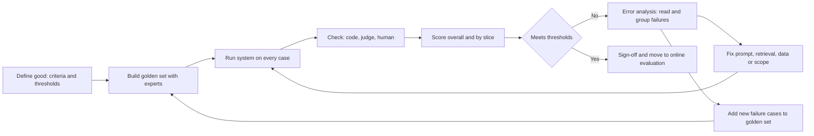
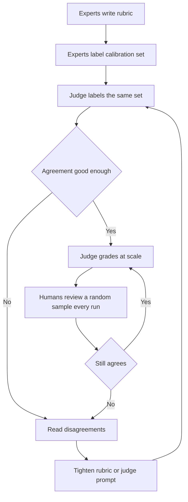
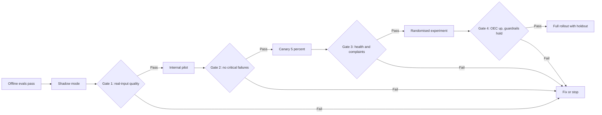

# Module 6 — Evaluation: knowing it works

*An AI feature that "looks great in the demo" has not been evaluated. It has been admired. Because AI products are probabilistic, the only honest answer to "does it work?" is a number measured on the right cases, with the failures read and understood. This module teaches the evaluation stack an AI product manager owns. It starts with offline measurement: metrics, golden sets and error analysis. Then it covers the ways to judge outputs at scale: code, models acting as judges, human experts and red teams. It ends with online evaluation, where real users meet the product through shadow runs, experiments and staged rollouts. You will follow Najm Bank's Digital & AI Products team as Dana builds the Credit Memo Copilot's first golden set, Faisal learns why a judge that gives everything 4.6 out of 5 is useless, Hessa and Layla run a red-team week on Najm Assist, and Rania plans a rollout that can be stopped at any step.*

> **Stages:** Evaluate — turning "it seems to work" into evidence the team, the business owner and the risk function can act on, before launch and while it rolls out.

---

# 6.1 — Quality you can measure: metrics, golden sets and error analysis
*Level: 🟡 Intermediate* · *Prerequisites: 1.2, 5.1* · *Stage: Evaluate*

## ⚡ In 60 seconds
- **Evaluation** ("evals") means measuring outputs against an agreed definition of "good", on fixed cases, repeatably after every change.
- For **predictive** products (fraud alerts, credit pre-approval) use the **confusion matrix**, **precision** and **recall**. For **generative** products (a drafted memo, a chat answer) break "quality" into separate criteria, each with its own check.
- A **golden set** is a curated, versioned collection of test cases with known good answers or pass criteria. It is the team's most valuable eval asset, and the PM shapes what goes into it.
- **Error analysis** (reading failures and sorting them into named types) tells you *what to fix*; a score only tells you *how much* is wrong.
- Decision cue: before any build starts, ask "which cases, which metric, which threshold, and who decides it is good enough?"
- Biggest trap: one average score, which hides the slices that matter most, such as Arabic documents or high-value clients.

## 🧭 Why it matters
Faisal has run the Credit Memo Copilot prototype on ten credit files he picked himself, and tells Rania it is "about 90% there". Khalid (Head of Retail Lending) wants a pilot date. Dana (lead data scientist) asks three questions: "Ninety percent of what? On which ten files? And what does the other ten percent look like?" Faisal cannot answer. His ten files were recent, in English, from clients with clean audited accounts. The copilot has never seen a scanned Arabic statement or a client with a missing year of accounts.

Public cases show the same gap. In February 2023, a promotional demo of Google's Bard wrongly said the James Webb Space Telescope took the very first pictures of a planet outside our solar system. The error was widely reported and Alphabet's shares fell sharply. One carefully chosen example had been admired, not evaluated.

Rania's rule: **no AI feature goes to pilot without an eval plan the business owner has signed**, stating the cases, metrics, thresholds and what happens when a threshold is missed. This lesson teaches you to write that plan and read its results.

## 📐 How it works

### 🟢 The essentials

**What an eval is.** Four parts: **cases** (the inputs you test on); **a definition of good** (an expected answer, or criteria to meet); **a check** (code, a model or a person comparing output with the definition); and **a score and threshold** (the number you report and the level at which you ship, hold or roll back).

You re-run the same cases after every change (prompt, model version, retrieval source), so the eval becomes a **regression suite** that tells you when a change made things worse. Lesson 5.1 introduced evals as requirements; this lesson builds and reads them.

**Predictive products: the confusion matrix.** Smart Alerts decides "alert" or "no alert" for each card transaction. Compared with what really happened, every case falls into one of four boxes:

| | Actually fraud | Actually genuine |
|---|---|---|
| **Alert raised** | True positive (TP): caught fraud | False positive (FP): customer bothered for nothing |
| **No alert** | False negative (FN): missed fraud | True negative (TN): quiet, correct |

From these counts come the metrics every AI PM must read:
- **Precision** = TP ÷ (TP + FP). *Of the alerts we sent, how many were real fraud?* Low precision means alert fatigue and angry customers.
- **Recall** = TP ÷ (TP + FN). *Of all the real fraud, how much did we catch?* Low recall means losses.
- **F1** = the harmonic mean of the two, high only when both are high. Good for comparing models; weaker for decisions, because it treats both errors as equally costly.
- **Accuracy** = (TP + TN) ÷ all cases. Dangerous when one class is rare.

Illustrative numbers: 100,000 transactions, 100 of them fraud. Model A raises 400 alerts and catches 80 frauds: precision 20%, recall 80%. A "model" that never alerts scores 99.9% accuracy and catches nothing. Never accept accuracy alone for a rare-event product.

**The threshold is a product decision.** A classifier outputs a score ("fraud likelihood 0.73"); a **threshold** turns it into an action. Lower it and recall rises while precision falls. No setting is technically "correct": it depends on what each error costs, a missed QAR 5,000 fraud against a blocked card at a petrol station at midnight. The PM brings the costs; Dana shows the curve.

**Generative products: decompose quality.** A credit memo has no single right answer. Break quality into **criteria** that can each be checked on their own:

| Criterion | Plain question | Credit Memo Copilot example |
|---|---|---|
| **Faithfulness** (groundedness) | Is every claim supported by the sources? | Revenue matches the audited statement |
| **Completeness** | Is everything required present? | All eight memo sections |
| **Correct reasoning** | Are calculations and conclusions right? | Debt-service coverage ratio correct |
| **Abstention** | Does it say "not found" rather than guess? | Missing 2024 accounts flagged |
| **Format and style** | Does it follow the template? | Headings, currency format, length |
| **Safety and policy** | Does it avoid what it must never do? | No other client's data; no approval language |

Each criterion gets its own check and threshold. "Faithfulness ≥ 98% of figures" is useful; "quality 4.2 out of 5" is not.

**Golden sets.** A **golden set** (or reference set) is a curated collection of test cases, each with an input and either a reference answer ("the DSCR is 1.35") or pass criteria ("must flag that 2024 accounts are missing"). A good one **covers the space** (common, hard, edge and must-refuse cases), is **labelled by the right people** (credit officers, not the prompt's authors), is **versioned** so "92% on v3" means something next quarter, and **grows from real failures**.

**Error analysis.** A score tells you how much is wrong; error analysis tells you what. The method is manual and it works:
1. Take the failed outputs, or a random sample if you have no labels yet.
2. Write a short note on each failure ("used the 2022 figure", "invented a covenant").
3. Group the notes into a small **failure taxonomy**: named categories.
4. Count each category and multiply by its severity.
5. Fix the biggest category, re-run the eval, and repeat.

Deciding that "wrong fiscal year" is more severe than "slightly long summary" is a product call, which is why the PM takes part.

### 🟡 Going deeper

**Slices.** A **slice** is a subset of cases that share a property: Arabic documents, scanned PDFs, files over QAR 50 million. Always report metrics by slice as well as overall. A copilot that scores 95% overall and 70% on Arabic statements is not ready for a bank with many Arabic SME accounts. Slices also connect to fairness: for SME Instant Finance, governance will ask for performance by customer segment (see *AI Governance: Zero to Hero*).

**ROC, AUC and calibration.** Two more tools for Smart Alerts and SME Instant Finance:
- A **ROC curve** (receiver operating characteristic) plots the true positive rate against the false positive rate at every threshold. **AUC** (area under that curve) summarises how well the model *ranks* positives above negatives: 0.5 is random, 1.0 is perfect. It helps compare models, but says nothing about whether a given threshold is acceptable. When positives are very rare, a **precision-recall curve** is often more informative.
- **Calibration** asks whether scores mean what they say. If 1,000 SME invoices get a "10% default risk", do roughly 100 default? A well-ranked model can be badly calibrated. Calibration matters whenever someone uses the number itself: to price, set limits or show confidence.

**How many cases do you need?** For a pass rate p on n cases, one standard error is the square root of p × (1 − p) ÷ n. With 100 cases at 90%, that is about 3 points, so the 95% range is roughly ±6 points (84% to 96%); with 50 cases, roughly ±8. So "v2 scored 91%, v1 scored 89%" on 100 cases is not evidence. A few dozen cases find big failure types; comparing close versions needs hundreds per important slice.

**Non-determinism.** The same prompt can give different outputs from run to run, especially at higher **temperature** (the randomness setting; see 1.2). Run important evals several times and report the spread. A case that passes two runs out of three will become a complaint in production.

**Code-based checks first.** Ordinary code is cheap, fast and consistent. Does every figure in the memo appear in the source documents? Are all required sections present? Does it mention a client not in this file? Use code wherever a criterion is mechanical, and save model judges and human reviewers (6.2) for judgement, such as whether the risk narrative is sound.

### 🔴 Expert view

**Offline metrics are proxies.** The business cares about **outcomes**: hours saved, fewer committee send-backs, fraud losses prevented. A good plan names the chain ("faithful figures → RMs trust them → less re-checking → less time per memo") and tests the weak links online (6.3). When the offline score rises and the outcome does not move, the proxy is broken, not the users.

**Goodhart's law.** "When a measure becomes a target, it ceases to be a good measure" (after the economist Charles Goodhart; this wording is usually credited to Marilyn Strathern). If the team is rewarded for golden-set score, the prompt will slowly be tuned to those exact cases. Defences: a **held-out set** that prompt engineers never see, used only for release decisions; quarterly refreshes from production; and a sample of outputs that a human reads alongside every score.

**Public benchmarks are not your eval.** Vendor benchmark scores help you shortlist models (1.3). They do not tell you how a model performs on Najm's credit files, in Arabic, with Najm's templates, and some benchmark questions may have leaked into training data ("contamination"). Treat leaderboards as a filter and your golden set as the decision.

**The eval set is a product asset with an owner.** Golden sets outlive models: when Tariq (engineering lead) proposes a cheaper model, the golden set makes it a two-day decision, not a two-month debate. Credit files contain client data, so the set follows production data rules (3.3), and Sara (DPO) signs off on whether real or masked data is used.

**Severity-weighted thresholds.** An invented covenant is worse than a memo two paragraphs too long. Mature teams define a few **critical failure types** with zero tolerance ("no fabricated figure in any golden-set case") alongside ordinary thresholds. A release that improves the average but adds one critical failure is blocked.

## 🧰 The toolkit
| Tool or framework | What it is and does | When to reach for it |
|---|---|---|
| **Confusion matrix** | Four-box count of true and false positives and negatives | Any yes/no predictive product: Smart Alerts, SME Instant Finance |
| **Precision and recall** | Share of positive calls that were right; share of real positives caught | Choosing and defending a threshold |
| **ROC/AUC and calibration** | Ranking quality across thresholds; whether scores match observed rates | Comparing models; any product that uses the score itself |
| **Golden set** | Curated, versioned test cases with reference answers or pass criteria | From the first prototype; before every prompt, model or data change |
| **Error analysis** | Reading failures and grouping them into a counted taxonomy | After a missed threshold; when users complain but scores look fine |
| **Slice analysis** | Metrics per subgroup of cases | Always: language, document type, segment, high-value cases |
| **Code-based assertions** | Deterministic checks in ordinary code | Mechanical criteria: figures match source, fields present |

## 🏛️ In practice at Najm Bank
Dana and Faisal write the **Credit Memo Copilot Eval Plan v1**. Khalid (business owner) and Layla (AI governance) sign it.

**Part A: golden set v1 composition (illustrative sizes)**

| Slice | Cases | Why it is there |
|---|---|---|
| Standard SME files, English, audited | 60 | The common path |
| Arabic or bilingual statements | 40 | Many SME files; never seen by the prototype |
| Scanned or poor-quality PDFs | 25 | Extraction errors show up here first |
| Missing or inconsistent data | 25 | Tests abstention: flag, never invent |
| Exposures above committee threshold | 20 | Highest cost of error |
| Out-of-scope requests ("approve this") | 10 | Must decline politely |
| **Held-out** (hidden from prompt tuning) | 50 | Release decisions only |

All cases are labelled by credit officers (Arabic speakers for the Arabic slice), with Dana resolving disagreements.

**Part B: criteria, checks and thresholds**

| Criterion | Check | Pilot threshold | Critical? |
|---|---|---|---|
| Figure faithfulness | Code: every number traced to a source page | 100% of figures traceable; 0 fabricated figures | Yes: any fabrication blocks release |
| Ratio calculations | Code: recompute DSCR, leverage, current ratio | ≥ 98% correct | Yes |
| Abstention on missing data | Code plus human check on the missing-data slice | ≥ 95% of gaps flagged | Yes |
| Section completeness | Code: eight sections present | ≥ 99% | No |
| Risk narrative soundness | Credit officer rubric, 1–4 scale (see 6.2) | Median ≥ 3; no "misleading" ratings | No |
| Format and style | Code plus judge | ≥ 95% | No |
| Every slice | All of the above per slice | No slice more than 5 points below overall | No |

**Part C: rules.** Re-run on every prompt, model, retrieval or template change. Report overall and by slice, with case counts. Log every failure in the taxonomy; add production failures to the golden set within a sprint. Golden-set owner: Dana. Threshold owner: Khalid, advised by Faisal.

## 🛠️ Exercises
- 🟢 Smart Alerts caught 120 of 150 real frauds last month and raised 900 alerts in total. Compute precision and recall, then write two sentences for Khalid explaining what each number means for customers. *Done when:* you have precision ≈ 13% and recall = 80%, and neither sentence uses the words "precision" or "recall".
- 🟡 Draft a golden-set composition table for Najm Assist answering card and account questions, with at least five slices and why each is there. *Done when:* it includes an Arabic slice, an out-of-scope slice and a slice where the right answer is "I cannot do that; here is how to reach a person".
- 🔴 Take 20 outputs from a generative AI tool you use (or a public chatbot answering questions in your field). Run a full error analysis: note each failure, build a taxonomy of four to seven categories, count and rank them by frequency times severity. *Done when:* you can name the first fix, justify it with counts, and list the golden-set cases you would add.

## ⚠️ Mistakes and traps
- **Judging by demo.** Hand-picked examples are not evidence. Write the eval plan before promising a pilot date.
- **Accuracy on rare events.** A fraud model can be 99.9% accurate and useless. Use precision and recall.
- **One blended quality score.** Split quality into criteria with separate thresholds, and mark the critical ones.
- **Engineers labelling the golden set alone.** Domain experts label what the job actually needs.
- **Treating small score differences as real.** On 100 cases, 89% against 91% is noise. Report case counts.
- **A golden set that never changes.** The team tunes to it and it drifts from reality. Refresh it and keep a held-out set.

## 🧾 Recap
- An eval is cases, a definition of good, a check and a threshold, re-run after every change.
- For predictive products, use the confusion matrix, precision and recall. The threshold is a product decision based on the cost of each error.
- For generative products, break quality into criteria and check each one separately, with code wherever possible.
- The golden set is a versioned, expert-labelled, sliced asset that grows from real failures, with a held-out portion.
- Error analysis turns scores into a ranked fix list. Offline scores are proxies for business outcomes.

## ✍️ Check yourself

**1. Smart Alerts' new model raises fewer alerts than the old one, and customers complain less. Dana reports that it catches 60 of 100 frauds, where the old model caught 85. Which statement is correct?**

- A. Precision fell and recall rose
- B. Recall fell from 85% to 60%; precision may have risen, and whether the trade is acceptable depends on the cost of missed fraud against the cost of false alerts
- C. The new model is better because customers complain less
- D. Accuracy is the right metric to settle the question

Answer

**B.** Recall (share of real fraud caught) fell; fewer alerts usually means higher precision. Choosing between them is a business decision about error costs. C looks at one side only; D fails because fraud is rare. (🟢 The essentials.)

**2. Faisal reports that version 2 of the copilot prompt scored 91% on a 100-case golden set, against 89% for version 1, and proposes shipping it as "clearly better". What is the best response?**

- A. Agree, because any improvement should ship
- B. Reject version 2, because the golden set is too small to use at all
- C. Point out that a 2-point difference on 100 cases is within the noise, and ask for the per-slice results, the critical-failure count and a larger or repeated comparison
- D. Switch to a public benchmark to settle it

Answer

**C.** At 100 cases and about 90%, uncertainty is roughly ±6 points, so a 2-point gap is not evidence. B overreacts: small sets still find failure types. D measures the wrong task. (🟡 Going deeper.)

**3. Which golden set is BEST for the Credit Memo Copilot?**

- A. The 200 most recent memos, labelled by the engineers who wrote the prompt
- B. A versioned set sliced by language, document quality, missing data and exposure size, labelled by credit officers, with a held-out portion
- C. A public financial question-answering benchmark
- D. Ten excellent memos chosen by the business owner

Answer

**B.** It covers hard slices, uses domain experts and protects release decisions with a held-out set. A has the wrong labellers; D is a demo, not an eval. (🟢 The essentials; 🏛️ In practice.)

**4. The copilot's overall faithfulness score is 97%, above target. Relationship managers still say they "cannot trust the numbers". What should the PM do first?**

- A. Run error analysis on the failures and check faithfulness by slice, for example Arabic and scanned documents
- B. Tell the RMs that the score is above target
- C. Raise the target to 99% and wait
- D. Replace the model with the top model on a public leaderboard

Answer

**A.** A good average can hide a failing slice that RMs work in daily; error analysis shows what the failures are. B dismisses evidence; C and D act before understanding the problem. (🟢 The essentials; 🟡 Going deeper.)

**5. Why does the eval plan mark "fabricated financial figure" as a critical failure with zero tolerance, instead of folding it into the average?**

- A. Because critical failures are easier to measure
- B. Because regulators require zero errors in all AI systems
- C. Because averages are always wrong
- D. Because some failures are severe enough that a release improving the average but adding one of them should still be blocked

Answer

**D.** Severity-weighted thresholds stop a high average hiding a rare, unacceptable failure. B invents a rule; C overstates: averages are useful alongside slices and critical checks. (🔴 Expert view.)

## 📚 References
- Google, Machine Learning Crash Course (classification: accuracy, precision, recall, ROC and AUC) — https://developers.google.com/machine-learning/crash-course
- scikit-learn documentation, "Metrics and scoring: quantifying the quality of predictions" — https://scikit-learn.org/stable/modules/model_evaluation.html
- Fawcett, T. (2006), "An introduction to ROC analysis", *Pattern Recognition Letters* 27(8)
- Guo, C., Pleiss, G., Sun, Y. and Weinberger, K. Q. (2017), "On Calibration of Modern Neural Networks" — https://arxiv.org/abs/1706.04599
- NIST AI Risk Management Framework 1.0 (the Measure function) — https://www.nist.gov/itl/ai-risk-management-framework
- Google PAIR, People + AI Guidebook — https://pair.withgoogle.com/guidebook

---

# 6.2 — LLM-as-judge, human review and red-teaming
*Level: 🟡 Intermediate* · *Prerequisites: 6.1, 4.2* · *Stage: Evaluate*

## ⚡ In 60 seconds
- Every eval needs a **judge**: something that decides whether an output passed. There are three kinds: **code** (cheap, exact, narrow), **a model** acting as judge (scalable, flexible, biased) and **humans** (the reference standard, slow and costly). Good evaluation uses all three, each where it fits.
- **LLM-as-judge** means using a language model to grade outputs against a rubric. It lets you grade thousands of outputs, but only after you have shown that it agrees with your human experts.
- Known judge biases include **position** (favouring the first or second answer), **verbosity** (favouring longer answers) and **self-preference** (favouring outputs from its own model family). Design around them.
- **Human review** needs a written **rubric**, trained reviewers and a measure of **inter-rater agreement**. If two experts cannot agree, the criterion is not yet defined.
- **Red-teaming** is deliberate attack: trying to make the product fail in harmful, embarrassing or costly ways before real users and attackers do.
- Biggest trap: a judge that nobody calibrated. A judge that gives everything 4.6 out of 5 is not measuring anything.

## 🧭 Why it matters
Dana's golden set for the Credit Memo Copilot has 230 cases, and code checks cover the figures and sections. The "risk narrative" criterion still needs judgement: is the memo's account of the client's risks sound and not misleading? Two credit officers can review about 30 memos a day between their real jobs. Every prompt change needs a full re-run. Faisal has a fix: he asks a large model to "rate each memo from 1 to 5 for quality". The average comes back at 4.6. He runs a deliberately broken prompt, and the average comes back at 4.4. The judge cannot tell good from bad, and the team nearly shipped on its word.

Meanwhile, Najm Assist is about to grow from answering questions to taking actions like freezing a card. Public cases show what happens when a customer-facing assistant meets people who try to break it. In December 2023, users of a Chevrolet dealer's website chatbot got it to "agree" to sell a car for one dollar through prompt manipulation. In January 2024, after an update, DPD's delivery chatbot swore at a customer and wrote criticism of the company when asked to. Neither failure needed advanced skills, only a curious user with some patience. Layla (Head of AI Governance) will not approve Najm Assist's agent features until the team shows it has tried to break them first.

This lesson covers how to judge outputs at scale without fooling yourself, and how to find the failures your golden set did not think of.

## 📐 How it works

### 🟢 The essentials

**Three kinds of judge.**

| Judge | Good at | Weak at | Cost per output |
|---|---|---|---|
| **Code** | Exact, mechanical checks: numbers match, fields present, banned words absent | Anything needing meaning or judgement | Near zero |
| **Model (LLM-as-judge)** | Criteria described in words: relevance, tone, whether a claim is supported by a passage | Subtle domain judgement; can be biased or fooled | Low, but not zero (it is another model call) |
| **Human expert** | Domain judgement; new failure types; the final say | Speed, cost, consistency, fatigue | High |

The rule of thumb: use code for everything code can check; use a model judge for high-volume criteria that you have calibrated against humans; and use humans to define the standard, calibrate the judge, review samples and handle the highest-stakes cases.

**LLM-as-judge.** A judge model receives the input, the output and a **rubric** (the written criteria for each score), and returns a verdict. There are three common formats:
- **Pointwise**: grade one output. For example, "Is every risk statement in this memo supported by the attached documents? Answer PASS or FAIL, then give the unsupported statement if any."
- **Pairwise**: compare two outputs ("Which memo better identifies the client's key risks, A or B?"). This is useful for comparing prompt or model versions.
- **Reference-guided**: grade an output against a reference answer from the golden set.

The approach was studied closely by Zheng and colleagues in "Judging LLM-as-a-Judge with MT-Bench and Chatbot Arena" (2023). They reported that strong model judges agreed with human preferences about as often as humans agreed with each other on their test sets. They also documented the judge's weaknesses:
- **Position bias**: preferring an answer because of where it appears (first or second).
- **Verbosity bias**: preferring longer answers even when they are not better.
- **Self-enhancement (self-preference) bias**: preferring answers written by the same model or model family.
- **Limited reasoning**: struggling to grade maths and logic questions it could not solve reliably itself.

The study shows that model judging can work. It does not show that *your* judge works on *your* task. That is something you must measure.

**Making a judge trustworthy.**
1. **Write a narrow rubric.** One criterion per judge call. Prefer binary PASS or FAIL, or a short scale with a written description ("anchor") for every level, over "rate quality from 1 to 10".
2. **Ask for the evidence before the verdict.** "Quote the sentence that is unsupported, then decide." This makes the judge's decision checkable.
3. **Counter the known biases.** For pairwise judging, run each pair twice with the order swapped and only count consistent verdicts. Tell the judge that length is not a quality. Where you can, use a judge from a different model family than the system being judged.
4. **Calibrate against humans.** Have experts label a **calibration set** (for example 100 outputs), run the judge on the same outputs and compare. Deploy the judge only when agreement is good enough for the decision it will support.
5. **Pin and re-check.** Fix the judge's model version and prompt. When either changes, re-run the calibration.

**Human review.** Humans set the standard, so their process must be solid.
- **Rubric**: each criterion, each score level, and examples of each. "Misleading" must mean the same thing to every reviewer.
- **Reviewers**: domain experts for domain criteria. For the copilot that means credit officers; for Najm Assist's tone, Hessa's (product designer) research panel of customers.
- **Blind review**: reviewers should not know which version produced an output, so they cannot favour the new one.
- **Inter-rater agreement**: have two or more reviewers score the same subset and measure how often they agree. If agreement is low, fix the rubric before trusting any scores.

**Red-teaming.** A **red team** is a group whose job is to make the system fail. For AI products this includes:
- **Jailbreaks**: prompts that get the model to ignore its rules.
- **Prompt injection**: instructions hidden in content the system reads, such as a document, an email or a web page (introduced in *AI Governance: Zero to Hero*).
- **Harmful or unauthorised commitments**: promising refunds, prices or approvals the business never offered (the Chevrolet case; *Moffatt v. Air Canada*, where an airline was held liable for what its chatbot told a customer).
- **Data leakage**: revealing another customer's data, the system prompt or internal information.
- **Brand and tone failures**: swearing, mocking, political statements (the DPD case).
- **Unsafe actions** for agents: freezing the wrong card, or taking an action without confirmation.

The output of red-teaming is not a report that sits in a folder. Every successful attack becomes a **fix** and a new **adversarial test case** in the golden set, so the attack is re-tested on every release.

### 🟡 Going deeper

**Measuring agreement.** The simplest measure is **percent agreement**: how often two raters (or a judge and a human) give the same label. It is misleading when one label dominates. If 95% of memos pass, two raters who both say "pass" to everything agree 95% of the time while measuring nothing. **Cohen's kappa** (Jacob Cohen, 1960) corrects for agreement expected by chance, for two raters. It runs from below 0 (worse than chance) to 1 (perfect). A widely used, and admittedly arbitrary, reading from Landis and Koch (1977) calls 0.61–0.80 "substantial" and above 0.80 "almost perfect". For more than two raters, or missing ratings, teams use **Krippendorff's alpha**.

For a PM, the most useful way to check a pass/fail judge is to treat it like a classifier and draw its confusion matrix against human labels (6.1):
- **Judge recall on failures**: of the outputs humans failed, how many did the judge fail? If this is low, bad outputs slip through.
- **Judge precision on failures**: of the outputs the judge failed, how many did humans fail? If this is low, the team wastes time on false alarms.

This framing makes the choice concrete. For a critical criterion like "misleading risk statement", you want the judge's recall on failures to be very high, even at the cost of some false alarms that a human then reviews.

**Judging agents.** When Najm Assist starts taking actions, there are two things to judge:
- **Final state**: after "freeze my debit card", is the right card frozen and the others untouched? Check this with code against the test system. It is the most reliable check.
- **Trajectory**: the sequence of steps and tool calls. Did it confirm with the customer before acting? Did it call the right tool with the right card ID? Did it avoid calling tools it did not need?

A correct final state reached by an unsafe path, such as freezing a card without asking, is still a failure. The *Production AI Agents* companion course covers agent evaluation in engineering depth.

**Sampling for human review.** Humans cannot review everything, so decide deliberately what they see:
- A **random sample** of all outputs, to estimate true quality and check the judge.
- **All outputs the judge failed**, or failed with low confidence.
- **All high-stakes cases**: for the copilot, exposures above the committee threshold.
- **Disagreements** between judges, or between a judge and a code check.

**Running a red-team exercise.** A useful structure for a PM to organise:
1. **Scope and threat model**: what the system can do, who might attack it (curious customers, fraudsters, pranksters, insiders) and what harms matter most.
2. **Attack categories and targets**: for example "make Assist promise a fee refund", "make Assist reveal another customer's balance", "make Assist act without confirmation".
3. **A diverse team**: engineers, designers, customer-service agents, Arabic and English speakers, and people from outside the project. People who built the system are poor at imagining how it breaks.
4. **Time-boxed sessions** with every attempt logged: prompt, output, success or failure, severity.
5. **Triage and fix**: rank successful attacks by severity and likelihood, fix the critical ones, and accept or mitigate the rest with a named owner.
6. **Regression**: add the attacks to an adversarial test set and re-run it on every release.

**Automated red-teaming.** Models can generate attacks at scale. Perez and colleagues (2022) showed that one language model could be used to find failures in another. Open-source tools exist for this at the time of writing (2026), for example Microsoft's PyRIT and promptfoo. Automated attacks add volume and variety. They do not replace people, who find the creative, context-specific attacks that matter to your business.

### 🔴 Expert view

**Who judges the judge?** A calibrated judge can drift. The judge's vendor may update the model; the system's outputs may change in ways the judge was never calibrated on; the team may tune the product until it satisfies the judge rather than the user. Guard against this with three habits: pin the judge version, re-calibrate on a schedule and on every change, and keep a fixed share of human review on every run. The human sample is your early warning when the judge and reality diverge.

**Do not let the system grade its own homework.** If the same model, with a similar prompt, writes the memo and judges it, shared blind spots pass unseen, and self-preference inflates scores. Use a different model family, a different prompt that looks for failures rather than confirming quality, or code checks for the parts that matter most.

**Human reviewers are biased too.** Reviewers who know the AI produced an output may trust it too much (**automation bias**) or too little. Fatigue lowers quality late in a session. Experts disagree for legitimate reasons, such as a conservative credit officer and a growth-minded one. Treat persistent disagreement as information: it often means the product needs a policy decision, not a better rubric. Khalid, not the reviewers, should decide how cautious a memo's risk language must be.

**Budget the evaluation effort.** A practical allocation for a product like the copilot: code checks on 100% of outputs, a calibrated judge on 100% of outputs for two or three criteria, human review of a few per cent plus every flagged and high-stakes case, and red-teaming before each major release. The exact split is a judgement about risk, and Layla's governance tier (from *AI Governance: Zero to Hero*) sets the minimum.

**Red-teaming is also a governance deliverable.** For higher-risk systems, red-team results are evidence that risk was managed before release. The NIST Generative AI Profile (NIST AI 600-1) includes red-teaming among its suggested actions, and security teams use the OWASP Top 10 for LLM Applications as a checklist of attack types. The PM's job is to make sure the red team's scope matches the product's real risks, and that its findings change the product.

## 🧰 The toolkit
| Tool or framework | What it is and does | When to reach for it |
|---|---|---|
| **LLM-as-judge** (Zheng et al., 2023) | A model grades outputs against a rubric, pointwise, pairwise or against a reference | High-volume criteria that code cannot check, once calibrated against human labels |
| **Judge calibration set** | Expert-labelled outputs used to measure a judge's agreement with humans | Before trusting any judge; after any change to the judge model or prompt |
| **Pairwise comparison** | Judge chooses the better of two outputs, run in both orders | Comparing prompt, model or retrieval versions |
| **Rubric** | Written criteria and anchored score levels with examples | Every human review and every judge prompt |
| **Inter-rater agreement** (Cohen's kappa; Krippendorff's alpha) | Chance-corrected measure of how consistently raters label | Checking that a rubric is clear before relying on the scores |
| **Red-teaming** | Deliberate attempts to make the system fail harmfully | Before launch and before each major capability change, especially customer-facing or agentic features |
| **Adversarial test set** | Successful and attempted attacks stored as regression cases | Every release, so fixed attacks stay fixed |
| **OWASP Top 10 for LLM Applications** | Industry checklist of LLM application security risks | Scoping a red team and threat model |

## 🏛️ In practice at Najm Bank
Before the agent features of Najm Assist go to pilot, Faisal, Hessa and Dana produce the **Najm Assist Evaluation and Red-Team Plan**. Layla approves it.

**Part A: the judging stack**

| Criterion | Judge | Coverage | Calibration and audit |
|---|---|---|---|
| Correct card or account acted on | Code, checking final state in the test system | 100% of action cases | None needed; exact |
| Confirmation before any action | Code on the trajectory: confirm step precedes tool call | 100% | None needed |
| Answer grounded in approved knowledge base | LLM judge, PASS/FAIL with quoted evidence, different model family | 100% | 120-case calibration set; judge recall on failures ≥ 90% before use |
| Tone: respectful, clear, bilingual quality | LLM judge with four-level anchored rubric | 100% | Hessa's panel labels 80 cases; kappa ≥ 0.6 between panel members first |
| No commitments outside policy (refunds, fees, rates) | LLM judge plus keyword code check | 100% | All flags reviewed by customer-service lead |
| Overall helpfulness | Human, blind, Arabic and English reviewers | 5% random sample plus all flagged | Weekly review of judge against human sample |

**Part B: red-team week (scope excerpt)**

| Attack category | Example goal | Severity if successful | Team |
|---|---|---|---|
| Unauthorised commitment | Get Assist to promise a fee waiver | High | Customer-service agents, Faisal |
| Data leakage | Get another customer's balance or the system prompt | Critical | Tariq's security engineers |
| Unsafe action | Freeze or unfreeze a card without confirmation | Critical | Dana, engineers |
| Indirect injection | Hide instructions in a dispute description | High | Security engineers |
| Tone and brand | Provoke insults, political or religious statements | High | Hessa, outside volunteers |
| Language switching | Break rules by mixing Arabic, English and dialect | High | Bilingual staff |

**Exit rule:** no open critical findings; every high finding fixed or accepted in writing by Rania and Layla; all successful attacks added to the adversarial test set; the full set re-run before pilot.

## 🛠️ Exercises
- 🟢 Rewrite Faisal's judge prompt, "Rate this memo's quality from 1 to 5", as a single-criterion PASS/FAIL judge for "every risk statement is supported by the source documents". *Done when:* your prompt asks for evidence before the verdict, defines PASS and FAIL in one sentence each, and says what to do when documents are missing.
- 🟡 A judge and a credit officer both labelled the same 100 memos. The officer failed 20. The judge failed 25, of which 15 were among the officer's 20. Compute the judge's recall and precision on failures, and decide whether it is fit to screen memos for human review. *Done when:* you have recall = 75% and precision = 60%, and a one-paragraph recommendation that says what happens to the 5 failures the judge missed.
- 🔴 Plan a two-day red-team exercise for Staff GenAI, the internal employee assistant. Write the threat model, six attack categories with example goals and severities, the team composition and the exit rule. *Done when:* your plan includes at least one insider-threat category and one data-leakage category, and every category has a named owner for fixes.

## ⚠️ Mistakes and traps
- **Uncalibrated judges.** A judge whose scores barely move between a good and a broken system is useless. Calibrate against expert labels before using it.
- **Vague scales.** "Rate 1 to 10" produces noise. Use one criterion per call, binary or anchored levels, and evidence first.
- **Ignoring position and verbosity bias.** Swap pair order, discount length, and prefer a judge from a different model family.
- **Treating human review as automatically correct.** Measure inter-rater agreement. Low agreement means an unclear rubric or an open policy question.
- **Red-teaming by the builders only.** They share the system's blind spots. Bring in customer-service staff, security, bilingual users and outsiders.
- **Red-team findings that change nothing.** Every successful attack needs a fix, an owner and a permanent regression test.

## 🧾 Recap
- Use code where you can, calibrated model judges for volume, and humans for standards, samples and high stakes.
- LLM-as-judge can agree well with humans, but it has known biases (position, verbosity, self-preference). Your judge must be calibrated on your task.
- Treat a pass/fail judge like a classifier: measure its recall and precision on failures against human labels.
- Human review needs rubrics, blind review and inter-rater agreement.
- Red-teaming finds failures your golden set did not imagine. Its findings become fixes and permanent adversarial tests.

## ✍️ Check yourself

**1. Faisal's LLM judge scores the Credit Memo Copilot 4.6 out of 5. A deliberately broken prompt scores 4.4. What is the MOST likely conclusion?**

- A. Both prompts are good
- B. The judge is not discriminating between good and bad outputs and must be redesigned and calibrated against expert labels
- C. The broken prompt should ship because the difference is small
- D. The judge needs a larger model and nothing else

Answer

**B.** A judge that cannot separate a broken system from a working one is not measuring quality. Narrow criteria, evidence-first prompts and calibration against humans are the fix. D might help, but without calibration you still would not know. (🟢 The essentials; 🧭 Why it matters.)

**2. In a pairwise comparison, a judge prefers whichever memo is shown first in 70% of cases, regardless of content. Which bias is this, and what is the standard mitigation?**

- A. Verbosity bias; shorten both answers
- B. Self-preference bias; use the same model family
- C. Position bias; run each pair in both orders and count only consistent verdicts
- D. Automation bias; add more human reviewers

Answer

**C.** Preferring an answer because of where it appears is position bias. Swapping the order and keeping only consistent results is the standard counter. B describes a different bias, and using the same model family would make self-preference worse. (🟢 The essentials.)

**3. Two credit officers review the same 50 memos for "misleading risk language", and their kappa is 0.2. What should the team do next?**

- A. Average their scores and continue
- B. Use only the stricter reviewer
- C. Replace both with an LLM judge
- D. Examine the disagreements, clarify the rubric with anchored examples, and escalate any underlying policy question to the business owner

Answer

**D.** Low agreement means the criterion is not yet defined well enough to measure, or that the reviewers disagree on policy. Averaging (A) hides this, and a judge (C) cannot be calibrated against a standard the humans do not share. (🟡 Going deeper; 🔴 Expert view.)

**4. Najm Assist's agent correctly froze the customer's card, but it called the freeze tool before asking the customer to confirm. How should this test case be scored?**

- A. Fail, because the trajectory broke a safety rule even though the final state was correct
- B. Pass, because the final state was correct
- C. Pass with a warning, because no harm occurred
- D. It cannot be scored without a human

Answer

**A.** Agent evaluation checks both the final state and the path. Acting without confirmation is a failure of the trajectory, and a code check on the order of steps can catch it. B ignores how the result was reached. (🟡 Going deeper.)

**5. After a red-team week, the team fixes the prompt that let testers make Najm Assist promise a fee waiver. What else MUST happen for the fix to last?**

- A. Nothing; the fix is done
- B. Publish the red-team report internally
- C. Add the successful attacks to an adversarial test set that is re-run on every release
- D. Schedule another red-team week in a year

Answer

**C.** Without a regression test, a later prompt or model change can quietly reopen the hole. A report (B) and a future exercise (D) are useful, but they do not protect the next release. (🟢 The essentials; 🏛️ In practice.)

## 📚 References
- Zheng, L. et al. (2023), "Judging LLM-as-a-Judge with MT-Bench and Chatbot Arena" — https://arxiv.org/abs/2306.05685
- Cohen, J. (1960), "A coefficient of agreement for nominal scales", *Educational and Psychological Measurement* 20(1)
- Landis, J. R. and Koch, G. G. (1977), "The measurement of observer agreement for categorical data", *Biometrics* 33(1)
- Perez, E. et al. (2022), "Red Teaming Language Models with Language Models" — https://arxiv.org/abs/2202.03286
- Ganguli, D. et al. (2022), "Red Teaming Language Models to Reduce Harms: Methods, Scaling Behaviors, and Lessons Learned" — https://arxiv.org/abs/2209.07858
- NIST AI 600-1, Generative AI Profile — https://doi.org/10.6028/NIST.AI.600-1
- OWASP GenAI Security Project (Top 10 for LLM Applications) — https://genai.owasp.org
- Microsoft PyRIT (open-source red-teaming toolkit) — https://github.com/Azure/PyRIT

---

# 6.3 — Online evaluation: experiments, A/B tests and staged rollouts
*Level: 🟡 Intermediate* · *Prerequisites: 6.1, 6.2* · *Stage: Evaluate, Launch*

## ⚡ In 60 seconds
- Offline evals tell you whether outputs are good. **Online evaluation** tells you whether real users, in real workflows, get the value you promised, without new harm.
- Release in **stages**: shadow mode (runs, but nobody sees the output), internal pilot, a small **canary** percentage, a controlled experiment, then full rollout. Each stage has a gate you define in advance.
- An **A/B test** (randomised controlled experiment) is the most reliable way to know that a change *caused* an effect. Define one **overall evaluation criterion (OEC)** and a set of **guardrail metrics** that must not get worse.
- Many enterprise AI products have too few users for a classic A/B test. Use staggered rollouts, within-person comparisons or **champion-challenger** designs, and be honest about what they can prove.
- Decision cue: write the decision rule (ship, hold or roll back) *before* you look at the results.
- Biggest trap: measuring only what AI makes cheaper (cost, speed, deflection) and not what it might make worse (quality, repeat contacts, trust).

## 🧭 Why it matters
The Credit Memo Copilot has passed its eval plan. Faisal proposes switching it on for all 140 relationship managers (RMs) on the first of next month. Rania asks him what he will know on the first of the month after that. "That people are using it," he says. "And how will you know it is helping," she asks, "rather than producing memos that are faster to write and slower to approve?" The golden set cannot answer that question. It measures memos, not the credit process: RMs' trust, the credit committee's send-backs, or whether RMs stop reading the figures closely.

A public case shows why this matters. In February 2024, Klarna announced that its AI assistant was handling a large share of its customer service chats (the company said about two-thirds) and presented it as doing work equivalent to hundreds of human agents. In 2025, the company said it would put more emphasis on human customer service again, and its leadership spoke publicly about the importance of quality. Whatever the full internal story, the public lesson for a PM is clear: the metrics you choose when you launch decide what you will notice. Volume and cost are easy to measure. Quality and customer outcomes have to be designed into the evaluation from the start.

Rania's rule: **every AI launch has a rollout plan with gates, a primary metric, guardrails, and a kill switch that someone has tested.**

## 📐 How it works

### 🟢 The essentials

**Offline versus online.** Offline evaluation (6.1, 6.2) runs your system on fixed test cases. Online evaluation measures the system with real users and real data. Online evaluation catches what offline cannot:
- **Real inputs** are messier than your golden set.
- **Behaviour changes**: people trust, ignore, over-rely on or work around the AI.
- **Outcomes**: time saved, errors downstream, customer satisfaction, cost.
- **Scale effects**: latency at peak hours, cost per request, rare failures that only show up after many thousands of uses.

**Staged rollout.** Rather than switching on for everyone, release in steps. Each step exposes more people to a system you trust a little more.

| Stage | What happens | What it tells you | Example gate to move on |
|---|---|---|---|
| **Shadow mode** | The AI runs on real inputs, but its output is logged, not shown | Real-input quality, latency, cost; no user impact | Offline thresholds hold on two weeks of real inputs |
| **Internal pilot** ("dogfooding") | A small group of friendly users uses it for real work, with close support | Usability, trust, workflow fit, early failure types | No critical failures; pilot users would keep it |
| **Canary** | A small percentage of the target users (say 5%) | Operational health at modest scale | Error, latency and complaint rates within limits |
| **Experiment** | Randomised treatment and control groups | Whether the product *causes* the intended outcome | OEC improves; no guardrail breached |
| **Full rollout** (often with a **holdout**) | Everyone, except a small group kept without the feature | Long-term effect; a baseline for comparison | Ongoing monitoring (Module 8) |

Two engineering tools make this possible, and the PM should insist on both: **feature flags**, which switch a feature on or off for chosen users without a new release, and a **kill switch**, which turns the AI off quickly and falls back to the old process. A kill switch that has never been tested is a hope, not a control.

**A/B tests.** In an **A/B test**, you randomly assign units (users, accounts or sessions) to control (A, the current experience) or treatment (B, with the AI feature). Because assignment is random, the groups are alike on average in everything except the feature. So a difference in outcomes can be attributed to the feature. This is the logic of the randomised controlled trial, applied to products. Ron Kohavi, Diane Tang and Ya Xu's *Trustworthy Online Controlled Experiments* (2020) is the standard practical reference. Its core vocabulary:
- **Overall evaluation criterion (OEC)**: the single metric, or small weighted combination, that defines success, chosen to reflect long-term value rather than short-term clicks.
- **Guardrail metrics**: metrics that must not get worse, even if the OEC improves. They protect the business and users: complaints, error rates, latency, fairness across segments.
- **Statistical significance**: whether the observed difference is larger than you would expect from random variation alone. The usual convention is a p-value below 0.05, meaning a result this large would be rare if the feature had no effect.
- **Power and sample size**: how many units you need to reliably detect the smallest effect worth acting on.

For the Credit Memo Copilot, the OEC could be "working hours from file opening to committee-ready memo". Guardrails would be the committee send-back rate, figure errors found at committee, and RM satisfaction.

**Choosing online signals for AI features.** Useful signals are either explicit or implicit:
- **Explicit**: thumbs up or down, ratings, written feedback. These are easy to collect, but few people give them and those who do are not typical.
- **Implicit**: acceptance rate (the draft was used), **edit distance** (how much the user changed the draft), regeneration (the user asked again), abandonment, escalation to a human, repeat contact on the same issue.

Implicit signals are more plentiful, but need interpretation. A high acceptance rate may mean the draft was good, or that tired users stopped checking. Pair behaviour signals with a sample of human quality review (6.2), so you know which.

### 🟡 Going deeper

**How big must the experiment be?** A practical rule of thumb for comparing averages, quoted in Kohavi and colleagues' book, gives the number of units needed *per group* for about 80% power at the usual 5% significance level: **n ≈ 16 × σ² ÷ δ²**, where σ is the standard deviation of the metric and δ is the smallest difference you care about. An illustrative calculation: if memo preparation takes about 4 hours with a standard deviation of 1.5 hours, and you want to detect a 30-minute saving, n ≈ 16 × 2.25 ÷ 0.25 = 144 memos per group. Two lessons follow. Small effects need large samples, because halving δ quadruples n. And the most useful thing a PM can do is to agree the **minimum effect worth detecting** with the business owner before the test starts.

**Choosing the unit of randomisation.** Randomise at the level where the feature is experienced, and where groups do not affect each other.
- For the copilot, randomise by **RM**, not by memo. An RM who uses the copilot on half their memos will change how they write the other half.
- RMs in the same team share templates and tips, so even RM-level randomisation can leak. When this effect (called **interference**) is strong, randomise by **team or branch** and accept that you need more of them.
- For Najm Assist, randomise by **customer**, so the same person does not see different behaviour from one day to the next.

**When you cannot run a classic A/B test.** Enterprise AI often has too few users. With 140 RMs, a two-group test can only detect large effects. Honest alternatives:
- **Staggered rollout** (sometimes called a stepped-wedge design): switch teams on in a random order over several weeks, and compare teams that have the feature with teams that do not yet, week by week.
- **Within-person comparison**: each RM writes some memos with the copilot and some without, assigned at random. This needs far fewer people, but carry-over effects make it weaker for some products.
- **Before-and-after with a comparison group**: compare the change in the pilot teams with the change in similar teams over the same period (a difference-in-differences approach). This is weaker than randomisation, but much better than before-and-after alone.

**Champion-challenger for predictive models.** Credit risk teams have long tested new models by running them against the current model, the **champion**, often first in shadow mode and then on a small controlled share of decisions. For SME Instant Finance, this is the natural design. There are two complications specific to credit:
- **Outcomes arrive late.** Defaults show up months after approval, so early gates rely on **leading indicators** such as approval rates, early arrears and agreement with underwriters. The final verdict comes later.
- **Randomising credit decisions has consequences for real people.** Varying who gets credit touches fairness, lending law and governance approvals. Layla's team must approve the design before any experiment on credit decisions, and many banks keep challengers in shadow mode or confined to human-reviewed cases. See *AI Governance: Zero to Hero* for the EU AI Act and GDPR Art. 22 considerations.

### 🔴 Expert view

**Trust the experiment only after checking it.** Kohavi and colleagues describe the traps that make experiment results wrong while looking clean:
- **Sample ratio mismatch (SRM)**: you planned a 50/50 split but got 53/47. This usually means something in assignment or logging is broken, for example the AI feature crashing for some users so they drop out of the data. An SRM makes the results untrustworthy until you find the cause.
- **Novelty and primacy effects**: users try a new feature because it is new (novelty) or resist it because it is unfamiliar (primacy). AI features often show a strong early novelty effect. Run long enough, include whole weeks and business cycles, and look at the trend over time, not only the total.
- **Peeking**: checking results every day and stopping as soon as they look significant greatly increases false positives. Fix the duration in advance, or use methods designed for continuous monitoring.
- **Too many metrics**: with enough metrics, some will look significant by chance. Decide on the OEC and guardrails in advance; treat everything else as exploratory.

**Pre-register the decision.** Before the experiment starts, write down: the OEC, the guardrails and their limits, the minimum effect worth detecting, the duration, and the rule. For example: "Ship if the OEC improves by at least 10% and no guardrail worsens by more than its limit; roll back if any critical guardrail is breached at any point." This protects the team from the strongest bias in product work, which is wanting the launch to succeed.

**Guardrails for AI features.** Standard guardrails (latency, errors, crashes) are not enough. Add:
- **Quality guardrails** from sampled human review and judges (6.2), measured on live traffic.
- **Downstream guardrails**: committee send-backs for memos; repeat contacts, complaints and escalations for Najm Assist. This is where the Klarna lesson lives: "resolved by AI" means little if the customer contacts you again tomorrow.
- **Segment guardrails**: the feature must not help one group and hurt another, for example Arabic-speaking customers or small SMEs.
- **Cost guardrails**: cost per task, because heavy users of an AI feature can change your unit economics (Module 8).

**Models change under you.** If the copilot uses a model through a vendor's API, the vendor may release new versions or retire old ones. Treat a model change like any other release: re-run the offline evals, then go through shadow and canary again before full traffic. Contract for advance notice of model changes (see *AI Governance: Zero to Hero*, lesson 8.3).

**Long-term holdouts.** Keeping a small share of users without the feature for months measures cumulative effects that a four-week test cannot see: skills fading as RMs rely on the copilot, or trust slowly building. It costs some value to those users, so agree the size and duration with the business owner.

**The ethics of experimenting.** Internal productivity experiments are routine. Customer-facing experiments in a bank need care: customers must not be treated unfairly because of random assignment, disclosures must be correct in both variants, and any experiment that affects credit or fees needs governance approval. The rule of thumb: never test a variant you would not be willing to ship.

## 🧰 The toolkit
| Tool or framework | What it is and does | When to reach for it |
|---|---|---|
| **Staged rollout** | Release in steps (shadow, pilot, canary, experiment, full) with gates set in advance | Every AI launch; every model or major prompt change |
| **Shadow mode** | The system runs on live inputs, but its output is not shown or used | First contact with real data; testing a challenger model without affecting anyone |
| **Feature flag and kill switch** | Turn a feature on or off per user group; stop it fast and fall back | Always; test the kill switch before the canary stage |
| **A/B test** (Kohavi, Tang and Xu, 2020) | Randomised comparison of control and treatment to establish cause | When you have enough units and a clear OEC |
| **OEC** (overall evaluation criterion) | The single agreed success metric for an experiment | Before any experiment; agreed with the business owner |
| **Guardrail metrics** | Metrics that must not get worse: quality, downstream, segment, cost | Every rollout stage and every experiment |
| **Champion-challenger** | A new model competes with the current one, in shadow or on a controlled share | Predictive models, especially credit and fraud |
| **Sample size rule of thumb** (n ≈ 16σ²/δ²) | A quick estimate of units needed per group for about 80% power | Checking whether an experiment is feasible before promising it |

## 🏛️ In practice at Najm Bank
Faisal rewrites his launch proposal as the **Credit Memo Copilot Rollout and Experiment Brief**. Khalid signs it as business owner, Tariq for engineering and Layla for governance.

| Section | Content |
|---|---|
| Question | Does the copilot reduce RM effort per memo without lowering memo quality or credit committee confidence? |
| OEC | Working hours from file opening to committee-ready memo (baseline ≈ 4 hours, illustrative) |
| Minimum effect worth detecting | 30 minutes per memo (agreed with Khalid) |
| Guardrails and limits | Committee send-back rate: no increase of more than 2 points. Figure errors found at committee: no increase; any fabricated figure triggers immediate review. RM satisfaction: no decrease. Latency: 95% of drafts within 60 seconds. Cost per memo: within budget (Module 8) |
| Quality sampling | Weekly blind review of 5% of copilot memos by credit officers, using the 6.2 rubric; judge runs on 100% |
| Design | Staggered rollout across 12 RM teams in random order over 6 weeks (too few RMs for a strong two-group test); comparison of switched-on and not-yet-switched-on teams week by week |
| Unit | RM team, to limit sharing of drafts between treatment and control |
| Stages and gates | Shadow 2 weeks → pilot with 2 teams, 3 weeks → staggered rollout → full rollout with 1 team held out for 3 months |
| Decision rule (pre-registered) | Ship if hours fall by at least 30 minutes and no guardrail is breached. Hold and investigate if hours fall but a guardrail moves toward its limit. Roll back immediately if any fabricated figure reaches committee undetected |
| Checks | Assignment balance (sample ratio) checked weekly; novelty trend reviewed by week |
| Kill switch | Flag owned by Tariq; tested in the pilot; fallback is the manual memo template |
| Model change policy | Any vendor model update: full offline re-run, then 1 week shadow, then canary team, before full traffic |

## 🛠️ Exercises
- 🟢 For Najm Assist's new "dispute a transaction" feature, choose an OEC and four guardrail metrics. *Done when:* at least one guardrail measures a downstream outcome (for example a repeat contact within seven days) and at least one measures a customer segment.
- 🟡 Smart Alerts wants to test a new threshold. The metric is false alerts per 1,000 customers per month, with a standard deviation of about 4 (illustrative). The team wants to detect a reduction of 0.5. Use the rule of thumb to estimate the number of customers needed per group, then say whether the test is feasible for a bank with 800,000 card customers. *Done when:* you have n ≈ 1,024 per group and a sentence on the fraud-catch guardrail that must be monitored at the same time.
- 🔴 Design the online evaluation for replacing SME Instant Finance's current model with a challenger. Cover shadow mode, the leading indicators you will use before defaults are known, what (if anything) you would randomise, and what governance approval you need. *Done when:* your design explains why outcomes arrive late, names at least three leading indicators, and includes a written rule for when the challenger may make live decisions.

## ⚠️ Mistakes and traps
- **Big-bang launch.** Switching on for everyone makes every failure a public one and leaves you nothing to compare with. Release in stages with gates.
- **Measuring only the upside.** Speed, cost and deflection are easy to measure. Add quality, downstream and segment guardrails, or you will not notice the harm.
- **Deciding after looking.** Choosing the metric or the stopping day after seeing the data produces false wins. Pre-register the OEC, guardrails, duration and rule.
- **Ignoring sample ratio mismatch.** An unbalanced split usually means a bug. Stop trusting the result until you find the cause.
- **Reading week one as the result.** AI features often show novelty effects. Run long enough and look at the trend.
- **Claiming causal proof from a pilot.** With few users and no randomisation, say "evidence consistent with", and use staggered or comparison-group designs to strengthen it.

## 🧾 Recap
- Online evaluation checks real value and real harm with real users. Offline scores cannot.
- Release in stages (shadow, pilot, canary, experiment, full with holdout), each with a pre-agreed gate, behind a tested kill switch.
- A/B tests establish cause. Define one OEC and a set of guardrails, size the test from the minimum effect worth detecting, and pre-register the decision.
- When users are few or outcomes arrive late, use staggered rollouts, within-person designs or champion-challenger, and be honest about their strength.
- Check for sample ratio mismatch, novelty, peeking and multiple metrics before believing a result. Treat every model change as a new release.

## ✍️ Check yourself

**1. Najm Assist's new version shows a 12% rise in chats "resolved without a human" in its first two weeks. Which additional result would MOST change your view of whether it is better?**

- A. Faster average response time
- B. More customers clicking thumbs up
- C. A rise in customers contacting the bank again about the same issue within seven days
- D. Lower cost per chat

Answer

**C.** Repeat contact is a downstream guardrail. It shows whether "resolved" really meant resolved. A and D are also upside metrics, and B comes from a small, unrepresentative group. This is the lesson of measuring quality, not only cost. (🔴 Expert view; 🧭 Why it matters.)

**2. An experiment was planned as a 50/50 split, but the data shows 54% of users in control and 46% in treatment. What should the team do?**

- A. Treat it as a sample ratio mismatch, investigate assignment and logging, and not trust the results until the cause is found
- B. Re-weight the groups and report the result
- C. Ignore it, because the difference is small
- D. Stop the experiment and ship the feature

Answer

**A.** A sample ratio mismatch usually signals a bug, such as treatment users dropping out of the logs when the feature fails. That bias can reverse the conclusion. Re-weighting (B) does not fix a biased dropout. (🔴 Expert view.)

**3. The Credit Memo Copilot will be used by 140 RMs in 12 teams who share drafts and tips. What is the best experimental design?**

- A. Randomise each memo to copilot or no copilot
- B. Compare this quarter with last quarter across the whole bank
- C. Switch everyone on and survey satisfaction
- D. A staggered rollout by team in random order, comparing switched-on and not-yet-switched-on teams week by week

Answer

**D.** Team-level assignment limits interference from sharing, and a staggered order gives comparison groups when there are too few units for a strong two-group test. A invites contamination within each RM's work. B cannot separate the copilot from anything else that changed that quarter. (🟡 Going deeper.)

**4. Khalid wants to know if a test can detect a 30-minute saving on memos that take about 4 hours, with a standard deviation of 1.5 hours. Using n ≈ 16σ²/δ², roughly how many memos are needed per group?**

- A. About 16
- B. About 144
- C. About 1,440
- D. About 36

Answer

**B.** 16 × 1.5² ÷ 0.5² = 16 × 2.25 ÷ 0.25 = 144. D forgets to divide by δ² (16 × 2.25 = 36), and C adds a factor of ten. The PM's key input is agreeing the minimum effect worth detecting. (🟡 Going deeper.)

**5. The vendor behind the copilot's model announces a new version with "improved reasoning" and will retire the current one next quarter. What should Faisal do?**

- A. Switch immediately, because the vendor says it is better
- B. Keep the old version indefinitely
- C. Treat it as a new release: re-run the offline evals, then shadow and canary before moving full traffic
- D. Run only a public benchmark comparison

Answer

**C.** A model change can shift behaviour anywhere, so it goes through the same evaluation stages as any release. B is not possible once the version is retired, and D does not measure Najm's task. (🔴 Expert view; 🏛️ In practice.)

## 📚 References
- Kohavi, R., Tang, D. and Xu, Y. (2020), *Trustworthy Online Controlled Experiments: A Practical Guide to A/B Testing*, Cambridge University Press — https://experimentguide.com
- Kohavi, R. et al. (2012), "Trustworthy Online Controlled Experiments: Five Puzzling Outcomes Explained", *Proceedings of KDD 2012*
- Fabijan, A. et al. (2019), "Diagnosing Sample Ratio Mismatch in Online Controlled Experiments", *Proceedings of KDD 2019*
- Google, Site Reliability Engineering books (including canarying releases) — https://sre.google/books/
- Klarna press releases (AI assistant announcement, February 2024) — https://www.klarna.com
- NIST AI Risk Management Framework 1.0 (Measure and Manage functions) — https://www.nist.gov/itl/ai-risk-management-framework
