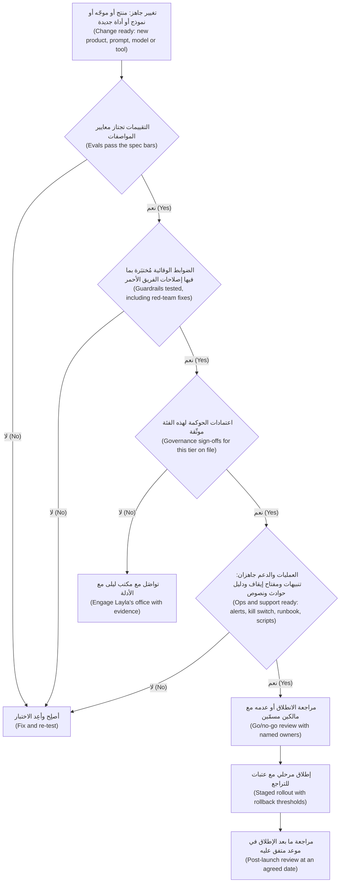
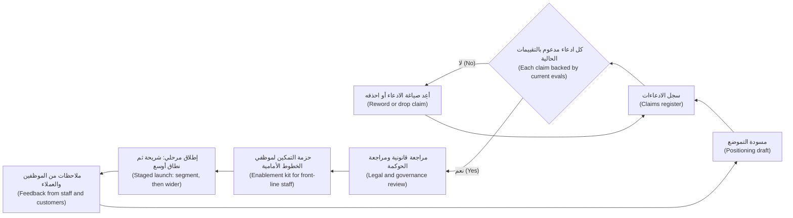
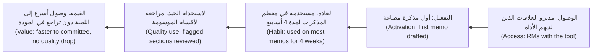

# الوحدة 7 — إطلاق منتجات الذكاء الاصطناعي (Launching AI products)

*ميزة الذكاء الاصطناعي (AI feature) التي تجتاز تقييماتها (evals) ليست منتجًا بعد. إنها تصبح منتجًا حين يستطيع أناس حقيقيون الاعتماد عليها (rely on it): حين تصمد الضوابط الوقائية (guardrails) تحت الضغط، وتكون الموافقات (approvals) موثّقة في السجل، ويعرف فريق الدعم (support team) ما يقوله حين يقع خطأ، ويفهم السوق ما يَعِد به المنتج وما لا يَعِد به، ويتبنّاه (adopt) فعلًا الأشخاص الذين يغيّر عملهم. تغطي هذه الوحدة مرحلة الإطلاق (launch stage). ستتابع رانيا وفيصل في بنك نجم (Najm Bank) وهما ينقلان نجم أسيست (Najm Assist) من المرحلة التجريبية (pilot) إلى الإتاحة العامة (general release)، ويُعدّان الطرح في السوق (go-to-market) للتمويل الفوري للشركات الصغيرة (SME Instant Finance) ولمساعد مذكرات الائتمان (Credit Memo Copilot)، ويديران برنامج التغيير (change programme) الذي يحسم ما إذا كان مديرو العلاقات (relationship managers) سيستخدمون المساعد أم سيعودون بهدوء إلى Word.*

> **المراحل (Stages):** الإطلاق (Launch) — تحويل ميزة تعمل إلى منتج يستطيع الناس أن يجدوه ويثقوا به ويشتروه ويستخدموه بأمان (safely find, trust, buy and use)، مع الضوابط (controls) والرسائل (messages) والعادات (habits) التي تُبقيه كذلك.

---

# 7.1 — جاهزية الإطلاق: الضوابط الوقائية وبوابات الحوكمة والدعم (Launch readiness: guardrails, governance gates and support)
*المستوى (Level): 🔴 متقدم (Advanced)* · *المتطلبات (Prerequisites): 5.1، 6.2، 6.3* · *المرحلة (Stage): Launch*

## ⚡ الدرس في دقيقة (In 60 seconds)
- **جاهزية الإطلاق (Launch readiness)** دليلٌ لا تفاؤل (evidence, not optimism): شروط (conditions)، لكلٍّ منها مالك (owner) وإثبات (proof)، يجب أن تتحقق قبل تعريض مزيد من المستخدمين للمنتج.
- أربعة مجالات (Four areas): **الجودة (quality)** (اجتياز التقييمات (evals pass))، و**الضوابط الوقائية (guardrails)** (يفشل بأمان (fails safely))، و**الحوكمة (governance)** (الموافقات موثّقة (approvals on file))، و**العمليات والدعم (operations and support)** (هناك من يلاحظ المشكلات، ويستطيع إيقاف الميزة، ويعرف ما يقوله للعملاء).
- الضوابط الوقائية (guardrails) موزّعة على طبقات (layered) عبر المدخلات (inputs) والسياق (context) والأدوات (tools) والمخرجات (outputs) والاستخدام (usage). لا تكفي أي طبقة وحدها (No single layer is enough).
- كل تغيير في الموجّه (prompt) أو النموذج (model) أو الاسترجاع (retrieval) أو الأدوات (tool) هو إطلاق صغير (small launch). يجب أن تكون البوابات (gates) رخيصة بما يكفي لإعادة تشغيلها (cheap enough to rerun).
- إشارة القرار (Decision cue): انطلق فقط حين يكون لكل بند مانع (blocking item) دليلٌ ومالك، وقد جُرِّب التراجع (rollback) فعلًا، ويستطيع الدعم التعامل مع أنماط الفشل المعروفة (known failure modes).
- أكبر فخ (Biggest trap): اعتبار الإطلاق اليومَ الذي تُشغَّل فيه الميزة (the day the feature switches on)، بدلًا من اللحظة التي تتحمّل فيها المسؤولية عن كل إجابة تقدّمها (responsibility for every answer it gives).

## 🧭 لماذا يهم (Why it matters)
في ديسمبر 2023 استُدرج روبوت المحادثة (chatbot) على موقع أحد وكلاء Chevrolet إلى «الموافقة» على بيع سيارة مقابل دولار واحد ($1) بعد أن تلاعب المستخدمون بتعليماته (manipulated its instructions). وفي يناير 2024، بعد تحديث للنظام (system update)، شتم روبوت المحادثة الخاص بشركة التوصيل DPD أحد العملاء وكتب قصيدة تنتقد الشركة. لم يحتج أيٌّ من هذين الإخفاقين إلى هجوم متقدم (advanced attack)؛ فلم يكن بين النموذج (model) والعميل ما يوقفهما. وتُظهر قضية *Moffatt v. Air Canada* (2024) ما يلي ذلك: فقد حمّلت المحكمة (tribunal) شركة الطيران المسؤولية (held the airline responsible) عمّا قاله روبوت المحادثة لأحد العملاء. أيًّا كان ما يقوله المساعد (assistant)، فالشركة هي من قالته (the company has said it).

في بنك نجم (Najm Bank)، أنهى نجم أسيست (Najm Assist) v1 مرحلته التجريبية (pilot). إنه يجيب عن أسئلة الحسابات والرسوم والبطاقات (accounts, fees and cards) بالعربية والإنجليزية، مستندًا (grounded) إلى وثائق منتجات البنك (product documents)، ويحيل المحادثة إلى موظف بشري (hands over to a human agent) حين لا يكون متأكدًا. يقترح فيصل تشغيله لجميع عملاء تطبيق الجوال (mobile-app customers) يوم الخميس، «بما أن التقييمات نجحت (since the evals passed)». تطرح رانيا أربعة أسئلة. ما الذي يمنعه من مناقشة أهلية القروض (loan eligibility)، وهي أمر غير مُعتمد له؟ من يُستدعى (paged) إذا أعطى مبالغ رسوم خاطئة (wrong fee amounts) في الثانية فجرًا؟ كيف نوقفه دون إصدار جديد للتطبيق (app release)؟ ماذا يقول مركز الاتصال (contact centre) حين يشتكي عميل من إجابة؟ لا يستطيع فيصل الإجابة عن أيٍّ منها. يتأجل الإطلاق ثلاثة أسابيع؛ وهذا الدرس عن تلك الأسابيع الثلاثة.

## 📐 كيف يعمل (How it works)

### 🟢 الأساسيات (The essentials)

**جاهزية الإطلاق (Launch readiness)** هي مجموعة الشروط (set of conditions) التي يجب أن تتحقق، مع الدليل (with evidence)، قبل أن تعرّض مزيدًا من الناس للمنتج. ميزة الذكاء الاصطناعي (AI feature) تعمل *معظم الوقت (most of the time)* وتفشل بطرق لا يمكنك التنبؤ بها إلا جزئيًا (only partly predict)، لذا يجب أن تغطي الجاهزية ما يحدث حين تفشل (what happens when it fails)، إلى جانب ما إذا كانت تعمل. فكّر في أربعة مجالات (four areas).

| المجال (Area) | السؤال (The question) | الدليل المعتاد (Typical evidence) |
|---|---|---|
| **الجودة (Quality)** | هل يستوفي معايير الجودة (quality bars) في المواصفات (spec) (5.1)؟ | نتائج التقييم غير المتصل (offline eval results) على المجموعة المرجعية (golden set) (6.1)، ونتائج الفريق الأحمر (red-team findings) مغلقة أو مقبولة (6.2)، ومقاييس المرحلة التجريبية أو الإطلاق المرحلي (pilot or staged-rollout metrics) (6.3) |
| **الضوابط الوقائية (Guardrails)** | حين يفشل، هل يفشل بأمان (fail safely)؟ | مرشِّحات مدخلات ومخرجات مُختبَرة (tested input and output filters)، وحدود الموضوعات (topic boundaries)، والتصعيد إلى إنسان (escalation to a human)، وحدود على الإجراءات والاستخدام (limits on actions and usage) |
| **الحوكمة (Governance)** | هل الموافقات المطلوبة لفئة المخاطر (risk tier) هذه موثّقة في السجل (on file)؟ | فئة المخاطر (risk tier)، وتقييم الخصوصية (privacy assessment)، والاعتمادات (sign-offs)، والإفصاحات المطلوبة (required disclosures)، وتوثيق النموذج والنظام (model and system documentation) |
| **العمليات والدعم (Operations and support)** | هل سنلاحظ المشكلات، وهل نستطيع إيقافها، وهل نستطيع مساعدة المتضررين (affected people)؟ | لوحات المتابعة والتنبيهات (dashboards and alerts)، ومالك مناوب (on-call owner)، ومفتاح الإيقاف (kill switch)، ودليل التعامل مع الحوادث (incident runbook)، ونصوص الدعم (support scripts)، وقناة الملاحظات (feedback channel) |

**الضوابط الوقائية (Guardrails)** هي ضوابط (controls)، خارج تقدير النموذج نفسه (outside the model's own judgement)، تُبقي منتج الذكاء الاصطناعي ضمن السلوك الذي قصدته (the behaviour you intended). أمثلة: مرشِّح (filter) يُبعد البيانات الشخصية (personal data) عن النموذج، ومصنِّف (classifier) يُبقي المساعد ضمن الموضوعات المعتمدة (approved topics)، وفحص (check) يتأكد من أن كل مبلغ رسوم (fee amount) يظهر في وثيقة مصدرية (source document)، وسقف لعدد الرسائل لكل مستخدم في الساعة (cap on messages per user per hour).

**بوابات الحوكمة (Governance gates)** هي نقاط التفتيش (checkpoints) التي يؤكد فيها شخص ذو صلاحية (someone with authority) أن المنتج يمكنه المضي قدمًا (may proceed). في بنك نجم، يحدّد مكتب ليلى لكل منتج فئة مخاطر (risk tier)، وهي التي تقرّر التقييمات والاعتمادات المطلوبة (assessments and sign-offs needed). لا يدير مدير المنتج (PM) الحوكمة، لكنه مسؤول عن اجتيازها في الوقت المحدد (getting through it on time): ابدأ مبكرًا وأحضر الأدلة (start early and bring evidence). تتناول دورة *AI Governance: Zero to Hero* التصنيف إلى فئات والموافقات (tiering and approvals) بعمق.

**جاهزية الدعم (Support readiness)** تعني أن الأشخاص الذين يتواصل معهم العملاء يعرفون ما يفعله المنتج، وما يخطئ فيه، وما يجب فعله حيال ذلك، بما في ذلك كيفية رؤية ما قاله المساعد فعلًا (what the assistant actually said).

### 🟡 التعمق أكثر (Going deeper)

**الضوابط الوقائية متعددة الطبقات (Layered guardrails).** لا يوقف ضابط واحد (single control) كل الإخفاقات، لذا تكدّس منتجات الذكاء الاصطناعي الجيدة عدة ضوابط (stack several)، يلتقط كلٌّ منها ما يفوت الآخرين. من الطرق المفيدة لترتيبها أن تتتبع طلبًا عبر النظام (follow a request through the system).

| الطبقة (Layer) | ما الذي تضبطه (What it controls) | أمثلة من نجم أسيست (Najm Assist examples) |
|---|---|---|
| **المدخلات (Input)** | ما يستطيع المستخدم إرساله وما يصل إلى النموذج | حذف أرقام البطاقات والهوية (card and ID numbers)؛ اكتشاف أنماط حقن الموجّه المعروفة (known prompt-injection patterns) |
| **السياق والأدوات (Context and tools)** | ما يستطيع النموذج رؤيته وفعله | وثائق المنتجات المعتمدة والحالية فقط (only approved, current product documents)؛ لا بيانات لعملاء آخرين (no other customers' data)؛ لا أدوات تنفيذ إجراءات (no action tools) في v1 |
| **تعليمات النموذج (Model instructions)** | كيف يُوجَّه النموذج إلى التصرف | النطاق (scope) والنبرة (tone) واللغات (languages) ومتى يحيل إلى موظف (when to hand over)؛ تغطيها التقييمات (covered by evals) |
| **المخرجات (Output)** | ما يصل إلى المستخدم | مصنِّف الموضوعات (topic classifier) يحجب أهلية القروض والنصائح الاستثمارية (loan-eligibility and investment advice)؛ الأرقام تُطابَق مع المصادر (numbers checked against sources)؛ مرشِّح النبرة (tone filter)؛ الإحالة عند انخفاض الثقة (handover when confidence is low) |
| **الاستخدام (Usage)** | الكمية ومن يستخدم | حدود المعدّل (rate limits)؛ سقف تكلفة يومي (daily cost ceiling)؛ مفتاح ميزة (feature flag) حسب الشريحة (segment) |
| **الإنسان (Human)** | من يستطيع التدخل | زر واحد «تحدّث إلى شخص (talk to a person)» مع تمرير المحادثة كاملة إلى الموظف (full conversation passed to the agent) |

مبدآن هما الأهم. **الرفض الافتراضي للإجراءات (Deny by default for actions)**: المساعد الذي يجيب عن الأسئلة فقط أسوأ حالاته (worst case) أصغر بكثير من مساعد يستطيع تحويل الأموال (move money)، لذا يُطلق نجم أسيست بلا أدوات (without tools) ويضيفها لاحقًا تحت بوابات منفصلة (separate gates) (4.3). **البديل الآمن أفضل من التعافي الذكي (Safe fallback beats clever recovery)**: حين يعمل أحد الضوابط الوقائية (when a guardrail fires)، افعل شيئًا مملًّا وصحيحًا (boring and correct) («لا أستطيع المساعدة في هذا هنا؛ هل تودّ التحدث إلى موظف؟ ⁦(I can't help with that here; would you like to speak to an agent?)⁩»).

للضوابط الوقائية تكاليف (costs): زمن الاستجابة (latency)، والطلبات المشروعة المحجوبة (legitimate requests blocked) (الإيجابيات الكاذبة (false positives))، وتقييمها الخاص (their own evaluation). قِس المرشِّحات (filters) كما تقيس أي نموذج، من حيث الإجابات الجيدة المحجوبة (good answers blocked) والسيئة الفائتة (bad ones missed). مرشِّح الموضوعات (topic filter) الذي يحجب «ما رسوم زيادة القرض؟ ⁦(what's the fee for a loan top-up?)⁩» لأنه يحتوي على كلمة «قرض (loan)» هو عيب في المنتج (product defect)، لا انتصار للسلامة (safety win).

**الجاهزية التشغيلية (Operational readiness)** تغطي الآليات غير البرّاقة (unglamorous machinery) التي تقرّر ما إذا كان اليوم السيئ سيبقى صغيرًا (a bad day stays small).
- **المراقبة والتنبيهات (Monitoring and alerts).** إشارات الجودة والضوابط الوقائية والتكلفة (quality, guardrail and cost signals) مع عتبات (thresholds) تستدعي مالكًا مسمّى (page a named owner) (المزيد في 8.3).
- **مفتاح الإيقاف (A kill switch).** مفتاح ميزة (feature flag) يوقف الميزة، أو يعود بها إلى وضع آمن (safe mode)، خلال دقائق، دون نشر (deployment) أو إصدار للتطبيق (app release). يُختبر قبل الإطلاق (tested before launch).
- **التراجع (Rollback).** العودة إلى الموجّه (prompt) والنموذج (model) وفهرس الاسترجاع (retrieval index) السابقين معًا، ما يعني ترقيم إصدارات الثلاثة كلها (versioning all three).
- **دليل التعامل مع الحوادث (An incident runbook).** ما الذي يُعدّ حادثة ذكاء اصطناعي (AI incident) (إجابة ضارّة (harmful answer)، أو تسرّب بيانات (data leak)، أو ارتفاع مفاجئ في الإجابات الخاطئة (spike in wrong answers)، أو إساءة استخدام (abuse))، ومن يحدّد الخطورة (grades severity)، ومن يُبلَّغ (ليلى، سارة، الاتصال المؤسسي (communications))، وكيف يُتواصَل مع العملاء المتضررين (affected customers).
- **التسجيل لأغراض التحقيق (Logging for investigation).** ما يكفي من كل محادثة وإصدار الموجّه (prompt version) والوثائق المسترجعة (retrieved documents) لإعادة بناء ما حدث (reconstruct what happened)، ضمن الحدود التي تضعها سارة.

**جاهزية الدعم (Support readiness)** عمليًا:
- مذكرة من صفحة واحدة عن **القيود المعروفة (known limitations)** للموظفين: ما لا يستطيع المساعد فعله، وأنماط الفشل التي ظهرت في الاختبار (failure modes seen in testing)، والرد المعتمد (approved response) لكلٍّ منها.
- **البحث في المحادثات (Conversation lookup)**، حتى يرى الموظفون ما قاله المساعد فعلًا، و**مسار تصعيد (an escalation path)** لأخطاء الذكاء الاصطناعي المشتبه بها (suspected AI errors)، مع وسم (tagged) يسمح بعدّها.
- **نصوص للمكالمات الصعبة (Scripts for the hard calls)**: «أخبرني المساعد أن الرسوم أُعفيت (the assistant told me the fee was waived)». بعد قضية Air Canada، صار «الروبوت كان مخطئًا (the bot was wrong)» دفاعًا ضعيفًا (weak defence)، لذا ينبغي أن يقرّر مالكو الأعمال والشؤون القانونية (business and legal owners) قبل الإطلاق ما إذا كان البنك سيلتزم بمثل هذه الإجابات (honours such answers).

**الإفصاح (Disclosure).** ينبغي أن يعرف العملاء أنهم يتحدثون إلى ذكاء اصطناعي (talking to an AI)؛ وفي بعض الولايات القضائية (jurisdictions) هذا واجب قانوني (legal duty) (التزامات الشفافية (transparency obligations) في EU AI Act). وتبدأ Guidelines for Human-AI Interaction من Microsoft (Amershi et al., 2019) بالنسخة التصميمية (design version) من ذلك: وضّح ما يستطيع النظام فعله، ومدى جودته في ذلك (make clear what the system can do, and how well). وهذا يصبح نص الإطلاق (launch copy).

المخطط أدناه يبيّن كيف يدير بنك نجم قرار الإطلاق (launch decision)، سواء لتغيير (change) أو لإصدار أول (first release).

### 🔴 نظرة الخبير (Expert view)

**اجعل البوابة متناسبة مع التغيير (Proportion the gate to the change).** المراجعة الكاملة (full review) لكل تعديل بسيط في الموجّه (prompt tweak) سيُلتفّ عليها قريبًا (will soon be bypassed). الفرق الناضجة (mature teams) تصنّف التغييرات في فئات (classes). تغيير صياغة الموجّه (prompt wording change) يعيد تشغيل التقييمات المؤتمتة (automated evals) ويحتاج موافقة مدير المنتج (PM's approval). النموذج الجديد أو مصدر البيانات الجديد أو اللغة الجديدة (new model, data source or language) يضيف اختبار الفريق الأحمر (red-teaming) على السطح المتغيّر (changed surface) وفحصًا قصيرًا للحوكمة (short governance check). والقدرة الجديدة (new capability)، مثل أدوات تتصرف نيابة عن العميل (tools that act for the customer)، تغيّر فئة المخاطر (risk tier) وتمرّ بالبوابة الكاملة (full gate). اتفق على الفئات مع ليلى مسبقًا.

**حدّد عتبات التراجع قبل الإطلاق (Define rollback thresholds before launch).** قرّر مسبقًا أي الأرقام توقف الإطلاق المرحلي (stop a staged rollout) (6.3)، مثل انخفاض الاستناد إلى المصادر (grounding) دون معيار المواصفات (spec bar) ليومين، أو أي كشف مؤكد لبيانات عميل آخر (confirmed exposure of another customer's data). القرار في اللحظة، تحت أنظار الإدارة العليا (under executive attention)، نادرًا ما ينتهي جيدًا.

**أجرِ تحليلًا استباقيًا للفشل (Run a pre-mortem).** يطلب أسلوب pre-mortem الذي وضعه Gary Klein (*Harvard Business Review*، 2007) من الفريق أن يتخيّل أن الإطلاق فشل فشلًا ذريعًا (failed badly) وأن يكتب الأسباب، فيُظهر مخاطر لا يطرحها أحد في اجتماعات الحالة (status meetings). في الذكاء الاصطناعي، اسأل: «بعد ستة أسابيع من الآن نجم أسيست في الصحف. ماذا قال؟ ⁦(Six weeks from now Najm Assist is in the newspaper. What did it say?)⁩» تتحول الإجابات إلى حالات للفريق الأحمر (red-team cases) وضوابط وقائية (guardrails) ونصوص دعم (support scripts).

**الجاهزية مجموعة من الوعود (Readiness is a set of promises).** جدول المناوبة (on-call rota)، ومراجعة عيّنات المحادثات (sampled-conversation review)، وتحديث القيود المعروفة (known-limitations update) بعد تغيير النموذج: كلٌّ منها يحتاج إلى حارس مسمّى (named keeper) بعد الإطلاق، وإلا صار المنتج أقل جاهزية كل أسبوع.

**اعرف متى لا تُطلق (Know when not to launch).** إذا كانت الطريقة الوحيدة لإيقاف نمط فشل (failure mode) هي أن يتحقق إنسان من كل إجابة (a human checking every answer)، فربما ينتمي المنتج إلى مستوى *المسودة (draft)* من الأتمتة (level of automation) (4.1). تضييق النطاق (narrowing scope)، مثلًا إلى أسئلة البطاقات والرسوم فقط (card and fee questions only)، هو غالبًا أسرع طريق إلى إطلاق آمن (safe launch).

## 🧰 الأدوات (The toolkit)
| الأداة أو الإطار (Tool or framework) | ما هو وماذا يفعل (What it is and does) | متى تلجأ إليه (When to reach for it) |
|---|---|---|
| **Launch readiness checklist** — قائمة التحقق من جاهزية الإطلاق | شروط مانعة وغير مانعة (blocking and non-blocking conditions) عبر المجالات الأربعة، لكلٍّ منها مالك (owner) ودليل (evidence) وحالة (status) | قبل كل إصدار (release) وكل تغيير مهم (significant change) |
| **Layered guardrails** — الضوابط الوقائية متعددة الطبقات | ضوابط على ست طبقات (six layers) بحيث تلتقط طبقة ما يفوت أخرى؛ راجع التصميم مقابل OWASP Top 10 for LLM Applications | أي ميزة ذكاء اصطناعي موجّهة للمستخدم أو تنفّذ إجراءات (user-facing or action-taking) |
| **Kill switch** — مفتاح الإيقاف | مفتاح ميزة (feature flag) أو وضع آمن (safe mode) يعطّل ميزة الذكاء الاصطناعي خلال دقائق دون إصدار (without a release) | أي ميزة ذكاء اصطناعي موجّهة للعملاء (customer-facing)؛ تدرّب عليه (drill it) قبل الإطلاق |
| **Pre-mortem** (Gary Klein) — التحليل الاستباقي للفشل | جلسة يفترض فيها الفريق أن الإطلاق فشل ويُعدّد الأسباب (lists the causes) | قبل الإطلاق بأسبوعين إلى أربعة أسابيع، ما دام هناك وقت للتصرف بناءً على النتائج (act on the results) |
| **Incident runbook** — دليل التعامل مع الحوادث | كيفية اكتشاف حوادث الذكاء الاصطناعي (AI incidents) وتصنيف خطورتها واحتوائها والتواصل بشأنها (detect, grade, contain and communicate) | قبل الإطلاق؛ تدرّب عليه مع الدعم والحوكمة ومسؤول حماية البيانات (DPO) |
| **Go/no-go review** — مراجعة الانطلاق أو عدمه | اجتماع قصير يؤكد فيه مالكون مسمّون (named owners) كل بند مانع بالدليل، ويقرّر المالك المساءَل (accountable owner) | البوابة الأخيرة (final gate) قبل كل مرحلة من مراحل الإطلاق (rollout stage) |
| **Change classes** — فئات التغيير | تصنيف متفق عليه للتغييرات (الموجّه، النموذج، البيانات، الأدوات) إلى مستويات من إعادة الاختبار والموافقة (levels of re-testing and approval) | فور شحن النسخة الأولى (first version ships)، حتى لا تكون التغييرات اللاحقة معطَّلة أو غير مفحوصة (blocked or unchecked) |

## 🏛️ عمليًا في بنك نجم (In practice at Najm Bank)
أعدّ فريق رانيا **قائمة التحقق من جاهزية إطلاق نجم أسيست v1 (Najm Assist v1 Launch Readiness Checklist)** للانتقال من المرحلة التجريبية (pilot) إلى جميع عملاء تطبيق الجوال في قطر. يجب أن تكون البنود المانعة (blocking items) خضراء قبل الانطلاق (before go)؛ والمالك المساءَل عن القرار (accountable owner for the decision) هو رئيس القنوات الرقمية للأفراد (Head of Retail Digital)، مع تأكيد ليلى لبنود الحوكمة (governance items).

| # | البند (Item) | مانع (Blocking) | المالك (Owner) | الدليل (Evidence) | الحالة (Status) |
|---|---|---|---|---|---|
| Q1 | معدّل الإجابات المستندة إلى المصادر (grounded-answer rate) على المجموعة المرجعية (golden set) يستوفي معيار المواصفات (spec bar) بالعربية والإنجليزية | نعم (Yes) | دانة | تقرير التقييم (eval report) v1.4 | أخضر (Green) |
| Q2 | نتائج الفريق الأحمر عالية الخطورة (red-team findings rated high) مُصلَحة ومُعاد اختبارها | نعم (Yes) | دانة | سجل الفريق الأحمر (red-team log)، 3 نتائج عالية أُغلقت | أخضر (Green) |
| G1 | حدود الموضوعات (topic boundary) تحجب أهلية القروض والنصائح الاستثمارية والقانونية (loan eligibility, investment and legal advice)؛ ومعدّل الحجب الخاطئ (false-block rate) ضمن الحد المتفق عليه | نعم (Yes) | طارق | تقييم المرشِّح (filter eval) على 400 موجّه مُصنَّف (labelled prompts) | كهرماني (Amber): حجب خاطئ لـ«رسوم زيادة القرض (loan top-up fee)» قيد الإصلاح |
| G2 | حذف أرقام البطاقات والهوية (card and ID numbers) قبل استدعاء النموذج (model call) | نعم (Yes) | طارق | مجموعة اختبارات (test suite) وعيّنة من السجلات (log sample) | أخضر (Green) |
| G3 | كل مبلغ رسوم (fee amount) في الإجابة يطابق وثيقة مصدرية (source document)، وإلا حُجبت الإجابة (answer withheld) | نعم (Yes) | طارق | اختبارات الفحص الرقمي (numeric check tests) | أخضر (Green) |
| G4 | الإحالة إلى موظف بشري (handover to human agent) عند الطلب أو انخفاض الثقة (low confidence) أو الشكوى (complaint) | نعم (Yes) | حصة | اختبار قابلية الاستخدام (usability test)، 12 جلسة | أخضر (Green) |
| V1 | تأكيد فئة المخاطر (risk tier) وتوثيق الاعتمادات (sign-offs on file) | نعم (Yes) | فيصل مع ليلى | سجل الحوكمة (governance record) | أخضر (Green) |
| V2 | اكتمال تقييم الخصوصية (privacy assessment)؛ والاتفاق على مدة الاحتفاظ بالسجلات (log retention) | نعم (Yes) | فيصل مع سارة | سجل التقييم (assessment record) | أخضر (Green) |
| V3 | إفصاح الذكاء الاصطناعي (AI disclosure) في الرسالة الأولى وصفحة المساعدة (help page) معتمد من الشؤون القانونية (legal) | نعم (Yes) | فيصل | اعتماد النص (copy sign-off) | أخضر (Green) |
| O1 | اختبار مفتاح الإيقاف (kill switch) في بيئة الإنتاج (production): يعود إلى البحث في الأسئلة الشائعة (FAQ search) في أقل من 5 دقائق | نعم (Yes) | طارق | سجل التمرين (drill record) | أخضر (Green) |
| O2 | تنبيهات (alerts) على الاستناد إلى المصادر (grounding) ومعدّل تفعيل الضوابط الوقائية (guardrail rate) وزمن الاستجابة (latency) والتكلفة اليومية (daily cost)، مع جدول مناوبة (on-call rota) | نعم (Yes) | طارق | رابط لوحة المتابعة (dashboard link)، وجدول المناوبة | أخضر (Green) |
| O3 | التدرّب على دليل الحوادث (incident runbook rehearsed) مع الدعم والحوكمة ومسؤول حماية البيانات (DPO) والاتصال المؤسسي (comms) | نعم (Yes) | فيصل | ملاحظات تمرين الطاولة (tabletop notes) | أخضر (Green) |
| S1 | يستطيع الموظفون رؤية محادثات المساعد (view assistant conversations)؛ وصدرت مذكرة القيود المعروفة (known-limitations note) | نعم (Yes) | قائد مركز الاتصال (contact-centre lead) | إتمام التدريب (training completion) | أخضر (Green) |
| S2 | الاتفاق على سياسة الالتزام بالإجابات غير الصحيحة عن الرسوم (honouring incorrect answers about fees) | نعم (Yes) | مالك الأعمال والشؤون القانونية (business owner and legal) | مذكرة السياسة (policy note) | أخضر (Green) |
| R1 | الاتفاق على مراحل الإطلاق وعتبات الإيقاف (rollout stages and stop thresholds) | نعم (Yes) | فيصل | خطة الإطلاق (rollout plan): 5%، 25%، 100% | أخضر (Green) |

**عتبات الإيقاف (Stop thresholds) (توضيحية (illustrative)):** أوقف الإطلاق مؤقتًا (pause the rollout) إذا انخفض معدّل الإجابات المستندة إلى المصادر (grounded-answer rate) في العيّنة اليومية (daily sample) دون معيار المواصفات (spec bar) يومين متتاليين؛ أو إذا تأكّد أي كشف لبيانات بين العملاء (cross-customer data exposure)؛ أو إذا تجاوزت الشكاوى من أخطاء الذكاء الاصطناعي (AI-error complaints) المعدّل المتفق عليه في خطة الإطلاق (rollout plan). حُجزت مراجعة ما بعد الإطلاق (post-launch review) بعد 30 يومًا من الوصول إلى 100%.

نتيجة مراجعة الانطلاق أو عدمه (Go/no-go outcome): *«لا انطلاق هذا الأسبوع بسبب G1. انطلاق بنسبة 5% بمجرد إعادة اختبار إصلاح الحجب الخاطئ. ⁦(No-go this week on G1. Go at 5% once the false-block fix is re-tested.)⁩»*

## 🛠️ التمارين (Exercises)
- 🟢 اكتب قائمة تحقق للجاهزية (readiness checklist)، باستخدام المجالات الأربعة (four areas)، لميزة ذكاء اصطناعي تستخدمها أو تبنيها. *يكتمل عندما (Done when):* يكون لديك عشرة بنود على الأقل، كلٌّ منها موسوم بأنه مانع أو غير مانع (blocking or not)، مع دور المالك (owner role) والدليل الذي يثبته (the evidence that would prove it).
- 🟡 صمّم الضوابط الوقائية متعددة الطبقات (layered guardrails) لمساعد مذكرات الائتمان (Credit Memo Copilot)، الذي يصوغ مذكرات ائتمان داخلية (internal credit memos) من وثائق العملاء (client documents) لمديري العلاقات (relationship managers). *يكتمل عندما (Done when):* يكون لديك جدول بالطبقات الست كلها، وضابط واحد على الأقل لكل طبقة (at least one control per layer)، ولكل ضابط الإخفاق الذي يلتقطه (the failure it catches) وكيف ستختبره (how you would test it).
- 🔴 سيتيح نجم أسيست v2 للعملاء تجميد البطاقة (freeze a card) وبدء نزاع على معاملة (start a transaction dispute). اكتب سياسة فئات التغيير (change-class policy) وبوابات الإطلاق الإضافية (additional launch gates) لـ v2. *يكتمل عندما (Done when):* تصنّف سياستك خمسة أنواع من التغيير على الأقل إلى فئات (classes) مع إعادة الاختبار والموافقة (re-testing and approval) التي يحتاجها كلٌّ منها، وتُوضع v2 في الفئة الصحيحة مع الأسباب، وتُعدّد الضوابط الوقائية الإضافية وعتبات الإيقاف ونصوص الدعم (extra guardrails, stop thresholds and support scripts) التي تتطلبها الإجراءات (actions).

## ⚠️ أخطاء وفخاخ (Mistakes and traps)
- **«نجحت التقييمات، إذن نحن جاهزون.» ⁦(The evals passed, so we are ready.)⁩** التقييمات (evals) تغطي الحالات التي اختبرتها (the cases you tested). افحص المجالات الأربعة كلها (all four areas).
- **مفتاح إيقاف غير مُختبَر (An untested kill switch).** إذا كان يحتاج إلى نشر (deployment) أو لم يُجرَّب قط، فليس لديك مفتاح إيقاف. تدرّب عليه (drill it) قبل الإطلاق.
- **قياس الضوابط الوقائية بما تحجبه فقط (Guardrails measured only for what they block).** قِس الحجب الخاطئ (false blocks) إلى جانب ما يفوتها (misses).
- **معاملة التحديثات كصيانة (Treating updates as maintenance).** أساء روبوت المحادثة الخاص بـ DPD التصرف بعد تحديث (after an update). اتفق على فئات التغيير (change classes) كي يمرّ كل تغيير بالمستوى المناسب من البوابة (right level of gate).
- **الحوكمة أو الدعم كأمر ثانوي (Governance or support as an afterthought).** الوصول إلى مكتب ليلى قبل الإطلاق بأسبوع، أو ترك الموظفين يتعلمون أنماط الفشل (failure modes) من الشكاوى (complaints)، يعني أنك بدأت متأخرًا جدًا. أشرك الطرفين في مرحلة التصميم (at design time).

## 🧾 الخلاصة (Recap)
- جاهزية الإطلاق (Launch readiness) أدلة مع مالكين مسمّين (named owners) عبر أربعة مجالات: الجودة (quality)، والضوابط الوقائية (guardrails)، والحوكمة (governance)، والعمليات والدعم (operations and support).
- الضوابط الوقائية موزّعة على طبقات (layered) عبر المدخلات (input)، والسياق والأدوات (context and tools)، والتعليمات (instructions)، والمخرجات (output)، والاستخدام (usage)، والإحالة إلى إنسان (human handover). ارفض الإجراءات افتراضيًا (deny actions by default) وعُد إلى شيء آمن وممل (safe and boring).
- مفتاح إيقاف مُختبَر (tested kill switch)، وتراجع مُرقَّم الإصدارات (versioned rollback) للموجّه والنموذج والفهرس معًا (prompt, model and index together)، وتنبيهات مع مالك مناوب (alerts with an on-call owner)، ودليل حوادث مُتدرَّب عليه (rehearsed incident runbook): كلها متطلبات للإطلاق (launch requirements).
- يحتاج الدعم إلى القيود المعروفة (known limitations)، والبحث في المحادثات (conversation lookup)، والتصعيد (escalation)، وسياسة محدّدة مسبقًا (policy, set in advance) بشأن الالتزام بالإجابات الخاطئة (honouring wrong answers).
- كل تغيير إطلاق صغير (every change is a small launch): صنّف التغييرات في فئات (classes) واجعل بوابة كل فئة متناسبة مع المخاطر التي تضيفها (in proportion to the risk it adds).

## ✍️ اختبر نفسك (Check yourself)

**1. تستوفي التقييمات غير المتصلة (offline evals) لنجم أسيست (Najm Assist) كل معايير الجودة (quality bars) في المواصفات (spec). يقول فيصل إن المنتج جاهز لجميع العملاء. ما أقوى سبب للاعتراض؟**

- A. التقييمات (evals) ليست أبدًا إشارة موثوقة إلى الجودة (reliable signal of quality)
- B. الجاهزية (readiness) تتطلب أيضًا ضوابط وقائية مُختبَرة (tested guardrails)، وموافقات الحوكمة (governance approvals)، ومراقبة مع مفتاح إيقاف (monitoring with a kill switch)، ودعمًا مُعَدًّا (prepared support)
- C. ينبغي أولًا إعادة بناء المنتج على نموذج أكبر (larger model)
- D. ينبغي استطلاع آراء العملاء (customers should be surveyed) بشأن الذكاء الاصطناعي قبل أي إطلاق

الإجابة

**B.** التقييمات (evals) تغطي مجال الجودة (quality area) فقط. الخيار A مبالغ فيه (too strong): التقييمات دليل ضروري (necessary evidence)، لكنه غير كافٍ (not sufficient). (🟢 الأساسيات (The essentials).)

**2. أي تصميم للضوابط الوقائية (guardrail design) يتبع على أفضل وجه مبدأ «الرفض الافتراضي للإجراءات (deny by default for actions)» في الإصدار الأول (first release) لمساعد العملاء (customer assistant)؟**

- A. منح المساعد جميع الأدوات المصرفية (banking tools) مع إخباره في موجّه النظام (system prompt) بأن يكون حذرًا
- B. الإطلاق بالإجابة عن الأسئلة فقط (question-answering only) وإضافة أدوات الإجراءات (action tools) لاحقًا، كلٌّ منها تحت بوابته الخاصة (its own gate)
- C. السماح بالإجراءات مع تسجيلها للمراجعة في نهاية الشهر (log them for review at month end)
- D. السماح بالإجراءات فقط للعملاء الذين يقبلون الشروط (accept the terms)

الإجابة

**B.** البدء بلا أدوات (starting without tools) يُبقي أسوأ الحالات (worst case) صغيرة، وإضافة الأدوات لاحقًا تحت بوابات منفصلة (separate gates) يوائم المخاطر مع الأدلة (matches the risk to the evidence). الخيار A يعتمد على تقدير النموذج نفسه (model's own judgement)، وهذا ليس ضابطًا وقائيًا (not a guardrail). (🟡 التعمق أكثر (Going deeper).)

**3. خلال إطلاق مرحلي (staged rollout) بنسبة 25%، تُظهر العيّنة اليومية (daily sample) أن معدّل الإجابات المستندة إلى المصادر (grounded-answer rate) انخفض دون معيار المواصفات (spec bar) يومين. وكانت خطة الإطلاق (rollout plan) قد أدرجت هذا عتبةَ إيقاف (stop threshold). ماذا ينبغي أن يفعل مدير المنتج (PM)؟**

- A. المتابعة إلى 100% لأن الانخفاض قد يكون ضوضاء (noise)
- B. إيقاف الإطلاق مؤقتًا (pause the rollout)، والعودة إلى البديل أو التراجع (fall back or roll back) كما تنص الخطة، والتحقيق (investigate)
- C. خفض معيار المواصفات (lower the spec bar) كي يستمر الإطلاق
- D. انتظار مراجعة ما بعد الإطلاق بعد 30 يومًا (30-day post-launch review)

الإجابة

**B.** تُحدَّد عتبات الإيقاف (stop thresholds) مسبقًا كي لا يقرّر أحد تحت ضغط الإطلاق (under launch pressure). الخياران C وD يُبطلان الغرض منها (defeat their purpose). (🔴 نظرة الخبير (Expert view).)

**4. غيّر الفريق صياغة موجّه النظام (system prompt) لنجم أسيست ليبدو أكثر ودًّا (friendlier). وفق سياسة معقولة لفئات التغيير (change-class policy)، ماذا ينبغي أن يحدث؟**

- A. لا شيء: صياغة الموجّه (prompt wording) ليست تغييرًا في المنتج (product change)
- B. بوابة الإطلاق الكاملة (full launch gate)، بما في ذلك موافقة حوكمة جديدة (new governance approval)
- C. إعادة تشغيل مجموعة التقييمات المؤتمتة (automated eval suite) والحصول على موافقة مدير المنتج (PM's approval) قبل الإصدار
- D. إصداره لجميع المستخدمين ومراقبة الشكاوى (monitor complaints)

الإجابة

**C.** تغيير الموجّه (prompt change) قد يغيّر السلوك (alter behaviour)، كما تُظهر حالة DPD، لذا يجب إعادة اختباره، لكنه لا يغيّر فئة المخاطر (risk tier)، فالبوابة الكاملة (B) غير متناسبة (out of proportion). (🔴 نظرة الخبير (Expert view).)

**5. يتصل عميل ليقول إن نجم أسيست أخبره أن رسومًا ستُعفى (a fee would be waived). وكان ذلك خطأ. ما الذي كان ينبغي أن يكون قائمًا قبل الإطلاق؟**

- A. سياسة (policy)، يتفق عليها مالك الأعمال والشؤون القانونية (business owner and legal)، بشأن ما إذا كان البنك سيلتزم بإجابات المساعد غير الصحيحة وكيف (honours incorrect assistant answers)، إضافة إلى البحث في المحادثات (conversation lookup) للموظفين
- B. إخلاء مسؤولية (disclaimer) يقول إن إجابات المساعد غير مُلزِمة (not binding)، كي يستطيع الموظفون رفض كل هذه المطالبات
- C. تعليمات للموظفين بتصعيد كل مكالمة إلى فريق المنتج (product team)
- D. لا شيء: هذه الحالات أندر من أن يُخطَّط لها (too rare to plan for)

الإجابة

**A.** بعد قضية *Moffatt v. Air Canada*، صار «الروبوت كان مخطئًا (the bot was wrong)» دفاعًا ضعيفًا (weak defence). وإخلاء المسؤولية وحده (disclaimer alone) (B) قد لا يحمي البنك ويُضرّ بالثقة (damages trust). (🟡 التعمق أكثر (Going deeper).)

## 📚 المراجع (References)
- Amershi, S. et al. (2019). "Guidelines for Human-AI Interaction." CHI 2019 — https://www.microsoft.com/en-us/research/project/guidelines-for-human-ai-interaction/
- Google PAIR، *People + AI Guidebook* — https://pair.withgoogle.com/guidebook
- OWASP Top 10 for LLM Applications — https://genai.owasp.org
- Klein, G. (2007). "Performing a Project Premortem." *Harvard Business Review* — https://hbr.org/2007/09/performing-a-project-premortem
- Beyer, B. et al., *Site Reliability Engineering* (Google)، فصول إدارة الحوادث ومراجعات ما بعد الحوادث (incident management and postmortem chapters) — https://sre.google/books/
- NIST AI Risk Management Framework — https://www.nist.gov/itl/ai-risk-management-framework
- EU AI Act، اللائحة (Regulation) (EU) 2024/1689 — https://eur-lex.europa.eu/eli/reg/2024/1689/oj

---

# 7.2 — الطرح في السوق: التموضع وإشارات التسعير والتمكين (Go-to-market: positioning, pricing signals and enablement)
*المستوى (Level): 🔴 متقدم (Advanced)* · *المتطلبات (Prerequisites): 2.1، 4.2، 7.1* · *المرحلة (Stage): Launch*

## ⚡ الدرس في دقيقة (In 60 seconds)
- **الطرح في السوق (Go-to-market (GTM))** هو كيف يصل المنتج إلى الأشخاص الموجَّه إليهم: لمن هو (who it is for)، وبماذا يَعِد (what it promises)، وكيف يُسعَّر أو يُموَّل (how it is priced or funded)، وكيف يُجهَّز الأشخاص الذين يبيعونه ويدعمونه (how the people who sell and support it are equipped).
- في منتجات الذكاء الاصطناعي، **التموضع هو ضبط التوقعات (positioning is expectation-setting)**. الوعد الذي تقطعه يقرّر ما إذا كان منتج بدقة 90% (90%-accurate) يبدو مُبهرًا أم معطوبًا (impressive or broken). ابدأ بالمهمة التي ينجزها العميل (the job the customer gets done)، لا بـ«الذكاء الاصطناعي (AI)».
- كل ادّعاء خارجي (external claim) يحتاج إلى دليل (evidence). احتفظ بـ**سجل الادعاءات (claims register)** الذي يربط كل عبارة تسويقية (marketing statement) بنتيجة تقييم (eval result)، واحصل على اعتماده كأي بند إطلاق آخر (launch item).
- التسعير يرسل إشارة (pricing sends a signal) قبل أن يستخدم أحد المنتج: المجاني والمُضمَّن (free and bundled) يقول «جزء من الخدمة (part of the service)»، والفئة المميزة (premium tier) تقول «قيمة إضافية (extra value)»، والتسعير حسب النتيجة (per-outcome pricing) يقول «نحن واثقون أنه يعمل (we are confident it works)». اختر الإشارة عن قصد (on purpose).
- **التمكين (Enablement)** يعني تجهيز موظفي الخطوط الأمامية (front-line staff) (المبيعات، ومديرو العلاقات (relationship managers)، ومركز الاتصال) لشرح المنتج بأمانة (explain the product honestly)، بما في ذلك حدوده (its limits)، ولالتقاط ما يقوله العملاء (capture what customers say).
- أكبر فخ (Biggest trap): التسويق يكتب الوعد (marketing writes the promise) وعلى المنتج أن يرقى إليه. مدير المنتج (PM) هو مالك الوعد (owns the promise).

## 🧭 لماذا يهم (Why it matters)
تضمّن أول عرض علني (first public demonstration) لـ Bard من Google، في فبراير 2023، إجابة فيها خطأ واقعي (factual error) عن تلسكوب James Webb الفضائي. اكتشفه الصحفيون بسرعة وانتشر على نطاق واسع. كان الخطأ نفسه من نوع الأخطاء التي يرتكبها كل نموذج لغوي (language model). ما جعله مكلفًا هو السياق (the setting): لحظة إطلاق (launch moment)، مؤطّرة على أنها استعراض للدقة (showcase of accuracy)، أمام جمهور مُهيّأ للتحقق (primed to check). حوّل التموضع (positioning) وإخراج الإطلاق (launch staging) خطأً عاديًا في النموذج (ordinary model error) إلى قصة.

يوشك بنك نجم (Najm Bank) على إطلاق التمويل الفوري للشركات الصغيرة (SME Instant Finance) لعملائه من الشركات الصغيرة (small-business customers): طلبات تمويل الفواتير (invoice-financing requests) حتى حدّ معيّن تحصل على قرار خلال دقائق بدلًا من أيام (a decision in minutes instead of days)، بقيادة نموذج تعلّم آلي (ML model) مع مراجعة بشرية (human review) للرفض والحالات الحدّية (declines and edge cases). تقول المسودة الأولى لحملة فيصل (campaign): *«الذكاء الاصطناعي يوافق على تمويل فاتورتك فورًا. ⁦(AI approves your invoice finance instantly.)⁩»* تعجب خالد. ولا تعجب رانيا. كلمة «فورًا (Instantly)» خاطئة بالنسبة إلى الطلبات التي تذهب إلى المراجعة. وكلمة «يوافق (Approves)» تستدعي شكاوى (invites complaints) من العملاء الذين يُرفضون. وعبارة «الذكاء الاصطناعي يوافق (AI approves)» تضع قرارًا ائتمانيًا مؤتمتًا (automated credit decision) في العنوان الرئيسي (headline)، وهو بالضبط ما أمضت ليلى وسارة أشهرًا في ضمان ألا يكون القصة كلها. المنتج جيد. والوعد سيجعله يبدو سيئًا.

## 📐 كيف يعمل (How it works)

### 🟢 الأساسيات (The essentials)

**الطرح في السوق (Go-to-market)** يغطي أربعة قرارات (four decisions):
1. **لمن هو أولًا؟ ⁦(Who is it for first?)⁩** الشريحة المستهدفة (target segment) للإطلاق، وهي عادةً أضيق من السوق على المدى الطويل (long-term market).
2. **بماذا نَعِد؟ ⁦(What do we promise?)⁩** التموضع (positioning) والرسالة الأساسية (core message).
3. **كيف يُسعَّر أو يُموَّل؟ ⁦(How is it priced or funded?)⁩** للمنتجات الخارجية (external products)، السعر ونموذج التسعير (pricing model). وللمنتجات الداخلية (internal products)، كيف تُموَّل التكلفة وما إذا كان الاستخدام يُحمَّل على وحدات الأعمال (charged back to business units).
4. **كيف نصل إلى المستخدمين وندعمهم؟ ⁦(How do we reach and support users?)⁩** القنوات (channels)، وتسلسل الإطلاق (launch sequence)، وتمكين (enablement) الأشخاص الذين يبيعون ويُهيّئون المستخدمين (onboard) ويدعمون.

**التموضع (Positioning)** هو الكيفية التي تريد أن يفهم بها العميل المستهدف (target customer) ماهية المنتج، ولمن هو، ولماذا هو أفضل من البدائل (better than the alternatives). يقسّمه كتاب April Dunford *Obviously Awesome* (2019) إلى مكوّنات (components): **البدائل التنافسية (competitive alternatives)** (ما سيفعله العملاء بدونك، وغالبًا جدول بيانات (spreadsheet) أو مكالمة هاتفية أو لا شيء)، و**السمات الفريدة (unique attributes)** التي تملكها ويفتقدونها، و**القيمة (value)** التي تقدّمها تلك السمات، و**العملاء الأكثر اهتمامًا (customers who care most)** بتلك القيمة، و**فئة السوق (market category)** التي تضع نفسك فيها كي يعرف العملاء كيف يحكمون عليك (how to judge you).

في منتجات الذكاء الاصطناعي، اختيار الفئة (category choice) حاسم، لأنه يضبط التوقعات (sets expectations). سمِّ نجم أسيست (Najm Assist) «خبيرك المصرفي (your banking expert)» وسيحكم عليه العملاء مقارنةً بخبير بشري (human expert)، وسيبدو كل خطأ عدمَ كفاءة (incompetence). وسمِّه «إجابات سريعة عن حساباتك وبطاقاتك ورسومك، مع شخص على بُعد نقرة واحدة (quick answers about your accounts, cards and fees, with a person one tap away)» وسيحكم عليه العملاء مقارنةً بالبحث في الأسئلة الشائعة (searching the FAQ) أو الانتظار على الخط (waiting on hold). وهو يتفوّق على كليهما.

**ابدأ بالمهمة، لا بالتقنية (Lead with the job, not the technology).** يشتري العملاء نتائج (outcomes): قرارًا أسرع (faster decision)، وسؤالًا مُجابًا في منتصف الليل (a question answered at midnight)، ومذكرة مصاغة قبل الاجتماع (a memo drafted before the meeting). عبارة «مدعوم بالذكاء الاصطناعي (AI-powered)» لا تخبرهم شيئًا عمّا يحصلون عليه، وتثير أسئلة لا يرغب بعضهم في طرحها (هل آلة تقرّر بشأني؟ هل تُدرِّب بياناتي شيئًا ما؟ ⁦(is a machine deciding about me? is my data training something?)⁩). اذكر الذكاء الاصطناعي حيث يلزم للأمانة والثقة (honesty and trust)، مثل الإفصاح (disclosure) بأنهم يتحدثون إلى مساعد، ودع النتيجة تكون العنوان الرئيسي (let the outcome be the headline).

### 🟡 التعمق أكثر (Going deeper)

**الادعاءات والأدلة (Claims and evidence).** كل عبارة تقولها عن منتج ذكاء اصطناعي هي وعد بشأن سلوك احتمالي (promise about probabilistic behaviour). **سجل الادعاءات (claims register)** يُدرج كل ادّعاء خارجي (external claim)، والدليل الذي يستند إليه (evidence behind it)، والشروط التي يصحّ فيها (conditions under which it holds)، ومن اعتمده (who approved it).

| الادعاء (مسودة) (Claim (draft)) | المشكلة (Problem) | الادعاء (معتمد) (Claim (approved)) | الدليل (Evidence) |
|---|---|---|---|
| «الذكاء الاصطناعي يوافق على تمويل فاتورتك فورًا (AI approves your invoice finance instantly)» | ليست كل الطلبات فورية (not all requests are instant)؛ و«يوافق (approves)» غير صحيح في حالات الرفض (declines)؛ والعنوان يُبرز القرار المؤتمت (automated decision) | «احصل على قرار بشأن طلبات تمويل الفواتير المؤهلة خلال دقائق (Get a decision on eligible invoice-financing requests in minutes)» | المرحلة التجريبية (pilot): نسبة الطلبات المؤهلة (eligible requests) التي تقرّرت خلال الوقت المُعلَن، من مقاييس الإطلاق (rollout metrics) |
| «نجم أسيست يعرف كل شيء عن حسابك (Najm Assist knows everything about your account)» | غير محدود (unbounded)؛ يستدعي أسئلة لا يستطيع الإجابة عنها | «يجيب عن أسئلة حساباتك وبطاقاتك ورسومك، على مدار الساعة، بالعربية والإنجليزية (Answers questions about your accounts, cards and fees, 24/7, in Arabic and English)» | تغطية المجموعة المرجعية حسب الموضوع واللغة (golden-set coverage by topic and language) (6.1) |
| «دقيق دائمًا (Always accurate)» | لا يستطيع أي منتج ذكاء اصطناعي دعم هذا (no AI product can support this) | يُحذف؛ لا ادّعاء للدقة في التسويق (no accuracy claim in marketing) | لا ينطبق (Not applicable) |

يحمي السجلُّ العميلَ والبنك. يراجعه مكتب ليلى والشؤون القانونية (legal)؛ وتؤكد دانة أن كل ادّعاء مدعوم بالتقييمات الحالية (supported by current evals). ويحتاج إلى مراجعة عند تغيّر النموذج (when the model changes)، لأن ادّعاءً كان صحيحًا على النموذج القديم قد لا يكون كذلك على الجديد.

**إخراج الإطلاق على مراحل (Staging the launch).** ليس كل إطلاق ينبغي أن يكون صاخبًا (loud). تصنّف كثير من فرق المنتج الإطلاقات في مستويات (tiers): إصدار هادئ لشريحة (quiet release to a segment)، أو إعلان عادي (standard announcement)، أو حملة كبرى (major campaign). في منتجات الذكاء الاصطناعي، القاعدة المعقولة هي أن تستحق الإطلاق الصاخب (earn the loud launch). ابدأ بجمهور محدود (limited audience) (قائمة انتظار (waitlist)، أو وسم تجريبي (beta label)، أو شريحة واحدة)، ودع مقاييس الإطلاق المرحلي (staged-rollout metrics) من 6.3 تبني الأدلة، ثم وسّع الرسالة مع المنتج (scale the message with the product). الوسم التجريبي (beta label) تموضع أمين (honest positioning)، لا ذريعة (not an excuse): إنه يخبر المستخدمين بأن يتوقعوا حوافَّ خشنة (rough edges) ويدعوهم إلى إبداء الملاحظات. ويتوقف عن كونه أمينًا إذا بقي لسنوات.

**إشارات التسعير (Pricing signals).** يحظى التسعير واقتصاديات الوحدة (pricing and unit economics) بمعالجة كاملة في 8.2. عند الإطلاق يكون السؤال أضيق: ماذا يقول السعر، أو غيابه (the absence of one)، للعميل؟ الأنماط الشائعة (common patterns)، مع أمثلة علنية:

| النمط (Pattern) | الإشارة التي يرسلها (Signal it sends) | مثال (Example) (وقت الكتابة (at the time of writing)، 2026؛ التفاصيل تتغيّر (details change)) |
|---|---|---|
| **مُضمَّن ومجاني (Bundled and free)** | «هذا جزء من الخدمة التي لديك أصلًا (This is part of the service you already have)» | كثير من المساعدات المصرفية (banking assistants)، ومنها نجم أسيست (Najm Assist) |
| **فئة مميزة (Premium tier)** | «قيمة إضافية لمن يريد المزيد (Extra value for those who want more)» | وضعت Duolingo Max (2023) ميزات الذكاء الاصطناعي التوليدي (GenAI features) في اشتراك أعلى سعرًا (higher-priced subscription) |
| **حسب الاستخدام (Usage-based)** | «ادفع مقابل ما تستخدمه (Pay for what you use)» | التسعير لكل مقعد أو لكل طلب (per-seat or per-request pricing) لميزات الذكاء الاصطناعي وواجهات البرمجة (APIs) |
| **حسب النتيجة (Outcome-based)** | «لا نتقاضى أجرًا إلا حين ينجح (We only get paid when it works)» | سعّرت Intercom وكيلها Fin لكل محادثة محلولة (per resolved conversation) (منذ 2023)؛ وأطلقت Salesforce منصة Agentforce بتسعير لكل محادثة (per-conversation pricing) (2024) |

التسعير حسب النتيجة (outcome-based pricing) إشارة قوية على الثقة (strong signal of confidence)، لكنه يفرض تعريفًا صارمًا لـ«النتيجة (outcome)». ما الذي يُعدّ محادثة محلولة (resolved conversation)؟ ومن يقرّر؟ كما يضع إيرادات المورّد (vendor's revenue) في توتّر مع القياس الأمين (honest measurement). إن استخدمته، فاتفق على التعريف مع العملاء قبل الإطلاق.

بالنسبة إلى بنك، غالبًا ما يكون قرار التسعير المهم هو **ما لا يجب تغييره (what not to change)**. يسعّر بنك نجم التمويل الفوري للشركات الصغيرة (SME Instant Finance) وفق جدول الرسوم نفسه (same fee schedule) لتمويل الفواتير اليدوي (manual invoice financing). السرعة هي الفائدة (speed is the benefit)، وأي «رسوم ذكاء اصطناعي (AI fee)» جديدة ستشير إلى أن العملاء يدفعون زيادةً مقابل أتمتة البنك (the bank's automation). كان ذلك خيارًا مقصودًا في التموضع (deliberate positioning choice)، وسُجِّل على هذا النحو.

**للمنتجات الداخلية طرح في السوق أيضًا (Internal products have a GTM too).** مساعد مذكرات الائتمان (Credit Memo Copilot) موجّه لمديري العلاقات (relationship managers) لا للعملاء، لكنه يحتاج رغم ذلك إلى تموضع (positioning) («مسودتك الأولى، جاهزة قبل اجتماع الائتمان؛ وتبقى أنت المؤلف (your first draft, ready before the credit meeting; you remain the author)»)، وقرار تمويل (funding decision) (ميزانية مركزية للسنة الأولى (central budget for year one)، ثم تحميل التكلفة على خطوط الأعمال (charge-back to business lines) بعدها، بقرار مع عمر والإدارة المالية)، وتسلسل إطلاق (launch sequence) (فريق الشركات في منطقة واحدة أولًا)، وتمكين (enablement). يتداخل الطرح الداخلي في السوق (internal GTM) مع التبنّي وإدارة التغيير (adoption and change management)، وهو ما يغطيه 7.3.

**التمكين (Enablement)** يجهّز الأشخاص الواقفين بين المنتج ومستخدميه. في منتجات الذكاء الاصطناعي يحتاجون إلى أكثر من جولة في الميزات (feature tour).

- **ما هو مخصّص له وما ليس مخصّصًا له (What it is for and not for)**، بكلمات بسيطة يستطيعون تكرارها.
- **القيود بأمانة (Honest limitations)**: أنماط الفشل (failure modes) من مذكرة القيود المعروفة (known-limitations note) في 7.1، وما يُقال بشأن كلٍّ منها.
- **نص عرض توضيحي يُظهر إخفاقًا (A demo script that shows a failure)**. العرض الذي يحيل فيه المساعد إلى إنسان، أو ينبّه فيه مساعد المذكرات إلى وثيقة ناقصة (flags a missing document)، يعلّم الثقة (teaches more trust) أكثر من تشغيل مثالي (perfect run). كما يتجنّب مشكلة Bard: الاستعراض المؤطّر على أنه مثالي يدعو الناس إلى البحث عن الخلل (look for the flaw).
- **التعامل مع الاعتراضات (Objection handling)**: «هل يقرّر حاسوبٌ ائتماني؟ ⁦(Is a computer deciding my credit?)⁩» «أين تذهب بياناتي؟ ⁦(Where does my data go?)⁩» «ماذا لو كان مخطئًا؟ ⁦(What if it's wrong?)⁩». يُتفق على الإجابات مع ليلى وسارة.
- **مسارات الملاحظات (Feedback routes)**: كيف يبلّغ موظفو الخطوط الأمامية (front-line staff) عمّا يقوله العملاء، كي يسمع فريق المنتج عن الالتباس (confusion) قبل أن يتحول إلى شكاوى (complaints).

المخطط أدناه يبيّن كيف ينقل بنك نجم رسالةً من المسودة إلى السوق (from draft to market).

### 🔴 نظرة الخبير (Expert view)

**قلّل الوعود بشأن الاستقلالية، وتجاوز التوقعات في السرعة (Under-promise on autonomy, over-deliver on speed).** يسامح العملاء مساعدًا يقول «دعني أوصلك بأحد زملائي (let me connect you to a colleague)». ولا يسامحون مساعدًا يخطئ في أموالهم بثقة (confidently gets their money wrong). ضع ميزات الذكاء الاصطناعي في تموضع أدنى بمستوى واحد من الأتمتة (one level of automation below) مما تستطيع فعله تقنيًا (4.1): إن كانت تصوغ مسودات، فقل إنها تصوغ؛ وإن كانت تقرّر بعض الحالات، فقل «معظم الطلبات المؤهلة تحصل على قرار خلال دقائق (most eligible requests get a decision in minutes)»، لا «قرارات فورية (instant decisions)». الفجوة بين الوعد والتجربة (the gap between promise and experience) هي المساحة التي تنمو فيها الثقة.

**يجب أن يصمد التموضع أمام تغيير النموذج (Positioning must survive the model change).** ستستبدل النماذج، وتعدّل الموجّهات (prompts)، وتضيف أدوات. إذا كان تموضعك يسمّي النموذج أو يتكئ على مقياس مرجعي (benchmark)، صار كل تغيير حدثًا تسويقيًا (marketing event)، وقد تصبح ادعاءاتك خاطئة بهدوء (quietly become false). ضع التموضع على المهمة والضوابط (the job and the controls) (الاستناد إلى وثائق البنك (grounded in the bank's documents)، وشخص على بُعد نقرة واحدة)، فهذه تبقى صحيحة عبر إصدارات النموذج (model versions).

**احذر «التلميع بالذكاء الاصطناعي» في الاتجاهين (Beware AI-washing in both directions).** المبالغة في دور الذكاء الاصطناعي في المنتج تستدعي متاعب تنظيمية وسُمعية (regulatory and reputational trouble)؛ فقد حذّرت الجهات التنظيمية المالية وجهات حماية المستهلك (financial and consumer-protection regulators) في عدة ولايات قضائية الشركاتِ من الادعاءات المبالغ فيها عن الذكاء الاصطناعي (exaggerated AI claims). والتقليل من شأنه قد يرتدّ أيضًا (can also backfire): إذا اكتشف العملاء ذكاءً اصطناعيًا غير مُفصَح عنه (undisclosed AI) في تفاعل حساس، تصبح القصة عن الإخفاء (concealment). قل ما هو، بوضوح، مرة واحدة، وانتقل إلى القيمة (move on to the value).

**السعر أيضًا بيان عن المخاطر (Price is also a statement about risk).** تقاضي أجر لكل نتيجة (charging per outcome) على ذكاء اصطناعي متصل بالائتمان قد يوحي بأن البنك يربح من القرارات المؤتمتة (automated decisions). وتقاضي علاوة (premium) على نصائح قائمة على الذكاء الاصطناعي (AI-based advice) قد يولّد توقعات بالملاءمة (expectations of suitability) لا يستطيع المنتج الوفاء بها. أحضر أفكار التسعير للمنتجات الخاضعة للتنظيم (regulated products) إلى ليلى مبكرًا. خيارات التسعير تشكّل كيف يقرأ المنظّمون والعملاء المنتج (how regulators and customers read the product).

**ملاحظات الطرح في السوق بيانات اكتشاف (GTM feedback is discovery data).** تنتج الأسابيع الأولى من الإطلاق أغنى الأدلة التي ستحصل عليها (richest evidence): ما يسأله الناس ولم تتوقعه، وأين ينسحبون (drop off)، وأي الادعاءات تربكهم. وجّهها إلى خريطة الفرص (opportunity map) (2.1) وتحليل الأخطاء (error analysis) (6.1)، لا إلى تقرير الحملة (campaign report) فقط.

## 🧰 الأدوات (The toolkit)
| الأداة أو الإطار (Tool or framework) | ما هو وماذا يفعل (What it is and does) | متى تلجأ إليه (When to reach for it) |
|---|---|---|
| **Positioning canvas** (April Dunford, *Obviously Awesome*) — لوحة التموضع | تحدّد البدائل التنافسية (competitive alternatives)، والسمات الفريدة (unique attributes)، والقيمة (value)، والعملاء الأنسب (best-fit customers)، وفئة السوق (market category) | قبل كتابة أي رسالة إطلاق (launch message)؛ أعِد النظر فيها حين تتغيّر الشريحة المستهدفة (target segment) |
| **Claims register** — سجل الادعاءات | يُدرج كل ادّعاء خارجي (external claim) مع دليله (evidence)، وشروطه (conditions)، ومن يعتمده (approver)، وتاريخ مراجعته (review date) | لكل إطلاق ذكاء اصطناعي موجّه للعملاء (customer-facing AI launch) ولكل تغيير في النموذج قد يؤثر على ادّعاء |
| **Launch tiers** — مستويات الإطلاق | تصنّف الإطلاقات إلى هادئ وعادي وكبير (quiet, standard and major)، لكلٍّ منها مستواه من الإعلان والتحضير (announcement and preparation) | لتقرير مدى صخب الإطلاق (how loud a launch should be)، بالنظر إلى الأدلة المتاحة |
| **Pricing pattern map** — خريطة أنماط التسعير | تقارن التسعير المُضمَّن والمميز وحسب الاستخدام وحسب النتيجة (bundled, premium, usage-based and outcome-based) بحسب الإشارة التي يرسلها كلٌّ منها | لاختيار إشارة التسعير عند الإطلاق (launch pricing signal)؛ ثم التسليم إلى عمل اقتصاديات الوحدة (unit-economics work) في 8.2 |
| **Enablement kit** — حزمة التمكين | مسار الحديث (talk track)، والقيود المعروفة (known limitations)، ونص عرض توضيحي فيه إخفاق (demo script with a failure)، والتعامل مع الاعتراضات (objection handling)، ومسار الملاحظات (feedback route) لموظفي الخطوط الأمامية | قبل الإطلاق بأسبوعين إلى أربعة أسابيع، مع اختبارها أولًا على مجموعة صغيرة من الموظفين |
| **Beta label and waitlist** — الوسم التجريبي وقائمة الانتظار | يشيران إلى جودة مرحلة مبكرة (early-stage quality) ويحدّان من التعرّض (limit exposure) بينما تتراكم الأدلة | أول إصدار خارجي (first external release) لقدرة ذكاء اصطناعي جديدة |

## 🏛️ عمليًا في بنك نجم (In practice at Najm Bank)
**صفحة الطرح في السوق للتمويل الفوري للشركات الصغيرة (SME Instant Finance GTM One-Pager)** بعد مراجعة فيصل، بموافقة خالد ومراجعة ليلى:

| القسم (Section) | المحتوى (Content) |
|---|---|
| **شريحة الإطلاق (Launch segment)** | عملاء الشركات الصغيرة والمتوسطة (SME customers) الحاليون في قطر ممن لديهم سجل حساب (account history) لا يقل عن 12 شهرًا، ومبالغ فواتيرهم ضمن حد المنتج (product limit). قاعدة أوسع من الشركات الصغيرة بعد 90 يومًا إذا لم تُبلَغ عتبات الإيقاف (stop thresholds). |
| **البدائل التنافسية (Competitive alternatives)** | تمويل الفواتير اليدوي (manual invoice financing) في بنك نجم (أيام)؛ السحب على المكشوف (overdraft)؛ طلب مهلة سداد أطول من المورّد (longer terms)؛ جهات الإقراض من شركات التقنية المالية المنافسة (competitor fintech lenders) |
| **السمات الفريدة (Unique attributes)** | قرار خلال دقائق لمعظم الطلبات المؤهلة (most eligible requests)؛ يستخدم سجل الحساب الحالي للعميل (existing account history)، فتقلّ الوثائق المطلوبة؛ مسؤول ائتمان مسمّى (named credit officer) يراجع كل حالة رفض (every decline) |
| **بيان التموضع (Positioning statement)** | *لعملاء الشركات الصغيرة والمتوسطة الراسخين (established SME customers) الذين يحتاجون سيولة من فواتير غير مدفوعة (unpaid invoices) بسرعة، يمنح التمويل الفوري للشركات الصغيرة (SME Instant Finance) معظم الطلبات المؤهلة قرارًا خلال دقائق باستخدام السجل الذي يملكه بنك نجم أصلًا، مع مسؤول ائتمان (credit officer) يراجع كل حالة رفض. وخلافًا للتمويل اليدوي (manual financing)، لا ملاحقة للوثائق (no document chase) ولا انتظار لعدة أيام.* |
| **العنوان الرئيسي (Headline)** | «حوِّل الفواتير المؤهلة إلى سيولة، بقرار خلال دقائق. ⁦(Turn eligible invoices into cash, with a decision in minutes.)⁩» |
| **إفصاح الذكاء الاصطناعي (AI disclosure)** | في مسار الطلب (application flow) والشروط (terms): نموذج مؤتمت (automated model) يقيّم الطلب؛ وحالات الرفض يراجعها شخص (reviewed by a person)؛ وكيفية طلب تفسير ومراجعة (explanation and a review). صياغة معتمدة من سارة والشؤون القانونية (legal). |
| **سجل الادعاءات (Claims register)** | 5 ادعاءات، كلٌّ منها مرتبط بمقاييس المرحلة التجريبية (pilot metrics)؛ كلمات «فوري (instant)» و«مضمون (guaranteed)» و«الذكاء الاصطناعي يوافق (AI approves)» محظورة في جميع النصوص (banned from all copy) |
| **إشارة التسعير (Pricing signal)** | جدول الرسوم نفسه (same fee schedule) لتمويل الفواتير اليدوي. لا علاوة للذكاء الاصطناعي (no AI premium). السرعة هي الفائدة (speed is the benefit). |
| **مستوى الإطلاق (Launch tier)** | عادي (Standard): لافتة داخل التطبيق (in-app banner) وتواصل مديري العلاقات (RM outreach) مع شريحة الإطلاق. بيان صحفي (press release) فقط بعد مراجعة الـ90 يومًا. |
| **التمكين (Enablement)** | مديرو علاقات الشركات الصغيرة ومركز الاتصال (SME RMs and contact centre): جلسة من 45 دقيقة، ومسار حديث (talk track)، وقيود معروفة (known limitations) (مثلًا، فواتير المشترين الجدد (invoices from new buyers) تذهب عادةً إلى المراجعة)، وإجابات الاعتراضات (objection answers) («هل يقرّر حاسوب؟ ⁦(Is a computer deciding?)⁩»)، وعرض توضيحي بموافقة واحدة وإحالة واحدة إلى المراجعة (one approval and one referral to review) |
| **الملاحظات (Feedback)** | يسجّل مديرو العلاقات (RMs) أسئلة العملاء بوسم «SIF-feedback»؛ مراجعة أسبوعية (weekly review) مع فيصل ودانة خلال الأسابيع الثمانية الأولى |
| **إشارات النجاح (Success signals)** | نسبة الطلبات المؤهلة التي تقرّرت في الوقت المُعلَن (decided in the stated time)؛ ومعدّل إكمال الطلبات (application completion rate)؛ والشكاوى من القرارات (complaints about decisions)؛ ودرجة ثقة مديري العلاقات (RM confidence score) من استطلاع نبض شهري (monthly pulse) (الأهداف في خطة المقاييس (metrics plan)، 8.1) |

## 🛠️ التمارين (Exercises)
- 🟢 أعِد صياغة ثلاثة ادعاءات تسويقية للذكاء الاصطناعي (AI marketing claims) رأيتها (من أي شركة) بحيث يمكن دعم كلٍّ منها بالأدلة (backed by evidence). *يكتمل عندما (Done when):* تذكر كل صياغة جديدة المهمة (the job)، وتتجنّب الكلمات غير المحدودة (unbounded words) مثل «دائمًا (always)» أو «فوري (instant)» أو «يعرف كل شيء (knows everything)»، وتسمّي الدليل الذي ستحتاجه.
- 🟡 املأ لوحة التموضع (positioning canvas) لنجم أسيست (Najm Assist)، ثم اكتب سجل ادعاءات (claims register) من خمسة ادعاءات على الأقل. *يكتمل عندما (Done when):* يرتبط كل ادّعاء بتقييم محدّد أو مقياس إطلاق (specific eval or rollout metric)، ويُرفض ادّعاء مسودة واحد على الأقل مع السبب، وتكون فئة السوق (market category) التي اخترتها مبرَّرة مقابل خيار منافس (competing option).
- 🔴 يدرس بنك نجم تقديم مساعد مذكرات الائتمان (Credit Memo Copilot) لبنوك أخرى كمنتج بعلامة بيضاء (white-label product). صُغ مذكرة قرار الطرح في السوق (GTM decision memo): الشريحة (segment)، والتموضع (positioning)، ونمط التسعير (pricing pattern)، والمخاطر التي يولّدها كل نمط تسعير. *يكتمل عندما (Done when):* تقارن ثلاثة أنماط تسعير على الأقل بحسب الإشارة والمخاطر (by signal and risk)، وتوصي بواحد، وتعرّف وحدة القيمة (unit of value) فيه بدقة، وتُعدّد أسئلة الحوكمة (governance questions) التي ستطرحها على ليلى.

## ⚠️ أخطاء وفخاخ (Mistakes and traps)
- **البدء بـ«الذكاء الاصطناعي» (Leading with "AI").** لا يقول شيئًا عن النتيجة (outcome) ويثير المخاوف. ابدأ بالمهمة المنجزة (the job done) وأفصح عن الذكاء الاصطناعي بوضوح حيث تتطلب الأمانة ذلك.
- **صيغ تفضيل بلا دليل (Unbacked superlatives).** «فوري (Instant)» و«دائمًا (always)» و«يعرف كل شيء (knows everything)» تتحول إلى شكاوى (complaints) وربما إلى ملاحظات تنظيمية (regulatory findings). كل ادّعاء يمرّ عبر سجل الادعاءات (claims register).
- **العرض التوضيحي المثالي (The perfect demo).** الاستعراض الخالي من العيوب (flawless showcase) يدعو الناس إلى البحث عن الخلل. اعرض إخفاقًا جرى التعامل معه جيدًا (a failure handled well).
- **سعر جديد للنتيجة نفسها (A new price for the same outcome).** «رسوم الذكاء الاصطناعي (AI fee)» على شيء يحصل عليه العملاء أصلًا تخبرهم أنهم يدفعون ثمن وفوراتك في التكلفة (your cost savings). سعّر القيمة بالنسبة إليهم (price the value to them)، أو أبقِ التسعير دون تغيير.
- **التمكين كجولة في الميزات (Enablement as a feature tour).** الموظفون الذين لا يعرفون القيود (limitations) سيُفرطون في الوعود (over-promise). أعطهم أنماط الفشل (failure modes) والكلمات التي تشرحها.
- **ادعاءات قديمة بعد تغيير النموذج (Stale claims after a model change).** ادّعاء مُثبت على نموذج الربع الماضي ليس مُثبتًا على هذا النموذج. اربط مراجعة الادعاءات (claim review) بفئات التغيير (change classes) من 7.1.

## 🧾 الخلاصة (Recap)
- يحدّد الطرح في السوق (GTM) شريحة الإطلاق (launch segment)، والوعد (promise)، والسعر أو التمويل (price or funding)، وكيف يصل الموظفون إلى المستخدمين ويدعمونهم.
- في الذكاء الاصطناعي، يضبط التموضع التوقعات (positioning sets expectations): اختر فئة سوق (market category) يتفوّق فيها المنتج، وابدأ بالمهمة لا بالتقنية (lead with the job, not the technology).
- يربط سجل الادعاءات (claims register) كل ادّعاء خارجي بالأدلة الحالية (current evidence)، ويُراجَع عند تغيّر النموذج.
- التسعير يشير إلى النيّة (pricing signals intent): مُضمَّن (bundled)، أو مميز (premium)، أو حسب الاستخدام (usage-based)، أو حسب النتيجة (outcome-based). وفي المنتجات الخاضعة للتنظيم (regulated products)، أحضر أفكار التسعير إلى الحوكمة (governance) مبكرًا.
- يمنح التمكين (enablement) موظفي الخطوط الأمامية قيودًا أمينة (honest limitations)، وعرضًا توضيحيًا يُظهر إخفاقًا جرى التعامل معه (handled failure)، وإجابات للاعتراضات (objection answers)، ومسارًا للملاحظات (feedback route).

## ✍️ اختبر نفسك (Check yourself)

**1. العنوان الرئيسي لحملة فيصل (campaign headline) للتمويل الفوري للشركات الصغيرة (SME Instant Finance) هو «الذكاء الاصطناعي يوافق على تمويل فاتورتك فورًا (AI approves your invoice finance instantly)». أي مراجعة تتبع هذا الدرس على أفضل وجه؟**

- A. «أذكى مُقرض بالذكاء الاصطناعي في الخليج (The smartest AI lender in the Gulf)»
- B. «حوِّل الفواتير المؤهلة إلى سيولة، بقرار خلال دقائق (Turn eligible invoices into cash, with a decision in minutes)»
- C. «موافقات فورية بالذكاء الاصطناعي، مضمونة (Instant AI approvals, guaranteed)»
- D. «مدعوم بتعلّم آلي متقدم (Powered by advanced machine learning)»

الإجابة

**B.** يبدأ بالمهمة (leads with the job)، ويحدّ الوعد (bounds the promise) («مؤهلة (eligible)»، «قرار (decision)»، «دقائق (minutes)»)، ويتجنّب الادعاء بأن الذكاء الاصطناعي يوافق. الخيار D يذكر التقنية (technology) لكنه لا يقول شيئًا عن النتيجة (outcome). (🟢 الأساسيات (The essentials)؛ 🏛️ عمليًا (In practice).)

**2. لماذا يهمّ اختيار فئة السوق (market category) في منتجات الذكاء الاصطناعي أكثر مما يهمّ في كثير من المنتجات التقليدية (traditional products)؟**

- A. لأن منتجات الذكاء الاصطناعي لا يمكن بيعها دون فئة
- B. لأن الفئة تحدّد المعيار الذي يحكم به العملاء على المنتج (the standard customers judge the product against)، ومنتجات الذكاء الاصطناعي ترتكب أخطاء ظاهرة (visible errors)
- C. لأن الجهات التنظيمية (regulators) تشترط فئة لكل منتج ذكاء اصطناعي
- D. لأن الفئات تحدّد النموذج المستخدم (the model used)

الإجابة

**B.** «خبير مصرفي (Banking expert)» يستدعي المقارنة بخبير بشري (human expert)، فيبدو كل خطأ عدمَ كفاءة (incompetence). أما «إجابات سريعة، وشخص على بُعد نقرة (Quick answers, person one tap away)» فيُحكم عليه مقارنةً بالبحث وطوابير الانتظار (search and hold queues). (🟢 الأساسيات (The essentials).)

**3. يستبدل بنك نجم النموذج (model) الذي يقف خلف نجم أسيست (Najm Assist) بنموذج أحدث. ماذا ينبغي أن يحدث لسجل الادعاءات (claims register)؟**

- A. لا شيء، لأن الادعاءات تصف المنتج لا النموذج
- B. يُعاد فحص كل ادّعاء مقابل التقييمات على النموذج الجديد (evals on the new model) قبل الإصدار
- C. تُحذف جميع الادعاءات وتُعاد كتابتها من الصفر (from scratch)
- D. يحدّث التسويق الادعاءات بعد الحملة التالية (next campaign)

الإجابة

**B.** الادعاء المُثبت على نموذج قد لا يصمد على آخر. اربط مراجعة الادعاءات (claim review) بفئات التغيير (change classes) من 7.1. (🟡 التعمق أكثر (Going deeper)؛ ⚠️ الأخطاء (Mistakes).)

**4. يسعّر مورّد برمجيات (software vendor) وكيل الدعم (support agent) الخاص به لكل محادثة محلولة (per resolved conversation). ما المسألة الرئيسية التي ينبغي للمشتري حسمها قبل التوقيع؟**

- A. ما إذا كان الوكيل يستخدم نموذجًا مفتوح الأوزان (open-weight model)
- B. التعريف الدقيق لـ«محلولة (resolved)» ومن يقيسها (who measures it)
- C. ما إذا كان المورّد يقدّم فترة تجربة مجانية (free trial)
- D. ما إذا كان السعر مُسعَّرًا بالدولار (quoted in dollars)

الإجابة

**B.** التسعير حسب النتيجة (outcome-based pricing) يشير إلى الثقة، لكنه يعتمد كليًا على كيفية تعريف النتيجة وقياسها (how the outcome is defined and measured)، وقد يضع إيرادات المورّد في توتّر مع القياس الأمين (honest measurement). (🟡 التعمق أكثر (Going deeper).)

**5. تُعدّ حصة العرض التوضيحي (demo) لإطلاق مساعد مذكرات الائتمان (Credit Memo Copilot) لمديري العلاقات (relationship managers). أي خطة عرض تبني الثقة على أفضل وجه؟**

- A. تشغيل مُتمرَّن عليه على مثال مثالي (perfect example) كي يبدو المساعد خاليًا من العيوب
- B. تشغيل يتضمن تنبيه المساعد إلى وثيقة ناقصة (flagging a missing document) وتصحيح مدير العلاقات لقسم من المسودة (correcting a draft section)
- C. عرض شرائح عن نتائج النموذج في المقاييس المرجعية (benchmark scores)
- D. لا عرض؛ أرسل رابطًا ودع مديري العلاقات يستكشفون

الإجابة

**B.** إظهار إخفاق جرى التعامل معه جيدًا (a failure handled well) يضبط توقعات أمينة (honest expectations) ويعلّم المستخدمين ما يجب التحقق منه. والعرض المثالي (A) يدعو الناس إلى البحث عن الخلل، كما أظهر إطلاق Bard. (🟡 التعمق أكثر (Going deeper)؛ 🔴 نظرة الخبير (Expert view).)

## 📚 المراجع (References)
- Dunford, A. (2019). *Obviously Awesome: How to Nail Product Positioning So Customers Get It, Buy It, Love It* — https://www.aprildunford.com
- Cagan, M. (2017). *Inspired: How to Create Tech Products Customers Love* (2nd ed.) — https://www.svpg.com
- Amershi, S. et al. (2019). "Guidelines for Human-AI Interaction." CHI 2019 — https://www.microsoft.com/en-us/research/project/guidelines-for-human-ai-interaction/
- Google PAIR، *People + AI Guidebook*، فصل النماذج الذهنية والتوقعات (chapter on mental models and expectations) — https://pair.withgoogle.com/guidebook
- Intercom، وكيل الذكاء الاصطناعي Fin (Fin AI agent) — https://www.intercom.com/fin
- Salesforce، Agentforce — https://www.salesforce.com/agentforce/
- مدونة Duolingo (Duolingo blog) (إعلان Duolingo Max (Duolingo Max announcement)، 2023) — https://blog.duolingo.com
- EU AI Act، اللائحة (Regulation) (EU) 2024/1689 (التزامات الشفافية (transparency obligations)) — https://eur-lex.europa.eu/eli/reg/2024/1689/oj

---

# 7.3 — التبنّي وإدارة التغيير داخل المؤسسة (Adoption and change management inside the enterprise)
*المستوى (Level): 🔴 متقدم (Advanced)* · *المتطلبات (Prerequisites): 4.1، 7.1، 7.2* · *المرحلة (Stage): Launch, Grow*

## ⚡ الدرس في دقيقة (In 60 seconds)
- ينجح منتج الذكاء الاصطناعي الداخلي (internal AI product) فقط حين يغيّر الناس طريقة عملهم (change how they work). الإطلاق يمنح الوصول (launch gives access)؛ و**التبنّي (adoption)** هو التغيّر في السلوك (change in behaviour)؛ و**القيمة (value)** هي التغيّر في النتائج (change in outcomes). قِس الثلاثة كلًّا على حدة (measure all three separately).
- يتبنّى الناس الأداة حين يعتقدون أنها **مفيدة (useful)** و**سهلة الاستخدام (easy to use)** في سير عملهم الحقيقي (real workflow) (نموذج قبول التقنية (Technology Acceptance Model)). ضع الذكاء الاصطناعي حيث يجري العمل أصلًا (where the work already happens)، لا في علامة تبويب جديدة (new tab).
- مقاومة الذكاء الاصطناعي (resistance to AI) كثيرًا ما تكون عقلانية (rational): الخوف على الوظائف (fear for jobs)، وغموض المساءلة (unclear accountability) («من يوقّع المذكرة؟ ⁦(who signs the memo?)⁩»)، وحوافز تكافئ الطريقة القديمة (incentives that reward the old way)، وتجارب أولى سيئة (bad first experiences). عالِج الأسباب لا الأعراض (address the causes, not the symptoms).
- استهدف **الثقة المُعايَرة (calibrated trust)**: يعتمد الناس على الذكاء الاصطناعي حيث يكون جيدًا ويتحققون منه حيث يكون ضعيفًا. الإفراط في الاعتماد (over-reliance) ونقص الاستخدام (under-use) كلاهما إخفاق في التبنّي (adoption failures).
- استخدم نموذجًا منظّمًا للتغيير (structured change model) (ADKAR أو Kotter)، وشبكة من السفراء (champions network)، وتدريبًا حسب الدور (role-based training)، وصمّم قمع التبنّي (adoption funnel) قبل الإطلاق.
- أكبر فخ (Biggest trap): عدّ مرات تسجيل الدخول (counting logins). الاستخدام المرتفع مع قيمة منخفضة، أو مع مخرجات غير مفحوصة (unchecked outputs)، أسوأ من الاستخدام المنخفض.

## 🧭 لماذا يهم (Why it matters)
استثمرت IBM بكثافة في Watson Health وباعت وحداتها في 2022. تختلف الروايات العلنية حول الأسباب (public accounts differ on the reasons)، لكن موضوعًا متكررًا (recurring theme) هو أن مواءمة التقنية مع طريقة عمل الأطباء الفعلية (how clinicians actually work) كانت أصعب من بناء العرض التوضيحي (building the demo). الأداة التي تُبهر في العرض التقديمي (pitch) لكنها مُربكة في العمل الحقيقي (awkward in real work) لا تُستخدم.

في بنك نجم (Najm Bank)، أُطلق مساعد مذكرات الائتمان (Credit Memo Copilot) لفريق الخدمات المصرفية للشركات (corporate banking team) في منطقة واحدة قبل ستة أسابيع. جرى الإطلاق جيدًا وفق قائمة التحقق (checklist) في 7.1: التقييمات خضراء (evals green)، والضوابط الوقائية مُختبَرة (guardrails tested)، والحوكمة موثّقة (governance on file). تُظهر لوحة متابعة فيصل (dashboard) أن 85% من مديري العلاقات (relationship managers (RMs)) سجّلوا الدخول في الأسبوع الأول. يطرح خالد، الذي موّل المشروع، سؤالًا مختلفًا: «كم مذكرة ائتمان صيغت به الشهر الماضي، وهل وصلت إلى اللجنة أسرع؟ ⁦(How many credit memos were drafted with it last month, and did they reach committee faster?)⁩» الإجابة غير مريحة. انخفض الاستخدام الأسبوعي النشط (weekly active use) إلى نحو ثلث مديري العلاقات. جرّبه عدد من كبار مديري العلاقات (senior RMs) مرة واحدة، فوجدوا مسودة أساءت قراءة أحد التعهدات (misread a covenant)، فعادوا إلى قوالبهم الخاصة (their own templates). ويستخدمه اثنان من صغار مديري العلاقات (junior RMs) لكل مذكرة ويلصقان المسودات دون تغيير يُذكر (almost unchanged)، وهو ما يقلق فريق مخاطر الائتمان (credit risk team) أكثر من عدم الاستخدام. المنتج يعمل. التبنّي لا يعمل (Adoption does not).

## 📐 كيف يعمل (How it works)

### 🟢 الأساسيات (The essentials)

**التبنّي (Adoption)** هو مدى تغيير المستخدمين المقصودين (intended users) لسلوكهم لاستخدام المنتج في عملهم الحقيقي. وهو يختلف عن **الوصول (access)** (يستطيعون استخدامه) وعن **القيمة (value)** (استخدامه يحسّن النتائج التي تهمّ الأعمال (outcomes the business cares about)). تعامل خطة التبنّي (adoption plan) مع هذه بوصفها ثلاثة أشياء مختلفة يُصمَّم لها ويُقاس كلٌّ منها.

لماذا يصعب تبنّي الذكاء الاصطناعي داخليًا (Why internal AI adoption is hard):
- **إنه يغيّر العمل (It changes the work).** الصياغة مع مساعد (drafting with a copilot) تعني القراءة والتصحيح بدلًا من الكتابة (reading and correcting instead of writing)، وهي مهارة مختلفة قد تبدو أبطأ في البداية.
- **المساءلة لا تنتقل (Accountability does not move).** ما زال مدير العلاقات (RM) هو من يوقّع المذكرة. إن أخطأت الأداة، تحمّل هو الخطأ، لذا يتوجّس الحذِرون.
- **الأخطاء لا تُنسى (Errors are memorable).** مسودة سيئة واحدة قد تمحو عشر مسودات جيدة، خاصة لدى الموظفين ذوي الخبرة (experienced staff).
- **الخوف (Fear).** يقرأ بعض الموظفين «مساعد ذكاء اصطناعي (AI copilot)» على أنه «البنك يحتاج إلى عدد أقل منّا (the bank needs fewer of us)». ويُفهم الصمت على أنه تأكيد (silence is heard as confirmation).
- **الحوافز (Incentives).** إذا كانت تقييمات الأداء (reviews) تكافئ الطريقة المألوفة، أو لم يكن هناك وقت للتعلّم، تنتصر الطريقة القديمة (the old way wins).

فكرتان كلاسيكيتان تفسّران كثيرًا مما يلي.

يقول **نموذج قبول التقنية (Technology Acceptance Model)** (Fred Davis، 1989) إن الناس يتبنّون تقنيةً حين يرونها **مفيدة (useful)** (تساعدني على أداء عملي بشكل أفضل) و**سهلة الاستخدام (easy to use)** (الجهد منخفض). كلاهما *تصوّرات (perceptions)*، تتشكّل في أول بضع استخدامات وفي الأحاديث مع الزملاء. في أدوات الذكاء الاصطناعي، تعتمد «المفيدة (useful)» اعتمادًا كبيرًا على الجودة في حالات المستخدم نفسه (quality in the user's own cases)، وتعتمد «السهلة (easy)» على ما إذا كانت الأداة داخل سير العمل (inside the workflow).

تصف **نظرية انتشار الابتكارات (Diffusion of Innovations)** (Everett Rogers، نُشرت أول مرة 1962) كيف تنتشر الممارسات الجديدة في مجموعة: قلة من المبتكرين والمتبنّين الأوائل (innovators and early adopters) أولًا، ثم الأغلبية المبكرة (early majority)، والأغلبية المتأخرة (late majority)، والمتلكّئون (laggards). كل مجموعة تحتاج إلى أدلة مختلفة (different evidence). يجرّب المتبنّون الأوائل الأشياء لأنها جديدة. وتنتظر الأغلبية المبكرة حتى ينجح فيها أناس مثلهم (people like them). مستخدموك الأوائل ليسوا نموذجيين (not typical)، لذا فحماسهم ليس دليلًا على أن الأداة ستنتشر.

### 🟡 التعمق أكثر (Going deeper)

**نموذج منظّم للتغيير (A structured change model).** يصف نموذج **ADKAR** من Prosci (الذي طوّره Jeff Hiatt) الأشياء الخمسة التي يحتاجها كل فرد كي يتغيّر: **الوعي (Awareness)** بسبب حدوث التغيير، و**الرغبة (Desire)** في المشاركة، و**المعرفة (Knowledge)** بكيفية التغيير، و**القدرة (Ability)** على فعله عمليًا، و**التعزيز (Reinforcement)** لترسيخه. قيمته العملية هي التشخيص (diagnosis): حين يتعثّر التبنّي (adoption stalls)، ابحث عن أول عنصر مفقود (first element that is missing) لدى تلك المجموعة. لدى كبار مديري العلاقات (senior RMs) في بنك نجم الوعي والمعرفة؛ وينقصهم *الرغبة (desire)* (مسودة سيئة واحدة) وربما *القدرة (ability)* (لم يتعلموا قط ما يجب التحقق منه). أما صغار مديري العلاقات (junior RMs) فلديهم الرغبة والاستخدام، لكن تنقصهم المعرفة بمواضع ضعف المساعد (where the copilot is weak).

يعمل نموذج الخطوات الثماني لـ John Kotter (*Leading Change*، 1996) على مستوى المؤسسة (organisation level): اصنع الإلحاح (create urgency)، وابنِ تحالفًا موجِّهًا (guiding coalition)، وكوّن رؤية (form a vision)، وأبلِغها (communicate it)، وأزِل العقبات (remove obstacles)، وحقّق مكاسب قصيرة الأجل (short-term wins)، ورسّخ المكاسب (consolidate gains)، وثبّت التغيير في الثقافة (anchor the change in the culture). في منتج ذكاء اصطناعي، أكثر الخطوات فائدةً هي التحالف الموجِّه (guiding coalition) (كبار مديري العلاقات ومسؤولو الائتمان (credit officers)، لا الفريق الرقمي وحده)، وإزالة العقبات (removing obstacles) (الوقت، والحوافز، واحتكاك سير العمل (workflow friction))، والمكاسب قصيرة الأجل التي تكون مرئية وموثوقة لدى الأقران (visible and credible to peers).

**ضع الذكاء الاصطناعي في سير العمل (Put the AI in the workflow).** أكبر رافعة (biggest lever) على «سهولة الاستخدام (easy to use)» هي الموضع (placement). المساعد الموجود في تطبيق ويب منفصل (separate web app)، والذي يتطلب إعادة رفع الوثائق (documents to be uploaded again)، ينافس عادات مدير العلاقات ويخسر. والمساعد نفسه حين يُفتح من طلب الائتمان (credit application) في نظام إنشاء القروض (loan origination system)، مع الوثائق مرفقة مسبقًا والمسودة تظهر في قالب المذكرة (memo template)، يزيل معظم ذلك الاحتكاك. وجد بحث حصة أن مديري العلاقات يتنقلون بين الأنظمة (switch systems) عدة مرات لكل مذكرة أصلًا. وكانت إضافة تنقّل آخر هي الشكوى الرئيسية (main complaint) في الأسابيع الستة الأولى.

**الثقة المُعايَرة (Calibrated trust).** الهدف ليس الثقة القصوى (maximum trust). إنه **الثقة المُعايَرة (calibrated trust)**: يعتمد المستخدمون على الذكاء الاصطناعي بقدر موثوقيته الفعلية (how reliable it actually is) في المهمة التي أمامهم. وصف Parasuraman وRiley (1997) نمطَي الإخفاق (two failure modes): *سوء الاستخدام (misuse)* (الإفراط في الاعتماد (over-reliance)، بما في ذلك قبول المخرجات المؤتمتة دون التحقق منها) و*عدم الاستخدام (disuse)* (رفض أتمتة كانت ستساعد). يُظهر كبار مديري العلاقات في بنك نجم عدم الاستخدام (disuse)؛ ويُظهر صغار مديري العلاقات الاثنان سوء الاستخدام (misuse). وكلاهما يحتاج إلى العلاج نفسه، وهو معرفة مواضع قوة المساعد وضعفه (where the copilot is strong and weak)، تُقدَّم داخل المنتج وفي التدريب:
- وسم الأجزاء من المسودة التي تأتي من الوثائق المصدرية (source documents) والأجزاء التي استنتجها النموذج (the model inferred)، مع روابط إلى المصدر (links to the source) (4.2).
- نشر دليل قصير بعنوان «قوي في، تحقّق بعناية من (strong at, check carefully)»: قوي في تلخيص القوائم المالية (summarising financial statements)، وتحقّق من صياغة التعهدات (covenant wording) وتفاصيل الكفلاء (guarantor details).
- إبقاء المراجعة داخل سير العمل (keep review in the workflow) مع تنبيه خفيف (light prompt) لتأكيد الأقسام الموسومة «تحقّق (check)» قبل التقديم، لا نافذة منبثقة (pop-up) يتعلّم الناس النقر عليها لتجاوزها.

**السفراء وإثبات الأقران (Champions and peer proof).** **شبكة السفراء (champions network)** مجموعة من المستخدمين المحترَمين (respected users)، واحد لكل فريق، يحصلون على وصول مبكر (early access)، وتدريب أعمق (deeper training)، وخط مباشر مع فريق المنتج (direct line to the product team). يُرون أقرانهم كيف يستخدمون الأداة، ويجمعون المشكلات، ويتشاركون ما ينجح. اختر السفراء لمصداقيتهم لدى أقرانهم (credibility with their peers)، لا لحماسهم للتقنية. مدير علاقات كبير يقول «تحقّقت منه في آخر خمس مذكرات ووفّر عليّ ظهيرة كاملة (I checked it on my last five memos and it saved me an afternoon)» يحرّك الأغلبية المبكرة (early majority) أكثر من أي بريد إلكتروني من الفريق الرقمي.

**عالِج الخوف مباشرة (Address fear directly).** على القيادة (leadership) أن تقول ما تعنيه الأداة للأدوار (what the tool means for roles)، وأن تعني ما تقول. في بنك نجم، أخبر رئيس الخدمات المصرفية للشركات (Head of Corporate Banking) مديري العلاقات أن الوقت الموفَّر من الصياغة يُتوقع أن يذهب إلى تغطية العملاء (client coverage)، وأن أعداد المذكرات (memo counts) لن تُستخدم لتقليص عدد الموظفين (reduce headcount) هذا العام. لا يستطيع مدير المنتج (PM) قطع هذا الوعد؛ لكنه يستطيع التأكد من أن شخصًا ذا صلاحية (someone with authority) يقطعه، وأن الرسالة متّسقة (consistent).

**قمع التبنّي (The adoption funnel).** صمّم القياس قبل الإطلاق (design the measurement before launch)، من الوصول إلى القيمة (from access to value):

لكل مرحلة مقياسها (metric) وعلاجاتها (fixes). الانخفاض قبل التفعيل (activation) يشير إلى الوعي أو التدريب أو الموضع (awareness, training or placement)؛ وقبل العادة (habit)، إلى الفائدة (usefulness) (تجارب أولى سيئة، أو لا وقت موفَّر فعلًا)؛ وعند الاستخدام الجيد (quality use)، إلى الإفراط في الاعتماد (over-reliance). المرحلة الأخيرة وحدها هي القيمة (value)، وتُقاس مقابل خط أساس (baseline) مثل الوقت حتى اللجنة (time to committee) ومعدّل المذكرات التي يعيدها فريق مخاطر الائتمان (memos sent back by credit risk)، مقارنةً بفرق لم تستخدم الأداة بعد. يتعمّق القسم 8.1 أكثر.

### 🔴 نظرة الخبير (Expert view)

**الاستخدام ليس قيمة، والتكلفة ليست جودة (Usage is not value, and cost is not quality).** أعلنت Klarna في فبراير 2024 أن مساعدها بالذكاء الاصطناعي يتولّى حصة كبيرة من محادثات خدمة العملاء (customer-service chats)؛ وفي 2025 قالت إنها ستعيد مزيدًا من الخدمة البشرية (human service)، مع إقرار قيادتها بحسب التقارير بأن التكلفة طغت كثيرًا على الجودة (cost had weighed too heavily against quality). الدرس: الرقم المتصاعد (المحادثات المُعالَجة، المذكرات المصاغة) لا يقول وحده شيئًا عمّا إذا كان العمل قد تحسّن. اقرن كل مقياس تبنٍّ (adoption metric) بمقياس جودة مقابل (quality counter-metric).

**قِس التعديلات، لا القبول وحده (Measure edits, not only acceptance).** في أدوات الصياغة (drafting tools)، مقدار ما يغيّره المستخدمون في المخرجات إشارة غنية (rich signal). التعديلات شبه المعدومة (near-zero edits) عبر مسودات كثيرة قد تعني جودة ممتازة أو انعدام المراجعة (no review at all)؛ وتعرف أيّهما بأخذ العيّنات والتحقق (sampling and checking). والتعديلات الكثيفة في قسم واحد (التعهدات (covenants) مثلًا) تخبر دانة أين يضعف النموذج. ويمكن للإشارة نفسها أن تغذّي مجموعة التقييم (evaluation set) (3.2). أخبر المستخدمين بأن هذه البيانات تُجمع ولماذا، كي لا تبدو مراقبةً لعملهم (surveillance of their work).

**راقب الذكاء الاصطناعي الظلّي (Watch for shadow AI).** حين تكون الأداة المعتمدة (sanctioned tool) بطيئة أو مُربكة، يلجأ الموظفون إلى أدوات ذكاء اصطناعي عامة (public AI tools)، أحيانًا مع بيانات العملاء (client data). هذه إشارة تبنٍّ (adoption signal) بقدر ما هي إشارة أمنية (security one): طلب حقيقي (real demand) لا يلبّيه المنتج الرسمي. في مساعد الموظفين التوليدي (Staff GenAI)، تعامل رانيا الاستخدام الظلّي (shadow use) مُدخلًا للاكتشاف (discovery input) بينما يتولّى مكتب ليلى السياسة (policy). الحجب دون بديل جيد (blocking without a good alternative) ينقل السلوك غالبًا بعيدًا عن الأنظار (out of sight).

**غيّر النظام المحيط بالأداة (Change the system around the tool).** يدوم التبنّي حين تعزّزه القوالب (templates)، وإرشادات سياسة الائتمان بشأن مراجعة المذكرات المصاغة بالذكاء الاصطناعي (credit policy guidance on reviewing AI-drafted memos)، وتهيئة مديري العلاقات الجدد (RM induction)، وتوقعات الأداء (performance expectations). إذا أرادت اللجنة صيغة المذكرة القديمة، فعلى المساعد أن ينتجها أو على قائدٍ أن يغيّرها. هذه خطوة Kotter «تثبيت التغيير (anchor the change)»، وهي تعتمد على تصرّف قادة الأعمال (business leaders acting).

**اعرف متى تتوقف عن الدفع (Know when to stop pushing).** أحيانًا يكون التبنّي المنخفض (low adoption) طريقة المستخدمين في إخبارك بأن الأداة لا تساعد في ذلك العمل. مديرو العلاقات في القروض المشتركة المعقدة (complex syndicated loans) قد لا يستفيدون كثيرًا أبدًا من مساعد صياغة؛ بينما قد يستفيد مديرو علاقات الشركات الصغيرة (SME RMs) الذين يكتبون كثيرًا من المذكرات الأقصر. جزّئ التبنّي حسب المهمة والفريق (segment adoption by task and team)، وضيّق الهدف (narrow the target) بدلًا من دفع الجميع إلى الاستخدام نفسه.

## 🧰 الأدوات (The toolkit)
| الأداة أو الإطار (Tool or framework) | ما هو وماذا يفعل (What it is and does) | متى تلجأ إليه (When to reach for it) |
|---|---|---|
| **ADKAR** (Prosci, Jeff Hiatt) | خمسة شروط فردية للتغيير (individual conditions for change): الوعي (Awareness)، والرغبة (Desire)، والمعرفة (Knowledge)، والقدرة (Ability)، والتعزيز (Reinforcement) | لتخطيط التغيير حسب مجموعة المستخدمين (by user group)، ولتشخيص العنصر المفقود حين يتعثّر التبنّي (adoption stalls) |
| **Kotter's 8 steps** (John Kotter, *Leading Change*) — خطوات Kotter الثماني | تسلسل على مستوى المؤسسة (organisation-level sequence) من الإلحاح (urgency) مرورًا بالمكاسب قصيرة الأجل (short-term wins) إلى تثبيت التغيير في الثقافة (anchoring change in culture) | عمليات الإطلاق الكبيرة (large rollouts) التي تحتاج إلى رعاية القيادة (leadership sponsorship) وتغييرات في السياسات أو الحوافز أو الإجراءات (policy, incentives or process) |
| **Technology Acceptance Model** (Fred Davis, 1989) — نموذج قبول التقنية | يعتمد التبنّي على الفائدة المُدرَكة (perceived usefulness) وسهولة الاستخدام المُدرَكة (perceived ease of use) | لاختيار ما يُصلَح أولًا: الجودة في حالات المستخدمين أنفسهم (quality in users' own cases)، أم الاحتكاك في سير العمل (friction in the workflow) |
| **Diffusion of Innovations** (Everett Rogers) — انتشار الابتكارات | مجموعات المتبنّين (adopter groups) من المبتكرين إلى المتلكّئين (innovators to laggards)، كلٌّ منها يحتاج إلى أدلة مختلفة | لترتيب تسلسل الإطلاق (sequencing rollout) واختيار السفراء (choosing champions)؛ وعدم قراءة الحماس المبكر (early enthusiasm) على أنه دليل |
| **Champions network** — شبكة السفراء | مستخدمون محترَمون في كل فريق (respected users per team) مع وصول مبكر (early access)، وتدريب أعمق، وخط مباشر مع فريق المنتج | أي إطلاق داخلي (internal rollout) يتجاوز فريقًا واحدًا |
| **Adoption funnel** — قمع التبنّي | مراحل من الوصول (access) إلى التفعيل (activation) والعادة (habit) والاستخدام الجيد (quality use) والقيمة (value)، لكلٍّ منها مقياس (metric) | يُصمَّم قبل الإطلاق؛ ويُراجَع أسبوعيًا في الأشهر الأولى |
| **Calibrated trust guide** — دليل الثقة المُعايَرة | دليل قصير «قوي في، تحقّق بعناية من (strong at, check carefully)»، مدعوم بإشارات داخل المنتج (in-product cues) | أي أداة يكون فيها الإفراط في الاعتماد (over-reliance) وعدم الاستخدام (disuse) كلاهما خطرًا |

## 🏛️ عمليًا في بنك نجم (In practice at Najm Bank)
بعد مراجعة الأسابيع الستة، أعادت رانيا وفيصل كتابة خطة الإطلاق لتصبح **خطة تبنّي مساعد مذكرات الائتمان (Credit Memo Copilot Adoption Plan)** للأيام التسعين التالية. أهداف القمع (funnel targets) توضيحية (illustrative) ومحدّدة مقابل خط الأساس (baseline) المقيس قبل الإطلاق.

**1. التشخيص حسب المجموعة (Diagnosis by group) (ADKAR)**

| المجموعة (Group) | الحالة (Status) | العنصر المفقود (Missing element) | الإجراءات (Actions) | المالك (Owner) |
|---|---|---|---|---|
| كبار مديري علاقات الشركات (Senior corporate RMs) | جرّبوه مرة وتوقفوا (tried once, stopped) | الرغبة (Desire)، ثم القدرة (Ability) | جلسة يقودها سفير (champion-led session) على مذكراتهم الأخيرة؛ دليل «قوي في، تحقّق بعناية من (strong at, check carefully)»؛ إصلاح استخراج التعهدات (covenant extraction) قبل إعادة دعوتهم | فيصل، دانة |
| صغار مديري العلاقات (Junior RMs) | استخدام كثيف وتعديل قليل (heavy use, little editing) | المعرفة (Knowledge) | تدريب على مراجعة الأقسام الموسومة (flagged sections)؛ روابط المصدر داخل المنتج (in-product source links)؛ فحوص جودة قائمة على العيّنات (sample-based quality checks) من فريق مخاطر الائتمان | حصة، قائد مخاطر الائتمان (credit risk lead) |
| مديرو علاقات الشركات الصغيرة (SME RMs) (الموجة التالية (next wave)) | لم يُفعَّل بعد (not yet live) | الوعي (Awareness) | رئيس الخدمات المصرفية للشركات الصغيرة (Head of SME Banking) يعلن الغرض ورسالة الأدوار (purpose and role message)؛ تسمية السفراء قبل منح الوصول | فيصل |
| لجنة الائتمان (Credit committee) | غير منخرطة (not engaged) | الرغبة (Desire) | عرض نماذج مذكرات جنبًا إلى جنب (side by side)؛ الاتفاق على الصيغة وتوقعات المراجعة (format and review expectations) في سياسة الائتمان (credit policy) | رانيا، خالد |

**2. تغييرات سير العمل (Workflow changes)**
- يُفتح المساعد من طلب الائتمان (credit application) في نظام إنشاء القروض (loan origination system)، مع الوثائق مرفقة (طارق، قبل موجة الشركات الصغيرة (SME wave)).
- تظهر المسودة في قالب مذكرة اللجنة (committee memo template)؛ والأقسام موسومة «مُستندة إلى مصدر (sourced)» أو «تحقّق (check)»، مع روابط.

**3. القمع والمقاييس المقابلة (Funnel and counter-metrics)**

| المرحلة (Stage) | المقياس (Metric) | الهدف عند 90 يومًا (Target at 90 days) (توضيحي (illustrative)) | المقياس المقابل (Counter-metric) |
|---|---|---|---|
| التفعيل (Activation) | مديرو العلاقات الذين صاغوا مذكرة واحدة على الأقل | معظم مديري العلاقات في الفرق المُفعَّلة (live teams) | — |
| العادة (Habit) | نسبة المذكرات المؤهلة (eligible memos) التي بدأت بالمساعد | الأغلبية في الفرق المُفعَّلة | الشكاوى من الوقت المستغرق في تصحيح المسودات (time spent correcting drafts) |
| الاستخدام الجيد (Quality use) | أقسام «تحقّق (check)» المعدَّلة أو المؤكَّدة قبل التقديم | جميعها تقريبًا (nearly all) | مسودات من العيّنة قُدِّمت بأخطاء غير مراجَعة (unreviewed errors) |
| القيمة (Value) | الوسيط لعدد الأيام من اكتمال الطلب حتى اللجنة (median days from complete application to committee) | أسرع من خط الأساس (faster than baseline) | معدّل المذكرات التي يعيدها فريق مخاطر الائتمان (memos returned by credit risk)، ليس أسوأ من خط الأساس |

**4. الأشخاص والتعزيز (People and reinforcement)**
- سفير واحد لكل فريق (one champion per team)، يُختار مع رؤساء الفرق؛ مكالمة شهرية للسفراء (monthly champions call) مع فيصل ودانة.
- رسالة الأدوار (role message) من رئيس الخدمات المصرفية للشركات تتكرر عند إطلاق الشركات الصغيرة: الوقت الموفَّر يذهب إلى تغطية العملاء (client coverage).
- إضافة استخدام المساعد وخطوات المراجعة إلى تهيئة مديري العلاقات الجدد (RM induction) وإرشادات سياسة الائتمان (credit policy guidance).
- مذكرة شهرية «ما أصلحناه بناءً على ملاحظاتكم (what we fixed from your feedback)»، كي يرى المستخدمون أن بلاغاتهم تؤدي إلى تغيير.

**5. نقطة القرار عند 90 يومًا (Decision point at 90 days):** متابعة إطلاق الشركات الصغيرة (SME rollout) إذا تحسّن مقياس القيمة (value metric) دون تدهور المقياس المقابل (counter-metric)؛ وتضييق النطاق (narrow scope) للقروض المشتركة (syndicated loans) إذا بقيت العادة (habit) منخفضة هناك بعد إصلاح سير العمل (workflow fix).

## 🛠️ التمارين (Exercises)
- 🟢 اختر أداة داخلية (internal tool) أدخلتها مؤسستك (ذكاء اصطناعي أو غيره) وشخّص تبنّيها باستخدام ADKAR. *يكتمل عندما (Done when):* تسمّي مجموعة المستخدمين (user group)، وأول عنصر مفقود (first missing element)، والدليل على هذا التشخيص، وإجراءً واحدًا يعالجه.
- 🟡 صمّم قمع التبنّي (adoption funnel) لمساعد الموظفين التوليدي (Staff GenAI)، المساعد الداخلي للبنك لجميع الموظفين. *يكتمل عندما (Done when):* يكون لديك خمس مراحل بمقياس واحد لكلٍّ منها، ومقياس مقابل واحد (counter-metric) يكشف الضرر أو الإفراط في الاعتماد (harm or over-reliance)، وجملة لكل مرحلة عمّا يخبرك به الانخفاض فيها.
- 🔴 لدى قطاع العمليات (operations division) في بنك نجم تبنٍّ منخفض لمساعد الموظفين التوليدي (Staff GenAI) وعدة بلاغات عن موظفين يستخدمون أدوات ذكاء اصطناعي عامة (public AI tools) مع بيانات العملاء (customer data). اكتب خطة من صفحتين لرانيا وليلى. *يكتمل عندما (Done when):* تفصل الخطة بين أسباب المنتج (product causes) ومسألة السياسة (policy issue)، وتستخدم TAM لتحديد ما يُصلَح في المنتج، وتتضمن نهج السفراء (champions approach) ورسالة قيادية (leadership message)، وتحدّد كيف ستعرف خلال 60 يومًا ما إذا كانت قد نجحت.

## ⚠️ أخطاء وفخاخ (Mistakes and traps)
- **عدّ مرات تسجيل الدخول (Counting logins).** تسجيلات الدخول في الأسبوع الأول تقيس الفضول (curiosity). تتبّع التفعيل (activation)، والعادة (habit)، والاستخدام الجيد (quality use)، والقيمة (value)، كلٌّ منها مع مقياس مقابل (counter-metric).
- **تعظيم الثقة (Maximising trust).** الهدف هو الثقة المُعايَرة (calibrated trust). الاستخدام الكثيف دون تعديل (heavy use with no editing) قد يكون خطرًا أكبر من الاستخدام المنخفض. خذ عيّنات وتحقّق (sample and check).
- **الإطلاق في علامة تبويب جديدة (Launching into a new tab).** الأداة المنفصلة (separate tool) التي تتطلب إعادة الرفع والتنقّل تخسر أمام العادة (loses to habit). ضع الذكاء الاصطناعي حيث يجري العمل.
- **الصمت بشأن الوظائف (Staying silent on jobs).** يُقرأ الصمت على أنه أخبار سيئة (bad news). احرص على أن يعلن قائد ذو صلاحية (leader with authority) ما تعنيه الأداة للأدوار، وأبقِ الرسالة متّسقة.
- **اختيار السفراء لحماسهم (Choosing champions for enthusiasm).** اختر أشخاصًا يحترم أقرانهم حكمهم (whose peers respect their judgement)، بمن فيهم المتشككون الذين اقتنعوا (converted sceptics).
- **الدفع نحو تبنٍّ موحّد (Pushing uniform adoption).** جزّئ حسب المهمة والفريق (segment by task and team)؛ وضيّق الهدف حيث لا تظهر القيمة.

## 🧾 الخلاصة (Recap)
- الوصول (access) والتبنّي (adoption) والقيمة (value) أشياء مختلفة. صمّم لكلٍّ منها وقِسه، واقرن مقاييس التبنّي بمقاييس جودة مقابلة (quality counter-metrics).
- يتبنّى الناس ما يجدونه مفيدًا وسهلًا (useful and easy) في سير عملهم الحقيقي (TAM). والموضع داخل الأنظمة القائمة (placement inside existing systems) هو أكبر رافعة على السهولة.
- استخدم ADKAR لتشخيص التعثّر حسب المجموعة (diagnose stalls by group)، وKotter للتغيير على مستوى المؤسسة (organisation-wide change)، وRogers لترتيب تسلسل الإطلاق وقراءة المتبنّين الأوائل (early adopters) قراءة صحيحة.
- استهدف الثقة المُعايَرة (calibrated trust): إشارات المصدر داخل المنتج (in-product source cues)، وإرشادات «قوي في، تحقّق بعناية من (strong at, check carefully)»، وخطوات المراجعة الخفيفة (light review steps) تعالج سوء الاستخدام (misuse) وعدم الاستخدام (disuse) معًا.
- يحتاج التبنّي الدائم (lasting adoption) إلى تغيّر النظام المحيط: رسائل القيادة عن الأدوار (leadership messages on roles)، والسياسات (policy)، والقوالب (templates)، والتهيئة (induction)، والحوافز (incentives).

## ✍️ اختبر نفسك (Check yourself)

**1. بعد ستة أسابيع من الإطلاق، سجّل 85% من مديري العلاقات (RMs) الدخول إلى مساعد مذكرات الائتمان (Credit Memo Copilot)، لكن الاستخدام الأسبوعي (weekly use) انخفض إلى نحو الثلث. أي مقياس يخبر خالد على أفضل وجه ما إذا كان المنتج يحقق قيمة (delivering value)؟**

- A. إجمالي تسجيلات الدخول منذ الإطلاق (total logins since launch)
- B. الوسيط لعدد الأيام من اكتمال الطلب حتى اللجنة (median days from complete application to committee)، مع معدّل المذكرات التي يعيدها فريق مخاطر الائتمان (memos returned by credit risk) مقياسًا مقابلًا (counter-metric)
- C. عدد الموجّهات المُرسَلة أسبوعيًا (number of prompts sent per week)
- D. درجة الرضا (satisfaction score) من استبيان يوم الإطلاق (launch-day survey)

الإجابة

**B.** القيمة (value) تغيّر في نتائج الأعمال (business outcomes) مقابل خط أساس (baseline)، مقرونًا بمقياس جودة مقابل (quality counter-metric). تسجيلات الدخول والموجّهات (A، C) تقيس النشاط (activity) لا القيمة. (🟡 التعمق أكثر (Going deeper)، قمع التبنّي (the adoption funnel).)

**2. جرّب كبار مديري العلاقات (senior RMs) المساعد مرة، فوجدوا تعهدًا مُساء قراءته (misread covenant)، فتوقفوا عن استخدامه. باستخدام ADKAR، أي عنصر مفقود أولًا بأوضح صورة؟**

- A. الوعي (Awareness)
- B. الرغبة (Desire)
- C. التعزيز (Reinforcement)
- D. لا شيء: هذه مشكلة نموذج (model problem) لا مشكلة تغيير (change problem)

الإجابة

**B.** إنهم يعرفون الأداة وكيف يستخدمونها؛ لكن تجربة أولى سيئة (bad first experience) أزالت الرغبة (desire). العلاج يجمع بين عمل المنتج (product work) (تحسين استخراج التعهدات (covenant extraction)) وعمل التغيير (change work) (إثبات الأقران (peer proof) على حالاتهم هم). الخيار D مغرٍ، لكن إصلاح النموذج وحده (model fix alone) لا يعيد المستخدمين الذين استسلموا. (🟡 التعمق أكثر (Going deeper).)

**3. يستخدم اثنان من صغار مديري العلاقات (junior RMs) المساعد لكل مذكرة ويقدّمان المسودات دون تعديلات تقريبًا (almost no edits). ما أفضل استجابة؟**

- A. الاحتفاء بهما بوصفهما مستخدمَين نموذجيين (model users) في النشرة القادمة
- B. معاملة الأمر على أنه إفراط محتمل في الاعتماد (possible over-reliance): أخذ عيّنات من مذكراتهما، والتدريب على أقسام «تحقّق بعناية (check carefully)»، وإضافة إشارات المصدر داخل المنتج (in-product source cues)
- C. سحب صلاحية الوصول منهما (remove their access)
- D. تجاهل الأمر، لأن الاستخدام المرتفع (high usage) هو هدف التبنّي

الإجابة

**B.** التعديلات شبه المعدومة (near-zero edits) قد تعني مسودات ممتازة أو انعدام المراجعة (no review)؛ وأخذ العيّنات (sampling) يكشف أيّهما. الخياران A وD يخلطان بين الاستخدام والقيمة (confuse usage with value). (🟡 التعمق أكثر (Going deeper)؛ 🔴 نظرة الخبير (Expert view).)

**4. وفقًا لنموذج قبول التقنية (Technology Acceptance Model)، أي تغيير يُرجَّح أكثر أن يرفع تبنّي مساعد يصفه المستخدمون بأنه «جيد لكنه مُتعِب (good but a hassle)»؟**

- A. نموذج أكثر قدرة (more capable model)
- B. فتح المساعد من نظام إنشاء القروض (loan origination system) مع الوثائق مرفقة مسبقًا (documents already attached)
- C. بريد إلكتروني على مستوى الشركة (company-wide email) يعلن عن الأداة
- D. لوحة صدارة (leaderboard) لأكثر المستخدمين استخدامًا

الإجابة

**B.** عبارة «جيد لكنه مُتعِب (good but a hassle)» تعني أن الفائدة المُدرَكة (perceived usefulness) موجودة لكن سهولة الاستخدام (ease of use) منخفضة، لذا قلّل احتكاك سير العمل (workflow friction). الخيار A يحسّن الفائدة (usefulness)، وهي ليست المشكلة المذكورة. (🟢 الأساسيات (The essentials)؛ 🟡 التعمق أكثر (Going deeper).)

**5. يستخدم موظفون في قطاع العمليات (operations division) أدوات ذكاء اصطناعي عامة (public AI tools) مع بيانات العملاء (customer data) لأن مساعد الموظفين التوليدي (Staff GenAI) بطيء في مهامهم. كيف ينبغي أن يتعامل مدير المنتج (PM) مع هذا؟**

- A. بوصفه مسألة أمنية بحتة (purely as a security matter) يحجبها مكتب ليلى
- B. بوصفه دليلًا على طلب غير مُلبّى (unmet demand) يغذّي اكتشاف المنتج (product discovery)، بينما تتولّى الحوكمة (governance) مخاطر السياسة والبيانات (policy and data risk)
- C. بوصفه دليلًا على وجوب سحب مساعد الموظفين التوليدي (should be withdrawn)
- D. بوصفه مقبولًا، لأن الموظفين منتِجون (being productive)

الإجابة

**B.** الذكاء الاصطناعي الظلّي (shadow AI) يُظهر طلبًا حقيقيًا (real demand) لا يلبّيه المنتج الرسمي. والحجب وحده (blocking alone) (A) ينقل السلوك عادةً بعيدًا عن الأنظار. وما زالت مخاطر البيانات (data risk) تحتاج إلى إجراء من الحوكمة، لذا فالخيار D خاطئ. (🔴 نظرة الخبير (Expert view).)

## 📚 المراجع (References)
- Davis, F. D. (1989). "Perceived Usefulness, Perceived Ease of Use, and User Acceptance of Information Technology." *MIS Quarterly*, 13(3).
- Rogers, E. M. *Diffusion of Innovations* (نُشر أول مرة (first published) 1962؛ الطبعة الخامسة (5th ed.) 2003). Free Press.
- Hiatt, J. (2006). *ADKAR: A Model for Change in Business, Government and Our Community*. Prosci — https://www.prosci.com
- Kotter, J. P. (1996). *Leading Change*. Harvard Business School Press — https://www.kotterinc.com
- Parasuraman, R. and Riley, V. (1997). "Humans and Automation: Use, Misuse, Disuse, Abuse." *Human Factors*, 39(2).
- Google PAIR، *People + AI Guidebook*، فصل قابلية التفسير والثقة (chapter on explainability and trust) — https://pair.withgoogle.com/guidebook
- Amershi, S. et al. (2019). "Guidelines for Human-AI Interaction." CHI 2019 — https://www.microsoft.com/en-us/research/project/guidelines-for-human-ai-interaction/
