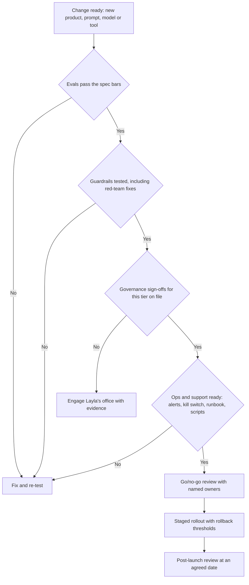
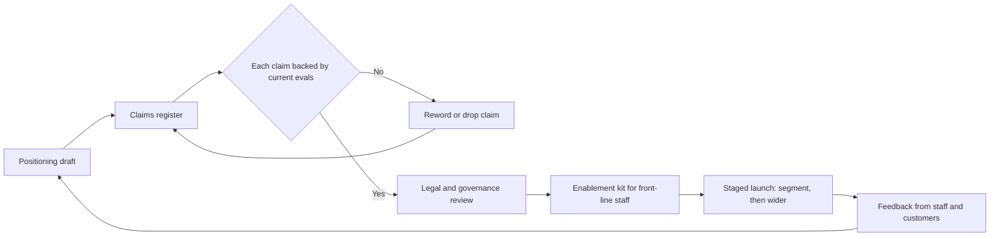
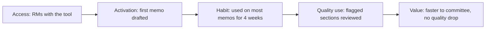

# Module 7 — Launching AI products

*An AI feature that passes its evals is not yet a product. It becomes one when real people can rely on it: when the guardrails hold under pressure, the approvals are on file, the support team knows what to say when it goes wrong, the market understands what it does and does not promise, and the people whose work it changes actually adopt it. This module covers the launch stage. You will follow Rania and Faisal at Najm Bank as they take Najm Assist from pilot to general release, prepare the go-to-market for SME Instant Finance and the Credit Memo Copilot, and run the change programme that decides whether relationship managers use the copilot or quietly go back to Word.*

> **Stages:** Launch — turning a feature that works into a product people can safely find, trust, buy and use, with the controls, messages and habits to keep it that way.

---

# 7.1 — Launch readiness: guardrails, governance gates and support
*Level: 🔴 Advanced* · *Prerequisites: 5.1, 6.2, 6.3* · *Stage: Launch*

## ⚡ In 60 seconds
- **Launch readiness** is evidence, not optimism: conditions, each with an owner and proof, that must be true before more users are exposed.
- Four areas: **quality** (evals pass), **guardrails** (it fails safely), **governance** (approvals on file) and **operations and support** (someone notices problems, can switch it off, and knows what to tell customers).
- Guardrails are layered across inputs, context, tools, outputs and usage. No single layer is enough.
- Every prompt, model, retrieval or tool change is a small launch. Gates must be cheap enough to rerun.
- Decision cue: go only when each blocking item has evidence and an owner, rollback has been tested, and support can handle the known failure modes.
- Biggest trap: treating launch as the day the feature switches on, instead of the moment you take on responsibility for every answer it gives.

## 🧭 Why it matters
In December 2023 a Chevrolet dealer's website chatbot was talked into "agreeing" to sell a car for $1 after users manipulated its instructions. In January 2024, after a system update, DPD's delivery chatbot swore at a customer and wrote a poem criticising the company. Neither failure needed an advanced attack; nothing between the model and the customer stopped them. And *Moffatt v. Air Canada* (2024) shows what follows: the tribunal held the airline responsible for what its chatbot told a customer. Whatever the assistant says, the company has said it.

At Najm Bank, Najm Assist v1 has finished its pilot. It answers questions about accounts, fees and cards in Arabic and English, grounded in the bank's product documents, and hands over to a human agent when unsure. Faisal proposes switching it on for all mobile-app customers on Thursday, "since the evals passed". Rania asks four questions. What stops it discussing loan eligibility, which it is not approved for? Who is paged if it gives wrong fee amounts at 2 a.m.? How do we turn it off without an app release? What does the contact centre say when a customer complains about an answer? Faisal cannot answer any of them. The launch moves by three weeks; this lesson is about those three weeks.

## 📐 How it works

### 🟢 The essentials

**Launch readiness** is the set of conditions that must be true, with evidence, before you expose more people to a product. An AI feature works *most of the time* and fails in ways you can only partly predict, so readiness must cover what happens when it fails, as well as whether it works. Think of four areas.

| Area | The question | Typical evidence |
|---|---|---|
| **Quality** | Does it meet the quality bars in the spec (5.1)? | Offline eval results on the golden set (6.1), red-team findings closed or accepted (6.2), pilot or staged-rollout metrics (6.3) |
| **Guardrails** | When it fails, does it fail safely? | Tested input and output filters, topic boundaries, escalation to a human, limits on actions and usage |
| **Governance** | Are the approvals required for this risk tier on file? | Risk tier, privacy assessment, sign-offs, required disclosures, model and system documentation |
| **Operations and support** | Will we notice problems, can we stop them, and can we help affected people? | Dashboards and alerts, on-call owner, kill switch, incident runbook, support scripts, feedback channel |

**Guardrails** are controls, outside the model's own judgement, that keep an AI product inside the behaviour you intended. Examples: a filter that keeps personal data away from the model, a classifier that keeps the assistant on approved topics, a check that every fee amount appears in a source document, a cap on messages per user per hour.

**Governance gates** are the checkpoints where someone with authority confirms that the product may proceed. At Najm Bank, Layla's office assigns each product a risk tier, which decides the assessments and sign-offs needed. The PM does not run governance but owns getting through it on time: start early and bring evidence. The *AI Governance: Zero to Hero* course covers tiering and approvals in depth.

**Support readiness** means the people customers contact know what the product does, what it gets wrong, and what to do about it, including how to see what the assistant actually said.

### 🟡 Going deeper

**Layered guardrails.** No single control stops every failure, so good AI products stack several, each catching what the others miss. A useful way to lay them out is to follow a request through the system.

| Layer | What it controls | Najm Assist examples |
|---|---|---|
| **Input** | What the user can send and what reaches the model | Strip card and ID numbers; detect known prompt-injection patterns |
| **Context and tools** | What the model can see and do | Only approved, current product documents; no other customers' data; no action tools in v1 |
| **Model instructions** | How the model is told to behave | Scope, tone, languages and when to hand over; covered by evals |
| **Output** | What reaches the user | Topic classifier blocks loan-eligibility and investment advice; numbers checked against sources; tone filter; handover when confidence is low |
| **Usage** | How much and by whom | Rate limits; daily cost ceiling; feature flag by segment |
| **Human** | Who can step in | One-tap "talk to a person" with the full conversation passed to the agent |

Two principles matter most. **Deny by default for actions**: an assistant that only answers questions has a far smaller worst case than one that can move money, so Najm Assist launches without tools and adds them later under separate gates (4.3). **Safe fallback beats clever recovery**: when a guardrail fires, do something boring and correct ("I can't help with that here; would you like to speak to an agent?").

Guardrails have costs: latency, legitimate requests blocked (false positives), and their own evaluation. Measure filters like any model, for good answers blocked and bad ones missed. A topic filter that blocks "what's the fee for a loan top-up?" because it contains "loan" is a product defect, not a safety win.

**Operational readiness** covers the unglamorous machinery that decides whether a bad day stays small.
- **Monitoring and alerts.** Quality, guardrail and cost signals with thresholds that page a named owner (more in 8.3).
- **A kill switch.** A feature flag that turns the feature off, or falls back to a safe mode, in minutes, without a deployment or app release. Tested before launch.
- **Rollback.** Return to the previous prompt, model and retrieval index together, which means versioning all three.
- **An incident runbook.** What counts as an AI incident (harmful answer, data leak, spike in wrong answers, abuse), who grades severity, who is told (Layla, Sara, communications), and how affected customers are contacted.
- **Logging for investigation.** Enough of each conversation, prompt version and retrieved documents to reconstruct what happened, within limits Sara sets.

**Support readiness** in practice:
- A one-page **known limitations** note for agents: what the assistant cannot do, failure modes seen in testing, and the approved response to each.
- **Conversation lookup**, so agents see what the assistant actually said, and **an escalation path** for suspected AI errors, tagged so they can be counted.
- **Scripts for the hard calls**: "the assistant told me the fee was waived". After Air Canada, "the bot was wrong" is a weak defence, so the business and legal owners should decide before launch whether the bank honours such answers.

**Disclosure.** Customers should know they are talking to an AI; in some jurisdictions this is a legal duty (the EU AI Act's transparency obligations). Microsoft's Guidelines for Human-AI Interaction (Amershi et al., 2019) open with the design version: make clear what the system can do, and how well. That becomes launch copy.

The flow below is how Najm runs a launch decision, for a change as well as a first release.

### 🔴 Expert view

**Proportion the gate to the change.** A full review for every prompt tweak will soon be bypassed. Mature teams sort changes into classes. A prompt wording change re-runs the automated evals and needs the PM's approval. A new model, data source or language adds red-teaming on the changed surface and a short governance check. A new capability, such as tools that act for the customer, changes the risk tier and goes through the full gate. Agree the classes with Layla in advance.

**Define rollback thresholds before launch.** Decide in advance which numbers stop a staged rollout (6.3), such as grounding below the spec bar for two days or any confirmed exposure of another customer's data. Deciding in the moment, under executive attention, rarely goes well.

**Run a pre-mortem.** Gary Klein's pre-mortem (*Harvard Business Review*, 2007) asks the team to imagine the launch has failed badly and write down why, surfacing risks nobody raises in status meetings. For AI, ask: "Six weeks from now Najm Assist is in the newspaper. What did it say?" The answers become red-team cases, guardrails and support scripts.

**Readiness is a set of promises.** The on-call rota, the sampled-conversation review, the known-limitations update after a model change: each needs a named keeper after launch, or the product is less ready every week.

**Know when not to launch.** If the only way to stop a failure mode is a human checking every answer, the product may belong at the *draft* level of automation (4.1). Narrowing scope, say to card and fee questions only, is often the fastest route to a safe launch.

## 🧰 The toolkit
| Tool or framework | What it is and does | When to reach for it |
|---|---|---|
| **Launch readiness checklist** | Blocking and non-blocking conditions across the four areas, each with owner, evidence and status | Before every release and significant change |
| **Layered guardrails** | Controls at six layers so one layer catches what another misses; check the design against the OWASP Top 10 for LLM Applications | Any user-facing or action-taking AI feature |
| **Kill switch** | A feature flag or safe mode that disables the AI feature in minutes without a release | Any customer-facing AI feature; drill it before launch |
| **Pre-mortem** (Gary Klein) | A session where the team assumes the launch failed and lists the causes | Two to four weeks before launch, while there is still time to act on the results |
| **Incident runbook** | How to detect, grade, contain and communicate AI incidents | Before launch; rehearse it with support, governance and the DPO |
| **Go/no-go review** | A short meeting where named owners confirm each blocking item with evidence and the accountable owner decides | The final gate before each rollout stage |
| **Change classes** | An agreed sorting of changes (prompt, model, data, tools) into levels of re-testing and approval | As soon as the first version ships, so later changes are not blocked or unchecked |

## 🏛️ In practice at Najm Bank
Rania's team produced the **Najm Assist v1 Launch Readiness Checklist** for the move from pilot to all mobile-app customers in Qatar. Blocking items must be green before go; the accountable owner for the decision is the Head of Retail Digital, with Layla confirming the governance items.

| # | Item | Blocking | Owner | Evidence | Status |
|---|---|---|---|---|---|
| Q1 | Grounded-answer rate on golden set meets spec bar in Arabic and English | Yes | Dana | Eval report v1.4 | Green |
| Q2 | Red-team findings rated high are fixed and re-tested | Yes | Dana | Red-team log, 3 high closed | Green |
| G1 | Topic boundary blocks loan eligibility, investment and legal advice; false-block rate within agreed limit | Yes | Tariq | Filter eval on 400 labelled prompts | Amber: false blocks on "loan top-up fee" being fixed |
| G2 | Card and ID numbers removed before model call | Yes | Tariq | Test suite and log sample | Green |
| G3 | Every fee amount in an answer matches a source document, else answer withheld | Yes | Tariq | Numeric check tests | Green |
| G4 | Handover to human agent on request, low confidence or complaint | Yes | Hessa | Usability test, 12 sessions | Green |
| V1 | Risk tier confirmed and sign-offs on file | Yes | Faisal with Layla | Governance record | Green |
| V2 | Privacy assessment complete; log retention agreed | Yes | Faisal with Sara | Assessment record | Green |
| V3 | AI disclosure in first message and help page approved by legal | Yes | Faisal | Copy sign-off | Green |
| O1 | Kill switch tested in production: falls back to FAQ search in under 5 minutes | Yes | Tariq | Drill record | Green |
| O2 | Alerts on grounding, guardrail rate, latency and daily cost, with on-call rota | Yes | Tariq | Dashboard link, rota | Green |
| O3 | Incident runbook rehearsed with support, governance, DPO and comms | Yes | Faisal | Tabletop notes | Green |
| S1 | Agents can view assistant conversations; known-limitations note issued | Yes | Contact-centre lead | Training completion | Green |
| S2 | Policy agreed on honouring incorrect answers about fees | Yes | Business owner and legal | Policy note | Green |
| R1 | Rollout stages and stop thresholds agreed | Yes | Faisal | Rollout plan: 5%, 25%, 100% | Green |

**Stop thresholds (illustrative):** pause the rollout if grounded-answer rate on the daily sample falls below the spec bar two days running; if any cross-customer data exposure is confirmed; or if AI-error complaints exceed the rate agreed in the rollout plan. Post-launch review booked for 30 days after 100%.

Go/no-go outcome: *"No-go this week on G1. Go at 5% once the false-block fix is re-tested."*

## 🛠️ Exercises
- 🟢 Write a readiness checklist, using the four areas, for an AI feature you use or are building. *Done when:* you have at least ten items, each marked blocking or not, with an owner role and the evidence that would prove it.
- 🟡 Design the layered guardrails for the Credit Memo Copilot, which drafts internal credit memos from client documents for relationship managers. *Done when:* you have a table with all six layers, at least one control per layer, and for each control the failure it catches and how you would test it.
- 🔴 Najm Assist v2 will let customers freeze a card and start a transaction dispute. Write the change-class policy and the additional launch gates for v2. *Done when:* your policy sorts at least five kinds of change into classes with the re-testing and approval each needs, v2 is placed in the right class with reasons, and you list the extra guardrails, stop thresholds and support scripts that actions require.

## ⚠️ Mistakes and traps
- **"The evals passed, so we are ready."** Evals cover the cases you tested. Check all four areas.
- **An untested kill switch.** If it needs a deployment or has never been tried, you do not have one. Drill it before launch.
- **Guardrails measured only for what they block.** Measure false blocks as well as misses.
- **Treating updates as maintenance.** DPD's chatbot misbehaved after an update. Agree change classes so every change runs the right level of gate.
- **Governance or support as an afterthought.** Arriving at Layla's office a week before launch, or letting agents learn failure modes from complaints, means you started too late. Engage both at design time.

## 🧾 Recap
- Launch readiness is evidence with named owners across four areas: quality, guardrails, governance, and operations and support.
- Guardrails are layered across input, context and tools, instructions, output, usage and human handover. Deny actions by default and fall back to something safe and boring.
- A tested kill switch, versioned rollback of prompt, model and index together, alerts with an on-call owner, and a rehearsed incident runbook are launch requirements.
- Support needs known limitations, conversation lookup, escalation and a policy, set in advance, on honouring wrong answers.
- Every change is a small launch: sort changes into classes and gate each class in proportion to the risk it adds.

## ✍️ Check yourself

**1. Najm Assist's offline evals meet every quality bar in the spec. Faisal says the product is ready for all customers. What is the strongest reason to disagree?**

- A. Evals are never a reliable signal of quality
- B. Readiness also requires tested guardrails, governance approvals, monitoring with a kill switch and prepared support
- C. The product should first be rebuilt on a larger model
- D. Customers should be surveyed about AI before any launch

Answer

**B.** Evals cover only the quality area. A is too strong: evals are necessary evidence, just not sufficient. (🟢 The essentials.)

**2. Which guardrail design best follows the "deny by default for actions" principle for a first release of a customer assistant?**

- A. Give the assistant all banking tools but tell it in the system prompt to be careful
- B. Launch with question-answering only and add action tools later, each under its own gate
- C. Allow actions but log them for review at month end
- D. Allow actions only for customers who accept the terms

Answer

**B.** Starting without tools keeps the worst case small, and adding tools later under separate gates matches the risk to the evidence. A relies on the model's own judgement, which is not a guardrail. (🟡 Going deeper.)

**3. During a staged rollout at 25%, the daily sample shows the grounded-answer rate has fallen below the spec bar for two days. The rollout plan listed this as a stop threshold. What should the PM do?**

- A. Continue to 100% because the drop may be noise
- B. Pause the rollout, fall back or roll back as the plan says, and investigate
- C. Lower the spec bar so the rollout can continue
- D. Wait for the 30-day post-launch review

Answer

**B.** Stop thresholds are set in advance so nobody decides under launch pressure. C and D defeat their purpose. (🔴 Expert view.)

**4. The team changes the wording of Najm Assist's system prompt to sound friendlier. Under a sensible change-class policy, what should happen?**

- A. Nothing: prompt wording is not a product change
- B. The full launch gate, including a new governance approval
- C. Re-run the automated eval suite and get the PM's approval before release
- D. Release it to all users and monitor complaints

Answer

**C.** A prompt change can alter behaviour, as the DPD case shows, so it must be re-tested, but it does not change the risk tier, so a full gate (B) is out of proportion. (🔴 Expert view.)

**5. A customer calls to say Najm Assist told them a fee would be waived. It was wrong. What should have been in place before launch?**

- A. A policy, agreed by the business owner and legal, on whether and how the bank honours incorrect assistant answers, plus conversation lookup for agents
- B. A disclaimer saying the assistant's answers are not binding, so agents can refuse all such claims
- C. An instruction to agents to escalate every call to the product team
- D. Nothing: such cases are too rare to plan for

Answer

**A.** After *Moffatt v. Air Canada*, "the bot was wrong" is a weak defence. A disclaimer alone (B) may not protect the bank and damages trust. (🟡 Going deeper.)

## 📚 References
- Amershi, S. et al. (2019). "Guidelines for Human-AI Interaction." CHI 2019 — https://www.microsoft.com/en-us/research/project/guidelines-for-human-ai-interaction/
- Google PAIR, *People + AI Guidebook* — https://pair.withgoogle.com/guidebook
- OWASP Top 10 for LLM Applications — https://genai.owasp.org
- Klein, G. (2007). "Performing a Project Premortem." *Harvard Business Review* — https://hbr.org/2007/09/performing-a-project-premortem
- Beyer, B. et al., *Site Reliability Engineering* (Google), incident management and postmortem chapters — https://sre.google/books/
- NIST AI Risk Management Framework — https://www.nist.gov/itl/ai-risk-management-framework
- EU AI Act, Regulation (EU) 2024/1689 — https://eur-lex.europa.eu/eli/reg/2024/1689/oj

---

# 7.2 — Go-to-market: positioning, pricing signals and enablement
*Level: 🔴 Advanced* · *Prerequisites: 2.1, 4.2, 7.1* · *Stage: Launch*

## ⚡ In 60 seconds
- **Go-to-market (GTM)** is how a product reaches the people it is for: who it is for, what it promises, how it is priced or funded, and how the people who sell and support it are equipped.
- For AI products, **positioning is expectation-setting**. The promise you make decides whether a 90%-accurate product feels impressive or broken. Lead with the job the customer gets done, not with "AI".
- Every external claim needs evidence. Keep a **claims register** that ties each marketing statement to an eval result, and get it approved like any other launch item.
- Pricing sends a signal before anyone uses the product: free and bundled says "part of the service", a premium tier says "extra value", per-outcome pricing says "we are confident it works". Choose the signal on purpose.
- **Enablement** means equipping front-line staff (sales, relationship managers, contact centre) to explain the product honestly, including its limits, and to capture what customers say.
- Biggest trap: marketing writes the promise and the product has to live up to it. The PM owns the promise.

## 🧭 Why it matters
Google's first public demonstration of Bard, in February 2023, included an answer with a factual error about the James Webb Space Telescope. Reporters spotted it quickly and it was widely covered. The error itself was the kind of mistake every language model makes. What made it costly was the setting: a launch moment, framed as a showcase of accuracy, in front of an audience primed to check. Positioning and launch staging turned an ordinary model error into a story.

Najm Bank is about to launch SME Instant Finance to small-business customers: invoice-financing requests up to a set limit get a decision in minutes instead of days, driven by an ML model with human review of declines and edge cases. Faisal's first draft of the campaign reads: *"AI approves your invoice finance instantly."* Khalid likes it. Rania does not. "Instantly" is false for the requests that go to review. "Approves" invites complaints from the customers it declines. And "AI approves" puts an automated credit decision in the headline, which is exactly what Layla and Sara have spent months making sure is not the whole story. The product is good. The promise would make it look bad.

## 📐 How it works

### 🟢 The essentials

**Go-to-market** covers four decisions:
1. **Who is it for first?** The target segment for launch, which is usually narrower than the long-term market.
2. **What do we promise?** The positioning and the core message.
3. **How is it priced or funded?** For external products, the price and pricing model. For internal products, how the cost is funded and whether usage is charged back to business units.
4. **How do we reach and support users?** Channels, launch sequence and enablement of the people who sell, onboard and support.

**Positioning** is how you want the target customer to understand what the product is, who it is for and why it is better than the alternatives. April Dunford's *Obviously Awesome* (2019) breaks it into components: the **competitive alternatives** (what customers would do without you, often a spreadsheet, a phone call or doing nothing), the **unique attributes** you have and they lack, the **value** those attributes deliver, the **customers who care most** about that value, and the **market category** you place yourself in so customers know how to judge you.

For AI products the category choice is critical, because it sets expectations. Call Najm Assist "your banking expert" and customers will judge it against a human expert, and every mistake will look like incompetence. Call it "quick answers about your accounts, cards and fees, with a person one tap away" and customers will judge it against searching the FAQ or waiting on hold. It beats both.

**Lead with the job, not the technology.** Customers buy outcomes: a faster decision, a question answered at midnight, a memo drafted before the meeting. "AI-powered" tells them nothing about what they get, and it raises questions some of them do not want to ask (is a machine deciding about me? is my data training something?). Mention AI where it is needed for honesty and trust, such as the disclosure that they are talking to an assistant, and let the outcome be the headline.

### 🟡 Going deeper

**Claims and evidence.** Every statement you make about an AI product is a promise about probabilistic behaviour. A **claims register** lists each external claim, the evidence behind it, the conditions under which it holds, and who approved it.

| Claim (draft) | Problem | Claim (approved) | Evidence |
|---|---|---|---|
| "AI approves your invoice finance instantly" | Not all requests are instant; "approves" is untrue for declines; headline stresses automated decision | "Get a decision on eligible invoice-financing requests in minutes" | Pilot: share of eligible requests decided within the stated time, from the rollout metrics |
| "Najm Assist knows everything about your account" | Unbounded; invites questions it cannot answer | "Answers questions about your accounts, cards and fees, 24/7, in Arabic and English" | Golden-set coverage by topic and language (6.1) |
| "Always accurate" | No AI product can support this | Remove; no accuracy claim in marketing | Not applicable |

The register protects the customer and the bank. Layla's office and legal review it; Dana confirms each claim is supported by current evals. It needs revisiting when the model changes, because a claim that was true on the old model may not be on the new one.

**Staging the launch.** Not every launch should be loud. Many product teams sort launches into tiers: a quiet release to a segment, a standard announcement, or a major campaign. For AI products, a sensible rule is to earn the loud launch. Start with a limited audience (a waitlist, a beta label, one segment), let the staged-rollout metrics from 6.3 build evidence, then scale the message with the product. A beta label is honest positioning, not an excuse: it tells users to expect rough edges and invites feedback. It stops being honest if it stays on for years.

**Pricing signals.** Pricing and unit economics get a full treatment in 8.2. At launch the question is narrower: what does the price, or the absence of one, tell the customer? The common patterns, with public examples:

| Pattern | Signal it sends | Example (at the time of writing, 2026; details change) |
|---|---|---|
| **Bundled and free** | "This is part of the service you already have" | Many banking assistants, including Najm Assist |
| **Premium tier** | "Extra value for those who want more" | Duolingo Max (2023) put GenAI features in a higher-priced subscription |
| **Usage-based** | "Pay for what you use" | Per-seat or per-request pricing for AI features and APIs |
| **Outcome-based** | "We only get paid when it works" | Intercom priced its Fin agent per resolved conversation (from 2023); Salesforce launched Agentforce with per-conversation pricing (2024) |

Outcome-based pricing is a strong signal of confidence, but it forces a hard definition of "outcome". What counts as a resolved conversation? Who decides? It also puts the vendor's revenue in tension with honest measurement. If you use it, agree the definition with customers before launch.

For a bank, the relevant pricing decision is often **what not to change**. Najm prices SME Instant Finance on the same fee schedule as its manual invoice financing. Speed is the benefit, and a new "AI fee" would signal that customers are paying extra for the bank's automation. That was a deliberate positioning choice, recorded as such.

**Internal products have a GTM too.** The Credit Memo Copilot is for relationship managers, not customers, but it still needs positioning ("your first draft, ready before the credit meeting; you remain the author"), a funding decision (central budget for year one, charge-back to business lines after, decided with Omar and finance), a launch sequence (one region's corporate team first) and enablement. Internal GTM overlaps with adoption and change management, which 7.3 covers.

**Enablement** equips the people between the product and its users. For AI products they need more than a feature tour.

- **What it is for and not for**, in plain words they can repeat.
- **Honest limitations**: the failure modes from the known-limitations note in 7.1, and what to say about each.
- **A demo script that shows a failure**. A demo where the assistant hands over to a human, or the copilot flags a missing document, teaches more trust than a perfect run. It also avoids the Bard problem: a showcase framed as perfect invites people to look for the flaw.
- **Objection handling**: "Is a computer deciding my credit?" "Where does my data go?" "What if it's wrong?". Answers are agreed with Layla and Sara.
- **Feedback routes**: how front-line staff report what customers say, so the product team hears about confusion before it becomes complaints.

The flow below is how Najm moves a message from draft to market.

### 🔴 Expert view

**Under-promise on autonomy, over-deliver on speed.** Customers forgive an assistant that says "let me connect you to a colleague". They do not forgive one that confidently gets their money wrong. Position AI features one level of automation below what they can technically do (4.1): if it drafts, say it drafts; if it decides some cases, say "most eligible requests get a decision in minutes", not "instant decisions". The gap between promise and experience is the space where trust grows.

**Positioning must survive the model change.** You will swap models, adjust prompts and add tools. If your positioning names the model or leans on a benchmark, every change becomes a marketing event, and your claims can quietly become false. Position on the job and the controls (grounded in the bank's documents, a person one tap away), which stay true across model versions.

**Beware AI-washing in both directions.** Overstating AI in a product invites regulatory and reputational trouble; financial and consumer-protection regulators in several jurisdictions have warned firms against exaggerated AI claims. Understating it can also backfire: if customers discover an undisclosed AI in a sensitive interaction, the story is about concealment. Say what it is, plainly, once, and move on to the value.

**Price is also a statement about risk.** Charging per outcome for credit-related AI can look like the bank profits from automated decisions. Charging a premium for AI-based advice may create expectations of suitability the product cannot meet. Bring pricing ideas for regulated products to Layla early. Pricing choices shape how regulators and customers read the product.

**GTM feedback is discovery data.** The first weeks of a launch produce the richest evidence you will get: what people ask that you did not expect, where they drop off, which claims confuse them. Route it into the opportunity map (2.1) and the error analysis (6.1), not only into the campaign report.

## 🧰 The toolkit
| Tool or framework | What it is and does | When to reach for it |
|---|---|---|
| **Positioning canvas** (April Dunford, *Obviously Awesome*) | Defines competitive alternatives, unique attributes, value, best-fit customers and market category | Before writing any launch message; revisit when the target segment changes |
| **Claims register** | Lists each external claim with its evidence, conditions, approver and review date | For every customer-facing AI launch and every model change that could affect a claim |
| **Launch tiers** | Sorts launches into quiet, standard and major, each with its own level of announcement and preparation | Deciding how loud a launch should be, given the evidence you have |
| **Pricing pattern map** | Compares bundled, premium, usage-based and outcome-based pricing by the signal each sends | Choosing the launch pricing signal; hand over to the unit-economics work in 8.2 |
| **Enablement kit** | Talk track, known limitations, demo script with a failure, objection handling and feedback route for front-line staff | Two to four weeks before launch, tested on a small group of staff first |
| **Beta label and waitlist** | Signals early-stage quality and limits exposure while evidence builds | First external release of a new AI capability |

## 🏛️ In practice at Najm Bank
Faisal's revised **SME Instant Finance GTM One-Pager**, approved by Khalid and reviewed by Layla:

| Section | Content |
|---|---|
| **Launch segment** | Existing SME customers in Qatar with at least 12 months of account history, invoice amounts within the product limit. Wider SME base after 90 days if the stop thresholds are not hit. |
| **Competitive alternatives** | Manual invoice financing at Najm (days); overdraft; asking a supplier for longer terms; competitor fintech lenders |
| **Unique attributes** | Decision in minutes for most eligible requests; uses the customer's existing account history, so fewer documents; a named credit officer reviews every decline |
| **Positioning statement** | *For established SME customers who need cash from unpaid invoices quickly, SME Instant Finance gives most eligible requests a decision in minutes using the history Najm already has, with a credit officer reviewing every decline. Unlike manual financing, there is no document chase and no wait of several days.* |
| **Headline** | "Turn eligible invoices into cash, with a decision in minutes." |
| **AI disclosure** | In the application flow and terms: an automated model assesses the request; declines are reviewed by a person; how to ask for an explanation and a review. Wording approved by Sara and legal. |
| **Claims register** | 5 claims, each linked to pilot metrics; "instant", "guaranteed" and "AI approves" banned from all copy |
| **Pricing signal** | Same fee schedule as manual invoice financing. No AI premium. Speed is the benefit. |
| **Launch tier** | Standard: in-app banner and RM outreach to the launch segment. Press release only after the 90-day review. |
| **Enablement** | SME RMs and contact centre: 45-minute session, talk track, known limitations (for example, invoices from new buyers usually go to review), objection answers ("Is a computer deciding?"), demo with one approval and one referral to review |
| **Feedback** | RMs log customer questions with an "SIF-feedback" tag; weekly review with Faisal and Dana for the first 8 weeks |
| **Success signals** | Share of eligible requests decided in the stated time; application completion rate; complaints about decisions; RM confidence score from a monthly pulse (targets in the metrics plan, 8.1) |

## 🛠️ Exercises
- 🟢 Rewrite three AI marketing claims you have seen (from any company) so each can be backed by evidence. *Done when:* each rewrite states the job, avoids unbounded words such as "always", "instant" or "knows everything", and names the evidence you would need.
- 🟡 Fill in the positioning canvas for Najm Assist, then write a claims register with at least five claims. *Done when:* each claim is linked to a specific eval or rollout metric, at least one draft claim is rejected with a reason, and the market category you chose is justified against a competing option.
- 🔴 Najm is considering offering the Credit Memo Copilot to other banks as a white-label product. Draft the GTM decision memo: segment, positioning, pricing pattern and the risks each pricing pattern creates. *Done when:* you compare at least three pricing patterns by signal and risk, recommend one, define its unit of value precisely, and list the governance questions to raise with Layla.

## ⚠️ Mistakes and traps
- **Leading with "AI".** It says nothing about the outcome and raises fears. Lead with the job done and disclose AI plainly where honesty needs it.
- **Unbacked superlatives.** "Instant", "always", "knows everything" become complaints and possibly regulatory findings. Every claim goes through the claims register.
- **The perfect demo.** A flawless showcase invites people to hunt for the flaw. Demo a failure handled well.
- **A new price for the same outcome.** An "AI fee" for something customers already get tells them they are paying for your cost savings. Price the value to them, or keep pricing unchanged.
- **Enablement as a feature tour.** Staff who do not know the limitations will over-promise. Give them the failure modes and the words to explain them.
- **Stale claims after a model change.** A claim proven on last quarter's model is not proven on this one. Tie claim review to the change classes from 7.1.

## 🧾 Recap
- GTM decides the launch segment, the promise, the price or funding, and how staff reach and support users.
- For AI, positioning sets expectations: choose a market category the product beats, and lead with the job, not the technology.
- A claims register ties every external claim to current evidence and is reviewed when the model changes.
- Pricing signals intent: bundled, premium, usage-based or outcome-based. For regulated products, bring pricing ideas to governance early.
- Enablement gives front-line staff honest limitations, a demo that shows a handled failure, objection answers and a feedback route.

## ✍️ Check yourself

**1. Faisal's campaign headline for SME Instant Finance is "AI approves your invoice finance instantly". Which revision best follows this lesson?**

- A. "The smartest AI lender in the Gulf"
- B. "Turn eligible invoices into cash, with a decision in minutes"
- C. "Instant AI approvals, guaranteed"
- D. "Powered by advanced machine learning"

Answer

**B.** It leads with the job, bounds the promise ("eligible", "decision", "minutes") and avoids claiming that AI approves. D mentions the technology but says nothing about the outcome. (🟢 The essentials; 🏛️ In practice.)

**2. Why does the choice of market category matter more for AI products than for many traditional products?**

- A. Because AI products cannot be sold without a category
- B. Because the category sets the standard customers judge the product against, and AI products make visible errors
- C. Because regulators require a category for every AI product
- D. Because categories determine the model used

Answer

**B.** "Banking expert" invites comparison with a human expert, so every error looks like incompetence. "Quick answers, person one tap away" is judged against search and hold queues. (🟢 The essentials.)

**3. Najm is swapping the model behind Najm Assist for a newer one. What should happen to the claims register?**

- A. Nothing, because claims describe the product, not the model
- B. Each claim is re-checked against evals on the new model before release
- C. All claims are deleted and rewritten from scratch
- D. Marketing updates claims after the next campaign

Answer

**B.** A claim proven on one model may not hold on another. Tie claim review to the change classes from 7.1. (🟡 Going deeper; ⚠️ Mistakes.)

**4. A software vendor prices its support agent per resolved conversation. What is the main issue a buyer should settle before signing?**

- A. Whether the agent uses an open-weight model
- B. The precise definition of "resolved" and who measures it
- C. Whether the vendor offers a free trial
- D. Whether the price is quoted in dollars

Answer

**B.** Outcome-based pricing signals confidence but depends entirely on how the outcome is defined and measured, and it can put the vendor's revenue in tension with honest measurement. (🟡 Going deeper.)

**5. Hessa is preparing the demo for the Credit Memo Copilot's launch to relationship managers. Which demo plan best builds trust?**

- A. A rehearsed run on a perfect example so the copilot looks flawless
- B. A run that includes the copilot flagging a missing document and the RM correcting a draft section
- C. A slide deck about the model's benchmark scores
- D. No demo; send a link and let RMs explore

Answer

**B.** Showing a failure handled well sets honest expectations and teaches users what to check. A perfect demo (A) invites people to hunt for the flaw, as the Bard launch showed. (🟡 Going deeper; 🔴 Expert view.)

## 📚 References
- Dunford, A. (2019). *Obviously Awesome: How to Nail Product Positioning So Customers Get It, Buy It, Love It* — https://www.aprildunford.com
- Cagan, M. (2017). *Inspired: How to Create Tech Products Customers Love* (2nd ed.) — https://www.svpg.com
- Amershi, S. et al. (2019). "Guidelines for Human-AI Interaction." CHI 2019 — https://www.microsoft.com/en-us/research/project/guidelines-for-human-ai-interaction/
- Google PAIR, *People + AI Guidebook*, chapter on mental models and expectations — https://pair.withgoogle.com/guidebook
- Intercom, Fin AI agent — https://www.intercom.com/fin
- Salesforce, Agentforce — https://www.salesforce.com/agentforce/
- Duolingo blog (Duolingo Max announcement, 2023) — https://blog.duolingo.com
- EU AI Act, Regulation (EU) 2024/1689 (transparency obligations) — https://eur-lex.europa.eu/eli/reg/2024/1689/oj

---

# 7.3 — Adoption and change management inside the enterprise
*Level: 🔴 Advanced* · *Prerequisites: 4.1, 7.1, 7.2* · *Stage: Launch, Grow*

## ⚡ In 60 seconds
- An internal AI product succeeds only when people change how they work. Launch gives access; **adoption** is the change in behaviour; **value** is the change in outcomes. Measure all three separately.
- People adopt when they believe the tool is **useful** and **easy to use** in their real workflow (the Technology Acceptance Model). Put the AI where the work already happens, not in a new tab.
- Resistance to AI is often rational: fear for jobs, unclear accountability ("who signs the memo?"), incentives that reward the old way, and bad first experiences. Address the causes, not the symptoms.
- Aim for **calibrated trust**: people rely on the AI where it is good and check it where it is weak. Both over-reliance and under-use are adoption failures.
- Use a structured change model (ADKAR or Kotter), a champions network and role-based training, and design the adoption funnel before launch.
- Biggest trap: counting logins. High usage with low value, or with unchecked outputs, is worse than low usage.

## 🧭 Why it matters
IBM invested heavily in Watson Health and sold the units in 2022. Public accounts differ on the reasons, but a recurring theme is that fitting the technology into how clinicians actually work was harder than building the demo. A tool that impresses in a pitch but is awkward in real work does not get used.

At Najm Bank, the Credit Memo Copilot went live for the corporate banking team in one region six weeks ago. The launch went well by the checklist in 7.1: evals green, guardrails tested, governance on file. Faisal's dashboard shows 85% of relationship managers (RMs) logged in during the first week. Khalid, who funded it, asks a different question: "How many credit memos were drafted with it last month, and did they reach committee faster?" The answer is uncomfortable. Weekly active use has fallen to about a third of RMs. Several senior RMs tried it once, found a draft that misread a covenant, and went back to their own templates. Two junior RMs use it for every memo and paste the drafts almost unchanged, which worries the credit risk team more than non-use. The product works. Adoption does not.

## 📐 How it works

### 🟢 The essentials

**Adoption** is the extent to which the intended users change their behaviour to use the product in their real work. It differs from **access** (they can use it) and from **value** (using it improves the outcomes the business cares about). An adoption plan treats these as three different things to design for and measure.

Why internal AI adoption is hard:
- **It changes the work.** Drafting with a copilot means reading and correcting instead of writing, a different skill that at first can feel slower.
- **Accountability does not move.** The RM still signs the memo. If the tool errs, the RM carries it, so careful people are wary.
- **Errors are memorable.** One bad draft can undo ten good ones, especially for experienced staff.
- **Fear.** Some staff read "AI copilot" as "the bank needs fewer of us". Silence is heard as confirmation.
- **Incentives.** If reviews reward the familiar way, or there is no time to learn, the old way wins.

Two classic ideas explain a lot of what follows.

The **Technology Acceptance Model** (Fred Davis, 1989) says people adopt a technology when they see it as **useful** (it helps me do my job better) and **easy to use** (the effort is low). Both are *perceptions*, formed in the first few uses and in conversations with colleagues. For AI tools, "useful" depends heavily on quality in the user's own cases, and "easy" depends on whether the tool sits inside the workflow.

**Diffusion of Innovations** (Everett Rogers, first published 1962) describes how new practices spread through a group: a few innovators and early adopters first, then the early majority, the late majority and the laggards. Each group needs different evidence. Early adopters try things because they are new. The early majority wait until people like them have made it work. Your first users are not typical, so their enthusiasm is not proof the tool will spread.

### 🟡 Going deeper

**A structured change model.** Prosci's **ADKAR** model (developed by Jeff Hiatt) describes the five things each individual needs in order to change: **Awareness** of why the change is happening, **Desire** to take part, **Knowledge** of how to change, **Ability** to do it in practice, and **Reinforcement** to make it stick. Its practical value is diagnosis: when adoption stalls, find the first element that is missing for that group. Senior RMs at Najm have awareness and knowledge; they are missing *desire* (one bad draft) and possibly *ability* (they never learned what to check). Junior RMs have desire and use, but lack the knowledge of where the copilot is weak.

John Kotter's eight-step model (*Leading Change*, 1996) works at the organisation level: create urgency, build a guiding coalition, form a vision, communicate it, remove obstacles, generate short-term wins, consolidate gains and anchor the change in the culture. For an AI product, the most useful steps are the guiding coalition (senior RMs and credit officers, not only the digital team), removing obstacles (time, incentives, workflow friction) and short-term wins that are visible and credible to peers.

**Put the AI in the workflow.** The biggest lever on "easy to use" is placement. A copilot in a separate web app, needing documents to be uploaded again, competes with the RM's habits and loses. The same copilot opened from the credit application in the loan origination system, with the documents already attached and the draft appearing in the memo template, removes most of that friction. Hessa's research found RMs switch systems several times per memo already. Adding another switch was the main complaint in the first six weeks.

**Calibrated trust.** The goal is not maximum trust. It is **calibrated trust**: users rely on the AI in proportion to how reliable it actually is for the task in front of them. Parasuraman and Riley (1997) described the two failure modes: *misuse* (over-reliance, including accepting automated outputs without checking them) and *disuse* (rejecting automation that would help). Najm's senior RMs show disuse; the two junior RMs show misuse. Both need the same fix, which is knowledge of where the copilot is strong and weak, delivered in the product and in training:
- Mark which parts of the draft come from source documents and which the model inferred, with links to the source (4.2).
- Publish a short "strong at, check carefully" guide: strong at summarising financial statements, check covenant wording and guarantor details.
- Keep review in the workflow with a light prompt to confirm the sections marked "check" before submission, not a pop-up that people learn to click through.

**Champions and peer proof.** A **champions network** is a group of respected users, one per team, who get early access, deeper training and a direct line to the product team. They show peers how they use the tool, collect problems and share what works. Choose champions for credibility with their peers, not for enthusiasm about technology. A senior RM who says "I checked it on my last five memos and it saved me an afternoon" moves the early majority more than any email from the digital team.

**Address fear directly.** Leadership has to say what the tool means for roles, and mean it. At Najm, the Head of Corporate Banking told RMs that time saved on drafting is expected to go into client coverage, and that memo counts would not be used to reduce headcount this year. The PM cannot make that promise; the PM can make sure someone with authority does, and that the message is consistent.

**The adoption funnel.** Design the measurement before launch, from access to value:

Each stage has its own metric and fixes. A drop before activation points to awareness, training or placement; before habit, to usefulness (poor first experiences, no real time saved); at quality use, to over-reliance. Only the last stage is value, measured against a baseline such as time to committee and the rate of memos sent back by credit risk, compared with teams not yet using the tool. Section 8.1 goes deeper.

### 🔴 Expert view

**Usage is not value, and cost is not quality.** Klarna announced in February 2024 that its AI assistant was handling a large share of customer-service chats; in 2025 it said it would bring more human service back, with its leadership reportedly acknowledging that cost had weighed too heavily against quality. The lesson: a rising number (chats handled, memos drafted) says nothing alone about whether the work got better. Pair every adoption metric with a quality counter-metric.

**Measure edits, not only acceptance.** For drafting tools, how much users change the output is a rich signal. Near-zero edits across many drafts may mean excellent quality or no review at all; you find out which by sampling and checking. Heavy edits in one section (covenants, say) tell Dana where the model is weak. The same signal can feed the evaluation set (3.2). Tell users this data is collected and why, so it does not feel like surveillance of their work.

**Watch for shadow AI.** When the sanctioned tool is slow or awkward, staff turn to public AI tools, sometimes with client data. That is an adoption signal as much as a security one: real demand the official product is not meeting. For Staff GenAI, Rania treats shadow use as discovery input while Layla's office handles policy. Blocking without a good alternative mostly moves the behaviour out of sight.

**Change the system around the tool.** Adoption lasts when templates, credit policy guidance on reviewing AI-drafted memos, RM induction and performance expectations reinforce it. If the committee wants the old memo format, the copilot must produce it or a leader must change it. This is Kotter's "anchor the change" step, and it depends on business leaders acting.

**Know when to stop pushing.** Sometimes low adoption is users telling you the tool does not help with that work. RMs on complex syndicated loans may never gain much from a drafting copilot; SME RMs writing many shorter memos may. Segment adoption by task and team, and narrow the target rather than push everyone to the same usage.

## 🧰 The toolkit
| Tool or framework | What it is and does | When to reach for it |
|---|---|---|
| **ADKAR** (Prosci, Jeff Hiatt) | Five individual conditions for change: Awareness, Desire, Knowledge, Ability, Reinforcement | Planning change by user group, and diagnosing which element is missing when adoption stalls |
| **Kotter's 8 steps** (John Kotter, *Leading Change*) | An organisation-level sequence from urgency through short-term wins to anchoring change in culture | Large rollouts that need leadership sponsorship and changes to policy, incentives or process |
| **Technology Acceptance Model** (Fred Davis, 1989) | Adoption depends on perceived usefulness and perceived ease of use | Choosing what to fix first: quality in users' own cases, or friction in the workflow |
| **Diffusion of Innovations** (Everett Rogers) | Adopter groups from innovators to laggards, each needing different evidence | Sequencing rollout and choosing champions; not reading early enthusiasm as proof |
| **Champions network** | Respected users per team with early access, deeper training and a direct line to the product team | Any internal rollout beyond a single team |
| **Adoption funnel** | Stages from access to activation, habit, quality use and value, each with a metric | Designed before launch; reviewed weekly in the first months |
| **Calibrated trust guide** | A short "strong at, check carefully" guide, backed by in-product cues | Any tool where both over-reliance and disuse are risks |

## 🏛️ In practice at Najm Bank
After the six-week review, Rania and Faisal rewrote the rollout as the **Credit Memo Copilot Adoption Plan** for the next 90 days. The funnel targets are illustrative and set against the baseline measured before launch.

**1. Diagnosis by group (ADKAR)**

| Group | Status | Missing element | Actions | Owner |
|---|---|---|---|---|
| Senior corporate RMs | Tried once, stopped | Desire, then Ability | Champion-led session on their own recent memos; "strong at, check carefully" guide; fix covenant extraction before re-inviting | Faisal, Dana |
| Junior RMs | Heavy use, little editing | Knowledge | Review training on flagged sections; in-product source links; sample-based quality checks by credit risk | Hessa, credit risk lead |
| SME RMs (next wave) | Not yet live | Awareness | Head of SME Banking announces purpose and role message; champions named before access | Faisal |
| Credit committee | Not engaged | Desire | Show sample memos side by side; agree format and review expectations in credit policy | Rania, Khalid |

**2. Workflow changes**
- Copilot opens from the credit application in the loan origination system, with documents attached (Tariq, before SME wave).
- Draft appears in the committee memo template; sections marked "sourced" or "check", with links.

**3. Funnel and counter-metrics**

| Stage | Metric | Target at 90 days (illustrative) | Counter-metric |
|---|---|---|---|
| Activation | RMs who drafted at least one memo | Most RMs in live teams | — |
| Habit | Share of eligible memos started with the copilot | Majority in live teams | Complaints about time spent correcting drafts |
| Quality use | "Check" sections edited or confirmed before submission | Nearly all | Sampled drafts submitted with unreviewed errors |
| Value | Median days from complete application to committee | Faster than baseline | Rate of memos returned by credit risk, not worse than baseline |

**4. People and reinforcement**
- One champion per team, chosen with team heads; monthly champions call with Faisal and Dana.
- Role message from the Head of Corporate Banking repeated at the SME launch: time saved goes to client coverage.
- Copilot use and review steps added to RM induction and the credit policy guidance.
- Monthly "what we fixed from your feedback" note, so users see their reports lead to change.

**5. Decision point at 90 days:** continue the SME rollout if the value metric improves without the counter-metric worsening; narrow scope for syndicated loans if habit stays low there after the workflow fix.

## 🛠️ Exercises
- 🟢 Pick an internal tool your organisation introduced (AI or not) and diagnose its adoption with ADKAR. *Done when:* you name the user group, the first missing element, the evidence for that diagnosis, and one action that addresses it.
- 🟡 Design the adoption funnel for Staff GenAI, the bank's internal assistant for all employees. *Done when:* you have five stages with one metric each, one counter-metric that would reveal harm or over-reliance, and a sentence for each stage on what a drop there would tell you.
- 🔴 Najm's operations division has low adoption of Staff GenAI and several reports of staff using public AI tools with customer data. Write a two-page plan for Rania and Layla. *Done when:* the plan separates the product causes from the policy issue, uses TAM to identify what to fix in the product, includes a champions approach and a leadership message, and defines how you will know in 60 days whether it worked.

## ⚠️ Mistakes and traps
- **Counting logins.** First-week logins measure curiosity. Track activation, habit, quality use and value, each with a counter-metric.
- **Maximising trust.** The goal is calibrated trust. Heavy use with no editing can be a bigger risk than low use. Sample and check.
- **Launching into a new tab.** A separate tool that needs re-uploading and switching loses to habit. Put the AI where the work happens.
- **Staying silent on jobs.** Silence is read as bad news. Get a leader with authority to state what the tool means for roles, and keep the message consistent.
- **Choosing champions for enthusiasm.** Pick people whose peers respect their judgement, including converted sceptics.
- **Pushing uniform adoption.** Segment by task and team; narrow the target where value does not appear.

## 🧾 Recap
- Access, adoption and value are different. Design and measure each, and pair adoption metrics with quality counter-metrics.
- People adopt what they find useful and easy in their real workflow (TAM). Placement inside existing systems is the biggest lever on ease.
- Use ADKAR to diagnose stalls by group, Kotter for organisation-wide change, and Rogers to sequence rollout and read early adopters correctly.
- Aim for calibrated trust: in-product source cues, "strong at, check carefully" guidance and light review steps address both misuse and disuse.
- Lasting adoption needs the surrounding system to change: leadership messages on roles, policy, templates, induction and incentives.

## ✍️ Check yourself

**1. Six weeks after launch, 85% of RMs have logged into the Credit Memo Copilot but weekly use has fallen to about a third. Which metric would best tell Khalid whether the product is delivering value?**

- A. Total logins since launch
- B. Median days from complete application to committee, with the rate of memos returned by credit risk as a counter-metric
- C. Number of prompts sent per week
- D. Satisfaction score from the launch-day survey

Answer

**B.** Value is a change in business outcomes against a baseline, paired with a quality counter-metric. Logins and prompts (A, C) measure activity, not value. (🟡 Going deeper, the adoption funnel.)

**2. Senior RMs tried the copilot once, found a misread covenant, and stopped using it. Using ADKAR, which element is most clearly missing first?**

- A. Awareness
- B. Desire
- C. Reinforcement
- D. None: this is a model problem, not a change problem

Answer

**B.** They know about the tool and how to use it; a bad first experience removed the desire. The fix combines product work (improve covenant extraction) and change work (peer proof on their own cases). D is tempting, but a model fix alone does not bring back users who have given up. (🟡 Going deeper.)

**3. Two junior RMs use the copilot for every memo and submit drafts with almost no edits. What is the best response?**

- A. Celebrate them as model users in the next newsletter
- B. Treat it as possible over-reliance: sample their memos, train on the "check carefully" sections, and add in-product source cues
- C. Remove their access
- D. Ignore it, because high usage is the adoption goal

Answer

**B.** Near-zero edits may mean excellent drafts or no review; sampling finds out which. A and D confuse usage with value. (🟡 Going deeper; 🔴 Expert view.)

**4. According to the Technology Acceptance Model, which change is most likely to raise adoption of a copilot that users say is "good but a hassle"?**

- A. A more capable model
- B. Opening the copilot from the loan origination system with documents already attached
- C. A company-wide email announcing the tool
- D. A leaderboard of the heaviest users

Answer

**B.** "Good but a hassle" means perceived usefulness is there but ease of use is low, so reduce workflow friction. A improves usefulness, which is not the stated problem. (🟢 The essentials; 🟡 Going deeper.)

**5. Staff in the operations division are using public AI tools with customer data because Staff GenAI is slow for their tasks. How should the PM treat this?**

- A. Purely as a security matter for Layla's office to block
- B. As evidence of unmet demand to feed product discovery, while governance handles the policy and data risk
- C. As proof that Staff GenAI should be withdrawn
- D. As acceptable, because the staff are being productive

Answer

**B.** Shadow AI shows real demand the official product is not meeting. Blocking alone (A) usually moves the behaviour out of sight. The data risk still needs governance action, so D is wrong. (🔴 Expert view.)

## 📚 References
- Davis, F. D. (1989). "Perceived Usefulness, Perceived Ease of Use, and User Acceptance of Information Technology." *MIS Quarterly*, 13(3).
- Rogers, E. M. *Diffusion of Innovations* (first published 1962; 5th ed. 2003). Free Press.
- Hiatt, J. (2006). *ADKAR: A Model for Change in Business, Government and Our Community*. Prosci — https://www.prosci.com
- Kotter, J. P. (1996). *Leading Change*. Harvard Business School Press — https://www.kotterinc.com
- Parasuraman, R. and Riley, V. (1997). "Humans and Automation: Use, Misuse, Disuse, Abuse." *Human Factors*, 39(2).
- Google PAIR, *People + AI Guidebook*, chapter on explainability and trust — https://pair.withgoogle.com/guidebook
- Amershi, S. et al. (2019). "Guidelines for Human-AI Interaction." CHI 2019 — https://www.microsoft.com/en-us/research/project/guidelines-for-human-ai-interaction/
