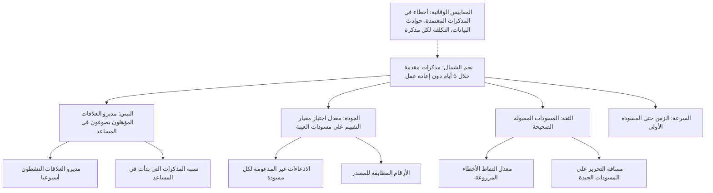
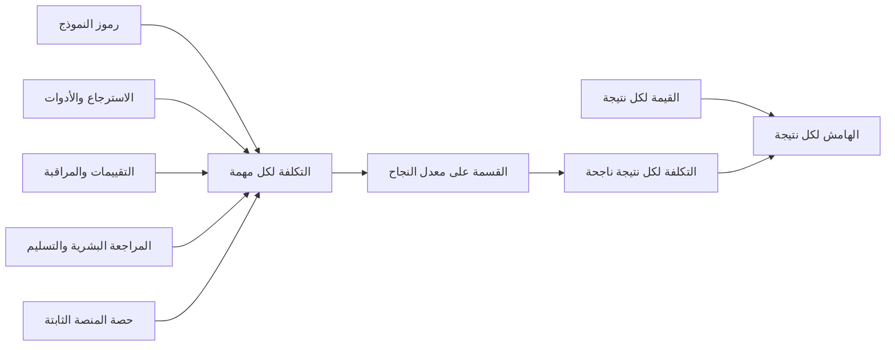

# الوحدة 8 — المقاييس والاقتصاديات والنمو

*ميزة الذكاء الاصطناعي (AI feature) التي أُطلقت لم تنجح بعد. بعد الإطلاق (launch) تتغير الأسئلة: هل يستخدمها الناس، وهل تساعدهم، وهل يثقون بها بالقدر الصحيح (trust it the right amount)، وكم تكلّف كل مرة استخدام (what does each use cost)، وهل تتحسن أم تتراجع بصمت (quietly getting worse)؟ تتناول هذه الوحدة إدارة منتج ذكاء اصطناعي (AI product) بعد يوم الإطلاق (launch day). ستبني شجرة مقاييس (metrics tree) لـ مساعد مذكرات الائتمان (Credit Memo Copilot) تفصل القيمة (value) عن النشاط (activity). وستحسب تكلفة الخدمة (cost to serve) لـ نجم أسيست (Najm Assist) ومساعد مذكرات الائتمان (Credit Memo Copilot)، وترى لماذا لا يكون أرخص نموذج (cheapest model) دائمًا أرخص منتج (cheapest product). ثم ستُعِدّ حلقة المراقبة والتحسين المتكرر (monitoring and iteration loop) التي تحافظ على سلامة التنبيهات الذكية (Smart Alerts) والتمويل الفوري للشركات الصغيرة (SME Instant Finance) ونجم أسيست (Najm Assist) بينما يتغير العملاء والمحتالون (fraudsters) ومورّدو النماذج (model vendors) من حولها. قاعدة رانيا لهذه الوحدة: «إن لم تستطع أن تقول كم يساوي، وكم يكلّف، وهل ينجرف (whether it's drifting)، فأنت لا تملك المنتج (you don't own the product)، بل تستضيفه فقط (You're just hosting it)».*

> **المراحل (Stages):** Grow — قِس القيمة والتكلفة والجودة (measure value, cost and quality) بعد الإطلاق، وحوّل ما تتعلمه إلى التكرار التالي (the next iteration).

---

# 8.1 — مقاييس المنتج للذكاء الاصطناعي: القيمة والجودة والتبنّي والثقة
*المستوى (Level): 🔴 متقدم (Advanced)* · *المتطلبات (Prerequisites): 6.1، 6.3، 7.3* · *المرحلة (Stage): Grow*

## ⚡ الدرس في دقيقة (In 60 seconds)
- يحتاج منتج الذكاء الاصطناعي (AI product) إلى مقاييس في **أربع عائلات (four families)**: **القيمة (value)** (هل أُنجزت مهمة المستخدم (user's job) بشكل أفضل أو أسرع أو أرخص؟)، و**الجودة (quality)** (هل كانت المخرجات (outputs) صحيحة؟)، و**التبنّي (adoption)** (هل يستخدمه المستخدمون المستهدفون (intended users) ويواصلون استخدامه؟)، و**الثقة (trust)** (هل يعتمدون عليه بالقدر الصحيح (the right amount)، لا أكثر ولا أقل؟).
- نظّمها في **شجرة مقاييس (metrics tree)**: مقياس نجم الشمال (North Star) واحد يعبّر عن القيمة المُقدَّمة (delivered value)، وبضعة مقاييس مُدخلة (input metrics) يستطيع الفريق تحريكها، و**مقاييس وقائية (guardrail metrics)** يجب ألا تسوء.
- يضيف الذكاء الاصطناعي إشارات (signals) تفتقر إليها المنتجات التقليدية (classic products): **معدل القبول (acceptance rate)**، و**مسافة التحرير (edit distance)** (مقدار ما يغيّره المستخدمون في المسودة (draft))، و**معدل التجاوز (override rate)**، و**معدل إعادة التوليد (regeneration rate)**، و**التصعيد إلى إنسان (escalation to a human)**، وفي المنتجات التنبؤية (predictive products) الدقة (precision) والاستدعاء (recall) مقيسَين على النتائج الفعلية (real outcomes).
- إشارة القرار (Decision cue): يجب أن يغيّر كل مقياس قرارًا ما (change a decision). إذا لم يكن أحد سيتصرف بشكل مختلف عندما يتحرك، فهو مقياس تجميلي (vanity metric). تخلّص منه.
- أكبر فخ (Biggest trap): قياس **النشاط أو التكلفة (activity or cost)** (المحادثات المُعالَجة (chats handled)، والمسودات المُولَّدة (drafts generated)، والتذاكر المُحوَّلة عن البشر (tickets deflected)) وتسميته قيمة. يمكن لروبوت المحادثة (chatbot) أن «يحتوي (contain)» محادثة أخطأ فيها.

## 🧭 لماذا يهم (Why it matters)
بعد ثلاثة أشهر من الإطلاق (launch)، يعرض فيصل لوحة معلومات (dashboard) مساعد مذكرات الائتمان (Credit Memo Copilot) على مجموعة التوجيه (steering group). تبدو جيدة: 11,400 مسودة مُولَّدة (drafts generated)، و190 من مديري العلاقات (relationship managers (RMs)) النشطين أسبوعيًا (weekly active)، ومتوسط تقييم بالإعجاب (average thumbs-up rating) 4.2 من 5. يستمع خالد، ثم يطرح السؤال الوحيد الذي يهمه: «هل تصل مذكرات الائتمان (credit memos) إلى اللجنة (committee) أسرع، وهل هي جيدة أصلًا؟» لا يعرف فيصل. لم يربط أحد الاستخدام (usage) بزمن دورة المذكرة (memo cycle time) أو بإعادة العمل (rework). كما أن عدد «المسودات المُولَّدة (drafts generated)» يشمل كل إعادة توليد (regeneration)، فيبدو مدير العلاقات المُحبَط الذي ينقر *إعادة التوليد (regenerate)* ست مرات كأنه ست وحدات نجاح (six units of success).

تتدخل رانيا. الأرقام تصف النشاط (activity) لا القيمة (value). المسودة المُولَّدة (draft generated) تكلفة (cost). أما المسودة التي يقبلها مدير العلاقات (RM) بتعديلات خفيفة (light edits)، وتمر بمراجعة الائتمان (credit review) دون إعادة عمل إضافية (extra rework)، وتجعل الصفقة تُحسم أسرع، فهي قيمة. يحتاج الفريق مقاييس للاثنين، مرتبة بحيث تجيب لوحة المعلومات (dashboard) عن سؤال خالد أولًا.

تُظهر الحالات العامة (public cases) الدرس نفسه على نطاق أوسع. في فبراير 2024 أعلنت Klarna أن مساعدها بالذكاء الاصطناعي (AI assistant) يتولى حصة كبيرة من محادثات خدمة العملاء (customer-service chats). وفي 2025 قالت الشركة إنها ستعيد مزيدًا من الخدمة البشرية (human service)، وذكرت جودة الخدمة (quality of service) جزءًا من السبب. الدرس: «المحادثات التي عالجها الذكاء الاصطناعي (conversations handled by AI)» مقياس حجم (volume metric)، ويحتاج إلى مقياس جودة (quality metric) بجانبه.

## 📐 كيف يعمل (How it works)

### 🟢 الأساسيات (The essentials)

**المقياس (A metric)** رقم تتتبعه عبر الزمن (track over time) لتعرف هل المنتج يعمل. المقاييس الجيدة (good metrics) مرتبطة بمهمة المستخدم (user's job) (2.1)، وتتحرك خلال أسابيع (move within weeks)، ويمكن تقسيمها إلى شرائح (segmented).

في منتجات الذكاء الاصطناعي، صنّف المقاييس في أربع عائلات (four families). كل عائلة تجيب عن سؤال مختلف، وكل منها قد تبدو سليمة (look healthy) بينما تفشل أخرى.

| العائلة (Family) | السؤال الذي تجيب عنه (Question it answers) | أمثلة لـ مساعد مذكرات الائتمان (Examples for Credit Memo Copilot) |
|---|---|---|
| **القيمة (Value)** | هل تُنجز مهمة المستخدم (user's job) بشكل أفضل أو أسرع أو أرخص؟ | الساعات من حزمة البيانات (data pack) حتى تقديم المذكرة (memo submitted)؛ المذكرات التي تعيدها مراجعة الائتمان (credit review)؛ ساعات مدير العلاقات الموفَّرة لكل مذكرة (RM hours saved per memo) |
| **الجودة (Quality)** | هل المخرجات (outputs) صحيحة ومستندة إلى مصادر (grounded) وآمنة (safe)؟ | نسبة المسودات المأخوذة عيّنةً (sampled drafts) التي تجتاز معيار التقييم (rubric) (6.1)؛ الادعاءات غير المدعومة (unsupported claims) لكل مسودة؛ الأرقام التي لا تطابق المصدر (don't match the source) |
| **التبنّي (Adoption)** | هل يستخدمه المستخدمون المستهدفون (intended users) ويواصلون استخدامه؟ | نسبة مديري العلاقات المؤهلين (eligible RMs) النشطين أسبوعيًا؛ نسبة المذكرات التي بدأت في المساعد (started in the copilot)؛ الاحتفاظ (retention) بعد 8 أسابيع |
| **الثقة (Trust)** | هل يعتمد المستخدمون عليه بشكل مناسب (rely on it appropriately)؟ | معدل القبول مع تعديلات قليلة (acceptance rate with low edits) على المسودات الجيدة؛ معدل اكتشاف الأخطاء المزروعة (catch rate on seeded errors)؛ استبيان مديري العلاقات عن الثقة (RM survey on confidence) |

ثلاث أفكار تحوّل قائمة الأرقام إلى نظام (system).

1. **مقياس نجم الشمال (The North Star metric).** رقم واحد يعبّر على أفضل وجه عن القيمة التي يقدّمها المنتج للمستخدمين (value the product delivers to users)، ويميل إلى أن يسبق نتائج الأعمال (lead business results). لـ مساعد مذكرات الائتمان (Credit Memo Copilot)، اختار فريق رانيا *«المذكرات المقدَّمة إلى مراجعة الائتمان خلال خمسة أيام عمل من اكتمال حزمة البيانات، دون أن تُعاد لإعادة العمل (memos submitted to credit review within five working days of a complete data pack, without being returned for rework)»*. يجمع السرعة والجودة (speed and quality) في رقم واحد، فالتلاعب بأحد الجانبين (gaming one side) يضر الآخر.
2. **المقاييس المُدخلة (Input metrics).** الأشياء القليلة التي يستطيع الفريق تحريكها مباشرة والتي تدفع مقياس نجم الشمال (North Star): التبنّي بين مديري العلاقات المؤهلين (adoption among eligible RMs)، ومعدل قبول المسودات (draft acceptance rate)، وجودة الاستناد إلى المصادر (grounding quality)، والزمن حتى المسودة الأولى (time to first draft).
3. **المقاييس الوقائية (Guardrail metrics).** أرقام يجب ألا تسوء بينما تدفع الأخرى: معدل الأخطاء الوقائعية في المذكرات المعتمدة (factual error rate in approved memos)، وحوادث البيانات السرية (confidential-data incidents)، وعبء عمل محللي الائتمان (credit-analyst workload)، والتكلفة لكل مذكرة (cost per memo). يأتي المصطلح من التجارب عبر الإنترنت (online experimentation) (Kohavi, Tang and Xu, *Trustworthy Online Controlled Experiments*, 2020)، حيث تحمي المقاييس الوقائية (guardrails) الأعمال بينما تحسّن المقياس الرئيسي (optimise the main metric).

**المؤشرات السابقة واللاحقة (Leading and lagging).** بعض النتائج تصل متأخرة. فهل أدّت مذكرة صاغها المساعد (copilot-drafted memo) إلى قرار ائتماني أفضل (better credit decision)؟ لن يظهر ذلك إلا في أداء القرض (loan performance) بعد عام أو أكثر. وهل التقط تنبيه ذكي (Smart Alert) احتيالًا حقيقيًا (real fraud)؟ قد يستغرق التأكد أسابيع عبر عمليات استرداد المدفوعات (chargebacks). تتبّع النتيجة اللاحقة (lagging outcome)، لكن وجّه أسبوعيًا بالمؤشرات السابقة (leading indicators) مثل معدل اجتياز معيار التقييم (rubric pass rate) وإعادة العمل (rework).

### 🟡 التعمق أكثر (Going deeper)

**إشارات خاصة بالذكاء الاصطناعي (AI-specific signals).** تترك المنتجات التوليدية والتنبؤية (generative and predictive products) آثارًا في السلوك (traces in behaviour) لا يتركها البرنامج التقليدي (classic software). تعلّم قراءتها.

| الإشارة (Signal) | ما هي (What it is) | ما تخبرك به (What it tells you) | كيف تضلّل (How it misleads) |
|---|---|---|---|
| **معدل القبول (Acceptance rate)** | نسبة مخرجات الذكاء الاصطناعي (AI outputs) التي يحتفظ بها المستخدم (يرسلها أو يدرجها أو يعتمدها (sends, inserts, approves)) | فائدة تقريبية (rough usefulness) | الختم دون تدقيق (rubber-stamping) يبدو نجاحًا؛ انظر الثقة (trust) أدناه |
| **مسافة التحرير (Edit distance)** | مقدار ما يغيّره المستخدم في المسودة (draft) قبل استخدامها، مثل نسبة الأحرف أو الأقسام المُعاد كتابتها (share of characters or sections rewritten) | جودة المسودة من وجهة نظر المستخدم (draft quality from the user's point of view) | بعض التعديلات تفضيلات أسلوبية (style preferences) لا أخطاء |
| **معدل إعادة التوليد (Regeneration rate)** | كم مرة يطلب المستخدمون محاولة أخرى (another attempt) | الإحباط (frustration)، أو عنصر تحكم مفقود (missing control) (النبرة، الطول (tone, length)) | المستخدمون المتقدمون (power users) يعيدون التوليد لمقارنة الخيارات (compare options) |
| **معدل التجاوز (Override rate)** | كم مرة يختلف قرار الإنسان (human decision) عن توصية النموذج (model's recommendation) | الخلاف بين النموذج والخبراء (disagreement between model and experts)؛ وفي التمويل الفوري للشركات الصغيرة (SME Instant Finance)، مواضع اختلاف النموذج عن مكتتبي الائتمان (underwriters) | التجاوز المرتفع (high override) قد يعني نموذجًا سيئًا أو موظفين لا يثقون به؛ يجب أن تنظر مَن كان محقًا (who was right) |
| **معدل التصعيد / التسليم (Escalation / handoff rate)** | نسبة المحادثات المُحالة إلى موظف بشري (human agent) | أين يبلغ نجم أسيست (Najm Assist) حدوده (reaches its limits) | انخفاض التصعيد (low escalation) قد يعني أن الروبوت عنيد (stubborn) لا أنه جيد |
| **الاحتواء (Containment)** | نسبة المحادثات التي تنتهي دون إنسان (without a human) | تكلفة مركز الاتصال المُتجنَّبة (contact-centre cost avoided) | يعدّ المحادثات المتروكة (abandoned) والمُجاب عنها خطأً (wrongly answered) نجاحًا |
| **الحل (Resolution)** | نسبة المحادثات التي حُلّت فيها مشكلة العميل فعلًا (actually solved) | القيمة الحقيقية (real value) | يحتاج إلى تعريف وتحقق (definition and verification)، مثل عدم تكرار التواصل خلال 7 أيام (no repeat contact within 7 days) |
| **التغذية الراجعة الصريحة (Explicit feedback)** | الإعجاب / عدم الإعجاب (thumbs up/down)، والتقييمات (ratings)، والتعليقات (comments) | صوت المستخدم المباشر (direct voice of the user) | معدلات استجابة منخفضة (low response rates) وانحياز نحو المستخدمين الراضين جدًا أو الغاضبين جدًا (very happy or very angry users) |

زوجان هما الأهم. **الاحتواء مقابل الحل (Containment versus resolution)**: العميل الذي يستسلم مع نجم أسيست (Najm Assist) ويتصل بمركز الاتصال (call centre) بعد ساعة كان «محتوى (contained)» في سجل المحادثة (chat log) لكنه لم يُساعَد. يعرّف فريق رانيا الحل (resolution) بأنه «لا تواصل بشأن الموضوع نفسه، عبر أي قناة، خلال سبعة أيام (no contact on the same topic, through any channel, within seven days)»، ولا يعرض الاحتواء (containment) إلا بجانبه. **القبول مقابل الصحة (Acceptance versus correctness)**: معدل القبول المرتفع (high acceptance rate) جيد فقط إذا كانت المخرجات المقبولة (accepted outputs) صحيحة. خذ عيّنة من المخرجات المقبولة وقيّمها وفق معيار التقييم (rubric) (6.1)، وإلا فلن تميّز الفائدة (usefulness) من الإفراط في الاعتماد (over-reliance).

**استخدام الأطر العامة (Using public frameworks).** لا تحتاج إلى اختراع هيكل (invent a structure).

- **HEART** (Google: السعادة (Happiness)، والتفاعل (Engagement)، والتبنّي (Adoption)، والاحتفاظ (Retention)، ونجاح المهمة (Task success)؛ Rodden, Hutchinson and Fu, 2010) يقرن كل بُعد (dimension) بسلسلة *الأهداف ← الإشارات ← المقاييس (Goals → Signals → Metrics)*. يناسب ميزات الذكاء الاصطناعي (AI features) لأن «نجاح المهمة (task success)» يجبرك على تعريف المهمة (define the job).
- **AARRR** («مقاييس القراصنة (pirate metrics)» لـ Dave McClure: الاستقطاب (Acquisition)، والتفعيل (Activation)، والاحتفاظ (Retention)، والإحالة (Referral)، والإيراد (Revenue)) قمع للنمو (funnel for growth). لأداة داخلية (internal tool) مثل مساعد الموظفين التوليدي (Staff GenAI)، أعد تسمية الخطوات: *مُمكَّن (enabled) ← مُفعَّل (activated)* (أول مهمة مفيدة (first useful task)) *← معتاد (habitual)* (استخدام أسبوعي (weekly use)) *← مناصر (advocate)* (يشارك الموجّهات أو القوالب (shares prompts or templates)) *← قيمة (value)* (الساعات الموفَّرة (hours saved)، مقيسة بأخذ العيّنات (measured by sampling)).

**التبنّي ليس ثنائيًا (Adoption is not binary).** في المؤسسة (enterprise)، يُخفي مقياس «المستخدمون النشطون (active users)» الفرق بين مدير علاقات (RM) يفتح المساعد (copilot) مرة في الشهر وآخر يصوغ كل مذكرة فيه. تتبّع *العمق (depth)* (نسبة العمل المؤهل للمستخدم المُنجَز بالمنتج (share of the user's eligible work done with the product)) إلى جانب *الاتساع (breadth)* (نسبة المستخدمين المؤهلين النشطين (share of eligible users active)).

**قسّم كل شيء إلى شرائح (Segment everything).** المتوسطات تُخفي المشكلات (averages hide problems). قسّم المقاييس حسب مجموعة المستخدمين (user group) (مديرو العلاقات الجدد مقابل ذوي الخبرة (new versus experienced RMs))، وحسب نوع المهمة (task type) (مذكرات الشركات الصغيرة مقابل مذكرات الشركات الكبرى (SME versus corporate memos))، وحسب اللغة (language) (الإنجليزية مقابل العربية في نجم أسيست (English versus Arabic for Najm Assist))، وحسب السوق (market) (قطر والإمارات والاتحاد الأوروبي (Qatar, UAE, EU)). قد يخفي المتوسط الإيجابي (positive average) مجموعةً يخذلها المنتج (a group the product is failing).

### 🔴 نظرة الخبير (Expert view)

**قياس الثقة بوصفها معايرة (Measuring trust as calibration).** الثقة (trust) ليست «كلما زادت كان أفضل (more is better)». الهدف هو **الاعتماد المناسب (appropriate reliance)**: أن يقبل المستخدمون المخرجات الجيدة (accept good outputs) ويلتقطوا السيئة (catch bad ones). هناك نمطا فشل (failure modes) متعاكسان. *الإفراط في الاعتماد (over-reliance)* (انحياز الأتمتة (automation bias)) يعني قبول مخرجات خاطئة؛ و*قلة الاعتماد (under-reliance)* تعني إعادة عمل أنجزه الذكاء الاصطناعي جيدًا. يمكنك قياس الاثنين.

- **تدقيقات الأخطاء المزروعة (Seeded-error audits).** في بيئة تدريب أو تشغيل ظلّي (training or shadow setting)، وليس في قرارات حية (live decisions) أبدًا، أدرج أخطاء معروفة (known errors) في بعض المسودات وقِس كم من مديري العلاقات يلتقطونها. انخفاض معدل الالتقاط (falling catch rate) إنذار بالإفراط في الاعتماد (over-reliance).
- **مصفوفة الاعتماد (Reliance matrix).** لعيّنة من المخرجات، قيّم مخرج الذكاء الاصطناعي (AI output) (جيد أو سيئ (good or bad)) وسجّل إجراء الإنسان (human action) (قُبل أو غُيّر (accepted or changed)). الجيد المقبول (good-and-accepted) والسيئ المُغيَّر (bad-and-changed) سليمان. السيئ المقبول (bad-and-accepted) إفراط في الاعتماد (over-reliance). والجيد المُعاد كتابته (good-and-rewritten) قلة اعتماد (under-reliance)، وهي تُفقدك القيمة (costs you the value).

**قانون Goodhart (Goodhart's law)** (المسمّى باسم الاقتصادي Charles Goodhart) يُصاغ عادة هكذا: «عندما يصبح المقياس هدفًا، يكفّ عن أن يكون مقياسًا جيدًا (when a measure becomes a target, it ceases to be a good measure)». منتجات الذكاء الاصطناعي معرّضة له بشكل خاص لأن النماذج والناس كليهما يحسّنون الأداء نحو الهدف (both optimise). كافئ فريق نجم أسيست (Najm Assist) على الاحتواء (containment) وسيجعلون زر التسليم (handoff button) أصعب في الإيجاد. وكافئ فريق المساعد (copilot team) على معدل القبول (acceptance rate) وسيتعلم المنتج إنتاج مسودات باهتة (bland drafts) لا يكلّف أحد نفسه تغييرها. الدفاع (Defence): اقرن كل هدف (target) بمقياس وقائي (guardrail) على الجانب الآخر، وراجع التعريفات فصليًا (review definitions quarterly).

**الإسناد: هل الذكاء الاصطناعي هو السبب؟ ⁦(Attribution: did the AI cause it?)⁩** قد ينخفض زمن دورة المذكرة (memo cycle time) بسبب المساعد (copilot)، أو لأن مراجعة الائتمان (credit review) وظّفت محللَين. للادعاءات التي تبرّر الميزانية (claims that justify budget)، استخدم أساليب التجارب (experiment methods) من 6.3: إطلاق مرحلي (staged rollout) حسب الفريق أو المنطقة مع مجموعة ضابطة محجوزة (holdout group)، أو مقارنة قبل/بعد (before/after comparison) مع مجموعة ضابطة مطابقة (matched control). وحيث تستحيل تجربة نظيفة (clean experiment)، قل ذلك وقدّم تقديرًا (estimate) مع افتراضاته (assumptions). سيثق خالد برقم صادق متحفّظ (honest hedged number) أكثر من رقم مُضخَّم (inflated one).

**مقاييس المنتجات التنبؤية (Metrics for predictive products).** في التمويل الفوري للشركات الصغيرة (SME Instant Finance) والتنبيهات الذكية (Smart Alerts)، يجب ربط مقاييس النموذج (model metrics) (الدقة (precision)، والاستدعاء (recall)، وAUC، والمعايرة (calibration) من 6.1) بنتائج الأعمال (business outcomes). في التنبيهات الذكية (Smart Alerts) قد تكون شجرة المقاييس (metrics tree): *خسائر الاحتيال المُتجنَّبة (fraud losses prevented)* (القيمة (value)) ← *الاستدعاء على الاحتيال المؤكد (recall on confirmed fraud)* و*الزمن حتى التنبيه (time to alert)* (مُدخلات (inputs))، مع *التنبيهات الكاذبة لكل 1,000 عميل نشط (false alerts per 1,000 active customers)* و*معدل إلغاء الاشتراك في التنبيهات (alert opt-out rate)* مقاييسَ وقائيةً (guardrails)، لأن إرهاق التنبيهات (alert fatigue) يجعل العملاء يتجاهلون التنبيهات المهمة أو يوقفونها. وفي التمويل الفوري للشركات الصغيرة (SME Instant Finance): *الحجم المعتمد عند معدل الخسارة المستهدف (approved volume at target loss rate)* (القيمة (value))، مع *معدل التعثر حسب الفوج (default rate by cohort)* و*معدل التجاوز (override rate)* و*فجوات معدل الموافقة بين الشرائح (approval-rate gaps across segments)* مقاييسَ وقائيةً (guardrails). تُغطّى مراقبة العدالة (fairness monitoring) في *AI Governance: Zero to Hero*؛ تأكد أنها تظهر على لوحة معلومات المنتج (product dashboard) أيضًا.

**القياس والتتبع متطلب من متطلبات المنتج (Instrumentation is a product requirement).** لا شيء من هذا يعمل ما لم يسجّل المنتج الأحداث الصحيحة (logs the right events): عرض المسودة (draft shown)، وقبول المسودة (draft accepted)، والأقسام المُحرَّرة (sections edited)، والنقر على إعادة التوليد (regenerate clicked)، وطلب التسليم (handoff requested)، وتقديم التغذية الراجعة (feedback given)، مع معرّف ثابت (stable ID) يربط مخرج الذكاء الاصطناعي (AI output) بنتيجة الأعمال اللاحقة (later business outcome). ضع قائمة الأحداث (event list) في المواصفات (spec) (5.1) قبل البناء (before build). واتفق على الاحتفاظ بالبيانات والوصول إليها (retention and access) مع سارة (مسؤولة حماية البيانات (DPO)): السجلات (logs) تحوي بيانات شخصية وسرية (personal and confidential data).

## 🧰 الأدوات (The toolkit)
| الأداة أو الإطار (Tool or framework) | ما هو وماذا يفعل (What it is and does) | متى تلجأ إليه (When to reach for it) |
|---|---|---|
| **North Star metric** — مقياس نجم الشمال | مقياس واحد يعبّر عن القيمة التي يقدمها المنتج (value the product delivers) ويميل إلى أن يسبق نتائج الأعمال (lead business results) | مواءمة الفريق والرعاة (aligning the team and sponsors) على معنى «يعمل (working)» |
| **Metrics tree** — شجرة المقاييس | مقياس نجم الشمال (North Star) مُفكَّك إلى مقاييس مُدخلة (input metrics) يستطيع الفريق تحريكها، مع مقاييس وقائية (guardrails) بجانبها | تصميم لوحة المعلومات (designing the dashboard)؛ تفسير سبب تحرك مقياس (explaining why a metric moved) |
| **HEART framework** (Google; Rodden, Hutchinson and Fu, 2010) | السعادة (Happiness)، والتفاعل (Engagement)، والتبنّي (Adoption)، والاحتفاظ (Retention)، ونجاح المهمة (Task success)، كلٌّ مُسقَط على الأهداف ← الإشارات ← المقاييس (Goals → Signals → Metrics) | اختيار مقاييس تجربة المستخدم (user-experience metrics) لميزة ذكاء اصطناعي (AI feature) |
| **AARRR** (Dave McClure) | قمع (funnel): الاستقطاب (Acquisition)، والتفعيل (Activation)، والاحتفاظ (Retention)، والإحالة (Referral)، والإيراد (Revenue) | نمو منتج موجّه للعملاء (growth of a customer product)؛ ويُكيَّف قمعًا للتبنّي (adoption funnel) في الأدوات الداخلية (internal tools) |
| **Guardrail metrics** (Kohavi, Tang and Xu) | مقاييس يجب ألا تتدهور (must not degrade) بينما تحسّن المقياس الرئيسي (optimise the main one) | كل هدف تضعه (every target you set)؛ كل تجربة (every experiment) |
| **Reliance matrix** — مصفوفة الاعتماد | تقارن جودة مخرج الذكاء الاصطناعي (AI output quality) بإجراء الإنسان (human's action) لكشف الإفراط في الاعتماد وقلته (over- and under-reliance) | قياس الثقة (measuring trust) في المساعدات وأدوات دعم القرار (copilots and decision-support tools) |
| **Resolution rate** — معدل الحل | نسبة المحادثات التي حُلّت فيها المشكلة فعلًا (actually solved)، مُتحقَّقًا منها بعدم تكرار التواصل (no repeat contact) | ليحلّ محل الاحتواء (replacing containment) بوصفه المقياس الرئيسي للمساعدات (headline for assistants) |

## 🏛️ عمليًا في بنك نجم (In practice at Najm Bank)
تطلب رانيا من فيصل إعادة بناء لوحة المعلومات (dashboard) في صفحة واحدة بعنوان **شجرة المقاييس وورقة التعريفات (metrics tree and definitions sheet)**. صارت مجموعة التوجيه (steering group) تقرؤها من الأعلى إلى الأسفل (top-down).

**مساعد مذكرات الائتمان (Credit Memo Copilot) — ورقة المقاييس (metrics sheet) (الإصدار 2 (v2)، تُراجَع فصليًا (reviewed quarterly))**

| المستوى (Level) | المقياس (Metric) | التعريف (Definition) | المصدر (Source) | الهدف / العتبة (Target / threshold) | المالك (Owner) |
|---|---|---|---|---|---|
| نجم الشمال (North Star) | المذكرات النظيفة في موعدها (On-time clean memos) | نسبة المذكرات المقدَّمة خلال 5 أيام عمل من اكتمال حزمة البيانات (complete data pack) وغير المُعادة لإعادة العمل (not returned for rework) | نظام سير عمل الائتمان (Credit workflow system) | ارتفاع عن خط الأساس (up from baseline)؛ يُحدَّد الهدف بعد خط أساس مدته 8 أسابيع (8-week baseline) | فيصل |
| القيمة (Value) | ساعات مدير العلاقات لكل مذكرة (RM hours per memo) | وسيط الساعات المُسجَّلة لكل مذكرة (median hours logged per memo)، بالمساعد مقابل بدونه (copilot versus non-copilot)، في الشريحة نفسها (same segment) | أخذ عيّنات زمنية (time sampling)، أسبوعان كل فصل | يُعرض مع المدى والطريقة (report with range and method) | فيصل |
| الجودة (Quality) | معدل اجتياز معيار التقييم (Rubric pass rate) | نسبة 50 مسودة مختارة عشوائيًا أسبوعيًا (randomly sampled drafts per week) تجتاز معيار التقييم (rubric) في 6.1 | لجنة المراجعة لدى دانة (Dana's review panel) | عند مستوى معيار الإطلاق أو فوقه (at or above launch bar) | دانة |
| الجودة (Quality) | الادعاءات غير المدعومة (Unsupported claims) | ادعاءات في المسودة بلا استشهاد بمصدر (no source citation)، لكل مسودة | فحص آلي مع اللجنة (automated check plus panel) | دون معيار الإطلاق (below launch bar) | دانة |
| التبنّي (Adoption) | الاتساع (Breadth) | مديرو العلاقات المؤهلون (eligible RMs) الذين صاغوا مذكرة واحدة على الأقل هذا الأسبوع | أحداث المنتج (product events) | يرتفع حتى الاستقرار (rising to plateau) | فيصل |
| التبنّي (Adoption) | العمق (Depth) | نسبة مذكرات كل مدير علاقات التي بدأت في المساعد (started in the copilot) | أحداث المنتج + سير العمل (product events + workflow) | يرتفع (rising) | فيصل |
| الثقة (Trust) | الإفراط في الاعتماد (Over-reliance) | نسبة المسودات المقبولة في العيّنة (sampled accepted drafts) التي تفشل في معيار التقييم (fail the rubric) | عيّنة مصفوفة الاعتماد (reliance matrix sample) | ينخفض (falling)؛ تنبيه إذا ارتفع أسبوعين متتاليين (alert if rising 2 weeks running) | حصة |
| الثقة (Trust) | قلة الاعتماد (Under-reliance) | نسبة المسودات الجيدة في العيّنة التي أُعيدت كتابتها بكثافة (heavily rewritten) (أكثر من نصف الأقسام) | عيّنة مصفوفة الاعتماد (reliance matrix sample) | مراقبة (watch)؛ يستدعي بحث تجربة المستخدم (prompts UX research) | حصة |
| مقياس وقائي (Guardrail) | الأخطاء في المذكرات المعتمدة (Errors in approved memos) | الأخطاء الوقائعية (factual errors) التي تجدها مراجعة الائتمان أو التدقيق (credit review or audit) في المذكرات المعتمدة | سجل مراجعة الائتمان (credit review log) | لا زيادة مقارنة بخط الأساس (no increase versus baseline) | خالد |
| مقياس وقائي (Guardrail) | التكلفة لكل مذكرة (Cost per memo) | تكلفة الخدمة المُحمَّلة بالكامل (fully loaded cost to serve) (8.2) | المالية + المنصة (finance + platform) | ضمن الميزانية (within budget) | طارق |
| مقياس وقائي (Guardrail) | حوادث البيانات (Data incidents) | بيانات سرية مكشوفة أو أُسيء التعامل معها (exposed or mishandled) | سجل الحوادث (incident log) | صفر؛ أي حادثة واحدة تستدعي مراجعة (any one triggers review) | ليلى |

أُزيل من المقاييس الرئيسية (retired from the headline): *المسودات المُولَّدة (drafts generated)* و*متوسط تقييم الإعجاب (average thumbs rating)* (وصارت الآن مقاييس تشخيصية (diagnostics)).

## 🛠️ التمارين (Exercises)
- 🟢 صنّف مقاييس نجم أسيست (Najm Assist) هذه إلى القيمة أو الجودة أو التبنّي أو الثقة أو التكلفة (value, quality, adoption, trust or cost): المحادثات التي بدأت (conversations started)؛ الاحتواء (containment)؛ الحل خلال 7 أيام (resolution within 7 days)؛ نسبة الإجابات التي تستشهد بصفحة السياسة الصحيحة (correct policy page)؛ مستخدمو التطبيق النشطون شهريًا الذين استخدموا المساعد (monthly active app users who used the assistant)؛ طلبات التسليم (handoff requests)؛ معدل عدم الإعجاب (thumbs-down rate). *يكتمل عندما (Done when):* يكون لكل منها عائلة واحدة، وتكون قد أشرت إلى المقياسين الأكثر عرضة للتلاعب (most likely to be gamed).
- 🟡 ابنِ جدول HEART (HEART table) لـ مساعد الموظفين التوليدي (Staff GenAI) بهدف واحد وإشارة واحدة ومقياس واحد لكل بُعد (one goal, one signal and one metric per dimension). *يكتمل عندما (Done when):* يمكن حساب كل مقياس من بيانات يستطيع بنك نجم تسجيلها واقعيًا (realistically log)، ويسمّي «نجاح المهمة (Task success)» مهمة محددة (specific job).
- 🔴 صمّم شجرة المقاييس (metrics tree) لـ التنبيهات الذكية (Smart Alerts)، متضمنة مقياس نجم الشمال (North Star)، وثلاثة مقاييس مُدخلة (input metrics)، وثلاثة مقاييس وقائية (guardrails)، ونتيجة لاحقة واحدة (lagging outcome) مع المدة التي تستغرقها تسمياتها (labels) للوصول. *يكتمل عندما (Done when):* تُظهر الشجرة كيف ستكتشف إرهاق التنبيهات (alert fatigue) قبل أن يوقف العملاء التنبيهات، ويكون لكل مقياس وقائي مالك (owner).

## ⚠️ أخطاء وفخاخ (Mistakes and traps)
- **عدّ النشاط قيمةً (Counting activity as value).** المسودات المُولَّدة (drafts generated) والمحادثات المُعالَجة (chats handled) والرموز المستخدمة (tokens used) تكاليف. ضع مقياس قيمة (value metric) في قمة الشجرة، وأنزِل النشاط إلى المقاييس التشخيصية (diagnostics).
- **عرض الاحتواء دون الحل (Reporting containment without resolution).** اقرنهما دائمًا، وتحقق من الحل (verify resolution) بالتحقق من تكرار التواصل (repeat contact).
- **معاملة القبول المرتفع دليلًا على الجودة (Treating high acceptance as proof of quality).** خذ عيّنة من المخرجات المقبولة (sample accepted outputs) وقيّمها. القبول المرتفع مع تراجع الصحة (falling correctness) إفراط في الاعتماد (over-reliance).
- **المتوسطات فقط (Averages only).** قسّم حسب مجموعة المستخدمين واللغة والسوق ونوع المهمة (user group, language, market and task type) قبل أن تستنتج أي شيء.
- **القياس والتتبع بعد الإطلاق (Instrumenting after launch).** ضع قائمة الأحداث (event list) في المواصفات (spec). البيانات التي لم تسجّلها ضاعت (data you did not log is gone).
- **أهداف بلا مقاييس وقائية (Targets without guardrails).** كل هدف يدعو إلى التلاعب (invites gaming) (قانون Goodhart (Goodhart's law)). اقرنه بمقياس على الجانب المقابل (opposite side).

## 🧾 الخلاصة (Recap)
- تأتي مقاييس منتجات الذكاء الاصطناعي (AI product metrics) في أربع عائلات: القيمة والجودة والتبنّي والثقة (value, quality, adoption and trust). كل منها قد تبدو سليمة بينما تفشل أخرى.
- تمتد شجرة المقاييس (metrics tree) من مقياس نجم الشمال (North Star) إلى مقاييس مُدخلة (input metrics) يستطيع الفريق تحريكها، مع مقاييس وقائية (guardrails) يجب ألا تتدهور.
- اقرأ الإشارات الخاصة بالذكاء الاصطناعي (AI-specific signals) (القبول (acceptance)، ومسافة التحرير (edit distance)، وإعادة التوليد (regeneration)، والتجاوز (override)، والتصعيد (escalation)) بحذر، واقرن كلًّا منها بفحص للصحة (correctness check).
- الثقة (trust) مسألة معايرة (calibration). قِس الإفراط في الاعتماد وقلته (over-reliance and under-reliance) بمصفوفة الاعتماد (reliance matrix) وتدقيقات الأخطاء المزروعة (seeded-error audits).
- أثبت السببية (prove causation) بالمجموعات الضابطة المحجوزة (holdouts) أو الإطلاق المرحلي (staged rollouts) حيث تستطيع، وقدّم تقديرات صادقة (honest estimates) حيث لا تستطيع.

## ✍️ اختبر نفسك (Check yourself)

**1. ارتفع معدل الاحتواء (containment rate) في نجم أسيست (Najm Assist) من 55% إلى 70% بعد تغيير الموجّه (prompt change). ما الذي يجب أن يتحقق منه فيصل قبل أن يعدّه نجاحًا (calling it a win)؟**

- A. هل ارتفع عدد المحادثات (number of conversations) أيضًا
- B. هل تحسّن الحل (resolution) أيضًا، مقيسًا بعدم تكرار التواصل بشأن الموضوع نفسه خلال سبعة أيام (no repeat contact on the same topic within seven days)
- C. هل ارتفع متوسط تقييم الإعجاب (average thumbs-up rating)
- D. هل انخفضت تكلفة الرموز لكل محادثة (token cost per conversation)

الإجابة

**B.** يعدّ الاحتواء (containment) كل محادثة تنتهي دون إنسان، بما في ذلك العملاء الذين استسلموا واتصلوا لاحقًا. أما الحل (resolution) فيتحقق من أن المشكلة حُلّت فعلًا (actually solved). التقييمات (ratings) (C) مقياس تشخيصي مفيد (useful diagnostic) لكنها تعاني من استجابة منخفضة ومنحازة (low and skewed response). (🟡 التعمق أكثر (Going deeper).)

**2. أيّ مما يلي أفضل مقياس نجم الشمال (North Star) لـ مساعد مذكرات الائتمان (Credit Memo Copilot)؟**

- A. عدد المسودات المُولَّدة أسبوعيًا (drafts generated per week)
- B. مديرو العلاقات النشطون أسبوعيًا (weekly active RMs)
- C. نسبة المذكرات المقدَّمة في موعدها وغير المُعادة لإعادة العمل (submitted on time and not returned for rework)
- D. متوسط تقييم الإعجاب على المسودات (average thumbs rating on drafts)

الإجابة

**C.** يعبّر عن القيمة المُقدَّمة (delivered value) ويجمع السرعة والجودة (speed with quality)، فالتلاعب بأحدهما يضر الآخر. A يعدّ التكلفة والنشاط (cost and activity)، وB مُدخل تبنٍّ (adoption input)، وD مقياس تشخيصي (diagnostic). (🟢 الأساسيات (The essentials).)

**3. تُظهر عيّنة مصفوفة الاعتماد (reliance-matrix sample) أن 18% من المسودات التي قبلها مديرو العلاقات دون تعديلات (with no edits) فشلت في معيار الجودة (quality rubric)، ارتفاعًا من 7% في الفصل السابق. ماذا يدل هذا على الأرجح؟**

- A. قلة الاعتماد (under-reliance): مديرو العلاقات يعيدون كتابة مسودات جيدة
- B. الإفراط في الاعتماد (over-reliance): مديرو العلاقات يقبلون مسودات كان عليهم تصحيحها
- C. معيار التقييم (rubric) صارم أكثر من اللازم
- D. التبنّي (adoption) يتراجع

الإجابة

**B.** المخرجات السيئة المقبولة دون تغيير هي خانة الإفراط في الاعتماد (over-reliance cell). وهذا يستدعي النظر في احتكاك تجربة المستخدم (UX friction) والتدريب (training) وتدقيقات الأخطاء المزروعة (seeded-error audits). قلة الاعتماد (under-reliance) (A) هي إعادة كتابة المسودات الجيدة بكثافة. (🔴 نظرة الخبير (Expert view).)

**4. يُكافأ فريق نجم أسيست (Najm Assist) على الاحتواء (containment)، ثم ينقل لاحقًا بهدوء زر «التحدث إلى شخص (talk to a person)» شاشتين إلى الداخل. أيّ فكرة تفسّر هذا أفضل تفسير؟**

- A. أثر الجِدّة (novelty effect)
- B. عدم تطابق نسبة العيّنة (sample ratio mismatch)
- C. قانون Goodhart (Goodhart's law)
- D. نموذج Kano (Kano model)

الإجابة

**C.** عندما يصبح المقياس هدفًا يكفّ عن أن يكون مقياسًا جيدًا. الدفاع هو مقياس وقائي (guardrail) مثل الحل (resolution) أو معدل الشكاوى (complaint rate). أثر الجِدّة (novelty effect) (A) ارتفاع مؤقت (temporary lift) ناتج عن كون الشيء جديدًا. (🔴 نظرة الخبير (Expert view).)

**5. انخفض زمن دورة المذكرة (memo cycle time) بنسبة 20% في الفصل الذي أُطلق فيه المساعد (copilot). وفي الفصل نفسه وظّفت مراجعة الائتمان (credit review) محللَين. ما الطريقة الأكثر قابلية للدفاع (most defensible) لإسناد هذا المكسب (attribute the gain)؟**

- A. نسب الفضل إلى المساعد، لأنه أُطلق في الفصل نفسه
- B. مقارنة الفرق التي تستخدم المساعد بمجموعة ضابطة محجوزة (holdout) أو مجموعة لم يُطرح لها بعد (not-yet-rolled-out group) خلال الفترة نفسها
- C. استبيان مديري العلاقات عن شعورهم بأنهم أسرع (survey RMs)
- D. تقسيم المكسب بالتساوي بين السببين

الإجابة

**B.** المجموعة الضابطة المحجوزة (holdout) أو الإطلاق المرحلي (staged rollout) يضبطان التغييرات التي تؤثر في الجميع، مثل المحللين الجدد. A يخلط التوقيت بالسبب (confuses timing with cause). وC يقيس الانطباع لا الأثر (perception, not effect). (🔴 نظرة الخبير (Expert view)؛ انظر 6.3.)

## 📚 المراجع (References)
- Rodden, Hutchinson and Fu, "Measuring the User Experience on a Large Scale: User-Centered Metrics for Web Applications", CHI 2010 — https://research.google/pubs/
- Kohavi, Tang and Xu, *Trustworthy Online Controlled Experiments* (Cambridge University Press, 2020) — https://experimentguide.com
- Amershi et al., "Guidelines for Human-AI Interaction", CHI 2019 — https://www.microsoft.com/en-us/research/project/guidelines-for-human-ai-interaction/
- Google PAIR, People + AI Guidebook — https://pair.withgoogle.com/guidebook
- Marty Cagan, *Inspired* (2nd ed., Wiley, 2017) — https://www.svpg.com
- Teresa Torres, *Continuous Discovery Habits* (2021) — https://www.producttalk.org
- Parasuraman and Riley, "Humans and Automation: Use, Misuse, Disuse, Abuse", *Human Factors* 39(2), 1997 — https://journals.sagepub.com/home/hfs

---

# 8.2 — اقتصاديات الوحدة: تكلفة الخدمة ونماذج التسعير والهوامش
*المستوى (Level): 🔴 متقدم (Advanced)* · *المتطلبات (Prerequisites): 1.2، 1.3، 7.2، 8.1* · *المرحلة (Stage): Grow*

## ⚡ الدرس في دقيقة (In 60 seconds)
- البرمجيات التقليدية (traditional software) لا تكلّف تقريبًا شيئًا إضافيًا لكل استخدام (per use). أما الذكاء الاصطناعي فلا: كل طلب (request) يستهلك قدرة حوسبية (compute)، وغالبًا استرجاعًا (retrieval) واستدعاءات أدوات (tool calls) وتقييمًا (evaluation) ومراجعة بشرية (human review). **تكلفة الخدمة (cost to serve)** متغيّر من متغيرات المنتج (product variable)، لا بند في ميزانية تقنية المعلومات (IT line item).
- الوحدة المهمة هي **التكلفة لكل نتيجة ناجحة (cost per successful outcome)** (لكل محادثة محلولة (resolved conversation)، ولكل مذكرة مقبولة (accepted memo)، ولكل قرار صحيح (correct decision))، لا التكلفة لكل رمز (cost per token) أو لكل طلب (per request). النموذج الرخيص الذي يفشل أكثر قد يكون أغلى منتج (most expensive product).
- ابنِ **نموذج تكلفة المهمة (cost-per-task model)**: الرموز × السعر (tokens × price)، مضروبة في عدد الاستدعاءات لكل مهمة (calls per task)، زائد الاسترجاع والأدوات (retrieval and tools)، والتقييم والمراقبة (evaluation and monitoring)، والمراجعة البشرية وعمليات التسليم (human review and handoffs)، وحصة من تكاليف المنصة الثابتة (fixed platform costs). ثم اقسم على معدل النجاح (success rate).
- **نماذج التسعير (Pricing models)** (لكل مقعد (seat)، أو حسب الاستخدام (usage)، أو لكل مهمة أو نتيجة (per-task or outcome)، أو فئة مميزة (premium tier)، أو مُضمَّن (bundled)) يضع كلٌّ منها مخاطر التكلفة (cost risk) على طرف مختلف. اختر نموذجًا تطابق وحدته القيمة التي يراها العميل (value the customer sees) والتكلفة التي تتحملها.
- أكبر فخ (Biggest trap): تحسين فاتورة النموذج (model bill) مع تجاهل التكاليف المهيمنة فعلًا: عمليات التسليم إلى البشر (human handoffs)، ووقت المراجعة (review time)، وإعادة العمل (rework)، وفي منتجات الائتمان التنبؤية (predictive credit products) **الخسائر الناتجة عن القرارات الخاطئة (losses from wrong decisions)**.

## 🧭 لماذا يهم (Why it matters)
يُحضر طارق أول فاتورة نموذج لشهر كامل (first full-month model bill) لـ نجم أسيست (Najm Assist) إلى مراجعة المنتج (product review). إنها أضعاف ما في دراسة الجدوى (business case). غريزة فيصل الأولى أن ينتقل إلى أصغر وأرخص نموذج (smallest, cheapest model). تحذّر دانة من أن النموذج الصغير (small model) في اختباراتها غير المتصلة (offline tests) أجاب إجابات صحيحة عن عدد أقل من أسئلة البطاقات والمدفوعات (card and payment questions). ويطرح خالد، الذي يموّل جزءًا من مركز الاتصال (contact centre)، سؤالًا أدق: «كم ندفع مقابل كل مشكلة عميل حُلّت فعلًا (each customer problem actually solved)، مع احتساب تلك التي تنتهي عند موظفيّ على أي حال؟»

لا أحد يستطيع الإجابة: فاتورة الرموز (token bill)، وتكلفة مركز الاتصال (contact-centre cost)، ومعدل الحل (resolution rate) (8.1) موجودة في ثلاثة أماكن. تضعها رانيا في ورقة واحدة (one sheet). فاتورة النموذج (model bill) حقيقية، لكن عمليات التسليم إلى البشر (human handoffs) تكلّف أكثر بكثير. ويتبيّن أن أرخص نموذج لكل رمز (cheapest model per token) هو الأغلى لكل محادثة محلولة (most expensive per resolved conversation).

تتعلّم الصناعة الشيء نفسه علنًا. نقل المورّدون (vendors) بعض ميزات الذكاء الاصطناعي من أسعار ثابتة لكل مقعد (flat per-seat prices) إلى أسعار مرتبطة بوحدات العمل (units of work). سعّرت Intercom وكيلها Fin لكل محادثة محلولة (per resolved conversation) (منذ 2023)، وأطلقت Salesforce منصة Agentforce بتسعير لكل محادثة (per-conversation pricing) (2024). الأسعار الدقيقة تتغير؛ لكن الدرس ثابت: حين يكون لكل استخدام تكلفة حقيقية (real cost)، فإن الوحدة التي تسعّرها وتقيسها خيار استراتيجي (strategic choice).

## 📐 كيف يعمل (How it works)

### 🟢 الأساسيات (The essentials)

**اقتصاديات الوحدة (Unit economics)** تسأل: لوحدة واحدة من المنتج (one unit of the product) (مهمة واحدة، أو محادثة واحدة، أو عميل واحد، أو شهر واحد)، كم يكلّف تقديمها (cost to deliver)، وما القيمة أو الإيراد (value or revenue) الذي تجلبه، وما الذي يتبقى (what is left over)؟ في منتجات الذكاء الاصطناعي تجعل ثلاث حقائق ذلك أمرًا لا مفر منه.

1. **كل استخدام يكلّف مالًا (Every use costs money).** تُسعَّر النماذج اللغوية الكبيرة (large language models) عادةً لكل **رمز (token)** (قطعة من النص، نحو ثلاثة أرباع كلمة إنجليزية تقريبًا؛ والنص العربي كثيرًا ما يستهلك رموزًا أكثر للمعنى نفسه (more tokens for the same meaning)). يفرض المزوّدون (providers) رسومًا منفصلة على رموز الإدخال (input tokens) (ما ترسله: التعليمات (instructions)، والمستندات المسترجعة (retrieved documents)، وسجل المحادثة (conversation history)) ورموز الإخراج (output tokens) (ما يكتبه النموذج)، والإخراج عادةً أغلى لكل رمز.
2. **التكاليف تتفاوت كثيرًا بين المهام (Costs vary widely per task).** سؤال من سطر واحد وملف ائتماني من 40 صفحة (40-page credit file) يختلفان في التكلفة بمراتب عشرية (orders of magnitude). والوكيل (agent) الذي يدور عبر عشرة استدعاءات أدوات (ten tool calls) يكلّف أكثر بكثير من وكيل يجيب في استدعاء واحد.
3. **الفشل يكلّف مالًا أيضًا (Failure costs money too).** الإجابة الخاطئة التي تنتهي عند موظف بشري (human agent)، والمسودة التي تحتاج إلى إعادة عمل (rework)، والموافقة الائتمانية السيئة (bad credit approval)، كلها تكلّف أكثر من استدعاء النموذج (model call) الذي تسبّب فيها.

**نموذج تكلفة المهمة (The cost-per-task model)** جدول بيانات بسيط (simple spreadsheet) يجمع كل ما يلزم لإنجاز وحدة عمل واحدة (one unit of work).

| مكوّن التكلفة (Cost component) | ما الذي تحسبه (What to count) | مثال مساعد مذكرات الائتمان (Credit Memo Copilot example) |
|---|---|---|
| استدلال النموذج (Model inference) | رموز الإدخال والإخراج × السعر (input and output tokens × price)، × الاستدعاءات لكل مهمة (calls per task)، بما في ذلك إعادة المحاولات وإعادة التوليد (retries and regenerations) | ستة استدعاءات صياغة لكل مذكرة (six drafting calls per memo) على ملف ائتماني طويل (long credit file) |
| الاسترجاع والأدوات (Retrieval and tools) | التضمين (embedding)، والبحث (search)، وتحليل المستندات (document parsing)، واستدعاءات واجهات البرمجة (API calls) | تحليل القوائم المالية (parsing financial statements)، والبحث في المذكرات السابقة (searching past memos) |
| التقييم والمراقبة (Evaluation and monitoring) | فحوص النموذج اللغوي حَكَمًا (LLM-as-judge) عبر الإنترنت (online)، والتسجيل (logging)، ولوحات المعلومات (dashboards) | استدعاء حَكَم واحد لكل مسودة (one judge call per draft) |
| المراجعة البشرية والتسليم (Human review and handoff) | وقت الموظفين في الفحص أو التصحيح أو تولّي العمل (checking, correcting or taking over) | لجنة دانة تأخذ عيّنات من المسودات أسبوعيًا (Dana's panel sampling drafts each week) |
| حصة المنصة الثابتة (Fixed platform share) | الاستضافة (hosting)، والحدود الدنيا للمورّدين (vendor minimums)، وفريق المنصة (platform team)، والدعم (support)، مُوزَّعة على الفترة (amortised) | حصة من منصة الذكاء الاصطناعي وفريق الدعم (share of the AI platform and support team) |

ثم احسب رقمين: **التكلفة لكل مهمة (cost per task)** (مجموع الصفوف)، و**التكلفة لكل نتيجة ناجحة (cost per successful outcome)** (التكلفة لكل مهمة ÷ معدل النجاح (success rate)). الثاني هو الذي يجب إدارته.

**الأسعار تتغير (Prices change).** وقت كتابة هذا النص (2026)، تنخفض أسعار الرمز (per-token prices) لمستوى قدرة معيّن (given capability level)، بينما تدفع النماذج الأحدث والأقدر والسياقات الأطول (longer contexts) في الاتجاه الآخر. اجعل الأسعار مُدخلات قابلة للتحديث (inputs you can update)، لا ثوابت (constants) أبدًا.

### 🟡 التعمق أكثر (Going deeper)

**مثال محلول: نجم أسيست (A worked example: Najm Assist).** الأرقام أدناه توضيحية (illustrative)، اختيرت لإظهار الطريقة (show the method). ليست أسعارًا حقيقية ولا بيانات حقيقية لبنك نجم.

الافتراضات (Assumptions): 1.5 مليون محادثة شهريًا (conversations a month)، بمتوسط أربع جولات (four turns) لكل منها. كل جولة ترسل نحو 4,000 رمز إدخال (input tokens) (موجّه النظام (system prompt)، ومقتطفات السياسات (policy snippets)، والسجل (history)) وتتلقى نحو 300 رمز إخراج (output tokens). يُسعَّر نموذج *كبير (large)* مثلًا بـ 3 دولارات لكل مليون رمز إدخال و15 دولارًا لكل مليون رمز إخراج. ونموذج *صغير (small)* بـ 0.25 و1.25 دولار. والتسليم إلى موظف بشري (handoff to a human agent) يكلّف مثلًا 4 دولارات من وقت مركز الاتصال (contact-centre time).

| | النموذج الكبير فقط (Large model only) | النموذج الصغير فقط (Small model only) | التوجيه: 80% صغير و20% كبير (Routed: 80% small, 20% large) |
|---|---|---|---|
| تكلفة النموذج لكل جولة (Model cost per turn) | $0.0165 | $0.001375 | — |
| تكلفة النموذج لكل محادثة (Model cost per conversation) | $0.066 | $0.0055 | $0.0176 |
| فاتورة النموذج شهريًا (Model bill per month) | $99,000 | $8,250 | $26,400 |
| معدل الحل (Resolution rate) (وفق تعريف 8.1 (from 8.1 definition)) | 65% | 50% | 63% |
| معدل التسليم (Handoff rate) | 25% | 40% | 27% |
| تكلفة التسليم لكل محادثة (Handoff cost per conversation) | $1.00 | $1.60 | $1.08 |
| **إجمالي التكلفة لكل محادثة (Total cost per conversation)** | **$1.066** | **$1.6055** | **$1.0976** |
| **التكلفة لكل محادثة محلولة (Cost per resolved conversation)** | **$1.64** | **$3.21** | **$1.74** |

يخفّض النموذج الصغير (small model) فاتورة النموذج (model bill) بأكثر من 90%، ومع ذلك يكلّف نحو ضعف التكلفة لكل محادثة محلولة (per resolved conversation)، لأنه يرسل عملاء أكثر إلى الموظفين. في هذا المثال التوضيحي تبلغ تكلفة التسليم (handoff cost) نحو خمسة عشر ضعف تكلفة النموذج (model cost) حتى مع النموذج الكبير. التوجيه (routing) (إرسال الأسئلة السهلة إلى النموذج الصغير والصعبة إلى الكبير) يوفّر معظم فاتورة النموذج مع البقاء قريبًا في النتائج (close on outcomes). وهنا لا يتفوّق تمامًا على استخدام النموذج الكبير وحده (large-only)، وهذه نتيجة بحد ذاتها (a finding in itself).

**روافع التكلفة (Cost levers)، مرتبة تقريبًا بحسب عدد مرات جدواها (how often they pay off):**

| الرافعة (Lever) | ماذا تفعل (What it does) | انتبه إلى (Watch out for) |
|---|---|---|
| **تقليل عمليات التسليم وإعادة العمل (Reduce handoffs and rework)** | تحسين الجودة في أعلى فئات الفشل (top failure categories) (8.3) | عادةً أكبر رافعة (biggest lever)؛ تحتاج إلى تحليل الأخطاء (error analysis)، لا إلى نموذج أرخص |
| **تقليص السياق (Trim the context)** | إرسال مقاطع مسترجعة أقل وأحسن اختيارًا (fewer, better-chosen retrieved passages)؛ تلخيص السجلات الطويلة (summarise long histories) | قطع السياق قد يقطع الاستناد إلى المصادر (grounding)؛ أعد تشغيل المجموعة المرجعية (golden set) |
| **التخزين المؤقت للموجّهات (Prompt caching)** | كثير من المزوّدين يخفّضون سعر الإدخال المتكرر (repeated input)، مثل موجّه نظام ثابت طويل (long fixed system prompt) | الشروط تختلف بين المورّدين (terms differ by vendor)؛ تحقّق من الأسعار الحالية (current pricing) |
| **توجيه النماذج (Model routing)** | نموذج صغير للطلبات السهلة، وكبير للصعبة | أخطاء الموجِّه (router errors) ترسل الحالات الصعبة إلى نموذج ضعيف؛ قيّم الموجِّه (evaluate the router) |
| **المعالجة الدفعية (Batch processing)** | تشغيل العمل غير العاجل (non-urgent work) دفعةً واحدة، غالبًا بخصم (at a discount) | للمهام التي يمكنها الانتظار فقط، مثل المسودات المسبقة للمذكرات ليلًا (overnight memo pre-drafts) |
| **حدود الإخراج (Output limits)** | إجابات أقصر (shorter answers)، ومخرجات مُهيكلة (structured outputs) | الإيجاز المفرط يضر الفائدة (hurts usefulness) |
| **تحديد سقف لحلقات الوكيل (Cap agent loops)** | حد أقصى للخطوات أو الإنفاق لكل مهمة (maximum steps or spend per task) | المهمة التي بلغت السقف يجب أن تفشل بلطف (fail gracefully) وتُسلَّم إلى إنسان (hand off) |

**المتوسطات تُخفي الأطراف (Averages hide tails).** في الوكلاء (agents)، اعرض المئين 95 (95th percentile (p95)) لتكلفة المهمة بجانب المتوسط. تدفّق الاعتراض على معاملة (dispute-a-transaction flow) في نجم أسيست (Najm Assist) الذي يستغرق عادةً أربعة استدعاءات أدوات (tool calls) قد يدور أحيانًا حتى أربعين. ضع سقف إنفاق لكل مهمة (spend cap per task) وعامل تكرار بلوغه خللًا في الجودة (quality bug).

**صورة مساعد مذكرات الائتمان تبدو مختلفة (The Credit Memo Copilot picture looks different).** توضيحيًا مرة أخرى: ستة استدعاءات صياغة (drafting calls) لكل مذكرة بـ 30,000 رمز إدخال و1,500 رمز إخراج لكل منها على النموذج الكبير تبلغ $0.54 + $0.135 = $0.675 من تكلفة النموذج (model cost). أضف مثلًا $0.15 للتحليل والاسترجاع والتسجيل (parsing, retrieval and logging)، ونحو $0.07 لفحص واحد بالنموذج اللغوي حَكَمًا (LLM-as-judge check)، ونحو $1.67 من وقت المراجِعين (reviewer time) (50 مسودة عيّنةً من 600 أسبوعيًا، 20 دقيقة لكل منها، بتكلفة مُحمَّلة (loaded) 60 دولارًا للساعة). التكلفة المتغيرة (variable cost) نحو $2.56 لكل مذكرة. وحصة منصة (platform share) قدرها 15,000 دولار شهريًا موزعة على 2,400 مذكرة تضيف $6.25، فتصبح التكلفة المُحمَّلة بالكامل (fully loaded cost) نحو $8.80. في المقابل، إذا وفّر المساعد (copilot) لمدير العلاقات (RM) 1.5 ساعة بتكلفة مُحمَّلة 80 دولارًا للساعة، فكل مذكرة تساوي نحو 120 دولارًا من الوقت. هنا فاتورة النموذج (model bill) شريحة صغيرة؛ و**التبنّي والوقت الموفَّر (adoption and time saved)** هما ما يحسم دراسة الجدوى (business case).

### 🔴 نظرة الخبير (Expert view)

**نماذج التسعير ومَن يتحمّل المخاطر (Pricing models and who carries the risk).** عندما تبيع منتج ذكاء اصطناعي (AI product)، أو تشتريه، يحدّد نموذج التسعير (pricing model) مَن يستوعب تقلّب التكلفة والفشل (cost variation and failure).

| نموذج التسعير (Pricing model) | كيف يعمل (How it works) | أين تقع مخاطر التكلفة (Cost risk sits with) | يناسب عندما (Fits when) | مثال (بتحفّظ) (Example (hedged)) |
|---|---|---|---|---|
| **لكل مقعد (Per seat)** | رسم ثابت لكل مستخدم شهريًا (flat fee per user per month) | البائع (Seller): المستخدمون الكثيفون (heavy users) قد يكلّفون أكثر مما يدفعون | الاستخدام قابل للتنبؤ (usage is predictable)؛ والقيمة لكل شخص (value is per person) | كثير من المساعدات المؤسسية عند إطلاقها (many enterprise copilots at launch) |
| **حسب الاستخدام (Usage-based)** | لكل رمز أو استدعاء أو مستند (per token, call or document) | المشتري (Buyer): يصعب التنبؤ بالفواتير (bills are hard to forecast) | المشترون التقنيون (technical buyers)؛ الاستخدام المتذبذب (spiky usage) | واجهات برمجة النماذج (Model APIs) |
| **لكل مهمة أو نتيجة (Per task or outcome)** | لكل محادثة محلولة (per resolved conversation)، لكل مهمة مكتملة (per completed task) | البائع (Seller): يدفع ثمن الفشل، ويكسب عند النجاح | النتيجة معرّفة بوضوح وقابلة للتحقق (clearly defined and verifiable) | Intercom Fin (لكل حل (per resolution)، منذ 2023)؛ Salesforce Agentforce (لكل محادثة عند الإطلاق (per conversation at launch)، 2024) |
| **فئة مميزة (Premium tier)** | ميزات الذكاء الاصطناعي في خطة أعلى سعرًا (higher-priced plan) | مشتركة (Shared): يجب أن يغطي سعر الفئة المستخدمين الكثيفين | منتجات المستهلكين ذات نواة مجانية (consumer products with a free core) | Duolingo Max (2023) |
| **مُضمَّن / مجاني (Bundled / free)** | مُدرج لتعزيز الاحتفاظ (drive retention) أو خفض تكاليف أخرى | البائع (Seller)، ممولًا من الاحتفاظ أو الوفورات (retention or savings) | الميزة تدافع عن المنتج الأساسي (defends the core product) | المساعد داخل تطبيق البنك (a bank's in-app assistant) |

التسعير حسب النتيجة (outcome pricing) يتيح للعميل أن يدفع مقابل القيمة، لكنه يحتاج إلى تعريف نتيجة قابل للتدقيق (auditable outcome definition): فكلمة «محلولة (resolved)» تعني أشياء مختلفة للمورّد (vendor) وللبنك الذي اتصل به عميله لاحقًا. إذا تفاوض يوسف (المشتريات (procurement)) على عقد مسعَّر حسب النتيجة (outcome-priced contract)، فإن مدير المنتج (PM) يكتب ذلك التعريف ويتأكد من أن بنك نجم يستطيع التحقق منه من سجلاته الخاصة (its own logs).

**الهوامش (Margins).** **الهامش الإجمالي (Gross margin)** هو (الإيراد − تكلفة الخدمة) ÷ الإيراد ((revenue − cost to serve) ÷ revenue). كثيرًا ما تتمتع البرمجيات التقليدية (classic software) بهوامش إجمالية مرتفعة لأن المستخدمين الإضافيين يكلّفون قليلًا. أما ميزات الذكاء الاصطناعي فتجلب تكلفة متغيرة حقيقية (real variable cost)، لذا قد يضغط السعر الثابت (flat price) وذيل المستخدمين الكثيفين (heavy-user tail) على الهوامش. الدفاعات (Defences): حدود الاستخدام العادل (fair-use limits) أو الفئات (tiers) للمستخدمين الكثيفين، وهدف للتكلفة لكل نتيجة (cost-per-outcome target) يعمل الفريق على خفضه مع الوقت.

**داخل البنك، يصبح «التسعير» توزيعًا (Inside a bank, "pricing" becomes allocation).** لا يبيع بنك نجم مساعد مذكرات الائتمان (Credit Memo Copilot) ولا مساعد الموظفين التوليدي (Staff GenAI). الأسئلة الاقتصادية هي: مَن يدفع (ميزانية مركزية (central budget)، أم تحميل على وحدات الأعمال (charge to business units))، وهل تبرّر القيمة التكلفة (does the value justify the cost)؟ نموذجان شائعان هما **العرض دون فوترة (showback)** (إظهار استخدام كل وحدة وتكلفته دون فوترتها) و**التحميل الداخلي (chargeback)** (فوترة كل وحدة). يبني العرض دون فوترة (showback) الوعي بالتكلفة (cost awareness) دون تثبيط التبنّي المبكر (early adoption). ويناسب التحميل الداخلي (chargeback) المنتجات الناضجة (mature products) التي يجب أن توازن فيها الوحدات بين التكلفة والقيمة. أما نجم أسيست (Najm Assist)، الذي لا يدفع العملاء مقابله مباشرة، فقيمته هي تكلفة التواصل المُتجنَّبة (contact cost avoided) زائد آثاره على الاحتفاظ والرضا (retention and satisfaction). قدّر هذه بمجموعة ضابطة محجوزة (holdout) حيثما أمكن (6.3).

**حين لا تهم فاتورة النموذج: الائتمان التنبؤي (When the model bill is irrelevant: predictive credit).** في التمويل الفوري للشركات الصغيرة (SME Instant Finance)، تقييم طلب (scoring a request) يكلّف جزءًا من السنت (fraction of a cent). الاقتصاديات تحددها جودة القرار (quality of the decision). أرقام توضيحية (illustrative numbers): فاتورة بقيمة 50,000 دولار مموّلة لمدة 60 يومًا تدرّ رسمًا (fee) قدره 1,000 دولار. تكلفة التمويل (funding) 400 دولار والعمليات (operations) 50 دولارًا. **الخسارة المتوقعة (Expected loss)** هي احتمال التعثر (probability of default (PD)) × الخسارة عند التعثر (loss given default (LGD)) × التعرض (exposure): عند 2% × 45% × 50,000 دولار تبلغ 450 دولارًا، فيبقى هامش (margin) قدره 100 دولار. إذا انجرفت موافقات النموذج (model's approvals drift) بحيث صار احتمال التعثر الفعلي (true PD) للطلبات المعتمدة 3%، تصبح الخسارة المتوقعة 675 دولارًا وتخسر كل موافقة مالًا. نقطة مئوية واحدة من خطأ النموذج (model error) تمحو هامش المنتج. ولهذا يعامل الدرس 8.3 الانجراف (drift) في نماذج الائتمان (credit models) خطرًا ماليًا (financial risk)، لا تقنيًا فقط.

**التنبؤ بالتكلفة قبل الإطلاق (Forecasting cost before launch).** ضع نموذج تكلفة المهمة (cost-per-task model) في المواصفات (spec) (5.1)، وشغّله بالقيم المنخفضة والمتوقعة والمرتفعة (low, expected and high values)، واتخذ قرار الإطلاق (launch decision) بناءً على الحالة المرتفعة (high case). بعد الإطلاق، قارن التوقع بالفعلي (forecast to actual) شهريًا.

## 🧰 الأدوات (The toolkit)
| الأداة أو الإطار (Tool or framework) | ما هو وماذا يفعل (What it is and does) | متى تلجأ إليه (When to reach for it) |
|---|---|---|
| **Cost-per-task model** — نموذج تكلفة المهمة | جدول بيانات يجمع تكاليف النموذج والاسترجاع والتقييم والبشر والتكاليف الثابتة (model, retrieval, evaluation, human and fixed costs) لوحدة عمل واحدة، مع الأسعار مُدخلاتٍ (prices as inputs) | دراسات الجدوى (business cases)، واختيار النموذج (model choice)، ومراجعات التكلفة الشهرية (monthly cost reviews) |
| **Cost per successful outcome** — التكلفة لكل نتيجة ناجحة | التكلفة لكل مهمة مقسومة على معدل النجاح (cost per task divided by success rate) | مقارنة نماذج أو تصاميم تختلف في الجودة (differ in quality) |
| **Model routing** — توجيه النماذج | يرسل كل طلب إلى أرخص نموذج يُرجَّح أن يعالجه جيدًا (cheapest model likely to handle it well) | منتجات عالية الحجم (high-volume products) فيها مزيج من الطلبات السهلة والصعبة |
| **Pricing model matrix** — مصفوفة نماذج التسعير | لكل مقعد، حسب الاستخدام، حسب النتيجة، فئة مميزة، أو مُضمَّن (seat, usage, outcome, premium tier or bundled)، مع مَن يتحمّل مخاطر التكلفة (who carries cost risk) | تسعير منتج تبيعه؛ التفاوض على منتج تشتريه |
| **Showback and chargeback** — العرض دون فوترة والتحميل الداخلي | إظهار استخدام الوحدات الداخلية للذكاء الاصطناعي أو فوترتها (show or bill internal units) | المنتجات الداخلية مثل مساعد الموظفين التوليدي (Staff GenAI) ومساعد مذكرات الائتمان (Credit Memo Copilot) |
| **Expected loss** (PD × LGD × exposure) | مقياس قياسي لمخاطر الائتمان (standard credit-risk measure) لمتوسط الخسارة على القرض (average loss on a loan) | اقتصاديات الوحدة (unit economics) لمنتجات الائتمان التنبؤية (predictive credit products) |

## 🏛️ عمليًا في بنك نجم (In practice at Najm Bank)
يضيف فريق رانيا **ورقة اقتصاديات الوحدة (unit economics sheet)** إلى المراجعة الشهرية (monthly review) لكل منتج ذكاء اصطناعي. هذه نسخة نجم أسيست (Najm Assist)، بقيم توضيحية (illustrative values).

**نجم أسيست (Najm Assist) — ورقة اقتصاديات الوحدة (unit economics sheet) (شهرية (monthly))**

| البند (Line) | هذا الشهر (This month) | التوقع (Forecast) | ملاحظات / المالك (Notes / owner) |
|---|---|---|---|
| المحادثات (Conversations) | 1.5M | 1.4M | فيصل |
| متوسط الجولات / المحادثة (Avg turns / conversation) | 4.0 | 3.5 | أطول من المتوقع (longer than forecast)؛ افحص تدفّق الاعتراض على البطاقات (card-dispute flow) |
| تكلفة النموذج / المحادثة (Model cost / conversation) | $0.0176 | $0.015 | توجيه 80/20 (routed 80/20)؛ طارق |
| الاسترجاع والتسجيل والتقييمات / المحادثة (Retrieval, logging, evals / conversation) | $0.004 | $0.004 | طارق |
| معدل الحل (Resolution rate) (7 أيام، أي قناة (7-day, any channel)) | 63% | 65% | دانة؛ التعريف في ورقة 8.1 (definition in 8.1 sheet) |
| معدل التسليم (Handoff rate) | 27% | 25% | مركز الاتصال (contact centre) |
| تكلفة التسليم / المحادثة (Handoff cost / conversation) | $1.08 | $1.00 | 4 دولارات لكل تواصل (per contact)، مالية مركز الاتصال (contact-centre finance) |
| **التكلفة لكل محادثة محلولة (Cost per resolved conversation)** | **$1.75** | **$1.57** | الرقم الرئيسي (headline)؛ الهدف انخفاض 10% بحلول الفصل القادم |
| مهام الوكيل: تكلفة p95 / المهمة (Agent tasks: p95 cost / task) | $0.41 | $0.30 | سقف الإنفاق (spend cap) 1.00 دولار؛ 0.2% من المهام تبلغه |
| حصة المنصة الثابتة (Fixed platform share) | $40,000 | $40,000 | معروضة، وغير مُدرجة في بند التكلفة لكل محادثة (not included in per-conversation line) |
| أعلى 3 أسباب للتسليم (Top 3 handoff reasons) | الاعتراض على البطاقات (card disputes)؛ تغيير العناوين بالعربية (Arabic address changes)؛ استرداد الرسوم (fee reversals) | — | مُدخل إلى قائمة أعمال التحسين في 8.3 (input to the 8.3 iteration backlog) |

قاعدة القرار (decision rule) المتفق عليها مع خالد: *«أي تغيير يخفّض فاتورة النموذج (model bill) لكنه يرفع التكلفة لكل محادثة محلولة (cost per resolved conversation) يُرفض. وأي تغيير يرفع فاتورة النموذج مقبول إذا انخفضت التكلفة لكل محادثة محلولة وصمدت المقاييس الوقائية (guardrails hold)».*

## 🛠️ التمارين (Exercises)
- 🟢 باستخدام الأسعار التوضيحية (illustrative prices) في هذا الدرس، احسب تكلفة النموذج (model cost) لطلب واحد في مساعد الموظفين التوليدي (Staff GenAI) من 2,000 رمز إدخال (input tokens) و500 رمز إخراج (output tokens) على النموذج الكبير والصغير. *يكتمل عندما (Done when):* يكون لديك الرقمان والنسبة بينهما (ratio between them).
- 🟡 أعد حساب جدول نجم أسيست (Najm Assist) بافتراض أن التسليم (handoff) يكلّف 2 دولار بدلًا من 4. هل يصبح النموذج الصغير الأرخص لكل محادثة محلولة (cheapest per resolved conversation)؟ *يكتمل عندما (Done when):* تُعاد حسابات الأعمدة الثلاثة كلها وتكتب جملة واحدة عمّا يعنيه ذلك للقرار.
- 🔴 لدى يوسف عرضان لمنصة وكيل خدمة العملاء (customer-service agent platform): لكل مقعد (per seat) لفريق مركز الاتصال، أو لكل محادثة محلولة (per resolved conversation). اكتب توصية من صفحة واحدة (one-page recommendation) تغطي مَن يتحمّل مخاطر التكلفة (cost risk)، وكيف يجب تعريف «محلولة (resolved)» والتحقق منها، وسيناريو استخدام (usage scenario) يكون فيه كل خيار أرخص. *يكتمل عندما (Done when):* تتضمن الصفحة حساب نقطة التعادل (break-even calculation) مع افتراضات توضيحية مُعلنة، وبندًا تعاقديًا يعرّف الحل (contract clause defining resolution).

## ⚠️ أخطاء وفخاخ (Mistakes and traps)
- **إدارة فاتورة الرموز بدل النتيجة (Managing the token bill instead of the outcome).** قارن النماذج بالتكلفة لكل نتيجة ناجحة (cost per successful outcome)، لا بالسعر لكل رمز (price per token).
- **إغفال البشر من تكلفة الخدمة (Leaving humans out of cost to serve).** وقت المراجعة وعمليات التسليم وإعادة العمل (review time, handoffs and rework) كثيرًا ما تكون أكبر البنود. احسبها.
- **استخدام المتوسطات للوكلاء (Using averages for agents).** اعرض تكلفة p95 (p95 cost) وضع سقوف إنفاق لكل مهمة (per-task spend caps) مع تسليم لطيف (graceful handoff).
- **تثبيت أسعار اليوم في الحسابات (Hard-coding today's prices).** اجعل الأسعار مُدخلات (inputs)، وشغّل الحالات المنخفضة والمتوقعة والمرتفعة، وضع تاريخًا على الأرقام (label numbers as dated).
- **توقيع تسعير حسب النتيجة دون تعريف قابل للتحقق (Signing outcome pricing without a verifiable definition).** عرّف النتيجة في العقد (define the outcome in the contract) وتحقق منها مقابل سجلاتك الخاصة (your own logs).
- **تجاهل خسائر القرارات في المنتجات التنبؤية (Ignoring decision losses in predictive products).** في الائتمان، جودة النموذج هي الاقتصاديات (model quality is the economics). انجراف صغير في معدل التعثر (small drift in default rate) قد يفوق كل تكاليف الحوسبة (compute costs).

## 🧾 الخلاصة (Recap)
- للذكاء الاصطناعي تكلفة حقيقية لكل استخدام (real cost per use)، لذا فإن تكلفة الخدمة (cost to serve) قرار منتج (product decision).
- ابنِ نموذج تكلفة المهمة (cost-per-task model) يغطي تكاليف النموذج والاسترجاع والتقييم والبشر والتكاليف الثابتة، وأدِر التكلفة لكل نتيجة ناجحة (cost per successful outcome).
- الجودة (quality) عادةً أكبر رافعة للتكلفة (biggest cost lever)، لأن الفشل يولّد عمليات تسليم وإعادة عمل (handoffs and rework).
- نماذج التسعير (pricing models) (لكل مقعد، حسب الاستخدام، حسب النتيجة، فئة مميزة، مُضمَّن (seat, usage, outcome, premium tier, bundled)) تحدد مَن يتحمّل مخاطر التكلفة (cost risk). والتسعير حسب النتيجة (outcome pricing) يحتاج إلى نتيجة قابلة للتدقيق (auditable outcome).
- داخل البنك، يصبح التسعير توزيعًا (pricing becomes allocation) (العرض دون فوترة (showback) أو التحميل الداخلي (chargeback))، وفي منتجات الائتمان تهيمن الخسارة المتوقعة (expected loss dominates).

## ✍️ اختبر نفسك (Check yourself)

**1. النموذج A يكلّف عُشر ما يكلّفه النموذج B لكل رمز (per token). في نجم أسيست (Najm Assist)، يحل النموذج A نسبة 50% من المحادثات والنموذج B نسبة 65%، وتذهب المحادثات غير المحلولة إلى موظفين بشريين (human agents). أيّ عبارة هي الأدق؟**

- A. النموذج A أرخص، لأنه يكلّف عُشر السعر لكل رمز
- B. لا يمكنك الحكم دون إضافة تكاليف التسليم (handoff costs) والقسمة على معدل الحل (resolution rate)
- C. النموذج B أرخص دائمًا، لأنه يحل أكثر
- D. التكلفة لا تهم إذا اختلفت الجودة

الإجابة

**B.** قارن التكلفة لكل محادثة محلولة (cost per resolved conversation): تكلفة النموذج زائد تكلفة التسليم (model cost plus handoff cost)، مقسومة على معدل الحل. في المثال التوضيحي للدرس كان النموذج الرخيص أغلى بنحو الضعف لكل حل (per resolution)، لكن ذلك يعتمد على تكلفة التسليم (handoff cost) (انظر التمرين 🟡). وC يبالغ في ذلك (overstates it). (🟡 التعمق أكثر (Going deeper).)

**2. في مساعد مذكرات الائتمان (Credit Memo Copilot)، أيّ عامل يحدّد أكثر من غيره صمود دراسة الجدوى (business case holds)؟**

- A. سعر الرمز (per-token price) لنموذج الصياغة (drafting model)
- B. التبنّي من مديري العلاقات (adoption by RMs) والوقت الموفَّر فعلًا لكل مذكرة (time actually saved per memo)
- C. هل التخزين المؤقت للموجّهات (prompt caching) مُفعَّل
- D. عدد المسودات المُولَّدة (drafts generated)

الإجابة

**B.** في مهمة داخلية منخفضة الحجم عالية القيمة (low-volume, high-value internal task)، تكلفة النموذج حصة صغيرة من التكلفة المُحمَّلة بالكامل (fully loaded cost). القيمة تأتي من التبنّي والوقت الموفَّر (adoption and time saved). والتخزين المؤقت (caching) (C) يقلّص بندًا ثانويًا (minor line). (🟡 التعمق أكثر (Going deeper).)

**3. يعرض مورّد (vendor) على بنك نجم وكيل خدمة عملاء (customer-service agent) مسعَّرًا لكل «محادثة محلولة (resolved conversation)». ما الذي يجب أن يصرّ عليه مدير المنتج (PM) أولًا؟**

- A. أقل سعر ممكن لكل حل (lowest possible price per resolution)
- B. تعريف تعاقدي لـ«محلولة (resolved)» يستطيع بنك نجم التحقق منه من بياناته الخاصة، مثل عدم تكرار التواصل خلال سبعة أيام (no repeat contact within seven days)
- C. خيار لكل مقعد (per-seat option) احتياطيًا
- D. استخدام مجاني غير محدود في المرحلة التجريبية (pilot)

الإجابة

**B.** التسعير حسب النتيجة (outcome pricing) لا يعمل إلا بنتيجة متفق عليها وقابلة للتدقيق (agreed, auditable outcome). من دونها يحدد عدّ المورّد (vendor's count) الفاتورة. والسعر (A) لا يهم إلا بعد تعريف الوحدة (once the unit is defined). (🔴 نظرة الخبير (Expert view).)

**4. يكسب التمويل الفوري للشركات الصغيرة (SME Instant Finance) رسمًا قدره 1,000 دولار على فاتورة بقيمة 50,000 دولار. تكلفة التمويل والعمليات (funding and operations) 450 دولارًا، والخسارة المتوقعة (expected loss) عند احتمال تعثر (PD) 2% وخسارة عند التعثر (LGD) 45% تبلغ 450 دولارًا. إذا انجرف احتمال التعثر (PD) للطلبات المعتمدة إلى 3%، فماذا يحدث للهامش لكل موافقة (margin per approval)؟**

- A. يرتفع قليلًا لأن الحجم (volume) ينمو
- B. ينخفض من 100 دولار إلى نحو −125 دولارًا
- C. لا يتغير لأن تكاليف التقييم (scoring costs) ضئيلة
- D. ينخفض بمقدار 10 دولارات

الإجابة

**B.** ترتفع الخسارة المتوقعة إلى 3% × 45% × 50,000 دولار = 675 دولارًا، فيصبح الهامش 1,000 − 450 − 675 = −125 دولارًا. في الائتمان التنبؤي (predictive credit)، تهيمن جودة القرار (decision quality) على اقتصاديات الوحدة (unit economics). (🔴 نظرة الخبير (Expert view).)

**5. متوسط التكلفة لكل مهمة وكيل (average cost per agent task) في نجم أسيست (Najm Assist) ضمن الهدف، لكن المالية تبلّغ عن فواتير كبيرة جدًا أحيانًا (occasional very large bills). ما الذي يجب أن يضيفه الفريق؟**

- A. الانتقال إلى أصغر نموذج في كل المهام
- B. عرض تكلفة p95 (p95 cost reporting) وسقف إنفاق لكل مهمة (per-task spend cap) ينتهي بتسليم لطيف (graceful handoff)
- C. إزالة ميزات الوكيل (agent features)
- D. مراجعة شهرية للميزانية فقط (monthly budget review only)

الإجابة

**B.** لتكاليف الوكلاء (agent costs) ذيول طويلة (long tails) ناتجة عن الحلقات وإعادة المحاولات (loops and retries). المئينات (percentiles) تكشفها والسقوف (caps) تحدّها، مع تسليم إلى إنسان كي لا يُترك العميل عالقًا (stranded). وA قد يخفض الجودة ويرفع عمليات التسليم. (🟡 التعمق أكثر (Going deeper).)

## 📚 المراجع (References)
- Kohavi, Tang and Xu, *Trustworthy Online Controlled Experiments* (2020) — https://experimentguide.com
- Intercom, Fin AI agent (التسعير لكل حل (pricing per resolution)؛ تحقّق من الشروط الحالية (check current terms)) — https://www.intercom.com
- Salesforce, Agentforce (تحقّق من الأسعار الحالية (check current pricing)) — https://www.salesforce.com
- Duolingo, Duolingo Max announcement (2023) — https://blog.duolingo.com
- Basel Committee on Banking Supervision, credit-risk framework (PD, LGD, exposure at default) — https://www.bis.org/bcbs/
- Chen, Zaharia and Zou, "FrugalGPT: How to Use Large Language Models While Reducing Cost and Improving Performance" (2023) — https://arxiv.org/abs/2305.05176

---

# 8.3 — المراقبة والانجراف وحلقة التحسين بعد الإطلاق
*المستوى (Level): 🔴 متقدم (Advanced)* · *المتطلبات (Prerequisites): 6.1، 6.2، 6.3، 8.1* · *المرحلة (Stage): Grow*

## ⚡ الدرس في دقيقة (In 60 seconds)
- منتجات الذكاء الاصطناعي تسوء دون أن يلمسها أحد (get worse without anyone touching them). يتغيّر العملاء، ويتكيّف المحتالون (fraudsters adapt)، وتُحدَّث السياسات (policies are updated)، ويطرح مورّدو النماذج (model vendors) إصدارات جديدة. هذا هو **الانجراف (drift)**، وهو عادةً صامت (silent): لا رسالة خطأ (error message)، بل إجابات تسوء ببطء (slowly worse answers).
- راقب على **طبقات (layers)**: سلامة النظام (system health) (يعمل، سريع، ميسور التكلفة (up, fast, affordable))، والمُدخلات (inputs) (هل ما زالت حركة الطلبات (traffic) كما صمّمنا لها؟)، والمخرجات والجودة (outputs and quality) (هل ما زالت الإجابات جيدة؟)، وسلوك المستخدمين (user behaviour) (إشارات 8.1 (8.1 signals))، ونتائج الأعمال (business outcomes). كل طبقة تلتقط إخفاقات تفوت الأخرى.
- كثير من النتائج تصل متأخرة: عمليات استرداد المدفوعات (chargebacks) تستغرق أسابيع، وتعثرات القروض (loan defaults) تستغرق أشهرًا. وجّه بـ **المؤشرات البديلة السابقة (leading proxies)** و**مراجعات الجودة بالعيّنات (sampled quality reviews)** ريثما تصل التسميات الحقيقية (real labels).
- شغّل **حلقة تحسين (iteration loop)** دائمة: اجمع الإخفاقات (collect failures)، وحلّل الأخطاء (analyse errors)، وأضفها إلى المجموعة المرجعية (golden set)، وأصلح (fix)، وافحص التراجعات دون اتصال (check for regressions offline)، وأطلق عبر إطلاق مرحلي (staged rollout). كل إخفاق يُكتشف في الإنتاج (production) يجب أن يصبح اختبارًا (become a test).
- أكبر فخ (Biggest trap): معاملة الإطلاق خط النهاية (finish line) ومراقبة وقت التشغيل (uptime) فقط. قد يكون المنتج متاحًا بنسبة 100% ومخطئًا بنسبة 30% (100% available and 30% wrong).

## 🧭 لماذا يهم (Why it matters)
في مارس، يغيّر بنك نجم رسم استبدال البطاقة (card replacement fee) ويحدّث صفحة السياسة (policy page). لا يُبلغ أحد فريق نجم أسيست (Najm Assist). ولمدة ثلاثة أسابيع، يخبر المساعد العملاء بالرسم السابق، مستندًا إلى نسخة قديمة من الصفحة في فهرس الاسترجاع (retrieval index). تبقى لوحات المعلومات (dashboards) خضراء: زمن الاستجابة (latency) طبيعي، والأخطاء صفر، والاحتواء (containment) مرتفع. تظهر المشكلة حين تصل الشكاوى (complaints) إلى مركز الاتصال (contact centre) وينشر عميل لقطة شاشة (screenshot). تطرح ليلى السؤال الذي تطرحه كل مراجعة حوادث (incident review): «كيف كنا سنعرف في وقت أبكر؟ ⁦(How would we have known sooner?)⁩»

تُظهر الحالات العامة (public cases) أنماطًا مشابهة. في قضية *Moffatt v. Air Canada* (2024)، حمّلت محكمة (tribunal) شركة الطيران المسؤولية عن الوصف الخاطئ الذي قدّمه روبوت المحادثة (chatbot) على موقعها لسياسة أسعار الحداد (bereavement fare policy). لم تستطع الشركة التنصّل مما قاله مساعدها (disown what its assistant said). وفي يناير 2024، أُفيد على نطاق واسع بأن روبوت خدمة العملاء (customer-service chatbot) لدى شركة الطرود DPD شتم عميلًا وانتقد الشركة بعد تحديث للنظام (system update). تغيير لم يقصد أحد أن يؤثر في السلوك (affect behaviour) فعل ذلك تمامًا.

في الأثناء، تواجه التنبيهات الذكية (Smart Alerts) المشكلة المعاكسة. دُرّب نموذجها على احتيال العام الماضي (last year's fraud). ينتقل المحتالون إلى أساليب جديدة (new tactics)، فينخفض الاستدعاء (recall). يستجيب فريق المخاطر (risk team) بتخفيف العتبات (loosening thresholds)، فترتفع التنبيهات الكاذبة (false alerts). يبدأ العملاء بتجاهل التنبيهات. لم ينكسر شيء، لكن العالم تحرّك والمنتج لم يتحرك. المراقبة والتحسين المتكرر (monitoring and iteration) هما الطريقة التي يواكب بها المنتج.

## 📐 كيف يعمل (How it works)

### 🟢 الأساسيات (The essentials)

**الانجراف (Drift)** هو أي تغيير بعد الإطلاق يجعل الأداء السابق للمنتج (past performance) دليلًا ضعيفًا على أدائه الحالي (present performance). تعلّم أنواعه الرئيسية بأسمائها، لأن كلًّا منها يحتاج إلى كشف مختلف (different detection).

| نوع الانجراف (Kind of drift) | ما الذي يتغير (What changes) | مثال من بنك نجم (Najm example) | كيف تلاحظه (How you notice) |
|---|---|---|---|
| **انجراف البيانات (Data drift)** (انجراف المُدخلات (input drift)) | المُدخلات تبدو مختلفة عمّا بُني النموذج واختُبر عليه (built and tested on) | شريحة جديدة من الشركات الصغيرة (new SME segment) (بائعو التجارة الإلكترونية (e-commerce sellers)) تتقدم إلى التمويل الفوري للشركات الصغيرة (SME Instant Finance) | قارن توزيعات المُدخلات (input distributions) بخط أساس (baseline) |
| **انجراف المفهوم (Concept drift)** | العلاقة بين المُدخلات والإجابة الصحيحة (relationship between inputs and the right answer) تتغير | المحتالون يغيّرون أساليبهم، فيصبح نمط الأمس الآمن (yesterday's safe pattern) احتيال اليوم | ينخفض الأداء على النتائج الموسومة الحديثة (fresh labelled outcomes) |
| **انجراف المعرفة (Knowledge drift)** | الحقائق التي يعتمد عليها المنتج تتغير | جدول الرسوم (fee schedule) حُدِّث؛ وفهرس الاسترجاع (retrieval index) ما زال يحوي الصفحة القديمة | فحوص حداثة المصادر (freshness checks on sources)؛ مراجعة الإجابات بالعيّنات (sampled answer review) |
| **انجراف التبعيات (Dependency drift)** | مكوّن لا تتحكم فيه (a component you do not control) يتغير | مورّد النموذج يحدّث إصدار النموذج أو يوقفه (updates or retires a model version)؛ واجهة برمجة أداة (tool API) تتغير | تثبيت الإصدار (version pinning)؛ اختبارات التراجع (regression tests) عند كل تغيير |
| **انجراف الاستخدام (Usage drift)** | المستخدمون يستخدمون المنتج لمهام جديدة (new jobs) | مديرو العلاقات يبدؤون استخدام المساعد لقروض الرهن العقاري للأفراد (retail mortgages) التي لم يشملها نطاقه (not scoped for) (وهي مسألة حوكمة (governance issue) أيضًا) | تجميع الطلبات حسب الموضوع (topic clustering of requests)؛ مراجعة الاستقبال (intake review) |

**طبقات المراقبة (Monitoring layers).** خطة المراقبة الجيدة (good monitoring plan) تغطي الطبقات الخمس أدناه كلها. معظم الفرق تبدأ بالأولى وتتوقف عندها.

| الطبقة (Layer) | الأسئلة (Questions) | أمثلة على الإشارات (Example signals) |
|---|---|---|
| 1. سلامة النظام (System health) | هل يعمل، وسريع، وضمن الميزانية (up, fast and within budget)؟ | معدل الأخطاء (error rate)، ومئينات زمن الاستجابة (latency percentiles)، والتكلفة لكل مهمة (cost per task) (8.2)، وبلوغ سقوف الإنفاق (spend-cap triggers) |
| 2. المُدخلات (Inputs) | هل حركة الطلبات (traffic) هي ما صمّمناه واختبرناه؟ | توزيعات الخصائص (feature distributions)، وموضوعات الطلبات ولغاتها (request topics and languages)، ونسبة الطلبات خارج النطاق (out-of-scope requests) |
| 3. المخرجات والجودة (Outputs and quality) | هل ما زالت المخرجات جيدة؟ | توزيعات الدرجات (score distributions)؛ تقييمات معيار التقييم على العيّنات (sampled rubric grades)؛ درجات النموذج اللغوي حَكَمًا (LLM-as-judge scores) على عيّنة؛ معدلات الضوابط الوقائية والرفض (guardrail and refusal rates) |
| 4. سلوك المستخدمين (User behaviour) | كيف يتفاعل الناس (how are people reacting)؟ | القبول (acceptance)، ومسافة التحرير (edit distance)، وإعادة التوليد (regeneration)، والتسليم (handoff)، والشكاوى (complaints) (8.1) |
| 5. نتائج الأعمال (Business outcomes) | هل ما زال يقدّم القيمة بأمان (delivering value safely)؟ | الحل (resolution)، وخسائر الاحتيال (fraud losses)، ومعدلات التعثر (default rates)، وإعادة العمل (rework)، والحوادث (incidents) |

**حلقة التحسين (The iteration loop)** تحوّل المراقبة إلى تحسين (turns monitoring into improvement). العادة الجوهرية بسيطة: كل إخفاق في الإنتاج (production failure) يصبح حالة اختبار (test case)، فلا يعود الإخفاق نفسه دون أن يُلاحَظ (come back unnoticed).

### 🟡 التعمق أكثر (Going deeper)

**كشف الانجراف في النماذج التنبؤية (Detecting drift in predictive models).** في النماذج الجدولية (tabular models) مثل التمويل الفوري للشركات الصغيرة (SME Instant Finance)، قارن توزيعات المُدخلات والدرجات اليوم (today's input and score distributions) بعيّنة التطوير (development sample). من المقاييس الشائعة في مخاطر الائتمان (credit risk) **مؤشر استقرار المجتمع الإحصائي (Population Stability Index (PSI))**، الذي يجمع الفروق بين توزيعين عبر الفئات (buckets). قاعدة عامة شائعة (rule of thumb) تقرأ ما دون 0.1 مستقرًا (stable)، ومن 0.1 إلى 0.25 جديرًا بالتحقيق (worth investigating)، وما فوق 0.25 تحوّلًا كبيرًا (significant shift). هذه أعراف لا قوانين (conventions, not laws). يضع فريق دانة العتبات لكل خاصية (thresholds per feature) مع وظيفة التحقق من النماذج (model validation function). انجراف المُدخلات (input drift) إنذار مبكر (early warning)، لا دليل على الضرر (proof of harm): فتحوّل مزيج المتقدمين (applicant mix) قد لا يضر الدقة (accuracy). أكّد ذلك ببيانات النتائج (outcome data) حين تصل.

**مشكلة تأخر التسميات (The label delay problem).** كثيرًا ما لا تستطيع قياس الدقة (measure accuracy) حين تحتاج إليها.

| المنتج (Product) | النتيجة الحقيقية (True outcome) | التأخر (Delay) | المؤشر البديل السابق الذي تراقبه في الأثناء (Leading proxy to watch meanwhile) |
|---|---|---|---|
| التنبيهات الذكية (Smart Alerts) | احتيال مؤكد أو استرداد مدفوعات (confirmed fraud or chargeback) | من أيام إلى أسابيع (days to weeks) | تأكيدات العملاء «لست أنا (not me)»؛ قرارات المحللين على التنبيهات (analyst dispositions on alerts) |
| التمويل الفوري للشركات الصغيرة (SME Instant Finance) | التعثر أو السداد (default or repayment) | أشهر، حتى مدة التمويل وما بعدها (up to the financing term and beyond) | المتأخرات المبكرة (early arrears) (مثل التأخر 30 يومًا (30 days past due))؛ تآكل قيمة الفواتير (invoice dilution)؛ معدل التجاوز (override rate) |
| مساعد مذكرات الائتمان (Credit Memo Copilot) | أداء قروض الصفقات المحسومة (loan performance of decided deals) | عام أو أكثر (a year or more) | معدل إعادة العمل (rework rate)؛ معدل اجتياز معيار التقييم (rubric pass rate)؛ ملاحظات مراجعة الائتمان (credit-review findings) |
| نجم أسيست (Najm Assist) | المشكلة حُلّت فعلًا (issue truly solved) | 7 أيام (وفق تعريف 8.1 (by the 8.1 definition)) | طلبات التسليم (handoff requests)؛ عدم الإعجاب (thumbs-down)؛ إعادة الصياغة في الجلسة نفسها (same-session rephrasing) |

المؤشرات البديلة (proxies) قد تضلّل، لذا راجعها حين تصل التسميات الحقيقية (real labels land): هل تنبّأ المؤشر البديل بالنتيجة ⁦(did the proxy predict the outcome?)⁩

**مراقبة المنتجات التوليدية (Monitoring generative products).** لا يوجد توزيع مُدخلات واحد (single input distribution) للمقارنة في روبوت المحادثة (chatbot) أو المساعد (copilot)، والصحة (correctness) تحتاج إلى حكم بشري (judgement). المراقبة العملية تجمع أربعة أشياء.

1. **المراجعة البشرية بالعيّنات (Sampled human review).** عيّنة أسبوعية ثابتة (fixed weekly sample) تُقيَّم وفق معيار التقييم (rubric) (6.1)، مع عيّنات إضافية من الموضوعات الخطرة (risky topics) (الرسوم، والاعتراضات، والشكاوى (fees, disputes, complaints)).
2. **النموذج اللغوي حَكَمًا على عيّنة أكبر (LLM-as-judge on a larger sample)** (6.2)، يُفحَص بانتظام مقابل التقييمات البشرية (human grades)، لأن الحَكَم (judge) قد ينجرف أيضًا. راقب انحيازاته المعروفة (known biases)، مثل تفضيل الإجابات الأطول (favouring longer answers).
3. **مراقبة الموضوعات والمقاصد (Topic and intent monitoring).** جمّع الطلبات الواردة (cluster incoming requests) لرصد الموضوعات الجديدة، وتزايد الطلبات خارج النطاق (out-of-scope requests)، واللغات أو اللهجات (languages or dialects) التي لم تختبرها.
4. **حداثة المصادر (Source freshness).** في الاسترجاع (retrieval)، تتبّع عمر كل مستند مفهرس (age of each indexed document) واربط الفهرس بعملية النشر لدى مالك المحتوى (content owner's publishing process)، بحيث يُطلق تغيير السياسة إعادة فهرسة (re-index) وإعادة اختبار موجّهة (targeted re-test). هذا الضابط الواحد (that one control) كان سيلتقط حادثة رسوم مارس (March fee incident).

**إدارة تغيير التبعيات (Dependency change management).** النماذج التي يُوصَل إليها عبر واجهة برمجة (API) قد تتغير خلف الاسم نفسه (behind the same name)، ويوقف المورّدون الإصدارات (retire versions) وفق جدولهم الخاص. وثّق بحث Chen وZaharia وZou (2023) تغيّرات قابلة للقياس في السلوك (measurable behaviour changes) في نماذج مستضافة واسعة الاستخدام (widely used hosted models) خلال أشهر قليلة. استجابة المنتج (product response): ثبّت إصدارًا محددًا من النموذج (pin to a specific model version) حيث يسمح المورّد، وتتبّع تواريخ الإيقاف المعلنة (announced retirement dates) على خارطة الطريق (roadmap) (انظر 9.2). عامل كل تغيير في النموذج أو الموجّه أو الأداة (model, prompt or tool change) إصدارًا (release): شغّل المجموعة المرجعية كاملة (full golden set)، وقارن بالإصدار الحالي (current version)، وأطلق على مراحل (roll out in stages). حادثة DPD تذكير بأن «مجرد تحديث (just an update)» قد يغيّر السلوك بطرق لم يختبرها أحد.

### 🔴 نظرة الخبير (Expert view)

**تحليل الأخطاء يقود قائمة الأعمال (Error analysis drives the backlog).** المراقبة (monitoring) تخبرك أن شيئًا ما خطأ. وتحليل الأخطاء (error analysis) يخبرك بما يجب إصلاحه. كل أسبوع، يسحب فريق دانة الحالات الفاشلة أو المُعلَّمة (failed or flagged cases)، ويقرؤها، ويسم كلًّا منها بفئة فشل (failure category) (سياسة خاطئة (wrong policy)، مصدر قديم (stale source)، صياغة عربية أُسيء فهمها (misunderstood Arabic phrasing)، فشل استدعاء أداة (tool call failed)، رفض مفرط (over-refusal)). ثم يعدّون حسب الفئة ويرجّحون حسب الأثر (weight by impact): التكرار × التكلفة لكل إخفاق (8.2) × الشدة (frequency × cost per failure × severity). أعلى فئتين أو ثلاث تصبح عمل التكرار التالي (next iteration's work). هذه هي الطريقة نفسها لتحليل الأخطاء قبل الإطلاق (pre-launch error analysis) في 6.1، لكنها تُشغَّل روتينًا (run as a routine).

**اختيار الإصلاح (Choosing the fix).** اختر أرخص إصلاح يعالج السبب الجذري (cheapest fix that addresses the root cause)، وأعد تشغيل المجموعة المرجعية (golden set) أيًّا كان اختيارك.

| السبب الجذري (Root cause) | الإصلاح المعتاد (Usual fix) | لا هذا (Not this) |
|---|---|---|
| معرفة قديمة أو مفقودة (Stale or missing knowledge) | تحديث المصادر (refresh sources)؛ ربط الفهرس بنشر المحتوى (link index to content publishing) | إدخال الحقائق في النموذج بالضبط الدقيق (fine-tuning facts into the model) |
| سوء قراءة التعليمات أو النبرة (Misread instructions or tone) | تغييرات في الموجّه والأمثلة (prompt and example changes) | تغيير المورّدين (switching vendors) |
| مجتمع مُدخلات جديد (New input population) | إعادة التدريب أو المعايرة على بيانات حديثة (retrain or recalibrate on recent data)؛ توسيع المجموعة المرجعية (extend golden set) | تخفيف العتبات دون بصيرة (loosening thresholds blindly) |
| انجراف المفهوم في الاحتيال (Concept drift in fraud) | إعادة التدريب على تسميات حديثة (retrain on recent labels)؛ إضافة خصائص (add features)؛ دورة إعادة تدريب أقصر (shorter retraining cycle) | انتظار المراجعة السنوية للنموذج (waiting for the annual model review) |
| مستخدمون مرتبكون بشأن ما يستطيعه (Users confused about what it can do) | تجربة المستخدم (UX): بيانات النطاق (scope statements)، والإجراءات المقترحة (suggested actions) (4.2) | مزيد من قدرات النموذج (more model capability) |

**إيقاع إعادة التدريب: مجدول أم مُحفَّز؟ ⁦(Retraining cadence: scheduled or triggered?)⁩** إعادة التدريب المجدولة (scheduled retraining) (شهريًا في التنبيهات الذكية (Smart Alerts) مثلًا) قابلة للتنبؤ وسهلة الحوكمة (easy to govern). أما إعادة التدريب المُحفَّزة (triggered retraining) (حين يتجاوز الانجراف أو الأداء عتبةً (crosses a threshold)) فتستجيب أسرع لكنها أصعب في التحقق (harder to validate). نماذج الائتمان الخاضعة للتنظيم (regulated credit models) كثيرًا ما تحتاج إلى تحقق مستقل (independent validation) قبل كل تغيير، مما يحد من السرعة. كثير من الفرق تجمع الاثنين: جدول منتظم (regular schedule) زائد مُحفِّز (trigger) يقدّم الدورة التالية. اتفق على السياسة مع فريق الحوكمة لدى ليلى (Layla's governance team) ووظيفة التحقق من النماذج (model validation) قبل الإطلاق، لا أثناء حادثة (during an incident).

**حلقات التغذية الراجعة التي تحيّز بياناتك (Feedback loops that bias your data).** النموذج المنشور (deployed model) يشكّل البيانات التي سيتعلم منها لاحقًا. لا يرى التمويل الفوري للشركات الصغيرة (SME Instant Finance) نتائج السداد (repayment outcomes) إلا للطلبات التي وافق عليها، فلا يتعلم شيئًا عن تلك التي رفضها. ومع الوقت قد يجعل هذا النموذج مفرط الثقة في خياراته السابقة (overconfident in its own past choices). تعالج فرق الائتمان ذلك بتقنيات مثل استدلال المرفوضين (reject inference) والاستكشاف الصغير المضبوط (small, controlled exploration)، تُصمَّم بالتعاون مع إدارة المخاطر (designed with risk). وتواجه التنبيهات الذكية (Smart Alerts) حلقة عدائية (adversarial loop): يختبر المحتالون ما الذي يُرصد (probe what gets flagged) ويتكيّفون. خطّط للاثنين في تصميم المراقبة (monitoring design). المزيد عن دولاب البيانات (data flywheels) في 3.2.

**الحوادث ومفتاح الإيقاف (Incidents and the kill switch).** قرّر مسبقًا ماذا يحدث حين تُطلق المراقبة إنذارًا (when monitoring fires).

- **مستويات الشدة (Severity levels)** مع مالكين مسمّين (named owners) وأزمنة استجابة (response times)، مشتركة مع عملية الحوادث (incident process) من 7.1.
- **مفتاح إيقاف أو بديل احتياطي (kill switch or fallback)** لكل ميزة ذكاء اصطناعي: يمكن لـ نجم أسيست (Najm Assist) أن ينتقل إلى وضع «التسليم إلى موظف (hand off to an agent)»؛ ويمكن لـ مساعد مذكرات الائتمان (Credit Memo Copilot) إيقاف الصياغة (switch off drafting) والإبقاء على البحث (keep search)؛ ويمكن لـ التنبيهات الذكية (Smart Alerts) الرجوع إلى إصدار نموذجها السابق وعتباته (previous model version and thresholds).
- **مراجعة ما بعد الحادثة (post-incident review)** تتضمن مخرجاتها دائمًا حالات جديدة في المجموعة المرجعية (new golden-set cases)، وعند الحاجة مراقِبًا جديدًا (new monitor).

**روابط الحوكمة (Governance hooks).** يجب على مزوّدي أنظمة الذكاء الاصطناعي عالية المخاطر (providers of high-risk AI systems) بموجب قانون الذكاء الاصطناعي الأوروبي (EU AI Act) تشغيل مراقبة ما بعد الطرح في السوق (post-market monitoring)، وتقييم الجدارة الائتمانية للأفراد (credit scoring of individuals) استخدام عالي المخاطر (high-risk use). ويتوقع المشرفون المصرفيون (banking supervisors)، ومنهم مصرف قطر المركزي (Qatar Central Bank) عبر إرشاداته للذكاء الاصطناعي للمؤسسات المالية (AI guidance for financial institutions)، مراقبةً وتحققًا مستمرَّين من النماذج (ongoing model monitoring and validation). لا يكتب مدير المنتج (PM) تلك السياسات، لكن خطة مراقبة المنتج (product's monitoring plan) هي الدليل الذي تعتمد عليه. انظر *AI Governance: Zero to Hero* للالتزامات (obligations). ولهندسة التسجيل والتتبع وخطوط التقييم (logging, tracing and evaluation pipelines)، انظر *Production AI Agents*.

## 🧰 الأدوات (The toolkit)
| الأداة أو الإطار (Tool or framework) | ما هو وماذا يفعل (What it is and does) | متى تلجأ إليه (When to reach for it) |
|---|---|---|
| **Population Stability Index (PSI)** — مؤشر استقرار المجتمع الإحصائي | يقيس مدى تحوّل توزيع متغيّر (variable's distribution) عن خط الأساس (baseline) | انجراف المُدخلات والدرجات (input and score drift) في النماذج الجدولية (tabular models) مثل الائتمان والاحتيال |
| **Monitoring layers** — طبقات المراقبة | سلامة النظام، والمُدخلات، والمخرجات والجودة، وسلوك المستخدمين، ونتائج الأعمال (system health, inputs, outputs and quality, user behaviour, business outcomes) | تصميم خطة مراقبة تلتقط الإخفاقات الصامتة (silent failures) |
| **Golden set** — المجموعة المرجعية | حالات مرجعية منتقاة (curated reference cases) بمخرجات متوقعة (expected outputs)، تنمو من إخفاقات الإنتاج (production failures) | اختبار التراجع (regression testing) عند كل تغيير في الموجّه أو النموذج أو البيانات أو الأداة |
| **LLM-as-judge** — النموذج اللغوي حَكَمًا | نموذج يقيّم المخرجات وفق معيار تقييم (rubric)، مُعايَر مقابل مقيّمين بشريين (calibrated against human graders) | مراقبة الجودة على عيّنات أكبر من المخرجات التوليدية (generative output) |
| **Error analysis** — تحليل الأخطاء | قراءة الإخفاقات وتصنيفها وترتيبها حسب الأثر (reading, categorising and ranking failures by impact) | تحويل المراقبة إلى قائمة أعمال مرتبة الأولويات (prioritised backlog) |
| **Model version pinning** — تثبيت إصدار النموذج | تثبيت إصدار النموذج الدقيق (exact model version) الذي يستخدمه المنتج وتغييره عبر إصدار فقط (only by release) | أي منتج مبني على واجهة برمجة نموذج مستضاف (hosted model API) |
| **Kill switch** — مفتاح الإيقاف | وضع بديل احتياطي مُعَدّ مسبقًا (pre-built fallback mode) لميزة ذكاء اصطناعي | الحوادث (incidents)؛ الإطلاقات الفاشلة (failed rollouts)؛ انقطاعات المورّدين (vendor outages) |

## 🏛️ عمليًا في بنك نجم (In practice at Najm Bank)
بعد حادثة الرسوم (fee incident)، تطلب رانيا من كل منتج نشر **خطة مراقبة ودليل تشغيل (monitoring plan and runbook)**. هذه خطة نجم أسيست (Najm Assist)، مع إضافة صفوف التنبيهات الذكية (Smart Alerts) للمقارنة. العتبات توضيحية (thresholds are illustrative) ويحددها كل مالك.

**نجم أسيست والتنبيهات الذكية (Najm Assist and Smart Alerts) — خطة المراقبة (monitoring plan) (الإصدار 1 (v1))**

| الطبقة (Layer) | الإشارة (Signal) | العتبة / المُحفِّز (Threshold / trigger) | الإجراء (Action) | المالك (Owner) | الإيقاع (Cadence) |
|---|---|---|---|---|---|
| السلامة (Health) | زمن الاستجابة p95 (p95 latency)؛ معدل الأخطاء (error rate) | فوق هدف مستوى الخدمة (above SLO) لمدة 15 دقيقة | استدعاء المناوب (page on-call)؛ الرجوع إلى وضع التسليم (fallback to handoff mode) إذا استمر | طارق | فوري (real time) |
| السلامة (Health) | التكلفة لكل محادثة محلولة (Cost per resolved conversation) | أعلى من التوقع بـ 15% لمدة أسبوع | مراجعة التكلفة (cost review) (8.2) | طارق | أسبوعي (weekly) |
| المُدخلات (Inputs) | نسبة الطلبات خارج النطاق (Out-of-scope request share) | تتضاعف أسبوعًا بعد أسبوع (doubles week on week) | مراجعة الموضوعات (topic review)؛ رسالة نطاق أو مقصد جديد (scope message or new intent) | فيصل | أسبوعي (weekly) |
| المُدخلات (Inputs) | حداثة المصادر (Source freshness) | صفحة سياسة تغيّرت ولم يُعَد فهرستها خلال 24 ساعة (not re-indexed within 24 h) | إعادة فهرسة تلقائية (auto re-index)؛ إعادة اختبار موجّهة لذلك الموضوع (targeted re-test on that topic) | مالك المحتوى + طارق (content owner + Tariq) | عند التغيير (on change) |
| الجودة (Quality) | معدل اجتياز معيار التقييم على 200 محادثة في العيّنة (Rubric pass rate on 200 sampled chats) | دون معيار الإطلاق (below launch bar) | تحليل الأخطاء (error analysis)؛ تعليق الإصدارات (hold releases) | دانة | أسبوعي (weekly) |
| الجودة (Quality) | التوافق بين الحَكَم والبشر (Judge–human agreement) | ينخفض دون المستوى المتفق عليه (below agreed level) | أعد معايرة الحَكَم (recalibrate judge) قبل الوثوق بدرجاته | دانة | شهري (monthly) |
| السلوك (Behaviour) | التسليم وعدم الإعجاب حسب الموضوع (Handoff and thumbs-down by topic) | تضاعف أي موضوع (any topic doubles) | تعمّق في ذلك الموضوع (deep dive on that topic) | حصة | أسبوعي (weekly) |
| النتيجة (Outcome) | معدل الحل (Resolution rate) (7 أيام (7-day)) | ينخفض 3 نقاط (falls 3 points) | مراجعة التوجيه (steering review) | فيصل | شهري (monthly) |
| التبعية (Dependency) | إصدار النموذج (model version)؛ إشعارات الإيقاف من المورّد (vendor retirement notices) | الإعلان عن أي تغيير (any change announced) | تشغيل المجموعة المرجعية كاملة (full golden-set run)؛ إطلاق مرحلي (staged rollout) | طارق | عند التغيير (on change) |
| التنبيهات الذكية (Smart Alerts) | مؤشر PSI على الخصائص الرئيسية والدرجة (PSI on key features and score) | فوق 0.25، أو بين 0.1 و0.25 لمدة 4 أسابيع | تحقّق (investigate)؛ قدّم موعد إعادة التدريب (bring retraining forward) | دانة | أسبوعي (weekly) |
| التنبيهات الذكية (Smart Alerts) | التنبيهات الكاذبة لكل 1,000 عميل (false alerts per 1,000 customers)؛ معدل إلغاء الاشتراك (opt-out rate) | ترتفع 3 أسابيع متتالية (rising 3 weeks running) | مراجعة العتبات مع عمليات الاحتيال (threshold review with fraud ops) | مالك منتج الاحتيال (fraud product owner) | أسبوعي (weekly) |
| التنبيهات الذكية (Smart Alerts) | الاستدعاء على الاحتيال المؤكد (Recall on confirmed fraud) | دون الحد الأدنى المتفق عليه (below agreed floor) | إعادة التدريب (retrain)؛ الرجوع إلى الإصدار السابق إذا كان الأمر حادًا (fallback to prior version if severe) | دانة | شهري (monthly) (بسبب تأخر التسميات (label delay)) |

**مراجعة التحسين الأسبوعية (Weekly iteration review) (45 دقيقة):** (1) لوحات المعلومات حسب الطبقة (dashboards by layer)، الاستثناءات فقط (exceptions only)؛ (2) أعلى فئات الفشل من تحليل الأخطاء (top failure categories from error analysis)، مع الأعداد والتكلفة؛ (3) حالات المجموعة المرجعية المضافة هذا الأسبوع (golden-set cases added)؛ (4) الإصلاحات الجارية ونتائجها دون اتصال (fixes in flight and their offline results)؛ (5) الإطلاقات الجارية وحالة المقاييس الوقائية (rollouts in progress and guardrail status)؛ (6) القرارات والمالكون (decisions and owners).

## 🛠️ التمارين (Exercises)
- 🟢 لكل سيناريو، سمِّ نوع الانجراف (kind of drift): (a) لهجة عربية جديدة (new Arabic dialect) تظهر في حركة طلبات نجم أسيست (Najm Assist traffic)؛ (b) المورّد يحدّث نموذجه (vendor updates its model)؛ (c) المحتالون ينتقلون إلى أسلوب احتيال جديد (new scam)؛ (d) جدول الرسوم (fee schedule) يتغير. *يكتمل عندما (Done when):* يكون لكل منها نوع انجراف واحد (one drift type) وإشارة واحدة تكشفه (one signal that would detect it).
- 🟡 اكتب جدول تأخر التسميات (label-delay table) لـ مساعد الموظفين التوليدي (Staff GenAI): النتيجة الحقيقية (true outcome)، والتأخر (delay)، ومؤشرين بديلين سابقين على الأقل (at least two leading proxies). *يكتمل عندما (Done when):* يمكن حساب كل مؤشر بديل من بيانات يسجّلها بنك نجم، وتذكر كيف ستتحقق لاحقًا من أن المؤشر البديل كان تنبّئيًا (proxy was predictive).
- 🔴 يعلن مورّدك أن النموذج الذي يقوم عليه مساعد مذكرات الائتمان (Credit Memo Copilot) سيُوقَف خلال 90 يومًا (will be retired in 90 days). اكتب خطة الترحيل (migration plan): التقييم (evaluation)، والإطلاق (rollout)، والمراقبة (monitoring)، والبديل الاحتياطي (fallback)، والتواصل مع مديري العلاقات (communication to RMs). *يكتمل عندما (Done when):* تحوي الخطة خطوات مؤرّخة (dated steps)، وقاعدة للمضي أو عدمه (go/no-go rule) مبنية على المجموعة المرجعية (golden set) والمقاييس الوقائية في 8.1 (8.1 guardrails)، ومسارًا للتراجع (rollback path).

## ⚠️ أخطاء وفخاخ (Mistakes and traps)
- **مراقبة وقت التشغيل وزمن الاستجابة فقط (Monitoring only uptime and latency).** أضف طبقات الجودة والمُدخلات والسلوك والنتائج (quality, input, behaviour and outcome layers). الإخفاقات الصامتة (silent failures) هي الشائعة.
- **انتظار التسميات النهائية (Waiting for final labels).** استخدم المؤشرات البديلة السابقة (leading proxies) والمراجعة بالعيّنات (sampled review)، ثم تحقق من صحة المؤشرات البديلة (validate the proxies) حين تصل التسميات.
- **الإصلاح دون اختبارات تراجع (Fixing without regression tests).** أضف كل إخفاق إنتاج إلى المجموعة المرجعية (golden set) وشغّلها قبل كل إصدار (before each release).
- **معاملة تحديث المورّد حدثًا عابرًا (Treating a vendor update as a non-event).** ثبّت الإصدارات (pin versions)، واختبر التغييرات كالإصدارات (test changes like releases)، وتتبّع تواريخ الإيقاف (retirement dates).
- **الوثوق بالحَكَم إلى الأبد (Trusting the judge forever).** أعد معايرة النموذج اللغوي حَكَمًا (recalibrate LLM-as-judge) مقابل التقييمات البشرية وفق جدول (on a schedule).
- **الارتجال أثناء الحادثة (Improvising in an incident).** حدّد مستويات الشدة (severity levels) والمالكين (owners) ومفتاح الإيقاف (kill switch) قبل الإطلاق.

## 🧾 الخلاصة (Recap)
- تنجرف منتجات الذكاء الاصطناعي بعدة طرق: البيانات، والمفهوم، والمعرفة، والتبعيات، والاستخدام (data, concept, knowledge, dependency and usage). ومعظم الانجراف صامت (most drift is silent).
- راقب خمس طبقات (five layers) (السلامة، والمُدخلات، والجودة، والسلوك، والنتائج (health, inputs, quality, behaviour, outcomes)) مع مالكين وعتبات وإجراءات (owners, thresholds and actions).
- تأخر التسميات (label delays) أمر طبيعي. وجّه بالمؤشرات البديلة (proxies) والمراجعات بالعيّنات (sampled reviews)، ثم افحص المؤشرات البديلة.
- حلقة التحسين (iteration loop) هي: المراقبة ← التحليل ← المجموعة المرجعية ← الإصلاح ← اختبار التراجع ← الإطلاق المرحلي (monitor → analyse → golden set → fix → regression → staged rollout)، وتُشغَّل أسبوعيًا.
- خطّط لسياسة إعادة التدريب (retraining policy)، وانحياز حلقات التغذية الراجعة (feedback-loop bias)، والاستجابة للحوادث (incident response)، والبدائل الاحتياطية (fallbacks) قبل الإطلاق، وأعطِ الحوكمة (governance) الأدلة التي تحتاجها.

## ✍️ اختبر نفسك (Check yourself)

**1. أعطى نجم أسيست (Najm Assist) العملاء رسمًا قديمًا (outdated fee) لمدة ثلاثة أسابيع بينما بدا زمن الاستجابة (latency) ومعدل الأخطاء (error rate) والاحتواء (containment) كلها سليمة. أيّ مراقِب (monitor) كان سيلتقط ذلك بأكثر الطرق مباشرة؟**

- A. عتبة أضيق لزمن الاستجابة p95 (tighter p95 latency threshold)
- B. فحص لحداثة المصادر (source-freshness check) يربط تغييرات صفحات السياسة بإعادة الفهرسة (re-indexing) وإعادة اختبار موجّهة (targeted re-test)
- C. هدف أعلى للاحتواء (higher containment target)
- D. مؤشر PSI شهري على عمر العملاء (monthly PSI on customer age)

الإجابة

**B.** كان هذا انجرافًا معرفيًا (knowledge drift). ربط تغييرات المحتوى بإعادة الفهرسة وإعادة الاختبار يلتقطه من مصدره (at the source). مقاييس السلامة (health metrics) (A) لا ترى الإجابات الخاطئة، وهدف الاحتواء (containment target) (C) قد يكافئ الخطأ أصلًا. (🟡 التعمق أكثر (Going deeper).)

**2. انخفض استدعاء (recall) التنبيهات الذكية (Smart Alerts) على الاحتيال المؤكد (confirmed fraud)، مع أن توزيعات المُدخلات (input distributions) تبدو مستقرة. أيّ نوع من الانجراف هو الأرجح؟**

- A. انجراف البيانات (Data drift)
- B. انجراف المفهوم (Concept drift)
- C. انجراف التبعيات (Dependency drift)
- D. انجراف الاستخدام (Usage drift)

الإجابة

**B.** المُدخلات تبدو متشابهة، لكن العلاقة بين المُدخلات والاحتيال (relationship between inputs and fraud) تغيّرت مع تكيّف المحتالين. انجراف البيانات (data drift) (A) كان سيظهر في توزيعات المُدخلات. (🟢 الأساسيات (The essentials).)

**3. تعثرات التمويل الفوري للشركات الصغيرة (SME Instant Finance defaults) تستغرق أشهرًا لتظهر. ما أفضل طريقة لمراقبة أداء النموذج (model performance) في الأثناء؟**

- A. انتظار التحقق السنوي (annual validation)
- B. تتبّع مؤشرات بديلة سابقة (leading proxies) مثل المتأخرات المبكرة (early arrears) ومعدل التجاوز (override rate) إلى جانب انجراف المُدخلات والدرجات (input and score drift)، ثم التحقق لاحقًا من أن المؤشرات البديلة تنبّأت بالتعثرات
- C. استخدام درجات رضا العملاء (customer satisfaction scores)
- D. إعادة التدريب كل أسبوع على كل البيانات المتاحة

الإجابة

**B.** المؤشرات البديلة مع فحوص الانجراف (proxies plus drift checks) تعطي إنذارًا مبكرًا (early warning)، والتحقق من المؤشرات البديلة مقابل النتائج الحقيقية (real outcomes) يُبقيها صادقة (keeps them honest). وD يتجاهل تأخر التسميات (label delay) ومتطلبات التحقق (validation requirements) لنماذج الائتمان. (🟡 التعمق أكثر (Going deeper).)

**4. يصلح الفريق سوء فهم متكررًا لصياغة عربية (Arabic phrasing) بتغيير الموجّه (changing the prompt). ما الذي يجب أن يحدث قبل أن يصل التغيير إلى كل العملاء؟**

- A. لا شيء؛ تغييرات الموجّه منخفضة المخاطر (low risk)
- B. إضافة الحالات الفاشلة إلى المجموعة المرجعية (golden set)، وتشغيل المجموعة كاملة للكشف عن التراجعات (regressions)، والإطلاق عبر إطلاق مرحلي (staged rollout)
- C. مطالبة المورّد بتأكيد الإصلاح
- D. إعادة تدريب النموذج (retrain the model)

الإجابة

**B.** كل تغيير إصدار (every change is a release): حالات الفشل الجديدة تصبح اختبارات، والمجموعة الكاملة تتحقق من أن شيئًا آخر لم ينكسر، والإطلاق المرحلي يحد من التعرض (limits exposure). وA هو الطريقة التي تقع بها حوادث «مجرد تحديث (just an update)». (🟢 الأساسيات (The essentials)؛ 🔴 نظرة الخبير (Expert view).)

**5. لا يتعلم التمويل الفوري للشركات الصغيرة (SME Instant Finance) إلا من الطلبات التي وافق عليها. ما الخطر الذي ينشأ عن ذلك؟**

- A. ارتفاع تكلفة الاستدلال (inference cost)
- B. حلقة تغذية راجعة (feedback loop) تحيّز بيانات التدريب نحو القرارات السابقة، مما يستدعي تقنيات مثل استدلال المرفوضين (reject inference) تُصمَّم بالتعاون مع إدارة المخاطر
- C. انجراف المعرفة (knowledge drift) في فهرس الاسترجاع (retrieval index)
- D. انخفاض التبنّي (adoption) لدى مكتتبي الائتمان (underwriters)

الإجابة

**B.** نتائج الطلبات المرفوضة (declined requests) لا تُرى أبدًا، لذا قد يصبح النموذج مفرط الثقة في تاريخه الخاص (overconfident in its own history). إنها مشكلة تصميم بيانات (data-design problem) يجب التخطيط لها، لا مسألة تكلفة أو تجربة مستخدم (cost or UX issue). (🔴 نظرة الخبير (Expert view).)

## 📚 المراجع (References)
- Sculley et al., "Hidden Technical Debt in Machine Learning Systems", NeurIPS 2015 — https://papers.nips.cc
- Gama et al., "A Survey on Concept Drift Adaptation", *ACM Computing Surveys* 46(4), 2014 — https://dl.acm.org
- Chen, Zaharia and Zou, "How Is ChatGPT's Behavior Changing over Time?" (2023) — https://arxiv.org/abs/2307.09009
- Breck et al., "The ML Test Score: A Rubric for ML Production Readiness and Technical Debt Reduction", IEEE Big Data 2017 — https://research.google/pubs/
- Martin Zinkevich, "Rules of Machine Learning: Best Practices for ML Engineering" (Google) — https://developers.google.com/machine-learning/guides/rules-of-ml
- *Moffatt v. Air Canada*, 2024 BCCRT 149 (Civil Resolution Tribunal of British Columbia) — https://decisions.civilresolutionbc.ca
- NIST AI Risk Management Framework 1.0 — https://www.nist.gov/itl/ai-risk-management-framework
- EU AI Act, Regulation (EU) 2024/1689 — https://eur-lex.europa.eu/eli/reg/2024/1689/oj
