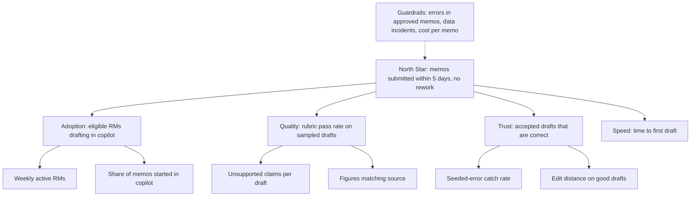
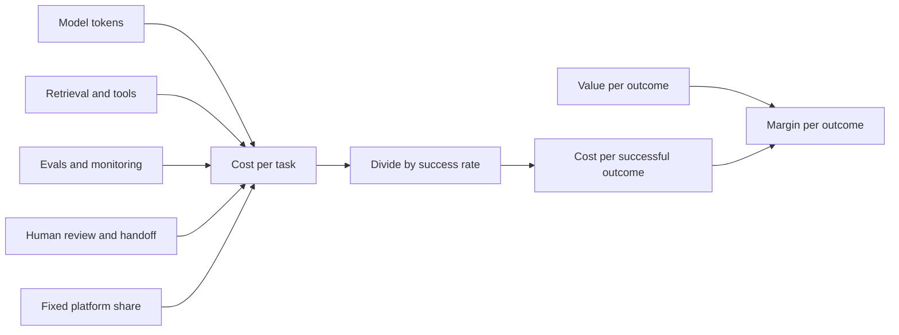
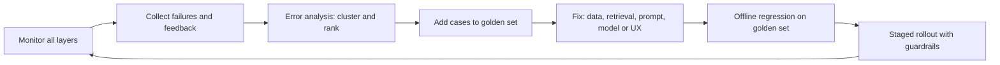

# Module 8 — Metrics, economics and growth

*An AI feature that has launched has not yet succeeded. After launch the questions change: are people using it, is it helping them, do they trust it the right amount, what does each use cost, and is it getting better or quietly getting worse? This module is about running an AI product after launch day. You will build a metrics tree for Credit Memo Copilot that separates value from activity. You will work out the cost to serve Najm Assist and Credit Memo Copilot, and see why the cheapest model is not always the cheapest product. Then you will set up the monitoring and iteration loop that keeps Smart Alerts, SME Instant Finance and Najm Assist healthy as customers, fraudsters and model vendors change around them. Rania's rule for the module: "If you can't say what it's worth, what it costs and whether it's drifting, you don't own the product. You're just hosting it."*

> **Stages:** Grow — measure value, cost and quality after launch, and turn what you learn into the next iteration.

---

# 8.1 — Product metrics for AI: value, quality, adoption, trust
*Level: 🔴 Advanced* · *Prerequisites: 6.1, 6.3, 7.3* · *Stage: Grow*

## ⚡ In 60 seconds
- An AI product needs metrics in **four families**: **value** (did the user's job get done better, faster or cheaper?), **quality** (were the outputs right?), **adoption** (do the intended users use it, and keep using it?) and **trust** (do they rely on it the right amount, no more and no less?).
- Organise them as a **metrics tree**: one North Star that expresses delivered value, a few input metrics the team can move, and **guardrail metrics** that must not get worse.
- AI adds signals classic products lack: **acceptance rate**, **edit distance** (how much users change a draft), **override rate**, **regeneration rate**, **escalation to a human**, and, for predictive products, precision and recall measured on real outcomes.
- Decision cue: every metric should change a decision. If nobody would act differently when it moves, it is a vanity metric. Drop it.
- Biggest trap: measuring **activity or cost** (chats handled, drafts generated, tickets deflected) and calling it value. A chatbot can "contain" a conversation that it got wrong.

## 🧭 Why it matters
Three months after launch, Faisal presents the Credit Memo Copilot dashboard to the steering group. It looks good: 11,400 drafts generated, 190 weekly active relationship managers (RMs), an average thumbs-up rating of 4.2 out of 5. Khalid listens, then asks the only question he cares about: "Are credit memos reaching the committee faster, and are they any good?" Faisal does not know. Nobody has linked usage to memo cycle time or rework. And the "drafts generated" count includes every regeneration, so a frustrated RM who clicks *regenerate* six times looks like six units of success.

Rania steps in. The numbers describe activity, not value. A draft generated is a cost. A draft that an RM accepts with light edits, that goes through credit review without extra rework and gets the deal decided sooner, is value. The team needs metrics for both, arranged so the dashboard answers Khalid's question first.

Public cases show the same lesson at larger scale. In February 2024 Klarna announced that its AI assistant was handling a large share of its customer-service chats. In 2025 the company said it would bring more human service back, with quality of service given as part of the reason. The lesson: "conversations handled by AI" is a volume metric, and it needs a quality metric beside it.

## 📐 How it works

### 🟢 The essentials

**A metric** is a number you track over time to learn whether the product is working. Good metrics are tied to the user's job (2.1), move within weeks, and can be segmented.

For AI products, sort metrics into four families. Each answers a different question, and each can look healthy while another fails.

| Family | Question it answers | Examples for Credit Memo Copilot |
|---|---|---|
| **Value** | Is the user's job done better, faster or cheaper? | Hours from data pack to memo submitted; memos sent back by credit review; RM hours saved per memo |
| **Quality** | Are the outputs correct, grounded and safe? | Share of sampled drafts that pass the rubric (6.1); unsupported claims per draft; figures that don't match the source |
| **Adoption** | Do the intended users use it, and keep using it? | Share of eligible RMs active weekly; share of memos started in the copilot; retention after 8 weeks |
| **Trust** | Do users rely on it appropriately? | Acceptance rate with low edits on good drafts; catch rate on seeded errors; RM survey on confidence |

Three ideas turn a list of numbers into a system.

1. **The North Star metric.** One number that best captures the value the product delivers to users, and that tends to lead business results. For Credit Memo Copilot, Rania's team chose *"memos submitted to credit review within five working days of a complete data pack, without being returned for rework."* It combines speed and quality in one number, so gaming one side hurts the other.
2. **Input metrics.** The few things the team can directly move that drive the North Star: adoption among eligible RMs, draft acceptance rate, grounding quality, time to first draft.
3. **Guardrail metrics.** Numbers that must not get worse while you push the others: factual error rate in approved memos, confidential-data incidents, credit-analyst workload, cost per memo. The term comes from online experimentation (Kohavi, Tang and Xu, *Trustworthy Online Controlled Experiments*, 2020), where guardrails protect the business while you optimise the main metric.

**Leading and lagging.** Some outcomes arrive late. Whether a copilot-drafted memo led to a better credit decision will only show in loan performance a year or more later. Whether a Smart Alert caught real fraud may take weeks to confirm through chargebacks. Track the lagging outcome, but steer weekly by leading indicators such as rubric pass rate and rework.

### 🟡 Going deeper

**AI-specific signals.** Generative and predictive products leave traces in behaviour that classic software does not. Learn to read them.

| Signal | What it is | What it tells you | How it misleads |
|---|---|---|---|
| **Acceptance rate** | Share of AI outputs the user keeps (sends, inserts, approves) | Rough usefulness | Rubber-stamping looks like success; see trust below |
| **Edit distance** | How much the user changes the draft before using it, e.g. share of characters or sections rewritten | Draft quality from the user's point of view | Some edits are style preferences, not errors |
| **Regeneration rate** | How often users ask for another attempt | Frustration, or a missing control (tone, length) | Power users regenerate to compare options |
| **Override rate** | How often a human decision differs from the model's recommendation | Disagreement between model and experts; for SME Instant Finance, where the model and underwriters diverge | High override can mean a bad model or distrustful staff; you must look at who was right |
| **Escalation / handoff rate** | Share of conversations passed to a human agent | Where Najm Assist reaches its limits | Low escalation can mean the bot is stubborn, not good |
| **Containment** | Share of conversations that end without a human | Contact-centre cost avoided | Counts abandoned and wrongly answered chats as success |
| **Resolution** | Share of conversations where the customer's issue was actually solved | Real value | Needs a definition and verification, e.g. no repeat contact within 7 days |
| **Explicit feedback** | Thumbs up/down, ratings, comments | Direct voice of the user | Low response rates and a skew towards very happy or very angry users |

Two pairs matter most. **Containment versus resolution**: a customer who gives up on Najm Assist and phones the call centre an hour later was "contained" in the chat log but not helped. Rania's team defines resolution as "no contact on the same topic, through any channel, within seven days", and reports containment only next to it. **Acceptance versus correctness**: a high acceptance rate is good only if accepted outputs are correct. Sample accepted outputs and grade them against the rubric (6.1), or you cannot tell usefulness from over-reliance.

**Using public frameworks.** You do not need to invent a structure.

- **HEART** (Google: Happiness, Engagement, Adoption, Retention, Task success; Rodden, Hutchinson and Fu, 2010) pairs each dimension with *Goals → Signals → Metrics*. It suits AI features because "task success" forces you to define the job.
- **AARRR** (Dave McClure's "pirate metrics": Acquisition, Activation, Retention, Referral, Revenue) is a funnel for growth. For an internal tool like Staff GenAI, rename the steps: *enabled → activated* (first useful task) *→ habitual* (weekly use) *→ advocate* (shares prompts or templates) *→ value* (hours saved, measured by sampling).

**Adoption is not binary.** In an enterprise, "active users" hides the difference between an RM who opens the copilot once a month and one who drafts every memo in it. Track *depth* (share of the user's eligible work done with the product) as well as *breadth* (share of eligible users active).

**Segment everything.** Averages hide problems. Break metrics down by user group (new versus experienced RMs), by task type (SME versus corporate memos), by language (English versus Arabic for Najm Assist), and by market (Qatar, UAE, EU). A positive average can hide a group the product is failing.

### 🔴 Expert view

**Measuring trust as calibration.** Trust is not "more is better." The goal is **appropriate reliance**: users accept good outputs and catch bad ones. Two failure modes mirror each other. *Over-reliance* (automation bias) means accepting wrong outputs; *under-reliance* means redoing work the AI did well. You can measure both.

- **Seeded-error audits.** In a training or shadow setting, never in live decisions, insert known errors into a few drafts and measure how many RMs catch them. A falling catch rate warns of over-reliance.
- **Reliance matrix.** For a sample of outputs, grade the AI output (good or bad) and record the human action (accepted or changed). Good-and-accepted and bad-and-changed are healthy. Bad-and-accepted is over-reliance. Good-and-rewritten is under-reliance, which costs you the value.

**Goodhart's law** (named after the economist Charles Goodhart) is usually paraphrased as "when a measure becomes a target, it ceases to be a good measure." AI products are especially exposed because models and people both optimise. Reward Najm Assist's team for containment and they will make the handoff button harder to find. Reward the copilot team for acceptance rate and the product will learn to produce bland drafts that nobody bothers to change. Defence: pair every target with a guardrail on the other side and review definitions quarterly.

**Attribution: did the AI cause it?** Memo cycle time might fall because of the copilot, or because credit review hired two analysts. For claims that justify budget, use the experiment methods from 6.3: a staged rollout by team or region with a holdout group, or a before/after comparison with a matched control. Where a clean experiment is impossible, say so and report an estimate with its assumptions. Khalid will trust an honest hedged number more than an inflated one.

**Metrics for predictive products.** For SME Instant Finance and Smart Alerts, model metrics (precision, recall, AUC, calibration from 6.1) must be joined to business outcomes. For Smart Alerts, a metrics tree might be: *fraud losses prevented* (value) ← *recall on confirmed fraud* and *time to alert* (inputs), with *false alerts per 1,000 active customers* and *alert opt-out rate* as guardrails, because alert fatigue makes customers ignore or switch off the alerts that matter. For SME Instant Finance: *approved volume at target loss rate* (value), with *default rate by cohort*, *override rate* and *approval-rate gaps across segments* as guardrails. Fairness monitoring is covered in *AI Governance: Zero to Hero*; make sure it appears on the product dashboard too.

**Instrumentation is a product requirement.** None of this works unless the product logs the right events: draft shown, draft accepted, sections edited, regenerate clicked, handoff requested, feedback given, with a stable ID linking the AI output to the later business outcome. Put the event list in the spec (5.1) before build. Agree retention and access with Sara (DPO): logs hold personal and confidential data.

## 🧰 The toolkit
| Tool or framework | What it is and does | When to reach for it |
|---|---|---|
| **North Star metric** | One metric that captures the value the product delivers and tends to lead business results | Aligning the team and sponsors on what "working" means |
| **Metrics tree** | North Star broken into input metrics the team can move, with guardrails alongside | Designing the dashboard; explaining why a metric moved |
| **HEART framework** (Google; Rodden, Hutchinson and Fu, 2010) | Happiness, Engagement, Adoption, Retention, Task success, each mapped Goals → Signals → Metrics | Choosing user-experience metrics for an AI feature |
| **AARRR** (Dave McClure) | Funnel: Acquisition, Activation, Retention, Referral, Revenue | Growth of a customer product; adapted as an adoption funnel for internal tools |
| **Guardrail metrics** (Kohavi, Tang and Xu) | Metrics that must not degrade while you optimise the main one | Every target you set; every experiment |
| **Reliance matrix** | Grades AI output quality against the human's action to reveal over- and under-reliance | Measuring trust on copilots and decision-support tools |
| **Resolution rate** | Share of conversations where the issue was actually solved, verified by no repeat contact | Replacing containment as the headline for assistants |

## 🏛️ In practice at Najm Bank
Rania asks Faisal to redo the dashboard as a one-page **metrics tree and definitions sheet**. The steering group now reads it top-down.

**Credit Memo Copilot — metrics sheet (v2, reviewed quarterly)**

| Level | Metric | Definition | Source | Target / threshold | Owner |
|---|---|---|---|---|---|
| North Star | On-time clean memos | Share of memos submitted within 5 working days of a complete data pack and not returned for rework | Credit workflow system | Up from baseline; target set after 8-week baseline | Faisal |
| Value | RM hours per memo | Median hours logged per memo, copilot versus non-copilot, same segment | Time sampling, 2 weeks per quarter | Report with range and method | Faisal |
| Quality | Rubric pass rate | Share of 50 randomly sampled drafts per week passing the rubric in 6.1 | Dana's review panel | At or above launch bar | Dana |
| Quality | Unsupported claims | Claims in a draft with no source citation, per draft | Automated check plus panel | Below launch bar | Dana |
| Adoption | Breadth | Eligible RMs who drafted at least one memo this week | Product events | Rising to plateau | Faisal |
| Adoption | Depth | Share of each RM's memos started in the copilot | Product events + workflow | Rising | Faisal |
| Trust | Over-reliance | Share of sampled accepted drafts that fail the rubric | Reliance matrix sample | Falling; alert if rising 2 weeks running | Hessa |
| Trust | Under-reliance | Share of sampled good drafts heavily rewritten (over half of sections) | Reliance matrix sample | Watch; prompts UX research | Hessa |
| Guardrail | Errors in approved memos | Factual errors found by credit review or audit in approved memos | Credit review log | No increase versus baseline | Khalid |
| Guardrail | Cost per memo | Fully loaded cost to serve (8.2) | Finance + platform | Within budget | Tariq |
| Guardrail | Data incidents | Confidential data exposed or mishandled | Incident log | Zero; any one triggers review | Layla |

Retired from the headline: *drafts generated* and *average thumbs rating* (now diagnostics).

## 🛠️ Exercises
- 🟢 Classify these Najm Assist metrics into value, quality, adoption, trust or cost: conversations started; containment; resolution within 7 days; share of answers citing the correct policy page; monthly active app users who used the assistant; handoff requests; thumbs-down rate. *Done when:* each has one family and you have flagged the two most likely to be gamed.
- 🟡 Build a HEART table for Staff GenAI with one goal, one signal and one metric per dimension. *Done when:* every metric can be computed from data Najm could realistically log, and "Task success" names a specific job.
- 🔴 Design the metrics tree for Smart Alerts, including a North Star, three input metrics, three guardrails and one lagging outcome with how long its labels take to arrive. *Done when:* the tree shows how you would detect alert fatigue before customers switch alerts off, and each guardrail has an owner.

## ⚠️ Mistakes and traps
- **Counting activity as value.** Drafts generated, chats handled and tokens used are costs. Put a value metric at the top of the tree and demote activity to diagnostics.
- **Reporting containment without resolution.** Always pair them, and verify resolution by checking for repeat contact.
- **Treating high acceptance as proof of quality.** Sample accepted outputs and grade them. High acceptance with falling correctness is over-reliance.
- **Averages only.** Segment by user group, language, market and task type before you conclude anything.
- **Instrumenting after launch.** Put the event list in the spec. Data you did not log is gone.
- **Targets without guardrails.** Every target invites gaming (Goodhart's law). Pair it with a metric on the opposite side.

## 🧾 Recap
- AI product metrics come in four families: value, quality, adoption and trust. Each can look fine while another fails.
- A metrics tree runs from a North Star to input metrics the team can move, with guardrails that must not degrade.
- Read AI-specific signals (acceptance, edit distance, regeneration, override, escalation) with care, and pair each with a correctness check.
- Trust is about calibration. Measure over-reliance and under-reliance with a reliance matrix and seeded-error audits.
- Prove causation with holdouts or staged rollouts where you can, and report honest estimates where you cannot.

## ✍️ Check yourself

**1. Najm Assist's containment rate rose from 55% to 70% after a prompt change. What should Faisal check before calling it a win?**

- A. Whether the number of conversations also rose
- B. Whether resolution, measured as no repeat contact on the same topic within seven days, also improved
- C. Whether the average thumbs-up rating rose
- D. Whether token cost per conversation fell

Answer

**B.** Containment counts every chat that ends without a human, including customers who gave up and phoned later. Resolution checks the issue was actually solved. Ratings (C) are a useful diagnostic but suffer from low and skewed response. (🟡 Going deeper.)

**2. Which is the best North Star for Credit Memo Copilot?**

- A. Number of drafts generated per week
- B. Weekly active RMs
- C. Share of memos submitted on time and not returned for rework
- D. Average thumbs rating on drafts

Answer

**C.** It captures delivered value and combines speed with quality, so gaming one hurts the other. A counts cost and activity, B is an adoption input, and D is a diagnostic. (🟢 The essentials.)

**3. A reliance-matrix sample shows that 18% of drafts RMs accepted with no edits failed the quality rubric, up from 7% last quarter. What does this most likely indicate?**

- A. Under-reliance: RMs are rewriting good drafts
- B. Over-reliance: RMs are accepting drafts they should have corrected
- C. The rubric is too strict
- D. Adoption is falling

Answer

**B.** Bad outputs accepted unchanged is the over-reliance cell. It calls for a look at UX friction, training and seeded-error audits. Under-reliance (A) is good drafts being heavily rewritten. (🔴 Expert view.)

**4. The Najm Assist team is rewarded on containment and later quietly moves the "talk to a person" button two screens deeper. Which idea best explains this?**

- A. Novelty effect
- B. Sample ratio mismatch
- C. Goodhart's law
- D. Kano model

Answer

**C.** When a measure becomes a target it stops being a good measure. The defence is a guardrail such as resolution or complaint rate. Novelty effect (A) is a temporary lift from something being new. (🔴 Expert view.)

**5. Memo cycle time fell 20% in the quarter the copilot launched. Credit review also hired two analysts that quarter. What is the most defensible way to attribute the gain?**

- A. Credit the copilot, since it launched in the same quarter
- B. Compare teams using the copilot with a holdout or not-yet-rolled-out group over the same period
- C. Survey RMs on whether they feel faster
- D. Divide the gain equally between the two causes

Answer

**B.** A holdout or staged rollout controls for changes that affect everyone, like new analysts. A confuses timing with cause. C measures perception, not effect. (🔴 Expert view; see 6.3.)

## 📚 References
- Rodden, Hutchinson and Fu, "Measuring the User Experience on a Large Scale: User-Centered Metrics for Web Applications", CHI 2010 — https://research.google/pubs/
- Kohavi, Tang and Xu, *Trustworthy Online Controlled Experiments* (Cambridge University Press, 2020) — https://experimentguide.com
- Amershi et al., "Guidelines for Human-AI Interaction", CHI 2019 — https://www.microsoft.com/en-us/research/project/guidelines-for-human-ai-interaction/
- Google PAIR, People + AI Guidebook — https://pair.withgoogle.com/guidebook
- Marty Cagan, *Inspired* (2nd ed., Wiley, 2017) — https://www.svpg.com
- Teresa Torres, *Continuous Discovery Habits* (2021) — https://www.producttalk.org
- Parasuraman and Riley, "Humans and Automation: Use, Misuse, Disuse, Abuse", *Human Factors* 39(2), 1997 — https://journals.sagepub.com/home/hfs

---

# 8.2 — Unit economics: cost to serve, pricing models and margins
*Level: 🔴 Advanced* · *Prerequisites: 1.2, 1.3, 7.2, 8.1* · *Stage: Grow*

## ⚡ In 60 seconds
- Traditional software costs almost nothing extra per use. AI does not: every request consumes compute, and often retrieval, tool calls, evaluation and human review. **Cost to serve** is a product variable, not an IT line item.
- The unit that matters is **cost per successful outcome** (per resolved conversation, per accepted memo, per correct decision), not cost per token or per request. A cheap model that fails more often can be the most expensive product.
- Build a **cost-per-task model**: tokens × price, times calls per task, plus retrieval and tools, evaluation and monitoring, human review and handoffs, and a share of fixed platform costs. Then divide by the success rate.
- **Pricing models** (seat, usage, per-task or outcome, premium tier, bundled) each put the cost risk on a different party. Choose one whose unit matches the value the customer sees and the cost you incur.
- Biggest trap: optimising the model bill while ignoring the costs that really dominate: human handoffs, review time, rework and, for predictive credit products, **losses from wrong decisions**.

## 🧭 Why it matters
Tariq brings Najm Assist's first full-month model bill to the product review. It is several times the business case. Faisal's first instinct is to switch to the smallest, cheapest model. Dana warns that in her offline tests the small model answered fewer card and payment questions correctly. Khalid, who funds part of the contact centre, asks a sharper question: "What do we pay for each customer problem actually solved, counting the ones that end up with my agents anyway?"

Nobody can answer: token bill, contact-centre cost and resolution rate (8.1) live in three places. Rania puts them on one sheet. The model bill is real, but human handoffs cost far more. The cheapest model per token turns out to be the most expensive per resolved conversation.

The industry is learning the same thing in public. Vendors have moved some AI features away from flat per-seat prices towards prices tied to units of work. Intercom priced its Fin agent per resolved conversation (from 2023), and Salesforce launched Agentforce with per-conversation pricing (2024). Exact prices change; the lesson holds: when each use has a real cost, the unit you price and measure is a strategic choice.

## 📐 How it works

### 🟢 The essentials

**Unit economics** asks: for one unit of the product (one task, one conversation, one customer, one month), what does it cost to deliver, what value or revenue does it bring, and what is left over? For AI products three facts make this unavoidable.

1. **Every use costs money.** Large language models are usually priced per **token** (a chunk of text, roughly three-quarters of an English word; Arabic text often uses more tokens for the same meaning). Providers charge separately for input tokens (what you send: instructions, retrieved documents, conversation history) and output tokens (what the model writes), and output usually costs more per token.
2. **Costs vary widely per task.** A one-line question and a 40-page credit file differ in cost by orders of magnitude. An agent that loops through ten tool calls costs far more than one that answers in one.
3. **Failure costs money too.** A wrong answer that ends with a human agent, a draft that needs rework, or a bad credit approval all cost more than the model call that caused them.

**The cost-per-task model** is a simple spreadsheet that adds up everything it takes to complete one unit of work.

| Cost component | What to count | Credit Memo Copilot example |
|---|---|---|
| Model inference | Input and output tokens × price, × calls per task, including retries and regenerations | Six drafting calls per memo over a long credit file |
| Retrieval and tools | Embedding, search, document parsing, API calls | Parsing financial statements, searching past memos |
| Evaluation and monitoring | Online LLM-as-judge checks, logging, dashboards | One judge call per draft |
| Human review and handoff | Staff time spent checking, correcting or taking over | Dana's panel sampling drafts each week |
| Fixed platform share | Hosting, vendor minimums, platform team, support, amortised | Share of the AI platform and support team |

Then compute two numbers: **cost per task** (sum of the rows) and **cost per successful outcome** (cost per task ÷ success rate). The second is the one to manage.

**Prices change.** At the time of writing (2026), per-token prices for a given capability level have been falling, while newer, more capable models and longer contexts push the other way. Make prices inputs you can update, never constants.

### 🟡 Going deeper

**A worked example: Najm Assist.** The numbers below are illustrative, chosen to show the method. They are not real prices or real Najm data.

Assumptions: 1.5 million conversations a month, four turns each on average. Each turn sends about 4,000 input tokens (system prompt, policy snippets, history) and receives about 300 output tokens. A *large* model is priced at, say, $3 per million input tokens and $15 per million output tokens. A *small* model at $0.25 and $1.25. A handoff to a human agent costs, say, $4 in contact-centre time.

| | Large model only | Small model only | Routed: 80% small, 20% large |
|---|---|---|---|
| Model cost per turn | $0.0165 | $0.001375 | — |
| Model cost per conversation | $0.066 | $0.0055 | $0.0176 |
| Model bill per month | $99,000 | $8,250 | $26,400 |
| Resolution rate (from 8.1 definition) | 65% | 50% | 63% |
| Handoff rate | 25% | 40% | 27% |
| Handoff cost per conversation | $1.00 | $1.60 | $1.08 |
| **Total cost per conversation** | **$1.066** | **$1.6055** | **$1.0976** |
| **Cost per resolved conversation** | **$1.64** | **$3.21** | **$1.74** |

The small model cuts the model bill by over 90%, yet costs almost twice as much per resolved conversation, because it sends more customers to agents. In this illustration the handoff cost is about fifteen times the model cost even for the large model. Routing (sending easy questions to the small model and hard ones to the large) saves most of the model bill while staying close on outcomes. Here it does not quite beat large-only, which is a finding in itself.

**Cost levers, roughly in order of how often they pay off:**

| Lever | What it does | Watch out for |
|---|---|---|
| **Reduce handoffs and rework** | Improve quality on the top failure categories (8.3) | Usually the biggest lever; needs error analysis, not a cheaper model |
| **Trim the context** | Send fewer, better-chosen retrieved passages; summarise long histories | Cutting context can cut grounding; re-run the golden set |
| **Prompt caching** | Many providers discount repeated input, such as a long fixed system prompt | Terms differ by vendor; check current pricing |
| **Model routing** | Small model for easy requests, large for hard ones | Router errors send hard cases to a weak model; evaluate the router |
| **Batch processing** | Non-urgent work run in bulk, often at a discount | Only for tasks that can wait, e.g. overnight memo pre-drafts |
| **Output limits** | Shorter answers, structured outputs | Too short hurts usefulness |
| **Cap agent loops** | Maximum steps or spend per task | A capped task must fail gracefully and hand off |

**Averages hide tails.** For agents, report the 95th percentile (p95) cost per task alongside the average. A dispute-a-transaction flow in Najm Assist that normally takes four tool calls might occasionally loop to forty. Set a spend cap per task and treat frequent triggers as a quality bug.

**The Credit Memo Copilot picture looks different.** Illustrative again: six drafting calls per memo at 30,000 input and 1,500 output tokens each on the large model comes to $0.54 + $0.135 = $0.675 in model cost. Add, say, $0.15 for parsing, retrieval and logging, about $0.07 for one LLM-as-judge check, and about $1.67 of reviewer time (50 drafts sampled from 600 a week at 20 minutes each, at a loaded $60 an hour). Variable cost is about $2.56 per memo. A platform share of $15,000 a month spread over 2,400 memos adds $6.25, so the fully loaded cost is roughly $8.80. Against that, if the copilot saves an RM 1.5 hours at a loaded cost of $80 an hour, each memo is worth about $120 in time. Here the model bill is a small slice; **adoption and time saved** decide the business case.

### 🔴 Expert view

**Pricing models and who carries the risk.** When you sell an AI product, or buy one, the pricing model decides who absorbs cost variation and failure.

| Pricing model | How it works | Cost risk sits with | Fits when | Example (hedged) |
|---|---|---|---|---|
| **Per seat** | Flat fee per user per month | Seller: heavy users can cost more than they pay | Usage is predictable; value is per person | Many enterprise copilots at launch |
| **Usage-based** | Per token, call or document | Buyer: bills are hard to forecast | Technical buyers; spiky usage | Model APIs |
| **Per task or outcome** | Per resolved conversation, per completed task | Seller: pays for failures, earns on success | Outcome is clearly defined and verifiable | Intercom Fin (per resolution, from 2023); Salesforce Agentforce (per conversation at launch, 2024) |
| **Premium tier** | AI features in a higher-priced plan | Shared: tier price must cover heavy users | Consumer products with a free core | Duolingo Max (2023) |
| **Bundled / free** | Included to drive retention or reduce other costs | Seller, funded by retention or savings | Feature defends the core product | A bank's in-app assistant |

Outcome pricing lets the customer pay for value, but needs an auditable outcome definition: "resolved" means different things to a vendor and to a bank whose customer later called back. If Yusuf (procurement) negotiates an outcome-priced contract, the PM writes that definition and makes sure Najm can verify it from its own logs.

**Margins.** **Gross margin** is (revenue − cost to serve) ÷ revenue. Classic software often has high gross margins because extra users cost little. AI features bring a real variable cost, so a flat price and a heavy-user tail can squeeze margins. Defences: fair-use limits or tiers for heavy users, and a cost-per-outcome target the team works down over time.

**Inside a bank, "pricing" becomes allocation.** Najm does not sell Credit Memo Copilot or Staff GenAI. The economic questions are: who pays (central budget, or a charge to business units), and does the value justify the cost? Two common models are **showback** (show each unit its usage and cost, without billing) and **chargeback** (bill each unit). Showback builds cost awareness without discouraging early adoption. Chargeback suits mature products where units should weigh cost against value. For Najm Assist, which customers do not pay for directly, value is contact cost avoided plus effects on retention and satisfaction. Estimate these with a holdout where possible (6.3).

**When the model bill is irrelevant: predictive credit.** For SME Instant Finance, scoring a request costs a fraction of a cent. The economics are set by the quality of the decision. Illustrative numbers: a $50,000 invoice financed for 60 days earns a $1,000 fee. Funding costs $400 and operations $50. **Expected loss** is probability of default (PD) × loss given default (LGD) × exposure: at 2% × 45% × $50,000 that is $450, leaving $100 of margin. If the model's approvals drift so the true PD of approved requests is 3%, expected loss becomes $675 and every approval loses money. One percentage point of model error wipes out the product's margin. This is why 8.3 treats drift in credit models as a financial risk, not only a technical one.

**Forecasting cost before launch.** Put a cost-per-task model in the spec (5.1), run it at low, expected and high values, and make the launch decision on the high case. After launch, compare forecast to actual monthly.

## 🧰 The toolkit
| Tool or framework | What it is and does | When to reach for it |
|---|---|---|
| **Cost-per-task model** | Spreadsheet summing model, retrieval, evaluation, human and fixed costs for one unit of work, with prices as inputs | Business cases, model choice, monthly cost reviews |
| **Cost per successful outcome** | Cost per task divided by success rate | Comparing models or designs that differ in quality |
| **Model routing** | Sends each request to the cheapest model likely to handle it well | High-volume products with a mix of easy and hard requests |
| **Pricing model matrix** | Seat, usage, outcome, premium tier or bundled, with who carries cost risk | Pricing a product you sell; negotiating one you buy |
| **Showback and chargeback** | Show or bill internal units for their AI usage | Internal products like Staff GenAI and Credit Memo Copilot |
| **Expected loss** (PD × LGD × exposure) | Standard credit-risk measure of the average loss on a loan | Unit economics of predictive credit products |

## 🏛️ In practice at Najm Bank
Rania's team adds a **unit economics sheet** to every AI product's monthly review. Here is the Najm Assist version, with illustrative values.

**Najm Assist — unit economics sheet (monthly)**

| Line | This month | Forecast | Notes / owner |
|---|---|---|---|
| Conversations | 1.5M | 1.4M | Faisal |
| Avg turns / conversation | 4.0 | 3.5 | Longer than forecast; check card-dispute flow |
| Model cost / conversation | $0.0176 | $0.015 | Routed 80/20; Tariq |
| Retrieval, logging, evals / conversation | $0.004 | $0.004 | Tariq |
| Resolution rate (7-day, any channel) | 63% | 65% | Dana; definition in 8.1 sheet |
| Handoff rate | 27% | 25% | Contact centre |
| Handoff cost / conversation | $1.08 | $1.00 | $4 per contact, contact-centre finance |
| **Cost per resolved conversation** | **$1.75** | **$1.57** | Headline; target to fall 10% by next quarter |
| Agent tasks: p95 cost / task | $0.41 | $0.30 | Spend cap $1.00; 0.2% of tasks hit it |
| Fixed platform share | $40,000 | $40,000 | Shown, not included in per-conversation line |
| Top 3 handoff reasons | Card disputes; Arabic address changes; fee reversals | — | Input to the 8.3 iteration backlog |

Decision rule agreed with Khalid: *"A change that lowers the model bill but raises cost per resolved conversation is rejected. A change that raises the model bill is acceptable if cost per resolved conversation falls and guardrails hold."*

## 🛠️ Exercises
- 🟢 Using the illustrative prices in this lesson, compute the model cost for one Staff GenAI request of 2,000 input and 500 output tokens on the large and the small model. *Done when:* you have both numbers and the ratio between them.
- 🟡 Recompute the Najm Assist table assuming a handoff costs $2 instead of $4. Does the small model become the cheapest per resolved conversation? *Done when:* all three columns are recomputed and you have written one sentence on what this means for the decision.
- 🔴 Yusuf has two offers for a customer-service agent platform: per seat for the contact-centre team, or per resolved conversation. Write a one-page recommendation covering who carries the cost risk, how "resolved" must be defined and verified, and a usage scenario in which each option is cheaper. *Done when:* the page includes a break-even calculation with stated illustrative assumptions and a contract clause defining resolution.

## ⚠️ Mistakes and traps
- **Managing the token bill instead of the outcome.** Compare models on cost per successful outcome, not price per token.
- **Leaving humans out of cost to serve.** Review time, handoffs and rework are often the biggest lines. Count them.
- **Using averages for agents.** Report p95 cost and set per-task spend caps with graceful handoff.
- **Hard-coding today's prices.** Make prices inputs, run low, expected and high cases, and label numbers as dated.
- **Signing outcome pricing without a verifiable definition.** Define the outcome in the contract and check it against your own logs.
- **Ignoring decision losses in predictive products.** For credit, model quality is the economics. A small drift in default rate can outweigh all compute costs.

## 🧾 Recap
- AI has a real cost per use, so cost to serve is a product decision.
- Build a cost-per-task model covering model, retrieval, evaluation, human and fixed costs, and manage cost per successful outcome.
- Quality is usually the biggest cost lever, because failures create handoffs and rework.
- Pricing models (seat, usage, outcome, premium tier, bundled) decide who carries cost risk. Outcome pricing needs an auditable outcome.
- Inside a bank, pricing becomes allocation (showback or chargeback), and for credit products expected loss dominates.

## ✍️ Check yourself

**1. Model A costs a tenth as much per token as Model B. On Najm Assist, Model A resolves 50% of conversations and Model B resolves 65%, with unresolved ones going to human agents. Which statement is most accurate?**

- A. Model A is cheaper, because it costs a tenth as much per token
- B. You cannot tell without adding handoff costs and dividing by resolution rate
- C. Model B is always cheaper, because it resolves more
- D. Cost does not matter if quality differs

Answer

**B.** Compare cost per resolved conversation: model cost plus handoff cost, divided by resolution rate. In the lesson's illustration the cheap model was about twice as expensive per resolution, but that depends on handoff cost (see exercise 🟡). C overstates it. (🟡 Going deeper.)

**2. For Credit Memo Copilot, which factor most determines whether the business case holds?**

- A. The per-token price of the drafting model
- B. Adoption by RMs and the time actually saved per memo
- C. Whether prompt caching is enabled
- D. The number of drafts generated

Answer

**B.** For a low-volume, high-value internal task, model cost is a small share of fully loaded cost. Value comes from adoption and time saved. Caching (C) trims a minor line. (🟡 Going deeper.)

**3. A vendor offers Najm a customer-service agent priced per "resolved conversation." What should the PM insist on first?**

- A. The lowest possible price per resolution
- B. A contract definition of "resolved" that Najm can verify from its own data, such as no repeat contact within seven days
- C. A per-seat option as a fallback
- D. Unlimited free usage in the pilot

Answer

**B.** Outcome pricing only works with an agreed, auditable outcome. Without it the vendor's count decides the bill. Price (A) matters only once the unit is defined. (🔴 Expert view.)

**4. SME Instant Finance earns a $1,000 fee on a $50,000 invoice. Funding and operations cost $450, and expected loss at a 2% PD and 45% LGD is $450. If the PD of approved requests drifts to 3%, what happens to margin per approval?**

- A. It rises slightly because volume grows
- B. It falls from $100 to about −$125
- C. It is unchanged because scoring costs are tiny
- D. It falls by $10

Answer

**B.** Expected loss rises to 3% × 45% × $50,000 = $675, so margin becomes $1,000 − $450 − $675 = −$125. For predictive credit, decision quality dominates unit economics. (🔴 Expert view.)

**5. Najm Assist's average cost per agent task is on target, but finance reports occasional very large bills. What should the team add?**

- A. A switch to the smallest model for all tasks
- B. p95 cost reporting and a per-task spend cap that ends in a graceful handoff
- C. Removing agent features
- D. A monthly budget review only

Answer

**B.** Agent costs have long tails from loops and retries. Percentiles expose them and caps limit them, with a handoff so the customer is not stranded. A may lower quality and raise handoffs. (🟡 Going deeper.)

## 📚 References
- Kohavi, Tang and Xu, *Trustworthy Online Controlled Experiments* (2020) — https://experimentguide.com
- Intercom, Fin AI agent (pricing per resolution; check current terms) — https://www.intercom.com
- Salesforce, Agentforce (check current pricing) — https://www.salesforce.com
- Duolingo, Duolingo Max announcement (2023) — https://blog.duolingo.com
- Basel Committee on Banking Supervision, credit-risk framework (PD, LGD, exposure at default) — https://www.bis.org/bcbs/
- Chen, Zaharia and Zou, "FrugalGPT: How to Use Large Language Models While Reducing Cost and Improving Performance" (2023) — https://arxiv.org/abs/2305.05176

---

# 8.3 — Monitoring, drift and the iteration loop after launch
*Level: 🔴 Advanced* · *Prerequisites: 6.1, 6.2, 6.3, 8.1* · *Stage: Grow*

## ⚡ In 60 seconds
- AI products get worse without anyone touching them. Customers change, fraudsters adapt, policies are updated and model vendors ship new versions. This is **drift**, and it is usually silent: no error message, just slowly worse answers.
- Monitor in **layers**: system health (up, fast, affordable), inputs (is the traffic still what we designed for?), outputs and quality (are answers still good?), user behaviour (8.1 signals) and business outcomes. Each layer catches failures the others miss.
- Many outcomes arrive late: chargebacks take weeks, loan defaults take months. Steer with **leading proxies** and **sampled quality reviews** while real labels arrive.
- Run a standing **iteration loop**: collect failures, analyse errors, add them to the golden set, fix, check for regressions offline, and release through a staged rollout. Every failure found in production should become a test.
- Biggest trap: treating launch as the finish line and monitoring only uptime. The product can be 100% available and 30% wrong.

## 🧭 Why it matters
In March, Najm Bank changes its card replacement fee and updates the policy page. Nobody tells the Najm Assist team. For three weeks the assistant, drawing on an old copy of the page in its retrieval index, tells customers the previous fee. The dashboards stay green: latency is normal, errors are zero, containment is up. The problem surfaces when complaints reach the contact centre and a customer posts a screenshot. Layla asks the question every incident review asks: "How would we have known sooner?"

Public cases show similar patterns. In *Moffatt v. Air Canada* (2024), a tribunal held the airline liable for its website chatbot's wrong description of its bereavement fare policy. The company could not disown what its assistant said. In January 2024, the parcel company DPD's customer-service chatbot was widely reported to have sworn at a customer and criticised the company after a system update. A change nobody meant to affect behaviour did exactly that.

Meanwhile Smart Alerts faces the opposite problem. Its model was trained on last year's fraud. Fraudsters move to new tactics, so recall falls. The risk team responds by loosening thresholds, and false alerts climb. Customers start ignoring alerts. Nothing broke, but the world moved and the product did not. Monitoring and iteration are how a product keeps up.

## 📐 How it works

### 🟢 The essentials

**Drift** is any change after launch that makes the product's past performance a poor guide to its present performance. Learn the main kinds by name, because each needs different detection.

| Kind of drift | What changes | Najm example | How you notice |
|---|---|---|---|
| **Data drift** (input drift) | The inputs look different from what the model was built and tested on | New SME segment (e-commerce sellers) applying for SME Instant Finance | Compare input distributions to a baseline |
| **Concept drift** | The relationship between inputs and the right answer changes | Fraudsters change tactics, so yesterday's safe pattern is today's fraud | Performance on fresh labelled outcomes falls |
| **Knowledge drift** | Facts the product relies on change | Fee schedule updated; retrieval index still has the old page | Freshness checks on sources; sampled answer review |
| **Dependency drift** | A component you do not control changes | Model vendor updates or retires a model version; a tool API changes | Version pinning; regression tests on every change |
| **Usage drift** | Users use the product for new jobs | RMs start using the copilot for retail mortgages it was not scoped for (a governance issue too) | Topic clustering of requests; intake review |

**Monitoring layers.** A good monitoring plan covers all five layers below. Most teams start with the first and stop there.

| Layer | Questions | Example signals |
|---|---|---|
| 1. System health | Is it up, fast and within budget? | Error rate, latency percentiles, cost per task (8.2), spend-cap triggers |
| 2. Inputs | Is the traffic what we designed and tested for? | Feature distributions, request topics and languages, share of out-of-scope requests |
| 3. Outputs and quality | Are outputs still good? | Score distributions; sampled rubric grades; LLM-as-judge scores on a sample; guardrail and refusal rates |
| 4. User behaviour | How are people reacting? | Acceptance, edit distance, regeneration, handoff, complaints (8.1) |
| 5. Business outcomes | Is it still delivering value safely? | Resolution, fraud losses, default rates, rework, incidents |

**The iteration loop** turns monitoring into improvement. The core habit is simple: every production failure becomes a test case, so the same failure cannot come back unnoticed.

### 🟡 Going deeper

**Detecting drift in predictive models.** For tabular models like SME Instant Finance, compare today's input and score distributions against the development sample. A measure widely used in credit risk is the **Population Stability Index (PSI)**, which sums the differences between two distributions across buckets. A common rule of thumb reads below 0.1 as stable, 0.1 to 0.25 as worth investigating, and above 0.25 as a significant shift. These are conventions, not laws. Dana's team sets thresholds per feature with the model validation function. Input drift is an early warning, not proof of harm: a shift in applicant mix may not hurt accuracy. Confirm with outcome data when it arrives.

**The label delay problem.** You often cannot measure accuracy when you need to.

| Product | True outcome | Delay | Leading proxy to watch meanwhile |
|---|---|---|---|
| Smart Alerts | Confirmed fraud or chargeback | Days to weeks | Customer "not me" confirmations; analyst dispositions on alerts |
| SME Instant Finance | Default or repayment | Months, up to the financing term and beyond | Early arrears (e.g. 30 days past due); invoice dilution; override rate |
| Credit Memo Copilot | Loan performance of decided deals | A year or more | Rework rate; rubric pass rate; credit-review findings |
| Najm Assist | Issue truly solved | 7 days (by the 8.1 definition) | Handoff requests; thumbs-down; same-session rephrasing |

Proxies can mislead, so revisit them when the real labels land: did the proxy predict the outcome?

**Monitoring generative products.** There is no single input distribution to compare for a chatbot or copilot, and correctness needs judgement. Practical monitoring combines four things.

1. **Sampled human review.** A fixed weekly sample graded against the rubric (6.1), plus extra samples from risky topics (fees, disputes, complaints).
2. **LLM-as-judge on a larger sample** (6.2), checked regularly against human grades, because the judge can drift too. Watch its known biases, such as favouring longer answers.
3. **Topic and intent monitoring.** Cluster incoming requests to spot new topics, rising out-of-scope requests and languages or dialects you did not test.
4. **Source freshness.** For retrieval, track the age of each indexed document and link the index to the content owner's publishing process, so a policy change triggers a re-index and a targeted re-test. That one control would have caught the March fee incident.

**Dependency change management.** Models accessed through an API can change behind the same name, and vendors retire versions on their own schedule. Research by Chen, Zaharia and Zou (2023) documented measurable behaviour changes in widely used hosted models over a few months. The product response: pin to a specific model version where the vendor allows it, and track announced retirement dates on the roadmap (see 9.2). Treat every model, prompt or tool change as a release: run the full golden set, compare against the current version, and roll out in stages. The DPD incident is a reminder that "just an update" can change behaviour in ways nobody tested.

### 🔴 Expert view

**Error analysis drives the backlog.** Monitoring tells you something is wrong. Error analysis tells you what to fix. Each week, Dana's team pulls failed or flagged cases, reads them, and labels each with a failure category (wrong policy, stale source, misunderstood Arabic phrasing, tool call failed, over-refusal). They count by category and weight by impact: frequency × cost per failure (8.2) × severity. The top two or three categories become the next iteration's work. This is the same method as pre-launch error analysis in 6.1, run as a routine.

**Choosing the fix.** Pick the cheapest fix that addresses the root cause, and re-run the golden set whichever you choose.

| Root cause | Usual fix | Not this |
|---|---|---|
| Stale or missing knowledge | Refresh sources; link index to content publishing | Fine-tuning facts into the model |
| Misread instructions or tone | Prompt and example changes | Switching vendors |
| New input population | Retrain or recalibrate on recent data; extend golden set | Loosening thresholds blindly |
| Concept drift in fraud | Retrain on recent labels; add features; shorter retraining cycle | Waiting for the annual model review |
| Users confused about what it can do | UX: scope statements, suggested actions (4.2) | More model capability |

**Retraining cadence: scheduled or triggered?** Scheduled retraining (monthly for Smart Alerts, say) is predictable and easy to govern. Triggered retraining (when drift or performance crosses a threshold) reacts faster but is harder to validate. Regulated credit models often need independent validation before each change, which limits speed. Many teams combine both: a regular schedule plus a trigger that brings the next cycle forward. Agree the policy with Layla's governance team and model validation before launch, not during an incident.

**Feedback loops that bias your data.** A deployed model shapes the data it will later learn from. SME Instant Finance only sees repayment outcomes for requests it approved, so it learns nothing about those it declined. Over time this can make the model overconfident in its own past choices. Credit teams handle this with techniques such as reject inference and small, controlled exploration, designed with risk. Smart Alerts faces an adversarial loop: fraudsters probe what gets flagged and adapt. Plan for both in the monitoring design. More on data flywheels in 3.2.

**Incidents and the kill switch.** Decide in advance what happens when monitoring fires.

- **Severity levels** with named owners and response times, shared with the incident process from 7.1.
- A **kill switch or fallback** for each AI feature: Najm Assist can drop to a "hand off to an agent" mode; Credit Memo Copilot can switch off drafting and keep search; Smart Alerts can fall back to its previous model version and thresholds.
- A **post-incident review** whose output always includes new golden-set cases and, where needed, a new monitor.

**Governance hooks.** Providers of high-risk AI systems under the EU AI Act must run post-market monitoring, and credit scoring of individuals is a high-risk use. Banking supervisors, including the Qatar Central Bank through its AI guidance for financial institutions, expect ongoing model monitoring and validation. The PM does not write those policies, but the product's monitoring plan is the evidence they rely on. See *AI Governance: Zero to Hero* for the obligations. For the engineering of logging, tracing and evaluation pipelines, see *Production AI Agents*.

## 🧰 The toolkit
| Tool or framework | What it is and does | When to reach for it |
|---|---|---|
| **Population Stability Index (PSI)** | Measures how far a variable's distribution has shifted from a baseline | Input and score drift on tabular models such as credit and fraud |
| **Monitoring layers** | System health, inputs, outputs and quality, user behaviour, business outcomes | Designing a monitoring plan that catches silent failures |
| **Golden set** | Curated reference cases with expected outputs, grown from production failures | Regression testing every prompt, model, data or tool change |
| **LLM-as-judge** | A model grades outputs against a rubric, calibrated against human graders | Monitoring quality on larger samples of generative output |
| **Error analysis** | Reading, categorising and ranking failures by impact | Turning monitoring into a prioritised backlog |
| **Model version pinning** | Fixing the exact model version the product uses and changing it only by release | Any product built on a hosted model API |
| **Kill switch** | A pre-built fallback mode for an AI feature | Incidents; failed rollouts; vendor outages |

## 🏛️ In practice at Najm Bank
After the fee incident, Rania asks each product to publish a **monitoring plan and runbook**. Here is the one for Najm Assist, with the Smart Alerts rows added for comparison. Thresholds are illustrative and set by each owner.

**Najm Assist and Smart Alerts — monitoring plan (v1)**

| Layer | Signal | Threshold / trigger | Action | Owner | Cadence |
|---|---|---|---|---|---|
| Health | p95 latency; error rate | Above SLO for 15 min | Page on-call; fallback to handoff mode if sustained | Tariq | Real time |
| Health | Cost per resolved conversation | 15% above forecast for a week | Cost review (8.2) | Tariq | Weekly |
| Inputs | Out-of-scope request share | Doubles week on week | Topic review; scope message or new intent | Faisal | Weekly |
| Inputs | Source freshness | Policy page changed but not re-indexed within 24 h | Auto re-index; targeted re-test on that topic | Content owner + Tariq | On change |
| Quality | Rubric pass rate on 200 sampled chats | Below launch bar | Error analysis; hold releases | Dana | Weekly |
| Quality | Judge–human agreement | Drops below agreed level | Recalibrate judge before trusting its scores | Dana | Monthly |
| Behaviour | Handoff and thumbs-down by topic | Any topic doubles | Deep dive on that topic | Hessa | Weekly |
| Outcome | Resolution rate (7-day) | Falls 3 points | Steering review | Faisal | Monthly |
| Dependency | Model version; vendor retirement notices | Any change announced | Full golden-set run; staged rollout | Tariq | On change |
| Smart Alerts | PSI on key features and score | Above 0.25, or 0.1–0.25 for 4 weeks | Investigate; bring retraining forward | Dana | Weekly |
| Smart Alerts | False alerts per 1,000 customers; opt-out rate | Rising 3 weeks running | Threshold review with fraud ops | Fraud product owner | Weekly |
| Smart Alerts | Recall on confirmed fraud | Below agreed floor | Retrain; fallback to prior version if severe | Dana | Monthly (label delay) |

**Weekly iteration review (45 minutes):** (1) dashboards by layer, exceptions only; (2) top failure categories from error analysis, with counts and cost; (3) golden-set cases added this week; (4) fixes in flight and their offline results; (5) rollouts in progress and guardrail status; (6) decisions and owners.

## 🛠️ Exercises
- 🟢 For each scenario, name the kind of drift: (a) a new Arabic dialect appears in Najm Assist traffic; (b) the vendor updates its model; (c) fraudsters shift to a new scam; (d) the fee schedule changes. *Done when:* each has one drift type and one signal that would detect it.
- 🟡 Write the label-delay table for Staff GenAI: true outcome, delay and at least two leading proxies. *Done when:* each proxy can be computed from data Najm logs and you state how you would check later that the proxy was predictive.
- 🔴 Your vendor announces that the model behind Credit Memo Copilot will be retired in 90 days. Write the migration plan: evaluation, rollout, monitoring, fallback and communication to RMs. *Done when:* the plan has dated steps, a go/no-go rule based on the golden set and 8.1 guardrails, and a rollback path.

## ⚠️ Mistakes and traps
- **Monitoring only uptime and latency.** Add quality, input, behaviour and outcome layers. Silent failures are the common ones.
- **Waiting for final labels.** Use leading proxies and sampled review, then validate the proxies when labels arrive.
- **Fixing without regression tests.** Add every production failure to the golden set and run it before each release.
- **Treating a vendor update as a non-event.** Pin versions, test changes like releases and track retirement dates.
- **Trusting the judge forever.** Recalibrate LLM-as-judge against human grades on a schedule.
- **Improvising in an incident.** Define severity levels, owners and a kill switch before launch.

## 🧾 Recap
- AI products drift in several ways: data, concept, knowledge, dependency and usage. Most drift is silent.
- Monitor five layers (health, inputs, quality, behaviour, outcomes) with owners, thresholds and actions.
- Label delays are normal. Steer with proxies and sampled reviews, then check the proxies.
- The iteration loop is monitor → analyse → golden set → fix → regression → staged rollout, run weekly.
- Plan retraining policy, feedback-loop bias, incident response and fallbacks before launch, and give governance the evidence it needs.

## ✍️ Check yourself

**1. Najm Assist gave customers an outdated fee for three weeks while latency, error rate and containment all looked healthy. Which monitor would most directly have caught it?**

- A. A tighter p95 latency threshold
- B. A source-freshness check linking policy page changes to re-indexing and a targeted re-test
- C. A higher containment target
- D. Monthly PSI on customer age

Answer

**B.** This was knowledge drift. Linking content changes to re-indexing and re-testing catches it at the source. Health metrics (A) cannot see wrong answers, and a containment target (C) might even reward the error. (🟡 Going deeper.)

**2. Smart Alerts' recall on confirmed fraud has fallen, though input distributions look stable. Which kind of drift is most likely?**

- A. Data drift
- B. Concept drift
- C. Dependency drift
- D. Usage drift

Answer

**B.** The inputs look similar, but the relationship between inputs and fraud has changed as fraudsters adapt. Data drift (A) would show in the input distributions. (🟢 The essentials.)

**3. SME Instant Finance defaults take months to appear. What is the best way to monitor model performance in the meantime?**

- A. Wait for the annual validation
- B. Track leading proxies such as early arrears and override rate alongside input and score drift, and later check that the proxies predicted defaults
- C. Use customer satisfaction scores
- D. Retrain every week on all available data

Answer

**B.** Proxies plus drift checks give early warning, and validating proxies against real outcomes keeps them honest. D ignores label delay and validation requirements for credit models. (🟡 Going deeper.)

**4. The team fixes a recurring misunderstanding of an Arabic phrasing by changing the prompt. What must happen before the change reaches all customers?**

- A. Nothing; prompt changes are low risk
- B. Add the failing cases to the golden set, run the full set for regressions, and release through a staged rollout
- C. Ask the vendor to confirm the fix
- D. Retrain the model

Answer

**B.** Every change is a release: new failure cases become tests, the full set checks nothing else broke, and a staged rollout limits exposure. A is how "just an update" incidents happen. (🟢 The essentials; 🔴 Expert view.)

**5. SME Instant Finance learns only from requests it approved. What risk does this create?**

- A. Higher inference cost
- B. A feedback loop that biases training data towards past decisions, which calls for techniques such as reject inference designed with risk
- C. Knowledge drift in the retrieval index
- D. Lower adoption by underwriters

Answer

**B.** Outcomes for declined requests are never seen, so the model can become overconfident in its own history. It is a data-design problem to plan for, not a cost or UX issue. (🔴 Expert view.)

## 📚 References
- Sculley et al., "Hidden Technical Debt in Machine Learning Systems", NeurIPS 2015 — https://papers.nips.cc
- Gama et al., "A Survey on Concept Drift Adaptation", *ACM Computing Surveys* 46(4), 2014 — https://dl.acm.org
- Chen, Zaharia and Zou, "How Is ChatGPT's Behavior Changing over Time?" (2023) — https://arxiv.org/abs/2307.09009
- Breck et al., "The ML Test Score: A Rubric for ML Production Readiness and Technical Debt Reduction", IEEE Big Data 2017 — https://research.google/pubs/
- Martin Zinkevich, "Rules of Machine Learning: Best Practices for ML Engineering" (Google) — https://developers.google.com/machine-learning/guides/rules-of-ml
- *Moffatt v. Air Canada*, 2024 BCCRT 149 (Civil Resolution Tribunal of British Columbia) — https://decisions.civilresolutionbc.ca
- NIST AI Risk Management Framework 1.0 — https://www.nist.gov/itl/ai-risk-management-framework
- EU AI Act, Regulation (EU) 2024/1689 — https://eur-lex.europa.eu/eli/reg/2024/1689/oj
