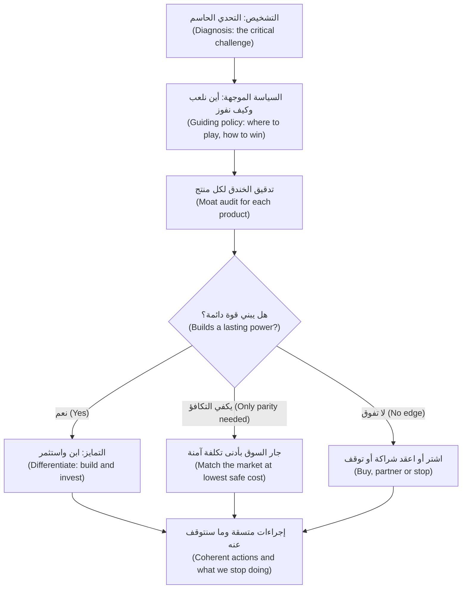
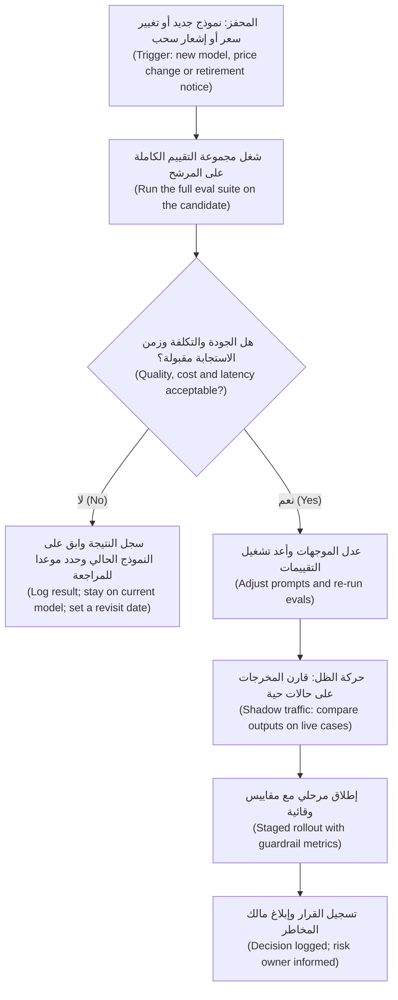
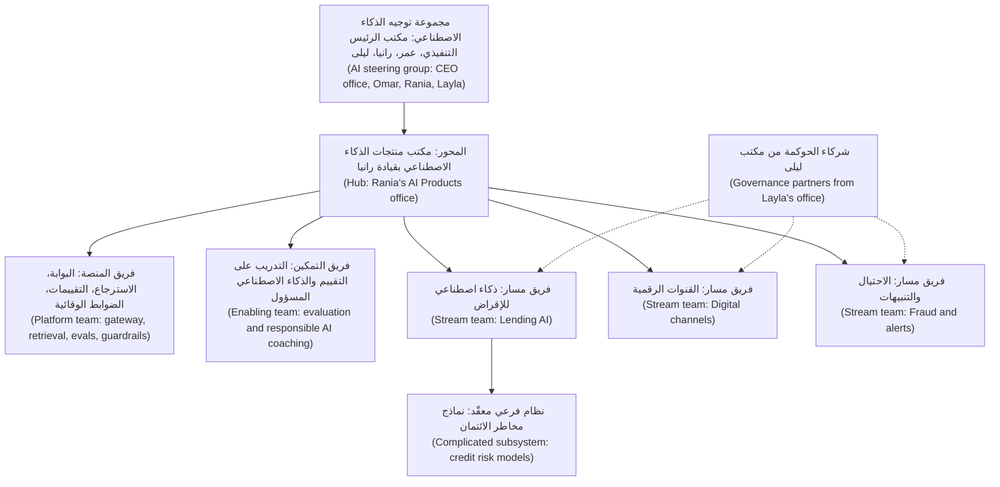
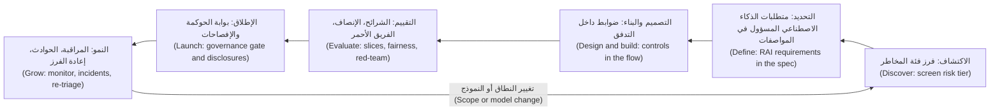

# الوحدة 9 — الاستراتيجية والقيادة

*علّمتك الوحدات السابقة كيف تدير منتج ذكاء اصطناعي واحدًا (one AI product) جيدًا. أما هذه الوحدة فتتناول إدارة محفظة (running a portfolio) والأشخاص الذين يقفون وراءها. على رانيا أن تعرض استراتيجية ذكاء اصطناعي (AI strategy) على مجلس إدارة (board) بنك نجم (Najm Bank)، وأن تُبقي خارطة الطريق (roadmap) مفيدة بينما تتغير النماذج (models) التي تقوم عليها كل بضعة أشهر، وأن تنظّم المصممين والمهندسين وعلماء البيانات وشركاء المخاطر (designers, engineers, data scientists and risk partners) بحيث يُسلّمون فعلًا (so that they ship)، وأن تضمن أن يحمل كل منتج نصيبه من الذكاء الاصطناعي المسؤول (responsible AI) دون أن تتحول الحوكمة إلى جدار (turning governance into a wall). ستتعلم كيف تجد المواضع التي يمنح فيها الذكاء الاصطناعي ميزة دائمة (lasting advantage) والمواضع التي يُبقيك فيها على مستوى السوق فقط (keeps you level with the market)، وكيف تخطّط بالرهانات لا بالوعود (plan in bets rather than promises)، وكيف تصمّم الفريق وصلاحيات اتخاذ القرار (decision rights)، وما الذي يملكه مدير المنتج (product manager) عندما يضع المنظّمون (regulators) والعملاء ومبادئ البنك نفسه حدودًا (set limits).*

> **المراحل (Stages):** Lead — اختيار المواضع التي يمنح فيها الذكاء الاصطناعي تفوقًا دائمًا (lasting edge)، وترتيب الرهانات (sequencing bets) بينما تتغير النماذج، وتنظيم الفريق (organising the team)، وتولّي نصيب المنتج من الذكاء الاصطناعي المسؤول (responsible AI).

---

# 9.1 — استراتيجية منتجات الذكاء الاصطناعي والقابلية للدفاع
*المستوى (Level): 🔴 متقدم (Advanced)* · *المتطلبات (Prerequisites): 2.2، 3.2، 8.2* · *المرحلة (Stage): Lead*

## ⚡ الدرس في دقيقة (In 60 seconds)
- الاستراتيجية (strategy) هي **تشخيص (diagnosis)** للوضع، و**سياسة موجِّهة (guiding policy)** للتعامل معه، ومجموعة من **الإجراءات المتّسقة (coherent actions)** (Richard Rumelt). قائمة حالات استخدام الذكاء الاصطناعي (AI use cases) ليست استراتيجية، ولا عبارة «أن نصبح أولًا في الذكاء الاصطناعي (become AI-first)».
- الوصول إلى نموذج قادر (capable model) ليس ميزة (advantage)، لأن كل منافس يستطيع استئجار النموذج نفسه (rent the same model) بشروط مشابهة. الميزة الدائمة (lasting advantage) تأتي مما يحيط بالنموذج: البيانات المملوكة (proprietary data) ووسوم النتائج (outcome labels)، ومكان داخل سير العمل (a place inside a workflow)، والتوزيع (distribution)، والثقة ورخصة العمل (trust and the licence to operate)، وسرعة تعلّم المؤسسة (how fast the organisation learns).
- اختبر كل منتج بـ **تدقيق الخندق التنافسي (moat audit)**: أيّ مصدر قوة (source of power) يبنيه (كتاب *7 Powers* لـ Hamilton Helmer قائمة تحقق (checklist) جيدة)، وما الذي يمنع منافسًا من نسخه خلال عام (copying it within a year)؟
- كثير من «خنادق البيانات (data moats)» أضعف مما تبدو. البيانات ميزة فقط عندما تكون مملوكة (proprietary)، ومرتبطة بالنتائج (tied to outcomes)، ومتجددة باستمرار (keeps refreshing)، ويمكن استخدامها قانونيًا (used lawfully)، وتغذّي المنتج فعلًا (feeds back into the product).
- إشارة القرار (Decision cue): ابنِ واستثمر (build and invest) حيث يعزّز الذكاء الاصطناعي ميزة تملكها أصلًا؛ جارِ السوق بتكلفة منخفضة (match the market cheaply) حيث تحتاج إلى التكافؤ فقط (only need parity)؛ واشترِ أو اعقد شراكة أو توقّف (buy, partner or stop) حيث لا تملك تفوقًا (no edge).
- أكبر فخ (Biggest trap): «الغلاف (wrapper)» الرقيق، أي منتج ميزته الحقيقية الوحيدة هي النموذج. قد يجعله إصدار النموذج التالي (next model release)، أو المورّد نفسه (the vendor itself)، متقادمًا (obsolete).

## 🧭 لماذا يهم (Why it matters)
يطلب الرئيس التنفيذي (CEO) من رانيا أن تعرض «استراتيجية نجم للذكاء الاصطناعي (Najm's AI strategy)» على مجلس الإدارة (board) خلال ستة أسابيع. يُعِدّ فيصل مسودة العرض (drafts the deck) في عطلة نهاية أسبوع: ثلاث وعشرون حالة استخدام (use cases)، وشريحة لشعارات المورّدين (vendor logos)، وهدف «الذكاء الاصطناعي في كل منتج بحلول 2027 (AI in every product by 2027)»، وطلب ميزانية (budget request). تطرح رانيا ثلاثة أسئلة. ما المشكلة التي يعاني منها البنك ويحلّها الذكاء الاصطناعي أفضل من أي بديل (better than any alternative)؟ أيّ من هذه سيبقى ميزة (still be an advantage) لو اشترى كل بنك في الدوحة ودبي النموذج نفسه في الفصل القادم (next quarter)؟ وما الذي سنتوقف عن فعله لنموّل ذلك (stop doing to pay for it)؟

لا يحمل العرض إجابات لأنه قائمة أمنيات (wish list). يحتاج مجلس الإدارة إلى خيارات (choices) يستطيع أن يحاسب الإدارة عليها (hold management to): أين سينافس نجم بالذكاء الاصطناعي (compete with AI)، وأين سيكتفي بمجاراة السوق (simply keep up)، وأين لن يدخل اللعبة (will not play).

تُظهر الحالات العامة (public cases) لماذا تهم الخيارات أكثر من الحماس (choices matter more than enthusiasm). استثمرت IBM بكثافة في Watson Health وباعت وحداتها في 2022؛ فالعروض التوضيحية المبهرة (impressive demonstrations) لم تتحول إلى منتجات تناسب سير العمل السريري (clinical workflow). ووضعت Zillow خوارزمية تسعير (pricing algorithm) في قلب نشاط لشراء المنازل (home-buying business)، ثم أنهت Zillow Offers في 2021 مع شطب مبالغ كبيرة (large write-downs)، بعد أن أخطأت الخوارزمية في تسعير المنازل (mispriced homes). في الحالتين كانت التقنية حقيقية (the technology was real). أما الاستراتيجية فأساءت تقدير مصدر القيمة (where value would come from) وحجم التعرّض للمخاطر (how much exposure) الذي يتحمله النشاط.

## 📐 كيف يعمل (How it works)

### 🟢 الأساسيات (The essentials)

**نواة الاستراتيجية (The strategy kernel).** في كتاب *Good Strategy / Bad Strategy* (2011)، يصف Richard Rumelt جوهر أي استراتيجية بثلاثة أجزاء:

1. **التشخيص (Diagnosis):** سمِّ التحدي الحاسم (critical challenge). بالنسبة إلى نجم: «تكلفة الخدمة (cost to serve) لدينا مرتفعة جدًا بحيث لا نستطيع الإقراض بربحية (lend profitably) للشركات الصغيرة والمتوسطة (SMEs) دون نحو 500,000 ريال قطري (QAR 500,000)، والمُقرضون الأصليون في الذكاء الاصطناعي (AI-native lenders) بدأوا يكتتبون (underwrite) للشركات الصغيرة من بيانات الفواتير (invoice data) في دقائق.»
2. **السياسة الموجِّهة (Guiding policy):** النهج الذي يُدخل خيارات ويُخرج أخرى (rules options in and out). «استخدم نتائج الائتمان الخاصة بنا (our own credit outcomes) وعلاقاتنا (relationships) لجعل الإقراض صغير القيمة (small-ticket lending) سريعًا وآمنًا؛ ولا تحاول التفوق على شركات التقنية في بناء النماذج (out-build technology firms on models).»
3. **الإجراءات المتّسقة (Coherent actions):** خطوات يعزّز بعضها بعضًا (reinforce each other). «أطلق التمويل الفوري للشركات الصغيرة (SME Instant Finance) للفواتير الصغيرة؛ وامنح مديري العلاقات (relationship managers) مساعد مذكرات الائتمان (Credit Memo Copilot) للقروض الأكبر؛ وابنِ منصة تقييم وبيانات مشتركة واحدة (one shared evaluation and data platform) للاثنين.»

من علامات **الاستراتيجية السيئة (bad strategy)** عند Rumelt: الحشو (fluff)، والخلط بين الأهداف والاستراتيجية (mistaking goals for strategy) («أن نكون أكثر البنوك تمكينًا بالذكاء الاصطناعي في الخليج (be the most AI-enabled bank in the Gulf)» هدف)، والعجز عن مواجهة المشكلة الحقيقية (failing to face the real problem)، والقوائم الطويلة من الغايات (long lists of objectives) التي ليست خيارات. وعرض فيصل يُظهر العلامات الأربع كلها.

**أين تلعب وكيف تفوز (Where to play and how to win).** في كتاب *Playing to Win* (2013)، يصوغ A. G. Lafley وRoger Martin الاستراتيجية على أنها خمسة خيارات مترابطة (five linked choices): طموح الفوز (winning aspiration)، و**أين تلعب (where to play)**، و**كيف تفوز (how to win)**، والقدرات التي تحتاجها (capabilities you need)، وأنظمة الإدارة التي تدعمها (management systems). بالنسبة إلى قائد منتجات الذكاء الاصطناعي (AI product leader)، يؤدي الخياران الأوسطان معظم العمل: أيّ العملاء والرحلات والقرارات (customers, journeys and decisions)؛ ولماذا قد يختار أحد هذا المنتج بدلًا من البديل (the alternative)، بما في ذلك عدم فعل شيء (doing nothing).

**من أين تأتي ميزة الذكاء الاصطناعي (Where AI advantage comes from).** تخيّل منتج الذكاء الاصطناعي (AI product) طبقاتٍ (layers). الجميع يستطيع استئجار الطبقة السفلى، أي النموذج (the model)؛ أما الطبقات فوقها فأصعب نسخًا (harder to copy).

| الطبقة (Layer) | ما هي (What it is) | هل يستطيع منافس نسخها خلال عام؟ ⁦(Can a competitor copy it within a year?)⁩ |
|---|---|---|
| النموذج الأساسي (Foundation model) | النموذج اللغوي الكبير (LLM) أو خوارزمية تعلّم الآلة (ML algorithm) | نعم: يستأجرون النموذج نفسه (rent the same one) |
| الموجّهات والاسترجاع والتنسيق (Prompts, retrieval, orchestration) | كيف يُوجَّه النموذج ويُسنَد إلى مصادر (instructed and grounded) (5.3) | في الغالب، بمجرد أن يروا المنتج (once they see the product) |
| البيانات المملوكة (Proprietary data) | بيانات تملكها أنت وحدك، مثل نتائج السداد (repayment outcomes) | ببطء، إن كانت فريدة وقابلة للاستخدام حقًا (truly unique and usable) |
| حلقة التغذية الراجعة (Feedback loop) | نتائج من الاستخدام الفعلي تعود إلى المنتج (outcomes from real use flowing back) (3.2) | ببطء؛ فهي تحتاج إلى مستخدمين أولًا (needs users first) |
| الموقع في سير العمل (Workflow position) | التكاملات والقوالب والسجل (integrations, templates and history) حيث يجري العمل | ببطء؛ فللتحويل تكلفة (switching has a cost) |
| التوزيع (Distribution) | العملاء والقنوات (customers and channels) التي تصل إليها أصلًا | ببطء شديد (very slowly) |
| الثقة والرخصة (Trust and licence) | العلامة التجارية، والإذن التنظيمي (regulatory permission)، وسجل من الدقة (record of accuracy) | ببطء شديد، لكنها تضيع في يوم واحد (lost in a day) |
| سرعة التعلّم (Learning speed) | التقييمات (evals)، وتحليل الأخطاء (error analysis)، ووتيرة الإصدارات (release cadence) | ببطء؛ فهي تعيش في طريقة عمل الفريق (how the team works) |

**الغلاف (wrapper)** منتج تقع قيمته بالكامل تقريبًا في الطبقتين السفليين: واجهة (interface) على نموذج يملكه غيرك مع موجّه ذكي (clever prompt). كثيرًا ما يكون الغلاف السريع (quick wrapper) هو الخطوة الأولى الصحيحة (right first step)، لكنه بلا دفاع (no defence) عندما يضيف المورّد (vendor) الميزة نفسها، أو يجعل نموذج أفضل الموجّه غير ضروري (makes the prompt unnecessary)، أو يعيد منافس بناءه في شهر.

### 🟡 التعمق أكثر (Going deeper)

**القوى السبع تدقيقًا للخندق (The 7 Powers as a moat audit).** يعرّف كتاب Hamilton Helmer *7 Powers* (2016) «القوة (power)» بأنها ظروف تتيح لنشاط تجاري تحقيق عوائد أفضل من منافسيه بمرور الزمن (better returns than rivals over time). تحتاج كل قوة إلى **منفعة (benefit)** (تكلفة أقل أو سعر أعلى (lower cost or higher price)) و**حاجز (barrier)** (شيء يمنع المنافسين من تبديد المنفعة بالمنافسة (competing the benefit away)). معظم ادعاءات الذكاء الاصطناعي (AI claims) تسمّي منفعة وتنسى الحاجز.

| القوة (Power) | المنفعة والحاجز بكلمات بسيطة (Benefit and barrier in plain words) | مثال من نجم وحكم صريح (Najm example and honest verdict) |
|---|---|---|
| **اقتصاديات الحجم (Scale economies)** | تنخفض تكلفة الوحدة (unit cost) مع الحجم؛ والمنافسون أصغر من أن يجاروها | منصة ذكاء اصطناعي مشتركة (shared AI platform) موزّعة على خمسة منتجات تخفض التكلفة لكل منتج (cost per product)؛ لكن أمام مزوّدي الحوسبة الضخمة (hyperscalers) لا يملك نجم ميزة حجم (no scale advantage) |
| **اقتصاديات الشبكة (Network economies)** | كل مستخدم يجعل المنتج أكثر قيمة للمستخدمين الآخرين (more valuable to other users) | نادرة في ذكاء البنوك الاصطناعي (rare in bank AI). كن متشككًا (be sceptical) حين يدّعيها عرض تقديمي |
| **التموضع المضاد (Counter-positioning)** | وافد جديد (newcomer) يتبنى نموذج عمل لا يستطيع اللاعبون القائمون (incumbents) نسخه دون الإضرار بنشاطهم الحالي (hurting their existing business) | هذه تعمل *ضد (against)* نجم: مُقرض للشركات الصغيرة أصيل في الذكاء الاصطناعي (AI-native SME lender) بلا تكاليف فروع (no branch costs). والتمويل الفوري للشركات الصغيرة (SME Instant Finance) ردّ دفاعي جزئيًا (partly a defensive response) |
| **تكاليف التحويل (Switching costs)** | يكلّف الرحيل العميلَ وقتًا أو بيانات أو مخاطر (time, data or risk) | مساعد مذكرات الائتمان (Credit Memo Copilot)، بمجرد أن يحتفظ بالقوالب والمذكرات السابقة وعادات مديري العلاقات (templates, past memos and RM habits)، يصبح استبداله مكلفًا (costly to replace) |
| **العلامة التجارية (Branding)** | يدفع العملاء أكثر أو يثقون أكثر بسبب السمعة (reputation) | سمعة الإجابات الدقيقة والحذرة (accurate, careful answers) بطيئة البناء؛ وتُظهر قضية Air Canada (2024) كيف تتحول إجابة سيئة واحدة سريعًا إلى مشكلة قانونية (legal problem) |
| **المورد المحتكَر (Cornered resource)** | وصول تفضيلي إلى شيء قيّم (preferential access to something valuable) | بيانات أداء الائتمان والمعاملات الخاصة بنجم (credit performance and transaction data)، حيث يملك الأساس القانوني لاستخدامها (legal basis to use it) (3.3) |
| **قوة العمليات (Process power)** | إجراءات تنظيمية روتينية (organisational routines) تحسّن التكلفة أو الجودة ويستغرق نسخها سنوات | روتين منضبط للتقييم والتغذية الراجعة (disciplined evaluation and feedback routine): المجموعات المرجعية (golden sets)، وتحليل الأخطاء الأسبوعي (weekly error analysis)، والإصدارات السريعة الآمنة (safe fast releases) (الوحدة 6 (Module 6)) |

**احذر خنادق البيانات (Be careful with data moats).** في مقال بعنوان "The Empty Promise of Data Moats" (2019)، جادل Martin Casado وPeter Lauten من Andreessen Horowitz بأن مزايا البيانات (data advantages) كثيرًا ما تكون أضعف مما يُدّعى: فقيمة البيانات الإضافية (extra data) تميل إلى الاستقرار عند حد (level off)، والحالات المفيدة الجديدة يصبح العثور عليها أكثر تكلفة (costlier to find)، وتأثيرات شبكة البيانات الحقيقية (true data network effects) غير شائعة. تعامل مع ذلك تحذيرًا يستحق الاختبار (a caution to test)، لا قانونًا (not a law). اطرح خمسة أسئلة على أي ادعاء بشأن البيانات (data claim):

1. **مملوكة؟ ⁦(Proprietary?)⁩** هل يستطيع منافس شراء بيانات مكافئة أو جمعها (buy or collect equivalent data)؟
2. **موسومة بالنتائج؟ ⁦(Outcome-labelled?)⁩** هل تسجّل ما حدث (what happened) (سُدّد القرض (loan repaid)، تأكّد الاحتيال (fraud confirmed)، اعتُمدت المذكرة دون تعديلات (memo approved without edits))؟
3. **متجددة؟ ⁦(Refreshing?)⁩** هل تستمر البيانات الجديدة في الوصول من الاستخدام (keep arriving from use)؟
4. **قابلة للاستخدام؟ ⁦(Usable?)⁩** هل تسمح الموافقة (consent) وقانون حماية البيانات (data protection law) بهذا الاستخدام (3.3)؟
5. **مستخدَمة؟ ⁦(Used?)⁩** هل توجد حلقة حقيقية (real loop) تحوّل البيانات إلى منتج أفضل (3.2)؟

**ارسم سلسلة القيمة (Map the value chain).** تضع **خرائط Wardley (Wardley maps)** التي وضعها Simon Wardley كل مكوّن من مكونات الخدمة (component of a service) بحسب مدى ظهوره للمستخدم (how visible it is to the user) ومدى تطوره (how evolved it is)، من *النشأة (genesis)* مرورًا بـ *البناء المخصص (custom-built)* و*المنتج (product)* وصولًا إلى *السلعة (commodity)*. انتقلت النماذج اللغوية العامة الغرض (general-purpose language models) بسرعة نحو طرف السلعة (commodity end). والقاعدة المستخلصة: استهلك السلع (consume commodities)، وأنفق وقت الهندسة النادر (scarce engineering time) على المكونات التي ما زالت مخصصة (still custom) وقريبة من حاجة المستخدم (close to the user's need). بالنسبة إلى نجم، يعني ذلك استئجار النماذج (renting models) والاستثمار في استرجاع خاص بالائتمان (credit-specific retrieval)، ومجموعات تقييم مبنية من حالاته الخاصة (evaluation sets built from its own cases)، والتكامل مع نظام إنشاء القروض (loan origination system).

### 🔴 نظرة الخبير (Expert view)

**اسأل عمّا سيصبح مجانيًا بعد ثمانية عشر شهرًا (Ask what will be free in eighteen months).** تتسع قدرات النماذج باستمرار (models keep widening)، ويواصل مورّدو المنصات (platform vendors) إضافة الذكاء الاصطناعي إلى منتجات تدفع ثمنها أصلًا. الميزة التي تميّزك اليوم (differentiates today) قد تصبح مدمجة في النموذج أو في حزمة المكتب (office suite) العام القادم. مساعد الموظفين التوليدي (Staff GenAI) هو المثال الواضح: اشترِ تلك الطبقة (buy that layer) وضع جهد نجم في الوصلات الخاصة بالبنك (bank-specific connections) (السياسات، وأدلة المنتجات، ومصادر البيانات المعتمدة (policies, product manuals, approved data sources)). والخطأ المعاكس (reverse error) هو الانتظار إلى الأبد لـ «النموذج التالي (the next model)» وعدم بناء الطبقات المملوكة (proprietary layers) التي لا يستطيع بناءها أحد غيرك.

**مُستدامة أم مُزعزِعة؟ ⁦(Sustaining or disruptive?)⁩** في كتاب *The Innovator's Dilemma* (1997)، يفصل Clayton Christensen بين الابتكارات المُستدامة (sustaining innovations)، التي تحسّن منتجات قائمة لعملاء قائمين ويفوز بها عادةً اللاعبون القائمون (incumbents)، والابتكارات المُزعزِعة (disruptive ones)، التي تبدأ بعرض أرخص وأبسط (cheaper, simpler offer) لعملاء لا يخدمهم اللاعب القائم بما يكفي (under-serves). معظم الذكاء الاصطناعي التوليدي (GenAI) داخل البنك مُستدام: مذكرات أسرع (faster memos)، وإجابات أفضل في التطبيق. أما التهديد المُزعزِع (disruptive threat) ففي الطرف الأدنى من إقراض الشركات الصغيرة (low end of SME lending)، حيث يخدم المُقرضون الأصليون في الذكاء الاصطناعي (AI-native lenders) شركات صغيرة يراها نجم غير مربحة (unprofitable). هذا التشخيص (diagnosis)، لا الحماس، هو سبب انتماء التمويل الفوري للشركات الصغيرة (SME Instant Finance) إلى الاستراتيجية.

**امنح كل منتج دورًا استراتيجيًا (Give every product a strategic role)**، مع استثمار مطابق (matching investment):

- **التمايز (Differentiate):** يبني قوة حقيقية (real power) أو يستخدمها. استثمر في الطبقات المملوكة (proprietary layers) وسرعة التعلّم (learning speed). *مساعد مذكرات الائتمان (Credit Memo Copilot)، التمويل الفوري للشركات الصغيرة (SME Instant Finance).*
- **التكافؤ (Parity):** تخسر إن كان غائبًا أو سيئًا، لكن الإفراط في التحسين (gold-plating) لا يجلب الفوز. جارِ السوق بأدنى تكلفة آمنة (lowest safe cost). *نجم أسيست (Najm Assist) في صيغته للإجابة عن الأسئلة (question-answering form)؛ التنبيهات الذكية (Smart Alerts).*
- **السلعة (Commodity):** هناك من يبيعه جيدًا أصلًا. اشترِه وادمجه (buy it and integrate). *مساعد الموظفين التوليدي (Staff GenAI).*

الأدوار تتغير (roles change): فحين يصبح نجم أسيست (Najm Assist) وكيلًا (agent) يتصرف داخل أنظمة البنك، قد يصبح عنصر تمايز (differentiator)، لأن الأفعال أصعب نسخًا من الإجابات (actions are harder to copy than answers).

**تعلّم من الأمثلة العامة، بحذر (Learn from public examples, carefully).** عمل مساعد Morgan Stanley للمستشارين الماليين (financial advisers) (2023) على نموذج مورّد (vendor's model) (GPT-4)؛ وجاءت قيمته من المحتوى البحثي الخاص بالشركة (firm's own research content) ومن ملاءمته لعمل المستشارين (fit with advisers' work). وأعلنت Klarna في فبراير 2024 أن مساعدها بالذكاء الاصطناعي (AI assistant) يتولى حصة كبيرة من محادثات العملاء (customer chats)، ثم قالت في 2025 إنها ستعيد مزيدًا من الخدمة البشرية (human service). قِس الجودة ونتائج العملاء (quality and customer outcomes)، لا التكلفة وحدها: فالاستراتيجية التي تقودها التكلفة (cost-led strategy) وتُضعف الثقة (erodes trust) لا تدوم.

## 🧰 الأدوات (The toolkit)
| الأداة أو الإطار (Tool or framework) | ما هو وماذا يفعل (What it is and does) | متى تلجأ إليه (When to reach for it) |
|---|---|---|
| **Strategy kernel** (Richard Rumelt) — نواة الاستراتيجية | التشخيص، والسياسة الموجِّهة، والإجراءات المتّسقة (diagnosis, guiding policy, coherent actions)؛ إضافة إلى علامات التحذير من الاستراتيجية السيئة (warning signs of bad strategy) | كتابة أي وثيقة استراتيجية (strategy document) أو مراجعتها، خصوصًا تلك التي تُقرأ كقائمة أمنيات (wish list) |
| **Playing to Win cascade** (Lafley and Martin) — سلسلة خيارات Playing to Win | خمسة خيارات مترابطة (five linked choices) من الطموح إلى أنظمة الإدارة (aspiration to management systems)، محورها أين تلعب وكيف تفوز (where to play and how to win) | تحويل الاستراتيجية إلى خيارات بشأن العملاء والرحلات والقدرات (customers, journeys and capabilities) |
| **7 Powers** (Hamilton Helmer) — القوى السبع | سبعة مصادر للميزة الدائمة (durable advantage)، يحتاج كل منها إلى منفعة وحاجز (a benefit and a barrier) | اختبار قدرة منتج ذكاء اصطناعي على الاحتفاظ بميزته (hold its advantage) بعد أن يستأجر المنافسون النموذج نفسه |
| **Moat audit** — تدقيق الخندق التنافسي | جدول لكل منتج (per-product table): أيّ طبقة تحمل القيمة، وأيّ قوة يبنيها، وما الذي يمنع النسخ (what stops copying) | مراجعات المحفظة (portfolio reviews) ودراسات الاستثمار (investment cases)؛ قبل الموافقة على بناء جديد (new build) |
| **Wardley map** (Simon Wardley) — خريطة Wardley | مكونات مرسومة بحسب ظهورها للمستخدم (visibility to the user) وتطورها من النشأة إلى السلعة (genesis to commodity) | تقرير ما تبنيه مقابل ما تستهلكه (build versus consume)، ورصد المكونات التي تتحول إلى سلع (commoditising) |
| **Data advantage test** — اختبار ميزة البيانات | خمسة فحوص: مملوكة، موسومة بالنتائج، متجددة، قابلة للاستخدام، مستخدَمة (proprietary, outcome-labelled, refreshing, usable, used) | أي ادعاء بأن «بياناتنا هي خندقنا (our data is our moat)» |
| **Portfolio role** — دور المحفظة | التمايز أو التكافؤ أو السلعة (differentiate, parity or commodity)، مع موقف استثماري مطابق (matching investment posture) | تحديد الميزانيات وطموحات الجودة (budgets and quality ambitions) عبر عدة منتجات ذكاء اصطناعي |

## 🏛️ عمليًا في بنك نجم (In practice at Najm Bank)
تستبدل رانيا العرض التقديمي (deck) بصفحة واحدة بعنوان **استراتيجية منتجات الذكاء الاصطناعي (AI Product Strategy)** يستطيع مجلس الإدارة (board) أن يحاسبها عليها (hold her to).

**التشخيص (Diagnosis).** إقراض الشركات الصغيرة (small SME lending) غير مربح عند تكلفة الخدمة الحالية (today's cost to serve)، والمُقرضون الأصليون في الذكاء الاصطناعي (AI-native lenders) يستهدفونه. يقضي مديرو العلاقات (RMs) معظم أسبوعهم في كتابة المذكرات (writing memos) لا في لقاء العملاء (meeting clients). وثقة العملاء (customer trust) هي أثمن أصول البنك وأكثرها هشاشة (most valuable and most fragile asset).

**السياسة الموجِّهة (Guiding policy).** فُز حيث تمنح بيانات النتائج الخاصة بنجم (own outcomes data) وعلاقاته ورخصته (licence) تفوقًا (edge). استأجر النماذج (rent models) ولا تدرّب أبدًا نماذج أساسية (never train foundation models). أبقِ صانع قرار بشريًا (human decision-maker) في كل قرار ائتماني فردي (individual credit decision) خلال 2026 و2027.

**المحفظة (Portfolio).**

| المنتج (Product) | الدور (Role) | القوة التي يبنيها (Power it builds) | الأدلة التي تُتتبَّع (Evidence to track) | الموقف (Posture) |
|---|---|---|---|---|
| التمويل الفوري للشركات الصغيرة (SME Instant Finance) | التمايز (Differentiate) | المورد المحتكَر (Cornered resource): نتائج السداد (repayment outcomes) | القرارات الموسومة شهريًا (labelled decisions per month)؛ معدل الخسارة مقارنة بالعمل اليدوي (loss rate versus manual) | ابنِ؛ امتلك النموذج والبيانات (own model and data) |
| مساعد مذكرات الائتمان (Credit Memo Copilot) | التمايز (Differentiate) | تكاليف التحويل، قوة العمليات (switching costs, process power) | نسبة المذكرات المصاغة في الأداة (share of memos drafted in the tool)؛ ساعات مديري العلاقات الموفَّرة (RM hours saved) | استأجر النموذج؛ امتلك الاسترجاع والقوالب والتقييمات (own retrieval, templates, evals) |
| نجم أسيست (Najm Assist) | التكافؤ، ثم التمايز لاحقًا (Parity, later differentiate) | العلامة التجارية، التوزيع (branding, distribution) | معدلات الحل والشكاوى (resolution and complaint rates) | ابنِ بأقل موارد (build lean)؛ استثمر في الإسناد إلى المصادر (grounding) |
| التنبيهات الذكية (Smart Alerts) | التكافؤ (Parity) | لا شيء (None) | الدقة (precision)؛ إلغاء الاشتراك في التنبيهات (alert opt-outs) | حسّن باطّراد (improve steadily) |
| مساعد الموظفين التوليدي (Staff GenAI) | السلعة (Commodity) | لا شيء (None) | الموظفون النشطون أسبوعيًا (weekly active staff)؛ تغطية المصادر المعتمدة (approved-source coverage) | اشترِ؛ ادمج مصادر معرفة البنك (integrate bank knowledge sources) |

**الإجراءات المتّسقة (Coherent actions).** منصة ذكاء اصطناعي مشتركة واحدة (one shared AI platform) يملكها طارق؛ ووسوم نتائج (outcome labels) تُلتقط بالتصميم (captured by design) في كل سير عمل إقراض (lending workflow)؛ ومراجعة ربع سنوية للنماذج (quarterly model review).

**ما سنتوقف عنه (What we stop).** أحد عشر مشروعًا تجريبيًا (eleven pilots) بلا مالك ولا طريق إلى قوة (no path to a power)، منها روبوت محادثة مخصص (bespoke chatbot) يكرّر مساعد الموظفين التوليدي (duplicates Staff GenAI).

**مؤشرات مجلس الإدارة (Board indicators).** طلبات الشركات الصغيرة التي يُبتّ فيها خلال أقل من عشر دقائق (SME applications decided in under ten minutes)؛ ساعات مديري العلاقات المُعادة إلى العملاء (RM hours returned to clients)؛ الأمثلة الموسومة بالنتائج في كل فصل (outcome-labelled examples per quarter)؛ الشكاوى المرتبطة بإجابات الذكاء الاصطناعي (complaints linked to AI answers).

## 🛠️ التمارين (Exercises)
- 🟢 خذ هدف فيصل «أن نكون أكثر البنوك تمكينًا بالذكاء الاصطناعي في الخليج (Be the most AI-enabled bank in the Gulf)» وأعد كتابته نواةَ استراتيجية (strategy kernel) لمنتج واحد من منتجات نجم. *يكتمل عندما (Done when):* يكون لديك تشخيص من جملة واحدة (one-sentence diagnosis) يسمّي تحديًا محددًا، وسياسة موجِّهة (guiding policy) تستبعد خيارًا واحدًا على الأقل (rules at least one option out)، وثلاثة إجراءات يعزّز بعضها بعضًا (reinforce each other).
- 🟡 أجرِ تدقيق خندق (moat audit) على نجم أسيست (Najm Assist) في صيغته الحالية للإجابة عن الأسئلة (question-answering form). استخدم جدول الطبقات (layer table) والقوى السبع (7 Powers). *يكتمل عندما (Done when):* تكون قد سمّيت الطبقة التي تحمل معظم قيمته، والقوة (إن وُجدت) التي يبنيها بمنفعتها وحاجزها (benefit and barrier)، وشيئًا واحدًا لا يستطيع منافس نسخه خلال عام.
- 🔴 يقترح خالد أن يدرّب نجم نموذجًا أساسيًا عربيًا خاصًا به (own Arabic foundation model) «حتى لا نكون معتمدين على المورّدين (so we are not dependent on vendors)». اكتب ردًا في نصف صفحة لمجلس الإدارة مستخدمًا فكرة خريطة Wardley (Wardley map)، واختبار ميزة البيانات (data advantage test)، وأدوار المحفظة (portfolio roles). *يكتمل عندما (Done when):* يقدّم توصية واضحة (clear recommendation)، ويسمّي ما ينبغي أن يبنيه نجم بدلًا من ذلك، ويعرض إجراءً ملموسًا واحدًا على الأقل للتخفيف من الاعتماد على المورّدين (mitigation for vendor dependence).

## ⚠️ أخطاء وفخاخ (Mistakes and traps)
- **تقديم قائمة حالات استخدام على أنها استراتيجية (Presenting a use-case list as a strategy).** ثلاث وعشرون فكرة بلا تشخيص (no diagnosis) هي قائمة أعمال متراكمة (backlog). ابدأ بالتحدي الحاسم (critical challenge) واتخذ خيارات، بما فيها ما لن تفعله (what you will not do).
- **ادعاء خندق ليس سوى منفعة (Claiming a moat that is only a benefit).** «نموذجنا أدق (Our model is more accurate)» منفعة (benefit). اسأل: أيّ حاجز (barrier) يمنع منافسًا من مجاراتها في الفصل القادم (next quarter)؟
- **افتراض أن البيانات تساوي ميزة (Assuming data equals advantage).** طبّق اختبار الأسئلة الخمسة (five-question test). البيانات الخام (raw) أو غير الموسومة (unlabelled) أو غير القابلة للاستخدام قانونيًا (legally unusable) تكلفة (cost)، لا خندق (moat).
- **بناء ما سيُدمج قريبًا في الحزم (Building what will soon be bundled).** لا تنافس ما سيمنحك إياه المورّدون (vendors) خلال ثمانية عشر شهرًا.
- **خفض التكلفة على حساب الثقة (Cutting cost at the expense of trust).** قِس الجودة والنتائج (quality and outcomes) إلى جانب التكلفة.

## 🧾 الخلاصة (Recap)
- للاستراتيجية تشخيص (diagnosis) وسياسة موجِّهة (guiding policy) وإجراءات متّسقة (coherent actions)؛ والأهداف وقوائم حالات الاستخدام (goals and use-case lists) ليست استراتيجيات.
- الجميع يستطيع استئجار النموذج (rent the model). الميزة (advantage) تعيش في الطبقات فوقه: بيانات النتائج المملوكة (proprietary outcome data)، وحلقات التغذية الراجعة (feedback loops)، والموقع في سير العمل (workflow position)، والتوزيع (distribution)، والثقة (trust)، وسرعة التعلّم (learning speed).
- اختبر القابلية للدفاع (defensibility) لكل منتج بالقوى السبع (7 Powers)، واطلب حاجزًا (barrier) إلى جانب المنفعة (benefit).
- البيانات ميزة فقط إن كانت مملوكة، وموسومة بالنتائج، ومتجددة، وقابلة للاستخدام، ومستخدَمة (proprietary, outcome-labelled, refreshing, usable and used).
- امنح كل منتج دورًا (role) (التمايز، التكافؤ، السلعة (differentiate, parity, commodity)) واستثمر بما يطابقه (invest to match).

## ✍️ اختبر نفسك (Check yourself)

**1. تقول مسودة فيصل: «استراتيجيتنا للذكاء الاصطناعي أن نصبح أكثر البنوك تمكينًا بالذكاء الاصطناعي في الخليج بحلول 2027 (Our AI strategy is to become the most AI-enabled bank in the Gulf by 2027).» باستخدام إطار Rumelt (Rumelt's framework)، ما المشكلة الرئيسية فيها؟**

- A. لا تسمّي مورّدًا محددًا (specific vendor)
- B. إنها هدف لا استراتيجية (a goal, not a strategy): ليس فيها تشخيص للتحدي (diagnosis of the challenge) ولا سياسة موجِّهة (guiding policy) تستبعد خيارات
- C. الأفق الزمني (time horizon) قصير جدًا
- D. ينبغي أن تقول «الذكاء الاصطناعي التوليدي (GenAI)» بدلًا من «الذكاء الاصطناعي (AI)»

الإجابة

**B.** يعدّ Rumelt الخلط بين الأهداف والاستراتيجية (mistaking goals for strategy) علامة على الاستراتيجية السيئة (bad strategy). الاستراتيجية الجيدة تبدأ بتشخيص (diagnosis) وتضع سياسة موجِّهة (guiding policy) تتخذ خيارات. قد يكون الأفق الزمني (time horizon) (C) قابلًا للنقاش، لكنه ليس العيب الجوهري (core flaw). (🟢 الأساسيات (The essentials).)

**2. يطلق بنك منافس (competitor bank) مساعدًا للعملاء (customer assistant) مبنيًا على النموذج التجاري نفسه (same commercial model) الذي يستخدمه نجم، بموجّهات مشابهة (similar prompts). أيّ أصول نجم هو الأقل احتمالًا (LEAST likely) لأن يبقى ميزة؟**

- A. علاقاته مع العملاء (customer relationships) والتوزيع عبر تطبيق الهاتف (mobile-app distribution)
- B. بيانات السداد الموسومة بالنتائج (outcome-labelled repayment data) على مدى عشرين عامًا
- C. النموذج الأساسي وتصميم الموجّهات (foundation model and prompt design)
- D. سجله من الإجابات الدقيقة والحذرة (accurate, careful answers) ورخصته التنظيمية (regulatory licence)

الإجابة

**C.** يستطيع أي أحد استئجار النموذج (rent the model)، والموجّهات (prompts) سهلة النسخ. أما A وB وD فأبطأ نسخًا بكثير (much slower to copy). (🟢 الأساسيات (The essentials)، جدول الطبقات (layer table).)

**3. يعرض مورّد (vendor) منتجه قائلًا: «لمنتجنا خندق بيانات (data moat): جمعنا عشرة ملايين نص محادثة غير موسوم (unlabelled customer chat transcripts) مع العملاء.» أيّ سؤال من اختبار ميزة البيانات (data advantage test) يكشف أكبر نقطة ضعف؟**

- A. هل البيانات موسومة بالنتائج (outcome-labelled)، بحيث تُظهر ما حدث فعلًا (what actually happened)؟
- B. هل البيانات مخزّنة في السحابة (stored in the cloud)؟
- C. هل جُمعت البيانات خلال العام الأخير (in the last year)؟
- D. هل البيانات بأكثر من لغة (more than one language)؟

الإجابة

**A.** نصوص المحادثات الخام بلا نتائج (raw transcripts without outcomes) (حُلّت أم لا، صحيحة أم لا (resolved or not, correct or not)) قيمتها أقل بكثير من النتائج الموسومة (labelled outcomes)، وكثيرًا ما تستقر قيمتها عند حد (levels off). الحداثة (recency) (C) تهم في فحص «المتجددة (refreshing)» لكنها مسألة أصغر هنا. أما مكان التخزين (storage location) (B) فلا علاقة له بالميزة. (🟡 التعمق أكثر (Going deeper).)

**4. في القوى السبع (7 Powers) عند Helmer، لماذا لا تكفي عبارة «نموذجنا الائتماني أدق من نماذج المنافسين (our credit model is more accurate than competitors')» لادعاء القوة (claim power)؟**

- A. الدقة (accuracy) ليست منفعة (benefit)
- B. تحتاج القوة إلى منفعة وحاجز معًا (both a benefit and a barrier)، والدقة وحدها لا تمنع المنافسين من مجاراتها (matching it)
- C. اقتصاديات الشبكة (network economies) وحدها تُعدّ قوة في الذكاء الاصطناعي
- D. لا يمكن للبنوك أن تملك قوة لأنها خاضعة للتنظيم (regulated)

الإجابة

**B.** الدقة الأعلى (higher accuracy) منفعة؛ ومن دون حاجز (barrier) مثل المورد المحتكَر (cornered resource) أو قوة العمليات (process power)، يستطيع المنافسون سدّ الفجوة (close the gap). وC خاطئ: اقتصاديات الشبكة (network economies) نادرة في ذكاء البنوك الاصطناعي (bank AI). (🟡 التعمق أكثر (Going deeper).)

**5. يقرّر نجم مقدار الاستثمار في مساعد الموظفين التوليدي (Staff GenAI)، وهو مساعد داخلي عام (general internal assistant). ومورّدو حزم الإنتاجية (productivity-suite vendors) يدمجون أصلًا مساعدات قادرة في منتجاتهم. أيّ دور محفظة وموقف (portfolio role and posture) هما الأنسب؟**

- A. التمايز (Differentiate): ابنِ مساعدًا مخصصًا ونموذجًا مملوكًا (custom assistant and a proprietary model)
- B. السلعة (Commodity): اشترِ القدرة المدمجة (bundled capability) واستثمر فقط في ربط مصادر المعرفة الخاصة بالبنك (bank-specific knowledge sources)
- C. التكافؤ (Parity): ابنِ من الصفر (build from scratch) لمجاراة ميزات المورّدين
- D. التوقف (Stop): المساعدات الداخلية (internal assistants) بلا قيمة

الإجابة

**B.** المكوّن الذي يبيعه آخرون جيدًا سلعة (commodity): اشترِه وأضف ما لا يستطيعه إلا نجم. A ينافس منتجات مدمجة (bundled products)؛ وD يتجاهل قيمة إنتاجية حقيقية (real productivity value). (🔴 نظرة الخبير (Expert view).)

## 📚 المراجع (References)
- Richard Rumelt, *Good Strategy / Bad Strategy: The Difference and Why It Matters* (Crown Business, 2011)
- A. G. Lafley and Roger L. Martin, *Playing to Win: How Strategy Really Works* (Harvard Business Review Press, 2013)
- Hamilton Helmer, *7 Powers: The Foundations of Business Strategy* (Deep Strategy, 2016)
- Clayton M. Christensen, *The Innovator's Dilemma* (Harvard Business School Press, 1997)
- Simon Wardley, *Wardley Maps* (published openly online under a Creative Commons licence)
- Martin Casado and Peter Lauten, "The Empty Promise of Data Moats", Andreessen Horowitz (2019) — https://a16z.com
- Marty Cagan, *Inspired* (2nd ed., Wiley, 2017) and Silicon Valley Product Group articles — https://www.svpg.com
- Morgan Stanley, announcements on its AI assistant for financial advisers (2023) — https://www.morganstanley.com

---

# 9.2 — خرائط الطريق في ظل عدم اليقين: الرهانات والمنصات وتغيّر النماذج
*المستوى (Level): 🔴 متقدم (Advanced)* · *المتطلبات (Prerequisites): 1.3، 6.3، 9.1* · *المرحلة (Stage): Lead, Define*

## ⚡ الدرس في دقيقة (In 60 seconds)
- تحمل خارطة طريق الذكاء الاصطناعي (AI roadmap) ثلاثة أنواع من عدم اليقين (three uncertainties) في آنٍ واحد: **القيمة (value)** (هل تستحق المشكلة الحل؟ ⁦(is the problem worth solving?)⁩)، و**الجدوى التقنية (feasibility)** (هل يستطيع المنتج بلوغ معيار الجودة؟ ⁦(can the product reach the quality bar?)⁩) و**الانجراف التقني (technology drift)** (ماذا ستفعل النماذج، وكم ستكلّف، في الفصل القادم؟ ⁦(what will models do, and cost, next quarter?)⁩).
- استبدل قوائم الميزات المؤرَّخة (dated feature lists) بـ **خارطة طريق قائمة على النتائج (outcome-based roadmap)** (الآن، التالي، لاحقًا (Now, Next, Later)) يكون فيها كل بند **رهانًا (bet)**: النتيجة المنشودة (outcome sought)، والفرضية (hypothesis)، والأدلة حتى الآن (evidence so far)، وحجم الرهان (size of the bet)، و**معيار إيقاف (kill criterion)** متفق عليه مسبقًا (agreed in advance).
- وزّع الإنفاق على مراحل (stage the money): أنفق قليلًا لتتعلم هل الجودة قابلة للبلوغ (quality is reachable) (اختبار جدوى سريع (feasibility spike) على مجموعة مرجعية (golden set)) قبل أن تنفق كثيرًا.
- ابنِ قدرة **منصة (platform)** مشتركة بمجرد أن تحتاج عدة منتجات إلى الشيء نفسه (several products need the same thing). وقبل ذلك، ابنِها داخل منتج واحد واستخرجها لاحقًا (extract it later).
- تعامل مع **تغيّر النموذج بوصفه أمرًا روتينيًا (model change as routine)**: احتفظ بمجموعة تقييم (evaluation suite) تعمل اختبارَ انحدار (regression test)، ومرّر الاستدعاءات عبر بوابة (route calls through a gateway)، ونفّذ **دليل تغيير النموذج (model-change playbook)** مكتوبًا عندما يُصدَر نموذج أو يُعاد تسعيره أو يُسحب (released, repriced or retired).
- أكبر فخ (Biggest trap): أن تعِد التنفيذيين (executives) بموعد لمستوى جودة لم يقِسه أحد بعد (quality level nobody has measured yet). التزم بمواعيد *للتعلّم (learning)*، وبنطاقات للجودة (ranges for quality).

## 🧭 لماذا يهم (Why it matters)
في يناير يعطي فيصل خالدًا شريحة خارطة طريق (roadmap slide) تقول: «الفصل الثاني: مساعد مذكرات الائتمان مُفعَّل لجميع قروض الشركات، بدقة 95% (Q2: Credit Memo Copilot live for all corporate loans, 95% accurate).» يضعها خالد في خطته السنوية (annual plan). لم يعرّف أحد ما تعنيه «دقة 95% (95% accurate)» لمذكرة ائتمان (credit memo)، ولم تُجرِ دانة بعدُ تقييمًا واحدًا (single evaluation) على ملفات قروض الشركات (corporate loan files)، وهي أطول وأكثر فوضى (longer and messier) من ملفات الشركات الصغيرة (SME files) التي استخدمها المشروع التجريبي (pilot).

في مارس يحدث أمران. يُظهر أول تحليل أخطاء (error analysis) أجرته دانة أن المساعد (copilot) يتعامل جيدًا مع الأقسام السردية (narrative sections) لكنه يخطئ في ملخصات النسب المالية (financial ratio summaries) بما يكفي لأن يضطر مديرو العلاقات (RMs) إلى التحقق من كل رقم. وبشكل منفصل، يعلن مورّد النموذج (model vendor) أن إصدار النموذج (model version) الذي يستخدمه نجم سيُسحب (retired) في وقت لاحق من العام، ويُعرض نموذج أحدث بسعر أقل (lower price). وعندما يشغّل طارق المجموعة المرجعية (golden set) على النموذج الجديد، تتحسن ملخصات النسب (ratio summaries) لكن الملخصات التنفيذية العربية (Arabic executive summaries) تسوء. (هذه النتائج توضيحية (illustrative).)

صارت شريحة فيصل الآن خاطئة في النطاق والجودة والتقنية (scope, quality and technology)، ويشعر خالد بأنه ضُلِّل (misled). رأي رانيا: لم يحدث شيء غير عادي (nothing unusual happened). هذا طبيعي لمنتج ذكاء اصطناعي (AI product). الإخفاق كان خارطة طريق تتظاهر باليقين (pretended to be certain).

## 📐 كيف يعمل (How it works)

### 🟢 الأساسيات (The essentials)

**ثلاثة أنواع من عدم اليقين (Three kinds of uncertainty).** تنطبق المخاطر الأربع الكبرى (four big risks) عند Marty Cagan (القيمة، وسهولة الاستخدام، والجدوى التقنية، والجدوى التجارية (value, usability, feasibility and business viability)، من كتاب *Inspired*) على كل منتج. وفي منتجات الذكاء الاصطناعي، **تبقى مخاطر الجدوى التقنية مفتوحة أطول بكثير (feasibility risk stays open far longer)** مما في البرمجيات العادية (ordinary software). فكثيرًا ما لا تستطيع أن تعرف هل يمكنه بلوغ معدل خطأ مقبول (acceptable error rate) حتى تبني نموذجًا أوليًا (prototype) وتقيّمه على حالات حقيقية (real cases) (الوحدة 6 (Module 6)). وفوق ذلك يأتي **الانجراف التقني (technology drift)**: النماذج والأسعار وميزات المورّدين (models, prices and vendor features) تتغير عدة مرات في السنة.

**الآن، التالي، لاحقًا (Now, Next, Later).** نشرت Janna Bastow، الشريكة المؤسسة لـ ProdPad، **خارطة طريق الآن-التالي-لاحقًا (Now-Next-Later roadmap)** بديلًا عن الجداول الزمنية (alternative to timelines). ولها ثلاثة أعمدة:

| العمود (Column) | ما يوضع فيه (What goes in it) | الثقة (Confidence) | ما تلتزم به (What you commit to) |
|---|---|---|---|
| **الآن (Now)** | عمل جارٍ أو على وشك البدء، بنتيجة واضحة (clear outcome) | عالية (High) | النطاق ونافذة التسليم (scope and a delivery window) |
| **التالي (Next)** | مشكلات مُشكَّلة ومدعومة بالأدلة (shaped and evidenced)، لم تبدأ بعد | متوسطة (Medium) | النتيجة والترتيب (the outcome and the order) |
| **لاحقًا (Later)** | اتجاهات وفرص تستحق الاستكشاف (directions and opportunities worth exploring) | منخفضة (Low) | النية فقط (only the intent) |

يُصاغ كل بند **نتيجةً (outcome)** («تقليل وقت مدير العلاقات لكل مذكرة شركات (cut RM time per corporate memo)»)، لا ميزةً (feature) («إضافة توليد جدول النسب (add ratio table generation)»). وهذا يُبقي الفريق حرًّا في اختيار الحل (free to choose the solution)، بما فيه حل لا يعتمد على الذكاء الاصطناعي (non-AI one)، عندما تصل الأدلة.

**بنود خارطة الطريق رهانات (Roadmap items are bets).** يجادل كتاب Annie Duke *Thinking in Bets* (2018) بأن القرارات في ظل عدم اليقين (decisions under uncertainty) ينبغي أن تُقيَّم بجودة المنطق الذي يقف وراءها (quality of the reasoning)، لا فقط بما آلت إليه؛ وتسمّي الحكم بالنتائج وحدها «الحكم بالنتيجة (resulting)». خارطة طريق من الرهانات (roadmap of bets) تجعل المنطق مرئيًا (makes the reasoning visible). ولـ **بطاقة الرهان (bet card)** ستة حقول:

1. **النتيجة (Outcome):** التغيير القابل للقياس (measurable change) الذي نريده.
2. **الفرضية (Hypothesis):** لماذا نعتقد أن هذا المنتج سيحدثه.
3. **الأدلة حتى الآن (Evidence so far):** نتائج الاكتشاف (discovery findings)، ونتائج النموذج الأولي (prototype results)، ودرجات التقييم (eval scores).
4. **حجم الرهان (Size of the bet):** الأشخاص والأسابيع (people and weeks)، إضافة إلى تكلفة التشغيل (run cost).
5. **معيار الإيقاف (Kill criterion):** النتيجة التي توقف الرهان أو تعيد تشكيله (stops or reshapes the bet)، مكتوبة قبل بدء العمل (written before work starts).
6. **محطة التعلّم التالية (Next learning milestone):** ما الذي سنعرفه، ومتى (by when).

معيار الإيقاف (kill criterion) هو الأهم. فحين يُكتب مسبقًا (written in advance)، يحمي الفريق من تفكير التكلفة الغارقة (sunk-cost thinking) («أنفقنا أربعة أشهر، فلنواصل (we've spent four months, let's keep going)») ويحمي القادة من المفاجآت غير السارة (unpleasant surprises).

### 🟡 التعمق أكثر (Going deeper)

**وزّع الاستثمار على مراحل (Stage the investment).** موّل عمل الذكاء الاصطناعي على مراحل (fund AI work in stages)؛ كل مرحلة تشتري معلومات (buys information) ولا تفتح ميزانية أكبر (unlocks a larger budget) إلا إذا كانت الأدلة جيدة.

| المرحلة (Stage) | السؤال الذي تجيب عنه (Question it answers) | الحجم المعتاد (توضيحي) (Typical size (illustrative)) | الأدلة اللازمة للانتقال (Evidence to move on) |
|---|---|---|---|
| 1. أدلة المشكلة (Problem evidence) | هل المهمة مؤلمة ومتكررة بما يكفي؟ ⁦(Is the job painful and frequent enough?)⁩ (الوحدة 2 (Module 2)) | أيام (Days) | المقابلات (interviews)، وبيانات سير العمل (workflow data)، والتكلفة الأساسية (baseline cost) |
| 2. اختبار الجدوى السريع (Feasibility spike) | هل يستطيع أي نهج متاح (available approach) بلوغ معيار الجودة (quality bar)؟ | من أسبوع إلى ثلاثة أسابيع (One to three weeks) | الدرجات على مجموعة مرجعية صغيرة (small golden set)؛ تحليل الأخطاء (error analysis) |
| 3. نموذج أولي مع المستخدمين (Prototype with users) | هل يثق المستخدمون بالمخرجات ويستخدمونها في سير عملهم (trust and use the output in their workflow)؟ | أسابيع (Weeks) | نجاح المهمة ومعدلات التحرير (task success and edit rates) في اختبار مضبوط (controlled test) |
| 4. مشروع تجريبي محدود (Limited pilot) | هل يعمل في ظروف الإنتاج (production conditions)، بتكلفة مقبولة؟ | من شهر إلى ثلاثة أشهر (One to three months) | المقاييس المباشرة (online metrics)، والمقاييس الوقائية (guardrail metrics)، والتكلفة لكل مهمة (cost per task) (الوحدتان 6 و8 (Modules 6 and 8)) |
| 5. التوسّع (Scale) | هل تصمد القيمة عبر الشرائح والحجم (across segments and volume)؟ | مستمر (Ongoing) | نتائج الإطلاق المرحلي (staged rollout results)؛ مقاييس التشغيل (operating metrics) |

**اختبار الجدوى السريع (feasibility spike)** هو الخطوة الخاصة بالذكاء الاصطناعي (AI-specific step). قبل الوعد بأي شيء، يبني فريق دانة أبسط نسخة قابلة للتقييم (crudest version that can be evaluated)، وكثيرًا ما تكون موجّهًا مع استرجاع (a prompt plus retrieval)، ويقيّمها على خمسين إلى مئة حالة حقيقية (real cases). لا ينتج منتجًا، بل رقمًا وقائمة بأنواع الأخطاء (a number and a list of error types)، وهذا ما تحتاجه خارطة الطريق (roadmap).

**الشهية وطاولة الرهانات (Appetite and the betting table).** يقدّم كتاب Ryan Singer *Shape Up* (Basecamp، 2019) فكرتين مفيدتين. **الشهية (Appetite)** تعني أن تقرّر كم يستحق الوقت الذي تُخصّصه لمشكلة (how much time a problem is worth) *قبل* تقديرها (before estimating it): «هذا يستحق ستة أسابيع، لا ستة أشهر (this is worth six weeks, not six months)». ثم يتقلص النطاق (scope) ليناسب الوقت. و**طاولة الرهانات (betting table)** اجتماع منتظم (regular meeting) يختار فيه القادة أيّ العروض المُشكَّلة (shaped pitches) يموّلون للدورة التالية (next cycle)، بدلًا من تنقيح قائمة أعمال متراكمة لا تنتهي (grooming an endless backlog). تهم الشهية في الذكاء الاصطناعي لأن مشكلات الجودة (quality problems) قد تستهلك جهدًا بلا حدود (absorb unlimited effort). وقرار مثل «ملخصات النسب تستحق دورة إضافية واحدة؛ فإن لم نبلغ المعيار، نطلق دونها ونعرض جدول المصدر بدلًا منها (ratio summaries are worth one more cycle; if we cannot reach the bar, we ship without them and show the source table instead)» يُبقي المنتج متحركًا (keeps the product moving).

**وازن المحفظة عبر الآفاق (Balance the portfolio across horizons).** في كتاب *The Alchemy of Growth* (1999)، وصف Mehrdad Baghai وStephen Coley وDavid White **ثلاثة آفاق (three horizons)** للنمو: الأفق 1 (Horizon 1) يوسّع النشاط الأساسي ويدافع عنه (extends and defends the core business)، والأفق 2 (Horizon 2) يبني أنشطة ناشئة (emerging businesses)، والأفق 3 (Horizon 3) يصنع خيارات للمستقبل (options for the future). تحتاج محفظة الذكاء الاصطناعي (AI portfolio) إلى الثلاثة جميعًا. في نجم، الأفق 1 هو التنبيهات الذكية (Smart Alerts) ومساعد مذكرات الائتمان (Credit Memo Copilot)؛ والأفق 2 هو التمويل الفوري للشركات الصغيرة (SME Instant Finance) ونجم أسيست (Najm Assist) بوصفه وكيلًا (as an agent)؛ والأفق 3 رهانات استكشافية صغيرة (small exploratory bets)، مثل وكلاء يتحاورون مع أنظمة الخزينة لدى الشركات (corporate treasury systems). أيّ تقسيم للجهد عبر الآفاق (split of effort across horizons) نقطة بداية للنقاش (starting point to argue about)، لا قاعدة.

**منصة أم منتج؟ ⁦(Platform or product?)⁩** تعني **المنصة (platform)** هنا قدرات مشتركة (shared capabilities) تستخدمها عدة منتجات ذكاء اصطناعي: بوابة نماذج (model gateway) (مكان واحد لاستدعاء النماذج، وتبديل المورّدين، وتسجيل التكلفة وقياسها (call models, switch vendors, log and meter cost))، وخدمة استرجاع (retrieval service)، وإطار تقييم (evaluation harness)، وضوابط وقائية (guardrails)، وإدارة الموجّهات والإصدارات (prompt and version management)، وقابلية المراقبة (observability). والسؤال هو التوقيت (timing).

| ابنِها داخل منتج أولًا عندما… (Build it inside a product first when…) | ابنِها منصةً عندما… (Build it as a platform when…) |
|---|---|
| يحتاجها منتج واحد فقط (only one product needs it) | تحتاج ثلاثة منتجات أو أكثر إلى القدرة نفسها (same capability) |
| لا تعرف بعد كيف يبدو «الجيد (good)» | استقر التصميم (the design has settled) وصار التكرار يكلّف مالًا أو مخاطر (duplication is costing money or risk) |
| سرعة التعلّم (speed to learning) هي الأهم | الاتساق (consistency) هو المهم: ضابط وقائي واحد (one guardrail)، وسجل تدقيق واحد (one audit log)، ورؤية واحدة للتكلفة (one cost view) |
| القدرة ما زالت تتغير شهريًا (still changing monthly) | القدرة مستقرة بما يكفي لتقديمها لعملاء داخليين (internal customers) |

من القواعد التقريبية العملية (practical heuristic) **قاعدة الثلاثة (rule of three)**: ابنِها مرة، وانسخها في المرة الثانية، وحوّلها إلى منصة في الثالثة (build it once, copy it the second time, platformise it the third). نهج *المنصة أولًا (Platform-first)* يبني بنية تحتية (infrastructure) لا يستخدمها أي منتج بعد: تكلفة كبيرة بلا تغذية راجعة (no feedback). ونهج *عدم بناء منصة أبدًا (Never-platform)* يترك خمسة فرق لكل منها تسجيله وعقود مورّديه (logging and vendor contracts)، فلا يستطيع أحد أن يقول كم ينفق البنك على النماذج أو أيّ المنتجات تستخدم نموذجًا يُسحب (model being retired). تعامل مع المنصة بوصفها منتجًا له عملاء داخليون ومستويات خدمة (internal customers and service levels).

### 🔴 نظرة الخبير (Expert view)

**تغيّر النموذج حدث متكرر، لا حالة طوارئ (Model change is a recurring event, not an emergency).** يُصدر المورّدون نماذج جديدة (release new models)، ويغيّرون الأسعار، ويسحبون الإصدارات القديمة (retire old versions)، عادةً بإشعار مسبق (with notice). وتضيف النماذج مفتوحة الأوزان (open-weight models) خيارات لإقامة البيانات (data residency) والتكلفة. وقد يتصرف النموذج بشكل مختلف بعد تحديث (after an update) ما لم تثبّت إصدارًا (pin a version). لذا يحتفظ الفريق الناضج (mature team) بـ **دليل تغيير النموذج (model-change playbook)** مكتوبًا وينفّذه كل فصل (quarterly) وكلما وقع حدث محفِّز (a trigger occurs).

ثلاثة خيارات تصميمية (design choices) تجعل تنفيذ هذا الدليل رخيصًا (cheap to run):

1. **التقييمات هي أصل قابلية النقل (Evals are the portability asset).** المجموعات المرجعية ومعايير التقييم والمُحكِّمون (golden sets, rubrics and judges) من الوحدة 6 (Module 6) تعمل أيضًا مجموعةَ اختبار انحدار (regression suite). من دونها، كل تغيير للنموذج قفزة إيمانية (leap of faith)؛ ومعها، مقارنة تُنهيها في أيام (a comparison you finish in days).
2. **طبقة رقيقة معتمدة على النموذج (A thin model-dependent layer).** مرّر الاستدعاءات عبر بوابة (route calls through a gateway) واجعل للموجّهات إصدارات لكل نموذج (version prompts per model). لا تُفرط في التجريد (do not over-abstract): فالواجهة القائمة على القاسم المشترك الأدنى (lowest-common-denominator interface) تُهدر ما يجعل النموذج الأحدث أفضل.
3. **الحوكمة في الحلقة (Governance in the loop).** قد يغيّر تغيير النموذج ملف المخاطر (risk profile)، لذا يُبلَّغ فريق ليلى، ويراجع المنتجات عالية المخاطر (high-risk products) (9.4).

**ابنِ الآن أم انتظر النموذج التالي؟ ⁦(Build now or wait for the next model?)⁩** في الغالب: ابنِ الطبقات الدائمة (durable layers) الآن وأبقِ الطبقة المعتمدة على النموذج رقيقة (keep the model-dependent layer thin). خطوط أنابيب البيانات (data pipelines)، ووسوم النتائج (outcome labels)، ومجموعات التقييم (eval sets)، والتكامل مع سير العمل (workflow integration) تحتفظ بقيمتها أيًّا كان النموذج الفائز (whichever model wins). أما الحلول الالتفافية المعقدة (elaborate workarounds) لضعف حالي في النموذج، مثل سلسلة موجّهات لإصلاح الحساب (a chain of prompts to fix arithmetic)، فقد تذهب هدرًا عندما يتعامل النموذج التالي مع المهمة. اسأل أولًا هل تُزيل أداة بسيطة (simple tool) (استدعاء آلة حاسبة، أو بحث (a calculator call, a lookup)) المشكلة.

**إيصال عدم اليقين إلى الأعلى (Communicating uncertainty upward).** يحتاج التنفيذيون (executives) إلى التزامات (commitments)؛ وعمل الذكاء الاصطناعي لا يستطيع أن يعد بالجودة مسبقًا (promise quality in advance). التزم بأشياء مختلفة عند مستويات ثقة مختلفة (different confidence levels):

- **مواعيد للتعلّم (Dates for learning):** «بحلول 30 أبريل سنعرف هل تستطيع ملخصات النسب بلوغ المعيار على ملفات الشركات (By 30 April we will know whether ratio summaries can reach the bar on corporate files).»
- **نطاقات للجودة (Ranges for quality):** «تشير الأدلة الحالية إلى معدل تحرير لدى مديري العلاقات بين X وY؛ وسنضيّق هذا النطاق بعد المشروع التجريبي (Current evidence suggests an RM edit rate between X and Y; we will narrow this after the pilot).»
- **نطاق مرن (Scope that flexes):** «تُطلق الأقسام السردية في الفصل الثاني في كل الأحوال؛ ولا تُطلق ملخصات النسب إلا إذا اجتازت (Narrative sections ship in Q2 regardless; ratio summaries ship only if they pass).»
- **مواعيد للتسليم (Dates for delivery)** في عمود الآن (Now column) فقط، بعد اختبار الجدوى السريع (feasibility spike).

يحتاج خالد إلى أن يعرف ما الذي يستطيع التخطيط على أساسه (what he can plan on)، وما الذي قد يغيّر الخطة (what would change the plan).

## 🧰 الأدوات (The toolkit)
| الأداة أو الإطار (Tool or framework) | ما هو وماذا يفعل (What it is and does) | متى تلجأ إليه (When to reach for it) |
|---|---|---|
| **Now-Next-Later roadmap** (Janna Bastow) — خارطة طريق الآن-التالي-لاحقًا | خارطة طريق من ثلاثة أعمدة بحسب الثقة لا بحسب التاريخ (by confidence rather than by date)، مصاغة نتائجَ (framed as outcomes) | استبدال خرائط الطريق الزمنية (timeline roadmaps) لمنتجات ذكاء اصطناعي ما زالت جدواها التقنية مفتوحة (feasibility is still open) |
| **Bet card** — بطاقة الرهان | بطاقة لكل بند في خارطة الطريق: النتيجة، والفرضية، والأدلة، والحجم، ومعيار الإيقاف، ومحطة التعلّم التالية (outcome, hypothesis, evidence, size, kill criterion, next learning milestone) | كل بند في خارطة الطريق يتجاوز بضعة أسابيع من الجهد (a few weeks of effort)؛ مراجعات المحفظة (portfolio reviews) |
| **Betting table and appetite** (Ryan Singer, *Shape Up*) — طاولة الرهانات والشهية | يموّل القادة عملًا مُشكَّلًا (shaped work) لدورة ثابتة (fixed cycle)؛ الوقت ثابت والنطاق مرن (time is fixed, scope flexes) | منع عمل الجودة (quality work) من استهلاك جهد بلا حدود (absorbing unlimited effort) |
| **Feasibility spike** — اختبار الجدوى السريع | بناء أولي بسيط محدد الوقت (time-boxed crude build) يُقيَّم على مجموعة مرجعية صغيرة (small golden set)، مع تحليل الأخطاء (error analysis) | قبل وضع أي ادعاء بجودة الذكاء الاصطناعي (AI quality claim) على خارطة الطريق |
| **Three horizons** (Baghai, Coley and White) — الآفاق الثلاثة | تقسيم المحفظة بين توسيع النشاط الأساسي، والأنشطة الناشئة، وخيارات المستقبل (extending the core, emerging businesses and future options) | موازنة المحفظة بحيث لا يذهب الجهد كله إلى أفق واحد (one horizon) |
| **Rule of three for platforms** — قاعدة الثلاثة للمنصات | ابنِ مرة، وانسخ في المرة الثانية، وحوّل إلى منصة في الثالثة (build once, copy the second time, platformise the third) | تقرير متى ينبغي أن تصبح قدرة ذكاء اصطناعي مشتركة (shared AI capability) منصة |
| **Model-change playbook** — دليل تغيير النموذج | إجراء مكتوب (written procedure): المحفِّز، ومجموعة التقييم، والظل، والإطلاق المرحلي، والقرار المسجَّل (trigger, eval suite, shadow, staged rollout, logged decision) | إصدارات النماذج (model releases)، وتغييرات الأسعار (price changes)، وإشعارات السحب (retirement notices) |

## 🏛️ عمليًا في بنك نجم (In practice at Najm Bank)
تستبدل رانيا الجدول الزمني (timeline) الذي أعدّه فيصل بـ **خارطة طريق للذكاء الاصطناعي بصيغة الآن-التالي-لاحقًا (Now-Next-Later AI roadmap)** وبطاقة رهان (bet card) لكل بند. والنسخة الربع سنوية لمجلس الإدارة (quarterly board version) شريحة واحدة.

| | الآن (ملتزَم به) (Now (committed)) | التالي (مُشكَّل) (Next (shaped)) | لاحقًا (اتجاهي) (Later (directional)) |
|---|---|---|---|
| **مساعد مذكرات الائتمان (Credit Memo Copilot)** | الأقسام السردية (narrative sections) لمذكرات الشركات الصغيرة: تقليل وقت الصياغة لكل مذكرة (cut drafting time per memo) | مذكرات الشركات (corporate memos)، وملخصات النسب فقط إن اجتاز الاختبار السريع (only if the spike passes) | مسودات مراقبة التعهدات (covenant monitoring drafts) |
| **التمويل الفوري للشركات الصغيرة (SME Instant Finance)** | مشروع تجريبي للفواتير دون الحد المقرر (invoices under the set limit)، مع قرار بشري في كل حالة (human decision on every case) | حد أوسع (wider limit) إن بقي معدل الخسارة (loss rate) ضمن النطاق المتفق عليه (agreed band) | بيانات فواتير شبكة الموردين (supplier-network invoice data) |
| **نجم أسيست (Najm Assist)** | إجابات مُسندة إلى مصادر (grounded answers) عن أسئلة البطاقات والحسابات | أول فعل وكيلي (first agentic action): تجميد البطاقة، مع التأكيد (freeze card, with confirmation) | إجراءات النزاعات والمدفوعات (disputes and payment actions) |
| **المنصة (Platform)** | بوابة النماذج (model gateway) وإطار التقييم المشترك (shared eval harness) (تستخدمهما ثلاثة منتجات الآن) | خدمة ضوابط وقائية مشتركة (shared guardrail service) | بديل احتياطي بنموذج مفتوح الأوزان (open-weight fallback) لاحتياجات إقامة البيانات (data-residency needs) |
| **محطات التعلّم (Learning milestones)** | نتيجة الاختبار السريع لنسب الشركات (corporate ratio spike result) بحلول 30 أبريل | تقرير المشروع التجريبي لأفعال الوكيل (agent action pilot readout) بنهاية الفصل الثالث (end of Q3) | مراجعة خيارات الأفق 3 (Horizon 3 option review) في الفصل الرابع (Q4) |

**بطاقة الرهان: مساعد مذكرات الائتمان لقروض الشركات (Bet card: Credit Memo Copilot for corporate loans).**

| الحقل (Field) | المُدخل (Entry) |
|---|---|
| النتيجة (Outcome) | تنخفض ساعات مدير العلاقات لكل مذكرة شركات (RM hours per corporate memo) انخفاضًا ملموسًا (fall meaningfully) مقارنة بخط الأساس اليدوي (manual baseline)، دون ارتفاع في إعادة العمل لدى لجنة الائتمان (credit-committee rework) |
| الفرضية (Hypothesis) | مكاسب السرد في الشركات الصغيرة (SME narrative gains) تنتقل إلى ملفات الشركات؛ وتصبح النسب موثوقة (ratios become reliable) إذا استدعى النموذج أداة حساب (calls a calculation tool) |
| الأدلة حتى الآن (Evidence so far) | معدلات التحرير في المشروع التجريبي للشركات الصغيرة (SME pilot edit rates)؛ تحليل أخطاء أولي (initial error analysis) يُظهر أن أخطاء النسب (ratio errors) هي نوع الإخفاق الرئيسي (main failure type) |
| الحجم (Size) | مهندسان ودانة بدوام جزئي (part-time) لدورة واحدة من ستة أسابيع (one six-week cycle)؛ تكلفة التشغيل مقدّرة لكل مذكرة (run cost estimated per memo) (8.2) |
| معيار الإيقاف (Kill criterion) | إن فشلت ملخصات النسب في معيار المجموعة المرجعية (golden-set bar) بعد دورة واحدة، أطلِق الأقسام السردية فقط (ship narrative sections only) واعرض جداول المصدر (source tables) للنسب |
| محطة التعلّم التالية (Next learning milestone) | نتيجة الاختبار السريع (spike result) على 80 ملف شركات تاريخيًا (historical corporate files) بحلول 30 أبريل |

**دليل تغيير النموذج (مقتطف) (Model-change playbook (excerpt)).** المالك (Owner): طارق. الخطوات كما في المخطط (as in the diagram). سجل الخروج (exit record): درجات التقييم بحسب القسم واللغة (eval scores by section and language)، والتكلفة لكل مذكرة (cost per memo)، وزمن الاستجابة (latency)، والقرار، والاعتماد (sign-off) من مالك المنتج (product owner)، ومن فريق ليلى في المنتجات عالية المخاطر (high-risk products). ويصبح إشعار السحب (retirement notice) الصادر في مارس سطرًا في عمود الآن (Now column)، لا أزمة (not a crisis).

## 🛠️ التمارين (Exercises)
- 🟢 أعد كتابة ثلاثة من التزامات فيصل بميزات مؤرَّخة (dated feature commitments) بنودًا في خارطة الآن-التالي-لاحقًا (Now-Next-Later items) مصاغة نتائجَ (framed as outcomes). *يكتمل عندما (Done when):* يسمّي كل بند نتيجة قابلة للقياس (measurable outcome)، ويقع في عمود واحد مع سبب، ولا يعد أيٌّ منها بمستوى جودة لم يُقَس (quality level that has not been measured).
- 🟡 اكتب بطاقة رهان (bet card) لأول فعل وكيلي (first agentic action) في نجم أسيست (Najm Assist) (تجميد البطاقة (freezing a card)). *يكتمل عندما (Done when):* تُملأ الحقول الستة كلها، ويكون معيار الإيقاف (kill criterion) نتيجة محددة قابلة للقياس (specific measurable result)، ويكون لمحطة التعلّم التالية (next learning milestone) موعد.
- 🔴 يعلن المورّد الذي يقف وراء مساعد مذكرات الائتمان (Credit Memo Copilot) سحب إصدار النموذج (retirement of the model version) الذي تستخدمه خلال أربعة أشهر، مع بديل أرخص (cheaper replacement). اكتب مسودة تنفيذ الدليل (playbook run): التقييمات التي ستجريها، وقاعدة القرار (decision rule)، وخطة الإطلاق (rollout plan)، ومن يعتمد (who signs off). *يكتمل عندما (Done when):* تسمّي الخطة مجموعات التقييم (eval sets) (بما فيها الأقسام العربية والإنجليزية (Arabic and English sections))، وتحدد عتبات الاجتياز نسبةً إلى النموذج الحالي (pass thresholds relative to the current model)، وتتضمن خطوة ظل أو خطوة مرحلية (shadow or staged step)، وتقدّم بديلًا احتياطيًا (fallback) إن فشل البديل.

## ⚠️ أخطاء وفخاخ (Mistakes and traps)
- **تحديد موعد للجودة قبل قياسها (Dating quality before measuring it).** «دقة 95% بحلول الفصل الثاني (95% accurate by Q2)» بلا تقييم (no eval) وعدٌ لا تستطيع الوفاء به. نفّذ اختبار جدوى سريعًا (feasibility spike)، ثم التزم بنطاقات (commit to ranges).
- **خرائط الطريق بوصفها قوائم ميزات (Roadmaps as feature lists).** الميزات تُقفل على حل (lock in a solution) قبل وصول الأدلة. صُغ البنود نتائجَ (frame items as outcomes) ودع الفريق يختار الحل.
- **رهانات بلا معايير إيقاف (Bets without kill criteria).** من دون قاعدة توقف (stop rule) مكتوبة مسبقًا، تُبقي التكلفة الغارقة (sunk cost) الرهانات الضعيفة حية. اكتب المعيار قبل بدء العمل.
- **بناء المنصة أولًا (Building the platform first).** البنية التحتية (infrastructure) التي لا يستخدمها منتج لا تحصل على تغذية راجعة (no feedback). اتبع قاعدة الثلاثة (rule of three).
- **عدم بناء المنصة أبدًا (Never building the platform).** خمسة فرق لكل منها تسجيله وعقود مورّديه (logging and vendor contracts) تعني أن أحدًا لا يرى التكلفة أو المخاطر (cost or risk). استخرج القدرات المشتركة (extract shared capabilities) بمجرد أن تستقر.
- **معاملة كل إصدار نموذج على أنه إعادة كتابة (Treating each model release as a rewrite).** أبقِ الطبقة المعتمدة على النموذج رقيقة (model-dependent layer thin) ودع مجموعة التقييم (eval suite) تقرّر.

## 🧾 الخلاصة (Recap)
- تحمل خرائط طريق الذكاء الاصطناعي (AI roadmaps) عدم يقين في القيمة والجدوى التقنية والانجراف التقني (value, feasibility and technology-drift uncertainty)؛ وتبقى الجدوى التقنية مفتوحة أطول مما في البرمجيات العادية (ordinary software).
- استخدم الآن-التالي-لاحقًا (Now-Next-Later) مصاغة نتائجَ (framed as outcomes)، واجعل كل بند رهانًا (bet) بمعيار إيقاف (kill criterion).
- وزّع الاستثمار على مراحل (stage investment): أدلة المشكلة، واختبار الجدوى السريع، والنموذج الأولي، والمشروع التجريبي، والتوسّع (problem evidence, feasibility spike, prototype, pilot, scale).
- حوّل القدرات المشتركة إلى منصة (platformise shared capabilities) عندما تحتاجها عدة منتجات ويستقر التصميم (the design has settled).
- تغيّر النموذج روتيني (model change is routine): التقييمات مجموعةَ اختبار انحدار (evals as a regression suite)، وبوابة (gateway)، وطبقة رقيقة معتمدة على النموذج (thin model-dependent layer)، ودليل مكتوب (written playbook).
- التزم بمواعيد للتعلّم (dates for learning)، ونطاقات للجودة (ranges for quality)، ونطاق مرن (flexible scope)؛ ولا تلتزم بمواعيد التسليم (delivery dates) إلا في عمود الآن (Now column).

## ✍️ اختبر نفسك (Check yourself)

**1. يطلب خالد من فيصل «الموعد الذي سيصبح فيه المساعد دقيقًا بنسبة 95% في مذكرات الشركات (the date when the copilot will be 95% accurate on corporate memos)». ولا يوجد بعد أي تقييم على ملفات الشركات (no evaluation on corporate files). ما أفضل رد؟**

- A. أعطِ موعدًا بعد فصل واحد (one quarter out)، للحفاظ على ثقة خالد
- B. ارفض إعطاء أي مواعيد حتى يكتمل المنتج (until the product is finished)
- C. التزم بموعد لنتيجة اختبار جدوى سريع (feasibility spike result) على ملفات الشركات، ثم قدّم نطاقًا للجودة (quality range) وخطة تسليم (delivery plan) مبنيين عليها
- D. عِد بـ 95% وقلّص النطاق لاحقًا (reduce scope later) إن لزم

الإجابة

**C.** التزم بموعد للتعلّم (date for learning)، ثم بنطاقات ونطاق عمل (ranges and scope). A وD يعدان بمستوى جودة لم يقِسه أحد (nobody has measured). وB غير مفيد: التنفيذيون (executives) يحتاجون إلى شيء يستطيعون التخطيط على أساسه. (🔴 نظرة الخبير (Expert view).)

**2. أيّ عنصر في بطاقة الرهان (bet card) يحمي الفريق مباشرةً أكثر من غيره من تفكير التكلفة الغارقة (sunk-cost thinking)؟**

- A. الفرضية (The hypothesis)
- B. معيار الإيقاف المتفق عليه قبل بدء العمل (The kill criterion agreed before work starts)
- C. حجم الرهان (The size of the bet)
- D. النتيجة (The outcome)

الإجابة

**B.** قاعدة التوقف (stop rule) المكتوبة مسبقًا تسهّل إيقاف رهان ضعيف أو إعادة تشكيله (stop or reshape a weak bet) بغض النظر عمّا أُنفق. الفرضية (hypothesis) (A) تشرح المنطق لكنها لا تقول متى تتوقف. (🟢 الأساسيات (The essentials).)

**3. بنى كلٌّ من فريق الاحتيال (fraud team) وفريق البطاقات (card team) وفريق الإقراض (lending team) في نجم تسجيله الخاص وتكامله مع المورّد (logging and vendor integration) لاستدعاءات النماذج اللغوية الكبيرة (LLM calls). ولا يستطيع القادة أن يقولوا أيّ المنتجات تستخدم إصدار نموذج يُسحب (model version that is being retired). ماذا يشير هذا؟**

- A. تجاوزت القدرة قاعدة الثلاثة (passed the rule of three) وينبغي أن تصبح منصة مشتركة (shared platform)، مثل بوابة نماذج (model gateway)
- B. ينبغي أن يعيّن كل فريق مدير مورّدين خاصًا به (vendor manager)
- C. ينبغي أن يتوقف البنك عن استخدام النماذج اللغوية الكبيرة (LLMs)
- D. كان ينبغي بناء المنصة قبل وجود أي منتج (before any product existed)

الإجابة

**A.** ثلاثة منتجات تحتاج إلى القدرة نفسها، مع تكرار يسبب الآن مخاطر وعمًى عن التكلفة (risk and cost blindness)، هي إشارة التحويل إلى منصة (signal to platformise). وD هو الخطأ المعاكس (opposite error): المنصة أولًا (platform-first) تبني بنية تحتية بلا تغذية راجعة من المنتج (product feedback). (🟡 التعمق أكثر (Going deeper).)

**4. يُصدر مورّد نموذجًا جديدًا أرخص ويحقق درجات أعلى في المعايير المرجعية العامة (public benchmarks). ما الذي ينبغي أن يفعله نجم أولًا وفق دليل تغيير النموذج (model-change playbook)؟**

- A. تحويل كل المنتجات فورًا (switch all products immediately)، لأن المعايير المرجعية تُظهر أنه أفضل
- B. تجاهله حتى يُسحب النموذج الحالي (current model is retired)
- C. تشغيل مجموعة التقييم الخاصة بنجم (Najm's own eval suite) على المرشح (candidate)، ومقارنة الجودة بحسب القسم واللغة، والتكلفة وزمن الاستجابة (cost and latency)، مع النموذج الحالي
- D. مطالبة المورّد بضمان مكتوب للجودة (written guarantee of quality)

الإجابة

**C.** المعايير المرجعية العامة (public benchmarks) لا تقيس مهام نجم. مجموعة التقييم الخاصة بالفريق (team's own eval suite) هي اختبار الانحدار (regression test) الذي يقرّر. وB يُهدر وفرًا محتملًا (possible saving)؛ وA يخاطر بتراجعات (regressions)، مثل ملخصات عربية أسوأ (worse Arabic summaries). (🔴 نظرة الخبير (Expert view).)

**5. يقترح طارق سلسلة معقدة من خمسة موجّهات (complex chain of five prompts) للالتفاف على أخطاء الحساب (arithmetic errors) في النموذج الحالي عند ملخصات النسب. أيّ خيار يعكس مبدأ «الطبقات الدائمة (durable layers)» على أفضل وجه؟**

- A. ابنِ سلسلة الموجّهات الخمسة (five-prompt chain)، لأنها تحل مشكلة اليوم
- B. انتظر نموذجًا مستقبليًا يصلح الحساب (future model to fix arithmetic) قبل إطلاق أي شيء
- C. اجعل النموذج يستدعي أداة حساب (call a calculation tool) للنسب، واستثمر الجهد الموفَّر في مجموعات التقييم والتكامل مع سير العمل (evaluation sets and workflow integration)
- D. أزل النسب من المذكرات نهائيًا (permanently)

الإجابة

**C.** استدعاء أداة بسيط (simple tool call) يزيل نقطة الضعف دون حل التفافي معقد خاص بالنموذج (elaborate model-specific workaround)، ويذهب الجهد إلى طبقات تحتفظ بقيمتها أيًّا كان النموذج الفائز (whichever model wins). وA قد يذهب هدرًا حين تتحسن النماذج؛ وB يوقف تقدّم المنتج (stalls the product). (🔴 نظرة الخبير (Expert view).)

## 📚 المراجع (References)
- Marty Cagan, *Inspired: How to Create Tech Products Customers Love* (2nd ed., Wiley, 2017) — https://www.svpg.com
- Janna Bastow and ProdPad on the Now-Next-Later roadmap — https://www.prodpad.com
- Annie Duke, *Thinking in Bets* (Portfolio, 2018)
- Ryan Singer, *Shape Up: Stop Running in Circles and Ship Work that Matters* (Basecamp, 2019) — https://basecamp.com/shapeup
- Mehrdad Baghai, Stephen Coley and David White, *The Alchemy of Growth* (1999)
- Teresa Torres, *Continuous Discovery Habits* (2021) — https://www.producttalk.org
- Ron Kohavi, Diane Tang and Ya Xu, *Trustworthy Online Controlled Experiments* (Cambridge University Press, 2020) — https://experimentguide.com

---

# 9.3 — الفرق والأدوار ونموذج التشغيل لمنتجات الذكاء الاصطناعي (Teams, roles and operating model for AI products)
*المستوى (Level): 🔴 متقدم (Advanced)* · *المتطلبات (Prerequisites): 5.2، 9.1* · *المرحلة (Stage): Lead*

## ⚡ الدرس في دقيقة (In 60 seconds)
- يضيف فريق منتج الذكاء الاصطناعي (AI product team) أدوارًا (roles) إلى الثلاثي التقليدي (classic trio) المكوّن من مدير المنتج (product manager) والمصمم (designer) والمهندس (engineer): علماء البيانات (data scientists) أو مهندسي تعلّم الآلة (ML engineers)، ومهندسي الذكاء الاصطناعي (AI engineers)، ومهندسي البيانات (data engineers)، وخبراء المجال (domain experts) الذين يحكمون على الجودة (judge quality)، وشريكًا مسمّى للمخاطر أو الحوكمة (named risk or governance partner).
- لا يملك مدير منتج الذكاء الاصطناعي (AI product manager) النموذج (model). بل يملك **المشكلة، والنتيجة، ومعيار الجودة، والمفاضلات (problem, the outcome, the quality bar and the trade-offs)** بين الجودة والتكلفة والسرعة والمخاطر (quality, cost, speed and risk). وجوهر العمل (core of the job) هو تحديد معنى «الجيد ("good")» في تقييمات (evals) يتفق عليها الجميع (everyone agrees on).
- تختار المؤسسات الكبرى (Enterprises) عادةً بين مركز تميّز (centre of excellence) **مركزي (centralised)**، أو فرق **مدمجة (embedded)** في كل خط أعمال (business line)، أو مزيج **المحور والأطراف (hub-and-spoke)**. وينتهي معظمها إلى نموذج المحور والأطراف (hub-and-spoke): منصة ومعايير مشتركة (shared platform and standards) في المحور، وفرق المنتج (product teams) داخل الأعمال (in the business).
- يقدّم كتاب *Team Topologies* مفردات مفيدة (useful vocabulary): فرق منتج **متوائمة مع مسار القيمة (stream-aligned)**، وفريق **منصة (platform)**، وفرق **تمكين (enabling)**، وعند الحاجة فريق **نظام فرعي معقّد (complicated-subsystem)**.
- دوّن **حقوق اتخاذ القرار (decision rights)**: من يختار النموذج (chooses the model)، ومن يضع معيار الجودة (sets the quality bar)، ومن يوافق على الإطلاق (approves launch)، ومن يستطيع إيقاف المنتج (switch the product off). ومعظم تأخيرات إطلاق الذكاء الاصطناعي (AI launch delays) هي في الحقيقة فجوات في الملكية (ownership gaps).
- أكبر فخ (Biggest trap): مختبر ذكاء اصطناعي (AI lab) منفصل عن الأعمال (separate from the business) ينتج عروضًا توضيحية (demos) لا يتبنّاها أحد (nobody adopts). ويُسمّى هذا غالبًا «مطهر التجارب ("pilot purgatory")».

## 🧭 لماذا يهم (Why it matters)
في العام الأول لبنك نجم (Najm) مع الذكاء الاصطناعي التوليدي (generative AI)، أنشأ عمر (رئيس البيانات (Chief Data Officer)) مختبرًا مركزيًا للذكاء الاصطناعي (central AI Lab). بنى المختبر أربعة عشر نموذجًا أوليًا (fourteen prototypes)، ووصل اثنان منها إلى بيئة الإنتاج (production). رأت خطوط الأعمال (Business lines) المختبر واجهة عرض تقنية (technology showcase) لا تفهم الإقراض (lending). ورأى المختبر الأعمال بطيئة ونافرة من المخاطر (slow and risk-averse). ولم يملك أيٌّ منهما النتيجة (Neither owned the outcome).

كان مساعد مذكرات الائتمان (Credit Memo Copilot) الأقرب إلى الإطلاق (closest to launch)، ثم تعطّل ستة أسابيع بسبب سؤال واحد: من يستطيع اعتماد معيار الجودة (approve the quality bar)؟ قالت دانة إن مالك الأعمال (business owner) هو من يجب أن يقرر معدل الخطأ المقبول (acceptable error rate). وقال خالد إن ذلك سؤال مخاطر (risk question) يخص ليلى. وقالت ليلى إن الحوكمة (governance) تراجع المعيار (reviews the bar) لكنها لا تضعه؛ بل يضعه مالك المنتج (product owner). وقضى فيصل، مدير المنتج (product manager)، تلك الأسابيع في ترتيب الاجتماعات (arranging meetings) بدلًا من اتخاذ القرارات (making decisions)، لأن أحدًا لم يخبره بأن له صلاحية اتخاذها.

تشخيص رانيا (Rania's diagnosis): مشكلة هيكل (structure problem)، لا مشكلة مواهب (talent problem). لاحظ ملفين كونواي (Melvin Conway) عام 1968 أن المؤسسات تصمّم أنظمة تعكس هياكل التواصل (communication structures) الخاصة بها، وهي فكرة تُسمّى اليوم **قانون كونواي (Conway's law)**. فالمختبر الذي يتحدث إلى الأعمال مرة كل ربع سنة (once a quarter) سيبني منتجات تناسب الأعمال مرة كل ربع سنة.

## 📐 كيف يعمل (How it works)

### 🟢 الأساسيات (The essentials)

**من يضم فريق منتج الذكاء الاصطناعي (Who is on an AI product team).** تختلف المسميات الوظيفية (Titles) بين الشركات؛ والمهم أن يملك شخصٌ ما كل مسؤولية (owns each responsibility).

| الدور (Role) | ما يملكه (What they own) | التباس شائع (Common confusion) |
|---|---|---|
| **مدير منتج الذكاء الاصطناعي (AI product manager)** | المشكلة (Problem)، والنتيجة (outcome)، ومعيار الجودة (quality bar)، وسقف التكلفة (cost envelope)، والمفاضلات (trade-offs)، وخارطة الطريق (roadmap) | الظن بأن عليه اختيار الخوارزميات (choose algorithms)، أو أن عالم البيانات (data scientist) يملك «الجودة ("quality")» وحده |
| **مصمم المنتج (Product designer)** (حصة) | أبحاث المستخدمين (User research)، وتجربة عدم اليقين والخطأ (experience of uncertainty and error)، وأنماط الثقة (trust patterns) (الوحدة 4 (Module 4)) | إشراكه بعد أن «يعمل ("works")» النموذج |
| **عالم البيانات / مهندس تعلّم الآلة (Data scientist / ML engineer)** (فريق دانة) | النمذجة (Modelling)، وتصميم التقييم (evaluation design)، وتحليل الأخطاء (error analysis)، والصرامة الإحصائية (statistical rigour) | مطالبته بموعد لتحقيق الدقة (a date for accuracy) قبل معرفة الجدوى التقنية (feasibility) |
| **مهندس الذكاء الاصطناعي (AI engineer)** | بناء ميزات قائمة على النماذج اللغوية الكبيرة (LLM-based features): الموجّهات (prompts)، والاسترجاع (retrieval)، والأدوات (tools)، والتنسيق (orchestration)، والضوابط الوقائية (guardrails) | الخلط بينه وبين أبحاث تعلّم الآلة (ML research)؛ فهذا في معظمه هندسة برمجيات حول النماذج (software engineering around models) |
| **مهندس البيانات (Data engineer)** | خطوط البيانات (Pipelines)، وجودة البيانات (data quality)، والوصول (access)، وتتبّع مصدر البيانات (lineage) | معاملته كطابور تذاكر دعم (support ticket queue) لا كعضو في الفريق (team member) |
| **مهندس المنصة (Platform engineer)** (فريق طارق) | البوابة (Gateway)، والخدمات المشتركة (shared services)، والتكلفة (cost)، وزمن الاستجابة (latency)، والموثوقية (reliability) | سحبه إلى كل قرار منتج (every product decision) |
| **خبراء المجال (Domain experts)** (مديرو العلاقات (RMs)، ومحللو الاكتتاب (underwriters)، ومحللو الاحتيال (fraud analysts)) | الحكم على جودة المخرجات (Judging output quality)، وكتابة معايير التقدير (writing rubrics)، ووسم الحالات (labelling cases) | مطالبتهم بالتطوع في وقت فراغهم (volunteer in spare time)، فلا يُنجَز عمل الجودة أبدًا |
| **شريك الحوكمة (Governance partner)** (من فريق ليلى) | فئة المخاطر (Risk tier)، والمتطلبات النابعة من القانون والسياسات (requirements from law and policy)، والمراجعة قبل الإطلاق (review before launch) | النظر إليه كبوابة نهائية (final gate) لا كمشارك منذ الاكتشاف (participant from discovery) |

**ما يملكه مدير منتج الذكاء الاصطناعي حصرًا (What the AI PM uniquely owns).** في البرمجيات العادية (ordinary software) يملك مدير المنتج (PM) *ماذا* يُبنى (*what* to build) و*لماذا* (*why*). أما في منتجات الذكاء الاصطناعي (AI products) فيملك أيضًا **ما مقدار الجودة الكافية (how good is good enough)**. وبشكل ملموس (Concretely):

- **النتيجة (outcome)** وكيفية قياسها (how it will be measured) (8.1).
- **معيار الجودة (quality bar)**، مكتوبًا في صورة معايير تقييم وعتبات (eval criteria and thresholds) متفق عليها مع دانة وخبراء المجال (domain experts) (5.1، 6.1).
- **سقف التكلفة (cost envelope)** لكل مهمة (per task)، متفقًا عليه مع طارق (8.2).
- **قرارات المفاضلة (trade-off calls)**: حين يخسر نموذج أرخص (cheaper model) نقطتين من الجودة، أو يضيف ضابط وقائي (guardrail) زمنًا إلى الاستجابة (adds latency)، يقرر مدير المنتج (PM) والأدلة أمامه (with the evidence in front of them).
- **التبنّي (Adoption)**، بالاشتراك مع مالك الأعمال (jointly with the business owner) (7.3).

يقرأ مديرو منتجات الذكاء الاصطناعي الجيدون (Good AI PMs) مخرجات حقيقية (real outputs) كل أسبوع؛ فلوحة المؤشرات (dashboard) لا تستطيع الحكم على ما إذا كان المنتج جيدًا.

**فرق مُمكَّنة، لا مصانع ميزات (Empowered teams, not feature factories).** يرى كتاب مارتي كيغان (Marty Cagan) *Empowered* (2020) أن فرق المنتج القوية (strong product teams) تُعطى **مشكلات لتحلّها (problems to solve)** وتُحاسَب على النتائج (accountable for outcomes). أما الفرق الضعيفة (Weak teams) فتُعطى ميزات لتبنيها (features to build) وتُحاسَب على المُخرَج (accountable for output). ويزداد هذا أهمية في الذكاء الاصطناعي (For AI)، لأن الحل الصحيح (right solution) كثيرًا ما لا يتضح إلا بعد التقييم (after evaluation). الفريق الذي يُقال له «ابنِ روبوت محادثة ("build a chatbot")» سيبني روبوت محادثة. أما الفريق الذي يُقال له «قلّص زمن الإجابة (cut time-to-answer) عن أسئلة البطاقات دون زيادة الشكاوى (without raising complaints)» فقد يكتشف أن صفحة بحث أفضل (better search page) تحل نصف المشكلة.

### 🟡 التعمق أكثر (Going deeper)

**ثلاثة نماذج تشغيل (Three operating models).**

| النموذج (Model) | كيف يعمل (How it works) | نقاط القوة (Strengths) | نقاط الضعف (Weaknesses) | يناسب عندما (Fits when) |
|---|---|---|---|---|
| **مركز تميّز مركزي (Centralised centre of excellence)** | فريق ذكاء اصطناعي واحد (One AI team) يخدم المؤسسة كلها (whole organisation) | المهارات النادرة (Scarce skills) في مكان واحد؛ معايير متسقة (consistent standards)؛ كفاءة في البداية (efficient early on) | بعيد عن الأعمال (Far from the business)؛ مطهر التجارب (pilot purgatory)؛ طابور انتظار لكل طلب (queue for every request) | في وقت مبكر جدًا (Very early)، مع قلة من المختصين بالذكاء الاصطناعي (few AI people) وطلب محدود (little demand) |
| **مدمج (Embedded)** | يوظّف كل خط أعمال (business line) مختصيه في الذكاء الاصطناعي | قريب من المشكلات والمستخدمين (Close to problems and users)؛ سريع (fast) | الازدواجية (Duplication)؛ تفاوت الجودة وضوابط المخاطر (inconsistent quality and risk controls)؛ مختصون معزولون (isolated specialists) | مؤسسات ناضجة (Mature organisations) لديها معايير مشتركة قوية (strong shared standards) قائمة بالفعل |
| **المحور والأطراف (Hub-and-spoke)** | يملك محور مركزي (central hub) المنصة (platform) والمعايير (standards) والمساعدة التخصصية (specialist help) وروابط الحوكمة (governance links)؛ وتقع فرق المنتج (product teams) داخل خطوط الأعمال أو بجوارها | قريب من الأعمال مع أسس مشتركة (shared foundations) | يحتاج إلى حقوق قرار واضحة (clear decision rights) بين المحور والأطراف (hub and spokes)؛ وقد ينجرف نحو أيٍّ من الطرفين (drift to either extreme) | معظم المؤسسات الكبرى (Most enterprises) حين يصبح لديها عدة منتجات ذكاء اصطناعي (several AI products) |

**طوبولوجيا الفرق (Team Topologies).** يصف ماثيو سكيلتون ومانويل بايس (Matthew Skelton and Manuel Pais) في كتاب *Team Topologies* (2019) أربعة أنواع من الفرق (four team types) تنطبق جيدًا على عمل الذكاء الاصطناعي (AI work):

- **الفرق المتوائمة مع مسار القيمة (Stream-aligned teams)** تملك منتجًا أو رحلة عميل (customer journey) من البداية إلى النهاية (end to end). في نجم (At Najm): فريق ذكاء اصطناعي للإقراض (lending AI team) (مساعد مذكرات الائتمان (Credit Memo Copilot)، والتمويل الفوري للشركات الصغيرة (SME Instant Finance))، وفريق القنوات الرقمية (digital channels team) (نجم أسيست (Najm Assist))، وفريق الاحتيال (fraud team) (التنبيهات الذكية (Smart Alerts)).
- **فريق المنصة (platform team)** يقدّم خدمات داخلية (internal services) تستخدمها الفرق المتوائمة مع مسار القيمة بنفسها، دون انتظار (without waiting). في نجم: منصة الذكاء الاصطناعي (AI platform) التي يقودها طارق (البوابة (gateway)، والاسترجاع (retrieval)، وأداة التقييم (eval harness)، والضوابط الوقائية (guardrails)، وقياس التكلفة (cost metering)).
- **فرق التمكين (Enabling teams)** تدرّب فرقًا أخرى على قدرة جديدة (new capability) لفترة (for a period)، ثم تنسحب (step back). في نجم: مجموعة تمكين صغيرة للتقييم والذكاء الاصطناعي المسؤول (evaluation and responsible-AI enabling group) تساعد كل فريق منتج على بناء أول مجموعة مرجعية (golden set) ومعيار تقدير (rubric) له.
- **فريق النظام الفرعي المعقّد (complicated-subsystem team)** يملك مكوّنًا (component) يحتاج إلى معرفة تخصصية عميقة (deep specialist knowledge). في نجم: مجموعة نمذجة مخاطر الائتمان (credit risk modelling group) التي تقف خلف نموذج التقييم الائتماني (scoring model) للتمويل الفوري للشركات الصغيرة (SME Instant Finance)، والذي يجب أن يستوفي أيضًا معايير إدارة مخاطر النماذج (model risk management standards).

ويصف الكتاب أيضًا **أنماط التفاعل (interaction modes)** (التعاون (collaboration)، والشيء كخدمة (X-as-a-service)، والتيسير (facilitating))؛ وينبغي أن تكون التفاعلات مقصودة (deliberate) ومؤقتة (temporary) حيثما أمكن. ففريق المنصة الذي يتعين عليه التعاون الوثيق مع كل فريق منتج في كل إصدار (every release) ليس منصة بعد (not yet a platform).

**حقوق اتخاذ القرار (Decision rights).** معظم التأخيرات في إطلاقات الذكاء الاصطناعي (AI launches) سببها غموض الملكية (unclear ownership)، لا التقنية (technology). اكتب **سجل حقوق اتخاذ القرار (decision-rights register)** لكل منتج، واستخدم تسميات **RACI** المألوفة: المنفّذ (Responsible) (يؤدي العمل (does the work))، والمساءَل (Accountable) (شخص واحد يقرر ويُسأل عنه (one person who decides and answers for it))، والمستشار (Consulted) (يُسأل قبل القرار (asked before))، والمُبلَّغ (Informed) (يُخبَر بعده (told after)). ولا يمكن أن يكون المساءَل (Accountable) عن كل قرار إلا شخصًا واحدًا (Only one person).

| القرار (Decision) | المساءَل (Accountable) | المنفّذ (Responsible) | المستشار (Consulted) | المُبلَّغ (Informed) |
|---|---|---|---|---|
| المشكلة والنتيجة المستهدفة (Problem and target outcome) | مالك الأعمال (Business owner) (خالد) | مدير منتج الذكاء الاصطناعي (AI PM) | رانيا، مديرو العلاقات (RMs) | مجموعة التوجيه (Steering group) |
| معيار الجودة وعتبات التقييم (Quality bar and eval thresholds) | مدير منتج الذكاء الاصطناعي (AI PM) | فريق دانة (Dana's team) | خبراء المجال (Domain experts)، فريق ليلى (Layla's team) | خالد |
| اختيار النموذج والمورّد (Model and vendor choice) | طارق | مهندسو الذكاء الاصطناعي (AI engineers) | مدير منتج الذكاء الاصطناعي (AI PM)، يوسف (المشتريات (procurement))، سارة، مسؤول حماية البيانات (Data Protection Officer, DPO) | ليلى |
| فئة المخاطر والضوابط المطلوبة (Risk tier and required controls) | ليلى | شريك الحوكمة (Governance partner) | مدير منتج الذكاء الاصطناعي (AI PM)، سارة | مجموعة التوجيه (Steering group) |
| قرار الإطلاق أو عدمه (Launch go / no-go) | مالك الأعمال (Business owner) (خالد) | مدير منتج الذكاء الاصطناعي (AI PM) | ليلى، طارق، دانة | الدعم (Support)، العمليات (operations) |
| الإيقاف أو التراجع في بيئة الإنتاج (Stopping or rolling back in production) | مدير منتج الذكاء الاصطناعي (AI PM)، مع صلاحية المناوبة (on-call authority) لطارق | مناوب المنصة (Platform on-call) | ليلى | خالد، مجموعة التوجيه (steering group) |

لاحظ التقسيم (Notice the split). ليلى مساءَلة عن فئة المخاطر والضوابط (risk tier and controls)؛ وليست مساءَلة عن معيار الجودة (quality bar) أو الإطلاق (launch). وهذا التقسيم هو ما يكسر الجمود الذي دام ستة أسابيع (six-week deadlock). فالحوكمة تضع الحدود (Governance sets limits)، ومالك المنتج يقرر داخلها (the product owner decides within them)، ولا يضطر أحد إلى التخمين (nobody has to guess).

### 🔴 نظرة الخبير (Expert view)

**طقوس تجعل الجودة مسؤولية الجميع (Rituals that make quality everyone's job).** يحتاج الهيكل (Structure) إلى إيقاع منتظم (cadence) يضع الأشخاص المناسبين أمام أدلة حقيقية (real evidence).

| الطقس (Ritual) | من يشارك (Who) | كم مرة (How often) | ماذا يحدث (What happens) |
|---|---|---|---|
| مراجعة تحليل الأخطاء (Error-analysis review) | مدير المنتج (PM)، عالم البيانات (data scientist)، المصمم (designer)، خبير المجال (domain expert) | أسبوعيًا (Weekly) | قراءة عينة من المخرجات الحقيقية (sample of real outputs)؛ وسم أنواع الإخفاق (tag failure types)؛ اختيار أهمها لإصلاحه (pick the top one to fix) (6.1) |
| مراجعة تقييم الإصدار (Release eval review) | مدير المنتج (PM)، دانة، طارق، شريك الحوكمة (governance partner) للمنتجات عالية المخاطر (high-risk products) | كل إصدار (Every release) | مقارنة نتائج التقييم (eval results) بالمعيار (the bar)؛ تقرير الشحن أو التأجيل (ship or hold) |
| مراجعة التكلفة والجودة (Cost and quality review) | مدير المنتج (PM)، طارق، الشريك المالي (finance partner) | شهريًا (Monthly) | التكلفة لكل مهمة (Cost per task)، وزمن الاستجابة (latency)، واتجاه الجودة (quality trend)؛ والمرشحون لتغيير النموذج (model-change candidates) (9.2) |
| طاولة الرهانات (Betting table) | رانيا، قادة المنتجات (product leads)، مالكو الأعمال (business owners) | ربع سنوي (Quarterly) | تمويل الرهانات أو إعادة تشكيلها أو إلغاؤها (Fund, reshape or kill bets) (9.2) |
| مراجعة الحوادث (Incident review) | كل المعنيين، دون لوم (Everyone involved, blameless) | بعد أي حادث (After any incident) | ماذا حدث (What happened)، ولماذا فاتت الضوابط الوقائية (why the guardrails missed it)، وما الذي سيتغير (what changes) |

**خبراء المجال جزء من الفريق، لا متطوعون (Domain experts are part of the team, not volunteers).** جودة منتج الذكاء الاصطناعي محدودة بسقف (capped by) جودة الحكم (quality of the judgement) الذي تقوم عليه تقييماته (evals). في نجم، يُعار (seconded) اثنان من كبار مديري العلاقات (senior RMs) يومًا في الأسبوع إلى فريق ذكاء الإقراض (lending AI team) لكتابة معايير التقدير (write rubrics)، ومراجعة المخرجات (review outputs)، ووسم الحالات (label cases). ويوافق مديروهما على هذا الوقت كتابةً (agree the time in writing)، ويُحتسب ضمن أهدافهما (counts towards their objectives). ومن دون ذلك، يكتب المجموعةَ المرجعية (golden set) أشخاصٌ لم يكتبوا قط مذكرة ائتمان (credit memo).

**وظّف للمشكلة التي لديك (Hire for the problem you have).** كثير من مشكلات المنتج (product problems) تحتاج إلى مهندسي ذكاء اصطناعي (AI engineers) قادرين على بناء أنظمة موثوقة (reliable systems) حول النماذج الموجودة (existing models)، لا إلى باحثين (researchers) يدرّبون نماذج جديدة. ففريق بحثي (research team) يعمل على مشكلة منتج ينتج نماذج أولية (prototypes)؛ وكتّاب الموجّهات (prompt-writers) وحدهم على نموذج ائتماني يحتاج إلى تحقق إحصائي (statistical validation) ينتجون مخاطر (produce risk). طابِق المزيج (Match the mix) مع أدوار المحفظة (portfolio roles) في الدرس 9.1.

**موّل المنتجات لا المشاريع (Fund products, not projects).** تمويل المشاريع (Project funding) ينتهي عند الإطلاق (ends at launch). أما منتجات الذكاء الاصطناعي فتحتاج إلى عمل مستمر بعد الإطلاق (sustained work after launch): المراقبة (monitoring)، والانجراف (drift)، وتغييرات النموذج (model changes)، وحلقات التغذية الراجعة (feedback loops) (8.3). ينتقل نجم من ميزانيات المشاريع (project budgets) إلى فرق دائمة (persistent teams) تُموَّل مقابل النتائج (funded against outcomes)، وتُراجَع على طاولة الرهانات الربع سنوية (quarterly betting table). ولا تُعتمَد تجربة (pilot) إلا إذا كان لها **مسار إلى الإنتاج (path to production)** منذ اليوم الأول: مالك أعمال مسمّى (named business owner)، وبند ميزانية لتكاليف التشغيل (budget line for run costs)، وخطة تكامل (integration plan)، وفئة مخاطر مبدئية (provisional risk tier). وهذا أقوى علاج (strongest cure) لمطهر التجارب (pilot purgatory).

**شركاء الحوكمة في الغرفة، مبكرًا (Governance partners in the room, early).** المراجعة التي ترى المنتج أول مرة قبل الإطلاق بأسبوعين تكتشف مشكلات مكلفة الإصلاح (expensive to fix). يحضر شريك ليلى المسمّى (named partner) لكل منتج عالي المخاطر (high-risk product) مراجعات الاكتشاف (discovery) ومراجعات تقييم الإصدار (release eval reviews)، ويعتمد الضوابط (signs off controls) أثناء تصميمها (as they are designed) (9.4).

**نمِّ مديري منتجات الذكاء الاصطناعي عن قصد (Grow AI product managers deliberately).** لم تكن فجوة فيصل (Faisal's gap) في الذكاء (intelligence)؛ بل في أن أحدًا لم يعلّمه كتابة تقييم (write an eval)، أو قراءة تحليل أخطاء (read an error analysis)، أو الدفاع عن مفاضلة تكلفة (argue a cost trade-off). وتضع رانيا معيارًا بسيطًا (simple standard): كل مدير منتج (PM) في فريقها يكتب المسودة الأولى (first draft) لمعيار تقدير التقييم (eval rubric) لمنتجه، ويراجع المخرجات أسبوعيًا (reviews outputs weekly)، ويستطيع شرح تكلفة المنتج لكل مهمة (cost per task). ويدرّبهم فريق التمكين (enabling team) حتى يتمكنوا من ذلك.

## 🧰 الأدوات (The toolkit)
| الأداة أو الإطار (Tool or framework) | ما هو وماذا يفعل (What it is and does) | متى تلجأ إليه (When to reach for it) |
|---|---|---|
| **Team Topologies** (سكيلتون وبايس (Skelton and Pais)) | أربعة أنواع من الفرق (Four team types) (متوائمة مع مسار القيمة (stream-aligned)، ومنصة (platform)، وتمكين (enabling)، ونظام فرعي معقّد (complicated-subsystem)) وثلاثة أنماط تفاعل (three interaction modes) | تصميم أو إعادة تصميم (Designing or redesigning) طريقة تنظيم فرق الذكاء الاصطناعي (AI teams) |
| **Hub-and-spoke operating model** — نموذج تشغيل المحور والأطراف | محور مركزي (central hub) للمنصة والمعايير والمختصين (platform, standards and specialists)؛ وفرق المنتج (product teams) داخل الأعمال | التوسع (Scaling) إلى ما بعد عدد قليل من منتجات الذكاء الاصطناعي (a handful of AI products) |
| **Empowered product team** (مارتي كيغان (Marty Cagan)) — فريق المنتج المُمكَّن | فرق تُعطى مشكلات (given problems) وتُحاسَب على النتائج (accountable for outcomes)، لا قوائم ميزات (not feature lists) | تأسيس فريق منتج ذكاء اصطناعي جديد (Chartering a new AI product team) |
| **Decision-rights register** — سجل حقوق اتخاذ القرار | قائمة لكل منتج (per-product list) بالقرارات الرئيسية (key decisions)، لكلٍّ منها مالك مساءَل واحد (one accountable owner) | قبل بدء البناء (Before build starts)؛ وكلما تعطّل قرار (whenever a decision stalls) |
| **RACI matrix** — مصفوفة RACI | تسميات المنفّذ والمساءَل والمستشار والمُبلَّغ (Responsible, Accountable, Consulted, Informed) لكل قرار | ملء سجل حقوق اتخاذ القرار (Filling in the decision-rights register) |
| **Conway's law** (ملفين كونواي (Melvin Conway)) — قانون كونواي | الأنظمة تعكس هيكل التواصل (communication structure) في المؤسسة التي تبنيها | تشخيص سبب عدم ملاءمة المنتجات لسير عمل الأعمال (business workflow) |
| **Path-to-production check** — فحص المسار إلى الإنتاج | اعتماد التجربة (Pilot approval) يتطلب مالك أعمال (business owner)، وميزانية لتكاليف التشغيل (run-cost budget)، وخطة تكامل (integration plan)، وفئة مخاطر (risk tier) | اعتماد أي تجربة ذكاء اصطناعي (Approving any AI pilot) |

## 🏛️ عمليًا في بنك نجم (In practice at Najm Bank)
**نموذج تشغيل الذكاء الاصطناعي (AI Operating Model)** الذي أعدّته رانيا في صفحتين، واعتمدته مجموعة التوجيه (steering group):

**الهيكل (Structure).**

| الوحدة (Unit) | النوع (Type) | القائد (Lead) | النطاق (Scope) |
|---|---|---|---|
| مكتب منتجات الذكاء الاصطناعي (AI Products office) | المحور (Hub) | رانيا | المحفظة (Portfolio)، والمعايير (standards)، وطاولة الرهانات (betting table)، وحرفة إدارة المنتج (PM craft) |
| منصة الذكاء الاصطناعي (AI Platform) | فريق منصة (Platform team) | طارق | البوابة (Gateway)، والاسترجاع (retrieval)، وأداة التقييم (eval harness)، والضوابط الوقائية (guardrails)، وقياس التكلفة (cost metering)؛ ولها مدير منتج خاص بها (has its own PM) |
| تمكين التقييم والذكاء الاصطناعي المسؤول (Evaluation and RAI enablement) | فريق تمكين (Enabling team) | دانة (التقييم (evaluation))، مع شريك حوكمة (governance partner) | تدريب فرق المنتج (Coaches product teams) على المجموعات المرجعية (golden sets)، ومعايير التقدير (rubrics)، واختبار الإنصاف (fairness testing)؛ ويتنقل بين الفرق (rotates between teams) |
| ذكاء الإقراض (Lending AI) | متوائم مع مسار القيمة (Stream-aligned) | فيصل (مدير المنتج (PM))، مع مهندس أول (senior engineer) وعالم بيانات (data scientist) | مساعد مذكرات الائتمان (Credit Memo Copilot)، وتجربة التمويل الفوري للشركات الصغيرة (SME Instant Finance experience) |
| نماذج مخاطر الائتمان (Credit risk models) | نظام فرعي معقّد (Complicated subsystem) | رئيس النمذجة الائتمانية (Head of credit modelling) | نموذج التقييم الائتماني (scoring model) للتمويل الفوري للشركات الصغيرة (SME Instant Finance) والتحقق منه (validation) |
| ذكاء القنوات الرقمية (Digital channels AI) | متوائم مع مسار القيمة (Stream-aligned) | مدير منتج نجم أسيست (PM for Najm Assist)؛ وحصة مصممة رئيسية (lead designer) | نجم أسيست (Najm Assist) من الإجابات إلى الأفعال (from answers to actions) |
| الاحتيال والتنبيهات (Fraud and alerts) | متوائم مع مسار القيمة (Stream-aligned) | مدير منتج التنبيهات الذكية (PM for Smart Alerts) | الدقة (precision) والاستدعاء (recall) في التنبيهات الذكية (Smart Alerts)، وإرهاق التنبيهات (alert fatigue) |
| مساعد الموظفين التوليدي (Staff GenAI) | يملكه المحور، ويُسلَّم مع تقنية المعلومات (Owned by the hub, delivered with IT) | مدير منتج المحور (Hub PM) | منتج مُشترى (Bought product)، وتكامل مصادر المعرفة (knowledge-source integration)، والتبنّي (adoption) |

**حقوق اتخاذ القرار (Decision rights).** يُعتمَد جدول RACI أعلاه (RACI table above) لكل منتج، مع إضافة واحدة (one addition): أي قرار غير مُدرَج (not listed) يؤول افتراضيًا (defaults) إلى مدير منتج الذكاء الاصطناعي (AI PM) الخاص بالمنتج، والذي يجوز له التصعيد (escalate) إلى رانيا.

**قواعد التشغيل (Operating rules).**
1. لا تبدأ أي تجربة (pilot) دون فحص المسار إلى الإنتاج (path-to-production check).
2. لكل فريق مسار (stream team) خبير مجال مسمّى (named domain expert) بوقت متفق عليه (agreed time)، وشريك حوكمة مسمّى (named governance partner).
3. لكل منتج معيار جودة (quality bar) مكتوب في صورة عتبات تقييم (eval thresholds) قبل البناء (before build)، ويملكه مدير منتجه (owned by its PM).
4. تُموَّل الفرق لمدة عام مقابل النتائج (funded for a year against outcomes)، وتُراجَع كل ربع سنة على طاولة الرهانات (betting table).
5. ينشر فريق المنصة (platform team) دليل خدمات (service catalogue)، ويقيس نفسه بعدد الفرق التي تستخدمه دون مساعدة (without help).

**النتيجة بعد ربعين (Result after two quarters) (توضيحية (illustrative)).** ينتقل التوسع المؤسسي (corporate expansion) لمساعد مذكرات الائتمان (Credit Memo Copilot) من الفكرة إلى قرار الإطلاق أو عدمه (go/no-go) في دورة واحدة (one cycle)، لأن لكلٍّ من معيار الجودة (quality bar) وضوابط المخاطر (risk controls) وقرار الإطلاق (launch decision) مالكًا مساءَلًا واحدًا (one accountable owner).

## 🛠️ التمارين (Exercises)
- 🟢 اذكر الأدوار (roles) اللازمة للنموذج التالي (next model) في التنبيهات الذكية (Smart Alerts)، وسمِّ من يملك المفاضلة بين الدقة والاستدعاء (precision/recall trade-off). *يكتمل عندما (Done when):* يكون لكل دور سطر واحد يقول ما يملكه (what it owns)، ويكون للمفاضلة شخص مساءَل واحد بالضبط (exactly one accountable person).
- 🟡 اكتب سجل حقوق اتخاذ القرار (decision-rights register) لأول فعل وكيلي (first agentic action) في نجم أسيست (Najm Assist) (تجميد بطاقة (freezing a card)). ضمّنه ستة قرارات على الأقل (at least six decisions). *يكتمل عندما (Done when):* يكون لكل قرار مساءَل (Accountable) واحد بالضبط، ويسمّي قرار الإيقاف/التراجع (stop/rollback decision) شخصًا لديه صلاحية المناوبة (on-call authority)، وتكون الحوكمة (governance) مساءَلة فقط عن فئة المخاطر والضوابط (risk tier and controls).
- 🔴 يرى عمر أن المختبر المركزي للذكاء الاصطناعي (central AI Lab) يجب أن يبقى كما هو، وأن «يسلّم ("hand over")» ببساطة النماذج الأولية المكتملة (finished prototypes) إلى خطوط الأعمال (business lines). اكتب ردًّا في صفحة واحدة (one-page response) توصي فيه بنموذج تشغيل (operating model). *يكتمل عندما (Done when):* تقارن بين نموذجين على الأقل بنقاط قوتهما وضعفهما (strengths and weaknesses)، وتطبّق قانون كونواي (Conway's law) على سجل إنجازات المختبر (Lab's track record)، وتقترح قاعدة مسار إلى الإنتاج (path-to-production rule)، وتوضح ما سيفعله موظفو المختبر (Lab's people) في النموذج الجديد.

## ⚠️ أخطاء وفخاخ (Mistakes and traps)
- **مختبر ذكاء اصطناعي بعيد عن الأعمال (An AI lab far from the business).** المختبرات المنفصلة (Separate labs) تنتج عروضًا توضيحية (demos) لا تناسب سير العمل (workflow). ضع فرق المنتج (product teams) بجوار الأعمال، واحتفظ بالمحور (hub) للمنصة والمعايير (platform and standards).
- **«الحوكمة تملك الجودة» ⁦("Governance owns quality.")⁩.** الحوكمة تضع الحدود وتراجع (sets limits and reviews)؛ ومالك المنتج ومدير المنتج (product owner and PM) يضعان معيار الجودة (quality bar) ويملكانه. والخلط بين الأمرين يسبب الجمود (causes deadlock).
- **خبراء المجال كمتطوعين (Domain experts as volunteers).** إذا لم يكن وقتهم متفقًا عليه ومعترفًا به (agreed and recognised)، فلن تُنجَز معايير التقدير والوسوم (rubrics and labels) أبدًا. أعِرهم رسميًا (Second them formally).
- **عدة أشخاص «مساءَلون» (Several people "accountable").** حين يكون الجميع مساءَلًا، لا يقرر أحد (nobody decides). أعطِ كل قرار مالكًا واحدًا (one owner).
- **تمويل المشاريع للمنتجات (Project funding for products).** العمل الذي ينتهي عند الإطلاق (ends at launch) يترك النماذج تنجرف (models to drift). موّل فرقًا دائمة (persistent teams) مقابل النتائج (against outcomes).
- **مدير منتج لا يقرأ المخرجات أبدًا (A PM who never reads outputs).** لوحات المؤشرات (Dashboards) لا تُظهر ما يراه المستخدمون. راجع المخرجات الحقيقية (real outputs) أسبوعيًا.

## 🧾 الخلاصة (Recap)
- تضيف فرق الذكاء الاصطناعي (AI teams) إلى ثلاثي المنتج (product trio) علمَ البيانات (data science)، وهندسة الذكاء الاصطناعي (AI engineering)، وهندسة البيانات (data engineering)، وخبراء المجال (domain experts)، وشريكَ حوكمة (governance partner).
- يملك مدير منتج الذكاء الاصطناعي (AI PM) المشكلة (problem)، والنتيجة (outcome)، ومعيار الجودة (quality bar)، وسقف التكلفة (cost envelope)، والمفاضلات (trade-offs)، لا النموذج (not the model).
- تستقر معظم المؤسسات الكبرى (Most enterprises) على نموذج المحور والأطراف (hub-and-spoke): منصة ومعايير مشتركة (shared platform and standards)، وفرق المنتج داخل الأعمال (product teams in the business).
- يقدّم Team Topologies المفردات (vocabulary): فرق متوائمة مع مسار القيمة (stream-aligned)، ومنصة (platform)، وتمكين (enabling)، ونظام فرعي معقّد (complicated-subsystem).
- حقوق اتخاذ القرار (Decision rights) بمالك مساءَل واحد لكل قرار (single accountable owner per decision) تزيل معظم تأخيرات الإطلاق (launch delays).
- الطقوس (Rituals) (تحليل الأخطاء الأسبوعي (weekly error analysis)، ومراجعة تقييم الإصدار (release eval review)، والرهانات الربع سنوية (quarterly betting)) والتمويل مقابل النتائج (outcome funding) تُبقي منتجات الذكاء الاصطناعي في تحسّن بعد الإطلاق (improving after launch).

## ✍️ اختبر نفسك (Check yourself)

**1. مساعد مذكرات الائتمان (Credit Memo Copilot) جاهز، لكن الإطلاق (launch) متعطّل لأن كلًّا من دانة وخالد وليلى يقول إن شخصًا آخر يجب أن يعتمد معيار الجودة (approve the quality bar). ما الحل الأكثر فاعلية (most effective fix)؟**

- A. أن يُطلب من الرئيس التنفيذي (CEO) اعتماد معيار الجودة (quality bar)
- B. كتابة سجل حقوق اتخاذ القرار (decision-rights register): مدير المنتج (PM) مساءَل عن معيار الجودة، ودانة منفّذة (responsible)، وليلى وخبراء المجال (domain experts) مستشارون (consulted)
- C. جعل ليلى مساءَلة عن جميع قرارات الذكاء الاصطناعي (all AI decisions)
- D. الإطلاق دون معيار جودة (without a quality bar) والقياس لاحقًا (measure later)

الإجابة

**B.** التعطّل فجوة في الملكية (ownership gap). ويحلّه مالك مساءَل واحد (One accountable owner) مع استشارة الأشخاص المناسبين. أما C فتخلط بين دور الحوكمة (governance's role) (الحدود والمراجعة (limits and review)) وملكية المنتج (product ownership). وD تتخطى معيار الجودة كليًا (skips the quality bar entirely). (🟡 التعمق أكثر (Going deeper).)

**2. بنى فريق الذكاء الاصطناعي المركزي (central AI team) في أحد البنوك أربعة عشر نموذجًا أوليًا (fourteen prototypes) في عام، ووصل اثنان منها إلى الإنتاج (production). وتقول خطوط الأعمال (Business lines) إن النماذج الأولية لا تناسب طريقة عملها. أي فكرة تفسّر هذا النمط (pattern) على أفضل وجه؟**

- A. قانون كونواي (Conway's law): الأنظمة تعكس هياكل التواصل (communication structures) في المؤسسة التي تبنيها
- B. نموذج كانو (The Kano model)
- C. عدم تطابق نسبة العينة (Sample ratio mismatch)
- D. قاعدة الثلاثة (The rule of three)

الإجابة

**A.** الفريق البعيد عن الأعمال (distant from the business) يبني منتجات لا تناسب الأعمال جيدًا. أما قاعدة الثلاثة (rule of three) (D) فتتعلق بمتى تُبنى المنصات (when to build platforms)، لا بالملاءمة (fit). (🧭 لماذا يهم (Why it matters).)

**3. بمصطلحات Team Topologies، أي نوع من الفرق (team type) يصف على أفضل وجه مجموعةً تدرّب فرق المنتج (coaches product teams) على بناء أولى مجموعاتها المرجعية (golden sets) ومعايير تقديرها (rubrics)، ثم تنتقل إلى الفريق التالي؟**

- A. فريق متوائم مع مسار القيمة (Stream-aligned team)
- B. فريق منصة (Platform team)
- C. فريق تمكين (Enabling team)
- D. فريق نظام فرعي معقّد (Complicated-subsystem team)

الإجابة

**C.** فرق التمكين (Enabling teams) تساعد فرقًا أخرى على اكتساب قدرة (acquire a capability) لفترة ثم تنسحب (step back). أما فريق المنصة (platform team) (B) فيقدّم خدمات تستخدمها الفرق بنفسها (services teams use on their own)، بدلًا من تدريبها. (🟡 التعمق أكثر (Going deeper).)

**4. أي عبارة تصف على أفضل وجه ما يملكه مدير منتج الذكاء الاصطناعي (AI product manager) حصرًا (uniquely owns)؟**

- A. اختيار الخوارزمية (choice of algorithm) وبنية النموذج (model architecture)
- B. المشكلة (problem)، والنتيجة (outcome)، ومعيار الجودة (quality bar)، وسقف التكلفة (cost envelope)، والمفاضلات بين الجودة والتكلفة والسرعة والمخاطر (trade-offs between quality, cost, speed and risk)
- C. فئة المخاطر (risk tier) والتصنيف التنظيمي (regulatory classification)
- D. خطوط البيانات (data pipelines) وجودة البيانات (data quality)

الإجابة

**B.** يملك مدير المنتج (PM) معنى «جيد بما يكفي ("good enough")» والمفاضلات (trade-offs). فاختيار النموذج (Model choice) (A) يقع لدى الهندسة (engineering)، وفئة المخاطر (risk tier) (C) لدى الحوكمة (governance)، وخطوط البيانات (pipelines) (D) لدى هندسة البيانات (data engineering)، مع استشارة مدير المنتج في كلٍّ منها. (🟢 الأساسيات (The essentials).)

**5. تريد مجموعة التوجيه (steering group) في نجم تقليل عدد التجارب (pilots) التي لا تصل أبدًا إلى الإنتاج (production). أي قاعدة هي الأرجح أن تساعد؟**

- A. إلزام كل تجربة بعرض توضيحي أمام مجلس الإدارة (demo to the board)
- B. عدم اعتماد التجربة إلا إذا كان لها مالك أعمال مسمّى (named business owner)، وميزانية لتكاليف التشغيل (run-cost budget)، وخطة تكامل (integration plan)، وفئة مخاطر مبدئية (provisional risk tier)
- C. مضاعفة ميزانية مختبر الذكاء الاصطناعي (AI Lab's budget)
- D. حظر التجارب (Ban pilots) وبناء منتجات كاملة فقط (full products)

الإجابة

**B.** فحص المسار إلى الإنتاج (path-to-production check) يعني أن الملكية والمال والمخاطر (ownership, money and risk) تُحسَم في البداية، لا بعد العرض التوضيحي (after the demo). أما A فتكافئ العروض التوضيحية المبهرة (impressive demos)، وهذا جزء من المشكلة. وD تزيل التعلّم (learning) الذي توفره التجارب. (🔴 نظرة الخبير (Expert view).)

## 📚 المراجع (References)
- Matthew Skelton and Manuel Pais, *Team Topologies* (IT Revolution, 2019) — https://teamtopologies.com
- Marty Cagan with Chris Jones, *Empowered: Ordinary People, Extraordinary Products* (Wiley, 2020) — https://www.svpg.com
- Melvin E. Conway, "How Do Committees Invent?", *Datamation* (April 1968)
- Ryan Singer, *Shape Up* (Basecamp, 2019) — https://basecamp.com/shapeup
- Google, People + AI Guidebook — https://pair.withgoogle.com

---

# 9.4 — الذكاء الاصطناعي المسؤول والتنظيم: دور مدير المنتج (Responsible AI and regulation: the PM's part)
*المستوى (Level): 🔴 متقدم (Advanced)* · *المتطلبات (Prerequisites): 3.3، 4.2، 7.1* · *المرحلة (Stage): Lead, Launch*

## ⚡ الدرس في دقيقة (In 60 seconds)
- الذكاء الاصطناعي المسؤول (Responsible AI) **صفة من صفات جودة المنتج (product quality)**، لا بوابة في النهاية (gate at the end). فالحوكمة (Governance) والشؤون القانونية (legal) ومسؤول حماية البيانات (Data Protection Officer, DPO) يحددون القواعد والحدود (rules and limits). ومدير المنتج (product manager) يحوّلها إلى متطلبات (requirements)، وتصاميم (designs)، وتقييمات (evals)، ومعايير إطلاق (launch criteria)، وأدلة (evidence).
- اعرف المرتكزات التنظيمية (regulatory hooks) التي تغيّر التصميم: فئات **قانون الذكاء الاصطناعي الأوروبي (EU AI Act)** (التقييم الائتماني للأفراد (credit scoring of individuals) عالي المخاطر (high-risk)؛ وروبوتات المحادثة (chatbots) يجب أن تُفصح بأنها ذكاء اصطناعي (disclose they are AI))، و**المادة 22 من اللائحة العامة لحماية البيانات (GDPR Art. 22)**، و**إطار NIST لإدارة مخاطر الذكاء الاصطناعي (NIST AI RMF)**، و**ISO/IEC 42001**، و**قانون قطر لحماية خصوصية البيانات الشخصية (Qatar's PDPPL)**، و**إرشادات مصرف قطر المركزي للذكاء الاصطناعي (QCB AI guideline)**. وللتعمق (Depth): *AI Governance: Zero to Hero*.
- يحرّك مدير المنتج (PM) سبع روافع للمنتج (seven product levers): حدود الغرض والنطاق (purpose and scope limits)، والشفافية (transparency)، والإشراف البشري (human oversight)، والتفسير وقابلية الاعتراض (explanation and contestability)، والإنصاف والجودة عبر المجموعات (fairness and quality across groups)، والسلامة والأمن (safety and security)، والمراقبة مع الاستجابة للحوادث (monitoring with incident response).
- أدخِل **فئة المخاطر في الاكتشاف (risk tier into discovery)**: فهي تحدد مقدار الأدلة (how much evidence) الذي تحتاجه، ولذلك مكانها في التقدير (estimate)، لا في آخر دورة عمل (last sprint).
- إشارة القرار (Decision cue): إذا لم تستطع أن تشرح لعميل متأثر (affected customer) ما فعله المنتج، ولماذا، وكيف يعترض عليه (how to challenge it)، فالمنتج ليس جاهزًا (not ready).
- أكبر فخ (Biggest trap): التصرف كأن الذكاء الاصطناعي مسؤول عمّا يقوله (the AI is responsible for what it says). فالمحاكم والجهات التنظيمية (Courts and regulators) تحمّل الشركة المسؤولية (hold the company responsible)، كما أظهرت قضية إير كندا (Air Canada case).

## 🧭 لماذا يهم (Why it matters)
في قضية *Moffatt v. Air Canada* (2024)، حمّلت محكمة في كولومبيا البريطانية (British Columbia tribunal) شركة الطيران المسؤولية (held the airline liable) بعد أن أعطى روبوت المحادثة على موقعها (website chatbot) عميلًا معلومات خاطئة عن أسعار تذاكر الحداد (bereavement fares)، ورفضت فكرة أن روبوت المحادثة مسؤول عن تصريحاته (responsible for its own statements). وأُفيد في 2024 بأن روبوت المحادثة للأعمال MyCity التابع لمدينة نيويورك (New York City) يقدّم إجابات تخالف القانون (contradicted the law). وفي ديسمبر 2023 جرى التلاعب (manipulated) بروبوت محادثة لدى وكيل شيفروليه (Chevrolet dealer) حتى «وافق ("agreeing")» على بيع سيارة مقابل $1. وفي يناير 2024 شتم روبوت محادثة التوصيل لدى DPD وانتقد الشركة بعد تحديث (after an update). لم يكن أيٌّ من هذه إخفاقًا غريبًا (exotic failure). بل نشأ كلٌّ منها من قرارات منتج (product decisions): ما الذي يمكن للروبوت الإجابة عنه، وكيف رُبط بالمصادر (how it was grounded)، وعلى أي شيء اختُبر (tested against)، وماذا حدث بعد التغيير (after a change).

في نجم، ينتقل التمويل الفوري للشركات الصغيرة (SME Instant Finance) من التجربة (pilot) إلى إطلاق أوسع (wider launch). ويعامل فيصل الذكاء الاصطناعي المسؤول (responsible AI) على أنه «جزء ليلى ("Layla's part")»، يُراجَع قبل التشغيل الفعلي (before go-live). وتثير ليلى مشكلة على الفور. فكثير من عملاء الشركات الصغيرة (small SME customers) أصحاب منشآت فردية (sole proprietors)، أي أشخاص طبيعيون (natural persons)، وبعضهم مقيمون في الاتحاد الأوروبي (EU residents). وتقييم جدارتهم الائتمانية (Evaluating their creditworthiness) يقرّب المنتج من الفئة عالية المخاطر (high-risk category) في قانون الذكاء الاصطناعي الأوروبي (EU AI Act) ومن المادة 22 من اللائحة العامة لحماية البيانات (GDPR Art. 22). والمتطلبات الناتجة (resulting requirements) (الإشراف (oversight)، والتفسيرات (explanations)، وطريقة للاعتراض (a way to contest)، واختبار الإنصاف (fairness testing)، والتسجيل (logging)، والتوثيق (documentation)) ستعيد تشكيل التدفق (reshape the flow) ومخرجات النموذج (model's outputs) وخارطة الطريق (roadmap).

قاعدة رانيا (Rania's rule): «ليلى تخبرنا بالحدود. واستيفاؤها وإثباته مهمتنا ⁦("Layla tells us the limits. Meeting them, and proving it, is our job.")⁩».

## 📐 كيف يعمل (How it works)

### 🟢 الأساسيات (The essentials)

**من يفعل ماذا (Who does what).**

| الحوكمة والشؤون القانونية ومسؤول حماية البيانات يملكون… (Governance, legal and DPO own…) | مدير المنتج يملك… (The product manager owns…) |
|---|---|
| سياسة الذكاء الاصطناعي ومبادئه (AI policy and principles) | تحويل المبادئ إلى متطلبات منتج قابلة للاختبار (testable product requirements) |
| تحديد فئة المخاطر والتصنيف (Risk tiering and classification) (ليلى) | وصف الغرض والمستخدمين والبيانات والأتمتة بدقة (purpose, users, data and automation accurately) كي تكون الفئة صحيحة (so the tier is right) |
| تفسير القانون والتنظيم (Interpreting law and regulation) (الشؤون القانونية، وسارة بصفتها مسؤول حماية البيانات (Data Protection Officer, DPO)) | تصميم التدفقات والإفصاحات والضوابط (flows, disclosures and controls) التي تستوفيه |
| التقييمات المطلوبة (Required assessments) (تقييم أثر حماية البيانات (DPIA)، وتقييم الأثر (impact assessment)) | تقديم الحقائق (Supplying facts) وتغيير التصميم عند اكتشاف مشكلات (when problems are found) |
| الاعتماد عند بوابات الحوكمة (Approval at governance gates) | إنتاج الأدلة (Producing the evidence): نتائج التقييم (eval results)، واختبارات الإنصاف (fairness tests)، ونتائج الفريق الأحمر (red-team findings)، والتوثيق (documentation) |
| الإشراف على المراقبة (Oversight of monitoring) | تشغيل المراقبة (Running monitoring)، والاستجابة للحوادث (incident response)، وإعادة الفرز (re-triage) عند تغيّر النطاق (when scope changes) |

**مرتكزات تنظيمية يجب أن يتعرف عليها مدير المنتج (Regulatory hooks a PM must recognise).** التفاصيل في *AI Governance: Zero to Hero*؛ وتأكّد من كيفية انطباقها (how they apply) مع ليلى والشؤون القانونية (legal).

| الأداة التنظيمية (Instrument) | ما تقوله، في سطر واحد (What it says, in one line) | ما تغيّره في المنتج (What it changes in the product) |
|---|---|---|
| **قانون الذكاء الاصطناعي الأوروبي (EU AI Act)** (اللائحة (Regulation (EU) 2024/1689)) | قائم على المخاطر (Risk-based): بعض الممارسات محظورة (prohibited)؛ والاستخدامات المُدرجة عالية المخاطر (listed uses are high-risk)، ومنها تقييم الجدارة الائتمانية (creditworthiness evaluation) والتقييم الائتماني للأشخاص الطبيعيين (credit scoring of natural persons)؛ وتحمل بعض الأنظمة واجبات شفافية (transparency duties) | المنتجات عالية المخاطر (High-risk products) تحتاج إلى إدارة المخاطر (risk management)، وحوكمة البيانات (data governance)، والتسجيل (logging)، والإشراف البشري (human oversight)، والتوثيق (documentation)، واختبار الدقة (accuracy testing)؛ ويجب أن تُفصح روبوتات المحادثة بأنها ذكاء اصطناعي (disclose they are AI) |
| **المادة 22 من اللائحة العامة لحماية البيانات (GDPR Art. 22)** | للأشخاص الحق في ألّا يخضعوا لقرارات قائمة حصرًا على المعالجة الآلية (solely on automated processing) ذات آثار قانونية أو آثار مماثلة في أهميتها (legal or similarly significant effects)، مع استثناءات وضمانات محدودة (limited exceptions and safeguards) | صمّم مشاركة بشرية حقيقية (meaningful human involvement)، أو الضمانات (safeguards): طريقة للحصول على تدخل بشري (human intervention)، وللتعبير عن الرأي (state one's view)، وللاعتراض (contest) |
| **إطار NIST لإدارة مخاطر الذكاء الاصطناعي (NIST AI RMF 1.0)** (2023) | إطار طوعي (voluntary framework) بأربع وظائف (four functions): الحوكمة (Govern)، والتحديد (Map)، والقياس (Measure)، والإدارة (Manage)؛ ونشر NIST أيضًا ملفًا للذكاء الاصطناعي التوليدي (Generative AI Profile) (2024) | مفردات مشتركة (shared vocabulary) لعمل المخاطر (risk work) الذي يؤديه فريق المنتج |
| **ISO/IEC 42001** (2023) | معيار نظام إدارة (management-system standard) للذكاء الاصطناعي قابل للاعتماد (certifiable) | توقّع عمليات موثّقة (documented processes)، وتقييمات أثر (impact assessments)، وسجلات (records) |
| **قانون قطر لحماية خصوصية البيانات الشخصية (Qatar PDPPL)** (القانون رقم 13 لسنة 2016 (Law No. 13 of 2016)) | قانون حماية البيانات الشخصية (personal data protection law) في قطر | المعالجة المشروعة (Lawful processing)، والإشعار (notice)، وحقوق الأفراد (individuals' rights) لعملاء قطر (3.3) |
| **إرشادات مصرف قطر المركزي للذكاء الاصطناعي (QCB AI guideline)** | توقعات مصرف قطر المركزي (Qatar Central Bank's expectations) لاستخدام المؤسسات المالية (financial institutions) للذكاء الاصطناعي | الحوكمة (Governance)، وتقييم المخاطر (risk assessment)، والشفافية (transparency)، والإشراف (oversight) بما يتناسب مع الاستخدام (proportionate to the use)؛ واقرأ النص الحالي (read the current text) |

**التوقيت (Timing).** يُطبَّق قانون الذكاء الاصطناعي الأوروبي (EU AI Act) على مراحل (in phases): المحظورات (prohibitions) منذ فبراير 2025، والتزامات نماذج الذكاء الاصطناعي العامة الأغراض (general-purpose AI model obligations) منذ أغسطس 2025، ومعظم الالتزامات عالية المخاطر (high-risk obligations) لاحقًا. وفي أواخر 2025 اقترحت المفوضية الأوروبية (European Commission) تعديل بعض تلك الجداول الزمنية (timelines). وفي وقت كتابة هذا الدرس (At the time of writing) (2026)، تحقّق من التواريخ الحالية (current dates) مع الشؤون القانونية (legal) قبل التخطيط لإطلاق حولها، وابنِ وفق المتطلبات مبكرًا (build to the requirements early) حيث يكون ذلك رخيصًا؛ فهي ممارسة جيدة (good practice) أيًّا كان التاريخ.

### 🟡 التعمق أكثر (Going deeper)

**سبع روافع للمنتج (Seven product levers).** تقع معظم متطلبات الذكاء الاصطناعي المسؤول (responsible-AI requirements) على واحدة منها. ولكلٍّ منها، يقرر مدير المنتج (PM) التصميم (the design) ويملك الأدلة (owns the evidence).

1. **حدود الغرض والنطاق (Purpose and scope limits).** دوّن الغرض المقصود (intended purpose) والمستخدمين والاستثناءات (users and exclusions)، ثم طبّقها (enforce them). يرفض نجم أسيست (Najm Assist) تقديم المشورة الاستثمارية (investment advice)؛ ويحوّل التمويل الفوري للشركات الصغيرة (SME Instant Finance) الفواتير التي تتجاوز الحد (above the limit) إلى محللي الاكتتاب (underwriters). والاستخدام خارج الغرض (Use outside the purpose) يحتاج إلى إعادة فرز (re-triage).
2. **الشفافية (Transparency).** أخبر الناس بأنهم يتعاملون مع ذكاء اصطناعي (dealing with an AI)، وبما يستطيع فعله وما لا يستطيع (what it can and cannot do)، ومن أين تأتي معلوماته (where its information comes from). يقول نجم أسيست (Najm Assist) إنه ذكاء اصطناعي، ويستشهد بصفحة المصدر (cites its source page)، ويقول حين لا يعرف (when it does not know) (4.2).
3. **الإشراف البشري (Human oversight).** اختر مستوى الأتمتة (level of automation) عن قصد (4.1). ولا يُحتسب الإشراف (Oversight only counts) إلا إذا كان لدى الإنسان المعلومات والوقت والكفاءة والصلاحية (information, time, competence and authority) ليخالف (to disagree). فمحلل اكتتاب (underwriter) يؤكد 99% من الموافقات المبدئية (pre-approvals) في ثوانٍ لا يمثّل إشرافًا حقيقيًا (meaningful oversight). قِس معدلات التجاوز (override rates) وزمن المراجعة (review time)، واعرض على المراجعين (reviewers) الأسباب وعدم اليقين (reasons and the uncertainty).
4. **التفسير وقابلية الاعتراض (Explanation and contestability).** يحتاج الناس إلى أسباب يستطيعون التصرف بناءً عليها (reasons they can act on) ومسار واضح للاعتراض (clear route to challenge): في التمويل الفوري للشركات الصغيرة (SME Instant Finance)، رموز أسباب (reason codes) بالعربية والإنجليزية، ومسار «طلب مراجعة من موظف ائتمان ("request review by a credit officer")» بزمن استجابة محدد (response time). و**مسار الاعتراض (contestability path)** الذي لا يستطيع أحد إيجاده لا يُحتسب.
5. **الإنصاف والجودة عبر المجموعات (Fairness and quality across groups).** الدرجة المتوسطة (average score) تخفي المجموعات التي يفشل فيها المنتج. أجرِ **تقييمات الشرائح (slice evaluations)**: نتائج مقسّمة حسب اللغة (language)، وشريحة العملاء (customer segment)، والقطاع (sector)، والمنطقة (region)، والخصائص المحمية (protected characteristics) حيث يكون اختبارها مشروعًا ومناسبًا (lawful and appropriate). اختر مقاييس الإنصاف (fairness measures) الملائمة للضرر المحدد (specific harm) مع دانة وليلى. ولا يمكن استيفاء مقاييس الإنصاف الشائعة كلها في آنٍ واحد (cannot all be satisfied at once) حين تختلف المعدلات الأساسية (base rates) بين المجموعات (كلاينبرغ وملايناثان وراغافان (Kleinberg, Mullainathan and Raghavan)، 2016)، ولذلك فالاختيار حكم موثّق (documented judgement).
6. **السلامة والأمن (Safety and security).** تواجه منتجات الذكاء الاصطناعي التوليدي (GenAI products) حقن الموجّهات (prompt injection)، وتسرّب البيانات (data leakage)، والتلاعب (manipulation)، وهكذا حدثت قصة السيارة بدولار واحد ($1 car). استخدم OWASP Top 10 for LLM Applications قائمةَ تحقق (checklist) مع طارق، وأجرِ اختبار الفريق الأحمر (red-team) قبل الإطلاق (6.2)، وقيّد ما يستطيع الوكلاء (agents) فعله: التأكيدات (confirmations)، وحدود الإنفاق (spending limits)، والأفعال القابلة للتراجع أولًا (reversible actions first)، وسجلات التدقيق (audit logs).
7. **المراقبة والاستجابة للحوادث (Monitoring and incident response).** راقب الجودة (quality)، والانجراف (drift)، والشكاوى (complaints)، ومعدلات التجاوز (override rates) بعد الإطلاق (8.3). احتفظ بـ **مفتاح إيقاف (kill switch)** ودليل تشغيل (runbook): من يوقفه، وكيف يُبلَّغ العملاء، وكيف تُراجَع القرارات المتأثرة (affected decisions). أعِد تشغيل التقييمات (Re-run evals) بعد كل تغيير في النموذج أو الموجّه (model or prompt change)؛ فحادثة DPD وقعت بعد تحديث (followed an update).

**التوثيق جزء من المنتج (Documentation is part of the product).** **بطاقة النموذج (model card)** (ميتشل وآخرون ⁦(Mitchell et al.)⁩، 2019) تسجّل غرض النموذج (purpose)، وتقييمه (evaluation)، والمجموعات المختبرة (groups tested)، وحدوده (limits)؛ و**ورقة بيانات مجموعات البيانات (datasheet for datasets)** (غيبرو وآخرون ⁦(Gebru et al.)⁩، 2018) تفعل الشيء نفسه للبيانات. وفي منتجات الذكاء الاصطناعي التوليدي (GenAI products)، أدِر إصدارات (version) موجّه النظام (system prompt)، ومصادر الاسترجاع (retrieval sources)، ونتائج التقييم (eval results)، وإعدادات الضوابط الوقائية (guardrail settings)، مع سجل قرارات (decision log). وحين يسأل مدقق (auditor) لماذا يتصرف المنتج كما يتصرف، ينبغي أن تكون الإجابة موجودة بالفعل (should already exist).

**اكتشف الأضرار قبل المستخدمين (Find harms before users do).** طريقتان خفيفتان (Two lightweight methods) تندمجان في عمل المنتج المعتاد (normal product work):

- **التشريح المسبق (pre-mortem)** (غاري كلاين (Gary Klein)، *Harvard Business Review*، 2007): تخيّل أن المنتج فشل فشلًا ذريعًا (failed badly) بعد عام من الإطلاق، واطلب من كل شخص أن يكتب السبب (write down why). فهو يكشف المخاطر (surfaces risks) التي يتردد الناس في طرحها أثناء التخطيط (in planning).
- **مسح العواقب (Consequence scanning)** (Doteveryone، المملكة المتحدة (UK)): اذكر العواقب المقصودة وغير المقصودة (intended and unintended consequences) لميزة ما، وقرّر أيها تعالجه (act on)، أو تراقبه (monitor)، أو تقبله (accept).

### 🔴 نظرة الخبير (Expert view)

**التناسب يعمل في الاتجاهين (Proportionality works in both directions).** تحدد الفئة (The tier) مقدار الأدلة (how much evidence) الذي يحتاجه المنتج. يحتاج مساعد الموظفين التوليدي (Staff GenAI) إلى قواعد الاستخدام المقبول (acceptable-use rules)، وضوابط المصادر (source controls)، ومراجعة خفيفة (light review)؛ ويحتاج التمويل الفوري للشركات الصغيرة (SME Instant Finance) إلى تقييم أثر كامل (full impact assessment)، واختبار إنصاف (fairness testing)، وتحقق مستقل (independent validation)، واعتماد من اللجنة (committee approval). ومعاملة كل شيء على أنه عالي المخاطر (high-risk) تعلّم الفرق تجنّب الحوكمة (avoid governance)؛ ومعاملة كل شيء على أنه منخفض المخاطر (low-risk) تصنع عناوين الأخبار (produces headlines). يصف مدير المنتج (PM) المنتج بصدق (honestly) كي تكون الفئة صحيحة، ويخطط للعمل الذي تتطلبه.

**ضع عمل الذكاء الاصطناعي المسؤول على خارطة الطريق (Put responsible-AI work on the roadmap).** يستغرق اختبار الإنصاف (Fairness testing)، والفريق الأحمر (red-teaming)، وتصميم التفسير (explanation design)، والتوثيق (documentation) أسابيع. وإن لم تكن في التقدير (estimate) فستُضغط (get squeezed)، أو يتأخر الإطلاق (the launch slips) ويُلقى اللوم على الذكاء الاصطناعي المسؤول (responsible AI takes the blame). وتتضمن بطاقات الرهان (bet cards) في نجم (9.2) سطرًا للضوابط المطلوبة (required controls)، يراجعه شريك الحوكمة (governance partner) (9.3).

**أظهر المفاضلات؛ لا تدفنها (Surface trade-offs; do not bury them).** بعض القرارات مفاضلات حقيقية (genuine trade-offs): نموذج أكثر تعقيدًا (more complex model) يتنبأ بشكل أفضل لكنه أصعب تفسيرًا (harder to explain)؛ أو تعديل للإنصاف (fairness adjustment) يخفض الدقة الإجمالية للموافقات (overall approval accuracy)؛ أو ضابط وقائي (guardrail) يحجب بعض الأسئلة المشروعة (legitimate questions). اعرض الخيارات بالأدلة (with evidence)، ودع المالكين المساءَلين (accountable owners) يقررون والمخاطر ظاهرة (with the risk visible). فالمفاضلة المخفية في إعداد للنموذج (model setting) تصبح قرارًا لم يتخذه أحد عن وعي (nobody knowingly made).

**الوكلاء يرفعون المخاطر (Agents raise the stakes).** حين يبدأ نجم أسيست (Najm Assist) في الفعل (to act) (تجميد البطاقات (freeze cards)، وتقديم النزاعات (file disputes))، تنتقل المسؤولية من ما *قاله* (*said*) إلى ما *فعله* (*did*). وتزداد المتطلبات (Requirements grow): تأكيد للأفعال ذات العواقب (confirmation for consequential actions)، وحدود للأفعال (action limits)، وقابلية التراجع (reversibility)، وسجلات تدقيق (audit logs)، وقواعد واضحة للمسؤولية القانونية (clear liability rules). راجع *Production AI Agents* لأنماط الهندسة (engineering patterns).

**المورّدون لا يرفعون عنك المسؤولية (Vendors do not take the responsibility away).** شراء نموذج (Buying a model) لا ينقل المساءلة (transfer accountability) عن طريقة استخدام نجم له. ومع يوسف (المشتريات (procurement)) وسارة، مسؤول حماية البيانات (Data Protection Officer, DPO)، يتأكد مدير المنتج (PM) من أن العقود (contracts) تغطي استخدام البيانات (data use)، والإشعار بتغيير النموذج (model-change notice)، والإخطار بالحوادث (incident notification)، والتوثيق الذي يحتاجه نجم (documentation Najm needs).

**اعرف متى تقول لا (Know when to say no).** أحيانًا تكون الإجابة المسؤولة (responsible answer) هي عدم الإطلاق (not to launch)، أو تضييق النطاق (narrow scope). وفي فريق رانيا يستطيع أي شخص إثارة مخاوف ضرر (raise a harm concern) مباشرة مع شريك الحوكمة (governance partner)، وتحمل كل بطاقة رهان عالية المخاطر (high-risk bet card) معيار إلغاء قائمًا على الضرر (harm-based kill criterion). وقول «لا» مبكرًا رخيص (cheap)؛ أما بعد الإطلاق فمكلف وعلني (expensive and public).

**سيظل التنظيم في حركة (Regulation will keep moving).** احتفظ بقائمة رصد تنظيمي (regulatory watch list) مع ليلى، وراجعها ربع سنويًا (quarterly)، وحيث يكون ذلك رخيصًا، صمّم وفق أشد الأسواق صرامة (strictest market) التي يخدمها نجم.

## 🧰 الأدوات (The toolkit)
| الأداة أو الإطار (Tool or framework) | ما هو وماذا يفعل (What it is and does) | متى تلجأ إليه (When to reach for it) |
|---|---|---|
| **Risk tiering** — تحديد فئة المخاطر | تصنيف الاستخدام (Classifying a use) حسب الشدة والنطاق والاستقلالية (severity, scale and autonomy) لتحديد عمق الحوكمة (governance depth) | عند الاكتشاف (At discovery)، ومرة أخرى كلما تغيّر الغرض أو المستخدمون أو البيانات أو السوق أو النموذج (purpose, users, data, market or model change) |
| **NIST AI RMF** (NIST، 2023) — إطار NIST لإدارة مخاطر الذكاء الاصطناعي | إطار طوعي (Voluntary framework): الحوكمة (Govern)، والتحديد (Map)، والقياس (Measure)، والإدارة (Manage)؛ إضافة إلى ملف الذكاء الاصطناعي التوليدي (Generative AI Profile) | مفردات مشتركة (shared vocabulary) لعمل المخاطر مع الحوكمة والهندسة (governance and engineering) |
| **Model card** (ميتشل وآخرون ⁦(Mitchell et al.)⁩، 2019) — بطاقة النموذج | سجل قصير (short record) لغرض النموذج وتقييمه والمجموعات المختبرة وحدوده (purpose, evaluation, groups tested and limits) | قبل إطلاق أي منتج قائم على نموذج (model-based product)، وعند كل تغيير كبير (major change) |
| **Slice evaluation** — تقييم الشرائح | نتائج التقييم (Eval results) مقسّمة حسب اللغة والشريحة والمنطقة (language, segment, region) والمجموعات الأخرى ذات الصلة (relevant groups) | كل إصدار (Every release) لمنتج يؤثر في مجموعات مختلفة من الناس (different groups of people) |
| **Contestability path** — مسار الاعتراض | مسار ظاهر وفي الوقت المناسب (visible, timely route) يتيح للمتأثرين (affected people) الحصول على مراجعة بشرية (human review) والاعتراض على نتيجة (challenge an outcome) | أي منتج يتخذ قرارات بشأن الناس أو يشكّلها (makes or shapes decisions about people) |
| **Pre-mortem** (غاري كلاين (Gary Klein)) — التشريح المسبق | تخيّل أن المنتج فشل (Imagine the product failed) واذكر الأسباب، قبل إطلاقه | تشكيل رهان عالي المخاطر (Shaping a high-risk bet)؛ وقبل بوابة الحوكمة (governance gate) |
| **Consequence scanning** (Doteveryone) — مسح العواقب | ورشة عمل (workshop) تذكر العواقب المقصودة وغير المقصودة (intended and unintended consequences) وتقرر ما يجب معالجته (what to act on) | التصميم المبكر (Early design) للميزات الجديدة، خاصة الموجّهة للعملاء (customer-facing) |
| **OWASP Top 10 for LLM Applications** | قائمة مجتمعية (community list) بأهم المخاطر الأمنية (main security risks) للتطبيقات القائمة على النماذج اللغوية الكبيرة (LLM-based applications) | المراجعة الأمنية (Security review) وتخطيط الفريق الأحمر (red-team planning) لميزات الذكاء الاصطناعي التوليدي والوكلاء (GenAI and agent features) |

## 🏛️ عمليًا في بنك نجم (In practice at Najm Bank)
يكتب فيصل **قسم الذكاء الاصطناعي المسؤول في وثيقة متطلبات المنتج (Responsible AI section of the PRD)** للتمويل الفوري للشركات الصغيرة (SME Instant Finance) مع شريك الحوكمة (governance partner) وسارة. وكل صف (Each row) متطلب (requirement) له تصميم (design)، وأدلة (evidence)، ومالك (owner).

| # | المتطلب (Requirement) | المصدر (Source) | تصميم المنتج (Product design) | الأدلة قبل الإطلاق (Evidence before launch) | المالك (Owner) |
|---|---|---|---|---|---|
| 1 | غرض ونطاق واضحان (Clear purpose and scope) | سياسة الذكاء الاصطناعي في نجم (Najm AI policy)؛ قانون الذكاء الاصطناعي الأوروبي (EU AI Act) (الغرض المقصود (intended purpose)) | الفواتير دون الحد المحدد فقط (Invoices below the set limit only)؛ وكل ما عداها يُحوَّل إلى محللي الاكتتاب (routed to underwriters) | اختبارات النطاق (Scope tests)؛ ومعدل تحويل الحالات خارج النطاق (out-of-scope routing rate) في التجربة (pilot) | فيصل |
| 2 | قرار بشري حقيقي في كل حالة (Meaningful human decision on every case) | السياسة التوجيهية (Guiding policy) (9.1)؛ المادة 22 من اللائحة العامة لحماية البيانات (GDPR Art. 22) | موظف الائتمان (Credit officer) يؤكد كل موافقة مبدئية (pre-approval)؛ والأسباب ودرجة الثقة (reasons and confidence) معروضة على الشاشة | معدل التجاوز (Override rate) ووسيط زمن المراجعة (median review time)؛ وسجل تدريب المراجعين (reviewer training record) | خالد |
| 3 | أسباب يستطيع العملاء التصرف بناءً عليها (Reasons customers can act on) | ضمانات اللائحة العامة لحماية البيانات (GDPR safeguards)؛ إرشادات مصرف قطر المركزي (QCB guideline)؛ مبدأ الإنصاف (fairness principle) | أهم رموز الأسباب (Top reason codes) بالعربية والإنجليزية في كل رفض (every decline) | اختبار فهم العملاء (Customer comprehension test) مع حصة | حصة، فيصل |
| 4 | مسار للاعتراض (Route to contest) | ضمانات المادة 22 من اللائحة العامة لحماية البيانات (GDPR Art. 22 safeguards) | زر «طلب مراجعة ("Request review")» بزمن استجابة معلن (stated response time) | اختبار شامل من البداية إلى النهاية (End-to-end test)؛ واعتماد إجراء معالجة الشكاوى (complaint handling procedure signed off) | فيصل |
| 5 | نتائج منصفة عبر المجموعات (Fair outcomes across groups) | معيار الإنصاف في نجم (Najm fairness standard)؛ حوكمة البيانات في قانون الذكاء الاصطناعي الأوروبي (EU AI Act data governance) | تقييمات الشرائح (Slice evals) حسب القطاع (sector)، والمنطقة (region)، وعمر المنشأة (business age)، والمنشأة الفردية مقابل الشركة (sole proprietor versus company) | تقرير إنصاف (Fairness report) بالمقاييس المختارة ومبرراتها (chosen measures and justification) | دانة |
| 6 | استخدام مشروع للبيانات (Lawful data use) | PDPPL؛ GDPR؛ تقييم أثر حماية البيانات (DPIA) | البيانات ذات الأساس القانوني الموثّق (documented lawful basis) فقط؛ وحدود للاحتفاظ (retention limits) | استكمال تقييم أثر حماية البيانات (DPIA) وتوقيعه (completed and signed) | سارة |
| 7 | التسجيل والمراقبة (Logging and monitoring) | حفظ السجلات في قانون الذكاء الاصطناعي الأوروبي (EU AI Act record-keeping)؛ معيار المراقبة في نجم (Najm monitoring standard) | سجلات القرارات (Decision logs)؛ ومراجعة شهرية للانجراف والتجاوز والشكاوى (monthly drift, override and complaint review) | لوحة المراقبة تعمل (Monitoring dashboard live)؛ ودليل التشغيل مُختبَر (runbook tested) | طارق، فيصل |
| 8 | الاستجابة للحوادث ومفتاح الإيقاف (Incident response and kill switch) | سياسة الحوادث في نجم (Najm incident policy) | علامة ميزة (Feature flag) لتحويل كل الحالات إلى المعالجة اليدوية (route all cases to manual)؛ ونموذج للتواصل مع العملاء (customer communication template) | إكمال تمرين مفتاح الإيقاف (Kill-switch drill completed) | طارق |
| 9 | التوثيق وإعادة الفرز (Documentation and re-triage) | سياسة مخاطر النماذج (Model risk policy)؛ التوثيق في قانون الذكاء الاصطناعي الأوروبي (EU AI Act documentation) | بطاقة النموذج (Model card)، وورقة البيانات (datasheet)، وسجل القرارات (decision log)؛ وأي تغيير في الحد أو السوق أو النموذج أو البيانات (limit, market, model or data) يستدعي إعادة الفرز (triggers re-triage) | تقرير تحقق مستقل (Independent validation report)؛ ومحفّزات في دليل تغيير النموذج (triggers in the model-change playbook) (9.2) | فيصل، ليلى |

**نتائج التشريح المسبق المضافة (Pre-mortem findings added):** قد تُرفض المنشآت الحديثة (young businesses) بمعدل أعلى (declined more often) (الصف 5 يقسّم الشرائح حسب عمر المنشأة (slices by business age))؛ وقد يستعجل المراجعون (reviewers may rush) في نهاية الشهر (at month-end) (الصف 2 يراقب زمن المراجعة أسبوعيًا (monitors review time weekly))؛ وقد لا يعرف صاحب منشأة فردية في الاتحاد الأوروبي (EU sole proprietor) كيف يعترض (how to contest) (الصف 4 يضع الزر في بريد الرفض الإلكتروني أيضًا (puts the button in the decline email too)).

تصبح مراجعة ليلى عند البوابة (Layla's gate review) فحصًا للأدلة مقابل هذا الجدول (check of evidence against this table)، لا نظرة أولى (not a first look).

## 🛠️ التمارين (Exercises)
- 🟢 بالنسبة إلى نجم أسيست (Najm Assist) في صيغته للإجابة عن الأسئلة (question-answering form)، اذكر أيًّا من روافع المنتج السبع (seven product levers) تنطبق، واكتب متطلب تصميم واحدًا (design requirement) لكلٍّ منها. *يكتمل عندما (Done when):* يكون لديك خمس روافع على الأقل، لكلٍّ منها متطلب ملموس وقابل للاختبار (concrete, testable requirement)، بما في ذلك الإفصاح عن الذكاء الاصطناعي (AI disclosure).
- 🟡 أجرِ تشريحًا مسبقًا (pre-mortem) لمدة خمس عشرة دقيقة على التنبيهات الذكية (Smart Alerts): «مضى عام على الإطلاق، والمنتج في الأخبار للأسباب الخاطئة ⁦("It is a year after launch and the product has been in the news for the wrong reasons.")⁩». *يكتمل عندما (Done when):* يكون لديك ستة أسباب إخفاق على الأقل (six failure causes)، مجمّعة حسب الرافعة (grouped by lever)، وقد تحوّل ثلاثة منها إلى متطلبات (requirements) لها أدلة (evidence) ومالك (owner).
- 🔴 نجم أسيست (Najm Assist) على وشك اكتساب القدرة على تقديم نزاعات البطاقات (file card disputes) نيابةً عن العميل (on the customer's behalf). اكتب قسم الذكاء الاصطناعي المسؤول في وثيقة متطلبات المنتج (responsible-AI section of the PRD) لهذه القدرة. *يكتمل عندما (Done when):* يغطي الجدول حدود الغرض (purpose limits)، والتأكيد (confirmation)، وحدود الأفعال وقابلية التراجع (action limits and reversibility)، وسجلات التدقيق (audit logs)، وقابلية الاعتراض (contestability)، وتقييم الشرائح (slice evaluation)، واختبار حقن الموجّهات (prompt-injection testing)، ومفتاح الإيقاف (kill switch)، وإعادة الفرز (re-triage)، ولكلٍّ منها مصدر (source) وأدلة (evidence) ومالك واحد (one owner).

## ⚠️ أخطاء وفخاخ (Mistakes and traps)
- **«الذكاء الاصطناعي المسؤول مهمة الحوكمة» ⁦("Responsible AI is governance's job.")⁩.** الحوكمة تضع الحدود وتراجع (sets limits and reviews)؛ وفريق المنتج (product team) يبني الضوابط (builds the controls) وينتج الأدلة (produces the evidence). خطّط لهذا العمل بنفسك (Plan that work yourself).
- **المقاييس المتوسطة فقط (Average metrics only).** قد تخفي الدرجة الإجمالية (overall score) مجموعةً يفشل فيها المنتج فشلًا ذريعًا (fails badly). أجرِ تقييمات الشرائح (slice evaluations) في كل إصدار (every release).
- **إشراف بشري شكلي (Nominal human oversight).** المراجع (reviewer) الذي لا يملك وقتًا أو أسبابًا أو صلاحية (no time, reasons or authority) مجرد ختم مطاطي (rubber stamp). صمّم المراجعة وقِسها (Design and measure the review).
- **افتراض أن المورّد يتحمل المخاطر (Assuming the vendor carries the risk).** المساءلة عن استخدام نجم (Accountability for Najm's use) تبقى على نجم. ضع الشروط اللازمة في العقد (necessary terms in the contract).

## 🧾 الخلاصة (Recap)
- الذكاء الاصطناعي المسؤول (Responsible AI) صفة من صفات جودة المنتج (product quality): الحوكمة والشؤون القانونية (governance and legal) تضع الحدود؛ ومدير المنتج (PM) يحوّلها إلى متطلبات وتصاميم وأدلة (requirements, designs and evidence).
- تعرّف على المرتكزات الرئيسية (key hooks) (فئات قانون الذكاء الاصطناعي الأوروبي والشفافية (EU AI Act tiers and transparency)، والمادة 22 من اللائحة العامة لحماية البيانات (GDPR Art. 22)، وNIST AI RMF، وISO/IEC 42001، وPDPPL، وإرشادات مصرف قطر المركزي (QCB guideline))، وتحقّق من الجداول الزمنية الحالية (current timelines) مع الشؤون القانونية.
- حرّك سبع روافع (Pull seven levers): الغرض والنطاق (purpose and scope)، والشفافية (transparency)، والإشراف (oversight)، والتفسير وقابلية الاعتراض (explanation and contestability)، والإنصاف عبر المجموعات (fairness across groups)، والسلامة والأمن (safety and security)، والمراقبة والحوادث (monitoring and incidents).
- بطاقات النماذج (Model cards)، وأوراق البيانات (datasheets)، وسجلات القرارات (decision logs) جزء من المنتج.
- طابِق الأدلة مع فئة المخاطر (Match evidence to the risk tier)، وضع العمل على خارطة الطريق (roadmap)، وأظهر المفاضلات علنًا (surface trade-offs openly).
- الوكلاء والمورّدون (Agents and vendors) يضيفون مسؤوليات جديدة (new responsibilities)؛ لكنهم لا يزيلون أبدًا مساءلة الشركة (company's accountability).

## ✍️ اختبر نفسك (Check yourself)

**1. يقول فيصل: «الذكاء الاصطناعي المسؤول في التمويل الفوري للشركات الصغيرة (SME Instant Finance) مهمة ليلى؛ وستراجعه قبل التشغيل الفعلي (before go-live)». ما أفضل تصحيح (best correction)؟**

- A. هو محق؛ ينبغي أن يركز فريق المنتج (product team) على الميزات (features)
- B. الحوكمة (Governance) تحدد الفئة والحدود والمراجعة (tier, limits and review)؛ وعلى مدير المنتج (PM) أن يبني الضوابط داخل المنتج (build the controls into the product) وينتج الأدلة (produce the evidence)، بدءًا من الاكتشاف (starting in discovery)
- C. ينبغي أن تكتب الشؤون القانونية (Legal) متطلبات المنتج (product requirements) بدلًا من ذلك
- D. الذكاء الاصطناعي المسؤول لا ينطبق إلا بعد الإطلاق (after launch)

الإجابة

**B.** الحوكمة تحدد الحدود وتعتمد (defines limits and approves)؛ وفريق المنتج يصمم الضوابط (designs controls) ويقدّم الأدلة (supplies evidence). والانتظار حتى التشغيل الفعلي (go-live) (A) يجعل التغييرات مكلفة (expensive). (🟢 الأساسيات (The essentials).)

**2. الدقة الإجمالية للموافقات (overall approval accuracy) في التمويل الفوري للشركات الصغيرة (SME Instant Finance) قوية. أي خطوة هي الأرجح أن تكشف مجموعةً يؤدي فيها المنتج أداءً سيئًا (performs badly)؟**

- A. زيادة حجم مجموعة الاختبار الإجمالية (overall test set)
- B. تقييم الشرائح (Slice evaluation) حسب القطاع والمنطقة وعمر المنشأة ونوع العميل (sector, region, business age and customer type)
- C. التحوّل إلى نموذج أكبر (larger model)
- D. طلب نتائج المقارنة المعيارية (benchmark results) من المورّد (vendor)

الإجابة

**B.** المتوسطات تخفي إخفاقات المجموعات الفرعية (subgroup failures)؛ وتقييم الشرائح (slice evaluation) يُظهرها. أما مجموعة الاختبار الإجمالية الأكبر (A) فقد تظل تخفي الفجوة نفسها في متوسطها (in its average). (🟡 التعمق أكثر (Going deeper)، الرافعة 5 (lever 5).)

**3. يؤكد مراجعٌ (reviewer) 99% من الموافقات المبدئية (pre-approvals) في التمويل الفوري للشركات الصغيرة، ويقضي بضع ثوانٍ على كلٍّ منها. ماذا يشير هذا بشأن الإشراف البشري (human oversight)؟**

- A. النموذج ممتاز، إذن الإشراف يعمل (oversight is working)
- B. قد يكون الإشراف شكليًا (nominal)؛ وعلى الفريق فحص زمن المراجعة (review time)، والمعلومات المعروضة (information shown)، وصلاحية المراجع وتدريبه (reviewer's authority and training)
- C. ينبغي إزالة المراجع لتوفير التكلفة (save cost)
- D. لا شيء؛ فمعدلات الموافقة (approval rates) لا علاقة لها بالإشراف

الإجابة

**B.** الإشراف الحقيقي (Meaningful oversight) يحتاج إلى المعلومات والوقت والكفاءة والصلاحية (information, time, competence and authority)؛ والموافقة شبه الكاملة في ثوانٍ (near-total agreement in seconds) تشير إلى انحياز الأتمتة (automation bias). أما A فتفترض النتيجة مسبقًا (assumes the conclusion). (🟡 التعمق أكثر (Going deeper)، الرافعة 3 (lever 3).)

**4. بموجب المادة 22 من اللائحة العامة لحماية البيانات (GDPR Art. 22)، أي تصميم يدعم على أفضل وجه الضمانات (safeguards) لعميل تأثّر بقرار آلي حصرًا (solely automated decision) ذي آثار مهمة (significant effects)؟**

- A. رابط لسياسة الخصوصية (privacy policy link) في تذييل التطبيق (app footer)
- B. مسار ظاهر (visible route) لطلب مراجعة بشرية (human review)، والتعبير عن رأيه (express their view)، والاعتراض على القرار (contest the decision)، يُعرض حيث يُبلَّغ بالقرار (where the decision is communicated)
- C. بطاقة نموذج أطول (longer model card)
- D. تقرير إنصاف شهري (monthly fairness report) لمجلس الإدارة (board)

الإجابة

**B.** تشمل ضمانات المادة 22 (Art. 22 safeguards) الحصول على تدخل بشري (obtaining human intervention)، والتعبير عن الرأي (expressing one's view)، والاعتراض على القرار (contesting the decision). أما C وD فوثائق داخلية (internal documents) لا تساعد الفرد (the individual). (🟢 الأساسيات (The essentials)؛ 🟡 الرافعة 4 (lever 4).)

**5. يشتري نجم نموذج خدمة عملاء (customer-service model) من مورّد (vendor) لديه توثيق قوي للذكاء الاصطناعي المسؤول (strong responsible-AI documentation). ويتضرر عميل من إجابة خاطئة (wrong answer). من المساءَل (accountable) عن استخدام نجم للنموذج؟**

- A. المورّد وحده (The vendor alone)
- B. نجم، مع أن عقده مع المورّد ينبغي أن يغطي استخدام البيانات (data use)، وإشعارات التغيير (change notices)، والإخطار بالحوادث (incident notification)
- C. لا أحد، لأن الإجابة ولّدها الذكاء الاصطناعي (generated by AI)
- D. العميل، الذي اختار استخدام المساعد (chose to use the assistant)

الإجابة

**B.** شراء نموذج (Buying a model) لا ينقل المساءلة عن استخدامه (transfer accountability for its use)؛ وتُظهر قضية إير كندا (Air Canada) أن «الذكاء الاصطناعي قال ذلك ("the AI said it")» ليس دفاعًا (no defence). والعقود (Contracts) تدير مخاطر المورّد (vendor risk) لكنها لا تزيل مسؤولية نجم (Najm's responsibility). (🔴 نظرة الخبير (Expert view)؛ 🧭 لماذا يهم (Why it matters).)

## 📚 المراجع (References)
- EU AI Act, Regulation (EU) 2024/1689 — https://eur-lex.europa.eu/eli/reg/2024/1689/oj
- GDPR, Regulation (EU) 2016/679 — https://eur-lex.europa.eu/eli/reg/2016/679/oj
- NIST AI Risk Management Framework 1.0 and Generative AI Profile — https://www.nist.gov/itl/ai-risk-management-framework
- ISO/IEC 42001:2023 — https://www.iso.org/standard/81230.html
- Qatar Central Bank — https://www.qcb.gov.qa
- Margaret Mitchell et al., "Model Cards for Model Reporting" (FAT* 2019) — https://arxiv.org/abs/1810.03993
- Timnit Gebru et al., "Datasheets for Datasets" (2018) — https://arxiv.org/abs/1803.09010
- Jon Kleinberg, Sendhil Mullainathan and Manish Raghavan, "Inherent Trade-Offs in the Fair Determination of Risk Scores" (2016) — https://arxiv.org/abs/1609.05807
- Gary Klein, "Performing a Project Premortem", *Harvard Business Review* (September 2007) — https://hbr.org
- OWASP Top 10 for LLM Applications — https://genai.owasp.org
- Google, People + AI Guidebook — https://pair.withgoogle.com
