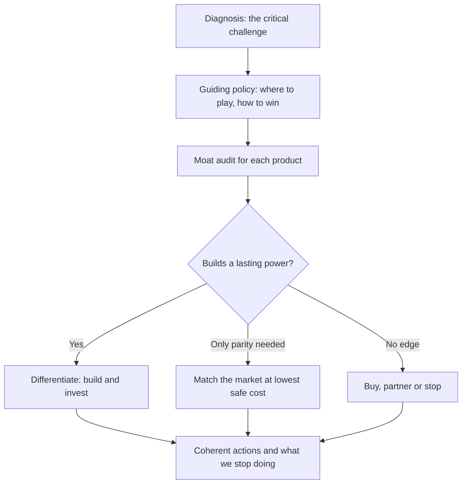
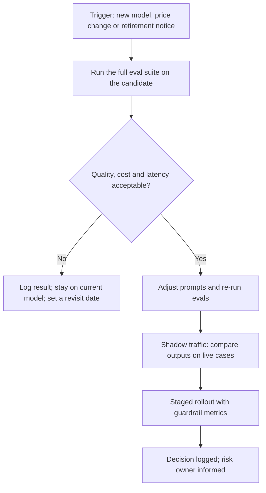
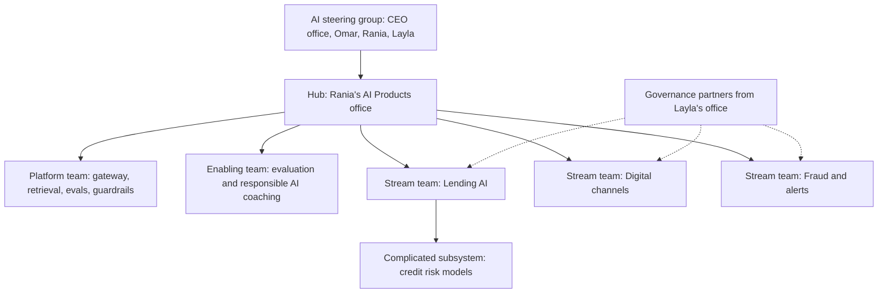
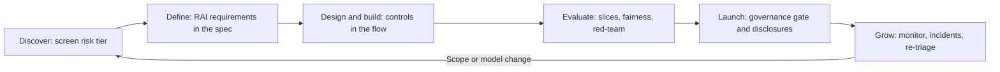

# Module 9 — Strategy and leadership

*The earlier modules taught you to run one AI product well. This module is about running a portfolio and the people behind it. Rania has to take an AI strategy to Najm Bank's board, keep a roadmap useful while the models under it change every few months, organise designers, engineers, data scientists and risk partners so that they ship, and make sure every product carries its share of responsible AI without turning governance into a wall. You will learn how to find where AI gives a lasting advantage and where it only keeps you level with the market, how to plan in bets rather than promises, how to design the team and its decision rights, and what the product manager owns when regulators, customers and the bank's own principles set limits.*

> **Stages:** Lead — choosing where AI gives a lasting edge, sequencing bets while models change, organising the team, and owning the product's part of responsible AI.

---

# 9.1 — AI product strategy and defensibility
*Level: 🔴 Advanced* · *Prerequisites: 2.2, 3.2, 8.2* · *Stage: Lead*

## ⚡ In 60 seconds
- A strategy is a **diagnosis** of the situation, a **guiding policy** for dealing with it, and a set of **coherent actions** (Richard Rumelt). A list of AI use cases is not a strategy, and neither is "become AI-first".
- Access to a capable model is not an advantage, because every competitor can rent the same model on similar terms. Lasting advantage comes from what surrounds the model: proprietary data and outcome labels, a place inside a workflow, distribution, trust and the licence to operate, and how fast the organisation learns.
- Test each product with a **moat audit**: which source of power does it build (Hamilton Helmer's *7 Powers* is a good checklist), and what stops a rival copying it within a year?
- Many "data moats" are weaker than they sound. Data is an advantage only when it is proprietary, tied to outcomes, keeps refreshing, can be used lawfully, and actually feeds back into the product.
- Decision cue: build and invest where AI strengthens an advantage you already have; match the market cheaply where you only need parity; buy, partner or stop where you have no edge.
- Biggest trap: the thin "wrapper", a product whose only real feature is the model. The next model release, or the vendor itself, can make it obsolete.

## 🧭 Why it matters
The CEO asks Rania to present "Najm's AI strategy" to the board in six weeks. Faisal drafts the deck over a weekend: twenty-three use cases, a slide of vendor logos, a target of "AI in every product by 2027" and a budget request. Rania asks three questions. What problem does the bank have that AI solves better than any alternative? Which of these would still be an advantage if every bank in Doha and Dubai bought the same model next quarter? And what will we stop doing to pay for it?

The deck has no answers because it is a wish list. The board needs choices it can hold management to: where Najm will compete with AI, where it will simply keep up, and where it will not play.

Public cases show why choices matter more than enthusiasm. IBM invested heavily in Watson Health and sold the units in 2022; impressive demonstrations did not become products that fitted clinical workflow. Zillow put a pricing algorithm at the centre of a home-buying business and wound down Zillow Offers in 2021, with large write-downs, after the algorithm mispriced homes. In both cases the technology was real. The strategy misjudged where value would come from and how much exposure the business was taking.

## 📐 How it works

### 🟢 The essentials

**The strategy kernel.** In *Good Strategy / Bad Strategy* (2011), Richard Rumelt describes the core of any strategy as three parts:

1. **Diagnosis:** name the critical challenge. For Najm: "Our cost to serve is too high to lend profitably to SMEs below about QAR 500,000, and AI-native lenders are starting to underwrite small businesses from invoice data in minutes."
2. **Guiding policy:** the approach, which rules options in and out. "Use our own credit outcomes and relationships to make small-ticket lending fast and safe; do not try to out-build technology firms on models."
3. **Coherent actions:** steps that reinforce each other. "Ship SME Instant Finance for small invoices; give relationship managers Credit Memo Copilot for the larger loans; build one shared evaluation and data platform for both."

Rumelt's signs of **bad strategy** include fluff, mistaking goals for strategy ("be the most AI-enabled bank in the Gulf" is a goal), failing to face the real problem, and long lists of objectives that are not choices. Faisal's deck shows all four.

**Where to play and how to win.** A. G. Lafley and Roger Martin, in *Playing to Win* (2013), frame strategy as five linked choices: a winning aspiration, **where to play**, **how to win**, the capabilities you need, and the management systems that support them. For an AI product leader the middle two do most of the work: which customers, journeys and decisions; and why anyone would choose this product over the alternative, including doing nothing.

**Where AI advantage comes from.** Picture an AI product as layers. Everyone can rent the bottom one, the model; the layers above are harder to copy.

| Layer | What it is | Can a competitor copy it within a year? |
|---|---|---|
| Foundation model | The LLM or ML algorithm | Yes: they rent the same one |
| Prompts, retrieval, orchestration | How the model is instructed and grounded (5.3) | Mostly, once they see the product |
| Proprietary data | Data only you hold, such as repayment outcomes | Slowly, if truly unique and usable |
| Feedback loop | Outcomes from real use flowing back (3.2) | Slowly; it needs users first |
| Workflow position | Integrations, templates and history where work happens | Slowly; switching has a cost |
| Distribution | Customers and channels you already reach | Very slowly |
| Trust and licence | Brand, regulatory permission, a record of accuracy | Very slowly, but lost in a day |
| Learning speed | Evals, error analysis, release cadence | Slowly; it lives in how the team works |

A **wrapper** is a product whose value sits almost entirely in the bottom two layers: an interface on someone else's model with a clever prompt. A quick wrapper is often the right first step, but it has no defence when the vendor adds the same feature, a better model makes the prompt unnecessary, or a rival rebuilds it in a month.

### 🟡 Going deeper

**The 7 Powers as a moat audit.** Hamilton Helmer's *7 Powers* (2016) defines "power" as conditions that let a business earn better returns than rivals over time. Each power needs a **benefit** (lower cost or higher price) and a **barrier** (something that stops competitors competing the benefit away). Most AI claims name a benefit and forget the barrier.

| Power | Benefit and barrier in plain words | Najm example and honest verdict |
|---|---|---|
| **Scale economies** | Unit cost falls with volume; rivals are too small to match | A shared AI platform spread over five products lowers cost per product; against hyperscalers Najm has no scale advantage |
| **Network economies** | Each user makes the product more valuable to other users | Rare in bank AI. Be sceptical when a deck claims it |
| **Counter-positioning** | A newcomer adopts a model that incumbents cannot copy without hurting their existing business | This works *against* Najm: an AI-native SME lender with no branch costs. SME Instant Finance is partly a defensive response |
| **Switching costs** | Leaving costs the customer time, data or risk | Credit Memo Copilot, once it holds templates, past memos and RM habits, is costly to replace |
| **Branding** | Customers pay more or trust more because of reputation | A reputation for accurate, careful answers is slow to build; the Air Canada case (2024) shows how fast one bad answer becomes a legal problem |
| **Cornered resource** | Preferential access to something valuable | Najm's own credit performance and transaction data, where it has the legal basis to use it (3.3) |
| **Process power** | Organisational routines that improve cost or quality and take years to copy | A disciplined evaluation and feedback routine: golden sets, weekly error analysis, safe fast releases (Module 6) |

**Be careful with data moats.** In an essay titled "The Empty Promise of Data Moats" (2019), Martin Casado and Peter Lauten of Andreessen Horowitz argued that data advantages are often weaker than claimed: the value of extra data tends to level off, new useful cases get costlier to find, and true data network effects are uncommon. Treat that as a caution to test, not a law. Ask five questions of any data claim:

1. **Proprietary?** Could a rival buy or collect equivalent data?
2. **Outcome-labelled?** Does it record what happened (loan repaid, fraud confirmed, memo approved without edits)?
3. **Refreshing?** Does new data keep arriving from use?
4. **Usable?** Do consent and data protection law allow this use (3.3)?
5. **Used?** Is there a real loop that turns the data into a better product (3.2)?

**Map the value chain.** Simon Wardley's **Wardley maps** place each component of a service by how visible it is to the user and how evolved it is, from *genesis* through *custom-built* and *product* to *commodity*. General-purpose language models have moved quickly towards the commodity end. The rule that follows: consume commodities, and spend scarce engineering time on components that are still custom and close to the user's need. For Najm, that means renting models and investing in credit-specific retrieval, evaluation sets built from its own cases, and integration with the loan origination system.

### 🔴 Expert view

**Ask what will be free in eighteen months.** Models keep widening, and platform vendors keep adding AI to products you already pay for. A feature that differentiates today may be built into the model or an office suite next year. Staff GenAI is the obvious case: buy that layer and put Najm's effort into bank-specific connections (policies, product manuals, approved data sources). The reverse error is waiting forever for "the next model" and never building the proprietary layers only you can build.

**Sustaining or disruptive?** In *The Innovator's Dilemma* (1997), Clayton Christensen separates sustaining innovations, which improve existing products for existing customers and are usually won by incumbents, from disruptive ones, which start with a cheaper, simpler offer for customers the incumbent under-serves. Most GenAI inside a bank is sustaining: faster memos, better answers in the app. The disruptive threat is at the low end of SME lending, where AI-native lenders serve small businesses Najm finds unprofitable. That diagnosis, not enthusiasm, is why SME Instant Finance belongs in the strategy.

**Give every product a strategic role**, with matching investment:

- **Differentiate:** it builds or uses a real power. Invest in proprietary layers and learning speed. *Credit Memo Copilot, SME Instant Finance.*
- **Parity:** you lose if it is missing or bad, but gold-plating does not win. Match the market at the lowest safe cost. *Najm Assist in its question-answering form; Smart Alerts.*
- **Commodity:** someone sells it well already. Buy it and integrate. *Staff GenAI.*

Roles change: as an agent that acts inside the bank's systems, Najm Assist may become a differentiator, because actions are harder to copy than answers.

**Learn from public examples, carefully.** Morgan Stanley's assistant for financial advisers (2023) ran on a vendor's model (GPT-4); its value came from the firm's own research content and its fit with advisers' work. Klarna announced in February 2024 that its AI assistant handled a large share of customer chats, and in 2025 said it would bring more human service back. Measure quality and customer outcomes, not only cost: a cost-led strategy that erodes trust does not last.

## 🧰 The toolkit
| Tool or framework | What it is and does | When to reach for it |
|---|---|---|
| **Strategy kernel** (Richard Rumelt) | Diagnosis, guiding policy, coherent actions; plus the warning signs of bad strategy | Writing or reviewing any strategy document, especially one that reads like a wish list |
| **Playing to Win cascade** (Lafley and Martin) | Five linked choices from aspiration to management systems, centred on where to play and how to win | Turning a strategy into choices about customers, journeys and capabilities |
| **7 Powers** (Hamilton Helmer) | Seven sources of durable advantage, each needing a benefit and a barrier | Testing whether an AI product can hold its advantage once rivals rent the same model |
| **Moat audit** | A per-product table: which layer holds the value, which power it builds, what stops copying | Portfolio reviews and investment cases; before approving a new build |
| **Wardley map** (Simon Wardley) | Components mapped by visibility to the user and by evolution from genesis to commodity | Deciding what to build versus consume, and spotting components that are commoditising |
| **Data advantage test** | Five checks: proprietary, outcome-labelled, refreshing, usable, used | Any claim that "our data is our moat" |
| **Portfolio role** | Differentiate, parity or commodity, with a matching investment posture | Setting budgets and quality ambitions across several AI products |

## 🏛️ In practice at Najm Bank
Rania replaces the deck with a one-page **AI Product Strategy** the board can hold her to.

**Diagnosis.** Small SME lending is unprofitable at today's cost to serve, and AI-native lenders are targeting it. RMs spend much of their week writing memos, not meeting clients. Customer trust is the bank's most valuable and most fragile asset.

**Guiding policy.** Win where Najm's own outcomes data, relationships and licence give it an edge. Rent models and never train foundation models. Keep a human decision-maker on every individual credit decision during 2026 and 2027.

**Portfolio.**

| Product | Role | Power it builds | Evidence to track | Posture |
|---|---|---|---|---|
| SME Instant Finance | Differentiate | Cornered resource: repayment outcomes | Labelled decisions per month; loss rate versus manual | Build; own model and data |
| Credit Memo Copilot | Differentiate | Switching costs, process power | Share of memos drafted in the tool; RM hours saved | Rent the model; own retrieval, templates, evals |
| Najm Assist | Parity, later differentiate | Branding, distribution | Resolution and complaint rates | Build lean; invest in grounding |
| Smart Alerts | Parity | None | Precision; alert opt-outs | Improve steadily |
| Staff GenAI | Commodity | None | Weekly active staff; approved-source coverage | Buy; integrate bank knowledge sources |

**Coherent actions.** One shared AI platform owned by Tariq; outcome labels captured by design in every lending workflow; a quarterly model review.

**What we stop.** Eleven pilots with no owner and no path to a power, including a bespoke chatbot that duplicates Staff GenAI.

**Board indicators.** SME applications decided in under ten minutes; RM hours returned to clients; outcome-labelled examples per quarter; complaints linked to AI answers.

## 🛠️ Exercises
- 🟢 Take Faisal's goal "Be the most AI-enabled bank in the Gulf" and rewrite it as a strategy kernel for one Najm product. *Done when:* you have a one-sentence diagnosis naming a specific challenge, a guiding policy that rules at least one option out, and three actions that reinforce each other.
- 🟡 Run a moat audit on Najm Assist in its current question-answering form. Use the layer table and the 7 Powers. *Done when:* you have named the layer that holds most of its value, the power (if any) it builds with both benefit and barrier, and one thing a competitor could not copy within a year.
- 🔴 Khalid proposes that Najm train its own Arabic foundation model "so we are not dependent on vendors". Write a half-page response for the board using the Wardley map idea, the data advantage test and the portfolio roles. *Done when:* it gives a clear recommendation, names what Najm should build instead, and offers at least one concrete mitigation for vendor dependence.

## ⚠️ Mistakes and traps
- **Presenting a use-case list as a strategy.** Twenty-three ideas with no diagnosis is a backlog. Start with the critical challenge and make choices, including what you will not do.
- **Claiming a moat that is only a benefit.** "Our model is more accurate" is a benefit. Ask what barrier stops a rival matching it next quarter.
- **Assuming data equals advantage.** Apply the five-question test. Raw, unlabelled or legally unusable data is a cost, not a moat.
- **Building what will soon be bundled.** Do not compete with what vendors will give you in eighteen months.
- **Cutting cost at the expense of trust.** Measure quality and outcomes alongside cost.

## 🧾 Recap
- A strategy has a diagnosis, a guiding policy and coherent actions; goals and use-case lists are not strategies.
- Everyone can rent the model. Advantage lives in the layers above it: proprietary outcome data, feedback loops, workflow position, distribution, trust and learning speed.
- Test every product's defensibility with the 7 Powers, and demand a barrier as well as a benefit.
- Data is an advantage only if it is proprietary, outcome-labelled, refreshing, usable and used.
- Give each product a role (differentiate, parity, commodity) and invest to match.

## ✍️ Check yourself

**1. Faisal's draft says: "Our AI strategy is to become the most AI-enabled bank in the Gulf by 2027." Using Rumelt's framework, what is the main problem with it?**

- A. It does not name a specific vendor
- B. It is a goal, not a strategy: it has no diagnosis of the challenge and no guiding policy that rules options out
- C. The time horizon is too short
- D. It should say "GenAI" instead of "AI"

Answer

**B.** Rumelt names mistaking goals for strategy as a mark of bad strategy. A good strategy starts with a diagnosis and sets a guiding policy that makes choices. The time horizon (C) may be debatable, but it is not the core flaw. (🟢 The essentials.)

**2. A competitor bank launches a customer assistant built on the same commercial model Najm uses, with similar prompts. Which of Najm's assets is LEAST likely to stay an advantage?**

- A. Its customer relationships and mobile-app distribution
- B. Its twenty years of outcome-labelled repayment data
- C. The foundation model and prompt design
- D. Its record of accurate, careful answers and regulatory licence

Answer

**C.** Anyone can rent the model, and prompts are easy to copy. A, B and D are much slower to copy. (🟢 The essentials, layer table.)

**3. A vendor pitches: "Our product has a data moat: we have collected ten million unlabelled customer chat transcripts." Which question from the data advantage test exposes the biggest weakness?**

- A. Is the data outcome-labelled, so it shows what actually happened?
- B. Is the data stored in the cloud?
- C. Was the data collected in the last year?
- D. Is the data in more than one language?

Answer

**A.** Raw transcripts without outcomes (resolved or not, correct or not) are worth far less than labelled outcomes, and their value often levels off. Recency (C) matters for the "refreshing" check but is a smaller issue here. Storage location (B) is irrelevant to advantage. (🟡 Going deeper.)

**4. In Helmer's 7 Powers, why is "our credit model is more accurate than competitors'" not enough to claim power?**

- A. Accuracy is not a benefit
- B. Power needs both a benefit and a barrier, and accuracy alone does not stop rivals from matching it
- C. Only network economies count as power in AI
- D. Banks cannot have power because they are regulated

Answer

**B.** Higher accuracy is a benefit; without a barrier such as a cornered resource or process power, rivals can close the gap. C is false: network economies are rare in bank AI. (🟡 Going deeper.)

**5. Najm is deciding how much to invest in Staff GenAI, a general internal assistant. Productivity-suite vendors already bundle capable assistants. What portfolio role and posture fit best?**

- A. Differentiate: build a custom assistant and a proprietary model
- B. Commodity: buy the bundled capability and invest only in connecting bank-specific knowledge sources
- C. Parity: build from scratch to match the vendors' features
- D. Stop: internal assistants have no value

Answer

**B.** A component others sell well is a commodity: buy it and add what only Najm can. A competes with bundled products; D ignores real productivity value. (🔴 Expert view.)

## 📚 References
- Richard Rumelt, *Good Strategy / Bad Strategy: The Difference and Why It Matters* (Crown Business, 2011)
- A. G. Lafley and Roger L. Martin, *Playing to Win: How Strategy Really Works* (Harvard Business Review Press, 2013)
- Hamilton Helmer, *7 Powers: The Foundations of Business Strategy* (Deep Strategy, 2016)
- Clayton M. Christensen, *The Innovator's Dilemma* (Harvard Business School Press, 1997)
- Simon Wardley, *Wardley Maps* (published openly online under a Creative Commons licence)
- Martin Casado and Peter Lauten, "The Empty Promise of Data Moats", Andreessen Horowitz (2019) — https://a16z.com
- Marty Cagan, *Inspired* (2nd ed., Wiley, 2017) and Silicon Valley Product Group articles — https://www.svpg.com
- Morgan Stanley, announcements on its AI assistant for financial advisers (2023) — https://www.morganstanley.com

---

# 9.2 — Roadmaps under uncertainty: bets, platforms and model change
*Level: 🔴 Advanced* · *Prerequisites: 1.3, 6.3, 9.1* · *Stage: Lead, Define*

## ⚡ In 60 seconds
- An AI roadmap carries three uncertainties at once: **value** (is the problem worth solving?), **feasibility** (can the product reach the quality bar?) and **technology drift** (what will models do, and cost, next quarter?).
- Replace dated feature lists with an **outcome-based roadmap** (Now, Next, Later) in which each item is a **bet**: the outcome sought, the hypothesis, the evidence so far, the size of the bet and a **kill criterion** agreed in advance.
- Stage the money: spend a little to learn whether quality is reachable (a feasibility spike on a golden set) before spending a lot.
- Build a shared **platform** capability once several products need the same thing. Before that, build it inside one product and extract it later.
- Treat **model change as routine**: keep an evaluation suite that works as a regression test, route calls through a gateway, and run a written **model-change playbook** when a model is released, repriced or retired.
- Biggest trap: promising executives a date for a quality level nobody has measured yet. Commit to dates for *learning*, and to ranges for quality.

## 🧭 Why it matters
In January Faisal gives Khalid a roadmap slide that says: "Q2: Credit Memo Copilot live for all corporate loans, 95% accurate." Khalid puts it in his annual plan. Nobody has defined what "95% accurate" means for a credit memo, and Dana has not yet run a single evaluation on corporate loan files, which are longer and messier than the SME files the pilot used.

In March two things happen. Dana's first error analysis shows that the copilot handles narrative sections well but gets financial ratio summaries wrong often enough that RMs must check every number. Separately, the model vendor announces that the model version Najm uses will be retired later in the year, and a newer model is offered at a lower price. When Tariq runs the golden set on the new model, the ratio summaries improve but the Arabic executive summaries get worse. (These results are illustrative.)

Faisal's slide is now wrong on scope, quality and technology, and Khalid feels misled. Rania's view: nothing unusual happened. This is normal for an AI product. The failure was a roadmap that pretended to be certain.

## 📐 How it works

### 🟢 The essentials

**Three kinds of uncertainty.** Marty Cagan's four big risks (value, usability, feasibility and business viability, from *Inspired*) apply to every product. In AI products, **feasibility risk stays open far longer** than in ordinary software. You often cannot know whether it can reach an acceptable error rate until you have built a prototype and evaluated it on real cases (Module 6). On top sits **technology drift**: models, prices and vendor features change several times a year.

**Now, Next, Later.** Janna Bastow, co-founder of ProdPad, popularised the **Now-Next-Later roadmap** as an alternative to timelines. It has three columns:

| Column | What goes in it | Confidence | What you commit to |
|---|---|---|---|
| **Now** | Work in progress or about to start, with a clear outcome | High | Scope and a delivery window |
| **Next** | Problems shaped and evidenced, not yet started | Medium | The outcome and the order |
| **Later** | Directions and opportunities worth exploring | Low | Only the intent |

Each item is framed as an **outcome** ("cut RM time per corporate memo"), not a feature ("add ratio table generation"). This keeps the team free to choose the solution, including a non-AI one, when evidence arrives.

**Roadmap items are bets.** Annie Duke's *Thinking in Bets* (2018) argues that decisions under uncertainty should be judged by the quality of the reasoning behind them, not only by how they turned out; judging by outcomes alone she calls "resulting". A roadmap of bets makes the reasoning visible. A **bet card** has six fields:

1. **Outcome:** the measurable change we want.
2. **Hypothesis:** why we believe this product will cause it.
3. **Evidence so far:** discovery findings, prototype results, eval scores.
4. **Size of the bet:** people and weeks, plus run cost.
5. **Kill criterion:** the result that stops or reshapes the bet, written before work starts.
6. **Next learning milestone:** what we will know, and by when.

The kill criterion matters most. Written in advance, it protects the team from sunk-cost thinking ("we've spent four months, let's keep going") and protects leaders from unpleasant surprises.

### 🟡 Going deeper

**Stage the investment.** Fund AI work in stages; each buys information and unlocks a larger budget only if the evidence is good.

| Stage | Question it answers | Typical size (illustrative) | Evidence to move on |
|---|---|---|---|
| 1. Problem evidence | Is the job painful and frequent enough? (Module 2) | Days | Interviews, workflow data, baseline cost |
| 2. Feasibility spike | Can any available approach reach the quality bar? | One to three weeks | Scores on a small golden set; error analysis |
| 3. Prototype with users | Do users trust and use the output in their workflow? | Weeks | Task success and edit rates in a controlled test |
| 4. Limited pilot | Does it work in production conditions, at acceptable cost? | One to three months | Online metrics, guardrail metrics, cost per task (Modules 6 and 8) |
| 5. Scale | Does value hold across segments and volume? | Ongoing | Staged rollout results; operating metrics |

A **feasibility spike** is the AI-specific step. Before promising anything, Dana's team builds the crudest version that can be evaluated, often a prompt plus retrieval, and scores it on fifty to a hundred real cases. It produces not a product but a number and a list of error types, which is what the roadmap needs.

**Appetite and the betting table.** Ryan Singer's *Shape Up* (Basecamp, 2019) offers two useful ideas. **Appetite** means deciding how much time a problem is worth *before* estimating it: "this is worth six weeks, not six months". The scope then shrinks to fit the time. The **betting table** is a regular meeting where leaders choose which shaped pitches to fund for the next cycle, instead of grooming an endless backlog. Appetite matters for AI because quality problems can absorb unlimited effort. Deciding that "ratio summaries are worth one more cycle; if we cannot reach the bar, we ship without them and show the source table instead" keeps the product moving.

**Balance the portfolio across horizons.** In *The Alchemy of Growth* (1999), Mehrdad Baghai, Stephen Coley and David White described **three horizons** of growth: Horizon 1 extends and defends the core business, Horizon 2 builds emerging businesses, and Horizon 3 creates options for the future. An AI portfolio needs all three. At Najm, Horizon 1 is Smart Alerts and Credit Memo Copilot; Horizon 2 is SME Instant Finance and Najm Assist as an agent; Horizon 3 is small exploratory bets, such as agents talking to corporate treasury systems. Any split of effort across horizons is a starting point to argue about, not a rule.

**Platform or product?** A **platform** here means shared capabilities that several AI products use: a model gateway (one place to call models, switch vendors, log and meter cost), a retrieval service, an evaluation harness, guardrails, prompt and version management, and observability. The question is timing.

| Build it inside a product first when… | Build it as a platform when… |
|---|---|
| Only one product needs it | Three or more products need the same capability |
| You do not yet know what "good" looks like | The design has settled and duplication is costing money or risk |
| Speed to learning matters most | Consistency matters: one guardrail, one audit log, one cost view |
| The capability is still changing monthly | The capability is stable enough to offer to internal customers |

A practical heuristic is the **rule of three**: build it once, copy it the second time, platformise it the third. *Platform-first* builds infrastructure no product uses yet: large cost, no feedback. *Never-platform* leaves five teams each with their own logging and vendor contracts, so nobody can say what the bank spends on models or which products use a model being retired. Treat the platform as a product with internal customers and service levels.

### 🔴 Expert view

**Model change is a recurring event, not an emergency.** Vendors release new models, change prices and retire old versions, usually with notice. Open-weight models add options for data residency and cost. A model can also behave differently after an update unless you pin a version. So a mature team keeps a written **model-change playbook** and runs it quarterly and whenever a trigger occurs.

Three design choices make this playbook cheap to run:

1. **Evals are the portability asset.** The golden sets, rubrics and judges from Module 6 double as a regression suite. Without them, every model change is a leap of faith; with them, it is a comparison you finish in days.
2. **A thin model-dependent layer.** Route calls through a gateway and version prompts per model. Do not over-abstract: a lowest-common-denominator interface throws away what makes a newer model better.
3. **Governance in the loop.** A model change can change the risk profile, so Layla's team is told, and reviews high-risk products (9.4).

**Build now or wait for the next model?** Usually: build the durable layers now and keep the model-dependent layer thin. Data pipelines, outcome labels, eval sets and workflow integration keep their value whichever model wins. Elaborate workarounds for a model's current weakness, such as a chain of prompts to fix arithmetic, may be wasted when the next model handles the task. First ask whether a simple tool (a calculator call, a lookup) removes the problem.

**Communicating uncertainty upward.** Executives need commitments; AI work cannot promise quality in advance. Commit to different things at different confidence levels:

- **Dates for learning:** "By 30 April we will know whether ratio summaries can reach the bar on corporate files."
- **Ranges for quality:** "Current evidence suggests an RM edit rate between X and Y; we will narrow this after the pilot."
- **Scope that flexes:** "Narrative sections ship in Q2 regardless; ratio summaries ship only if they pass."
- **Dates for delivery** only in the Now column, after the feasibility spike.

Khalid needs to know what he can plan on, and what would change the plan.

## 🧰 The toolkit
| Tool or framework | What it is and does | When to reach for it |
|---|---|---|
| **Now-Next-Later roadmap** (Janna Bastow) | A three-column roadmap by confidence rather than by date, framed as outcomes | Replacing timeline roadmaps for AI products whose feasibility is still open |
| **Bet card** | One card per roadmap item: outcome, hypothesis, evidence, size, kill criterion, next learning milestone | Every roadmap item above a few weeks of effort; portfolio reviews |
| **Betting table and appetite** (Ryan Singer, *Shape Up*) | Leaders fund shaped work for a fixed cycle; time is fixed, scope flexes | Stopping quality work from absorbing unlimited effort |
| **Feasibility spike** | A time-boxed crude build scored on a small golden set, with error analysis | Before putting any AI quality claim on a roadmap |
| **Three horizons** (Baghai, Coley and White) | Portfolio split between extending the core, emerging businesses and future options | Balancing a portfolio so that all effort does not go to one horizon |
| **Rule of three for platforms** | Build once, copy the second time, platformise the third | Deciding when a shared AI capability should become a platform |
| **Model-change playbook** | A written procedure: trigger, eval suite, shadow, staged rollout, logged decision | Model releases, price changes and retirement notices |

## 🏛️ In practice at Najm Bank
Rania replaces Faisal's timeline with a **Now-Next-Later AI roadmap** and a bet card for each item. The quarterly board version is one slide.

| | Now (committed) | Next (shaped) | Later (directional) |
|---|---|---|---|
| **Credit Memo Copilot** | Narrative sections for SME memos: cut drafting time per memo | Corporate memos, ratio summaries only if the spike passes | Covenant monitoring drafts |
| **SME Instant Finance** | Pilot for invoices under the set limit, human decision on every case | Wider limit if loss rate stays within the agreed band | Supplier-network invoice data |
| **Najm Assist** | Grounded answers on card and account questions | First agentic action: freeze card, with confirmation | Disputes and payment actions |
| **Platform** | Model gateway and shared eval harness (three products now use them) | Shared guardrail service | Open-weight fallback for data-residency needs |
| **Learning milestones** | Corporate ratio spike result by 30 April | Agent action pilot readout by end of Q3 | Horizon 3 option review in Q4 |

**Bet card: Credit Memo Copilot for corporate loans.**

| Field | Entry |
|---|---|
| Outcome | RM hours per corporate memo fall meaningfully against the manual baseline, with no rise in credit-committee rework |
| Hypothesis | SME narrative gains carry over to corporate files; ratios become reliable if the model calls a calculation tool |
| Evidence so far | SME pilot edit rates; initial error analysis showing ratio errors as the main failure type |
| Size | Two engineers and Dana part-time for one six-week cycle; run cost estimated per memo (8.2) |
| Kill criterion | If ratio summaries fail the golden-set bar after one cycle, ship narrative sections only and show source tables for ratios |
| Next learning milestone | Spike result on 80 historical corporate files by 30 April |

**Model-change playbook (excerpt).** Owner: Tariq. Steps as in the diagram. Exit record: eval scores by section and language, cost per memo, latency, decision, and sign-off from the product owner and, for high-risk products, Layla's team. The March retirement notice becomes a line in the Now column, not a crisis.

## 🛠️ Exercises
- 🟢 Rewrite three of Faisal's dated feature commitments as Now-Next-Later items framed as outcomes. *Done when:* each item names a measurable outcome, sits in one column with a reason, and none of them promises a quality level that has not been measured.
- 🟡 Write a bet card for Najm Assist's first agentic action (freezing a card). *Done when:* all six fields are filled, the kill criterion is a specific measurable result, and the next learning milestone has a date.
- 🔴 The vendor behind Credit Memo Copilot announces the retirement of the model version you use in four months, and a cheaper replacement. Draft the playbook run: the evaluations you will run, the decision rule, the rollout plan and who signs off. *Done when:* the plan names the eval sets (including Arabic and English sections), states pass thresholds relative to the current model, includes a shadow or staged step, and gives a fallback if the replacement fails.

## ⚠️ Mistakes and traps
- **Dating quality before measuring it.** "95% accurate by Q2" with no eval is a promise you cannot keep. Run a feasibility spike, then commit to ranges.
- **Roadmaps as feature lists.** Features lock in a solution before the evidence arrives. Frame items as outcomes and let the team choose the solution.
- **Bets without kill criteria.** Without a stop rule written in advance, sunk cost keeps weak bets alive. Write the criterion before work starts.
- **Building the platform first.** Infrastructure with no product using it gets no feedback. Follow the rule of three.
- **Never building the platform.** Five teams each with their own logging and vendor contracts means nobody can see cost or risk. Extract shared capabilities once they have settled.
- **Treating each model release as a rewrite.** Keep the model-dependent layer thin and let the eval suite decide.

## 🧾 Recap
- AI roadmaps carry value, feasibility and technology-drift uncertainty; feasibility stays open longer than in ordinary software.
- Use Now-Next-Later framed as outcomes, and make every item a bet with a kill criterion.
- Stage investment: problem evidence, feasibility spike, prototype, pilot, scale.
- Platformise shared capabilities when several products need them and the design has settled.
- Model change is routine: evals as a regression suite, a gateway, a thin model-dependent layer and a written playbook.
- Commit to dates for learning, ranges for quality and flexible scope; commit to delivery dates only in the Now column.

## ✍️ Check yourself

**1. Khalid asks Faisal for "the date when the copilot will be 95% accurate on corporate memos". No evaluation on corporate files exists yet. What is the best response?**

- A. Give a date one quarter out, to keep Khalid's confidence
- B. Refuse to give any dates until the product is finished
- C. Commit to a date for a feasibility spike result on corporate files, then give a quality range and a delivery plan based on it
- D. Promise 95% and reduce scope later if needed

Answer

**C.** Commit to a date for learning, then to ranges and scope. A and D promise a quality level nobody has measured. B is unhelpful: executives need something they can plan on. (🔴 Expert view.)

**2. Which element of a bet card most directly protects a team from sunk-cost thinking?**

- A. The hypothesis
- B. The kill criterion agreed before work starts
- C. The size of the bet
- D. The outcome

Answer

**B.** A stop rule written in advance makes it easier to stop or reshape a weak bet regardless of how much has been spent. The hypothesis (A) explains the reasoning but does not say when to stop. (🟢 The essentials.)

**3. Najm's fraud team, card team and lending team have each built their own logging and vendor integration for LLM calls. Leaders cannot say which products use a model version that is being retired. What does this suggest?**

- A. The capability has passed the rule of three and should become a shared platform, such as a model gateway
- B. Each team should hire its own vendor manager
- C. The bank should stop using LLMs
- D. The platform should have been built before any product existed

Answer

**A.** Three products needing the same capability, with duplication now causing risk and cost blindness, is the signal to platformise. D is the opposite error: platform-first builds infrastructure without product feedback. (🟡 Going deeper.)

**4. A vendor releases a new model that is cheaper and scores higher on public benchmarks. What should Najm do first under its model-change playbook?**

- A. Switch all products immediately, since benchmarks show it is better
- B. Ignore it until the current model is retired
- C. Run Najm's own eval suite on the candidate, comparing quality by section and language, cost and latency with the current model
- D. Ask the vendor for a written guarantee of quality

Answer

**C.** Public benchmarks do not measure Najm's tasks. The team's own eval suite is the regression test that decides. B wastes a possible saving; A risks regressions, such as worse Arabic summaries. (🔴 Expert view.)

**5. Tariq proposes a complex chain of five prompts to work around the current model's arithmetic errors in ratio summaries. Which option best reflects the "durable layers" principle?**

- A. Build the five-prompt chain, since it fixes today's problem
- B. Wait for a future model to fix arithmetic before shipping anything
- C. Have the model call a calculation tool for ratios, and invest the saved effort in evaluation sets and workflow integration
- D. Remove ratios from memos permanently

Answer

**C.** A simple tool call removes the weakness without an elaborate model-specific workaround, and the effort goes into layers that keep their value whichever model wins. A may be wasted when models improve; B stalls the product. (🔴 Expert view.)

## 📚 References
- Marty Cagan, *Inspired: How to Create Tech Products Customers Love* (2nd ed., Wiley, 2017) — https://www.svpg.com
- Janna Bastow and ProdPad on the Now-Next-Later roadmap — https://www.prodpad.com
- Annie Duke, *Thinking in Bets* (Portfolio, 2018)
- Ryan Singer, *Shape Up: Stop Running in Circles and Ship Work that Matters* (Basecamp, 2019) — https://basecamp.com/shapeup
- Mehrdad Baghai, Stephen Coley and David White, *The Alchemy of Growth* (1999)
- Teresa Torres, *Continuous Discovery Habits* (2021) — https://www.producttalk.org
- Ron Kohavi, Diane Tang and Ya Xu, *Trustworthy Online Controlled Experiments* (Cambridge University Press, 2020) — https://experimentguide.com

---

# 9.3 — Teams, roles and operating model for AI products
*Level: 🔴 Advanced* · *Prerequisites: 5.2, 9.1* · *Stage: Lead*

## ⚡ In 60 seconds
- An AI product team adds roles to the classic trio of product manager, designer and engineer: data scientists or ML engineers, AI engineers, data engineers, domain experts who judge quality, and a named risk or governance partner.
- The AI product manager does not own the model. They own the **problem, the outcome, the quality bar and the trade-offs** between quality, cost, speed and risk. Defining what "good" means, in evals everyone agrees on, is the core of the job.
- Enterprises usually choose between a **centralised** centre of excellence, **embedded** teams in each business line, or a **hub-and-spoke** mix. Most end up with hub-and-spoke: shared platform and standards in the hub, product teams in the business.
- *Team Topologies* gives a useful vocabulary: **stream-aligned** product teams, a **platform** team, **enabling** teams and, where needed, a **complicated-subsystem** team.
- Write down **decision rights**: who chooses the model, who sets the quality bar, who approves launch, who can switch the product off. Most AI launch delays are really ownership gaps.
- Biggest trap: an AI lab that is separate from the business and produces demos nobody adopts. This is often called "pilot purgatory".

## 🧭 Why it matters
In Najm's first year of generative AI, Omar (Chief Data Officer) set up a central AI Lab. It built fourteen prototypes, and two reached production. Business lines saw the Lab as a technology showcase that did not understand lending. The Lab saw the business as slow and risk-averse. Neither owned the outcome.

Credit Memo Copilot came closest to launch and then stalled for six weeks over one question: who can approve the quality bar? Dana said the business owner should decide what error rate is acceptable. Khalid said that was a risk question for Layla. Layla said governance reviews the bar but does not set it; the product owner does. Faisal, the product manager, spent those weeks arranging meetings instead of making decisions, because nobody had told him he could make them.

Rania's diagnosis: a structure problem, not a talent problem. Melvin Conway observed in 1968 that organisations design systems that mirror their own communication structures, an idea now called **Conway's law**. A Lab that talks to the business once a quarter will build products that fit the business once a quarter.

## 📐 How it works

### 🟢 The essentials

**Who is on an AI product team.** Titles vary between companies; what matters is that someone owns each responsibility.

| Role | What they own | Common confusion |
|---|---|---|
| **AI product manager** | Problem, outcome, quality bar, cost envelope, trade-offs, roadmap | Thinking they must choose algorithms, or that the data scientist owns "quality" alone |
| **Product designer** (Hessa) | User research, the experience of uncertainty and error, trust patterns (Module 4) | Being brought in after the model "works" |
| **Data scientist / ML engineer** (Dana's team) | Modelling, evaluation design, error analysis, statistical rigour | Being asked to deliver a date for accuracy before feasibility is known |
| **AI engineer** | Building LLM-based features: prompts, retrieval, tools, orchestration, guardrails | Confused with ML research; this is mostly software engineering around models |
| **Data engineer** | Pipelines, data quality, access, lineage | Treated as a support ticket queue rather than a team member |
| **Platform engineer** (Tariq's team) | Gateway, shared services, cost, latency, reliability | Pulled into every product decision |
| **Domain experts** (RMs, underwriters, fraud analysts) | Judging output quality, writing rubrics, labelling cases | Asked to volunteer in spare time, so quality work never happens |
| **Governance partner** (from Layla's team) | Risk tier, requirements from law and policy, review before launch | Seen as a final gate rather than a participant from discovery |

**What the AI PM uniquely owns.** In ordinary software the PM owns *what* to build and *why*. In AI products the PM also owns **how good is good enough**. Concretely:

- The **outcome** and how it will be measured (8.1).
- The **quality bar**, written as eval criteria and thresholds agreed with Dana and the domain experts (5.1, 6.1).
- The **cost envelope** per task, agreed with Tariq (8.2).
- The **trade-off calls**: when a cheaper model loses two points of quality, or a guardrail adds latency, the PM decides, with the evidence in front of them.
- **Adoption**, jointly with the business owner (7.3).

Good AI PMs read real outputs every week; a dashboard cannot judge whether the product is good.

**Empowered teams, not feature factories.** Marty Cagan's *Empowered* (2020) argues that strong product teams are given **problems to solve** and are accountable for outcomes. Weak teams are given features to build and are accountable for output. For AI this matters even more, because the right solution often only becomes clear after evaluation. A team told to "build a chatbot" will build a chatbot. A team told to "cut time-to-answer on card questions without raising complaints" might discover that a better search page solves half the problem.

### 🟡 Going deeper

**Three operating models.**

| Model | How it works | Strengths | Weaknesses | Fits when |
|---|---|---|---|---|
| **Centralised centre of excellence** | One AI team serves the whole organisation | Scarce skills in one place; consistent standards; efficient early on | Far from the business; pilot purgatory; queue for every request | Very early, with few AI people and little demand |
| **Embedded** | Each business line hires its own AI people | Close to problems and users; fast | Duplication; inconsistent quality and risk controls; isolated specialists | Mature organisations with strong shared standards already in place |
| **Hub-and-spoke** | A central hub owns platform, standards, specialist help and governance links; product teams sit in or next to business lines | Close to the business with shared foundations | Needs clear decision rights between hub and spokes; can drift to either extreme | Most enterprises once they have several AI products |

**Team Topologies.** Matthew Skelton and Manuel Pais, in *Team Topologies* (2019), describe four team types that map well onto AI work:

- **Stream-aligned teams** own a product or customer journey end to end. At Najm: a lending AI team (Credit Memo Copilot, SME Instant Finance), a digital channels team (Najm Assist) and a fraud team (Smart Alerts).
- A **platform team** provides internal services that stream-aligned teams use on their own, without waiting. At Najm: Tariq's AI platform (gateway, retrieval, eval harness, guardrails, cost metering).
- **Enabling teams** coach other teams in a new capability for a period, then step back. At Najm: a small evaluation and responsible-AI enabling group that helps each product team build its first golden set and rubric.
- A **complicated-subsystem team** owns a component that needs deep specialist knowledge. At Najm: the credit risk modelling group behind SME Instant Finance's scoring model, which must also meet model risk management standards.

The book also describes **interaction modes** (collaboration, X-as-a-service, facilitating); interactions should be deliberate and, where possible, temporary. A platform team that must collaborate closely with every product team on every release is not yet a platform.

**Decision rights.** Most delays in AI launches are caused by unclear ownership, not by technology. Write a **decision-rights register** for each product, and use the familiar **RACI** labels: Responsible (does the work), Accountable (one person who decides and answers for it), Consulted (asked before), Informed (told after). Only one person can be Accountable for each decision.

| Decision | Accountable | Responsible | Consulted | Informed |
|---|---|---|---|---|
| Problem and target outcome | Business owner (Khalid) | AI PM | Rania, RMs | Steering group |
| Quality bar and eval thresholds | AI PM | Dana's team | Domain experts, Layla's team | Khalid |
| Model and vendor choice | Tariq | AI engineers | AI PM, Yusuf (procurement), Sara (DPO) | Layla |
| Risk tier and required controls | Layla | Governance partner | AI PM, Sara | Steering group |
| Launch go / no-go | Business owner (Khalid) | AI PM | Layla, Tariq, Dana | Support, operations |
| Stopping or rolling back in production | AI PM, with on-call authority for Tariq | Platform on-call | Layla | Khalid, steering group |

Notice the split. Layla is accountable for the risk tier and controls; she is not accountable for the quality bar or the launch. That split breaks the six-week deadlock. Governance sets limits, the product owner decides within them, and nobody has to guess.

### 🔴 Expert view

**Rituals that make quality everyone's job.** Structure needs a cadence that puts the right people in front of real evidence.

| Ritual | Who | How often | What happens |
|---|---|---|---|
| Error-analysis review | PM, data scientist, designer, domain expert | Weekly | Read a sample of real outputs; tag failure types; pick the top one to fix (6.1) |
| Release eval review | PM, Dana, Tariq, governance partner for high-risk products | Every release | Compare eval results with the bar; decide ship or hold |
| Cost and quality review | PM, Tariq, finance partner | Monthly | Cost per task, latency, quality trend; model-change candidates (9.2) |
| Betting table | Rania, product leads, business owners | Quarterly | Fund, reshape or kill bets (9.2) |
| Incident review | Everyone involved, blameless | After any incident | What happened, why the guardrails missed it, what changes |

**Domain experts are part of the team, not volunteers.** The quality of an AI product is capped by the quality of the judgement behind its evals. At Najm, two senior RMs are seconded one day a week to the lending AI team to write rubrics, review outputs and label cases. Their managers agree the time in writing, and it counts towards their objectives. Without this, the golden set is written by people who have never written a credit memo.

**Hire for the problem you have.** Many product problems need AI engineers who can build reliable systems around existing models, not researchers who train new ones. A research team on a product problem produces prototypes; prompt-writers alone on a credit model that needs statistical validation produce risk. Match the mix to the portfolio roles from 9.1.

**Fund products, not projects.** Project funding ends at launch. AI products need sustained work after launch: monitoring, drift, model changes, feedback loops (8.3). Najm moves from project budgets to persistent teams funded against outcomes, reviewed at the quarterly betting table. A pilot is approved only if it has a **path to production** from day one: a named business owner, a budget line for run costs, an integration plan and a provisional risk tier. It is the strongest cure for pilot purgatory.

**Governance partners in the room, early.** A review that first sees a product two weeks before launch finds problems that are expensive to fix. Layla's named partner for each high-risk product attends discovery and release eval reviews and signs off controls as they are designed (9.4).

**Grow AI product managers deliberately.** Faisal's gap was not intelligence; it was that nobody had taught him to write an eval, read an error analysis or argue a cost trade-off. Rania sets a simple standard: every PM on her team writes the first draft of their product's eval rubric, reviews outputs weekly and can explain the product's cost per task. The enabling team coaches them until they can.

## 🧰 The toolkit
| Tool or framework | What it is and does | When to reach for it |
|---|---|---|
| **Team Topologies** (Skelton and Pais) | Four team types (stream-aligned, platform, enabling, complicated-subsystem) and three interaction modes | Designing or redesigning how AI teams are organised |
| **Hub-and-spoke operating model** | A central hub for platform, standards and specialists; product teams in the business | Scaling beyond a handful of AI products |
| **Empowered product team** (Marty Cagan) | Teams given problems and accountable for outcomes, not feature lists | Chartering a new AI product team |
| **Decision-rights register** | A per-product list of key decisions with one accountable owner each | Before build starts; whenever a decision stalls |
| **RACI matrix** | Responsible, Accountable, Consulted, Informed labels for each decision | Filling in the decision-rights register |
| **Conway's law** (Melvin Conway) | Systems mirror the communication structure of the organisation that builds them | Diagnosing why products do not fit the business workflow |
| **Path-to-production check** | Pilot approval requires a business owner, run-cost budget, integration plan and risk tier | Approving any AI pilot |

## 🏛️ In practice at Najm Bank
Rania's two-page **AI Operating Model**, approved by the steering group:

**Structure.**

| Unit | Type | Lead | Scope |
|---|---|---|---|
| AI Products office | Hub | Rania | Portfolio, standards, betting table, PM craft |
| AI Platform | Platform team | Tariq | Gateway, retrieval, eval harness, guardrails, cost metering; has its own PM |
| Evaluation and RAI enablement | Enabling team | Dana (evaluation), with a governance partner | Coaches product teams on golden sets, rubrics, fairness testing; rotates between teams |
| Lending AI | Stream-aligned | Faisal (PM), with a senior engineer and data scientist | Credit Memo Copilot, SME Instant Finance experience |
| Credit risk models | Complicated subsystem | Head of credit modelling | SME Instant Finance scoring model and its validation |
| Digital channels AI | Stream-aligned | PM for Najm Assist; Hessa as lead designer | Najm Assist from answers to actions |
| Fraud and alerts | Stream-aligned | PM for Smart Alerts | Smart Alerts precision, recall and alert fatigue |
| Staff GenAI | Owned by the hub, delivered with IT | Hub PM | Bought product, knowledge-source integration, adoption |

**Decision rights.** The RACI table above is adopted for every product, with one addition: any decision not listed defaults to the product's AI PM, who may escalate to Rania.

**Operating rules.**
1. No pilot starts without a path-to-production check.
2. Every stream team has a named domain expert with agreed time and a named governance partner.
3. Every product has a quality bar written as eval thresholds before build, owned by its PM.
4. Teams are funded for a year against outcomes and reviewed each quarter at the betting table.
5. The platform team publishes a service catalogue and measures itself by how many teams use it without help.

**Result after two quarters (illustrative).** The corporate expansion of Credit Memo Copilot goes from idea to go/no-go in one cycle, because the quality bar, risk controls and launch decision each have one accountable owner.

## 🛠️ Exercises
- 🟢 List the roles needed for Smart Alerts' next model and name who owns the precision/recall trade-off. *Done when:* each role has one line saying what it owns, and the trade-off has exactly one accountable person.
- 🟡 Write a decision-rights register for Najm Assist's first agentic action (freezing a card). Include at least six decisions. *Done when:* each decision has exactly one Accountable, the stop/rollback decision names someone with on-call authority, and governance is Accountable only for the risk tier and controls.
- 🔴 Omar argues that the central AI Lab should stay as it is and simply "hand over" finished prototypes to business lines. Write a one-page response recommending an operating model. *Done when:* you compare at least two models with strengths and weaknesses, apply Conway's law to the Lab's track record, propose a path-to-production rule, and say what the Lab's people would do in the new model.

## ⚠️ Mistakes and traps
- **An AI lab far from the business.** Separate labs produce demos that do not fit the workflow. Put product teams next to the business and keep the hub for platform and standards.
- **"Governance owns quality."** Governance sets limits and reviews; the product owner and PM set and own the quality bar. Mixing these up causes deadlock.
- **Domain experts as volunteers.** If their time is not agreed and recognised, rubrics and labels never get done. Second them formally.
- **Several people "accountable".** When everyone is accountable, nobody decides. Give each decision one owner.
- **Project funding for products.** Work that ends at launch leaves models to drift. Fund persistent teams against outcomes.
- **A PM who never reads outputs.** Dashboards do not show what users see. Review real outputs weekly.

## 🧾 Recap
- AI teams add data science, AI engineering, data engineering, domain experts and a governance partner to the product trio.
- The AI PM owns the problem, outcome, quality bar, cost envelope and trade-offs, not the model.
- Most enterprises settle on hub-and-spoke: shared platform and standards, product teams in the business.
- Team Topologies gives the vocabulary: stream-aligned, platform, enabling and complicated-subsystem teams.
- Decision rights with a single accountable owner per decision remove most launch delays.
- Rituals (weekly error analysis, release eval review, quarterly betting) and outcome funding keep AI products improving after launch.

## ✍️ Check yourself

**1. Credit Memo Copilot is ready, but launch has stalled because Dana, Khalid and Layla each say someone else should approve the quality bar. What is the most effective fix?**

- A. Ask the CEO to approve the quality bar
- B. Write a decision-rights register: the PM is accountable for the quality bar, with Dana responsible and Layla and domain experts consulted
- C. Make Layla accountable for all AI decisions
- D. Launch without a quality bar and measure later

Answer

**B.** The stall is an ownership gap. One accountable owner, with the right people consulted, resolves it. C confuses governance's role (limits and review) with product ownership. D skips the quality bar entirely. (🟡 Going deeper.)

**2. A bank's central AI team built fourteen prototypes in a year and two reached production. Business lines say the prototypes do not fit how they work. Which idea best explains the pattern?**

- A. Conway's law: systems mirror the communication structures of the organisation that builds them
- B. The Kano model
- C. Sample ratio mismatch
- D. The rule of three

Answer

**A.** A team that is distant from the business builds products that fit the business poorly. The rule of three (D) is about when to build platforms, not about fit. (🧭 Why it matters.)

**3. In Team Topologies terms, which team type best describes a group that coaches product teams to build their first golden sets and rubrics, then moves on to the next team?**

- A. Stream-aligned team
- B. Platform team
- C. Enabling team
- D. Complicated-subsystem team

Answer

**C.** Enabling teams help other teams acquire a capability for a period and then step back. A platform team (B) offers services teams use on their own, rather than coaching them. (🟡 Going deeper.)

**4. Which statement best describes what an AI product manager uniquely owns?**

- A. The choice of algorithm and model architecture
- B. The problem, outcome, quality bar, cost envelope and the trade-offs between quality, cost, speed and risk
- C. The risk tier and regulatory classification
- D. The data pipelines and data quality

Answer

**B.** The PM owns what "good enough" means and the trade-offs. Model choice (A) sits with engineering, the risk tier (C) with governance and pipelines (D) with data engineering, each with the PM consulted. (🟢 The essentials.)

**5. Najm's steering group wants to reduce the number of pilots that never reach production. Which rule is most likely to help?**

- A. Require every pilot to show a demo to the board
- B. Approve a pilot only if it has a named business owner, a run-cost budget, an integration plan and a provisional risk tier
- C. Double the AI Lab's budget
- D. Ban pilots and build only full products

Answer

**B.** A path-to-production check means ownership, money and risk are settled at the start, not after the demo. A rewards impressive demos, which is part of the problem. D removes the learning that pilots provide. (🔴 Expert view.)

## 📚 References
- Matthew Skelton and Manuel Pais, *Team Topologies* (IT Revolution, 2019) — https://teamtopologies.com
- Marty Cagan with Chris Jones, *Empowered: Ordinary People, Extraordinary Products* (Wiley, 2020) — https://www.svpg.com
- Melvin E. Conway, "How Do Committees Invent?", *Datamation* (April 1968)
- Ryan Singer, *Shape Up* (Basecamp, 2019) — https://basecamp.com/shapeup
- Google, People + AI Guidebook — https://pair.withgoogle.com

---

# 9.4 — Responsible AI and regulation: the PM's part
*Level: 🔴 Advanced* · *Prerequisites: 3.3, 4.2, 7.1* · *Stage: Lead, Launch*

## ⚡ In 60 seconds
- Responsible AI is a **product quality**, not a gate at the end. Governance, legal and the DPO say what the rules and limits are. The product manager turns them into requirements, designs, evals, launch criteria and evidence.
- Know the regulatory hooks that change design: **EU AI Act** tiers (credit scoring of individuals is high-risk; chatbots must disclose they are AI), **GDPR Art. 22**, **NIST AI RMF**, **ISO/IEC 42001**, **Qatar's PDPPL** and the **QCB AI guideline**. Depth: *AI Governance: Zero to Hero*.
- The PM pulls seven product levers: purpose and scope limits, transparency, human oversight, explanation and contestability, fairness and quality across groups, safety and security, and monitoring with incident response.
- Bring the **risk tier into discovery**: it decides how much evidence you need, so it belongs in the estimate, not the last sprint.
- Decision cue: if you cannot explain to an affected customer what the product did, why, and how to challenge it, it is not ready.
- Biggest trap: acting as if the AI is responsible for what it says. Courts and regulators hold the company responsible, as the Air Canada case showed.

## 🧭 Why it matters
In *Moffatt v. Air Canada* (2024), a British Columbia tribunal held the airline liable after its website chatbot gave a customer wrong information about bereavement fares, and rejected the idea that the chatbot was responsible for its own statements. New York City's MyCity business chatbot was reported in 2024 to give answers that contradicted the law. In December 2023 a Chevrolet dealer's chatbot was manipulated into "agreeing" to sell a car for $1. In January 2024 DPD's delivery chatbot swore and criticised the company after an update. None of these was an exotic failure. Each came from product decisions: what the bot could answer, how it was grounded, what it was tested against, and what happened after a change.

At Najm, SME Instant Finance is moving from pilot to wider launch. Faisal treats responsible AI as "Layla's part", to be reviewed before go-live. Layla raises a problem at once. Many small SME customers are sole proprietors, meaning natural persons, and some are EU residents. Evaluating their creditworthiness brings the product towards the EU AI Act's high-risk category and GDPR Art. 22. The resulting requirements (oversight, explanations, a way to contest, fairness testing, logging, documentation) will reshape the flow, the model's outputs and the roadmap.

Rania's rule: "Layla tells us the limits. Meeting them, and proving it, is our job."

## 📐 How it works

### 🟢 The essentials

**Who does what.**

| Governance, legal and DPO own… | The product manager owns… |
|---|---|
| AI policy and principles | Turning principles into testable product requirements |
| Risk tiering and classification (Layla) | Describing purpose, users, data and automation accurately so the tier is right |
| Interpreting law and regulation (legal, Sara as DPO) | Designing the flows, disclosures and controls that meet it |
| Required assessments (DPIA, impact assessment) | Supplying facts and changing the design when problems are found |
| Approval at governance gates | Producing the evidence: eval results, fairness tests, red-team findings, documentation |
| Oversight of monitoring | Running monitoring, incident response and re-triage when scope changes |

**Regulatory hooks a PM must recognise.** Details are in *AI Governance: Zero to Hero*; confirm how they apply with Layla and legal.

| Instrument | What it says, in one line | What it changes in the product |
|---|---|---|
| **EU AI Act** (Regulation (EU) 2024/1689) | Risk-based: some practices are prohibited; listed uses are high-risk, including creditworthiness evaluation and credit scoring of natural persons; some systems carry transparency duties | High-risk products need risk management, data governance, logging, human oversight, documentation and accuracy testing; chatbots must disclose they are AI |
| **GDPR Art. 22** | People have the right not to be subject to decisions based solely on automated processing that have legal or similarly significant effects, with limited exceptions and safeguards | Design meaningful human involvement, or the safeguards: a way to get human intervention, to state one's view and to contest |
| **NIST AI RMF 1.0** (2023) | A voluntary framework with four functions: Govern, Map, Measure, Manage; NIST also published a Generative AI Profile (2024) | A shared vocabulary for the risk work the product team does |
| **ISO/IEC 42001** (2023) | A certifiable management-system standard for AI | Expect documented processes, impact assessments and records |
| **Qatar PDPPL** (Law No. 13 of 2016) | Qatar's personal data protection law | Lawful processing, notice and individuals' rights for Qatar customers (3.3) |
| **QCB AI guideline** | Qatar Central Bank's expectations for AI use by financial institutions | Governance, risk assessment, transparency and oversight proportionate to the use; read the current text |

**Timing.** The EU AI Act applies in phases: prohibitions from February 2025, general-purpose AI model obligations from August 2025, and most high-risk obligations later. In late 2025 the European Commission proposed adjusting some of those timelines. At the time of writing (2026), check current dates with legal before planning a launch around them, and build to the requirements early where it is cheap; they are good practice whatever the date.

### 🟡 Going deeper

**Seven product levers.** Most responsible-AI requirements land on one of these. For each, the PM decides the design and owns the evidence.

1. **Purpose and scope limits.** Write down the intended purpose, users and exclusions, then enforce them. Najm Assist declines investment advice; SME Instant Finance routes invoices above the limit to underwriters. Use outside the purpose needs re-triage.
2. **Transparency.** Tell people they are dealing with an AI, what it can and cannot do, and where its information comes from. Najm Assist says it is an AI, cites its source page and says when it does not know (4.2).
3. **Human oversight.** Choose the level of automation deliberately (4.1). Oversight only counts if the human has the information, time, competence and authority to disagree. An underwriter confirming 99% of pre-approvals in seconds is not meaningful oversight. Measure override rates and review time, and show reviewers the reasons and the uncertainty.
4. **Explanation and contestability.** People need reasons they can act on and a clear route to challenge: for SME Instant Finance, reason codes in Arabic and English and a "request review by a credit officer" path with a response time. A **contestability path** nobody can find does not count.
5. **Fairness and quality across groups.** An average score hides the groups where the product fails. Run **slice evaluations**: results broken down by language, customer segment, sector, region, and protected characteristics where it is lawful and appropriate to test them. Choose fairness measures for the specific harm with Dana and Layla. Common fairness measures cannot all be satisfied at once when groups have different base rates (Kleinberg, Mullainathan and Raghavan, 2016), so the choice is a documented judgement.
6. **Safety and security.** GenAI products face prompt injection, data leakage and manipulation, which is how the $1 car happened. Use the OWASP Top 10 for LLM Applications as a checklist with Tariq, red-team before launch (6.2), and limit what agents can do: confirmations, spending limits, reversible actions first, audit logs.
7. **Monitoring and incident response.** Watch quality, drift, complaints and override rates after launch (8.3). Keep a **kill switch** and a runbook: who switches it off, how customers are told, how affected decisions are reviewed. Re-run evals after every model or prompt change; the DPD incident followed an update.

**Documentation is part of the product.** A **model card** (Mitchell et al., 2019) records a model's purpose, evaluation, groups tested and limits; a **datasheet for datasets** (Gebru et al., 2018) does the same for data. For GenAI products, version the system prompt, retrieval sources, eval results and guardrail settings, with a decision log. When an auditor asks why the product behaves as it does, the answer should already exist.

**Find harms before users do.** Two lightweight methods fit into normal product work:

- A **pre-mortem** (Gary Klein, *Harvard Business Review*, 2007): imagine the product has failed badly a year after launch, and have each person write down why. It surfaces risks people hesitate to raise in planning.
- **Consequence scanning** (Doteveryone, UK): list a feature's intended and unintended consequences and decide which to act on, monitor or accept.

### 🔴 Expert view

**Proportionality works in both directions.** The tier decides how much evidence a product needs. Staff GenAI needs acceptable-use rules, source controls and a light review; SME Instant Finance needs full impact assessment, fairness testing, independent validation and committee approval. Treating everything as high-risk teaches teams to avoid governance; treating everything as low-risk produces headlines. The PM describes the product honestly so the tier is right, and plans the work it requires.

**Put responsible-AI work on the roadmap.** Fairness testing, red-teaming, explanation design and documentation take weeks. If they are not in the estimate, they get squeezed, or the launch slips and responsible AI takes the blame. Najm's bet cards (9.2) include a line for required controls, reviewed by the governance partner (9.3).

**Surface trade-offs; do not bury them.** Some decisions are genuine trade-offs: a more complex model that predicts better but is harder to explain; a fairness adjustment that lowers overall approval accuracy; a guardrail that blocks some legitimate questions. Lay out the options with evidence and let the accountable owners decide with the risk visible. A trade-off hidden in a model setting becomes a decision nobody knowingly made.

**Agents raise the stakes.** When Najm Assist starts to act (freeze cards, file disputes), responsibility moves from what it *said* to what it *did*. Requirements grow: confirmation for consequential actions, action limits, reversibility, audit logs and clear liability rules. See *Production AI Agents* for engineering patterns.

**Vendors do not take the responsibility away.** Buying a model does not transfer accountability for how Najm uses it. With Yusuf (procurement) and Sara (DPO), the PM makes sure contracts cover data use, model-change notice, incident notification and the documentation Najm needs.

**Know when to say no.** Sometimes the responsible answer is not to launch, or to narrow scope. On Rania's team anyone can raise a harm concern directly with the governance partner, and every high-risk bet card carries a harm-based kill criterion. Saying no early is cheap; after launch it is expensive and public.

**Regulation will keep moving.** Keep a regulatory watch list with Layla, review it quarterly, and where it is cheap, design to the strictest market Najm serves.

## 🧰 The toolkit
| Tool or framework | What it is and does | When to reach for it |
|---|---|---|
| **Risk tiering** | Classifying a use by severity, scale and autonomy to set governance depth | At discovery, and again whenever purpose, users, data, market or model change |
| **NIST AI RMF** (NIST, 2023) | Voluntary framework: Govern, Map, Measure, Manage; plus a Generative AI Profile | A shared vocabulary for risk work with governance and engineering |
| **Model card** (Mitchell et al., 2019) | A short record of a model's purpose, evaluation, groups tested and limits | Before launch of any model-based product, and on each major change |
| **Slice evaluation** | Eval results broken down by language, segment, region and other relevant groups | Every release of a product that affects different groups of people |
| **Contestability path** | A visible, timely route for affected people to get human review and challenge an outcome | Any product that makes or shapes decisions about people |
| **Pre-mortem** (Gary Klein) | Imagine the product failed and list why, before it launches | Shaping a high-risk bet; before a governance gate |
| **Consequence scanning** (Doteveryone) | A workshop listing intended and unintended consequences and deciding what to act on | Early design of new features, especially customer-facing ones |
| **OWASP Top 10 for LLM Applications** | A community list of the main security risks for LLM-based applications | Security review and red-team planning for GenAI and agent features |

## 🏛️ In practice at Najm Bank
Faisal writes the **Responsible AI section of the PRD** for SME Instant Finance with the governance partner and Sara. Each row is a requirement with a design, evidence and an owner.

| # | Requirement | Source | Product design | Evidence before launch | Owner |
|---|---|---|---|---|---|
| 1 | Clear purpose and scope | Najm AI policy; EU AI Act (intended purpose) | Invoices below the set limit only; all others routed to underwriters | Scope tests; out-of-scope routing rate in pilot | Faisal |
| 2 | Meaningful human decision on every case | Guiding policy (9.1); GDPR Art. 22 | Credit officer confirms each pre-approval; reasons and confidence shown on screen | Override rate and median review time; reviewer training record | Khalid |
| 3 | Reasons customers can act on | GDPR safeguards; QCB guideline; fairness principle | Top reason codes in Arabic and English on every decline | Customer comprehension test with Hessa | Hessa, Faisal |
| 4 | Route to contest | GDPR Art. 22 safeguards | "Request review" button with a stated response time | End-to-end test; complaint handling procedure signed off | Faisal |
| 5 | Fair outcomes across groups | Najm fairness standard; EU AI Act data governance | Slice evals by sector, region, business age, sole proprietor versus company | Fairness report with chosen measures and justification | Dana |
| 6 | Lawful data use | PDPPL; GDPR; DPIA | Only data with a documented lawful basis; retention limits | DPIA completed and signed | Sara |
| 7 | Logging and monitoring | EU AI Act record-keeping; Najm monitoring standard | Decision logs; monthly drift, override and complaint review | Monitoring dashboard live; runbook tested | Tariq, Faisal |
| 8 | Incident response and kill switch | Najm incident policy | Feature flag to route all cases to manual; customer communication template | Kill-switch drill completed | Tariq |
| 9 | Documentation and re-triage | Model risk policy; EU AI Act documentation | Model card, datasheet, decision log; any change to limit, market, model or data triggers re-triage | Independent validation report; triggers in the model-change playbook (9.2) | Faisal, Layla |

**Pre-mortem findings added:** young businesses may be declined more often (row 5 slices by business age); reviewers may rush at month-end (row 2 monitors review time weekly); an EU sole proprietor may not know how to contest (row 4 puts the button in the decline email too).

Layla's gate review becomes a check of evidence against this table, not a first look.

## 🛠️ Exercises
- 🟢 For Najm Assist in its question-answering form, list which of the seven product levers apply and write one design requirement for each. *Done when:* you have at least five levers with a concrete, testable requirement each, including an AI disclosure.
- 🟡 Run a fifteen-minute pre-mortem on Smart Alerts: "It is a year after launch and the product has been in the news for the wrong reasons." *Done when:* you have at least six failure causes, grouped by lever, and three have been turned into requirements with evidence and an owner.
- 🔴 Najm Assist is about to gain the ability to file card disputes on the customer's behalf. Write the responsible-AI section of the PRD for this capability. *Done when:* the table covers purpose limits, confirmation, action limits and reversibility, audit logs, contestability, slice evaluation, prompt-injection testing, a kill switch and re-triage, each with a source, evidence and one owner.

## ⚠️ Mistakes and traps
- **"Responsible AI is governance's job."** Governance sets limits and reviews; the product team builds the controls and produces the evidence. Plan that work yourself.
- **Average metrics only.** An overall score can hide a group where the product fails badly. Run slice evaluations every release.
- **Nominal human oversight.** A reviewer with no time, reasons or authority is a rubber stamp. Design and measure the review.
- **Assuming the vendor carries the risk.** Accountability for Najm's use stays with Najm. Put the necessary terms in the contract.

## 🧾 Recap
- Responsible AI is a product quality: governance and legal set limits; the PM turns them into requirements, designs and evidence.
- Recognise the key hooks (EU AI Act tiers and transparency, GDPR Art. 22, NIST AI RMF, ISO/IEC 42001, PDPPL, QCB guideline) and check current timelines with legal.
- Pull seven levers: purpose and scope, transparency, oversight, explanation and contestability, fairness across groups, safety and security, monitoring and incidents.
- Model cards, datasheets and decision logs are part of the product.
- Match evidence to the risk tier, put the work on the roadmap and surface trade-offs openly.
- Agents and vendors raise new responsibilities; they never remove the company's accountability.

## ✍️ Check yourself

**1. Faisal says: "Responsible AI for SME Instant Finance is Layla's job; she will review it before go-live." What is the best correction?**

- A. He is right; the product team should focus on features
- B. Governance sets the tier, limits and review; the PM must build the controls into the product and produce the evidence, starting in discovery
- C. Legal should write the product requirements instead
- D. Responsible AI only applies after launch

Answer

**B.** Governance defines limits and approves; the product team designs controls and supplies evidence. Waiting until go-live (A) makes changes expensive. (🟢 The essentials.)

**2. SME Instant Finance's overall approval accuracy is strong. Which step is most likely to reveal a group for whom the product performs badly?**

- A. Increasing the size of the overall test set
- B. Slice evaluation by sector, region, business age and customer type
- C. Switching to a larger model
- D. Asking the vendor for its benchmark results

Answer

**B.** Averages hide subgroup failures; slice evaluation shows them. A larger overall test set (A) can still hide the same gap in its average. (🟡 Going deeper, lever 5.)

**3. A reviewer confirms 99% of SME Instant Finance pre-approvals, spending a few seconds on each. What does this suggest about human oversight?**

- A. The model is excellent, so oversight is working
- B. Oversight may be nominal; the team should examine review time, the information shown and the reviewer's authority and training
- C. The reviewer should be removed to save cost
- D. Nothing; approval rates are irrelevant to oversight

Answer

**B.** Meaningful oversight needs information, time, competence and authority; near-total agreement in seconds signals automation bias. A assumes the conclusion. (🟡 Going deeper, lever 3.)

**4. Under GDPR Art. 22, which design best supports the safeguards for a customer affected by a solely automated decision with significant effects?**

- A. A privacy policy link in the app footer
- B. A visible route to request human review, express their view and contest the decision, shown where the decision is communicated
- C. A longer model card
- D. A monthly fairness report to the board

Answer

**B.** Art. 22 safeguards include obtaining human intervention, expressing one's view and contesting the decision. C and D are internal documents that do not help the individual. (🟢 The essentials; 🟡 lever 4.)

**5. Najm buys a customer-service model from a vendor with strong responsible-AI documentation. A customer is harmed by a wrong answer. Who is accountable for Najm's use of the model?**

- A. The vendor alone
- B. Najm, although its contract with the vendor should cover data use, change notices and incident notification
- C. Nobody, because the answer was generated by AI
- D. The customer, who chose to use the assistant

Answer

**B.** Buying a model does not transfer accountability for its use; Air Canada shows "the AI said it" is no defence. Contracts manage vendor risk but do not remove Najm's responsibility. (🔴 Expert view; 🧭 Why it matters.)

## 📚 References
- EU AI Act, Regulation (EU) 2024/1689 — https://eur-lex.europa.eu/eli/reg/2024/1689/oj
- GDPR, Regulation (EU) 2016/679 — https://eur-lex.europa.eu/eli/reg/2016/679/oj
- NIST AI Risk Management Framework 1.0 and Generative AI Profile — https://www.nist.gov/itl/ai-risk-management-framework
- ISO/IEC 42001:2023 — https://www.iso.org/standard/81230.html
- Qatar Central Bank — https://www.qcb.gov.qa
- Margaret Mitchell et al., "Model Cards for Model Reporting" (FAT* 2019) — https://arxiv.org/abs/1810.03993
- Timnit Gebru et al., "Datasheets for Datasets" (2018) — https://arxiv.org/abs/1803.09010
- Jon Kleinberg, Sendhil Mullainathan and Manish Raghavan, "Inherent Trade-Offs in the Fair Determination of Risk Scores" (2016) — https://arxiv.org/abs/1609.05807
- Gary Klein, "Performing a Project Premortem", *Harvard Business Review* (September 2007) — https://hbr.org
- OWASP Top 10 for LLM Applications — https://genai.owasp.org
- Google, People + AI Guidebook — https://pair.withgoogle.com
